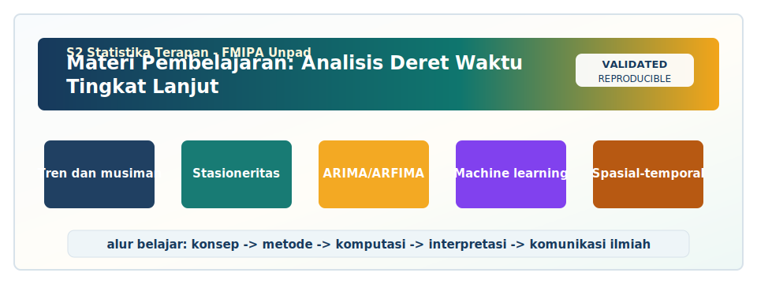

<!-- BEGIN UNPAD MATERIAL STYLE -->
<style>
:root {
  --unpad-navy: #17395c;
  --unpad-gold: #f2a51a;
  --unpad-teal: #0f766e;
  --unpad-ink: #172033;
  --unpad-paper: #fffdf8;
  --unpad-soft: #eef5f8;
  --unpad-line: #d7e2ea;
}
html, body {
  background: linear-gradient(135deg, #f8fbfd 0%, #fffdf8 48%, #f3f6ee 100%) !important;
  color: var(--unpad-ink) !important;
}
body {
  font-family: "Segoe UI", Arial, sans-serif !important;
  line-height: 1.72 !important;
}
.main-container {
  max-width: 1180px !important;
  background: rgba(255, 253, 248, 0.98) !important;
  border: 1px solid var(--unpad-line) !important;
  border-radius: 8px !important;
  box-shadow: 0 18px 42px rgba(23, 57, 92, 0.12) !important;
}
h1, h2, h3, h4 {
  letter-spacing: 0 !important;
}
h1.title {
  color: var(--unpad-navy) !important;
  -webkit-text-fill-color: var(--unpad-navy) !important;
  background: none !important;
}
h2 {
  border-left-color: var(--unpad-gold) !important;
}
a {
  color: #0b5c86 !important;
}
pre, code {
  border-radius: 8px !important;
}
.unpad-cover {
  margin: 18px 0 26px;
  padding: 24px;
  border-radius: 8px;
  background: linear-gradient(135deg, #17395c 0%, #0f766e 58%, #f2a51a 100%);
  color: #ffffff;
  box-shadow: 0 18px 36px rgba(23, 57, 92, 0.22);
}
.unpad-cover__brand {
  display: grid;
  grid-template-columns: 92px 1fr;
  gap: 20px;
  align-items: center;
}
.unpad-cover img {
  width: 92px;
  height: 92px;
  object-fit: contain;
  background: #ffffff;
  border-radius: 8px;
  padding: 8px;
  box-shadow: 0 8px 22px rgba(0,0,0,0.18);
}
.unpad-kicker {
  text-transform: uppercase;
  font-size: 0.82rem;
  font-weight: 800;
  letter-spacing: 0;
  color: #fff8dc;
}
.unpad-cover h2 {
  margin: 6px 0 8px;
  padding: 0;
  border: 0;
  background: transparent;
  color: #ffffff !important;
  font-size: 1.65rem;
}
.unpad-meta {
  margin: 0;
  color: #f7fbff;
  font-weight: 600;
}
.materi-illustration {
  margin: 20px 0 24px;
  padding: 14px;
  background: #ffffff;
  border: 1px solid var(--unpad-line);
  border-radius: 8px;
  box-shadow: 0 12px 28px rgba(23, 57, 92, 0.10);
}
.materi-illustration img {
  width: 100%;
  height: auto;
  display: block;
  border-radius: 6px;
}
.validasi-akademik {
  margin: 18px 0 28px;
  padding: 16px 18px;
  background: linear-gradient(135deg, #eef8f6, #fff8e7);
  border-left: 8px solid var(--unpad-teal);
  border-radius: 8px;
  color: var(--unpad-ink);
}
.validasi-akademik strong {
  color: var(--unpad-navy);
}
table {
  border-radius: 8px !important;
}
@media (max-width: 760px) {
  .unpad-cover__brand {
    grid-template-columns: 1fr;
  }
  .unpad-cover img {
    width: 76px;
    height: 76px;
  }
}
</style>
<!-- END UNPAD MATERIAL STYLE -->


<!-- BEGIN UNPAD MATERIAL ENHANCEMENT -->

```{r setup-unpad-render, include=FALSE}
execute_code <- FALSE
knitr::opts_chunk$set(
  echo = TRUE,
  eval = FALSE,
  message = FALSE,
  warning = FALSE,
  fig.align = "center",
  fig.width = 8,
  fig.height = 4.8,
  dpi = 120
)
set.seed(2025)
```


<div class="unpad-cover">
<div class="unpad-cover__brand">

<div>
<div class="unpad-kicker">S2 Statistika Terapan | FMIPA Universitas Padjadjaran</div>
<h2>Materi Pembelajaran: Analisis Deret Waktu Tingkat Lanjut</h2>
<p class="unpad-meta">Program Studi S2 Statistika Terapan, FMIPA Universitas Padjadjaran<br>Penulis: Dr. Gumgum Darmawan, M.Si | Januari 2025</p>
</div>
</div>
</div>

<div class="materi-illustration">

</div>

<div class="validasi-akademik">
<strong>Catatan validasi akademik.</strong> Materi ini diseragamkan dengan rujukan ADWTL Januari 2025: rumus dibaca bersama asumsi, contoh kode diposisikan sebagai template reproducible, dan interpretasi diarahkan pada validitas data, diagnosis model, evaluasi ketidakpastian, serta komunikasi hasil secara ilmiah.
</div>

<!-- END UNPAD MATERIAL ENHANCEMENT -->

<style>
body{font-family:'Segoe UI',Arial,sans-serif;background:linear-gradient(135deg,#fff8ef 0%,#f7ead5 38%,#e8c996 70%,#c88945 100%);color:#2b1608;font-size:17px;line-height:1.72}.main-container{max-width:1180px!important;background:rgba(255,252,245,.96);border-radius:22px;padding:34px 46px 54px;box-shadow:0 18px 46px rgba(90,48,15,.22);border:1px solid rgba(137,90,43,.25)}h1.title{font-weight:800;color:#4b2308}h1,h2,h3,h4{color:#5f2f0a;font-weight:800}h2{margin-top:48px;padding:12px 18px;border-radius:16px;background:linear-gradient(90deg,#f6d7a6,#fff3dd);border-left:9px solid #9b5f1d}.tocify{background:#fff5e6!important;border:1px solid #c58a3a!important;border-radius:18px!important;box-shadow:0 10px 30px rgba(92,48,10,.17)}.tocify .active{background:linear-gradient(90deg,#9b5f1d,#c88945)!important;color:white!important;border-radius:10px}pre,code{background-color:#f5dfbf!important;color:#17100b!important;border-radius:12px}pre{border:1px solid #c98d45;padding:16px!important}th{background:#8a4f16!important;color:white!important}.callout,.rumus-box,.contoh-box,.praktik-box,.warning-box,.rps-box{border-radius:18px;padding:20px 24px;margin:22px 0;box-shadow:0 8px 22px rgba(99,57,14,.12)}.rumus-box{background:#fff1d6;color:#16100a;border:2px solid #d39a51}.contoh-box{background:#fff8eb;border-left:9px solid #bf6f23}.praktik-box{background:#f7e5c8;border-left:9px solid #8e5c27}.warning-box{background:#ffe3c0;border-left:9px solid #a24f12}.rps-box{background:linear-gradient(135deg,#fff7ea,#f1c98d);border:1px solid #b97a2c}.badge{display:inline-block;padding:4px 10px;border-radius:999px;background:#8b4d13;color:#fff;font-weight:700;font-size:.85em}
</style>

```{r setup, include=FALSE, eval=FALSE}
knitr::opts_chunk$set(echo=TRUE,message=FALSE,warning=FALSE,fig.align="center",fig.width=8,fig.height=4.8,dpi=120)
set.seed(2025)
```

<div class="rps-box">
<strong>Identitas Materi</strong><br>
Mata kuliah: <strong>Analisis Deret Waktu Tingkat Lanjut</strong><br>
Program Studi: <strong>S2 Statistika Terapan, FMIPA Universitas Padjadjaran</strong><br>
Author: <strong>Dr. Gumgum Darmawan, M.Si</strong><br>
Dosen Pengampu: <strong>Dr. Gumgum Darmawan, M.Si</strong> dan <strong>Prof. Dr. Budi Nurani Ruchjana, M.S</strong><br>
Tahun pembuatan materi: <strong>Januari 2025</strong><br>
Format: <strong>R Markdown output HTML dengan daftar isi dinamis di sisi kiri</strong>
</div>

# Prakata

Materi ini disusun sebagai e-book pembelajaran untuk mata kuliah **Analisis Deret Waktu Tingkat Lanjut** pada Program Studi **S2 Statistika Terapan FMIPA Universitas Padjadjaran**. Struktur materi mengikuti arah capaian pembelajaran, bahan kajian, metode pembelajaran, dan bentuk penilaian dalam RPS. Fokus utama materi adalah membangun kemampuan mahasiswa untuk menganalisis pola deret waktu secara kritis, mengevaluasi model klasik dan lanjutan, merancang pengumpulan data deret waktu, mengimplementasikan model machine learning dan neural network, serta mengembangkan solusi multivariat dan spasial-temporal yang dapat dipresentasikan secara ilmiah.

Materi disajikan dengan pendekatan bertahap: dari konsep dasar deret waktu, stasioneritas, dekomposisi, long memory, ARIMA, ARFIMA, SSA, analisis spektral, rancangan data, machine learning, neural network, VAR, transfer function, hingga GSTAR. Rangkaian ini selaras dengan pustaka utama dan pendukung yang lazim digunakan dalam pembelajaran deret waktu tingkat lanjut, terutama Hamilton (1994), Shumway dan Stoffer (2017), Golyandina dan Zhigljavsky (2013), serta Hyndman dan Athanasopoulos (2021). Dalam beberapa bagian, materi juga memperluas pembahasan menggunakan referensi klasik dan modern seperti Box et al. (2015), Brockwell dan Davis (2016), Lütkepohl (2005), Breiman (2001), Chen dan Guestrin (2016), Hochreiter dan Schmidhuber (1997), serta Borovkova, Lopuhaä, dan Ruchjana (2008).

<div class="callout"><strong>Cara membaca materi.</strong> Gunakan daftar isi di sebelah kiri untuk berpindah antarpertemuan. Bagian teori membantu memahami ide statistik; bagian rumus menekankan formulasi matematis; bagian praktik R memberi contoh implementasi; bagian diskusi dan tugas mengarahkan mahasiswa menuju mini riset, e-book, dashboard, atau laporan ilmiah.</div>

# Orientasi Mata Kuliah Berdasarkan RPS

## Profil Singkat Mata Kuliah

Mata kuliah ini membahas konsep, metode, dan aplikasi pemodelan data deret waktu tingkat lanjut. Topik utama mencakup identifikasi pola dan karakteristik data deret waktu, model long memory, Singular Spectrum Analysis, analisis spektral, model VAR, transfer function, serta pemodelan berbasis machine learning dan neural network. Pembelajaran diarahkan agar mahasiswa mampu mengintegrasikan berbagai pendekatan inovatif dalam pemodelan dan peramalan deret waktu pada bidang bisnis industri, sosial, aktuaria, biostatistik, sains data, dan masalah interdisipliner lain.

## Capaian Pembelajaran Mata Kuliah

| Kode | Rumusan CPMK |
|---|---|
| CPMK1 | Mahasiswa mampu menganalisis karakteristik dan pola data deret waktu secara kritis. |
| CPMK2 | Mahasiswa mampu mengevaluasi keunggulan dan keterbatasan model-model deret waktu klasik dan lanjutan. |
| CPMK3 | Mahasiswa mampu merancang metode pengumpulan dan pengelolaan data deret waktu yang efisien. |
| CPMK4 | Mahasiswa mampu mengembangkan model machine learning dan neural network untuk pemodelan deret waktu. |
| CPMK5 | Mahasiswa mampu menciptakan solusi inovatif berbasis model multivariat dan spasial-temporal serta mempresentasikan hasilnya. |

## Peta Pertemuan

| Pertemuan | Fokus Materi | SubCPMK |
|---:|---|---|
| 1--4 | Komponen, tren, musiman, siklus, stasioneritas, dekomposisi, long memory | SubCPMK1 |
| 5--7 | ARIMA, ARFIMA, SSA, analisis spektral, evaluasi efektivitas model | SubCPMK2 |
| 8 | Sampling, agregasi, integrasi spasial-temporal | SubCPMK3 |
| 9 | UTS berbasis analisis kasus | Integrasi SubCPMK1--3 |
| 10--12 | Random Forest, XGBoost, MLP/LSTM, evaluasi model ML/NN | SubCPMK4 |
| 13--16 | VAR, Transfer Function, GSTAR, presentasi dan laporan akhir | SubCPMK5 |


# Pertemuan 1. Pengantar Data Deret Waktu Tingkat Lanjut

<span class="badge">SubCPMK1</span> <span class="badge">C4 Analyzing</span>

<div class="rps-box"><strong>Fokus pertemuan.</strong> Materi ini membahas pengantar data deret waktu, karakteristik temporal, indeks waktu, frekuensi observasi, dan perbedaan data cross-section, panel, dan time series. Model, konsep, atau perangkat utama yang dibahas meliputi: komponen tren; komponen musiman; komponen siklus; noise/irregular component. Rujukan utama: Hamilton (1994), Shumway dan Stoffer (2017), Brockwell dan Davis (2016), Hyndman dan Athanasopoulos (2021).</div>

## Tujuan Pembelajaran

Setelah mempelajari bagian ini, mahasiswa diharapkan mampu menjelaskan konsep utama pengantar data deret waktu tingkat lanjut secara sistematis, menghubungkan konsep tersebut dengan kebutuhan analisis data nyata, memilih langkah eksplorasi dan pemodelan yang sesuai, menginterpretasikan hasil dengan bahasa statistik dan bahasa substantif, serta menyusun catatan praktikum atau laporan ringkas yang reproducible.

## Narasi Konseptual

Deret waktu berbeda dari data cross-section karena informasi utama tidak hanya berada pada nilai observasi, tetapi juga pada posisi observasi dalam urutan waktu. Dua dataset dengan nilai yang sama dapat menghasilkan kesimpulan berbeda jika urutannya berbeda. Oleh karena itu, pengurutan waktu adalah bagian dari data, bukan sekadar label administratif.

Frekuensi observasi menentukan jenis pola yang dapat dilihat. Data harian dapat memperlihatkan pola mingguan, hari libur, atau anomali jangka pendek; data bulanan dapat memperlihatkan musiman tahunan; data tahunan lebih cocok untuk membaca tren jangka panjang. Kesalahan memilih frekuensi dapat menyembunyikan pola penting atau menciptakan pola palsu.

Pada tahap eksplorasi, visualisasi garis adalah alat pertama, tetapi bukan alat terakhir. Plot deret waktu perlu dilengkapi dengan plot musiman, plot subseries, plot ACF/PACF, ringkasan per periode, dan pemeriksaan outlier. Tujuannya adalah membangun hipotesis awal tentang struktur data.

Deret waktu tingkat lanjut menuntut mahasiswa untuk tidak hanya melihat data sebagai kumpulan angka berurutan, tetapi sebagai realisasi dari proses stokastik yang memiliki memori, struktur dependensi, dan konteks substantif. Pada topik Pengantar Data Deret Waktu Tingkat Lanjut, perhatian utama diberikan pada pengantar data deret waktu, karakteristik temporal, indeks waktu, frekuensi observasi, dan perbedaan data cross-section, panel, dan time series. Pemahaman ini penting karena keputusan metodologis pada tahap awal akan menentukan kualitas model, validitas inferensi, serta kredibilitas rekomendasi yang dihasilkan.

Dalam praktik statistik terapan, kesalahan paling umum bukan hanya salah memilih model, melainkan salah membaca sifat data sebelum model dipilih. Data yang tampak sederhana dapat mengandung tren deterministik, tren stokastik, musiman kompleks, outlier, perubahan rezim, atau hubungan antarwilayah. Karena itu, materi Pengantar Data Deret Waktu Tingkat Lanjut ditempatkan sebagai bagian dari SubCPMK1, yaitu kemampuan untuk mengurai struktur data sebelum melakukan estimasi atau forecasting.

Referensi utama untuk topik ini mencakup Hamilton (1994), Shumway dan Stoffer (2017), Brockwell dan Davis (2016), Hyndman dan Athanasopoulos (2021). Literatur tersebut menekankan bahwa pemodelan deret waktu harus selalu dibaca sebagai rangkaian kerja: eksplorasi, formulasi asumsi, estimasi, diagnosis, validasi, dan interpretasi. Setiap langkah perlu terdokumentasi karena model yang baik bukan hanya model dengan galat prediksi kecil, tetapi model yang dapat dipertanggungjawabkan secara ilmiah.

Secara konseptual, Pengantar Data Deret Waktu Tingkat Lanjut mengajarkan bahwa urutan waktu membawa informasi yang tidak boleh diperlakukan sama seperti observasi independen. Ketika observasi pada waktu ke-t berkaitan dengan observasi sebelumnya, maka asumsi independensi yang sering digunakan pada regresi klasik tidak lagi memadai. Autokorelasi, dependensi musiman, serta efek lag harus dimasukkan ke dalam cara berpikir analitis.

Mahasiswa perlu membedakan antara pola yang bersifat sinyal dan pola yang hanya merupakan fluktuasi acak. Sinyal dapat berupa perubahan jangka panjang, pola berulang, efek kalender, respon terhadap intervensi, atau hubungan antarvariabel. Noise adalah bagian yang tidak dapat dijelaskan oleh struktur yang dipilih. Namun, noise dalam deret waktu tetap harus diperiksa karena residual yang masih berautokorelasi menunjukkan bahwa model belum menangkap informasi temporal secara lengkap.

Dalam konteks S2 Statistika Terapan, pembahasan Pengantar Data Deret Waktu Tingkat Lanjut harus dikaitkan dengan kebutuhan aplikasi nyata. Misalnya, data penjualan bulanan, inflasi bulanan, atau jumlah kasus penyakit mingguan tidak cukup dianalisis hanya dengan grafik garis. Mahasiswa harus mampu menjelaskan apakah perubahan yang tampak merupakan tren, musiman, siklus, perubahan level, atau akibat kualitas data. Di titik inilah statistik terapan bekerja sebagai jembatan antara teori probabilitas dan keputusan empiris.

Aspek evaluasi dalam topik ini tidak dapat dipisahkan dari tujuan analisis. Jika tujuan utama adalah penjelasan, maka interpretasi parameter dan asumsi model menjadi pusat perhatian. Jika tujuan utama adalah prediksi, maka validasi out-of-sample, stabilitas performa, dan ketahanan model terhadap data baru menjadi sangat penting. Jika tujuan utama adalah kebijakan, maka model harus mampu memberikan narasi sebab-akibat secara hati-hati dan tidak berlebihan.

Satu prinsip praktis yang perlu diingat adalah bahwa model deret waktu selalu berada dalam ketegangan antara kesederhanaan dan fleksibilitas. Model sederhana lebih mudah dijelaskan tetapi dapat gagal menangkap pola kompleks. Model kompleks dapat memberikan akurasi lebih baik tetapi berisiko overfitting dan sulit diinterpretasikan. Pada Pengantar Data Deret Waktu Tingkat Lanjut, mahasiswa dilatih untuk menimbang kedua sisi tersebut secara eksplisit.

Rumus pada bagian ini tidak dimaksudkan sebagai simbol yang berdiri sendiri. Setiap notasi harus dikaitkan dengan makna statistiknya. Indeks waktu t menunjukkan urutan observasi; operator backshift B menyatakan perpindahan ke masa lalu; parameter mengukur kekuatan dependensi; dan residual menggambarkan bagian data yang belum dijelaskan oleh model. Interpretasi seperti ini membuat rumus menjadi alat berpikir, bukan sekadar ornamen matematis yang membuat rumus tampak formal tanpa makna substantif.

Dalam pembelajaran lanjutan, mahasiswa sebaiknya membiasakan diri membaca rumus dari kiri ke kanan dan dari asumsi ke konsekuensi. Jika model menyatakan bahwa nilai saat ini dipengaruhi oleh nilai masa lalu, maka pertanyaan lanjutannya adalah: berapa lag yang relevan, apakah pengaruhnya positif atau negatif, apakah stabil sepanjang waktu, dan apakah residualnya sudah menyerupai white noise.

Estimasi parameter dalam deret waktu sering dilakukan menggunakan maximum likelihood, conditional least squares, atau pendekatan numerik lain. Akan tetapi, hasil estimasi tidak boleh diterima begitu saja. Standard error, interval kepercayaan, diagnostik residual, serta perbandingan model harus digunakan untuk menilai apakah model stabil, masuk akal, dan layak dipakai untuk prediksi atau interpretasi.

Praktikum R pada bagian ini dirancang sebagai pintu masuk. Mahasiswa dianjurkan mengganti data simulasi dengan data nyata, misalnya penjualan bulanan, inflasi bulanan, atau jumlah kasus penyakit mingguan. Pada tahap laporan, kode harus disertai penjelasan mengapa metode tersebut dipilih, bukan hanya menampilkan output. Output R yang panjang tidak otomatis menunjukkan analisis yang mendalam; fokus utama tetap pada interpretasi, diagnostik, dan kesesuaian metode.

Prinsip reproducibility harus dijaga sejak awal. Setiap script perlu memuat informasi sumber data, langkah pembersihan data, transformasi, pembentukan objek time series, pemilihan model, evaluasi, dan visualisasi. Dengan cara ini, analisis dapat dijalankan ulang oleh dosen, rekan kelompok, atau pembaca laporan tanpa menebak-nebak proses yang dilakukan.

Ketika menggunakan paket R tambahan, mahasiswa harus menuliskan nama paket, fungsi utama, dan argumen penting yang digunakan. Kesalahan kecil seperti frekuensi time series yang tidak tepat, urutan tanggal yang tidak rapi, atau pembagian data latih-uji yang acak dapat merusak seluruh hasil peramalan. Dalam deret waktu, pembagian data harus mengikuti urutan temporal dan tidak dilakukan secara acak tanpa alasan metodologis.

Evaluasi model harus dilakukan dengan cara yang sesuai dengan struktur temporal. Pembagian data latih dan data uji sebaiknya menghormati urutan waktu. Untuk forecasting, validasi bergulir atau walk-forward validation lebih sesuai dibanding pembagian acak karena pembagian acak dapat menyebabkan informasi masa depan masuk ke proses pelatihan.

Metrik seperti RMSE, MAE, dan MAPE memiliki makna berbeda. RMSE lebih sensitif terhadap galat besar, MAE lebih mudah ditafsirkan dalam satuan asli data, sedangkan MAPE memudahkan interpretasi persentase tetapi bermasalah ketika nilai aktual mendekati nol. Karena itu, laporan yang baik tidak hanya menyebutkan metrik, tetapi menjelaskan alasan pemilihan metrik.

Diagnosis residual merupakan bagian wajib. Residual yang baik untuk model prediktif klasik seharusnya tidak lagi menunjukkan pola sistematis. Jika ACF residual masih signifikan, terdapat indikasi bahwa informasi temporal belum tertangkap. Jika residual menunjukkan heteroskedastisitas atau outlier ekstrem, model mungkin perlu diperluas atau data perlu ditinjau kembali.

Pemilihan model terbaik tidak boleh hanya didasarkan pada satu angka. Model dengan RMSE terkecil dapat saja kurang stabil, sulit dijelaskan, atau tidak sesuai dengan tujuan substantif. Mahasiswa perlu menggabungkan bukti dari akurasi, teori, interpretabilitas, diagnostik, dan kemudahan implementasi.

Tugas yang relevan untuk topik ini adalah memilih satu dataset nyata, menjelaskan konteks data, melakukan eksplorasi, menerapkan metode yang sesuai, mengevaluasi hasil, lalu menulis interpretasi yang dapat dibaca oleh pengguna non-statistik. Laporan sebaiknya memuat pendahuluan, deskripsi data, metode, hasil, diagnostik, evaluasi, kesimpulan, dan lampiran kode.

Diskusi kelas dapat diarahkan pada pertanyaan: apakah pola yang ditemukan stabil sepanjang waktu, apakah ada periode anomali, apakah model menangkap struktur utama data, dan bagaimana hasil analisis dapat diterjemahkan menjadi keputusan. Mahasiswa diharapkan tidak hanya menjawab 'model A lebih baik', tetapi menjelaskan kapan, mengapa, dan dalam kondisi apa model tersebut lebih baik.

Untuk mini quiz, mahasiswa dapat diminta menginterpretasikan plot ACF/PACF, memilih transformasi yang tepat, menjelaskan konsekuensi non-stasioneritas, atau menilai apakah desain validasi sudah benar. Pertanyaan seperti ini menilai pemahaman konseptual, bukan hafalan rumus semata.

## Rumus Utama dan Ide Matematis

<div class="rumus-box">
\[Y_t = T_t + S_t + C_t + I_t, \qquad t=1,2,\ldots,n\]
</div>

Rumus di atas harus dibaca sebagai representasi ringkas dari struktur yang diasumsikan oleh model atau metode. Dalam laporan ilmiah, mahasiswa perlu menjelaskan makna setiap komponen rumus: apa arti indeks waktu, apa arti operator lag, apa arti residual, dan asumsi apa yang melekat pada residual tersebut.

## Alur Analisis yang Disarankan

1. **Pahami konteks data.** Jelaskan sumber data, frekuensi, satuan, periode pengamatan, dan tujuan analisis.
2. **Lakukan visualisasi awal.** Plot deret waktu, plot musiman bila relevan, plot ACF/PACF, dan ringkasan statistik.
3. **Periksa asumsi utama.** Cek stasioneritas, pola musiman, outlier, missing value, dan kemungkinan perubahan struktur.
4. **Terapkan metode.** Gunakan model atau metode yang sesuai dengan karakteristik data.
5. **Evaluasi hasil.** Gunakan metrik akurasi, diagnostik residual, dan interpretasi substantif.
6. **Tulis kesimpulan.** Kesimpulan harus menyebutkan temuan utama, keterbatasan, dan rekomendasi analisis lanjutan.

## Contoh Praktikum R

<div class="praktik-box">Kode berikut adalah contoh awal. Untuk tugas kuliah, mahasiswa harus menggunakan data nyata dan menuliskan interpretasi hasilnya secara lengkap.</div>

```{r ilustrasi-komponen-deret-waktu, eval=FALSE}
n <- 144
t <- 1:n
trend <- 0.05 * t
seasonal <- 2 * sin(2*pi*t/12)
cycle <- 1.2 * sin(2*pi*t/48)
noise <- rnorm(n, 0, 0.8)
y <- 20 + trend + seasonal + cycle + noise
plot(t, y, type = "l", lwd = 2, xlab = "Waktu", ylab = "Nilai", main = "Ilustrasi Deret Waktu")
lines(t, 20 + trend, lwd = 2, lty = 2)
legend("topleft", legend = c("Data", "Tren"), lty = c(1,2), lwd = 2, bty = "n")
```

## Aplikasi Nyata

Topik ini relevan untuk berbagai data nyata, misalnya penjualan bulanan, inflasi bulanan, dan jumlah kasus penyakit mingguan. Pada setiap aplikasi, mahasiswa harus memeriksa apakah pola temporal bersifat stabil, apakah ada perubahan definisi data, dan apakah horizon prediksi sesuai dengan kebutuhan pengguna. Sebagai contoh, model untuk prediksi harian mungkin tidak otomatis cocok untuk prediksi bulanan karena struktur noise, musiman, dan agregasinya berbeda.

## Pertanyaan Diskusi Kelas

1. Pola temporal apa yang paling dominan pada contoh data yang Anda pilih?
2. Apakah metode dalam pertemuan ini cukup untuk menjelaskan pola tersebut?
3. Bagaimana cara Anda membuktikan bahwa model sudah menangkap struktur utama data?
4. Apa risiko interpretasi yang muncul jika asumsi model tidak diperiksa?
5. Bagaimana Anda menjelaskan hasil model kepada pengguna non-statistik?

## Mini Quiz dan Tugas Ringkas

1. Jelaskan dengan kata-kata sendiri konsep utama pada Pengantar Data Deret Waktu Tingkat Lanjut.
2. Sebutkan dua asumsi atau keputusan metodologis yang perlu diperiksa.
3. Berikan satu contoh data nyata yang cocok dianalisis menggunakan pendekatan ini.
4. Apa perbedaan antara akurasi prediksi dan validitas interpretasi?
5. Mengapa validasi temporal lebih sesuai dibanding validasi acak pada forecasting?

Pilih satu dataset nyata yang berkaitan dengan penjualan bulanan atau inflasi bulanan. Lakukan eksplorasi, terapkan metode pada bagian ini, kemudian susun laporan 4--6 halaman yang memuat deskripsi data, metode, hasil, evaluasi, interpretasi, dan kesimpulan. Lampirkan script R yang dapat dijalankan ulang. Laporan harus memuat minimal tiga sitasi ilmiah yang relevan.

<div class="warning-box"><strong>Kesalahan yang perlu dihindari:</strong> mengacak urutan data saat membagi train-test, menggunakan fitur masa depan untuk memprediksi masa kini, menyimpulkan kausalitas hanya dari akurasi prediksi, mengabaikan residual diagnostic, dan memilih model hanya karena terlihat canggih.</div>


# Pertemuan 2. Stasioneritas, Transformasi, dan Struktur Autokorelasi

<span class="badge">SubCPMK1</span> <span class="badge">C4 Analyzing</span>

<div class="rps-box"><strong>Fokus pertemuan.</strong> Materi ini membahas stasioneritas lemah, stasioneritas kuat, transformasi Box-Cox, differencing, ACF, PACF, dan uji unit root. Model, konsep, atau perangkat utama yang dibahas meliputi: ADF test; KPSS test; differencing; transformasi log dan Box-Cox. Rujukan utama: Dickey dan Fuller (1979), Kwiatkowski et al. (1992), Box et al. (2015), Shumway dan Stoffer (2017).</div>

## Tujuan Pembelajaran

Setelah mempelajari bagian ini, mahasiswa diharapkan mampu menjelaskan konsep utama stasioneritas, transformasi, dan struktur autokorelasi secara sistematis, menghubungkan konsep tersebut dengan kebutuhan analisis data nyata, memilih langkah eksplorasi dan pemodelan yang sesuai, menginterpretasikan hasil dengan bahasa statistik dan bahasa substantif, serta menyusun catatan praktikum atau laporan ringkas yang reproducible.

## Narasi Konseptual

Stasioneritas adalah fondasi banyak model deret waktu klasik. Secara intuitif, deret stasioner memiliki perilaku probabilistik yang relatif stabil sepanjang waktu. Rata-rata, varians, dan kovarians tidak bergeser secara sistematis. Tanpa stasioneritas, parameter model dapat merekam perubahan level data, bukan struktur dependensi yang sebenarnya.

Non-stasioneritas dapat muncul dalam bentuk tren deterministik, unit root, perubahan varians, atau perubahan musiman. Masing-masing memerlukan perlakuan berbeda. Differencing dapat membantu pada unit root, detrending dapat membantu pada tren deterministik, transformasi log dapat menstabilkan varians, dan seasonal differencing dapat menangani pola musiman stokastik.

Deret waktu tingkat lanjut menuntut mahasiswa untuk tidak hanya melihat data sebagai kumpulan angka berurutan, tetapi sebagai realisasi dari proses stokastik yang memiliki memori, struktur dependensi, dan konteks substantif. Pada topik Stasioneritas, Transformasi, dan Struktur Autokorelasi, perhatian utama diberikan pada stasioneritas lemah, stasioneritas kuat, transformasi Box-Cox, differencing, ACF, PACF, dan uji unit root. Pemahaman ini penting karena keputusan metodologis pada tahap awal akan menentukan kualitas model, validitas inferensi, serta kredibilitas rekomendasi yang dihasilkan.

Dalam praktik statistik terapan, kesalahan paling umum bukan hanya salah memilih model, melainkan salah membaca sifat data sebelum model dipilih. Data yang tampak sederhana dapat mengandung tren deterministik, tren stokastik, musiman kompleks, outlier, perubahan rezim, atau hubungan antarwilayah. Karena itu, materi Stasioneritas, Transformasi, dan Struktur Autokorelasi ditempatkan sebagai bagian dari SubCPMK1, yaitu kemampuan untuk mengurai struktur data sebelum melakukan estimasi atau forecasting.

Referensi utama untuk topik ini mencakup Dickey dan Fuller (1979), Kwiatkowski et al. (1992), Box et al. (2015), Shumway dan Stoffer (2017). Literatur tersebut menekankan bahwa pemodelan deret waktu harus selalu dibaca sebagai rangkaian kerja: eksplorasi, formulasi asumsi, estimasi, diagnosis, validasi, dan interpretasi. Setiap langkah perlu terdokumentasi karena model yang baik bukan hanya model dengan galat prediksi kecil, tetapi model yang dapat dipertanggungjawabkan secara ilmiah.

Secara konseptual, Stasioneritas, Transformasi, dan Struktur Autokorelasi mengajarkan bahwa urutan waktu membawa informasi yang tidak boleh diperlakukan sama seperti observasi independen. Ketika observasi pada waktu ke-t berkaitan dengan observasi sebelumnya, maka asumsi independensi yang sering digunakan pada regresi klasik tidak lagi memadai. Autokorelasi, dependensi musiman, serta efek lag harus dimasukkan ke dalam cara berpikir analitis.

Mahasiswa perlu membedakan antara pola yang bersifat sinyal dan pola yang hanya merupakan fluktuasi acak. Sinyal dapat berupa perubahan jangka panjang, pola berulang, efek kalender, respon terhadap intervensi, atau hubungan antarvariabel. Noise adalah bagian yang tidak dapat dijelaskan oleh struktur yang dipilih. Namun, noise dalam deret waktu tetap harus diperiksa karena residual yang masih berautokorelasi menunjukkan bahwa model belum menangkap informasi temporal secara lengkap.

Dalam konteks S2 Statistika Terapan, pembahasan Stasioneritas, Transformasi, dan Struktur Autokorelasi harus dikaitkan dengan kebutuhan aplikasi nyata. Misalnya, data harga saham harian, nilai tukar, atau beban listrik tidak cukup dianalisis hanya dengan grafik garis. Mahasiswa harus mampu menjelaskan apakah perubahan yang tampak merupakan tren, musiman, siklus, perubahan level, atau akibat kualitas data. Di titik inilah statistik terapan bekerja sebagai jembatan antara teori probabilitas dan keputusan empiris.

Aspek evaluasi dalam topik ini tidak dapat dipisahkan dari tujuan analisis. Jika tujuan utama adalah penjelasan, maka interpretasi parameter dan asumsi model menjadi pusat perhatian. Jika tujuan utama adalah prediksi, maka validasi out-of-sample, stabilitas performa, dan ketahanan model terhadap data baru menjadi sangat penting. Jika tujuan utama adalah kebijakan, maka model harus mampu memberikan narasi sebab-akibat secara hati-hati dan tidak berlebihan.

Satu prinsip praktis yang perlu diingat adalah bahwa model deret waktu selalu berada dalam ketegangan antara kesederhanaan dan fleksibilitas. Model sederhana lebih mudah dijelaskan tetapi dapat gagal menangkap pola kompleks. Model kompleks dapat memberikan akurasi lebih baik tetapi berisiko overfitting dan sulit diinterpretasikan. Pada Stasioneritas, Transformasi, dan Struktur Autokorelasi, mahasiswa dilatih untuk menimbang kedua sisi tersebut secara eksplisit.

Rumus pada bagian ini tidak dimaksudkan sebagai simbol yang berdiri sendiri. Setiap notasi harus dikaitkan dengan makna statistiknya. Indeks waktu t menunjukkan urutan observasi; operator backshift B menyatakan perpindahan ke masa lalu; parameter mengukur kekuatan dependensi; dan residual menggambarkan bagian data yang belum dijelaskan oleh model. Interpretasi seperti ini membuat rumus menjadi alat berpikir, bukan sekadar ornamen matematis yang membuat rumus tampak formal tanpa makna substantif.

Dalam pembelajaran lanjutan, mahasiswa sebaiknya membiasakan diri membaca rumus dari kiri ke kanan dan dari asumsi ke konsekuensi. Jika model menyatakan bahwa nilai saat ini dipengaruhi oleh nilai masa lalu, maka pertanyaan lanjutannya adalah: berapa lag yang relevan, apakah pengaruhnya positif atau negatif, apakah stabil sepanjang waktu, dan apakah residualnya sudah menyerupai white noise.

Estimasi parameter dalam deret waktu sering dilakukan menggunakan maximum likelihood, conditional least squares, atau pendekatan numerik lain. Akan tetapi, hasil estimasi tidak boleh diterima begitu saja. Standard error, interval kepercayaan, diagnostik residual, serta perbandingan model harus digunakan untuk menilai apakah model stabil, masuk akal, dan layak dipakai untuk prediksi atau interpretasi.

Praktikum R pada bagian ini dirancang sebagai pintu masuk. Mahasiswa dianjurkan mengganti data simulasi dengan data nyata, misalnya harga saham harian, nilai tukar, atau beban listrik. Pada tahap laporan, kode harus disertai penjelasan mengapa metode tersebut dipilih, bukan hanya menampilkan output. Output R yang panjang tidak otomatis menunjukkan analisis yang mendalam; fokus utama tetap pada interpretasi, diagnostik, dan kesesuaian metode.

Prinsip reproducibility harus dijaga sejak awal. Setiap script perlu memuat informasi sumber data, langkah pembersihan data, transformasi, pembentukan objek time series, pemilihan model, evaluasi, dan visualisasi. Dengan cara ini, analisis dapat dijalankan ulang oleh dosen, rekan kelompok, atau pembaca laporan tanpa menebak-nebak proses yang dilakukan.

Ketika menggunakan paket R tambahan, mahasiswa harus menuliskan nama paket, fungsi utama, dan argumen penting yang digunakan. Kesalahan kecil seperti frekuensi time series yang tidak tepat, urutan tanggal yang tidak rapi, atau pembagian data latih-uji yang acak dapat merusak seluruh hasil peramalan. Dalam deret waktu, pembagian data harus mengikuti urutan temporal dan tidak dilakukan secara acak tanpa alasan metodologis.

Evaluasi model harus dilakukan dengan cara yang sesuai dengan struktur temporal. Pembagian data latih dan data uji sebaiknya menghormati urutan waktu. Untuk forecasting, validasi bergulir atau walk-forward validation lebih sesuai dibanding pembagian acak karena pembagian acak dapat menyebabkan informasi masa depan masuk ke proses pelatihan.

Metrik seperti RMSE, MAE, dan MAPE memiliki makna berbeda. RMSE lebih sensitif terhadap galat besar, MAE lebih mudah ditafsirkan dalam satuan asli data, sedangkan MAPE memudahkan interpretasi persentase tetapi bermasalah ketika nilai aktual mendekati nol. Karena itu, laporan yang baik tidak hanya menyebutkan metrik, tetapi menjelaskan alasan pemilihan metrik.

Diagnosis residual merupakan bagian wajib. Residual yang baik untuk model prediktif klasik seharusnya tidak lagi menunjukkan pola sistematis. Jika ACF residual masih signifikan, terdapat indikasi bahwa informasi temporal belum tertangkap. Jika residual menunjukkan heteroskedastisitas atau outlier ekstrem, model mungkin perlu diperluas atau data perlu ditinjau kembali.

Pemilihan model terbaik tidak boleh hanya didasarkan pada satu angka. Model dengan RMSE terkecil dapat saja kurang stabil, sulit dijelaskan, atau tidak sesuai dengan tujuan substantif. Mahasiswa perlu menggabungkan bukti dari akurasi, teori, interpretabilitas, diagnostik, dan kemudahan implementasi.

Tugas yang relevan untuk topik ini adalah memilih satu dataset nyata, menjelaskan konteks data, melakukan eksplorasi, menerapkan metode yang sesuai, mengevaluasi hasil, lalu menulis interpretasi yang dapat dibaca oleh pengguna non-statistik. Laporan sebaiknya memuat pendahuluan, deskripsi data, metode, hasil, diagnostik, evaluasi, kesimpulan, dan lampiran kode.

Diskusi kelas dapat diarahkan pada pertanyaan: apakah pola yang ditemukan stabil sepanjang waktu, apakah ada periode anomali, apakah model menangkap struktur utama data, dan bagaimana hasil analisis dapat diterjemahkan menjadi keputusan. Mahasiswa diharapkan tidak hanya menjawab 'model A lebih baik', tetapi menjelaskan kapan, mengapa, dan dalam kondisi apa model tersebut lebih baik.

Untuk mini quiz, mahasiswa dapat diminta menginterpretasikan plot ACF/PACF, memilih transformasi yang tepat, menjelaskan konsekuensi non-stasioneritas, atau menilai apakah desain validasi sudah benar. Pertanyaan seperti ini menilai pemahaman konseptual, bukan hafalan rumus semata.

## Rumus Utama dan Ide Matematis

<div class="rumus-box">
\[E(Y_t)=\mu,\quad Var(Y_t)=\sigma^2,\quad Cov(Y_t,Y_{t-k})=\gamma_k\]
</div>

Rumus di atas harus dibaca sebagai representasi ringkas dari struktur yang diasumsikan oleh model atau metode. Dalam laporan ilmiah, mahasiswa perlu menjelaskan makna setiap komponen rumus: apa arti indeks waktu, apa arti operator lag, apa arti residual, dan asumsi apa yang melekat pada residual tersebut.

## Alur Analisis yang Disarankan

1. **Pahami konteks data.** Jelaskan sumber data, frekuensi, satuan, periode pengamatan, dan tujuan analisis.
2. **Lakukan visualisasi awal.** Plot deret waktu, plot musiman bila relevan, plot ACF/PACF, dan ringkasan statistik.
3. **Periksa asumsi utama.** Cek stasioneritas, pola musiman, outlier, missing value, dan kemungkinan perubahan struktur.
4. **Terapkan metode.** Gunakan model atau metode yang sesuai dengan karakteristik data.
5. **Evaluasi hasil.** Gunakan metrik akurasi, diagnostik residual, dan interpretasi substantif.
6. **Tulis kesimpulan.** Kesimpulan harus menyebutkan temuan utama, keterbatasan, dan rekomendasi analisis lanjutan.

## Contoh Praktikum R

<div class="praktik-box">Kode berikut adalah contoh awal. Untuk tugas kuliah, mahasiswa harus menggunakan data nyata dan menuliskan interpretasi hasilnya secara lengkap.</div>

```{r ilustrasi-stasioneritas, eval=FALSE}
n <- 220
e <- rnorm(n)
random_walk <- cumsum(e)
stationary_ar <- arima.sim(model = list(ar = 0.65), n = n)
par(mfrow = c(1,2))
plot(random_walk, type = "l", lwd = 2, main = "Non-stasioner", xlab = "Waktu", ylab = "Nilai")
plot(stationary_ar, type = "l", lwd = 2, main = "Stasioner AR(1)", xlab = "Waktu", ylab = "Nilai")
par(mfrow = c(1,1))
```

## Aplikasi Nyata

Topik ini relevan untuk berbagai data nyata, misalnya harga saham harian, nilai tukar, dan beban listrik. Pada setiap aplikasi, mahasiswa harus memeriksa apakah pola temporal bersifat stabil, apakah ada perubahan definisi data, dan apakah horizon prediksi sesuai dengan kebutuhan pengguna. Sebagai contoh, model untuk prediksi harian mungkin tidak otomatis cocok untuk prediksi bulanan karena struktur noise, musiman, dan agregasinya berbeda.

## Pertanyaan Diskusi Kelas

1. Pola temporal apa yang paling dominan pada contoh data yang Anda pilih?
2. Apakah metode dalam pertemuan ini cukup untuk menjelaskan pola tersebut?
3. Bagaimana cara Anda membuktikan bahwa model sudah menangkap struktur utama data?
4. Apa risiko interpretasi yang muncul jika asumsi model tidak diperiksa?
5. Bagaimana Anda menjelaskan hasil model kepada pengguna non-statistik?

## Mini Quiz dan Tugas Ringkas

1. Jelaskan dengan kata-kata sendiri konsep utama pada Stasioneritas, Transformasi, dan Struktur Autokorelasi.
2. Sebutkan dua asumsi atau keputusan metodologis yang perlu diperiksa.
3. Berikan satu contoh data nyata yang cocok dianalisis menggunakan pendekatan ini.
4. Apa perbedaan antara akurasi prediksi dan validitas interpretasi?
5. Mengapa validasi temporal lebih sesuai dibanding validasi acak pada forecasting?

Pilih satu dataset nyata yang berkaitan dengan harga saham harian atau nilai tukar. Lakukan eksplorasi, terapkan metode pada bagian ini, kemudian susun laporan 4--6 halaman yang memuat deskripsi data, metode, hasil, evaluasi, interpretasi, dan kesimpulan. Lampirkan script R yang dapat dijalankan ulang. Laporan harus memuat minimal tiga sitasi ilmiah yang relevan.

<div class="warning-box"><strong>Kesalahan yang perlu dihindari:</strong> mengacak urutan data saat membagi train-test, menggunakan fitur masa depan untuk memprediksi masa kini, menyimpulkan kausalitas hanya dari akurasi prediksi, mengabaikan residual diagnostic, dan memilih model hanya karena terlihat canggih.</div>


# Pertemuan 3. Dekomposisi Tren, Musiman, Siklus, dan Noise

<span class="badge">SubCPMK1</span> <span class="badge">C4 Analyzing</span>

<div class="rps-box"><strong>Fokus pertemuan.</strong> Materi ini membahas dekomposisi klasik, STL, model aditif dan multiplikatif, pemilahan sinyal dan noise, serta interpretasi komponen. Model, konsep, atau perangkat utama yang dibahas meliputi: dekomposisi aditif; dekomposisi multiplikatif; STL; moving average smoother. Rujukan utama: Cleveland et al. (1990), Chatfield (2004), Hyndman dan Athanasopoulos (2021).</div>

## Tujuan Pembelajaran

Setelah mempelajari bagian ini, mahasiswa diharapkan mampu menjelaskan konsep utama dekomposisi tren, musiman, siklus, dan noise secara sistematis, menghubungkan konsep tersebut dengan kebutuhan analisis data nyata, memilih langkah eksplorasi dan pemodelan yang sesuai, menginterpretasikan hasil dengan bahasa statistik dan bahasa substantif, serta menyusun catatan praktikum atau laporan ringkas yang reproducible.

## Narasi Konseptual

Dekomposisi membantu memecah deret waktu menjadi bagian yang lebih mudah dipahami. Tren menggambarkan gerakan jangka panjang, musiman menggambarkan pola berulang dengan periode tetap, siklus menggambarkan fluktuasi yang periodenya tidak selalu tetap, dan residual menggambarkan komponen yang tersisa setelah struktur utama dipisahkan.

STL fleksibel karena menggunakan loess smoothing dan mampu menangani musiman yang berubah secara bertahap. Namun, fleksibilitas ini juga berarti pengguna harus memahami pilihan parameter seperti jendela smoothing. Parameter yang terlalu kecil dapat mengikuti noise, sedangkan parameter terlalu besar dapat menghaluskan sinyal penting.

Deret waktu tingkat lanjut menuntut mahasiswa untuk tidak hanya melihat data sebagai kumpulan angka berurutan, tetapi sebagai realisasi dari proses stokastik yang memiliki memori, struktur dependensi, dan konteks substantif. Pada topik Dekomposisi Tren, Musiman, Siklus, dan Noise, perhatian utama diberikan pada dekomposisi klasik, STL, model aditif dan multiplikatif, pemilahan sinyal dan noise, serta interpretasi komponen. Pemahaman ini penting karena keputusan metodologis pada tahap awal akan menentukan kualitas model, validitas inferensi, serta kredibilitas rekomendasi yang dihasilkan.

Dalam praktik statistik terapan, kesalahan paling umum bukan hanya salah memilih model, melainkan salah membaca sifat data sebelum model dipilih. Data yang tampak sederhana dapat mengandung tren deterministik, tren stokastik, musiman kompleks, outlier, perubahan rezim, atau hubungan antarwilayah. Karena itu, materi Dekomposisi Tren, Musiman, Siklus, dan Noise ditempatkan sebagai bagian dari SubCPMK1, yaitu kemampuan untuk mengurai struktur data sebelum melakukan estimasi atau forecasting.

Referensi utama untuk topik ini mencakup Cleveland et al. (1990), Chatfield (2004), Hyndman dan Athanasopoulos (2021). Literatur tersebut menekankan bahwa pemodelan deret waktu harus selalu dibaca sebagai rangkaian kerja: eksplorasi, formulasi asumsi, estimasi, diagnosis, validasi, dan interpretasi. Setiap langkah perlu terdokumentasi karena model yang baik bukan hanya model dengan galat prediksi kecil, tetapi model yang dapat dipertanggungjawabkan secara ilmiah.

Secara konseptual, Dekomposisi Tren, Musiman, Siklus, dan Noise mengajarkan bahwa urutan waktu membawa informasi yang tidak boleh diperlakukan sama seperti observasi independen. Ketika observasi pada waktu ke-t berkaitan dengan observasi sebelumnya, maka asumsi independensi yang sering digunakan pada regresi klasik tidak lagi memadai. Autokorelasi, dependensi musiman, serta efek lag harus dimasukkan ke dalam cara berpikir analitis.

Mahasiswa perlu membedakan antara pola yang bersifat sinyal dan pola yang hanya merupakan fluktuasi acak. Sinyal dapat berupa perubahan jangka panjang, pola berulang, efek kalender, respon terhadap intervensi, atau hubungan antarvariabel. Noise adalah bagian yang tidak dapat dijelaskan oleh struktur yang dipilih. Namun, noise dalam deret waktu tetap harus diperiksa karena residual yang masih berautokorelasi menunjukkan bahwa model belum menangkap informasi temporal secara lengkap.

Dalam konteks S2 Statistika Terapan, pembahasan Dekomposisi Tren, Musiman, Siklus, dan Noise harus dikaitkan dengan kebutuhan aplikasi nyata. Misalnya, data wisata musiman, konsumsi listrik, atau penjualan retail tidak cukup dianalisis hanya dengan grafik garis. Mahasiswa harus mampu menjelaskan apakah perubahan yang tampak merupakan tren, musiman, siklus, perubahan level, atau akibat kualitas data. Di titik inilah statistik terapan bekerja sebagai jembatan antara teori probabilitas dan keputusan empiris.

Aspek evaluasi dalam topik ini tidak dapat dipisahkan dari tujuan analisis. Jika tujuan utama adalah penjelasan, maka interpretasi parameter dan asumsi model menjadi pusat perhatian. Jika tujuan utama adalah prediksi, maka validasi out-of-sample, stabilitas performa, dan ketahanan model terhadap data baru menjadi sangat penting. Jika tujuan utama adalah kebijakan, maka model harus mampu memberikan narasi sebab-akibat secara hati-hati dan tidak berlebihan.

Satu prinsip praktis yang perlu diingat adalah bahwa model deret waktu selalu berada dalam ketegangan antara kesederhanaan dan fleksibilitas. Model sederhana lebih mudah dijelaskan tetapi dapat gagal menangkap pola kompleks. Model kompleks dapat memberikan akurasi lebih baik tetapi berisiko overfitting dan sulit diinterpretasikan. Pada Dekomposisi Tren, Musiman, Siklus, dan Noise, mahasiswa dilatih untuk menimbang kedua sisi tersebut secara eksplisit.

Rumus pada bagian ini tidak dimaksudkan sebagai simbol yang berdiri sendiri. Setiap notasi harus dikaitkan dengan makna statistiknya. Indeks waktu t menunjukkan urutan observasi; operator backshift B menyatakan perpindahan ke masa lalu; parameter mengukur kekuatan dependensi; dan residual menggambarkan bagian data yang belum dijelaskan oleh model. Interpretasi seperti ini membuat rumus menjadi alat berpikir, bukan sekadar ornamen matematis yang membuat rumus tampak formal tanpa makna substantif.

Dalam pembelajaran lanjutan, mahasiswa sebaiknya membiasakan diri membaca rumus dari kiri ke kanan dan dari asumsi ke konsekuensi. Jika model menyatakan bahwa nilai saat ini dipengaruhi oleh nilai masa lalu, maka pertanyaan lanjutannya adalah: berapa lag yang relevan, apakah pengaruhnya positif atau negatif, apakah stabil sepanjang waktu, dan apakah residualnya sudah menyerupai white noise.

Estimasi parameter dalam deret waktu sering dilakukan menggunakan maximum likelihood, conditional least squares, atau pendekatan numerik lain. Akan tetapi, hasil estimasi tidak boleh diterima begitu saja. Standard error, interval kepercayaan, diagnostik residual, serta perbandingan model harus digunakan untuk menilai apakah model stabil, masuk akal, dan layak dipakai untuk prediksi atau interpretasi.

Praktikum R pada bagian ini dirancang sebagai pintu masuk. Mahasiswa dianjurkan mengganti data simulasi dengan data nyata, misalnya wisata musiman, konsumsi listrik, atau penjualan retail. Pada tahap laporan, kode harus disertai penjelasan mengapa metode tersebut dipilih, bukan hanya menampilkan output. Output R yang panjang tidak otomatis menunjukkan analisis yang mendalam; fokus utama tetap pada interpretasi, diagnostik, dan kesesuaian metode.

Prinsip reproducibility harus dijaga sejak awal. Setiap script perlu memuat informasi sumber data, langkah pembersihan data, transformasi, pembentukan objek time series, pemilihan model, evaluasi, dan visualisasi. Dengan cara ini, analisis dapat dijalankan ulang oleh dosen, rekan kelompok, atau pembaca laporan tanpa menebak-nebak proses yang dilakukan.

Ketika menggunakan paket R tambahan, mahasiswa harus menuliskan nama paket, fungsi utama, dan argumen penting yang digunakan. Kesalahan kecil seperti frekuensi time series yang tidak tepat, urutan tanggal yang tidak rapi, atau pembagian data latih-uji yang acak dapat merusak seluruh hasil peramalan. Dalam deret waktu, pembagian data harus mengikuti urutan temporal dan tidak dilakukan secara acak tanpa alasan metodologis.

Evaluasi model harus dilakukan dengan cara yang sesuai dengan struktur temporal. Pembagian data latih dan data uji sebaiknya menghormati urutan waktu. Untuk forecasting, validasi bergulir atau walk-forward validation lebih sesuai dibanding pembagian acak karena pembagian acak dapat menyebabkan informasi masa depan masuk ke proses pelatihan.

Metrik seperti RMSE, MAE, dan MAPE memiliki makna berbeda. RMSE lebih sensitif terhadap galat besar, MAE lebih mudah ditafsirkan dalam satuan asli data, sedangkan MAPE memudahkan interpretasi persentase tetapi bermasalah ketika nilai aktual mendekati nol. Karena itu, laporan yang baik tidak hanya menyebutkan metrik, tetapi menjelaskan alasan pemilihan metrik.

Diagnosis residual merupakan bagian wajib. Residual yang baik untuk model prediktif klasik seharusnya tidak lagi menunjukkan pola sistematis. Jika ACF residual masih signifikan, terdapat indikasi bahwa informasi temporal belum tertangkap. Jika residual menunjukkan heteroskedastisitas atau outlier ekstrem, model mungkin perlu diperluas atau data perlu ditinjau kembali.

Pemilihan model terbaik tidak boleh hanya didasarkan pada satu angka. Model dengan RMSE terkecil dapat saja kurang stabil, sulit dijelaskan, atau tidak sesuai dengan tujuan substantif. Mahasiswa perlu menggabungkan bukti dari akurasi, teori, interpretabilitas, diagnostik, dan kemudahan implementasi.

Tugas yang relevan untuk topik ini adalah memilih satu dataset nyata, menjelaskan konteks data, melakukan eksplorasi, menerapkan metode yang sesuai, mengevaluasi hasil, lalu menulis interpretasi yang dapat dibaca oleh pengguna non-statistik. Laporan sebaiknya memuat pendahuluan, deskripsi data, metode, hasil, diagnostik, evaluasi, kesimpulan, dan lampiran kode.

Diskusi kelas dapat diarahkan pada pertanyaan: apakah pola yang ditemukan stabil sepanjang waktu, apakah ada periode anomali, apakah model menangkap struktur utama data, dan bagaimana hasil analisis dapat diterjemahkan menjadi keputusan. Mahasiswa diharapkan tidak hanya menjawab 'model A lebih baik', tetapi menjelaskan kapan, mengapa, dan dalam kondisi apa model tersebut lebih baik.

Untuk mini quiz, mahasiswa dapat diminta menginterpretasikan plot ACF/PACF, memilih transformasi yang tepat, menjelaskan konsekuensi non-stasioneritas, atau menilai apakah desain validasi sudah benar. Pertanyaan seperti ini menilai pemahaman konseptual, bukan hafalan rumus semata.

## Rumus Utama dan Ide Matematis

<div class="rumus-box">
\[Y_t = T_t + S_t + R_t \quad \text{atau} \quad Y_t = T_t\times S_t\times R_t\]
</div>

Rumus di atas harus dibaca sebagai representasi ringkas dari struktur yang diasumsikan oleh model atau metode. Dalam laporan ilmiah, mahasiswa perlu menjelaskan makna setiap komponen rumus: apa arti indeks waktu, apa arti operator lag, apa arti residual, dan asumsi apa yang melekat pada residual tersebut.

## Alur Analisis yang Disarankan

1. **Pahami konteks data.** Jelaskan sumber data, frekuensi, satuan, periode pengamatan, dan tujuan analisis.
2. **Lakukan visualisasi awal.** Plot deret waktu, plot musiman bila relevan, plot ACF/PACF, dan ringkasan statistik.
3. **Periksa asumsi utama.** Cek stasioneritas, pola musiman, outlier, missing value, dan kemungkinan perubahan struktur.
4. **Terapkan metode.** Gunakan model atau metode yang sesuai dengan karakteristik data.
5. **Evaluasi hasil.** Gunakan metrik akurasi, diagnostik residual, dan interpretasi substantif.
6. **Tulis kesimpulan.** Kesimpulan harus menyebutkan temuan utama, keterbatasan, dan rekomendasi analisis lanjutan.

## Contoh Praktikum R

<div class="praktik-box">Kode berikut adalah contoh awal. Untuk tugas kuliah, mahasiswa harus menggunakan data nyata dan menuliskan interpretasi hasilnya secara lengkap.</div>

```{r ilustrasi-dekomposisi-stl, eval=FALSE}
ts_y <- ts(y, frequency = 12)
fit_stl <- stl(ts_y, s.window = "periodic")
plot(fit_stl, main = "Dekomposisi STL")
```

## Aplikasi Nyata

Topik ini relevan untuk berbagai data nyata, misalnya wisata musiman, konsumsi listrik, dan penjualan retail. Pada setiap aplikasi, mahasiswa harus memeriksa apakah pola temporal bersifat stabil, apakah ada perubahan definisi data, dan apakah horizon prediksi sesuai dengan kebutuhan pengguna. Sebagai contoh, model untuk prediksi harian mungkin tidak otomatis cocok untuk prediksi bulanan karena struktur noise, musiman, dan agregasinya berbeda.

## Pertanyaan Diskusi Kelas

1. Pola temporal apa yang paling dominan pada contoh data yang Anda pilih?
2. Apakah metode dalam pertemuan ini cukup untuk menjelaskan pola tersebut?
3. Bagaimana cara Anda membuktikan bahwa model sudah menangkap struktur utama data?
4. Apa risiko interpretasi yang muncul jika asumsi model tidak diperiksa?
5. Bagaimana Anda menjelaskan hasil model kepada pengguna non-statistik?

## Mini Quiz dan Tugas Ringkas

1. Jelaskan dengan kata-kata sendiri konsep utama pada Dekomposisi Tren, Musiman, Siklus, dan Noise.
2. Sebutkan dua asumsi atau keputusan metodologis yang perlu diperiksa.
3. Berikan satu contoh data nyata yang cocok dianalisis menggunakan pendekatan ini.
4. Apa perbedaan antara akurasi prediksi dan validitas interpretasi?
5. Mengapa validasi temporal lebih sesuai dibanding validasi acak pada forecasting?

Pilih satu dataset nyata yang berkaitan dengan wisata musiman atau konsumsi listrik. Lakukan eksplorasi, terapkan metode pada bagian ini, kemudian susun laporan 4--6 halaman yang memuat deskripsi data, metode, hasil, evaluasi, interpretasi, dan kesimpulan. Lampirkan script R yang dapat dijalankan ulang. Laporan harus memuat minimal tiga sitasi ilmiah yang relevan.

<div class="warning-box"><strong>Kesalahan yang perlu dihindari:</strong> mengacak urutan data saat membagi train-test, menggunakan fitur masa depan untuk memprediksi masa kini, menyimpulkan kausalitas hanya dari akurasi prediksi, mengabaikan residual diagnostic, dan memilih model hanya karena terlihat canggih.</div>


# Pertemuan 4. Long Memory dan Fractional Dependence

<span class="badge">SubCPMK1</span> <span class="badge">C4 Analyzing</span>

<div class="rps-box"><strong>Fokus pertemuan.</strong> Materi ini membahas long memory, peluruhan lambat ACF, parameter fractional differencing d, Hurst exponent, dan implikasi terhadap peramalan. Model, konsep, atau perangkat utama yang dibahas meliputi: long memory process; fractional differencing; Hurst exponent; ARFIMA. Rujukan utama: Granger dan Joyeux (1980), Hosking (1981), Brockwell dan Davis (2016).</div>

## Tujuan Pembelajaran

Setelah mempelajari bagian ini, mahasiswa diharapkan mampu menjelaskan konsep utama long memory dan fractional dependence secara sistematis, menghubungkan konsep tersebut dengan kebutuhan analisis data nyata, memilih langkah eksplorasi dan pemodelan yang sesuai, menginterpretasikan hasil dengan bahasa statistik dan bahasa substantif, serta menyusun catatan praktikum atau laporan ringkas yang reproducible.

## Narasi Konseptual

Long memory terjadi ketika korelasi antarobservasi menurun sangat lambat seiring bertambahnya lag. Pada proses short memory, pengaruh masa lalu relatif cepat hilang. Pada long memory, kejadian masa lalu yang jauh tetap memiliki jejak statistik pada nilai saat ini. Ini penting pada data hidrologi, iklim, volatilitas, dan beberapa data ekonomi.

Deteksi long memory tidak boleh hanya berdasarkan ACF yang tampak lambat turun. Tren yang tidak ditangani, structural break, atau perubahan varians juga dapat menciptakan pola ACF yang menyerupai long memory. Karena itu, analisis long memory harus dilakukan setelah eksplorasi tren dan stasioneritas yang cermat.

Deret waktu tingkat lanjut menuntut mahasiswa untuk tidak hanya melihat data sebagai kumpulan angka berurutan, tetapi sebagai realisasi dari proses stokastik yang memiliki memori, struktur dependensi, dan konteks substantif. Pada topik Long Memory dan Fractional Dependence, perhatian utama diberikan pada long memory, peluruhan lambat ACF, parameter fractional differencing d, Hurst exponent, dan implikasi terhadap peramalan. Pemahaman ini penting karena keputusan metodologis pada tahap awal akan menentukan kualitas model, validitas inferensi, serta kredibilitas rekomendasi yang dihasilkan.

Dalam praktik statistik terapan, kesalahan paling umum bukan hanya salah memilih model, melainkan salah membaca sifat data sebelum model dipilih. Data yang tampak sederhana dapat mengandung tren deterministik, tren stokastik, musiman kompleks, outlier, perubahan rezim, atau hubungan antarwilayah. Karena itu, materi Long Memory dan Fractional Dependence ditempatkan sebagai bagian dari SubCPMK1, yaitu kemampuan untuk mengurai struktur data sebelum melakukan estimasi atau forecasting.

Referensi utama untuk topik ini mencakup Granger dan Joyeux (1980), Hosking (1981), Brockwell dan Davis (2016). Literatur tersebut menekankan bahwa pemodelan deret waktu harus selalu dibaca sebagai rangkaian kerja: eksplorasi, formulasi asumsi, estimasi, diagnosis, validasi, dan interpretasi. Setiap langkah perlu terdokumentasi karena model yang baik bukan hanya model dengan galat prediksi kecil, tetapi model yang dapat dipertanggungjawabkan secara ilmiah.

Secara konseptual, Long Memory dan Fractional Dependence mengajarkan bahwa urutan waktu membawa informasi yang tidak boleh diperlakukan sama seperti observasi independen. Ketika observasi pada waktu ke-t berkaitan dengan observasi sebelumnya, maka asumsi independensi yang sering digunakan pada regresi klasik tidak lagi memadai. Autokorelasi, dependensi musiman, serta efek lag harus dimasukkan ke dalam cara berpikir analitis.

Mahasiswa perlu membedakan antara pola yang bersifat sinyal dan pola yang hanya merupakan fluktuasi acak. Sinyal dapat berupa perubahan jangka panjang, pola berulang, efek kalender, respon terhadap intervensi, atau hubungan antarvariabel. Noise adalah bagian yang tidak dapat dijelaskan oleh struktur yang dipilih. Namun, noise dalam deret waktu tetap harus diperiksa karena residual yang masih berautokorelasi menunjukkan bahwa model belum menangkap informasi temporal secara lengkap.

Dalam konteks S2 Statistika Terapan, pembahasan Long Memory dan Fractional Dependence harus dikaitkan dengan kebutuhan aplikasi nyata. Misalnya, data hidrologi, volatilitas keuangan, atau trafik internet tidak cukup dianalisis hanya dengan grafik garis. Mahasiswa harus mampu menjelaskan apakah perubahan yang tampak merupakan tren, musiman, siklus, perubahan level, atau akibat kualitas data. Di titik inilah statistik terapan bekerja sebagai jembatan antara teori probabilitas dan keputusan empiris.

Aspek evaluasi dalam topik ini tidak dapat dipisahkan dari tujuan analisis. Jika tujuan utama adalah penjelasan, maka interpretasi parameter dan asumsi model menjadi pusat perhatian. Jika tujuan utama adalah prediksi, maka validasi out-of-sample, stabilitas performa, dan ketahanan model terhadap data baru menjadi sangat penting. Jika tujuan utama adalah kebijakan, maka model harus mampu memberikan narasi sebab-akibat secara hati-hati dan tidak berlebihan.

Satu prinsip praktis yang perlu diingat adalah bahwa model deret waktu selalu berada dalam ketegangan antara kesederhanaan dan fleksibilitas. Model sederhana lebih mudah dijelaskan tetapi dapat gagal menangkap pola kompleks. Model kompleks dapat memberikan akurasi lebih baik tetapi berisiko overfitting dan sulit diinterpretasikan. Pada Long Memory dan Fractional Dependence, mahasiswa dilatih untuk menimbang kedua sisi tersebut secara eksplisit.

Rumus pada bagian ini tidak dimaksudkan sebagai simbol yang berdiri sendiri. Setiap notasi harus dikaitkan dengan makna statistiknya. Indeks waktu t menunjukkan urutan observasi; operator backshift B menyatakan perpindahan ke masa lalu; parameter mengukur kekuatan dependensi; dan residual menggambarkan bagian data yang belum dijelaskan oleh model. Interpretasi seperti ini membuat rumus menjadi alat berpikir, bukan sekadar ornamen matematis yang membuat rumus tampak formal tanpa makna substantif.

Dalam pembelajaran lanjutan, mahasiswa sebaiknya membiasakan diri membaca rumus dari kiri ke kanan dan dari asumsi ke konsekuensi. Jika model menyatakan bahwa nilai saat ini dipengaruhi oleh nilai masa lalu, maka pertanyaan lanjutannya adalah: berapa lag yang relevan, apakah pengaruhnya positif atau negatif, apakah stabil sepanjang waktu, dan apakah residualnya sudah menyerupai white noise.

Estimasi parameter dalam deret waktu sering dilakukan menggunakan maximum likelihood, conditional least squares, atau pendekatan numerik lain. Akan tetapi, hasil estimasi tidak boleh diterima begitu saja. Standard error, interval kepercayaan, diagnostik residual, serta perbandingan model harus digunakan untuk menilai apakah model stabil, masuk akal, dan layak dipakai untuk prediksi atau interpretasi.

Praktikum R pada bagian ini dirancang sebagai pintu masuk. Mahasiswa dianjurkan mengganti data simulasi dengan data nyata, misalnya hidrologi, volatilitas keuangan, atau trafik internet. Pada tahap laporan, kode harus disertai penjelasan mengapa metode tersebut dipilih, bukan hanya menampilkan output. Output R yang panjang tidak otomatis menunjukkan analisis yang mendalam; fokus utama tetap pada interpretasi, diagnostik, dan kesesuaian metode.

Prinsip reproducibility harus dijaga sejak awal. Setiap script perlu memuat informasi sumber data, langkah pembersihan data, transformasi, pembentukan objek time series, pemilihan model, evaluasi, dan visualisasi. Dengan cara ini, analisis dapat dijalankan ulang oleh dosen, rekan kelompok, atau pembaca laporan tanpa menebak-nebak proses yang dilakukan.

Ketika menggunakan paket R tambahan, mahasiswa harus menuliskan nama paket, fungsi utama, dan argumen penting yang digunakan. Kesalahan kecil seperti frekuensi time series yang tidak tepat, urutan tanggal yang tidak rapi, atau pembagian data latih-uji yang acak dapat merusak seluruh hasil peramalan. Dalam deret waktu, pembagian data harus mengikuti urutan temporal dan tidak dilakukan secara acak tanpa alasan metodologis.

Evaluasi model harus dilakukan dengan cara yang sesuai dengan struktur temporal. Pembagian data latih dan data uji sebaiknya menghormati urutan waktu. Untuk forecasting, validasi bergulir atau walk-forward validation lebih sesuai dibanding pembagian acak karena pembagian acak dapat menyebabkan informasi masa depan masuk ke proses pelatihan.

Metrik seperti RMSE, MAE, dan MAPE memiliki makna berbeda. RMSE lebih sensitif terhadap galat besar, MAE lebih mudah ditafsirkan dalam satuan asli data, sedangkan MAPE memudahkan interpretasi persentase tetapi bermasalah ketika nilai aktual mendekati nol. Karena itu, laporan yang baik tidak hanya menyebutkan metrik, tetapi menjelaskan alasan pemilihan metrik.

Diagnosis residual merupakan bagian wajib. Residual yang baik untuk model prediktif klasik seharusnya tidak lagi menunjukkan pola sistematis. Jika ACF residual masih signifikan, terdapat indikasi bahwa informasi temporal belum tertangkap. Jika residual menunjukkan heteroskedastisitas atau outlier ekstrem, model mungkin perlu diperluas atau data perlu ditinjau kembali.

Pemilihan model terbaik tidak boleh hanya didasarkan pada satu angka. Model dengan RMSE terkecil dapat saja kurang stabil, sulit dijelaskan, atau tidak sesuai dengan tujuan substantif. Mahasiswa perlu menggabungkan bukti dari akurasi, teori, interpretabilitas, diagnostik, dan kemudahan implementasi.

Tugas yang relevan untuk topik ini adalah memilih satu dataset nyata, menjelaskan konteks data, melakukan eksplorasi, menerapkan metode yang sesuai, mengevaluasi hasil, lalu menulis interpretasi yang dapat dibaca oleh pengguna non-statistik. Laporan sebaiknya memuat pendahuluan, deskripsi data, metode, hasil, diagnostik, evaluasi, kesimpulan, dan lampiran kode.

Diskusi kelas dapat diarahkan pada pertanyaan: apakah pola yang ditemukan stabil sepanjang waktu, apakah ada periode anomali, apakah model menangkap struktur utama data, dan bagaimana hasil analisis dapat diterjemahkan menjadi keputusan. Mahasiswa diharapkan tidak hanya menjawab 'model A lebih baik', tetapi menjelaskan kapan, mengapa, dan dalam kondisi apa model tersebut lebih baik.

Untuk mini quiz, mahasiswa dapat diminta menginterpretasikan plot ACF/PACF, memilih transformasi yang tepat, menjelaskan konsekuensi non-stasioneritas, atau menilai apakah desain validasi sudah benar. Pertanyaan seperti ini menilai pemahaman konseptual, bukan hafalan rumus semata.

## Rumus Utama dan Ide Matematis

<div class="rumus-box">
\[(1-B)^dY_t=\varepsilon_t,\qquad d\in\mathbb{R}\]
</div>

Rumus di atas harus dibaca sebagai representasi ringkas dari struktur yang diasumsikan oleh model atau metode. Dalam laporan ilmiah, mahasiswa perlu menjelaskan makna setiap komponen rumus: apa arti indeks waktu, apa arti operator lag, apa arti residual, dan asumsi apa yang melekat pada residual tersebut.

## Alur Analisis yang Disarankan

1. **Pahami konteks data.** Jelaskan sumber data, frekuensi, satuan, periode pengamatan, dan tujuan analisis.
2. **Lakukan visualisasi awal.** Plot deret waktu, plot musiman bila relevan, plot ACF/PACF, dan ringkasan statistik.
3. **Periksa asumsi utama.** Cek stasioneritas, pola musiman, outlier, missing value, dan kemungkinan perubahan struktur.
4. **Terapkan metode.** Gunakan model atau metode yang sesuai dengan karakteristik data.
5. **Evaluasi hasil.** Gunakan metrik akurasi, diagnostik residual, dan interpretasi substantif.
6. **Tulis kesimpulan.** Kesimpulan harus menyebutkan temuan utama, keterbatasan, dan rekomendasi analisis lanjutan.

## Contoh Praktikum R

<div class="praktik-box">Kode berikut adalah contoh awal. Untuk tugas kuliah, mahasiswa harus menggunakan data nyata dan menuliskan interpretasi hasilnya secara lengkap.</div>

```{r pertemuan-4-template, eval=FALSE}
# Contoh template. Ganti dengan paket dan data yang sesuai untuk Long Memory dan Fractional Dependence.
# 1. Import data
# 2. Bentuk fitur/objek time series
# 3. Estimasi model
# 4. Evaluasi performa dan diagnostik residual
# 5. Tulis interpretasi ilmiah
```

## Aplikasi Nyata

Topik ini relevan untuk berbagai data nyata, misalnya hidrologi, volatilitas keuangan, dan trafik internet. Pada setiap aplikasi, mahasiswa harus memeriksa apakah pola temporal bersifat stabil, apakah ada perubahan definisi data, dan apakah horizon prediksi sesuai dengan kebutuhan pengguna. Sebagai contoh, model untuk prediksi harian mungkin tidak otomatis cocok untuk prediksi bulanan karena struktur noise, musiman, dan agregasinya berbeda.

## Pertanyaan Diskusi Kelas

1. Pola temporal apa yang paling dominan pada contoh data yang Anda pilih?
2. Apakah metode dalam pertemuan ini cukup untuk menjelaskan pola tersebut?
3. Bagaimana cara Anda membuktikan bahwa model sudah menangkap struktur utama data?
4. Apa risiko interpretasi yang muncul jika asumsi model tidak diperiksa?
5. Bagaimana Anda menjelaskan hasil model kepada pengguna non-statistik?

## Mini Quiz dan Tugas Ringkas

1. Jelaskan dengan kata-kata sendiri konsep utama pada Long Memory dan Fractional Dependence.
2. Sebutkan dua asumsi atau keputusan metodologis yang perlu diperiksa.
3. Berikan satu contoh data nyata yang cocok dianalisis menggunakan pendekatan ini.
4. Apa perbedaan antara akurasi prediksi dan validitas interpretasi?
5. Mengapa validasi temporal lebih sesuai dibanding validasi acak pada forecasting?

Pilih satu dataset nyata yang berkaitan dengan hidrologi atau volatilitas keuangan. Lakukan eksplorasi, terapkan metode pada bagian ini, kemudian susun laporan 4--6 halaman yang memuat deskripsi data, metode, hasil, evaluasi, interpretasi, dan kesimpulan. Lampirkan script R yang dapat dijalankan ulang. Laporan harus memuat minimal tiga sitasi ilmiah yang relevan.

<div class="warning-box"><strong>Kesalahan yang perlu dihindari:</strong> mengacak urutan data saat membagi train-test, menggunakan fitur masa depan untuk memprediksi masa kini, menyimpulkan kausalitas hanya dari akurasi prediksi, mengabaikan residual diagnostic, dan memilih model hanya karena terlihat canggih.</div>


# Pertemuan 5. Model ARIMA: Identifikasi, Estimasi, dan Diagnostik

<span class="badge">SubCPMK2</span> <span class="badge">C5 Evaluating</span>

<div class="rps-box"><strong>Fokus pertemuan.</strong> Materi ini membahas AR, MA, ARMA, ARIMA, identifikasi orde melalui ACF/PACF, estimasi likelihood, diagnostik residual, dan forecasting. Model, konsep, atau perangkat utama yang dibahas meliputi: AR(p); MA(q); ARMA(p,q); ARIMA(p,d,q); SARIMA. Rujukan utama: Box et al. (2015), Hamilton (1994), Shumway dan Stoffer (2017), Hyndman dan Athanasopoulos (2021).</div>

## Tujuan Pembelajaran

Setelah mempelajari bagian ini, mahasiswa diharapkan mampu menjelaskan konsep utama model arima: identifikasi, estimasi, dan diagnostik secara sistematis, menghubungkan konsep tersebut dengan kebutuhan analisis data nyata, memilih langkah eksplorasi dan pemodelan yang sesuai, menginterpretasikan hasil dengan bahasa statistik dan bahasa substantif, serta menyusun catatan praktikum atau laporan ringkas yang reproducible.

## Narasi Konseptual

ARIMA adalah kerangka klasik yang sangat kuat karena menghubungkan tiga ide: autoregresi, differencing, dan moving average. Bagian AR menangkap pengaruh nilai masa lalu; bagian I menangani non-stasioneritas melalui differencing; bagian MA menangkap struktur shock masa lalu yang masih berpengaruh pada observasi saat ini.

Prosedur Box-Jenkins menekankan siklus identifikasi, estimasi, diagnostik, dan perbaikan model. Mahasiswa perlu memahami bahwa memilih ARIMA bukan proses satu kali klik. ACF/PACF, AIC/BIC, residual diagnostic, dan akurasi validasi harus dibaca bersama.

Deret waktu tingkat lanjut menuntut mahasiswa untuk tidak hanya melihat data sebagai kumpulan angka berurutan, tetapi sebagai realisasi dari proses stokastik yang memiliki memori, struktur dependensi, dan konteks substantif. Pada topik Model ARIMA: Identifikasi, Estimasi, dan Diagnostik, perhatian utama diberikan pada AR, MA, ARMA, ARIMA, identifikasi orde melalui ACF/PACF, estimasi likelihood, diagnostik residual, dan forecasting. Pemahaman ini penting karena keputusan metodologis pada tahap awal akan menentukan kualitas model, validitas inferensi, serta kredibilitas rekomendasi yang dihasilkan.

Dalam praktik statistik terapan, kesalahan paling umum bukan hanya salah memilih model, melainkan salah membaca sifat data sebelum model dipilih. Data yang tampak sederhana dapat mengandung tren deterministik, tren stokastik, musiman kompleks, outlier, perubahan rezim, atau hubungan antarwilayah. Karena itu, materi Model ARIMA: Identifikasi, Estimasi, dan Diagnostik ditempatkan sebagai bagian dari SubCPMK2, yaitu kemampuan untuk mengurai struktur data sebelum melakukan estimasi atau forecasting.

Referensi utama untuk topik ini mencakup Box et al. (2015), Hamilton (1994), Shumway dan Stoffer (2017), Hyndman dan Athanasopoulos (2021). Literatur tersebut menekankan bahwa pemodelan deret waktu harus selalu dibaca sebagai rangkaian kerja: eksplorasi, formulasi asumsi, estimasi, diagnosis, validasi, dan interpretasi. Setiap langkah perlu terdokumentasi karena model yang baik bukan hanya model dengan galat prediksi kecil, tetapi model yang dapat dipertanggungjawabkan secara ilmiah.

Secara konseptual, Model ARIMA: Identifikasi, Estimasi, dan Diagnostik mengajarkan bahwa urutan waktu membawa informasi yang tidak boleh diperlakukan sama seperti observasi independen. Ketika observasi pada waktu ke-t berkaitan dengan observasi sebelumnya, maka asumsi independensi yang sering digunakan pada regresi klasik tidak lagi memadai. Autokorelasi, dependensi musiman, serta efek lag harus dimasukkan ke dalam cara berpikir analitis.

Mahasiswa perlu membedakan antara pola yang bersifat sinyal dan pola yang hanya merupakan fluktuasi acak. Sinyal dapat berupa perubahan jangka panjang, pola berulang, efek kalender, respon terhadap intervensi, atau hubungan antarvariabel. Noise adalah bagian yang tidak dapat dijelaskan oleh struktur yang dipilih. Namun, noise dalam deret waktu tetap harus diperiksa karena residual yang masih berautokorelasi menunjukkan bahwa model belum menangkap informasi temporal secara lengkap.

Dalam konteks S2 Statistika Terapan, pembahasan Model ARIMA: Identifikasi, Estimasi, dan Diagnostik harus dikaitkan dengan kebutuhan aplikasi nyata. Misalnya, data peramalan permintaan, inflasi, atau jumlah penumpang tidak cukup dianalisis hanya dengan grafik garis. Mahasiswa harus mampu menjelaskan apakah perubahan yang tampak merupakan tren, musiman, siklus, perubahan level, atau akibat kualitas data. Di titik inilah statistik terapan bekerja sebagai jembatan antara teori probabilitas dan keputusan empiris.

Aspek evaluasi dalam topik ini tidak dapat dipisahkan dari tujuan analisis. Jika tujuan utama adalah penjelasan, maka interpretasi parameter dan asumsi model menjadi pusat perhatian. Jika tujuan utama adalah prediksi, maka validasi out-of-sample, stabilitas performa, dan ketahanan model terhadap data baru menjadi sangat penting. Jika tujuan utama adalah kebijakan, maka model harus mampu memberikan narasi sebab-akibat secara hati-hati dan tidak berlebihan.

Satu prinsip praktis yang perlu diingat adalah bahwa model deret waktu selalu berada dalam ketegangan antara kesederhanaan dan fleksibilitas. Model sederhana lebih mudah dijelaskan tetapi dapat gagal menangkap pola kompleks. Model kompleks dapat memberikan akurasi lebih baik tetapi berisiko overfitting dan sulit diinterpretasikan. Pada Model ARIMA: Identifikasi, Estimasi, dan Diagnostik, mahasiswa dilatih untuk menimbang kedua sisi tersebut secara eksplisit.

Rumus pada bagian ini tidak dimaksudkan sebagai simbol yang berdiri sendiri. Setiap notasi harus dikaitkan dengan makna statistiknya. Indeks waktu t menunjukkan urutan observasi; operator backshift B menyatakan perpindahan ke masa lalu; parameter mengukur kekuatan dependensi; dan residual menggambarkan bagian data yang belum dijelaskan oleh model. Interpretasi seperti ini membuat rumus menjadi alat berpikir, bukan sekadar ornamen matematis yang membuat rumus tampak formal tanpa makna substantif.

Dalam pembelajaran lanjutan, mahasiswa sebaiknya membiasakan diri membaca rumus dari kiri ke kanan dan dari asumsi ke konsekuensi. Jika model menyatakan bahwa nilai saat ini dipengaruhi oleh nilai masa lalu, maka pertanyaan lanjutannya adalah: berapa lag yang relevan, apakah pengaruhnya positif atau negatif, apakah stabil sepanjang waktu, dan apakah residualnya sudah menyerupai white noise.

Estimasi parameter dalam deret waktu sering dilakukan menggunakan maximum likelihood, conditional least squares, atau pendekatan numerik lain. Akan tetapi, hasil estimasi tidak boleh diterima begitu saja. Standard error, interval kepercayaan, diagnostik residual, serta perbandingan model harus digunakan untuk menilai apakah model stabil, masuk akal, dan layak dipakai untuk prediksi atau interpretasi.

Praktikum R pada bagian ini dirancang sebagai pintu masuk. Mahasiswa dianjurkan mengganti data simulasi dengan data nyata, misalnya peramalan permintaan, inflasi, atau jumlah penumpang. Pada tahap laporan, kode harus disertai penjelasan mengapa metode tersebut dipilih, bukan hanya menampilkan output. Output R yang panjang tidak otomatis menunjukkan analisis yang mendalam; fokus utama tetap pada interpretasi, diagnostik, dan kesesuaian metode.

Prinsip reproducibility harus dijaga sejak awal. Setiap script perlu memuat informasi sumber data, langkah pembersihan data, transformasi, pembentukan objek time series, pemilihan model, evaluasi, dan visualisasi. Dengan cara ini, analisis dapat dijalankan ulang oleh dosen, rekan kelompok, atau pembaca laporan tanpa menebak-nebak proses yang dilakukan.

Ketika menggunakan paket R tambahan, mahasiswa harus menuliskan nama paket, fungsi utama, dan argumen penting yang digunakan. Kesalahan kecil seperti frekuensi time series yang tidak tepat, urutan tanggal yang tidak rapi, atau pembagian data latih-uji yang acak dapat merusak seluruh hasil peramalan. Dalam deret waktu, pembagian data harus mengikuti urutan temporal dan tidak dilakukan secara acak tanpa alasan metodologis.

Evaluasi model harus dilakukan dengan cara yang sesuai dengan struktur temporal. Pembagian data latih dan data uji sebaiknya menghormati urutan waktu. Untuk forecasting, validasi bergulir atau walk-forward validation lebih sesuai dibanding pembagian acak karena pembagian acak dapat menyebabkan informasi masa depan masuk ke proses pelatihan.

Metrik seperti RMSE, MAE, dan MAPE memiliki makna berbeda. RMSE lebih sensitif terhadap galat besar, MAE lebih mudah ditafsirkan dalam satuan asli data, sedangkan MAPE memudahkan interpretasi persentase tetapi bermasalah ketika nilai aktual mendekati nol. Karena itu, laporan yang baik tidak hanya menyebutkan metrik, tetapi menjelaskan alasan pemilihan metrik.

Diagnosis residual merupakan bagian wajib. Residual yang baik untuk model prediktif klasik seharusnya tidak lagi menunjukkan pola sistematis. Jika ACF residual masih signifikan, terdapat indikasi bahwa informasi temporal belum tertangkap. Jika residual menunjukkan heteroskedastisitas atau outlier ekstrem, model mungkin perlu diperluas atau data perlu ditinjau kembali.

Pemilihan model terbaik tidak boleh hanya didasarkan pada satu angka. Model dengan RMSE terkecil dapat saja kurang stabil, sulit dijelaskan, atau tidak sesuai dengan tujuan substantif. Mahasiswa perlu menggabungkan bukti dari akurasi, teori, interpretabilitas, diagnostik, dan kemudahan implementasi.

Tugas yang relevan untuk topik ini adalah memilih satu dataset nyata, menjelaskan konteks data, melakukan eksplorasi, menerapkan metode yang sesuai, mengevaluasi hasil, lalu menulis interpretasi yang dapat dibaca oleh pengguna non-statistik. Laporan sebaiknya memuat pendahuluan, deskripsi data, metode, hasil, diagnostik, evaluasi, kesimpulan, dan lampiran kode.

Diskusi kelas dapat diarahkan pada pertanyaan: apakah pola yang ditemukan stabil sepanjang waktu, apakah ada periode anomali, apakah model menangkap struktur utama data, dan bagaimana hasil analisis dapat diterjemahkan menjadi keputusan. Mahasiswa diharapkan tidak hanya menjawab 'model A lebih baik', tetapi menjelaskan kapan, mengapa, dan dalam kondisi apa model tersebut lebih baik.

Untuk mini quiz, mahasiswa dapat diminta menginterpretasikan plot ACF/PACF, memilih transformasi yang tepat, menjelaskan konsekuensi non-stasioneritas, atau menilai apakah desain validasi sudah benar. Pertanyaan seperti ini menilai pemahaman konseptual, bukan hafalan rumus semata.

## Rumus Utama dan Ide Matematis

<div class="rumus-box">
\[\phi(B)(1-B)^dY_t=\theta(B)\varepsilon_t\]
</div>

Rumus di atas harus dibaca sebagai representasi ringkas dari struktur yang diasumsikan oleh model atau metode. Dalam laporan ilmiah, mahasiswa perlu menjelaskan makna setiap komponen rumus: apa arti indeks waktu, apa arti operator lag, apa arti residual, dan asumsi apa yang melekat pada residual tersebut.

## Alur Analisis yang Disarankan

1. **Pahami konteks data.** Jelaskan sumber data, frekuensi, satuan, periode pengamatan, dan tujuan analisis.
2. **Lakukan visualisasi awal.** Plot deret waktu, plot musiman bila relevan, plot ACF/PACF, dan ringkasan statistik.
3. **Periksa asumsi utama.** Cek stasioneritas, pola musiman, outlier, missing value, dan kemungkinan perubahan struktur.
4. **Terapkan metode.** Gunakan model atau metode yang sesuai dengan karakteristik data.
5. **Evaluasi hasil.** Gunakan metrik akurasi, diagnostik residual, dan interpretasi substantif.
6. **Tulis kesimpulan.** Kesimpulan harus menyebutkan temuan utama, keterbatasan, dan rekomendasi analisis lanjutan.

## Contoh Praktikum R

<div class="praktik-box">Kode berikut adalah contoh awal. Untuk tugas kuliah, mahasiswa harus menggunakan data nyata dan menuliskan interpretasi hasilnya secara lengkap.</div>

```{r pertemuan-5-template, eval=FALSE}
# Contoh template. Ganti dengan paket dan data yang sesuai untuk Model ARIMA: Identifikasi, Estimasi, dan Diagnostik.
# 1. Import data
# 2. Bentuk fitur/objek time series
# 3. Estimasi model
# 4. Evaluasi performa dan diagnostik residual
# 5. Tulis interpretasi ilmiah
```

## Aplikasi Nyata

Topik ini relevan untuk berbagai data nyata, misalnya peramalan permintaan, inflasi, dan jumlah penumpang. Pada setiap aplikasi, mahasiswa harus memeriksa apakah pola temporal bersifat stabil, apakah ada perubahan definisi data, dan apakah horizon prediksi sesuai dengan kebutuhan pengguna. Sebagai contoh, model untuk prediksi harian mungkin tidak otomatis cocok untuk prediksi bulanan karena struktur noise, musiman, dan agregasinya berbeda.

## Pertanyaan Diskusi Kelas

1. Pola temporal apa yang paling dominan pada contoh data yang Anda pilih?
2. Apakah metode dalam pertemuan ini cukup untuk menjelaskan pola tersebut?
3. Bagaimana cara Anda membuktikan bahwa model sudah menangkap struktur utama data?
4. Apa risiko interpretasi yang muncul jika asumsi model tidak diperiksa?
5. Bagaimana Anda menjelaskan hasil model kepada pengguna non-statistik?

## Mini Quiz dan Tugas Ringkas

1. Jelaskan dengan kata-kata sendiri konsep utama pada Model ARIMA: Identifikasi, Estimasi, dan Diagnostik.
2. Sebutkan dua asumsi atau keputusan metodologis yang perlu diperiksa.
3. Berikan satu contoh data nyata yang cocok dianalisis menggunakan pendekatan ini.
4. Apa perbedaan antara akurasi prediksi dan validitas interpretasi?
5. Mengapa validasi temporal lebih sesuai dibanding validasi acak pada forecasting?

Pilih satu dataset nyata yang berkaitan dengan peramalan permintaan atau inflasi. Lakukan eksplorasi, terapkan metode pada bagian ini, kemudian susun laporan 4--6 halaman yang memuat deskripsi data, metode, hasil, evaluasi, interpretasi, dan kesimpulan. Lampirkan script R yang dapat dijalankan ulang. Laporan harus memuat minimal tiga sitasi ilmiah yang relevan.

<div class="warning-box"><strong>Kesalahan yang perlu dihindari:</strong> mengacak urutan data saat membagi train-test, menggunakan fitur masa depan untuk memprediksi masa kini, menyimpulkan kausalitas hanya dari akurasi prediksi, mengabaikan residual diagnostic, dan memilih model hanya karena terlihat canggih.</div>


# Pertemuan 6. Model ARFIMA untuk Deret Waktu Long Memory

<span class="badge">SubCPMK2</span> <span class="badge">C5 Evaluating</span>

<div class="rps-box"><strong>Fokus pertemuan.</strong> Materi ini membahas ARFIMA sebagai perluasan ARIMA, parameter d fractional, interpretasi persistensi, estimasi, dan evaluasi performa peramalan. Model, konsep, atau perangkat utama yang dibahas meliputi: ARFIMA(p,d,q); fractional differencing; Whittle likelihood; diagnostik residual long memory. Rujukan utama: Granger dan Joyeux (1980), Hosking (1981), Brockwell dan Davis (2016), Shumway dan Stoffer (2017).</div>

## Tujuan Pembelajaran

Setelah mempelajari bagian ini, mahasiswa diharapkan mampu menjelaskan konsep utama model arfima untuk deret waktu long memory secara sistematis, menghubungkan konsep tersebut dengan kebutuhan analisis data nyata, memilih langkah eksplorasi dan pemodelan yang sesuai, menginterpretasikan hasil dengan bahasa statistik dan bahasa substantif, serta menyusun catatan praktikum atau laporan ringkas yang reproducible.

## Narasi Konseptual

ARFIMA memperluas ARIMA dengan mengizinkan differencing bernilai fractional. Ide ini penting karena tidak semua deret waktu cocok diperlakukan sebagai I(0) atau I(1). Beberapa deret memiliki persistensi di antara keduanya, sehingga differencing integer dapat terlalu lemah atau terlalu kuat.

Interpretasi parameter d harus hati-hati. Nilai d positif menunjukkan persistensi jangka panjang, tetapi bukan bukti otomatis bahwa seluruh dinamika data bersumber dari long memory. Struktur musiman, tren, dan perubahan rezim harus diperiksa terlebih dahulu.

Deret waktu tingkat lanjut menuntut mahasiswa untuk tidak hanya melihat data sebagai kumpulan angka berurutan, tetapi sebagai realisasi dari proses stokastik yang memiliki memori, struktur dependensi, dan konteks substantif. Pada topik Model ARFIMA untuk Deret Waktu Long Memory, perhatian utama diberikan pada ARFIMA sebagai perluasan ARIMA, parameter d fractional, interpretasi persistensi, estimasi, dan evaluasi performa peramalan. Pemahaman ini penting karena keputusan metodologis pada tahap awal akan menentukan kualitas model, validitas inferensi, serta kredibilitas rekomendasi yang dihasilkan.

Dalam praktik statistik terapan, kesalahan paling umum bukan hanya salah memilih model, melainkan salah membaca sifat data sebelum model dipilih. Data yang tampak sederhana dapat mengandung tren deterministik, tren stokastik, musiman kompleks, outlier, perubahan rezim, atau hubungan antarwilayah. Karena itu, materi Model ARFIMA untuk Deret Waktu Long Memory ditempatkan sebagai bagian dari SubCPMK2, yaitu kemampuan untuk mengurai struktur data sebelum melakukan estimasi atau forecasting.

Referensi utama untuk topik ini mencakup Granger dan Joyeux (1980), Hosking (1981), Brockwell dan Davis (2016), Shumway dan Stoffer (2017). Literatur tersebut menekankan bahwa pemodelan deret waktu harus selalu dibaca sebagai rangkaian kerja: eksplorasi, formulasi asumsi, estimasi, diagnosis, validasi, dan interpretasi. Setiap langkah perlu terdokumentasi karena model yang baik bukan hanya model dengan galat prediksi kecil, tetapi model yang dapat dipertanggungjawabkan secara ilmiah.

Secara konseptual, Model ARFIMA untuk Deret Waktu Long Memory mengajarkan bahwa urutan waktu membawa informasi yang tidak boleh diperlakukan sama seperti observasi independen. Ketika observasi pada waktu ke-t berkaitan dengan observasi sebelumnya, maka asumsi independensi yang sering digunakan pada regresi klasik tidak lagi memadai. Autokorelasi, dependensi musiman, serta efek lag harus dimasukkan ke dalam cara berpikir analitis.

Mahasiswa perlu membedakan antara pola yang bersifat sinyal dan pola yang hanya merupakan fluktuasi acak. Sinyal dapat berupa perubahan jangka panjang, pola berulang, efek kalender, respon terhadap intervensi, atau hubungan antarvariabel. Noise adalah bagian yang tidak dapat dijelaskan oleh struktur yang dipilih. Namun, noise dalam deret waktu tetap harus diperiksa karena residual yang masih berautokorelasi menunjukkan bahwa model belum menangkap informasi temporal secara lengkap.

Dalam konteks S2 Statistika Terapan, pembahasan Model ARFIMA untuk Deret Waktu Long Memory harus dikaitkan dengan kebutuhan aplikasi nyata. Misalnya, data data keuangan dengan persistensi, debit sungai, atau temperatur global tidak cukup dianalisis hanya dengan grafik garis. Mahasiswa harus mampu menjelaskan apakah perubahan yang tampak merupakan tren, musiman, siklus, perubahan level, atau akibat kualitas data. Di titik inilah statistik terapan bekerja sebagai jembatan antara teori probabilitas dan keputusan empiris.

Aspek evaluasi dalam topik ini tidak dapat dipisahkan dari tujuan analisis. Jika tujuan utama adalah penjelasan, maka interpretasi parameter dan asumsi model menjadi pusat perhatian. Jika tujuan utama adalah prediksi, maka validasi out-of-sample, stabilitas performa, dan ketahanan model terhadap data baru menjadi sangat penting. Jika tujuan utama adalah kebijakan, maka model harus mampu memberikan narasi sebab-akibat secara hati-hati dan tidak berlebihan.

Satu prinsip praktis yang perlu diingat adalah bahwa model deret waktu selalu berada dalam ketegangan antara kesederhanaan dan fleksibilitas. Model sederhana lebih mudah dijelaskan tetapi dapat gagal menangkap pola kompleks. Model kompleks dapat memberikan akurasi lebih baik tetapi berisiko overfitting dan sulit diinterpretasikan. Pada Model ARFIMA untuk Deret Waktu Long Memory, mahasiswa dilatih untuk menimbang kedua sisi tersebut secara eksplisit.

Rumus pada bagian ini tidak dimaksudkan sebagai simbol yang berdiri sendiri. Setiap notasi harus dikaitkan dengan makna statistiknya. Indeks waktu t menunjukkan urutan observasi; operator backshift B menyatakan perpindahan ke masa lalu; parameter mengukur kekuatan dependensi; dan residual menggambarkan bagian data yang belum dijelaskan oleh model. Interpretasi seperti ini membuat rumus menjadi alat berpikir, bukan sekadar ornamen matematis yang membuat rumus tampak formal tanpa makna substantif.

Dalam pembelajaran lanjutan, mahasiswa sebaiknya membiasakan diri membaca rumus dari kiri ke kanan dan dari asumsi ke konsekuensi. Jika model menyatakan bahwa nilai saat ini dipengaruhi oleh nilai masa lalu, maka pertanyaan lanjutannya adalah: berapa lag yang relevan, apakah pengaruhnya positif atau negatif, apakah stabil sepanjang waktu, dan apakah residualnya sudah menyerupai white noise.

Estimasi parameter dalam deret waktu sering dilakukan menggunakan maximum likelihood, conditional least squares, atau pendekatan numerik lain. Akan tetapi, hasil estimasi tidak boleh diterima begitu saja. Standard error, interval kepercayaan, diagnostik residual, serta perbandingan model harus digunakan untuk menilai apakah model stabil, masuk akal, dan layak dipakai untuk prediksi atau interpretasi.

Praktikum R pada bagian ini dirancang sebagai pintu masuk. Mahasiswa dianjurkan mengganti data simulasi dengan data nyata, misalnya data keuangan dengan persistensi, debit sungai, atau temperatur global. Pada tahap laporan, kode harus disertai penjelasan mengapa metode tersebut dipilih, bukan hanya menampilkan output. Output R yang panjang tidak otomatis menunjukkan analisis yang mendalam; fokus utama tetap pada interpretasi, diagnostik, dan kesesuaian metode.

Prinsip reproducibility harus dijaga sejak awal. Setiap script perlu memuat informasi sumber data, langkah pembersihan data, transformasi, pembentukan objek time series, pemilihan model, evaluasi, dan visualisasi. Dengan cara ini, analisis dapat dijalankan ulang oleh dosen, rekan kelompok, atau pembaca laporan tanpa menebak-nebak proses yang dilakukan.

Ketika menggunakan paket R tambahan, mahasiswa harus menuliskan nama paket, fungsi utama, dan argumen penting yang digunakan. Kesalahan kecil seperti frekuensi time series yang tidak tepat, urutan tanggal yang tidak rapi, atau pembagian data latih-uji yang acak dapat merusak seluruh hasil peramalan. Dalam deret waktu, pembagian data harus mengikuti urutan temporal dan tidak dilakukan secara acak tanpa alasan metodologis.

Evaluasi model harus dilakukan dengan cara yang sesuai dengan struktur temporal. Pembagian data latih dan data uji sebaiknya menghormati urutan waktu. Untuk forecasting, validasi bergulir atau walk-forward validation lebih sesuai dibanding pembagian acak karena pembagian acak dapat menyebabkan informasi masa depan masuk ke proses pelatihan.

Metrik seperti RMSE, MAE, dan MAPE memiliki makna berbeda. RMSE lebih sensitif terhadap galat besar, MAE lebih mudah ditafsirkan dalam satuan asli data, sedangkan MAPE memudahkan interpretasi persentase tetapi bermasalah ketika nilai aktual mendekati nol. Karena itu, laporan yang baik tidak hanya menyebutkan metrik, tetapi menjelaskan alasan pemilihan metrik.

Diagnosis residual merupakan bagian wajib. Residual yang baik untuk model prediktif klasik seharusnya tidak lagi menunjukkan pola sistematis. Jika ACF residual masih signifikan, terdapat indikasi bahwa informasi temporal belum tertangkap. Jika residual menunjukkan heteroskedastisitas atau outlier ekstrem, model mungkin perlu diperluas atau data perlu ditinjau kembali.

Pemilihan model terbaik tidak boleh hanya didasarkan pada satu angka. Model dengan RMSE terkecil dapat saja kurang stabil, sulit dijelaskan, atau tidak sesuai dengan tujuan substantif. Mahasiswa perlu menggabungkan bukti dari akurasi, teori, interpretabilitas, diagnostik, dan kemudahan implementasi.

Tugas yang relevan untuk topik ini adalah memilih satu dataset nyata, menjelaskan konteks data, melakukan eksplorasi, menerapkan metode yang sesuai, mengevaluasi hasil, lalu menulis interpretasi yang dapat dibaca oleh pengguna non-statistik. Laporan sebaiknya memuat pendahuluan, deskripsi data, metode, hasil, diagnostik, evaluasi, kesimpulan, dan lampiran kode.

Diskusi kelas dapat diarahkan pada pertanyaan: apakah pola yang ditemukan stabil sepanjang waktu, apakah ada periode anomali, apakah model menangkap struktur utama data, dan bagaimana hasil analisis dapat diterjemahkan menjadi keputusan. Mahasiswa diharapkan tidak hanya menjawab 'model A lebih baik', tetapi menjelaskan kapan, mengapa, dan dalam kondisi apa model tersebut lebih baik.

Untuk mini quiz, mahasiswa dapat diminta menginterpretasikan plot ACF/PACF, memilih transformasi yang tepat, menjelaskan konsekuensi non-stasioneritas, atau menilai apakah desain validasi sudah benar. Pertanyaan seperti ini menilai pemahaman konseptual, bukan hafalan rumus semata.

## Rumus Utama dan Ide Matematis

<div class="rumus-box">
\[\phi(B)(1-B)^dY_t=\theta(B)\varepsilon_t,\qquad -0.5<d<0.5\]
</div>

Rumus di atas harus dibaca sebagai representasi ringkas dari struktur yang diasumsikan oleh model atau metode. Dalam laporan ilmiah, mahasiswa perlu menjelaskan makna setiap komponen rumus: apa arti indeks waktu, apa arti operator lag, apa arti residual, dan asumsi apa yang melekat pada residual tersebut.

## Alur Analisis yang Disarankan

1. **Pahami konteks data.** Jelaskan sumber data, frekuensi, satuan, periode pengamatan, dan tujuan analisis.
2. **Lakukan visualisasi awal.** Plot deret waktu, plot musiman bila relevan, plot ACF/PACF, dan ringkasan statistik.
3. **Periksa asumsi utama.** Cek stasioneritas, pola musiman, outlier, missing value, dan kemungkinan perubahan struktur.
4. **Terapkan metode.** Gunakan model atau metode yang sesuai dengan karakteristik data.
5. **Evaluasi hasil.** Gunakan metrik akurasi, diagnostik residual, dan interpretasi substantif.
6. **Tulis kesimpulan.** Kesimpulan harus menyebutkan temuan utama, keterbatasan, dan rekomendasi analisis lanjutan.

## Contoh Praktikum R

<div class="praktik-box">Kode berikut adalah contoh awal. Untuk tugas kuliah, mahasiswa harus menggunakan data nyata dan menuliskan interpretasi hasilnya secara lengkap.</div>

```{r pertemuan-6-template, eval=FALSE}
# Contoh template. Ganti dengan paket dan data yang sesuai untuk Model ARFIMA untuk Deret Waktu Long Memory.
# 1. Import data
# 2. Bentuk fitur/objek time series
# 3. Estimasi model
# 4. Evaluasi performa dan diagnostik residual
# 5. Tulis interpretasi ilmiah
```

## Aplikasi Nyata

Topik ini relevan untuk berbagai data nyata, misalnya data keuangan dengan persistensi, debit sungai, dan temperatur global. Pada setiap aplikasi, mahasiswa harus memeriksa apakah pola temporal bersifat stabil, apakah ada perubahan definisi data, dan apakah horizon prediksi sesuai dengan kebutuhan pengguna. Sebagai contoh, model untuk prediksi harian mungkin tidak otomatis cocok untuk prediksi bulanan karena struktur noise, musiman, dan agregasinya berbeda.

## Pertanyaan Diskusi Kelas

1. Pola temporal apa yang paling dominan pada contoh data yang Anda pilih?
2. Apakah metode dalam pertemuan ini cukup untuk menjelaskan pola tersebut?
3. Bagaimana cara Anda membuktikan bahwa model sudah menangkap struktur utama data?
4. Apa risiko interpretasi yang muncul jika asumsi model tidak diperiksa?
5. Bagaimana Anda menjelaskan hasil model kepada pengguna non-statistik?

## Mini Quiz dan Tugas Ringkas

1. Jelaskan dengan kata-kata sendiri konsep utama pada Model ARFIMA untuk Deret Waktu Long Memory.
2. Sebutkan dua asumsi atau keputusan metodologis yang perlu diperiksa.
3. Berikan satu contoh data nyata yang cocok dianalisis menggunakan pendekatan ini.
4. Apa perbedaan antara akurasi prediksi dan validitas interpretasi?
5. Mengapa validasi temporal lebih sesuai dibanding validasi acak pada forecasting?

Pilih satu dataset nyata yang berkaitan dengan data keuangan dengan persistensi atau debit sungai. Lakukan eksplorasi, terapkan metode pada bagian ini, kemudian susun laporan 4--6 halaman yang memuat deskripsi data, metode, hasil, evaluasi, interpretasi, dan kesimpulan. Lampirkan script R yang dapat dijalankan ulang. Laporan harus memuat minimal tiga sitasi ilmiah yang relevan.

<div class="warning-box"><strong>Kesalahan yang perlu dihindari:</strong> mengacak urutan data saat membagi train-test, menggunakan fitur masa depan untuk memprediksi masa kini, menyimpulkan kausalitas hanya dari akurasi prediksi, mengabaikan residual diagnostic, dan memilih model hanya karena terlihat canggih.</div>


# Pertemuan 7. Singular Spectrum Analysis dan Analisis Spektral

<span class="badge">SubCPMK2</span> <span class="badge">C5 Evaluating</span>

<div class="rps-box"><strong>Fokus pertemuan.</strong> Materi ini membahas SSA, embedding, singular value decomposition, grouping, reconstruction, periodogram, frekuensi dominan, dan evaluasi model. Model, konsep, atau perangkat utama yang dibahas meliputi: SSA; SVD; periodogram; spectral density; model comparison. Rujukan utama: Golyandina dan Zhigljavsky (2013), Priestley (1981), Shumway dan Stoffer (2017), Hyndman dan Athanasopoulos (2021).</div>

## Tujuan Pembelajaran

Setelah mempelajari bagian ini, mahasiswa diharapkan mampu menjelaskan konsep utama singular spectrum analysis dan analisis spektral secara sistematis, menghubungkan konsep tersebut dengan kebutuhan analisis data nyata, memilih langkah eksplorasi dan pemodelan yang sesuai, menginterpretasikan hasil dengan bahasa statistik dan bahasa substantif, serta menyusun catatan praktikum atau laporan ringkas yang reproducible.

## Narasi Konseptual

SSA adalah pendekatan nonparametrik yang memanfaatkan embedding dan singular value decomposition untuk memisahkan sinyal dari noise. Kekuatan SSA terletak pada fleksibilitasnya: ia tidak mengharuskan asumsi model ARIMA tertentu, tetapi mengekstraksi pola dominan dari struktur matriks lintasan.

Analisis spektral memindahkan perhatian dari domain waktu ke domain frekuensi. Pertanyaan utamanya bukan lagi apa yang terjadi pada waktu t, tetapi frekuensi mana yang menyumbang variasi terbesar. Ini berguna untuk mendeteksi siklus, periodisitas tersembunyi, atau komponen musiman yang tidak sederhana.

Deret waktu tingkat lanjut menuntut mahasiswa untuk tidak hanya melihat data sebagai kumpulan angka berurutan, tetapi sebagai realisasi dari proses stokastik yang memiliki memori, struktur dependensi, dan konteks substantif. Pada topik Singular Spectrum Analysis dan Analisis Spektral, perhatian utama diberikan pada SSA, embedding, singular value decomposition, grouping, reconstruction, periodogram, frekuensi dominan, dan evaluasi model. Pemahaman ini penting karena keputusan metodologis pada tahap awal akan menentukan kualitas model, validitas inferensi, serta kredibilitas rekomendasi yang dihasilkan.

Dalam praktik statistik terapan, kesalahan paling umum bukan hanya salah memilih model, melainkan salah membaca sifat data sebelum model dipilih. Data yang tampak sederhana dapat mengandung tren deterministik, tren stokastik, musiman kompleks, outlier, perubahan rezim, atau hubungan antarwilayah. Karena itu, materi Singular Spectrum Analysis dan Analisis Spektral ditempatkan sebagai bagian dari SubCPMK2, yaitu kemampuan untuk mengurai struktur data sebelum melakukan estimasi atau forecasting.

Referensi utama untuk topik ini mencakup Golyandina dan Zhigljavsky (2013), Priestley (1981), Shumway dan Stoffer (2017), Hyndman dan Athanasopoulos (2021). Literatur tersebut menekankan bahwa pemodelan deret waktu harus selalu dibaca sebagai rangkaian kerja: eksplorasi, formulasi asumsi, estimasi, diagnosis, validasi, dan interpretasi. Setiap langkah perlu terdokumentasi karena model yang baik bukan hanya model dengan galat prediksi kecil, tetapi model yang dapat dipertanggungjawabkan secara ilmiah.

Secara konseptual, Singular Spectrum Analysis dan Analisis Spektral mengajarkan bahwa urutan waktu membawa informasi yang tidak boleh diperlakukan sama seperti observasi independen. Ketika observasi pada waktu ke-t berkaitan dengan observasi sebelumnya, maka asumsi independensi yang sering digunakan pada regresi klasik tidak lagi memadai. Autokorelasi, dependensi musiman, serta efek lag harus dimasukkan ke dalam cara berpikir analitis.

Mahasiswa perlu membedakan antara pola yang bersifat sinyal dan pola yang hanya merupakan fluktuasi acak. Sinyal dapat berupa perubahan jangka panjang, pola berulang, efek kalender, respon terhadap intervensi, atau hubungan antarvariabel. Noise adalah bagian yang tidak dapat dijelaskan oleh struktur yang dipilih. Namun, noise dalam deret waktu tetap harus diperiksa karena residual yang masih berautokorelasi menunjukkan bahwa model belum menangkap informasi temporal secara lengkap.

Dalam konteks S2 Statistika Terapan, pembahasan Singular Spectrum Analysis dan Analisis Spektral harus dikaitkan dengan kebutuhan aplikasi nyata. Misalnya, data deteksi periodisitas, sinyal ekonomi, atau iklim tidak cukup dianalisis hanya dengan grafik garis. Mahasiswa harus mampu menjelaskan apakah perubahan yang tampak merupakan tren, musiman, siklus, perubahan level, atau akibat kualitas data. Di titik inilah statistik terapan bekerja sebagai jembatan antara teori probabilitas dan keputusan empiris.

Aspek evaluasi dalam topik ini tidak dapat dipisahkan dari tujuan analisis. Jika tujuan utama adalah penjelasan, maka interpretasi parameter dan asumsi model menjadi pusat perhatian. Jika tujuan utama adalah prediksi, maka validasi out-of-sample, stabilitas performa, dan ketahanan model terhadap data baru menjadi sangat penting. Jika tujuan utama adalah kebijakan, maka model harus mampu memberikan narasi sebab-akibat secara hati-hati dan tidak berlebihan.

Satu prinsip praktis yang perlu diingat adalah bahwa model deret waktu selalu berada dalam ketegangan antara kesederhanaan dan fleksibilitas. Model sederhana lebih mudah dijelaskan tetapi dapat gagal menangkap pola kompleks. Model kompleks dapat memberikan akurasi lebih baik tetapi berisiko overfitting dan sulit diinterpretasikan. Pada Singular Spectrum Analysis dan Analisis Spektral, mahasiswa dilatih untuk menimbang kedua sisi tersebut secara eksplisit.

Rumus pada bagian ini tidak dimaksudkan sebagai simbol yang berdiri sendiri. Setiap notasi harus dikaitkan dengan makna statistiknya. Indeks waktu t menunjukkan urutan observasi; operator backshift B menyatakan perpindahan ke masa lalu; parameter mengukur kekuatan dependensi; dan residual menggambarkan bagian data yang belum dijelaskan oleh model. Interpretasi seperti ini membuat rumus menjadi alat berpikir, bukan sekadar ornamen matematis yang membuat rumus tampak formal tanpa makna substantif.

Dalam pembelajaran lanjutan, mahasiswa sebaiknya membiasakan diri membaca rumus dari kiri ke kanan dan dari asumsi ke konsekuensi. Jika model menyatakan bahwa nilai saat ini dipengaruhi oleh nilai masa lalu, maka pertanyaan lanjutannya adalah: berapa lag yang relevan, apakah pengaruhnya positif atau negatif, apakah stabil sepanjang waktu, dan apakah residualnya sudah menyerupai white noise.

Estimasi parameter dalam deret waktu sering dilakukan menggunakan maximum likelihood, conditional least squares, atau pendekatan numerik lain. Akan tetapi, hasil estimasi tidak boleh diterima begitu saja. Standard error, interval kepercayaan, diagnostik residual, serta perbandingan model harus digunakan untuk menilai apakah model stabil, masuk akal, dan layak dipakai untuk prediksi atau interpretasi.

Praktikum R pada bagian ini dirancang sebagai pintu masuk. Mahasiswa dianjurkan mengganti data simulasi dengan data nyata, misalnya deteksi periodisitas, sinyal ekonomi, atau iklim. Pada tahap laporan, kode harus disertai penjelasan mengapa metode tersebut dipilih, bukan hanya menampilkan output. Output R yang panjang tidak otomatis menunjukkan analisis yang mendalam; fokus utama tetap pada interpretasi, diagnostik, dan kesesuaian metode.

Prinsip reproducibility harus dijaga sejak awal. Setiap script perlu memuat informasi sumber data, langkah pembersihan data, transformasi, pembentukan objek time series, pemilihan model, evaluasi, dan visualisasi. Dengan cara ini, analisis dapat dijalankan ulang oleh dosen, rekan kelompok, atau pembaca laporan tanpa menebak-nebak proses yang dilakukan.

Ketika menggunakan paket R tambahan, mahasiswa harus menuliskan nama paket, fungsi utama, dan argumen penting yang digunakan. Kesalahan kecil seperti frekuensi time series yang tidak tepat, urutan tanggal yang tidak rapi, atau pembagian data latih-uji yang acak dapat merusak seluruh hasil peramalan. Dalam deret waktu, pembagian data harus mengikuti urutan temporal dan tidak dilakukan secara acak tanpa alasan metodologis.

Evaluasi model harus dilakukan dengan cara yang sesuai dengan struktur temporal. Pembagian data latih dan data uji sebaiknya menghormati urutan waktu. Untuk forecasting, validasi bergulir atau walk-forward validation lebih sesuai dibanding pembagian acak karena pembagian acak dapat menyebabkan informasi masa depan masuk ke proses pelatihan.

Metrik seperti RMSE, MAE, dan MAPE memiliki makna berbeda. RMSE lebih sensitif terhadap galat besar, MAE lebih mudah ditafsirkan dalam satuan asli data, sedangkan MAPE memudahkan interpretasi persentase tetapi bermasalah ketika nilai aktual mendekati nol. Karena itu, laporan yang baik tidak hanya menyebutkan metrik, tetapi menjelaskan alasan pemilihan metrik.

Diagnosis residual merupakan bagian wajib. Residual yang baik untuk model prediktif klasik seharusnya tidak lagi menunjukkan pola sistematis. Jika ACF residual masih signifikan, terdapat indikasi bahwa informasi temporal belum tertangkap. Jika residual menunjukkan heteroskedastisitas atau outlier ekstrem, model mungkin perlu diperluas atau data perlu ditinjau kembali.

Pemilihan model terbaik tidak boleh hanya didasarkan pada satu angka. Model dengan RMSE terkecil dapat saja kurang stabil, sulit dijelaskan, atau tidak sesuai dengan tujuan substantif. Mahasiswa perlu menggabungkan bukti dari akurasi, teori, interpretabilitas, diagnostik, dan kemudahan implementasi.

Tugas yang relevan untuk topik ini adalah memilih satu dataset nyata, menjelaskan konteks data, melakukan eksplorasi, menerapkan metode yang sesuai, mengevaluasi hasil, lalu menulis interpretasi yang dapat dibaca oleh pengguna non-statistik. Laporan sebaiknya memuat pendahuluan, deskripsi data, metode, hasil, diagnostik, evaluasi, kesimpulan, dan lampiran kode.

Diskusi kelas dapat diarahkan pada pertanyaan: apakah pola yang ditemukan stabil sepanjang waktu, apakah ada periode anomali, apakah model menangkap struktur utama data, dan bagaimana hasil analisis dapat diterjemahkan menjadi keputusan. Mahasiswa diharapkan tidak hanya menjawab 'model A lebih baik', tetapi menjelaskan kapan, mengapa, dan dalam kondisi apa model tersebut lebih baik.

Untuk mini quiz, mahasiswa dapat diminta menginterpretasikan plot ACF/PACF, memilih transformasi yang tepat, menjelaskan konsekuensi non-stasioneritas, atau menilai apakah desain validasi sudah benar. Pertanyaan seperti ini menilai pemahaman konseptual, bukan hafalan rumus semata.

## Rumus Utama dan Ide Matematis

<div class="rumus-box">
\[\mathbf{X}=\mathbf{U}\mathbf{\Sigma}\mathbf{V}^{\top}\]
</div>

Rumus di atas harus dibaca sebagai representasi ringkas dari struktur yang diasumsikan oleh model atau metode. Dalam laporan ilmiah, mahasiswa perlu menjelaskan makna setiap komponen rumus: apa arti indeks waktu, apa arti operator lag, apa arti residual, dan asumsi apa yang melekat pada residual tersebut.

## Alur Analisis yang Disarankan

1. **Pahami konteks data.** Jelaskan sumber data, frekuensi, satuan, periode pengamatan, dan tujuan analisis.
2. **Lakukan visualisasi awal.** Plot deret waktu, plot musiman bila relevan, plot ACF/PACF, dan ringkasan statistik.
3. **Periksa asumsi utama.** Cek stasioneritas, pola musiman, outlier, missing value, dan kemungkinan perubahan struktur.
4. **Terapkan metode.** Gunakan model atau metode yang sesuai dengan karakteristik data.
5. **Evaluasi hasil.** Gunakan metrik akurasi, diagnostik residual, dan interpretasi substantif.
6. **Tulis kesimpulan.** Kesimpulan harus menyebutkan temuan utama, keterbatasan, dan rekomendasi analisis lanjutan.

## Contoh Praktikum R

<div class="praktik-box">Kode berikut adalah contoh awal. Untuk tugas kuliah, mahasiswa harus menggunakan data nyata dan menuliskan interpretasi hasilnya secara lengkap.</div>

```{r periodogram-base, eval=FALSE}
spectrum(ts_y, main = "Ilustrasi Analisis Spektral", spans = c(3,3))
```

## Aplikasi Nyata

Topik ini relevan untuk berbagai data nyata, misalnya deteksi periodisitas, sinyal ekonomi, dan iklim. Pada setiap aplikasi, mahasiswa harus memeriksa apakah pola temporal bersifat stabil, apakah ada perubahan definisi data, dan apakah horizon prediksi sesuai dengan kebutuhan pengguna. Sebagai contoh, model untuk prediksi harian mungkin tidak otomatis cocok untuk prediksi bulanan karena struktur noise, musiman, dan agregasinya berbeda.

## Pertanyaan Diskusi Kelas

1. Pola temporal apa yang paling dominan pada contoh data yang Anda pilih?
2. Apakah metode dalam pertemuan ini cukup untuk menjelaskan pola tersebut?
3. Bagaimana cara Anda membuktikan bahwa model sudah menangkap struktur utama data?
4. Apa risiko interpretasi yang muncul jika asumsi model tidak diperiksa?
5. Bagaimana Anda menjelaskan hasil model kepada pengguna non-statistik?

## Mini Quiz dan Tugas Ringkas

1. Jelaskan dengan kata-kata sendiri konsep utama pada Singular Spectrum Analysis dan Analisis Spektral.
2. Sebutkan dua asumsi atau keputusan metodologis yang perlu diperiksa.
3. Berikan satu contoh data nyata yang cocok dianalisis menggunakan pendekatan ini.
4. Apa perbedaan antara akurasi prediksi dan validitas interpretasi?
5. Mengapa validasi temporal lebih sesuai dibanding validasi acak pada forecasting?

Pilih satu dataset nyata yang berkaitan dengan deteksi periodisitas atau sinyal ekonomi. Lakukan eksplorasi, terapkan metode pada bagian ini, kemudian susun laporan 4--6 halaman yang memuat deskripsi data, metode, hasil, evaluasi, interpretasi, dan kesimpulan. Lampirkan script R yang dapat dijalankan ulang. Laporan harus memuat minimal tiga sitasi ilmiah yang relevan.

<div class="warning-box"><strong>Kesalahan yang perlu dihindari:</strong> mengacak urutan data saat membagi train-test, menggunakan fitur masa depan untuk memprediksi masa kini, menyimpulkan kausalitas hanya dari akurasi prediksi, mengabaikan residual diagnostic, dan memilih model hanya karena terlihat canggih.</div>


# Pertemuan 8. Desain Pengumpulan Data, Sampling, Agregasi, dan Integrasi Spasial-Temporal

<span class="badge">SubCPMK3</span> <span class="badge">C6 Creating / C5 Evaluating</span>

<div class="rps-box"><strong>Fokus pertemuan.</strong> Materi ini membahas desain pengumpulan data deret waktu, time-based sampling, event-based sampling, agregasi temporal, perubahan frekuensi, missing data, dan integrasi spasial-temporal. Model, konsep, atau perangkat utama yang dibahas meliputi: time-based sampling; event-based sampling; temporal aggregation; spatial-temporal integration; data quality audit. Rujukan utama: Chatfield (2004), Hyndman dan Athanasopoulos (2021), Anselin (1988), Shumway dan Stoffer (2017).</div>

## Tujuan Pembelajaran

Setelah mempelajari bagian ini, mahasiswa diharapkan mampu menjelaskan konsep utama desain pengumpulan data, sampling, agregasi, dan integrasi spasial-temporal secara sistematis, menghubungkan konsep tersebut dengan kebutuhan analisis data nyata, memilih langkah eksplorasi dan pemodelan yang sesuai, menginterpretasikan hasil dengan bahasa statistik dan bahasa substantif, serta menyusun catatan praktikum atau laporan ringkas yang reproducible.

## Narasi Konseptual

Desain data adalah bagian yang sering dianggap administratif, padahal dalam deret waktu ia sangat menentukan hasil analisis. Keputusan tentang frekuensi pengamatan, panjang periode, cara agregasi, dan unit spasial akan memengaruhi pola yang terlihat dan model yang sesuai.

Agregasi temporal dapat mengurangi noise, tetapi juga dapat menghilangkan informasi penting. Data harian yang diagregasi menjadi bulanan mungkin lebih stabil, tetapi pola mingguan dan efek hari libur hilang. Oleh karena itu, alasan agregasi harus dijelaskan berdasarkan tujuan analisis.

Deret waktu tingkat lanjut menuntut mahasiswa untuk tidak hanya melihat data sebagai kumpulan angka berurutan, tetapi sebagai realisasi dari proses stokastik yang memiliki memori, struktur dependensi, dan konteks substantif. Pada topik Desain Pengumpulan Data, Sampling, Agregasi, dan Integrasi Spasial-Temporal, perhatian utama diberikan pada desain pengumpulan data deret waktu, time-based sampling, event-based sampling, agregasi temporal, perubahan frekuensi, missing data, dan integrasi spasial-temporal. Pemahaman ini penting karena keputusan metodologis pada tahap awal akan menentukan kualitas model, validitas inferensi, serta kredibilitas rekomendasi yang dihasilkan.

Dalam praktik statistik terapan, kesalahan paling umum bukan hanya salah memilih model, melainkan salah membaca sifat data sebelum model dipilih. Data yang tampak sederhana dapat mengandung tren deterministik, tren stokastik, musiman kompleks, outlier, perubahan rezim, atau hubungan antarwilayah. Karena itu, materi Desain Pengumpulan Data, Sampling, Agregasi, dan Integrasi Spasial-Temporal ditempatkan sebagai bagian dari SubCPMK3, yaitu kemampuan untuk mengurai struktur data sebelum melakukan estimasi atau forecasting.

Referensi utama untuk topik ini mencakup Chatfield (2004), Hyndman dan Athanasopoulos (2021), Anselin (1988), Shumway dan Stoffer (2017). Literatur tersebut menekankan bahwa pemodelan deret waktu harus selalu dibaca sebagai rangkaian kerja: eksplorasi, formulasi asumsi, estimasi, diagnosis, validasi, dan interpretasi. Setiap langkah perlu terdokumentasi karena model yang baik bukan hanya model dengan galat prediksi kecil, tetapi model yang dapat dipertanggungjawabkan secara ilmiah.

Secara konseptual, Desain Pengumpulan Data, Sampling, Agregasi, dan Integrasi Spasial-Temporal mengajarkan bahwa urutan waktu membawa informasi yang tidak boleh diperlakukan sama seperti observasi independen. Ketika observasi pada waktu ke-t berkaitan dengan observasi sebelumnya, maka asumsi independensi yang sering digunakan pada regresi klasik tidak lagi memadai. Autokorelasi, dependensi musiman, serta efek lag harus dimasukkan ke dalam cara berpikir analitis.

Mahasiswa perlu membedakan antara pola yang bersifat sinyal dan pola yang hanya merupakan fluktuasi acak. Sinyal dapat berupa perubahan jangka panjang, pola berulang, efek kalender, respon terhadap intervensi, atau hubungan antarvariabel. Noise adalah bagian yang tidak dapat dijelaskan oleh struktur yang dipilih. Namun, noise dalam deret waktu tetap harus diperiksa karena residual yang masih berautokorelasi menunjukkan bahwa model belum menangkap informasi temporal secara lengkap.

Dalam konteks S2 Statistika Terapan, pembahasan Desain Pengumpulan Data, Sampling, Agregasi, dan Integrasi Spasial-Temporal harus dikaitkan dengan kebutuhan aplikasi nyata. Misalnya, data sensor kualitas udara, data transaksi, atau surveilans penyakit tidak cukup dianalisis hanya dengan grafik garis. Mahasiswa harus mampu menjelaskan apakah perubahan yang tampak merupakan tren, musiman, siklus, perubahan level, atau akibat kualitas data. Di titik inilah statistik terapan bekerja sebagai jembatan antara teori probabilitas dan keputusan empiris.

Aspek evaluasi dalam topik ini tidak dapat dipisahkan dari tujuan analisis. Jika tujuan utama adalah penjelasan, maka interpretasi parameter dan asumsi model menjadi pusat perhatian. Jika tujuan utama adalah prediksi, maka validasi out-of-sample, stabilitas performa, dan ketahanan model terhadap data baru menjadi sangat penting. Jika tujuan utama adalah kebijakan, maka model harus mampu memberikan narasi sebab-akibat secara hati-hati dan tidak berlebihan.

Satu prinsip praktis yang perlu diingat adalah bahwa model deret waktu selalu berada dalam ketegangan antara kesederhanaan dan fleksibilitas. Model sederhana lebih mudah dijelaskan tetapi dapat gagal menangkap pola kompleks. Model kompleks dapat memberikan akurasi lebih baik tetapi berisiko overfitting dan sulit diinterpretasikan. Pada Desain Pengumpulan Data, Sampling, Agregasi, dan Integrasi Spasial-Temporal, mahasiswa dilatih untuk menimbang kedua sisi tersebut secara eksplisit.

Rumus pada bagian ini tidak dimaksudkan sebagai simbol yang berdiri sendiri. Setiap notasi harus dikaitkan dengan makna statistiknya. Indeks waktu t menunjukkan urutan observasi; operator backshift B menyatakan perpindahan ke masa lalu; parameter mengukur kekuatan dependensi; dan residual menggambarkan bagian data yang belum dijelaskan oleh model. Interpretasi seperti ini membuat rumus menjadi alat berpikir, bukan sekadar ornamen matematis yang membuat rumus tampak formal tanpa makna substantif.

Dalam pembelajaran lanjutan, mahasiswa sebaiknya membiasakan diri membaca rumus dari kiri ke kanan dan dari asumsi ke konsekuensi. Jika model menyatakan bahwa nilai saat ini dipengaruhi oleh nilai masa lalu, maka pertanyaan lanjutannya adalah: berapa lag yang relevan, apakah pengaruhnya positif atau negatif, apakah stabil sepanjang waktu, dan apakah residualnya sudah menyerupai white noise.

Estimasi parameter dalam deret waktu sering dilakukan menggunakan maximum likelihood, conditional least squares, atau pendekatan numerik lain. Akan tetapi, hasil estimasi tidak boleh diterima begitu saja. Standard error, interval kepercayaan, diagnostik residual, serta perbandingan model harus digunakan untuk menilai apakah model stabil, masuk akal, dan layak dipakai untuk prediksi atau interpretasi.

Praktikum R pada bagian ini dirancang sebagai pintu masuk. Mahasiswa dianjurkan mengganti data simulasi dengan data nyata, misalnya sensor kualitas udara, data transaksi, atau surveilans penyakit. Pada tahap laporan, kode harus disertai penjelasan mengapa metode tersebut dipilih, bukan hanya menampilkan output. Output R yang panjang tidak otomatis menunjukkan analisis yang mendalam; fokus utama tetap pada interpretasi, diagnostik, dan kesesuaian metode.

Prinsip reproducibility harus dijaga sejak awal. Setiap script perlu memuat informasi sumber data, langkah pembersihan data, transformasi, pembentukan objek time series, pemilihan model, evaluasi, dan visualisasi. Dengan cara ini, analisis dapat dijalankan ulang oleh dosen, rekan kelompok, atau pembaca laporan tanpa menebak-nebak proses yang dilakukan.

Ketika menggunakan paket R tambahan, mahasiswa harus menuliskan nama paket, fungsi utama, dan argumen penting yang digunakan. Kesalahan kecil seperti frekuensi time series yang tidak tepat, urutan tanggal yang tidak rapi, atau pembagian data latih-uji yang acak dapat merusak seluruh hasil peramalan. Dalam deret waktu, pembagian data harus mengikuti urutan temporal dan tidak dilakukan secara acak tanpa alasan metodologis.

Evaluasi model harus dilakukan dengan cara yang sesuai dengan struktur temporal. Pembagian data latih dan data uji sebaiknya menghormati urutan waktu. Untuk forecasting, validasi bergulir atau walk-forward validation lebih sesuai dibanding pembagian acak karena pembagian acak dapat menyebabkan informasi masa depan masuk ke proses pelatihan.

Metrik seperti RMSE, MAE, dan MAPE memiliki makna berbeda. RMSE lebih sensitif terhadap galat besar, MAE lebih mudah ditafsirkan dalam satuan asli data, sedangkan MAPE memudahkan interpretasi persentase tetapi bermasalah ketika nilai aktual mendekati nol. Karena itu, laporan yang baik tidak hanya menyebutkan metrik, tetapi menjelaskan alasan pemilihan metrik.

Diagnosis residual merupakan bagian wajib. Residual yang baik untuk model prediktif klasik seharusnya tidak lagi menunjukkan pola sistematis. Jika ACF residual masih signifikan, terdapat indikasi bahwa informasi temporal belum tertangkap. Jika residual menunjukkan heteroskedastisitas atau outlier ekstrem, model mungkin perlu diperluas atau data perlu ditinjau kembali.

Pemilihan model terbaik tidak boleh hanya didasarkan pada satu angka. Model dengan RMSE terkecil dapat saja kurang stabil, sulit dijelaskan, atau tidak sesuai dengan tujuan substantif. Mahasiswa perlu menggabungkan bukti dari akurasi, teori, interpretabilitas, diagnostik, dan kemudahan implementasi.

Tugas yang relevan untuk topik ini adalah memilih satu dataset nyata, menjelaskan konteks data, melakukan eksplorasi, menerapkan metode yang sesuai, mengevaluasi hasil, lalu menulis interpretasi yang dapat dibaca oleh pengguna non-statistik. Laporan sebaiknya memuat pendahuluan, deskripsi data, metode, hasil, diagnostik, evaluasi, kesimpulan, dan lampiran kode.

Diskusi kelas dapat diarahkan pada pertanyaan: apakah pola yang ditemukan stabil sepanjang waktu, apakah ada periode anomali, apakah model menangkap struktur utama data, dan bagaimana hasil analisis dapat diterjemahkan menjadi keputusan. Mahasiswa diharapkan tidak hanya menjawab 'model A lebih baik', tetapi menjelaskan kapan, mengapa, dan dalam kondisi apa model tersebut lebih baik.

Untuk mini quiz, mahasiswa dapat diminta menginterpretasikan plot ACF/PACF, memilih transformasi yang tepat, menjelaskan konsekuensi non-stasioneritas, atau menilai apakah desain validasi sudah benar. Pertanyaan seperti ini menilai pemahaman konseptual, bukan hafalan rumus semata.

## Rumus Utama dan Ide Matematis

<div class="rumus-box">
\[Y_m=\sum_{t\in\mathcal{T}_m}Y_t,\qquad \bar{Y}_m=\frac{1}{|\mathcal{T}_m|}\sum_{t\in\mathcal{T}_m}Y_t\]
</div>

Rumus di atas harus dibaca sebagai representasi ringkas dari struktur yang diasumsikan oleh model atau metode. Dalam laporan ilmiah, mahasiswa perlu menjelaskan makna setiap komponen rumus: apa arti indeks waktu, apa arti operator lag, apa arti residual, dan asumsi apa yang melekat pada residual tersebut.

## Alur Analisis yang Disarankan

1. **Pahami konteks data.** Jelaskan sumber data, frekuensi, satuan, periode pengamatan, dan tujuan analisis.
2. **Lakukan visualisasi awal.** Plot deret waktu, plot musiman bila relevan, plot ACF/PACF, dan ringkasan statistik.
3. **Periksa asumsi utama.** Cek stasioneritas, pola musiman, outlier, missing value, dan kemungkinan perubahan struktur.
4. **Terapkan metode.** Gunakan model atau metode yang sesuai dengan karakteristik data.
5. **Evaluasi hasil.** Gunakan metrik akurasi, diagnostik residual, dan interpretasi substantif.
6. **Tulis kesimpulan.** Kesimpulan harus menyebutkan temuan utama, keterbatasan, dan rekomendasi analisis lanjutan.

## Contoh Praktikum R

<div class="praktik-box">Kode berikut adalah contoh awal. Untuk tugas kuliah, mahasiswa harus menggunakan data nyata dan menuliskan interpretasi hasilnya secara lengkap.</div>

```{r agregasi-time-series, eval=FALSE}
daily <- data.frame(date = seq.Date(as.Date("2024-01-01"), by = "day", length.out = 365), value = 50 + sin(2*pi*(1:365)/30) + rnorm(365))
daily$month <- format(daily$date, "%Y-%m")
monthly <- aggregate(value ~ month, data = daily, FUN = mean)
head(monthly)
plot(monthly$value, type = "l", lwd = 2, xlab = "Bulan", ylab = "Rata-rata", main = "Agregasi Harian ke Bulanan")
```

## Aplikasi Nyata

Topik ini relevan untuk berbagai data nyata, misalnya sensor kualitas udara, data transaksi, dan surveilans penyakit. Pada setiap aplikasi, mahasiswa harus memeriksa apakah pola temporal bersifat stabil, apakah ada perubahan definisi data, dan apakah horizon prediksi sesuai dengan kebutuhan pengguna. Sebagai contoh, model untuk prediksi harian mungkin tidak otomatis cocok untuk prediksi bulanan karena struktur noise, musiman, dan agregasinya berbeda.

## Pertanyaan Diskusi Kelas

1. Pola temporal apa yang paling dominan pada contoh data yang Anda pilih?
2. Apakah metode dalam pertemuan ini cukup untuk menjelaskan pola tersebut?
3. Bagaimana cara Anda membuktikan bahwa model sudah menangkap struktur utama data?
4. Apa risiko interpretasi yang muncul jika asumsi model tidak diperiksa?
5. Bagaimana Anda menjelaskan hasil model kepada pengguna non-statistik?

## Mini Quiz dan Tugas Ringkas

1. Jelaskan dengan kata-kata sendiri konsep utama pada Desain Pengumpulan Data, Sampling, Agregasi, dan Integrasi Spasial-Temporal.
2. Sebutkan dua asumsi atau keputusan metodologis yang perlu diperiksa.
3. Berikan satu contoh data nyata yang cocok dianalisis menggunakan pendekatan ini.
4. Apa perbedaan antara akurasi prediksi dan validitas interpretasi?
5. Mengapa validasi temporal lebih sesuai dibanding validasi acak pada forecasting?

Pilih satu dataset nyata yang berkaitan dengan sensor kualitas udara atau data transaksi. Lakukan eksplorasi, terapkan metode pada bagian ini, kemudian susun laporan 4--6 halaman yang memuat deskripsi data, metode, hasil, evaluasi, interpretasi, dan kesimpulan. Lampirkan script R yang dapat dijalankan ulang. Laporan harus memuat minimal tiga sitasi ilmiah yang relevan.

<div class="warning-box"><strong>Kesalahan yang perlu dihindari:</strong> mengacak urutan data saat membagi train-test, menggunakan fitur masa depan untuk memprediksi masa kini, menyimpulkan kausalitas hanya dari akurasi prediksi, mengabaikan residual diagnostic, dan memilih model hanya karena terlihat canggih.</div>


# Pertemuan 9. UTS Berbasis Analisis Kasus Deret Waktu

<span class="badge">Integrasi SubCPMK1--3</span> <span class="badge">Assessment</span>

<div class="rps-box"><strong>Fokus pertemuan.</strong> Materi ini membahas evaluasi kemampuan analisis eksplorasi, stasioneritas, dekomposisi, long memory, ARIMA/ARFIMA/SSA/spektral, dan desain data. Model, konsep, atau perangkat utama yang dibahas meliputi: rubrik UTS; case-based assessment; diagnosis data; argumentasi model. Rujukan utama: Box et al. (2015), Hyndman dan Athanasopoulos (2021), Shumway dan Stoffer (2017).</div>

## Tujuan Pembelajaran

Setelah mempelajari bagian ini, mahasiswa diharapkan mampu menjelaskan konsep utama uts berbasis analisis kasus deret waktu secara sistematis, menghubungkan konsep tersebut dengan kebutuhan analisis data nyata, memilih langkah eksplorasi dan pemodelan yang sesuai, menginterpretasikan hasil dengan bahasa statistik dan bahasa substantif, serta menyusun catatan praktikum atau laporan ringkas yang reproducible.

## Narasi Konseptual

UTS berbasis kasus bertujuan menguji kemampuan mahasiswa untuk mengintegrasikan teori dan praktik. Mahasiswa tidak cukup mengetahui definisi stasioneritas; mereka harus mampu mengenali gejalanya pada data, memilih tindakan, dan menjelaskan konsekuensinya.

Rubrik UTS perlu menilai kejelasan eksplorasi, ketepatan metode, kualitas interpretasi, dan kemampuan mengevaluasi keterbatasan. Jawaban yang baik menyebutkan asumsi, alasan pemilihan model, hasil diagnostik, dan implikasi substantif.

Deret waktu tingkat lanjut menuntut mahasiswa untuk tidak hanya melihat data sebagai kumpulan angka berurutan, tetapi sebagai realisasi dari proses stokastik yang memiliki memori, struktur dependensi, dan konteks substantif. Pada topik UTS Berbasis Analisis Kasus Deret Waktu, perhatian utama diberikan pada evaluasi kemampuan analisis eksplorasi, stasioneritas, dekomposisi, long memory, ARIMA/ARFIMA/SSA/spektral, dan desain data. Pemahaman ini penting karena keputusan metodologis pada tahap awal akan menentukan kualitas model, validitas inferensi, serta kredibilitas rekomendasi yang dihasilkan.

Dalam praktik statistik terapan, kesalahan paling umum bukan hanya salah memilih model, melainkan salah membaca sifat data sebelum model dipilih. Data yang tampak sederhana dapat mengandung tren deterministik, tren stokastik, musiman kompleks, outlier, perubahan rezim, atau hubungan antarwilayah. Karena itu, materi UTS Berbasis Analisis Kasus Deret Waktu ditempatkan sebagai bagian dari Integrasi SubCPMK1--3, yaitu kemampuan untuk mengurai struktur data sebelum melakukan estimasi atau forecasting.

Referensi utama untuk topik ini mencakup Box et al. (2015), Hyndman dan Athanasopoulos (2021), Shumway dan Stoffer (2017). Literatur tersebut menekankan bahwa pemodelan deret waktu harus selalu dibaca sebagai rangkaian kerja: eksplorasi, formulasi asumsi, estimasi, diagnosis, validasi, dan interpretasi. Setiap langkah perlu terdokumentasi karena model yang baik bukan hanya model dengan galat prediksi kecil, tetapi model yang dapat dipertanggungjawabkan secara ilmiah.

Secara konseptual, UTS Berbasis Analisis Kasus Deret Waktu mengajarkan bahwa urutan waktu membawa informasi yang tidak boleh diperlakukan sama seperti observasi independen. Ketika observasi pada waktu ke-t berkaitan dengan observasi sebelumnya, maka asumsi independensi yang sering digunakan pada regresi klasik tidak lagi memadai. Autokorelasi, dependensi musiman, serta efek lag harus dimasukkan ke dalam cara berpikir analitis.

Mahasiswa perlu membedakan antara pola yang bersifat sinyal dan pola yang hanya merupakan fluktuasi acak. Sinyal dapat berupa perubahan jangka panjang, pola berulang, efek kalender, respon terhadap intervensi, atau hubungan antarvariabel. Noise adalah bagian yang tidak dapat dijelaskan oleh struktur yang dipilih. Namun, noise dalam deret waktu tetap harus diperiksa karena residual yang masih berautokorelasi menunjukkan bahwa model belum menangkap informasi temporal secara lengkap.

Dalam konteks S2 Statistika Terapan, pembahasan UTS Berbasis Analisis Kasus Deret Waktu harus dikaitkan dengan kebutuhan aplikasi nyata. Misalnya, data studi kasus inflasi, penjualan, atau epidemiologi tidak cukup dianalisis hanya dengan grafik garis. Mahasiswa harus mampu menjelaskan apakah perubahan yang tampak merupakan tren, musiman, siklus, perubahan level, atau akibat kualitas data. Di titik inilah statistik terapan bekerja sebagai jembatan antara teori probabilitas dan keputusan empiris.

Aspek evaluasi dalam topik ini tidak dapat dipisahkan dari tujuan analisis. Jika tujuan utama adalah penjelasan, maka interpretasi parameter dan asumsi model menjadi pusat perhatian. Jika tujuan utama adalah prediksi, maka validasi out-of-sample, stabilitas performa, dan ketahanan model terhadap data baru menjadi sangat penting. Jika tujuan utama adalah kebijakan, maka model harus mampu memberikan narasi sebab-akibat secara hati-hati dan tidak berlebihan.

Satu prinsip praktis yang perlu diingat adalah bahwa model deret waktu selalu berada dalam ketegangan antara kesederhanaan dan fleksibilitas. Model sederhana lebih mudah dijelaskan tetapi dapat gagal menangkap pola kompleks. Model kompleks dapat memberikan akurasi lebih baik tetapi berisiko overfitting dan sulit diinterpretasikan. Pada UTS Berbasis Analisis Kasus Deret Waktu, mahasiswa dilatih untuk menimbang kedua sisi tersebut secara eksplisit.

Rumus pada bagian ini tidak dimaksudkan sebagai simbol yang berdiri sendiri. Setiap notasi harus dikaitkan dengan makna statistiknya. Indeks waktu t menunjukkan urutan observasi; operator backshift B menyatakan perpindahan ke masa lalu; parameter mengukur kekuatan dependensi; dan residual menggambarkan bagian data yang belum dijelaskan oleh model. Interpretasi seperti ini membuat rumus menjadi alat berpikir, bukan sekadar ornamen matematis yang membuat rumus tampak formal tanpa makna substantif.

Dalam pembelajaran lanjutan, mahasiswa sebaiknya membiasakan diri membaca rumus dari kiri ke kanan dan dari asumsi ke konsekuensi. Jika model menyatakan bahwa nilai saat ini dipengaruhi oleh nilai masa lalu, maka pertanyaan lanjutannya adalah: berapa lag yang relevan, apakah pengaruhnya positif atau negatif, apakah stabil sepanjang waktu, dan apakah residualnya sudah menyerupai white noise.

Estimasi parameter dalam deret waktu sering dilakukan menggunakan maximum likelihood, conditional least squares, atau pendekatan numerik lain. Akan tetapi, hasil estimasi tidak boleh diterima begitu saja. Standard error, interval kepercayaan, diagnostik residual, serta perbandingan model harus digunakan untuk menilai apakah model stabil, masuk akal, dan layak dipakai untuk prediksi atau interpretasi.

Praktikum R pada bagian ini dirancang sebagai pintu masuk. Mahasiswa dianjurkan mengganti data simulasi dengan data nyata, misalnya studi kasus inflasi, penjualan, atau epidemiologi. Pada tahap laporan, kode harus disertai penjelasan mengapa metode tersebut dipilih, bukan hanya menampilkan output. Output R yang panjang tidak otomatis menunjukkan analisis yang mendalam; fokus utama tetap pada interpretasi, diagnostik, dan kesesuaian metode.

Prinsip reproducibility harus dijaga sejak awal. Setiap script perlu memuat informasi sumber data, langkah pembersihan data, transformasi, pembentukan objek time series, pemilihan model, evaluasi, dan visualisasi. Dengan cara ini, analisis dapat dijalankan ulang oleh dosen, rekan kelompok, atau pembaca laporan tanpa menebak-nebak proses yang dilakukan.

Ketika menggunakan paket R tambahan, mahasiswa harus menuliskan nama paket, fungsi utama, dan argumen penting yang digunakan. Kesalahan kecil seperti frekuensi time series yang tidak tepat, urutan tanggal yang tidak rapi, atau pembagian data latih-uji yang acak dapat merusak seluruh hasil peramalan. Dalam deret waktu, pembagian data harus mengikuti urutan temporal dan tidak dilakukan secara acak tanpa alasan metodologis.

Evaluasi model harus dilakukan dengan cara yang sesuai dengan struktur temporal. Pembagian data latih dan data uji sebaiknya menghormati urutan waktu. Untuk forecasting, validasi bergulir atau walk-forward validation lebih sesuai dibanding pembagian acak karena pembagian acak dapat menyebabkan informasi masa depan masuk ke proses pelatihan.

Metrik seperti RMSE, MAE, dan MAPE memiliki makna berbeda. RMSE lebih sensitif terhadap galat besar, MAE lebih mudah ditafsirkan dalam satuan asli data, sedangkan MAPE memudahkan interpretasi persentase tetapi bermasalah ketika nilai aktual mendekati nol. Karena itu, laporan yang baik tidak hanya menyebutkan metrik, tetapi menjelaskan alasan pemilihan metrik.

Diagnosis residual merupakan bagian wajib. Residual yang baik untuk model prediktif klasik seharusnya tidak lagi menunjukkan pola sistematis. Jika ACF residual masih signifikan, terdapat indikasi bahwa informasi temporal belum tertangkap. Jika residual menunjukkan heteroskedastisitas atau outlier ekstrem, model mungkin perlu diperluas atau data perlu ditinjau kembali.

Pemilihan model terbaik tidak boleh hanya didasarkan pada satu angka. Model dengan RMSE terkecil dapat saja kurang stabil, sulit dijelaskan, atau tidak sesuai dengan tujuan substantif. Mahasiswa perlu menggabungkan bukti dari akurasi, teori, interpretabilitas, diagnostik, dan kemudahan implementasi.

Tugas yang relevan untuk topik ini adalah memilih satu dataset nyata, menjelaskan konteks data, melakukan eksplorasi, menerapkan metode yang sesuai, mengevaluasi hasil, lalu menulis interpretasi yang dapat dibaca oleh pengguna non-statistik. Laporan sebaiknya memuat pendahuluan, deskripsi data, metode, hasil, diagnostik, evaluasi, kesimpulan, dan lampiran kode.

Diskusi kelas dapat diarahkan pada pertanyaan: apakah pola yang ditemukan stabil sepanjang waktu, apakah ada periode anomali, apakah model menangkap struktur utama data, dan bagaimana hasil analisis dapat diterjemahkan menjadi keputusan. Mahasiswa diharapkan tidak hanya menjawab 'model A lebih baik', tetapi menjelaskan kapan, mengapa, dan dalam kondisi apa model tersebut lebih baik.

Untuk mini quiz, mahasiswa dapat diminta menginterpretasikan plot ACF/PACF, memilih transformasi yang tepat, menjelaskan konsekuensi non-stasioneritas, atau menilai apakah desain validasi sudah benar. Pertanyaan seperti ini menilai pemahaman konseptual, bukan hafalan rumus semata.

## Rumus Utama dan Ide Matematis

<div class="rumus-box">
\[\text{Skor Akhir}=\sum_{j=1}^{J}w_j s_j\]
</div>

Rumus di atas harus dibaca sebagai representasi ringkas dari struktur yang diasumsikan oleh model atau metode. Dalam laporan ilmiah, mahasiswa perlu menjelaskan makna setiap komponen rumus: apa arti indeks waktu, apa arti operator lag, apa arti residual, dan asumsi apa yang melekat pada residual tersebut.

## Alur Analisis yang Disarankan

1. **Pahami konteks data.** Jelaskan sumber data, frekuensi, satuan, periode pengamatan, dan tujuan analisis.
2. **Lakukan visualisasi awal.** Plot deret waktu, plot musiman bila relevan, plot ACF/PACF, dan ringkasan statistik.
3. **Periksa asumsi utama.** Cek stasioneritas, pola musiman, outlier, missing value, dan kemungkinan perubahan struktur.
4. **Terapkan metode.** Gunakan model atau metode yang sesuai dengan karakteristik data.
5. **Evaluasi hasil.** Gunakan metrik akurasi, diagnostik residual, dan interpretasi substantif.
6. **Tulis kesimpulan.** Kesimpulan harus menyebutkan temuan utama, keterbatasan, dan rekomendasi analisis lanjutan.

## Contoh Praktikum R

<div class="praktik-box">Kode berikut adalah contoh awal. Untuk tugas kuliah, mahasiswa harus menggunakan data nyata dan menuliskan interpretasi hasilnya secara lengkap.</div>

```{r template-evaluasi-forecast, eval=FALSE}
actual <- tail(as.numeric(ts_y), 12)
pred <- actual + rnorm(12, 0, 1.2)
RMSE <- sqrt(mean((actual - pred)^2))
MAE <- mean(abs(actual - pred))
MAPE <- mean(abs((actual - pred) / actual)) * 100
c(RMSE = RMSE, MAE = MAE, MAPE = MAPE)
```

## Aplikasi Nyata

Topik ini relevan untuk berbagai data nyata, misalnya studi kasus inflasi, penjualan, dan epidemiologi. Pada setiap aplikasi, mahasiswa harus memeriksa apakah pola temporal bersifat stabil, apakah ada perubahan definisi data, dan apakah horizon prediksi sesuai dengan kebutuhan pengguna. Sebagai contoh, model untuk prediksi harian mungkin tidak otomatis cocok untuk prediksi bulanan karena struktur noise, musiman, dan agregasinya berbeda.

## Pertanyaan Diskusi Kelas

1. Pola temporal apa yang paling dominan pada contoh data yang Anda pilih?
2. Apakah metode dalam pertemuan ini cukup untuk menjelaskan pola tersebut?
3. Bagaimana cara Anda membuktikan bahwa model sudah menangkap struktur utama data?
4. Apa risiko interpretasi yang muncul jika asumsi model tidak diperiksa?
5. Bagaimana Anda menjelaskan hasil model kepada pengguna non-statistik?

## Mini Quiz dan Tugas Ringkas

1. Jelaskan dengan kata-kata sendiri konsep utama pada UTS Berbasis Analisis Kasus Deret Waktu.
2. Sebutkan dua asumsi atau keputusan metodologis yang perlu diperiksa.
3. Berikan satu contoh data nyata yang cocok dianalisis menggunakan pendekatan ini.
4. Apa perbedaan antara akurasi prediksi dan validitas interpretasi?
5. Mengapa validasi temporal lebih sesuai dibanding validasi acak pada forecasting?

Pilih satu dataset nyata yang berkaitan dengan studi kasus inflasi atau penjualan. Lakukan eksplorasi, terapkan metode pada bagian ini, kemudian susun laporan 4--6 halaman yang memuat deskripsi data, metode, hasil, evaluasi, interpretasi, dan kesimpulan. Lampirkan script R yang dapat dijalankan ulang. Laporan harus memuat minimal tiga sitasi ilmiah yang relevan.

<div class="warning-box"><strong>Kesalahan yang perlu dihindari:</strong> mengacak urutan data saat membagi train-test, menggunakan fitur masa depan untuk memprediksi masa kini, menyimpulkan kausalitas hanya dari akurasi prediksi, mengabaikan residual diagnostic, dan memilih model hanya karena terlihat canggih.</div>


# Pertemuan 10. Random Forest untuk Peramalan Deret Waktu

<span class="badge">SubCPMK4</span> <span class="badge">C6 Creating / C5 Evaluating</span>

<div class="rps-box"><strong>Fokus pertemuan.</strong> Materi ini membahas rekayasa fitur lag, rolling statistics, kalender, validasi time series, random forest regression, interpretasi importance, dan risiko leakage. Model, konsep, atau perangkat utama yang dibahas meliputi: Random Forest; lag features; rolling mean; recursive forecasting; walk-forward validation. Rujukan utama: Breiman (2001), Hastie et al. (2009), Bergmeir et al. (2018), Hyndman dan Athanasopoulos (2021).</div>

## Tujuan Pembelajaran

Setelah mempelajari bagian ini, mahasiswa diharapkan mampu menjelaskan konsep utama random forest untuk peramalan deret waktu secara sistematis, menghubungkan konsep tersebut dengan kebutuhan analisis data nyata, memilih langkah eksplorasi dan pemodelan yang sesuai, menginterpretasikan hasil dengan bahasa statistik dan bahasa substantif, serta menyusun catatan praktikum atau laporan ringkas yang reproducible.

## Narasi Konseptual

Random Forest pada dasarnya bukan model deret waktu, tetapi dapat digunakan untuk forecasting setelah deret waktu diubah menjadi masalah supervised learning. Caranya adalah membangun fitur lag, fitur rolling, fitur kalender, dan variabel eksternal yang hanya menggunakan informasi masa lalu atau saat ini.

Risiko utama adalah leakage. Contohnya, menggunakan rolling mean yang dihitung dengan memasukkan nilai masa depan akan membuat performa model tampak sangat baik tetapi tidak valid. Dalam forecasting, semua fitur untuk waktu t harus tersedia sebelum nilai Y_t diprediksi.

Deret waktu tingkat lanjut menuntut mahasiswa untuk tidak hanya melihat data sebagai kumpulan angka berurutan, tetapi sebagai realisasi dari proses stokastik yang memiliki memori, struktur dependensi, dan konteks substantif. Pada topik Random Forest untuk Peramalan Deret Waktu, perhatian utama diberikan pada rekayasa fitur lag, rolling statistics, kalender, validasi time series, random forest regression, interpretasi importance, dan risiko leakage. Pemahaman ini penting karena keputusan metodologis pada tahap awal akan menentukan kualitas model, validitas inferensi, serta kredibilitas rekomendasi yang dihasilkan.

Dalam praktik statistik terapan, kesalahan paling umum bukan hanya salah memilih model, melainkan salah membaca sifat data sebelum model dipilih. Data yang tampak sederhana dapat mengandung tren deterministik, tren stokastik, musiman kompleks, outlier, perubahan rezim, atau hubungan antarwilayah. Karena itu, materi Random Forest untuk Peramalan Deret Waktu ditempatkan sebagai bagian dari SubCPMK4, yaitu kemampuan untuk mengurai struktur data sebelum melakukan estimasi atau forecasting.

Referensi utama untuk topik ini mencakup Breiman (2001), Hastie et al. (2009), Bergmeir et al. (2018), Hyndman dan Athanasopoulos (2021). Literatur tersebut menekankan bahwa pemodelan deret waktu harus selalu dibaca sebagai rangkaian kerja: eksplorasi, formulasi asumsi, estimasi, diagnosis, validasi, dan interpretasi. Setiap langkah perlu terdokumentasi karena model yang baik bukan hanya model dengan galat prediksi kecil, tetapi model yang dapat dipertanggungjawabkan secara ilmiah.

Secara konseptual, Random Forest untuk Peramalan Deret Waktu mengajarkan bahwa urutan waktu membawa informasi yang tidak boleh diperlakukan sama seperti observasi independen. Ketika observasi pada waktu ke-t berkaitan dengan observasi sebelumnya, maka asumsi independensi yang sering digunakan pada regresi klasik tidak lagi memadai. Autokorelasi, dependensi musiman, serta efek lag harus dimasukkan ke dalam cara berpikir analitis.

Mahasiswa perlu membedakan antara pola yang bersifat sinyal dan pola yang hanya merupakan fluktuasi acak. Sinyal dapat berupa perubahan jangka panjang, pola berulang, efek kalender, respon terhadap intervensi, atau hubungan antarvariabel. Noise adalah bagian yang tidak dapat dijelaskan oleh struktur yang dipilih. Namun, noise dalam deret waktu tetap harus diperiksa karena residual yang masih berautokorelasi menunjukkan bahwa model belum menangkap informasi temporal secara lengkap.

Dalam konteks S2 Statistika Terapan, pembahasan Random Forest untuk Peramalan Deret Waktu harus dikaitkan dengan kebutuhan aplikasi nyata. Misalnya, data forecasting demand, energi, atau sensor tidak cukup dianalisis hanya dengan grafik garis. Mahasiswa harus mampu menjelaskan apakah perubahan yang tampak merupakan tren, musiman, siklus, perubahan level, atau akibat kualitas data. Di titik inilah statistik terapan bekerja sebagai jembatan antara teori probabilitas dan keputusan empiris.

Aspek evaluasi dalam topik ini tidak dapat dipisahkan dari tujuan analisis. Jika tujuan utama adalah penjelasan, maka interpretasi parameter dan asumsi model menjadi pusat perhatian. Jika tujuan utama adalah prediksi, maka validasi out-of-sample, stabilitas performa, dan ketahanan model terhadap data baru menjadi sangat penting. Jika tujuan utama adalah kebijakan, maka model harus mampu memberikan narasi sebab-akibat secara hati-hati dan tidak berlebihan.

Satu prinsip praktis yang perlu diingat adalah bahwa model deret waktu selalu berada dalam ketegangan antara kesederhanaan dan fleksibilitas. Model sederhana lebih mudah dijelaskan tetapi dapat gagal menangkap pola kompleks. Model kompleks dapat memberikan akurasi lebih baik tetapi berisiko overfitting dan sulit diinterpretasikan. Pada Random Forest untuk Peramalan Deret Waktu, mahasiswa dilatih untuk menimbang kedua sisi tersebut secara eksplisit.

Rumus pada bagian ini tidak dimaksudkan sebagai simbol yang berdiri sendiri. Setiap notasi harus dikaitkan dengan makna statistiknya. Indeks waktu t menunjukkan urutan observasi; operator backshift B menyatakan perpindahan ke masa lalu; parameter mengukur kekuatan dependensi; dan residual menggambarkan bagian data yang belum dijelaskan oleh model. Interpretasi seperti ini membuat rumus menjadi alat berpikir, bukan sekadar ornamen matematis yang membuat rumus tampak formal tanpa makna substantif.

Dalam pembelajaran lanjutan, mahasiswa sebaiknya membiasakan diri membaca rumus dari kiri ke kanan dan dari asumsi ke konsekuensi. Jika model menyatakan bahwa nilai saat ini dipengaruhi oleh nilai masa lalu, maka pertanyaan lanjutannya adalah: berapa lag yang relevan, apakah pengaruhnya positif atau negatif, apakah stabil sepanjang waktu, dan apakah residualnya sudah menyerupai white noise.

Estimasi parameter dalam deret waktu sering dilakukan menggunakan maximum likelihood, conditional least squares, atau pendekatan numerik lain. Akan tetapi, hasil estimasi tidak boleh diterima begitu saja. Standard error, interval kepercayaan, diagnostik residual, serta perbandingan model harus digunakan untuk menilai apakah model stabil, masuk akal, dan layak dipakai untuk prediksi atau interpretasi.

Praktikum R pada bagian ini dirancang sebagai pintu masuk. Mahasiswa dianjurkan mengganti data simulasi dengan data nyata, misalnya forecasting demand, energi, atau sensor. Pada tahap laporan, kode harus disertai penjelasan mengapa metode tersebut dipilih, bukan hanya menampilkan output. Output R yang panjang tidak otomatis menunjukkan analisis yang mendalam; fokus utama tetap pada interpretasi, diagnostik, dan kesesuaian metode.

Prinsip reproducibility harus dijaga sejak awal. Setiap script perlu memuat informasi sumber data, langkah pembersihan data, transformasi, pembentukan objek time series, pemilihan model, evaluasi, dan visualisasi. Dengan cara ini, analisis dapat dijalankan ulang oleh dosen, rekan kelompok, atau pembaca laporan tanpa menebak-nebak proses yang dilakukan.

Ketika menggunakan paket R tambahan, mahasiswa harus menuliskan nama paket, fungsi utama, dan argumen penting yang digunakan. Kesalahan kecil seperti frekuensi time series yang tidak tepat, urutan tanggal yang tidak rapi, atau pembagian data latih-uji yang acak dapat merusak seluruh hasil peramalan. Dalam deret waktu, pembagian data harus mengikuti urutan temporal dan tidak dilakukan secara acak tanpa alasan metodologis.

Evaluasi model harus dilakukan dengan cara yang sesuai dengan struktur temporal. Pembagian data latih dan data uji sebaiknya menghormati urutan waktu. Untuk forecasting, validasi bergulir atau walk-forward validation lebih sesuai dibanding pembagian acak karena pembagian acak dapat menyebabkan informasi masa depan masuk ke proses pelatihan.

Metrik seperti RMSE, MAE, dan MAPE memiliki makna berbeda. RMSE lebih sensitif terhadap galat besar, MAE lebih mudah ditafsirkan dalam satuan asli data, sedangkan MAPE memudahkan interpretasi persentase tetapi bermasalah ketika nilai aktual mendekati nol. Karena itu, laporan yang baik tidak hanya menyebutkan metrik, tetapi menjelaskan alasan pemilihan metrik.

Diagnosis residual merupakan bagian wajib. Residual yang baik untuk model prediktif klasik seharusnya tidak lagi menunjukkan pola sistematis. Jika ACF residual masih signifikan, terdapat indikasi bahwa informasi temporal belum tertangkap. Jika residual menunjukkan heteroskedastisitas atau outlier ekstrem, model mungkin perlu diperluas atau data perlu ditinjau kembali.

Pemilihan model terbaik tidak boleh hanya didasarkan pada satu angka. Model dengan RMSE terkecil dapat saja kurang stabil, sulit dijelaskan, atau tidak sesuai dengan tujuan substantif. Mahasiswa perlu menggabungkan bukti dari akurasi, teori, interpretabilitas, diagnostik, dan kemudahan implementasi.

Tugas yang relevan untuk topik ini adalah memilih satu dataset nyata, menjelaskan konteks data, melakukan eksplorasi, menerapkan metode yang sesuai, mengevaluasi hasil, lalu menulis interpretasi yang dapat dibaca oleh pengguna non-statistik. Laporan sebaiknya memuat pendahuluan, deskripsi data, metode, hasil, diagnostik, evaluasi, kesimpulan, dan lampiran kode.

Diskusi kelas dapat diarahkan pada pertanyaan: apakah pola yang ditemukan stabil sepanjang waktu, apakah ada periode anomali, apakah model menangkap struktur utama data, dan bagaimana hasil analisis dapat diterjemahkan menjadi keputusan. Mahasiswa diharapkan tidak hanya menjawab 'model A lebih baik', tetapi menjelaskan kapan, mengapa, dan dalam kondisi apa model tersebut lebih baik.

Untuk mini quiz, mahasiswa dapat diminta menginterpretasikan plot ACF/PACF, memilih transformasi yang tepat, menjelaskan konsekuensi non-stasioneritas, atau menilai apakah desain validasi sudah benar. Pertanyaan seperti ini menilai pemahaman konseptual, bukan hafalan rumus semata.

## Rumus Utama dan Ide Matematis

<div class="rumus-box">
\[\hat f_{RF}(\mathbf{x})=\frac{1}{B}\sum_{b=1}^{B}T_b(\mathbf{x})\]
</div>

Rumus di atas harus dibaca sebagai representasi ringkas dari struktur yang diasumsikan oleh model atau metode. Dalam laporan ilmiah, mahasiswa perlu menjelaskan makna setiap komponen rumus: apa arti indeks waktu, apa arti operator lag, apa arti residual, dan asumsi apa yang melekat pada residual tersebut.

## Alur Analisis yang Disarankan

1. **Pahami konteks data.** Jelaskan sumber data, frekuensi, satuan, periode pengamatan, dan tujuan analisis.
2. **Lakukan visualisasi awal.** Plot deret waktu, plot musiman bila relevan, plot ACF/PACF, dan ringkasan statistik.
3. **Periksa asumsi utama.** Cek stasioneritas, pola musiman, outlier, missing value, dan kemungkinan perubahan struktur.
4. **Terapkan metode.** Gunakan model atau metode yang sesuai dengan karakteristik data.
5. **Evaluasi hasil.** Gunakan metrik akurasi, diagnostik residual, dan interpretasi substantif.
6. **Tulis kesimpulan.** Kesimpulan harus menyebutkan temuan utama, keterbatasan, dan rekomendasi analisis lanjutan.

## Contoh Praktikum R

<div class="praktik-box">Kode berikut adalah contoh awal. Untuk tugas kuliah, mahasiswa harus menggunakan data nyata dan menuliskan interpretasi hasilnya secara lengkap.</div>

```{r pertemuan-10-template, eval=FALSE}
# Contoh template. Ganti dengan paket dan data yang sesuai untuk Random Forest untuk Peramalan Deret Waktu.
# 1. Import data
# 2. Bentuk fitur/objek time series
# 3. Estimasi model
# 4. Evaluasi performa dan diagnostik residual
# 5. Tulis interpretasi ilmiah
```

## Aplikasi Nyata

Topik ini relevan untuk berbagai data nyata, misalnya forecasting demand, energi, dan sensor. Pada setiap aplikasi, mahasiswa harus memeriksa apakah pola temporal bersifat stabil, apakah ada perubahan definisi data, dan apakah horizon prediksi sesuai dengan kebutuhan pengguna. Sebagai contoh, model untuk prediksi harian mungkin tidak otomatis cocok untuk prediksi bulanan karena struktur noise, musiman, dan agregasinya berbeda.

## Pertanyaan Diskusi Kelas

1. Pola temporal apa yang paling dominan pada contoh data yang Anda pilih?
2. Apakah metode dalam pertemuan ini cukup untuk menjelaskan pola tersebut?
3. Bagaimana cara Anda membuktikan bahwa model sudah menangkap struktur utama data?
4. Apa risiko interpretasi yang muncul jika asumsi model tidak diperiksa?
5. Bagaimana Anda menjelaskan hasil model kepada pengguna non-statistik?

## Mini Quiz dan Tugas Ringkas

1. Jelaskan dengan kata-kata sendiri konsep utama pada Random Forest untuk Peramalan Deret Waktu.
2. Sebutkan dua asumsi atau keputusan metodologis yang perlu diperiksa.
3. Berikan satu contoh data nyata yang cocok dianalisis menggunakan pendekatan ini.
4. Apa perbedaan antara akurasi prediksi dan validitas interpretasi?
5. Mengapa validasi temporal lebih sesuai dibanding validasi acak pada forecasting?

Pilih satu dataset nyata yang berkaitan dengan forecasting demand atau energi. Lakukan eksplorasi, terapkan metode pada bagian ini, kemudian susun laporan 4--6 halaman yang memuat deskripsi data, metode, hasil, evaluasi, interpretasi, dan kesimpulan. Lampirkan script R yang dapat dijalankan ulang. Laporan harus memuat minimal tiga sitasi ilmiah yang relevan.

<div class="warning-box"><strong>Kesalahan yang perlu dihindari:</strong> mengacak urutan data saat membagi train-test, menggunakan fitur masa depan untuk memprediksi masa kini, menyimpulkan kausalitas hanya dari akurasi prediksi, mengabaikan residual diagnostic, dan memilih model hanya karena terlihat canggih.</div>


# Pertemuan 11. XGBoost dan Gradient Boosting untuk Deret Waktu

<span class="badge">SubCPMK4</span> <span class="badge">C6 Creating / C5 Evaluating</span>

<div class="rps-box"><strong>Fokus pertemuan.</strong> Materi ini membahas boosting, objective function, regularisasi, feature engineering, hyperparameter tuning, dan evaluasi prediksi deret waktu. Model, konsep, atau perangkat utama yang dibahas meliputi: XGBoost; gradient boosting; regularization; tree ensemble; time series cross-validation. Rujukan utama: Friedman (2001), Chen dan Guestrin (2016), Hastie et al. (2009), Makridakis et al. (2018).</div>

## Tujuan Pembelajaran

Setelah mempelajari bagian ini, mahasiswa diharapkan mampu menjelaskan konsep utama xgboost dan gradient boosting untuk deret waktu secara sistematis, menghubungkan konsep tersebut dengan kebutuhan analisis data nyata, memilih langkah eksplorasi dan pemodelan yang sesuai, menginterpretasikan hasil dengan bahasa statistik dan bahasa substantif, serta menyusun catatan praktikum atau laporan ringkas yang reproducible.

## Narasi Konseptual

XGBoost bekerja dengan membangun pohon keputusan secara bertahap, di mana setiap pohon baru berusaha memperbaiki kesalahan pohon sebelumnya. Pendekatan ini sering sangat kuat untuk data tabular dengan fitur lag dan variabel eksternal.

Regularisasi adalah salah satu kekuatan XGBoost. Parameter seperti depth, eta, subsample, colsample_bytree, lambda, dan alpha membantu mengendalikan kompleksitas model. Tanpa tuning yang hati-hati, XGBoost dapat overfit, terutama ketika jumlah observasi deret waktu tidak besar.

Deret waktu tingkat lanjut menuntut mahasiswa untuk tidak hanya melihat data sebagai kumpulan angka berurutan, tetapi sebagai realisasi dari proses stokastik yang memiliki memori, struktur dependensi, dan konteks substantif. Pada topik XGBoost dan Gradient Boosting untuk Deret Waktu, perhatian utama diberikan pada boosting, objective function, regularisasi, feature engineering, hyperparameter tuning, dan evaluasi prediksi deret waktu. Pemahaman ini penting karena keputusan metodologis pada tahap awal akan menentukan kualitas model, validitas inferensi, serta kredibilitas rekomendasi yang dihasilkan.

Dalam praktik statistik terapan, kesalahan paling umum bukan hanya salah memilih model, melainkan salah membaca sifat data sebelum model dipilih. Data yang tampak sederhana dapat mengandung tren deterministik, tren stokastik, musiman kompleks, outlier, perubahan rezim, atau hubungan antarwilayah. Karena itu, materi XGBoost dan Gradient Boosting untuk Deret Waktu ditempatkan sebagai bagian dari SubCPMK4, yaitu kemampuan untuk mengurai struktur data sebelum melakukan estimasi atau forecasting.

Referensi utama untuk topik ini mencakup Friedman (2001), Chen dan Guestrin (2016), Hastie et al. (2009), Makridakis et al. (2018). Literatur tersebut menekankan bahwa pemodelan deret waktu harus selalu dibaca sebagai rangkaian kerja: eksplorasi, formulasi asumsi, estimasi, diagnosis, validasi, dan interpretasi. Setiap langkah perlu terdokumentasi karena model yang baik bukan hanya model dengan galat prediksi kecil, tetapi model yang dapat dipertanggungjawabkan secara ilmiah.

Secara konseptual, XGBoost dan Gradient Boosting untuk Deret Waktu mengajarkan bahwa urutan waktu membawa informasi yang tidak boleh diperlakukan sama seperti observasi independen. Ketika observasi pada waktu ke-t berkaitan dengan observasi sebelumnya, maka asumsi independensi yang sering digunakan pada regresi klasik tidak lagi memadai. Autokorelasi, dependensi musiman, serta efek lag harus dimasukkan ke dalam cara berpikir analitis.

Mahasiswa perlu membedakan antara pola yang bersifat sinyal dan pola yang hanya merupakan fluktuasi acak. Sinyal dapat berupa perubahan jangka panjang, pola berulang, efek kalender, respon terhadap intervensi, atau hubungan antarvariabel. Noise adalah bagian yang tidak dapat dijelaskan oleh struktur yang dipilih. Namun, noise dalam deret waktu tetap harus diperiksa karena residual yang masih berautokorelasi menunjukkan bahwa model belum menangkap informasi temporal secara lengkap.

Dalam konteks S2 Statistika Terapan, pembahasan XGBoost dan Gradient Boosting untuk Deret Waktu harus dikaitkan dengan kebutuhan aplikasi nyata. Misalnya, data peramalan volume transaksi, prediksi beban listrik, atau permintaan produk tidak cukup dianalisis hanya dengan grafik garis. Mahasiswa harus mampu menjelaskan apakah perubahan yang tampak merupakan tren, musiman, siklus, perubahan level, atau akibat kualitas data. Di titik inilah statistik terapan bekerja sebagai jembatan antara teori probabilitas dan keputusan empiris.

Aspek evaluasi dalam topik ini tidak dapat dipisahkan dari tujuan analisis. Jika tujuan utama adalah penjelasan, maka interpretasi parameter dan asumsi model menjadi pusat perhatian. Jika tujuan utama adalah prediksi, maka validasi out-of-sample, stabilitas performa, dan ketahanan model terhadap data baru menjadi sangat penting. Jika tujuan utama adalah kebijakan, maka model harus mampu memberikan narasi sebab-akibat secara hati-hati dan tidak berlebihan.

Satu prinsip praktis yang perlu diingat adalah bahwa model deret waktu selalu berada dalam ketegangan antara kesederhanaan dan fleksibilitas. Model sederhana lebih mudah dijelaskan tetapi dapat gagal menangkap pola kompleks. Model kompleks dapat memberikan akurasi lebih baik tetapi berisiko overfitting dan sulit diinterpretasikan. Pada XGBoost dan Gradient Boosting untuk Deret Waktu, mahasiswa dilatih untuk menimbang kedua sisi tersebut secara eksplisit.

Rumus pada bagian ini tidak dimaksudkan sebagai simbol yang berdiri sendiri. Setiap notasi harus dikaitkan dengan makna statistiknya. Indeks waktu t menunjukkan urutan observasi; operator backshift B menyatakan perpindahan ke masa lalu; parameter mengukur kekuatan dependensi; dan residual menggambarkan bagian data yang belum dijelaskan oleh model. Interpretasi seperti ini membuat rumus menjadi alat berpikir, bukan sekadar ornamen matematis yang membuat rumus tampak formal tanpa makna substantif.

Dalam pembelajaran lanjutan, mahasiswa sebaiknya membiasakan diri membaca rumus dari kiri ke kanan dan dari asumsi ke konsekuensi. Jika model menyatakan bahwa nilai saat ini dipengaruhi oleh nilai masa lalu, maka pertanyaan lanjutannya adalah: berapa lag yang relevan, apakah pengaruhnya positif atau negatif, apakah stabil sepanjang waktu, dan apakah residualnya sudah menyerupai white noise.

Estimasi parameter dalam deret waktu sering dilakukan menggunakan maximum likelihood, conditional least squares, atau pendekatan numerik lain. Akan tetapi, hasil estimasi tidak boleh diterima begitu saja. Standard error, interval kepercayaan, diagnostik residual, serta perbandingan model harus digunakan untuk menilai apakah model stabil, masuk akal, dan layak dipakai untuk prediksi atau interpretasi.

Praktikum R pada bagian ini dirancang sebagai pintu masuk. Mahasiswa dianjurkan mengganti data simulasi dengan data nyata, misalnya peramalan volume transaksi, prediksi beban listrik, atau permintaan produk. Pada tahap laporan, kode harus disertai penjelasan mengapa metode tersebut dipilih, bukan hanya menampilkan output. Output R yang panjang tidak otomatis menunjukkan analisis yang mendalam; fokus utama tetap pada interpretasi, diagnostik, dan kesesuaian metode.

Prinsip reproducibility harus dijaga sejak awal. Setiap script perlu memuat informasi sumber data, langkah pembersihan data, transformasi, pembentukan objek time series, pemilihan model, evaluasi, dan visualisasi. Dengan cara ini, analisis dapat dijalankan ulang oleh dosen, rekan kelompok, atau pembaca laporan tanpa menebak-nebak proses yang dilakukan.

Ketika menggunakan paket R tambahan, mahasiswa harus menuliskan nama paket, fungsi utama, dan argumen penting yang digunakan. Kesalahan kecil seperti frekuensi time series yang tidak tepat, urutan tanggal yang tidak rapi, atau pembagian data latih-uji yang acak dapat merusak seluruh hasil peramalan. Dalam deret waktu, pembagian data harus mengikuti urutan temporal dan tidak dilakukan secara acak tanpa alasan metodologis.

Evaluasi model harus dilakukan dengan cara yang sesuai dengan struktur temporal. Pembagian data latih dan data uji sebaiknya menghormati urutan waktu. Untuk forecasting, validasi bergulir atau walk-forward validation lebih sesuai dibanding pembagian acak karena pembagian acak dapat menyebabkan informasi masa depan masuk ke proses pelatihan.

Metrik seperti RMSE, MAE, dan MAPE memiliki makna berbeda. RMSE lebih sensitif terhadap galat besar, MAE lebih mudah ditafsirkan dalam satuan asli data, sedangkan MAPE memudahkan interpretasi persentase tetapi bermasalah ketika nilai aktual mendekati nol. Karena itu, laporan yang baik tidak hanya menyebutkan metrik, tetapi menjelaskan alasan pemilihan metrik.

Diagnosis residual merupakan bagian wajib. Residual yang baik untuk model prediktif klasik seharusnya tidak lagi menunjukkan pola sistematis. Jika ACF residual masih signifikan, terdapat indikasi bahwa informasi temporal belum tertangkap. Jika residual menunjukkan heteroskedastisitas atau outlier ekstrem, model mungkin perlu diperluas atau data perlu ditinjau kembali.

Pemilihan model terbaik tidak boleh hanya didasarkan pada satu angka. Model dengan RMSE terkecil dapat saja kurang stabil, sulit dijelaskan, atau tidak sesuai dengan tujuan substantif. Mahasiswa perlu menggabungkan bukti dari akurasi, teori, interpretabilitas, diagnostik, dan kemudahan implementasi.

Tugas yang relevan untuk topik ini adalah memilih satu dataset nyata, menjelaskan konteks data, melakukan eksplorasi, menerapkan metode yang sesuai, mengevaluasi hasil, lalu menulis interpretasi yang dapat dibaca oleh pengguna non-statistik. Laporan sebaiknya memuat pendahuluan, deskripsi data, metode, hasil, diagnostik, evaluasi, kesimpulan, dan lampiran kode.

Diskusi kelas dapat diarahkan pada pertanyaan: apakah pola yang ditemukan stabil sepanjang waktu, apakah ada periode anomali, apakah model menangkap struktur utama data, dan bagaimana hasil analisis dapat diterjemahkan menjadi keputusan. Mahasiswa diharapkan tidak hanya menjawab 'model A lebih baik', tetapi menjelaskan kapan, mengapa, dan dalam kondisi apa model tersebut lebih baik.

Untuk mini quiz, mahasiswa dapat diminta menginterpretasikan plot ACF/PACF, memilih transformasi yang tepat, menjelaskan konsekuensi non-stasioneritas, atau menilai apakah desain validasi sudah benar. Pertanyaan seperti ini menilai pemahaman konseptual, bukan hafalan rumus semata.

## Rumus Utama dan Ide Matematis

<div class="rumus-box">
\[\mathcal{L}^{(t)}=\sum_{i=1}^{n}l(y_i,\hat y_i^{(t-1)}+f_t(x_i))+\Omega(f_t)\]
</div>

Rumus di atas harus dibaca sebagai representasi ringkas dari struktur yang diasumsikan oleh model atau metode. Dalam laporan ilmiah, mahasiswa perlu menjelaskan makna setiap komponen rumus: apa arti indeks waktu, apa arti operator lag, apa arti residual, dan asumsi apa yang melekat pada residual tersebut.

## Alur Analisis yang Disarankan

1. **Pahami konteks data.** Jelaskan sumber data, frekuensi, satuan, periode pengamatan, dan tujuan analisis.
2. **Lakukan visualisasi awal.** Plot deret waktu, plot musiman bila relevan, plot ACF/PACF, dan ringkasan statistik.
3. **Periksa asumsi utama.** Cek stasioneritas, pola musiman, outlier, missing value, dan kemungkinan perubahan struktur.
4. **Terapkan metode.** Gunakan model atau metode yang sesuai dengan karakteristik data.
5. **Evaluasi hasil.** Gunakan metrik akurasi, diagnostik residual, dan interpretasi substantif.
6. **Tulis kesimpulan.** Kesimpulan harus menyebutkan temuan utama, keterbatasan, dan rekomendasi analisis lanjutan.

## Contoh Praktikum R

<div class="praktik-box">Kode berikut adalah contoh awal. Untuk tugas kuliah, mahasiswa harus menggunakan data nyata dan menuliskan interpretasi hasilnya secara lengkap.</div>

```{r pertemuan-11-template, eval=FALSE}
# Contoh template. Ganti dengan paket dan data yang sesuai untuk XGBoost dan Gradient Boosting untuk Deret Waktu.
# 1. Import data
# 2. Bentuk fitur/objek time series
# 3. Estimasi model
# 4. Evaluasi performa dan diagnostik residual
# 5. Tulis interpretasi ilmiah
```

## Aplikasi Nyata

Topik ini relevan untuk berbagai data nyata, misalnya peramalan volume transaksi, prediksi beban listrik, dan permintaan produk. Pada setiap aplikasi, mahasiswa harus memeriksa apakah pola temporal bersifat stabil, apakah ada perubahan definisi data, dan apakah horizon prediksi sesuai dengan kebutuhan pengguna. Sebagai contoh, model untuk prediksi harian mungkin tidak otomatis cocok untuk prediksi bulanan karena struktur noise, musiman, dan agregasinya berbeda.

## Pertanyaan Diskusi Kelas

1. Pola temporal apa yang paling dominan pada contoh data yang Anda pilih?
2. Apakah metode dalam pertemuan ini cukup untuk menjelaskan pola tersebut?
3. Bagaimana cara Anda membuktikan bahwa model sudah menangkap struktur utama data?
4. Apa risiko interpretasi yang muncul jika asumsi model tidak diperiksa?
5. Bagaimana Anda menjelaskan hasil model kepada pengguna non-statistik?

## Mini Quiz dan Tugas Ringkas

1. Jelaskan dengan kata-kata sendiri konsep utama pada XGBoost dan Gradient Boosting untuk Deret Waktu.
2. Sebutkan dua asumsi atau keputusan metodologis yang perlu diperiksa.
3. Berikan satu contoh data nyata yang cocok dianalisis menggunakan pendekatan ini.
4. Apa perbedaan antara akurasi prediksi dan validitas interpretasi?
5. Mengapa validasi temporal lebih sesuai dibanding validasi acak pada forecasting?

Pilih satu dataset nyata yang berkaitan dengan peramalan volume transaksi atau prediksi beban listrik. Lakukan eksplorasi, terapkan metode pada bagian ini, kemudian susun laporan 4--6 halaman yang memuat deskripsi data, metode, hasil, evaluasi, interpretasi, dan kesimpulan. Lampirkan script R yang dapat dijalankan ulang. Laporan harus memuat minimal tiga sitasi ilmiah yang relevan.

<div class="warning-box"><strong>Kesalahan yang perlu dihindari:</strong> mengacak urutan data saat membagi train-test, menggunakan fitur masa depan untuk memprediksi masa kini, menyimpulkan kausalitas hanya dari akurasi prediksi, mengabaikan residual diagnostic, dan memilih model hanya karena terlihat canggih.</div>


# Pertemuan 12. Neural Network, MLP, dan LSTM untuk Deret Waktu

<span class="badge">SubCPMK4</span> <span class="badge">C6 Creating / C5 Evaluating</span>

<div class="rps-box"><strong>Fokus pertemuan.</strong> Materi ini membahas arsitektur neural network, multilayer perceptron, recurrent neural network, LSTM, windowing, scaling, dan evaluasi model deep learning. Model, konsep, atau perangkat utama yang dibahas meliputi: MLP; RNN; LSTM; sequence window; early stopping. Rujukan utama: Bishop (2006), Hochreiter dan Schmidhuber (1997), Zhang (2003), Hyndman dan Athanasopoulos (2021).</div>

## Tujuan Pembelajaran

Setelah mempelajari bagian ini, mahasiswa diharapkan mampu menjelaskan konsep utama neural network, mlp, dan lstm untuk deret waktu secara sistematis, menghubungkan konsep tersebut dengan kebutuhan analisis data nyata, memilih langkah eksplorasi dan pemodelan yang sesuai, menginterpretasikan hasil dengan bahasa statistik dan bahasa substantif, serta menyusun catatan praktikum atau laporan ringkas yang reproducible.

## Narasi Konseptual

Neural network menawarkan fleksibilitas tinggi untuk menangkap nonlinearitas. MLP dapat digunakan setelah deret waktu diubah menjadi fitur lag, sedangkan LSTM dirancang untuk memproses data sekuensial melalui mekanisme memori dan gating.

Walaupun menarik, LSTM tidak selalu lebih baik daripada model sederhana. Untuk dataset kecil, ARIMA, ETS, atau model tree-based dapat mengungguli deep learning. LSTM membutuhkan data cukup banyak, preprocessing yang hati-hati, scaling, pemilihan window, tuning, dan evaluasi yang ketat.

Deret waktu tingkat lanjut menuntut mahasiswa untuk tidak hanya melihat data sebagai kumpulan angka berurutan, tetapi sebagai realisasi dari proses stokastik yang memiliki memori, struktur dependensi, dan konteks substantif. Pada topik Neural Network, MLP, dan LSTM untuk Deret Waktu, perhatian utama diberikan pada arsitektur neural network, multilayer perceptron, recurrent neural network, LSTM, windowing, scaling, dan evaluasi model deep learning. Pemahaman ini penting karena keputusan metodologis pada tahap awal akan menentukan kualitas model, validitas inferensi, serta kredibilitas rekomendasi yang dihasilkan.

Dalam praktik statistik terapan, kesalahan paling umum bukan hanya salah memilih model, melainkan salah membaca sifat data sebelum model dipilih. Data yang tampak sederhana dapat mengandung tren deterministik, tren stokastik, musiman kompleks, outlier, perubahan rezim, atau hubungan antarwilayah. Karena itu, materi Neural Network, MLP, dan LSTM untuk Deret Waktu ditempatkan sebagai bagian dari SubCPMK4, yaitu kemampuan untuk mengurai struktur data sebelum melakukan estimasi atau forecasting.

Referensi utama untuk topik ini mencakup Bishop (2006), Hochreiter dan Schmidhuber (1997), Zhang (2003), Hyndman dan Athanasopoulos (2021). Literatur tersebut menekankan bahwa pemodelan deret waktu harus selalu dibaca sebagai rangkaian kerja: eksplorasi, formulasi asumsi, estimasi, diagnosis, validasi, dan interpretasi. Setiap langkah perlu terdokumentasi karena model yang baik bukan hanya model dengan galat prediksi kecil, tetapi model yang dapat dipertanggungjawabkan secara ilmiah.

Secara konseptual, Neural Network, MLP, dan LSTM untuk Deret Waktu mengajarkan bahwa urutan waktu membawa informasi yang tidak boleh diperlakukan sama seperti observasi independen. Ketika observasi pada waktu ke-t berkaitan dengan observasi sebelumnya, maka asumsi independensi yang sering digunakan pada regresi klasik tidak lagi memadai. Autokorelasi, dependensi musiman, serta efek lag harus dimasukkan ke dalam cara berpikir analitis.

Mahasiswa perlu membedakan antara pola yang bersifat sinyal dan pola yang hanya merupakan fluktuasi acak. Sinyal dapat berupa perubahan jangka panjang, pola berulang, efek kalender, respon terhadap intervensi, atau hubungan antarvariabel. Noise adalah bagian yang tidak dapat dijelaskan oleh struktur yang dipilih. Namun, noise dalam deret waktu tetap harus diperiksa karena residual yang masih berautokorelasi menunjukkan bahwa model belum menangkap informasi temporal secara lengkap.

Dalam konteks S2 Statistika Terapan, pembahasan Neural Network, MLP, dan LSTM untuk Deret Waktu harus dikaitkan dengan kebutuhan aplikasi nyata. Misalnya, data sensor berfrekuensi tinggi, harga keuangan, atau trafik platform digital tidak cukup dianalisis hanya dengan grafik garis. Mahasiswa harus mampu menjelaskan apakah perubahan yang tampak merupakan tren, musiman, siklus, perubahan level, atau akibat kualitas data. Di titik inilah statistik terapan bekerja sebagai jembatan antara teori probabilitas dan keputusan empiris.

Aspek evaluasi dalam topik ini tidak dapat dipisahkan dari tujuan analisis. Jika tujuan utama adalah penjelasan, maka interpretasi parameter dan asumsi model menjadi pusat perhatian. Jika tujuan utama adalah prediksi, maka validasi out-of-sample, stabilitas performa, dan ketahanan model terhadap data baru menjadi sangat penting. Jika tujuan utama adalah kebijakan, maka model harus mampu memberikan narasi sebab-akibat secara hati-hati dan tidak berlebihan.

Satu prinsip praktis yang perlu diingat adalah bahwa model deret waktu selalu berada dalam ketegangan antara kesederhanaan dan fleksibilitas. Model sederhana lebih mudah dijelaskan tetapi dapat gagal menangkap pola kompleks. Model kompleks dapat memberikan akurasi lebih baik tetapi berisiko overfitting dan sulit diinterpretasikan. Pada Neural Network, MLP, dan LSTM untuk Deret Waktu, mahasiswa dilatih untuk menimbang kedua sisi tersebut secara eksplisit.

Rumus pada bagian ini tidak dimaksudkan sebagai simbol yang berdiri sendiri. Setiap notasi harus dikaitkan dengan makna statistiknya. Indeks waktu t menunjukkan urutan observasi; operator backshift B menyatakan perpindahan ke masa lalu; parameter mengukur kekuatan dependensi; dan residual menggambarkan bagian data yang belum dijelaskan oleh model. Interpretasi seperti ini membuat rumus menjadi alat berpikir, bukan sekadar ornamen matematis yang membuat rumus tampak formal tanpa makna substantif.

Dalam pembelajaran lanjutan, mahasiswa sebaiknya membiasakan diri membaca rumus dari kiri ke kanan dan dari asumsi ke konsekuensi. Jika model menyatakan bahwa nilai saat ini dipengaruhi oleh nilai masa lalu, maka pertanyaan lanjutannya adalah: berapa lag yang relevan, apakah pengaruhnya positif atau negatif, apakah stabil sepanjang waktu, dan apakah residualnya sudah menyerupai white noise.

Estimasi parameter dalam deret waktu sering dilakukan menggunakan maximum likelihood, conditional least squares, atau pendekatan numerik lain. Akan tetapi, hasil estimasi tidak boleh diterima begitu saja. Standard error, interval kepercayaan, diagnostik residual, serta perbandingan model harus digunakan untuk menilai apakah model stabil, masuk akal, dan layak dipakai untuk prediksi atau interpretasi.

Praktikum R pada bagian ini dirancang sebagai pintu masuk. Mahasiswa dianjurkan mengganti data simulasi dengan data nyata, misalnya sensor berfrekuensi tinggi, harga keuangan, atau trafik platform digital. Pada tahap laporan, kode harus disertai penjelasan mengapa metode tersebut dipilih, bukan hanya menampilkan output. Output R yang panjang tidak otomatis menunjukkan analisis yang mendalam; fokus utama tetap pada interpretasi, diagnostik, dan kesesuaian metode.

Prinsip reproducibility harus dijaga sejak awal. Setiap script perlu memuat informasi sumber data, langkah pembersihan data, transformasi, pembentukan objek time series, pemilihan model, evaluasi, dan visualisasi. Dengan cara ini, analisis dapat dijalankan ulang oleh dosen, rekan kelompok, atau pembaca laporan tanpa menebak-nebak proses yang dilakukan.

Ketika menggunakan paket R tambahan, mahasiswa harus menuliskan nama paket, fungsi utama, dan argumen penting yang digunakan. Kesalahan kecil seperti frekuensi time series yang tidak tepat, urutan tanggal yang tidak rapi, atau pembagian data latih-uji yang acak dapat merusak seluruh hasil peramalan. Dalam deret waktu, pembagian data harus mengikuti urutan temporal dan tidak dilakukan secara acak tanpa alasan metodologis.

Evaluasi model harus dilakukan dengan cara yang sesuai dengan struktur temporal. Pembagian data latih dan data uji sebaiknya menghormati urutan waktu. Untuk forecasting, validasi bergulir atau walk-forward validation lebih sesuai dibanding pembagian acak karena pembagian acak dapat menyebabkan informasi masa depan masuk ke proses pelatihan.

Metrik seperti RMSE, MAE, dan MAPE memiliki makna berbeda. RMSE lebih sensitif terhadap galat besar, MAE lebih mudah ditafsirkan dalam satuan asli data, sedangkan MAPE memudahkan interpretasi persentase tetapi bermasalah ketika nilai aktual mendekati nol. Karena itu, laporan yang baik tidak hanya menyebutkan metrik, tetapi menjelaskan alasan pemilihan metrik.

Diagnosis residual merupakan bagian wajib. Residual yang baik untuk model prediktif klasik seharusnya tidak lagi menunjukkan pola sistematis. Jika ACF residual masih signifikan, terdapat indikasi bahwa informasi temporal belum tertangkap. Jika residual menunjukkan heteroskedastisitas atau outlier ekstrem, model mungkin perlu diperluas atau data perlu ditinjau kembali.

Pemilihan model terbaik tidak boleh hanya didasarkan pada satu angka. Model dengan RMSE terkecil dapat saja kurang stabil, sulit dijelaskan, atau tidak sesuai dengan tujuan substantif. Mahasiswa perlu menggabungkan bukti dari akurasi, teori, interpretabilitas, diagnostik, dan kemudahan implementasi.

Tugas yang relevan untuk topik ini adalah memilih satu dataset nyata, menjelaskan konteks data, melakukan eksplorasi, menerapkan metode yang sesuai, mengevaluasi hasil, lalu menulis interpretasi yang dapat dibaca oleh pengguna non-statistik. Laporan sebaiknya memuat pendahuluan, deskripsi data, metode, hasil, diagnostik, evaluasi, kesimpulan, dan lampiran kode.

Diskusi kelas dapat diarahkan pada pertanyaan: apakah pola yang ditemukan stabil sepanjang waktu, apakah ada periode anomali, apakah model menangkap struktur utama data, dan bagaimana hasil analisis dapat diterjemahkan menjadi keputusan. Mahasiswa diharapkan tidak hanya menjawab 'model A lebih baik', tetapi menjelaskan kapan, mengapa, dan dalam kondisi apa model tersebut lebih baik.

Untuk mini quiz, mahasiswa dapat diminta menginterpretasikan plot ACF/PACF, memilih transformasi yang tepat, menjelaskan konsekuensi non-stasioneritas, atau menilai apakah desain validasi sudah benar. Pertanyaan seperti ini menilai pemahaman konseptual, bukan hafalan rumus semata.

## Rumus Utama dan Ide Matematis

<div class="rumus-box">
\[f_t=\sigma(W_f[h_{t-1},x_t]+b_f),\quad i_t=\sigma(W_i[h_{t-1},x_t]+b_i),\quad o_t=\sigma(W_o[h_{t-1},x_t]+b_o)\]
</div>

Rumus di atas harus dibaca sebagai representasi ringkas dari struktur yang diasumsikan oleh model atau metode. Dalam laporan ilmiah, mahasiswa perlu menjelaskan makna setiap komponen rumus: apa arti indeks waktu, apa arti operator lag, apa arti residual, dan asumsi apa yang melekat pada residual tersebut.

## Alur Analisis yang Disarankan

1. **Pahami konteks data.** Jelaskan sumber data, frekuensi, satuan, periode pengamatan, dan tujuan analisis.
2. **Lakukan visualisasi awal.** Plot deret waktu, plot musiman bila relevan, plot ACF/PACF, dan ringkasan statistik.
3. **Periksa asumsi utama.** Cek stasioneritas, pola musiman, outlier, missing value, dan kemungkinan perubahan struktur.
4. **Terapkan metode.** Gunakan model atau metode yang sesuai dengan karakteristik data.
5. **Evaluasi hasil.** Gunakan metrik akurasi, diagnostik residual, dan interpretasi substantif.
6. **Tulis kesimpulan.** Kesimpulan harus menyebutkan temuan utama, keterbatasan, dan rekomendasi analisis lanjutan.

## Contoh Praktikum R

<div class="praktik-box">Kode berikut adalah contoh awal. Untuk tugas kuliah, mahasiswa harus menggunakan data nyata dan menuliskan interpretasi hasilnya secara lengkap.</div>

```{r pertemuan-12-template, eval=FALSE}
# Contoh template. Ganti dengan paket dan data yang sesuai untuk Neural Network, MLP, dan LSTM untuk Deret Waktu.
# 1. Import data
# 2. Bentuk fitur/objek time series
# 3. Estimasi model
# 4. Evaluasi performa dan diagnostik residual
# 5. Tulis interpretasi ilmiah
```

## Aplikasi Nyata

Topik ini relevan untuk berbagai data nyata, misalnya sensor berfrekuensi tinggi, harga keuangan, dan trafik platform digital. Pada setiap aplikasi, mahasiswa harus memeriksa apakah pola temporal bersifat stabil, apakah ada perubahan definisi data, dan apakah horizon prediksi sesuai dengan kebutuhan pengguna. Sebagai contoh, model untuk prediksi harian mungkin tidak otomatis cocok untuk prediksi bulanan karena struktur noise, musiman, dan agregasinya berbeda.

## Pertanyaan Diskusi Kelas

1. Pola temporal apa yang paling dominan pada contoh data yang Anda pilih?
2. Apakah metode dalam pertemuan ini cukup untuk menjelaskan pola tersebut?
3. Bagaimana cara Anda membuktikan bahwa model sudah menangkap struktur utama data?
4. Apa risiko interpretasi yang muncul jika asumsi model tidak diperiksa?
5. Bagaimana Anda menjelaskan hasil model kepada pengguna non-statistik?

## Mini Quiz dan Tugas Ringkas

1. Jelaskan dengan kata-kata sendiri konsep utama pada Neural Network, MLP, dan LSTM untuk Deret Waktu.
2. Sebutkan dua asumsi atau keputusan metodologis yang perlu diperiksa.
3. Berikan satu contoh data nyata yang cocok dianalisis menggunakan pendekatan ini.
4. Apa perbedaan antara akurasi prediksi dan validitas interpretasi?
5. Mengapa validasi temporal lebih sesuai dibanding validasi acak pada forecasting?

Pilih satu dataset nyata yang berkaitan dengan sensor berfrekuensi tinggi atau harga keuangan. Lakukan eksplorasi, terapkan metode pada bagian ini, kemudian susun laporan 4--6 halaman yang memuat deskripsi data, metode, hasil, evaluasi, interpretasi, dan kesimpulan. Lampirkan script R yang dapat dijalankan ulang. Laporan harus memuat minimal tiga sitasi ilmiah yang relevan.

<div class="warning-box"><strong>Kesalahan yang perlu dihindari:</strong> mengacak urutan data saat membagi train-test, menggunakan fitur masa depan untuk memprediksi masa kini, menyimpulkan kausalitas hanya dari akurasi prediksi, mengabaikan residual diagnostic, dan memilih model hanya karena terlihat canggih.</div>


# Pertemuan 13. Vector Autoregressive Model

<span class="badge">SubCPMK5</span> <span class="badge">C6 Creating</span>

<div class="rps-box"><strong>Fokus pertemuan.</strong> Materi ini membahas model multivariat VAR, pemilihan lag, stabilitas, Granger causality, impulse response function, forecast error variance decomposition. Model, konsep, atau perangkat utama yang dibahas meliputi: VAR(p); Granger causality; IRF; FEVD; stability diagnostics. Rujukan utama: Lütkepohl (2005), Hamilton (1994), Tsay (2014), Wei (2006).</div>

## Tujuan Pembelajaran

Setelah mempelajari bagian ini, mahasiswa diharapkan mampu menjelaskan konsep utama vector autoregressive model secara sistematis, menghubungkan konsep tersebut dengan kebutuhan analisis data nyata, memilih langkah eksplorasi dan pemodelan yang sesuai, menginterpretasikan hasil dengan bahasa statistik dan bahasa substantif, serta menyusun catatan praktikum atau laporan ringkas yang reproducible.

## Narasi Konseptual

VAR memperluas model autoregresif ke beberapa variabel yang saling memengaruhi. Alih-alih menentukan satu variabel sebagai dependen dan lainnya sebagai eksogen secara kaku, VAR memperlakukan semua variabel sebagai endogen. Ini berguna ketika hubungan antarvariabel bersifat dinamis dan timbal balik.

Granger causality dalam VAR tidak sama dengan kausalitas filosofis atau eksperimen. Ia menguji apakah informasi masa lalu dari satu variabel membantu memprediksi variabel lain setelah mengontrol informasi masa lalu variabel tersebut. Interpretasinya harus tetap hati-hati.

Deret waktu tingkat lanjut menuntut mahasiswa untuk tidak hanya melihat data sebagai kumpulan angka berurutan, tetapi sebagai realisasi dari proses stokastik yang memiliki memori, struktur dependensi, dan konteks substantif. Pada topik Vector Autoregressive Model, perhatian utama diberikan pada model multivariat VAR, pemilihan lag, stabilitas, Granger causality, impulse response function, forecast error variance decomposition. Pemahaman ini penting karena keputusan metodologis pada tahap awal akan menentukan kualitas model, validitas inferensi, serta kredibilitas rekomendasi yang dihasilkan.

Dalam praktik statistik terapan, kesalahan paling umum bukan hanya salah memilih model, melainkan salah membaca sifat data sebelum model dipilih. Data yang tampak sederhana dapat mengandung tren deterministik, tren stokastik, musiman kompleks, outlier, perubahan rezim, atau hubungan antarwilayah. Karena itu, materi Vector Autoregressive Model ditempatkan sebagai bagian dari SubCPMK5, yaitu kemampuan untuk mengurai struktur data sebelum melakukan estimasi atau forecasting.

Referensi utama untuk topik ini mencakup Lütkepohl (2005), Hamilton (1994), Tsay (2014), Wei (2006). Literatur tersebut menekankan bahwa pemodelan deret waktu harus selalu dibaca sebagai rangkaian kerja: eksplorasi, formulasi asumsi, estimasi, diagnosis, validasi, dan interpretasi. Setiap langkah perlu terdokumentasi karena model yang baik bukan hanya model dengan galat prediksi kecil, tetapi model yang dapat dipertanggungjawabkan secara ilmiah.

Secara konseptual, Vector Autoregressive Model mengajarkan bahwa urutan waktu membawa informasi yang tidak boleh diperlakukan sama seperti observasi independen. Ketika observasi pada waktu ke-t berkaitan dengan observasi sebelumnya, maka asumsi independensi yang sering digunakan pada regresi klasik tidak lagi memadai. Autokorelasi, dependensi musiman, serta efek lag harus dimasukkan ke dalam cara berpikir analitis.

Mahasiswa perlu membedakan antara pola yang bersifat sinyal dan pola yang hanya merupakan fluktuasi acak. Sinyal dapat berupa perubahan jangka panjang, pola berulang, efek kalender, respon terhadap intervensi, atau hubungan antarvariabel. Noise adalah bagian yang tidak dapat dijelaskan oleh struktur yang dipilih. Namun, noise dalam deret waktu tetap harus diperiksa karena residual yang masih berautokorelasi menunjukkan bahwa model belum menangkap informasi temporal secara lengkap.

Dalam konteks S2 Statistika Terapan, pembahasan Vector Autoregressive Model harus dikaitkan dengan kebutuhan aplikasi nyata. Misalnya, data inflasi dan suku bunga, PM2.5 dan cuaca, atau kasus penyakit dan iklim tidak cukup dianalisis hanya dengan grafik garis. Mahasiswa harus mampu menjelaskan apakah perubahan yang tampak merupakan tren, musiman, siklus, perubahan level, atau akibat kualitas data. Di titik inilah statistik terapan bekerja sebagai jembatan antara teori probabilitas dan keputusan empiris.

Aspek evaluasi dalam topik ini tidak dapat dipisahkan dari tujuan analisis. Jika tujuan utama adalah penjelasan, maka interpretasi parameter dan asumsi model menjadi pusat perhatian. Jika tujuan utama adalah prediksi, maka validasi out-of-sample, stabilitas performa, dan ketahanan model terhadap data baru menjadi sangat penting. Jika tujuan utama adalah kebijakan, maka model harus mampu memberikan narasi sebab-akibat secara hati-hati dan tidak berlebihan.

Satu prinsip praktis yang perlu diingat adalah bahwa model deret waktu selalu berada dalam ketegangan antara kesederhanaan dan fleksibilitas. Model sederhana lebih mudah dijelaskan tetapi dapat gagal menangkap pola kompleks. Model kompleks dapat memberikan akurasi lebih baik tetapi berisiko overfitting dan sulit diinterpretasikan. Pada Vector Autoregressive Model, mahasiswa dilatih untuk menimbang kedua sisi tersebut secara eksplisit.

Rumus pada bagian ini tidak dimaksudkan sebagai simbol yang berdiri sendiri. Setiap notasi harus dikaitkan dengan makna statistiknya. Indeks waktu t menunjukkan urutan observasi; operator backshift B menyatakan perpindahan ke masa lalu; parameter mengukur kekuatan dependensi; dan residual menggambarkan bagian data yang belum dijelaskan oleh model. Interpretasi seperti ini membuat rumus menjadi alat berpikir, bukan sekadar ornamen matematis yang membuat rumus tampak formal tanpa makna substantif.

Dalam pembelajaran lanjutan, mahasiswa sebaiknya membiasakan diri membaca rumus dari kiri ke kanan dan dari asumsi ke konsekuensi. Jika model menyatakan bahwa nilai saat ini dipengaruhi oleh nilai masa lalu, maka pertanyaan lanjutannya adalah: berapa lag yang relevan, apakah pengaruhnya positif atau negatif, apakah stabil sepanjang waktu, dan apakah residualnya sudah menyerupai white noise.

Estimasi parameter dalam deret waktu sering dilakukan menggunakan maximum likelihood, conditional least squares, atau pendekatan numerik lain. Akan tetapi, hasil estimasi tidak boleh diterima begitu saja. Standard error, interval kepercayaan, diagnostik residual, serta perbandingan model harus digunakan untuk menilai apakah model stabil, masuk akal, dan layak dipakai untuk prediksi atau interpretasi.

Praktikum R pada bagian ini dirancang sebagai pintu masuk. Mahasiswa dianjurkan mengganti data simulasi dengan data nyata, misalnya inflasi dan suku bunga, PM2.5 dan cuaca, atau kasus penyakit dan iklim. Pada tahap laporan, kode harus disertai penjelasan mengapa metode tersebut dipilih, bukan hanya menampilkan output. Output R yang panjang tidak otomatis menunjukkan analisis yang mendalam; fokus utama tetap pada interpretasi, diagnostik, dan kesesuaian metode.

Prinsip reproducibility harus dijaga sejak awal. Setiap script perlu memuat informasi sumber data, langkah pembersihan data, transformasi, pembentukan objek time series, pemilihan model, evaluasi, dan visualisasi. Dengan cara ini, analisis dapat dijalankan ulang oleh dosen, rekan kelompok, atau pembaca laporan tanpa menebak-nebak proses yang dilakukan.

Ketika menggunakan paket R tambahan, mahasiswa harus menuliskan nama paket, fungsi utama, dan argumen penting yang digunakan. Kesalahan kecil seperti frekuensi time series yang tidak tepat, urutan tanggal yang tidak rapi, atau pembagian data latih-uji yang acak dapat merusak seluruh hasil peramalan. Dalam deret waktu, pembagian data harus mengikuti urutan temporal dan tidak dilakukan secara acak tanpa alasan metodologis.

Evaluasi model harus dilakukan dengan cara yang sesuai dengan struktur temporal. Pembagian data latih dan data uji sebaiknya menghormati urutan waktu. Untuk forecasting, validasi bergulir atau walk-forward validation lebih sesuai dibanding pembagian acak karena pembagian acak dapat menyebabkan informasi masa depan masuk ke proses pelatihan.

Metrik seperti RMSE, MAE, dan MAPE memiliki makna berbeda. RMSE lebih sensitif terhadap galat besar, MAE lebih mudah ditafsirkan dalam satuan asli data, sedangkan MAPE memudahkan interpretasi persentase tetapi bermasalah ketika nilai aktual mendekati nol. Karena itu, laporan yang baik tidak hanya menyebutkan metrik, tetapi menjelaskan alasan pemilihan metrik.

Diagnosis residual merupakan bagian wajib. Residual yang baik untuk model prediktif klasik seharusnya tidak lagi menunjukkan pola sistematis. Jika ACF residual masih signifikan, terdapat indikasi bahwa informasi temporal belum tertangkap. Jika residual menunjukkan heteroskedastisitas atau outlier ekstrem, model mungkin perlu diperluas atau data perlu ditinjau kembali.

Pemilihan model terbaik tidak boleh hanya didasarkan pada satu angka. Model dengan RMSE terkecil dapat saja kurang stabil, sulit dijelaskan, atau tidak sesuai dengan tujuan substantif. Mahasiswa perlu menggabungkan bukti dari akurasi, teori, interpretabilitas, diagnostik, dan kemudahan implementasi.

Tugas yang relevan untuk topik ini adalah memilih satu dataset nyata, menjelaskan konteks data, melakukan eksplorasi, menerapkan metode yang sesuai, mengevaluasi hasil, lalu menulis interpretasi yang dapat dibaca oleh pengguna non-statistik. Laporan sebaiknya memuat pendahuluan, deskripsi data, metode, hasil, diagnostik, evaluasi, kesimpulan, dan lampiran kode.

Diskusi kelas dapat diarahkan pada pertanyaan: apakah pola yang ditemukan stabil sepanjang waktu, apakah ada periode anomali, apakah model menangkap struktur utama data, dan bagaimana hasil analisis dapat diterjemahkan menjadi keputusan. Mahasiswa diharapkan tidak hanya menjawab 'model A lebih baik', tetapi menjelaskan kapan, mengapa, dan dalam kondisi apa model tersebut lebih baik.

Untuk mini quiz, mahasiswa dapat diminta menginterpretasikan plot ACF/PACF, memilih transformasi yang tepat, menjelaskan konsekuensi non-stasioneritas, atau menilai apakah desain validasi sudah benar. Pertanyaan seperti ini menilai pemahaman konseptual, bukan hafalan rumus semata.

## Rumus Utama dan Ide Matematis

<div class="rumus-box">
\[\mathbf{y}_t=\mathbf{c}+A_1\mathbf{y}_{t-1}+\cdots+A_p\mathbf{y}_{t-p}+\mathbf{u}_t\]
</div>

Rumus di atas harus dibaca sebagai representasi ringkas dari struktur yang diasumsikan oleh model atau metode. Dalam laporan ilmiah, mahasiswa perlu menjelaskan makna setiap komponen rumus: apa arti indeks waktu, apa arti operator lag, apa arti residual, dan asumsi apa yang melekat pada residual tersebut.

## Alur Analisis yang Disarankan

1. **Pahami konteks data.** Jelaskan sumber data, frekuensi, satuan, periode pengamatan, dan tujuan analisis.
2. **Lakukan visualisasi awal.** Plot deret waktu, plot musiman bila relevan, plot ACF/PACF, dan ringkasan statistik.
3. **Periksa asumsi utama.** Cek stasioneritas, pola musiman, outlier, missing value, dan kemungkinan perubahan struktur.
4. **Terapkan metode.** Gunakan model atau metode yang sesuai dengan karakteristik data.
5. **Evaluasi hasil.** Gunakan metrik akurasi, diagnostik residual, dan interpretasi substantif.
6. **Tulis kesimpulan.** Kesimpulan harus menyebutkan temuan utama, keterbatasan, dan rekomendasi analisis lanjutan.

## Contoh Praktikum R

<div class="praktik-box">Kode berikut adalah contoh awal. Untuk tugas kuliah, mahasiswa harus menggunakan data nyata dan menuliskan interpretasi hasilnya secara lengkap.</div>

```{r pertemuan-13-template, eval=FALSE}
# Contoh template. Ganti dengan paket dan data yang sesuai untuk Vector Autoregressive Model.
# 1. Import data
# 2. Bentuk fitur/objek time series
# 3. Estimasi model
# 4. Evaluasi performa dan diagnostik residual
# 5. Tulis interpretasi ilmiah
```

## Aplikasi Nyata

Topik ini relevan untuk berbagai data nyata, misalnya inflasi dan suku bunga, PM2.5 dan cuaca, dan kasus penyakit dan iklim. Pada setiap aplikasi, mahasiswa harus memeriksa apakah pola temporal bersifat stabil, apakah ada perubahan definisi data, dan apakah horizon prediksi sesuai dengan kebutuhan pengguna. Sebagai contoh, model untuk prediksi harian mungkin tidak otomatis cocok untuk prediksi bulanan karena struktur noise, musiman, dan agregasinya berbeda.

## Pertanyaan Diskusi Kelas

1. Pola temporal apa yang paling dominan pada contoh data yang Anda pilih?
2. Apakah metode dalam pertemuan ini cukup untuk menjelaskan pola tersebut?
3. Bagaimana cara Anda membuktikan bahwa model sudah menangkap struktur utama data?
4. Apa risiko interpretasi yang muncul jika asumsi model tidak diperiksa?
5. Bagaimana Anda menjelaskan hasil model kepada pengguna non-statistik?

## Mini Quiz dan Tugas Ringkas

1. Jelaskan dengan kata-kata sendiri konsep utama pada Vector Autoregressive Model.
2. Sebutkan dua asumsi atau keputusan metodologis yang perlu diperiksa.
3. Berikan satu contoh data nyata yang cocok dianalisis menggunakan pendekatan ini.
4. Apa perbedaan antara akurasi prediksi dan validitas interpretasi?
5. Mengapa validasi temporal lebih sesuai dibanding validasi acak pada forecasting?

Pilih satu dataset nyata yang berkaitan dengan inflasi dan suku bunga atau PM2.5 dan cuaca. Lakukan eksplorasi, terapkan metode pada bagian ini, kemudian susun laporan 4--6 halaman yang memuat deskripsi data, metode, hasil, evaluasi, interpretasi, dan kesimpulan. Lampirkan script R yang dapat dijalankan ulang. Laporan harus memuat minimal tiga sitasi ilmiah yang relevan.

<div class="warning-box"><strong>Kesalahan yang perlu dihindari:</strong> mengacak urutan data saat membagi train-test, menggunakan fitur masa depan untuk memprediksi masa kini, menyimpulkan kausalitas hanya dari akurasi prediksi, mengabaikan residual diagnostic, dan memilih model hanya karena terlihat canggih.</div>


# Pertemuan 14. Transfer Function dan Dynamic Regression

<span class="badge">SubCPMK5</span> <span class="badge">C6 Creating</span>

<div class="rps-box"><strong>Fokus pertemuan.</strong> Materi ini membahas hubungan input-output temporal, prewhitening, distributed lag, model transfer function, intervention analysis, dan diagnosis residual. Model, konsep, atau perangkat utama yang dibahas meliputi: transfer function; dynamic regression; distributed lag; intervention analysis; prewhitening. Rujukan utama: Box et al. (2015), Box dan Tiao (1975), Wei (2006), Hyndman dan Athanasopoulos (2021).</div>

## Tujuan Pembelajaran

Setelah mempelajari bagian ini, mahasiswa diharapkan mampu menjelaskan konsep utama transfer function dan dynamic regression secara sistematis, menghubungkan konsep tersebut dengan kebutuhan analisis data nyata, memilih langkah eksplorasi dan pemodelan yang sesuai, menginterpretasikan hasil dengan bahasa statistik dan bahasa substantif, serta menyusun catatan praktikum atau laporan ringkas yang reproducible.

## Narasi Konseptual

Transfer function digunakan ketika terdapat variabel input yang memengaruhi variabel output dengan jeda waktu tertentu. Misalnya, curah hujan dapat memengaruhi debit sungai setelah beberapa hari, atau iklan dapat memengaruhi penjualan setelah beberapa minggu.

Model ini menggabungkan ide regresi dan ARIMA. Bagian transfer function menjelaskan pengaruh input, sedangkan bagian noise menangkap struktur autokorelasi residual. Dengan demikian, model tidak menganggap error independen seperti regresi biasa.

Deret waktu tingkat lanjut menuntut mahasiswa untuk tidak hanya melihat data sebagai kumpulan angka berurutan, tetapi sebagai realisasi dari proses stokastik yang memiliki memori, struktur dependensi, dan konteks substantif. Pada topik Transfer Function dan Dynamic Regression, perhatian utama diberikan pada hubungan input-output temporal, prewhitening, distributed lag, model transfer function, intervention analysis, dan diagnosis residual. Pemahaman ini penting karena keputusan metodologis pada tahap awal akan menentukan kualitas model, validitas inferensi, serta kredibilitas rekomendasi yang dihasilkan.

Dalam praktik statistik terapan, kesalahan paling umum bukan hanya salah memilih model, melainkan salah membaca sifat data sebelum model dipilih. Data yang tampak sederhana dapat mengandung tren deterministik, tren stokastik, musiman kompleks, outlier, perubahan rezim, atau hubungan antarwilayah. Karena itu, materi Transfer Function dan Dynamic Regression ditempatkan sebagai bagian dari SubCPMK5, yaitu kemampuan untuk mengurai struktur data sebelum melakukan estimasi atau forecasting.

Referensi utama untuk topik ini mencakup Box et al. (2015), Box dan Tiao (1975), Wei (2006), Hyndman dan Athanasopoulos (2021). Literatur tersebut menekankan bahwa pemodelan deret waktu harus selalu dibaca sebagai rangkaian kerja: eksplorasi, formulasi asumsi, estimasi, diagnosis, validasi, dan interpretasi. Setiap langkah perlu terdokumentasi karena model yang baik bukan hanya model dengan galat prediksi kecil, tetapi model yang dapat dipertanggungjawabkan secara ilmiah.

Secara konseptual, Transfer Function dan Dynamic Regression mengajarkan bahwa urutan waktu membawa informasi yang tidak boleh diperlakukan sama seperti observasi independen. Ketika observasi pada waktu ke-t berkaitan dengan observasi sebelumnya, maka asumsi independensi yang sering digunakan pada regresi klasik tidak lagi memadai. Autokorelasi, dependensi musiman, serta efek lag harus dimasukkan ke dalam cara berpikir analitis.

Mahasiswa perlu membedakan antara pola yang bersifat sinyal dan pola yang hanya merupakan fluktuasi acak. Sinyal dapat berupa perubahan jangka panjang, pola berulang, efek kalender, respon terhadap intervensi, atau hubungan antarvariabel. Noise adalah bagian yang tidak dapat dijelaskan oleh struktur yang dipilih. Namun, noise dalam deret waktu tetap harus diperiksa karena residual yang masih berautokorelasi menunjukkan bahwa model belum menangkap informasi temporal secara lengkap.

Dalam konteks S2 Statistika Terapan, pembahasan Transfer Function dan Dynamic Regression harus dikaitkan dengan kebutuhan aplikasi nyata. Misalnya, data iklan terhadap penjualan, curah hujan terhadap debit, atau cuaca terhadap DBD tidak cukup dianalisis hanya dengan grafik garis. Mahasiswa harus mampu menjelaskan apakah perubahan yang tampak merupakan tren, musiman, siklus, perubahan level, atau akibat kualitas data. Di titik inilah statistik terapan bekerja sebagai jembatan antara teori probabilitas dan keputusan empiris.

Aspek evaluasi dalam topik ini tidak dapat dipisahkan dari tujuan analisis. Jika tujuan utama adalah penjelasan, maka interpretasi parameter dan asumsi model menjadi pusat perhatian. Jika tujuan utama adalah prediksi, maka validasi out-of-sample, stabilitas performa, dan ketahanan model terhadap data baru menjadi sangat penting. Jika tujuan utama adalah kebijakan, maka model harus mampu memberikan narasi sebab-akibat secara hati-hati dan tidak berlebihan.

Satu prinsip praktis yang perlu diingat adalah bahwa model deret waktu selalu berada dalam ketegangan antara kesederhanaan dan fleksibilitas. Model sederhana lebih mudah dijelaskan tetapi dapat gagal menangkap pola kompleks. Model kompleks dapat memberikan akurasi lebih baik tetapi berisiko overfitting dan sulit diinterpretasikan. Pada Transfer Function dan Dynamic Regression, mahasiswa dilatih untuk menimbang kedua sisi tersebut secara eksplisit.

Rumus pada bagian ini tidak dimaksudkan sebagai simbol yang berdiri sendiri. Setiap notasi harus dikaitkan dengan makna statistiknya. Indeks waktu t menunjukkan urutan observasi; operator backshift B menyatakan perpindahan ke masa lalu; parameter mengukur kekuatan dependensi; dan residual menggambarkan bagian data yang belum dijelaskan oleh model. Interpretasi seperti ini membuat rumus menjadi alat berpikir, bukan sekadar ornamen matematis yang membuat rumus tampak formal tanpa makna substantif.

Dalam pembelajaran lanjutan, mahasiswa sebaiknya membiasakan diri membaca rumus dari kiri ke kanan dan dari asumsi ke konsekuensi. Jika model menyatakan bahwa nilai saat ini dipengaruhi oleh nilai masa lalu, maka pertanyaan lanjutannya adalah: berapa lag yang relevan, apakah pengaruhnya positif atau negatif, apakah stabil sepanjang waktu, dan apakah residualnya sudah menyerupai white noise.

Estimasi parameter dalam deret waktu sering dilakukan menggunakan maximum likelihood, conditional least squares, atau pendekatan numerik lain. Akan tetapi, hasil estimasi tidak boleh diterima begitu saja. Standard error, interval kepercayaan, diagnostik residual, serta perbandingan model harus digunakan untuk menilai apakah model stabil, masuk akal, dan layak dipakai untuk prediksi atau interpretasi.

Praktikum R pada bagian ini dirancang sebagai pintu masuk. Mahasiswa dianjurkan mengganti data simulasi dengan data nyata, misalnya iklan terhadap penjualan, curah hujan terhadap debit, atau cuaca terhadap DBD. Pada tahap laporan, kode harus disertai penjelasan mengapa metode tersebut dipilih, bukan hanya menampilkan output. Output R yang panjang tidak otomatis menunjukkan analisis yang mendalam; fokus utama tetap pada interpretasi, diagnostik, dan kesesuaian metode.

Prinsip reproducibility harus dijaga sejak awal. Setiap script perlu memuat informasi sumber data, langkah pembersihan data, transformasi, pembentukan objek time series, pemilihan model, evaluasi, dan visualisasi. Dengan cara ini, analisis dapat dijalankan ulang oleh dosen, rekan kelompok, atau pembaca laporan tanpa menebak-nebak proses yang dilakukan.

Ketika menggunakan paket R tambahan, mahasiswa harus menuliskan nama paket, fungsi utama, dan argumen penting yang digunakan. Kesalahan kecil seperti frekuensi time series yang tidak tepat, urutan tanggal yang tidak rapi, atau pembagian data latih-uji yang acak dapat merusak seluruh hasil peramalan. Dalam deret waktu, pembagian data harus mengikuti urutan temporal dan tidak dilakukan secara acak tanpa alasan metodologis.

Evaluasi model harus dilakukan dengan cara yang sesuai dengan struktur temporal. Pembagian data latih dan data uji sebaiknya menghormati urutan waktu. Untuk forecasting, validasi bergulir atau walk-forward validation lebih sesuai dibanding pembagian acak karena pembagian acak dapat menyebabkan informasi masa depan masuk ke proses pelatihan.

Metrik seperti RMSE, MAE, dan MAPE memiliki makna berbeda. RMSE lebih sensitif terhadap galat besar, MAE lebih mudah ditafsirkan dalam satuan asli data, sedangkan MAPE memudahkan interpretasi persentase tetapi bermasalah ketika nilai aktual mendekati nol. Karena itu, laporan yang baik tidak hanya menyebutkan metrik, tetapi menjelaskan alasan pemilihan metrik.

Diagnosis residual merupakan bagian wajib. Residual yang baik untuk model prediktif klasik seharusnya tidak lagi menunjukkan pola sistematis. Jika ACF residual masih signifikan, terdapat indikasi bahwa informasi temporal belum tertangkap. Jika residual menunjukkan heteroskedastisitas atau outlier ekstrem, model mungkin perlu diperluas atau data perlu ditinjau kembali.

Pemilihan model terbaik tidak boleh hanya didasarkan pada satu angka. Model dengan RMSE terkecil dapat saja kurang stabil, sulit dijelaskan, atau tidak sesuai dengan tujuan substantif. Mahasiswa perlu menggabungkan bukti dari akurasi, teori, interpretabilitas, diagnostik, dan kemudahan implementasi.

Tugas yang relevan untuk topik ini adalah memilih satu dataset nyata, menjelaskan konteks data, melakukan eksplorasi, menerapkan metode yang sesuai, mengevaluasi hasil, lalu menulis interpretasi yang dapat dibaca oleh pengguna non-statistik. Laporan sebaiknya memuat pendahuluan, deskripsi data, metode, hasil, diagnostik, evaluasi, kesimpulan, dan lampiran kode.

Diskusi kelas dapat diarahkan pada pertanyaan: apakah pola yang ditemukan stabil sepanjang waktu, apakah ada periode anomali, apakah model menangkap struktur utama data, dan bagaimana hasil analisis dapat diterjemahkan menjadi keputusan. Mahasiswa diharapkan tidak hanya menjawab 'model A lebih baik', tetapi menjelaskan kapan, mengapa, dan dalam kondisi apa model tersebut lebih baik.

Untuk mini quiz, mahasiswa dapat diminta menginterpretasikan plot ACF/PACF, memilih transformasi yang tepat, menjelaskan konsekuensi non-stasioneritas, atau menilai apakah desain validasi sudah benar. Pertanyaan seperti ini menilai pemahaman konseptual, bukan hafalan rumus semata.

## Rumus Utama dan Ide Matematis

<div class="rumus-box">
\[Y_t=\nu(B)X_t+N_t,\qquad \nu(B)=\frac{\omega(B)B^b}{\delta(B)}\]
</div>

Rumus di atas harus dibaca sebagai representasi ringkas dari struktur yang diasumsikan oleh model atau metode. Dalam laporan ilmiah, mahasiswa perlu menjelaskan makna setiap komponen rumus: apa arti indeks waktu, apa arti operator lag, apa arti residual, dan asumsi apa yang melekat pada residual tersebut.

## Alur Analisis yang Disarankan

1. **Pahami konteks data.** Jelaskan sumber data, frekuensi, satuan, periode pengamatan, dan tujuan analisis.
2. **Lakukan visualisasi awal.** Plot deret waktu, plot musiman bila relevan, plot ACF/PACF, dan ringkasan statistik.
3. **Periksa asumsi utama.** Cek stasioneritas, pola musiman, outlier, missing value, dan kemungkinan perubahan struktur.
4. **Terapkan metode.** Gunakan model atau metode yang sesuai dengan karakteristik data.
5. **Evaluasi hasil.** Gunakan metrik akurasi, diagnostik residual, dan interpretasi substantif.
6. **Tulis kesimpulan.** Kesimpulan harus menyebutkan temuan utama, keterbatasan, dan rekomendasi analisis lanjutan.

## Contoh Praktikum R

<div class="praktik-box">Kode berikut adalah contoh awal. Untuk tugas kuliah, mahasiswa harus menggunakan data nyata dan menuliskan interpretasi hasilnya secara lengkap.</div>

```{r pertemuan-14-template, eval=FALSE}
# Contoh template. Ganti dengan paket dan data yang sesuai untuk Transfer Function dan Dynamic Regression.
# 1. Import data
# 2. Bentuk fitur/objek time series
# 3. Estimasi model
# 4. Evaluasi performa dan diagnostik residual
# 5. Tulis interpretasi ilmiah
```

## Aplikasi Nyata

Topik ini relevan untuk berbagai data nyata, misalnya iklan terhadap penjualan, curah hujan terhadap debit, dan cuaca terhadap DBD. Pada setiap aplikasi, mahasiswa harus memeriksa apakah pola temporal bersifat stabil, apakah ada perubahan definisi data, dan apakah horizon prediksi sesuai dengan kebutuhan pengguna. Sebagai contoh, model untuk prediksi harian mungkin tidak otomatis cocok untuk prediksi bulanan karena struktur noise, musiman, dan agregasinya berbeda.

## Pertanyaan Diskusi Kelas

1. Pola temporal apa yang paling dominan pada contoh data yang Anda pilih?
2. Apakah metode dalam pertemuan ini cukup untuk menjelaskan pola tersebut?
3. Bagaimana cara Anda membuktikan bahwa model sudah menangkap struktur utama data?
4. Apa risiko interpretasi yang muncul jika asumsi model tidak diperiksa?
5. Bagaimana Anda menjelaskan hasil model kepada pengguna non-statistik?

## Mini Quiz dan Tugas Ringkas

1. Jelaskan dengan kata-kata sendiri konsep utama pada Transfer Function dan Dynamic Regression.
2. Sebutkan dua asumsi atau keputusan metodologis yang perlu diperiksa.
3. Berikan satu contoh data nyata yang cocok dianalisis menggunakan pendekatan ini.
4. Apa perbedaan antara akurasi prediksi dan validitas interpretasi?
5. Mengapa validasi temporal lebih sesuai dibanding validasi acak pada forecasting?

Pilih satu dataset nyata yang berkaitan dengan iklan terhadap penjualan atau curah hujan terhadap debit. Lakukan eksplorasi, terapkan metode pada bagian ini, kemudian susun laporan 4--6 halaman yang memuat deskripsi data, metode, hasil, evaluasi, interpretasi, dan kesimpulan. Lampirkan script R yang dapat dijalankan ulang. Laporan harus memuat minimal tiga sitasi ilmiah yang relevan.

<div class="warning-box"><strong>Kesalahan yang perlu dihindari:</strong> mengacak urutan data saat membagi train-test, menggunakan fitur masa depan untuk memprediksi masa kini, menyimpulkan kausalitas hanya dari akurasi prediksi, mengabaikan residual diagnostic, dan memilih model hanya karena terlihat canggih.</div>


# Pertemuan 15. Generalized Space-Time Autoregressive Model

<span class="badge">SubCPMK5</span> <span class="badge">C6 Creating</span>

<div class="rps-box"><strong>Fokus pertemuan.</strong> Materi ini membahas struktur spasial-temporal, matriks bobot spasial, lag waktu, lag spasial, estimasi parameter GSTAR, interpretasi spillover, dan evaluasi residual. Model, konsep, atau perangkat utama yang dibahas meliputi: STAR; GSTAR; spatial weight matrix; temporal lag; spatial lag; forecasting regional. Rujukan utama: Pfeifer dan Deutsch (1980), Borovkova, Lopuhaä, dan Ruchjana (2008), Anselin (1988), Tsay (2014).</div>

## Tujuan Pembelajaran

Setelah mempelajari bagian ini, mahasiswa diharapkan mampu menjelaskan konsep utama generalized space-time autoregressive model secara sistematis, menghubungkan konsep tersebut dengan kebutuhan analisis data nyata, memilih langkah eksplorasi dan pemodelan yang sesuai, menginterpretasikan hasil dengan bahasa statistik dan bahasa substantif, serta menyusun catatan praktikum atau laporan ringkas yang reproducible.

## Narasi Konseptual

GSTAR menggabungkan dependensi temporal dan dependensi spasial. Nilai suatu lokasi pada waktu tertentu dapat dipengaruhi oleh nilai lokasi itu sendiri pada masa lalu dan nilai lokasi tetangga pada masa lalu. Kerangka ini penting untuk data regional yang saling berhubungan.

Matriks bobot spasial adalah inti model spasial-temporal. Bobot dapat dibangun berdasarkan kontiguitas, jarak, konektivitas ekonomi, mobilitas, atau kedekatan jaringan. Pilihan bobot harus dijelaskan secara substantif karena bobot menentukan makna spillover.

Deret waktu tingkat lanjut menuntut mahasiswa untuk tidak hanya melihat data sebagai kumpulan angka berurutan, tetapi sebagai realisasi dari proses stokastik yang memiliki memori, struktur dependensi, dan konteks substantif. Pada topik Generalized Space-Time Autoregressive Model, perhatian utama diberikan pada struktur spasial-temporal, matriks bobot spasial, lag waktu, lag spasial, estimasi parameter GSTAR, interpretasi spillover, dan evaluasi residual. Pemahaman ini penting karena keputusan metodologis pada tahap awal akan menentukan kualitas model, validitas inferensi, serta kredibilitas rekomendasi yang dihasilkan.

Dalam praktik statistik terapan, kesalahan paling umum bukan hanya salah memilih model, melainkan salah membaca sifat data sebelum model dipilih. Data yang tampak sederhana dapat mengandung tren deterministik, tren stokastik, musiman kompleks, outlier, perubahan rezim, atau hubungan antarwilayah. Karena itu, materi Generalized Space-Time Autoregressive Model ditempatkan sebagai bagian dari SubCPMK5, yaitu kemampuan untuk mengurai struktur data sebelum melakukan estimasi atau forecasting.

Referensi utama untuk topik ini mencakup Pfeifer dan Deutsch (1980), Borovkova, Lopuhaä, dan Ruchjana (2008), Anselin (1988), Tsay (2014). Literatur tersebut menekankan bahwa pemodelan deret waktu harus selalu dibaca sebagai rangkaian kerja: eksplorasi, formulasi asumsi, estimasi, diagnosis, validasi, dan interpretasi. Setiap langkah perlu terdokumentasi karena model yang baik bukan hanya model dengan galat prediksi kecil, tetapi model yang dapat dipertanggungjawabkan secara ilmiah.

Secara konseptual, Generalized Space-Time Autoregressive Model mengajarkan bahwa urutan waktu membawa informasi yang tidak boleh diperlakukan sama seperti observasi independen. Ketika observasi pada waktu ke-t berkaitan dengan observasi sebelumnya, maka asumsi independensi yang sering digunakan pada regresi klasik tidak lagi memadai. Autokorelasi, dependensi musiman, serta efek lag harus dimasukkan ke dalam cara berpikir analitis.

Mahasiswa perlu membedakan antara pola yang bersifat sinyal dan pola yang hanya merupakan fluktuasi acak. Sinyal dapat berupa perubahan jangka panjang, pola berulang, efek kalender, respon terhadap intervensi, atau hubungan antarvariabel. Noise adalah bagian yang tidak dapat dijelaskan oleh struktur yang dipilih. Namun, noise dalam deret waktu tetap harus diperiksa karena residual yang masih berautokorelasi menunjukkan bahwa model belum menangkap informasi temporal secara lengkap.

Dalam konteks S2 Statistika Terapan, pembahasan Generalized Space-Time Autoregressive Model harus dikaitkan dengan kebutuhan aplikasi nyata. Misalnya, data inflasi kabupaten/kota, curah hujan beberapa stasiun, atau kasus DBD regional tidak cukup dianalisis hanya dengan grafik garis. Mahasiswa harus mampu menjelaskan apakah perubahan yang tampak merupakan tren, musiman, siklus, perubahan level, atau akibat kualitas data. Di titik inilah statistik terapan bekerja sebagai jembatan antara teori probabilitas dan keputusan empiris.

Aspek evaluasi dalam topik ini tidak dapat dipisahkan dari tujuan analisis. Jika tujuan utama adalah penjelasan, maka interpretasi parameter dan asumsi model menjadi pusat perhatian. Jika tujuan utama adalah prediksi, maka validasi out-of-sample, stabilitas performa, dan ketahanan model terhadap data baru menjadi sangat penting. Jika tujuan utama adalah kebijakan, maka model harus mampu memberikan narasi sebab-akibat secara hati-hati dan tidak berlebihan.

Satu prinsip praktis yang perlu diingat adalah bahwa model deret waktu selalu berada dalam ketegangan antara kesederhanaan dan fleksibilitas. Model sederhana lebih mudah dijelaskan tetapi dapat gagal menangkap pola kompleks. Model kompleks dapat memberikan akurasi lebih baik tetapi berisiko overfitting dan sulit diinterpretasikan. Pada Generalized Space-Time Autoregressive Model, mahasiswa dilatih untuk menimbang kedua sisi tersebut secara eksplisit.

Rumus pada bagian ini tidak dimaksudkan sebagai simbol yang berdiri sendiri. Setiap notasi harus dikaitkan dengan makna statistiknya. Indeks waktu t menunjukkan urutan observasi; operator backshift B menyatakan perpindahan ke masa lalu; parameter mengukur kekuatan dependensi; dan residual menggambarkan bagian data yang belum dijelaskan oleh model. Interpretasi seperti ini membuat rumus menjadi alat berpikir, bukan sekadar ornamen matematis yang membuat rumus tampak formal tanpa makna substantif.

Dalam pembelajaran lanjutan, mahasiswa sebaiknya membiasakan diri membaca rumus dari kiri ke kanan dan dari asumsi ke konsekuensi. Jika model menyatakan bahwa nilai saat ini dipengaruhi oleh nilai masa lalu, maka pertanyaan lanjutannya adalah: berapa lag yang relevan, apakah pengaruhnya positif atau negatif, apakah stabil sepanjang waktu, dan apakah residualnya sudah menyerupai white noise.

Estimasi parameter dalam deret waktu sering dilakukan menggunakan maximum likelihood, conditional least squares, atau pendekatan numerik lain. Akan tetapi, hasil estimasi tidak boleh diterima begitu saja. Standard error, interval kepercayaan, diagnostik residual, serta perbandingan model harus digunakan untuk menilai apakah model stabil, masuk akal, dan layak dipakai untuk prediksi atau interpretasi.

Praktikum R pada bagian ini dirancang sebagai pintu masuk. Mahasiswa dianjurkan mengganti data simulasi dengan data nyata, misalnya inflasi kabupaten/kota, curah hujan beberapa stasiun, atau kasus DBD regional. Pada tahap laporan, kode harus disertai penjelasan mengapa metode tersebut dipilih, bukan hanya menampilkan output. Output R yang panjang tidak otomatis menunjukkan analisis yang mendalam; fokus utama tetap pada interpretasi, diagnostik, dan kesesuaian metode.

Prinsip reproducibility harus dijaga sejak awal. Setiap script perlu memuat informasi sumber data, langkah pembersihan data, transformasi, pembentukan objek time series, pemilihan model, evaluasi, dan visualisasi. Dengan cara ini, analisis dapat dijalankan ulang oleh dosen, rekan kelompok, atau pembaca laporan tanpa menebak-nebak proses yang dilakukan.

Ketika menggunakan paket R tambahan, mahasiswa harus menuliskan nama paket, fungsi utama, dan argumen penting yang digunakan. Kesalahan kecil seperti frekuensi time series yang tidak tepat, urutan tanggal yang tidak rapi, atau pembagian data latih-uji yang acak dapat merusak seluruh hasil peramalan. Dalam deret waktu, pembagian data harus mengikuti urutan temporal dan tidak dilakukan secara acak tanpa alasan metodologis.

Evaluasi model harus dilakukan dengan cara yang sesuai dengan struktur temporal. Pembagian data latih dan data uji sebaiknya menghormati urutan waktu. Untuk forecasting, validasi bergulir atau walk-forward validation lebih sesuai dibanding pembagian acak karena pembagian acak dapat menyebabkan informasi masa depan masuk ke proses pelatihan.

Metrik seperti RMSE, MAE, dan MAPE memiliki makna berbeda. RMSE lebih sensitif terhadap galat besar, MAE lebih mudah ditafsirkan dalam satuan asli data, sedangkan MAPE memudahkan interpretasi persentase tetapi bermasalah ketika nilai aktual mendekati nol. Karena itu, laporan yang baik tidak hanya menyebutkan metrik, tetapi menjelaskan alasan pemilihan metrik.

Diagnosis residual merupakan bagian wajib. Residual yang baik untuk model prediktif klasik seharusnya tidak lagi menunjukkan pola sistematis. Jika ACF residual masih signifikan, terdapat indikasi bahwa informasi temporal belum tertangkap. Jika residual menunjukkan heteroskedastisitas atau outlier ekstrem, model mungkin perlu diperluas atau data perlu ditinjau kembali.

Pemilihan model terbaik tidak boleh hanya didasarkan pada satu angka. Model dengan RMSE terkecil dapat saja kurang stabil, sulit dijelaskan, atau tidak sesuai dengan tujuan substantif. Mahasiswa perlu menggabungkan bukti dari akurasi, teori, interpretabilitas, diagnostik, dan kemudahan implementasi.

Tugas yang relevan untuk topik ini adalah memilih satu dataset nyata, menjelaskan konteks data, melakukan eksplorasi, menerapkan metode yang sesuai, mengevaluasi hasil, lalu menulis interpretasi yang dapat dibaca oleh pengguna non-statistik. Laporan sebaiknya memuat pendahuluan, deskripsi data, metode, hasil, diagnostik, evaluasi, kesimpulan, dan lampiran kode.

Diskusi kelas dapat diarahkan pada pertanyaan: apakah pola yang ditemukan stabil sepanjang waktu, apakah ada periode anomali, apakah model menangkap struktur utama data, dan bagaimana hasil analisis dapat diterjemahkan menjadi keputusan. Mahasiswa diharapkan tidak hanya menjawab 'model A lebih baik', tetapi menjelaskan kapan, mengapa, dan dalam kondisi apa model tersebut lebih baik.

Untuk mini quiz, mahasiswa dapat diminta menginterpretasikan plot ACF/PACF, memilih transformasi yang tepat, menjelaskan konsekuensi non-stasioneritas, atau menilai apakah desain validasi sudah benar. Pertanyaan seperti ini menilai pemahaman konseptual, bukan hafalan rumus semata.

## Rumus Utama dan Ide Matematis

<div class="rumus-box">
\[\mathbf{z}(t)=\sum_{k=1}^{p}\sum_{l=0}^{\lambda_k}\Phi_{kl}W^{(l)}\mathbf{z}(t-k)+\mathbf{e}(t)\]
</div>

Rumus di atas harus dibaca sebagai representasi ringkas dari struktur yang diasumsikan oleh model atau metode. Dalam laporan ilmiah, mahasiswa perlu menjelaskan makna setiap komponen rumus: apa arti indeks waktu, apa arti operator lag, apa arti residual, dan asumsi apa yang melekat pada residual tersebut.

## Alur Analisis yang Disarankan

1. **Pahami konteks data.** Jelaskan sumber data, frekuensi, satuan, periode pengamatan, dan tujuan analisis.
2. **Lakukan visualisasi awal.** Plot deret waktu, plot musiman bila relevan, plot ACF/PACF, dan ringkasan statistik.
3. **Periksa asumsi utama.** Cek stasioneritas, pola musiman, outlier, missing value, dan kemungkinan perubahan struktur.
4. **Terapkan metode.** Gunakan model atau metode yang sesuai dengan karakteristik data.
5. **Evaluasi hasil.** Gunakan metrik akurasi, diagnostik residual, dan interpretasi substantif.
6. **Tulis kesimpulan.** Kesimpulan harus menyebutkan temuan utama, keterbatasan, dan rekomendasi analisis lanjutan.

## Contoh Praktikum R

<div class="praktik-box">Kode berikut adalah contoh awal. Untuk tugas kuliah, mahasiswa harus menggunakan data nyata dan menuliskan interpretasi hasilnya secara lengkap.</div>

```{r pertemuan-15-template, eval=FALSE}
# Contoh template. Ganti dengan paket dan data yang sesuai untuk Generalized Space-Time Autoregressive Model.
# 1. Import data
# 2. Bentuk fitur/objek time series
# 3. Estimasi model
# 4. Evaluasi performa dan diagnostik residual
# 5. Tulis interpretasi ilmiah
```

## Aplikasi Nyata

Topik ini relevan untuk berbagai data nyata, misalnya inflasi kabupaten/kota, curah hujan beberapa stasiun, dan kasus DBD regional. Pada setiap aplikasi, mahasiswa harus memeriksa apakah pola temporal bersifat stabil, apakah ada perubahan definisi data, dan apakah horizon prediksi sesuai dengan kebutuhan pengguna. Sebagai contoh, model untuk prediksi harian mungkin tidak otomatis cocok untuk prediksi bulanan karena struktur noise, musiman, dan agregasinya berbeda.

## Pertanyaan Diskusi Kelas

1. Pola temporal apa yang paling dominan pada contoh data yang Anda pilih?
2. Apakah metode dalam pertemuan ini cukup untuk menjelaskan pola tersebut?
3. Bagaimana cara Anda membuktikan bahwa model sudah menangkap struktur utama data?
4. Apa risiko interpretasi yang muncul jika asumsi model tidak diperiksa?
5. Bagaimana Anda menjelaskan hasil model kepada pengguna non-statistik?

## Mini Quiz dan Tugas Ringkas

1. Jelaskan dengan kata-kata sendiri konsep utama pada Generalized Space-Time Autoregressive Model.
2. Sebutkan dua asumsi atau keputusan metodologis yang perlu diperiksa.
3. Berikan satu contoh data nyata yang cocok dianalisis menggunakan pendekatan ini.
4. Apa perbedaan antara akurasi prediksi dan validitas interpretasi?
5. Mengapa validasi temporal lebih sesuai dibanding validasi acak pada forecasting?

Pilih satu dataset nyata yang berkaitan dengan inflasi kabupaten/kota atau curah hujan beberapa stasiun. Lakukan eksplorasi, terapkan metode pada bagian ini, kemudian susun laporan 4--6 halaman yang memuat deskripsi data, metode, hasil, evaluasi, interpretasi, dan kesimpulan. Lampirkan script R yang dapat dijalankan ulang. Laporan harus memuat minimal tiga sitasi ilmiah yang relevan.

<div class="warning-box"><strong>Kesalahan yang perlu dihindari:</strong> mengacak urutan data saat membagi train-test, menggunakan fitur masa depan untuk memprediksi masa kini, menyimpulkan kausalitas hanya dari akurasi prediksi, mengabaikan residual diagnostic, dan memilih model hanya karena terlihat canggih.</div>


# Pertemuan 16. Presentasi Proyek, Laporan Ilmiah, dan UAS

<span class="badge">SubCPMK5</span> <span class="badge">Assessment</span>

<div class="rps-box"><strong>Fokus pertemuan.</strong> Materi ini membahas presentasi hasil analisis, penyusunan laporan ilmiah, argumentasi pemilihan model, reproducibility, dashboard/e-book, dan refleksi metodologis. Model, konsep, atau perangkat utama yang dibahas meliputi: laporan ilmiah; dashboard; reproducible research; model comparison; scientific presentation. Rujukan utama: Hyndman dan Athanasopoulos (2021), Shumway dan Stoffer (2017), Makridakis et al. (2018), Lütkepohl (2005).</div>

## Tujuan Pembelajaran

Setelah mempelajari bagian ini, mahasiswa diharapkan mampu menjelaskan konsep utama presentasi proyek, laporan ilmiah, dan uas secara sistematis, menghubungkan konsep tersebut dengan kebutuhan analisis data nyata, memilih langkah eksplorasi dan pemodelan yang sesuai, menginterpretasikan hasil dengan bahasa statistik dan bahasa substantif, serta menyusun catatan praktikum atau laporan ringkas yang reproducible.

## Narasi Konseptual

Proyek akhir adalah ruang untuk menunjukkan kemampuan integratif. Mahasiswa harus mampu memilih masalah nyata, menyiapkan data, memilih model, mengevaluasi hasil, dan menyampaikan temuan dalam bahasa ilmiah yang jelas.

Presentasi proyek harus ringkas tetapi kuat. Slide sebaiknya menampilkan visualisasi data, alasan pemilihan model, hasil utama, perbandingan performa, interpretasi, keterbatasan, dan rekomendasi. Hindari menyalin seluruh output R ke slide; itu bukan presentasi, itu screenshot yang sedang mencari belas kasihan.

Deret waktu tingkat lanjut menuntut mahasiswa untuk tidak hanya melihat data sebagai kumpulan angka berurutan, tetapi sebagai realisasi dari proses stokastik yang memiliki memori, struktur dependensi, dan konteks substantif. Pada topik Presentasi Proyek, Laporan Ilmiah, dan UAS, perhatian utama diberikan pada presentasi hasil analisis, penyusunan laporan ilmiah, argumentasi pemilihan model, reproducibility, dashboard/e-book, dan refleksi metodologis. Pemahaman ini penting karena keputusan metodologis pada tahap awal akan menentukan kualitas model, validitas inferensi, serta kredibilitas rekomendasi yang dihasilkan.

Dalam praktik statistik terapan, kesalahan paling umum bukan hanya salah memilih model, melainkan salah membaca sifat data sebelum model dipilih. Data yang tampak sederhana dapat mengandung tren deterministik, tren stokastik, musiman kompleks, outlier, perubahan rezim, atau hubungan antarwilayah. Karena itu, materi Presentasi Proyek, Laporan Ilmiah, dan UAS ditempatkan sebagai bagian dari SubCPMK5, yaitu kemampuan untuk mengurai struktur data sebelum melakukan estimasi atau forecasting.

Referensi utama untuk topik ini mencakup Hyndman dan Athanasopoulos (2021), Shumway dan Stoffer (2017), Makridakis et al. (2018), Lütkepohl (2005). Literatur tersebut menekankan bahwa pemodelan deret waktu harus selalu dibaca sebagai rangkaian kerja: eksplorasi, formulasi asumsi, estimasi, diagnosis, validasi, dan interpretasi. Setiap langkah perlu terdokumentasi karena model yang baik bukan hanya model dengan galat prediksi kecil, tetapi model yang dapat dipertanggungjawabkan secara ilmiah.

Secara konseptual, Presentasi Proyek, Laporan Ilmiah, dan UAS mengajarkan bahwa urutan waktu membawa informasi yang tidak boleh diperlakukan sama seperti observasi independen. Ketika observasi pada waktu ke-t berkaitan dengan observasi sebelumnya, maka asumsi independensi yang sering digunakan pada regresi klasik tidak lagi memadai. Autokorelasi, dependensi musiman, serta efek lag harus dimasukkan ke dalam cara berpikir analitis.

Mahasiswa perlu membedakan antara pola yang bersifat sinyal dan pola yang hanya merupakan fluktuasi acak. Sinyal dapat berupa perubahan jangka panjang, pola berulang, efek kalender, respon terhadap intervensi, atau hubungan antarvariabel. Noise adalah bagian yang tidak dapat dijelaskan oleh struktur yang dipilih. Namun, noise dalam deret waktu tetap harus diperiksa karena residual yang masih berautokorelasi menunjukkan bahwa model belum menangkap informasi temporal secara lengkap.

Dalam konteks S2 Statistika Terapan, pembahasan Presentasi Proyek, Laporan Ilmiah, dan UAS harus dikaitkan dengan kebutuhan aplikasi nyata. Misalnya, data mini riset, dashboard forecasting, atau laporan kebijakan tidak cukup dianalisis hanya dengan grafik garis. Mahasiswa harus mampu menjelaskan apakah perubahan yang tampak merupakan tren, musiman, siklus, perubahan level, atau akibat kualitas data. Di titik inilah statistik terapan bekerja sebagai jembatan antara teori probabilitas dan keputusan empiris.

Aspek evaluasi dalam topik ini tidak dapat dipisahkan dari tujuan analisis. Jika tujuan utama adalah penjelasan, maka interpretasi parameter dan asumsi model menjadi pusat perhatian. Jika tujuan utama adalah prediksi, maka validasi out-of-sample, stabilitas performa, dan ketahanan model terhadap data baru menjadi sangat penting. Jika tujuan utama adalah kebijakan, maka model harus mampu memberikan narasi sebab-akibat secara hati-hati dan tidak berlebihan.

Satu prinsip praktis yang perlu diingat adalah bahwa model deret waktu selalu berada dalam ketegangan antara kesederhanaan dan fleksibilitas. Model sederhana lebih mudah dijelaskan tetapi dapat gagal menangkap pola kompleks. Model kompleks dapat memberikan akurasi lebih baik tetapi berisiko overfitting dan sulit diinterpretasikan. Pada Presentasi Proyek, Laporan Ilmiah, dan UAS, mahasiswa dilatih untuk menimbang kedua sisi tersebut secara eksplisit.

Rumus pada bagian ini tidak dimaksudkan sebagai simbol yang berdiri sendiri. Setiap notasi harus dikaitkan dengan makna statistiknya. Indeks waktu t menunjukkan urutan observasi; operator backshift B menyatakan perpindahan ke masa lalu; parameter mengukur kekuatan dependensi; dan residual menggambarkan bagian data yang belum dijelaskan oleh model. Interpretasi seperti ini membuat rumus menjadi alat berpikir, bukan sekadar ornamen matematis yang membuat rumus tampak formal tanpa makna substantif.

Dalam pembelajaran lanjutan, mahasiswa sebaiknya membiasakan diri membaca rumus dari kiri ke kanan dan dari asumsi ke konsekuensi. Jika model menyatakan bahwa nilai saat ini dipengaruhi oleh nilai masa lalu, maka pertanyaan lanjutannya adalah: berapa lag yang relevan, apakah pengaruhnya positif atau negatif, apakah stabil sepanjang waktu, dan apakah residualnya sudah menyerupai white noise.

Estimasi parameter dalam deret waktu sering dilakukan menggunakan maximum likelihood, conditional least squares, atau pendekatan numerik lain. Akan tetapi, hasil estimasi tidak boleh diterima begitu saja. Standard error, interval kepercayaan, diagnostik residual, serta perbandingan model harus digunakan untuk menilai apakah model stabil, masuk akal, dan layak dipakai untuk prediksi atau interpretasi.

Praktikum R pada bagian ini dirancang sebagai pintu masuk. Mahasiswa dianjurkan mengganti data simulasi dengan data nyata, misalnya mini riset, dashboard forecasting, atau laporan kebijakan. Pada tahap laporan, kode harus disertai penjelasan mengapa metode tersebut dipilih, bukan hanya menampilkan output. Output R yang panjang tidak otomatis menunjukkan analisis yang mendalam; fokus utama tetap pada interpretasi, diagnostik, dan kesesuaian metode.

Prinsip reproducibility harus dijaga sejak awal. Setiap script perlu memuat informasi sumber data, langkah pembersihan data, transformasi, pembentukan objek time series, pemilihan model, evaluasi, dan visualisasi. Dengan cara ini, analisis dapat dijalankan ulang oleh dosen, rekan kelompok, atau pembaca laporan tanpa menebak-nebak proses yang dilakukan.

Ketika menggunakan paket R tambahan, mahasiswa harus menuliskan nama paket, fungsi utama, dan argumen penting yang digunakan. Kesalahan kecil seperti frekuensi time series yang tidak tepat, urutan tanggal yang tidak rapi, atau pembagian data latih-uji yang acak dapat merusak seluruh hasil peramalan. Dalam deret waktu, pembagian data harus mengikuti urutan temporal dan tidak dilakukan secara acak tanpa alasan metodologis.

Evaluasi model harus dilakukan dengan cara yang sesuai dengan struktur temporal. Pembagian data latih dan data uji sebaiknya menghormati urutan waktu. Untuk forecasting, validasi bergulir atau walk-forward validation lebih sesuai dibanding pembagian acak karena pembagian acak dapat menyebabkan informasi masa depan masuk ke proses pelatihan.

Metrik seperti RMSE, MAE, dan MAPE memiliki makna berbeda. RMSE lebih sensitif terhadap galat besar, MAE lebih mudah ditafsirkan dalam satuan asli data, sedangkan MAPE memudahkan interpretasi persentase tetapi bermasalah ketika nilai aktual mendekati nol. Karena itu, laporan yang baik tidak hanya menyebutkan metrik, tetapi menjelaskan alasan pemilihan metrik.

Diagnosis residual merupakan bagian wajib. Residual yang baik untuk model prediktif klasik seharusnya tidak lagi menunjukkan pola sistematis. Jika ACF residual masih signifikan, terdapat indikasi bahwa informasi temporal belum tertangkap. Jika residual menunjukkan heteroskedastisitas atau outlier ekstrem, model mungkin perlu diperluas atau data perlu ditinjau kembali.

Pemilihan model terbaik tidak boleh hanya didasarkan pada satu angka. Model dengan RMSE terkecil dapat saja kurang stabil, sulit dijelaskan, atau tidak sesuai dengan tujuan substantif. Mahasiswa perlu menggabungkan bukti dari akurasi, teori, interpretabilitas, diagnostik, dan kemudahan implementasi.

Tugas yang relevan untuk topik ini adalah memilih satu dataset nyata, menjelaskan konteks data, melakukan eksplorasi, menerapkan metode yang sesuai, mengevaluasi hasil, lalu menulis interpretasi yang dapat dibaca oleh pengguna non-statistik. Laporan sebaiknya memuat pendahuluan, deskripsi data, metode, hasil, diagnostik, evaluasi, kesimpulan, dan lampiran kode.

Diskusi kelas dapat diarahkan pada pertanyaan: apakah pola yang ditemukan stabil sepanjang waktu, apakah ada periode anomali, apakah model menangkap struktur utama data, dan bagaimana hasil analisis dapat diterjemahkan menjadi keputusan. Mahasiswa diharapkan tidak hanya menjawab 'model A lebih baik', tetapi menjelaskan kapan, mengapa, dan dalam kondisi apa model tersebut lebih baik.

Untuk mini quiz, mahasiswa dapat diminta menginterpretasikan plot ACF/PACF, memilih transformasi yang tepat, menjelaskan konsekuensi non-stasioneritas, atau menilai apakah desain validasi sudah benar. Pertanyaan seperti ini menilai pemahaman konseptual, bukan hafalan rumus semata.

## Rumus Utama dan Ide Matematis

<div class="rumus-box">
\[\text{Kualitas Analisis}=f(\text{validitas data},\text{ketepatan model},\text{diagnostik},\text{interpretasi},\text{komunikasi})\]
</div>

Rumus di atas harus dibaca sebagai representasi ringkas dari struktur yang diasumsikan oleh model atau metode. Dalam laporan ilmiah, mahasiswa perlu menjelaskan makna setiap komponen rumus: apa arti indeks waktu, apa arti operator lag, apa arti residual, dan asumsi apa yang melekat pada residual tersebut.

## Alur Analisis yang Disarankan

1. **Pahami konteks data.** Jelaskan sumber data, frekuensi, satuan, periode pengamatan, dan tujuan analisis.
2. **Lakukan visualisasi awal.** Plot deret waktu, plot musiman bila relevan, plot ACF/PACF, dan ringkasan statistik.
3. **Periksa asumsi utama.** Cek stasioneritas, pola musiman, outlier, missing value, dan kemungkinan perubahan struktur.
4. **Terapkan metode.** Gunakan model atau metode yang sesuai dengan karakteristik data.
5. **Evaluasi hasil.** Gunakan metrik akurasi, diagnostik residual, dan interpretasi substantif.
6. **Tulis kesimpulan.** Kesimpulan harus menyebutkan temuan utama, keterbatasan, dan rekomendasi analisis lanjutan.

## Contoh Praktikum R

<div class="praktik-box">Kode berikut adalah contoh awal. Untuk tugas kuliah, mahasiswa harus menggunakan data nyata dan menuliskan interpretasi hasilnya secara lengkap.</div>

```{r template-ringkasan-model, eval=FALSE}
result <- data.frame(Model = c("ARIMA", "Random Forest", "XGBoost", "VAR/GSTAR"), RMSE = c(2.41, 2.18, 2.05, 2.22), MAE = c(1.87, 1.65, 1.58, 1.70))
result
barplot(result$RMSE, names.arg = result$Model, las = 2, ylab = "RMSE", main = "Contoh Perbandingan Model")
```

## Aplikasi Nyata

Topik ini relevan untuk berbagai data nyata, misalnya mini riset, dashboard forecasting, dan laporan kebijakan. Pada setiap aplikasi, mahasiswa harus memeriksa apakah pola temporal bersifat stabil, apakah ada perubahan definisi data, dan apakah horizon prediksi sesuai dengan kebutuhan pengguna. Sebagai contoh, model untuk prediksi harian mungkin tidak otomatis cocok untuk prediksi bulanan karena struktur noise, musiman, dan agregasinya berbeda.

## Pertanyaan Diskusi Kelas

1. Pola temporal apa yang paling dominan pada contoh data yang Anda pilih?
2. Apakah metode dalam pertemuan ini cukup untuk menjelaskan pola tersebut?
3. Bagaimana cara Anda membuktikan bahwa model sudah menangkap struktur utama data?
4. Apa risiko interpretasi yang muncul jika asumsi model tidak diperiksa?
5. Bagaimana Anda menjelaskan hasil model kepada pengguna non-statistik?

## Mini Quiz dan Tugas Ringkas

1. Jelaskan dengan kata-kata sendiri konsep utama pada Presentasi Proyek, Laporan Ilmiah, dan UAS.
2. Sebutkan dua asumsi atau keputusan metodologis yang perlu diperiksa.
3. Berikan satu contoh data nyata yang cocok dianalisis menggunakan pendekatan ini.
4. Apa perbedaan antara akurasi prediksi dan validitas interpretasi?
5. Mengapa validasi temporal lebih sesuai dibanding validasi acak pada forecasting?

Pilih satu dataset nyata yang berkaitan dengan mini riset atau dashboard forecasting. Lakukan eksplorasi, terapkan metode pada bagian ini, kemudian susun laporan 4--6 halaman yang memuat deskripsi data, metode, hasil, evaluasi, interpretasi, dan kesimpulan. Lampirkan script R yang dapat dijalankan ulang. Laporan harus memuat minimal tiga sitasi ilmiah yang relevan.

<div class="warning-box"><strong>Kesalahan yang perlu dihindari:</strong> mengacak urutan data saat membagi train-test, menggunakan fitur masa depan untuk memprediksi masa kini, menyimpulkan kausalitas hanya dari akurasi prediksi, mengabaikan residual diagnostic, dan memilih model hanya karena terlihat canggih.</div>


# Panduan Praktikum Terintegrasi

## Struktur Folder Proyek

Satu proyek analisis deret waktu sebaiknya memiliki struktur folder yang jelas. Struktur minimal yang disarankan adalah sebagai berikut.

```text
project-time-series/
├── data_raw/          # data asli, tidak diedit langsung
├── data_processed/    # data setelah pembersihan
├── R/                 # fungsi R pendukung
├── output/            # tabel, gambar, model object
├── report/            # Rmd, HTML, PDF, atau Word
└── README.md          # penjelasan sumber data dan cara menjalankan analisis
```

Struktur seperti ini membantu reproducibility. Ketika analisis dilakukan berkelompok, struktur folder yang rapi juga mengurangi risiko file saling tertukar. Dalam proyek akhir, mahasiswa dapat menambahkan folder `dashboard/` jika menggunakan Shiny atau folder `slides/` jika membuat presentasi.

## Template Workflow Analisis

```{r workflow-template, eval=FALSE}
# 1. Load package
library(tidyverse)
library(forecast)
library(tseries)
# 2. Import data
# 3. Bersihkan data
# 4. Buat objek time series
# 5. Eksplorasi
# 6. Transformasi / differencing bila perlu
# 7. Estimasi model
# 8. Diagnostik residual
# 9. Forecasting
# 10. Evaluasi data uji
# 11. Interpretasi dan laporan
```

## Prinsip Train-Test untuk Deret Waktu

Pada data biasa, train-test split sering dilakukan secara acak. Pada deret waktu, pendekatan acak tidak tepat karena dapat membuat informasi masa depan masuk ke model pelatihan. Pembagian yang lebih sesuai adalah chronological split: data awal digunakan sebagai training set, sedangkan data akhir digunakan sebagai test set.

```{r chronological-split, eval=FALSE}
y_num <- as.numeric(ts_y)
n <- length(y_num)
train_index <- 1:floor(0.8*n)
test_index <- (max(train_index)+1):n
train_y <- y_num[train_index]
test_y <- y_num[test_index]
c(length_train = length(train_y), length_test = length(test_y))
```

## Metrik Evaluasi

<div class="rumus-box">
\[
RMSE=\sqrt{\frac{1}{n}\sum_{t=1}^{n}(y_t-\hat{y}_t)^2},\qquad
MAE=\frac{1}{n}\sum_{t=1}^{n}|y_t-\hat{y}_t|,
\]
\[
MAPE=\frac{100}{n}\sum_{t=1}^{n}\left|\frac{y_t-\hat{y}_t}{y_t}\right|.
\]
</div>

RMSE memberi penalti lebih besar pada kesalahan ekstrem karena selisih dikuadratkan. MAE lebih stabil terhadap outlier dan mudah ditafsirkan dalam satuan asli data. MAPE mudah dibaca sebagai persentase, tetapi bermasalah ketika nilai aktual nol atau mendekati nol. Untuk data dengan nilai kecil, sMAPE, MASE, atau metrik berbasis skala lain dapat dipertimbangkan.

## Checklist Diagnostik Residual

1. Residual diplot terhadap waktu.
2. ACF residual diperiksa.
3. Uji Ljung-Box dilakukan bila relevan.
4. Distribusi residual diperiksa melalui histogram atau QQ-plot.
5. Outlier residual diidentifikasi.
6. Varians residual diperiksa apakah relatif stabil.
7. Residual dibandingkan antara periode training dan testing.

# Rubrik Proyek Akhir

| Dimensi | Kriteria Sangat Baik | Bobot |
|---|---|---:|
| Relevansi masalah dan data | Masalah nyata, data jelas, tujuan analisis tajam, konteks substantif kuat | 15% |
| Eksplorasi dan preprocessing | Visualisasi lengkap, missing value ditangani, transformasi dijelaskan, kualitas data dibahas | 15% |
| Ketepatan metode | Model sesuai dengan karakteristik data dan tujuan analisis | 20% |
| Evaluasi dan diagnostik | Metrik akurasi, validasi temporal, residual diagnostic, dan perbandingan model lengkap | 20% |
| Interpretasi dan rekomendasi | Interpretasi kritis, tidak berlebihan, dan dapat diterjemahkan ke keputusan | 15% |
| Reproducibility | Script rapi, file terstruktur, hasil dapat dijalankan ulang | 10% |
| Presentasi | Visual jelas, argumentasi runtut, mampu menjawab pertanyaan | 5% |

# Contoh Kerangka Laporan Ilmiah

Judul harus menyebutkan objek data, metode utama, dan tujuan analisis. Abstrak memuat latar belakang singkat, tujuan, data, metode, hasil utama, dan kesimpulan. Pendahuluan menjelaskan mengapa masalah penting, apa gap analisis, dan bagaimana deret waktu membantu menjawab masalah tersebut. Bagian data menjelaskan sumber, periode, frekuensi, variabel, satuan, missing value, dan preprocessing. Bagian metode menjelaskan model yang digunakan, alasan pemilihan, rumus utama, prosedur estimasi, desain validasi, dan metrik evaluasi. Hasil harus disusun dari eksplorasi menuju model. Kesimpulan menjawab tujuan penelitian secara langsung dan menyebutkan keterbatasan serta rekomendasi.

# Bank Soal Diskusi dan Mini Quiz

1. Jelaskan perbedaan tren deterministik dan tren stokastik.
2. Mengapa unit root dapat menyebabkan regresi palsu?
3. Apa perbedaan ACF dan PACF dalam identifikasi ARIMA?
4. Mengapa seasonal differencing tidak selalu diperlukan walaupun data terlihat musiman?
5. Bagaimana cara membedakan long memory dari structural break?
6. Jelaskan tahapan dasar Singular Spectrum Analysis.
7. Apa manfaat membaca deret waktu dalam domain frekuensi?
8. Mengapa pembagian train-test secara acak tidak cocok untuk forecasting?
9. Apa itu leakage dalam machine learning untuk time series?
10. Mengapa model yang akurat belum tentu mudah diinterpretasikan?
11. Apa perbedaan VAR dan regresi multivariat biasa?
12. Bagaimana menafsirkan Granger causality secara hati-hati?
13. Apa fungsi matriks bobot spasial dalam GSTAR?
14. Kapan transfer function lebih sesuai daripada ARIMA univariat?
15. Bagaimana menyusun rekomendasi berdasarkan hasil forecasting?

# Glosarium

**ACF**: Autocorrelation Function, fungsi yang menunjukkan korelasi antara observasi saat ini dan observasi pada lag tertentu.  
**ADF test**: Uji unit root dengan hipotesis nol bahwa deret memiliki unit root.  
**ARIMA**: Autoregressive Integrated Moving Average, model klasik untuk deret waktu univariat.  
**ARFIMA**: Autoregressive Fractionally Integrated Moving Average, model untuk proses dengan fractional differencing dan long memory.  
**Backshift operator**: Operator B dengan definisi \(BY_t=Y_{t-1}\).  
**Forecast horizon**: Jarak waktu ke depan yang ingin diprediksi.  
**GSTAR**: Generalized Space-Time Autoregressive, model yang memasukkan lag waktu dan lag spasial.  
**LSTM**: Long Short-Term Memory, arsitektur neural network untuk data sekuensial.  
**PACF**: Partial Autocorrelation Function, korelasi parsial antara observasi saat ini dan lag tertentu setelah mengontrol lag antara.  
**Residual diagnostic**: Pemeriksaan apakah residual masih mengandung pola sistematis.  
**SSA**: Singular Spectrum Analysis, metode dekomposisi nonparametrik berbasis embedding dan SVD.  
**Stationarity**: Kondisi ketika sifat probabilistik deret relatif stabil sepanjang waktu.  
**Transfer function**: Model hubungan dinamis input-output dengan struktur lag.  
**VAR**: Vector Autoregressive, model multivariat yang menjelaskan setiap variabel melalui lag dirinya sendiri dan lag variabel lain.


# Modul Pengayaan: Prinsip Lanjutan Analisis Deret Waktu

Bagian ini memperluas materi inti agar mahasiswa memiliki bekal konseptual yang lebih dalam ketika mengerjakan proyek, membaca jurnal, atau menulis laporan ilmiah.


## Catatan Bacaan Tambahan: Pengantar Data Deret Waktu Tingkat Lanjut

Catatan bacaan ini memperkuat pemahaman tentang Pengantar Data Deret Waktu Tingkat Lanjut. Ketika membaca literatur seperti Hamilton (1994), Shumway dan Stoffer (2017), Brockwell dan Davis (2016), Hyndman dan Athanasopoulos (2021), mahasiswa sebaiknya tidak hanya mencari definisi, tetapi juga memperhatikan asumsi, konteks penggunaan, dan contoh kegagalan metode. Setiap metode dalam deret waktu memiliki wilayah berlaku. Model yang berhasil pada penjualan bulanan belum tentu berhasil pada inflasi bulanan karena frekuensi data, pola noise, panjang deret, dan mekanisme pembentuk data dapat berbeda.

Untuk memperdalam topik ini, mahasiswa dapat membuat tabel ringkas yang membandingkan tujuan metode, asumsi, input yang dibutuhkan, output utama, kelebihan, keterbatasan, dan contoh aplikasi. Tabel seperti ini membantu mahasiswa melihat hubungan antarpendekatan. Misalnya, metode klasik sering unggul dalam interpretasi dan diagnosis residual, sedangkan machine learning sering unggul dalam menangkap nonlinearitas. Namun, machine learning memerlukan fitur yang dirancang hati-hati dan validasi yang tidak melanggar urutan waktu.

Dalam praktik konsultasi statistik, pengguna sering meminta jawaban cepat: model mana yang paling baik. Jawaban ilmiah yang lebih tepat adalah: model terbaik bergantung pada tujuan, horizon prediksi, ketersediaan data, stabilitas pola, dan kebutuhan interpretasi. Jika tujuan utamanya adalah forecasting operasional, akurasi out-of-sample menjadi sangat penting. Jika tujuan utamanya adalah pemahaman mekanisme, interpretasi parameter dan struktur model menjadi lebih penting. Jika tujuan utamanya adalah kebijakan wilayah, aspek spasial-temporal dan ketidakpastian perlu diperhatikan.

Mahasiswa juga perlu membiasakan diri menulis keterbatasan analisis. Keterbatasan bukan tanda kelemahan, tetapi tanda kedewasaan ilmiah. Contoh keterbatasan meliputi panjang data yang pendek, missing value, perubahan definisi variabel, asumsi stasioneritas yang tidak sepenuhnya terpenuhi, model yang belum memasukkan variabel eksternal, atau validasi yang hanya dilakukan pada satu periode test. Keterbatasan yang ditulis dengan baik justru meningkatkan kepercayaan pembaca.

Sebagai latihan, pilih satu artikel jurnal yang menggunakan pendekatan terkait Pengantar Data Deret Waktu Tingkat Lanjut. Ringkas masalah penelitian, data, metode, hasil, dan kelemahannya. Kemudian tulis kritik konstruktif: apakah data cukup panjang, apakah model sesuai, apakah validasi tepat, apakah interpretasi terlalu jauh, dan apakah ada metode alternatif yang lebih sesuai. Latihan ini mendukung tugas review jurnal/model lanjutan dalam RPS dan mempersiapkan mahasiswa untuk proyek akhir.


## Catatan Bacaan Tambahan: Stasioneritas, Transformasi, dan Struktur Autokorelasi

Catatan bacaan ini memperkuat pemahaman tentang Stasioneritas, Transformasi, dan Struktur Autokorelasi. Ketika membaca literatur seperti Dickey dan Fuller (1979), Kwiatkowski et al. (1992), Box et al. (2015), Shumway dan Stoffer (2017), mahasiswa sebaiknya tidak hanya mencari definisi, tetapi juga memperhatikan asumsi, konteks penggunaan, dan contoh kegagalan metode. Setiap metode dalam deret waktu memiliki wilayah berlaku. Model yang berhasil pada harga saham harian belum tentu berhasil pada nilai tukar karena frekuensi data, pola noise, panjang deret, dan mekanisme pembentuk data dapat berbeda.

Untuk memperdalam topik ini, mahasiswa dapat membuat tabel ringkas yang membandingkan tujuan metode, asumsi, input yang dibutuhkan, output utama, kelebihan, keterbatasan, dan contoh aplikasi. Tabel seperti ini membantu mahasiswa melihat hubungan antarpendekatan. Misalnya, metode klasik sering unggul dalam interpretasi dan diagnosis residual, sedangkan machine learning sering unggul dalam menangkap nonlinearitas. Namun, machine learning memerlukan fitur yang dirancang hati-hati dan validasi yang tidak melanggar urutan waktu.

Dalam praktik konsultasi statistik, pengguna sering meminta jawaban cepat: model mana yang paling baik. Jawaban ilmiah yang lebih tepat adalah: model terbaik bergantung pada tujuan, horizon prediksi, ketersediaan data, stabilitas pola, dan kebutuhan interpretasi. Jika tujuan utamanya adalah forecasting operasional, akurasi out-of-sample menjadi sangat penting. Jika tujuan utamanya adalah pemahaman mekanisme, interpretasi parameter dan struktur model menjadi lebih penting. Jika tujuan utamanya adalah kebijakan wilayah, aspek spasial-temporal dan ketidakpastian perlu diperhatikan.

Mahasiswa juga perlu membiasakan diri menulis keterbatasan analisis. Keterbatasan bukan tanda kelemahan, tetapi tanda kedewasaan ilmiah. Contoh keterbatasan meliputi panjang data yang pendek, missing value, perubahan definisi variabel, asumsi stasioneritas yang tidak sepenuhnya terpenuhi, model yang belum memasukkan variabel eksternal, atau validasi yang hanya dilakukan pada satu periode test. Keterbatasan yang ditulis dengan baik justru meningkatkan kepercayaan pembaca.

Sebagai latihan, pilih satu artikel jurnal yang menggunakan pendekatan terkait Stasioneritas, Transformasi, dan Struktur Autokorelasi. Ringkas masalah penelitian, data, metode, hasil, dan kelemahannya. Kemudian tulis kritik konstruktif: apakah data cukup panjang, apakah model sesuai, apakah validasi tepat, apakah interpretasi terlalu jauh, dan apakah ada metode alternatif yang lebih sesuai. Latihan ini mendukung tugas review jurnal/model lanjutan dalam RPS dan mempersiapkan mahasiswa untuk proyek akhir.


## Catatan Bacaan Tambahan: Dekomposisi Tren, Musiman, Siklus, dan Noise

Catatan bacaan ini memperkuat pemahaman tentang Dekomposisi Tren, Musiman, Siklus, dan Noise. Ketika membaca literatur seperti Cleveland et al. (1990), Chatfield (2004), Hyndman dan Athanasopoulos (2021), mahasiswa sebaiknya tidak hanya mencari definisi, tetapi juga memperhatikan asumsi, konteks penggunaan, dan contoh kegagalan metode. Setiap metode dalam deret waktu memiliki wilayah berlaku. Model yang berhasil pada wisata musiman belum tentu berhasil pada konsumsi listrik karena frekuensi data, pola noise, panjang deret, dan mekanisme pembentuk data dapat berbeda.

Untuk memperdalam topik ini, mahasiswa dapat membuat tabel ringkas yang membandingkan tujuan metode, asumsi, input yang dibutuhkan, output utama, kelebihan, keterbatasan, dan contoh aplikasi. Tabel seperti ini membantu mahasiswa melihat hubungan antarpendekatan. Misalnya, metode klasik sering unggul dalam interpretasi dan diagnosis residual, sedangkan machine learning sering unggul dalam menangkap nonlinearitas. Namun, machine learning memerlukan fitur yang dirancang hati-hati dan validasi yang tidak melanggar urutan waktu.

Dalam praktik konsultasi statistik, pengguna sering meminta jawaban cepat: model mana yang paling baik. Jawaban ilmiah yang lebih tepat adalah: model terbaik bergantung pada tujuan, horizon prediksi, ketersediaan data, stabilitas pola, dan kebutuhan interpretasi. Jika tujuan utamanya adalah forecasting operasional, akurasi out-of-sample menjadi sangat penting. Jika tujuan utamanya adalah pemahaman mekanisme, interpretasi parameter dan struktur model menjadi lebih penting. Jika tujuan utamanya adalah kebijakan wilayah, aspek spasial-temporal dan ketidakpastian perlu diperhatikan.

Mahasiswa juga perlu membiasakan diri menulis keterbatasan analisis. Keterbatasan bukan tanda kelemahan, tetapi tanda kedewasaan ilmiah. Contoh keterbatasan meliputi panjang data yang pendek, missing value, perubahan definisi variabel, asumsi stasioneritas yang tidak sepenuhnya terpenuhi, model yang belum memasukkan variabel eksternal, atau validasi yang hanya dilakukan pada satu periode test. Keterbatasan yang ditulis dengan baik justru meningkatkan kepercayaan pembaca.

Sebagai latihan, pilih satu artikel jurnal yang menggunakan pendekatan terkait Dekomposisi Tren, Musiman, Siklus, dan Noise. Ringkas masalah penelitian, data, metode, hasil, dan kelemahannya. Kemudian tulis kritik konstruktif: apakah data cukup panjang, apakah model sesuai, apakah validasi tepat, apakah interpretasi terlalu jauh, dan apakah ada metode alternatif yang lebih sesuai. Latihan ini mendukung tugas review jurnal/model lanjutan dalam RPS dan mempersiapkan mahasiswa untuk proyek akhir.


## Catatan Bacaan Tambahan: Long Memory dan Fractional Dependence

Catatan bacaan ini memperkuat pemahaman tentang Long Memory dan Fractional Dependence. Ketika membaca literatur seperti Granger dan Joyeux (1980), Hosking (1981), Brockwell dan Davis (2016), mahasiswa sebaiknya tidak hanya mencari definisi, tetapi juga memperhatikan asumsi, konteks penggunaan, dan contoh kegagalan metode. Setiap metode dalam deret waktu memiliki wilayah berlaku. Model yang berhasil pada hidrologi belum tentu berhasil pada volatilitas keuangan karena frekuensi data, pola noise, panjang deret, dan mekanisme pembentuk data dapat berbeda.

Untuk memperdalam topik ini, mahasiswa dapat membuat tabel ringkas yang membandingkan tujuan metode, asumsi, input yang dibutuhkan, output utama, kelebihan, keterbatasan, dan contoh aplikasi. Tabel seperti ini membantu mahasiswa melihat hubungan antarpendekatan. Misalnya, metode klasik sering unggul dalam interpretasi dan diagnosis residual, sedangkan machine learning sering unggul dalam menangkap nonlinearitas. Namun, machine learning memerlukan fitur yang dirancang hati-hati dan validasi yang tidak melanggar urutan waktu.

Dalam praktik konsultasi statistik, pengguna sering meminta jawaban cepat: model mana yang paling baik. Jawaban ilmiah yang lebih tepat adalah: model terbaik bergantung pada tujuan, horizon prediksi, ketersediaan data, stabilitas pola, dan kebutuhan interpretasi. Jika tujuan utamanya adalah forecasting operasional, akurasi out-of-sample menjadi sangat penting. Jika tujuan utamanya adalah pemahaman mekanisme, interpretasi parameter dan struktur model menjadi lebih penting. Jika tujuan utamanya adalah kebijakan wilayah, aspek spasial-temporal dan ketidakpastian perlu diperhatikan.

Mahasiswa juga perlu membiasakan diri menulis keterbatasan analisis. Keterbatasan bukan tanda kelemahan, tetapi tanda kedewasaan ilmiah. Contoh keterbatasan meliputi panjang data yang pendek, missing value, perubahan definisi variabel, asumsi stasioneritas yang tidak sepenuhnya terpenuhi, model yang belum memasukkan variabel eksternal, atau validasi yang hanya dilakukan pada satu periode test. Keterbatasan yang ditulis dengan baik justru meningkatkan kepercayaan pembaca.

Sebagai latihan, pilih satu artikel jurnal yang menggunakan pendekatan terkait Long Memory dan Fractional Dependence. Ringkas masalah penelitian, data, metode, hasil, dan kelemahannya. Kemudian tulis kritik konstruktif: apakah data cukup panjang, apakah model sesuai, apakah validasi tepat, apakah interpretasi terlalu jauh, dan apakah ada metode alternatif yang lebih sesuai. Latihan ini mendukung tugas review jurnal/model lanjutan dalam RPS dan mempersiapkan mahasiswa untuk proyek akhir.


## Catatan Bacaan Tambahan: Model ARIMA: Identifikasi, Estimasi, dan Diagnostik

Catatan bacaan ini memperkuat pemahaman tentang Model ARIMA: Identifikasi, Estimasi, dan Diagnostik. Ketika membaca literatur seperti Box et al. (2015), Hamilton (1994), Shumway dan Stoffer (2017), Hyndman dan Athanasopoulos (2021), mahasiswa sebaiknya tidak hanya mencari definisi, tetapi juga memperhatikan asumsi, konteks penggunaan, dan contoh kegagalan metode. Setiap metode dalam deret waktu memiliki wilayah berlaku. Model yang berhasil pada peramalan permintaan belum tentu berhasil pada inflasi karena frekuensi data, pola noise, panjang deret, dan mekanisme pembentuk data dapat berbeda.

Untuk memperdalam topik ini, mahasiswa dapat membuat tabel ringkas yang membandingkan tujuan metode, asumsi, input yang dibutuhkan, output utama, kelebihan, keterbatasan, dan contoh aplikasi. Tabel seperti ini membantu mahasiswa melihat hubungan antarpendekatan. Misalnya, metode klasik sering unggul dalam interpretasi dan diagnosis residual, sedangkan machine learning sering unggul dalam menangkap nonlinearitas. Namun, machine learning memerlukan fitur yang dirancang hati-hati dan validasi yang tidak melanggar urutan waktu.

Dalam praktik konsultasi statistik, pengguna sering meminta jawaban cepat: model mana yang paling baik. Jawaban ilmiah yang lebih tepat adalah: model terbaik bergantung pada tujuan, horizon prediksi, ketersediaan data, stabilitas pola, dan kebutuhan interpretasi. Jika tujuan utamanya adalah forecasting operasional, akurasi out-of-sample menjadi sangat penting. Jika tujuan utamanya adalah pemahaman mekanisme, interpretasi parameter dan struktur model menjadi lebih penting. Jika tujuan utamanya adalah kebijakan wilayah, aspek spasial-temporal dan ketidakpastian perlu diperhatikan.

Mahasiswa juga perlu membiasakan diri menulis keterbatasan analisis. Keterbatasan bukan tanda kelemahan, tetapi tanda kedewasaan ilmiah. Contoh keterbatasan meliputi panjang data yang pendek, missing value, perubahan definisi variabel, asumsi stasioneritas yang tidak sepenuhnya terpenuhi, model yang belum memasukkan variabel eksternal, atau validasi yang hanya dilakukan pada satu periode test. Keterbatasan yang ditulis dengan baik justru meningkatkan kepercayaan pembaca.

Sebagai latihan, pilih satu artikel jurnal yang menggunakan pendekatan terkait Model ARIMA: Identifikasi, Estimasi, dan Diagnostik. Ringkas masalah penelitian, data, metode, hasil, dan kelemahannya. Kemudian tulis kritik konstruktif: apakah data cukup panjang, apakah model sesuai, apakah validasi tepat, apakah interpretasi terlalu jauh, dan apakah ada metode alternatif yang lebih sesuai. Latihan ini mendukung tugas review jurnal/model lanjutan dalam RPS dan mempersiapkan mahasiswa untuk proyek akhir.


## Catatan Bacaan Tambahan: Model ARFIMA untuk Deret Waktu Long Memory

Catatan bacaan ini memperkuat pemahaman tentang Model ARFIMA untuk Deret Waktu Long Memory. Ketika membaca literatur seperti Granger dan Joyeux (1980), Hosking (1981), Brockwell dan Davis (2016), Shumway dan Stoffer (2017), mahasiswa sebaiknya tidak hanya mencari definisi, tetapi juga memperhatikan asumsi, konteks penggunaan, dan contoh kegagalan metode. Setiap metode dalam deret waktu memiliki wilayah berlaku. Model yang berhasil pada data keuangan dengan persistensi belum tentu berhasil pada debit sungai karena frekuensi data, pola noise, panjang deret, dan mekanisme pembentuk data dapat berbeda.

Untuk memperdalam topik ini, mahasiswa dapat membuat tabel ringkas yang membandingkan tujuan metode, asumsi, input yang dibutuhkan, output utama, kelebihan, keterbatasan, dan contoh aplikasi. Tabel seperti ini membantu mahasiswa melihat hubungan antarpendekatan. Misalnya, metode klasik sering unggul dalam interpretasi dan diagnosis residual, sedangkan machine learning sering unggul dalam menangkap nonlinearitas. Namun, machine learning memerlukan fitur yang dirancang hati-hati dan validasi yang tidak melanggar urutan waktu.

Dalam praktik konsultasi statistik, pengguna sering meminta jawaban cepat: model mana yang paling baik. Jawaban ilmiah yang lebih tepat adalah: model terbaik bergantung pada tujuan, horizon prediksi, ketersediaan data, stabilitas pola, dan kebutuhan interpretasi. Jika tujuan utamanya adalah forecasting operasional, akurasi out-of-sample menjadi sangat penting. Jika tujuan utamanya adalah pemahaman mekanisme, interpretasi parameter dan struktur model menjadi lebih penting. Jika tujuan utamanya adalah kebijakan wilayah, aspek spasial-temporal dan ketidakpastian perlu diperhatikan.

Mahasiswa juga perlu membiasakan diri menulis keterbatasan analisis. Keterbatasan bukan tanda kelemahan, tetapi tanda kedewasaan ilmiah. Contoh keterbatasan meliputi panjang data yang pendek, missing value, perubahan definisi variabel, asumsi stasioneritas yang tidak sepenuhnya terpenuhi, model yang belum memasukkan variabel eksternal, atau validasi yang hanya dilakukan pada satu periode test. Keterbatasan yang ditulis dengan baik justru meningkatkan kepercayaan pembaca.

Sebagai latihan, pilih satu artikel jurnal yang menggunakan pendekatan terkait Model ARFIMA untuk Deret Waktu Long Memory. Ringkas masalah penelitian, data, metode, hasil, dan kelemahannya. Kemudian tulis kritik konstruktif: apakah data cukup panjang, apakah model sesuai, apakah validasi tepat, apakah interpretasi terlalu jauh, dan apakah ada metode alternatif yang lebih sesuai. Latihan ini mendukung tugas review jurnal/model lanjutan dalam RPS dan mempersiapkan mahasiswa untuk proyek akhir.


## Catatan Bacaan Tambahan: Singular Spectrum Analysis dan Analisis Spektral

Catatan bacaan ini memperkuat pemahaman tentang Singular Spectrum Analysis dan Analisis Spektral. Ketika membaca literatur seperti Golyandina dan Zhigljavsky (2013), Priestley (1981), Shumway dan Stoffer (2017), Hyndman dan Athanasopoulos (2021), mahasiswa sebaiknya tidak hanya mencari definisi, tetapi juga memperhatikan asumsi, konteks penggunaan, dan contoh kegagalan metode. Setiap metode dalam deret waktu memiliki wilayah berlaku. Model yang berhasil pada deteksi periodisitas belum tentu berhasil pada sinyal ekonomi karena frekuensi data, pola noise, panjang deret, dan mekanisme pembentuk data dapat berbeda.

Untuk memperdalam topik ini, mahasiswa dapat membuat tabel ringkas yang membandingkan tujuan metode, asumsi, input yang dibutuhkan, output utama, kelebihan, keterbatasan, dan contoh aplikasi. Tabel seperti ini membantu mahasiswa melihat hubungan antarpendekatan. Misalnya, metode klasik sering unggul dalam interpretasi dan diagnosis residual, sedangkan machine learning sering unggul dalam menangkap nonlinearitas. Namun, machine learning memerlukan fitur yang dirancang hati-hati dan validasi yang tidak melanggar urutan waktu.

Dalam praktik konsultasi statistik, pengguna sering meminta jawaban cepat: model mana yang paling baik. Jawaban ilmiah yang lebih tepat adalah: model terbaik bergantung pada tujuan, horizon prediksi, ketersediaan data, stabilitas pola, dan kebutuhan interpretasi. Jika tujuan utamanya adalah forecasting operasional, akurasi out-of-sample menjadi sangat penting. Jika tujuan utamanya adalah pemahaman mekanisme, interpretasi parameter dan struktur model menjadi lebih penting. Jika tujuan utamanya adalah kebijakan wilayah, aspek spasial-temporal dan ketidakpastian perlu diperhatikan.

Mahasiswa juga perlu membiasakan diri menulis keterbatasan analisis. Keterbatasan bukan tanda kelemahan, tetapi tanda kedewasaan ilmiah. Contoh keterbatasan meliputi panjang data yang pendek, missing value, perubahan definisi variabel, asumsi stasioneritas yang tidak sepenuhnya terpenuhi, model yang belum memasukkan variabel eksternal, atau validasi yang hanya dilakukan pada satu periode test. Keterbatasan yang ditulis dengan baik justru meningkatkan kepercayaan pembaca.

Sebagai latihan, pilih satu artikel jurnal yang menggunakan pendekatan terkait Singular Spectrum Analysis dan Analisis Spektral. Ringkas masalah penelitian, data, metode, hasil, dan kelemahannya. Kemudian tulis kritik konstruktif: apakah data cukup panjang, apakah model sesuai, apakah validasi tepat, apakah interpretasi terlalu jauh, dan apakah ada metode alternatif yang lebih sesuai. Latihan ini mendukung tugas review jurnal/model lanjutan dalam RPS dan mempersiapkan mahasiswa untuk proyek akhir.


## Catatan Bacaan Tambahan: Desain Pengumpulan Data, Sampling, Agregasi, dan Integrasi Spasial-Temporal

Catatan bacaan ini memperkuat pemahaman tentang Desain Pengumpulan Data, Sampling, Agregasi, dan Integrasi Spasial-Temporal. Ketika membaca literatur seperti Chatfield (2004), Hyndman dan Athanasopoulos (2021), Anselin (1988), Shumway dan Stoffer (2017), mahasiswa sebaiknya tidak hanya mencari definisi, tetapi juga memperhatikan asumsi, konteks penggunaan, dan contoh kegagalan metode. Setiap metode dalam deret waktu memiliki wilayah berlaku. Model yang berhasil pada sensor kualitas udara belum tentu berhasil pada data transaksi karena frekuensi data, pola noise, panjang deret, dan mekanisme pembentuk data dapat berbeda.

Untuk memperdalam topik ini, mahasiswa dapat membuat tabel ringkas yang membandingkan tujuan metode, asumsi, input yang dibutuhkan, output utama, kelebihan, keterbatasan, dan contoh aplikasi. Tabel seperti ini membantu mahasiswa melihat hubungan antarpendekatan. Misalnya, metode klasik sering unggul dalam interpretasi dan diagnosis residual, sedangkan machine learning sering unggul dalam menangkap nonlinearitas. Namun, machine learning memerlukan fitur yang dirancang hati-hati dan validasi yang tidak melanggar urutan waktu.

Dalam praktik konsultasi statistik, pengguna sering meminta jawaban cepat: model mana yang paling baik. Jawaban ilmiah yang lebih tepat adalah: model terbaik bergantung pada tujuan, horizon prediksi, ketersediaan data, stabilitas pola, dan kebutuhan interpretasi. Jika tujuan utamanya adalah forecasting operasional, akurasi out-of-sample menjadi sangat penting. Jika tujuan utamanya adalah pemahaman mekanisme, interpretasi parameter dan struktur model menjadi lebih penting. Jika tujuan utamanya adalah kebijakan wilayah, aspek spasial-temporal dan ketidakpastian perlu diperhatikan.

Mahasiswa juga perlu membiasakan diri menulis keterbatasan analisis. Keterbatasan bukan tanda kelemahan, tetapi tanda kedewasaan ilmiah. Contoh keterbatasan meliputi panjang data yang pendek, missing value, perubahan definisi variabel, asumsi stasioneritas yang tidak sepenuhnya terpenuhi, model yang belum memasukkan variabel eksternal, atau validasi yang hanya dilakukan pada satu periode test. Keterbatasan yang ditulis dengan baik justru meningkatkan kepercayaan pembaca.

Sebagai latihan, pilih satu artikel jurnal yang menggunakan pendekatan terkait Desain Pengumpulan Data, Sampling, Agregasi, dan Integrasi Spasial-Temporal. Ringkas masalah penelitian, data, metode, hasil, dan kelemahannya. Kemudian tulis kritik konstruktif: apakah data cukup panjang, apakah model sesuai, apakah validasi tepat, apakah interpretasi terlalu jauh, dan apakah ada metode alternatif yang lebih sesuai. Latihan ini mendukung tugas review jurnal/model lanjutan dalam RPS dan mempersiapkan mahasiswa untuk proyek akhir.


## Catatan Bacaan Tambahan: UTS Berbasis Analisis Kasus Deret Waktu

Catatan bacaan ini memperkuat pemahaman tentang UTS Berbasis Analisis Kasus Deret Waktu. Ketika membaca literatur seperti Box et al. (2015), Hyndman dan Athanasopoulos (2021), Shumway dan Stoffer (2017), mahasiswa sebaiknya tidak hanya mencari definisi, tetapi juga memperhatikan asumsi, konteks penggunaan, dan contoh kegagalan metode. Setiap metode dalam deret waktu memiliki wilayah berlaku. Model yang berhasil pada studi kasus inflasi belum tentu berhasil pada penjualan karena frekuensi data, pola noise, panjang deret, dan mekanisme pembentuk data dapat berbeda.

Untuk memperdalam topik ini, mahasiswa dapat membuat tabel ringkas yang membandingkan tujuan metode, asumsi, input yang dibutuhkan, output utama, kelebihan, keterbatasan, dan contoh aplikasi. Tabel seperti ini membantu mahasiswa melihat hubungan antarpendekatan. Misalnya, metode klasik sering unggul dalam interpretasi dan diagnosis residual, sedangkan machine learning sering unggul dalam menangkap nonlinearitas. Namun, machine learning memerlukan fitur yang dirancang hati-hati dan validasi yang tidak melanggar urutan waktu.

Dalam praktik konsultasi statistik, pengguna sering meminta jawaban cepat: model mana yang paling baik. Jawaban ilmiah yang lebih tepat adalah: model terbaik bergantung pada tujuan, horizon prediksi, ketersediaan data, stabilitas pola, dan kebutuhan interpretasi. Jika tujuan utamanya adalah forecasting operasional, akurasi out-of-sample menjadi sangat penting. Jika tujuan utamanya adalah pemahaman mekanisme, interpretasi parameter dan struktur model menjadi lebih penting. Jika tujuan utamanya adalah kebijakan wilayah, aspek spasial-temporal dan ketidakpastian perlu diperhatikan.

Mahasiswa juga perlu membiasakan diri menulis keterbatasan analisis. Keterbatasan bukan tanda kelemahan, tetapi tanda kedewasaan ilmiah. Contoh keterbatasan meliputi panjang data yang pendek, missing value, perubahan definisi variabel, asumsi stasioneritas yang tidak sepenuhnya terpenuhi, model yang belum memasukkan variabel eksternal, atau validasi yang hanya dilakukan pada satu periode test. Keterbatasan yang ditulis dengan baik justru meningkatkan kepercayaan pembaca.

Sebagai latihan, pilih satu artikel jurnal yang menggunakan pendekatan terkait UTS Berbasis Analisis Kasus Deret Waktu. Ringkas masalah penelitian, data, metode, hasil, dan kelemahannya. Kemudian tulis kritik konstruktif: apakah data cukup panjang, apakah model sesuai, apakah validasi tepat, apakah interpretasi terlalu jauh, dan apakah ada metode alternatif yang lebih sesuai. Latihan ini mendukung tugas review jurnal/model lanjutan dalam RPS dan mempersiapkan mahasiswa untuk proyek akhir.


## Catatan Bacaan Tambahan: Random Forest untuk Peramalan Deret Waktu

Catatan bacaan ini memperkuat pemahaman tentang Random Forest untuk Peramalan Deret Waktu. Ketika membaca literatur seperti Breiman (2001), Hastie et al. (2009), Bergmeir et al. (2018), Hyndman dan Athanasopoulos (2021), mahasiswa sebaiknya tidak hanya mencari definisi, tetapi juga memperhatikan asumsi, konteks penggunaan, dan contoh kegagalan metode. Setiap metode dalam deret waktu memiliki wilayah berlaku. Model yang berhasil pada forecasting demand belum tentu berhasil pada energi karena frekuensi data, pola noise, panjang deret, dan mekanisme pembentuk data dapat berbeda.

Untuk memperdalam topik ini, mahasiswa dapat membuat tabel ringkas yang membandingkan tujuan metode, asumsi, input yang dibutuhkan, output utama, kelebihan, keterbatasan, dan contoh aplikasi. Tabel seperti ini membantu mahasiswa melihat hubungan antarpendekatan. Misalnya, metode klasik sering unggul dalam interpretasi dan diagnosis residual, sedangkan machine learning sering unggul dalam menangkap nonlinearitas. Namun, machine learning memerlukan fitur yang dirancang hati-hati dan validasi yang tidak melanggar urutan waktu.

Dalam praktik konsultasi statistik, pengguna sering meminta jawaban cepat: model mana yang paling baik. Jawaban ilmiah yang lebih tepat adalah: model terbaik bergantung pada tujuan, horizon prediksi, ketersediaan data, stabilitas pola, dan kebutuhan interpretasi. Jika tujuan utamanya adalah forecasting operasional, akurasi out-of-sample menjadi sangat penting. Jika tujuan utamanya adalah pemahaman mekanisme, interpretasi parameter dan struktur model menjadi lebih penting. Jika tujuan utamanya adalah kebijakan wilayah, aspek spasial-temporal dan ketidakpastian perlu diperhatikan.

Mahasiswa juga perlu membiasakan diri menulis keterbatasan analisis. Keterbatasan bukan tanda kelemahan, tetapi tanda kedewasaan ilmiah. Contoh keterbatasan meliputi panjang data yang pendek, missing value, perubahan definisi variabel, asumsi stasioneritas yang tidak sepenuhnya terpenuhi, model yang belum memasukkan variabel eksternal, atau validasi yang hanya dilakukan pada satu periode test. Keterbatasan yang ditulis dengan baik justru meningkatkan kepercayaan pembaca.

Sebagai latihan, pilih satu artikel jurnal yang menggunakan pendekatan terkait Random Forest untuk Peramalan Deret Waktu. Ringkas masalah penelitian, data, metode, hasil, dan kelemahannya. Kemudian tulis kritik konstruktif: apakah data cukup panjang, apakah model sesuai, apakah validasi tepat, apakah interpretasi terlalu jauh, dan apakah ada metode alternatif yang lebih sesuai. Latihan ini mendukung tugas review jurnal/model lanjutan dalam RPS dan mempersiapkan mahasiswa untuk proyek akhir.


## Catatan Bacaan Tambahan: XGBoost dan Gradient Boosting untuk Deret Waktu

Catatan bacaan ini memperkuat pemahaman tentang XGBoost dan Gradient Boosting untuk Deret Waktu. Ketika membaca literatur seperti Friedman (2001), Chen dan Guestrin (2016), Hastie et al. (2009), Makridakis et al. (2018), mahasiswa sebaiknya tidak hanya mencari definisi, tetapi juga memperhatikan asumsi, konteks penggunaan, dan contoh kegagalan metode. Setiap metode dalam deret waktu memiliki wilayah berlaku. Model yang berhasil pada peramalan volume transaksi belum tentu berhasil pada prediksi beban listrik karena frekuensi data, pola noise, panjang deret, dan mekanisme pembentuk data dapat berbeda.

Untuk memperdalam topik ini, mahasiswa dapat membuat tabel ringkas yang membandingkan tujuan metode, asumsi, input yang dibutuhkan, output utama, kelebihan, keterbatasan, dan contoh aplikasi. Tabel seperti ini membantu mahasiswa melihat hubungan antarpendekatan. Misalnya, metode klasik sering unggul dalam interpretasi dan diagnosis residual, sedangkan machine learning sering unggul dalam menangkap nonlinearitas. Namun, machine learning memerlukan fitur yang dirancang hati-hati dan validasi yang tidak melanggar urutan waktu.

Dalam praktik konsultasi statistik, pengguna sering meminta jawaban cepat: model mana yang paling baik. Jawaban ilmiah yang lebih tepat adalah: model terbaik bergantung pada tujuan, horizon prediksi, ketersediaan data, stabilitas pola, dan kebutuhan interpretasi. Jika tujuan utamanya adalah forecasting operasional, akurasi out-of-sample menjadi sangat penting. Jika tujuan utamanya adalah pemahaman mekanisme, interpretasi parameter dan struktur model menjadi lebih penting. Jika tujuan utamanya adalah kebijakan wilayah, aspek spasial-temporal dan ketidakpastian perlu diperhatikan.

Mahasiswa juga perlu membiasakan diri menulis keterbatasan analisis. Keterbatasan bukan tanda kelemahan, tetapi tanda kedewasaan ilmiah. Contoh keterbatasan meliputi panjang data yang pendek, missing value, perubahan definisi variabel, asumsi stasioneritas yang tidak sepenuhnya terpenuhi, model yang belum memasukkan variabel eksternal, atau validasi yang hanya dilakukan pada satu periode test. Keterbatasan yang ditulis dengan baik justru meningkatkan kepercayaan pembaca.

Sebagai latihan, pilih satu artikel jurnal yang menggunakan pendekatan terkait XGBoost dan Gradient Boosting untuk Deret Waktu. Ringkas masalah penelitian, data, metode, hasil, dan kelemahannya. Kemudian tulis kritik konstruktif: apakah data cukup panjang, apakah model sesuai, apakah validasi tepat, apakah interpretasi terlalu jauh, dan apakah ada metode alternatif yang lebih sesuai. Latihan ini mendukung tugas review jurnal/model lanjutan dalam RPS dan mempersiapkan mahasiswa untuk proyek akhir.


## Catatan Bacaan Tambahan: Neural Network, MLP, dan LSTM untuk Deret Waktu

Catatan bacaan ini memperkuat pemahaman tentang Neural Network, MLP, dan LSTM untuk Deret Waktu. Ketika membaca literatur seperti Bishop (2006), Hochreiter dan Schmidhuber (1997), Zhang (2003), Hyndman dan Athanasopoulos (2021), mahasiswa sebaiknya tidak hanya mencari definisi, tetapi juga memperhatikan asumsi, konteks penggunaan, dan contoh kegagalan metode. Setiap metode dalam deret waktu memiliki wilayah berlaku. Model yang berhasil pada sensor berfrekuensi tinggi belum tentu berhasil pada harga keuangan karena frekuensi data, pola noise, panjang deret, dan mekanisme pembentuk data dapat berbeda.

Untuk memperdalam topik ini, mahasiswa dapat membuat tabel ringkas yang membandingkan tujuan metode, asumsi, input yang dibutuhkan, output utama, kelebihan, keterbatasan, dan contoh aplikasi. Tabel seperti ini membantu mahasiswa melihat hubungan antarpendekatan. Misalnya, metode klasik sering unggul dalam interpretasi dan diagnosis residual, sedangkan machine learning sering unggul dalam menangkap nonlinearitas. Namun, machine learning memerlukan fitur yang dirancang hati-hati dan validasi yang tidak melanggar urutan waktu.

Dalam praktik konsultasi statistik, pengguna sering meminta jawaban cepat: model mana yang paling baik. Jawaban ilmiah yang lebih tepat adalah: model terbaik bergantung pada tujuan, horizon prediksi, ketersediaan data, stabilitas pola, dan kebutuhan interpretasi. Jika tujuan utamanya adalah forecasting operasional, akurasi out-of-sample menjadi sangat penting. Jika tujuan utamanya adalah pemahaman mekanisme, interpretasi parameter dan struktur model menjadi lebih penting. Jika tujuan utamanya adalah kebijakan wilayah, aspek spasial-temporal dan ketidakpastian perlu diperhatikan.

Mahasiswa juga perlu membiasakan diri menulis keterbatasan analisis. Keterbatasan bukan tanda kelemahan, tetapi tanda kedewasaan ilmiah. Contoh keterbatasan meliputi panjang data yang pendek, missing value, perubahan definisi variabel, asumsi stasioneritas yang tidak sepenuhnya terpenuhi, model yang belum memasukkan variabel eksternal, atau validasi yang hanya dilakukan pada satu periode test. Keterbatasan yang ditulis dengan baik justru meningkatkan kepercayaan pembaca.

Sebagai latihan, pilih satu artikel jurnal yang menggunakan pendekatan terkait Neural Network, MLP, dan LSTM untuk Deret Waktu. Ringkas masalah penelitian, data, metode, hasil, dan kelemahannya. Kemudian tulis kritik konstruktif: apakah data cukup panjang, apakah model sesuai, apakah validasi tepat, apakah interpretasi terlalu jauh, dan apakah ada metode alternatif yang lebih sesuai. Latihan ini mendukung tugas review jurnal/model lanjutan dalam RPS dan mempersiapkan mahasiswa untuk proyek akhir.


## Catatan Bacaan Tambahan: Vector Autoregressive Model

Catatan bacaan ini memperkuat pemahaman tentang Vector Autoregressive Model. Ketika membaca literatur seperti Lütkepohl (2005), Hamilton (1994), Tsay (2014), Wei (2006), mahasiswa sebaiknya tidak hanya mencari definisi, tetapi juga memperhatikan asumsi, konteks penggunaan, dan contoh kegagalan metode. Setiap metode dalam deret waktu memiliki wilayah berlaku. Model yang berhasil pada inflasi dan suku bunga belum tentu berhasil pada PM2.5 dan cuaca karena frekuensi data, pola noise, panjang deret, dan mekanisme pembentuk data dapat berbeda.

Untuk memperdalam topik ini, mahasiswa dapat membuat tabel ringkas yang membandingkan tujuan metode, asumsi, input yang dibutuhkan, output utama, kelebihan, keterbatasan, dan contoh aplikasi. Tabel seperti ini membantu mahasiswa melihat hubungan antarpendekatan. Misalnya, metode klasik sering unggul dalam interpretasi dan diagnosis residual, sedangkan machine learning sering unggul dalam menangkap nonlinearitas. Namun, machine learning memerlukan fitur yang dirancang hati-hati dan validasi yang tidak melanggar urutan waktu.

Dalam praktik konsultasi statistik, pengguna sering meminta jawaban cepat: model mana yang paling baik. Jawaban ilmiah yang lebih tepat adalah: model terbaik bergantung pada tujuan, horizon prediksi, ketersediaan data, stabilitas pola, dan kebutuhan interpretasi. Jika tujuan utamanya adalah forecasting operasional, akurasi out-of-sample menjadi sangat penting. Jika tujuan utamanya adalah pemahaman mekanisme, interpretasi parameter dan struktur model menjadi lebih penting. Jika tujuan utamanya adalah kebijakan wilayah, aspek spasial-temporal dan ketidakpastian perlu diperhatikan.

Mahasiswa juga perlu membiasakan diri menulis keterbatasan analisis. Keterbatasan bukan tanda kelemahan, tetapi tanda kedewasaan ilmiah. Contoh keterbatasan meliputi panjang data yang pendek, missing value, perubahan definisi variabel, asumsi stasioneritas yang tidak sepenuhnya terpenuhi, model yang belum memasukkan variabel eksternal, atau validasi yang hanya dilakukan pada satu periode test. Keterbatasan yang ditulis dengan baik justru meningkatkan kepercayaan pembaca.

Sebagai latihan, pilih satu artikel jurnal yang menggunakan pendekatan terkait Vector Autoregressive Model. Ringkas masalah penelitian, data, metode, hasil, dan kelemahannya. Kemudian tulis kritik konstruktif: apakah data cukup panjang, apakah model sesuai, apakah validasi tepat, apakah interpretasi terlalu jauh, dan apakah ada metode alternatif yang lebih sesuai. Latihan ini mendukung tugas review jurnal/model lanjutan dalam RPS dan mempersiapkan mahasiswa untuk proyek akhir.


## Catatan Bacaan Tambahan: Transfer Function dan Dynamic Regression

Catatan bacaan ini memperkuat pemahaman tentang Transfer Function dan Dynamic Regression. Ketika membaca literatur seperti Box et al. (2015), Box dan Tiao (1975), Wei (2006), Hyndman dan Athanasopoulos (2021), mahasiswa sebaiknya tidak hanya mencari definisi, tetapi juga memperhatikan asumsi, konteks penggunaan, dan contoh kegagalan metode. Setiap metode dalam deret waktu memiliki wilayah berlaku. Model yang berhasil pada iklan terhadap penjualan belum tentu berhasil pada curah hujan terhadap debit karena frekuensi data, pola noise, panjang deret, dan mekanisme pembentuk data dapat berbeda.

Untuk memperdalam topik ini, mahasiswa dapat membuat tabel ringkas yang membandingkan tujuan metode, asumsi, input yang dibutuhkan, output utama, kelebihan, keterbatasan, dan contoh aplikasi. Tabel seperti ini membantu mahasiswa melihat hubungan antarpendekatan. Misalnya, metode klasik sering unggul dalam interpretasi dan diagnosis residual, sedangkan machine learning sering unggul dalam menangkap nonlinearitas. Namun, machine learning memerlukan fitur yang dirancang hati-hati dan validasi yang tidak melanggar urutan waktu.

Dalam praktik konsultasi statistik, pengguna sering meminta jawaban cepat: model mana yang paling baik. Jawaban ilmiah yang lebih tepat adalah: model terbaik bergantung pada tujuan, horizon prediksi, ketersediaan data, stabilitas pola, dan kebutuhan interpretasi. Jika tujuan utamanya adalah forecasting operasional, akurasi out-of-sample menjadi sangat penting. Jika tujuan utamanya adalah pemahaman mekanisme, interpretasi parameter dan struktur model menjadi lebih penting. Jika tujuan utamanya adalah kebijakan wilayah, aspek spasial-temporal dan ketidakpastian perlu diperhatikan.

Mahasiswa juga perlu membiasakan diri menulis keterbatasan analisis. Keterbatasan bukan tanda kelemahan, tetapi tanda kedewasaan ilmiah. Contoh keterbatasan meliputi panjang data yang pendek, missing value, perubahan definisi variabel, asumsi stasioneritas yang tidak sepenuhnya terpenuhi, model yang belum memasukkan variabel eksternal, atau validasi yang hanya dilakukan pada satu periode test. Keterbatasan yang ditulis dengan baik justru meningkatkan kepercayaan pembaca.

Sebagai latihan, pilih satu artikel jurnal yang menggunakan pendekatan terkait Transfer Function dan Dynamic Regression. Ringkas masalah penelitian, data, metode, hasil, dan kelemahannya. Kemudian tulis kritik konstruktif: apakah data cukup panjang, apakah model sesuai, apakah validasi tepat, apakah interpretasi terlalu jauh, dan apakah ada metode alternatif yang lebih sesuai. Latihan ini mendukung tugas review jurnal/model lanjutan dalam RPS dan mempersiapkan mahasiswa untuk proyek akhir.


## Catatan Bacaan Tambahan: Generalized Space-Time Autoregressive Model

Catatan bacaan ini memperkuat pemahaman tentang Generalized Space-Time Autoregressive Model. Ketika membaca literatur seperti Pfeifer dan Deutsch (1980), Borovkova, Lopuhaä, dan Ruchjana (2008), Anselin (1988), Tsay (2014), mahasiswa sebaiknya tidak hanya mencari definisi, tetapi juga memperhatikan asumsi, konteks penggunaan, dan contoh kegagalan metode. Setiap metode dalam deret waktu memiliki wilayah berlaku. Model yang berhasil pada inflasi kabupaten/kota belum tentu berhasil pada curah hujan beberapa stasiun karena frekuensi data, pola noise, panjang deret, dan mekanisme pembentuk data dapat berbeda.

Untuk memperdalam topik ini, mahasiswa dapat membuat tabel ringkas yang membandingkan tujuan metode, asumsi, input yang dibutuhkan, output utama, kelebihan, keterbatasan, dan contoh aplikasi. Tabel seperti ini membantu mahasiswa melihat hubungan antarpendekatan. Misalnya, metode klasik sering unggul dalam interpretasi dan diagnosis residual, sedangkan machine learning sering unggul dalam menangkap nonlinearitas. Namun, machine learning memerlukan fitur yang dirancang hati-hati dan validasi yang tidak melanggar urutan waktu.

Dalam praktik konsultasi statistik, pengguna sering meminta jawaban cepat: model mana yang paling baik. Jawaban ilmiah yang lebih tepat adalah: model terbaik bergantung pada tujuan, horizon prediksi, ketersediaan data, stabilitas pola, dan kebutuhan interpretasi. Jika tujuan utamanya adalah forecasting operasional, akurasi out-of-sample menjadi sangat penting. Jika tujuan utamanya adalah pemahaman mekanisme, interpretasi parameter dan struktur model menjadi lebih penting. Jika tujuan utamanya adalah kebijakan wilayah, aspek spasial-temporal dan ketidakpastian perlu diperhatikan.

Mahasiswa juga perlu membiasakan diri menulis keterbatasan analisis. Keterbatasan bukan tanda kelemahan, tetapi tanda kedewasaan ilmiah. Contoh keterbatasan meliputi panjang data yang pendek, missing value, perubahan definisi variabel, asumsi stasioneritas yang tidak sepenuhnya terpenuhi, model yang belum memasukkan variabel eksternal, atau validasi yang hanya dilakukan pada satu periode test. Keterbatasan yang ditulis dengan baik justru meningkatkan kepercayaan pembaca.

Sebagai latihan, pilih satu artikel jurnal yang menggunakan pendekatan terkait Generalized Space-Time Autoregressive Model. Ringkas masalah penelitian, data, metode, hasil, dan kelemahannya. Kemudian tulis kritik konstruktif: apakah data cukup panjang, apakah model sesuai, apakah validasi tepat, apakah interpretasi terlalu jauh, dan apakah ada metode alternatif yang lebih sesuai. Latihan ini mendukung tugas review jurnal/model lanjutan dalam RPS dan mempersiapkan mahasiswa untuk proyek akhir.


## Catatan Bacaan Tambahan: Presentasi Proyek, Laporan Ilmiah, dan UAS

Catatan bacaan ini memperkuat pemahaman tentang Presentasi Proyek, Laporan Ilmiah, dan UAS. Ketika membaca literatur seperti Hyndman dan Athanasopoulos (2021), Shumway dan Stoffer (2017), Makridakis et al. (2018), Lütkepohl (2005), mahasiswa sebaiknya tidak hanya mencari definisi, tetapi juga memperhatikan asumsi, konteks penggunaan, dan contoh kegagalan metode. Setiap metode dalam deret waktu memiliki wilayah berlaku. Model yang berhasil pada mini riset belum tentu berhasil pada dashboard forecasting karena frekuensi data, pola noise, panjang deret, dan mekanisme pembentuk data dapat berbeda.

Untuk memperdalam topik ini, mahasiswa dapat membuat tabel ringkas yang membandingkan tujuan metode, asumsi, input yang dibutuhkan, output utama, kelebihan, keterbatasan, dan contoh aplikasi. Tabel seperti ini membantu mahasiswa melihat hubungan antarpendekatan. Misalnya, metode klasik sering unggul dalam interpretasi dan diagnosis residual, sedangkan machine learning sering unggul dalam menangkap nonlinearitas. Namun, machine learning memerlukan fitur yang dirancang hati-hati dan validasi yang tidak melanggar urutan waktu.

Dalam praktik konsultasi statistik, pengguna sering meminta jawaban cepat: model mana yang paling baik. Jawaban ilmiah yang lebih tepat adalah: model terbaik bergantung pada tujuan, horizon prediksi, ketersediaan data, stabilitas pola, dan kebutuhan interpretasi. Jika tujuan utamanya adalah forecasting operasional, akurasi out-of-sample menjadi sangat penting. Jika tujuan utamanya adalah pemahaman mekanisme, interpretasi parameter dan struktur model menjadi lebih penting. Jika tujuan utamanya adalah kebijakan wilayah, aspek spasial-temporal dan ketidakpastian perlu diperhatikan.

Mahasiswa juga perlu membiasakan diri menulis keterbatasan analisis. Keterbatasan bukan tanda kelemahan, tetapi tanda kedewasaan ilmiah. Contoh keterbatasan meliputi panjang data yang pendek, missing value, perubahan definisi variabel, asumsi stasioneritas yang tidak sepenuhnya terpenuhi, model yang belum memasukkan variabel eksternal, atau validasi yang hanya dilakukan pada satu periode test. Keterbatasan yang ditulis dengan baik justru meningkatkan kepercayaan pembaca.

Sebagai latihan, pilih satu artikel jurnal yang menggunakan pendekatan terkait Presentasi Proyek, Laporan Ilmiah, dan UAS. Ringkas masalah penelitian, data, metode, hasil, dan kelemahannya. Kemudian tulis kritik konstruktif: apakah data cukup panjang, apakah model sesuai, apakah validasi tepat, apakah interpretasi terlalu jauh, dan apakah ada metode alternatif yang lebih sesuai. Latihan ini mendukung tugas review jurnal/model lanjutan dalam RPS dan mempersiapkan mahasiswa untuk proyek akhir.


## Catatan Bacaan Tambahan: Pengantar Data Deret Waktu Tingkat Lanjut

Catatan bacaan ini memperkuat pemahaman tentang Pengantar Data Deret Waktu Tingkat Lanjut. Ketika membaca literatur seperti Hamilton (1994), Shumway dan Stoffer (2017), Brockwell dan Davis (2016), Hyndman dan Athanasopoulos (2021), mahasiswa sebaiknya tidak hanya mencari definisi, tetapi juga memperhatikan asumsi, konteks penggunaan, dan contoh kegagalan metode. Setiap metode dalam deret waktu memiliki wilayah berlaku. Model yang berhasil pada penjualan bulanan belum tentu berhasil pada inflasi bulanan karena frekuensi data, pola noise, panjang deret, dan mekanisme pembentuk data dapat berbeda.

Untuk memperdalam topik ini, mahasiswa dapat membuat tabel ringkas yang membandingkan tujuan metode, asumsi, input yang dibutuhkan, output utama, kelebihan, keterbatasan, dan contoh aplikasi. Tabel seperti ini membantu mahasiswa melihat hubungan antarpendekatan. Misalnya, metode klasik sering unggul dalam interpretasi dan diagnosis residual, sedangkan machine learning sering unggul dalam menangkap nonlinearitas. Namun, machine learning memerlukan fitur yang dirancang hati-hati dan validasi yang tidak melanggar urutan waktu.

Dalam praktik konsultasi statistik, pengguna sering meminta jawaban cepat: model mana yang paling baik. Jawaban ilmiah yang lebih tepat adalah: model terbaik bergantung pada tujuan, horizon prediksi, ketersediaan data, stabilitas pola, dan kebutuhan interpretasi. Jika tujuan utamanya adalah forecasting operasional, akurasi out-of-sample menjadi sangat penting. Jika tujuan utamanya adalah pemahaman mekanisme, interpretasi parameter dan struktur model menjadi lebih penting. Jika tujuan utamanya adalah kebijakan wilayah, aspek spasial-temporal dan ketidakpastian perlu diperhatikan.

Mahasiswa juga perlu membiasakan diri menulis keterbatasan analisis. Keterbatasan bukan tanda kelemahan, tetapi tanda kedewasaan ilmiah. Contoh keterbatasan meliputi panjang data yang pendek, missing value, perubahan definisi variabel, asumsi stasioneritas yang tidak sepenuhnya terpenuhi, model yang belum memasukkan variabel eksternal, atau validasi yang hanya dilakukan pada satu periode test. Keterbatasan yang ditulis dengan baik justru meningkatkan kepercayaan pembaca.

Sebagai latihan, pilih satu artikel jurnal yang menggunakan pendekatan terkait Pengantar Data Deret Waktu Tingkat Lanjut. Ringkas masalah penelitian, data, metode, hasil, dan kelemahannya. Kemudian tulis kritik konstruktif: apakah data cukup panjang, apakah model sesuai, apakah validasi tepat, apakah interpretasi terlalu jauh, dan apakah ada metode alternatif yang lebih sesuai. Latihan ini mendukung tugas review jurnal/model lanjutan dalam RPS dan mempersiapkan mahasiswa untuk proyek akhir.


## Catatan Bacaan Tambahan: Stasioneritas, Transformasi, dan Struktur Autokorelasi

Catatan bacaan ini memperkuat pemahaman tentang Stasioneritas, Transformasi, dan Struktur Autokorelasi. Ketika membaca literatur seperti Dickey dan Fuller (1979), Kwiatkowski et al. (1992), Box et al. (2015), Shumway dan Stoffer (2017), mahasiswa sebaiknya tidak hanya mencari definisi, tetapi juga memperhatikan asumsi, konteks penggunaan, dan contoh kegagalan metode. Setiap metode dalam deret waktu memiliki wilayah berlaku. Model yang berhasil pada harga saham harian belum tentu berhasil pada nilai tukar karena frekuensi data, pola noise, panjang deret, dan mekanisme pembentuk data dapat berbeda.

Untuk memperdalam topik ini, mahasiswa dapat membuat tabel ringkas yang membandingkan tujuan metode, asumsi, input yang dibutuhkan, output utama, kelebihan, keterbatasan, dan contoh aplikasi. Tabel seperti ini membantu mahasiswa melihat hubungan antarpendekatan. Misalnya, metode klasik sering unggul dalam interpretasi dan diagnosis residual, sedangkan machine learning sering unggul dalam menangkap nonlinearitas. Namun, machine learning memerlukan fitur yang dirancang hati-hati dan validasi yang tidak melanggar urutan waktu.

Dalam praktik konsultasi statistik, pengguna sering meminta jawaban cepat: model mana yang paling baik. Jawaban ilmiah yang lebih tepat adalah: model terbaik bergantung pada tujuan, horizon prediksi, ketersediaan data, stabilitas pola, dan kebutuhan interpretasi. Jika tujuan utamanya adalah forecasting operasional, akurasi out-of-sample menjadi sangat penting. Jika tujuan utamanya adalah pemahaman mekanisme, interpretasi parameter dan struktur model menjadi lebih penting. Jika tujuan utamanya adalah kebijakan wilayah, aspek spasial-temporal dan ketidakpastian perlu diperhatikan.

Mahasiswa juga perlu membiasakan diri menulis keterbatasan analisis. Keterbatasan bukan tanda kelemahan, tetapi tanda kedewasaan ilmiah. Contoh keterbatasan meliputi panjang data yang pendek, missing value, perubahan definisi variabel, asumsi stasioneritas yang tidak sepenuhnya terpenuhi, model yang belum memasukkan variabel eksternal, atau validasi yang hanya dilakukan pada satu periode test. Keterbatasan yang ditulis dengan baik justru meningkatkan kepercayaan pembaca.

Sebagai latihan, pilih satu artikel jurnal yang menggunakan pendekatan terkait Stasioneritas, Transformasi, dan Struktur Autokorelasi. Ringkas masalah penelitian, data, metode, hasil, dan kelemahannya. Kemudian tulis kritik konstruktif: apakah data cukup panjang, apakah model sesuai, apakah validasi tepat, apakah interpretasi terlalu jauh, dan apakah ada metode alternatif yang lebih sesuai. Latihan ini mendukung tugas review jurnal/model lanjutan dalam RPS dan mempersiapkan mahasiswa untuk proyek akhir.


## Catatan Bacaan Tambahan: Dekomposisi Tren, Musiman, Siklus, dan Noise

Catatan bacaan ini memperkuat pemahaman tentang Dekomposisi Tren, Musiman, Siklus, dan Noise. Ketika membaca literatur seperti Cleveland et al. (1990), Chatfield (2004), Hyndman dan Athanasopoulos (2021), mahasiswa sebaiknya tidak hanya mencari definisi, tetapi juga memperhatikan asumsi, konteks penggunaan, dan contoh kegagalan metode. Setiap metode dalam deret waktu memiliki wilayah berlaku. Model yang berhasil pada wisata musiman belum tentu berhasil pada konsumsi listrik karena frekuensi data, pola noise, panjang deret, dan mekanisme pembentuk data dapat berbeda.

Untuk memperdalam topik ini, mahasiswa dapat membuat tabel ringkas yang membandingkan tujuan metode, asumsi, input yang dibutuhkan, output utama, kelebihan, keterbatasan, dan contoh aplikasi. Tabel seperti ini membantu mahasiswa melihat hubungan antarpendekatan. Misalnya, metode klasik sering unggul dalam interpretasi dan diagnosis residual, sedangkan machine learning sering unggul dalam menangkap nonlinearitas. Namun, machine learning memerlukan fitur yang dirancang hati-hati dan validasi yang tidak melanggar urutan waktu.

Dalam praktik konsultasi statistik, pengguna sering meminta jawaban cepat: model mana yang paling baik. Jawaban ilmiah yang lebih tepat adalah: model terbaik bergantung pada tujuan, horizon prediksi, ketersediaan data, stabilitas pola, dan kebutuhan interpretasi. Jika tujuan utamanya adalah forecasting operasional, akurasi out-of-sample menjadi sangat penting. Jika tujuan utamanya adalah pemahaman mekanisme, interpretasi parameter dan struktur model menjadi lebih penting. Jika tujuan utamanya adalah kebijakan wilayah, aspek spasial-temporal dan ketidakpastian perlu diperhatikan.

Mahasiswa juga perlu membiasakan diri menulis keterbatasan analisis. Keterbatasan bukan tanda kelemahan, tetapi tanda kedewasaan ilmiah. Contoh keterbatasan meliputi panjang data yang pendek, missing value, perubahan definisi variabel, asumsi stasioneritas yang tidak sepenuhnya terpenuhi, model yang belum memasukkan variabel eksternal, atau validasi yang hanya dilakukan pada satu periode test. Keterbatasan yang ditulis dengan baik justru meningkatkan kepercayaan pembaca.

Sebagai latihan, pilih satu artikel jurnal yang menggunakan pendekatan terkait Dekomposisi Tren, Musiman, Siklus, dan Noise. Ringkas masalah penelitian, data, metode, hasil, dan kelemahannya. Kemudian tulis kritik konstruktif: apakah data cukup panjang, apakah model sesuai, apakah validasi tepat, apakah interpretasi terlalu jauh, dan apakah ada metode alternatif yang lebih sesuai. Latihan ini mendukung tugas review jurnal/model lanjutan dalam RPS dan mempersiapkan mahasiswa untuk proyek akhir.


## Catatan Bacaan Tambahan: Long Memory dan Fractional Dependence

Catatan bacaan ini memperkuat pemahaman tentang Long Memory dan Fractional Dependence. Ketika membaca literatur seperti Granger dan Joyeux (1980), Hosking (1981), Brockwell dan Davis (2016), mahasiswa sebaiknya tidak hanya mencari definisi, tetapi juga memperhatikan asumsi, konteks penggunaan, dan contoh kegagalan metode. Setiap metode dalam deret waktu memiliki wilayah berlaku. Model yang berhasil pada hidrologi belum tentu berhasil pada volatilitas keuangan karena frekuensi data, pola noise, panjang deret, dan mekanisme pembentuk data dapat berbeda.

Untuk memperdalam topik ini, mahasiswa dapat membuat tabel ringkas yang membandingkan tujuan metode, asumsi, input yang dibutuhkan, output utama, kelebihan, keterbatasan, dan contoh aplikasi. Tabel seperti ini membantu mahasiswa melihat hubungan antarpendekatan. Misalnya, metode klasik sering unggul dalam interpretasi dan diagnosis residual, sedangkan machine learning sering unggul dalam menangkap nonlinearitas. Namun, machine learning memerlukan fitur yang dirancang hati-hati dan validasi yang tidak melanggar urutan waktu.

Dalam praktik konsultasi statistik, pengguna sering meminta jawaban cepat: model mana yang paling baik. Jawaban ilmiah yang lebih tepat adalah: model terbaik bergantung pada tujuan, horizon prediksi, ketersediaan data, stabilitas pola, dan kebutuhan interpretasi. Jika tujuan utamanya adalah forecasting operasional, akurasi out-of-sample menjadi sangat penting. Jika tujuan utamanya adalah pemahaman mekanisme, interpretasi parameter dan struktur model menjadi lebih penting. Jika tujuan utamanya adalah kebijakan wilayah, aspek spasial-temporal dan ketidakpastian perlu diperhatikan.

Mahasiswa juga perlu membiasakan diri menulis keterbatasan analisis. Keterbatasan bukan tanda kelemahan, tetapi tanda kedewasaan ilmiah. Contoh keterbatasan meliputi panjang data yang pendek, missing value, perubahan definisi variabel, asumsi stasioneritas yang tidak sepenuhnya terpenuhi, model yang belum memasukkan variabel eksternal, atau validasi yang hanya dilakukan pada satu periode test. Keterbatasan yang ditulis dengan baik justru meningkatkan kepercayaan pembaca.

Sebagai latihan, pilih satu artikel jurnal yang menggunakan pendekatan terkait Long Memory dan Fractional Dependence. Ringkas masalah penelitian, data, metode, hasil, dan kelemahannya. Kemudian tulis kritik konstruktif: apakah data cukup panjang, apakah model sesuai, apakah validasi tepat, apakah interpretasi terlalu jauh, dan apakah ada metode alternatif yang lebih sesuai. Latihan ini mendukung tugas review jurnal/model lanjutan dalam RPS dan mempersiapkan mahasiswa untuk proyek akhir.


## Catatan Bacaan Tambahan: Model ARIMA: Identifikasi, Estimasi, dan Diagnostik

Catatan bacaan ini memperkuat pemahaman tentang Model ARIMA: Identifikasi, Estimasi, dan Diagnostik. Ketika membaca literatur seperti Box et al. (2015), Hamilton (1994), Shumway dan Stoffer (2017), Hyndman dan Athanasopoulos (2021), mahasiswa sebaiknya tidak hanya mencari definisi, tetapi juga memperhatikan asumsi, konteks penggunaan, dan contoh kegagalan metode. Setiap metode dalam deret waktu memiliki wilayah berlaku. Model yang berhasil pada peramalan permintaan belum tentu berhasil pada inflasi karena frekuensi data, pola noise, panjang deret, dan mekanisme pembentuk data dapat berbeda.

Untuk memperdalam topik ini, mahasiswa dapat membuat tabel ringkas yang membandingkan tujuan metode, asumsi, input yang dibutuhkan, output utama, kelebihan, keterbatasan, dan contoh aplikasi. Tabel seperti ini membantu mahasiswa melihat hubungan antarpendekatan. Misalnya, metode klasik sering unggul dalam interpretasi dan diagnosis residual, sedangkan machine learning sering unggul dalam menangkap nonlinearitas. Namun, machine learning memerlukan fitur yang dirancang hati-hati dan validasi yang tidak melanggar urutan waktu.

Dalam praktik konsultasi statistik, pengguna sering meminta jawaban cepat: model mana yang paling baik. Jawaban ilmiah yang lebih tepat adalah: model terbaik bergantung pada tujuan, horizon prediksi, ketersediaan data, stabilitas pola, dan kebutuhan interpretasi. Jika tujuan utamanya adalah forecasting operasional, akurasi out-of-sample menjadi sangat penting. Jika tujuan utamanya adalah pemahaman mekanisme, interpretasi parameter dan struktur model menjadi lebih penting. Jika tujuan utamanya adalah kebijakan wilayah, aspek spasial-temporal dan ketidakpastian perlu diperhatikan.

Mahasiswa juga perlu membiasakan diri menulis keterbatasan analisis. Keterbatasan bukan tanda kelemahan, tetapi tanda kedewasaan ilmiah. Contoh keterbatasan meliputi panjang data yang pendek, missing value, perubahan definisi variabel, asumsi stasioneritas yang tidak sepenuhnya terpenuhi, model yang belum memasukkan variabel eksternal, atau validasi yang hanya dilakukan pada satu periode test. Keterbatasan yang ditulis dengan baik justru meningkatkan kepercayaan pembaca.

Sebagai latihan, pilih satu artikel jurnal yang menggunakan pendekatan terkait Model ARIMA: Identifikasi, Estimasi, dan Diagnostik. Ringkas masalah penelitian, data, metode, hasil, dan kelemahannya. Kemudian tulis kritik konstruktif: apakah data cukup panjang, apakah model sesuai, apakah validasi tepat, apakah interpretasi terlalu jauh, dan apakah ada metode alternatif yang lebih sesuai. Latihan ini mendukung tugas review jurnal/model lanjutan dalam RPS dan mempersiapkan mahasiswa untuk proyek akhir.


## Catatan Bacaan Tambahan: Model ARFIMA untuk Deret Waktu Long Memory

Catatan bacaan ini memperkuat pemahaman tentang Model ARFIMA untuk Deret Waktu Long Memory. Ketika membaca literatur seperti Granger dan Joyeux (1980), Hosking (1981), Brockwell dan Davis (2016), Shumway dan Stoffer (2017), mahasiswa sebaiknya tidak hanya mencari definisi, tetapi juga memperhatikan asumsi, konteks penggunaan, dan contoh kegagalan metode. Setiap metode dalam deret waktu memiliki wilayah berlaku. Model yang berhasil pada data keuangan dengan persistensi belum tentu berhasil pada debit sungai karena frekuensi data, pola noise, panjang deret, dan mekanisme pembentuk data dapat berbeda.

Untuk memperdalam topik ini, mahasiswa dapat membuat tabel ringkas yang membandingkan tujuan metode, asumsi, input yang dibutuhkan, output utama, kelebihan, keterbatasan, dan contoh aplikasi. Tabel seperti ini membantu mahasiswa melihat hubungan antarpendekatan. Misalnya, metode klasik sering unggul dalam interpretasi dan diagnosis residual, sedangkan machine learning sering unggul dalam menangkap nonlinearitas. Namun, machine learning memerlukan fitur yang dirancang hati-hati dan validasi yang tidak melanggar urutan waktu.

Dalam praktik konsultasi statistik, pengguna sering meminta jawaban cepat: model mana yang paling baik. Jawaban ilmiah yang lebih tepat adalah: model terbaik bergantung pada tujuan, horizon prediksi, ketersediaan data, stabilitas pola, dan kebutuhan interpretasi. Jika tujuan utamanya adalah forecasting operasional, akurasi out-of-sample menjadi sangat penting. Jika tujuan utamanya adalah pemahaman mekanisme, interpretasi parameter dan struktur model menjadi lebih penting. Jika tujuan utamanya adalah kebijakan wilayah, aspek spasial-temporal dan ketidakpastian perlu diperhatikan.

Mahasiswa juga perlu membiasakan diri menulis keterbatasan analisis. Keterbatasan bukan tanda kelemahan, tetapi tanda kedewasaan ilmiah. Contoh keterbatasan meliputi panjang data yang pendek, missing value, perubahan definisi variabel, asumsi stasioneritas yang tidak sepenuhnya terpenuhi, model yang belum memasukkan variabel eksternal, atau validasi yang hanya dilakukan pada satu periode test. Keterbatasan yang ditulis dengan baik justru meningkatkan kepercayaan pembaca.

Sebagai latihan, pilih satu artikel jurnal yang menggunakan pendekatan terkait Model ARFIMA untuk Deret Waktu Long Memory. Ringkas masalah penelitian, data, metode, hasil, dan kelemahannya. Kemudian tulis kritik konstruktif: apakah data cukup panjang, apakah model sesuai, apakah validasi tepat, apakah interpretasi terlalu jauh, dan apakah ada metode alternatif yang lebih sesuai. Latihan ini mendukung tugas review jurnal/model lanjutan dalam RPS dan mempersiapkan mahasiswa untuk proyek akhir.


## Catatan Bacaan Tambahan: Singular Spectrum Analysis dan Analisis Spektral

Catatan bacaan ini memperkuat pemahaman tentang Singular Spectrum Analysis dan Analisis Spektral. Ketika membaca literatur seperti Golyandina dan Zhigljavsky (2013), Priestley (1981), Shumway dan Stoffer (2017), Hyndman dan Athanasopoulos (2021), mahasiswa sebaiknya tidak hanya mencari definisi, tetapi juga memperhatikan asumsi, konteks penggunaan, dan contoh kegagalan metode. Setiap metode dalam deret waktu memiliki wilayah berlaku. Model yang berhasil pada deteksi periodisitas belum tentu berhasil pada sinyal ekonomi karena frekuensi data, pola noise, panjang deret, dan mekanisme pembentuk data dapat berbeda.

Untuk memperdalam topik ini, mahasiswa dapat membuat tabel ringkas yang membandingkan tujuan metode, asumsi, input yang dibutuhkan, output utama, kelebihan, keterbatasan, dan contoh aplikasi. Tabel seperti ini membantu mahasiswa melihat hubungan antarpendekatan. Misalnya, metode klasik sering unggul dalam interpretasi dan diagnosis residual, sedangkan machine learning sering unggul dalam menangkap nonlinearitas. Namun, machine learning memerlukan fitur yang dirancang hati-hati dan validasi yang tidak melanggar urutan waktu.

Dalam praktik konsultasi statistik, pengguna sering meminta jawaban cepat: model mana yang paling baik. Jawaban ilmiah yang lebih tepat adalah: model terbaik bergantung pada tujuan, horizon prediksi, ketersediaan data, stabilitas pola, dan kebutuhan interpretasi. Jika tujuan utamanya adalah forecasting operasional, akurasi out-of-sample menjadi sangat penting. Jika tujuan utamanya adalah pemahaman mekanisme, interpretasi parameter dan struktur model menjadi lebih penting. Jika tujuan utamanya adalah kebijakan wilayah, aspek spasial-temporal dan ketidakpastian perlu diperhatikan.

Mahasiswa juga perlu membiasakan diri menulis keterbatasan analisis. Keterbatasan bukan tanda kelemahan, tetapi tanda kedewasaan ilmiah. Contoh keterbatasan meliputi panjang data yang pendek, missing value, perubahan definisi variabel, asumsi stasioneritas yang tidak sepenuhnya terpenuhi, model yang belum memasukkan variabel eksternal, atau validasi yang hanya dilakukan pada satu periode test. Keterbatasan yang ditulis dengan baik justru meningkatkan kepercayaan pembaca.

Sebagai latihan, pilih satu artikel jurnal yang menggunakan pendekatan terkait Singular Spectrum Analysis dan Analisis Spektral. Ringkas masalah penelitian, data, metode, hasil, dan kelemahannya. Kemudian tulis kritik konstruktif: apakah data cukup panjang, apakah model sesuai, apakah validasi tepat, apakah interpretasi terlalu jauh, dan apakah ada metode alternatif yang lebih sesuai. Latihan ini mendukung tugas review jurnal/model lanjutan dalam RPS dan mempersiapkan mahasiswa untuk proyek akhir.


## Catatan Bacaan Tambahan: Desain Pengumpulan Data, Sampling, Agregasi, dan Integrasi Spasial-Temporal

Catatan bacaan ini memperkuat pemahaman tentang Desain Pengumpulan Data, Sampling, Agregasi, dan Integrasi Spasial-Temporal. Ketika membaca literatur seperti Chatfield (2004), Hyndman dan Athanasopoulos (2021), Anselin (1988), Shumway dan Stoffer (2017), mahasiswa sebaiknya tidak hanya mencari definisi, tetapi juga memperhatikan asumsi, konteks penggunaan, dan contoh kegagalan metode. Setiap metode dalam deret waktu memiliki wilayah berlaku. Model yang berhasil pada sensor kualitas udara belum tentu berhasil pada data transaksi karena frekuensi data, pola noise, panjang deret, dan mekanisme pembentuk data dapat berbeda.

Untuk memperdalam topik ini, mahasiswa dapat membuat tabel ringkas yang membandingkan tujuan metode, asumsi, input yang dibutuhkan, output utama, kelebihan, keterbatasan, dan contoh aplikasi. Tabel seperti ini membantu mahasiswa melihat hubungan antarpendekatan. Misalnya, metode klasik sering unggul dalam interpretasi dan diagnosis residual, sedangkan machine learning sering unggul dalam menangkap nonlinearitas. Namun, machine learning memerlukan fitur yang dirancang hati-hati dan validasi yang tidak melanggar urutan waktu.

Dalam praktik konsultasi statistik, pengguna sering meminta jawaban cepat: model mana yang paling baik. Jawaban ilmiah yang lebih tepat adalah: model terbaik bergantung pada tujuan, horizon prediksi, ketersediaan data, stabilitas pola, dan kebutuhan interpretasi. Jika tujuan utamanya adalah forecasting operasional, akurasi out-of-sample menjadi sangat penting. Jika tujuan utamanya adalah pemahaman mekanisme, interpretasi parameter dan struktur model menjadi lebih penting. Jika tujuan utamanya adalah kebijakan wilayah, aspek spasial-temporal dan ketidakpastian perlu diperhatikan.

Mahasiswa juga perlu membiasakan diri menulis keterbatasan analisis. Keterbatasan bukan tanda kelemahan, tetapi tanda kedewasaan ilmiah. Contoh keterbatasan meliputi panjang data yang pendek, missing value, perubahan definisi variabel, asumsi stasioneritas yang tidak sepenuhnya terpenuhi, model yang belum memasukkan variabel eksternal, atau validasi yang hanya dilakukan pada satu periode test. Keterbatasan yang ditulis dengan baik justru meningkatkan kepercayaan pembaca.

Sebagai latihan, pilih satu artikel jurnal yang menggunakan pendekatan terkait Desain Pengumpulan Data, Sampling, Agregasi, dan Integrasi Spasial-Temporal. Ringkas masalah penelitian, data, metode, hasil, dan kelemahannya. Kemudian tulis kritik konstruktif: apakah data cukup panjang, apakah model sesuai, apakah validasi tepat, apakah interpretasi terlalu jauh, dan apakah ada metode alternatif yang lebih sesuai. Latihan ini mendukung tugas review jurnal/model lanjutan dalam RPS dan mempersiapkan mahasiswa untuk proyek akhir.


## Catatan Bacaan Tambahan: UTS Berbasis Analisis Kasus Deret Waktu

Catatan bacaan ini memperkuat pemahaman tentang UTS Berbasis Analisis Kasus Deret Waktu. Ketika membaca literatur seperti Box et al. (2015), Hyndman dan Athanasopoulos (2021), Shumway dan Stoffer (2017), mahasiswa sebaiknya tidak hanya mencari definisi, tetapi juga memperhatikan asumsi, konteks penggunaan, dan contoh kegagalan metode. Setiap metode dalam deret waktu memiliki wilayah berlaku. Model yang berhasil pada studi kasus inflasi belum tentu berhasil pada penjualan karena frekuensi data, pola noise, panjang deret, dan mekanisme pembentuk data dapat berbeda.

Untuk memperdalam topik ini, mahasiswa dapat membuat tabel ringkas yang membandingkan tujuan metode, asumsi, input yang dibutuhkan, output utama, kelebihan, keterbatasan, dan contoh aplikasi. Tabel seperti ini membantu mahasiswa melihat hubungan antarpendekatan. Misalnya, metode klasik sering unggul dalam interpretasi dan diagnosis residual, sedangkan machine learning sering unggul dalam menangkap nonlinearitas. Namun, machine learning memerlukan fitur yang dirancang hati-hati dan validasi yang tidak melanggar urutan waktu.

Dalam praktik konsultasi statistik, pengguna sering meminta jawaban cepat: model mana yang paling baik. Jawaban ilmiah yang lebih tepat adalah: model terbaik bergantung pada tujuan, horizon prediksi, ketersediaan data, stabilitas pola, dan kebutuhan interpretasi. Jika tujuan utamanya adalah forecasting operasional, akurasi out-of-sample menjadi sangat penting. Jika tujuan utamanya adalah pemahaman mekanisme, interpretasi parameter dan struktur model menjadi lebih penting. Jika tujuan utamanya adalah kebijakan wilayah, aspek spasial-temporal dan ketidakpastian perlu diperhatikan.

Mahasiswa juga perlu membiasakan diri menulis keterbatasan analisis. Keterbatasan bukan tanda kelemahan, tetapi tanda kedewasaan ilmiah. Contoh keterbatasan meliputi panjang data yang pendek, missing value, perubahan definisi variabel, asumsi stasioneritas yang tidak sepenuhnya terpenuhi, model yang belum memasukkan variabel eksternal, atau validasi yang hanya dilakukan pada satu periode test. Keterbatasan yang ditulis dengan baik justru meningkatkan kepercayaan pembaca.

Sebagai latihan, pilih satu artikel jurnal yang menggunakan pendekatan terkait UTS Berbasis Analisis Kasus Deret Waktu. Ringkas masalah penelitian, data, metode, hasil, dan kelemahannya. Kemudian tulis kritik konstruktif: apakah data cukup panjang, apakah model sesuai, apakah validasi tepat, apakah interpretasi terlalu jauh, dan apakah ada metode alternatif yang lebih sesuai. Latihan ini mendukung tugas review jurnal/model lanjutan dalam RPS dan mempersiapkan mahasiswa untuk proyek akhir.


## Catatan Bacaan Tambahan: Random Forest untuk Peramalan Deret Waktu

Catatan bacaan ini memperkuat pemahaman tentang Random Forest untuk Peramalan Deret Waktu. Ketika membaca literatur seperti Breiman (2001), Hastie et al. (2009), Bergmeir et al. (2018), Hyndman dan Athanasopoulos (2021), mahasiswa sebaiknya tidak hanya mencari definisi, tetapi juga memperhatikan asumsi, konteks penggunaan, dan contoh kegagalan metode. Setiap metode dalam deret waktu memiliki wilayah berlaku. Model yang berhasil pada forecasting demand belum tentu berhasil pada energi karena frekuensi data, pola noise, panjang deret, dan mekanisme pembentuk data dapat berbeda.

Untuk memperdalam topik ini, mahasiswa dapat membuat tabel ringkas yang membandingkan tujuan metode, asumsi, input yang dibutuhkan, output utama, kelebihan, keterbatasan, dan contoh aplikasi. Tabel seperti ini membantu mahasiswa melihat hubungan antarpendekatan. Misalnya, metode klasik sering unggul dalam interpretasi dan diagnosis residual, sedangkan machine learning sering unggul dalam menangkap nonlinearitas. Namun, machine learning memerlukan fitur yang dirancang hati-hati dan validasi yang tidak melanggar urutan waktu.

Dalam praktik konsultasi statistik, pengguna sering meminta jawaban cepat: model mana yang paling baik. Jawaban ilmiah yang lebih tepat adalah: model terbaik bergantung pada tujuan, horizon prediksi, ketersediaan data, stabilitas pola, dan kebutuhan interpretasi. Jika tujuan utamanya adalah forecasting operasional, akurasi out-of-sample menjadi sangat penting. Jika tujuan utamanya adalah pemahaman mekanisme, interpretasi parameter dan struktur model menjadi lebih penting. Jika tujuan utamanya adalah kebijakan wilayah, aspek spasial-temporal dan ketidakpastian perlu diperhatikan.

Mahasiswa juga perlu membiasakan diri menulis keterbatasan analisis. Keterbatasan bukan tanda kelemahan, tetapi tanda kedewasaan ilmiah. Contoh keterbatasan meliputi panjang data yang pendek, missing value, perubahan definisi variabel, asumsi stasioneritas yang tidak sepenuhnya terpenuhi, model yang belum memasukkan variabel eksternal, atau validasi yang hanya dilakukan pada satu periode test. Keterbatasan yang ditulis dengan baik justru meningkatkan kepercayaan pembaca.

Sebagai latihan, pilih satu artikel jurnal yang menggunakan pendekatan terkait Random Forest untuk Peramalan Deret Waktu. Ringkas masalah penelitian, data, metode, hasil, dan kelemahannya. Kemudian tulis kritik konstruktif: apakah data cukup panjang, apakah model sesuai, apakah validasi tepat, apakah interpretasi terlalu jauh, dan apakah ada metode alternatif yang lebih sesuai. Latihan ini mendukung tugas review jurnal/model lanjutan dalam RPS dan mempersiapkan mahasiswa untuk proyek akhir.


## Catatan Bacaan Tambahan: XGBoost dan Gradient Boosting untuk Deret Waktu

Catatan bacaan ini memperkuat pemahaman tentang XGBoost dan Gradient Boosting untuk Deret Waktu. Ketika membaca literatur seperti Friedman (2001), Chen dan Guestrin (2016), Hastie et al. (2009), Makridakis et al. (2018), mahasiswa sebaiknya tidak hanya mencari definisi, tetapi juga memperhatikan asumsi, konteks penggunaan, dan contoh kegagalan metode. Setiap metode dalam deret waktu memiliki wilayah berlaku. Model yang berhasil pada peramalan volume transaksi belum tentu berhasil pada prediksi beban listrik karena frekuensi data, pola noise, panjang deret, dan mekanisme pembentuk data dapat berbeda.

Untuk memperdalam topik ini, mahasiswa dapat membuat tabel ringkas yang membandingkan tujuan metode, asumsi, input yang dibutuhkan, output utama, kelebihan, keterbatasan, dan contoh aplikasi. Tabel seperti ini membantu mahasiswa melihat hubungan antarpendekatan. Misalnya, metode klasik sering unggul dalam interpretasi dan diagnosis residual, sedangkan machine learning sering unggul dalam menangkap nonlinearitas. Namun, machine learning memerlukan fitur yang dirancang hati-hati dan validasi yang tidak melanggar urutan waktu.

Dalam praktik konsultasi statistik, pengguna sering meminta jawaban cepat: model mana yang paling baik. Jawaban ilmiah yang lebih tepat adalah: model terbaik bergantung pada tujuan, horizon prediksi, ketersediaan data, stabilitas pola, dan kebutuhan interpretasi. Jika tujuan utamanya adalah forecasting operasional, akurasi out-of-sample menjadi sangat penting. Jika tujuan utamanya adalah pemahaman mekanisme, interpretasi parameter dan struktur model menjadi lebih penting. Jika tujuan utamanya adalah kebijakan wilayah, aspek spasial-temporal dan ketidakpastian perlu diperhatikan.

Mahasiswa juga perlu membiasakan diri menulis keterbatasan analisis. Keterbatasan bukan tanda kelemahan, tetapi tanda kedewasaan ilmiah. Contoh keterbatasan meliputi panjang data yang pendek, missing value, perubahan definisi variabel, asumsi stasioneritas yang tidak sepenuhnya terpenuhi, model yang belum memasukkan variabel eksternal, atau validasi yang hanya dilakukan pada satu periode test. Keterbatasan yang ditulis dengan baik justru meningkatkan kepercayaan pembaca.

Sebagai latihan, pilih satu artikel jurnal yang menggunakan pendekatan terkait XGBoost dan Gradient Boosting untuk Deret Waktu. Ringkas masalah penelitian, data, metode, hasil, dan kelemahannya. Kemudian tulis kritik konstruktif: apakah data cukup panjang, apakah model sesuai, apakah validasi tepat, apakah interpretasi terlalu jauh, dan apakah ada metode alternatif yang lebih sesuai. Latihan ini mendukung tugas review jurnal/model lanjutan dalam RPS dan mempersiapkan mahasiswa untuk proyek akhir.


## Catatan Bacaan Tambahan: Neural Network, MLP, dan LSTM untuk Deret Waktu

Catatan bacaan ini memperkuat pemahaman tentang Neural Network, MLP, dan LSTM untuk Deret Waktu. Ketika membaca literatur seperti Bishop (2006), Hochreiter dan Schmidhuber (1997), Zhang (2003), Hyndman dan Athanasopoulos (2021), mahasiswa sebaiknya tidak hanya mencari definisi, tetapi juga memperhatikan asumsi, konteks penggunaan, dan contoh kegagalan metode. Setiap metode dalam deret waktu memiliki wilayah berlaku. Model yang berhasil pada sensor berfrekuensi tinggi belum tentu berhasil pada harga keuangan karena frekuensi data, pola noise, panjang deret, dan mekanisme pembentuk data dapat berbeda.

Untuk memperdalam topik ini, mahasiswa dapat membuat tabel ringkas yang membandingkan tujuan metode, asumsi, input yang dibutuhkan, output utama, kelebihan, keterbatasan, dan contoh aplikasi. Tabel seperti ini membantu mahasiswa melihat hubungan antarpendekatan. Misalnya, metode klasik sering unggul dalam interpretasi dan diagnosis residual, sedangkan machine learning sering unggul dalam menangkap nonlinearitas. Namun, machine learning memerlukan fitur yang dirancang hati-hati dan validasi yang tidak melanggar urutan waktu.

Dalam praktik konsultasi statistik, pengguna sering meminta jawaban cepat: model mana yang paling baik. Jawaban ilmiah yang lebih tepat adalah: model terbaik bergantung pada tujuan, horizon prediksi, ketersediaan data, stabilitas pola, dan kebutuhan interpretasi. Jika tujuan utamanya adalah forecasting operasional, akurasi out-of-sample menjadi sangat penting. Jika tujuan utamanya adalah pemahaman mekanisme, interpretasi parameter dan struktur model menjadi lebih penting. Jika tujuan utamanya adalah kebijakan wilayah, aspek spasial-temporal dan ketidakpastian perlu diperhatikan.

Mahasiswa juga perlu membiasakan diri menulis keterbatasan analisis. Keterbatasan bukan tanda kelemahan, tetapi tanda kedewasaan ilmiah. Contoh keterbatasan meliputi panjang data yang pendek, missing value, perubahan definisi variabel, asumsi stasioneritas yang tidak sepenuhnya terpenuhi, model yang belum memasukkan variabel eksternal, atau validasi yang hanya dilakukan pada satu periode test. Keterbatasan yang ditulis dengan baik justru meningkatkan kepercayaan pembaca.

Sebagai latihan, pilih satu artikel jurnal yang menggunakan pendekatan terkait Neural Network, MLP, dan LSTM untuk Deret Waktu. Ringkas masalah penelitian, data, metode, hasil, dan kelemahannya. Kemudian tulis kritik konstruktif: apakah data cukup panjang, apakah model sesuai, apakah validasi tepat, apakah interpretasi terlalu jauh, dan apakah ada metode alternatif yang lebih sesuai. Latihan ini mendukung tugas review jurnal/model lanjutan dalam RPS dan mempersiapkan mahasiswa untuk proyek akhir.


## Catatan Bacaan Tambahan: Vector Autoregressive Model

Catatan bacaan ini memperkuat pemahaman tentang Vector Autoregressive Model. Ketika membaca literatur seperti Lütkepohl (2005), Hamilton (1994), Tsay (2014), Wei (2006), mahasiswa sebaiknya tidak hanya mencari definisi, tetapi juga memperhatikan asumsi, konteks penggunaan, dan contoh kegagalan metode. Setiap metode dalam deret waktu memiliki wilayah berlaku. Model yang berhasil pada inflasi dan suku bunga belum tentu berhasil pada PM2.5 dan cuaca karena frekuensi data, pola noise, panjang deret, dan mekanisme pembentuk data dapat berbeda.

Untuk memperdalam topik ini, mahasiswa dapat membuat tabel ringkas yang membandingkan tujuan metode, asumsi, input yang dibutuhkan, output utama, kelebihan, keterbatasan, dan contoh aplikasi. Tabel seperti ini membantu mahasiswa melihat hubungan antarpendekatan. Misalnya, metode klasik sering unggul dalam interpretasi dan diagnosis residual, sedangkan machine learning sering unggul dalam menangkap nonlinearitas. Namun, machine learning memerlukan fitur yang dirancang hati-hati dan validasi yang tidak melanggar urutan waktu.

Dalam praktik konsultasi statistik, pengguna sering meminta jawaban cepat: model mana yang paling baik. Jawaban ilmiah yang lebih tepat adalah: model terbaik bergantung pada tujuan, horizon prediksi, ketersediaan data, stabilitas pola, dan kebutuhan interpretasi. Jika tujuan utamanya adalah forecasting operasional, akurasi out-of-sample menjadi sangat penting. Jika tujuan utamanya adalah pemahaman mekanisme, interpretasi parameter dan struktur model menjadi lebih penting. Jika tujuan utamanya adalah kebijakan wilayah, aspek spasial-temporal dan ketidakpastian perlu diperhatikan.

Mahasiswa juga perlu membiasakan diri menulis keterbatasan analisis. Keterbatasan bukan tanda kelemahan, tetapi tanda kedewasaan ilmiah. Contoh keterbatasan meliputi panjang data yang pendek, missing value, perubahan definisi variabel, asumsi stasioneritas yang tidak sepenuhnya terpenuhi, model yang belum memasukkan variabel eksternal, atau validasi yang hanya dilakukan pada satu periode test. Keterbatasan yang ditulis dengan baik justru meningkatkan kepercayaan pembaca.

Sebagai latihan, pilih satu artikel jurnal yang menggunakan pendekatan terkait Vector Autoregressive Model. Ringkas masalah penelitian, data, metode, hasil, dan kelemahannya. Kemudian tulis kritik konstruktif: apakah data cukup panjang, apakah model sesuai, apakah validasi tepat, apakah interpretasi terlalu jauh, dan apakah ada metode alternatif yang lebih sesuai. Latihan ini mendukung tugas review jurnal/model lanjutan dalam RPS dan mempersiapkan mahasiswa untuk proyek akhir.


## Catatan Bacaan Tambahan: Transfer Function dan Dynamic Regression

Catatan bacaan ini memperkuat pemahaman tentang Transfer Function dan Dynamic Regression. Ketika membaca literatur seperti Box et al. (2015), Box dan Tiao (1975), Wei (2006), Hyndman dan Athanasopoulos (2021), mahasiswa sebaiknya tidak hanya mencari definisi, tetapi juga memperhatikan asumsi, konteks penggunaan, dan contoh kegagalan metode. Setiap metode dalam deret waktu memiliki wilayah berlaku. Model yang berhasil pada iklan terhadap penjualan belum tentu berhasil pada curah hujan terhadap debit karena frekuensi data, pola noise, panjang deret, dan mekanisme pembentuk data dapat berbeda.

Untuk memperdalam topik ini, mahasiswa dapat membuat tabel ringkas yang membandingkan tujuan metode, asumsi, input yang dibutuhkan, output utama, kelebihan, keterbatasan, dan contoh aplikasi. Tabel seperti ini membantu mahasiswa melihat hubungan antarpendekatan. Misalnya, metode klasik sering unggul dalam interpretasi dan diagnosis residual, sedangkan machine learning sering unggul dalam menangkap nonlinearitas. Namun, machine learning memerlukan fitur yang dirancang hati-hati dan validasi yang tidak melanggar urutan waktu.

Dalam praktik konsultasi statistik, pengguna sering meminta jawaban cepat: model mana yang paling baik. Jawaban ilmiah yang lebih tepat adalah: model terbaik bergantung pada tujuan, horizon prediksi, ketersediaan data, stabilitas pola, dan kebutuhan interpretasi. Jika tujuan utamanya adalah forecasting operasional, akurasi out-of-sample menjadi sangat penting. Jika tujuan utamanya adalah pemahaman mekanisme, interpretasi parameter dan struktur model menjadi lebih penting. Jika tujuan utamanya adalah kebijakan wilayah, aspek spasial-temporal dan ketidakpastian perlu diperhatikan.

Mahasiswa juga perlu membiasakan diri menulis keterbatasan analisis. Keterbatasan bukan tanda kelemahan, tetapi tanda kedewasaan ilmiah. Contoh keterbatasan meliputi panjang data yang pendek, missing value, perubahan definisi variabel, asumsi stasioneritas yang tidak sepenuhnya terpenuhi, model yang belum memasukkan variabel eksternal, atau validasi yang hanya dilakukan pada satu periode test. Keterbatasan yang ditulis dengan baik justru meningkatkan kepercayaan pembaca.

Sebagai latihan, pilih satu artikel jurnal yang menggunakan pendekatan terkait Transfer Function dan Dynamic Regression. Ringkas masalah penelitian, data, metode, hasil, dan kelemahannya. Kemudian tulis kritik konstruktif: apakah data cukup panjang, apakah model sesuai, apakah validasi tepat, apakah interpretasi terlalu jauh, dan apakah ada metode alternatif yang lebih sesuai. Latihan ini mendukung tugas review jurnal/model lanjutan dalam RPS dan mempersiapkan mahasiswa untuk proyek akhir.


## Catatan Bacaan Tambahan: Generalized Space-Time Autoregressive Model

Catatan bacaan ini memperkuat pemahaman tentang Generalized Space-Time Autoregressive Model. Ketika membaca literatur seperti Pfeifer dan Deutsch (1980), Borovkova, Lopuhaä, dan Ruchjana (2008), Anselin (1988), Tsay (2014), mahasiswa sebaiknya tidak hanya mencari definisi, tetapi juga memperhatikan asumsi, konteks penggunaan, dan contoh kegagalan metode. Setiap metode dalam deret waktu memiliki wilayah berlaku. Model yang berhasil pada inflasi kabupaten/kota belum tentu berhasil pada curah hujan beberapa stasiun karena frekuensi data, pola noise, panjang deret, dan mekanisme pembentuk data dapat berbeda.

Untuk memperdalam topik ini, mahasiswa dapat membuat tabel ringkas yang membandingkan tujuan metode, asumsi, input yang dibutuhkan, output utama, kelebihan, keterbatasan, dan contoh aplikasi. Tabel seperti ini membantu mahasiswa melihat hubungan antarpendekatan. Misalnya, metode klasik sering unggul dalam interpretasi dan diagnosis residual, sedangkan machine learning sering unggul dalam menangkap nonlinearitas. Namun, machine learning memerlukan fitur yang dirancang hati-hati dan validasi yang tidak melanggar urutan waktu.

Dalam praktik konsultasi statistik, pengguna sering meminta jawaban cepat: model mana yang paling baik. Jawaban ilmiah yang lebih tepat adalah: model terbaik bergantung pada tujuan, horizon prediksi, ketersediaan data, stabilitas pola, dan kebutuhan interpretasi. Jika tujuan utamanya adalah forecasting operasional, akurasi out-of-sample menjadi sangat penting. Jika tujuan utamanya adalah pemahaman mekanisme, interpretasi parameter dan struktur model menjadi lebih penting. Jika tujuan utamanya adalah kebijakan wilayah, aspek spasial-temporal dan ketidakpastian perlu diperhatikan.

Mahasiswa juga perlu membiasakan diri menulis keterbatasan analisis. Keterbatasan bukan tanda kelemahan, tetapi tanda kedewasaan ilmiah. Contoh keterbatasan meliputi panjang data yang pendek, missing value, perubahan definisi variabel, asumsi stasioneritas yang tidak sepenuhnya terpenuhi, model yang belum memasukkan variabel eksternal, atau validasi yang hanya dilakukan pada satu periode test. Keterbatasan yang ditulis dengan baik justru meningkatkan kepercayaan pembaca.

Sebagai latihan, pilih satu artikel jurnal yang menggunakan pendekatan terkait Generalized Space-Time Autoregressive Model. Ringkas masalah penelitian, data, metode, hasil, dan kelemahannya. Kemudian tulis kritik konstruktif: apakah data cukup panjang, apakah model sesuai, apakah validasi tepat, apakah interpretasi terlalu jauh, dan apakah ada metode alternatif yang lebih sesuai. Latihan ini mendukung tugas review jurnal/model lanjutan dalam RPS dan mempersiapkan mahasiswa untuk proyek akhir.


## Catatan Bacaan Tambahan: Presentasi Proyek, Laporan Ilmiah, dan UAS

Catatan bacaan ini memperkuat pemahaman tentang Presentasi Proyek, Laporan Ilmiah, dan UAS. Ketika membaca literatur seperti Hyndman dan Athanasopoulos (2021), Shumway dan Stoffer (2017), Makridakis et al. (2018), Lütkepohl (2005), mahasiswa sebaiknya tidak hanya mencari definisi, tetapi juga memperhatikan asumsi, konteks penggunaan, dan contoh kegagalan metode. Setiap metode dalam deret waktu memiliki wilayah berlaku. Model yang berhasil pada mini riset belum tentu berhasil pada dashboard forecasting karena frekuensi data, pola noise, panjang deret, dan mekanisme pembentuk data dapat berbeda.

Untuk memperdalam topik ini, mahasiswa dapat membuat tabel ringkas yang membandingkan tujuan metode, asumsi, input yang dibutuhkan, output utama, kelebihan, keterbatasan, dan contoh aplikasi. Tabel seperti ini membantu mahasiswa melihat hubungan antarpendekatan. Misalnya, metode klasik sering unggul dalam interpretasi dan diagnosis residual, sedangkan machine learning sering unggul dalam menangkap nonlinearitas. Namun, machine learning memerlukan fitur yang dirancang hati-hati dan validasi yang tidak melanggar urutan waktu.

Dalam praktik konsultasi statistik, pengguna sering meminta jawaban cepat: model mana yang paling baik. Jawaban ilmiah yang lebih tepat adalah: model terbaik bergantung pada tujuan, horizon prediksi, ketersediaan data, stabilitas pola, dan kebutuhan interpretasi. Jika tujuan utamanya adalah forecasting operasional, akurasi out-of-sample menjadi sangat penting. Jika tujuan utamanya adalah pemahaman mekanisme, interpretasi parameter dan struktur model menjadi lebih penting. Jika tujuan utamanya adalah kebijakan wilayah, aspek spasial-temporal dan ketidakpastian perlu diperhatikan.

Mahasiswa juga perlu membiasakan diri menulis keterbatasan analisis. Keterbatasan bukan tanda kelemahan, tetapi tanda kedewasaan ilmiah. Contoh keterbatasan meliputi panjang data yang pendek, missing value, perubahan definisi variabel, asumsi stasioneritas yang tidak sepenuhnya terpenuhi, model yang belum memasukkan variabel eksternal, atau validasi yang hanya dilakukan pada satu periode test. Keterbatasan yang ditulis dengan baik justru meningkatkan kepercayaan pembaca.

Sebagai latihan, pilih satu artikel jurnal yang menggunakan pendekatan terkait Presentasi Proyek, Laporan Ilmiah, dan UAS. Ringkas masalah penelitian, data, metode, hasil, dan kelemahannya. Kemudian tulis kritik konstruktif: apakah data cukup panjang, apakah model sesuai, apakah validasi tepat, apakah interpretasi terlalu jauh, dan apakah ada metode alternatif yang lebih sesuai. Latihan ini mendukung tugas review jurnal/model lanjutan dalam RPS dan mempersiapkan mahasiswa untuk proyek akhir.


## Catatan Bacaan Tambahan: Pengantar Data Deret Waktu Tingkat Lanjut

Catatan bacaan ini memperkuat pemahaman tentang Pengantar Data Deret Waktu Tingkat Lanjut. Ketika membaca literatur seperti Hamilton (1994), Shumway dan Stoffer (2017), Brockwell dan Davis (2016), Hyndman dan Athanasopoulos (2021), mahasiswa sebaiknya tidak hanya mencari definisi, tetapi juga memperhatikan asumsi, konteks penggunaan, dan contoh kegagalan metode. Setiap metode dalam deret waktu memiliki wilayah berlaku. Model yang berhasil pada penjualan bulanan belum tentu berhasil pada inflasi bulanan karena frekuensi data, pola noise, panjang deret, dan mekanisme pembentuk data dapat berbeda.

Untuk memperdalam topik ini, mahasiswa dapat membuat tabel ringkas yang membandingkan tujuan metode, asumsi, input yang dibutuhkan, output utama, kelebihan, keterbatasan, dan contoh aplikasi. Tabel seperti ini membantu mahasiswa melihat hubungan antarpendekatan. Misalnya, metode klasik sering unggul dalam interpretasi dan diagnosis residual, sedangkan machine learning sering unggul dalam menangkap nonlinearitas. Namun, machine learning memerlukan fitur yang dirancang hati-hati dan validasi yang tidak melanggar urutan waktu.

Dalam praktik konsultasi statistik, pengguna sering meminta jawaban cepat: model mana yang paling baik. Jawaban ilmiah yang lebih tepat adalah: model terbaik bergantung pada tujuan, horizon prediksi, ketersediaan data, stabilitas pola, dan kebutuhan interpretasi. Jika tujuan utamanya adalah forecasting operasional, akurasi out-of-sample menjadi sangat penting. Jika tujuan utamanya adalah pemahaman mekanisme, interpretasi parameter dan struktur model menjadi lebih penting. Jika tujuan utamanya adalah kebijakan wilayah, aspek spasial-temporal dan ketidakpastian perlu diperhatikan.

Mahasiswa juga perlu membiasakan diri menulis keterbatasan analisis. Keterbatasan bukan tanda kelemahan, tetapi tanda kedewasaan ilmiah. Contoh keterbatasan meliputi panjang data yang pendek, missing value, perubahan definisi variabel, asumsi stasioneritas yang tidak sepenuhnya terpenuhi, model yang belum memasukkan variabel eksternal, atau validasi yang hanya dilakukan pada satu periode test. Keterbatasan yang ditulis dengan baik justru meningkatkan kepercayaan pembaca.

Sebagai latihan, pilih satu artikel jurnal yang menggunakan pendekatan terkait Pengantar Data Deret Waktu Tingkat Lanjut. Ringkas masalah penelitian, data, metode, hasil, dan kelemahannya. Kemudian tulis kritik konstruktif: apakah data cukup panjang, apakah model sesuai, apakah validasi tepat, apakah interpretasi terlalu jauh, dan apakah ada metode alternatif yang lebih sesuai. Latihan ini mendukung tugas review jurnal/model lanjutan dalam RPS dan mempersiapkan mahasiswa untuk proyek akhir.


## Catatan Bacaan Tambahan: Stasioneritas, Transformasi, dan Struktur Autokorelasi

Catatan bacaan ini memperkuat pemahaman tentang Stasioneritas, Transformasi, dan Struktur Autokorelasi. Ketika membaca literatur seperti Dickey dan Fuller (1979), Kwiatkowski et al. (1992), Box et al. (2015), Shumway dan Stoffer (2017), mahasiswa sebaiknya tidak hanya mencari definisi, tetapi juga memperhatikan asumsi, konteks penggunaan, dan contoh kegagalan metode. Setiap metode dalam deret waktu memiliki wilayah berlaku. Model yang berhasil pada harga saham harian belum tentu berhasil pada nilai tukar karena frekuensi data, pola noise, panjang deret, dan mekanisme pembentuk data dapat berbeda.

Untuk memperdalam topik ini, mahasiswa dapat membuat tabel ringkas yang membandingkan tujuan metode, asumsi, input yang dibutuhkan, output utama, kelebihan, keterbatasan, dan contoh aplikasi. Tabel seperti ini membantu mahasiswa melihat hubungan antarpendekatan. Misalnya, metode klasik sering unggul dalam interpretasi dan diagnosis residual, sedangkan machine learning sering unggul dalam menangkap nonlinearitas. Namun, machine learning memerlukan fitur yang dirancang hati-hati dan validasi yang tidak melanggar urutan waktu.

Dalam praktik konsultasi statistik, pengguna sering meminta jawaban cepat: model mana yang paling baik. Jawaban ilmiah yang lebih tepat adalah: model terbaik bergantung pada tujuan, horizon prediksi, ketersediaan data, stabilitas pola, dan kebutuhan interpretasi. Jika tujuan utamanya adalah forecasting operasional, akurasi out-of-sample menjadi sangat penting. Jika tujuan utamanya adalah pemahaman mekanisme, interpretasi parameter dan struktur model menjadi lebih penting. Jika tujuan utamanya adalah kebijakan wilayah, aspek spasial-temporal dan ketidakpastian perlu diperhatikan.

Mahasiswa juga perlu membiasakan diri menulis keterbatasan analisis. Keterbatasan bukan tanda kelemahan, tetapi tanda kedewasaan ilmiah. Contoh keterbatasan meliputi panjang data yang pendek, missing value, perubahan definisi variabel, asumsi stasioneritas yang tidak sepenuhnya terpenuhi, model yang belum memasukkan variabel eksternal, atau validasi yang hanya dilakukan pada satu periode test. Keterbatasan yang ditulis dengan baik justru meningkatkan kepercayaan pembaca.

Sebagai latihan, pilih satu artikel jurnal yang menggunakan pendekatan terkait Stasioneritas, Transformasi, dan Struktur Autokorelasi. Ringkas masalah penelitian, data, metode, hasil, dan kelemahannya. Kemudian tulis kritik konstruktif: apakah data cukup panjang, apakah model sesuai, apakah validasi tepat, apakah interpretasi terlalu jauh, dan apakah ada metode alternatif yang lebih sesuai. Latihan ini mendukung tugas review jurnal/model lanjutan dalam RPS dan mempersiapkan mahasiswa untuk proyek akhir.


## Catatan Bacaan Tambahan: Dekomposisi Tren, Musiman, Siklus, dan Noise

Catatan bacaan ini memperkuat pemahaman tentang Dekomposisi Tren, Musiman, Siklus, dan Noise. Ketika membaca literatur seperti Cleveland et al. (1990), Chatfield (2004), Hyndman dan Athanasopoulos (2021), mahasiswa sebaiknya tidak hanya mencari definisi, tetapi juga memperhatikan asumsi, konteks penggunaan, dan contoh kegagalan metode. Setiap metode dalam deret waktu memiliki wilayah berlaku. Model yang berhasil pada wisata musiman belum tentu berhasil pada konsumsi listrik karena frekuensi data, pola noise, panjang deret, dan mekanisme pembentuk data dapat berbeda.

Untuk memperdalam topik ini, mahasiswa dapat membuat tabel ringkas yang membandingkan tujuan metode, asumsi, input yang dibutuhkan, output utama, kelebihan, keterbatasan, dan contoh aplikasi. Tabel seperti ini membantu mahasiswa melihat hubungan antarpendekatan. Misalnya, metode klasik sering unggul dalam interpretasi dan diagnosis residual, sedangkan machine learning sering unggul dalam menangkap nonlinearitas. Namun, machine learning memerlukan fitur yang dirancang hati-hati dan validasi yang tidak melanggar urutan waktu.

Dalam praktik konsultasi statistik, pengguna sering meminta jawaban cepat: model mana yang paling baik. Jawaban ilmiah yang lebih tepat adalah: model terbaik bergantung pada tujuan, horizon prediksi, ketersediaan data, stabilitas pola, dan kebutuhan interpretasi. Jika tujuan utamanya adalah forecasting operasional, akurasi out-of-sample menjadi sangat penting. Jika tujuan utamanya adalah pemahaman mekanisme, interpretasi parameter dan struktur model menjadi lebih penting. Jika tujuan utamanya adalah kebijakan wilayah, aspek spasial-temporal dan ketidakpastian perlu diperhatikan.

Mahasiswa juga perlu membiasakan diri menulis keterbatasan analisis. Keterbatasan bukan tanda kelemahan, tetapi tanda kedewasaan ilmiah. Contoh keterbatasan meliputi panjang data yang pendek, missing value, perubahan definisi variabel, asumsi stasioneritas yang tidak sepenuhnya terpenuhi, model yang belum memasukkan variabel eksternal, atau validasi yang hanya dilakukan pada satu periode test. Keterbatasan yang ditulis dengan baik justru meningkatkan kepercayaan pembaca.

Sebagai latihan, pilih satu artikel jurnal yang menggunakan pendekatan terkait Dekomposisi Tren, Musiman, Siklus, dan Noise. Ringkas masalah penelitian, data, metode, hasil, dan kelemahannya. Kemudian tulis kritik konstruktif: apakah data cukup panjang, apakah model sesuai, apakah validasi tepat, apakah interpretasi terlalu jauh, dan apakah ada metode alternatif yang lebih sesuai. Latihan ini mendukung tugas review jurnal/model lanjutan dalam RPS dan mempersiapkan mahasiswa untuk proyek akhir.


## Catatan Bacaan Tambahan: Long Memory dan Fractional Dependence

Catatan bacaan ini memperkuat pemahaman tentang Long Memory dan Fractional Dependence. Ketika membaca literatur seperti Granger dan Joyeux (1980), Hosking (1981), Brockwell dan Davis (2016), mahasiswa sebaiknya tidak hanya mencari definisi, tetapi juga memperhatikan asumsi, konteks penggunaan, dan contoh kegagalan metode. Setiap metode dalam deret waktu memiliki wilayah berlaku. Model yang berhasil pada hidrologi belum tentu berhasil pada volatilitas keuangan karena frekuensi data, pola noise, panjang deret, dan mekanisme pembentuk data dapat berbeda.

Untuk memperdalam topik ini, mahasiswa dapat membuat tabel ringkas yang membandingkan tujuan metode, asumsi, input yang dibutuhkan, output utama, kelebihan, keterbatasan, dan contoh aplikasi. Tabel seperti ini membantu mahasiswa melihat hubungan antarpendekatan. Misalnya, metode klasik sering unggul dalam interpretasi dan diagnosis residual, sedangkan machine learning sering unggul dalam menangkap nonlinearitas. Namun, machine learning memerlukan fitur yang dirancang hati-hati dan validasi yang tidak melanggar urutan waktu.

Dalam praktik konsultasi statistik, pengguna sering meminta jawaban cepat: model mana yang paling baik. Jawaban ilmiah yang lebih tepat adalah: model terbaik bergantung pada tujuan, horizon prediksi, ketersediaan data, stabilitas pola, dan kebutuhan interpretasi. Jika tujuan utamanya adalah forecasting operasional, akurasi out-of-sample menjadi sangat penting. Jika tujuan utamanya adalah pemahaman mekanisme, interpretasi parameter dan struktur model menjadi lebih penting. Jika tujuan utamanya adalah kebijakan wilayah, aspek spasial-temporal dan ketidakpastian perlu diperhatikan.

Mahasiswa juga perlu membiasakan diri menulis keterbatasan analisis. Keterbatasan bukan tanda kelemahan, tetapi tanda kedewasaan ilmiah. Contoh keterbatasan meliputi panjang data yang pendek, missing value, perubahan definisi variabel, asumsi stasioneritas yang tidak sepenuhnya terpenuhi, model yang belum memasukkan variabel eksternal, atau validasi yang hanya dilakukan pada satu periode test. Keterbatasan yang ditulis dengan baik justru meningkatkan kepercayaan pembaca.

Sebagai latihan, pilih satu artikel jurnal yang menggunakan pendekatan terkait Long Memory dan Fractional Dependence. Ringkas masalah penelitian, data, metode, hasil, dan kelemahannya. Kemudian tulis kritik konstruktif: apakah data cukup panjang, apakah model sesuai, apakah validasi tepat, apakah interpretasi terlalu jauh, dan apakah ada metode alternatif yang lebih sesuai. Latihan ini mendukung tugas review jurnal/model lanjutan dalam RPS dan mempersiapkan mahasiswa untuk proyek akhir.


## Catatan Bacaan Tambahan: Model ARIMA: Identifikasi, Estimasi, dan Diagnostik

Catatan bacaan ini memperkuat pemahaman tentang Model ARIMA: Identifikasi, Estimasi, dan Diagnostik. Ketika membaca literatur seperti Box et al. (2015), Hamilton (1994), Shumway dan Stoffer (2017), Hyndman dan Athanasopoulos (2021), mahasiswa sebaiknya tidak hanya mencari definisi, tetapi juga memperhatikan asumsi, konteks penggunaan, dan contoh kegagalan metode. Setiap metode dalam deret waktu memiliki wilayah berlaku. Model yang berhasil pada peramalan permintaan belum tentu berhasil pada inflasi karena frekuensi data, pola noise, panjang deret, dan mekanisme pembentuk data dapat berbeda.

Untuk memperdalam topik ini, mahasiswa dapat membuat tabel ringkas yang membandingkan tujuan metode, asumsi, input yang dibutuhkan, output utama, kelebihan, keterbatasan, dan contoh aplikasi. Tabel seperti ini membantu mahasiswa melihat hubungan antarpendekatan. Misalnya, metode klasik sering unggul dalam interpretasi dan diagnosis residual, sedangkan machine learning sering unggul dalam menangkap nonlinearitas. Namun, machine learning memerlukan fitur yang dirancang hati-hati dan validasi yang tidak melanggar urutan waktu.

Dalam praktik konsultasi statistik, pengguna sering meminta jawaban cepat: model mana yang paling baik. Jawaban ilmiah yang lebih tepat adalah: model terbaik bergantung pada tujuan, horizon prediksi, ketersediaan data, stabilitas pola, dan kebutuhan interpretasi. Jika tujuan utamanya adalah forecasting operasional, akurasi out-of-sample menjadi sangat penting. Jika tujuan utamanya adalah pemahaman mekanisme, interpretasi parameter dan struktur model menjadi lebih penting. Jika tujuan utamanya adalah kebijakan wilayah, aspek spasial-temporal dan ketidakpastian perlu diperhatikan.

Mahasiswa juga perlu membiasakan diri menulis keterbatasan analisis. Keterbatasan bukan tanda kelemahan, tetapi tanda kedewasaan ilmiah. Contoh keterbatasan meliputi panjang data yang pendek, missing value, perubahan definisi variabel, asumsi stasioneritas yang tidak sepenuhnya terpenuhi, model yang belum memasukkan variabel eksternal, atau validasi yang hanya dilakukan pada satu periode test. Keterbatasan yang ditulis dengan baik justru meningkatkan kepercayaan pembaca.

Sebagai latihan, pilih satu artikel jurnal yang menggunakan pendekatan terkait Model ARIMA: Identifikasi, Estimasi, dan Diagnostik. Ringkas masalah penelitian, data, metode, hasil, dan kelemahannya. Kemudian tulis kritik konstruktif: apakah data cukup panjang, apakah model sesuai, apakah validasi tepat, apakah interpretasi terlalu jauh, dan apakah ada metode alternatif yang lebih sesuai. Latihan ini mendukung tugas review jurnal/model lanjutan dalam RPS dan mempersiapkan mahasiswa untuk proyek akhir.


## Catatan Bacaan Tambahan: Model ARFIMA untuk Deret Waktu Long Memory

Catatan bacaan ini memperkuat pemahaman tentang Model ARFIMA untuk Deret Waktu Long Memory. Ketika membaca literatur seperti Granger dan Joyeux (1980), Hosking (1981), Brockwell dan Davis (2016), Shumway dan Stoffer (2017), mahasiswa sebaiknya tidak hanya mencari definisi, tetapi juga memperhatikan asumsi, konteks penggunaan, dan contoh kegagalan metode. Setiap metode dalam deret waktu memiliki wilayah berlaku. Model yang berhasil pada data keuangan dengan persistensi belum tentu berhasil pada debit sungai karena frekuensi data, pola noise, panjang deret, dan mekanisme pembentuk data dapat berbeda.

Untuk memperdalam topik ini, mahasiswa dapat membuat tabel ringkas yang membandingkan tujuan metode, asumsi, input yang dibutuhkan, output utama, kelebihan, keterbatasan, dan contoh aplikasi. Tabel seperti ini membantu mahasiswa melihat hubungan antarpendekatan. Misalnya, metode klasik sering unggul dalam interpretasi dan diagnosis residual, sedangkan machine learning sering unggul dalam menangkap nonlinearitas. Namun, machine learning memerlukan fitur yang dirancang hati-hati dan validasi yang tidak melanggar urutan waktu.

Dalam praktik konsultasi statistik, pengguna sering meminta jawaban cepat: model mana yang paling baik. Jawaban ilmiah yang lebih tepat adalah: model terbaik bergantung pada tujuan, horizon prediksi, ketersediaan data, stabilitas pola, dan kebutuhan interpretasi. Jika tujuan utamanya adalah forecasting operasional, akurasi out-of-sample menjadi sangat penting. Jika tujuan utamanya adalah pemahaman mekanisme, interpretasi parameter dan struktur model menjadi lebih penting. Jika tujuan utamanya adalah kebijakan wilayah, aspek spasial-temporal dan ketidakpastian perlu diperhatikan.

Mahasiswa juga perlu membiasakan diri menulis keterbatasan analisis. Keterbatasan bukan tanda kelemahan, tetapi tanda kedewasaan ilmiah. Contoh keterbatasan meliputi panjang data yang pendek, missing value, perubahan definisi variabel, asumsi stasioneritas yang tidak sepenuhnya terpenuhi, model yang belum memasukkan variabel eksternal, atau validasi yang hanya dilakukan pada satu periode test. Keterbatasan yang ditulis dengan baik justru meningkatkan kepercayaan pembaca.

Sebagai latihan, pilih satu artikel jurnal yang menggunakan pendekatan terkait Model ARFIMA untuk Deret Waktu Long Memory. Ringkas masalah penelitian, data, metode, hasil, dan kelemahannya. Kemudian tulis kritik konstruktif: apakah data cukup panjang, apakah model sesuai, apakah validasi tepat, apakah interpretasi terlalu jauh, dan apakah ada metode alternatif yang lebih sesuai. Latihan ini mendukung tugas review jurnal/model lanjutan dalam RPS dan mempersiapkan mahasiswa untuk proyek akhir.


## Catatan Bacaan Tambahan: Singular Spectrum Analysis dan Analisis Spektral

Catatan bacaan ini memperkuat pemahaman tentang Singular Spectrum Analysis dan Analisis Spektral. Ketika membaca literatur seperti Golyandina dan Zhigljavsky (2013), Priestley (1981), Shumway dan Stoffer (2017), Hyndman dan Athanasopoulos (2021), mahasiswa sebaiknya tidak hanya mencari definisi, tetapi juga memperhatikan asumsi, konteks penggunaan, dan contoh kegagalan metode. Setiap metode dalam deret waktu memiliki wilayah berlaku. Model yang berhasil pada deteksi periodisitas belum tentu berhasil pada sinyal ekonomi karena frekuensi data, pola noise, panjang deret, dan mekanisme pembentuk data dapat berbeda.

Untuk memperdalam topik ini, mahasiswa dapat membuat tabel ringkas yang membandingkan tujuan metode, asumsi, input yang dibutuhkan, output utama, kelebihan, keterbatasan, dan contoh aplikasi. Tabel seperti ini membantu mahasiswa melihat hubungan antarpendekatan. Misalnya, metode klasik sering unggul dalam interpretasi dan diagnosis residual, sedangkan machine learning sering unggul dalam menangkap nonlinearitas. Namun, machine learning memerlukan fitur yang dirancang hati-hati dan validasi yang tidak melanggar urutan waktu.

Dalam praktik konsultasi statistik, pengguna sering meminta jawaban cepat: model mana yang paling baik. Jawaban ilmiah yang lebih tepat adalah: model terbaik bergantung pada tujuan, horizon prediksi, ketersediaan data, stabilitas pola, dan kebutuhan interpretasi. Jika tujuan utamanya adalah forecasting operasional, akurasi out-of-sample menjadi sangat penting. Jika tujuan utamanya adalah pemahaman mekanisme, interpretasi parameter dan struktur model menjadi lebih penting. Jika tujuan utamanya adalah kebijakan wilayah, aspek spasial-temporal dan ketidakpastian perlu diperhatikan.

Mahasiswa juga perlu membiasakan diri menulis keterbatasan analisis. Keterbatasan bukan tanda kelemahan, tetapi tanda kedewasaan ilmiah. Contoh keterbatasan meliputi panjang data yang pendek, missing value, perubahan definisi variabel, asumsi stasioneritas yang tidak sepenuhnya terpenuhi, model yang belum memasukkan variabel eksternal, atau validasi yang hanya dilakukan pada satu periode test. Keterbatasan yang ditulis dengan baik justru meningkatkan kepercayaan pembaca.

Sebagai latihan, pilih satu artikel jurnal yang menggunakan pendekatan terkait Singular Spectrum Analysis dan Analisis Spektral. Ringkas masalah penelitian, data, metode, hasil, dan kelemahannya. Kemudian tulis kritik konstruktif: apakah data cukup panjang, apakah model sesuai, apakah validasi tepat, apakah interpretasi terlalu jauh, dan apakah ada metode alternatif yang lebih sesuai. Latihan ini mendukung tugas review jurnal/model lanjutan dalam RPS dan mempersiapkan mahasiswa untuk proyek akhir.


## Catatan Bacaan Tambahan: Desain Pengumpulan Data, Sampling, Agregasi, dan Integrasi Spasial-Temporal

Catatan bacaan ini memperkuat pemahaman tentang Desain Pengumpulan Data, Sampling, Agregasi, dan Integrasi Spasial-Temporal. Ketika membaca literatur seperti Chatfield (2004), Hyndman dan Athanasopoulos (2021), Anselin (1988), Shumway dan Stoffer (2017), mahasiswa sebaiknya tidak hanya mencari definisi, tetapi juga memperhatikan asumsi, konteks penggunaan, dan contoh kegagalan metode. Setiap metode dalam deret waktu memiliki wilayah berlaku. Model yang berhasil pada sensor kualitas udara belum tentu berhasil pada data transaksi karena frekuensi data, pola noise, panjang deret, dan mekanisme pembentuk data dapat berbeda.

Untuk memperdalam topik ini, mahasiswa dapat membuat tabel ringkas yang membandingkan tujuan metode, asumsi, input yang dibutuhkan, output utama, kelebihan, keterbatasan, dan contoh aplikasi. Tabel seperti ini membantu mahasiswa melihat hubungan antarpendekatan. Misalnya, metode klasik sering unggul dalam interpretasi dan diagnosis residual, sedangkan machine learning sering unggul dalam menangkap nonlinearitas. Namun, machine learning memerlukan fitur yang dirancang hati-hati dan validasi yang tidak melanggar urutan waktu.

Dalam praktik konsultasi statistik, pengguna sering meminta jawaban cepat: model mana yang paling baik. Jawaban ilmiah yang lebih tepat adalah: model terbaik bergantung pada tujuan, horizon prediksi, ketersediaan data, stabilitas pola, dan kebutuhan interpretasi. Jika tujuan utamanya adalah forecasting operasional, akurasi out-of-sample menjadi sangat penting. Jika tujuan utamanya adalah pemahaman mekanisme, interpretasi parameter dan struktur model menjadi lebih penting. Jika tujuan utamanya adalah kebijakan wilayah, aspek spasial-temporal dan ketidakpastian perlu diperhatikan.

Mahasiswa juga perlu membiasakan diri menulis keterbatasan analisis. Keterbatasan bukan tanda kelemahan, tetapi tanda kedewasaan ilmiah. Contoh keterbatasan meliputi panjang data yang pendek, missing value, perubahan definisi variabel, asumsi stasioneritas yang tidak sepenuhnya terpenuhi, model yang belum memasukkan variabel eksternal, atau validasi yang hanya dilakukan pada satu periode test. Keterbatasan yang ditulis dengan baik justru meningkatkan kepercayaan pembaca.

Sebagai latihan, pilih satu artikel jurnal yang menggunakan pendekatan terkait Desain Pengumpulan Data, Sampling, Agregasi, dan Integrasi Spasial-Temporal. Ringkas masalah penelitian, data, metode, hasil, dan kelemahannya. Kemudian tulis kritik konstruktif: apakah data cukup panjang, apakah model sesuai, apakah validasi tepat, apakah interpretasi terlalu jauh, dan apakah ada metode alternatif yang lebih sesuai. Latihan ini mendukung tugas review jurnal/model lanjutan dalam RPS dan mempersiapkan mahasiswa untuk proyek akhir.


## Catatan Bacaan Tambahan: UTS Berbasis Analisis Kasus Deret Waktu

Catatan bacaan ini memperkuat pemahaman tentang UTS Berbasis Analisis Kasus Deret Waktu. Ketika membaca literatur seperti Box et al. (2015), Hyndman dan Athanasopoulos (2021), Shumway dan Stoffer (2017), mahasiswa sebaiknya tidak hanya mencari definisi, tetapi juga memperhatikan asumsi, konteks penggunaan, dan contoh kegagalan metode. Setiap metode dalam deret waktu memiliki wilayah berlaku. Model yang berhasil pada studi kasus inflasi belum tentu berhasil pada penjualan karena frekuensi data, pola noise, panjang deret, dan mekanisme pembentuk data dapat berbeda.

Untuk memperdalam topik ini, mahasiswa dapat membuat tabel ringkas yang membandingkan tujuan metode, asumsi, input yang dibutuhkan, output utama, kelebihan, keterbatasan, dan contoh aplikasi. Tabel seperti ini membantu mahasiswa melihat hubungan antarpendekatan. Misalnya, metode klasik sering unggul dalam interpretasi dan diagnosis residual, sedangkan machine learning sering unggul dalam menangkap nonlinearitas. Namun, machine learning memerlukan fitur yang dirancang hati-hati dan validasi yang tidak melanggar urutan waktu.

Dalam praktik konsultasi statistik, pengguna sering meminta jawaban cepat: model mana yang paling baik. Jawaban ilmiah yang lebih tepat adalah: model terbaik bergantung pada tujuan, horizon prediksi, ketersediaan data, stabilitas pola, dan kebutuhan interpretasi. Jika tujuan utamanya adalah forecasting operasional, akurasi out-of-sample menjadi sangat penting. Jika tujuan utamanya adalah pemahaman mekanisme, interpretasi parameter dan struktur model menjadi lebih penting. Jika tujuan utamanya adalah kebijakan wilayah, aspek spasial-temporal dan ketidakpastian perlu diperhatikan.

Mahasiswa juga perlu membiasakan diri menulis keterbatasan analisis. Keterbatasan bukan tanda kelemahan, tetapi tanda kedewasaan ilmiah. Contoh keterbatasan meliputi panjang data yang pendek, missing value, perubahan definisi variabel, asumsi stasioneritas yang tidak sepenuhnya terpenuhi, model yang belum memasukkan variabel eksternal, atau validasi yang hanya dilakukan pada satu periode test. Keterbatasan yang ditulis dengan baik justru meningkatkan kepercayaan pembaca.

Sebagai latihan, pilih satu artikel jurnal yang menggunakan pendekatan terkait UTS Berbasis Analisis Kasus Deret Waktu. Ringkas masalah penelitian, data, metode, hasil, dan kelemahannya. Kemudian tulis kritik konstruktif: apakah data cukup panjang, apakah model sesuai, apakah validasi tepat, apakah interpretasi terlalu jauh, dan apakah ada metode alternatif yang lebih sesuai. Latihan ini mendukung tugas review jurnal/model lanjutan dalam RPS dan mempersiapkan mahasiswa untuk proyek akhir.


## Catatan Bacaan Tambahan: Random Forest untuk Peramalan Deret Waktu

Catatan bacaan ini memperkuat pemahaman tentang Random Forest untuk Peramalan Deret Waktu. Ketika membaca literatur seperti Breiman (2001), Hastie et al. (2009), Bergmeir et al. (2018), Hyndman dan Athanasopoulos (2021), mahasiswa sebaiknya tidak hanya mencari definisi, tetapi juga memperhatikan asumsi, konteks penggunaan, dan contoh kegagalan metode. Setiap metode dalam deret waktu memiliki wilayah berlaku. Model yang berhasil pada forecasting demand belum tentu berhasil pada energi karena frekuensi data, pola noise, panjang deret, dan mekanisme pembentuk data dapat berbeda.

Untuk memperdalam topik ini, mahasiswa dapat membuat tabel ringkas yang membandingkan tujuan metode, asumsi, input yang dibutuhkan, output utama, kelebihan, keterbatasan, dan contoh aplikasi. Tabel seperti ini membantu mahasiswa melihat hubungan antarpendekatan. Misalnya, metode klasik sering unggul dalam interpretasi dan diagnosis residual, sedangkan machine learning sering unggul dalam menangkap nonlinearitas. Namun, machine learning memerlukan fitur yang dirancang hati-hati dan validasi yang tidak melanggar urutan waktu.

Dalam praktik konsultasi statistik, pengguna sering meminta jawaban cepat: model mana yang paling baik. Jawaban ilmiah yang lebih tepat adalah: model terbaik bergantung pada tujuan, horizon prediksi, ketersediaan data, stabilitas pola, dan kebutuhan interpretasi. Jika tujuan utamanya adalah forecasting operasional, akurasi out-of-sample menjadi sangat penting. Jika tujuan utamanya adalah pemahaman mekanisme, interpretasi parameter dan struktur model menjadi lebih penting. Jika tujuan utamanya adalah kebijakan wilayah, aspek spasial-temporal dan ketidakpastian perlu diperhatikan.

Mahasiswa juga perlu membiasakan diri menulis keterbatasan analisis. Keterbatasan bukan tanda kelemahan, tetapi tanda kedewasaan ilmiah. Contoh keterbatasan meliputi panjang data yang pendek, missing value, perubahan definisi variabel, asumsi stasioneritas yang tidak sepenuhnya terpenuhi, model yang belum memasukkan variabel eksternal, atau validasi yang hanya dilakukan pada satu periode test. Keterbatasan yang ditulis dengan baik justru meningkatkan kepercayaan pembaca.

Sebagai latihan, pilih satu artikel jurnal yang menggunakan pendekatan terkait Random Forest untuk Peramalan Deret Waktu. Ringkas masalah penelitian, data, metode, hasil, dan kelemahannya. Kemudian tulis kritik konstruktif: apakah data cukup panjang, apakah model sesuai, apakah validasi tepat, apakah interpretasi terlalu jauh, dan apakah ada metode alternatif yang lebih sesuai. Latihan ini mendukung tugas review jurnal/model lanjutan dalam RPS dan mempersiapkan mahasiswa untuk proyek akhir.


## Catatan Bacaan Tambahan: XGBoost dan Gradient Boosting untuk Deret Waktu

Catatan bacaan ini memperkuat pemahaman tentang XGBoost dan Gradient Boosting untuk Deret Waktu. Ketika membaca literatur seperti Friedman (2001), Chen dan Guestrin (2016), Hastie et al. (2009), Makridakis et al. (2018), mahasiswa sebaiknya tidak hanya mencari definisi, tetapi juga memperhatikan asumsi, konteks penggunaan, dan contoh kegagalan metode. Setiap metode dalam deret waktu memiliki wilayah berlaku. Model yang berhasil pada peramalan volume transaksi belum tentu berhasil pada prediksi beban listrik karena frekuensi data, pola noise, panjang deret, dan mekanisme pembentuk data dapat berbeda.

Untuk memperdalam topik ini, mahasiswa dapat membuat tabel ringkas yang membandingkan tujuan metode, asumsi, input yang dibutuhkan, output utama, kelebihan, keterbatasan, dan contoh aplikasi. Tabel seperti ini membantu mahasiswa melihat hubungan antarpendekatan. Misalnya, metode klasik sering unggul dalam interpretasi dan diagnosis residual, sedangkan machine learning sering unggul dalam menangkap nonlinearitas. Namun, machine learning memerlukan fitur yang dirancang hati-hati dan validasi yang tidak melanggar urutan waktu.

Dalam praktik konsultasi statistik, pengguna sering meminta jawaban cepat: model mana yang paling baik. Jawaban ilmiah yang lebih tepat adalah: model terbaik bergantung pada tujuan, horizon prediksi, ketersediaan data, stabilitas pola, dan kebutuhan interpretasi. Jika tujuan utamanya adalah forecasting operasional, akurasi out-of-sample menjadi sangat penting. Jika tujuan utamanya adalah pemahaman mekanisme, interpretasi parameter dan struktur model menjadi lebih penting. Jika tujuan utamanya adalah kebijakan wilayah, aspek spasial-temporal dan ketidakpastian perlu diperhatikan.

Mahasiswa juga perlu membiasakan diri menulis keterbatasan analisis. Keterbatasan bukan tanda kelemahan, tetapi tanda kedewasaan ilmiah. Contoh keterbatasan meliputi panjang data yang pendek, missing value, perubahan definisi variabel, asumsi stasioneritas yang tidak sepenuhnya terpenuhi, model yang belum memasukkan variabel eksternal, atau validasi yang hanya dilakukan pada satu periode test. Keterbatasan yang ditulis dengan baik justru meningkatkan kepercayaan pembaca.

Sebagai latihan, pilih satu artikel jurnal yang menggunakan pendekatan terkait XGBoost dan Gradient Boosting untuk Deret Waktu. Ringkas masalah penelitian, data, metode, hasil, dan kelemahannya. Kemudian tulis kritik konstruktif: apakah data cukup panjang, apakah model sesuai, apakah validasi tepat, apakah interpretasi terlalu jauh, dan apakah ada metode alternatif yang lebih sesuai. Latihan ini mendukung tugas review jurnal/model lanjutan dalam RPS dan mempersiapkan mahasiswa untuk proyek akhir.


## Catatan Bacaan Tambahan: Neural Network, MLP, dan LSTM untuk Deret Waktu

Catatan bacaan ini memperkuat pemahaman tentang Neural Network, MLP, dan LSTM untuk Deret Waktu. Ketika membaca literatur seperti Bishop (2006), Hochreiter dan Schmidhuber (1997), Zhang (2003), Hyndman dan Athanasopoulos (2021), mahasiswa sebaiknya tidak hanya mencari definisi, tetapi juga memperhatikan asumsi, konteks penggunaan, dan contoh kegagalan metode. Setiap metode dalam deret waktu memiliki wilayah berlaku. Model yang berhasil pada sensor berfrekuensi tinggi belum tentu berhasil pada harga keuangan karena frekuensi data, pola noise, panjang deret, dan mekanisme pembentuk data dapat berbeda.

Untuk memperdalam topik ini, mahasiswa dapat membuat tabel ringkas yang membandingkan tujuan metode, asumsi, input yang dibutuhkan, output utama, kelebihan, keterbatasan, dan contoh aplikasi. Tabel seperti ini membantu mahasiswa melihat hubungan antarpendekatan. Misalnya, metode klasik sering unggul dalam interpretasi dan diagnosis residual, sedangkan machine learning sering unggul dalam menangkap nonlinearitas. Namun, machine learning memerlukan fitur yang dirancang hati-hati dan validasi yang tidak melanggar urutan waktu.

Dalam praktik konsultasi statistik, pengguna sering meminta jawaban cepat: model mana yang paling baik. Jawaban ilmiah yang lebih tepat adalah: model terbaik bergantung pada tujuan, horizon prediksi, ketersediaan data, stabilitas pola, dan kebutuhan interpretasi. Jika tujuan utamanya adalah forecasting operasional, akurasi out-of-sample menjadi sangat penting. Jika tujuan utamanya adalah pemahaman mekanisme, interpretasi parameter dan struktur model menjadi lebih penting. Jika tujuan utamanya adalah kebijakan wilayah, aspek spasial-temporal dan ketidakpastian perlu diperhatikan.

Mahasiswa juga perlu membiasakan diri menulis keterbatasan analisis. Keterbatasan bukan tanda kelemahan, tetapi tanda kedewasaan ilmiah. Contoh keterbatasan meliputi panjang data yang pendek, missing value, perubahan definisi variabel, asumsi stasioneritas yang tidak sepenuhnya terpenuhi, model yang belum memasukkan variabel eksternal, atau validasi yang hanya dilakukan pada satu periode test. Keterbatasan yang ditulis dengan baik justru meningkatkan kepercayaan pembaca.

Sebagai latihan, pilih satu artikel jurnal yang menggunakan pendekatan terkait Neural Network, MLP, dan LSTM untuk Deret Waktu. Ringkas masalah penelitian, data, metode, hasil, dan kelemahannya. Kemudian tulis kritik konstruktif: apakah data cukup panjang, apakah model sesuai, apakah validasi tepat, apakah interpretasi terlalu jauh, dan apakah ada metode alternatif yang lebih sesuai. Latihan ini mendukung tugas review jurnal/model lanjutan dalam RPS dan mempersiapkan mahasiswa untuk proyek akhir.


## Catatan Bacaan Tambahan: Vector Autoregressive Model

Catatan bacaan ini memperkuat pemahaman tentang Vector Autoregressive Model. Ketika membaca literatur seperti Lütkepohl (2005), Hamilton (1994), Tsay (2014), Wei (2006), mahasiswa sebaiknya tidak hanya mencari definisi, tetapi juga memperhatikan asumsi, konteks penggunaan, dan contoh kegagalan metode. Setiap metode dalam deret waktu memiliki wilayah berlaku. Model yang berhasil pada inflasi dan suku bunga belum tentu berhasil pada PM2.5 dan cuaca karena frekuensi data, pola noise, panjang deret, dan mekanisme pembentuk data dapat berbeda.

Untuk memperdalam topik ini, mahasiswa dapat membuat tabel ringkas yang membandingkan tujuan metode, asumsi, input yang dibutuhkan, output utama, kelebihan, keterbatasan, dan contoh aplikasi. Tabel seperti ini membantu mahasiswa melihat hubungan antarpendekatan. Misalnya, metode klasik sering unggul dalam interpretasi dan diagnosis residual, sedangkan machine learning sering unggul dalam menangkap nonlinearitas. Namun, machine learning memerlukan fitur yang dirancang hati-hati dan validasi yang tidak melanggar urutan waktu.

Dalam praktik konsultasi statistik, pengguna sering meminta jawaban cepat: model mana yang paling baik. Jawaban ilmiah yang lebih tepat adalah: model terbaik bergantung pada tujuan, horizon prediksi, ketersediaan data, stabilitas pola, dan kebutuhan interpretasi. Jika tujuan utamanya adalah forecasting operasional, akurasi out-of-sample menjadi sangat penting. Jika tujuan utamanya adalah pemahaman mekanisme, interpretasi parameter dan struktur model menjadi lebih penting. Jika tujuan utamanya adalah kebijakan wilayah, aspek spasial-temporal dan ketidakpastian perlu diperhatikan.

Mahasiswa juga perlu membiasakan diri menulis keterbatasan analisis. Keterbatasan bukan tanda kelemahan, tetapi tanda kedewasaan ilmiah. Contoh keterbatasan meliputi panjang data yang pendek, missing value, perubahan definisi variabel, asumsi stasioneritas yang tidak sepenuhnya terpenuhi, model yang belum memasukkan variabel eksternal, atau validasi yang hanya dilakukan pada satu periode test. Keterbatasan yang ditulis dengan baik justru meningkatkan kepercayaan pembaca.

Sebagai latihan, pilih satu artikel jurnal yang menggunakan pendekatan terkait Vector Autoregressive Model. Ringkas masalah penelitian, data, metode, hasil, dan kelemahannya. Kemudian tulis kritik konstruktif: apakah data cukup panjang, apakah model sesuai, apakah validasi tepat, apakah interpretasi terlalu jauh, dan apakah ada metode alternatif yang lebih sesuai. Latihan ini mendukung tugas review jurnal/model lanjutan dalam RPS dan mempersiapkan mahasiswa untuk proyek akhir.


## Catatan Bacaan Tambahan: Transfer Function dan Dynamic Regression

Catatan bacaan ini memperkuat pemahaman tentang Transfer Function dan Dynamic Regression. Ketika membaca literatur seperti Box et al. (2015), Box dan Tiao (1975), Wei (2006), Hyndman dan Athanasopoulos (2021), mahasiswa sebaiknya tidak hanya mencari definisi, tetapi juga memperhatikan asumsi, konteks penggunaan, dan contoh kegagalan metode. Setiap metode dalam deret waktu memiliki wilayah berlaku. Model yang berhasil pada iklan terhadap penjualan belum tentu berhasil pada curah hujan terhadap debit karena frekuensi data, pola noise, panjang deret, dan mekanisme pembentuk data dapat berbeda.

Untuk memperdalam topik ini, mahasiswa dapat membuat tabel ringkas yang membandingkan tujuan metode, asumsi, input yang dibutuhkan, output utama, kelebihan, keterbatasan, dan contoh aplikasi. Tabel seperti ini membantu mahasiswa melihat hubungan antarpendekatan. Misalnya, metode klasik sering unggul dalam interpretasi dan diagnosis residual, sedangkan machine learning sering unggul dalam menangkap nonlinearitas. Namun, machine learning memerlukan fitur yang dirancang hati-hati dan validasi yang tidak melanggar urutan waktu.

Dalam praktik konsultasi statistik, pengguna sering meminta jawaban cepat: model mana yang paling baik. Jawaban ilmiah yang lebih tepat adalah: model terbaik bergantung pada tujuan, horizon prediksi, ketersediaan data, stabilitas pola, dan kebutuhan interpretasi. Jika tujuan utamanya adalah forecasting operasional, akurasi out-of-sample menjadi sangat penting. Jika tujuan utamanya adalah pemahaman mekanisme, interpretasi parameter dan struktur model menjadi lebih penting. Jika tujuan utamanya adalah kebijakan wilayah, aspek spasial-temporal dan ketidakpastian perlu diperhatikan.

Mahasiswa juga perlu membiasakan diri menulis keterbatasan analisis. Keterbatasan bukan tanda kelemahan, tetapi tanda kedewasaan ilmiah. Contoh keterbatasan meliputi panjang data yang pendek, missing value, perubahan definisi variabel, asumsi stasioneritas yang tidak sepenuhnya terpenuhi, model yang belum memasukkan variabel eksternal, atau validasi yang hanya dilakukan pada satu periode test. Keterbatasan yang ditulis dengan baik justru meningkatkan kepercayaan pembaca.

Sebagai latihan, pilih satu artikel jurnal yang menggunakan pendekatan terkait Transfer Function dan Dynamic Regression. Ringkas masalah penelitian, data, metode, hasil, dan kelemahannya. Kemudian tulis kritik konstruktif: apakah data cukup panjang, apakah model sesuai, apakah validasi tepat, apakah interpretasi terlalu jauh, dan apakah ada metode alternatif yang lebih sesuai. Latihan ini mendukung tugas review jurnal/model lanjutan dalam RPS dan mempersiapkan mahasiswa untuk proyek akhir.


## Catatan Bacaan Tambahan: Generalized Space-Time Autoregressive Model

Catatan bacaan ini memperkuat pemahaman tentang Generalized Space-Time Autoregressive Model. Ketika membaca literatur seperti Pfeifer dan Deutsch (1980), Borovkova, Lopuhaä, dan Ruchjana (2008), Anselin (1988), Tsay (2014), mahasiswa sebaiknya tidak hanya mencari definisi, tetapi juga memperhatikan asumsi, konteks penggunaan, dan contoh kegagalan metode. Setiap metode dalam deret waktu memiliki wilayah berlaku. Model yang berhasil pada inflasi kabupaten/kota belum tentu berhasil pada curah hujan beberapa stasiun karena frekuensi data, pola noise, panjang deret, dan mekanisme pembentuk data dapat berbeda.

Untuk memperdalam topik ini, mahasiswa dapat membuat tabel ringkas yang membandingkan tujuan metode, asumsi, input yang dibutuhkan, output utama, kelebihan, keterbatasan, dan contoh aplikasi. Tabel seperti ini membantu mahasiswa melihat hubungan antarpendekatan. Misalnya, metode klasik sering unggul dalam interpretasi dan diagnosis residual, sedangkan machine learning sering unggul dalam menangkap nonlinearitas. Namun, machine learning memerlukan fitur yang dirancang hati-hati dan validasi yang tidak melanggar urutan waktu.

Dalam praktik konsultasi statistik, pengguna sering meminta jawaban cepat: model mana yang paling baik. Jawaban ilmiah yang lebih tepat adalah: model terbaik bergantung pada tujuan, horizon prediksi, ketersediaan data, stabilitas pola, dan kebutuhan interpretasi. Jika tujuan utamanya adalah forecasting operasional, akurasi out-of-sample menjadi sangat penting. Jika tujuan utamanya adalah pemahaman mekanisme, interpretasi parameter dan struktur model menjadi lebih penting. Jika tujuan utamanya adalah kebijakan wilayah, aspek spasial-temporal dan ketidakpastian perlu diperhatikan.

Mahasiswa juga perlu membiasakan diri menulis keterbatasan analisis. Keterbatasan bukan tanda kelemahan, tetapi tanda kedewasaan ilmiah. Contoh keterbatasan meliputi panjang data yang pendek, missing value, perubahan definisi variabel, asumsi stasioneritas yang tidak sepenuhnya terpenuhi, model yang belum memasukkan variabel eksternal, atau validasi yang hanya dilakukan pada satu periode test. Keterbatasan yang ditulis dengan baik justru meningkatkan kepercayaan pembaca.

Sebagai latihan, pilih satu artikel jurnal yang menggunakan pendekatan terkait Generalized Space-Time Autoregressive Model. Ringkas masalah penelitian, data, metode, hasil, dan kelemahannya. Kemudian tulis kritik konstruktif: apakah data cukup panjang, apakah model sesuai, apakah validasi tepat, apakah interpretasi terlalu jauh, dan apakah ada metode alternatif yang lebih sesuai. Latihan ini mendukung tugas review jurnal/model lanjutan dalam RPS dan mempersiapkan mahasiswa untuk proyek akhir.


## Catatan Bacaan Tambahan: Presentasi Proyek, Laporan Ilmiah, dan UAS

Catatan bacaan ini memperkuat pemahaman tentang Presentasi Proyek, Laporan Ilmiah, dan UAS. Ketika membaca literatur seperti Hyndman dan Athanasopoulos (2021), Shumway dan Stoffer (2017), Makridakis et al. (2018), Lütkepohl (2005), mahasiswa sebaiknya tidak hanya mencari definisi, tetapi juga memperhatikan asumsi, konteks penggunaan, dan contoh kegagalan metode. Setiap metode dalam deret waktu memiliki wilayah berlaku. Model yang berhasil pada mini riset belum tentu berhasil pada dashboard forecasting karena frekuensi data, pola noise, panjang deret, dan mekanisme pembentuk data dapat berbeda.

Untuk memperdalam topik ini, mahasiswa dapat membuat tabel ringkas yang membandingkan tujuan metode, asumsi, input yang dibutuhkan, output utama, kelebihan, keterbatasan, dan contoh aplikasi. Tabel seperti ini membantu mahasiswa melihat hubungan antarpendekatan. Misalnya, metode klasik sering unggul dalam interpretasi dan diagnosis residual, sedangkan machine learning sering unggul dalam menangkap nonlinearitas. Namun, machine learning memerlukan fitur yang dirancang hati-hati dan validasi yang tidak melanggar urutan waktu.

Dalam praktik konsultasi statistik, pengguna sering meminta jawaban cepat: model mana yang paling baik. Jawaban ilmiah yang lebih tepat adalah: model terbaik bergantung pada tujuan, horizon prediksi, ketersediaan data, stabilitas pola, dan kebutuhan interpretasi. Jika tujuan utamanya adalah forecasting operasional, akurasi out-of-sample menjadi sangat penting. Jika tujuan utamanya adalah pemahaman mekanisme, interpretasi parameter dan struktur model menjadi lebih penting. Jika tujuan utamanya adalah kebijakan wilayah, aspek spasial-temporal dan ketidakpastian perlu diperhatikan.

Mahasiswa juga perlu membiasakan diri menulis keterbatasan analisis. Keterbatasan bukan tanda kelemahan, tetapi tanda kedewasaan ilmiah. Contoh keterbatasan meliputi panjang data yang pendek, missing value, perubahan definisi variabel, asumsi stasioneritas yang tidak sepenuhnya terpenuhi, model yang belum memasukkan variabel eksternal, atau validasi yang hanya dilakukan pada satu periode test. Keterbatasan yang ditulis dengan baik justru meningkatkan kepercayaan pembaca.

Sebagai latihan, pilih satu artikel jurnal yang menggunakan pendekatan terkait Presentasi Proyek, Laporan Ilmiah, dan UAS. Ringkas masalah penelitian, data, metode, hasil, dan kelemahannya. Kemudian tulis kritik konstruktif: apakah data cukup panjang, apakah model sesuai, apakah validasi tepat, apakah interpretasi terlalu jauh, dan apakah ada metode alternatif yang lebih sesuai. Latihan ini mendukung tugas review jurnal/model lanjutan dalam RPS dan mempersiapkan mahasiswa untuk proyek akhir.


## Catatan Bacaan Tambahan: Pengantar Data Deret Waktu Tingkat Lanjut

Catatan bacaan ini memperkuat pemahaman tentang Pengantar Data Deret Waktu Tingkat Lanjut. Ketika membaca literatur seperti Hamilton (1994), Shumway dan Stoffer (2017), Brockwell dan Davis (2016), Hyndman dan Athanasopoulos (2021), mahasiswa sebaiknya tidak hanya mencari definisi, tetapi juga memperhatikan asumsi, konteks penggunaan, dan contoh kegagalan metode. Setiap metode dalam deret waktu memiliki wilayah berlaku. Model yang berhasil pada penjualan bulanan belum tentu berhasil pada inflasi bulanan karena frekuensi data, pola noise, panjang deret, dan mekanisme pembentuk data dapat berbeda.

Untuk memperdalam topik ini, mahasiswa dapat membuat tabel ringkas yang membandingkan tujuan metode, asumsi, input yang dibutuhkan, output utama, kelebihan, keterbatasan, dan contoh aplikasi. Tabel seperti ini membantu mahasiswa melihat hubungan antarpendekatan. Misalnya, metode klasik sering unggul dalam interpretasi dan diagnosis residual, sedangkan machine learning sering unggul dalam menangkap nonlinearitas. Namun, machine learning memerlukan fitur yang dirancang hati-hati dan validasi yang tidak melanggar urutan waktu.

Dalam praktik konsultasi statistik, pengguna sering meminta jawaban cepat: model mana yang paling baik. Jawaban ilmiah yang lebih tepat adalah: model terbaik bergantung pada tujuan, horizon prediksi, ketersediaan data, stabilitas pola, dan kebutuhan interpretasi. Jika tujuan utamanya adalah forecasting operasional, akurasi out-of-sample menjadi sangat penting. Jika tujuan utamanya adalah pemahaman mekanisme, interpretasi parameter dan struktur model menjadi lebih penting. Jika tujuan utamanya adalah kebijakan wilayah, aspek spasial-temporal dan ketidakpastian perlu diperhatikan.

Mahasiswa juga perlu membiasakan diri menulis keterbatasan analisis. Keterbatasan bukan tanda kelemahan, tetapi tanda kedewasaan ilmiah. Contoh keterbatasan meliputi panjang data yang pendek, missing value, perubahan definisi variabel, asumsi stasioneritas yang tidak sepenuhnya terpenuhi, model yang belum memasukkan variabel eksternal, atau validasi yang hanya dilakukan pada satu periode test. Keterbatasan yang ditulis dengan baik justru meningkatkan kepercayaan pembaca.

Sebagai latihan, pilih satu artikel jurnal yang menggunakan pendekatan terkait Pengantar Data Deret Waktu Tingkat Lanjut. Ringkas masalah penelitian, data, metode, hasil, dan kelemahannya. Kemudian tulis kritik konstruktif: apakah data cukup panjang, apakah model sesuai, apakah validasi tepat, apakah interpretasi terlalu jauh, dan apakah ada metode alternatif yang lebih sesuai. Latihan ini mendukung tugas review jurnal/model lanjutan dalam RPS dan mempersiapkan mahasiswa untuk proyek akhir.


## Catatan Bacaan Tambahan: Stasioneritas, Transformasi, dan Struktur Autokorelasi

Catatan bacaan ini memperkuat pemahaman tentang Stasioneritas, Transformasi, dan Struktur Autokorelasi. Ketika membaca literatur seperti Dickey dan Fuller (1979), Kwiatkowski et al. (1992), Box et al. (2015), Shumway dan Stoffer (2017), mahasiswa sebaiknya tidak hanya mencari definisi, tetapi juga memperhatikan asumsi, konteks penggunaan, dan contoh kegagalan metode. Setiap metode dalam deret waktu memiliki wilayah berlaku. Model yang berhasil pada harga saham harian belum tentu berhasil pada nilai tukar karena frekuensi data, pola noise, panjang deret, dan mekanisme pembentuk data dapat berbeda.

Untuk memperdalam topik ini, mahasiswa dapat membuat tabel ringkas yang membandingkan tujuan metode, asumsi, input yang dibutuhkan, output utama, kelebihan, keterbatasan, dan contoh aplikasi. Tabel seperti ini membantu mahasiswa melihat hubungan antarpendekatan. Misalnya, metode klasik sering unggul dalam interpretasi dan diagnosis residual, sedangkan machine learning sering unggul dalam menangkap nonlinearitas. Namun, machine learning memerlukan fitur yang dirancang hati-hati dan validasi yang tidak melanggar urutan waktu.

Dalam praktik konsultasi statistik, pengguna sering meminta jawaban cepat: model mana yang paling baik. Jawaban ilmiah yang lebih tepat adalah: model terbaik bergantung pada tujuan, horizon prediksi, ketersediaan data, stabilitas pola, dan kebutuhan interpretasi. Jika tujuan utamanya adalah forecasting operasional, akurasi out-of-sample menjadi sangat penting. Jika tujuan utamanya adalah pemahaman mekanisme, interpretasi parameter dan struktur model menjadi lebih penting. Jika tujuan utamanya adalah kebijakan wilayah, aspek spasial-temporal dan ketidakpastian perlu diperhatikan.

Mahasiswa juga perlu membiasakan diri menulis keterbatasan analisis. Keterbatasan bukan tanda kelemahan, tetapi tanda kedewasaan ilmiah. Contoh keterbatasan meliputi panjang data yang pendek, missing value, perubahan definisi variabel, asumsi stasioneritas yang tidak sepenuhnya terpenuhi, model yang belum memasukkan variabel eksternal, atau validasi yang hanya dilakukan pada satu periode test. Keterbatasan yang ditulis dengan baik justru meningkatkan kepercayaan pembaca.

Sebagai latihan, pilih satu artikel jurnal yang menggunakan pendekatan terkait Stasioneritas, Transformasi, dan Struktur Autokorelasi. Ringkas masalah penelitian, data, metode, hasil, dan kelemahannya. Kemudian tulis kritik konstruktif: apakah data cukup panjang, apakah model sesuai, apakah validasi tepat, apakah interpretasi terlalu jauh, dan apakah ada metode alternatif yang lebih sesuai. Latihan ini mendukung tugas review jurnal/model lanjutan dalam RPS dan mempersiapkan mahasiswa untuk proyek akhir.


## Catatan Bacaan Tambahan: Dekomposisi Tren, Musiman, Siklus, dan Noise

Catatan bacaan ini memperkuat pemahaman tentang Dekomposisi Tren, Musiman, Siklus, dan Noise. Ketika membaca literatur seperti Cleveland et al. (1990), Chatfield (2004), Hyndman dan Athanasopoulos (2021), mahasiswa sebaiknya tidak hanya mencari definisi, tetapi juga memperhatikan asumsi, konteks penggunaan, dan contoh kegagalan metode. Setiap metode dalam deret waktu memiliki wilayah berlaku. Model yang berhasil pada wisata musiman belum tentu berhasil pada konsumsi listrik karena frekuensi data, pola noise, panjang deret, dan mekanisme pembentuk data dapat berbeda.

Untuk memperdalam topik ini, mahasiswa dapat membuat tabel ringkas yang membandingkan tujuan metode, asumsi, input yang dibutuhkan, output utama, kelebihan, keterbatasan, dan contoh aplikasi. Tabel seperti ini membantu mahasiswa melihat hubungan antarpendekatan. Misalnya, metode klasik sering unggul dalam interpretasi dan diagnosis residual, sedangkan machine learning sering unggul dalam menangkap nonlinearitas. Namun, machine learning memerlukan fitur yang dirancang hati-hati dan validasi yang tidak melanggar urutan waktu.

Dalam praktik konsultasi statistik, pengguna sering meminta jawaban cepat: model mana yang paling baik. Jawaban ilmiah yang lebih tepat adalah: model terbaik bergantung pada tujuan, horizon prediksi, ketersediaan data, stabilitas pola, dan kebutuhan interpretasi. Jika tujuan utamanya adalah forecasting operasional, akurasi out-of-sample menjadi sangat penting. Jika tujuan utamanya adalah pemahaman mekanisme, interpretasi parameter dan struktur model menjadi lebih penting. Jika tujuan utamanya adalah kebijakan wilayah, aspek spasial-temporal dan ketidakpastian perlu diperhatikan.

Mahasiswa juga perlu membiasakan diri menulis keterbatasan analisis. Keterbatasan bukan tanda kelemahan, tetapi tanda kedewasaan ilmiah. Contoh keterbatasan meliputi panjang data yang pendek, missing value, perubahan definisi variabel, asumsi stasioneritas yang tidak sepenuhnya terpenuhi, model yang belum memasukkan variabel eksternal, atau validasi yang hanya dilakukan pada satu periode test. Keterbatasan yang ditulis dengan baik justru meningkatkan kepercayaan pembaca.

Sebagai latihan, pilih satu artikel jurnal yang menggunakan pendekatan terkait Dekomposisi Tren, Musiman, Siklus, dan Noise. Ringkas masalah penelitian, data, metode, hasil, dan kelemahannya. Kemudian tulis kritik konstruktif: apakah data cukup panjang, apakah model sesuai, apakah validasi tepat, apakah interpretasi terlalu jauh, dan apakah ada metode alternatif yang lebih sesuai. Latihan ini mendukung tugas review jurnal/model lanjutan dalam RPS dan mempersiapkan mahasiswa untuk proyek akhir.


## Catatan Bacaan Tambahan: Long Memory dan Fractional Dependence

Catatan bacaan ini memperkuat pemahaman tentang Long Memory dan Fractional Dependence. Ketika membaca literatur seperti Granger dan Joyeux (1980), Hosking (1981), Brockwell dan Davis (2016), mahasiswa sebaiknya tidak hanya mencari definisi, tetapi juga memperhatikan asumsi, konteks penggunaan, dan contoh kegagalan metode. Setiap metode dalam deret waktu memiliki wilayah berlaku. Model yang berhasil pada hidrologi belum tentu berhasil pada volatilitas keuangan karena frekuensi data, pola noise, panjang deret, dan mekanisme pembentuk data dapat berbeda.

Untuk memperdalam topik ini, mahasiswa dapat membuat tabel ringkas yang membandingkan tujuan metode, asumsi, input yang dibutuhkan, output utama, kelebihan, keterbatasan, dan contoh aplikasi. Tabel seperti ini membantu mahasiswa melihat hubungan antarpendekatan. Misalnya, metode klasik sering unggul dalam interpretasi dan diagnosis residual, sedangkan machine learning sering unggul dalam menangkap nonlinearitas. Namun, machine learning memerlukan fitur yang dirancang hati-hati dan validasi yang tidak melanggar urutan waktu.

Dalam praktik konsultasi statistik, pengguna sering meminta jawaban cepat: model mana yang paling baik. Jawaban ilmiah yang lebih tepat adalah: model terbaik bergantung pada tujuan, horizon prediksi, ketersediaan data, stabilitas pola, dan kebutuhan interpretasi. Jika tujuan utamanya adalah forecasting operasional, akurasi out-of-sample menjadi sangat penting. Jika tujuan utamanya adalah pemahaman mekanisme, interpretasi parameter dan struktur model menjadi lebih penting. Jika tujuan utamanya adalah kebijakan wilayah, aspek spasial-temporal dan ketidakpastian perlu diperhatikan.

Mahasiswa juga perlu membiasakan diri menulis keterbatasan analisis. Keterbatasan bukan tanda kelemahan, tetapi tanda kedewasaan ilmiah. Contoh keterbatasan meliputi panjang data yang pendek, missing value, perubahan definisi variabel, asumsi stasioneritas yang tidak sepenuhnya terpenuhi, model yang belum memasukkan variabel eksternal, atau validasi yang hanya dilakukan pada satu periode test. Keterbatasan yang ditulis dengan baik justru meningkatkan kepercayaan pembaca.

Sebagai latihan, pilih satu artikel jurnal yang menggunakan pendekatan terkait Long Memory dan Fractional Dependence. Ringkas masalah penelitian, data, metode, hasil, dan kelemahannya. Kemudian tulis kritik konstruktif: apakah data cukup panjang, apakah model sesuai, apakah validasi tepat, apakah interpretasi terlalu jauh, dan apakah ada metode alternatif yang lebih sesuai. Latihan ini mendukung tugas review jurnal/model lanjutan dalam RPS dan mempersiapkan mahasiswa untuk proyek akhir.


## Catatan Bacaan Tambahan: Model ARIMA: Identifikasi, Estimasi, dan Diagnostik

Catatan bacaan ini memperkuat pemahaman tentang Model ARIMA: Identifikasi, Estimasi, dan Diagnostik. Ketika membaca literatur seperti Box et al. (2015), Hamilton (1994), Shumway dan Stoffer (2017), Hyndman dan Athanasopoulos (2021), mahasiswa sebaiknya tidak hanya mencari definisi, tetapi juga memperhatikan asumsi, konteks penggunaan, dan contoh kegagalan metode. Setiap metode dalam deret waktu memiliki wilayah berlaku. Model yang berhasil pada peramalan permintaan belum tentu berhasil pada inflasi karena frekuensi data, pola noise, panjang deret, dan mekanisme pembentuk data dapat berbeda.

Untuk memperdalam topik ini, mahasiswa dapat membuat tabel ringkas yang membandingkan tujuan metode, asumsi, input yang dibutuhkan, output utama, kelebihan, keterbatasan, dan contoh aplikasi. Tabel seperti ini membantu mahasiswa melihat hubungan antarpendekatan. Misalnya, metode klasik sering unggul dalam interpretasi dan diagnosis residual, sedangkan machine learning sering unggul dalam menangkap nonlinearitas. Namun, machine learning memerlukan fitur yang dirancang hati-hati dan validasi yang tidak melanggar urutan waktu.

Dalam praktik konsultasi statistik, pengguna sering meminta jawaban cepat: model mana yang paling baik. Jawaban ilmiah yang lebih tepat adalah: model terbaik bergantung pada tujuan, horizon prediksi, ketersediaan data, stabilitas pola, dan kebutuhan interpretasi. Jika tujuan utamanya adalah forecasting operasional, akurasi out-of-sample menjadi sangat penting. Jika tujuan utamanya adalah pemahaman mekanisme, interpretasi parameter dan struktur model menjadi lebih penting. Jika tujuan utamanya adalah kebijakan wilayah, aspek spasial-temporal dan ketidakpastian perlu diperhatikan.

Mahasiswa juga perlu membiasakan diri menulis keterbatasan analisis. Keterbatasan bukan tanda kelemahan, tetapi tanda kedewasaan ilmiah. Contoh keterbatasan meliputi panjang data yang pendek, missing value, perubahan definisi variabel, asumsi stasioneritas yang tidak sepenuhnya terpenuhi, model yang belum memasukkan variabel eksternal, atau validasi yang hanya dilakukan pada satu periode test. Keterbatasan yang ditulis dengan baik justru meningkatkan kepercayaan pembaca.

Sebagai latihan, pilih satu artikel jurnal yang menggunakan pendekatan terkait Model ARIMA: Identifikasi, Estimasi, dan Diagnostik. Ringkas masalah penelitian, data, metode, hasil, dan kelemahannya. Kemudian tulis kritik konstruktif: apakah data cukup panjang, apakah model sesuai, apakah validasi tepat, apakah interpretasi terlalu jauh, dan apakah ada metode alternatif yang lebih sesuai. Latihan ini mendukung tugas review jurnal/model lanjutan dalam RPS dan mempersiapkan mahasiswa untuk proyek akhir.


## Catatan Bacaan Tambahan: Model ARFIMA untuk Deret Waktu Long Memory

Catatan bacaan ini memperkuat pemahaman tentang Model ARFIMA untuk Deret Waktu Long Memory. Ketika membaca literatur seperti Granger dan Joyeux (1980), Hosking (1981), Brockwell dan Davis (2016), Shumway dan Stoffer (2017), mahasiswa sebaiknya tidak hanya mencari definisi, tetapi juga memperhatikan asumsi, konteks penggunaan, dan contoh kegagalan metode. Setiap metode dalam deret waktu memiliki wilayah berlaku. Model yang berhasil pada data keuangan dengan persistensi belum tentu berhasil pada debit sungai karena frekuensi data, pola noise, panjang deret, dan mekanisme pembentuk data dapat berbeda.

Untuk memperdalam topik ini, mahasiswa dapat membuat tabel ringkas yang membandingkan tujuan metode, asumsi, input yang dibutuhkan, output utama, kelebihan, keterbatasan, dan contoh aplikasi. Tabel seperti ini membantu mahasiswa melihat hubungan antarpendekatan. Misalnya, metode klasik sering unggul dalam interpretasi dan diagnosis residual, sedangkan machine learning sering unggul dalam menangkap nonlinearitas. Namun, machine learning memerlukan fitur yang dirancang hati-hati dan validasi yang tidak melanggar urutan waktu.

Dalam praktik konsultasi statistik, pengguna sering meminta jawaban cepat: model mana yang paling baik. Jawaban ilmiah yang lebih tepat adalah: model terbaik bergantung pada tujuan, horizon prediksi, ketersediaan data, stabilitas pola, dan kebutuhan interpretasi. Jika tujuan utamanya adalah forecasting operasional, akurasi out-of-sample menjadi sangat penting. Jika tujuan utamanya adalah pemahaman mekanisme, interpretasi parameter dan struktur model menjadi lebih penting. Jika tujuan utamanya adalah kebijakan wilayah, aspek spasial-temporal dan ketidakpastian perlu diperhatikan.

Mahasiswa juga perlu membiasakan diri menulis keterbatasan analisis. Keterbatasan bukan tanda kelemahan, tetapi tanda kedewasaan ilmiah. Contoh keterbatasan meliputi panjang data yang pendek, missing value, perubahan definisi variabel, asumsi stasioneritas yang tidak sepenuhnya terpenuhi, model yang belum memasukkan variabel eksternal, atau validasi yang hanya dilakukan pada satu periode test. Keterbatasan yang ditulis dengan baik justru meningkatkan kepercayaan pembaca.

Sebagai latihan, pilih satu artikel jurnal yang menggunakan pendekatan terkait Model ARFIMA untuk Deret Waktu Long Memory. Ringkas masalah penelitian, data, metode, hasil, dan kelemahannya. Kemudian tulis kritik konstruktif: apakah data cukup panjang, apakah model sesuai, apakah validasi tepat, apakah interpretasi terlalu jauh, dan apakah ada metode alternatif yang lebih sesuai. Latihan ini mendukung tugas review jurnal/model lanjutan dalam RPS dan mempersiapkan mahasiswa untuk proyek akhir.


## Catatan Bacaan Tambahan: Singular Spectrum Analysis dan Analisis Spektral

Catatan bacaan ini memperkuat pemahaman tentang Singular Spectrum Analysis dan Analisis Spektral. Ketika membaca literatur seperti Golyandina dan Zhigljavsky (2013), Priestley (1981), Shumway dan Stoffer (2017), Hyndman dan Athanasopoulos (2021), mahasiswa sebaiknya tidak hanya mencari definisi, tetapi juga memperhatikan asumsi, konteks penggunaan, dan contoh kegagalan metode. Setiap metode dalam deret waktu memiliki wilayah berlaku. Model yang berhasil pada deteksi periodisitas belum tentu berhasil pada sinyal ekonomi karena frekuensi data, pola noise, panjang deret, dan mekanisme pembentuk data dapat berbeda.

Untuk memperdalam topik ini, mahasiswa dapat membuat tabel ringkas yang membandingkan tujuan metode, asumsi, input yang dibutuhkan, output utama, kelebihan, keterbatasan, dan contoh aplikasi. Tabel seperti ini membantu mahasiswa melihat hubungan antarpendekatan. Misalnya, metode klasik sering unggul dalam interpretasi dan diagnosis residual, sedangkan machine learning sering unggul dalam menangkap nonlinearitas. Namun, machine learning memerlukan fitur yang dirancang hati-hati dan validasi yang tidak melanggar urutan waktu.

Dalam praktik konsultasi statistik, pengguna sering meminta jawaban cepat: model mana yang paling baik. Jawaban ilmiah yang lebih tepat adalah: model terbaik bergantung pada tujuan, horizon prediksi, ketersediaan data, stabilitas pola, dan kebutuhan interpretasi. Jika tujuan utamanya adalah forecasting operasional, akurasi out-of-sample menjadi sangat penting. Jika tujuan utamanya adalah pemahaman mekanisme, interpretasi parameter dan struktur model menjadi lebih penting. Jika tujuan utamanya adalah kebijakan wilayah, aspek spasial-temporal dan ketidakpastian perlu diperhatikan.

Mahasiswa juga perlu membiasakan diri menulis keterbatasan analisis. Keterbatasan bukan tanda kelemahan, tetapi tanda kedewasaan ilmiah. Contoh keterbatasan meliputi panjang data yang pendek, missing value, perubahan definisi variabel, asumsi stasioneritas yang tidak sepenuhnya terpenuhi, model yang belum memasukkan variabel eksternal, atau validasi yang hanya dilakukan pada satu periode test. Keterbatasan yang ditulis dengan baik justru meningkatkan kepercayaan pembaca.

Sebagai latihan, pilih satu artikel jurnal yang menggunakan pendekatan terkait Singular Spectrum Analysis dan Analisis Spektral. Ringkas masalah penelitian, data, metode, hasil, dan kelemahannya. Kemudian tulis kritik konstruktif: apakah data cukup panjang, apakah model sesuai, apakah validasi tepat, apakah interpretasi terlalu jauh, dan apakah ada metode alternatif yang lebih sesuai. Latihan ini mendukung tugas review jurnal/model lanjutan dalam RPS dan mempersiapkan mahasiswa untuk proyek akhir.


## Catatan Bacaan Tambahan: Desain Pengumpulan Data, Sampling, Agregasi, dan Integrasi Spasial-Temporal

Catatan bacaan ini memperkuat pemahaman tentang Desain Pengumpulan Data, Sampling, Agregasi, dan Integrasi Spasial-Temporal. Ketika membaca literatur seperti Chatfield (2004), Hyndman dan Athanasopoulos (2021), Anselin (1988), Shumway dan Stoffer (2017), mahasiswa sebaiknya tidak hanya mencari definisi, tetapi juga memperhatikan asumsi, konteks penggunaan, dan contoh kegagalan metode. Setiap metode dalam deret waktu memiliki wilayah berlaku. Model yang berhasil pada sensor kualitas udara belum tentu berhasil pada data transaksi karena frekuensi data, pola noise, panjang deret, dan mekanisme pembentuk data dapat berbeda.

Untuk memperdalam topik ini, mahasiswa dapat membuat tabel ringkas yang membandingkan tujuan metode, asumsi, input yang dibutuhkan, output utama, kelebihan, keterbatasan, dan contoh aplikasi. Tabel seperti ini membantu mahasiswa melihat hubungan antarpendekatan. Misalnya, metode klasik sering unggul dalam interpretasi dan diagnosis residual, sedangkan machine learning sering unggul dalam menangkap nonlinearitas. Namun, machine learning memerlukan fitur yang dirancang hati-hati dan validasi yang tidak melanggar urutan waktu.

Dalam praktik konsultasi statistik, pengguna sering meminta jawaban cepat: model mana yang paling baik. Jawaban ilmiah yang lebih tepat adalah: model terbaik bergantung pada tujuan, horizon prediksi, ketersediaan data, stabilitas pola, dan kebutuhan interpretasi. Jika tujuan utamanya adalah forecasting operasional, akurasi out-of-sample menjadi sangat penting. Jika tujuan utamanya adalah pemahaman mekanisme, interpretasi parameter dan struktur model menjadi lebih penting. Jika tujuan utamanya adalah kebijakan wilayah, aspek spasial-temporal dan ketidakpastian perlu diperhatikan.

Mahasiswa juga perlu membiasakan diri menulis keterbatasan analisis. Keterbatasan bukan tanda kelemahan, tetapi tanda kedewasaan ilmiah. Contoh keterbatasan meliputi panjang data yang pendek, missing value, perubahan definisi variabel, asumsi stasioneritas yang tidak sepenuhnya terpenuhi, model yang belum memasukkan variabel eksternal, atau validasi yang hanya dilakukan pada satu periode test. Keterbatasan yang ditulis dengan baik justru meningkatkan kepercayaan pembaca.

Sebagai latihan, pilih satu artikel jurnal yang menggunakan pendekatan terkait Desain Pengumpulan Data, Sampling, Agregasi, dan Integrasi Spasial-Temporal. Ringkas masalah penelitian, data, metode, hasil, dan kelemahannya. Kemudian tulis kritik konstruktif: apakah data cukup panjang, apakah model sesuai, apakah validasi tepat, apakah interpretasi terlalu jauh, dan apakah ada metode alternatif yang lebih sesuai. Latihan ini mendukung tugas review jurnal/model lanjutan dalam RPS dan mempersiapkan mahasiswa untuk proyek akhir.


## Catatan Bacaan Tambahan: UTS Berbasis Analisis Kasus Deret Waktu

Catatan bacaan ini memperkuat pemahaman tentang UTS Berbasis Analisis Kasus Deret Waktu. Ketika membaca literatur seperti Box et al. (2015), Hyndman dan Athanasopoulos (2021), Shumway dan Stoffer (2017), mahasiswa sebaiknya tidak hanya mencari definisi, tetapi juga memperhatikan asumsi, konteks penggunaan, dan contoh kegagalan metode. Setiap metode dalam deret waktu memiliki wilayah berlaku. Model yang berhasil pada studi kasus inflasi belum tentu berhasil pada penjualan karena frekuensi data, pola noise, panjang deret, dan mekanisme pembentuk data dapat berbeda.

Untuk memperdalam topik ini, mahasiswa dapat membuat tabel ringkas yang membandingkan tujuan metode, asumsi, input yang dibutuhkan, output utama, kelebihan, keterbatasan, dan contoh aplikasi. Tabel seperti ini membantu mahasiswa melihat hubungan antarpendekatan. Misalnya, metode klasik sering unggul dalam interpretasi dan diagnosis residual, sedangkan machine learning sering unggul dalam menangkap nonlinearitas. Namun, machine learning memerlukan fitur yang dirancang hati-hati dan validasi yang tidak melanggar urutan waktu.

Dalam praktik konsultasi statistik, pengguna sering meminta jawaban cepat: model mana yang paling baik. Jawaban ilmiah yang lebih tepat adalah: model terbaik bergantung pada tujuan, horizon prediksi, ketersediaan data, stabilitas pola, dan kebutuhan interpretasi. Jika tujuan utamanya adalah forecasting operasional, akurasi out-of-sample menjadi sangat penting. Jika tujuan utamanya adalah pemahaman mekanisme, interpretasi parameter dan struktur model menjadi lebih penting. Jika tujuan utamanya adalah kebijakan wilayah, aspek spasial-temporal dan ketidakpastian perlu diperhatikan.

Mahasiswa juga perlu membiasakan diri menulis keterbatasan analisis. Keterbatasan bukan tanda kelemahan, tetapi tanda kedewasaan ilmiah. Contoh keterbatasan meliputi panjang data yang pendek, missing value, perubahan definisi variabel, asumsi stasioneritas yang tidak sepenuhnya terpenuhi, model yang belum memasukkan variabel eksternal, atau validasi yang hanya dilakukan pada satu periode test. Keterbatasan yang ditulis dengan baik justru meningkatkan kepercayaan pembaca.

Sebagai latihan, pilih satu artikel jurnal yang menggunakan pendekatan terkait UTS Berbasis Analisis Kasus Deret Waktu. Ringkas masalah penelitian, data, metode, hasil, dan kelemahannya. Kemudian tulis kritik konstruktif: apakah data cukup panjang, apakah model sesuai, apakah validasi tepat, apakah interpretasi terlalu jauh, dan apakah ada metode alternatif yang lebih sesuai. Latihan ini mendukung tugas review jurnal/model lanjutan dalam RPS dan mempersiapkan mahasiswa untuk proyek akhir.


## Catatan Bacaan Tambahan: Random Forest untuk Peramalan Deret Waktu

Catatan bacaan ini memperkuat pemahaman tentang Random Forest untuk Peramalan Deret Waktu. Ketika membaca literatur seperti Breiman (2001), Hastie et al. (2009), Bergmeir et al. (2018), Hyndman dan Athanasopoulos (2021), mahasiswa sebaiknya tidak hanya mencari definisi, tetapi juga memperhatikan asumsi, konteks penggunaan, dan contoh kegagalan metode. Setiap metode dalam deret waktu memiliki wilayah berlaku. Model yang berhasil pada forecasting demand belum tentu berhasil pada energi karena frekuensi data, pola noise, panjang deret, dan mekanisme pembentuk data dapat berbeda.

Untuk memperdalam topik ini, mahasiswa dapat membuat tabel ringkas yang membandingkan tujuan metode, asumsi, input yang dibutuhkan, output utama, kelebihan, keterbatasan, dan contoh aplikasi. Tabel seperti ini membantu mahasiswa melihat hubungan antarpendekatan. Misalnya, metode klasik sering unggul dalam interpretasi dan diagnosis residual, sedangkan machine learning sering unggul dalam menangkap nonlinearitas. Namun, machine learning memerlukan fitur yang dirancang hati-hati dan validasi yang tidak melanggar urutan waktu.

Dalam praktik konsultasi statistik, pengguna sering meminta jawaban cepat: model mana yang paling baik. Jawaban ilmiah yang lebih tepat adalah: model terbaik bergantung pada tujuan, horizon prediksi, ketersediaan data, stabilitas pola, dan kebutuhan interpretasi. Jika tujuan utamanya adalah forecasting operasional, akurasi out-of-sample menjadi sangat penting. Jika tujuan utamanya adalah pemahaman mekanisme, interpretasi parameter dan struktur model menjadi lebih penting. Jika tujuan utamanya adalah kebijakan wilayah, aspek spasial-temporal dan ketidakpastian perlu diperhatikan.

Mahasiswa juga perlu membiasakan diri menulis keterbatasan analisis. Keterbatasan bukan tanda kelemahan, tetapi tanda kedewasaan ilmiah. Contoh keterbatasan meliputi panjang data yang pendek, missing value, perubahan definisi variabel, asumsi stasioneritas yang tidak sepenuhnya terpenuhi, model yang belum memasukkan variabel eksternal, atau validasi yang hanya dilakukan pada satu periode test. Keterbatasan yang ditulis dengan baik justru meningkatkan kepercayaan pembaca.

Sebagai latihan, pilih satu artikel jurnal yang menggunakan pendekatan terkait Random Forest untuk Peramalan Deret Waktu. Ringkas masalah penelitian, data, metode, hasil, dan kelemahannya. Kemudian tulis kritik konstruktif: apakah data cukup panjang, apakah model sesuai, apakah validasi tepat, apakah interpretasi terlalu jauh, dan apakah ada metode alternatif yang lebih sesuai. Latihan ini mendukung tugas review jurnal/model lanjutan dalam RPS dan mempersiapkan mahasiswa untuk proyek akhir.


## Catatan Bacaan Tambahan: XGBoost dan Gradient Boosting untuk Deret Waktu

Catatan bacaan ini memperkuat pemahaman tentang XGBoost dan Gradient Boosting untuk Deret Waktu. Ketika membaca literatur seperti Friedman (2001), Chen dan Guestrin (2016), Hastie et al. (2009), Makridakis et al. (2018), mahasiswa sebaiknya tidak hanya mencari definisi, tetapi juga memperhatikan asumsi, konteks penggunaan, dan contoh kegagalan metode. Setiap metode dalam deret waktu memiliki wilayah berlaku. Model yang berhasil pada peramalan volume transaksi belum tentu berhasil pada prediksi beban listrik karena frekuensi data, pola noise, panjang deret, dan mekanisme pembentuk data dapat berbeda.

Untuk memperdalam topik ini, mahasiswa dapat membuat tabel ringkas yang membandingkan tujuan metode, asumsi, input yang dibutuhkan, output utama, kelebihan, keterbatasan, dan contoh aplikasi. Tabel seperti ini membantu mahasiswa melihat hubungan antarpendekatan. Misalnya, metode klasik sering unggul dalam interpretasi dan diagnosis residual, sedangkan machine learning sering unggul dalam menangkap nonlinearitas. Namun, machine learning memerlukan fitur yang dirancang hati-hati dan validasi yang tidak melanggar urutan waktu.

Dalam praktik konsultasi statistik, pengguna sering meminta jawaban cepat: model mana yang paling baik. Jawaban ilmiah yang lebih tepat adalah: model terbaik bergantung pada tujuan, horizon prediksi, ketersediaan data, stabilitas pola, dan kebutuhan interpretasi. Jika tujuan utamanya adalah forecasting operasional, akurasi out-of-sample menjadi sangat penting. Jika tujuan utamanya adalah pemahaman mekanisme, interpretasi parameter dan struktur model menjadi lebih penting. Jika tujuan utamanya adalah kebijakan wilayah, aspek spasial-temporal dan ketidakpastian perlu diperhatikan.

Mahasiswa juga perlu membiasakan diri menulis keterbatasan analisis. Keterbatasan bukan tanda kelemahan, tetapi tanda kedewasaan ilmiah. Contoh keterbatasan meliputi panjang data yang pendek, missing value, perubahan definisi variabel, asumsi stasioneritas yang tidak sepenuhnya terpenuhi, model yang belum memasukkan variabel eksternal, atau validasi yang hanya dilakukan pada satu periode test. Keterbatasan yang ditulis dengan baik justru meningkatkan kepercayaan pembaca.

Sebagai latihan, pilih satu artikel jurnal yang menggunakan pendekatan terkait XGBoost dan Gradient Boosting untuk Deret Waktu. Ringkas masalah penelitian, data, metode, hasil, dan kelemahannya. Kemudian tulis kritik konstruktif: apakah data cukup panjang, apakah model sesuai, apakah validasi tepat, apakah interpretasi terlalu jauh, dan apakah ada metode alternatif yang lebih sesuai. Latihan ini mendukung tugas review jurnal/model lanjutan dalam RPS dan mempersiapkan mahasiswa untuk proyek akhir.


# Penutup

Materi ini menempatkan analisis deret waktu sebagai disiplin yang menggabungkan teori stokastik, komputasi, validasi empiris, dan komunikasi ilmiah. Pada tingkat magister, mahasiswa diharapkan tidak hanya mampu menjalankan fungsi perangkat lunak, tetapi juga mampu menjelaskan alasan metodologis di balik setiap keputusan. Deret waktu adalah data yang hidup dalam urutan; menghormati urutan tersebut adalah langkah pertama menuju analisis yang benar. Jika data bisa berbicara, mungkin ia akan berkata: 'tolong jangan acak saya sembarangan.' 🙂

# Daftar Pustaka {.unnumbered}

Anselin, L. (1988). *Spatial Econometrics: Methods and Models*. Kluwer Academic Publishers.  
Bergmeir, C., Hyndman, R. J., & Koo, B. (2018). A note on the validity of cross-validation for evaluating autoregressive time series prediction. *Computational Statistics & Data Analysis*, 120, 70--83.  
Bishop, C. M. (2006). *Pattern Recognition and Machine Learning*. Springer.  
Borovkova, S., Lopuhaä, H. P., & Ruchjana, B. N. (2008). Consistency and asymptotic normality of least squares estimators in generalized STAR models. *Statistica Neerlandica*, 62(4), 482--508.  
Box, G. E. P., Jenkins, G. M., Reinsel, G. C., & Ljung, G. M. (2015). *Time Series Analysis: Forecasting and Control* (5th ed.). Wiley.  
Box, G. E. P., & Tiao, G. C. (1975). Intervention analysis with applications to economic and environmental problems. *Journal of the American Statistical Association*, 70(349), 70--79.  
Breiman, L. (2001). Random forests. *Machine Learning*, 45, 5--32.  
Brockwell, P. J., & Davis, R. A. (2016). *Introduction to Time Series and Forecasting* (3rd ed.). Springer.  
Chatfield, C. (2004). *The Analysis of Time Series: An Introduction* (6th ed.). Chapman & Hall/CRC.  
Chen, T., & Guestrin, C. (2016). XGBoost: A scalable tree boosting system. In *Proceedings of the 22nd ACM SIGKDD International Conference on Knowledge Discovery and Data Mining* (pp. 785--794).  
Cleveland, R. B., Cleveland, W. S., McRae, J. E., & Terpenning, I. (1990). STL: A seasonal-trend decomposition procedure based on loess. *Journal of Official Statistics*, 6(1), 3--73.  
Dickey, D. A., & Fuller, W. A. (1979). Distribution of the estimators for autoregressive time series with a unit root. *Journal of the American Statistical Association*, 74(366), 427--431.  
Friedman, J. H. (2001). Greedy function approximation: A gradient boosting machine. *The Annals of Statistics*, 29(5), 1189--1232.  
Golyandina, N., & Zhigljavsky, A. (2013). *Singular Spectrum Analysis for Time Series*. Springer.  
Granger, C. W. J., & Joyeux, R. (1980). An introduction to long-memory time series models and fractional differencing. *Journal of Time Series Analysis*, 1(1), 15--29.  
Hamilton, J. D. (1994). *Time Series Analysis*. Princeton University Press.  
Hastie, T., Tibshirani, R., & Friedman, J. (2009). *The Elements of Statistical Learning* (2nd ed.). Springer.  
Hochreiter, S., & Schmidhuber, J. (1997). Long short-term memory. *Neural Computation*, 9(8), 1735--1780.  
Hosking, J. R. M. (1981). Fractional differencing. *Biometrika*, 68(1), 165--176.  
Hyndman, R. J., & Athanasopoulos, G. (2021). *Forecasting: Principles and Practice* (3rd ed.). OTexts.  
Kwiatkowski, D., Phillips, P. C. B., Schmidt, P., & Shin, Y. (1992). Testing the null hypothesis of stationarity against the alternative of a unit root. *Journal of Econometrics*, 54(1--3), 159--178.  
Lütkepohl, H. (2005). *New Introduction to Multiple Time Series Analysis*. Springer.  
Makridakis, S., Spiliotis, E., & Assimakopoulos, V. (2018). The M4 competition: Results, findings, conclusion and way forward. *International Journal of Forecasting*, 34(4), 802--808.  
Montgomery, D. C., Jennings, C. L., & Kulahci, M. (2015). *Introduction to Time Series Analysis and Forecasting* (2nd ed.). Wiley.  
Pfeifer, P. E., & Deutsch, S. J. (1980). A three-stage iterative procedure for space-time modeling. *Technometrics*, 22(1), 35--47.  
Priestley, M. B. (1981). *Spectral Analysis and Time Series*. Academic Press.  
Shumway, R. H., & Stoffer, D. S. (2017). *Time Series Analysis and Its Applications: With R Examples* (4th ed.). Springer.  
Tsay, R. S. (2014). *Multivariate Time Series Analysis: With R and Financial Applications*. Wiley.  
Wei, W. W. S. (2006). *Time Series Analysis: Univariate and Multivariate Methods* (2nd ed.). Pearson.  
Zhang, G. P. (2003). Time series forecasting using a hybrid ARIMA and neural network model. *Neurocomputing*, 50, 159--175.
