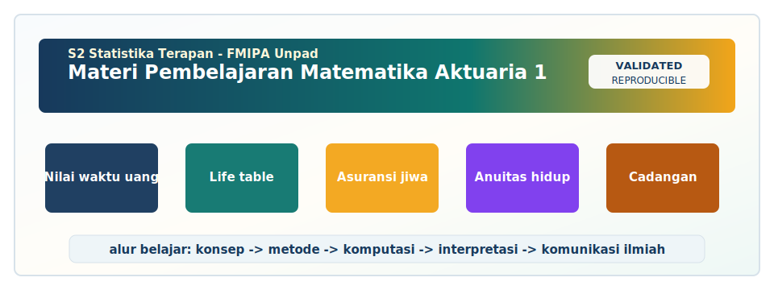

<!-- BEGIN UNPAD MATERIAL STYLE -->
<style>
:root {
  --unpad-navy: #17395c;
  --unpad-gold: #f2a51a;
  --unpad-teal: #0f766e;
  --unpad-ink: #172033;
  --unpad-paper: #fffdf8;
  --unpad-soft: #eef5f8;
  --unpad-line: #d7e2ea;
}
html, body {
  background: linear-gradient(135deg, #f8fbfd 0%, #fffdf8 48%, #f3f6ee 100%) !important;
  color: var(--unpad-ink) !important;
}
body {
  font-family: "Segoe UI", Arial, sans-serif !important;
  line-height: 1.72 !important;
}
.main-container {
  max-width: 1180px !important;
  background: rgba(255, 253, 248, 0.98) !important;
  border: 1px solid var(--unpad-line) !important;
  border-radius: 8px !important;
  box-shadow: 0 18px 42px rgba(23, 57, 92, 0.12) !important;
}
h1, h2, h3, h4 {
  letter-spacing: 0 !important;
}
h1.title {
  color: var(--unpad-navy) !important;
  -webkit-text-fill-color: var(--unpad-navy) !important;
  background: none !important;
}
h2 {
  border-left-color: var(--unpad-gold) !important;
}
a {
  color: #0b5c86 !important;
}
pre, code {
  border-radius: 8px !important;
}
.unpad-cover {
  margin: 18px 0 26px;
  padding: 24px;
  border-radius: 8px;
  background: linear-gradient(135deg, #17395c 0%, #0f766e 58%, #f2a51a 100%);
  color: #ffffff;
  box-shadow: 0 18px 36px rgba(23, 57, 92, 0.22);
}
.unpad-cover__brand {
  display: grid;
  grid-template-columns: 92px 1fr;
  gap: 20px;
  align-items: center;
}
.unpad-cover img {
  width: 92px;
  height: 92px;
  object-fit: contain;
  background: #ffffff;
  border-radius: 8px;
  padding: 8px;
  box-shadow: 0 8px 22px rgba(0,0,0,0.18);
}
.unpad-kicker {
  text-transform: uppercase;
  font-size: 0.82rem;
  font-weight: 800;
  letter-spacing: 0;
  color: #fff8dc;
}
.unpad-cover h2 {
  margin: 6px 0 8px;
  padding: 0;
  border: 0;
  background: transparent;
  color: #ffffff !important;
  font-size: 1.65rem;
}
.unpad-meta {
  margin: 0;
  color: #f7fbff;
  font-weight: 600;
}
.materi-illustration {
  margin: 20px 0 24px;
  padding: 14px;
  background: #ffffff;
  border: 1px solid var(--unpad-line);
  border-radius: 8px;
  box-shadow: 0 12px 28px rgba(23, 57, 92, 0.10);
}
.materi-illustration img {
  width: 100%;
  height: auto;
  display: block;
  border-radius: 6px;
}
.validasi-akademik {
  margin: 18px 0 28px;
  padding: 16px 18px;
  background: linear-gradient(135deg, #eef8f6, #fff8e7);
  border-left: 8px solid var(--unpad-teal);
  border-radius: 8px;
  color: var(--unpad-ink);
}
.validasi-akademik strong {
  color: var(--unpad-navy);
}
table {
  border-radius: 8px !important;
}
@media (max-width: 760px) {
  .unpad-cover__brand {
    grid-template-columns: 1fr;
  }
  .unpad-cover img {
    width: 76px;
    height: 76px;
  }
}
</style>
<!-- END UNPAD MATERIAL STYLE -->


<!-- BEGIN UNPAD MATERIAL ENHANCEMENT -->

```{r setup-unpad-render, include=FALSE}
execute_code <- FALSE
knitr::opts_chunk$set(
  echo = TRUE,
  eval = FALSE,
  message = FALSE,
  warning = FALSE,
  fig.align = "center",
  fig.width = 8,
  fig.height = 4.8,
  dpi = 120
)
set.seed(2025)
```


<div class="unpad-cover">
<div class="unpad-cover__brand">

<div>
<div class="unpad-kicker">S2 Statistika Terapan | FMIPA Universitas Padjadjaran</div>
<h2>Materi Pembelajaran Matematika Aktuaria 1</h2>
<p class="unpad-meta">S2 Statistika Terapan FMIPA Universitas Padjadjaran<br>Penulis: Dr. Lienda Noviyanti, M.Si | Januari 2025</p>
</div>
</div>
</div>

<div class="materi-illustration">

</div>

<div class="validasi-akademik">
<strong>Catatan validasi akademik.</strong> Materi ini diseragamkan dengan rujukan ADWTL Januari 2025: rumus dibaca bersama asumsi, contoh kode diposisikan sebagai template reproducible, dan interpretasi diarahkan pada validitas data, diagnosis model, evaluasi ketidakpastian, serta komunikasi hasil secara ilmiah.
</div>

<!-- END UNPAD MATERIAL ENHANCEMENT -->

```{r setup, include=FALSE, eval=FALSE}
knitr::opts_chunk$set(
  echo = TRUE,
  message = FALSE,
  warning = FALSE,
  fig.align = "center",
  fig.width = 8,
  fig.height = 5,
  out.width = "90%"
)
```


<style>
:root{
  --brown-900:#2b160c;
  --brown-800:#3f2415;
  --brown-700:#5c351f;
  --brown-600:#7b4a2a;
  --brown-500:#9a6437;
  --brown-300:#d8aa75;
  --brown-200:#efd4ad;
  --brown-100:#faeddc;
  --cream:#fffaf2;
  --gold:#f6c65b;
  --ink:#21140c;
  --muted:#72513e;
}
body{
  color:var(--ink);
  background:linear-gradient(135deg,#fffaf2 0%,#f8ead7 28%,#efd4ad 62%,#c98d50 100%);
  font-size:17px;
  line-height:1.72;
}
.main-container{
  max-width:1180px !important;
  background:rgba(255,250,242,.96);
  border-radius:26px;
  box-shadow:0 20px 55px rgba(64,36,18,.22);
  padding:34px 46px 50px 46px;
  margin-top:24px;
  margin-bottom:60px;
  border:1px solid rgba(123,74,42,.18);
}
h1.title{
  font-weight:900;
  color:#fff;
  padding:34px 38px;
  border-radius:24px;
  background:linear-gradient(120deg,var(--brown-900),var(--brown-600),#c98745,#f1c27d);
  box-shadow:0 18px 34px rgba(74,43,22,.28);
  letter-spacing:.2px;
}
h3.subtitle, h4.author, h4.date{ color:var(--brown-700); }
h1, h2, h3, h4{ color:var(--brown-800); font-weight:800; }
h2{
  border-left:10px solid var(--brown-500);
  padding-left:14px;
  margin-top:48px;
  background:linear-gradient(90deg,#fff1df,rgba(255,250,242,0));
  border-radius:12px;
}
h3{ margin-top:30px; }
#TOC, .tocify{
  background:linear-gradient(180deg,#fff8ed,#efd4ad) !important;
  border:1px solid rgba(123,74,42,.28) !important;
  border-radius:18px !important;
  box-shadow:0 14px 34px rgba(74,43,22,.18);
}
.tocify .tocify-item a, #TOC a{ color:var(--brown-800) !important; }
blockquote{
  border-left:8px solid var(--brown-500);
  background:#fff2df;
  border-radius:12px;
  padding:14px 18px;
  color:#342014;
}
.formula-box{
  background:#f7e4c6;
  color:#111;
  border:1px solid #d7a46a;
  border-left:10px solid #9a6437;
  border-radius:16px;
  padding:18px 22px;
  margin:20px 0;
  box-shadow:0 8px 18px rgba(123,74,42,.12);
}
.formula-box strong{ color:#2b160c; }
.idea-box, .case-box, .practice-box, .warning-box, .rps-box{
  border-radius:18px;
  padding:18px 22px;
  margin:22px 0;
  box-shadow:0 10px 24px rgba(123,74,42,.12);
}
.idea-box{ background:linear-gradient(135deg,#fff8ed,#f7d7aa); border-left:8px solid #f6c65b; }
.case-box{ background:linear-gradient(135deg,#fff3df,#e7bd87); border-left:8px solid #9a6437; }
.practice-box{ background:linear-gradient(135deg,#fff8ef,#ead2b6); border-left:8px solid #7b4a2a; }
.warning-box{ background:#fff1df; border-left:8px solid #b85c38; }
.rps-box{ background:linear-gradient(135deg,#f7e4c6,#fff8ed); border:1px solid rgba(123,74,42,.22); }
.table{ background:#fffaf2; }
table{ border-collapse:collapse; width:100%; margin:20px 0; }
table th{
  background:linear-gradient(90deg,var(--brown-700),var(--brown-500));
  color:#fff;
  padding:10px;
}
table td{ padding:9px 10px; border:1px solid #d8aa75; vertical-align:top; }
pre, code{
  color:#111 !important;
}
pre{
  background:#f7e4c6 !important;
  border:1px solid #d7a46a !important;
  border-left:10px solid #8b5e34 !important;
  border-radius:14px !important;
  padding:16px !important;
  white-space:pre-wrap;
}
code{ background:#f9ead3 !important; border-radius:5px; padding:2px 5px; }
.hero-card{
  background:linear-gradient(135deg,#2b160c,#7b4a2a 52%,#f1c27d);
  color:white;
  border-radius:26px;
  padding:28px 32px;
  margin:24px 0 28px 0;
  box-shadow:0 18px 38px rgba(43,22,12,.30);
}
.hero-card h2, .hero-card h3{ color:#fff; border-left:0; background:none; padding-left:0; margin-top:0; }
.hero-grid{display:grid;grid-template-columns:repeat(auto-fit,minmax(220px,1fr));gap:14px;margin-top:18px;}
.hero-pill{background:rgba(255,255,255,.15);border:1px solid rgba(255,255,255,.22);padding:13px 16px;border-radius:16px;}
.diagram{display:flex; flex-wrap:wrap; align-items:center; gap:10px; margin:18px 0;}
.node{background:#f7e4c6;border:1px solid #c98d50;border-radius:16px;padding:12px 16px;box-shadow:0 6px 13px rgba(123,74,42,.12);font-weight:700;}
.arrow{font-size:26px;color:#7b4a2a;font-weight:900;}
.small-note{font-size:.94em;color:var(--muted);}
.badge{display:inline-block;background:#7b4a2a;color:white;border-radius:999px;padding:4px 10px;font-size:.82em;font-weight:800;}
.footer-note{margin-top:44px;padding:18px;border-radius:18px;background:#f7e4c6;border-left:8px solid #7b4a2a;}
</style>

<div class="hero-card">
<h2>📘 Buku Ajar Digital: Matematika Aktuaria 1</h2>
<p><strong>Program Studi S2 Statistika Terapan, FMIPA Universitas Padjadjaran</strong></p>
<p>Materi ini dirancang sebagai bahan pembelajaran HTML berbasis R Markdown untuk mendukung perkuliahan, praktikum komputasi, diskusi kelas, tugas mandiri, mini project, UTS, dan UAS. Nuansa visual menggunakan gradasi coklat agar hangat, profesional, dan nyaman dibaca dalam sesi belajar panjang.</p>
<div class="hero-grid">
<div class="hero-pill">👩‍🏫 Dosen pengampu: <br><strong>Dr. Lienda Noviyanti, M.Si</strong></div>
<div class="hero-pill">🎓 Program: <br><strong>S2 Statistika Terapan FMIPA UNPAD</strong></div>
<div class="hero-pill">📅 Tahun pembuatan: <br><strong>Januari 2025</strong></div>
<div class="hero-pill">🧮 Fokus: <br><strong>nilai waktu uang, tabel kehidupan, premi, cadangan, komputasi aktuaria</strong></div>
</div>
</div>

# Prakata dan Orientasi Mata Kuliah

Materi pembelajaran ini disusun mengikuti Rencana Pembelajaran Semester berbasis OBE untuk mata kuliah **Matematika Aktuaria 1 / Matematika Keuangan 1** pada Program Studi S2 Statistika Terapan FMIPA Universitas Padjadjaran. Dalam RPS, mata kuliah ini ditempatkan pada semester 2 dengan bobot **3 SKS** yang terdiri atas **2 SKS teori** dan **1 SKS praktikum**. Dokumen RPS menekankan bahwa mata kuliah ini membahas matematika keuangan dan probabilistik yang digunakan dalam praktik aktuaria, khususnya untuk asuransi jiwa: nilai waktu uang, bunga, annuitas, peluang hidup dan kematian, tabel kehidupan, hukum mortalitas, premi, cadangan, serta pemodelan dengan perangkat lunak statistik [@rps2025].

<div class="rps-box">
<strong>🎯 Capaian pembelajaran utama.</strong> Mahasiswa diharapkan mampu menganalisis nilai waktu uang dan annuitas, mengevaluasi tabel kehidupan dan hukum mortalitas, membangun model premi dan cadangan menggunakan algoritma komputasi, serta merancang solusi aktuaria inovatif berbasis riset. Struktur ini menghubungkan kompetensi analitis, komputasional, dan inovasi riset sebagaimana dituntut dalam pembelajaran magister terapan.
</div>

Matematika aktuaria tidak hanya berisi rumus. Ia adalah bahasa kuantitatif untuk menjawab pertanyaan yang sangat nyata: berapa nilai wajar suatu janji pembayaran masa depan, berapa peluang seseorang masih hidup pada usia tertentu, bagaimana perusahaan asuransi menetapkan premi agar kontrak tetap adil dan berkelanjutan, serta bagaimana cadangan dihitung agar kewajiban masa depan dapat dipenuhi. Karena itu, pembelajaran dalam dokumen ini menggabungkan teori, contoh numerik, interpretasi bisnis, latihan komputasi, dan refleksi riset.

Dalam tradisi aktuaria modern, konsep dasar seperti bunga majemuk, anuitas, fungsi survival, dan nilai harapan aktuaria menjadi fondasi untuk model yang lebih maju. Buku seperti Dickson, Hardy, dan Waters menekankan bahwa risiko kontinjensi hidup harus dipahami sebagai kombinasi antara nilai waktu uang dan ketidakpastian waktu pembayaran [@dickson2013]. Bowers dan kolega memberikan fondasi klasik untuk hubungan antara asuransi jiwa, anuitas hidup, premi, dan cadangan [@bowers1997]. Sementara itu, literatur tentang mortalitas seperti Benjamin dan Pollard, Pitacco dan kolega, serta Lee dan Carter membantu mahasiswa melihat bahwa asumsi mortalitas bukan sekadar angka pada tabel, melainkan ringkasan empiris dari proses demografi yang berubah dari waktu ke waktu [@benjamin2012; @pitacco2009; @lee1992].

## Cara Menggunakan Bahan Ajar Ini

Bahan ajar ini dapat digunakan dalam tiga mode. Pertama, sebagai **buku bacaan utama** sebelum kuliah sinkron. Mahasiswa membaca konsep, formula, dan contoh kasus sebelum pertemuan sehingga kelas dapat digunakan untuk diskusi, klarifikasi, dan problem solving. Kedua, sebagai **panduan praktikum** karena setiap topik utama dilengkapi potongan kode R yang dapat dijalankan ulang dan dimodifikasi. Ketiga, sebagai **dokumen kerja mini project**, terutama untuk tugas nilai waktu uang, konstruksi tabel kehidupan, pemodelan premi-cadangan, serta inovasi produk asuransi modern.

<div class="idea-box">
<strong>💡 Prinsip belajar.</strong> Dalam aktuaria, jangan menghafal rumus seperti menghafal nomor parkir di mal. Pahami alur logikanya: waktu pembayaran → faktor diskonto → peluang pembayaran terjadi → nilai harapan → keputusan premi atau cadangan. Rumus adalah ringkasan; pemahaman adalah mesin utamanya.
</div>

## Pemetaan Materi terhadap RPS

| Blok Pembelajaran | Pertemuan | Sub-CPMK | Fokus Materi | Penilaian Utama |
|---|---:|---|---|---|
| Nilai waktu uang dan annuitas | 1–3 | SubCPMK1 | bunga, nilai tunai, nilai akumulasi, annuitas pasti, aplikasi asuransi jiwa dasar | tugas, quiz, praktikum |
| Tabel kehidupan dan mortalitas | 4–7 | SubCPMK2 | survival probability, mortality probability, tabel kehidupan, fractional age, Gompertz, Makeham | laporan, mini project, presentasi, UTS |
| Premi dan cadangan | 9–12 | SubCPMK3 | asuransi jiwa, anuitas hidup, premi fully continuous/discrete/semi-continuous, reserves, komputasi | proyek model, laporan, peer review |
| Inovasi aktuaria | 13–16 | SubCPMK4 | produk modern, unit link, mikroasuransi, takaful, riset mini, komunikasi hasil | proyek riset, presentasi, UAS |

## Kompetensi Teknis yang Dilatih

Mahasiswa akan dilatih untuk menggunakan notasi aktuaria secara disiplin, menerjemahkan kontrak menjadi persamaan nilai sekarang, menurunkan formula dari prinsip nilai harapan, membangun tabel kehidupan dari data mortalitas, membandingkan asumsi interpolasi usia pecahan, mengestimasi parameter hukum mortalitas, menghitung premi bersih, menghitung cadangan prospektif, serta menyusun argumentasi kuantitatif dalam bentuk laporan dan presentasi. Kompetensi ini sejalan dengan kebutuhan lulusan S2 Statistika Terapan yang tidak hanya mampu menjalankan software, tetapi juga mampu menjelaskan asumsi, batasan, dan implikasi keputusan model.


# Pertemuan 1 — Kontrak Pembelajaran dan Pengantar Matematika Aktuaria

<span class="badge">SubCPMK1</span> <span class="small-note">Topik kunci: asuransi jiwa, risiko kontinjensi hidup, nilai harapan aktuaria, peran aktuaris, RPS OBE</span>

## Tujuan Pembelajaran

- Menjelaskan ruang lingkup matematika aktuaria dalam asuransi jiwa dan keuangan.
- Membedakan matematika keuangan, probabilitas hidup, dan pemodelan aktuaria.
- Memahami kontrak pembelajaran, bentuk penilaian, serta ekspektasi praktikum.

## Peta Konsep

<div class="diagram">
<div class="node">Masalah aktuaria</div><div class="arrow">→</div>
<div class="node">Asumsi</div><div class="arrow">→</div>
<div class="node">Formula</div><div class="arrow">→</div>
<div class="node">Komputasi</div><div class="arrow">→</div>
<div class="node">Interpretasi</div>
</div>

## Konsep Inti

Topik **pengantar matematika aktuaria** merupakan bagian penting dalam struktur Matematika Aktuaria 1 karena menghubungkan teori matematika, probabilitas, dan kebutuhan keputusan dalam asuransi jiwa. Literatur aktuaria menempatkan topik ini sebagai fondasi untuk memahami bagaimana pembayaran masa depan dinilai, bagaimana risiko mortalitas dimodelkan, dan bagaimana nilai harapan digunakan untuk menentukan premi maupun cadangan. Pembahasan pada bagian ini merujuk pada literatur utama dan pendukung yang relevan (@dickson2013; @bowers1997; @rps2025).

<div class="formula-box">
<strong>Formula utama</strong>

$$\text{Nilai Aktuaria} = \mathbb{E}\left[\text{pembayaran masa depan} \times \text{faktor diskonto}\right]$$
</div>

Formula di atas perlu dibaca dengan hati-hati. Simbol matematika aktuaria sering terlihat ringkas, tetapi setiap simbol menyimpan informasi tentang waktu, peluang, dan nilai uang. Mahasiswa perlu membedakan mana komponen yang bersifat deterministik, seperti tingkat bunga atau jumlah manfaat, dan mana komponen yang bersifat stokastik, seperti waktu meninggal atau status hidup tertanggung. Kedisiplinan membaca notasi sangat penting karena kesalahan interpretasi satu simbol dapat mengubah makna kontrak secara keseluruhan.

## Ilustrasi Kasus

<div class="case-box">
<strong>📌 Kasus pembuka.</strong> Sebuah perusahaan asuransi berjanji membayar manfaat jika tertanggung meninggal dalam periode tertentu. Aktuaris perlu menentukan nilai sekarang dari janji tersebut dengan memperhatikan kapan pembayaran terjadi dan peluang pembayaran tersebut benar-benar terjadi.
</div>

Kasus tersebut dapat diperluas dengan cara mengubah parameter utama. Jika tingkat bunga berubah, nilai sekarang berubah. Jika probabilitas hidup berubah, nilai harapan pembayaran juga berubah. Jika waktu pembayaran bergeser dari awal tahun ke akhir tahun, faktor diskonto yang digunakan ikut berubah. Dalam praktik, perubahan kecil dalam asumsi dapat berdampak besar pada premi dan cadangan, terutama untuk kontrak jangka panjang.

## Praktikum Komputasi R

```{r module-1, eval=FALSE}
# Ilustrasi prinsip nilai harapan aktuaria sederhana
benefit <- 100000000
prob_payment <- 0.015
interest <- 0.05
v <- 1/(1 + interest)
actuarial_value <- benefit * prob_payment * v
actuarial_value
```

Potongan kode tersebut dimaksudkan sebagai titik awal. Mahasiswa sangat disarankan memodifikasi input, menambah skenario, dan menyimpan output dalam tabel. Untuk laporan praktikum, jangan hanya menempelkan hasil perhitungan. Jelaskan makna setiap parameter, alasan memilih nilai parameter, serta bagaimana perubahan parameter memengaruhi hasil.

## Pendalaman Konseptual dan Pedagogis

Secara konseptual, pengantar matematika aktuaria perlu dipahami sebagai bagian dari sistem pengambilan keputusan aktuaria. Mahasiswa tidak cukup mengetahui definisi; mahasiswa perlu mampu menjelaskan mengapa konsep tersebut muncul, bagaimana ia digunakan dalam kontrak asuransi, dan asumsi apa yang membuat perhitungan menjadi masuk akal. Dengan cara ini, pembelajaran bergerak dari hafalan menuju penalaran, sesuai arah SubCPMK1.

Dalam praktik aktuaria, setiap angka selalu memiliki cerita. Tingkat bunga mencerminkan harga waktu, probabilitas mortalitas mencerminkan risiko biologis dan demografis, sedangkan manfaat asuransi mencerminkan janji kontraktual. Ketika topik pengantar matematika aktuaria dianalisis, mahasiswa harus bertanya: siapa yang membayar, siapa yang menerima, kapan pembayaran terjadi, dan apa syarat kontinjensinya. Pertanyaan sederhana ini sering menyelamatkan model dari kesalahan konseptual.

Kekuatan materi pengantar matematika aktuaria terletak pada kemampuannya menghubungkan matematika dan interpretasi. Formula dapat menghasilkan nilai numerik dengan cepat, tetapi keputusan aktuaria memerlukan argumentasi. Mahasiswa perlu melaporkan bukan hanya hasil akhir, tetapi juga asumsi tingkat bunga, horizon waktu, bentuk pembayaran, sumber data mortalitas, serta sensitivitas hasil terhadap perubahan parameter. Tanpa bagian ini, laporan terlihat rapi tetapi belum tentu kuat.

Dari perspektif statistika terapan, pengantar matematika aktuaria dapat dibaca sebagai latihan membangun model berbasis asumsi. Model tidak pernah sepenuhnya sama dengan realitas, tetapi model yang baik memberi ringkasan yang berguna dan dapat diuji. Karena itu, tugas praktikum sebaiknya selalu memuat pemeriksaan sederhana: apakah output masuk akal, apakah satuan benar, apakah nilai meningkat atau menurun sesuai intuisi, dan apakah hasil ekstrem dapat dijelaskan.

Dalam kelas magister, diskusi tentang pengantar matematika aktuaria sebaiknya diarahkan pada evaluasi kritis. Misalnya, mahasiswa dapat diminta membandingkan dua skenario bunga, dua tabel mortalitas, atau dua desain pembayaran. Perbandingan membuat konsep lebih hidup karena mahasiswa melihat bahwa aktuaria bukan mesin tunggal, melainkan proses penilaian risiko yang sensitif terhadap data dan asumsi. Ini juga melatih argumentasi profesional.

Aspek komputasi pada pengantar matematika aktuaria perlu dirancang agar transparan. Kode yang baik tidak hanya menghasilkan angka, tetapi mudah dibaca, diberi nama variabel yang jelas, dan dapat dimodifikasi. Mahasiswa perlu membiasakan diri menulis fungsi kecil, memisahkan input dan output, serta menyimpan skenario simulasi dalam tabel. Kebiasaan ini penting karena pekerjaan aktuaria sering menuntut audit dan replikasi.

Kesalahan umum dalam pengantar matematika aktuaria biasanya muncul dari ketidakkonsistenan waktu. Pembayaran akhir tahun tidak boleh diperlakukan sama dengan pembayaran awal tahun; peluang hidup satu tahun tidak boleh dicampur dengan peluang hidup beberapa tahun tanpa aturan yang jelas; dan tingkat bunga efektif tahunan tidak boleh langsung digunakan untuk periode bulanan tanpa konversi. Kesalahan kecil seperti ini ibarat garam satu sendok di kopi: tampak sepele, tetapi hasilnya langsung terasa.

Penilaian terhadap penguasaan pengantar matematika aktuaria dapat dilakukan melalui kombinasi soal hitungan, interpretasi, dan mini kasus. Soal hitungan menguji akurasi, interpretasi menguji pemahaman, sedangkan mini kasus menguji kemampuan memilih pendekatan. Mahasiswa yang baik dapat menjelaskan mengapa menggunakan rumus tertentu, bukan hanya menuliskan rumus yang kebetulan cocok secara visual.

Dalam laporan akademik, pengantar matematika aktuaria harus ditulis dengan alur yang sistematis. Mulailah dari konteks masalah, definisikan variabel, tuliskan asumsi, tampilkan formula, lakukan perhitungan, lalu berikan interpretasi. Struktur ini memudahkan pembaca mengikuti logika model. Untuk pembaca nonteknis, grafik dan tabel ringkas sering lebih membantu daripada deretan rumus panjang.

Keterkaitan pengantar matematika aktuaria dengan literatur sangat penting. Literatur klasik memberikan notasi dan prinsip dasar, sedangkan literatur modern memperluas aplikasi pada longevity risk, mikroasuransi, produk hibrida, serta integrasi komputasi. Mahasiswa perlu memahami bahwa rujukan bukan dekorasi daftar pustaka; rujukan adalah bukti bahwa model yang dipakai memiliki dasar ilmiah dan sejarah pemakaian.

Secara etis, pengantar matematika aktuaria berkaitan dengan keadilan dan keberlanjutan. Premi yang terlalu rendah dapat membahayakan solvabilitas penyedia asuransi, sedangkan premi yang terlalu tinggi dapat menghambat akses masyarakat terhadap perlindungan. Karena itu, analisis aktuaria harus menjaga keseimbangan antara akurasi teknis, kelayakan bisnis, dan dampak sosial. Inilah ruang di mana statistika terapan menjadi sangat bernilai.

Untuk memperdalam pengantar matematika aktuaria, mahasiswa dapat membuat simulasi sederhana. Ubah tingkat bunga, umur masuk, jumlah manfaat, atau parameter mortalitas, lalu amati perubahan output. Simulasi membantu mahasiswa melihat elastisitas model. Jika perubahan kecil pada input menghasilkan perubahan besar pada output, maka asumsi tersebut perlu dibahas secara eksplisit dalam laporan.

Dalam diskusi kelas, dosen dapat meminta mahasiswa menjelaskan pengantar matematika aktuaria dengan bahasa awam. Kemampuan menerjemahkan model teknis menjadi pesan yang dapat dipahami adalah kompetensi profesional. Aktuaris dan statistisi terapan sering berbicara dengan manajer, regulator, atau masyarakat; karena itu, komunikasi risiko sama pentingnya dengan kemampuan menghitung.

Hubungan antara pengantar matematika aktuaria dan capaian pembelajaran terlihat dari tingkat kognitif yang ditargetkan. Pada level analisis, mahasiswa membedah komponen model. Pada level evaluasi, mahasiswa menilai kesesuaian asumsi. Pada level kreasi, mahasiswa membangun model atau solusi baru. Pergerakan dari analisis ke kreasi adalah inti dari pembelajaran magister.

Sebagai penutup bagian pendalaman, pengantar matematika aktuaria sebaiknya selalu dipahami melalui tiga pertanyaan: apakah formulanya benar, apakah datanya relevan, dan apakah interpretasinya berguna. Jika ketiganya terpenuhi, maka hasil pembelajaran tidak berhenti sebagai angka di layar, tetapi berubah menjadi keputusan aktuaria yang dapat dipertanggungjawabkan.

## Pengayaan Lanjutan untuk Pembelajaran Mandiri

Pengayaan pertama untuk pengantar matematika aktuaria adalah menelusuri kembali asal-usul keputusan model. Dalam aktuaria, banyak formula tampak seperti hasil akhir yang sudah jadi, padahal formula tersebut lahir dari proses menilai aliran kas bersyarat. Mahasiswa perlu melatih diri untuk memulai dari diagram waktu, menandai kapan pembayaran masuk dan keluar, lalu baru menuliskan faktor diskonto dan peluang. Cara ini membuat penyusunan model lebih tahan terhadap variasi kasus karena mahasiswa tidak bergantung pada satu rumus hafalan.

Pengayaan kedua adalah membedakan antara nilai deterministik dan nilai stokastik pada pengantar matematika aktuaria. Pembayaran manfaat mungkin ditentukan dalam polis, tetapi kejadian yang memicu pembayaran bersifat acak. Tingkat bunga mungkin diasumsikan tetap, tetapi dalam aplikasi nyata ia dapat berubah mengikuti pasar. Dengan membedakan dua jenis komponen ini, mahasiswa dapat menjelaskan bagian mana yang paling membutuhkan data historis, bagian mana yang ditetapkan oleh kontrak, dan bagian mana yang merupakan pilihan asumsi.

Pengayaan ketiga berkaitan dengan satuan waktu. Topik pengantar matematika aktuaria sering melibatkan tahun, bulan, semester, atau fraksi tahun. Jika satuan waktu tidak konsisten, hasil model menjadi bias. Oleh karena itu, setiap laporan perlu mencantumkan apakah bunga dinyatakan efektif tahunan, nominal, kontinu, bulanan, atau dikonversi. Kedisiplinan ini terlihat teknis, tetapi sangat menentukan validitas hasil. Dalam industri, salah satu sumber kesalahan valuasi adalah konversi waktu yang tidak seragam.

Pengayaan keempat adalah membuat uji kewajaran. Setelah menghitung pengantar matematika aktuaria, mahasiswa harus melakukan sanity check. Misalnya, jika tingkat bunga naik, nilai sekarang pembayaran masa depan biasanya turun. Jika umur masuk naik, premi asuransi jiwa cenderung naik karena risiko mortalitas lebih tinggi. Jika manfaat meningkat dua kali lipat, premi bersih biasanya juga meningkat proporsional ketika asumsi lain tetap. Pemeriksaan semacam ini sederhana, tetapi efektif untuk mendeteksi kesalahan kode dan kesalahan konsep.

Pengayaan kelima adalah sensitivitas. Dalam pembelajaran dasar, satu set parameter sering dianggap cukup. Namun, dalam praktik aktuaria, keputusan jarang dibuat hanya dari satu skenario. Untuk pengantar matematika aktuaria, mahasiswa perlu membuat minimal tiga skenario: optimistis, moderat, dan konservatif. Skenario optimistis dapat menggunakan risiko lebih rendah atau bunga lebih tinggi, sedangkan skenario konservatif menggunakan risiko lebih tinggi atau bunga lebih rendah. Perbandingan skenario memberi gambaran rentang hasil yang lebih realistis.

Pengayaan keenam berkaitan dengan visualisasi. Grafik tidak menggantikan rumus, tetapi membantu pembaca melihat pola. Untuk pengantar matematika aktuaria, grafik garis dapat menampilkan perubahan nilai terhadap umur atau waktu, grafik batang dapat membandingkan skenario, dan heatmap dapat menampilkan kombinasi umur dan tingkat bunga. Visualisasi yang baik harus sederhana, berlabel jelas, dan langsung mendukung argumen. Jangan membuat grafik yang cantik tetapi tidak menjawab pertanyaan aktuaria; itu seperti memakai jas ke pantai, niatnya keren tetapi konteksnya keliru.

Pengayaan ketujuh adalah audit trail. Setiap output pengantar matematika aktuaria sebaiknya dapat ditelusuri kembali ke input. Mahasiswa perlu menyimpan tabel input, kode perhitungan, dan tabel output secara terpisah. Jika ada revisi asumsi, perubahan harus tercatat. Kebiasaan ini sangat penting dalam pekerjaan profesional karena hasil aktuaria dapat memengaruhi keputusan keuangan bernilai besar dan perlu dipertanggungjawabkan kepada manajemen, auditor, regulator, atau klien.

Pengayaan kedelapan membahas keterbatasan data. Untuk pengantar matematika aktuaria, data mortalitas, data klaim, atau data bunga historis dapat tidak lengkap, tidak stabil, atau tidak representatif. Mahasiswa perlu menyatakan keterbatasan tersebut dan menjelaskan konsekuensinya. Misalnya, tabel mortalitas dari populasi umum belum tentu cocok untuk portofolio asuransi tertentu karena ada seleksi underwriting. Kesadaran semacam ini membedakan analisis akademik yang matang dari perhitungan mekanis.

Pengayaan kesembilan adalah validasi silang konseptual. Hasil pengantar matematika aktuaria dapat dibandingkan dengan pendekatan lain, literatur, atau perhitungan manual sederhana. Jika hasil komputasi sangat jauh dari perkiraan manual, perlu diperiksa kembali. Validasi tidak selalu harus rumit. Kadang cukup menggunakan kasus ekstrem: jika qx dibuat nol, nilai asuransi kematian seharusnya nol; jika peluang hidup selalu satu, anuitas hidup mendekati annuitas pasti. Kasus ekstrem membantu menguji logika program.

Pengayaan kesepuluh adalah membangun narasi keputusan. Setelah angka untuk pengantar matematika aktuaria diperoleh, mahasiswa perlu menjawab: keputusan apa yang berubah karena angka ini? Apakah premi layak? Apakah cadangan cukup? Apakah produk terlalu mahal bagi peserta? Apakah asumsi mortalitas terlalu optimistis? Pertanyaan keputusan membuat hasil model memiliki nilai praktis. Tanpa pertanyaan keputusan, laporan hanya menjadi kumpulan tabel yang sopan tetapi kurang berbicara.

Pengayaan kesebelas adalah membedakan perspektif perusahaan dan peserta. Dalam pengantar matematika aktuaria, perusahaan asuransi memperhatikan solvabilitas, kecukupan premi, risiko seleksi, dan keberlanjutan portofolio. Peserta memperhatikan keterjangkauan premi, kejelasan manfaat, dan rasa aman. Model aktuaria yang baik perlu menyadari dua perspektif ini. Produk yang secara matematis aman tetapi tidak terjangkau akan gagal secara sosial; produk yang murah tetapi tidak cukup cadangan akan gagal secara finansial.

Pengayaan kedua belas adalah memperhatikan komunikasi ketidakpastian. Hasil pengantar matematika aktuaria sebaiknya tidak disajikan seolah-olah pasti. Jika model menggunakan asumsi bunga tetap, mortalitas tetap, atau biaya tetap, laporkan bahwa hasil bergantung pada asumsi tersebut. Dalam presentasi, gunakan kalimat seperti ‘berdasarkan asumsi ini’ atau ‘dalam skenario ini’. Ungkapan tersebut bukan melemahkan hasil, tetapi membuat komunikasi lebih jujur dan profesional.

Pengayaan ketiga belas adalah integrasi dengan statistika. Mahasiswa S2 Statistika Terapan memiliki keunggulan karena terbiasa dengan estimasi, ketidakpastian, simulasi, dan pemodelan. Untuk pengantar matematika aktuaria, kemampuan statistika dapat digunakan untuk mengestimasi parameter mortalitas, mengevaluasi goodness of fit, membangun interval ketidakpastian, atau melakukan simulasi Monte Carlo. Dengan demikian, matematika aktuaria tidak berdiri sendiri, melainkan menjadi aplikasi konkret dari statistika terapan.

Pengayaan keempat belas adalah memahami peran regulasi dan tata kelola. Meskipun materi ini bersifat akademik, perhitungan pengantar matematika aktuaria dalam praktik sering terkait dengan standar pelaporan, kebijakan cadangan, dan prinsip kehati-hatian. Mahasiswa tidak harus menguasai seluruh regulasi pada tahap ini, tetapi perlu sadar bahwa model aktuaria beroperasi dalam lingkungan kelembagaan. Nilai premi dan cadangan bukan hanya hasil teori; keduanya juga harus sesuai dengan tata kelola risiko.

Pengayaan kelima belas adalah etika pemodelan. Dalam pengantar matematika aktuaria, pemilihan asumsi dapat menguntungkan atau merugikan pihak tertentu. Misalnya, asumsi mortalitas terlalu rendah dapat membuat premi tidak cukup; asumsi terlalu tinggi dapat membuat premi mahal. Karena itu, transparansi dan justifikasi asumsi menjadi kewajiban etis. Mahasiswa perlu terbiasa menulis alasan pemilihan parameter dan, jika memungkinkan, menunjukkan dampak alternatif parameter.

Pengayaan keenam belas adalah kesiapan data. Sebelum menghitung pengantar matematika aktuaria, pastikan data berada dalam format yang benar. Usia harus numerik, probabilitas berada antara nol dan satu, tingkat bunga tidak tercampur antara persen dan proporsi, serta periode waktu tidak negatif. Validasi input di awal sering menghemat banyak waktu debugging. Dalam proyek kelas, bagian validasi data dapat menjadi subbab kecil yang menunjukkan keseriusan kerja komputasi.

Pengayaan ketujuh belas adalah modularisasi kode. Untuk pengantar matematika aktuaria, hindari menulis seluruh perhitungan dalam satu blok panjang. Pecah menjadi fungsi: fungsi diskonto, fungsi annuitas, fungsi survival, fungsi APV, dan fungsi simulasi. Modularisasi membuat kode lebih mudah diuji dan digunakan ulang. Jika mahasiswa mengembangkan aplikasi Shiny atau dashboard sederhana di masa depan, struktur fungsi seperti ini akan sangat membantu.

Pengayaan kedelapan belas adalah dokumentasi. Setiap fungsi yang digunakan untuk pengantar matematika aktuaria perlu memiliki komentar singkat tentang input dan output. Komentar bukan tempat menulis novel, tetapi cukup menjelaskan maksud. Misalnya, ‘fungsi ini menghitung nilai sekarang annuitas biasa untuk tingkat bunga efektif i dan n periode’. Dokumentasi singkat membuat kode dapat dibaca oleh anggota kelompok lain dan memudahkan dosen menilai alur kerja.

Pengayaan kesembilan belas adalah pembandingan manual dan software. Mahasiswa sebaiknya mengerjakan satu contoh pengantar matematika aktuaria secara manual, kemudian memverifikasi dengan R, Python, atau Excel. Perhitungan manual membangun intuisi, sedangkan software mempercepat skenario. Kombinasi keduanya ideal: manual memberi pemahaman, software memberi efisiensi. Jika hanya software, mahasiswa berisiko percaya pada output tanpa mengerti; jika hanya manual, mahasiswa kesulitan menangani kasus realistis yang lebih besar.

Pengayaan kedua puluh adalah pengembangan portofolio akademik. Setiap tugas pengantar matematika aktuaria dapat diubah menjadi artefak portofolio: R Markdown, laporan HTML, repositori kode, atau slide ringkas. Portofolio ini bermanfaat untuk menunjukkan kompetensi analisis aktuaria, komputasi statistik, dan komunikasi risiko. Dengan sedikit kerapian, tugas kuliah tidak hanya menjadi kewajiban semester, tetapi juga bukti kemampuan profesional.

Pengayaan kedua puluh satu adalah latihan interpretasi sensitivitas secara tertulis. Untuk pengantar matematika aktuaria, mahasiswa dapat membuat tabel perubahan output ketika satu parameter dinaikkan atau diturunkan. Setelah itu, tuliskan interpretasi dalam tiga kalimat: pola utama, alasan pola tersebut terjadi, dan implikasi bagi keputusan. Format tiga kalimat ini sederhana tetapi melatih ketajaman. Banyak laporan gagal bukan karena perhitungannya salah, melainkan karena penulis tidak menyampaikan pesan utama dengan jelas.

Pengayaan kedua puluh dua adalah membangun kebiasaan membaca kontrak sebagai objek matematika. Setiap kalimat kontrak dapat diterjemahkan menjadi struktur pembayaran. Kata ‘pada akhir tahun’ berbeda dari ‘pada saat kejadian’; kata ‘selama hidup’ berbeda dari ‘selama sepuluh tahun’; kata ‘jika meninggal’ berbeda dari ‘jika bertahan hidup’. Untuk pengantar matematika aktuaria, ketelitian membaca teks kontrak sering sama pentingnya dengan kemampuan aljabar.

Pengayaan kedua puluh tiga adalah memperluas contoh ke konteks Indonesia. Produk asuransi jiwa, mikroasuransi, takaful, dan program perlindungan sosial memiliki karakteristik peserta, literasi, dan kemampuan bayar yang berbeda. Dengan mengaitkan pengantar matematika aktuaria pada konteks lokal, mahasiswa dapat melihat bahwa aktuaria bukan ilmu yang jauh dari masyarakat. Perhitungan premi dan cadangan dapat memengaruhi akses perlindungan, keberlanjutan program, dan kepercayaan publik terhadap lembaga keuangan.

Pengayaan kedua puluh empat adalah mengintegrasikan diskusi kelompok. Dalam kelas, satu kelompok dapat berperan sebagai perusahaan asuransi, kelompok lain sebagai peserta, dan kelompok lain sebagai regulator. Ketika membahas pengantar matematika aktuaria, setiap kelompok menilai hasil dari perspektif berbeda. Simulasi peran seperti ini membantu mahasiswa memahami bahwa model kuantitatif berada di tengah negosiasi kepentingan, bukan di ruang hampa yang steril.

Pengayaan kedua puluh lima adalah memperhatikan bahasa laporan. Gunakan istilah teknis secara konsisten: nilai tunai, nilai akumulasi, APV, survival probability, mortality probability, premi bersih, premi bruto, dan cadangan prospektif. Untuk pengantar matematika aktuaria, konsistensi istilah mengurangi ambiguitas. Jika istilah Inggris digunakan, berikan padanan Indonesia pada kemunculan pertama. Kerapian bahasa membuat laporan lebih mudah dinilai dan lebih siap dibagikan kepada pembaca eksternal.

Pengayaan kedua puluh enam adalah refleksi pembelajaran. Setelah menyelesaikan topik pengantar matematika aktuaria, mahasiswa dapat menulis satu halaman refleksi: konsep apa yang paling sulit, kesalahan apa yang paling sering terjadi, bagian kode mana yang paling membantu, dan bagaimana topik ini dapat digunakan dalam riset atau pekerjaan. Refleksi singkat membantu mengubah pengalaman menghitung menjadi pengetahuan yang lebih tahan lama. Otak juga perlu backup, bukan hanya laptop.

Pengayaan kedua puluh tujuh adalah membuat glosarium mini setelah belajar pengantar matematika aktuaria. Glosarium berisi istilah, definisi singkat, formula terkait, dan contoh penggunaan. Aktivitas ini tampak sederhana, tetapi sangat membantu ketika topik berikutnya mulai memakai notasi yang sama dalam konteks berbeda. Dalam aktuaria, satu simbol dapat muncul pada banyak model, sehingga glosarium pribadi menjadi alat navigasi yang efektif.

Pengayaan kedua puluh delapan adalah menilai kesiapan presentasi. Untuk pengantar matematika aktuaria, siapkan satu slide masalah, satu slide asumsi, satu slide formula, satu slide hasil, dan satu slide rekomendasi. Jika penjelasan tidak dapat diringkas dalam lima slide inti, biasanya struktur berpikir belum cukup tajam. Presentasi yang baik bukan yang paling ramai, melainkan yang membuat audiens mengerti keputusan apa yang harus diambil setelah melihat hasil.

## Latihan Terstruktur

1. Jelaskan kembali konsep **pengantar matematika aktuaria** dengan bahasa sendiri dan berikan satu contoh kontrak yang relevan.
2. Identifikasi variabel input, parameter, dan output dari kasus pembuka di atas.
3. Jalankan atau adaptasi kode R yang disediakan. Buat minimal tiga skenario berbeda.
4. Susun tabel perbandingan hasil. Berikan interpretasi singkat untuk setiap skenario.
5. Tulis satu paragraf tentang keterbatasan asumsi yang digunakan.

## Pertanyaan Reflektif

- Apakah hasil perhitungan mengikuti intuisi aktuaria? Jika tidak, bagian mana yang perlu diperiksa?
- Parameter mana yang paling sensitif terhadap output?
- Bagaimana menjelaskan hasil ini kepada pembaca nonteknis?
- Apa implikasi hasil terhadap desain produk, premi, cadangan, atau kebijakan risiko?


# Pertemuan 2 — Konsep Nilai Waktu Uang

<span class="badge">SubCPMK1</span> <span class="small-note">Topik kunci: bunga sederhana, bunga majemuk, nilai tunai, nilai akumulasi, faktor diskonto</span>

## Tujuan Pembelajaran

- Menganalisis perbedaan bunga sederhana dan bunga majemuk.
- Menghitung nilai akumulasi dan nilai tunai.
- Menjelaskan faktor diskonto sebagai alat membandingkan pembayaran pada waktu berbeda.

## Peta Konsep

<div class="diagram">
<div class="node">Masalah aktuaria</div><div class="arrow">→</div>
<div class="node">Asumsi</div><div class="arrow">→</div>
<div class="node">Formula</div><div class="arrow">→</div>
<div class="node">Komputasi</div><div class="arrow">→</div>
<div class="node">Interpretasi</div>
</div>

## Konsep Inti

Topik **nilai waktu uang dan bunga** merupakan bagian penting dalam struktur Matematika Aktuaria 1 karena menghubungkan teori matematika, probabilitas, dan kebutuhan keputusan dalam asuransi jiwa. Literatur aktuaria menempatkan topik ini sebagai fondasi untuk memahami bagaimana pembayaran masa depan dinilai, bagaimana risiko mortalitas dimodelkan, dan bagaimana nilai harapan digunakan untuk menentukan premi maupun cadangan. Pembahasan pada bagian ini merujuk pada literatur utama dan pendukung yang relevan (@kellison2009; @dickson2013).

<div class="formula-box">
<strong>Formula utama</strong>

$$a(t)=\begin{cases}1+it, & \text{bunga sederhana}\\(1+i)^t, & \text{bunga majemuk}\end{cases}\qquad v^t=(1+i)^{-t}$$
</div>

Formula di atas perlu dibaca dengan hati-hati. Simbol matematika aktuaria sering terlihat ringkas, tetapi setiap simbol menyimpan informasi tentang waktu, peluang, dan nilai uang. Mahasiswa perlu membedakan mana komponen yang bersifat deterministik, seperti tingkat bunga atau jumlah manfaat, dan mana komponen yang bersifat stokastik, seperti waktu meninggal atau status hidup tertanggung. Kedisiplinan membaca notasi sangat penting karena kesalahan interpretasi satu simbol dapat mengubah makna kontrak secara keseluruhan.

## Ilustrasi Kasus

<div class="case-box">
<strong>📌 Kasus pembuka.</strong> Jika Rp10.000.000 diinvestasikan selama 5 tahun pada bunga majemuk 6% per tahun, nilai akumulasinya adalah 10.000.000(1,06)^5. Sebaliknya, nilai tunai dari pembayaran Rp10.000.000 lima tahun lagi adalah 10.000.000(1,06)^-5.
</div>

Kasus tersebut dapat diperluas dengan cara mengubah parameter utama. Jika tingkat bunga berubah, nilai sekarang berubah. Jika probabilitas hidup berubah, nilai harapan pembayaran juga berubah. Jika waktu pembayaran bergeser dari awal tahun ke akhir tahun, faktor diskonto yang digunakan ikut berubah. Dalam praktik, perubahan kecil dalam asumsi dapat berdampak besar pada premi dan cadangan, terutama untuk kontrak jangka panjang.

## Praktikum Komputasi R

```{r module-2, eval=FALSE}
# Nilai akumulasi dan nilai tunai
principal <- 10000000
i <- 0.06
n <- 5
future_value <- principal * (1 + i)^n
present_value <- principal / (1 + i)^n
future_value
present_value
```

Potongan kode tersebut dimaksudkan sebagai titik awal. Mahasiswa sangat disarankan memodifikasi input, menambah skenario, dan menyimpan output dalam tabel. Untuk laporan praktikum, jangan hanya menempelkan hasil perhitungan. Jelaskan makna setiap parameter, alasan memilih nilai parameter, serta bagaimana perubahan parameter memengaruhi hasil.

## Pendalaman Konseptual dan Pedagogis

Secara konseptual, nilai waktu uang dan bunga perlu dipahami sebagai bagian dari sistem pengambilan keputusan aktuaria. Mahasiswa tidak cukup mengetahui definisi; mahasiswa perlu mampu menjelaskan mengapa konsep tersebut muncul, bagaimana ia digunakan dalam kontrak asuransi, dan asumsi apa yang membuat perhitungan menjadi masuk akal. Dengan cara ini, pembelajaran bergerak dari hafalan menuju penalaran, sesuai arah SubCPMK1.

Dalam praktik aktuaria, setiap angka selalu memiliki cerita. Tingkat bunga mencerminkan harga waktu, probabilitas mortalitas mencerminkan risiko biologis dan demografis, sedangkan manfaat asuransi mencerminkan janji kontraktual. Ketika topik nilai waktu uang dan bunga dianalisis, mahasiswa harus bertanya: siapa yang membayar, siapa yang menerima, kapan pembayaran terjadi, dan apa syarat kontinjensinya. Pertanyaan sederhana ini sering menyelamatkan model dari kesalahan konseptual.

Kekuatan materi nilai waktu uang dan bunga terletak pada kemampuannya menghubungkan matematika dan interpretasi. Formula dapat menghasilkan nilai numerik dengan cepat, tetapi keputusan aktuaria memerlukan argumentasi. Mahasiswa perlu melaporkan bukan hanya hasil akhir, tetapi juga asumsi tingkat bunga, horizon waktu, bentuk pembayaran, sumber data mortalitas, serta sensitivitas hasil terhadap perubahan parameter. Tanpa bagian ini, laporan terlihat rapi tetapi belum tentu kuat.

Dari perspektif statistika terapan, nilai waktu uang dan bunga dapat dibaca sebagai latihan membangun model berbasis asumsi. Model tidak pernah sepenuhnya sama dengan realitas, tetapi model yang baik memberi ringkasan yang berguna dan dapat diuji. Karena itu, tugas praktikum sebaiknya selalu memuat pemeriksaan sederhana: apakah output masuk akal, apakah satuan benar, apakah nilai meningkat atau menurun sesuai intuisi, dan apakah hasil ekstrem dapat dijelaskan.

Dalam kelas magister, diskusi tentang nilai waktu uang dan bunga sebaiknya diarahkan pada evaluasi kritis. Misalnya, mahasiswa dapat diminta membandingkan dua skenario bunga, dua tabel mortalitas, atau dua desain pembayaran. Perbandingan membuat konsep lebih hidup karena mahasiswa melihat bahwa aktuaria bukan mesin tunggal, melainkan proses penilaian risiko yang sensitif terhadap data dan asumsi. Ini juga melatih argumentasi profesional.

Aspek komputasi pada nilai waktu uang dan bunga perlu dirancang agar transparan. Kode yang baik tidak hanya menghasilkan angka, tetapi mudah dibaca, diberi nama variabel yang jelas, dan dapat dimodifikasi. Mahasiswa perlu membiasakan diri menulis fungsi kecil, memisahkan input dan output, serta menyimpan skenario simulasi dalam tabel. Kebiasaan ini penting karena pekerjaan aktuaria sering menuntut audit dan replikasi.

Kesalahan umum dalam nilai waktu uang dan bunga biasanya muncul dari ketidakkonsistenan waktu. Pembayaran akhir tahun tidak boleh diperlakukan sama dengan pembayaran awal tahun; peluang hidup satu tahun tidak boleh dicampur dengan peluang hidup beberapa tahun tanpa aturan yang jelas; dan tingkat bunga efektif tahunan tidak boleh langsung digunakan untuk periode bulanan tanpa konversi. Kesalahan kecil seperti ini ibarat garam satu sendok di kopi: tampak sepele, tetapi hasilnya langsung terasa.

Penilaian terhadap penguasaan nilai waktu uang dan bunga dapat dilakukan melalui kombinasi soal hitungan, interpretasi, dan mini kasus. Soal hitungan menguji akurasi, interpretasi menguji pemahaman, sedangkan mini kasus menguji kemampuan memilih pendekatan. Mahasiswa yang baik dapat menjelaskan mengapa menggunakan rumus tertentu, bukan hanya menuliskan rumus yang kebetulan cocok secara visual.

Dalam laporan akademik, nilai waktu uang dan bunga harus ditulis dengan alur yang sistematis. Mulailah dari konteks masalah, definisikan variabel, tuliskan asumsi, tampilkan formula, lakukan perhitungan, lalu berikan interpretasi. Struktur ini memudahkan pembaca mengikuti logika model. Untuk pembaca nonteknis, grafik dan tabel ringkas sering lebih membantu daripada deretan rumus panjang.

Keterkaitan nilai waktu uang dan bunga dengan literatur sangat penting. Literatur klasik memberikan notasi dan prinsip dasar, sedangkan literatur modern memperluas aplikasi pada longevity risk, mikroasuransi, produk hibrida, serta integrasi komputasi. Mahasiswa perlu memahami bahwa rujukan bukan dekorasi daftar pustaka; rujukan adalah bukti bahwa model yang dipakai memiliki dasar ilmiah dan sejarah pemakaian.

Secara etis, nilai waktu uang dan bunga berkaitan dengan keadilan dan keberlanjutan. Premi yang terlalu rendah dapat membahayakan solvabilitas penyedia asuransi, sedangkan premi yang terlalu tinggi dapat menghambat akses masyarakat terhadap perlindungan. Karena itu, analisis aktuaria harus menjaga keseimbangan antara akurasi teknis, kelayakan bisnis, dan dampak sosial. Inilah ruang di mana statistika terapan menjadi sangat bernilai.

Untuk memperdalam nilai waktu uang dan bunga, mahasiswa dapat membuat simulasi sederhana. Ubah tingkat bunga, umur masuk, jumlah manfaat, atau parameter mortalitas, lalu amati perubahan output. Simulasi membantu mahasiswa melihat elastisitas model. Jika perubahan kecil pada input menghasilkan perubahan besar pada output, maka asumsi tersebut perlu dibahas secara eksplisit dalam laporan.

Dalam diskusi kelas, dosen dapat meminta mahasiswa menjelaskan nilai waktu uang dan bunga dengan bahasa awam. Kemampuan menerjemahkan model teknis menjadi pesan yang dapat dipahami adalah kompetensi profesional. Aktuaris dan statistisi terapan sering berbicara dengan manajer, regulator, atau masyarakat; karena itu, komunikasi risiko sama pentingnya dengan kemampuan menghitung.

Hubungan antara nilai waktu uang dan bunga dan capaian pembelajaran terlihat dari tingkat kognitif yang ditargetkan. Pada level analisis, mahasiswa membedah komponen model. Pada level evaluasi, mahasiswa menilai kesesuaian asumsi. Pada level kreasi, mahasiswa membangun model atau solusi baru. Pergerakan dari analisis ke kreasi adalah inti dari pembelajaran magister.

Sebagai penutup bagian pendalaman, nilai waktu uang dan bunga sebaiknya selalu dipahami melalui tiga pertanyaan: apakah formulanya benar, apakah datanya relevan, dan apakah interpretasinya berguna. Jika ketiganya terpenuhi, maka hasil pembelajaran tidak berhenti sebagai angka di layar, tetapi berubah menjadi keputusan aktuaria yang dapat dipertanggungjawabkan.

## Pengayaan Lanjutan untuk Pembelajaran Mandiri

Pengayaan pertama untuk nilai waktu uang dan bunga adalah menelusuri kembali asal-usul keputusan model. Dalam aktuaria, banyak formula tampak seperti hasil akhir yang sudah jadi, padahal formula tersebut lahir dari proses menilai aliran kas bersyarat. Mahasiswa perlu melatih diri untuk memulai dari diagram waktu, menandai kapan pembayaran masuk dan keluar, lalu baru menuliskan faktor diskonto dan peluang. Cara ini membuat penyusunan model lebih tahan terhadap variasi kasus karena mahasiswa tidak bergantung pada satu rumus hafalan.

Pengayaan kedua adalah membedakan antara nilai deterministik dan nilai stokastik pada nilai waktu uang dan bunga. Pembayaran manfaat mungkin ditentukan dalam polis, tetapi kejadian yang memicu pembayaran bersifat acak. Tingkat bunga mungkin diasumsikan tetap, tetapi dalam aplikasi nyata ia dapat berubah mengikuti pasar. Dengan membedakan dua jenis komponen ini, mahasiswa dapat menjelaskan bagian mana yang paling membutuhkan data historis, bagian mana yang ditetapkan oleh kontrak, dan bagian mana yang merupakan pilihan asumsi.

Pengayaan ketiga berkaitan dengan satuan waktu. Topik nilai waktu uang dan bunga sering melibatkan tahun, bulan, semester, atau fraksi tahun. Jika satuan waktu tidak konsisten, hasil model menjadi bias. Oleh karena itu, setiap laporan perlu mencantumkan apakah bunga dinyatakan efektif tahunan, nominal, kontinu, bulanan, atau dikonversi. Kedisiplinan ini terlihat teknis, tetapi sangat menentukan validitas hasil. Dalam industri, salah satu sumber kesalahan valuasi adalah konversi waktu yang tidak seragam.

Pengayaan keempat adalah membuat uji kewajaran. Setelah menghitung nilai waktu uang dan bunga, mahasiswa harus melakukan sanity check. Misalnya, jika tingkat bunga naik, nilai sekarang pembayaran masa depan biasanya turun. Jika umur masuk naik, premi asuransi jiwa cenderung naik karena risiko mortalitas lebih tinggi. Jika manfaat meningkat dua kali lipat, premi bersih biasanya juga meningkat proporsional ketika asumsi lain tetap. Pemeriksaan semacam ini sederhana, tetapi efektif untuk mendeteksi kesalahan kode dan kesalahan konsep.

Pengayaan kelima adalah sensitivitas. Dalam pembelajaran dasar, satu set parameter sering dianggap cukup. Namun, dalam praktik aktuaria, keputusan jarang dibuat hanya dari satu skenario. Untuk nilai waktu uang dan bunga, mahasiswa perlu membuat minimal tiga skenario: optimistis, moderat, dan konservatif. Skenario optimistis dapat menggunakan risiko lebih rendah atau bunga lebih tinggi, sedangkan skenario konservatif menggunakan risiko lebih tinggi atau bunga lebih rendah. Perbandingan skenario memberi gambaran rentang hasil yang lebih realistis.

Pengayaan keenam berkaitan dengan visualisasi. Grafik tidak menggantikan rumus, tetapi membantu pembaca melihat pola. Untuk nilai waktu uang dan bunga, grafik garis dapat menampilkan perubahan nilai terhadap umur atau waktu, grafik batang dapat membandingkan skenario, dan heatmap dapat menampilkan kombinasi umur dan tingkat bunga. Visualisasi yang baik harus sederhana, berlabel jelas, dan langsung mendukung argumen. Jangan membuat grafik yang cantik tetapi tidak menjawab pertanyaan aktuaria; itu seperti memakai jas ke pantai, niatnya keren tetapi konteksnya keliru.

Pengayaan ketujuh adalah audit trail. Setiap output nilai waktu uang dan bunga sebaiknya dapat ditelusuri kembali ke input. Mahasiswa perlu menyimpan tabel input, kode perhitungan, dan tabel output secara terpisah. Jika ada revisi asumsi, perubahan harus tercatat. Kebiasaan ini sangat penting dalam pekerjaan profesional karena hasil aktuaria dapat memengaruhi keputusan keuangan bernilai besar dan perlu dipertanggungjawabkan kepada manajemen, auditor, regulator, atau klien.

Pengayaan kedelapan membahas keterbatasan data. Untuk nilai waktu uang dan bunga, data mortalitas, data klaim, atau data bunga historis dapat tidak lengkap, tidak stabil, atau tidak representatif. Mahasiswa perlu menyatakan keterbatasan tersebut dan menjelaskan konsekuensinya. Misalnya, tabel mortalitas dari populasi umum belum tentu cocok untuk portofolio asuransi tertentu karena ada seleksi underwriting. Kesadaran semacam ini membedakan analisis akademik yang matang dari perhitungan mekanis.

Pengayaan kesembilan adalah validasi silang konseptual. Hasil nilai waktu uang dan bunga dapat dibandingkan dengan pendekatan lain, literatur, atau perhitungan manual sederhana. Jika hasil komputasi sangat jauh dari perkiraan manual, perlu diperiksa kembali. Validasi tidak selalu harus rumit. Kadang cukup menggunakan kasus ekstrem: jika qx dibuat nol, nilai asuransi kematian seharusnya nol; jika peluang hidup selalu satu, anuitas hidup mendekati annuitas pasti. Kasus ekstrem membantu menguji logika program.

Pengayaan kesepuluh adalah membangun narasi keputusan. Setelah angka untuk nilai waktu uang dan bunga diperoleh, mahasiswa perlu menjawab: keputusan apa yang berubah karena angka ini? Apakah premi layak? Apakah cadangan cukup? Apakah produk terlalu mahal bagi peserta? Apakah asumsi mortalitas terlalu optimistis? Pertanyaan keputusan membuat hasil model memiliki nilai praktis. Tanpa pertanyaan keputusan, laporan hanya menjadi kumpulan tabel yang sopan tetapi kurang berbicara.

Pengayaan kesebelas adalah membedakan perspektif perusahaan dan peserta. Dalam nilai waktu uang dan bunga, perusahaan asuransi memperhatikan solvabilitas, kecukupan premi, risiko seleksi, dan keberlanjutan portofolio. Peserta memperhatikan keterjangkauan premi, kejelasan manfaat, dan rasa aman. Model aktuaria yang baik perlu menyadari dua perspektif ini. Produk yang secara matematis aman tetapi tidak terjangkau akan gagal secara sosial; produk yang murah tetapi tidak cukup cadangan akan gagal secara finansial.

Pengayaan kedua belas adalah memperhatikan komunikasi ketidakpastian. Hasil nilai waktu uang dan bunga sebaiknya tidak disajikan seolah-olah pasti. Jika model menggunakan asumsi bunga tetap, mortalitas tetap, atau biaya tetap, laporkan bahwa hasil bergantung pada asumsi tersebut. Dalam presentasi, gunakan kalimat seperti ‘berdasarkan asumsi ini’ atau ‘dalam skenario ini’. Ungkapan tersebut bukan melemahkan hasil, tetapi membuat komunikasi lebih jujur dan profesional.

Pengayaan ketiga belas adalah integrasi dengan statistika. Mahasiswa S2 Statistika Terapan memiliki keunggulan karena terbiasa dengan estimasi, ketidakpastian, simulasi, dan pemodelan. Untuk nilai waktu uang dan bunga, kemampuan statistika dapat digunakan untuk mengestimasi parameter mortalitas, mengevaluasi goodness of fit, membangun interval ketidakpastian, atau melakukan simulasi Monte Carlo. Dengan demikian, matematika aktuaria tidak berdiri sendiri, melainkan menjadi aplikasi konkret dari statistika terapan.

Pengayaan keempat belas adalah memahami peran regulasi dan tata kelola. Meskipun materi ini bersifat akademik, perhitungan nilai waktu uang dan bunga dalam praktik sering terkait dengan standar pelaporan, kebijakan cadangan, dan prinsip kehati-hatian. Mahasiswa tidak harus menguasai seluruh regulasi pada tahap ini, tetapi perlu sadar bahwa model aktuaria beroperasi dalam lingkungan kelembagaan. Nilai premi dan cadangan bukan hanya hasil teori; keduanya juga harus sesuai dengan tata kelola risiko.

Pengayaan kelima belas adalah etika pemodelan. Dalam nilai waktu uang dan bunga, pemilihan asumsi dapat menguntungkan atau merugikan pihak tertentu. Misalnya, asumsi mortalitas terlalu rendah dapat membuat premi tidak cukup; asumsi terlalu tinggi dapat membuat premi mahal. Karena itu, transparansi dan justifikasi asumsi menjadi kewajiban etis. Mahasiswa perlu terbiasa menulis alasan pemilihan parameter dan, jika memungkinkan, menunjukkan dampak alternatif parameter.

Pengayaan keenam belas adalah kesiapan data. Sebelum menghitung nilai waktu uang dan bunga, pastikan data berada dalam format yang benar. Usia harus numerik, probabilitas berada antara nol dan satu, tingkat bunga tidak tercampur antara persen dan proporsi, serta periode waktu tidak negatif. Validasi input di awal sering menghemat banyak waktu debugging. Dalam proyek kelas, bagian validasi data dapat menjadi subbab kecil yang menunjukkan keseriusan kerja komputasi.

Pengayaan ketujuh belas adalah modularisasi kode. Untuk nilai waktu uang dan bunga, hindari menulis seluruh perhitungan dalam satu blok panjang. Pecah menjadi fungsi: fungsi diskonto, fungsi annuitas, fungsi survival, fungsi APV, dan fungsi simulasi. Modularisasi membuat kode lebih mudah diuji dan digunakan ulang. Jika mahasiswa mengembangkan aplikasi Shiny atau dashboard sederhana di masa depan, struktur fungsi seperti ini akan sangat membantu.

Pengayaan kedelapan belas adalah dokumentasi. Setiap fungsi yang digunakan untuk nilai waktu uang dan bunga perlu memiliki komentar singkat tentang input dan output. Komentar bukan tempat menulis novel, tetapi cukup menjelaskan maksud. Misalnya, ‘fungsi ini menghitung nilai sekarang annuitas biasa untuk tingkat bunga efektif i dan n periode’. Dokumentasi singkat membuat kode dapat dibaca oleh anggota kelompok lain dan memudahkan dosen menilai alur kerja.

Pengayaan kesembilan belas adalah pembandingan manual dan software. Mahasiswa sebaiknya mengerjakan satu contoh nilai waktu uang dan bunga secara manual, kemudian memverifikasi dengan R, Python, atau Excel. Perhitungan manual membangun intuisi, sedangkan software mempercepat skenario. Kombinasi keduanya ideal: manual memberi pemahaman, software memberi efisiensi. Jika hanya software, mahasiswa berisiko percaya pada output tanpa mengerti; jika hanya manual, mahasiswa kesulitan menangani kasus realistis yang lebih besar.

Pengayaan kedua puluh adalah pengembangan portofolio akademik. Setiap tugas nilai waktu uang dan bunga dapat diubah menjadi artefak portofolio: R Markdown, laporan HTML, repositori kode, atau slide ringkas. Portofolio ini bermanfaat untuk menunjukkan kompetensi analisis aktuaria, komputasi statistik, dan komunikasi risiko. Dengan sedikit kerapian, tugas kuliah tidak hanya menjadi kewajiban semester, tetapi juga bukti kemampuan profesional.

Pengayaan kedua puluh satu adalah latihan interpretasi sensitivitas secara tertulis. Untuk nilai waktu uang dan bunga, mahasiswa dapat membuat tabel perubahan output ketika satu parameter dinaikkan atau diturunkan. Setelah itu, tuliskan interpretasi dalam tiga kalimat: pola utama, alasan pola tersebut terjadi, dan implikasi bagi keputusan. Format tiga kalimat ini sederhana tetapi melatih ketajaman. Banyak laporan gagal bukan karena perhitungannya salah, melainkan karena penulis tidak menyampaikan pesan utama dengan jelas.

Pengayaan kedua puluh dua adalah membangun kebiasaan membaca kontrak sebagai objek matematika. Setiap kalimat kontrak dapat diterjemahkan menjadi struktur pembayaran. Kata ‘pada akhir tahun’ berbeda dari ‘pada saat kejadian’; kata ‘selama hidup’ berbeda dari ‘selama sepuluh tahun’; kata ‘jika meninggal’ berbeda dari ‘jika bertahan hidup’. Untuk nilai waktu uang dan bunga, ketelitian membaca teks kontrak sering sama pentingnya dengan kemampuan aljabar.

Pengayaan kedua puluh tiga adalah memperluas contoh ke konteks Indonesia. Produk asuransi jiwa, mikroasuransi, takaful, dan program perlindungan sosial memiliki karakteristik peserta, literasi, dan kemampuan bayar yang berbeda. Dengan mengaitkan nilai waktu uang dan bunga pada konteks lokal, mahasiswa dapat melihat bahwa aktuaria bukan ilmu yang jauh dari masyarakat. Perhitungan premi dan cadangan dapat memengaruhi akses perlindungan, keberlanjutan program, dan kepercayaan publik terhadap lembaga keuangan.

Pengayaan kedua puluh empat adalah mengintegrasikan diskusi kelompok. Dalam kelas, satu kelompok dapat berperan sebagai perusahaan asuransi, kelompok lain sebagai peserta, dan kelompok lain sebagai regulator. Ketika membahas nilai waktu uang dan bunga, setiap kelompok menilai hasil dari perspektif berbeda. Simulasi peran seperti ini membantu mahasiswa memahami bahwa model kuantitatif berada di tengah negosiasi kepentingan, bukan di ruang hampa yang steril.

Pengayaan kedua puluh lima adalah memperhatikan bahasa laporan. Gunakan istilah teknis secara konsisten: nilai tunai, nilai akumulasi, APV, survival probability, mortality probability, premi bersih, premi bruto, dan cadangan prospektif. Untuk nilai waktu uang dan bunga, konsistensi istilah mengurangi ambiguitas. Jika istilah Inggris digunakan, berikan padanan Indonesia pada kemunculan pertama. Kerapian bahasa membuat laporan lebih mudah dinilai dan lebih siap dibagikan kepada pembaca eksternal.

Pengayaan kedua puluh enam adalah refleksi pembelajaran. Setelah menyelesaikan topik nilai waktu uang dan bunga, mahasiswa dapat menulis satu halaman refleksi: konsep apa yang paling sulit, kesalahan apa yang paling sering terjadi, bagian kode mana yang paling membantu, dan bagaimana topik ini dapat digunakan dalam riset atau pekerjaan. Refleksi singkat membantu mengubah pengalaman menghitung menjadi pengetahuan yang lebih tahan lama. Otak juga perlu backup, bukan hanya laptop.

Pengayaan kedua puluh tujuh adalah membuat glosarium mini setelah belajar nilai waktu uang dan bunga. Glosarium berisi istilah, definisi singkat, formula terkait, dan contoh penggunaan. Aktivitas ini tampak sederhana, tetapi sangat membantu ketika topik berikutnya mulai memakai notasi yang sama dalam konteks berbeda. Dalam aktuaria, satu simbol dapat muncul pada banyak model, sehingga glosarium pribadi menjadi alat navigasi yang efektif.

Pengayaan kedua puluh delapan adalah menilai kesiapan presentasi. Untuk nilai waktu uang dan bunga, siapkan satu slide masalah, satu slide asumsi, satu slide formula, satu slide hasil, dan satu slide rekomendasi. Jika penjelasan tidak dapat diringkas dalam lima slide inti, biasanya struktur berpikir belum cukup tajam. Presentasi yang baik bukan yang paling ramai, melainkan yang membuat audiens mengerti keputusan apa yang harus diambil setelah melihat hasil.

## Latihan Terstruktur

1. Jelaskan kembali konsep **nilai waktu uang dan bunga** dengan bahasa sendiri dan berikan satu contoh kontrak yang relevan.
2. Identifikasi variabel input, parameter, dan output dari kasus pembuka di atas.
3. Jalankan atau adaptasi kode R yang disediakan. Buat minimal tiga skenario berbeda.
4. Susun tabel perbandingan hasil. Berikan interpretasi singkat untuk setiap skenario.
5. Tulis satu paragraf tentang keterbatasan asumsi yang digunakan.

## Pertanyaan Reflektif

- Apakah hasil perhitungan mengikuti intuisi aktuaria? Jika tidak, bagian mana yang perlu diperiksa?
- Parameter mana yang paling sensitif terhadap output?
- Bagaimana menjelaskan hasil ini kepada pembaca nonteknis?
- Apa implikasi hasil terhadap desain produk, premi, cadangan, atau kebijakan risiko?


# Pertemuan 3 — Annuitas Pasti dan Aplikasinya

<span class="badge">SubCPMK1</span> <span class="small-note">Topik kunci: annuitas biasa, annuitas jatuh tempo, annuitas bertumbuh, kontrak pembayaran berkala, nilai sekarang</span>

## Tujuan Pembelajaran

- Menghitung nilai sekarang annuitas biasa dan annuitas jatuh tempo.
- Membedakan annuitas pasti dan annuitas hidup.
- Menganalisis aplikasi annuitas pada kontrak asuransi dan dana pensiun.

## Peta Konsep

<div class="diagram">
<div class="node">Masalah aktuaria</div><div class="arrow">→</div>
<div class="node">Asumsi</div><div class="arrow">→</div>
<div class="node">Formula</div><div class="arrow">→</div>
<div class="node">Komputasi</div><div class="arrow">→</div>
<div class="node">Interpretasi</div>
</div>

## Konsep Inti

Topik **annuitas pasti** merupakan bagian penting dalam struktur Matematika Aktuaria 1 karena menghubungkan teori matematika, probabilitas, dan kebutuhan keputusan dalam asuransi jiwa. Literatur aktuaria menempatkan topik ini sebagai fondasi untuk memahami bagaimana pembayaran masa depan dinilai, bagaimana risiko mortalitas dimodelkan, dan bagaimana nilai harapan digunakan untuk menentukan premi maupun cadangan. Pembahasan pada bagian ini merujuk pada literatur utama dan pendukung yang relevan (@kellison2009; @dickson2013; @promislow2015).

<div class="formula-box">
<strong>Formula utama</strong>

$$a_{\overline{n}|}=\frac{1-v^n}{i},\qquad \ddot{a}_{\overline{n}|}=\frac{1-v^n}{d},\qquad d=\frac{i}{1+i}$$
</div>

Formula di atas perlu dibaca dengan hati-hati. Simbol matematika aktuaria sering terlihat ringkas, tetapi setiap simbol menyimpan informasi tentang waktu, peluang, dan nilai uang. Mahasiswa perlu membedakan mana komponen yang bersifat deterministik, seperti tingkat bunga atau jumlah manfaat, dan mana komponen yang bersifat stokastik, seperti waktu meninggal atau status hidup tertanggung. Kedisiplinan membaca notasi sangat penting karena kesalahan interpretasi satu simbol dapat mengubah makna kontrak secara keseluruhan.

## Ilustrasi Kasus

<div class="case-box">
<strong>📌 Kasus pembuka.</strong> Pembayaran Rp5.000.000 dilakukan setiap akhir tahun selama 10 tahun. Pada bunga efektif 5%, nilai sekarangnya adalah 5.000.000 dikalikan faktor annuitas biasa. Jika pembayaran dilakukan di awal tahun, faktor yang digunakan adalah annuitas jatuh tempo.
</div>

Kasus tersebut dapat diperluas dengan cara mengubah parameter utama. Jika tingkat bunga berubah, nilai sekarang berubah. Jika probabilitas hidup berubah, nilai harapan pembayaran juga berubah. Jika waktu pembayaran bergeser dari awal tahun ke akhir tahun, faktor diskonto yang digunakan ikut berubah. Dalam praktik, perubahan kecil dalam asumsi dapat berdampak besar pada premi dan cadangan, terutama untuk kontrak jangka panjang.

## Praktikum Komputasi R

```{r module-3, eval=FALSE}
# Nilai sekarang annuitas biasa dan jatuh tempo
payment <- 5000000
i <- 0.05
n <- 10
v <- 1/(1+i)
d <- i/(1+i)
a_immediate <- (1 - v^n) / i
annuity_due <- (1 - v^n) / d
PV_immediate <- payment * a_immediate
PV_due <- payment * annuity_due
PV_immediate
PV_due
```

Potongan kode tersebut dimaksudkan sebagai titik awal. Mahasiswa sangat disarankan memodifikasi input, menambah skenario, dan menyimpan output dalam tabel. Untuk laporan praktikum, jangan hanya menempelkan hasil perhitungan. Jelaskan makna setiap parameter, alasan memilih nilai parameter, serta bagaimana perubahan parameter memengaruhi hasil.

## Pendalaman Konseptual dan Pedagogis

Secara konseptual, annuitas pasti perlu dipahami sebagai bagian dari sistem pengambilan keputusan aktuaria. Mahasiswa tidak cukup mengetahui definisi; mahasiswa perlu mampu menjelaskan mengapa konsep tersebut muncul, bagaimana ia digunakan dalam kontrak asuransi, dan asumsi apa yang membuat perhitungan menjadi masuk akal. Dengan cara ini, pembelajaran bergerak dari hafalan menuju penalaran, sesuai arah SubCPMK1.

Dalam praktik aktuaria, setiap angka selalu memiliki cerita. Tingkat bunga mencerminkan harga waktu, probabilitas mortalitas mencerminkan risiko biologis dan demografis, sedangkan manfaat asuransi mencerminkan janji kontraktual. Ketika topik annuitas pasti dianalisis, mahasiswa harus bertanya: siapa yang membayar, siapa yang menerima, kapan pembayaran terjadi, dan apa syarat kontinjensinya. Pertanyaan sederhana ini sering menyelamatkan model dari kesalahan konseptual.

Kekuatan materi annuitas pasti terletak pada kemampuannya menghubungkan matematika dan interpretasi. Formula dapat menghasilkan nilai numerik dengan cepat, tetapi keputusan aktuaria memerlukan argumentasi. Mahasiswa perlu melaporkan bukan hanya hasil akhir, tetapi juga asumsi tingkat bunga, horizon waktu, bentuk pembayaran, sumber data mortalitas, serta sensitivitas hasil terhadap perubahan parameter. Tanpa bagian ini, laporan terlihat rapi tetapi belum tentu kuat.

Dari perspektif statistika terapan, annuitas pasti dapat dibaca sebagai latihan membangun model berbasis asumsi. Model tidak pernah sepenuhnya sama dengan realitas, tetapi model yang baik memberi ringkasan yang berguna dan dapat diuji. Karena itu, tugas praktikum sebaiknya selalu memuat pemeriksaan sederhana: apakah output masuk akal, apakah satuan benar, apakah nilai meningkat atau menurun sesuai intuisi, dan apakah hasil ekstrem dapat dijelaskan.

Dalam kelas magister, diskusi tentang annuitas pasti sebaiknya diarahkan pada evaluasi kritis. Misalnya, mahasiswa dapat diminta membandingkan dua skenario bunga, dua tabel mortalitas, atau dua desain pembayaran. Perbandingan membuat konsep lebih hidup karena mahasiswa melihat bahwa aktuaria bukan mesin tunggal, melainkan proses penilaian risiko yang sensitif terhadap data dan asumsi. Ini juga melatih argumentasi profesional.

Aspek komputasi pada annuitas pasti perlu dirancang agar transparan. Kode yang baik tidak hanya menghasilkan angka, tetapi mudah dibaca, diberi nama variabel yang jelas, dan dapat dimodifikasi. Mahasiswa perlu membiasakan diri menulis fungsi kecil, memisahkan input dan output, serta menyimpan skenario simulasi dalam tabel. Kebiasaan ini penting karena pekerjaan aktuaria sering menuntut audit dan replikasi.

Kesalahan umum dalam annuitas pasti biasanya muncul dari ketidakkonsistenan waktu. Pembayaran akhir tahun tidak boleh diperlakukan sama dengan pembayaran awal tahun; peluang hidup satu tahun tidak boleh dicampur dengan peluang hidup beberapa tahun tanpa aturan yang jelas; dan tingkat bunga efektif tahunan tidak boleh langsung digunakan untuk periode bulanan tanpa konversi. Kesalahan kecil seperti ini ibarat garam satu sendok di kopi: tampak sepele, tetapi hasilnya langsung terasa.

Penilaian terhadap penguasaan annuitas pasti dapat dilakukan melalui kombinasi soal hitungan, interpretasi, dan mini kasus. Soal hitungan menguji akurasi, interpretasi menguji pemahaman, sedangkan mini kasus menguji kemampuan memilih pendekatan. Mahasiswa yang baik dapat menjelaskan mengapa menggunakan rumus tertentu, bukan hanya menuliskan rumus yang kebetulan cocok secara visual.

Dalam laporan akademik, annuitas pasti harus ditulis dengan alur yang sistematis. Mulailah dari konteks masalah, definisikan variabel, tuliskan asumsi, tampilkan formula, lakukan perhitungan, lalu berikan interpretasi. Struktur ini memudahkan pembaca mengikuti logika model. Untuk pembaca nonteknis, grafik dan tabel ringkas sering lebih membantu daripada deretan rumus panjang.

Keterkaitan annuitas pasti dengan literatur sangat penting. Literatur klasik memberikan notasi dan prinsip dasar, sedangkan literatur modern memperluas aplikasi pada longevity risk, mikroasuransi, produk hibrida, serta integrasi komputasi. Mahasiswa perlu memahami bahwa rujukan bukan dekorasi daftar pustaka; rujukan adalah bukti bahwa model yang dipakai memiliki dasar ilmiah dan sejarah pemakaian.

Secara etis, annuitas pasti berkaitan dengan keadilan dan keberlanjutan. Premi yang terlalu rendah dapat membahayakan solvabilitas penyedia asuransi, sedangkan premi yang terlalu tinggi dapat menghambat akses masyarakat terhadap perlindungan. Karena itu, analisis aktuaria harus menjaga keseimbangan antara akurasi teknis, kelayakan bisnis, dan dampak sosial. Inilah ruang di mana statistika terapan menjadi sangat bernilai.

Untuk memperdalam annuitas pasti, mahasiswa dapat membuat simulasi sederhana. Ubah tingkat bunga, umur masuk, jumlah manfaat, atau parameter mortalitas, lalu amati perubahan output. Simulasi membantu mahasiswa melihat elastisitas model. Jika perubahan kecil pada input menghasilkan perubahan besar pada output, maka asumsi tersebut perlu dibahas secara eksplisit dalam laporan.

Dalam diskusi kelas, dosen dapat meminta mahasiswa menjelaskan annuitas pasti dengan bahasa awam. Kemampuan menerjemahkan model teknis menjadi pesan yang dapat dipahami adalah kompetensi profesional. Aktuaris dan statistisi terapan sering berbicara dengan manajer, regulator, atau masyarakat; karena itu, komunikasi risiko sama pentingnya dengan kemampuan menghitung.

Hubungan antara annuitas pasti dan capaian pembelajaran terlihat dari tingkat kognitif yang ditargetkan. Pada level analisis, mahasiswa membedah komponen model. Pada level evaluasi, mahasiswa menilai kesesuaian asumsi. Pada level kreasi, mahasiswa membangun model atau solusi baru. Pergerakan dari analisis ke kreasi adalah inti dari pembelajaran magister.

Sebagai penutup bagian pendalaman, annuitas pasti sebaiknya selalu dipahami melalui tiga pertanyaan: apakah formulanya benar, apakah datanya relevan, dan apakah interpretasinya berguna. Jika ketiganya terpenuhi, maka hasil pembelajaran tidak berhenti sebagai angka di layar, tetapi berubah menjadi keputusan aktuaria yang dapat dipertanggungjawabkan.

## Pengayaan Lanjutan untuk Pembelajaran Mandiri

Pengayaan pertama untuk annuitas pasti adalah menelusuri kembali asal-usul keputusan model. Dalam aktuaria, banyak formula tampak seperti hasil akhir yang sudah jadi, padahal formula tersebut lahir dari proses menilai aliran kas bersyarat. Mahasiswa perlu melatih diri untuk memulai dari diagram waktu, menandai kapan pembayaran masuk dan keluar, lalu baru menuliskan faktor diskonto dan peluang. Cara ini membuat penyusunan model lebih tahan terhadap variasi kasus karena mahasiswa tidak bergantung pada satu rumus hafalan.

Pengayaan kedua adalah membedakan antara nilai deterministik dan nilai stokastik pada annuitas pasti. Pembayaran manfaat mungkin ditentukan dalam polis, tetapi kejadian yang memicu pembayaran bersifat acak. Tingkat bunga mungkin diasumsikan tetap, tetapi dalam aplikasi nyata ia dapat berubah mengikuti pasar. Dengan membedakan dua jenis komponen ini, mahasiswa dapat menjelaskan bagian mana yang paling membutuhkan data historis, bagian mana yang ditetapkan oleh kontrak, dan bagian mana yang merupakan pilihan asumsi.

Pengayaan ketiga berkaitan dengan satuan waktu. Topik annuitas pasti sering melibatkan tahun, bulan, semester, atau fraksi tahun. Jika satuan waktu tidak konsisten, hasil model menjadi bias. Oleh karena itu, setiap laporan perlu mencantumkan apakah bunga dinyatakan efektif tahunan, nominal, kontinu, bulanan, atau dikonversi. Kedisiplinan ini terlihat teknis, tetapi sangat menentukan validitas hasil. Dalam industri, salah satu sumber kesalahan valuasi adalah konversi waktu yang tidak seragam.

Pengayaan keempat adalah membuat uji kewajaran. Setelah menghitung annuitas pasti, mahasiswa harus melakukan sanity check. Misalnya, jika tingkat bunga naik, nilai sekarang pembayaran masa depan biasanya turun. Jika umur masuk naik, premi asuransi jiwa cenderung naik karena risiko mortalitas lebih tinggi. Jika manfaat meningkat dua kali lipat, premi bersih biasanya juga meningkat proporsional ketika asumsi lain tetap. Pemeriksaan semacam ini sederhana, tetapi efektif untuk mendeteksi kesalahan kode dan kesalahan konsep.

Pengayaan kelima adalah sensitivitas. Dalam pembelajaran dasar, satu set parameter sering dianggap cukup. Namun, dalam praktik aktuaria, keputusan jarang dibuat hanya dari satu skenario. Untuk annuitas pasti, mahasiswa perlu membuat minimal tiga skenario: optimistis, moderat, dan konservatif. Skenario optimistis dapat menggunakan risiko lebih rendah atau bunga lebih tinggi, sedangkan skenario konservatif menggunakan risiko lebih tinggi atau bunga lebih rendah. Perbandingan skenario memberi gambaran rentang hasil yang lebih realistis.

Pengayaan keenam berkaitan dengan visualisasi. Grafik tidak menggantikan rumus, tetapi membantu pembaca melihat pola. Untuk annuitas pasti, grafik garis dapat menampilkan perubahan nilai terhadap umur atau waktu, grafik batang dapat membandingkan skenario, dan heatmap dapat menampilkan kombinasi umur dan tingkat bunga. Visualisasi yang baik harus sederhana, berlabel jelas, dan langsung mendukung argumen. Jangan membuat grafik yang cantik tetapi tidak menjawab pertanyaan aktuaria; itu seperti memakai jas ke pantai, niatnya keren tetapi konteksnya keliru.

Pengayaan ketujuh adalah audit trail. Setiap output annuitas pasti sebaiknya dapat ditelusuri kembali ke input. Mahasiswa perlu menyimpan tabel input, kode perhitungan, dan tabel output secara terpisah. Jika ada revisi asumsi, perubahan harus tercatat. Kebiasaan ini sangat penting dalam pekerjaan profesional karena hasil aktuaria dapat memengaruhi keputusan keuangan bernilai besar dan perlu dipertanggungjawabkan kepada manajemen, auditor, regulator, atau klien.

Pengayaan kedelapan membahas keterbatasan data. Untuk annuitas pasti, data mortalitas, data klaim, atau data bunga historis dapat tidak lengkap, tidak stabil, atau tidak representatif. Mahasiswa perlu menyatakan keterbatasan tersebut dan menjelaskan konsekuensinya. Misalnya, tabel mortalitas dari populasi umum belum tentu cocok untuk portofolio asuransi tertentu karena ada seleksi underwriting. Kesadaran semacam ini membedakan analisis akademik yang matang dari perhitungan mekanis.

Pengayaan kesembilan adalah validasi silang konseptual. Hasil annuitas pasti dapat dibandingkan dengan pendekatan lain, literatur, atau perhitungan manual sederhana. Jika hasil komputasi sangat jauh dari perkiraan manual, perlu diperiksa kembali. Validasi tidak selalu harus rumit. Kadang cukup menggunakan kasus ekstrem: jika qx dibuat nol, nilai asuransi kematian seharusnya nol; jika peluang hidup selalu satu, anuitas hidup mendekati annuitas pasti. Kasus ekstrem membantu menguji logika program.

Pengayaan kesepuluh adalah membangun narasi keputusan. Setelah angka untuk annuitas pasti diperoleh, mahasiswa perlu menjawab: keputusan apa yang berubah karena angka ini? Apakah premi layak? Apakah cadangan cukup? Apakah produk terlalu mahal bagi peserta? Apakah asumsi mortalitas terlalu optimistis? Pertanyaan keputusan membuat hasil model memiliki nilai praktis. Tanpa pertanyaan keputusan, laporan hanya menjadi kumpulan tabel yang sopan tetapi kurang berbicara.

Pengayaan kesebelas adalah membedakan perspektif perusahaan dan peserta. Dalam annuitas pasti, perusahaan asuransi memperhatikan solvabilitas, kecukupan premi, risiko seleksi, dan keberlanjutan portofolio. Peserta memperhatikan keterjangkauan premi, kejelasan manfaat, dan rasa aman. Model aktuaria yang baik perlu menyadari dua perspektif ini. Produk yang secara matematis aman tetapi tidak terjangkau akan gagal secara sosial; produk yang murah tetapi tidak cukup cadangan akan gagal secara finansial.

Pengayaan kedua belas adalah memperhatikan komunikasi ketidakpastian. Hasil annuitas pasti sebaiknya tidak disajikan seolah-olah pasti. Jika model menggunakan asumsi bunga tetap, mortalitas tetap, atau biaya tetap, laporkan bahwa hasil bergantung pada asumsi tersebut. Dalam presentasi, gunakan kalimat seperti ‘berdasarkan asumsi ini’ atau ‘dalam skenario ini’. Ungkapan tersebut bukan melemahkan hasil, tetapi membuat komunikasi lebih jujur dan profesional.

Pengayaan ketiga belas adalah integrasi dengan statistika. Mahasiswa S2 Statistika Terapan memiliki keunggulan karena terbiasa dengan estimasi, ketidakpastian, simulasi, dan pemodelan. Untuk annuitas pasti, kemampuan statistika dapat digunakan untuk mengestimasi parameter mortalitas, mengevaluasi goodness of fit, membangun interval ketidakpastian, atau melakukan simulasi Monte Carlo. Dengan demikian, matematika aktuaria tidak berdiri sendiri, melainkan menjadi aplikasi konkret dari statistika terapan.

Pengayaan keempat belas adalah memahami peran regulasi dan tata kelola. Meskipun materi ini bersifat akademik, perhitungan annuitas pasti dalam praktik sering terkait dengan standar pelaporan, kebijakan cadangan, dan prinsip kehati-hatian. Mahasiswa tidak harus menguasai seluruh regulasi pada tahap ini, tetapi perlu sadar bahwa model aktuaria beroperasi dalam lingkungan kelembagaan. Nilai premi dan cadangan bukan hanya hasil teori; keduanya juga harus sesuai dengan tata kelola risiko.

Pengayaan kelima belas adalah etika pemodelan. Dalam annuitas pasti, pemilihan asumsi dapat menguntungkan atau merugikan pihak tertentu. Misalnya, asumsi mortalitas terlalu rendah dapat membuat premi tidak cukup; asumsi terlalu tinggi dapat membuat premi mahal. Karena itu, transparansi dan justifikasi asumsi menjadi kewajiban etis. Mahasiswa perlu terbiasa menulis alasan pemilihan parameter dan, jika memungkinkan, menunjukkan dampak alternatif parameter.

Pengayaan keenam belas adalah kesiapan data. Sebelum menghitung annuitas pasti, pastikan data berada dalam format yang benar. Usia harus numerik, probabilitas berada antara nol dan satu, tingkat bunga tidak tercampur antara persen dan proporsi, serta periode waktu tidak negatif. Validasi input di awal sering menghemat banyak waktu debugging. Dalam proyek kelas, bagian validasi data dapat menjadi subbab kecil yang menunjukkan keseriusan kerja komputasi.

Pengayaan ketujuh belas adalah modularisasi kode. Untuk annuitas pasti, hindari menulis seluruh perhitungan dalam satu blok panjang. Pecah menjadi fungsi: fungsi diskonto, fungsi annuitas, fungsi survival, fungsi APV, dan fungsi simulasi. Modularisasi membuat kode lebih mudah diuji dan digunakan ulang. Jika mahasiswa mengembangkan aplikasi Shiny atau dashboard sederhana di masa depan, struktur fungsi seperti ini akan sangat membantu.

Pengayaan kedelapan belas adalah dokumentasi. Setiap fungsi yang digunakan untuk annuitas pasti perlu memiliki komentar singkat tentang input dan output. Komentar bukan tempat menulis novel, tetapi cukup menjelaskan maksud. Misalnya, ‘fungsi ini menghitung nilai sekarang annuitas biasa untuk tingkat bunga efektif i dan n periode’. Dokumentasi singkat membuat kode dapat dibaca oleh anggota kelompok lain dan memudahkan dosen menilai alur kerja.

Pengayaan kesembilan belas adalah pembandingan manual dan software. Mahasiswa sebaiknya mengerjakan satu contoh annuitas pasti secara manual, kemudian memverifikasi dengan R, Python, atau Excel. Perhitungan manual membangun intuisi, sedangkan software mempercepat skenario. Kombinasi keduanya ideal: manual memberi pemahaman, software memberi efisiensi. Jika hanya software, mahasiswa berisiko percaya pada output tanpa mengerti; jika hanya manual, mahasiswa kesulitan menangani kasus realistis yang lebih besar.

Pengayaan kedua puluh adalah pengembangan portofolio akademik. Setiap tugas annuitas pasti dapat diubah menjadi artefak portofolio: R Markdown, laporan HTML, repositori kode, atau slide ringkas. Portofolio ini bermanfaat untuk menunjukkan kompetensi analisis aktuaria, komputasi statistik, dan komunikasi risiko. Dengan sedikit kerapian, tugas kuliah tidak hanya menjadi kewajiban semester, tetapi juga bukti kemampuan profesional.

Pengayaan kedua puluh satu adalah latihan interpretasi sensitivitas secara tertulis. Untuk annuitas pasti, mahasiswa dapat membuat tabel perubahan output ketika satu parameter dinaikkan atau diturunkan. Setelah itu, tuliskan interpretasi dalam tiga kalimat: pola utama, alasan pola tersebut terjadi, dan implikasi bagi keputusan. Format tiga kalimat ini sederhana tetapi melatih ketajaman. Banyak laporan gagal bukan karena perhitungannya salah, melainkan karena penulis tidak menyampaikan pesan utama dengan jelas.

Pengayaan kedua puluh dua adalah membangun kebiasaan membaca kontrak sebagai objek matematika. Setiap kalimat kontrak dapat diterjemahkan menjadi struktur pembayaran. Kata ‘pada akhir tahun’ berbeda dari ‘pada saat kejadian’; kata ‘selama hidup’ berbeda dari ‘selama sepuluh tahun’; kata ‘jika meninggal’ berbeda dari ‘jika bertahan hidup’. Untuk annuitas pasti, ketelitian membaca teks kontrak sering sama pentingnya dengan kemampuan aljabar.

Pengayaan kedua puluh tiga adalah memperluas contoh ke konteks Indonesia. Produk asuransi jiwa, mikroasuransi, takaful, dan program perlindungan sosial memiliki karakteristik peserta, literasi, dan kemampuan bayar yang berbeda. Dengan mengaitkan annuitas pasti pada konteks lokal, mahasiswa dapat melihat bahwa aktuaria bukan ilmu yang jauh dari masyarakat. Perhitungan premi dan cadangan dapat memengaruhi akses perlindungan, keberlanjutan program, dan kepercayaan publik terhadap lembaga keuangan.

Pengayaan kedua puluh empat adalah mengintegrasikan diskusi kelompok. Dalam kelas, satu kelompok dapat berperan sebagai perusahaan asuransi, kelompok lain sebagai peserta, dan kelompok lain sebagai regulator. Ketika membahas annuitas pasti, setiap kelompok menilai hasil dari perspektif berbeda. Simulasi peran seperti ini membantu mahasiswa memahami bahwa model kuantitatif berada di tengah negosiasi kepentingan, bukan di ruang hampa yang steril.

Pengayaan kedua puluh lima adalah memperhatikan bahasa laporan. Gunakan istilah teknis secara konsisten: nilai tunai, nilai akumulasi, APV, survival probability, mortality probability, premi bersih, premi bruto, dan cadangan prospektif. Untuk annuitas pasti, konsistensi istilah mengurangi ambiguitas. Jika istilah Inggris digunakan, berikan padanan Indonesia pada kemunculan pertama. Kerapian bahasa membuat laporan lebih mudah dinilai dan lebih siap dibagikan kepada pembaca eksternal.

Pengayaan kedua puluh enam adalah refleksi pembelajaran. Setelah menyelesaikan topik annuitas pasti, mahasiswa dapat menulis satu halaman refleksi: konsep apa yang paling sulit, kesalahan apa yang paling sering terjadi, bagian kode mana yang paling membantu, dan bagaimana topik ini dapat digunakan dalam riset atau pekerjaan. Refleksi singkat membantu mengubah pengalaman menghitung menjadi pengetahuan yang lebih tahan lama. Otak juga perlu backup, bukan hanya laptop.

Pengayaan kedua puluh tujuh adalah membuat glosarium mini setelah belajar annuitas pasti. Glosarium berisi istilah, definisi singkat, formula terkait, dan contoh penggunaan. Aktivitas ini tampak sederhana, tetapi sangat membantu ketika topik berikutnya mulai memakai notasi yang sama dalam konteks berbeda. Dalam aktuaria, satu simbol dapat muncul pada banyak model, sehingga glosarium pribadi menjadi alat navigasi yang efektif.

Pengayaan kedua puluh delapan adalah menilai kesiapan presentasi. Untuk annuitas pasti, siapkan satu slide masalah, satu slide asumsi, satu slide formula, satu slide hasil, dan satu slide rekomendasi. Jika penjelasan tidak dapat diringkas dalam lima slide inti, biasanya struktur berpikir belum cukup tajam. Presentasi yang baik bukan yang paling ramai, melainkan yang membuat audiens mengerti keputusan apa yang harus diambil setelah melihat hasil.

## Latihan Terstruktur

1. Jelaskan kembali konsep **annuitas pasti** dengan bahasa sendiri dan berikan satu contoh kontrak yang relevan.
2. Identifikasi variabel input, parameter, dan output dari kasus pembuka di atas.
3. Jalankan atau adaptasi kode R yang disediakan. Buat minimal tiga skenario berbeda.
4. Susun tabel perbandingan hasil. Berikan interpretasi singkat untuk setiap skenario.
5. Tulis satu paragraf tentang keterbatasan asumsi yang digunakan.

## Pertanyaan Reflektif

- Apakah hasil perhitungan mengikuti intuisi aktuaria? Jika tidak, bagian mana yang perlu diperiksa?
- Parameter mana yang paling sensitif terhadap output?
- Bagaimana menjelaskan hasil ini kepada pembaca nonteknis?
- Apa implikasi hasil terhadap desain produk, premi, cadangan, atau kebijakan risiko?


# Pertemuan 4 — Peluang Usia pada Saat Meninggal

<span class="badge">SubCPMK2</span> <span class="small-note">Topik kunci: future lifetime, survival probability, mortality probability, force of mortality, fungsi distribusi</span>

## Tujuan Pembelajaran

- Mendefinisikan future lifetime sebagai variabel acak.
- Menghitung survival probability dan mortality probability.
- Menghubungkan fungsi distribusi waktu hidup dengan asuransi jiwa.

## Peta Konsep

<div class="diagram">
<div class="node">Masalah aktuaria</div><div class="arrow">→</div>
<div class="node">Asumsi</div><div class="arrow">→</div>
<div class="node">Formula</div><div class="arrow">→</div>
<div class="node">Komputasi</div><div class="arrow">→</div>
<div class="node">Interpretasi</div>
</div>

## Konsep Inti

Topik **random lifetime dan survival probability** merupakan bagian penting dalam struktur Matematika Aktuaria 1 karena menghubungkan teori matematika, probabilitas, dan kebutuhan keputusan dalam asuransi jiwa. Literatur aktuaria menempatkan topik ini sebagai fondasi untuk memahami bagaimana pembayaran masa depan dinilai, bagaimana risiko mortalitas dimodelkan, dan bagaimana nilai harapan digunakan untuk menentukan premi maupun cadangan. Pembahasan pada bagian ini merujuk pada literatur utama dan pendukung yang relevan (@bowers1997; @dickson2013; @benjamin2012).

<div class="formula-box">
<strong>Formula utama</strong>

$${}_tp_x=\Pr(T_x>t),\qquad {}_tq_x=\Pr(T_x\le t)=1-{}_tp_x$$
</div>

Formula di atas perlu dibaca dengan hati-hati. Simbol matematika aktuaria sering terlihat ringkas, tetapi setiap simbol menyimpan informasi tentang waktu, peluang, dan nilai uang. Mahasiswa perlu membedakan mana komponen yang bersifat deterministik, seperti tingkat bunga atau jumlah manfaat, dan mana komponen yang bersifat stokastik, seperti waktu meninggal atau status hidup tertanggung. Kedisiplinan membaca notasi sangat penting karena kesalahan interpretasi satu simbol dapat mengubah makna kontrak secara keseluruhan.

## Ilustrasi Kasus

<div class="case-box">
<strong>📌 Kasus pembuka.</strong> Untuk seseorang berusia 40 tahun, notasi 10p40 menyatakan peluang orang tersebut masih hidup sampai usia 50. Notasi 10q40 menyatakan peluang orang tersebut meninggal sebelum mencapai usia 50.
</div>

Kasus tersebut dapat diperluas dengan cara mengubah parameter utama. Jika tingkat bunga berubah, nilai sekarang berubah. Jika probabilitas hidup berubah, nilai harapan pembayaran juga berubah. Jika waktu pembayaran bergeser dari awal tahun ke akhir tahun, faktor diskonto yang digunakan ikut berubah. Dalam praktik, perubahan kecil dalam asumsi dapat berdampak besar pada premi dan cadangan, terutama untuk kontrak jangka panjang.

## Praktikum Komputasi R

```{r module-4, eval=FALSE}
# Ilustrasi survival probability sederhana dengan force of mortality konstan
mu <- 0.012
t <- 0:40
survival <- exp(-mu * t)
plot(t, survival, type = "l", lwd = 2,
     xlab = "t tahun setelah usia x", ylab = "Survival probability",
     main = "Kurva Survival dengan Force of Mortality Konstan")
```

Potongan kode tersebut dimaksudkan sebagai titik awal. Mahasiswa sangat disarankan memodifikasi input, menambah skenario, dan menyimpan output dalam tabel. Untuk laporan praktikum, jangan hanya menempelkan hasil perhitungan. Jelaskan makna setiap parameter, alasan memilih nilai parameter, serta bagaimana perubahan parameter memengaruhi hasil.

## Pendalaman Konseptual dan Pedagogis

Secara konseptual, random lifetime dan survival probability perlu dipahami sebagai bagian dari sistem pengambilan keputusan aktuaria. Mahasiswa tidak cukup mengetahui definisi; mahasiswa perlu mampu menjelaskan mengapa konsep tersebut muncul, bagaimana ia digunakan dalam kontrak asuransi, dan asumsi apa yang membuat perhitungan menjadi masuk akal. Dengan cara ini, pembelajaran bergerak dari hafalan menuju penalaran, sesuai arah SubCPMK2.

Dalam praktik aktuaria, setiap angka selalu memiliki cerita. Tingkat bunga mencerminkan harga waktu, probabilitas mortalitas mencerminkan risiko biologis dan demografis, sedangkan manfaat asuransi mencerminkan janji kontraktual. Ketika topik random lifetime dan survival probability dianalisis, mahasiswa harus bertanya: siapa yang membayar, siapa yang menerima, kapan pembayaran terjadi, dan apa syarat kontinjensinya. Pertanyaan sederhana ini sering menyelamatkan model dari kesalahan konseptual.

Kekuatan materi random lifetime dan survival probability terletak pada kemampuannya menghubungkan matematika dan interpretasi. Formula dapat menghasilkan nilai numerik dengan cepat, tetapi keputusan aktuaria memerlukan argumentasi. Mahasiswa perlu melaporkan bukan hanya hasil akhir, tetapi juga asumsi tingkat bunga, horizon waktu, bentuk pembayaran, sumber data mortalitas, serta sensitivitas hasil terhadap perubahan parameter. Tanpa bagian ini, laporan terlihat rapi tetapi belum tentu kuat.

Dari perspektif statistika terapan, random lifetime dan survival probability dapat dibaca sebagai latihan membangun model berbasis asumsi. Model tidak pernah sepenuhnya sama dengan realitas, tetapi model yang baik memberi ringkasan yang berguna dan dapat diuji. Karena itu, tugas praktikum sebaiknya selalu memuat pemeriksaan sederhana: apakah output masuk akal, apakah satuan benar, apakah nilai meningkat atau menurun sesuai intuisi, dan apakah hasil ekstrem dapat dijelaskan.

Dalam kelas magister, diskusi tentang random lifetime dan survival probability sebaiknya diarahkan pada evaluasi kritis. Misalnya, mahasiswa dapat diminta membandingkan dua skenario bunga, dua tabel mortalitas, atau dua desain pembayaran. Perbandingan membuat konsep lebih hidup karena mahasiswa melihat bahwa aktuaria bukan mesin tunggal, melainkan proses penilaian risiko yang sensitif terhadap data dan asumsi. Ini juga melatih argumentasi profesional.

Aspek komputasi pada random lifetime dan survival probability perlu dirancang agar transparan. Kode yang baik tidak hanya menghasilkan angka, tetapi mudah dibaca, diberi nama variabel yang jelas, dan dapat dimodifikasi. Mahasiswa perlu membiasakan diri menulis fungsi kecil, memisahkan input dan output, serta menyimpan skenario simulasi dalam tabel. Kebiasaan ini penting karena pekerjaan aktuaria sering menuntut audit dan replikasi.

Kesalahan umum dalam random lifetime dan survival probability biasanya muncul dari ketidakkonsistenan waktu. Pembayaran akhir tahun tidak boleh diperlakukan sama dengan pembayaran awal tahun; peluang hidup satu tahun tidak boleh dicampur dengan peluang hidup beberapa tahun tanpa aturan yang jelas; dan tingkat bunga efektif tahunan tidak boleh langsung digunakan untuk periode bulanan tanpa konversi. Kesalahan kecil seperti ini ibarat garam satu sendok di kopi: tampak sepele, tetapi hasilnya langsung terasa.

Penilaian terhadap penguasaan random lifetime dan survival probability dapat dilakukan melalui kombinasi soal hitungan, interpretasi, dan mini kasus. Soal hitungan menguji akurasi, interpretasi menguji pemahaman, sedangkan mini kasus menguji kemampuan memilih pendekatan. Mahasiswa yang baik dapat menjelaskan mengapa menggunakan rumus tertentu, bukan hanya menuliskan rumus yang kebetulan cocok secara visual.

Dalam laporan akademik, random lifetime dan survival probability harus ditulis dengan alur yang sistematis. Mulailah dari konteks masalah, definisikan variabel, tuliskan asumsi, tampilkan formula, lakukan perhitungan, lalu berikan interpretasi. Struktur ini memudahkan pembaca mengikuti logika model. Untuk pembaca nonteknis, grafik dan tabel ringkas sering lebih membantu daripada deretan rumus panjang.

Keterkaitan random lifetime dan survival probability dengan literatur sangat penting. Literatur klasik memberikan notasi dan prinsip dasar, sedangkan literatur modern memperluas aplikasi pada longevity risk, mikroasuransi, produk hibrida, serta integrasi komputasi. Mahasiswa perlu memahami bahwa rujukan bukan dekorasi daftar pustaka; rujukan adalah bukti bahwa model yang dipakai memiliki dasar ilmiah dan sejarah pemakaian.

Secara etis, random lifetime dan survival probability berkaitan dengan keadilan dan keberlanjutan. Premi yang terlalu rendah dapat membahayakan solvabilitas penyedia asuransi, sedangkan premi yang terlalu tinggi dapat menghambat akses masyarakat terhadap perlindungan. Karena itu, analisis aktuaria harus menjaga keseimbangan antara akurasi teknis, kelayakan bisnis, dan dampak sosial. Inilah ruang di mana statistika terapan menjadi sangat bernilai.

Untuk memperdalam random lifetime dan survival probability, mahasiswa dapat membuat simulasi sederhana. Ubah tingkat bunga, umur masuk, jumlah manfaat, atau parameter mortalitas, lalu amati perubahan output. Simulasi membantu mahasiswa melihat elastisitas model. Jika perubahan kecil pada input menghasilkan perubahan besar pada output, maka asumsi tersebut perlu dibahas secara eksplisit dalam laporan.

Dalam diskusi kelas, dosen dapat meminta mahasiswa menjelaskan random lifetime dan survival probability dengan bahasa awam. Kemampuan menerjemahkan model teknis menjadi pesan yang dapat dipahami adalah kompetensi profesional. Aktuaris dan statistisi terapan sering berbicara dengan manajer, regulator, atau masyarakat; karena itu, komunikasi risiko sama pentingnya dengan kemampuan menghitung.

Hubungan antara random lifetime dan survival probability dan capaian pembelajaran terlihat dari tingkat kognitif yang ditargetkan. Pada level analisis, mahasiswa membedah komponen model. Pada level evaluasi, mahasiswa menilai kesesuaian asumsi. Pada level kreasi, mahasiswa membangun model atau solusi baru. Pergerakan dari analisis ke kreasi adalah inti dari pembelajaran magister.

Sebagai penutup bagian pendalaman, random lifetime dan survival probability sebaiknya selalu dipahami melalui tiga pertanyaan: apakah formulanya benar, apakah datanya relevan, dan apakah interpretasinya berguna. Jika ketiganya terpenuhi, maka hasil pembelajaran tidak berhenti sebagai angka di layar, tetapi berubah menjadi keputusan aktuaria yang dapat dipertanggungjawabkan.

## Pengayaan Lanjutan untuk Pembelajaran Mandiri

Pengayaan pertama untuk random lifetime dan survival probability adalah menelusuri kembali asal-usul keputusan model. Dalam aktuaria, banyak formula tampak seperti hasil akhir yang sudah jadi, padahal formula tersebut lahir dari proses menilai aliran kas bersyarat. Mahasiswa perlu melatih diri untuk memulai dari diagram waktu, menandai kapan pembayaran masuk dan keluar, lalu baru menuliskan faktor diskonto dan peluang. Cara ini membuat penyusunan model lebih tahan terhadap variasi kasus karena mahasiswa tidak bergantung pada satu rumus hafalan.

Pengayaan kedua adalah membedakan antara nilai deterministik dan nilai stokastik pada random lifetime dan survival probability. Pembayaran manfaat mungkin ditentukan dalam polis, tetapi kejadian yang memicu pembayaran bersifat acak. Tingkat bunga mungkin diasumsikan tetap, tetapi dalam aplikasi nyata ia dapat berubah mengikuti pasar. Dengan membedakan dua jenis komponen ini, mahasiswa dapat menjelaskan bagian mana yang paling membutuhkan data historis, bagian mana yang ditetapkan oleh kontrak, dan bagian mana yang merupakan pilihan asumsi.

Pengayaan ketiga berkaitan dengan satuan waktu. Topik random lifetime dan survival probability sering melibatkan tahun, bulan, semester, atau fraksi tahun. Jika satuan waktu tidak konsisten, hasil model menjadi bias. Oleh karena itu, setiap laporan perlu mencantumkan apakah bunga dinyatakan efektif tahunan, nominal, kontinu, bulanan, atau dikonversi. Kedisiplinan ini terlihat teknis, tetapi sangat menentukan validitas hasil. Dalam industri, salah satu sumber kesalahan valuasi adalah konversi waktu yang tidak seragam.

Pengayaan keempat adalah membuat uji kewajaran. Setelah menghitung random lifetime dan survival probability, mahasiswa harus melakukan sanity check. Misalnya, jika tingkat bunga naik, nilai sekarang pembayaran masa depan biasanya turun. Jika umur masuk naik, premi asuransi jiwa cenderung naik karena risiko mortalitas lebih tinggi. Jika manfaat meningkat dua kali lipat, premi bersih biasanya juga meningkat proporsional ketika asumsi lain tetap. Pemeriksaan semacam ini sederhana, tetapi efektif untuk mendeteksi kesalahan kode dan kesalahan konsep.

Pengayaan kelima adalah sensitivitas. Dalam pembelajaran dasar, satu set parameter sering dianggap cukup. Namun, dalam praktik aktuaria, keputusan jarang dibuat hanya dari satu skenario. Untuk random lifetime dan survival probability, mahasiswa perlu membuat minimal tiga skenario: optimistis, moderat, dan konservatif. Skenario optimistis dapat menggunakan risiko lebih rendah atau bunga lebih tinggi, sedangkan skenario konservatif menggunakan risiko lebih tinggi atau bunga lebih rendah. Perbandingan skenario memberi gambaran rentang hasil yang lebih realistis.

Pengayaan keenam berkaitan dengan visualisasi. Grafik tidak menggantikan rumus, tetapi membantu pembaca melihat pola. Untuk random lifetime dan survival probability, grafik garis dapat menampilkan perubahan nilai terhadap umur atau waktu, grafik batang dapat membandingkan skenario, dan heatmap dapat menampilkan kombinasi umur dan tingkat bunga. Visualisasi yang baik harus sederhana, berlabel jelas, dan langsung mendukung argumen. Jangan membuat grafik yang cantik tetapi tidak menjawab pertanyaan aktuaria; itu seperti memakai jas ke pantai, niatnya keren tetapi konteksnya keliru.

Pengayaan ketujuh adalah audit trail. Setiap output random lifetime dan survival probability sebaiknya dapat ditelusuri kembali ke input. Mahasiswa perlu menyimpan tabel input, kode perhitungan, dan tabel output secara terpisah. Jika ada revisi asumsi, perubahan harus tercatat. Kebiasaan ini sangat penting dalam pekerjaan profesional karena hasil aktuaria dapat memengaruhi keputusan keuangan bernilai besar dan perlu dipertanggungjawabkan kepada manajemen, auditor, regulator, atau klien.

Pengayaan kedelapan membahas keterbatasan data. Untuk random lifetime dan survival probability, data mortalitas, data klaim, atau data bunga historis dapat tidak lengkap, tidak stabil, atau tidak representatif. Mahasiswa perlu menyatakan keterbatasan tersebut dan menjelaskan konsekuensinya. Misalnya, tabel mortalitas dari populasi umum belum tentu cocok untuk portofolio asuransi tertentu karena ada seleksi underwriting. Kesadaran semacam ini membedakan analisis akademik yang matang dari perhitungan mekanis.

Pengayaan kesembilan adalah validasi silang konseptual. Hasil random lifetime dan survival probability dapat dibandingkan dengan pendekatan lain, literatur, atau perhitungan manual sederhana. Jika hasil komputasi sangat jauh dari perkiraan manual, perlu diperiksa kembali. Validasi tidak selalu harus rumit. Kadang cukup menggunakan kasus ekstrem: jika qx dibuat nol, nilai asuransi kematian seharusnya nol; jika peluang hidup selalu satu, anuitas hidup mendekati annuitas pasti. Kasus ekstrem membantu menguji logika program.

Pengayaan kesepuluh adalah membangun narasi keputusan. Setelah angka untuk random lifetime dan survival probability diperoleh, mahasiswa perlu menjawab: keputusan apa yang berubah karena angka ini? Apakah premi layak? Apakah cadangan cukup? Apakah produk terlalu mahal bagi peserta? Apakah asumsi mortalitas terlalu optimistis? Pertanyaan keputusan membuat hasil model memiliki nilai praktis. Tanpa pertanyaan keputusan, laporan hanya menjadi kumpulan tabel yang sopan tetapi kurang berbicara.

Pengayaan kesebelas adalah membedakan perspektif perusahaan dan peserta. Dalam random lifetime dan survival probability, perusahaan asuransi memperhatikan solvabilitas, kecukupan premi, risiko seleksi, dan keberlanjutan portofolio. Peserta memperhatikan keterjangkauan premi, kejelasan manfaat, dan rasa aman. Model aktuaria yang baik perlu menyadari dua perspektif ini. Produk yang secara matematis aman tetapi tidak terjangkau akan gagal secara sosial; produk yang murah tetapi tidak cukup cadangan akan gagal secara finansial.

Pengayaan kedua belas adalah memperhatikan komunikasi ketidakpastian. Hasil random lifetime dan survival probability sebaiknya tidak disajikan seolah-olah pasti. Jika model menggunakan asumsi bunga tetap, mortalitas tetap, atau biaya tetap, laporkan bahwa hasil bergantung pada asumsi tersebut. Dalam presentasi, gunakan kalimat seperti ‘berdasarkan asumsi ini’ atau ‘dalam skenario ini’. Ungkapan tersebut bukan melemahkan hasil, tetapi membuat komunikasi lebih jujur dan profesional.

Pengayaan ketiga belas adalah integrasi dengan statistika. Mahasiswa S2 Statistika Terapan memiliki keunggulan karena terbiasa dengan estimasi, ketidakpastian, simulasi, dan pemodelan. Untuk random lifetime dan survival probability, kemampuan statistika dapat digunakan untuk mengestimasi parameter mortalitas, mengevaluasi goodness of fit, membangun interval ketidakpastian, atau melakukan simulasi Monte Carlo. Dengan demikian, matematika aktuaria tidak berdiri sendiri, melainkan menjadi aplikasi konkret dari statistika terapan.

Pengayaan keempat belas adalah memahami peran regulasi dan tata kelola. Meskipun materi ini bersifat akademik, perhitungan random lifetime dan survival probability dalam praktik sering terkait dengan standar pelaporan, kebijakan cadangan, dan prinsip kehati-hatian. Mahasiswa tidak harus menguasai seluruh regulasi pada tahap ini, tetapi perlu sadar bahwa model aktuaria beroperasi dalam lingkungan kelembagaan. Nilai premi dan cadangan bukan hanya hasil teori; keduanya juga harus sesuai dengan tata kelola risiko.

Pengayaan kelima belas adalah etika pemodelan. Dalam random lifetime dan survival probability, pemilihan asumsi dapat menguntungkan atau merugikan pihak tertentu. Misalnya, asumsi mortalitas terlalu rendah dapat membuat premi tidak cukup; asumsi terlalu tinggi dapat membuat premi mahal. Karena itu, transparansi dan justifikasi asumsi menjadi kewajiban etis. Mahasiswa perlu terbiasa menulis alasan pemilihan parameter dan, jika memungkinkan, menunjukkan dampak alternatif parameter.

Pengayaan keenam belas adalah kesiapan data. Sebelum menghitung random lifetime dan survival probability, pastikan data berada dalam format yang benar. Usia harus numerik, probabilitas berada antara nol dan satu, tingkat bunga tidak tercampur antara persen dan proporsi, serta periode waktu tidak negatif. Validasi input di awal sering menghemat banyak waktu debugging. Dalam proyek kelas, bagian validasi data dapat menjadi subbab kecil yang menunjukkan keseriusan kerja komputasi.

Pengayaan ketujuh belas adalah modularisasi kode. Untuk random lifetime dan survival probability, hindari menulis seluruh perhitungan dalam satu blok panjang. Pecah menjadi fungsi: fungsi diskonto, fungsi annuitas, fungsi survival, fungsi APV, dan fungsi simulasi. Modularisasi membuat kode lebih mudah diuji dan digunakan ulang. Jika mahasiswa mengembangkan aplikasi Shiny atau dashboard sederhana di masa depan, struktur fungsi seperti ini akan sangat membantu.

Pengayaan kedelapan belas adalah dokumentasi. Setiap fungsi yang digunakan untuk random lifetime dan survival probability perlu memiliki komentar singkat tentang input dan output. Komentar bukan tempat menulis novel, tetapi cukup menjelaskan maksud. Misalnya, ‘fungsi ini menghitung nilai sekarang annuitas biasa untuk tingkat bunga efektif i dan n periode’. Dokumentasi singkat membuat kode dapat dibaca oleh anggota kelompok lain dan memudahkan dosen menilai alur kerja.

Pengayaan kesembilan belas adalah pembandingan manual dan software. Mahasiswa sebaiknya mengerjakan satu contoh random lifetime dan survival probability secara manual, kemudian memverifikasi dengan R, Python, atau Excel. Perhitungan manual membangun intuisi, sedangkan software mempercepat skenario. Kombinasi keduanya ideal: manual memberi pemahaman, software memberi efisiensi. Jika hanya software, mahasiswa berisiko percaya pada output tanpa mengerti; jika hanya manual, mahasiswa kesulitan menangani kasus realistis yang lebih besar.

Pengayaan kedua puluh adalah pengembangan portofolio akademik. Setiap tugas random lifetime dan survival probability dapat diubah menjadi artefak portofolio: R Markdown, laporan HTML, repositori kode, atau slide ringkas. Portofolio ini bermanfaat untuk menunjukkan kompetensi analisis aktuaria, komputasi statistik, dan komunikasi risiko. Dengan sedikit kerapian, tugas kuliah tidak hanya menjadi kewajiban semester, tetapi juga bukti kemampuan profesional.

Pengayaan kedua puluh satu adalah latihan interpretasi sensitivitas secara tertulis. Untuk random lifetime dan survival probability, mahasiswa dapat membuat tabel perubahan output ketika satu parameter dinaikkan atau diturunkan. Setelah itu, tuliskan interpretasi dalam tiga kalimat: pola utama, alasan pola tersebut terjadi, dan implikasi bagi keputusan. Format tiga kalimat ini sederhana tetapi melatih ketajaman. Banyak laporan gagal bukan karena perhitungannya salah, melainkan karena penulis tidak menyampaikan pesan utama dengan jelas.

Pengayaan kedua puluh dua adalah membangun kebiasaan membaca kontrak sebagai objek matematika. Setiap kalimat kontrak dapat diterjemahkan menjadi struktur pembayaran. Kata ‘pada akhir tahun’ berbeda dari ‘pada saat kejadian’; kata ‘selama hidup’ berbeda dari ‘selama sepuluh tahun’; kata ‘jika meninggal’ berbeda dari ‘jika bertahan hidup’. Untuk random lifetime dan survival probability, ketelitian membaca teks kontrak sering sama pentingnya dengan kemampuan aljabar.

Pengayaan kedua puluh tiga adalah memperluas contoh ke konteks Indonesia. Produk asuransi jiwa, mikroasuransi, takaful, dan program perlindungan sosial memiliki karakteristik peserta, literasi, dan kemampuan bayar yang berbeda. Dengan mengaitkan random lifetime dan survival probability pada konteks lokal, mahasiswa dapat melihat bahwa aktuaria bukan ilmu yang jauh dari masyarakat. Perhitungan premi dan cadangan dapat memengaruhi akses perlindungan, keberlanjutan program, dan kepercayaan publik terhadap lembaga keuangan.

Pengayaan kedua puluh empat adalah mengintegrasikan diskusi kelompok. Dalam kelas, satu kelompok dapat berperan sebagai perusahaan asuransi, kelompok lain sebagai peserta, dan kelompok lain sebagai regulator. Ketika membahas random lifetime dan survival probability, setiap kelompok menilai hasil dari perspektif berbeda. Simulasi peran seperti ini membantu mahasiswa memahami bahwa model kuantitatif berada di tengah negosiasi kepentingan, bukan di ruang hampa yang steril.

Pengayaan kedua puluh lima adalah memperhatikan bahasa laporan. Gunakan istilah teknis secara konsisten: nilai tunai, nilai akumulasi, APV, survival probability, mortality probability, premi bersih, premi bruto, dan cadangan prospektif. Untuk random lifetime dan survival probability, konsistensi istilah mengurangi ambiguitas. Jika istilah Inggris digunakan, berikan padanan Indonesia pada kemunculan pertama. Kerapian bahasa membuat laporan lebih mudah dinilai dan lebih siap dibagikan kepada pembaca eksternal.

Pengayaan kedua puluh enam adalah refleksi pembelajaran. Setelah menyelesaikan topik random lifetime dan survival probability, mahasiswa dapat menulis satu halaman refleksi: konsep apa yang paling sulit, kesalahan apa yang paling sering terjadi, bagian kode mana yang paling membantu, dan bagaimana topik ini dapat digunakan dalam riset atau pekerjaan. Refleksi singkat membantu mengubah pengalaman menghitung menjadi pengetahuan yang lebih tahan lama. Otak juga perlu backup, bukan hanya laptop.

Pengayaan kedua puluh tujuh adalah membuat glosarium mini setelah belajar random lifetime dan survival probability. Glosarium berisi istilah, definisi singkat, formula terkait, dan contoh penggunaan. Aktivitas ini tampak sederhana, tetapi sangat membantu ketika topik berikutnya mulai memakai notasi yang sama dalam konteks berbeda. Dalam aktuaria, satu simbol dapat muncul pada banyak model, sehingga glosarium pribadi menjadi alat navigasi yang efektif.

Pengayaan kedua puluh delapan adalah menilai kesiapan presentasi. Untuk random lifetime dan survival probability, siapkan satu slide masalah, satu slide asumsi, satu slide formula, satu slide hasil, dan satu slide rekomendasi. Jika penjelasan tidak dapat diringkas dalam lima slide inti, biasanya struktur berpikir belum cukup tajam. Presentasi yang baik bukan yang paling ramai, melainkan yang membuat audiens mengerti keputusan apa yang harus diambil setelah melihat hasil.

## Latihan Terstruktur

1. Jelaskan kembali konsep **random lifetime dan survival probability** dengan bahasa sendiri dan berikan satu contoh kontrak yang relevan.
2. Identifikasi variabel input, parameter, dan output dari kasus pembuka di atas.
3. Jalankan atau adaptasi kode R yang disediakan. Buat minimal tiga skenario berbeda.
4. Susun tabel perbandingan hasil. Berikan interpretasi singkat untuk setiap skenario.
5. Tulis satu paragraf tentang keterbatasan asumsi yang digunakan.

## Pertanyaan Reflektif

- Apakah hasil perhitungan mengikuti intuisi aktuaria? Jika tidak, bagian mana yang perlu diperiksa?
- Parameter mana yang paling sensitif terhadap output?
- Bagaimana menjelaskan hasil ini kepada pembaca nonteknis?
- Apa implikasi hasil terhadap desain produk, premi, cadangan, atau kebijakan risiko?


# Pertemuan 5 — Tabel Kehidupan

<span class="badge">SubCPMK2</span> <span class="small-note">Topik kunci: lx, dx, qx, px, ex, radix tabel, kohort hipotetik</span>

## Tujuan Pembelajaran

- Membangun tabel kehidupan sederhana dari probabilitas mortalitas.
- Menginterpretasikan lx, dx, qx, px, dan ex.
- Mengevaluasi kualitas tabel kehidupan untuk estimasi risiko aktuaria.

## Peta Konsep

<div class="diagram">
<div class="node">Masalah aktuaria</div><div class="arrow">→</div>
<div class="node">Asumsi</div><div class="arrow">→</div>
<div class="node">Formula</div><div class="arrow">→</div>
<div class="node">Komputasi</div><div class="arrow">→</div>
<div class="node">Interpretasi</div>
</div>

## Konsep Inti

Topik **tabel kehidupan aktuaria** merupakan bagian penting dalam struktur Matematika Aktuaria 1 karena menghubungkan teori matematika, probabilitas, dan kebutuhan keputusan dalam asuransi jiwa. Literatur aktuaria menempatkan topik ini sebagai fondasi untuk memahami bagaimana pembayaran masa depan dinilai, bagaimana risiko mortalitas dimodelkan, dan bagaimana nilai harapan digunakan untuk menentukan premi maupun cadangan. Pembahasan pada bagian ini merujuk pada literatur utama dan pendukung yang relevan (@benjamin2012; @bowers1997; @pitacco2009).

<div class="formula-box">
<strong>Formula utama</strong>

$$d_x=l_xq_x,\qquad l_{x+1}=l_x-d_x=l_xp_x,\qquad p_x=1-q_x$$
</div>

Formula di atas perlu dibaca dengan hati-hati. Simbol matematika aktuaria sering terlihat ringkas, tetapi setiap simbol menyimpan informasi tentang waktu, peluang, dan nilai uang. Mahasiswa perlu membedakan mana komponen yang bersifat deterministik, seperti tingkat bunga atau jumlah manfaat, dan mana komponen yang bersifat stokastik, seperti waktu meninggal atau status hidup tertanggung. Kedisiplinan membaca notasi sangat penting karena kesalahan interpretasi satu simbol dapat mengubah makna kontrak secara keseluruhan.

## Ilustrasi Kasus

<div class="case-box">
<strong>📌 Kasus pembuka.</strong> Jika l40 = 100.000 dan q40 = 0,002, maka d40 = 200. Artinya, dari 100.000 individu hipotetik berusia 40 tahun, sekitar 200 diperkirakan meninggal sebelum mencapai usia 41.
</div>

Kasus tersebut dapat diperluas dengan cara mengubah parameter utama. Jika tingkat bunga berubah, nilai sekarang berubah. Jika probabilitas hidup berubah, nilai harapan pembayaran juga berubah. Jika waktu pembayaran bergeser dari awal tahun ke akhir tahun, faktor diskonto yang digunakan ikut berubah. Dalam praktik, perubahan kecil dalam asumsi dapat berdampak besar pada premi dan cadangan, terutama untuk kontrak jangka panjang.

## Praktikum Komputasi R

```{r module-5, eval=FALSE}
# Membangun tabel kehidupan kecil
ages <- 40:50
qx <- seq(0.002, 0.006, length.out = length(ages))
lx <- numeric(length(ages)); dx <- numeric(length(ages)); px <- 1 - qx
lx[1] <- 100000
for(k in seq_along(ages)){
  dx[k] <- lx[k] * qx[k]
  if(k < length(ages)) lx[k+1] <- lx[k] - dx[k]
}
life_table <- data.frame(age = ages, lx = round(lx), qx = qx, px = px, dx = round(dx))
life_table
```

Potongan kode tersebut dimaksudkan sebagai titik awal. Mahasiswa sangat disarankan memodifikasi input, menambah skenario, dan menyimpan output dalam tabel. Untuk laporan praktikum, jangan hanya menempelkan hasil perhitungan. Jelaskan makna setiap parameter, alasan memilih nilai parameter, serta bagaimana perubahan parameter memengaruhi hasil.

## Pendalaman Konseptual dan Pedagogis

Secara konseptual, tabel kehidupan aktuaria perlu dipahami sebagai bagian dari sistem pengambilan keputusan aktuaria. Mahasiswa tidak cukup mengetahui definisi; mahasiswa perlu mampu menjelaskan mengapa konsep tersebut muncul, bagaimana ia digunakan dalam kontrak asuransi, dan asumsi apa yang membuat perhitungan menjadi masuk akal. Dengan cara ini, pembelajaran bergerak dari hafalan menuju penalaran, sesuai arah SubCPMK2.

Dalam praktik aktuaria, setiap angka selalu memiliki cerita. Tingkat bunga mencerminkan harga waktu, probabilitas mortalitas mencerminkan risiko biologis dan demografis, sedangkan manfaat asuransi mencerminkan janji kontraktual. Ketika topik tabel kehidupan aktuaria dianalisis, mahasiswa harus bertanya: siapa yang membayar, siapa yang menerima, kapan pembayaran terjadi, dan apa syarat kontinjensinya. Pertanyaan sederhana ini sering menyelamatkan model dari kesalahan konseptual.

Kekuatan materi tabel kehidupan aktuaria terletak pada kemampuannya menghubungkan matematika dan interpretasi. Formula dapat menghasilkan nilai numerik dengan cepat, tetapi keputusan aktuaria memerlukan argumentasi. Mahasiswa perlu melaporkan bukan hanya hasil akhir, tetapi juga asumsi tingkat bunga, horizon waktu, bentuk pembayaran, sumber data mortalitas, serta sensitivitas hasil terhadap perubahan parameter. Tanpa bagian ini, laporan terlihat rapi tetapi belum tentu kuat.

Dari perspektif statistika terapan, tabel kehidupan aktuaria dapat dibaca sebagai latihan membangun model berbasis asumsi. Model tidak pernah sepenuhnya sama dengan realitas, tetapi model yang baik memberi ringkasan yang berguna dan dapat diuji. Karena itu, tugas praktikum sebaiknya selalu memuat pemeriksaan sederhana: apakah output masuk akal, apakah satuan benar, apakah nilai meningkat atau menurun sesuai intuisi, dan apakah hasil ekstrem dapat dijelaskan.

Dalam kelas magister, diskusi tentang tabel kehidupan aktuaria sebaiknya diarahkan pada evaluasi kritis. Misalnya, mahasiswa dapat diminta membandingkan dua skenario bunga, dua tabel mortalitas, atau dua desain pembayaran. Perbandingan membuat konsep lebih hidup karena mahasiswa melihat bahwa aktuaria bukan mesin tunggal, melainkan proses penilaian risiko yang sensitif terhadap data dan asumsi. Ini juga melatih argumentasi profesional.

Aspek komputasi pada tabel kehidupan aktuaria perlu dirancang agar transparan. Kode yang baik tidak hanya menghasilkan angka, tetapi mudah dibaca, diberi nama variabel yang jelas, dan dapat dimodifikasi. Mahasiswa perlu membiasakan diri menulis fungsi kecil, memisahkan input dan output, serta menyimpan skenario simulasi dalam tabel. Kebiasaan ini penting karena pekerjaan aktuaria sering menuntut audit dan replikasi.

Kesalahan umum dalam tabel kehidupan aktuaria biasanya muncul dari ketidakkonsistenan waktu. Pembayaran akhir tahun tidak boleh diperlakukan sama dengan pembayaran awal tahun; peluang hidup satu tahun tidak boleh dicampur dengan peluang hidup beberapa tahun tanpa aturan yang jelas; dan tingkat bunga efektif tahunan tidak boleh langsung digunakan untuk periode bulanan tanpa konversi. Kesalahan kecil seperti ini ibarat garam satu sendok di kopi: tampak sepele, tetapi hasilnya langsung terasa.

Penilaian terhadap penguasaan tabel kehidupan aktuaria dapat dilakukan melalui kombinasi soal hitungan, interpretasi, dan mini kasus. Soal hitungan menguji akurasi, interpretasi menguji pemahaman, sedangkan mini kasus menguji kemampuan memilih pendekatan. Mahasiswa yang baik dapat menjelaskan mengapa menggunakan rumus tertentu, bukan hanya menuliskan rumus yang kebetulan cocok secara visual.

Dalam laporan akademik, tabel kehidupan aktuaria harus ditulis dengan alur yang sistematis. Mulailah dari konteks masalah, definisikan variabel, tuliskan asumsi, tampilkan formula, lakukan perhitungan, lalu berikan interpretasi. Struktur ini memudahkan pembaca mengikuti logika model. Untuk pembaca nonteknis, grafik dan tabel ringkas sering lebih membantu daripada deretan rumus panjang.

Keterkaitan tabel kehidupan aktuaria dengan literatur sangat penting. Literatur klasik memberikan notasi dan prinsip dasar, sedangkan literatur modern memperluas aplikasi pada longevity risk, mikroasuransi, produk hibrida, serta integrasi komputasi. Mahasiswa perlu memahami bahwa rujukan bukan dekorasi daftar pustaka; rujukan adalah bukti bahwa model yang dipakai memiliki dasar ilmiah dan sejarah pemakaian.

Secara etis, tabel kehidupan aktuaria berkaitan dengan keadilan dan keberlanjutan. Premi yang terlalu rendah dapat membahayakan solvabilitas penyedia asuransi, sedangkan premi yang terlalu tinggi dapat menghambat akses masyarakat terhadap perlindungan. Karena itu, analisis aktuaria harus menjaga keseimbangan antara akurasi teknis, kelayakan bisnis, dan dampak sosial. Inilah ruang di mana statistika terapan menjadi sangat bernilai.

Untuk memperdalam tabel kehidupan aktuaria, mahasiswa dapat membuat simulasi sederhana. Ubah tingkat bunga, umur masuk, jumlah manfaat, atau parameter mortalitas, lalu amati perubahan output. Simulasi membantu mahasiswa melihat elastisitas model. Jika perubahan kecil pada input menghasilkan perubahan besar pada output, maka asumsi tersebut perlu dibahas secara eksplisit dalam laporan.

Dalam diskusi kelas, dosen dapat meminta mahasiswa menjelaskan tabel kehidupan aktuaria dengan bahasa awam. Kemampuan menerjemahkan model teknis menjadi pesan yang dapat dipahami adalah kompetensi profesional. Aktuaris dan statistisi terapan sering berbicara dengan manajer, regulator, atau masyarakat; karena itu, komunikasi risiko sama pentingnya dengan kemampuan menghitung.

Hubungan antara tabel kehidupan aktuaria dan capaian pembelajaran terlihat dari tingkat kognitif yang ditargetkan. Pada level analisis, mahasiswa membedah komponen model. Pada level evaluasi, mahasiswa menilai kesesuaian asumsi. Pada level kreasi, mahasiswa membangun model atau solusi baru. Pergerakan dari analisis ke kreasi adalah inti dari pembelajaran magister.

Sebagai penutup bagian pendalaman, tabel kehidupan aktuaria sebaiknya selalu dipahami melalui tiga pertanyaan: apakah formulanya benar, apakah datanya relevan, dan apakah interpretasinya berguna. Jika ketiganya terpenuhi, maka hasil pembelajaran tidak berhenti sebagai angka di layar, tetapi berubah menjadi keputusan aktuaria yang dapat dipertanggungjawabkan.

## Pengayaan Lanjutan untuk Pembelajaran Mandiri

Pengayaan pertama untuk tabel kehidupan aktuaria adalah menelusuri kembali asal-usul keputusan model. Dalam aktuaria, banyak formula tampak seperti hasil akhir yang sudah jadi, padahal formula tersebut lahir dari proses menilai aliran kas bersyarat. Mahasiswa perlu melatih diri untuk memulai dari diagram waktu, menandai kapan pembayaran masuk dan keluar, lalu baru menuliskan faktor diskonto dan peluang. Cara ini membuat penyusunan model lebih tahan terhadap variasi kasus karena mahasiswa tidak bergantung pada satu rumus hafalan.

Pengayaan kedua adalah membedakan antara nilai deterministik dan nilai stokastik pada tabel kehidupan aktuaria. Pembayaran manfaat mungkin ditentukan dalam polis, tetapi kejadian yang memicu pembayaran bersifat acak. Tingkat bunga mungkin diasumsikan tetap, tetapi dalam aplikasi nyata ia dapat berubah mengikuti pasar. Dengan membedakan dua jenis komponen ini, mahasiswa dapat menjelaskan bagian mana yang paling membutuhkan data historis, bagian mana yang ditetapkan oleh kontrak, dan bagian mana yang merupakan pilihan asumsi.

Pengayaan ketiga berkaitan dengan satuan waktu. Topik tabel kehidupan aktuaria sering melibatkan tahun, bulan, semester, atau fraksi tahun. Jika satuan waktu tidak konsisten, hasil model menjadi bias. Oleh karena itu, setiap laporan perlu mencantumkan apakah bunga dinyatakan efektif tahunan, nominal, kontinu, bulanan, atau dikonversi. Kedisiplinan ini terlihat teknis, tetapi sangat menentukan validitas hasil. Dalam industri, salah satu sumber kesalahan valuasi adalah konversi waktu yang tidak seragam.

Pengayaan keempat adalah membuat uji kewajaran. Setelah menghitung tabel kehidupan aktuaria, mahasiswa harus melakukan sanity check. Misalnya, jika tingkat bunga naik, nilai sekarang pembayaran masa depan biasanya turun. Jika umur masuk naik, premi asuransi jiwa cenderung naik karena risiko mortalitas lebih tinggi. Jika manfaat meningkat dua kali lipat, premi bersih biasanya juga meningkat proporsional ketika asumsi lain tetap. Pemeriksaan semacam ini sederhana, tetapi efektif untuk mendeteksi kesalahan kode dan kesalahan konsep.

Pengayaan kelima adalah sensitivitas. Dalam pembelajaran dasar, satu set parameter sering dianggap cukup. Namun, dalam praktik aktuaria, keputusan jarang dibuat hanya dari satu skenario. Untuk tabel kehidupan aktuaria, mahasiswa perlu membuat minimal tiga skenario: optimistis, moderat, dan konservatif. Skenario optimistis dapat menggunakan risiko lebih rendah atau bunga lebih tinggi, sedangkan skenario konservatif menggunakan risiko lebih tinggi atau bunga lebih rendah. Perbandingan skenario memberi gambaran rentang hasil yang lebih realistis.

Pengayaan keenam berkaitan dengan visualisasi. Grafik tidak menggantikan rumus, tetapi membantu pembaca melihat pola. Untuk tabel kehidupan aktuaria, grafik garis dapat menampilkan perubahan nilai terhadap umur atau waktu, grafik batang dapat membandingkan skenario, dan heatmap dapat menampilkan kombinasi umur dan tingkat bunga. Visualisasi yang baik harus sederhana, berlabel jelas, dan langsung mendukung argumen. Jangan membuat grafik yang cantik tetapi tidak menjawab pertanyaan aktuaria; itu seperti memakai jas ke pantai, niatnya keren tetapi konteksnya keliru.

Pengayaan ketujuh adalah audit trail. Setiap output tabel kehidupan aktuaria sebaiknya dapat ditelusuri kembali ke input. Mahasiswa perlu menyimpan tabel input, kode perhitungan, dan tabel output secara terpisah. Jika ada revisi asumsi, perubahan harus tercatat. Kebiasaan ini sangat penting dalam pekerjaan profesional karena hasil aktuaria dapat memengaruhi keputusan keuangan bernilai besar dan perlu dipertanggungjawabkan kepada manajemen, auditor, regulator, atau klien.

Pengayaan kedelapan membahas keterbatasan data. Untuk tabel kehidupan aktuaria, data mortalitas, data klaim, atau data bunga historis dapat tidak lengkap, tidak stabil, atau tidak representatif. Mahasiswa perlu menyatakan keterbatasan tersebut dan menjelaskan konsekuensinya. Misalnya, tabel mortalitas dari populasi umum belum tentu cocok untuk portofolio asuransi tertentu karena ada seleksi underwriting. Kesadaran semacam ini membedakan analisis akademik yang matang dari perhitungan mekanis.

Pengayaan kesembilan adalah validasi silang konseptual. Hasil tabel kehidupan aktuaria dapat dibandingkan dengan pendekatan lain, literatur, atau perhitungan manual sederhana. Jika hasil komputasi sangat jauh dari perkiraan manual, perlu diperiksa kembali. Validasi tidak selalu harus rumit. Kadang cukup menggunakan kasus ekstrem: jika qx dibuat nol, nilai asuransi kematian seharusnya nol; jika peluang hidup selalu satu, anuitas hidup mendekati annuitas pasti. Kasus ekstrem membantu menguji logika program.

Pengayaan kesepuluh adalah membangun narasi keputusan. Setelah angka untuk tabel kehidupan aktuaria diperoleh, mahasiswa perlu menjawab: keputusan apa yang berubah karena angka ini? Apakah premi layak? Apakah cadangan cukup? Apakah produk terlalu mahal bagi peserta? Apakah asumsi mortalitas terlalu optimistis? Pertanyaan keputusan membuat hasil model memiliki nilai praktis. Tanpa pertanyaan keputusan, laporan hanya menjadi kumpulan tabel yang sopan tetapi kurang berbicara.

Pengayaan kesebelas adalah membedakan perspektif perusahaan dan peserta. Dalam tabel kehidupan aktuaria, perusahaan asuransi memperhatikan solvabilitas, kecukupan premi, risiko seleksi, dan keberlanjutan portofolio. Peserta memperhatikan keterjangkauan premi, kejelasan manfaat, dan rasa aman. Model aktuaria yang baik perlu menyadari dua perspektif ini. Produk yang secara matematis aman tetapi tidak terjangkau akan gagal secara sosial; produk yang murah tetapi tidak cukup cadangan akan gagal secara finansial.

Pengayaan kedua belas adalah memperhatikan komunikasi ketidakpastian. Hasil tabel kehidupan aktuaria sebaiknya tidak disajikan seolah-olah pasti. Jika model menggunakan asumsi bunga tetap, mortalitas tetap, atau biaya tetap, laporkan bahwa hasil bergantung pada asumsi tersebut. Dalam presentasi, gunakan kalimat seperti ‘berdasarkan asumsi ini’ atau ‘dalam skenario ini’. Ungkapan tersebut bukan melemahkan hasil, tetapi membuat komunikasi lebih jujur dan profesional.

Pengayaan ketiga belas adalah integrasi dengan statistika. Mahasiswa S2 Statistika Terapan memiliki keunggulan karena terbiasa dengan estimasi, ketidakpastian, simulasi, dan pemodelan. Untuk tabel kehidupan aktuaria, kemampuan statistika dapat digunakan untuk mengestimasi parameter mortalitas, mengevaluasi goodness of fit, membangun interval ketidakpastian, atau melakukan simulasi Monte Carlo. Dengan demikian, matematika aktuaria tidak berdiri sendiri, melainkan menjadi aplikasi konkret dari statistika terapan.

Pengayaan keempat belas adalah memahami peran regulasi dan tata kelola. Meskipun materi ini bersifat akademik, perhitungan tabel kehidupan aktuaria dalam praktik sering terkait dengan standar pelaporan, kebijakan cadangan, dan prinsip kehati-hatian. Mahasiswa tidak harus menguasai seluruh regulasi pada tahap ini, tetapi perlu sadar bahwa model aktuaria beroperasi dalam lingkungan kelembagaan. Nilai premi dan cadangan bukan hanya hasil teori; keduanya juga harus sesuai dengan tata kelola risiko.

Pengayaan kelima belas adalah etika pemodelan. Dalam tabel kehidupan aktuaria, pemilihan asumsi dapat menguntungkan atau merugikan pihak tertentu. Misalnya, asumsi mortalitas terlalu rendah dapat membuat premi tidak cukup; asumsi terlalu tinggi dapat membuat premi mahal. Karena itu, transparansi dan justifikasi asumsi menjadi kewajiban etis. Mahasiswa perlu terbiasa menulis alasan pemilihan parameter dan, jika memungkinkan, menunjukkan dampak alternatif parameter.

Pengayaan keenam belas adalah kesiapan data. Sebelum menghitung tabel kehidupan aktuaria, pastikan data berada dalam format yang benar. Usia harus numerik, probabilitas berada antara nol dan satu, tingkat bunga tidak tercampur antara persen dan proporsi, serta periode waktu tidak negatif. Validasi input di awal sering menghemat banyak waktu debugging. Dalam proyek kelas, bagian validasi data dapat menjadi subbab kecil yang menunjukkan keseriusan kerja komputasi.

Pengayaan ketujuh belas adalah modularisasi kode. Untuk tabel kehidupan aktuaria, hindari menulis seluruh perhitungan dalam satu blok panjang. Pecah menjadi fungsi: fungsi diskonto, fungsi annuitas, fungsi survival, fungsi APV, dan fungsi simulasi. Modularisasi membuat kode lebih mudah diuji dan digunakan ulang. Jika mahasiswa mengembangkan aplikasi Shiny atau dashboard sederhana di masa depan, struktur fungsi seperti ini akan sangat membantu.

Pengayaan kedelapan belas adalah dokumentasi. Setiap fungsi yang digunakan untuk tabel kehidupan aktuaria perlu memiliki komentar singkat tentang input dan output. Komentar bukan tempat menulis novel, tetapi cukup menjelaskan maksud. Misalnya, ‘fungsi ini menghitung nilai sekarang annuitas biasa untuk tingkat bunga efektif i dan n periode’. Dokumentasi singkat membuat kode dapat dibaca oleh anggota kelompok lain dan memudahkan dosen menilai alur kerja.

Pengayaan kesembilan belas adalah pembandingan manual dan software. Mahasiswa sebaiknya mengerjakan satu contoh tabel kehidupan aktuaria secara manual, kemudian memverifikasi dengan R, Python, atau Excel. Perhitungan manual membangun intuisi, sedangkan software mempercepat skenario. Kombinasi keduanya ideal: manual memberi pemahaman, software memberi efisiensi. Jika hanya software, mahasiswa berisiko percaya pada output tanpa mengerti; jika hanya manual, mahasiswa kesulitan menangani kasus realistis yang lebih besar.

Pengayaan kedua puluh adalah pengembangan portofolio akademik. Setiap tugas tabel kehidupan aktuaria dapat diubah menjadi artefak portofolio: R Markdown, laporan HTML, repositori kode, atau slide ringkas. Portofolio ini bermanfaat untuk menunjukkan kompetensi analisis aktuaria, komputasi statistik, dan komunikasi risiko. Dengan sedikit kerapian, tugas kuliah tidak hanya menjadi kewajiban semester, tetapi juga bukti kemampuan profesional.

Pengayaan kedua puluh satu adalah latihan interpretasi sensitivitas secara tertulis. Untuk tabel kehidupan aktuaria, mahasiswa dapat membuat tabel perubahan output ketika satu parameter dinaikkan atau diturunkan. Setelah itu, tuliskan interpretasi dalam tiga kalimat: pola utama, alasan pola tersebut terjadi, dan implikasi bagi keputusan. Format tiga kalimat ini sederhana tetapi melatih ketajaman. Banyak laporan gagal bukan karena perhitungannya salah, melainkan karena penulis tidak menyampaikan pesan utama dengan jelas.

Pengayaan kedua puluh dua adalah membangun kebiasaan membaca kontrak sebagai objek matematika. Setiap kalimat kontrak dapat diterjemahkan menjadi struktur pembayaran. Kata ‘pada akhir tahun’ berbeda dari ‘pada saat kejadian’; kata ‘selama hidup’ berbeda dari ‘selama sepuluh tahun’; kata ‘jika meninggal’ berbeda dari ‘jika bertahan hidup’. Untuk tabel kehidupan aktuaria, ketelitian membaca teks kontrak sering sama pentingnya dengan kemampuan aljabar.

Pengayaan kedua puluh tiga adalah memperluas contoh ke konteks Indonesia. Produk asuransi jiwa, mikroasuransi, takaful, dan program perlindungan sosial memiliki karakteristik peserta, literasi, dan kemampuan bayar yang berbeda. Dengan mengaitkan tabel kehidupan aktuaria pada konteks lokal, mahasiswa dapat melihat bahwa aktuaria bukan ilmu yang jauh dari masyarakat. Perhitungan premi dan cadangan dapat memengaruhi akses perlindungan, keberlanjutan program, dan kepercayaan publik terhadap lembaga keuangan.

Pengayaan kedua puluh empat adalah mengintegrasikan diskusi kelompok. Dalam kelas, satu kelompok dapat berperan sebagai perusahaan asuransi, kelompok lain sebagai peserta, dan kelompok lain sebagai regulator. Ketika membahas tabel kehidupan aktuaria, setiap kelompok menilai hasil dari perspektif berbeda. Simulasi peran seperti ini membantu mahasiswa memahami bahwa model kuantitatif berada di tengah negosiasi kepentingan, bukan di ruang hampa yang steril.

Pengayaan kedua puluh lima adalah memperhatikan bahasa laporan. Gunakan istilah teknis secara konsisten: nilai tunai, nilai akumulasi, APV, survival probability, mortality probability, premi bersih, premi bruto, dan cadangan prospektif. Untuk tabel kehidupan aktuaria, konsistensi istilah mengurangi ambiguitas. Jika istilah Inggris digunakan, berikan padanan Indonesia pada kemunculan pertama. Kerapian bahasa membuat laporan lebih mudah dinilai dan lebih siap dibagikan kepada pembaca eksternal.

Pengayaan kedua puluh enam adalah refleksi pembelajaran. Setelah menyelesaikan topik tabel kehidupan aktuaria, mahasiswa dapat menulis satu halaman refleksi: konsep apa yang paling sulit, kesalahan apa yang paling sering terjadi, bagian kode mana yang paling membantu, dan bagaimana topik ini dapat digunakan dalam riset atau pekerjaan. Refleksi singkat membantu mengubah pengalaman menghitung menjadi pengetahuan yang lebih tahan lama. Otak juga perlu backup, bukan hanya laptop.

Pengayaan kedua puluh tujuh adalah membuat glosarium mini setelah belajar tabel kehidupan aktuaria. Glosarium berisi istilah, definisi singkat, formula terkait, dan contoh penggunaan. Aktivitas ini tampak sederhana, tetapi sangat membantu ketika topik berikutnya mulai memakai notasi yang sama dalam konteks berbeda. Dalam aktuaria, satu simbol dapat muncul pada banyak model, sehingga glosarium pribadi menjadi alat navigasi yang efektif.

Pengayaan kedua puluh delapan adalah menilai kesiapan presentasi. Untuk tabel kehidupan aktuaria, siapkan satu slide masalah, satu slide asumsi, satu slide formula, satu slide hasil, dan satu slide rekomendasi. Jika penjelasan tidak dapat diringkas dalam lima slide inti, biasanya struktur berpikir belum cukup tajam. Presentasi yang baik bukan yang paling ramai, melainkan yang membuat audiens mengerti keputusan apa yang harus diambil setelah melihat hasil.

## Latihan Terstruktur

1. Jelaskan kembali konsep **tabel kehidupan aktuaria** dengan bahasa sendiri dan berikan satu contoh kontrak yang relevan.
2. Identifikasi variabel input, parameter, dan output dari kasus pembuka di atas.
3. Jalankan atau adaptasi kode R yang disediakan. Buat minimal tiga skenario berbeda.
4. Susun tabel perbandingan hasil. Berikan interpretasi singkat untuk setiap skenario.
5. Tulis satu paragraf tentang keterbatasan asumsi yang digunakan.

## Pertanyaan Reflektif

- Apakah hasil perhitungan mengikuti intuisi aktuaria? Jika tidak, bagian mana yang perlu diperiksa?
- Parameter mana yang paling sensitif terhadap output?
- Bagaimana menjelaskan hasil ini kepada pembaca nonteknis?
- Apa implikasi hasil terhadap desain produk, premi, cadangan, atau kebijakan risiko?


# Pertemuan 6 — Asumsi Fractional Age

<span class="badge">SubCPMK2</span> <span class="small-note">Topik kunci: uniform distribution of deaths, constant force of mortality, interpolasi umur, pembayaran kontinu, akurasi nilai aktuaria</span>

## Tujuan Pembelajaran

- Menjelaskan mengapa interpolasi antar-umur diperlukan.
- Membandingkan asumsi uniform distribution of deaths dan constant force of mortality.
- Menganalisis dampak asumsi fractional age terhadap nilai aktuaria.

## Peta Konsep

<div class="diagram">
<div class="node">Masalah aktuaria</div><div class="arrow">→</div>
<div class="node">Asumsi</div><div class="arrow">→</div>
<div class="node">Formula</div><div class="arrow">→</div>
<div class="node">Komputasi</div><div class="arrow">→</div>
<div class="node">Interpretasi</div>
</div>

## Konsep Inti

Topik **asumsi fractional age** merupakan bagian penting dalam struktur Matematika Aktuaria 1 karena menghubungkan teori matematika, probabilitas, dan kebutuhan keputusan dalam asuransi jiwa. Literatur aktuaria menempatkan topik ini sebagai fondasi untuk memahami bagaimana pembayaran masa depan dinilai, bagaimana risiko mortalitas dimodelkan, dan bagaimana nilai harapan digunakan untuk menentukan premi maupun cadangan. Pembahasan pada bagian ini merujuk pada literatur utama dan pendukung yang relevan (@bowers1997; @dickson2013; @promislow2015).

<div class="formula-box">
<strong>Formula utama</strong>

$$\text{UDD: } {}_tq_x=tq_x,\quad 0\le t\le 1;\qquad \text{CFM: } {}_tp_x=p_x^t$$
</div>

Formula di atas perlu dibaca dengan hati-hati. Simbol matematika aktuaria sering terlihat ringkas, tetapi setiap simbol menyimpan informasi tentang waktu, peluang, dan nilai uang. Mahasiswa perlu membedakan mana komponen yang bersifat deterministik, seperti tingkat bunga atau jumlah manfaat, dan mana komponen yang bersifat stokastik, seperti waktu meninggal atau status hidup tertanggung. Kedisiplinan membaca notasi sangat penting karena kesalahan interpretasi satu simbol dapat mengubah makna kontrak secara keseluruhan.

## Ilustrasi Kasus

<div class="case-box">
<strong>📌 Kasus pembuka.</strong> Dalam data tahunan, qx hanya tersedia untuk interval umur x sampai x+1. Namun, pembayaran asuransi kontinu dapat terjadi kapan saja dalam tahun tersebut. Karena itu, diperlukan asumsi untuk menyebarkan risiko kematian di dalam interval satu tahun.
</div>

Kasus tersebut dapat diperluas dengan cara mengubah parameter utama. Jika tingkat bunga berubah, nilai sekarang berubah. Jika probabilitas hidup berubah, nilai harapan pembayaran juga berubah. Jika waktu pembayaran bergeser dari awal tahun ke akhir tahun, faktor diskonto yang digunakan ikut berubah. Dalam praktik, perubahan kecil dalam asumsi dapat berdampak besar pada premi dan cadangan, terutama untuk kontrak jangka panjang.

## Praktikum Komputasi R

```{r module-6, eval=FALSE}
# Membandingkan UDD dan constant force of mortality
qx <- 0.02
px <- 1 - qx
t <- seq(0, 1, by = 0.05)
q_udd <- t * qx
p_cfm <- px^t
q_cfm <- 1 - p_cfm
plot(t, q_udd, type = "l", lwd = 2, ylim = range(c(q_udd, q_cfm)),
     xlab = "Fraksi tahun", ylab = "Probabilitas meninggal kumulatif",
     main = "UDD vs Constant Force")
lines(t, q_cfm, lwd = 2, lty = 2)
legend("topleft", legend = c("UDD", "Constant force"), lty = c(1,2), lwd = 2)
```

Potongan kode tersebut dimaksudkan sebagai titik awal. Mahasiswa sangat disarankan memodifikasi input, menambah skenario, dan menyimpan output dalam tabel. Untuk laporan praktikum, jangan hanya menempelkan hasil perhitungan. Jelaskan makna setiap parameter, alasan memilih nilai parameter, serta bagaimana perubahan parameter memengaruhi hasil.

## Pendalaman Konseptual dan Pedagogis

Secara konseptual, asumsi fractional age perlu dipahami sebagai bagian dari sistem pengambilan keputusan aktuaria. Mahasiswa tidak cukup mengetahui definisi; mahasiswa perlu mampu menjelaskan mengapa konsep tersebut muncul, bagaimana ia digunakan dalam kontrak asuransi, dan asumsi apa yang membuat perhitungan menjadi masuk akal. Dengan cara ini, pembelajaran bergerak dari hafalan menuju penalaran, sesuai arah SubCPMK2.

Dalam praktik aktuaria, setiap angka selalu memiliki cerita. Tingkat bunga mencerminkan harga waktu, probabilitas mortalitas mencerminkan risiko biologis dan demografis, sedangkan manfaat asuransi mencerminkan janji kontraktual. Ketika topik asumsi fractional age dianalisis, mahasiswa harus bertanya: siapa yang membayar, siapa yang menerima, kapan pembayaran terjadi, dan apa syarat kontinjensinya. Pertanyaan sederhana ini sering menyelamatkan model dari kesalahan konseptual.

Kekuatan materi asumsi fractional age terletak pada kemampuannya menghubungkan matematika dan interpretasi. Formula dapat menghasilkan nilai numerik dengan cepat, tetapi keputusan aktuaria memerlukan argumentasi. Mahasiswa perlu melaporkan bukan hanya hasil akhir, tetapi juga asumsi tingkat bunga, horizon waktu, bentuk pembayaran, sumber data mortalitas, serta sensitivitas hasil terhadap perubahan parameter. Tanpa bagian ini, laporan terlihat rapi tetapi belum tentu kuat.

Dari perspektif statistika terapan, asumsi fractional age dapat dibaca sebagai latihan membangun model berbasis asumsi. Model tidak pernah sepenuhnya sama dengan realitas, tetapi model yang baik memberi ringkasan yang berguna dan dapat diuji. Karena itu, tugas praktikum sebaiknya selalu memuat pemeriksaan sederhana: apakah output masuk akal, apakah satuan benar, apakah nilai meningkat atau menurun sesuai intuisi, dan apakah hasil ekstrem dapat dijelaskan.

Dalam kelas magister, diskusi tentang asumsi fractional age sebaiknya diarahkan pada evaluasi kritis. Misalnya, mahasiswa dapat diminta membandingkan dua skenario bunga, dua tabel mortalitas, atau dua desain pembayaran. Perbandingan membuat konsep lebih hidup karena mahasiswa melihat bahwa aktuaria bukan mesin tunggal, melainkan proses penilaian risiko yang sensitif terhadap data dan asumsi. Ini juga melatih argumentasi profesional.

Aspek komputasi pada asumsi fractional age perlu dirancang agar transparan. Kode yang baik tidak hanya menghasilkan angka, tetapi mudah dibaca, diberi nama variabel yang jelas, dan dapat dimodifikasi. Mahasiswa perlu membiasakan diri menulis fungsi kecil, memisahkan input dan output, serta menyimpan skenario simulasi dalam tabel. Kebiasaan ini penting karena pekerjaan aktuaria sering menuntut audit dan replikasi.

Kesalahan umum dalam asumsi fractional age biasanya muncul dari ketidakkonsistenan waktu. Pembayaran akhir tahun tidak boleh diperlakukan sama dengan pembayaran awal tahun; peluang hidup satu tahun tidak boleh dicampur dengan peluang hidup beberapa tahun tanpa aturan yang jelas; dan tingkat bunga efektif tahunan tidak boleh langsung digunakan untuk periode bulanan tanpa konversi. Kesalahan kecil seperti ini ibarat garam satu sendok di kopi: tampak sepele, tetapi hasilnya langsung terasa.

Penilaian terhadap penguasaan asumsi fractional age dapat dilakukan melalui kombinasi soal hitungan, interpretasi, dan mini kasus. Soal hitungan menguji akurasi, interpretasi menguji pemahaman, sedangkan mini kasus menguji kemampuan memilih pendekatan. Mahasiswa yang baik dapat menjelaskan mengapa menggunakan rumus tertentu, bukan hanya menuliskan rumus yang kebetulan cocok secara visual.

Dalam laporan akademik, asumsi fractional age harus ditulis dengan alur yang sistematis. Mulailah dari konteks masalah, definisikan variabel, tuliskan asumsi, tampilkan formula, lakukan perhitungan, lalu berikan interpretasi. Struktur ini memudahkan pembaca mengikuti logika model. Untuk pembaca nonteknis, grafik dan tabel ringkas sering lebih membantu daripada deretan rumus panjang.

Keterkaitan asumsi fractional age dengan literatur sangat penting. Literatur klasik memberikan notasi dan prinsip dasar, sedangkan literatur modern memperluas aplikasi pada longevity risk, mikroasuransi, produk hibrida, serta integrasi komputasi. Mahasiswa perlu memahami bahwa rujukan bukan dekorasi daftar pustaka; rujukan adalah bukti bahwa model yang dipakai memiliki dasar ilmiah dan sejarah pemakaian.

Secara etis, asumsi fractional age berkaitan dengan keadilan dan keberlanjutan. Premi yang terlalu rendah dapat membahayakan solvabilitas penyedia asuransi, sedangkan premi yang terlalu tinggi dapat menghambat akses masyarakat terhadap perlindungan. Karena itu, analisis aktuaria harus menjaga keseimbangan antara akurasi teknis, kelayakan bisnis, dan dampak sosial. Inilah ruang di mana statistika terapan menjadi sangat bernilai.

Untuk memperdalam asumsi fractional age, mahasiswa dapat membuat simulasi sederhana. Ubah tingkat bunga, umur masuk, jumlah manfaat, atau parameter mortalitas, lalu amati perubahan output. Simulasi membantu mahasiswa melihat elastisitas model. Jika perubahan kecil pada input menghasilkan perubahan besar pada output, maka asumsi tersebut perlu dibahas secara eksplisit dalam laporan.

Dalam diskusi kelas, dosen dapat meminta mahasiswa menjelaskan asumsi fractional age dengan bahasa awam. Kemampuan menerjemahkan model teknis menjadi pesan yang dapat dipahami adalah kompetensi profesional. Aktuaris dan statistisi terapan sering berbicara dengan manajer, regulator, atau masyarakat; karena itu, komunikasi risiko sama pentingnya dengan kemampuan menghitung.

Hubungan antara asumsi fractional age dan capaian pembelajaran terlihat dari tingkat kognitif yang ditargetkan. Pada level analisis, mahasiswa membedah komponen model. Pada level evaluasi, mahasiswa menilai kesesuaian asumsi. Pada level kreasi, mahasiswa membangun model atau solusi baru. Pergerakan dari analisis ke kreasi adalah inti dari pembelajaran magister.

Sebagai penutup bagian pendalaman, asumsi fractional age sebaiknya selalu dipahami melalui tiga pertanyaan: apakah formulanya benar, apakah datanya relevan, dan apakah interpretasinya berguna. Jika ketiganya terpenuhi, maka hasil pembelajaran tidak berhenti sebagai angka di layar, tetapi berubah menjadi keputusan aktuaria yang dapat dipertanggungjawabkan.

## Pengayaan Lanjutan untuk Pembelajaran Mandiri

Pengayaan pertama untuk asumsi fractional age adalah menelusuri kembali asal-usul keputusan model. Dalam aktuaria, banyak formula tampak seperti hasil akhir yang sudah jadi, padahal formula tersebut lahir dari proses menilai aliran kas bersyarat. Mahasiswa perlu melatih diri untuk memulai dari diagram waktu, menandai kapan pembayaran masuk dan keluar, lalu baru menuliskan faktor diskonto dan peluang. Cara ini membuat penyusunan model lebih tahan terhadap variasi kasus karena mahasiswa tidak bergantung pada satu rumus hafalan.

Pengayaan kedua adalah membedakan antara nilai deterministik dan nilai stokastik pada asumsi fractional age. Pembayaran manfaat mungkin ditentukan dalam polis, tetapi kejadian yang memicu pembayaran bersifat acak. Tingkat bunga mungkin diasumsikan tetap, tetapi dalam aplikasi nyata ia dapat berubah mengikuti pasar. Dengan membedakan dua jenis komponen ini, mahasiswa dapat menjelaskan bagian mana yang paling membutuhkan data historis, bagian mana yang ditetapkan oleh kontrak, dan bagian mana yang merupakan pilihan asumsi.

Pengayaan ketiga berkaitan dengan satuan waktu. Topik asumsi fractional age sering melibatkan tahun, bulan, semester, atau fraksi tahun. Jika satuan waktu tidak konsisten, hasil model menjadi bias. Oleh karena itu, setiap laporan perlu mencantumkan apakah bunga dinyatakan efektif tahunan, nominal, kontinu, bulanan, atau dikonversi. Kedisiplinan ini terlihat teknis, tetapi sangat menentukan validitas hasil. Dalam industri, salah satu sumber kesalahan valuasi adalah konversi waktu yang tidak seragam.

Pengayaan keempat adalah membuat uji kewajaran. Setelah menghitung asumsi fractional age, mahasiswa harus melakukan sanity check. Misalnya, jika tingkat bunga naik, nilai sekarang pembayaran masa depan biasanya turun. Jika umur masuk naik, premi asuransi jiwa cenderung naik karena risiko mortalitas lebih tinggi. Jika manfaat meningkat dua kali lipat, premi bersih biasanya juga meningkat proporsional ketika asumsi lain tetap. Pemeriksaan semacam ini sederhana, tetapi efektif untuk mendeteksi kesalahan kode dan kesalahan konsep.

Pengayaan kelima adalah sensitivitas. Dalam pembelajaran dasar, satu set parameter sering dianggap cukup. Namun, dalam praktik aktuaria, keputusan jarang dibuat hanya dari satu skenario. Untuk asumsi fractional age, mahasiswa perlu membuat minimal tiga skenario: optimistis, moderat, dan konservatif. Skenario optimistis dapat menggunakan risiko lebih rendah atau bunga lebih tinggi, sedangkan skenario konservatif menggunakan risiko lebih tinggi atau bunga lebih rendah. Perbandingan skenario memberi gambaran rentang hasil yang lebih realistis.

Pengayaan keenam berkaitan dengan visualisasi. Grafik tidak menggantikan rumus, tetapi membantu pembaca melihat pola. Untuk asumsi fractional age, grafik garis dapat menampilkan perubahan nilai terhadap umur atau waktu, grafik batang dapat membandingkan skenario, dan heatmap dapat menampilkan kombinasi umur dan tingkat bunga. Visualisasi yang baik harus sederhana, berlabel jelas, dan langsung mendukung argumen. Jangan membuat grafik yang cantik tetapi tidak menjawab pertanyaan aktuaria; itu seperti memakai jas ke pantai, niatnya keren tetapi konteksnya keliru.

Pengayaan ketujuh adalah audit trail. Setiap output asumsi fractional age sebaiknya dapat ditelusuri kembali ke input. Mahasiswa perlu menyimpan tabel input, kode perhitungan, dan tabel output secara terpisah. Jika ada revisi asumsi, perubahan harus tercatat. Kebiasaan ini sangat penting dalam pekerjaan profesional karena hasil aktuaria dapat memengaruhi keputusan keuangan bernilai besar dan perlu dipertanggungjawabkan kepada manajemen, auditor, regulator, atau klien.

Pengayaan kedelapan membahas keterbatasan data. Untuk asumsi fractional age, data mortalitas, data klaim, atau data bunga historis dapat tidak lengkap, tidak stabil, atau tidak representatif. Mahasiswa perlu menyatakan keterbatasan tersebut dan menjelaskan konsekuensinya. Misalnya, tabel mortalitas dari populasi umum belum tentu cocok untuk portofolio asuransi tertentu karena ada seleksi underwriting. Kesadaran semacam ini membedakan analisis akademik yang matang dari perhitungan mekanis.

Pengayaan kesembilan adalah validasi silang konseptual. Hasil asumsi fractional age dapat dibandingkan dengan pendekatan lain, literatur, atau perhitungan manual sederhana. Jika hasil komputasi sangat jauh dari perkiraan manual, perlu diperiksa kembali. Validasi tidak selalu harus rumit. Kadang cukup menggunakan kasus ekstrem: jika qx dibuat nol, nilai asuransi kematian seharusnya nol; jika peluang hidup selalu satu, anuitas hidup mendekati annuitas pasti. Kasus ekstrem membantu menguji logika program.

Pengayaan kesepuluh adalah membangun narasi keputusan. Setelah angka untuk asumsi fractional age diperoleh, mahasiswa perlu menjawab: keputusan apa yang berubah karena angka ini? Apakah premi layak? Apakah cadangan cukup? Apakah produk terlalu mahal bagi peserta? Apakah asumsi mortalitas terlalu optimistis? Pertanyaan keputusan membuat hasil model memiliki nilai praktis. Tanpa pertanyaan keputusan, laporan hanya menjadi kumpulan tabel yang sopan tetapi kurang berbicara.

Pengayaan kesebelas adalah membedakan perspektif perusahaan dan peserta. Dalam asumsi fractional age, perusahaan asuransi memperhatikan solvabilitas, kecukupan premi, risiko seleksi, dan keberlanjutan portofolio. Peserta memperhatikan keterjangkauan premi, kejelasan manfaat, dan rasa aman. Model aktuaria yang baik perlu menyadari dua perspektif ini. Produk yang secara matematis aman tetapi tidak terjangkau akan gagal secara sosial; produk yang murah tetapi tidak cukup cadangan akan gagal secara finansial.

Pengayaan kedua belas adalah memperhatikan komunikasi ketidakpastian. Hasil asumsi fractional age sebaiknya tidak disajikan seolah-olah pasti. Jika model menggunakan asumsi bunga tetap, mortalitas tetap, atau biaya tetap, laporkan bahwa hasil bergantung pada asumsi tersebut. Dalam presentasi, gunakan kalimat seperti ‘berdasarkan asumsi ini’ atau ‘dalam skenario ini’. Ungkapan tersebut bukan melemahkan hasil, tetapi membuat komunikasi lebih jujur dan profesional.

Pengayaan ketiga belas adalah integrasi dengan statistika. Mahasiswa S2 Statistika Terapan memiliki keunggulan karena terbiasa dengan estimasi, ketidakpastian, simulasi, dan pemodelan. Untuk asumsi fractional age, kemampuan statistika dapat digunakan untuk mengestimasi parameter mortalitas, mengevaluasi goodness of fit, membangun interval ketidakpastian, atau melakukan simulasi Monte Carlo. Dengan demikian, matematika aktuaria tidak berdiri sendiri, melainkan menjadi aplikasi konkret dari statistika terapan.

Pengayaan keempat belas adalah memahami peran regulasi dan tata kelola. Meskipun materi ini bersifat akademik, perhitungan asumsi fractional age dalam praktik sering terkait dengan standar pelaporan, kebijakan cadangan, dan prinsip kehati-hatian. Mahasiswa tidak harus menguasai seluruh regulasi pada tahap ini, tetapi perlu sadar bahwa model aktuaria beroperasi dalam lingkungan kelembagaan. Nilai premi dan cadangan bukan hanya hasil teori; keduanya juga harus sesuai dengan tata kelola risiko.

Pengayaan kelima belas adalah etika pemodelan. Dalam asumsi fractional age, pemilihan asumsi dapat menguntungkan atau merugikan pihak tertentu. Misalnya, asumsi mortalitas terlalu rendah dapat membuat premi tidak cukup; asumsi terlalu tinggi dapat membuat premi mahal. Karena itu, transparansi dan justifikasi asumsi menjadi kewajiban etis. Mahasiswa perlu terbiasa menulis alasan pemilihan parameter dan, jika memungkinkan, menunjukkan dampak alternatif parameter.

Pengayaan keenam belas adalah kesiapan data. Sebelum menghitung asumsi fractional age, pastikan data berada dalam format yang benar. Usia harus numerik, probabilitas berada antara nol dan satu, tingkat bunga tidak tercampur antara persen dan proporsi, serta periode waktu tidak negatif. Validasi input di awal sering menghemat banyak waktu debugging. Dalam proyek kelas, bagian validasi data dapat menjadi subbab kecil yang menunjukkan keseriusan kerja komputasi.

Pengayaan ketujuh belas adalah modularisasi kode. Untuk asumsi fractional age, hindari menulis seluruh perhitungan dalam satu blok panjang. Pecah menjadi fungsi: fungsi diskonto, fungsi annuitas, fungsi survival, fungsi APV, dan fungsi simulasi. Modularisasi membuat kode lebih mudah diuji dan digunakan ulang. Jika mahasiswa mengembangkan aplikasi Shiny atau dashboard sederhana di masa depan, struktur fungsi seperti ini akan sangat membantu.

Pengayaan kedelapan belas adalah dokumentasi. Setiap fungsi yang digunakan untuk asumsi fractional age perlu memiliki komentar singkat tentang input dan output. Komentar bukan tempat menulis novel, tetapi cukup menjelaskan maksud. Misalnya, ‘fungsi ini menghitung nilai sekarang annuitas biasa untuk tingkat bunga efektif i dan n periode’. Dokumentasi singkat membuat kode dapat dibaca oleh anggota kelompok lain dan memudahkan dosen menilai alur kerja.

Pengayaan kesembilan belas adalah pembandingan manual dan software. Mahasiswa sebaiknya mengerjakan satu contoh asumsi fractional age secara manual, kemudian memverifikasi dengan R, Python, atau Excel. Perhitungan manual membangun intuisi, sedangkan software mempercepat skenario. Kombinasi keduanya ideal: manual memberi pemahaman, software memberi efisiensi. Jika hanya software, mahasiswa berisiko percaya pada output tanpa mengerti; jika hanya manual, mahasiswa kesulitan menangani kasus realistis yang lebih besar.

Pengayaan kedua puluh adalah pengembangan portofolio akademik. Setiap tugas asumsi fractional age dapat diubah menjadi artefak portofolio: R Markdown, laporan HTML, repositori kode, atau slide ringkas. Portofolio ini bermanfaat untuk menunjukkan kompetensi analisis aktuaria, komputasi statistik, dan komunikasi risiko. Dengan sedikit kerapian, tugas kuliah tidak hanya menjadi kewajiban semester, tetapi juga bukti kemampuan profesional.

Pengayaan kedua puluh satu adalah latihan interpretasi sensitivitas secara tertulis. Untuk asumsi fractional age, mahasiswa dapat membuat tabel perubahan output ketika satu parameter dinaikkan atau diturunkan. Setelah itu, tuliskan interpretasi dalam tiga kalimat: pola utama, alasan pola tersebut terjadi, dan implikasi bagi keputusan. Format tiga kalimat ini sederhana tetapi melatih ketajaman. Banyak laporan gagal bukan karena perhitungannya salah, melainkan karena penulis tidak menyampaikan pesan utama dengan jelas.

Pengayaan kedua puluh dua adalah membangun kebiasaan membaca kontrak sebagai objek matematika. Setiap kalimat kontrak dapat diterjemahkan menjadi struktur pembayaran. Kata ‘pada akhir tahun’ berbeda dari ‘pada saat kejadian’; kata ‘selama hidup’ berbeda dari ‘selama sepuluh tahun’; kata ‘jika meninggal’ berbeda dari ‘jika bertahan hidup’. Untuk asumsi fractional age, ketelitian membaca teks kontrak sering sama pentingnya dengan kemampuan aljabar.

Pengayaan kedua puluh tiga adalah memperluas contoh ke konteks Indonesia. Produk asuransi jiwa, mikroasuransi, takaful, dan program perlindungan sosial memiliki karakteristik peserta, literasi, dan kemampuan bayar yang berbeda. Dengan mengaitkan asumsi fractional age pada konteks lokal, mahasiswa dapat melihat bahwa aktuaria bukan ilmu yang jauh dari masyarakat. Perhitungan premi dan cadangan dapat memengaruhi akses perlindungan, keberlanjutan program, dan kepercayaan publik terhadap lembaga keuangan.

Pengayaan kedua puluh empat adalah mengintegrasikan diskusi kelompok. Dalam kelas, satu kelompok dapat berperan sebagai perusahaan asuransi, kelompok lain sebagai peserta, dan kelompok lain sebagai regulator. Ketika membahas asumsi fractional age, setiap kelompok menilai hasil dari perspektif berbeda. Simulasi peran seperti ini membantu mahasiswa memahami bahwa model kuantitatif berada di tengah negosiasi kepentingan, bukan di ruang hampa yang steril.

Pengayaan kedua puluh lima adalah memperhatikan bahasa laporan. Gunakan istilah teknis secara konsisten: nilai tunai, nilai akumulasi, APV, survival probability, mortality probability, premi bersih, premi bruto, dan cadangan prospektif. Untuk asumsi fractional age, konsistensi istilah mengurangi ambiguitas. Jika istilah Inggris digunakan, berikan padanan Indonesia pada kemunculan pertama. Kerapian bahasa membuat laporan lebih mudah dinilai dan lebih siap dibagikan kepada pembaca eksternal.

Pengayaan kedua puluh enam adalah refleksi pembelajaran. Setelah menyelesaikan topik asumsi fractional age, mahasiswa dapat menulis satu halaman refleksi: konsep apa yang paling sulit, kesalahan apa yang paling sering terjadi, bagian kode mana yang paling membantu, dan bagaimana topik ini dapat digunakan dalam riset atau pekerjaan. Refleksi singkat membantu mengubah pengalaman menghitung menjadi pengetahuan yang lebih tahan lama. Otak juga perlu backup, bukan hanya laptop.

Pengayaan kedua puluh tujuh adalah membuat glosarium mini setelah belajar asumsi fractional age. Glosarium berisi istilah, definisi singkat, formula terkait, dan contoh penggunaan. Aktivitas ini tampak sederhana, tetapi sangat membantu ketika topik berikutnya mulai memakai notasi yang sama dalam konteks berbeda. Dalam aktuaria, satu simbol dapat muncul pada banyak model, sehingga glosarium pribadi menjadi alat navigasi yang efektif.

Pengayaan kedua puluh delapan adalah menilai kesiapan presentasi. Untuk asumsi fractional age, siapkan satu slide masalah, satu slide asumsi, satu slide formula, satu slide hasil, dan satu slide rekomendasi. Jika penjelasan tidak dapat diringkas dalam lima slide inti, biasanya struktur berpikir belum cukup tajam. Presentasi yang baik bukan yang paling ramai, melainkan yang membuat audiens mengerti keputusan apa yang harus diambil setelah melihat hasil.

## Latihan Terstruktur

1. Jelaskan kembali konsep **asumsi fractional age** dengan bahasa sendiri dan berikan satu contoh kontrak yang relevan.
2. Identifikasi variabel input, parameter, dan output dari kasus pembuka di atas.
3. Jalankan atau adaptasi kode R yang disediakan. Buat minimal tiga skenario berbeda.
4. Susun tabel perbandingan hasil. Berikan interpretasi singkat untuk setiap skenario.
5. Tulis satu paragraf tentang keterbatasan asumsi yang digunakan.

## Pertanyaan Reflektif

- Apakah hasil perhitungan mengikuti intuisi aktuaria? Jika tidak, bagian mana yang perlu diperiksa?
- Parameter mana yang paling sensitif terhadap output?
- Bagaimana menjelaskan hasil ini kepada pembaca nonteknis?
- Apa implikasi hasil terhadap desain produk, premi, cadangan, atau kebijakan risiko?


# Pertemuan 7 — Hukum Mortalitas Gompertz, Makeham, dan Model Lain

<span class="badge">SubCPMK2</span> <span class="small-note">Topik kunci: Gompertz, Makeham, force of mortality, estimasi risiko, goodness of fit</span>

## Tujuan Pembelajaran

- Menjelaskan ide hukum mortalitas sebagai model matematis qx atau mux.
- Membedakan Gompertz dan Makeham.
- Mengestimasi dan mengevaluasi kecocokan model mortalitas sederhana.

## Peta Konsep

<div class="diagram">
<div class="node">Masalah aktuaria</div><div class="arrow">→</div>
<div class="node">Asumsi</div><div class="arrow">→</div>
<div class="node">Formula</div><div class="arrow">→</div>
<div class="node">Komputasi</div><div class="arrow">→</div>
<div class="node">Interpretasi</div>
</div>

## Konsep Inti

Topik **hukum mortalitas** merupakan bagian penting dalam struktur Matematika Aktuaria 1 karena menghubungkan teori matematika, probabilitas, dan kebutuhan keputusan dalam asuransi jiwa. Literatur aktuaria menempatkan topik ini sebagai fondasi untuk memahami bagaimana pembayaran masa depan dinilai, bagaimana risiko mortalitas dimodelkan, dan bagaimana nilai harapan digunakan untuk menentukan premi maupun cadangan. Pembahasan pada bagian ini merujuk pada literatur utama dan pendukung yang relevan (@gompertz1825; @makeham1860; @benjamin2012; @pitacco2009).

<div class="formula-box">
<strong>Formula utama</strong>

$$\mu_x=BC^x\quad\text{(Gompertz)},\qquad \mu_x=A+BC^x\quad\text{(Makeham)}$$
</div>

Formula di atas perlu dibaca dengan hati-hati. Simbol matematika aktuaria sering terlihat ringkas, tetapi setiap simbol menyimpan informasi tentang waktu, peluang, dan nilai uang. Mahasiswa perlu membedakan mana komponen yang bersifat deterministik, seperti tingkat bunga atau jumlah manfaat, dan mana komponen yang bersifat stokastik, seperti waktu meninggal atau status hidup tertanggung. Kedisiplinan membaca notasi sangat penting karena kesalahan interpretasi satu simbol dapat mengubah makna kontrak secara keseluruhan.

## Ilustrasi Kasus

<div class="case-box">
<strong>📌 Kasus pembuka.</strong> Model Gompertz menyatakan bahwa force of mortality meningkat secara eksponensial terhadap umur. Makeham menambahkan komponen konstan A untuk merepresentasikan risiko kematian yang tidak terlalu bergantung pada umur, misalnya risiko kecelakaan atau faktor lingkungan.
</div>

Kasus tersebut dapat diperluas dengan cara mengubah parameter utama. Jika tingkat bunga berubah, nilai sekarang berubah. Jika probabilitas hidup berubah, nilai harapan pembayaran juga berubah. Jika waktu pembayaran bergeser dari awal tahun ke akhir tahun, faktor diskonto yang digunakan ikut berubah. Dalam praktik, perubahan kecil dalam asumsi dapat berdampak besar pada premi dan cadangan, terutama untuk kontrak jangka panjang.

## Praktikum Komputasi R

```{r module-7, eval=FALSE}
# Kurva force of mortality Gompertz dan Makeham
age <- 20:90
B <- 0.00003; C <- 1.095; A <- 0.0005
mu_g <- B * C^age
mu_m <- A + B * C^age
plot(age, mu_g, type = "l", lwd = 2, xlab = "Usia", ylab = "Force of mortality",
     main = "Hukum Mortalitas Gompertz dan Makeham")
lines(age, mu_m, lwd = 2, lty = 2)
legend("topleft", legend = c("Gompertz", "Makeham"), lty = c(1,2), lwd = 2)
```

Potongan kode tersebut dimaksudkan sebagai titik awal. Mahasiswa sangat disarankan memodifikasi input, menambah skenario, dan menyimpan output dalam tabel. Untuk laporan praktikum, jangan hanya menempelkan hasil perhitungan. Jelaskan makna setiap parameter, alasan memilih nilai parameter, serta bagaimana perubahan parameter memengaruhi hasil.

## Pendalaman Konseptual dan Pedagogis

Secara konseptual, hukum mortalitas perlu dipahami sebagai bagian dari sistem pengambilan keputusan aktuaria. Mahasiswa tidak cukup mengetahui definisi; mahasiswa perlu mampu menjelaskan mengapa konsep tersebut muncul, bagaimana ia digunakan dalam kontrak asuransi, dan asumsi apa yang membuat perhitungan menjadi masuk akal. Dengan cara ini, pembelajaran bergerak dari hafalan menuju penalaran, sesuai arah SubCPMK2.

Dalam praktik aktuaria, setiap angka selalu memiliki cerita. Tingkat bunga mencerminkan harga waktu, probabilitas mortalitas mencerminkan risiko biologis dan demografis, sedangkan manfaat asuransi mencerminkan janji kontraktual. Ketika topik hukum mortalitas dianalisis, mahasiswa harus bertanya: siapa yang membayar, siapa yang menerima, kapan pembayaran terjadi, dan apa syarat kontinjensinya. Pertanyaan sederhana ini sering menyelamatkan model dari kesalahan konseptual.

Kekuatan materi hukum mortalitas terletak pada kemampuannya menghubungkan matematika dan interpretasi. Formula dapat menghasilkan nilai numerik dengan cepat, tetapi keputusan aktuaria memerlukan argumentasi. Mahasiswa perlu melaporkan bukan hanya hasil akhir, tetapi juga asumsi tingkat bunga, horizon waktu, bentuk pembayaran, sumber data mortalitas, serta sensitivitas hasil terhadap perubahan parameter. Tanpa bagian ini, laporan terlihat rapi tetapi belum tentu kuat.

Dari perspektif statistika terapan, hukum mortalitas dapat dibaca sebagai latihan membangun model berbasis asumsi. Model tidak pernah sepenuhnya sama dengan realitas, tetapi model yang baik memberi ringkasan yang berguna dan dapat diuji. Karena itu, tugas praktikum sebaiknya selalu memuat pemeriksaan sederhana: apakah output masuk akal, apakah satuan benar, apakah nilai meningkat atau menurun sesuai intuisi, dan apakah hasil ekstrem dapat dijelaskan.

Dalam kelas magister, diskusi tentang hukum mortalitas sebaiknya diarahkan pada evaluasi kritis. Misalnya, mahasiswa dapat diminta membandingkan dua skenario bunga, dua tabel mortalitas, atau dua desain pembayaran. Perbandingan membuat konsep lebih hidup karena mahasiswa melihat bahwa aktuaria bukan mesin tunggal, melainkan proses penilaian risiko yang sensitif terhadap data dan asumsi. Ini juga melatih argumentasi profesional.

Aspek komputasi pada hukum mortalitas perlu dirancang agar transparan. Kode yang baik tidak hanya menghasilkan angka, tetapi mudah dibaca, diberi nama variabel yang jelas, dan dapat dimodifikasi. Mahasiswa perlu membiasakan diri menulis fungsi kecil, memisahkan input dan output, serta menyimpan skenario simulasi dalam tabel. Kebiasaan ini penting karena pekerjaan aktuaria sering menuntut audit dan replikasi.

Kesalahan umum dalam hukum mortalitas biasanya muncul dari ketidakkonsistenan waktu. Pembayaran akhir tahun tidak boleh diperlakukan sama dengan pembayaran awal tahun; peluang hidup satu tahun tidak boleh dicampur dengan peluang hidup beberapa tahun tanpa aturan yang jelas; dan tingkat bunga efektif tahunan tidak boleh langsung digunakan untuk periode bulanan tanpa konversi. Kesalahan kecil seperti ini ibarat garam satu sendok di kopi: tampak sepele, tetapi hasilnya langsung terasa.

Penilaian terhadap penguasaan hukum mortalitas dapat dilakukan melalui kombinasi soal hitungan, interpretasi, dan mini kasus. Soal hitungan menguji akurasi, interpretasi menguji pemahaman, sedangkan mini kasus menguji kemampuan memilih pendekatan. Mahasiswa yang baik dapat menjelaskan mengapa menggunakan rumus tertentu, bukan hanya menuliskan rumus yang kebetulan cocok secara visual.

Dalam laporan akademik, hukum mortalitas harus ditulis dengan alur yang sistematis. Mulailah dari konteks masalah, definisikan variabel, tuliskan asumsi, tampilkan formula, lakukan perhitungan, lalu berikan interpretasi. Struktur ini memudahkan pembaca mengikuti logika model. Untuk pembaca nonteknis, grafik dan tabel ringkas sering lebih membantu daripada deretan rumus panjang.

Keterkaitan hukum mortalitas dengan literatur sangat penting. Literatur klasik memberikan notasi dan prinsip dasar, sedangkan literatur modern memperluas aplikasi pada longevity risk, mikroasuransi, produk hibrida, serta integrasi komputasi. Mahasiswa perlu memahami bahwa rujukan bukan dekorasi daftar pustaka; rujukan adalah bukti bahwa model yang dipakai memiliki dasar ilmiah dan sejarah pemakaian.

Secara etis, hukum mortalitas berkaitan dengan keadilan dan keberlanjutan. Premi yang terlalu rendah dapat membahayakan solvabilitas penyedia asuransi, sedangkan premi yang terlalu tinggi dapat menghambat akses masyarakat terhadap perlindungan. Karena itu, analisis aktuaria harus menjaga keseimbangan antara akurasi teknis, kelayakan bisnis, dan dampak sosial. Inilah ruang di mana statistika terapan menjadi sangat bernilai.

Untuk memperdalam hukum mortalitas, mahasiswa dapat membuat simulasi sederhana. Ubah tingkat bunga, umur masuk, jumlah manfaat, atau parameter mortalitas, lalu amati perubahan output. Simulasi membantu mahasiswa melihat elastisitas model. Jika perubahan kecil pada input menghasilkan perubahan besar pada output, maka asumsi tersebut perlu dibahas secara eksplisit dalam laporan.

Dalam diskusi kelas, dosen dapat meminta mahasiswa menjelaskan hukum mortalitas dengan bahasa awam. Kemampuan menerjemahkan model teknis menjadi pesan yang dapat dipahami adalah kompetensi profesional. Aktuaris dan statistisi terapan sering berbicara dengan manajer, regulator, atau masyarakat; karena itu, komunikasi risiko sama pentingnya dengan kemampuan menghitung.

Hubungan antara hukum mortalitas dan capaian pembelajaran terlihat dari tingkat kognitif yang ditargetkan. Pada level analisis, mahasiswa membedah komponen model. Pada level evaluasi, mahasiswa menilai kesesuaian asumsi. Pada level kreasi, mahasiswa membangun model atau solusi baru. Pergerakan dari analisis ke kreasi adalah inti dari pembelajaran magister.

Sebagai penutup bagian pendalaman, hukum mortalitas sebaiknya selalu dipahami melalui tiga pertanyaan: apakah formulanya benar, apakah datanya relevan, dan apakah interpretasinya berguna. Jika ketiganya terpenuhi, maka hasil pembelajaran tidak berhenti sebagai angka di layar, tetapi berubah menjadi keputusan aktuaria yang dapat dipertanggungjawabkan.

## Pengayaan Lanjutan untuk Pembelajaran Mandiri

Pengayaan pertama untuk hukum mortalitas adalah menelusuri kembali asal-usul keputusan model. Dalam aktuaria, banyak formula tampak seperti hasil akhir yang sudah jadi, padahal formula tersebut lahir dari proses menilai aliran kas bersyarat. Mahasiswa perlu melatih diri untuk memulai dari diagram waktu, menandai kapan pembayaran masuk dan keluar, lalu baru menuliskan faktor diskonto dan peluang. Cara ini membuat penyusunan model lebih tahan terhadap variasi kasus karena mahasiswa tidak bergantung pada satu rumus hafalan.

Pengayaan kedua adalah membedakan antara nilai deterministik dan nilai stokastik pada hukum mortalitas. Pembayaran manfaat mungkin ditentukan dalam polis, tetapi kejadian yang memicu pembayaran bersifat acak. Tingkat bunga mungkin diasumsikan tetap, tetapi dalam aplikasi nyata ia dapat berubah mengikuti pasar. Dengan membedakan dua jenis komponen ini, mahasiswa dapat menjelaskan bagian mana yang paling membutuhkan data historis, bagian mana yang ditetapkan oleh kontrak, dan bagian mana yang merupakan pilihan asumsi.

Pengayaan ketiga berkaitan dengan satuan waktu. Topik hukum mortalitas sering melibatkan tahun, bulan, semester, atau fraksi tahun. Jika satuan waktu tidak konsisten, hasil model menjadi bias. Oleh karena itu, setiap laporan perlu mencantumkan apakah bunga dinyatakan efektif tahunan, nominal, kontinu, bulanan, atau dikonversi. Kedisiplinan ini terlihat teknis, tetapi sangat menentukan validitas hasil. Dalam industri, salah satu sumber kesalahan valuasi adalah konversi waktu yang tidak seragam.

Pengayaan keempat adalah membuat uji kewajaran. Setelah menghitung hukum mortalitas, mahasiswa harus melakukan sanity check. Misalnya, jika tingkat bunga naik, nilai sekarang pembayaran masa depan biasanya turun. Jika umur masuk naik, premi asuransi jiwa cenderung naik karena risiko mortalitas lebih tinggi. Jika manfaat meningkat dua kali lipat, premi bersih biasanya juga meningkat proporsional ketika asumsi lain tetap. Pemeriksaan semacam ini sederhana, tetapi efektif untuk mendeteksi kesalahan kode dan kesalahan konsep.

Pengayaan kelima adalah sensitivitas. Dalam pembelajaran dasar, satu set parameter sering dianggap cukup. Namun, dalam praktik aktuaria, keputusan jarang dibuat hanya dari satu skenario. Untuk hukum mortalitas, mahasiswa perlu membuat minimal tiga skenario: optimistis, moderat, dan konservatif. Skenario optimistis dapat menggunakan risiko lebih rendah atau bunga lebih tinggi, sedangkan skenario konservatif menggunakan risiko lebih tinggi atau bunga lebih rendah. Perbandingan skenario memberi gambaran rentang hasil yang lebih realistis.

Pengayaan keenam berkaitan dengan visualisasi. Grafik tidak menggantikan rumus, tetapi membantu pembaca melihat pola. Untuk hukum mortalitas, grafik garis dapat menampilkan perubahan nilai terhadap umur atau waktu, grafik batang dapat membandingkan skenario, dan heatmap dapat menampilkan kombinasi umur dan tingkat bunga. Visualisasi yang baik harus sederhana, berlabel jelas, dan langsung mendukung argumen. Jangan membuat grafik yang cantik tetapi tidak menjawab pertanyaan aktuaria; itu seperti memakai jas ke pantai, niatnya keren tetapi konteksnya keliru.

Pengayaan ketujuh adalah audit trail. Setiap output hukum mortalitas sebaiknya dapat ditelusuri kembali ke input. Mahasiswa perlu menyimpan tabel input, kode perhitungan, dan tabel output secara terpisah. Jika ada revisi asumsi, perubahan harus tercatat. Kebiasaan ini sangat penting dalam pekerjaan profesional karena hasil aktuaria dapat memengaruhi keputusan keuangan bernilai besar dan perlu dipertanggungjawabkan kepada manajemen, auditor, regulator, atau klien.

Pengayaan kedelapan membahas keterbatasan data. Untuk hukum mortalitas, data mortalitas, data klaim, atau data bunga historis dapat tidak lengkap, tidak stabil, atau tidak representatif. Mahasiswa perlu menyatakan keterbatasan tersebut dan menjelaskan konsekuensinya. Misalnya, tabel mortalitas dari populasi umum belum tentu cocok untuk portofolio asuransi tertentu karena ada seleksi underwriting. Kesadaran semacam ini membedakan analisis akademik yang matang dari perhitungan mekanis.

Pengayaan kesembilan adalah validasi silang konseptual. Hasil hukum mortalitas dapat dibandingkan dengan pendekatan lain, literatur, atau perhitungan manual sederhana. Jika hasil komputasi sangat jauh dari perkiraan manual, perlu diperiksa kembali. Validasi tidak selalu harus rumit. Kadang cukup menggunakan kasus ekstrem: jika qx dibuat nol, nilai asuransi kematian seharusnya nol; jika peluang hidup selalu satu, anuitas hidup mendekati annuitas pasti. Kasus ekstrem membantu menguji logika program.

Pengayaan kesepuluh adalah membangun narasi keputusan. Setelah angka untuk hukum mortalitas diperoleh, mahasiswa perlu menjawab: keputusan apa yang berubah karena angka ini? Apakah premi layak? Apakah cadangan cukup? Apakah produk terlalu mahal bagi peserta? Apakah asumsi mortalitas terlalu optimistis? Pertanyaan keputusan membuat hasil model memiliki nilai praktis. Tanpa pertanyaan keputusan, laporan hanya menjadi kumpulan tabel yang sopan tetapi kurang berbicara.

Pengayaan kesebelas adalah membedakan perspektif perusahaan dan peserta. Dalam hukum mortalitas, perusahaan asuransi memperhatikan solvabilitas, kecukupan premi, risiko seleksi, dan keberlanjutan portofolio. Peserta memperhatikan keterjangkauan premi, kejelasan manfaat, dan rasa aman. Model aktuaria yang baik perlu menyadari dua perspektif ini. Produk yang secara matematis aman tetapi tidak terjangkau akan gagal secara sosial; produk yang murah tetapi tidak cukup cadangan akan gagal secara finansial.

Pengayaan kedua belas adalah memperhatikan komunikasi ketidakpastian. Hasil hukum mortalitas sebaiknya tidak disajikan seolah-olah pasti. Jika model menggunakan asumsi bunga tetap, mortalitas tetap, atau biaya tetap, laporkan bahwa hasil bergantung pada asumsi tersebut. Dalam presentasi, gunakan kalimat seperti ‘berdasarkan asumsi ini’ atau ‘dalam skenario ini’. Ungkapan tersebut bukan melemahkan hasil, tetapi membuat komunikasi lebih jujur dan profesional.

Pengayaan ketiga belas adalah integrasi dengan statistika. Mahasiswa S2 Statistika Terapan memiliki keunggulan karena terbiasa dengan estimasi, ketidakpastian, simulasi, dan pemodelan. Untuk hukum mortalitas, kemampuan statistika dapat digunakan untuk mengestimasi parameter mortalitas, mengevaluasi goodness of fit, membangun interval ketidakpastian, atau melakukan simulasi Monte Carlo. Dengan demikian, matematika aktuaria tidak berdiri sendiri, melainkan menjadi aplikasi konkret dari statistika terapan.

Pengayaan keempat belas adalah memahami peran regulasi dan tata kelola. Meskipun materi ini bersifat akademik, perhitungan hukum mortalitas dalam praktik sering terkait dengan standar pelaporan, kebijakan cadangan, dan prinsip kehati-hatian. Mahasiswa tidak harus menguasai seluruh regulasi pada tahap ini, tetapi perlu sadar bahwa model aktuaria beroperasi dalam lingkungan kelembagaan. Nilai premi dan cadangan bukan hanya hasil teori; keduanya juga harus sesuai dengan tata kelola risiko.

Pengayaan kelima belas adalah etika pemodelan. Dalam hukum mortalitas, pemilihan asumsi dapat menguntungkan atau merugikan pihak tertentu. Misalnya, asumsi mortalitas terlalu rendah dapat membuat premi tidak cukup; asumsi terlalu tinggi dapat membuat premi mahal. Karena itu, transparansi dan justifikasi asumsi menjadi kewajiban etis. Mahasiswa perlu terbiasa menulis alasan pemilihan parameter dan, jika memungkinkan, menunjukkan dampak alternatif parameter.

Pengayaan keenam belas adalah kesiapan data. Sebelum menghitung hukum mortalitas, pastikan data berada dalam format yang benar. Usia harus numerik, probabilitas berada antara nol dan satu, tingkat bunga tidak tercampur antara persen dan proporsi, serta periode waktu tidak negatif. Validasi input di awal sering menghemat banyak waktu debugging. Dalam proyek kelas, bagian validasi data dapat menjadi subbab kecil yang menunjukkan keseriusan kerja komputasi.

Pengayaan ketujuh belas adalah modularisasi kode. Untuk hukum mortalitas, hindari menulis seluruh perhitungan dalam satu blok panjang. Pecah menjadi fungsi: fungsi diskonto, fungsi annuitas, fungsi survival, fungsi APV, dan fungsi simulasi. Modularisasi membuat kode lebih mudah diuji dan digunakan ulang. Jika mahasiswa mengembangkan aplikasi Shiny atau dashboard sederhana di masa depan, struktur fungsi seperti ini akan sangat membantu.

Pengayaan kedelapan belas adalah dokumentasi. Setiap fungsi yang digunakan untuk hukum mortalitas perlu memiliki komentar singkat tentang input dan output. Komentar bukan tempat menulis novel, tetapi cukup menjelaskan maksud. Misalnya, ‘fungsi ini menghitung nilai sekarang annuitas biasa untuk tingkat bunga efektif i dan n periode’. Dokumentasi singkat membuat kode dapat dibaca oleh anggota kelompok lain dan memudahkan dosen menilai alur kerja.

Pengayaan kesembilan belas adalah pembandingan manual dan software. Mahasiswa sebaiknya mengerjakan satu contoh hukum mortalitas secara manual, kemudian memverifikasi dengan R, Python, atau Excel. Perhitungan manual membangun intuisi, sedangkan software mempercepat skenario. Kombinasi keduanya ideal: manual memberi pemahaman, software memberi efisiensi. Jika hanya software, mahasiswa berisiko percaya pada output tanpa mengerti; jika hanya manual, mahasiswa kesulitan menangani kasus realistis yang lebih besar.

Pengayaan kedua puluh adalah pengembangan portofolio akademik. Setiap tugas hukum mortalitas dapat diubah menjadi artefak portofolio: R Markdown, laporan HTML, repositori kode, atau slide ringkas. Portofolio ini bermanfaat untuk menunjukkan kompetensi analisis aktuaria, komputasi statistik, dan komunikasi risiko. Dengan sedikit kerapian, tugas kuliah tidak hanya menjadi kewajiban semester, tetapi juga bukti kemampuan profesional.

Pengayaan kedua puluh satu adalah latihan interpretasi sensitivitas secara tertulis. Untuk hukum mortalitas, mahasiswa dapat membuat tabel perubahan output ketika satu parameter dinaikkan atau diturunkan. Setelah itu, tuliskan interpretasi dalam tiga kalimat: pola utama, alasan pola tersebut terjadi, dan implikasi bagi keputusan. Format tiga kalimat ini sederhana tetapi melatih ketajaman. Banyak laporan gagal bukan karena perhitungannya salah, melainkan karena penulis tidak menyampaikan pesan utama dengan jelas.

Pengayaan kedua puluh dua adalah membangun kebiasaan membaca kontrak sebagai objek matematika. Setiap kalimat kontrak dapat diterjemahkan menjadi struktur pembayaran. Kata ‘pada akhir tahun’ berbeda dari ‘pada saat kejadian’; kata ‘selama hidup’ berbeda dari ‘selama sepuluh tahun’; kata ‘jika meninggal’ berbeda dari ‘jika bertahan hidup’. Untuk hukum mortalitas, ketelitian membaca teks kontrak sering sama pentingnya dengan kemampuan aljabar.

Pengayaan kedua puluh tiga adalah memperluas contoh ke konteks Indonesia. Produk asuransi jiwa, mikroasuransi, takaful, dan program perlindungan sosial memiliki karakteristik peserta, literasi, dan kemampuan bayar yang berbeda. Dengan mengaitkan hukum mortalitas pada konteks lokal, mahasiswa dapat melihat bahwa aktuaria bukan ilmu yang jauh dari masyarakat. Perhitungan premi dan cadangan dapat memengaruhi akses perlindungan, keberlanjutan program, dan kepercayaan publik terhadap lembaga keuangan.

Pengayaan kedua puluh empat adalah mengintegrasikan diskusi kelompok. Dalam kelas, satu kelompok dapat berperan sebagai perusahaan asuransi, kelompok lain sebagai peserta, dan kelompok lain sebagai regulator. Ketika membahas hukum mortalitas, setiap kelompok menilai hasil dari perspektif berbeda. Simulasi peran seperti ini membantu mahasiswa memahami bahwa model kuantitatif berada di tengah negosiasi kepentingan, bukan di ruang hampa yang steril.

Pengayaan kedua puluh lima adalah memperhatikan bahasa laporan. Gunakan istilah teknis secara konsisten: nilai tunai, nilai akumulasi, APV, survival probability, mortality probability, premi bersih, premi bruto, dan cadangan prospektif. Untuk hukum mortalitas, konsistensi istilah mengurangi ambiguitas. Jika istilah Inggris digunakan, berikan padanan Indonesia pada kemunculan pertama. Kerapian bahasa membuat laporan lebih mudah dinilai dan lebih siap dibagikan kepada pembaca eksternal.

Pengayaan kedua puluh enam adalah refleksi pembelajaran. Setelah menyelesaikan topik hukum mortalitas, mahasiswa dapat menulis satu halaman refleksi: konsep apa yang paling sulit, kesalahan apa yang paling sering terjadi, bagian kode mana yang paling membantu, dan bagaimana topik ini dapat digunakan dalam riset atau pekerjaan. Refleksi singkat membantu mengubah pengalaman menghitung menjadi pengetahuan yang lebih tahan lama. Otak juga perlu backup, bukan hanya laptop.

Pengayaan kedua puluh tujuh adalah membuat glosarium mini setelah belajar hukum mortalitas. Glosarium berisi istilah, definisi singkat, formula terkait, dan contoh penggunaan. Aktivitas ini tampak sederhana, tetapi sangat membantu ketika topik berikutnya mulai memakai notasi yang sama dalam konteks berbeda. Dalam aktuaria, satu simbol dapat muncul pada banyak model, sehingga glosarium pribadi menjadi alat navigasi yang efektif.

Pengayaan kedua puluh delapan adalah menilai kesiapan presentasi. Untuk hukum mortalitas, siapkan satu slide masalah, satu slide asumsi, satu slide formula, satu slide hasil, dan satu slide rekomendasi. Jika penjelasan tidak dapat diringkas dalam lima slide inti, biasanya struktur berpikir belum cukup tajam. Presentasi yang baik bukan yang paling ramai, melainkan yang membuat audiens mengerti keputusan apa yang harus diambil setelah melihat hasil.

## Latihan Terstruktur

1. Jelaskan kembali konsep **hukum mortalitas** dengan bahasa sendiri dan berikan satu contoh kontrak yang relevan.
2. Identifikasi variabel input, parameter, dan output dari kasus pembuka di atas.
3. Jalankan atau adaptasi kode R yang disediakan. Buat minimal tiga skenario berbeda.
4. Susun tabel perbandingan hasil. Berikan interpretasi singkat untuk setiap skenario.
5. Tulis satu paragraf tentang keterbatasan asumsi yang digunakan.

## Pertanyaan Reflektif

- Apakah hasil perhitungan mengikuti intuisi aktuaria? Jika tidak, bagian mana yang perlu diperiksa?
- Parameter mana yang paling sensitif terhadap output?
- Bagaimana menjelaskan hasil ini kepada pembaca nonteknis?
- Apa implikasi hasil terhadap desain produk, premi, cadangan, atau kebijakan risiko?


# Pertemuan 8 — UTS: Proyek Pendahuluan, Laporan, dan Presentasi

<span class="badge">SubCPMK2</span> <span class="small-note">Topik kunci: laporan ilmiah, presentasi aktuaria, validasi asumsi, interpretasi hasil, peer feedback</span>

## Tujuan Pembelajaran

- Menyusun laporan analisis nilai waktu uang atau mortalitas.
- Mempraktikkan presentasi hasil model secara ringkas.
- Menghubungkan hasil numerik dengan rekomendasi aktuaria.

## Peta Konsep

<div class="diagram">
<div class="node">Masalah aktuaria</div><div class="arrow">→</div>
<div class="node">Asumsi</div><div class="arrow">→</div>
<div class="node">Formula</div><div class="arrow">→</div>
<div class="node">Komputasi</div><div class="arrow">→</div>
<div class="node">Interpretasi</div>
</div>

## Konsep Inti

Topik **UTS proyek mortalitas** merupakan bagian penting dalam struktur Matematika Aktuaria 1 karena menghubungkan teori matematika, probabilitas, dan kebutuhan keputusan dalam asuransi jiwa. Literatur aktuaria menempatkan topik ini sebagai fondasi untuk memahami bagaimana pembayaran masa depan dinilai, bagaimana risiko mortalitas dimodelkan, dan bagaimana nilai harapan digunakan untuk menentukan premi maupun cadangan. Pembahasan pada bagian ini merujuk pada literatur utama dan pendukung yang relevan (@rps2025; @benjamin2012; @klugman2012).

<div class="formula-box">
<strong>Formula utama</strong>

$$\text{Argumen aktuaria yang baik}=\text{data}+\text{asumsi}+\text{model}+\text{interpretasi}+\text{batasan}$$
</div>

Formula di atas perlu dibaca dengan hati-hati. Simbol matematika aktuaria sering terlihat ringkas, tetapi setiap simbol menyimpan informasi tentang waktu, peluang, dan nilai uang. Mahasiswa perlu membedakan mana komponen yang bersifat deterministik, seperti tingkat bunga atau jumlah manfaat, dan mana komponen yang bersifat stokastik, seperti waktu meninggal atau status hidup tertanggung. Kedisiplinan membaca notasi sangat penting karena kesalahan interpretasi satu simbol dapat mengubah makna kontrak secara keseluruhan.

## Ilustrasi Kasus

<div class="case-box">
<strong>📌 Kasus pembuka.</strong> Kelompok mahasiswa membangun tabel kehidupan sederhana dari data qx, membandingkan UDD dan constant force, lalu menjelaskan implikasi perbedaan tersebut terhadap nilai premi produk asuransi jiwa sederhana.
</div>

Kasus tersebut dapat diperluas dengan cara mengubah parameter utama. Jika tingkat bunga berubah, nilai sekarang berubah. Jika probabilitas hidup berubah, nilai harapan pembayaran juga berubah. Jika waktu pembayaran bergeser dari awal tahun ke akhir tahun, faktor diskonto yang digunakan ikut berubah. Dalam praktik, perubahan kecil dalam asumsi dapat berdampak besar pada premi dan cadangan, terutama untuk kontrak jangka panjang.

## Praktikum Komputasi R

```{r module-8, eval=FALSE}
# Template ringkasan output proyek UTS
komponen <- c("Tujuan", "Data", "Asumsi", "Metode", "Hasil", "Implikasi", "Keterbatasan")
status <- rep("Diisi oleh mahasiswa", length(komponen))
data.frame(komponen, status)
```

Potongan kode tersebut dimaksudkan sebagai titik awal. Mahasiswa sangat disarankan memodifikasi input, menambah skenario, dan menyimpan output dalam tabel. Untuk laporan praktikum, jangan hanya menempelkan hasil perhitungan. Jelaskan makna setiap parameter, alasan memilih nilai parameter, serta bagaimana perubahan parameter memengaruhi hasil.

## Pendalaman Konseptual dan Pedagogis

Secara konseptual, UTS proyek mortalitas perlu dipahami sebagai bagian dari sistem pengambilan keputusan aktuaria. Mahasiswa tidak cukup mengetahui definisi; mahasiswa perlu mampu menjelaskan mengapa konsep tersebut muncul, bagaimana ia digunakan dalam kontrak asuransi, dan asumsi apa yang membuat perhitungan menjadi masuk akal. Dengan cara ini, pembelajaran bergerak dari hafalan menuju penalaran, sesuai arah SubCPMK2.

Dalam praktik aktuaria, setiap angka selalu memiliki cerita. Tingkat bunga mencerminkan harga waktu, probabilitas mortalitas mencerminkan risiko biologis dan demografis, sedangkan manfaat asuransi mencerminkan janji kontraktual. Ketika topik UTS proyek mortalitas dianalisis, mahasiswa harus bertanya: siapa yang membayar, siapa yang menerima, kapan pembayaran terjadi, dan apa syarat kontinjensinya. Pertanyaan sederhana ini sering menyelamatkan model dari kesalahan konseptual.

Kekuatan materi UTS proyek mortalitas terletak pada kemampuannya menghubungkan matematika dan interpretasi. Formula dapat menghasilkan nilai numerik dengan cepat, tetapi keputusan aktuaria memerlukan argumentasi. Mahasiswa perlu melaporkan bukan hanya hasil akhir, tetapi juga asumsi tingkat bunga, horizon waktu, bentuk pembayaran, sumber data mortalitas, serta sensitivitas hasil terhadap perubahan parameter. Tanpa bagian ini, laporan terlihat rapi tetapi belum tentu kuat.

Dari perspektif statistika terapan, UTS proyek mortalitas dapat dibaca sebagai latihan membangun model berbasis asumsi. Model tidak pernah sepenuhnya sama dengan realitas, tetapi model yang baik memberi ringkasan yang berguna dan dapat diuji. Karena itu, tugas praktikum sebaiknya selalu memuat pemeriksaan sederhana: apakah output masuk akal, apakah satuan benar, apakah nilai meningkat atau menurun sesuai intuisi, dan apakah hasil ekstrem dapat dijelaskan.

Dalam kelas magister, diskusi tentang UTS proyek mortalitas sebaiknya diarahkan pada evaluasi kritis. Misalnya, mahasiswa dapat diminta membandingkan dua skenario bunga, dua tabel mortalitas, atau dua desain pembayaran. Perbandingan membuat konsep lebih hidup karena mahasiswa melihat bahwa aktuaria bukan mesin tunggal, melainkan proses penilaian risiko yang sensitif terhadap data dan asumsi. Ini juga melatih argumentasi profesional.

Aspek komputasi pada UTS proyek mortalitas perlu dirancang agar transparan. Kode yang baik tidak hanya menghasilkan angka, tetapi mudah dibaca, diberi nama variabel yang jelas, dan dapat dimodifikasi. Mahasiswa perlu membiasakan diri menulis fungsi kecil, memisahkan input dan output, serta menyimpan skenario simulasi dalam tabel. Kebiasaan ini penting karena pekerjaan aktuaria sering menuntut audit dan replikasi.

Kesalahan umum dalam UTS proyek mortalitas biasanya muncul dari ketidakkonsistenan waktu. Pembayaran akhir tahun tidak boleh diperlakukan sama dengan pembayaran awal tahun; peluang hidup satu tahun tidak boleh dicampur dengan peluang hidup beberapa tahun tanpa aturan yang jelas; dan tingkat bunga efektif tahunan tidak boleh langsung digunakan untuk periode bulanan tanpa konversi. Kesalahan kecil seperti ini ibarat garam satu sendok di kopi: tampak sepele, tetapi hasilnya langsung terasa.

Penilaian terhadap penguasaan UTS proyek mortalitas dapat dilakukan melalui kombinasi soal hitungan, interpretasi, dan mini kasus. Soal hitungan menguji akurasi, interpretasi menguji pemahaman, sedangkan mini kasus menguji kemampuan memilih pendekatan. Mahasiswa yang baik dapat menjelaskan mengapa menggunakan rumus tertentu, bukan hanya menuliskan rumus yang kebetulan cocok secara visual.

Dalam laporan akademik, UTS proyek mortalitas harus ditulis dengan alur yang sistematis. Mulailah dari konteks masalah, definisikan variabel, tuliskan asumsi, tampilkan formula, lakukan perhitungan, lalu berikan interpretasi. Struktur ini memudahkan pembaca mengikuti logika model. Untuk pembaca nonteknis, grafik dan tabel ringkas sering lebih membantu daripada deretan rumus panjang.

Keterkaitan UTS proyek mortalitas dengan literatur sangat penting. Literatur klasik memberikan notasi dan prinsip dasar, sedangkan literatur modern memperluas aplikasi pada longevity risk, mikroasuransi, produk hibrida, serta integrasi komputasi. Mahasiswa perlu memahami bahwa rujukan bukan dekorasi daftar pustaka; rujukan adalah bukti bahwa model yang dipakai memiliki dasar ilmiah dan sejarah pemakaian.

Secara etis, UTS proyek mortalitas berkaitan dengan keadilan dan keberlanjutan. Premi yang terlalu rendah dapat membahayakan solvabilitas penyedia asuransi, sedangkan premi yang terlalu tinggi dapat menghambat akses masyarakat terhadap perlindungan. Karena itu, analisis aktuaria harus menjaga keseimbangan antara akurasi teknis, kelayakan bisnis, dan dampak sosial. Inilah ruang di mana statistika terapan menjadi sangat bernilai.

Untuk memperdalam UTS proyek mortalitas, mahasiswa dapat membuat simulasi sederhana. Ubah tingkat bunga, umur masuk, jumlah manfaat, atau parameter mortalitas, lalu amati perubahan output. Simulasi membantu mahasiswa melihat elastisitas model. Jika perubahan kecil pada input menghasilkan perubahan besar pada output, maka asumsi tersebut perlu dibahas secara eksplisit dalam laporan.

Dalam diskusi kelas, dosen dapat meminta mahasiswa menjelaskan UTS proyek mortalitas dengan bahasa awam. Kemampuan menerjemahkan model teknis menjadi pesan yang dapat dipahami adalah kompetensi profesional. Aktuaris dan statistisi terapan sering berbicara dengan manajer, regulator, atau masyarakat; karena itu, komunikasi risiko sama pentingnya dengan kemampuan menghitung.

Hubungan antara UTS proyek mortalitas dan capaian pembelajaran terlihat dari tingkat kognitif yang ditargetkan. Pada level analisis, mahasiswa membedah komponen model. Pada level evaluasi, mahasiswa menilai kesesuaian asumsi. Pada level kreasi, mahasiswa membangun model atau solusi baru. Pergerakan dari analisis ke kreasi adalah inti dari pembelajaran magister.

Sebagai penutup bagian pendalaman, UTS proyek mortalitas sebaiknya selalu dipahami melalui tiga pertanyaan: apakah formulanya benar, apakah datanya relevan, dan apakah interpretasinya berguna. Jika ketiganya terpenuhi, maka hasil pembelajaran tidak berhenti sebagai angka di layar, tetapi berubah menjadi keputusan aktuaria yang dapat dipertanggungjawabkan.

## Pengayaan Lanjutan untuk Pembelajaran Mandiri

Pengayaan pertama untuk UTS proyek mortalitas adalah menelusuri kembali asal-usul keputusan model. Dalam aktuaria, banyak formula tampak seperti hasil akhir yang sudah jadi, padahal formula tersebut lahir dari proses menilai aliran kas bersyarat. Mahasiswa perlu melatih diri untuk memulai dari diagram waktu, menandai kapan pembayaran masuk dan keluar, lalu baru menuliskan faktor diskonto dan peluang. Cara ini membuat penyusunan model lebih tahan terhadap variasi kasus karena mahasiswa tidak bergantung pada satu rumus hafalan.

Pengayaan kedua adalah membedakan antara nilai deterministik dan nilai stokastik pada UTS proyek mortalitas. Pembayaran manfaat mungkin ditentukan dalam polis, tetapi kejadian yang memicu pembayaran bersifat acak. Tingkat bunga mungkin diasumsikan tetap, tetapi dalam aplikasi nyata ia dapat berubah mengikuti pasar. Dengan membedakan dua jenis komponen ini, mahasiswa dapat menjelaskan bagian mana yang paling membutuhkan data historis, bagian mana yang ditetapkan oleh kontrak, dan bagian mana yang merupakan pilihan asumsi.

Pengayaan ketiga berkaitan dengan satuan waktu. Topik UTS proyek mortalitas sering melibatkan tahun, bulan, semester, atau fraksi tahun. Jika satuan waktu tidak konsisten, hasil model menjadi bias. Oleh karena itu, setiap laporan perlu mencantumkan apakah bunga dinyatakan efektif tahunan, nominal, kontinu, bulanan, atau dikonversi. Kedisiplinan ini terlihat teknis, tetapi sangat menentukan validitas hasil. Dalam industri, salah satu sumber kesalahan valuasi adalah konversi waktu yang tidak seragam.

Pengayaan keempat adalah membuat uji kewajaran. Setelah menghitung UTS proyek mortalitas, mahasiswa harus melakukan sanity check. Misalnya, jika tingkat bunga naik, nilai sekarang pembayaran masa depan biasanya turun. Jika umur masuk naik, premi asuransi jiwa cenderung naik karena risiko mortalitas lebih tinggi. Jika manfaat meningkat dua kali lipat, premi bersih biasanya juga meningkat proporsional ketika asumsi lain tetap. Pemeriksaan semacam ini sederhana, tetapi efektif untuk mendeteksi kesalahan kode dan kesalahan konsep.

Pengayaan kelima adalah sensitivitas. Dalam pembelajaran dasar, satu set parameter sering dianggap cukup. Namun, dalam praktik aktuaria, keputusan jarang dibuat hanya dari satu skenario. Untuk UTS proyek mortalitas, mahasiswa perlu membuat minimal tiga skenario: optimistis, moderat, dan konservatif. Skenario optimistis dapat menggunakan risiko lebih rendah atau bunga lebih tinggi, sedangkan skenario konservatif menggunakan risiko lebih tinggi atau bunga lebih rendah. Perbandingan skenario memberi gambaran rentang hasil yang lebih realistis.

Pengayaan keenam berkaitan dengan visualisasi. Grafik tidak menggantikan rumus, tetapi membantu pembaca melihat pola. Untuk UTS proyek mortalitas, grafik garis dapat menampilkan perubahan nilai terhadap umur atau waktu, grafik batang dapat membandingkan skenario, dan heatmap dapat menampilkan kombinasi umur dan tingkat bunga. Visualisasi yang baik harus sederhana, berlabel jelas, dan langsung mendukung argumen. Jangan membuat grafik yang cantik tetapi tidak menjawab pertanyaan aktuaria; itu seperti memakai jas ke pantai, niatnya keren tetapi konteksnya keliru.

Pengayaan ketujuh adalah audit trail. Setiap output UTS proyek mortalitas sebaiknya dapat ditelusuri kembali ke input. Mahasiswa perlu menyimpan tabel input, kode perhitungan, dan tabel output secara terpisah. Jika ada revisi asumsi, perubahan harus tercatat. Kebiasaan ini sangat penting dalam pekerjaan profesional karena hasil aktuaria dapat memengaruhi keputusan keuangan bernilai besar dan perlu dipertanggungjawabkan kepada manajemen, auditor, regulator, atau klien.

Pengayaan kedelapan membahas keterbatasan data. Untuk UTS proyek mortalitas, data mortalitas, data klaim, atau data bunga historis dapat tidak lengkap, tidak stabil, atau tidak representatif. Mahasiswa perlu menyatakan keterbatasan tersebut dan menjelaskan konsekuensinya. Misalnya, tabel mortalitas dari populasi umum belum tentu cocok untuk portofolio asuransi tertentu karena ada seleksi underwriting. Kesadaran semacam ini membedakan analisis akademik yang matang dari perhitungan mekanis.

Pengayaan kesembilan adalah validasi silang konseptual. Hasil UTS proyek mortalitas dapat dibandingkan dengan pendekatan lain, literatur, atau perhitungan manual sederhana. Jika hasil komputasi sangat jauh dari perkiraan manual, perlu diperiksa kembali. Validasi tidak selalu harus rumit. Kadang cukup menggunakan kasus ekstrem: jika qx dibuat nol, nilai asuransi kematian seharusnya nol; jika peluang hidup selalu satu, anuitas hidup mendekati annuitas pasti. Kasus ekstrem membantu menguji logika program.

Pengayaan kesepuluh adalah membangun narasi keputusan. Setelah angka untuk UTS proyek mortalitas diperoleh, mahasiswa perlu menjawab: keputusan apa yang berubah karena angka ini? Apakah premi layak? Apakah cadangan cukup? Apakah produk terlalu mahal bagi peserta? Apakah asumsi mortalitas terlalu optimistis? Pertanyaan keputusan membuat hasil model memiliki nilai praktis. Tanpa pertanyaan keputusan, laporan hanya menjadi kumpulan tabel yang sopan tetapi kurang berbicara.

Pengayaan kesebelas adalah membedakan perspektif perusahaan dan peserta. Dalam UTS proyek mortalitas, perusahaan asuransi memperhatikan solvabilitas, kecukupan premi, risiko seleksi, dan keberlanjutan portofolio. Peserta memperhatikan keterjangkauan premi, kejelasan manfaat, dan rasa aman. Model aktuaria yang baik perlu menyadari dua perspektif ini. Produk yang secara matematis aman tetapi tidak terjangkau akan gagal secara sosial; produk yang murah tetapi tidak cukup cadangan akan gagal secara finansial.

Pengayaan kedua belas adalah memperhatikan komunikasi ketidakpastian. Hasil UTS proyek mortalitas sebaiknya tidak disajikan seolah-olah pasti. Jika model menggunakan asumsi bunga tetap, mortalitas tetap, atau biaya tetap, laporkan bahwa hasil bergantung pada asumsi tersebut. Dalam presentasi, gunakan kalimat seperti ‘berdasarkan asumsi ini’ atau ‘dalam skenario ini’. Ungkapan tersebut bukan melemahkan hasil, tetapi membuat komunikasi lebih jujur dan profesional.

Pengayaan ketiga belas adalah integrasi dengan statistika. Mahasiswa S2 Statistika Terapan memiliki keunggulan karena terbiasa dengan estimasi, ketidakpastian, simulasi, dan pemodelan. Untuk UTS proyek mortalitas, kemampuan statistika dapat digunakan untuk mengestimasi parameter mortalitas, mengevaluasi goodness of fit, membangun interval ketidakpastian, atau melakukan simulasi Monte Carlo. Dengan demikian, matematika aktuaria tidak berdiri sendiri, melainkan menjadi aplikasi konkret dari statistika terapan.

Pengayaan keempat belas adalah memahami peran regulasi dan tata kelola. Meskipun materi ini bersifat akademik, perhitungan UTS proyek mortalitas dalam praktik sering terkait dengan standar pelaporan, kebijakan cadangan, dan prinsip kehati-hatian. Mahasiswa tidak harus menguasai seluruh regulasi pada tahap ini, tetapi perlu sadar bahwa model aktuaria beroperasi dalam lingkungan kelembagaan. Nilai premi dan cadangan bukan hanya hasil teori; keduanya juga harus sesuai dengan tata kelola risiko.

Pengayaan kelima belas adalah etika pemodelan. Dalam UTS proyek mortalitas, pemilihan asumsi dapat menguntungkan atau merugikan pihak tertentu. Misalnya, asumsi mortalitas terlalu rendah dapat membuat premi tidak cukup; asumsi terlalu tinggi dapat membuat premi mahal. Karena itu, transparansi dan justifikasi asumsi menjadi kewajiban etis. Mahasiswa perlu terbiasa menulis alasan pemilihan parameter dan, jika memungkinkan, menunjukkan dampak alternatif parameter.

Pengayaan keenam belas adalah kesiapan data. Sebelum menghitung UTS proyek mortalitas, pastikan data berada dalam format yang benar. Usia harus numerik, probabilitas berada antara nol dan satu, tingkat bunga tidak tercampur antara persen dan proporsi, serta periode waktu tidak negatif. Validasi input di awal sering menghemat banyak waktu debugging. Dalam proyek kelas, bagian validasi data dapat menjadi subbab kecil yang menunjukkan keseriusan kerja komputasi.

Pengayaan ketujuh belas adalah modularisasi kode. Untuk UTS proyek mortalitas, hindari menulis seluruh perhitungan dalam satu blok panjang. Pecah menjadi fungsi: fungsi diskonto, fungsi annuitas, fungsi survival, fungsi APV, dan fungsi simulasi. Modularisasi membuat kode lebih mudah diuji dan digunakan ulang. Jika mahasiswa mengembangkan aplikasi Shiny atau dashboard sederhana di masa depan, struktur fungsi seperti ini akan sangat membantu.

Pengayaan kedelapan belas adalah dokumentasi. Setiap fungsi yang digunakan untuk UTS proyek mortalitas perlu memiliki komentar singkat tentang input dan output. Komentar bukan tempat menulis novel, tetapi cukup menjelaskan maksud. Misalnya, ‘fungsi ini menghitung nilai sekarang annuitas biasa untuk tingkat bunga efektif i dan n periode’. Dokumentasi singkat membuat kode dapat dibaca oleh anggota kelompok lain dan memudahkan dosen menilai alur kerja.

Pengayaan kesembilan belas adalah pembandingan manual dan software. Mahasiswa sebaiknya mengerjakan satu contoh UTS proyek mortalitas secara manual, kemudian memverifikasi dengan R, Python, atau Excel. Perhitungan manual membangun intuisi, sedangkan software mempercepat skenario. Kombinasi keduanya ideal: manual memberi pemahaman, software memberi efisiensi. Jika hanya software, mahasiswa berisiko percaya pada output tanpa mengerti; jika hanya manual, mahasiswa kesulitan menangani kasus realistis yang lebih besar.

Pengayaan kedua puluh adalah pengembangan portofolio akademik. Setiap tugas UTS proyek mortalitas dapat diubah menjadi artefak portofolio: R Markdown, laporan HTML, repositori kode, atau slide ringkas. Portofolio ini bermanfaat untuk menunjukkan kompetensi analisis aktuaria, komputasi statistik, dan komunikasi risiko. Dengan sedikit kerapian, tugas kuliah tidak hanya menjadi kewajiban semester, tetapi juga bukti kemampuan profesional.

Pengayaan kedua puluh satu adalah latihan interpretasi sensitivitas secara tertulis. Untuk UTS proyek mortalitas, mahasiswa dapat membuat tabel perubahan output ketika satu parameter dinaikkan atau diturunkan. Setelah itu, tuliskan interpretasi dalam tiga kalimat: pola utama, alasan pola tersebut terjadi, dan implikasi bagi keputusan. Format tiga kalimat ini sederhana tetapi melatih ketajaman. Banyak laporan gagal bukan karena perhitungannya salah, melainkan karena penulis tidak menyampaikan pesan utama dengan jelas.

Pengayaan kedua puluh dua adalah membangun kebiasaan membaca kontrak sebagai objek matematika. Setiap kalimat kontrak dapat diterjemahkan menjadi struktur pembayaran. Kata ‘pada akhir tahun’ berbeda dari ‘pada saat kejadian’; kata ‘selama hidup’ berbeda dari ‘selama sepuluh tahun’; kata ‘jika meninggal’ berbeda dari ‘jika bertahan hidup’. Untuk UTS proyek mortalitas, ketelitian membaca teks kontrak sering sama pentingnya dengan kemampuan aljabar.

Pengayaan kedua puluh tiga adalah memperluas contoh ke konteks Indonesia. Produk asuransi jiwa, mikroasuransi, takaful, dan program perlindungan sosial memiliki karakteristik peserta, literasi, dan kemampuan bayar yang berbeda. Dengan mengaitkan UTS proyek mortalitas pada konteks lokal, mahasiswa dapat melihat bahwa aktuaria bukan ilmu yang jauh dari masyarakat. Perhitungan premi dan cadangan dapat memengaruhi akses perlindungan, keberlanjutan program, dan kepercayaan publik terhadap lembaga keuangan.

Pengayaan kedua puluh empat adalah mengintegrasikan diskusi kelompok. Dalam kelas, satu kelompok dapat berperan sebagai perusahaan asuransi, kelompok lain sebagai peserta, dan kelompok lain sebagai regulator. Ketika membahas UTS proyek mortalitas, setiap kelompok menilai hasil dari perspektif berbeda. Simulasi peran seperti ini membantu mahasiswa memahami bahwa model kuantitatif berada di tengah negosiasi kepentingan, bukan di ruang hampa yang steril.

Pengayaan kedua puluh lima adalah memperhatikan bahasa laporan. Gunakan istilah teknis secara konsisten: nilai tunai, nilai akumulasi, APV, survival probability, mortality probability, premi bersih, premi bruto, dan cadangan prospektif. Untuk UTS proyek mortalitas, konsistensi istilah mengurangi ambiguitas. Jika istilah Inggris digunakan, berikan padanan Indonesia pada kemunculan pertama. Kerapian bahasa membuat laporan lebih mudah dinilai dan lebih siap dibagikan kepada pembaca eksternal.

Pengayaan kedua puluh enam adalah refleksi pembelajaran. Setelah menyelesaikan topik UTS proyek mortalitas, mahasiswa dapat menulis satu halaman refleksi: konsep apa yang paling sulit, kesalahan apa yang paling sering terjadi, bagian kode mana yang paling membantu, dan bagaimana topik ini dapat digunakan dalam riset atau pekerjaan. Refleksi singkat membantu mengubah pengalaman menghitung menjadi pengetahuan yang lebih tahan lama. Otak juga perlu backup, bukan hanya laptop.

Pengayaan kedua puluh tujuh adalah membuat glosarium mini setelah belajar UTS proyek mortalitas. Glosarium berisi istilah, definisi singkat, formula terkait, dan contoh penggunaan. Aktivitas ini tampak sederhana, tetapi sangat membantu ketika topik berikutnya mulai memakai notasi yang sama dalam konteks berbeda. Dalam aktuaria, satu simbol dapat muncul pada banyak model, sehingga glosarium pribadi menjadi alat navigasi yang efektif.

Pengayaan kedua puluh delapan adalah menilai kesiapan presentasi. Untuk UTS proyek mortalitas, siapkan satu slide masalah, satu slide asumsi, satu slide formula, satu slide hasil, dan satu slide rekomendasi. Jika penjelasan tidak dapat diringkas dalam lima slide inti, biasanya struktur berpikir belum cukup tajam. Presentasi yang baik bukan yang paling ramai, melainkan yang membuat audiens mengerti keputusan apa yang harus diambil setelah melihat hasil.

## Latihan Terstruktur

1. Jelaskan kembali konsep **UTS proyek mortalitas** dengan bahasa sendiri dan berikan satu contoh kontrak yang relevan.
2. Identifikasi variabel input, parameter, dan output dari kasus pembuka di atas.
3. Jalankan atau adaptasi kode R yang disediakan. Buat minimal tiga skenario berbeda.
4. Susun tabel perbandingan hasil. Berikan interpretasi singkat untuk setiap skenario.
5. Tulis satu paragraf tentang keterbatasan asumsi yang digunakan.

## Pertanyaan Reflektif

- Apakah hasil perhitungan mengikuti intuisi aktuaria? Jika tidak, bagian mana yang perlu diperiksa?
- Parameter mana yang paling sensitif terhadap output?
- Bagaimana menjelaskan hasil ini kepada pembaca nonteknis?
- Apa implikasi hasil terhadap desain produk, premi, cadangan, atau kebijakan risiko?


# Pertemuan 9 — Asuransi Jiwa Sederhana

<span class="badge">SubCPMK3</span> <span class="small-note">Topik kunci: whole life insurance, term insurance, endowment, APV, benefit payment</span>

## Tujuan Pembelajaran

- Membedakan asuransi jiwa kontinu dan diskrit.
- Menghitung actuarial present value manfaat asuransi.
- Menjelaskan hubungan antara waktu pembayaran dan nilai sekarang manfaat.

## Peta Konsep

<div class="diagram">
<div class="node">Masalah aktuaria</div><div class="arrow">→</div>
<div class="node">Asumsi</div><div class="arrow">→</div>
<div class="node">Formula</div><div class="arrow">→</div>
<div class="node">Komputasi</div><div class="arrow">→</div>
<div class="node">Interpretasi</div>
</div>

## Konsep Inti

Topik **asuransi jiwa sederhana** merupakan bagian penting dalam struktur Matematika Aktuaria 1 karena menghubungkan teori matematika, probabilitas, dan kebutuhan keputusan dalam asuransi jiwa. Literatur aktuaria menempatkan topik ini sebagai fondasi untuk memahami bagaimana pembayaran masa depan dinilai, bagaimana risiko mortalitas dimodelkan, dan bagaimana nilai harapan digunakan untuk menentukan premi maupun cadangan. Pembahasan pada bagian ini merujuk pada literatur utama dan pendukung yang relevan (@dickson2013; @bowers1997; @gerber1997).

<div class="formula-box">
<strong>Formula utama</strong>

$$\bar{A}_x=\mathbb{E}\left[v^{T_x}\right],\qquad A_x=\mathbb{E}\left[v^{K_x+1}\right]$$
</div>

Formula di atas perlu dibaca dengan hati-hati. Simbol matematika aktuaria sering terlihat ringkas, tetapi setiap simbol menyimpan informasi tentang waktu, peluang, dan nilai uang. Mahasiswa perlu membedakan mana komponen yang bersifat deterministik, seperti tingkat bunga atau jumlah manfaat, dan mana komponen yang bersifat stokastik, seperti waktu meninggal atau status hidup tertanggung. Kedisiplinan membaca notasi sangat penting karena kesalahan interpretasi satu simbol dapat mengubah makna kontrak secara keseluruhan.

## Ilustrasi Kasus

<div class="case-box">
<strong>📌 Kasus pembuka.</strong> Asuransi whole life kontinu membayar manfaat tepat pada saat meninggal, sedangkan model diskrit membayar pada akhir tahun kematian. Karena pembayaran kontinu cenderung lebih awal, nilainya umumnya lebih tinggi daripada pembayaran diskrit untuk tingkat bunga positif.
</div>

Kasus tersebut dapat diperluas dengan cara mengubah parameter utama. Jika tingkat bunga berubah, nilai sekarang berubah. Jika probabilitas hidup berubah, nilai harapan pembayaran juga berubah. Jika waktu pembayaran bergeser dari awal tahun ke akhir tahun, faktor diskonto yang digunakan ikut berubah. Dalam praktik, perubahan kecil dalam asumsi dapat berdampak besar pada premi dan cadangan, terutama untuk kontrak jangka panjang.

## Praktikum Komputasi R

```{r module-9, eval=FALSE}
# APV asuransi diskrit sederhana dari tabel qx
ages <- 40:100
i <- 0.05; v <- 1/(1+i)
qx <- pmin(0.0015 * exp(0.075*(ages-40)), 1)
px <- 1 - qx
surv <- cumprod(c(1, px[-length(px)]))
APV <- sum((v^(1:length(ages))) * surv * qx)
APV
```

Potongan kode tersebut dimaksudkan sebagai titik awal. Mahasiswa sangat disarankan memodifikasi input, menambah skenario, dan menyimpan output dalam tabel. Untuk laporan praktikum, jangan hanya menempelkan hasil perhitungan. Jelaskan makna setiap parameter, alasan memilih nilai parameter, serta bagaimana perubahan parameter memengaruhi hasil.

## Pendalaman Konseptual dan Pedagogis

Secara konseptual, asuransi jiwa sederhana perlu dipahami sebagai bagian dari sistem pengambilan keputusan aktuaria. Mahasiswa tidak cukup mengetahui definisi; mahasiswa perlu mampu menjelaskan mengapa konsep tersebut muncul, bagaimana ia digunakan dalam kontrak asuransi, dan asumsi apa yang membuat perhitungan menjadi masuk akal. Dengan cara ini, pembelajaran bergerak dari hafalan menuju penalaran, sesuai arah SubCPMK3.

Dalam praktik aktuaria, setiap angka selalu memiliki cerita. Tingkat bunga mencerminkan harga waktu, probabilitas mortalitas mencerminkan risiko biologis dan demografis, sedangkan manfaat asuransi mencerminkan janji kontraktual. Ketika topik asuransi jiwa sederhana dianalisis, mahasiswa harus bertanya: siapa yang membayar, siapa yang menerima, kapan pembayaran terjadi, dan apa syarat kontinjensinya. Pertanyaan sederhana ini sering menyelamatkan model dari kesalahan konseptual.

Kekuatan materi asuransi jiwa sederhana terletak pada kemampuannya menghubungkan matematika dan interpretasi. Formula dapat menghasilkan nilai numerik dengan cepat, tetapi keputusan aktuaria memerlukan argumentasi. Mahasiswa perlu melaporkan bukan hanya hasil akhir, tetapi juga asumsi tingkat bunga, horizon waktu, bentuk pembayaran, sumber data mortalitas, serta sensitivitas hasil terhadap perubahan parameter. Tanpa bagian ini, laporan terlihat rapi tetapi belum tentu kuat.

Dari perspektif statistika terapan, asuransi jiwa sederhana dapat dibaca sebagai latihan membangun model berbasis asumsi. Model tidak pernah sepenuhnya sama dengan realitas, tetapi model yang baik memberi ringkasan yang berguna dan dapat diuji. Karena itu, tugas praktikum sebaiknya selalu memuat pemeriksaan sederhana: apakah output masuk akal, apakah satuan benar, apakah nilai meningkat atau menurun sesuai intuisi, dan apakah hasil ekstrem dapat dijelaskan.

Dalam kelas magister, diskusi tentang asuransi jiwa sederhana sebaiknya diarahkan pada evaluasi kritis. Misalnya, mahasiswa dapat diminta membandingkan dua skenario bunga, dua tabel mortalitas, atau dua desain pembayaran. Perbandingan membuat konsep lebih hidup karena mahasiswa melihat bahwa aktuaria bukan mesin tunggal, melainkan proses penilaian risiko yang sensitif terhadap data dan asumsi. Ini juga melatih argumentasi profesional.

Aspek komputasi pada asuransi jiwa sederhana perlu dirancang agar transparan. Kode yang baik tidak hanya menghasilkan angka, tetapi mudah dibaca, diberi nama variabel yang jelas, dan dapat dimodifikasi. Mahasiswa perlu membiasakan diri menulis fungsi kecil, memisahkan input dan output, serta menyimpan skenario simulasi dalam tabel. Kebiasaan ini penting karena pekerjaan aktuaria sering menuntut audit dan replikasi.

Kesalahan umum dalam asuransi jiwa sederhana biasanya muncul dari ketidakkonsistenan waktu. Pembayaran akhir tahun tidak boleh diperlakukan sama dengan pembayaran awal tahun; peluang hidup satu tahun tidak boleh dicampur dengan peluang hidup beberapa tahun tanpa aturan yang jelas; dan tingkat bunga efektif tahunan tidak boleh langsung digunakan untuk periode bulanan tanpa konversi. Kesalahan kecil seperti ini ibarat garam satu sendok di kopi: tampak sepele, tetapi hasilnya langsung terasa.

Penilaian terhadap penguasaan asuransi jiwa sederhana dapat dilakukan melalui kombinasi soal hitungan, interpretasi, dan mini kasus. Soal hitungan menguji akurasi, interpretasi menguji pemahaman, sedangkan mini kasus menguji kemampuan memilih pendekatan. Mahasiswa yang baik dapat menjelaskan mengapa menggunakan rumus tertentu, bukan hanya menuliskan rumus yang kebetulan cocok secara visual.

Dalam laporan akademik, asuransi jiwa sederhana harus ditulis dengan alur yang sistematis. Mulailah dari konteks masalah, definisikan variabel, tuliskan asumsi, tampilkan formula, lakukan perhitungan, lalu berikan interpretasi. Struktur ini memudahkan pembaca mengikuti logika model. Untuk pembaca nonteknis, grafik dan tabel ringkas sering lebih membantu daripada deretan rumus panjang.

Keterkaitan asuransi jiwa sederhana dengan literatur sangat penting. Literatur klasik memberikan notasi dan prinsip dasar, sedangkan literatur modern memperluas aplikasi pada longevity risk, mikroasuransi, produk hibrida, serta integrasi komputasi. Mahasiswa perlu memahami bahwa rujukan bukan dekorasi daftar pustaka; rujukan adalah bukti bahwa model yang dipakai memiliki dasar ilmiah dan sejarah pemakaian.

Secara etis, asuransi jiwa sederhana berkaitan dengan keadilan dan keberlanjutan. Premi yang terlalu rendah dapat membahayakan solvabilitas penyedia asuransi, sedangkan premi yang terlalu tinggi dapat menghambat akses masyarakat terhadap perlindungan. Karena itu, analisis aktuaria harus menjaga keseimbangan antara akurasi teknis, kelayakan bisnis, dan dampak sosial. Inilah ruang di mana statistika terapan menjadi sangat bernilai.

Untuk memperdalam asuransi jiwa sederhana, mahasiswa dapat membuat simulasi sederhana. Ubah tingkat bunga, umur masuk, jumlah manfaat, atau parameter mortalitas, lalu amati perubahan output. Simulasi membantu mahasiswa melihat elastisitas model. Jika perubahan kecil pada input menghasilkan perubahan besar pada output, maka asumsi tersebut perlu dibahas secara eksplisit dalam laporan.

Dalam diskusi kelas, dosen dapat meminta mahasiswa menjelaskan asuransi jiwa sederhana dengan bahasa awam. Kemampuan menerjemahkan model teknis menjadi pesan yang dapat dipahami adalah kompetensi profesional. Aktuaris dan statistisi terapan sering berbicara dengan manajer, regulator, atau masyarakat; karena itu, komunikasi risiko sama pentingnya dengan kemampuan menghitung.

Hubungan antara asuransi jiwa sederhana dan capaian pembelajaran terlihat dari tingkat kognitif yang ditargetkan. Pada level analisis, mahasiswa membedah komponen model. Pada level evaluasi, mahasiswa menilai kesesuaian asumsi. Pada level kreasi, mahasiswa membangun model atau solusi baru. Pergerakan dari analisis ke kreasi adalah inti dari pembelajaran magister.

Sebagai penutup bagian pendalaman, asuransi jiwa sederhana sebaiknya selalu dipahami melalui tiga pertanyaan: apakah formulanya benar, apakah datanya relevan, dan apakah interpretasinya berguna. Jika ketiganya terpenuhi, maka hasil pembelajaran tidak berhenti sebagai angka di layar, tetapi berubah menjadi keputusan aktuaria yang dapat dipertanggungjawabkan.

## Pengayaan Lanjutan untuk Pembelajaran Mandiri

Pengayaan pertama untuk asuransi jiwa sederhana adalah menelusuri kembali asal-usul keputusan model. Dalam aktuaria, banyak formula tampak seperti hasil akhir yang sudah jadi, padahal formula tersebut lahir dari proses menilai aliran kas bersyarat. Mahasiswa perlu melatih diri untuk memulai dari diagram waktu, menandai kapan pembayaran masuk dan keluar, lalu baru menuliskan faktor diskonto dan peluang. Cara ini membuat penyusunan model lebih tahan terhadap variasi kasus karena mahasiswa tidak bergantung pada satu rumus hafalan.

Pengayaan kedua adalah membedakan antara nilai deterministik dan nilai stokastik pada asuransi jiwa sederhana. Pembayaran manfaat mungkin ditentukan dalam polis, tetapi kejadian yang memicu pembayaran bersifat acak. Tingkat bunga mungkin diasumsikan tetap, tetapi dalam aplikasi nyata ia dapat berubah mengikuti pasar. Dengan membedakan dua jenis komponen ini, mahasiswa dapat menjelaskan bagian mana yang paling membutuhkan data historis, bagian mana yang ditetapkan oleh kontrak, dan bagian mana yang merupakan pilihan asumsi.

Pengayaan ketiga berkaitan dengan satuan waktu. Topik asuransi jiwa sederhana sering melibatkan tahun, bulan, semester, atau fraksi tahun. Jika satuan waktu tidak konsisten, hasil model menjadi bias. Oleh karena itu, setiap laporan perlu mencantumkan apakah bunga dinyatakan efektif tahunan, nominal, kontinu, bulanan, atau dikonversi. Kedisiplinan ini terlihat teknis, tetapi sangat menentukan validitas hasil. Dalam industri, salah satu sumber kesalahan valuasi adalah konversi waktu yang tidak seragam.

Pengayaan keempat adalah membuat uji kewajaran. Setelah menghitung asuransi jiwa sederhana, mahasiswa harus melakukan sanity check. Misalnya, jika tingkat bunga naik, nilai sekarang pembayaran masa depan biasanya turun. Jika umur masuk naik, premi asuransi jiwa cenderung naik karena risiko mortalitas lebih tinggi. Jika manfaat meningkat dua kali lipat, premi bersih biasanya juga meningkat proporsional ketika asumsi lain tetap. Pemeriksaan semacam ini sederhana, tetapi efektif untuk mendeteksi kesalahan kode dan kesalahan konsep.

Pengayaan kelima adalah sensitivitas. Dalam pembelajaran dasar, satu set parameter sering dianggap cukup. Namun, dalam praktik aktuaria, keputusan jarang dibuat hanya dari satu skenario. Untuk asuransi jiwa sederhana, mahasiswa perlu membuat minimal tiga skenario: optimistis, moderat, dan konservatif. Skenario optimistis dapat menggunakan risiko lebih rendah atau bunga lebih tinggi, sedangkan skenario konservatif menggunakan risiko lebih tinggi atau bunga lebih rendah. Perbandingan skenario memberi gambaran rentang hasil yang lebih realistis.

Pengayaan keenam berkaitan dengan visualisasi. Grafik tidak menggantikan rumus, tetapi membantu pembaca melihat pola. Untuk asuransi jiwa sederhana, grafik garis dapat menampilkan perubahan nilai terhadap umur atau waktu, grafik batang dapat membandingkan skenario, dan heatmap dapat menampilkan kombinasi umur dan tingkat bunga. Visualisasi yang baik harus sederhana, berlabel jelas, dan langsung mendukung argumen. Jangan membuat grafik yang cantik tetapi tidak menjawab pertanyaan aktuaria; itu seperti memakai jas ke pantai, niatnya keren tetapi konteksnya keliru.

Pengayaan ketujuh adalah audit trail. Setiap output asuransi jiwa sederhana sebaiknya dapat ditelusuri kembali ke input. Mahasiswa perlu menyimpan tabel input, kode perhitungan, dan tabel output secara terpisah. Jika ada revisi asumsi, perubahan harus tercatat. Kebiasaan ini sangat penting dalam pekerjaan profesional karena hasil aktuaria dapat memengaruhi keputusan keuangan bernilai besar dan perlu dipertanggungjawabkan kepada manajemen, auditor, regulator, atau klien.

Pengayaan kedelapan membahas keterbatasan data. Untuk asuransi jiwa sederhana, data mortalitas, data klaim, atau data bunga historis dapat tidak lengkap, tidak stabil, atau tidak representatif. Mahasiswa perlu menyatakan keterbatasan tersebut dan menjelaskan konsekuensinya. Misalnya, tabel mortalitas dari populasi umum belum tentu cocok untuk portofolio asuransi tertentu karena ada seleksi underwriting. Kesadaran semacam ini membedakan analisis akademik yang matang dari perhitungan mekanis.

Pengayaan kesembilan adalah validasi silang konseptual. Hasil asuransi jiwa sederhana dapat dibandingkan dengan pendekatan lain, literatur, atau perhitungan manual sederhana. Jika hasil komputasi sangat jauh dari perkiraan manual, perlu diperiksa kembali. Validasi tidak selalu harus rumit. Kadang cukup menggunakan kasus ekstrem: jika qx dibuat nol, nilai asuransi kematian seharusnya nol; jika peluang hidup selalu satu, anuitas hidup mendekati annuitas pasti. Kasus ekstrem membantu menguji logika program.

Pengayaan kesepuluh adalah membangun narasi keputusan. Setelah angka untuk asuransi jiwa sederhana diperoleh, mahasiswa perlu menjawab: keputusan apa yang berubah karena angka ini? Apakah premi layak? Apakah cadangan cukup? Apakah produk terlalu mahal bagi peserta? Apakah asumsi mortalitas terlalu optimistis? Pertanyaan keputusan membuat hasil model memiliki nilai praktis. Tanpa pertanyaan keputusan, laporan hanya menjadi kumpulan tabel yang sopan tetapi kurang berbicara.

Pengayaan kesebelas adalah membedakan perspektif perusahaan dan peserta. Dalam asuransi jiwa sederhana, perusahaan asuransi memperhatikan solvabilitas, kecukupan premi, risiko seleksi, dan keberlanjutan portofolio. Peserta memperhatikan keterjangkauan premi, kejelasan manfaat, dan rasa aman. Model aktuaria yang baik perlu menyadari dua perspektif ini. Produk yang secara matematis aman tetapi tidak terjangkau akan gagal secara sosial; produk yang murah tetapi tidak cukup cadangan akan gagal secara finansial.

Pengayaan kedua belas adalah memperhatikan komunikasi ketidakpastian. Hasil asuransi jiwa sederhana sebaiknya tidak disajikan seolah-olah pasti. Jika model menggunakan asumsi bunga tetap, mortalitas tetap, atau biaya tetap, laporkan bahwa hasil bergantung pada asumsi tersebut. Dalam presentasi, gunakan kalimat seperti ‘berdasarkan asumsi ini’ atau ‘dalam skenario ini’. Ungkapan tersebut bukan melemahkan hasil, tetapi membuat komunikasi lebih jujur dan profesional.

Pengayaan ketiga belas adalah integrasi dengan statistika. Mahasiswa S2 Statistika Terapan memiliki keunggulan karena terbiasa dengan estimasi, ketidakpastian, simulasi, dan pemodelan. Untuk asuransi jiwa sederhana, kemampuan statistika dapat digunakan untuk mengestimasi parameter mortalitas, mengevaluasi goodness of fit, membangun interval ketidakpastian, atau melakukan simulasi Monte Carlo. Dengan demikian, matematika aktuaria tidak berdiri sendiri, melainkan menjadi aplikasi konkret dari statistika terapan.

Pengayaan keempat belas adalah memahami peran regulasi dan tata kelola. Meskipun materi ini bersifat akademik, perhitungan asuransi jiwa sederhana dalam praktik sering terkait dengan standar pelaporan, kebijakan cadangan, dan prinsip kehati-hatian. Mahasiswa tidak harus menguasai seluruh regulasi pada tahap ini, tetapi perlu sadar bahwa model aktuaria beroperasi dalam lingkungan kelembagaan. Nilai premi dan cadangan bukan hanya hasil teori; keduanya juga harus sesuai dengan tata kelola risiko.

Pengayaan kelima belas adalah etika pemodelan. Dalam asuransi jiwa sederhana, pemilihan asumsi dapat menguntungkan atau merugikan pihak tertentu. Misalnya, asumsi mortalitas terlalu rendah dapat membuat premi tidak cukup; asumsi terlalu tinggi dapat membuat premi mahal. Karena itu, transparansi dan justifikasi asumsi menjadi kewajiban etis. Mahasiswa perlu terbiasa menulis alasan pemilihan parameter dan, jika memungkinkan, menunjukkan dampak alternatif parameter.

Pengayaan keenam belas adalah kesiapan data. Sebelum menghitung asuransi jiwa sederhana, pastikan data berada dalam format yang benar. Usia harus numerik, probabilitas berada antara nol dan satu, tingkat bunga tidak tercampur antara persen dan proporsi, serta periode waktu tidak negatif. Validasi input di awal sering menghemat banyak waktu debugging. Dalam proyek kelas, bagian validasi data dapat menjadi subbab kecil yang menunjukkan keseriusan kerja komputasi.

Pengayaan ketujuh belas adalah modularisasi kode. Untuk asuransi jiwa sederhana, hindari menulis seluruh perhitungan dalam satu blok panjang. Pecah menjadi fungsi: fungsi diskonto, fungsi annuitas, fungsi survival, fungsi APV, dan fungsi simulasi. Modularisasi membuat kode lebih mudah diuji dan digunakan ulang. Jika mahasiswa mengembangkan aplikasi Shiny atau dashboard sederhana di masa depan, struktur fungsi seperti ini akan sangat membantu.

Pengayaan kedelapan belas adalah dokumentasi. Setiap fungsi yang digunakan untuk asuransi jiwa sederhana perlu memiliki komentar singkat tentang input dan output. Komentar bukan tempat menulis novel, tetapi cukup menjelaskan maksud. Misalnya, ‘fungsi ini menghitung nilai sekarang annuitas biasa untuk tingkat bunga efektif i dan n periode’. Dokumentasi singkat membuat kode dapat dibaca oleh anggota kelompok lain dan memudahkan dosen menilai alur kerja.

Pengayaan kesembilan belas adalah pembandingan manual dan software. Mahasiswa sebaiknya mengerjakan satu contoh asuransi jiwa sederhana secara manual, kemudian memverifikasi dengan R, Python, atau Excel. Perhitungan manual membangun intuisi, sedangkan software mempercepat skenario. Kombinasi keduanya ideal: manual memberi pemahaman, software memberi efisiensi. Jika hanya software, mahasiswa berisiko percaya pada output tanpa mengerti; jika hanya manual, mahasiswa kesulitan menangani kasus realistis yang lebih besar.

Pengayaan kedua puluh adalah pengembangan portofolio akademik. Setiap tugas asuransi jiwa sederhana dapat diubah menjadi artefak portofolio: R Markdown, laporan HTML, repositori kode, atau slide ringkas. Portofolio ini bermanfaat untuk menunjukkan kompetensi analisis aktuaria, komputasi statistik, dan komunikasi risiko. Dengan sedikit kerapian, tugas kuliah tidak hanya menjadi kewajiban semester, tetapi juga bukti kemampuan profesional.

Pengayaan kedua puluh satu adalah latihan interpretasi sensitivitas secara tertulis. Untuk asuransi jiwa sederhana, mahasiswa dapat membuat tabel perubahan output ketika satu parameter dinaikkan atau diturunkan. Setelah itu, tuliskan interpretasi dalam tiga kalimat: pola utama, alasan pola tersebut terjadi, dan implikasi bagi keputusan. Format tiga kalimat ini sederhana tetapi melatih ketajaman. Banyak laporan gagal bukan karena perhitungannya salah, melainkan karena penulis tidak menyampaikan pesan utama dengan jelas.

Pengayaan kedua puluh dua adalah membangun kebiasaan membaca kontrak sebagai objek matematika. Setiap kalimat kontrak dapat diterjemahkan menjadi struktur pembayaran. Kata ‘pada akhir tahun’ berbeda dari ‘pada saat kejadian’; kata ‘selama hidup’ berbeda dari ‘selama sepuluh tahun’; kata ‘jika meninggal’ berbeda dari ‘jika bertahan hidup’. Untuk asuransi jiwa sederhana, ketelitian membaca teks kontrak sering sama pentingnya dengan kemampuan aljabar.

Pengayaan kedua puluh tiga adalah memperluas contoh ke konteks Indonesia. Produk asuransi jiwa, mikroasuransi, takaful, dan program perlindungan sosial memiliki karakteristik peserta, literasi, dan kemampuan bayar yang berbeda. Dengan mengaitkan asuransi jiwa sederhana pada konteks lokal, mahasiswa dapat melihat bahwa aktuaria bukan ilmu yang jauh dari masyarakat. Perhitungan premi dan cadangan dapat memengaruhi akses perlindungan, keberlanjutan program, dan kepercayaan publik terhadap lembaga keuangan.

Pengayaan kedua puluh empat adalah mengintegrasikan diskusi kelompok. Dalam kelas, satu kelompok dapat berperan sebagai perusahaan asuransi, kelompok lain sebagai peserta, dan kelompok lain sebagai regulator. Ketika membahas asuransi jiwa sederhana, setiap kelompok menilai hasil dari perspektif berbeda. Simulasi peran seperti ini membantu mahasiswa memahami bahwa model kuantitatif berada di tengah negosiasi kepentingan, bukan di ruang hampa yang steril.

Pengayaan kedua puluh lima adalah memperhatikan bahasa laporan. Gunakan istilah teknis secara konsisten: nilai tunai, nilai akumulasi, APV, survival probability, mortality probability, premi bersih, premi bruto, dan cadangan prospektif. Untuk asuransi jiwa sederhana, konsistensi istilah mengurangi ambiguitas. Jika istilah Inggris digunakan, berikan padanan Indonesia pada kemunculan pertama. Kerapian bahasa membuat laporan lebih mudah dinilai dan lebih siap dibagikan kepada pembaca eksternal.

Pengayaan kedua puluh enam adalah refleksi pembelajaran. Setelah menyelesaikan topik asuransi jiwa sederhana, mahasiswa dapat menulis satu halaman refleksi: konsep apa yang paling sulit, kesalahan apa yang paling sering terjadi, bagian kode mana yang paling membantu, dan bagaimana topik ini dapat digunakan dalam riset atau pekerjaan. Refleksi singkat membantu mengubah pengalaman menghitung menjadi pengetahuan yang lebih tahan lama. Otak juga perlu backup, bukan hanya laptop.

Pengayaan kedua puluh tujuh adalah membuat glosarium mini setelah belajar asuransi jiwa sederhana. Glosarium berisi istilah, definisi singkat, formula terkait, dan contoh penggunaan. Aktivitas ini tampak sederhana, tetapi sangat membantu ketika topik berikutnya mulai memakai notasi yang sama dalam konteks berbeda. Dalam aktuaria, satu simbol dapat muncul pada banyak model, sehingga glosarium pribadi menjadi alat navigasi yang efektif.

Pengayaan kedua puluh delapan adalah menilai kesiapan presentasi. Untuk asuransi jiwa sederhana, siapkan satu slide masalah, satu slide asumsi, satu slide formula, satu slide hasil, dan satu slide rekomendasi. Jika penjelasan tidak dapat diringkas dalam lima slide inti, biasanya struktur berpikir belum cukup tajam. Presentasi yang baik bukan yang paling ramai, melainkan yang membuat audiens mengerti keputusan apa yang harus diambil setelah melihat hasil.

## Latihan Terstruktur

1. Jelaskan kembali konsep **asuransi jiwa sederhana** dengan bahasa sendiri dan berikan satu contoh kontrak yang relevan.
2. Identifikasi variabel input, parameter, dan output dari kasus pembuka di atas.
3. Jalankan atau adaptasi kode R yang disediakan. Buat minimal tiga skenario berbeda.
4. Susun tabel perbandingan hasil. Berikan interpretasi singkat untuk setiap skenario.
5. Tulis satu paragraf tentang keterbatasan asumsi yang digunakan.

## Pertanyaan Reflektif

- Apakah hasil perhitungan mengikuti intuisi aktuaria? Jika tidak, bagian mana yang perlu diperiksa?
- Parameter mana yang paling sensitif terhadap output?
- Bagaimana menjelaskan hasil ini kepada pembaca nonteknis?
- Apa implikasi hasil terhadap desain produk, premi, cadangan, atau kebijakan risiko?


# Pertemuan 10 — Anuitas Hidup

<span class="badge">SubCPMK3</span> <span class="small-note">Topik kunci: life annuity, annuity due, immediate life annuity, pembayaran berkala, risiko longevity</span>

## Tujuan Pembelajaran

- Membedakan annuitas pasti dan annuitas hidup.
- Menghitung nilai sekarang anuitas hidup diskrit.
- Menjelaskan pembayaran m kali per tahun dan kaitannya dengan usia pecahan.

## Peta Konsep

<div class="diagram">
<div class="node">Masalah aktuaria</div><div class="arrow">→</div>
<div class="node">Asumsi</div><div class="arrow">→</div>
<div class="node">Formula</div><div class="arrow">→</div>
<div class="node">Komputasi</div><div class="arrow">→</div>
<div class="node">Interpretasi</div>
</div>

## Konsep Inti

Topik **anuitas hidup** merupakan bagian penting dalam struktur Matematika Aktuaria 1 karena menghubungkan teori matematika, probabilitas, dan kebutuhan keputusan dalam asuransi jiwa. Literatur aktuaria menempatkan topik ini sebagai fondasi untuk memahami bagaimana pembayaran masa depan dinilai, bagaimana risiko mortalitas dimodelkan, dan bagaimana nilai harapan digunakan untuk menentukan premi maupun cadangan. Pembahasan pada bagian ini merujuk pada literatur utama dan pendukung yang relevan (@dickson2013; @bowers1997; @promislow2015).

<div class="formula-box">
<strong>Formula utama</strong>

$$\ddot{a}_x=\sum_{k=0}^{\infty}v^k{}_kp_x,\qquad a_x=\sum_{k=1}^{\infty}v^k{}_kp_x$$
</div>

Formula di atas perlu dibaca dengan hati-hati. Simbol matematika aktuaria sering terlihat ringkas, tetapi setiap simbol menyimpan informasi tentang waktu, peluang, dan nilai uang. Mahasiswa perlu membedakan mana komponen yang bersifat deterministik, seperti tingkat bunga atau jumlah manfaat, dan mana komponen yang bersifat stokastik, seperti waktu meninggal atau status hidup tertanggung. Kedisiplinan membaca notasi sangat penting karena kesalahan interpretasi satu simbol dapat mengubah makna kontrak secara keseluruhan.

## Ilustrasi Kasus

<div class="case-box">
<strong>📌 Kasus pembuka.</strong> Anuitas hidup membayar selama tertanggung masih hidup. Karena pembayaran tergantung pada survival, nilainya lebih kecil daripada annuitas pasti dengan horizon sangat panjang, kecuali jika peluang hidup dianggap satu untuk semua periode.
</div>

Kasus tersebut dapat diperluas dengan cara mengubah parameter utama. Jika tingkat bunga berubah, nilai sekarang berubah. Jika probabilitas hidup berubah, nilai harapan pembayaran juga berubah. Jika waktu pembayaran bergeser dari awal tahun ke akhir tahun, faktor diskonto yang digunakan ikut berubah. Dalam praktik, perubahan kecil dalam asumsi dapat berdampak besar pada premi dan cadangan, terutama untuk kontrak jangka panjang.

## Praktikum Komputasi R

```{r module-10, eval=FALSE}
# Nilai anuitas hidup jatuh tempo diskrit
ages <- 65:110
i <- 0.04; v <- 1/(1+i)
qx <- pmin(0.008 * exp(0.09*(ages-65)), 1)
px <- 1 - qx
surv <- cumprod(c(1, px[-length(px)]))
annuity_due_life <- sum((v^(0:(length(ages)-1))) * surv)
annuity_due_life
```

Potongan kode tersebut dimaksudkan sebagai titik awal. Mahasiswa sangat disarankan memodifikasi input, menambah skenario, dan menyimpan output dalam tabel. Untuk laporan praktikum, jangan hanya menempelkan hasil perhitungan. Jelaskan makna setiap parameter, alasan memilih nilai parameter, serta bagaimana perubahan parameter memengaruhi hasil.

## Pendalaman Konseptual dan Pedagogis

Secara konseptual, anuitas hidup perlu dipahami sebagai bagian dari sistem pengambilan keputusan aktuaria. Mahasiswa tidak cukup mengetahui definisi; mahasiswa perlu mampu menjelaskan mengapa konsep tersebut muncul, bagaimana ia digunakan dalam kontrak asuransi, dan asumsi apa yang membuat perhitungan menjadi masuk akal. Dengan cara ini, pembelajaran bergerak dari hafalan menuju penalaran, sesuai arah SubCPMK3.

Dalam praktik aktuaria, setiap angka selalu memiliki cerita. Tingkat bunga mencerminkan harga waktu, probabilitas mortalitas mencerminkan risiko biologis dan demografis, sedangkan manfaat asuransi mencerminkan janji kontraktual. Ketika topik anuitas hidup dianalisis, mahasiswa harus bertanya: siapa yang membayar, siapa yang menerima, kapan pembayaran terjadi, dan apa syarat kontinjensinya. Pertanyaan sederhana ini sering menyelamatkan model dari kesalahan konseptual.

Kekuatan materi anuitas hidup terletak pada kemampuannya menghubungkan matematika dan interpretasi. Formula dapat menghasilkan nilai numerik dengan cepat, tetapi keputusan aktuaria memerlukan argumentasi. Mahasiswa perlu melaporkan bukan hanya hasil akhir, tetapi juga asumsi tingkat bunga, horizon waktu, bentuk pembayaran, sumber data mortalitas, serta sensitivitas hasil terhadap perubahan parameter. Tanpa bagian ini, laporan terlihat rapi tetapi belum tentu kuat.

Dari perspektif statistika terapan, anuitas hidup dapat dibaca sebagai latihan membangun model berbasis asumsi. Model tidak pernah sepenuhnya sama dengan realitas, tetapi model yang baik memberi ringkasan yang berguna dan dapat diuji. Karena itu, tugas praktikum sebaiknya selalu memuat pemeriksaan sederhana: apakah output masuk akal, apakah satuan benar, apakah nilai meningkat atau menurun sesuai intuisi, dan apakah hasil ekstrem dapat dijelaskan.

Dalam kelas magister, diskusi tentang anuitas hidup sebaiknya diarahkan pada evaluasi kritis. Misalnya, mahasiswa dapat diminta membandingkan dua skenario bunga, dua tabel mortalitas, atau dua desain pembayaran. Perbandingan membuat konsep lebih hidup karena mahasiswa melihat bahwa aktuaria bukan mesin tunggal, melainkan proses penilaian risiko yang sensitif terhadap data dan asumsi. Ini juga melatih argumentasi profesional.

Aspek komputasi pada anuitas hidup perlu dirancang agar transparan. Kode yang baik tidak hanya menghasilkan angka, tetapi mudah dibaca, diberi nama variabel yang jelas, dan dapat dimodifikasi. Mahasiswa perlu membiasakan diri menulis fungsi kecil, memisahkan input dan output, serta menyimpan skenario simulasi dalam tabel. Kebiasaan ini penting karena pekerjaan aktuaria sering menuntut audit dan replikasi.

Kesalahan umum dalam anuitas hidup biasanya muncul dari ketidakkonsistenan waktu. Pembayaran akhir tahun tidak boleh diperlakukan sama dengan pembayaran awal tahun; peluang hidup satu tahun tidak boleh dicampur dengan peluang hidup beberapa tahun tanpa aturan yang jelas; dan tingkat bunga efektif tahunan tidak boleh langsung digunakan untuk periode bulanan tanpa konversi. Kesalahan kecil seperti ini ibarat garam satu sendok di kopi: tampak sepele, tetapi hasilnya langsung terasa.

Penilaian terhadap penguasaan anuitas hidup dapat dilakukan melalui kombinasi soal hitungan, interpretasi, dan mini kasus. Soal hitungan menguji akurasi, interpretasi menguji pemahaman, sedangkan mini kasus menguji kemampuan memilih pendekatan. Mahasiswa yang baik dapat menjelaskan mengapa menggunakan rumus tertentu, bukan hanya menuliskan rumus yang kebetulan cocok secara visual.

Dalam laporan akademik, anuitas hidup harus ditulis dengan alur yang sistematis. Mulailah dari konteks masalah, definisikan variabel, tuliskan asumsi, tampilkan formula, lakukan perhitungan, lalu berikan interpretasi. Struktur ini memudahkan pembaca mengikuti logika model. Untuk pembaca nonteknis, grafik dan tabel ringkas sering lebih membantu daripada deretan rumus panjang.

Keterkaitan anuitas hidup dengan literatur sangat penting. Literatur klasik memberikan notasi dan prinsip dasar, sedangkan literatur modern memperluas aplikasi pada longevity risk, mikroasuransi, produk hibrida, serta integrasi komputasi. Mahasiswa perlu memahami bahwa rujukan bukan dekorasi daftar pustaka; rujukan adalah bukti bahwa model yang dipakai memiliki dasar ilmiah dan sejarah pemakaian.

Secara etis, anuitas hidup berkaitan dengan keadilan dan keberlanjutan. Premi yang terlalu rendah dapat membahayakan solvabilitas penyedia asuransi, sedangkan premi yang terlalu tinggi dapat menghambat akses masyarakat terhadap perlindungan. Karena itu, analisis aktuaria harus menjaga keseimbangan antara akurasi teknis, kelayakan bisnis, dan dampak sosial. Inilah ruang di mana statistika terapan menjadi sangat bernilai.

Untuk memperdalam anuitas hidup, mahasiswa dapat membuat simulasi sederhana. Ubah tingkat bunga, umur masuk, jumlah manfaat, atau parameter mortalitas, lalu amati perubahan output. Simulasi membantu mahasiswa melihat elastisitas model. Jika perubahan kecil pada input menghasilkan perubahan besar pada output, maka asumsi tersebut perlu dibahas secara eksplisit dalam laporan.

Dalam diskusi kelas, dosen dapat meminta mahasiswa menjelaskan anuitas hidup dengan bahasa awam. Kemampuan menerjemahkan model teknis menjadi pesan yang dapat dipahami adalah kompetensi profesional. Aktuaris dan statistisi terapan sering berbicara dengan manajer, regulator, atau masyarakat; karena itu, komunikasi risiko sama pentingnya dengan kemampuan menghitung.

Hubungan antara anuitas hidup dan capaian pembelajaran terlihat dari tingkat kognitif yang ditargetkan. Pada level analisis, mahasiswa membedah komponen model. Pada level evaluasi, mahasiswa menilai kesesuaian asumsi. Pada level kreasi, mahasiswa membangun model atau solusi baru. Pergerakan dari analisis ke kreasi adalah inti dari pembelajaran magister.

Sebagai penutup bagian pendalaman, anuitas hidup sebaiknya selalu dipahami melalui tiga pertanyaan: apakah formulanya benar, apakah datanya relevan, dan apakah interpretasinya berguna. Jika ketiganya terpenuhi, maka hasil pembelajaran tidak berhenti sebagai angka di layar, tetapi berubah menjadi keputusan aktuaria yang dapat dipertanggungjawabkan.

## Pengayaan Lanjutan untuk Pembelajaran Mandiri

Pengayaan pertama untuk anuitas hidup adalah menelusuri kembali asal-usul keputusan model. Dalam aktuaria, banyak formula tampak seperti hasil akhir yang sudah jadi, padahal formula tersebut lahir dari proses menilai aliran kas bersyarat. Mahasiswa perlu melatih diri untuk memulai dari diagram waktu, menandai kapan pembayaran masuk dan keluar, lalu baru menuliskan faktor diskonto dan peluang. Cara ini membuat penyusunan model lebih tahan terhadap variasi kasus karena mahasiswa tidak bergantung pada satu rumus hafalan.

Pengayaan kedua adalah membedakan antara nilai deterministik dan nilai stokastik pada anuitas hidup. Pembayaran manfaat mungkin ditentukan dalam polis, tetapi kejadian yang memicu pembayaran bersifat acak. Tingkat bunga mungkin diasumsikan tetap, tetapi dalam aplikasi nyata ia dapat berubah mengikuti pasar. Dengan membedakan dua jenis komponen ini, mahasiswa dapat menjelaskan bagian mana yang paling membutuhkan data historis, bagian mana yang ditetapkan oleh kontrak, dan bagian mana yang merupakan pilihan asumsi.

Pengayaan ketiga berkaitan dengan satuan waktu. Topik anuitas hidup sering melibatkan tahun, bulan, semester, atau fraksi tahun. Jika satuan waktu tidak konsisten, hasil model menjadi bias. Oleh karena itu, setiap laporan perlu mencantumkan apakah bunga dinyatakan efektif tahunan, nominal, kontinu, bulanan, atau dikonversi. Kedisiplinan ini terlihat teknis, tetapi sangat menentukan validitas hasil. Dalam industri, salah satu sumber kesalahan valuasi adalah konversi waktu yang tidak seragam.

Pengayaan keempat adalah membuat uji kewajaran. Setelah menghitung anuitas hidup, mahasiswa harus melakukan sanity check. Misalnya, jika tingkat bunga naik, nilai sekarang pembayaran masa depan biasanya turun. Jika umur masuk naik, premi asuransi jiwa cenderung naik karena risiko mortalitas lebih tinggi. Jika manfaat meningkat dua kali lipat, premi bersih biasanya juga meningkat proporsional ketika asumsi lain tetap. Pemeriksaan semacam ini sederhana, tetapi efektif untuk mendeteksi kesalahan kode dan kesalahan konsep.

Pengayaan kelima adalah sensitivitas. Dalam pembelajaran dasar, satu set parameter sering dianggap cukup. Namun, dalam praktik aktuaria, keputusan jarang dibuat hanya dari satu skenario. Untuk anuitas hidup, mahasiswa perlu membuat minimal tiga skenario: optimistis, moderat, dan konservatif. Skenario optimistis dapat menggunakan risiko lebih rendah atau bunga lebih tinggi, sedangkan skenario konservatif menggunakan risiko lebih tinggi atau bunga lebih rendah. Perbandingan skenario memberi gambaran rentang hasil yang lebih realistis.

Pengayaan keenam berkaitan dengan visualisasi. Grafik tidak menggantikan rumus, tetapi membantu pembaca melihat pola. Untuk anuitas hidup, grafik garis dapat menampilkan perubahan nilai terhadap umur atau waktu, grafik batang dapat membandingkan skenario, dan heatmap dapat menampilkan kombinasi umur dan tingkat bunga. Visualisasi yang baik harus sederhana, berlabel jelas, dan langsung mendukung argumen. Jangan membuat grafik yang cantik tetapi tidak menjawab pertanyaan aktuaria; itu seperti memakai jas ke pantai, niatnya keren tetapi konteksnya keliru.

Pengayaan ketujuh adalah audit trail. Setiap output anuitas hidup sebaiknya dapat ditelusuri kembali ke input. Mahasiswa perlu menyimpan tabel input, kode perhitungan, dan tabel output secara terpisah. Jika ada revisi asumsi, perubahan harus tercatat. Kebiasaan ini sangat penting dalam pekerjaan profesional karena hasil aktuaria dapat memengaruhi keputusan keuangan bernilai besar dan perlu dipertanggungjawabkan kepada manajemen, auditor, regulator, atau klien.

Pengayaan kedelapan membahas keterbatasan data. Untuk anuitas hidup, data mortalitas, data klaim, atau data bunga historis dapat tidak lengkap, tidak stabil, atau tidak representatif. Mahasiswa perlu menyatakan keterbatasan tersebut dan menjelaskan konsekuensinya. Misalnya, tabel mortalitas dari populasi umum belum tentu cocok untuk portofolio asuransi tertentu karena ada seleksi underwriting. Kesadaran semacam ini membedakan analisis akademik yang matang dari perhitungan mekanis.

Pengayaan kesembilan adalah validasi silang konseptual. Hasil anuitas hidup dapat dibandingkan dengan pendekatan lain, literatur, atau perhitungan manual sederhana. Jika hasil komputasi sangat jauh dari perkiraan manual, perlu diperiksa kembali. Validasi tidak selalu harus rumit. Kadang cukup menggunakan kasus ekstrem: jika qx dibuat nol, nilai asuransi kematian seharusnya nol; jika peluang hidup selalu satu, anuitas hidup mendekati annuitas pasti. Kasus ekstrem membantu menguji logika program.

Pengayaan kesepuluh adalah membangun narasi keputusan. Setelah angka untuk anuitas hidup diperoleh, mahasiswa perlu menjawab: keputusan apa yang berubah karena angka ini? Apakah premi layak? Apakah cadangan cukup? Apakah produk terlalu mahal bagi peserta? Apakah asumsi mortalitas terlalu optimistis? Pertanyaan keputusan membuat hasil model memiliki nilai praktis. Tanpa pertanyaan keputusan, laporan hanya menjadi kumpulan tabel yang sopan tetapi kurang berbicara.

Pengayaan kesebelas adalah membedakan perspektif perusahaan dan peserta. Dalam anuitas hidup, perusahaan asuransi memperhatikan solvabilitas, kecukupan premi, risiko seleksi, dan keberlanjutan portofolio. Peserta memperhatikan keterjangkauan premi, kejelasan manfaat, dan rasa aman. Model aktuaria yang baik perlu menyadari dua perspektif ini. Produk yang secara matematis aman tetapi tidak terjangkau akan gagal secara sosial; produk yang murah tetapi tidak cukup cadangan akan gagal secara finansial.

Pengayaan kedua belas adalah memperhatikan komunikasi ketidakpastian. Hasil anuitas hidup sebaiknya tidak disajikan seolah-olah pasti. Jika model menggunakan asumsi bunga tetap, mortalitas tetap, atau biaya tetap, laporkan bahwa hasil bergantung pada asumsi tersebut. Dalam presentasi, gunakan kalimat seperti ‘berdasarkan asumsi ini’ atau ‘dalam skenario ini’. Ungkapan tersebut bukan melemahkan hasil, tetapi membuat komunikasi lebih jujur dan profesional.

Pengayaan ketiga belas adalah integrasi dengan statistika. Mahasiswa S2 Statistika Terapan memiliki keunggulan karena terbiasa dengan estimasi, ketidakpastian, simulasi, dan pemodelan. Untuk anuitas hidup, kemampuan statistika dapat digunakan untuk mengestimasi parameter mortalitas, mengevaluasi goodness of fit, membangun interval ketidakpastian, atau melakukan simulasi Monte Carlo. Dengan demikian, matematika aktuaria tidak berdiri sendiri, melainkan menjadi aplikasi konkret dari statistika terapan.

Pengayaan keempat belas adalah memahami peran regulasi dan tata kelola. Meskipun materi ini bersifat akademik, perhitungan anuitas hidup dalam praktik sering terkait dengan standar pelaporan, kebijakan cadangan, dan prinsip kehati-hatian. Mahasiswa tidak harus menguasai seluruh regulasi pada tahap ini, tetapi perlu sadar bahwa model aktuaria beroperasi dalam lingkungan kelembagaan. Nilai premi dan cadangan bukan hanya hasil teori; keduanya juga harus sesuai dengan tata kelola risiko.

Pengayaan kelima belas adalah etika pemodelan. Dalam anuitas hidup, pemilihan asumsi dapat menguntungkan atau merugikan pihak tertentu. Misalnya, asumsi mortalitas terlalu rendah dapat membuat premi tidak cukup; asumsi terlalu tinggi dapat membuat premi mahal. Karena itu, transparansi dan justifikasi asumsi menjadi kewajiban etis. Mahasiswa perlu terbiasa menulis alasan pemilihan parameter dan, jika memungkinkan, menunjukkan dampak alternatif parameter.

Pengayaan keenam belas adalah kesiapan data. Sebelum menghitung anuitas hidup, pastikan data berada dalam format yang benar. Usia harus numerik, probabilitas berada antara nol dan satu, tingkat bunga tidak tercampur antara persen dan proporsi, serta periode waktu tidak negatif. Validasi input di awal sering menghemat banyak waktu debugging. Dalam proyek kelas, bagian validasi data dapat menjadi subbab kecil yang menunjukkan keseriusan kerja komputasi.

Pengayaan ketujuh belas adalah modularisasi kode. Untuk anuitas hidup, hindari menulis seluruh perhitungan dalam satu blok panjang. Pecah menjadi fungsi: fungsi diskonto, fungsi annuitas, fungsi survival, fungsi APV, dan fungsi simulasi. Modularisasi membuat kode lebih mudah diuji dan digunakan ulang. Jika mahasiswa mengembangkan aplikasi Shiny atau dashboard sederhana di masa depan, struktur fungsi seperti ini akan sangat membantu.

Pengayaan kedelapan belas adalah dokumentasi. Setiap fungsi yang digunakan untuk anuitas hidup perlu memiliki komentar singkat tentang input dan output. Komentar bukan tempat menulis novel, tetapi cukup menjelaskan maksud. Misalnya, ‘fungsi ini menghitung nilai sekarang annuitas biasa untuk tingkat bunga efektif i dan n periode’. Dokumentasi singkat membuat kode dapat dibaca oleh anggota kelompok lain dan memudahkan dosen menilai alur kerja.

Pengayaan kesembilan belas adalah pembandingan manual dan software. Mahasiswa sebaiknya mengerjakan satu contoh anuitas hidup secara manual, kemudian memverifikasi dengan R, Python, atau Excel. Perhitungan manual membangun intuisi, sedangkan software mempercepat skenario. Kombinasi keduanya ideal: manual memberi pemahaman, software memberi efisiensi. Jika hanya software, mahasiswa berisiko percaya pada output tanpa mengerti; jika hanya manual, mahasiswa kesulitan menangani kasus realistis yang lebih besar.

Pengayaan kedua puluh adalah pengembangan portofolio akademik. Setiap tugas anuitas hidup dapat diubah menjadi artefak portofolio: R Markdown, laporan HTML, repositori kode, atau slide ringkas. Portofolio ini bermanfaat untuk menunjukkan kompetensi analisis aktuaria, komputasi statistik, dan komunikasi risiko. Dengan sedikit kerapian, tugas kuliah tidak hanya menjadi kewajiban semester, tetapi juga bukti kemampuan profesional.

Pengayaan kedua puluh satu adalah latihan interpretasi sensitivitas secara tertulis. Untuk anuitas hidup, mahasiswa dapat membuat tabel perubahan output ketika satu parameter dinaikkan atau diturunkan. Setelah itu, tuliskan interpretasi dalam tiga kalimat: pola utama, alasan pola tersebut terjadi, dan implikasi bagi keputusan. Format tiga kalimat ini sederhana tetapi melatih ketajaman. Banyak laporan gagal bukan karena perhitungannya salah, melainkan karena penulis tidak menyampaikan pesan utama dengan jelas.

Pengayaan kedua puluh dua adalah membangun kebiasaan membaca kontrak sebagai objek matematika. Setiap kalimat kontrak dapat diterjemahkan menjadi struktur pembayaran. Kata ‘pada akhir tahun’ berbeda dari ‘pada saat kejadian’; kata ‘selama hidup’ berbeda dari ‘selama sepuluh tahun’; kata ‘jika meninggal’ berbeda dari ‘jika bertahan hidup’. Untuk anuitas hidup, ketelitian membaca teks kontrak sering sama pentingnya dengan kemampuan aljabar.

Pengayaan kedua puluh tiga adalah memperluas contoh ke konteks Indonesia. Produk asuransi jiwa, mikroasuransi, takaful, dan program perlindungan sosial memiliki karakteristik peserta, literasi, dan kemampuan bayar yang berbeda. Dengan mengaitkan anuitas hidup pada konteks lokal, mahasiswa dapat melihat bahwa aktuaria bukan ilmu yang jauh dari masyarakat. Perhitungan premi dan cadangan dapat memengaruhi akses perlindungan, keberlanjutan program, dan kepercayaan publik terhadap lembaga keuangan.

Pengayaan kedua puluh empat adalah mengintegrasikan diskusi kelompok. Dalam kelas, satu kelompok dapat berperan sebagai perusahaan asuransi, kelompok lain sebagai peserta, dan kelompok lain sebagai regulator. Ketika membahas anuitas hidup, setiap kelompok menilai hasil dari perspektif berbeda. Simulasi peran seperti ini membantu mahasiswa memahami bahwa model kuantitatif berada di tengah negosiasi kepentingan, bukan di ruang hampa yang steril.

Pengayaan kedua puluh lima adalah memperhatikan bahasa laporan. Gunakan istilah teknis secara konsisten: nilai tunai, nilai akumulasi, APV, survival probability, mortality probability, premi bersih, premi bruto, dan cadangan prospektif. Untuk anuitas hidup, konsistensi istilah mengurangi ambiguitas. Jika istilah Inggris digunakan, berikan padanan Indonesia pada kemunculan pertama. Kerapian bahasa membuat laporan lebih mudah dinilai dan lebih siap dibagikan kepada pembaca eksternal.

Pengayaan kedua puluh enam adalah refleksi pembelajaran. Setelah menyelesaikan topik anuitas hidup, mahasiswa dapat menulis satu halaman refleksi: konsep apa yang paling sulit, kesalahan apa yang paling sering terjadi, bagian kode mana yang paling membantu, dan bagaimana topik ini dapat digunakan dalam riset atau pekerjaan. Refleksi singkat membantu mengubah pengalaman menghitung menjadi pengetahuan yang lebih tahan lama. Otak juga perlu backup, bukan hanya laptop.

Pengayaan kedua puluh tujuh adalah membuat glosarium mini setelah belajar anuitas hidup. Glosarium berisi istilah, definisi singkat, formula terkait, dan contoh penggunaan. Aktivitas ini tampak sederhana, tetapi sangat membantu ketika topik berikutnya mulai memakai notasi yang sama dalam konteks berbeda. Dalam aktuaria, satu simbol dapat muncul pada banyak model, sehingga glosarium pribadi menjadi alat navigasi yang efektif.

Pengayaan kedua puluh delapan adalah menilai kesiapan presentasi. Untuk anuitas hidup, siapkan satu slide masalah, satu slide asumsi, satu slide formula, satu slide hasil, dan satu slide rekomendasi. Jika penjelasan tidak dapat diringkas dalam lima slide inti, biasanya struktur berpikir belum cukup tajam. Presentasi yang baik bukan yang paling ramai, melainkan yang membuat audiens mengerti keputusan apa yang harus diambil setelah melihat hasil.

## Latihan Terstruktur

1. Jelaskan kembali konsep **anuitas hidup** dengan bahasa sendiri dan berikan satu contoh kontrak yang relevan.
2. Identifikasi variabel input, parameter, dan output dari kasus pembuka di atas.
3. Jalankan atau adaptasi kode R yang disediakan. Buat minimal tiga skenario berbeda.
4. Susun tabel perbandingan hasil. Berikan interpretasi singkat untuk setiap skenario.
5. Tulis satu paragraf tentang keterbatasan asumsi yang digunakan.

## Pertanyaan Reflektif

- Apakah hasil perhitungan mengikuti intuisi aktuaria? Jika tidak, bagian mana yang perlu diperiksa?
- Parameter mana yang paling sensitif terhadap output?
- Bagaimana menjelaskan hasil ini kepada pembaca nonteknis?
- Apa implikasi hasil terhadap desain produk, premi, cadangan, atau kebijakan risiko?


# Pertemuan 11 — Penghitungan Premi Asuransi Jiwa

<span class="badge">SubCPMK3</span> <span class="small-note">Topik kunci: net premium, gross premium, equivalence principle, fully continuous, fully discrete, semi-continuous</span>

## Tujuan Pembelajaran

- Menjelaskan prinsip ekivalensi premi.
- Menghitung premi bersih untuk skenario fully continuous, fully discrete, dan semi-continuous.
- Menganalisis sensitivitas premi terhadap bunga, umur, dan mortalitas.

## Peta Konsep

<div class="diagram">
<div class="node">Masalah aktuaria</div><div class="arrow">→</div>
<div class="node">Asumsi</div><div class="arrow">→</div>
<div class="node">Formula</div><div class="arrow">→</div>
<div class="node">Komputasi</div><div class="arrow">→</div>
<div class="node">Interpretasi</div>
</div>

## Konsep Inti

Topik **premi asuransi jiwa** merupakan bagian penting dalam struktur Matematika Aktuaria 1 karena menghubungkan teori matematika, probabilitas, dan kebutuhan keputusan dalam asuransi jiwa. Literatur aktuaria menempatkan topik ini sebagai fondasi untuk memahami bagaimana pembayaran masa depan dinilai, bagaimana risiko mortalitas dimodelkan, dan bagaimana nilai harapan digunakan untuk menentukan premi maupun cadangan. Pembahasan pada bagian ini merujuk pada literatur utama dan pendukung yang relevan (@dickson2013; @bowers1997; @gerber1997; @promislow2015).

<div class="formula-box">
<strong>Formula utama</strong>

$$\text{EPV Premi}=\text{EPV Manfaat},\qquad P=\frac{\text{APV manfaat}}{\text{APV anuitas premi}}$$
</div>

Formula di atas perlu dibaca dengan hati-hati. Simbol matematika aktuaria sering terlihat ringkas, tetapi setiap simbol menyimpan informasi tentang waktu, peluang, dan nilai uang. Mahasiswa perlu membedakan mana komponen yang bersifat deterministik, seperti tingkat bunga atau jumlah manfaat, dan mana komponen yang bersifat stokastik, seperti waktu meninggal atau status hidup tertanggung. Kedisiplinan membaca notasi sangat penting karena kesalahan interpretasi satu simbol dapat mengubah makna kontrak secara keseluruhan.

## Ilustrasi Kasus

<div class="case-box">
<strong>📌 Kasus pembuka.</strong> Jika nilai sekarang aktuaria manfaat sebesar 0,25 per satuan manfaat dan nilai sekarang aktuaria pembayaran premi tahunan selama hidup sebesar 14, maka premi bersih per satuan manfaat adalah 0,25/14.
</div>

Kasus tersebut dapat diperluas dengan cara mengubah parameter utama. Jika tingkat bunga berubah, nilai sekarang berubah. Jika probabilitas hidup berubah, nilai harapan pembayaran juga berubah. Jika waktu pembayaran bergeser dari awal tahun ke akhir tahun, faktor diskonto yang digunakan ikut berubah. Dalam praktik, perubahan kecil dalam asumsi dapat berdampak besar pada premi dan cadangan, terutama untuk kontrak jangka panjang.

## Praktikum Komputasi R

```{r module-11, eval=FALSE}
# Premi bersih sederhana: APV manfaat / APV anuitas premi
APV_benefit <- 0.25
APV_premium_annuity <- 14
net_premium_per_unit <- APV_benefit / APV_premium_annuity
net_premium_per_100million <- net_premium_per_unit * 100000000
net_premium_per_100million
```

Potongan kode tersebut dimaksudkan sebagai titik awal. Mahasiswa sangat disarankan memodifikasi input, menambah skenario, dan menyimpan output dalam tabel. Untuk laporan praktikum, jangan hanya menempelkan hasil perhitungan. Jelaskan makna setiap parameter, alasan memilih nilai parameter, serta bagaimana perubahan parameter memengaruhi hasil.

## Pendalaman Konseptual dan Pedagogis

Secara konseptual, premi asuransi jiwa perlu dipahami sebagai bagian dari sistem pengambilan keputusan aktuaria. Mahasiswa tidak cukup mengetahui definisi; mahasiswa perlu mampu menjelaskan mengapa konsep tersebut muncul, bagaimana ia digunakan dalam kontrak asuransi, dan asumsi apa yang membuat perhitungan menjadi masuk akal. Dengan cara ini, pembelajaran bergerak dari hafalan menuju penalaran, sesuai arah SubCPMK3.

Dalam praktik aktuaria, setiap angka selalu memiliki cerita. Tingkat bunga mencerminkan harga waktu, probabilitas mortalitas mencerminkan risiko biologis dan demografis, sedangkan manfaat asuransi mencerminkan janji kontraktual. Ketika topik premi asuransi jiwa dianalisis, mahasiswa harus bertanya: siapa yang membayar, siapa yang menerima, kapan pembayaran terjadi, dan apa syarat kontinjensinya. Pertanyaan sederhana ini sering menyelamatkan model dari kesalahan konseptual.

Kekuatan materi premi asuransi jiwa terletak pada kemampuannya menghubungkan matematika dan interpretasi. Formula dapat menghasilkan nilai numerik dengan cepat, tetapi keputusan aktuaria memerlukan argumentasi. Mahasiswa perlu melaporkan bukan hanya hasil akhir, tetapi juga asumsi tingkat bunga, horizon waktu, bentuk pembayaran, sumber data mortalitas, serta sensitivitas hasil terhadap perubahan parameter. Tanpa bagian ini, laporan terlihat rapi tetapi belum tentu kuat.

Dari perspektif statistika terapan, premi asuransi jiwa dapat dibaca sebagai latihan membangun model berbasis asumsi. Model tidak pernah sepenuhnya sama dengan realitas, tetapi model yang baik memberi ringkasan yang berguna dan dapat diuji. Karena itu, tugas praktikum sebaiknya selalu memuat pemeriksaan sederhana: apakah output masuk akal, apakah satuan benar, apakah nilai meningkat atau menurun sesuai intuisi, dan apakah hasil ekstrem dapat dijelaskan.

Dalam kelas magister, diskusi tentang premi asuransi jiwa sebaiknya diarahkan pada evaluasi kritis. Misalnya, mahasiswa dapat diminta membandingkan dua skenario bunga, dua tabel mortalitas, atau dua desain pembayaran. Perbandingan membuat konsep lebih hidup karena mahasiswa melihat bahwa aktuaria bukan mesin tunggal, melainkan proses penilaian risiko yang sensitif terhadap data dan asumsi. Ini juga melatih argumentasi profesional.

Aspek komputasi pada premi asuransi jiwa perlu dirancang agar transparan. Kode yang baik tidak hanya menghasilkan angka, tetapi mudah dibaca, diberi nama variabel yang jelas, dan dapat dimodifikasi. Mahasiswa perlu membiasakan diri menulis fungsi kecil, memisahkan input dan output, serta menyimpan skenario simulasi dalam tabel. Kebiasaan ini penting karena pekerjaan aktuaria sering menuntut audit dan replikasi.

Kesalahan umum dalam premi asuransi jiwa biasanya muncul dari ketidakkonsistenan waktu. Pembayaran akhir tahun tidak boleh diperlakukan sama dengan pembayaran awal tahun; peluang hidup satu tahun tidak boleh dicampur dengan peluang hidup beberapa tahun tanpa aturan yang jelas; dan tingkat bunga efektif tahunan tidak boleh langsung digunakan untuk periode bulanan tanpa konversi. Kesalahan kecil seperti ini ibarat garam satu sendok di kopi: tampak sepele, tetapi hasilnya langsung terasa.

Penilaian terhadap penguasaan premi asuransi jiwa dapat dilakukan melalui kombinasi soal hitungan, interpretasi, dan mini kasus. Soal hitungan menguji akurasi, interpretasi menguji pemahaman, sedangkan mini kasus menguji kemampuan memilih pendekatan. Mahasiswa yang baik dapat menjelaskan mengapa menggunakan rumus tertentu, bukan hanya menuliskan rumus yang kebetulan cocok secara visual.

Dalam laporan akademik, premi asuransi jiwa harus ditulis dengan alur yang sistematis. Mulailah dari konteks masalah, definisikan variabel, tuliskan asumsi, tampilkan formula, lakukan perhitungan, lalu berikan interpretasi. Struktur ini memudahkan pembaca mengikuti logika model. Untuk pembaca nonteknis, grafik dan tabel ringkas sering lebih membantu daripada deretan rumus panjang.

Keterkaitan premi asuransi jiwa dengan literatur sangat penting. Literatur klasik memberikan notasi dan prinsip dasar, sedangkan literatur modern memperluas aplikasi pada longevity risk, mikroasuransi, produk hibrida, serta integrasi komputasi. Mahasiswa perlu memahami bahwa rujukan bukan dekorasi daftar pustaka; rujukan adalah bukti bahwa model yang dipakai memiliki dasar ilmiah dan sejarah pemakaian.

Secara etis, premi asuransi jiwa berkaitan dengan keadilan dan keberlanjutan. Premi yang terlalu rendah dapat membahayakan solvabilitas penyedia asuransi, sedangkan premi yang terlalu tinggi dapat menghambat akses masyarakat terhadap perlindungan. Karena itu, analisis aktuaria harus menjaga keseimbangan antara akurasi teknis, kelayakan bisnis, dan dampak sosial. Inilah ruang di mana statistika terapan menjadi sangat bernilai.

Untuk memperdalam premi asuransi jiwa, mahasiswa dapat membuat simulasi sederhana. Ubah tingkat bunga, umur masuk, jumlah manfaat, atau parameter mortalitas, lalu amati perubahan output. Simulasi membantu mahasiswa melihat elastisitas model. Jika perubahan kecil pada input menghasilkan perubahan besar pada output, maka asumsi tersebut perlu dibahas secara eksplisit dalam laporan.

Dalam diskusi kelas, dosen dapat meminta mahasiswa menjelaskan premi asuransi jiwa dengan bahasa awam. Kemampuan menerjemahkan model teknis menjadi pesan yang dapat dipahami adalah kompetensi profesional. Aktuaris dan statistisi terapan sering berbicara dengan manajer, regulator, atau masyarakat; karena itu, komunikasi risiko sama pentingnya dengan kemampuan menghitung.

Hubungan antara premi asuransi jiwa dan capaian pembelajaran terlihat dari tingkat kognitif yang ditargetkan. Pada level analisis, mahasiswa membedah komponen model. Pada level evaluasi, mahasiswa menilai kesesuaian asumsi. Pada level kreasi, mahasiswa membangun model atau solusi baru. Pergerakan dari analisis ke kreasi adalah inti dari pembelajaran magister.

Sebagai penutup bagian pendalaman, premi asuransi jiwa sebaiknya selalu dipahami melalui tiga pertanyaan: apakah formulanya benar, apakah datanya relevan, dan apakah interpretasinya berguna. Jika ketiganya terpenuhi, maka hasil pembelajaran tidak berhenti sebagai angka di layar, tetapi berubah menjadi keputusan aktuaria yang dapat dipertanggungjawabkan.

## Pengayaan Lanjutan untuk Pembelajaran Mandiri

Pengayaan pertama untuk premi asuransi jiwa adalah menelusuri kembali asal-usul keputusan model. Dalam aktuaria, banyak formula tampak seperti hasil akhir yang sudah jadi, padahal formula tersebut lahir dari proses menilai aliran kas bersyarat. Mahasiswa perlu melatih diri untuk memulai dari diagram waktu, menandai kapan pembayaran masuk dan keluar, lalu baru menuliskan faktor diskonto dan peluang. Cara ini membuat penyusunan model lebih tahan terhadap variasi kasus karena mahasiswa tidak bergantung pada satu rumus hafalan.

Pengayaan kedua adalah membedakan antara nilai deterministik dan nilai stokastik pada premi asuransi jiwa. Pembayaran manfaat mungkin ditentukan dalam polis, tetapi kejadian yang memicu pembayaran bersifat acak. Tingkat bunga mungkin diasumsikan tetap, tetapi dalam aplikasi nyata ia dapat berubah mengikuti pasar. Dengan membedakan dua jenis komponen ini, mahasiswa dapat menjelaskan bagian mana yang paling membutuhkan data historis, bagian mana yang ditetapkan oleh kontrak, dan bagian mana yang merupakan pilihan asumsi.

Pengayaan ketiga berkaitan dengan satuan waktu. Topik premi asuransi jiwa sering melibatkan tahun, bulan, semester, atau fraksi tahun. Jika satuan waktu tidak konsisten, hasil model menjadi bias. Oleh karena itu, setiap laporan perlu mencantumkan apakah bunga dinyatakan efektif tahunan, nominal, kontinu, bulanan, atau dikonversi. Kedisiplinan ini terlihat teknis, tetapi sangat menentukan validitas hasil. Dalam industri, salah satu sumber kesalahan valuasi adalah konversi waktu yang tidak seragam.

Pengayaan keempat adalah membuat uji kewajaran. Setelah menghitung premi asuransi jiwa, mahasiswa harus melakukan sanity check. Misalnya, jika tingkat bunga naik, nilai sekarang pembayaran masa depan biasanya turun. Jika umur masuk naik, premi asuransi jiwa cenderung naik karena risiko mortalitas lebih tinggi. Jika manfaat meningkat dua kali lipat, premi bersih biasanya juga meningkat proporsional ketika asumsi lain tetap. Pemeriksaan semacam ini sederhana, tetapi efektif untuk mendeteksi kesalahan kode dan kesalahan konsep.

Pengayaan kelima adalah sensitivitas. Dalam pembelajaran dasar, satu set parameter sering dianggap cukup. Namun, dalam praktik aktuaria, keputusan jarang dibuat hanya dari satu skenario. Untuk premi asuransi jiwa, mahasiswa perlu membuat minimal tiga skenario: optimistis, moderat, dan konservatif. Skenario optimistis dapat menggunakan risiko lebih rendah atau bunga lebih tinggi, sedangkan skenario konservatif menggunakan risiko lebih tinggi atau bunga lebih rendah. Perbandingan skenario memberi gambaran rentang hasil yang lebih realistis.

Pengayaan keenam berkaitan dengan visualisasi. Grafik tidak menggantikan rumus, tetapi membantu pembaca melihat pola. Untuk premi asuransi jiwa, grafik garis dapat menampilkan perubahan nilai terhadap umur atau waktu, grafik batang dapat membandingkan skenario, dan heatmap dapat menampilkan kombinasi umur dan tingkat bunga. Visualisasi yang baik harus sederhana, berlabel jelas, dan langsung mendukung argumen. Jangan membuat grafik yang cantik tetapi tidak menjawab pertanyaan aktuaria; itu seperti memakai jas ke pantai, niatnya keren tetapi konteksnya keliru.

Pengayaan ketujuh adalah audit trail. Setiap output premi asuransi jiwa sebaiknya dapat ditelusuri kembali ke input. Mahasiswa perlu menyimpan tabel input, kode perhitungan, dan tabel output secara terpisah. Jika ada revisi asumsi, perubahan harus tercatat. Kebiasaan ini sangat penting dalam pekerjaan profesional karena hasil aktuaria dapat memengaruhi keputusan keuangan bernilai besar dan perlu dipertanggungjawabkan kepada manajemen, auditor, regulator, atau klien.

Pengayaan kedelapan membahas keterbatasan data. Untuk premi asuransi jiwa, data mortalitas, data klaim, atau data bunga historis dapat tidak lengkap, tidak stabil, atau tidak representatif. Mahasiswa perlu menyatakan keterbatasan tersebut dan menjelaskan konsekuensinya. Misalnya, tabel mortalitas dari populasi umum belum tentu cocok untuk portofolio asuransi tertentu karena ada seleksi underwriting. Kesadaran semacam ini membedakan analisis akademik yang matang dari perhitungan mekanis.

Pengayaan kesembilan adalah validasi silang konseptual. Hasil premi asuransi jiwa dapat dibandingkan dengan pendekatan lain, literatur, atau perhitungan manual sederhana. Jika hasil komputasi sangat jauh dari perkiraan manual, perlu diperiksa kembali. Validasi tidak selalu harus rumit. Kadang cukup menggunakan kasus ekstrem: jika qx dibuat nol, nilai asuransi kematian seharusnya nol; jika peluang hidup selalu satu, anuitas hidup mendekati annuitas pasti. Kasus ekstrem membantu menguji logika program.

Pengayaan kesepuluh adalah membangun narasi keputusan. Setelah angka untuk premi asuransi jiwa diperoleh, mahasiswa perlu menjawab: keputusan apa yang berubah karena angka ini? Apakah premi layak? Apakah cadangan cukup? Apakah produk terlalu mahal bagi peserta? Apakah asumsi mortalitas terlalu optimistis? Pertanyaan keputusan membuat hasil model memiliki nilai praktis. Tanpa pertanyaan keputusan, laporan hanya menjadi kumpulan tabel yang sopan tetapi kurang berbicara.

Pengayaan kesebelas adalah membedakan perspektif perusahaan dan peserta. Dalam premi asuransi jiwa, perusahaan asuransi memperhatikan solvabilitas, kecukupan premi, risiko seleksi, dan keberlanjutan portofolio. Peserta memperhatikan keterjangkauan premi, kejelasan manfaat, dan rasa aman. Model aktuaria yang baik perlu menyadari dua perspektif ini. Produk yang secara matematis aman tetapi tidak terjangkau akan gagal secara sosial; produk yang murah tetapi tidak cukup cadangan akan gagal secara finansial.

Pengayaan kedua belas adalah memperhatikan komunikasi ketidakpastian. Hasil premi asuransi jiwa sebaiknya tidak disajikan seolah-olah pasti. Jika model menggunakan asumsi bunga tetap, mortalitas tetap, atau biaya tetap, laporkan bahwa hasil bergantung pada asumsi tersebut. Dalam presentasi, gunakan kalimat seperti ‘berdasarkan asumsi ini’ atau ‘dalam skenario ini’. Ungkapan tersebut bukan melemahkan hasil, tetapi membuat komunikasi lebih jujur dan profesional.

Pengayaan ketiga belas adalah integrasi dengan statistika. Mahasiswa S2 Statistika Terapan memiliki keunggulan karena terbiasa dengan estimasi, ketidakpastian, simulasi, dan pemodelan. Untuk premi asuransi jiwa, kemampuan statistika dapat digunakan untuk mengestimasi parameter mortalitas, mengevaluasi goodness of fit, membangun interval ketidakpastian, atau melakukan simulasi Monte Carlo. Dengan demikian, matematika aktuaria tidak berdiri sendiri, melainkan menjadi aplikasi konkret dari statistika terapan.

Pengayaan keempat belas adalah memahami peran regulasi dan tata kelola. Meskipun materi ini bersifat akademik, perhitungan premi asuransi jiwa dalam praktik sering terkait dengan standar pelaporan, kebijakan cadangan, dan prinsip kehati-hatian. Mahasiswa tidak harus menguasai seluruh regulasi pada tahap ini, tetapi perlu sadar bahwa model aktuaria beroperasi dalam lingkungan kelembagaan. Nilai premi dan cadangan bukan hanya hasil teori; keduanya juga harus sesuai dengan tata kelola risiko.

Pengayaan kelima belas adalah etika pemodelan. Dalam premi asuransi jiwa, pemilihan asumsi dapat menguntungkan atau merugikan pihak tertentu. Misalnya, asumsi mortalitas terlalu rendah dapat membuat premi tidak cukup; asumsi terlalu tinggi dapat membuat premi mahal. Karena itu, transparansi dan justifikasi asumsi menjadi kewajiban etis. Mahasiswa perlu terbiasa menulis alasan pemilihan parameter dan, jika memungkinkan, menunjukkan dampak alternatif parameter.

Pengayaan keenam belas adalah kesiapan data. Sebelum menghitung premi asuransi jiwa, pastikan data berada dalam format yang benar. Usia harus numerik, probabilitas berada antara nol dan satu, tingkat bunga tidak tercampur antara persen dan proporsi, serta periode waktu tidak negatif. Validasi input di awal sering menghemat banyak waktu debugging. Dalam proyek kelas, bagian validasi data dapat menjadi subbab kecil yang menunjukkan keseriusan kerja komputasi.

Pengayaan ketujuh belas adalah modularisasi kode. Untuk premi asuransi jiwa, hindari menulis seluruh perhitungan dalam satu blok panjang. Pecah menjadi fungsi: fungsi diskonto, fungsi annuitas, fungsi survival, fungsi APV, dan fungsi simulasi. Modularisasi membuat kode lebih mudah diuji dan digunakan ulang. Jika mahasiswa mengembangkan aplikasi Shiny atau dashboard sederhana di masa depan, struktur fungsi seperti ini akan sangat membantu.

Pengayaan kedelapan belas adalah dokumentasi. Setiap fungsi yang digunakan untuk premi asuransi jiwa perlu memiliki komentar singkat tentang input dan output. Komentar bukan tempat menulis novel, tetapi cukup menjelaskan maksud. Misalnya, ‘fungsi ini menghitung nilai sekarang annuitas biasa untuk tingkat bunga efektif i dan n periode’. Dokumentasi singkat membuat kode dapat dibaca oleh anggota kelompok lain dan memudahkan dosen menilai alur kerja.

Pengayaan kesembilan belas adalah pembandingan manual dan software. Mahasiswa sebaiknya mengerjakan satu contoh premi asuransi jiwa secara manual, kemudian memverifikasi dengan R, Python, atau Excel. Perhitungan manual membangun intuisi, sedangkan software mempercepat skenario. Kombinasi keduanya ideal: manual memberi pemahaman, software memberi efisiensi. Jika hanya software, mahasiswa berisiko percaya pada output tanpa mengerti; jika hanya manual, mahasiswa kesulitan menangani kasus realistis yang lebih besar.

Pengayaan kedua puluh adalah pengembangan portofolio akademik. Setiap tugas premi asuransi jiwa dapat diubah menjadi artefak portofolio: R Markdown, laporan HTML, repositori kode, atau slide ringkas. Portofolio ini bermanfaat untuk menunjukkan kompetensi analisis aktuaria, komputasi statistik, dan komunikasi risiko. Dengan sedikit kerapian, tugas kuliah tidak hanya menjadi kewajiban semester, tetapi juga bukti kemampuan profesional.

Pengayaan kedua puluh satu adalah latihan interpretasi sensitivitas secara tertulis. Untuk premi asuransi jiwa, mahasiswa dapat membuat tabel perubahan output ketika satu parameter dinaikkan atau diturunkan. Setelah itu, tuliskan interpretasi dalam tiga kalimat: pola utama, alasan pola tersebut terjadi, dan implikasi bagi keputusan. Format tiga kalimat ini sederhana tetapi melatih ketajaman. Banyak laporan gagal bukan karena perhitungannya salah, melainkan karena penulis tidak menyampaikan pesan utama dengan jelas.

Pengayaan kedua puluh dua adalah membangun kebiasaan membaca kontrak sebagai objek matematika. Setiap kalimat kontrak dapat diterjemahkan menjadi struktur pembayaran. Kata ‘pada akhir tahun’ berbeda dari ‘pada saat kejadian’; kata ‘selama hidup’ berbeda dari ‘selama sepuluh tahun’; kata ‘jika meninggal’ berbeda dari ‘jika bertahan hidup’. Untuk premi asuransi jiwa, ketelitian membaca teks kontrak sering sama pentingnya dengan kemampuan aljabar.

Pengayaan kedua puluh tiga adalah memperluas contoh ke konteks Indonesia. Produk asuransi jiwa, mikroasuransi, takaful, dan program perlindungan sosial memiliki karakteristik peserta, literasi, dan kemampuan bayar yang berbeda. Dengan mengaitkan premi asuransi jiwa pada konteks lokal, mahasiswa dapat melihat bahwa aktuaria bukan ilmu yang jauh dari masyarakat. Perhitungan premi dan cadangan dapat memengaruhi akses perlindungan, keberlanjutan program, dan kepercayaan publik terhadap lembaga keuangan.

Pengayaan kedua puluh empat adalah mengintegrasikan diskusi kelompok. Dalam kelas, satu kelompok dapat berperan sebagai perusahaan asuransi, kelompok lain sebagai peserta, dan kelompok lain sebagai regulator. Ketika membahas premi asuransi jiwa, setiap kelompok menilai hasil dari perspektif berbeda. Simulasi peran seperti ini membantu mahasiswa memahami bahwa model kuantitatif berada di tengah negosiasi kepentingan, bukan di ruang hampa yang steril.

Pengayaan kedua puluh lima adalah memperhatikan bahasa laporan. Gunakan istilah teknis secara konsisten: nilai tunai, nilai akumulasi, APV, survival probability, mortality probability, premi bersih, premi bruto, dan cadangan prospektif. Untuk premi asuransi jiwa, konsistensi istilah mengurangi ambiguitas. Jika istilah Inggris digunakan, berikan padanan Indonesia pada kemunculan pertama. Kerapian bahasa membuat laporan lebih mudah dinilai dan lebih siap dibagikan kepada pembaca eksternal.

Pengayaan kedua puluh enam adalah refleksi pembelajaran. Setelah menyelesaikan topik premi asuransi jiwa, mahasiswa dapat menulis satu halaman refleksi: konsep apa yang paling sulit, kesalahan apa yang paling sering terjadi, bagian kode mana yang paling membantu, dan bagaimana topik ini dapat digunakan dalam riset atau pekerjaan. Refleksi singkat membantu mengubah pengalaman menghitung menjadi pengetahuan yang lebih tahan lama. Otak juga perlu backup, bukan hanya laptop.

Pengayaan kedua puluh tujuh adalah membuat glosarium mini setelah belajar premi asuransi jiwa. Glosarium berisi istilah, definisi singkat, formula terkait, dan contoh penggunaan. Aktivitas ini tampak sederhana, tetapi sangat membantu ketika topik berikutnya mulai memakai notasi yang sama dalam konteks berbeda. Dalam aktuaria, satu simbol dapat muncul pada banyak model, sehingga glosarium pribadi menjadi alat navigasi yang efektif.

Pengayaan kedua puluh delapan adalah menilai kesiapan presentasi. Untuk premi asuransi jiwa, siapkan satu slide masalah, satu slide asumsi, satu slide formula, satu slide hasil, dan satu slide rekomendasi. Jika penjelasan tidak dapat diringkas dalam lima slide inti, biasanya struktur berpikir belum cukup tajam. Presentasi yang baik bukan yang paling ramai, melainkan yang membuat audiens mengerti keputusan apa yang harus diambil setelah melihat hasil.

## Latihan Terstruktur

1. Jelaskan kembali konsep **premi asuransi jiwa** dengan bahasa sendiri dan berikan satu contoh kontrak yang relevan.
2. Identifikasi variabel input, parameter, dan output dari kasus pembuka di atas.
3. Jalankan atau adaptasi kode R yang disediakan. Buat minimal tiga skenario berbeda.
4. Susun tabel perbandingan hasil. Berikan interpretasi singkat untuk setiap skenario.
5. Tulis satu paragraf tentang keterbatasan asumsi yang digunakan.

## Pertanyaan Reflektif

- Apakah hasil perhitungan mengikuti intuisi aktuaria? Jika tidak, bagian mana yang perlu diperiksa?
- Parameter mana yang paling sensitif terhadap output?
- Bagaimana menjelaskan hasil ini kepada pembaca nonteknis?
- Apa implikasi hasil terhadap desain produk, premi, cadangan, atau kebijakan risiko?


# Pertemuan 12 — Cadangan Manfaat Asuransi Jiwa

<span class="badge">SubCPMK3</span> <span class="small-note">Topik kunci: reserve, prospective reserve, retrospective reserve, policy year, liability valuation</span>

## Tujuan Pembelajaran

- Mendefinisikan cadangan prospektif.
- Menghitung cadangan sebagai selisih EPV manfaat masa depan dan EPV premi masa depan.
- Menganalisis dinamika cadangan sepanjang durasi polis.

## Peta Konsep

<div class="diagram">
<div class="node">Masalah aktuaria</div><div class="arrow">→</div>
<div class="node">Asumsi</div><div class="arrow">→</div>
<div class="node">Formula</div><div class="arrow">→</div>
<div class="node">Komputasi</div><div class="arrow">→</div>
<div class="node">Interpretasi</div>
</div>

## Konsep Inti

Topik **cadangan aktuaria** merupakan bagian penting dalam struktur Matematika Aktuaria 1 karena menghubungkan teori matematika, probabilitas, dan kebutuhan keputusan dalam asuransi jiwa. Literatur aktuaria menempatkan topik ini sebagai fondasi untuk memahami bagaimana pembayaran masa depan dinilai, bagaimana risiko mortalitas dimodelkan, dan bagaimana nilai harapan digunakan untuk menentukan premi maupun cadangan. Pembahasan pada bagian ini merujuk pada literatur utama dan pendukung yang relevan (@bowers1997; @dickson2013; @gerber1997).

<div class="formula-box">
<strong>Formula utama</strong>

$${}_tV=\text{EPV}_{t}(\text{manfaat masa depan})-\text{EPV}_{t}(\text{premi masa depan})$$
</div>

Formula di atas perlu dibaca dengan hati-hati. Simbol matematika aktuaria sering terlihat ringkas, tetapi setiap simbol menyimpan informasi tentang waktu, peluang, dan nilai uang. Mahasiswa perlu membedakan mana komponen yang bersifat deterministik, seperti tingkat bunga atau jumlah manfaat, dan mana komponen yang bersifat stokastik, seperti waktu meninggal atau status hidup tertanggung. Kedisiplinan membaca notasi sangat penting karena kesalahan interpretasi satu simbol dapat mengubah makna kontrak secara keseluruhan.

## Ilustrasi Kasus

<div class="case-box">
<strong>📌 Kasus pembuka.</strong> Pada awal polis, cadangan bersih sering kali mendekati nol di bawah prinsip ekivalensi. Setelah beberapa tahun, cadangan dapat meningkat karena risiko manfaat makin dekat sementara periode penerimaan premi makin pendek.
</div>

Kasus tersebut dapat diperluas dengan cara mengubah parameter utama. Jika tingkat bunga berubah, nilai sekarang berubah. Jika probabilitas hidup berubah, nilai harapan pembayaran juga berubah. Jika waktu pembayaran bergeser dari awal tahun ke akhir tahun, faktor diskonto yang digunakan ikut berubah. Dalam praktik, perubahan kecil dalam asumsi dapat berdampak besar pada premi dan cadangan, terutama untuk kontrak jangka panjang.

## Praktikum Komputasi R

```{r module-12, eval=FALSE}
# Ilustrasi trajektori cadangan sederhana
policy_year <- 0:30
benefit_epv <- 0.10 + 0.02 * policy_year
premium_epv <- 0.30 * exp(-0.06 * policy_year)
reserve <- benefit_epv - premium_epv
plot(policy_year, reserve, type = "l", lwd = 2,
     xlab = "Tahun polis", ylab = "Cadangan ilustratif",
     main = "Dinamika Cadangan Prospektif")
abline(h = 0, lty = 2)
```

Potongan kode tersebut dimaksudkan sebagai titik awal. Mahasiswa sangat disarankan memodifikasi input, menambah skenario, dan menyimpan output dalam tabel. Untuk laporan praktikum, jangan hanya menempelkan hasil perhitungan. Jelaskan makna setiap parameter, alasan memilih nilai parameter, serta bagaimana perubahan parameter memengaruhi hasil.

## Pendalaman Konseptual dan Pedagogis

Secara konseptual, cadangan aktuaria perlu dipahami sebagai bagian dari sistem pengambilan keputusan aktuaria. Mahasiswa tidak cukup mengetahui definisi; mahasiswa perlu mampu menjelaskan mengapa konsep tersebut muncul, bagaimana ia digunakan dalam kontrak asuransi, dan asumsi apa yang membuat perhitungan menjadi masuk akal. Dengan cara ini, pembelajaran bergerak dari hafalan menuju penalaran, sesuai arah SubCPMK3.

Dalam praktik aktuaria, setiap angka selalu memiliki cerita. Tingkat bunga mencerminkan harga waktu, probabilitas mortalitas mencerminkan risiko biologis dan demografis, sedangkan manfaat asuransi mencerminkan janji kontraktual. Ketika topik cadangan aktuaria dianalisis, mahasiswa harus bertanya: siapa yang membayar, siapa yang menerima, kapan pembayaran terjadi, dan apa syarat kontinjensinya. Pertanyaan sederhana ini sering menyelamatkan model dari kesalahan konseptual.

Kekuatan materi cadangan aktuaria terletak pada kemampuannya menghubungkan matematika dan interpretasi. Formula dapat menghasilkan nilai numerik dengan cepat, tetapi keputusan aktuaria memerlukan argumentasi. Mahasiswa perlu melaporkan bukan hanya hasil akhir, tetapi juga asumsi tingkat bunga, horizon waktu, bentuk pembayaran, sumber data mortalitas, serta sensitivitas hasil terhadap perubahan parameter. Tanpa bagian ini, laporan terlihat rapi tetapi belum tentu kuat.

Dari perspektif statistika terapan, cadangan aktuaria dapat dibaca sebagai latihan membangun model berbasis asumsi. Model tidak pernah sepenuhnya sama dengan realitas, tetapi model yang baik memberi ringkasan yang berguna dan dapat diuji. Karena itu, tugas praktikum sebaiknya selalu memuat pemeriksaan sederhana: apakah output masuk akal, apakah satuan benar, apakah nilai meningkat atau menurun sesuai intuisi, dan apakah hasil ekstrem dapat dijelaskan.

Dalam kelas magister, diskusi tentang cadangan aktuaria sebaiknya diarahkan pada evaluasi kritis. Misalnya, mahasiswa dapat diminta membandingkan dua skenario bunga, dua tabel mortalitas, atau dua desain pembayaran. Perbandingan membuat konsep lebih hidup karena mahasiswa melihat bahwa aktuaria bukan mesin tunggal, melainkan proses penilaian risiko yang sensitif terhadap data dan asumsi. Ini juga melatih argumentasi profesional.

Aspek komputasi pada cadangan aktuaria perlu dirancang agar transparan. Kode yang baik tidak hanya menghasilkan angka, tetapi mudah dibaca, diberi nama variabel yang jelas, dan dapat dimodifikasi. Mahasiswa perlu membiasakan diri menulis fungsi kecil, memisahkan input dan output, serta menyimpan skenario simulasi dalam tabel. Kebiasaan ini penting karena pekerjaan aktuaria sering menuntut audit dan replikasi.

Kesalahan umum dalam cadangan aktuaria biasanya muncul dari ketidakkonsistenan waktu. Pembayaran akhir tahun tidak boleh diperlakukan sama dengan pembayaran awal tahun; peluang hidup satu tahun tidak boleh dicampur dengan peluang hidup beberapa tahun tanpa aturan yang jelas; dan tingkat bunga efektif tahunan tidak boleh langsung digunakan untuk periode bulanan tanpa konversi. Kesalahan kecil seperti ini ibarat garam satu sendok di kopi: tampak sepele, tetapi hasilnya langsung terasa.

Penilaian terhadap penguasaan cadangan aktuaria dapat dilakukan melalui kombinasi soal hitungan, interpretasi, dan mini kasus. Soal hitungan menguji akurasi, interpretasi menguji pemahaman, sedangkan mini kasus menguji kemampuan memilih pendekatan. Mahasiswa yang baik dapat menjelaskan mengapa menggunakan rumus tertentu, bukan hanya menuliskan rumus yang kebetulan cocok secara visual.

Dalam laporan akademik, cadangan aktuaria harus ditulis dengan alur yang sistematis. Mulailah dari konteks masalah, definisikan variabel, tuliskan asumsi, tampilkan formula, lakukan perhitungan, lalu berikan interpretasi. Struktur ini memudahkan pembaca mengikuti logika model. Untuk pembaca nonteknis, grafik dan tabel ringkas sering lebih membantu daripada deretan rumus panjang.

Keterkaitan cadangan aktuaria dengan literatur sangat penting. Literatur klasik memberikan notasi dan prinsip dasar, sedangkan literatur modern memperluas aplikasi pada longevity risk, mikroasuransi, produk hibrida, serta integrasi komputasi. Mahasiswa perlu memahami bahwa rujukan bukan dekorasi daftar pustaka; rujukan adalah bukti bahwa model yang dipakai memiliki dasar ilmiah dan sejarah pemakaian.

Secara etis, cadangan aktuaria berkaitan dengan keadilan dan keberlanjutan. Premi yang terlalu rendah dapat membahayakan solvabilitas penyedia asuransi, sedangkan premi yang terlalu tinggi dapat menghambat akses masyarakat terhadap perlindungan. Karena itu, analisis aktuaria harus menjaga keseimbangan antara akurasi teknis, kelayakan bisnis, dan dampak sosial. Inilah ruang di mana statistika terapan menjadi sangat bernilai.

Untuk memperdalam cadangan aktuaria, mahasiswa dapat membuat simulasi sederhana. Ubah tingkat bunga, umur masuk, jumlah manfaat, atau parameter mortalitas, lalu amati perubahan output. Simulasi membantu mahasiswa melihat elastisitas model. Jika perubahan kecil pada input menghasilkan perubahan besar pada output, maka asumsi tersebut perlu dibahas secara eksplisit dalam laporan.

Dalam diskusi kelas, dosen dapat meminta mahasiswa menjelaskan cadangan aktuaria dengan bahasa awam. Kemampuan menerjemahkan model teknis menjadi pesan yang dapat dipahami adalah kompetensi profesional. Aktuaris dan statistisi terapan sering berbicara dengan manajer, regulator, atau masyarakat; karena itu, komunikasi risiko sama pentingnya dengan kemampuan menghitung.

Hubungan antara cadangan aktuaria dan capaian pembelajaran terlihat dari tingkat kognitif yang ditargetkan. Pada level analisis, mahasiswa membedah komponen model. Pada level evaluasi, mahasiswa menilai kesesuaian asumsi. Pada level kreasi, mahasiswa membangun model atau solusi baru. Pergerakan dari analisis ke kreasi adalah inti dari pembelajaran magister.

Sebagai penutup bagian pendalaman, cadangan aktuaria sebaiknya selalu dipahami melalui tiga pertanyaan: apakah formulanya benar, apakah datanya relevan, dan apakah interpretasinya berguna. Jika ketiganya terpenuhi, maka hasil pembelajaran tidak berhenti sebagai angka di layar, tetapi berubah menjadi keputusan aktuaria yang dapat dipertanggungjawabkan.

## Pengayaan Lanjutan untuk Pembelajaran Mandiri

Pengayaan pertama untuk cadangan aktuaria adalah menelusuri kembali asal-usul keputusan model. Dalam aktuaria, banyak formula tampak seperti hasil akhir yang sudah jadi, padahal formula tersebut lahir dari proses menilai aliran kas bersyarat. Mahasiswa perlu melatih diri untuk memulai dari diagram waktu, menandai kapan pembayaran masuk dan keluar, lalu baru menuliskan faktor diskonto dan peluang. Cara ini membuat penyusunan model lebih tahan terhadap variasi kasus karena mahasiswa tidak bergantung pada satu rumus hafalan.

Pengayaan kedua adalah membedakan antara nilai deterministik dan nilai stokastik pada cadangan aktuaria. Pembayaran manfaat mungkin ditentukan dalam polis, tetapi kejadian yang memicu pembayaran bersifat acak. Tingkat bunga mungkin diasumsikan tetap, tetapi dalam aplikasi nyata ia dapat berubah mengikuti pasar. Dengan membedakan dua jenis komponen ini, mahasiswa dapat menjelaskan bagian mana yang paling membutuhkan data historis, bagian mana yang ditetapkan oleh kontrak, dan bagian mana yang merupakan pilihan asumsi.

Pengayaan ketiga berkaitan dengan satuan waktu. Topik cadangan aktuaria sering melibatkan tahun, bulan, semester, atau fraksi tahun. Jika satuan waktu tidak konsisten, hasil model menjadi bias. Oleh karena itu, setiap laporan perlu mencantumkan apakah bunga dinyatakan efektif tahunan, nominal, kontinu, bulanan, atau dikonversi. Kedisiplinan ini terlihat teknis, tetapi sangat menentukan validitas hasil. Dalam industri, salah satu sumber kesalahan valuasi adalah konversi waktu yang tidak seragam.

Pengayaan keempat adalah membuat uji kewajaran. Setelah menghitung cadangan aktuaria, mahasiswa harus melakukan sanity check. Misalnya, jika tingkat bunga naik, nilai sekarang pembayaran masa depan biasanya turun. Jika umur masuk naik, premi asuransi jiwa cenderung naik karena risiko mortalitas lebih tinggi. Jika manfaat meningkat dua kali lipat, premi bersih biasanya juga meningkat proporsional ketika asumsi lain tetap. Pemeriksaan semacam ini sederhana, tetapi efektif untuk mendeteksi kesalahan kode dan kesalahan konsep.

Pengayaan kelima adalah sensitivitas. Dalam pembelajaran dasar, satu set parameter sering dianggap cukup. Namun, dalam praktik aktuaria, keputusan jarang dibuat hanya dari satu skenario. Untuk cadangan aktuaria, mahasiswa perlu membuat minimal tiga skenario: optimistis, moderat, dan konservatif. Skenario optimistis dapat menggunakan risiko lebih rendah atau bunga lebih tinggi, sedangkan skenario konservatif menggunakan risiko lebih tinggi atau bunga lebih rendah. Perbandingan skenario memberi gambaran rentang hasil yang lebih realistis.

Pengayaan keenam berkaitan dengan visualisasi. Grafik tidak menggantikan rumus, tetapi membantu pembaca melihat pola. Untuk cadangan aktuaria, grafik garis dapat menampilkan perubahan nilai terhadap umur atau waktu, grafik batang dapat membandingkan skenario, dan heatmap dapat menampilkan kombinasi umur dan tingkat bunga. Visualisasi yang baik harus sederhana, berlabel jelas, dan langsung mendukung argumen. Jangan membuat grafik yang cantik tetapi tidak menjawab pertanyaan aktuaria; itu seperti memakai jas ke pantai, niatnya keren tetapi konteksnya keliru.

Pengayaan ketujuh adalah audit trail. Setiap output cadangan aktuaria sebaiknya dapat ditelusuri kembali ke input. Mahasiswa perlu menyimpan tabel input, kode perhitungan, dan tabel output secara terpisah. Jika ada revisi asumsi, perubahan harus tercatat. Kebiasaan ini sangat penting dalam pekerjaan profesional karena hasil aktuaria dapat memengaruhi keputusan keuangan bernilai besar dan perlu dipertanggungjawabkan kepada manajemen, auditor, regulator, atau klien.

Pengayaan kedelapan membahas keterbatasan data. Untuk cadangan aktuaria, data mortalitas, data klaim, atau data bunga historis dapat tidak lengkap, tidak stabil, atau tidak representatif. Mahasiswa perlu menyatakan keterbatasan tersebut dan menjelaskan konsekuensinya. Misalnya, tabel mortalitas dari populasi umum belum tentu cocok untuk portofolio asuransi tertentu karena ada seleksi underwriting. Kesadaran semacam ini membedakan analisis akademik yang matang dari perhitungan mekanis.

Pengayaan kesembilan adalah validasi silang konseptual. Hasil cadangan aktuaria dapat dibandingkan dengan pendekatan lain, literatur, atau perhitungan manual sederhana. Jika hasil komputasi sangat jauh dari perkiraan manual, perlu diperiksa kembali. Validasi tidak selalu harus rumit. Kadang cukup menggunakan kasus ekstrem: jika qx dibuat nol, nilai asuransi kematian seharusnya nol; jika peluang hidup selalu satu, anuitas hidup mendekati annuitas pasti. Kasus ekstrem membantu menguji logika program.

Pengayaan kesepuluh adalah membangun narasi keputusan. Setelah angka untuk cadangan aktuaria diperoleh, mahasiswa perlu menjawab: keputusan apa yang berubah karena angka ini? Apakah premi layak? Apakah cadangan cukup? Apakah produk terlalu mahal bagi peserta? Apakah asumsi mortalitas terlalu optimistis? Pertanyaan keputusan membuat hasil model memiliki nilai praktis. Tanpa pertanyaan keputusan, laporan hanya menjadi kumpulan tabel yang sopan tetapi kurang berbicara.

Pengayaan kesebelas adalah membedakan perspektif perusahaan dan peserta. Dalam cadangan aktuaria, perusahaan asuransi memperhatikan solvabilitas, kecukupan premi, risiko seleksi, dan keberlanjutan portofolio. Peserta memperhatikan keterjangkauan premi, kejelasan manfaat, dan rasa aman. Model aktuaria yang baik perlu menyadari dua perspektif ini. Produk yang secara matematis aman tetapi tidak terjangkau akan gagal secara sosial; produk yang murah tetapi tidak cukup cadangan akan gagal secara finansial.

Pengayaan kedua belas adalah memperhatikan komunikasi ketidakpastian. Hasil cadangan aktuaria sebaiknya tidak disajikan seolah-olah pasti. Jika model menggunakan asumsi bunga tetap, mortalitas tetap, atau biaya tetap, laporkan bahwa hasil bergantung pada asumsi tersebut. Dalam presentasi, gunakan kalimat seperti ‘berdasarkan asumsi ini’ atau ‘dalam skenario ini’. Ungkapan tersebut bukan melemahkan hasil, tetapi membuat komunikasi lebih jujur dan profesional.

Pengayaan ketiga belas adalah integrasi dengan statistika. Mahasiswa S2 Statistika Terapan memiliki keunggulan karena terbiasa dengan estimasi, ketidakpastian, simulasi, dan pemodelan. Untuk cadangan aktuaria, kemampuan statistika dapat digunakan untuk mengestimasi parameter mortalitas, mengevaluasi goodness of fit, membangun interval ketidakpastian, atau melakukan simulasi Monte Carlo. Dengan demikian, matematika aktuaria tidak berdiri sendiri, melainkan menjadi aplikasi konkret dari statistika terapan.

Pengayaan keempat belas adalah memahami peran regulasi dan tata kelola. Meskipun materi ini bersifat akademik, perhitungan cadangan aktuaria dalam praktik sering terkait dengan standar pelaporan, kebijakan cadangan, dan prinsip kehati-hatian. Mahasiswa tidak harus menguasai seluruh regulasi pada tahap ini, tetapi perlu sadar bahwa model aktuaria beroperasi dalam lingkungan kelembagaan. Nilai premi dan cadangan bukan hanya hasil teori; keduanya juga harus sesuai dengan tata kelola risiko.

Pengayaan kelima belas adalah etika pemodelan. Dalam cadangan aktuaria, pemilihan asumsi dapat menguntungkan atau merugikan pihak tertentu. Misalnya, asumsi mortalitas terlalu rendah dapat membuat premi tidak cukup; asumsi terlalu tinggi dapat membuat premi mahal. Karena itu, transparansi dan justifikasi asumsi menjadi kewajiban etis. Mahasiswa perlu terbiasa menulis alasan pemilihan parameter dan, jika memungkinkan, menunjukkan dampak alternatif parameter.

Pengayaan keenam belas adalah kesiapan data. Sebelum menghitung cadangan aktuaria, pastikan data berada dalam format yang benar. Usia harus numerik, probabilitas berada antara nol dan satu, tingkat bunga tidak tercampur antara persen dan proporsi, serta periode waktu tidak negatif. Validasi input di awal sering menghemat banyak waktu debugging. Dalam proyek kelas, bagian validasi data dapat menjadi subbab kecil yang menunjukkan keseriusan kerja komputasi.

Pengayaan ketujuh belas adalah modularisasi kode. Untuk cadangan aktuaria, hindari menulis seluruh perhitungan dalam satu blok panjang. Pecah menjadi fungsi: fungsi diskonto, fungsi annuitas, fungsi survival, fungsi APV, dan fungsi simulasi. Modularisasi membuat kode lebih mudah diuji dan digunakan ulang. Jika mahasiswa mengembangkan aplikasi Shiny atau dashboard sederhana di masa depan, struktur fungsi seperti ini akan sangat membantu.

Pengayaan kedelapan belas adalah dokumentasi. Setiap fungsi yang digunakan untuk cadangan aktuaria perlu memiliki komentar singkat tentang input dan output. Komentar bukan tempat menulis novel, tetapi cukup menjelaskan maksud. Misalnya, ‘fungsi ini menghitung nilai sekarang annuitas biasa untuk tingkat bunga efektif i dan n periode’. Dokumentasi singkat membuat kode dapat dibaca oleh anggota kelompok lain dan memudahkan dosen menilai alur kerja.

Pengayaan kesembilan belas adalah pembandingan manual dan software. Mahasiswa sebaiknya mengerjakan satu contoh cadangan aktuaria secara manual, kemudian memverifikasi dengan R, Python, atau Excel. Perhitungan manual membangun intuisi, sedangkan software mempercepat skenario. Kombinasi keduanya ideal: manual memberi pemahaman, software memberi efisiensi. Jika hanya software, mahasiswa berisiko percaya pada output tanpa mengerti; jika hanya manual, mahasiswa kesulitan menangani kasus realistis yang lebih besar.

Pengayaan kedua puluh adalah pengembangan portofolio akademik. Setiap tugas cadangan aktuaria dapat diubah menjadi artefak portofolio: R Markdown, laporan HTML, repositori kode, atau slide ringkas. Portofolio ini bermanfaat untuk menunjukkan kompetensi analisis aktuaria, komputasi statistik, dan komunikasi risiko. Dengan sedikit kerapian, tugas kuliah tidak hanya menjadi kewajiban semester, tetapi juga bukti kemampuan profesional.

Pengayaan kedua puluh satu adalah latihan interpretasi sensitivitas secara tertulis. Untuk cadangan aktuaria, mahasiswa dapat membuat tabel perubahan output ketika satu parameter dinaikkan atau diturunkan. Setelah itu, tuliskan interpretasi dalam tiga kalimat: pola utama, alasan pola tersebut terjadi, dan implikasi bagi keputusan. Format tiga kalimat ini sederhana tetapi melatih ketajaman. Banyak laporan gagal bukan karena perhitungannya salah, melainkan karena penulis tidak menyampaikan pesan utama dengan jelas.

Pengayaan kedua puluh dua adalah membangun kebiasaan membaca kontrak sebagai objek matematika. Setiap kalimat kontrak dapat diterjemahkan menjadi struktur pembayaran. Kata ‘pada akhir tahun’ berbeda dari ‘pada saat kejadian’; kata ‘selama hidup’ berbeda dari ‘selama sepuluh tahun’; kata ‘jika meninggal’ berbeda dari ‘jika bertahan hidup’. Untuk cadangan aktuaria, ketelitian membaca teks kontrak sering sama pentingnya dengan kemampuan aljabar.

Pengayaan kedua puluh tiga adalah memperluas contoh ke konteks Indonesia. Produk asuransi jiwa, mikroasuransi, takaful, dan program perlindungan sosial memiliki karakteristik peserta, literasi, dan kemampuan bayar yang berbeda. Dengan mengaitkan cadangan aktuaria pada konteks lokal, mahasiswa dapat melihat bahwa aktuaria bukan ilmu yang jauh dari masyarakat. Perhitungan premi dan cadangan dapat memengaruhi akses perlindungan, keberlanjutan program, dan kepercayaan publik terhadap lembaga keuangan.

Pengayaan kedua puluh empat adalah mengintegrasikan diskusi kelompok. Dalam kelas, satu kelompok dapat berperan sebagai perusahaan asuransi, kelompok lain sebagai peserta, dan kelompok lain sebagai regulator. Ketika membahas cadangan aktuaria, setiap kelompok menilai hasil dari perspektif berbeda. Simulasi peran seperti ini membantu mahasiswa memahami bahwa model kuantitatif berada di tengah negosiasi kepentingan, bukan di ruang hampa yang steril.

Pengayaan kedua puluh lima adalah memperhatikan bahasa laporan. Gunakan istilah teknis secara konsisten: nilai tunai, nilai akumulasi, APV, survival probability, mortality probability, premi bersih, premi bruto, dan cadangan prospektif. Untuk cadangan aktuaria, konsistensi istilah mengurangi ambiguitas. Jika istilah Inggris digunakan, berikan padanan Indonesia pada kemunculan pertama. Kerapian bahasa membuat laporan lebih mudah dinilai dan lebih siap dibagikan kepada pembaca eksternal.

Pengayaan kedua puluh enam adalah refleksi pembelajaran. Setelah menyelesaikan topik cadangan aktuaria, mahasiswa dapat menulis satu halaman refleksi: konsep apa yang paling sulit, kesalahan apa yang paling sering terjadi, bagian kode mana yang paling membantu, dan bagaimana topik ini dapat digunakan dalam riset atau pekerjaan. Refleksi singkat membantu mengubah pengalaman menghitung menjadi pengetahuan yang lebih tahan lama. Otak juga perlu backup, bukan hanya laptop.

Pengayaan kedua puluh tujuh adalah membuat glosarium mini setelah belajar cadangan aktuaria. Glosarium berisi istilah, definisi singkat, formula terkait, dan contoh penggunaan. Aktivitas ini tampak sederhana, tetapi sangat membantu ketika topik berikutnya mulai memakai notasi yang sama dalam konteks berbeda. Dalam aktuaria, satu simbol dapat muncul pada banyak model, sehingga glosarium pribadi menjadi alat navigasi yang efektif.

Pengayaan kedua puluh delapan adalah menilai kesiapan presentasi. Untuk cadangan aktuaria, siapkan satu slide masalah, satu slide asumsi, satu slide formula, satu slide hasil, dan satu slide rekomendasi. Jika penjelasan tidak dapat diringkas dalam lima slide inti, biasanya struktur berpikir belum cukup tajam. Presentasi yang baik bukan yang paling ramai, melainkan yang membuat audiens mengerti keputusan apa yang harus diambil setelah melihat hasil.

## Latihan Terstruktur

1. Jelaskan kembali konsep **cadangan aktuaria** dengan bahasa sendiri dan berikan satu contoh kontrak yang relevan.
2. Identifikasi variabel input, parameter, dan output dari kasus pembuka di atas.
3. Jalankan atau adaptasi kode R yang disediakan. Buat minimal tiga skenario berbeda.
4. Susun tabel perbandingan hasil. Berikan interpretasi singkat untuk setiap skenario.
5. Tulis satu paragraf tentang keterbatasan asumsi yang digunakan.

## Pertanyaan Reflektif

- Apakah hasil perhitungan mengikuti intuisi aktuaria? Jika tidak, bagian mana yang perlu diperiksa?
- Parameter mana yang paling sensitif terhadap output?
- Bagaimana menjelaskan hasil ini kepada pembaca nonteknis?
- Apa implikasi hasil terhadap desain produk, premi, cadangan, atau kebijakan risiko?


# Pertemuan 13 — Pemodelan Komputasi dalam Aktuaria

<span class="badge">SubCPMK3</span> <span class="small-note">Topik kunci: fungsi komputasi, simulasi skenario, validasi output, reproducibility, laporan otomatis</span>

## Tujuan Pembelajaran

- Membangun fungsi komputasi untuk nilai tunai, annuitas, premi, dan cadangan.
- Membuat simulasi skenario umur, bunga, dan mortalitas.
- Menyusun output komputasi yang dapat direproduksi.

## Peta Konsep

<div class="diagram">
<div class="node">Masalah aktuaria</div><div class="arrow">→</div>
<div class="node">Asumsi</div><div class="arrow">→</div>
<div class="node">Formula</div><div class="arrow">→</div>
<div class="node">Komputasi</div><div class="arrow">→</div>
<div class="node">Interpretasi</div>
</div>

## Konsep Inti

Topik **komputasi aktuaria dengan R dan Python** merupakan bagian penting dalam struktur Matematika Aktuaria 1 karena menghubungkan teori matematika, probabilitas, dan kebutuhan keputusan dalam asuransi jiwa. Literatur aktuaria menempatkan topik ini sebagai fondasi untuk memahami bagaimana pembayaran masa depan dinilai, bagaimana risiko mortalitas dimodelkan, dan bagaimana nilai harapan digunakan untuk menentukan premi maupun cadangan. Pembahasan pada bagian ini merujuk pada literatur utama dan pendukung yang relevan (@rps2025; @klugman2012; @dickson2013).

<div class="formula-box">
<strong>Formula utama</strong>

$$\text{Reproducible actuarial workflow}:\quad \text{input}\rightarrow\text{fungsi}\rightarrow\text{skenario}\rightarrow\text{validasi}\rightarrow\text{laporan}$$
</div>

Formula di atas perlu dibaca dengan hati-hati. Simbol matematika aktuaria sering terlihat ringkas, tetapi setiap simbol menyimpan informasi tentang waktu, peluang, dan nilai uang. Mahasiswa perlu membedakan mana komponen yang bersifat deterministik, seperti tingkat bunga atau jumlah manfaat, dan mana komponen yang bersifat stokastik, seperti waktu meninggal atau status hidup tertanggung. Kedisiplinan membaca notasi sangat penting karena kesalahan interpretasi satu simbol dapat mengubah makna kontrak secara keseluruhan.

## Ilustrasi Kasus

<div class="case-box">
<strong>📌 Kasus pembuka.</strong> Mahasiswa menulis fungsi R untuk menghitung premi bersih berdasarkan umur masuk, tingkat bunga, jumlah manfaat, dan vektor qx. Fungsi tersebut kemudian digunakan untuk simulasi beberapa skenario bunga.
</div>

Kasus tersebut dapat diperluas dengan cara mengubah parameter utama. Jika tingkat bunga berubah, nilai sekarang berubah. Jika probabilitas hidup berubah, nilai harapan pembayaran juga berubah. Jika waktu pembayaran bergeser dari awal tahun ke akhir tahun, faktor diskonto yang digunakan ikut berubah. Dalam praktik, perubahan kecil dalam asumsi dapat berdampak besar pada premi dan cadangan, terutama untuk kontrak jangka panjang.

## Praktikum Komputasi R

```{r module-13, eval=FALSE}
# Fungsi sederhana untuk menghitung annuitas pasti
annuity_immediate <- function(i, n){
  v <- 1/(1+i)
  (1 - v^n)/i
}
interest_grid <- c(0.03, 0.04, 0.05, 0.06)
result <- data.frame(
  interest = interest_grid,
  factor_10_years = sapply(interest_grid, annuity_immediate, n = 10)
)
result
```

Potongan kode tersebut dimaksudkan sebagai titik awal. Mahasiswa sangat disarankan memodifikasi input, menambah skenario, dan menyimpan output dalam tabel. Untuk laporan praktikum, jangan hanya menempelkan hasil perhitungan. Jelaskan makna setiap parameter, alasan memilih nilai parameter, serta bagaimana perubahan parameter memengaruhi hasil.

## Pendalaman Konseptual dan Pedagogis

Secara konseptual, komputasi aktuaria dengan R dan Python perlu dipahami sebagai bagian dari sistem pengambilan keputusan aktuaria. Mahasiswa tidak cukup mengetahui definisi; mahasiswa perlu mampu menjelaskan mengapa konsep tersebut muncul, bagaimana ia digunakan dalam kontrak asuransi, dan asumsi apa yang membuat perhitungan menjadi masuk akal. Dengan cara ini, pembelajaran bergerak dari hafalan menuju penalaran, sesuai arah SubCPMK3.

Dalam praktik aktuaria, setiap angka selalu memiliki cerita. Tingkat bunga mencerminkan harga waktu, probabilitas mortalitas mencerminkan risiko biologis dan demografis, sedangkan manfaat asuransi mencerminkan janji kontraktual. Ketika topik komputasi aktuaria dengan R dan Python dianalisis, mahasiswa harus bertanya: siapa yang membayar, siapa yang menerima, kapan pembayaran terjadi, dan apa syarat kontinjensinya. Pertanyaan sederhana ini sering menyelamatkan model dari kesalahan konseptual.

Kekuatan materi komputasi aktuaria dengan R dan Python terletak pada kemampuannya menghubungkan matematika dan interpretasi. Formula dapat menghasilkan nilai numerik dengan cepat, tetapi keputusan aktuaria memerlukan argumentasi. Mahasiswa perlu melaporkan bukan hanya hasil akhir, tetapi juga asumsi tingkat bunga, horizon waktu, bentuk pembayaran, sumber data mortalitas, serta sensitivitas hasil terhadap perubahan parameter. Tanpa bagian ini, laporan terlihat rapi tetapi belum tentu kuat.

Dari perspektif statistika terapan, komputasi aktuaria dengan R dan Python dapat dibaca sebagai latihan membangun model berbasis asumsi. Model tidak pernah sepenuhnya sama dengan realitas, tetapi model yang baik memberi ringkasan yang berguna dan dapat diuji. Karena itu, tugas praktikum sebaiknya selalu memuat pemeriksaan sederhana: apakah output masuk akal, apakah satuan benar, apakah nilai meningkat atau menurun sesuai intuisi, dan apakah hasil ekstrem dapat dijelaskan.

Dalam kelas magister, diskusi tentang komputasi aktuaria dengan R dan Python sebaiknya diarahkan pada evaluasi kritis. Misalnya, mahasiswa dapat diminta membandingkan dua skenario bunga, dua tabel mortalitas, atau dua desain pembayaran. Perbandingan membuat konsep lebih hidup karena mahasiswa melihat bahwa aktuaria bukan mesin tunggal, melainkan proses penilaian risiko yang sensitif terhadap data dan asumsi. Ini juga melatih argumentasi profesional.

Aspek komputasi pada komputasi aktuaria dengan R dan Python perlu dirancang agar transparan. Kode yang baik tidak hanya menghasilkan angka, tetapi mudah dibaca, diberi nama variabel yang jelas, dan dapat dimodifikasi. Mahasiswa perlu membiasakan diri menulis fungsi kecil, memisahkan input dan output, serta menyimpan skenario simulasi dalam tabel. Kebiasaan ini penting karena pekerjaan aktuaria sering menuntut audit dan replikasi.

Kesalahan umum dalam komputasi aktuaria dengan R dan Python biasanya muncul dari ketidakkonsistenan waktu. Pembayaran akhir tahun tidak boleh diperlakukan sama dengan pembayaran awal tahun; peluang hidup satu tahun tidak boleh dicampur dengan peluang hidup beberapa tahun tanpa aturan yang jelas; dan tingkat bunga efektif tahunan tidak boleh langsung digunakan untuk periode bulanan tanpa konversi. Kesalahan kecil seperti ini ibarat garam satu sendok di kopi: tampak sepele, tetapi hasilnya langsung terasa.

Penilaian terhadap penguasaan komputasi aktuaria dengan R dan Python dapat dilakukan melalui kombinasi soal hitungan, interpretasi, dan mini kasus. Soal hitungan menguji akurasi, interpretasi menguji pemahaman, sedangkan mini kasus menguji kemampuan memilih pendekatan. Mahasiswa yang baik dapat menjelaskan mengapa menggunakan rumus tertentu, bukan hanya menuliskan rumus yang kebetulan cocok secara visual.

Dalam laporan akademik, komputasi aktuaria dengan R dan Python harus ditulis dengan alur yang sistematis. Mulailah dari konteks masalah, definisikan variabel, tuliskan asumsi, tampilkan formula, lakukan perhitungan, lalu berikan interpretasi. Struktur ini memudahkan pembaca mengikuti logika model. Untuk pembaca nonteknis, grafik dan tabel ringkas sering lebih membantu daripada deretan rumus panjang.

Keterkaitan komputasi aktuaria dengan R dan Python dengan literatur sangat penting. Literatur klasik memberikan notasi dan prinsip dasar, sedangkan literatur modern memperluas aplikasi pada longevity risk, mikroasuransi, produk hibrida, serta integrasi komputasi. Mahasiswa perlu memahami bahwa rujukan bukan dekorasi daftar pustaka; rujukan adalah bukti bahwa model yang dipakai memiliki dasar ilmiah dan sejarah pemakaian.

Secara etis, komputasi aktuaria dengan R dan Python berkaitan dengan keadilan dan keberlanjutan. Premi yang terlalu rendah dapat membahayakan solvabilitas penyedia asuransi, sedangkan premi yang terlalu tinggi dapat menghambat akses masyarakat terhadap perlindungan. Karena itu, analisis aktuaria harus menjaga keseimbangan antara akurasi teknis, kelayakan bisnis, dan dampak sosial. Inilah ruang di mana statistika terapan menjadi sangat bernilai.

Untuk memperdalam komputasi aktuaria dengan R dan Python, mahasiswa dapat membuat simulasi sederhana. Ubah tingkat bunga, umur masuk, jumlah manfaat, atau parameter mortalitas, lalu amati perubahan output. Simulasi membantu mahasiswa melihat elastisitas model. Jika perubahan kecil pada input menghasilkan perubahan besar pada output, maka asumsi tersebut perlu dibahas secara eksplisit dalam laporan.

Dalam diskusi kelas, dosen dapat meminta mahasiswa menjelaskan komputasi aktuaria dengan R dan Python dengan bahasa awam. Kemampuan menerjemahkan model teknis menjadi pesan yang dapat dipahami adalah kompetensi profesional. Aktuaris dan statistisi terapan sering berbicara dengan manajer, regulator, atau masyarakat; karena itu, komunikasi risiko sama pentingnya dengan kemampuan menghitung.

Hubungan antara komputasi aktuaria dengan R dan Python dan capaian pembelajaran terlihat dari tingkat kognitif yang ditargetkan. Pada level analisis, mahasiswa membedah komponen model. Pada level evaluasi, mahasiswa menilai kesesuaian asumsi. Pada level kreasi, mahasiswa membangun model atau solusi baru. Pergerakan dari analisis ke kreasi adalah inti dari pembelajaran magister.

Sebagai penutup bagian pendalaman, komputasi aktuaria dengan R dan Python sebaiknya selalu dipahami melalui tiga pertanyaan: apakah formulanya benar, apakah datanya relevan, dan apakah interpretasinya berguna. Jika ketiganya terpenuhi, maka hasil pembelajaran tidak berhenti sebagai angka di layar, tetapi berubah menjadi keputusan aktuaria yang dapat dipertanggungjawabkan.

## Pengayaan Lanjutan untuk Pembelajaran Mandiri

Pengayaan pertama untuk komputasi aktuaria dengan R dan Python adalah menelusuri kembali asal-usul keputusan model. Dalam aktuaria, banyak formula tampak seperti hasil akhir yang sudah jadi, padahal formula tersebut lahir dari proses menilai aliran kas bersyarat. Mahasiswa perlu melatih diri untuk memulai dari diagram waktu, menandai kapan pembayaran masuk dan keluar, lalu baru menuliskan faktor diskonto dan peluang. Cara ini membuat penyusunan model lebih tahan terhadap variasi kasus karena mahasiswa tidak bergantung pada satu rumus hafalan.

Pengayaan kedua adalah membedakan antara nilai deterministik dan nilai stokastik pada komputasi aktuaria dengan R dan Python. Pembayaran manfaat mungkin ditentukan dalam polis, tetapi kejadian yang memicu pembayaran bersifat acak. Tingkat bunga mungkin diasumsikan tetap, tetapi dalam aplikasi nyata ia dapat berubah mengikuti pasar. Dengan membedakan dua jenis komponen ini, mahasiswa dapat menjelaskan bagian mana yang paling membutuhkan data historis, bagian mana yang ditetapkan oleh kontrak, dan bagian mana yang merupakan pilihan asumsi.

Pengayaan ketiga berkaitan dengan satuan waktu. Topik komputasi aktuaria dengan R dan Python sering melibatkan tahun, bulan, semester, atau fraksi tahun. Jika satuan waktu tidak konsisten, hasil model menjadi bias. Oleh karena itu, setiap laporan perlu mencantumkan apakah bunga dinyatakan efektif tahunan, nominal, kontinu, bulanan, atau dikonversi. Kedisiplinan ini terlihat teknis, tetapi sangat menentukan validitas hasil. Dalam industri, salah satu sumber kesalahan valuasi adalah konversi waktu yang tidak seragam.

Pengayaan keempat adalah membuat uji kewajaran. Setelah menghitung komputasi aktuaria dengan R dan Python, mahasiswa harus melakukan sanity check. Misalnya, jika tingkat bunga naik, nilai sekarang pembayaran masa depan biasanya turun. Jika umur masuk naik, premi asuransi jiwa cenderung naik karena risiko mortalitas lebih tinggi. Jika manfaat meningkat dua kali lipat, premi bersih biasanya juga meningkat proporsional ketika asumsi lain tetap. Pemeriksaan semacam ini sederhana, tetapi efektif untuk mendeteksi kesalahan kode dan kesalahan konsep.

Pengayaan kelima adalah sensitivitas. Dalam pembelajaran dasar, satu set parameter sering dianggap cukup. Namun, dalam praktik aktuaria, keputusan jarang dibuat hanya dari satu skenario. Untuk komputasi aktuaria dengan R dan Python, mahasiswa perlu membuat minimal tiga skenario: optimistis, moderat, dan konservatif. Skenario optimistis dapat menggunakan risiko lebih rendah atau bunga lebih tinggi, sedangkan skenario konservatif menggunakan risiko lebih tinggi atau bunga lebih rendah. Perbandingan skenario memberi gambaran rentang hasil yang lebih realistis.

Pengayaan keenam berkaitan dengan visualisasi. Grafik tidak menggantikan rumus, tetapi membantu pembaca melihat pola. Untuk komputasi aktuaria dengan R dan Python, grafik garis dapat menampilkan perubahan nilai terhadap umur atau waktu, grafik batang dapat membandingkan skenario, dan heatmap dapat menampilkan kombinasi umur dan tingkat bunga. Visualisasi yang baik harus sederhana, berlabel jelas, dan langsung mendukung argumen. Jangan membuat grafik yang cantik tetapi tidak menjawab pertanyaan aktuaria; itu seperti memakai jas ke pantai, niatnya keren tetapi konteksnya keliru.

Pengayaan ketujuh adalah audit trail. Setiap output komputasi aktuaria dengan R dan Python sebaiknya dapat ditelusuri kembali ke input. Mahasiswa perlu menyimpan tabel input, kode perhitungan, dan tabel output secara terpisah. Jika ada revisi asumsi, perubahan harus tercatat. Kebiasaan ini sangat penting dalam pekerjaan profesional karena hasil aktuaria dapat memengaruhi keputusan keuangan bernilai besar dan perlu dipertanggungjawabkan kepada manajemen, auditor, regulator, atau klien.

Pengayaan kedelapan membahas keterbatasan data. Untuk komputasi aktuaria dengan R dan Python, data mortalitas, data klaim, atau data bunga historis dapat tidak lengkap, tidak stabil, atau tidak representatif. Mahasiswa perlu menyatakan keterbatasan tersebut dan menjelaskan konsekuensinya. Misalnya, tabel mortalitas dari populasi umum belum tentu cocok untuk portofolio asuransi tertentu karena ada seleksi underwriting. Kesadaran semacam ini membedakan analisis akademik yang matang dari perhitungan mekanis.

Pengayaan kesembilan adalah validasi silang konseptual. Hasil komputasi aktuaria dengan R dan Python dapat dibandingkan dengan pendekatan lain, literatur, atau perhitungan manual sederhana. Jika hasil komputasi sangat jauh dari perkiraan manual, perlu diperiksa kembali. Validasi tidak selalu harus rumit. Kadang cukup menggunakan kasus ekstrem: jika qx dibuat nol, nilai asuransi kematian seharusnya nol; jika peluang hidup selalu satu, anuitas hidup mendekati annuitas pasti. Kasus ekstrem membantu menguji logika program.

Pengayaan kesepuluh adalah membangun narasi keputusan. Setelah angka untuk komputasi aktuaria dengan R dan Python diperoleh, mahasiswa perlu menjawab: keputusan apa yang berubah karena angka ini? Apakah premi layak? Apakah cadangan cukup? Apakah produk terlalu mahal bagi peserta? Apakah asumsi mortalitas terlalu optimistis? Pertanyaan keputusan membuat hasil model memiliki nilai praktis. Tanpa pertanyaan keputusan, laporan hanya menjadi kumpulan tabel yang sopan tetapi kurang berbicara.

Pengayaan kesebelas adalah membedakan perspektif perusahaan dan peserta. Dalam komputasi aktuaria dengan R dan Python, perusahaan asuransi memperhatikan solvabilitas, kecukupan premi, risiko seleksi, dan keberlanjutan portofolio. Peserta memperhatikan keterjangkauan premi, kejelasan manfaat, dan rasa aman. Model aktuaria yang baik perlu menyadari dua perspektif ini. Produk yang secara matematis aman tetapi tidak terjangkau akan gagal secara sosial; produk yang murah tetapi tidak cukup cadangan akan gagal secara finansial.

Pengayaan kedua belas adalah memperhatikan komunikasi ketidakpastian. Hasil komputasi aktuaria dengan R dan Python sebaiknya tidak disajikan seolah-olah pasti. Jika model menggunakan asumsi bunga tetap, mortalitas tetap, atau biaya tetap, laporkan bahwa hasil bergantung pada asumsi tersebut. Dalam presentasi, gunakan kalimat seperti ‘berdasarkan asumsi ini’ atau ‘dalam skenario ini’. Ungkapan tersebut bukan melemahkan hasil, tetapi membuat komunikasi lebih jujur dan profesional.

Pengayaan ketiga belas adalah integrasi dengan statistika. Mahasiswa S2 Statistika Terapan memiliki keunggulan karena terbiasa dengan estimasi, ketidakpastian, simulasi, dan pemodelan. Untuk komputasi aktuaria dengan R dan Python, kemampuan statistika dapat digunakan untuk mengestimasi parameter mortalitas, mengevaluasi goodness of fit, membangun interval ketidakpastian, atau melakukan simulasi Monte Carlo. Dengan demikian, matematika aktuaria tidak berdiri sendiri, melainkan menjadi aplikasi konkret dari statistika terapan.

Pengayaan keempat belas adalah memahami peran regulasi dan tata kelola. Meskipun materi ini bersifat akademik, perhitungan komputasi aktuaria dengan R dan Python dalam praktik sering terkait dengan standar pelaporan, kebijakan cadangan, dan prinsip kehati-hatian. Mahasiswa tidak harus menguasai seluruh regulasi pada tahap ini, tetapi perlu sadar bahwa model aktuaria beroperasi dalam lingkungan kelembagaan. Nilai premi dan cadangan bukan hanya hasil teori; keduanya juga harus sesuai dengan tata kelola risiko.

Pengayaan kelima belas adalah etika pemodelan. Dalam komputasi aktuaria dengan R dan Python, pemilihan asumsi dapat menguntungkan atau merugikan pihak tertentu. Misalnya, asumsi mortalitas terlalu rendah dapat membuat premi tidak cukup; asumsi terlalu tinggi dapat membuat premi mahal. Karena itu, transparansi dan justifikasi asumsi menjadi kewajiban etis. Mahasiswa perlu terbiasa menulis alasan pemilihan parameter dan, jika memungkinkan, menunjukkan dampak alternatif parameter.

Pengayaan keenam belas adalah kesiapan data. Sebelum menghitung komputasi aktuaria dengan R dan Python, pastikan data berada dalam format yang benar. Usia harus numerik, probabilitas berada antara nol dan satu, tingkat bunga tidak tercampur antara persen dan proporsi, serta periode waktu tidak negatif. Validasi input di awal sering menghemat banyak waktu debugging. Dalam proyek kelas, bagian validasi data dapat menjadi subbab kecil yang menunjukkan keseriusan kerja komputasi.

Pengayaan ketujuh belas adalah modularisasi kode. Untuk komputasi aktuaria dengan R dan Python, hindari menulis seluruh perhitungan dalam satu blok panjang. Pecah menjadi fungsi: fungsi diskonto, fungsi annuitas, fungsi survival, fungsi APV, dan fungsi simulasi. Modularisasi membuat kode lebih mudah diuji dan digunakan ulang. Jika mahasiswa mengembangkan aplikasi Shiny atau dashboard sederhana di masa depan, struktur fungsi seperti ini akan sangat membantu.

Pengayaan kedelapan belas adalah dokumentasi. Setiap fungsi yang digunakan untuk komputasi aktuaria dengan R dan Python perlu memiliki komentar singkat tentang input dan output. Komentar bukan tempat menulis novel, tetapi cukup menjelaskan maksud. Misalnya, ‘fungsi ini menghitung nilai sekarang annuitas biasa untuk tingkat bunga efektif i dan n periode’. Dokumentasi singkat membuat kode dapat dibaca oleh anggota kelompok lain dan memudahkan dosen menilai alur kerja.

Pengayaan kesembilan belas adalah pembandingan manual dan software. Mahasiswa sebaiknya mengerjakan satu contoh komputasi aktuaria dengan R dan Python secara manual, kemudian memverifikasi dengan R, Python, atau Excel. Perhitungan manual membangun intuisi, sedangkan software mempercepat skenario. Kombinasi keduanya ideal: manual memberi pemahaman, software memberi efisiensi. Jika hanya software, mahasiswa berisiko percaya pada output tanpa mengerti; jika hanya manual, mahasiswa kesulitan menangani kasus realistis yang lebih besar.

Pengayaan kedua puluh adalah pengembangan portofolio akademik. Setiap tugas komputasi aktuaria dengan R dan Python dapat diubah menjadi artefak portofolio: R Markdown, laporan HTML, repositori kode, atau slide ringkas. Portofolio ini bermanfaat untuk menunjukkan kompetensi analisis aktuaria, komputasi statistik, dan komunikasi risiko. Dengan sedikit kerapian, tugas kuliah tidak hanya menjadi kewajiban semester, tetapi juga bukti kemampuan profesional.

Pengayaan kedua puluh satu adalah latihan interpretasi sensitivitas secara tertulis. Untuk komputasi aktuaria dengan R dan Python, mahasiswa dapat membuat tabel perubahan output ketika satu parameter dinaikkan atau diturunkan. Setelah itu, tuliskan interpretasi dalam tiga kalimat: pola utama, alasan pola tersebut terjadi, dan implikasi bagi keputusan. Format tiga kalimat ini sederhana tetapi melatih ketajaman. Banyak laporan gagal bukan karena perhitungannya salah, melainkan karena penulis tidak menyampaikan pesan utama dengan jelas.

Pengayaan kedua puluh dua adalah membangun kebiasaan membaca kontrak sebagai objek matematika. Setiap kalimat kontrak dapat diterjemahkan menjadi struktur pembayaran. Kata ‘pada akhir tahun’ berbeda dari ‘pada saat kejadian’; kata ‘selama hidup’ berbeda dari ‘selama sepuluh tahun’; kata ‘jika meninggal’ berbeda dari ‘jika bertahan hidup’. Untuk komputasi aktuaria dengan R dan Python, ketelitian membaca teks kontrak sering sama pentingnya dengan kemampuan aljabar.

Pengayaan kedua puluh tiga adalah memperluas contoh ke konteks Indonesia. Produk asuransi jiwa, mikroasuransi, takaful, dan program perlindungan sosial memiliki karakteristik peserta, literasi, dan kemampuan bayar yang berbeda. Dengan mengaitkan komputasi aktuaria dengan R dan Python pada konteks lokal, mahasiswa dapat melihat bahwa aktuaria bukan ilmu yang jauh dari masyarakat. Perhitungan premi dan cadangan dapat memengaruhi akses perlindungan, keberlanjutan program, dan kepercayaan publik terhadap lembaga keuangan.

Pengayaan kedua puluh empat adalah mengintegrasikan diskusi kelompok. Dalam kelas, satu kelompok dapat berperan sebagai perusahaan asuransi, kelompok lain sebagai peserta, dan kelompok lain sebagai regulator. Ketika membahas komputasi aktuaria dengan R dan Python, setiap kelompok menilai hasil dari perspektif berbeda. Simulasi peran seperti ini membantu mahasiswa memahami bahwa model kuantitatif berada di tengah negosiasi kepentingan, bukan di ruang hampa yang steril.

Pengayaan kedua puluh lima adalah memperhatikan bahasa laporan. Gunakan istilah teknis secara konsisten: nilai tunai, nilai akumulasi, APV, survival probability, mortality probability, premi bersih, premi bruto, dan cadangan prospektif. Untuk komputasi aktuaria dengan R dan Python, konsistensi istilah mengurangi ambiguitas. Jika istilah Inggris digunakan, berikan padanan Indonesia pada kemunculan pertama. Kerapian bahasa membuat laporan lebih mudah dinilai dan lebih siap dibagikan kepada pembaca eksternal.

Pengayaan kedua puluh enam adalah refleksi pembelajaran. Setelah menyelesaikan topik komputasi aktuaria dengan R dan Python, mahasiswa dapat menulis satu halaman refleksi: konsep apa yang paling sulit, kesalahan apa yang paling sering terjadi, bagian kode mana yang paling membantu, dan bagaimana topik ini dapat digunakan dalam riset atau pekerjaan. Refleksi singkat membantu mengubah pengalaman menghitung menjadi pengetahuan yang lebih tahan lama. Otak juga perlu backup, bukan hanya laptop.

Pengayaan kedua puluh tujuh adalah membuat glosarium mini setelah belajar komputasi aktuaria dengan R dan Python. Glosarium berisi istilah, definisi singkat, formula terkait, dan contoh penggunaan. Aktivitas ini tampak sederhana, tetapi sangat membantu ketika topik berikutnya mulai memakai notasi yang sama dalam konteks berbeda. Dalam aktuaria, satu simbol dapat muncul pada banyak model, sehingga glosarium pribadi menjadi alat navigasi yang efektif.

Pengayaan kedua puluh delapan adalah menilai kesiapan presentasi. Untuk komputasi aktuaria dengan R dan Python, siapkan satu slide masalah, satu slide asumsi, satu slide formula, satu slide hasil, dan satu slide rekomendasi. Jika penjelasan tidak dapat diringkas dalam lima slide inti, biasanya struktur berpikir belum cukup tajam. Presentasi yang baik bukan yang paling ramai, melainkan yang membuat audiens mengerti keputusan apa yang harus diambil setelah melihat hasil.

## Latihan Terstruktur

1. Jelaskan kembali konsep **komputasi aktuaria dengan R dan Python** dengan bahasa sendiri dan berikan satu contoh kontrak yang relevan.
2. Identifikasi variabel input, parameter, dan output dari kasus pembuka di atas.
3. Jalankan atau adaptasi kode R yang disediakan. Buat minimal tiga skenario berbeda.
4. Susun tabel perbandingan hasil. Berikan interpretasi singkat untuk setiap skenario.
5. Tulis satu paragraf tentang keterbatasan asumsi yang digunakan.

## Pertanyaan Reflektif

- Apakah hasil perhitungan mengikuti intuisi aktuaria? Jika tidak, bagian mana yang perlu diperiksa?
- Parameter mana yang paling sensitif terhadap output?
- Bagaimana menjelaskan hasil ini kepada pembaca nonteknis?
- Apa implikasi hasil terhadap desain produk, premi, cadangan, atau kebijakan risiko?


# Pertemuan 14 — Studi Kasus dan Inovasi Produk Asuransi Modern

<span class="badge">SubCPMK4</span> <span class="small-note">Topik kunci: unit link, mikroasuransi, takaful, desain produk, literasi risiko, keberlanjutan</span>

## Tujuan Pembelajaran

- Mengidentifikasi masalah aktuaria pada produk modern seperti unit link, mikroasuransi, dan takaful.
- Merancang solusi berbasis data dan model aktuaria.
- Mengevaluasi keunggulan dan keterbatasan inovasi produk.

## Peta Konsep

<div class="diagram">
<div class="node">Masalah aktuaria</div><div class="arrow">→</div>
<div class="node">Asumsi</div><div class="arrow">→</div>
<div class="node">Formula</div><div class="arrow">→</div>
<div class="node">Komputasi</div><div class="arrow">→</div>
<div class="node">Interpretasi</div>
</div>

## Konsep Inti

Topik **inovasi produk asuransi** merupakan bagian penting dalam struktur Matematika Aktuaria 1 karena menghubungkan teori matematika, probabilitas, dan kebutuhan keputusan dalam asuransi jiwa. Literatur aktuaria menempatkan topik ini sebagai fondasi untuk memahami bagaimana pembayaran masa depan dinilai, bagaimana risiko mortalitas dimodelkan, dan bagaimana nilai harapan digunakan untuk menentukan premi maupun cadangan. Pembahasan pada bagian ini merujuk pada literatur utama dan pendukung yang relevan (@pitacco2009; @klugman2012; @hossack1999; @dickson2013).

<div class="formula-box">
<strong>Formula utama</strong>

$$\text{Inovasi aktuaria}=\text{desain produk}+\text{model risiko}+\text{keadilan premi}+\text{keberlanjutan}+\text{komunikasi}$$
</div>

Formula di atas perlu dibaca dengan hati-hati. Simbol matematika aktuaria sering terlihat ringkas, tetapi setiap simbol menyimpan informasi tentang waktu, peluang, dan nilai uang. Mahasiswa perlu membedakan mana komponen yang bersifat deterministik, seperti tingkat bunga atau jumlah manfaat, dan mana komponen yang bersifat stokastik, seperti waktu meninggal atau status hidup tertanggung. Kedisiplinan membaca notasi sangat penting karena kesalahan interpretasi satu simbol dapat mengubah makna kontrak secara keseluruhan.

## Ilustrasi Kasus

<div class="case-box">
<strong>📌 Kasus pembuka.</strong> Mikroasuransi membutuhkan premi rendah, manfaat jelas, dan administrasi sederhana. Aktuaris dapat membantu merancang struktur premi kolektif yang mempertimbangkan mortalitas, biaya administrasi, risiko seleksi, dan kemampuan bayar peserta.
</div>

Kasus tersebut dapat diperluas dengan cara mengubah parameter utama. Jika tingkat bunga berubah, nilai sekarang berubah. Jika probabilitas hidup berubah, nilai harapan pembayaran juga berubah. Jika waktu pembayaran bergeser dari awal tahun ke akhir tahun, faktor diskonto yang digunakan ikut berubah. Dalam praktik, perubahan kecil dalam asumsi dapat berdampak besar pada premi dan cadangan, terutama untuk kontrak jangka panjang.

## Praktikum Komputasi R

```{r module-14, eval=FALSE}
# Simulasi sensitivitas premi mikroasuransi sederhana
benefit <- 10000000
qx <- c(0.001, 0.002, 0.003, 0.004)
expense_loading <- 0.15
net_premium <- benefit * qx / 12
gross_premium <- net_premium * (1 + expense_loading)
data.frame(qx, net_premium, gross_premium)
```

Potongan kode tersebut dimaksudkan sebagai titik awal. Mahasiswa sangat disarankan memodifikasi input, menambah skenario, dan menyimpan output dalam tabel. Untuk laporan praktikum, jangan hanya menempelkan hasil perhitungan. Jelaskan makna setiap parameter, alasan memilih nilai parameter, serta bagaimana perubahan parameter memengaruhi hasil.

## Pendalaman Konseptual dan Pedagogis

Secara konseptual, inovasi produk asuransi perlu dipahami sebagai bagian dari sistem pengambilan keputusan aktuaria. Mahasiswa tidak cukup mengetahui definisi; mahasiswa perlu mampu menjelaskan mengapa konsep tersebut muncul, bagaimana ia digunakan dalam kontrak asuransi, dan asumsi apa yang membuat perhitungan menjadi masuk akal. Dengan cara ini, pembelajaran bergerak dari hafalan menuju penalaran, sesuai arah SubCPMK4.

Dalam praktik aktuaria, setiap angka selalu memiliki cerita. Tingkat bunga mencerminkan harga waktu, probabilitas mortalitas mencerminkan risiko biologis dan demografis, sedangkan manfaat asuransi mencerminkan janji kontraktual. Ketika topik inovasi produk asuransi dianalisis, mahasiswa harus bertanya: siapa yang membayar, siapa yang menerima, kapan pembayaran terjadi, dan apa syarat kontinjensinya. Pertanyaan sederhana ini sering menyelamatkan model dari kesalahan konseptual.

Kekuatan materi inovasi produk asuransi terletak pada kemampuannya menghubungkan matematika dan interpretasi. Formula dapat menghasilkan nilai numerik dengan cepat, tetapi keputusan aktuaria memerlukan argumentasi. Mahasiswa perlu melaporkan bukan hanya hasil akhir, tetapi juga asumsi tingkat bunga, horizon waktu, bentuk pembayaran, sumber data mortalitas, serta sensitivitas hasil terhadap perubahan parameter. Tanpa bagian ini, laporan terlihat rapi tetapi belum tentu kuat.

Dari perspektif statistika terapan, inovasi produk asuransi dapat dibaca sebagai latihan membangun model berbasis asumsi. Model tidak pernah sepenuhnya sama dengan realitas, tetapi model yang baik memberi ringkasan yang berguna dan dapat diuji. Karena itu, tugas praktikum sebaiknya selalu memuat pemeriksaan sederhana: apakah output masuk akal, apakah satuan benar, apakah nilai meningkat atau menurun sesuai intuisi, dan apakah hasil ekstrem dapat dijelaskan.

Dalam kelas magister, diskusi tentang inovasi produk asuransi sebaiknya diarahkan pada evaluasi kritis. Misalnya, mahasiswa dapat diminta membandingkan dua skenario bunga, dua tabel mortalitas, atau dua desain pembayaran. Perbandingan membuat konsep lebih hidup karena mahasiswa melihat bahwa aktuaria bukan mesin tunggal, melainkan proses penilaian risiko yang sensitif terhadap data dan asumsi. Ini juga melatih argumentasi profesional.

Aspek komputasi pada inovasi produk asuransi perlu dirancang agar transparan. Kode yang baik tidak hanya menghasilkan angka, tetapi mudah dibaca, diberi nama variabel yang jelas, dan dapat dimodifikasi. Mahasiswa perlu membiasakan diri menulis fungsi kecil, memisahkan input dan output, serta menyimpan skenario simulasi dalam tabel. Kebiasaan ini penting karena pekerjaan aktuaria sering menuntut audit dan replikasi.

Kesalahan umum dalam inovasi produk asuransi biasanya muncul dari ketidakkonsistenan waktu. Pembayaran akhir tahun tidak boleh diperlakukan sama dengan pembayaran awal tahun; peluang hidup satu tahun tidak boleh dicampur dengan peluang hidup beberapa tahun tanpa aturan yang jelas; dan tingkat bunga efektif tahunan tidak boleh langsung digunakan untuk periode bulanan tanpa konversi. Kesalahan kecil seperti ini ibarat garam satu sendok di kopi: tampak sepele, tetapi hasilnya langsung terasa.

Penilaian terhadap penguasaan inovasi produk asuransi dapat dilakukan melalui kombinasi soal hitungan, interpretasi, dan mini kasus. Soal hitungan menguji akurasi, interpretasi menguji pemahaman, sedangkan mini kasus menguji kemampuan memilih pendekatan. Mahasiswa yang baik dapat menjelaskan mengapa menggunakan rumus tertentu, bukan hanya menuliskan rumus yang kebetulan cocok secara visual.

Dalam laporan akademik, inovasi produk asuransi harus ditulis dengan alur yang sistematis. Mulailah dari konteks masalah, definisikan variabel, tuliskan asumsi, tampilkan formula, lakukan perhitungan, lalu berikan interpretasi. Struktur ini memudahkan pembaca mengikuti logika model. Untuk pembaca nonteknis, grafik dan tabel ringkas sering lebih membantu daripada deretan rumus panjang.

Keterkaitan inovasi produk asuransi dengan literatur sangat penting. Literatur klasik memberikan notasi dan prinsip dasar, sedangkan literatur modern memperluas aplikasi pada longevity risk, mikroasuransi, produk hibrida, serta integrasi komputasi. Mahasiswa perlu memahami bahwa rujukan bukan dekorasi daftar pustaka; rujukan adalah bukti bahwa model yang dipakai memiliki dasar ilmiah dan sejarah pemakaian.

Secara etis, inovasi produk asuransi berkaitan dengan keadilan dan keberlanjutan. Premi yang terlalu rendah dapat membahayakan solvabilitas penyedia asuransi, sedangkan premi yang terlalu tinggi dapat menghambat akses masyarakat terhadap perlindungan. Karena itu, analisis aktuaria harus menjaga keseimbangan antara akurasi teknis, kelayakan bisnis, dan dampak sosial. Inilah ruang di mana statistika terapan menjadi sangat bernilai.

Untuk memperdalam inovasi produk asuransi, mahasiswa dapat membuat simulasi sederhana. Ubah tingkat bunga, umur masuk, jumlah manfaat, atau parameter mortalitas, lalu amati perubahan output. Simulasi membantu mahasiswa melihat elastisitas model. Jika perubahan kecil pada input menghasilkan perubahan besar pada output, maka asumsi tersebut perlu dibahas secara eksplisit dalam laporan.

Dalam diskusi kelas, dosen dapat meminta mahasiswa menjelaskan inovasi produk asuransi dengan bahasa awam. Kemampuan menerjemahkan model teknis menjadi pesan yang dapat dipahami adalah kompetensi profesional. Aktuaris dan statistisi terapan sering berbicara dengan manajer, regulator, atau masyarakat; karena itu, komunikasi risiko sama pentingnya dengan kemampuan menghitung.

Hubungan antara inovasi produk asuransi dan capaian pembelajaran terlihat dari tingkat kognitif yang ditargetkan. Pada level analisis, mahasiswa membedah komponen model. Pada level evaluasi, mahasiswa menilai kesesuaian asumsi. Pada level kreasi, mahasiswa membangun model atau solusi baru. Pergerakan dari analisis ke kreasi adalah inti dari pembelajaran magister.

Sebagai penutup bagian pendalaman, inovasi produk asuransi sebaiknya selalu dipahami melalui tiga pertanyaan: apakah formulanya benar, apakah datanya relevan, dan apakah interpretasinya berguna. Jika ketiganya terpenuhi, maka hasil pembelajaran tidak berhenti sebagai angka di layar, tetapi berubah menjadi keputusan aktuaria yang dapat dipertanggungjawabkan.

## Pengayaan Lanjutan untuk Pembelajaran Mandiri

Pengayaan pertama untuk inovasi produk asuransi adalah menelusuri kembali asal-usul keputusan model. Dalam aktuaria, banyak formula tampak seperti hasil akhir yang sudah jadi, padahal formula tersebut lahir dari proses menilai aliran kas bersyarat. Mahasiswa perlu melatih diri untuk memulai dari diagram waktu, menandai kapan pembayaran masuk dan keluar, lalu baru menuliskan faktor diskonto dan peluang. Cara ini membuat penyusunan model lebih tahan terhadap variasi kasus karena mahasiswa tidak bergantung pada satu rumus hafalan.

Pengayaan kedua adalah membedakan antara nilai deterministik dan nilai stokastik pada inovasi produk asuransi. Pembayaran manfaat mungkin ditentukan dalam polis, tetapi kejadian yang memicu pembayaran bersifat acak. Tingkat bunga mungkin diasumsikan tetap, tetapi dalam aplikasi nyata ia dapat berubah mengikuti pasar. Dengan membedakan dua jenis komponen ini, mahasiswa dapat menjelaskan bagian mana yang paling membutuhkan data historis, bagian mana yang ditetapkan oleh kontrak, dan bagian mana yang merupakan pilihan asumsi.

Pengayaan ketiga berkaitan dengan satuan waktu. Topik inovasi produk asuransi sering melibatkan tahun, bulan, semester, atau fraksi tahun. Jika satuan waktu tidak konsisten, hasil model menjadi bias. Oleh karena itu, setiap laporan perlu mencantumkan apakah bunga dinyatakan efektif tahunan, nominal, kontinu, bulanan, atau dikonversi. Kedisiplinan ini terlihat teknis, tetapi sangat menentukan validitas hasil. Dalam industri, salah satu sumber kesalahan valuasi adalah konversi waktu yang tidak seragam.

Pengayaan keempat adalah membuat uji kewajaran. Setelah menghitung inovasi produk asuransi, mahasiswa harus melakukan sanity check. Misalnya, jika tingkat bunga naik, nilai sekarang pembayaran masa depan biasanya turun. Jika umur masuk naik, premi asuransi jiwa cenderung naik karena risiko mortalitas lebih tinggi. Jika manfaat meningkat dua kali lipat, premi bersih biasanya juga meningkat proporsional ketika asumsi lain tetap. Pemeriksaan semacam ini sederhana, tetapi efektif untuk mendeteksi kesalahan kode dan kesalahan konsep.

Pengayaan kelima adalah sensitivitas. Dalam pembelajaran dasar, satu set parameter sering dianggap cukup. Namun, dalam praktik aktuaria, keputusan jarang dibuat hanya dari satu skenario. Untuk inovasi produk asuransi, mahasiswa perlu membuat minimal tiga skenario: optimistis, moderat, dan konservatif. Skenario optimistis dapat menggunakan risiko lebih rendah atau bunga lebih tinggi, sedangkan skenario konservatif menggunakan risiko lebih tinggi atau bunga lebih rendah. Perbandingan skenario memberi gambaran rentang hasil yang lebih realistis.

Pengayaan keenam berkaitan dengan visualisasi. Grafik tidak menggantikan rumus, tetapi membantu pembaca melihat pola. Untuk inovasi produk asuransi, grafik garis dapat menampilkan perubahan nilai terhadap umur atau waktu, grafik batang dapat membandingkan skenario, dan heatmap dapat menampilkan kombinasi umur dan tingkat bunga. Visualisasi yang baik harus sederhana, berlabel jelas, dan langsung mendukung argumen. Jangan membuat grafik yang cantik tetapi tidak menjawab pertanyaan aktuaria; itu seperti memakai jas ke pantai, niatnya keren tetapi konteksnya keliru.

Pengayaan ketujuh adalah audit trail. Setiap output inovasi produk asuransi sebaiknya dapat ditelusuri kembali ke input. Mahasiswa perlu menyimpan tabel input, kode perhitungan, dan tabel output secara terpisah. Jika ada revisi asumsi, perubahan harus tercatat. Kebiasaan ini sangat penting dalam pekerjaan profesional karena hasil aktuaria dapat memengaruhi keputusan keuangan bernilai besar dan perlu dipertanggungjawabkan kepada manajemen, auditor, regulator, atau klien.

Pengayaan kedelapan membahas keterbatasan data. Untuk inovasi produk asuransi, data mortalitas, data klaim, atau data bunga historis dapat tidak lengkap, tidak stabil, atau tidak representatif. Mahasiswa perlu menyatakan keterbatasan tersebut dan menjelaskan konsekuensinya. Misalnya, tabel mortalitas dari populasi umum belum tentu cocok untuk portofolio asuransi tertentu karena ada seleksi underwriting. Kesadaran semacam ini membedakan analisis akademik yang matang dari perhitungan mekanis.

Pengayaan kesembilan adalah validasi silang konseptual. Hasil inovasi produk asuransi dapat dibandingkan dengan pendekatan lain, literatur, atau perhitungan manual sederhana. Jika hasil komputasi sangat jauh dari perkiraan manual, perlu diperiksa kembali. Validasi tidak selalu harus rumit. Kadang cukup menggunakan kasus ekstrem: jika qx dibuat nol, nilai asuransi kematian seharusnya nol; jika peluang hidup selalu satu, anuitas hidup mendekati annuitas pasti. Kasus ekstrem membantu menguji logika program.

Pengayaan kesepuluh adalah membangun narasi keputusan. Setelah angka untuk inovasi produk asuransi diperoleh, mahasiswa perlu menjawab: keputusan apa yang berubah karena angka ini? Apakah premi layak? Apakah cadangan cukup? Apakah produk terlalu mahal bagi peserta? Apakah asumsi mortalitas terlalu optimistis? Pertanyaan keputusan membuat hasil model memiliki nilai praktis. Tanpa pertanyaan keputusan, laporan hanya menjadi kumpulan tabel yang sopan tetapi kurang berbicara.

Pengayaan kesebelas adalah membedakan perspektif perusahaan dan peserta. Dalam inovasi produk asuransi, perusahaan asuransi memperhatikan solvabilitas, kecukupan premi, risiko seleksi, dan keberlanjutan portofolio. Peserta memperhatikan keterjangkauan premi, kejelasan manfaat, dan rasa aman. Model aktuaria yang baik perlu menyadari dua perspektif ini. Produk yang secara matematis aman tetapi tidak terjangkau akan gagal secara sosial; produk yang murah tetapi tidak cukup cadangan akan gagal secara finansial.

Pengayaan kedua belas adalah memperhatikan komunikasi ketidakpastian. Hasil inovasi produk asuransi sebaiknya tidak disajikan seolah-olah pasti. Jika model menggunakan asumsi bunga tetap, mortalitas tetap, atau biaya tetap, laporkan bahwa hasil bergantung pada asumsi tersebut. Dalam presentasi, gunakan kalimat seperti ‘berdasarkan asumsi ini’ atau ‘dalam skenario ini’. Ungkapan tersebut bukan melemahkan hasil, tetapi membuat komunikasi lebih jujur dan profesional.

Pengayaan ketiga belas adalah integrasi dengan statistika. Mahasiswa S2 Statistika Terapan memiliki keunggulan karena terbiasa dengan estimasi, ketidakpastian, simulasi, dan pemodelan. Untuk inovasi produk asuransi, kemampuan statistika dapat digunakan untuk mengestimasi parameter mortalitas, mengevaluasi goodness of fit, membangun interval ketidakpastian, atau melakukan simulasi Monte Carlo. Dengan demikian, matematika aktuaria tidak berdiri sendiri, melainkan menjadi aplikasi konkret dari statistika terapan.

Pengayaan keempat belas adalah memahami peran regulasi dan tata kelola. Meskipun materi ini bersifat akademik, perhitungan inovasi produk asuransi dalam praktik sering terkait dengan standar pelaporan, kebijakan cadangan, dan prinsip kehati-hatian. Mahasiswa tidak harus menguasai seluruh regulasi pada tahap ini, tetapi perlu sadar bahwa model aktuaria beroperasi dalam lingkungan kelembagaan. Nilai premi dan cadangan bukan hanya hasil teori; keduanya juga harus sesuai dengan tata kelola risiko.

Pengayaan kelima belas adalah etika pemodelan. Dalam inovasi produk asuransi, pemilihan asumsi dapat menguntungkan atau merugikan pihak tertentu. Misalnya, asumsi mortalitas terlalu rendah dapat membuat premi tidak cukup; asumsi terlalu tinggi dapat membuat premi mahal. Karena itu, transparansi dan justifikasi asumsi menjadi kewajiban etis. Mahasiswa perlu terbiasa menulis alasan pemilihan parameter dan, jika memungkinkan, menunjukkan dampak alternatif parameter.

Pengayaan keenam belas adalah kesiapan data. Sebelum menghitung inovasi produk asuransi, pastikan data berada dalam format yang benar. Usia harus numerik, probabilitas berada antara nol dan satu, tingkat bunga tidak tercampur antara persen dan proporsi, serta periode waktu tidak negatif. Validasi input di awal sering menghemat banyak waktu debugging. Dalam proyek kelas, bagian validasi data dapat menjadi subbab kecil yang menunjukkan keseriusan kerja komputasi.

Pengayaan ketujuh belas adalah modularisasi kode. Untuk inovasi produk asuransi, hindari menulis seluruh perhitungan dalam satu blok panjang. Pecah menjadi fungsi: fungsi diskonto, fungsi annuitas, fungsi survival, fungsi APV, dan fungsi simulasi. Modularisasi membuat kode lebih mudah diuji dan digunakan ulang. Jika mahasiswa mengembangkan aplikasi Shiny atau dashboard sederhana di masa depan, struktur fungsi seperti ini akan sangat membantu.

Pengayaan kedelapan belas adalah dokumentasi. Setiap fungsi yang digunakan untuk inovasi produk asuransi perlu memiliki komentar singkat tentang input dan output. Komentar bukan tempat menulis novel, tetapi cukup menjelaskan maksud. Misalnya, ‘fungsi ini menghitung nilai sekarang annuitas biasa untuk tingkat bunga efektif i dan n periode’. Dokumentasi singkat membuat kode dapat dibaca oleh anggota kelompok lain dan memudahkan dosen menilai alur kerja.

Pengayaan kesembilan belas adalah pembandingan manual dan software. Mahasiswa sebaiknya mengerjakan satu contoh inovasi produk asuransi secara manual, kemudian memverifikasi dengan R, Python, atau Excel. Perhitungan manual membangun intuisi, sedangkan software mempercepat skenario. Kombinasi keduanya ideal: manual memberi pemahaman, software memberi efisiensi. Jika hanya software, mahasiswa berisiko percaya pada output tanpa mengerti; jika hanya manual, mahasiswa kesulitan menangani kasus realistis yang lebih besar.

Pengayaan kedua puluh adalah pengembangan portofolio akademik. Setiap tugas inovasi produk asuransi dapat diubah menjadi artefak portofolio: R Markdown, laporan HTML, repositori kode, atau slide ringkas. Portofolio ini bermanfaat untuk menunjukkan kompetensi analisis aktuaria, komputasi statistik, dan komunikasi risiko. Dengan sedikit kerapian, tugas kuliah tidak hanya menjadi kewajiban semester, tetapi juga bukti kemampuan profesional.

Pengayaan kedua puluh satu adalah latihan interpretasi sensitivitas secara tertulis. Untuk inovasi produk asuransi, mahasiswa dapat membuat tabel perubahan output ketika satu parameter dinaikkan atau diturunkan. Setelah itu, tuliskan interpretasi dalam tiga kalimat: pola utama, alasan pola tersebut terjadi, dan implikasi bagi keputusan. Format tiga kalimat ini sederhana tetapi melatih ketajaman. Banyak laporan gagal bukan karena perhitungannya salah, melainkan karena penulis tidak menyampaikan pesan utama dengan jelas.

Pengayaan kedua puluh dua adalah membangun kebiasaan membaca kontrak sebagai objek matematika. Setiap kalimat kontrak dapat diterjemahkan menjadi struktur pembayaran. Kata ‘pada akhir tahun’ berbeda dari ‘pada saat kejadian’; kata ‘selama hidup’ berbeda dari ‘selama sepuluh tahun’; kata ‘jika meninggal’ berbeda dari ‘jika bertahan hidup’. Untuk inovasi produk asuransi, ketelitian membaca teks kontrak sering sama pentingnya dengan kemampuan aljabar.

Pengayaan kedua puluh tiga adalah memperluas contoh ke konteks Indonesia. Produk asuransi jiwa, mikroasuransi, takaful, dan program perlindungan sosial memiliki karakteristik peserta, literasi, dan kemampuan bayar yang berbeda. Dengan mengaitkan inovasi produk asuransi pada konteks lokal, mahasiswa dapat melihat bahwa aktuaria bukan ilmu yang jauh dari masyarakat. Perhitungan premi dan cadangan dapat memengaruhi akses perlindungan, keberlanjutan program, dan kepercayaan publik terhadap lembaga keuangan.

Pengayaan kedua puluh empat adalah mengintegrasikan diskusi kelompok. Dalam kelas, satu kelompok dapat berperan sebagai perusahaan asuransi, kelompok lain sebagai peserta, dan kelompok lain sebagai regulator. Ketika membahas inovasi produk asuransi, setiap kelompok menilai hasil dari perspektif berbeda. Simulasi peran seperti ini membantu mahasiswa memahami bahwa model kuantitatif berada di tengah negosiasi kepentingan, bukan di ruang hampa yang steril.

Pengayaan kedua puluh lima adalah memperhatikan bahasa laporan. Gunakan istilah teknis secara konsisten: nilai tunai, nilai akumulasi, APV, survival probability, mortality probability, premi bersih, premi bruto, dan cadangan prospektif. Untuk inovasi produk asuransi, konsistensi istilah mengurangi ambiguitas. Jika istilah Inggris digunakan, berikan padanan Indonesia pada kemunculan pertama. Kerapian bahasa membuat laporan lebih mudah dinilai dan lebih siap dibagikan kepada pembaca eksternal.

Pengayaan kedua puluh enam adalah refleksi pembelajaran. Setelah menyelesaikan topik inovasi produk asuransi, mahasiswa dapat menulis satu halaman refleksi: konsep apa yang paling sulit, kesalahan apa yang paling sering terjadi, bagian kode mana yang paling membantu, dan bagaimana topik ini dapat digunakan dalam riset atau pekerjaan. Refleksi singkat membantu mengubah pengalaman menghitung menjadi pengetahuan yang lebih tahan lama. Otak juga perlu backup, bukan hanya laptop.

Pengayaan kedua puluh tujuh adalah membuat glosarium mini setelah belajar inovasi produk asuransi. Glosarium berisi istilah, definisi singkat, formula terkait, dan contoh penggunaan. Aktivitas ini tampak sederhana, tetapi sangat membantu ketika topik berikutnya mulai memakai notasi yang sama dalam konteks berbeda. Dalam aktuaria, satu simbol dapat muncul pada banyak model, sehingga glosarium pribadi menjadi alat navigasi yang efektif.

Pengayaan kedua puluh delapan adalah menilai kesiapan presentasi. Untuk inovasi produk asuransi, siapkan satu slide masalah, satu slide asumsi, satu slide formula, satu slide hasil, dan satu slide rekomendasi. Jika penjelasan tidak dapat diringkas dalam lima slide inti, biasanya struktur berpikir belum cukup tajam. Presentasi yang baik bukan yang paling ramai, melainkan yang membuat audiens mengerti keputusan apa yang harus diambil setelah melihat hasil.

## Latihan Terstruktur

1. Jelaskan kembali konsep **inovasi produk asuransi** dengan bahasa sendiri dan berikan satu contoh kontrak yang relevan.
2. Identifikasi variabel input, parameter, dan output dari kasus pembuka di atas.
3. Jalankan atau adaptasi kode R yang disediakan. Buat minimal tiga skenario berbeda.
4. Susun tabel perbandingan hasil. Berikan interpretasi singkat untuk setiap skenario.
5. Tulis satu paragraf tentang keterbatasan asumsi yang digunakan.

## Pertanyaan Reflektif

- Apakah hasil perhitungan mengikuti intuisi aktuaria? Jika tidak, bagian mana yang perlu diperiksa?
- Parameter mana yang paling sensitif terhadap output?
- Bagaimana menjelaskan hasil ini kepada pembaca nonteknis?
- Apa implikasi hasil terhadap desain produk, premi, cadangan, atau kebijakan risiko?


# Pertemuan 15 — Riset Mini dan Komunikasi Solusi Aktuaria

<span class="badge">SubCPMK4</span> <span class="small-note">Topik kunci: research question, literature review, validasi asumsi, komunikasi risiko, proposal inovasi</span>

## Tujuan Pembelajaran

- Menyusun pertanyaan riset aktuaria yang spesifik dan terukur.
- Merancang metode analisis untuk studi kasus nyata.
- Mengkomunikasikan temuan model kepada audiens akademik dan praktisi.

## Peta Konsep

<div class="diagram">
<div class="node">Masalah aktuaria</div><div class="arrow">→</div>
<div class="node">Asumsi</div><div class="arrow">→</div>
<div class="node">Formula</div><div class="arrow">→</div>
<div class="node">Komputasi</div><div class="arrow">→</div>
<div class="node">Interpretasi</div>
</div>

## Konsep Inti

Topik **riset mini aktuaria** merupakan bagian penting dalam struktur Matematika Aktuaria 1 karena menghubungkan teori matematika, probabilitas, dan kebutuhan keputusan dalam asuransi jiwa. Literatur aktuaria menempatkan topik ini sebagai fondasi untuk memahami bagaimana pembayaran masa depan dinilai, bagaimana risiko mortalitas dimodelkan, dan bagaimana nilai harapan digunakan untuk menentukan premi maupun cadangan. Pembahasan pada bagian ini merujuk pada literatur utama dan pendukung yang relevan (@rps2025; @pitacco2009; @lee1992).

<div class="formula-box">
<strong>Formula utama</strong>

$$\text{Pertanyaan riset kuat}=\text{objek jelas}+\text{data relevan}+\text{metode tepat}+\text{kontribusi eksplisit}$$
</div>

Formula di atas perlu dibaca dengan hati-hati. Simbol matematika aktuaria sering terlihat ringkas, tetapi setiap simbol menyimpan informasi tentang waktu, peluang, dan nilai uang. Mahasiswa perlu membedakan mana komponen yang bersifat deterministik, seperti tingkat bunga atau jumlah manfaat, dan mana komponen yang bersifat stokastik, seperti waktu meninggal atau status hidup tertanggung. Kedisiplinan membaca notasi sangat penting karena kesalahan interpretasi satu simbol dapat mengubah makna kontrak secara keseluruhan.

## Ilustrasi Kasus

<div class="case-box">
<strong>📌 Kasus pembuka.</strong> Contoh pertanyaan riset: bagaimana perubahan asumsi mortalitas pada usia lanjut memengaruhi premi anuitas hidup pensiun? Pertanyaan ini memiliki objek, metode, dan implikasi yang jelas.
</div>

Kasus tersebut dapat diperluas dengan cara mengubah parameter utama. Jika tingkat bunga berubah, nilai sekarang berubah. Jika probabilitas hidup berubah, nilai harapan pembayaran juga berubah. Jika waktu pembayaran bergeser dari awal tahun ke akhir tahun, faktor diskonto yang digunakan ikut berubah. Dalam praktik, perubahan kecil dalam asumsi dapat berdampak besar pada premi dan cadangan, terutama untuk kontrak jangka panjang.

## Praktikum Komputasi R

```{r module-15, eval=FALSE}
# Kerangka data untuk matriks rencana riset
aspek <- c("Masalah", "Data", "Asumsi", "Metode", "Output", "Kontribusi")
isi <- c("Ditulis spesifik", "Sumber dan variabel", "Bunga/mortalitas/biaya", 
         "Formula atau model", "Tabel/grafik/premi/cadangan", "Manfaat akademik/praktis")
data.frame(aspek, isi)
```

Potongan kode tersebut dimaksudkan sebagai titik awal. Mahasiswa sangat disarankan memodifikasi input, menambah skenario, dan menyimpan output dalam tabel. Untuk laporan praktikum, jangan hanya menempelkan hasil perhitungan. Jelaskan makna setiap parameter, alasan memilih nilai parameter, serta bagaimana perubahan parameter memengaruhi hasil.

## Pendalaman Konseptual dan Pedagogis

Secara konseptual, riset mini aktuaria perlu dipahami sebagai bagian dari sistem pengambilan keputusan aktuaria. Mahasiswa tidak cukup mengetahui definisi; mahasiswa perlu mampu menjelaskan mengapa konsep tersebut muncul, bagaimana ia digunakan dalam kontrak asuransi, dan asumsi apa yang membuat perhitungan menjadi masuk akal. Dengan cara ini, pembelajaran bergerak dari hafalan menuju penalaran, sesuai arah SubCPMK4.

Dalam praktik aktuaria, setiap angka selalu memiliki cerita. Tingkat bunga mencerminkan harga waktu, probabilitas mortalitas mencerminkan risiko biologis dan demografis, sedangkan manfaat asuransi mencerminkan janji kontraktual. Ketika topik riset mini aktuaria dianalisis, mahasiswa harus bertanya: siapa yang membayar, siapa yang menerima, kapan pembayaran terjadi, dan apa syarat kontinjensinya. Pertanyaan sederhana ini sering menyelamatkan model dari kesalahan konseptual.

Kekuatan materi riset mini aktuaria terletak pada kemampuannya menghubungkan matematika dan interpretasi. Formula dapat menghasilkan nilai numerik dengan cepat, tetapi keputusan aktuaria memerlukan argumentasi. Mahasiswa perlu melaporkan bukan hanya hasil akhir, tetapi juga asumsi tingkat bunga, horizon waktu, bentuk pembayaran, sumber data mortalitas, serta sensitivitas hasil terhadap perubahan parameter. Tanpa bagian ini, laporan terlihat rapi tetapi belum tentu kuat.

Dari perspektif statistika terapan, riset mini aktuaria dapat dibaca sebagai latihan membangun model berbasis asumsi. Model tidak pernah sepenuhnya sama dengan realitas, tetapi model yang baik memberi ringkasan yang berguna dan dapat diuji. Karena itu, tugas praktikum sebaiknya selalu memuat pemeriksaan sederhana: apakah output masuk akal, apakah satuan benar, apakah nilai meningkat atau menurun sesuai intuisi, dan apakah hasil ekstrem dapat dijelaskan.

Dalam kelas magister, diskusi tentang riset mini aktuaria sebaiknya diarahkan pada evaluasi kritis. Misalnya, mahasiswa dapat diminta membandingkan dua skenario bunga, dua tabel mortalitas, atau dua desain pembayaran. Perbandingan membuat konsep lebih hidup karena mahasiswa melihat bahwa aktuaria bukan mesin tunggal, melainkan proses penilaian risiko yang sensitif terhadap data dan asumsi. Ini juga melatih argumentasi profesional.

Aspek komputasi pada riset mini aktuaria perlu dirancang agar transparan. Kode yang baik tidak hanya menghasilkan angka, tetapi mudah dibaca, diberi nama variabel yang jelas, dan dapat dimodifikasi. Mahasiswa perlu membiasakan diri menulis fungsi kecil, memisahkan input dan output, serta menyimpan skenario simulasi dalam tabel. Kebiasaan ini penting karena pekerjaan aktuaria sering menuntut audit dan replikasi.

Kesalahan umum dalam riset mini aktuaria biasanya muncul dari ketidakkonsistenan waktu. Pembayaran akhir tahun tidak boleh diperlakukan sama dengan pembayaran awal tahun; peluang hidup satu tahun tidak boleh dicampur dengan peluang hidup beberapa tahun tanpa aturan yang jelas; dan tingkat bunga efektif tahunan tidak boleh langsung digunakan untuk periode bulanan tanpa konversi. Kesalahan kecil seperti ini ibarat garam satu sendok di kopi: tampak sepele, tetapi hasilnya langsung terasa.

Penilaian terhadap penguasaan riset mini aktuaria dapat dilakukan melalui kombinasi soal hitungan, interpretasi, dan mini kasus. Soal hitungan menguji akurasi, interpretasi menguji pemahaman, sedangkan mini kasus menguji kemampuan memilih pendekatan. Mahasiswa yang baik dapat menjelaskan mengapa menggunakan rumus tertentu, bukan hanya menuliskan rumus yang kebetulan cocok secara visual.

Dalam laporan akademik, riset mini aktuaria harus ditulis dengan alur yang sistematis. Mulailah dari konteks masalah, definisikan variabel, tuliskan asumsi, tampilkan formula, lakukan perhitungan, lalu berikan interpretasi. Struktur ini memudahkan pembaca mengikuti logika model. Untuk pembaca nonteknis, grafik dan tabel ringkas sering lebih membantu daripada deretan rumus panjang.

Keterkaitan riset mini aktuaria dengan literatur sangat penting. Literatur klasik memberikan notasi dan prinsip dasar, sedangkan literatur modern memperluas aplikasi pada longevity risk, mikroasuransi, produk hibrida, serta integrasi komputasi. Mahasiswa perlu memahami bahwa rujukan bukan dekorasi daftar pustaka; rujukan adalah bukti bahwa model yang dipakai memiliki dasar ilmiah dan sejarah pemakaian.

Secara etis, riset mini aktuaria berkaitan dengan keadilan dan keberlanjutan. Premi yang terlalu rendah dapat membahayakan solvabilitas penyedia asuransi, sedangkan premi yang terlalu tinggi dapat menghambat akses masyarakat terhadap perlindungan. Karena itu, analisis aktuaria harus menjaga keseimbangan antara akurasi teknis, kelayakan bisnis, dan dampak sosial. Inilah ruang di mana statistika terapan menjadi sangat bernilai.

Untuk memperdalam riset mini aktuaria, mahasiswa dapat membuat simulasi sederhana. Ubah tingkat bunga, umur masuk, jumlah manfaat, atau parameter mortalitas, lalu amati perubahan output. Simulasi membantu mahasiswa melihat elastisitas model. Jika perubahan kecil pada input menghasilkan perubahan besar pada output, maka asumsi tersebut perlu dibahas secara eksplisit dalam laporan.

Dalam diskusi kelas, dosen dapat meminta mahasiswa menjelaskan riset mini aktuaria dengan bahasa awam. Kemampuan menerjemahkan model teknis menjadi pesan yang dapat dipahami adalah kompetensi profesional. Aktuaris dan statistisi terapan sering berbicara dengan manajer, regulator, atau masyarakat; karena itu, komunikasi risiko sama pentingnya dengan kemampuan menghitung.

Hubungan antara riset mini aktuaria dan capaian pembelajaran terlihat dari tingkat kognitif yang ditargetkan. Pada level analisis, mahasiswa membedah komponen model. Pada level evaluasi, mahasiswa menilai kesesuaian asumsi. Pada level kreasi, mahasiswa membangun model atau solusi baru. Pergerakan dari analisis ke kreasi adalah inti dari pembelajaran magister.

Sebagai penutup bagian pendalaman, riset mini aktuaria sebaiknya selalu dipahami melalui tiga pertanyaan: apakah formulanya benar, apakah datanya relevan, dan apakah interpretasinya berguna. Jika ketiganya terpenuhi, maka hasil pembelajaran tidak berhenti sebagai angka di layar, tetapi berubah menjadi keputusan aktuaria yang dapat dipertanggungjawabkan.

## Pengayaan Lanjutan untuk Pembelajaran Mandiri

Pengayaan pertama untuk riset mini aktuaria adalah menelusuri kembali asal-usul keputusan model. Dalam aktuaria, banyak formula tampak seperti hasil akhir yang sudah jadi, padahal formula tersebut lahir dari proses menilai aliran kas bersyarat. Mahasiswa perlu melatih diri untuk memulai dari diagram waktu, menandai kapan pembayaran masuk dan keluar, lalu baru menuliskan faktor diskonto dan peluang. Cara ini membuat penyusunan model lebih tahan terhadap variasi kasus karena mahasiswa tidak bergantung pada satu rumus hafalan.

Pengayaan kedua adalah membedakan antara nilai deterministik dan nilai stokastik pada riset mini aktuaria. Pembayaran manfaat mungkin ditentukan dalam polis, tetapi kejadian yang memicu pembayaran bersifat acak. Tingkat bunga mungkin diasumsikan tetap, tetapi dalam aplikasi nyata ia dapat berubah mengikuti pasar. Dengan membedakan dua jenis komponen ini, mahasiswa dapat menjelaskan bagian mana yang paling membutuhkan data historis, bagian mana yang ditetapkan oleh kontrak, dan bagian mana yang merupakan pilihan asumsi.

Pengayaan ketiga berkaitan dengan satuan waktu. Topik riset mini aktuaria sering melibatkan tahun, bulan, semester, atau fraksi tahun. Jika satuan waktu tidak konsisten, hasil model menjadi bias. Oleh karena itu, setiap laporan perlu mencantumkan apakah bunga dinyatakan efektif tahunan, nominal, kontinu, bulanan, atau dikonversi. Kedisiplinan ini terlihat teknis, tetapi sangat menentukan validitas hasil. Dalam industri, salah satu sumber kesalahan valuasi adalah konversi waktu yang tidak seragam.

Pengayaan keempat adalah membuat uji kewajaran. Setelah menghitung riset mini aktuaria, mahasiswa harus melakukan sanity check. Misalnya, jika tingkat bunga naik, nilai sekarang pembayaran masa depan biasanya turun. Jika umur masuk naik, premi asuransi jiwa cenderung naik karena risiko mortalitas lebih tinggi. Jika manfaat meningkat dua kali lipat, premi bersih biasanya juga meningkat proporsional ketika asumsi lain tetap. Pemeriksaan semacam ini sederhana, tetapi efektif untuk mendeteksi kesalahan kode dan kesalahan konsep.

Pengayaan kelima adalah sensitivitas. Dalam pembelajaran dasar, satu set parameter sering dianggap cukup. Namun, dalam praktik aktuaria, keputusan jarang dibuat hanya dari satu skenario. Untuk riset mini aktuaria, mahasiswa perlu membuat minimal tiga skenario: optimistis, moderat, dan konservatif. Skenario optimistis dapat menggunakan risiko lebih rendah atau bunga lebih tinggi, sedangkan skenario konservatif menggunakan risiko lebih tinggi atau bunga lebih rendah. Perbandingan skenario memberi gambaran rentang hasil yang lebih realistis.

Pengayaan keenam berkaitan dengan visualisasi. Grafik tidak menggantikan rumus, tetapi membantu pembaca melihat pola. Untuk riset mini aktuaria, grafik garis dapat menampilkan perubahan nilai terhadap umur atau waktu, grafik batang dapat membandingkan skenario, dan heatmap dapat menampilkan kombinasi umur dan tingkat bunga. Visualisasi yang baik harus sederhana, berlabel jelas, dan langsung mendukung argumen. Jangan membuat grafik yang cantik tetapi tidak menjawab pertanyaan aktuaria; itu seperti memakai jas ke pantai, niatnya keren tetapi konteksnya keliru.

Pengayaan ketujuh adalah audit trail. Setiap output riset mini aktuaria sebaiknya dapat ditelusuri kembali ke input. Mahasiswa perlu menyimpan tabel input, kode perhitungan, dan tabel output secara terpisah. Jika ada revisi asumsi, perubahan harus tercatat. Kebiasaan ini sangat penting dalam pekerjaan profesional karena hasil aktuaria dapat memengaruhi keputusan keuangan bernilai besar dan perlu dipertanggungjawabkan kepada manajemen, auditor, regulator, atau klien.

Pengayaan kedelapan membahas keterbatasan data. Untuk riset mini aktuaria, data mortalitas, data klaim, atau data bunga historis dapat tidak lengkap, tidak stabil, atau tidak representatif. Mahasiswa perlu menyatakan keterbatasan tersebut dan menjelaskan konsekuensinya. Misalnya, tabel mortalitas dari populasi umum belum tentu cocok untuk portofolio asuransi tertentu karena ada seleksi underwriting. Kesadaran semacam ini membedakan analisis akademik yang matang dari perhitungan mekanis.

Pengayaan kesembilan adalah validasi silang konseptual. Hasil riset mini aktuaria dapat dibandingkan dengan pendekatan lain, literatur, atau perhitungan manual sederhana. Jika hasil komputasi sangat jauh dari perkiraan manual, perlu diperiksa kembali. Validasi tidak selalu harus rumit. Kadang cukup menggunakan kasus ekstrem: jika qx dibuat nol, nilai asuransi kematian seharusnya nol; jika peluang hidup selalu satu, anuitas hidup mendekati annuitas pasti. Kasus ekstrem membantu menguji logika program.

Pengayaan kesepuluh adalah membangun narasi keputusan. Setelah angka untuk riset mini aktuaria diperoleh, mahasiswa perlu menjawab: keputusan apa yang berubah karena angka ini? Apakah premi layak? Apakah cadangan cukup? Apakah produk terlalu mahal bagi peserta? Apakah asumsi mortalitas terlalu optimistis? Pertanyaan keputusan membuat hasil model memiliki nilai praktis. Tanpa pertanyaan keputusan, laporan hanya menjadi kumpulan tabel yang sopan tetapi kurang berbicara.

Pengayaan kesebelas adalah membedakan perspektif perusahaan dan peserta. Dalam riset mini aktuaria, perusahaan asuransi memperhatikan solvabilitas, kecukupan premi, risiko seleksi, dan keberlanjutan portofolio. Peserta memperhatikan keterjangkauan premi, kejelasan manfaat, dan rasa aman. Model aktuaria yang baik perlu menyadari dua perspektif ini. Produk yang secara matematis aman tetapi tidak terjangkau akan gagal secara sosial; produk yang murah tetapi tidak cukup cadangan akan gagal secara finansial.

Pengayaan kedua belas adalah memperhatikan komunikasi ketidakpastian. Hasil riset mini aktuaria sebaiknya tidak disajikan seolah-olah pasti. Jika model menggunakan asumsi bunga tetap, mortalitas tetap, atau biaya tetap, laporkan bahwa hasil bergantung pada asumsi tersebut. Dalam presentasi, gunakan kalimat seperti ‘berdasarkan asumsi ini’ atau ‘dalam skenario ini’. Ungkapan tersebut bukan melemahkan hasil, tetapi membuat komunikasi lebih jujur dan profesional.

Pengayaan ketiga belas adalah integrasi dengan statistika. Mahasiswa S2 Statistika Terapan memiliki keunggulan karena terbiasa dengan estimasi, ketidakpastian, simulasi, dan pemodelan. Untuk riset mini aktuaria, kemampuan statistika dapat digunakan untuk mengestimasi parameter mortalitas, mengevaluasi goodness of fit, membangun interval ketidakpastian, atau melakukan simulasi Monte Carlo. Dengan demikian, matematika aktuaria tidak berdiri sendiri, melainkan menjadi aplikasi konkret dari statistika terapan.

Pengayaan keempat belas adalah memahami peran regulasi dan tata kelola. Meskipun materi ini bersifat akademik, perhitungan riset mini aktuaria dalam praktik sering terkait dengan standar pelaporan, kebijakan cadangan, dan prinsip kehati-hatian. Mahasiswa tidak harus menguasai seluruh regulasi pada tahap ini, tetapi perlu sadar bahwa model aktuaria beroperasi dalam lingkungan kelembagaan. Nilai premi dan cadangan bukan hanya hasil teori; keduanya juga harus sesuai dengan tata kelola risiko.

Pengayaan kelima belas adalah etika pemodelan. Dalam riset mini aktuaria, pemilihan asumsi dapat menguntungkan atau merugikan pihak tertentu. Misalnya, asumsi mortalitas terlalu rendah dapat membuat premi tidak cukup; asumsi terlalu tinggi dapat membuat premi mahal. Karena itu, transparansi dan justifikasi asumsi menjadi kewajiban etis. Mahasiswa perlu terbiasa menulis alasan pemilihan parameter dan, jika memungkinkan, menunjukkan dampak alternatif parameter.

Pengayaan keenam belas adalah kesiapan data. Sebelum menghitung riset mini aktuaria, pastikan data berada dalam format yang benar. Usia harus numerik, probabilitas berada antara nol dan satu, tingkat bunga tidak tercampur antara persen dan proporsi, serta periode waktu tidak negatif. Validasi input di awal sering menghemat banyak waktu debugging. Dalam proyek kelas, bagian validasi data dapat menjadi subbab kecil yang menunjukkan keseriusan kerja komputasi.

Pengayaan ketujuh belas adalah modularisasi kode. Untuk riset mini aktuaria, hindari menulis seluruh perhitungan dalam satu blok panjang. Pecah menjadi fungsi: fungsi diskonto, fungsi annuitas, fungsi survival, fungsi APV, dan fungsi simulasi. Modularisasi membuat kode lebih mudah diuji dan digunakan ulang. Jika mahasiswa mengembangkan aplikasi Shiny atau dashboard sederhana di masa depan, struktur fungsi seperti ini akan sangat membantu.

Pengayaan kedelapan belas adalah dokumentasi. Setiap fungsi yang digunakan untuk riset mini aktuaria perlu memiliki komentar singkat tentang input dan output. Komentar bukan tempat menulis novel, tetapi cukup menjelaskan maksud. Misalnya, ‘fungsi ini menghitung nilai sekarang annuitas biasa untuk tingkat bunga efektif i dan n periode’. Dokumentasi singkat membuat kode dapat dibaca oleh anggota kelompok lain dan memudahkan dosen menilai alur kerja.

Pengayaan kesembilan belas adalah pembandingan manual dan software. Mahasiswa sebaiknya mengerjakan satu contoh riset mini aktuaria secara manual, kemudian memverifikasi dengan R, Python, atau Excel. Perhitungan manual membangun intuisi, sedangkan software mempercepat skenario. Kombinasi keduanya ideal: manual memberi pemahaman, software memberi efisiensi. Jika hanya software, mahasiswa berisiko percaya pada output tanpa mengerti; jika hanya manual, mahasiswa kesulitan menangani kasus realistis yang lebih besar.

Pengayaan kedua puluh adalah pengembangan portofolio akademik. Setiap tugas riset mini aktuaria dapat diubah menjadi artefak portofolio: R Markdown, laporan HTML, repositori kode, atau slide ringkas. Portofolio ini bermanfaat untuk menunjukkan kompetensi analisis aktuaria, komputasi statistik, dan komunikasi risiko. Dengan sedikit kerapian, tugas kuliah tidak hanya menjadi kewajiban semester, tetapi juga bukti kemampuan profesional.

Pengayaan kedua puluh satu adalah latihan interpretasi sensitivitas secara tertulis. Untuk riset mini aktuaria, mahasiswa dapat membuat tabel perubahan output ketika satu parameter dinaikkan atau diturunkan. Setelah itu, tuliskan interpretasi dalam tiga kalimat: pola utama, alasan pola tersebut terjadi, dan implikasi bagi keputusan. Format tiga kalimat ini sederhana tetapi melatih ketajaman. Banyak laporan gagal bukan karena perhitungannya salah, melainkan karena penulis tidak menyampaikan pesan utama dengan jelas.

Pengayaan kedua puluh dua adalah membangun kebiasaan membaca kontrak sebagai objek matematika. Setiap kalimat kontrak dapat diterjemahkan menjadi struktur pembayaran. Kata ‘pada akhir tahun’ berbeda dari ‘pada saat kejadian’; kata ‘selama hidup’ berbeda dari ‘selama sepuluh tahun’; kata ‘jika meninggal’ berbeda dari ‘jika bertahan hidup’. Untuk riset mini aktuaria, ketelitian membaca teks kontrak sering sama pentingnya dengan kemampuan aljabar.

Pengayaan kedua puluh tiga adalah memperluas contoh ke konteks Indonesia. Produk asuransi jiwa, mikroasuransi, takaful, dan program perlindungan sosial memiliki karakteristik peserta, literasi, dan kemampuan bayar yang berbeda. Dengan mengaitkan riset mini aktuaria pada konteks lokal, mahasiswa dapat melihat bahwa aktuaria bukan ilmu yang jauh dari masyarakat. Perhitungan premi dan cadangan dapat memengaruhi akses perlindungan, keberlanjutan program, dan kepercayaan publik terhadap lembaga keuangan.

Pengayaan kedua puluh empat adalah mengintegrasikan diskusi kelompok. Dalam kelas, satu kelompok dapat berperan sebagai perusahaan asuransi, kelompok lain sebagai peserta, dan kelompok lain sebagai regulator. Ketika membahas riset mini aktuaria, setiap kelompok menilai hasil dari perspektif berbeda. Simulasi peran seperti ini membantu mahasiswa memahami bahwa model kuantitatif berada di tengah negosiasi kepentingan, bukan di ruang hampa yang steril.

Pengayaan kedua puluh lima adalah memperhatikan bahasa laporan. Gunakan istilah teknis secara konsisten: nilai tunai, nilai akumulasi, APV, survival probability, mortality probability, premi bersih, premi bruto, dan cadangan prospektif. Untuk riset mini aktuaria, konsistensi istilah mengurangi ambiguitas. Jika istilah Inggris digunakan, berikan padanan Indonesia pada kemunculan pertama. Kerapian bahasa membuat laporan lebih mudah dinilai dan lebih siap dibagikan kepada pembaca eksternal.

Pengayaan kedua puluh enam adalah refleksi pembelajaran. Setelah menyelesaikan topik riset mini aktuaria, mahasiswa dapat menulis satu halaman refleksi: konsep apa yang paling sulit, kesalahan apa yang paling sering terjadi, bagian kode mana yang paling membantu, dan bagaimana topik ini dapat digunakan dalam riset atau pekerjaan. Refleksi singkat membantu mengubah pengalaman menghitung menjadi pengetahuan yang lebih tahan lama. Otak juga perlu backup, bukan hanya laptop.

Pengayaan kedua puluh tujuh adalah membuat glosarium mini setelah belajar riset mini aktuaria. Glosarium berisi istilah, definisi singkat, formula terkait, dan contoh penggunaan. Aktivitas ini tampak sederhana, tetapi sangat membantu ketika topik berikutnya mulai memakai notasi yang sama dalam konteks berbeda. Dalam aktuaria, satu simbol dapat muncul pada banyak model, sehingga glosarium pribadi menjadi alat navigasi yang efektif.

Pengayaan kedua puluh delapan adalah menilai kesiapan presentasi. Untuk riset mini aktuaria, siapkan satu slide masalah, satu slide asumsi, satu slide formula, satu slide hasil, dan satu slide rekomendasi. Jika penjelasan tidak dapat diringkas dalam lima slide inti, biasanya struktur berpikir belum cukup tajam. Presentasi yang baik bukan yang paling ramai, melainkan yang membuat audiens mengerti keputusan apa yang harus diambil setelah melihat hasil.

## Latihan Terstruktur

1. Jelaskan kembali konsep **riset mini aktuaria** dengan bahasa sendiri dan berikan satu contoh kontrak yang relevan.
2. Identifikasi variabel input, parameter, dan output dari kasus pembuka di atas.
3. Jalankan atau adaptasi kode R yang disediakan. Buat minimal tiga skenario berbeda.
4. Susun tabel perbandingan hasil. Berikan interpretasi singkat untuk setiap skenario.
5. Tulis satu paragraf tentang keterbatasan asumsi yang digunakan.

## Pertanyaan Reflektif

- Apakah hasil perhitungan mengikuti intuisi aktuaria? Jika tidak, bagian mana yang perlu diperiksa?
- Parameter mana yang paling sensitif terhadap output?
- Bagaimana menjelaskan hasil ini kepada pembaca nonteknis?
- Apa implikasi hasil terhadap desain produk, premi, cadangan, atau kebijakan risiko?


# Pertemuan 16 — UAS: Proyek Akhir, Laporan, dan Presentasi

<span class="badge">SubCPMK4</span> <span class="small-note">Topik kunci: final project, laporan profesional, presentasi hasil, rubrik penilaian, rekomendasi aktuaria</span>

## Tujuan Pembelajaran

- Menyelesaikan proyek akhir aktuaria berbasis studi kasus.
- Menyajikan model, simulasi, interpretasi, dan rekomendasi secara profesional.
- Melakukan refleksi kritis atas kualitas data, asumsi, dan keterbatasan model.

## Peta Konsep

<div class="diagram">
<div class="node">Masalah aktuaria</div><div class="arrow">→</div>
<div class="node">Asumsi</div><div class="arrow">→</div>
<div class="node">Formula</div><div class="arrow">→</div>
<div class="node">Komputasi</div><div class="arrow">→</div>
<div class="node">Interpretasi</div>
</div>

## Konsep Inti

Topik **UAS proyek akhir aktuaria** merupakan bagian penting dalam struktur Matematika Aktuaria 1 karena menghubungkan teori matematika, probabilitas, dan kebutuhan keputusan dalam asuransi jiwa. Literatur aktuaria menempatkan topik ini sebagai fondasi untuk memahami bagaimana pembayaran masa depan dinilai, bagaimana risiko mortalitas dimodelkan, dan bagaimana nilai harapan digunakan untuk menentukan premi maupun cadangan. Pembahasan pada bagian ini merujuk pada literatur utama dan pendukung yang relevan (@rps2025; @dickson2013; @bowers1997).

<div class="formula-box">
<strong>Formula utama</strong>

$$\text{Nilai proyek akhir}=\text{ketepatan teori}+\text{kualitas komputasi}+\text{kedalaman interpretasi}+\text{orisinalitas solusi}$$
</div>

Formula di atas perlu dibaca dengan hati-hati. Simbol matematika aktuaria sering terlihat ringkas, tetapi setiap simbol menyimpan informasi tentang waktu, peluang, dan nilai uang. Mahasiswa perlu membedakan mana komponen yang bersifat deterministik, seperti tingkat bunga atau jumlah manfaat, dan mana komponen yang bersifat stokastik, seperti waktu meninggal atau status hidup tertanggung. Kedisiplinan membaca notasi sangat penting karena kesalahan interpretasi satu simbol dapat mengubah makna kontrak secara keseluruhan.

## Ilustrasi Kasus

<div class="case-box">
<strong>📌 Kasus pembuka.</strong> Proyek akhir dapat berupa rancangan produk mikroasuransi berbasis komunitas, simulasi premi dan cadangan untuk skenario mortalitas berbeda, atau evaluasi produk asuransi jiwa modern dengan argumentasi aktuaria yang eksplisit.
</div>

Kasus tersebut dapat diperluas dengan cara mengubah parameter utama. Jika tingkat bunga berubah, nilai sekarang berubah. Jika probabilitas hidup berubah, nilai harapan pembayaran juga berubah. Jika waktu pembayaran bergeser dari awal tahun ke akhir tahun, faktor diskonto yang digunakan ikut berubah. Dalam praktik, perubahan kecil dalam asumsi dapat berdampak besar pada premi dan cadangan, terutama untuk kontrak jangka panjang.

## Praktikum Komputasi R

```{r module-16, eval=FALSE}
# Checklist akhir proyek
checklist <- data.frame(
  item = c("Tujuan riset", "Data", "Asumsi", "Formula", "Kode", "Simulasi", "Interpretasi", "Keterbatasan", "Rekomendasi"),
  selesai = FALSE
)
checklist
```

Potongan kode tersebut dimaksudkan sebagai titik awal. Mahasiswa sangat disarankan memodifikasi input, menambah skenario, dan menyimpan output dalam tabel. Untuk laporan praktikum, jangan hanya menempelkan hasil perhitungan. Jelaskan makna setiap parameter, alasan memilih nilai parameter, serta bagaimana perubahan parameter memengaruhi hasil.

## Pendalaman Konseptual dan Pedagogis

Secara konseptual, UAS proyek akhir aktuaria perlu dipahami sebagai bagian dari sistem pengambilan keputusan aktuaria. Mahasiswa tidak cukup mengetahui definisi; mahasiswa perlu mampu menjelaskan mengapa konsep tersebut muncul, bagaimana ia digunakan dalam kontrak asuransi, dan asumsi apa yang membuat perhitungan menjadi masuk akal. Dengan cara ini, pembelajaran bergerak dari hafalan menuju penalaran, sesuai arah SubCPMK4.

Dalam praktik aktuaria, setiap angka selalu memiliki cerita. Tingkat bunga mencerminkan harga waktu, probabilitas mortalitas mencerminkan risiko biologis dan demografis, sedangkan manfaat asuransi mencerminkan janji kontraktual. Ketika topik UAS proyek akhir aktuaria dianalisis, mahasiswa harus bertanya: siapa yang membayar, siapa yang menerima, kapan pembayaran terjadi, dan apa syarat kontinjensinya. Pertanyaan sederhana ini sering menyelamatkan model dari kesalahan konseptual.

Kekuatan materi UAS proyek akhir aktuaria terletak pada kemampuannya menghubungkan matematika dan interpretasi. Formula dapat menghasilkan nilai numerik dengan cepat, tetapi keputusan aktuaria memerlukan argumentasi. Mahasiswa perlu melaporkan bukan hanya hasil akhir, tetapi juga asumsi tingkat bunga, horizon waktu, bentuk pembayaran, sumber data mortalitas, serta sensitivitas hasil terhadap perubahan parameter. Tanpa bagian ini, laporan terlihat rapi tetapi belum tentu kuat.

Dari perspektif statistika terapan, UAS proyek akhir aktuaria dapat dibaca sebagai latihan membangun model berbasis asumsi. Model tidak pernah sepenuhnya sama dengan realitas, tetapi model yang baik memberi ringkasan yang berguna dan dapat diuji. Karena itu, tugas praktikum sebaiknya selalu memuat pemeriksaan sederhana: apakah output masuk akal, apakah satuan benar, apakah nilai meningkat atau menurun sesuai intuisi, dan apakah hasil ekstrem dapat dijelaskan.

Dalam kelas magister, diskusi tentang UAS proyek akhir aktuaria sebaiknya diarahkan pada evaluasi kritis. Misalnya, mahasiswa dapat diminta membandingkan dua skenario bunga, dua tabel mortalitas, atau dua desain pembayaran. Perbandingan membuat konsep lebih hidup karena mahasiswa melihat bahwa aktuaria bukan mesin tunggal, melainkan proses penilaian risiko yang sensitif terhadap data dan asumsi. Ini juga melatih argumentasi profesional.

Aspek komputasi pada UAS proyek akhir aktuaria perlu dirancang agar transparan. Kode yang baik tidak hanya menghasilkan angka, tetapi mudah dibaca, diberi nama variabel yang jelas, dan dapat dimodifikasi. Mahasiswa perlu membiasakan diri menulis fungsi kecil, memisahkan input dan output, serta menyimpan skenario simulasi dalam tabel. Kebiasaan ini penting karena pekerjaan aktuaria sering menuntut audit dan replikasi.

Kesalahan umum dalam UAS proyek akhir aktuaria biasanya muncul dari ketidakkonsistenan waktu. Pembayaran akhir tahun tidak boleh diperlakukan sama dengan pembayaran awal tahun; peluang hidup satu tahun tidak boleh dicampur dengan peluang hidup beberapa tahun tanpa aturan yang jelas; dan tingkat bunga efektif tahunan tidak boleh langsung digunakan untuk periode bulanan tanpa konversi. Kesalahan kecil seperti ini ibarat garam satu sendok di kopi: tampak sepele, tetapi hasilnya langsung terasa.

Penilaian terhadap penguasaan UAS proyek akhir aktuaria dapat dilakukan melalui kombinasi soal hitungan, interpretasi, dan mini kasus. Soal hitungan menguji akurasi, interpretasi menguji pemahaman, sedangkan mini kasus menguji kemampuan memilih pendekatan. Mahasiswa yang baik dapat menjelaskan mengapa menggunakan rumus tertentu, bukan hanya menuliskan rumus yang kebetulan cocok secara visual.

Dalam laporan akademik, UAS proyek akhir aktuaria harus ditulis dengan alur yang sistematis. Mulailah dari konteks masalah, definisikan variabel, tuliskan asumsi, tampilkan formula, lakukan perhitungan, lalu berikan interpretasi. Struktur ini memudahkan pembaca mengikuti logika model. Untuk pembaca nonteknis, grafik dan tabel ringkas sering lebih membantu daripada deretan rumus panjang.

Keterkaitan UAS proyek akhir aktuaria dengan literatur sangat penting. Literatur klasik memberikan notasi dan prinsip dasar, sedangkan literatur modern memperluas aplikasi pada longevity risk, mikroasuransi, produk hibrida, serta integrasi komputasi. Mahasiswa perlu memahami bahwa rujukan bukan dekorasi daftar pustaka; rujukan adalah bukti bahwa model yang dipakai memiliki dasar ilmiah dan sejarah pemakaian.

Secara etis, UAS proyek akhir aktuaria berkaitan dengan keadilan dan keberlanjutan. Premi yang terlalu rendah dapat membahayakan solvabilitas penyedia asuransi, sedangkan premi yang terlalu tinggi dapat menghambat akses masyarakat terhadap perlindungan. Karena itu, analisis aktuaria harus menjaga keseimbangan antara akurasi teknis, kelayakan bisnis, dan dampak sosial. Inilah ruang di mana statistika terapan menjadi sangat bernilai.

Untuk memperdalam UAS proyek akhir aktuaria, mahasiswa dapat membuat simulasi sederhana. Ubah tingkat bunga, umur masuk, jumlah manfaat, atau parameter mortalitas, lalu amati perubahan output. Simulasi membantu mahasiswa melihat elastisitas model. Jika perubahan kecil pada input menghasilkan perubahan besar pada output, maka asumsi tersebut perlu dibahas secara eksplisit dalam laporan.

Dalam diskusi kelas, dosen dapat meminta mahasiswa menjelaskan UAS proyek akhir aktuaria dengan bahasa awam. Kemampuan menerjemahkan model teknis menjadi pesan yang dapat dipahami adalah kompetensi profesional. Aktuaris dan statistisi terapan sering berbicara dengan manajer, regulator, atau masyarakat; karena itu, komunikasi risiko sama pentingnya dengan kemampuan menghitung.

Hubungan antara UAS proyek akhir aktuaria dan capaian pembelajaran terlihat dari tingkat kognitif yang ditargetkan. Pada level analisis, mahasiswa membedah komponen model. Pada level evaluasi, mahasiswa menilai kesesuaian asumsi. Pada level kreasi, mahasiswa membangun model atau solusi baru. Pergerakan dari analisis ke kreasi adalah inti dari pembelajaran magister.

Sebagai penutup bagian pendalaman, UAS proyek akhir aktuaria sebaiknya selalu dipahami melalui tiga pertanyaan: apakah formulanya benar, apakah datanya relevan, dan apakah interpretasinya berguna. Jika ketiganya terpenuhi, maka hasil pembelajaran tidak berhenti sebagai angka di layar, tetapi berubah menjadi keputusan aktuaria yang dapat dipertanggungjawabkan.

## Pengayaan Lanjutan untuk Pembelajaran Mandiri

Pengayaan pertama untuk UAS proyek akhir aktuaria adalah menelusuri kembali asal-usul keputusan model. Dalam aktuaria, banyak formula tampak seperti hasil akhir yang sudah jadi, padahal formula tersebut lahir dari proses menilai aliran kas bersyarat. Mahasiswa perlu melatih diri untuk memulai dari diagram waktu, menandai kapan pembayaran masuk dan keluar, lalu baru menuliskan faktor diskonto dan peluang. Cara ini membuat penyusunan model lebih tahan terhadap variasi kasus karena mahasiswa tidak bergantung pada satu rumus hafalan.

Pengayaan kedua adalah membedakan antara nilai deterministik dan nilai stokastik pada UAS proyek akhir aktuaria. Pembayaran manfaat mungkin ditentukan dalam polis, tetapi kejadian yang memicu pembayaran bersifat acak. Tingkat bunga mungkin diasumsikan tetap, tetapi dalam aplikasi nyata ia dapat berubah mengikuti pasar. Dengan membedakan dua jenis komponen ini, mahasiswa dapat menjelaskan bagian mana yang paling membutuhkan data historis, bagian mana yang ditetapkan oleh kontrak, dan bagian mana yang merupakan pilihan asumsi.

Pengayaan ketiga berkaitan dengan satuan waktu. Topik UAS proyek akhir aktuaria sering melibatkan tahun, bulan, semester, atau fraksi tahun. Jika satuan waktu tidak konsisten, hasil model menjadi bias. Oleh karena itu, setiap laporan perlu mencantumkan apakah bunga dinyatakan efektif tahunan, nominal, kontinu, bulanan, atau dikonversi. Kedisiplinan ini terlihat teknis, tetapi sangat menentukan validitas hasil. Dalam industri, salah satu sumber kesalahan valuasi adalah konversi waktu yang tidak seragam.

Pengayaan keempat adalah membuat uji kewajaran. Setelah menghitung UAS proyek akhir aktuaria, mahasiswa harus melakukan sanity check. Misalnya, jika tingkat bunga naik, nilai sekarang pembayaran masa depan biasanya turun. Jika umur masuk naik, premi asuransi jiwa cenderung naik karena risiko mortalitas lebih tinggi. Jika manfaat meningkat dua kali lipat, premi bersih biasanya juga meningkat proporsional ketika asumsi lain tetap. Pemeriksaan semacam ini sederhana, tetapi efektif untuk mendeteksi kesalahan kode dan kesalahan konsep.

Pengayaan kelima adalah sensitivitas. Dalam pembelajaran dasar, satu set parameter sering dianggap cukup. Namun, dalam praktik aktuaria, keputusan jarang dibuat hanya dari satu skenario. Untuk UAS proyek akhir aktuaria, mahasiswa perlu membuat minimal tiga skenario: optimistis, moderat, dan konservatif. Skenario optimistis dapat menggunakan risiko lebih rendah atau bunga lebih tinggi, sedangkan skenario konservatif menggunakan risiko lebih tinggi atau bunga lebih rendah. Perbandingan skenario memberi gambaran rentang hasil yang lebih realistis.

Pengayaan keenam berkaitan dengan visualisasi. Grafik tidak menggantikan rumus, tetapi membantu pembaca melihat pola. Untuk UAS proyek akhir aktuaria, grafik garis dapat menampilkan perubahan nilai terhadap umur atau waktu, grafik batang dapat membandingkan skenario, dan heatmap dapat menampilkan kombinasi umur dan tingkat bunga. Visualisasi yang baik harus sederhana, berlabel jelas, dan langsung mendukung argumen. Jangan membuat grafik yang cantik tetapi tidak menjawab pertanyaan aktuaria; itu seperti memakai jas ke pantai, niatnya keren tetapi konteksnya keliru.

Pengayaan ketujuh adalah audit trail. Setiap output UAS proyek akhir aktuaria sebaiknya dapat ditelusuri kembali ke input. Mahasiswa perlu menyimpan tabel input, kode perhitungan, dan tabel output secara terpisah. Jika ada revisi asumsi, perubahan harus tercatat. Kebiasaan ini sangat penting dalam pekerjaan profesional karena hasil aktuaria dapat memengaruhi keputusan keuangan bernilai besar dan perlu dipertanggungjawabkan kepada manajemen, auditor, regulator, atau klien.

Pengayaan kedelapan membahas keterbatasan data. Untuk UAS proyek akhir aktuaria, data mortalitas, data klaim, atau data bunga historis dapat tidak lengkap, tidak stabil, atau tidak representatif. Mahasiswa perlu menyatakan keterbatasan tersebut dan menjelaskan konsekuensinya. Misalnya, tabel mortalitas dari populasi umum belum tentu cocok untuk portofolio asuransi tertentu karena ada seleksi underwriting. Kesadaran semacam ini membedakan analisis akademik yang matang dari perhitungan mekanis.

Pengayaan kesembilan adalah validasi silang konseptual. Hasil UAS proyek akhir aktuaria dapat dibandingkan dengan pendekatan lain, literatur, atau perhitungan manual sederhana. Jika hasil komputasi sangat jauh dari perkiraan manual, perlu diperiksa kembali. Validasi tidak selalu harus rumit. Kadang cukup menggunakan kasus ekstrem: jika qx dibuat nol, nilai asuransi kematian seharusnya nol; jika peluang hidup selalu satu, anuitas hidup mendekati annuitas pasti. Kasus ekstrem membantu menguji logika program.

Pengayaan kesepuluh adalah membangun narasi keputusan. Setelah angka untuk UAS proyek akhir aktuaria diperoleh, mahasiswa perlu menjawab: keputusan apa yang berubah karena angka ini? Apakah premi layak? Apakah cadangan cukup? Apakah produk terlalu mahal bagi peserta? Apakah asumsi mortalitas terlalu optimistis? Pertanyaan keputusan membuat hasil model memiliki nilai praktis. Tanpa pertanyaan keputusan, laporan hanya menjadi kumpulan tabel yang sopan tetapi kurang berbicara.

Pengayaan kesebelas adalah membedakan perspektif perusahaan dan peserta. Dalam UAS proyek akhir aktuaria, perusahaan asuransi memperhatikan solvabilitas, kecukupan premi, risiko seleksi, dan keberlanjutan portofolio. Peserta memperhatikan keterjangkauan premi, kejelasan manfaat, dan rasa aman. Model aktuaria yang baik perlu menyadari dua perspektif ini. Produk yang secara matematis aman tetapi tidak terjangkau akan gagal secara sosial; produk yang murah tetapi tidak cukup cadangan akan gagal secara finansial.

Pengayaan kedua belas adalah memperhatikan komunikasi ketidakpastian. Hasil UAS proyek akhir aktuaria sebaiknya tidak disajikan seolah-olah pasti. Jika model menggunakan asumsi bunga tetap, mortalitas tetap, atau biaya tetap, laporkan bahwa hasil bergantung pada asumsi tersebut. Dalam presentasi, gunakan kalimat seperti ‘berdasarkan asumsi ini’ atau ‘dalam skenario ini’. Ungkapan tersebut bukan melemahkan hasil, tetapi membuat komunikasi lebih jujur dan profesional.

Pengayaan ketiga belas adalah integrasi dengan statistika. Mahasiswa S2 Statistika Terapan memiliki keunggulan karena terbiasa dengan estimasi, ketidakpastian, simulasi, dan pemodelan. Untuk UAS proyek akhir aktuaria, kemampuan statistika dapat digunakan untuk mengestimasi parameter mortalitas, mengevaluasi goodness of fit, membangun interval ketidakpastian, atau melakukan simulasi Monte Carlo. Dengan demikian, matematika aktuaria tidak berdiri sendiri, melainkan menjadi aplikasi konkret dari statistika terapan.

Pengayaan keempat belas adalah memahami peran regulasi dan tata kelola. Meskipun materi ini bersifat akademik, perhitungan UAS proyek akhir aktuaria dalam praktik sering terkait dengan standar pelaporan, kebijakan cadangan, dan prinsip kehati-hatian. Mahasiswa tidak harus menguasai seluruh regulasi pada tahap ini, tetapi perlu sadar bahwa model aktuaria beroperasi dalam lingkungan kelembagaan. Nilai premi dan cadangan bukan hanya hasil teori; keduanya juga harus sesuai dengan tata kelola risiko.

Pengayaan kelima belas adalah etika pemodelan. Dalam UAS proyek akhir aktuaria, pemilihan asumsi dapat menguntungkan atau merugikan pihak tertentu. Misalnya, asumsi mortalitas terlalu rendah dapat membuat premi tidak cukup; asumsi terlalu tinggi dapat membuat premi mahal. Karena itu, transparansi dan justifikasi asumsi menjadi kewajiban etis. Mahasiswa perlu terbiasa menulis alasan pemilihan parameter dan, jika memungkinkan, menunjukkan dampak alternatif parameter.

Pengayaan keenam belas adalah kesiapan data. Sebelum menghitung UAS proyek akhir aktuaria, pastikan data berada dalam format yang benar. Usia harus numerik, probabilitas berada antara nol dan satu, tingkat bunga tidak tercampur antara persen dan proporsi, serta periode waktu tidak negatif. Validasi input di awal sering menghemat banyak waktu debugging. Dalam proyek kelas, bagian validasi data dapat menjadi subbab kecil yang menunjukkan keseriusan kerja komputasi.

Pengayaan ketujuh belas adalah modularisasi kode. Untuk UAS proyek akhir aktuaria, hindari menulis seluruh perhitungan dalam satu blok panjang. Pecah menjadi fungsi: fungsi diskonto, fungsi annuitas, fungsi survival, fungsi APV, dan fungsi simulasi. Modularisasi membuat kode lebih mudah diuji dan digunakan ulang. Jika mahasiswa mengembangkan aplikasi Shiny atau dashboard sederhana di masa depan, struktur fungsi seperti ini akan sangat membantu.

Pengayaan kedelapan belas adalah dokumentasi. Setiap fungsi yang digunakan untuk UAS proyek akhir aktuaria perlu memiliki komentar singkat tentang input dan output. Komentar bukan tempat menulis novel, tetapi cukup menjelaskan maksud. Misalnya, ‘fungsi ini menghitung nilai sekarang annuitas biasa untuk tingkat bunga efektif i dan n periode’. Dokumentasi singkat membuat kode dapat dibaca oleh anggota kelompok lain dan memudahkan dosen menilai alur kerja.

Pengayaan kesembilan belas adalah pembandingan manual dan software. Mahasiswa sebaiknya mengerjakan satu contoh UAS proyek akhir aktuaria secara manual, kemudian memverifikasi dengan R, Python, atau Excel. Perhitungan manual membangun intuisi, sedangkan software mempercepat skenario. Kombinasi keduanya ideal: manual memberi pemahaman, software memberi efisiensi. Jika hanya software, mahasiswa berisiko percaya pada output tanpa mengerti; jika hanya manual, mahasiswa kesulitan menangani kasus realistis yang lebih besar.

Pengayaan kedua puluh adalah pengembangan portofolio akademik. Setiap tugas UAS proyek akhir aktuaria dapat diubah menjadi artefak portofolio: R Markdown, laporan HTML, repositori kode, atau slide ringkas. Portofolio ini bermanfaat untuk menunjukkan kompetensi analisis aktuaria, komputasi statistik, dan komunikasi risiko. Dengan sedikit kerapian, tugas kuliah tidak hanya menjadi kewajiban semester, tetapi juga bukti kemampuan profesional.

Pengayaan kedua puluh satu adalah latihan interpretasi sensitivitas secara tertulis. Untuk UAS proyek akhir aktuaria, mahasiswa dapat membuat tabel perubahan output ketika satu parameter dinaikkan atau diturunkan. Setelah itu, tuliskan interpretasi dalam tiga kalimat: pola utama, alasan pola tersebut terjadi, dan implikasi bagi keputusan. Format tiga kalimat ini sederhana tetapi melatih ketajaman. Banyak laporan gagal bukan karena perhitungannya salah, melainkan karena penulis tidak menyampaikan pesan utama dengan jelas.

Pengayaan kedua puluh dua adalah membangun kebiasaan membaca kontrak sebagai objek matematika. Setiap kalimat kontrak dapat diterjemahkan menjadi struktur pembayaran. Kata ‘pada akhir tahun’ berbeda dari ‘pada saat kejadian’; kata ‘selama hidup’ berbeda dari ‘selama sepuluh tahun’; kata ‘jika meninggal’ berbeda dari ‘jika bertahan hidup’. Untuk UAS proyek akhir aktuaria, ketelitian membaca teks kontrak sering sama pentingnya dengan kemampuan aljabar.

Pengayaan kedua puluh tiga adalah memperluas contoh ke konteks Indonesia. Produk asuransi jiwa, mikroasuransi, takaful, dan program perlindungan sosial memiliki karakteristik peserta, literasi, dan kemampuan bayar yang berbeda. Dengan mengaitkan UAS proyek akhir aktuaria pada konteks lokal, mahasiswa dapat melihat bahwa aktuaria bukan ilmu yang jauh dari masyarakat. Perhitungan premi dan cadangan dapat memengaruhi akses perlindungan, keberlanjutan program, dan kepercayaan publik terhadap lembaga keuangan.

Pengayaan kedua puluh empat adalah mengintegrasikan diskusi kelompok. Dalam kelas, satu kelompok dapat berperan sebagai perusahaan asuransi, kelompok lain sebagai peserta, dan kelompok lain sebagai regulator. Ketika membahas UAS proyek akhir aktuaria, setiap kelompok menilai hasil dari perspektif berbeda. Simulasi peran seperti ini membantu mahasiswa memahami bahwa model kuantitatif berada di tengah negosiasi kepentingan, bukan di ruang hampa yang steril.

Pengayaan kedua puluh lima adalah memperhatikan bahasa laporan. Gunakan istilah teknis secara konsisten: nilai tunai, nilai akumulasi, APV, survival probability, mortality probability, premi bersih, premi bruto, dan cadangan prospektif. Untuk UAS proyek akhir aktuaria, konsistensi istilah mengurangi ambiguitas. Jika istilah Inggris digunakan, berikan padanan Indonesia pada kemunculan pertama. Kerapian bahasa membuat laporan lebih mudah dinilai dan lebih siap dibagikan kepada pembaca eksternal.

Pengayaan kedua puluh enam adalah refleksi pembelajaran. Setelah menyelesaikan topik UAS proyek akhir aktuaria, mahasiswa dapat menulis satu halaman refleksi: konsep apa yang paling sulit, kesalahan apa yang paling sering terjadi, bagian kode mana yang paling membantu, dan bagaimana topik ini dapat digunakan dalam riset atau pekerjaan. Refleksi singkat membantu mengubah pengalaman menghitung menjadi pengetahuan yang lebih tahan lama. Otak juga perlu backup, bukan hanya laptop.

Pengayaan kedua puluh tujuh adalah membuat glosarium mini setelah belajar UAS proyek akhir aktuaria. Glosarium berisi istilah, definisi singkat, formula terkait, dan contoh penggunaan. Aktivitas ini tampak sederhana, tetapi sangat membantu ketika topik berikutnya mulai memakai notasi yang sama dalam konteks berbeda. Dalam aktuaria, satu simbol dapat muncul pada banyak model, sehingga glosarium pribadi menjadi alat navigasi yang efektif.

Pengayaan kedua puluh delapan adalah menilai kesiapan presentasi. Untuk UAS proyek akhir aktuaria, siapkan satu slide masalah, satu slide asumsi, satu slide formula, satu slide hasil, dan satu slide rekomendasi. Jika penjelasan tidak dapat diringkas dalam lima slide inti, biasanya struktur berpikir belum cukup tajam. Presentasi yang baik bukan yang paling ramai, melainkan yang membuat audiens mengerti keputusan apa yang harus diambil setelah melihat hasil.

## Latihan Terstruktur

1. Jelaskan kembali konsep **UAS proyek akhir aktuaria** dengan bahasa sendiri dan berikan satu contoh kontrak yang relevan.
2. Identifikasi variabel input, parameter, dan output dari kasus pembuka di atas.
3. Jalankan atau adaptasi kode R yang disediakan. Buat minimal tiga skenario berbeda.
4. Susun tabel perbandingan hasil. Berikan interpretasi singkat untuk setiap skenario.
5. Tulis satu paragraf tentang keterbatasan asumsi yang digunakan.

## Pertanyaan Reflektif

- Apakah hasil perhitungan mengikuti intuisi aktuaria? Jika tidak, bagian mana yang perlu diperiksa?
- Parameter mana yang paling sensitif terhadap output?
- Bagaimana menjelaskan hasil ini kepada pembaca nonteknis?
- Apa implikasi hasil terhadap desain produk, premi, cadangan, atau kebijakan risiko?


# Lampiran A — Ringkasan Notasi Aktuaria

| Notasi | Makna | Catatan Interpretasi |
|---|---|---|
| $i$ | tingkat bunga efektif | digunakan untuk akumulasi tahunan |
| $v$ | faktor diskonto | $v=(1+i)^{-1}$ |
| $d$ | tingkat diskonto efektif | $d=i/(1+i)$ |
| $a_{\overline{n}|}$ | annuitas biasa pasti | pembayaran akhir periode |
| $\ddot{a}_{\overline{n}|}$ | annuitas jatuh tempo pasti | pembayaran awal periode |
| $T_x$ | future lifetime kontinu | sisa usia acak seseorang berusia $x$ |
| $K_x$ | curtate future lifetime | jumlah tahun lengkap sebelum meninggal |
| ${}_tp_x$ | peluang hidup $t$ tahun | survival probability |
| ${}_tq_x$ | peluang meninggal dalam $t$ tahun | mortality probability |
| $l_x$ | jumlah hidup pada usia $x$ | radix tabel kehidupan |
| $d_x$ | jumlah meninggal antara $x$ dan $x+1$ | $d_x=l_xq_x$ |
| $A_x$ | APV asuransi jiwa diskrit | pembayaran akhir tahun kematian |
| $\bar{A}_x$ | APV asuransi jiwa kontinu | pembayaran saat meninggal |
| $\ddot{a}_x$ | APV anuitas hidup awal tahun | pembayaran selama hidup |
| ${}_tV$ | cadangan pada durasi $t$ | EPV manfaat masa depan dikurangi EPV premi masa depan |

# Lampiran B — Template Laporan Praktikum

## Judul

Tuliskan judul singkat, spesifik, dan mencerminkan objek analisis. Hindari judul yang terlalu umum seperti “Tugas Aktuaria”. Judul yang baik misalnya: “Analisis Sensitivitas Premi Bersih Asuransi Jiwa Berjangka terhadap Tingkat Bunga dan Mortalitas”.

## Latar Belakang

Jelaskan konteks aktuaria dari masalah. Sebutkan mengapa perhitungan dilakukan, siapa pemangku kepentingan, dan keputusan apa yang dapat dipengaruhi oleh hasil. Bagian ini tidak perlu panjang, tetapi harus menunjukkan relevansi.

## Data dan Asumsi

Cantumkan semua parameter: umur, tingkat bunga, jumlah manfaat, periode pembayaran, qx atau tabel kehidupan, biaya jika digunakan, serta asumsi fractional age jika relevan. Jika data simulasi digunakan, sebutkan bahwa data tersebut adalah simulasi dan jelaskan cara membangunnya.

## Metode

Tuliskan formula utama, definisikan simbol, dan jelaskan langkah perhitungan. Untuk perhitungan komputasi, jelaskan fungsi atau algoritma yang digunakan. Jangan biarkan kode berdiri sendiri tanpa narasi.

## Hasil

Sajikan tabel dan grafik. Tabel cocok untuk nilai numerik, sedangkan grafik cocok untuk pola sensitivitas. Pastikan satuan jelas. Jika hasil berupa premi, sebutkan apakah premi tahunan, bulanan, per satuan manfaat, atau total manfaat.

## Pembahasan

Interpretasikan hasil. Apakah premi naik saat usia naik? Apakah cadangan meningkat seiring durasi polis? Apakah perubahan bunga membuat hasil masuk akal? Jelaskan mengapa pola tersebut terjadi.

## Keterbatasan

Sebutkan keterbatasan data, asumsi, dan metode. Bagian ini bukan kelemahan laporan, justru menunjukkan kedewasaan analitis.

## Kesimpulan dan Rekomendasi

Akhiri dengan pesan utama dan rekomendasi praktis. Hindari kesimpulan yang hanya mengulang angka. Fokus pada implikasi aktuaria.

# Lampiran C — Bank Soal Latihan

## Nilai Waktu Uang dan Annuitas

1. Hitung nilai akumulasi Rp25.000.000 selama 8 tahun pada bunga efektif 5,5%.
2. Hitung nilai tunai pembayaran Rp50.000.000 yang diterima 12 tahun lagi pada bunga efektif 6%.
3. Bandingkan nilai sekarang annuitas biasa dan annuitas jatuh tempo dengan pembayaran Rp2.000.000 per tahun selama 15 tahun.
4. Jelaskan mengapa annuitas jatuh tempo memiliki nilai sekarang lebih tinggi daripada annuitas biasa.
5. Buat simulasi perubahan faktor annuitas untuk tingkat bunga 3%, 5%, 7%, dan 9%.

## Tabel Kehidupan dan Mortalitas

1. Jika $l_x=100000$ dan $q_x=0.004$, hitung $d_x$ dan $l_{x+1}$.
2. Jelaskan perbedaan $q_x$ dan ${}_tq_x$.
3. Bangun tabel kehidupan dari usia 40 sampai 50 dengan qx meningkat linear.
4. Bandingkan UDD dan constant force untuk qx = 0,03 pada t = 0,25, 0,50, dan 0,75.
5. Jelaskan kelebihan dan keterbatasan hukum Gompertz untuk usia sangat muda.

## Premi dan Cadangan

1. Jelaskan prinsip ekivalensi premi dengan contoh sederhana.
2. Hitung premi bersih jika APV manfaat 0,18 dan APV anuitas premi 12,5.
3. Jelaskan mengapa premi fully continuous dapat berbeda dari fully discrete.
4. Buat simulasi cadangan prospektif untuk lima durasi polis.
5. Interpretasikan cadangan negatif pada awal durasi polis dalam konteks biaya awal dan model premi.

## Inovasi Produk Asuransi

1. Rancang ide mikroasuransi sederhana untuk komunitas tertentu dan jelaskan variabel risiko utama.
2. Jelaskan tantangan aktuaria pada produk unit link.
3. Diskusikan bagaimana literasi risiko memengaruhi penerimaan produk asuransi.
4. Buat kerangka mini project untuk membandingkan dua desain premi.
5. Susun slide ringkas untuk menjelaskan produk inovatif kepada audiens nonteknis.

# Lampiran D — Rubrik Ringkas Penilaian Proyek

| Dimensi | Indikator Sangat Baik | Bobot Saran |
|---|---|---:|
| Ketepatan konsep | Notasi, formula, dan asumsi sesuai teori aktuaria | 25% |
| Ketepatan komputasi | Kode berjalan, output benar, skenario cukup | 25% |
| Interpretasi | Hasil dijelaskan dalam konteks risiko dan kontrak | 25% |
| Komunikasi | Laporan sistematis, visualisasi jelas, presentasi meyakinkan | 15% |
| Orisinalitas | Ada perluasan kasus, sensitivitas, atau inovasi | 10% |

# Lampiran E — Contoh Struktur Mini Project UAS

<div class="practice-box">
<strong>Judul contoh:</strong> Rancangan Premi dan Cadangan Mikroasuransi Jiwa untuk Komunitas Pekerja Informal dengan Simulasi Tingkat Bunga dan Mortalitas.
</div>

1. **Masalah:** pekerja informal membutuhkan perlindungan jiwa sederhana dengan premi terjangkau.
2. **Data:** tabel mortalitas simulasi atau tabel publik yang tersedia, umur peserta, manfaat, dan tingkat bunga.
3. **Model:** APV manfaat, APV anuitas premi, prinsip ekivalensi, serta cadangan prospektif.
4. **Simulasi:** variasi umur masuk, tingkat bunga, dan manfaat.
5. **Output:** premi bersih, premi dengan loading, cadangan per tahun polis, grafik sensitivitas.
6. **Interpretasi:** kelayakan produk, risiko asumsi, dan rekomendasi desain.

# Penutup

Matematika Aktuaria 1 memberikan fondasi penting bagi mahasiswa S2 Statistika Terapan untuk memahami bagaimana model matematika, probabilitas, dan komputasi digunakan dalam pengelolaan risiko asuransi jiwa. Kemampuan utama yang diharapkan bukan hanya menghitung, tetapi juga menjelaskan, mengevaluasi, dan merancang solusi. Dalam dunia aktuaria, angka adalah awal pembicaraan; keputusan yang bertanggung jawab lahir dari asumsi yang transparan, model yang valid, komputasi yang rapi, dan interpretasi yang jujur.

<div class="footer-note">
<strong>Catatan akhir.</strong> File R Markdown ini disiapkan untuk dirender menjadi HTML dengan daftar isi di sebelah kiri. Untuk mendapatkan tampilan optimal, buka file `.Rmd` di RStudio, pastikan paket `rmarkdown` dan `knitr` tersedia, lalu pilih <em>Knit to HTML</em>. Jika kode praktikum ingin dieksekusi otomatis, ubah opsi chunk dari `eval=FALSE` menjadi `eval=TRUE` secara selektif setelah data dan paket yang diperlukan tersedia.
</div>

# Daftar Pustaka
