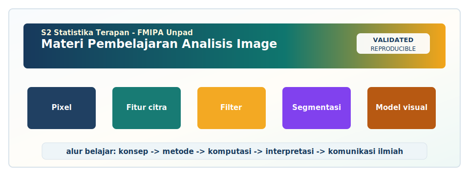

<!-- BEGIN UNPAD MATERIAL STYLE -->
<style>
:root {
  --unpad-navy: #17395c;
  --unpad-gold: #f2a51a;
  --unpad-teal: #0f766e;
  --unpad-ink: #172033;
  --unpad-paper: #fffdf8;
  --unpad-soft: #eef5f8;
  --unpad-line: #d7e2ea;
}
html, body {
  background: linear-gradient(135deg, #f8fbfd 0%, #fffdf8 48%, #f3f6ee 100%) !important;
  color: var(--unpad-ink) !important;
}
body {
  font-family: "Segoe UI", Arial, sans-serif !important;
  line-height: 1.72 !important;
}
.main-container {
  max-width: 1180px !important;
  background: rgba(255, 253, 248, 0.98) !important;
  border: 1px solid var(--unpad-line) !important;
  border-radius: 8px !important;
  box-shadow: 0 18px 42px rgba(23, 57, 92, 0.12) !important;
}
h1, h2, h3, h4 {
  letter-spacing: 0 !important;
}
h1.title {
  color: var(--unpad-navy) !important;
  -webkit-text-fill-color: var(--unpad-navy) !important;
  background: none !important;
}
h2 {
  border-left-color: var(--unpad-gold) !important;
}
a {
  color: #0b5c86 !important;
}
pre, code {
  border-radius: 8px !important;
}
.unpad-cover {
  margin: 18px 0 26px;
  padding: 24px;
  border-radius: 8px;
  background: linear-gradient(135deg, #17395c 0%, #0f766e 58%, #f2a51a 100%);
  color: #ffffff;
  box-shadow: 0 18px 36px rgba(23, 57, 92, 0.22);
}
.unpad-cover__brand {
  display: grid;
  grid-template-columns: 92px 1fr;
  gap: 20px;
  align-items: center;
}
.unpad-cover img {
  width: 92px;
  height: 92px;
  object-fit: contain;
  background: #ffffff;
  border-radius: 8px;
  padding: 8px;
  box-shadow: 0 8px 22px rgba(0,0,0,0.18);
}
.unpad-kicker {
  text-transform: uppercase;
  font-size: 0.82rem;
  font-weight: 800;
  letter-spacing: 0;
  color: #fff8dc;
}
.unpad-cover h2 {
  margin: 6px 0 8px;
  padding: 0;
  border: 0;
  background: transparent;
  color: #ffffff !important;
  font-size: 1.65rem;
}
.unpad-meta {
  margin: 0;
  color: #f7fbff;
  font-weight: 600;
}
.materi-illustration {
  margin: 20px 0 24px;
  padding: 14px;
  background: #ffffff;
  border: 1px solid var(--unpad-line);
  border-radius: 8px;
  box-shadow: 0 12px 28px rgba(23, 57, 92, 0.10);
}
.materi-illustration img {
  width: 100%;
  height: auto;
  display: block;
  border-radius: 6px;
}
.validasi-akademik {
  margin: 18px 0 28px;
  padding: 16px 18px;
  background: linear-gradient(135deg, #eef8f6, #fff8e7);
  border-left: 8px solid var(--unpad-teal);
  border-radius: 8px;
  color: var(--unpad-ink);
}
.validasi-akademik strong {
  color: var(--unpad-navy);
}
table {
  border-radius: 8px !important;
}
@media (max-width: 760px) {
  .unpad-cover__brand {
    grid-template-columns: 1fr;
  }
  .unpad-cover img {
    width: 76px;
    height: 76px;
  }
}
</style>
<!-- END UNPAD MATERIAL STYLE -->


<!-- BEGIN UNPAD MATERIAL ENHANCEMENT -->

```{r setup-unpad-render, include=FALSE}
execute_code <- FALSE
knitr::opts_chunk$set(
  echo = TRUE,
  eval = FALSE,
  message = FALSE,
  warning = FALSE,
  fig.align = "center",
  fig.width = 8,
  fig.height = 4.8,
  dpi = 120
)
set.seed(2025)
```


<div class="unpad-cover">
<div class="unpad-cover__brand">

<div>
<div class="unpad-kicker">S2 Statistika Terapan | FMIPA Universitas Padjadjaran</div>
<h2>Materi Pembelajaran Analisis Image</h2>
<p class="unpad-meta">S2 Statistika Terapan FMIPA Universitas Padjadjaran<br>Penulis: Dr. Anindya Apriliyanti Pravitasari, M.Si | Januari 2025</p>
</div>
</div>
</div>

<div class="materi-illustration">

</div>

<div class="validasi-akademik">
<strong>Catatan validasi akademik.</strong> Materi ini diseragamkan dengan rujukan ADWTL Januari 2025: rumus dibaca bersama asumsi, contoh kode diposisikan sebagai template reproducible, dan interpretasi diarahkan pada validitas data, diagnosis model, evaluasi ketidakpastian, serta komunikasi hasil secara ilmiah.
</div>

<!-- END UNPAD MATERIAL ENHANCEMENT -->

```{r setup, include=FALSE, eval=FALSE}
knitr::opts_chunk$set(echo = TRUE, warning = FALSE, message = FALSE, fig.align = "center")
```


<style>
:root{
  --brown-dark:#3B2415;
  --brown:#7A4A28;
  --brown-mid:#A5693D;
  --brown-soft:#C89562;
  --cream:#FFF8EE;
  --cream-2:#F7E6D0;
  --gold:#D8A23B;
  --mint:#DDEEDB;
  --rose:#F2D6C9;
  --blue:#D7E5F5;
  --ink:#1E1712;
}
body{
  font-family: "Source Sans Pro", "Segoe UI", Arial, sans-serif;
  color: var(--ink);
  background: linear-gradient(135deg,#fffaf2 0%,#f6e4ce 38%,#e1b47e 72%,#8a5634 100%);
  line-height: 1.68;
  font-size: 17px;
}
main, .main-container, .container-fluid{
  max-width: 1180px !important;
  background: rgba(255,250,242,0.96);
  border-radius: 26px;
  box-shadow: 0 28px 80px rgba(71,39,19,0.22);
  padding: 42px 56px 64px 56px !important;
  margin: 28px auto 50px auto;
}
#TOC{
  position: fixed;
  left: 18px;
  top: 18px;
  bottom: 18px;
  width: 285px;
  overflow-y: auto;
  background: linear-gradient(180deg,#4b2c19,#8b552e 48%,#d8a35a);
  color: #fff;
  border-radius: 22px;
  padding: 22px 18px;
  box-shadow: 0 18px 45px rgba(48,26,12,0.35);
  z-index: 999;
}
#TOC a{color:#fff7e6;text-decoration:none;font-size:14px;}
#TOC a:hover{color:#ffe08a;text-decoration:underline;}
body{padding-left: 335px;}
h1, h2, h3, h4{color:var(--brown-dark);font-weight:800;letter-spacing:-0.02em;}
h1{font-size:2.45rem;border-bottom:4px solid var(--gold);padding-bottom:12px;margin-top:22px;}
h2{font-size:2.0rem;margin-top:54px;padding:16px 20px;border-radius:18px;background:linear-gradient(90deg,#ead0b2,#fff7ec);border-left:10px solid var(--brown-mid);}
h3{font-size:1.45rem;margin-top:34px;color:#57321b;}
h4{font-size:1.13rem;margin-top:26px;color:#6c3f23;}
.title{font-size:3rem !important;color:#351d0f;font-weight:900;}
.subtitle{font-size:1.5rem;color:#6a3e23;}
a{color:#8a4f20;font-weight:700;}
blockquote{
  border-left:8px solid var(--gold);
  background:linear-gradient(90deg,#fff2d9,#fffaf2);
  padding:18px 24px;
  border-radius:16px;
}
table{width:100%;border-collapse:separate;border-spacing:0;margin:22px 0;background:#fffdf8;box-shadow:0 8px 22px rgba(91,52,21,0.09);border-radius:14px;overflow:hidden;}
th{background:#6d4328;color:white;padding:12px;border:1px solid #6d4328;}
td{padding:11px;border:1px solid #e5c9a7;vertical-align:top;}
tr:nth-child(even) td{background:#fff5e6;}
.formula-box{
  background: linear-gradient(135deg,#F7E6D0,#FFF7EB);
  color:#000000;
  border:2px solid #d5a46e;
  border-left:10px solid #9c6538;
  border-radius:20px;
  padding:22px 26px;
  margin:24px 0;
  box-shadow:0 12px 25px rgba(91,48,16,0.13);
}
.formula-box strong{color:#3b2415;}
.callout-note,.callout-case,.callout-warning,.callout-practice{
  border-radius:20px;
  padding:20px 24px;
  margin:22px 0;
  box-shadow:0 10px 22px rgba(0,0,0,0.06);
}
.callout-note{background:#eef4ff;border-left:9px solid #668fc0;}
.callout-case{background:#eff7ea;border-left:9px solid #78a866;}
.callout-warning{background:#fff2dd;border-left:9px solid #d28b2a;}
.callout-practice{background:#fbe7df;border-left:9px solid #c46e4d;}
.badge{display:inline-block;background:#6d4328;color:#fff;padding:4px 10px;border-radius:999px;font-size:0.85em;margin-right:4px;}
.figure-box{
  background:#fffaf2;border:2px dashed #b5814f;border-radius:22px;padding:18px 22px;margin:22px 0;text-align:center;
}
.figure-box .sketch{font-family:monospace;white-space:pre;line-height:1.15;text-align:left;display:inline-block;background:#f9ead8;padding:18px;border-radius:16px;color:#2e1a0f;}
pre, code, .sourceCode{
  background-color:#F7E6D0 !important;
  color:#000 !important;
  border-radius:14px;
}
pre{padding:18px 20px;border:1px solid #e2bd8e;box-shadow:inset 0 0 0 1px #fff5e8;}
code{padding:2px 5px;}
hr{border:0;height:3px;background:linear-gradient(90deg,#7a4a28,#d8a23b,#fff1c7);border-radius:4px;margin:36px 0;}
.smallcaps{font-variant:small-caps;letter-spacing:.05em;}
@media(max-width:1100px){body{padding-left:0;}#TOC{position:relative;width:auto;left:auto;top:auto;bottom:auto;margin:12px;}main,.main-container,.container-fluid{margin:12px;padding:28px !important;}}
</style>


<div class="callout-case">
<strong>Identitas Mata Kuliah.</strong> Materi ini disusun sebagai bahan ajar utama mata kuliah <strong>Analisis Image</strong> pada <strong>Program Studi S2 Statistika Terapan, Fakultas Matematika dan Ilmu Pengetahuan Alam, Universitas Padjadjaran</strong>. Mata kuliah ini berada pada <strong>Semester 2</strong>, berbobot <strong>3 SKS</strong> dengan komposisi <strong>2 SKS teori</strong> dan <strong>1 SKS praktikum</strong>. Fokusnya adalah integrasi statistika, komputasi, dan deep learning untuk memahami, mengolah, memodelkan, serta mengkomunikasikan solusi berbasis citra digital.
</div>

## Prakata

Analisis citra digital telah menjadi salah satu jembatan paling menarik antara statistika, komputasi, kecerdasan buatan, dan kebutuhan pengambilan keputusan di dunia nyata. Citra medis, citra satelit, citra mikroskopis, citra produk industri, foto lapangan, citra sosial media, hingga rekaman video pengawasan dapat dipandang sebagai data kompleks yang menyimpan informasi spasial, tekstural, morfologis, dan semantik. Bagi mahasiswa S2 Statistika Terapan, citra tidak hanya diperlakukan sebagai gambar yang “dilihat”, tetapi sebagai objek data berdimensi tinggi yang dapat direpresentasikan, diringkas, dimodelkan, diuji, diprediksi, dan dikomunikasikan secara ilmiah.

Materi ini mengikuti alur RPS mata kuliah Analisis Image. Alur pembelajaran dimulai dari representasi citra digital, eksplorasi citra, operasi dasar, histogram, filtering, konvolusi, morfologi, CNN, segmentasi, object detection, hingga perancangan proposal riset. Dengan demikian, mahasiswa tidak hanya mempelajari teknik, tetapi juga membangun kebiasaan berpikir sebagai peneliti: memahami masalah, memeriksa kualitas data, memilih metode, mengevaluasi hasil, menginterpretasikan model, dan menjelaskan dampak aplikasinya. Materi ini juga menekankan bahwa model yang baik bukan sekadar model dengan akurasi tinggi, melainkan model yang sesuai dengan konteks data, dapat dipertanggungjawabkan, dan bermanfaat untuk keputusan nyata.

Secara konseptual, materi mengacu pada literatur utama pengolahan citra digital, computer vision, dan deep learning seperti @gonzalez2018digital, @szeliski2022computer, dan @goodfellow2016deep. Untuk aspek statistika dan pembelajaran mesin, materi ini memperkaya pembahasan dengan perspektif pattern recognition, statistical learning, dan evaluasi model sebagaimana dibahas dalam @bishop2006pattern, @hastie2009elements, dan @duda2001pattern. Untuk metode modern, materi mengintegrasikan CNN klasik dan lanjutan seperti LeNet, AlexNet, VGG, ResNet, U-Net, Mask R-CNN, Faster R-CNN, SSD, YOLO, serta pengantar interpretabilitas model visual.

<div class="callout-note">
<strong>Catatan pembelajaran.</strong> Contoh kode dalam dokumen ini ditulis agar mudah dipindahkan ke R Markdown, Jupyter Notebook, Google Colaboratory, atau lingkungan Python lokal. Banyak chunk dibuat <code>eval=FALSE</code> agar materi aman dirender meskipun paket belum terpasang. Saat praktikum, dosen dapat mengaktifkan chunk tertentu setelah memastikan dependensi tersedia. Mesin jangan dipaksa kalau belum siap; bahkan laptop juga punya hak asasi pemrosesan. 😄
</div>

## Peta Capaian Pembelajaran

| Kode | Capaian Pembelajaran Mata Kuliah |
|---|---|
| CPMK1 | Mahasiswa mampu menganalisis dan mengelola data citra digital dari berbagai domain aplikasi nyata, khususnya industri, sosial, aktuaria, biostatistik, dan sains data, secara interdisipliner. |
| CPMK2 | Mahasiswa mampu mengembangkan solusi filtering, konvolusi, dan operasi morfologi citra untuk mengolah data citra yang kompleks. |
| CPMK3 | Mahasiswa mampu merancang dan membangun algoritma klasifikasi dan segmentasi citra berbasis komputasi menggunakan software statistika dan deep learning. |
| CPMK4 | Mahasiswa mampu memformulasikan dan mengkomunikasikan solusi inovatif pada masalah citra kompleks melalui riset dan pengembangan berdampak nasional/internasional. |

## Peta Sub-CPMK dan Pertemuan

| Sub-CPMK | Kemampuan akhir | Pertemuan | Fokus pembelajaran |
|---|---|---:|---|
| SubCPMK1 | Menganalisis karakteristik dan representasi citra digital | 1--3 | Konsep dasar, representasi, karakteristik, EDA, studi kasus |
| SubCPMK2 | Mengevaluasi filtering, konvolusi, dan morfologi citra | 4--8 | Operasi dasar, histogram, filtering, kernel, morfologi, UTS proyek pendahuluan |
| SubCPMK3 | Membangun klasifikasi dan segmentasi citra | 9--12 | CNN, arsitektur, klasifikasi, segmentasi, evaluasi, interpretasi |
| SubCPMK4 | Merancang proposal riset inovatif berbasis citra | 13--16 | Gap riset, object detection, proposal, peer review, UAS proyek akhir |

## Strategi Belajar

Materi ini paling efektif dipelajari dengan pola spiral. Mahasiswa membaca konsep, menjalankan kode, mengamati hasil visual, kembali ke teori, lalu mengaitkannya dengan studi kasus. Dalam analisis citra, intuisi visual sangat penting, tetapi intuisi saja tidak cukup. Setiap perbedaan tampilan perlu dihubungkan dengan ukuran numerik, setiap ukuran numerik perlu dikaitkan dengan konteks, dan setiap konteks perlu diterjemahkan menjadi keputusan metodologis. Dengan kata lain, mata kuliah ini menggabungkan mata, matematika, dan mesin. Ketiganya harus kompak; kalau satu tertinggal, hasilnya bisa seperti foto KTP: ada datanya, tetapi sering kurang membahagiakan.


# Pendahuluan Analisis Citra Digital
<span class="badge">Pertemuan 1</span> <span class="badge">SubCPMK1</span>

Bab ini mendukung capaian SubCPMK1 dalam RPS Analisis Image. Fokusnya adalah pengertian citra digital, pixel dan intensitas, domain aplikasi, statistical image analysis, serta penerapannya pada konteks klasifikasi kualitas produk industri berdasarkan citra permukaan, deteksi area berisiko pada citra medis, serta pemetaan tutupan lahan dari citra satelit. Pembahasan mengikuti literatur utama [@gonzalez2018digital; @szeliski2022computer] dan diarahkan agar mahasiswa mampu menghubungkan konsep matematis, implementasi komputasi, serta interpretasi substantif.

<div class="formula-box">
<strong>Rumus kunci.</strong>

$$I:\Omega \subset \mathbb{Z}^{2} \rightarrow \mathbb{R}^{C}, \quad I(i,j)=(x_{ij1},x_{ij2},\ldots,x_{ijC})$$
</div>

## Tujuan Pembelajaran Bab

1. Menjelaskan dan menerapkan konsep **pengertian citra digital** dalam analisis citra digital.
2. Menjelaskan dan menerapkan konsep **pixel dan intensitas** dalam analisis citra digital.
3. Menjelaskan dan menerapkan konsep **domain aplikasi** dalam analisis citra digital.
4. Menjelaskan dan menerapkan konsep **statistical image analysis** dalam analisis citra digital.
5. Menjelaskan dan menerapkan konsep **workflow analisis citra** dalam analisis citra digital.

## Konsep Inti

### Pengertian Citra Digital
Dalam perspektif statistika terapan, pengertian citra digital tidak cukup dipahami sebagai teknik komputasi semata. Konsep ini perlu ditempatkan sebagai bagian dari proses inferensi atas objek visual. Ketika mahasiswa mengamati citra, mereka sesungguhnya mengamati realisasi dari proses pembentukan data yang dipengaruhi sensor, pencahayaan, geometri objek, noise, resolusi, dan keputusan praproses. Oleh karena itu, setiap transformasi citra harus dipandang sebagai operasi pada data yang dapat mengubah distribusi intensitas, struktur spasial, dan informasi yang tersedia untuk model berikutnya.

Secara metodologis, pengertian citra digital membantu mahasiswa menjawab pertanyaan apakah informasi visual yang terlihat oleh manusia juga dapat diringkas secara kuantitatif. Pada citra grayscale, informasi dapat muncul sebagai perbedaan intensitas. Pada citra RGB, informasi dapat muncul sebagai komposisi warna. Pada citra multichannel, informasi dapat tersebar pada beberapa kanal yang masing-masing memiliki makna fisik atau biologis. Kualitas analisis sangat bergantung pada kemampuan menyelaraskan makna domain dengan representasi numerik.

Dalam praktik riset, pengertian citra digital sering menjadi sumber kesalahan tersembunyi. Kesalahan dapat muncul ketika citra dari berbagai sumber langsung digabung tanpa standardisasi, ketika resolusi berbeda dianggap setara, ketika augmentasi dilakukan tanpa mempertimbangkan konteks, atau ketika label dibuat terlalu kasar. Mahasiswa perlu membangun kebiasaan membuat catatan praproses, menyimpan parameter transformasi, dan menguji sensitivitas hasil terhadap keputusan teknis.

Dari sudut pandang komputasi, pengertian citra digital harus diterjemahkan ke dalam workflow yang reprodusibel. Workflow yang baik mencakup pembacaan data, pengecekan dimensi, visualisasi contoh citra, ringkasan statistik, transformasi, penyimpanan output antara, dan evaluasi hasil. Reprodusibilitas menjadi penting karena analisis citra biasanya melibatkan banyak tahapan. Satu tahap yang tidak terdokumentasi dapat membuat hasil sulit ditelusuri kembali.

Untuk aplikasi interdisipliner, pengertian citra digital perlu dibahas bersama ahli domain. Misalnya, pada citra medis, area terang atau gelap belum tentu bermakna patologis tanpa konteks anatomi dan protokol pencitraan. Pada citra industri, perubahan tekstur kecil dapat berarti cacat produksi yang penting. Pada citra lingkungan, variasi warna dapat dipengaruhi musim, kelembaban, bayangan awan, atau sudut pengambilan gambar. Di sinilah statistik berperan sebagai bahasa penghubung antara data visual dan pengetahuan substantif.

Evaluasi terhadap pengertian citra digital sebaiknya tidak hanya berbasis tampilan visual. Mahasiswa perlu mempertimbangkan ukuran numerik seperti rata-rata intensitas, simpangan baku, rasio area, indeks tekstur, ukuran tepi, metrik segmentasi, atau performa klasifikasi. Dengan menggabungkan visualisasi dan ukuran numerik, interpretasi menjadi lebih kuat dan tidak mudah jatuh pada kesan subjektif. Mata boleh terpukau, tetapi laporan ilmiah tetap perlu angka.


### Pixel Dan Intensitas
Dalam perspektif statistika terapan, pixel dan intensitas tidak cukup dipahami sebagai teknik komputasi semata. Konsep ini perlu ditempatkan sebagai bagian dari proses inferensi atas objek visual. Ketika mahasiswa mengamati citra, mereka sesungguhnya mengamati realisasi dari proses pembentukan data yang dipengaruhi sensor, pencahayaan, geometri objek, noise, resolusi, dan keputusan praproses. Oleh karena itu, setiap transformasi citra harus dipandang sebagai operasi pada data yang dapat mengubah distribusi intensitas, struktur spasial, dan informasi yang tersedia untuk model berikutnya.

Secara metodologis, pixel dan intensitas membantu mahasiswa menjawab pertanyaan apakah informasi visual yang terlihat oleh manusia juga dapat diringkas secara kuantitatif. Pada citra grayscale, informasi dapat muncul sebagai perbedaan intensitas. Pada citra RGB, informasi dapat muncul sebagai komposisi warna. Pada citra multichannel, informasi dapat tersebar pada beberapa kanal yang masing-masing memiliki makna fisik atau biologis. Kualitas analisis sangat bergantung pada kemampuan menyelaraskan makna domain dengan representasi numerik.

Dalam praktik riset, pixel dan intensitas sering menjadi sumber kesalahan tersembunyi. Kesalahan dapat muncul ketika citra dari berbagai sumber langsung digabung tanpa standardisasi, ketika resolusi berbeda dianggap setara, ketika augmentasi dilakukan tanpa mempertimbangkan konteks, atau ketika label dibuat terlalu kasar. Mahasiswa perlu membangun kebiasaan membuat catatan praproses, menyimpan parameter transformasi, dan menguji sensitivitas hasil terhadap keputusan teknis.

Dari sudut pandang komputasi, pixel dan intensitas harus diterjemahkan ke dalam workflow yang reprodusibel. Workflow yang baik mencakup pembacaan data, pengecekan dimensi, visualisasi contoh citra, ringkasan statistik, transformasi, penyimpanan output antara, dan evaluasi hasil. Reprodusibilitas menjadi penting karena analisis citra biasanya melibatkan banyak tahapan. Satu tahap yang tidak terdokumentasi dapat membuat hasil sulit ditelusuri kembali.

Untuk aplikasi interdisipliner, pixel dan intensitas perlu dibahas bersama ahli domain. Misalnya, pada citra medis, area terang atau gelap belum tentu bermakna patologis tanpa konteks anatomi dan protokol pencitraan. Pada citra industri, perubahan tekstur kecil dapat berarti cacat produksi yang penting. Pada citra lingkungan, variasi warna dapat dipengaruhi musim, kelembaban, bayangan awan, atau sudut pengambilan gambar. Di sinilah statistik berperan sebagai bahasa penghubung antara data visual dan pengetahuan substantif.

Evaluasi terhadap pixel dan intensitas sebaiknya tidak hanya berbasis tampilan visual. Mahasiswa perlu mempertimbangkan ukuran numerik seperti rata-rata intensitas, simpangan baku, rasio area, indeks tekstur, ukuran tepi, metrik segmentasi, atau performa klasifikasi. Dengan menggabungkan visualisasi dan ukuran numerik, interpretasi menjadi lebih kuat dan tidak mudah jatuh pada kesan subjektif. Mata boleh terpukau, tetapi laporan ilmiah tetap perlu angka.


### Domain Aplikasi
Dalam perspektif statistika terapan, domain aplikasi tidak cukup dipahami sebagai teknik komputasi semata. Konsep ini perlu ditempatkan sebagai bagian dari proses inferensi atas objek visual. Ketika mahasiswa mengamati citra, mereka sesungguhnya mengamati realisasi dari proses pembentukan data yang dipengaruhi sensor, pencahayaan, geometri objek, noise, resolusi, dan keputusan praproses. Oleh karena itu, setiap transformasi citra harus dipandang sebagai operasi pada data yang dapat mengubah distribusi intensitas, struktur spasial, dan informasi yang tersedia untuk model berikutnya.

Secara metodologis, domain aplikasi membantu mahasiswa menjawab pertanyaan apakah informasi visual yang terlihat oleh manusia juga dapat diringkas secara kuantitatif. Pada citra grayscale, informasi dapat muncul sebagai perbedaan intensitas. Pada citra RGB, informasi dapat muncul sebagai komposisi warna. Pada citra multichannel, informasi dapat tersebar pada beberapa kanal yang masing-masing memiliki makna fisik atau biologis. Kualitas analisis sangat bergantung pada kemampuan menyelaraskan makna domain dengan representasi numerik.

Dalam praktik riset, domain aplikasi sering menjadi sumber kesalahan tersembunyi. Kesalahan dapat muncul ketika citra dari berbagai sumber langsung digabung tanpa standardisasi, ketika resolusi berbeda dianggap setara, ketika augmentasi dilakukan tanpa mempertimbangkan konteks, atau ketika label dibuat terlalu kasar. Mahasiswa perlu membangun kebiasaan membuat catatan praproses, menyimpan parameter transformasi, dan menguji sensitivitas hasil terhadap keputusan teknis.

Dari sudut pandang komputasi, domain aplikasi harus diterjemahkan ke dalam workflow yang reprodusibel. Workflow yang baik mencakup pembacaan data, pengecekan dimensi, visualisasi contoh citra, ringkasan statistik, transformasi, penyimpanan output antara, dan evaluasi hasil. Reprodusibilitas menjadi penting karena analisis citra biasanya melibatkan banyak tahapan. Satu tahap yang tidak terdokumentasi dapat membuat hasil sulit ditelusuri kembali.

Untuk aplikasi interdisipliner, domain aplikasi perlu dibahas bersama ahli domain. Misalnya, pada citra medis, area terang atau gelap belum tentu bermakna patologis tanpa konteks anatomi dan protokol pencitraan. Pada citra industri, perubahan tekstur kecil dapat berarti cacat produksi yang penting. Pada citra lingkungan, variasi warna dapat dipengaruhi musim, kelembaban, bayangan awan, atau sudut pengambilan gambar. Di sinilah statistik berperan sebagai bahasa penghubung antara data visual dan pengetahuan substantif.

Evaluasi terhadap domain aplikasi sebaiknya tidak hanya berbasis tampilan visual. Mahasiswa perlu mempertimbangkan ukuran numerik seperti rata-rata intensitas, simpangan baku, rasio area, indeks tekstur, ukuran tepi, metrik segmentasi, atau performa klasifikasi. Dengan menggabungkan visualisasi dan ukuran numerik, interpretasi menjadi lebih kuat dan tidak mudah jatuh pada kesan subjektif. Mata boleh terpukau, tetapi laporan ilmiah tetap perlu angka.


### Statistical Image Analysis
Dalam perspektif statistika terapan, statistical image analysis tidak cukup dipahami sebagai teknik komputasi semata. Konsep ini perlu ditempatkan sebagai bagian dari proses inferensi atas objek visual. Ketika mahasiswa mengamati citra, mereka sesungguhnya mengamati realisasi dari proses pembentukan data yang dipengaruhi sensor, pencahayaan, geometri objek, noise, resolusi, dan keputusan praproses. Oleh karena itu, setiap transformasi citra harus dipandang sebagai operasi pada data yang dapat mengubah distribusi intensitas, struktur spasial, dan informasi yang tersedia untuk model berikutnya.

Secara metodologis, statistical image analysis membantu mahasiswa menjawab pertanyaan apakah informasi visual yang terlihat oleh manusia juga dapat diringkas secara kuantitatif. Pada citra grayscale, informasi dapat muncul sebagai perbedaan intensitas. Pada citra RGB, informasi dapat muncul sebagai komposisi warna. Pada citra multichannel, informasi dapat tersebar pada beberapa kanal yang masing-masing memiliki makna fisik atau biologis. Kualitas analisis sangat bergantung pada kemampuan menyelaraskan makna domain dengan representasi numerik.

Dalam praktik riset, statistical image analysis sering menjadi sumber kesalahan tersembunyi. Kesalahan dapat muncul ketika citra dari berbagai sumber langsung digabung tanpa standardisasi, ketika resolusi berbeda dianggap setara, ketika augmentasi dilakukan tanpa mempertimbangkan konteks, atau ketika label dibuat terlalu kasar. Mahasiswa perlu membangun kebiasaan membuat catatan praproses, menyimpan parameter transformasi, dan menguji sensitivitas hasil terhadap keputusan teknis.

Dari sudut pandang komputasi, statistical image analysis harus diterjemahkan ke dalam workflow yang reprodusibel. Workflow yang baik mencakup pembacaan data, pengecekan dimensi, visualisasi contoh citra, ringkasan statistik, transformasi, penyimpanan output antara, dan evaluasi hasil. Reprodusibilitas menjadi penting karena analisis citra biasanya melibatkan banyak tahapan. Satu tahap yang tidak terdokumentasi dapat membuat hasil sulit ditelusuri kembali.

Untuk aplikasi interdisipliner, statistical image analysis perlu dibahas bersama ahli domain. Misalnya, pada citra medis, area terang atau gelap belum tentu bermakna patologis tanpa konteks anatomi dan protokol pencitraan. Pada citra industri, perubahan tekstur kecil dapat berarti cacat produksi yang penting. Pada citra lingkungan, variasi warna dapat dipengaruhi musim, kelembaban, bayangan awan, atau sudut pengambilan gambar. Di sinilah statistik berperan sebagai bahasa penghubung antara data visual dan pengetahuan substantif.

Evaluasi terhadap statistical image analysis sebaiknya tidak hanya berbasis tampilan visual. Mahasiswa perlu mempertimbangkan ukuran numerik seperti rata-rata intensitas, simpangan baku, rasio area, indeks tekstur, ukuran tepi, metrik segmentasi, atau performa klasifikasi. Dengan menggabungkan visualisasi dan ukuran numerik, interpretasi menjadi lebih kuat dan tidak mudah jatuh pada kesan subjektif. Mata boleh terpukau, tetapi laporan ilmiah tetap perlu angka.


### Workflow Analisis Citra
Dalam perspektif statistika terapan, workflow analisis citra tidak cukup dipahami sebagai teknik komputasi semata. Konsep ini perlu ditempatkan sebagai bagian dari proses inferensi atas objek visual. Ketika mahasiswa mengamati citra, mereka sesungguhnya mengamati realisasi dari proses pembentukan data yang dipengaruhi sensor, pencahayaan, geometri objek, noise, resolusi, dan keputusan praproses. Oleh karena itu, setiap transformasi citra harus dipandang sebagai operasi pada data yang dapat mengubah distribusi intensitas, struktur spasial, dan informasi yang tersedia untuk model berikutnya.

Secara metodologis, workflow analisis citra membantu mahasiswa menjawab pertanyaan apakah informasi visual yang terlihat oleh manusia juga dapat diringkas secara kuantitatif. Pada citra grayscale, informasi dapat muncul sebagai perbedaan intensitas. Pada citra RGB, informasi dapat muncul sebagai komposisi warna. Pada citra multichannel, informasi dapat tersebar pada beberapa kanal yang masing-masing memiliki makna fisik atau biologis. Kualitas analisis sangat bergantung pada kemampuan menyelaraskan makna domain dengan representasi numerik.

Dalam praktik riset, workflow analisis citra sering menjadi sumber kesalahan tersembunyi. Kesalahan dapat muncul ketika citra dari berbagai sumber langsung digabung tanpa standardisasi, ketika resolusi berbeda dianggap setara, ketika augmentasi dilakukan tanpa mempertimbangkan konteks, atau ketika label dibuat terlalu kasar. Mahasiswa perlu membangun kebiasaan membuat catatan praproses, menyimpan parameter transformasi, dan menguji sensitivitas hasil terhadap keputusan teknis.

Dari sudut pandang komputasi, workflow analisis citra harus diterjemahkan ke dalam workflow yang reprodusibel. Workflow yang baik mencakup pembacaan data, pengecekan dimensi, visualisasi contoh citra, ringkasan statistik, transformasi, penyimpanan output antara, dan evaluasi hasil. Reprodusibilitas menjadi penting karena analisis citra biasanya melibatkan banyak tahapan. Satu tahap yang tidak terdokumentasi dapat membuat hasil sulit ditelusuri kembali.

Untuk aplikasi interdisipliner, workflow analisis citra perlu dibahas bersama ahli domain. Misalnya, pada citra medis, area terang atau gelap belum tentu bermakna patologis tanpa konteks anatomi dan protokol pencitraan. Pada citra industri, perubahan tekstur kecil dapat berarti cacat produksi yang penting. Pada citra lingkungan, variasi warna dapat dipengaruhi musim, kelembaban, bayangan awan, atau sudut pengambilan gambar. Di sinilah statistik berperan sebagai bahasa penghubung antara data visual dan pengetahuan substantif.

Evaluasi terhadap workflow analisis citra sebaiknya tidak hanya berbasis tampilan visual. Mahasiswa perlu mempertimbangkan ukuran numerik seperti rata-rata intensitas, simpangan baku, rasio area, indeks tekstur, ukuran tepi, metrik segmentasi, atau performa klasifikasi. Dengan menggabungkan visualisasi dan ukuran numerik, interpretasi menjadi lebih kuat dan tidak mudah jatuh pada kesan subjektif. Mata boleh terpukau, tetapi laporan ilmiah tetap perlu angka.


## Studi Kasus Terapan

Studi kasus yang direkomendasikan untuk bab ini adalah klasifikasi kualitas produk industri berdasarkan citra permukaan, deteksi area berisiko pada citra medis, serta pemetaan tutupan lahan dari citra satelit. Dalam kelas S2 Statistika Terapan, studi kasus sebaiknya dipilih dari masalah yang memiliki data nyata, tujuan analisis yang jelas, serta potensi dampak. Mahasiswa dapat menggunakan dataset terbuka, dataset riset dosen, data hasil pengumpulan mandiri, atau data simulasi yang dirancang menyerupai kondisi nyata. Yang penting, setiap keputusan analisis harus dapat dijelaskan secara ilmiah.

Tahap pertama adalah mendefinisikan unit analisis. Pada citra, unit analisis dapat berupa pixel, patch, objek, citra utuh, atau rangkaian citra. Pemilihan unit analisis memengaruhi struktur data dan model. Jika unitnya pixel, maka korelasi spasial antar-pixel perlu diperhatikan. Jika unitnya citra utuh, maka ringkasan fitur atau representasi deep learning menjadi penting. Jika unitnya objek, maka segmentasi atau deteksi objek menjadi tahap awal yang menentukan kualitas analisis berikutnya.

Tahap kedua adalah memeriksa kualitas label. Banyak proyek citra gagal bukan karena modelnya buruk, tetapi karena label tidak konsisten. Label dapat dibuat oleh pakar, anotator terlatih, algoritma awal, atau kombinasi beberapa sumber. Mahasiswa harus mendokumentasikan siapa yang memberi label, bagaimana aturan label dibuat, apakah ada kasus ambigu, dan bagaimana konflik label diselesaikan. Dalam konteks akademik, transparansi label sering lebih penting daripada klaim akurasi yang terlalu tinggi.

Tahap ketiga adalah menentukan baseline. Baseline dapat berupa metode sederhana seperti thresholding, histogram fitur, PCA-LDA, logistic regression, random forest, atau CNN kecil. Baseline membantu menilai apakah metode yang lebih kompleks benar-benar memberikan peningkatan. Tanpa baseline, model canggih dapat terlihat meyakinkan padahal belum tentu lebih baik. Dalam riset yang baik, kompleksitas harus dibayar dengan peningkatan validitas, interpretabilitas, atau kegunaan praktis.

Tahap keempat adalah evaluasi. Evaluasi tidak boleh hanya dilakukan pada data pelatihan. Untuk dataset kecil, strategi seperti cross-validation, stratified split, repeated holdout, atau validasi eksternal perlu dipertimbangkan. Untuk citra dari beberapa lokasi atau alat, pemisahan data sebaiknya memperhatikan sumber citra agar tidak terjadi leakage. Leakage adalah musuh halus dalam machine learning: ia sering membuat akurasi terlihat cantik, tetapi saat dipakai di dunia nyata langsung malu-malu menurun.

Tahap kelima adalah interpretasi. Pada mata kuliah ini, interpretasi tidak berarti sekadar menyebut angka akurasi. Mahasiswa perlu menjelaskan bagian citra mana yang penting, mengapa metode tertentu bekerja lebih baik, bagaimana error terjadi, dan apa konsekuensinya bagi keputusan. Visualisasi hasil, contoh kesalahan klasifikasi, overlay segmentasi, atau heatmap interpretabilitas dapat membantu membuat hasil lebih mudah dipahami oleh pengguna non-teknis.


## Contoh Kode Praktikum

```{python intro-image-matrix, eval=FALSE}
import numpy as np
import matplotlib.pyplot as plt

# Contoh citra grayscale sintetis berukuran 64 x 64
img = np.zeros((64, 64), dtype=float)
img[16:48, 16:48] = 0.75
img[26:38, 26:38] = 1.00

plt.imshow(img, cmap='gray', vmin=0, vmax=1)
plt.title('Citra grayscale sintetis sebagai matriks intensitas')
plt.axis('off')
plt.show()
```

### Ilustrasi konseptual

<div class="figure-box">
<div class="sketch">Data citra nyata
      ↓
Akuisisi dan metadata
      ↓
Praproses dan standardisasi
      ↓
Ekstraksi fitur / model deep learning
      ↓
Evaluasi, interpretasi, dan komunikasi hasil</div>
</div>

### Alur praktikum yang disarankan

1. Pilih minimal satu dataset citra yang sesuai dengan tema aplikasi.
2. Buat folder data mentah, data olahan, kode, visualisasi, dan laporan.
3. Tampilkan contoh citra dari setiap kelas atau kelompok objek.
4. Hitung ukuran deskriptif yang relevan.
5. Terapkan metode utama sesuai topik pertemuan.
6. Bandingkan hasil sebelum dan sesudah pengolahan.
7. Tulis interpretasi teknis dan interpretasi substantif.
8. Simpan kode dan catatan parameter agar analisis dapat diulang.

### Pertanyaan reflektif

- Informasi visual apa yang paling dominan dalam data?
- Apakah perbedaan visual benar-benar mencerminkan perbedaan fenomena nyata?
- Transformasi apa yang paling berpengaruh terhadap hasil?
- Bagaimana cara mengevaluasi hasil secara objektif?
- Apa risiko bias data, bias label, atau bias praproses pada kasus ini?


## Latihan Formatif

1. Jelaskan peran **pengertian citra digital** dalam workflow analisis citra. Berikan satu contoh kasus nyata dan satu risiko kesalahan interpretasi.
2. Jelaskan peran **pixel dan intensitas** dalam workflow analisis citra. Berikan satu contoh kasus nyata dan satu risiko kesalahan interpretasi.
3. Jelaskan peran **domain aplikasi** dalam workflow analisis citra. Berikan satu contoh kasus nyata dan satu risiko kesalahan interpretasi.
4. Jelaskan peran **statistical image analysis** dalam workflow analisis citra. Berikan satu contoh kasus nyata dan satu risiko kesalahan interpretasi.
5. Jelaskan peran **workflow analisis citra** dalam workflow analisis citra. Berikan satu contoh kasus nyata dan satu risiko kesalahan interpretasi.
6. Jelaskan peran **pengertian citra digital** dalam workflow analisis citra. Berikan satu contoh kasus nyata dan satu risiko kesalahan interpretasi.
7. Jelaskan peran **pixel dan intensitas** dalam workflow analisis citra. Berikan satu contoh kasus nyata dan satu risiko kesalahan interpretasi.
8. Jelaskan peran **domain aplikasi** dalam workflow analisis citra. Berikan satu contoh kasus nyata dan satu risiko kesalahan interpretasi.

## Ringkasan Bab

Bab ini menegaskan bahwa pendahuluan analisis citra digital adalah bagian integral dari analisis citra digital. Mahasiswa perlu menguasai konsep, rumus, implementasi, evaluasi, dan komunikasi hasil. Pada level magister, kemampuan yang diharapkan bukan hanya menjalankan fungsi perangkat lunak, tetapi memahami alasan metodologis di balik setiap langkah. Dengan fondasi ini, mahasiswa dapat melanjutkan ke tahap analisis yang lebih kompleks dan merancang riset berbasis citra yang berdampak.

# Representasi dan Karakteristik Data Citra
<span class="badge">Pertemuan 2--3</span> <span class="badge">SubCPMK1</span>

Bab ini mendukung capaian SubCPMK1 dalam RPS Analisis Image. Fokusnya adalah grayscale, RGB, multi-channel, resolusi spasial, serta penerapannya pada konteks eksplorasi foto histopatologi, citra buah, citra permukaan jalan, dan citra lingkungan untuk melihat distribusi intensitas, dominasi warna, serta indikasi noise. Pembahasan mengikuti literatur utama [@gonzalez2018digital; @haralick1973textural] dan diarahkan agar mahasiswa mampu menghubungkan konsep matematis, implementasi komputasi, serta interpretasi substantif.

<div class="formula-box">
<strong>Rumus kunci.</strong>

$$\bar{x}_{c}=\frac{1}{mn}\sum_{i=1}^{m}\sum_{j=1}^{n}x_{ijc}, \quad s_c^2=\frac{1}{mn-1}\sum_{i=1}^{m}\sum_{j=1}^{n}(x_{ijc}-\bar{x}_c)^2$$
</div>

## Tujuan Pembelajaran Bab

1. Menjelaskan dan menerapkan konsep **grayscale** dalam analisis citra digital.
2. Menjelaskan dan menerapkan konsep **RGB** dalam analisis citra digital.
3. Menjelaskan dan menerapkan konsep **multi-channel** dalam analisis citra digital.
4. Menjelaskan dan menerapkan konsep **resolusi spasial** dalam analisis citra digital.
5. Menjelaskan dan menerapkan konsep **kedalaman warna** dalam analisis citra digital.
6. Menjelaskan dan menerapkan konsep **histogram** dalam analisis citra digital.

## Konsep Inti

### Grayscale
Dalam perspektif statistika terapan, grayscale tidak cukup dipahami sebagai teknik komputasi semata. Konsep ini perlu ditempatkan sebagai bagian dari proses inferensi atas objek visual. Ketika mahasiswa mengamati citra, mereka sesungguhnya mengamati realisasi dari proses pembentukan data yang dipengaruhi sensor, pencahayaan, geometri objek, noise, resolusi, dan keputusan praproses. Oleh karena itu, setiap transformasi citra harus dipandang sebagai operasi pada data yang dapat mengubah distribusi intensitas, struktur spasial, dan informasi yang tersedia untuk model berikutnya.

Secara metodologis, grayscale membantu mahasiswa menjawab pertanyaan apakah informasi visual yang terlihat oleh manusia juga dapat diringkas secara kuantitatif. Pada citra grayscale, informasi dapat muncul sebagai perbedaan intensitas. Pada citra RGB, informasi dapat muncul sebagai komposisi warna. Pada citra multichannel, informasi dapat tersebar pada beberapa kanal yang masing-masing memiliki makna fisik atau biologis. Kualitas analisis sangat bergantung pada kemampuan menyelaraskan makna domain dengan representasi numerik.

Dalam praktik riset, grayscale sering menjadi sumber kesalahan tersembunyi. Kesalahan dapat muncul ketika citra dari berbagai sumber langsung digabung tanpa standardisasi, ketika resolusi berbeda dianggap setara, ketika augmentasi dilakukan tanpa mempertimbangkan konteks, atau ketika label dibuat terlalu kasar. Mahasiswa perlu membangun kebiasaan membuat catatan praproses, menyimpan parameter transformasi, dan menguji sensitivitas hasil terhadap keputusan teknis.

Dari sudut pandang komputasi, grayscale harus diterjemahkan ke dalam workflow yang reprodusibel. Workflow yang baik mencakup pembacaan data, pengecekan dimensi, visualisasi contoh citra, ringkasan statistik, transformasi, penyimpanan output antara, dan evaluasi hasil. Reprodusibilitas menjadi penting karena analisis citra biasanya melibatkan banyak tahapan. Satu tahap yang tidak terdokumentasi dapat membuat hasil sulit ditelusuri kembali.

Untuk aplikasi interdisipliner, grayscale perlu dibahas bersama ahli domain. Misalnya, pada citra medis, area terang atau gelap belum tentu bermakna patologis tanpa konteks anatomi dan protokol pencitraan. Pada citra industri, perubahan tekstur kecil dapat berarti cacat produksi yang penting. Pada citra lingkungan, variasi warna dapat dipengaruhi musim, kelembaban, bayangan awan, atau sudut pengambilan gambar. Di sinilah statistik berperan sebagai bahasa penghubung antara data visual dan pengetahuan substantif.

Evaluasi terhadap grayscale sebaiknya tidak hanya berbasis tampilan visual. Mahasiswa perlu mempertimbangkan ukuran numerik seperti rata-rata intensitas, simpangan baku, rasio area, indeks tekstur, ukuran tepi, metrik segmentasi, atau performa klasifikasi. Dengan menggabungkan visualisasi dan ukuran numerik, interpretasi menjadi lebih kuat dan tidak mudah jatuh pada kesan subjektif. Mata boleh terpukau, tetapi laporan ilmiah tetap perlu angka.


### Rgb
Dalam perspektif statistika terapan, RGB tidak cukup dipahami sebagai teknik komputasi semata. Konsep ini perlu ditempatkan sebagai bagian dari proses inferensi atas objek visual. Ketika mahasiswa mengamati citra, mereka sesungguhnya mengamati realisasi dari proses pembentukan data yang dipengaruhi sensor, pencahayaan, geometri objek, noise, resolusi, dan keputusan praproses. Oleh karena itu, setiap transformasi citra harus dipandang sebagai operasi pada data yang dapat mengubah distribusi intensitas, struktur spasial, dan informasi yang tersedia untuk model berikutnya.

Secara metodologis, RGB membantu mahasiswa menjawab pertanyaan apakah informasi visual yang terlihat oleh manusia juga dapat diringkas secara kuantitatif. Pada citra grayscale, informasi dapat muncul sebagai perbedaan intensitas. Pada citra RGB, informasi dapat muncul sebagai komposisi warna. Pada citra multichannel, informasi dapat tersebar pada beberapa kanal yang masing-masing memiliki makna fisik atau biologis. Kualitas analisis sangat bergantung pada kemampuan menyelaraskan makna domain dengan representasi numerik.

Dalam praktik riset, RGB sering menjadi sumber kesalahan tersembunyi. Kesalahan dapat muncul ketika citra dari berbagai sumber langsung digabung tanpa standardisasi, ketika resolusi berbeda dianggap setara, ketika augmentasi dilakukan tanpa mempertimbangkan konteks, atau ketika label dibuat terlalu kasar. Mahasiswa perlu membangun kebiasaan membuat catatan praproses, menyimpan parameter transformasi, dan menguji sensitivitas hasil terhadap keputusan teknis.

Dari sudut pandang komputasi, RGB harus diterjemahkan ke dalam workflow yang reprodusibel. Workflow yang baik mencakup pembacaan data, pengecekan dimensi, visualisasi contoh citra, ringkasan statistik, transformasi, penyimpanan output antara, dan evaluasi hasil. Reprodusibilitas menjadi penting karena analisis citra biasanya melibatkan banyak tahapan. Satu tahap yang tidak terdokumentasi dapat membuat hasil sulit ditelusuri kembali.

Untuk aplikasi interdisipliner, RGB perlu dibahas bersama ahli domain. Misalnya, pada citra medis, area terang atau gelap belum tentu bermakna patologis tanpa konteks anatomi dan protokol pencitraan. Pada citra industri, perubahan tekstur kecil dapat berarti cacat produksi yang penting. Pada citra lingkungan, variasi warna dapat dipengaruhi musim, kelembaban, bayangan awan, atau sudut pengambilan gambar. Di sinilah statistik berperan sebagai bahasa penghubung antara data visual dan pengetahuan substantif.

Evaluasi terhadap RGB sebaiknya tidak hanya berbasis tampilan visual. Mahasiswa perlu mempertimbangkan ukuran numerik seperti rata-rata intensitas, simpangan baku, rasio area, indeks tekstur, ukuran tepi, metrik segmentasi, atau performa klasifikasi. Dengan menggabungkan visualisasi dan ukuran numerik, interpretasi menjadi lebih kuat dan tidak mudah jatuh pada kesan subjektif. Mata boleh terpukau, tetapi laporan ilmiah tetap perlu angka.


### Multi-Channel
Dalam perspektif statistika terapan, multi-channel tidak cukup dipahami sebagai teknik komputasi semata. Konsep ini perlu ditempatkan sebagai bagian dari proses inferensi atas objek visual. Ketika mahasiswa mengamati citra, mereka sesungguhnya mengamati realisasi dari proses pembentukan data yang dipengaruhi sensor, pencahayaan, geometri objek, noise, resolusi, dan keputusan praproses. Oleh karena itu, setiap transformasi citra harus dipandang sebagai operasi pada data yang dapat mengubah distribusi intensitas, struktur spasial, dan informasi yang tersedia untuk model berikutnya.

Secara metodologis, multi-channel membantu mahasiswa menjawab pertanyaan apakah informasi visual yang terlihat oleh manusia juga dapat diringkas secara kuantitatif. Pada citra grayscale, informasi dapat muncul sebagai perbedaan intensitas. Pada citra RGB, informasi dapat muncul sebagai komposisi warna. Pada citra multichannel, informasi dapat tersebar pada beberapa kanal yang masing-masing memiliki makna fisik atau biologis. Kualitas analisis sangat bergantung pada kemampuan menyelaraskan makna domain dengan representasi numerik.

Dalam praktik riset, multi-channel sering menjadi sumber kesalahan tersembunyi. Kesalahan dapat muncul ketika citra dari berbagai sumber langsung digabung tanpa standardisasi, ketika resolusi berbeda dianggap setara, ketika augmentasi dilakukan tanpa mempertimbangkan konteks, atau ketika label dibuat terlalu kasar. Mahasiswa perlu membangun kebiasaan membuat catatan praproses, menyimpan parameter transformasi, dan menguji sensitivitas hasil terhadap keputusan teknis.

Dari sudut pandang komputasi, multi-channel harus diterjemahkan ke dalam workflow yang reprodusibel. Workflow yang baik mencakup pembacaan data, pengecekan dimensi, visualisasi contoh citra, ringkasan statistik, transformasi, penyimpanan output antara, dan evaluasi hasil. Reprodusibilitas menjadi penting karena analisis citra biasanya melibatkan banyak tahapan. Satu tahap yang tidak terdokumentasi dapat membuat hasil sulit ditelusuri kembali.

Untuk aplikasi interdisipliner, multi-channel perlu dibahas bersama ahli domain. Misalnya, pada citra medis, area terang atau gelap belum tentu bermakna patologis tanpa konteks anatomi dan protokol pencitraan. Pada citra industri, perubahan tekstur kecil dapat berarti cacat produksi yang penting. Pada citra lingkungan, variasi warna dapat dipengaruhi musim, kelembaban, bayangan awan, atau sudut pengambilan gambar. Di sinilah statistik berperan sebagai bahasa penghubung antara data visual dan pengetahuan substantif.

Evaluasi terhadap multi-channel sebaiknya tidak hanya berbasis tampilan visual. Mahasiswa perlu mempertimbangkan ukuran numerik seperti rata-rata intensitas, simpangan baku, rasio area, indeks tekstur, ukuran tepi, metrik segmentasi, atau performa klasifikasi. Dengan menggabungkan visualisasi dan ukuran numerik, interpretasi menjadi lebih kuat dan tidak mudah jatuh pada kesan subjektif. Mata boleh terpukau, tetapi laporan ilmiah tetap perlu angka.


### Resolusi Spasial
Dalam perspektif statistika terapan, resolusi spasial tidak cukup dipahami sebagai teknik komputasi semata. Konsep ini perlu ditempatkan sebagai bagian dari proses inferensi atas objek visual. Ketika mahasiswa mengamati citra, mereka sesungguhnya mengamati realisasi dari proses pembentukan data yang dipengaruhi sensor, pencahayaan, geometri objek, noise, resolusi, dan keputusan praproses. Oleh karena itu, setiap transformasi citra harus dipandang sebagai operasi pada data yang dapat mengubah distribusi intensitas, struktur spasial, dan informasi yang tersedia untuk model berikutnya.

Secara metodologis, resolusi spasial membantu mahasiswa menjawab pertanyaan apakah informasi visual yang terlihat oleh manusia juga dapat diringkas secara kuantitatif. Pada citra grayscale, informasi dapat muncul sebagai perbedaan intensitas. Pada citra RGB, informasi dapat muncul sebagai komposisi warna. Pada citra multichannel, informasi dapat tersebar pada beberapa kanal yang masing-masing memiliki makna fisik atau biologis. Kualitas analisis sangat bergantung pada kemampuan menyelaraskan makna domain dengan representasi numerik.

Dalam praktik riset, resolusi spasial sering menjadi sumber kesalahan tersembunyi. Kesalahan dapat muncul ketika citra dari berbagai sumber langsung digabung tanpa standardisasi, ketika resolusi berbeda dianggap setara, ketika augmentasi dilakukan tanpa mempertimbangkan konteks, atau ketika label dibuat terlalu kasar. Mahasiswa perlu membangun kebiasaan membuat catatan praproses, menyimpan parameter transformasi, dan menguji sensitivitas hasil terhadap keputusan teknis.

Dari sudut pandang komputasi, resolusi spasial harus diterjemahkan ke dalam workflow yang reprodusibel. Workflow yang baik mencakup pembacaan data, pengecekan dimensi, visualisasi contoh citra, ringkasan statistik, transformasi, penyimpanan output antara, dan evaluasi hasil. Reprodusibilitas menjadi penting karena analisis citra biasanya melibatkan banyak tahapan. Satu tahap yang tidak terdokumentasi dapat membuat hasil sulit ditelusuri kembali.

Untuk aplikasi interdisipliner, resolusi spasial perlu dibahas bersama ahli domain. Misalnya, pada citra medis, area terang atau gelap belum tentu bermakna patologis tanpa konteks anatomi dan protokol pencitraan. Pada citra industri, perubahan tekstur kecil dapat berarti cacat produksi yang penting. Pada citra lingkungan, variasi warna dapat dipengaruhi musim, kelembaban, bayangan awan, atau sudut pengambilan gambar. Di sinilah statistik berperan sebagai bahasa penghubung antara data visual dan pengetahuan substantif.

Evaluasi terhadap resolusi spasial sebaiknya tidak hanya berbasis tampilan visual. Mahasiswa perlu mempertimbangkan ukuran numerik seperti rata-rata intensitas, simpangan baku, rasio area, indeks tekstur, ukuran tepi, metrik segmentasi, atau performa klasifikasi. Dengan menggabungkan visualisasi dan ukuran numerik, interpretasi menjadi lebih kuat dan tidak mudah jatuh pada kesan subjektif. Mata boleh terpukau, tetapi laporan ilmiah tetap perlu angka.


### Kedalaman Warna
Dalam perspektif statistika terapan, kedalaman warna tidak cukup dipahami sebagai teknik komputasi semata. Konsep ini perlu ditempatkan sebagai bagian dari proses inferensi atas objek visual. Ketika mahasiswa mengamati citra, mereka sesungguhnya mengamati realisasi dari proses pembentukan data yang dipengaruhi sensor, pencahayaan, geometri objek, noise, resolusi, dan keputusan praproses. Oleh karena itu, setiap transformasi citra harus dipandang sebagai operasi pada data yang dapat mengubah distribusi intensitas, struktur spasial, dan informasi yang tersedia untuk model berikutnya.

Secara metodologis, kedalaman warna membantu mahasiswa menjawab pertanyaan apakah informasi visual yang terlihat oleh manusia juga dapat diringkas secara kuantitatif. Pada citra grayscale, informasi dapat muncul sebagai perbedaan intensitas. Pada citra RGB, informasi dapat muncul sebagai komposisi warna. Pada citra multichannel, informasi dapat tersebar pada beberapa kanal yang masing-masing memiliki makna fisik atau biologis. Kualitas analisis sangat bergantung pada kemampuan menyelaraskan makna domain dengan representasi numerik.

Dalam praktik riset, kedalaman warna sering menjadi sumber kesalahan tersembunyi. Kesalahan dapat muncul ketika citra dari berbagai sumber langsung digabung tanpa standardisasi, ketika resolusi berbeda dianggap setara, ketika augmentasi dilakukan tanpa mempertimbangkan konteks, atau ketika label dibuat terlalu kasar. Mahasiswa perlu membangun kebiasaan membuat catatan praproses, menyimpan parameter transformasi, dan menguji sensitivitas hasil terhadap keputusan teknis.

Dari sudut pandang komputasi, kedalaman warna harus diterjemahkan ke dalam workflow yang reprodusibel. Workflow yang baik mencakup pembacaan data, pengecekan dimensi, visualisasi contoh citra, ringkasan statistik, transformasi, penyimpanan output antara, dan evaluasi hasil. Reprodusibilitas menjadi penting karena analisis citra biasanya melibatkan banyak tahapan. Satu tahap yang tidak terdokumentasi dapat membuat hasil sulit ditelusuri kembali.

Untuk aplikasi interdisipliner, kedalaman warna perlu dibahas bersama ahli domain. Misalnya, pada citra medis, area terang atau gelap belum tentu bermakna patologis tanpa konteks anatomi dan protokol pencitraan. Pada citra industri, perubahan tekstur kecil dapat berarti cacat produksi yang penting. Pada citra lingkungan, variasi warna dapat dipengaruhi musim, kelembaban, bayangan awan, atau sudut pengambilan gambar. Di sinilah statistik berperan sebagai bahasa penghubung antara data visual dan pengetahuan substantif.

Evaluasi terhadap kedalaman warna sebaiknya tidak hanya berbasis tampilan visual. Mahasiswa perlu mempertimbangkan ukuran numerik seperti rata-rata intensitas, simpangan baku, rasio area, indeks tekstur, ukuran tepi, metrik segmentasi, atau performa klasifikasi. Dengan menggabungkan visualisasi dan ukuran numerik, interpretasi menjadi lebih kuat dan tidak mudah jatuh pada kesan subjektif. Mata boleh terpukau, tetapi laporan ilmiah tetap perlu angka.


### Histogram
Dalam perspektif statistika terapan, histogram tidak cukup dipahami sebagai teknik komputasi semata. Konsep ini perlu ditempatkan sebagai bagian dari proses inferensi atas objek visual. Ketika mahasiswa mengamati citra, mereka sesungguhnya mengamati realisasi dari proses pembentukan data yang dipengaruhi sensor, pencahayaan, geometri objek, noise, resolusi, dan keputusan praproses. Oleh karena itu, setiap transformasi citra harus dipandang sebagai operasi pada data yang dapat mengubah distribusi intensitas, struktur spasial, dan informasi yang tersedia untuk model berikutnya.

Secara metodologis, histogram membantu mahasiswa menjawab pertanyaan apakah informasi visual yang terlihat oleh manusia juga dapat diringkas secara kuantitatif. Pada citra grayscale, informasi dapat muncul sebagai perbedaan intensitas. Pada citra RGB, informasi dapat muncul sebagai komposisi warna. Pada citra multichannel, informasi dapat tersebar pada beberapa kanal yang masing-masing memiliki makna fisik atau biologis. Kualitas analisis sangat bergantung pada kemampuan menyelaraskan makna domain dengan representasi numerik.

Dalam praktik riset, histogram sering menjadi sumber kesalahan tersembunyi. Kesalahan dapat muncul ketika citra dari berbagai sumber langsung digabung tanpa standardisasi, ketika resolusi berbeda dianggap setara, ketika augmentasi dilakukan tanpa mempertimbangkan konteks, atau ketika label dibuat terlalu kasar. Mahasiswa perlu membangun kebiasaan membuat catatan praproses, menyimpan parameter transformasi, dan menguji sensitivitas hasil terhadap keputusan teknis.

Dari sudut pandang komputasi, histogram harus diterjemahkan ke dalam workflow yang reprodusibel. Workflow yang baik mencakup pembacaan data, pengecekan dimensi, visualisasi contoh citra, ringkasan statistik, transformasi, penyimpanan output antara, dan evaluasi hasil. Reprodusibilitas menjadi penting karena analisis citra biasanya melibatkan banyak tahapan. Satu tahap yang tidak terdokumentasi dapat membuat hasil sulit ditelusuri kembali.

Untuk aplikasi interdisipliner, histogram perlu dibahas bersama ahli domain. Misalnya, pada citra medis, area terang atau gelap belum tentu bermakna patologis tanpa konteks anatomi dan protokol pencitraan. Pada citra industri, perubahan tekstur kecil dapat berarti cacat produksi yang penting. Pada citra lingkungan, variasi warna dapat dipengaruhi musim, kelembaban, bayangan awan, atau sudut pengambilan gambar. Di sinilah statistik berperan sebagai bahasa penghubung antara data visual dan pengetahuan substantif.

Evaluasi terhadap histogram sebaiknya tidak hanya berbasis tampilan visual. Mahasiswa perlu mempertimbangkan ukuran numerik seperti rata-rata intensitas, simpangan baku, rasio area, indeks tekstur, ukuran tepi, metrik segmentasi, atau performa klasifikasi. Dengan menggabungkan visualisasi dan ukuran numerik, interpretasi menjadi lebih kuat dan tidak mudah jatuh pada kesan subjektif. Mata boleh terpukau, tetapi laporan ilmiah tetap perlu angka.


### Statistik Channel
Dalam perspektif statistika terapan, statistik channel tidak cukup dipahami sebagai teknik komputasi semata. Konsep ini perlu ditempatkan sebagai bagian dari proses inferensi atas objek visual. Ketika mahasiswa mengamati citra, mereka sesungguhnya mengamati realisasi dari proses pembentukan data yang dipengaruhi sensor, pencahayaan, geometri objek, noise, resolusi, dan keputusan praproses. Oleh karena itu, setiap transformasi citra harus dipandang sebagai operasi pada data yang dapat mengubah distribusi intensitas, struktur spasial, dan informasi yang tersedia untuk model berikutnya.

Secara metodologis, statistik channel membantu mahasiswa menjawab pertanyaan apakah informasi visual yang terlihat oleh manusia juga dapat diringkas secara kuantitatif. Pada citra grayscale, informasi dapat muncul sebagai perbedaan intensitas. Pada citra RGB, informasi dapat muncul sebagai komposisi warna. Pada citra multichannel, informasi dapat tersebar pada beberapa kanal yang masing-masing memiliki makna fisik atau biologis. Kualitas analisis sangat bergantung pada kemampuan menyelaraskan makna domain dengan representasi numerik.

Dalam praktik riset, statistik channel sering menjadi sumber kesalahan tersembunyi. Kesalahan dapat muncul ketika citra dari berbagai sumber langsung digabung tanpa standardisasi, ketika resolusi berbeda dianggap setara, ketika augmentasi dilakukan tanpa mempertimbangkan konteks, atau ketika label dibuat terlalu kasar. Mahasiswa perlu membangun kebiasaan membuat catatan praproses, menyimpan parameter transformasi, dan menguji sensitivitas hasil terhadap keputusan teknis.

Dari sudut pandang komputasi, statistik channel harus diterjemahkan ke dalam workflow yang reprodusibel. Workflow yang baik mencakup pembacaan data, pengecekan dimensi, visualisasi contoh citra, ringkasan statistik, transformasi, penyimpanan output antara, dan evaluasi hasil. Reprodusibilitas menjadi penting karena analisis citra biasanya melibatkan banyak tahapan. Satu tahap yang tidak terdokumentasi dapat membuat hasil sulit ditelusuri kembali.

Untuk aplikasi interdisipliner, statistik channel perlu dibahas bersama ahli domain. Misalnya, pada citra medis, area terang atau gelap belum tentu bermakna patologis tanpa konteks anatomi dan protokol pencitraan. Pada citra industri, perubahan tekstur kecil dapat berarti cacat produksi yang penting. Pada citra lingkungan, variasi warna dapat dipengaruhi musim, kelembaban, bayangan awan, atau sudut pengambilan gambar. Di sinilah statistik berperan sebagai bahasa penghubung antara data visual dan pengetahuan substantif.

Evaluasi terhadap statistik channel sebaiknya tidak hanya berbasis tampilan visual. Mahasiswa perlu mempertimbangkan ukuran numerik seperti rata-rata intensitas, simpangan baku, rasio area, indeks tekstur, ukuran tepi, metrik segmentasi, atau performa klasifikasi. Dengan menggabungkan visualisasi dan ukuran numerik, interpretasi menjadi lebih kuat dan tidak mudah jatuh pada kesan subjektif. Mata boleh terpukau, tetapi laporan ilmiah tetap perlu angka.


### Tekstur
Dalam perspektif statistika terapan, tekstur tidak cukup dipahami sebagai teknik komputasi semata. Konsep ini perlu ditempatkan sebagai bagian dari proses inferensi atas objek visual. Ketika mahasiswa mengamati citra, mereka sesungguhnya mengamati realisasi dari proses pembentukan data yang dipengaruhi sensor, pencahayaan, geometri objek, noise, resolusi, dan keputusan praproses. Oleh karena itu, setiap transformasi citra harus dipandang sebagai operasi pada data yang dapat mengubah distribusi intensitas, struktur spasial, dan informasi yang tersedia untuk model berikutnya.

Secara metodologis, tekstur membantu mahasiswa menjawab pertanyaan apakah informasi visual yang terlihat oleh manusia juga dapat diringkas secara kuantitatif. Pada citra grayscale, informasi dapat muncul sebagai perbedaan intensitas. Pada citra RGB, informasi dapat muncul sebagai komposisi warna. Pada citra multichannel, informasi dapat tersebar pada beberapa kanal yang masing-masing memiliki makna fisik atau biologis. Kualitas analisis sangat bergantung pada kemampuan menyelaraskan makna domain dengan representasi numerik.

Dalam praktik riset, tekstur sering menjadi sumber kesalahan tersembunyi. Kesalahan dapat muncul ketika citra dari berbagai sumber langsung digabung tanpa standardisasi, ketika resolusi berbeda dianggap setara, ketika augmentasi dilakukan tanpa mempertimbangkan konteks, atau ketika label dibuat terlalu kasar. Mahasiswa perlu membangun kebiasaan membuat catatan praproses, menyimpan parameter transformasi, dan menguji sensitivitas hasil terhadap keputusan teknis.

Dari sudut pandang komputasi, tekstur harus diterjemahkan ke dalam workflow yang reprodusibel. Workflow yang baik mencakup pembacaan data, pengecekan dimensi, visualisasi contoh citra, ringkasan statistik, transformasi, penyimpanan output antara, dan evaluasi hasil. Reprodusibilitas menjadi penting karena analisis citra biasanya melibatkan banyak tahapan. Satu tahap yang tidak terdokumentasi dapat membuat hasil sulit ditelusuri kembali.

Untuk aplikasi interdisipliner, tekstur perlu dibahas bersama ahli domain. Misalnya, pada citra medis, area terang atau gelap belum tentu bermakna patologis tanpa konteks anatomi dan protokol pencitraan. Pada citra industri, perubahan tekstur kecil dapat berarti cacat produksi yang penting. Pada citra lingkungan, variasi warna dapat dipengaruhi musim, kelembaban, bayangan awan, atau sudut pengambilan gambar. Di sinilah statistik berperan sebagai bahasa penghubung antara data visual dan pengetahuan substantif.

Evaluasi terhadap tekstur sebaiknya tidak hanya berbasis tampilan visual. Mahasiswa perlu mempertimbangkan ukuran numerik seperti rata-rata intensitas, simpangan baku, rasio area, indeks tekstur, ukuran tepi, metrik segmentasi, atau performa klasifikasi. Dengan menggabungkan visualisasi dan ukuran numerik, interpretasi menjadi lebih kuat dan tidak mudah jatuh pada kesan subjektif. Mata boleh terpukau, tetapi laporan ilmiah tetap perlu angka.


## Studi Kasus Terapan

Studi kasus yang direkomendasikan untuk bab ini adalah eksplorasi foto histopatologi, citra buah, citra permukaan jalan, dan citra lingkungan untuk melihat distribusi intensitas, dominasi warna, serta indikasi noise. Dalam kelas S2 Statistika Terapan, studi kasus sebaiknya dipilih dari masalah yang memiliki data nyata, tujuan analisis yang jelas, serta potensi dampak. Mahasiswa dapat menggunakan dataset terbuka, dataset riset dosen, data hasil pengumpulan mandiri, atau data simulasi yang dirancang menyerupai kondisi nyata. Yang penting, setiap keputusan analisis harus dapat dijelaskan secara ilmiah.

Tahap pertama adalah mendefinisikan unit analisis. Pada citra, unit analisis dapat berupa pixel, patch, objek, citra utuh, atau rangkaian citra. Pemilihan unit analisis memengaruhi struktur data dan model. Jika unitnya pixel, maka korelasi spasial antar-pixel perlu diperhatikan. Jika unitnya citra utuh, maka ringkasan fitur atau representasi deep learning menjadi penting. Jika unitnya objek, maka segmentasi atau deteksi objek menjadi tahap awal yang menentukan kualitas analisis berikutnya.

Tahap kedua adalah memeriksa kualitas label. Banyak proyek citra gagal bukan karena modelnya buruk, tetapi karena label tidak konsisten. Label dapat dibuat oleh pakar, anotator terlatih, algoritma awal, atau kombinasi beberapa sumber. Mahasiswa harus mendokumentasikan siapa yang memberi label, bagaimana aturan label dibuat, apakah ada kasus ambigu, dan bagaimana konflik label diselesaikan. Dalam konteks akademik, transparansi label sering lebih penting daripada klaim akurasi yang terlalu tinggi.

Tahap ketiga adalah menentukan baseline. Baseline dapat berupa metode sederhana seperti thresholding, histogram fitur, PCA-LDA, logistic regression, random forest, atau CNN kecil. Baseline membantu menilai apakah metode yang lebih kompleks benar-benar memberikan peningkatan. Tanpa baseline, model canggih dapat terlihat meyakinkan padahal belum tentu lebih baik. Dalam riset yang baik, kompleksitas harus dibayar dengan peningkatan validitas, interpretabilitas, atau kegunaan praktis.

Tahap keempat adalah evaluasi. Evaluasi tidak boleh hanya dilakukan pada data pelatihan. Untuk dataset kecil, strategi seperti cross-validation, stratified split, repeated holdout, atau validasi eksternal perlu dipertimbangkan. Untuk citra dari beberapa lokasi atau alat, pemisahan data sebaiknya memperhatikan sumber citra agar tidak terjadi leakage. Leakage adalah musuh halus dalam machine learning: ia sering membuat akurasi terlihat cantik, tetapi saat dipakai di dunia nyata langsung malu-malu menurun.

Tahap kelima adalah interpretasi. Pada mata kuliah ini, interpretasi tidak berarti sekadar menyebut angka akurasi. Mahasiswa perlu menjelaskan bagian citra mana yang penting, mengapa metode tertentu bekerja lebih baik, bagaimana error terjadi, dan apa konsekuensinya bagi keputusan. Visualisasi hasil, contoh kesalahan klasifikasi, overlay segmentasi, atau heatmap interpretabilitas dapat membantu membuat hasil lebih mudah dipahami oleh pengguna non-teknis.


## Contoh Kode Praktikum

```{python image-eda, eval=FALSE}
from skimage import io
import numpy as np
import matplotlib.pyplot as plt

img = io.imread('contoh_citra.jpg') / 255.0
print('Dimensi:', img.shape)
print('Rata-rata per channel:', img.reshape(-1, img.shape[-1]).mean(axis=0))
print('Simpangan baku per channel:', img.reshape(-1, img.shape[-1]).std(axis=0))

for c, name in enumerate(['Red', 'Green', 'Blue']):
    plt.hist(img[:, :, c].ravel(), bins=50, alpha=0.6, label=name)
plt.legend()
plt.title('Histogram intensitas per channel')
plt.xlabel('Intensitas')
plt.ylabel('Frekuensi')
plt.show()
```

### Ilustrasi konseptual

<div class="figure-box">
<div class="sketch">Data citra nyata
      ↓
Akuisisi dan metadata
      ↓
Praproses dan standardisasi
      ↓
Ekstraksi fitur / model deep learning
      ↓
Evaluasi, interpretasi, dan komunikasi hasil</div>
</div>

### Alur praktikum yang disarankan

1. Pilih minimal satu dataset citra yang sesuai dengan tema aplikasi.
2. Buat folder data mentah, data olahan, kode, visualisasi, dan laporan.
3. Tampilkan contoh citra dari setiap kelas atau kelompok objek.
4. Hitung ukuran deskriptif yang relevan.
5. Terapkan metode utama sesuai topik pertemuan.
6. Bandingkan hasil sebelum dan sesudah pengolahan.
7. Tulis interpretasi teknis dan interpretasi substantif.
8. Simpan kode dan catatan parameter agar analisis dapat diulang.

### Pertanyaan reflektif

- Informasi visual apa yang paling dominan dalam data?
- Apakah perbedaan visual benar-benar mencerminkan perbedaan fenomena nyata?
- Transformasi apa yang paling berpengaruh terhadap hasil?
- Bagaimana cara mengevaluasi hasil secara objektif?
- Apa risiko bias data, bias label, atau bias praproses pada kasus ini?


## Latihan Formatif

1. Jelaskan peran **grayscale** dalam workflow analisis citra. Berikan satu contoh kasus nyata dan satu risiko kesalahan interpretasi.
2. Jelaskan peran **RGB** dalam workflow analisis citra. Berikan satu contoh kasus nyata dan satu risiko kesalahan interpretasi.
3. Jelaskan peran **multi-channel** dalam workflow analisis citra. Berikan satu contoh kasus nyata dan satu risiko kesalahan interpretasi.
4. Jelaskan peran **resolusi spasial** dalam workflow analisis citra. Berikan satu contoh kasus nyata dan satu risiko kesalahan interpretasi.
5. Jelaskan peran **kedalaman warna** dalam workflow analisis citra. Berikan satu contoh kasus nyata dan satu risiko kesalahan interpretasi.
6. Jelaskan peran **histogram** dalam workflow analisis citra. Berikan satu contoh kasus nyata dan satu risiko kesalahan interpretasi.
7. Jelaskan peran **statistik channel** dalam workflow analisis citra. Berikan satu contoh kasus nyata dan satu risiko kesalahan interpretasi.
8. Jelaskan peran **tekstur** dalam workflow analisis citra. Berikan satu contoh kasus nyata dan satu risiko kesalahan interpretasi.

## Ringkasan Bab

Bab ini menegaskan bahwa representasi dan karakteristik data citra adalah bagian integral dari analisis citra digital. Mahasiswa perlu menguasai konsep, rumus, implementasi, evaluasi, dan komunikasi hasil. Pada level magister, kemampuan yang diharapkan bukan hanya menjalankan fungsi perangkat lunak, tetapi memahami alasan metodologis di balik setiap langkah. Dengan fondasi ini, mahasiswa dapat melanjutkan ke tahap analisis yang lebih kompleks dan merancang riset berbasis citra yang berdampak.

# Operasi Dasar pada Data Citra
<span class="badge">Pertemuan 4</span> <span class="badge">SubCPMK2</span>

Bab ini mendukung capaian SubCPMK2 dalam RPS Analisis Image. Fokusnya adalah operasi aljabar citra, normalisasi, rotasi, translasi, serta penerapannya pada konteks peningkatan kecerahan citra medis, registrasi sederhana citra sebelum-sesudah intervensi, dan pembuatan mask objek pada citra biner. Pembahasan mengikuti literatur utama [@gonzalez2018digital] dan diarahkan agar mahasiswa mampu menghubungkan konsep matematis, implementasi komputasi, serta interpretasi substantif.

<div class="formula-box">
<strong>Rumus kunci.</strong>

$$g(i,j)=\alpha f(i,j)+\beta, \quad f_{norm}(i,j)=\frac{f(i,j)-\min(f)}{\max(f)-\min(f)}$$
</div>

## Tujuan Pembelajaran Bab

1. Menjelaskan dan menerapkan konsep **operasi aljabar citra** dalam analisis citra digital.
2. Menjelaskan dan menerapkan konsep **normalisasi** dalam analisis citra digital.
3. Menjelaskan dan menerapkan konsep **rotasi** dalam analisis citra digital.
4. Menjelaskan dan menerapkan konsep **translasi** dalam analisis citra digital.
5. Menjelaskan dan menerapkan konsep **scaling** dalam analisis citra digital.
6. Menjelaskan dan menerapkan konsep **operasi himpunan pada citra biner** dalam analisis citra digital.

## Konsep Inti

### Operasi Aljabar Citra
Dalam perspektif statistika terapan, operasi aljabar citra tidak cukup dipahami sebagai teknik komputasi semata. Konsep ini perlu ditempatkan sebagai bagian dari proses inferensi atas objek visual. Ketika mahasiswa mengamati citra, mereka sesungguhnya mengamati realisasi dari proses pembentukan data yang dipengaruhi sensor, pencahayaan, geometri objek, noise, resolusi, dan keputusan praproses. Oleh karena itu, setiap transformasi citra harus dipandang sebagai operasi pada data yang dapat mengubah distribusi intensitas, struktur spasial, dan informasi yang tersedia untuk model berikutnya.

Secara metodologis, operasi aljabar citra membantu mahasiswa menjawab pertanyaan apakah informasi visual yang terlihat oleh manusia juga dapat diringkas secara kuantitatif. Pada citra grayscale, informasi dapat muncul sebagai perbedaan intensitas. Pada citra RGB, informasi dapat muncul sebagai komposisi warna. Pada citra multichannel, informasi dapat tersebar pada beberapa kanal yang masing-masing memiliki makna fisik atau biologis. Kualitas analisis sangat bergantung pada kemampuan menyelaraskan makna domain dengan representasi numerik.

Dalam praktik riset, operasi aljabar citra sering menjadi sumber kesalahan tersembunyi. Kesalahan dapat muncul ketika citra dari berbagai sumber langsung digabung tanpa standardisasi, ketika resolusi berbeda dianggap setara, ketika augmentasi dilakukan tanpa mempertimbangkan konteks, atau ketika label dibuat terlalu kasar. Mahasiswa perlu membangun kebiasaan membuat catatan praproses, menyimpan parameter transformasi, dan menguji sensitivitas hasil terhadap keputusan teknis.

Dari sudut pandang komputasi, operasi aljabar citra harus diterjemahkan ke dalam workflow yang reprodusibel. Workflow yang baik mencakup pembacaan data, pengecekan dimensi, visualisasi contoh citra, ringkasan statistik, transformasi, penyimpanan output antara, dan evaluasi hasil. Reprodusibilitas menjadi penting karena analisis citra biasanya melibatkan banyak tahapan. Satu tahap yang tidak terdokumentasi dapat membuat hasil sulit ditelusuri kembali.

Untuk aplikasi interdisipliner, operasi aljabar citra perlu dibahas bersama ahli domain. Misalnya, pada citra medis, area terang atau gelap belum tentu bermakna patologis tanpa konteks anatomi dan protokol pencitraan. Pada citra industri, perubahan tekstur kecil dapat berarti cacat produksi yang penting. Pada citra lingkungan, variasi warna dapat dipengaruhi musim, kelembaban, bayangan awan, atau sudut pengambilan gambar. Di sinilah statistik berperan sebagai bahasa penghubung antara data visual dan pengetahuan substantif.

Evaluasi terhadap operasi aljabar citra sebaiknya tidak hanya berbasis tampilan visual. Mahasiswa perlu mempertimbangkan ukuran numerik seperti rata-rata intensitas, simpangan baku, rasio area, indeks tekstur, ukuran tepi, metrik segmentasi, atau performa klasifikasi. Dengan menggabungkan visualisasi dan ukuran numerik, interpretasi menjadi lebih kuat dan tidak mudah jatuh pada kesan subjektif. Mata boleh terpukau, tetapi laporan ilmiah tetap perlu angka.


### Normalisasi
Dalam perspektif statistika terapan, normalisasi tidak cukup dipahami sebagai teknik komputasi semata. Konsep ini perlu ditempatkan sebagai bagian dari proses inferensi atas objek visual. Ketika mahasiswa mengamati citra, mereka sesungguhnya mengamati realisasi dari proses pembentukan data yang dipengaruhi sensor, pencahayaan, geometri objek, noise, resolusi, dan keputusan praproses. Oleh karena itu, setiap transformasi citra harus dipandang sebagai operasi pada data yang dapat mengubah distribusi intensitas, struktur spasial, dan informasi yang tersedia untuk model berikutnya.

Secara metodologis, normalisasi membantu mahasiswa menjawab pertanyaan apakah informasi visual yang terlihat oleh manusia juga dapat diringkas secara kuantitatif. Pada citra grayscale, informasi dapat muncul sebagai perbedaan intensitas. Pada citra RGB, informasi dapat muncul sebagai komposisi warna. Pada citra multichannel, informasi dapat tersebar pada beberapa kanal yang masing-masing memiliki makna fisik atau biologis. Kualitas analisis sangat bergantung pada kemampuan menyelaraskan makna domain dengan representasi numerik.

Dalam praktik riset, normalisasi sering menjadi sumber kesalahan tersembunyi. Kesalahan dapat muncul ketika citra dari berbagai sumber langsung digabung tanpa standardisasi, ketika resolusi berbeda dianggap setara, ketika augmentasi dilakukan tanpa mempertimbangkan konteks, atau ketika label dibuat terlalu kasar. Mahasiswa perlu membangun kebiasaan membuat catatan praproses, menyimpan parameter transformasi, dan menguji sensitivitas hasil terhadap keputusan teknis.

Dari sudut pandang komputasi, normalisasi harus diterjemahkan ke dalam workflow yang reprodusibel. Workflow yang baik mencakup pembacaan data, pengecekan dimensi, visualisasi contoh citra, ringkasan statistik, transformasi, penyimpanan output antara, dan evaluasi hasil. Reprodusibilitas menjadi penting karena analisis citra biasanya melibatkan banyak tahapan. Satu tahap yang tidak terdokumentasi dapat membuat hasil sulit ditelusuri kembali.

Untuk aplikasi interdisipliner, normalisasi perlu dibahas bersama ahli domain. Misalnya, pada citra medis, area terang atau gelap belum tentu bermakna patologis tanpa konteks anatomi dan protokol pencitraan. Pada citra industri, perubahan tekstur kecil dapat berarti cacat produksi yang penting. Pada citra lingkungan, variasi warna dapat dipengaruhi musim, kelembaban, bayangan awan, atau sudut pengambilan gambar. Di sinilah statistik berperan sebagai bahasa penghubung antara data visual dan pengetahuan substantif.

Evaluasi terhadap normalisasi sebaiknya tidak hanya berbasis tampilan visual. Mahasiswa perlu mempertimbangkan ukuran numerik seperti rata-rata intensitas, simpangan baku, rasio area, indeks tekstur, ukuran tepi, metrik segmentasi, atau performa klasifikasi. Dengan menggabungkan visualisasi dan ukuran numerik, interpretasi menjadi lebih kuat dan tidak mudah jatuh pada kesan subjektif. Mata boleh terpukau, tetapi laporan ilmiah tetap perlu angka.


### Rotasi
Dalam perspektif statistika terapan, rotasi tidak cukup dipahami sebagai teknik komputasi semata. Konsep ini perlu ditempatkan sebagai bagian dari proses inferensi atas objek visual. Ketika mahasiswa mengamati citra, mereka sesungguhnya mengamati realisasi dari proses pembentukan data yang dipengaruhi sensor, pencahayaan, geometri objek, noise, resolusi, dan keputusan praproses. Oleh karena itu, setiap transformasi citra harus dipandang sebagai operasi pada data yang dapat mengubah distribusi intensitas, struktur spasial, dan informasi yang tersedia untuk model berikutnya.

Secara metodologis, rotasi membantu mahasiswa menjawab pertanyaan apakah informasi visual yang terlihat oleh manusia juga dapat diringkas secara kuantitatif. Pada citra grayscale, informasi dapat muncul sebagai perbedaan intensitas. Pada citra RGB, informasi dapat muncul sebagai komposisi warna. Pada citra multichannel, informasi dapat tersebar pada beberapa kanal yang masing-masing memiliki makna fisik atau biologis. Kualitas analisis sangat bergantung pada kemampuan menyelaraskan makna domain dengan representasi numerik.

Dalam praktik riset, rotasi sering menjadi sumber kesalahan tersembunyi. Kesalahan dapat muncul ketika citra dari berbagai sumber langsung digabung tanpa standardisasi, ketika resolusi berbeda dianggap setara, ketika augmentasi dilakukan tanpa mempertimbangkan konteks, atau ketika label dibuat terlalu kasar. Mahasiswa perlu membangun kebiasaan membuat catatan praproses, menyimpan parameter transformasi, dan menguji sensitivitas hasil terhadap keputusan teknis.

Dari sudut pandang komputasi, rotasi harus diterjemahkan ke dalam workflow yang reprodusibel. Workflow yang baik mencakup pembacaan data, pengecekan dimensi, visualisasi contoh citra, ringkasan statistik, transformasi, penyimpanan output antara, dan evaluasi hasil. Reprodusibilitas menjadi penting karena analisis citra biasanya melibatkan banyak tahapan. Satu tahap yang tidak terdokumentasi dapat membuat hasil sulit ditelusuri kembali.

Untuk aplikasi interdisipliner, rotasi perlu dibahas bersama ahli domain. Misalnya, pada citra medis, area terang atau gelap belum tentu bermakna patologis tanpa konteks anatomi dan protokol pencitraan. Pada citra industri, perubahan tekstur kecil dapat berarti cacat produksi yang penting. Pada citra lingkungan, variasi warna dapat dipengaruhi musim, kelembaban, bayangan awan, atau sudut pengambilan gambar. Di sinilah statistik berperan sebagai bahasa penghubung antara data visual dan pengetahuan substantif.

Evaluasi terhadap rotasi sebaiknya tidak hanya berbasis tampilan visual. Mahasiswa perlu mempertimbangkan ukuran numerik seperti rata-rata intensitas, simpangan baku, rasio area, indeks tekstur, ukuran tepi, metrik segmentasi, atau performa klasifikasi. Dengan menggabungkan visualisasi dan ukuran numerik, interpretasi menjadi lebih kuat dan tidak mudah jatuh pada kesan subjektif. Mata boleh terpukau, tetapi laporan ilmiah tetap perlu angka.


### Translasi
Dalam perspektif statistika terapan, translasi tidak cukup dipahami sebagai teknik komputasi semata. Konsep ini perlu ditempatkan sebagai bagian dari proses inferensi atas objek visual. Ketika mahasiswa mengamati citra, mereka sesungguhnya mengamati realisasi dari proses pembentukan data yang dipengaruhi sensor, pencahayaan, geometri objek, noise, resolusi, dan keputusan praproses. Oleh karena itu, setiap transformasi citra harus dipandang sebagai operasi pada data yang dapat mengubah distribusi intensitas, struktur spasial, dan informasi yang tersedia untuk model berikutnya.

Secara metodologis, translasi membantu mahasiswa menjawab pertanyaan apakah informasi visual yang terlihat oleh manusia juga dapat diringkas secara kuantitatif. Pada citra grayscale, informasi dapat muncul sebagai perbedaan intensitas. Pada citra RGB, informasi dapat muncul sebagai komposisi warna. Pada citra multichannel, informasi dapat tersebar pada beberapa kanal yang masing-masing memiliki makna fisik atau biologis. Kualitas analisis sangat bergantung pada kemampuan menyelaraskan makna domain dengan representasi numerik.

Dalam praktik riset, translasi sering menjadi sumber kesalahan tersembunyi. Kesalahan dapat muncul ketika citra dari berbagai sumber langsung digabung tanpa standardisasi, ketika resolusi berbeda dianggap setara, ketika augmentasi dilakukan tanpa mempertimbangkan konteks, atau ketika label dibuat terlalu kasar. Mahasiswa perlu membangun kebiasaan membuat catatan praproses, menyimpan parameter transformasi, dan menguji sensitivitas hasil terhadap keputusan teknis.

Dari sudut pandang komputasi, translasi harus diterjemahkan ke dalam workflow yang reprodusibel. Workflow yang baik mencakup pembacaan data, pengecekan dimensi, visualisasi contoh citra, ringkasan statistik, transformasi, penyimpanan output antara, dan evaluasi hasil. Reprodusibilitas menjadi penting karena analisis citra biasanya melibatkan banyak tahapan. Satu tahap yang tidak terdokumentasi dapat membuat hasil sulit ditelusuri kembali.

Untuk aplikasi interdisipliner, translasi perlu dibahas bersama ahli domain. Misalnya, pada citra medis, area terang atau gelap belum tentu bermakna patologis tanpa konteks anatomi dan protokol pencitraan. Pada citra industri, perubahan tekstur kecil dapat berarti cacat produksi yang penting. Pada citra lingkungan, variasi warna dapat dipengaruhi musim, kelembaban, bayangan awan, atau sudut pengambilan gambar. Di sinilah statistik berperan sebagai bahasa penghubung antara data visual dan pengetahuan substantif.

Evaluasi terhadap translasi sebaiknya tidak hanya berbasis tampilan visual. Mahasiswa perlu mempertimbangkan ukuran numerik seperti rata-rata intensitas, simpangan baku, rasio area, indeks tekstur, ukuran tepi, metrik segmentasi, atau performa klasifikasi. Dengan menggabungkan visualisasi dan ukuran numerik, interpretasi menjadi lebih kuat dan tidak mudah jatuh pada kesan subjektif. Mata boleh terpukau, tetapi laporan ilmiah tetap perlu angka.


### Scaling
Dalam perspektif statistika terapan, scaling tidak cukup dipahami sebagai teknik komputasi semata. Konsep ini perlu ditempatkan sebagai bagian dari proses inferensi atas objek visual. Ketika mahasiswa mengamati citra, mereka sesungguhnya mengamati realisasi dari proses pembentukan data yang dipengaruhi sensor, pencahayaan, geometri objek, noise, resolusi, dan keputusan praproses. Oleh karena itu, setiap transformasi citra harus dipandang sebagai operasi pada data yang dapat mengubah distribusi intensitas, struktur spasial, dan informasi yang tersedia untuk model berikutnya.

Secara metodologis, scaling membantu mahasiswa menjawab pertanyaan apakah informasi visual yang terlihat oleh manusia juga dapat diringkas secara kuantitatif. Pada citra grayscale, informasi dapat muncul sebagai perbedaan intensitas. Pada citra RGB, informasi dapat muncul sebagai komposisi warna. Pada citra multichannel, informasi dapat tersebar pada beberapa kanal yang masing-masing memiliki makna fisik atau biologis. Kualitas analisis sangat bergantung pada kemampuan menyelaraskan makna domain dengan representasi numerik.

Dalam praktik riset, scaling sering menjadi sumber kesalahan tersembunyi. Kesalahan dapat muncul ketika citra dari berbagai sumber langsung digabung tanpa standardisasi, ketika resolusi berbeda dianggap setara, ketika augmentasi dilakukan tanpa mempertimbangkan konteks, atau ketika label dibuat terlalu kasar. Mahasiswa perlu membangun kebiasaan membuat catatan praproses, menyimpan parameter transformasi, dan menguji sensitivitas hasil terhadap keputusan teknis.

Dari sudut pandang komputasi, scaling harus diterjemahkan ke dalam workflow yang reprodusibel. Workflow yang baik mencakup pembacaan data, pengecekan dimensi, visualisasi contoh citra, ringkasan statistik, transformasi, penyimpanan output antara, dan evaluasi hasil. Reprodusibilitas menjadi penting karena analisis citra biasanya melibatkan banyak tahapan. Satu tahap yang tidak terdokumentasi dapat membuat hasil sulit ditelusuri kembali.

Untuk aplikasi interdisipliner, scaling perlu dibahas bersama ahli domain. Misalnya, pada citra medis, area terang atau gelap belum tentu bermakna patologis tanpa konteks anatomi dan protokol pencitraan. Pada citra industri, perubahan tekstur kecil dapat berarti cacat produksi yang penting. Pada citra lingkungan, variasi warna dapat dipengaruhi musim, kelembaban, bayangan awan, atau sudut pengambilan gambar. Di sinilah statistik berperan sebagai bahasa penghubung antara data visual dan pengetahuan substantif.

Evaluasi terhadap scaling sebaiknya tidak hanya berbasis tampilan visual. Mahasiswa perlu mempertimbangkan ukuran numerik seperti rata-rata intensitas, simpangan baku, rasio area, indeks tekstur, ukuran tepi, metrik segmentasi, atau performa klasifikasi. Dengan menggabungkan visualisasi dan ukuran numerik, interpretasi menjadi lebih kuat dan tidak mudah jatuh pada kesan subjektif. Mata boleh terpukau, tetapi laporan ilmiah tetap perlu angka.


### Operasi Himpunan Pada Citra Biner
Dalam perspektif statistika terapan, operasi himpunan pada citra biner tidak cukup dipahami sebagai teknik komputasi semata. Konsep ini perlu ditempatkan sebagai bagian dari proses inferensi atas objek visual. Ketika mahasiswa mengamati citra, mereka sesungguhnya mengamati realisasi dari proses pembentukan data yang dipengaruhi sensor, pencahayaan, geometri objek, noise, resolusi, dan keputusan praproses. Oleh karena itu, setiap transformasi citra harus dipandang sebagai operasi pada data yang dapat mengubah distribusi intensitas, struktur spasial, dan informasi yang tersedia untuk model berikutnya.

Secara metodologis, operasi himpunan pada citra biner membantu mahasiswa menjawab pertanyaan apakah informasi visual yang terlihat oleh manusia juga dapat diringkas secara kuantitatif. Pada citra grayscale, informasi dapat muncul sebagai perbedaan intensitas. Pada citra RGB, informasi dapat muncul sebagai komposisi warna. Pada citra multichannel, informasi dapat tersebar pada beberapa kanal yang masing-masing memiliki makna fisik atau biologis. Kualitas analisis sangat bergantung pada kemampuan menyelaraskan makna domain dengan representasi numerik.

Dalam praktik riset, operasi himpunan pada citra biner sering menjadi sumber kesalahan tersembunyi. Kesalahan dapat muncul ketika citra dari berbagai sumber langsung digabung tanpa standardisasi, ketika resolusi berbeda dianggap setara, ketika augmentasi dilakukan tanpa mempertimbangkan konteks, atau ketika label dibuat terlalu kasar. Mahasiswa perlu membangun kebiasaan membuat catatan praproses, menyimpan parameter transformasi, dan menguji sensitivitas hasil terhadap keputusan teknis.

Dari sudut pandang komputasi, operasi himpunan pada citra biner harus diterjemahkan ke dalam workflow yang reprodusibel. Workflow yang baik mencakup pembacaan data, pengecekan dimensi, visualisasi contoh citra, ringkasan statistik, transformasi, penyimpanan output antara, dan evaluasi hasil. Reprodusibilitas menjadi penting karena analisis citra biasanya melibatkan banyak tahapan. Satu tahap yang tidak terdokumentasi dapat membuat hasil sulit ditelusuri kembali.

Untuk aplikasi interdisipliner, operasi himpunan pada citra biner perlu dibahas bersama ahli domain. Misalnya, pada citra medis, area terang atau gelap belum tentu bermakna patologis tanpa konteks anatomi dan protokol pencitraan. Pada citra industri, perubahan tekstur kecil dapat berarti cacat produksi yang penting. Pada citra lingkungan, variasi warna dapat dipengaruhi musim, kelembaban, bayangan awan, atau sudut pengambilan gambar. Di sinilah statistik berperan sebagai bahasa penghubung antara data visual dan pengetahuan substantif.

Evaluasi terhadap operasi himpunan pada citra biner sebaiknya tidak hanya berbasis tampilan visual. Mahasiswa perlu mempertimbangkan ukuran numerik seperti rata-rata intensitas, simpangan baku, rasio area, indeks tekstur, ukuran tepi, metrik segmentasi, atau performa klasifikasi. Dengan menggabungkan visualisasi dan ukuran numerik, interpretasi menjadi lebih kuat dan tidak mudah jatuh pada kesan subjektif. Mata boleh terpukau, tetapi laporan ilmiah tetap perlu angka.


### Masking
Dalam perspektif statistika terapan, masking tidak cukup dipahami sebagai teknik komputasi semata. Konsep ini perlu ditempatkan sebagai bagian dari proses inferensi atas objek visual. Ketika mahasiswa mengamati citra, mereka sesungguhnya mengamati realisasi dari proses pembentukan data yang dipengaruhi sensor, pencahayaan, geometri objek, noise, resolusi, dan keputusan praproses. Oleh karena itu, setiap transformasi citra harus dipandang sebagai operasi pada data yang dapat mengubah distribusi intensitas, struktur spasial, dan informasi yang tersedia untuk model berikutnya.

Secara metodologis, masking membantu mahasiswa menjawab pertanyaan apakah informasi visual yang terlihat oleh manusia juga dapat diringkas secara kuantitatif. Pada citra grayscale, informasi dapat muncul sebagai perbedaan intensitas. Pada citra RGB, informasi dapat muncul sebagai komposisi warna. Pada citra multichannel, informasi dapat tersebar pada beberapa kanal yang masing-masing memiliki makna fisik atau biologis. Kualitas analisis sangat bergantung pada kemampuan menyelaraskan makna domain dengan representasi numerik.

Dalam praktik riset, masking sering menjadi sumber kesalahan tersembunyi. Kesalahan dapat muncul ketika citra dari berbagai sumber langsung digabung tanpa standardisasi, ketika resolusi berbeda dianggap setara, ketika augmentasi dilakukan tanpa mempertimbangkan konteks, atau ketika label dibuat terlalu kasar. Mahasiswa perlu membangun kebiasaan membuat catatan praproses, menyimpan parameter transformasi, dan menguji sensitivitas hasil terhadap keputusan teknis.

Dari sudut pandang komputasi, masking harus diterjemahkan ke dalam workflow yang reprodusibel. Workflow yang baik mencakup pembacaan data, pengecekan dimensi, visualisasi contoh citra, ringkasan statistik, transformasi, penyimpanan output antara, dan evaluasi hasil. Reprodusibilitas menjadi penting karena analisis citra biasanya melibatkan banyak tahapan. Satu tahap yang tidak terdokumentasi dapat membuat hasil sulit ditelusuri kembali.

Untuk aplikasi interdisipliner, masking perlu dibahas bersama ahli domain. Misalnya, pada citra medis, area terang atau gelap belum tentu bermakna patologis tanpa konteks anatomi dan protokol pencitraan. Pada citra industri, perubahan tekstur kecil dapat berarti cacat produksi yang penting. Pada citra lingkungan, variasi warna dapat dipengaruhi musim, kelembaban, bayangan awan, atau sudut pengambilan gambar. Di sinilah statistik berperan sebagai bahasa penghubung antara data visual dan pengetahuan substantif.

Evaluasi terhadap masking sebaiknya tidak hanya berbasis tampilan visual. Mahasiswa perlu mempertimbangkan ukuran numerik seperti rata-rata intensitas, simpangan baku, rasio area, indeks tekstur, ukuran tepi, metrik segmentasi, atau performa klasifikasi. Dengan menggabungkan visualisasi dan ukuran numerik, interpretasi menjadi lebih kuat dan tidak mudah jatuh pada kesan subjektif. Mata boleh terpukau, tetapi laporan ilmiah tetap perlu angka.


## Studi Kasus Terapan

Studi kasus yang direkomendasikan untuk bab ini adalah peningkatan kecerahan citra medis, registrasi sederhana citra sebelum-sesudah intervensi, dan pembuatan mask objek pada citra biner. Dalam kelas S2 Statistika Terapan, studi kasus sebaiknya dipilih dari masalah yang memiliki data nyata, tujuan analisis yang jelas, serta potensi dampak. Mahasiswa dapat menggunakan dataset terbuka, dataset riset dosen, data hasil pengumpulan mandiri, atau data simulasi yang dirancang menyerupai kondisi nyata. Yang penting, setiap keputusan analisis harus dapat dijelaskan secara ilmiah.

Tahap pertama adalah mendefinisikan unit analisis. Pada citra, unit analisis dapat berupa pixel, patch, objek, citra utuh, atau rangkaian citra. Pemilihan unit analisis memengaruhi struktur data dan model. Jika unitnya pixel, maka korelasi spasial antar-pixel perlu diperhatikan. Jika unitnya citra utuh, maka ringkasan fitur atau representasi deep learning menjadi penting. Jika unitnya objek, maka segmentasi atau deteksi objek menjadi tahap awal yang menentukan kualitas analisis berikutnya.

Tahap kedua adalah memeriksa kualitas label. Banyak proyek citra gagal bukan karena modelnya buruk, tetapi karena label tidak konsisten. Label dapat dibuat oleh pakar, anotator terlatih, algoritma awal, atau kombinasi beberapa sumber. Mahasiswa harus mendokumentasikan siapa yang memberi label, bagaimana aturan label dibuat, apakah ada kasus ambigu, dan bagaimana konflik label diselesaikan. Dalam konteks akademik, transparansi label sering lebih penting daripada klaim akurasi yang terlalu tinggi.

Tahap ketiga adalah menentukan baseline. Baseline dapat berupa metode sederhana seperti thresholding, histogram fitur, PCA-LDA, logistic regression, random forest, atau CNN kecil. Baseline membantu menilai apakah metode yang lebih kompleks benar-benar memberikan peningkatan. Tanpa baseline, model canggih dapat terlihat meyakinkan padahal belum tentu lebih baik. Dalam riset yang baik, kompleksitas harus dibayar dengan peningkatan validitas, interpretabilitas, atau kegunaan praktis.

Tahap keempat adalah evaluasi. Evaluasi tidak boleh hanya dilakukan pada data pelatihan. Untuk dataset kecil, strategi seperti cross-validation, stratified split, repeated holdout, atau validasi eksternal perlu dipertimbangkan. Untuk citra dari beberapa lokasi atau alat, pemisahan data sebaiknya memperhatikan sumber citra agar tidak terjadi leakage. Leakage adalah musuh halus dalam machine learning: ia sering membuat akurasi terlihat cantik, tetapi saat dipakai di dunia nyata langsung malu-malu menurun.

Tahap kelima adalah interpretasi. Pada mata kuliah ini, interpretasi tidak berarti sekadar menyebut angka akurasi. Mahasiswa perlu menjelaskan bagian citra mana yang penting, mengapa metode tertentu bekerja lebih baik, bagaimana error terjadi, dan apa konsekuensinya bagi keputusan. Visualisasi hasil, contoh kesalahan klasifikasi, overlay segmentasi, atau heatmap interpretabilitas dapat membantu membuat hasil lebih mudah dipahami oleh pengguna non-teknis.


## Contoh Kode Praktikum

```{python basic-operations, eval=FALSE}
import numpy as np
from skimage import io, transform, exposure
import matplotlib.pyplot as plt

img = io.imread('contoh_grayscale.png', as_gray=True)
bright = np.clip(1.25 * img + 0.08, 0, 1)
rotated = transform.rotate(img, angle=15, resize=False)
normalized = exposure.rescale_intensity(img, in_range='image', out_range=(0, 1))

fig, ax = plt.subplots(1, 3, figsize=(12, 4))
for a, im, title in zip(ax, [bright, rotated, normalized], ['Brightness', 'Rotasi', 'Normalisasi']):
    a.imshow(im, cmap='gray')
    a.set_title(title)
    a.axis('off')
plt.show()
```

### Ilustrasi konseptual

<div class="figure-box">
<div class="sketch">Data citra nyata
      ↓
Akuisisi dan metadata
      ↓
Praproses dan standardisasi
      ↓
Ekstraksi fitur / model deep learning
      ↓
Evaluasi, interpretasi, dan komunikasi hasil</div>
</div>

### Alur praktikum yang disarankan

1. Pilih minimal satu dataset citra yang sesuai dengan tema aplikasi.
2. Buat folder data mentah, data olahan, kode, visualisasi, dan laporan.
3. Tampilkan contoh citra dari setiap kelas atau kelompok objek.
4. Hitung ukuran deskriptif yang relevan.
5. Terapkan metode utama sesuai topik pertemuan.
6. Bandingkan hasil sebelum dan sesudah pengolahan.
7. Tulis interpretasi teknis dan interpretasi substantif.
8. Simpan kode dan catatan parameter agar analisis dapat diulang.

### Pertanyaan reflektif

- Informasi visual apa yang paling dominan dalam data?
- Apakah perbedaan visual benar-benar mencerminkan perbedaan fenomena nyata?
- Transformasi apa yang paling berpengaruh terhadap hasil?
- Bagaimana cara mengevaluasi hasil secara objektif?
- Apa risiko bias data, bias label, atau bias praproses pada kasus ini?


## Latihan Formatif

1. Jelaskan peran **operasi aljabar citra** dalam workflow analisis citra. Berikan satu contoh kasus nyata dan satu risiko kesalahan interpretasi.
2. Jelaskan peran **normalisasi** dalam workflow analisis citra. Berikan satu contoh kasus nyata dan satu risiko kesalahan interpretasi.
3. Jelaskan peran **rotasi** dalam workflow analisis citra. Berikan satu contoh kasus nyata dan satu risiko kesalahan interpretasi.
4. Jelaskan peran **translasi** dalam workflow analisis citra. Berikan satu contoh kasus nyata dan satu risiko kesalahan interpretasi.
5. Jelaskan peran **scaling** dalam workflow analisis citra. Berikan satu contoh kasus nyata dan satu risiko kesalahan interpretasi.
6. Jelaskan peran **operasi himpunan pada citra biner** dalam workflow analisis citra. Berikan satu contoh kasus nyata dan satu risiko kesalahan interpretasi.
7. Jelaskan peran **masking** dalam workflow analisis citra. Berikan satu contoh kasus nyata dan satu risiko kesalahan interpretasi.
8. Jelaskan peran **operasi aljabar citra** dalam workflow analisis citra. Berikan satu contoh kasus nyata dan satu risiko kesalahan interpretasi.

## Ringkasan Bab

Bab ini menegaskan bahwa operasi dasar pada data citra adalah bagian integral dari analisis citra digital. Mahasiswa perlu menguasai konsep, rumus, implementasi, evaluasi, dan komunikasi hasil. Pada level magister, kemampuan yang diharapkan bukan hanya menjalankan fungsi perangkat lunak, tetapi memahami alasan metodologis di balik setiap langkah. Dengan fondasi ini, mahasiswa dapat melanjutkan ke tahap analisis yang lebih kompleks dan merancang riset berbasis citra yang berdampak.

# Histogram dan Transformasi Histogram
<span class="badge">Pertemuan 5</span> <span class="badge">SubCPMK2</span>

Bab ini mendukung capaian SubCPMK2 dalam RPS Analisis Image. Fokusnya adalah histogram intensitas, contrast stretching, histogram equalization, thresholding, serta penerapannya pada konteks membedakan objek terang dan gelap pada citra mikroskopis, memperjelas area kontras rendah, serta segmentasi awal objek industri. Pembahasan mengikuti literatur utama [@gonzalez2018digital; @otsu1979threshold] dan diarahkan agar mahasiswa mampu menghubungkan konsep matematis, implementasi komputasi, serta interpretasi substantif.

<div class="formula-box">
<strong>Rumus kunci.</strong>

$$p(r_k)=\frac{n_k}{MN}, \quad s_k=T(r_k)=\sum_{j=0}^{k}p(r_j)$$
</div>

## Tujuan Pembelajaran Bab

1. Menjelaskan dan menerapkan konsep **histogram intensitas** dalam analisis citra digital.
2. Menjelaskan dan menerapkan konsep **contrast stretching** dalam analisis citra digital.
3. Menjelaskan dan menerapkan konsep **histogram equalization** dalam analisis citra digital.
4. Menjelaskan dan menerapkan konsep **thresholding** dalam analisis citra digital.
5. Menjelaskan dan menerapkan konsep **Otsu threshold** dalam analisis citra digital.
6. Menjelaskan dan menerapkan konsep **binarisasi** dalam analisis citra digital.

## Konsep Inti

### Histogram Intensitas
Dalam perspektif statistika terapan, histogram intensitas tidak cukup dipahami sebagai teknik komputasi semata. Konsep ini perlu ditempatkan sebagai bagian dari proses inferensi atas objek visual. Ketika mahasiswa mengamati citra, mereka sesungguhnya mengamati realisasi dari proses pembentukan data yang dipengaruhi sensor, pencahayaan, geometri objek, noise, resolusi, dan keputusan praproses. Oleh karena itu, setiap transformasi citra harus dipandang sebagai operasi pada data yang dapat mengubah distribusi intensitas, struktur spasial, dan informasi yang tersedia untuk model berikutnya.

Secara metodologis, histogram intensitas membantu mahasiswa menjawab pertanyaan apakah informasi visual yang terlihat oleh manusia juga dapat diringkas secara kuantitatif. Pada citra grayscale, informasi dapat muncul sebagai perbedaan intensitas. Pada citra RGB, informasi dapat muncul sebagai komposisi warna. Pada citra multichannel, informasi dapat tersebar pada beberapa kanal yang masing-masing memiliki makna fisik atau biologis. Kualitas analisis sangat bergantung pada kemampuan menyelaraskan makna domain dengan representasi numerik.

Dalam praktik riset, histogram intensitas sering menjadi sumber kesalahan tersembunyi. Kesalahan dapat muncul ketika citra dari berbagai sumber langsung digabung tanpa standardisasi, ketika resolusi berbeda dianggap setara, ketika augmentasi dilakukan tanpa mempertimbangkan konteks, atau ketika label dibuat terlalu kasar. Mahasiswa perlu membangun kebiasaan membuat catatan praproses, menyimpan parameter transformasi, dan menguji sensitivitas hasil terhadap keputusan teknis.

Dari sudut pandang komputasi, histogram intensitas harus diterjemahkan ke dalam workflow yang reprodusibel. Workflow yang baik mencakup pembacaan data, pengecekan dimensi, visualisasi contoh citra, ringkasan statistik, transformasi, penyimpanan output antara, dan evaluasi hasil. Reprodusibilitas menjadi penting karena analisis citra biasanya melibatkan banyak tahapan. Satu tahap yang tidak terdokumentasi dapat membuat hasil sulit ditelusuri kembali.

Untuk aplikasi interdisipliner, histogram intensitas perlu dibahas bersama ahli domain. Misalnya, pada citra medis, area terang atau gelap belum tentu bermakna patologis tanpa konteks anatomi dan protokol pencitraan. Pada citra industri, perubahan tekstur kecil dapat berarti cacat produksi yang penting. Pada citra lingkungan, variasi warna dapat dipengaruhi musim, kelembaban, bayangan awan, atau sudut pengambilan gambar. Di sinilah statistik berperan sebagai bahasa penghubung antara data visual dan pengetahuan substantif.

Evaluasi terhadap histogram intensitas sebaiknya tidak hanya berbasis tampilan visual. Mahasiswa perlu mempertimbangkan ukuran numerik seperti rata-rata intensitas, simpangan baku, rasio area, indeks tekstur, ukuran tepi, metrik segmentasi, atau performa klasifikasi. Dengan menggabungkan visualisasi dan ukuran numerik, interpretasi menjadi lebih kuat dan tidak mudah jatuh pada kesan subjektif. Mata boleh terpukau, tetapi laporan ilmiah tetap perlu angka.


### Contrast Stretching
Dalam perspektif statistika terapan, contrast stretching tidak cukup dipahami sebagai teknik komputasi semata. Konsep ini perlu ditempatkan sebagai bagian dari proses inferensi atas objek visual. Ketika mahasiswa mengamati citra, mereka sesungguhnya mengamati realisasi dari proses pembentukan data yang dipengaruhi sensor, pencahayaan, geometri objek, noise, resolusi, dan keputusan praproses. Oleh karena itu, setiap transformasi citra harus dipandang sebagai operasi pada data yang dapat mengubah distribusi intensitas, struktur spasial, dan informasi yang tersedia untuk model berikutnya.

Secara metodologis, contrast stretching membantu mahasiswa menjawab pertanyaan apakah informasi visual yang terlihat oleh manusia juga dapat diringkas secara kuantitatif. Pada citra grayscale, informasi dapat muncul sebagai perbedaan intensitas. Pada citra RGB, informasi dapat muncul sebagai komposisi warna. Pada citra multichannel, informasi dapat tersebar pada beberapa kanal yang masing-masing memiliki makna fisik atau biologis. Kualitas analisis sangat bergantung pada kemampuan menyelaraskan makna domain dengan representasi numerik.

Dalam praktik riset, contrast stretching sering menjadi sumber kesalahan tersembunyi. Kesalahan dapat muncul ketika citra dari berbagai sumber langsung digabung tanpa standardisasi, ketika resolusi berbeda dianggap setara, ketika augmentasi dilakukan tanpa mempertimbangkan konteks, atau ketika label dibuat terlalu kasar. Mahasiswa perlu membangun kebiasaan membuat catatan praproses, menyimpan parameter transformasi, dan menguji sensitivitas hasil terhadap keputusan teknis.

Dari sudut pandang komputasi, contrast stretching harus diterjemahkan ke dalam workflow yang reprodusibel. Workflow yang baik mencakup pembacaan data, pengecekan dimensi, visualisasi contoh citra, ringkasan statistik, transformasi, penyimpanan output antara, dan evaluasi hasil. Reprodusibilitas menjadi penting karena analisis citra biasanya melibatkan banyak tahapan. Satu tahap yang tidak terdokumentasi dapat membuat hasil sulit ditelusuri kembali.

Untuk aplikasi interdisipliner, contrast stretching perlu dibahas bersama ahli domain. Misalnya, pada citra medis, area terang atau gelap belum tentu bermakna patologis tanpa konteks anatomi dan protokol pencitraan. Pada citra industri, perubahan tekstur kecil dapat berarti cacat produksi yang penting. Pada citra lingkungan, variasi warna dapat dipengaruhi musim, kelembaban, bayangan awan, atau sudut pengambilan gambar. Di sinilah statistik berperan sebagai bahasa penghubung antara data visual dan pengetahuan substantif.

Evaluasi terhadap contrast stretching sebaiknya tidak hanya berbasis tampilan visual. Mahasiswa perlu mempertimbangkan ukuran numerik seperti rata-rata intensitas, simpangan baku, rasio area, indeks tekstur, ukuran tepi, metrik segmentasi, atau performa klasifikasi. Dengan menggabungkan visualisasi dan ukuran numerik, interpretasi menjadi lebih kuat dan tidak mudah jatuh pada kesan subjektif. Mata boleh terpukau, tetapi laporan ilmiah tetap perlu angka.


### Histogram Equalization
Dalam perspektif statistika terapan, histogram equalization tidak cukup dipahami sebagai teknik komputasi semata. Konsep ini perlu ditempatkan sebagai bagian dari proses inferensi atas objek visual. Ketika mahasiswa mengamati citra, mereka sesungguhnya mengamati realisasi dari proses pembentukan data yang dipengaruhi sensor, pencahayaan, geometri objek, noise, resolusi, dan keputusan praproses. Oleh karena itu, setiap transformasi citra harus dipandang sebagai operasi pada data yang dapat mengubah distribusi intensitas, struktur spasial, dan informasi yang tersedia untuk model berikutnya.

Secara metodologis, histogram equalization membantu mahasiswa menjawab pertanyaan apakah informasi visual yang terlihat oleh manusia juga dapat diringkas secara kuantitatif. Pada citra grayscale, informasi dapat muncul sebagai perbedaan intensitas. Pada citra RGB, informasi dapat muncul sebagai komposisi warna. Pada citra multichannel, informasi dapat tersebar pada beberapa kanal yang masing-masing memiliki makna fisik atau biologis. Kualitas analisis sangat bergantung pada kemampuan menyelaraskan makna domain dengan representasi numerik.

Dalam praktik riset, histogram equalization sering menjadi sumber kesalahan tersembunyi. Kesalahan dapat muncul ketika citra dari berbagai sumber langsung digabung tanpa standardisasi, ketika resolusi berbeda dianggap setara, ketika augmentasi dilakukan tanpa mempertimbangkan konteks, atau ketika label dibuat terlalu kasar. Mahasiswa perlu membangun kebiasaan membuat catatan praproses, menyimpan parameter transformasi, dan menguji sensitivitas hasil terhadap keputusan teknis.

Dari sudut pandang komputasi, histogram equalization harus diterjemahkan ke dalam workflow yang reprodusibel. Workflow yang baik mencakup pembacaan data, pengecekan dimensi, visualisasi contoh citra, ringkasan statistik, transformasi, penyimpanan output antara, dan evaluasi hasil. Reprodusibilitas menjadi penting karena analisis citra biasanya melibatkan banyak tahapan. Satu tahap yang tidak terdokumentasi dapat membuat hasil sulit ditelusuri kembali.

Untuk aplikasi interdisipliner, histogram equalization perlu dibahas bersama ahli domain. Misalnya, pada citra medis, area terang atau gelap belum tentu bermakna patologis tanpa konteks anatomi dan protokol pencitraan. Pada citra industri, perubahan tekstur kecil dapat berarti cacat produksi yang penting. Pada citra lingkungan, variasi warna dapat dipengaruhi musim, kelembaban, bayangan awan, atau sudut pengambilan gambar. Di sinilah statistik berperan sebagai bahasa penghubung antara data visual dan pengetahuan substantif.

Evaluasi terhadap histogram equalization sebaiknya tidak hanya berbasis tampilan visual. Mahasiswa perlu mempertimbangkan ukuran numerik seperti rata-rata intensitas, simpangan baku, rasio area, indeks tekstur, ukuran tepi, metrik segmentasi, atau performa klasifikasi. Dengan menggabungkan visualisasi dan ukuran numerik, interpretasi menjadi lebih kuat dan tidak mudah jatuh pada kesan subjektif. Mata boleh terpukau, tetapi laporan ilmiah tetap perlu angka.


### Thresholding
Dalam perspektif statistika terapan, thresholding tidak cukup dipahami sebagai teknik komputasi semata. Konsep ini perlu ditempatkan sebagai bagian dari proses inferensi atas objek visual. Ketika mahasiswa mengamati citra, mereka sesungguhnya mengamati realisasi dari proses pembentukan data yang dipengaruhi sensor, pencahayaan, geometri objek, noise, resolusi, dan keputusan praproses. Oleh karena itu, setiap transformasi citra harus dipandang sebagai operasi pada data yang dapat mengubah distribusi intensitas, struktur spasial, dan informasi yang tersedia untuk model berikutnya.

Secara metodologis, thresholding membantu mahasiswa menjawab pertanyaan apakah informasi visual yang terlihat oleh manusia juga dapat diringkas secara kuantitatif. Pada citra grayscale, informasi dapat muncul sebagai perbedaan intensitas. Pada citra RGB, informasi dapat muncul sebagai komposisi warna. Pada citra multichannel, informasi dapat tersebar pada beberapa kanal yang masing-masing memiliki makna fisik atau biologis. Kualitas analisis sangat bergantung pada kemampuan menyelaraskan makna domain dengan representasi numerik.

Dalam praktik riset, thresholding sering menjadi sumber kesalahan tersembunyi. Kesalahan dapat muncul ketika citra dari berbagai sumber langsung digabung tanpa standardisasi, ketika resolusi berbeda dianggap setara, ketika augmentasi dilakukan tanpa mempertimbangkan konteks, atau ketika label dibuat terlalu kasar. Mahasiswa perlu membangun kebiasaan membuat catatan praproses, menyimpan parameter transformasi, dan menguji sensitivitas hasil terhadap keputusan teknis.

Dari sudut pandang komputasi, thresholding harus diterjemahkan ke dalam workflow yang reprodusibel. Workflow yang baik mencakup pembacaan data, pengecekan dimensi, visualisasi contoh citra, ringkasan statistik, transformasi, penyimpanan output antara, dan evaluasi hasil. Reprodusibilitas menjadi penting karena analisis citra biasanya melibatkan banyak tahapan. Satu tahap yang tidak terdokumentasi dapat membuat hasil sulit ditelusuri kembali.

Untuk aplikasi interdisipliner, thresholding perlu dibahas bersama ahli domain. Misalnya, pada citra medis, area terang atau gelap belum tentu bermakna patologis tanpa konteks anatomi dan protokol pencitraan. Pada citra industri, perubahan tekstur kecil dapat berarti cacat produksi yang penting. Pada citra lingkungan, variasi warna dapat dipengaruhi musim, kelembaban, bayangan awan, atau sudut pengambilan gambar. Di sinilah statistik berperan sebagai bahasa penghubung antara data visual dan pengetahuan substantif.

Evaluasi terhadap thresholding sebaiknya tidak hanya berbasis tampilan visual. Mahasiswa perlu mempertimbangkan ukuran numerik seperti rata-rata intensitas, simpangan baku, rasio area, indeks tekstur, ukuran tepi, metrik segmentasi, atau performa klasifikasi. Dengan menggabungkan visualisasi dan ukuran numerik, interpretasi menjadi lebih kuat dan tidak mudah jatuh pada kesan subjektif. Mata boleh terpukau, tetapi laporan ilmiah tetap perlu angka.


### Otsu Threshold
Dalam perspektif statistika terapan, Otsu threshold tidak cukup dipahami sebagai teknik komputasi semata. Konsep ini perlu ditempatkan sebagai bagian dari proses inferensi atas objek visual. Ketika mahasiswa mengamati citra, mereka sesungguhnya mengamati realisasi dari proses pembentukan data yang dipengaruhi sensor, pencahayaan, geometri objek, noise, resolusi, dan keputusan praproses. Oleh karena itu, setiap transformasi citra harus dipandang sebagai operasi pada data yang dapat mengubah distribusi intensitas, struktur spasial, dan informasi yang tersedia untuk model berikutnya.

Secara metodologis, Otsu threshold membantu mahasiswa menjawab pertanyaan apakah informasi visual yang terlihat oleh manusia juga dapat diringkas secara kuantitatif. Pada citra grayscale, informasi dapat muncul sebagai perbedaan intensitas. Pada citra RGB, informasi dapat muncul sebagai komposisi warna. Pada citra multichannel, informasi dapat tersebar pada beberapa kanal yang masing-masing memiliki makna fisik atau biologis. Kualitas analisis sangat bergantung pada kemampuan menyelaraskan makna domain dengan representasi numerik.

Dalam praktik riset, Otsu threshold sering menjadi sumber kesalahan tersembunyi. Kesalahan dapat muncul ketika citra dari berbagai sumber langsung digabung tanpa standardisasi, ketika resolusi berbeda dianggap setara, ketika augmentasi dilakukan tanpa mempertimbangkan konteks, atau ketika label dibuat terlalu kasar. Mahasiswa perlu membangun kebiasaan membuat catatan praproses, menyimpan parameter transformasi, dan menguji sensitivitas hasil terhadap keputusan teknis.

Dari sudut pandang komputasi, Otsu threshold harus diterjemahkan ke dalam workflow yang reprodusibel. Workflow yang baik mencakup pembacaan data, pengecekan dimensi, visualisasi contoh citra, ringkasan statistik, transformasi, penyimpanan output antara, dan evaluasi hasil. Reprodusibilitas menjadi penting karena analisis citra biasanya melibatkan banyak tahapan. Satu tahap yang tidak terdokumentasi dapat membuat hasil sulit ditelusuri kembali.

Untuk aplikasi interdisipliner, Otsu threshold perlu dibahas bersama ahli domain. Misalnya, pada citra medis, area terang atau gelap belum tentu bermakna patologis tanpa konteks anatomi dan protokol pencitraan. Pada citra industri, perubahan tekstur kecil dapat berarti cacat produksi yang penting. Pada citra lingkungan, variasi warna dapat dipengaruhi musim, kelembaban, bayangan awan, atau sudut pengambilan gambar. Di sinilah statistik berperan sebagai bahasa penghubung antara data visual dan pengetahuan substantif.

Evaluasi terhadap Otsu threshold sebaiknya tidak hanya berbasis tampilan visual. Mahasiswa perlu mempertimbangkan ukuran numerik seperti rata-rata intensitas, simpangan baku, rasio area, indeks tekstur, ukuran tepi, metrik segmentasi, atau performa klasifikasi. Dengan menggabungkan visualisasi dan ukuran numerik, interpretasi menjadi lebih kuat dan tidak mudah jatuh pada kesan subjektif. Mata boleh terpukau, tetapi laporan ilmiah tetap perlu angka.


### Binarisasi
Dalam perspektif statistika terapan, binarisasi tidak cukup dipahami sebagai teknik komputasi semata. Konsep ini perlu ditempatkan sebagai bagian dari proses inferensi atas objek visual. Ketika mahasiswa mengamati citra, mereka sesungguhnya mengamati realisasi dari proses pembentukan data yang dipengaruhi sensor, pencahayaan, geometri objek, noise, resolusi, dan keputusan praproses. Oleh karena itu, setiap transformasi citra harus dipandang sebagai operasi pada data yang dapat mengubah distribusi intensitas, struktur spasial, dan informasi yang tersedia untuk model berikutnya.

Secara metodologis, binarisasi membantu mahasiswa menjawab pertanyaan apakah informasi visual yang terlihat oleh manusia juga dapat diringkas secara kuantitatif. Pada citra grayscale, informasi dapat muncul sebagai perbedaan intensitas. Pada citra RGB, informasi dapat muncul sebagai komposisi warna. Pada citra multichannel, informasi dapat tersebar pada beberapa kanal yang masing-masing memiliki makna fisik atau biologis. Kualitas analisis sangat bergantung pada kemampuan menyelaraskan makna domain dengan representasi numerik.

Dalam praktik riset, binarisasi sering menjadi sumber kesalahan tersembunyi. Kesalahan dapat muncul ketika citra dari berbagai sumber langsung digabung tanpa standardisasi, ketika resolusi berbeda dianggap setara, ketika augmentasi dilakukan tanpa mempertimbangkan konteks, atau ketika label dibuat terlalu kasar. Mahasiswa perlu membangun kebiasaan membuat catatan praproses, menyimpan parameter transformasi, dan menguji sensitivitas hasil terhadap keputusan teknis.

Dari sudut pandang komputasi, binarisasi harus diterjemahkan ke dalam workflow yang reprodusibel. Workflow yang baik mencakup pembacaan data, pengecekan dimensi, visualisasi contoh citra, ringkasan statistik, transformasi, penyimpanan output antara, dan evaluasi hasil. Reprodusibilitas menjadi penting karena analisis citra biasanya melibatkan banyak tahapan. Satu tahap yang tidak terdokumentasi dapat membuat hasil sulit ditelusuri kembali.

Untuk aplikasi interdisipliner, binarisasi perlu dibahas bersama ahli domain. Misalnya, pada citra medis, area terang atau gelap belum tentu bermakna patologis tanpa konteks anatomi dan protokol pencitraan. Pada citra industri, perubahan tekstur kecil dapat berarti cacat produksi yang penting. Pada citra lingkungan, variasi warna dapat dipengaruhi musim, kelembaban, bayangan awan, atau sudut pengambilan gambar. Di sinilah statistik berperan sebagai bahasa penghubung antara data visual dan pengetahuan substantif.

Evaluasi terhadap binarisasi sebaiknya tidak hanya berbasis tampilan visual. Mahasiswa perlu mempertimbangkan ukuran numerik seperti rata-rata intensitas, simpangan baku, rasio area, indeks tekstur, ukuran tepi, metrik segmentasi, atau performa klasifikasi. Dengan menggabungkan visualisasi dan ukuran numerik, interpretasi menjadi lebih kuat dan tidak mudah jatuh pada kesan subjektif. Mata boleh terpukau, tetapi laporan ilmiah tetap perlu angka.


## Studi Kasus Terapan

Studi kasus yang direkomendasikan untuk bab ini adalah membedakan objek terang dan gelap pada citra mikroskopis, memperjelas area kontras rendah, serta segmentasi awal objek industri. Dalam kelas S2 Statistika Terapan, studi kasus sebaiknya dipilih dari masalah yang memiliki data nyata, tujuan analisis yang jelas, serta potensi dampak. Mahasiswa dapat menggunakan dataset terbuka, dataset riset dosen, data hasil pengumpulan mandiri, atau data simulasi yang dirancang menyerupai kondisi nyata. Yang penting, setiap keputusan analisis harus dapat dijelaskan secara ilmiah.

Tahap pertama adalah mendefinisikan unit analisis. Pada citra, unit analisis dapat berupa pixel, patch, objek, citra utuh, atau rangkaian citra. Pemilihan unit analisis memengaruhi struktur data dan model. Jika unitnya pixel, maka korelasi spasial antar-pixel perlu diperhatikan. Jika unitnya citra utuh, maka ringkasan fitur atau representasi deep learning menjadi penting. Jika unitnya objek, maka segmentasi atau deteksi objek menjadi tahap awal yang menentukan kualitas analisis berikutnya.

Tahap kedua adalah memeriksa kualitas label. Banyak proyek citra gagal bukan karena modelnya buruk, tetapi karena label tidak konsisten. Label dapat dibuat oleh pakar, anotator terlatih, algoritma awal, atau kombinasi beberapa sumber. Mahasiswa harus mendokumentasikan siapa yang memberi label, bagaimana aturan label dibuat, apakah ada kasus ambigu, dan bagaimana konflik label diselesaikan. Dalam konteks akademik, transparansi label sering lebih penting daripada klaim akurasi yang terlalu tinggi.

Tahap ketiga adalah menentukan baseline. Baseline dapat berupa metode sederhana seperti thresholding, histogram fitur, PCA-LDA, logistic regression, random forest, atau CNN kecil. Baseline membantu menilai apakah metode yang lebih kompleks benar-benar memberikan peningkatan. Tanpa baseline, model canggih dapat terlihat meyakinkan padahal belum tentu lebih baik. Dalam riset yang baik, kompleksitas harus dibayar dengan peningkatan validitas, interpretabilitas, atau kegunaan praktis.

Tahap keempat adalah evaluasi. Evaluasi tidak boleh hanya dilakukan pada data pelatihan. Untuk dataset kecil, strategi seperti cross-validation, stratified split, repeated holdout, atau validasi eksternal perlu dipertimbangkan. Untuk citra dari beberapa lokasi atau alat, pemisahan data sebaiknya memperhatikan sumber citra agar tidak terjadi leakage. Leakage adalah musuh halus dalam machine learning: ia sering membuat akurasi terlihat cantik, tetapi saat dipakai di dunia nyata langsung malu-malu menurun.

Tahap kelima adalah interpretasi. Pada mata kuliah ini, interpretasi tidak berarti sekadar menyebut angka akurasi. Mahasiswa perlu menjelaskan bagian citra mana yang penting, mengapa metode tertentu bekerja lebih baik, bagaimana error terjadi, dan apa konsekuensinya bagi keputusan. Visualisasi hasil, contoh kesalahan klasifikasi, overlay segmentasi, atau heatmap interpretabilitas dapat membantu membuat hasil lebih mudah dipahami oleh pengguna non-teknis.


## Contoh Kode Praktikum

```{python histogram-transform, eval=FALSE}
from skimage import io, exposure, filters
import matplotlib.pyplot as plt

img = io.imread('contoh_grayscale.png', as_gray=True)
eq = exposure.equalize_hist(img)
th = filters.threshold_otsu(eq)
binary = eq > th

fig, ax = plt.subplots(1, 3, figsize=(12, 4))
for a, im, title in zip(ax, [img, eq, binary], ['Asli', 'Equalization', 'Otsu Binary']):
    a.imshow(im, cmap='gray')
    a.set_title(title)
    a.axis('off')
plt.show()
```

### Ilustrasi konseptual

<div class="figure-box">
<div class="sketch">Data citra nyata
      ↓
Akuisisi dan metadata
      ↓
Praproses dan standardisasi
      ↓
Ekstraksi fitur / model deep learning
      ↓
Evaluasi, interpretasi, dan komunikasi hasil</div>
</div>

### Alur praktikum yang disarankan

1. Pilih minimal satu dataset citra yang sesuai dengan tema aplikasi.
2. Buat folder data mentah, data olahan, kode, visualisasi, dan laporan.
3. Tampilkan contoh citra dari setiap kelas atau kelompok objek.
4. Hitung ukuran deskriptif yang relevan.
5. Terapkan metode utama sesuai topik pertemuan.
6. Bandingkan hasil sebelum dan sesudah pengolahan.
7. Tulis interpretasi teknis dan interpretasi substantif.
8. Simpan kode dan catatan parameter agar analisis dapat diulang.

### Pertanyaan reflektif

- Informasi visual apa yang paling dominan dalam data?
- Apakah perbedaan visual benar-benar mencerminkan perbedaan fenomena nyata?
- Transformasi apa yang paling berpengaruh terhadap hasil?
- Bagaimana cara mengevaluasi hasil secara objektif?
- Apa risiko bias data, bias label, atau bias praproses pada kasus ini?


## Latihan Formatif

1. Jelaskan peran **histogram intensitas** dalam workflow analisis citra. Berikan satu contoh kasus nyata dan satu risiko kesalahan interpretasi.
2. Jelaskan peran **contrast stretching** dalam workflow analisis citra. Berikan satu contoh kasus nyata dan satu risiko kesalahan interpretasi.
3. Jelaskan peran **histogram equalization** dalam workflow analisis citra. Berikan satu contoh kasus nyata dan satu risiko kesalahan interpretasi.
4. Jelaskan peran **thresholding** dalam workflow analisis citra. Berikan satu contoh kasus nyata dan satu risiko kesalahan interpretasi.
5. Jelaskan peran **Otsu threshold** dalam workflow analisis citra. Berikan satu contoh kasus nyata dan satu risiko kesalahan interpretasi.
6. Jelaskan peran **binarisasi** dalam workflow analisis citra. Berikan satu contoh kasus nyata dan satu risiko kesalahan interpretasi.
7. Jelaskan peran **histogram intensitas** dalam workflow analisis citra. Berikan satu contoh kasus nyata dan satu risiko kesalahan interpretasi.
8. Jelaskan peran **contrast stretching** dalam workflow analisis citra. Berikan satu contoh kasus nyata dan satu risiko kesalahan interpretasi.

## Ringkasan Bab

Bab ini menegaskan bahwa histogram dan transformasi histogram adalah bagian integral dari analisis citra digital. Mahasiswa perlu menguasai konsep, rumus, implementasi, evaluasi, dan komunikasi hasil. Pada level magister, kemampuan yang diharapkan bukan hanya menjalankan fungsi perangkat lunak, tetapi memahami alasan metodologis di balik setiap langkah. Dengan fondasi ini, mahasiswa dapat melanjutkan ke tahap analisis yang lebih kompleks dan merancang riset berbasis citra yang berdampak.

# Filtering dan Konvolusi
<span class="badge">Pertemuan 6</span> <span class="badge">SubCPMK2</span>

Bab ini mendukung capaian SubCPMK2 dalam RPS Analisis Image. Fokusnya adalah spatial filtering, mean filter, median filter, Gaussian filter, serta penerapannya pada konteks denoising citra sensor, peningkatan tepi pada citra industri, dan praproses citra medis sebelum segmentasi. Pembahasan mengikuti literatur utama [@gonzalez2018digital; @canny1986computational] dan diarahkan agar mahasiswa mampu menghubungkan konsep matematis, implementasi komputasi, serta interpretasi substantif.

<div class="formula-box">
<strong>Rumus kunci.</strong>

$$g(i,j)=\sum_{u=-a}^{a}\sum_{v=-b}^{b}w(u,v)f(i-u,j-v)$$
</div>

## Tujuan Pembelajaran Bab

1. Menjelaskan dan menerapkan konsep **spatial filtering** dalam analisis citra digital.
2. Menjelaskan dan menerapkan konsep **mean filter** dalam analisis citra digital.
3. Menjelaskan dan menerapkan konsep **median filter** dalam analisis citra digital.
4. Menjelaskan dan menerapkan konsep **Gaussian filter** dalam analisis citra digital.
5. Menjelaskan dan menerapkan konsep **kernel** dalam analisis citra digital.
6. Menjelaskan dan menerapkan konsep **convolution** dalam analisis citra digital.

## Konsep Inti

### Spatial Filtering
Dalam perspektif statistika terapan, spatial filtering tidak cukup dipahami sebagai teknik komputasi semata. Konsep ini perlu ditempatkan sebagai bagian dari proses inferensi atas objek visual. Ketika mahasiswa mengamati citra, mereka sesungguhnya mengamati realisasi dari proses pembentukan data yang dipengaruhi sensor, pencahayaan, geometri objek, noise, resolusi, dan keputusan praproses. Oleh karena itu, setiap transformasi citra harus dipandang sebagai operasi pada data yang dapat mengubah distribusi intensitas, struktur spasial, dan informasi yang tersedia untuk model berikutnya.

Secara metodologis, spatial filtering membantu mahasiswa menjawab pertanyaan apakah informasi visual yang terlihat oleh manusia juga dapat diringkas secara kuantitatif. Pada citra grayscale, informasi dapat muncul sebagai perbedaan intensitas. Pada citra RGB, informasi dapat muncul sebagai komposisi warna. Pada citra multichannel, informasi dapat tersebar pada beberapa kanal yang masing-masing memiliki makna fisik atau biologis. Kualitas analisis sangat bergantung pada kemampuan menyelaraskan makna domain dengan representasi numerik.

Dalam praktik riset, spatial filtering sering menjadi sumber kesalahan tersembunyi. Kesalahan dapat muncul ketika citra dari berbagai sumber langsung digabung tanpa standardisasi, ketika resolusi berbeda dianggap setara, ketika augmentasi dilakukan tanpa mempertimbangkan konteks, atau ketika label dibuat terlalu kasar. Mahasiswa perlu membangun kebiasaan membuat catatan praproses, menyimpan parameter transformasi, dan menguji sensitivitas hasil terhadap keputusan teknis.

Dari sudut pandang komputasi, spatial filtering harus diterjemahkan ke dalam workflow yang reprodusibel. Workflow yang baik mencakup pembacaan data, pengecekan dimensi, visualisasi contoh citra, ringkasan statistik, transformasi, penyimpanan output antara, dan evaluasi hasil. Reprodusibilitas menjadi penting karena analisis citra biasanya melibatkan banyak tahapan. Satu tahap yang tidak terdokumentasi dapat membuat hasil sulit ditelusuri kembali.

Untuk aplikasi interdisipliner, spatial filtering perlu dibahas bersama ahli domain. Misalnya, pada citra medis, area terang atau gelap belum tentu bermakna patologis tanpa konteks anatomi dan protokol pencitraan. Pada citra industri, perubahan tekstur kecil dapat berarti cacat produksi yang penting. Pada citra lingkungan, variasi warna dapat dipengaruhi musim, kelembaban, bayangan awan, atau sudut pengambilan gambar. Di sinilah statistik berperan sebagai bahasa penghubung antara data visual dan pengetahuan substantif.

Evaluasi terhadap spatial filtering sebaiknya tidak hanya berbasis tampilan visual. Mahasiswa perlu mempertimbangkan ukuran numerik seperti rata-rata intensitas, simpangan baku, rasio area, indeks tekstur, ukuran tepi, metrik segmentasi, atau performa klasifikasi. Dengan menggabungkan visualisasi dan ukuran numerik, interpretasi menjadi lebih kuat dan tidak mudah jatuh pada kesan subjektif. Mata boleh terpukau, tetapi laporan ilmiah tetap perlu angka.


### Mean Filter
Dalam perspektif statistika terapan, mean filter tidak cukup dipahami sebagai teknik komputasi semata. Konsep ini perlu ditempatkan sebagai bagian dari proses inferensi atas objek visual. Ketika mahasiswa mengamati citra, mereka sesungguhnya mengamati realisasi dari proses pembentukan data yang dipengaruhi sensor, pencahayaan, geometri objek, noise, resolusi, dan keputusan praproses. Oleh karena itu, setiap transformasi citra harus dipandang sebagai operasi pada data yang dapat mengubah distribusi intensitas, struktur spasial, dan informasi yang tersedia untuk model berikutnya.

Secara metodologis, mean filter membantu mahasiswa menjawab pertanyaan apakah informasi visual yang terlihat oleh manusia juga dapat diringkas secara kuantitatif. Pada citra grayscale, informasi dapat muncul sebagai perbedaan intensitas. Pada citra RGB, informasi dapat muncul sebagai komposisi warna. Pada citra multichannel, informasi dapat tersebar pada beberapa kanal yang masing-masing memiliki makna fisik atau biologis. Kualitas analisis sangat bergantung pada kemampuan menyelaraskan makna domain dengan representasi numerik.

Dalam praktik riset, mean filter sering menjadi sumber kesalahan tersembunyi. Kesalahan dapat muncul ketika citra dari berbagai sumber langsung digabung tanpa standardisasi, ketika resolusi berbeda dianggap setara, ketika augmentasi dilakukan tanpa mempertimbangkan konteks, atau ketika label dibuat terlalu kasar. Mahasiswa perlu membangun kebiasaan membuat catatan praproses, menyimpan parameter transformasi, dan menguji sensitivitas hasil terhadap keputusan teknis.

Dari sudut pandang komputasi, mean filter harus diterjemahkan ke dalam workflow yang reprodusibel. Workflow yang baik mencakup pembacaan data, pengecekan dimensi, visualisasi contoh citra, ringkasan statistik, transformasi, penyimpanan output antara, dan evaluasi hasil. Reprodusibilitas menjadi penting karena analisis citra biasanya melibatkan banyak tahapan. Satu tahap yang tidak terdokumentasi dapat membuat hasil sulit ditelusuri kembali.

Untuk aplikasi interdisipliner, mean filter perlu dibahas bersama ahli domain. Misalnya, pada citra medis, area terang atau gelap belum tentu bermakna patologis tanpa konteks anatomi dan protokol pencitraan. Pada citra industri, perubahan tekstur kecil dapat berarti cacat produksi yang penting. Pada citra lingkungan, variasi warna dapat dipengaruhi musim, kelembaban, bayangan awan, atau sudut pengambilan gambar. Di sinilah statistik berperan sebagai bahasa penghubung antara data visual dan pengetahuan substantif.

Evaluasi terhadap mean filter sebaiknya tidak hanya berbasis tampilan visual. Mahasiswa perlu mempertimbangkan ukuran numerik seperti rata-rata intensitas, simpangan baku, rasio area, indeks tekstur, ukuran tepi, metrik segmentasi, atau performa klasifikasi. Dengan menggabungkan visualisasi dan ukuran numerik, interpretasi menjadi lebih kuat dan tidak mudah jatuh pada kesan subjektif. Mata boleh terpukau, tetapi laporan ilmiah tetap perlu angka.


### Median Filter
Dalam perspektif statistika terapan, median filter tidak cukup dipahami sebagai teknik komputasi semata. Konsep ini perlu ditempatkan sebagai bagian dari proses inferensi atas objek visual. Ketika mahasiswa mengamati citra, mereka sesungguhnya mengamati realisasi dari proses pembentukan data yang dipengaruhi sensor, pencahayaan, geometri objek, noise, resolusi, dan keputusan praproses. Oleh karena itu, setiap transformasi citra harus dipandang sebagai operasi pada data yang dapat mengubah distribusi intensitas, struktur spasial, dan informasi yang tersedia untuk model berikutnya.

Secara metodologis, median filter membantu mahasiswa menjawab pertanyaan apakah informasi visual yang terlihat oleh manusia juga dapat diringkas secara kuantitatif. Pada citra grayscale, informasi dapat muncul sebagai perbedaan intensitas. Pada citra RGB, informasi dapat muncul sebagai komposisi warna. Pada citra multichannel, informasi dapat tersebar pada beberapa kanal yang masing-masing memiliki makna fisik atau biologis. Kualitas analisis sangat bergantung pada kemampuan menyelaraskan makna domain dengan representasi numerik.

Dalam praktik riset, median filter sering menjadi sumber kesalahan tersembunyi. Kesalahan dapat muncul ketika citra dari berbagai sumber langsung digabung tanpa standardisasi, ketika resolusi berbeda dianggap setara, ketika augmentasi dilakukan tanpa mempertimbangkan konteks, atau ketika label dibuat terlalu kasar. Mahasiswa perlu membangun kebiasaan membuat catatan praproses, menyimpan parameter transformasi, dan menguji sensitivitas hasil terhadap keputusan teknis.

Dari sudut pandang komputasi, median filter harus diterjemahkan ke dalam workflow yang reprodusibel. Workflow yang baik mencakup pembacaan data, pengecekan dimensi, visualisasi contoh citra, ringkasan statistik, transformasi, penyimpanan output antara, dan evaluasi hasil. Reprodusibilitas menjadi penting karena analisis citra biasanya melibatkan banyak tahapan. Satu tahap yang tidak terdokumentasi dapat membuat hasil sulit ditelusuri kembali.

Untuk aplikasi interdisipliner, median filter perlu dibahas bersama ahli domain. Misalnya, pada citra medis, area terang atau gelap belum tentu bermakna patologis tanpa konteks anatomi dan protokol pencitraan. Pada citra industri, perubahan tekstur kecil dapat berarti cacat produksi yang penting. Pada citra lingkungan, variasi warna dapat dipengaruhi musim, kelembaban, bayangan awan, atau sudut pengambilan gambar. Di sinilah statistik berperan sebagai bahasa penghubung antara data visual dan pengetahuan substantif.

Evaluasi terhadap median filter sebaiknya tidak hanya berbasis tampilan visual. Mahasiswa perlu mempertimbangkan ukuran numerik seperti rata-rata intensitas, simpangan baku, rasio area, indeks tekstur, ukuran tepi, metrik segmentasi, atau performa klasifikasi. Dengan menggabungkan visualisasi dan ukuran numerik, interpretasi menjadi lebih kuat dan tidak mudah jatuh pada kesan subjektif. Mata boleh terpukau, tetapi laporan ilmiah tetap perlu angka.


### Gaussian Filter
Dalam perspektif statistika terapan, Gaussian filter tidak cukup dipahami sebagai teknik komputasi semata. Konsep ini perlu ditempatkan sebagai bagian dari proses inferensi atas objek visual. Ketika mahasiswa mengamati citra, mereka sesungguhnya mengamati realisasi dari proses pembentukan data yang dipengaruhi sensor, pencahayaan, geometri objek, noise, resolusi, dan keputusan praproses. Oleh karena itu, setiap transformasi citra harus dipandang sebagai operasi pada data yang dapat mengubah distribusi intensitas, struktur spasial, dan informasi yang tersedia untuk model berikutnya.

Secara metodologis, Gaussian filter membantu mahasiswa menjawab pertanyaan apakah informasi visual yang terlihat oleh manusia juga dapat diringkas secara kuantitatif. Pada citra grayscale, informasi dapat muncul sebagai perbedaan intensitas. Pada citra RGB, informasi dapat muncul sebagai komposisi warna. Pada citra multichannel, informasi dapat tersebar pada beberapa kanal yang masing-masing memiliki makna fisik atau biologis. Kualitas analisis sangat bergantung pada kemampuan menyelaraskan makna domain dengan representasi numerik.

Dalam praktik riset, Gaussian filter sering menjadi sumber kesalahan tersembunyi. Kesalahan dapat muncul ketika citra dari berbagai sumber langsung digabung tanpa standardisasi, ketika resolusi berbeda dianggap setara, ketika augmentasi dilakukan tanpa mempertimbangkan konteks, atau ketika label dibuat terlalu kasar. Mahasiswa perlu membangun kebiasaan membuat catatan praproses, menyimpan parameter transformasi, dan menguji sensitivitas hasil terhadap keputusan teknis.

Dari sudut pandang komputasi, Gaussian filter harus diterjemahkan ke dalam workflow yang reprodusibel. Workflow yang baik mencakup pembacaan data, pengecekan dimensi, visualisasi contoh citra, ringkasan statistik, transformasi, penyimpanan output antara, dan evaluasi hasil. Reprodusibilitas menjadi penting karena analisis citra biasanya melibatkan banyak tahapan. Satu tahap yang tidak terdokumentasi dapat membuat hasil sulit ditelusuri kembali.

Untuk aplikasi interdisipliner, Gaussian filter perlu dibahas bersama ahli domain. Misalnya, pada citra medis, area terang atau gelap belum tentu bermakna patologis tanpa konteks anatomi dan protokol pencitraan. Pada citra industri, perubahan tekstur kecil dapat berarti cacat produksi yang penting. Pada citra lingkungan, variasi warna dapat dipengaruhi musim, kelembaban, bayangan awan, atau sudut pengambilan gambar. Di sinilah statistik berperan sebagai bahasa penghubung antara data visual dan pengetahuan substantif.

Evaluasi terhadap Gaussian filter sebaiknya tidak hanya berbasis tampilan visual. Mahasiswa perlu mempertimbangkan ukuran numerik seperti rata-rata intensitas, simpangan baku, rasio area, indeks tekstur, ukuran tepi, metrik segmentasi, atau performa klasifikasi. Dengan menggabungkan visualisasi dan ukuran numerik, interpretasi menjadi lebih kuat dan tidak mudah jatuh pada kesan subjektif. Mata boleh terpukau, tetapi laporan ilmiah tetap perlu angka.


### Kernel
Dalam perspektif statistika terapan, kernel tidak cukup dipahami sebagai teknik komputasi semata. Konsep ini perlu ditempatkan sebagai bagian dari proses inferensi atas objek visual. Ketika mahasiswa mengamati citra, mereka sesungguhnya mengamati realisasi dari proses pembentukan data yang dipengaruhi sensor, pencahayaan, geometri objek, noise, resolusi, dan keputusan praproses. Oleh karena itu, setiap transformasi citra harus dipandang sebagai operasi pada data yang dapat mengubah distribusi intensitas, struktur spasial, dan informasi yang tersedia untuk model berikutnya.

Secara metodologis, kernel membantu mahasiswa menjawab pertanyaan apakah informasi visual yang terlihat oleh manusia juga dapat diringkas secara kuantitatif. Pada citra grayscale, informasi dapat muncul sebagai perbedaan intensitas. Pada citra RGB, informasi dapat muncul sebagai komposisi warna. Pada citra multichannel, informasi dapat tersebar pada beberapa kanal yang masing-masing memiliki makna fisik atau biologis. Kualitas analisis sangat bergantung pada kemampuan menyelaraskan makna domain dengan representasi numerik.

Dalam praktik riset, kernel sering menjadi sumber kesalahan tersembunyi. Kesalahan dapat muncul ketika citra dari berbagai sumber langsung digabung tanpa standardisasi, ketika resolusi berbeda dianggap setara, ketika augmentasi dilakukan tanpa mempertimbangkan konteks, atau ketika label dibuat terlalu kasar. Mahasiswa perlu membangun kebiasaan membuat catatan praproses, menyimpan parameter transformasi, dan menguji sensitivitas hasil terhadap keputusan teknis.

Dari sudut pandang komputasi, kernel harus diterjemahkan ke dalam workflow yang reprodusibel. Workflow yang baik mencakup pembacaan data, pengecekan dimensi, visualisasi contoh citra, ringkasan statistik, transformasi, penyimpanan output antara, dan evaluasi hasil. Reprodusibilitas menjadi penting karena analisis citra biasanya melibatkan banyak tahapan. Satu tahap yang tidak terdokumentasi dapat membuat hasil sulit ditelusuri kembali.

Untuk aplikasi interdisipliner, kernel perlu dibahas bersama ahli domain. Misalnya, pada citra medis, area terang atau gelap belum tentu bermakna patologis tanpa konteks anatomi dan protokol pencitraan. Pada citra industri, perubahan tekstur kecil dapat berarti cacat produksi yang penting. Pada citra lingkungan, variasi warna dapat dipengaruhi musim, kelembaban, bayangan awan, atau sudut pengambilan gambar. Di sinilah statistik berperan sebagai bahasa penghubung antara data visual dan pengetahuan substantif.

Evaluasi terhadap kernel sebaiknya tidak hanya berbasis tampilan visual. Mahasiswa perlu mempertimbangkan ukuran numerik seperti rata-rata intensitas, simpangan baku, rasio area, indeks tekstur, ukuran tepi, metrik segmentasi, atau performa klasifikasi. Dengan menggabungkan visualisasi dan ukuran numerik, interpretasi menjadi lebih kuat dan tidak mudah jatuh pada kesan subjektif. Mata boleh terpukau, tetapi laporan ilmiah tetap perlu angka.


### Convolution
Dalam perspektif statistika terapan, convolution tidak cukup dipahami sebagai teknik komputasi semata. Konsep ini perlu ditempatkan sebagai bagian dari proses inferensi atas objek visual. Ketika mahasiswa mengamati citra, mereka sesungguhnya mengamati realisasi dari proses pembentukan data yang dipengaruhi sensor, pencahayaan, geometri objek, noise, resolusi, dan keputusan praproses. Oleh karena itu, setiap transformasi citra harus dipandang sebagai operasi pada data yang dapat mengubah distribusi intensitas, struktur spasial, dan informasi yang tersedia untuk model berikutnya.

Secara metodologis, convolution membantu mahasiswa menjawab pertanyaan apakah informasi visual yang terlihat oleh manusia juga dapat diringkas secara kuantitatif. Pada citra grayscale, informasi dapat muncul sebagai perbedaan intensitas. Pada citra RGB, informasi dapat muncul sebagai komposisi warna. Pada citra multichannel, informasi dapat tersebar pada beberapa kanal yang masing-masing memiliki makna fisik atau biologis. Kualitas analisis sangat bergantung pada kemampuan menyelaraskan makna domain dengan representasi numerik.

Dalam praktik riset, convolution sering menjadi sumber kesalahan tersembunyi. Kesalahan dapat muncul ketika citra dari berbagai sumber langsung digabung tanpa standardisasi, ketika resolusi berbeda dianggap setara, ketika augmentasi dilakukan tanpa mempertimbangkan konteks, atau ketika label dibuat terlalu kasar. Mahasiswa perlu membangun kebiasaan membuat catatan praproses, menyimpan parameter transformasi, dan menguji sensitivitas hasil terhadap keputusan teknis.

Dari sudut pandang komputasi, convolution harus diterjemahkan ke dalam workflow yang reprodusibel. Workflow yang baik mencakup pembacaan data, pengecekan dimensi, visualisasi contoh citra, ringkasan statistik, transformasi, penyimpanan output antara, dan evaluasi hasil. Reprodusibilitas menjadi penting karena analisis citra biasanya melibatkan banyak tahapan. Satu tahap yang tidak terdokumentasi dapat membuat hasil sulit ditelusuri kembali.

Untuk aplikasi interdisipliner, convolution perlu dibahas bersama ahli domain. Misalnya, pada citra medis, area terang atau gelap belum tentu bermakna patologis tanpa konteks anatomi dan protokol pencitraan. Pada citra industri, perubahan tekstur kecil dapat berarti cacat produksi yang penting. Pada citra lingkungan, variasi warna dapat dipengaruhi musim, kelembaban, bayangan awan, atau sudut pengambilan gambar. Di sinilah statistik berperan sebagai bahasa penghubung antara data visual dan pengetahuan substantif.

Evaluasi terhadap convolution sebaiknya tidak hanya berbasis tampilan visual. Mahasiswa perlu mempertimbangkan ukuran numerik seperti rata-rata intensitas, simpangan baku, rasio area, indeks tekstur, ukuran tepi, metrik segmentasi, atau performa klasifikasi. Dengan menggabungkan visualisasi dan ukuran numerik, interpretasi menjadi lebih kuat dan tidak mudah jatuh pada kesan subjektif. Mata boleh terpukau, tetapi laporan ilmiah tetap perlu angka.


### Edge Detection
Dalam perspektif statistika terapan, edge detection tidak cukup dipahami sebagai teknik komputasi semata. Konsep ini perlu ditempatkan sebagai bagian dari proses inferensi atas objek visual. Ketika mahasiswa mengamati citra, mereka sesungguhnya mengamati realisasi dari proses pembentukan data yang dipengaruhi sensor, pencahayaan, geometri objek, noise, resolusi, dan keputusan praproses. Oleh karena itu, setiap transformasi citra harus dipandang sebagai operasi pada data yang dapat mengubah distribusi intensitas, struktur spasial, dan informasi yang tersedia untuk model berikutnya.

Secara metodologis, edge detection membantu mahasiswa menjawab pertanyaan apakah informasi visual yang terlihat oleh manusia juga dapat diringkas secara kuantitatif. Pada citra grayscale, informasi dapat muncul sebagai perbedaan intensitas. Pada citra RGB, informasi dapat muncul sebagai komposisi warna. Pada citra multichannel, informasi dapat tersebar pada beberapa kanal yang masing-masing memiliki makna fisik atau biologis. Kualitas analisis sangat bergantung pada kemampuan menyelaraskan makna domain dengan representasi numerik.

Dalam praktik riset, edge detection sering menjadi sumber kesalahan tersembunyi. Kesalahan dapat muncul ketika citra dari berbagai sumber langsung digabung tanpa standardisasi, ketika resolusi berbeda dianggap setara, ketika augmentasi dilakukan tanpa mempertimbangkan konteks, atau ketika label dibuat terlalu kasar. Mahasiswa perlu membangun kebiasaan membuat catatan praproses, menyimpan parameter transformasi, dan menguji sensitivitas hasil terhadap keputusan teknis.

Dari sudut pandang komputasi, edge detection harus diterjemahkan ke dalam workflow yang reprodusibel. Workflow yang baik mencakup pembacaan data, pengecekan dimensi, visualisasi contoh citra, ringkasan statistik, transformasi, penyimpanan output antara, dan evaluasi hasil. Reprodusibilitas menjadi penting karena analisis citra biasanya melibatkan banyak tahapan. Satu tahap yang tidak terdokumentasi dapat membuat hasil sulit ditelusuri kembali.

Untuk aplikasi interdisipliner, edge detection perlu dibahas bersama ahli domain. Misalnya, pada citra medis, area terang atau gelap belum tentu bermakna patologis tanpa konteks anatomi dan protokol pencitraan. Pada citra industri, perubahan tekstur kecil dapat berarti cacat produksi yang penting. Pada citra lingkungan, variasi warna dapat dipengaruhi musim, kelembaban, bayangan awan, atau sudut pengambilan gambar. Di sinilah statistik berperan sebagai bahasa penghubung antara data visual dan pengetahuan substantif.

Evaluasi terhadap edge detection sebaiknya tidak hanya berbasis tampilan visual. Mahasiswa perlu mempertimbangkan ukuran numerik seperti rata-rata intensitas, simpangan baku, rasio area, indeks tekstur, ukuran tepi, metrik segmentasi, atau performa klasifikasi. Dengan menggabungkan visualisasi dan ukuran numerik, interpretasi menjadi lebih kuat dan tidak mudah jatuh pada kesan subjektif. Mata boleh terpukau, tetapi laporan ilmiah tetap perlu angka.


### Sharpening
Dalam perspektif statistika terapan, sharpening tidak cukup dipahami sebagai teknik komputasi semata. Konsep ini perlu ditempatkan sebagai bagian dari proses inferensi atas objek visual. Ketika mahasiswa mengamati citra, mereka sesungguhnya mengamati realisasi dari proses pembentukan data yang dipengaruhi sensor, pencahayaan, geometri objek, noise, resolusi, dan keputusan praproses. Oleh karena itu, setiap transformasi citra harus dipandang sebagai operasi pada data yang dapat mengubah distribusi intensitas, struktur spasial, dan informasi yang tersedia untuk model berikutnya.

Secara metodologis, sharpening membantu mahasiswa menjawab pertanyaan apakah informasi visual yang terlihat oleh manusia juga dapat diringkas secara kuantitatif. Pada citra grayscale, informasi dapat muncul sebagai perbedaan intensitas. Pada citra RGB, informasi dapat muncul sebagai komposisi warna. Pada citra multichannel, informasi dapat tersebar pada beberapa kanal yang masing-masing memiliki makna fisik atau biologis. Kualitas analisis sangat bergantung pada kemampuan menyelaraskan makna domain dengan representasi numerik.

Dalam praktik riset, sharpening sering menjadi sumber kesalahan tersembunyi. Kesalahan dapat muncul ketika citra dari berbagai sumber langsung digabung tanpa standardisasi, ketika resolusi berbeda dianggap setara, ketika augmentasi dilakukan tanpa mempertimbangkan konteks, atau ketika label dibuat terlalu kasar. Mahasiswa perlu membangun kebiasaan membuat catatan praproses, menyimpan parameter transformasi, dan menguji sensitivitas hasil terhadap keputusan teknis.

Dari sudut pandang komputasi, sharpening harus diterjemahkan ke dalam workflow yang reprodusibel. Workflow yang baik mencakup pembacaan data, pengecekan dimensi, visualisasi contoh citra, ringkasan statistik, transformasi, penyimpanan output antara, dan evaluasi hasil. Reprodusibilitas menjadi penting karena analisis citra biasanya melibatkan banyak tahapan. Satu tahap yang tidak terdokumentasi dapat membuat hasil sulit ditelusuri kembali.

Untuk aplikasi interdisipliner, sharpening perlu dibahas bersama ahli domain. Misalnya, pada citra medis, area terang atau gelap belum tentu bermakna patologis tanpa konteks anatomi dan protokol pencitraan. Pada citra industri, perubahan tekstur kecil dapat berarti cacat produksi yang penting. Pada citra lingkungan, variasi warna dapat dipengaruhi musim, kelembaban, bayangan awan, atau sudut pengambilan gambar. Di sinilah statistik berperan sebagai bahasa penghubung antara data visual dan pengetahuan substantif.

Evaluasi terhadap sharpening sebaiknya tidak hanya berbasis tampilan visual. Mahasiswa perlu mempertimbangkan ukuran numerik seperti rata-rata intensitas, simpangan baku, rasio area, indeks tekstur, ukuran tepi, metrik segmentasi, atau performa klasifikasi. Dengan menggabungkan visualisasi dan ukuran numerik, interpretasi menjadi lebih kuat dan tidak mudah jatuh pada kesan subjektif. Mata boleh terpukau, tetapi laporan ilmiah tetap perlu angka.


## Studi Kasus Terapan

Studi kasus yang direkomendasikan untuk bab ini adalah denoising citra sensor, peningkatan tepi pada citra industri, dan praproses citra medis sebelum segmentasi. Dalam kelas S2 Statistika Terapan, studi kasus sebaiknya dipilih dari masalah yang memiliki data nyata, tujuan analisis yang jelas, serta potensi dampak. Mahasiswa dapat menggunakan dataset terbuka, dataset riset dosen, data hasil pengumpulan mandiri, atau data simulasi yang dirancang menyerupai kondisi nyata. Yang penting, setiap keputusan analisis harus dapat dijelaskan secara ilmiah.

Tahap pertama adalah mendefinisikan unit analisis. Pada citra, unit analisis dapat berupa pixel, patch, objek, citra utuh, atau rangkaian citra. Pemilihan unit analisis memengaruhi struktur data dan model. Jika unitnya pixel, maka korelasi spasial antar-pixel perlu diperhatikan. Jika unitnya citra utuh, maka ringkasan fitur atau representasi deep learning menjadi penting. Jika unitnya objek, maka segmentasi atau deteksi objek menjadi tahap awal yang menentukan kualitas analisis berikutnya.

Tahap kedua adalah memeriksa kualitas label. Banyak proyek citra gagal bukan karena modelnya buruk, tetapi karena label tidak konsisten. Label dapat dibuat oleh pakar, anotator terlatih, algoritma awal, atau kombinasi beberapa sumber. Mahasiswa harus mendokumentasikan siapa yang memberi label, bagaimana aturan label dibuat, apakah ada kasus ambigu, dan bagaimana konflik label diselesaikan. Dalam konteks akademik, transparansi label sering lebih penting daripada klaim akurasi yang terlalu tinggi.

Tahap ketiga adalah menentukan baseline. Baseline dapat berupa metode sederhana seperti thresholding, histogram fitur, PCA-LDA, logistic regression, random forest, atau CNN kecil. Baseline membantu menilai apakah metode yang lebih kompleks benar-benar memberikan peningkatan. Tanpa baseline, model canggih dapat terlihat meyakinkan padahal belum tentu lebih baik. Dalam riset yang baik, kompleksitas harus dibayar dengan peningkatan validitas, interpretabilitas, atau kegunaan praktis.

Tahap keempat adalah evaluasi. Evaluasi tidak boleh hanya dilakukan pada data pelatihan. Untuk dataset kecil, strategi seperti cross-validation, stratified split, repeated holdout, atau validasi eksternal perlu dipertimbangkan. Untuk citra dari beberapa lokasi atau alat, pemisahan data sebaiknya memperhatikan sumber citra agar tidak terjadi leakage. Leakage adalah musuh halus dalam machine learning: ia sering membuat akurasi terlihat cantik, tetapi saat dipakai di dunia nyata langsung malu-malu menurun.

Tahap kelima adalah interpretasi. Pada mata kuliah ini, interpretasi tidak berarti sekadar menyebut angka akurasi. Mahasiswa perlu menjelaskan bagian citra mana yang penting, mengapa metode tertentu bekerja lebih baik, bagaimana error terjadi, dan apa konsekuensinya bagi keputusan. Visualisasi hasil, contoh kesalahan klasifikasi, overlay segmentasi, atau heatmap interpretabilitas dapat membantu membuat hasil lebih mudah dipahami oleh pengguna non-teknis.


## Contoh Kode Praktikum

```{python filtering-convolution, eval=FALSE}
from skimage import io, filters, util
from scipy import ndimage as ndi
import matplotlib.pyplot as plt

img = io.imread('contoh_grayscale.png', as_gray=True)
noisy = util.random_noise(img, mode='s&p', amount=0.08)
mean = ndi.uniform_filter(noisy, size=3)
median = ndi.median_filter(noisy, size=3)
gaussian = filters.gaussian(noisy, sigma=1)

fig, ax = plt.subplots(1, 4, figsize=(14, 4))
for a, im, title in zip(ax, [noisy, mean, median, gaussian], ['Noise', 'Mean', 'Median', 'Gaussian']):
    a.imshow(im, cmap='gray')
    a.set_title(title)
    a.axis('off')
plt.show()
```

### Ilustrasi konseptual

<div class="figure-box">
<div class="sketch">Data citra nyata
      ↓
Akuisisi dan metadata
      ↓
Praproses dan standardisasi
      ↓
Ekstraksi fitur / model deep learning
      ↓
Evaluasi, interpretasi, dan komunikasi hasil</div>
</div>

### Alur praktikum yang disarankan

1. Pilih minimal satu dataset citra yang sesuai dengan tema aplikasi.
2. Buat folder data mentah, data olahan, kode, visualisasi, dan laporan.
3. Tampilkan contoh citra dari setiap kelas atau kelompok objek.
4. Hitung ukuran deskriptif yang relevan.
5. Terapkan metode utama sesuai topik pertemuan.
6. Bandingkan hasil sebelum dan sesudah pengolahan.
7. Tulis interpretasi teknis dan interpretasi substantif.
8. Simpan kode dan catatan parameter agar analisis dapat diulang.

### Pertanyaan reflektif

- Informasi visual apa yang paling dominan dalam data?
- Apakah perbedaan visual benar-benar mencerminkan perbedaan fenomena nyata?
- Transformasi apa yang paling berpengaruh terhadap hasil?
- Bagaimana cara mengevaluasi hasil secara objektif?
- Apa risiko bias data, bias label, atau bias praproses pada kasus ini?


## Latihan Formatif

1. Jelaskan peran **spatial filtering** dalam workflow analisis citra. Berikan satu contoh kasus nyata dan satu risiko kesalahan interpretasi.
2. Jelaskan peran **mean filter** dalam workflow analisis citra. Berikan satu contoh kasus nyata dan satu risiko kesalahan interpretasi.
3. Jelaskan peran **median filter** dalam workflow analisis citra. Berikan satu contoh kasus nyata dan satu risiko kesalahan interpretasi.
4. Jelaskan peran **Gaussian filter** dalam workflow analisis citra. Berikan satu contoh kasus nyata dan satu risiko kesalahan interpretasi.
5. Jelaskan peran **kernel** dalam workflow analisis citra. Berikan satu contoh kasus nyata dan satu risiko kesalahan interpretasi.
6. Jelaskan peran **convolution** dalam workflow analisis citra. Berikan satu contoh kasus nyata dan satu risiko kesalahan interpretasi.
7. Jelaskan peran **edge detection** dalam workflow analisis citra. Berikan satu contoh kasus nyata dan satu risiko kesalahan interpretasi.
8. Jelaskan peran **sharpening** dalam workflow analisis citra. Berikan satu contoh kasus nyata dan satu risiko kesalahan interpretasi.

## Ringkasan Bab

Bab ini menegaskan bahwa filtering dan konvolusi adalah bagian integral dari analisis citra digital. Mahasiswa perlu menguasai konsep, rumus, implementasi, evaluasi, dan komunikasi hasil. Pada level magister, kemampuan yang diharapkan bukan hanya menjalankan fungsi perangkat lunak, tetapi memahami alasan metodologis di balik setiap langkah. Dengan fondasi ini, mahasiswa dapat melanjutkan ke tahap analisis yang lebih kompleks dan merancang riset berbasis citra yang berdampak.

# Morfologi Citra
<span class="badge">Pertemuan 7</span> <span class="badge">SubCPMK2</span>

Bab ini mendukung capaian SubCPMK2 dalam RPS Analisis Image. Fokusnya adalah structuring element, dilation, erosion, opening, serta penerapannya pada konteks membersihkan noise kecil pada citra biner, menyambungkan komponen objek yang terputus, dan menghitung area objek pada citra mikroskopis. Pembahasan mengikuti literatur utama [@gonzalez2018digital] dan diarahkan agar mahasiswa mampu menghubungkan konsep matematis, implementasi komputasi, serta interpretasi substantif.

<div class="formula-box">
<strong>Rumus kunci.</strong>

$$A\oplus B=\{z\mid (\hat{B})_z\cap A\neq\varnothing\}, \quad A\ominus B=\{z\mid B_z\subseteq A\}$$
</div>

## Tujuan Pembelajaran Bab

1. Menjelaskan dan menerapkan konsep **structuring element** dalam analisis citra digital.
2. Menjelaskan dan menerapkan konsep **dilation** dalam analisis citra digital.
3. Menjelaskan dan menerapkan konsep **erosion** dalam analisis citra digital.
4. Menjelaskan dan menerapkan konsep **opening** dalam analisis citra digital.
5. Menjelaskan dan menerapkan konsep **closing** dalam analisis citra digital.
6. Menjelaskan dan menerapkan konsep **morfologi grayscale** dalam analisis citra digital.

## Konsep Inti

### Structuring Element
Dalam perspektif statistika terapan, structuring element tidak cukup dipahami sebagai teknik komputasi semata. Konsep ini perlu ditempatkan sebagai bagian dari proses inferensi atas objek visual. Ketika mahasiswa mengamati citra, mereka sesungguhnya mengamati realisasi dari proses pembentukan data yang dipengaruhi sensor, pencahayaan, geometri objek, noise, resolusi, dan keputusan praproses. Oleh karena itu, setiap transformasi citra harus dipandang sebagai operasi pada data yang dapat mengubah distribusi intensitas, struktur spasial, dan informasi yang tersedia untuk model berikutnya.

Secara metodologis, structuring element membantu mahasiswa menjawab pertanyaan apakah informasi visual yang terlihat oleh manusia juga dapat diringkas secara kuantitatif. Pada citra grayscale, informasi dapat muncul sebagai perbedaan intensitas. Pada citra RGB, informasi dapat muncul sebagai komposisi warna. Pada citra multichannel, informasi dapat tersebar pada beberapa kanal yang masing-masing memiliki makna fisik atau biologis. Kualitas analisis sangat bergantung pada kemampuan menyelaraskan makna domain dengan representasi numerik.

Dalam praktik riset, structuring element sering menjadi sumber kesalahan tersembunyi. Kesalahan dapat muncul ketika citra dari berbagai sumber langsung digabung tanpa standardisasi, ketika resolusi berbeda dianggap setara, ketika augmentasi dilakukan tanpa mempertimbangkan konteks, atau ketika label dibuat terlalu kasar. Mahasiswa perlu membangun kebiasaan membuat catatan praproses, menyimpan parameter transformasi, dan menguji sensitivitas hasil terhadap keputusan teknis.

Dari sudut pandang komputasi, structuring element harus diterjemahkan ke dalam workflow yang reprodusibel. Workflow yang baik mencakup pembacaan data, pengecekan dimensi, visualisasi contoh citra, ringkasan statistik, transformasi, penyimpanan output antara, dan evaluasi hasil. Reprodusibilitas menjadi penting karena analisis citra biasanya melibatkan banyak tahapan. Satu tahap yang tidak terdokumentasi dapat membuat hasil sulit ditelusuri kembali.

Untuk aplikasi interdisipliner, structuring element perlu dibahas bersama ahli domain. Misalnya, pada citra medis, area terang atau gelap belum tentu bermakna patologis tanpa konteks anatomi dan protokol pencitraan. Pada citra industri, perubahan tekstur kecil dapat berarti cacat produksi yang penting. Pada citra lingkungan, variasi warna dapat dipengaruhi musim, kelembaban, bayangan awan, atau sudut pengambilan gambar. Di sinilah statistik berperan sebagai bahasa penghubung antara data visual dan pengetahuan substantif.

Evaluasi terhadap structuring element sebaiknya tidak hanya berbasis tampilan visual. Mahasiswa perlu mempertimbangkan ukuran numerik seperti rata-rata intensitas, simpangan baku, rasio area, indeks tekstur, ukuran tepi, metrik segmentasi, atau performa klasifikasi. Dengan menggabungkan visualisasi dan ukuran numerik, interpretasi menjadi lebih kuat dan tidak mudah jatuh pada kesan subjektif. Mata boleh terpukau, tetapi laporan ilmiah tetap perlu angka.


### Dilation
Dalam perspektif statistika terapan, dilation tidak cukup dipahami sebagai teknik komputasi semata. Konsep ini perlu ditempatkan sebagai bagian dari proses inferensi atas objek visual. Ketika mahasiswa mengamati citra, mereka sesungguhnya mengamati realisasi dari proses pembentukan data yang dipengaruhi sensor, pencahayaan, geometri objek, noise, resolusi, dan keputusan praproses. Oleh karena itu, setiap transformasi citra harus dipandang sebagai operasi pada data yang dapat mengubah distribusi intensitas, struktur spasial, dan informasi yang tersedia untuk model berikutnya.

Secara metodologis, dilation membantu mahasiswa menjawab pertanyaan apakah informasi visual yang terlihat oleh manusia juga dapat diringkas secara kuantitatif. Pada citra grayscale, informasi dapat muncul sebagai perbedaan intensitas. Pada citra RGB, informasi dapat muncul sebagai komposisi warna. Pada citra multichannel, informasi dapat tersebar pada beberapa kanal yang masing-masing memiliki makna fisik atau biologis. Kualitas analisis sangat bergantung pada kemampuan menyelaraskan makna domain dengan representasi numerik.

Dalam praktik riset, dilation sering menjadi sumber kesalahan tersembunyi. Kesalahan dapat muncul ketika citra dari berbagai sumber langsung digabung tanpa standardisasi, ketika resolusi berbeda dianggap setara, ketika augmentasi dilakukan tanpa mempertimbangkan konteks, atau ketika label dibuat terlalu kasar. Mahasiswa perlu membangun kebiasaan membuat catatan praproses, menyimpan parameter transformasi, dan menguji sensitivitas hasil terhadap keputusan teknis.

Dari sudut pandang komputasi, dilation harus diterjemahkan ke dalam workflow yang reprodusibel. Workflow yang baik mencakup pembacaan data, pengecekan dimensi, visualisasi contoh citra, ringkasan statistik, transformasi, penyimpanan output antara, dan evaluasi hasil. Reprodusibilitas menjadi penting karena analisis citra biasanya melibatkan banyak tahapan. Satu tahap yang tidak terdokumentasi dapat membuat hasil sulit ditelusuri kembali.

Untuk aplikasi interdisipliner, dilation perlu dibahas bersama ahli domain. Misalnya, pada citra medis, area terang atau gelap belum tentu bermakna patologis tanpa konteks anatomi dan protokol pencitraan. Pada citra industri, perubahan tekstur kecil dapat berarti cacat produksi yang penting. Pada citra lingkungan, variasi warna dapat dipengaruhi musim, kelembaban, bayangan awan, atau sudut pengambilan gambar. Di sinilah statistik berperan sebagai bahasa penghubung antara data visual dan pengetahuan substantif.

Evaluasi terhadap dilation sebaiknya tidak hanya berbasis tampilan visual. Mahasiswa perlu mempertimbangkan ukuran numerik seperti rata-rata intensitas, simpangan baku, rasio area, indeks tekstur, ukuran tepi, metrik segmentasi, atau performa klasifikasi. Dengan menggabungkan visualisasi dan ukuran numerik, interpretasi menjadi lebih kuat dan tidak mudah jatuh pada kesan subjektif. Mata boleh terpukau, tetapi laporan ilmiah tetap perlu angka.


### Erosion
Dalam perspektif statistika terapan, erosion tidak cukup dipahami sebagai teknik komputasi semata. Konsep ini perlu ditempatkan sebagai bagian dari proses inferensi atas objek visual. Ketika mahasiswa mengamati citra, mereka sesungguhnya mengamati realisasi dari proses pembentukan data yang dipengaruhi sensor, pencahayaan, geometri objek, noise, resolusi, dan keputusan praproses. Oleh karena itu, setiap transformasi citra harus dipandang sebagai operasi pada data yang dapat mengubah distribusi intensitas, struktur spasial, dan informasi yang tersedia untuk model berikutnya.

Secara metodologis, erosion membantu mahasiswa menjawab pertanyaan apakah informasi visual yang terlihat oleh manusia juga dapat diringkas secara kuantitatif. Pada citra grayscale, informasi dapat muncul sebagai perbedaan intensitas. Pada citra RGB, informasi dapat muncul sebagai komposisi warna. Pada citra multichannel, informasi dapat tersebar pada beberapa kanal yang masing-masing memiliki makna fisik atau biologis. Kualitas analisis sangat bergantung pada kemampuan menyelaraskan makna domain dengan representasi numerik.

Dalam praktik riset, erosion sering menjadi sumber kesalahan tersembunyi. Kesalahan dapat muncul ketika citra dari berbagai sumber langsung digabung tanpa standardisasi, ketika resolusi berbeda dianggap setara, ketika augmentasi dilakukan tanpa mempertimbangkan konteks, atau ketika label dibuat terlalu kasar. Mahasiswa perlu membangun kebiasaan membuat catatan praproses, menyimpan parameter transformasi, dan menguji sensitivitas hasil terhadap keputusan teknis.

Dari sudut pandang komputasi, erosion harus diterjemahkan ke dalam workflow yang reprodusibel. Workflow yang baik mencakup pembacaan data, pengecekan dimensi, visualisasi contoh citra, ringkasan statistik, transformasi, penyimpanan output antara, dan evaluasi hasil. Reprodusibilitas menjadi penting karena analisis citra biasanya melibatkan banyak tahapan. Satu tahap yang tidak terdokumentasi dapat membuat hasil sulit ditelusuri kembali.

Untuk aplikasi interdisipliner, erosion perlu dibahas bersama ahli domain. Misalnya, pada citra medis, area terang atau gelap belum tentu bermakna patologis tanpa konteks anatomi dan protokol pencitraan. Pada citra industri, perubahan tekstur kecil dapat berarti cacat produksi yang penting. Pada citra lingkungan, variasi warna dapat dipengaruhi musim, kelembaban, bayangan awan, atau sudut pengambilan gambar. Di sinilah statistik berperan sebagai bahasa penghubung antara data visual dan pengetahuan substantif.

Evaluasi terhadap erosion sebaiknya tidak hanya berbasis tampilan visual. Mahasiswa perlu mempertimbangkan ukuran numerik seperti rata-rata intensitas, simpangan baku, rasio area, indeks tekstur, ukuran tepi, metrik segmentasi, atau performa klasifikasi. Dengan menggabungkan visualisasi dan ukuran numerik, interpretasi menjadi lebih kuat dan tidak mudah jatuh pada kesan subjektif. Mata boleh terpukau, tetapi laporan ilmiah tetap perlu angka.


### Opening
Dalam perspektif statistika terapan, opening tidak cukup dipahami sebagai teknik komputasi semata. Konsep ini perlu ditempatkan sebagai bagian dari proses inferensi atas objek visual. Ketika mahasiswa mengamati citra, mereka sesungguhnya mengamati realisasi dari proses pembentukan data yang dipengaruhi sensor, pencahayaan, geometri objek, noise, resolusi, dan keputusan praproses. Oleh karena itu, setiap transformasi citra harus dipandang sebagai operasi pada data yang dapat mengubah distribusi intensitas, struktur spasial, dan informasi yang tersedia untuk model berikutnya.

Secara metodologis, opening membantu mahasiswa menjawab pertanyaan apakah informasi visual yang terlihat oleh manusia juga dapat diringkas secara kuantitatif. Pada citra grayscale, informasi dapat muncul sebagai perbedaan intensitas. Pada citra RGB, informasi dapat muncul sebagai komposisi warna. Pada citra multichannel, informasi dapat tersebar pada beberapa kanal yang masing-masing memiliki makna fisik atau biologis. Kualitas analisis sangat bergantung pada kemampuan menyelaraskan makna domain dengan representasi numerik.

Dalam praktik riset, opening sering menjadi sumber kesalahan tersembunyi. Kesalahan dapat muncul ketika citra dari berbagai sumber langsung digabung tanpa standardisasi, ketika resolusi berbeda dianggap setara, ketika augmentasi dilakukan tanpa mempertimbangkan konteks, atau ketika label dibuat terlalu kasar. Mahasiswa perlu membangun kebiasaan membuat catatan praproses, menyimpan parameter transformasi, dan menguji sensitivitas hasil terhadap keputusan teknis.

Dari sudut pandang komputasi, opening harus diterjemahkan ke dalam workflow yang reprodusibel. Workflow yang baik mencakup pembacaan data, pengecekan dimensi, visualisasi contoh citra, ringkasan statistik, transformasi, penyimpanan output antara, dan evaluasi hasil. Reprodusibilitas menjadi penting karena analisis citra biasanya melibatkan banyak tahapan. Satu tahap yang tidak terdokumentasi dapat membuat hasil sulit ditelusuri kembali.

Untuk aplikasi interdisipliner, opening perlu dibahas bersama ahli domain. Misalnya, pada citra medis, area terang atau gelap belum tentu bermakna patologis tanpa konteks anatomi dan protokol pencitraan. Pada citra industri, perubahan tekstur kecil dapat berarti cacat produksi yang penting. Pada citra lingkungan, variasi warna dapat dipengaruhi musim, kelembaban, bayangan awan, atau sudut pengambilan gambar. Di sinilah statistik berperan sebagai bahasa penghubung antara data visual dan pengetahuan substantif.

Evaluasi terhadap opening sebaiknya tidak hanya berbasis tampilan visual. Mahasiswa perlu mempertimbangkan ukuran numerik seperti rata-rata intensitas, simpangan baku, rasio area, indeks tekstur, ukuran tepi, metrik segmentasi, atau performa klasifikasi. Dengan menggabungkan visualisasi dan ukuran numerik, interpretasi menjadi lebih kuat dan tidak mudah jatuh pada kesan subjektif. Mata boleh terpukau, tetapi laporan ilmiah tetap perlu angka.


### Closing
Dalam perspektif statistika terapan, closing tidak cukup dipahami sebagai teknik komputasi semata. Konsep ini perlu ditempatkan sebagai bagian dari proses inferensi atas objek visual. Ketika mahasiswa mengamati citra, mereka sesungguhnya mengamati realisasi dari proses pembentukan data yang dipengaruhi sensor, pencahayaan, geometri objek, noise, resolusi, dan keputusan praproses. Oleh karena itu, setiap transformasi citra harus dipandang sebagai operasi pada data yang dapat mengubah distribusi intensitas, struktur spasial, dan informasi yang tersedia untuk model berikutnya.

Secara metodologis, closing membantu mahasiswa menjawab pertanyaan apakah informasi visual yang terlihat oleh manusia juga dapat diringkas secara kuantitatif. Pada citra grayscale, informasi dapat muncul sebagai perbedaan intensitas. Pada citra RGB, informasi dapat muncul sebagai komposisi warna. Pada citra multichannel, informasi dapat tersebar pada beberapa kanal yang masing-masing memiliki makna fisik atau biologis. Kualitas analisis sangat bergantung pada kemampuan menyelaraskan makna domain dengan representasi numerik.

Dalam praktik riset, closing sering menjadi sumber kesalahan tersembunyi. Kesalahan dapat muncul ketika citra dari berbagai sumber langsung digabung tanpa standardisasi, ketika resolusi berbeda dianggap setara, ketika augmentasi dilakukan tanpa mempertimbangkan konteks, atau ketika label dibuat terlalu kasar. Mahasiswa perlu membangun kebiasaan membuat catatan praproses, menyimpan parameter transformasi, dan menguji sensitivitas hasil terhadap keputusan teknis.

Dari sudut pandang komputasi, closing harus diterjemahkan ke dalam workflow yang reprodusibel. Workflow yang baik mencakup pembacaan data, pengecekan dimensi, visualisasi contoh citra, ringkasan statistik, transformasi, penyimpanan output antara, dan evaluasi hasil. Reprodusibilitas menjadi penting karena analisis citra biasanya melibatkan banyak tahapan. Satu tahap yang tidak terdokumentasi dapat membuat hasil sulit ditelusuri kembali.

Untuk aplikasi interdisipliner, closing perlu dibahas bersama ahli domain. Misalnya, pada citra medis, area terang atau gelap belum tentu bermakna patologis tanpa konteks anatomi dan protokol pencitraan. Pada citra industri, perubahan tekstur kecil dapat berarti cacat produksi yang penting. Pada citra lingkungan, variasi warna dapat dipengaruhi musim, kelembaban, bayangan awan, atau sudut pengambilan gambar. Di sinilah statistik berperan sebagai bahasa penghubung antara data visual dan pengetahuan substantif.

Evaluasi terhadap closing sebaiknya tidak hanya berbasis tampilan visual. Mahasiswa perlu mempertimbangkan ukuran numerik seperti rata-rata intensitas, simpangan baku, rasio area, indeks tekstur, ukuran tepi, metrik segmentasi, atau performa klasifikasi. Dengan menggabungkan visualisasi dan ukuran numerik, interpretasi menjadi lebih kuat dan tidak mudah jatuh pada kesan subjektif. Mata boleh terpukau, tetapi laporan ilmiah tetap perlu angka.


### Morfologi Grayscale
Dalam perspektif statistika terapan, morfologi grayscale tidak cukup dipahami sebagai teknik komputasi semata. Konsep ini perlu ditempatkan sebagai bagian dari proses inferensi atas objek visual. Ketika mahasiswa mengamati citra, mereka sesungguhnya mengamati realisasi dari proses pembentukan data yang dipengaruhi sensor, pencahayaan, geometri objek, noise, resolusi, dan keputusan praproses. Oleh karena itu, setiap transformasi citra harus dipandang sebagai operasi pada data yang dapat mengubah distribusi intensitas, struktur spasial, dan informasi yang tersedia untuk model berikutnya.

Secara metodologis, morfologi grayscale membantu mahasiswa menjawab pertanyaan apakah informasi visual yang terlihat oleh manusia juga dapat diringkas secara kuantitatif. Pada citra grayscale, informasi dapat muncul sebagai perbedaan intensitas. Pada citra RGB, informasi dapat muncul sebagai komposisi warna. Pada citra multichannel, informasi dapat tersebar pada beberapa kanal yang masing-masing memiliki makna fisik atau biologis. Kualitas analisis sangat bergantung pada kemampuan menyelaraskan makna domain dengan representasi numerik.

Dalam praktik riset, morfologi grayscale sering menjadi sumber kesalahan tersembunyi. Kesalahan dapat muncul ketika citra dari berbagai sumber langsung digabung tanpa standardisasi, ketika resolusi berbeda dianggap setara, ketika augmentasi dilakukan tanpa mempertimbangkan konteks, atau ketika label dibuat terlalu kasar. Mahasiswa perlu membangun kebiasaan membuat catatan praproses, menyimpan parameter transformasi, dan menguji sensitivitas hasil terhadap keputusan teknis.

Dari sudut pandang komputasi, morfologi grayscale harus diterjemahkan ke dalam workflow yang reprodusibel. Workflow yang baik mencakup pembacaan data, pengecekan dimensi, visualisasi contoh citra, ringkasan statistik, transformasi, penyimpanan output antara, dan evaluasi hasil. Reprodusibilitas menjadi penting karena analisis citra biasanya melibatkan banyak tahapan. Satu tahap yang tidak terdokumentasi dapat membuat hasil sulit ditelusuri kembali.

Untuk aplikasi interdisipliner, morfologi grayscale perlu dibahas bersama ahli domain. Misalnya, pada citra medis, area terang atau gelap belum tentu bermakna patologis tanpa konteks anatomi dan protokol pencitraan. Pada citra industri, perubahan tekstur kecil dapat berarti cacat produksi yang penting. Pada citra lingkungan, variasi warna dapat dipengaruhi musim, kelembaban, bayangan awan, atau sudut pengambilan gambar. Di sinilah statistik berperan sebagai bahasa penghubung antara data visual dan pengetahuan substantif.

Evaluasi terhadap morfologi grayscale sebaiknya tidak hanya berbasis tampilan visual. Mahasiswa perlu mempertimbangkan ukuran numerik seperti rata-rata intensitas, simpangan baku, rasio area, indeks tekstur, ukuran tepi, metrik segmentasi, atau performa klasifikasi. Dengan menggabungkan visualisasi dan ukuran numerik, interpretasi menjadi lebih kuat dan tidak mudah jatuh pada kesan subjektif. Mata boleh terpukau, tetapi laporan ilmiah tetap perlu angka.


### Ekstraksi Objek
Dalam perspektif statistika terapan, ekstraksi objek tidak cukup dipahami sebagai teknik komputasi semata. Konsep ini perlu ditempatkan sebagai bagian dari proses inferensi atas objek visual. Ketika mahasiswa mengamati citra, mereka sesungguhnya mengamati realisasi dari proses pembentukan data yang dipengaruhi sensor, pencahayaan, geometri objek, noise, resolusi, dan keputusan praproses. Oleh karena itu, setiap transformasi citra harus dipandang sebagai operasi pada data yang dapat mengubah distribusi intensitas, struktur spasial, dan informasi yang tersedia untuk model berikutnya.

Secara metodologis, ekstraksi objek membantu mahasiswa menjawab pertanyaan apakah informasi visual yang terlihat oleh manusia juga dapat diringkas secara kuantitatif. Pada citra grayscale, informasi dapat muncul sebagai perbedaan intensitas. Pada citra RGB, informasi dapat muncul sebagai komposisi warna. Pada citra multichannel, informasi dapat tersebar pada beberapa kanal yang masing-masing memiliki makna fisik atau biologis. Kualitas analisis sangat bergantung pada kemampuan menyelaraskan makna domain dengan representasi numerik.

Dalam praktik riset, ekstraksi objek sering menjadi sumber kesalahan tersembunyi. Kesalahan dapat muncul ketika citra dari berbagai sumber langsung digabung tanpa standardisasi, ketika resolusi berbeda dianggap setara, ketika augmentasi dilakukan tanpa mempertimbangkan konteks, atau ketika label dibuat terlalu kasar. Mahasiswa perlu membangun kebiasaan membuat catatan praproses, menyimpan parameter transformasi, dan menguji sensitivitas hasil terhadap keputusan teknis.

Dari sudut pandang komputasi, ekstraksi objek harus diterjemahkan ke dalam workflow yang reprodusibel. Workflow yang baik mencakup pembacaan data, pengecekan dimensi, visualisasi contoh citra, ringkasan statistik, transformasi, penyimpanan output antara, dan evaluasi hasil. Reprodusibilitas menjadi penting karena analisis citra biasanya melibatkan banyak tahapan. Satu tahap yang tidak terdokumentasi dapat membuat hasil sulit ditelusuri kembali.

Untuk aplikasi interdisipliner, ekstraksi objek perlu dibahas bersama ahli domain. Misalnya, pada citra medis, area terang atau gelap belum tentu bermakna patologis tanpa konteks anatomi dan protokol pencitraan. Pada citra industri, perubahan tekstur kecil dapat berarti cacat produksi yang penting. Pada citra lingkungan, variasi warna dapat dipengaruhi musim, kelembaban, bayangan awan, atau sudut pengambilan gambar. Di sinilah statistik berperan sebagai bahasa penghubung antara data visual dan pengetahuan substantif.

Evaluasi terhadap ekstraksi objek sebaiknya tidak hanya berbasis tampilan visual. Mahasiswa perlu mempertimbangkan ukuran numerik seperti rata-rata intensitas, simpangan baku, rasio area, indeks tekstur, ukuran tepi, metrik segmentasi, atau performa klasifikasi. Dengan menggabungkan visualisasi dan ukuran numerik, interpretasi menjadi lebih kuat dan tidak mudah jatuh pada kesan subjektif. Mata boleh terpukau, tetapi laporan ilmiah tetap perlu angka.


## Studi Kasus Terapan

Studi kasus yang direkomendasikan untuk bab ini adalah membersihkan noise kecil pada citra biner, menyambungkan komponen objek yang terputus, dan menghitung area objek pada citra mikroskopis. Dalam kelas S2 Statistika Terapan, studi kasus sebaiknya dipilih dari masalah yang memiliki data nyata, tujuan analisis yang jelas, serta potensi dampak. Mahasiswa dapat menggunakan dataset terbuka, dataset riset dosen, data hasil pengumpulan mandiri, atau data simulasi yang dirancang menyerupai kondisi nyata. Yang penting, setiap keputusan analisis harus dapat dijelaskan secara ilmiah.

Tahap pertama adalah mendefinisikan unit analisis. Pada citra, unit analisis dapat berupa pixel, patch, objek, citra utuh, atau rangkaian citra. Pemilihan unit analisis memengaruhi struktur data dan model. Jika unitnya pixel, maka korelasi spasial antar-pixel perlu diperhatikan. Jika unitnya citra utuh, maka ringkasan fitur atau representasi deep learning menjadi penting. Jika unitnya objek, maka segmentasi atau deteksi objek menjadi tahap awal yang menentukan kualitas analisis berikutnya.

Tahap kedua adalah memeriksa kualitas label. Banyak proyek citra gagal bukan karena modelnya buruk, tetapi karena label tidak konsisten. Label dapat dibuat oleh pakar, anotator terlatih, algoritma awal, atau kombinasi beberapa sumber. Mahasiswa harus mendokumentasikan siapa yang memberi label, bagaimana aturan label dibuat, apakah ada kasus ambigu, dan bagaimana konflik label diselesaikan. Dalam konteks akademik, transparansi label sering lebih penting daripada klaim akurasi yang terlalu tinggi.

Tahap ketiga adalah menentukan baseline. Baseline dapat berupa metode sederhana seperti thresholding, histogram fitur, PCA-LDA, logistic regression, random forest, atau CNN kecil. Baseline membantu menilai apakah metode yang lebih kompleks benar-benar memberikan peningkatan. Tanpa baseline, model canggih dapat terlihat meyakinkan padahal belum tentu lebih baik. Dalam riset yang baik, kompleksitas harus dibayar dengan peningkatan validitas, interpretabilitas, atau kegunaan praktis.

Tahap keempat adalah evaluasi. Evaluasi tidak boleh hanya dilakukan pada data pelatihan. Untuk dataset kecil, strategi seperti cross-validation, stratified split, repeated holdout, atau validasi eksternal perlu dipertimbangkan. Untuk citra dari beberapa lokasi atau alat, pemisahan data sebaiknya memperhatikan sumber citra agar tidak terjadi leakage. Leakage adalah musuh halus dalam machine learning: ia sering membuat akurasi terlihat cantik, tetapi saat dipakai di dunia nyata langsung malu-malu menurun.

Tahap kelima adalah interpretasi. Pada mata kuliah ini, interpretasi tidak berarti sekadar menyebut angka akurasi. Mahasiswa perlu menjelaskan bagian citra mana yang penting, mengapa metode tertentu bekerja lebih baik, bagaimana error terjadi, dan apa konsekuensinya bagi keputusan. Visualisasi hasil, contoh kesalahan klasifikasi, overlay segmentasi, atau heatmap interpretabilitas dapat membantu membuat hasil lebih mudah dipahami oleh pengguna non-teknis.


## Contoh Kode Praktikum

```{python morphology, eval=FALSE}
from skimage import io, morphology, filters
import matplotlib.pyplot as plt

img = io.imread('contoh_grayscale.png', as_gray=True)
binary = img > filters.threshold_otsu(img)
selem = morphology.disk(3)
opened = morphology.opening(binary, selem)
closed = morphology.closing(opened, selem)

fig, ax = plt.subplots(1, 3, figsize=(12, 4))
for a, im, title in zip(ax, [binary, opened, closed], ['Biner', 'Opening', 'Closing']):
    a.imshow(im, cmap='gray')
    a.set_title(title)
    a.axis('off')
plt.show()
```

### Ilustrasi konseptual

<div class="figure-box">
<div class="sketch">Data citra nyata
      ↓
Akuisisi dan metadata
      ↓
Praproses dan standardisasi
      ↓
Ekstraksi fitur / model deep learning
      ↓
Evaluasi, interpretasi, dan komunikasi hasil</div>
</div>

### Alur praktikum yang disarankan

1. Pilih minimal satu dataset citra yang sesuai dengan tema aplikasi.
2. Buat folder data mentah, data olahan, kode, visualisasi, dan laporan.
3. Tampilkan contoh citra dari setiap kelas atau kelompok objek.
4. Hitung ukuran deskriptif yang relevan.
5. Terapkan metode utama sesuai topik pertemuan.
6. Bandingkan hasil sebelum dan sesudah pengolahan.
7. Tulis interpretasi teknis dan interpretasi substantif.
8. Simpan kode dan catatan parameter agar analisis dapat diulang.

### Pertanyaan reflektif

- Informasi visual apa yang paling dominan dalam data?
- Apakah perbedaan visual benar-benar mencerminkan perbedaan fenomena nyata?
- Transformasi apa yang paling berpengaruh terhadap hasil?
- Bagaimana cara mengevaluasi hasil secara objektif?
- Apa risiko bias data, bias label, atau bias praproses pada kasus ini?


## Latihan Formatif

1. Jelaskan peran **structuring element** dalam workflow analisis citra. Berikan satu contoh kasus nyata dan satu risiko kesalahan interpretasi.
2. Jelaskan peran **dilation** dalam workflow analisis citra. Berikan satu contoh kasus nyata dan satu risiko kesalahan interpretasi.
3. Jelaskan peran **erosion** dalam workflow analisis citra. Berikan satu contoh kasus nyata dan satu risiko kesalahan interpretasi.
4. Jelaskan peran **opening** dalam workflow analisis citra. Berikan satu contoh kasus nyata dan satu risiko kesalahan interpretasi.
5. Jelaskan peran **closing** dalam workflow analisis citra. Berikan satu contoh kasus nyata dan satu risiko kesalahan interpretasi.
6. Jelaskan peran **morfologi grayscale** dalam workflow analisis citra. Berikan satu contoh kasus nyata dan satu risiko kesalahan interpretasi.
7. Jelaskan peran **ekstraksi objek** dalam workflow analisis citra. Berikan satu contoh kasus nyata dan satu risiko kesalahan interpretasi.
8. Jelaskan peran **structuring element** dalam workflow analisis citra. Berikan satu contoh kasus nyata dan satu risiko kesalahan interpretasi.

## Ringkasan Bab

Bab ini menegaskan bahwa morfologi citra adalah bagian integral dari analisis citra digital. Mahasiswa perlu menguasai konsep, rumus, implementasi, evaluasi, dan komunikasi hasil. Pada level magister, kemampuan yang diharapkan bukan hanya menjalankan fungsi perangkat lunak, tetapi memahami alasan metodologis di balik setiap langkah. Dengan fondasi ini, mahasiswa dapat melanjutkan ke tahap analisis yang lebih kompleks dan merancang riset berbasis citra yang berdampak.

# Konsep dan Struktur Convolutional Neural Network
<span class="badge">Pertemuan 9</span> <span class="badge">SubCPMK3</span>

Bab ini mendukung capaian SubCPMK3 dalam RPS Analisis Image. Fokusnya adalah deep learning untuk citra, convolutional layer, feature map, pooling, serta penerapannya pada konteks klasifikasi citra buah, deteksi kelainan pada citra medis, dan pengenalan pola tekstur produk industri menggunakan CNN sederhana. Pembahasan mengikuti literatur utama [@lecun1998gradient; @goodfellow2016deep; @krizhevsky2012imagenet] dan diarahkan agar mahasiswa mampu menghubungkan konsep matematis, implementasi komputasi, serta interpretasi substantif.

<div class="formula-box">
<strong>Rumus kunci.</strong>

$$h_{k}=\sigma(W_k * X + b_k), \quad \hat{y}=\operatorname{softmax}(Wh+b)$$
</div>

## Tujuan Pembelajaran Bab

1. Menjelaskan dan menerapkan konsep **deep learning untuk citra** dalam analisis citra digital.
2. Menjelaskan dan menerapkan konsep **convolutional layer** dalam analisis citra digital.
3. Menjelaskan dan menerapkan konsep **feature map** dalam analisis citra digital.
4. Menjelaskan dan menerapkan konsep **pooling** dalam analisis citra digital.
5. Menjelaskan dan menerapkan konsep **fully connected layer** dalam analisis citra digital.
6. Menjelaskan dan menerapkan konsep **loss function** dalam analisis citra digital.

## Konsep Inti

### Deep Learning Untuk Citra
Dalam perspektif statistika terapan, deep learning untuk citra tidak cukup dipahami sebagai teknik komputasi semata. Konsep ini perlu ditempatkan sebagai bagian dari proses inferensi atas objek visual. Ketika mahasiswa mengamati citra, mereka sesungguhnya mengamati realisasi dari proses pembentukan data yang dipengaruhi sensor, pencahayaan, geometri objek, noise, resolusi, dan keputusan praproses. Oleh karena itu, setiap transformasi citra harus dipandang sebagai operasi pada data yang dapat mengubah distribusi intensitas, struktur spasial, dan informasi yang tersedia untuk model berikutnya.

Secara metodologis, deep learning untuk citra membantu mahasiswa menjawab pertanyaan apakah informasi visual yang terlihat oleh manusia juga dapat diringkas secara kuantitatif. Pada citra grayscale, informasi dapat muncul sebagai perbedaan intensitas. Pada citra RGB, informasi dapat muncul sebagai komposisi warna. Pada citra multichannel, informasi dapat tersebar pada beberapa kanal yang masing-masing memiliki makna fisik atau biologis. Kualitas analisis sangat bergantung pada kemampuan menyelaraskan makna domain dengan representasi numerik.

Dalam praktik riset, deep learning untuk citra sering menjadi sumber kesalahan tersembunyi. Kesalahan dapat muncul ketika citra dari berbagai sumber langsung digabung tanpa standardisasi, ketika resolusi berbeda dianggap setara, ketika augmentasi dilakukan tanpa mempertimbangkan konteks, atau ketika label dibuat terlalu kasar. Mahasiswa perlu membangun kebiasaan membuat catatan praproses, menyimpan parameter transformasi, dan menguji sensitivitas hasil terhadap keputusan teknis.

Dari sudut pandang komputasi, deep learning untuk citra harus diterjemahkan ke dalam workflow yang reprodusibel. Workflow yang baik mencakup pembacaan data, pengecekan dimensi, visualisasi contoh citra, ringkasan statistik, transformasi, penyimpanan output antara, dan evaluasi hasil. Reprodusibilitas menjadi penting karena analisis citra biasanya melibatkan banyak tahapan. Satu tahap yang tidak terdokumentasi dapat membuat hasil sulit ditelusuri kembali.

Untuk aplikasi interdisipliner, deep learning untuk citra perlu dibahas bersama ahli domain. Misalnya, pada citra medis, area terang atau gelap belum tentu bermakna patologis tanpa konteks anatomi dan protokol pencitraan. Pada citra industri, perubahan tekstur kecil dapat berarti cacat produksi yang penting. Pada citra lingkungan, variasi warna dapat dipengaruhi musim, kelembaban, bayangan awan, atau sudut pengambilan gambar. Di sinilah statistik berperan sebagai bahasa penghubung antara data visual dan pengetahuan substantif.

Evaluasi terhadap deep learning untuk citra sebaiknya tidak hanya berbasis tampilan visual. Mahasiswa perlu mempertimbangkan ukuran numerik seperti rata-rata intensitas, simpangan baku, rasio area, indeks tekstur, ukuran tepi, metrik segmentasi, atau performa klasifikasi. Dengan menggabungkan visualisasi dan ukuran numerik, interpretasi menjadi lebih kuat dan tidak mudah jatuh pada kesan subjektif. Mata boleh terpukau, tetapi laporan ilmiah tetap perlu angka.


### Convolutional Layer
Dalam perspektif statistika terapan, convolutional layer tidak cukup dipahami sebagai teknik komputasi semata. Konsep ini perlu ditempatkan sebagai bagian dari proses inferensi atas objek visual. Ketika mahasiswa mengamati citra, mereka sesungguhnya mengamati realisasi dari proses pembentukan data yang dipengaruhi sensor, pencahayaan, geometri objek, noise, resolusi, dan keputusan praproses. Oleh karena itu, setiap transformasi citra harus dipandang sebagai operasi pada data yang dapat mengubah distribusi intensitas, struktur spasial, dan informasi yang tersedia untuk model berikutnya.

Secara metodologis, convolutional layer membantu mahasiswa menjawab pertanyaan apakah informasi visual yang terlihat oleh manusia juga dapat diringkas secara kuantitatif. Pada citra grayscale, informasi dapat muncul sebagai perbedaan intensitas. Pada citra RGB, informasi dapat muncul sebagai komposisi warna. Pada citra multichannel, informasi dapat tersebar pada beberapa kanal yang masing-masing memiliki makna fisik atau biologis. Kualitas analisis sangat bergantung pada kemampuan menyelaraskan makna domain dengan representasi numerik.

Dalam praktik riset, convolutional layer sering menjadi sumber kesalahan tersembunyi. Kesalahan dapat muncul ketika citra dari berbagai sumber langsung digabung tanpa standardisasi, ketika resolusi berbeda dianggap setara, ketika augmentasi dilakukan tanpa mempertimbangkan konteks, atau ketika label dibuat terlalu kasar. Mahasiswa perlu membangun kebiasaan membuat catatan praproses, menyimpan parameter transformasi, dan menguji sensitivitas hasil terhadap keputusan teknis.

Dari sudut pandang komputasi, convolutional layer harus diterjemahkan ke dalam workflow yang reprodusibel. Workflow yang baik mencakup pembacaan data, pengecekan dimensi, visualisasi contoh citra, ringkasan statistik, transformasi, penyimpanan output antara, dan evaluasi hasil. Reprodusibilitas menjadi penting karena analisis citra biasanya melibatkan banyak tahapan. Satu tahap yang tidak terdokumentasi dapat membuat hasil sulit ditelusuri kembali.

Untuk aplikasi interdisipliner, convolutional layer perlu dibahas bersama ahli domain. Misalnya, pada citra medis, area terang atau gelap belum tentu bermakna patologis tanpa konteks anatomi dan protokol pencitraan. Pada citra industri, perubahan tekstur kecil dapat berarti cacat produksi yang penting. Pada citra lingkungan, variasi warna dapat dipengaruhi musim, kelembaban, bayangan awan, atau sudut pengambilan gambar. Di sinilah statistik berperan sebagai bahasa penghubung antara data visual dan pengetahuan substantif.

Evaluasi terhadap convolutional layer sebaiknya tidak hanya berbasis tampilan visual. Mahasiswa perlu mempertimbangkan ukuran numerik seperti rata-rata intensitas, simpangan baku, rasio area, indeks tekstur, ukuran tepi, metrik segmentasi, atau performa klasifikasi. Dengan menggabungkan visualisasi dan ukuran numerik, interpretasi menjadi lebih kuat dan tidak mudah jatuh pada kesan subjektif. Mata boleh terpukau, tetapi laporan ilmiah tetap perlu angka.


### Feature Map
Dalam perspektif statistika terapan, feature map tidak cukup dipahami sebagai teknik komputasi semata. Konsep ini perlu ditempatkan sebagai bagian dari proses inferensi atas objek visual. Ketika mahasiswa mengamati citra, mereka sesungguhnya mengamati realisasi dari proses pembentukan data yang dipengaruhi sensor, pencahayaan, geometri objek, noise, resolusi, dan keputusan praproses. Oleh karena itu, setiap transformasi citra harus dipandang sebagai operasi pada data yang dapat mengubah distribusi intensitas, struktur spasial, dan informasi yang tersedia untuk model berikutnya.

Secara metodologis, feature map membantu mahasiswa menjawab pertanyaan apakah informasi visual yang terlihat oleh manusia juga dapat diringkas secara kuantitatif. Pada citra grayscale, informasi dapat muncul sebagai perbedaan intensitas. Pada citra RGB, informasi dapat muncul sebagai komposisi warna. Pada citra multichannel, informasi dapat tersebar pada beberapa kanal yang masing-masing memiliki makna fisik atau biologis. Kualitas analisis sangat bergantung pada kemampuan menyelaraskan makna domain dengan representasi numerik.

Dalam praktik riset, feature map sering menjadi sumber kesalahan tersembunyi. Kesalahan dapat muncul ketika citra dari berbagai sumber langsung digabung tanpa standardisasi, ketika resolusi berbeda dianggap setara, ketika augmentasi dilakukan tanpa mempertimbangkan konteks, atau ketika label dibuat terlalu kasar. Mahasiswa perlu membangun kebiasaan membuat catatan praproses, menyimpan parameter transformasi, dan menguji sensitivitas hasil terhadap keputusan teknis.

Dari sudut pandang komputasi, feature map harus diterjemahkan ke dalam workflow yang reprodusibel. Workflow yang baik mencakup pembacaan data, pengecekan dimensi, visualisasi contoh citra, ringkasan statistik, transformasi, penyimpanan output antara, dan evaluasi hasil. Reprodusibilitas menjadi penting karena analisis citra biasanya melibatkan banyak tahapan. Satu tahap yang tidak terdokumentasi dapat membuat hasil sulit ditelusuri kembali.

Untuk aplikasi interdisipliner, feature map perlu dibahas bersama ahli domain. Misalnya, pada citra medis, area terang atau gelap belum tentu bermakna patologis tanpa konteks anatomi dan protokol pencitraan. Pada citra industri, perubahan tekstur kecil dapat berarti cacat produksi yang penting. Pada citra lingkungan, variasi warna dapat dipengaruhi musim, kelembaban, bayangan awan, atau sudut pengambilan gambar. Di sinilah statistik berperan sebagai bahasa penghubung antara data visual dan pengetahuan substantif.

Evaluasi terhadap feature map sebaiknya tidak hanya berbasis tampilan visual. Mahasiswa perlu mempertimbangkan ukuran numerik seperti rata-rata intensitas, simpangan baku, rasio area, indeks tekstur, ukuran tepi, metrik segmentasi, atau performa klasifikasi. Dengan menggabungkan visualisasi dan ukuran numerik, interpretasi menjadi lebih kuat dan tidak mudah jatuh pada kesan subjektif. Mata boleh terpukau, tetapi laporan ilmiah tetap perlu angka.


### Pooling
Dalam perspektif statistika terapan, pooling tidak cukup dipahami sebagai teknik komputasi semata. Konsep ini perlu ditempatkan sebagai bagian dari proses inferensi atas objek visual. Ketika mahasiswa mengamati citra, mereka sesungguhnya mengamati realisasi dari proses pembentukan data yang dipengaruhi sensor, pencahayaan, geometri objek, noise, resolusi, dan keputusan praproses. Oleh karena itu, setiap transformasi citra harus dipandang sebagai operasi pada data yang dapat mengubah distribusi intensitas, struktur spasial, dan informasi yang tersedia untuk model berikutnya.

Secara metodologis, pooling membantu mahasiswa menjawab pertanyaan apakah informasi visual yang terlihat oleh manusia juga dapat diringkas secara kuantitatif. Pada citra grayscale, informasi dapat muncul sebagai perbedaan intensitas. Pada citra RGB, informasi dapat muncul sebagai komposisi warna. Pada citra multichannel, informasi dapat tersebar pada beberapa kanal yang masing-masing memiliki makna fisik atau biologis. Kualitas analisis sangat bergantung pada kemampuan menyelaraskan makna domain dengan representasi numerik.

Dalam praktik riset, pooling sering menjadi sumber kesalahan tersembunyi. Kesalahan dapat muncul ketika citra dari berbagai sumber langsung digabung tanpa standardisasi, ketika resolusi berbeda dianggap setara, ketika augmentasi dilakukan tanpa mempertimbangkan konteks, atau ketika label dibuat terlalu kasar. Mahasiswa perlu membangun kebiasaan membuat catatan praproses, menyimpan parameter transformasi, dan menguji sensitivitas hasil terhadap keputusan teknis.

Dari sudut pandang komputasi, pooling harus diterjemahkan ke dalam workflow yang reprodusibel. Workflow yang baik mencakup pembacaan data, pengecekan dimensi, visualisasi contoh citra, ringkasan statistik, transformasi, penyimpanan output antara, dan evaluasi hasil. Reprodusibilitas menjadi penting karena analisis citra biasanya melibatkan banyak tahapan. Satu tahap yang tidak terdokumentasi dapat membuat hasil sulit ditelusuri kembali.

Untuk aplikasi interdisipliner, pooling perlu dibahas bersama ahli domain. Misalnya, pada citra medis, area terang atau gelap belum tentu bermakna patologis tanpa konteks anatomi dan protokol pencitraan. Pada citra industri, perubahan tekstur kecil dapat berarti cacat produksi yang penting. Pada citra lingkungan, variasi warna dapat dipengaruhi musim, kelembaban, bayangan awan, atau sudut pengambilan gambar. Di sinilah statistik berperan sebagai bahasa penghubung antara data visual dan pengetahuan substantif.

Evaluasi terhadap pooling sebaiknya tidak hanya berbasis tampilan visual. Mahasiswa perlu mempertimbangkan ukuran numerik seperti rata-rata intensitas, simpangan baku, rasio area, indeks tekstur, ukuran tepi, metrik segmentasi, atau performa klasifikasi. Dengan menggabungkan visualisasi dan ukuran numerik, interpretasi menjadi lebih kuat dan tidak mudah jatuh pada kesan subjektif. Mata boleh terpukau, tetapi laporan ilmiah tetap perlu angka.


### Fully Connected Layer
Dalam perspektif statistika terapan, fully connected layer tidak cukup dipahami sebagai teknik komputasi semata. Konsep ini perlu ditempatkan sebagai bagian dari proses inferensi atas objek visual. Ketika mahasiswa mengamati citra, mereka sesungguhnya mengamati realisasi dari proses pembentukan data yang dipengaruhi sensor, pencahayaan, geometri objek, noise, resolusi, dan keputusan praproses. Oleh karena itu, setiap transformasi citra harus dipandang sebagai operasi pada data yang dapat mengubah distribusi intensitas, struktur spasial, dan informasi yang tersedia untuk model berikutnya.

Secara metodologis, fully connected layer membantu mahasiswa menjawab pertanyaan apakah informasi visual yang terlihat oleh manusia juga dapat diringkas secara kuantitatif. Pada citra grayscale, informasi dapat muncul sebagai perbedaan intensitas. Pada citra RGB, informasi dapat muncul sebagai komposisi warna. Pada citra multichannel, informasi dapat tersebar pada beberapa kanal yang masing-masing memiliki makna fisik atau biologis. Kualitas analisis sangat bergantung pada kemampuan menyelaraskan makna domain dengan representasi numerik.

Dalam praktik riset, fully connected layer sering menjadi sumber kesalahan tersembunyi. Kesalahan dapat muncul ketika citra dari berbagai sumber langsung digabung tanpa standardisasi, ketika resolusi berbeda dianggap setara, ketika augmentasi dilakukan tanpa mempertimbangkan konteks, atau ketika label dibuat terlalu kasar. Mahasiswa perlu membangun kebiasaan membuat catatan praproses, menyimpan parameter transformasi, dan menguji sensitivitas hasil terhadap keputusan teknis.

Dari sudut pandang komputasi, fully connected layer harus diterjemahkan ke dalam workflow yang reprodusibel. Workflow yang baik mencakup pembacaan data, pengecekan dimensi, visualisasi contoh citra, ringkasan statistik, transformasi, penyimpanan output antara, dan evaluasi hasil. Reprodusibilitas menjadi penting karena analisis citra biasanya melibatkan banyak tahapan. Satu tahap yang tidak terdokumentasi dapat membuat hasil sulit ditelusuri kembali.

Untuk aplikasi interdisipliner, fully connected layer perlu dibahas bersama ahli domain. Misalnya, pada citra medis, area terang atau gelap belum tentu bermakna patologis tanpa konteks anatomi dan protokol pencitraan. Pada citra industri, perubahan tekstur kecil dapat berarti cacat produksi yang penting. Pada citra lingkungan, variasi warna dapat dipengaruhi musim, kelembaban, bayangan awan, atau sudut pengambilan gambar. Di sinilah statistik berperan sebagai bahasa penghubung antara data visual dan pengetahuan substantif.

Evaluasi terhadap fully connected layer sebaiknya tidak hanya berbasis tampilan visual. Mahasiswa perlu mempertimbangkan ukuran numerik seperti rata-rata intensitas, simpangan baku, rasio area, indeks tekstur, ukuran tepi, metrik segmentasi, atau performa klasifikasi. Dengan menggabungkan visualisasi dan ukuran numerik, interpretasi menjadi lebih kuat dan tidak mudah jatuh pada kesan subjektif. Mata boleh terpukau, tetapi laporan ilmiah tetap perlu angka.


### Loss Function
Dalam perspektif statistika terapan, loss function tidak cukup dipahami sebagai teknik komputasi semata. Konsep ini perlu ditempatkan sebagai bagian dari proses inferensi atas objek visual. Ketika mahasiswa mengamati citra, mereka sesungguhnya mengamati realisasi dari proses pembentukan data yang dipengaruhi sensor, pencahayaan, geometri objek, noise, resolusi, dan keputusan praproses. Oleh karena itu, setiap transformasi citra harus dipandang sebagai operasi pada data yang dapat mengubah distribusi intensitas, struktur spasial, dan informasi yang tersedia untuk model berikutnya.

Secara metodologis, loss function membantu mahasiswa menjawab pertanyaan apakah informasi visual yang terlihat oleh manusia juga dapat diringkas secara kuantitatif. Pada citra grayscale, informasi dapat muncul sebagai perbedaan intensitas. Pada citra RGB, informasi dapat muncul sebagai komposisi warna. Pada citra multichannel, informasi dapat tersebar pada beberapa kanal yang masing-masing memiliki makna fisik atau biologis. Kualitas analisis sangat bergantung pada kemampuan menyelaraskan makna domain dengan representasi numerik.

Dalam praktik riset, loss function sering menjadi sumber kesalahan tersembunyi. Kesalahan dapat muncul ketika citra dari berbagai sumber langsung digabung tanpa standardisasi, ketika resolusi berbeda dianggap setara, ketika augmentasi dilakukan tanpa mempertimbangkan konteks, atau ketika label dibuat terlalu kasar. Mahasiswa perlu membangun kebiasaan membuat catatan praproses, menyimpan parameter transformasi, dan menguji sensitivitas hasil terhadap keputusan teknis.

Dari sudut pandang komputasi, loss function harus diterjemahkan ke dalam workflow yang reprodusibel. Workflow yang baik mencakup pembacaan data, pengecekan dimensi, visualisasi contoh citra, ringkasan statistik, transformasi, penyimpanan output antara, dan evaluasi hasil. Reprodusibilitas menjadi penting karena analisis citra biasanya melibatkan banyak tahapan. Satu tahap yang tidak terdokumentasi dapat membuat hasil sulit ditelusuri kembali.

Untuk aplikasi interdisipliner, loss function perlu dibahas bersama ahli domain. Misalnya, pada citra medis, area terang atau gelap belum tentu bermakna patologis tanpa konteks anatomi dan protokol pencitraan. Pada citra industri, perubahan tekstur kecil dapat berarti cacat produksi yang penting. Pada citra lingkungan, variasi warna dapat dipengaruhi musim, kelembaban, bayangan awan, atau sudut pengambilan gambar. Di sinilah statistik berperan sebagai bahasa penghubung antara data visual dan pengetahuan substantif.

Evaluasi terhadap loss function sebaiknya tidak hanya berbasis tampilan visual. Mahasiswa perlu mempertimbangkan ukuran numerik seperti rata-rata intensitas, simpangan baku, rasio area, indeks tekstur, ukuran tepi, metrik segmentasi, atau performa klasifikasi. Dengan menggabungkan visualisasi dan ukuran numerik, interpretasi menjadi lebih kuat dan tidak mudah jatuh pada kesan subjektif. Mata boleh terpukau, tetapi laporan ilmiah tetap perlu angka.


### Training Set
Dalam perspektif statistika terapan, training set tidak cukup dipahami sebagai teknik komputasi semata. Konsep ini perlu ditempatkan sebagai bagian dari proses inferensi atas objek visual. Ketika mahasiswa mengamati citra, mereka sesungguhnya mengamati realisasi dari proses pembentukan data yang dipengaruhi sensor, pencahayaan, geometri objek, noise, resolusi, dan keputusan praproses. Oleh karena itu, setiap transformasi citra harus dipandang sebagai operasi pada data yang dapat mengubah distribusi intensitas, struktur spasial, dan informasi yang tersedia untuk model berikutnya.

Secara metodologis, training set membantu mahasiswa menjawab pertanyaan apakah informasi visual yang terlihat oleh manusia juga dapat diringkas secara kuantitatif. Pada citra grayscale, informasi dapat muncul sebagai perbedaan intensitas. Pada citra RGB, informasi dapat muncul sebagai komposisi warna. Pada citra multichannel, informasi dapat tersebar pada beberapa kanal yang masing-masing memiliki makna fisik atau biologis. Kualitas analisis sangat bergantung pada kemampuan menyelaraskan makna domain dengan representasi numerik.

Dalam praktik riset, training set sering menjadi sumber kesalahan tersembunyi. Kesalahan dapat muncul ketika citra dari berbagai sumber langsung digabung tanpa standardisasi, ketika resolusi berbeda dianggap setara, ketika augmentasi dilakukan tanpa mempertimbangkan konteks, atau ketika label dibuat terlalu kasar. Mahasiswa perlu membangun kebiasaan membuat catatan praproses, menyimpan parameter transformasi, dan menguji sensitivitas hasil terhadap keputusan teknis.

Dari sudut pandang komputasi, training set harus diterjemahkan ke dalam workflow yang reprodusibel. Workflow yang baik mencakup pembacaan data, pengecekan dimensi, visualisasi contoh citra, ringkasan statistik, transformasi, penyimpanan output antara, dan evaluasi hasil. Reprodusibilitas menjadi penting karena analisis citra biasanya melibatkan banyak tahapan. Satu tahap yang tidak terdokumentasi dapat membuat hasil sulit ditelusuri kembali.

Untuk aplikasi interdisipliner, training set perlu dibahas bersama ahli domain. Misalnya, pada citra medis, area terang atau gelap belum tentu bermakna patologis tanpa konteks anatomi dan protokol pencitraan. Pada citra industri, perubahan tekstur kecil dapat berarti cacat produksi yang penting. Pada citra lingkungan, variasi warna dapat dipengaruhi musim, kelembaban, bayangan awan, atau sudut pengambilan gambar. Di sinilah statistik berperan sebagai bahasa penghubung antara data visual dan pengetahuan substantif.

Evaluasi terhadap training set sebaiknya tidak hanya berbasis tampilan visual. Mahasiswa perlu mempertimbangkan ukuran numerik seperti rata-rata intensitas, simpangan baku, rasio area, indeks tekstur, ukuran tepi, metrik segmentasi, atau performa klasifikasi. Dengan menggabungkan visualisasi dan ukuran numerik, interpretasi menjadi lebih kuat dan tidak mudah jatuh pada kesan subjektif. Mata boleh terpukau, tetapi laporan ilmiah tetap perlu angka.


### Validation Set
Dalam perspektif statistika terapan, validation set tidak cukup dipahami sebagai teknik komputasi semata. Konsep ini perlu ditempatkan sebagai bagian dari proses inferensi atas objek visual. Ketika mahasiswa mengamati citra, mereka sesungguhnya mengamati realisasi dari proses pembentukan data yang dipengaruhi sensor, pencahayaan, geometri objek, noise, resolusi, dan keputusan praproses. Oleh karena itu, setiap transformasi citra harus dipandang sebagai operasi pada data yang dapat mengubah distribusi intensitas, struktur spasial, dan informasi yang tersedia untuk model berikutnya.

Secara metodologis, validation set membantu mahasiswa menjawab pertanyaan apakah informasi visual yang terlihat oleh manusia juga dapat diringkas secara kuantitatif. Pada citra grayscale, informasi dapat muncul sebagai perbedaan intensitas. Pada citra RGB, informasi dapat muncul sebagai komposisi warna. Pada citra multichannel, informasi dapat tersebar pada beberapa kanal yang masing-masing memiliki makna fisik atau biologis. Kualitas analisis sangat bergantung pada kemampuan menyelaraskan makna domain dengan representasi numerik.

Dalam praktik riset, validation set sering menjadi sumber kesalahan tersembunyi. Kesalahan dapat muncul ketika citra dari berbagai sumber langsung digabung tanpa standardisasi, ketika resolusi berbeda dianggap setara, ketika augmentasi dilakukan tanpa mempertimbangkan konteks, atau ketika label dibuat terlalu kasar. Mahasiswa perlu membangun kebiasaan membuat catatan praproses, menyimpan parameter transformasi, dan menguji sensitivitas hasil terhadap keputusan teknis.

Dari sudut pandang komputasi, validation set harus diterjemahkan ke dalam workflow yang reprodusibel. Workflow yang baik mencakup pembacaan data, pengecekan dimensi, visualisasi contoh citra, ringkasan statistik, transformasi, penyimpanan output antara, dan evaluasi hasil. Reprodusibilitas menjadi penting karena analisis citra biasanya melibatkan banyak tahapan. Satu tahap yang tidak terdokumentasi dapat membuat hasil sulit ditelusuri kembali.

Untuk aplikasi interdisipliner, validation set perlu dibahas bersama ahli domain. Misalnya, pada citra medis, area terang atau gelap belum tentu bermakna patologis tanpa konteks anatomi dan protokol pencitraan. Pada citra industri, perubahan tekstur kecil dapat berarti cacat produksi yang penting. Pada citra lingkungan, variasi warna dapat dipengaruhi musim, kelembaban, bayangan awan, atau sudut pengambilan gambar. Di sinilah statistik berperan sebagai bahasa penghubung antara data visual dan pengetahuan substantif.

Evaluasi terhadap validation set sebaiknya tidak hanya berbasis tampilan visual. Mahasiswa perlu mempertimbangkan ukuran numerik seperti rata-rata intensitas, simpangan baku, rasio area, indeks tekstur, ukuran tepi, metrik segmentasi, atau performa klasifikasi. Dengan menggabungkan visualisasi dan ukuran numerik, interpretasi menjadi lebih kuat dan tidak mudah jatuh pada kesan subjektif. Mata boleh terpukau, tetapi laporan ilmiah tetap perlu angka.


## Studi Kasus Terapan

Studi kasus yang direkomendasikan untuk bab ini adalah klasifikasi citra buah, deteksi kelainan pada citra medis, dan pengenalan pola tekstur produk industri menggunakan CNN sederhana. Dalam kelas S2 Statistika Terapan, studi kasus sebaiknya dipilih dari masalah yang memiliki data nyata, tujuan analisis yang jelas, serta potensi dampak. Mahasiswa dapat menggunakan dataset terbuka, dataset riset dosen, data hasil pengumpulan mandiri, atau data simulasi yang dirancang menyerupai kondisi nyata. Yang penting, setiap keputusan analisis harus dapat dijelaskan secara ilmiah.

Tahap pertama adalah mendefinisikan unit analisis. Pada citra, unit analisis dapat berupa pixel, patch, objek, citra utuh, atau rangkaian citra. Pemilihan unit analisis memengaruhi struktur data dan model. Jika unitnya pixel, maka korelasi spasial antar-pixel perlu diperhatikan. Jika unitnya citra utuh, maka ringkasan fitur atau representasi deep learning menjadi penting. Jika unitnya objek, maka segmentasi atau deteksi objek menjadi tahap awal yang menentukan kualitas analisis berikutnya.

Tahap kedua adalah memeriksa kualitas label. Banyak proyek citra gagal bukan karena modelnya buruk, tetapi karena label tidak konsisten. Label dapat dibuat oleh pakar, anotator terlatih, algoritma awal, atau kombinasi beberapa sumber. Mahasiswa harus mendokumentasikan siapa yang memberi label, bagaimana aturan label dibuat, apakah ada kasus ambigu, dan bagaimana konflik label diselesaikan. Dalam konteks akademik, transparansi label sering lebih penting daripada klaim akurasi yang terlalu tinggi.

Tahap ketiga adalah menentukan baseline. Baseline dapat berupa metode sederhana seperti thresholding, histogram fitur, PCA-LDA, logistic regression, random forest, atau CNN kecil. Baseline membantu menilai apakah metode yang lebih kompleks benar-benar memberikan peningkatan. Tanpa baseline, model canggih dapat terlihat meyakinkan padahal belum tentu lebih baik. Dalam riset yang baik, kompleksitas harus dibayar dengan peningkatan validitas, interpretabilitas, atau kegunaan praktis.

Tahap keempat adalah evaluasi. Evaluasi tidak boleh hanya dilakukan pada data pelatihan. Untuk dataset kecil, strategi seperti cross-validation, stratified split, repeated holdout, atau validasi eksternal perlu dipertimbangkan. Untuk citra dari beberapa lokasi atau alat, pemisahan data sebaiknya memperhatikan sumber citra agar tidak terjadi leakage. Leakage adalah musuh halus dalam machine learning: ia sering membuat akurasi terlihat cantik, tetapi saat dipakai di dunia nyata langsung malu-malu menurun.

Tahap kelima adalah interpretasi. Pada mata kuliah ini, interpretasi tidak berarti sekadar menyebut angka akurasi. Mahasiswa perlu menjelaskan bagian citra mana yang penting, mengapa metode tertentu bekerja lebih baik, bagaimana error terjadi, dan apa konsekuensinya bagi keputusan. Visualisasi hasil, contoh kesalahan klasifikasi, overlay segmentasi, atau heatmap interpretabilitas dapat membantu membuat hasil lebih mudah dipahami oleh pengguna non-teknis.


## Contoh Kode Praktikum

```{python simple-cnn, eval=FALSE}
import tensorflow as tf
from tensorflow.keras import layers, models

model = models.Sequential([
    layers.Input(shape=(128, 128, 3)),
    layers.Conv2D(32, (3, 3), activation='relu'),
    layers.MaxPooling2D((2, 2)),
    layers.Conv2D(64, (3, 3), activation='relu'),
    layers.MaxPooling2D((2, 2)),
    layers.Flatten(),
    layers.Dense(128, activation='relu'),
    layers.Dense(3, activation='softmax')
])
model.compile(optimizer='adam', loss='categorical_crossentropy', metrics=['accuracy'])
model.summary()
```

### Ilustrasi konseptual

<div class="figure-box">
<div class="sketch">Data citra nyata
      ↓
Akuisisi dan metadata
      ↓
Praproses dan standardisasi
      ↓
Ekstraksi fitur / model deep learning
      ↓
Evaluasi, interpretasi, dan komunikasi hasil</div>
</div>

### Alur praktikum yang disarankan

1. Pilih minimal satu dataset citra yang sesuai dengan tema aplikasi.
2. Buat folder data mentah, data olahan, kode, visualisasi, dan laporan.
3. Tampilkan contoh citra dari setiap kelas atau kelompok objek.
4. Hitung ukuran deskriptif yang relevan.
5. Terapkan metode utama sesuai topik pertemuan.
6. Bandingkan hasil sebelum dan sesudah pengolahan.
7. Tulis interpretasi teknis dan interpretasi substantif.
8. Simpan kode dan catatan parameter agar analisis dapat diulang.

### Pertanyaan reflektif

- Informasi visual apa yang paling dominan dalam data?
- Apakah perbedaan visual benar-benar mencerminkan perbedaan fenomena nyata?
- Transformasi apa yang paling berpengaruh terhadap hasil?
- Bagaimana cara mengevaluasi hasil secara objektif?
- Apa risiko bias data, bias label, atau bias praproses pada kasus ini?


## Latihan Formatif

1. Jelaskan peran **deep learning untuk citra** dalam workflow analisis citra. Berikan satu contoh kasus nyata dan satu risiko kesalahan interpretasi.
2. Jelaskan peran **convolutional layer** dalam workflow analisis citra. Berikan satu contoh kasus nyata dan satu risiko kesalahan interpretasi.
3. Jelaskan peran **feature map** dalam workflow analisis citra. Berikan satu contoh kasus nyata dan satu risiko kesalahan interpretasi.
4. Jelaskan peran **pooling** dalam workflow analisis citra. Berikan satu contoh kasus nyata dan satu risiko kesalahan interpretasi.
5. Jelaskan peran **fully connected layer** dalam workflow analisis citra. Berikan satu contoh kasus nyata dan satu risiko kesalahan interpretasi.
6. Jelaskan peran **loss function** dalam workflow analisis citra. Berikan satu contoh kasus nyata dan satu risiko kesalahan interpretasi.
7. Jelaskan peran **training set** dalam workflow analisis citra. Berikan satu contoh kasus nyata dan satu risiko kesalahan interpretasi.
8. Jelaskan peran **validation set** dalam workflow analisis citra. Berikan satu contoh kasus nyata dan satu risiko kesalahan interpretasi.

## Ringkasan Bab

Bab ini menegaskan bahwa konsep dan struktur convolutional neural network adalah bagian integral dari analisis citra digital. Mahasiswa perlu menguasai konsep, rumus, implementasi, evaluasi, dan komunikasi hasil. Pada level magister, kemampuan yang diharapkan bukan hanya menjalankan fungsi perangkat lunak, tetapi memahami alasan metodologis di balik setiap langkah. Dengan fondasi ini, mahasiswa dapat melanjutkan ke tahap analisis yang lebih kompleks dan merancang riset berbasis citra yang berdampak.

# Matematika CNN dan Arsitektur Populer
<span class="badge">Pertemuan 10</span> <span class="badge">SubCPMK3</span>

Bab ini mendukung capaian SubCPMK3 dalam RPS Analisis Image. Fokusnya adalah fungsi aktivasi, backpropagation, gradient descent, Adam, serta penerapannya pada konteks fine-tuning ResNet pada dataset kecil citra kesehatan atau industri agar model tidak harus dilatih dari nol. Pembahasan mengikuti literatur utama [@simonyan2015very; @he2016deep; @goodfellow2016deep] dan diarahkan agar mahasiswa mampu menghubungkan konsep matematis, implementasi komputasi, serta interpretasi substantif.

<div class="formula-box">
<strong>Rumus kunci.</strong>

$$\theta^{(t+1)}=\theta^{(t)}-\eta\nabla_{\theta}\mathcal{L}(\theta), \quad y=F(x,\{W_i\})+x$$
</div>

## Tujuan Pembelajaran Bab

1. Menjelaskan dan menerapkan konsep **fungsi aktivasi** dalam analisis citra digital.
2. Menjelaskan dan menerapkan konsep **backpropagation** dalam analisis citra digital.
3. Menjelaskan dan menerapkan konsep **gradient descent** dalam analisis citra digital.
4. Menjelaskan dan menerapkan konsep **Adam** dalam analisis citra digital.
5. Menjelaskan dan menerapkan konsep **regularisasi** dalam analisis citra digital.
6. Menjelaskan dan menerapkan konsep **dropout** dalam analisis citra digital.

## Konsep Inti

### Fungsi Aktivasi
Dalam perspektif statistika terapan, fungsi aktivasi tidak cukup dipahami sebagai teknik komputasi semata. Konsep ini perlu ditempatkan sebagai bagian dari proses inferensi atas objek visual. Ketika mahasiswa mengamati citra, mereka sesungguhnya mengamati realisasi dari proses pembentukan data yang dipengaruhi sensor, pencahayaan, geometri objek, noise, resolusi, dan keputusan praproses. Oleh karena itu, setiap transformasi citra harus dipandang sebagai operasi pada data yang dapat mengubah distribusi intensitas, struktur spasial, dan informasi yang tersedia untuk model berikutnya.

Secara metodologis, fungsi aktivasi membantu mahasiswa menjawab pertanyaan apakah informasi visual yang terlihat oleh manusia juga dapat diringkas secara kuantitatif. Pada citra grayscale, informasi dapat muncul sebagai perbedaan intensitas. Pada citra RGB, informasi dapat muncul sebagai komposisi warna. Pada citra multichannel, informasi dapat tersebar pada beberapa kanal yang masing-masing memiliki makna fisik atau biologis. Kualitas analisis sangat bergantung pada kemampuan menyelaraskan makna domain dengan representasi numerik.

Dalam praktik riset, fungsi aktivasi sering menjadi sumber kesalahan tersembunyi. Kesalahan dapat muncul ketika citra dari berbagai sumber langsung digabung tanpa standardisasi, ketika resolusi berbeda dianggap setara, ketika augmentasi dilakukan tanpa mempertimbangkan konteks, atau ketika label dibuat terlalu kasar. Mahasiswa perlu membangun kebiasaan membuat catatan praproses, menyimpan parameter transformasi, dan menguji sensitivitas hasil terhadap keputusan teknis.

Dari sudut pandang komputasi, fungsi aktivasi harus diterjemahkan ke dalam workflow yang reprodusibel. Workflow yang baik mencakup pembacaan data, pengecekan dimensi, visualisasi contoh citra, ringkasan statistik, transformasi, penyimpanan output antara, dan evaluasi hasil. Reprodusibilitas menjadi penting karena analisis citra biasanya melibatkan banyak tahapan. Satu tahap yang tidak terdokumentasi dapat membuat hasil sulit ditelusuri kembali.

Untuk aplikasi interdisipliner, fungsi aktivasi perlu dibahas bersama ahli domain. Misalnya, pada citra medis, area terang atau gelap belum tentu bermakna patologis tanpa konteks anatomi dan protokol pencitraan. Pada citra industri, perubahan tekstur kecil dapat berarti cacat produksi yang penting. Pada citra lingkungan, variasi warna dapat dipengaruhi musim, kelembaban, bayangan awan, atau sudut pengambilan gambar. Di sinilah statistik berperan sebagai bahasa penghubung antara data visual dan pengetahuan substantif.

Evaluasi terhadap fungsi aktivasi sebaiknya tidak hanya berbasis tampilan visual. Mahasiswa perlu mempertimbangkan ukuran numerik seperti rata-rata intensitas, simpangan baku, rasio area, indeks tekstur, ukuran tepi, metrik segmentasi, atau performa klasifikasi. Dengan menggabungkan visualisasi dan ukuran numerik, interpretasi menjadi lebih kuat dan tidak mudah jatuh pada kesan subjektif. Mata boleh terpukau, tetapi laporan ilmiah tetap perlu angka.


### Backpropagation
Dalam perspektif statistika terapan, backpropagation tidak cukup dipahami sebagai teknik komputasi semata. Konsep ini perlu ditempatkan sebagai bagian dari proses inferensi atas objek visual. Ketika mahasiswa mengamati citra, mereka sesungguhnya mengamati realisasi dari proses pembentukan data yang dipengaruhi sensor, pencahayaan, geometri objek, noise, resolusi, dan keputusan praproses. Oleh karena itu, setiap transformasi citra harus dipandang sebagai operasi pada data yang dapat mengubah distribusi intensitas, struktur spasial, dan informasi yang tersedia untuk model berikutnya.

Secara metodologis, backpropagation membantu mahasiswa menjawab pertanyaan apakah informasi visual yang terlihat oleh manusia juga dapat diringkas secara kuantitatif. Pada citra grayscale, informasi dapat muncul sebagai perbedaan intensitas. Pada citra RGB, informasi dapat muncul sebagai komposisi warna. Pada citra multichannel, informasi dapat tersebar pada beberapa kanal yang masing-masing memiliki makna fisik atau biologis. Kualitas analisis sangat bergantung pada kemampuan menyelaraskan makna domain dengan representasi numerik.

Dalam praktik riset, backpropagation sering menjadi sumber kesalahan tersembunyi. Kesalahan dapat muncul ketika citra dari berbagai sumber langsung digabung tanpa standardisasi, ketika resolusi berbeda dianggap setara, ketika augmentasi dilakukan tanpa mempertimbangkan konteks, atau ketika label dibuat terlalu kasar. Mahasiswa perlu membangun kebiasaan membuat catatan praproses, menyimpan parameter transformasi, dan menguji sensitivitas hasil terhadap keputusan teknis.

Dari sudut pandang komputasi, backpropagation harus diterjemahkan ke dalam workflow yang reprodusibel. Workflow yang baik mencakup pembacaan data, pengecekan dimensi, visualisasi contoh citra, ringkasan statistik, transformasi, penyimpanan output antara, dan evaluasi hasil. Reprodusibilitas menjadi penting karena analisis citra biasanya melibatkan banyak tahapan. Satu tahap yang tidak terdokumentasi dapat membuat hasil sulit ditelusuri kembali.

Untuk aplikasi interdisipliner, backpropagation perlu dibahas bersama ahli domain. Misalnya, pada citra medis, area terang atau gelap belum tentu bermakna patologis tanpa konteks anatomi dan protokol pencitraan. Pada citra industri, perubahan tekstur kecil dapat berarti cacat produksi yang penting. Pada citra lingkungan, variasi warna dapat dipengaruhi musim, kelembaban, bayangan awan, atau sudut pengambilan gambar. Di sinilah statistik berperan sebagai bahasa penghubung antara data visual dan pengetahuan substantif.

Evaluasi terhadap backpropagation sebaiknya tidak hanya berbasis tampilan visual. Mahasiswa perlu mempertimbangkan ukuran numerik seperti rata-rata intensitas, simpangan baku, rasio area, indeks tekstur, ukuran tepi, metrik segmentasi, atau performa klasifikasi. Dengan menggabungkan visualisasi dan ukuran numerik, interpretasi menjadi lebih kuat dan tidak mudah jatuh pada kesan subjektif. Mata boleh terpukau, tetapi laporan ilmiah tetap perlu angka.


### Gradient Descent
Dalam perspektif statistika terapan, gradient descent tidak cukup dipahami sebagai teknik komputasi semata. Konsep ini perlu ditempatkan sebagai bagian dari proses inferensi atas objek visual. Ketika mahasiswa mengamati citra, mereka sesungguhnya mengamati realisasi dari proses pembentukan data yang dipengaruhi sensor, pencahayaan, geometri objek, noise, resolusi, dan keputusan praproses. Oleh karena itu, setiap transformasi citra harus dipandang sebagai operasi pada data yang dapat mengubah distribusi intensitas, struktur spasial, dan informasi yang tersedia untuk model berikutnya.

Secara metodologis, gradient descent membantu mahasiswa menjawab pertanyaan apakah informasi visual yang terlihat oleh manusia juga dapat diringkas secara kuantitatif. Pada citra grayscale, informasi dapat muncul sebagai perbedaan intensitas. Pada citra RGB, informasi dapat muncul sebagai komposisi warna. Pada citra multichannel, informasi dapat tersebar pada beberapa kanal yang masing-masing memiliki makna fisik atau biologis. Kualitas analisis sangat bergantung pada kemampuan menyelaraskan makna domain dengan representasi numerik.

Dalam praktik riset, gradient descent sering menjadi sumber kesalahan tersembunyi. Kesalahan dapat muncul ketika citra dari berbagai sumber langsung digabung tanpa standardisasi, ketika resolusi berbeda dianggap setara, ketika augmentasi dilakukan tanpa mempertimbangkan konteks, atau ketika label dibuat terlalu kasar. Mahasiswa perlu membangun kebiasaan membuat catatan praproses, menyimpan parameter transformasi, dan menguji sensitivitas hasil terhadap keputusan teknis.

Dari sudut pandang komputasi, gradient descent harus diterjemahkan ke dalam workflow yang reprodusibel. Workflow yang baik mencakup pembacaan data, pengecekan dimensi, visualisasi contoh citra, ringkasan statistik, transformasi, penyimpanan output antara, dan evaluasi hasil. Reprodusibilitas menjadi penting karena analisis citra biasanya melibatkan banyak tahapan. Satu tahap yang tidak terdokumentasi dapat membuat hasil sulit ditelusuri kembali.

Untuk aplikasi interdisipliner, gradient descent perlu dibahas bersama ahli domain. Misalnya, pada citra medis, area terang atau gelap belum tentu bermakna patologis tanpa konteks anatomi dan protokol pencitraan. Pada citra industri, perubahan tekstur kecil dapat berarti cacat produksi yang penting. Pada citra lingkungan, variasi warna dapat dipengaruhi musim, kelembaban, bayangan awan, atau sudut pengambilan gambar. Di sinilah statistik berperan sebagai bahasa penghubung antara data visual dan pengetahuan substantif.

Evaluasi terhadap gradient descent sebaiknya tidak hanya berbasis tampilan visual. Mahasiswa perlu mempertimbangkan ukuran numerik seperti rata-rata intensitas, simpangan baku, rasio area, indeks tekstur, ukuran tepi, metrik segmentasi, atau performa klasifikasi. Dengan menggabungkan visualisasi dan ukuran numerik, interpretasi menjadi lebih kuat dan tidak mudah jatuh pada kesan subjektif. Mata boleh terpukau, tetapi laporan ilmiah tetap perlu angka.


### Adam
Dalam perspektif statistika terapan, Adam tidak cukup dipahami sebagai teknik komputasi semata. Konsep ini perlu ditempatkan sebagai bagian dari proses inferensi atas objek visual. Ketika mahasiswa mengamati citra, mereka sesungguhnya mengamati realisasi dari proses pembentukan data yang dipengaruhi sensor, pencahayaan, geometri objek, noise, resolusi, dan keputusan praproses. Oleh karena itu, setiap transformasi citra harus dipandang sebagai operasi pada data yang dapat mengubah distribusi intensitas, struktur spasial, dan informasi yang tersedia untuk model berikutnya.

Secara metodologis, Adam membantu mahasiswa menjawab pertanyaan apakah informasi visual yang terlihat oleh manusia juga dapat diringkas secara kuantitatif. Pada citra grayscale, informasi dapat muncul sebagai perbedaan intensitas. Pada citra RGB, informasi dapat muncul sebagai komposisi warna. Pada citra multichannel, informasi dapat tersebar pada beberapa kanal yang masing-masing memiliki makna fisik atau biologis. Kualitas analisis sangat bergantung pada kemampuan menyelaraskan makna domain dengan representasi numerik.

Dalam praktik riset, Adam sering menjadi sumber kesalahan tersembunyi. Kesalahan dapat muncul ketika citra dari berbagai sumber langsung digabung tanpa standardisasi, ketika resolusi berbeda dianggap setara, ketika augmentasi dilakukan tanpa mempertimbangkan konteks, atau ketika label dibuat terlalu kasar. Mahasiswa perlu membangun kebiasaan membuat catatan praproses, menyimpan parameter transformasi, dan menguji sensitivitas hasil terhadap keputusan teknis.

Dari sudut pandang komputasi, Adam harus diterjemahkan ke dalam workflow yang reprodusibel. Workflow yang baik mencakup pembacaan data, pengecekan dimensi, visualisasi contoh citra, ringkasan statistik, transformasi, penyimpanan output antara, dan evaluasi hasil. Reprodusibilitas menjadi penting karena analisis citra biasanya melibatkan banyak tahapan. Satu tahap yang tidak terdokumentasi dapat membuat hasil sulit ditelusuri kembali.

Untuk aplikasi interdisipliner, Adam perlu dibahas bersama ahli domain. Misalnya, pada citra medis, area terang atau gelap belum tentu bermakna patologis tanpa konteks anatomi dan protokol pencitraan. Pada citra industri, perubahan tekstur kecil dapat berarti cacat produksi yang penting. Pada citra lingkungan, variasi warna dapat dipengaruhi musim, kelembaban, bayangan awan, atau sudut pengambilan gambar. Di sinilah statistik berperan sebagai bahasa penghubung antara data visual dan pengetahuan substantif.

Evaluasi terhadap Adam sebaiknya tidak hanya berbasis tampilan visual. Mahasiswa perlu mempertimbangkan ukuran numerik seperti rata-rata intensitas, simpangan baku, rasio area, indeks tekstur, ukuran tepi, metrik segmentasi, atau performa klasifikasi. Dengan menggabungkan visualisasi dan ukuran numerik, interpretasi menjadi lebih kuat dan tidak mudah jatuh pada kesan subjektif. Mata boleh terpukau, tetapi laporan ilmiah tetap perlu angka.


### Regularisasi
Dalam perspektif statistika terapan, regularisasi tidak cukup dipahami sebagai teknik komputasi semata. Konsep ini perlu ditempatkan sebagai bagian dari proses inferensi atas objek visual. Ketika mahasiswa mengamati citra, mereka sesungguhnya mengamati realisasi dari proses pembentukan data yang dipengaruhi sensor, pencahayaan, geometri objek, noise, resolusi, dan keputusan praproses. Oleh karena itu, setiap transformasi citra harus dipandang sebagai operasi pada data yang dapat mengubah distribusi intensitas, struktur spasial, dan informasi yang tersedia untuk model berikutnya.

Secara metodologis, regularisasi membantu mahasiswa menjawab pertanyaan apakah informasi visual yang terlihat oleh manusia juga dapat diringkas secara kuantitatif. Pada citra grayscale, informasi dapat muncul sebagai perbedaan intensitas. Pada citra RGB, informasi dapat muncul sebagai komposisi warna. Pada citra multichannel, informasi dapat tersebar pada beberapa kanal yang masing-masing memiliki makna fisik atau biologis. Kualitas analisis sangat bergantung pada kemampuan menyelaraskan makna domain dengan representasi numerik.

Dalam praktik riset, regularisasi sering menjadi sumber kesalahan tersembunyi. Kesalahan dapat muncul ketika citra dari berbagai sumber langsung digabung tanpa standardisasi, ketika resolusi berbeda dianggap setara, ketika augmentasi dilakukan tanpa mempertimbangkan konteks, atau ketika label dibuat terlalu kasar. Mahasiswa perlu membangun kebiasaan membuat catatan praproses, menyimpan parameter transformasi, dan menguji sensitivitas hasil terhadap keputusan teknis.

Dari sudut pandang komputasi, regularisasi harus diterjemahkan ke dalam workflow yang reprodusibel. Workflow yang baik mencakup pembacaan data, pengecekan dimensi, visualisasi contoh citra, ringkasan statistik, transformasi, penyimpanan output antara, dan evaluasi hasil. Reprodusibilitas menjadi penting karena analisis citra biasanya melibatkan banyak tahapan. Satu tahap yang tidak terdokumentasi dapat membuat hasil sulit ditelusuri kembali.

Untuk aplikasi interdisipliner, regularisasi perlu dibahas bersama ahli domain. Misalnya, pada citra medis, area terang atau gelap belum tentu bermakna patologis tanpa konteks anatomi dan protokol pencitraan. Pada citra industri, perubahan tekstur kecil dapat berarti cacat produksi yang penting. Pada citra lingkungan, variasi warna dapat dipengaruhi musim, kelembaban, bayangan awan, atau sudut pengambilan gambar. Di sinilah statistik berperan sebagai bahasa penghubung antara data visual dan pengetahuan substantif.

Evaluasi terhadap regularisasi sebaiknya tidak hanya berbasis tampilan visual. Mahasiswa perlu mempertimbangkan ukuran numerik seperti rata-rata intensitas, simpangan baku, rasio area, indeks tekstur, ukuran tepi, metrik segmentasi, atau performa klasifikasi. Dengan menggabungkan visualisasi dan ukuran numerik, interpretasi menjadi lebih kuat dan tidak mudah jatuh pada kesan subjektif. Mata boleh terpukau, tetapi laporan ilmiah tetap perlu angka.


### Dropout
Dalam perspektif statistika terapan, dropout tidak cukup dipahami sebagai teknik komputasi semata. Konsep ini perlu ditempatkan sebagai bagian dari proses inferensi atas objek visual. Ketika mahasiswa mengamati citra, mereka sesungguhnya mengamati realisasi dari proses pembentukan data yang dipengaruhi sensor, pencahayaan, geometri objek, noise, resolusi, dan keputusan praproses. Oleh karena itu, setiap transformasi citra harus dipandang sebagai operasi pada data yang dapat mengubah distribusi intensitas, struktur spasial, dan informasi yang tersedia untuk model berikutnya.

Secara metodologis, dropout membantu mahasiswa menjawab pertanyaan apakah informasi visual yang terlihat oleh manusia juga dapat diringkas secara kuantitatif. Pada citra grayscale, informasi dapat muncul sebagai perbedaan intensitas. Pada citra RGB, informasi dapat muncul sebagai komposisi warna. Pada citra multichannel, informasi dapat tersebar pada beberapa kanal yang masing-masing memiliki makna fisik atau biologis. Kualitas analisis sangat bergantung pada kemampuan menyelaraskan makna domain dengan representasi numerik.

Dalam praktik riset, dropout sering menjadi sumber kesalahan tersembunyi. Kesalahan dapat muncul ketika citra dari berbagai sumber langsung digabung tanpa standardisasi, ketika resolusi berbeda dianggap setara, ketika augmentasi dilakukan tanpa mempertimbangkan konteks, atau ketika label dibuat terlalu kasar. Mahasiswa perlu membangun kebiasaan membuat catatan praproses, menyimpan parameter transformasi, dan menguji sensitivitas hasil terhadap keputusan teknis.

Dari sudut pandang komputasi, dropout harus diterjemahkan ke dalam workflow yang reprodusibel. Workflow yang baik mencakup pembacaan data, pengecekan dimensi, visualisasi contoh citra, ringkasan statistik, transformasi, penyimpanan output antara, dan evaluasi hasil. Reprodusibilitas menjadi penting karena analisis citra biasanya melibatkan banyak tahapan. Satu tahap yang tidak terdokumentasi dapat membuat hasil sulit ditelusuri kembali.

Untuk aplikasi interdisipliner, dropout perlu dibahas bersama ahli domain. Misalnya, pada citra medis, area terang atau gelap belum tentu bermakna patologis tanpa konteks anatomi dan protokol pencitraan. Pada citra industri, perubahan tekstur kecil dapat berarti cacat produksi yang penting. Pada citra lingkungan, variasi warna dapat dipengaruhi musim, kelembaban, bayangan awan, atau sudut pengambilan gambar. Di sinilah statistik berperan sebagai bahasa penghubung antara data visual dan pengetahuan substantif.

Evaluasi terhadap dropout sebaiknya tidak hanya berbasis tampilan visual. Mahasiswa perlu mempertimbangkan ukuran numerik seperti rata-rata intensitas, simpangan baku, rasio area, indeks tekstur, ukuran tepi, metrik segmentasi, atau performa klasifikasi. Dengan menggabungkan visualisasi dan ukuran numerik, interpretasi menjadi lebih kuat dan tidak mudah jatuh pada kesan subjektif. Mata boleh terpukau, tetapi laporan ilmiah tetap perlu angka.


### Batch Normalization
Dalam perspektif statistika terapan, batch normalization tidak cukup dipahami sebagai teknik komputasi semata. Konsep ini perlu ditempatkan sebagai bagian dari proses inferensi atas objek visual. Ketika mahasiswa mengamati citra, mereka sesungguhnya mengamati realisasi dari proses pembentukan data yang dipengaruhi sensor, pencahayaan, geometri objek, noise, resolusi, dan keputusan praproses. Oleh karena itu, setiap transformasi citra harus dipandang sebagai operasi pada data yang dapat mengubah distribusi intensitas, struktur spasial, dan informasi yang tersedia untuk model berikutnya.

Secara metodologis, batch normalization membantu mahasiswa menjawab pertanyaan apakah informasi visual yang terlihat oleh manusia juga dapat diringkas secara kuantitatif. Pada citra grayscale, informasi dapat muncul sebagai perbedaan intensitas. Pada citra RGB, informasi dapat muncul sebagai komposisi warna. Pada citra multichannel, informasi dapat tersebar pada beberapa kanal yang masing-masing memiliki makna fisik atau biologis. Kualitas analisis sangat bergantung pada kemampuan menyelaraskan makna domain dengan representasi numerik.

Dalam praktik riset, batch normalization sering menjadi sumber kesalahan tersembunyi. Kesalahan dapat muncul ketika citra dari berbagai sumber langsung digabung tanpa standardisasi, ketika resolusi berbeda dianggap setara, ketika augmentasi dilakukan tanpa mempertimbangkan konteks, atau ketika label dibuat terlalu kasar. Mahasiswa perlu membangun kebiasaan membuat catatan praproses, menyimpan parameter transformasi, dan menguji sensitivitas hasil terhadap keputusan teknis.

Dari sudut pandang komputasi, batch normalization harus diterjemahkan ke dalam workflow yang reprodusibel. Workflow yang baik mencakup pembacaan data, pengecekan dimensi, visualisasi contoh citra, ringkasan statistik, transformasi, penyimpanan output antara, dan evaluasi hasil. Reprodusibilitas menjadi penting karena analisis citra biasanya melibatkan banyak tahapan. Satu tahap yang tidak terdokumentasi dapat membuat hasil sulit ditelusuri kembali.

Untuk aplikasi interdisipliner, batch normalization perlu dibahas bersama ahli domain. Misalnya, pada citra medis, area terang atau gelap belum tentu bermakna patologis tanpa konteks anatomi dan protokol pencitraan. Pada citra industri, perubahan tekstur kecil dapat berarti cacat produksi yang penting. Pada citra lingkungan, variasi warna dapat dipengaruhi musim, kelembaban, bayangan awan, atau sudut pengambilan gambar. Di sinilah statistik berperan sebagai bahasa penghubung antara data visual dan pengetahuan substantif.

Evaluasi terhadap batch normalization sebaiknya tidak hanya berbasis tampilan visual. Mahasiswa perlu mempertimbangkan ukuran numerik seperti rata-rata intensitas, simpangan baku, rasio area, indeks tekstur, ukuran tepi, metrik segmentasi, atau performa klasifikasi. Dengan menggabungkan visualisasi dan ukuran numerik, interpretasi menjadi lebih kuat dan tidak mudah jatuh pada kesan subjektif. Mata boleh terpukau, tetapi laporan ilmiah tetap perlu angka.


### Lenet
Dalam perspektif statistika terapan, LeNet tidak cukup dipahami sebagai teknik komputasi semata. Konsep ini perlu ditempatkan sebagai bagian dari proses inferensi atas objek visual. Ketika mahasiswa mengamati citra, mereka sesungguhnya mengamati realisasi dari proses pembentukan data yang dipengaruhi sensor, pencahayaan, geometri objek, noise, resolusi, dan keputusan praproses. Oleh karena itu, setiap transformasi citra harus dipandang sebagai operasi pada data yang dapat mengubah distribusi intensitas, struktur spasial, dan informasi yang tersedia untuk model berikutnya.

Secara metodologis, LeNet membantu mahasiswa menjawab pertanyaan apakah informasi visual yang terlihat oleh manusia juga dapat diringkas secara kuantitatif. Pada citra grayscale, informasi dapat muncul sebagai perbedaan intensitas. Pada citra RGB, informasi dapat muncul sebagai komposisi warna. Pada citra multichannel, informasi dapat tersebar pada beberapa kanal yang masing-masing memiliki makna fisik atau biologis. Kualitas analisis sangat bergantung pada kemampuan menyelaraskan makna domain dengan representasi numerik.

Dalam praktik riset, LeNet sering menjadi sumber kesalahan tersembunyi. Kesalahan dapat muncul ketika citra dari berbagai sumber langsung digabung tanpa standardisasi, ketika resolusi berbeda dianggap setara, ketika augmentasi dilakukan tanpa mempertimbangkan konteks, atau ketika label dibuat terlalu kasar. Mahasiswa perlu membangun kebiasaan membuat catatan praproses, menyimpan parameter transformasi, dan menguji sensitivitas hasil terhadap keputusan teknis.

Dari sudut pandang komputasi, LeNet harus diterjemahkan ke dalam workflow yang reprodusibel. Workflow yang baik mencakup pembacaan data, pengecekan dimensi, visualisasi contoh citra, ringkasan statistik, transformasi, penyimpanan output antara, dan evaluasi hasil. Reprodusibilitas menjadi penting karena analisis citra biasanya melibatkan banyak tahapan. Satu tahap yang tidak terdokumentasi dapat membuat hasil sulit ditelusuri kembali.

Untuk aplikasi interdisipliner, LeNet perlu dibahas bersama ahli domain. Misalnya, pada citra medis, area terang atau gelap belum tentu bermakna patologis tanpa konteks anatomi dan protokol pencitraan. Pada citra industri, perubahan tekstur kecil dapat berarti cacat produksi yang penting. Pada citra lingkungan, variasi warna dapat dipengaruhi musim, kelembaban, bayangan awan, atau sudut pengambilan gambar. Di sinilah statistik berperan sebagai bahasa penghubung antara data visual dan pengetahuan substantif.

Evaluasi terhadap LeNet sebaiknya tidak hanya berbasis tampilan visual. Mahasiswa perlu mempertimbangkan ukuran numerik seperti rata-rata intensitas, simpangan baku, rasio area, indeks tekstur, ukuran tepi, metrik segmentasi, atau performa klasifikasi. Dengan menggabungkan visualisasi dan ukuran numerik, interpretasi menjadi lebih kuat dan tidak mudah jatuh pada kesan subjektif. Mata boleh terpukau, tetapi laporan ilmiah tetap perlu angka.


### Alexnet
Dalam perspektif statistika terapan, AlexNet tidak cukup dipahami sebagai teknik komputasi semata. Konsep ini perlu ditempatkan sebagai bagian dari proses inferensi atas objek visual. Ketika mahasiswa mengamati citra, mereka sesungguhnya mengamati realisasi dari proses pembentukan data yang dipengaruhi sensor, pencahayaan, geometri objek, noise, resolusi, dan keputusan praproses. Oleh karena itu, setiap transformasi citra harus dipandang sebagai operasi pada data yang dapat mengubah distribusi intensitas, struktur spasial, dan informasi yang tersedia untuk model berikutnya.

Secara metodologis, AlexNet membantu mahasiswa menjawab pertanyaan apakah informasi visual yang terlihat oleh manusia juga dapat diringkas secara kuantitatif. Pada citra grayscale, informasi dapat muncul sebagai perbedaan intensitas. Pada citra RGB, informasi dapat muncul sebagai komposisi warna. Pada citra multichannel, informasi dapat tersebar pada beberapa kanal yang masing-masing memiliki makna fisik atau biologis. Kualitas analisis sangat bergantung pada kemampuan menyelaraskan makna domain dengan representasi numerik.

Dalam praktik riset, AlexNet sering menjadi sumber kesalahan tersembunyi. Kesalahan dapat muncul ketika citra dari berbagai sumber langsung digabung tanpa standardisasi, ketika resolusi berbeda dianggap setara, ketika augmentasi dilakukan tanpa mempertimbangkan konteks, atau ketika label dibuat terlalu kasar. Mahasiswa perlu membangun kebiasaan membuat catatan praproses, menyimpan parameter transformasi, dan menguji sensitivitas hasil terhadap keputusan teknis.

Dari sudut pandang komputasi, AlexNet harus diterjemahkan ke dalam workflow yang reprodusibel. Workflow yang baik mencakup pembacaan data, pengecekan dimensi, visualisasi contoh citra, ringkasan statistik, transformasi, penyimpanan output antara, dan evaluasi hasil. Reprodusibilitas menjadi penting karena analisis citra biasanya melibatkan banyak tahapan. Satu tahap yang tidak terdokumentasi dapat membuat hasil sulit ditelusuri kembali.

Untuk aplikasi interdisipliner, AlexNet perlu dibahas bersama ahli domain. Misalnya, pada citra medis, area terang atau gelap belum tentu bermakna patologis tanpa konteks anatomi dan protokol pencitraan. Pada citra industri, perubahan tekstur kecil dapat berarti cacat produksi yang penting. Pada citra lingkungan, variasi warna dapat dipengaruhi musim, kelembaban, bayangan awan, atau sudut pengambilan gambar. Di sinilah statistik berperan sebagai bahasa penghubung antara data visual dan pengetahuan substantif.

Evaluasi terhadap AlexNet sebaiknya tidak hanya berbasis tampilan visual. Mahasiswa perlu mempertimbangkan ukuran numerik seperti rata-rata intensitas, simpangan baku, rasio area, indeks tekstur, ukuran tepi, metrik segmentasi, atau performa klasifikasi. Dengan menggabungkan visualisasi dan ukuran numerik, interpretasi menjadi lebih kuat dan tidak mudah jatuh pada kesan subjektif. Mata boleh terpukau, tetapi laporan ilmiah tetap perlu angka.


### Vgg
Dalam perspektif statistika terapan, VGG tidak cukup dipahami sebagai teknik komputasi semata. Konsep ini perlu ditempatkan sebagai bagian dari proses inferensi atas objek visual. Ketika mahasiswa mengamati citra, mereka sesungguhnya mengamati realisasi dari proses pembentukan data yang dipengaruhi sensor, pencahayaan, geometri objek, noise, resolusi, dan keputusan praproses. Oleh karena itu, setiap transformasi citra harus dipandang sebagai operasi pada data yang dapat mengubah distribusi intensitas, struktur spasial, dan informasi yang tersedia untuk model berikutnya.

Secara metodologis, VGG membantu mahasiswa menjawab pertanyaan apakah informasi visual yang terlihat oleh manusia juga dapat diringkas secara kuantitatif. Pada citra grayscale, informasi dapat muncul sebagai perbedaan intensitas. Pada citra RGB, informasi dapat muncul sebagai komposisi warna. Pada citra multichannel, informasi dapat tersebar pada beberapa kanal yang masing-masing memiliki makna fisik atau biologis. Kualitas analisis sangat bergantung pada kemampuan menyelaraskan makna domain dengan representasi numerik.

Dalam praktik riset, VGG sering menjadi sumber kesalahan tersembunyi. Kesalahan dapat muncul ketika citra dari berbagai sumber langsung digabung tanpa standardisasi, ketika resolusi berbeda dianggap setara, ketika augmentasi dilakukan tanpa mempertimbangkan konteks, atau ketika label dibuat terlalu kasar. Mahasiswa perlu membangun kebiasaan membuat catatan praproses, menyimpan parameter transformasi, dan menguji sensitivitas hasil terhadap keputusan teknis.

Dari sudut pandang komputasi, VGG harus diterjemahkan ke dalam workflow yang reprodusibel. Workflow yang baik mencakup pembacaan data, pengecekan dimensi, visualisasi contoh citra, ringkasan statistik, transformasi, penyimpanan output antara, dan evaluasi hasil. Reprodusibilitas menjadi penting karena analisis citra biasanya melibatkan banyak tahapan. Satu tahap yang tidak terdokumentasi dapat membuat hasil sulit ditelusuri kembali.

Untuk aplikasi interdisipliner, VGG perlu dibahas bersama ahli domain. Misalnya, pada citra medis, area terang atau gelap belum tentu bermakna patologis tanpa konteks anatomi dan protokol pencitraan. Pada citra industri, perubahan tekstur kecil dapat berarti cacat produksi yang penting. Pada citra lingkungan, variasi warna dapat dipengaruhi musim, kelembaban, bayangan awan, atau sudut pengambilan gambar. Di sinilah statistik berperan sebagai bahasa penghubung antara data visual dan pengetahuan substantif.

Evaluasi terhadap VGG sebaiknya tidak hanya berbasis tampilan visual. Mahasiswa perlu mempertimbangkan ukuran numerik seperti rata-rata intensitas, simpangan baku, rasio area, indeks tekstur, ukuran tepi, metrik segmentasi, atau performa klasifikasi. Dengan menggabungkan visualisasi dan ukuran numerik, interpretasi menjadi lebih kuat dan tidak mudah jatuh pada kesan subjektif. Mata boleh terpukau, tetapi laporan ilmiah tetap perlu angka.


### Resnet
Dalam perspektif statistika terapan, ResNet tidak cukup dipahami sebagai teknik komputasi semata. Konsep ini perlu ditempatkan sebagai bagian dari proses inferensi atas objek visual. Ketika mahasiswa mengamati citra, mereka sesungguhnya mengamati realisasi dari proses pembentukan data yang dipengaruhi sensor, pencahayaan, geometri objek, noise, resolusi, dan keputusan praproses. Oleh karena itu, setiap transformasi citra harus dipandang sebagai operasi pada data yang dapat mengubah distribusi intensitas, struktur spasial, dan informasi yang tersedia untuk model berikutnya.

Secara metodologis, ResNet membantu mahasiswa menjawab pertanyaan apakah informasi visual yang terlihat oleh manusia juga dapat diringkas secara kuantitatif. Pada citra grayscale, informasi dapat muncul sebagai perbedaan intensitas. Pada citra RGB, informasi dapat muncul sebagai komposisi warna. Pada citra multichannel, informasi dapat tersebar pada beberapa kanal yang masing-masing memiliki makna fisik atau biologis. Kualitas analisis sangat bergantung pada kemampuan menyelaraskan makna domain dengan representasi numerik.

Dalam praktik riset, ResNet sering menjadi sumber kesalahan tersembunyi. Kesalahan dapat muncul ketika citra dari berbagai sumber langsung digabung tanpa standardisasi, ketika resolusi berbeda dianggap setara, ketika augmentasi dilakukan tanpa mempertimbangkan konteks, atau ketika label dibuat terlalu kasar. Mahasiswa perlu membangun kebiasaan membuat catatan praproses, menyimpan parameter transformasi, dan menguji sensitivitas hasil terhadap keputusan teknis.

Dari sudut pandang komputasi, ResNet harus diterjemahkan ke dalam workflow yang reprodusibel. Workflow yang baik mencakup pembacaan data, pengecekan dimensi, visualisasi contoh citra, ringkasan statistik, transformasi, penyimpanan output antara, dan evaluasi hasil. Reprodusibilitas menjadi penting karena analisis citra biasanya melibatkan banyak tahapan. Satu tahap yang tidak terdokumentasi dapat membuat hasil sulit ditelusuri kembali.

Untuk aplikasi interdisipliner, ResNet perlu dibahas bersama ahli domain. Misalnya, pada citra medis, area terang atau gelap belum tentu bermakna patologis tanpa konteks anatomi dan protokol pencitraan. Pada citra industri, perubahan tekstur kecil dapat berarti cacat produksi yang penting. Pada citra lingkungan, variasi warna dapat dipengaruhi musim, kelembaban, bayangan awan, atau sudut pengambilan gambar. Di sinilah statistik berperan sebagai bahasa penghubung antara data visual dan pengetahuan substantif.

Evaluasi terhadap ResNet sebaiknya tidak hanya berbasis tampilan visual. Mahasiswa perlu mempertimbangkan ukuran numerik seperti rata-rata intensitas, simpangan baku, rasio area, indeks tekstur, ukuran tepi, metrik segmentasi, atau performa klasifikasi. Dengan menggabungkan visualisasi dan ukuran numerik, interpretasi menjadi lebih kuat dan tidak mudah jatuh pada kesan subjektif. Mata boleh terpukau, tetapi laporan ilmiah tetap perlu angka.


### Transfer Learning
Dalam perspektif statistika terapan, transfer learning tidak cukup dipahami sebagai teknik komputasi semata. Konsep ini perlu ditempatkan sebagai bagian dari proses inferensi atas objek visual. Ketika mahasiswa mengamati citra, mereka sesungguhnya mengamati realisasi dari proses pembentukan data yang dipengaruhi sensor, pencahayaan, geometri objek, noise, resolusi, dan keputusan praproses. Oleh karena itu, setiap transformasi citra harus dipandang sebagai operasi pada data yang dapat mengubah distribusi intensitas, struktur spasial, dan informasi yang tersedia untuk model berikutnya.

Secara metodologis, transfer learning membantu mahasiswa menjawab pertanyaan apakah informasi visual yang terlihat oleh manusia juga dapat diringkas secara kuantitatif. Pada citra grayscale, informasi dapat muncul sebagai perbedaan intensitas. Pada citra RGB, informasi dapat muncul sebagai komposisi warna. Pada citra multichannel, informasi dapat tersebar pada beberapa kanal yang masing-masing memiliki makna fisik atau biologis. Kualitas analisis sangat bergantung pada kemampuan menyelaraskan makna domain dengan representasi numerik.

Dalam praktik riset, transfer learning sering menjadi sumber kesalahan tersembunyi. Kesalahan dapat muncul ketika citra dari berbagai sumber langsung digabung tanpa standardisasi, ketika resolusi berbeda dianggap setara, ketika augmentasi dilakukan tanpa mempertimbangkan konteks, atau ketika label dibuat terlalu kasar. Mahasiswa perlu membangun kebiasaan membuat catatan praproses, menyimpan parameter transformasi, dan menguji sensitivitas hasil terhadap keputusan teknis.

Dari sudut pandang komputasi, transfer learning harus diterjemahkan ke dalam workflow yang reprodusibel. Workflow yang baik mencakup pembacaan data, pengecekan dimensi, visualisasi contoh citra, ringkasan statistik, transformasi, penyimpanan output antara, dan evaluasi hasil. Reprodusibilitas menjadi penting karena analisis citra biasanya melibatkan banyak tahapan. Satu tahap yang tidak terdokumentasi dapat membuat hasil sulit ditelusuri kembali.

Untuk aplikasi interdisipliner, transfer learning perlu dibahas bersama ahli domain. Misalnya, pada citra medis, area terang atau gelap belum tentu bermakna patologis tanpa konteks anatomi dan protokol pencitraan. Pada citra industri, perubahan tekstur kecil dapat berarti cacat produksi yang penting. Pada citra lingkungan, variasi warna dapat dipengaruhi musim, kelembaban, bayangan awan, atau sudut pengambilan gambar. Di sinilah statistik berperan sebagai bahasa penghubung antara data visual dan pengetahuan substantif.

Evaluasi terhadap transfer learning sebaiknya tidak hanya berbasis tampilan visual. Mahasiswa perlu mempertimbangkan ukuran numerik seperti rata-rata intensitas, simpangan baku, rasio area, indeks tekstur, ukuran tepi, metrik segmentasi, atau performa klasifikasi. Dengan menggabungkan visualisasi dan ukuran numerik, interpretasi menjadi lebih kuat dan tidak mudah jatuh pada kesan subjektif. Mata boleh terpukau, tetapi laporan ilmiah tetap perlu angka.


## Studi Kasus Terapan

Studi kasus yang direkomendasikan untuk bab ini adalah fine-tuning ResNet pada dataset kecil citra kesehatan atau industri agar model tidak harus dilatih dari nol. Dalam kelas S2 Statistika Terapan, studi kasus sebaiknya dipilih dari masalah yang memiliki data nyata, tujuan analisis yang jelas, serta potensi dampak. Mahasiswa dapat menggunakan dataset terbuka, dataset riset dosen, data hasil pengumpulan mandiri, atau data simulasi yang dirancang menyerupai kondisi nyata. Yang penting, setiap keputusan analisis harus dapat dijelaskan secara ilmiah.

Tahap pertama adalah mendefinisikan unit analisis. Pada citra, unit analisis dapat berupa pixel, patch, objek, citra utuh, atau rangkaian citra. Pemilihan unit analisis memengaruhi struktur data dan model. Jika unitnya pixel, maka korelasi spasial antar-pixel perlu diperhatikan. Jika unitnya citra utuh, maka ringkasan fitur atau representasi deep learning menjadi penting. Jika unitnya objek, maka segmentasi atau deteksi objek menjadi tahap awal yang menentukan kualitas analisis berikutnya.

Tahap kedua adalah memeriksa kualitas label. Banyak proyek citra gagal bukan karena modelnya buruk, tetapi karena label tidak konsisten. Label dapat dibuat oleh pakar, anotator terlatih, algoritma awal, atau kombinasi beberapa sumber. Mahasiswa harus mendokumentasikan siapa yang memberi label, bagaimana aturan label dibuat, apakah ada kasus ambigu, dan bagaimana konflik label diselesaikan. Dalam konteks akademik, transparansi label sering lebih penting daripada klaim akurasi yang terlalu tinggi.

Tahap ketiga adalah menentukan baseline. Baseline dapat berupa metode sederhana seperti thresholding, histogram fitur, PCA-LDA, logistic regression, random forest, atau CNN kecil. Baseline membantu menilai apakah metode yang lebih kompleks benar-benar memberikan peningkatan. Tanpa baseline, model canggih dapat terlihat meyakinkan padahal belum tentu lebih baik. Dalam riset yang baik, kompleksitas harus dibayar dengan peningkatan validitas, interpretabilitas, atau kegunaan praktis.

Tahap keempat adalah evaluasi. Evaluasi tidak boleh hanya dilakukan pada data pelatihan. Untuk dataset kecil, strategi seperti cross-validation, stratified split, repeated holdout, atau validasi eksternal perlu dipertimbangkan. Untuk citra dari beberapa lokasi atau alat, pemisahan data sebaiknya memperhatikan sumber citra agar tidak terjadi leakage. Leakage adalah musuh halus dalam machine learning: ia sering membuat akurasi terlihat cantik, tetapi saat dipakai di dunia nyata langsung malu-malu menurun.

Tahap kelima adalah interpretasi. Pada mata kuliah ini, interpretasi tidak berarti sekadar menyebut angka akurasi. Mahasiswa perlu menjelaskan bagian citra mana yang penting, mengapa metode tertentu bekerja lebih baik, bagaimana error terjadi, dan apa konsekuensinya bagi keputusan. Visualisasi hasil, contoh kesalahan klasifikasi, overlay segmentasi, atau heatmap interpretabilitas dapat membantu membuat hasil lebih mudah dipahami oleh pengguna non-teknis.


## Contoh Kode Praktikum

```{python transfer-learning, eval=FALSE}
import tensorflow as tf
from tensorflow.keras import layers, models

base = tf.keras.applications.ResNet50(
    include_top=False,
    weights='imagenet',
    input_shape=(224, 224, 3)
)
base.trainable = False

inputs = layers.Input(shape=(224, 224, 3))
x = tf.keras.applications.resnet50.preprocess_input(inputs)
x = base(x, training=False)
x = layers.GlobalAveragePooling2D()(x)
x = layers.Dropout(0.30)(x)
outputs = layers.Dense(2, activation='softmax')(x)
model = models.Model(inputs, outputs)
model.compile(optimizer='adam', loss='categorical_crossentropy', metrics=['accuracy'])
```

### Ilustrasi konseptual

<div class="figure-box">
<div class="sketch">Data citra nyata
      ↓
Akuisisi dan metadata
      ↓
Praproses dan standardisasi
      ↓
Ekstraksi fitur / model deep learning
      ↓
Evaluasi, interpretasi, dan komunikasi hasil</div>
</div>

### Alur praktikum yang disarankan

1. Pilih minimal satu dataset citra yang sesuai dengan tema aplikasi.
2. Buat folder data mentah, data olahan, kode, visualisasi, dan laporan.
3. Tampilkan contoh citra dari setiap kelas atau kelompok objek.
4. Hitung ukuran deskriptif yang relevan.
5. Terapkan metode utama sesuai topik pertemuan.
6. Bandingkan hasil sebelum dan sesudah pengolahan.
7. Tulis interpretasi teknis dan interpretasi substantif.
8. Simpan kode dan catatan parameter agar analisis dapat diulang.

### Pertanyaan reflektif

- Informasi visual apa yang paling dominan dalam data?
- Apakah perbedaan visual benar-benar mencerminkan perbedaan fenomena nyata?
- Transformasi apa yang paling berpengaruh terhadap hasil?
- Bagaimana cara mengevaluasi hasil secara objektif?
- Apa risiko bias data, bias label, atau bias praproses pada kasus ini?


## Latihan Formatif

1. Jelaskan peran **fungsi aktivasi** dalam workflow analisis citra. Berikan satu contoh kasus nyata dan satu risiko kesalahan interpretasi.
2. Jelaskan peran **backpropagation** dalam workflow analisis citra. Berikan satu contoh kasus nyata dan satu risiko kesalahan interpretasi.
3. Jelaskan peran **gradient descent** dalam workflow analisis citra. Berikan satu contoh kasus nyata dan satu risiko kesalahan interpretasi.
4. Jelaskan peran **Adam** dalam workflow analisis citra. Berikan satu contoh kasus nyata dan satu risiko kesalahan interpretasi.
5. Jelaskan peran **regularisasi** dalam workflow analisis citra. Berikan satu contoh kasus nyata dan satu risiko kesalahan interpretasi.
6. Jelaskan peran **dropout** dalam workflow analisis citra. Berikan satu contoh kasus nyata dan satu risiko kesalahan interpretasi.
7. Jelaskan peran **batch normalization** dalam workflow analisis citra. Berikan satu contoh kasus nyata dan satu risiko kesalahan interpretasi.
8. Jelaskan peran **LeNet** dalam workflow analisis citra. Berikan satu contoh kasus nyata dan satu risiko kesalahan interpretasi.

## Ringkasan Bab

Bab ini menegaskan bahwa matematika cnn dan arsitektur populer adalah bagian integral dari analisis citra digital. Mahasiswa perlu menguasai konsep, rumus, implementasi, evaluasi, dan komunikasi hasil. Pada level magister, kemampuan yang diharapkan bukan hanya menjalankan fungsi perangkat lunak, tetapi memahami alasan metodologis di balik setiap langkah. Dengan fondasi ini, mahasiswa dapat melanjutkan ke tahap analisis yang lebih kompleks dan merancang riset berbasis citra yang berdampak.

# Klasifikasi Citra dengan CNN dan Metode Statistik
<span class="badge">Pertemuan 11</span> <span class="badge">SubCPMK3</span>

Bab ini mendukung capaian SubCPMK3 dalam RPS Analisis Image. Fokusnya adalah klasifikasi supervised, confusion matrix, akurasi, precision, serta penerapannya pada konteks membandingkan CNN dengan pipeline statistik klasik berbasis fitur warna, tekstur, PCA, dan classifier pada dataset citra kecil. Pembahasan mengikuti literatur utama [@bishop2006pattern; @hastie2009elements; @jolliffe2002principal; @duda2001pattern] dan diarahkan agar mahasiswa mampu menghubungkan konsep matematis, implementasi komputasi, serta interpretasi substantif.

<div class="formula-box">
<strong>Rumus kunci.</strong>

$$\text{Accuracy}=\frac{TP+TN}{TP+FP+FN+TN}, \quad F_1=\frac{2\cdot Precision\cdot Recall}{Precision+Recall}$$
</div>

## Tujuan Pembelajaran Bab

1. Menjelaskan dan menerapkan konsep **klasifikasi supervised** dalam analisis citra digital.
2. Menjelaskan dan menerapkan konsep **confusion matrix** dalam analisis citra digital.
3. Menjelaskan dan menerapkan konsep **akurasi** dalam analisis citra digital.
4. Menjelaskan dan menerapkan konsep **precision** dalam analisis citra digital.
5. Menjelaskan dan menerapkan konsep **recall** dalam analisis citra digital.
6. Menjelaskan dan menerapkan konsep **F1-score** dalam analisis citra digital.

## Konsep Inti

### Klasifikasi Supervised
Dalam perspektif statistika terapan, klasifikasi supervised tidak cukup dipahami sebagai teknik komputasi semata. Konsep ini perlu ditempatkan sebagai bagian dari proses inferensi atas objek visual. Ketika mahasiswa mengamati citra, mereka sesungguhnya mengamati realisasi dari proses pembentukan data yang dipengaruhi sensor, pencahayaan, geometri objek, noise, resolusi, dan keputusan praproses. Oleh karena itu, setiap transformasi citra harus dipandang sebagai operasi pada data yang dapat mengubah distribusi intensitas, struktur spasial, dan informasi yang tersedia untuk model berikutnya.

Secara metodologis, klasifikasi supervised membantu mahasiswa menjawab pertanyaan apakah informasi visual yang terlihat oleh manusia juga dapat diringkas secara kuantitatif. Pada citra grayscale, informasi dapat muncul sebagai perbedaan intensitas. Pada citra RGB, informasi dapat muncul sebagai komposisi warna. Pada citra multichannel, informasi dapat tersebar pada beberapa kanal yang masing-masing memiliki makna fisik atau biologis. Kualitas analisis sangat bergantung pada kemampuan menyelaraskan makna domain dengan representasi numerik.

Dalam praktik riset, klasifikasi supervised sering menjadi sumber kesalahan tersembunyi. Kesalahan dapat muncul ketika citra dari berbagai sumber langsung digabung tanpa standardisasi, ketika resolusi berbeda dianggap setara, ketika augmentasi dilakukan tanpa mempertimbangkan konteks, atau ketika label dibuat terlalu kasar. Mahasiswa perlu membangun kebiasaan membuat catatan praproses, menyimpan parameter transformasi, dan menguji sensitivitas hasil terhadap keputusan teknis.

Dari sudut pandang komputasi, klasifikasi supervised harus diterjemahkan ke dalam workflow yang reprodusibel. Workflow yang baik mencakup pembacaan data, pengecekan dimensi, visualisasi contoh citra, ringkasan statistik, transformasi, penyimpanan output antara, dan evaluasi hasil. Reprodusibilitas menjadi penting karena analisis citra biasanya melibatkan banyak tahapan. Satu tahap yang tidak terdokumentasi dapat membuat hasil sulit ditelusuri kembali.

Untuk aplikasi interdisipliner, klasifikasi supervised perlu dibahas bersama ahli domain. Misalnya, pada citra medis, area terang atau gelap belum tentu bermakna patologis tanpa konteks anatomi dan protokol pencitraan. Pada citra industri, perubahan tekstur kecil dapat berarti cacat produksi yang penting. Pada citra lingkungan, variasi warna dapat dipengaruhi musim, kelembaban, bayangan awan, atau sudut pengambilan gambar. Di sinilah statistik berperan sebagai bahasa penghubung antara data visual dan pengetahuan substantif.

Evaluasi terhadap klasifikasi supervised sebaiknya tidak hanya berbasis tampilan visual. Mahasiswa perlu mempertimbangkan ukuran numerik seperti rata-rata intensitas, simpangan baku, rasio area, indeks tekstur, ukuran tepi, metrik segmentasi, atau performa klasifikasi. Dengan menggabungkan visualisasi dan ukuran numerik, interpretasi menjadi lebih kuat dan tidak mudah jatuh pada kesan subjektif. Mata boleh terpukau, tetapi laporan ilmiah tetap perlu angka.


### Confusion Matrix
Dalam perspektif statistika terapan, confusion matrix tidak cukup dipahami sebagai teknik komputasi semata. Konsep ini perlu ditempatkan sebagai bagian dari proses inferensi atas objek visual. Ketika mahasiswa mengamati citra, mereka sesungguhnya mengamati realisasi dari proses pembentukan data yang dipengaruhi sensor, pencahayaan, geometri objek, noise, resolusi, dan keputusan praproses. Oleh karena itu, setiap transformasi citra harus dipandang sebagai operasi pada data yang dapat mengubah distribusi intensitas, struktur spasial, dan informasi yang tersedia untuk model berikutnya.

Secara metodologis, confusion matrix membantu mahasiswa menjawab pertanyaan apakah informasi visual yang terlihat oleh manusia juga dapat diringkas secara kuantitatif. Pada citra grayscale, informasi dapat muncul sebagai perbedaan intensitas. Pada citra RGB, informasi dapat muncul sebagai komposisi warna. Pada citra multichannel, informasi dapat tersebar pada beberapa kanal yang masing-masing memiliki makna fisik atau biologis. Kualitas analisis sangat bergantung pada kemampuan menyelaraskan makna domain dengan representasi numerik.

Dalam praktik riset, confusion matrix sering menjadi sumber kesalahan tersembunyi. Kesalahan dapat muncul ketika citra dari berbagai sumber langsung digabung tanpa standardisasi, ketika resolusi berbeda dianggap setara, ketika augmentasi dilakukan tanpa mempertimbangkan konteks, atau ketika label dibuat terlalu kasar. Mahasiswa perlu membangun kebiasaan membuat catatan praproses, menyimpan parameter transformasi, dan menguji sensitivitas hasil terhadap keputusan teknis.

Dari sudut pandang komputasi, confusion matrix harus diterjemahkan ke dalam workflow yang reprodusibel. Workflow yang baik mencakup pembacaan data, pengecekan dimensi, visualisasi contoh citra, ringkasan statistik, transformasi, penyimpanan output antara, dan evaluasi hasil. Reprodusibilitas menjadi penting karena analisis citra biasanya melibatkan banyak tahapan. Satu tahap yang tidak terdokumentasi dapat membuat hasil sulit ditelusuri kembali.

Untuk aplikasi interdisipliner, confusion matrix perlu dibahas bersama ahli domain. Misalnya, pada citra medis, area terang atau gelap belum tentu bermakna patologis tanpa konteks anatomi dan protokol pencitraan. Pada citra industri, perubahan tekstur kecil dapat berarti cacat produksi yang penting. Pada citra lingkungan, variasi warna dapat dipengaruhi musim, kelembaban, bayangan awan, atau sudut pengambilan gambar. Di sinilah statistik berperan sebagai bahasa penghubung antara data visual dan pengetahuan substantif.

Evaluasi terhadap confusion matrix sebaiknya tidak hanya berbasis tampilan visual. Mahasiswa perlu mempertimbangkan ukuran numerik seperti rata-rata intensitas, simpangan baku, rasio area, indeks tekstur, ukuran tepi, metrik segmentasi, atau performa klasifikasi. Dengan menggabungkan visualisasi dan ukuran numerik, interpretasi menjadi lebih kuat dan tidak mudah jatuh pada kesan subjektif. Mata boleh terpukau, tetapi laporan ilmiah tetap perlu angka.


### Akurasi
Dalam perspektif statistika terapan, akurasi tidak cukup dipahami sebagai teknik komputasi semata. Konsep ini perlu ditempatkan sebagai bagian dari proses inferensi atas objek visual. Ketika mahasiswa mengamati citra, mereka sesungguhnya mengamati realisasi dari proses pembentukan data yang dipengaruhi sensor, pencahayaan, geometri objek, noise, resolusi, dan keputusan praproses. Oleh karena itu, setiap transformasi citra harus dipandang sebagai operasi pada data yang dapat mengubah distribusi intensitas, struktur spasial, dan informasi yang tersedia untuk model berikutnya.

Secara metodologis, akurasi membantu mahasiswa menjawab pertanyaan apakah informasi visual yang terlihat oleh manusia juga dapat diringkas secara kuantitatif. Pada citra grayscale, informasi dapat muncul sebagai perbedaan intensitas. Pada citra RGB, informasi dapat muncul sebagai komposisi warna. Pada citra multichannel, informasi dapat tersebar pada beberapa kanal yang masing-masing memiliki makna fisik atau biologis. Kualitas analisis sangat bergantung pada kemampuan menyelaraskan makna domain dengan representasi numerik.

Dalam praktik riset, akurasi sering menjadi sumber kesalahan tersembunyi. Kesalahan dapat muncul ketika citra dari berbagai sumber langsung digabung tanpa standardisasi, ketika resolusi berbeda dianggap setara, ketika augmentasi dilakukan tanpa mempertimbangkan konteks, atau ketika label dibuat terlalu kasar. Mahasiswa perlu membangun kebiasaan membuat catatan praproses, menyimpan parameter transformasi, dan menguji sensitivitas hasil terhadap keputusan teknis.

Dari sudut pandang komputasi, akurasi harus diterjemahkan ke dalam workflow yang reprodusibel. Workflow yang baik mencakup pembacaan data, pengecekan dimensi, visualisasi contoh citra, ringkasan statistik, transformasi, penyimpanan output antara, dan evaluasi hasil. Reprodusibilitas menjadi penting karena analisis citra biasanya melibatkan banyak tahapan. Satu tahap yang tidak terdokumentasi dapat membuat hasil sulit ditelusuri kembali.

Untuk aplikasi interdisipliner, akurasi perlu dibahas bersama ahli domain. Misalnya, pada citra medis, area terang atau gelap belum tentu bermakna patologis tanpa konteks anatomi dan protokol pencitraan. Pada citra industri, perubahan tekstur kecil dapat berarti cacat produksi yang penting. Pada citra lingkungan, variasi warna dapat dipengaruhi musim, kelembaban, bayangan awan, atau sudut pengambilan gambar. Di sinilah statistik berperan sebagai bahasa penghubung antara data visual dan pengetahuan substantif.

Evaluasi terhadap akurasi sebaiknya tidak hanya berbasis tampilan visual. Mahasiswa perlu mempertimbangkan ukuran numerik seperti rata-rata intensitas, simpangan baku, rasio area, indeks tekstur, ukuran tepi, metrik segmentasi, atau performa klasifikasi. Dengan menggabungkan visualisasi dan ukuran numerik, interpretasi menjadi lebih kuat dan tidak mudah jatuh pada kesan subjektif. Mata boleh terpukau, tetapi laporan ilmiah tetap perlu angka.


### Precision
Dalam perspektif statistika terapan, precision tidak cukup dipahami sebagai teknik komputasi semata. Konsep ini perlu ditempatkan sebagai bagian dari proses inferensi atas objek visual. Ketika mahasiswa mengamati citra, mereka sesungguhnya mengamati realisasi dari proses pembentukan data yang dipengaruhi sensor, pencahayaan, geometri objek, noise, resolusi, dan keputusan praproses. Oleh karena itu, setiap transformasi citra harus dipandang sebagai operasi pada data yang dapat mengubah distribusi intensitas, struktur spasial, dan informasi yang tersedia untuk model berikutnya.

Secara metodologis, precision membantu mahasiswa menjawab pertanyaan apakah informasi visual yang terlihat oleh manusia juga dapat diringkas secara kuantitatif. Pada citra grayscale, informasi dapat muncul sebagai perbedaan intensitas. Pada citra RGB, informasi dapat muncul sebagai komposisi warna. Pada citra multichannel, informasi dapat tersebar pada beberapa kanal yang masing-masing memiliki makna fisik atau biologis. Kualitas analisis sangat bergantung pada kemampuan menyelaraskan makna domain dengan representasi numerik.

Dalam praktik riset, precision sering menjadi sumber kesalahan tersembunyi. Kesalahan dapat muncul ketika citra dari berbagai sumber langsung digabung tanpa standardisasi, ketika resolusi berbeda dianggap setara, ketika augmentasi dilakukan tanpa mempertimbangkan konteks, atau ketika label dibuat terlalu kasar. Mahasiswa perlu membangun kebiasaan membuat catatan praproses, menyimpan parameter transformasi, dan menguji sensitivitas hasil terhadap keputusan teknis.

Dari sudut pandang komputasi, precision harus diterjemahkan ke dalam workflow yang reprodusibel. Workflow yang baik mencakup pembacaan data, pengecekan dimensi, visualisasi contoh citra, ringkasan statistik, transformasi, penyimpanan output antara, dan evaluasi hasil. Reprodusibilitas menjadi penting karena analisis citra biasanya melibatkan banyak tahapan. Satu tahap yang tidak terdokumentasi dapat membuat hasil sulit ditelusuri kembali.

Untuk aplikasi interdisipliner, precision perlu dibahas bersama ahli domain. Misalnya, pada citra medis, area terang atau gelap belum tentu bermakna patologis tanpa konteks anatomi dan protokol pencitraan. Pada citra industri, perubahan tekstur kecil dapat berarti cacat produksi yang penting. Pada citra lingkungan, variasi warna dapat dipengaruhi musim, kelembaban, bayangan awan, atau sudut pengambilan gambar. Di sinilah statistik berperan sebagai bahasa penghubung antara data visual dan pengetahuan substantif.

Evaluasi terhadap precision sebaiknya tidak hanya berbasis tampilan visual. Mahasiswa perlu mempertimbangkan ukuran numerik seperti rata-rata intensitas, simpangan baku, rasio area, indeks tekstur, ukuran tepi, metrik segmentasi, atau performa klasifikasi. Dengan menggabungkan visualisasi dan ukuran numerik, interpretasi menjadi lebih kuat dan tidak mudah jatuh pada kesan subjektif. Mata boleh terpukau, tetapi laporan ilmiah tetap perlu angka.


### Recall
Dalam perspektif statistika terapan, recall tidak cukup dipahami sebagai teknik komputasi semata. Konsep ini perlu ditempatkan sebagai bagian dari proses inferensi atas objek visual. Ketika mahasiswa mengamati citra, mereka sesungguhnya mengamati realisasi dari proses pembentukan data yang dipengaruhi sensor, pencahayaan, geometri objek, noise, resolusi, dan keputusan praproses. Oleh karena itu, setiap transformasi citra harus dipandang sebagai operasi pada data yang dapat mengubah distribusi intensitas, struktur spasial, dan informasi yang tersedia untuk model berikutnya.

Secara metodologis, recall membantu mahasiswa menjawab pertanyaan apakah informasi visual yang terlihat oleh manusia juga dapat diringkas secara kuantitatif. Pada citra grayscale, informasi dapat muncul sebagai perbedaan intensitas. Pada citra RGB, informasi dapat muncul sebagai komposisi warna. Pada citra multichannel, informasi dapat tersebar pada beberapa kanal yang masing-masing memiliki makna fisik atau biologis. Kualitas analisis sangat bergantung pada kemampuan menyelaraskan makna domain dengan representasi numerik.

Dalam praktik riset, recall sering menjadi sumber kesalahan tersembunyi. Kesalahan dapat muncul ketika citra dari berbagai sumber langsung digabung tanpa standardisasi, ketika resolusi berbeda dianggap setara, ketika augmentasi dilakukan tanpa mempertimbangkan konteks, atau ketika label dibuat terlalu kasar. Mahasiswa perlu membangun kebiasaan membuat catatan praproses, menyimpan parameter transformasi, dan menguji sensitivitas hasil terhadap keputusan teknis.

Dari sudut pandang komputasi, recall harus diterjemahkan ke dalam workflow yang reprodusibel. Workflow yang baik mencakup pembacaan data, pengecekan dimensi, visualisasi contoh citra, ringkasan statistik, transformasi, penyimpanan output antara, dan evaluasi hasil. Reprodusibilitas menjadi penting karena analisis citra biasanya melibatkan banyak tahapan. Satu tahap yang tidak terdokumentasi dapat membuat hasil sulit ditelusuri kembali.

Untuk aplikasi interdisipliner, recall perlu dibahas bersama ahli domain. Misalnya, pada citra medis, area terang atau gelap belum tentu bermakna patologis tanpa konteks anatomi dan protokol pencitraan. Pada citra industri, perubahan tekstur kecil dapat berarti cacat produksi yang penting. Pada citra lingkungan, variasi warna dapat dipengaruhi musim, kelembaban, bayangan awan, atau sudut pengambilan gambar. Di sinilah statistik berperan sebagai bahasa penghubung antara data visual dan pengetahuan substantif.

Evaluasi terhadap recall sebaiknya tidak hanya berbasis tampilan visual. Mahasiswa perlu mempertimbangkan ukuran numerik seperti rata-rata intensitas, simpangan baku, rasio area, indeks tekstur, ukuran tepi, metrik segmentasi, atau performa klasifikasi. Dengan menggabungkan visualisasi dan ukuran numerik, interpretasi menjadi lebih kuat dan tidak mudah jatuh pada kesan subjektif. Mata boleh terpukau, tetapi laporan ilmiah tetap perlu angka.


### F1-Score
Dalam perspektif statistika terapan, F1-score tidak cukup dipahami sebagai teknik komputasi semata. Konsep ini perlu ditempatkan sebagai bagian dari proses inferensi atas objek visual. Ketika mahasiswa mengamati citra, mereka sesungguhnya mengamati realisasi dari proses pembentukan data yang dipengaruhi sensor, pencahayaan, geometri objek, noise, resolusi, dan keputusan praproses. Oleh karena itu, setiap transformasi citra harus dipandang sebagai operasi pada data yang dapat mengubah distribusi intensitas, struktur spasial, dan informasi yang tersedia untuk model berikutnya.

Secara metodologis, F1-score membantu mahasiswa menjawab pertanyaan apakah informasi visual yang terlihat oleh manusia juga dapat diringkas secara kuantitatif. Pada citra grayscale, informasi dapat muncul sebagai perbedaan intensitas. Pada citra RGB, informasi dapat muncul sebagai komposisi warna. Pada citra multichannel, informasi dapat tersebar pada beberapa kanal yang masing-masing memiliki makna fisik atau biologis. Kualitas analisis sangat bergantung pada kemampuan menyelaraskan makna domain dengan representasi numerik.

Dalam praktik riset, F1-score sering menjadi sumber kesalahan tersembunyi. Kesalahan dapat muncul ketika citra dari berbagai sumber langsung digabung tanpa standardisasi, ketika resolusi berbeda dianggap setara, ketika augmentasi dilakukan tanpa mempertimbangkan konteks, atau ketika label dibuat terlalu kasar. Mahasiswa perlu membangun kebiasaan membuat catatan praproses, menyimpan parameter transformasi, dan menguji sensitivitas hasil terhadap keputusan teknis.

Dari sudut pandang komputasi, F1-score harus diterjemahkan ke dalam workflow yang reprodusibel. Workflow yang baik mencakup pembacaan data, pengecekan dimensi, visualisasi contoh citra, ringkasan statistik, transformasi, penyimpanan output antara, dan evaluasi hasil. Reprodusibilitas menjadi penting karena analisis citra biasanya melibatkan banyak tahapan. Satu tahap yang tidak terdokumentasi dapat membuat hasil sulit ditelusuri kembali.

Untuk aplikasi interdisipliner, F1-score perlu dibahas bersama ahli domain. Misalnya, pada citra medis, area terang atau gelap belum tentu bermakna patologis tanpa konteks anatomi dan protokol pencitraan. Pada citra industri, perubahan tekstur kecil dapat berarti cacat produksi yang penting. Pada citra lingkungan, variasi warna dapat dipengaruhi musim, kelembaban, bayangan awan, atau sudut pengambilan gambar. Di sinilah statistik berperan sebagai bahasa penghubung antara data visual dan pengetahuan substantif.

Evaluasi terhadap F1-score sebaiknya tidak hanya berbasis tampilan visual. Mahasiswa perlu mempertimbangkan ukuran numerik seperti rata-rata intensitas, simpangan baku, rasio area, indeks tekstur, ukuran tepi, metrik segmentasi, atau performa klasifikasi. Dengan menggabungkan visualisasi dan ukuran numerik, interpretasi menjadi lebih kuat dan tidak mudah jatuh pada kesan subjektif. Mata boleh terpukau, tetapi laporan ilmiah tetap perlu angka.


### Roc
Dalam perspektif statistika terapan, ROC tidak cukup dipahami sebagai teknik komputasi semata. Konsep ini perlu ditempatkan sebagai bagian dari proses inferensi atas objek visual. Ketika mahasiswa mengamati citra, mereka sesungguhnya mengamati realisasi dari proses pembentukan data yang dipengaruhi sensor, pencahayaan, geometri objek, noise, resolusi, dan keputusan praproses. Oleh karena itu, setiap transformasi citra harus dipandang sebagai operasi pada data yang dapat mengubah distribusi intensitas, struktur spasial, dan informasi yang tersedia untuk model berikutnya.

Secara metodologis, ROC membantu mahasiswa menjawab pertanyaan apakah informasi visual yang terlihat oleh manusia juga dapat diringkas secara kuantitatif. Pada citra grayscale, informasi dapat muncul sebagai perbedaan intensitas. Pada citra RGB, informasi dapat muncul sebagai komposisi warna. Pada citra multichannel, informasi dapat tersebar pada beberapa kanal yang masing-masing memiliki makna fisik atau biologis. Kualitas analisis sangat bergantung pada kemampuan menyelaraskan makna domain dengan representasi numerik.

Dalam praktik riset, ROC sering menjadi sumber kesalahan tersembunyi. Kesalahan dapat muncul ketika citra dari berbagai sumber langsung digabung tanpa standardisasi, ketika resolusi berbeda dianggap setara, ketika augmentasi dilakukan tanpa mempertimbangkan konteks, atau ketika label dibuat terlalu kasar. Mahasiswa perlu membangun kebiasaan membuat catatan praproses, menyimpan parameter transformasi, dan menguji sensitivitas hasil terhadap keputusan teknis.

Dari sudut pandang komputasi, ROC harus diterjemahkan ke dalam workflow yang reprodusibel. Workflow yang baik mencakup pembacaan data, pengecekan dimensi, visualisasi contoh citra, ringkasan statistik, transformasi, penyimpanan output antara, dan evaluasi hasil. Reprodusibilitas menjadi penting karena analisis citra biasanya melibatkan banyak tahapan. Satu tahap yang tidak terdokumentasi dapat membuat hasil sulit ditelusuri kembali.

Untuk aplikasi interdisipliner, ROC perlu dibahas bersama ahli domain. Misalnya, pada citra medis, area terang atau gelap belum tentu bermakna patologis tanpa konteks anatomi dan protokol pencitraan. Pada citra industri, perubahan tekstur kecil dapat berarti cacat produksi yang penting. Pada citra lingkungan, variasi warna dapat dipengaruhi musim, kelembaban, bayangan awan, atau sudut pengambilan gambar. Di sinilah statistik berperan sebagai bahasa penghubung antara data visual dan pengetahuan substantif.

Evaluasi terhadap ROC sebaiknya tidak hanya berbasis tampilan visual. Mahasiswa perlu mempertimbangkan ukuran numerik seperti rata-rata intensitas, simpangan baku, rasio area, indeks tekstur, ukuran tepi, metrik segmentasi, atau performa klasifikasi. Dengan menggabungkan visualisasi dan ukuran numerik, interpretasi menjadi lebih kuat dan tidak mudah jatuh pada kesan subjektif. Mata boleh terpukau, tetapi laporan ilmiah tetap perlu angka.


### Auc
Dalam perspektif statistika terapan, AUC tidak cukup dipahami sebagai teknik komputasi semata. Konsep ini perlu ditempatkan sebagai bagian dari proses inferensi atas objek visual. Ketika mahasiswa mengamati citra, mereka sesungguhnya mengamati realisasi dari proses pembentukan data yang dipengaruhi sensor, pencahayaan, geometri objek, noise, resolusi, dan keputusan praproses. Oleh karena itu, setiap transformasi citra harus dipandang sebagai operasi pada data yang dapat mengubah distribusi intensitas, struktur spasial, dan informasi yang tersedia untuk model berikutnya.

Secara metodologis, AUC membantu mahasiswa menjawab pertanyaan apakah informasi visual yang terlihat oleh manusia juga dapat diringkas secara kuantitatif. Pada citra grayscale, informasi dapat muncul sebagai perbedaan intensitas. Pada citra RGB, informasi dapat muncul sebagai komposisi warna. Pada citra multichannel, informasi dapat tersebar pada beberapa kanal yang masing-masing memiliki makna fisik atau biologis. Kualitas analisis sangat bergantung pada kemampuan menyelaraskan makna domain dengan representasi numerik.

Dalam praktik riset, AUC sering menjadi sumber kesalahan tersembunyi. Kesalahan dapat muncul ketika citra dari berbagai sumber langsung digabung tanpa standardisasi, ketika resolusi berbeda dianggap setara, ketika augmentasi dilakukan tanpa mempertimbangkan konteks, atau ketika label dibuat terlalu kasar. Mahasiswa perlu membangun kebiasaan membuat catatan praproses, menyimpan parameter transformasi, dan menguji sensitivitas hasil terhadap keputusan teknis.

Dari sudut pandang komputasi, AUC harus diterjemahkan ke dalam workflow yang reprodusibel. Workflow yang baik mencakup pembacaan data, pengecekan dimensi, visualisasi contoh citra, ringkasan statistik, transformasi, penyimpanan output antara, dan evaluasi hasil. Reprodusibilitas menjadi penting karena analisis citra biasanya melibatkan banyak tahapan. Satu tahap yang tidak terdokumentasi dapat membuat hasil sulit ditelusuri kembali.

Untuk aplikasi interdisipliner, AUC perlu dibahas bersama ahli domain. Misalnya, pada citra medis, area terang atau gelap belum tentu bermakna patologis tanpa konteks anatomi dan protokol pencitraan. Pada citra industri, perubahan tekstur kecil dapat berarti cacat produksi yang penting. Pada citra lingkungan, variasi warna dapat dipengaruhi musim, kelembaban, bayangan awan, atau sudut pengambilan gambar. Di sinilah statistik berperan sebagai bahasa penghubung antara data visual dan pengetahuan substantif.

Evaluasi terhadap AUC sebaiknya tidak hanya berbasis tampilan visual. Mahasiswa perlu mempertimbangkan ukuran numerik seperti rata-rata intensitas, simpangan baku, rasio area, indeks tekstur, ukuran tepi, metrik segmentasi, atau performa klasifikasi. Dengan menggabungkan visualisasi dan ukuran numerik, interpretasi menjadi lebih kuat dan tidak mudah jatuh pada kesan subjektif. Mata boleh terpukau, tetapi laporan ilmiah tetap perlu angka.


### Pca
Dalam perspektif statistika terapan, PCA tidak cukup dipahami sebagai teknik komputasi semata. Konsep ini perlu ditempatkan sebagai bagian dari proses inferensi atas objek visual. Ketika mahasiswa mengamati citra, mereka sesungguhnya mengamati realisasi dari proses pembentukan data yang dipengaruhi sensor, pencahayaan, geometri objek, noise, resolusi, dan keputusan praproses. Oleh karena itu, setiap transformasi citra harus dipandang sebagai operasi pada data yang dapat mengubah distribusi intensitas, struktur spasial, dan informasi yang tersedia untuk model berikutnya.

Secara metodologis, PCA membantu mahasiswa menjawab pertanyaan apakah informasi visual yang terlihat oleh manusia juga dapat diringkas secara kuantitatif. Pada citra grayscale, informasi dapat muncul sebagai perbedaan intensitas. Pada citra RGB, informasi dapat muncul sebagai komposisi warna. Pada citra multichannel, informasi dapat tersebar pada beberapa kanal yang masing-masing memiliki makna fisik atau biologis. Kualitas analisis sangat bergantung pada kemampuan menyelaraskan makna domain dengan representasi numerik.

Dalam praktik riset, PCA sering menjadi sumber kesalahan tersembunyi. Kesalahan dapat muncul ketika citra dari berbagai sumber langsung digabung tanpa standardisasi, ketika resolusi berbeda dianggap setara, ketika augmentasi dilakukan tanpa mempertimbangkan konteks, atau ketika label dibuat terlalu kasar. Mahasiswa perlu membangun kebiasaan membuat catatan praproses, menyimpan parameter transformasi, dan menguji sensitivitas hasil terhadap keputusan teknis.

Dari sudut pandang komputasi, PCA harus diterjemahkan ke dalam workflow yang reprodusibel. Workflow yang baik mencakup pembacaan data, pengecekan dimensi, visualisasi contoh citra, ringkasan statistik, transformasi, penyimpanan output antara, dan evaluasi hasil. Reprodusibilitas menjadi penting karena analisis citra biasanya melibatkan banyak tahapan. Satu tahap yang tidak terdokumentasi dapat membuat hasil sulit ditelusuri kembali.

Untuk aplikasi interdisipliner, PCA perlu dibahas bersama ahli domain. Misalnya, pada citra medis, area terang atau gelap belum tentu bermakna patologis tanpa konteks anatomi dan protokol pencitraan. Pada citra industri, perubahan tekstur kecil dapat berarti cacat produksi yang penting. Pada citra lingkungan, variasi warna dapat dipengaruhi musim, kelembaban, bayangan awan, atau sudut pengambilan gambar. Di sinilah statistik berperan sebagai bahasa penghubung antara data visual dan pengetahuan substantif.

Evaluasi terhadap PCA sebaiknya tidak hanya berbasis tampilan visual. Mahasiswa perlu mempertimbangkan ukuran numerik seperti rata-rata intensitas, simpangan baku, rasio area, indeks tekstur, ukuran tepi, metrik segmentasi, atau performa klasifikasi. Dengan menggabungkan visualisasi dan ukuran numerik, interpretasi menjadi lebih kuat dan tidak mudah jatuh pada kesan subjektif. Mata boleh terpukau, tetapi laporan ilmiah tetap perlu angka.


### Lda
Dalam perspektif statistika terapan, LDA tidak cukup dipahami sebagai teknik komputasi semata. Konsep ini perlu ditempatkan sebagai bagian dari proses inferensi atas objek visual. Ketika mahasiswa mengamati citra, mereka sesungguhnya mengamati realisasi dari proses pembentukan data yang dipengaruhi sensor, pencahayaan, geometri objek, noise, resolusi, dan keputusan praproses. Oleh karena itu, setiap transformasi citra harus dipandang sebagai operasi pada data yang dapat mengubah distribusi intensitas, struktur spasial, dan informasi yang tersedia untuk model berikutnya.

Secara metodologis, LDA membantu mahasiswa menjawab pertanyaan apakah informasi visual yang terlihat oleh manusia juga dapat diringkas secara kuantitatif. Pada citra grayscale, informasi dapat muncul sebagai perbedaan intensitas. Pada citra RGB, informasi dapat muncul sebagai komposisi warna. Pada citra multichannel, informasi dapat tersebar pada beberapa kanal yang masing-masing memiliki makna fisik atau biologis. Kualitas analisis sangat bergantung pada kemampuan menyelaraskan makna domain dengan representasi numerik.

Dalam praktik riset, LDA sering menjadi sumber kesalahan tersembunyi. Kesalahan dapat muncul ketika citra dari berbagai sumber langsung digabung tanpa standardisasi, ketika resolusi berbeda dianggap setara, ketika augmentasi dilakukan tanpa mempertimbangkan konteks, atau ketika label dibuat terlalu kasar. Mahasiswa perlu membangun kebiasaan membuat catatan praproses, menyimpan parameter transformasi, dan menguji sensitivitas hasil terhadap keputusan teknis.

Dari sudut pandang komputasi, LDA harus diterjemahkan ke dalam workflow yang reprodusibel. Workflow yang baik mencakup pembacaan data, pengecekan dimensi, visualisasi contoh citra, ringkasan statistik, transformasi, penyimpanan output antara, dan evaluasi hasil. Reprodusibilitas menjadi penting karena analisis citra biasanya melibatkan banyak tahapan. Satu tahap yang tidak terdokumentasi dapat membuat hasil sulit ditelusuri kembali.

Untuk aplikasi interdisipliner, LDA perlu dibahas bersama ahli domain. Misalnya, pada citra medis, area terang atau gelap belum tentu bermakna patologis tanpa konteks anatomi dan protokol pencitraan. Pada citra industri, perubahan tekstur kecil dapat berarti cacat produksi yang penting. Pada citra lingkungan, variasi warna dapat dipengaruhi musim, kelembaban, bayangan awan, atau sudut pengambilan gambar. Di sinilah statistik berperan sebagai bahasa penghubung antara data visual dan pengetahuan substantif.

Evaluasi terhadap LDA sebaiknya tidak hanya berbasis tampilan visual. Mahasiswa perlu mempertimbangkan ukuran numerik seperti rata-rata intensitas, simpangan baku, rasio area, indeks tekstur, ukuran tepi, metrik segmentasi, atau performa klasifikasi. Dengan menggabungkan visualisasi dan ukuran numerik, interpretasi menjadi lebih kuat dan tidak mudah jatuh pada kesan subjektif. Mata boleh terpukau, tetapi laporan ilmiah tetap perlu angka.


### Random Forest
Dalam perspektif statistika terapan, random forest tidak cukup dipahami sebagai teknik komputasi semata. Konsep ini perlu ditempatkan sebagai bagian dari proses inferensi atas objek visual. Ketika mahasiswa mengamati citra, mereka sesungguhnya mengamati realisasi dari proses pembentukan data yang dipengaruhi sensor, pencahayaan, geometri objek, noise, resolusi, dan keputusan praproses. Oleh karena itu, setiap transformasi citra harus dipandang sebagai operasi pada data yang dapat mengubah distribusi intensitas, struktur spasial, dan informasi yang tersedia untuk model berikutnya.

Secara metodologis, random forest membantu mahasiswa menjawab pertanyaan apakah informasi visual yang terlihat oleh manusia juga dapat diringkas secara kuantitatif. Pada citra grayscale, informasi dapat muncul sebagai perbedaan intensitas. Pada citra RGB, informasi dapat muncul sebagai komposisi warna. Pada citra multichannel, informasi dapat tersebar pada beberapa kanal yang masing-masing memiliki makna fisik atau biologis. Kualitas analisis sangat bergantung pada kemampuan menyelaraskan makna domain dengan representasi numerik.

Dalam praktik riset, random forest sering menjadi sumber kesalahan tersembunyi. Kesalahan dapat muncul ketika citra dari berbagai sumber langsung digabung tanpa standardisasi, ketika resolusi berbeda dianggap setara, ketika augmentasi dilakukan tanpa mempertimbangkan konteks, atau ketika label dibuat terlalu kasar. Mahasiswa perlu membangun kebiasaan membuat catatan praproses, menyimpan parameter transformasi, dan menguji sensitivitas hasil terhadap keputusan teknis.

Dari sudut pandang komputasi, random forest harus diterjemahkan ke dalam workflow yang reprodusibel. Workflow yang baik mencakup pembacaan data, pengecekan dimensi, visualisasi contoh citra, ringkasan statistik, transformasi, penyimpanan output antara, dan evaluasi hasil. Reprodusibilitas menjadi penting karena analisis citra biasanya melibatkan banyak tahapan. Satu tahap yang tidak terdokumentasi dapat membuat hasil sulit ditelusuri kembali.

Untuk aplikasi interdisipliner, random forest perlu dibahas bersama ahli domain. Misalnya, pada citra medis, area terang atau gelap belum tentu bermakna patologis tanpa konteks anatomi dan protokol pencitraan. Pada citra industri, perubahan tekstur kecil dapat berarti cacat produksi yang penting. Pada citra lingkungan, variasi warna dapat dipengaruhi musim, kelembaban, bayangan awan, atau sudut pengambilan gambar. Di sinilah statistik berperan sebagai bahasa penghubung antara data visual dan pengetahuan substantif.

Evaluasi terhadap random forest sebaiknya tidak hanya berbasis tampilan visual. Mahasiswa perlu mempertimbangkan ukuran numerik seperti rata-rata intensitas, simpangan baku, rasio area, indeks tekstur, ukuran tepi, metrik segmentasi, atau performa klasifikasi. Dengan menggabungkan visualisasi dan ukuran numerik, interpretasi menjadi lebih kuat dan tidak mudah jatuh pada kesan subjektif. Mata boleh terpukau, tetapi laporan ilmiah tetap perlu angka.


### Support Vector Machine
Dalam perspektif statistika terapan, support vector machine tidak cukup dipahami sebagai teknik komputasi semata. Konsep ini perlu ditempatkan sebagai bagian dari proses inferensi atas objek visual. Ketika mahasiswa mengamati citra, mereka sesungguhnya mengamati realisasi dari proses pembentukan data yang dipengaruhi sensor, pencahayaan, geometri objek, noise, resolusi, dan keputusan praproses. Oleh karena itu, setiap transformasi citra harus dipandang sebagai operasi pada data yang dapat mengubah distribusi intensitas, struktur spasial, dan informasi yang tersedia untuk model berikutnya.

Secara metodologis, support vector machine membantu mahasiswa menjawab pertanyaan apakah informasi visual yang terlihat oleh manusia juga dapat diringkas secara kuantitatif. Pada citra grayscale, informasi dapat muncul sebagai perbedaan intensitas. Pada citra RGB, informasi dapat muncul sebagai komposisi warna. Pada citra multichannel, informasi dapat tersebar pada beberapa kanal yang masing-masing memiliki makna fisik atau biologis. Kualitas analisis sangat bergantung pada kemampuan menyelaraskan makna domain dengan representasi numerik.

Dalam praktik riset, support vector machine sering menjadi sumber kesalahan tersembunyi. Kesalahan dapat muncul ketika citra dari berbagai sumber langsung digabung tanpa standardisasi, ketika resolusi berbeda dianggap setara, ketika augmentasi dilakukan tanpa mempertimbangkan konteks, atau ketika label dibuat terlalu kasar. Mahasiswa perlu membangun kebiasaan membuat catatan praproses, menyimpan parameter transformasi, dan menguji sensitivitas hasil terhadap keputusan teknis.

Dari sudut pandang komputasi, support vector machine harus diterjemahkan ke dalam workflow yang reprodusibel. Workflow yang baik mencakup pembacaan data, pengecekan dimensi, visualisasi contoh citra, ringkasan statistik, transformasi, penyimpanan output antara, dan evaluasi hasil. Reprodusibilitas menjadi penting karena analisis citra biasanya melibatkan banyak tahapan. Satu tahap yang tidak terdokumentasi dapat membuat hasil sulit ditelusuri kembali.

Untuk aplikasi interdisipliner, support vector machine perlu dibahas bersama ahli domain. Misalnya, pada citra medis, area terang atau gelap belum tentu bermakna patologis tanpa konteks anatomi dan protokol pencitraan. Pada citra industri, perubahan tekstur kecil dapat berarti cacat produksi yang penting. Pada citra lingkungan, variasi warna dapat dipengaruhi musim, kelembaban, bayangan awan, atau sudut pengambilan gambar. Di sinilah statistik berperan sebagai bahasa penghubung antara data visual dan pengetahuan substantif.

Evaluasi terhadap support vector machine sebaiknya tidak hanya berbasis tampilan visual. Mahasiswa perlu mempertimbangkan ukuran numerik seperti rata-rata intensitas, simpangan baku, rasio area, indeks tekstur, ukuran tepi, metrik segmentasi, atau performa klasifikasi. Dengan menggabungkan visualisasi dan ukuran numerik, interpretasi menjadi lebih kuat dan tidak mudah jatuh pada kesan subjektif. Mata boleh terpukau, tetapi laporan ilmiah tetap perlu angka.


## Studi Kasus Terapan

Studi kasus yang direkomendasikan untuk bab ini adalah membandingkan CNN dengan pipeline statistik klasik berbasis fitur warna, tekstur, PCA, dan classifier pada dataset citra kecil. Dalam kelas S2 Statistika Terapan, studi kasus sebaiknya dipilih dari masalah yang memiliki data nyata, tujuan analisis yang jelas, serta potensi dampak. Mahasiswa dapat menggunakan dataset terbuka, dataset riset dosen, data hasil pengumpulan mandiri, atau data simulasi yang dirancang menyerupai kondisi nyata. Yang penting, setiap keputusan analisis harus dapat dijelaskan secara ilmiah.

Tahap pertama adalah mendefinisikan unit analisis. Pada citra, unit analisis dapat berupa pixel, patch, objek, citra utuh, atau rangkaian citra. Pemilihan unit analisis memengaruhi struktur data dan model. Jika unitnya pixel, maka korelasi spasial antar-pixel perlu diperhatikan. Jika unitnya citra utuh, maka ringkasan fitur atau representasi deep learning menjadi penting. Jika unitnya objek, maka segmentasi atau deteksi objek menjadi tahap awal yang menentukan kualitas analisis berikutnya.

Tahap kedua adalah memeriksa kualitas label. Banyak proyek citra gagal bukan karena modelnya buruk, tetapi karena label tidak konsisten. Label dapat dibuat oleh pakar, anotator terlatih, algoritma awal, atau kombinasi beberapa sumber. Mahasiswa harus mendokumentasikan siapa yang memberi label, bagaimana aturan label dibuat, apakah ada kasus ambigu, dan bagaimana konflik label diselesaikan. Dalam konteks akademik, transparansi label sering lebih penting daripada klaim akurasi yang terlalu tinggi.

Tahap ketiga adalah menentukan baseline. Baseline dapat berupa metode sederhana seperti thresholding, histogram fitur, PCA-LDA, logistic regression, random forest, atau CNN kecil. Baseline membantu menilai apakah metode yang lebih kompleks benar-benar memberikan peningkatan. Tanpa baseline, model canggih dapat terlihat meyakinkan padahal belum tentu lebih baik. Dalam riset yang baik, kompleksitas harus dibayar dengan peningkatan validitas, interpretabilitas, atau kegunaan praktis.

Tahap keempat adalah evaluasi. Evaluasi tidak boleh hanya dilakukan pada data pelatihan. Untuk dataset kecil, strategi seperti cross-validation, stratified split, repeated holdout, atau validasi eksternal perlu dipertimbangkan. Untuk citra dari beberapa lokasi atau alat, pemisahan data sebaiknya memperhatikan sumber citra agar tidak terjadi leakage. Leakage adalah musuh halus dalam machine learning: ia sering membuat akurasi terlihat cantik, tetapi saat dipakai di dunia nyata langsung malu-malu menurun.

Tahap kelima adalah interpretasi. Pada mata kuliah ini, interpretasi tidak berarti sekadar menyebut angka akurasi. Mahasiswa perlu menjelaskan bagian citra mana yang penting, mengapa metode tertentu bekerja lebih baik, bagaimana error terjadi, dan apa konsekuensinya bagi keputusan. Visualisasi hasil, contoh kesalahan klasifikasi, overlay segmentasi, atau heatmap interpretabilitas dapat membantu membuat hasil lebih mudah dipahami oleh pengguna non-teknis.


## Contoh Kode Praktikum

```{python classical-vs-cnn, eval=FALSE}
from sklearn.decomposition import PCA
from sklearn.discriminant_analysis import LinearDiscriminantAnalysis
from sklearn.pipeline import Pipeline
from sklearn.metrics import classification_report, confusion_matrix

pipe = Pipeline([
    ('pca', PCA(n_components=30, random_state=123)),
    ('lda', LinearDiscriminantAnalysis())
])

# X_train berisi fitur hasil flatten/ekstraksi; y_train label kelas
pipe.fit(X_train, y_train)
pred = pipe.predict(X_test)
print(confusion_matrix(y_test, pred))
print(classification_report(y_test, pred))
```

### Ilustrasi konseptual

<div class="figure-box">
<div class="sketch">Data citra nyata
      ↓
Akuisisi dan metadata
      ↓
Praproses dan standardisasi
      ↓
Ekstraksi fitur / model deep learning
      ↓
Evaluasi, interpretasi, dan komunikasi hasil</div>
</div>

### Alur praktikum yang disarankan

1. Pilih minimal satu dataset citra yang sesuai dengan tema aplikasi.
2. Buat folder data mentah, data olahan, kode, visualisasi, dan laporan.
3. Tampilkan contoh citra dari setiap kelas atau kelompok objek.
4. Hitung ukuran deskriptif yang relevan.
5. Terapkan metode utama sesuai topik pertemuan.
6. Bandingkan hasil sebelum dan sesudah pengolahan.
7. Tulis interpretasi teknis dan interpretasi substantif.
8. Simpan kode dan catatan parameter agar analisis dapat diulang.

### Pertanyaan reflektif

- Informasi visual apa yang paling dominan dalam data?
- Apakah perbedaan visual benar-benar mencerminkan perbedaan fenomena nyata?
- Transformasi apa yang paling berpengaruh terhadap hasil?
- Bagaimana cara mengevaluasi hasil secara objektif?
- Apa risiko bias data, bias label, atau bias praproses pada kasus ini?


## Latihan Formatif

1. Jelaskan peran **klasifikasi supervised** dalam workflow analisis citra. Berikan satu contoh kasus nyata dan satu risiko kesalahan interpretasi.
2. Jelaskan peran **confusion matrix** dalam workflow analisis citra. Berikan satu contoh kasus nyata dan satu risiko kesalahan interpretasi.
3. Jelaskan peran **akurasi** dalam workflow analisis citra. Berikan satu contoh kasus nyata dan satu risiko kesalahan interpretasi.
4. Jelaskan peran **precision** dalam workflow analisis citra. Berikan satu contoh kasus nyata dan satu risiko kesalahan interpretasi.
5. Jelaskan peran **recall** dalam workflow analisis citra. Berikan satu contoh kasus nyata dan satu risiko kesalahan interpretasi.
6. Jelaskan peran **F1-score** dalam workflow analisis citra. Berikan satu contoh kasus nyata dan satu risiko kesalahan interpretasi.
7. Jelaskan peran **ROC** dalam workflow analisis citra. Berikan satu contoh kasus nyata dan satu risiko kesalahan interpretasi.
8. Jelaskan peran **AUC** dalam workflow analisis citra. Berikan satu contoh kasus nyata dan satu risiko kesalahan interpretasi.

## Ringkasan Bab

Bab ini menegaskan bahwa klasifikasi citra dengan cnn dan metode statistik adalah bagian integral dari analisis citra digital. Mahasiswa perlu menguasai konsep, rumus, implementasi, evaluasi, dan komunikasi hasil. Pada level magister, kemampuan yang diharapkan bukan hanya menjalankan fungsi perangkat lunak, tetapi memahami alasan metodologis di balik setiap langkah. Dengan fondasi ini, mahasiswa dapat melanjutkan ke tahap analisis yang lebih kompleks dan merancang riset berbasis citra yang berdampak.

# Segmentasi Citra
<span class="badge">Pertemuan 12</span> <span class="badge">SubCPMK3</span>

Bab ini mendukung capaian SubCPMK3 dalam RPS Analisis Image. Fokusnya adalah threshold segmentation, edge-based segmentation, region growing, clustering, serta penerapannya pada konteks segmentasi tumor pada citra medis, segmentasi retakan pada citra infrastruktur, dan segmentasi objek tanaman pada citra pertanian. Pembahasan mengikuti literatur utama [@otsu1979threshold; @long2015fully; @ronneberger2015unet; @he2017mask; @tajbakhsh2020embracing] dan diarahkan agar mahasiswa mampu menghubungkan konsep matematis, implementasi komputasi, serta interpretasi substantif.

<div class="formula-box">
<strong>Rumus kunci.</strong>

$$Dice=\frac{2|A\cap B|}{|A|+|B|}, \quad IoU=\frac{|A\cap B|}{|A\cup B|}$$
</div>

## Tujuan Pembelajaran Bab

1. Menjelaskan dan menerapkan konsep **threshold segmentation** dalam analisis citra digital.
2. Menjelaskan dan menerapkan konsep **edge-based segmentation** dalam analisis citra digital.
3. Menjelaskan dan menerapkan konsep **region growing** dalam analisis citra digital.
4. Menjelaskan dan menerapkan konsep **clustering** dalam analisis citra digital.
5. Menjelaskan dan menerapkan konsep **semantic segmentation** dalam analisis citra digital.
6. Menjelaskan dan menerapkan konsep **instance segmentation** dalam analisis citra digital.

## Konsep Inti

### Threshold Segmentation
Dalam perspektif statistika terapan, threshold segmentation tidak cukup dipahami sebagai teknik komputasi semata. Konsep ini perlu ditempatkan sebagai bagian dari proses inferensi atas objek visual. Ketika mahasiswa mengamati citra, mereka sesungguhnya mengamati realisasi dari proses pembentukan data yang dipengaruhi sensor, pencahayaan, geometri objek, noise, resolusi, dan keputusan praproses. Oleh karena itu, setiap transformasi citra harus dipandang sebagai operasi pada data yang dapat mengubah distribusi intensitas, struktur spasial, dan informasi yang tersedia untuk model berikutnya.

Secara metodologis, threshold segmentation membantu mahasiswa menjawab pertanyaan apakah informasi visual yang terlihat oleh manusia juga dapat diringkas secara kuantitatif. Pada citra grayscale, informasi dapat muncul sebagai perbedaan intensitas. Pada citra RGB, informasi dapat muncul sebagai komposisi warna. Pada citra multichannel, informasi dapat tersebar pada beberapa kanal yang masing-masing memiliki makna fisik atau biologis. Kualitas analisis sangat bergantung pada kemampuan menyelaraskan makna domain dengan representasi numerik.

Dalam praktik riset, threshold segmentation sering menjadi sumber kesalahan tersembunyi. Kesalahan dapat muncul ketika citra dari berbagai sumber langsung digabung tanpa standardisasi, ketika resolusi berbeda dianggap setara, ketika augmentasi dilakukan tanpa mempertimbangkan konteks, atau ketika label dibuat terlalu kasar. Mahasiswa perlu membangun kebiasaan membuat catatan praproses, menyimpan parameter transformasi, dan menguji sensitivitas hasil terhadap keputusan teknis.

Dari sudut pandang komputasi, threshold segmentation harus diterjemahkan ke dalam workflow yang reprodusibel. Workflow yang baik mencakup pembacaan data, pengecekan dimensi, visualisasi contoh citra, ringkasan statistik, transformasi, penyimpanan output antara, dan evaluasi hasil. Reprodusibilitas menjadi penting karena analisis citra biasanya melibatkan banyak tahapan. Satu tahap yang tidak terdokumentasi dapat membuat hasil sulit ditelusuri kembali.

Untuk aplikasi interdisipliner, threshold segmentation perlu dibahas bersama ahli domain. Misalnya, pada citra medis, area terang atau gelap belum tentu bermakna patologis tanpa konteks anatomi dan protokol pencitraan. Pada citra industri, perubahan tekstur kecil dapat berarti cacat produksi yang penting. Pada citra lingkungan, variasi warna dapat dipengaruhi musim, kelembaban, bayangan awan, atau sudut pengambilan gambar. Di sinilah statistik berperan sebagai bahasa penghubung antara data visual dan pengetahuan substantif.

Evaluasi terhadap threshold segmentation sebaiknya tidak hanya berbasis tampilan visual. Mahasiswa perlu mempertimbangkan ukuran numerik seperti rata-rata intensitas, simpangan baku, rasio area, indeks tekstur, ukuran tepi, metrik segmentasi, atau performa klasifikasi. Dengan menggabungkan visualisasi dan ukuran numerik, interpretasi menjadi lebih kuat dan tidak mudah jatuh pada kesan subjektif. Mata boleh terpukau, tetapi laporan ilmiah tetap perlu angka.


### Edge-Based Segmentation
Dalam perspektif statistika terapan, edge-based segmentation tidak cukup dipahami sebagai teknik komputasi semata. Konsep ini perlu ditempatkan sebagai bagian dari proses inferensi atas objek visual. Ketika mahasiswa mengamati citra, mereka sesungguhnya mengamati realisasi dari proses pembentukan data yang dipengaruhi sensor, pencahayaan, geometri objek, noise, resolusi, dan keputusan praproses. Oleh karena itu, setiap transformasi citra harus dipandang sebagai operasi pada data yang dapat mengubah distribusi intensitas, struktur spasial, dan informasi yang tersedia untuk model berikutnya.

Secara metodologis, edge-based segmentation membantu mahasiswa menjawab pertanyaan apakah informasi visual yang terlihat oleh manusia juga dapat diringkas secara kuantitatif. Pada citra grayscale, informasi dapat muncul sebagai perbedaan intensitas. Pada citra RGB, informasi dapat muncul sebagai komposisi warna. Pada citra multichannel, informasi dapat tersebar pada beberapa kanal yang masing-masing memiliki makna fisik atau biologis. Kualitas analisis sangat bergantung pada kemampuan menyelaraskan makna domain dengan representasi numerik.

Dalam praktik riset, edge-based segmentation sering menjadi sumber kesalahan tersembunyi. Kesalahan dapat muncul ketika citra dari berbagai sumber langsung digabung tanpa standardisasi, ketika resolusi berbeda dianggap setara, ketika augmentasi dilakukan tanpa mempertimbangkan konteks, atau ketika label dibuat terlalu kasar. Mahasiswa perlu membangun kebiasaan membuat catatan praproses, menyimpan parameter transformasi, dan menguji sensitivitas hasil terhadap keputusan teknis.

Dari sudut pandang komputasi, edge-based segmentation harus diterjemahkan ke dalam workflow yang reprodusibel. Workflow yang baik mencakup pembacaan data, pengecekan dimensi, visualisasi contoh citra, ringkasan statistik, transformasi, penyimpanan output antara, dan evaluasi hasil. Reprodusibilitas menjadi penting karena analisis citra biasanya melibatkan banyak tahapan. Satu tahap yang tidak terdokumentasi dapat membuat hasil sulit ditelusuri kembali.

Untuk aplikasi interdisipliner, edge-based segmentation perlu dibahas bersama ahli domain. Misalnya, pada citra medis, area terang atau gelap belum tentu bermakna patologis tanpa konteks anatomi dan protokol pencitraan. Pada citra industri, perubahan tekstur kecil dapat berarti cacat produksi yang penting. Pada citra lingkungan, variasi warna dapat dipengaruhi musim, kelembaban, bayangan awan, atau sudut pengambilan gambar. Di sinilah statistik berperan sebagai bahasa penghubung antara data visual dan pengetahuan substantif.

Evaluasi terhadap edge-based segmentation sebaiknya tidak hanya berbasis tampilan visual. Mahasiswa perlu mempertimbangkan ukuran numerik seperti rata-rata intensitas, simpangan baku, rasio area, indeks tekstur, ukuran tepi, metrik segmentasi, atau performa klasifikasi. Dengan menggabungkan visualisasi dan ukuran numerik, interpretasi menjadi lebih kuat dan tidak mudah jatuh pada kesan subjektif. Mata boleh terpukau, tetapi laporan ilmiah tetap perlu angka.


### Region Growing
Dalam perspektif statistika terapan, region growing tidak cukup dipahami sebagai teknik komputasi semata. Konsep ini perlu ditempatkan sebagai bagian dari proses inferensi atas objek visual. Ketika mahasiswa mengamati citra, mereka sesungguhnya mengamati realisasi dari proses pembentukan data yang dipengaruhi sensor, pencahayaan, geometri objek, noise, resolusi, dan keputusan praproses. Oleh karena itu, setiap transformasi citra harus dipandang sebagai operasi pada data yang dapat mengubah distribusi intensitas, struktur spasial, dan informasi yang tersedia untuk model berikutnya.

Secara metodologis, region growing membantu mahasiswa menjawab pertanyaan apakah informasi visual yang terlihat oleh manusia juga dapat diringkas secara kuantitatif. Pada citra grayscale, informasi dapat muncul sebagai perbedaan intensitas. Pada citra RGB, informasi dapat muncul sebagai komposisi warna. Pada citra multichannel, informasi dapat tersebar pada beberapa kanal yang masing-masing memiliki makna fisik atau biologis. Kualitas analisis sangat bergantung pada kemampuan menyelaraskan makna domain dengan representasi numerik.

Dalam praktik riset, region growing sering menjadi sumber kesalahan tersembunyi. Kesalahan dapat muncul ketika citra dari berbagai sumber langsung digabung tanpa standardisasi, ketika resolusi berbeda dianggap setara, ketika augmentasi dilakukan tanpa mempertimbangkan konteks, atau ketika label dibuat terlalu kasar. Mahasiswa perlu membangun kebiasaan membuat catatan praproses, menyimpan parameter transformasi, dan menguji sensitivitas hasil terhadap keputusan teknis.

Dari sudut pandang komputasi, region growing harus diterjemahkan ke dalam workflow yang reprodusibel. Workflow yang baik mencakup pembacaan data, pengecekan dimensi, visualisasi contoh citra, ringkasan statistik, transformasi, penyimpanan output antara, dan evaluasi hasil. Reprodusibilitas menjadi penting karena analisis citra biasanya melibatkan banyak tahapan. Satu tahap yang tidak terdokumentasi dapat membuat hasil sulit ditelusuri kembali.

Untuk aplikasi interdisipliner, region growing perlu dibahas bersama ahli domain. Misalnya, pada citra medis, area terang atau gelap belum tentu bermakna patologis tanpa konteks anatomi dan protokol pencitraan. Pada citra industri, perubahan tekstur kecil dapat berarti cacat produksi yang penting. Pada citra lingkungan, variasi warna dapat dipengaruhi musim, kelembaban, bayangan awan, atau sudut pengambilan gambar. Di sinilah statistik berperan sebagai bahasa penghubung antara data visual dan pengetahuan substantif.

Evaluasi terhadap region growing sebaiknya tidak hanya berbasis tampilan visual. Mahasiswa perlu mempertimbangkan ukuran numerik seperti rata-rata intensitas, simpangan baku, rasio area, indeks tekstur, ukuran tepi, metrik segmentasi, atau performa klasifikasi. Dengan menggabungkan visualisasi dan ukuran numerik, interpretasi menjadi lebih kuat dan tidak mudah jatuh pada kesan subjektif. Mata boleh terpukau, tetapi laporan ilmiah tetap perlu angka.


### Clustering
Dalam perspektif statistika terapan, clustering tidak cukup dipahami sebagai teknik komputasi semata. Konsep ini perlu ditempatkan sebagai bagian dari proses inferensi atas objek visual. Ketika mahasiswa mengamati citra, mereka sesungguhnya mengamati realisasi dari proses pembentukan data yang dipengaruhi sensor, pencahayaan, geometri objek, noise, resolusi, dan keputusan praproses. Oleh karena itu, setiap transformasi citra harus dipandang sebagai operasi pada data yang dapat mengubah distribusi intensitas, struktur spasial, dan informasi yang tersedia untuk model berikutnya.

Secara metodologis, clustering membantu mahasiswa menjawab pertanyaan apakah informasi visual yang terlihat oleh manusia juga dapat diringkas secara kuantitatif. Pada citra grayscale, informasi dapat muncul sebagai perbedaan intensitas. Pada citra RGB, informasi dapat muncul sebagai komposisi warna. Pada citra multichannel, informasi dapat tersebar pada beberapa kanal yang masing-masing memiliki makna fisik atau biologis. Kualitas analisis sangat bergantung pada kemampuan menyelaraskan makna domain dengan representasi numerik.

Dalam praktik riset, clustering sering menjadi sumber kesalahan tersembunyi. Kesalahan dapat muncul ketika citra dari berbagai sumber langsung digabung tanpa standardisasi, ketika resolusi berbeda dianggap setara, ketika augmentasi dilakukan tanpa mempertimbangkan konteks, atau ketika label dibuat terlalu kasar. Mahasiswa perlu membangun kebiasaan membuat catatan praproses, menyimpan parameter transformasi, dan menguji sensitivitas hasil terhadap keputusan teknis.

Dari sudut pandang komputasi, clustering harus diterjemahkan ke dalam workflow yang reprodusibel. Workflow yang baik mencakup pembacaan data, pengecekan dimensi, visualisasi contoh citra, ringkasan statistik, transformasi, penyimpanan output antara, dan evaluasi hasil. Reprodusibilitas menjadi penting karena analisis citra biasanya melibatkan banyak tahapan. Satu tahap yang tidak terdokumentasi dapat membuat hasil sulit ditelusuri kembali.

Untuk aplikasi interdisipliner, clustering perlu dibahas bersama ahli domain. Misalnya, pada citra medis, area terang atau gelap belum tentu bermakna patologis tanpa konteks anatomi dan protokol pencitraan. Pada citra industri, perubahan tekstur kecil dapat berarti cacat produksi yang penting. Pada citra lingkungan, variasi warna dapat dipengaruhi musim, kelembaban, bayangan awan, atau sudut pengambilan gambar. Di sinilah statistik berperan sebagai bahasa penghubung antara data visual dan pengetahuan substantif.

Evaluasi terhadap clustering sebaiknya tidak hanya berbasis tampilan visual. Mahasiswa perlu mempertimbangkan ukuran numerik seperti rata-rata intensitas, simpangan baku, rasio area, indeks tekstur, ukuran tepi, metrik segmentasi, atau performa klasifikasi. Dengan menggabungkan visualisasi dan ukuran numerik, interpretasi menjadi lebih kuat dan tidak mudah jatuh pada kesan subjektif. Mata boleh terpukau, tetapi laporan ilmiah tetap perlu angka.


### Semantic Segmentation
Dalam perspektif statistika terapan, semantic segmentation tidak cukup dipahami sebagai teknik komputasi semata. Konsep ini perlu ditempatkan sebagai bagian dari proses inferensi atas objek visual. Ketika mahasiswa mengamati citra, mereka sesungguhnya mengamati realisasi dari proses pembentukan data yang dipengaruhi sensor, pencahayaan, geometri objek, noise, resolusi, dan keputusan praproses. Oleh karena itu, setiap transformasi citra harus dipandang sebagai operasi pada data yang dapat mengubah distribusi intensitas, struktur spasial, dan informasi yang tersedia untuk model berikutnya.

Secara metodologis, semantic segmentation membantu mahasiswa menjawab pertanyaan apakah informasi visual yang terlihat oleh manusia juga dapat diringkas secara kuantitatif. Pada citra grayscale, informasi dapat muncul sebagai perbedaan intensitas. Pada citra RGB, informasi dapat muncul sebagai komposisi warna. Pada citra multichannel, informasi dapat tersebar pada beberapa kanal yang masing-masing memiliki makna fisik atau biologis. Kualitas analisis sangat bergantung pada kemampuan menyelaraskan makna domain dengan representasi numerik.

Dalam praktik riset, semantic segmentation sering menjadi sumber kesalahan tersembunyi. Kesalahan dapat muncul ketika citra dari berbagai sumber langsung digabung tanpa standardisasi, ketika resolusi berbeda dianggap setara, ketika augmentasi dilakukan tanpa mempertimbangkan konteks, atau ketika label dibuat terlalu kasar. Mahasiswa perlu membangun kebiasaan membuat catatan praproses, menyimpan parameter transformasi, dan menguji sensitivitas hasil terhadap keputusan teknis.

Dari sudut pandang komputasi, semantic segmentation harus diterjemahkan ke dalam workflow yang reprodusibel. Workflow yang baik mencakup pembacaan data, pengecekan dimensi, visualisasi contoh citra, ringkasan statistik, transformasi, penyimpanan output antara, dan evaluasi hasil. Reprodusibilitas menjadi penting karena analisis citra biasanya melibatkan banyak tahapan. Satu tahap yang tidak terdokumentasi dapat membuat hasil sulit ditelusuri kembali.

Untuk aplikasi interdisipliner, semantic segmentation perlu dibahas bersama ahli domain. Misalnya, pada citra medis, area terang atau gelap belum tentu bermakna patologis tanpa konteks anatomi dan protokol pencitraan. Pada citra industri, perubahan tekstur kecil dapat berarti cacat produksi yang penting. Pada citra lingkungan, variasi warna dapat dipengaruhi musim, kelembaban, bayangan awan, atau sudut pengambilan gambar. Di sinilah statistik berperan sebagai bahasa penghubung antara data visual dan pengetahuan substantif.

Evaluasi terhadap semantic segmentation sebaiknya tidak hanya berbasis tampilan visual. Mahasiswa perlu mempertimbangkan ukuran numerik seperti rata-rata intensitas, simpangan baku, rasio area, indeks tekstur, ukuran tepi, metrik segmentasi, atau performa klasifikasi. Dengan menggabungkan visualisasi dan ukuran numerik, interpretasi menjadi lebih kuat dan tidak mudah jatuh pada kesan subjektif. Mata boleh terpukau, tetapi laporan ilmiah tetap perlu angka.


### Instance Segmentation
Dalam perspektif statistika terapan, instance segmentation tidak cukup dipahami sebagai teknik komputasi semata. Konsep ini perlu ditempatkan sebagai bagian dari proses inferensi atas objek visual. Ketika mahasiswa mengamati citra, mereka sesungguhnya mengamati realisasi dari proses pembentukan data yang dipengaruhi sensor, pencahayaan, geometri objek, noise, resolusi, dan keputusan praproses. Oleh karena itu, setiap transformasi citra harus dipandang sebagai operasi pada data yang dapat mengubah distribusi intensitas, struktur spasial, dan informasi yang tersedia untuk model berikutnya.

Secara metodologis, instance segmentation membantu mahasiswa menjawab pertanyaan apakah informasi visual yang terlihat oleh manusia juga dapat diringkas secara kuantitatif. Pada citra grayscale, informasi dapat muncul sebagai perbedaan intensitas. Pada citra RGB, informasi dapat muncul sebagai komposisi warna. Pada citra multichannel, informasi dapat tersebar pada beberapa kanal yang masing-masing memiliki makna fisik atau biologis. Kualitas analisis sangat bergantung pada kemampuan menyelaraskan makna domain dengan representasi numerik.

Dalam praktik riset, instance segmentation sering menjadi sumber kesalahan tersembunyi. Kesalahan dapat muncul ketika citra dari berbagai sumber langsung digabung tanpa standardisasi, ketika resolusi berbeda dianggap setara, ketika augmentasi dilakukan tanpa mempertimbangkan konteks, atau ketika label dibuat terlalu kasar. Mahasiswa perlu membangun kebiasaan membuat catatan praproses, menyimpan parameter transformasi, dan menguji sensitivitas hasil terhadap keputusan teknis.

Dari sudut pandang komputasi, instance segmentation harus diterjemahkan ke dalam workflow yang reprodusibel. Workflow yang baik mencakup pembacaan data, pengecekan dimensi, visualisasi contoh citra, ringkasan statistik, transformasi, penyimpanan output antara, dan evaluasi hasil. Reprodusibilitas menjadi penting karena analisis citra biasanya melibatkan banyak tahapan. Satu tahap yang tidak terdokumentasi dapat membuat hasil sulit ditelusuri kembali.

Untuk aplikasi interdisipliner, instance segmentation perlu dibahas bersama ahli domain. Misalnya, pada citra medis, area terang atau gelap belum tentu bermakna patologis tanpa konteks anatomi dan protokol pencitraan. Pada citra industri, perubahan tekstur kecil dapat berarti cacat produksi yang penting. Pada citra lingkungan, variasi warna dapat dipengaruhi musim, kelembaban, bayangan awan, atau sudut pengambilan gambar. Di sinilah statistik berperan sebagai bahasa penghubung antara data visual dan pengetahuan substantif.

Evaluasi terhadap instance segmentation sebaiknya tidak hanya berbasis tampilan visual. Mahasiswa perlu mempertimbangkan ukuran numerik seperti rata-rata intensitas, simpangan baku, rasio area, indeks tekstur, ukuran tepi, metrik segmentasi, atau performa klasifikasi. Dengan menggabungkan visualisasi dan ukuran numerik, interpretasi menjadi lebih kuat dan tidak mudah jatuh pada kesan subjektif. Mata boleh terpukau, tetapi laporan ilmiah tetap perlu angka.


### U-Net
Dalam perspektif statistika terapan, U-Net tidak cukup dipahami sebagai teknik komputasi semata. Konsep ini perlu ditempatkan sebagai bagian dari proses inferensi atas objek visual. Ketika mahasiswa mengamati citra, mereka sesungguhnya mengamati realisasi dari proses pembentukan data yang dipengaruhi sensor, pencahayaan, geometri objek, noise, resolusi, dan keputusan praproses. Oleh karena itu, setiap transformasi citra harus dipandang sebagai operasi pada data yang dapat mengubah distribusi intensitas, struktur spasial, dan informasi yang tersedia untuk model berikutnya.

Secara metodologis, U-Net membantu mahasiswa menjawab pertanyaan apakah informasi visual yang terlihat oleh manusia juga dapat diringkas secara kuantitatif. Pada citra grayscale, informasi dapat muncul sebagai perbedaan intensitas. Pada citra RGB, informasi dapat muncul sebagai komposisi warna. Pada citra multichannel, informasi dapat tersebar pada beberapa kanal yang masing-masing memiliki makna fisik atau biologis. Kualitas analisis sangat bergantung pada kemampuan menyelaraskan makna domain dengan representasi numerik.

Dalam praktik riset, U-Net sering menjadi sumber kesalahan tersembunyi. Kesalahan dapat muncul ketika citra dari berbagai sumber langsung digabung tanpa standardisasi, ketika resolusi berbeda dianggap setara, ketika augmentasi dilakukan tanpa mempertimbangkan konteks, atau ketika label dibuat terlalu kasar. Mahasiswa perlu membangun kebiasaan membuat catatan praproses, menyimpan parameter transformasi, dan menguji sensitivitas hasil terhadap keputusan teknis.

Dari sudut pandang komputasi, U-Net harus diterjemahkan ke dalam workflow yang reprodusibel. Workflow yang baik mencakup pembacaan data, pengecekan dimensi, visualisasi contoh citra, ringkasan statistik, transformasi, penyimpanan output antara, dan evaluasi hasil. Reprodusibilitas menjadi penting karena analisis citra biasanya melibatkan banyak tahapan. Satu tahap yang tidak terdokumentasi dapat membuat hasil sulit ditelusuri kembali.

Untuk aplikasi interdisipliner, U-Net perlu dibahas bersama ahli domain. Misalnya, pada citra medis, area terang atau gelap belum tentu bermakna patologis tanpa konteks anatomi dan protokol pencitraan. Pada citra industri, perubahan tekstur kecil dapat berarti cacat produksi yang penting. Pada citra lingkungan, variasi warna dapat dipengaruhi musim, kelembaban, bayangan awan, atau sudut pengambilan gambar. Di sinilah statistik berperan sebagai bahasa penghubung antara data visual dan pengetahuan substantif.

Evaluasi terhadap U-Net sebaiknya tidak hanya berbasis tampilan visual. Mahasiswa perlu mempertimbangkan ukuran numerik seperti rata-rata intensitas, simpangan baku, rasio area, indeks tekstur, ukuran tepi, metrik segmentasi, atau performa klasifikasi. Dengan menggabungkan visualisasi dan ukuran numerik, interpretasi menjadi lebih kuat dan tidak mudah jatuh pada kesan subjektif. Mata boleh terpukau, tetapi laporan ilmiah tetap perlu angka.


### Mask R-Cnn
Dalam perspektif statistika terapan, Mask R-CNN tidak cukup dipahami sebagai teknik komputasi semata. Konsep ini perlu ditempatkan sebagai bagian dari proses inferensi atas objek visual. Ketika mahasiswa mengamati citra, mereka sesungguhnya mengamati realisasi dari proses pembentukan data yang dipengaruhi sensor, pencahayaan, geometri objek, noise, resolusi, dan keputusan praproses. Oleh karena itu, setiap transformasi citra harus dipandang sebagai operasi pada data yang dapat mengubah distribusi intensitas, struktur spasial, dan informasi yang tersedia untuk model berikutnya.

Secara metodologis, Mask R-CNN membantu mahasiswa menjawab pertanyaan apakah informasi visual yang terlihat oleh manusia juga dapat diringkas secara kuantitatif. Pada citra grayscale, informasi dapat muncul sebagai perbedaan intensitas. Pada citra RGB, informasi dapat muncul sebagai komposisi warna. Pada citra multichannel, informasi dapat tersebar pada beberapa kanal yang masing-masing memiliki makna fisik atau biologis. Kualitas analisis sangat bergantung pada kemampuan menyelaraskan makna domain dengan representasi numerik.

Dalam praktik riset, Mask R-CNN sering menjadi sumber kesalahan tersembunyi. Kesalahan dapat muncul ketika citra dari berbagai sumber langsung digabung tanpa standardisasi, ketika resolusi berbeda dianggap setara, ketika augmentasi dilakukan tanpa mempertimbangkan konteks, atau ketika label dibuat terlalu kasar. Mahasiswa perlu membangun kebiasaan membuat catatan praproses, menyimpan parameter transformasi, dan menguji sensitivitas hasil terhadap keputusan teknis.

Dari sudut pandang komputasi, Mask R-CNN harus diterjemahkan ke dalam workflow yang reprodusibel. Workflow yang baik mencakup pembacaan data, pengecekan dimensi, visualisasi contoh citra, ringkasan statistik, transformasi, penyimpanan output antara, dan evaluasi hasil. Reprodusibilitas menjadi penting karena analisis citra biasanya melibatkan banyak tahapan. Satu tahap yang tidak terdokumentasi dapat membuat hasil sulit ditelusuri kembali.

Untuk aplikasi interdisipliner, Mask R-CNN perlu dibahas bersama ahli domain. Misalnya, pada citra medis, area terang atau gelap belum tentu bermakna patologis tanpa konteks anatomi dan protokol pencitraan. Pada citra industri, perubahan tekstur kecil dapat berarti cacat produksi yang penting. Pada citra lingkungan, variasi warna dapat dipengaruhi musim, kelembaban, bayangan awan, atau sudut pengambilan gambar. Di sinilah statistik berperan sebagai bahasa penghubung antara data visual dan pengetahuan substantif.

Evaluasi terhadap Mask R-CNN sebaiknya tidak hanya berbasis tampilan visual. Mahasiswa perlu mempertimbangkan ukuran numerik seperti rata-rata intensitas, simpangan baku, rasio area, indeks tekstur, ukuran tepi, metrik segmentasi, atau performa klasifikasi. Dengan menggabungkan visualisasi dan ukuran numerik, interpretasi menjadi lebih kuat dan tidak mudah jatuh pada kesan subjektif. Mata boleh terpukau, tetapi laporan ilmiah tetap perlu angka.


### Dice Coefficient
Dalam perspektif statistika terapan, Dice coefficient tidak cukup dipahami sebagai teknik komputasi semata. Konsep ini perlu ditempatkan sebagai bagian dari proses inferensi atas objek visual. Ketika mahasiswa mengamati citra, mereka sesungguhnya mengamati realisasi dari proses pembentukan data yang dipengaruhi sensor, pencahayaan, geometri objek, noise, resolusi, dan keputusan praproses. Oleh karena itu, setiap transformasi citra harus dipandang sebagai operasi pada data yang dapat mengubah distribusi intensitas, struktur spasial, dan informasi yang tersedia untuk model berikutnya.

Secara metodologis, Dice coefficient membantu mahasiswa menjawab pertanyaan apakah informasi visual yang terlihat oleh manusia juga dapat diringkas secara kuantitatif. Pada citra grayscale, informasi dapat muncul sebagai perbedaan intensitas. Pada citra RGB, informasi dapat muncul sebagai komposisi warna. Pada citra multichannel, informasi dapat tersebar pada beberapa kanal yang masing-masing memiliki makna fisik atau biologis. Kualitas analisis sangat bergantung pada kemampuan menyelaraskan makna domain dengan representasi numerik.

Dalam praktik riset, Dice coefficient sering menjadi sumber kesalahan tersembunyi. Kesalahan dapat muncul ketika citra dari berbagai sumber langsung digabung tanpa standardisasi, ketika resolusi berbeda dianggap setara, ketika augmentasi dilakukan tanpa mempertimbangkan konteks, atau ketika label dibuat terlalu kasar. Mahasiswa perlu membangun kebiasaan membuat catatan praproses, menyimpan parameter transformasi, dan menguji sensitivitas hasil terhadap keputusan teknis.

Dari sudut pandang komputasi, Dice coefficient harus diterjemahkan ke dalam workflow yang reprodusibel. Workflow yang baik mencakup pembacaan data, pengecekan dimensi, visualisasi contoh citra, ringkasan statistik, transformasi, penyimpanan output antara, dan evaluasi hasil. Reprodusibilitas menjadi penting karena analisis citra biasanya melibatkan banyak tahapan. Satu tahap yang tidak terdokumentasi dapat membuat hasil sulit ditelusuri kembali.

Untuk aplikasi interdisipliner, Dice coefficient perlu dibahas bersama ahli domain. Misalnya, pada citra medis, area terang atau gelap belum tentu bermakna patologis tanpa konteks anatomi dan protokol pencitraan. Pada citra industri, perubahan tekstur kecil dapat berarti cacat produksi yang penting. Pada citra lingkungan, variasi warna dapat dipengaruhi musim, kelembaban, bayangan awan, atau sudut pengambilan gambar. Di sinilah statistik berperan sebagai bahasa penghubung antara data visual dan pengetahuan substantif.

Evaluasi terhadap Dice coefficient sebaiknya tidak hanya berbasis tampilan visual. Mahasiswa perlu mempertimbangkan ukuran numerik seperti rata-rata intensitas, simpangan baku, rasio area, indeks tekstur, ukuran tepi, metrik segmentasi, atau performa klasifikasi. Dengan menggabungkan visualisasi dan ukuran numerik, interpretasi menjadi lebih kuat dan tidak mudah jatuh pada kesan subjektif. Mata boleh terpukau, tetapi laporan ilmiah tetap perlu angka.


### Iou
Dalam perspektif statistika terapan, IoU tidak cukup dipahami sebagai teknik komputasi semata. Konsep ini perlu ditempatkan sebagai bagian dari proses inferensi atas objek visual. Ketika mahasiswa mengamati citra, mereka sesungguhnya mengamati realisasi dari proses pembentukan data yang dipengaruhi sensor, pencahayaan, geometri objek, noise, resolusi, dan keputusan praproses. Oleh karena itu, setiap transformasi citra harus dipandang sebagai operasi pada data yang dapat mengubah distribusi intensitas, struktur spasial, dan informasi yang tersedia untuk model berikutnya.

Secara metodologis, IoU membantu mahasiswa menjawab pertanyaan apakah informasi visual yang terlihat oleh manusia juga dapat diringkas secara kuantitatif. Pada citra grayscale, informasi dapat muncul sebagai perbedaan intensitas. Pada citra RGB, informasi dapat muncul sebagai komposisi warna. Pada citra multichannel, informasi dapat tersebar pada beberapa kanal yang masing-masing memiliki makna fisik atau biologis. Kualitas analisis sangat bergantung pada kemampuan menyelaraskan makna domain dengan representasi numerik.

Dalam praktik riset, IoU sering menjadi sumber kesalahan tersembunyi. Kesalahan dapat muncul ketika citra dari berbagai sumber langsung digabung tanpa standardisasi, ketika resolusi berbeda dianggap setara, ketika augmentasi dilakukan tanpa mempertimbangkan konteks, atau ketika label dibuat terlalu kasar. Mahasiswa perlu membangun kebiasaan membuat catatan praproses, menyimpan parameter transformasi, dan menguji sensitivitas hasil terhadap keputusan teknis.

Dari sudut pandang komputasi, IoU harus diterjemahkan ke dalam workflow yang reprodusibel. Workflow yang baik mencakup pembacaan data, pengecekan dimensi, visualisasi contoh citra, ringkasan statistik, transformasi, penyimpanan output antara, dan evaluasi hasil. Reprodusibilitas menjadi penting karena analisis citra biasanya melibatkan banyak tahapan. Satu tahap yang tidak terdokumentasi dapat membuat hasil sulit ditelusuri kembali.

Untuk aplikasi interdisipliner, IoU perlu dibahas bersama ahli domain. Misalnya, pada citra medis, area terang atau gelap belum tentu bermakna patologis tanpa konteks anatomi dan protokol pencitraan. Pada citra industri, perubahan tekstur kecil dapat berarti cacat produksi yang penting. Pada citra lingkungan, variasi warna dapat dipengaruhi musim, kelembaban, bayangan awan, atau sudut pengambilan gambar. Di sinilah statistik berperan sebagai bahasa penghubung antara data visual dan pengetahuan substantif.

Evaluasi terhadap IoU sebaiknya tidak hanya berbasis tampilan visual. Mahasiswa perlu mempertimbangkan ukuran numerik seperti rata-rata intensitas, simpangan baku, rasio area, indeks tekstur, ukuran tepi, metrik segmentasi, atau performa klasifikasi. Dengan menggabungkan visualisasi dan ukuran numerik, interpretasi menjadi lebih kuat dan tidak mudah jatuh pada kesan subjektif. Mata boleh terpukau, tetapi laporan ilmiah tetap perlu angka.


## Studi Kasus Terapan

Studi kasus yang direkomendasikan untuk bab ini adalah segmentasi tumor pada citra medis, segmentasi retakan pada citra infrastruktur, dan segmentasi objek tanaman pada citra pertanian. Dalam kelas S2 Statistika Terapan, studi kasus sebaiknya dipilih dari masalah yang memiliki data nyata, tujuan analisis yang jelas, serta potensi dampak. Mahasiswa dapat menggunakan dataset terbuka, dataset riset dosen, data hasil pengumpulan mandiri, atau data simulasi yang dirancang menyerupai kondisi nyata. Yang penting, setiap keputusan analisis harus dapat dijelaskan secara ilmiah.

Tahap pertama adalah mendefinisikan unit analisis. Pada citra, unit analisis dapat berupa pixel, patch, objek, citra utuh, atau rangkaian citra. Pemilihan unit analisis memengaruhi struktur data dan model. Jika unitnya pixel, maka korelasi spasial antar-pixel perlu diperhatikan. Jika unitnya citra utuh, maka ringkasan fitur atau representasi deep learning menjadi penting. Jika unitnya objek, maka segmentasi atau deteksi objek menjadi tahap awal yang menentukan kualitas analisis berikutnya.

Tahap kedua adalah memeriksa kualitas label. Banyak proyek citra gagal bukan karena modelnya buruk, tetapi karena label tidak konsisten. Label dapat dibuat oleh pakar, anotator terlatih, algoritma awal, atau kombinasi beberapa sumber. Mahasiswa harus mendokumentasikan siapa yang memberi label, bagaimana aturan label dibuat, apakah ada kasus ambigu, dan bagaimana konflik label diselesaikan. Dalam konteks akademik, transparansi label sering lebih penting daripada klaim akurasi yang terlalu tinggi.

Tahap ketiga adalah menentukan baseline. Baseline dapat berupa metode sederhana seperti thresholding, histogram fitur, PCA-LDA, logistic regression, random forest, atau CNN kecil. Baseline membantu menilai apakah metode yang lebih kompleks benar-benar memberikan peningkatan. Tanpa baseline, model canggih dapat terlihat meyakinkan padahal belum tentu lebih baik. Dalam riset yang baik, kompleksitas harus dibayar dengan peningkatan validitas, interpretabilitas, atau kegunaan praktis.

Tahap keempat adalah evaluasi. Evaluasi tidak boleh hanya dilakukan pada data pelatihan. Untuk dataset kecil, strategi seperti cross-validation, stratified split, repeated holdout, atau validasi eksternal perlu dipertimbangkan. Untuk citra dari beberapa lokasi atau alat, pemisahan data sebaiknya memperhatikan sumber citra agar tidak terjadi leakage. Leakage adalah musuh halus dalam machine learning: ia sering membuat akurasi terlihat cantik, tetapi saat dipakai di dunia nyata langsung malu-malu menurun.

Tahap kelima adalah interpretasi. Pada mata kuliah ini, interpretasi tidak berarti sekadar menyebut angka akurasi. Mahasiswa perlu menjelaskan bagian citra mana yang penting, mengapa metode tertentu bekerja lebih baik, bagaimana error terjadi, dan apa konsekuensinya bagi keputusan. Visualisasi hasil, contoh kesalahan klasifikasi, overlay segmentasi, atau heatmap interpretabilitas dapat membantu membuat hasil lebih mudah dipahami oleh pengguna non-teknis.


## Contoh Kode Praktikum

```{python segmentation-metrics, eval=FALSE}
import numpy as np

def dice_coef(y_true, y_pred, eps=1e-7):
    y_true = y_true.astype(bool)
    y_pred = y_pred.astype(bool)
    inter = np.logical_and(y_true, y_pred).sum()
    return (2 * inter + eps) / (y_true.sum() + y_pred.sum() + eps)

def iou_score(y_true, y_pred, eps=1e-7):
    y_true = y_true.astype(bool)
    y_pred = y_pred.astype(bool)
    inter = np.logical_and(y_true, y_pred).sum()
    union = np.logical_or(y_true, y_pred).sum()
    return (inter + eps) / (union + eps)
```

### Ilustrasi konseptual

<div class="figure-box">
<div class="sketch">Data citra nyata
      ↓
Akuisisi dan metadata
      ↓
Praproses dan standardisasi
      ↓
Ekstraksi fitur / model deep learning
      ↓
Evaluasi, interpretasi, dan komunikasi hasil</div>
</div>

### Alur praktikum yang disarankan

1. Pilih minimal satu dataset citra yang sesuai dengan tema aplikasi.
2. Buat folder data mentah, data olahan, kode, visualisasi, dan laporan.
3. Tampilkan contoh citra dari setiap kelas atau kelompok objek.
4. Hitung ukuran deskriptif yang relevan.
5. Terapkan metode utama sesuai topik pertemuan.
6. Bandingkan hasil sebelum dan sesudah pengolahan.
7. Tulis interpretasi teknis dan interpretasi substantif.
8. Simpan kode dan catatan parameter agar analisis dapat diulang.

### Pertanyaan reflektif

- Informasi visual apa yang paling dominan dalam data?
- Apakah perbedaan visual benar-benar mencerminkan perbedaan fenomena nyata?
- Transformasi apa yang paling berpengaruh terhadap hasil?
- Bagaimana cara mengevaluasi hasil secara objektif?
- Apa risiko bias data, bias label, atau bias praproses pada kasus ini?


## Latihan Formatif

1. Jelaskan peran **threshold segmentation** dalam workflow analisis citra. Berikan satu contoh kasus nyata dan satu risiko kesalahan interpretasi.
2. Jelaskan peran **edge-based segmentation** dalam workflow analisis citra. Berikan satu contoh kasus nyata dan satu risiko kesalahan interpretasi.
3. Jelaskan peran **region growing** dalam workflow analisis citra. Berikan satu contoh kasus nyata dan satu risiko kesalahan interpretasi.
4. Jelaskan peran **clustering** dalam workflow analisis citra. Berikan satu contoh kasus nyata dan satu risiko kesalahan interpretasi.
5. Jelaskan peran **semantic segmentation** dalam workflow analisis citra. Berikan satu contoh kasus nyata dan satu risiko kesalahan interpretasi.
6. Jelaskan peran **instance segmentation** dalam workflow analisis citra. Berikan satu contoh kasus nyata dan satu risiko kesalahan interpretasi.
7. Jelaskan peran **U-Net** dalam workflow analisis citra. Berikan satu contoh kasus nyata dan satu risiko kesalahan interpretasi.
8. Jelaskan peran **Mask R-CNN** dalam workflow analisis citra. Berikan satu contoh kasus nyata dan satu risiko kesalahan interpretasi.

## Ringkasan Bab

Bab ini menegaskan bahwa segmentasi citra adalah bagian integral dari analisis citra digital. Mahasiswa perlu menguasai konsep, rumus, implementasi, evaluasi, dan komunikasi hasil. Pada level magister, kemampuan yang diharapkan bukan hanya menjalankan fungsi perangkat lunak, tetapi memahami alasan metodologis di balik setiap langkah. Dengan fondasi ini, mahasiswa dapat melanjutkan ke tahap analisis yang lebih kompleks dan merancang riset berbasis citra yang berdampak.

# Object Detection dan Advanced Applications
<span class="badge">Pertemuan 13</span> <span class="badge">SubCPMK4</span>

Bab ini mendukung capaian SubCPMK4 dalam RPS Analisis Image. Fokusnya adalah object detection, bounding box, anchor box, non-maximum suppression, serta penerapannya pada konteks deteksi cacat produk, deteksi kendaraan pada citra jalan, deteksi sel pada citra mikroskopis, dan pemantauan objek lingkungan. Pembahasan mengikuti literatur utama [@ren2015faster; @redmon2016you; @liu2016ssd; @he2017mask; @szeliski2022computer] dan diarahkan agar mahasiswa mampu menghubungkan konsep matematis, implementasi komputasi, serta interpretasi substantif.

<div class="formula-box">
<strong>Rumus kunci.</strong>

$$IoU(B_p,B_g)=\frac{|B_p\cap B_g|}{|B_p\cup B_g|}$$
</div>

## Tujuan Pembelajaran Bab

1. Menjelaskan dan menerapkan konsep **object detection** dalam analisis citra digital.
2. Menjelaskan dan menerapkan konsep **bounding box** dalam analisis citra digital.
3. Menjelaskan dan menerapkan konsep **anchor box** dalam analisis citra digital.
4. Menjelaskan dan menerapkan konsep **non-maximum suppression** dalam analisis citra digital.
5. Menjelaskan dan menerapkan konsep **Faster R-CNN** dalam analisis citra digital.
6. Menjelaskan dan menerapkan konsep **YOLO** dalam analisis citra digital.

## Konsep Inti

### Object Detection
Dalam perspektif statistika terapan, object detection tidak cukup dipahami sebagai teknik komputasi semata. Konsep ini perlu ditempatkan sebagai bagian dari proses inferensi atas objek visual. Ketika mahasiswa mengamati citra, mereka sesungguhnya mengamati realisasi dari proses pembentukan data yang dipengaruhi sensor, pencahayaan, geometri objek, noise, resolusi, dan keputusan praproses. Oleh karena itu, setiap transformasi citra harus dipandang sebagai operasi pada data yang dapat mengubah distribusi intensitas, struktur spasial, dan informasi yang tersedia untuk model berikutnya.

Secara metodologis, object detection membantu mahasiswa menjawab pertanyaan apakah informasi visual yang terlihat oleh manusia juga dapat diringkas secara kuantitatif. Pada citra grayscale, informasi dapat muncul sebagai perbedaan intensitas. Pada citra RGB, informasi dapat muncul sebagai komposisi warna. Pada citra multichannel, informasi dapat tersebar pada beberapa kanal yang masing-masing memiliki makna fisik atau biologis. Kualitas analisis sangat bergantung pada kemampuan menyelaraskan makna domain dengan representasi numerik.

Dalam praktik riset, object detection sering menjadi sumber kesalahan tersembunyi. Kesalahan dapat muncul ketika citra dari berbagai sumber langsung digabung tanpa standardisasi, ketika resolusi berbeda dianggap setara, ketika augmentasi dilakukan tanpa mempertimbangkan konteks, atau ketika label dibuat terlalu kasar. Mahasiswa perlu membangun kebiasaan membuat catatan praproses, menyimpan parameter transformasi, dan menguji sensitivitas hasil terhadap keputusan teknis.

Dari sudut pandang komputasi, object detection harus diterjemahkan ke dalam workflow yang reprodusibel. Workflow yang baik mencakup pembacaan data, pengecekan dimensi, visualisasi contoh citra, ringkasan statistik, transformasi, penyimpanan output antara, dan evaluasi hasil. Reprodusibilitas menjadi penting karena analisis citra biasanya melibatkan banyak tahapan. Satu tahap yang tidak terdokumentasi dapat membuat hasil sulit ditelusuri kembali.

Untuk aplikasi interdisipliner, object detection perlu dibahas bersama ahli domain. Misalnya, pada citra medis, area terang atau gelap belum tentu bermakna patologis tanpa konteks anatomi dan protokol pencitraan. Pada citra industri, perubahan tekstur kecil dapat berarti cacat produksi yang penting. Pada citra lingkungan, variasi warna dapat dipengaruhi musim, kelembaban, bayangan awan, atau sudut pengambilan gambar. Di sinilah statistik berperan sebagai bahasa penghubung antara data visual dan pengetahuan substantif.

Evaluasi terhadap object detection sebaiknya tidak hanya berbasis tampilan visual. Mahasiswa perlu mempertimbangkan ukuran numerik seperti rata-rata intensitas, simpangan baku, rasio area, indeks tekstur, ukuran tepi, metrik segmentasi, atau performa klasifikasi. Dengan menggabungkan visualisasi dan ukuran numerik, interpretasi menjadi lebih kuat dan tidak mudah jatuh pada kesan subjektif. Mata boleh terpukau, tetapi laporan ilmiah tetap perlu angka.


### Bounding Box
Dalam perspektif statistika terapan, bounding box tidak cukup dipahami sebagai teknik komputasi semata. Konsep ini perlu ditempatkan sebagai bagian dari proses inferensi atas objek visual. Ketika mahasiswa mengamati citra, mereka sesungguhnya mengamati realisasi dari proses pembentukan data yang dipengaruhi sensor, pencahayaan, geometri objek, noise, resolusi, dan keputusan praproses. Oleh karena itu, setiap transformasi citra harus dipandang sebagai operasi pada data yang dapat mengubah distribusi intensitas, struktur spasial, dan informasi yang tersedia untuk model berikutnya.

Secara metodologis, bounding box membantu mahasiswa menjawab pertanyaan apakah informasi visual yang terlihat oleh manusia juga dapat diringkas secara kuantitatif. Pada citra grayscale, informasi dapat muncul sebagai perbedaan intensitas. Pada citra RGB, informasi dapat muncul sebagai komposisi warna. Pada citra multichannel, informasi dapat tersebar pada beberapa kanal yang masing-masing memiliki makna fisik atau biologis. Kualitas analisis sangat bergantung pada kemampuan menyelaraskan makna domain dengan representasi numerik.

Dalam praktik riset, bounding box sering menjadi sumber kesalahan tersembunyi. Kesalahan dapat muncul ketika citra dari berbagai sumber langsung digabung tanpa standardisasi, ketika resolusi berbeda dianggap setara, ketika augmentasi dilakukan tanpa mempertimbangkan konteks, atau ketika label dibuat terlalu kasar. Mahasiswa perlu membangun kebiasaan membuat catatan praproses, menyimpan parameter transformasi, dan menguji sensitivitas hasil terhadap keputusan teknis.

Dari sudut pandang komputasi, bounding box harus diterjemahkan ke dalam workflow yang reprodusibel. Workflow yang baik mencakup pembacaan data, pengecekan dimensi, visualisasi contoh citra, ringkasan statistik, transformasi, penyimpanan output antara, dan evaluasi hasil. Reprodusibilitas menjadi penting karena analisis citra biasanya melibatkan banyak tahapan. Satu tahap yang tidak terdokumentasi dapat membuat hasil sulit ditelusuri kembali.

Untuk aplikasi interdisipliner, bounding box perlu dibahas bersama ahli domain. Misalnya, pada citra medis, area terang atau gelap belum tentu bermakna patologis tanpa konteks anatomi dan protokol pencitraan. Pada citra industri, perubahan tekstur kecil dapat berarti cacat produksi yang penting. Pada citra lingkungan, variasi warna dapat dipengaruhi musim, kelembaban, bayangan awan, atau sudut pengambilan gambar. Di sinilah statistik berperan sebagai bahasa penghubung antara data visual dan pengetahuan substantif.

Evaluasi terhadap bounding box sebaiknya tidak hanya berbasis tampilan visual. Mahasiswa perlu mempertimbangkan ukuran numerik seperti rata-rata intensitas, simpangan baku, rasio area, indeks tekstur, ukuran tepi, metrik segmentasi, atau performa klasifikasi. Dengan menggabungkan visualisasi dan ukuran numerik, interpretasi menjadi lebih kuat dan tidak mudah jatuh pada kesan subjektif. Mata boleh terpukau, tetapi laporan ilmiah tetap perlu angka.


### Anchor Box
Dalam perspektif statistika terapan, anchor box tidak cukup dipahami sebagai teknik komputasi semata. Konsep ini perlu ditempatkan sebagai bagian dari proses inferensi atas objek visual. Ketika mahasiswa mengamati citra, mereka sesungguhnya mengamati realisasi dari proses pembentukan data yang dipengaruhi sensor, pencahayaan, geometri objek, noise, resolusi, dan keputusan praproses. Oleh karena itu, setiap transformasi citra harus dipandang sebagai operasi pada data yang dapat mengubah distribusi intensitas, struktur spasial, dan informasi yang tersedia untuk model berikutnya.

Secara metodologis, anchor box membantu mahasiswa menjawab pertanyaan apakah informasi visual yang terlihat oleh manusia juga dapat diringkas secara kuantitatif. Pada citra grayscale, informasi dapat muncul sebagai perbedaan intensitas. Pada citra RGB, informasi dapat muncul sebagai komposisi warna. Pada citra multichannel, informasi dapat tersebar pada beberapa kanal yang masing-masing memiliki makna fisik atau biologis. Kualitas analisis sangat bergantung pada kemampuan menyelaraskan makna domain dengan representasi numerik.

Dalam praktik riset, anchor box sering menjadi sumber kesalahan tersembunyi. Kesalahan dapat muncul ketika citra dari berbagai sumber langsung digabung tanpa standardisasi, ketika resolusi berbeda dianggap setara, ketika augmentasi dilakukan tanpa mempertimbangkan konteks, atau ketika label dibuat terlalu kasar. Mahasiswa perlu membangun kebiasaan membuat catatan praproses, menyimpan parameter transformasi, dan menguji sensitivitas hasil terhadap keputusan teknis.

Dari sudut pandang komputasi, anchor box harus diterjemahkan ke dalam workflow yang reprodusibel. Workflow yang baik mencakup pembacaan data, pengecekan dimensi, visualisasi contoh citra, ringkasan statistik, transformasi, penyimpanan output antara, dan evaluasi hasil. Reprodusibilitas menjadi penting karena analisis citra biasanya melibatkan banyak tahapan. Satu tahap yang tidak terdokumentasi dapat membuat hasil sulit ditelusuri kembali.

Untuk aplikasi interdisipliner, anchor box perlu dibahas bersama ahli domain. Misalnya, pada citra medis, area terang atau gelap belum tentu bermakna patologis tanpa konteks anatomi dan protokol pencitraan. Pada citra industri, perubahan tekstur kecil dapat berarti cacat produksi yang penting. Pada citra lingkungan, variasi warna dapat dipengaruhi musim, kelembaban, bayangan awan, atau sudut pengambilan gambar. Di sinilah statistik berperan sebagai bahasa penghubung antara data visual dan pengetahuan substantif.

Evaluasi terhadap anchor box sebaiknya tidak hanya berbasis tampilan visual. Mahasiswa perlu mempertimbangkan ukuran numerik seperti rata-rata intensitas, simpangan baku, rasio area, indeks tekstur, ukuran tepi, metrik segmentasi, atau performa klasifikasi. Dengan menggabungkan visualisasi dan ukuran numerik, interpretasi menjadi lebih kuat dan tidak mudah jatuh pada kesan subjektif. Mata boleh terpukau, tetapi laporan ilmiah tetap perlu angka.


### Non-Maximum Suppression
Dalam perspektif statistika terapan, non-maximum suppression tidak cukup dipahami sebagai teknik komputasi semata. Konsep ini perlu ditempatkan sebagai bagian dari proses inferensi atas objek visual. Ketika mahasiswa mengamati citra, mereka sesungguhnya mengamati realisasi dari proses pembentukan data yang dipengaruhi sensor, pencahayaan, geometri objek, noise, resolusi, dan keputusan praproses. Oleh karena itu, setiap transformasi citra harus dipandang sebagai operasi pada data yang dapat mengubah distribusi intensitas, struktur spasial, dan informasi yang tersedia untuk model berikutnya.

Secara metodologis, non-maximum suppression membantu mahasiswa menjawab pertanyaan apakah informasi visual yang terlihat oleh manusia juga dapat diringkas secara kuantitatif. Pada citra grayscale, informasi dapat muncul sebagai perbedaan intensitas. Pada citra RGB, informasi dapat muncul sebagai komposisi warna. Pada citra multichannel, informasi dapat tersebar pada beberapa kanal yang masing-masing memiliki makna fisik atau biologis. Kualitas analisis sangat bergantung pada kemampuan menyelaraskan makna domain dengan representasi numerik.

Dalam praktik riset, non-maximum suppression sering menjadi sumber kesalahan tersembunyi. Kesalahan dapat muncul ketika citra dari berbagai sumber langsung digabung tanpa standardisasi, ketika resolusi berbeda dianggap setara, ketika augmentasi dilakukan tanpa mempertimbangkan konteks, atau ketika label dibuat terlalu kasar. Mahasiswa perlu membangun kebiasaan membuat catatan praproses, menyimpan parameter transformasi, dan menguji sensitivitas hasil terhadap keputusan teknis.

Dari sudut pandang komputasi, non-maximum suppression harus diterjemahkan ke dalam workflow yang reprodusibel. Workflow yang baik mencakup pembacaan data, pengecekan dimensi, visualisasi contoh citra, ringkasan statistik, transformasi, penyimpanan output antara, dan evaluasi hasil. Reprodusibilitas menjadi penting karena analisis citra biasanya melibatkan banyak tahapan. Satu tahap yang tidak terdokumentasi dapat membuat hasil sulit ditelusuri kembali.

Untuk aplikasi interdisipliner, non-maximum suppression perlu dibahas bersama ahli domain. Misalnya, pada citra medis, area terang atau gelap belum tentu bermakna patologis tanpa konteks anatomi dan protokol pencitraan. Pada citra industri, perubahan tekstur kecil dapat berarti cacat produksi yang penting. Pada citra lingkungan, variasi warna dapat dipengaruhi musim, kelembaban, bayangan awan, atau sudut pengambilan gambar. Di sinilah statistik berperan sebagai bahasa penghubung antara data visual dan pengetahuan substantif.

Evaluasi terhadap non-maximum suppression sebaiknya tidak hanya berbasis tampilan visual. Mahasiswa perlu mempertimbangkan ukuran numerik seperti rata-rata intensitas, simpangan baku, rasio area, indeks tekstur, ukuran tepi, metrik segmentasi, atau performa klasifikasi. Dengan menggabungkan visualisasi dan ukuran numerik, interpretasi menjadi lebih kuat dan tidak mudah jatuh pada kesan subjektif. Mata boleh terpukau, tetapi laporan ilmiah tetap perlu angka.


### Faster R-Cnn
Dalam perspektif statistika terapan, Faster R-CNN tidak cukup dipahami sebagai teknik komputasi semata. Konsep ini perlu ditempatkan sebagai bagian dari proses inferensi atas objek visual. Ketika mahasiswa mengamati citra, mereka sesungguhnya mengamati realisasi dari proses pembentukan data yang dipengaruhi sensor, pencahayaan, geometri objek, noise, resolusi, dan keputusan praproses. Oleh karena itu, setiap transformasi citra harus dipandang sebagai operasi pada data yang dapat mengubah distribusi intensitas, struktur spasial, dan informasi yang tersedia untuk model berikutnya.

Secara metodologis, Faster R-CNN membantu mahasiswa menjawab pertanyaan apakah informasi visual yang terlihat oleh manusia juga dapat diringkas secara kuantitatif. Pada citra grayscale, informasi dapat muncul sebagai perbedaan intensitas. Pada citra RGB, informasi dapat muncul sebagai komposisi warna. Pada citra multichannel, informasi dapat tersebar pada beberapa kanal yang masing-masing memiliki makna fisik atau biologis. Kualitas analisis sangat bergantung pada kemampuan menyelaraskan makna domain dengan representasi numerik.

Dalam praktik riset, Faster R-CNN sering menjadi sumber kesalahan tersembunyi. Kesalahan dapat muncul ketika citra dari berbagai sumber langsung digabung tanpa standardisasi, ketika resolusi berbeda dianggap setara, ketika augmentasi dilakukan tanpa mempertimbangkan konteks, atau ketika label dibuat terlalu kasar. Mahasiswa perlu membangun kebiasaan membuat catatan praproses, menyimpan parameter transformasi, dan menguji sensitivitas hasil terhadap keputusan teknis.

Dari sudut pandang komputasi, Faster R-CNN harus diterjemahkan ke dalam workflow yang reprodusibel. Workflow yang baik mencakup pembacaan data, pengecekan dimensi, visualisasi contoh citra, ringkasan statistik, transformasi, penyimpanan output antara, dan evaluasi hasil. Reprodusibilitas menjadi penting karena analisis citra biasanya melibatkan banyak tahapan. Satu tahap yang tidak terdokumentasi dapat membuat hasil sulit ditelusuri kembali.

Untuk aplikasi interdisipliner, Faster R-CNN perlu dibahas bersama ahli domain. Misalnya, pada citra medis, area terang atau gelap belum tentu bermakna patologis tanpa konteks anatomi dan protokol pencitraan. Pada citra industri, perubahan tekstur kecil dapat berarti cacat produksi yang penting. Pada citra lingkungan, variasi warna dapat dipengaruhi musim, kelembaban, bayangan awan, atau sudut pengambilan gambar. Di sinilah statistik berperan sebagai bahasa penghubung antara data visual dan pengetahuan substantif.

Evaluasi terhadap Faster R-CNN sebaiknya tidak hanya berbasis tampilan visual. Mahasiswa perlu mempertimbangkan ukuran numerik seperti rata-rata intensitas, simpangan baku, rasio area, indeks tekstur, ukuran tepi, metrik segmentasi, atau performa klasifikasi. Dengan menggabungkan visualisasi dan ukuran numerik, interpretasi menjadi lebih kuat dan tidak mudah jatuh pada kesan subjektif. Mata boleh terpukau, tetapi laporan ilmiah tetap perlu angka.


### Yolo
Dalam perspektif statistika terapan, YOLO tidak cukup dipahami sebagai teknik komputasi semata. Konsep ini perlu ditempatkan sebagai bagian dari proses inferensi atas objek visual. Ketika mahasiswa mengamati citra, mereka sesungguhnya mengamati realisasi dari proses pembentukan data yang dipengaruhi sensor, pencahayaan, geometri objek, noise, resolusi, dan keputusan praproses. Oleh karena itu, setiap transformasi citra harus dipandang sebagai operasi pada data yang dapat mengubah distribusi intensitas, struktur spasial, dan informasi yang tersedia untuk model berikutnya.

Secara metodologis, YOLO membantu mahasiswa menjawab pertanyaan apakah informasi visual yang terlihat oleh manusia juga dapat diringkas secara kuantitatif. Pada citra grayscale, informasi dapat muncul sebagai perbedaan intensitas. Pada citra RGB, informasi dapat muncul sebagai komposisi warna. Pada citra multichannel, informasi dapat tersebar pada beberapa kanal yang masing-masing memiliki makna fisik atau biologis. Kualitas analisis sangat bergantung pada kemampuan menyelaraskan makna domain dengan representasi numerik.

Dalam praktik riset, YOLO sering menjadi sumber kesalahan tersembunyi. Kesalahan dapat muncul ketika citra dari berbagai sumber langsung digabung tanpa standardisasi, ketika resolusi berbeda dianggap setara, ketika augmentasi dilakukan tanpa mempertimbangkan konteks, atau ketika label dibuat terlalu kasar. Mahasiswa perlu membangun kebiasaan membuat catatan praproses, menyimpan parameter transformasi, dan menguji sensitivitas hasil terhadap keputusan teknis.

Dari sudut pandang komputasi, YOLO harus diterjemahkan ke dalam workflow yang reprodusibel. Workflow yang baik mencakup pembacaan data, pengecekan dimensi, visualisasi contoh citra, ringkasan statistik, transformasi, penyimpanan output antara, dan evaluasi hasil. Reprodusibilitas menjadi penting karena analisis citra biasanya melibatkan banyak tahapan. Satu tahap yang tidak terdokumentasi dapat membuat hasil sulit ditelusuri kembali.

Untuk aplikasi interdisipliner, YOLO perlu dibahas bersama ahli domain. Misalnya, pada citra medis, area terang atau gelap belum tentu bermakna patologis tanpa konteks anatomi dan protokol pencitraan. Pada citra industri, perubahan tekstur kecil dapat berarti cacat produksi yang penting. Pada citra lingkungan, variasi warna dapat dipengaruhi musim, kelembaban, bayangan awan, atau sudut pengambilan gambar. Di sinilah statistik berperan sebagai bahasa penghubung antara data visual dan pengetahuan substantif.

Evaluasi terhadap YOLO sebaiknya tidak hanya berbasis tampilan visual. Mahasiswa perlu mempertimbangkan ukuran numerik seperti rata-rata intensitas, simpangan baku, rasio area, indeks tekstur, ukuran tepi, metrik segmentasi, atau performa klasifikasi. Dengan menggabungkan visualisasi dan ukuran numerik, interpretasi menjadi lebih kuat dan tidak mudah jatuh pada kesan subjektif. Mata boleh terpukau, tetapi laporan ilmiah tetap perlu angka.


### Ssd
Dalam perspektif statistika terapan, SSD tidak cukup dipahami sebagai teknik komputasi semata. Konsep ini perlu ditempatkan sebagai bagian dari proses inferensi atas objek visual. Ketika mahasiswa mengamati citra, mereka sesungguhnya mengamati realisasi dari proses pembentukan data yang dipengaruhi sensor, pencahayaan, geometri objek, noise, resolusi, dan keputusan praproses. Oleh karena itu, setiap transformasi citra harus dipandang sebagai operasi pada data yang dapat mengubah distribusi intensitas, struktur spasial, dan informasi yang tersedia untuk model berikutnya.

Secara metodologis, SSD membantu mahasiswa menjawab pertanyaan apakah informasi visual yang terlihat oleh manusia juga dapat diringkas secara kuantitatif. Pada citra grayscale, informasi dapat muncul sebagai perbedaan intensitas. Pada citra RGB, informasi dapat muncul sebagai komposisi warna. Pada citra multichannel, informasi dapat tersebar pada beberapa kanal yang masing-masing memiliki makna fisik atau biologis. Kualitas analisis sangat bergantung pada kemampuan menyelaraskan makna domain dengan representasi numerik.

Dalam praktik riset, SSD sering menjadi sumber kesalahan tersembunyi. Kesalahan dapat muncul ketika citra dari berbagai sumber langsung digabung tanpa standardisasi, ketika resolusi berbeda dianggap setara, ketika augmentasi dilakukan tanpa mempertimbangkan konteks, atau ketika label dibuat terlalu kasar. Mahasiswa perlu membangun kebiasaan membuat catatan praproses, menyimpan parameter transformasi, dan menguji sensitivitas hasil terhadap keputusan teknis.

Dari sudut pandang komputasi, SSD harus diterjemahkan ke dalam workflow yang reprodusibel. Workflow yang baik mencakup pembacaan data, pengecekan dimensi, visualisasi contoh citra, ringkasan statistik, transformasi, penyimpanan output antara, dan evaluasi hasil. Reprodusibilitas menjadi penting karena analisis citra biasanya melibatkan banyak tahapan. Satu tahap yang tidak terdokumentasi dapat membuat hasil sulit ditelusuri kembali.

Untuk aplikasi interdisipliner, SSD perlu dibahas bersama ahli domain. Misalnya, pada citra medis, area terang atau gelap belum tentu bermakna patologis tanpa konteks anatomi dan protokol pencitraan. Pada citra industri, perubahan tekstur kecil dapat berarti cacat produksi yang penting. Pada citra lingkungan, variasi warna dapat dipengaruhi musim, kelembaban, bayangan awan, atau sudut pengambilan gambar. Di sinilah statistik berperan sebagai bahasa penghubung antara data visual dan pengetahuan substantif.

Evaluasi terhadap SSD sebaiknya tidak hanya berbasis tampilan visual. Mahasiswa perlu mempertimbangkan ukuran numerik seperti rata-rata intensitas, simpangan baku, rasio area, indeks tekstur, ukuran tepi, metrik segmentasi, atau performa klasifikasi. Dengan menggabungkan visualisasi dan ukuran numerik, interpretasi menjadi lebih kuat dan tidak mudah jatuh pada kesan subjektif. Mata boleh terpukau, tetapi laporan ilmiah tetap perlu angka.


### Mask R-Cnn
Dalam perspektif statistika terapan, Mask R-CNN tidak cukup dipahami sebagai teknik komputasi semata. Konsep ini perlu ditempatkan sebagai bagian dari proses inferensi atas objek visual. Ketika mahasiswa mengamati citra, mereka sesungguhnya mengamati realisasi dari proses pembentukan data yang dipengaruhi sensor, pencahayaan, geometri objek, noise, resolusi, dan keputusan praproses. Oleh karena itu, setiap transformasi citra harus dipandang sebagai operasi pada data yang dapat mengubah distribusi intensitas, struktur spasial, dan informasi yang tersedia untuk model berikutnya.

Secara metodologis, Mask R-CNN membantu mahasiswa menjawab pertanyaan apakah informasi visual yang terlihat oleh manusia juga dapat diringkas secara kuantitatif. Pada citra grayscale, informasi dapat muncul sebagai perbedaan intensitas. Pada citra RGB, informasi dapat muncul sebagai komposisi warna. Pada citra multichannel, informasi dapat tersebar pada beberapa kanal yang masing-masing memiliki makna fisik atau biologis. Kualitas analisis sangat bergantung pada kemampuan menyelaraskan makna domain dengan representasi numerik.

Dalam praktik riset, Mask R-CNN sering menjadi sumber kesalahan tersembunyi. Kesalahan dapat muncul ketika citra dari berbagai sumber langsung digabung tanpa standardisasi, ketika resolusi berbeda dianggap setara, ketika augmentasi dilakukan tanpa mempertimbangkan konteks, atau ketika label dibuat terlalu kasar. Mahasiswa perlu membangun kebiasaan membuat catatan praproses, menyimpan parameter transformasi, dan menguji sensitivitas hasil terhadap keputusan teknis.

Dari sudut pandang komputasi, Mask R-CNN harus diterjemahkan ke dalam workflow yang reprodusibel. Workflow yang baik mencakup pembacaan data, pengecekan dimensi, visualisasi contoh citra, ringkasan statistik, transformasi, penyimpanan output antara, dan evaluasi hasil. Reprodusibilitas menjadi penting karena analisis citra biasanya melibatkan banyak tahapan. Satu tahap yang tidak terdokumentasi dapat membuat hasil sulit ditelusuri kembali.

Untuk aplikasi interdisipliner, Mask R-CNN perlu dibahas bersama ahli domain. Misalnya, pada citra medis, area terang atau gelap belum tentu bermakna patologis tanpa konteks anatomi dan protokol pencitraan. Pada citra industri, perubahan tekstur kecil dapat berarti cacat produksi yang penting. Pada citra lingkungan, variasi warna dapat dipengaruhi musim, kelembaban, bayangan awan, atau sudut pengambilan gambar. Di sinilah statistik berperan sebagai bahasa penghubung antara data visual dan pengetahuan substantif.

Evaluasi terhadap Mask R-CNN sebaiknya tidak hanya berbasis tampilan visual. Mahasiswa perlu mempertimbangkan ukuran numerik seperti rata-rata intensitas, simpangan baku, rasio area, indeks tekstur, ukuran tepi, metrik segmentasi, atau performa klasifikasi. Dengan menggabungkan visualisasi dan ukuran numerik, interpretasi menjadi lebih kuat dan tidak mudah jatuh pada kesan subjektif. Mata boleh terpukau, tetapi laporan ilmiah tetap perlu angka.


### Mean Average Precision
Dalam perspektif statistika terapan, mean average precision tidak cukup dipahami sebagai teknik komputasi semata. Konsep ini perlu ditempatkan sebagai bagian dari proses inferensi atas objek visual. Ketika mahasiswa mengamati citra, mereka sesungguhnya mengamati realisasi dari proses pembentukan data yang dipengaruhi sensor, pencahayaan, geometri objek, noise, resolusi, dan keputusan praproses. Oleh karena itu, setiap transformasi citra harus dipandang sebagai operasi pada data yang dapat mengubah distribusi intensitas, struktur spasial, dan informasi yang tersedia untuk model berikutnya.

Secara metodologis, mean average precision membantu mahasiswa menjawab pertanyaan apakah informasi visual yang terlihat oleh manusia juga dapat diringkas secara kuantitatif. Pada citra grayscale, informasi dapat muncul sebagai perbedaan intensitas. Pada citra RGB, informasi dapat muncul sebagai komposisi warna. Pada citra multichannel, informasi dapat tersebar pada beberapa kanal yang masing-masing memiliki makna fisik atau biologis. Kualitas analisis sangat bergantung pada kemampuan menyelaraskan makna domain dengan representasi numerik.

Dalam praktik riset, mean average precision sering menjadi sumber kesalahan tersembunyi. Kesalahan dapat muncul ketika citra dari berbagai sumber langsung digabung tanpa standardisasi, ketika resolusi berbeda dianggap setara, ketika augmentasi dilakukan tanpa mempertimbangkan konteks, atau ketika label dibuat terlalu kasar. Mahasiswa perlu membangun kebiasaan membuat catatan praproses, menyimpan parameter transformasi, dan menguji sensitivitas hasil terhadap keputusan teknis.

Dari sudut pandang komputasi, mean average precision harus diterjemahkan ke dalam workflow yang reprodusibel. Workflow yang baik mencakup pembacaan data, pengecekan dimensi, visualisasi contoh citra, ringkasan statistik, transformasi, penyimpanan output antara, dan evaluasi hasil. Reprodusibilitas menjadi penting karena analisis citra biasanya melibatkan banyak tahapan. Satu tahap yang tidak terdokumentasi dapat membuat hasil sulit ditelusuri kembali.

Untuk aplikasi interdisipliner, mean average precision perlu dibahas bersama ahli domain. Misalnya, pada citra medis, area terang atau gelap belum tentu bermakna patologis tanpa konteks anatomi dan protokol pencitraan. Pada citra industri, perubahan tekstur kecil dapat berarti cacat produksi yang penting. Pada citra lingkungan, variasi warna dapat dipengaruhi musim, kelembaban, bayangan awan, atau sudut pengambilan gambar. Di sinilah statistik berperan sebagai bahasa penghubung antara data visual dan pengetahuan substantif.

Evaluasi terhadap mean average precision sebaiknya tidak hanya berbasis tampilan visual. Mahasiswa perlu mempertimbangkan ukuran numerik seperti rata-rata intensitas, simpangan baku, rasio area, indeks tekstur, ukuran tepi, metrik segmentasi, atau performa klasifikasi. Dengan menggabungkan visualisasi dan ukuran numerik, interpretasi menjadi lebih kuat dan tidak mudah jatuh pada kesan subjektif. Mata boleh terpukau, tetapi laporan ilmiah tetap perlu angka.


## Studi Kasus Terapan

Studi kasus yang direkomendasikan untuk bab ini adalah deteksi cacat produk, deteksi kendaraan pada citra jalan, deteksi sel pada citra mikroskopis, dan pemantauan objek lingkungan. Dalam kelas S2 Statistika Terapan, studi kasus sebaiknya dipilih dari masalah yang memiliki data nyata, tujuan analisis yang jelas, serta potensi dampak. Mahasiswa dapat menggunakan dataset terbuka, dataset riset dosen, data hasil pengumpulan mandiri, atau data simulasi yang dirancang menyerupai kondisi nyata. Yang penting, setiap keputusan analisis harus dapat dijelaskan secara ilmiah.

Tahap pertama adalah mendefinisikan unit analisis. Pada citra, unit analisis dapat berupa pixel, patch, objek, citra utuh, atau rangkaian citra. Pemilihan unit analisis memengaruhi struktur data dan model. Jika unitnya pixel, maka korelasi spasial antar-pixel perlu diperhatikan. Jika unitnya citra utuh, maka ringkasan fitur atau representasi deep learning menjadi penting. Jika unitnya objek, maka segmentasi atau deteksi objek menjadi tahap awal yang menentukan kualitas analisis berikutnya.

Tahap kedua adalah memeriksa kualitas label. Banyak proyek citra gagal bukan karena modelnya buruk, tetapi karena label tidak konsisten. Label dapat dibuat oleh pakar, anotator terlatih, algoritma awal, atau kombinasi beberapa sumber. Mahasiswa harus mendokumentasikan siapa yang memberi label, bagaimana aturan label dibuat, apakah ada kasus ambigu, dan bagaimana konflik label diselesaikan. Dalam konteks akademik, transparansi label sering lebih penting daripada klaim akurasi yang terlalu tinggi.

Tahap ketiga adalah menentukan baseline. Baseline dapat berupa metode sederhana seperti thresholding, histogram fitur, PCA-LDA, logistic regression, random forest, atau CNN kecil. Baseline membantu menilai apakah metode yang lebih kompleks benar-benar memberikan peningkatan. Tanpa baseline, model canggih dapat terlihat meyakinkan padahal belum tentu lebih baik. Dalam riset yang baik, kompleksitas harus dibayar dengan peningkatan validitas, interpretabilitas, atau kegunaan praktis.

Tahap keempat adalah evaluasi. Evaluasi tidak boleh hanya dilakukan pada data pelatihan. Untuk dataset kecil, strategi seperti cross-validation, stratified split, repeated holdout, atau validasi eksternal perlu dipertimbangkan. Untuk citra dari beberapa lokasi atau alat, pemisahan data sebaiknya memperhatikan sumber citra agar tidak terjadi leakage. Leakage adalah musuh halus dalam machine learning: ia sering membuat akurasi terlihat cantik, tetapi saat dipakai di dunia nyata langsung malu-malu menurun.

Tahap kelima adalah interpretasi. Pada mata kuliah ini, interpretasi tidak berarti sekadar menyebut angka akurasi. Mahasiswa perlu menjelaskan bagian citra mana yang penting, mengapa metode tertentu bekerja lebih baik, bagaimana error terjadi, dan apa konsekuensinya bagi keputusan. Visualisasi hasil, contoh kesalahan klasifikasi, overlay segmentasi, atau heatmap interpretabilitas dapat membantu membuat hasil lebih mudah dipahami oleh pengguna non-teknis.


## Contoh Kode Praktikum

```{python detection-postprocess, eval=FALSE}
# Ilustrasi sederhana non-maximum suppression menggunakan torchvision
import torch
from torchvision.ops import nms

boxes = torch.tensor([
    [10, 10, 100, 100],
    [14, 14, 98, 98],
    [120, 80, 210, 180]
], dtype=torch.float32)
scores = torch.tensor([0.95, 0.80, 0.88])
keep = nms(boxes, scores, iou_threshold=0.50)
print('Indeks kotak yang dipertahankan:', keep.tolist())
```

### Ilustrasi konseptual

<div class="figure-box">
<div class="sketch">Data citra nyata
      ↓
Akuisisi dan metadata
      ↓
Praproses dan standardisasi
      ↓
Ekstraksi fitur / model deep learning
      ↓
Evaluasi, interpretasi, dan komunikasi hasil</div>
</div>

### Alur praktikum yang disarankan

1. Pilih minimal satu dataset citra yang sesuai dengan tema aplikasi.
2. Buat folder data mentah, data olahan, kode, visualisasi, dan laporan.
3. Tampilkan contoh citra dari setiap kelas atau kelompok objek.
4. Hitung ukuran deskriptif yang relevan.
5. Terapkan metode utama sesuai topik pertemuan.
6. Bandingkan hasil sebelum dan sesudah pengolahan.
7. Tulis interpretasi teknis dan interpretasi substantif.
8. Simpan kode dan catatan parameter agar analisis dapat diulang.

### Pertanyaan reflektif

- Informasi visual apa yang paling dominan dalam data?
- Apakah perbedaan visual benar-benar mencerminkan perbedaan fenomena nyata?
- Transformasi apa yang paling berpengaruh terhadap hasil?
- Bagaimana cara mengevaluasi hasil secara objektif?
- Apa risiko bias data, bias label, atau bias praproses pada kasus ini?


## Latihan Formatif

1. Jelaskan peran **object detection** dalam workflow analisis citra. Berikan satu contoh kasus nyata dan satu risiko kesalahan interpretasi.
2. Jelaskan peran **bounding box** dalam workflow analisis citra. Berikan satu contoh kasus nyata dan satu risiko kesalahan interpretasi.
3. Jelaskan peran **anchor box** dalam workflow analisis citra. Berikan satu contoh kasus nyata dan satu risiko kesalahan interpretasi.
4. Jelaskan peran **non-maximum suppression** dalam workflow analisis citra. Berikan satu contoh kasus nyata dan satu risiko kesalahan interpretasi.
5. Jelaskan peran **Faster R-CNN** dalam workflow analisis citra. Berikan satu contoh kasus nyata dan satu risiko kesalahan interpretasi.
6. Jelaskan peran **YOLO** dalam workflow analisis citra. Berikan satu contoh kasus nyata dan satu risiko kesalahan interpretasi.
7. Jelaskan peran **SSD** dalam workflow analisis citra. Berikan satu contoh kasus nyata dan satu risiko kesalahan interpretasi.
8. Jelaskan peran **Mask R-CNN** dalam workflow analisis citra. Berikan satu contoh kasus nyata dan satu risiko kesalahan interpretasi.

## Ringkasan Bab

Bab ini menegaskan bahwa object detection dan advanced applications adalah bagian integral dari analisis citra digital. Mahasiswa perlu menguasai konsep, rumus, implementasi, evaluasi, dan komunikasi hasil. Pada level magister, kemampuan yang diharapkan bukan hanya menjalankan fungsi perangkat lunak, tetapi memahami alasan metodologis di balik setiap langkah. Dengan fondasi ini, mahasiswa dapat melanjutkan ke tahap analisis yang lebih kompleks dan merancang riset berbasis citra yang berdampak.

# Identifikasi dan Analisis Gap Riset dalam Image Analysis
<span class="badge">Pertemuan 14</span> <span class="badge">SubCPMK4</span>

Bab ini mendukung capaian SubCPMK4 dalam RPS Analisis Image. Fokusnya adalah review literatur, research gap, novelty, benchmark dataset, serta penerapannya pada konteks menyusun gap riset untuk analisis citra medis dengan dataset terbatas, citra lingkungan dengan variasi lokasi, atau citra industri dengan kelas cacat yang tidak seimbang. Pembahasan mengikuti literatur utama [@litjens2017survey; @tajbakhsh2020embracing; @dosovitskiy2021image; @lundberg2017unified; @selvaraju2017gradcam] dan diarahkan agar mahasiswa mampu menghubungkan konsep matematis, implementasi komputasi, serta interpretasi substantif.

<div class="formula-box">
<strong>Rumus kunci.</strong>

$$Gap=Kebutuhan\;praktis - Kapabilitas\;metode\;saat\;ini$$
</div>

## Tujuan Pembelajaran Bab

1. Menjelaskan dan menerapkan konsep **review literatur** dalam analisis citra digital.
2. Menjelaskan dan menerapkan konsep **research gap** dalam analisis citra digital.
3. Menjelaskan dan menerapkan konsep **novelty** dalam analisis citra digital.
4. Menjelaskan dan menerapkan konsep **benchmark dataset** dalam analisis citra digital.
5. Menjelaskan dan menerapkan konsep **validasi eksternal** dalam analisis citra digital.
6. Menjelaskan dan menerapkan konsep **bias dataset** dalam analisis citra digital.

## Konsep Inti

### Review Literatur
Dalam perspektif statistika terapan, review literatur tidak cukup dipahami sebagai teknik komputasi semata. Konsep ini perlu ditempatkan sebagai bagian dari proses inferensi atas objek visual. Ketika mahasiswa mengamati citra, mereka sesungguhnya mengamati realisasi dari proses pembentukan data yang dipengaruhi sensor, pencahayaan, geometri objek, noise, resolusi, dan keputusan praproses. Oleh karena itu, setiap transformasi citra harus dipandang sebagai operasi pada data yang dapat mengubah distribusi intensitas, struktur spasial, dan informasi yang tersedia untuk model berikutnya.

Secara metodologis, review literatur membantu mahasiswa menjawab pertanyaan apakah informasi visual yang terlihat oleh manusia juga dapat diringkas secara kuantitatif. Pada citra grayscale, informasi dapat muncul sebagai perbedaan intensitas. Pada citra RGB, informasi dapat muncul sebagai komposisi warna. Pada citra multichannel, informasi dapat tersebar pada beberapa kanal yang masing-masing memiliki makna fisik atau biologis. Kualitas analisis sangat bergantung pada kemampuan menyelaraskan makna domain dengan representasi numerik.

Dalam praktik riset, review literatur sering menjadi sumber kesalahan tersembunyi. Kesalahan dapat muncul ketika citra dari berbagai sumber langsung digabung tanpa standardisasi, ketika resolusi berbeda dianggap setara, ketika augmentasi dilakukan tanpa mempertimbangkan konteks, atau ketika label dibuat terlalu kasar. Mahasiswa perlu membangun kebiasaan membuat catatan praproses, menyimpan parameter transformasi, dan menguji sensitivitas hasil terhadap keputusan teknis.

Dari sudut pandang komputasi, review literatur harus diterjemahkan ke dalam workflow yang reprodusibel. Workflow yang baik mencakup pembacaan data, pengecekan dimensi, visualisasi contoh citra, ringkasan statistik, transformasi, penyimpanan output antara, dan evaluasi hasil. Reprodusibilitas menjadi penting karena analisis citra biasanya melibatkan banyak tahapan. Satu tahap yang tidak terdokumentasi dapat membuat hasil sulit ditelusuri kembali.

Untuk aplikasi interdisipliner, review literatur perlu dibahas bersama ahli domain. Misalnya, pada citra medis, area terang atau gelap belum tentu bermakna patologis tanpa konteks anatomi dan protokol pencitraan. Pada citra industri, perubahan tekstur kecil dapat berarti cacat produksi yang penting. Pada citra lingkungan, variasi warna dapat dipengaruhi musim, kelembaban, bayangan awan, atau sudut pengambilan gambar. Di sinilah statistik berperan sebagai bahasa penghubung antara data visual dan pengetahuan substantif.

Evaluasi terhadap review literatur sebaiknya tidak hanya berbasis tampilan visual. Mahasiswa perlu mempertimbangkan ukuran numerik seperti rata-rata intensitas, simpangan baku, rasio area, indeks tekstur, ukuran tepi, metrik segmentasi, atau performa klasifikasi. Dengan menggabungkan visualisasi dan ukuran numerik, interpretasi menjadi lebih kuat dan tidak mudah jatuh pada kesan subjektif. Mata boleh terpukau, tetapi laporan ilmiah tetap perlu angka.


### Research Gap
Dalam perspektif statistika terapan, research gap tidak cukup dipahami sebagai teknik komputasi semata. Konsep ini perlu ditempatkan sebagai bagian dari proses inferensi atas objek visual. Ketika mahasiswa mengamati citra, mereka sesungguhnya mengamati realisasi dari proses pembentukan data yang dipengaruhi sensor, pencahayaan, geometri objek, noise, resolusi, dan keputusan praproses. Oleh karena itu, setiap transformasi citra harus dipandang sebagai operasi pada data yang dapat mengubah distribusi intensitas, struktur spasial, dan informasi yang tersedia untuk model berikutnya.

Secara metodologis, research gap membantu mahasiswa menjawab pertanyaan apakah informasi visual yang terlihat oleh manusia juga dapat diringkas secara kuantitatif. Pada citra grayscale, informasi dapat muncul sebagai perbedaan intensitas. Pada citra RGB, informasi dapat muncul sebagai komposisi warna. Pada citra multichannel, informasi dapat tersebar pada beberapa kanal yang masing-masing memiliki makna fisik atau biologis. Kualitas analisis sangat bergantung pada kemampuan menyelaraskan makna domain dengan representasi numerik.

Dalam praktik riset, research gap sering menjadi sumber kesalahan tersembunyi. Kesalahan dapat muncul ketika citra dari berbagai sumber langsung digabung tanpa standardisasi, ketika resolusi berbeda dianggap setara, ketika augmentasi dilakukan tanpa mempertimbangkan konteks, atau ketika label dibuat terlalu kasar. Mahasiswa perlu membangun kebiasaan membuat catatan praproses, menyimpan parameter transformasi, dan menguji sensitivitas hasil terhadap keputusan teknis.

Dari sudut pandang komputasi, research gap harus diterjemahkan ke dalam workflow yang reprodusibel. Workflow yang baik mencakup pembacaan data, pengecekan dimensi, visualisasi contoh citra, ringkasan statistik, transformasi, penyimpanan output antara, dan evaluasi hasil. Reprodusibilitas menjadi penting karena analisis citra biasanya melibatkan banyak tahapan. Satu tahap yang tidak terdokumentasi dapat membuat hasil sulit ditelusuri kembali.

Untuk aplikasi interdisipliner, research gap perlu dibahas bersama ahli domain. Misalnya, pada citra medis, area terang atau gelap belum tentu bermakna patologis tanpa konteks anatomi dan protokol pencitraan. Pada citra industri, perubahan tekstur kecil dapat berarti cacat produksi yang penting. Pada citra lingkungan, variasi warna dapat dipengaruhi musim, kelembaban, bayangan awan, atau sudut pengambilan gambar. Di sinilah statistik berperan sebagai bahasa penghubung antara data visual dan pengetahuan substantif.

Evaluasi terhadap research gap sebaiknya tidak hanya berbasis tampilan visual. Mahasiswa perlu mempertimbangkan ukuran numerik seperti rata-rata intensitas, simpangan baku, rasio area, indeks tekstur, ukuran tepi, metrik segmentasi, atau performa klasifikasi. Dengan menggabungkan visualisasi dan ukuran numerik, interpretasi menjadi lebih kuat dan tidak mudah jatuh pada kesan subjektif. Mata boleh terpukau, tetapi laporan ilmiah tetap perlu angka.


### Novelty
Dalam perspektif statistika terapan, novelty tidak cukup dipahami sebagai teknik komputasi semata. Konsep ini perlu ditempatkan sebagai bagian dari proses inferensi atas objek visual. Ketika mahasiswa mengamati citra, mereka sesungguhnya mengamati realisasi dari proses pembentukan data yang dipengaruhi sensor, pencahayaan, geometri objek, noise, resolusi, dan keputusan praproses. Oleh karena itu, setiap transformasi citra harus dipandang sebagai operasi pada data yang dapat mengubah distribusi intensitas, struktur spasial, dan informasi yang tersedia untuk model berikutnya.

Secara metodologis, novelty membantu mahasiswa menjawab pertanyaan apakah informasi visual yang terlihat oleh manusia juga dapat diringkas secara kuantitatif. Pada citra grayscale, informasi dapat muncul sebagai perbedaan intensitas. Pada citra RGB, informasi dapat muncul sebagai komposisi warna. Pada citra multichannel, informasi dapat tersebar pada beberapa kanal yang masing-masing memiliki makna fisik atau biologis. Kualitas analisis sangat bergantung pada kemampuan menyelaraskan makna domain dengan representasi numerik.

Dalam praktik riset, novelty sering menjadi sumber kesalahan tersembunyi. Kesalahan dapat muncul ketika citra dari berbagai sumber langsung digabung tanpa standardisasi, ketika resolusi berbeda dianggap setara, ketika augmentasi dilakukan tanpa mempertimbangkan konteks, atau ketika label dibuat terlalu kasar. Mahasiswa perlu membangun kebiasaan membuat catatan praproses, menyimpan parameter transformasi, dan menguji sensitivitas hasil terhadap keputusan teknis.

Dari sudut pandang komputasi, novelty harus diterjemahkan ke dalam workflow yang reprodusibel. Workflow yang baik mencakup pembacaan data, pengecekan dimensi, visualisasi contoh citra, ringkasan statistik, transformasi, penyimpanan output antara, dan evaluasi hasil. Reprodusibilitas menjadi penting karena analisis citra biasanya melibatkan banyak tahapan. Satu tahap yang tidak terdokumentasi dapat membuat hasil sulit ditelusuri kembali.

Untuk aplikasi interdisipliner, novelty perlu dibahas bersama ahli domain. Misalnya, pada citra medis, area terang atau gelap belum tentu bermakna patologis tanpa konteks anatomi dan protokol pencitraan. Pada citra industri, perubahan tekstur kecil dapat berarti cacat produksi yang penting. Pada citra lingkungan, variasi warna dapat dipengaruhi musim, kelembaban, bayangan awan, atau sudut pengambilan gambar. Di sinilah statistik berperan sebagai bahasa penghubung antara data visual dan pengetahuan substantif.

Evaluasi terhadap novelty sebaiknya tidak hanya berbasis tampilan visual. Mahasiswa perlu mempertimbangkan ukuran numerik seperti rata-rata intensitas, simpangan baku, rasio area, indeks tekstur, ukuran tepi, metrik segmentasi, atau performa klasifikasi. Dengan menggabungkan visualisasi dan ukuran numerik, interpretasi menjadi lebih kuat dan tidak mudah jatuh pada kesan subjektif. Mata boleh terpukau, tetapi laporan ilmiah tetap perlu angka.


### Benchmark Dataset
Dalam perspektif statistika terapan, benchmark dataset tidak cukup dipahami sebagai teknik komputasi semata. Konsep ini perlu ditempatkan sebagai bagian dari proses inferensi atas objek visual. Ketika mahasiswa mengamati citra, mereka sesungguhnya mengamati realisasi dari proses pembentukan data yang dipengaruhi sensor, pencahayaan, geometri objek, noise, resolusi, dan keputusan praproses. Oleh karena itu, setiap transformasi citra harus dipandang sebagai operasi pada data yang dapat mengubah distribusi intensitas, struktur spasial, dan informasi yang tersedia untuk model berikutnya.

Secara metodologis, benchmark dataset membantu mahasiswa menjawab pertanyaan apakah informasi visual yang terlihat oleh manusia juga dapat diringkas secara kuantitatif. Pada citra grayscale, informasi dapat muncul sebagai perbedaan intensitas. Pada citra RGB, informasi dapat muncul sebagai komposisi warna. Pada citra multichannel, informasi dapat tersebar pada beberapa kanal yang masing-masing memiliki makna fisik atau biologis. Kualitas analisis sangat bergantung pada kemampuan menyelaraskan makna domain dengan representasi numerik.

Dalam praktik riset, benchmark dataset sering menjadi sumber kesalahan tersembunyi. Kesalahan dapat muncul ketika citra dari berbagai sumber langsung digabung tanpa standardisasi, ketika resolusi berbeda dianggap setara, ketika augmentasi dilakukan tanpa mempertimbangkan konteks, atau ketika label dibuat terlalu kasar. Mahasiswa perlu membangun kebiasaan membuat catatan praproses, menyimpan parameter transformasi, dan menguji sensitivitas hasil terhadap keputusan teknis.

Dari sudut pandang komputasi, benchmark dataset harus diterjemahkan ke dalam workflow yang reprodusibel. Workflow yang baik mencakup pembacaan data, pengecekan dimensi, visualisasi contoh citra, ringkasan statistik, transformasi, penyimpanan output antara, dan evaluasi hasil. Reprodusibilitas menjadi penting karena analisis citra biasanya melibatkan banyak tahapan. Satu tahap yang tidak terdokumentasi dapat membuat hasil sulit ditelusuri kembali.

Untuk aplikasi interdisipliner, benchmark dataset perlu dibahas bersama ahli domain. Misalnya, pada citra medis, area terang atau gelap belum tentu bermakna patologis tanpa konteks anatomi dan protokol pencitraan. Pada citra industri, perubahan tekstur kecil dapat berarti cacat produksi yang penting. Pada citra lingkungan, variasi warna dapat dipengaruhi musim, kelembaban, bayangan awan, atau sudut pengambilan gambar. Di sinilah statistik berperan sebagai bahasa penghubung antara data visual dan pengetahuan substantif.

Evaluasi terhadap benchmark dataset sebaiknya tidak hanya berbasis tampilan visual. Mahasiswa perlu mempertimbangkan ukuran numerik seperti rata-rata intensitas, simpangan baku, rasio area, indeks tekstur, ukuran tepi, metrik segmentasi, atau performa klasifikasi. Dengan menggabungkan visualisasi dan ukuran numerik, interpretasi menjadi lebih kuat dan tidak mudah jatuh pada kesan subjektif. Mata boleh terpukau, tetapi laporan ilmiah tetap perlu angka.


### Validasi Eksternal
Dalam perspektif statistika terapan, validasi eksternal tidak cukup dipahami sebagai teknik komputasi semata. Konsep ini perlu ditempatkan sebagai bagian dari proses inferensi atas objek visual. Ketika mahasiswa mengamati citra, mereka sesungguhnya mengamati realisasi dari proses pembentukan data yang dipengaruhi sensor, pencahayaan, geometri objek, noise, resolusi, dan keputusan praproses. Oleh karena itu, setiap transformasi citra harus dipandang sebagai operasi pada data yang dapat mengubah distribusi intensitas, struktur spasial, dan informasi yang tersedia untuk model berikutnya.

Secara metodologis, validasi eksternal membantu mahasiswa menjawab pertanyaan apakah informasi visual yang terlihat oleh manusia juga dapat diringkas secara kuantitatif. Pada citra grayscale, informasi dapat muncul sebagai perbedaan intensitas. Pada citra RGB, informasi dapat muncul sebagai komposisi warna. Pada citra multichannel, informasi dapat tersebar pada beberapa kanal yang masing-masing memiliki makna fisik atau biologis. Kualitas analisis sangat bergantung pada kemampuan menyelaraskan makna domain dengan representasi numerik.

Dalam praktik riset, validasi eksternal sering menjadi sumber kesalahan tersembunyi. Kesalahan dapat muncul ketika citra dari berbagai sumber langsung digabung tanpa standardisasi, ketika resolusi berbeda dianggap setara, ketika augmentasi dilakukan tanpa mempertimbangkan konteks, atau ketika label dibuat terlalu kasar. Mahasiswa perlu membangun kebiasaan membuat catatan praproses, menyimpan parameter transformasi, dan menguji sensitivitas hasil terhadap keputusan teknis.

Dari sudut pandang komputasi, validasi eksternal harus diterjemahkan ke dalam workflow yang reprodusibel. Workflow yang baik mencakup pembacaan data, pengecekan dimensi, visualisasi contoh citra, ringkasan statistik, transformasi, penyimpanan output antara, dan evaluasi hasil. Reprodusibilitas menjadi penting karena analisis citra biasanya melibatkan banyak tahapan. Satu tahap yang tidak terdokumentasi dapat membuat hasil sulit ditelusuri kembali.

Untuk aplikasi interdisipliner, validasi eksternal perlu dibahas bersama ahli domain. Misalnya, pada citra medis, area terang atau gelap belum tentu bermakna patologis tanpa konteks anatomi dan protokol pencitraan. Pada citra industri, perubahan tekstur kecil dapat berarti cacat produksi yang penting. Pada citra lingkungan, variasi warna dapat dipengaruhi musim, kelembaban, bayangan awan, atau sudut pengambilan gambar. Di sinilah statistik berperan sebagai bahasa penghubung antara data visual dan pengetahuan substantif.

Evaluasi terhadap validasi eksternal sebaiknya tidak hanya berbasis tampilan visual. Mahasiswa perlu mempertimbangkan ukuran numerik seperti rata-rata intensitas, simpangan baku, rasio area, indeks tekstur, ukuran tepi, metrik segmentasi, atau performa klasifikasi. Dengan menggabungkan visualisasi dan ukuran numerik, interpretasi menjadi lebih kuat dan tidak mudah jatuh pada kesan subjektif. Mata boleh terpukau, tetapi laporan ilmiah tetap perlu angka.


### Bias Dataset
Dalam perspektif statistika terapan, bias dataset tidak cukup dipahami sebagai teknik komputasi semata. Konsep ini perlu ditempatkan sebagai bagian dari proses inferensi atas objek visual. Ketika mahasiswa mengamati citra, mereka sesungguhnya mengamati realisasi dari proses pembentukan data yang dipengaruhi sensor, pencahayaan, geometri objek, noise, resolusi, dan keputusan praproses. Oleh karena itu, setiap transformasi citra harus dipandang sebagai operasi pada data yang dapat mengubah distribusi intensitas, struktur spasial, dan informasi yang tersedia untuk model berikutnya.

Secara metodologis, bias dataset membantu mahasiswa menjawab pertanyaan apakah informasi visual yang terlihat oleh manusia juga dapat diringkas secara kuantitatif. Pada citra grayscale, informasi dapat muncul sebagai perbedaan intensitas. Pada citra RGB, informasi dapat muncul sebagai komposisi warna. Pada citra multichannel, informasi dapat tersebar pada beberapa kanal yang masing-masing memiliki makna fisik atau biologis. Kualitas analisis sangat bergantung pada kemampuan menyelaraskan makna domain dengan representasi numerik.

Dalam praktik riset, bias dataset sering menjadi sumber kesalahan tersembunyi. Kesalahan dapat muncul ketika citra dari berbagai sumber langsung digabung tanpa standardisasi, ketika resolusi berbeda dianggap setara, ketika augmentasi dilakukan tanpa mempertimbangkan konteks, atau ketika label dibuat terlalu kasar. Mahasiswa perlu membangun kebiasaan membuat catatan praproses, menyimpan parameter transformasi, dan menguji sensitivitas hasil terhadap keputusan teknis.

Dari sudut pandang komputasi, bias dataset harus diterjemahkan ke dalam workflow yang reprodusibel. Workflow yang baik mencakup pembacaan data, pengecekan dimensi, visualisasi contoh citra, ringkasan statistik, transformasi, penyimpanan output antara, dan evaluasi hasil. Reprodusibilitas menjadi penting karena analisis citra biasanya melibatkan banyak tahapan. Satu tahap yang tidak terdokumentasi dapat membuat hasil sulit ditelusuri kembali.

Untuk aplikasi interdisipliner, bias dataset perlu dibahas bersama ahli domain. Misalnya, pada citra medis, area terang atau gelap belum tentu bermakna patologis tanpa konteks anatomi dan protokol pencitraan. Pada citra industri, perubahan tekstur kecil dapat berarti cacat produksi yang penting. Pada citra lingkungan, variasi warna dapat dipengaruhi musim, kelembaban, bayangan awan, atau sudut pengambilan gambar. Di sinilah statistik berperan sebagai bahasa penghubung antara data visual dan pengetahuan substantif.

Evaluasi terhadap bias dataset sebaiknya tidak hanya berbasis tampilan visual. Mahasiswa perlu mempertimbangkan ukuran numerik seperti rata-rata intensitas, simpangan baku, rasio area, indeks tekstur, ukuran tepi, metrik segmentasi, atau performa klasifikasi. Dengan menggabungkan visualisasi dan ukuran numerik, interpretasi menjadi lebih kuat dan tidak mudah jatuh pada kesan subjektif. Mata boleh terpukau, tetapi laporan ilmiah tetap perlu angka.


### Explainability
Dalam perspektif statistika terapan, explainability tidak cukup dipahami sebagai teknik komputasi semata. Konsep ini perlu ditempatkan sebagai bagian dari proses inferensi atas objek visual. Ketika mahasiswa mengamati citra, mereka sesungguhnya mengamati realisasi dari proses pembentukan data yang dipengaruhi sensor, pencahayaan, geometri objek, noise, resolusi, dan keputusan praproses. Oleh karena itu, setiap transformasi citra harus dipandang sebagai operasi pada data yang dapat mengubah distribusi intensitas, struktur spasial, dan informasi yang tersedia untuk model berikutnya.

Secara metodologis, explainability membantu mahasiswa menjawab pertanyaan apakah informasi visual yang terlihat oleh manusia juga dapat diringkas secara kuantitatif. Pada citra grayscale, informasi dapat muncul sebagai perbedaan intensitas. Pada citra RGB, informasi dapat muncul sebagai komposisi warna. Pada citra multichannel, informasi dapat tersebar pada beberapa kanal yang masing-masing memiliki makna fisik atau biologis. Kualitas analisis sangat bergantung pada kemampuan menyelaraskan makna domain dengan representasi numerik.

Dalam praktik riset, explainability sering menjadi sumber kesalahan tersembunyi. Kesalahan dapat muncul ketika citra dari berbagai sumber langsung digabung tanpa standardisasi, ketika resolusi berbeda dianggap setara, ketika augmentasi dilakukan tanpa mempertimbangkan konteks, atau ketika label dibuat terlalu kasar. Mahasiswa perlu membangun kebiasaan membuat catatan praproses, menyimpan parameter transformasi, dan menguji sensitivitas hasil terhadap keputusan teknis.

Dari sudut pandang komputasi, explainability harus diterjemahkan ke dalam workflow yang reprodusibel. Workflow yang baik mencakup pembacaan data, pengecekan dimensi, visualisasi contoh citra, ringkasan statistik, transformasi, penyimpanan output antara, dan evaluasi hasil. Reprodusibilitas menjadi penting karena analisis citra biasanya melibatkan banyak tahapan. Satu tahap yang tidak terdokumentasi dapat membuat hasil sulit ditelusuri kembali.

Untuk aplikasi interdisipliner, explainability perlu dibahas bersama ahli domain. Misalnya, pada citra medis, area terang atau gelap belum tentu bermakna patologis tanpa konteks anatomi dan protokol pencitraan. Pada citra industri, perubahan tekstur kecil dapat berarti cacat produksi yang penting. Pada citra lingkungan, variasi warna dapat dipengaruhi musim, kelembaban, bayangan awan, atau sudut pengambilan gambar. Di sinilah statistik berperan sebagai bahasa penghubung antara data visual dan pengetahuan substantif.

Evaluasi terhadap explainability sebaiknya tidak hanya berbasis tampilan visual. Mahasiswa perlu mempertimbangkan ukuran numerik seperti rata-rata intensitas, simpangan baku, rasio area, indeks tekstur, ukuran tepi, metrik segmentasi, atau performa klasifikasi. Dengan menggabungkan visualisasi dan ukuran numerik, interpretasi menjadi lebih kuat dan tidak mudah jatuh pada kesan subjektif. Mata boleh terpukau, tetapi laporan ilmiah tetap perlu angka.


### Reproducibility
Dalam perspektif statistika terapan, reproducibility tidak cukup dipahami sebagai teknik komputasi semata. Konsep ini perlu ditempatkan sebagai bagian dari proses inferensi atas objek visual. Ketika mahasiswa mengamati citra, mereka sesungguhnya mengamati realisasi dari proses pembentukan data yang dipengaruhi sensor, pencahayaan, geometri objek, noise, resolusi, dan keputusan praproses. Oleh karena itu, setiap transformasi citra harus dipandang sebagai operasi pada data yang dapat mengubah distribusi intensitas, struktur spasial, dan informasi yang tersedia untuk model berikutnya.

Secara metodologis, reproducibility membantu mahasiswa menjawab pertanyaan apakah informasi visual yang terlihat oleh manusia juga dapat diringkas secara kuantitatif. Pada citra grayscale, informasi dapat muncul sebagai perbedaan intensitas. Pada citra RGB, informasi dapat muncul sebagai komposisi warna. Pada citra multichannel, informasi dapat tersebar pada beberapa kanal yang masing-masing memiliki makna fisik atau biologis. Kualitas analisis sangat bergantung pada kemampuan menyelaraskan makna domain dengan representasi numerik.

Dalam praktik riset, reproducibility sering menjadi sumber kesalahan tersembunyi. Kesalahan dapat muncul ketika citra dari berbagai sumber langsung digabung tanpa standardisasi, ketika resolusi berbeda dianggap setara, ketika augmentasi dilakukan tanpa mempertimbangkan konteks, atau ketika label dibuat terlalu kasar. Mahasiswa perlu membangun kebiasaan membuat catatan praproses, menyimpan parameter transformasi, dan menguji sensitivitas hasil terhadap keputusan teknis.

Dari sudut pandang komputasi, reproducibility harus diterjemahkan ke dalam workflow yang reprodusibel. Workflow yang baik mencakup pembacaan data, pengecekan dimensi, visualisasi contoh citra, ringkasan statistik, transformasi, penyimpanan output antara, dan evaluasi hasil. Reprodusibilitas menjadi penting karena analisis citra biasanya melibatkan banyak tahapan. Satu tahap yang tidak terdokumentasi dapat membuat hasil sulit ditelusuri kembali.

Untuk aplikasi interdisipliner, reproducibility perlu dibahas bersama ahli domain. Misalnya, pada citra medis, area terang atau gelap belum tentu bermakna patologis tanpa konteks anatomi dan protokol pencitraan. Pada citra industri, perubahan tekstur kecil dapat berarti cacat produksi yang penting. Pada citra lingkungan, variasi warna dapat dipengaruhi musim, kelembaban, bayangan awan, atau sudut pengambilan gambar. Di sinilah statistik berperan sebagai bahasa penghubung antara data visual dan pengetahuan substantif.

Evaluasi terhadap reproducibility sebaiknya tidak hanya berbasis tampilan visual. Mahasiswa perlu mempertimbangkan ukuran numerik seperti rata-rata intensitas, simpangan baku, rasio area, indeks tekstur, ukuran tepi, metrik segmentasi, atau performa klasifikasi. Dengan menggabungkan visualisasi dan ukuran numerik, interpretasi menjadi lebih kuat dan tidak mudah jatuh pada kesan subjektif. Mata boleh terpukau, tetapi laporan ilmiah tetap perlu angka.


### Data Governance
Dalam perspektif statistika terapan, data governance tidak cukup dipahami sebagai teknik komputasi semata. Konsep ini perlu ditempatkan sebagai bagian dari proses inferensi atas objek visual. Ketika mahasiswa mengamati citra, mereka sesungguhnya mengamati realisasi dari proses pembentukan data yang dipengaruhi sensor, pencahayaan, geometri objek, noise, resolusi, dan keputusan praproses. Oleh karena itu, setiap transformasi citra harus dipandang sebagai operasi pada data yang dapat mengubah distribusi intensitas, struktur spasial, dan informasi yang tersedia untuk model berikutnya.

Secara metodologis, data governance membantu mahasiswa menjawab pertanyaan apakah informasi visual yang terlihat oleh manusia juga dapat diringkas secara kuantitatif. Pada citra grayscale, informasi dapat muncul sebagai perbedaan intensitas. Pada citra RGB, informasi dapat muncul sebagai komposisi warna. Pada citra multichannel, informasi dapat tersebar pada beberapa kanal yang masing-masing memiliki makna fisik atau biologis. Kualitas analisis sangat bergantung pada kemampuan menyelaraskan makna domain dengan representasi numerik.

Dalam praktik riset, data governance sering menjadi sumber kesalahan tersembunyi. Kesalahan dapat muncul ketika citra dari berbagai sumber langsung digabung tanpa standardisasi, ketika resolusi berbeda dianggap setara, ketika augmentasi dilakukan tanpa mempertimbangkan konteks, atau ketika label dibuat terlalu kasar. Mahasiswa perlu membangun kebiasaan membuat catatan praproses, menyimpan parameter transformasi, dan menguji sensitivitas hasil terhadap keputusan teknis.

Dari sudut pandang komputasi, data governance harus diterjemahkan ke dalam workflow yang reprodusibel. Workflow yang baik mencakup pembacaan data, pengecekan dimensi, visualisasi contoh citra, ringkasan statistik, transformasi, penyimpanan output antara, dan evaluasi hasil. Reprodusibilitas menjadi penting karena analisis citra biasanya melibatkan banyak tahapan. Satu tahap yang tidak terdokumentasi dapat membuat hasil sulit ditelusuri kembali.

Untuk aplikasi interdisipliner, data governance perlu dibahas bersama ahli domain. Misalnya, pada citra medis, area terang atau gelap belum tentu bermakna patologis tanpa konteks anatomi dan protokol pencitraan. Pada citra industri, perubahan tekstur kecil dapat berarti cacat produksi yang penting. Pada citra lingkungan, variasi warna dapat dipengaruhi musim, kelembaban, bayangan awan, atau sudut pengambilan gambar. Di sinilah statistik berperan sebagai bahasa penghubung antara data visual dan pengetahuan substantif.

Evaluasi terhadap data governance sebaiknya tidak hanya berbasis tampilan visual. Mahasiswa perlu mempertimbangkan ukuran numerik seperti rata-rata intensitas, simpangan baku, rasio area, indeks tekstur, ukuran tepi, metrik segmentasi, atau performa klasifikasi. Dengan menggabungkan visualisasi dan ukuran numerik, interpretasi menjadi lebih kuat dan tidak mudah jatuh pada kesan subjektif. Mata boleh terpukau, tetapi laporan ilmiah tetap perlu angka.


## Studi Kasus Terapan

Studi kasus yang direkomendasikan untuk bab ini adalah menyusun gap riset untuk analisis citra medis dengan dataset terbatas, citra lingkungan dengan variasi lokasi, atau citra industri dengan kelas cacat yang tidak seimbang. Dalam kelas S2 Statistika Terapan, studi kasus sebaiknya dipilih dari masalah yang memiliki data nyata, tujuan analisis yang jelas, serta potensi dampak. Mahasiswa dapat menggunakan dataset terbuka, dataset riset dosen, data hasil pengumpulan mandiri, atau data simulasi yang dirancang menyerupai kondisi nyata. Yang penting, setiap keputusan analisis harus dapat dijelaskan secara ilmiah.

Tahap pertama adalah mendefinisikan unit analisis. Pada citra, unit analisis dapat berupa pixel, patch, objek, citra utuh, atau rangkaian citra. Pemilihan unit analisis memengaruhi struktur data dan model. Jika unitnya pixel, maka korelasi spasial antar-pixel perlu diperhatikan. Jika unitnya citra utuh, maka ringkasan fitur atau representasi deep learning menjadi penting. Jika unitnya objek, maka segmentasi atau deteksi objek menjadi tahap awal yang menentukan kualitas analisis berikutnya.

Tahap kedua adalah memeriksa kualitas label. Banyak proyek citra gagal bukan karena modelnya buruk, tetapi karena label tidak konsisten. Label dapat dibuat oleh pakar, anotator terlatih, algoritma awal, atau kombinasi beberapa sumber. Mahasiswa harus mendokumentasikan siapa yang memberi label, bagaimana aturan label dibuat, apakah ada kasus ambigu, dan bagaimana konflik label diselesaikan. Dalam konteks akademik, transparansi label sering lebih penting daripada klaim akurasi yang terlalu tinggi.

Tahap ketiga adalah menentukan baseline. Baseline dapat berupa metode sederhana seperti thresholding, histogram fitur, PCA-LDA, logistic regression, random forest, atau CNN kecil. Baseline membantu menilai apakah metode yang lebih kompleks benar-benar memberikan peningkatan. Tanpa baseline, model canggih dapat terlihat meyakinkan padahal belum tentu lebih baik. Dalam riset yang baik, kompleksitas harus dibayar dengan peningkatan validitas, interpretabilitas, atau kegunaan praktis.

Tahap keempat adalah evaluasi. Evaluasi tidak boleh hanya dilakukan pada data pelatihan. Untuk dataset kecil, strategi seperti cross-validation, stratified split, repeated holdout, atau validasi eksternal perlu dipertimbangkan. Untuk citra dari beberapa lokasi atau alat, pemisahan data sebaiknya memperhatikan sumber citra agar tidak terjadi leakage. Leakage adalah musuh halus dalam machine learning: ia sering membuat akurasi terlihat cantik, tetapi saat dipakai di dunia nyata langsung malu-malu menurun.

Tahap kelima adalah interpretasi. Pada mata kuliah ini, interpretasi tidak berarti sekadar menyebut angka akurasi. Mahasiswa perlu menjelaskan bagian citra mana yang penting, mengapa metode tertentu bekerja lebih baik, bagaimana error terjadi, dan apa konsekuensinya bagi keputusan. Visualisasi hasil, contoh kesalahan klasifikasi, overlay segmentasi, atau heatmap interpretabilitas dapat membantu membuat hasil lebih mudah dipahami oleh pengguna non-teknis.


## Contoh Kode Praktikum

```{r literature-matrix, eval=FALSE}
library(tibble)

literature_matrix <- tribble(
  ~paper, ~domain, ~data, ~method, ~metric, ~gap,
  'Paper A', 'Medis', 'Citra X-ray', 'CNN', 'AUC', 'Belum ada validasi eksternal',
  'Paper B', 'Industri', 'Citra permukaan', 'U-Net', 'IoU', 'Tidak membahas ketidakseimbangan kelas',
  'Paper C', 'Lingkungan', 'Citra drone', 'YOLO', 'mAP', 'Belum menguji transfer lokasi'
)
print(literature_matrix)
```

### Ilustrasi konseptual

<div class="figure-box">
<div class="sketch">Data citra nyata
      ↓
Akuisisi dan metadata
      ↓
Praproses dan standardisasi
      ↓
Ekstraksi fitur / model deep learning
      ↓
Evaluasi, interpretasi, dan komunikasi hasil</div>
</div>

### Alur praktikum yang disarankan

1. Pilih minimal satu dataset citra yang sesuai dengan tema aplikasi.
2. Buat folder data mentah, data olahan, kode, visualisasi, dan laporan.
3. Tampilkan contoh citra dari setiap kelas atau kelompok objek.
4. Hitung ukuran deskriptif yang relevan.
5. Terapkan metode utama sesuai topik pertemuan.
6. Bandingkan hasil sebelum dan sesudah pengolahan.
7. Tulis interpretasi teknis dan interpretasi substantif.
8. Simpan kode dan catatan parameter agar analisis dapat diulang.

### Pertanyaan reflektif

- Informasi visual apa yang paling dominan dalam data?
- Apakah perbedaan visual benar-benar mencerminkan perbedaan fenomena nyata?
- Transformasi apa yang paling berpengaruh terhadap hasil?
- Bagaimana cara mengevaluasi hasil secara objektif?
- Apa risiko bias data, bias label, atau bias praproses pada kasus ini?


## Latihan Formatif

1. Jelaskan peran **review literatur** dalam workflow analisis citra. Berikan satu contoh kasus nyata dan satu risiko kesalahan interpretasi.
2. Jelaskan peran **research gap** dalam workflow analisis citra. Berikan satu contoh kasus nyata dan satu risiko kesalahan interpretasi.
3. Jelaskan peran **novelty** dalam workflow analisis citra. Berikan satu contoh kasus nyata dan satu risiko kesalahan interpretasi.
4. Jelaskan peran **benchmark dataset** dalam workflow analisis citra. Berikan satu contoh kasus nyata dan satu risiko kesalahan interpretasi.
5. Jelaskan peran **validasi eksternal** dalam workflow analisis citra. Berikan satu contoh kasus nyata dan satu risiko kesalahan interpretasi.
6. Jelaskan peran **bias dataset** dalam workflow analisis citra. Berikan satu contoh kasus nyata dan satu risiko kesalahan interpretasi.
7. Jelaskan peran **explainability** dalam workflow analisis citra. Berikan satu contoh kasus nyata dan satu risiko kesalahan interpretasi.
8. Jelaskan peran **reproducibility** dalam workflow analisis citra. Berikan satu contoh kasus nyata dan satu risiko kesalahan interpretasi.

## Ringkasan Bab

Bab ini menegaskan bahwa identifikasi dan analisis gap riset dalam image analysis adalah bagian integral dari analisis citra digital. Mahasiswa perlu menguasai konsep, rumus, implementasi, evaluasi, dan komunikasi hasil. Pada level magister, kemampuan yang diharapkan bukan hanya menjalankan fungsi perangkat lunak, tetapi memahami alasan metodologis di balik setiap langkah. Dengan fondasi ini, mahasiswa dapat melanjutkan ke tahap analisis yang lebih kompleks dan merancang riset berbasis citra yang berdampak.

# Perancangan Proposal Riset Analisis Citra
<span class="badge">Pertemuan 15</span> <span class="badge">SubCPMK4</span>

Bab ini mendukung capaian SubCPMK4 dalam RPS Analisis Image. Fokusnya adalah latar belakang, rumusan masalah, tujuan riset, roadmap metodologi, serta penerapannya pada konteks proposal riset deteksi dini kualitas produk pangan, segmentasi area risiko pada citra kesehatan, atau klasifikasi kerusakan infrastruktur berbasis citra lapangan. Pembahasan mengikuti literatur utama [@gonzalez2018digital; @szeliski2022computer; @goodfellow2016deep] dan diarahkan agar mahasiswa mampu menghubungkan konsep matematis, implementasi komputasi, serta interpretasi substantif.

<div class="formula-box">
<strong>Rumus kunci.</strong>

$$Riset\;kuat = Masalah\;jelas + Data\;layak + Metode\;tepat + Evaluasi\;valid + Dampak\;nyata$$
</div>

## Tujuan Pembelajaran Bab

1. Menjelaskan dan menerapkan konsep **latar belakang** dalam analisis citra digital.
2. Menjelaskan dan menerapkan konsep **rumusan masalah** dalam analisis citra digital.
3. Menjelaskan dan menerapkan konsep **tujuan riset** dalam analisis citra digital.
4. Menjelaskan dan menerapkan konsep **roadmap metodologi** dalam analisis citra digital.
5. Menjelaskan dan menerapkan konsep **desain eksperimen** dalam analisis citra digital.
6. Menjelaskan dan menerapkan konsep **indikator keberhasilan** dalam analisis citra digital.

## Konsep Inti

### Latar Belakang
Dalam perspektif statistika terapan, latar belakang tidak cukup dipahami sebagai teknik komputasi semata. Konsep ini perlu ditempatkan sebagai bagian dari proses inferensi atas objek visual. Ketika mahasiswa mengamati citra, mereka sesungguhnya mengamati realisasi dari proses pembentukan data yang dipengaruhi sensor, pencahayaan, geometri objek, noise, resolusi, dan keputusan praproses. Oleh karena itu, setiap transformasi citra harus dipandang sebagai operasi pada data yang dapat mengubah distribusi intensitas, struktur spasial, dan informasi yang tersedia untuk model berikutnya.

Secara metodologis, latar belakang membantu mahasiswa menjawab pertanyaan apakah informasi visual yang terlihat oleh manusia juga dapat diringkas secara kuantitatif. Pada citra grayscale, informasi dapat muncul sebagai perbedaan intensitas. Pada citra RGB, informasi dapat muncul sebagai komposisi warna. Pada citra multichannel, informasi dapat tersebar pada beberapa kanal yang masing-masing memiliki makna fisik atau biologis. Kualitas analisis sangat bergantung pada kemampuan menyelaraskan makna domain dengan representasi numerik.

Dalam praktik riset, latar belakang sering menjadi sumber kesalahan tersembunyi. Kesalahan dapat muncul ketika citra dari berbagai sumber langsung digabung tanpa standardisasi, ketika resolusi berbeda dianggap setara, ketika augmentasi dilakukan tanpa mempertimbangkan konteks, atau ketika label dibuat terlalu kasar. Mahasiswa perlu membangun kebiasaan membuat catatan praproses, menyimpan parameter transformasi, dan menguji sensitivitas hasil terhadap keputusan teknis.

Dari sudut pandang komputasi, latar belakang harus diterjemahkan ke dalam workflow yang reprodusibel. Workflow yang baik mencakup pembacaan data, pengecekan dimensi, visualisasi contoh citra, ringkasan statistik, transformasi, penyimpanan output antara, dan evaluasi hasil. Reprodusibilitas menjadi penting karena analisis citra biasanya melibatkan banyak tahapan. Satu tahap yang tidak terdokumentasi dapat membuat hasil sulit ditelusuri kembali.

Untuk aplikasi interdisipliner, latar belakang perlu dibahas bersama ahli domain. Misalnya, pada citra medis, area terang atau gelap belum tentu bermakna patologis tanpa konteks anatomi dan protokol pencitraan. Pada citra industri, perubahan tekstur kecil dapat berarti cacat produksi yang penting. Pada citra lingkungan, variasi warna dapat dipengaruhi musim, kelembaban, bayangan awan, atau sudut pengambilan gambar. Di sinilah statistik berperan sebagai bahasa penghubung antara data visual dan pengetahuan substantif.

Evaluasi terhadap latar belakang sebaiknya tidak hanya berbasis tampilan visual. Mahasiswa perlu mempertimbangkan ukuran numerik seperti rata-rata intensitas, simpangan baku, rasio area, indeks tekstur, ukuran tepi, metrik segmentasi, atau performa klasifikasi. Dengan menggabungkan visualisasi dan ukuran numerik, interpretasi menjadi lebih kuat dan tidak mudah jatuh pada kesan subjektif. Mata boleh terpukau, tetapi laporan ilmiah tetap perlu angka.


### Rumusan Masalah
Dalam perspektif statistika terapan, rumusan masalah tidak cukup dipahami sebagai teknik komputasi semata. Konsep ini perlu ditempatkan sebagai bagian dari proses inferensi atas objek visual. Ketika mahasiswa mengamati citra, mereka sesungguhnya mengamati realisasi dari proses pembentukan data yang dipengaruhi sensor, pencahayaan, geometri objek, noise, resolusi, dan keputusan praproses. Oleh karena itu, setiap transformasi citra harus dipandang sebagai operasi pada data yang dapat mengubah distribusi intensitas, struktur spasial, dan informasi yang tersedia untuk model berikutnya.

Secara metodologis, rumusan masalah membantu mahasiswa menjawab pertanyaan apakah informasi visual yang terlihat oleh manusia juga dapat diringkas secara kuantitatif. Pada citra grayscale, informasi dapat muncul sebagai perbedaan intensitas. Pada citra RGB, informasi dapat muncul sebagai komposisi warna. Pada citra multichannel, informasi dapat tersebar pada beberapa kanal yang masing-masing memiliki makna fisik atau biologis. Kualitas analisis sangat bergantung pada kemampuan menyelaraskan makna domain dengan representasi numerik.

Dalam praktik riset, rumusan masalah sering menjadi sumber kesalahan tersembunyi. Kesalahan dapat muncul ketika citra dari berbagai sumber langsung digabung tanpa standardisasi, ketika resolusi berbeda dianggap setara, ketika augmentasi dilakukan tanpa mempertimbangkan konteks, atau ketika label dibuat terlalu kasar. Mahasiswa perlu membangun kebiasaan membuat catatan praproses, menyimpan parameter transformasi, dan menguji sensitivitas hasil terhadap keputusan teknis.

Dari sudut pandang komputasi, rumusan masalah harus diterjemahkan ke dalam workflow yang reprodusibel. Workflow yang baik mencakup pembacaan data, pengecekan dimensi, visualisasi contoh citra, ringkasan statistik, transformasi, penyimpanan output antara, dan evaluasi hasil. Reprodusibilitas menjadi penting karena analisis citra biasanya melibatkan banyak tahapan. Satu tahap yang tidak terdokumentasi dapat membuat hasil sulit ditelusuri kembali.

Untuk aplikasi interdisipliner, rumusan masalah perlu dibahas bersama ahli domain. Misalnya, pada citra medis, area terang atau gelap belum tentu bermakna patologis tanpa konteks anatomi dan protokol pencitraan. Pada citra industri, perubahan tekstur kecil dapat berarti cacat produksi yang penting. Pada citra lingkungan, variasi warna dapat dipengaruhi musim, kelembaban, bayangan awan, atau sudut pengambilan gambar. Di sinilah statistik berperan sebagai bahasa penghubung antara data visual dan pengetahuan substantif.

Evaluasi terhadap rumusan masalah sebaiknya tidak hanya berbasis tampilan visual. Mahasiswa perlu mempertimbangkan ukuran numerik seperti rata-rata intensitas, simpangan baku, rasio area, indeks tekstur, ukuran tepi, metrik segmentasi, atau performa klasifikasi. Dengan menggabungkan visualisasi dan ukuran numerik, interpretasi menjadi lebih kuat dan tidak mudah jatuh pada kesan subjektif. Mata boleh terpukau, tetapi laporan ilmiah tetap perlu angka.


### Tujuan Riset
Dalam perspektif statistika terapan, tujuan riset tidak cukup dipahami sebagai teknik komputasi semata. Konsep ini perlu ditempatkan sebagai bagian dari proses inferensi atas objek visual. Ketika mahasiswa mengamati citra, mereka sesungguhnya mengamati realisasi dari proses pembentukan data yang dipengaruhi sensor, pencahayaan, geometri objek, noise, resolusi, dan keputusan praproses. Oleh karena itu, setiap transformasi citra harus dipandang sebagai operasi pada data yang dapat mengubah distribusi intensitas, struktur spasial, dan informasi yang tersedia untuk model berikutnya.

Secara metodologis, tujuan riset membantu mahasiswa menjawab pertanyaan apakah informasi visual yang terlihat oleh manusia juga dapat diringkas secara kuantitatif. Pada citra grayscale, informasi dapat muncul sebagai perbedaan intensitas. Pada citra RGB, informasi dapat muncul sebagai komposisi warna. Pada citra multichannel, informasi dapat tersebar pada beberapa kanal yang masing-masing memiliki makna fisik atau biologis. Kualitas analisis sangat bergantung pada kemampuan menyelaraskan makna domain dengan representasi numerik.

Dalam praktik riset, tujuan riset sering menjadi sumber kesalahan tersembunyi. Kesalahan dapat muncul ketika citra dari berbagai sumber langsung digabung tanpa standardisasi, ketika resolusi berbeda dianggap setara, ketika augmentasi dilakukan tanpa mempertimbangkan konteks, atau ketika label dibuat terlalu kasar. Mahasiswa perlu membangun kebiasaan membuat catatan praproses, menyimpan parameter transformasi, dan menguji sensitivitas hasil terhadap keputusan teknis.

Dari sudut pandang komputasi, tujuan riset harus diterjemahkan ke dalam workflow yang reprodusibel. Workflow yang baik mencakup pembacaan data, pengecekan dimensi, visualisasi contoh citra, ringkasan statistik, transformasi, penyimpanan output antara, dan evaluasi hasil. Reprodusibilitas menjadi penting karena analisis citra biasanya melibatkan banyak tahapan. Satu tahap yang tidak terdokumentasi dapat membuat hasil sulit ditelusuri kembali.

Untuk aplikasi interdisipliner, tujuan riset perlu dibahas bersama ahli domain. Misalnya, pada citra medis, area terang atau gelap belum tentu bermakna patologis tanpa konteks anatomi dan protokol pencitraan. Pada citra industri, perubahan tekstur kecil dapat berarti cacat produksi yang penting. Pada citra lingkungan, variasi warna dapat dipengaruhi musim, kelembaban, bayangan awan, atau sudut pengambilan gambar. Di sinilah statistik berperan sebagai bahasa penghubung antara data visual dan pengetahuan substantif.

Evaluasi terhadap tujuan riset sebaiknya tidak hanya berbasis tampilan visual. Mahasiswa perlu mempertimbangkan ukuran numerik seperti rata-rata intensitas, simpangan baku, rasio area, indeks tekstur, ukuran tepi, metrik segmentasi, atau performa klasifikasi. Dengan menggabungkan visualisasi dan ukuran numerik, interpretasi menjadi lebih kuat dan tidak mudah jatuh pada kesan subjektif. Mata boleh terpukau, tetapi laporan ilmiah tetap perlu angka.


### Roadmap Metodologi
Dalam perspektif statistika terapan, roadmap metodologi tidak cukup dipahami sebagai teknik komputasi semata. Konsep ini perlu ditempatkan sebagai bagian dari proses inferensi atas objek visual. Ketika mahasiswa mengamati citra, mereka sesungguhnya mengamati realisasi dari proses pembentukan data yang dipengaruhi sensor, pencahayaan, geometri objek, noise, resolusi, dan keputusan praproses. Oleh karena itu, setiap transformasi citra harus dipandang sebagai operasi pada data yang dapat mengubah distribusi intensitas, struktur spasial, dan informasi yang tersedia untuk model berikutnya.

Secara metodologis, roadmap metodologi membantu mahasiswa menjawab pertanyaan apakah informasi visual yang terlihat oleh manusia juga dapat diringkas secara kuantitatif. Pada citra grayscale, informasi dapat muncul sebagai perbedaan intensitas. Pada citra RGB, informasi dapat muncul sebagai komposisi warna. Pada citra multichannel, informasi dapat tersebar pada beberapa kanal yang masing-masing memiliki makna fisik atau biologis. Kualitas analisis sangat bergantung pada kemampuan menyelaraskan makna domain dengan representasi numerik.

Dalam praktik riset, roadmap metodologi sering menjadi sumber kesalahan tersembunyi. Kesalahan dapat muncul ketika citra dari berbagai sumber langsung digabung tanpa standardisasi, ketika resolusi berbeda dianggap setara, ketika augmentasi dilakukan tanpa mempertimbangkan konteks, atau ketika label dibuat terlalu kasar. Mahasiswa perlu membangun kebiasaan membuat catatan praproses, menyimpan parameter transformasi, dan menguji sensitivitas hasil terhadap keputusan teknis.

Dari sudut pandang komputasi, roadmap metodologi harus diterjemahkan ke dalam workflow yang reprodusibel. Workflow yang baik mencakup pembacaan data, pengecekan dimensi, visualisasi contoh citra, ringkasan statistik, transformasi, penyimpanan output antara, dan evaluasi hasil. Reprodusibilitas menjadi penting karena analisis citra biasanya melibatkan banyak tahapan. Satu tahap yang tidak terdokumentasi dapat membuat hasil sulit ditelusuri kembali.

Untuk aplikasi interdisipliner, roadmap metodologi perlu dibahas bersama ahli domain. Misalnya, pada citra medis, area terang atau gelap belum tentu bermakna patologis tanpa konteks anatomi dan protokol pencitraan. Pada citra industri, perubahan tekstur kecil dapat berarti cacat produksi yang penting. Pada citra lingkungan, variasi warna dapat dipengaruhi musim, kelembaban, bayangan awan, atau sudut pengambilan gambar. Di sinilah statistik berperan sebagai bahasa penghubung antara data visual dan pengetahuan substantif.

Evaluasi terhadap roadmap metodologi sebaiknya tidak hanya berbasis tampilan visual. Mahasiswa perlu mempertimbangkan ukuran numerik seperti rata-rata intensitas, simpangan baku, rasio area, indeks tekstur, ukuran tepi, metrik segmentasi, atau performa klasifikasi. Dengan menggabungkan visualisasi dan ukuran numerik, interpretasi menjadi lebih kuat dan tidak mudah jatuh pada kesan subjektif. Mata boleh terpukau, tetapi laporan ilmiah tetap perlu angka.


### Desain Eksperimen
Dalam perspektif statistika terapan, desain eksperimen tidak cukup dipahami sebagai teknik komputasi semata. Konsep ini perlu ditempatkan sebagai bagian dari proses inferensi atas objek visual. Ketika mahasiswa mengamati citra, mereka sesungguhnya mengamati realisasi dari proses pembentukan data yang dipengaruhi sensor, pencahayaan, geometri objek, noise, resolusi, dan keputusan praproses. Oleh karena itu, setiap transformasi citra harus dipandang sebagai operasi pada data yang dapat mengubah distribusi intensitas, struktur spasial, dan informasi yang tersedia untuk model berikutnya.

Secara metodologis, desain eksperimen membantu mahasiswa menjawab pertanyaan apakah informasi visual yang terlihat oleh manusia juga dapat diringkas secara kuantitatif. Pada citra grayscale, informasi dapat muncul sebagai perbedaan intensitas. Pada citra RGB, informasi dapat muncul sebagai komposisi warna. Pada citra multichannel, informasi dapat tersebar pada beberapa kanal yang masing-masing memiliki makna fisik atau biologis. Kualitas analisis sangat bergantung pada kemampuan menyelaraskan makna domain dengan representasi numerik.

Dalam praktik riset, desain eksperimen sering menjadi sumber kesalahan tersembunyi. Kesalahan dapat muncul ketika citra dari berbagai sumber langsung digabung tanpa standardisasi, ketika resolusi berbeda dianggap setara, ketika augmentasi dilakukan tanpa mempertimbangkan konteks, atau ketika label dibuat terlalu kasar. Mahasiswa perlu membangun kebiasaan membuat catatan praproses, menyimpan parameter transformasi, dan menguji sensitivitas hasil terhadap keputusan teknis.

Dari sudut pandang komputasi, desain eksperimen harus diterjemahkan ke dalam workflow yang reprodusibel. Workflow yang baik mencakup pembacaan data, pengecekan dimensi, visualisasi contoh citra, ringkasan statistik, transformasi, penyimpanan output antara, dan evaluasi hasil. Reprodusibilitas menjadi penting karena analisis citra biasanya melibatkan banyak tahapan. Satu tahap yang tidak terdokumentasi dapat membuat hasil sulit ditelusuri kembali.

Untuk aplikasi interdisipliner, desain eksperimen perlu dibahas bersama ahli domain. Misalnya, pada citra medis, area terang atau gelap belum tentu bermakna patologis tanpa konteks anatomi dan protokol pencitraan. Pada citra industri, perubahan tekstur kecil dapat berarti cacat produksi yang penting. Pada citra lingkungan, variasi warna dapat dipengaruhi musim, kelembaban, bayangan awan, atau sudut pengambilan gambar. Di sinilah statistik berperan sebagai bahasa penghubung antara data visual dan pengetahuan substantif.

Evaluasi terhadap desain eksperimen sebaiknya tidak hanya berbasis tampilan visual. Mahasiswa perlu mempertimbangkan ukuran numerik seperti rata-rata intensitas, simpangan baku, rasio area, indeks tekstur, ukuran tepi, metrik segmentasi, atau performa klasifikasi. Dengan menggabungkan visualisasi dan ukuran numerik, interpretasi menjadi lebih kuat dan tidak mudah jatuh pada kesan subjektif. Mata boleh terpukau, tetapi laporan ilmiah tetap perlu angka.


### Indikator Keberhasilan
Dalam perspektif statistika terapan, indikator keberhasilan tidak cukup dipahami sebagai teknik komputasi semata. Konsep ini perlu ditempatkan sebagai bagian dari proses inferensi atas objek visual. Ketika mahasiswa mengamati citra, mereka sesungguhnya mengamati realisasi dari proses pembentukan data yang dipengaruhi sensor, pencahayaan, geometri objek, noise, resolusi, dan keputusan praproses. Oleh karena itu, setiap transformasi citra harus dipandang sebagai operasi pada data yang dapat mengubah distribusi intensitas, struktur spasial, dan informasi yang tersedia untuk model berikutnya.

Secara metodologis, indikator keberhasilan membantu mahasiswa menjawab pertanyaan apakah informasi visual yang terlihat oleh manusia juga dapat diringkas secara kuantitatif. Pada citra grayscale, informasi dapat muncul sebagai perbedaan intensitas. Pada citra RGB, informasi dapat muncul sebagai komposisi warna. Pada citra multichannel, informasi dapat tersebar pada beberapa kanal yang masing-masing memiliki makna fisik atau biologis. Kualitas analisis sangat bergantung pada kemampuan menyelaraskan makna domain dengan representasi numerik.

Dalam praktik riset, indikator keberhasilan sering menjadi sumber kesalahan tersembunyi. Kesalahan dapat muncul ketika citra dari berbagai sumber langsung digabung tanpa standardisasi, ketika resolusi berbeda dianggap setara, ketika augmentasi dilakukan tanpa mempertimbangkan konteks, atau ketika label dibuat terlalu kasar. Mahasiswa perlu membangun kebiasaan membuat catatan praproses, menyimpan parameter transformasi, dan menguji sensitivitas hasil terhadap keputusan teknis.

Dari sudut pandang komputasi, indikator keberhasilan harus diterjemahkan ke dalam workflow yang reprodusibel. Workflow yang baik mencakup pembacaan data, pengecekan dimensi, visualisasi contoh citra, ringkasan statistik, transformasi, penyimpanan output antara, dan evaluasi hasil. Reprodusibilitas menjadi penting karena analisis citra biasanya melibatkan banyak tahapan. Satu tahap yang tidak terdokumentasi dapat membuat hasil sulit ditelusuri kembali.

Untuk aplikasi interdisipliner, indikator keberhasilan perlu dibahas bersama ahli domain. Misalnya, pada citra medis, area terang atau gelap belum tentu bermakna patologis tanpa konteks anatomi dan protokol pencitraan. Pada citra industri, perubahan tekstur kecil dapat berarti cacat produksi yang penting. Pada citra lingkungan, variasi warna dapat dipengaruhi musim, kelembaban, bayangan awan, atau sudut pengambilan gambar. Di sinilah statistik berperan sebagai bahasa penghubung antara data visual dan pengetahuan substantif.

Evaluasi terhadap indikator keberhasilan sebaiknya tidak hanya berbasis tampilan visual. Mahasiswa perlu mempertimbangkan ukuran numerik seperti rata-rata intensitas, simpangan baku, rasio area, indeks tekstur, ukuran tepi, metrik segmentasi, atau performa klasifikasi. Dengan menggabungkan visualisasi dan ukuran numerik, interpretasi menjadi lebih kuat dan tidak mudah jatuh pada kesan subjektif. Mata boleh terpukau, tetapi laporan ilmiah tetap perlu angka.


### Timeline
Dalam perspektif statistika terapan, timeline tidak cukup dipahami sebagai teknik komputasi semata. Konsep ini perlu ditempatkan sebagai bagian dari proses inferensi atas objek visual. Ketika mahasiswa mengamati citra, mereka sesungguhnya mengamati realisasi dari proses pembentukan data yang dipengaruhi sensor, pencahayaan, geometri objek, noise, resolusi, dan keputusan praproses. Oleh karena itu, setiap transformasi citra harus dipandang sebagai operasi pada data yang dapat mengubah distribusi intensitas, struktur spasial, dan informasi yang tersedia untuk model berikutnya.

Secara metodologis, timeline membantu mahasiswa menjawab pertanyaan apakah informasi visual yang terlihat oleh manusia juga dapat diringkas secara kuantitatif. Pada citra grayscale, informasi dapat muncul sebagai perbedaan intensitas. Pada citra RGB, informasi dapat muncul sebagai komposisi warna. Pada citra multichannel, informasi dapat tersebar pada beberapa kanal yang masing-masing memiliki makna fisik atau biologis. Kualitas analisis sangat bergantung pada kemampuan menyelaraskan makna domain dengan representasi numerik.

Dalam praktik riset, timeline sering menjadi sumber kesalahan tersembunyi. Kesalahan dapat muncul ketika citra dari berbagai sumber langsung digabung tanpa standardisasi, ketika resolusi berbeda dianggap setara, ketika augmentasi dilakukan tanpa mempertimbangkan konteks, atau ketika label dibuat terlalu kasar. Mahasiswa perlu membangun kebiasaan membuat catatan praproses, menyimpan parameter transformasi, dan menguji sensitivitas hasil terhadap keputusan teknis.

Dari sudut pandang komputasi, timeline harus diterjemahkan ke dalam workflow yang reprodusibel. Workflow yang baik mencakup pembacaan data, pengecekan dimensi, visualisasi contoh citra, ringkasan statistik, transformasi, penyimpanan output antara, dan evaluasi hasil. Reprodusibilitas menjadi penting karena analisis citra biasanya melibatkan banyak tahapan. Satu tahap yang tidak terdokumentasi dapat membuat hasil sulit ditelusuri kembali.

Untuk aplikasi interdisipliner, timeline perlu dibahas bersama ahli domain. Misalnya, pada citra medis, area terang atau gelap belum tentu bermakna patologis tanpa konteks anatomi dan protokol pencitraan. Pada citra industri, perubahan tekstur kecil dapat berarti cacat produksi yang penting. Pada citra lingkungan, variasi warna dapat dipengaruhi musim, kelembaban, bayangan awan, atau sudut pengambilan gambar. Di sinilah statistik berperan sebagai bahasa penghubung antara data visual dan pengetahuan substantif.

Evaluasi terhadap timeline sebaiknya tidak hanya berbasis tampilan visual. Mahasiswa perlu mempertimbangkan ukuran numerik seperti rata-rata intensitas, simpangan baku, rasio area, indeks tekstur, ukuran tepi, metrik segmentasi, atau performa klasifikasi. Dengan menggabungkan visualisasi dan ukuran numerik, interpretasi menjadi lebih kuat dan tidak mudah jatuh pada kesan subjektif. Mata boleh terpukau, tetapi laporan ilmiah tetap perlu angka.


### Dampak Inovasi
Dalam perspektif statistika terapan, dampak inovasi tidak cukup dipahami sebagai teknik komputasi semata. Konsep ini perlu ditempatkan sebagai bagian dari proses inferensi atas objek visual. Ketika mahasiswa mengamati citra, mereka sesungguhnya mengamati realisasi dari proses pembentukan data yang dipengaruhi sensor, pencahayaan, geometri objek, noise, resolusi, dan keputusan praproses. Oleh karena itu, setiap transformasi citra harus dipandang sebagai operasi pada data yang dapat mengubah distribusi intensitas, struktur spasial, dan informasi yang tersedia untuk model berikutnya.

Secara metodologis, dampak inovasi membantu mahasiswa menjawab pertanyaan apakah informasi visual yang terlihat oleh manusia juga dapat diringkas secara kuantitatif. Pada citra grayscale, informasi dapat muncul sebagai perbedaan intensitas. Pada citra RGB, informasi dapat muncul sebagai komposisi warna. Pada citra multichannel, informasi dapat tersebar pada beberapa kanal yang masing-masing memiliki makna fisik atau biologis. Kualitas analisis sangat bergantung pada kemampuan menyelaraskan makna domain dengan representasi numerik.

Dalam praktik riset, dampak inovasi sering menjadi sumber kesalahan tersembunyi. Kesalahan dapat muncul ketika citra dari berbagai sumber langsung digabung tanpa standardisasi, ketika resolusi berbeda dianggap setara, ketika augmentasi dilakukan tanpa mempertimbangkan konteks, atau ketika label dibuat terlalu kasar. Mahasiswa perlu membangun kebiasaan membuat catatan praproses, menyimpan parameter transformasi, dan menguji sensitivitas hasil terhadap keputusan teknis.

Dari sudut pandang komputasi, dampak inovasi harus diterjemahkan ke dalam workflow yang reprodusibel. Workflow yang baik mencakup pembacaan data, pengecekan dimensi, visualisasi contoh citra, ringkasan statistik, transformasi, penyimpanan output antara, dan evaluasi hasil. Reprodusibilitas menjadi penting karena analisis citra biasanya melibatkan banyak tahapan. Satu tahap yang tidak terdokumentasi dapat membuat hasil sulit ditelusuri kembali.

Untuk aplikasi interdisipliner, dampak inovasi perlu dibahas bersama ahli domain. Misalnya, pada citra medis, area terang atau gelap belum tentu bermakna patologis tanpa konteks anatomi dan protokol pencitraan. Pada citra industri, perubahan tekstur kecil dapat berarti cacat produksi yang penting. Pada citra lingkungan, variasi warna dapat dipengaruhi musim, kelembaban, bayangan awan, atau sudut pengambilan gambar. Di sinilah statistik berperan sebagai bahasa penghubung antara data visual dan pengetahuan substantif.

Evaluasi terhadap dampak inovasi sebaiknya tidak hanya berbasis tampilan visual. Mahasiswa perlu mempertimbangkan ukuran numerik seperti rata-rata intensitas, simpangan baku, rasio area, indeks tekstur, ukuran tepi, metrik segmentasi, atau performa klasifikasi. Dengan menggabungkan visualisasi dan ukuran numerik, interpretasi menjadi lebih kuat dan tidak mudah jatuh pada kesan subjektif. Mata boleh terpukau, tetapi laporan ilmiah tetap perlu angka.


## Studi Kasus Terapan

Studi kasus yang direkomendasikan untuk bab ini adalah proposal riset deteksi dini kualitas produk pangan, segmentasi area risiko pada citra kesehatan, atau klasifikasi kerusakan infrastruktur berbasis citra lapangan. Dalam kelas S2 Statistika Terapan, studi kasus sebaiknya dipilih dari masalah yang memiliki data nyata, tujuan analisis yang jelas, serta potensi dampak. Mahasiswa dapat menggunakan dataset terbuka, dataset riset dosen, data hasil pengumpulan mandiri, atau data simulasi yang dirancang menyerupai kondisi nyata. Yang penting, setiap keputusan analisis harus dapat dijelaskan secara ilmiah.

Tahap pertama adalah mendefinisikan unit analisis. Pada citra, unit analisis dapat berupa pixel, patch, objek, citra utuh, atau rangkaian citra. Pemilihan unit analisis memengaruhi struktur data dan model. Jika unitnya pixel, maka korelasi spasial antar-pixel perlu diperhatikan. Jika unitnya citra utuh, maka ringkasan fitur atau representasi deep learning menjadi penting. Jika unitnya objek, maka segmentasi atau deteksi objek menjadi tahap awal yang menentukan kualitas analisis berikutnya.

Tahap kedua adalah memeriksa kualitas label. Banyak proyek citra gagal bukan karena modelnya buruk, tetapi karena label tidak konsisten. Label dapat dibuat oleh pakar, anotator terlatih, algoritma awal, atau kombinasi beberapa sumber. Mahasiswa harus mendokumentasikan siapa yang memberi label, bagaimana aturan label dibuat, apakah ada kasus ambigu, dan bagaimana konflik label diselesaikan. Dalam konteks akademik, transparansi label sering lebih penting daripada klaim akurasi yang terlalu tinggi.

Tahap ketiga adalah menentukan baseline. Baseline dapat berupa metode sederhana seperti thresholding, histogram fitur, PCA-LDA, logistic regression, random forest, atau CNN kecil. Baseline membantu menilai apakah metode yang lebih kompleks benar-benar memberikan peningkatan. Tanpa baseline, model canggih dapat terlihat meyakinkan padahal belum tentu lebih baik. Dalam riset yang baik, kompleksitas harus dibayar dengan peningkatan validitas, interpretabilitas, atau kegunaan praktis.

Tahap keempat adalah evaluasi. Evaluasi tidak boleh hanya dilakukan pada data pelatihan. Untuk dataset kecil, strategi seperti cross-validation, stratified split, repeated holdout, atau validasi eksternal perlu dipertimbangkan. Untuk citra dari beberapa lokasi atau alat, pemisahan data sebaiknya memperhatikan sumber citra agar tidak terjadi leakage. Leakage adalah musuh halus dalam machine learning: ia sering membuat akurasi terlihat cantik, tetapi saat dipakai di dunia nyata langsung malu-malu menurun.

Tahap kelima adalah interpretasi. Pada mata kuliah ini, interpretasi tidak berarti sekadar menyebut angka akurasi. Mahasiswa perlu menjelaskan bagian citra mana yang penting, mengapa metode tertentu bekerja lebih baik, bagaimana error terjadi, dan apa konsekuensinya bagi keputusan. Visualisasi hasil, contoh kesalahan klasifikasi, overlay segmentasi, atau heatmap interpretabilitas dapat membantu membuat hasil lebih mudah dipahami oleh pengguna non-teknis.


## Contoh Kode Praktikum

```{r proposal-roadmap, eval=FALSE}
library(tibble)

roadmap <- tribble(
  ~tahap, ~aktivitas, ~luaran,
  1, 'Akuisisi dan kurasi data citra', 'Dataset bersih dan metadata',
  2, 'EDA dan baseline statistik', 'Karakteristik data dan model awal',
  3, 'Pengembangan model utama', 'CNN/segmentation/detection model',
  4, 'Evaluasi dan interpretabilitas', 'Metrik, visualisasi, Grad-CAM/SHAP',
  5, 'Diseminasi', 'Artikel, dashboard, rekomendasi kebijakan/industri'
)
print(roadmap)
```

### Ilustrasi konseptual

<div class="figure-box">
<div class="sketch">Data citra nyata
      ↓
Akuisisi dan metadata
      ↓
Praproses dan standardisasi
      ↓
Ekstraksi fitur / model deep learning
      ↓
Evaluasi, interpretasi, dan komunikasi hasil</div>
</div>

### Alur praktikum yang disarankan

1. Pilih minimal satu dataset citra yang sesuai dengan tema aplikasi.
2. Buat folder data mentah, data olahan, kode, visualisasi, dan laporan.
3. Tampilkan contoh citra dari setiap kelas atau kelompok objek.
4. Hitung ukuran deskriptif yang relevan.
5. Terapkan metode utama sesuai topik pertemuan.
6. Bandingkan hasil sebelum dan sesudah pengolahan.
7. Tulis interpretasi teknis dan interpretasi substantif.
8. Simpan kode dan catatan parameter agar analisis dapat diulang.

### Pertanyaan reflektif

- Informasi visual apa yang paling dominan dalam data?
- Apakah perbedaan visual benar-benar mencerminkan perbedaan fenomena nyata?
- Transformasi apa yang paling berpengaruh terhadap hasil?
- Bagaimana cara mengevaluasi hasil secara objektif?
- Apa risiko bias data, bias label, atau bias praproses pada kasus ini?


## Latihan Formatif

1. Jelaskan peran **latar belakang** dalam workflow analisis citra. Berikan satu contoh kasus nyata dan satu risiko kesalahan interpretasi.
2. Jelaskan peran **rumusan masalah** dalam workflow analisis citra. Berikan satu contoh kasus nyata dan satu risiko kesalahan interpretasi.
3. Jelaskan peran **tujuan riset** dalam workflow analisis citra. Berikan satu contoh kasus nyata dan satu risiko kesalahan interpretasi.
4. Jelaskan peran **roadmap metodologi** dalam workflow analisis citra. Berikan satu contoh kasus nyata dan satu risiko kesalahan interpretasi.
5. Jelaskan peran **desain eksperimen** dalam workflow analisis citra. Berikan satu contoh kasus nyata dan satu risiko kesalahan interpretasi.
6. Jelaskan peran **indikator keberhasilan** dalam workflow analisis citra. Berikan satu contoh kasus nyata dan satu risiko kesalahan interpretasi.
7. Jelaskan peran **timeline** dalam workflow analisis citra. Berikan satu contoh kasus nyata dan satu risiko kesalahan interpretasi.
8. Jelaskan peran **dampak inovasi** dalam workflow analisis citra. Berikan satu contoh kasus nyata dan satu risiko kesalahan interpretasi.

## Ringkasan Bab

Bab ini menegaskan bahwa perancangan proposal riset analisis citra adalah bagian integral dari analisis citra digital. Mahasiswa perlu menguasai konsep, rumus, implementasi, evaluasi, dan komunikasi hasil. Pada level magister, kemampuan yang diharapkan bukan hanya menjalankan fungsi perangkat lunak, tetapi memahami alasan metodologis di balik setiap langkah. Dengan fondasi ini, mahasiswa dapat melanjutkan ke tahap analisis yang lebih kompleks dan merancang riset berbasis citra yang berdampak.

# Presentasi Proposal Riset dan Peer Review
<span class="badge">Pertemuan 16</span> <span class="badge">SubCPMK4</span>

Bab ini mendukung capaian SubCPMK4 dalam RPS Analisis Image. Fokusnya adalah komunikasi ilmiah, struktur presentasi, visualisasi hasil, argumentasi metodologi, serta penerapannya pada konteks simulasi seminar proposal mini di kelas dengan penilaian sejawat berbasis rubrik relevansi, inovasi, metodologi, evaluasi, dan keterbacaan. Pembahasan mengikuti literatur utama [@bishop2006pattern; @hastie2009elements] dan diarahkan agar mahasiswa mampu menghubungkan konsep matematis, implementasi komputasi, serta interpretasi substantif.

<div class="formula-box">
<strong>Rumus kunci.</strong>

$$Kualitas\;proposal = Relevansi + Inovasi + Ketepatan\;metode + Validitas\;evaluasi + Kejelasan\;komunikasi$$
</div>

## Tujuan Pembelajaran Bab

1. Menjelaskan dan menerapkan konsep **komunikasi ilmiah** dalam analisis citra digital.
2. Menjelaskan dan menerapkan konsep **struktur presentasi** dalam analisis citra digital.
3. Menjelaskan dan menerapkan konsep **visualisasi hasil** dalam analisis citra digital.
4. Menjelaskan dan menerapkan konsep **argumentasi metodologi** dalam analisis citra digital.
5. Menjelaskan dan menerapkan konsep **peer review** dalam analisis citra digital.
6. Menjelaskan dan menerapkan konsep **revisi proposal** dalam analisis citra digital.

## Konsep Inti

### Komunikasi Ilmiah
Dalam perspektif statistika terapan, komunikasi ilmiah tidak cukup dipahami sebagai teknik komputasi semata. Konsep ini perlu ditempatkan sebagai bagian dari proses inferensi atas objek visual. Ketika mahasiswa mengamati citra, mereka sesungguhnya mengamati realisasi dari proses pembentukan data yang dipengaruhi sensor, pencahayaan, geometri objek, noise, resolusi, dan keputusan praproses. Oleh karena itu, setiap transformasi citra harus dipandang sebagai operasi pada data yang dapat mengubah distribusi intensitas, struktur spasial, dan informasi yang tersedia untuk model berikutnya.

Secara metodologis, komunikasi ilmiah membantu mahasiswa menjawab pertanyaan apakah informasi visual yang terlihat oleh manusia juga dapat diringkas secara kuantitatif. Pada citra grayscale, informasi dapat muncul sebagai perbedaan intensitas. Pada citra RGB, informasi dapat muncul sebagai komposisi warna. Pada citra multichannel, informasi dapat tersebar pada beberapa kanal yang masing-masing memiliki makna fisik atau biologis. Kualitas analisis sangat bergantung pada kemampuan menyelaraskan makna domain dengan representasi numerik.

Dalam praktik riset, komunikasi ilmiah sering menjadi sumber kesalahan tersembunyi. Kesalahan dapat muncul ketika citra dari berbagai sumber langsung digabung tanpa standardisasi, ketika resolusi berbeda dianggap setara, ketika augmentasi dilakukan tanpa mempertimbangkan konteks, atau ketika label dibuat terlalu kasar. Mahasiswa perlu membangun kebiasaan membuat catatan praproses, menyimpan parameter transformasi, dan menguji sensitivitas hasil terhadap keputusan teknis.

Dari sudut pandang komputasi, komunikasi ilmiah harus diterjemahkan ke dalam workflow yang reprodusibel. Workflow yang baik mencakup pembacaan data, pengecekan dimensi, visualisasi contoh citra, ringkasan statistik, transformasi, penyimpanan output antara, dan evaluasi hasil. Reprodusibilitas menjadi penting karena analisis citra biasanya melibatkan banyak tahapan. Satu tahap yang tidak terdokumentasi dapat membuat hasil sulit ditelusuri kembali.

Untuk aplikasi interdisipliner, komunikasi ilmiah perlu dibahas bersama ahli domain. Misalnya, pada citra medis, area terang atau gelap belum tentu bermakna patologis tanpa konteks anatomi dan protokol pencitraan. Pada citra industri, perubahan tekstur kecil dapat berarti cacat produksi yang penting. Pada citra lingkungan, variasi warna dapat dipengaruhi musim, kelembaban, bayangan awan, atau sudut pengambilan gambar. Di sinilah statistik berperan sebagai bahasa penghubung antara data visual dan pengetahuan substantif.

Evaluasi terhadap komunikasi ilmiah sebaiknya tidak hanya berbasis tampilan visual. Mahasiswa perlu mempertimbangkan ukuran numerik seperti rata-rata intensitas, simpangan baku, rasio area, indeks tekstur, ukuran tepi, metrik segmentasi, atau performa klasifikasi. Dengan menggabungkan visualisasi dan ukuran numerik, interpretasi menjadi lebih kuat dan tidak mudah jatuh pada kesan subjektif. Mata boleh terpukau, tetapi laporan ilmiah tetap perlu angka.


### Struktur Presentasi
Dalam perspektif statistika terapan, struktur presentasi tidak cukup dipahami sebagai teknik komputasi semata. Konsep ini perlu ditempatkan sebagai bagian dari proses inferensi atas objek visual. Ketika mahasiswa mengamati citra, mereka sesungguhnya mengamati realisasi dari proses pembentukan data yang dipengaruhi sensor, pencahayaan, geometri objek, noise, resolusi, dan keputusan praproses. Oleh karena itu, setiap transformasi citra harus dipandang sebagai operasi pada data yang dapat mengubah distribusi intensitas, struktur spasial, dan informasi yang tersedia untuk model berikutnya.

Secara metodologis, struktur presentasi membantu mahasiswa menjawab pertanyaan apakah informasi visual yang terlihat oleh manusia juga dapat diringkas secara kuantitatif. Pada citra grayscale, informasi dapat muncul sebagai perbedaan intensitas. Pada citra RGB, informasi dapat muncul sebagai komposisi warna. Pada citra multichannel, informasi dapat tersebar pada beberapa kanal yang masing-masing memiliki makna fisik atau biologis. Kualitas analisis sangat bergantung pada kemampuan menyelaraskan makna domain dengan representasi numerik.

Dalam praktik riset, struktur presentasi sering menjadi sumber kesalahan tersembunyi. Kesalahan dapat muncul ketika citra dari berbagai sumber langsung digabung tanpa standardisasi, ketika resolusi berbeda dianggap setara, ketika augmentasi dilakukan tanpa mempertimbangkan konteks, atau ketika label dibuat terlalu kasar. Mahasiswa perlu membangun kebiasaan membuat catatan praproses, menyimpan parameter transformasi, dan menguji sensitivitas hasil terhadap keputusan teknis.

Dari sudut pandang komputasi, struktur presentasi harus diterjemahkan ke dalam workflow yang reprodusibel. Workflow yang baik mencakup pembacaan data, pengecekan dimensi, visualisasi contoh citra, ringkasan statistik, transformasi, penyimpanan output antara, dan evaluasi hasil. Reprodusibilitas menjadi penting karena analisis citra biasanya melibatkan banyak tahapan. Satu tahap yang tidak terdokumentasi dapat membuat hasil sulit ditelusuri kembali.

Untuk aplikasi interdisipliner, struktur presentasi perlu dibahas bersama ahli domain. Misalnya, pada citra medis, area terang atau gelap belum tentu bermakna patologis tanpa konteks anatomi dan protokol pencitraan. Pada citra industri, perubahan tekstur kecil dapat berarti cacat produksi yang penting. Pada citra lingkungan, variasi warna dapat dipengaruhi musim, kelembaban, bayangan awan, atau sudut pengambilan gambar. Di sinilah statistik berperan sebagai bahasa penghubung antara data visual dan pengetahuan substantif.

Evaluasi terhadap struktur presentasi sebaiknya tidak hanya berbasis tampilan visual. Mahasiswa perlu mempertimbangkan ukuran numerik seperti rata-rata intensitas, simpangan baku, rasio area, indeks tekstur, ukuran tepi, metrik segmentasi, atau performa klasifikasi. Dengan menggabungkan visualisasi dan ukuran numerik, interpretasi menjadi lebih kuat dan tidak mudah jatuh pada kesan subjektif. Mata boleh terpukau, tetapi laporan ilmiah tetap perlu angka.


### Visualisasi Hasil
Dalam perspektif statistika terapan, visualisasi hasil tidak cukup dipahami sebagai teknik komputasi semata. Konsep ini perlu ditempatkan sebagai bagian dari proses inferensi atas objek visual. Ketika mahasiswa mengamati citra, mereka sesungguhnya mengamati realisasi dari proses pembentukan data yang dipengaruhi sensor, pencahayaan, geometri objek, noise, resolusi, dan keputusan praproses. Oleh karena itu, setiap transformasi citra harus dipandang sebagai operasi pada data yang dapat mengubah distribusi intensitas, struktur spasial, dan informasi yang tersedia untuk model berikutnya.

Secara metodologis, visualisasi hasil membantu mahasiswa menjawab pertanyaan apakah informasi visual yang terlihat oleh manusia juga dapat diringkas secara kuantitatif. Pada citra grayscale, informasi dapat muncul sebagai perbedaan intensitas. Pada citra RGB, informasi dapat muncul sebagai komposisi warna. Pada citra multichannel, informasi dapat tersebar pada beberapa kanal yang masing-masing memiliki makna fisik atau biologis. Kualitas analisis sangat bergantung pada kemampuan menyelaraskan makna domain dengan representasi numerik.

Dalam praktik riset, visualisasi hasil sering menjadi sumber kesalahan tersembunyi. Kesalahan dapat muncul ketika citra dari berbagai sumber langsung digabung tanpa standardisasi, ketika resolusi berbeda dianggap setara, ketika augmentasi dilakukan tanpa mempertimbangkan konteks, atau ketika label dibuat terlalu kasar. Mahasiswa perlu membangun kebiasaan membuat catatan praproses, menyimpan parameter transformasi, dan menguji sensitivitas hasil terhadap keputusan teknis.

Dari sudut pandang komputasi, visualisasi hasil harus diterjemahkan ke dalam workflow yang reprodusibel. Workflow yang baik mencakup pembacaan data, pengecekan dimensi, visualisasi contoh citra, ringkasan statistik, transformasi, penyimpanan output antara, dan evaluasi hasil. Reprodusibilitas menjadi penting karena analisis citra biasanya melibatkan banyak tahapan. Satu tahap yang tidak terdokumentasi dapat membuat hasil sulit ditelusuri kembali.

Untuk aplikasi interdisipliner, visualisasi hasil perlu dibahas bersama ahli domain. Misalnya, pada citra medis, area terang atau gelap belum tentu bermakna patologis tanpa konteks anatomi dan protokol pencitraan. Pada citra industri, perubahan tekstur kecil dapat berarti cacat produksi yang penting. Pada citra lingkungan, variasi warna dapat dipengaruhi musim, kelembaban, bayangan awan, atau sudut pengambilan gambar. Di sinilah statistik berperan sebagai bahasa penghubung antara data visual dan pengetahuan substantif.

Evaluasi terhadap visualisasi hasil sebaiknya tidak hanya berbasis tampilan visual. Mahasiswa perlu mempertimbangkan ukuran numerik seperti rata-rata intensitas, simpangan baku, rasio area, indeks tekstur, ukuran tepi, metrik segmentasi, atau performa klasifikasi. Dengan menggabungkan visualisasi dan ukuran numerik, interpretasi menjadi lebih kuat dan tidak mudah jatuh pada kesan subjektif. Mata boleh terpukau, tetapi laporan ilmiah tetap perlu angka.


### Argumentasi Metodologi
Dalam perspektif statistika terapan, argumentasi metodologi tidak cukup dipahami sebagai teknik komputasi semata. Konsep ini perlu ditempatkan sebagai bagian dari proses inferensi atas objek visual. Ketika mahasiswa mengamati citra, mereka sesungguhnya mengamati realisasi dari proses pembentukan data yang dipengaruhi sensor, pencahayaan, geometri objek, noise, resolusi, dan keputusan praproses. Oleh karena itu, setiap transformasi citra harus dipandang sebagai operasi pada data yang dapat mengubah distribusi intensitas, struktur spasial, dan informasi yang tersedia untuk model berikutnya.

Secara metodologis, argumentasi metodologi membantu mahasiswa menjawab pertanyaan apakah informasi visual yang terlihat oleh manusia juga dapat diringkas secara kuantitatif. Pada citra grayscale, informasi dapat muncul sebagai perbedaan intensitas. Pada citra RGB, informasi dapat muncul sebagai komposisi warna. Pada citra multichannel, informasi dapat tersebar pada beberapa kanal yang masing-masing memiliki makna fisik atau biologis. Kualitas analisis sangat bergantung pada kemampuan menyelaraskan makna domain dengan representasi numerik.

Dalam praktik riset, argumentasi metodologi sering menjadi sumber kesalahan tersembunyi. Kesalahan dapat muncul ketika citra dari berbagai sumber langsung digabung tanpa standardisasi, ketika resolusi berbeda dianggap setara, ketika augmentasi dilakukan tanpa mempertimbangkan konteks, atau ketika label dibuat terlalu kasar. Mahasiswa perlu membangun kebiasaan membuat catatan praproses, menyimpan parameter transformasi, dan menguji sensitivitas hasil terhadap keputusan teknis.

Dari sudut pandang komputasi, argumentasi metodologi harus diterjemahkan ke dalam workflow yang reprodusibel. Workflow yang baik mencakup pembacaan data, pengecekan dimensi, visualisasi contoh citra, ringkasan statistik, transformasi, penyimpanan output antara, dan evaluasi hasil. Reprodusibilitas menjadi penting karena analisis citra biasanya melibatkan banyak tahapan. Satu tahap yang tidak terdokumentasi dapat membuat hasil sulit ditelusuri kembali.

Untuk aplikasi interdisipliner, argumentasi metodologi perlu dibahas bersama ahli domain. Misalnya, pada citra medis, area terang atau gelap belum tentu bermakna patologis tanpa konteks anatomi dan protokol pencitraan. Pada citra industri, perubahan tekstur kecil dapat berarti cacat produksi yang penting. Pada citra lingkungan, variasi warna dapat dipengaruhi musim, kelembaban, bayangan awan, atau sudut pengambilan gambar. Di sinilah statistik berperan sebagai bahasa penghubung antara data visual dan pengetahuan substantif.

Evaluasi terhadap argumentasi metodologi sebaiknya tidak hanya berbasis tampilan visual. Mahasiswa perlu mempertimbangkan ukuran numerik seperti rata-rata intensitas, simpangan baku, rasio area, indeks tekstur, ukuran tepi, metrik segmentasi, atau performa klasifikasi. Dengan menggabungkan visualisasi dan ukuran numerik, interpretasi menjadi lebih kuat dan tidak mudah jatuh pada kesan subjektif. Mata boleh terpukau, tetapi laporan ilmiah tetap perlu angka.


### Peer Review
Dalam perspektif statistika terapan, peer review tidak cukup dipahami sebagai teknik komputasi semata. Konsep ini perlu ditempatkan sebagai bagian dari proses inferensi atas objek visual. Ketika mahasiswa mengamati citra, mereka sesungguhnya mengamati realisasi dari proses pembentukan data yang dipengaruhi sensor, pencahayaan, geometri objek, noise, resolusi, dan keputusan praproses. Oleh karena itu, setiap transformasi citra harus dipandang sebagai operasi pada data yang dapat mengubah distribusi intensitas, struktur spasial, dan informasi yang tersedia untuk model berikutnya.

Secara metodologis, peer review membantu mahasiswa menjawab pertanyaan apakah informasi visual yang terlihat oleh manusia juga dapat diringkas secara kuantitatif. Pada citra grayscale, informasi dapat muncul sebagai perbedaan intensitas. Pada citra RGB, informasi dapat muncul sebagai komposisi warna. Pada citra multichannel, informasi dapat tersebar pada beberapa kanal yang masing-masing memiliki makna fisik atau biologis. Kualitas analisis sangat bergantung pada kemampuan menyelaraskan makna domain dengan representasi numerik.

Dalam praktik riset, peer review sering menjadi sumber kesalahan tersembunyi. Kesalahan dapat muncul ketika citra dari berbagai sumber langsung digabung tanpa standardisasi, ketika resolusi berbeda dianggap setara, ketika augmentasi dilakukan tanpa mempertimbangkan konteks, atau ketika label dibuat terlalu kasar. Mahasiswa perlu membangun kebiasaan membuat catatan praproses, menyimpan parameter transformasi, dan menguji sensitivitas hasil terhadap keputusan teknis.

Dari sudut pandang komputasi, peer review harus diterjemahkan ke dalam workflow yang reprodusibel. Workflow yang baik mencakup pembacaan data, pengecekan dimensi, visualisasi contoh citra, ringkasan statistik, transformasi, penyimpanan output antara, dan evaluasi hasil. Reprodusibilitas menjadi penting karena analisis citra biasanya melibatkan banyak tahapan. Satu tahap yang tidak terdokumentasi dapat membuat hasil sulit ditelusuri kembali.

Untuk aplikasi interdisipliner, peer review perlu dibahas bersama ahli domain. Misalnya, pada citra medis, area terang atau gelap belum tentu bermakna patologis tanpa konteks anatomi dan protokol pencitraan. Pada citra industri, perubahan tekstur kecil dapat berarti cacat produksi yang penting. Pada citra lingkungan, variasi warna dapat dipengaruhi musim, kelembaban, bayangan awan, atau sudut pengambilan gambar. Di sinilah statistik berperan sebagai bahasa penghubung antara data visual dan pengetahuan substantif.

Evaluasi terhadap peer review sebaiknya tidak hanya berbasis tampilan visual. Mahasiswa perlu mempertimbangkan ukuran numerik seperti rata-rata intensitas, simpangan baku, rasio area, indeks tekstur, ukuran tepi, metrik segmentasi, atau performa klasifikasi. Dengan menggabungkan visualisasi dan ukuran numerik, interpretasi menjadi lebih kuat dan tidak mudah jatuh pada kesan subjektif. Mata boleh terpukau, tetapi laporan ilmiah tetap perlu angka.


### Revisi Proposal
Dalam perspektif statistika terapan, revisi proposal tidak cukup dipahami sebagai teknik komputasi semata. Konsep ini perlu ditempatkan sebagai bagian dari proses inferensi atas objek visual. Ketika mahasiswa mengamati citra, mereka sesungguhnya mengamati realisasi dari proses pembentukan data yang dipengaruhi sensor, pencahayaan, geometri objek, noise, resolusi, dan keputusan praproses. Oleh karena itu, setiap transformasi citra harus dipandang sebagai operasi pada data yang dapat mengubah distribusi intensitas, struktur spasial, dan informasi yang tersedia untuk model berikutnya.

Secara metodologis, revisi proposal membantu mahasiswa menjawab pertanyaan apakah informasi visual yang terlihat oleh manusia juga dapat diringkas secara kuantitatif. Pada citra grayscale, informasi dapat muncul sebagai perbedaan intensitas. Pada citra RGB, informasi dapat muncul sebagai komposisi warna. Pada citra multichannel, informasi dapat tersebar pada beberapa kanal yang masing-masing memiliki makna fisik atau biologis. Kualitas analisis sangat bergantung pada kemampuan menyelaraskan makna domain dengan representasi numerik.

Dalam praktik riset, revisi proposal sering menjadi sumber kesalahan tersembunyi. Kesalahan dapat muncul ketika citra dari berbagai sumber langsung digabung tanpa standardisasi, ketika resolusi berbeda dianggap setara, ketika augmentasi dilakukan tanpa mempertimbangkan konteks, atau ketika label dibuat terlalu kasar. Mahasiswa perlu membangun kebiasaan membuat catatan praproses, menyimpan parameter transformasi, dan menguji sensitivitas hasil terhadap keputusan teknis.

Dari sudut pandang komputasi, revisi proposal harus diterjemahkan ke dalam workflow yang reprodusibel. Workflow yang baik mencakup pembacaan data, pengecekan dimensi, visualisasi contoh citra, ringkasan statistik, transformasi, penyimpanan output antara, dan evaluasi hasil. Reprodusibilitas menjadi penting karena analisis citra biasanya melibatkan banyak tahapan. Satu tahap yang tidak terdokumentasi dapat membuat hasil sulit ditelusuri kembali.

Untuk aplikasi interdisipliner, revisi proposal perlu dibahas bersama ahli domain. Misalnya, pada citra medis, area terang atau gelap belum tentu bermakna patologis tanpa konteks anatomi dan protokol pencitraan. Pada citra industri, perubahan tekstur kecil dapat berarti cacat produksi yang penting. Pada citra lingkungan, variasi warna dapat dipengaruhi musim, kelembaban, bayangan awan, atau sudut pengambilan gambar. Di sinilah statistik berperan sebagai bahasa penghubung antara data visual dan pengetahuan substantif.

Evaluasi terhadap revisi proposal sebaiknya tidak hanya berbasis tampilan visual. Mahasiswa perlu mempertimbangkan ukuran numerik seperti rata-rata intensitas, simpangan baku, rasio area, indeks tekstur, ukuran tepi, metrik segmentasi, atau performa klasifikasi. Dengan menggabungkan visualisasi dan ukuran numerik, interpretasi menjadi lebih kuat dan tidak mudah jatuh pada kesan subjektif. Mata boleh terpukau, tetapi laporan ilmiah tetap perlu angka.


### Refleksi Pembelajaran
Dalam perspektif statistika terapan, refleksi pembelajaran tidak cukup dipahami sebagai teknik komputasi semata. Konsep ini perlu ditempatkan sebagai bagian dari proses inferensi atas objek visual. Ketika mahasiswa mengamati citra, mereka sesungguhnya mengamati realisasi dari proses pembentukan data yang dipengaruhi sensor, pencahayaan, geometri objek, noise, resolusi, dan keputusan praproses. Oleh karena itu, setiap transformasi citra harus dipandang sebagai operasi pada data yang dapat mengubah distribusi intensitas, struktur spasial, dan informasi yang tersedia untuk model berikutnya.

Secara metodologis, refleksi pembelajaran membantu mahasiswa menjawab pertanyaan apakah informasi visual yang terlihat oleh manusia juga dapat diringkas secara kuantitatif. Pada citra grayscale, informasi dapat muncul sebagai perbedaan intensitas. Pada citra RGB, informasi dapat muncul sebagai komposisi warna. Pada citra multichannel, informasi dapat tersebar pada beberapa kanal yang masing-masing memiliki makna fisik atau biologis. Kualitas analisis sangat bergantung pada kemampuan menyelaraskan makna domain dengan representasi numerik.

Dalam praktik riset, refleksi pembelajaran sering menjadi sumber kesalahan tersembunyi. Kesalahan dapat muncul ketika citra dari berbagai sumber langsung digabung tanpa standardisasi, ketika resolusi berbeda dianggap setara, ketika augmentasi dilakukan tanpa mempertimbangkan konteks, atau ketika label dibuat terlalu kasar. Mahasiswa perlu membangun kebiasaan membuat catatan praproses, menyimpan parameter transformasi, dan menguji sensitivitas hasil terhadap keputusan teknis.

Dari sudut pandang komputasi, refleksi pembelajaran harus diterjemahkan ke dalam workflow yang reprodusibel. Workflow yang baik mencakup pembacaan data, pengecekan dimensi, visualisasi contoh citra, ringkasan statistik, transformasi, penyimpanan output antara, dan evaluasi hasil. Reprodusibilitas menjadi penting karena analisis citra biasanya melibatkan banyak tahapan. Satu tahap yang tidak terdokumentasi dapat membuat hasil sulit ditelusuri kembali.

Untuk aplikasi interdisipliner, refleksi pembelajaran perlu dibahas bersama ahli domain. Misalnya, pada citra medis, area terang atau gelap belum tentu bermakna patologis tanpa konteks anatomi dan protokol pencitraan. Pada citra industri, perubahan tekstur kecil dapat berarti cacat produksi yang penting. Pada citra lingkungan, variasi warna dapat dipengaruhi musim, kelembaban, bayangan awan, atau sudut pengambilan gambar. Di sinilah statistik berperan sebagai bahasa penghubung antara data visual dan pengetahuan substantif.

Evaluasi terhadap refleksi pembelajaran sebaiknya tidak hanya berbasis tampilan visual. Mahasiswa perlu mempertimbangkan ukuran numerik seperti rata-rata intensitas, simpangan baku, rasio area, indeks tekstur, ukuran tepi, metrik segmentasi, atau performa klasifikasi. Dengan menggabungkan visualisasi dan ukuran numerik, interpretasi menjadi lebih kuat dan tidak mudah jatuh pada kesan subjektif. Mata boleh terpukau, tetapi laporan ilmiah tetap perlu angka.


## Studi Kasus Terapan

Studi kasus yang direkomendasikan untuk bab ini adalah simulasi seminar proposal mini di kelas dengan penilaian sejawat berbasis rubrik relevansi, inovasi, metodologi, evaluasi, dan keterbacaan. Dalam kelas S2 Statistika Terapan, studi kasus sebaiknya dipilih dari masalah yang memiliki data nyata, tujuan analisis yang jelas, serta potensi dampak. Mahasiswa dapat menggunakan dataset terbuka, dataset riset dosen, data hasil pengumpulan mandiri, atau data simulasi yang dirancang menyerupai kondisi nyata. Yang penting, setiap keputusan analisis harus dapat dijelaskan secara ilmiah.

Tahap pertama adalah mendefinisikan unit analisis. Pada citra, unit analisis dapat berupa pixel, patch, objek, citra utuh, atau rangkaian citra. Pemilihan unit analisis memengaruhi struktur data dan model. Jika unitnya pixel, maka korelasi spasial antar-pixel perlu diperhatikan. Jika unitnya citra utuh, maka ringkasan fitur atau representasi deep learning menjadi penting. Jika unitnya objek, maka segmentasi atau deteksi objek menjadi tahap awal yang menentukan kualitas analisis berikutnya.

Tahap kedua adalah memeriksa kualitas label. Banyak proyek citra gagal bukan karena modelnya buruk, tetapi karena label tidak konsisten. Label dapat dibuat oleh pakar, anotator terlatih, algoritma awal, atau kombinasi beberapa sumber. Mahasiswa harus mendokumentasikan siapa yang memberi label, bagaimana aturan label dibuat, apakah ada kasus ambigu, dan bagaimana konflik label diselesaikan. Dalam konteks akademik, transparansi label sering lebih penting daripada klaim akurasi yang terlalu tinggi.

Tahap ketiga adalah menentukan baseline. Baseline dapat berupa metode sederhana seperti thresholding, histogram fitur, PCA-LDA, logistic regression, random forest, atau CNN kecil. Baseline membantu menilai apakah metode yang lebih kompleks benar-benar memberikan peningkatan. Tanpa baseline, model canggih dapat terlihat meyakinkan padahal belum tentu lebih baik. Dalam riset yang baik, kompleksitas harus dibayar dengan peningkatan validitas, interpretabilitas, atau kegunaan praktis.

Tahap keempat adalah evaluasi. Evaluasi tidak boleh hanya dilakukan pada data pelatihan. Untuk dataset kecil, strategi seperti cross-validation, stratified split, repeated holdout, atau validasi eksternal perlu dipertimbangkan. Untuk citra dari beberapa lokasi atau alat, pemisahan data sebaiknya memperhatikan sumber citra agar tidak terjadi leakage. Leakage adalah musuh halus dalam machine learning: ia sering membuat akurasi terlihat cantik, tetapi saat dipakai di dunia nyata langsung malu-malu menurun.

Tahap kelima adalah interpretasi. Pada mata kuliah ini, interpretasi tidak berarti sekadar menyebut angka akurasi. Mahasiswa perlu menjelaskan bagian citra mana yang penting, mengapa metode tertentu bekerja lebih baik, bagaimana error terjadi, dan apa konsekuensinya bagi keputusan. Visualisasi hasil, contoh kesalahan klasifikasi, overlay segmentasi, atau heatmap interpretabilitas dapat membantu membuat hasil lebih mudah dipahami oleh pengguna non-teknis.


## Contoh Kode Praktikum

```{r peer-review-form, eval=FALSE}
library(tibble)

rubrik_peer_review <- tribble(
  ~aspek, ~skor_1, ~skor_3, ~skor_5,
  'Masalah', 'Tidak jelas', 'Cukup jelas', 'Sangat jelas dan berdampak',
  'Metode', 'Tidak sesuai', 'Cukup sesuai', 'Tepat dan terjustifikasi',
  'Evaluasi', 'Tidak lengkap', 'Ada metrik dasar', 'Komprehensif dan valid',
  'Komunikasi', 'Sulit diikuti', 'Cukup sistematis', 'Sangat runtut dan meyakinkan'
)
print(rubrik_peer_review)
```

### Ilustrasi konseptual

<div class="figure-box">
<div class="sketch">Data citra nyata
      ↓
Akuisisi dan metadata
      ↓
Praproses dan standardisasi
      ↓
Ekstraksi fitur / model deep learning
      ↓
Evaluasi, interpretasi, dan komunikasi hasil</div>
</div>

### Alur praktikum yang disarankan

1. Pilih minimal satu dataset citra yang sesuai dengan tema aplikasi.
2. Buat folder data mentah, data olahan, kode, visualisasi, dan laporan.
3. Tampilkan contoh citra dari setiap kelas atau kelompok objek.
4. Hitung ukuran deskriptif yang relevan.
5. Terapkan metode utama sesuai topik pertemuan.
6. Bandingkan hasil sebelum dan sesudah pengolahan.
7. Tulis interpretasi teknis dan interpretasi substantif.
8. Simpan kode dan catatan parameter agar analisis dapat diulang.

### Pertanyaan reflektif

- Informasi visual apa yang paling dominan dalam data?
- Apakah perbedaan visual benar-benar mencerminkan perbedaan fenomena nyata?
- Transformasi apa yang paling berpengaruh terhadap hasil?
- Bagaimana cara mengevaluasi hasil secara objektif?
- Apa risiko bias data, bias label, atau bias praproses pada kasus ini?


## Latihan Formatif

1. Jelaskan peran **komunikasi ilmiah** dalam workflow analisis citra. Berikan satu contoh kasus nyata dan satu risiko kesalahan interpretasi.
2. Jelaskan peran **struktur presentasi** dalam workflow analisis citra. Berikan satu contoh kasus nyata dan satu risiko kesalahan interpretasi.
3. Jelaskan peran **visualisasi hasil** dalam workflow analisis citra. Berikan satu contoh kasus nyata dan satu risiko kesalahan interpretasi.
4. Jelaskan peran **argumentasi metodologi** dalam workflow analisis citra. Berikan satu contoh kasus nyata dan satu risiko kesalahan interpretasi.
5. Jelaskan peran **peer review** dalam workflow analisis citra. Berikan satu contoh kasus nyata dan satu risiko kesalahan interpretasi.
6. Jelaskan peran **revisi proposal** dalam workflow analisis citra. Berikan satu contoh kasus nyata dan satu risiko kesalahan interpretasi.
7. Jelaskan peran **refleksi pembelajaran** dalam workflow analisis citra. Berikan satu contoh kasus nyata dan satu risiko kesalahan interpretasi.
8. Jelaskan peran **komunikasi ilmiah** dalam workflow analisis citra. Berikan satu contoh kasus nyata dan satu risiko kesalahan interpretasi.

## Ringkasan Bab

Bab ini menegaskan bahwa presentasi proposal riset dan peer review adalah bagian integral dari analisis citra digital. Mahasiswa perlu menguasai konsep, rumus, implementasi, evaluasi, dan komunikasi hasil. Pada level magister, kemampuan yang diharapkan bukan hanya menjalankan fungsi perangkat lunak, tetapi memahami alasan metodologis di balik setiap langkah. Dengan fondasi ini, mahasiswa dapat melanjutkan ke tahap analisis yang lebih kompleks dan merancang riset berbasis citra yang berdampak.

# Panduan Proyek, Penilaian, dan Rubrik

## Struktur Penilaian Mata Kuliah

| Komponen | Bobot | Bentuk luaran | Fokus penilaian |
|---|---:|---|---|
| Partisipasi, diskusi, kehadiran | 10% | Diskusi kelas dan praktikum | Keaktifan, refleksi, kontribusi ilmiah |
| Kuis reflektif | 10% | Kuis singkat | Pemahaman konsep dasar dan lanjutan |
| Tugas filtering, konvolusi, morfologi | 10% | Laporan dan kode | Ketepatan implementasi dan evaluasi |
| Presentasi hasil analisis | 10% | Presentasi kelompok | Komunikasi hasil dan argumentasi |
| UTS | 10% | Proyek pendahuluan | Integrasi teknik dasar pengolahan citra |
| Laporan/proyek klasifikasi-segmentasi | 20% | Laporan, kode, presentasi | Desain model, evaluasi, interpretasi |
| Proposal riset inovatif dan presentasi | 20% | Proposal dan seminar mini | Novelty, metodologi, dampak |
| UAS | 10% | Proyek akhir | Kualitas solusi dan refleksi akhir |

## Rencana Tugas SubCPMK1

Mahasiswa diminta menganalisis satu set data citra digital dari bidang medis, industri, lingkungan, sosial, aktuaria, atau sains data. Luaran utama adalah laporan maksimal delapan halaman yang memuat latar belakang, konsep citra digital, deskripsi dataset, karakteristik ukuran dan resolusi, statistik per channel, histogram, interpretasi visual, serta insight yang relevan. Fokus penilaian adalah kedalaman analisis konsep, kualitas visualisasi, ketajaman insight, dan kerapihan laporan.

Dalam tugas ini, mahasiswa sebaiknya menghindari laporan yang hanya berisi gambar. Setiap visual harus diikuti interpretasi. Setiap interpretasi perlu didukung angka. Setiap angka perlu dikaitkan dengan fenomena. Rangkaian ini melatih mahasiswa berpikir statistik secara visual. Misalnya, jika histogram citra condong ke intensitas rendah, mahasiswa perlu menjelaskan apakah hal itu berarti citra gelap, objek dominan gelap, pencahayaan buruk, atau karakter alami domain. Jawaban yang baik tidak berhenti pada “histogram miring ke kiri”, tetapi menjelaskan konsekuensi analitisnya.

## Rencana Tugas SubCPMK2

Mahasiswa melakukan eksperimen filtering, konvolusi, dan morfologi pada dataset citra nyata. Minimal tiga teknik filtering harus dibandingkan, misalnya mean, median, dan Gaussian. Minimal dua operasi morfologi harus diterapkan, misalnya opening dan closing. Evaluasi dapat dilakukan melalui pengamatan visual, ukuran statistik, metrik berbasis noise, jumlah komponen, area objek, atau kualitas segmentasi awal. Mahasiswa perlu menjelaskan tujuan tiap teknik, parameter yang digunakan, alasan pemilihan parameter, serta efeknya terhadap citra.

Laporan yang baik tidak hanya menampilkan gambar sebelum dan sesudah. Laporan harus membandingkan metode. Misalnya, median filter sering lebih cocok untuk salt-and-pepper noise, sedangkan Gaussian filter lebih halus untuk noise acak yang relatif kontinu. Opening dapat menghapus objek kecil, tetapi juga dapat menghilangkan detail penting jika structuring element terlalu besar. Closing dapat menutup lubang kecil, tetapi berisiko menyatukan objek yang seharusnya terpisah. Interpretasi seperti ini menunjukkan kemampuan evaluatif, bukan sekadar kemampuan menjalankan kode.

## Rencana Tugas SubCPMK3

Mahasiswa membangun model klasifikasi atau segmentasi citra menggunakan CNN dan, jika memungkinkan, membandingkannya dengan metode statistik klasik. Dataset dapat berupa dataset terbuka atau dataset yang telah disiapkan dosen. Laporan maksimal dua belas halaman mencakup rumusan masalah, deskripsi dataset, strategi praproses, arsitektur model, skenario eksperimen, metrik evaluasi, visualisasi hasil, error analysis, interpretasi, dan kesimpulan. Kode harus disusun rapi sehingga dapat dijalankan ulang.

Untuk klasifikasi, mahasiswa perlu menyajikan confusion matrix, accuracy, precision, recall, F1-score, dan bila relevan ROC-AUC. Untuk segmentasi, mahasiswa perlu menyajikan Dice coefficient, IoU, visualisasi overlay mask, dan contoh keberhasilan serta kegagalan. Jika dataset tidak seimbang, metrik akurasi tidak boleh menjadi satu-satunya ukuran. Jika dataset kecil, mahasiswa perlu mempertimbangkan transfer learning, augmentasi, dan cross-validation. Jika model sangat kompleks, mahasiswa perlu menjelaskan risiko overfitting. CNN memang hebat, tetapi bukan tongkat sihir; ia tetap butuh data, desain, dan evaluasi yang waras.

## Rencana Tugas SubCPMK4

Mahasiswa merancang proposal riset inovatif berbasis analisis citra digital. Proposal maksimal dua belas halaman memuat latar belakang dan urgensi, rumusan masalah, tujuan, tinjauan literatur, gap riset, metodologi, workflow, rencana analisis, indikator keberhasilan, timeline, potensi dampak, dan daftar pustaka. Proposal harus menunjukkan bahwa mahasiswa memahami masalah nyata dan dapat memilih metode secara argumentatif.

Proposal yang kuat memiliki lima ciri. Pertama, masalahnya nyata dan penting. Kedua, data yang dibutuhkan realistis diperoleh. Ketiga, metode yang dipilih sesuai dengan struktur data. Keempat, evaluasi dirancang secara valid. Kelima, dampaknya dapat dijelaskan kepada audiens non-teknis. Proposal yang terlalu umum perlu dipersempit. Proposal yang terlalu teknis perlu dikaitkan kembali dengan masalah. Proposal yang hanya mengikuti tren perlu menunjukkan novelty. Dalam riset, tren boleh jadi inspirasi, tetapi bukan pengganti pertanyaan ilmiah.

## Template Laporan Praktikum

1. Judul dan identitas kelompok.
2. Latar belakang singkat.
3. Tujuan analisis.
4. Deskripsi dataset.
5. Metode yang digunakan.
6. Parameter dan alasan pemilihan parameter.
7. Hasil visual dan numerik.
8. Interpretasi hasil.
9. Keterbatasan.
10. Kesimpulan dan rekomendasi.
11. Lampiran kode.

## Checklist Reprodusibilitas

| Aspek | Pertanyaan pemeriksaan |
|---|---|
| Data | Apakah sumber data, jumlah citra, kelas, resolusi, dan format file dicatat? |
| Label | Apakah aturan anotasi atau label dijelaskan? |
| Split | Apakah pembagian train-validation-test dilakukan tanpa leakage? |
| Praproses | Apakah resizing, normalisasi, augmentasi, dan filtering didokumentasikan? |
| Model | Apakah arsitektur, parameter, optimizer, loss, dan epoch dicatat? |
| Evaluasi | Apakah metrik sesuai dengan tujuan dan struktur data? |
| Interpretasi | Apakah contoh keberhasilan dan kegagalan dianalisis? |
| Kode | Apakah kode dapat dijalankan ulang pada lingkungan yang sama? |

## Contoh Rubrik Presentasi Proposal

| Aspek | Bobot | Indikator sangat baik |
|---|---:|---|
| Relevansi masalah | 20% | Masalah jelas, penting, dan berbasis kebutuhan nyata |
| Novelty/gap riset | 20% | Gap literatur teridentifikasi dengan tajam |
| Metodologi | 25% | Workflow jelas, metode sesuai, dan justifikasi kuat |
| Evaluasi | 15% | Metrik, validasi, dan skenario eksperimen realistis |
| Dampak | 10% | Manfaat akademik/praktis dapat dijelaskan |
| Komunikasi | 10% | Presentasi runtut, visual informatif, jawaban meyakinkan |

# Appendix A: Kumpulan Rumus Penting

<div class="formula-box">
<strong>Representasi citra.</strong>

$$I:\Omega \subset \mathbb{Z}^2 \to \mathbb{R}^C$$
</div>

<div class="formula-box">
<strong>Normalisasi min-max.</strong>

$$f_{norm}(i,j)=\frac{f(i,j)-\min(f)}{\max(f)-\min(f)}$$
</div>

<div class="formula-box">
<strong>Konvolusi 2D.</strong>

$$g(i,j)=\sum_{u=-a}^{a}\sum_{v=-b}^{b}w(u,v)f(i-u,j-v)$$
</div>

<div class="formula-box">
<strong>Histogram probability mass.</strong>

$$p(r_k)=\frac{n_k}{MN}$$
</div>

<div class="formula-box">
<strong>Dice dan IoU.</strong>

$$Dice=\frac{2|A\cap B|}{|A|+|B|},\qquad IoU=\frac{|A\cap B|}{|A\cup B|}$$
</div>

<div class="formula-box">
<strong>Cross-entropy multi-kelas.</strong>

$$\mathcal{L}=-\sum_{k=1}^{K}y_k\log(\hat{p}_k)$$
</div>

# Appendix B: Mini Bank Soal

## Soal Konsep Dasar

1. Jelaskan perbedaan citra grayscale, RGB, dan multi-channel. Berikan contoh aplikasi untuk masing-masing.
2. Mengapa histogram citra penting dalam EDA citra digital?
3. Jelaskan hubungan antara resolusi spasial dan kualitas informasi citra.
4. Apa perbedaan noise sensor dan variasi alami objek?
5. Mengapa metadata citra perlu disimpan dalam proyek riset?
6. Bagaimana cara mendeteksi kemungkinan bias pencahayaan dalam dataset citra?
7. Jelaskan perbedaan pixel-level analysis, patch-level analysis, dan image-level analysis.
8. Mengapa standardisasi ukuran citra dapat mengubah informasi visual?
9. Apa risiko menggunakan dataset citra yang terlalu homogen?
10. Jelaskan mengapa visualisasi contoh citra per kelas merupakan langkah wajib sebelum modeling.

## Soal Filtering dan Morfologi

1. Bandingkan mean filter, median filter, dan Gaussian filter dari sisi tujuan dan risiko.
2. Apa yang dimaksud kernel dalam konvolusi?
3. Mengapa edge detection sensitif terhadap noise?
4. Jelaskan perbedaan dilation dan erosion.
5. Kapan opening lebih tepat daripada closing?
6. Mengapa ukuran structuring element penting?
7. Bagaimana mengukur efektivitas denoising secara kuantitatif?
8. Jelaskan bagaimana filtering dapat memengaruhi hasil segmentasi.
9. Apa risiko sharpening pada citra medis?
10. Mengapa preprocessing harus dicatat dalam laporan riset?

## Soal CNN, Klasifikasi, dan Segmentasi

1. Jelaskan perbedaan convolutional layer dan fully connected layer.
2. Apa fungsi pooling dalam CNN?
3. Mengapa CNN cocok untuk data citra?
4. Apa perbedaan training accuracy dan validation accuracy?
5. Bagaimana mendeteksi overfitting pada CNN?
6. Jelaskan perbedaan semantic segmentation dan instance segmentation.
7. Apa perbedaan Dice coefficient dan IoU?
8. Mengapa confusion matrix lebih informatif daripada akurasi saja?
9. Kapan transfer learning lebih baik daripada training from scratch?
10. Mengapa interpretabilitas seperti Grad-CAM penting pada aplikasi medis?

# Appendix C: Ide Proyek Akhir

| No | Tema | Data | Metode utama | Dampak |
|---:|---|---|---|---|
| 1 | Klasifikasi kualitas buah | Foto buah | CNN + transfer learning | Sortasi produk pangan |
| 2 | Segmentasi retakan jalan | Foto infrastruktur | U-Net | Pemeliharaan jalan |
| 3 | Deteksi sel mikroskopis | Citra mikroskop | Mask R-CNN | Bantuan analisis biomedis |
| 4 | Klasifikasi citra daun | Foto daun | CNN + fitur tekstur | Pertanian presisi |
| 5 | Deteksi objek limbah | Citra lingkungan | YOLO/SSD | Monitoring lingkungan |
| 6 | Segmentasi area banjir | Citra drone/satelit | Threshold + deep learning | Mitigasi risiko bencana |
| 7 | Analisis produk manufaktur | Citra permukaan | Filtering + CNN | Quality control |
| 8 | Klasifikasi ekspresi visual sosial | Foto publik terkurasi etis | CNN + interpretability | Kajian sosial-komputasional |

# Appendix D: Struktur Folder Proyek

```text
project-image-analysis/
├── data_raw/
├── data_processed/
├── notebooks/
├── src/
├── outputs/
│   ├── figures/
│   ├── models/
│   └── tables/
├── reports/
├── references/
└── README.md
```

# Appendix E: Penutup

Analisis Image sebagai mata kuliah magister perlu dipahami sebagai ruang integrasi. Di satu sisi, mahasiswa belajar teknik pengolahan citra klasik seperti histogram, filtering, konvolusi, dan morfologi. Di sisi lain, mahasiswa belajar pendekatan modern seperti CNN, segmentation network, object detection, dan interpretabilitas. Namun jantung mata kuliah ini tetap sama: kemampuan menyelesaikan masalah nyata dengan pendekatan statistik-komputasional yang dapat dipertanggungjawabkan.

Setelah menyelesaikan materi ini, mahasiswa diharapkan mampu membaca citra sebagai data, mengubah data visual menjadi informasi numerik, membangun model, mengevaluasi model, menjelaskan hasil, dan merancang riset. Kemampuan ini sangat relevan untuk biostatistika, industri, lingkungan, sains data, aktuaria visual, dan berbagai bidang interdisipliner lainnya. Dengan penguasaan yang baik, mahasiswa dapat menghasilkan solusi yang bukan hanya canggih secara teknis, tetapi juga bermanfaat secara sosial dan ilmiah.

# Daftar Pustaka {-}
