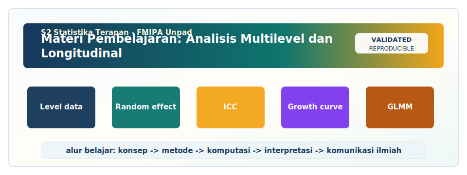

<!-- BEGIN UNPAD MATERIAL STYLE -->
<style>
:root {
  --unpad-navy: #17395c;
  --unpad-gold: #f2a51a;
  --unpad-teal: #0f766e;
  --unpad-ink: #172033;
  --unpad-paper: #fffdf8;
  --unpad-soft: #eef5f8;
  --unpad-line: #d7e2ea;
}
html, body {
  background: linear-gradient(135deg, #f8fbfd 0%, #fffdf8 48%, #f3f6ee 100%) !important;
  color: var(--unpad-ink) !important;
}
body {
  font-family: "Segoe UI", Arial, sans-serif !important;
  line-height: 1.72 !important;
}
.main-container {
  max-width: 1180px !important;
  background: rgba(255, 253, 248, 0.98) !important;
  border: 1px solid var(--unpad-line) !important;
  border-radius: 8px !important;
  box-shadow: 0 18px 42px rgba(23, 57, 92, 0.12) !important;
}
h1, h2, h3, h4 {
  letter-spacing: 0 !important;
}
h1.title {
  color: var(--unpad-navy) !important;
  -webkit-text-fill-color: var(--unpad-navy) !important;
  background: none !important;
}
h2 {
  border-left-color: var(--unpad-gold) !important;
}
a {
  color: #0b5c86 !important;
}
pre, code {
  border-radius: 8px !important;
}
.unpad-cover {
  margin: 18px 0 26px;
  padding: 24px;
  border-radius: 8px;
  background: linear-gradient(135deg, #17395c 0%, #0f766e 58%, #f2a51a 100%);
  color: #ffffff;
  box-shadow: 0 18px 36px rgba(23, 57, 92, 0.22);
}
.unpad-cover__brand {
  display: grid;
  grid-template-columns: 92px 1fr;
  gap: 20px;
  align-items: center;
}
.unpad-cover img {
  width: 92px;
  height: 92px;
  object-fit: contain;
  background: #ffffff;
  border-radius: 8px;
  padding: 8px;
  box-shadow: 0 8px 22px rgba(0,0,0,0.18);
}
.unpad-kicker {
  text-transform: uppercase;
  font-size: 0.82rem;
  font-weight: 800;
  letter-spacing: 0;
  color: #fff8dc;
}
.unpad-cover h2 {
  margin: 6px 0 8px;
  padding: 0;
  border: 0;
  background: transparent;
  color: #ffffff !important;
  font-size: 1.65rem;
}
.unpad-meta {
  margin: 0;
  color: #f7fbff;
  font-weight: 600;
}
.materi-illustration {
  margin: 20px 0 24px;
  padding: 14px;
  background: #ffffff;
  border: 1px solid var(--unpad-line);
  border-radius: 8px;
  box-shadow: 0 12px 28px rgba(23, 57, 92, 0.10);
}
.materi-illustration img {
  width: 100%;
  height: auto;
  display: block;
  border-radius: 6px;
}
.validasi-akademik {
  margin: 18px 0 28px;
  padding: 16px 18px;
  background: linear-gradient(135deg, #eef8f6, #fff8e7);
  border-left: 8px solid var(--unpad-teal);
  border-radius: 8px;
  color: var(--unpad-ink);
}
.validasi-akademik strong {
  color: var(--unpad-navy);
}
table {
  border-radius: 8px !important;
}
@media (max-width: 760px) {
  .unpad-cover__brand {
    grid-template-columns: 1fr;
  }
  .unpad-cover img {
    width: 76px;
    height: 76px;
  }
}
</style>
<!-- END UNPAD MATERIAL STYLE -->


<!-- BEGIN UNPAD MATERIAL ENHANCEMENT -->

```{r setup-unpad-render, include=FALSE}
execute_code <- FALSE
knitr::opts_chunk$set(
  echo = TRUE,
  eval = FALSE,
  message = FALSE,
  warning = FALSE,
  fig.align = "center",
  fig.width = 8,
  fig.height = 4.8,
  dpi = 120
)
set.seed(2025)
```


<div class="unpad-cover">
<div class="unpad-cover__brand">

<div>
<div class="unpad-kicker">S2 Statistika Terapan | FMIPA Universitas Padjadjaran</div>
<h2>Materi Pembelajaran: Analisis Multilevel dan Longitudinal</h2>
<p class="unpad-meta">Program Studi S2 Statistika Terapan, FMIPA Universitas Padjadjaran<br>Penulis: Dr. Bertho Tantular, M.Si | Januari 2025</p>
</div>
</div>
</div>

<div class="materi-illustration">

</div>

<div class="validasi-akademik">
<strong>Catatan validasi akademik.</strong> Materi ini diseragamkan dengan rujukan ADWTL Januari 2025: rumus dibaca bersama asumsi, contoh kode diposisikan sebagai template reproducible, dan interpretasi diarahkan pada validitas data, diagnosis model, evaluasi ketidakpastian, serta komunikasi hasil secara ilmiah.
</div>

<!-- END UNPAD MATERIAL ENHANCEMENT -->

```{r setup, include=FALSE, eval=FALSE}
knitr::opts_chunk$set(
  echo = TRUE,
  message = FALSE,
  warning = FALSE,
  fig.align = "center",
  fig.width = 8,
  fig.height = 5
)
set.seed(2025)
```

<style>
:root{
  --brown-900:#3b2414;
  --brown-800:#5a351d;
  --brown-700:#7a4a25;
  --brown-600:#9a6637;
  --brown-500:#b9824c;
  --brown-300:#dfbd8f;
  --brown-200:#f0d8b5;
  --brown-100:#fff4df;
  --cream:#fffaf1;
  --ink:#1b120b;
  --gold:#f4b53f;
  --teal:#117a7a;
  --rose:#a74444;
}
body{
  background: linear-gradient(135deg, #fff8ed 0%, #f2dfc5 40%, #e1b67f 100%);
  color: var(--ink);
  font-size: 17px;
  line-height: 1.7;
}
.main-container{
  background: rgba(255,250,241,0.96);
  border-radius: 24px;
  padding: 34px 42px;
  margin-top: 24px;
  margin-bottom: 48px;
  box-shadow: 0 20px 50px rgba(59,36,20,.16);
  max-width: 1120px !important;
}
h1, h2, h3, h4{
  color: var(--brown-900);
  font-weight: 800;
}
h1.title{
  color: white;
  padding: 48px 36px;
  border-radius: 28px;
  background: linear-gradient(120deg, #3b2414 0%, #7a4a25 38%, #b9824c 75%, #f4b53f 100%);
  box-shadow: 0 18px 40px rgba(59,36,20,.24);
}
h3.subtitle, h4.author, h4.date{
  color: var(--brown-800);
}
.tocify{
  background: #fff4df !important;
  border: 1px solid #dfbd8f !important;
  border-radius: 18px !important;
  box-shadow: 0 10px 30px rgba(59,36,20,.12);
}
.tocify .tocify-item a{
  color: #3b2414 !important;
}
a{color:#7a4a25; font-weight:700;}
pre, code{
  background-color: #fff4df !important;
  color: #111111 !important;
  border-radius: 12px;
}
pre{
  padding: 16px 18px !important;
  border: 1px solid #dfbd8f;
  box-shadow: inset 0 0 0 1px rgba(185,130,76,.12);
}
table{
  background:white;
  border-radius: 12px;
  overflow:hidden;
  box-shadow:0 8px 24px rgba(59,36,20,.09);
}
thead, th{
  background: linear-gradient(90deg, #5a351d, #9a6637) !important;
  color:white !important;
}
td{background:#fffaf1;}
blockquote{
  background:#fff4df;
  border-left:8px solid #9a6637;
  color:#2d1c11;
  padding:16px 22px;
  border-radius: 12px;
}
.hero-card{
  background: linear-gradient(135deg, rgba(90,53,29,.96), rgba(185,130,76,.95));
  color:white;
  border-radius:26px;
  padding:28px 34px;
  margin:20px 0 26px 0;
  box-shadow:0 18px 40px rgba(59,36,20,.22);
}
.hero-card h2, .hero-card h3{color:white;}
.badge-row{display:flex; flex-wrap:wrap; gap:10px; margin-top:14px;}
.badge{
  display:inline-block;
  padding:8px 12px;
  background:#fff4df;
  color:#3b2414;
  border-radius:999px;
  font-weight:800;
  border:1px solid rgba(255,255,255,.3);
}
.callout-brown{
  background: linear-gradient(135deg, #fff4df, #f0d8b5);
  border-left: 8px solid #7a4a25;
  color:#111;
  border-radius:18px;
  padding:18px 22px;
  margin:18px 0;
  box-shadow: 0 12px 26px rgba(59,36,20,.10);
}
.note-box{
  background: linear-gradient(135deg, #fffaf1, #fff0d0);
  border: 1px solid #dfbd8f;
  color:#111;
  border-radius:18px;
  padding:18px 22px;
  margin:18px 0;
}
.formula-box{
  background:#fff0d0;
  color:#000000;
  border:2px solid #dfbd8f;
  border-radius:18px;
  padding:18px 24px;
  margin:20px 0;
  box-shadow:0 10px 28px rgba(59,36,20,.12);
}
.formula-caption{
  color:#3b2414;
  font-weight:800;
  margin-bottom: 8px;
}
.week-card{
  background: linear-gradient(135deg, #fffaf1, #f4dfc0);
  border:1px solid #e7c99d;
  border-radius:22px;
  padding:22px 26px;
  margin:24px 0;
  box-shadow: 0 14px 34px rgba(59,36,20,.10);
}
.week-card h3{margin-top:0;}
.grid-2{display:grid; grid-template-columns: repeat(auto-fit, minmax(280px, 1fr)); gap:18px;}
.mini-card{
  background:white;
  border:1px solid #e7c99d;
  border-radius:20px;
  padding:18px;
  box-shadow:0 10px 24px rgba(59,36,20,.07);
}
hr{border-top:2px dashed #dfbd8f;}
.caption{font-size:.94em; color:#5a351d; font-style:italic;}
</style>

<div class="hero-card">
<h2>Modul Kuliah Profesional</h2>
<p><strong>Analisis Multilevel dan Longitudinal</strong> disusun sebagai bahan ajar komprehensif untuk mahasiswa <strong>S2 Statistika Terapan FMIPA Universitas Padjadjaran</strong>. Materi mengikuti alur RPS-OBE mata kuliah, mencakup konsep, teori, formulasi matematis, eksplorasi data, pemodelan, implementasi komputasi, interpretasi output, diagnosis model, studi kasus, dan rancangan proposal riset.</p>
<div class="badge-row">
<span class="badge">Semester 2</span>
<span class="badge">3 SKS: T=2, P=1</span>
<span class="badge">R / SPSS / SAS</span>
<span class="badge">Multilevel</span>
<span class="badge">Longitudinal</span>
<span class="badge">Mixed Models</span>
</div>
</div>
# Identitas Mata Kuliah dan Orientasi Modul

Modul ini dikembangkan untuk mata kuliah **Analisis Multilevel dan Longitudinal** pada Program Studi **S2 Statistika Terapan, Fakultas Matematika dan Ilmu Pengetahuan Alam, Universitas Padjadjaran**. Mata kuliah ini berada pada semester 2 dengan bobot 3 SKS, terdiri dari 2 SKS teori dan 1 SKS praktikum. Sesuai rancangan pembelajaran semester, mata kuliah diarahkan agar mahasiswa tidak hanya memahami model secara matematis, tetapi juga mampu membaca struktur data nyata, memilih model yang tepat, menjalankan analisis dengan perangkat lunak statistik, menafsirkan hasil secara substantif, dan merancang proposal riset yang inovatif.

Dalam praktik statistik terapan, banyak data tidak lagi memenuhi asumsi independensi sederhana. Data pendidikan sering menempatkan siswa di dalam kelas dan kelas di dalam sekolah. Data kesehatan dapat menempatkan pasien di dalam fasilitas kesehatan, fasilitas kesehatan di dalam kabupaten, dan kabupaten di dalam provinsi. Data sosial dapat menempatkan individu di dalam rumah tangga, rumah tangga di dalam desa, dan desa di dalam wilayah administratif. Selain struktur bertingkat seperti itu, banyak penelitian mengamati subjek yang sama berulang kali, misalnya skor perkembangan anak setiap tahun, kadar biomarker pasien setiap bulan, produktivitas pegawai setiap kuartal, atau indeks kesejahteraan rumah tangga sepanjang waktu. Dua pola ini - struktur hierarkis dan pengukuran berulang - menuntut pendekatan statistik yang lebih fleksibel dibanding regresi klasik.

Analisis multilevel dan longitudinal menjadi jembatan antara teori model statistik, pemahaman desain penelitian, dan kemampuan komputasi. Dalam mata kuliah ini, mahasiswa didorong untuk selalu menghubungkan tiga pertanyaan: bagaimana data dikumpulkan, bagaimana dependensi muncul, dan bagaimana model merepresentasikan dependensi tersebut. Tanpa memahami desain data, model mixed effects bisa tampak seperti sekadar fungsi perangkat lunak. Sebaliknya, dengan pemahaman desain, random intercept, random slope, growth curve, GLMM, ICC, variance components, dan struktur korelasi residual menjadi alat analitis yang sangat kuat.

<div class='callout-brown'>
<strong>Catatan pedagogis</strong><br/>
Modul ini sengaja ditulis sebagai bahan ajar panjang. Setiap bagian dapat digunakan sebagai bacaan sebelum kuliah, bahan diskusi sinkron, latihan praktikum, atau rujukan saat mahasiswa menyusun proposal riset multilevel dan longitudinal.
</div>

## Keterkaitan dengan CPL, CPMK, dan SubCPMK

Arah pembelajaran mata kuliah ini mengikuti empat capaian utama. Pertama, mahasiswa mampu menganalisis struktur data hierarkis atau longitudinal dan mengidentifikasi masalah seperti dependency, missing data, clustering, dan outlier. Kedua, mahasiswa mampu memilih dan menerapkan model multilevel atau longitudinal sesuai karakteristik data dan permasalahan penelitian. Ketiga, mahasiswa mampu mengimplementasikan model secara komputasi menggunakan R, SPSS, atau SAS. Keempat, mahasiswa mampu merancang dan mempresentasikan proposal riset berbasis metode multilevel atau longitudinal yang inovatif dan berdampak.

CPL yang paling kuat terkait dengan mata kuliah ini adalah kemampuan mengelola dan menganalisis data untuk menyelesaikan masalah nyata, kemampuan mengembangkan algoritma komputasi statistik, serta kemampuan berpikir logis, kritis, sistematis, dan inovatif dalam riset. Karena itu, modul ini tidak memisahkan teori, komputasi, dan komunikasi ilmiah. Setiap konsep disertai contoh interpretasi, setiap model disertai kode, dan setiap studi kasus diarahkan pada cara melaporkan hasil secara bertanggung jawab.

Penilaian dalam mata kuliah ini mencakup tugas eksplorasi data, kuis reflektif, tugas pemilihan dan evaluasi model, partisipasi diskusi, UTS berbasis proyek pendahuluan, proyek komputasi, laporan implementasi model, proposal riset, presentasi ilmiah, dan UAS berbasis proyek akhir. Komponen ini mencerminkan prinsip bahwa penguasaan model tidak cukup hanya dibuktikan melalui jawaban numerik; mahasiswa perlu menunjukkan proses berpikir statistik, argumentasi metodologis, reproduksibilitas analisis, dan relevansi substantif.

## Peta Materi 16 Pertemuan

| Pertemuan | Fokus Utama | Target Kompetensi |
|---:|---|---|
| 1 | Pengantar data multilevel dan longitudinal | Memahami motivasi, desain data, dan contoh terapan |
| 2 | Identifikasi level data dan unit analisis | Membedakan level individu, kelompok, wilayah, dan waktu |
| 3 | Dependency, missing data, outlier, dan eksplorasi | Mengidentifikasi masalah umum pada data kompleks |
| 4 | Keterbatasan regresi linier klasik | Menjelaskan konsekuensi mengabaikan clustering dan repeated measures |
| 5 | Model multilevel dasar: random intercept | Memahami variasi antar kelompok dan ICC |
| 6 | Random slope dan interaksi lintas level | Memodelkan heterogenitas pengaruh prediktor |
| 7 | Evaluasi dan diagnosis model multilevel/longitudinal | Membandingkan model, memeriksa asumsi, dan menafsirkan fit |
| 8 | UTS berbasis proyek pendahuluan | Memresentasikan desain, data, model awal, dan rencana validasi |
| 9 | Growth curve modeling | Memodelkan perubahan individu dari waktu ke waktu |
| 10 | Model longitudinal non-linier dan korelasi residual | Mengakomodasi pola pertumbuhan yang tidak linear |
| 11 | Generalized Linear Mixed Models | Memodelkan data biner, hitung, proporsi, dan non-normal |
| 12 | Estimasi ML, REML, AIC/BIC, dan uji model | Memahami dasar inferensi dan pemilihan model |
| 13 | Implementasi R, SPSS, SAS | Menulis kode, membaca output, dan membuat laporan reproduksibel |
| 14 | Studi kasus pendidikan, kesehatan, dan sosial | Menghubungkan model dengan masalah nyata |
| 15 | Rancangan proposal riset dan komunikasi ilmiah | Menyusun proposal inovatif berbasis metode |
| 16 | UAS proyek akhir | Mempertahankan hasil analisis dan proposal secara ilmiah |

Rujukan utama yang digunakan dalam modul ini meliputi Goldstein (2011), Singer dan Willett (2003), Snijders dan Bosker (2012), serta Fitzmaurice, Laird, dan Ware (2011). Rujukan pendukung mencakup Raudenbush dan Bryk (2002), Hox, Moerbeek, dan van de Schoot (2018), Pinheiro dan Bates (2000), Verbeke dan Molenberghs (2000), McCulloch, Searle, dan Neuhaus (2008), Gelman dan Hill (2007), Bates et al. (2015), Little dan Rubin (2019), serta Diggle et al. (2002).

## Cara Menggunakan Modul

Modul ini dapat digunakan dalam tiga cara. Pertama, sebagai bacaan utama sebelum perkuliahan. Mahasiswa disarankan membaca bagian konsep dan contoh kasus sebelum pertemuan sinkron agar diskusi kelas lebih tajam. Kedua, sebagai panduan praktikum. Kode R yang disediakan dapat dijalankan, dimodifikasi, dan dikembangkan pada dataset lain. Ketiga, sebagai kerangka penyusunan laporan dan proposal. Bagian rubrik, template interpretasi, dan contoh pelaporan dapat digunakan untuk menyusun tugas semester, UTS, dan UAS.

Karena mata kuliah ini berada pada jenjang magister, mahasiswa diharapkan tidak hanya bertanya "fungsi R apa yang digunakan?" tetapi juga "struktur dependensi apa yang sedang saya modelkan?", "apakah level data saya sesuai dengan rumusan pertanyaan riset?", "apakah variasi antar unit cukup besar untuk dimodelkan sebagai efek acak?", "apakah perubahan waktu bersifat linear atau non-linear?", dan "bagaimana hasil model diterjemahkan ke dalam keputusan substantif?". Pertanyaan-pertanyaan ini menjadi benang merah seluruh modul.

# Kerangka Berpikir Analisis Multilevel dan Longitudinal

Analisis multilevel dan longitudinal memiliki akar konseptual yang sama: observasi tidak selalu independen. Dalam analisis multilevel, ketergantungan muncul karena unit level bawah berada dalam unit level atas yang sama. Siswa dalam sekolah yang sama cenderung lebih mirip dibanding siswa dari sekolah berbeda karena berbagi guru, kurikulum, lingkungan sosial, fasilitas, dan kebijakan sekolah. Pasien dari rumah sakit yang sama dapat memiliki pola luaran kesehatan yang mirip karena berbagi protokol pelayanan, kualitas fasilitas, dan karakteristik populasi rujukan. Dalam analisis longitudinal, ketergantungan muncul karena pengukuran berulang pada subjek yang sama membawa jejak karakteristik individu yang relatif stabil dari waktu ke waktu.

Konsekuensi dari ketergantungan adalah pelanggaran asumsi independensi error. Jika pelanggaran ini diabaikan, standard error dapat bias, p-value dapat terlalu optimistis, interval kepercayaan menjadi terlalu sempit, dan kesimpulan inferensial dapat keliru. Pada tingkat substantif, mengabaikan clustering juga dapat menutupi heterogenitas antar kelompok. Misalnya, sebuah program pendidikan mungkin tampak efektif secara rata-rata, tetapi efeknya sangat berbeda antar sekolah. Sebuah intervensi kesehatan mungkin menaikkan probabilitas kesembuhan secara umum, tetapi efeknya bergantung pada karakteristik fasilitas kesehatan. Model multilevel dan longitudinal membantu memisahkan variasi dalam unit dan variasi antar unit, sekaligus memungkinkan koefisien regresi bervariasi antar kelompok atau antar individu.

Dalam kerangka mixed model, sebagian parameter diperlakukan sebagai efek tetap dan sebagian sebagai efek acak. Efek tetap menggambarkan rata-rata populasi atau pengaruh umum yang ingin ditafsirkan secara langsung. Efek acak menggambarkan variasi antar kelompok atau antar subjek yang tidak sepenuhnya dijelaskan oleh prediktor tetap. Pembedaan ini penting karena memberikan cara sistematis untuk menggabungkan informasi pada berbagai level. Estimasi efek kelompok tidak dilakukan secara terpisah total, tetapi menggunakan prinsip partial pooling: kelompok dengan data sedikit ditarik lebih kuat ke rata-rata populasi, sedangkan kelompok dengan data banyak dapat memiliki estimasi yang lebih spesifik. Prinsip ini menjadi salah satu alasan model multilevel sangat berguna untuk data sosial, pendidikan, kesehatan masyarakat, dan kebijakan publik.

Pada data longitudinal, model growth curve memandang waktu sebagai dimensi substantif. Tujuannya bukan hanya mengoreksi korelasi pengukuran berulang, tetapi juga menjelaskan bagaimana perubahan terjadi. Intercept dapat ditafsirkan sebagai status awal, slope sebagai laju perubahan, dan efek acak sebagai heterogenitas status awal serta heterogenitas laju perubahan antar individu. Dengan cara ini, pertanyaan seperti "siapa yang mulai lebih tinggi?", "siapa yang berubah lebih cepat?", dan "prediktor apa yang menjelaskan perbedaan perubahan?" dapat dijawab secara formal.

<div class='formula-box'>
<p class='formula-caption'>Bentuk dasar model random intercept dua level</p>

$$
y_{ij}=\beta_0+\beta_1x_{ij}+u_{0j}+\varepsilon_{ij},\quad u_{0j}\sim N(0,\tau_{00}),\quad \varepsilon_{ij}\sim N(0,\sigma^2)
$$
</div>

<div class='formula-box'>
<p class='formula-caption'>Intraclass correlation coefficient untuk model dua level Gaussian</p>

$$
\mathrm{ICC}=\frac{\tau_{00}}{\tau_{00}+\sigma^2}
$$
</div>

# Pertemuan 1: Pengantar Analisis Multilevel dan Longitudinal

<div class='week-card'>
<h3>Fokus pertemuan</h3>
<p><strong>SubCPMK1 - Menganalisis jenis data dan permasalahan pada data multilevel dan longitudinal.</strong></p>
<p>Fokus materi: motivasi, struktur hierarkis, pengukuran berulang, contoh aplikasi.</p>
<p>Rujukan utama: Goldstein (2011), Snijders dan Bosker (2012), Singer dan Willett (2003).</p>
</div>

## Tujuan Pembelajaran

- Menjelaskan konsep utama pengantar analisis multilevel dan longitudinal dalam konteks statistik terapan.
- Mengidentifikasi peran motivasi, struktur hierarkis, pengukuran berulang, contoh aplikasi pada data nyata.
- Menerjemahkan struktur data ke dalam spesifikasi model yang sesuai.
- Menjalankan atau memahami kode analisis yang relevan dengan topik pertemuan.
- Menulis interpretasi hasil yang menghubungkan output statistik dengan masalah substantif.

## Konsep Inti

Pada tahap ini, fokus utama bukan hanya mengenal istilah pengantar analisis multilevel dan longitudinal, tetapi memahami logika desain data yang membuat metode tersebut diperlukan. Dalam pendidikan, kesehatan masyarakat, survei sosial, dan evaluasi kebijakan, peneliti sering menghadapi situasi ketika observasi memiliki kedekatan karena berada pada kelompok yang sama atau diukur pada individu yang sama dari waktu ke waktu. Ketika kedekatan ini diabaikan, model dapat menghasilkan kesimpulan yang tampak meyakinkan secara numerik tetapi rapuh secara metodologis. Literatur Goldstein (2011), Snijders dan Bosker (2012), Singer dan Willett (2003) menekankan bahwa pemodelan harus dimulai dari pertanyaan substantif, kemudian diterjemahkan ke dalam struktur level, komponen variasi, dan asumsi inferensial.

Satu cara praktis membaca data pengantar analisis multilevel dan longitudinal adalah menanyakan tiga hal: siapa unit terkecil yang diamati, unit lebih besar apa yang menaungi unit tersebut, dan apakah ada dimensi waktu yang membuat observasi berulang. Pertanyaan ini tampak sederhana, tetapi sangat menentukan model. Jika unit level-1 adalah siswa dan level-2 adalah sekolah, maka variasi antar sekolah perlu dinilai. Jika unit level-1 adalah pengukuran dan level-2 adalah individu, maka perubahan dalam individu dan perbedaan antar individu perlu dipisahkan. Struktur inilah yang menjadi dasar mixed models.

Dalam kuliah terapan, mahasiswa perlu membedakan variabel level-1 dan level-2. Variabel level-1 berubah antar observasi di dalam kelompok, misalnya karakteristik siswa, pengukuran waktu, atau kondisi kunjungan pasien. Variabel level-2 biasanya melekat pada kelompok, misalnya akreditasi sekolah, tipe rumah sakit, atau karakteristik kabupaten. Kesalahan memasukkan variabel level-2 seolah-olah level-1 dapat menimbulkan pseudo-replication, sedangkan mengabaikan variasi level-1 dapat menghilangkan informasi penting mengenai heterogenitas individu.

Aspek penting lain adalah interpretasi parameter. Dalam regresi biasa, intercept dan slope sering dibaca sebagai parameter tunggal. Dalam model multilevel dan longitudinal, intercept dapat memiliki dua makna sekaligus: rata-rata populasi dan deviasi kelompok atau individu dari rata-rata tersebut. Slope juga dapat diperlakukan sebagai efek tetap atau efek acak. Perbedaan ini membuat interpretasi lebih kaya, tetapi juga menuntut kehati-hatian. Mahasiswa harus selalu menyebutkan level interpretasi: apakah koefisien berlaku pada rata-rata populasi, antar kelompok, dalam individu, atau antar individu.

Model yang baik bukan model yang paling rumit, melainkan model yang menjawab pertanyaan riset dengan asumsi yang dapat dipertanggungjawabkan. Pada pengantar analisis multilevel dan longitudinal, penambahan efek acak, interaksi lintas level, atau struktur korelasi residual harus memiliki alasan. Jika model terlalu sederhana, dependensi tidak tertangkap. Jika model terlalu kompleks, estimasi dapat tidak stabil, konvergensi bermasalah, dan interpretasi menjadi kabur. Keseimbangan antara parsimony dan realism menjadi prinsip praktis yang sangat penting.

Dalam laporan ilmiah, bagian metode harus menjelaskan mengapa pendekatan pengantar analisis multilevel dan longitudinal dipilih. Penjelasan yang baik tidak cukup menyebutkan nama fungsi perangkat lunak. Mahasiswa perlu menyatakan struktur data, level analisis, asumsi distribusi, efek tetap, efek acak, strategi estimasi, dan kriteria evaluasi model. Dengan format seperti ini, pembaca dapat menilai apakah model memang sesuai dengan desain data. Penjelasan metode yang rapi juga memudahkan replikasi dan peer review.

Pada tahap interpretasi, hasil numerik perlu diterjemahkan ke bahasa substantif. Variance component, misalnya, bukan hanya angka teknis; ia menunjukkan seberapa besar variasi outcome yang berada pada level tertentu. ICC bukan sekadar rasio, tetapi ukuran awal tentang seberapa kuat clustering. Random slope bukan sekadar tambahan model, tetapi bukti bahwa pengaruh prediktor tidak homogen antar kelompok atau antar individu. Setiap angka perlu dijawab dengan pertanyaan: apa maknanya untuk kasus nyata?

Kesalahan umum mahasiswa adalah langsung menjalankan model tanpa eksplorasi struktur data. Sebelum model dipasang, perlu diperiksa jumlah unit pada setiap level, ukuran kelompok, ketidakseimbangan data, pola missing, outlier, dan distribusi outcome. Eksplorasi ini menentukan apakah model dapat diestimasi dengan baik. Kelompok dengan ukuran sangat kecil, waktu pengukuran tidak konsisten, atau missing yang sistematis dapat memengaruhi stabilitas estimasi. Karena itu, eksplorasi bukan tahap kosmetik, tetapi bagian dari inferensi.

Dalam praktik komputasi, kode analisis harus dibuat reproducible. Setiap tahap perlu memiliki seed bila ada simulasi, catatan transformasi variabel, alasan penghapusan observasi, dan dokumentasi versi paket. Untuk mata kuliah ini, mahasiswa didorong menulis skrip yang dapat dijalankan ulang dari awal hingga akhir. Reproducibility bukan sekadar tuntutan teknis; ia adalah etika ilmiah agar hasil dapat diverifikasi, diperbaiki, dan dikembangkan oleh peneliti lain.

Keterampilan komunikasi ilmiah menjadi bagian dari kompetensi pengantar analisis multilevel dan longitudinal. Model multilevel dan longitudinal sering terasa teknis bagi pembaca non-statistik. Karena itu, visualisasi trajektori, plot variasi kelompok, tabel fixed effects, ringkasan random effects, dan narasi interpretasi perlu disusun secara bertahap. Dalam presentasi, mahasiswa sebaiknya memulai dari masalah nyata, menunjukkan struktur data, menjelaskan model dengan diagram sederhana, lalu menafsirkan hasil utama. Rumus penting, tetapi narasi keputusan tidak kalah penting.

Hubungan antara teori dan aplikasi terlihat jelas pada pengantar analisis multilevel dan longitudinal. Teori memberikan bahasa untuk menguraikan variasi dan dependensi, sedangkan aplikasi memberikan alasan mengapa variasi tersebut penting. Pada data pendidikan, variasi antar sekolah dapat mengarahkan intervensi berbasis institusi. Pada data kesehatan, variasi antar fasilitas dapat mengindikasikan perbedaan kualitas layanan. Pada data longitudinal, variasi laju perubahan dapat membantu mengidentifikasi kelompok yang membutuhkan dukungan lebih cepat. Model menjadi alat untuk melihat struktur yang sebelumnya tersembunyi.

Dalam evaluasi model, mahasiswa perlu menggabungkan ukuran kuantitatif dan pertimbangan substantif. AIC dan BIC membantu membandingkan fit relatif, tetapi tidak menggantikan pertanyaan apakah model masuk akal. Uji likelihood ratio dapat membantu menilai komponen random effects, tetapi interpretasinya perlu hati-hati karena parameter varians berada pada batas ruang parameter. Residual plot membantu melihat pola ketidakcocokan, tetapi perlu dibaca bersama konteks desain. Evaluasi model adalah argumen, bukan ritual satu tombol.

Pendekatan pengantar analisis multilevel dan longitudinal juga memiliki keterbatasan. Model mengasumsikan bentuk distribusi tertentu untuk efek acak dan residual. Jika asumsi tersebut terlalu jauh dari data, interpretasi bisa terdistorsi. Data dengan sedikit kelompok, ukuran cluster sangat tidak seimbang, atau missing yang tidak acak dapat menjadi tantangan serius. Karena itu, laporan yang baik perlu menyatakan keterbatasan secara eksplisit. Keterbatasan bukan kelemahan memalukan; ia menunjukkan kedewasaan ilmiah dalam membaca bukti.

Untuk proposal riset, mahasiswa perlu menghubungkan pengantar analisis multilevel dan longitudinal dengan kontribusi yang jelas. Kontribusi dapat berupa penerapan pada masalah nyata yang penting, perbaikan model, pengembangan strategi diagnosis, perbandingan metode, atau integrasi dengan visualisasi dan sistem pendukung keputusan. Proposal yang kuat tidak hanya menjanjikan model canggih, tetapi menunjukkan mengapa model tersebut diperlukan, data apa yang mendukung, bagaimana validasi dilakukan, dan siapa yang memperoleh manfaat dari hasilnya.

Akhirnya, penguasaan pengantar analisis multilevel dan longitudinal menuntut latihan berulang. Mahasiswa sebaiknya mencoba data simulasi terlebih dahulu agar mengetahui parameter benar yang ingin ditemukan, lalu berpindah ke data nyata dengan kompleksitas lebih tinggi. Dengan simulasi, efek random intercept, random slope, missingness, dan korelasi residual dapat dipahami secara intuitif. Dengan data nyata, mahasiswa belajar bahwa model harus bernegosiasi dengan kualitas data, desain penelitian, dan keterbatasan substansi. Dua jenis latihan ini saling melengkapi.

<div class='formula-box'>
<p class='formula-caption'>Model awal untuk memahami sumber variasi pada data bertingkat</p>

$$
y_{ij}=\beta_0+\beta_1x_{ij}+u_{0j}+\varepsilon_{ij}
$$
</div>

## Contoh Kasus Terapan

Misalkan peneliti ingin mengevaluasi faktor yang memengaruhi skor literasi mahasiswa. Data dikumpulkan dari banyak kelas, dan setiap kelas berada pada program studi tertentu. Jika semua observasi dianggap independen, model mengabaikan kemungkinan bahwa mahasiswa dalam kelas yang sama memiliki pengalaman belajar yang lebih mirip. Dengan pengantar analisis multilevel dan longitudinal, peneliti dapat memisahkan variasi antar mahasiswa, antar kelas, dan antar program studi. Hasilnya bukan hanya koefisien prediktor, tetapi juga ukuran seberapa besar konteks kelas berkontribusi pada variasi skor.

Dalam studi kesehatan, outcome dapat berupa tekanan darah yang diukur beberapa kali pada pasien yang sama. Setiap pasien memiliki status awal berbeda dan laju perubahan berbeda setelah intervensi. Pendekatan pengantar analisis multilevel dan longitudinal memungkinkan peneliti memodelkan status awal sebagai random intercept dan perubahan waktu sebagai random slope. Interpretasinya sangat berguna: intervensi mungkin menurunkan tekanan darah secara rata-rata, tetapi laju penurunan bisa lebih cepat pada pasien dengan karakteristik tertentu.

Pada survei sosial ekonomi, rumah tangga sering diamati berulang dalam beberapa gelombang survei. Perubahan pendapatan dapat dipengaruhi oleh karakteristik rumah tangga, wilayah, dan kondisi waktu. Model longitudinal membantu membedakan variasi antar rumah tangga dan perubahan dalam rumah tangga. Bila rumah tangga juga berada dalam desa atau kabupaten, pendekatan multilevel longitudinal dapat digunakan untuk menggabungkan dimensi hierarki dan waktu secara simultan.

## Implementasi Komputasi

```{r pertemuan_1, eval=FALSE}
# Struktur sederhana data multilevel: siswa di dalam sekolah
set.seed(2025)
J <- 30                    # jumlah sekolah
n_j <- sample(20:40, J, replace = TRUE)
school <- rep(1:J, times = n_j)
N <- length(school)
quality <- rnorm(J, mean = 0, sd = 1)
u0 <- rnorm(J, mean = 0, sd = 4)
x <- rnorm(N, mean = 0, sd = 1)
y <- 70 + 5*x + 3*quality[school] + u0[school] + rnorm(N, 0, 8)
dat_ml <- data.frame(school, x, quality = quality[school], y)
head(dat_ml)
aggregate(y ~ school, dat_ml, mean)[1:6, ]
```

## Latihan dan Aktivitas Kelas

Latihan pertama adalah membuat peta struktur data. Tuliskan unit level-1, level-2, dan bila ada level-3. Jelaskan apakah data bersifat nested, repeated, cross-classified, atau kombinasi. Kemudian buat tabel jumlah observasi per kelompok dan jumlah waktu pengukuran per individu. Latihan sederhana ini sering mengungkap masalah yang sebelumnya tidak terlihat.

Latihan kedua adalah membangun model bertahap. Mulai dari model kosong tanpa prediktor, hitung komponen varians dan ICC, lalu tambahkan prediktor level-1. Setelah itu tambahkan prediktor level-2 atau efek waktu. Bandingkan perubahan komponen varians, AIC, BIC, dan interpretasi fixed effects. Dengan strategi bertahap, proses belajar lebih transparan.

Latihan ketiga adalah menulis interpretasi dalam tiga kalimat: satu kalimat untuk efek tetap utama, satu kalimat untuk efek acak atau ICC, dan satu kalimat untuk implikasi substantif. Kebiasaan ini melatih mahasiswa agar tidak berhenti pada output perangkat lunak. Output adalah bahan mentah; interpretasi adalah produk ilmiah.

## Pertanyaan Reflektif

1. Apa konsekuensi substantif jika motivasi, struktur hierarkis, pengukuran berulang, contoh aplikasi diabaikan dalam analisis?
2. Bagaimana Anda membedakan variasi yang terjadi di dalam unit dan antar unit?
3. Kapan model yang lebih sederhana lebih layak digunakan dibanding model yang lebih kompleks?
4. Informasi apa yang harus ditampilkan agar pembaca percaya bahwa model telah dievaluasi dengan baik?
5. Bagaimana hasil model dapat diterjemahkan menjadi rekomendasi riset atau kebijakan?

<div class='note-box'>
<strong>Ringkasan pertemuan</strong><br/>
Pertemuan ini menempatkan pengantar analisis multilevel dan longitudinal sebagai bagian dari alur analisis yang dimulai dari desain data, dilanjutkan dengan spesifikasi model, estimasi, diagnosis, interpretasi, dan komunikasi ilmiah. Mahasiswa diharapkan mampu menghubungkan topik ini dengan tugas proyek semester.
</div>

# Pertemuan 2: Identifikasi Level Data, Unit Analisis, dan Desain Penelitian

<div class='week-card'>
<h3>Fokus pertemuan</h3>
<p><strong>SubCPMK1 - Menganalisis struktur data dan level hierarki.</strong></p>
<p>Fokus materi: level data, unit observasi, unit sampling, unit analisis, nested dan cross-classified design.</p>
<p>Rujukan utama: Raudenbush dan Bryk (2002), Hox et al. (2018), Goldstein (2011).</p>
</div>

## Tujuan Pembelajaran

- Menjelaskan konsep utama identifikasi level data, unit analisis, dan desain penelitian dalam konteks statistik terapan.
- Mengidentifikasi peran level data, unit observasi, unit sampling, unit analisis, nested dan cross-classified design pada data nyata.
- Menerjemahkan struktur data ke dalam spesifikasi model yang sesuai.
- Menjalankan atau memahami kode analisis yang relevan dengan topik pertemuan.
- Menulis interpretasi hasil yang menghubungkan output statistik dengan masalah substantif.

## Konsep Inti

Pada tahap ini, fokus utama bukan hanya mengenal istilah identifikasi level data, unit analisis, dan desain penelitian, tetapi memahami logika desain data yang membuat metode tersebut diperlukan. Dalam siswa-kelas-sekolah, pasien-dokter-rumah sakit, individu-rumah tangga-desa, peneliti sering menghadapi situasi ketika observasi memiliki kedekatan karena berada pada kelompok yang sama atau diukur pada individu yang sama dari waktu ke waktu. Ketika kedekatan ini diabaikan, model dapat menghasilkan kesimpulan yang tampak meyakinkan secara numerik tetapi rapuh secara metodologis. Literatur Raudenbush dan Bryk (2002), Hox et al. (2018), Goldstein (2011) menekankan bahwa pemodelan harus dimulai dari pertanyaan substantif, kemudian diterjemahkan ke dalam struktur level, komponen variasi, dan asumsi inferensial.

Satu cara praktis membaca data identifikasi level data, unit analisis, dan desain penelitian adalah menanyakan tiga hal: siapa unit terkecil yang diamati, unit lebih besar apa yang menaungi unit tersebut, dan apakah ada dimensi waktu yang membuat observasi berulang. Pertanyaan ini tampak sederhana, tetapi sangat menentukan model. Jika unit level-1 adalah siswa dan level-2 adalah sekolah, maka variasi antar sekolah perlu dinilai. Jika unit level-1 adalah pengukuran dan level-2 adalah individu, maka perubahan dalam individu dan perbedaan antar individu perlu dipisahkan. Struktur inilah yang menjadi dasar mixed models.

Dalam kuliah terapan, mahasiswa perlu membedakan variabel level-1 dan level-2. Variabel level-1 berubah antar observasi di dalam kelompok, misalnya karakteristik siswa, pengukuran waktu, atau kondisi kunjungan pasien. Variabel level-2 biasanya melekat pada kelompok, misalnya akreditasi sekolah, tipe rumah sakit, atau karakteristik kabupaten. Kesalahan memasukkan variabel level-2 seolah-olah level-1 dapat menimbulkan pseudo-replication, sedangkan mengabaikan variasi level-1 dapat menghilangkan informasi penting mengenai heterogenitas individu.

Aspek penting lain adalah interpretasi parameter. Dalam regresi biasa, intercept dan slope sering dibaca sebagai parameter tunggal. Dalam model multilevel dan longitudinal, intercept dapat memiliki dua makna sekaligus: rata-rata populasi dan deviasi kelompok atau individu dari rata-rata tersebut. Slope juga dapat diperlakukan sebagai efek tetap atau efek acak. Perbedaan ini membuat interpretasi lebih kaya, tetapi juga menuntut kehati-hatian. Mahasiswa harus selalu menyebutkan level interpretasi: apakah koefisien berlaku pada rata-rata populasi, antar kelompok, dalam individu, atau antar individu.

Model yang baik bukan model yang paling rumit, melainkan model yang menjawab pertanyaan riset dengan asumsi yang dapat dipertanggungjawabkan. Pada identifikasi level data, unit analisis, dan desain penelitian, penambahan efek acak, interaksi lintas level, atau struktur korelasi residual harus memiliki alasan. Jika model terlalu sederhana, dependensi tidak tertangkap. Jika model terlalu kompleks, estimasi dapat tidak stabil, konvergensi bermasalah, dan interpretasi menjadi kabur. Keseimbangan antara parsimony dan realism menjadi prinsip praktis yang sangat penting.

Dalam laporan ilmiah, bagian metode harus menjelaskan mengapa pendekatan identifikasi level data, unit analisis, dan desain penelitian dipilih. Penjelasan yang baik tidak cukup menyebutkan nama fungsi perangkat lunak. Mahasiswa perlu menyatakan struktur data, level analisis, asumsi distribusi, efek tetap, efek acak, strategi estimasi, dan kriteria evaluasi model. Dengan format seperti ini, pembaca dapat menilai apakah model memang sesuai dengan desain data. Penjelasan metode yang rapi juga memudahkan replikasi dan peer review.

Pada tahap interpretasi, hasil numerik perlu diterjemahkan ke bahasa substantif. Variance component, misalnya, bukan hanya angka teknis; ia menunjukkan seberapa besar variasi outcome yang berada pada level tertentu. ICC bukan sekadar rasio, tetapi ukuran awal tentang seberapa kuat clustering. Random slope bukan sekadar tambahan model, tetapi bukti bahwa pengaruh prediktor tidak homogen antar kelompok atau antar individu. Setiap angka perlu dijawab dengan pertanyaan: apa maknanya untuk kasus nyata?

Kesalahan umum mahasiswa adalah langsung menjalankan model tanpa eksplorasi struktur data. Sebelum model dipasang, perlu diperiksa jumlah unit pada setiap level, ukuran kelompok, ketidakseimbangan data, pola missing, outlier, dan distribusi outcome. Eksplorasi ini menentukan apakah model dapat diestimasi dengan baik. Kelompok dengan ukuran sangat kecil, waktu pengukuran tidak konsisten, atau missing yang sistematis dapat memengaruhi stabilitas estimasi. Karena itu, eksplorasi bukan tahap kosmetik, tetapi bagian dari inferensi.

Dalam praktik komputasi, kode analisis harus dibuat reproducible. Setiap tahap perlu memiliki seed bila ada simulasi, catatan transformasi variabel, alasan penghapusan observasi, dan dokumentasi versi paket. Untuk mata kuliah ini, mahasiswa didorong menulis skrip yang dapat dijalankan ulang dari awal hingga akhir. Reproducibility bukan sekadar tuntutan teknis; ia adalah etika ilmiah agar hasil dapat diverifikasi, diperbaiki, dan dikembangkan oleh peneliti lain.

Keterampilan komunikasi ilmiah menjadi bagian dari kompetensi identifikasi level data, unit analisis, dan desain penelitian. Model multilevel dan longitudinal sering terasa teknis bagi pembaca non-statistik. Karena itu, visualisasi trajektori, plot variasi kelompok, tabel fixed effects, ringkasan random effects, dan narasi interpretasi perlu disusun secara bertahap. Dalam presentasi, mahasiswa sebaiknya memulai dari masalah nyata, menunjukkan struktur data, menjelaskan model dengan diagram sederhana, lalu menafsirkan hasil utama. Rumus penting, tetapi narasi keputusan tidak kalah penting.

Hubungan antara teori dan aplikasi terlihat jelas pada identifikasi level data, unit analisis, dan desain penelitian. Teori memberikan bahasa untuk menguraikan variasi dan dependensi, sedangkan aplikasi memberikan alasan mengapa variasi tersebut penting. Pada data pendidikan, variasi antar sekolah dapat mengarahkan intervensi berbasis institusi. Pada data kesehatan, variasi antar fasilitas dapat mengindikasikan perbedaan kualitas layanan. Pada data longitudinal, variasi laju perubahan dapat membantu mengidentifikasi kelompok yang membutuhkan dukungan lebih cepat. Model menjadi alat untuk melihat struktur yang sebelumnya tersembunyi.

Dalam evaluasi model, mahasiswa perlu menggabungkan ukuran kuantitatif dan pertimbangan substantif. AIC dan BIC membantu membandingkan fit relatif, tetapi tidak menggantikan pertanyaan apakah model masuk akal. Uji likelihood ratio dapat membantu menilai komponen random effects, tetapi interpretasinya perlu hati-hati karena parameter varians berada pada batas ruang parameter. Residual plot membantu melihat pola ketidakcocokan, tetapi perlu dibaca bersama konteks desain. Evaluasi model adalah argumen, bukan ritual satu tombol.

Pendekatan identifikasi level data, unit analisis, dan desain penelitian juga memiliki keterbatasan. Model mengasumsikan bentuk distribusi tertentu untuk efek acak dan residual. Jika asumsi tersebut terlalu jauh dari data, interpretasi bisa terdistorsi. Data dengan sedikit kelompok, ukuran cluster sangat tidak seimbang, atau missing yang tidak acak dapat menjadi tantangan serius. Karena itu, laporan yang baik perlu menyatakan keterbatasan secara eksplisit. Keterbatasan bukan kelemahan memalukan; ia menunjukkan kedewasaan ilmiah dalam membaca bukti.

Untuk proposal riset, mahasiswa perlu menghubungkan identifikasi level data, unit analisis, dan desain penelitian dengan kontribusi yang jelas. Kontribusi dapat berupa penerapan pada masalah nyata yang penting, perbaikan model, pengembangan strategi diagnosis, perbandingan metode, atau integrasi dengan visualisasi dan sistem pendukung keputusan. Proposal yang kuat tidak hanya menjanjikan model canggih, tetapi menunjukkan mengapa model tersebut diperlukan, data apa yang mendukung, bagaimana validasi dilakukan, dan siapa yang memperoleh manfaat dari hasilnya.

Akhirnya, penguasaan identifikasi level data, unit analisis, dan desain penelitian menuntut latihan berulang. Mahasiswa sebaiknya mencoba data simulasi terlebih dahulu agar mengetahui parameter benar yang ingin ditemukan, lalu berpindah ke data nyata dengan kompleksitas lebih tinggi. Dengan simulasi, efek random intercept, random slope, missingness, dan korelasi residual dapat dipahami secara intuitif. Dengan data nyata, mahasiswa belajar bahwa model harus bernegosiasi dengan kualitas data, desain penelitian, dan keterbatasan substansi. Dua jenis latihan ini saling melengkapi.

<div class='formula-box'>
<p class='formula-caption'>Notasi dasar unit level-1 di dalam unit level-2</p>

$$
i\in\{1,\ldots,n_j\},\quad j\in\{1,\ldots,J\},\quad y_{ij}\mid j
$$
</div>

## Contoh Kasus Terapan

Misalkan peneliti ingin mengevaluasi faktor yang memengaruhi skor literasi mahasiswa. Data dikumpulkan dari banyak kelas, dan setiap kelas berada pada program studi tertentu. Jika semua observasi dianggap independen, model mengabaikan kemungkinan bahwa mahasiswa dalam kelas yang sama memiliki pengalaman belajar yang lebih mirip. Dengan identifikasi level data, unit analisis, dan desain penelitian, peneliti dapat memisahkan variasi antar mahasiswa, antar kelas, dan antar program studi. Hasilnya bukan hanya koefisien prediktor, tetapi juga ukuran seberapa besar konteks kelas berkontribusi pada variasi skor.

Dalam studi kesehatan, outcome dapat berupa tekanan darah yang diukur beberapa kali pada pasien yang sama. Setiap pasien memiliki status awal berbeda dan laju perubahan berbeda setelah intervensi. Pendekatan identifikasi level data, unit analisis, dan desain penelitian memungkinkan peneliti memodelkan status awal sebagai random intercept dan perubahan waktu sebagai random slope. Interpretasinya sangat berguna: intervensi mungkin menurunkan tekanan darah secara rata-rata, tetapi laju penurunan bisa lebih cepat pada pasien dengan karakteristik tertentu.

Pada survei sosial ekonomi, rumah tangga sering diamati berulang dalam beberapa gelombang survei. Perubahan pendapatan dapat dipengaruhi oleh karakteristik rumah tangga, wilayah, dan kondisi waktu. Model longitudinal membantu membedakan variasi antar rumah tangga dan perubahan dalam rumah tangga. Bila rumah tangga juga berada dalam desa atau kabupaten, pendekatan multilevel longitudinal dapat digunakan untuk menggabungkan dimensi hierarki dan waktu secara simultan.

## Implementasi Komputasi

```{r pertemuan_2, eval=FALSE}
# Pemeriksaan struktur level: berapa observasi per kelompok?
table(dat_ml$school)[1:10]
summary(as.numeric(table(dat_ml$school)))

# Visualisasi sederhana variasi antar kelompok
boxplot(y ~ school, data = dat_ml, las = 2,
        xlab = "Sekolah", ylab = "Skor", main = "Sebaran skor menurut sekolah")
```

## Latihan dan Aktivitas Kelas

Latihan pertama adalah membuat peta struktur data. Tuliskan unit level-1, level-2, dan bila ada level-3. Jelaskan apakah data bersifat nested, repeated, cross-classified, atau kombinasi. Kemudian buat tabel jumlah observasi per kelompok dan jumlah waktu pengukuran per individu. Latihan sederhana ini sering mengungkap masalah yang sebelumnya tidak terlihat.

Latihan kedua adalah membangun model bertahap. Mulai dari model kosong tanpa prediktor, hitung komponen varians dan ICC, lalu tambahkan prediktor level-1. Setelah itu tambahkan prediktor level-2 atau efek waktu. Bandingkan perubahan komponen varians, AIC, BIC, dan interpretasi fixed effects. Dengan strategi bertahap, proses belajar lebih transparan.

Latihan ketiga adalah menulis interpretasi dalam tiga kalimat: satu kalimat untuk efek tetap utama, satu kalimat untuk efek acak atau ICC, dan satu kalimat untuk implikasi substantif. Kebiasaan ini melatih mahasiswa agar tidak berhenti pada output perangkat lunak. Output adalah bahan mentah; interpretasi adalah produk ilmiah.

## Pertanyaan Reflektif

1. Apa konsekuensi substantif jika level data, unit observasi, unit sampling, unit analisis, nested dan cross-classified design diabaikan dalam analisis?
2. Bagaimana Anda membedakan variasi yang terjadi di dalam unit dan antar unit?
3. Kapan model yang lebih sederhana lebih layak digunakan dibanding model yang lebih kompleks?
4. Informasi apa yang harus ditampilkan agar pembaca percaya bahwa model telah dievaluasi dengan baik?
5. Bagaimana hasil model dapat diterjemahkan menjadi rekomendasi riset atau kebijakan?

<div class='note-box'>
<strong>Ringkasan pertemuan</strong><br/>
Pertemuan ini menempatkan identifikasi level data, unit analisis, dan desain penelitian sebagai bagian dari alur analisis yang dimulai dari desain data, dilanjutkan dengan spesifikasi model, estimasi, diagnosis, interpretasi, dan komunikasi ilmiah. Mahasiswa diharapkan mampu menghubungkan topik ini dengan tugas proyek semester.
</div>

# Pertemuan 3: Dependency, Missing Data, Outlier, dan Eksplorasi Awal

<div class='week-card'>
<h3>Fokus pertemuan</h3>
<p><strong>SubCPMK1 - Mengidentifikasi dependency, missing data, clustering, dan outlier.</strong></p>
<p>Fokus materi: ketergantungan observasi, missing completely at random, missing at random, missing not at random, outlier level-1 dan level-2.</p>
<p>Rujukan utama: Little dan Rubin (2019), Fitzmaurice et al. (2011), Diggle et al. (2002).</p>
</div>

## Tujuan Pembelajaran

- Menjelaskan konsep utama dependency, missing data, outlier, dan eksplorasi awal dalam konteks statistik terapan.
- Mengidentifikasi peran ketergantungan observasi, missing completely at random, missing at random, missing not at random, outlier level-1 dan level-2 pada data nyata.
- Menerjemahkan struktur data ke dalam spesifikasi model yang sesuai.
- Menjalankan atau memahami kode analisis yang relevan dengan topik pertemuan.
- Menulis interpretasi hasil yang menghubungkan output statistik dengan masalah substantif.

## Konsep Inti

Pada tahap ini, fokus utama bukan hanya mengenal istilah dependency, missing data, outlier, dan eksplorasi awal, tetapi memahami logika desain data yang membuat metode tersebut diperlukan. Dalam studi longitudinal kesehatan, survei panel rumah tangga, dan evaluasi pendidikan, peneliti sering menghadapi situasi ketika observasi memiliki kedekatan karena berada pada kelompok yang sama atau diukur pada individu yang sama dari waktu ke waktu. Ketika kedekatan ini diabaikan, model dapat menghasilkan kesimpulan yang tampak meyakinkan secara numerik tetapi rapuh secara metodologis. Literatur Little dan Rubin (2019), Fitzmaurice et al. (2011), Diggle et al. (2002) menekankan bahwa pemodelan harus dimulai dari pertanyaan substantif, kemudian diterjemahkan ke dalam struktur level, komponen variasi, dan asumsi inferensial.

Satu cara praktis membaca data dependency, missing data, outlier, dan eksplorasi awal adalah menanyakan tiga hal: siapa unit terkecil yang diamati, unit lebih besar apa yang menaungi unit tersebut, dan apakah ada dimensi waktu yang membuat observasi berulang. Pertanyaan ini tampak sederhana, tetapi sangat menentukan model. Jika unit level-1 adalah siswa dan level-2 adalah sekolah, maka variasi antar sekolah perlu dinilai. Jika unit level-1 adalah pengukuran dan level-2 adalah individu, maka perubahan dalam individu dan perbedaan antar individu perlu dipisahkan. Struktur inilah yang menjadi dasar mixed models.

Dalam kuliah terapan, mahasiswa perlu membedakan variabel level-1 dan level-2. Variabel level-1 berubah antar observasi di dalam kelompok, misalnya karakteristik siswa, pengukuran waktu, atau kondisi kunjungan pasien. Variabel level-2 biasanya melekat pada kelompok, misalnya akreditasi sekolah, tipe rumah sakit, atau karakteristik kabupaten. Kesalahan memasukkan variabel level-2 seolah-olah level-1 dapat menimbulkan pseudo-replication, sedangkan mengabaikan variasi level-1 dapat menghilangkan informasi penting mengenai heterogenitas individu.

Aspek penting lain adalah interpretasi parameter. Dalam regresi biasa, intercept dan slope sering dibaca sebagai parameter tunggal. Dalam model multilevel dan longitudinal, intercept dapat memiliki dua makna sekaligus: rata-rata populasi dan deviasi kelompok atau individu dari rata-rata tersebut. Slope juga dapat diperlakukan sebagai efek tetap atau efek acak. Perbedaan ini membuat interpretasi lebih kaya, tetapi juga menuntut kehati-hatian. Mahasiswa harus selalu menyebutkan level interpretasi: apakah koefisien berlaku pada rata-rata populasi, antar kelompok, dalam individu, atau antar individu.

Model yang baik bukan model yang paling rumit, melainkan model yang menjawab pertanyaan riset dengan asumsi yang dapat dipertanggungjawabkan. Pada dependency, missing data, outlier, dan eksplorasi awal, penambahan efek acak, interaksi lintas level, atau struktur korelasi residual harus memiliki alasan. Jika model terlalu sederhana, dependensi tidak tertangkap. Jika model terlalu kompleks, estimasi dapat tidak stabil, konvergensi bermasalah, dan interpretasi menjadi kabur. Keseimbangan antara parsimony dan realism menjadi prinsip praktis yang sangat penting.

Dalam laporan ilmiah, bagian metode harus menjelaskan mengapa pendekatan dependency, missing data, outlier, dan eksplorasi awal dipilih. Penjelasan yang baik tidak cukup menyebutkan nama fungsi perangkat lunak. Mahasiswa perlu menyatakan struktur data, level analisis, asumsi distribusi, efek tetap, efek acak, strategi estimasi, dan kriteria evaluasi model. Dengan format seperti ini, pembaca dapat menilai apakah model memang sesuai dengan desain data. Penjelasan metode yang rapi juga memudahkan replikasi dan peer review.

Pada tahap interpretasi, hasil numerik perlu diterjemahkan ke bahasa substantif. Variance component, misalnya, bukan hanya angka teknis; ia menunjukkan seberapa besar variasi outcome yang berada pada level tertentu. ICC bukan sekadar rasio, tetapi ukuran awal tentang seberapa kuat clustering. Random slope bukan sekadar tambahan model, tetapi bukti bahwa pengaruh prediktor tidak homogen antar kelompok atau antar individu. Setiap angka perlu dijawab dengan pertanyaan: apa maknanya untuk kasus nyata?

Kesalahan umum mahasiswa adalah langsung menjalankan model tanpa eksplorasi struktur data. Sebelum model dipasang, perlu diperiksa jumlah unit pada setiap level, ukuran kelompok, ketidakseimbangan data, pola missing, outlier, dan distribusi outcome. Eksplorasi ini menentukan apakah model dapat diestimasi dengan baik. Kelompok dengan ukuran sangat kecil, waktu pengukuran tidak konsisten, atau missing yang sistematis dapat memengaruhi stabilitas estimasi. Karena itu, eksplorasi bukan tahap kosmetik, tetapi bagian dari inferensi.

Dalam praktik komputasi, kode analisis harus dibuat reproducible. Setiap tahap perlu memiliki seed bila ada simulasi, catatan transformasi variabel, alasan penghapusan observasi, dan dokumentasi versi paket. Untuk mata kuliah ini, mahasiswa didorong menulis skrip yang dapat dijalankan ulang dari awal hingga akhir. Reproducibility bukan sekadar tuntutan teknis; ia adalah etika ilmiah agar hasil dapat diverifikasi, diperbaiki, dan dikembangkan oleh peneliti lain.

Keterampilan komunikasi ilmiah menjadi bagian dari kompetensi dependency, missing data, outlier, dan eksplorasi awal. Model multilevel dan longitudinal sering terasa teknis bagi pembaca non-statistik. Karena itu, visualisasi trajektori, plot variasi kelompok, tabel fixed effects, ringkasan random effects, dan narasi interpretasi perlu disusun secara bertahap. Dalam presentasi, mahasiswa sebaiknya memulai dari masalah nyata, menunjukkan struktur data, menjelaskan model dengan diagram sederhana, lalu menafsirkan hasil utama. Rumus penting, tetapi narasi keputusan tidak kalah penting.

Hubungan antara teori dan aplikasi terlihat jelas pada dependency, missing data, outlier, dan eksplorasi awal. Teori memberikan bahasa untuk menguraikan variasi dan dependensi, sedangkan aplikasi memberikan alasan mengapa variasi tersebut penting. Pada data pendidikan, variasi antar sekolah dapat mengarahkan intervensi berbasis institusi. Pada data kesehatan, variasi antar fasilitas dapat mengindikasikan perbedaan kualitas layanan. Pada data longitudinal, variasi laju perubahan dapat membantu mengidentifikasi kelompok yang membutuhkan dukungan lebih cepat. Model menjadi alat untuk melihat struktur yang sebelumnya tersembunyi.

Dalam evaluasi model, mahasiswa perlu menggabungkan ukuran kuantitatif dan pertimbangan substantif. AIC dan BIC membantu membandingkan fit relatif, tetapi tidak menggantikan pertanyaan apakah model masuk akal. Uji likelihood ratio dapat membantu menilai komponen random effects, tetapi interpretasinya perlu hati-hati karena parameter varians berada pada batas ruang parameter. Residual plot membantu melihat pola ketidakcocokan, tetapi perlu dibaca bersama konteks desain. Evaluasi model adalah argumen, bukan ritual satu tombol.

Pendekatan dependency, missing data, outlier, dan eksplorasi awal juga memiliki keterbatasan. Model mengasumsikan bentuk distribusi tertentu untuk efek acak dan residual. Jika asumsi tersebut terlalu jauh dari data, interpretasi bisa terdistorsi. Data dengan sedikit kelompok, ukuran cluster sangat tidak seimbang, atau missing yang tidak acak dapat menjadi tantangan serius. Karena itu, laporan yang baik perlu menyatakan keterbatasan secara eksplisit. Keterbatasan bukan kelemahan memalukan; ia menunjukkan kedewasaan ilmiah dalam membaca bukti.

Untuk proposal riset, mahasiswa perlu menghubungkan dependency, missing data, outlier, dan eksplorasi awal dengan kontribusi yang jelas. Kontribusi dapat berupa penerapan pada masalah nyata yang penting, perbaikan model, pengembangan strategi diagnosis, perbandingan metode, atau integrasi dengan visualisasi dan sistem pendukung keputusan. Proposal yang kuat tidak hanya menjanjikan model canggih, tetapi menunjukkan mengapa model tersebut diperlukan, data apa yang mendukung, bagaimana validasi dilakukan, dan siapa yang memperoleh manfaat dari hasilnya.

Akhirnya, penguasaan dependency, missing data, outlier, dan eksplorasi awal menuntut latihan berulang. Mahasiswa sebaiknya mencoba data simulasi terlebih dahulu agar mengetahui parameter benar yang ingin ditemukan, lalu berpindah ke data nyata dengan kompleksitas lebih tinggi. Dengan simulasi, efek random intercept, random slope, missingness, dan korelasi residual dapat dipahami secara intuitif. Dengan data nyata, mahasiswa belajar bahwa model harus bernegosiasi dengan kualitas data, desain penelitian, dan keterbatasan substansi. Dua jenis latihan ini saling melengkapi.

<div class='formula-box'>
<p class='formula-caption'>Definisi konseptual missing at random pada data longitudinal</p>

$$
P(R=1\mid Y_{obs},Y_{mis},X)=P(R=1\mid Y_{obs},X)
$$
</div>

## Contoh Kasus Terapan

Misalkan peneliti ingin mengevaluasi faktor yang memengaruhi skor literasi mahasiswa. Data dikumpulkan dari banyak kelas, dan setiap kelas berada pada program studi tertentu. Jika semua observasi dianggap independen, model mengabaikan kemungkinan bahwa mahasiswa dalam kelas yang sama memiliki pengalaman belajar yang lebih mirip. Dengan dependency, missing data, outlier, dan eksplorasi awal, peneliti dapat memisahkan variasi antar mahasiswa, antar kelas, dan antar program studi. Hasilnya bukan hanya koefisien prediktor, tetapi juga ukuran seberapa besar konteks kelas berkontribusi pada variasi skor.

Dalam studi kesehatan, outcome dapat berupa tekanan darah yang diukur beberapa kali pada pasien yang sama. Setiap pasien memiliki status awal berbeda dan laju perubahan berbeda setelah intervensi. Pendekatan dependency, missing data, outlier, dan eksplorasi awal memungkinkan peneliti memodelkan status awal sebagai random intercept dan perubahan waktu sebagai random slope. Interpretasinya sangat berguna: intervensi mungkin menurunkan tekanan darah secara rata-rata, tetapi laju penurunan bisa lebih cepat pada pasien dengan karakteristik tertentu.

Pada survei sosial ekonomi, rumah tangga sering diamati berulang dalam beberapa gelombang survei. Perubahan pendapatan dapat dipengaruhi oleh karakteristik rumah tangga, wilayah, dan kondisi waktu. Model longitudinal membantu membedakan variasi antar rumah tangga dan perubahan dalam rumah tangga. Bila rumah tangga juga berada dalam desa atau kabupaten, pendekatan multilevel longitudinal dapat digunakan untuk menggabungkan dimensi hierarki dan waktu secara simultan.

## Implementasi Komputasi

```{r pertemuan_3, eval=FALSE}
# Membuat missingness artifisial untuk contoh eksplorasi
set.seed(2025)
dat_ml$y_miss <- dat_ml$y
miss_id <- sample(seq_len(nrow(dat_ml)), size = round(0.10*nrow(dat_ml)))
dat_ml$y_miss[miss_id] <- NA
mean(is.na(dat_ml$y_miss))

# Ringkasan missing per sekolah
miss_by_school <- aggregate(is.na(y_miss) ~ school, dat_ml, mean)
names(miss_by_school)[2] <- "prop_missing"
head(miss_by_school)
```

## Latihan dan Aktivitas Kelas

Latihan pertama adalah membuat peta struktur data. Tuliskan unit level-1, level-2, dan bila ada level-3. Jelaskan apakah data bersifat nested, repeated, cross-classified, atau kombinasi. Kemudian buat tabel jumlah observasi per kelompok dan jumlah waktu pengukuran per individu. Latihan sederhana ini sering mengungkap masalah yang sebelumnya tidak terlihat.

Latihan kedua adalah membangun model bertahap. Mulai dari model kosong tanpa prediktor, hitung komponen varians dan ICC, lalu tambahkan prediktor level-1. Setelah itu tambahkan prediktor level-2 atau efek waktu. Bandingkan perubahan komponen varians, AIC, BIC, dan interpretasi fixed effects. Dengan strategi bertahap, proses belajar lebih transparan.

Latihan ketiga adalah menulis interpretasi dalam tiga kalimat: satu kalimat untuk efek tetap utama, satu kalimat untuk efek acak atau ICC, dan satu kalimat untuk implikasi substantif. Kebiasaan ini melatih mahasiswa agar tidak berhenti pada output perangkat lunak. Output adalah bahan mentah; interpretasi adalah produk ilmiah.

## Pertanyaan Reflektif

1. Apa konsekuensi substantif jika ketergantungan observasi, missing completely at random, missing at random, missing not at random, outlier level-1 dan level-2 diabaikan dalam analisis?
2. Bagaimana Anda membedakan variasi yang terjadi di dalam unit dan antar unit?
3. Kapan model yang lebih sederhana lebih layak digunakan dibanding model yang lebih kompleks?
4. Informasi apa yang harus ditampilkan agar pembaca percaya bahwa model telah dievaluasi dengan baik?
5. Bagaimana hasil model dapat diterjemahkan menjadi rekomendasi riset atau kebijakan?

<div class='note-box'>
<strong>Ringkasan pertemuan</strong><br/>
Pertemuan ini menempatkan dependency, missing data, outlier, dan eksplorasi awal sebagai bagian dari alur analisis yang dimulai dari desain data, dilanjutkan dengan spesifikasi model, estimasi, diagnosis, interpretasi, dan komunikasi ilmiah. Mahasiswa diharapkan mampu menghubungkan topik ini dengan tugas proyek semester.
</div>

# Pertemuan 4: Model Linier Klasik dan Keterbatasannya pada Data Kompleks

<div class='week-card'>
<h3>Fokus pertemuan</h3>
<p><strong>SubCPMK1 - Menjelaskan mengapa regresi klasik tidak memadai untuk data multilevel/longitudinal.</strong></p>
<p>Fokus materi: asumsi independensi, homoskedastisitas, standard error bias, ecological fallacy, atomistic fallacy.</p>
<p>Rujukan utama: Snijders dan Bosker (2012), Goldstein (2011), Gelman dan Hill (2007).</p>
</div>

## Tujuan Pembelajaran

- Menjelaskan konsep utama model linier klasik dan keterbatasannya pada data kompleks dalam konteks statistik terapan.
- Mengidentifikasi peran asumsi independensi, homoskedastisitas, standard error bias, ecological fallacy, atomistic fallacy pada data nyata.
- Menerjemahkan struktur data ke dalam spesifikasi model yang sesuai.
- Menjalankan atau memahami kode analisis yang relevan dengan topik pertemuan.
- Menulis interpretasi hasil yang menghubungkan output statistik dengan masalah substantif.

## Konsep Inti

Pada tahap ini, fokus utama bukan hanya mengenal istilah model linier klasik dan keterbatasannya pada data kompleks, tetapi memahami logika desain data yang membuat metode tersebut diperlukan. Dalam perbandingan model OLS dengan model mixed effects, peneliti sering menghadapi situasi ketika observasi memiliki kedekatan karena berada pada kelompok yang sama atau diukur pada individu yang sama dari waktu ke waktu. Ketika kedekatan ini diabaikan, model dapat menghasilkan kesimpulan yang tampak meyakinkan secara numerik tetapi rapuh secara metodologis. Literatur Snijders dan Bosker (2012), Goldstein (2011), Gelman dan Hill (2007) menekankan bahwa pemodelan harus dimulai dari pertanyaan substantif, kemudian diterjemahkan ke dalam struktur level, komponen variasi, dan asumsi inferensial.

Satu cara praktis membaca data model linier klasik dan keterbatasannya pada data kompleks adalah menanyakan tiga hal: siapa unit terkecil yang diamati, unit lebih besar apa yang menaungi unit tersebut, dan apakah ada dimensi waktu yang membuat observasi berulang. Pertanyaan ini tampak sederhana, tetapi sangat menentukan model. Jika unit level-1 adalah siswa dan level-2 adalah sekolah, maka variasi antar sekolah perlu dinilai. Jika unit level-1 adalah pengukuran dan level-2 adalah individu, maka perubahan dalam individu dan perbedaan antar individu perlu dipisahkan. Struktur inilah yang menjadi dasar mixed models.

Dalam kuliah terapan, mahasiswa perlu membedakan variabel level-1 dan level-2. Variabel level-1 berubah antar observasi di dalam kelompok, misalnya karakteristik siswa, pengukuran waktu, atau kondisi kunjungan pasien. Variabel level-2 biasanya melekat pada kelompok, misalnya akreditasi sekolah, tipe rumah sakit, atau karakteristik kabupaten. Kesalahan memasukkan variabel level-2 seolah-olah level-1 dapat menimbulkan pseudo-replication, sedangkan mengabaikan variasi level-1 dapat menghilangkan informasi penting mengenai heterogenitas individu.

Aspek penting lain adalah interpretasi parameter. Dalam regresi biasa, intercept dan slope sering dibaca sebagai parameter tunggal. Dalam model multilevel dan longitudinal, intercept dapat memiliki dua makna sekaligus: rata-rata populasi dan deviasi kelompok atau individu dari rata-rata tersebut. Slope juga dapat diperlakukan sebagai efek tetap atau efek acak. Perbedaan ini membuat interpretasi lebih kaya, tetapi juga menuntut kehati-hatian. Mahasiswa harus selalu menyebutkan level interpretasi: apakah koefisien berlaku pada rata-rata populasi, antar kelompok, dalam individu, atau antar individu.

Model yang baik bukan model yang paling rumit, melainkan model yang menjawab pertanyaan riset dengan asumsi yang dapat dipertanggungjawabkan. Pada model linier klasik dan keterbatasannya pada data kompleks, penambahan efek acak, interaksi lintas level, atau struktur korelasi residual harus memiliki alasan. Jika model terlalu sederhana, dependensi tidak tertangkap. Jika model terlalu kompleks, estimasi dapat tidak stabil, konvergensi bermasalah, dan interpretasi menjadi kabur. Keseimbangan antara parsimony dan realism menjadi prinsip praktis yang sangat penting.

Dalam laporan ilmiah, bagian metode harus menjelaskan mengapa pendekatan model linier klasik dan keterbatasannya pada data kompleks dipilih. Penjelasan yang baik tidak cukup menyebutkan nama fungsi perangkat lunak. Mahasiswa perlu menyatakan struktur data, level analisis, asumsi distribusi, efek tetap, efek acak, strategi estimasi, dan kriteria evaluasi model. Dengan format seperti ini, pembaca dapat menilai apakah model memang sesuai dengan desain data. Penjelasan metode yang rapi juga memudahkan replikasi dan peer review.

Pada tahap interpretasi, hasil numerik perlu diterjemahkan ke bahasa substantif. Variance component, misalnya, bukan hanya angka teknis; ia menunjukkan seberapa besar variasi outcome yang berada pada level tertentu. ICC bukan sekadar rasio, tetapi ukuran awal tentang seberapa kuat clustering. Random slope bukan sekadar tambahan model, tetapi bukti bahwa pengaruh prediktor tidak homogen antar kelompok atau antar individu. Setiap angka perlu dijawab dengan pertanyaan: apa maknanya untuk kasus nyata?

Kesalahan umum mahasiswa adalah langsung menjalankan model tanpa eksplorasi struktur data. Sebelum model dipasang, perlu diperiksa jumlah unit pada setiap level, ukuran kelompok, ketidakseimbangan data, pola missing, outlier, dan distribusi outcome. Eksplorasi ini menentukan apakah model dapat diestimasi dengan baik. Kelompok dengan ukuran sangat kecil, waktu pengukuran tidak konsisten, atau missing yang sistematis dapat memengaruhi stabilitas estimasi. Karena itu, eksplorasi bukan tahap kosmetik, tetapi bagian dari inferensi.

Dalam praktik komputasi, kode analisis harus dibuat reproducible. Setiap tahap perlu memiliki seed bila ada simulasi, catatan transformasi variabel, alasan penghapusan observasi, dan dokumentasi versi paket. Untuk mata kuliah ini, mahasiswa didorong menulis skrip yang dapat dijalankan ulang dari awal hingga akhir. Reproducibility bukan sekadar tuntutan teknis; ia adalah etika ilmiah agar hasil dapat diverifikasi, diperbaiki, dan dikembangkan oleh peneliti lain.

Keterampilan komunikasi ilmiah menjadi bagian dari kompetensi model linier klasik dan keterbatasannya pada data kompleks. Model multilevel dan longitudinal sering terasa teknis bagi pembaca non-statistik. Karena itu, visualisasi trajektori, plot variasi kelompok, tabel fixed effects, ringkasan random effects, dan narasi interpretasi perlu disusun secara bertahap. Dalam presentasi, mahasiswa sebaiknya memulai dari masalah nyata, menunjukkan struktur data, menjelaskan model dengan diagram sederhana, lalu menafsirkan hasil utama. Rumus penting, tetapi narasi keputusan tidak kalah penting.

Hubungan antara teori dan aplikasi terlihat jelas pada model linier klasik dan keterbatasannya pada data kompleks. Teori memberikan bahasa untuk menguraikan variasi dan dependensi, sedangkan aplikasi memberikan alasan mengapa variasi tersebut penting. Pada data pendidikan, variasi antar sekolah dapat mengarahkan intervensi berbasis institusi. Pada data kesehatan, variasi antar fasilitas dapat mengindikasikan perbedaan kualitas layanan. Pada data longitudinal, variasi laju perubahan dapat membantu mengidentifikasi kelompok yang membutuhkan dukungan lebih cepat. Model menjadi alat untuk melihat struktur yang sebelumnya tersembunyi.

Dalam evaluasi model, mahasiswa perlu menggabungkan ukuran kuantitatif dan pertimbangan substantif. AIC dan BIC membantu membandingkan fit relatif, tetapi tidak menggantikan pertanyaan apakah model masuk akal. Uji likelihood ratio dapat membantu menilai komponen random effects, tetapi interpretasinya perlu hati-hati karena parameter varians berada pada batas ruang parameter. Residual plot membantu melihat pola ketidakcocokan, tetapi perlu dibaca bersama konteks desain. Evaluasi model adalah argumen, bukan ritual satu tombol.

Pendekatan model linier klasik dan keterbatasannya pada data kompleks juga memiliki keterbatasan. Model mengasumsikan bentuk distribusi tertentu untuk efek acak dan residual. Jika asumsi tersebut terlalu jauh dari data, interpretasi bisa terdistorsi. Data dengan sedikit kelompok, ukuran cluster sangat tidak seimbang, atau missing yang tidak acak dapat menjadi tantangan serius. Karena itu, laporan yang baik perlu menyatakan keterbatasan secara eksplisit. Keterbatasan bukan kelemahan memalukan; ia menunjukkan kedewasaan ilmiah dalam membaca bukti.

Untuk proposal riset, mahasiswa perlu menghubungkan model linier klasik dan keterbatasannya pada data kompleks dengan kontribusi yang jelas. Kontribusi dapat berupa penerapan pada masalah nyata yang penting, perbaikan model, pengembangan strategi diagnosis, perbandingan metode, atau integrasi dengan visualisasi dan sistem pendukung keputusan. Proposal yang kuat tidak hanya menjanjikan model canggih, tetapi menunjukkan mengapa model tersebut diperlukan, data apa yang mendukung, bagaimana validasi dilakukan, dan siapa yang memperoleh manfaat dari hasilnya.

Akhirnya, penguasaan model linier klasik dan keterbatasannya pada data kompleks menuntut latihan berulang. Mahasiswa sebaiknya mencoba data simulasi terlebih dahulu agar mengetahui parameter benar yang ingin ditemukan, lalu berpindah ke data nyata dengan kompleksitas lebih tinggi. Dengan simulasi, efek random intercept, random slope, missingness, dan korelasi residual dapat dipahami secara intuitif. Dengan data nyata, mahasiswa belajar bahwa model harus bernegosiasi dengan kualitas data, desain penelitian, dan keterbatasan substansi. Dua jenis latihan ini saling melengkapi.

<div class='formula-box'>
<p class='formula-caption'>Korelasi residual intra-kelompok yang melanggar asumsi OLS</p>

$$
\mathrm{Cov}(\varepsilon_{ij},\varepsilon_{i'j})\neq 0\quad\text{untuk unit dalam kelompok yang sama}
$$
</div>

## Contoh Kasus Terapan

Misalkan peneliti ingin mengevaluasi faktor yang memengaruhi skor literasi mahasiswa. Data dikumpulkan dari banyak kelas, dan setiap kelas berada pada program studi tertentu. Jika semua observasi dianggap independen, model mengabaikan kemungkinan bahwa mahasiswa dalam kelas yang sama memiliki pengalaman belajar yang lebih mirip. Dengan model linier klasik dan keterbatasannya pada data kompleks, peneliti dapat memisahkan variasi antar mahasiswa, antar kelas, dan antar program studi. Hasilnya bukan hanya koefisien prediktor, tetapi juga ukuran seberapa besar konteks kelas berkontribusi pada variasi skor.

Dalam studi kesehatan, outcome dapat berupa tekanan darah yang diukur beberapa kali pada pasien yang sama. Setiap pasien memiliki status awal berbeda dan laju perubahan berbeda setelah intervensi. Pendekatan model linier klasik dan keterbatasannya pada data kompleks memungkinkan peneliti memodelkan status awal sebagai random intercept dan perubahan waktu sebagai random slope. Interpretasinya sangat berguna: intervensi mungkin menurunkan tekanan darah secara rata-rata, tetapi laju penurunan bisa lebih cepat pada pasien dengan karakteristik tertentu.

Pada survei sosial ekonomi, rumah tangga sering diamati berulang dalam beberapa gelombang survei. Perubahan pendapatan dapat dipengaruhi oleh karakteristik rumah tangga, wilayah, dan kondisi waktu. Model longitudinal membantu membedakan variasi antar rumah tangga dan perubahan dalam rumah tangga. Bila rumah tangga juga berada dalam desa atau kabupaten, pendekatan multilevel longitudinal dapat digunakan untuk menggabungkan dimensi hierarki dan waktu secara simultan.

## Implementasi Komputasi

```{r pertemuan_4, eval=FALSE}
# Regresi OLS mengabaikan clustering
fit_lm <- lm(y ~ x + quality, data = dat_ml)
summary(fit_lm)

# Perhatikan bahwa standard error OLS tidak mengakomodasi struktur sekolah
# Model multilevel akan diperkenalkan pada pertemuan berikutnya.
```

## Latihan dan Aktivitas Kelas

Latihan pertama adalah membuat peta struktur data. Tuliskan unit level-1, level-2, dan bila ada level-3. Jelaskan apakah data bersifat nested, repeated, cross-classified, atau kombinasi. Kemudian buat tabel jumlah observasi per kelompok dan jumlah waktu pengukuran per individu. Latihan sederhana ini sering mengungkap masalah yang sebelumnya tidak terlihat.

Latihan kedua adalah membangun model bertahap. Mulai dari model kosong tanpa prediktor, hitung komponen varians dan ICC, lalu tambahkan prediktor level-1. Setelah itu tambahkan prediktor level-2 atau efek waktu. Bandingkan perubahan komponen varians, AIC, BIC, dan interpretasi fixed effects. Dengan strategi bertahap, proses belajar lebih transparan.

Latihan ketiga adalah menulis interpretasi dalam tiga kalimat: satu kalimat untuk efek tetap utama, satu kalimat untuk efek acak atau ICC, dan satu kalimat untuk implikasi substantif. Kebiasaan ini melatih mahasiswa agar tidak berhenti pada output perangkat lunak. Output adalah bahan mentah; interpretasi adalah produk ilmiah.

## Pertanyaan Reflektif

1. Apa konsekuensi substantif jika asumsi independensi, homoskedastisitas, standard error bias, ecological fallacy, atomistic fallacy diabaikan dalam analisis?
2. Bagaimana Anda membedakan variasi yang terjadi di dalam unit dan antar unit?
3. Kapan model yang lebih sederhana lebih layak digunakan dibanding model yang lebih kompleks?
4. Informasi apa yang harus ditampilkan agar pembaca percaya bahwa model telah dievaluasi dengan baik?
5. Bagaimana hasil model dapat diterjemahkan menjadi rekomendasi riset atau kebijakan?

<div class='note-box'>
<strong>Ringkasan pertemuan</strong><br/>
Pertemuan ini menempatkan model linier klasik dan keterbatasannya pada data kompleks sebagai bagian dari alur analisis yang dimulai dari desain data, dilanjutkan dengan spesifikasi model, estimasi, diagnosis, interpretasi, dan komunikasi ilmiah. Mahasiswa diharapkan mampu menghubungkan topik ini dengan tugas proyek semester.
</div>

# Pertemuan 5: Model Multilevel Dasar: Random Intercept

<div class='week-card'>
<h3>Fokus pertemuan</h3>
<p><strong>SubCPMK2 - Mengevaluasi dan memilih model multilevel yang sesuai.</strong></p>
<p>Fokus materi: random intercept, variance components, ICC, partial pooling, variasi antar kelompok.</p>
<p>Rujukan utama: Goldstein (2011), Raudenbush dan Bryk (2002), Snijders dan Bosker (2012).</p>
</div>

## Tujuan Pembelajaran

- Menjelaskan konsep utama model multilevel dasar: random intercept dalam konteks statistik terapan.
- Mengidentifikasi peran random intercept, variance components, ICC, partial pooling, variasi antar kelompok pada data nyata.
- Menerjemahkan struktur data ke dalam spesifikasi model yang sesuai.
- Menjalankan atau memahami kode analisis yang relevan dengan topik pertemuan.
- Menulis interpretasi hasil yang menghubungkan output statistik dengan masalah substantif.

## Konsep Inti

Pada tahap ini, fokus utama bukan hanya mengenal istilah model multilevel dasar: random intercept, tetapi memahami logika desain data yang membuat metode tersebut diperlukan. Dalam skor siswa yang dikelompokkan berdasarkan sekolah atau kelas, peneliti sering menghadapi situasi ketika observasi memiliki kedekatan karena berada pada kelompok yang sama atau diukur pada individu yang sama dari waktu ke waktu. Ketika kedekatan ini diabaikan, model dapat menghasilkan kesimpulan yang tampak meyakinkan secara numerik tetapi rapuh secara metodologis. Literatur Goldstein (2011), Raudenbush dan Bryk (2002), Snijders dan Bosker (2012) menekankan bahwa pemodelan harus dimulai dari pertanyaan substantif, kemudian diterjemahkan ke dalam struktur level, komponen variasi, dan asumsi inferensial.

Satu cara praktis membaca data model multilevel dasar: random intercept adalah menanyakan tiga hal: siapa unit terkecil yang diamati, unit lebih besar apa yang menaungi unit tersebut, dan apakah ada dimensi waktu yang membuat observasi berulang. Pertanyaan ini tampak sederhana, tetapi sangat menentukan model. Jika unit level-1 adalah siswa dan level-2 adalah sekolah, maka variasi antar sekolah perlu dinilai. Jika unit level-1 adalah pengukuran dan level-2 adalah individu, maka perubahan dalam individu dan perbedaan antar individu perlu dipisahkan. Struktur inilah yang menjadi dasar mixed models.

Dalam kuliah terapan, mahasiswa perlu membedakan variabel level-1 dan level-2. Variabel level-1 berubah antar observasi di dalam kelompok, misalnya karakteristik siswa, pengukuran waktu, atau kondisi kunjungan pasien. Variabel level-2 biasanya melekat pada kelompok, misalnya akreditasi sekolah, tipe rumah sakit, atau karakteristik kabupaten. Kesalahan memasukkan variabel level-2 seolah-olah level-1 dapat menimbulkan pseudo-replication, sedangkan mengabaikan variasi level-1 dapat menghilangkan informasi penting mengenai heterogenitas individu.

Aspek penting lain adalah interpretasi parameter. Dalam regresi biasa, intercept dan slope sering dibaca sebagai parameter tunggal. Dalam model multilevel dan longitudinal, intercept dapat memiliki dua makna sekaligus: rata-rata populasi dan deviasi kelompok atau individu dari rata-rata tersebut. Slope juga dapat diperlakukan sebagai efek tetap atau efek acak. Perbedaan ini membuat interpretasi lebih kaya, tetapi juga menuntut kehati-hatian. Mahasiswa harus selalu menyebutkan level interpretasi: apakah koefisien berlaku pada rata-rata populasi, antar kelompok, dalam individu, atau antar individu.

Model yang baik bukan model yang paling rumit, melainkan model yang menjawab pertanyaan riset dengan asumsi yang dapat dipertanggungjawabkan. Pada model multilevel dasar: random intercept, penambahan efek acak, interaksi lintas level, atau struktur korelasi residual harus memiliki alasan. Jika model terlalu sederhana, dependensi tidak tertangkap. Jika model terlalu kompleks, estimasi dapat tidak stabil, konvergensi bermasalah, dan interpretasi menjadi kabur. Keseimbangan antara parsimony dan realism menjadi prinsip praktis yang sangat penting.

Dalam laporan ilmiah, bagian metode harus menjelaskan mengapa pendekatan model multilevel dasar: random intercept dipilih. Penjelasan yang baik tidak cukup menyebutkan nama fungsi perangkat lunak. Mahasiswa perlu menyatakan struktur data, level analisis, asumsi distribusi, efek tetap, efek acak, strategi estimasi, dan kriteria evaluasi model. Dengan format seperti ini, pembaca dapat menilai apakah model memang sesuai dengan desain data. Penjelasan metode yang rapi juga memudahkan replikasi dan peer review.

Pada tahap interpretasi, hasil numerik perlu diterjemahkan ke bahasa substantif. Variance component, misalnya, bukan hanya angka teknis; ia menunjukkan seberapa besar variasi outcome yang berada pada level tertentu. ICC bukan sekadar rasio, tetapi ukuran awal tentang seberapa kuat clustering. Random slope bukan sekadar tambahan model, tetapi bukti bahwa pengaruh prediktor tidak homogen antar kelompok atau antar individu. Setiap angka perlu dijawab dengan pertanyaan: apa maknanya untuk kasus nyata?

Kesalahan umum mahasiswa adalah langsung menjalankan model tanpa eksplorasi struktur data. Sebelum model dipasang, perlu diperiksa jumlah unit pada setiap level, ukuran kelompok, ketidakseimbangan data, pola missing, outlier, dan distribusi outcome. Eksplorasi ini menentukan apakah model dapat diestimasi dengan baik. Kelompok dengan ukuran sangat kecil, waktu pengukuran tidak konsisten, atau missing yang sistematis dapat memengaruhi stabilitas estimasi. Karena itu, eksplorasi bukan tahap kosmetik, tetapi bagian dari inferensi.

Dalam praktik komputasi, kode analisis harus dibuat reproducible. Setiap tahap perlu memiliki seed bila ada simulasi, catatan transformasi variabel, alasan penghapusan observasi, dan dokumentasi versi paket. Untuk mata kuliah ini, mahasiswa didorong menulis skrip yang dapat dijalankan ulang dari awal hingga akhir. Reproducibility bukan sekadar tuntutan teknis; ia adalah etika ilmiah agar hasil dapat diverifikasi, diperbaiki, dan dikembangkan oleh peneliti lain.

Keterampilan komunikasi ilmiah menjadi bagian dari kompetensi model multilevel dasar: random intercept. Model multilevel dan longitudinal sering terasa teknis bagi pembaca non-statistik. Karena itu, visualisasi trajektori, plot variasi kelompok, tabel fixed effects, ringkasan random effects, dan narasi interpretasi perlu disusun secara bertahap. Dalam presentasi, mahasiswa sebaiknya memulai dari masalah nyata, menunjukkan struktur data, menjelaskan model dengan diagram sederhana, lalu menafsirkan hasil utama. Rumus penting, tetapi narasi keputusan tidak kalah penting.

Hubungan antara teori dan aplikasi terlihat jelas pada model multilevel dasar: random intercept. Teori memberikan bahasa untuk menguraikan variasi dan dependensi, sedangkan aplikasi memberikan alasan mengapa variasi tersebut penting. Pada data pendidikan, variasi antar sekolah dapat mengarahkan intervensi berbasis institusi. Pada data kesehatan, variasi antar fasilitas dapat mengindikasikan perbedaan kualitas layanan. Pada data longitudinal, variasi laju perubahan dapat membantu mengidentifikasi kelompok yang membutuhkan dukungan lebih cepat. Model menjadi alat untuk melihat struktur yang sebelumnya tersembunyi.

Dalam evaluasi model, mahasiswa perlu menggabungkan ukuran kuantitatif dan pertimbangan substantif. AIC dan BIC membantu membandingkan fit relatif, tetapi tidak menggantikan pertanyaan apakah model masuk akal. Uji likelihood ratio dapat membantu menilai komponen random effects, tetapi interpretasinya perlu hati-hati karena parameter varians berada pada batas ruang parameter. Residual plot membantu melihat pola ketidakcocokan, tetapi perlu dibaca bersama konteks desain. Evaluasi model adalah argumen, bukan ritual satu tombol.

Pendekatan model multilevel dasar: random intercept juga memiliki keterbatasan. Model mengasumsikan bentuk distribusi tertentu untuk efek acak dan residual. Jika asumsi tersebut terlalu jauh dari data, interpretasi bisa terdistorsi. Data dengan sedikit kelompok, ukuran cluster sangat tidak seimbang, atau missing yang tidak acak dapat menjadi tantangan serius. Karena itu, laporan yang baik perlu menyatakan keterbatasan secara eksplisit. Keterbatasan bukan kelemahan memalukan; ia menunjukkan kedewasaan ilmiah dalam membaca bukti.

Untuk proposal riset, mahasiswa perlu menghubungkan model multilevel dasar: random intercept dengan kontribusi yang jelas. Kontribusi dapat berupa penerapan pada masalah nyata yang penting, perbaikan model, pengembangan strategi diagnosis, perbandingan metode, atau integrasi dengan visualisasi dan sistem pendukung keputusan. Proposal yang kuat tidak hanya menjanjikan model canggih, tetapi menunjukkan mengapa model tersebut diperlukan, data apa yang mendukung, bagaimana validasi dilakukan, dan siapa yang memperoleh manfaat dari hasilnya.

Akhirnya, penguasaan model multilevel dasar: random intercept menuntut latihan berulang. Mahasiswa sebaiknya mencoba data simulasi terlebih dahulu agar mengetahui parameter benar yang ingin ditemukan, lalu berpindah ke data nyata dengan kompleksitas lebih tinggi. Dengan simulasi, efek random intercept, random slope, missingness, dan korelasi residual dapat dipahami secara intuitif. Dengan data nyata, mahasiswa belajar bahwa model harus bernegosiasi dengan kualitas data, desain penelitian, dan keterbatasan substansi. Dua jenis latihan ini saling melengkapi.

<div class='formula-box'>
<p class='formula-caption'>Model random intercept dalam bentuk dua persamaan level</p>

$$
\begin{aligned}y_{ij}&=\beta_{0j}+\beta_1x_{ij}+\varepsilon_{ij},\\ \beta_{0j}&=\gamma_{00}+u_{0j}.\end{aligned}
$$
</div>

## Contoh Kasus Terapan

Misalkan peneliti ingin mengevaluasi faktor yang memengaruhi skor literasi mahasiswa. Data dikumpulkan dari banyak kelas, dan setiap kelas berada pada program studi tertentu. Jika semua observasi dianggap independen, model mengabaikan kemungkinan bahwa mahasiswa dalam kelas yang sama memiliki pengalaman belajar yang lebih mirip. Dengan model multilevel dasar: random intercept, peneliti dapat memisahkan variasi antar mahasiswa, antar kelas, dan antar program studi. Hasilnya bukan hanya koefisien prediktor, tetapi juga ukuran seberapa besar konteks kelas berkontribusi pada variasi skor.

Dalam studi kesehatan, outcome dapat berupa tekanan darah yang diukur beberapa kali pada pasien yang sama. Setiap pasien memiliki status awal berbeda dan laju perubahan berbeda setelah intervensi. Pendekatan model multilevel dasar: random intercept memungkinkan peneliti memodelkan status awal sebagai random intercept dan perubahan waktu sebagai random slope. Interpretasinya sangat berguna: intervensi mungkin menurunkan tekanan darah secara rata-rata, tetapi laju penurunan bisa lebih cepat pada pasien dengan karakteristik tertentu.

Pada survei sosial ekonomi, rumah tangga sering diamati berulang dalam beberapa gelombang survei. Perubahan pendapatan dapat dipengaruhi oleh karakteristik rumah tangga, wilayah, dan kondisi waktu. Model longitudinal membantu membedakan variasi antar rumah tangga dan perubahan dalam rumah tangga. Bila rumah tangga juga berada dalam desa atau kabupaten, pendekatan multilevel longitudinal dapat digunakan untuk menggabungkan dimensi hierarki dan waktu secara simultan.

## Implementasi Komputasi

```{r pertemuan_5, eval=FALSE}
# Contoh kode random intercept dengan lme4
# install.packages("lme4")
if (requireNamespace("lme4", quietly = TRUE)) {
  library(lme4)
  fit_ri <- lmer(y ~ x + quality + (1 | school), data = dat_ml)
  summary(fit_ri)
  VarCorr(fit_ri)
}
```

## Latihan dan Aktivitas Kelas

Latihan pertama adalah membuat peta struktur data. Tuliskan unit level-1, level-2, dan bila ada level-3. Jelaskan apakah data bersifat nested, repeated, cross-classified, atau kombinasi. Kemudian buat tabel jumlah observasi per kelompok dan jumlah waktu pengukuran per individu. Latihan sederhana ini sering mengungkap masalah yang sebelumnya tidak terlihat.

Latihan kedua adalah membangun model bertahap. Mulai dari model kosong tanpa prediktor, hitung komponen varians dan ICC, lalu tambahkan prediktor level-1. Setelah itu tambahkan prediktor level-2 atau efek waktu. Bandingkan perubahan komponen varians, AIC, BIC, dan interpretasi fixed effects. Dengan strategi bertahap, proses belajar lebih transparan.

Latihan ketiga adalah menulis interpretasi dalam tiga kalimat: satu kalimat untuk efek tetap utama, satu kalimat untuk efek acak atau ICC, dan satu kalimat untuk implikasi substantif. Kebiasaan ini melatih mahasiswa agar tidak berhenti pada output perangkat lunak. Output adalah bahan mentah; interpretasi adalah produk ilmiah.

## Pertanyaan Reflektif

1. Apa konsekuensi substantif jika random intercept, variance components, ICC, partial pooling, variasi antar kelompok diabaikan dalam analisis?
2. Bagaimana Anda membedakan variasi yang terjadi di dalam unit dan antar unit?
3. Kapan model yang lebih sederhana lebih layak digunakan dibanding model yang lebih kompleks?
4. Informasi apa yang harus ditampilkan agar pembaca percaya bahwa model telah dievaluasi dengan baik?
5. Bagaimana hasil model dapat diterjemahkan menjadi rekomendasi riset atau kebijakan?

<div class='note-box'>
<strong>Ringkasan pertemuan</strong><br/>
Pertemuan ini menempatkan model multilevel dasar: random intercept sebagai bagian dari alur analisis yang dimulai dari desain data, dilanjutkan dengan spesifikasi model, estimasi, diagnosis, interpretasi, dan komunikasi ilmiah. Mahasiswa diharapkan mampu menghubungkan topik ini dengan tugas proyek semester.
</div>

# Pertemuan 6: Random Slope dan Interaksi Lintas Level

<div class='week-card'>
<h3>Fokus pertemuan</h3>
<p><strong>SubCPMK2 - Membandingkan random intercept dan random slope.</strong></p>
<p>Fokus materi: heterogenitas pengaruh prediktor, kovarians intercept-slope, cross-level interaction.</p>
<p>Rujukan utama: Snijders dan Bosker (2012), Hox et al. (2018), Gelman dan Hill (2007).</p>
</div>

## Tujuan Pembelajaran

- Menjelaskan konsep utama random slope dan interaksi lintas level dalam konteks statistik terapan.
- Mengidentifikasi peran heterogenitas pengaruh prediktor, kovarians intercept-slope, cross-level interaction pada data nyata.
- Menerjemahkan struktur data ke dalam spesifikasi model yang sesuai.
- Menjalankan atau memahami kode analisis yang relevan dengan topik pertemuan.
- Menulis interpretasi hasil yang menghubungkan output statistik dengan masalah substantif.

## Konsep Inti

Pada tahap ini, fokus utama bukan hanya mengenal istilah random slope dan interaksi lintas level, tetapi memahami logika desain data yang membuat metode tersebut diperlukan. Dalam efek status sosial ekonomi yang berbeda antar sekolah atau wilayah, peneliti sering menghadapi situasi ketika observasi memiliki kedekatan karena berada pada kelompok yang sama atau diukur pada individu yang sama dari waktu ke waktu. Ketika kedekatan ini diabaikan, model dapat menghasilkan kesimpulan yang tampak meyakinkan secara numerik tetapi rapuh secara metodologis. Literatur Snijders dan Bosker (2012), Hox et al. (2018), Gelman dan Hill (2007) menekankan bahwa pemodelan harus dimulai dari pertanyaan substantif, kemudian diterjemahkan ke dalam struktur level, komponen variasi, dan asumsi inferensial.

Satu cara praktis membaca data random slope dan interaksi lintas level adalah menanyakan tiga hal: siapa unit terkecil yang diamati, unit lebih besar apa yang menaungi unit tersebut, dan apakah ada dimensi waktu yang membuat observasi berulang. Pertanyaan ini tampak sederhana, tetapi sangat menentukan model. Jika unit level-1 adalah siswa dan level-2 adalah sekolah, maka variasi antar sekolah perlu dinilai. Jika unit level-1 adalah pengukuran dan level-2 adalah individu, maka perubahan dalam individu dan perbedaan antar individu perlu dipisahkan. Struktur inilah yang menjadi dasar mixed models.

Dalam kuliah terapan, mahasiswa perlu membedakan variabel level-1 dan level-2. Variabel level-1 berubah antar observasi di dalam kelompok, misalnya karakteristik siswa, pengukuran waktu, atau kondisi kunjungan pasien. Variabel level-2 biasanya melekat pada kelompok, misalnya akreditasi sekolah, tipe rumah sakit, atau karakteristik kabupaten. Kesalahan memasukkan variabel level-2 seolah-olah level-1 dapat menimbulkan pseudo-replication, sedangkan mengabaikan variasi level-1 dapat menghilangkan informasi penting mengenai heterogenitas individu.

Aspek penting lain adalah interpretasi parameter. Dalam regresi biasa, intercept dan slope sering dibaca sebagai parameter tunggal. Dalam model multilevel dan longitudinal, intercept dapat memiliki dua makna sekaligus: rata-rata populasi dan deviasi kelompok atau individu dari rata-rata tersebut. Slope juga dapat diperlakukan sebagai efek tetap atau efek acak. Perbedaan ini membuat interpretasi lebih kaya, tetapi juga menuntut kehati-hatian. Mahasiswa harus selalu menyebutkan level interpretasi: apakah koefisien berlaku pada rata-rata populasi, antar kelompok, dalam individu, atau antar individu.

Model yang baik bukan model yang paling rumit, melainkan model yang menjawab pertanyaan riset dengan asumsi yang dapat dipertanggungjawabkan. Pada random slope dan interaksi lintas level, penambahan efek acak, interaksi lintas level, atau struktur korelasi residual harus memiliki alasan. Jika model terlalu sederhana, dependensi tidak tertangkap. Jika model terlalu kompleks, estimasi dapat tidak stabil, konvergensi bermasalah, dan interpretasi menjadi kabur. Keseimbangan antara parsimony dan realism menjadi prinsip praktis yang sangat penting.

Dalam laporan ilmiah, bagian metode harus menjelaskan mengapa pendekatan random slope dan interaksi lintas level dipilih. Penjelasan yang baik tidak cukup menyebutkan nama fungsi perangkat lunak. Mahasiswa perlu menyatakan struktur data, level analisis, asumsi distribusi, efek tetap, efek acak, strategi estimasi, dan kriteria evaluasi model. Dengan format seperti ini, pembaca dapat menilai apakah model memang sesuai dengan desain data. Penjelasan metode yang rapi juga memudahkan replikasi dan peer review.

Pada tahap interpretasi, hasil numerik perlu diterjemahkan ke bahasa substantif. Variance component, misalnya, bukan hanya angka teknis; ia menunjukkan seberapa besar variasi outcome yang berada pada level tertentu. ICC bukan sekadar rasio, tetapi ukuran awal tentang seberapa kuat clustering. Random slope bukan sekadar tambahan model, tetapi bukti bahwa pengaruh prediktor tidak homogen antar kelompok atau antar individu. Setiap angka perlu dijawab dengan pertanyaan: apa maknanya untuk kasus nyata?

Kesalahan umum mahasiswa adalah langsung menjalankan model tanpa eksplorasi struktur data. Sebelum model dipasang, perlu diperiksa jumlah unit pada setiap level, ukuran kelompok, ketidakseimbangan data, pola missing, outlier, dan distribusi outcome. Eksplorasi ini menentukan apakah model dapat diestimasi dengan baik. Kelompok dengan ukuran sangat kecil, waktu pengukuran tidak konsisten, atau missing yang sistematis dapat memengaruhi stabilitas estimasi. Karena itu, eksplorasi bukan tahap kosmetik, tetapi bagian dari inferensi.

Dalam praktik komputasi, kode analisis harus dibuat reproducible. Setiap tahap perlu memiliki seed bila ada simulasi, catatan transformasi variabel, alasan penghapusan observasi, dan dokumentasi versi paket. Untuk mata kuliah ini, mahasiswa didorong menulis skrip yang dapat dijalankan ulang dari awal hingga akhir. Reproducibility bukan sekadar tuntutan teknis; ia adalah etika ilmiah agar hasil dapat diverifikasi, diperbaiki, dan dikembangkan oleh peneliti lain.

Keterampilan komunikasi ilmiah menjadi bagian dari kompetensi random slope dan interaksi lintas level. Model multilevel dan longitudinal sering terasa teknis bagi pembaca non-statistik. Karena itu, visualisasi trajektori, plot variasi kelompok, tabel fixed effects, ringkasan random effects, dan narasi interpretasi perlu disusun secara bertahap. Dalam presentasi, mahasiswa sebaiknya memulai dari masalah nyata, menunjukkan struktur data, menjelaskan model dengan diagram sederhana, lalu menafsirkan hasil utama. Rumus penting, tetapi narasi keputusan tidak kalah penting.

Hubungan antara teori dan aplikasi terlihat jelas pada random slope dan interaksi lintas level. Teori memberikan bahasa untuk menguraikan variasi dan dependensi, sedangkan aplikasi memberikan alasan mengapa variasi tersebut penting. Pada data pendidikan, variasi antar sekolah dapat mengarahkan intervensi berbasis institusi. Pada data kesehatan, variasi antar fasilitas dapat mengindikasikan perbedaan kualitas layanan. Pada data longitudinal, variasi laju perubahan dapat membantu mengidentifikasi kelompok yang membutuhkan dukungan lebih cepat. Model menjadi alat untuk melihat struktur yang sebelumnya tersembunyi.

Dalam evaluasi model, mahasiswa perlu menggabungkan ukuran kuantitatif dan pertimbangan substantif. AIC dan BIC membantu membandingkan fit relatif, tetapi tidak menggantikan pertanyaan apakah model masuk akal. Uji likelihood ratio dapat membantu menilai komponen random effects, tetapi interpretasinya perlu hati-hati karena parameter varians berada pada batas ruang parameter. Residual plot membantu melihat pola ketidakcocokan, tetapi perlu dibaca bersama konteks desain. Evaluasi model adalah argumen, bukan ritual satu tombol.

Pendekatan random slope dan interaksi lintas level juga memiliki keterbatasan. Model mengasumsikan bentuk distribusi tertentu untuk efek acak dan residual. Jika asumsi tersebut terlalu jauh dari data, interpretasi bisa terdistorsi. Data dengan sedikit kelompok, ukuran cluster sangat tidak seimbang, atau missing yang tidak acak dapat menjadi tantangan serius. Karena itu, laporan yang baik perlu menyatakan keterbatasan secara eksplisit. Keterbatasan bukan kelemahan memalukan; ia menunjukkan kedewasaan ilmiah dalam membaca bukti.

Untuk proposal riset, mahasiswa perlu menghubungkan random slope dan interaksi lintas level dengan kontribusi yang jelas. Kontribusi dapat berupa penerapan pada masalah nyata yang penting, perbaikan model, pengembangan strategi diagnosis, perbandingan metode, atau integrasi dengan visualisasi dan sistem pendukung keputusan. Proposal yang kuat tidak hanya menjanjikan model canggih, tetapi menunjukkan mengapa model tersebut diperlukan, data apa yang mendukung, bagaimana validasi dilakukan, dan siapa yang memperoleh manfaat dari hasilnya.

Akhirnya, penguasaan random slope dan interaksi lintas level menuntut latihan berulang. Mahasiswa sebaiknya mencoba data simulasi terlebih dahulu agar mengetahui parameter benar yang ingin ditemukan, lalu berpindah ke data nyata dengan kompleksitas lebih tinggi. Dengan simulasi, efek random intercept, random slope, missingness, dan korelasi residual dapat dipahami secara intuitif. Dengan data nyata, mahasiswa belajar bahwa model harus bernegosiasi dengan kualitas data, desain penelitian, dan keterbatasan substansi. Dua jenis latihan ini saling melengkapi.

<div class='formula-box'>
<p class='formula-caption'>Model random slope untuk pengaruh prediktor yang bervariasi antar kelompok</p>

$$
y_{ij}=\beta_0+\beta_1x_{ij}+u_{0j}+u_{1j}x_{ij}+\varepsilon_{ij}
$$
</div>

## Contoh Kasus Terapan

Misalkan peneliti ingin mengevaluasi faktor yang memengaruhi skor literasi mahasiswa. Data dikumpulkan dari banyak kelas, dan setiap kelas berada pada program studi tertentu. Jika semua observasi dianggap independen, model mengabaikan kemungkinan bahwa mahasiswa dalam kelas yang sama memiliki pengalaman belajar yang lebih mirip. Dengan random slope dan interaksi lintas level, peneliti dapat memisahkan variasi antar mahasiswa, antar kelas, dan antar program studi. Hasilnya bukan hanya koefisien prediktor, tetapi juga ukuran seberapa besar konteks kelas berkontribusi pada variasi skor.

Dalam studi kesehatan, outcome dapat berupa tekanan darah yang diukur beberapa kali pada pasien yang sama. Setiap pasien memiliki status awal berbeda dan laju perubahan berbeda setelah intervensi. Pendekatan random slope dan interaksi lintas level memungkinkan peneliti memodelkan status awal sebagai random intercept dan perubahan waktu sebagai random slope. Interpretasinya sangat berguna: intervensi mungkin menurunkan tekanan darah secara rata-rata, tetapi laju penurunan bisa lebih cepat pada pasien dengan karakteristik tertentu.

Pada survei sosial ekonomi, rumah tangga sering diamati berulang dalam beberapa gelombang survei. Perubahan pendapatan dapat dipengaruhi oleh karakteristik rumah tangga, wilayah, dan kondisi waktu. Model longitudinal membantu membedakan variasi antar rumah tangga dan perubahan dalam rumah tangga. Bila rumah tangga juga berada dalam desa atau kabupaten, pendekatan multilevel longitudinal dapat digunakan untuk menggabungkan dimensi hierarki dan waktu secara simultan.

## Implementasi Komputasi

```{r pertemuan_6, eval=FALSE}
# Simulasi random slope sederhana
set.seed(2025)
J <- 35
n_j <- sample(20:35, J, replace = TRUE)
school <- rep(1:J, n_j)
N <- length(school)
x <- rnorm(N)
u0 <- rnorm(J, 0, 3)
u1 <- rnorm(J, 0, 1.2)
y <- 60 + 4*x + u0[school] + u1[school]*x + rnorm(N, 0, 6)
dat_rs <- data.frame(school, x, y)

if (requireNamespace("lme4", quietly = TRUE)) {
  library(lme4)
  fit_rs <- lmer(y ~ x + (1 + x | school), data = dat_rs)
  summary(fit_rs)
}
```

## Latihan dan Aktivitas Kelas

Latihan pertama adalah membuat peta struktur data. Tuliskan unit level-1, level-2, dan bila ada level-3. Jelaskan apakah data bersifat nested, repeated, cross-classified, atau kombinasi. Kemudian buat tabel jumlah observasi per kelompok dan jumlah waktu pengukuran per individu. Latihan sederhana ini sering mengungkap masalah yang sebelumnya tidak terlihat.

Latihan kedua adalah membangun model bertahap. Mulai dari model kosong tanpa prediktor, hitung komponen varians dan ICC, lalu tambahkan prediktor level-1. Setelah itu tambahkan prediktor level-2 atau efek waktu. Bandingkan perubahan komponen varians, AIC, BIC, dan interpretasi fixed effects. Dengan strategi bertahap, proses belajar lebih transparan.

Latihan ketiga adalah menulis interpretasi dalam tiga kalimat: satu kalimat untuk efek tetap utama, satu kalimat untuk efek acak atau ICC, dan satu kalimat untuk implikasi substantif. Kebiasaan ini melatih mahasiswa agar tidak berhenti pada output perangkat lunak. Output adalah bahan mentah; interpretasi adalah produk ilmiah.

## Pertanyaan Reflektif

1. Apa konsekuensi substantif jika heterogenitas pengaruh prediktor, kovarians intercept-slope, cross-level interaction diabaikan dalam analisis?
2. Bagaimana Anda membedakan variasi yang terjadi di dalam unit dan antar unit?
3. Kapan model yang lebih sederhana lebih layak digunakan dibanding model yang lebih kompleks?
4. Informasi apa yang harus ditampilkan agar pembaca percaya bahwa model telah dievaluasi dengan baik?
5. Bagaimana hasil model dapat diterjemahkan menjadi rekomendasi riset atau kebijakan?

<div class='note-box'>
<strong>Ringkasan pertemuan</strong><br/>
Pertemuan ini menempatkan random slope dan interaksi lintas level sebagai bagian dari alur analisis yang dimulai dari desain data, dilanjutkan dengan spesifikasi model, estimasi, diagnosis, interpretasi, dan komunikasi ilmiah. Mahasiswa diharapkan mampu menghubungkan topik ini dengan tugas proyek semester.
</div>

# Pertemuan 7: Evaluasi, Perbandingan, dan Diagnosis Model

<div class='week-card'>
<h3>Fokus pertemuan</h3>
<p><strong>SubCPMK2 - Mengevaluasi model, asumsi, goodness-of-fit, dan argumentasi pemilihan model.</strong></p>
<p>Fokus materi: AIC, BIC, likelihood ratio test, residual diagnostics, BLUP, convergence, overfitting.</p>
<p>Rujukan utama: Pinheiro dan Bates (2000), Verbeke dan Molenberghs (2000), Bates et al. (2015).</p>
</div>

## Tujuan Pembelajaran

- Menjelaskan konsep utama evaluasi, perbandingan, dan diagnosis model dalam konteks statistik terapan.
- Mengidentifikasi peran AIC, BIC, likelihood ratio test, residual diagnostics, BLUP, convergence, overfitting pada data nyata.
- Menerjemahkan struktur data ke dalam spesifikasi model yang sesuai.
- Menjalankan atau memahami kode analisis yang relevan dengan topik pertemuan.
- Menulis interpretasi hasil yang menghubungkan output statistik dengan masalah substantif.

## Konsep Inti

Pada tahap ini, fokus utama bukan hanya mengenal istilah evaluasi, perbandingan, dan diagnosis model, tetapi memahami logika desain data yang membuat metode tersebut diperlukan. Dalam pemilihan antara random intercept, random slope, dan model dengan prediktor level-2, peneliti sering menghadapi situasi ketika observasi memiliki kedekatan karena berada pada kelompok yang sama atau diukur pada individu yang sama dari waktu ke waktu. Ketika kedekatan ini diabaikan, model dapat menghasilkan kesimpulan yang tampak meyakinkan secara numerik tetapi rapuh secara metodologis. Literatur Pinheiro dan Bates (2000), Verbeke dan Molenberghs (2000), Bates et al. (2015) menekankan bahwa pemodelan harus dimulai dari pertanyaan substantif, kemudian diterjemahkan ke dalam struktur level, komponen variasi, dan asumsi inferensial.

Satu cara praktis membaca data evaluasi, perbandingan, dan diagnosis model adalah menanyakan tiga hal: siapa unit terkecil yang diamati, unit lebih besar apa yang menaungi unit tersebut, dan apakah ada dimensi waktu yang membuat observasi berulang. Pertanyaan ini tampak sederhana, tetapi sangat menentukan model. Jika unit level-1 adalah siswa dan level-2 adalah sekolah, maka variasi antar sekolah perlu dinilai. Jika unit level-1 adalah pengukuran dan level-2 adalah individu, maka perubahan dalam individu dan perbedaan antar individu perlu dipisahkan. Struktur inilah yang menjadi dasar mixed models.

Dalam kuliah terapan, mahasiswa perlu membedakan variabel level-1 dan level-2. Variabel level-1 berubah antar observasi di dalam kelompok, misalnya karakteristik siswa, pengukuran waktu, atau kondisi kunjungan pasien. Variabel level-2 biasanya melekat pada kelompok, misalnya akreditasi sekolah, tipe rumah sakit, atau karakteristik kabupaten. Kesalahan memasukkan variabel level-2 seolah-olah level-1 dapat menimbulkan pseudo-replication, sedangkan mengabaikan variasi level-1 dapat menghilangkan informasi penting mengenai heterogenitas individu.

Aspek penting lain adalah interpretasi parameter. Dalam regresi biasa, intercept dan slope sering dibaca sebagai parameter tunggal. Dalam model multilevel dan longitudinal, intercept dapat memiliki dua makna sekaligus: rata-rata populasi dan deviasi kelompok atau individu dari rata-rata tersebut. Slope juga dapat diperlakukan sebagai efek tetap atau efek acak. Perbedaan ini membuat interpretasi lebih kaya, tetapi juga menuntut kehati-hatian. Mahasiswa harus selalu menyebutkan level interpretasi: apakah koefisien berlaku pada rata-rata populasi, antar kelompok, dalam individu, atau antar individu.

Model yang baik bukan model yang paling rumit, melainkan model yang menjawab pertanyaan riset dengan asumsi yang dapat dipertanggungjawabkan. Pada evaluasi, perbandingan, dan diagnosis model, penambahan efek acak, interaksi lintas level, atau struktur korelasi residual harus memiliki alasan. Jika model terlalu sederhana, dependensi tidak tertangkap. Jika model terlalu kompleks, estimasi dapat tidak stabil, konvergensi bermasalah, dan interpretasi menjadi kabur. Keseimbangan antara parsimony dan realism menjadi prinsip praktis yang sangat penting.

Dalam laporan ilmiah, bagian metode harus menjelaskan mengapa pendekatan evaluasi, perbandingan, dan diagnosis model dipilih. Penjelasan yang baik tidak cukup menyebutkan nama fungsi perangkat lunak. Mahasiswa perlu menyatakan struktur data, level analisis, asumsi distribusi, efek tetap, efek acak, strategi estimasi, dan kriteria evaluasi model. Dengan format seperti ini, pembaca dapat menilai apakah model memang sesuai dengan desain data. Penjelasan metode yang rapi juga memudahkan replikasi dan peer review.

Pada tahap interpretasi, hasil numerik perlu diterjemahkan ke bahasa substantif. Variance component, misalnya, bukan hanya angka teknis; ia menunjukkan seberapa besar variasi outcome yang berada pada level tertentu. ICC bukan sekadar rasio, tetapi ukuran awal tentang seberapa kuat clustering. Random slope bukan sekadar tambahan model, tetapi bukti bahwa pengaruh prediktor tidak homogen antar kelompok atau antar individu. Setiap angka perlu dijawab dengan pertanyaan: apa maknanya untuk kasus nyata?

Kesalahan umum mahasiswa adalah langsung menjalankan model tanpa eksplorasi struktur data. Sebelum model dipasang, perlu diperiksa jumlah unit pada setiap level, ukuran kelompok, ketidakseimbangan data, pola missing, outlier, dan distribusi outcome. Eksplorasi ini menentukan apakah model dapat diestimasi dengan baik. Kelompok dengan ukuran sangat kecil, waktu pengukuran tidak konsisten, atau missing yang sistematis dapat memengaruhi stabilitas estimasi. Karena itu, eksplorasi bukan tahap kosmetik, tetapi bagian dari inferensi.

Dalam praktik komputasi, kode analisis harus dibuat reproducible. Setiap tahap perlu memiliki seed bila ada simulasi, catatan transformasi variabel, alasan penghapusan observasi, dan dokumentasi versi paket. Untuk mata kuliah ini, mahasiswa didorong menulis skrip yang dapat dijalankan ulang dari awal hingga akhir. Reproducibility bukan sekadar tuntutan teknis; ia adalah etika ilmiah agar hasil dapat diverifikasi, diperbaiki, dan dikembangkan oleh peneliti lain.

Keterampilan komunikasi ilmiah menjadi bagian dari kompetensi evaluasi, perbandingan, dan diagnosis model. Model multilevel dan longitudinal sering terasa teknis bagi pembaca non-statistik. Karena itu, visualisasi trajektori, plot variasi kelompok, tabel fixed effects, ringkasan random effects, dan narasi interpretasi perlu disusun secara bertahap. Dalam presentasi, mahasiswa sebaiknya memulai dari masalah nyata, menunjukkan struktur data, menjelaskan model dengan diagram sederhana, lalu menafsirkan hasil utama. Rumus penting, tetapi narasi keputusan tidak kalah penting.

Hubungan antara teori dan aplikasi terlihat jelas pada evaluasi, perbandingan, dan diagnosis model. Teori memberikan bahasa untuk menguraikan variasi dan dependensi, sedangkan aplikasi memberikan alasan mengapa variasi tersebut penting. Pada data pendidikan, variasi antar sekolah dapat mengarahkan intervensi berbasis institusi. Pada data kesehatan, variasi antar fasilitas dapat mengindikasikan perbedaan kualitas layanan. Pada data longitudinal, variasi laju perubahan dapat membantu mengidentifikasi kelompok yang membutuhkan dukungan lebih cepat. Model menjadi alat untuk melihat struktur yang sebelumnya tersembunyi.

Dalam evaluasi model, mahasiswa perlu menggabungkan ukuran kuantitatif dan pertimbangan substantif. AIC dan BIC membantu membandingkan fit relatif, tetapi tidak menggantikan pertanyaan apakah model masuk akal. Uji likelihood ratio dapat membantu menilai komponen random effects, tetapi interpretasinya perlu hati-hati karena parameter varians berada pada batas ruang parameter. Residual plot membantu melihat pola ketidakcocokan, tetapi perlu dibaca bersama konteks desain. Evaluasi model adalah argumen, bukan ritual satu tombol.

Pendekatan evaluasi, perbandingan, dan diagnosis model juga memiliki keterbatasan. Model mengasumsikan bentuk distribusi tertentu untuk efek acak dan residual. Jika asumsi tersebut terlalu jauh dari data, interpretasi bisa terdistorsi. Data dengan sedikit kelompok, ukuran cluster sangat tidak seimbang, atau missing yang tidak acak dapat menjadi tantangan serius. Karena itu, laporan yang baik perlu menyatakan keterbatasan secara eksplisit. Keterbatasan bukan kelemahan memalukan; ia menunjukkan kedewasaan ilmiah dalam membaca bukti.

Untuk proposal riset, mahasiswa perlu menghubungkan evaluasi, perbandingan, dan diagnosis model dengan kontribusi yang jelas. Kontribusi dapat berupa penerapan pada masalah nyata yang penting, perbaikan model, pengembangan strategi diagnosis, perbandingan metode, atau integrasi dengan visualisasi dan sistem pendukung keputusan. Proposal yang kuat tidak hanya menjanjikan model canggih, tetapi menunjukkan mengapa model tersebut diperlukan, data apa yang mendukung, bagaimana validasi dilakukan, dan siapa yang memperoleh manfaat dari hasilnya.

Akhirnya, penguasaan evaluasi, perbandingan, dan diagnosis model menuntut latihan berulang. Mahasiswa sebaiknya mencoba data simulasi terlebih dahulu agar mengetahui parameter benar yang ingin ditemukan, lalu berpindah ke data nyata dengan kompleksitas lebih tinggi. Dengan simulasi, efek random intercept, random slope, missingness, dan korelasi residual dapat dipahami secara intuitif. Dengan data nyata, mahasiswa belajar bahwa model harus bernegosiasi dengan kualitas data, desain penelitian, dan keterbatasan substansi. Dua jenis latihan ini saling melengkapi.

<div class='formula-box'>
<p class='formula-caption'>Kriteria informasi untuk membandingkan model dengan kompleksitas berbeda</p>

$$
\mathrm{AIC}=-2\ell(\hat\theta)+2k,\qquad \mathrm{BIC}=-2\ell(\hat\theta)+k\log(n)
$$
</div>

## Contoh Kasus Terapan

Misalkan peneliti ingin mengevaluasi faktor yang memengaruhi skor literasi mahasiswa. Data dikumpulkan dari banyak kelas, dan setiap kelas berada pada program studi tertentu. Jika semua observasi dianggap independen, model mengabaikan kemungkinan bahwa mahasiswa dalam kelas yang sama memiliki pengalaman belajar yang lebih mirip. Dengan evaluasi, perbandingan, dan diagnosis model, peneliti dapat memisahkan variasi antar mahasiswa, antar kelas, dan antar program studi. Hasilnya bukan hanya koefisien prediktor, tetapi juga ukuran seberapa besar konteks kelas berkontribusi pada variasi skor.

Dalam studi kesehatan, outcome dapat berupa tekanan darah yang diukur beberapa kali pada pasien yang sama. Setiap pasien memiliki status awal berbeda dan laju perubahan berbeda setelah intervensi. Pendekatan evaluasi, perbandingan, dan diagnosis model memungkinkan peneliti memodelkan status awal sebagai random intercept dan perubahan waktu sebagai random slope. Interpretasinya sangat berguna: intervensi mungkin menurunkan tekanan darah secara rata-rata, tetapi laju penurunan bisa lebih cepat pada pasien dengan karakteristik tertentu.

Pada survei sosial ekonomi, rumah tangga sering diamati berulang dalam beberapa gelombang survei. Perubahan pendapatan dapat dipengaruhi oleh karakteristik rumah tangga, wilayah, dan kondisi waktu. Model longitudinal membantu membedakan variasi antar rumah tangga dan perubahan dalam rumah tangga. Bila rumah tangga juga berada dalam desa atau kabupaten, pendekatan multilevel longitudinal dapat digunakan untuk menggabungkan dimensi hierarki dan waktu secara simultan.

## Implementasi Komputasi

```{r pertemuan_7, eval=FALSE}
if (requireNamespace("lme4", quietly = TRUE)) {
  library(lme4)
  fit0 <- lmer(y ~ 1 + (1 | school), data = dat_rs, REML = FALSE)
  fit1 <- lmer(y ~ x + (1 | school), data = dat_rs, REML = FALSE)
  fit2 <- lmer(y ~ x + (1 + x | school), data = dat_rs, REML = FALSE)
  AIC(fit0, fit1, fit2)
  BIC(fit0, fit1, fit2)
  anova(fit1, fit2)
}
```

## Latihan dan Aktivitas Kelas

Latihan pertama adalah membuat peta struktur data. Tuliskan unit level-1, level-2, dan bila ada level-3. Jelaskan apakah data bersifat nested, repeated, cross-classified, atau kombinasi. Kemudian buat tabel jumlah observasi per kelompok dan jumlah waktu pengukuran per individu. Latihan sederhana ini sering mengungkap masalah yang sebelumnya tidak terlihat.

Latihan kedua adalah membangun model bertahap. Mulai dari model kosong tanpa prediktor, hitung komponen varians dan ICC, lalu tambahkan prediktor level-1. Setelah itu tambahkan prediktor level-2 atau efek waktu. Bandingkan perubahan komponen varians, AIC, BIC, dan interpretasi fixed effects. Dengan strategi bertahap, proses belajar lebih transparan.

Latihan ketiga adalah menulis interpretasi dalam tiga kalimat: satu kalimat untuk efek tetap utama, satu kalimat untuk efek acak atau ICC, dan satu kalimat untuk implikasi substantif. Kebiasaan ini melatih mahasiswa agar tidak berhenti pada output perangkat lunak. Output adalah bahan mentah; interpretasi adalah produk ilmiah.

## Pertanyaan Reflektif

1. Apa konsekuensi substantif jika AIC, BIC, likelihood ratio test, residual diagnostics, BLUP, convergence, overfitting diabaikan dalam analisis?
2. Bagaimana Anda membedakan variasi yang terjadi di dalam unit dan antar unit?
3. Kapan model yang lebih sederhana lebih layak digunakan dibanding model yang lebih kompleks?
4. Informasi apa yang harus ditampilkan agar pembaca percaya bahwa model telah dievaluasi dengan baik?
5. Bagaimana hasil model dapat diterjemahkan menjadi rekomendasi riset atau kebijakan?

<div class='note-box'>
<strong>Ringkasan pertemuan</strong><br/>
Pertemuan ini menempatkan evaluasi, perbandingan, dan diagnosis model sebagai bagian dari alur analisis yang dimulai dari desain data, dilanjutkan dengan spesifikasi model, estimasi, diagnosis, interpretasi, dan komunikasi ilmiah. Mahasiswa diharapkan mampu menghubungkan topik ini dengan tugas proyek semester.
</div>

# Pertemuan 8: UTS: Proyek Pendahuluan, Laporan, dan Presentasi

<div class='week-card'>
<h3>Fokus pertemuan</h3>
<p><strong>Integrasi SubCPMK1 dan SubCPMK2.</strong></p>
<p>Fokus materi: desain proyek, pemilihan data, analisis eksploratif, model awal, rencana diagnosis.</p>
<p>Rujukan utama: Goldstein (2011), Singer dan Willett (2003), Hox et al. (2018).</p>
</div>

## Tujuan Pembelajaran

- Menjelaskan konsep utama uts: proyek pendahuluan, laporan, dan presentasi dalam konteks statistik terapan.
- Mengidentifikasi peran desain proyek, pemilihan data, analisis eksploratif, model awal, rencana diagnosis pada data nyata.
- Menerjemahkan struktur data ke dalam spesifikasi model yang sesuai.
- Menjalankan atau memahami kode analisis yang relevan dengan topik pertemuan.
- Menulis interpretasi hasil yang menghubungkan output statistik dengan masalah substantif.

## Konsep Inti

Pada tahap ini, fokus utama bukan hanya mengenal istilah uts: proyek pendahuluan, laporan, dan presentasi, tetapi memahami logika desain data yang membuat metode tersebut diperlukan. Dalam proyek mini berbasis dataset nyata atau simulasi yang realistis, peneliti sering menghadapi situasi ketika observasi memiliki kedekatan karena berada pada kelompok yang sama atau diukur pada individu yang sama dari waktu ke waktu. Ketika kedekatan ini diabaikan, model dapat menghasilkan kesimpulan yang tampak meyakinkan secara numerik tetapi rapuh secara metodologis. Literatur Goldstein (2011), Singer dan Willett (2003), Hox et al. (2018) menekankan bahwa pemodelan harus dimulai dari pertanyaan substantif, kemudian diterjemahkan ke dalam struktur level, komponen variasi, dan asumsi inferensial.

Satu cara praktis membaca data uts: proyek pendahuluan, laporan, dan presentasi adalah menanyakan tiga hal: siapa unit terkecil yang diamati, unit lebih besar apa yang menaungi unit tersebut, dan apakah ada dimensi waktu yang membuat observasi berulang. Pertanyaan ini tampak sederhana, tetapi sangat menentukan model. Jika unit level-1 adalah siswa dan level-2 adalah sekolah, maka variasi antar sekolah perlu dinilai. Jika unit level-1 adalah pengukuran dan level-2 adalah individu, maka perubahan dalam individu dan perbedaan antar individu perlu dipisahkan. Struktur inilah yang menjadi dasar mixed models.

Dalam kuliah terapan, mahasiswa perlu membedakan variabel level-1 dan level-2. Variabel level-1 berubah antar observasi di dalam kelompok, misalnya karakteristik siswa, pengukuran waktu, atau kondisi kunjungan pasien. Variabel level-2 biasanya melekat pada kelompok, misalnya akreditasi sekolah, tipe rumah sakit, atau karakteristik kabupaten. Kesalahan memasukkan variabel level-2 seolah-olah level-1 dapat menimbulkan pseudo-replication, sedangkan mengabaikan variasi level-1 dapat menghilangkan informasi penting mengenai heterogenitas individu.

Aspek penting lain adalah interpretasi parameter. Dalam regresi biasa, intercept dan slope sering dibaca sebagai parameter tunggal. Dalam model multilevel dan longitudinal, intercept dapat memiliki dua makna sekaligus: rata-rata populasi dan deviasi kelompok atau individu dari rata-rata tersebut. Slope juga dapat diperlakukan sebagai efek tetap atau efek acak. Perbedaan ini membuat interpretasi lebih kaya, tetapi juga menuntut kehati-hatian. Mahasiswa harus selalu menyebutkan level interpretasi: apakah koefisien berlaku pada rata-rata populasi, antar kelompok, dalam individu, atau antar individu.

Model yang baik bukan model yang paling rumit, melainkan model yang menjawab pertanyaan riset dengan asumsi yang dapat dipertanggungjawabkan. Pada uts: proyek pendahuluan, laporan, dan presentasi, penambahan efek acak, interaksi lintas level, atau struktur korelasi residual harus memiliki alasan. Jika model terlalu sederhana, dependensi tidak tertangkap. Jika model terlalu kompleks, estimasi dapat tidak stabil, konvergensi bermasalah, dan interpretasi menjadi kabur. Keseimbangan antara parsimony dan realism menjadi prinsip praktis yang sangat penting.

Dalam laporan ilmiah, bagian metode harus menjelaskan mengapa pendekatan uts: proyek pendahuluan, laporan, dan presentasi dipilih. Penjelasan yang baik tidak cukup menyebutkan nama fungsi perangkat lunak. Mahasiswa perlu menyatakan struktur data, level analisis, asumsi distribusi, efek tetap, efek acak, strategi estimasi, dan kriteria evaluasi model. Dengan format seperti ini, pembaca dapat menilai apakah model memang sesuai dengan desain data. Penjelasan metode yang rapi juga memudahkan replikasi dan peer review.

Pada tahap interpretasi, hasil numerik perlu diterjemahkan ke bahasa substantif. Variance component, misalnya, bukan hanya angka teknis; ia menunjukkan seberapa besar variasi outcome yang berada pada level tertentu. ICC bukan sekadar rasio, tetapi ukuran awal tentang seberapa kuat clustering. Random slope bukan sekadar tambahan model, tetapi bukti bahwa pengaruh prediktor tidak homogen antar kelompok atau antar individu. Setiap angka perlu dijawab dengan pertanyaan: apa maknanya untuk kasus nyata?

Kesalahan umum mahasiswa adalah langsung menjalankan model tanpa eksplorasi struktur data. Sebelum model dipasang, perlu diperiksa jumlah unit pada setiap level, ukuran kelompok, ketidakseimbangan data, pola missing, outlier, dan distribusi outcome. Eksplorasi ini menentukan apakah model dapat diestimasi dengan baik. Kelompok dengan ukuran sangat kecil, waktu pengukuran tidak konsisten, atau missing yang sistematis dapat memengaruhi stabilitas estimasi. Karena itu, eksplorasi bukan tahap kosmetik, tetapi bagian dari inferensi.

Dalam praktik komputasi, kode analisis harus dibuat reproducible. Setiap tahap perlu memiliki seed bila ada simulasi, catatan transformasi variabel, alasan penghapusan observasi, dan dokumentasi versi paket. Untuk mata kuliah ini, mahasiswa didorong menulis skrip yang dapat dijalankan ulang dari awal hingga akhir. Reproducibility bukan sekadar tuntutan teknis; ia adalah etika ilmiah agar hasil dapat diverifikasi, diperbaiki, dan dikembangkan oleh peneliti lain.

Keterampilan komunikasi ilmiah menjadi bagian dari kompetensi uts: proyek pendahuluan, laporan, dan presentasi. Model multilevel dan longitudinal sering terasa teknis bagi pembaca non-statistik. Karena itu, visualisasi trajektori, plot variasi kelompok, tabel fixed effects, ringkasan random effects, dan narasi interpretasi perlu disusun secara bertahap. Dalam presentasi, mahasiswa sebaiknya memulai dari masalah nyata, menunjukkan struktur data, menjelaskan model dengan diagram sederhana, lalu menafsirkan hasil utama. Rumus penting, tetapi narasi keputusan tidak kalah penting.

Hubungan antara teori dan aplikasi terlihat jelas pada uts: proyek pendahuluan, laporan, dan presentasi. Teori memberikan bahasa untuk menguraikan variasi dan dependensi, sedangkan aplikasi memberikan alasan mengapa variasi tersebut penting. Pada data pendidikan, variasi antar sekolah dapat mengarahkan intervensi berbasis institusi. Pada data kesehatan, variasi antar fasilitas dapat mengindikasikan perbedaan kualitas layanan. Pada data longitudinal, variasi laju perubahan dapat membantu mengidentifikasi kelompok yang membutuhkan dukungan lebih cepat. Model menjadi alat untuk melihat struktur yang sebelumnya tersembunyi.

Dalam evaluasi model, mahasiswa perlu menggabungkan ukuran kuantitatif dan pertimbangan substantif. AIC dan BIC membantu membandingkan fit relatif, tetapi tidak menggantikan pertanyaan apakah model masuk akal. Uji likelihood ratio dapat membantu menilai komponen random effects, tetapi interpretasinya perlu hati-hati karena parameter varians berada pada batas ruang parameter. Residual plot membantu melihat pola ketidakcocokan, tetapi perlu dibaca bersama konteks desain. Evaluasi model adalah argumen, bukan ritual satu tombol.

Pendekatan uts: proyek pendahuluan, laporan, dan presentasi juga memiliki keterbatasan. Model mengasumsikan bentuk distribusi tertentu untuk efek acak dan residual. Jika asumsi tersebut terlalu jauh dari data, interpretasi bisa terdistorsi. Data dengan sedikit kelompok, ukuran cluster sangat tidak seimbang, atau missing yang tidak acak dapat menjadi tantangan serius. Karena itu, laporan yang baik perlu menyatakan keterbatasan secara eksplisit. Keterbatasan bukan kelemahan memalukan; ia menunjukkan kedewasaan ilmiah dalam membaca bukti.

Untuk proposal riset, mahasiswa perlu menghubungkan uts: proyek pendahuluan, laporan, dan presentasi dengan kontribusi yang jelas. Kontribusi dapat berupa penerapan pada masalah nyata yang penting, perbaikan model, pengembangan strategi diagnosis, perbandingan metode, atau integrasi dengan visualisasi dan sistem pendukung keputusan. Proposal yang kuat tidak hanya menjanjikan model canggih, tetapi menunjukkan mengapa model tersebut diperlukan, data apa yang mendukung, bagaimana validasi dilakukan, dan siapa yang memperoleh manfaat dari hasilnya.

Akhirnya, penguasaan uts: proyek pendahuluan, laporan, dan presentasi menuntut latihan berulang. Mahasiswa sebaiknya mencoba data simulasi terlebih dahulu agar mengetahui parameter benar yang ingin ditemukan, lalu berpindah ke data nyata dengan kompleksitas lebih tinggi. Dengan simulasi, efek random intercept, random slope, missingness, dan korelasi residual dapat dipahami secara intuitif. Dengan data nyata, mahasiswa belajar bahwa model harus bernegosiasi dengan kualitas data, desain penelitian, dan keterbatasan substansi. Dua jenis latihan ini saling melengkapi.

<div class='formula-box'>
<p class='formula-caption'>Alur argumentasi proyek UTS</p>

$$
\text{Pertanyaan riset}\rightarrow\text{struktur data}\rightarrow\text{model}\rightarrow\text{diagnosis}\rightarrow\text{interpretasi}
$$
</div>

## Contoh Kasus Terapan

Misalkan peneliti ingin mengevaluasi faktor yang memengaruhi skor literasi mahasiswa. Data dikumpulkan dari banyak kelas, dan setiap kelas berada pada program studi tertentu. Jika semua observasi dianggap independen, model mengabaikan kemungkinan bahwa mahasiswa dalam kelas yang sama memiliki pengalaman belajar yang lebih mirip. Dengan uts: proyek pendahuluan, laporan, dan presentasi, peneliti dapat memisahkan variasi antar mahasiswa, antar kelas, dan antar program studi. Hasilnya bukan hanya koefisien prediktor, tetapi juga ukuran seberapa besar konteks kelas berkontribusi pada variasi skor.

Dalam studi kesehatan, outcome dapat berupa tekanan darah yang diukur beberapa kali pada pasien yang sama. Setiap pasien memiliki status awal berbeda dan laju perubahan berbeda setelah intervensi. Pendekatan uts: proyek pendahuluan, laporan, dan presentasi memungkinkan peneliti memodelkan status awal sebagai random intercept dan perubahan waktu sebagai random slope. Interpretasinya sangat berguna: intervensi mungkin menurunkan tekanan darah secara rata-rata, tetapi laju penurunan bisa lebih cepat pada pasien dengan karakteristik tertentu.

Pada survei sosial ekonomi, rumah tangga sering diamati berulang dalam beberapa gelombang survei. Perubahan pendapatan dapat dipengaruhi oleh karakteristik rumah tangga, wilayah, dan kondisi waktu. Model longitudinal membantu membedakan variasi antar rumah tangga dan perubahan dalam rumah tangga. Bila rumah tangga juga berada dalam desa atau kabupaten, pendekatan multilevel longitudinal dapat digunakan untuk menggabungkan dimensi hierarki dan waktu secara simultan.

## Implementasi Komputasi

```{r pertemuan_8, eval=FALSE}
# Template ringkas struktur laporan UTS di R
uts_template <- list(
  judul = "Model multilevel untuk ...",
  tujuan = "Menjelaskan ...",
  data = "Unit level-1 adalah ..., level-2 adalah ...",
  model_awal = "Random intercept / random slope / growth curve",
  diagnosis = "Residual, ICC, AIC/BIC, konvergensi",
  interpretasi = "Implikasi substantif dari fixed dan random effects"
)
uts_template
```

## Latihan dan Aktivitas Kelas

Latihan pertama adalah membuat peta struktur data. Tuliskan unit level-1, level-2, dan bila ada level-3. Jelaskan apakah data bersifat nested, repeated, cross-classified, atau kombinasi. Kemudian buat tabel jumlah observasi per kelompok dan jumlah waktu pengukuran per individu. Latihan sederhana ini sering mengungkap masalah yang sebelumnya tidak terlihat.

Latihan kedua adalah membangun model bertahap. Mulai dari model kosong tanpa prediktor, hitung komponen varians dan ICC, lalu tambahkan prediktor level-1. Setelah itu tambahkan prediktor level-2 atau efek waktu. Bandingkan perubahan komponen varians, AIC, BIC, dan interpretasi fixed effects. Dengan strategi bertahap, proses belajar lebih transparan.

Latihan ketiga adalah menulis interpretasi dalam tiga kalimat: satu kalimat untuk efek tetap utama, satu kalimat untuk efek acak atau ICC, dan satu kalimat untuk implikasi substantif. Kebiasaan ini melatih mahasiswa agar tidak berhenti pada output perangkat lunak. Output adalah bahan mentah; interpretasi adalah produk ilmiah.

## Pertanyaan Reflektif

1. Apa konsekuensi substantif jika desain proyek, pemilihan data, analisis eksploratif, model awal, rencana diagnosis diabaikan dalam analisis?
2. Bagaimana Anda membedakan variasi yang terjadi di dalam unit dan antar unit?
3. Kapan model yang lebih sederhana lebih layak digunakan dibanding model yang lebih kompleks?
4. Informasi apa yang harus ditampilkan agar pembaca percaya bahwa model telah dievaluasi dengan baik?
5. Bagaimana hasil model dapat diterjemahkan menjadi rekomendasi riset atau kebijakan?

<div class='note-box'>
<strong>Ringkasan pertemuan</strong><br/>
Pertemuan ini menempatkan uts: proyek pendahuluan, laporan, dan presentasi sebagai bagian dari alur analisis yang dimulai dari desain data, dilanjutkan dengan spesifikasi model, estimasi, diagnosis, interpretasi, dan komunikasi ilmiah. Mahasiswa diharapkan mampu menghubungkan topik ini dengan tugas proyek semester.
</div>

# Pertemuan 9: Model Longitudinal: Growth Curve Modeling

<div class='week-card'>
<h3>Fokus pertemuan</h3>
<p><strong>SubCPMK3 - Mengimplementasikan analisis longitudinal menggunakan software statistik.</strong></p>
<p>Fokus materi: waktu sebagai prediktor, status awal, laju perubahan, heterogenitas perkembangan.</p>
<p>Rujukan utama: Singer dan Willett (2003), Fitzmaurice et al. (2011), Diggle et al. (2002).</p>
</div>

## Tujuan Pembelajaran

- Menjelaskan konsep utama model longitudinal: growth curve modeling dalam konteks statistik terapan.
- Mengidentifikasi peran waktu sebagai prediktor, status awal, laju perubahan, heterogenitas perkembangan pada data nyata.
- Menerjemahkan struktur data ke dalam spesifikasi model yang sesuai.
- Menjalankan atau memahami kode analisis yang relevan dengan topik pertemuan.
- Menulis interpretasi hasil yang menghubungkan output statistik dengan masalah substantif.

## Konsep Inti

Pada tahap ini, fokus utama bukan hanya mengenal istilah model longitudinal: growth curve modeling, tetapi memahami logika desain data yang membuat metode tersebut diperlukan. Dalam perkembangan skor pasien, pertumbuhan anak, atau perubahan indeks kesejahteraan, peneliti sering menghadapi situasi ketika observasi memiliki kedekatan karena berada pada kelompok yang sama atau diukur pada individu yang sama dari waktu ke waktu. Ketika kedekatan ini diabaikan, model dapat menghasilkan kesimpulan yang tampak meyakinkan secara numerik tetapi rapuh secara metodologis. Literatur Singer dan Willett (2003), Fitzmaurice et al. (2011), Diggle et al. (2002) menekankan bahwa pemodelan harus dimulai dari pertanyaan substantif, kemudian diterjemahkan ke dalam struktur level, komponen variasi, dan asumsi inferensial.

Satu cara praktis membaca data model longitudinal: growth curve modeling adalah menanyakan tiga hal: siapa unit terkecil yang diamati, unit lebih besar apa yang menaungi unit tersebut, dan apakah ada dimensi waktu yang membuat observasi berulang. Pertanyaan ini tampak sederhana, tetapi sangat menentukan model. Jika unit level-1 adalah siswa dan level-2 adalah sekolah, maka variasi antar sekolah perlu dinilai. Jika unit level-1 adalah pengukuran dan level-2 adalah individu, maka perubahan dalam individu dan perbedaan antar individu perlu dipisahkan. Struktur inilah yang menjadi dasar mixed models.

Dalam kuliah terapan, mahasiswa perlu membedakan variabel level-1 dan level-2. Variabel level-1 berubah antar observasi di dalam kelompok, misalnya karakteristik siswa, pengukuran waktu, atau kondisi kunjungan pasien. Variabel level-2 biasanya melekat pada kelompok, misalnya akreditasi sekolah, tipe rumah sakit, atau karakteristik kabupaten. Kesalahan memasukkan variabel level-2 seolah-olah level-1 dapat menimbulkan pseudo-replication, sedangkan mengabaikan variasi level-1 dapat menghilangkan informasi penting mengenai heterogenitas individu.

Aspek penting lain adalah interpretasi parameter. Dalam regresi biasa, intercept dan slope sering dibaca sebagai parameter tunggal. Dalam model multilevel dan longitudinal, intercept dapat memiliki dua makna sekaligus: rata-rata populasi dan deviasi kelompok atau individu dari rata-rata tersebut. Slope juga dapat diperlakukan sebagai efek tetap atau efek acak. Perbedaan ini membuat interpretasi lebih kaya, tetapi juga menuntut kehati-hatian. Mahasiswa harus selalu menyebutkan level interpretasi: apakah koefisien berlaku pada rata-rata populasi, antar kelompok, dalam individu, atau antar individu.

Model yang baik bukan model yang paling rumit, melainkan model yang menjawab pertanyaan riset dengan asumsi yang dapat dipertanggungjawabkan. Pada model longitudinal: growth curve modeling, penambahan efek acak, interaksi lintas level, atau struktur korelasi residual harus memiliki alasan. Jika model terlalu sederhana, dependensi tidak tertangkap. Jika model terlalu kompleks, estimasi dapat tidak stabil, konvergensi bermasalah, dan interpretasi menjadi kabur. Keseimbangan antara parsimony dan realism menjadi prinsip praktis yang sangat penting.

Dalam laporan ilmiah, bagian metode harus menjelaskan mengapa pendekatan model longitudinal: growth curve modeling dipilih. Penjelasan yang baik tidak cukup menyebutkan nama fungsi perangkat lunak. Mahasiswa perlu menyatakan struktur data, level analisis, asumsi distribusi, efek tetap, efek acak, strategi estimasi, dan kriteria evaluasi model. Dengan format seperti ini, pembaca dapat menilai apakah model memang sesuai dengan desain data. Penjelasan metode yang rapi juga memudahkan replikasi dan peer review.

Pada tahap interpretasi, hasil numerik perlu diterjemahkan ke bahasa substantif. Variance component, misalnya, bukan hanya angka teknis; ia menunjukkan seberapa besar variasi outcome yang berada pada level tertentu. ICC bukan sekadar rasio, tetapi ukuran awal tentang seberapa kuat clustering. Random slope bukan sekadar tambahan model, tetapi bukti bahwa pengaruh prediktor tidak homogen antar kelompok atau antar individu. Setiap angka perlu dijawab dengan pertanyaan: apa maknanya untuk kasus nyata?

Kesalahan umum mahasiswa adalah langsung menjalankan model tanpa eksplorasi struktur data. Sebelum model dipasang, perlu diperiksa jumlah unit pada setiap level, ukuran kelompok, ketidakseimbangan data, pola missing, outlier, dan distribusi outcome. Eksplorasi ini menentukan apakah model dapat diestimasi dengan baik. Kelompok dengan ukuran sangat kecil, waktu pengukuran tidak konsisten, atau missing yang sistematis dapat memengaruhi stabilitas estimasi. Karena itu, eksplorasi bukan tahap kosmetik, tetapi bagian dari inferensi.

Dalam praktik komputasi, kode analisis harus dibuat reproducible. Setiap tahap perlu memiliki seed bila ada simulasi, catatan transformasi variabel, alasan penghapusan observasi, dan dokumentasi versi paket. Untuk mata kuliah ini, mahasiswa didorong menulis skrip yang dapat dijalankan ulang dari awal hingga akhir. Reproducibility bukan sekadar tuntutan teknis; ia adalah etika ilmiah agar hasil dapat diverifikasi, diperbaiki, dan dikembangkan oleh peneliti lain.

Keterampilan komunikasi ilmiah menjadi bagian dari kompetensi model longitudinal: growth curve modeling. Model multilevel dan longitudinal sering terasa teknis bagi pembaca non-statistik. Karena itu, visualisasi trajektori, plot variasi kelompok, tabel fixed effects, ringkasan random effects, dan narasi interpretasi perlu disusun secara bertahap. Dalam presentasi, mahasiswa sebaiknya memulai dari masalah nyata, menunjukkan struktur data, menjelaskan model dengan diagram sederhana, lalu menafsirkan hasil utama. Rumus penting, tetapi narasi keputusan tidak kalah penting.

Hubungan antara teori dan aplikasi terlihat jelas pada model longitudinal: growth curve modeling. Teori memberikan bahasa untuk menguraikan variasi dan dependensi, sedangkan aplikasi memberikan alasan mengapa variasi tersebut penting. Pada data pendidikan, variasi antar sekolah dapat mengarahkan intervensi berbasis institusi. Pada data kesehatan, variasi antar fasilitas dapat mengindikasikan perbedaan kualitas layanan. Pada data longitudinal, variasi laju perubahan dapat membantu mengidentifikasi kelompok yang membutuhkan dukungan lebih cepat. Model menjadi alat untuk melihat struktur yang sebelumnya tersembunyi.

Dalam evaluasi model, mahasiswa perlu menggabungkan ukuran kuantitatif dan pertimbangan substantif. AIC dan BIC membantu membandingkan fit relatif, tetapi tidak menggantikan pertanyaan apakah model masuk akal. Uji likelihood ratio dapat membantu menilai komponen random effects, tetapi interpretasinya perlu hati-hati karena parameter varians berada pada batas ruang parameter. Residual plot membantu melihat pola ketidakcocokan, tetapi perlu dibaca bersama konteks desain. Evaluasi model adalah argumen, bukan ritual satu tombol.

Pendekatan model longitudinal: growth curve modeling juga memiliki keterbatasan. Model mengasumsikan bentuk distribusi tertentu untuk efek acak dan residual. Jika asumsi tersebut terlalu jauh dari data, interpretasi bisa terdistorsi. Data dengan sedikit kelompok, ukuran cluster sangat tidak seimbang, atau missing yang tidak acak dapat menjadi tantangan serius. Karena itu, laporan yang baik perlu menyatakan keterbatasan secara eksplisit. Keterbatasan bukan kelemahan memalukan; ia menunjukkan kedewasaan ilmiah dalam membaca bukti.

Untuk proposal riset, mahasiswa perlu menghubungkan model longitudinal: growth curve modeling dengan kontribusi yang jelas. Kontribusi dapat berupa penerapan pada masalah nyata yang penting, perbaikan model, pengembangan strategi diagnosis, perbandingan metode, atau integrasi dengan visualisasi dan sistem pendukung keputusan. Proposal yang kuat tidak hanya menjanjikan model canggih, tetapi menunjukkan mengapa model tersebut diperlukan, data apa yang mendukung, bagaimana validasi dilakukan, dan siapa yang memperoleh manfaat dari hasilnya.

Akhirnya, penguasaan model longitudinal: growth curve modeling menuntut latihan berulang. Mahasiswa sebaiknya mencoba data simulasi terlebih dahulu agar mengetahui parameter benar yang ingin ditemukan, lalu berpindah ke data nyata dengan kompleksitas lebih tinggi. Dengan simulasi, efek random intercept, random slope, missingness, dan korelasi residual dapat dipahami secara intuitif. Dengan data nyata, mahasiswa belajar bahwa model harus bernegosiasi dengan kualitas data, desain penelitian, dan keterbatasan substansi. Dua jenis latihan ini saling melengkapi.

<div class='formula-box'>
<p class='formula-caption'>Model growth curve linear dengan random intercept dan random slope waktu</p>

$$
y_{it}=\pi_{0i}+\pi_{1i}t_{it}+e_{it},\quad \pi_{0i}=\beta_0+u_{0i},\quad \pi_{1i}=\beta_1+u_{1i}
$$
</div>

## Contoh Kasus Terapan

Misalkan peneliti ingin mengevaluasi faktor yang memengaruhi skor literasi mahasiswa. Data dikumpulkan dari banyak kelas, dan setiap kelas berada pada program studi tertentu. Jika semua observasi dianggap independen, model mengabaikan kemungkinan bahwa mahasiswa dalam kelas yang sama memiliki pengalaman belajar yang lebih mirip. Dengan model longitudinal: growth curve modeling, peneliti dapat memisahkan variasi antar mahasiswa, antar kelas, dan antar program studi. Hasilnya bukan hanya koefisien prediktor, tetapi juga ukuran seberapa besar konteks kelas berkontribusi pada variasi skor.

Dalam studi kesehatan, outcome dapat berupa tekanan darah yang diukur beberapa kali pada pasien yang sama. Setiap pasien memiliki status awal berbeda dan laju perubahan berbeda setelah intervensi. Pendekatan model longitudinal: growth curve modeling memungkinkan peneliti memodelkan status awal sebagai random intercept dan perubahan waktu sebagai random slope. Interpretasinya sangat berguna: intervensi mungkin menurunkan tekanan darah secara rata-rata, tetapi laju penurunan bisa lebih cepat pada pasien dengan karakteristik tertentu.

Pada survei sosial ekonomi, rumah tangga sering diamati berulang dalam beberapa gelombang survei. Perubahan pendapatan dapat dipengaruhi oleh karakteristik rumah tangga, wilayah, dan kondisi waktu. Model longitudinal membantu membedakan variasi antar rumah tangga dan perubahan dalam rumah tangga. Bila rumah tangga juga berada dalam desa atau kabupaten, pendekatan multilevel longitudinal dapat digunakan untuk menggabungkan dimensi hierarki dan waktu secara simultan.

## Implementasi Komputasi

```{r pertemuan_9, eval=FALSE}
# Simulasi data longitudinal growth curve
set.seed(2025)
N <- 120
Tobs <- 5
id <- rep(1:N, each = Tobs)
time <- rep(0:(Tobs-1), times = N)
u0 <- rnorm(N, 0, 5)
u1 <- rnorm(N, 0, 1)
y <- 50 + 2.5*time + u0[id] + u1[id]*time + rnorm(N*Tobs, 0, 4)
dat_long <- data.frame(id, time, y)

matplot(0:(Tobs-1), t(matrix(dat_long$y, nrow = Tobs)), type = "l", lty = 1,
        xlab = "Waktu", ylab = "Outcome", main = "Trajektori longitudinal individu")
```

## Latihan dan Aktivitas Kelas

Latihan pertama adalah membuat peta struktur data. Tuliskan unit level-1, level-2, dan bila ada level-3. Jelaskan apakah data bersifat nested, repeated, cross-classified, atau kombinasi. Kemudian buat tabel jumlah observasi per kelompok dan jumlah waktu pengukuran per individu. Latihan sederhana ini sering mengungkap masalah yang sebelumnya tidak terlihat.

Latihan kedua adalah membangun model bertahap. Mulai dari model kosong tanpa prediktor, hitung komponen varians dan ICC, lalu tambahkan prediktor level-1. Setelah itu tambahkan prediktor level-2 atau efek waktu. Bandingkan perubahan komponen varians, AIC, BIC, dan interpretasi fixed effects. Dengan strategi bertahap, proses belajar lebih transparan.

Latihan ketiga adalah menulis interpretasi dalam tiga kalimat: satu kalimat untuk efek tetap utama, satu kalimat untuk efek acak atau ICC, dan satu kalimat untuk implikasi substantif. Kebiasaan ini melatih mahasiswa agar tidak berhenti pada output perangkat lunak. Output adalah bahan mentah; interpretasi adalah produk ilmiah.

## Pertanyaan Reflektif

1. Apa konsekuensi substantif jika waktu sebagai prediktor, status awal, laju perubahan, heterogenitas perkembangan diabaikan dalam analisis?
2. Bagaimana Anda membedakan variasi yang terjadi di dalam unit dan antar unit?
3. Kapan model yang lebih sederhana lebih layak digunakan dibanding model yang lebih kompleks?
4. Informasi apa yang harus ditampilkan agar pembaca percaya bahwa model telah dievaluasi dengan baik?
5. Bagaimana hasil model dapat diterjemahkan menjadi rekomendasi riset atau kebijakan?

<div class='note-box'>
<strong>Ringkasan pertemuan</strong><br/>
Pertemuan ini menempatkan model longitudinal: growth curve modeling sebagai bagian dari alur analisis yang dimulai dari desain data, dilanjutkan dengan spesifikasi model, estimasi, diagnosis, interpretasi, dan komunikasi ilmiah. Mahasiswa diharapkan mampu menghubungkan topik ini dengan tugas proyek semester.
</div>

# Pertemuan 10: Pertumbuhan Non-Linear, Waktu Tidak Seimbang, dan Korelasi Residual

<div class='week-card'>
<h3>Fokus pertemuan</h3>
<p><strong>SubCPMK3 - Mengembangkan model longitudinal yang lebih fleksibel.</strong></p>
<p>Fokus materi: time-varying covariates, polynomial time, piecewise growth, unbalanced panels, AR(1) residual.</p>
<p>Rujukan utama: Verbeke dan Molenberghs (2000), Fitzmaurice et al. (2011), Pinheiro dan Bates (2000).</p>
</div>

## Tujuan Pembelajaran

- Menjelaskan konsep utama pertumbuhan non-linear, waktu tidak seimbang, dan korelasi residual dalam konteks statistik terapan.
- Mengidentifikasi peran time-varying covariates, polynomial time, piecewise growth, unbalanced panels, AR(1) residual pada data nyata.
- Menerjemahkan struktur data ke dalam spesifikasi model yang sesuai.
- Menjalankan atau memahami kode analisis yang relevan dengan topik pertemuan.
- Menulis interpretasi hasil yang menghubungkan output statistik dengan masalah substantif.

## Konsep Inti

Pada tahap ini, fokus utama bukan hanya mengenal istilah pertumbuhan non-linear, waktu tidak seimbang, dan korelasi residual, tetapi memahami logika desain data yang membuat metode tersebut diperlukan. Dalam trajektori klinis yang melambat, proses belajar yang meningkat cepat lalu stabil, dan respons intervensi, peneliti sering menghadapi situasi ketika observasi memiliki kedekatan karena berada pada kelompok yang sama atau diukur pada individu yang sama dari waktu ke waktu. Ketika kedekatan ini diabaikan, model dapat menghasilkan kesimpulan yang tampak meyakinkan secara numerik tetapi rapuh secara metodologis. Literatur Verbeke dan Molenberghs (2000), Fitzmaurice et al. (2011), Pinheiro dan Bates (2000) menekankan bahwa pemodelan harus dimulai dari pertanyaan substantif, kemudian diterjemahkan ke dalam struktur level, komponen variasi, dan asumsi inferensial.

Satu cara praktis membaca data pertumbuhan non-linear, waktu tidak seimbang, dan korelasi residual adalah menanyakan tiga hal: siapa unit terkecil yang diamati, unit lebih besar apa yang menaungi unit tersebut, dan apakah ada dimensi waktu yang membuat observasi berulang. Pertanyaan ini tampak sederhana, tetapi sangat menentukan model. Jika unit level-1 adalah siswa dan level-2 adalah sekolah, maka variasi antar sekolah perlu dinilai. Jika unit level-1 adalah pengukuran dan level-2 adalah individu, maka perubahan dalam individu dan perbedaan antar individu perlu dipisahkan. Struktur inilah yang menjadi dasar mixed models.

Dalam kuliah terapan, mahasiswa perlu membedakan variabel level-1 dan level-2. Variabel level-1 berubah antar observasi di dalam kelompok, misalnya karakteristik siswa, pengukuran waktu, atau kondisi kunjungan pasien. Variabel level-2 biasanya melekat pada kelompok, misalnya akreditasi sekolah, tipe rumah sakit, atau karakteristik kabupaten. Kesalahan memasukkan variabel level-2 seolah-olah level-1 dapat menimbulkan pseudo-replication, sedangkan mengabaikan variasi level-1 dapat menghilangkan informasi penting mengenai heterogenitas individu.

Aspek penting lain adalah interpretasi parameter. Dalam regresi biasa, intercept dan slope sering dibaca sebagai parameter tunggal. Dalam model multilevel dan longitudinal, intercept dapat memiliki dua makna sekaligus: rata-rata populasi dan deviasi kelompok atau individu dari rata-rata tersebut. Slope juga dapat diperlakukan sebagai efek tetap atau efek acak. Perbedaan ini membuat interpretasi lebih kaya, tetapi juga menuntut kehati-hatian. Mahasiswa harus selalu menyebutkan level interpretasi: apakah koefisien berlaku pada rata-rata populasi, antar kelompok, dalam individu, atau antar individu.

Model yang baik bukan model yang paling rumit, melainkan model yang menjawab pertanyaan riset dengan asumsi yang dapat dipertanggungjawabkan. Pada pertumbuhan non-linear, waktu tidak seimbang, dan korelasi residual, penambahan efek acak, interaksi lintas level, atau struktur korelasi residual harus memiliki alasan. Jika model terlalu sederhana, dependensi tidak tertangkap. Jika model terlalu kompleks, estimasi dapat tidak stabil, konvergensi bermasalah, dan interpretasi menjadi kabur. Keseimbangan antara parsimony dan realism menjadi prinsip praktis yang sangat penting.

Dalam laporan ilmiah, bagian metode harus menjelaskan mengapa pendekatan pertumbuhan non-linear, waktu tidak seimbang, dan korelasi residual dipilih. Penjelasan yang baik tidak cukup menyebutkan nama fungsi perangkat lunak. Mahasiswa perlu menyatakan struktur data, level analisis, asumsi distribusi, efek tetap, efek acak, strategi estimasi, dan kriteria evaluasi model. Dengan format seperti ini, pembaca dapat menilai apakah model memang sesuai dengan desain data. Penjelasan metode yang rapi juga memudahkan replikasi dan peer review.

Pada tahap interpretasi, hasil numerik perlu diterjemahkan ke bahasa substantif. Variance component, misalnya, bukan hanya angka teknis; ia menunjukkan seberapa besar variasi outcome yang berada pada level tertentu. ICC bukan sekadar rasio, tetapi ukuran awal tentang seberapa kuat clustering. Random slope bukan sekadar tambahan model, tetapi bukti bahwa pengaruh prediktor tidak homogen antar kelompok atau antar individu. Setiap angka perlu dijawab dengan pertanyaan: apa maknanya untuk kasus nyata?

Kesalahan umum mahasiswa adalah langsung menjalankan model tanpa eksplorasi struktur data. Sebelum model dipasang, perlu diperiksa jumlah unit pada setiap level, ukuran kelompok, ketidakseimbangan data, pola missing, outlier, dan distribusi outcome. Eksplorasi ini menentukan apakah model dapat diestimasi dengan baik. Kelompok dengan ukuran sangat kecil, waktu pengukuran tidak konsisten, atau missing yang sistematis dapat memengaruhi stabilitas estimasi. Karena itu, eksplorasi bukan tahap kosmetik, tetapi bagian dari inferensi.

Dalam praktik komputasi, kode analisis harus dibuat reproducible. Setiap tahap perlu memiliki seed bila ada simulasi, catatan transformasi variabel, alasan penghapusan observasi, dan dokumentasi versi paket. Untuk mata kuliah ini, mahasiswa didorong menulis skrip yang dapat dijalankan ulang dari awal hingga akhir. Reproducibility bukan sekadar tuntutan teknis; ia adalah etika ilmiah agar hasil dapat diverifikasi, diperbaiki, dan dikembangkan oleh peneliti lain.

Keterampilan komunikasi ilmiah menjadi bagian dari kompetensi pertumbuhan non-linear, waktu tidak seimbang, dan korelasi residual. Model multilevel dan longitudinal sering terasa teknis bagi pembaca non-statistik. Karena itu, visualisasi trajektori, plot variasi kelompok, tabel fixed effects, ringkasan random effects, dan narasi interpretasi perlu disusun secara bertahap. Dalam presentasi, mahasiswa sebaiknya memulai dari masalah nyata, menunjukkan struktur data, menjelaskan model dengan diagram sederhana, lalu menafsirkan hasil utama. Rumus penting, tetapi narasi keputusan tidak kalah penting.

Hubungan antara teori dan aplikasi terlihat jelas pada pertumbuhan non-linear, waktu tidak seimbang, dan korelasi residual. Teori memberikan bahasa untuk menguraikan variasi dan dependensi, sedangkan aplikasi memberikan alasan mengapa variasi tersebut penting. Pada data pendidikan, variasi antar sekolah dapat mengarahkan intervensi berbasis institusi. Pada data kesehatan, variasi antar fasilitas dapat mengindikasikan perbedaan kualitas layanan. Pada data longitudinal, variasi laju perubahan dapat membantu mengidentifikasi kelompok yang membutuhkan dukungan lebih cepat. Model menjadi alat untuk melihat struktur yang sebelumnya tersembunyi.

Dalam evaluasi model, mahasiswa perlu menggabungkan ukuran kuantitatif dan pertimbangan substantif. AIC dan BIC membantu membandingkan fit relatif, tetapi tidak menggantikan pertanyaan apakah model masuk akal. Uji likelihood ratio dapat membantu menilai komponen random effects, tetapi interpretasinya perlu hati-hati karena parameter varians berada pada batas ruang parameter. Residual plot membantu melihat pola ketidakcocokan, tetapi perlu dibaca bersama konteks desain. Evaluasi model adalah argumen, bukan ritual satu tombol.

Pendekatan pertumbuhan non-linear, waktu tidak seimbang, dan korelasi residual juga memiliki keterbatasan. Model mengasumsikan bentuk distribusi tertentu untuk efek acak dan residual. Jika asumsi tersebut terlalu jauh dari data, interpretasi bisa terdistorsi. Data dengan sedikit kelompok, ukuran cluster sangat tidak seimbang, atau missing yang tidak acak dapat menjadi tantangan serius. Karena itu, laporan yang baik perlu menyatakan keterbatasan secara eksplisit. Keterbatasan bukan kelemahan memalukan; ia menunjukkan kedewasaan ilmiah dalam membaca bukti.

Untuk proposal riset, mahasiswa perlu menghubungkan pertumbuhan non-linear, waktu tidak seimbang, dan korelasi residual dengan kontribusi yang jelas. Kontribusi dapat berupa penerapan pada masalah nyata yang penting, perbaikan model, pengembangan strategi diagnosis, perbandingan metode, atau integrasi dengan visualisasi dan sistem pendukung keputusan. Proposal yang kuat tidak hanya menjanjikan model canggih, tetapi menunjukkan mengapa model tersebut diperlukan, data apa yang mendukung, bagaimana validasi dilakukan, dan siapa yang memperoleh manfaat dari hasilnya.

Akhirnya, penguasaan pertumbuhan non-linear, waktu tidak seimbang, dan korelasi residual menuntut latihan berulang. Mahasiswa sebaiknya mencoba data simulasi terlebih dahulu agar mengetahui parameter benar yang ingin ditemukan, lalu berpindah ke data nyata dengan kompleksitas lebih tinggi. Dengan simulasi, efek random intercept, random slope, missingness, dan korelasi residual dapat dipahami secara intuitif. Dengan data nyata, mahasiswa belajar bahwa model harus bernegosiasi dengan kualitas data, desain penelitian, dan keterbatasan substansi. Dua jenis latihan ini saling melengkapi.

<div class='formula-box'>
<p class='formula-caption'>Contoh model growth curve kuadratik</p>

$$
y_{it}=\beta_0+\beta_1t+\beta_2t^2+u_{0i}+u_{1i}t+\varepsilon_{it}
$$
</div>

## Contoh Kasus Terapan

Misalkan peneliti ingin mengevaluasi faktor yang memengaruhi skor literasi mahasiswa. Data dikumpulkan dari banyak kelas, dan setiap kelas berada pada program studi tertentu. Jika semua observasi dianggap independen, model mengabaikan kemungkinan bahwa mahasiswa dalam kelas yang sama memiliki pengalaman belajar yang lebih mirip. Dengan pertumbuhan non-linear, waktu tidak seimbang, dan korelasi residual, peneliti dapat memisahkan variasi antar mahasiswa, antar kelas, dan antar program studi. Hasilnya bukan hanya koefisien prediktor, tetapi juga ukuran seberapa besar konteks kelas berkontribusi pada variasi skor.

Dalam studi kesehatan, outcome dapat berupa tekanan darah yang diukur beberapa kali pada pasien yang sama. Setiap pasien memiliki status awal berbeda dan laju perubahan berbeda setelah intervensi. Pendekatan pertumbuhan non-linear, waktu tidak seimbang, dan korelasi residual memungkinkan peneliti memodelkan status awal sebagai random intercept dan perubahan waktu sebagai random slope. Interpretasinya sangat berguna: intervensi mungkin menurunkan tekanan darah secara rata-rata, tetapi laju penurunan bisa lebih cepat pada pasien dengan karakteristik tertentu.

Pada survei sosial ekonomi, rumah tangga sering diamati berulang dalam beberapa gelombang survei. Perubahan pendapatan dapat dipengaruhi oleh karakteristik rumah tangga, wilayah, dan kondisi waktu. Model longitudinal membantu membedakan variasi antar rumah tangga dan perubahan dalam rumah tangga. Bila rumah tangga juga berada dalam desa atau kabupaten, pendekatan multilevel longitudinal dapat digunakan untuk menggabungkan dimensi hierarki dan waktu secara simultan.

## Implementasi Komputasi

```{r pertemuan_10, eval=FALSE}
# Model growth curve dengan komponen kuadratik
if (requireNamespace("lme4", quietly = TRUE)) {
  library(lme4)
  dat_long$time2 <- dat_long$time^2
  fit_g1 <- lmer(y ~ time + (1 + time | id), data = dat_long)
  fit_g2 <- lmer(y ~ time + time2 + (1 + time | id), data = dat_long)
  summary(fit_g1)
  summary(fit_g2)
}
```

## Latihan dan Aktivitas Kelas

Latihan pertama adalah membuat peta struktur data. Tuliskan unit level-1, level-2, dan bila ada level-3. Jelaskan apakah data bersifat nested, repeated, cross-classified, atau kombinasi. Kemudian buat tabel jumlah observasi per kelompok dan jumlah waktu pengukuran per individu. Latihan sederhana ini sering mengungkap masalah yang sebelumnya tidak terlihat.

Latihan kedua adalah membangun model bertahap. Mulai dari model kosong tanpa prediktor, hitung komponen varians dan ICC, lalu tambahkan prediktor level-1. Setelah itu tambahkan prediktor level-2 atau efek waktu. Bandingkan perubahan komponen varians, AIC, BIC, dan interpretasi fixed effects. Dengan strategi bertahap, proses belajar lebih transparan.

Latihan ketiga adalah menulis interpretasi dalam tiga kalimat: satu kalimat untuk efek tetap utama, satu kalimat untuk efek acak atau ICC, dan satu kalimat untuk implikasi substantif. Kebiasaan ini melatih mahasiswa agar tidak berhenti pada output perangkat lunak. Output adalah bahan mentah; interpretasi adalah produk ilmiah.

## Pertanyaan Reflektif

1. Apa konsekuensi substantif jika time-varying covariates, polynomial time, piecewise growth, unbalanced panels, AR(1) residual diabaikan dalam analisis?
2. Bagaimana Anda membedakan variasi yang terjadi di dalam unit dan antar unit?
3. Kapan model yang lebih sederhana lebih layak digunakan dibanding model yang lebih kompleks?
4. Informasi apa yang harus ditampilkan agar pembaca percaya bahwa model telah dievaluasi dengan baik?
5. Bagaimana hasil model dapat diterjemahkan menjadi rekomendasi riset atau kebijakan?

<div class='note-box'>
<strong>Ringkasan pertemuan</strong><br/>
Pertemuan ini menempatkan pertumbuhan non-linear, waktu tidak seimbang, dan korelasi residual sebagai bagian dari alur analisis yang dimulai dari desain data, dilanjutkan dengan spesifikasi model, estimasi, diagnosis, interpretasi, dan komunikasi ilmiah. Mahasiswa diharapkan mampu menghubungkan topik ini dengan tugas proyek semester.
</div>

# Pertemuan 11: Generalized Linear Mixed Models untuk Data Non-Normal

<div class='week-card'>
<h3>Fokus pertemuan</h3>
<p><strong>SubCPMK3 - Mengimplementasikan GLMM untuk respons biner, hitung, dan proporsi.</strong></p>
<p>Fokus materi: binomial, Poisson, logit link, log link, overdispersion, interpretasi odds ratio dan rate ratio.</p>
<p>Rujukan utama: McCulloch et al. (2008), Gelman dan Hill (2007), Bates et al. (2015).</p>
</div>

## Tujuan Pembelajaran

- Menjelaskan konsep utama generalized linear mixed models untuk data non-normal dalam konteks statistik terapan.
- Mengidentifikasi peran binomial, Poisson, logit link, log link, overdispersion, interpretasi odds ratio dan rate ratio pada data nyata.
- Menerjemahkan struktur data ke dalam spesifikasi model yang sesuai.
- Menjalankan atau memahami kode analisis yang relevan dengan topik pertemuan.
- Menulis interpretasi hasil yang menghubungkan output statistik dengan masalah substantif.

## Konsep Inti

Pada tahap ini, fokus utama bukan hanya mengenal istilah generalized linear mixed models untuk data non-normal, tetapi memahami logika desain data yang membuat metode tersebut diperlukan. Dalam kelulusan siswa, kejadian penyakit, jumlah kunjungan pasien, dan hitungan kasus wilayah, peneliti sering menghadapi situasi ketika observasi memiliki kedekatan karena berada pada kelompok yang sama atau diukur pada individu yang sama dari waktu ke waktu. Ketika kedekatan ini diabaikan, model dapat menghasilkan kesimpulan yang tampak meyakinkan secara numerik tetapi rapuh secara metodologis. Literatur McCulloch et al. (2008), Gelman dan Hill (2007), Bates et al. (2015) menekankan bahwa pemodelan harus dimulai dari pertanyaan substantif, kemudian diterjemahkan ke dalam struktur level, komponen variasi, dan asumsi inferensial.

Satu cara praktis membaca data generalized linear mixed models untuk data non-normal adalah menanyakan tiga hal: siapa unit terkecil yang diamati, unit lebih besar apa yang menaungi unit tersebut, dan apakah ada dimensi waktu yang membuat observasi berulang. Pertanyaan ini tampak sederhana, tetapi sangat menentukan model. Jika unit level-1 adalah siswa dan level-2 adalah sekolah, maka variasi antar sekolah perlu dinilai. Jika unit level-1 adalah pengukuran dan level-2 adalah individu, maka perubahan dalam individu dan perbedaan antar individu perlu dipisahkan. Struktur inilah yang menjadi dasar mixed models.

Dalam kuliah terapan, mahasiswa perlu membedakan variabel level-1 dan level-2. Variabel level-1 berubah antar observasi di dalam kelompok, misalnya karakteristik siswa, pengukuran waktu, atau kondisi kunjungan pasien. Variabel level-2 biasanya melekat pada kelompok, misalnya akreditasi sekolah, tipe rumah sakit, atau karakteristik kabupaten. Kesalahan memasukkan variabel level-2 seolah-olah level-1 dapat menimbulkan pseudo-replication, sedangkan mengabaikan variasi level-1 dapat menghilangkan informasi penting mengenai heterogenitas individu.

Aspek penting lain adalah interpretasi parameter. Dalam regresi biasa, intercept dan slope sering dibaca sebagai parameter tunggal. Dalam model multilevel dan longitudinal, intercept dapat memiliki dua makna sekaligus: rata-rata populasi dan deviasi kelompok atau individu dari rata-rata tersebut. Slope juga dapat diperlakukan sebagai efek tetap atau efek acak. Perbedaan ini membuat interpretasi lebih kaya, tetapi juga menuntut kehati-hatian. Mahasiswa harus selalu menyebutkan level interpretasi: apakah koefisien berlaku pada rata-rata populasi, antar kelompok, dalam individu, atau antar individu.

Model yang baik bukan model yang paling rumit, melainkan model yang menjawab pertanyaan riset dengan asumsi yang dapat dipertanggungjawabkan. Pada generalized linear mixed models untuk data non-normal, penambahan efek acak, interaksi lintas level, atau struktur korelasi residual harus memiliki alasan. Jika model terlalu sederhana, dependensi tidak tertangkap. Jika model terlalu kompleks, estimasi dapat tidak stabil, konvergensi bermasalah, dan interpretasi menjadi kabur. Keseimbangan antara parsimony dan realism menjadi prinsip praktis yang sangat penting.

Dalam laporan ilmiah, bagian metode harus menjelaskan mengapa pendekatan generalized linear mixed models untuk data non-normal dipilih. Penjelasan yang baik tidak cukup menyebutkan nama fungsi perangkat lunak. Mahasiswa perlu menyatakan struktur data, level analisis, asumsi distribusi, efek tetap, efek acak, strategi estimasi, dan kriteria evaluasi model. Dengan format seperti ini, pembaca dapat menilai apakah model memang sesuai dengan desain data. Penjelasan metode yang rapi juga memudahkan replikasi dan peer review.

Pada tahap interpretasi, hasil numerik perlu diterjemahkan ke bahasa substantif. Variance component, misalnya, bukan hanya angka teknis; ia menunjukkan seberapa besar variasi outcome yang berada pada level tertentu. ICC bukan sekadar rasio, tetapi ukuran awal tentang seberapa kuat clustering. Random slope bukan sekadar tambahan model, tetapi bukti bahwa pengaruh prediktor tidak homogen antar kelompok atau antar individu. Setiap angka perlu dijawab dengan pertanyaan: apa maknanya untuk kasus nyata?

Kesalahan umum mahasiswa adalah langsung menjalankan model tanpa eksplorasi struktur data. Sebelum model dipasang, perlu diperiksa jumlah unit pada setiap level, ukuran kelompok, ketidakseimbangan data, pola missing, outlier, dan distribusi outcome. Eksplorasi ini menentukan apakah model dapat diestimasi dengan baik. Kelompok dengan ukuran sangat kecil, waktu pengukuran tidak konsisten, atau missing yang sistematis dapat memengaruhi stabilitas estimasi. Karena itu, eksplorasi bukan tahap kosmetik, tetapi bagian dari inferensi.

Dalam praktik komputasi, kode analisis harus dibuat reproducible. Setiap tahap perlu memiliki seed bila ada simulasi, catatan transformasi variabel, alasan penghapusan observasi, dan dokumentasi versi paket. Untuk mata kuliah ini, mahasiswa didorong menulis skrip yang dapat dijalankan ulang dari awal hingga akhir. Reproducibility bukan sekadar tuntutan teknis; ia adalah etika ilmiah agar hasil dapat diverifikasi, diperbaiki, dan dikembangkan oleh peneliti lain.

Keterampilan komunikasi ilmiah menjadi bagian dari kompetensi generalized linear mixed models untuk data non-normal. Model multilevel dan longitudinal sering terasa teknis bagi pembaca non-statistik. Karena itu, visualisasi trajektori, plot variasi kelompok, tabel fixed effects, ringkasan random effects, dan narasi interpretasi perlu disusun secara bertahap. Dalam presentasi, mahasiswa sebaiknya memulai dari masalah nyata, menunjukkan struktur data, menjelaskan model dengan diagram sederhana, lalu menafsirkan hasil utama. Rumus penting, tetapi narasi keputusan tidak kalah penting.

Hubungan antara teori dan aplikasi terlihat jelas pada generalized linear mixed models untuk data non-normal. Teori memberikan bahasa untuk menguraikan variasi dan dependensi, sedangkan aplikasi memberikan alasan mengapa variasi tersebut penting. Pada data pendidikan, variasi antar sekolah dapat mengarahkan intervensi berbasis institusi. Pada data kesehatan, variasi antar fasilitas dapat mengindikasikan perbedaan kualitas layanan. Pada data longitudinal, variasi laju perubahan dapat membantu mengidentifikasi kelompok yang membutuhkan dukungan lebih cepat. Model menjadi alat untuk melihat struktur yang sebelumnya tersembunyi.

Dalam evaluasi model, mahasiswa perlu menggabungkan ukuran kuantitatif dan pertimbangan substantif. AIC dan BIC membantu membandingkan fit relatif, tetapi tidak menggantikan pertanyaan apakah model masuk akal. Uji likelihood ratio dapat membantu menilai komponen random effects, tetapi interpretasinya perlu hati-hati karena parameter varians berada pada batas ruang parameter. Residual plot membantu melihat pola ketidakcocokan, tetapi perlu dibaca bersama konteks desain. Evaluasi model adalah argumen, bukan ritual satu tombol.

Pendekatan generalized linear mixed models untuk data non-normal juga memiliki keterbatasan. Model mengasumsikan bentuk distribusi tertentu untuk efek acak dan residual. Jika asumsi tersebut terlalu jauh dari data, interpretasi bisa terdistorsi. Data dengan sedikit kelompok, ukuran cluster sangat tidak seimbang, atau missing yang tidak acak dapat menjadi tantangan serius. Karena itu, laporan yang baik perlu menyatakan keterbatasan secara eksplisit. Keterbatasan bukan kelemahan memalukan; ia menunjukkan kedewasaan ilmiah dalam membaca bukti.

Untuk proposal riset, mahasiswa perlu menghubungkan generalized linear mixed models untuk data non-normal dengan kontribusi yang jelas. Kontribusi dapat berupa penerapan pada masalah nyata yang penting, perbaikan model, pengembangan strategi diagnosis, perbandingan metode, atau integrasi dengan visualisasi dan sistem pendukung keputusan. Proposal yang kuat tidak hanya menjanjikan model canggih, tetapi menunjukkan mengapa model tersebut diperlukan, data apa yang mendukung, bagaimana validasi dilakukan, dan siapa yang memperoleh manfaat dari hasilnya.

Akhirnya, penguasaan generalized linear mixed models untuk data non-normal menuntut latihan berulang. Mahasiswa sebaiknya mencoba data simulasi terlebih dahulu agar mengetahui parameter benar yang ingin ditemukan, lalu berpindah ke data nyata dengan kompleksitas lebih tinggi. Dengan simulasi, efek random intercept, random slope, missingness, dan korelasi residual dapat dipahami secara intuitif. Dengan data nyata, mahasiswa belajar bahwa model harus bernegosiasi dengan kualitas data, desain penelitian, dan keterbatasan substansi. Dua jenis latihan ini saling melengkapi.

<div class='formula-box'>
<p class='formula-caption'>Bentuk umum generalized linear mixed model</p>

$$
g\{E(Y_{ij}\mid u_j)\}=\eta_{ij}=\beta_0+\beta_1x_{ij}+u_{0j}
$$
</div>

## Contoh Kasus Terapan

Misalkan peneliti ingin mengevaluasi faktor yang memengaruhi skor literasi mahasiswa. Data dikumpulkan dari banyak kelas, dan setiap kelas berada pada program studi tertentu. Jika semua observasi dianggap independen, model mengabaikan kemungkinan bahwa mahasiswa dalam kelas yang sama memiliki pengalaman belajar yang lebih mirip. Dengan generalized linear mixed models untuk data non-normal, peneliti dapat memisahkan variasi antar mahasiswa, antar kelas, dan antar program studi. Hasilnya bukan hanya koefisien prediktor, tetapi juga ukuran seberapa besar konteks kelas berkontribusi pada variasi skor.

Dalam studi kesehatan, outcome dapat berupa tekanan darah yang diukur beberapa kali pada pasien yang sama. Setiap pasien memiliki status awal berbeda dan laju perubahan berbeda setelah intervensi. Pendekatan generalized linear mixed models untuk data non-normal memungkinkan peneliti memodelkan status awal sebagai random intercept dan perubahan waktu sebagai random slope. Interpretasinya sangat berguna: intervensi mungkin menurunkan tekanan darah secara rata-rata, tetapi laju penurunan bisa lebih cepat pada pasien dengan karakteristik tertentu.

Pada survei sosial ekonomi, rumah tangga sering diamati berulang dalam beberapa gelombang survei. Perubahan pendapatan dapat dipengaruhi oleh karakteristik rumah tangga, wilayah, dan kondisi waktu. Model longitudinal membantu membedakan variasi antar rumah tangga dan perubahan dalam rumah tangga. Bila rumah tangga juga berada dalam desa atau kabupaten, pendekatan multilevel longitudinal dapat digunakan untuk menggabungkan dimensi hierarki dan waktu secara simultan.

## Implementasi Komputasi

```{r pertemuan_11, eval=FALSE}
# Simulasi GLMM biner dengan random intercept
set.seed(2025)
J <- 40
n_j <- sample(25:45, J, replace = TRUE)
group <- rep(1:J, n_j)
N <- length(group)
x <- rnorm(N)
u <- rnorm(J, 0, 0.8)
eta <- -0.3 + 0.9*x + u[group]
p <- 1/(1 + exp(-eta))
y_bin <- rbinom(N, 1, p)
dat_glmm <- data.frame(group, x, y_bin)

if (requireNamespace("lme4", quietly = TRUE)) {
  library(lme4)
  fit_glmm <- glmer(y_bin ~ x + (1 | group), data = dat_glmm, family = binomial)
  summary(fit_glmm)
  exp(fixef(fit_glmm))
}
```

## Latihan dan Aktivitas Kelas

Latihan pertama adalah membuat peta struktur data. Tuliskan unit level-1, level-2, dan bila ada level-3. Jelaskan apakah data bersifat nested, repeated, cross-classified, atau kombinasi. Kemudian buat tabel jumlah observasi per kelompok dan jumlah waktu pengukuran per individu. Latihan sederhana ini sering mengungkap masalah yang sebelumnya tidak terlihat.

Latihan kedua adalah membangun model bertahap. Mulai dari model kosong tanpa prediktor, hitung komponen varians dan ICC, lalu tambahkan prediktor level-1. Setelah itu tambahkan prediktor level-2 atau efek waktu. Bandingkan perubahan komponen varians, AIC, BIC, dan interpretasi fixed effects. Dengan strategi bertahap, proses belajar lebih transparan.

Latihan ketiga adalah menulis interpretasi dalam tiga kalimat: satu kalimat untuk efek tetap utama, satu kalimat untuk efek acak atau ICC, dan satu kalimat untuk implikasi substantif. Kebiasaan ini melatih mahasiswa agar tidak berhenti pada output perangkat lunak. Output adalah bahan mentah; interpretasi adalah produk ilmiah.

## Pertanyaan Reflektif

1. Apa konsekuensi substantif jika binomial, Poisson, logit link, log link, overdispersion, interpretasi odds ratio dan rate ratio diabaikan dalam analisis?
2. Bagaimana Anda membedakan variasi yang terjadi di dalam unit dan antar unit?
3. Kapan model yang lebih sederhana lebih layak digunakan dibanding model yang lebih kompleks?
4. Informasi apa yang harus ditampilkan agar pembaca percaya bahwa model telah dievaluasi dengan baik?
5. Bagaimana hasil model dapat diterjemahkan menjadi rekomendasi riset atau kebijakan?

<div class='note-box'>
<strong>Ringkasan pertemuan</strong><br/>
Pertemuan ini menempatkan generalized linear mixed models untuk data non-normal sebagai bagian dari alur analisis yang dimulai dari desain data, dilanjutkan dengan spesifikasi model, estimasi, diagnosis, interpretasi, dan komunikasi ilmiah. Mahasiswa diharapkan mampu menghubungkan topik ini dengan tugas proyek semester.
</div>

# Pertemuan 12: Estimasi Parameter, ML, REML, Uji Model, dan Ketidakpastian

<div class='week-card'>
<h3>Fokus pertemuan</h3>
<p><strong>SubCPMK3 - Memahami estimasi parameter dan interpretasi output perangkat lunak.</strong></p>
<p>Fokus materi: likelihood, REML, fixed effects, random effects, standard error, confidence interval, convergence.</p>
<p>Rujukan utama: Pinheiro dan Bates (2000), Verbeke dan Molenberghs (2000), Bates et al. (2015).</p>
</div>

## Tujuan Pembelajaran

- Menjelaskan konsep utama estimasi parameter, ml, reml, uji model, dan ketidakpastian dalam konteks statistik terapan.
- Mengidentifikasi peran likelihood, REML, fixed effects, random effects, standard error, confidence interval, convergence pada data nyata.
- Menerjemahkan struktur data ke dalam spesifikasi model yang sesuai.
- Menjalankan atau memahami kode analisis yang relevan dengan topik pertemuan.
- Menulis interpretasi hasil yang menghubungkan output statistik dengan masalah substantif.

## Konsep Inti

Pada tahap ini, fokus utama bukan hanya mengenal istilah estimasi parameter, ml, reml, uji model, dan ketidakpastian, tetapi memahami logika desain data yang membuat metode tersebut diperlukan. Dalam pemahaman output lmer, glmer, nlme, MIXED SPSS, dan PROC MIXED SAS, peneliti sering menghadapi situasi ketika observasi memiliki kedekatan karena berada pada kelompok yang sama atau diukur pada individu yang sama dari waktu ke waktu. Ketika kedekatan ini diabaikan, model dapat menghasilkan kesimpulan yang tampak meyakinkan secara numerik tetapi rapuh secara metodologis. Literatur Pinheiro dan Bates (2000), Verbeke dan Molenberghs (2000), Bates et al. (2015) menekankan bahwa pemodelan harus dimulai dari pertanyaan substantif, kemudian diterjemahkan ke dalam struktur level, komponen variasi, dan asumsi inferensial.

Satu cara praktis membaca data estimasi parameter, ml, reml, uji model, dan ketidakpastian adalah menanyakan tiga hal: siapa unit terkecil yang diamati, unit lebih besar apa yang menaungi unit tersebut, dan apakah ada dimensi waktu yang membuat observasi berulang. Pertanyaan ini tampak sederhana, tetapi sangat menentukan model. Jika unit level-1 adalah siswa dan level-2 adalah sekolah, maka variasi antar sekolah perlu dinilai. Jika unit level-1 adalah pengukuran dan level-2 adalah individu, maka perubahan dalam individu dan perbedaan antar individu perlu dipisahkan. Struktur inilah yang menjadi dasar mixed models.

Dalam kuliah terapan, mahasiswa perlu membedakan variabel level-1 dan level-2. Variabel level-1 berubah antar observasi di dalam kelompok, misalnya karakteristik siswa, pengukuran waktu, atau kondisi kunjungan pasien. Variabel level-2 biasanya melekat pada kelompok, misalnya akreditasi sekolah, tipe rumah sakit, atau karakteristik kabupaten. Kesalahan memasukkan variabel level-2 seolah-olah level-1 dapat menimbulkan pseudo-replication, sedangkan mengabaikan variasi level-1 dapat menghilangkan informasi penting mengenai heterogenitas individu.

Aspek penting lain adalah interpretasi parameter. Dalam regresi biasa, intercept dan slope sering dibaca sebagai parameter tunggal. Dalam model multilevel dan longitudinal, intercept dapat memiliki dua makna sekaligus: rata-rata populasi dan deviasi kelompok atau individu dari rata-rata tersebut. Slope juga dapat diperlakukan sebagai efek tetap atau efek acak. Perbedaan ini membuat interpretasi lebih kaya, tetapi juga menuntut kehati-hatian. Mahasiswa harus selalu menyebutkan level interpretasi: apakah koefisien berlaku pada rata-rata populasi, antar kelompok, dalam individu, atau antar individu.

Model yang baik bukan model yang paling rumit, melainkan model yang menjawab pertanyaan riset dengan asumsi yang dapat dipertanggungjawabkan. Pada estimasi parameter, ml, reml, uji model, dan ketidakpastian, penambahan efek acak, interaksi lintas level, atau struktur korelasi residual harus memiliki alasan. Jika model terlalu sederhana, dependensi tidak tertangkap. Jika model terlalu kompleks, estimasi dapat tidak stabil, konvergensi bermasalah, dan interpretasi menjadi kabur. Keseimbangan antara parsimony dan realism menjadi prinsip praktis yang sangat penting.

Dalam laporan ilmiah, bagian metode harus menjelaskan mengapa pendekatan estimasi parameter, ml, reml, uji model, dan ketidakpastian dipilih. Penjelasan yang baik tidak cukup menyebutkan nama fungsi perangkat lunak. Mahasiswa perlu menyatakan struktur data, level analisis, asumsi distribusi, efek tetap, efek acak, strategi estimasi, dan kriteria evaluasi model. Dengan format seperti ini, pembaca dapat menilai apakah model memang sesuai dengan desain data. Penjelasan metode yang rapi juga memudahkan replikasi dan peer review.

Pada tahap interpretasi, hasil numerik perlu diterjemahkan ke bahasa substantif. Variance component, misalnya, bukan hanya angka teknis; ia menunjukkan seberapa besar variasi outcome yang berada pada level tertentu. ICC bukan sekadar rasio, tetapi ukuran awal tentang seberapa kuat clustering. Random slope bukan sekadar tambahan model, tetapi bukti bahwa pengaruh prediktor tidak homogen antar kelompok atau antar individu. Setiap angka perlu dijawab dengan pertanyaan: apa maknanya untuk kasus nyata?

Kesalahan umum mahasiswa adalah langsung menjalankan model tanpa eksplorasi struktur data. Sebelum model dipasang, perlu diperiksa jumlah unit pada setiap level, ukuran kelompok, ketidakseimbangan data, pola missing, outlier, dan distribusi outcome. Eksplorasi ini menentukan apakah model dapat diestimasi dengan baik. Kelompok dengan ukuran sangat kecil, waktu pengukuran tidak konsisten, atau missing yang sistematis dapat memengaruhi stabilitas estimasi. Karena itu, eksplorasi bukan tahap kosmetik, tetapi bagian dari inferensi.

Dalam praktik komputasi, kode analisis harus dibuat reproducible. Setiap tahap perlu memiliki seed bila ada simulasi, catatan transformasi variabel, alasan penghapusan observasi, dan dokumentasi versi paket. Untuk mata kuliah ini, mahasiswa didorong menulis skrip yang dapat dijalankan ulang dari awal hingga akhir. Reproducibility bukan sekadar tuntutan teknis; ia adalah etika ilmiah agar hasil dapat diverifikasi, diperbaiki, dan dikembangkan oleh peneliti lain.

Keterampilan komunikasi ilmiah menjadi bagian dari kompetensi estimasi parameter, ml, reml, uji model, dan ketidakpastian. Model multilevel dan longitudinal sering terasa teknis bagi pembaca non-statistik. Karena itu, visualisasi trajektori, plot variasi kelompok, tabel fixed effects, ringkasan random effects, dan narasi interpretasi perlu disusun secara bertahap. Dalam presentasi, mahasiswa sebaiknya memulai dari masalah nyata, menunjukkan struktur data, menjelaskan model dengan diagram sederhana, lalu menafsirkan hasil utama. Rumus penting, tetapi narasi keputusan tidak kalah penting.

Hubungan antara teori dan aplikasi terlihat jelas pada estimasi parameter, ml, reml, uji model, dan ketidakpastian. Teori memberikan bahasa untuk menguraikan variasi dan dependensi, sedangkan aplikasi memberikan alasan mengapa variasi tersebut penting. Pada data pendidikan, variasi antar sekolah dapat mengarahkan intervensi berbasis institusi. Pada data kesehatan, variasi antar fasilitas dapat mengindikasikan perbedaan kualitas layanan. Pada data longitudinal, variasi laju perubahan dapat membantu mengidentifikasi kelompok yang membutuhkan dukungan lebih cepat. Model menjadi alat untuk melihat struktur yang sebelumnya tersembunyi.

Dalam evaluasi model, mahasiswa perlu menggabungkan ukuran kuantitatif dan pertimbangan substantif. AIC dan BIC membantu membandingkan fit relatif, tetapi tidak menggantikan pertanyaan apakah model masuk akal. Uji likelihood ratio dapat membantu menilai komponen random effects, tetapi interpretasinya perlu hati-hati karena parameter varians berada pada batas ruang parameter. Residual plot membantu melihat pola ketidakcocokan, tetapi perlu dibaca bersama konteks desain. Evaluasi model adalah argumen, bukan ritual satu tombol.

Pendekatan estimasi parameter, ml, reml, uji model, dan ketidakpastian juga memiliki keterbatasan. Model mengasumsikan bentuk distribusi tertentu untuk efek acak dan residual. Jika asumsi tersebut terlalu jauh dari data, interpretasi bisa terdistorsi. Data dengan sedikit kelompok, ukuran cluster sangat tidak seimbang, atau missing yang tidak acak dapat menjadi tantangan serius. Karena itu, laporan yang baik perlu menyatakan keterbatasan secara eksplisit. Keterbatasan bukan kelemahan memalukan; ia menunjukkan kedewasaan ilmiah dalam membaca bukti.

Untuk proposal riset, mahasiswa perlu menghubungkan estimasi parameter, ml, reml, uji model, dan ketidakpastian dengan kontribusi yang jelas. Kontribusi dapat berupa penerapan pada masalah nyata yang penting, perbaikan model, pengembangan strategi diagnosis, perbandingan metode, atau integrasi dengan visualisasi dan sistem pendukung keputusan. Proposal yang kuat tidak hanya menjanjikan model canggih, tetapi menunjukkan mengapa model tersebut diperlukan, data apa yang mendukung, bagaimana validasi dilakukan, dan siapa yang memperoleh manfaat dari hasilnya.

Akhirnya, penguasaan estimasi parameter, ml, reml, uji model, dan ketidakpastian menuntut latihan berulang. Mahasiswa sebaiknya mencoba data simulasi terlebih dahulu agar mengetahui parameter benar yang ingin ditemukan, lalu berpindah ke data nyata dengan kompleksitas lebih tinggi. Dengan simulasi, efek random intercept, random slope, missingness, dan korelasi residual dapat dipahami secara intuitif. Dengan data nyata, mahasiswa belajar bahwa model harus bernegosiasi dengan kualitas data, desain penelitian, dan keterbatasan substansi. Dua jenis latihan ini saling melengkapi.

<div class='formula-box'>
<p class='formula-caption'>Likelihood marginal mixed model setelah mengintegrasikan efek acak</p>

$$
L(\theta)=\int f(y\mid b,\theta)f(b\mid\theta)\,db
$$
</div>

## Contoh Kasus Terapan

Misalkan peneliti ingin mengevaluasi faktor yang memengaruhi skor literasi mahasiswa. Data dikumpulkan dari banyak kelas, dan setiap kelas berada pada program studi tertentu. Jika semua observasi dianggap independen, model mengabaikan kemungkinan bahwa mahasiswa dalam kelas yang sama memiliki pengalaman belajar yang lebih mirip. Dengan estimasi parameter, ml, reml, uji model, dan ketidakpastian, peneliti dapat memisahkan variasi antar mahasiswa, antar kelas, dan antar program studi. Hasilnya bukan hanya koefisien prediktor, tetapi juga ukuran seberapa besar konteks kelas berkontribusi pada variasi skor.

Dalam studi kesehatan, outcome dapat berupa tekanan darah yang diukur beberapa kali pada pasien yang sama. Setiap pasien memiliki status awal berbeda dan laju perubahan berbeda setelah intervensi. Pendekatan estimasi parameter, ml, reml, uji model, dan ketidakpastian memungkinkan peneliti memodelkan status awal sebagai random intercept dan perubahan waktu sebagai random slope. Interpretasinya sangat berguna: intervensi mungkin menurunkan tekanan darah secara rata-rata, tetapi laju penurunan bisa lebih cepat pada pasien dengan karakteristik tertentu.

Pada survei sosial ekonomi, rumah tangga sering diamati berulang dalam beberapa gelombang survei. Perubahan pendapatan dapat dipengaruhi oleh karakteristik rumah tangga, wilayah, dan kondisi waktu. Model longitudinal membantu membedakan variasi antar rumah tangga dan perubahan dalam rumah tangga. Bila rumah tangga juga berada dalam desa atau kabupaten, pendekatan multilevel longitudinal dapat digunakan untuk menggabungkan dimensi hierarki dan waktu secara simultan.

## Implementasi Komputasi

```{r pertemuan_12, eval=FALSE}
# Interval kepercayaan parameter fixed effects jika lme4 tersedia
if (requireNamespace("lme4", quietly = TRUE)) {
  library(lme4)
  fit_g <- lmer(y ~ time + (1 + time | id), data = dat_long)
  summary(fit_g)
  confint(fit_g, parm = "beta_", method = "Wald")
}
```

## Latihan dan Aktivitas Kelas

Latihan pertama adalah membuat peta struktur data. Tuliskan unit level-1, level-2, dan bila ada level-3. Jelaskan apakah data bersifat nested, repeated, cross-classified, atau kombinasi. Kemudian buat tabel jumlah observasi per kelompok dan jumlah waktu pengukuran per individu. Latihan sederhana ini sering mengungkap masalah yang sebelumnya tidak terlihat.

Latihan kedua adalah membangun model bertahap. Mulai dari model kosong tanpa prediktor, hitung komponen varians dan ICC, lalu tambahkan prediktor level-1. Setelah itu tambahkan prediktor level-2 atau efek waktu. Bandingkan perubahan komponen varians, AIC, BIC, dan interpretasi fixed effects. Dengan strategi bertahap, proses belajar lebih transparan.

Latihan ketiga adalah menulis interpretasi dalam tiga kalimat: satu kalimat untuk efek tetap utama, satu kalimat untuk efek acak atau ICC, dan satu kalimat untuk implikasi substantif. Kebiasaan ini melatih mahasiswa agar tidak berhenti pada output perangkat lunak. Output adalah bahan mentah; interpretasi adalah produk ilmiah.

## Pertanyaan Reflektif

1. Apa konsekuensi substantif jika likelihood, REML, fixed effects, random effects, standard error, confidence interval, convergence diabaikan dalam analisis?
2. Bagaimana Anda membedakan variasi yang terjadi di dalam unit dan antar unit?
3. Kapan model yang lebih sederhana lebih layak digunakan dibanding model yang lebih kompleks?
4. Informasi apa yang harus ditampilkan agar pembaca percaya bahwa model telah dievaluasi dengan baik?
5. Bagaimana hasil model dapat diterjemahkan menjadi rekomendasi riset atau kebijakan?

<div class='note-box'>
<strong>Ringkasan pertemuan</strong><br/>
Pertemuan ini menempatkan estimasi parameter, ml, reml, uji model, dan ketidakpastian sebagai bagian dari alur analisis yang dimulai dari desain data, dilanjutkan dengan spesifikasi model, estimasi, diagnosis, interpretasi, dan komunikasi ilmiah. Mahasiswa diharapkan mampu menghubungkan topik ini dengan tugas proyek semester.
</div>

# Pertemuan 13: Implementasi Komputasi dengan R, SPSS, dan SAS

<div class='week-card'>
<h3>Fokus pertemuan</h3>
<p><strong>SubCPMK4 - Menyusun proposal dan menyiapkan analisis komputasi yang dapat direproduksi.</strong></p>
<p>Fokus materi: workflow reproducible, script, dokumentasi, sintaks lme4, nlme, SPSS MIXED, SAS PROC MIXED.</p>
<p>Rujukan utama: Bates et al. (2015), Pinheiro dan Bates (2000), Hox et al. (2018).</p>
</div>

## Tujuan Pembelajaran

- Menjelaskan konsep utama implementasi komputasi dengan r, spss, dan sas dalam konteks statistik terapan.
- Mengidentifikasi peran workflow reproducible, script, dokumentasi, sintaks lme4, nlme, SPSS MIXED, SAS PROC MIXED pada data nyata.
- Menerjemahkan struktur data ke dalam spesifikasi model yang sesuai.
- Menjalankan atau memahami kode analisis yang relevan dengan topik pertemuan.
- Menulis interpretasi hasil yang menghubungkan output statistik dengan masalah substantif.

## Konsep Inti

Pada tahap ini, fokus utama bukan hanya mengenal istilah implementasi komputasi dengan r, spss, dan sas, tetapi memahami logika desain data yang membuat metode tersebut diperlukan. Dalam praktikum pemrograman analisis multilevel dan longitudinal, peneliti sering menghadapi situasi ketika observasi memiliki kedekatan karena berada pada kelompok yang sama atau diukur pada individu yang sama dari waktu ke waktu. Ketika kedekatan ini diabaikan, model dapat menghasilkan kesimpulan yang tampak meyakinkan secara numerik tetapi rapuh secara metodologis. Literatur Bates et al. (2015), Pinheiro dan Bates (2000), Hox et al. (2018) menekankan bahwa pemodelan harus dimulai dari pertanyaan substantif, kemudian diterjemahkan ke dalam struktur level, komponen variasi, dan asumsi inferensial.

Satu cara praktis membaca data implementasi komputasi dengan r, spss, dan sas adalah menanyakan tiga hal: siapa unit terkecil yang diamati, unit lebih besar apa yang menaungi unit tersebut, dan apakah ada dimensi waktu yang membuat observasi berulang. Pertanyaan ini tampak sederhana, tetapi sangat menentukan model. Jika unit level-1 adalah siswa dan level-2 adalah sekolah, maka variasi antar sekolah perlu dinilai. Jika unit level-1 adalah pengukuran dan level-2 adalah individu, maka perubahan dalam individu dan perbedaan antar individu perlu dipisahkan. Struktur inilah yang menjadi dasar mixed models.

Dalam kuliah terapan, mahasiswa perlu membedakan variabel level-1 dan level-2. Variabel level-1 berubah antar observasi di dalam kelompok, misalnya karakteristik siswa, pengukuran waktu, atau kondisi kunjungan pasien. Variabel level-2 biasanya melekat pada kelompok, misalnya akreditasi sekolah, tipe rumah sakit, atau karakteristik kabupaten. Kesalahan memasukkan variabel level-2 seolah-olah level-1 dapat menimbulkan pseudo-replication, sedangkan mengabaikan variasi level-1 dapat menghilangkan informasi penting mengenai heterogenitas individu.

Aspek penting lain adalah interpretasi parameter. Dalam regresi biasa, intercept dan slope sering dibaca sebagai parameter tunggal. Dalam model multilevel dan longitudinal, intercept dapat memiliki dua makna sekaligus: rata-rata populasi dan deviasi kelompok atau individu dari rata-rata tersebut. Slope juga dapat diperlakukan sebagai efek tetap atau efek acak. Perbedaan ini membuat interpretasi lebih kaya, tetapi juga menuntut kehati-hatian. Mahasiswa harus selalu menyebutkan level interpretasi: apakah koefisien berlaku pada rata-rata populasi, antar kelompok, dalam individu, atau antar individu.

Model yang baik bukan model yang paling rumit, melainkan model yang menjawab pertanyaan riset dengan asumsi yang dapat dipertanggungjawabkan. Pada implementasi komputasi dengan r, spss, dan sas, penambahan efek acak, interaksi lintas level, atau struktur korelasi residual harus memiliki alasan. Jika model terlalu sederhana, dependensi tidak tertangkap. Jika model terlalu kompleks, estimasi dapat tidak stabil, konvergensi bermasalah, dan interpretasi menjadi kabur. Keseimbangan antara parsimony dan realism menjadi prinsip praktis yang sangat penting.

Dalam laporan ilmiah, bagian metode harus menjelaskan mengapa pendekatan implementasi komputasi dengan r, spss, dan sas dipilih. Penjelasan yang baik tidak cukup menyebutkan nama fungsi perangkat lunak. Mahasiswa perlu menyatakan struktur data, level analisis, asumsi distribusi, efek tetap, efek acak, strategi estimasi, dan kriteria evaluasi model. Dengan format seperti ini, pembaca dapat menilai apakah model memang sesuai dengan desain data. Penjelasan metode yang rapi juga memudahkan replikasi dan peer review.

Pada tahap interpretasi, hasil numerik perlu diterjemahkan ke bahasa substantif. Variance component, misalnya, bukan hanya angka teknis; ia menunjukkan seberapa besar variasi outcome yang berada pada level tertentu. ICC bukan sekadar rasio, tetapi ukuran awal tentang seberapa kuat clustering. Random slope bukan sekadar tambahan model, tetapi bukti bahwa pengaruh prediktor tidak homogen antar kelompok atau antar individu. Setiap angka perlu dijawab dengan pertanyaan: apa maknanya untuk kasus nyata?

Kesalahan umum mahasiswa adalah langsung menjalankan model tanpa eksplorasi struktur data. Sebelum model dipasang, perlu diperiksa jumlah unit pada setiap level, ukuran kelompok, ketidakseimbangan data, pola missing, outlier, dan distribusi outcome. Eksplorasi ini menentukan apakah model dapat diestimasi dengan baik. Kelompok dengan ukuran sangat kecil, waktu pengukuran tidak konsisten, atau missing yang sistematis dapat memengaruhi stabilitas estimasi. Karena itu, eksplorasi bukan tahap kosmetik, tetapi bagian dari inferensi.

Dalam praktik komputasi, kode analisis harus dibuat reproducible. Setiap tahap perlu memiliki seed bila ada simulasi, catatan transformasi variabel, alasan penghapusan observasi, dan dokumentasi versi paket. Untuk mata kuliah ini, mahasiswa didorong menulis skrip yang dapat dijalankan ulang dari awal hingga akhir. Reproducibility bukan sekadar tuntutan teknis; ia adalah etika ilmiah agar hasil dapat diverifikasi, diperbaiki, dan dikembangkan oleh peneliti lain.

Keterampilan komunikasi ilmiah menjadi bagian dari kompetensi implementasi komputasi dengan r, spss, dan sas. Model multilevel dan longitudinal sering terasa teknis bagi pembaca non-statistik. Karena itu, visualisasi trajektori, plot variasi kelompok, tabel fixed effects, ringkasan random effects, dan narasi interpretasi perlu disusun secara bertahap. Dalam presentasi, mahasiswa sebaiknya memulai dari masalah nyata, menunjukkan struktur data, menjelaskan model dengan diagram sederhana, lalu menafsirkan hasil utama. Rumus penting, tetapi narasi keputusan tidak kalah penting.

Hubungan antara teori dan aplikasi terlihat jelas pada implementasi komputasi dengan r, spss, dan sas. Teori memberikan bahasa untuk menguraikan variasi dan dependensi, sedangkan aplikasi memberikan alasan mengapa variasi tersebut penting. Pada data pendidikan, variasi antar sekolah dapat mengarahkan intervensi berbasis institusi. Pada data kesehatan, variasi antar fasilitas dapat mengindikasikan perbedaan kualitas layanan. Pada data longitudinal, variasi laju perubahan dapat membantu mengidentifikasi kelompok yang membutuhkan dukungan lebih cepat. Model menjadi alat untuk melihat struktur yang sebelumnya tersembunyi.

Dalam evaluasi model, mahasiswa perlu menggabungkan ukuran kuantitatif dan pertimbangan substantif. AIC dan BIC membantu membandingkan fit relatif, tetapi tidak menggantikan pertanyaan apakah model masuk akal. Uji likelihood ratio dapat membantu menilai komponen random effects, tetapi interpretasinya perlu hati-hati karena parameter varians berada pada batas ruang parameter. Residual plot membantu melihat pola ketidakcocokan, tetapi perlu dibaca bersama konteks desain. Evaluasi model adalah argumen, bukan ritual satu tombol.

Pendekatan implementasi komputasi dengan r, spss, dan sas juga memiliki keterbatasan. Model mengasumsikan bentuk distribusi tertentu untuk efek acak dan residual. Jika asumsi tersebut terlalu jauh dari data, interpretasi bisa terdistorsi. Data dengan sedikit kelompok, ukuran cluster sangat tidak seimbang, atau missing yang tidak acak dapat menjadi tantangan serius. Karena itu, laporan yang baik perlu menyatakan keterbatasan secara eksplisit. Keterbatasan bukan kelemahan memalukan; ia menunjukkan kedewasaan ilmiah dalam membaca bukti.

Untuk proposal riset, mahasiswa perlu menghubungkan implementasi komputasi dengan r, spss, dan sas dengan kontribusi yang jelas. Kontribusi dapat berupa penerapan pada masalah nyata yang penting, perbaikan model, pengembangan strategi diagnosis, perbandingan metode, atau integrasi dengan visualisasi dan sistem pendukung keputusan. Proposal yang kuat tidak hanya menjanjikan model canggih, tetapi menunjukkan mengapa model tersebut diperlukan, data apa yang mendukung, bagaimana validasi dilakukan, dan siapa yang memperoleh manfaat dari hasilnya.

Akhirnya, penguasaan implementasi komputasi dengan r, spss, dan sas menuntut latihan berulang. Mahasiswa sebaiknya mencoba data simulasi terlebih dahulu agar mengetahui parameter benar yang ingin ditemukan, lalu berpindah ke data nyata dengan kompleksitas lebih tinggi. Dengan simulasi, efek random intercept, random slope, missingness, dan korelasi residual dapat dipahami secara intuitif. Dengan data nyata, mahasiswa belajar bahwa model harus bernegosiasi dengan kualitas data, desain penelitian, dan keterbatasan substansi. Dua jenis latihan ini saling melengkapi.

<div class='formula-box'>
<p class='formula-caption'>Prinsip reproducible workflow untuk mixed models</p>

$$
\text{Data bersih}+\text{script}+\text{seed}+\text{log keputusan}=\text{analisis reproduksibel}
$$
</div>

## Contoh Kasus Terapan

Misalkan peneliti ingin mengevaluasi faktor yang memengaruhi skor literasi mahasiswa. Data dikumpulkan dari banyak kelas, dan setiap kelas berada pada program studi tertentu. Jika semua observasi dianggap independen, model mengabaikan kemungkinan bahwa mahasiswa dalam kelas yang sama memiliki pengalaman belajar yang lebih mirip. Dengan implementasi komputasi dengan r, spss, dan sas, peneliti dapat memisahkan variasi antar mahasiswa, antar kelas, dan antar program studi. Hasilnya bukan hanya koefisien prediktor, tetapi juga ukuran seberapa besar konteks kelas berkontribusi pada variasi skor.

Dalam studi kesehatan, outcome dapat berupa tekanan darah yang diukur beberapa kali pada pasien yang sama. Setiap pasien memiliki status awal berbeda dan laju perubahan berbeda setelah intervensi. Pendekatan implementasi komputasi dengan r, spss, dan sas memungkinkan peneliti memodelkan status awal sebagai random intercept dan perubahan waktu sebagai random slope. Interpretasinya sangat berguna: intervensi mungkin menurunkan tekanan darah secara rata-rata, tetapi laju penurunan bisa lebih cepat pada pasien dengan karakteristik tertentu.

Pada survei sosial ekonomi, rumah tangga sering diamati berulang dalam beberapa gelombang survei. Perubahan pendapatan dapat dipengaruhi oleh karakteristik rumah tangga, wilayah, dan kondisi waktu. Model longitudinal membantu membedakan variasi antar rumah tangga dan perubahan dalam rumah tangga. Bila rumah tangga juga berada dalam desa atau kabupaten, pendekatan multilevel longitudinal dapat digunakan untuk menggabungkan dimensi hierarki dan waktu secara simultan.

## Implementasi Komputasi

```{r pertemuan_13, eval=FALSE}
# Skeleton workflow analisis multilevel/longitudinal
# 1. Import data
# data <- read.csv("data_penelitian.csv")
# 2. Audit struktur level dan waktu
# table(data$kelompok)
# table(data$id, data$waktu)
# 3. Eksplorasi
# plot(data$waktu, data$outcome)
# 4. Model awal
# fit <- lme4::lmer(outcome ~ waktu + prediktor + (1 + waktu | id), data = data)
# 5. Diagnosis dan interpretasi
# summary(fit)
# plot(fit)
# 6. Simpan output dan tulis laporan
```

## Latihan dan Aktivitas Kelas

Latihan pertama adalah membuat peta struktur data. Tuliskan unit level-1, level-2, dan bila ada level-3. Jelaskan apakah data bersifat nested, repeated, cross-classified, atau kombinasi. Kemudian buat tabel jumlah observasi per kelompok dan jumlah waktu pengukuran per individu. Latihan sederhana ini sering mengungkap masalah yang sebelumnya tidak terlihat.

Latihan kedua adalah membangun model bertahap. Mulai dari model kosong tanpa prediktor, hitung komponen varians dan ICC, lalu tambahkan prediktor level-1. Setelah itu tambahkan prediktor level-2 atau efek waktu. Bandingkan perubahan komponen varians, AIC, BIC, dan interpretasi fixed effects. Dengan strategi bertahap, proses belajar lebih transparan.

Latihan ketiga adalah menulis interpretasi dalam tiga kalimat: satu kalimat untuk efek tetap utama, satu kalimat untuk efek acak atau ICC, dan satu kalimat untuk implikasi substantif. Kebiasaan ini melatih mahasiswa agar tidak berhenti pada output perangkat lunak. Output adalah bahan mentah; interpretasi adalah produk ilmiah.

## Pertanyaan Reflektif

1. Apa konsekuensi substantif jika workflow reproducible, script, dokumentasi, sintaks lme4, nlme, SPSS MIXED, SAS PROC MIXED diabaikan dalam analisis?
2. Bagaimana Anda membedakan variasi yang terjadi di dalam unit dan antar unit?
3. Kapan model yang lebih sederhana lebih layak digunakan dibanding model yang lebih kompleks?
4. Informasi apa yang harus ditampilkan agar pembaca percaya bahwa model telah dievaluasi dengan baik?
5. Bagaimana hasil model dapat diterjemahkan menjadi rekomendasi riset atau kebijakan?

<div class='note-box'>
<strong>Ringkasan pertemuan</strong><br/>
Pertemuan ini menempatkan implementasi komputasi dengan r, spss, dan sas sebagai bagian dari alur analisis yang dimulai dari desain data, dilanjutkan dengan spesifikasi model, estimasi, diagnosis, interpretasi, dan komunikasi ilmiah. Mahasiswa diharapkan mampu menghubungkan topik ini dengan tugas proyek semester.
</div>

# Pertemuan 14: Aplikasi Kasus Nyata di Pendidikan, Kesehatan, dan Sosial

<div class='week-card'>
<h3>Fokus pertemuan</h3>
<p><strong>SubCPMK4 - Mengintegrasikan metode dengan masalah terapan nyata.</strong></p>
<p>Fokus materi: studi kasus, formulasi pertanyaan riset, pemilihan outcome, pemetaan level data, interpretasi kebijakan.</p>
<p>Rujukan utama: Goldstein (2011), Singer dan Willett (2003), Gelman dan Hill (2007).</p>
</div>

## Tujuan Pembelajaran

- Menjelaskan konsep utama aplikasi kasus nyata di pendidikan, kesehatan, dan sosial dalam konteks statistik terapan.
- Mengidentifikasi peran studi kasus, formulasi pertanyaan riset, pemilihan outcome, pemetaan level data, interpretasi kebijakan pada data nyata.
- Menerjemahkan struktur data ke dalam spesifikasi model yang sesuai.
- Menjalankan atau memahami kode analisis yang relevan dengan topik pertemuan.
- Menulis interpretasi hasil yang menghubungkan output statistik dengan masalah substantif.

## Konsep Inti

Pada tahap ini, fokus utama bukan hanya mengenal istilah aplikasi kasus nyata di pendidikan, kesehatan, dan sosial, tetapi memahami logika desain data yang membuat metode tersebut diperlukan. Dalam pendidikan, kesehatan masyarakat, sosial ekonomi, survei panel, dan evaluasi program, peneliti sering menghadapi situasi ketika observasi memiliki kedekatan karena berada pada kelompok yang sama atau diukur pada individu yang sama dari waktu ke waktu. Ketika kedekatan ini diabaikan, model dapat menghasilkan kesimpulan yang tampak meyakinkan secara numerik tetapi rapuh secara metodologis. Literatur Goldstein (2011), Singer dan Willett (2003), Gelman dan Hill (2007) menekankan bahwa pemodelan harus dimulai dari pertanyaan substantif, kemudian diterjemahkan ke dalam struktur level, komponen variasi, dan asumsi inferensial.

Satu cara praktis membaca data aplikasi kasus nyata di pendidikan, kesehatan, dan sosial adalah menanyakan tiga hal: siapa unit terkecil yang diamati, unit lebih besar apa yang menaungi unit tersebut, dan apakah ada dimensi waktu yang membuat observasi berulang. Pertanyaan ini tampak sederhana, tetapi sangat menentukan model. Jika unit level-1 adalah siswa dan level-2 adalah sekolah, maka variasi antar sekolah perlu dinilai. Jika unit level-1 adalah pengukuran dan level-2 adalah individu, maka perubahan dalam individu dan perbedaan antar individu perlu dipisahkan. Struktur inilah yang menjadi dasar mixed models.

Dalam kuliah terapan, mahasiswa perlu membedakan variabel level-1 dan level-2. Variabel level-1 berubah antar observasi di dalam kelompok, misalnya karakteristik siswa, pengukuran waktu, atau kondisi kunjungan pasien. Variabel level-2 biasanya melekat pada kelompok, misalnya akreditasi sekolah, tipe rumah sakit, atau karakteristik kabupaten. Kesalahan memasukkan variabel level-2 seolah-olah level-1 dapat menimbulkan pseudo-replication, sedangkan mengabaikan variasi level-1 dapat menghilangkan informasi penting mengenai heterogenitas individu.

Aspek penting lain adalah interpretasi parameter. Dalam regresi biasa, intercept dan slope sering dibaca sebagai parameter tunggal. Dalam model multilevel dan longitudinal, intercept dapat memiliki dua makna sekaligus: rata-rata populasi dan deviasi kelompok atau individu dari rata-rata tersebut. Slope juga dapat diperlakukan sebagai efek tetap atau efek acak. Perbedaan ini membuat interpretasi lebih kaya, tetapi juga menuntut kehati-hatian. Mahasiswa harus selalu menyebutkan level interpretasi: apakah koefisien berlaku pada rata-rata populasi, antar kelompok, dalam individu, atau antar individu.

Model yang baik bukan model yang paling rumit, melainkan model yang menjawab pertanyaan riset dengan asumsi yang dapat dipertanggungjawabkan. Pada aplikasi kasus nyata di pendidikan, kesehatan, dan sosial, penambahan efek acak, interaksi lintas level, atau struktur korelasi residual harus memiliki alasan. Jika model terlalu sederhana, dependensi tidak tertangkap. Jika model terlalu kompleks, estimasi dapat tidak stabil, konvergensi bermasalah, dan interpretasi menjadi kabur. Keseimbangan antara parsimony dan realism menjadi prinsip praktis yang sangat penting.

Dalam laporan ilmiah, bagian metode harus menjelaskan mengapa pendekatan aplikasi kasus nyata di pendidikan, kesehatan, dan sosial dipilih. Penjelasan yang baik tidak cukup menyebutkan nama fungsi perangkat lunak. Mahasiswa perlu menyatakan struktur data, level analisis, asumsi distribusi, efek tetap, efek acak, strategi estimasi, dan kriteria evaluasi model. Dengan format seperti ini, pembaca dapat menilai apakah model memang sesuai dengan desain data. Penjelasan metode yang rapi juga memudahkan replikasi dan peer review.

Pada tahap interpretasi, hasil numerik perlu diterjemahkan ke bahasa substantif. Variance component, misalnya, bukan hanya angka teknis; ia menunjukkan seberapa besar variasi outcome yang berada pada level tertentu. ICC bukan sekadar rasio, tetapi ukuran awal tentang seberapa kuat clustering. Random slope bukan sekadar tambahan model, tetapi bukti bahwa pengaruh prediktor tidak homogen antar kelompok atau antar individu. Setiap angka perlu dijawab dengan pertanyaan: apa maknanya untuk kasus nyata?

Kesalahan umum mahasiswa adalah langsung menjalankan model tanpa eksplorasi struktur data. Sebelum model dipasang, perlu diperiksa jumlah unit pada setiap level, ukuran kelompok, ketidakseimbangan data, pola missing, outlier, dan distribusi outcome. Eksplorasi ini menentukan apakah model dapat diestimasi dengan baik. Kelompok dengan ukuran sangat kecil, waktu pengukuran tidak konsisten, atau missing yang sistematis dapat memengaruhi stabilitas estimasi. Karena itu, eksplorasi bukan tahap kosmetik, tetapi bagian dari inferensi.

Dalam praktik komputasi, kode analisis harus dibuat reproducible. Setiap tahap perlu memiliki seed bila ada simulasi, catatan transformasi variabel, alasan penghapusan observasi, dan dokumentasi versi paket. Untuk mata kuliah ini, mahasiswa didorong menulis skrip yang dapat dijalankan ulang dari awal hingga akhir. Reproducibility bukan sekadar tuntutan teknis; ia adalah etika ilmiah agar hasil dapat diverifikasi, diperbaiki, dan dikembangkan oleh peneliti lain.

Keterampilan komunikasi ilmiah menjadi bagian dari kompetensi aplikasi kasus nyata di pendidikan, kesehatan, dan sosial. Model multilevel dan longitudinal sering terasa teknis bagi pembaca non-statistik. Karena itu, visualisasi trajektori, plot variasi kelompok, tabel fixed effects, ringkasan random effects, dan narasi interpretasi perlu disusun secara bertahap. Dalam presentasi, mahasiswa sebaiknya memulai dari masalah nyata, menunjukkan struktur data, menjelaskan model dengan diagram sederhana, lalu menafsirkan hasil utama. Rumus penting, tetapi narasi keputusan tidak kalah penting.

Hubungan antara teori dan aplikasi terlihat jelas pada aplikasi kasus nyata di pendidikan, kesehatan, dan sosial. Teori memberikan bahasa untuk menguraikan variasi dan dependensi, sedangkan aplikasi memberikan alasan mengapa variasi tersebut penting. Pada data pendidikan, variasi antar sekolah dapat mengarahkan intervensi berbasis institusi. Pada data kesehatan, variasi antar fasilitas dapat mengindikasikan perbedaan kualitas layanan. Pada data longitudinal, variasi laju perubahan dapat membantu mengidentifikasi kelompok yang membutuhkan dukungan lebih cepat. Model menjadi alat untuk melihat struktur yang sebelumnya tersembunyi.

Dalam evaluasi model, mahasiswa perlu menggabungkan ukuran kuantitatif dan pertimbangan substantif. AIC dan BIC membantu membandingkan fit relatif, tetapi tidak menggantikan pertanyaan apakah model masuk akal. Uji likelihood ratio dapat membantu menilai komponen random effects, tetapi interpretasinya perlu hati-hati karena parameter varians berada pada batas ruang parameter. Residual plot membantu melihat pola ketidakcocokan, tetapi perlu dibaca bersama konteks desain. Evaluasi model adalah argumen, bukan ritual satu tombol.

Pendekatan aplikasi kasus nyata di pendidikan, kesehatan, dan sosial juga memiliki keterbatasan. Model mengasumsikan bentuk distribusi tertentu untuk efek acak dan residual. Jika asumsi tersebut terlalu jauh dari data, interpretasi bisa terdistorsi. Data dengan sedikit kelompok, ukuran cluster sangat tidak seimbang, atau missing yang tidak acak dapat menjadi tantangan serius. Karena itu, laporan yang baik perlu menyatakan keterbatasan secara eksplisit. Keterbatasan bukan kelemahan memalukan; ia menunjukkan kedewasaan ilmiah dalam membaca bukti.

Untuk proposal riset, mahasiswa perlu menghubungkan aplikasi kasus nyata di pendidikan, kesehatan, dan sosial dengan kontribusi yang jelas. Kontribusi dapat berupa penerapan pada masalah nyata yang penting, perbaikan model, pengembangan strategi diagnosis, perbandingan metode, atau integrasi dengan visualisasi dan sistem pendukung keputusan. Proposal yang kuat tidak hanya menjanjikan model canggih, tetapi menunjukkan mengapa model tersebut diperlukan, data apa yang mendukung, bagaimana validasi dilakukan, dan siapa yang memperoleh manfaat dari hasilnya.

Akhirnya, penguasaan aplikasi kasus nyata di pendidikan, kesehatan, dan sosial menuntut latihan berulang. Mahasiswa sebaiknya mencoba data simulasi terlebih dahulu agar mengetahui parameter benar yang ingin ditemukan, lalu berpindah ke data nyata dengan kompleksitas lebih tinggi. Dengan simulasi, efek random intercept, random slope, missingness, dan korelasi residual dapat dipahami secara intuitif. Dengan data nyata, mahasiswa belajar bahwa model harus bernegosiasi dengan kualitas data, desain penelitian, dan keterbatasan substansi. Dua jenis latihan ini saling melengkapi.

<div class='formula-box'>
<p class='formula-caption'>Jalur penerjemahan masalah nyata ke model statistik</p>

$$
\text{Masalah terapan}\rightarrow\text{mekanisme data}\rightarrow\text{struktur model}\rightarrow\text{keputusan}
$$
</div>

## Contoh Kasus Terapan

Misalkan peneliti ingin mengevaluasi faktor yang memengaruhi skor literasi mahasiswa. Data dikumpulkan dari banyak kelas, dan setiap kelas berada pada program studi tertentu. Jika semua observasi dianggap independen, model mengabaikan kemungkinan bahwa mahasiswa dalam kelas yang sama memiliki pengalaman belajar yang lebih mirip. Dengan aplikasi kasus nyata di pendidikan, kesehatan, dan sosial, peneliti dapat memisahkan variasi antar mahasiswa, antar kelas, dan antar program studi. Hasilnya bukan hanya koefisien prediktor, tetapi juga ukuran seberapa besar konteks kelas berkontribusi pada variasi skor.

Dalam studi kesehatan, outcome dapat berupa tekanan darah yang diukur beberapa kali pada pasien yang sama. Setiap pasien memiliki status awal berbeda dan laju perubahan berbeda setelah intervensi. Pendekatan aplikasi kasus nyata di pendidikan, kesehatan, dan sosial memungkinkan peneliti memodelkan status awal sebagai random intercept dan perubahan waktu sebagai random slope. Interpretasinya sangat berguna: intervensi mungkin menurunkan tekanan darah secara rata-rata, tetapi laju penurunan bisa lebih cepat pada pasien dengan karakteristik tertentu.

Pada survei sosial ekonomi, rumah tangga sering diamati berulang dalam beberapa gelombang survei. Perubahan pendapatan dapat dipengaruhi oleh karakteristik rumah tangga, wilayah, dan kondisi waktu. Model longitudinal membantu membedakan variasi antar rumah tangga dan perubahan dalam rumah tangga. Bila rumah tangga juga berada dalam desa atau kabupaten, pendekatan multilevel longitudinal dapat digunakan untuk menggabungkan dimensi hierarki dan waktu secara simultan.

## Implementasi Komputasi

```{r pertemuan_14, eval=FALSE}
# Contoh tabel ringkasan pelaporan model
model_report <- data.frame(
  Komponen = c("Outcome", "Level-1", "Level-2", "Efek tetap", "Efek acak", "Diagnosis"),
  Isi = c("Skor literasi", "Siswa", "Sekolah", "SES, gender, kualitas sekolah", 
          "Intercept sekolah dan slope SES", "ICC, residual, AIC/BIC, konvergensi")
)
model_report
```

## Latihan dan Aktivitas Kelas

Latihan pertama adalah membuat peta struktur data. Tuliskan unit level-1, level-2, dan bila ada level-3. Jelaskan apakah data bersifat nested, repeated, cross-classified, atau kombinasi. Kemudian buat tabel jumlah observasi per kelompok dan jumlah waktu pengukuran per individu. Latihan sederhana ini sering mengungkap masalah yang sebelumnya tidak terlihat.

Latihan kedua adalah membangun model bertahap. Mulai dari model kosong tanpa prediktor, hitung komponen varians dan ICC, lalu tambahkan prediktor level-1. Setelah itu tambahkan prediktor level-2 atau efek waktu. Bandingkan perubahan komponen varians, AIC, BIC, dan interpretasi fixed effects. Dengan strategi bertahap, proses belajar lebih transparan.

Latihan ketiga adalah menulis interpretasi dalam tiga kalimat: satu kalimat untuk efek tetap utama, satu kalimat untuk efek acak atau ICC, dan satu kalimat untuk implikasi substantif. Kebiasaan ini melatih mahasiswa agar tidak berhenti pada output perangkat lunak. Output adalah bahan mentah; interpretasi adalah produk ilmiah.

## Pertanyaan Reflektif

1. Apa konsekuensi substantif jika studi kasus, formulasi pertanyaan riset, pemilihan outcome, pemetaan level data, interpretasi kebijakan diabaikan dalam analisis?
2. Bagaimana Anda membedakan variasi yang terjadi di dalam unit dan antar unit?
3. Kapan model yang lebih sederhana lebih layak digunakan dibanding model yang lebih kompleks?
4. Informasi apa yang harus ditampilkan agar pembaca percaya bahwa model telah dievaluasi dengan baik?
5. Bagaimana hasil model dapat diterjemahkan menjadi rekomendasi riset atau kebijakan?

<div class='note-box'>
<strong>Ringkasan pertemuan</strong><br/>
Pertemuan ini menempatkan aplikasi kasus nyata di pendidikan, kesehatan, dan sosial sebagai bagian dari alur analisis yang dimulai dari desain data, dilanjutkan dengan spesifikasi model, estimasi, diagnosis, interpretasi, dan komunikasi ilmiah. Mahasiswa diharapkan mampu menghubungkan topik ini dengan tugas proyek semester.
</div>

# Pertemuan 15: Penyusunan Proposal Riset Multilevel/Longitudinal

<div class='week-card'>
<h3>Fokus pertemuan</h3>
<p><strong>SubCPMK4 - Merancang proposal riset inovatif dan berdampak.</strong></p>
<p>Fokus materi: latar belakang, novelty, pertanyaan riset, desain data, model, rencana analisis, luaran.</p>
<p>Rujukan utama: Hox et al. (2018), Singer dan Willett (2003), Raudenbush dan Bryk (2002).</p>
</div>

## Tujuan Pembelajaran

- Menjelaskan konsep utama penyusunan proposal riset multilevel/longitudinal dalam konteks statistik terapan.
- Mengidentifikasi peran latar belakang, novelty, pertanyaan riset, desain data, model, rencana analisis, luaran pada data nyata.
- Menerjemahkan struktur data ke dalam spesifikasi model yang sesuai.
- Menjalankan atau memahami kode analisis yang relevan dengan topik pertemuan.
- Menulis interpretasi hasil yang menghubungkan output statistik dengan masalah substantif.

## Konsep Inti

Pada tahap ini, fokus utama bukan hanya mengenal istilah penyusunan proposal riset multilevel/longitudinal, tetapi memahami logika desain data yang membuat metode tersebut diperlukan. Dalam proposal tesis, artikel ilmiah, dan proyek kebijakan berbasis data, peneliti sering menghadapi situasi ketika observasi memiliki kedekatan karena berada pada kelompok yang sama atau diukur pada individu yang sama dari waktu ke waktu. Ketika kedekatan ini diabaikan, model dapat menghasilkan kesimpulan yang tampak meyakinkan secara numerik tetapi rapuh secara metodologis. Literatur Hox et al. (2018), Singer dan Willett (2003), Raudenbush dan Bryk (2002) menekankan bahwa pemodelan harus dimulai dari pertanyaan substantif, kemudian diterjemahkan ke dalam struktur level, komponen variasi, dan asumsi inferensial.

Satu cara praktis membaca data penyusunan proposal riset multilevel/longitudinal adalah menanyakan tiga hal: siapa unit terkecil yang diamati, unit lebih besar apa yang menaungi unit tersebut, dan apakah ada dimensi waktu yang membuat observasi berulang. Pertanyaan ini tampak sederhana, tetapi sangat menentukan model. Jika unit level-1 adalah siswa dan level-2 adalah sekolah, maka variasi antar sekolah perlu dinilai. Jika unit level-1 adalah pengukuran dan level-2 adalah individu, maka perubahan dalam individu dan perbedaan antar individu perlu dipisahkan. Struktur inilah yang menjadi dasar mixed models.

Dalam kuliah terapan, mahasiswa perlu membedakan variabel level-1 dan level-2. Variabel level-1 berubah antar observasi di dalam kelompok, misalnya karakteristik siswa, pengukuran waktu, atau kondisi kunjungan pasien. Variabel level-2 biasanya melekat pada kelompok, misalnya akreditasi sekolah, tipe rumah sakit, atau karakteristik kabupaten. Kesalahan memasukkan variabel level-2 seolah-olah level-1 dapat menimbulkan pseudo-replication, sedangkan mengabaikan variasi level-1 dapat menghilangkan informasi penting mengenai heterogenitas individu.

Aspek penting lain adalah interpretasi parameter. Dalam regresi biasa, intercept dan slope sering dibaca sebagai parameter tunggal. Dalam model multilevel dan longitudinal, intercept dapat memiliki dua makna sekaligus: rata-rata populasi dan deviasi kelompok atau individu dari rata-rata tersebut. Slope juga dapat diperlakukan sebagai efek tetap atau efek acak. Perbedaan ini membuat interpretasi lebih kaya, tetapi juga menuntut kehati-hatian. Mahasiswa harus selalu menyebutkan level interpretasi: apakah koefisien berlaku pada rata-rata populasi, antar kelompok, dalam individu, atau antar individu.

Model yang baik bukan model yang paling rumit, melainkan model yang menjawab pertanyaan riset dengan asumsi yang dapat dipertanggungjawabkan. Pada penyusunan proposal riset multilevel/longitudinal, penambahan efek acak, interaksi lintas level, atau struktur korelasi residual harus memiliki alasan. Jika model terlalu sederhana, dependensi tidak tertangkap. Jika model terlalu kompleks, estimasi dapat tidak stabil, konvergensi bermasalah, dan interpretasi menjadi kabur. Keseimbangan antara parsimony dan realism menjadi prinsip praktis yang sangat penting.

Dalam laporan ilmiah, bagian metode harus menjelaskan mengapa pendekatan penyusunan proposal riset multilevel/longitudinal dipilih. Penjelasan yang baik tidak cukup menyebutkan nama fungsi perangkat lunak. Mahasiswa perlu menyatakan struktur data, level analisis, asumsi distribusi, efek tetap, efek acak, strategi estimasi, dan kriteria evaluasi model. Dengan format seperti ini, pembaca dapat menilai apakah model memang sesuai dengan desain data. Penjelasan metode yang rapi juga memudahkan replikasi dan peer review.

Pada tahap interpretasi, hasil numerik perlu diterjemahkan ke bahasa substantif. Variance component, misalnya, bukan hanya angka teknis; ia menunjukkan seberapa besar variasi outcome yang berada pada level tertentu. ICC bukan sekadar rasio, tetapi ukuran awal tentang seberapa kuat clustering. Random slope bukan sekadar tambahan model, tetapi bukti bahwa pengaruh prediktor tidak homogen antar kelompok atau antar individu. Setiap angka perlu dijawab dengan pertanyaan: apa maknanya untuk kasus nyata?

Kesalahan umum mahasiswa adalah langsung menjalankan model tanpa eksplorasi struktur data. Sebelum model dipasang, perlu diperiksa jumlah unit pada setiap level, ukuran kelompok, ketidakseimbangan data, pola missing, outlier, dan distribusi outcome. Eksplorasi ini menentukan apakah model dapat diestimasi dengan baik. Kelompok dengan ukuran sangat kecil, waktu pengukuran tidak konsisten, atau missing yang sistematis dapat memengaruhi stabilitas estimasi. Karena itu, eksplorasi bukan tahap kosmetik, tetapi bagian dari inferensi.

Dalam praktik komputasi, kode analisis harus dibuat reproducible. Setiap tahap perlu memiliki seed bila ada simulasi, catatan transformasi variabel, alasan penghapusan observasi, dan dokumentasi versi paket. Untuk mata kuliah ini, mahasiswa didorong menulis skrip yang dapat dijalankan ulang dari awal hingga akhir. Reproducibility bukan sekadar tuntutan teknis; ia adalah etika ilmiah agar hasil dapat diverifikasi, diperbaiki, dan dikembangkan oleh peneliti lain.

Keterampilan komunikasi ilmiah menjadi bagian dari kompetensi penyusunan proposal riset multilevel/longitudinal. Model multilevel dan longitudinal sering terasa teknis bagi pembaca non-statistik. Karena itu, visualisasi trajektori, plot variasi kelompok, tabel fixed effects, ringkasan random effects, dan narasi interpretasi perlu disusun secara bertahap. Dalam presentasi, mahasiswa sebaiknya memulai dari masalah nyata, menunjukkan struktur data, menjelaskan model dengan diagram sederhana, lalu menafsirkan hasil utama. Rumus penting, tetapi narasi keputusan tidak kalah penting.

Hubungan antara teori dan aplikasi terlihat jelas pada penyusunan proposal riset multilevel/longitudinal. Teori memberikan bahasa untuk menguraikan variasi dan dependensi, sedangkan aplikasi memberikan alasan mengapa variasi tersebut penting. Pada data pendidikan, variasi antar sekolah dapat mengarahkan intervensi berbasis institusi. Pada data kesehatan, variasi antar fasilitas dapat mengindikasikan perbedaan kualitas layanan. Pada data longitudinal, variasi laju perubahan dapat membantu mengidentifikasi kelompok yang membutuhkan dukungan lebih cepat. Model menjadi alat untuk melihat struktur yang sebelumnya tersembunyi.

Dalam evaluasi model, mahasiswa perlu menggabungkan ukuran kuantitatif dan pertimbangan substantif. AIC dan BIC membantu membandingkan fit relatif, tetapi tidak menggantikan pertanyaan apakah model masuk akal. Uji likelihood ratio dapat membantu menilai komponen random effects, tetapi interpretasinya perlu hati-hati karena parameter varians berada pada batas ruang parameter. Residual plot membantu melihat pola ketidakcocokan, tetapi perlu dibaca bersama konteks desain. Evaluasi model adalah argumen, bukan ritual satu tombol.

Pendekatan penyusunan proposal riset multilevel/longitudinal juga memiliki keterbatasan. Model mengasumsikan bentuk distribusi tertentu untuk efek acak dan residual. Jika asumsi tersebut terlalu jauh dari data, interpretasi bisa terdistorsi. Data dengan sedikit kelompok, ukuran cluster sangat tidak seimbang, atau missing yang tidak acak dapat menjadi tantangan serius. Karena itu, laporan yang baik perlu menyatakan keterbatasan secara eksplisit. Keterbatasan bukan kelemahan memalukan; ia menunjukkan kedewasaan ilmiah dalam membaca bukti.

Untuk proposal riset, mahasiswa perlu menghubungkan penyusunan proposal riset multilevel/longitudinal dengan kontribusi yang jelas. Kontribusi dapat berupa penerapan pada masalah nyata yang penting, perbaikan model, pengembangan strategi diagnosis, perbandingan metode, atau integrasi dengan visualisasi dan sistem pendukung keputusan. Proposal yang kuat tidak hanya menjanjikan model canggih, tetapi menunjukkan mengapa model tersebut diperlukan, data apa yang mendukung, bagaimana validasi dilakukan, dan siapa yang memperoleh manfaat dari hasilnya.

Akhirnya, penguasaan penyusunan proposal riset multilevel/longitudinal menuntut latihan berulang. Mahasiswa sebaiknya mencoba data simulasi terlebih dahulu agar mengetahui parameter benar yang ingin ditemukan, lalu berpindah ke data nyata dengan kompleksitas lebih tinggi. Dengan simulasi, efek random intercept, random slope, missingness, dan korelasi residual dapat dipahami secara intuitif. Dengan data nyata, mahasiswa belajar bahwa model harus bernegosiasi dengan kualitas data, desain penelitian, dan keterbatasan substansi. Dua jenis latihan ini saling melengkapi.

<div class='formula-box'>
<p class='formula-caption'>Kerangka sederhana menilai kebaruan proposal</p>

$$
\text{Novelty}=\text{kesenjangan substantif}+\text{kesenjangan metodologis}+\text{nilai keputusan}
$$
</div>

## Contoh Kasus Terapan

Misalkan peneliti ingin mengevaluasi faktor yang memengaruhi skor literasi mahasiswa. Data dikumpulkan dari banyak kelas, dan setiap kelas berada pada program studi tertentu. Jika semua observasi dianggap independen, model mengabaikan kemungkinan bahwa mahasiswa dalam kelas yang sama memiliki pengalaman belajar yang lebih mirip. Dengan penyusunan proposal riset multilevel/longitudinal, peneliti dapat memisahkan variasi antar mahasiswa, antar kelas, dan antar program studi. Hasilnya bukan hanya koefisien prediktor, tetapi juga ukuran seberapa besar konteks kelas berkontribusi pada variasi skor.

Dalam studi kesehatan, outcome dapat berupa tekanan darah yang diukur beberapa kali pada pasien yang sama. Setiap pasien memiliki status awal berbeda dan laju perubahan berbeda setelah intervensi. Pendekatan penyusunan proposal riset multilevel/longitudinal memungkinkan peneliti memodelkan status awal sebagai random intercept dan perubahan waktu sebagai random slope. Interpretasinya sangat berguna: intervensi mungkin menurunkan tekanan darah secara rata-rata, tetapi laju penurunan bisa lebih cepat pada pasien dengan karakteristik tertentu.

Pada survei sosial ekonomi, rumah tangga sering diamati berulang dalam beberapa gelombang survei. Perubahan pendapatan dapat dipengaruhi oleh karakteristik rumah tangga, wilayah, dan kondisi waktu. Model longitudinal membantu membedakan variasi antar rumah tangga dan perubahan dalam rumah tangga. Bila rumah tangga juga berada dalam desa atau kabupaten, pendekatan multilevel longitudinal dapat digunakan untuk menggabungkan dimensi hierarki dan waktu secara simultan.

## Implementasi Komputasi

```{r pertemuan_15, eval=FALSE}
# Template elemen proposal dalam bentuk list
proposal <- list(
  judul = "Analisis multilevel/longitudinal untuk ...",
  latar_belakang = "Mengapa masalah penting dan belum selesai?",
  tujuan = "Apa estimand atau parameter utama?",
  data = "Level, waktu, unit analisis, sumber data",
  model = "Random intercept, random slope, growth curve, GLMM",
  validasi = "Diagnosis, sensitivitas, perbandingan model",
  luaran = "Artikel, dashboard, rekomendasi kebijakan"
)
proposal
```

## Latihan dan Aktivitas Kelas

Latihan pertama adalah membuat peta struktur data. Tuliskan unit level-1, level-2, dan bila ada level-3. Jelaskan apakah data bersifat nested, repeated, cross-classified, atau kombinasi. Kemudian buat tabel jumlah observasi per kelompok dan jumlah waktu pengukuran per individu. Latihan sederhana ini sering mengungkap masalah yang sebelumnya tidak terlihat.

Latihan kedua adalah membangun model bertahap. Mulai dari model kosong tanpa prediktor, hitung komponen varians dan ICC, lalu tambahkan prediktor level-1. Setelah itu tambahkan prediktor level-2 atau efek waktu. Bandingkan perubahan komponen varians, AIC, BIC, dan interpretasi fixed effects. Dengan strategi bertahap, proses belajar lebih transparan.

Latihan ketiga adalah menulis interpretasi dalam tiga kalimat: satu kalimat untuk efek tetap utama, satu kalimat untuk efek acak atau ICC, dan satu kalimat untuk implikasi substantif. Kebiasaan ini melatih mahasiswa agar tidak berhenti pada output perangkat lunak. Output adalah bahan mentah; interpretasi adalah produk ilmiah.

## Pertanyaan Reflektif

1. Apa konsekuensi substantif jika latar belakang, novelty, pertanyaan riset, desain data, model, rencana analisis, luaran diabaikan dalam analisis?
2. Bagaimana Anda membedakan variasi yang terjadi di dalam unit dan antar unit?
3. Kapan model yang lebih sederhana lebih layak digunakan dibanding model yang lebih kompleks?
4. Informasi apa yang harus ditampilkan agar pembaca percaya bahwa model telah dievaluasi dengan baik?
5. Bagaimana hasil model dapat diterjemahkan menjadi rekomendasi riset atau kebijakan?

<div class='note-box'>
<strong>Ringkasan pertemuan</strong><br/>
Pertemuan ini menempatkan penyusunan proposal riset multilevel/longitudinal sebagai bagian dari alur analisis yang dimulai dari desain data, dilanjutkan dengan spesifikasi model, estimasi, diagnosis, interpretasi, dan komunikasi ilmiah. Mahasiswa diharapkan mampu menghubungkan topik ini dengan tugas proyek semester.
</div>

# Pertemuan 16: UAS: Proyek Akhir, Laporan, Presentasi, dan Refleksi Ilmiah

<div class='week-card'>
<h3>Fokus pertemuan</h3>
<p><strong>Integrasi seluruh SubCPMK - dari eksplorasi hingga proposal riset.</strong></p>
<p>Fokus materi: laporan final, presentasi ilmiah, pembelaan model, reproducibility, novelty, dampak riset.</p>
<p>Rujukan utama: Goldstein (2011), Fitzmaurice et al. (2011), Hox et al. (2018).</p>
</div>

## Tujuan Pembelajaran

- Menjelaskan konsep utama uas: proyek akhir, laporan, presentasi, dan refleksi ilmiah dalam konteks statistik terapan.
- Mengidentifikasi peran laporan final, presentasi ilmiah, pembelaan model, reproducibility, novelty, dampak riset pada data nyata.
- Menerjemahkan struktur data ke dalam spesifikasi model yang sesuai.
- Menjalankan atau memahami kode analisis yang relevan dengan topik pertemuan.
- Menulis interpretasi hasil yang menghubungkan output statistik dengan masalah substantif.

## Konsep Inti

Pada tahap ini, fokus utama bukan hanya mengenal istilah uas: proyek akhir, laporan, presentasi, dan refleksi ilmiah, tetapi memahami logika desain data yang membuat metode tersebut diperlukan. Dalam presentasi akhir berbasis model dan proposal riset, peneliti sering menghadapi situasi ketika observasi memiliki kedekatan karena berada pada kelompok yang sama atau diukur pada individu yang sama dari waktu ke waktu. Ketika kedekatan ini diabaikan, model dapat menghasilkan kesimpulan yang tampak meyakinkan secara numerik tetapi rapuh secara metodologis. Literatur Goldstein (2011), Fitzmaurice et al. (2011), Hox et al. (2018) menekankan bahwa pemodelan harus dimulai dari pertanyaan substantif, kemudian diterjemahkan ke dalam struktur level, komponen variasi, dan asumsi inferensial.

Satu cara praktis membaca data uas: proyek akhir, laporan, presentasi, dan refleksi ilmiah adalah menanyakan tiga hal: siapa unit terkecil yang diamati, unit lebih besar apa yang menaungi unit tersebut, dan apakah ada dimensi waktu yang membuat observasi berulang. Pertanyaan ini tampak sederhana, tetapi sangat menentukan model. Jika unit level-1 adalah siswa dan level-2 adalah sekolah, maka variasi antar sekolah perlu dinilai. Jika unit level-1 adalah pengukuran dan level-2 adalah individu, maka perubahan dalam individu dan perbedaan antar individu perlu dipisahkan. Struktur inilah yang menjadi dasar mixed models.

Dalam kuliah terapan, mahasiswa perlu membedakan variabel level-1 dan level-2. Variabel level-1 berubah antar observasi di dalam kelompok, misalnya karakteristik siswa, pengukuran waktu, atau kondisi kunjungan pasien. Variabel level-2 biasanya melekat pada kelompok, misalnya akreditasi sekolah, tipe rumah sakit, atau karakteristik kabupaten. Kesalahan memasukkan variabel level-2 seolah-olah level-1 dapat menimbulkan pseudo-replication, sedangkan mengabaikan variasi level-1 dapat menghilangkan informasi penting mengenai heterogenitas individu.

Aspek penting lain adalah interpretasi parameter. Dalam regresi biasa, intercept dan slope sering dibaca sebagai parameter tunggal. Dalam model multilevel dan longitudinal, intercept dapat memiliki dua makna sekaligus: rata-rata populasi dan deviasi kelompok atau individu dari rata-rata tersebut. Slope juga dapat diperlakukan sebagai efek tetap atau efek acak. Perbedaan ini membuat interpretasi lebih kaya, tetapi juga menuntut kehati-hatian. Mahasiswa harus selalu menyebutkan level interpretasi: apakah koefisien berlaku pada rata-rata populasi, antar kelompok, dalam individu, atau antar individu.

Model yang baik bukan model yang paling rumit, melainkan model yang menjawab pertanyaan riset dengan asumsi yang dapat dipertanggungjawabkan. Pada uas: proyek akhir, laporan, presentasi, dan refleksi ilmiah, penambahan efek acak, interaksi lintas level, atau struktur korelasi residual harus memiliki alasan. Jika model terlalu sederhana, dependensi tidak tertangkap. Jika model terlalu kompleks, estimasi dapat tidak stabil, konvergensi bermasalah, dan interpretasi menjadi kabur. Keseimbangan antara parsimony dan realism menjadi prinsip praktis yang sangat penting.

Dalam laporan ilmiah, bagian metode harus menjelaskan mengapa pendekatan uas: proyek akhir, laporan, presentasi, dan refleksi ilmiah dipilih. Penjelasan yang baik tidak cukup menyebutkan nama fungsi perangkat lunak. Mahasiswa perlu menyatakan struktur data, level analisis, asumsi distribusi, efek tetap, efek acak, strategi estimasi, dan kriteria evaluasi model. Dengan format seperti ini, pembaca dapat menilai apakah model memang sesuai dengan desain data. Penjelasan metode yang rapi juga memudahkan replikasi dan peer review.

Pada tahap interpretasi, hasil numerik perlu diterjemahkan ke bahasa substantif. Variance component, misalnya, bukan hanya angka teknis; ia menunjukkan seberapa besar variasi outcome yang berada pada level tertentu. ICC bukan sekadar rasio, tetapi ukuran awal tentang seberapa kuat clustering. Random slope bukan sekadar tambahan model, tetapi bukti bahwa pengaruh prediktor tidak homogen antar kelompok atau antar individu. Setiap angka perlu dijawab dengan pertanyaan: apa maknanya untuk kasus nyata?

Kesalahan umum mahasiswa adalah langsung menjalankan model tanpa eksplorasi struktur data. Sebelum model dipasang, perlu diperiksa jumlah unit pada setiap level, ukuran kelompok, ketidakseimbangan data, pola missing, outlier, dan distribusi outcome. Eksplorasi ini menentukan apakah model dapat diestimasi dengan baik. Kelompok dengan ukuran sangat kecil, waktu pengukuran tidak konsisten, atau missing yang sistematis dapat memengaruhi stabilitas estimasi. Karena itu, eksplorasi bukan tahap kosmetik, tetapi bagian dari inferensi.

Dalam praktik komputasi, kode analisis harus dibuat reproducible. Setiap tahap perlu memiliki seed bila ada simulasi, catatan transformasi variabel, alasan penghapusan observasi, dan dokumentasi versi paket. Untuk mata kuliah ini, mahasiswa didorong menulis skrip yang dapat dijalankan ulang dari awal hingga akhir. Reproducibility bukan sekadar tuntutan teknis; ia adalah etika ilmiah agar hasil dapat diverifikasi, diperbaiki, dan dikembangkan oleh peneliti lain.

Keterampilan komunikasi ilmiah menjadi bagian dari kompetensi uas: proyek akhir, laporan, presentasi, dan refleksi ilmiah. Model multilevel dan longitudinal sering terasa teknis bagi pembaca non-statistik. Karena itu, visualisasi trajektori, plot variasi kelompok, tabel fixed effects, ringkasan random effects, dan narasi interpretasi perlu disusun secara bertahap. Dalam presentasi, mahasiswa sebaiknya memulai dari masalah nyata, menunjukkan struktur data, menjelaskan model dengan diagram sederhana, lalu menafsirkan hasil utama. Rumus penting, tetapi narasi keputusan tidak kalah penting.

Hubungan antara teori dan aplikasi terlihat jelas pada uas: proyek akhir, laporan, presentasi, dan refleksi ilmiah. Teori memberikan bahasa untuk menguraikan variasi dan dependensi, sedangkan aplikasi memberikan alasan mengapa variasi tersebut penting. Pada data pendidikan, variasi antar sekolah dapat mengarahkan intervensi berbasis institusi. Pada data kesehatan, variasi antar fasilitas dapat mengindikasikan perbedaan kualitas layanan. Pada data longitudinal, variasi laju perubahan dapat membantu mengidentifikasi kelompok yang membutuhkan dukungan lebih cepat. Model menjadi alat untuk melihat struktur yang sebelumnya tersembunyi.

Dalam evaluasi model, mahasiswa perlu menggabungkan ukuran kuantitatif dan pertimbangan substantif. AIC dan BIC membantu membandingkan fit relatif, tetapi tidak menggantikan pertanyaan apakah model masuk akal. Uji likelihood ratio dapat membantu menilai komponen random effects, tetapi interpretasinya perlu hati-hati karena parameter varians berada pada batas ruang parameter. Residual plot membantu melihat pola ketidakcocokan, tetapi perlu dibaca bersama konteks desain. Evaluasi model adalah argumen, bukan ritual satu tombol.

Pendekatan uas: proyek akhir, laporan, presentasi, dan refleksi ilmiah juga memiliki keterbatasan. Model mengasumsikan bentuk distribusi tertentu untuk efek acak dan residual. Jika asumsi tersebut terlalu jauh dari data, interpretasi bisa terdistorsi. Data dengan sedikit kelompok, ukuran cluster sangat tidak seimbang, atau missing yang tidak acak dapat menjadi tantangan serius. Karena itu, laporan yang baik perlu menyatakan keterbatasan secara eksplisit. Keterbatasan bukan kelemahan memalukan; ia menunjukkan kedewasaan ilmiah dalam membaca bukti.

Untuk proposal riset, mahasiswa perlu menghubungkan uas: proyek akhir, laporan, presentasi, dan refleksi ilmiah dengan kontribusi yang jelas. Kontribusi dapat berupa penerapan pada masalah nyata yang penting, perbaikan model, pengembangan strategi diagnosis, perbandingan metode, atau integrasi dengan visualisasi dan sistem pendukung keputusan. Proposal yang kuat tidak hanya menjanjikan model canggih, tetapi menunjukkan mengapa model tersebut diperlukan, data apa yang mendukung, bagaimana validasi dilakukan, dan siapa yang memperoleh manfaat dari hasilnya.

Akhirnya, penguasaan uas: proyek akhir, laporan, presentasi, dan refleksi ilmiah menuntut latihan berulang. Mahasiswa sebaiknya mencoba data simulasi terlebih dahulu agar mengetahui parameter benar yang ingin ditemukan, lalu berpindah ke data nyata dengan kompleksitas lebih tinggi. Dengan simulasi, efek random intercept, random slope, missingness, dan korelasi residual dapat dipahami secara intuitif. Dengan data nyata, mahasiswa belajar bahwa model harus bernegosiasi dengan kualitas data, desain penelitian, dan keterbatasan substansi. Dua jenis latihan ini saling melengkapi.

<div class='formula-box'>
<p class='formula-caption'>Dimensi kualitas proyek akhir</p>

$$
\text{Kualitas akhir}=\text{ketepatan model}+\text{validasi}+\text{interpretasi}+\text{komunikasi}+\text{dampak}
$$
</div>

## Contoh Kasus Terapan

Misalkan peneliti ingin mengevaluasi faktor yang memengaruhi skor literasi mahasiswa. Data dikumpulkan dari banyak kelas, dan setiap kelas berada pada program studi tertentu. Jika semua observasi dianggap independen, model mengabaikan kemungkinan bahwa mahasiswa dalam kelas yang sama memiliki pengalaman belajar yang lebih mirip. Dengan uas: proyek akhir, laporan, presentasi, dan refleksi ilmiah, peneliti dapat memisahkan variasi antar mahasiswa, antar kelas, dan antar program studi. Hasilnya bukan hanya koefisien prediktor, tetapi juga ukuran seberapa besar konteks kelas berkontribusi pada variasi skor.

Dalam studi kesehatan, outcome dapat berupa tekanan darah yang diukur beberapa kali pada pasien yang sama. Setiap pasien memiliki status awal berbeda dan laju perubahan berbeda setelah intervensi. Pendekatan uas: proyek akhir, laporan, presentasi, dan refleksi ilmiah memungkinkan peneliti memodelkan status awal sebagai random intercept dan perubahan waktu sebagai random slope. Interpretasinya sangat berguna: intervensi mungkin menurunkan tekanan darah secara rata-rata, tetapi laju penurunan bisa lebih cepat pada pasien dengan karakteristik tertentu.

Pada survei sosial ekonomi, rumah tangga sering diamati berulang dalam beberapa gelombang survei. Perubahan pendapatan dapat dipengaruhi oleh karakteristik rumah tangga, wilayah, dan kondisi waktu. Model longitudinal membantu membedakan variasi antar rumah tangga dan perubahan dalam rumah tangga. Bila rumah tangga juga berada dalam desa atau kabupaten, pendekatan multilevel longitudinal dapat digunakan untuk menggabungkan dimensi hierarki dan waktu secara simultan.

## Implementasi Komputasi

```{r pertemuan_16, eval=FALSE}
# Checklist reproducibility proyek akhir
uas_checklist <- c(
  "Data dan metadata terdokumentasi",
  "Script analisis dapat dijalankan ulang",
  "Model dipilih berdasarkan alasan statistik dan substantif",
  "Output utama ditafsirkan dengan bahasa terapan",
  "Keterbatasan dan sensitivitas dibahas",
  "Proposal memiliki novelty dan rencana luaran"
)
uas_checklist
```

## Latihan dan Aktivitas Kelas

Latihan pertama adalah membuat peta struktur data. Tuliskan unit level-1, level-2, dan bila ada level-3. Jelaskan apakah data bersifat nested, repeated, cross-classified, atau kombinasi. Kemudian buat tabel jumlah observasi per kelompok dan jumlah waktu pengukuran per individu. Latihan sederhana ini sering mengungkap masalah yang sebelumnya tidak terlihat.

Latihan kedua adalah membangun model bertahap. Mulai dari model kosong tanpa prediktor, hitung komponen varians dan ICC, lalu tambahkan prediktor level-1. Setelah itu tambahkan prediktor level-2 atau efek waktu. Bandingkan perubahan komponen varians, AIC, BIC, dan interpretasi fixed effects. Dengan strategi bertahap, proses belajar lebih transparan.

Latihan ketiga adalah menulis interpretasi dalam tiga kalimat: satu kalimat untuk efek tetap utama, satu kalimat untuk efek acak atau ICC, dan satu kalimat untuk implikasi substantif. Kebiasaan ini melatih mahasiswa agar tidak berhenti pada output perangkat lunak. Output adalah bahan mentah; interpretasi adalah produk ilmiah.

## Pertanyaan Reflektif

1. Apa konsekuensi substantif jika laporan final, presentasi ilmiah, pembelaan model, reproducibility, novelty, dampak riset diabaikan dalam analisis?
2. Bagaimana Anda membedakan variasi yang terjadi di dalam unit dan antar unit?
3. Kapan model yang lebih sederhana lebih layak digunakan dibanding model yang lebih kompleks?
4. Informasi apa yang harus ditampilkan agar pembaca percaya bahwa model telah dievaluasi dengan baik?
5. Bagaimana hasil model dapat diterjemahkan menjadi rekomendasi riset atau kebijakan?

<div class='note-box'>
<strong>Ringkasan pertemuan</strong><br/>
Pertemuan ini menempatkan uas: proyek akhir, laporan, presentasi, dan refleksi ilmiah sebagai bagian dari alur analisis yang dimulai dari desain data, dilanjutkan dengan spesifikasi model, estimasi, diagnosis, interpretasi, dan komunikasi ilmiah. Mahasiswa diharapkan mampu menghubungkan topik ini dengan tugas proyek semester.
</div>

# Panduan Teknis R untuk Model Multilevel dan Longitudinal

Bagian ini merangkum prinsip praktikum dalam R. Fokusnya bukan menghafal semua fungsi, tetapi memahami kapan fungsi digunakan dan bagaimana membaca outputnya. Paket `lme4` banyak digunakan untuk linear mixed models dan generalized linear mixed models. Paket `nlme` berguna ketika peneliti ingin menspesifikasikan struktur korelasi residual seperti AR(1) pada data longitudinal. Paket tambahan seperti `performance`, `sjPlot`, `broom.mixed`, `ggeffects`, dan `DHARMa` dapat membantu diagnosis, ringkasan output, visualisasi prediksi, dan evaluasi residual, tetapi penggunaannya perlu disesuaikan dengan ketersediaan perangkat lunak.

Workflow yang disarankan adalah: mulai dari audit data, eksplorasi struktur kelompok, visualisasi outcome, model kosong, model dengan prediktor utama, model dengan efek acak yang relevan, diagnosis, perbandingan model, lalu pelaporan. Setiap perubahan model harus memiliki alasan. Jangan menambahkan random slope hanya karena tersedia di perangkat lunak; tambahkan random slope jika secara substantif pengaruh prediktor memang mungkin berbeda antar kelompok atau antar individu, dan data cukup mendukung estimasi tersebut.

## Checklist Audit Data

| Komponen | Pertanyaan Audit | Output yang Disarankan |
|---|---|---|
| Unit level-1 | Apa observasi terkecil? | Definisi unit dan jumlah observasi |
| Unit level-2 | Apa kelompok atau subjek yang menaungi level-1? | Jumlah kelompok dan ukuran cluster |
| Waktu | Apakah ada pengukuran berulang? | Jumlah waktu per individu dan pola ketidakseimbangan |
| Missing data | Apakah missing acak atau sistematis? | Tabel proporsi missing dan visualisasi pola |
| Outlier | Apakah outlier terjadi pada level individu atau kelompok? | Boxplot, residual awal, nilai ekstrem |
| Outcome | Apakah outcome kontinu, biner, hitung, ordinal, atau proporsi? | Distribusi outcome dan pemilihan family/link |
| Prediktor | Prediktor berada di level apa? | Kamus variabel level-1, level-2, level waktu |
| Dependensi | Apa sumber korelasi observasi? | ICC, plot trajektori, plot mean kelompok |

## Template Kode Analisis Bertahap

```{r template_lmm, eval=FALSE}
# 0. Persiapan
library(lme4)
library(ggplot2)

# 1. Import dan audit data
data <- read.csv("data.csv")
str(data)
table(data$kelompok)
summary(data$outcome)

# 2. Eksplorasi struktur kelompok
ggplot(data, aes(x = kelompok, y = outcome)) +
  geom_boxplot() +
  coord_flip()

# 3. Model kosong
m0 <- lmer(outcome ~ 1 + (1 | kelompok), data = data, REML = TRUE)
summary(m0)

# 4. Model dengan prediktor level-1
m1 <- lmer(outcome ~ x1 + (1 | kelompok), data = data, REML = TRUE)
summary(m1)

# 5. Model random slope
m2 <- lmer(outcome ~ x1 + (1 + x1 | kelompok), data = data, REML = TRUE)
summary(m2)

# 6. Perbandingan model menggunakan ML bila fixed effects berbeda
m1_ml <- update(m1, REML = FALSE)
m2_ml <- update(m2, REML = FALSE)
AIC(m1_ml, m2_ml)
anova(m1_ml, m2_ml)

# 7. Diagnosis dasar
plot(m2)
qqnorm(resid(m2)); qqline(resid(m2))
```

## Interpretasi Output Fixed Effects

Fixed effects adalah parameter yang menggambarkan hubungan rata-rata pada populasi target, setelah mempertimbangkan struktur random effects. Jika koefisien `x1` bernilai 2.4 pada model linear mixed, interpretasi dasarnya adalah: dengan mengendalikan variabel lain dan memperhitungkan pengelompokan, kenaikan satu unit `x1` diasosiasikan dengan kenaikan rata-rata outcome sebesar 2.4 unit. Namun interpretasi ini harus disesuaikan dengan skala variabel, transformasi, centering, dan adanya interaksi. Jika `x1` telah di-grand mean center, intercept menunjukkan rata-rata outcome pada nilai rata-rata `x1`. Jika `x1` di-group mean center, koefisiennya lebih dekat pada efek dalam kelompok.

Pada GLMM, fixed effects berada pada skala link. Dalam model logit, koefisien adalah perubahan log odds, bukan perubahan probabilitas langsung. Eksponensiasi koefisien menghasilkan odds ratio. Dalam model Poisson dengan log link, eksponensiasi koefisien menghasilkan rate ratio. Mahasiswa harus berhati-hati agar tidak menafsirkan koefisien logit sebagai perubahan persentase probabilitas secara langsung. Untuk komunikasi substantif, probabilitas prediksi pada skenario tertentu sering lebih mudah dipahami.

## Interpretasi Output Random Effects

Random effects menjawab pertanyaan tentang variasi antar unit. Varians random intercept menunjukkan seberapa besar perbedaan rata-rata outcome antar kelompok atau antar individu setelah mempertimbangkan prediktor tetap. Varians random slope menunjukkan seberapa besar pengaruh prediktor berbeda antar kelompok atau antar individu. Kovarians atau korelasi antara random intercept dan random slope menunjukkan apakah kelompok dengan status awal lebih tinggi cenderung memiliki laju perubahan atau efek prediktor yang lebih besar atau lebih kecil.

Sebagai contoh, pada growth curve, korelasi negatif antara intercept dan slope dapat berarti individu yang memulai dengan nilai lebih tinggi cenderung meningkat lebih lambat. Dalam konteks pendidikan, ini dapat menunjukkan efek ceiling. Dalam konteks kesehatan, ini dapat menunjukkan bahwa pasien dengan kondisi awal lebih buruk mengalami perbaikan lebih cepat karena ruang perbaikan lebih besar. Interpretasi seperti ini harus selalu dikaitkan dengan konteks substantif, bukan hanya dilaporkan sebagai angka korelasi.

# Panduan Pelaporan Hasil Analisis

Pelaporan hasil analisis multilevel dan longitudinal sebaiknya disusun dengan alur yang konsisten. Bagian pertama menjelaskan desain data dan struktur level. Bagian kedua menjelaskan model, termasuk outcome, prediktor, efek tetap, efek acak, distribusi, link function bila menggunakan GLMM, dan metode estimasi. Bagian ketiga menyajikan hasil fixed effects. Bagian keempat menyajikan random effects, ICC, dan komponen varians. Bagian kelima menyajikan diagnosis dan perbandingan model. Bagian keenam menafsirkan hasil dalam konteks substantif dan menyatakan keterbatasan.

Contoh narasi pelaporan:

> Data memiliki struktur dua level, yaitu siswa pada level-1 yang tersarang dalam sekolah pada level-2. Untuk mengakomodasi korelasi siswa dalam sekolah yang sama, digunakan model linear mixed dengan random intercept sekolah. Model awal tanpa prediktor menunjukkan ICC sebesar 0.18, yang berarti sekitar 18 persen variasi skor berada pada level sekolah. Setelah memasukkan prediktor individu dan karakteristik sekolah, varians antar sekolah menurun, menunjukkan bahwa sebagian variasi antar sekolah dapat dijelaskan oleh kovariat yang diamati.

Narasi tersebut lebih informatif dibanding hanya menulis "model lmer signifikan". Pembaca memperoleh informasi tentang struktur data, alasan model, ukuran clustering, dan implikasi varians. Pada jenjang magister, kualitas interpretasi seperti ini menjadi pembeda utama antara analisis prosedural dan analisis ilmiah.

## Struktur Tabel Hasil yang Disarankan

| Bagian | Isi Minimal | Catatan |
|---|---|---|
| Deskripsi data | N, jumlah kelompok, ukuran cluster, jumlah waktu | Sertakan ketidakseimbangan data |
| Model | Formula fixed dan random effects | Jelaskan family/link untuk GLMM |
| Fixed effects | Estimasi, SE, CI, p-value bila relevan | Hindari overclaiming signifikansi |
| Random effects | Varians, SD, korelasi random effects | Jelaskan makna substantif |
| ICC | ICC model kosong dan/atau model akhir | Jelaskan proporsi variasi antar kelompok |
| Fit model | AIC, BIC, logLik, REML/ML | Gunakan ML untuk membandingkan fixed effects |
| Diagnosis | Residual, konvergensi, overdispersion | Sesuaikan dengan jenis model |
| Implikasi | Makna hasil untuk masalah nyata | Jangan berhenti pada angka |

# Rubrik Tugas Sesuai RPS

## Tugas SubCPMK1: Eksplorasi Struktur Data

Mahasiswa diminta melakukan eksplorasi satu dataset multilevel atau longitudinal. Laporan maksimal lima halaman dan memuat struktur data, level hierarki, pola dependency, missing data, clustering, dan ringkasan visual. Script analisis harus disertakan agar hasil dapat direproduksi. Penilaian menekankan ketepatan identifikasi struktur data, kedalaman analisis karakteristik data, kualitas laporan, dan kualitas script.

## Tugas SubCPMK2: Pemodelan dan Diagnosis

Mahasiswa membangun beberapa model, misalnya random intercept, random slope, growth curve, atau mixed effects. Tugas mencakup perbandingan model, evaluasi asumsi, interpretasi hasil, dan argumentasi pemilihan model terbaik. Laporan perlu menunjukkan bukan hanya hasil akhir, tetapi juga proses pemodelan. Kriteria penilaian meliputi proses pemodelan dan diagnostik, evaluasi dan perbandingan model, interpretasi, argumentasi, serta kualitas presentasi.

## Tugas SubCPMK3: Implementasi Komputasi

Mahasiswa menjalankan analisis multilevel atau longitudinal dengan R, SPSS, atau SAS. Hasil minimal mencakup script, output utama, visualisasi, interpretasi fixed effects dan random effects, serta catatan troubleshooting. Penilaian menekankan script yang lengkap dan bebas error, visualisasi yang informatif, laporan yang sistematis, dan kemampuan menjawab pertanyaan saat presentasi.

## Tugas SubCPMK4: Proposal Riset Inovatif

Mahasiswa menyusun proposal penelitian yang menggunakan analisis multilevel atau longitudinal untuk menjawab permasalahan aktual. Proposal mencakup latar belakang, novelty, tujuan, desain data, model, rencana analisis, rencana validasi, dan luaran. Penilaian menekankan inovasi dan relevansi proposal, kualitas perumusan masalah, desain metodologi, kualitas laporan, serta komunikasi ilmiah.

# Bank Topik Proposal Riset

Berikut contoh topik yang dapat dikembangkan mahasiswa:

1. Model multilevel determinan capaian belajar mahasiswa dengan struktur mahasiswa-kelas-program studi.
2. Growth curve perkembangan indeks literasi digital mahasiswa selama satu semester.
3. GLMM untuk kejadian dropout mahasiswa dengan random intercept program studi.
4. Model longitudinal perubahan kualitas hidup pasien kronis setelah intervensi kesehatan.
5. Model multilevel ketimpangan akses layanan kesehatan dengan struktur individu-kabupaten-provinsi.
6. Random slope model untuk pengaruh status sosial ekonomi terhadap capaian pendidikan antar sekolah.
7. Model panel longitudinal rumah tangga untuk perubahan pendapatan setelah program bantuan.
8. Multilevel logistic model untuk partisipasi vaksinasi dengan struktur individu-desa-kabupaten.
9. Model pertumbuhan non-linear untuk perkembangan berat badan balita berdasarkan waktu pengukuran.
10. Cross-level interaction antara karakteristik wilayah dan karakteristik individu terhadap outcome sosial.
11. Model longitudinal prestasi atlet berdasarkan program latihan dan waktu evaluasi.
12. Multilevel Poisson model untuk jumlah kunjungan fasilitas kesehatan antar wilayah.
13. Analisis mixed effects untuk perubahan kepuasan kerja pegawai dalam unit organisasi.
14. Model multilevel evaluasi program MBKM dengan mahasiswa tersarang dalam program dan perguruan tinggi.
15. Model longitudinal perubahan indikator kualitas udara dan dampaknya pada keluhan kesehatan.

Setiap topik harus diubah menjadi pertanyaan riset yang tajam. Misalnya, bukan hanya "menganalisis stunting", tetapi "mengestimasi variasi antar kabupaten dalam perubahan prevalensi stunting dan menilai apakah cakupan layanan kesehatan ibu-anak menjelaskan perbedaan laju penurunan". Formulasi seperti ini langsung mengarah pada struktur longitudinal dan multilevel.

# Catatan Pengayaan Tematik

## Centering Variabel dalam Model Multilevel

Centering adalah keputusan analitis penting. Grand mean centering mengurangi korelasi antara intercept dan slope serta membuat intercept bermakna sebagai outcome pada rata-rata prediktor populasi. Group mean centering memisahkan efek dalam kelompok dari efek antar kelompok. Dalam konteks siswa-sekolah, group mean centering SES siswa membuat koefisien SES merepresentasikan perbedaan siswa relatif terhadap teman satu sekolah, sedangkan rata-rata SES sekolah dapat dimasukkan sebagai prediktor level-2. Strategi ini membantu menghindari pencampuran efek individual dan efek kontekstual.

Pada tahap ini, fokus utama bukan hanya mengenal istilah centering variabel dalam model multilevel, tetapi memahami logika desain data yang membuat metode tersebut diperlukan. Dalam riset statistik terapan jenjang magister, peneliti sering menghadapi situasi ketika observasi memiliki kedekatan karena berada pada kelompok yang sama atau diukur pada individu yang sama dari waktu ke waktu. Ketika kedekatan ini diabaikan, model dapat menghasilkan kesimpulan yang tampak meyakinkan secara numerik tetapi rapuh secara metodologis. Literatur Goldstein (2011), Singer dan Willett (2003), dan Hox et al. (2018) menekankan bahwa pemodelan harus dimulai dari pertanyaan substantif, kemudian diterjemahkan ke dalam struktur level, komponen variasi, dan asumsi inferensial.

Satu cara praktis membaca data centering variabel dalam model multilevel adalah menanyakan tiga hal: siapa unit terkecil yang diamati, unit lebih besar apa yang menaungi unit tersebut, dan apakah ada dimensi waktu yang membuat observasi berulang. Pertanyaan ini tampak sederhana, tetapi sangat menentukan model. Jika unit level-1 adalah siswa dan level-2 adalah sekolah, maka variasi antar sekolah perlu dinilai. Jika unit level-1 adalah pengukuran dan level-2 adalah individu, maka perubahan dalam individu dan perbedaan antar individu perlu dipisahkan. Struktur inilah yang menjadi dasar mixed models.

Dalam kuliah terapan, mahasiswa perlu membedakan variabel level-1 dan level-2. Variabel level-1 berubah antar observasi di dalam kelompok, misalnya karakteristik siswa, pengukuran waktu, atau kondisi kunjungan pasien. Variabel level-2 biasanya melekat pada kelompok, misalnya akreditasi sekolah, tipe rumah sakit, atau karakteristik kabupaten. Kesalahan memasukkan variabel level-2 seolah-olah level-1 dapat menimbulkan pseudo-replication, sedangkan mengabaikan variasi level-1 dapat menghilangkan informasi penting mengenai heterogenitas individu.

Aspek penting lain adalah interpretasi parameter. Dalam regresi biasa, intercept dan slope sering dibaca sebagai parameter tunggal. Dalam model multilevel dan longitudinal, intercept dapat memiliki dua makna sekaligus: rata-rata populasi dan deviasi kelompok atau individu dari rata-rata tersebut. Slope juga dapat diperlakukan sebagai efek tetap atau efek acak. Perbedaan ini membuat interpretasi lebih kaya, tetapi juga menuntut kehati-hatian. Mahasiswa harus selalu menyebutkan level interpretasi: apakah koefisien berlaku pada rata-rata populasi, antar kelompok, dalam individu, atau antar individu.

Model yang baik bukan model yang paling rumit, melainkan model yang menjawab pertanyaan riset dengan asumsi yang dapat dipertanggungjawabkan. Pada centering variabel dalam model multilevel, penambahan efek acak, interaksi lintas level, atau struktur korelasi residual harus memiliki alasan. Jika model terlalu sederhana, dependensi tidak tertangkap. Jika model terlalu kompleks, estimasi dapat tidak stabil, konvergensi bermasalah, dan interpretasi menjadi kabur. Keseimbangan antara parsimony dan realism menjadi prinsip praktis yang sangat penting.

Dalam laporan ilmiah, bagian metode harus menjelaskan mengapa pendekatan centering variabel dalam model multilevel dipilih. Penjelasan yang baik tidak cukup menyebutkan nama fungsi perangkat lunak. Mahasiswa perlu menyatakan struktur data, level analisis, asumsi distribusi, efek tetap, efek acak, strategi estimasi, dan kriteria evaluasi model. Dengan format seperti ini, pembaca dapat menilai apakah model memang sesuai dengan desain data. Penjelasan metode yang rapi juga memudahkan replikasi dan peer review.

Pada tahap interpretasi, hasil numerik perlu diterjemahkan ke bahasa substantif. Variance component, misalnya, bukan hanya angka teknis; ia menunjukkan seberapa besar variasi outcome yang berada pada level tertentu. ICC bukan sekadar rasio, tetapi ukuran awal tentang seberapa kuat clustering. Random slope bukan sekadar tambahan model, tetapi bukti bahwa pengaruh prediktor tidak homogen antar kelompok atau antar individu. Setiap angka perlu dijawab dengan pertanyaan: apa maknanya untuk kasus nyata?

Kesalahan umum mahasiswa adalah langsung menjalankan model tanpa eksplorasi struktur data. Sebelum model dipasang, perlu diperiksa jumlah unit pada setiap level, ukuran kelompok, ketidakseimbangan data, pola missing, outlier, dan distribusi outcome. Eksplorasi ini menentukan apakah model dapat diestimasi dengan baik. Kelompok dengan ukuran sangat kecil, waktu pengukuran tidak konsisten, atau missing yang sistematis dapat memengaruhi stabilitas estimasi. Karena itu, eksplorasi bukan tahap kosmetik, tetapi bagian dari inferensi.

## Model Kosong dan ICC

Model kosong atau unconditional model adalah titik awal yang sangat berguna. Tanpa prediktor, model ini memperkirakan varians pada level kelompok dan varians residual. Dari sini ICC dapat dihitung. ICC yang besar menunjukkan bahwa observasi dalam kelompok cenderung mirip. Namun ICC kecil bukan berarti model multilevel selalu tidak diperlukan, karena random slope atau desain sampling tetap dapat memerlukan model khusus. ICC adalah indikator awal, bukan satu-satunya keputusan.

Pada tahap ini, fokus utama bukan hanya mengenal istilah model kosong dan icc, tetapi memahami logika desain data yang membuat metode tersebut diperlukan. Dalam riset statistik terapan jenjang magister, peneliti sering menghadapi situasi ketika observasi memiliki kedekatan karena berada pada kelompok yang sama atau diukur pada individu yang sama dari waktu ke waktu. Ketika kedekatan ini diabaikan, model dapat menghasilkan kesimpulan yang tampak meyakinkan secara numerik tetapi rapuh secara metodologis. Literatur Goldstein (2011), Singer dan Willett (2003), dan Hox et al. (2018) menekankan bahwa pemodelan harus dimulai dari pertanyaan substantif, kemudian diterjemahkan ke dalam struktur level, komponen variasi, dan asumsi inferensial.

Satu cara praktis membaca data model kosong dan icc adalah menanyakan tiga hal: siapa unit terkecil yang diamati, unit lebih besar apa yang menaungi unit tersebut, dan apakah ada dimensi waktu yang membuat observasi berulang. Pertanyaan ini tampak sederhana, tetapi sangat menentukan model. Jika unit level-1 adalah siswa dan level-2 adalah sekolah, maka variasi antar sekolah perlu dinilai. Jika unit level-1 adalah pengukuran dan level-2 adalah individu, maka perubahan dalam individu dan perbedaan antar individu perlu dipisahkan. Struktur inilah yang menjadi dasar mixed models.

Dalam kuliah terapan, mahasiswa perlu membedakan variabel level-1 dan level-2. Variabel level-1 berubah antar observasi di dalam kelompok, misalnya karakteristik siswa, pengukuran waktu, atau kondisi kunjungan pasien. Variabel level-2 biasanya melekat pada kelompok, misalnya akreditasi sekolah, tipe rumah sakit, atau karakteristik kabupaten. Kesalahan memasukkan variabel level-2 seolah-olah level-1 dapat menimbulkan pseudo-replication, sedangkan mengabaikan variasi level-1 dapat menghilangkan informasi penting mengenai heterogenitas individu.

Aspek penting lain adalah interpretasi parameter. Dalam regresi biasa, intercept dan slope sering dibaca sebagai parameter tunggal. Dalam model multilevel dan longitudinal, intercept dapat memiliki dua makna sekaligus: rata-rata populasi dan deviasi kelompok atau individu dari rata-rata tersebut. Slope juga dapat diperlakukan sebagai efek tetap atau efek acak. Perbedaan ini membuat interpretasi lebih kaya, tetapi juga menuntut kehati-hatian. Mahasiswa harus selalu menyebutkan level interpretasi: apakah koefisien berlaku pada rata-rata populasi, antar kelompok, dalam individu, atau antar individu.

Model yang baik bukan model yang paling rumit, melainkan model yang menjawab pertanyaan riset dengan asumsi yang dapat dipertanggungjawabkan. Pada model kosong dan icc, penambahan efek acak, interaksi lintas level, atau struktur korelasi residual harus memiliki alasan. Jika model terlalu sederhana, dependensi tidak tertangkap. Jika model terlalu kompleks, estimasi dapat tidak stabil, konvergensi bermasalah, dan interpretasi menjadi kabur. Keseimbangan antara parsimony dan realism menjadi prinsip praktis yang sangat penting.

Dalam laporan ilmiah, bagian metode harus menjelaskan mengapa pendekatan model kosong dan icc dipilih. Penjelasan yang baik tidak cukup menyebutkan nama fungsi perangkat lunak. Mahasiswa perlu menyatakan struktur data, level analisis, asumsi distribusi, efek tetap, efek acak, strategi estimasi, dan kriteria evaluasi model. Dengan format seperti ini, pembaca dapat menilai apakah model memang sesuai dengan desain data. Penjelasan metode yang rapi juga memudahkan replikasi dan peer review.

Pada tahap interpretasi, hasil numerik perlu diterjemahkan ke bahasa substantif. Variance component, misalnya, bukan hanya angka teknis; ia menunjukkan seberapa besar variasi outcome yang berada pada level tertentu. ICC bukan sekadar rasio, tetapi ukuran awal tentang seberapa kuat clustering. Random slope bukan sekadar tambahan model, tetapi bukti bahwa pengaruh prediktor tidak homogen antar kelompok atau antar individu. Setiap angka perlu dijawab dengan pertanyaan: apa maknanya untuk kasus nyata?

Kesalahan umum mahasiswa adalah langsung menjalankan model tanpa eksplorasi struktur data. Sebelum model dipasang, perlu diperiksa jumlah unit pada setiap level, ukuran kelompok, ketidakseimbangan data, pola missing, outlier, dan distribusi outcome. Eksplorasi ini menentukan apakah model dapat diestimasi dengan baik. Kelompok dengan ukuran sangat kecil, waktu pengukuran tidak konsisten, atau missing yang sistematis dapat memengaruhi stabilitas estimasi. Karena itu, eksplorasi bukan tahap kosmetik, tetapi bagian dari inferensi.

## Partial Pooling

Partial pooling adalah inti dari estimasi multilevel. Estimasi kelompok tidak dibuat sepenuhnya terpisah seperti fixed effects kelompok, tetapi juga tidak dipaksa sama seperti model pooled biasa. Kelompok dengan informasi terbatas ditarik ke rata-rata keseluruhan, sedangkan kelompok dengan data lebih banyak memiliki estimasi lebih spesifik. Prinsip ini sering menghasilkan prediksi yang lebih stabil dan realistis, terutama ketika ukuran kelompok tidak seimbang.

Pada tahap ini, fokus utama bukan hanya mengenal istilah partial pooling, tetapi memahami logika desain data yang membuat metode tersebut diperlukan. Dalam riset statistik terapan jenjang magister, peneliti sering menghadapi situasi ketika observasi memiliki kedekatan karena berada pada kelompok yang sama atau diukur pada individu yang sama dari waktu ke waktu. Ketika kedekatan ini diabaikan, model dapat menghasilkan kesimpulan yang tampak meyakinkan secara numerik tetapi rapuh secara metodologis. Literatur Goldstein (2011), Singer dan Willett (2003), dan Hox et al. (2018) menekankan bahwa pemodelan harus dimulai dari pertanyaan substantif, kemudian diterjemahkan ke dalam struktur level, komponen variasi, dan asumsi inferensial.

Satu cara praktis membaca data partial pooling adalah menanyakan tiga hal: siapa unit terkecil yang diamati, unit lebih besar apa yang menaungi unit tersebut, dan apakah ada dimensi waktu yang membuat observasi berulang. Pertanyaan ini tampak sederhana, tetapi sangat menentukan model. Jika unit level-1 adalah siswa dan level-2 adalah sekolah, maka variasi antar sekolah perlu dinilai. Jika unit level-1 adalah pengukuran dan level-2 adalah individu, maka perubahan dalam individu dan perbedaan antar individu perlu dipisahkan. Struktur inilah yang menjadi dasar mixed models.

Dalam kuliah terapan, mahasiswa perlu membedakan variabel level-1 dan level-2. Variabel level-1 berubah antar observasi di dalam kelompok, misalnya karakteristik siswa, pengukuran waktu, atau kondisi kunjungan pasien. Variabel level-2 biasanya melekat pada kelompok, misalnya akreditasi sekolah, tipe rumah sakit, atau karakteristik kabupaten. Kesalahan memasukkan variabel level-2 seolah-olah level-1 dapat menimbulkan pseudo-replication, sedangkan mengabaikan variasi level-1 dapat menghilangkan informasi penting mengenai heterogenitas individu.

Aspek penting lain adalah interpretasi parameter. Dalam regresi biasa, intercept dan slope sering dibaca sebagai parameter tunggal. Dalam model multilevel dan longitudinal, intercept dapat memiliki dua makna sekaligus: rata-rata populasi dan deviasi kelompok atau individu dari rata-rata tersebut. Slope juga dapat diperlakukan sebagai efek tetap atau efek acak. Perbedaan ini membuat interpretasi lebih kaya, tetapi juga menuntut kehati-hatian. Mahasiswa harus selalu menyebutkan level interpretasi: apakah koefisien berlaku pada rata-rata populasi, antar kelompok, dalam individu, atau antar individu.

Model yang baik bukan model yang paling rumit, melainkan model yang menjawab pertanyaan riset dengan asumsi yang dapat dipertanggungjawabkan. Pada partial pooling, penambahan efek acak, interaksi lintas level, atau struktur korelasi residual harus memiliki alasan. Jika model terlalu sederhana, dependensi tidak tertangkap. Jika model terlalu kompleks, estimasi dapat tidak stabil, konvergensi bermasalah, dan interpretasi menjadi kabur. Keseimbangan antara parsimony dan realism menjadi prinsip praktis yang sangat penting.

Dalam laporan ilmiah, bagian metode harus menjelaskan mengapa pendekatan partial pooling dipilih. Penjelasan yang baik tidak cukup menyebutkan nama fungsi perangkat lunak. Mahasiswa perlu menyatakan struktur data, level analisis, asumsi distribusi, efek tetap, efek acak, strategi estimasi, dan kriteria evaluasi model. Dengan format seperti ini, pembaca dapat menilai apakah model memang sesuai dengan desain data. Penjelasan metode yang rapi juga memudahkan replikasi dan peer review.

Pada tahap interpretasi, hasil numerik perlu diterjemahkan ke bahasa substantif. Variance component, misalnya, bukan hanya angka teknis; ia menunjukkan seberapa besar variasi outcome yang berada pada level tertentu. ICC bukan sekadar rasio, tetapi ukuran awal tentang seberapa kuat clustering. Random slope bukan sekadar tambahan model, tetapi bukti bahwa pengaruh prediktor tidak homogen antar kelompok atau antar individu. Setiap angka perlu dijawab dengan pertanyaan: apa maknanya untuk kasus nyata?

Kesalahan umum mahasiswa adalah langsung menjalankan model tanpa eksplorasi struktur data. Sebelum model dipasang, perlu diperiksa jumlah unit pada setiap level, ukuran kelompok, ketidakseimbangan data, pola missing, outlier, dan distribusi outcome. Eksplorasi ini menentukan apakah model dapat diestimasi dengan baik. Kelompok dengan ukuran sangat kecil, waktu pengukuran tidak konsisten, atau missing yang sistematis dapat memengaruhi stabilitas estimasi. Karena itu, eksplorasi bukan tahap kosmetik, tetapi bagian dari inferensi.

## Random Slope

Random slope menyatakan bahwa pengaruh prediktor dapat berbeda antar kelompok atau antar individu. Dalam banyak penelitian sosial dan kesehatan, asumsi efek homogen terlalu kuat. Efek status ekonomi terhadap capaian belajar mungkin lebih besar di sekolah dengan sumber daya rendah. Efek waktu terhadap pemulihan pasien mungkin berbeda menurut karakteristik pasien. Random slope memberi ruang bagi heterogenitas ini, tetapi membutuhkan data yang cukup untuk estimasi stabil.

Pada tahap ini, fokus utama bukan hanya mengenal istilah random slope, tetapi memahami logika desain data yang membuat metode tersebut diperlukan. Dalam riset statistik terapan jenjang magister, peneliti sering menghadapi situasi ketika observasi memiliki kedekatan karena berada pada kelompok yang sama atau diukur pada individu yang sama dari waktu ke waktu. Ketika kedekatan ini diabaikan, model dapat menghasilkan kesimpulan yang tampak meyakinkan secara numerik tetapi rapuh secara metodologis. Literatur Goldstein (2011), Singer dan Willett (2003), dan Hox et al. (2018) menekankan bahwa pemodelan harus dimulai dari pertanyaan substantif, kemudian diterjemahkan ke dalam struktur level, komponen variasi, dan asumsi inferensial.

Satu cara praktis membaca data random slope adalah menanyakan tiga hal: siapa unit terkecil yang diamati, unit lebih besar apa yang menaungi unit tersebut, dan apakah ada dimensi waktu yang membuat observasi berulang. Pertanyaan ini tampak sederhana, tetapi sangat menentukan model. Jika unit level-1 adalah siswa dan level-2 adalah sekolah, maka variasi antar sekolah perlu dinilai. Jika unit level-1 adalah pengukuran dan level-2 adalah individu, maka perubahan dalam individu dan perbedaan antar individu perlu dipisahkan. Struktur inilah yang menjadi dasar mixed models.

Dalam kuliah terapan, mahasiswa perlu membedakan variabel level-1 dan level-2. Variabel level-1 berubah antar observasi di dalam kelompok, misalnya karakteristik siswa, pengukuran waktu, atau kondisi kunjungan pasien. Variabel level-2 biasanya melekat pada kelompok, misalnya akreditasi sekolah, tipe rumah sakit, atau karakteristik kabupaten. Kesalahan memasukkan variabel level-2 seolah-olah level-1 dapat menimbulkan pseudo-replication, sedangkan mengabaikan variasi level-1 dapat menghilangkan informasi penting mengenai heterogenitas individu.

Aspek penting lain adalah interpretasi parameter. Dalam regresi biasa, intercept dan slope sering dibaca sebagai parameter tunggal. Dalam model multilevel dan longitudinal, intercept dapat memiliki dua makna sekaligus: rata-rata populasi dan deviasi kelompok atau individu dari rata-rata tersebut. Slope juga dapat diperlakukan sebagai efek tetap atau efek acak. Perbedaan ini membuat interpretasi lebih kaya, tetapi juga menuntut kehati-hatian. Mahasiswa harus selalu menyebutkan level interpretasi: apakah koefisien berlaku pada rata-rata populasi, antar kelompok, dalam individu, atau antar individu.

Model yang baik bukan model yang paling rumit, melainkan model yang menjawab pertanyaan riset dengan asumsi yang dapat dipertanggungjawabkan. Pada random slope, penambahan efek acak, interaksi lintas level, atau struktur korelasi residual harus memiliki alasan. Jika model terlalu sederhana, dependensi tidak tertangkap. Jika model terlalu kompleks, estimasi dapat tidak stabil, konvergensi bermasalah, dan interpretasi menjadi kabur. Keseimbangan antara parsimony dan realism menjadi prinsip praktis yang sangat penting.

Dalam laporan ilmiah, bagian metode harus menjelaskan mengapa pendekatan random slope dipilih. Penjelasan yang baik tidak cukup menyebutkan nama fungsi perangkat lunak. Mahasiswa perlu menyatakan struktur data, level analisis, asumsi distribusi, efek tetap, efek acak, strategi estimasi, dan kriteria evaluasi model. Dengan format seperti ini, pembaca dapat menilai apakah model memang sesuai dengan desain data. Penjelasan metode yang rapi juga memudahkan replikasi dan peer review.

Pada tahap interpretasi, hasil numerik perlu diterjemahkan ke bahasa substantif. Variance component, misalnya, bukan hanya angka teknis; ia menunjukkan seberapa besar variasi outcome yang berada pada level tertentu. ICC bukan sekadar rasio, tetapi ukuran awal tentang seberapa kuat clustering. Random slope bukan sekadar tambahan model, tetapi bukti bahwa pengaruh prediktor tidak homogen antar kelompok atau antar individu. Setiap angka perlu dijawab dengan pertanyaan: apa maknanya untuk kasus nyata?

Kesalahan umum mahasiswa adalah langsung menjalankan model tanpa eksplorasi struktur data. Sebelum model dipasang, perlu diperiksa jumlah unit pada setiap level, ukuran kelompok, ketidakseimbangan data, pola missing, outlier, dan distribusi outcome. Eksplorasi ini menentukan apakah model dapat diestimasi dengan baik. Kelompok dengan ukuran sangat kecil, waktu pengukuran tidak konsisten, atau missing yang sistematis dapat memengaruhi stabilitas estimasi. Karena itu, eksplorasi bukan tahap kosmetik, tetapi bagian dari inferensi.

## Cross-Level Interaction

Interaksi lintas level digunakan ketika pengaruh variabel level-1 diperkirakan bergantung pada variabel level-2. Contoh klasik adalah efek motivasi siswa terhadap nilai yang mungkin lebih kuat di sekolah dengan iklim akademik baik. Model ini menghubungkan teori mikro dan makro. Interpretasinya harus menyatakan bahwa slope level-1 berubah sebagai fungsi karakteristik level-2, bukan sekadar membaca tanda koefisien interaksi.

Pada tahap ini, fokus utama bukan hanya mengenal istilah cross-level interaction, tetapi memahami logika desain data yang membuat metode tersebut diperlukan. Dalam riset statistik terapan jenjang magister, peneliti sering menghadapi situasi ketika observasi memiliki kedekatan karena berada pada kelompok yang sama atau diukur pada individu yang sama dari waktu ke waktu. Ketika kedekatan ini diabaikan, model dapat menghasilkan kesimpulan yang tampak meyakinkan secara numerik tetapi rapuh secara metodologis. Literatur Goldstein (2011), Singer dan Willett (2003), dan Hox et al. (2018) menekankan bahwa pemodelan harus dimulai dari pertanyaan substantif, kemudian diterjemahkan ke dalam struktur level, komponen variasi, dan asumsi inferensial.

Satu cara praktis membaca data cross-level interaction adalah menanyakan tiga hal: siapa unit terkecil yang diamati, unit lebih besar apa yang menaungi unit tersebut, dan apakah ada dimensi waktu yang membuat observasi berulang. Pertanyaan ini tampak sederhana, tetapi sangat menentukan model. Jika unit level-1 adalah siswa dan level-2 adalah sekolah, maka variasi antar sekolah perlu dinilai. Jika unit level-1 adalah pengukuran dan level-2 adalah individu, maka perubahan dalam individu dan perbedaan antar individu perlu dipisahkan. Struktur inilah yang menjadi dasar mixed models.

Dalam kuliah terapan, mahasiswa perlu membedakan variabel level-1 dan level-2. Variabel level-1 berubah antar observasi di dalam kelompok, misalnya karakteristik siswa, pengukuran waktu, atau kondisi kunjungan pasien. Variabel level-2 biasanya melekat pada kelompok, misalnya akreditasi sekolah, tipe rumah sakit, atau karakteristik kabupaten. Kesalahan memasukkan variabel level-2 seolah-olah level-1 dapat menimbulkan pseudo-replication, sedangkan mengabaikan variasi level-1 dapat menghilangkan informasi penting mengenai heterogenitas individu.

Aspek penting lain adalah interpretasi parameter. Dalam regresi biasa, intercept dan slope sering dibaca sebagai parameter tunggal. Dalam model multilevel dan longitudinal, intercept dapat memiliki dua makna sekaligus: rata-rata populasi dan deviasi kelompok atau individu dari rata-rata tersebut. Slope juga dapat diperlakukan sebagai efek tetap atau efek acak. Perbedaan ini membuat interpretasi lebih kaya, tetapi juga menuntut kehati-hatian. Mahasiswa harus selalu menyebutkan level interpretasi: apakah koefisien berlaku pada rata-rata populasi, antar kelompok, dalam individu, atau antar individu.

Model yang baik bukan model yang paling rumit, melainkan model yang menjawab pertanyaan riset dengan asumsi yang dapat dipertanggungjawabkan. Pada cross-level interaction, penambahan efek acak, interaksi lintas level, atau struktur korelasi residual harus memiliki alasan. Jika model terlalu sederhana, dependensi tidak tertangkap. Jika model terlalu kompleks, estimasi dapat tidak stabil, konvergensi bermasalah, dan interpretasi menjadi kabur. Keseimbangan antara parsimony dan realism menjadi prinsip praktis yang sangat penting.

Dalam laporan ilmiah, bagian metode harus menjelaskan mengapa pendekatan cross-level interaction dipilih. Penjelasan yang baik tidak cukup menyebutkan nama fungsi perangkat lunak. Mahasiswa perlu menyatakan struktur data, level analisis, asumsi distribusi, efek tetap, efek acak, strategi estimasi, dan kriteria evaluasi model. Dengan format seperti ini, pembaca dapat menilai apakah model memang sesuai dengan desain data. Penjelasan metode yang rapi juga memudahkan replikasi dan peer review.

Pada tahap interpretasi, hasil numerik perlu diterjemahkan ke bahasa substantif. Variance component, misalnya, bukan hanya angka teknis; ia menunjukkan seberapa besar variasi outcome yang berada pada level tertentu. ICC bukan sekadar rasio, tetapi ukuran awal tentang seberapa kuat clustering. Random slope bukan sekadar tambahan model, tetapi bukti bahwa pengaruh prediktor tidak homogen antar kelompok atau antar individu. Setiap angka perlu dijawab dengan pertanyaan: apa maknanya untuk kasus nyata?

Kesalahan umum mahasiswa adalah langsung menjalankan model tanpa eksplorasi struktur data. Sebelum model dipasang, perlu diperiksa jumlah unit pada setiap level, ukuran kelompok, ketidakseimbangan data, pola missing, outlier, dan distribusi outcome. Eksplorasi ini menentukan apakah model dapat diestimasi dengan baik. Kelompok dengan ukuran sangat kecil, waktu pengukuran tidak konsisten, atau missing yang sistematis dapat memengaruhi stabilitas estimasi. Karena itu, eksplorasi bukan tahap kosmetik, tetapi bagian dari inferensi.

## Growth Curve

Growth curve modeling memandang waktu sebagai prediktor utama. Intercept sering merepresentasikan status awal, sedangkan slope merepresentasikan perubahan per unit waktu. Jika waktu di-center pada titik tertentu, interpretasi intercept berubah menjadi nilai prediksi pada waktu tersebut. Pemilihan skala waktu penting: waktu kalender, usia, semester, gelombang survei, atau durasi sejak intervensi dapat menghasilkan interpretasi berbeda.

Pada tahap ini, fokus utama bukan hanya mengenal istilah growth curve, tetapi memahami logika desain data yang membuat metode tersebut diperlukan. Dalam riset statistik terapan jenjang magister, peneliti sering menghadapi situasi ketika observasi memiliki kedekatan karena berada pada kelompok yang sama atau diukur pada individu yang sama dari waktu ke waktu. Ketika kedekatan ini diabaikan, model dapat menghasilkan kesimpulan yang tampak meyakinkan secara numerik tetapi rapuh secara metodologis. Literatur Goldstein (2011), Singer dan Willett (2003), dan Hox et al. (2018) menekankan bahwa pemodelan harus dimulai dari pertanyaan substantif, kemudian diterjemahkan ke dalam struktur level, komponen variasi, dan asumsi inferensial.

Satu cara praktis membaca data growth curve adalah menanyakan tiga hal: siapa unit terkecil yang diamati, unit lebih besar apa yang menaungi unit tersebut, dan apakah ada dimensi waktu yang membuat observasi berulang. Pertanyaan ini tampak sederhana, tetapi sangat menentukan model. Jika unit level-1 adalah siswa dan level-2 adalah sekolah, maka variasi antar sekolah perlu dinilai. Jika unit level-1 adalah pengukuran dan level-2 adalah individu, maka perubahan dalam individu dan perbedaan antar individu perlu dipisahkan. Struktur inilah yang menjadi dasar mixed models.

Dalam kuliah terapan, mahasiswa perlu membedakan variabel level-1 dan level-2. Variabel level-1 berubah antar observasi di dalam kelompok, misalnya karakteristik siswa, pengukuran waktu, atau kondisi kunjungan pasien. Variabel level-2 biasanya melekat pada kelompok, misalnya akreditasi sekolah, tipe rumah sakit, atau karakteristik kabupaten. Kesalahan memasukkan variabel level-2 seolah-olah level-1 dapat menimbulkan pseudo-replication, sedangkan mengabaikan variasi level-1 dapat menghilangkan informasi penting mengenai heterogenitas individu.

Aspek penting lain adalah interpretasi parameter. Dalam regresi biasa, intercept dan slope sering dibaca sebagai parameter tunggal. Dalam model multilevel dan longitudinal, intercept dapat memiliki dua makna sekaligus: rata-rata populasi dan deviasi kelompok atau individu dari rata-rata tersebut. Slope juga dapat diperlakukan sebagai efek tetap atau efek acak. Perbedaan ini membuat interpretasi lebih kaya, tetapi juga menuntut kehati-hatian. Mahasiswa harus selalu menyebutkan level interpretasi: apakah koefisien berlaku pada rata-rata populasi, antar kelompok, dalam individu, atau antar individu.

Model yang baik bukan model yang paling rumit, melainkan model yang menjawab pertanyaan riset dengan asumsi yang dapat dipertanggungjawabkan. Pada growth curve, penambahan efek acak, interaksi lintas level, atau struktur korelasi residual harus memiliki alasan. Jika model terlalu sederhana, dependensi tidak tertangkap. Jika model terlalu kompleks, estimasi dapat tidak stabil, konvergensi bermasalah, dan interpretasi menjadi kabur. Keseimbangan antara parsimony dan realism menjadi prinsip praktis yang sangat penting.

Dalam laporan ilmiah, bagian metode harus menjelaskan mengapa pendekatan growth curve dipilih. Penjelasan yang baik tidak cukup menyebutkan nama fungsi perangkat lunak. Mahasiswa perlu menyatakan struktur data, level analisis, asumsi distribusi, efek tetap, efek acak, strategi estimasi, dan kriteria evaluasi model. Dengan format seperti ini, pembaca dapat menilai apakah model memang sesuai dengan desain data. Penjelasan metode yang rapi juga memudahkan replikasi dan peer review.

Pada tahap interpretasi, hasil numerik perlu diterjemahkan ke bahasa substantif. Variance component, misalnya, bukan hanya angka teknis; ia menunjukkan seberapa besar variasi outcome yang berada pada level tertentu. ICC bukan sekadar rasio, tetapi ukuran awal tentang seberapa kuat clustering. Random slope bukan sekadar tambahan model, tetapi bukti bahwa pengaruh prediktor tidak homogen antar kelompok atau antar individu. Setiap angka perlu dijawab dengan pertanyaan: apa maknanya untuk kasus nyata?

Kesalahan umum mahasiswa adalah langsung menjalankan model tanpa eksplorasi struktur data. Sebelum model dipasang, perlu diperiksa jumlah unit pada setiap level, ukuran kelompok, ketidakseimbangan data, pola missing, outlier, dan distribusi outcome. Eksplorasi ini menentukan apakah model dapat diestimasi dengan baik. Kelompok dengan ukuran sangat kecil, waktu pengukuran tidak konsisten, atau missing yang sistematis dapat memengaruhi stabilitas estimasi. Karena itu, eksplorasi bukan tahap kosmetik, tetapi bagian dari inferensi.

## Time-Varying Covariates

Dalam data longitudinal, sebagian kovariat berubah seiring waktu. Status pekerjaan, kepatuhan minum obat, kondisi lingkungan, atau paparan program dapat berubah pada setiap gelombang. Time-varying covariates memungkinkan model menjelaskan perubahan outcome yang berhubungan dengan perubahan kovariat. Namun peneliti harus membedakan efek contemporaneous, lagged effect, dan kemungkinan reverse causality.

Pada tahap ini, fokus utama bukan hanya mengenal istilah time-varying covariates, tetapi memahami logika desain data yang membuat metode tersebut diperlukan. Dalam riset statistik terapan jenjang magister, peneliti sering menghadapi situasi ketika observasi memiliki kedekatan karena berada pada kelompok yang sama atau diukur pada individu yang sama dari waktu ke waktu. Ketika kedekatan ini diabaikan, model dapat menghasilkan kesimpulan yang tampak meyakinkan secara numerik tetapi rapuh secara metodologis. Literatur Goldstein (2011), Singer dan Willett (2003), dan Hox et al. (2018) menekankan bahwa pemodelan harus dimulai dari pertanyaan substantif, kemudian diterjemahkan ke dalam struktur level, komponen variasi, dan asumsi inferensial.

Satu cara praktis membaca data time-varying covariates adalah menanyakan tiga hal: siapa unit terkecil yang diamati, unit lebih besar apa yang menaungi unit tersebut, dan apakah ada dimensi waktu yang membuat observasi berulang. Pertanyaan ini tampak sederhana, tetapi sangat menentukan model. Jika unit level-1 adalah siswa dan level-2 adalah sekolah, maka variasi antar sekolah perlu dinilai. Jika unit level-1 adalah pengukuran dan level-2 adalah individu, maka perubahan dalam individu dan perbedaan antar individu perlu dipisahkan. Struktur inilah yang menjadi dasar mixed models.

Dalam kuliah terapan, mahasiswa perlu membedakan variabel level-1 dan level-2. Variabel level-1 berubah antar observasi di dalam kelompok, misalnya karakteristik siswa, pengukuran waktu, atau kondisi kunjungan pasien. Variabel level-2 biasanya melekat pada kelompok, misalnya akreditasi sekolah, tipe rumah sakit, atau karakteristik kabupaten. Kesalahan memasukkan variabel level-2 seolah-olah level-1 dapat menimbulkan pseudo-replication, sedangkan mengabaikan variasi level-1 dapat menghilangkan informasi penting mengenai heterogenitas individu.

Aspek penting lain adalah interpretasi parameter. Dalam regresi biasa, intercept dan slope sering dibaca sebagai parameter tunggal. Dalam model multilevel dan longitudinal, intercept dapat memiliki dua makna sekaligus: rata-rata populasi dan deviasi kelompok atau individu dari rata-rata tersebut. Slope juga dapat diperlakukan sebagai efek tetap atau efek acak. Perbedaan ini membuat interpretasi lebih kaya, tetapi juga menuntut kehati-hatian. Mahasiswa harus selalu menyebutkan level interpretasi: apakah koefisien berlaku pada rata-rata populasi, antar kelompok, dalam individu, atau antar individu.

Model yang baik bukan model yang paling rumit, melainkan model yang menjawab pertanyaan riset dengan asumsi yang dapat dipertanggungjawabkan. Pada time-varying covariates, penambahan efek acak, interaksi lintas level, atau struktur korelasi residual harus memiliki alasan. Jika model terlalu sederhana, dependensi tidak tertangkap. Jika model terlalu kompleks, estimasi dapat tidak stabil, konvergensi bermasalah, dan interpretasi menjadi kabur. Keseimbangan antara parsimony dan realism menjadi prinsip praktis yang sangat penting.

Dalam laporan ilmiah, bagian metode harus menjelaskan mengapa pendekatan time-varying covariates dipilih. Penjelasan yang baik tidak cukup menyebutkan nama fungsi perangkat lunak. Mahasiswa perlu menyatakan struktur data, level analisis, asumsi distribusi, efek tetap, efek acak, strategi estimasi, dan kriteria evaluasi model. Dengan format seperti ini, pembaca dapat menilai apakah model memang sesuai dengan desain data. Penjelasan metode yang rapi juga memudahkan replikasi dan peer review.

Pada tahap interpretasi, hasil numerik perlu diterjemahkan ke bahasa substantif. Variance component, misalnya, bukan hanya angka teknis; ia menunjukkan seberapa besar variasi outcome yang berada pada level tertentu. ICC bukan sekadar rasio, tetapi ukuran awal tentang seberapa kuat clustering. Random slope bukan sekadar tambahan model, tetapi bukti bahwa pengaruh prediktor tidak homogen antar kelompok atau antar individu. Setiap angka perlu dijawab dengan pertanyaan: apa maknanya untuk kasus nyata?

Kesalahan umum mahasiswa adalah langsung menjalankan model tanpa eksplorasi struktur data. Sebelum model dipasang, perlu diperiksa jumlah unit pada setiap level, ukuran kelompok, ketidakseimbangan data, pola missing, outlier, dan distribusi outcome. Eksplorasi ini menentukan apakah model dapat diestimasi dengan baik. Kelompok dengan ukuran sangat kecil, waktu pengukuran tidak konsisten, atau missing yang sistematis dapat memengaruhi stabilitas estimasi. Karena itu, eksplorasi bukan tahap kosmetik, tetapi bagian dari inferensi.

## Missing Data

Missing data pada longitudinal sering tidak netral. Subjek dengan outcome buruk mungkin lebih sering keluar dari studi, pasien yang membaik mungkin berhenti kontrol, atau rumah tangga dengan mobilitas tinggi mungkin sulit dilacak. Analisis perlu melaporkan pola missing dan mempertimbangkan mekanisme missingness. Complete case analysis dapat menghasilkan bias bila missing berkaitan dengan outcome atau kovariat.

Pada tahap ini, fokus utama bukan hanya mengenal istilah missing data, tetapi memahami logika desain data yang membuat metode tersebut diperlukan. Dalam riset statistik terapan jenjang magister, peneliti sering menghadapi situasi ketika observasi memiliki kedekatan karena berada pada kelompok yang sama atau diukur pada individu yang sama dari waktu ke waktu. Ketika kedekatan ini diabaikan, model dapat menghasilkan kesimpulan yang tampak meyakinkan secara numerik tetapi rapuh secara metodologis. Literatur Goldstein (2011), Singer dan Willett (2003), dan Hox et al. (2018) menekankan bahwa pemodelan harus dimulai dari pertanyaan substantif, kemudian diterjemahkan ke dalam struktur level, komponen variasi, dan asumsi inferensial.

Satu cara praktis membaca data missing data adalah menanyakan tiga hal: siapa unit terkecil yang diamati, unit lebih besar apa yang menaungi unit tersebut, dan apakah ada dimensi waktu yang membuat observasi berulang. Pertanyaan ini tampak sederhana, tetapi sangat menentukan model. Jika unit level-1 adalah siswa dan level-2 adalah sekolah, maka variasi antar sekolah perlu dinilai. Jika unit level-1 adalah pengukuran dan level-2 adalah individu, maka perubahan dalam individu dan perbedaan antar individu perlu dipisahkan. Struktur inilah yang menjadi dasar mixed models.

Dalam kuliah terapan, mahasiswa perlu membedakan variabel level-1 dan level-2. Variabel level-1 berubah antar observasi di dalam kelompok, misalnya karakteristik siswa, pengukuran waktu, atau kondisi kunjungan pasien. Variabel level-2 biasanya melekat pada kelompok, misalnya akreditasi sekolah, tipe rumah sakit, atau karakteristik kabupaten. Kesalahan memasukkan variabel level-2 seolah-olah level-1 dapat menimbulkan pseudo-replication, sedangkan mengabaikan variasi level-1 dapat menghilangkan informasi penting mengenai heterogenitas individu.

Aspek penting lain adalah interpretasi parameter. Dalam regresi biasa, intercept dan slope sering dibaca sebagai parameter tunggal. Dalam model multilevel dan longitudinal, intercept dapat memiliki dua makna sekaligus: rata-rata populasi dan deviasi kelompok atau individu dari rata-rata tersebut. Slope juga dapat diperlakukan sebagai efek tetap atau efek acak. Perbedaan ini membuat interpretasi lebih kaya, tetapi juga menuntut kehati-hatian. Mahasiswa harus selalu menyebutkan level interpretasi: apakah koefisien berlaku pada rata-rata populasi, antar kelompok, dalam individu, atau antar individu.

Model yang baik bukan model yang paling rumit, melainkan model yang menjawab pertanyaan riset dengan asumsi yang dapat dipertanggungjawabkan. Pada missing data, penambahan efek acak, interaksi lintas level, atau struktur korelasi residual harus memiliki alasan. Jika model terlalu sederhana, dependensi tidak tertangkap. Jika model terlalu kompleks, estimasi dapat tidak stabil, konvergensi bermasalah, dan interpretasi menjadi kabur. Keseimbangan antara parsimony dan realism menjadi prinsip praktis yang sangat penting.

Dalam laporan ilmiah, bagian metode harus menjelaskan mengapa pendekatan missing data dipilih. Penjelasan yang baik tidak cukup menyebutkan nama fungsi perangkat lunak. Mahasiswa perlu menyatakan struktur data, level analisis, asumsi distribusi, efek tetap, efek acak, strategi estimasi, dan kriteria evaluasi model. Dengan format seperti ini, pembaca dapat menilai apakah model memang sesuai dengan desain data. Penjelasan metode yang rapi juga memudahkan replikasi dan peer review.

Pada tahap interpretasi, hasil numerik perlu diterjemahkan ke bahasa substantif. Variance component, misalnya, bukan hanya angka teknis; ia menunjukkan seberapa besar variasi outcome yang berada pada level tertentu. ICC bukan sekadar rasio, tetapi ukuran awal tentang seberapa kuat clustering. Random slope bukan sekadar tambahan model, tetapi bukti bahwa pengaruh prediktor tidak homogen antar kelompok atau antar individu. Setiap angka perlu dijawab dengan pertanyaan: apa maknanya untuk kasus nyata?

Kesalahan umum mahasiswa adalah langsung menjalankan model tanpa eksplorasi struktur data. Sebelum model dipasang, perlu diperiksa jumlah unit pada setiap level, ukuran kelompok, ketidakseimbangan data, pola missing, outlier, dan distribusi outcome. Eksplorasi ini menentukan apakah model dapat diestimasi dengan baik. Kelompok dengan ukuran sangat kecil, waktu pengukuran tidak konsisten, atau missing yang sistematis dapat memengaruhi stabilitas estimasi. Karena itu, eksplorasi bukan tahap kosmetik, tetapi bagian dari inferensi.

## GLMM

GLMM memperluas mixed model ke outcome non-normal. Untuk outcome biner digunakan logit atau probit link, untuk hitungan digunakan log link Poisson atau negative binomial, dan untuk proporsi dapat digunakan binomial denominator. Interpretasi GLMM lebih menantang karena efek berada pada skala link dan random effects memengaruhi marginalisasi. Visualisasi probabilitas prediksi sangat membantu komunikasi.

Pada tahap ini, fokus utama bukan hanya mengenal istilah glmm, tetapi memahami logika desain data yang membuat metode tersebut diperlukan. Dalam riset statistik terapan jenjang magister, peneliti sering menghadapi situasi ketika observasi memiliki kedekatan karena berada pada kelompok yang sama atau diukur pada individu yang sama dari waktu ke waktu. Ketika kedekatan ini diabaikan, model dapat menghasilkan kesimpulan yang tampak meyakinkan secara numerik tetapi rapuh secara metodologis. Literatur Goldstein (2011), Singer dan Willett (2003), dan Hox et al. (2018) menekankan bahwa pemodelan harus dimulai dari pertanyaan substantif, kemudian diterjemahkan ke dalam struktur level, komponen variasi, dan asumsi inferensial.

Satu cara praktis membaca data glmm adalah menanyakan tiga hal: siapa unit terkecil yang diamati, unit lebih besar apa yang menaungi unit tersebut, dan apakah ada dimensi waktu yang membuat observasi berulang. Pertanyaan ini tampak sederhana, tetapi sangat menentukan model. Jika unit level-1 adalah siswa dan level-2 adalah sekolah, maka variasi antar sekolah perlu dinilai. Jika unit level-1 adalah pengukuran dan level-2 adalah individu, maka perubahan dalam individu dan perbedaan antar individu perlu dipisahkan. Struktur inilah yang menjadi dasar mixed models.

Dalam kuliah terapan, mahasiswa perlu membedakan variabel level-1 dan level-2. Variabel level-1 berubah antar observasi di dalam kelompok, misalnya karakteristik siswa, pengukuran waktu, atau kondisi kunjungan pasien. Variabel level-2 biasanya melekat pada kelompok, misalnya akreditasi sekolah, tipe rumah sakit, atau karakteristik kabupaten. Kesalahan memasukkan variabel level-2 seolah-olah level-1 dapat menimbulkan pseudo-replication, sedangkan mengabaikan variasi level-1 dapat menghilangkan informasi penting mengenai heterogenitas individu.

Aspek penting lain adalah interpretasi parameter. Dalam regresi biasa, intercept dan slope sering dibaca sebagai parameter tunggal. Dalam model multilevel dan longitudinal, intercept dapat memiliki dua makna sekaligus: rata-rata populasi dan deviasi kelompok atau individu dari rata-rata tersebut. Slope juga dapat diperlakukan sebagai efek tetap atau efek acak. Perbedaan ini membuat interpretasi lebih kaya, tetapi juga menuntut kehati-hatian. Mahasiswa harus selalu menyebutkan level interpretasi: apakah koefisien berlaku pada rata-rata populasi, antar kelompok, dalam individu, atau antar individu.

Model yang baik bukan model yang paling rumit, melainkan model yang menjawab pertanyaan riset dengan asumsi yang dapat dipertanggungjawabkan. Pada glmm, penambahan efek acak, interaksi lintas level, atau struktur korelasi residual harus memiliki alasan. Jika model terlalu sederhana, dependensi tidak tertangkap. Jika model terlalu kompleks, estimasi dapat tidak stabil, konvergensi bermasalah, dan interpretasi menjadi kabur. Keseimbangan antara parsimony dan realism menjadi prinsip praktis yang sangat penting.

Dalam laporan ilmiah, bagian metode harus menjelaskan mengapa pendekatan glmm dipilih. Penjelasan yang baik tidak cukup menyebutkan nama fungsi perangkat lunak. Mahasiswa perlu menyatakan struktur data, level analisis, asumsi distribusi, efek tetap, efek acak, strategi estimasi, dan kriteria evaluasi model. Dengan format seperti ini, pembaca dapat menilai apakah model memang sesuai dengan desain data. Penjelasan metode yang rapi juga memudahkan replikasi dan peer review.

Pada tahap interpretasi, hasil numerik perlu diterjemahkan ke bahasa substantif. Variance component, misalnya, bukan hanya angka teknis; ia menunjukkan seberapa besar variasi outcome yang berada pada level tertentu. ICC bukan sekadar rasio, tetapi ukuran awal tentang seberapa kuat clustering. Random slope bukan sekadar tambahan model, tetapi bukti bahwa pengaruh prediktor tidak homogen antar kelompok atau antar individu. Setiap angka perlu dijawab dengan pertanyaan: apa maknanya untuk kasus nyata?

Kesalahan umum mahasiswa adalah langsung menjalankan model tanpa eksplorasi struktur data. Sebelum model dipasang, perlu diperiksa jumlah unit pada setiap level, ukuran kelompok, ketidakseimbangan data, pola missing, outlier, dan distribusi outcome. Eksplorasi ini menentukan apakah model dapat diestimasi dengan baik. Kelompok dengan ukuran sangat kecil, waktu pengukuran tidak konsisten, atau missing yang sistematis dapat memengaruhi stabilitas estimasi. Karena itu, eksplorasi bukan tahap kosmetik, tetapi bagian dari inferensi.

## Model Diagnosis

Diagnosis model mixed tidak sama persis dengan regresi OLS. Residual dapat diperiksa pada level conditional atau marginal. Efek acak dapat dievaluasi melalui distribusi BLUP, tetapi BLUP bukan parameter bebas yang diamati langsung. Konvergensi harus diperiksa karena model kompleks dapat menghasilkan singular fit. Overdispersion perlu diperiksa pada GLMM hitungan atau biner berkelompok.

Pada tahap ini, fokus utama bukan hanya mengenal istilah model diagnosis, tetapi memahami logika desain data yang membuat metode tersebut diperlukan. Dalam riset statistik terapan jenjang magister, peneliti sering menghadapi situasi ketika observasi memiliki kedekatan karena berada pada kelompok yang sama atau diukur pada individu yang sama dari waktu ke waktu. Ketika kedekatan ini diabaikan, model dapat menghasilkan kesimpulan yang tampak meyakinkan secara numerik tetapi rapuh secara metodologis. Literatur Goldstein (2011), Singer dan Willett (2003), dan Hox et al. (2018) menekankan bahwa pemodelan harus dimulai dari pertanyaan substantif, kemudian diterjemahkan ke dalam struktur level, komponen variasi, dan asumsi inferensial.

Satu cara praktis membaca data model diagnosis adalah menanyakan tiga hal: siapa unit terkecil yang diamati, unit lebih besar apa yang menaungi unit tersebut, dan apakah ada dimensi waktu yang membuat observasi berulang. Pertanyaan ini tampak sederhana, tetapi sangat menentukan model. Jika unit level-1 adalah siswa dan level-2 adalah sekolah, maka variasi antar sekolah perlu dinilai. Jika unit level-1 adalah pengukuran dan level-2 adalah individu, maka perubahan dalam individu dan perbedaan antar individu perlu dipisahkan. Struktur inilah yang menjadi dasar mixed models.

Dalam kuliah terapan, mahasiswa perlu membedakan variabel level-1 dan level-2. Variabel level-1 berubah antar observasi di dalam kelompok, misalnya karakteristik siswa, pengukuran waktu, atau kondisi kunjungan pasien. Variabel level-2 biasanya melekat pada kelompok, misalnya akreditasi sekolah, tipe rumah sakit, atau karakteristik kabupaten. Kesalahan memasukkan variabel level-2 seolah-olah level-1 dapat menimbulkan pseudo-replication, sedangkan mengabaikan variasi level-1 dapat menghilangkan informasi penting mengenai heterogenitas individu.

Aspek penting lain adalah interpretasi parameter. Dalam regresi biasa, intercept dan slope sering dibaca sebagai parameter tunggal. Dalam model multilevel dan longitudinal, intercept dapat memiliki dua makna sekaligus: rata-rata populasi dan deviasi kelompok atau individu dari rata-rata tersebut. Slope juga dapat diperlakukan sebagai efek tetap atau efek acak. Perbedaan ini membuat interpretasi lebih kaya, tetapi juga menuntut kehati-hatian. Mahasiswa harus selalu menyebutkan level interpretasi: apakah koefisien berlaku pada rata-rata populasi, antar kelompok, dalam individu, atau antar individu.

Model yang baik bukan model yang paling rumit, melainkan model yang menjawab pertanyaan riset dengan asumsi yang dapat dipertanggungjawabkan. Pada model diagnosis, penambahan efek acak, interaksi lintas level, atau struktur korelasi residual harus memiliki alasan. Jika model terlalu sederhana, dependensi tidak tertangkap. Jika model terlalu kompleks, estimasi dapat tidak stabil, konvergensi bermasalah, dan interpretasi menjadi kabur. Keseimbangan antara parsimony dan realism menjadi prinsip praktis yang sangat penting.

Dalam laporan ilmiah, bagian metode harus menjelaskan mengapa pendekatan model diagnosis dipilih. Penjelasan yang baik tidak cukup menyebutkan nama fungsi perangkat lunak. Mahasiswa perlu menyatakan struktur data, level analisis, asumsi distribusi, efek tetap, efek acak, strategi estimasi, dan kriteria evaluasi model. Dengan format seperti ini, pembaca dapat menilai apakah model memang sesuai dengan desain data. Penjelasan metode yang rapi juga memudahkan replikasi dan peer review.

Pada tahap interpretasi, hasil numerik perlu diterjemahkan ke bahasa substantif. Variance component, misalnya, bukan hanya angka teknis; ia menunjukkan seberapa besar variasi outcome yang berada pada level tertentu. ICC bukan sekadar rasio, tetapi ukuran awal tentang seberapa kuat clustering. Random slope bukan sekadar tambahan model, tetapi bukti bahwa pengaruh prediktor tidak homogen antar kelompok atau antar individu. Setiap angka perlu dijawab dengan pertanyaan: apa maknanya untuk kasus nyata?

Kesalahan umum mahasiswa adalah langsung menjalankan model tanpa eksplorasi struktur data. Sebelum model dipasang, perlu diperiksa jumlah unit pada setiap level, ukuran kelompok, ketidakseimbangan data, pola missing, outlier, dan distribusi outcome. Eksplorasi ini menentukan apakah model dapat diestimasi dengan baik. Kelompok dengan ukuran sangat kecil, waktu pengukuran tidak konsisten, atau missing yang sistematis dapat memengaruhi stabilitas estimasi. Karena itu, eksplorasi bukan tahap kosmetik, tetapi bagian dari inferensi.

## AIC dan BIC

AIC dan BIC adalah ukuran perbandingan model, bukan ukuran kebenaran absolut. AIC cenderung lebih fokus pada prediksi dan memberikan penalti kompleksitas yang lebih ringan, sedangkan BIC memberikan penalti lebih kuat ketika ukuran sampel besar. Dalam mixed models, perbandingan model harus memperhatikan apakah estimasi menggunakan ML atau REML, terutama ketika fixed effects berbeda.

Pada tahap ini, fokus utama bukan hanya mengenal istilah aic dan bic, tetapi memahami logika desain data yang membuat metode tersebut diperlukan. Dalam riset statistik terapan jenjang magister, peneliti sering menghadapi situasi ketika observasi memiliki kedekatan karena berada pada kelompok yang sama atau diukur pada individu yang sama dari waktu ke waktu. Ketika kedekatan ini diabaikan, model dapat menghasilkan kesimpulan yang tampak meyakinkan secara numerik tetapi rapuh secara metodologis. Literatur Goldstein (2011), Singer dan Willett (2003), dan Hox et al. (2018) menekankan bahwa pemodelan harus dimulai dari pertanyaan substantif, kemudian diterjemahkan ke dalam struktur level, komponen variasi, dan asumsi inferensial.

Satu cara praktis membaca data aic dan bic adalah menanyakan tiga hal: siapa unit terkecil yang diamati, unit lebih besar apa yang menaungi unit tersebut, dan apakah ada dimensi waktu yang membuat observasi berulang. Pertanyaan ini tampak sederhana, tetapi sangat menentukan model. Jika unit level-1 adalah siswa dan level-2 adalah sekolah, maka variasi antar sekolah perlu dinilai. Jika unit level-1 adalah pengukuran dan level-2 adalah individu, maka perubahan dalam individu dan perbedaan antar individu perlu dipisahkan. Struktur inilah yang menjadi dasar mixed models.

Dalam kuliah terapan, mahasiswa perlu membedakan variabel level-1 dan level-2. Variabel level-1 berubah antar observasi di dalam kelompok, misalnya karakteristik siswa, pengukuran waktu, atau kondisi kunjungan pasien. Variabel level-2 biasanya melekat pada kelompok, misalnya akreditasi sekolah, tipe rumah sakit, atau karakteristik kabupaten. Kesalahan memasukkan variabel level-2 seolah-olah level-1 dapat menimbulkan pseudo-replication, sedangkan mengabaikan variasi level-1 dapat menghilangkan informasi penting mengenai heterogenitas individu.

Aspek penting lain adalah interpretasi parameter. Dalam regresi biasa, intercept dan slope sering dibaca sebagai parameter tunggal. Dalam model multilevel dan longitudinal, intercept dapat memiliki dua makna sekaligus: rata-rata populasi dan deviasi kelompok atau individu dari rata-rata tersebut. Slope juga dapat diperlakukan sebagai efek tetap atau efek acak. Perbedaan ini membuat interpretasi lebih kaya, tetapi juga menuntut kehati-hatian. Mahasiswa harus selalu menyebutkan level interpretasi: apakah koefisien berlaku pada rata-rata populasi, antar kelompok, dalam individu, atau antar individu.

Model yang baik bukan model yang paling rumit, melainkan model yang menjawab pertanyaan riset dengan asumsi yang dapat dipertanggungjawabkan. Pada aic dan bic, penambahan efek acak, interaksi lintas level, atau struktur korelasi residual harus memiliki alasan. Jika model terlalu sederhana, dependensi tidak tertangkap. Jika model terlalu kompleks, estimasi dapat tidak stabil, konvergensi bermasalah, dan interpretasi menjadi kabur. Keseimbangan antara parsimony dan realism menjadi prinsip praktis yang sangat penting.

Dalam laporan ilmiah, bagian metode harus menjelaskan mengapa pendekatan aic dan bic dipilih. Penjelasan yang baik tidak cukup menyebutkan nama fungsi perangkat lunak. Mahasiswa perlu menyatakan struktur data, level analisis, asumsi distribusi, efek tetap, efek acak, strategi estimasi, dan kriteria evaluasi model. Dengan format seperti ini, pembaca dapat menilai apakah model memang sesuai dengan desain data. Penjelasan metode yang rapi juga memudahkan replikasi dan peer review.

Pada tahap interpretasi, hasil numerik perlu diterjemahkan ke bahasa substantif. Variance component, misalnya, bukan hanya angka teknis; ia menunjukkan seberapa besar variasi outcome yang berada pada level tertentu. ICC bukan sekadar rasio, tetapi ukuran awal tentang seberapa kuat clustering. Random slope bukan sekadar tambahan model, tetapi bukti bahwa pengaruh prediktor tidak homogen antar kelompok atau antar individu. Setiap angka perlu dijawab dengan pertanyaan: apa maknanya untuk kasus nyata?

Kesalahan umum mahasiswa adalah langsung menjalankan model tanpa eksplorasi struktur data. Sebelum model dipasang, perlu diperiksa jumlah unit pada setiap level, ukuran kelompok, ketidakseimbangan data, pola missing, outlier, dan distribusi outcome. Eksplorasi ini menentukan apakah model dapat diestimasi dengan baik. Kelompok dengan ukuran sangat kecil, waktu pengukuran tidak konsisten, atau missing yang sistematis dapat memengaruhi stabilitas estimasi. Karena itu, eksplorasi bukan tahap kosmetik, tetapi bagian dari inferensi.

## Komunikasi Ilmiah

Model yang kompleks harus dikomunikasikan dengan struktur narasi yang bersih. Mulai dari masalah, tampilkan desain data, jelaskan alasan mixed model, sajikan hasil utama, visualisasikan variasi, dan akhiri dengan implikasi. Hindari memulai presentasi dari output perangkat lunak. Pembaca dan audiens perlu memahami mengapa model digunakan sebelum melihat tabel angka.

Pada tahap ini, fokus utama bukan hanya mengenal istilah komunikasi ilmiah, tetapi memahami logika desain data yang membuat metode tersebut diperlukan. Dalam riset statistik terapan jenjang magister, peneliti sering menghadapi situasi ketika observasi memiliki kedekatan karena berada pada kelompok yang sama atau diukur pada individu yang sama dari waktu ke waktu. Ketika kedekatan ini diabaikan, model dapat menghasilkan kesimpulan yang tampak meyakinkan secara numerik tetapi rapuh secara metodologis. Literatur Goldstein (2011), Singer dan Willett (2003), dan Hox et al. (2018) menekankan bahwa pemodelan harus dimulai dari pertanyaan substantif, kemudian diterjemahkan ke dalam struktur level, komponen variasi, dan asumsi inferensial.

Satu cara praktis membaca data komunikasi ilmiah adalah menanyakan tiga hal: siapa unit terkecil yang diamati, unit lebih besar apa yang menaungi unit tersebut, dan apakah ada dimensi waktu yang membuat observasi berulang. Pertanyaan ini tampak sederhana, tetapi sangat menentukan model. Jika unit level-1 adalah siswa dan level-2 adalah sekolah, maka variasi antar sekolah perlu dinilai. Jika unit level-1 adalah pengukuran dan level-2 adalah individu, maka perubahan dalam individu dan perbedaan antar individu perlu dipisahkan. Struktur inilah yang menjadi dasar mixed models.

Dalam kuliah terapan, mahasiswa perlu membedakan variabel level-1 dan level-2. Variabel level-1 berubah antar observasi di dalam kelompok, misalnya karakteristik siswa, pengukuran waktu, atau kondisi kunjungan pasien. Variabel level-2 biasanya melekat pada kelompok, misalnya akreditasi sekolah, tipe rumah sakit, atau karakteristik kabupaten. Kesalahan memasukkan variabel level-2 seolah-olah level-1 dapat menimbulkan pseudo-replication, sedangkan mengabaikan variasi level-1 dapat menghilangkan informasi penting mengenai heterogenitas individu.

Aspek penting lain adalah interpretasi parameter. Dalam regresi biasa, intercept dan slope sering dibaca sebagai parameter tunggal. Dalam model multilevel dan longitudinal, intercept dapat memiliki dua makna sekaligus: rata-rata populasi dan deviasi kelompok atau individu dari rata-rata tersebut. Slope juga dapat diperlakukan sebagai efek tetap atau efek acak. Perbedaan ini membuat interpretasi lebih kaya, tetapi juga menuntut kehati-hatian. Mahasiswa harus selalu menyebutkan level interpretasi: apakah koefisien berlaku pada rata-rata populasi, antar kelompok, dalam individu, atau antar individu.

Model yang baik bukan model yang paling rumit, melainkan model yang menjawab pertanyaan riset dengan asumsi yang dapat dipertanggungjawabkan. Pada komunikasi ilmiah, penambahan efek acak, interaksi lintas level, atau struktur korelasi residual harus memiliki alasan. Jika model terlalu sederhana, dependensi tidak tertangkap. Jika model terlalu kompleks, estimasi dapat tidak stabil, konvergensi bermasalah, dan interpretasi menjadi kabur. Keseimbangan antara parsimony dan realism menjadi prinsip praktis yang sangat penting.

Dalam laporan ilmiah, bagian metode harus menjelaskan mengapa pendekatan komunikasi ilmiah dipilih. Penjelasan yang baik tidak cukup menyebutkan nama fungsi perangkat lunak. Mahasiswa perlu menyatakan struktur data, level analisis, asumsi distribusi, efek tetap, efek acak, strategi estimasi, dan kriteria evaluasi model. Dengan format seperti ini, pembaca dapat menilai apakah model memang sesuai dengan desain data. Penjelasan metode yang rapi juga memudahkan replikasi dan peer review.

Pada tahap interpretasi, hasil numerik perlu diterjemahkan ke bahasa substantif. Variance component, misalnya, bukan hanya angka teknis; ia menunjukkan seberapa besar variasi outcome yang berada pada level tertentu. ICC bukan sekadar rasio, tetapi ukuran awal tentang seberapa kuat clustering. Random slope bukan sekadar tambahan model, tetapi bukti bahwa pengaruh prediktor tidak homogen antar kelompok atau antar individu. Setiap angka perlu dijawab dengan pertanyaan: apa maknanya untuk kasus nyata?

Kesalahan umum mahasiswa adalah langsung menjalankan model tanpa eksplorasi struktur data. Sebelum model dipasang, perlu diperiksa jumlah unit pada setiap level, ukuran kelompok, ketidakseimbangan data, pola missing, outlier, dan distribusi outcome. Eksplorasi ini menentukan apakah model dapat diestimasi dengan baik. Kelompok dengan ukuran sangat kecil, waktu pengukuran tidak konsisten, atau missing yang sistematis dapat memengaruhi stabilitas estimasi. Karena itu, eksplorasi bukan tahap kosmetik, tetapi bagian dari inferensi.

# Contoh Sintaks SPSS dan SAS

Bagian ini disediakan agar mahasiswa yang menggunakan SPSS atau SAS dapat memahami padanan dasar model. Sintaks perlu disesuaikan dengan nama variabel, struktur data, dan versi perangkat lunak. Prinsipnya tetap sama: identifikasi outcome, prediktor tetap, unit efek acak, metode estimasi, dan struktur kovarians.

## SPSS MIXED Random Intercept

```text
MIXED y BY group WITH x
  /FIXED = x | SSTYPE(3)
  /RANDOM = INTERCEPT | SUBJECT(group) COVTYPE(VC)
  /METHOD = REML
  /PRINT = SOLUTION TESTCOV.
```

## SPSS MIXED Growth Curve

```text
MIXED y WITH time
  /FIXED = time | SSTYPE(3)
  /RANDOM = INTERCEPT time | SUBJECT(id) COVTYPE(UN)
  /METHOD = REML
  /PRINT = SOLUTION TESTCOV.
```

## SAS PROC MIXED Random Intercept

```text
PROC MIXED DATA=mydata METHOD=REML;
  CLASS group;
  MODEL y = x / SOLUTION;
  RANDOM INTERCEPT / SUBJECT=group TYPE=VC;
RUN;
```

## SAS PROC GLIMMIX Logistic Random Intercept

```text
PROC GLIMMIX DATA=mydata;
  CLASS group;
  MODEL y(event='1') = x / DIST=BINOMIAL LINK=LOGIT SOLUTION;
  RANDOM INTERCEPT / SUBJECT=group;
RUN;
```

# Mini Glossary

**Cluster** adalah kelompok observasi yang memiliki kedekatan karena desain sampling, lokasi, institusi, atau subjek yang sama. **Level-1** adalah unit observasi paling rendah dalam model hierarkis, sedangkan **level-2** adalah unit pengelompokan di atasnya. **Random intercept** memungkinkan rata-rata outcome berbeda antar kelompok. **Random slope** memungkinkan pengaruh prediktor berbeda antar kelompok. **ICC** mengukur proporsi variasi total yang berada pada level kelompok. **Fixed effects** menggambarkan parameter rata-rata populasi. **Random effects** menggambarkan deviasi kelompok atau individu dari rata-rata populasi. **Growth curve** adalah model longitudinal yang menafsirkan waktu sebagai prediktor perubahan. **GLMM** adalah generalisasi mixed model untuk outcome non-normal. **REML** adalah metode estimasi yang umum digunakan untuk komponen varians pada linear mixed model. **AIC/BIC** adalah kriteria informasi untuk membandingkan model. **BLUP** adalah prediksi efek acak kelompok atau individu yang memanfaatkan partial pooling.

**Centering** adalah transformasi variabel dengan mengurangi nilai tertentu, misalnya rata-rata keseluruhan atau rata-rata kelompok. **Grand mean centering** menggunakan rata-rata keseluruhan. **Group mean centering** menggunakan rata-rata dalam kelompok. **Cross-level interaction** adalah interaksi antara variabel pada level berbeda. **Time-varying covariate** adalah kovariat yang berubah dari waktu ke waktu. **Unbalanced data** berarti jumlah observasi tidak sama antar kelompok atau antar individu. **Missing at random** berarti peluang data hilang bergantung pada data teramati, bukan langsung pada nilai hilang setelah mengendalikan informasi teramati. **Overdispersion** terjadi ketika variasi outcome hitungan atau biner lebih besar daripada yang diasumsikan model.

# Penutup

Analisis multilevel dan longitudinal adalah fondasi penting bagi statistik terapan modern. Keduanya mengajarkan bahwa data membawa struktur, dan struktur tersebut harus dihormati dalam model. Ketika observasi tersarang dalam kelompok atau diukur berulang sepanjang waktu, asumsi independensi sederhana tidak lagi memadai. Model mixed effects, growth curve, dan GLMM menyediakan kerangka yang fleksibel untuk menjelaskan variasi, ketergantungan, dan perubahan.

Bagi mahasiswa S2 Statistika Terapan, penguasaan materi ini tidak berhenti pada kemampuan menjalankan fungsi `lmer` atau `glmer`. Kompetensi yang diharapkan adalah kemampuan membaca desain data, memilih model yang tepat, menafsirkan parameter dengan hati-hati, mengevaluasi asumsi, menyusun laporan reproduksibel, dan merancang riset yang memberi kontribusi nyata. Dengan demikian, analisis multilevel dan longitudinal bukan hanya teknik statistik, tetapi cara berpikir tentang data kompleks dalam dunia nyata.

# Daftar Pustaka

Bates, D., Machler, M., Bolker, B. M., & Walker, S. C. (2015). Fitting linear mixed-effects models using lme4. *Journal of Statistical Software, 67*(1), 1-48.

Diggle, P. J., Heagerty, P., Liang, K. Y., & Zeger, S. L. (2002). *Analysis of Longitudinal Data* (2nd ed.). Oxford University Press.

Fitzmaurice, G. M., Laird, N. M., & Ware, J. H. (2011). *Applied Longitudinal Analysis* (2nd ed.). Wiley.

Gelman, A., & Hill, J. (2007). *Data Analysis Using Regression and Multilevel/Hierarchical Models*. Cambridge University Press.

Goldstein, H. (2011). *Multilevel Statistical Models* (4th ed.). Wiley.

Hedeker, D., & Gibbons, R. D. (2006). *Longitudinal Data Analysis*. Wiley.

Hox, J. J., Moerbeek, M., & van de Schoot, R. (2018). *Multilevel Analysis: Techniques and Applications* (3rd ed.). Routledge.

Laird, N. M., & Ware, J. H. (1982). Random-effects models for longitudinal data. *Biometrics, 38*(4), 963-974.

Little, R. J. A., & Rubin, D. B. (2019). *Statistical Analysis with Missing Data* (3rd ed.). Wiley.

McCulloch, C. E., Searle, S. R., & Neuhaus, J. M. (2008). *Generalized, Linear, and Mixed Models* (2nd ed.). Wiley.

Molenberghs, G., & Verbeke, G. (2005). *Models for Discrete Longitudinal Data*. Springer.

Pinheiro, J. C., & Bates, D. M. (2000). *Mixed-Effects Models in S and S-PLUS*. Springer.

Raudenbush, S. W., & Bryk, A. S. (2002). *Hierarchical Linear Models: Applications and Data Analysis Methods* (2nd ed.). Sage.

Singer, J. D., & Willett, J. B. (2003). *Applied Longitudinal Data Analysis: Modeling Change and Event Occurrence*. Oxford University Press.

Snijders, T. A. B., & Bosker, R. J. (2012). *Multilevel Analysis: An Introduction to Basic and Advanced Multilevel Modeling* (2nd ed.). Sage.

Twisk, J. W. R. (2013). *Applied Longitudinal Data Analysis for Epidemiology: A Practical Guide* (2nd ed.). Cambridge University Press.

Verbeke, G., & Molenberghs, G. (2000). *Linear Mixed Models for Longitudinal Data*. Springer.

Zuur, A. F., Ieno, E. N., Walker, N. J., Saveliev, A. A., & Smith, G. M. (2009). *Mixed Effects Models and Extensions in Ecology with R*. Springer.

# Pengayaan Tambahan untuk Diskusi Mandiri

Bagian ini berisi pengayaan tambahan agar modul dapat digunakan sebagai bahan baca mandiri yang lebih luas. Setiap catatan dapat dijadikan bahan diskusi, topik mini review, atau landasan tugas reflektif.

## Catatan Pengayaan 1: Desain Sampling Dan Konsekuensi Inferensial

Pada tahap ini, fokus utama bukan hanya mengenal istilah desain sampling dan konsekuensi inferensial, tetapi memahami logika desain data yang membuat metode tersebut diperlukan. Dalam penerapan statistik terapan pada data pendidikan, kesehatan, sosial, dan kebijakan, peneliti sering menghadapi situasi ketika observasi memiliki kedekatan karena berada pada kelompok yang sama atau diukur pada individu yang sama dari waktu ke waktu. Ketika kedekatan ini diabaikan, model dapat menghasilkan kesimpulan yang tampak meyakinkan secara numerik tetapi rapuh secara metodologis. Literatur Goldstein (2011), Snijders dan Bosker (2012), Singer dan Willett (2003), dan Fitzmaurice et al. (2011) menekankan bahwa pemodelan harus dimulai dari pertanyaan substantif, kemudian diterjemahkan ke dalam struktur level, komponen variasi, dan asumsi inferensial.

Satu cara praktis membaca data desain sampling dan konsekuensi inferensial adalah menanyakan tiga hal: siapa unit terkecil yang diamati, unit lebih besar apa yang menaungi unit tersebut, dan apakah ada dimensi waktu yang membuat observasi berulang. Pertanyaan ini tampak sederhana, tetapi sangat menentukan model. Jika unit level-1 adalah siswa dan level-2 adalah sekolah, maka variasi antar sekolah perlu dinilai. Jika unit level-1 adalah pengukuran dan level-2 adalah individu, maka perubahan dalam individu dan perbedaan antar individu perlu dipisahkan. Struktur inilah yang menjadi dasar mixed models.

Dalam kuliah terapan, mahasiswa perlu membedakan variabel level-1 dan level-2. Variabel level-1 berubah antar observasi di dalam kelompok, misalnya karakteristik siswa, pengukuran waktu, atau kondisi kunjungan pasien. Variabel level-2 biasanya melekat pada kelompok, misalnya akreditasi sekolah, tipe rumah sakit, atau karakteristik kabupaten. Kesalahan memasukkan variabel level-2 seolah-olah level-1 dapat menimbulkan pseudo-replication, sedangkan mengabaikan variasi level-1 dapat menghilangkan informasi penting mengenai heterogenitas individu.

Aspek penting lain adalah interpretasi parameter. Dalam regresi biasa, intercept dan slope sering dibaca sebagai parameter tunggal. Dalam model multilevel dan longitudinal, intercept dapat memiliki dua makna sekaligus: rata-rata populasi dan deviasi kelompok atau individu dari rata-rata tersebut. Slope juga dapat diperlakukan sebagai efek tetap atau efek acak. Perbedaan ini membuat interpretasi lebih kaya, tetapi juga menuntut kehati-hatian. Mahasiswa harus selalu menyebutkan level interpretasi: apakah koefisien berlaku pada rata-rata populasi, antar kelompok, dalam individu, atau antar individu.

Model yang baik bukan model yang paling rumit, melainkan model yang menjawab pertanyaan riset dengan asumsi yang dapat dipertanggungjawabkan. Pada desain sampling dan konsekuensi inferensial, penambahan efek acak, interaksi lintas level, atau struktur korelasi residual harus memiliki alasan. Jika model terlalu sederhana, dependensi tidak tertangkap. Jika model terlalu kompleks, estimasi dapat tidak stabil, konvergensi bermasalah, dan interpretasi menjadi kabur. Keseimbangan antara parsimony dan realism menjadi prinsip praktis yang sangat penting.

Dalam laporan ilmiah, bagian metode harus menjelaskan mengapa pendekatan desain sampling dan konsekuensi inferensial dipilih. Penjelasan yang baik tidak cukup menyebutkan nama fungsi perangkat lunak. Mahasiswa perlu menyatakan struktur data, level analisis, asumsi distribusi, efek tetap, efek acak, strategi estimasi, dan kriteria evaluasi model. Dengan format seperti ini, pembaca dapat menilai apakah model memang sesuai dengan desain data. Penjelasan metode yang rapi juga memudahkan replikasi dan peer review.

Pada tahap interpretasi, hasil numerik perlu diterjemahkan ke bahasa substantif. Variance component, misalnya, bukan hanya angka teknis; ia menunjukkan seberapa besar variasi outcome yang berada pada level tertentu. ICC bukan sekadar rasio, tetapi ukuran awal tentang seberapa kuat clustering. Random slope bukan sekadar tambahan model, tetapi bukti bahwa pengaruh prediktor tidak homogen antar kelompok atau antar individu. Setiap angka perlu dijawab dengan pertanyaan: apa maknanya untuk kasus nyata?

Kesalahan umum mahasiswa adalah langsung menjalankan model tanpa eksplorasi struktur data. Sebelum model dipasang, perlu diperiksa jumlah unit pada setiap level, ukuran kelompok, ketidakseimbangan data, pola missing, outlier, dan distribusi outcome. Eksplorasi ini menentukan apakah model dapat diestimasi dengan baik. Kelompok dengan ukuran sangat kecil, waktu pengukuran tidak konsisten, atau missing yang sistematis dapat memengaruhi stabilitas estimasi. Karena itu, eksplorasi bukan tahap kosmetik, tetapi bagian dari inferensi.

Dalam praktik komputasi, kode analisis harus dibuat reproducible. Setiap tahap perlu memiliki seed bila ada simulasi, catatan transformasi variabel, alasan penghapusan observasi, dan dokumentasi versi paket. Untuk mata kuliah ini, mahasiswa didorong menulis skrip yang dapat dijalankan ulang dari awal hingga akhir. Reproducibility bukan sekadar tuntutan teknis; ia adalah etika ilmiah agar hasil dapat diverifikasi, diperbaiki, dan dikembangkan oleh peneliti lain.

Keterampilan komunikasi ilmiah menjadi bagian dari kompetensi desain sampling dan konsekuensi inferensial. Model multilevel dan longitudinal sering terasa teknis bagi pembaca non-statistik. Karena itu, visualisasi trajektori, plot variasi kelompok, tabel fixed effects, ringkasan random effects, dan narasi interpretasi perlu disusun secara bertahap. Dalam presentasi, mahasiswa sebaiknya memulai dari masalah nyata, menunjukkan struktur data, menjelaskan model dengan diagram sederhana, lalu menafsirkan hasil utama. Rumus penting, tetapi narasi keputusan tidak kalah penting.

Hubungan antara teori dan aplikasi terlihat jelas pada desain sampling dan konsekuensi inferensial. Teori memberikan bahasa untuk menguraikan variasi dan dependensi, sedangkan aplikasi memberikan alasan mengapa variasi tersebut penting. Pada data pendidikan, variasi antar sekolah dapat mengarahkan intervensi berbasis institusi. Pada data kesehatan, variasi antar fasilitas dapat mengindikasikan perbedaan kualitas layanan. Pada data longitudinal, variasi laju perubahan dapat membantu mengidentifikasi kelompok yang membutuhkan dukungan lebih cepat. Model menjadi alat untuk melihat struktur yang sebelumnya tersembunyi.

Dalam evaluasi model, mahasiswa perlu menggabungkan ukuran kuantitatif dan pertimbangan substantif. AIC dan BIC membantu membandingkan fit relatif, tetapi tidak menggantikan pertanyaan apakah model masuk akal. Uji likelihood ratio dapat membantu menilai komponen random effects, tetapi interpretasinya perlu hati-hati karena parameter varians berada pada batas ruang parameter. Residual plot membantu melihat pola ketidakcocokan, tetapi perlu dibaca bersama konteks desain. Evaluasi model adalah argumen, bukan ritual satu tombol.

Pendekatan desain sampling dan konsekuensi inferensial juga memiliki keterbatasan. Model mengasumsikan bentuk distribusi tertentu untuk efek acak dan residual. Jika asumsi tersebut terlalu jauh dari data, interpretasi bisa terdistorsi. Data dengan sedikit kelompok, ukuran cluster sangat tidak seimbang, atau missing yang tidak acak dapat menjadi tantangan serius. Karena itu, laporan yang baik perlu menyatakan keterbatasan secara eksplisit. Keterbatasan bukan kelemahan memalukan; ia menunjukkan kedewasaan ilmiah dalam membaca bukti.

Untuk proposal riset, mahasiswa perlu menghubungkan desain sampling dan konsekuensi inferensial dengan kontribusi yang jelas. Kontribusi dapat berupa penerapan pada masalah nyata yang penting, perbaikan model, pengembangan strategi diagnosis, perbandingan metode, atau integrasi dengan visualisasi dan sistem pendukung keputusan. Proposal yang kuat tidak hanya menjanjikan model canggih, tetapi menunjukkan mengapa model tersebut diperlukan, data apa yang mendukung, bagaimana validasi dilakukan, dan siapa yang memperoleh manfaat dari hasilnya.

Akhirnya, penguasaan desain sampling dan konsekuensi inferensial menuntut latihan berulang. Mahasiswa sebaiknya mencoba data simulasi terlebih dahulu agar mengetahui parameter benar yang ingin ditemukan, lalu berpindah ke data nyata dengan kompleksitas lebih tinggi. Dengan simulasi, efek random intercept, random slope, missingness, dan korelasi residual dapat dipahami secara intuitif. Dengan data nyata, mahasiswa belajar bahwa model harus bernegosiasi dengan kualitas data, desain penelitian, dan keterbatasan substansi. Dua jenis latihan ini saling melengkapi.

## Catatan Pengayaan 2: Pemilihan Struktur Random Effects

Pada tahap ini, fokus utama bukan hanya mengenal istilah pemilihan struktur random effects, tetapi memahami logika desain data yang membuat metode tersebut diperlukan. Dalam penerapan statistik terapan pada data pendidikan, kesehatan, sosial, dan kebijakan, peneliti sering menghadapi situasi ketika observasi memiliki kedekatan karena berada pada kelompok yang sama atau diukur pada individu yang sama dari waktu ke waktu. Ketika kedekatan ini diabaikan, model dapat menghasilkan kesimpulan yang tampak meyakinkan secara numerik tetapi rapuh secara metodologis. Literatur Goldstein (2011), Snijders dan Bosker (2012), Singer dan Willett (2003), dan Fitzmaurice et al. (2011) menekankan bahwa pemodelan harus dimulai dari pertanyaan substantif, kemudian diterjemahkan ke dalam struktur level, komponen variasi, dan asumsi inferensial.

Satu cara praktis membaca data pemilihan struktur random effects adalah menanyakan tiga hal: siapa unit terkecil yang diamati, unit lebih besar apa yang menaungi unit tersebut, dan apakah ada dimensi waktu yang membuat observasi berulang. Pertanyaan ini tampak sederhana, tetapi sangat menentukan model. Jika unit level-1 adalah siswa dan level-2 adalah sekolah, maka variasi antar sekolah perlu dinilai. Jika unit level-1 adalah pengukuran dan level-2 adalah individu, maka perubahan dalam individu dan perbedaan antar individu perlu dipisahkan. Struktur inilah yang menjadi dasar mixed models.

Dalam kuliah terapan, mahasiswa perlu membedakan variabel level-1 dan level-2. Variabel level-1 berubah antar observasi di dalam kelompok, misalnya karakteristik siswa, pengukuran waktu, atau kondisi kunjungan pasien. Variabel level-2 biasanya melekat pada kelompok, misalnya akreditasi sekolah, tipe rumah sakit, atau karakteristik kabupaten. Kesalahan memasukkan variabel level-2 seolah-olah level-1 dapat menimbulkan pseudo-replication, sedangkan mengabaikan variasi level-1 dapat menghilangkan informasi penting mengenai heterogenitas individu.

Aspek penting lain adalah interpretasi parameter. Dalam regresi biasa, intercept dan slope sering dibaca sebagai parameter tunggal. Dalam model multilevel dan longitudinal, intercept dapat memiliki dua makna sekaligus: rata-rata populasi dan deviasi kelompok atau individu dari rata-rata tersebut. Slope juga dapat diperlakukan sebagai efek tetap atau efek acak. Perbedaan ini membuat interpretasi lebih kaya, tetapi juga menuntut kehati-hatian. Mahasiswa harus selalu menyebutkan level interpretasi: apakah koefisien berlaku pada rata-rata populasi, antar kelompok, dalam individu, atau antar individu.

Model yang baik bukan model yang paling rumit, melainkan model yang menjawab pertanyaan riset dengan asumsi yang dapat dipertanggungjawabkan. Pada pemilihan struktur random effects, penambahan efek acak, interaksi lintas level, atau struktur korelasi residual harus memiliki alasan. Jika model terlalu sederhana, dependensi tidak tertangkap. Jika model terlalu kompleks, estimasi dapat tidak stabil, konvergensi bermasalah, dan interpretasi menjadi kabur. Keseimbangan antara parsimony dan realism menjadi prinsip praktis yang sangat penting.

Dalam laporan ilmiah, bagian metode harus menjelaskan mengapa pendekatan pemilihan struktur random effects dipilih. Penjelasan yang baik tidak cukup menyebutkan nama fungsi perangkat lunak. Mahasiswa perlu menyatakan struktur data, level analisis, asumsi distribusi, efek tetap, efek acak, strategi estimasi, dan kriteria evaluasi model. Dengan format seperti ini, pembaca dapat menilai apakah model memang sesuai dengan desain data. Penjelasan metode yang rapi juga memudahkan replikasi dan peer review.

Pada tahap interpretasi, hasil numerik perlu diterjemahkan ke bahasa substantif. Variance component, misalnya, bukan hanya angka teknis; ia menunjukkan seberapa besar variasi outcome yang berada pada level tertentu. ICC bukan sekadar rasio, tetapi ukuran awal tentang seberapa kuat clustering. Random slope bukan sekadar tambahan model, tetapi bukti bahwa pengaruh prediktor tidak homogen antar kelompok atau antar individu. Setiap angka perlu dijawab dengan pertanyaan: apa maknanya untuk kasus nyata?

Kesalahan umum mahasiswa adalah langsung menjalankan model tanpa eksplorasi struktur data. Sebelum model dipasang, perlu diperiksa jumlah unit pada setiap level, ukuran kelompok, ketidakseimbangan data, pola missing, outlier, dan distribusi outcome. Eksplorasi ini menentukan apakah model dapat diestimasi dengan baik. Kelompok dengan ukuran sangat kecil, waktu pengukuran tidak konsisten, atau missing yang sistematis dapat memengaruhi stabilitas estimasi. Karena itu, eksplorasi bukan tahap kosmetik, tetapi bagian dari inferensi.

Dalam praktik komputasi, kode analisis harus dibuat reproducible. Setiap tahap perlu memiliki seed bila ada simulasi, catatan transformasi variabel, alasan penghapusan observasi, dan dokumentasi versi paket. Untuk mata kuliah ini, mahasiswa didorong menulis skrip yang dapat dijalankan ulang dari awal hingga akhir. Reproducibility bukan sekadar tuntutan teknis; ia adalah etika ilmiah agar hasil dapat diverifikasi, diperbaiki, dan dikembangkan oleh peneliti lain.

Keterampilan komunikasi ilmiah menjadi bagian dari kompetensi pemilihan struktur random effects. Model multilevel dan longitudinal sering terasa teknis bagi pembaca non-statistik. Karena itu, visualisasi trajektori, plot variasi kelompok, tabel fixed effects, ringkasan random effects, dan narasi interpretasi perlu disusun secara bertahap. Dalam presentasi, mahasiswa sebaiknya memulai dari masalah nyata, menunjukkan struktur data, menjelaskan model dengan diagram sederhana, lalu menafsirkan hasil utama. Rumus penting, tetapi narasi keputusan tidak kalah penting.

Hubungan antara teori dan aplikasi terlihat jelas pada pemilihan struktur random effects. Teori memberikan bahasa untuk menguraikan variasi dan dependensi, sedangkan aplikasi memberikan alasan mengapa variasi tersebut penting. Pada data pendidikan, variasi antar sekolah dapat mengarahkan intervensi berbasis institusi. Pada data kesehatan, variasi antar fasilitas dapat mengindikasikan perbedaan kualitas layanan. Pada data longitudinal, variasi laju perubahan dapat membantu mengidentifikasi kelompok yang membutuhkan dukungan lebih cepat. Model menjadi alat untuk melihat struktur yang sebelumnya tersembunyi.

Dalam evaluasi model, mahasiswa perlu menggabungkan ukuran kuantitatif dan pertimbangan substantif. AIC dan BIC membantu membandingkan fit relatif, tetapi tidak menggantikan pertanyaan apakah model masuk akal. Uji likelihood ratio dapat membantu menilai komponen random effects, tetapi interpretasinya perlu hati-hati karena parameter varians berada pada batas ruang parameter. Residual plot membantu melihat pola ketidakcocokan, tetapi perlu dibaca bersama konteks desain. Evaluasi model adalah argumen, bukan ritual satu tombol.

Pendekatan pemilihan struktur random effects juga memiliki keterbatasan. Model mengasumsikan bentuk distribusi tertentu untuk efek acak dan residual. Jika asumsi tersebut terlalu jauh dari data, interpretasi bisa terdistorsi. Data dengan sedikit kelompok, ukuran cluster sangat tidak seimbang, atau missing yang tidak acak dapat menjadi tantangan serius. Karena itu, laporan yang baik perlu menyatakan keterbatasan secara eksplisit. Keterbatasan bukan kelemahan memalukan; ia menunjukkan kedewasaan ilmiah dalam membaca bukti.

Untuk proposal riset, mahasiswa perlu menghubungkan pemilihan struktur random effects dengan kontribusi yang jelas. Kontribusi dapat berupa penerapan pada masalah nyata yang penting, perbaikan model, pengembangan strategi diagnosis, perbandingan metode, atau integrasi dengan visualisasi dan sistem pendukung keputusan. Proposal yang kuat tidak hanya menjanjikan model canggih, tetapi menunjukkan mengapa model tersebut diperlukan, data apa yang mendukung, bagaimana validasi dilakukan, dan siapa yang memperoleh manfaat dari hasilnya.

Akhirnya, penguasaan pemilihan struktur random effects menuntut latihan berulang. Mahasiswa sebaiknya mencoba data simulasi terlebih dahulu agar mengetahui parameter benar yang ingin ditemukan, lalu berpindah ke data nyata dengan kompleksitas lebih tinggi. Dengan simulasi, efek random intercept, random slope, missingness, dan korelasi residual dapat dipahami secara intuitif. Dengan data nyata, mahasiswa belajar bahwa model harus bernegosiasi dengan kualitas data, desain penelitian, dan keterbatasan substansi. Dua jenis latihan ini saling melengkapi.

## Catatan Pengayaan 3: Diagnosis Konvergensi Dan Singular Fit

Pada tahap ini, fokus utama bukan hanya mengenal istilah diagnosis konvergensi dan singular fit, tetapi memahami logika desain data yang membuat metode tersebut diperlukan. Dalam penerapan statistik terapan pada data pendidikan, kesehatan, sosial, dan kebijakan, peneliti sering menghadapi situasi ketika observasi memiliki kedekatan karena berada pada kelompok yang sama atau diukur pada individu yang sama dari waktu ke waktu. Ketika kedekatan ini diabaikan, model dapat menghasilkan kesimpulan yang tampak meyakinkan secara numerik tetapi rapuh secara metodologis. Literatur Goldstein (2011), Snijders dan Bosker (2012), Singer dan Willett (2003), dan Fitzmaurice et al. (2011) menekankan bahwa pemodelan harus dimulai dari pertanyaan substantif, kemudian diterjemahkan ke dalam struktur level, komponen variasi, dan asumsi inferensial.

Satu cara praktis membaca data diagnosis konvergensi dan singular fit adalah menanyakan tiga hal: siapa unit terkecil yang diamati, unit lebih besar apa yang menaungi unit tersebut, dan apakah ada dimensi waktu yang membuat observasi berulang. Pertanyaan ini tampak sederhana, tetapi sangat menentukan model. Jika unit level-1 adalah siswa dan level-2 adalah sekolah, maka variasi antar sekolah perlu dinilai. Jika unit level-1 adalah pengukuran dan level-2 adalah individu, maka perubahan dalam individu dan perbedaan antar individu perlu dipisahkan. Struktur inilah yang menjadi dasar mixed models.

Dalam kuliah terapan, mahasiswa perlu membedakan variabel level-1 dan level-2. Variabel level-1 berubah antar observasi di dalam kelompok, misalnya karakteristik siswa, pengukuran waktu, atau kondisi kunjungan pasien. Variabel level-2 biasanya melekat pada kelompok, misalnya akreditasi sekolah, tipe rumah sakit, atau karakteristik kabupaten. Kesalahan memasukkan variabel level-2 seolah-olah level-1 dapat menimbulkan pseudo-replication, sedangkan mengabaikan variasi level-1 dapat menghilangkan informasi penting mengenai heterogenitas individu.

Aspek penting lain adalah interpretasi parameter. Dalam regresi biasa, intercept dan slope sering dibaca sebagai parameter tunggal. Dalam model multilevel dan longitudinal, intercept dapat memiliki dua makna sekaligus: rata-rata populasi dan deviasi kelompok atau individu dari rata-rata tersebut. Slope juga dapat diperlakukan sebagai efek tetap atau efek acak. Perbedaan ini membuat interpretasi lebih kaya, tetapi juga menuntut kehati-hatian. Mahasiswa harus selalu menyebutkan level interpretasi: apakah koefisien berlaku pada rata-rata populasi, antar kelompok, dalam individu, atau antar individu.

Model yang baik bukan model yang paling rumit, melainkan model yang menjawab pertanyaan riset dengan asumsi yang dapat dipertanggungjawabkan. Pada diagnosis konvergensi dan singular fit, penambahan efek acak, interaksi lintas level, atau struktur korelasi residual harus memiliki alasan. Jika model terlalu sederhana, dependensi tidak tertangkap. Jika model terlalu kompleks, estimasi dapat tidak stabil, konvergensi bermasalah, dan interpretasi menjadi kabur. Keseimbangan antara parsimony dan realism menjadi prinsip praktis yang sangat penting.

Dalam laporan ilmiah, bagian metode harus menjelaskan mengapa pendekatan diagnosis konvergensi dan singular fit dipilih. Penjelasan yang baik tidak cukup menyebutkan nama fungsi perangkat lunak. Mahasiswa perlu menyatakan struktur data, level analisis, asumsi distribusi, efek tetap, efek acak, strategi estimasi, dan kriteria evaluasi model. Dengan format seperti ini, pembaca dapat menilai apakah model memang sesuai dengan desain data. Penjelasan metode yang rapi juga memudahkan replikasi dan peer review.

Pada tahap interpretasi, hasil numerik perlu diterjemahkan ke bahasa substantif. Variance component, misalnya, bukan hanya angka teknis; ia menunjukkan seberapa besar variasi outcome yang berada pada level tertentu. ICC bukan sekadar rasio, tetapi ukuran awal tentang seberapa kuat clustering. Random slope bukan sekadar tambahan model, tetapi bukti bahwa pengaruh prediktor tidak homogen antar kelompok atau antar individu. Setiap angka perlu dijawab dengan pertanyaan: apa maknanya untuk kasus nyata?

Kesalahan umum mahasiswa adalah langsung menjalankan model tanpa eksplorasi struktur data. Sebelum model dipasang, perlu diperiksa jumlah unit pada setiap level, ukuran kelompok, ketidakseimbangan data, pola missing, outlier, dan distribusi outcome. Eksplorasi ini menentukan apakah model dapat diestimasi dengan baik. Kelompok dengan ukuran sangat kecil, waktu pengukuran tidak konsisten, atau missing yang sistematis dapat memengaruhi stabilitas estimasi. Karena itu, eksplorasi bukan tahap kosmetik, tetapi bagian dari inferensi.

Dalam praktik komputasi, kode analisis harus dibuat reproducible. Setiap tahap perlu memiliki seed bila ada simulasi, catatan transformasi variabel, alasan penghapusan observasi, dan dokumentasi versi paket. Untuk mata kuliah ini, mahasiswa didorong menulis skrip yang dapat dijalankan ulang dari awal hingga akhir. Reproducibility bukan sekadar tuntutan teknis; ia adalah etika ilmiah agar hasil dapat diverifikasi, diperbaiki, dan dikembangkan oleh peneliti lain.

Keterampilan komunikasi ilmiah menjadi bagian dari kompetensi diagnosis konvergensi dan singular fit. Model multilevel dan longitudinal sering terasa teknis bagi pembaca non-statistik. Karena itu, visualisasi trajektori, plot variasi kelompok, tabel fixed effects, ringkasan random effects, dan narasi interpretasi perlu disusun secara bertahap. Dalam presentasi, mahasiswa sebaiknya memulai dari masalah nyata, menunjukkan struktur data, menjelaskan model dengan diagram sederhana, lalu menafsirkan hasil utama. Rumus penting, tetapi narasi keputusan tidak kalah penting.

Hubungan antara teori dan aplikasi terlihat jelas pada diagnosis konvergensi dan singular fit. Teori memberikan bahasa untuk menguraikan variasi dan dependensi, sedangkan aplikasi memberikan alasan mengapa variasi tersebut penting. Pada data pendidikan, variasi antar sekolah dapat mengarahkan intervensi berbasis institusi. Pada data kesehatan, variasi antar fasilitas dapat mengindikasikan perbedaan kualitas layanan. Pada data longitudinal, variasi laju perubahan dapat membantu mengidentifikasi kelompok yang membutuhkan dukungan lebih cepat. Model menjadi alat untuk melihat struktur yang sebelumnya tersembunyi.

Dalam evaluasi model, mahasiswa perlu menggabungkan ukuran kuantitatif dan pertimbangan substantif. AIC dan BIC membantu membandingkan fit relatif, tetapi tidak menggantikan pertanyaan apakah model masuk akal. Uji likelihood ratio dapat membantu menilai komponen random effects, tetapi interpretasinya perlu hati-hati karena parameter varians berada pada batas ruang parameter. Residual plot membantu melihat pola ketidakcocokan, tetapi perlu dibaca bersama konteks desain. Evaluasi model adalah argumen, bukan ritual satu tombol.

Pendekatan diagnosis konvergensi dan singular fit juga memiliki keterbatasan. Model mengasumsikan bentuk distribusi tertentu untuk efek acak dan residual. Jika asumsi tersebut terlalu jauh dari data, interpretasi bisa terdistorsi. Data dengan sedikit kelompok, ukuran cluster sangat tidak seimbang, atau missing yang tidak acak dapat menjadi tantangan serius. Karena itu, laporan yang baik perlu menyatakan keterbatasan secara eksplisit. Keterbatasan bukan kelemahan memalukan; ia menunjukkan kedewasaan ilmiah dalam membaca bukti.

Untuk proposal riset, mahasiswa perlu menghubungkan diagnosis konvergensi dan singular fit dengan kontribusi yang jelas. Kontribusi dapat berupa penerapan pada masalah nyata yang penting, perbaikan model, pengembangan strategi diagnosis, perbandingan metode, atau integrasi dengan visualisasi dan sistem pendukung keputusan. Proposal yang kuat tidak hanya menjanjikan model canggih, tetapi menunjukkan mengapa model tersebut diperlukan, data apa yang mendukung, bagaimana validasi dilakukan, dan siapa yang memperoleh manfaat dari hasilnya.

Akhirnya, penguasaan diagnosis konvergensi dan singular fit menuntut latihan berulang. Mahasiswa sebaiknya mencoba data simulasi terlebih dahulu agar mengetahui parameter benar yang ingin ditemukan, lalu berpindah ke data nyata dengan kompleksitas lebih tinggi. Dengan simulasi, efek random intercept, random slope, missingness, dan korelasi residual dapat dipahami secara intuitif. Dengan data nyata, mahasiswa belajar bahwa model harus bernegosiasi dengan kualitas data, desain penelitian, dan keterbatasan substansi. Dua jenis latihan ini saling melengkapi.

## Catatan Pengayaan 4: Interpretasi Prediksi Marginal Dan Conditional

Pada tahap ini, fokus utama bukan hanya mengenal istilah interpretasi prediksi marginal dan conditional, tetapi memahami logika desain data yang membuat metode tersebut diperlukan. Dalam penerapan statistik terapan pada data pendidikan, kesehatan, sosial, dan kebijakan, peneliti sering menghadapi situasi ketika observasi memiliki kedekatan karena berada pada kelompok yang sama atau diukur pada individu yang sama dari waktu ke waktu. Ketika kedekatan ini diabaikan, model dapat menghasilkan kesimpulan yang tampak meyakinkan secara numerik tetapi rapuh secara metodologis. Literatur Goldstein (2011), Snijders dan Bosker (2012), Singer dan Willett (2003), dan Fitzmaurice et al. (2011) menekankan bahwa pemodelan harus dimulai dari pertanyaan substantif, kemudian diterjemahkan ke dalam struktur level, komponen variasi, dan asumsi inferensial.

Satu cara praktis membaca data interpretasi prediksi marginal dan conditional adalah menanyakan tiga hal: siapa unit terkecil yang diamati, unit lebih besar apa yang menaungi unit tersebut, dan apakah ada dimensi waktu yang membuat observasi berulang. Pertanyaan ini tampak sederhana, tetapi sangat menentukan model. Jika unit level-1 adalah siswa dan level-2 adalah sekolah, maka variasi antar sekolah perlu dinilai. Jika unit level-1 adalah pengukuran dan level-2 adalah individu, maka perubahan dalam individu dan perbedaan antar individu perlu dipisahkan. Struktur inilah yang menjadi dasar mixed models.

Dalam kuliah terapan, mahasiswa perlu membedakan variabel level-1 dan level-2. Variabel level-1 berubah antar observasi di dalam kelompok, misalnya karakteristik siswa, pengukuran waktu, atau kondisi kunjungan pasien. Variabel level-2 biasanya melekat pada kelompok, misalnya akreditasi sekolah, tipe rumah sakit, atau karakteristik kabupaten. Kesalahan memasukkan variabel level-2 seolah-olah level-1 dapat menimbulkan pseudo-replication, sedangkan mengabaikan variasi level-1 dapat menghilangkan informasi penting mengenai heterogenitas individu.

Aspek penting lain adalah interpretasi parameter. Dalam regresi biasa, intercept dan slope sering dibaca sebagai parameter tunggal. Dalam model multilevel dan longitudinal, intercept dapat memiliki dua makna sekaligus: rata-rata populasi dan deviasi kelompok atau individu dari rata-rata tersebut. Slope juga dapat diperlakukan sebagai efek tetap atau efek acak. Perbedaan ini membuat interpretasi lebih kaya, tetapi juga menuntut kehati-hatian. Mahasiswa harus selalu menyebutkan level interpretasi: apakah koefisien berlaku pada rata-rata populasi, antar kelompok, dalam individu, atau antar individu.

Model yang baik bukan model yang paling rumit, melainkan model yang menjawab pertanyaan riset dengan asumsi yang dapat dipertanggungjawabkan. Pada interpretasi prediksi marginal dan conditional, penambahan efek acak, interaksi lintas level, atau struktur korelasi residual harus memiliki alasan. Jika model terlalu sederhana, dependensi tidak tertangkap. Jika model terlalu kompleks, estimasi dapat tidak stabil, konvergensi bermasalah, dan interpretasi menjadi kabur. Keseimbangan antara parsimony dan realism menjadi prinsip praktis yang sangat penting.

Dalam laporan ilmiah, bagian metode harus menjelaskan mengapa pendekatan interpretasi prediksi marginal dan conditional dipilih. Penjelasan yang baik tidak cukup menyebutkan nama fungsi perangkat lunak. Mahasiswa perlu menyatakan struktur data, level analisis, asumsi distribusi, efek tetap, efek acak, strategi estimasi, dan kriteria evaluasi model. Dengan format seperti ini, pembaca dapat menilai apakah model memang sesuai dengan desain data. Penjelasan metode yang rapi juga memudahkan replikasi dan peer review.

Pada tahap interpretasi, hasil numerik perlu diterjemahkan ke bahasa substantif. Variance component, misalnya, bukan hanya angka teknis; ia menunjukkan seberapa besar variasi outcome yang berada pada level tertentu. ICC bukan sekadar rasio, tetapi ukuran awal tentang seberapa kuat clustering. Random slope bukan sekadar tambahan model, tetapi bukti bahwa pengaruh prediktor tidak homogen antar kelompok atau antar individu. Setiap angka perlu dijawab dengan pertanyaan: apa maknanya untuk kasus nyata?

Kesalahan umum mahasiswa adalah langsung menjalankan model tanpa eksplorasi struktur data. Sebelum model dipasang, perlu diperiksa jumlah unit pada setiap level, ukuran kelompok, ketidakseimbangan data, pola missing, outlier, dan distribusi outcome. Eksplorasi ini menentukan apakah model dapat diestimasi dengan baik. Kelompok dengan ukuran sangat kecil, waktu pengukuran tidak konsisten, atau missing yang sistematis dapat memengaruhi stabilitas estimasi. Karena itu, eksplorasi bukan tahap kosmetik, tetapi bagian dari inferensi.

Dalam praktik komputasi, kode analisis harus dibuat reproducible. Setiap tahap perlu memiliki seed bila ada simulasi, catatan transformasi variabel, alasan penghapusan observasi, dan dokumentasi versi paket. Untuk mata kuliah ini, mahasiswa didorong menulis skrip yang dapat dijalankan ulang dari awal hingga akhir. Reproducibility bukan sekadar tuntutan teknis; ia adalah etika ilmiah agar hasil dapat diverifikasi, diperbaiki, dan dikembangkan oleh peneliti lain.

Keterampilan komunikasi ilmiah menjadi bagian dari kompetensi interpretasi prediksi marginal dan conditional. Model multilevel dan longitudinal sering terasa teknis bagi pembaca non-statistik. Karena itu, visualisasi trajektori, plot variasi kelompok, tabel fixed effects, ringkasan random effects, dan narasi interpretasi perlu disusun secara bertahap. Dalam presentasi, mahasiswa sebaiknya memulai dari masalah nyata, menunjukkan struktur data, menjelaskan model dengan diagram sederhana, lalu menafsirkan hasil utama. Rumus penting, tetapi narasi keputusan tidak kalah penting.

Hubungan antara teori dan aplikasi terlihat jelas pada interpretasi prediksi marginal dan conditional. Teori memberikan bahasa untuk menguraikan variasi dan dependensi, sedangkan aplikasi memberikan alasan mengapa variasi tersebut penting. Pada data pendidikan, variasi antar sekolah dapat mengarahkan intervensi berbasis institusi. Pada data kesehatan, variasi antar fasilitas dapat mengindikasikan perbedaan kualitas layanan. Pada data longitudinal, variasi laju perubahan dapat membantu mengidentifikasi kelompok yang membutuhkan dukungan lebih cepat. Model menjadi alat untuk melihat struktur yang sebelumnya tersembunyi.

Dalam evaluasi model, mahasiswa perlu menggabungkan ukuran kuantitatif dan pertimbangan substantif. AIC dan BIC membantu membandingkan fit relatif, tetapi tidak menggantikan pertanyaan apakah model masuk akal. Uji likelihood ratio dapat membantu menilai komponen random effects, tetapi interpretasinya perlu hati-hati karena parameter varians berada pada batas ruang parameter. Residual plot membantu melihat pola ketidakcocokan, tetapi perlu dibaca bersama konteks desain. Evaluasi model adalah argumen, bukan ritual satu tombol.

Pendekatan interpretasi prediksi marginal dan conditional juga memiliki keterbatasan. Model mengasumsikan bentuk distribusi tertentu untuk efek acak dan residual. Jika asumsi tersebut terlalu jauh dari data, interpretasi bisa terdistorsi. Data dengan sedikit kelompok, ukuran cluster sangat tidak seimbang, atau missing yang tidak acak dapat menjadi tantangan serius. Karena itu, laporan yang baik perlu menyatakan keterbatasan secara eksplisit. Keterbatasan bukan kelemahan memalukan; ia menunjukkan kedewasaan ilmiah dalam membaca bukti.

Untuk proposal riset, mahasiswa perlu menghubungkan interpretasi prediksi marginal dan conditional dengan kontribusi yang jelas. Kontribusi dapat berupa penerapan pada masalah nyata yang penting, perbaikan model, pengembangan strategi diagnosis, perbandingan metode, atau integrasi dengan visualisasi dan sistem pendukung keputusan. Proposal yang kuat tidak hanya menjanjikan model canggih, tetapi menunjukkan mengapa model tersebut diperlukan, data apa yang mendukung, bagaimana validasi dilakukan, dan siapa yang memperoleh manfaat dari hasilnya.

Akhirnya, penguasaan interpretasi prediksi marginal dan conditional menuntut latihan berulang. Mahasiswa sebaiknya mencoba data simulasi terlebih dahulu agar mengetahui parameter benar yang ingin ditemukan, lalu berpindah ke data nyata dengan kompleksitas lebih tinggi. Dengan simulasi, efek random intercept, random slope, missingness, dan korelasi residual dapat dipahami secara intuitif. Dengan data nyata, mahasiswa belajar bahwa model harus bernegosiasi dengan kualitas data, desain penelitian, dan keterbatasan substansi. Dua jenis latihan ini saling melengkapi.

## Catatan Pengayaan 5: Visualisasi Trajektori Longitudinal

Pada tahap ini, fokus utama bukan hanya mengenal istilah visualisasi trajektori longitudinal, tetapi memahami logika desain data yang membuat metode tersebut diperlukan. Dalam penerapan statistik terapan pada data pendidikan, kesehatan, sosial, dan kebijakan, peneliti sering menghadapi situasi ketika observasi memiliki kedekatan karena berada pada kelompok yang sama atau diukur pada individu yang sama dari waktu ke waktu. Ketika kedekatan ini diabaikan, model dapat menghasilkan kesimpulan yang tampak meyakinkan secara numerik tetapi rapuh secara metodologis. Literatur Goldstein (2011), Snijders dan Bosker (2012), Singer dan Willett (2003), dan Fitzmaurice et al. (2011) menekankan bahwa pemodelan harus dimulai dari pertanyaan substantif, kemudian diterjemahkan ke dalam struktur level, komponen variasi, dan asumsi inferensial.

Satu cara praktis membaca data visualisasi trajektori longitudinal adalah menanyakan tiga hal: siapa unit terkecil yang diamati, unit lebih besar apa yang menaungi unit tersebut, dan apakah ada dimensi waktu yang membuat observasi berulang. Pertanyaan ini tampak sederhana, tetapi sangat menentukan model. Jika unit level-1 adalah siswa dan level-2 adalah sekolah, maka variasi antar sekolah perlu dinilai. Jika unit level-1 adalah pengukuran dan level-2 adalah individu, maka perubahan dalam individu dan perbedaan antar individu perlu dipisahkan. Struktur inilah yang menjadi dasar mixed models.

Dalam kuliah terapan, mahasiswa perlu membedakan variabel level-1 dan level-2. Variabel level-1 berubah antar observasi di dalam kelompok, misalnya karakteristik siswa, pengukuran waktu, atau kondisi kunjungan pasien. Variabel level-2 biasanya melekat pada kelompok, misalnya akreditasi sekolah, tipe rumah sakit, atau karakteristik kabupaten. Kesalahan memasukkan variabel level-2 seolah-olah level-1 dapat menimbulkan pseudo-replication, sedangkan mengabaikan variasi level-1 dapat menghilangkan informasi penting mengenai heterogenitas individu.

Aspek penting lain adalah interpretasi parameter. Dalam regresi biasa, intercept dan slope sering dibaca sebagai parameter tunggal. Dalam model multilevel dan longitudinal, intercept dapat memiliki dua makna sekaligus: rata-rata populasi dan deviasi kelompok atau individu dari rata-rata tersebut. Slope juga dapat diperlakukan sebagai efek tetap atau efek acak. Perbedaan ini membuat interpretasi lebih kaya, tetapi juga menuntut kehati-hatian. Mahasiswa harus selalu menyebutkan level interpretasi: apakah koefisien berlaku pada rata-rata populasi, antar kelompok, dalam individu, atau antar individu.

Model yang baik bukan model yang paling rumit, melainkan model yang menjawab pertanyaan riset dengan asumsi yang dapat dipertanggungjawabkan. Pada visualisasi trajektori longitudinal, penambahan efek acak, interaksi lintas level, atau struktur korelasi residual harus memiliki alasan. Jika model terlalu sederhana, dependensi tidak tertangkap. Jika model terlalu kompleks, estimasi dapat tidak stabil, konvergensi bermasalah, dan interpretasi menjadi kabur. Keseimbangan antara parsimony dan realism menjadi prinsip praktis yang sangat penting.

Dalam laporan ilmiah, bagian metode harus menjelaskan mengapa pendekatan visualisasi trajektori longitudinal dipilih. Penjelasan yang baik tidak cukup menyebutkan nama fungsi perangkat lunak. Mahasiswa perlu menyatakan struktur data, level analisis, asumsi distribusi, efek tetap, efek acak, strategi estimasi, dan kriteria evaluasi model. Dengan format seperti ini, pembaca dapat menilai apakah model memang sesuai dengan desain data. Penjelasan metode yang rapi juga memudahkan replikasi dan peer review.

Pada tahap interpretasi, hasil numerik perlu diterjemahkan ke bahasa substantif. Variance component, misalnya, bukan hanya angka teknis; ia menunjukkan seberapa besar variasi outcome yang berada pada level tertentu. ICC bukan sekadar rasio, tetapi ukuran awal tentang seberapa kuat clustering. Random slope bukan sekadar tambahan model, tetapi bukti bahwa pengaruh prediktor tidak homogen antar kelompok atau antar individu. Setiap angka perlu dijawab dengan pertanyaan: apa maknanya untuk kasus nyata?

Kesalahan umum mahasiswa adalah langsung menjalankan model tanpa eksplorasi struktur data. Sebelum model dipasang, perlu diperiksa jumlah unit pada setiap level, ukuran kelompok, ketidakseimbangan data, pola missing, outlier, dan distribusi outcome. Eksplorasi ini menentukan apakah model dapat diestimasi dengan baik. Kelompok dengan ukuran sangat kecil, waktu pengukuran tidak konsisten, atau missing yang sistematis dapat memengaruhi stabilitas estimasi. Karena itu, eksplorasi bukan tahap kosmetik, tetapi bagian dari inferensi.

Dalam praktik komputasi, kode analisis harus dibuat reproducible. Setiap tahap perlu memiliki seed bila ada simulasi, catatan transformasi variabel, alasan penghapusan observasi, dan dokumentasi versi paket. Untuk mata kuliah ini, mahasiswa didorong menulis skrip yang dapat dijalankan ulang dari awal hingga akhir. Reproducibility bukan sekadar tuntutan teknis; ia adalah etika ilmiah agar hasil dapat diverifikasi, diperbaiki, dan dikembangkan oleh peneliti lain.

Keterampilan komunikasi ilmiah menjadi bagian dari kompetensi visualisasi trajektori longitudinal. Model multilevel dan longitudinal sering terasa teknis bagi pembaca non-statistik. Karena itu, visualisasi trajektori, plot variasi kelompok, tabel fixed effects, ringkasan random effects, dan narasi interpretasi perlu disusun secara bertahap. Dalam presentasi, mahasiswa sebaiknya memulai dari masalah nyata, menunjukkan struktur data, menjelaskan model dengan diagram sederhana, lalu menafsirkan hasil utama. Rumus penting, tetapi narasi keputusan tidak kalah penting.

Hubungan antara teori dan aplikasi terlihat jelas pada visualisasi trajektori longitudinal. Teori memberikan bahasa untuk menguraikan variasi dan dependensi, sedangkan aplikasi memberikan alasan mengapa variasi tersebut penting. Pada data pendidikan, variasi antar sekolah dapat mengarahkan intervensi berbasis institusi. Pada data kesehatan, variasi antar fasilitas dapat mengindikasikan perbedaan kualitas layanan. Pada data longitudinal, variasi laju perubahan dapat membantu mengidentifikasi kelompok yang membutuhkan dukungan lebih cepat. Model menjadi alat untuk melihat struktur yang sebelumnya tersembunyi.

Dalam evaluasi model, mahasiswa perlu menggabungkan ukuran kuantitatif dan pertimbangan substantif. AIC dan BIC membantu membandingkan fit relatif, tetapi tidak menggantikan pertanyaan apakah model masuk akal. Uji likelihood ratio dapat membantu menilai komponen random effects, tetapi interpretasinya perlu hati-hati karena parameter varians berada pada batas ruang parameter. Residual plot membantu melihat pola ketidakcocokan, tetapi perlu dibaca bersama konteks desain. Evaluasi model adalah argumen, bukan ritual satu tombol.

Pendekatan visualisasi trajektori longitudinal juga memiliki keterbatasan. Model mengasumsikan bentuk distribusi tertentu untuk efek acak dan residual. Jika asumsi tersebut terlalu jauh dari data, interpretasi bisa terdistorsi. Data dengan sedikit kelompok, ukuran cluster sangat tidak seimbang, atau missing yang tidak acak dapat menjadi tantangan serius. Karena itu, laporan yang baik perlu menyatakan keterbatasan secara eksplisit. Keterbatasan bukan kelemahan memalukan; ia menunjukkan kedewasaan ilmiah dalam membaca bukti.

Untuk proposal riset, mahasiswa perlu menghubungkan visualisasi trajektori longitudinal dengan kontribusi yang jelas. Kontribusi dapat berupa penerapan pada masalah nyata yang penting, perbaikan model, pengembangan strategi diagnosis, perbandingan metode, atau integrasi dengan visualisasi dan sistem pendukung keputusan. Proposal yang kuat tidak hanya menjanjikan model canggih, tetapi menunjukkan mengapa model tersebut diperlukan, data apa yang mendukung, bagaimana validasi dilakukan, dan siapa yang memperoleh manfaat dari hasilnya.

Akhirnya, penguasaan visualisasi trajektori longitudinal menuntut latihan berulang. Mahasiswa sebaiknya mencoba data simulasi terlebih dahulu agar mengetahui parameter benar yang ingin ditemukan, lalu berpindah ke data nyata dengan kompleksitas lebih tinggi. Dengan simulasi, efek random intercept, random slope, missingness, dan korelasi residual dapat dipahami secara intuitif. Dengan data nyata, mahasiswa belajar bahwa model harus bernegosiasi dengan kualitas data, desain penelitian, dan keterbatasan substansi. Dua jenis latihan ini saling melengkapi.

## Catatan Pengayaan 6: Penanganan Ukuran Kelompok Tidak Seimbang

Pada tahap ini, fokus utama bukan hanya mengenal istilah penanganan ukuran kelompok tidak seimbang, tetapi memahami logika desain data yang membuat metode tersebut diperlukan. Dalam penerapan statistik terapan pada data pendidikan, kesehatan, sosial, dan kebijakan, peneliti sering menghadapi situasi ketika observasi memiliki kedekatan karena berada pada kelompok yang sama atau diukur pada individu yang sama dari waktu ke waktu. Ketika kedekatan ini diabaikan, model dapat menghasilkan kesimpulan yang tampak meyakinkan secara numerik tetapi rapuh secara metodologis. Literatur Goldstein (2011), Snijders dan Bosker (2012), Singer dan Willett (2003), dan Fitzmaurice et al. (2011) menekankan bahwa pemodelan harus dimulai dari pertanyaan substantif, kemudian diterjemahkan ke dalam struktur level, komponen variasi, dan asumsi inferensial.

Satu cara praktis membaca data penanganan ukuran kelompok tidak seimbang adalah menanyakan tiga hal: siapa unit terkecil yang diamati, unit lebih besar apa yang menaungi unit tersebut, dan apakah ada dimensi waktu yang membuat observasi berulang. Pertanyaan ini tampak sederhana, tetapi sangat menentukan model. Jika unit level-1 adalah siswa dan level-2 adalah sekolah, maka variasi antar sekolah perlu dinilai. Jika unit level-1 adalah pengukuran dan level-2 adalah individu, maka perubahan dalam individu dan perbedaan antar individu perlu dipisahkan. Struktur inilah yang menjadi dasar mixed models.

Dalam kuliah terapan, mahasiswa perlu membedakan variabel level-1 dan level-2. Variabel level-1 berubah antar observasi di dalam kelompok, misalnya karakteristik siswa, pengukuran waktu, atau kondisi kunjungan pasien. Variabel level-2 biasanya melekat pada kelompok, misalnya akreditasi sekolah, tipe rumah sakit, atau karakteristik kabupaten. Kesalahan memasukkan variabel level-2 seolah-olah level-1 dapat menimbulkan pseudo-replication, sedangkan mengabaikan variasi level-1 dapat menghilangkan informasi penting mengenai heterogenitas individu.

Aspek penting lain adalah interpretasi parameter. Dalam regresi biasa, intercept dan slope sering dibaca sebagai parameter tunggal. Dalam model multilevel dan longitudinal, intercept dapat memiliki dua makna sekaligus: rata-rata populasi dan deviasi kelompok atau individu dari rata-rata tersebut. Slope juga dapat diperlakukan sebagai efek tetap atau efek acak. Perbedaan ini membuat interpretasi lebih kaya, tetapi juga menuntut kehati-hatian. Mahasiswa harus selalu menyebutkan level interpretasi: apakah koefisien berlaku pada rata-rata populasi, antar kelompok, dalam individu, atau antar individu.

Model yang baik bukan model yang paling rumit, melainkan model yang menjawab pertanyaan riset dengan asumsi yang dapat dipertanggungjawabkan. Pada penanganan ukuran kelompok tidak seimbang, penambahan efek acak, interaksi lintas level, atau struktur korelasi residual harus memiliki alasan. Jika model terlalu sederhana, dependensi tidak tertangkap. Jika model terlalu kompleks, estimasi dapat tidak stabil, konvergensi bermasalah, dan interpretasi menjadi kabur. Keseimbangan antara parsimony dan realism menjadi prinsip praktis yang sangat penting.

Dalam laporan ilmiah, bagian metode harus menjelaskan mengapa pendekatan penanganan ukuran kelompok tidak seimbang dipilih. Penjelasan yang baik tidak cukup menyebutkan nama fungsi perangkat lunak. Mahasiswa perlu menyatakan struktur data, level analisis, asumsi distribusi, efek tetap, efek acak, strategi estimasi, dan kriteria evaluasi model. Dengan format seperti ini, pembaca dapat menilai apakah model memang sesuai dengan desain data. Penjelasan metode yang rapi juga memudahkan replikasi dan peer review.

Pada tahap interpretasi, hasil numerik perlu diterjemahkan ke bahasa substantif. Variance component, misalnya, bukan hanya angka teknis; ia menunjukkan seberapa besar variasi outcome yang berada pada level tertentu. ICC bukan sekadar rasio, tetapi ukuran awal tentang seberapa kuat clustering. Random slope bukan sekadar tambahan model, tetapi bukti bahwa pengaruh prediktor tidak homogen antar kelompok atau antar individu. Setiap angka perlu dijawab dengan pertanyaan: apa maknanya untuk kasus nyata?

Kesalahan umum mahasiswa adalah langsung menjalankan model tanpa eksplorasi struktur data. Sebelum model dipasang, perlu diperiksa jumlah unit pada setiap level, ukuran kelompok, ketidakseimbangan data, pola missing, outlier, dan distribusi outcome. Eksplorasi ini menentukan apakah model dapat diestimasi dengan baik. Kelompok dengan ukuran sangat kecil, waktu pengukuran tidak konsisten, atau missing yang sistematis dapat memengaruhi stabilitas estimasi. Karena itu, eksplorasi bukan tahap kosmetik, tetapi bagian dari inferensi.

Dalam praktik komputasi, kode analisis harus dibuat reproducible. Setiap tahap perlu memiliki seed bila ada simulasi, catatan transformasi variabel, alasan penghapusan observasi, dan dokumentasi versi paket. Untuk mata kuliah ini, mahasiswa didorong menulis skrip yang dapat dijalankan ulang dari awal hingga akhir. Reproducibility bukan sekadar tuntutan teknis; ia adalah etika ilmiah agar hasil dapat diverifikasi, diperbaiki, dan dikembangkan oleh peneliti lain.

Keterampilan komunikasi ilmiah menjadi bagian dari kompetensi penanganan ukuran kelompok tidak seimbang. Model multilevel dan longitudinal sering terasa teknis bagi pembaca non-statistik. Karena itu, visualisasi trajektori, plot variasi kelompok, tabel fixed effects, ringkasan random effects, dan narasi interpretasi perlu disusun secara bertahap. Dalam presentasi, mahasiswa sebaiknya memulai dari masalah nyata, menunjukkan struktur data, menjelaskan model dengan diagram sederhana, lalu menafsirkan hasil utama. Rumus penting, tetapi narasi keputusan tidak kalah penting.

Hubungan antara teori dan aplikasi terlihat jelas pada penanganan ukuran kelompok tidak seimbang. Teori memberikan bahasa untuk menguraikan variasi dan dependensi, sedangkan aplikasi memberikan alasan mengapa variasi tersebut penting. Pada data pendidikan, variasi antar sekolah dapat mengarahkan intervensi berbasis institusi. Pada data kesehatan, variasi antar fasilitas dapat mengindikasikan perbedaan kualitas layanan. Pada data longitudinal, variasi laju perubahan dapat membantu mengidentifikasi kelompok yang membutuhkan dukungan lebih cepat. Model menjadi alat untuk melihat struktur yang sebelumnya tersembunyi.

Dalam evaluasi model, mahasiswa perlu menggabungkan ukuran kuantitatif dan pertimbangan substantif. AIC dan BIC membantu membandingkan fit relatif, tetapi tidak menggantikan pertanyaan apakah model masuk akal. Uji likelihood ratio dapat membantu menilai komponen random effects, tetapi interpretasinya perlu hati-hati karena parameter varians berada pada batas ruang parameter. Residual plot membantu melihat pola ketidakcocokan, tetapi perlu dibaca bersama konteks desain. Evaluasi model adalah argumen, bukan ritual satu tombol.

Pendekatan penanganan ukuran kelompok tidak seimbang juga memiliki keterbatasan. Model mengasumsikan bentuk distribusi tertentu untuk efek acak dan residual. Jika asumsi tersebut terlalu jauh dari data, interpretasi bisa terdistorsi. Data dengan sedikit kelompok, ukuran cluster sangat tidak seimbang, atau missing yang tidak acak dapat menjadi tantangan serius. Karena itu, laporan yang baik perlu menyatakan keterbatasan secara eksplisit. Keterbatasan bukan kelemahan memalukan; ia menunjukkan kedewasaan ilmiah dalam membaca bukti.

Untuk proposal riset, mahasiswa perlu menghubungkan penanganan ukuran kelompok tidak seimbang dengan kontribusi yang jelas. Kontribusi dapat berupa penerapan pada masalah nyata yang penting, perbaikan model, pengembangan strategi diagnosis, perbandingan metode, atau integrasi dengan visualisasi dan sistem pendukung keputusan. Proposal yang kuat tidak hanya menjanjikan model canggih, tetapi menunjukkan mengapa model tersebut diperlukan, data apa yang mendukung, bagaimana validasi dilakukan, dan siapa yang memperoleh manfaat dari hasilnya.

Akhirnya, penguasaan penanganan ukuran kelompok tidak seimbang menuntut latihan berulang. Mahasiswa sebaiknya mencoba data simulasi terlebih dahulu agar mengetahui parameter benar yang ingin ditemukan, lalu berpindah ke data nyata dengan kompleksitas lebih tinggi. Dengan simulasi, efek random intercept, random slope, missingness, dan korelasi residual dapat dipahami secara intuitif. Dengan data nyata, mahasiswa belajar bahwa model harus bernegosiasi dengan kualitas data, desain penelitian, dan keterbatasan substansi. Dua jenis latihan ini saling melengkapi.

## Catatan Pengayaan 7: Pengembangan Proposal Berbasis Mixed Models

Pada tahap ini, fokus utama bukan hanya mengenal istilah pengembangan proposal berbasis mixed models, tetapi memahami logika desain data yang membuat metode tersebut diperlukan. Dalam penerapan statistik terapan pada data pendidikan, kesehatan, sosial, dan kebijakan, peneliti sering menghadapi situasi ketika observasi memiliki kedekatan karena berada pada kelompok yang sama atau diukur pada individu yang sama dari waktu ke waktu. Ketika kedekatan ini diabaikan, model dapat menghasilkan kesimpulan yang tampak meyakinkan secara numerik tetapi rapuh secara metodologis. Literatur Goldstein (2011), Snijders dan Bosker (2012), Singer dan Willett (2003), dan Fitzmaurice et al. (2011) menekankan bahwa pemodelan harus dimulai dari pertanyaan substantif, kemudian diterjemahkan ke dalam struktur level, komponen variasi, dan asumsi inferensial.

Satu cara praktis membaca data pengembangan proposal berbasis mixed models adalah menanyakan tiga hal: siapa unit terkecil yang diamati, unit lebih besar apa yang menaungi unit tersebut, dan apakah ada dimensi waktu yang membuat observasi berulang. Pertanyaan ini tampak sederhana, tetapi sangat menentukan model. Jika unit level-1 adalah siswa dan level-2 adalah sekolah, maka variasi antar sekolah perlu dinilai. Jika unit level-1 adalah pengukuran dan level-2 adalah individu, maka perubahan dalam individu dan perbedaan antar individu perlu dipisahkan. Struktur inilah yang menjadi dasar mixed models.

Dalam kuliah terapan, mahasiswa perlu membedakan variabel level-1 dan level-2. Variabel level-1 berubah antar observasi di dalam kelompok, misalnya karakteristik siswa, pengukuran waktu, atau kondisi kunjungan pasien. Variabel level-2 biasanya melekat pada kelompok, misalnya akreditasi sekolah, tipe rumah sakit, atau karakteristik kabupaten. Kesalahan memasukkan variabel level-2 seolah-olah level-1 dapat menimbulkan pseudo-replication, sedangkan mengabaikan variasi level-1 dapat menghilangkan informasi penting mengenai heterogenitas individu.

Aspek penting lain adalah interpretasi parameter. Dalam regresi biasa, intercept dan slope sering dibaca sebagai parameter tunggal. Dalam model multilevel dan longitudinal, intercept dapat memiliki dua makna sekaligus: rata-rata populasi dan deviasi kelompok atau individu dari rata-rata tersebut. Slope juga dapat diperlakukan sebagai efek tetap atau efek acak. Perbedaan ini membuat interpretasi lebih kaya, tetapi juga menuntut kehati-hatian. Mahasiswa harus selalu menyebutkan level interpretasi: apakah koefisien berlaku pada rata-rata populasi, antar kelompok, dalam individu, atau antar individu.

Model yang baik bukan model yang paling rumit, melainkan model yang menjawab pertanyaan riset dengan asumsi yang dapat dipertanggungjawabkan. Pada pengembangan proposal berbasis mixed models, penambahan efek acak, interaksi lintas level, atau struktur korelasi residual harus memiliki alasan. Jika model terlalu sederhana, dependensi tidak tertangkap. Jika model terlalu kompleks, estimasi dapat tidak stabil, konvergensi bermasalah, dan interpretasi menjadi kabur. Keseimbangan antara parsimony dan realism menjadi prinsip praktis yang sangat penting.

Dalam laporan ilmiah, bagian metode harus menjelaskan mengapa pendekatan pengembangan proposal berbasis mixed models dipilih. Penjelasan yang baik tidak cukup menyebutkan nama fungsi perangkat lunak. Mahasiswa perlu menyatakan struktur data, level analisis, asumsi distribusi, efek tetap, efek acak, strategi estimasi, dan kriteria evaluasi model. Dengan format seperti ini, pembaca dapat menilai apakah model memang sesuai dengan desain data. Penjelasan metode yang rapi juga memudahkan replikasi dan peer review.

Pada tahap interpretasi, hasil numerik perlu diterjemahkan ke bahasa substantif. Variance component, misalnya, bukan hanya angka teknis; ia menunjukkan seberapa besar variasi outcome yang berada pada level tertentu. ICC bukan sekadar rasio, tetapi ukuran awal tentang seberapa kuat clustering. Random slope bukan sekadar tambahan model, tetapi bukti bahwa pengaruh prediktor tidak homogen antar kelompok atau antar individu. Setiap angka perlu dijawab dengan pertanyaan: apa maknanya untuk kasus nyata?

Kesalahan umum mahasiswa adalah langsung menjalankan model tanpa eksplorasi struktur data. Sebelum model dipasang, perlu diperiksa jumlah unit pada setiap level, ukuran kelompok, ketidakseimbangan data, pola missing, outlier, dan distribusi outcome. Eksplorasi ini menentukan apakah model dapat diestimasi dengan baik. Kelompok dengan ukuran sangat kecil, waktu pengukuran tidak konsisten, atau missing yang sistematis dapat memengaruhi stabilitas estimasi. Karena itu, eksplorasi bukan tahap kosmetik, tetapi bagian dari inferensi.

Dalam praktik komputasi, kode analisis harus dibuat reproducible. Setiap tahap perlu memiliki seed bila ada simulasi, catatan transformasi variabel, alasan penghapusan observasi, dan dokumentasi versi paket. Untuk mata kuliah ini, mahasiswa didorong menulis skrip yang dapat dijalankan ulang dari awal hingga akhir. Reproducibility bukan sekadar tuntutan teknis; ia adalah etika ilmiah agar hasil dapat diverifikasi, diperbaiki, dan dikembangkan oleh peneliti lain.

Keterampilan komunikasi ilmiah menjadi bagian dari kompetensi pengembangan proposal berbasis mixed models. Model multilevel dan longitudinal sering terasa teknis bagi pembaca non-statistik. Karena itu, visualisasi trajektori, plot variasi kelompok, tabel fixed effects, ringkasan random effects, dan narasi interpretasi perlu disusun secara bertahap. Dalam presentasi, mahasiswa sebaiknya memulai dari masalah nyata, menunjukkan struktur data, menjelaskan model dengan diagram sederhana, lalu menafsirkan hasil utama. Rumus penting, tetapi narasi keputusan tidak kalah penting.

Hubungan antara teori dan aplikasi terlihat jelas pada pengembangan proposal berbasis mixed models. Teori memberikan bahasa untuk menguraikan variasi dan dependensi, sedangkan aplikasi memberikan alasan mengapa variasi tersebut penting. Pada data pendidikan, variasi antar sekolah dapat mengarahkan intervensi berbasis institusi. Pada data kesehatan, variasi antar fasilitas dapat mengindikasikan perbedaan kualitas layanan. Pada data longitudinal, variasi laju perubahan dapat membantu mengidentifikasi kelompok yang membutuhkan dukungan lebih cepat. Model menjadi alat untuk melihat struktur yang sebelumnya tersembunyi.

Dalam evaluasi model, mahasiswa perlu menggabungkan ukuran kuantitatif dan pertimbangan substantif. AIC dan BIC membantu membandingkan fit relatif, tetapi tidak menggantikan pertanyaan apakah model masuk akal. Uji likelihood ratio dapat membantu menilai komponen random effects, tetapi interpretasinya perlu hati-hati karena parameter varians berada pada batas ruang parameter. Residual plot membantu melihat pola ketidakcocokan, tetapi perlu dibaca bersama konteks desain. Evaluasi model adalah argumen, bukan ritual satu tombol.

Pendekatan pengembangan proposal berbasis mixed models juga memiliki keterbatasan. Model mengasumsikan bentuk distribusi tertentu untuk efek acak dan residual. Jika asumsi tersebut terlalu jauh dari data, interpretasi bisa terdistorsi. Data dengan sedikit kelompok, ukuran cluster sangat tidak seimbang, atau missing yang tidak acak dapat menjadi tantangan serius. Karena itu, laporan yang baik perlu menyatakan keterbatasan secara eksplisit. Keterbatasan bukan kelemahan memalukan; ia menunjukkan kedewasaan ilmiah dalam membaca bukti.

Untuk proposal riset, mahasiswa perlu menghubungkan pengembangan proposal berbasis mixed models dengan kontribusi yang jelas. Kontribusi dapat berupa penerapan pada masalah nyata yang penting, perbaikan model, pengembangan strategi diagnosis, perbandingan metode, atau integrasi dengan visualisasi dan sistem pendukung keputusan. Proposal yang kuat tidak hanya menjanjikan model canggih, tetapi menunjukkan mengapa model tersebut diperlukan, data apa yang mendukung, bagaimana validasi dilakukan, dan siapa yang memperoleh manfaat dari hasilnya.

Akhirnya, penguasaan pengembangan proposal berbasis mixed models menuntut latihan berulang. Mahasiswa sebaiknya mencoba data simulasi terlebih dahulu agar mengetahui parameter benar yang ingin ditemukan, lalu berpindah ke data nyata dengan kompleksitas lebih tinggi. Dengan simulasi, efek random intercept, random slope, missingness, dan korelasi residual dapat dipahami secara intuitif. Dengan data nyata, mahasiswa belajar bahwa model harus bernegosiasi dengan kualitas data, desain penelitian, dan keterbatasan substansi. Dua jenis latihan ini saling melengkapi.

## Catatan Pengayaan 8: Penerjemahan Output Ke Rekomendasi Kebijakan

Pada tahap ini, fokus utama bukan hanya mengenal istilah penerjemahan output ke rekomendasi kebijakan, tetapi memahami logika desain data yang membuat metode tersebut diperlukan. Dalam penerapan statistik terapan pada data pendidikan, kesehatan, sosial, dan kebijakan, peneliti sering menghadapi situasi ketika observasi memiliki kedekatan karena berada pada kelompok yang sama atau diukur pada individu yang sama dari waktu ke waktu. Ketika kedekatan ini diabaikan, model dapat menghasilkan kesimpulan yang tampak meyakinkan secara numerik tetapi rapuh secara metodologis. Literatur Goldstein (2011), Snijders dan Bosker (2012), Singer dan Willett (2003), dan Fitzmaurice et al. (2011) menekankan bahwa pemodelan harus dimulai dari pertanyaan substantif, kemudian diterjemahkan ke dalam struktur level, komponen variasi, dan asumsi inferensial.

Satu cara praktis membaca data penerjemahan output ke rekomendasi kebijakan adalah menanyakan tiga hal: siapa unit terkecil yang diamati, unit lebih besar apa yang menaungi unit tersebut, dan apakah ada dimensi waktu yang membuat observasi berulang. Pertanyaan ini tampak sederhana, tetapi sangat menentukan model. Jika unit level-1 adalah siswa dan level-2 adalah sekolah, maka variasi antar sekolah perlu dinilai. Jika unit level-1 adalah pengukuran dan level-2 adalah individu, maka perubahan dalam individu dan perbedaan antar individu perlu dipisahkan. Struktur inilah yang menjadi dasar mixed models.

Dalam kuliah terapan, mahasiswa perlu membedakan variabel level-1 dan level-2. Variabel level-1 berubah antar observasi di dalam kelompok, misalnya karakteristik siswa, pengukuran waktu, atau kondisi kunjungan pasien. Variabel level-2 biasanya melekat pada kelompok, misalnya akreditasi sekolah, tipe rumah sakit, atau karakteristik kabupaten. Kesalahan memasukkan variabel level-2 seolah-olah level-1 dapat menimbulkan pseudo-replication, sedangkan mengabaikan variasi level-1 dapat menghilangkan informasi penting mengenai heterogenitas individu.

Aspek penting lain adalah interpretasi parameter. Dalam regresi biasa, intercept dan slope sering dibaca sebagai parameter tunggal. Dalam model multilevel dan longitudinal, intercept dapat memiliki dua makna sekaligus: rata-rata populasi dan deviasi kelompok atau individu dari rata-rata tersebut. Slope juga dapat diperlakukan sebagai efek tetap atau efek acak. Perbedaan ini membuat interpretasi lebih kaya, tetapi juga menuntut kehati-hatian. Mahasiswa harus selalu menyebutkan level interpretasi: apakah koefisien berlaku pada rata-rata populasi, antar kelompok, dalam individu, atau antar individu.

Model yang baik bukan model yang paling rumit, melainkan model yang menjawab pertanyaan riset dengan asumsi yang dapat dipertanggungjawabkan. Pada penerjemahan output ke rekomendasi kebijakan, penambahan efek acak, interaksi lintas level, atau struktur korelasi residual harus memiliki alasan. Jika model terlalu sederhana, dependensi tidak tertangkap. Jika model terlalu kompleks, estimasi dapat tidak stabil, konvergensi bermasalah, dan interpretasi menjadi kabur. Keseimbangan antara parsimony dan realism menjadi prinsip praktis yang sangat penting.

Dalam laporan ilmiah, bagian metode harus menjelaskan mengapa pendekatan penerjemahan output ke rekomendasi kebijakan dipilih. Penjelasan yang baik tidak cukup menyebutkan nama fungsi perangkat lunak. Mahasiswa perlu menyatakan struktur data, level analisis, asumsi distribusi, efek tetap, efek acak, strategi estimasi, dan kriteria evaluasi model. Dengan format seperti ini, pembaca dapat menilai apakah model memang sesuai dengan desain data. Penjelasan metode yang rapi juga memudahkan replikasi dan peer review.

Pada tahap interpretasi, hasil numerik perlu diterjemahkan ke bahasa substantif. Variance component, misalnya, bukan hanya angka teknis; ia menunjukkan seberapa besar variasi outcome yang berada pada level tertentu. ICC bukan sekadar rasio, tetapi ukuran awal tentang seberapa kuat clustering. Random slope bukan sekadar tambahan model, tetapi bukti bahwa pengaruh prediktor tidak homogen antar kelompok atau antar individu. Setiap angka perlu dijawab dengan pertanyaan: apa maknanya untuk kasus nyata?

Kesalahan umum mahasiswa adalah langsung menjalankan model tanpa eksplorasi struktur data. Sebelum model dipasang, perlu diperiksa jumlah unit pada setiap level, ukuran kelompok, ketidakseimbangan data, pola missing, outlier, dan distribusi outcome. Eksplorasi ini menentukan apakah model dapat diestimasi dengan baik. Kelompok dengan ukuran sangat kecil, waktu pengukuran tidak konsisten, atau missing yang sistematis dapat memengaruhi stabilitas estimasi. Karena itu, eksplorasi bukan tahap kosmetik, tetapi bagian dari inferensi.

Dalam praktik komputasi, kode analisis harus dibuat reproducible. Setiap tahap perlu memiliki seed bila ada simulasi, catatan transformasi variabel, alasan penghapusan observasi, dan dokumentasi versi paket. Untuk mata kuliah ini, mahasiswa didorong menulis skrip yang dapat dijalankan ulang dari awal hingga akhir. Reproducibility bukan sekadar tuntutan teknis; ia adalah etika ilmiah agar hasil dapat diverifikasi, diperbaiki, dan dikembangkan oleh peneliti lain.

Keterampilan komunikasi ilmiah menjadi bagian dari kompetensi penerjemahan output ke rekomendasi kebijakan. Model multilevel dan longitudinal sering terasa teknis bagi pembaca non-statistik. Karena itu, visualisasi trajektori, plot variasi kelompok, tabel fixed effects, ringkasan random effects, dan narasi interpretasi perlu disusun secara bertahap. Dalam presentasi, mahasiswa sebaiknya memulai dari masalah nyata, menunjukkan struktur data, menjelaskan model dengan diagram sederhana, lalu menafsirkan hasil utama. Rumus penting, tetapi narasi keputusan tidak kalah penting.

Hubungan antara teori dan aplikasi terlihat jelas pada penerjemahan output ke rekomendasi kebijakan. Teori memberikan bahasa untuk menguraikan variasi dan dependensi, sedangkan aplikasi memberikan alasan mengapa variasi tersebut penting. Pada data pendidikan, variasi antar sekolah dapat mengarahkan intervensi berbasis institusi. Pada data kesehatan, variasi antar fasilitas dapat mengindikasikan perbedaan kualitas layanan. Pada data longitudinal, variasi laju perubahan dapat membantu mengidentifikasi kelompok yang membutuhkan dukungan lebih cepat. Model menjadi alat untuk melihat struktur yang sebelumnya tersembunyi.

Dalam evaluasi model, mahasiswa perlu menggabungkan ukuran kuantitatif dan pertimbangan substantif. AIC dan BIC membantu membandingkan fit relatif, tetapi tidak menggantikan pertanyaan apakah model masuk akal. Uji likelihood ratio dapat membantu menilai komponen random effects, tetapi interpretasinya perlu hati-hati karena parameter varians berada pada batas ruang parameter. Residual plot membantu melihat pola ketidakcocokan, tetapi perlu dibaca bersama konteks desain. Evaluasi model adalah argumen, bukan ritual satu tombol.

Pendekatan penerjemahan output ke rekomendasi kebijakan juga memiliki keterbatasan. Model mengasumsikan bentuk distribusi tertentu untuk efek acak dan residual. Jika asumsi tersebut terlalu jauh dari data, interpretasi bisa terdistorsi. Data dengan sedikit kelompok, ukuran cluster sangat tidak seimbang, atau missing yang tidak acak dapat menjadi tantangan serius. Karena itu, laporan yang baik perlu menyatakan keterbatasan secara eksplisit. Keterbatasan bukan kelemahan memalukan; ia menunjukkan kedewasaan ilmiah dalam membaca bukti.

Untuk proposal riset, mahasiswa perlu menghubungkan penerjemahan output ke rekomendasi kebijakan dengan kontribusi yang jelas. Kontribusi dapat berupa penerapan pada masalah nyata yang penting, perbaikan model, pengembangan strategi diagnosis, perbandingan metode, atau integrasi dengan visualisasi dan sistem pendukung keputusan. Proposal yang kuat tidak hanya menjanjikan model canggih, tetapi menunjukkan mengapa model tersebut diperlukan, data apa yang mendukung, bagaimana validasi dilakukan, dan siapa yang memperoleh manfaat dari hasilnya.

Akhirnya, penguasaan penerjemahan output ke rekomendasi kebijakan menuntut latihan berulang. Mahasiswa sebaiknya mencoba data simulasi terlebih dahulu agar mengetahui parameter benar yang ingin ditemukan, lalu berpindah ke data nyata dengan kompleksitas lebih tinggi. Dengan simulasi, efek random intercept, random slope, missingness, dan korelasi residual dapat dipahami secara intuitif. Dengan data nyata, mahasiswa belajar bahwa model harus bernegosiasi dengan kualitas data, desain penelitian, dan keterbatasan substansi. Dua jenis latihan ini saling melengkapi.

## Catatan Pengayaan 9: Desain Sampling Dan Konsekuensi Inferensial

Pada tahap ini, fokus utama bukan hanya mengenal istilah desain sampling dan konsekuensi inferensial, tetapi memahami logika desain data yang membuat metode tersebut diperlukan. Dalam penerapan statistik terapan pada data pendidikan, kesehatan, sosial, dan kebijakan, peneliti sering menghadapi situasi ketika observasi memiliki kedekatan karena berada pada kelompok yang sama atau diukur pada individu yang sama dari waktu ke waktu. Ketika kedekatan ini diabaikan, model dapat menghasilkan kesimpulan yang tampak meyakinkan secara numerik tetapi rapuh secara metodologis. Literatur Goldstein (2011), Snijders dan Bosker (2012), Singer dan Willett (2003), dan Fitzmaurice et al. (2011) menekankan bahwa pemodelan harus dimulai dari pertanyaan substantif, kemudian diterjemahkan ke dalam struktur level, komponen variasi, dan asumsi inferensial.

Satu cara praktis membaca data desain sampling dan konsekuensi inferensial adalah menanyakan tiga hal: siapa unit terkecil yang diamati, unit lebih besar apa yang menaungi unit tersebut, dan apakah ada dimensi waktu yang membuat observasi berulang. Pertanyaan ini tampak sederhana, tetapi sangat menentukan model. Jika unit level-1 adalah siswa dan level-2 adalah sekolah, maka variasi antar sekolah perlu dinilai. Jika unit level-1 adalah pengukuran dan level-2 adalah individu, maka perubahan dalam individu dan perbedaan antar individu perlu dipisahkan. Struktur inilah yang menjadi dasar mixed models.

Dalam kuliah terapan, mahasiswa perlu membedakan variabel level-1 dan level-2. Variabel level-1 berubah antar observasi di dalam kelompok, misalnya karakteristik siswa, pengukuran waktu, atau kondisi kunjungan pasien. Variabel level-2 biasanya melekat pada kelompok, misalnya akreditasi sekolah, tipe rumah sakit, atau karakteristik kabupaten. Kesalahan memasukkan variabel level-2 seolah-olah level-1 dapat menimbulkan pseudo-replication, sedangkan mengabaikan variasi level-1 dapat menghilangkan informasi penting mengenai heterogenitas individu.

Aspek penting lain adalah interpretasi parameter. Dalam regresi biasa, intercept dan slope sering dibaca sebagai parameter tunggal. Dalam model multilevel dan longitudinal, intercept dapat memiliki dua makna sekaligus: rata-rata populasi dan deviasi kelompok atau individu dari rata-rata tersebut. Slope juga dapat diperlakukan sebagai efek tetap atau efek acak. Perbedaan ini membuat interpretasi lebih kaya, tetapi juga menuntut kehati-hatian. Mahasiswa harus selalu menyebutkan level interpretasi: apakah koefisien berlaku pada rata-rata populasi, antar kelompok, dalam individu, atau antar individu.

Model yang baik bukan model yang paling rumit, melainkan model yang menjawab pertanyaan riset dengan asumsi yang dapat dipertanggungjawabkan. Pada desain sampling dan konsekuensi inferensial, penambahan efek acak, interaksi lintas level, atau struktur korelasi residual harus memiliki alasan. Jika model terlalu sederhana, dependensi tidak tertangkap. Jika model terlalu kompleks, estimasi dapat tidak stabil, konvergensi bermasalah, dan interpretasi menjadi kabur. Keseimbangan antara parsimony dan realism menjadi prinsip praktis yang sangat penting.

Dalam laporan ilmiah, bagian metode harus menjelaskan mengapa pendekatan desain sampling dan konsekuensi inferensial dipilih. Penjelasan yang baik tidak cukup menyebutkan nama fungsi perangkat lunak. Mahasiswa perlu menyatakan struktur data, level analisis, asumsi distribusi, efek tetap, efek acak, strategi estimasi, dan kriteria evaluasi model. Dengan format seperti ini, pembaca dapat menilai apakah model memang sesuai dengan desain data. Penjelasan metode yang rapi juga memudahkan replikasi dan peer review.

Pada tahap interpretasi, hasil numerik perlu diterjemahkan ke bahasa substantif. Variance component, misalnya, bukan hanya angka teknis; ia menunjukkan seberapa besar variasi outcome yang berada pada level tertentu. ICC bukan sekadar rasio, tetapi ukuran awal tentang seberapa kuat clustering. Random slope bukan sekadar tambahan model, tetapi bukti bahwa pengaruh prediktor tidak homogen antar kelompok atau antar individu. Setiap angka perlu dijawab dengan pertanyaan: apa maknanya untuk kasus nyata?

Kesalahan umum mahasiswa adalah langsung menjalankan model tanpa eksplorasi struktur data. Sebelum model dipasang, perlu diperiksa jumlah unit pada setiap level, ukuran kelompok, ketidakseimbangan data, pola missing, outlier, dan distribusi outcome. Eksplorasi ini menentukan apakah model dapat diestimasi dengan baik. Kelompok dengan ukuran sangat kecil, waktu pengukuran tidak konsisten, atau missing yang sistematis dapat memengaruhi stabilitas estimasi. Karena itu, eksplorasi bukan tahap kosmetik, tetapi bagian dari inferensi.

Dalam praktik komputasi, kode analisis harus dibuat reproducible. Setiap tahap perlu memiliki seed bila ada simulasi, catatan transformasi variabel, alasan penghapusan observasi, dan dokumentasi versi paket. Untuk mata kuliah ini, mahasiswa didorong menulis skrip yang dapat dijalankan ulang dari awal hingga akhir. Reproducibility bukan sekadar tuntutan teknis; ia adalah etika ilmiah agar hasil dapat diverifikasi, diperbaiki, dan dikembangkan oleh peneliti lain.

Keterampilan komunikasi ilmiah menjadi bagian dari kompetensi desain sampling dan konsekuensi inferensial. Model multilevel dan longitudinal sering terasa teknis bagi pembaca non-statistik. Karena itu, visualisasi trajektori, plot variasi kelompok, tabel fixed effects, ringkasan random effects, dan narasi interpretasi perlu disusun secara bertahap. Dalam presentasi, mahasiswa sebaiknya memulai dari masalah nyata, menunjukkan struktur data, menjelaskan model dengan diagram sederhana, lalu menafsirkan hasil utama. Rumus penting, tetapi narasi keputusan tidak kalah penting.

Hubungan antara teori dan aplikasi terlihat jelas pada desain sampling dan konsekuensi inferensial. Teori memberikan bahasa untuk menguraikan variasi dan dependensi, sedangkan aplikasi memberikan alasan mengapa variasi tersebut penting. Pada data pendidikan, variasi antar sekolah dapat mengarahkan intervensi berbasis institusi. Pada data kesehatan, variasi antar fasilitas dapat mengindikasikan perbedaan kualitas layanan. Pada data longitudinal, variasi laju perubahan dapat membantu mengidentifikasi kelompok yang membutuhkan dukungan lebih cepat. Model menjadi alat untuk melihat struktur yang sebelumnya tersembunyi.

Dalam evaluasi model, mahasiswa perlu menggabungkan ukuran kuantitatif dan pertimbangan substantif. AIC dan BIC membantu membandingkan fit relatif, tetapi tidak menggantikan pertanyaan apakah model masuk akal. Uji likelihood ratio dapat membantu menilai komponen random effects, tetapi interpretasinya perlu hati-hati karena parameter varians berada pada batas ruang parameter. Residual plot membantu melihat pola ketidakcocokan, tetapi perlu dibaca bersama konteks desain. Evaluasi model adalah argumen, bukan ritual satu tombol.

Pendekatan desain sampling dan konsekuensi inferensial juga memiliki keterbatasan. Model mengasumsikan bentuk distribusi tertentu untuk efek acak dan residual. Jika asumsi tersebut terlalu jauh dari data, interpretasi bisa terdistorsi. Data dengan sedikit kelompok, ukuran cluster sangat tidak seimbang, atau missing yang tidak acak dapat menjadi tantangan serius. Karena itu, laporan yang baik perlu menyatakan keterbatasan secara eksplisit. Keterbatasan bukan kelemahan memalukan; ia menunjukkan kedewasaan ilmiah dalam membaca bukti.

Untuk proposal riset, mahasiswa perlu menghubungkan desain sampling dan konsekuensi inferensial dengan kontribusi yang jelas. Kontribusi dapat berupa penerapan pada masalah nyata yang penting, perbaikan model, pengembangan strategi diagnosis, perbandingan metode, atau integrasi dengan visualisasi dan sistem pendukung keputusan. Proposal yang kuat tidak hanya menjanjikan model canggih, tetapi menunjukkan mengapa model tersebut diperlukan, data apa yang mendukung, bagaimana validasi dilakukan, dan siapa yang memperoleh manfaat dari hasilnya.

Akhirnya, penguasaan desain sampling dan konsekuensi inferensial menuntut latihan berulang. Mahasiswa sebaiknya mencoba data simulasi terlebih dahulu agar mengetahui parameter benar yang ingin ditemukan, lalu berpindah ke data nyata dengan kompleksitas lebih tinggi. Dengan simulasi, efek random intercept, random slope, missingness, dan korelasi residual dapat dipahami secara intuitif. Dengan data nyata, mahasiswa belajar bahwa model harus bernegosiasi dengan kualitas data, desain penelitian, dan keterbatasan substansi. Dua jenis latihan ini saling melengkapi.

