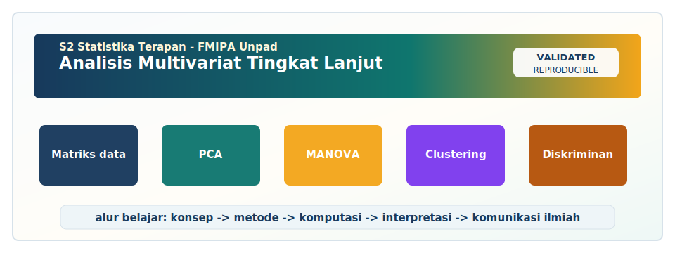

<!-- BEGIN UNPAD MATERIAL STYLE -->
<style>
:root {
  --unpad-navy: #17395c;
  --unpad-gold: #f2a51a;
  --unpad-teal: #0f766e;
  --unpad-ink: #172033;
  --unpad-paper: #fffdf8;
  --unpad-soft: #eef5f8;
  --unpad-line: #d7e2ea;
}
html, body {
  background: linear-gradient(135deg, #f8fbfd 0%, #fffdf8 48%, #f3f6ee 100%) !important;
  color: var(--unpad-ink) !important;
}
body {
  font-family: "Segoe UI", Arial, sans-serif !important;
  line-height: 1.72 !important;
}
.main-container {
  max-width: 1180px !important;
  background: rgba(255, 253, 248, 0.98) !important;
  border: 1px solid var(--unpad-line) !important;
  border-radius: 8px !important;
  box-shadow: 0 18px 42px rgba(23, 57, 92, 0.12) !important;
}
h1, h2, h3, h4 {
  letter-spacing: 0 !important;
}
h1.title {
  color: var(--unpad-navy) !important;
  -webkit-text-fill-color: var(--unpad-navy) !important;
  background: none !important;
}
h2 {
  border-left-color: var(--unpad-gold) !important;
}
a {
  color: #0b5c86 !important;
}
pre, code {
  border-radius: 8px !important;
}
.unpad-cover {
  margin: 18px 0 26px;
  padding: 24px;
  border-radius: 8px;
  background: linear-gradient(135deg, #17395c 0%, #0f766e 58%, #f2a51a 100%);
  color: #ffffff;
  box-shadow: 0 18px 36px rgba(23, 57, 92, 0.22);
}
.unpad-cover__brand {
  display: grid;
  grid-template-columns: 92px 1fr;
  gap: 20px;
  align-items: center;
}
.unpad-cover img {
  width: 92px;
  height: 92px;
  object-fit: contain;
  background: #ffffff;
  border-radius: 8px;
  padding: 8px;
  box-shadow: 0 8px 22px rgba(0,0,0,0.18);
}
.unpad-kicker {
  text-transform: uppercase;
  font-size: 0.82rem;
  font-weight: 800;
  letter-spacing: 0;
  color: #fff8dc;
}
.unpad-cover h2 {
  margin: 6px 0 8px;
  padding: 0;
  border: 0;
  background: transparent;
  color: #ffffff !important;
  font-size: 1.65rem;
}
.unpad-meta {
  margin: 0;
  color: #f7fbff;
  font-weight: 600;
}
.materi-illustration {
  margin: 20px 0 24px;
  padding: 14px;
  background: #ffffff;
  border: 1px solid var(--unpad-line);
  border-radius: 8px;
  box-shadow: 0 12px 28px rgba(23, 57, 92, 0.10);
}
.materi-illustration img {
  width: 100%;
  height: auto;
  display: block;
  border-radius: 6px;
}
.validasi-akademik {
  margin: 18px 0 28px;
  padding: 16px 18px;
  background: linear-gradient(135deg, #eef8f6, #fff8e7);
  border-left: 8px solid var(--unpad-teal);
  border-radius: 8px;
  color: var(--unpad-ink);
}
.validasi-akademik strong {
  color: var(--unpad-navy);
}
table {
  border-radius: 8px !important;
}
@media (max-width: 760px) {
  .unpad-cover__brand {
    grid-template-columns: 1fr;
  }
  .unpad-cover img {
    width: 76px;
    height: 76px;
  }
}
</style>
<!-- END UNPAD MATERIAL STYLE -->


<!-- BEGIN UNPAD MATERIAL ENHANCEMENT -->

```{r setup-unpad-render, include=FALSE}
execute_code <- FALSE
knitr::opts_chunk$set(
  echo = TRUE,
  eval = FALSE,
  message = FALSE,
  warning = FALSE,
  fig.align = "center",
  fig.width = 8,
  fig.height = 4.8,
  dpi = 120
)
set.seed(2025)
```


<div class="unpad-cover">
<div class="unpad-cover__brand">

<div>
<div class="unpad-kicker">S2 Statistika Terapan | FMIPA Universitas Padjadjaran</div>
<h2>Analisis Multivariat Tingkat Lanjut</h2>
<p class="unpad-meta">Materi Pembelajaran Komprehensif Berbasis RPS-OBE | S2 Statistika Terapan FMIPA Universitas Padjadjaran<br>Penulis: Dr. Irlandia Ginanjar, M.Si | Januari 2025</p>
</div>
</div>
</div>

<div class="materi-illustration">

</div>

<div class="validasi-akademik">
<strong>Catatan validasi akademik.</strong> Materi ini diseragamkan dengan rujukan ADWTL Januari 2025: rumus dibaca bersama asumsi, contoh kode diposisikan sebagai template reproducible, dan interpretasi diarahkan pada validitas data, diagnosis model, evaluasi ketidakpastian, serta komunikasi hasil secara ilmiah.
</div>

<!-- END UNPAD MATERIAL ENHANCEMENT -->

```{r setup, include=FALSE, eval=FALSE}
knitr::opts_chunk$set(
  echo = TRUE,
  message = FALSE,
  warning = FALSE,
  fig.width = 8,
  fig.height = 5.2,
  dpi = 120,
  out.width = "90%"
)
set.seed(2025)
```

<div class="rps-box">
<strong>Identitas Materi</strong><br>
Mata Kuliah: <strong>Analisis Multivariat Tingkat Lanjut</strong><br>
Program Studi: <strong>S2 Statistika Terapan, FMIPA Universitas Padjadjaran</strong><br>
Dosen Penulis RPS / Author: <strong>Dr. Irlandia Ginanjar, M.Si</strong><br>
Dosen Pengampu: <strong>Dr. Irlandia Ginanjar, M.Si; Dr. Titi Purawandari, M.Si</strong><br>
Semester: <strong>1</strong> | Bobot: <strong>3 SKS (T = 2; P = 1)</strong> | Tahun Pembuatan Materi: <strong>Januari 2025</strong><br>
Nuansa visual: <strong>colorful coklat degradasi</strong> dengan kotak rumus coklat muda dan tulisan hitam agar nyaman dibaca.
</div>

# Prakata

Materi ini disusun sebagai bahan ajar komprehensif untuk mata kuliah **Analisis Multivariat Tingkat Lanjut** pada Program Studi **S2 Statistika Terapan FMIPA Universitas Padjadjaran**. Arah penyusunan mengikuti RPS-OBE mata kuliah, terutama capaian pembelajaran yang menekankan kemampuan menganalisis konsep dasar, asumsi, distribusi multivariat, uji vektor rata-rata, desain sampling, regresi multivariat, PCA, analisis faktor, diskriminan, clustering, korespondensi, biplot, serta kemampuan menyusun laporan ilmiah dan visualisasi hasil analisis. Dengan demikian, materi ini tidak hanya berbentuk ringkasan teori, tetapi juga mengintegrasikan alur berpikir metodologis, contoh kasus, formula matematis, algoritma kerja, interpretasi output, dan contoh implementasi R.

Bahan ajar ini sengaja dibuat panjang dan berlapis karena analisis multivariat sering tampak seperti “keranjang besar” berisi banyak metode. Padahal, bila dipetakan secara sistematis, seluruh metode tersebut memiliki benang merah yang jelas: kita berusaha memahami struktur bersama dari beberapa variabel secara simultan. Pada level magister terapan, mahasiswa tidak cukup hanya mengetahui nama metode. Mahasiswa perlu memahami kapan suatu metode dipakai, mengapa asumsi tertentu diperlukan, bagaimana membaca output, bagaimana mendeteksi kesalahan interpretasi, dan bagaimana menghubungkan hasil statistik dengan keputusan substantif pada bidang kesehatan, bisnis, sosial, aktuaria, biostatistik, pendidikan, dan sains data.

<div class="concept-box">
<strong>Filosofi utama:</strong> analisis multivariat bukan sekadar analisis banyak variabel, melainkan analisis struktur ketergantungan, perbedaan, kemiripan, reduksi dimensi, klasifikasi, dan representasi visual secara simultan. Dua variabel bisa dianalisis satu per satu, tetapi hubungan antarkeduanya sering baru terlihat ketika variabel-variabel tersebut dibaca sebagai satu sistem.
</div>

## Peta RPS ke Materi

| Komponen RPS | Fokus Materi dalam Modul Ini |
|---|---|
| CPMK1 | Konsep dasar, asumsi, distribusi multivariat, karakteristik data, uji vektor rata-rata |
| CPMK2 | Sampling multivariat dan desain eksperimen untuk data dengan banyak respons/indikator |
| CPMK3 | Regresi multivariat, PCA, FA, diskriminan, klasifikasi, clustering, dan integrasi metode |
| CPMK4 | Analisis korespondensi, biplot, visualisasi, laporan ilmiah, dan presentasi hasil |

## Paket R yang Direkomendasikan

Kode pada modul ini memprioritaskan fungsi dasar R agar mudah dijalankan. Beberapa bagian lanjutan menyebut paket tambahan yang dapat dipasang bila diperlukan.

```{r packages, eval=FALSE}
# Paket dasar yang sering berguna
install.packages(c("tidyverse", "MASS", "psych", "MVN", "Hotelling", "FactoMineR", "factoextra", "cluster"))
```

## Cara Menggunakan Modul

1. Bacalah bagian konsep sebelum menjalankan kode.
2. Perhatikan kotak formula untuk memahami struktur matematis.
3. Jalankan kode R secara bertahap, bukan sekaligus.
4. Setelah memperoleh output, tuliskan interpretasi dalam bahasa substantif.
5. Untuk tugas akhir, pilih dataset nyata dan gunakan alur laporan yang disediakan pada bab akhir.


# Bab 1. Orientasi Analisis Multivariat dan Karakteristik Data

<span class="badge-brown">Pertemuan 1</span> <span class="badge-brown">SubCPMK1</span>

<div class="concept-box"><strong>Fokus bab:</strong> konsep dasar data multivariat, tipe variabel, matriks data, korelasi, kovarians, dan logika analisis simultan. Topik ini merujuk pada bahan kajian RPS dan dikembangkan dengan rujukan utama [@johnson2019; @rencher2012; @tabachnick2019].</div>

## Tujuan Pembelajaran

Setelah mempelajari bab ini, mahasiswa diharapkan mampu:

- menjelaskan konsep dan fungsi **matriks data** dalam analisis multivariat;

- menjelaskan konsep dan fungsi **vektor rata-rata** dalam analisis multivariat;

- menjelaskan konsep dan fungsi **matriks kovarians** dalam analisis multivariat;

- menjelaskan konsep dan fungsi **matriks korelasi** dalam analisis multivariat;

- menjelaskan konsep dan fungsi **jarak Mahalanobis** dalam analisis multivariat;
- menghubungkan output statistik dengan konteks permasalahan nyata;
- menyusun interpretasi yang ringkas, kritis, dan dapat dipertanggungjawabkan.

## Konsep Inti

Orientasi Analisis Multivariat dan Karakteristik Data merupakan bagian penting dari analisis multivariat tingkat lanjut karena berhubungan langsung dengan konsep dasar data multivariat, tipe variabel, matriks data, korelasi, kovarians, dan logika analisis simultan. Pada level magister, mahasiswa diharapkan tidak hanya mampu menjalankan prosedur komputasi, tetapi juga memahami struktur data, asumsi, keterbatasan, dan konsekuensi interpretasi. Pembelajaran topik ini perlu dimulai dengan pengertian bahwa setiap observasi multivariat adalah satu vektor informasi. Ketika vektor tersebut dianalisis, perhatian utama bukan hanya nilai tiap variabel, melainkan pola bersama antarvariabel. Perspektif ini membedakan analisis multivariat dari kumpulan analisis univariat yang dilakukan secara terpisah.

Dalam praktik, matriks data sering menjadi pintu masuk untuk memahami data. Namun, penggunaan metode tersebut perlu didukung oleh pemahaman tentang kualitas pengukuran, desain pengambilan sampel, ukuran sampel, dan tujuan analisis. Jika tujuan analisis adalah eksplorasi, fokusnya dapat diarahkan pada struktur pola, visualisasi, dan reduksi dimensi. Jika tujuan analisis adalah inferensi, perhatian perlu diberikan pada asumsi distribusi, hipotesis, dan kontrol kesalahan. Jika tujuan analisis adalah prediksi atau klasifikasi, validasi model menjadi bagian yang tidak boleh ditinggalkan.

<div class="formula-box">
Untuk $n$ objek dan $p$ variabel, matriks data ditulis sebagai
\[
\mathbf{X}_{n\times p}=\begin{bmatrix}
x_{11}&x_{12}&\cdots&x_{1p}\\
x_{21}&x_{22}&\cdots&x_{2p}\\
\vdots&\vdots&\ddots&\vdots\\
x_{n1}&x_{n2}&\cdots&x_{np}
\end{bmatrix}.
\]
Vektor rata-rata sampel adalah $\bar{\mathbf{x}}=(\bar{x}_1,\ldots,\bar{x}_p)'$, sedangkan kovarians sampel adalah
\[
\mathbf{S}=\frac{1}{n-1}\sum_{i=1}^{n}(\mathbf{x}_i-\bar{\mathbf{x}})(\mathbf{x}_i-\bar{\mathbf{x}})'.
\]
</div>

## Narasi Pengayaan Teoretis dan Terapan

Dalam konteks Orientasi Analisis Multivariat dan Karakteristik Data, aspek keterkaitan antara tujuan penelitian dan pilihan metode menjadi penting karena data multivariat hampir selalu membawa informasi yang saling bergantung. Ketika beberapa variabel diamati pada unit yang sama, perubahan pada satu variabel sering tidak berdiri sendiri, melainkan terkait dengan perubahan variabel lain. Oleh sebab itu, analisis yang hanya memotong data menjadi analisis univariat dapat kehilangan struktur utama yang justru menjadi alasan mengapa data dikumpulkan secara multivariat. Pada aplikasi pemasaran dan perilaku pelanggan, misalnya, indikator layanan, perilaku, risiko, dan capaian sering bergerak bersama sehingga kesimpulan perlu mempertimbangkan korelasi, variasi bersama, serta kemungkinan adanya dimensi laten. Prinsip ini sejalan dengan penekanan literatur klasik bahwa kekuatan analisis multivariat terletak pada pembacaan serentak terhadap vektor observasi, bukan pada penjumlahan mekanis dari banyak uji tunggal [@johnson2019; @rencher2012; @tabachnick2019].

Secara praktis, vektor rata-rata tidak boleh diperlakukan sebagai tombol otomatis. Mahasiswa perlu memulai dari pertanyaan: apa objek yang dibandingkan, variabel apa yang relevan, apakah skala pengukuran sebanding, dan apakah tujuan analisis bersifat eksploratori, inferensial, prediktif, atau visual. Pertanyaan awal tersebut menentukan apakah vektor rata-rata cocok digunakan atau justru perlu diganti dengan pendekatan lain. Dalam kasus pendidikan tinggi, keputusan metode juga dipengaruhi oleh kualitas data, pola missing value, keberadaan outlier, dan apakah variabel dikumpulkan melalui desain yang memadai. Dengan cara ini, Orientasi Analisis Multivariat dan Karakteristik Data menjadi proses ilmiah yang argumentatif, bukan sekadar menjalankan fungsi R lalu menyalin output ke laporan.

Dari sudut pembelajaran magister, kemampuan utama pada bagian Orientasi Analisis Multivariat dan Karakteristik Data adalah menerjemahkan konsep matematis menjadi interpretasi substantif. Rumus memang diperlukan karena memberikan struktur formal, tetapi rumus hanya bernilai jika mahasiswa dapat menjelaskan maknanya. Sebagai contoh, matriks kovarians tidak hanya berisi angka, melainkan menggambarkan bagaimana variabel bergerak bersama; eigenvalue bukan hanya hasil komputasi, melainkan ukuran dominansi dimensi; dan jarak multivariat bukan hanya jarak geometris, melainkan ukuran ketidaklaziman observasi relatif terhadap pola data. Karena itu, setiap penggunaan matriks kovarians perlu diikuti dengan kalimat interpretasi yang menyebut arah, kekuatan, konteks, dan konsekuensi temuan.

Salah satu kesalahan umum dalam Orientasi Analisis Multivariat dan Karakteristik Data adalah terlalu cepat menarik kesimpulan dari grafik atau tabel ringkas tanpa memeriksa asumsi dasar. Grafik yang tampak rapi dapat menutupi masalah skala, ketidakseimbangan kelompok, atau variabel yang sebenarnya mendominasi karena satuannya besar. Sebaliknya, output yang tampak rumit dapat disederhanakan bila peneliti kembali ke tujuan awal. Pada data aktuaria dan risiko, misalnya, variabel dengan variasi paling besar belum tentu variabel paling penting secara kebijakan. Oleh karena itu, matriks korelasi sebaiknya selalu dilengkapi pemeriksaan sensitivitas: bagaimana hasil berubah jika data distandardisasi, outlier dikeluarkan, jumlah komponen diubah, atau jumlah cluster dipilih berbeda.

Dalam laporan ilmiah, bagian Orientasi Analisis Multivariat dan Karakteristik Data perlu ditulis dengan bahasa yang disiplin. Mahasiswa sebaiknya menghindari frasa seperti 'terbukti berpengaruh' bila desain data hanya mendukung asosiasi. Kalimat yang lebih aman adalah 'terdapat indikasi hubungan multivariat', 'kelompok menunjukkan pola berbeda', atau 'komponen pertama terutama merepresentasikan variasi pada indikator tertentu'. Pada topik konsep dasar data multivariat, tipe variabel, matriks data, korelasi, kovarians, dan logika analisis simultan, ketelitian bahasa sangat menentukan kredibilitas analisis. Statistik tidak hanya menghasilkan angka; statistik juga membentuk cara kita menyatakan bukti. Itulah sebabnya interpretasi harus dibatasi oleh desain sampling, asumsi model, ukuran sampel, dan kualitas pengukuran.

Ketika matriks data digunakan pada data survei rumah tangga, proses eksplorasi awal sebaiknya mencakup pemeriksaan distribusi marginal, korelasi, boxplot, scatterplot, dan peta missing value. Tahapan ini sering dianggap sederhana, tetapi justru menentukan apakah analisis lanjutan masuk akal. Pada banyak kasus, perbedaan hasil bukan terjadi karena metode yang canggih, tetapi karena variabel tidak ditransformasi, kategori tidak seimbang, atau unit analisis dicampur. Dengan membangun kebiasaan eksplorasi yang rapi, mahasiswa dapat mengurangi risiko kesimpulan yang salah dan memperkuat argumentasi ketika mempresentasikan hasil.

Komputasi dalam Orientasi Analisis Multivariat dan Karakteristik Data dapat dilakukan dengan R, Python, SPSS, SAS, atau perangkat lunak lain, tetapi logika statistiknya tetap sama. Perangkat lunak hanya alat untuk mengeksekusi matriks, optimasi, dekomposisi, atau prosedur estimasi. Mahasiswa perlu mampu menjelaskan apa yang dilakukan fungsi tersebut: apakah menghitung kovarians, melakukan dekomposisi eigen, membangun fungsi diskriminan, meminimumkan jumlah kuadrat dalam cluster, atau memetakan tabel kontingensi ke ruang berdimensi rendah. Dengan demikian, vektor rata-rata tidak menjadi kotak hitam. Kotak hitam itu seperti kopi tanpa gula: bisa diminum, tapi sering bikin wajah meringis saat ditanya interpretasi.

Pada tahap diskusi, hasil Orientasi Analisis Multivariat dan Karakteristik Data sebaiknya dihubungkan dengan pertanyaan substantif, bukan hanya dengan kriteria statistik. Jika analisis menghasilkan dua komponen utama, apa makna kedua komponen tersebut bagi kesehatan masyarakat? Jika ada tiga cluster, apa karakteristik tiap cluster dan bagaimana implikasinya? Jika uji vektor rata-rata signifikan, variabel mana yang paling berkontribusi terhadap perbedaan? Pertanyaan lanjutan seperti ini membuat matriks kovarians menjadi bagian dari pemecahan masalah nyata. Literatur multivariat menekankan bahwa interpretasi domain merupakan bagian integral dari analisis, terutama ketika metode menghasilkan representasi dimensi rendah atau klasifikasi kelompok [@johnson2019; @rencher2012; @tabachnick2019].

Dalam konteks Orientasi Analisis Multivariat dan Karakteristik Data, aspek potensi multikolinearitas dan redundansi informasi menjadi penting karena data multivariat hampir selalu membawa informasi yang saling bergantung. Ketika beberapa variabel diamati pada unit yang sama, perubahan pada satu variabel sering tidak berdiri sendiri, melainkan terkait dengan perubahan variabel lain. Oleh sebab itu, analisis yang hanya memotong data menjadi analisis univariat dapat kehilangan struktur utama yang justru menjadi alasan mengapa data dikumpulkan secara multivariat. Pada aplikasi pemasaran dan perilaku pelanggan, misalnya, indikator layanan, perilaku, risiko, dan capaian sering bergerak bersama sehingga kesimpulan perlu mempertimbangkan korelasi, variasi bersama, serta kemungkinan adanya dimensi laten. Prinsip ini sejalan dengan penekanan literatur klasik bahwa kekuatan analisis multivariat terletak pada pembacaan serentak terhadap vektor observasi, bukan pada penjumlahan mekanis dari banyak uji tunggal [@johnson2019; @rencher2012; @tabachnick2019].

Secara praktis, jarak Mahalanobis tidak boleh diperlakukan sebagai tombol otomatis. Mahasiswa perlu memulai dari pertanyaan: apa objek yang dibandingkan, variabel apa yang relevan, apakah skala pengukuran sebanding, dan apakah tujuan analisis bersifat eksploratori, inferensial, prediktif, atau visual. Pertanyaan awal tersebut menentukan apakah jarak Mahalanobis cocok digunakan atau justru perlu diganti dengan pendekatan lain. Dalam kasus pendidikan tinggi, keputusan metode juga dipengaruhi oleh kualitas data, pola missing value, keberadaan outlier, dan apakah variabel dikumpulkan melalui desain yang memadai. Dengan cara ini, Orientasi Analisis Multivariat dan Karakteristik Data menjadi proses ilmiah yang argumentatif, bukan sekadar menjalankan fungsi R lalu menyalin output ke laporan.

Dari sudut pembelajaran magister, kemampuan utama pada bagian Orientasi Analisis Multivariat dan Karakteristik Data adalah menerjemahkan konsep matematis menjadi interpretasi substantif. Rumus memang diperlukan karena memberikan struktur formal, tetapi rumus hanya bernilai jika mahasiswa dapat menjelaskan maknanya. Sebagai contoh, matriks kovarians tidak hanya berisi angka, melainkan menggambarkan bagaimana variabel bergerak bersama; eigenvalue bukan hanya hasil komputasi, melainkan ukuran dominansi dimensi; dan jarak multivariat bukan hanya jarak geometris, melainkan ukuran ketidaklaziman observasi relatif terhadap pola data. Karena itu, setiap penggunaan matriks data perlu diikuti dengan kalimat interpretasi yang menyebut arah, kekuatan, konteks, dan konsekuensi temuan.

Salah satu kesalahan umum dalam Orientasi Analisis Multivariat dan Karakteristik Data adalah terlalu cepat menarik kesimpulan dari grafik atau tabel ringkas tanpa memeriksa asumsi dasar. Grafik yang tampak rapi dapat menutupi masalah skala, ketidakseimbangan kelompok, atau variabel yang sebenarnya mendominasi karena satuannya besar. Sebaliknya, output yang tampak rumit dapat disederhanakan bila peneliti kembali ke tujuan awal. Pada data aktuaria dan risiko, misalnya, variabel dengan variasi paling besar belum tentu variabel paling penting secara kebijakan. Oleh karena itu, vektor rata-rata sebaiknya selalu dilengkapi pemeriksaan sensitivitas: bagaimana hasil berubah jika data distandardisasi, outlier dikeluarkan, jumlah komponen diubah, atau jumlah cluster dipilih berbeda.

Dalam laporan ilmiah, bagian Orientasi Analisis Multivariat dan Karakteristik Data perlu ditulis dengan bahasa yang disiplin. Mahasiswa sebaiknya menghindari frasa seperti 'terbukti berpengaruh' bila desain data hanya mendukung asosiasi. Kalimat yang lebih aman adalah 'terdapat indikasi hubungan multivariat', 'kelompok menunjukkan pola berbeda', atau 'komponen pertama terutama merepresentasikan variasi pada indikator tertentu'. Pada topik konsep dasar data multivariat, tipe variabel, matriks data, korelasi, kovarians, dan logika analisis simultan, ketelitian bahasa sangat menentukan kredibilitas analisis. Statistik tidak hanya menghasilkan angka; statistik juga membentuk cara kita menyatakan bukti. Itulah sebabnya interpretasi harus dibatasi oleh desain sampling, asumsi model, ukuran sampel, dan kualitas pengukuran.

Ketika matriks korelasi digunakan pada data survei rumah tangga, proses eksplorasi awal sebaiknya mencakup pemeriksaan distribusi marginal, korelasi, boxplot, scatterplot, dan peta missing value. Tahapan ini sering dianggap sederhana, tetapi justru menentukan apakah analisis lanjutan masuk akal. Pada banyak kasus, perbedaan hasil bukan terjadi karena metode yang canggih, tetapi karena variabel tidak ditransformasi, kategori tidak seimbang, atau unit analisis dicampur. Dengan membangun kebiasaan eksplorasi yang rapi, mahasiswa dapat mengurangi risiko kesimpulan yang salah dan memperkuat argumentasi ketika mempresentasikan hasil.

Komputasi dalam Orientasi Analisis Multivariat dan Karakteristik Data dapat dilakukan dengan R, Python, SPSS, SAS, atau perangkat lunak lain, tetapi logika statistiknya tetap sama. Perangkat lunak hanya alat untuk mengeksekusi matriks, optimasi, dekomposisi, atau prosedur estimasi. Mahasiswa perlu mampu menjelaskan apa yang dilakukan fungsi tersebut: apakah menghitung kovarians, melakukan dekomposisi eigen, membangun fungsi diskriminan, meminimumkan jumlah kuadrat dalam cluster, atau memetakan tabel kontingensi ke ruang berdimensi rendah. Dengan demikian, jarak Mahalanobis tidak menjadi kotak hitam. Kotak hitam itu seperti kopi tanpa gula: bisa diminum, tapi sering bikin wajah meringis saat ditanya interpretasi.

Pada tahap diskusi, hasil Orientasi Analisis Multivariat dan Karakteristik Data sebaiknya dihubungkan dengan pertanyaan substantif, bukan hanya dengan kriteria statistik. Jika analisis menghasilkan dua komponen utama, apa makna kedua komponen tersebut bagi kesehatan masyarakat? Jika ada tiga cluster, apa karakteristik tiap cluster dan bagaimana implikasinya? Jika uji vektor rata-rata signifikan, variabel mana yang paling berkontribusi terhadap perbedaan? Pertanyaan lanjutan seperti ini membuat matriks data menjadi bagian dari pemecahan masalah nyata. Literatur multivariat menekankan bahwa interpretasi domain merupakan bagian integral dari analisis, terutama ketika metode menghasilkan representasi dimensi rendah atau klasifikasi kelompok [@johnson2019; @rencher2012; @tabachnick2019].

Dalam konteks Orientasi Analisis Multivariat dan Karakteristik Data, aspek cara menjelaskan hasil kepada pembaca non-statistik menjadi penting karena data multivariat hampir selalu membawa informasi yang saling bergantung. Ketika beberapa variabel diamati pada unit yang sama, perubahan pada satu variabel sering tidak berdiri sendiri, melainkan terkait dengan perubahan variabel lain. Oleh sebab itu, analisis yang hanya memotong data menjadi analisis univariat dapat kehilangan struktur utama yang justru menjadi alasan mengapa data dikumpulkan secara multivariat. Pada aplikasi pemasaran dan perilaku pelanggan, misalnya, indikator layanan, perilaku, risiko, dan capaian sering bergerak bersama sehingga kesimpulan perlu mempertimbangkan korelasi, variasi bersama, serta kemungkinan adanya dimensi laten. Prinsip ini sejalan dengan penekanan literatur klasik bahwa kekuatan analisis multivariat terletak pada pembacaan serentak terhadap vektor observasi, bukan pada penjumlahan mekanis dari banyak uji tunggal [@johnson2019; @rencher2012; @tabachnick2019].

Secara praktis, matriks kovarians tidak boleh diperlakukan sebagai tombol otomatis. Mahasiswa perlu memulai dari pertanyaan: apa objek yang dibandingkan, variabel apa yang relevan, apakah skala pengukuran sebanding, dan apakah tujuan analisis bersifat eksploratori, inferensial, prediktif, atau visual. Pertanyaan awal tersebut menentukan apakah matriks kovarians cocok digunakan atau justru perlu diganti dengan pendekatan lain. Dalam kasus pendidikan tinggi, keputusan metode juga dipengaruhi oleh kualitas data, pola missing value, keberadaan outlier, dan apakah variabel dikumpulkan melalui desain yang memadai. Dengan cara ini, Orientasi Analisis Multivariat dan Karakteristik Data menjadi proses ilmiah yang argumentatif, bukan sekadar menjalankan fungsi R lalu menyalin output ke laporan.

Dari sudut pembelajaran magister, kemampuan utama pada bagian Orientasi Analisis Multivariat dan Karakteristik Data adalah menerjemahkan konsep matematis menjadi interpretasi substantif. Rumus memang diperlukan karena memberikan struktur formal, tetapi rumus hanya bernilai jika mahasiswa dapat menjelaskan maknanya. Sebagai contoh, matriks kovarians tidak hanya berisi angka, melainkan menggambarkan bagaimana variabel bergerak bersama; eigenvalue bukan hanya hasil komputasi, melainkan ukuran dominansi dimensi; dan jarak multivariat bukan hanya jarak geometris, melainkan ukuran ketidaklaziman observasi relatif terhadap pola data. Karena itu, setiap penggunaan matriks korelasi perlu diikuti dengan kalimat interpretasi yang menyebut arah, kekuatan, konteks, dan konsekuensi temuan.

Salah satu kesalahan umum dalam Orientasi Analisis Multivariat dan Karakteristik Data adalah terlalu cepat menarik kesimpulan dari grafik atau tabel ringkas tanpa memeriksa asumsi dasar. Grafik yang tampak rapi dapat menutupi masalah skala, ketidakseimbangan kelompok, atau variabel yang sebenarnya mendominasi karena satuannya besar. Sebaliknya, output yang tampak rumit dapat disederhanakan bila peneliti kembali ke tujuan awal. Pada data aktuaria dan risiko, misalnya, variabel dengan variasi paling besar belum tentu variabel paling penting secara kebijakan. Oleh karena itu, jarak Mahalanobis sebaiknya selalu dilengkapi pemeriksaan sensitivitas: bagaimana hasil berubah jika data distandardisasi, outlier dikeluarkan, jumlah komponen diubah, atau jumlah cluster dipilih berbeda.

## Algoritma Kerja yang Disarankan

Berikut adalah algoritma kerja yang dapat digunakan mahasiswa ketika menerapkan topik **Orientasi Analisis Multivariat dan Karakteristik Data** pada dataset nyata.

1. Definisikan pertanyaan penelitian dan unit analisis secara eksplisit.

2. Identifikasi variabel respons, prediktor, kelompok, atau kategori yang relevan.

3. Periksa struktur data: tipe variabel, missing value, outlier, skala, dan ketidakseimbangan kelompok.

4. Lakukan eksplorasi awal menggunakan statistik deskriptif, matriks korelasi, dan visualisasi dasar.

5. Terapkan prosedur utama yang relevan dengan matriks data, vektor rata-rata, matriks kovarians.

6. Evaluasi asumsi dan stabilitas hasil melalui pemeriksaan diagnostik atau analisis sensitivitas.

7. Tuliskan interpretasi dalam bahasa substantif, bukan hanya bahasa output perangkat lunak.

8. Simpulkan temuan, keterbatasan, dan rekomendasi analisis lanjutan.

## Contoh Implementasi R

```{r orientasi-data, eval=FALSE}
# Contoh data multivariat sederhana menggunakan data iris
X <- iris[, 1:4]
head(X)

# Vektor rata-rata, kovarians, dan korelasi
colMeans(X)
cov(X)
cor(X)

# Heatmap korelasi dasar
heatmap(cor(X), symm = TRUE, main = "Heatmap Korelasi Variabel Iris")
```

## Pedoman Interpretasi Output

Interpretasi hasil pada bab ini sebaiknya dimulai dari pertanyaan utama: apa yang ingin diketahui dari data dan bagaimana metode membantu menjawabnya? Pada **Orientasi Analisis Multivariat dan Karakteristik Data**, output numerik perlu dibaca bersama visualisasi dan informasi desain data. Bila output menunjukkan pola yang kuat, mahasiswa perlu menjelaskan apakah pola tersebut konsisten dengan teori atau konteks lapangan. Bila output tidak jelas, mahasiswa tidak perlu memaksakan kesimpulan; justru ketidakjelasan tersebut dapat menjadi temuan bahwa struktur data lemah, ukuran sampel terbatas, atau variabel yang dikumpulkan belum cukup merepresentasikan fenomena.

Dalam laporan, hindari menulis 'hasilnya bagus' tanpa indikator. Gunakan ukuran yang spesifik: ragam dijelaskan, p-value, matriks klasifikasi, jarak antarcluster, loading dominan, centroid, inertia, atau ukuran lain yang relevan dengan matriks data. Setelah itu, hubungkan ukuran tersebut dengan substansi. Misalnya, jika sebuah komponen utama didominasi variabel layanan kesehatan dan pendidikan, maka komponen tersebut dapat disebut dimensi kapasitas layanan, asalkan loading mendukung dan konteks data membenarkan.

## Kesalahan Umum dan Cara Menghindarinya

- Menggunakan semua variabel tanpa memeriksa skala dan korelasi.

- Menyimpulkan kausalitas dari data observasional tanpa desain yang mendukung.

- Membaca grafik tanpa memeriksa ukuran sampel dan kestabilan pola.

- Mengabaikan outlier multivariat karena outlier tidak tampak pada analisis univariat.

- Menyajikan output perangkat lunak terlalu banyak tanpa narasi interpretatif.

- Tidak membedakan tujuan eksplorasi, inferensi, dan prediksi.

<div class="warning-box"><strong>Catatan dosen:</strong> metode multivariat yang canggih tetap bisa menghasilkan kesimpulan lemah jika data tidak dipahami. Mulailah dari pertanyaan riset, bukan dari menu software. Software tidak pernah lelah, tetapi pembaca bisa lelah kalau output ditumpuk tanpa cerita.</div>

## Latihan Mandiri

- Pilih dataset nyata yang memiliki minimal lima variabel numerik dan jelaskan mengapa data tersebut layak dianalisis menggunakan Orientasi Analisis Multivariat dan Karakteristik Data.

- Buat statistik deskriptif multivariat dan visualisasi awal. Jelaskan pola utama yang tampak.

- Terapkan salah satu prosedur: matriks data, vektor rata-rata. Tulis langkah analisis secara sistematis.

- Susun interpretasi maksimal 300 kata yang dapat dipahami pembaca non-statistik.

- Tuliskan keterbatasan analisis dan rekomendasi perbaikan desain data.

## Ringkasan Bab

Bab ini menegaskan bahwa **Orientasi Analisis Multivariat dan Karakteristik Data** harus dipahami sebagai kombinasi antara teori, komputasi, dan interpretasi. Mahasiswa perlu menguasai formula dasar, tetapi juga harus mampu menjelaskan konsekuensi praktis dari hasil analisis. Keterampilan yang diharapkan sesuai dengan RPS adalah kemampuan menganalisis, mengevaluasi, mengintegrasikan, dan mempresentasikan hasil analisis multivariat secara sistematis.

# Bab 2. Distribusi Normal Multivariat dan Pemeriksaan Asumsi

<span class="badge-brown">Pertemuan 1--2</span> <span class="badge-brown">SubCPMK1</span>

<div class="concept-box"><strong>Fokus bab:</strong> distribusi normal multivariat, ellipsoid probabilitas, normalitas marginal, normalitas multivariat, outlier multivariat, dan diagnostik asumsi. Topik ini merujuk pada bahan kajian RPS dan dikembangkan dengan rujukan utama [@mardia1979; @anderson2003; @johnson2019].</div>

## Tujuan Pembelajaran

Setelah mempelajari bab ini, mahasiswa diharapkan mampu:

- menjelaskan konsep dan fungsi **fungsi densitas normal multivariat** dalam analisis multivariat;

- menjelaskan konsep dan fungsi **jarak Mahalanobis** dalam analisis multivariat;

- menjelaskan konsep dan fungsi **Q-Q plot chi-square** dalam analisis multivariat;

- menjelaskan konsep dan fungsi **normalitas marginal** dalam analisis multivariat;

- menjelaskan konsep dan fungsi **deteksi outlier** dalam analisis multivariat;
- menghubungkan output statistik dengan konteks permasalahan nyata;
- menyusun interpretasi yang ringkas, kritis, dan dapat dipertanggungjawabkan.

## Konsep Inti

Distribusi Normal Multivariat dan Pemeriksaan Asumsi merupakan bagian penting dari analisis multivariat tingkat lanjut karena berhubungan langsung dengan distribusi normal multivariat, ellipsoid probabilitas, normalitas marginal, normalitas multivariat, outlier multivariat, dan diagnostik asumsi. Pada level magister, mahasiswa diharapkan tidak hanya mampu menjalankan prosedur komputasi, tetapi juga memahami struktur data, asumsi, keterbatasan, dan konsekuensi interpretasi. Pembelajaran topik ini perlu dimulai dengan pengertian bahwa setiap observasi multivariat adalah satu vektor informasi. Ketika vektor tersebut dianalisis, perhatian utama bukan hanya nilai tiap variabel, melainkan pola bersama antarvariabel. Perspektif ini membedakan analisis multivariat dari kumpulan analisis univariat yang dilakukan secara terpisah.

Dalam praktik, fungsi densitas normal multivariat sering menjadi pintu masuk untuk memahami data. Namun, penggunaan metode tersebut perlu didukung oleh pemahaman tentang kualitas pengukuran, desain pengambilan sampel, ukuran sampel, dan tujuan analisis. Jika tujuan analisis adalah eksplorasi, fokusnya dapat diarahkan pada struktur pola, visualisasi, dan reduksi dimensi. Jika tujuan analisis adalah inferensi, perhatian perlu diberikan pada asumsi distribusi, hipotesis, dan kontrol kesalahan. Jika tujuan analisis adalah prediksi atau klasifikasi, validasi model menjadi bagian yang tidak boleh ditinggalkan.

<div class="formula-box">
Jika $\mathbf{X}\sim N_p(\boldsymbol{\mu},\boldsymbol{\Sigma})$, maka fungsi densitasnya adalah
\[
f(\mathbf{x})=(2\pi)^{-p/2}|\boldsymbol{\Sigma}|^{-1/2}
\exp\left[-\frac{1}{2}(\mathbf{x}-\boldsymbol{\mu})'\boldsymbol{\Sigma}^{-1}(\mathbf{x}-\boldsymbol{\mu})\right].
\]
Jarak Mahalanobis untuk observasi ke-$i$ adalah
\[
D_i^2=(\mathbf{x}_i-\bar{\mathbf{x}})'\mathbf{S}^{-1}(\mathbf{x}_i-\bar{\mathbf{x}}).
\]
</div>

## Narasi Pengayaan Teoretis dan Terapan

Dalam konteks Distribusi Normal Multivariat dan Pemeriksaan Asumsi, aspek keterkaitan antara tujuan penelitian dan pilihan metode menjadi penting karena data multivariat hampir selalu membawa informasi yang saling bergantung. Ketika beberapa variabel diamati pada unit yang sama, perubahan pada satu variabel sering tidak berdiri sendiri, melainkan terkait dengan perubahan variabel lain. Oleh sebab itu, analisis yang hanya memotong data menjadi analisis univariat dapat kehilangan struktur utama yang justru menjadi alasan mengapa data dikumpulkan secara multivariat. Pada aplikasi pendidikan tinggi, misalnya, indikator layanan, perilaku, risiko, dan capaian sering bergerak bersama sehingga kesimpulan perlu mempertimbangkan korelasi, variasi bersama, serta kemungkinan adanya dimensi laten. Prinsip ini sejalan dengan penekanan literatur klasik bahwa kekuatan analisis multivariat terletak pada pembacaan serentak terhadap vektor observasi, bukan pada penjumlahan mekanis dari banyak uji tunggal [@mardia1979; @anderson2003; @johnson2019].

Secara praktis, jarak Mahalanobis tidak boleh diperlakukan sebagai tombol otomatis. Mahasiswa perlu memulai dari pertanyaan: apa objek yang dibandingkan, variabel apa yang relevan, apakah skala pengukuran sebanding, dan apakah tujuan analisis bersifat eksploratori, inferensial, prediktif, atau visual. Pertanyaan awal tersebut menentukan apakah jarak Mahalanobis cocok digunakan atau justru perlu diganti dengan pendekatan lain. Dalam kasus biostatistik, keputusan metode juga dipengaruhi oleh kualitas data, pola missing value, keberadaan outlier, dan apakah variabel dikumpulkan melalui desain yang memadai. Dengan cara ini, Distribusi Normal Multivariat dan Pemeriksaan Asumsi menjadi proses ilmiah yang argumentatif, bukan sekadar menjalankan fungsi R lalu menyalin output ke laporan.

Dari sudut pembelajaran magister, kemampuan utama pada bagian Distribusi Normal Multivariat dan Pemeriksaan Asumsi adalah menerjemahkan konsep matematis menjadi interpretasi substantif. Rumus memang diperlukan karena memberikan struktur formal, tetapi rumus hanya bernilai jika mahasiswa dapat menjelaskan maknanya. Sebagai contoh, matriks kovarians tidak hanya berisi angka, melainkan menggambarkan bagaimana variabel bergerak bersama; eigenvalue bukan hanya hasil komputasi, melainkan ukuran dominansi dimensi; dan jarak multivariat bukan hanya jarak geometris, melainkan ukuran ketidaklaziman observasi relatif terhadap pola data. Karena itu, setiap penggunaan Q-Q plot chi-square perlu diikuti dengan kalimat interpretasi yang menyebut arah, kekuatan, konteks, dan konsekuensi temuan.

Salah satu kesalahan umum dalam Distribusi Normal Multivariat dan Pemeriksaan Asumsi adalah terlalu cepat menarik kesimpulan dari grafik atau tabel ringkas tanpa memeriksa asumsi dasar. Grafik yang tampak rapi dapat menutupi masalah skala, ketidakseimbangan kelompok, atau variabel yang sebenarnya mendominasi karena satuannya besar. Sebaliknya, output yang tampak rumit dapat disederhanakan bila peneliti kembali ke tujuan awal. Pada data sains data sosial, misalnya, variabel dengan variasi paling besar belum tentu variabel paling penting secara kebijakan. Oleh karena itu, normalitas marginal sebaiknya selalu dilengkapi pemeriksaan sensitivitas: bagaimana hasil berubah jika data distandardisasi, outlier dikeluarkan, jumlah komponen diubah, atau jumlah cluster dipilih berbeda.

Dalam laporan ilmiah, bagian Distribusi Normal Multivariat dan Pemeriksaan Asumsi perlu ditulis dengan bahasa yang disiplin. Mahasiswa sebaiknya menghindari frasa seperti 'terbukti berpengaruh' bila desain data hanya mendukung asosiasi. Kalimat yang lebih aman adalah 'terdapat indikasi hubungan multivariat', 'kelompok menunjukkan pola berbeda', atau 'komponen pertama terutama merepresentasikan variasi pada indikator tertentu'. Pada topik distribusi normal multivariat, ellipsoid probabilitas, normalitas marginal, normalitas multivariat, outlier multivariat, dan diagnostik asumsi, ketelitian bahasa sangat menentukan kredibilitas analisis. Statistik tidak hanya menghasilkan angka; statistik juga membentuk cara kita menyatakan bukti. Itulah sebabnya interpretasi harus dibatasi oleh desain sampling, asumsi model, ukuran sampel, dan kualitas pengukuran.

Ketika fungsi densitas normal multivariat digunakan pada data kualitas layanan publik, proses eksplorasi awal sebaiknya mencakup pemeriksaan distribusi marginal, korelasi, boxplot, scatterplot, dan peta missing value. Tahapan ini sering dianggap sederhana, tetapi justru menentukan apakah analisis lanjutan masuk akal. Pada banyak kasus, perbedaan hasil bukan terjadi karena metode yang canggih, tetapi karena variabel tidak ditransformasi, kategori tidak seimbang, atau unit analisis dicampur. Dengan membangun kebiasaan eksplorasi yang rapi, mahasiswa dapat mengurangi risiko kesimpulan yang salah dan memperkuat argumentasi ketika mempresentasikan hasil.

Komputasi dalam Distribusi Normal Multivariat dan Pemeriksaan Asumsi dapat dilakukan dengan R, Python, SPSS, SAS, atau perangkat lunak lain, tetapi logika statistiknya tetap sama. Perangkat lunak hanya alat untuk mengeksekusi matriks, optimasi, dekomposisi, atau prosedur estimasi. Mahasiswa perlu mampu menjelaskan apa yang dilakukan fungsi tersebut: apakah menghitung kovarians, melakukan dekomposisi eigen, membangun fungsi diskriminan, meminimumkan jumlah kuadrat dalam cluster, atau memetakan tabel kontingensi ke ruang berdimensi rendah. Dengan demikian, jarak Mahalanobis tidak menjadi kotak hitam. Kotak hitam itu seperti kopi tanpa gula: bisa diminum, tapi sering bikin wajah meringis saat ditanya interpretasi.

Pada tahap diskusi, hasil Distribusi Normal Multivariat dan Pemeriksaan Asumsi sebaiknya dihubungkan dengan pertanyaan substantif, bukan hanya dengan kriteria statistik. Jika analisis menghasilkan dua komponen utama, apa makna kedua komponen tersebut bagi pemasaran dan perilaku pelanggan? Jika ada tiga cluster, apa karakteristik tiap cluster dan bagaimana implikasinya? Jika uji vektor rata-rata signifikan, variabel mana yang paling berkontribusi terhadap perbedaan? Pertanyaan lanjutan seperti ini membuat Q-Q plot chi-square menjadi bagian dari pemecahan masalah nyata. Literatur multivariat menekankan bahwa interpretasi domain merupakan bagian integral dari analisis, terutama ketika metode menghasilkan representasi dimensi rendah atau klasifikasi kelompok [@mardia1979; @anderson2003; @johnson2019].

Dalam konteks Distribusi Normal Multivariat dan Pemeriksaan Asumsi, aspek potensi multikolinearitas dan redundansi informasi menjadi penting karena data multivariat hampir selalu membawa informasi yang saling bergantung. Ketika beberapa variabel diamati pada unit yang sama, perubahan pada satu variabel sering tidak berdiri sendiri, melainkan terkait dengan perubahan variabel lain. Oleh sebab itu, analisis yang hanya memotong data menjadi analisis univariat dapat kehilangan struktur utama yang justru menjadi alasan mengapa data dikumpulkan secara multivariat. Pada aplikasi pendidikan tinggi, misalnya, indikator layanan, perilaku, risiko, dan capaian sering bergerak bersama sehingga kesimpulan perlu mempertimbangkan korelasi, variasi bersama, serta kemungkinan adanya dimensi laten. Prinsip ini sejalan dengan penekanan literatur klasik bahwa kekuatan analisis multivariat terletak pada pembacaan serentak terhadap vektor observasi, bukan pada penjumlahan mekanis dari banyak uji tunggal [@mardia1979; @anderson2003; @johnson2019].

Secara praktis, deteksi outlier tidak boleh diperlakukan sebagai tombol otomatis. Mahasiswa perlu memulai dari pertanyaan: apa objek yang dibandingkan, variabel apa yang relevan, apakah skala pengukuran sebanding, dan apakah tujuan analisis bersifat eksploratori, inferensial, prediktif, atau visual. Pertanyaan awal tersebut menentukan apakah deteksi outlier cocok digunakan atau justru perlu diganti dengan pendekatan lain. Dalam kasus biostatistik, keputusan metode juga dipengaruhi oleh kualitas data, pola missing value, keberadaan outlier, dan apakah variabel dikumpulkan melalui desain yang memadai. Dengan cara ini, Distribusi Normal Multivariat dan Pemeriksaan Asumsi menjadi proses ilmiah yang argumentatif, bukan sekadar menjalankan fungsi R lalu menyalin output ke laporan.

Dari sudut pembelajaran magister, kemampuan utama pada bagian Distribusi Normal Multivariat dan Pemeriksaan Asumsi adalah menerjemahkan konsep matematis menjadi interpretasi substantif. Rumus memang diperlukan karena memberikan struktur formal, tetapi rumus hanya bernilai jika mahasiswa dapat menjelaskan maknanya. Sebagai contoh, matriks kovarians tidak hanya berisi angka, melainkan menggambarkan bagaimana variabel bergerak bersama; eigenvalue bukan hanya hasil komputasi, melainkan ukuran dominansi dimensi; dan jarak multivariat bukan hanya jarak geometris, melainkan ukuran ketidaklaziman observasi relatif terhadap pola data. Karena itu, setiap penggunaan fungsi densitas normal multivariat perlu diikuti dengan kalimat interpretasi yang menyebut arah, kekuatan, konteks, dan konsekuensi temuan.

Salah satu kesalahan umum dalam Distribusi Normal Multivariat dan Pemeriksaan Asumsi adalah terlalu cepat menarik kesimpulan dari grafik atau tabel ringkas tanpa memeriksa asumsi dasar. Grafik yang tampak rapi dapat menutupi masalah skala, ketidakseimbangan kelompok, atau variabel yang sebenarnya mendominasi karena satuannya besar. Sebaliknya, output yang tampak rumit dapat disederhanakan bila peneliti kembali ke tujuan awal. Pada data sains data sosial, misalnya, variabel dengan variasi paling besar belum tentu variabel paling penting secara kebijakan. Oleh karena itu, jarak Mahalanobis sebaiknya selalu dilengkapi pemeriksaan sensitivitas: bagaimana hasil berubah jika data distandardisasi, outlier dikeluarkan, jumlah komponen diubah, atau jumlah cluster dipilih berbeda.

Dalam laporan ilmiah, bagian Distribusi Normal Multivariat dan Pemeriksaan Asumsi perlu ditulis dengan bahasa yang disiplin. Mahasiswa sebaiknya menghindari frasa seperti 'terbukti berpengaruh' bila desain data hanya mendukung asosiasi. Kalimat yang lebih aman adalah 'terdapat indikasi hubungan multivariat', 'kelompok menunjukkan pola berbeda', atau 'komponen pertama terutama merepresentasikan variasi pada indikator tertentu'. Pada topik distribusi normal multivariat, ellipsoid probabilitas, normalitas marginal, normalitas multivariat, outlier multivariat, dan diagnostik asumsi, ketelitian bahasa sangat menentukan kredibilitas analisis. Statistik tidak hanya menghasilkan angka; statistik juga membentuk cara kita menyatakan bukti. Itulah sebabnya interpretasi harus dibatasi oleh desain sampling, asumsi model, ukuran sampel, dan kualitas pengukuran.

Ketika normalitas marginal digunakan pada data kualitas layanan publik, proses eksplorasi awal sebaiknya mencakup pemeriksaan distribusi marginal, korelasi, boxplot, scatterplot, dan peta missing value. Tahapan ini sering dianggap sederhana, tetapi justru menentukan apakah analisis lanjutan masuk akal. Pada banyak kasus, perbedaan hasil bukan terjadi karena metode yang canggih, tetapi karena variabel tidak ditransformasi, kategori tidak seimbang, atau unit analisis dicampur. Dengan membangun kebiasaan eksplorasi yang rapi, mahasiswa dapat mengurangi risiko kesimpulan yang salah dan memperkuat argumentasi ketika mempresentasikan hasil.

Komputasi dalam Distribusi Normal Multivariat dan Pemeriksaan Asumsi dapat dilakukan dengan R, Python, SPSS, SAS, atau perangkat lunak lain, tetapi logika statistiknya tetap sama. Perangkat lunak hanya alat untuk mengeksekusi matriks, optimasi, dekomposisi, atau prosedur estimasi. Mahasiswa perlu mampu menjelaskan apa yang dilakukan fungsi tersebut: apakah menghitung kovarians, melakukan dekomposisi eigen, membangun fungsi diskriminan, meminimumkan jumlah kuadrat dalam cluster, atau memetakan tabel kontingensi ke ruang berdimensi rendah. Dengan demikian, deteksi outlier tidak menjadi kotak hitam. Kotak hitam itu seperti kopi tanpa gula: bisa diminum, tapi sering bikin wajah meringis saat ditanya interpretasi.

Pada tahap diskusi, hasil Distribusi Normal Multivariat dan Pemeriksaan Asumsi sebaiknya dihubungkan dengan pertanyaan substantif, bukan hanya dengan kriteria statistik. Jika analisis menghasilkan dua komponen utama, apa makna kedua komponen tersebut bagi pemasaran dan perilaku pelanggan? Jika ada tiga cluster, apa karakteristik tiap cluster dan bagaimana implikasinya? Jika uji vektor rata-rata signifikan, variabel mana yang paling berkontribusi terhadap perbedaan? Pertanyaan lanjutan seperti ini membuat fungsi densitas normal multivariat menjadi bagian dari pemecahan masalah nyata. Literatur multivariat menekankan bahwa interpretasi domain merupakan bagian integral dari analisis, terutama ketika metode menghasilkan representasi dimensi rendah atau klasifikasi kelompok [@mardia1979; @anderson2003; @johnson2019].

Dalam konteks Distribusi Normal Multivariat dan Pemeriksaan Asumsi, aspek cara menjelaskan hasil kepada pembaca non-statistik menjadi penting karena data multivariat hampir selalu membawa informasi yang saling bergantung. Ketika beberapa variabel diamati pada unit yang sama, perubahan pada satu variabel sering tidak berdiri sendiri, melainkan terkait dengan perubahan variabel lain. Oleh sebab itu, analisis yang hanya memotong data menjadi analisis univariat dapat kehilangan struktur utama yang justru menjadi alasan mengapa data dikumpulkan secara multivariat. Pada aplikasi pendidikan tinggi, misalnya, indikator layanan, perilaku, risiko, dan capaian sering bergerak bersama sehingga kesimpulan perlu mempertimbangkan korelasi, variasi bersama, serta kemungkinan adanya dimensi laten. Prinsip ini sejalan dengan penekanan literatur klasik bahwa kekuatan analisis multivariat terletak pada pembacaan serentak terhadap vektor observasi, bukan pada penjumlahan mekanis dari banyak uji tunggal [@mardia1979; @anderson2003; @johnson2019].

Secara praktis, Q-Q plot chi-square tidak boleh diperlakukan sebagai tombol otomatis. Mahasiswa perlu memulai dari pertanyaan: apa objek yang dibandingkan, variabel apa yang relevan, apakah skala pengukuran sebanding, dan apakah tujuan analisis bersifat eksploratori, inferensial, prediktif, atau visual. Pertanyaan awal tersebut menentukan apakah Q-Q plot chi-square cocok digunakan atau justru perlu diganti dengan pendekatan lain. Dalam kasus biostatistik, keputusan metode juga dipengaruhi oleh kualitas data, pola missing value, keberadaan outlier, dan apakah variabel dikumpulkan melalui desain yang memadai. Dengan cara ini, Distribusi Normal Multivariat dan Pemeriksaan Asumsi menjadi proses ilmiah yang argumentatif, bukan sekadar menjalankan fungsi R lalu menyalin output ke laporan.

Dari sudut pembelajaran magister, kemampuan utama pada bagian Distribusi Normal Multivariat dan Pemeriksaan Asumsi adalah menerjemahkan konsep matematis menjadi interpretasi substantif. Rumus memang diperlukan karena memberikan struktur formal, tetapi rumus hanya bernilai jika mahasiswa dapat menjelaskan maknanya. Sebagai contoh, matriks kovarians tidak hanya berisi angka, melainkan menggambarkan bagaimana variabel bergerak bersama; eigenvalue bukan hanya hasil komputasi, melainkan ukuran dominansi dimensi; dan jarak multivariat bukan hanya jarak geometris, melainkan ukuran ketidaklaziman observasi relatif terhadap pola data. Karena itu, setiap penggunaan normalitas marginal perlu diikuti dengan kalimat interpretasi yang menyebut arah, kekuatan, konteks, dan konsekuensi temuan.

Salah satu kesalahan umum dalam Distribusi Normal Multivariat dan Pemeriksaan Asumsi adalah terlalu cepat menarik kesimpulan dari grafik atau tabel ringkas tanpa memeriksa asumsi dasar. Grafik yang tampak rapi dapat menutupi masalah skala, ketidakseimbangan kelompok, atau variabel yang sebenarnya mendominasi karena satuannya besar. Sebaliknya, output yang tampak rumit dapat disederhanakan bila peneliti kembali ke tujuan awal. Pada data sains data sosial, misalnya, variabel dengan variasi paling besar belum tentu variabel paling penting secara kebijakan. Oleh karena itu, deteksi outlier sebaiknya selalu dilengkapi pemeriksaan sensitivitas: bagaimana hasil berubah jika data distandardisasi, outlier dikeluarkan, jumlah komponen diubah, atau jumlah cluster dipilih berbeda.

## Algoritma Kerja yang Disarankan

Berikut adalah algoritma kerja yang dapat digunakan mahasiswa ketika menerapkan topik **Distribusi Normal Multivariat dan Pemeriksaan Asumsi** pada dataset nyata.

1. Definisikan pertanyaan penelitian dan unit analisis secara eksplisit.

2. Identifikasi variabel respons, prediktor, kelompok, atau kategori yang relevan.

3. Periksa struktur data: tipe variabel, missing value, outlier, skala, dan ketidakseimbangan kelompok.

4. Lakukan eksplorasi awal menggunakan statistik deskriptif, matriks korelasi, dan visualisasi dasar.

5. Terapkan prosedur utama yang relevan dengan fungsi densitas normal multivariat, jarak Mahalanobis, Q-Q plot chi-square.

6. Evaluasi asumsi dan stabilitas hasil melalui pemeriksaan diagnostik atau analisis sensitivitas.

7. Tuliskan interpretasi dalam bahasa substantif, bukan hanya bahasa output perangkat lunak.

8. Simpulkan temuan, keterbatasan, dan rekomendasi analisis lanjutan.

## Contoh Implementasi R

```{r normalitas-multivariat, eval=FALSE}
X <- as.matrix(iris[, 1:4])
xbar <- colMeans(X)
S <- cov(X)
D2 <- mahalanobis(X, center = xbar, cov = S)
p <- ncol(X)

# Q-Q plot Mahalanobis terhadap kuantil chi-square
qqplot(qchisq(ppoints(nrow(X)), df = p), D2,
       xlab = "Kuantil Chi-square Teoretis",
       ylab = "Jarak Mahalanobis Terurut",
       main = "Q-Q Plot Normalitas Multivariat")
abline(0, 1, col = "gray40", lwd = 2)

# Kandidat outlier multivariat pada taraf 0.975
cutoff <- qchisq(0.975, df = p)
which(D2 > cutoff)
```

## Pedoman Interpretasi Output

Interpretasi hasil pada bab ini sebaiknya dimulai dari pertanyaan utama: apa yang ingin diketahui dari data dan bagaimana metode membantu menjawabnya? Pada **Distribusi Normal Multivariat dan Pemeriksaan Asumsi**, output numerik perlu dibaca bersama visualisasi dan informasi desain data. Bila output menunjukkan pola yang kuat, mahasiswa perlu menjelaskan apakah pola tersebut konsisten dengan teori atau konteks lapangan. Bila output tidak jelas, mahasiswa tidak perlu memaksakan kesimpulan; justru ketidakjelasan tersebut dapat menjadi temuan bahwa struktur data lemah, ukuran sampel terbatas, atau variabel yang dikumpulkan belum cukup merepresentasikan fenomena.

Dalam laporan, hindari menulis 'hasilnya bagus' tanpa indikator. Gunakan ukuran yang spesifik: ragam dijelaskan, p-value, matriks klasifikasi, jarak antarcluster, loading dominan, centroid, inertia, atau ukuran lain yang relevan dengan fungsi densitas normal multivariat. Setelah itu, hubungkan ukuran tersebut dengan substansi. Misalnya, jika sebuah komponen utama didominasi variabel layanan kesehatan dan pendidikan, maka komponen tersebut dapat disebut dimensi kapasitas layanan, asalkan loading mendukung dan konteks data membenarkan.

## Kesalahan Umum dan Cara Menghindarinya

- Menggunakan semua variabel tanpa memeriksa skala dan korelasi.

- Menyimpulkan kausalitas dari data observasional tanpa desain yang mendukung.

- Membaca grafik tanpa memeriksa ukuran sampel dan kestabilan pola.

- Mengabaikan outlier multivariat karena outlier tidak tampak pada analisis univariat.

- Menyajikan output perangkat lunak terlalu banyak tanpa narasi interpretatif.

- Tidak membedakan tujuan eksplorasi, inferensi, dan prediksi.

<div class="warning-box"><strong>Catatan dosen:</strong> metode multivariat yang canggih tetap bisa menghasilkan kesimpulan lemah jika data tidak dipahami. Mulailah dari pertanyaan riset, bukan dari menu software. Software tidak pernah lelah, tetapi pembaca bisa lelah kalau output ditumpuk tanpa cerita.</div>

## Latihan Mandiri

- Pilih dataset nyata yang memiliki minimal lima variabel numerik dan jelaskan mengapa data tersebut layak dianalisis menggunakan Distribusi Normal Multivariat dan Pemeriksaan Asumsi.

- Buat statistik deskriptif multivariat dan visualisasi awal. Jelaskan pola utama yang tampak.

- Terapkan salah satu prosedur: fungsi densitas normal multivariat, jarak Mahalanobis. Tulis langkah analisis secara sistematis.

- Susun interpretasi maksimal 300 kata yang dapat dipahami pembaca non-statistik.

- Tuliskan keterbatasan analisis dan rekomendasi perbaikan desain data.

## Ringkasan Bab

Bab ini menegaskan bahwa **Distribusi Normal Multivariat dan Pemeriksaan Asumsi** harus dipahami sebagai kombinasi antara teori, komputasi, dan interpretasi. Mahasiswa perlu menguasai formula dasar, tetapi juga harus mampu menjelaskan konsekuensi praktis dari hasil analisis. Keterampilan yang diharapkan sesuai dengan RPS adalah kemampuan menganalisis, mengevaluasi, mengintegrasikan, dan mempresentasikan hasil analisis multivariat secara sistematis.

# Bab 3. Uji Vektor Rata-rata: Hotelling T² dan Generalisasi

<span class="badge-brown">Pertemuan 2</span> <span class="badge-brown">SubCPMK1</span>

<div class="concept-box"><strong>Fokus bab:</strong> pengujian hipotesis terhadap vektor rata-rata, Hotelling T² satu sampel, dua sampel, interval simultan, dan hubungan dengan MANOVA. Topik ini merujuk pada bahan kajian RPS dan dikembangkan dengan rujukan utama [@johnson2019; @anderson2003; @rencher2012].</div>

## Tujuan Pembelajaran

Setelah mempelajari bab ini, mahasiswa diharapkan mampu:

- menjelaskan konsep dan fungsi **Hotelling T² satu sampel** dalam analisis multivariat;

- menjelaskan konsep dan fungsi **Hotelling T² dua sampel** dalam analisis multivariat;

- menjelaskan konsep dan fungsi **uji F ekuivalen** dalam analisis multivariat;

- menjelaskan konsep dan fungsi **interval kepercayaan simultan** dalam analisis multivariat;

- menjelaskan konsep dan fungsi **MANOVA awal** dalam analisis multivariat;
- menghubungkan output statistik dengan konteks permasalahan nyata;
- menyusun interpretasi yang ringkas, kritis, dan dapat dipertanggungjawabkan.

## Konsep Inti

Uji Vektor Rata-rata: Hotelling T² dan Generalisasi merupakan bagian penting dari analisis multivariat tingkat lanjut karena berhubungan langsung dengan pengujian hipotesis terhadap vektor rata-rata, Hotelling T² satu sampel, dua sampel, interval simultan, dan hubungan dengan MANOVA. Pada level magister, mahasiswa diharapkan tidak hanya mampu menjalankan prosedur komputasi, tetapi juga memahami struktur data, asumsi, keterbatasan, dan konsekuensi interpretasi. Pembelajaran topik ini perlu dimulai dengan pengertian bahwa setiap observasi multivariat adalah satu vektor informasi. Ketika vektor tersebut dianalisis, perhatian utama bukan hanya nilai tiap variabel, melainkan pola bersama antarvariabel. Perspektif ini membedakan analisis multivariat dari kumpulan analisis univariat yang dilakukan secara terpisah.

Dalam praktik, Hotelling T² satu sampel sering menjadi pintu masuk untuk memahami data. Namun, penggunaan metode tersebut perlu didukung oleh pemahaman tentang kualitas pengukuran, desain pengambilan sampel, ukuran sampel, dan tujuan analisis. Jika tujuan analisis adalah eksplorasi, fokusnya dapat diarahkan pada struktur pola, visualisasi, dan reduksi dimensi. Jika tujuan analisis adalah inferensi, perhatian perlu diberikan pada asumsi distribusi, hipotesis, dan kontrol kesalahan. Jika tujuan analisis adalah prediksi atau klasifikasi, validasi model menjadi bagian yang tidak boleh ditinggalkan.

<div class="formula-box">
Untuk menguji $H_0:\boldsymbol{\mu}=\boldsymbol{\mu}_0$ pada satu sampel,
\[
T^2=n(\bar{\mathbf{x}}-\boldsymbol{\mu}_0)'\mathbf{S}^{-1}(\bar{\mathbf{x}}-\boldsymbol{\mu}_0).
\]
Transformasi ke statistik F adalah
\[
F=\frac{n-p}{p(n-1)}T^2 \sim F_{p,n-p}.
\]
</div>

## Narasi Pengayaan Teoretis dan Terapan

Dalam konteks Uji Vektor Rata-rata: Hotelling T² dan Generalisasi, aspek keterkaitan antara tujuan penelitian dan pilihan metode menjadi penting karena data multivariat hampir selalu membawa informasi yang saling bergantung. Ketika beberapa variabel diamati pada unit yang sama, perubahan pada satu variabel sering tidak berdiri sendiri, melainkan terkait dengan perubahan variabel lain. Oleh sebab itu, analisis yang hanya memotong data menjadi analisis univariat dapat kehilangan struktur utama yang justru menjadi alasan mengapa data dikumpulkan secara multivariat. Pada aplikasi biostatistik, misalnya, indikator layanan, perilaku, risiko, dan capaian sering bergerak bersama sehingga kesimpulan perlu mempertimbangkan korelasi, variasi bersama, serta kemungkinan adanya dimensi laten. Prinsip ini sejalan dengan penekanan literatur klasik bahwa kekuatan analisis multivariat terletak pada pembacaan serentak terhadap vektor observasi, bukan pada penjumlahan mekanis dari banyak uji tunggal [@johnson2019; @anderson2003; @rencher2012].

Secara praktis, Hotelling T² dua sampel tidak boleh diperlakukan sebagai tombol otomatis. Mahasiswa perlu memulai dari pertanyaan: apa objek yang dibandingkan, variabel apa yang relevan, apakah skala pengukuran sebanding, dan apakah tujuan analisis bersifat eksploratori, inferensial, prediktif, atau visual. Pertanyaan awal tersebut menentukan apakah Hotelling T² dua sampel cocok digunakan atau justru perlu diganti dengan pendekatan lain. Dalam kasus aktuaria dan risiko, keputusan metode juga dipengaruhi oleh kualitas data, pola missing value, keberadaan outlier, dan apakah variabel dikumpulkan melalui desain yang memadai. Dengan cara ini, Uji Vektor Rata-rata: Hotelling T² dan Generalisasi menjadi proses ilmiah yang argumentatif, bukan sekadar menjalankan fungsi R lalu menyalin output ke laporan.

Dari sudut pembelajaran magister, kemampuan utama pada bagian Uji Vektor Rata-rata: Hotelling T² dan Generalisasi adalah menerjemahkan konsep matematis menjadi interpretasi substantif. Rumus memang diperlukan karena memberikan struktur formal, tetapi rumus hanya bernilai jika mahasiswa dapat menjelaskan maknanya. Sebagai contoh, matriks kovarians tidak hanya berisi angka, melainkan menggambarkan bagaimana variabel bergerak bersama; eigenvalue bukan hanya hasil komputasi, melainkan ukuran dominansi dimensi; dan jarak multivariat bukan hanya jarak geometris, melainkan ukuran ketidaklaziman observasi relatif terhadap pola data. Karena itu, setiap penggunaan uji F ekuivalen perlu diikuti dengan kalimat interpretasi yang menyebut arah, kekuatan, konteks, dan konsekuensi temuan.

Salah satu kesalahan umum dalam Uji Vektor Rata-rata: Hotelling T² dan Generalisasi adalah terlalu cepat menarik kesimpulan dari grafik atau tabel ringkas tanpa memeriksa asumsi dasar. Grafik yang tampak rapi dapat menutupi masalah skala, ketidakseimbangan kelompok, atau variabel yang sebenarnya mendominasi karena satuannya besar. Sebaliknya, output yang tampak rumit dapat disederhanakan bila peneliti kembali ke tujuan awal. Pada data survei rumah tangga, misalnya, variabel dengan variasi paling besar belum tentu variabel paling penting secara kebijakan. Oleh karena itu, interval kepercayaan simultan sebaiknya selalu dilengkapi pemeriksaan sensitivitas: bagaimana hasil berubah jika data distandardisasi, outlier dikeluarkan, jumlah komponen diubah, atau jumlah cluster dipilih berbeda.

Dalam laporan ilmiah, bagian Uji Vektor Rata-rata: Hotelling T² dan Generalisasi perlu ditulis dengan bahasa yang disiplin. Mahasiswa sebaiknya menghindari frasa seperti 'terbukti berpengaruh' bila desain data hanya mendukung asosiasi. Kalimat yang lebih aman adalah 'terdapat indikasi hubungan multivariat', 'kelompok menunjukkan pola berbeda', atau 'komponen pertama terutama merepresentasikan variasi pada indikator tertentu'. Pada topik pengujian hipotesis terhadap vektor rata-rata, Hotelling T² satu sampel, dua sampel, interval simultan, dan hubungan dengan MANOVA, ketelitian bahasa sangat menentukan kredibilitas analisis. Statistik tidak hanya menghasilkan angka; statistik juga membentuk cara kita menyatakan bukti. Itulah sebabnya interpretasi harus dibatasi oleh desain sampling, asumsi model, ukuran sampel, dan kualitas pengukuran.

Ketika Hotelling T² satu sampel digunakan pada data kesehatan masyarakat, proses eksplorasi awal sebaiknya mencakup pemeriksaan distribusi marginal, korelasi, boxplot, scatterplot, dan peta missing value. Tahapan ini sering dianggap sederhana, tetapi justru menentukan apakah analisis lanjutan masuk akal. Pada banyak kasus, perbedaan hasil bukan terjadi karena metode yang canggih, tetapi karena variabel tidak ditransformasi, kategori tidak seimbang, atau unit analisis dicampur. Dengan membangun kebiasaan eksplorasi yang rapi, mahasiswa dapat mengurangi risiko kesimpulan yang salah dan memperkuat argumentasi ketika mempresentasikan hasil.

Komputasi dalam Uji Vektor Rata-rata: Hotelling T² dan Generalisasi dapat dilakukan dengan R, Python, SPSS, SAS, atau perangkat lunak lain, tetapi logika statistiknya tetap sama. Perangkat lunak hanya alat untuk mengeksekusi matriks, optimasi, dekomposisi, atau prosedur estimasi. Mahasiswa perlu mampu menjelaskan apa yang dilakukan fungsi tersebut: apakah menghitung kovarians, melakukan dekomposisi eigen, membangun fungsi diskriminan, meminimumkan jumlah kuadrat dalam cluster, atau memetakan tabel kontingensi ke ruang berdimensi rendah. Dengan demikian, Hotelling T² dua sampel tidak menjadi kotak hitam. Kotak hitam itu seperti kopi tanpa gula: bisa diminum, tapi sering bikin wajah meringis saat ditanya interpretasi.

Pada tahap diskusi, hasil Uji Vektor Rata-rata: Hotelling T² dan Generalisasi sebaiknya dihubungkan dengan pertanyaan substantif, bukan hanya dengan kriteria statistik. Jika analisis menghasilkan dua komponen utama, apa makna kedua komponen tersebut bagi pendidikan tinggi? Jika ada tiga cluster, apa karakteristik tiap cluster dan bagaimana implikasinya? Jika uji vektor rata-rata signifikan, variabel mana yang paling berkontribusi terhadap perbedaan? Pertanyaan lanjutan seperti ini membuat uji F ekuivalen menjadi bagian dari pemecahan masalah nyata. Literatur multivariat menekankan bahwa interpretasi domain merupakan bagian integral dari analisis, terutama ketika metode menghasilkan representasi dimensi rendah atau klasifikasi kelompok [@johnson2019; @anderson2003; @rencher2012].

Dalam konteks Uji Vektor Rata-rata: Hotelling T² dan Generalisasi, aspek potensi multikolinearitas dan redundansi informasi menjadi penting karena data multivariat hampir selalu membawa informasi yang saling bergantung. Ketika beberapa variabel diamati pada unit yang sama, perubahan pada satu variabel sering tidak berdiri sendiri, melainkan terkait dengan perubahan variabel lain. Oleh sebab itu, analisis yang hanya memotong data menjadi analisis univariat dapat kehilangan struktur utama yang justru menjadi alasan mengapa data dikumpulkan secara multivariat. Pada aplikasi biostatistik, misalnya, indikator layanan, perilaku, risiko, dan capaian sering bergerak bersama sehingga kesimpulan perlu mempertimbangkan korelasi, variasi bersama, serta kemungkinan adanya dimensi laten. Prinsip ini sejalan dengan penekanan literatur klasik bahwa kekuatan analisis multivariat terletak pada pembacaan serentak terhadap vektor observasi, bukan pada penjumlahan mekanis dari banyak uji tunggal [@johnson2019; @anderson2003; @rencher2012].

Secara praktis, MANOVA awal tidak boleh diperlakukan sebagai tombol otomatis. Mahasiswa perlu memulai dari pertanyaan: apa objek yang dibandingkan, variabel apa yang relevan, apakah skala pengukuran sebanding, dan apakah tujuan analisis bersifat eksploratori, inferensial, prediktif, atau visual. Pertanyaan awal tersebut menentukan apakah MANOVA awal cocok digunakan atau justru perlu diganti dengan pendekatan lain. Dalam kasus aktuaria dan risiko, keputusan metode juga dipengaruhi oleh kualitas data, pola missing value, keberadaan outlier, dan apakah variabel dikumpulkan melalui desain yang memadai. Dengan cara ini, Uji Vektor Rata-rata: Hotelling T² dan Generalisasi menjadi proses ilmiah yang argumentatif, bukan sekadar menjalankan fungsi R lalu menyalin output ke laporan.

Dari sudut pembelajaran magister, kemampuan utama pada bagian Uji Vektor Rata-rata: Hotelling T² dan Generalisasi adalah menerjemahkan konsep matematis menjadi interpretasi substantif. Rumus memang diperlukan karena memberikan struktur formal, tetapi rumus hanya bernilai jika mahasiswa dapat menjelaskan maknanya. Sebagai contoh, matriks kovarians tidak hanya berisi angka, melainkan menggambarkan bagaimana variabel bergerak bersama; eigenvalue bukan hanya hasil komputasi, melainkan ukuran dominansi dimensi; dan jarak multivariat bukan hanya jarak geometris, melainkan ukuran ketidaklaziman observasi relatif terhadap pola data. Karena itu, setiap penggunaan Hotelling T² satu sampel perlu diikuti dengan kalimat interpretasi yang menyebut arah, kekuatan, konteks, dan konsekuensi temuan.

Salah satu kesalahan umum dalam Uji Vektor Rata-rata: Hotelling T² dan Generalisasi adalah terlalu cepat menarik kesimpulan dari grafik atau tabel ringkas tanpa memeriksa asumsi dasar. Grafik yang tampak rapi dapat menutupi masalah skala, ketidakseimbangan kelompok, atau variabel yang sebenarnya mendominasi karena satuannya besar. Sebaliknya, output yang tampak rumit dapat disederhanakan bila peneliti kembali ke tujuan awal. Pada data survei rumah tangga, misalnya, variabel dengan variasi paling besar belum tentu variabel paling penting secara kebijakan. Oleh karena itu, Hotelling T² dua sampel sebaiknya selalu dilengkapi pemeriksaan sensitivitas: bagaimana hasil berubah jika data distandardisasi, outlier dikeluarkan, jumlah komponen diubah, atau jumlah cluster dipilih berbeda.

Dalam laporan ilmiah, bagian Uji Vektor Rata-rata: Hotelling T² dan Generalisasi perlu ditulis dengan bahasa yang disiplin. Mahasiswa sebaiknya menghindari frasa seperti 'terbukti berpengaruh' bila desain data hanya mendukung asosiasi. Kalimat yang lebih aman adalah 'terdapat indikasi hubungan multivariat', 'kelompok menunjukkan pola berbeda', atau 'komponen pertama terutama merepresentasikan variasi pada indikator tertentu'. Pada topik pengujian hipotesis terhadap vektor rata-rata, Hotelling T² satu sampel, dua sampel, interval simultan, dan hubungan dengan MANOVA, ketelitian bahasa sangat menentukan kredibilitas analisis. Statistik tidak hanya menghasilkan angka; statistik juga membentuk cara kita menyatakan bukti. Itulah sebabnya interpretasi harus dibatasi oleh desain sampling, asumsi model, ukuran sampel, dan kualitas pengukuran.

Ketika interval kepercayaan simultan digunakan pada data kesehatan masyarakat, proses eksplorasi awal sebaiknya mencakup pemeriksaan distribusi marginal, korelasi, boxplot, scatterplot, dan peta missing value. Tahapan ini sering dianggap sederhana, tetapi justru menentukan apakah analisis lanjutan masuk akal. Pada banyak kasus, perbedaan hasil bukan terjadi karena metode yang canggih, tetapi karena variabel tidak ditransformasi, kategori tidak seimbang, atau unit analisis dicampur. Dengan membangun kebiasaan eksplorasi yang rapi, mahasiswa dapat mengurangi risiko kesimpulan yang salah dan memperkuat argumentasi ketika mempresentasikan hasil.

Komputasi dalam Uji Vektor Rata-rata: Hotelling T² dan Generalisasi dapat dilakukan dengan R, Python, SPSS, SAS, atau perangkat lunak lain, tetapi logika statistiknya tetap sama. Perangkat lunak hanya alat untuk mengeksekusi matriks, optimasi, dekomposisi, atau prosedur estimasi. Mahasiswa perlu mampu menjelaskan apa yang dilakukan fungsi tersebut: apakah menghitung kovarians, melakukan dekomposisi eigen, membangun fungsi diskriminan, meminimumkan jumlah kuadrat dalam cluster, atau memetakan tabel kontingensi ke ruang berdimensi rendah. Dengan demikian, MANOVA awal tidak menjadi kotak hitam. Kotak hitam itu seperti kopi tanpa gula: bisa diminum, tapi sering bikin wajah meringis saat ditanya interpretasi.

Pada tahap diskusi, hasil Uji Vektor Rata-rata: Hotelling T² dan Generalisasi sebaiknya dihubungkan dengan pertanyaan substantif, bukan hanya dengan kriteria statistik. Jika analisis menghasilkan dua komponen utama, apa makna kedua komponen tersebut bagi pendidikan tinggi? Jika ada tiga cluster, apa karakteristik tiap cluster dan bagaimana implikasinya? Jika uji vektor rata-rata signifikan, variabel mana yang paling berkontribusi terhadap perbedaan? Pertanyaan lanjutan seperti ini membuat Hotelling T² satu sampel menjadi bagian dari pemecahan masalah nyata. Literatur multivariat menekankan bahwa interpretasi domain merupakan bagian integral dari analisis, terutama ketika metode menghasilkan representasi dimensi rendah atau klasifikasi kelompok [@johnson2019; @anderson2003; @rencher2012].

Dalam konteks Uji Vektor Rata-rata: Hotelling T² dan Generalisasi, aspek cara menjelaskan hasil kepada pembaca non-statistik menjadi penting karena data multivariat hampir selalu membawa informasi yang saling bergantung. Ketika beberapa variabel diamati pada unit yang sama, perubahan pada satu variabel sering tidak berdiri sendiri, melainkan terkait dengan perubahan variabel lain. Oleh sebab itu, analisis yang hanya memotong data menjadi analisis univariat dapat kehilangan struktur utama yang justru menjadi alasan mengapa data dikumpulkan secara multivariat. Pada aplikasi biostatistik, misalnya, indikator layanan, perilaku, risiko, dan capaian sering bergerak bersama sehingga kesimpulan perlu mempertimbangkan korelasi, variasi bersama, serta kemungkinan adanya dimensi laten. Prinsip ini sejalan dengan penekanan literatur klasik bahwa kekuatan analisis multivariat terletak pada pembacaan serentak terhadap vektor observasi, bukan pada penjumlahan mekanis dari banyak uji tunggal [@johnson2019; @anderson2003; @rencher2012].

Secara praktis, uji F ekuivalen tidak boleh diperlakukan sebagai tombol otomatis. Mahasiswa perlu memulai dari pertanyaan: apa objek yang dibandingkan, variabel apa yang relevan, apakah skala pengukuran sebanding, dan apakah tujuan analisis bersifat eksploratori, inferensial, prediktif, atau visual. Pertanyaan awal tersebut menentukan apakah uji F ekuivalen cocok digunakan atau justru perlu diganti dengan pendekatan lain. Dalam kasus aktuaria dan risiko, keputusan metode juga dipengaruhi oleh kualitas data, pola missing value, keberadaan outlier, dan apakah variabel dikumpulkan melalui desain yang memadai. Dengan cara ini, Uji Vektor Rata-rata: Hotelling T² dan Generalisasi menjadi proses ilmiah yang argumentatif, bukan sekadar menjalankan fungsi R lalu menyalin output ke laporan.

Dari sudut pembelajaran magister, kemampuan utama pada bagian Uji Vektor Rata-rata: Hotelling T² dan Generalisasi adalah menerjemahkan konsep matematis menjadi interpretasi substantif. Rumus memang diperlukan karena memberikan struktur formal, tetapi rumus hanya bernilai jika mahasiswa dapat menjelaskan maknanya. Sebagai contoh, matriks kovarians tidak hanya berisi angka, melainkan menggambarkan bagaimana variabel bergerak bersama; eigenvalue bukan hanya hasil komputasi, melainkan ukuran dominansi dimensi; dan jarak multivariat bukan hanya jarak geometris, melainkan ukuran ketidaklaziman observasi relatif terhadap pola data. Karena itu, setiap penggunaan interval kepercayaan simultan perlu diikuti dengan kalimat interpretasi yang menyebut arah, kekuatan, konteks, dan konsekuensi temuan.

Salah satu kesalahan umum dalam Uji Vektor Rata-rata: Hotelling T² dan Generalisasi adalah terlalu cepat menarik kesimpulan dari grafik atau tabel ringkas tanpa memeriksa asumsi dasar. Grafik yang tampak rapi dapat menutupi masalah skala, ketidakseimbangan kelompok, atau variabel yang sebenarnya mendominasi karena satuannya besar. Sebaliknya, output yang tampak rumit dapat disederhanakan bila peneliti kembali ke tujuan awal. Pada data survei rumah tangga, misalnya, variabel dengan variasi paling besar belum tentu variabel paling penting secara kebijakan. Oleh karena itu, MANOVA awal sebaiknya selalu dilengkapi pemeriksaan sensitivitas: bagaimana hasil berubah jika data distandardisasi, outlier dikeluarkan, jumlah komponen diubah, atau jumlah cluster dipilih berbeda.

## Algoritma Kerja yang Disarankan

Berikut adalah algoritma kerja yang dapat digunakan mahasiswa ketika menerapkan topik **Uji Vektor Rata-rata: Hotelling T² dan Generalisasi** pada dataset nyata.

1. Definisikan pertanyaan penelitian dan unit analisis secara eksplisit.

2. Identifikasi variabel respons, prediktor, kelompok, atau kategori yang relevan.

3. Periksa struktur data: tipe variabel, missing value, outlier, skala, dan ketidakseimbangan kelompok.

4. Lakukan eksplorasi awal menggunakan statistik deskriptif, matriks korelasi, dan visualisasi dasar.

5. Terapkan prosedur utama yang relevan dengan Hotelling T² satu sampel, Hotelling T² dua sampel, uji F ekuivalen.

6. Evaluasi asumsi dan stabilitas hasil melalui pemeriksaan diagnostik atau analisis sensitivitas.

7. Tuliskan interpretasi dalam bahasa substantif, bukan hanya bahasa output perangkat lunak.

8. Simpulkan temuan, keterbatasan, dan rekomendasi analisis lanjutan.

## Contoh Implementasi R

```{r hotelling-manual, eval=FALSE}
X <- as.matrix(iris[iris$Species == "setosa", 1:4])
n <- nrow(X); p <- ncol(X)
xbar <- colMeans(X)
S <- cov(X)
mu0 <- c(5, 3.5, 1.5, 0.25)
T2 <- n * t(xbar - mu0) %*% solve(S) %*% (xbar - mu0)
Fstat <- as.numeric((n - p) / (p * (n - 1)) * T2)
pvalue <- 1 - pf(Fstat, p, n - p)
c(T2 = as.numeric(T2), F = Fstat, p_value = pvalue)
```

## Pedoman Interpretasi Output

Interpretasi hasil pada bab ini sebaiknya dimulai dari pertanyaan utama: apa yang ingin diketahui dari data dan bagaimana metode membantu menjawabnya? Pada **Uji Vektor Rata-rata: Hotelling T² dan Generalisasi**, output numerik perlu dibaca bersama visualisasi dan informasi desain data. Bila output menunjukkan pola yang kuat, mahasiswa perlu menjelaskan apakah pola tersebut konsisten dengan teori atau konteks lapangan. Bila output tidak jelas, mahasiswa tidak perlu memaksakan kesimpulan; justru ketidakjelasan tersebut dapat menjadi temuan bahwa struktur data lemah, ukuran sampel terbatas, atau variabel yang dikumpulkan belum cukup merepresentasikan fenomena.

Dalam laporan, hindari menulis 'hasilnya bagus' tanpa indikator. Gunakan ukuran yang spesifik: ragam dijelaskan, p-value, matriks klasifikasi, jarak antarcluster, loading dominan, centroid, inertia, atau ukuran lain yang relevan dengan Hotelling T² satu sampel. Setelah itu, hubungkan ukuran tersebut dengan substansi. Misalnya, jika sebuah komponen utama didominasi variabel layanan kesehatan dan pendidikan, maka komponen tersebut dapat disebut dimensi kapasitas layanan, asalkan loading mendukung dan konteks data membenarkan.

## Kesalahan Umum dan Cara Menghindarinya

- Menggunakan semua variabel tanpa memeriksa skala dan korelasi.

- Menyimpulkan kausalitas dari data observasional tanpa desain yang mendukung.

- Membaca grafik tanpa memeriksa ukuran sampel dan kestabilan pola.

- Mengabaikan outlier multivariat karena outlier tidak tampak pada analisis univariat.

- Menyajikan output perangkat lunak terlalu banyak tanpa narasi interpretatif.

- Tidak membedakan tujuan eksplorasi, inferensi, dan prediksi.

<div class="warning-box"><strong>Catatan dosen:</strong> metode multivariat yang canggih tetap bisa menghasilkan kesimpulan lemah jika data tidak dipahami. Mulailah dari pertanyaan riset, bukan dari menu software. Software tidak pernah lelah, tetapi pembaca bisa lelah kalau output ditumpuk tanpa cerita.</div>

## Latihan Mandiri

- Pilih dataset nyata yang memiliki minimal lima variabel numerik dan jelaskan mengapa data tersebut layak dianalisis menggunakan Uji Vektor Rata-rata: Hotelling T² dan Generalisasi.

- Buat statistik deskriptif multivariat dan visualisasi awal. Jelaskan pola utama yang tampak.

- Terapkan salah satu prosedur: Hotelling T² satu sampel, Hotelling T² dua sampel. Tulis langkah analisis secara sistematis.

- Susun interpretasi maksimal 300 kata yang dapat dipahami pembaca non-statistik.

- Tuliskan keterbatasan analisis dan rekomendasi perbaikan desain data.

## Ringkasan Bab

Bab ini menegaskan bahwa **Uji Vektor Rata-rata: Hotelling T² dan Generalisasi** harus dipahami sebagai kombinasi antara teori, komputasi, dan interpretasi. Mahasiswa perlu menguasai formula dasar, tetapi juga harus mampu menjelaskan konsekuensi praktis dari hasil analisis. Keterampilan yang diharapkan sesuai dengan RPS adalah kemampuan menganalisis, mengevaluasi, mengintegrasikan, dan mempresentasikan hasil analisis multivariat secara sistematis.

# Bab 4. Sampling Multivariat dan Desain Eksperimen

<span class="badge-brown">Pertemuan 3</span> <span class="badge-brown">SubCPMK2</span>

<div class="concept-box"><strong>Fokus bab:</strong> prosedur sampling untuk data multivariat, rancangan eksperimen dengan banyak respons, bias seleksi, representativitas, ukuran sampel, dan evaluasi desain. Topik ini merujuk pada bahan kajian RPS dan dikembangkan dengan rujukan utama [@hair2019; @rencher2012; @tabachnick2019].</div>

## Tujuan Pembelajaran

Setelah mempelajari bab ini, mahasiswa diharapkan mampu:

- menjelaskan konsep dan fungsi **simple random sampling** dalam analisis multivariat;

- menjelaskan konsep dan fungsi **stratified sampling** dalam analisis multivariat;

- menjelaskan konsep dan fungsi **cluster sampling** dalam analisis multivariat;

- menjelaskan konsep dan fungsi **desain faktorial** dalam analisis multivariat;

- menjelaskan konsep dan fungsi **randomisasi dan blocking** dalam analisis multivariat;
- menghubungkan output statistik dengan konteks permasalahan nyata;
- menyusun interpretasi yang ringkas, kritis, dan dapat dipertanggungjawabkan.

## Konsep Inti

Sampling Multivariat dan Desain Eksperimen merupakan bagian penting dari analisis multivariat tingkat lanjut karena berhubungan langsung dengan prosedur sampling untuk data multivariat, rancangan eksperimen dengan banyak respons, bias seleksi, representativitas, ukuran sampel, dan evaluasi desain. Pada level magister, mahasiswa diharapkan tidak hanya mampu menjalankan prosedur komputasi, tetapi juga memahami struktur data, asumsi, keterbatasan, dan konsekuensi interpretasi. Pembelajaran topik ini perlu dimulai dengan pengertian bahwa setiap observasi multivariat adalah satu vektor informasi. Ketika vektor tersebut dianalisis, perhatian utama bukan hanya nilai tiap variabel, melainkan pola bersama antarvariabel. Perspektif ini membedakan analisis multivariat dari kumpulan analisis univariat yang dilakukan secara terpisah.

Dalam praktik, simple random sampling sering menjadi pintu masuk untuk memahami data. Namun, penggunaan metode tersebut perlu didukung oleh pemahaman tentang kualitas pengukuran, desain pengambilan sampel, ukuran sampel, dan tujuan analisis. Jika tujuan analisis adalah eksplorasi, fokusnya dapat diarahkan pada struktur pola, visualisasi, dan reduksi dimensi. Jika tujuan analisis adalah inferensi, perhatian perlu diberikan pada asumsi distribusi, hipotesis, dan kontrol kesalahan. Jika tujuan analisis adalah prediksi atau klasifikasi, validasi model menjadi bagian yang tidak boleh ditinggalkan.

<div class="formula-box">
Pada stratified sampling, alokasi Neyman univariat sering ditulis sebagai
\[
n_h=n\frac{N_hS_h}{\sum_{g=1}^{H}N_gS_g}.
\]
Pada kasus multivariat, $S_h$ dapat diganti dengan ukuran keragaman komposit, misalnya jejak matriks kovarians, determinan kovarians, atau kompromi berbasis variabel prioritas.
</div>

## Narasi Pengayaan Teoretis dan Terapan

Dalam konteks Sampling Multivariat dan Desain Eksperimen, aspek keterkaitan antara tujuan penelitian dan pilihan metode menjadi penting karena data multivariat hampir selalu membawa informasi yang saling bergantung. Ketika beberapa variabel diamati pada unit yang sama, perubahan pada satu variabel sering tidak berdiri sendiri, melainkan terkait dengan perubahan variabel lain. Oleh sebab itu, analisis yang hanya memotong data menjadi analisis univariat dapat kehilangan struktur utama yang justru menjadi alasan mengapa data dikumpulkan secara multivariat. Pada aplikasi aktuaria dan risiko, misalnya, indikator layanan, perilaku, risiko, dan capaian sering bergerak bersama sehingga kesimpulan perlu mempertimbangkan korelasi, variasi bersama, serta kemungkinan adanya dimensi laten. Prinsip ini sejalan dengan penekanan literatur klasik bahwa kekuatan analisis multivariat terletak pada pembacaan serentak terhadap vektor observasi, bukan pada penjumlahan mekanis dari banyak uji tunggal [@hair2019; @rencher2012; @tabachnick2019].

Secara praktis, stratified sampling tidak boleh diperlakukan sebagai tombol otomatis. Mahasiswa perlu memulai dari pertanyaan: apa objek yang dibandingkan, variabel apa yang relevan, apakah skala pengukuran sebanding, dan apakah tujuan analisis bersifat eksploratori, inferensial, prediktif, atau visual. Pertanyaan awal tersebut menentukan apakah stratified sampling cocok digunakan atau justru perlu diganti dengan pendekatan lain. Dalam kasus sains data sosial, keputusan metode juga dipengaruhi oleh kualitas data, pola missing value, keberadaan outlier, dan apakah variabel dikumpulkan melalui desain yang memadai. Dengan cara ini, Sampling Multivariat dan Desain Eksperimen menjadi proses ilmiah yang argumentatif, bukan sekadar menjalankan fungsi R lalu menyalin output ke laporan.

Dari sudut pembelajaran magister, kemampuan utama pada bagian Sampling Multivariat dan Desain Eksperimen adalah menerjemahkan konsep matematis menjadi interpretasi substantif. Rumus memang diperlukan karena memberikan struktur formal, tetapi rumus hanya bernilai jika mahasiswa dapat menjelaskan maknanya. Sebagai contoh, matriks kovarians tidak hanya berisi angka, melainkan menggambarkan bagaimana variabel bergerak bersama; eigenvalue bukan hanya hasil komputasi, melainkan ukuran dominansi dimensi; dan jarak multivariat bukan hanya jarak geometris, melainkan ukuran ketidaklaziman observasi relatif terhadap pola data. Karena itu, setiap penggunaan cluster sampling perlu diikuti dengan kalimat interpretasi yang menyebut arah, kekuatan, konteks, dan konsekuensi temuan.

Salah satu kesalahan umum dalam Sampling Multivariat dan Desain Eksperimen adalah terlalu cepat menarik kesimpulan dari grafik atau tabel ringkas tanpa memeriksa asumsi dasar. Grafik yang tampak rapi dapat menutupi masalah skala, ketidakseimbangan kelompok, atau variabel yang sebenarnya mendominasi karena satuannya besar. Sebaliknya, output yang tampak rumit dapat disederhanakan bila peneliti kembali ke tujuan awal. Pada data kualitas layanan publik, misalnya, variabel dengan variasi paling besar belum tentu variabel paling penting secara kebijakan. Oleh karena itu, desain faktorial sebaiknya selalu dilengkapi pemeriksaan sensitivitas: bagaimana hasil berubah jika data distandardisasi, outlier dikeluarkan, jumlah komponen diubah, atau jumlah cluster dipilih berbeda.

Dalam laporan ilmiah, bagian Sampling Multivariat dan Desain Eksperimen perlu ditulis dengan bahasa yang disiplin. Mahasiswa sebaiknya menghindari frasa seperti 'terbukti berpengaruh' bila desain data hanya mendukung asosiasi. Kalimat yang lebih aman adalah 'terdapat indikasi hubungan multivariat', 'kelompok menunjukkan pola berbeda', atau 'komponen pertama terutama merepresentasikan variasi pada indikator tertentu'. Pada topik prosedur sampling untuk data multivariat, rancangan eksperimen dengan banyak respons, bias seleksi, representativitas, ukuran sampel, dan evaluasi desain, ketelitian bahasa sangat menentukan kredibilitas analisis. Statistik tidak hanya menghasilkan angka; statistik juga membentuk cara kita menyatakan bukti. Itulah sebabnya interpretasi harus dibatasi oleh desain sampling, asumsi model, ukuran sampel, dan kualitas pengukuran.

Ketika simple random sampling digunakan pada data pemasaran dan perilaku pelanggan, proses eksplorasi awal sebaiknya mencakup pemeriksaan distribusi marginal, korelasi, boxplot, scatterplot, dan peta missing value. Tahapan ini sering dianggap sederhana, tetapi justru menentukan apakah analisis lanjutan masuk akal. Pada banyak kasus, perbedaan hasil bukan terjadi karena metode yang canggih, tetapi karena variabel tidak ditransformasi, kategori tidak seimbang, atau unit analisis dicampur. Dengan membangun kebiasaan eksplorasi yang rapi, mahasiswa dapat mengurangi risiko kesimpulan yang salah dan memperkuat argumentasi ketika mempresentasikan hasil.

Komputasi dalam Sampling Multivariat dan Desain Eksperimen dapat dilakukan dengan R, Python, SPSS, SAS, atau perangkat lunak lain, tetapi logika statistiknya tetap sama. Perangkat lunak hanya alat untuk mengeksekusi matriks, optimasi, dekomposisi, atau prosedur estimasi. Mahasiswa perlu mampu menjelaskan apa yang dilakukan fungsi tersebut: apakah menghitung kovarians, melakukan dekomposisi eigen, membangun fungsi diskriminan, meminimumkan jumlah kuadrat dalam cluster, atau memetakan tabel kontingensi ke ruang berdimensi rendah. Dengan demikian, stratified sampling tidak menjadi kotak hitam. Kotak hitam itu seperti kopi tanpa gula: bisa diminum, tapi sering bikin wajah meringis saat ditanya interpretasi.

Pada tahap diskusi, hasil Sampling Multivariat dan Desain Eksperimen sebaiknya dihubungkan dengan pertanyaan substantif, bukan hanya dengan kriteria statistik. Jika analisis menghasilkan dua komponen utama, apa makna kedua komponen tersebut bagi biostatistik? Jika ada tiga cluster, apa karakteristik tiap cluster dan bagaimana implikasinya? Jika uji vektor rata-rata signifikan, variabel mana yang paling berkontribusi terhadap perbedaan? Pertanyaan lanjutan seperti ini membuat cluster sampling menjadi bagian dari pemecahan masalah nyata. Literatur multivariat menekankan bahwa interpretasi domain merupakan bagian integral dari analisis, terutama ketika metode menghasilkan representasi dimensi rendah atau klasifikasi kelompok [@hair2019; @rencher2012; @tabachnick2019].

Dalam konteks Sampling Multivariat dan Desain Eksperimen, aspek potensi multikolinearitas dan redundansi informasi menjadi penting karena data multivariat hampir selalu membawa informasi yang saling bergantung. Ketika beberapa variabel diamati pada unit yang sama, perubahan pada satu variabel sering tidak berdiri sendiri, melainkan terkait dengan perubahan variabel lain. Oleh sebab itu, analisis yang hanya memotong data menjadi analisis univariat dapat kehilangan struktur utama yang justru menjadi alasan mengapa data dikumpulkan secara multivariat. Pada aplikasi aktuaria dan risiko, misalnya, indikator layanan, perilaku, risiko, dan capaian sering bergerak bersama sehingga kesimpulan perlu mempertimbangkan korelasi, variasi bersama, serta kemungkinan adanya dimensi laten. Prinsip ini sejalan dengan penekanan literatur klasik bahwa kekuatan analisis multivariat terletak pada pembacaan serentak terhadap vektor observasi, bukan pada penjumlahan mekanis dari banyak uji tunggal [@hair2019; @rencher2012; @tabachnick2019].

Secara praktis, randomisasi dan blocking tidak boleh diperlakukan sebagai tombol otomatis. Mahasiswa perlu memulai dari pertanyaan: apa objek yang dibandingkan, variabel apa yang relevan, apakah skala pengukuran sebanding, dan apakah tujuan analisis bersifat eksploratori, inferensial, prediktif, atau visual. Pertanyaan awal tersebut menentukan apakah randomisasi dan blocking cocok digunakan atau justru perlu diganti dengan pendekatan lain. Dalam kasus sains data sosial, keputusan metode juga dipengaruhi oleh kualitas data, pola missing value, keberadaan outlier, dan apakah variabel dikumpulkan melalui desain yang memadai. Dengan cara ini, Sampling Multivariat dan Desain Eksperimen menjadi proses ilmiah yang argumentatif, bukan sekadar menjalankan fungsi R lalu menyalin output ke laporan.

Dari sudut pembelajaran magister, kemampuan utama pada bagian Sampling Multivariat dan Desain Eksperimen adalah menerjemahkan konsep matematis menjadi interpretasi substantif. Rumus memang diperlukan karena memberikan struktur formal, tetapi rumus hanya bernilai jika mahasiswa dapat menjelaskan maknanya. Sebagai contoh, matriks kovarians tidak hanya berisi angka, melainkan menggambarkan bagaimana variabel bergerak bersama; eigenvalue bukan hanya hasil komputasi, melainkan ukuran dominansi dimensi; dan jarak multivariat bukan hanya jarak geometris, melainkan ukuran ketidaklaziman observasi relatif terhadap pola data. Karena itu, setiap penggunaan simple random sampling perlu diikuti dengan kalimat interpretasi yang menyebut arah, kekuatan, konteks, dan konsekuensi temuan.

Salah satu kesalahan umum dalam Sampling Multivariat dan Desain Eksperimen adalah terlalu cepat menarik kesimpulan dari grafik atau tabel ringkas tanpa memeriksa asumsi dasar. Grafik yang tampak rapi dapat menutupi masalah skala, ketidakseimbangan kelompok, atau variabel yang sebenarnya mendominasi karena satuannya besar. Sebaliknya, output yang tampak rumit dapat disederhanakan bila peneliti kembali ke tujuan awal. Pada data kualitas layanan publik, misalnya, variabel dengan variasi paling besar belum tentu variabel paling penting secara kebijakan. Oleh karena itu, stratified sampling sebaiknya selalu dilengkapi pemeriksaan sensitivitas: bagaimana hasil berubah jika data distandardisasi, outlier dikeluarkan, jumlah komponen diubah, atau jumlah cluster dipilih berbeda.

Dalam laporan ilmiah, bagian Sampling Multivariat dan Desain Eksperimen perlu ditulis dengan bahasa yang disiplin. Mahasiswa sebaiknya menghindari frasa seperti 'terbukti berpengaruh' bila desain data hanya mendukung asosiasi. Kalimat yang lebih aman adalah 'terdapat indikasi hubungan multivariat', 'kelompok menunjukkan pola berbeda', atau 'komponen pertama terutama merepresentasikan variasi pada indikator tertentu'. Pada topik prosedur sampling untuk data multivariat, rancangan eksperimen dengan banyak respons, bias seleksi, representativitas, ukuran sampel, dan evaluasi desain, ketelitian bahasa sangat menentukan kredibilitas analisis. Statistik tidak hanya menghasilkan angka; statistik juga membentuk cara kita menyatakan bukti. Itulah sebabnya interpretasi harus dibatasi oleh desain sampling, asumsi model, ukuran sampel, dan kualitas pengukuran.

Ketika desain faktorial digunakan pada data pemasaran dan perilaku pelanggan, proses eksplorasi awal sebaiknya mencakup pemeriksaan distribusi marginal, korelasi, boxplot, scatterplot, dan peta missing value. Tahapan ini sering dianggap sederhana, tetapi justru menentukan apakah analisis lanjutan masuk akal. Pada banyak kasus, perbedaan hasil bukan terjadi karena metode yang canggih, tetapi karena variabel tidak ditransformasi, kategori tidak seimbang, atau unit analisis dicampur. Dengan membangun kebiasaan eksplorasi yang rapi, mahasiswa dapat mengurangi risiko kesimpulan yang salah dan memperkuat argumentasi ketika mempresentasikan hasil.

Komputasi dalam Sampling Multivariat dan Desain Eksperimen dapat dilakukan dengan R, Python, SPSS, SAS, atau perangkat lunak lain, tetapi logika statistiknya tetap sama. Perangkat lunak hanya alat untuk mengeksekusi matriks, optimasi, dekomposisi, atau prosedur estimasi. Mahasiswa perlu mampu menjelaskan apa yang dilakukan fungsi tersebut: apakah menghitung kovarians, melakukan dekomposisi eigen, membangun fungsi diskriminan, meminimumkan jumlah kuadrat dalam cluster, atau memetakan tabel kontingensi ke ruang berdimensi rendah. Dengan demikian, randomisasi dan blocking tidak menjadi kotak hitam. Kotak hitam itu seperti kopi tanpa gula: bisa diminum, tapi sering bikin wajah meringis saat ditanya interpretasi.

Pada tahap diskusi, hasil Sampling Multivariat dan Desain Eksperimen sebaiknya dihubungkan dengan pertanyaan substantif, bukan hanya dengan kriteria statistik. Jika analisis menghasilkan dua komponen utama, apa makna kedua komponen tersebut bagi biostatistik? Jika ada tiga cluster, apa karakteristik tiap cluster dan bagaimana implikasinya? Jika uji vektor rata-rata signifikan, variabel mana yang paling berkontribusi terhadap perbedaan? Pertanyaan lanjutan seperti ini membuat simple random sampling menjadi bagian dari pemecahan masalah nyata. Literatur multivariat menekankan bahwa interpretasi domain merupakan bagian integral dari analisis, terutama ketika metode menghasilkan representasi dimensi rendah atau klasifikasi kelompok [@hair2019; @rencher2012; @tabachnick2019].

Dalam konteks Sampling Multivariat dan Desain Eksperimen, aspek cara menjelaskan hasil kepada pembaca non-statistik menjadi penting karena data multivariat hampir selalu membawa informasi yang saling bergantung. Ketika beberapa variabel diamati pada unit yang sama, perubahan pada satu variabel sering tidak berdiri sendiri, melainkan terkait dengan perubahan variabel lain. Oleh sebab itu, analisis yang hanya memotong data menjadi analisis univariat dapat kehilangan struktur utama yang justru menjadi alasan mengapa data dikumpulkan secara multivariat. Pada aplikasi aktuaria dan risiko, misalnya, indikator layanan, perilaku, risiko, dan capaian sering bergerak bersama sehingga kesimpulan perlu mempertimbangkan korelasi, variasi bersama, serta kemungkinan adanya dimensi laten. Prinsip ini sejalan dengan penekanan literatur klasik bahwa kekuatan analisis multivariat terletak pada pembacaan serentak terhadap vektor observasi, bukan pada penjumlahan mekanis dari banyak uji tunggal [@hair2019; @rencher2012; @tabachnick2019].

Secara praktis, cluster sampling tidak boleh diperlakukan sebagai tombol otomatis. Mahasiswa perlu memulai dari pertanyaan: apa objek yang dibandingkan, variabel apa yang relevan, apakah skala pengukuran sebanding, dan apakah tujuan analisis bersifat eksploratori, inferensial, prediktif, atau visual. Pertanyaan awal tersebut menentukan apakah cluster sampling cocok digunakan atau justru perlu diganti dengan pendekatan lain. Dalam kasus sains data sosial, keputusan metode juga dipengaruhi oleh kualitas data, pola missing value, keberadaan outlier, dan apakah variabel dikumpulkan melalui desain yang memadai. Dengan cara ini, Sampling Multivariat dan Desain Eksperimen menjadi proses ilmiah yang argumentatif, bukan sekadar menjalankan fungsi R lalu menyalin output ke laporan.

Dari sudut pembelajaran magister, kemampuan utama pada bagian Sampling Multivariat dan Desain Eksperimen adalah menerjemahkan konsep matematis menjadi interpretasi substantif. Rumus memang diperlukan karena memberikan struktur formal, tetapi rumus hanya bernilai jika mahasiswa dapat menjelaskan maknanya. Sebagai contoh, matriks kovarians tidak hanya berisi angka, melainkan menggambarkan bagaimana variabel bergerak bersama; eigenvalue bukan hanya hasil komputasi, melainkan ukuran dominansi dimensi; dan jarak multivariat bukan hanya jarak geometris, melainkan ukuran ketidaklaziman observasi relatif terhadap pola data. Karena itu, setiap penggunaan desain faktorial perlu diikuti dengan kalimat interpretasi yang menyebut arah, kekuatan, konteks, dan konsekuensi temuan.

Salah satu kesalahan umum dalam Sampling Multivariat dan Desain Eksperimen adalah terlalu cepat menarik kesimpulan dari grafik atau tabel ringkas tanpa memeriksa asumsi dasar. Grafik yang tampak rapi dapat menutupi masalah skala, ketidakseimbangan kelompok, atau variabel yang sebenarnya mendominasi karena satuannya besar. Sebaliknya, output yang tampak rumit dapat disederhanakan bila peneliti kembali ke tujuan awal. Pada data kualitas layanan publik, misalnya, variabel dengan variasi paling besar belum tentu variabel paling penting secara kebijakan. Oleh karena itu, randomisasi dan blocking sebaiknya selalu dilengkapi pemeriksaan sensitivitas: bagaimana hasil berubah jika data distandardisasi, outlier dikeluarkan, jumlah komponen diubah, atau jumlah cluster dipilih berbeda.

## Algoritma Kerja yang Disarankan

Berikut adalah algoritma kerja yang dapat digunakan mahasiswa ketika menerapkan topik **Sampling Multivariat dan Desain Eksperimen** pada dataset nyata.

1. Definisikan pertanyaan penelitian dan unit analisis secara eksplisit.

2. Identifikasi variabel respons, prediktor, kelompok, atau kategori yang relevan.

3. Periksa struktur data: tipe variabel, missing value, outlier, skala, dan ketidakseimbangan kelompok.

4. Lakukan eksplorasi awal menggunakan statistik deskriptif, matriks korelasi, dan visualisasi dasar.

5. Terapkan prosedur utama yang relevan dengan simple random sampling, stratified sampling, cluster sampling.

6. Evaluasi asumsi dan stabilitas hasil melalui pemeriksaan diagnostik atau analisis sensitivitas.

7. Tuliskan interpretasi dalam bahasa substantif, bukan hanya bahasa output perangkat lunak.

8. Simpulkan temuan, keterbatasan, dan rekomendasi analisis lanjutan.

## Contoh Implementasi R

```{r sampling-simulasi, eval=FALSE}
set.seed(2025)
pop <- data.frame(
  strata = rep(c("A", "B", "C"), times = c(300, 500, 200)),
  y1 = c(rnorm(300, 60, 8), rnorm(500, 70, 10), rnorm(200, 80, 12)),
  y2 = c(rnorm(300, 30, 5), rnorm(500, 35, 6), rnorm(200, 45, 8))
)

# Sampling stratifikasi proporsional sederhana
n_total <- 120
prop <- prop.table(table(pop$strata))
nh <- round(n_total * prop)
nh

sampled <- do.call(rbind, lapply(names(nh), function(s){
  tmp <- pop[pop$strata == s, ]
  tmp[sample(seq_len(nrow(tmp)), nh[s]), ]
}))
aggregate(cbind(y1, y2) ~ strata, sampled, mean)
```

## Pedoman Interpretasi Output

Interpretasi hasil pada bab ini sebaiknya dimulai dari pertanyaan utama: apa yang ingin diketahui dari data dan bagaimana metode membantu menjawabnya? Pada **Sampling Multivariat dan Desain Eksperimen**, output numerik perlu dibaca bersama visualisasi dan informasi desain data. Bila output menunjukkan pola yang kuat, mahasiswa perlu menjelaskan apakah pola tersebut konsisten dengan teori atau konteks lapangan. Bila output tidak jelas, mahasiswa tidak perlu memaksakan kesimpulan; justru ketidakjelasan tersebut dapat menjadi temuan bahwa struktur data lemah, ukuran sampel terbatas, atau variabel yang dikumpulkan belum cukup merepresentasikan fenomena.

Dalam laporan, hindari menulis 'hasilnya bagus' tanpa indikator. Gunakan ukuran yang spesifik: ragam dijelaskan, p-value, matriks klasifikasi, jarak antarcluster, loading dominan, centroid, inertia, atau ukuran lain yang relevan dengan simple random sampling. Setelah itu, hubungkan ukuran tersebut dengan substansi. Misalnya, jika sebuah komponen utama didominasi variabel layanan kesehatan dan pendidikan, maka komponen tersebut dapat disebut dimensi kapasitas layanan, asalkan loading mendukung dan konteks data membenarkan.

## Kesalahan Umum dan Cara Menghindarinya

- Menggunakan semua variabel tanpa memeriksa skala dan korelasi.

- Menyimpulkan kausalitas dari data observasional tanpa desain yang mendukung.

- Membaca grafik tanpa memeriksa ukuran sampel dan kestabilan pola.

- Mengabaikan outlier multivariat karena outlier tidak tampak pada analisis univariat.

- Menyajikan output perangkat lunak terlalu banyak tanpa narasi interpretatif.

- Tidak membedakan tujuan eksplorasi, inferensi, dan prediksi.

<div class="warning-box"><strong>Catatan dosen:</strong> metode multivariat yang canggih tetap bisa menghasilkan kesimpulan lemah jika data tidak dipahami. Mulailah dari pertanyaan riset, bukan dari menu software. Software tidak pernah lelah, tetapi pembaca bisa lelah kalau output ditumpuk tanpa cerita.</div>

## Latihan Mandiri

- Pilih dataset nyata yang memiliki minimal lima variabel numerik dan jelaskan mengapa data tersebut layak dianalisis menggunakan Sampling Multivariat dan Desain Eksperimen.

- Buat statistik deskriptif multivariat dan visualisasi awal. Jelaskan pola utama yang tampak.

- Terapkan salah satu prosedur: simple random sampling, stratified sampling. Tulis langkah analisis secara sistematis.

- Susun interpretasi maksimal 300 kata yang dapat dipahami pembaca non-statistik.

- Tuliskan keterbatasan analisis dan rekomendasi perbaikan desain data.

## Ringkasan Bab

Bab ini menegaskan bahwa **Sampling Multivariat dan Desain Eksperimen** harus dipahami sebagai kombinasi antara teori, komputasi, dan interpretasi. Mahasiswa perlu menguasai formula dasar, tetapi juga harus mampu menjelaskan konsekuensi praktis dari hasil analisis. Keterampilan yang diharapkan sesuai dengan RPS adalah kemampuan menganalisis, mengevaluasi, mengintegrasikan, dan mempresentasikan hasil analisis multivariat secara sistematis.

# Bab 5. Regresi Multivariat dengan Respon Ganda

<span class="badge-brown">Pertemuan 4</span> <span class="badge-brown">SubCPMK3</span>

<div class="concept-box"><strong>Fokus bab:</strong> model regresi multivariat, respon ganda, matriks koefisien, error covariance, uji simultan, dan interpretasi hubungan prediktor dengan banyak respons. Topik ini merujuk pada bahan kajian RPS dan dikembangkan dengan rujukan utama [@johnson2019; @rencher2012; @anderson2003].</div>

## Tujuan Pembelajaran

Setelah mempelajari bab ini, mahasiswa diharapkan mampu:

- menjelaskan konsep dan fungsi **multivariate multiple regression** dalam analisis multivariat;

- menjelaskan konsep dan fungsi **Wilks Lambda** dalam analisis multivariat;

- menjelaskan konsep dan fungsi **Pillai trace** dalam analisis multivariat;

- menjelaskan konsep dan fungsi **Hotelling-Lawley trace** dalam analisis multivariat;

- menjelaskan konsep dan fungsi **Roy largest root** dalam analisis multivariat;
- menghubungkan output statistik dengan konteks permasalahan nyata;
- menyusun interpretasi yang ringkas, kritis, dan dapat dipertanggungjawabkan.

## Konsep Inti

Regresi Multivariat dengan Respon Ganda merupakan bagian penting dari analisis multivariat tingkat lanjut karena berhubungan langsung dengan model regresi multivariat, respon ganda, matriks koefisien, error covariance, uji simultan, dan interpretasi hubungan prediktor dengan banyak respons. Pada level magister, mahasiswa diharapkan tidak hanya mampu menjalankan prosedur komputasi, tetapi juga memahami struktur data, asumsi, keterbatasan, dan konsekuensi interpretasi. Pembelajaran topik ini perlu dimulai dengan pengertian bahwa setiap observasi multivariat adalah satu vektor informasi. Ketika vektor tersebut dianalisis, perhatian utama bukan hanya nilai tiap variabel, melainkan pola bersama antarvariabel. Perspektif ini membedakan analisis multivariat dari kumpulan analisis univariat yang dilakukan secara terpisah.

Dalam praktik, multivariate multiple regression sering menjadi pintu masuk untuk memahami data. Namun, penggunaan metode tersebut perlu didukung oleh pemahaman tentang kualitas pengukuran, desain pengambilan sampel, ukuran sampel, dan tujuan analisis. Jika tujuan analisis adalah eksplorasi, fokusnya dapat diarahkan pada struktur pola, visualisasi, dan reduksi dimensi. Jika tujuan analisis adalah inferensi, perhatian perlu diberikan pada asumsi distribusi, hipotesis, dan kontrol kesalahan. Jika tujuan analisis adalah prediksi atau klasifikasi, validasi model menjadi bagian yang tidak boleh ditinggalkan.

<div class="formula-box">
Model regresi multivariat dengan $q$ respons dan $k$ prediktor ditulis sebagai
\[
\mathbf{Y}_{n\times q}=\mathbf{X}_{n\times k}\mathbf{B}_{k\times q}+\mathbf{E}_{n\times q},
\]
dengan penduga kuadrat terkecil
\[
\hat{\mathbf{B}}=(\mathbf{X}'\mathbf{X})^{-1}\mathbf{X}'\mathbf{Y}.
\]
</div>

## Narasi Pengayaan Teoretis dan Terapan

Dalam konteks Regresi Multivariat dengan Respon Ganda, aspek keterkaitan antara tujuan penelitian dan pilihan metode menjadi penting karena data multivariat hampir selalu membawa informasi yang saling bergantung. Ketika beberapa variabel diamati pada unit yang sama, perubahan pada satu variabel sering tidak berdiri sendiri, melainkan terkait dengan perubahan variabel lain. Oleh sebab itu, analisis yang hanya memotong data menjadi analisis univariat dapat kehilangan struktur utama yang justru menjadi alasan mengapa data dikumpulkan secara multivariat. Pada aplikasi sains data sosial, misalnya, indikator layanan, perilaku, risiko, dan capaian sering bergerak bersama sehingga kesimpulan perlu mempertimbangkan korelasi, variasi bersama, serta kemungkinan adanya dimensi laten. Prinsip ini sejalan dengan penekanan literatur klasik bahwa kekuatan analisis multivariat terletak pada pembacaan serentak terhadap vektor observasi, bukan pada penjumlahan mekanis dari banyak uji tunggal [@johnson2019; @rencher2012; @anderson2003].

Secara praktis, Wilks Lambda tidak boleh diperlakukan sebagai tombol otomatis. Mahasiswa perlu memulai dari pertanyaan: apa objek yang dibandingkan, variabel apa yang relevan, apakah skala pengukuran sebanding, dan apakah tujuan analisis bersifat eksploratori, inferensial, prediktif, atau visual. Pertanyaan awal tersebut menentukan apakah Wilks Lambda cocok digunakan atau justru perlu diganti dengan pendekatan lain. Dalam kasus survei rumah tangga, keputusan metode juga dipengaruhi oleh kualitas data, pola missing value, keberadaan outlier, dan apakah variabel dikumpulkan melalui desain yang memadai. Dengan cara ini, Regresi Multivariat dengan Respon Ganda menjadi proses ilmiah yang argumentatif, bukan sekadar menjalankan fungsi R lalu menyalin output ke laporan.

Dari sudut pembelajaran magister, kemampuan utama pada bagian Regresi Multivariat dengan Respon Ganda adalah menerjemahkan konsep matematis menjadi interpretasi substantif. Rumus memang diperlukan karena memberikan struktur formal, tetapi rumus hanya bernilai jika mahasiswa dapat menjelaskan maknanya. Sebagai contoh, matriks kovarians tidak hanya berisi angka, melainkan menggambarkan bagaimana variabel bergerak bersama; eigenvalue bukan hanya hasil komputasi, melainkan ukuran dominansi dimensi; dan jarak multivariat bukan hanya jarak geometris, melainkan ukuran ketidaklaziman observasi relatif terhadap pola data. Karena itu, setiap penggunaan Pillai trace perlu diikuti dengan kalimat interpretasi yang menyebut arah, kekuatan, konteks, dan konsekuensi temuan.

Salah satu kesalahan umum dalam Regresi Multivariat dengan Respon Ganda adalah terlalu cepat menarik kesimpulan dari grafik atau tabel ringkas tanpa memeriksa asumsi dasar. Grafik yang tampak rapi dapat menutupi masalah skala, ketidakseimbangan kelompok, atau variabel yang sebenarnya mendominasi karena satuannya besar. Sebaliknya, output yang tampak rumit dapat disederhanakan bila peneliti kembali ke tujuan awal. Pada data kesehatan masyarakat, misalnya, variabel dengan variasi paling besar belum tentu variabel paling penting secara kebijakan. Oleh karena itu, Hotelling-Lawley trace sebaiknya selalu dilengkapi pemeriksaan sensitivitas: bagaimana hasil berubah jika data distandardisasi, outlier dikeluarkan, jumlah komponen diubah, atau jumlah cluster dipilih berbeda.

Dalam laporan ilmiah, bagian Regresi Multivariat dengan Respon Ganda perlu ditulis dengan bahasa yang disiplin. Mahasiswa sebaiknya menghindari frasa seperti 'terbukti berpengaruh' bila desain data hanya mendukung asosiasi. Kalimat yang lebih aman adalah 'terdapat indikasi hubungan multivariat', 'kelompok menunjukkan pola berbeda', atau 'komponen pertama terutama merepresentasikan variasi pada indikator tertentu'. Pada topik model regresi multivariat, respon ganda, matriks koefisien, error covariance, uji simultan, dan interpretasi hubungan prediktor dengan banyak respons, ketelitian bahasa sangat menentukan kredibilitas analisis. Statistik tidak hanya menghasilkan angka; statistik juga membentuk cara kita menyatakan bukti. Itulah sebabnya interpretasi harus dibatasi oleh desain sampling, asumsi model, ukuran sampel, dan kualitas pengukuran.

Ketika multivariate multiple regression digunakan pada data pendidikan tinggi, proses eksplorasi awal sebaiknya mencakup pemeriksaan distribusi marginal, korelasi, boxplot, scatterplot, dan peta missing value. Tahapan ini sering dianggap sederhana, tetapi justru menentukan apakah analisis lanjutan masuk akal. Pada banyak kasus, perbedaan hasil bukan terjadi karena metode yang canggih, tetapi karena variabel tidak ditransformasi, kategori tidak seimbang, atau unit analisis dicampur. Dengan membangun kebiasaan eksplorasi yang rapi, mahasiswa dapat mengurangi risiko kesimpulan yang salah dan memperkuat argumentasi ketika mempresentasikan hasil.

Komputasi dalam Regresi Multivariat dengan Respon Ganda dapat dilakukan dengan R, Python, SPSS, SAS, atau perangkat lunak lain, tetapi logika statistiknya tetap sama. Perangkat lunak hanya alat untuk mengeksekusi matriks, optimasi, dekomposisi, atau prosedur estimasi. Mahasiswa perlu mampu menjelaskan apa yang dilakukan fungsi tersebut: apakah menghitung kovarians, melakukan dekomposisi eigen, membangun fungsi diskriminan, meminimumkan jumlah kuadrat dalam cluster, atau memetakan tabel kontingensi ke ruang berdimensi rendah. Dengan demikian, Wilks Lambda tidak menjadi kotak hitam. Kotak hitam itu seperti kopi tanpa gula: bisa diminum, tapi sering bikin wajah meringis saat ditanya interpretasi.

Pada tahap diskusi, hasil Regresi Multivariat dengan Respon Ganda sebaiknya dihubungkan dengan pertanyaan substantif, bukan hanya dengan kriteria statistik. Jika analisis menghasilkan dua komponen utama, apa makna kedua komponen tersebut bagi aktuaria dan risiko? Jika ada tiga cluster, apa karakteristik tiap cluster dan bagaimana implikasinya? Jika uji vektor rata-rata signifikan, variabel mana yang paling berkontribusi terhadap perbedaan? Pertanyaan lanjutan seperti ini membuat Pillai trace menjadi bagian dari pemecahan masalah nyata. Literatur multivariat menekankan bahwa interpretasi domain merupakan bagian integral dari analisis, terutama ketika metode menghasilkan representasi dimensi rendah atau klasifikasi kelompok [@johnson2019; @rencher2012; @anderson2003].

Dalam konteks Regresi Multivariat dengan Respon Ganda, aspek potensi multikolinearitas dan redundansi informasi menjadi penting karena data multivariat hampir selalu membawa informasi yang saling bergantung. Ketika beberapa variabel diamati pada unit yang sama, perubahan pada satu variabel sering tidak berdiri sendiri, melainkan terkait dengan perubahan variabel lain. Oleh sebab itu, analisis yang hanya memotong data menjadi analisis univariat dapat kehilangan struktur utama yang justru menjadi alasan mengapa data dikumpulkan secara multivariat. Pada aplikasi sains data sosial, misalnya, indikator layanan, perilaku, risiko, dan capaian sering bergerak bersama sehingga kesimpulan perlu mempertimbangkan korelasi, variasi bersama, serta kemungkinan adanya dimensi laten. Prinsip ini sejalan dengan penekanan literatur klasik bahwa kekuatan analisis multivariat terletak pada pembacaan serentak terhadap vektor observasi, bukan pada penjumlahan mekanis dari banyak uji tunggal [@johnson2019; @rencher2012; @anderson2003].

Secara praktis, Roy largest root tidak boleh diperlakukan sebagai tombol otomatis. Mahasiswa perlu memulai dari pertanyaan: apa objek yang dibandingkan, variabel apa yang relevan, apakah skala pengukuran sebanding, dan apakah tujuan analisis bersifat eksploratori, inferensial, prediktif, atau visual. Pertanyaan awal tersebut menentukan apakah Roy largest root cocok digunakan atau justru perlu diganti dengan pendekatan lain. Dalam kasus survei rumah tangga, keputusan metode juga dipengaruhi oleh kualitas data, pola missing value, keberadaan outlier, dan apakah variabel dikumpulkan melalui desain yang memadai. Dengan cara ini, Regresi Multivariat dengan Respon Ganda menjadi proses ilmiah yang argumentatif, bukan sekadar menjalankan fungsi R lalu menyalin output ke laporan.

Dari sudut pembelajaran magister, kemampuan utama pada bagian Regresi Multivariat dengan Respon Ganda adalah menerjemahkan konsep matematis menjadi interpretasi substantif. Rumus memang diperlukan karena memberikan struktur formal, tetapi rumus hanya bernilai jika mahasiswa dapat menjelaskan maknanya. Sebagai contoh, matriks kovarians tidak hanya berisi angka, melainkan menggambarkan bagaimana variabel bergerak bersama; eigenvalue bukan hanya hasil komputasi, melainkan ukuran dominansi dimensi; dan jarak multivariat bukan hanya jarak geometris, melainkan ukuran ketidaklaziman observasi relatif terhadap pola data. Karena itu, setiap penggunaan multivariate multiple regression perlu diikuti dengan kalimat interpretasi yang menyebut arah, kekuatan, konteks, dan konsekuensi temuan.

Salah satu kesalahan umum dalam Regresi Multivariat dengan Respon Ganda adalah terlalu cepat menarik kesimpulan dari grafik atau tabel ringkas tanpa memeriksa asumsi dasar. Grafik yang tampak rapi dapat menutupi masalah skala, ketidakseimbangan kelompok, atau variabel yang sebenarnya mendominasi karena satuannya besar. Sebaliknya, output yang tampak rumit dapat disederhanakan bila peneliti kembali ke tujuan awal. Pada data kesehatan masyarakat, misalnya, variabel dengan variasi paling besar belum tentu variabel paling penting secara kebijakan. Oleh karena itu, Wilks Lambda sebaiknya selalu dilengkapi pemeriksaan sensitivitas: bagaimana hasil berubah jika data distandardisasi, outlier dikeluarkan, jumlah komponen diubah, atau jumlah cluster dipilih berbeda.

Dalam laporan ilmiah, bagian Regresi Multivariat dengan Respon Ganda perlu ditulis dengan bahasa yang disiplin. Mahasiswa sebaiknya menghindari frasa seperti 'terbukti berpengaruh' bila desain data hanya mendukung asosiasi. Kalimat yang lebih aman adalah 'terdapat indikasi hubungan multivariat', 'kelompok menunjukkan pola berbeda', atau 'komponen pertama terutama merepresentasikan variasi pada indikator tertentu'. Pada topik model regresi multivariat, respon ganda, matriks koefisien, error covariance, uji simultan, dan interpretasi hubungan prediktor dengan banyak respons, ketelitian bahasa sangat menentukan kredibilitas analisis. Statistik tidak hanya menghasilkan angka; statistik juga membentuk cara kita menyatakan bukti. Itulah sebabnya interpretasi harus dibatasi oleh desain sampling, asumsi model, ukuran sampel, dan kualitas pengukuran.

Ketika Hotelling-Lawley trace digunakan pada data pendidikan tinggi, proses eksplorasi awal sebaiknya mencakup pemeriksaan distribusi marginal, korelasi, boxplot, scatterplot, dan peta missing value. Tahapan ini sering dianggap sederhana, tetapi justru menentukan apakah analisis lanjutan masuk akal. Pada banyak kasus, perbedaan hasil bukan terjadi karena metode yang canggih, tetapi karena variabel tidak ditransformasi, kategori tidak seimbang, atau unit analisis dicampur. Dengan membangun kebiasaan eksplorasi yang rapi, mahasiswa dapat mengurangi risiko kesimpulan yang salah dan memperkuat argumentasi ketika mempresentasikan hasil.

Komputasi dalam Regresi Multivariat dengan Respon Ganda dapat dilakukan dengan R, Python, SPSS, SAS, atau perangkat lunak lain, tetapi logika statistiknya tetap sama. Perangkat lunak hanya alat untuk mengeksekusi matriks, optimasi, dekomposisi, atau prosedur estimasi. Mahasiswa perlu mampu menjelaskan apa yang dilakukan fungsi tersebut: apakah menghitung kovarians, melakukan dekomposisi eigen, membangun fungsi diskriminan, meminimumkan jumlah kuadrat dalam cluster, atau memetakan tabel kontingensi ke ruang berdimensi rendah. Dengan demikian, Roy largest root tidak menjadi kotak hitam. Kotak hitam itu seperti kopi tanpa gula: bisa diminum, tapi sering bikin wajah meringis saat ditanya interpretasi.

Pada tahap diskusi, hasil Regresi Multivariat dengan Respon Ganda sebaiknya dihubungkan dengan pertanyaan substantif, bukan hanya dengan kriteria statistik. Jika analisis menghasilkan dua komponen utama, apa makna kedua komponen tersebut bagi aktuaria dan risiko? Jika ada tiga cluster, apa karakteristik tiap cluster dan bagaimana implikasinya? Jika uji vektor rata-rata signifikan, variabel mana yang paling berkontribusi terhadap perbedaan? Pertanyaan lanjutan seperti ini membuat multivariate multiple regression menjadi bagian dari pemecahan masalah nyata. Literatur multivariat menekankan bahwa interpretasi domain merupakan bagian integral dari analisis, terutama ketika metode menghasilkan representasi dimensi rendah atau klasifikasi kelompok [@johnson2019; @rencher2012; @anderson2003].

Dalam konteks Regresi Multivariat dengan Respon Ganda, aspek cara menjelaskan hasil kepada pembaca non-statistik menjadi penting karena data multivariat hampir selalu membawa informasi yang saling bergantung. Ketika beberapa variabel diamati pada unit yang sama, perubahan pada satu variabel sering tidak berdiri sendiri, melainkan terkait dengan perubahan variabel lain. Oleh sebab itu, analisis yang hanya memotong data menjadi analisis univariat dapat kehilangan struktur utama yang justru menjadi alasan mengapa data dikumpulkan secara multivariat. Pada aplikasi sains data sosial, misalnya, indikator layanan, perilaku, risiko, dan capaian sering bergerak bersama sehingga kesimpulan perlu mempertimbangkan korelasi, variasi bersama, serta kemungkinan adanya dimensi laten. Prinsip ini sejalan dengan penekanan literatur klasik bahwa kekuatan analisis multivariat terletak pada pembacaan serentak terhadap vektor observasi, bukan pada penjumlahan mekanis dari banyak uji tunggal [@johnson2019; @rencher2012; @anderson2003].

Secara praktis, Pillai trace tidak boleh diperlakukan sebagai tombol otomatis. Mahasiswa perlu memulai dari pertanyaan: apa objek yang dibandingkan, variabel apa yang relevan, apakah skala pengukuran sebanding, dan apakah tujuan analisis bersifat eksploratori, inferensial, prediktif, atau visual. Pertanyaan awal tersebut menentukan apakah Pillai trace cocok digunakan atau justru perlu diganti dengan pendekatan lain. Dalam kasus survei rumah tangga, keputusan metode juga dipengaruhi oleh kualitas data, pola missing value, keberadaan outlier, dan apakah variabel dikumpulkan melalui desain yang memadai. Dengan cara ini, Regresi Multivariat dengan Respon Ganda menjadi proses ilmiah yang argumentatif, bukan sekadar menjalankan fungsi R lalu menyalin output ke laporan.

Dari sudut pembelajaran magister, kemampuan utama pada bagian Regresi Multivariat dengan Respon Ganda adalah menerjemahkan konsep matematis menjadi interpretasi substantif. Rumus memang diperlukan karena memberikan struktur formal, tetapi rumus hanya bernilai jika mahasiswa dapat menjelaskan maknanya. Sebagai contoh, matriks kovarians tidak hanya berisi angka, melainkan menggambarkan bagaimana variabel bergerak bersama; eigenvalue bukan hanya hasil komputasi, melainkan ukuran dominansi dimensi; dan jarak multivariat bukan hanya jarak geometris, melainkan ukuran ketidaklaziman observasi relatif terhadap pola data. Karena itu, setiap penggunaan Hotelling-Lawley trace perlu diikuti dengan kalimat interpretasi yang menyebut arah, kekuatan, konteks, dan konsekuensi temuan.

Salah satu kesalahan umum dalam Regresi Multivariat dengan Respon Ganda adalah terlalu cepat menarik kesimpulan dari grafik atau tabel ringkas tanpa memeriksa asumsi dasar. Grafik yang tampak rapi dapat menutupi masalah skala, ketidakseimbangan kelompok, atau variabel yang sebenarnya mendominasi karena satuannya besar. Sebaliknya, output yang tampak rumit dapat disederhanakan bila peneliti kembali ke tujuan awal. Pada data kesehatan masyarakat, misalnya, variabel dengan variasi paling besar belum tentu variabel paling penting secara kebijakan. Oleh karena itu, Roy largest root sebaiknya selalu dilengkapi pemeriksaan sensitivitas: bagaimana hasil berubah jika data distandardisasi, outlier dikeluarkan, jumlah komponen diubah, atau jumlah cluster dipilih berbeda.

## Algoritma Kerja yang Disarankan

Berikut adalah algoritma kerja yang dapat digunakan mahasiswa ketika menerapkan topik **Regresi Multivariat dengan Respon Ganda** pada dataset nyata.

1. Definisikan pertanyaan penelitian dan unit analisis secara eksplisit.

2. Identifikasi variabel respons, prediktor, kelompok, atau kategori yang relevan.

3. Periksa struktur data: tipe variabel, missing value, outlier, skala, dan ketidakseimbangan kelompok.

4. Lakukan eksplorasi awal menggunakan statistik deskriptif, matriks korelasi, dan visualisasi dasar.

5. Terapkan prosedur utama yang relevan dengan multivariate multiple regression, Wilks Lambda, Pillai trace.

6. Evaluasi asumsi dan stabilitas hasil melalui pemeriksaan diagnostik atau analisis sensitivitas.

7. Tuliskan interpretasi dalam bahasa substantif, bukan hanya bahasa output perangkat lunak.

8. Simpulkan temuan, keterbatasan, dan rekomendasi analisis lanjutan.

## Contoh Implementasi R

```{r regresi-multivariat, eval=FALSE}
# Contoh regresi multivariat: dua respons pada data iris
fit_mv <- lm(cbind(Sepal.Length, Sepal.Width) ~ Petal.Length + Petal.Width + Species, data = iris)
summary(fit_mv)

# Uji MANOVA untuk pengaruh prediktor terhadap gabungan respons
manova_fit <- manova(cbind(Sepal.Length, Sepal.Width) ~ Petal.Length + Petal.Width + Species, data = iris)
summary(manova_fit, test = "Pillai")
summary(manova_fit, test = "Wilks")
```

## Pedoman Interpretasi Output

Interpretasi hasil pada bab ini sebaiknya dimulai dari pertanyaan utama: apa yang ingin diketahui dari data dan bagaimana metode membantu menjawabnya? Pada **Regresi Multivariat dengan Respon Ganda**, output numerik perlu dibaca bersama visualisasi dan informasi desain data. Bila output menunjukkan pola yang kuat, mahasiswa perlu menjelaskan apakah pola tersebut konsisten dengan teori atau konteks lapangan. Bila output tidak jelas, mahasiswa tidak perlu memaksakan kesimpulan; justru ketidakjelasan tersebut dapat menjadi temuan bahwa struktur data lemah, ukuran sampel terbatas, atau variabel yang dikumpulkan belum cukup merepresentasikan fenomena.

Dalam laporan, hindari menulis 'hasilnya bagus' tanpa indikator. Gunakan ukuran yang spesifik: ragam dijelaskan, p-value, matriks klasifikasi, jarak antarcluster, loading dominan, centroid, inertia, atau ukuran lain yang relevan dengan multivariate multiple regression. Setelah itu, hubungkan ukuran tersebut dengan substansi. Misalnya, jika sebuah komponen utama didominasi variabel layanan kesehatan dan pendidikan, maka komponen tersebut dapat disebut dimensi kapasitas layanan, asalkan loading mendukung dan konteks data membenarkan.

## Kesalahan Umum dan Cara Menghindarinya

- Menggunakan semua variabel tanpa memeriksa skala dan korelasi.

- Menyimpulkan kausalitas dari data observasional tanpa desain yang mendukung.

- Membaca grafik tanpa memeriksa ukuran sampel dan kestabilan pola.

- Mengabaikan outlier multivariat karena outlier tidak tampak pada analisis univariat.

- Menyajikan output perangkat lunak terlalu banyak tanpa narasi interpretatif.

- Tidak membedakan tujuan eksplorasi, inferensi, dan prediksi.

<div class="warning-box"><strong>Catatan dosen:</strong> metode multivariat yang canggih tetap bisa menghasilkan kesimpulan lemah jika data tidak dipahami. Mulailah dari pertanyaan riset, bukan dari menu software. Software tidak pernah lelah, tetapi pembaca bisa lelah kalau output ditumpuk tanpa cerita.</div>

## Latihan Mandiri

- Pilih dataset nyata yang memiliki minimal lima variabel numerik dan jelaskan mengapa data tersebut layak dianalisis menggunakan Regresi Multivariat dengan Respon Ganda.

- Buat statistik deskriptif multivariat dan visualisasi awal. Jelaskan pola utama yang tampak.

- Terapkan salah satu prosedur: multivariate multiple regression, Wilks Lambda. Tulis langkah analisis secara sistematis.

- Susun interpretasi maksimal 300 kata yang dapat dipahami pembaca non-statistik.

- Tuliskan keterbatasan analisis dan rekomendasi perbaikan desain data.

## Ringkasan Bab

Bab ini menegaskan bahwa **Regresi Multivariat dengan Respon Ganda** harus dipahami sebagai kombinasi antara teori, komputasi, dan interpretasi. Mahasiswa perlu menguasai formula dasar, tetapi juga harus mampu menjelaskan konsekuensi praktis dari hasil analisis. Keterampilan yang diharapkan sesuai dengan RPS adalah kemampuan menganalisis, mengevaluasi, mengintegrasikan, dan mempresentasikan hasil analisis multivariat secara sistematis.

# Bab 6. Principal Component Analysis (PCA)

<span class="badge-brown">Pertemuan 5</span> <span class="badge-brown">SubCPMK3</span>

<div class="concept-box"><strong>Fokus bab:</strong> reduksi dimensi, eigenvalue, eigenvector, skor komponen utama, proporsi ragam, scree plot, biplot PCA, dan interpretasi loading. Topik ini merujuk pada bahan kajian RPS dan dikembangkan dengan rujukan utama [@jolliffe2002; @jolliffe2016; @johnson2019].</div>

## Tujuan Pembelajaran

Setelah mempelajari bab ini, mahasiswa diharapkan mampu:

- menjelaskan konsep dan fungsi **eigen decomposition** dalam analisis multivariat;

- menjelaskan konsep dan fungsi **standardisasi** dalam analisis multivariat;

- menjelaskan konsep dan fungsi **scree plot** dalam analisis multivariat;

- menjelaskan konsep dan fungsi **loading** dalam analisis multivariat;

- menjelaskan konsep dan fungsi **score** dalam analisis multivariat;

- menjelaskan konsep dan fungsi **cumulative explained variance** dalam analisis multivariat;
- menghubungkan output statistik dengan konteks permasalahan nyata;
- menyusun interpretasi yang ringkas, kritis, dan dapat dipertanggungjawabkan.

## Konsep Inti

Principal Component Analysis (PCA) merupakan bagian penting dari analisis multivariat tingkat lanjut karena berhubungan langsung dengan reduksi dimensi, eigenvalue, eigenvector, skor komponen utama, proporsi ragam, scree plot, biplot PCA, dan interpretasi loading. Pada level magister, mahasiswa diharapkan tidak hanya mampu menjalankan prosedur komputasi, tetapi juga memahami struktur data, asumsi, keterbatasan, dan konsekuensi interpretasi. Pembelajaran topik ini perlu dimulai dengan pengertian bahwa setiap observasi multivariat adalah satu vektor informasi. Ketika vektor tersebut dianalisis, perhatian utama bukan hanya nilai tiap variabel, melainkan pola bersama antarvariabel. Perspektif ini membedakan analisis multivariat dari kumpulan analisis univariat yang dilakukan secara terpisah.

Dalam praktik, eigen decomposition sering menjadi pintu masuk untuk memahami data. Namun, penggunaan metode tersebut perlu didukung oleh pemahaman tentang kualitas pengukuran, desain pengambilan sampel, ukuran sampel, dan tujuan analisis. Jika tujuan analisis adalah eksplorasi, fokusnya dapat diarahkan pada struktur pola, visualisasi, dan reduksi dimensi. Jika tujuan analisis adalah inferensi, perhatian perlu diberikan pada asumsi distribusi, hipotesis, dan kontrol kesalahan. Jika tujuan analisis adalah prediksi atau klasifikasi, validasi model menjadi bagian yang tidak boleh ditinggalkan.

<div class="formula-box">
PCA mencari kombinasi linear
\[
Z_j=\mathbf{a}_j'\mathbf{X}=a_{j1}X_1+\cdots+a_{jp}X_p
\]
yang memaksimumkan ragam dengan syarat $\mathbf{a}_j'\mathbf{a}_j=1$ dan ortogonal terhadap komponen sebelumnya. Secara matriks, PCA menyelesaikan
\[
\mathbf{S}\mathbf{a}_j=\lambda_j\mathbf{a}_j.
\]
</div>

## Narasi Pengayaan Teoretis dan Terapan

Dalam konteks Principal Component Analysis (PCA), aspek keterkaitan antara tujuan penelitian dan pilihan metode menjadi penting karena data multivariat hampir selalu membawa informasi yang saling bergantung. Ketika beberapa variabel diamati pada unit yang sama, perubahan pada satu variabel sering tidak berdiri sendiri, melainkan terkait dengan perubahan variabel lain. Oleh sebab itu, analisis yang hanya memotong data menjadi analisis univariat dapat kehilangan struktur utama yang justru menjadi alasan mengapa data dikumpulkan secara multivariat. Pada aplikasi survei rumah tangga, misalnya, indikator layanan, perilaku, risiko, dan capaian sering bergerak bersama sehingga kesimpulan perlu mempertimbangkan korelasi, variasi bersama, serta kemungkinan adanya dimensi laten. Prinsip ini sejalan dengan penekanan literatur klasik bahwa kekuatan analisis multivariat terletak pada pembacaan serentak terhadap vektor observasi, bukan pada penjumlahan mekanis dari banyak uji tunggal [@jolliffe2002; @jolliffe2016; @johnson2019].

Secara praktis, standardisasi tidak boleh diperlakukan sebagai tombol otomatis. Mahasiswa perlu memulai dari pertanyaan: apa objek yang dibandingkan, variabel apa yang relevan, apakah skala pengukuran sebanding, dan apakah tujuan analisis bersifat eksploratori, inferensial, prediktif, atau visual. Pertanyaan awal tersebut menentukan apakah standardisasi cocok digunakan atau justru perlu diganti dengan pendekatan lain. Dalam kasus kualitas layanan publik, keputusan metode juga dipengaruhi oleh kualitas data, pola missing value, keberadaan outlier, dan apakah variabel dikumpulkan melalui desain yang memadai. Dengan cara ini, Principal Component Analysis (PCA) menjadi proses ilmiah yang argumentatif, bukan sekadar menjalankan fungsi R lalu menyalin output ke laporan.

Dari sudut pembelajaran magister, kemampuan utama pada bagian Principal Component Analysis (PCA) adalah menerjemahkan konsep matematis menjadi interpretasi substantif. Rumus memang diperlukan karena memberikan struktur formal, tetapi rumus hanya bernilai jika mahasiswa dapat menjelaskan maknanya. Sebagai contoh, matriks kovarians tidak hanya berisi angka, melainkan menggambarkan bagaimana variabel bergerak bersama; eigenvalue bukan hanya hasil komputasi, melainkan ukuran dominansi dimensi; dan jarak multivariat bukan hanya jarak geometris, melainkan ukuran ketidaklaziman observasi relatif terhadap pola data. Karena itu, setiap penggunaan scree plot perlu diikuti dengan kalimat interpretasi yang menyebut arah, kekuatan, konteks, dan konsekuensi temuan.

Salah satu kesalahan umum dalam Principal Component Analysis (PCA) adalah terlalu cepat menarik kesimpulan dari grafik atau tabel ringkas tanpa memeriksa asumsi dasar. Grafik yang tampak rapi dapat menutupi masalah skala, ketidakseimbangan kelompok, atau variabel yang sebenarnya mendominasi karena satuannya besar. Sebaliknya, output yang tampak rumit dapat disederhanakan bila peneliti kembali ke tujuan awal. Pada data pemasaran dan perilaku pelanggan, misalnya, variabel dengan variasi paling besar belum tentu variabel paling penting secara kebijakan. Oleh karena itu, loading sebaiknya selalu dilengkapi pemeriksaan sensitivitas: bagaimana hasil berubah jika data distandardisasi, outlier dikeluarkan, jumlah komponen diubah, atau jumlah cluster dipilih berbeda.

Dalam laporan ilmiah, bagian Principal Component Analysis (PCA) perlu ditulis dengan bahasa yang disiplin. Mahasiswa sebaiknya menghindari frasa seperti 'terbukti berpengaruh' bila desain data hanya mendukung asosiasi. Kalimat yang lebih aman adalah 'terdapat indikasi hubungan multivariat', 'kelompok menunjukkan pola berbeda', atau 'komponen pertama terutama merepresentasikan variasi pada indikator tertentu'. Pada topik reduksi dimensi, eigenvalue, eigenvector, skor komponen utama, proporsi ragam, scree plot, biplot PCA, dan interpretasi loading, ketelitian bahasa sangat menentukan kredibilitas analisis. Statistik tidak hanya menghasilkan angka; statistik juga membentuk cara kita menyatakan bukti. Itulah sebabnya interpretasi harus dibatasi oleh desain sampling, asumsi model, ukuran sampel, dan kualitas pengukuran.

Ketika cumulative explained variance digunakan pada data biostatistik, proses eksplorasi awal sebaiknya mencakup pemeriksaan distribusi marginal, korelasi, boxplot, scatterplot, dan peta missing value. Tahapan ini sering dianggap sederhana, tetapi justru menentukan apakah analisis lanjutan masuk akal. Pada banyak kasus, perbedaan hasil bukan terjadi karena metode yang canggih, tetapi karena variabel tidak ditransformasi, kategori tidak seimbang, atau unit analisis dicampur. Dengan membangun kebiasaan eksplorasi yang rapi, mahasiswa dapat mengurangi risiko kesimpulan yang salah dan memperkuat argumentasi ketika mempresentasikan hasil.

Komputasi dalam Principal Component Analysis (PCA) dapat dilakukan dengan R, Python, SPSS, SAS, atau perangkat lunak lain, tetapi logika statistiknya tetap sama. Perangkat lunak hanya alat untuk mengeksekusi matriks, optimasi, dekomposisi, atau prosedur estimasi. Mahasiswa perlu mampu menjelaskan apa yang dilakukan fungsi tersebut: apakah menghitung kovarians, melakukan dekomposisi eigen, membangun fungsi diskriminan, meminimumkan jumlah kuadrat dalam cluster, atau memetakan tabel kontingensi ke ruang berdimensi rendah. Dengan demikian, eigen decomposition tidak menjadi kotak hitam. Kotak hitam itu seperti kopi tanpa gula: bisa diminum, tapi sering bikin wajah meringis saat ditanya interpretasi.

Pada tahap diskusi, hasil Principal Component Analysis (PCA) sebaiknya dihubungkan dengan pertanyaan substantif, bukan hanya dengan kriteria statistik. Jika analisis menghasilkan dua komponen utama, apa makna kedua komponen tersebut bagi sains data sosial? Jika ada tiga cluster, apa karakteristik tiap cluster dan bagaimana implikasinya? Jika uji vektor rata-rata signifikan, variabel mana yang paling berkontribusi terhadap perbedaan? Pertanyaan lanjutan seperti ini membuat standardisasi menjadi bagian dari pemecahan masalah nyata. Literatur multivariat menekankan bahwa interpretasi domain merupakan bagian integral dari analisis, terutama ketika metode menghasilkan representasi dimensi rendah atau klasifikasi kelompok [@jolliffe2002; @jolliffe2016; @johnson2019].

Dalam konteks Principal Component Analysis (PCA), aspek potensi multikolinearitas dan redundansi informasi menjadi penting karena data multivariat hampir selalu membawa informasi yang saling bergantung. Ketika beberapa variabel diamati pada unit yang sama, perubahan pada satu variabel sering tidak berdiri sendiri, melainkan terkait dengan perubahan variabel lain. Oleh sebab itu, analisis yang hanya memotong data menjadi analisis univariat dapat kehilangan struktur utama yang justru menjadi alasan mengapa data dikumpulkan secara multivariat. Pada aplikasi survei rumah tangga, misalnya, indikator layanan, perilaku, risiko, dan capaian sering bergerak bersama sehingga kesimpulan perlu mempertimbangkan korelasi, variasi bersama, serta kemungkinan adanya dimensi laten. Prinsip ini sejalan dengan penekanan literatur klasik bahwa kekuatan analisis multivariat terletak pada pembacaan serentak terhadap vektor observasi, bukan pada penjumlahan mekanis dari banyak uji tunggal [@jolliffe2002; @jolliffe2016; @johnson2019].

Secara praktis, loading tidak boleh diperlakukan sebagai tombol otomatis. Mahasiswa perlu memulai dari pertanyaan: apa objek yang dibandingkan, variabel apa yang relevan, apakah skala pengukuran sebanding, dan apakah tujuan analisis bersifat eksploratori, inferensial, prediktif, atau visual. Pertanyaan awal tersebut menentukan apakah loading cocok digunakan atau justru perlu diganti dengan pendekatan lain. Dalam kasus kualitas layanan publik, keputusan metode juga dipengaruhi oleh kualitas data, pola missing value, keberadaan outlier, dan apakah variabel dikumpulkan melalui desain yang memadai. Dengan cara ini, Principal Component Analysis (PCA) menjadi proses ilmiah yang argumentatif, bukan sekadar menjalankan fungsi R lalu menyalin output ke laporan.

Dari sudut pembelajaran magister, kemampuan utama pada bagian Principal Component Analysis (PCA) adalah menerjemahkan konsep matematis menjadi interpretasi substantif. Rumus memang diperlukan karena memberikan struktur formal, tetapi rumus hanya bernilai jika mahasiswa dapat menjelaskan maknanya. Sebagai contoh, matriks kovarians tidak hanya berisi angka, melainkan menggambarkan bagaimana variabel bergerak bersama; eigenvalue bukan hanya hasil komputasi, melainkan ukuran dominansi dimensi; dan jarak multivariat bukan hanya jarak geometris, melainkan ukuran ketidaklaziman observasi relatif terhadap pola data. Karena itu, setiap penggunaan score perlu diikuti dengan kalimat interpretasi yang menyebut arah, kekuatan, konteks, dan konsekuensi temuan.

Salah satu kesalahan umum dalam Principal Component Analysis (PCA) adalah terlalu cepat menarik kesimpulan dari grafik atau tabel ringkas tanpa memeriksa asumsi dasar. Grafik yang tampak rapi dapat menutupi masalah skala, ketidakseimbangan kelompok, atau variabel yang sebenarnya mendominasi karena satuannya besar. Sebaliknya, output yang tampak rumit dapat disederhanakan bila peneliti kembali ke tujuan awal. Pada data pemasaran dan perilaku pelanggan, misalnya, variabel dengan variasi paling besar belum tentu variabel paling penting secara kebijakan. Oleh karena itu, cumulative explained variance sebaiknya selalu dilengkapi pemeriksaan sensitivitas: bagaimana hasil berubah jika data distandardisasi, outlier dikeluarkan, jumlah komponen diubah, atau jumlah cluster dipilih berbeda.

Dalam laporan ilmiah, bagian Principal Component Analysis (PCA) perlu ditulis dengan bahasa yang disiplin. Mahasiswa sebaiknya menghindari frasa seperti 'terbukti berpengaruh' bila desain data hanya mendukung asosiasi. Kalimat yang lebih aman adalah 'terdapat indikasi hubungan multivariat', 'kelompok menunjukkan pola berbeda', atau 'komponen pertama terutama merepresentasikan variasi pada indikator tertentu'. Pada topik reduksi dimensi, eigenvalue, eigenvector, skor komponen utama, proporsi ragam, scree plot, biplot PCA, dan interpretasi loading, ketelitian bahasa sangat menentukan kredibilitas analisis. Statistik tidak hanya menghasilkan angka; statistik juga membentuk cara kita menyatakan bukti. Itulah sebabnya interpretasi harus dibatasi oleh desain sampling, asumsi model, ukuran sampel, dan kualitas pengukuran.

Ketika standardisasi digunakan pada data biostatistik, proses eksplorasi awal sebaiknya mencakup pemeriksaan distribusi marginal, korelasi, boxplot, scatterplot, dan peta missing value. Tahapan ini sering dianggap sederhana, tetapi justru menentukan apakah analisis lanjutan masuk akal. Pada banyak kasus, perbedaan hasil bukan terjadi karena metode yang canggih, tetapi karena variabel tidak ditransformasi, kategori tidak seimbang, atau unit analisis dicampur. Dengan membangun kebiasaan eksplorasi yang rapi, mahasiswa dapat mengurangi risiko kesimpulan yang salah dan memperkuat argumentasi ketika mempresentasikan hasil.

Komputasi dalam Principal Component Analysis (PCA) dapat dilakukan dengan R, Python, SPSS, SAS, atau perangkat lunak lain, tetapi logika statistiknya tetap sama. Perangkat lunak hanya alat untuk mengeksekusi matriks, optimasi, dekomposisi, atau prosedur estimasi. Mahasiswa perlu mampu menjelaskan apa yang dilakukan fungsi tersebut: apakah menghitung kovarians, melakukan dekomposisi eigen, membangun fungsi diskriminan, meminimumkan jumlah kuadrat dalam cluster, atau memetakan tabel kontingensi ke ruang berdimensi rendah. Dengan demikian, scree plot tidak menjadi kotak hitam. Kotak hitam itu seperti kopi tanpa gula: bisa diminum, tapi sering bikin wajah meringis saat ditanya interpretasi.

Pada tahap diskusi, hasil Principal Component Analysis (PCA) sebaiknya dihubungkan dengan pertanyaan substantif, bukan hanya dengan kriteria statistik. Jika analisis menghasilkan dua komponen utama, apa makna kedua komponen tersebut bagi sains data sosial? Jika ada tiga cluster, apa karakteristik tiap cluster dan bagaimana implikasinya? Jika uji vektor rata-rata signifikan, variabel mana yang paling berkontribusi terhadap perbedaan? Pertanyaan lanjutan seperti ini membuat loading menjadi bagian dari pemecahan masalah nyata. Literatur multivariat menekankan bahwa interpretasi domain merupakan bagian integral dari analisis, terutama ketika metode menghasilkan representasi dimensi rendah atau klasifikasi kelompok [@jolliffe2002; @jolliffe2016; @johnson2019].

Dalam konteks Principal Component Analysis (PCA), aspek cara menjelaskan hasil kepada pembaca non-statistik menjadi penting karena data multivariat hampir selalu membawa informasi yang saling bergantung. Ketika beberapa variabel diamati pada unit yang sama, perubahan pada satu variabel sering tidak berdiri sendiri, melainkan terkait dengan perubahan variabel lain. Oleh sebab itu, analisis yang hanya memotong data menjadi analisis univariat dapat kehilangan struktur utama yang justru menjadi alasan mengapa data dikumpulkan secara multivariat. Pada aplikasi survei rumah tangga, misalnya, indikator layanan, perilaku, risiko, dan capaian sering bergerak bersama sehingga kesimpulan perlu mempertimbangkan korelasi, variasi bersama, serta kemungkinan adanya dimensi laten. Prinsip ini sejalan dengan penekanan literatur klasik bahwa kekuatan analisis multivariat terletak pada pembacaan serentak terhadap vektor observasi, bukan pada penjumlahan mekanis dari banyak uji tunggal [@jolliffe2002; @jolliffe2016; @johnson2019].

Secara praktis, cumulative explained variance tidak boleh diperlakukan sebagai tombol otomatis. Mahasiswa perlu memulai dari pertanyaan: apa objek yang dibandingkan, variabel apa yang relevan, apakah skala pengukuran sebanding, dan apakah tujuan analisis bersifat eksploratori, inferensial, prediktif, atau visual. Pertanyaan awal tersebut menentukan apakah cumulative explained variance cocok digunakan atau justru perlu diganti dengan pendekatan lain. Dalam kasus kualitas layanan publik, keputusan metode juga dipengaruhi oleh kualitas data, pola missing value, keberadaan outlier, dan apakah variabel dikumpulkan melalui desain yang memadai. Dengan cara ini, Principal Component Analysis (PCA) menjadi proses ilmiah yang argumentatif, bukan sekadar menjalankan fungsi R lalu menyalin output ke laporan.

Dari sudut pembelajaran magister, kemampuan utama pada bagian Principal Component Analysis (PCA) adalah menerjemahkan konsep matematis menjadi interpretasi substantif. Rumus memang diperlukan karena memberikan struktur formal, tetapi rumus hanya bernilai jika mahasiswa dapat menjelaskan maknanya. Sebagai contoh, matriks kovarians tidak hanya berisi angka, melainkan menggambarkan bagaimana variabel bergerak bersama; eigenvalue bukan hanya hasil komputasi, melainkan ukuran dominansi dimensi; dan jarak multivariat bukan hanya jarak geometris, melainkan ukuran ketidaklaziman observasi relatif terhadap pola data. Karena itu, setiap penggunaan eigen decomposition perlu diikuti dengan kalimat interpretasi yang menyebut arah, kekuatan, konteks, dan konsekuensi temuan.

Salah satu kesalahan umum dalam Principal Component Analysis (PCA) adalah terlalu cepat menarik kesimpulan dari grafik atau tabel ringkas tanpa memeriksa asumsi dasar. Grafik yang tampak rapi dapat menutupi masalah skala, ketidakseimbangan kelompok, atau variabel yang sebenarnya mendominasi karena satuannya besar. Sebaliknya, output yang tampak rumit dapat disederhanakan bila peneliti kembali ke tujuan awal. Pada data pemasaran dan perilaku pelanggan, misalnya, variabel dengan variasi paling besar belum tentu variabel paling penting secara kebijakan. Oleh karena itu, standardisasi sebaiknya selalu dilengkapi pemeriksaan sensitivitas: bagaimana hasil berubah jika data distandardisasi, outlier dikeluarkan, jumlah komponen diubah, atau jumlah cluster dipilih berbeda.

## Algoritma Kerja yang Disarankan

Berikut adalah algoritma kerja yang dapat digunakan mahasiswa ketika menerapkan topik **Principal Component Analysis (PCA)** pada dataset nyata.

1. Definisikan pertanyaan penelitian dan unit analisis secara eksplisit.

2. Identifikasi variabel respons, prediktor, kelompok, atau kategori yang relevan.

3. Periksa struktur data: tipe variabel, missing value, outlier, skala, dan ketidakseimbangan kelompok.

4. Lakukan eksplorasi awal menggunakan statistik deskriptif, matriks korelasi, dan visualisasi dasar.

5. Terapkan prosedur utama yang relevan dengan eigen decomposition, standardisasi, scree plot.

6. Evaluasi asumsi dan stabilitas hasil melalui pemeriksaan diagnostik atau analisis sensitivitas.

7. Tuliskan interpretasi dalam bahasa substantif, bukan hanya bahasa output perangkat lunak.

8. Simpulkan temuan, keterbatasan, dan rekomendasi analisis lanjutan.

## Contoh Implementasi R

```{r pca-usarrests, eval=FALSE}
X <- USArrests
pca <- prcomp(X, center = TRUE, scale. = TRUE)
summary(pca)
pca$rotation

plot(pca, type = "l", main = "Scree Plot PCA - USArrests")
biplot(pca, main = "Biplot PCA - USArrests")
```

## Pedoman Interpretasi Output

Interpretasi hasil pada bab ini sebaiknya dimulai dari pertanyaan utama: apa yang ingin diketahui dari data dan bagaimana metode membantu menjawabnya? Pada **Principal Component Analysis (PCA)**, output numerik perlu dibaca bersama visualisasi dan informasi desain data. Bila output menunjukkan pola yang kuat, mahasiswa perlu menjelaskan apakah pola tersebut konsisten dengan teori atau konteks lapangan. Bila output tidak jelas, mahasiswa tidak perlu memaksakan kesimpulan; justru ketidakjelasan tersebut dapat menjadi temuan bahwa struktur data lemah, ukuran sampel terbatas, atau variabel yang dikumpulkan belum cukup merepresentasikan fenomena.

Dalam laporan, hindari menulis 'hasilnya bagus' tanpa indikator. Gunakan ukuran yang spesifik: ragam dijelaskan, p-value, matriks klasifikasi, jarak antarcluster, loading dominan, centroid, inertia, atau ukuran lain yang relevan dengan eigen decomposition. Setelah itu, hubungkan ukuran tersebut dengan substansi. Misalnya, jika sebuah komponen utama didominasi variabel layanan kesehatan dan pendidikan, maka komponen tersebut dapat disebut dimensi kapasitas layanan, asalkan loading mendukung dan konteks data membenarkan.

## Kesalahan Umum dan Cara Menghindarinya

- Menggunakan semua variabel tanpa memeriksa skala dan korelasi.

- Menyimpulkan kausalitas dari data observasional tanpa desain yang mendukung.

- Membaca grafik tanpa memeriksa ukuran sampel dan kestabilan pola.

- Mengabaikan outlier multivariat karena outlier tidak tampak pada analisis univariat.

- Menyajikan output perangkat lunak terlalu banyak tanpa narasi interpretatif.

- Tidak membedakan tujuan eksplorasi, inferensi, dan prediksi.

<div class="warning-box"><strong>Catatan dosen:</strong> metode multivariat yang canggih tetap bisa menghasilkan kesimpulan lemah jika data tidak dipahami. Mulailah dari pertanyaan riset, bukan dari menu software. Software tidak pernah lelah, tetapi pembaca bisa lelah kalau output ditumpuk tanpa cerita.</div>

## Latihan Mandiri

- Pilih dataset nyata yang memiliki minimal lima variabel numerik dan jelaskan mengapa data tersebut layak dianalisis menggunakan Principal Component Analysis (PCA).

- Buat statistik deskriptif multivariat dan visualisasi awal. Jelaskan pola utama yang tampak.

- Terapkan salah satu prosedur: eigen decomposition, standardisasi. Tulis langkah analisis secara sistematis.

- Susun interpretasi maksimal 300 kata yang dapat dipahami pembaca non-statistik.

- Tuliskan keterbatasan analisis dan rekomendasi perbaikan desain data.

## Ringkasan Bab

Bab ini menegaskan bahwa **Principal Component Analysis (PCA)** harus dipahami sebagai kombinasi antara teori, komputasi, dan interpretasi. Mahasiswa perlu menguasai formula dasar, tetapi juga harus mampu menjelaskan konsekuensi praktis dari hasil analisis. Keterampilan yang diharapkan sesuai dengan RPS adalah kemampuan menganalisis, mengevaluasi, mengintegrasikan, dan mempresentasikan hasil analisis multivariat secara sistematis.

# Bab 7. Analisis Faktor Eksploratori (Exploratory Factor Analysis)

<span class="badge-brown">Pertemuan 6</span> <span class="badge-brown">SubCPMK3</span>

<div class="concept-box"><strong>Fokus bab:</strong> model faktor laten, communality, uniqueness, loading faktor, rotasi, interpretasi konstruk, dan validasi struktur faktor. Topik ini merujuk pada bahan kajian RPS dan dikembangkan dengan rujukan utama [@lawley1971; @hair2019; @tabachnick2019].</div>

## Tujuan Pembelajaran

Setelah mempelajari bab ini, mahasiswa diharapkan mampu:

- menjelaskan konsep dan fungsi **factor loading** dalam analisis multivariat;

- menjelaskan konsep dan fungsi **communality** dalam analisis multivariat;

- menjelaskan konsep dan fungsi **uniqueness** dalam analisis multivariat;

- menjelaskan konsep dan fungsi **varimax rotation** dalam analisis multivariat;

- menjelaskan konsep dan fungsi **maximum likelihood factor analysis** dalam analisis multivariat;
- menghubungkan output statistik dengan konteks permasalahan nyata;
- menyusun interpretasi yang ringkas, kritis, dan dapat dipertanggungjawabkan.

## Konsep Inti

Analisis Faktor Eksploratori (Exploratory Factor Analysis) merupakan bagian penting dari analisis multivariat tingkat lanjut karena berhubungan langsung dengan model faktor laten, communality, uniqueness, loading faktor, rotasi, interpretasi konstruk, dan validasi struktur faktor. Pada level magister, mahasiswa diharapkan tidak hanya mampu menjalankan prosedur komputasi, tetapi juga memahami struktur data, asumsi, keterbatasan, dan konsekuensi interpretasi. Pembelajaran topik ini perlu dimulai dengan pengertian bahwa setiap observasi multivariat adalah satu vektor informasi. Ketika vektor tersebut dianalisis, perhatian utama bukan hanya nilai tiap variabel, melainkan pola bersama antarvariabel. Perspektif ini membedakan analisis multivariat dari kumpulan analisis univariat yang dilakukan secara terpisah.

Dalam praktik, factor loading sering menjadi pintu masuk untuk memahami data. Namun, penggunaan metode tersebut perlu didukung oleh pemahaman tentang kualitas pengukuran, desain pengambilan sampel, ukuran sampel, dan tujuan analisis. Jika tujuan analisis adalah eksplorasi, fokusnya dapat diarahkan pada struktur pola, visualisasi, dan reduksi dimensi. Jika tujuan analisis adalah inferensi, perhatian perlu diberikan pada asumsi distribusi, hipotesis, dan kontrol kesalahan. Jika tujuan analisis adalah prediksi atau klasifikasi, validasi model menjadi bagian yang tidak boleh ditinggalkan.

<div class="formula-box">
Model analisis faktor eksploratori dinyatakan sebagai
\[
\mathbf{X}=\boldsymbol{\mu}+\boldsymbol{\Lambda}\mathbf{F}+\boldsymbol{\varepsilon},
\]
dengan struktur kovarians
\[
\boldsymbol{\Sigma}=\boldsymbol{\Lambda}\boldsymbol{\Lambda}'+\boldsymbol{\Psi}.
\]
Elemen diagonal $\boldsymbol{\Psi}$ merepresentasikan uniqueness, sedangkan $\boldsymbol{\Lambda}$ memuat loading faktor.
</div>

## Narasi Pengayaan Teoretis dan Terapan

Dalam konteks Analisis Faktor Eksploratori (Exploratory Factor Analysis), aspek keterkaitan antara tujuan penelitian dan pilihan metode menjadi penting karena data multivariat hampir selalu membawa informasi yang saling bergantung. Ketika beberapa variabel diamati pada unit yang sama, perubahan pada satu variabel sering tidak berdiri sendiri, melainkan terkait dengan perubahan variabel lain. Oleh sebab itu, analisis yang hanya memotong data menjadi analisis univariat dapat kehilangan struktur utama yang justru menjadi alasan mengapa data dikumpulkan secara multivariat. Pada aplikasi kualitas layanan publik, misalnya, indikator layanan, perilaku, risiko, dan capaian sering bergerak bersama sehingga kesimpulan perlu mempertimbangkan korelasi, variasi bersama, serta kemungkinan adanya dimensi laten. Prinsip ini sejalan dengan penekanan literatur klasik bahwa kekuatan analisis multivariat terletak pada pembacaan serentak terhadap vektor observasi, bukan pada penjumlahan mekanis dari banyak uji tunggal [@lawley1971; @hair2019; @tabachnick2019].

Secara praktis, communality tidak boleh diperlakukan sebagai tombol otomatis. Mahasiswa perlu memulai dari pertanyaan: apa objek yang dibandingkan, variabel apa yang relevan, apakah skala pengukuran sebanding, dan apakah tujuan analisis bersifat eksploratori, inferensial, prediktif, atau visual. Pertanyaan awal tersebut menentukan apakah communality cocok digunakan atau justru perlu diganti dengan pendekatan lain. Dalam kasus kesehatan masyarakat, keputusan metode juga dipengaruhi oleh kualitas data, pola missing value, keberadaan outlier, dan apakah variabel dikumpulkan melalui desain yang memadai. Dengan cara ini, Analisis Faktor Eksploratori (Exploratory Factor Analysis) menjadi proses ilmiah yang argumentatif, bukan sekadar menjalankan fungsi R lalu menyalin output ke laporan.

Dari sudut pembelajaran magister, kemampuan utama pada bagian Analisis Faktor Eksploratori (Exploratory Factor Analysis) adalah menerjemahkan konsep matematis menjadi interpretasi substantif. Rumus memang diperlukan karena memberikan struktur formal, tetapi rumus hanya bernilai jika mahasiswa dapat menjelaskan maknanya. Sebagai contoh, matriks kovarians tidak hanya berisi angka, melainkan menggambarkan bagaimana variabel bergerak bersama; eigenvalue bukan hanya hasil komputasi, melainkan ukuran dominansi dimensi; dan jarak multivariat bukan hanya jarak geometris, melainkan ukuran ketidaklaziman observasi relatif terhadap pola data. Karena itu, setiap penggunaan uniqueness perlu diikuti dengan kalimat interpretasi yang menyebut arah, kekuatan, konteks, dan konsekuensi temuan.

Salah satu kesalahan umum dalam Analisis Faktor Eksploratori (Exploratory Factor Analysis) adalah terlalu cepat menarik kesimpulan dari grafik atau tabel ringkas tanpa memeriksa asumsi dasar. Grafik yang tampak rapi dapat menutupi masalah skala, ketidakseimbangan kelompok, atau variabel yang sebenarnya mendominasi karena satuannya besar. Sebaliknya, output yang tampak rumit dapat disederhanakan bila peneliti kembali ke tujuan awal. Pada data pendidikan tinggi, misalnya, variabel dengan variasi paling besar belum tentu variabel paling penting secara kebijakan. Oleh karena itu, varimax rotation sebaiknya selalu dilengkapi pemeriksaan sensitivitas: bagaimana hasil berubah jika data distandardisasi, outlier dikeluarkan, jumlah komponen diubah, atau jumlah cluster dipilih berbeda.

Dalam laporan ilmiah, bagian Analisis Faktor Eksploratori (Exploratory Factor Analysis) perlu ditulis dengan bahasa yang disiplin. Mahasiswa sebaiknya menghindari frasa seperti 'terbukti berpengaruh' bila desain data hanya mendukung asosiasi. Kalimat yang lebih aman adalah 'terdapat indikasi hubungan multivariat', 'kelompok menunjukkan pola berbeda', atau 'komponen pertama terutama merepresentasikan variasi pada indikator tertentu'. Pada topik model faktor laten, communality, uniqueness, loading faktor, rotasi, interpretasi konstruk, dan validasi struktur faktor, ketelitian bahasa sangat menentukan kredibilitas analisis. Statistik tidak hanya menghasilkan angka; statistik juga membentuk cara kita menyatakan bukti. Itulah sebabnya interpretasi harus dibatasi oleh desain sampling, asumsi model, ukuran sampel, dan kualitas pengukuran.

Ketika factor loading digunakan pada data aktuaria dan risiko, proses eksplorasi awal sebaiknya mencakup pemeriksaan distribusi marginal, korelasi, boxplot, scatterplot, dan peta missing value. Tahapan ini sering dianggap sederhana, tetapi justru menentukan apakah analisis lanjutan masuk akal. Pada banyak kasus, perbedaan hasil bukan terjadi karena metode yang canggih, tetapi karena variabel tidak ditransformasi, kategori tidak seimbang, atau unit analisis dicampur. Dengan membangun kebiasaan eksplorasi yang rapi, mahasiswa dapat mengurangi risiko kesimpulan yang salah dan memperkuat argumentasi ketika mempresentasikan hasil.

Komputasi dalam Analisis Faktor Eksploratori (Exploratory Factor Analysis) dapat dilakukan dengan R, Python, SPSS, SAS, atau perangkat lunak lain, tetapi logika statistiknya tetap sama. Perangkat lunak hanya alat untuk mengeksekusi matriks, optimasi, dekomposisi, atau prosedur estimasi. Mahasiswa perlu mampu menjelaskan apa yang dilakukan fungsi tersebut: apakah menghitung kovarians, melakukan dekomposisi eigen, membangun fungsi diskriminan, meminimumkan jumlah kuadrat dalam cluster, atau memetakan tabel kontingensi ke ruang berdimensi rendah. Dengan demikian, communality tidak menjadi kotak hitam. Kotak hitam itu seperti kopi tanpa gula: bisa diminum, tapi sering bikin wajah meringis saat ditanya interpretasi.

Pada tahap diskusi, hasil Analisis Faktor Eksploratori (Exploratory Factor Analysis) sebaiknya dihubungkan dengan pertanyaan substantif, bukan hanya dengan kriteria statistik. Jika analisis menghasilkan dua komponen utama, apa makna kedua komponen tersebut bagi survei rumah tangga? Jika ada tiga cluster, apa karakteristik tiap cluster dan bagaimana implikasinya? Jika uji vektor rata-rata signifikan, variabel mana yang paling berkontribusi terhadap perbedaan? Pertanyaan lanjutan seperti ini membuat uniqueness menjadi bagian dari pemecahan masalah nyata. Literatur multivariat menekankan bahwa interpretasi domain merupakan bagian integral dari analisis, terutama ketika metode menghasilkan representasi dimensi rendah atau klasifikasi kelompok [@lawley1971; @hair2019; @tabachnick2019].

Dalam konteks Analisis Faktor Eksploratori (Exploratory Factor Analysis), aspek potensi multikolinearitas dan redundansi informasi menjadi penting karena data multivariat hampir selalu membawa informasi yang saling bergantung. Ketika beberapa variabel diamati pada unit yang sama, perubahan pada satu variabel sering tidak berdiri sendiri, melainkan terkait dengan perubahan variabel lain. Oleh sebab itu, analisis yang hanya memotong data menjadi analisis univariat dapat kehilangan struktur utama yang justru menjadi alasan mengapa data dikumpulkan secara multivariat. Pada aplikasi kualitas layanan publik, misalnya, indikator layanan, perilaku, risiko, dan capaian sering bergerak bersama sehingga kesimpulan perlu mempertimbangkan korelasi, variasi bersama, serta kemungkinan adanya dimensi laten. Prinsip ini sejalan dengan penekanan literatur klasik bahwa kekuatan analisis multivariat terletak pada pembacaan serentak terhadap vektor observasi, bukan pada penjumlahan mekanis dari banyak uji tunggal [@lawley1971; @hair2019; @tabachnick2019].

Secara praktis, maximum likelihood factor analysis tidak boleh diperlakukan sebagai tombol otomatis. Mahasiswa perlu memulai dari pertanyaan: apa objek yang dibandingkan, variabel apa yang relevan, apakah skala pengukuran sebanding, dan apakah tujuan analisis bersifat eksploratori, inferensial, prediktif, atau visual. Pertanyaan awal tersebut menentukan apakah maximum likelihood factor analysis cocok digunakan atau justru perlu diganti dengan pendekatan lain. Dalam kasus kesehatan masyarakat, keputusan metode juga dipengaruhi oleh kualitas data, pola missing value, keberadaan outlier, dan apakah variabel dikumpulkan melalui desain yang memadai. Dengan cara ini, Analisis Faktor Eksploratori (Exploratory Factor Analysis) menjadi proses ilmiah yang argumentatif, bukan sekadar menjalankan fungsi R lalu menyalin output ke laporan.

Dari sudut pembelajaran magister, kemampuan utama pada bagian Analisis Faktor Eksploratori (Exploratory Factor Analysis) adalah menerjemahkan konsep matematis menjadi interpretasi substantif. Rumus memang diperlukan karena memberikan struktur formal, tetapi rumus hanya bernilai jika mahasiswa dapat menjelaskan maknanya. Sebagai contoh, matriks kovarians tidak hanya berisi angka, melainkan menggambarkan bagaimana variabel bergerak bersama; eigenvalue bukan hanya hasil komputasi, melainkan ukuran dominansi dimensi; dan jarak multivariat bukan hanya jarak geometris, melainkan ukuran ketidaklaziman observasi relatif terhadap pola data. Karena itu, setiap penggunaan factor loading perlu diikuti dengan kalimat interpretasi yang menyebut arah, kekuatan, konteks, dan konsekuensi temuan.

Salah satu kesalahan umum dalam Analisis Faktor Eksploratori (Exploratory Factor Analysis) adalah terlalu cepat menarik kesimpulan dari grafik atau tabel ringkas tanpa memeriksa asumsi dasar. Grafik yang tampak rapi dapat menutupi masalah skala, ketidakseimbangan kelompok, atau variabel yang sebenarnya mendominasi karena satuannya besar. Sebaliknya, output yang tampak rumit dapat disederhanakan bila peneliti kembali ke tujuan awal. Pada data pendidikan tinggi, misalnya, variabel dengan variasi paling besar belum tentu variabel paling penting secara kebijakan. Oleh karena itu, communality sebaiknya selalu dilengkapi pemeriksaan sensitivitas: bagaimana hasil berubah jika data distandardisasi, outlier dikeluarkan, jumlah komponen diubah, atau jumlah cluster dipilih berbeda.

Dalam laporan ilmiah, bagian Analisis Faktor Eksploratori (Exploratory Factor Analysis) perlu ditulis dengan bahasa yang disiplin. Mahasiswa sebaiknya menghindari frasa seperti 'terbukti berpengaruh' bila desain data hanya mendukung asosiasi. Kalimat yang lebih aman adalah 'terdapat indikasi hubungan multivariat', 'kelompok menunjukkan pola berbeda', atau 'komponen pertama terutama merepresentasikan variasi pada indikator tertentu'. Pada topik model faktor laten, communality, uniqueness, loading faktor, rotasi, interpretasi konstruk, dan validasi struktur faktor, ketelitian bahasa sangat menentukan kredibilitas analisis. Statistik tidak hanya menghasilkan angka; statistik juga membentuk cara kita menyatakan bukti. Itulah sebabnya interpretasi harus dibatasi oleh desain sampling, asumsi model, ukuran sampel, dan kualitas pengukuran.

Ketika varimax rotation digunakan pada data aktuaria dan risiko, proses eksplorasi awal sebaiknya mencakup pemeriksaan distribusi marginal, korelasi, boxplot, scatterplot, dan peta missing value. Tahapan ini sering dianggap sederhana, tetapi justru menentukan apakah analisis lanjutan masuk akal. Pada banyak kasus, perbedaan hasil bukan terjadi karena metode yang canggih, tetapi karena variabel tidak ditransformasi, kategori tidak seimbang, atau unit analisis dicampur. Dengan membangun kebiasaan eksplorasi yang rapi, mahasiswa dapat mengurangi risiko kesimpulan yang salah dan memperkuat argumentasi ketika mempresentasikan hasil.

Komputasi dalam Analisis Faktor Eksploratori (Exploratory Factor Analysis) dapat dilakukan dengan R, Python, SPSS, SAS, atau perangkat lunak lain, tetapi logika statistiknya tetap sama. Perangkat lunak hanya alat untuk mengeksekusi matriks, optimasi, dekomposisi, atau prosedur estimasi. Mahasiswa perlu mampu menjelaskan apa yang dilakukan fungsi tersebut: apakah menghitung kovarians, melakukan dekomposisi eigen, membangun fungsi diskriminan, meminimumkan jumlah kuadrat dalam cluster, atau memetakan tabel kontingensi ke ruang berdimensi rendah. Dengan demikian, maximum likelihood factor analysis tidak menjadi kotak hitam. Kotak hitam itu seperti kopi tanpa gula: bisa diminum, tapi sering bikin wajah meringis saat ditanya interpretasi.

Pada tahap diskusi, hasil Analisis Faktor Eksploratori (Exploratory Factor Analysis) sebaiknya dihubungkan dengan pertanyaan substantif, bukan hanya dengan kriteria statistik. Jika analisis menghasilkan dua komponen utama, apa makna kedua komponen tersebut bagi survei rumah tangga? Jika ada tiga cluster, apa karakteristik tiap cluster dan bagaimana implikasinya? Jika uji vektor rata-rata signifikan, variabel mana yang paling berkontribusi terhadap perbedaan? Pertanyaan lanjutan seperti ini membuat factor loading menjadi bagian dari pemecahan masalah nyata. Literatur multivariat menekankan bahwa interpretasi domain merupakan bagian integral dari analisis, terutama ketika metode menghasilkan representasi dimensi rendah atau klasifikasi kelompok [@lawley1971; @hair2019; @tabachnick2019].

Dalam konteks Analisis Faktor Eksploratori (Exploratory Factor Analysis), aspek cara menjelaskan hasil kepada pembaca non-statistik menjadi penting karena data multivariat hampir selalu membawa informasi yang saling bergantung. Ketika beberapa variabel diamati pada unit yang sama, perubahan pada satu variabel sering tidak berdiri sendiri, melainkan terkait dengan perubahan variabel lain. Oleh sebab itu, analisis yang hanya memotong data menjadi analisis univariat dapat kehilangan struktur utama yang justru menjadi alasan mengapa data dikumpulkan secara multivariat. Pada aplikasi kualitas layanan publik, misalnya, indikator layanan, perilaku, risiko, dan capaian sering bergerak bersama sehingga kesimpulan perlu mempertimbangkan korelasi, variasi bersama, serta kemungkinan adanya dimensi laten. Prinsip ini sejalan dengan penekanan literatur klasik bahwa kekuatan analisis multivariat terletak pada pembacaan serentak terhadap vektor observasi, bukan pada penjumlahan mekanis dari banyak uji tunggal [@lawley1971; @hair2019; @tabachnick2019].

Secara praktis, uniqueness tidak boleh diperlakukan sebagai tombol otomatis. Mahasiswa perlu memulai dari pertanyaan: apa objek yang dibandingkan, variabel apa yang relevan, apakah skala pengukuran sebanding, dan apakah tujuan analisis bersifat eksploratori, inferensial, prediktif, atau visual. Pertanyaan awal tersebut menentukan apakah uniqueness cocok digunakan atau justru perlu diganti dengan pendekatan lain. Dalam kasus kesehatan masyarakat, keputusan metode juga dipengaruhi oleh kualitas data, pola missing value, keberadaan outlier, dan apakah variabel dikumpulkan melalui desain yang memadai. Dengan cara ini, Analisis Faktor Eksploratori (Exploratory Factor Analysis) menjadi proses ilmiah yang argumentatif, bukan sekadar menjalankan fungsi R lalu menyalin output ke laporan.

Dari sudut pembelajaran magister, kemampuan utama pada bagian Analisis Faktor Eksploratori (Exploratory Factor Analysis) adalah menerjemahkan konsep matematis menjadi interpretasi substantif. Rumus memang diperlukan karena memberikan struktur formal, tetapi rumus hanya bernilai jika mahasiswa dapat menjelaskan maknanya. Sebagai contoh, matriks kovarians tidak hanya berisi angka, melainkan menggambarkan bagaimana variabel bergerak bersama; eigenvalue bukan hanya hasil komputasi, melainkan ukuran dominansi dimensi; dan jarak multivariat bukan hanya jarak geometris, melainkan ukuran ketidaklaziman observasi relatif terhadap pola data. Karena itu, setiap penggunaan varimax rotation perlu diikuti dengan kalimat interpretasi yang menyebut arah, kekuatan, konteks, dan konsekuensi temuan.

Salah satu kesalahan umum dalam Analisis Faktor Eksploratori (Exploratory Factor Analysis) adalah terlalu cepat menarik kesimpulan dari grafik atau tabel ringkas tanpa memeriksa asumsi dasar. Grafik yang tampak rapi dapat menutupi masalah skala, ketidakseimbangan kelompok, atau variabel yang sebenarnya mendominasi karena satuannya besar. Sebaliknya, output yang tampak rumit dapat disederhanakan bila peneliti kembali ke tujuan awal. Pada data pendidikan tinggi, misalnya, variabel dengan variasi paling besar belum tentu variabel paling penting secara kebijakan. Oleh karena itu, maximum likelihood factor analysis sebaiknya selalu dilengkapi pemeriksaan sensitivitas: bagaimana hasil berubah jika data distandardisasi, outlier dikeluarkan, jumlah komponen diubah, atau jumlah cluster dipilih berbeda.

## Algoritma Kerja yang Disarankan

Berikut adalah algoritma kerja yang dapat digunakan mahasiswa ketika menerapkan topik **Analisis Faktor Eksploratori (Exploratory Factor Analysis)** pada dataset nyata.

1. Definisikan pertanyaan penelitian dan unit analisis secara eksplisit.

2. Identifikasi variabel respons, prediktor, kelompok, atau kategori yang relevan.

3. Periksa struktur data: tipe variabel, missing value, outlier, skala, dan ketidakseimbangan kelompok.

4. Lakukan eksplorasi awal menggunakan statistik deskriptif, matriks korelasi, dan visualisasi dasar.

5. Terapkan prosedur utama yang relevan dengan factor loading, communality, uniqueness.

6. Evaluasi asumsi dan stabilitas hasil melalui pemeriksaan diagnostik atau analisis sensitivitas.

7. Tuliskan interpretasi dalam bahasa substantif, bukan hanya bahasa output perangkat lunak.

8. Simpulkan temuan, keterbatasan, dan rekomendasi analisis lanjutan.

## Contoh Implementasi R

```{r factor-analysis, eval=FALSE}
# Contoh factanal memakai data built-in Harman74.cor
fa_data <- cov2cor(Harman74.cor$cov)
fa_fit <- factanal(covmat = fa_data, factors = 2, n.obs = 145, rotation = "varimax")
print(fa_fit, cutoff = 0.3)
```

## Pedoman Interpretasi Output

Interpretasi hasil pada bab ini sebaiknya dimulai dari pertanyaan utama: apa yang ingin diketahui dari data dan bagaimana metode membantu menjawabnya? Pada **Analisis Faktor Eksploratori (Exploratory Factor Analysis)**, output numerik perlu dibaca bersama visualisasi dan informasi desain data. Bila output menunjukkan pola yang kuat, mahasiswa perlu menjelaskan apakah pola tersebut konsisten dengan teori atau konteks lapangan. Bila output tidak jelas, mahasiswa tidak perlu memaksakan kesimpulan; justru ketidakjelasan tersebut dapat menjadi temuan bahwa struktur data lemah, ukuran sampel terbatas, atau variabel yang dikumpulkan belum cukup merepresentasikan fenomena.

Dalam laporan, hindari menulis 'hasilnya bagus' tanpa indikator. Gunakan ukuran yang spesifik: ragam dijelaskan, p-value, matriks klasifikasi, jarak antarcluster, loading dominan, centroid, inertia, atau ukuran lain yang relevan dengan factor loading. Setelah itu, hubungkan ukuran tersebut dengan substansi. Misalnya, jika sebuah komponen utama didominasi variabel layanan kesehatan dan pendidikan, maka komponen tersebut dapat disebut dimensi kapasitas layanan, asalkan loading mendukung dan konteks data membenarkan.

## Kesalahan Umum dan Cara Menghindarinya

- Menggunakan semua variabel tanpa memeriksa skala dan korelasi.

- Menyimpulkan kausalitas dari data observasional tanpa desain yang mendukung.

- Membaca grafik tanpa memeriksa ukuran sampel dan kestabilan pola.

- Mengabaikan outlier multivariat karena outlier tidak tampak pada analisis univariat.

- Menyajikan output perangkat lunak terlalu banyak tanpa narasi interpretatif.

- Tidak membedakan tujuan eksplorasi, inferensi, dan prediksi.

<div class="warning-box"><strong>Catatan dosen:</strong> metode multivariat yang canggih tetap bisa menghasilkan kesimpulan lemah jika data tidak dipahami. Mulailah dari pertanyaan riset, bukan dari menu software. Software tidak pernah lelah, tetapi pembaca bisa lelah kalau output ditumpuk tanpa cerita.</div>

## Latihan Mandiri

- Pilih dataset nyata yang memiliki minimal lima variabel numerik dan jelaskan mengapa data tersebut layak dianalisis menggunakan Analisis Faktor Eksploratori (Exploratory Factor Analysis).

- Buat statistik deskriptif multivariat dan visualisasi awal. Jelaskan pola utama yang tampak.

- Terapkan salah satu prosedur: factor loading, communality. Tulis langkah analisis secara sistematis.

- Susun interpretasi maksimal 300 kata yang dapat dipahami pembaca non-statistik.

- Tuliskan keterbatasan analisis dan rekomendasi perbaikan desain data.

## Ringkasan Bab

Bab ini menegaskan bahwa **Analisis Faktor Eksploratori (Exploratory Factor Analysis)** harus dipahami sebagai kombinasi antara teori, komputasi, dan interpretasi. Mahasiswa perlu menguasai formula dasar, tetapi juga harus mampu menjelaskan konsekuensi praktis dari hasil analisis. Keterampilan yang diharapkan sesuai dengan RPS adalah kemampuan menganalisis, mengevaluasi, mengintegrasikan, dan mempresentasikan hasil analisis multivariat secara sistematis.

# Bab 8. Integrasi PCA/FA dengan Regresi Multivariat

<span class="badge-brown">Pertemuan 7 dan Review UTS</span> <span class="badge-brown">SubCPMK3</span>

<div class="concept-box"><strong>Fokus bab:</strong> menggabungkan reduksi dimensi dengan model prediktif, mengurangi multikolinearitas, membuat indeks komposit, dan membandingkan model sebelum dan sesudah reduksi dimensi. Topik ini merujuk pada bahan kajian RPS dan dikembangkan dengan rujukan utama [@hair2019; @jolliffe2002; @rencher2012].</div>

## Tujuan Pembelajaran

Setelah mempelajari bab ini, mahasiswa diharapkan mampu:

- menjelaskan konsep dan fungsi **principal component regression** dalam analisis multivariat;

- menjelaskan konsep dan fungsi **factor score regression** dalam analisis multivariat;

- menjelaskan konsep dan fungsi **cross-validation sederhana** dalam analisis multivariat;

- menjelaskan konsep dan fungsi **interpretasi indeks** dalam analisis multivariat;

- menjelaskan konsep dan fungsi **perbandingan model** dalam analisis multivariat;
- menghubungkan output statistik dengan konteks permasalahan nyata;
- menyusun interpretasi yang ringkas, kritis, dan dapat dipertanggungjawabkan.

## Konsep Inti

Integrasi PCA/FA dengan Regresi Multivariat merupakan bagian penting dari analisis multivariat tingkat lanjut karena berhubungan langsung dengan menggabungkan reduksi dimensi dengan model prediktif, mengurangi multikolinearitas, membuat indeks komposit, dan membandingkan model sebelum dan sesudah reduksi dimensi. Pada level magister, mahasiswa diharapkan tidak hanya mampu menjalankan prosedur komputasi, tetapi juga memahami struktur data, asumsi, keterbatasan, dan konsekuensi interpretasi. Pembelajaran topik ini perlu dimulai dengan pengertian bahwa setiap observasi multivariat adalah satu vektor informasi. Ketika vektor tersebut dianalisis, perhatian utama bukan hanya nilai tiap variabel, melainkan pola bersama antarvariabel. Perspektif ini membedakan analisis multivariat dari kumpulan analisis univariat yang dilakukan secara terpisah.

Dalam praktik, principal component regression sering menjadi pintu masuk untuk memahami data. Namun, penggunaan metode tersebut perlu didukung oleh pemahaman tentang kualitas pengukuran, desain pengambilan sampel, ukuran sampel, dan tujuan analisis. Jika tujuan analisis adalah eksplorasi, fokusnya dapat diarahkan pada struktur pola, visualisasi, dan reduksi dimensi. Jika tujuan analisis adalah inferensi, perhatian perlu diberikan pada asumsi distribusi, hipotesis, dan kontrol kesalahan. Jika tujuan analisis adalah prediksi atau klasifikasi, validasi model menjadi bagian yang tidak boleh ditinggalkan.

<div class="formula-box">
Dalam principal component regression, prediktor asli $\mathbf{X}$ diganti oleh skor komponen $\mathbf{Z}=\mathbf{X}\mathbf{A}_r$, sehingga model menjadi
\[
\mathbf{Y}=\mathbf{Z}\boldsymbol{\Gamma}+\mathbf{E},
\]
di mana $\mathbf{A}_r$ berisi $r$ eigenvector pertama. Tujuannya bukan sekadar menaikkan akurasi, tetapi memperoleh representasi prediktor yang lebih stabil ketika korelasi antarprediktor tinggi.
</div>

## Narasi Pengayaan Teoretis dan Terapan

Dalam konteks Integrasi PCA/FA dengan Regresi Multivariat, aspek keterkaitan antara tujuan penelitian dan pilihan metode menjadi penting karena data multivariat hampir selalu membawa informasi yang saling bergantung. Ketika beberapa variabel diamati pada unit yang sama, perubahan pada satu variabel sering tidak berdiri sendiri, melainkan terkait dengan perubahan variabel lain. Oleh sebab itu, analisis yang hanya memotong data menjadi analisis univariat dapat kehilangan struktur utama yang justru menjadi alasan mengapa data dikumpulkan secara multivariat. Pada aplikasi kesehatan masyarakat, misalnya, indikator layanan, perilaku, risiko, dan capaian sering bergerak bersama sehingga kesimpulan perlu mempertimbangkan korelasi, variasi bersama, serta kemungkinan adanya dimensi laten. Prinsip ini sejalan dengan penekanan literatur klasik bahwa kekuatan analisis multivariat terletak pada pembacaan serentak terhadap vektor observasi, bukan pada penjumlahan mekanis dari banyak uji tunggal [@hair2019; @jolliffe2002; @rencher2012].

Secara praktis, factor score regression tidak boleh diperlakukan sebagai tombol otomatis. Mahasiswa perlu memulai dari pertanyaan: apa objek yang dibandingkan, variabel apa yang relevan, apakah skala pengukuran sebanding, dan apakah tujuan analisis bersifat eksploratori, inferensial, prediktif, atau visual. Pertanyaan awal tersebut menentukan apakah factor score regression cocok digunakan atau justru perlu diganti dengan pendekatan lain. Dalam kasus pemasaran dan perilaku pelanggan, keputusan metode juga dipengaruhi oleh kualitas data, pola missing value, keberadaan outlier, dan apakah variabel dikumpulkan melalui desain yang memadai. Dengan cara ini, Integrasi PCA/FA dengan Regresi Multivariat menjadi proses ilmiah yang argumentatif, bukan sekadar menjalankan fungsi R lalu menyalin output ke laporan.

Dari sudut pembelajaran magister, kemampuan utama pada bagian Integrasi PCA/FA dengan Regresi Multivariat adalah menerjemahkan konsep matematis menjadi interpretasi substantif. Rumus memang diperlukan karena memberikan struktur formal, tetapi rumus hanya bernilai jika mahasiswa dapat menjelaskan maknanya. Sebagai contoh, matriks kovarians tidak hanya berisi angka, melainkan menggambarkan bagaimana variabel bergerak bersama; eigenvalue bukan hanya hasil komputasi, melainkan ukuran dominansi dimensi; dan jarak multivariat bukan hanya jarak geometris, melainkan ukuran ketidaklaziman observasi relatif terhadap pola data. Karena itu, setiap penggunaan cross-validation sederhana perlu diikuti dengan kalimat interpretasi yang menyebut arah, kekuatan, konteks, dan konsekuensi temuan.

Salah satu kesalahan umum dalam Integrasi PCA/FA dengan Regresi Multivariat adalah terlalu cepat menarik kesimpulan dari grafik atau tabel ringkas tanpa memeriksa asumsi dasar. Grafik yang tampak rapi dapat menutupi masalah skala, ketidakseimbangan kelompok, atau variabel yang sebenarnya mendominasi karena satuannya besar. Sebaliknya, output yang tampak rumit dapat disederhanakan bila peneliti kembali ke tujuan awal. Pada data biostatistik, misalnya, variabel dengan variasi paling besar belum tentu variabel paling penting secara kebijakan. Oleh karena itu, interpretasi indeks sebaiknya selalu dilengkapi pemeriksaan sensitivitas: bagaimana hasil berubah jika data distandardisasi, outlier dikeluarkan, jumlah komponen diubah, atau jumlah cluster dipilih berbeda.

Dalam laporan ilmiah, bagian Integrasi PCA/FA dengan Regresi Multivariat perlu ditulis dengan bahasa yang disiplin. Mahasiswa sebaiknya menghindari frasa seperti 'terbukti berpengaruh' bila desain data hanya mendukung asosiasi. Kalimat yang lebih aman adalah 'terdapat indikasi hubungan multivariat', 'kelompok menunjukkan pola berbeda', atau 'komponen pertama terutama merepresentasikan variasi pada indikator tertentu'. Pada topik menggabungkan reduksi dimensi dengan model prediktif, mengurangi multikolinearitas, membuat indeks komposit, dan membandingkan model sebelum dan sesudah reduksi dimensi, ketelitian bahasa sangat menentukan kredibilitas analisis. Statistik tidak hanya menghasilkan angka; statistik juga membentuk cara kita menyatakan bukti. Itulah sebabnya interpretasi harus dibatasi oleh desain sampling, asumsi model, ukuran sampel, dan kualitas pengukuran.

Ketika principal component regression digunakan pada data sains data sosial, proses eksplorasi awal sebaiknya mencakup pemeriksaan distribusi marginal, korelasi, boxplot, scatterplot, dan peta missing value. Tahapan ini sering dianggap sederhana, tetapi justru menentukan apakah analisis lanjutan masuk akal. Pada banyak kasus, perbedaan hasil bukan terjadi karena metode yang canggih, tetapi karena variabel tidak ditransformasi, kategori tidak seimbang, atau unit analisis dicampur. Dengan membangun kebiasaan eksplorasi yang rapi, mahasiswa dapat mengurangi risiko kesimpulan yang salah dan memperkuat argumentasi ketika mempresentasikan hasil.

Komputasi dalam Integrasi PCA/FA dengan Regresi Multivariat dapat dilakukan dengan R, Python, SPSS, SAS, atau perangkat lunak lain, tetapi logika statistiknya tetap sama. Perangkat lunak hanya alat untuk mengeksekusi matriks, optimasi, dekomposisi, atau prosedur estimasi. Mahasiswa perlu mampu menjelaskan apa yang dilakukan fungsi tersebut: apakah menghitung kovarians, melakukan dekomposisi eigen, membangun fungsi diskriminan, meminimumkan jumlah kuadrat dalam cluster, atau memetakan tabel kontingensi ke ruang berdimensi rendah. Dengan demikian, factor score regression tidak menjadi kotak hitam. Kotak hitam itu seperti kopi tanpa gula: bisa diminum, tapi sering bikin wajah meringis saat ditanya interpretasi.

Pada tahap diskusi, hasil Integrasi PCA/FA dengan Regresi Multivariat sebaiknya dihubungkan dengan pertanyaan substantif, bukan hanya dengan kriteria statistik. Jika analisis menghasilkan dua komponen utama, apa makna kedua komponen tersebut bagi kualitas layanan publik? Jika ada tiga cluster, apa karakteristik tiap cluster dan bagaimana implikasinya? Jika uji vektor rata-rata signifikan, variabel mana yang paling berkontribusi terhadap perbedaan? Pertanyaan lanjutan seperti ini membuat cross-validation sederhana menjadi bagian dari pemecahan masalah nyata. Literatur multivariat menekankan bahwa interpretasi domain merupakan bagian integral dari analisis, terutama ketika metode menghasilkan representasi dimensi rendah atau klasifikasi kelompok [@hair2019; @jolliffe2002; @rencher2012].

Dalam konteks Integrasi PCA/FA dengan Regresi Multivariat, aspek potensi multikolinearitas dan redundansi informasi menjadi penting karena data multivariat hampir selalu membawa informasi yang saling bergantung. Ketika beberapa variabel diamati pada unit yang sama, perubahan pada satu variabel sering tidak berdiri sendiri, melainkan terkait dengan perubahan variabel lain. Oleh sebab itu, analisis yang hanya memotong data menjadi analisis univariat dapat kehilangan struktur utama yang justru menjadi alasan mengapa data dikumpulkan secara multivariat. Pada aplikasi kesehatan masyarakat, misalnya, indikator layanan, perilaku, risiko, dan capaian sering bergerak bersama sehingga kesimpulan perlu mempertimbangkan korelasi, variasi bersama, serta kemungkinan adanya dimensi laten. Prinsip ini sejalan dengan penekanan literatur klasik bahwa kekuatan analisis multivariat terletak pada pembacaan serentak terhadap vektor observasi, bukan pada penjumlahan mekanis dari banyak uji tunggal [@hair2019; @jolliffe2002; @rencher2012].

Secara praktis, perbandingan model tidak boleh diperlakukan sebagai tombol otomatis. Mahasiswa perlu memulai dari pertanyaan: apa objek yang dibandingkan, variabel apa yang relevan, apakah skala pengukuran sebanding, dan apakah tujuan analisis bersifat eksploratori, inferensial, prediktif, atau visual. Pertanyaan awal tersebut menentukan apakah perbandingan model cocok digunakan atau justru perlu diganti dengan pendekatan lain. Dalam kasus pemasaran dan perilaku pelanggan, keputusan metode juga dipengaruhi oleh kualitas data, pola missing value, keberadaan outlier, dan apakah variabel dikumpulkan melalui desain yang memadai. Dengan cara ini, Integrasi PCA/FA dengan Regresi Multivariat menjadi proses ilmiah yang argumentatif, bukan sekadar menjalankan fungsi R lalu menyalin output ke laporan.

Dari sudut pembelajaran magister, kemampuan utama pada bagian Integrasi PCA/FA dengan Regresi Multivariat adalah menerjemahkan konsep matematis menjadi interpretasi substantif. Rumus memang diperlukan karena memberikan struktur formal, tetapi rumus hanya bernilai jika mahasiswa dapat menjelaskan maknanya. Sebagai contoh, matriks kovarians tidak hanya berisi angka, melainkan menggambarkan bagaimana variabel bergerak bersama; eigenvalue bukan hanya hasil komputasi, melainkan ukuran dominansi dimensi; dan jarak multivariat bukan hanya jarak geometris, melainkan ukuran ketidaklaziman observasi relatif terhadap pola data. Karena itu, setiap penggunaan principal component regression perlu diikuti dengan kalimat interpretasi yang menyebut arah, kekuatan, konteks, dan konsekuensi temuan.

Salah satu kesalahan umum dalam Integrasi PCA/FA dengan Regresi Multivariat adalah terlalu cepat menarik kesimpulan dari grafik atau tabel ringkas tanpa memeriksa asumsi dasar. Grafik yang tampak rapi dapat menutupi masalah skala, ketidakseimbangan kelompok, atau variabel yang sebenarnya mendominasi karena satuannya besar. Sebaliknya, output yang tampak rumit dapat disederhanakan bila peneliti kembali ke tujuan awal. Pada data biostatistik, misalnya, variabel dengan variasi paling besar belum tentu variabel paling penting secara kebijakan. Oleh karena itu, factor score regression sebaiknya selalu dilengkapi pemeriksaan sensitivitas: bagaimana hasil berubah jika data distandardisasi, outlier dikeluarkan, jumlah komponen diubah, atau jumlah cluster dipilih berbeda.

Dalam laporan ilmiah, bagian Integrasi PCA/FA dengan Regresi Multivariat perlu ditulis dengan bahasa yang disiplin. Mahasiswa sebaiknya menghindari frasa seperti 'terbukti berpengaruh' bila desain data hanya mendukung asosiasi. Kalimat yang lebih aman adalah 'terdapat indikasi hubungan multivariat', 'kelompok menunjukkan pola berbeda', atau 'komponen pertama terutama merepresentasikan variasi pada indikator tertentu'. Pada topik menggabungkan reduksi dimensi dengan model prediktif, mengurangi multikolinearitas, membuat indeks komposit, dan membandingkan model sebelum dan sesudah reduksi dimensi, ketelitian bahasa sangat menentukan kredibilitas analisis. Statistik tidak hanya menghasilkan angka; statistik juga membentuk cara kita menyatakan bukti. Itulah sebabnya interpretasi harus dibatasi oleh desain sampling, asumsi model, ukuran sampel, dan kualitas pengukuran.

Ketika interpretasi indeks digunakan pada data sains data sosial, proses eksplorasi awal sebaiknya mencakup pemeriksaan distribusi marginal, korelasi, boxplot, scatterplot, dan peta missing value. Tahapan ini sering dianggap sederhana, tetapi justru menentukan apakah analisis lanjutan masuk akal. Pada banyak kasus, perbedaan hasil bukan terjadi karena metode yang canggih, tetapi karena variabel tidak ditransformasi, kategori tidak seimbang, atau unit analisis dicampur. Dengan membangun kebiasaan eksplorasi yang rapi, mahasiswa dapat mengurangi risiko kesimpulan yang salah dan memperkuat argumentasi ketika mempresentasikan hasil.

Komputasi dalam Integrasi PCA/FA dengan Regresi Multivariat dapat dilakukan dengan R, Python, SPSS, SAS, atau perangkat lunak lain, tetapi logika statistiknya tetap sama. Perangkat lunak hanya alat untuk mengeksekusi matriks, optimasi, dekomposisi, atau prosedur estimasi. Mahasiswa perlu mampu menjelaskan apa yang dilakukan fungsi tersebut: apakah menghitung kovarians, melakukan dekomposisi eigen, membangun fungsi diskriminan, meminimumkan jumlah kuadrat dalam cluster, atau memetakan tabel kontingensi ke ruang berdimensi rendah. Dengan demikian, perbandingan model tidak menjadi kotak hitam. Kotak hitam itu seperti kopi tanpa gula: bisa diminum, tapi sering bikin wajah meringis saat ditanya interpretasi.

Pada tahap diskusi, hasil Integrasi PCA/FA dengan Regresi Multivariat sebaiknya dihubungkan dengan pertanyaan substantif, bukan hanya dengan kriteria statistik. Jika analisis menghasilkan dua komponen utama, apa makna kedua komponen tersebut bagi kualitas layanan publik? Jika ada tiga cluster, apa karakteristik tiap cluster dan bagaimana implikasinya? Jika uji vektor rata-rata signifikan, variabel mana yang paling berkontribusi terhadap perbedaan? Pertanyaan lanjutan seperti ini membuat principal component regression menjadi bagian dari pemecahan masalah nyata. Literatur multivariat menekankan bahwa interpretasi domain merupakan bagian integral dari analisis, terutama ketika metode menghasilkan representasi dimensi rendah atau klasifikasi kelompok [@hair2019; @jolliffe2002; @rencher2012].

Dalam konteks Integrasi PCA/FA dengan Regresi Multivariat, aspek cara menjelaskan hasil kepada pembaca non-statistik menjadi penting karena data multivariat hampir selalu membawa informasi yang saling bergantung. Ketika beberapa variabel diamati pada unit yang sama, perubahan pada satu variabel sering tidak berdiri sendiri, melainkan terkait dengan perubahan variabel lain. Oleh sebab itu, analisis yang hanya memotong data menjadi analisis univariat dapat kehilangan struktur utama yang justru menjadi alasan mengapa data dikumpulkan secara multivariat. Pada aplikasi kesehatan masyarakat, misalnya, indikator layanan, perilaku, risiko, dan capaian sering bergerak bersama sehingga kesimpulan perlu mempertimbangkan korelasi, variasi bersama, serta kemungkinan adanya dimensi laten. Prinsip ini sejalan dengan penekanan literatur klasik bahwa kekuatan analisis multivariat terletak pada pembacaan serentak terhadap vektor observasi, bukan pada penjumlahan mekanis dari banyak uji tunggal [@hair2019; @jolliffe2002; @rencher2012].

Secara praktis, cross-validation sederhana tidak boleh diperlakukan sebagai tombol otomatis. Mahasiswa perlu memulai dari pertanyaan: apa objek yang dibandingkan, variabel apa yang relevan, apakah skala pengukuran sebanding, dan apakah tujuan analisis bersifat eksploratori, inferensial, prediktif, atau visual. Pertanyaan awal tersebut menentukan apakah cross-validation sederhana cocok digunakan atau justru perlu diganti dengan pendekatan lain. Dalam kasus pemasaran dan perilaku pelanggan, keputusan metode juga dipengaruhi oleh kualitas data, pola missing value, keberadaan outlier, dan apakah variabel dikumpulkan melalui desain yang memadai. Dengan cara ini, Integrasi PCA/FA dengan Regresi Multivariat menjadi proses ilmiah yang argumentatif, bukan sekadar menjalankan fungsi R lalu menyalin output ke laporan.

Dari sudut pembelajaran magister, kemampuan utama pada bagian Integrasi PCA/FA dengan Regresi Multivariat adalah menerjemahkan konsep matematis menjadi interpretasi substantif. Rumus memang diperlukan karena memberikan struktur formal, tetapi rumus hanya bernilai jika mahasiswa dapat menjelaskan maknanya. Sebagai contoh, matriks kovarians tidak hanya berisi angka, melainkan menggambarkan bagaimana variabel bergerak bersama; eigenvalue bukan hanya hasil komputasi, melainkan ukuran dominansi dimensi; dan jarak multivariat bukan hanya jarak geometris, melainkan ukuran ketidaklaziman observasi relatif terhadap pola data. Karena itu, setiap penggunaan interpretasi indeks perlu diikuti dengan kalimat interpretasi yang menyebut arah, kekuatan, konteks, dan konsekuensi temuan.

Salah satu kesalahan umum dalam Integrasi PCA/FA dengan Regresi Multivariat adalah terlalu cepat menarik kesimpulan dari grafik atau tabel ringkas tanpa memeriksa asumsi dasar. Grafik yang tampak rapi dapat menutupi masalah skala, ketidakseimbangan kelompok, atau variabel yang sebenarnya mendominasi karena satuannya besar. Sebaliknya, output yang tampak rumit dapat disederhanakan bila peneliti kembali ke tujuan awal. Pada data biostatistik, misalnya, variabel dengan variasi paling besar belum tentu variabel paling penting secara kebijakan. Oleh karena itu, perbandingan model sebaiknya selalu dilengkapi pemeriksaan sensitivitas: bagaimana hasil berubah jika data distandardisasi, outlier dikeluarkan, jumlah komponen diubah, atau jumlah cluster dipilih berbeda.

## Algoritma Kerja yang Disarankan

Berikut adalah algoritma kerja yang dapat digunakan mahasiswa ketika menerapkan topik **Integrasi PCA/FA dengan Regresi Multivariat** pada dataset nyata.

1. Definisikan pertanyaan penelitian dan unit analisis secara eksplisit.

2. Identifikasi variabel respons, prediktor, kelompok, atau kategori yang relevan.

3. Periksa struktur data: tipe variabel, missing value, outlier, skala, dan ketidakseimbangan kelompok.

4. Lakukan eksplorasi awal menggunakan statistik deskriptif, matriks korelasi, dan visualisasi dasar.

5. Terapkan prosedur utama yang relevan dengan principal component regression, factor score regression, cross-validation sederhana.

6. Evaluasi asumsi dan stabilitas hasil melalui pemeriksaan diagnostik atau analisis sensitivitas.

7. Tuliskan interpretasi dalam bahasa substantif, bukan hanya bahasa output perangkat lunak.

8. Simpulkan temuan, keterbatasan, dan rekomendasi analisis lanjutan.

## Contoh Implementasi R

```{r pca-regresi, eval=FALSE}
set.seed(2025)
dat <- iris
X <- scale(dat[, 1:4])
pca <- prcomp(X, center = FALSE, scale. = FALSE)
score <- as.data.frame(pca$x[, 1:2])
score$Species <- dat$Species

# Ilustrasi regresi komponen terhadap salah satu respons asli
score$Sepal.Length <- dat$Sepal.Length
fit_pc <- lm(Sepal.Length ~ PC1 + PC2 + Species, data = score)
summary(fit_pc)
```

## Pedoman Interpretasi Output

Interpretasi hasil pada bab ini sebaiknya dimulai dari pertanyaan utama: apa yang ingin diketahui dari data dan bagaimana metode membantu menjawabnya? Pada **Integrasi PCA/FA dengan Regresi Multivariat**, output numerik perlu dibaca bersama visualisasi dan informasi desain data. Bila output menunjukkan pola yang kuat, mahasiswa perlu menjelaskan apakah pola tersebut konsisten dengan teori atau konteks lapangan. Bila output tidak jelas, mahasiswa tidak perlu memaksakan kesimpulan; justru ketidakjelasan tersebut dapat menjadi temuan bahwa struktur data lemah, ukuran sampel terbatas, atau variabel yang dikumpulkan belum cukup merepresentasikan fenomena.

Dalam laporan, hindari menulis 'hasilnya bagus' tanpa indikator. Gunakan ukuran yang spesifik: ragam dijelaskan, p-value, matriks klasifikasi, jarak antarcluster, loading dominan, centroid, inertia, atau ukuran lain yang relevan dengan principal component regression. Setelah itu, hubungkan ukuran tersebut dengan substansi. Misalnya, jika sebuah komponen utama didominasi variabel layanan kesehatan dan pendidikan, maka komponen tersebut dapat disebut dimensi kapasitas layanan, asalkan loading mendukung dan konteks data membenarkan.

## Kesalahan Umum dan Cara Menghindarinya

- Menggunakan semua variabel tanpa memeriksa skala dan korelasi.

- Menyimpulkan kausalitas dari data observasional tanpa desain yang mendukung.

- Membaca grafik tanpa memeriksa ukuran sampel dan kestabilan pola.

- Mengabaikan outlier multivariat karena outlier tidak tampak pada analisis univariat.

- Menyajikan output perangkat lunak terlalu banyak tanpa narasi interpretatif.

- Tidak membedakan tujuan eksplorasi, inferensi, dan prediksi.

<div class="warning-box"><strong>Catatan dosen:</strong> metode multivariat yang canggih tetap bisa menghasilkan kesimpulan lemah jika data tidak dipahami. Mulailah dari pertanyaan riset, bukan dari menu software. Software tidak pernah lelah, tetapi pembaca bisa lelah kalau output ditumpuk tanpa cerita.</div>

## Latihan Mandiri

- Pilih dataset nyata yang memiliki minimal lima variabel numerik dan jelaskan mengapa data tersebut layak dianalisis menggunakan Integrasi PCA/FA dengan Regresi Multivariat.

- Buat statistik deskriptif multivariat dan visualisasi awal. Jelaskan pola utama yang tampak.

- Terapkan salah satu prosedur: principal component regression, factor score regression. Tulis langkah analisis secara sistematis.

- Susun interpretasi maksimal 300 kata yang dapat dipahami pembaca non-statistik.

- Tuliskan keterbatasan analisis dan rekomendasi perbaikan desain data.

## Ringkasan Bab

Bab ini menegaskan bahwa **Integrasi PCA/FA dengan Regresi Multivariat** harus dipahami sebagai kombinasi antara teori, komputasi, dan interpretasi. Mahasiswa perlu menguasai formula dasar, tetapi juga harus mampu menjelaskan konsekuensi praktis dari hasil analisis. Keterampilan yang diharapkan sesuai dengan RPS adalah kemampuan menganalisis, mengevaluasi, mengintegrasikan, dan mempresentasikan hasil analisis multivariat secara sistematis.

# Bab 9. Analisis Diskriminan Linear (LDA)

<span class="badge-brown">Pertemuan 9</span> <span class="badge-brown">SubCPMK3</span>

<div class="concept-box"><strong>Fokus bab:</strong> klasifikasi berbasis kombinasi linear, asumsi kovarians homogen, fungsi diskriminan, posterior probability, confusion matrix, dan validasi akurasi. Topik ini merujuk pada bahan kajian RPS dan dikembangkan dengan rujukan utama [@fisher1936; @hastie2009; @johnson2019].</div>

## Tujuan Pembelajaran

Setelah mempelajari bab ini, mahasiswa diharapkan mampu:

- menjelaskan konsep dan fungsi **linear discriminant function** dalam analisis multivariat;

- menjelaskan konsep dan fungsi **pooled covariance** dalam analisis multivariat;

- menjelaskan konsep dan fungsi **prior probability** dalam analisis multivariat;

- menjelaskan konsep dan fungsi **posterior classification** dalam analisis multivariat;

- menjelaskan konsep dan fungsi **confusion matrix** dalam analisis multivariat;
- menghubungkan output statistik dengan konteks permasalahan nyata;
- menyusun interpretasi yang ringkas, kritis, dan dapat dipertanggungjawabkan.

## Konsep Inti

Analisis Diskriminan Linear (LDA) merupakan bagian penting dari analisis multivariat tingkat lanjut karena berhubungan langsung dengan klasifikasi berbasis kombinasi linear, asumsi kovarians homogen, fungsi diskriminan, posterior probability, confusion matrix, dan validasi akurasi. Pada level magister, mahasiswa diharapkan tidak hanya mampu menjalankan prosedur komputasi, tetapi juga memahami struktur data, asumsi, keterbatasan, dan konsekuensi interpretasi. Pembelajaran topik ini perlu dimulai dengan pengertian bahwa setiap observasi multivariat adalah satu vektor informasi. Ketika vektor tersebut dianalisis, perhatian utama bukan hanya nilai tiap variabel, melainkan pola bersama antarvariabel. Perspektif ini membedakan analisis multivariat dari kumpulan analisis univariat yang dilakukan secara terpisah.

Dalam praktik, linear discriminant function sering menjadi pintu masuk untuk memahami data. Namun, penggunaan metode tersebut perlu didukung oleh pemahaman tentang kualitas pengukuran, desain pengambilan sampel, ukuran sampel, dan tujuan analisis. Jika tujuan analisis adalah eksplorasi, fokusnya dapat diarahkan pada struktur pola, visualisasi, dan reduksi dimensi. Jika tujuan analisis adalah inferensi, perhatian perlu diberikan pada asumsi distribusi, hipotesis, dan kontrol kesalahan. Jika tujuan analisis adalah prediksi atau klasifikasi, validasi model menjadi bagian yang tidak boleh ditinggalkan.

<div class="formula-box">
Untuk kelompok ke-$k$, fungsi diskriminan linear dapat ditulis sebagai
\[
\delta_k(\mathbf{x})=\mathbf{x}'\boldsymbol{\Sigma}^{-1}\boldsymbol{\mu}_k-\frac{1}{2}\boldsymbol{\mu}_k'\boldsymbol{\Sigma}^{-1}\boldsymbol{\mu}_k+\log \pi_k.
\]
Objek diklasifikasikan ke kelompok dengan nilai $\delta_k(\mathbf{x})$ terbesar.
</div>

## Narasi Pengayaan Teoretis dan Terapan

Dalam konteks Analisis Diskriminan Linear (LDA), aspek keterkaitan antara tujuan penelitian dan pilihan metode menjadi penting karena data multivariat hampir selalu membawa informasi yang saling bergantung. Ketika beberapa variabel diamati pada unit yang sama, perubahan pada satu variabel sering tidak berdiri sendiri, melainkan terkait dengan perubahan variabel lain. Oleh sebab itu, analisis yang hanya memotong data menjadi analisis univariat dapat kehilangan struktur utama yang justru menjadi alasan mengapa data dikumpulkan secara multivariat. Pada aplikasi pemasaran dan perilaku pelanggan, misalnya, indikator layanan, perilaku, risiko, dan capaian sering bergerak bersama sehingga kesimpulan perlu mempertimbangkan korelasi, variasi bersama, serta kemungkinan adanya dimensi laten. Prinsip ini sejalan dengan penekanan literatur klasik bahwa kekuatan analisis multivariat terletak pada pembacaan serentak terhadap vektor observasi, bukan pada penjumlahan mekanis dari banyak uji tunggal [@fisher1936; @hastie2009; @johnson2019].

Secara praktis, pooled covariance tidak boleh diperlakukan sebagai tombol otomatis. Mahasiswa perlu memulai dari pertanyaan: apa objek yang dibandingkan, variabel apa yang relevan, apakah skala pengukuran sebanding, dan apakah tujuan analisis bersifat eksploratori, inferensial, prediktif, atau visual. Pertanyaan awal tersebut menentukan apakah pooled covariance cocok digunakan atau justru perlu diganti dengan pendekatan lain. Dalam kasus pendidikan tinggi, keputusan metode juga dipengaruhi oleh kualitas data, pola missing value, keberadaan outlier, dan apakah variabel dikumpulkan melalui desain yang memadai. Dengan cara ini, Analisis Diskriminan Linear (LDA) menjadi proses ilmiah yang argumentatif, bukan sekadar menjalankan fungsi R lalu menyalin output ke laporan.

Dari sudut pembelajaran magister, kemampuan utama pada bagian Analisis Diskriminan Linear (LDA) adalah menerjemahkan konsep matematis menjadi interpretasi substantif. Rumus memang diperlukan karena memberikan struktur formal, tetapi rumus hanya bernilai jika mahasiswa dapat menjelaskan maknanya. Sebagai contoh, matriks kovarians tidak hanya berisi angka, melainkan menggambarkan bagaimana variabel bergerak bersama; eigenvalue bukan hanya hasil komputasi, melainkan ukuran dominansi dimensi; dan jarak multivariat bukan hanya jarak geometris, melainkan ukuran ketidaklaziman observasi relatif terhadap pola data. Karena itu, setiap penggunaan prior probability perlu diikuti dengan kalimat interpretasi yang menyebut arah, kekuatan, konteks, dan konsekuensi temuan.

Salah satu kesalahan umum dalam Analisis Diskriminan Linear (LDA) adalah terlalu cepat menarik kesimpulan dari grafik atau tabel ringkas tanpa memeriksa asumsi dasar. Grafik yang tampak rapi dapat menutupi masalah skala, ketidakseimbangan kelompok, atau variabel yang sebenarnya mendominasi karena satuannya besar. Sebaliknya, output yang tampak rumit dapat disederhanakan bila peneliti kembali ke tujuan awal. Pada data aktuaria dan risiko, misalnya, variabel dengan variasi paling besar belum tentu variabel paling penting secara kebijakan. Oleh karena itu, posterior classification sebaiknya selalu dilengkapi pemeriksaan sensitivitas: bagaimana hasil berubah jika data distandardisasi, outlier dikeluarkan, jumlah komponen diubah, atau jumlah cluster dipilih berbeda.

Dalam laporan ilmiah, bagian Analisis Diskriminan Linear (LDA) perlu ditulis dengan bahasa yang disiplin. Mahasiswa sebaiknya menghindari frasa seperti 'terbukti berpengaruh' bila desain data hanya mendukung asosiasi. Kalimat yang lebih aman adalah 'terdapat indikasi hubungan multivariat', 'kelompok menunjukkan pola berbeda', atau 'komponen pertama terutama merepresentasikan variasi pada indikator tertentu'. Pada topik klasifikasi berbasis kombinasi linear, asumsi kovarians homogen, fungsi diskriminan, posterior probability, confusion matrix, dan validasi akurasi, ketelitian bahasa sangat menentukan kredibilitas analisis. Statistik tidak hanya menghasilkan angka; statistik juga membentuk cara kita menyatakan bukti. Itulah sebabnya interpretasi harus dibatasi oleh desain sampling, asumsi model, ukuran sampel, dan kualitas pengukuran.

Ketika linear discriminant function digunakan pada data survei rumah tangga, proses eksplorasi awal sebaiknya mencakup pemeriksaan distribusi marginal, korelasi, boxplot, scatterplot, dan peta missing value. Tahapan ini sering dianggap sederhana, tetapi justru menentukan apakah analisis lanjutan masuk akal. Pada banyak kasus, perbedaan hasil bukan terjadi karena metode yang canggih, tetapi karena variabel tidak ditransformasi, kategori tidak seimbang, atau unit analisis dicampur. Dengan membangun kebiasaan eksplorasi yang rapi, mahasiswa dapat mengurangi risiko kesimpulan yang salah dan memperkuat argumentasi ketika mempresentasikan hasil.

Komputasi dalam Analisis Diskriminan Linear (LDA) dapat dilakukan dengan R, Python, SPSS, SAS, atau perangkat lunak lain, tetapi logika statistiknya tetap sama. Perangkat lunak hanya alat untuk mengeksekusi matriks, optimasi, dekomposisi, atau prosedur estimasi. Mahasiswa perlu mampu menjelaskan apa yang dilakukan fungsi tersebut: apakah menghitung kovarians, melakukan dekomposisi eigen, membangun fungsi diskriminan, meminimumkan jumlah kuadrat dalam cluster, atau memetakan tabel kontingensi ke ruang berdimensi rendah. Dengan demikian, pooled covariance tidak menjadi kotak hitam. Kotak hitam itu seperti kopi tanpa gula: bisa diminum, tapi sering bikin wajah meringis saat ditanya interpretasi.

Pada tahap diskusi, hasil Analisis Diskriminan Linear (LDA) sebaiknya dihubungkan dengan pertanyaan substantif, bukan hanya dengan kriteria statistik. Jika analisis menghasilkan dua komponen utama, apa makna kedua komponen tersebut bagi kesehatan masyarakat? Jika ada tiga cluster, apa karakteristik tiap cluster dan bagaimana implikasinya? Jika uji vektor rata-rata signifikan, variabel mana yang paling berkontribusi terhadap perbedaan? Pertanyaan lanjutan seperti ini membuat prior probability menjadi bagian dari pemecahan masalah nyata. Literatur multivariat menekankan bahwa interpretasi domain merupakan bagian integral dari analisis, terutama ketika metode menghasilkan representasi dimensi rendah atau klasifikasi kelompok [@fisher1936; @hastie2009; @johnson2019].

Dalam konteks Analisis Diskriminan Linear (LDA), aspek potensi multikolinearitas dan redundansi informasi menjadi penting karena data multivariat hampir selalu membawa informasi yang saling bergantung. Ketika beberapa variabel diamati pada unit yang sama, perubahan pada satu variabel sering tidak berdiri sendiri, melainkan terkait dengan perubahan variabel lain. Oleh sebab itu, analisis yang hanya memotong data menjadi analisis univariat dapat kehilangan struktur utama yang justru menjadi alasan mengapa data dikumpulkan secara multivariat. Pada aplikasi pemasaran dan perilaku pelanggan, misalnya, indikator layanan, perilaku, risiko, dan capaian sering bergerak bersama sehingga kesimpulan perlu mempertimbangkan korelasi, variasi bersama, serta kemungkinan adanya dimensi laten. Prinsip ini sejalan dengan penekanan literatur klasik bahwa kekuatan analisis multivariat terletak pada pembacaan serentak terhadap vektor observasi, bukan pada penjumlahan mekanis dari banyak uji tunggal [@fisher1936; @hastie2009; @johnson2019].

Secara praktis, confusion matrix tidak boleh diperlakukan sebagai tombol otomatis. Mahasiswa perlu memulai dari pertanyaan: apa objek yang dibandingkan, variabel apa yang relevan, apakah skala pengukuran sebanding, dan apakah tujuan analisis bersifat eksploratori, inferensial, prediktif, atau visual. Pertanyaan awal tersebut menentukan apakah confusion matrix cocok digunakan atau justru perlu diganti dengan pendekatan lain. Dalam kasus pendidikan tinggi, keputusan metode juga dipengaruhi oleh kualitas data, pola missing value, keberadaan outlier, dan apakah variabel dikumpulkan melalui desain yang memadai. Dengan cara ini, Analisis Diskriminan Linear (LDA) menjadi proses ilmiah yang argumentatif, bukan sekadar menjalankan fungsi R lalu menyalin output ke laporan.

Dari sudut pembelajaran magister, kemampuan utama pada bagian Analisis Diskriminan Linear (LDA) adalah menerjemahkan konsep matematis menjadi interpretasi substantif. Rumus memang diperlukan karena memberikan struktur formal, tetapi rumus hanya bernilai jika mahasiswa dapat menjelaskan maknanya. Sebagai contoh, matriks kovarians tidak hanya berisi angka, melainkan menggambarkan bagaimana variabel bergerak bersama; eigenvalue bukan hanya hasil komputasi, melainkan ukuran dominansi dimensi; dan jarak multivariat bukan hanya jarak geometris, melainkan ukuran ketidaklaziman observasi relatif terhadap pola data. Karena itu, setiap penggunaan linear discriminant function perlu diikuti dengan kalimat interpretasi yang menyebut arah, kekuatan, konteks, dan konsekuensi temuan.

Salah satu kesalahan umum dalam Analisis Diskriminan Linear (LDA) adalah terlalu cepat menarik kesimpulan dari grafik atau tabel ringkas tanpa memeriksa asumsi dasar. Grafik yang tampak rapi dapat menutupi masalah skala, ketidakseimbangan kelompok, atau variabel yang sebenarnya mendominasi karena satuannya besar. Sebaliknya, output yang tampak rumit dapat disederhanakan bila peneliti kembali ke tujuan awal. Pada data aktuaria dan risiko, misalnya, variabel dengan variasi paling besar belum tentu variabel paling penting secara kebijakan. Oleh karena itu, pooled covariance sebaiknya selalu dilengkapi pemeriksaan sensitivitas: bagaimana hasil berubah jika data distandardisasi, outlier dikeluarkan, jumlah komponen diubah, atau jumlah cluster dipilih berbeda.

Dalam laporan ilmiah, bagian Analisis Diskriminan Linear (LDA) perlu ditulis dengan bahasa yang disiplin. Mahasiswa sebaiknya menghindari frasa seperti 'terbukti berpengaruh' bila desain data hanya mendukung asosiasi. Kalimat yang lebih aman adalah 'terdapat indikasi hubungan multivariat', 'kelompok menunjukkan pola berbeda', atau 'komponen pertama terutama merepresentasikan variasi pada indikator tertentu'. Pada topik klasifikasi berbasis kombinasi linear, asumsi kovarians homogen, fungsi diskriminan, posterior probability, confusion matrix, dan validasi akurasi, ketelitian bahasa sangat menentukan kredibilitas analisis. Statistik tidak hanya menghasilkan angka; statistik juga membentuk cara kita menyatakan bukti. Itulah sebabnya interpretasi harus dibatasi oleh desain sampling, asumsi model, ukuran sampel, dan kualitas pengukuran.

Ketika posterior classification digunakan pada data survei rumah tangga, proses eksplorasi awal sebaiknya mencakup pemeriksaan distribusi marginal, korelasi, boxplot, scatterplot, dan peta missing value. Tahapan ini sering dianggap sederhana, tetapi justru menentukan apakah analisis lanjutan masuk akal. Pada banyak kasus, perbedaan hasil bukan terjadi karena metode yang canggih, tetapi karena variabel tidak ditransformasi, kategori tidak seimbang, atau unit analisis dicampur. Dengan membangun kebiasaan eksplorasi yang rapi, mahasiswa dapat mengurangi risiko kesimpulan yang salah dan memperkuat argumentasi ketika mempresentasikan hasil.

Komputasi dalam Analisis Diskriminan Linear (LDA) dapat dilakukan dengan R, Python, SPSS, SAS, atau perangkat lunak lain, tetapi logika statistiknya tetap sama. Perangkat lunak hanya alat untuk mengeksekusi matriks, optimasi, dekomposisi, atau prosedur estimasi. Mahasiswa perlu mampu menjelaskan apa yang dilakukan fungsi tersebut: apakah menghitung kovarians, melakukan dekomposisi eigen, membangun fungsi diskriminan, meminimumkan jumlah kuadrat dalam cluster, atau memetakan tabel kontingensi ke ruang berdimensi rendah. Dengan demikian, confusion matrix tidak menjadi kotak hitam. Kotak hitam itu seperti kopi tanpa gula: bisa diminum, tapi sering bikin wajah meringis saat ditanya interpretasi.

Pada tahap diskusi, hasil Analisis Diskriminan Linear (LDA) sebaiknya dihubungkan dengan pertanyaan substantif, bukan hanya dengan kriteria statistik. Jika analisis menghasilkan dua komponen utama, apa makna kedua komponen tersebut bagi kesehatan masyarakat? Jika ada tiga cluster, apa karakteristik tiap cluster dan bagaimana implikasinya? Jika uji vektor rata-rata signifikan, variabel mana yang paling berkontribusi terhadap perbedaan? Pertanyaan lanjutan seperti ini membuat linear discriminant function menjadi bagian dari pemecahan masalah nyata. Literatur multivariat menekankan bahwa interpretasi domain merupakan bagian integral dari analisis, terutama ketika metode menghasilkan representasi dimensi rendah atau klasifikasi kelompok [@fisher1936; @hastie2009; @johnson2019].

Dalam konteks Analisis Diskriminan Linear (LDA), aspek cara menjelaskan hasil kepada pembaca non-statistik menjadi penting karena data multivariat hampir selalu membawa informasi yang saling bergantung. Ketika beberapa variabel diamati pada unit yang sama, perubahan pada satu variabel sering tidak berdiri sendiri, melainkan terkait dengan perubahan variabel lain. Oleh sebab itu, analisis yang hanya memotong data menjadi analisis univariat dapat kehilangan struktur utama yang justru menjadi alasan mengapa data dikumpulkan secara multivariat. Pada aplikasi pemasaran dan perilaku pelanggan, misalnya, indikator layanan, perilaku, risiko, dan capaian sering bergerak bersama sehingga kesimpulan perlu mempertimbangkan korelasi, variasi bersama, serta kemungkinan adanya dimensi laten. Prinsip ini sejalan dengan penekanan literatur klasik bahwa kekuatan analisis multivariat terletak pada pembacaan serentak terhadap vektor observasi, bukan pada penjumlahan mekanis dari banyak uji tunggal [@fisher1936; @hastie2009; @johnson2019].

Secara praktis, prior probability tidak boleh diperlakukan sebagai tombol otomatis. Mahasiswa perlu memulai dari pertanyaan: apa objek yang dibandingkan, variabel apa yang relevan, apakah skala pengukuran sebanding, dan apakah tujuan analisis bersifat eksploratori, inferensial, prediktif, atau visual. Pertanyaan awal tersebut menentukan apakah prior probability cocok digunakan atau justru perlu diganti dengan pendekatan lain. Dalam kasus pendidikan tinggi, keputusan metode juga dipengaruhi oleh kualitas data, pola missing value, keberadaan outlier, dan apakah variabel dikumpulkan melalui desain yang memadai. Dengan cara ini, Analisis Diskriminan Linear (LDA) menjadi proses ilmiah yang argumentatif, bukan sekadar menjalankan fungsi R lalu menyalin output ke laporan.

Dari sudut pembelajaran magister, kemampuan utama pada bagian Analisis Diskriminan Linear (LDA) adalah menerjemahkan konsep matematis menjadi interpretasi substantif. Rumus memang diperlukan karena memberikan struktur formal, tetapi rumus hanya bernilai jika mahasiswa dapat menjelaskan maknanya. Sebagai contoh, matriks kovarians tidak hanya berisi angka, melainkan menggambarkan bagaimana variabel bergerak bersama; eigenvalue bukan hanya hasil komputasi, melainkan ukuran dominansi dimensi; dan jarak multivariat bukan hanya jarak geometris, melainkan ukuran ketidaklaziman observasi relatif terhadap pola data. Karena itu, setiap penggunaan posterior classification perlu diikuti dengan kalimat interpretasi yang menyebut arah, kekuatan, konteks, dan konsekuensi temuan.

Salah satu kesalahan umum dalam Analisis Diskriminan Linear (LDA) adalah terlalu cepat menarik kesimpulan dari grafik atau tabel ringkas tanpa memeriksa asumsi dasar. Grafik yang tampak rapi dapat menutupi masalah skala, ketidakseimbangan kelompok, atau variabel yang sebenarnya mendominasi karena satuannya besar. Sebaliknya, output yang tampak rumit dapat disederhanakan bila peneliti kembali ke tujuan awal. Pada data aktuaria dan risiko, misalnya, variabel dengan variasi paling besar belum tentu variabel paling penting secara kebijakan. Oleh karena itu, confusion matrix sebaiknya selalu dilengkapi pemeriksaan sensitivitas: bagaimana hasil berubah jika data distandardisasi, outlier dikeluarkan, jumlah komponen diubah, atau jumlah cluster dipilih berbeda.

## Algoritma Kerja yang Disarankan

Berikut adalah algoritma kerja yang dapat digunakan mahasiswa ketika menerapkan topik **Analisis Diskriminan Linear (LDA)** pada dataset nyata.

1. Definisikan pertanyaan penelitian dan unit analisis secara eksplisit.

2. Identifikasi variabel respons, prediktor, kelompok, atau kategori yang relevan.

3. Periksa struktur data: tipe variabel, missing value, outlier, skala, dan ketidakseimbangan kelompok.

4. Lakukan eksplorasi awal menggunakan statistik deskriptif, matriks korelasi, dan visualisasi dasar.

5. Terapkan prosedur utama yang relevan dengan linear discriminant function, pooled covariance, prior probability.

6. Evaluasi asumsi dan stabilitas hasil melalui pemeriksaan diagnostik atau analisis sensitivitas.

7. Tuliskan interpretasi dalam bahasa substantif, bukan hanya bahasa output perangkat lunak.

8. Simpulkan temuan, keterbatasan, dan rekomendasi analisis lanjutan.

## Contoh Implementasi R

```{r lda-optional, eval=FALSE}
# Memerlukan paket MASS
library(MASS)
fit_lda <- lda(Species ~ Sepal.Length + Sepal.Width + Petal.Length + Petal.Width, data = iris)
pred <- predict(fit_lda)$class
table(Actual = iris$Species, Predicted = pred)
mean(pred == iris$Species)
```

## Pedoman Interpretasi Output

Interpretasi hasil pada bab ini sebaiknya dimulai dari pertanyaan utama: apa yang ingin diketahui dari data dan bagaimana metode membantu menjawabnya? Pada **Analisis Diskriminan Linear (LDA)**, output numerik perlu dibaca bersama visualisasi dan informasi desain data. Bila output menunjukkan pola yang kuat, mahasiswa perlu menjelaskan apakah pola tersebut konsisten dengan teori atau konteks lapangan. Bila output tidak jelas, mahasiswa tidak perlu memaksakan kesimpulan; justru ketidakjelasan tersebut dapat menjadi temuan bahwa struktur data lemah, ukuran sampel terbatas, atau variabel yang dikumpulkan belum cukup merepresentasikan fenomena.

Dalam laporan, hindari menulis 'hasilnya bagus' tanpa indikator. Gunakan ukuran yang spesifik: ragam dijelaskan, p-value, matriks klasifikasi, jarak antarcluster, loading dominan, centroid, inertia, atau ukuran lain yang relevan dengan linear discriminant function. Setelah itu, hubungkan ukuran tersebut dengan substansi. Misalnya, jika sebuah komponen utama didominasi variabel layanan kesehatan dan pendidikan, maka komponen tersebut dapat disebut dimensi kapasitas layanan, asalkan loading mendukung dan konteks data membenarkan.

## Kesalahan Umum dan Cara Menghindarinya

- Menggunakan semua variabel tanpa memeriksa skala dan korelasi.

- Menyimpulkan kausalitas dari data observasional tanpa desain yang mendukung.

- Membaca grafik tanpa memeriksa ukuran sampel dan kestabilan pola.

- Mengabaikan outlier multivariat karena outlier tidak tampak pada analisis univariat.

- Menyajikan output perangkat lunak terlalu banyak tanpa narasi interpretatif.

- Tidak membedakan tujuan eksplorasi, inferensi, dan prediksi.

<div class="warning-box"><strong>Catatan dosen:</strong> metode multivariat yang canggih tetap bisa menghasilkan kesimpulan lemah jika data tidak dipahami. Mulailah dari pertanyaan riset, bukan dari menu software. Software tidak pernah lelah, tetapi pembaca bisa lelah kalau output ditumpuk tanpa cerita.</div>

## Latihan Mandiri

- Pilih dataset nyata yang memiliki minimal lima variabel numerik dan jelaskan mengapa data tersebut layak dianalisis menggunakan Analisis Diskriminan Linear (LDA).

- Buat statistik deskriptif multivariat dan visualisasi awal. Jelaskan pola utama yang tampak.

- Terapkan salah satu prosedur: linear discriminant function, pooled covariance. Tulis langkah analisis secara sistematis.

- Susun interpretasi maksimal 300 kata yang dapat dipahami pembaca non-statistik.

- Tuliskan keterbatasan analisis dan rekomendasi perbaikan desain data.

## Ringkasan Bab

Bab ini menegaskan bahwa **Analisis Diskriminan Linear (LDA)** harus dipahami sebagai kombinasi antara teori, komputasi, dan interpretasi. Mahasiswa perlu menguasai formula dasar, tetapi juga harus mampu menjelaskan konsekuensi praktis dari hasil analisis. Keterampilan yang diharapkan sesuai dengan RPS adalah kemampuan menganalisis, mengevaluasi, mengintegrasikan, dan mempresentasikan hasil analisis multivariat secara sistematis.

# Bab 10. Diskriminan Nonlinear, QDA, dan Validasi Model

<span class="badge-brown">Pertemuan 10</span> <span class="badge-brown">SubCPMK3</span>

<div class="concept-box"><strong>Fokus bab:</strong> QDA, batas keputusan nonlinear, ketidakhomogenan kovarians, validasi klasifikasi, overfitting, resampling, dan evaluasi performa. Topik ini merujuk pada bahan kajian RPS dan dikembangkan dengan rujukan utama [@hastie2009; @johnson2019; @tabachnick2019].</div>

## Tujuan Pembelajaran

Setelah mempelajari bab ini, mahasiswa diharapkan mampu:

- menjelaskan konsep dan fungsi **quadratic discriminant analysis** dalam analisis multivariat;

- menjelaskan konsep dan fungsi **holdout validation** dalam analisis multivariat;

- menjelaskan konsep dan fungsi **leave-one-out validation** dalam analisis multivariat;

- menjelaskan konsep dan fungsi **precision recall** dalam analisis multivariat;

- menjelaskan konsep dan fungsi **akurasi dan error rate** dalam analisis multivariat;
- menghubungkan output statistik dengan konteks permasalahan nyata;
- menyusun interpretasi yang ringkas, kritis, dan dapat dipertanggungjawabkan.

## Konsep Inti

Diskriminan Nonlinear, QDA, dan Validasi Model merupakan bagian penting dari analisis multivariat tingkat lanjut karena berhubungan langsung dengan QDA, batas keputusan nonlinear, ketidakhomogenan kovarians, validasi klasifikasi, overfitting, resampling, dan evaluasi performa. Pada level magister, mahasiswa diharapkan tidak hanya mampu menjalankan prosedur komputasi, tetapi juga memahami struktur data, asumsi, keterbatasan, dan konsekuensi interpretasi. Pembelajaran topik ini perlu dimulai dengan pengertian bahwa setiap observasi multivariat adalah satu vektor informasi. Ketika vektor tersebut dianalisis, perhatian utama bukan hanya nilai tiap variabel, melainkan pola bersama antarvariabel. Perspektif ini membedakan analisis multivariat dari kumpulan analisis univariat yang dilakukan secara terpisah.

Dalam praktik, quadratic discriminant analysis sering menjadi pintu masuk untuk memahami data. Namun, penggunaan metode tersebut perlu didukung oleh pemahaman tentang kualitas pengukuran, desain pengambilan sampel, ukuran sampel, dan tujuan analisis. Jika tujuan analisis adalah eksplorasi, fokusnya dapat diarahkan pada struktur pola, visualisasi, dan reduksi dimensi. Jika tujuan analisis adalah inferensi, perhatian perlu diberikan pada asumsi distribusi, hipotesis, dan kontrol kesalahan. Jika tujuan analisis adalah prediksi atau klasifikasi, validasi model menjadi bagian yang tidak boleh ditinggalkan.

<div class="formula-box">
Pada QDA, setiap kelompok mempunyai matriks kovarians sendiri. Fungsi diskriminannya adalah
\[
\delta_k(\mathbf{x})=-\frac{1}{2}\log|\boldsymbol{\Sigma}_k|-\frac{1}{2}(\mathbf{x}-\boldsymbol{\mu}_k)'\boldsymbol{\Sigma}_k^{-1}(\mathbf{x}-\boldsymbol{\mu}_k)+\log\pi_k.
\]
Karena $\boldsymbol{\Sigma}_k$ berbeda antar kelompok, batas keputusan dapat berbentuk kuadratik.
</div>

## Narasi Pengayaan Teoretis dan Terapan

Dalam konteks Diskriminan Nonlinear, QDA, dan Validasi Model, aspek keterkaitan antara tujuan penelitian dan pilihan metode menjadi penting karena data multivariat hampir selalu membawa informasi yang saling bergantung. Ketika beberapa variabel diamati pada unit yang sama, perubahan pada satu variabel sering tidak berdiri sendiri, melainkan terkait dengan perubahan variabel lain. Oleh sebab itu, analisis yang hanya memotong data menjadi analisis univariat dapat kehilangan struktur utama yang justru menjadi alasan mengapa data dikumpulkan secara multivariat. Pada aplikasi pendidikan tinggi, misalnya, indikator layanan, perilaku, risiko, dan capaian sering bergerak bersama sehingga kesimpulan perlu mempertimbangkan korelasi, variasi bersama, serta kemungkinan adanya dimensi laten. Prinsip ini sejalan dengan penekanan literatur klasik bahwa kekuatan analisis multivariat terletak pada pembacaan serentak terhadap vektor observasi, bukan pada penjumlahan mekanis dari banyak uji tunggal [@hastie2009; @johnson2019; @tabachnick2019].

Secara praktis, holdout validation tidak boleh diperlakukan sebagai tombol otomatis. Mahasiswa perlu memulai dari pertanyaan: apa objek yang dibandingkan, variabel apa yang relevan, apakah skala pengukuran sebanding, dan apakah tujuan analisis bersifat eksploratori, inferensial, prediktif, atau visual. Pertanyaan awal tersebut menentukan apakah holdout validation cocok digunakan atau justru perlu diganti dengan pendekatan lain. Dalam kasus biostatistik, keputusan metode juga dipengaruhi oleh kualitas data, pola missing value, keberadaan outlier, dan apakah variabel dikumpulkan melalui desain yang memadai. Dengan cara ini, Diskriminan Nonlinear, QDA, dan Validasi Model menjadi proses ilmiah yang argumentatif, bukan sekadar menjalankan fungsi R lalu menyalin output ke laporan.

Dari sudut pembelajaran magister, kemampuan utama pada bagian Diskriminan Nonlinear, QDA, dan Validasi Model adalah menerjemahkan konsep matematis menjadi interpretasi substantif. Rumus memang diperlukan karena memberikan struktur formal, tetapi rumus hanya bernilai jika mahasiswa dapat menjelaskan maknanya. Sebagai contoh, matriks kovarians tidak hanya berisi angka, melainkan menggambarkan bagaimana variabel bergerak bersama; eigenvalue bukan hanya hasil komputasi, melainkan ukuran dominansi dimensi; dan jarak multivariat bukan hanya jarak geometris, melainkan ukuran ketidaklaziman observasi relatif terhadap pola data. Karena itu, setiap penggunaan leave-one-out validation perlu diikuti dengan kalimat interpretasi yang menyebut arah, kekuatan, konteks, dan konsekuensi temuan.

Salah satu kesalahan umum dalam Diskriminan Nonlinear, QDA, dan Validasi Model adalah terlalu cepat menarik kesimpulan dari grafik atau tabel ringkas tanpa memeriksa asumsi dasar. Grafik yang tampak rapi dapat menutupi masalah skala, ketidakseimbangan kelompok, atau variabel yang sebenarnya mendominasi karena satuannya besar. Sebaliknya, output yang tampak rumit dapat disederhanakan bila peneliti kembali ke tujuan awal. Pada data sains data sosial, misalnya, variabel dengan variasi paling besar belum tentu variabel paling penting secara kebijakan. Oleh karena itu, precision recall sebaiknya selalu dilengkapi pemeriksaan sensitivitas: bagaimana hasil berubah jika data distandardisasi, outlier dikeluarkan, jumlah komponen diubah, atau jumlah cluster dipilih berbeda.

Dalam laporan ilmiah, bagian Diskriminan Nonlinear, QDA, dan Validasi Model perlu ditulis dengan bahasa yang disiplin. Mahasiswa sebaiknya menghindari frasa seperti 'terbukti berpengaruh' bila desain data hanya mendukung asosiasi. Kalimat yang lebih aman adalah 'terdapat indikasi hubungan multivariat', 'kelompok menunjukkan pola berbeda', atau 'komponen pertama terutama merepresentasikan variasi pada indikator tertentu'. Pada topik QDA, batas keputusan nonlinear, ketidakhomogenan kovarians, validasi klasifikasi, overfitting, resampling, dan evaluasi performa, ketelitian bahasa sangat menentukan kredibilitas analisis. Statistik tidak hanya menghasilkan angka; statistik juga membentuk cara kita menyatakan bukti. Itulah sebabnya interpretasi harus dibatasi oleh desain sampling, asumsi model, ukuran sampel, dan kualitas pengukuran.

Ketika quadratic discriminant analysis digunakan pada data kualitas layanan publik, proses eksplorasi awal sebaiknya mencakup pemeriksaan distribusi marginal, korelasi, boxplot, scatterplot, dan peta missing value. Tahapan ini sering dianggap sederhana, tetapi justru menentukan apakah analisis lanjutan masuk akal. Pada banyak kasus, perbedaan hasil bukan terjadi karena metode yang canggih, tetapi karena variabel tidak ditransformasi, kategori tidak seimbang, atau unit analisis dicampur. Dengan membangun kebiasaan eksplorasi yang rapi, mahasiswa dapat mengurangi risiko kesimpulan yang salah dan memperkuat argumentasi ketika mempresentasikan hasil.

Komputasi dalam Diskriminan Nonlinear, QDA, dan Validasi Model dapat dilakukan dengan R, Python, SPSS, SAS, atau perangkat lunak lain, tetapi logika statistiknya tetap sama. Perangkat lunak hanya alat untuk mengeksekusi matriks, optimasi, dekomposisi, atau prosedur estimasi. Mahasiswa perlu mampu menjelaskan apa yang dilakukan fungsi tersebut: apakah menghitung kovarians, melakukan dekomposisi eigen, membangun fungsi diskriminan, meminimumkan jumlah kuadrat dalam cluster, atau memetakan tabel kontingensi ke ruang berdimensi rendah. Dengan demikian, holdout validation tidak menjadi kotak hitam. Kotak hitam itu seperti kopi tanpa gula: bisa diminum, tapi sering bikin wajah meringis saat ditanya interpretasi.

Pada tahap diskusi, hasil Diskriminan Nonlinear, QDA, dan Validasi Model sebaiknya dihubungkan dengan pertanyaan substantif, bukan hanya dengan kriteria statistik. Jika analisis menghasilkan dua komponen utama, apa makna kedua komponen tersebut bagi pemasaran dan perilaku pelanggan? Jika ada tiga cluster, apa karakteristik tiap cluster dan bagaimana implikasinya? Jika uji vektor rata-rata signifikan, variabel mana yang paling berkontribusi terhadap perbedaan? Pertanyaan lanjutan seperti ini membuat leave-one-out validation menjadi bagian dari pemecahan masalah nyata. Literatur multivariat menekankan bahwa interpretasi domain merupakan bagian integral dari analisis, terutama ketika metode menghasilkan representasi dimensi rendah atau klasifikasi kelompok [@hastie2009; @johnson2019; @tabachnick2019].

Dalam konteks Diskriminan Nonlinear, QDA, dan Validasi Model, aspek potensi multikolinearitas dan redundansi informasi menjadi penting karena data multivariat hampir selalu membawa informasi yang saling bergantung. Ketika beberapa variabel diamati pada unit yang sama, perubahan pada satu variabel sering tidak berdiri sendiri, melainkan terkait dengan perubahan variabel lain. Oleh sebab itu, analisis yang hanya memotong data menjadi analisis univariat dapat kehilangan struktur utama yang justru menjadi alasan mengapa data dikumpulkan secara multivariat. Pada aplikasi pendidikan tinggi, misalnya, indikator layanan, perilaku, risiko, dan capaian sering bergerak bersama sehingga kesimpulan perlu mempertimbangkan korelasi, variasi bersama, serta kemungkinan adanya dimensi laten. Prinsip ini sejalan dengan penekanan literatur klasik bahwa kekuatan analisis multivariat terletak pada pembacaan serentak terhadap vektor observasi, bukan pada penjumlahan mekanis dari banyak uji tunggal [@hastie2009; @johnson2019; @tabachnick2019].

Secara praktis, akurasi dan error rate tidak boleh diperlakukan sebagai tombol otomatis. Mahasiswa perlu memulai dari pertanyaan: apa objek yang dibandingkan, variabel apa yang relevan, apakah skala pengukuran sebanding, dan apakah tujuan analisis bersifat eksploratori, inferensial, prediktif, atau visual. Pertanyaan awal tersebut menentukan apakah akurasi dan error rate cocok digunakan atau justru perlu diganti dengan pendekatan lain. Dalam kasus biostatistik, keputusan metode juga dipengaruhi oleh kualitas data, pola missing value, keberadaan outlier, dan apakah variabel dikumpulkan melalui desain yang memadai. Dengan cara ini, Diskriminan Nonlinear, QDA, dan Validasi Model menjadi proses ilmiah yang argumentatif, bukan sekadar menjalankan fungsi R lalu menyalin output ke laporan.

Dari sudut pembelajaran magister, kemampuan utama pada bagian Diskriminan Nonlinear, QDA, dan Validasi Model adalah menerjemahkan konsep matematis menjadi interpretasi substantif. Rumus memang diperlukan karena memberikan struktur formal, tetapi rumus hanya bernilai jika mahasiswa dapat menjelaskan maknanya. Sebagai contoh, matriks kovarians tidak hanya berisi angka, melainkan menggambarkan bagaimana variabel bergerak bersama; eigenvalue bukan hanya hasil komputasi, melainkan ukuran dominansi dimensi; dan jarak multivariat bukan hanya jarak geometris, melainkan ukuran ketidaklaziman observasi relatif terhadap pola data. Karena itu, setiap penggunaan quadratic discriminant analysis perlu diikuti dengan kalimat interpretasi yang menyebut arah, kekuatan, konteks, dan konsekuensi temuan.

Salah satu kesalahan umum dalam Diskriminan Nonlinear, QDA, dan Validasi Model adalah terlalu cepat menarik kesimpulan dari grafik atau tabel ringkas tanpa memeriksa asumsi dasar. Grafik yang tampak rapi dapat menutupi masalah skala, ketidakseimbangan kelompok, atau variabel yang sebenarnya mendominasi karena satuannya besar. Sebaliknya, output yang tampak rumit dapat disederhanakan bila peneliti kembali ke tujuan awal. Pada data sains data sosial, misalnya, variabel dengan variasi paling besar belum tentu variabel paling penting secara kebijakan. Oleh karena itu, holdout validation sebaiknya selalu dilengkapi pemeriksaan sensitivitas: bagaimana hasil berubah jika data distandardisasi, outlier dikeluarkan, jumlah komponen diubah, atau jumlah cluster dipilih berbeda.

Dalam laporan ilmiah, bagian Diskriminan Nonlinear, QDA, dan Validasi Model perlu ditulis dengan bahasa yang disiplin. Mahasiswa sebaiknya menghindari frasa seperti 'terbukti berpengaruh' bila desain data hanya mendukung asosiasi. Kalimat yang lebih aman adalah 'terdapat indikasi hubungan multivariat', 'kelompok menunjukkan pola berbeda', atau 'komponen pertama terutama merepresentasikan variasi pada indikator tertentu'. Pada topik QDA, batas keputusan nonlinear, ketidakhomogenan kovarians, validasi klasifikasi, overfitting, resampling, dan evaluasi performa, ketelitian bahasa sangat menentukan kredibilitas analisis. Statistik tidak hanya menghasilkan angka; statistik juga membentuk cara kita menyatakan bukti. Itulah sebabnya interpretasi harus dibatasi oleh desain sampling, asumsi model, ukuran sampel, dan kualitas pengukuran.

Ketika precision recall digunakan pada data kualitas layanan publik, proses eksplorasi awal sebaiknya mencakup pemeriksaan distribusi marginal, korelasi, boxplot, scatterplot, dan peta missing value. Tahapan ini sering dianggap sederhana, tetapi justru menentukan apakah analisis lanjutan masuk akal. Pada banyak kasus, perbedaan hasil bukan terjadi karena metode yang canggih, tetapi karena variabel tidak ditransformasi, kategori tidak seimbang, atau unit analisis dicampur. Dengan membangun kebiasaan eksplorasi yang rapi, mahasiswa dapat mengurangi risiko kesimpulan yang salah dan memperkuat argumentasi ketika mempresentasikan hasil.

Komputasi dalam Diskriminan Nonlinear, QDA, dan Validasi Model dapat dilakukan dengan R, Python, SPSS, SAS, atau perangkat lunak lain, tetapi logika statistiknya tetap sama. Perangkat lunak hanya alat untuk mengeksekusi matriks, optimasi, dekomposisi, atau prosedur estimasi. Mahasiswa perlu mampu menjelaskan apa yang dilakukan fungsi tersebut: apakah menghitung kovarians, melakukan dekomposisi eigen, membangun fungsi diskriminan, meminimumkan jumlah kuadrat dalam cluster, atau memetakan tabel kontingensi ke ruang berdimensi rendah. Dengan demikian, akurasi dan error rate tidak menjadi kotak hitam. Kotak hitam itu seperti kopi tanpa gula: bisa diminum, tapi sering bikin wajah meringis saat ditanya interpretasi.

Pada tahap diskusi, hasil Diskriminan Nonlinear, QDA, dan Validasi Model sebaiknya dihubungkan dengan pertanyaan substantif, bukan hanya dengan kriteria statistik. Jika analisis menghasilkan dua komponen utama, apa makna kedua komponen tersebut bagi pemasaran dan perilaku pelanggan? Jika ada tiga cluster, apa karakteristik tiap cluster dan bagaimana implikasinya? Jika uji vektor rata-rata signifikan, variabel mana yang paling berkontribusi terhadap perbedaan? Pertanyaan lanjutan seperti ini membuat quadratic discriminant analysis menjadi bagian dari pemecahan masalah nyata. Literatur multivariat menekankan bahwa interpretasi domain merupakan bagian integral dari analisis, terutama ketika metode menghasilkan representasi dimensi rendah atau klasifikasi kelompok [@hastie2009; @johnson2019; @tabachnick2019].

Dalam konteks Diskriminan Nonlinear, QDA, dan Validasi Model, aspek cara menjelaskan hasil kepada pembaca non-statistik menjadi penting karena data multivariat hampir selalu membawa informasi yang saling bergantung. Ketika beberapa variabel diamati pada unit yang sama, perubahan pada satu variabel sering tidak berdiri sendiri, melainkan terkait dengan perubahan variabel lain. Oleh sebab itu, analisis yang hanya memotong data menjadi analisis univariat dapat kehilangan struktur utama yang justru menjadi alasan mengapa data dikumpulkan secara multivariat. Pada aplikasi pendidikan tinggi, misalnya, indikator layanan, perilaku, risiko, dan capaian sering bergerak bersama sehingga kesimpulan perlu mempertimbangkan korelasi, variasi bersama, serta kemungkinan adanya dimensi laten. Prinsip ini sejalan dengan penekanan literatur klasik bahwa kekuatan analisis multivariat terletak pada pembacaan serentak terhadap vektor observasi, bukan pada penjumlahan mekanis dari banyak uji tunggal [@hastie2009; @johnson2019; @tabachnick2019].

Secara praktis, leave-one-out validation tidak boleh diperlakukan sebagai tombol otomatis. Mahasiswa perlu memulai dari pertanyaan: apa objek yang dibandingkan, variabel apa yang relevan, apakah skala pengukuran sebanding, dan apakah tujuan analisis bersifat eksploratori, inferensial, prediktif, atau visual. Pertanyaan awal tersebut menentukan apakah leave-one-out validation cocok digunakan atau justru perlu diganti dengan pendekatan lain. Dalam kasus biostatistik, keputusan metode juga dipengaruhi oleh kualitas data, pola missing value, keberadaan outlier, dan apakah variabel dikumpulkan melalui desain yang memadai. Dengan cara ini, Diskriminan Nonlinear, QDA, dan Validasi Model menjadi proses ilmiah yang argumentatif, bukan sekadar menjalankan fungsi R lalu menyalin output ke laporan.

Dari sudut pembelajaran magister, kemampuan utama pada bagian Diskriminan Nonlinear, QDA, dan Validasi Model adalah menerjemahkan konsep matematis menjadi interpretasi substantif. Rumus memang diperlukan karena memberikan struktur formal, tetapi rumus hanya bernilai jika mahasiswa dapat menjelaskan maknanya. Sebagai contoh, matriks kovarians tidak hanya berisi angka, melainkan menggambarkan bagaimana variabel bergerak bersama; eigenvalue bukan hanya hasil komputasi, melainkan ukuran dominansi dimensi; dan jarak multivariat bukan hanya jarak geometris, melainkan ukuran ketidaklaziman observasi relatif terhadap pola data. Karena itu, setiap penggunaan precision recall perlu diikuti dengan kalimat interpretasi yang menyebut arah, kekuatan, konteks, dan konsekuensi temuan.

Salah satu kesalahan umum dalam Diskriminan Nonlinear, QDA, dan Validasi Model adalah terlalu cepat menarik kesimpulan dari grafik atau tabel ringkas tanpa memeriksa asumsi dasar. Grafik yang tampak rapi dapat menutupi masalah skala, ketidakseimbangan kelompok, atau variabel yang sebenarnya mendominasi karena satuannya besar. Sebaliknya, output yang tampak rumit dapat disederhanakan bila peneliti kembali ke tujuan awal. Pada data sains data sosial, misalnya, variabel dengan variasi paling besar belum tentu variabel paling penting secara kebijakan. Oleh karena itu, akurasi dan error rate sebaiknya selalu dilengkapi pemeriksaan sensitivitas: bagaimana hasil berubah jika data distandardisasi, outlier dikeluarkan, jumlah komponen diubah, atau jumlah cluster dipilih berbeda.

## Algoritma Kerja yang Disarankan

Berikut adalah algoritma kerja yang dapat digunakan mahasiswa ketika menerapkan topik **Diskriminan Nonlinear, QDA, dan Validasi Model** pada dataset nyata.

1. Definisikan pertanyaan penelitian dan unit analisis secara eksplisit.

2. Identifikasi variabel respons, prediktor, kelompok, atau kategori yang relevan.

3. Periksa struktur data: tipe variabel, missing value, outlier, skala, dan ketidakseimbangan kelompok.

4. Lakukan eksplorasi awal menggunakan statistik deskriptif, matriks korelasi, dan visualisasi dasar.

5. Terapkan prosedur utama yang relevan dengan quadratic discriminant analysis, holdout validation, leave-one-out validation.

6. Evaluasi asumsi dan stabilitas hasil melalui pemeriksaan diagnostik atau analisis sensitivitas.

7. Tuliskan interpretasi dalam bahasa substantif, bukan hanya bahasa output perangkat lunak.

8. Simpulkan temuan, keterbatasan, dan rekomendasi analisis lanjutan.

## Contoh Implementasi R

```{r validasi-klasifikasi, eval=FALSE}
# Memerlukan paket MASS
library(MASS)
set.seed(2025)
idx <- sample(seq_len(nrow(iris)), size = 0.7*nrow(iris))
train <- iris[idx, ]
test <- iris[-idx, ]
fit_qda <- qda(Species ~ Sepal.Length + Sepal.Width + Petal.Length + Petal.Width, data = train)
pred_qda <- predict(fit_qda, newdata = test)$class
conf <- table(Actual = test$Species, Predicted = pred_qda)
conf
sum(diag(conf)) / sum(conf)
```

## Pedoman Interpretasi Output

Interpretasi hasil pada bab ini sebaiknya dimulai dari pertanyaan utama: apa yang ingin diketahui dari data dan bagaimana metode membantu menjawabnya? Pada **Diskriminan Nonlinear, QDA, dan Validasi Model**, output numerik perlu dibaca bersama visualisasi dan informasi desain data. Bila output menunjukkan pola yang kuat, mahasiswa perlu menjelaskan apakah pola tersebut konsisten dengan teori atau konteks lapangan. Bila output tidak jelas, mahasiswa tidak perlu memaksakan kesimpulan; justru ketidakjelasan tersebut dapat menjadi temuan bahwa struktur data lemah, ukuran sampel terbatas, atau variabel yang dikumpulkan belum cukup merepresentasikan fenomena.

Dalam laporan, hindari menulis 'hasilnya bagus' tanpa indikator. Gunakan ukuran yang spesifik: ragam dijelaskan, p-value, matriks klasifikasi, jarak antarcluster, loading dominan, centroid, inertia, atau ukuran lain yang relevan dengan quadratic discriminant analysis. Setelah itu, hubungkan ukuran tersebut dengan substansi. Misalnya, jika sebuah komponen utama didominasi variabel layanan kesehatan dan pendidikan, maka komponen tersebut dapat disebut dimensi kapasitas layanan, asalkan loading mendukung dan konteks data membenarkan.

## Kesalahan Umum dan Cara Menghindarinya

- Menggunakan semua variabel tanpa memeriksa skala dan korelasi.

- Menyimpulkan kausalitas dari data observasional tanpa desain yang mendukung.

- Membaca grafik tanpa memeriksa ukuran sampel dan kestabilan pola.

- Mengabaikan outlier multivariat karena outlier tidak tampak pada analisis univariat.

- Menyajikan output perangkat lunak terlalu banyak tanpa narasi interpretatif.

- Tidak membedakan tujuan eksplorasi, inferensi, dan prediksi.

<div class="warning-box"><strong>Catatan dosen:</strong> metode multivariat yang canggih tetap bisa menghasilkan kesimpulan lemah jika data tidak dipahami. Mulailah dari pertanyaan riset, bukan dari menu software. Software tidak pernah lelah, tetapi pembaca bisa lelah kalau output ditumpuk tanpa cerita.</div>

## Latihan Mandiri

- Pilih dataset nyata yang memiliki minimal lima variabel numerik dan jelaskan mengapa data tersebut layak dianalisis menggunakan Diskriminan Nonlinear, QDA, dan Validasi Model.

- Buat statistik deskriptif multivariat dan visualisasi awal. Jelaskan pola utama yang tampak.

- Terapkan salah satu prosedur: quadratic discriminant analysis, holdout validation. Tulis langkah analisis secara sistematis.

- Susun interpretasi maksimal 300 kata yang dapat dipahami pembaca non-statistik.

- Tuliskan keterbatasan analisis dan rekomendasi perbaikan desain data.

## Ringkasan Bab

Bab ini menegaskan bahwa **Diskriminan Nonlinear, QDA, dan Validasi Model** harus dipahami sebagai kombinasi antara teori, komputasi, dan interpretasi. Mahasiswa perlu menguasai formula dasar, tetapi juga harus mampu menjelaskan konsekuensi praktis dari hasil analisis. Keterampilan yang diharapkan sesuai dengan RPS adalah kemampuan menganalisis, mengevaluasi, mengintegrasikan, dan mempresentasikan hasil analisis multivariat secara sistematis.

# Bab 11. Analisis Cluster: K-Means dan Hierarchical Clustering

<span class="badge-brown">Pertemuan 11</span> <span class="badge-brown">SubCPMK3</span>

<div class="concept-box"><strong>Fokus bab:</strong> pengelompokan objek tanpa label, ukuran jarak, standardisasi, metode linkage, pemilihan jumlah cluster, profil cluster, dan segmentasi data multivariat. Topik ini merujuk pada bahan kajian RPS dan dikembangkan dengan rujukan utama [@macqueen1967; @everitt2011; @hair2019].</div>

## Tujuan Pembelajaran

Setelah mempelajari bab ini, mahasiswa diharapkan mampu:

- menjelaskan konsep dan fungsi **Euclidean distance** dalam analisis multivariat;

- menjelaskan konsep dan fungsi **k-means objective** dalam analisis multivariat;

- menjelaskan konsep dan fungsi **within-cluster sum of squares** dalam analisis multivariat;

- menjelaskan konsep dan fungsi **hierarchical clustering** dalam analisis multivariat;

- menjelaskan konsep dan fungsi **dendrogram** dalam analisis multivariat;
- menghubungkan output statistik dengan konteks permasalahan nyata;
- menyusun interpretasi yang ringkas, kritis, dan dapat dipertanggungjawabkan.

## Konsep Inti

Analisis Cluster: K-Means dan Hierarchical Clustering merupakan bagian penting dari analisis multivariat tingkat lanjut karena berhubungan langsung dengan pengelompokan objek tanpa label, ukuran jarak, standardisasi, metode linkage, pemilihan jumlah cluster, profil cluster, dan segmentasi data multivariat. Pada level magister, mahasiswa diharapkan tidak hanya mampu menjalankan prosedur komputasi, tetapi juga memahami struktur data, asumsi, keterbatasan, dan konsekuensi interpretasi. Pembelajaran topik ini perlu dimulai dengan pengertian bahwa setiap observasi multivariat adalah satu vektor informasi. Ketika vektor tersebut dianalisis, perhatian utama bukan hanya nilai tiap variabel, melainkan pola bersama antarvariabel. Perspektif ini membedakan analisis multivariat dari kumpulan analisis univariat yang dilakukan secara terpisah.

Dalam praktik, Euclidean distance sering menjadi pintu masuk untuk memahami data. Namun, penggunaan metode tersebut perlu didukung oleh pemahaman tentang kualitas pengukuran, desain pengambilan sampel, ukuran sampel, dan tujuan analisis. Jika tujuan analisis adalah eksplorasi, fokusnya dapat diarahkan pada struktur pola, visualisasi, dan reduksi dimensi. Jika tujuan analisis adalah inferensi, perhatian perlu diberikan pada asumsi distribusi, hipotesis, dan kontrol kesalahan. Jika tujuan analisis adalah prediksi atau klasifikasi, validasi model menjadi bagian yang tidak boleh ditinggalkan.

<div class="formula-box">
K-means meminimumkan jumlah kuadrat jarak dalam cluster:
\[
\min_{C_1,\ldots,C_K}\sum_{k=1}^{K}\sum_{i\in C_k}\|\mathbf{x}_i-\boldsymbol{\mu}_k\|^2.
\]
Dalam hierarchical clustering, jarak antarcluster dapat didefinisikan menggunakan single, complete, average, atau Ward linkage.
</div>

## Narasi Pengayaan Teoretis dan Terapan

Dalam konteks Analisis Cluster: K-Means dan Hierarchical Clustering, aspek keterkaitan antara tujuan penelitian dan pilihan metode menjadi penting karena data multivariat hampir selalu membawa informasi yang saling bergantung. Ketika beberapa variabel diamati pada unit yang sama, perubahan pada satu variabel sering tidak berdiri sendiri, melainkan terkait dengan perubahan variabel lain. Oleh sebab itu, analisis yang hanya memotong data menjadi analisis univariat dapat kehilangan struktur utama yang justru menjadi alasan mengapa data dikumpulkan secara multivariat. Pada aplikasi biostatistik, misalnya, indikator layanan, perilaku, risiko, dan capaian sering bergerak bersama sehingga kesimpulan perlu mempertimbangkan korelasi, variasi bersama, serta kemungkinan adanya dimensi laten. Prinsip ini sejalan dengan penekanan literatur klasik bahwa kekuatan analisis multivariat terletak pada pembacaan serentak terhadap vektor observasi, bukan pada penjumlahan mekanis dari banyak uji tunggal [@macqueen1967; @everitt2011; @hair2019].

Secara praktis, k-means objective tidak boleh diperlakukan sebagai tombol otomatis. Mahasiswa perlu memulai dari pertanyaan: apa objek yang dibandingkan, variabel apa yang relevan, apakah skala pengukuran sebanding, dan apakah tujuan analisis bersifat eksploratori, inferensial, prediktif, atau visual. Pertanyaan awal tersebut menentukan apakah k-means objective cocok digunakan atau justru perlu diganti dengan pendekatan lain. Dalam kasus aktuaria dan risiko, keputusan metode juga dipengaruhi oleh kualitas data, pola missing value, keberadaan outlier, dan apakah variabel dikumpulkan melalui desain yang memadai. Dengan cara ini, Analisis Cluster: K-Means dan Hierarchical Clustering menjadi proses ilmiah yang argumentatif, bukan sekadar menjalankan fungsi R lalu menyalin output ke laporan.

Dari sudut pembelajaran magister, kemampuan utama pada bagian Analisis Cluster: K-Means dan Hierarchical Clustering adalah menerjemahkan konsep matematis menjadi interpretasi substantif. Rumus memang diperlukan karena memberikan struktur formal, tetapi rumus hanya bernilai jika mahasiswa dapat menjelaskan maknanya. Sebagai contoh, matriks kovarians tidak hanya berisi angka, melainkan menggambarkan bagaimana variabel bergerak bersama; eigenvalue bukan hanya hasil komputasi, melainkan ukuran dominansi dimensi; dan jarak multivariat bukan hanya jarak geometris, melainkan ukuran ketidaklaziman observasi relatif terhadap pola data. Karena itu, setiap penggunaan within-cluster sum of squares perlu diikuti dengan kalimat interpretasi yang menyebut arah, kekuatan, konteks, dan konsekuensi temuan.

Salah satu kesalahan umum dalam Analisis Cluster: K-Means dan Hierarchical Clustering adalah terlalu cepat menarik kesimpulan dari grafik atau tabel ringkas tanpa memeriksa asumsi dasar. Grafik yang tampak rapi dapat menutupi masalah skala, ketidakseimbangan kelompok, atau variabel yang sebenarnya mendominasi karena satuannya besar. Sebaliknya, output yang tampak rumit dapat disederhanakan bila peneliti kembali ke tujuan awal. Pada data survei rumah tangga, misalnya, variabel dengan variasi paling besar belum tentu variabel paling penting secara kebijakan. Oleh karena itu, hierarchical clustering sebaiknya selalu dilengkapi pemeriksaan sensitivitas: bagaimana hasil berubah jika data distandardisasi, outlier dikeluarkan, jumlah komponen diubah, atau jumlah cluster dipilih berbeda.

Dalam laporan ilmiah, bagian Analisis Cluster: K-Means dan Hierarchical Clustering perlu ditulis dengan bahasa yang disiplin. Mahasiswa sebaiknya menghindari frasa seperti 'terbukti berpengaruh' bila desain data hanya mendukung asosiasi. Kalimat yang lebih aman adalah 'terdapat indikasi hubungan multivariat', 'kelompok menunjukkan pola berbeda', atau 'komponen pertama terutama merepresentasikan variasi pada indikator tertentu'. Pada topik pengelompokan objek tanpa label, ukuran jarak, standardisasi, metode linkage, pemilihan jumlah cluster, profil cluster, dan segmentasi data multivariat, ketelitian bahasa sangat menentukan kredibilitas analisis. Statistik tidak hanya menghasilkan angka; statistik juga membentuk cara kita menyatakan bukti. Itulah sebabnya interpretasi harus dibatasi oleh desain sampling, asumsi model, ukuran sampel, dan kualitas pengukuran.

Ketika Euclidean distance digunakan pada data kesehatan masyarakat, proses eksplorasi awal sebaiknya mencakup pemeriksaan distribusi marginal, korelasi, boxplot, scatterplot, dan peta missing value. Tahapan ini sering dianggap sederhana, tetapi justru menentukan apakah analisis lanjutan masuk akal. Pada banyak kasus, perbedaan hasil bukan terjadi karena metode yang canggih, tetapi karena variabel tidak ditransformasi, kategori tidak seimbang, atau unit analisis dicampur. Dengan membangun kebiasaan eksplorasi yang rapi, mahasiswa dapat mengurangi risiko kesimpulan yang salah dan memperkuat argumentasi ketika mempresentasikan hasil.

Komputasi dalam Analisis Cluster: K-Means dan Hierarchical Clustering dapat dilakukan dengan R, Python, SPSS, SAS, atau perangkat lunak lain, tetapi logika statistiknya tetap sama. Perangkat lunak hanya alat untuk mengeksekusi matriks, optimasi, dekomposisi, atau prosedur estimasi. Mahasiswa perlu mampu menjelaskan apa yang dilakukan fungsi tersebut: apakah menghitung kovarians, melakukan dekomposisi eigen, membangun fungsi diskriminan, meminimumkan jumlah kuadrat dalam cluster, atau memetakan tabel kontingensi ke ruang berdimensi rendah. Dengan demikian, k-means objective tidak menjadi kotak hitam. Kotak hitam itu seperti kopi tanpa gula: bisa diminum, tapi sering bikin wajah meringis saat ditanya interpretasi.

Pada tahap diskusi, hasil Analisis Cluster: K-Means dan Hierarchical Clustering sebaiknya dihubungkan dengan pertanyaan substantif, bukan hanya dengan kriteria statistik. Jika analisis menghasilkan dua komponen utama, apa makna kedua komponen tersebut bagi pendidikan tinggi? Jika ada tiga cluster, apa karakteristik tiap cluster dan bagaimana implikasinya? Jika uji vektor rata-rata signifikan, variabel mana yang paling berkontribusi terhadap perbedaan? Pertanyaan lanjutan seperti ini membuat within-cluster sum of squares menjadi bagian dari pemecahan masalah nyata. Literatur multivariat menekankan bahwa interpretasi domain merupakan bagian integral dari analisis, terutama ketika metode menghasilkan representasi dimensi rendah atau klasifikasi kelompok [@macqueen1967; @everitt2011; @hair2019].

Dalam konteks Analisis Cluster: K-Means dan Hierarchical Clustering, aspek potensi multikolinearitas dan redundansi informasi menjadi penting karena data multivariat hampir selalu membawa informasi yang saling bergantung. Ketika beberapa variabel diamati pada unit yang sama, perubahan pada satu variabel sering tidak berdiri sendiri, melainkan terkait dengan perubahan variabel lain. Oleh sebab itu, analisis yang hanya memotong data menjadi analisis univariat dapat kehilangan struktur utama yang justru menjadi alasan mengapa data dikumpulkan secara multivariat. Pada aplikasi biostatistik, misalnya, indikator layanan, perilaku, risiko, dan capaian sering bergerak bersama sehingga kesimpulan perlu mempertimbangkan korelasi, variasi bersama, serta kemungkinan adanya dimensi laten. Prinsip ini sejalan dengan penekanan literatur klasik bahwa kekuatan analisis multivariat terletak pada pembacaan serentak terhadap vektor observasi, bukan pada penjumlahan mekanis dari banyak uji tunggal [@macqueen1967; @everitt2011; @hair2019].

Secara praktis, dendrogram tidak boleh diperlakukan sebagai tombol otomatis. Mahasiswa perlu memulai dari pertanyaan: apa objek yang dibandingkan, variabel apa yang relevan, apakah skala pengukuran sebanding, dan apakah tujuan analisis bersifat eksploratori, inferensial, prediktif, atau visual. Pertanyaan awal tersebut menentukan apakah dendrogram cocok digunakan atau justru perlu diganti dengan pendekatan lain. Dalam kasus aktuaria dan risiko, keputusan metode juga dipengaruhi oleh kualitas data, pola missing value, keberadaan outlier, dan apakah variabel dikumpulkan melalui desain yang memadai. Dengan cara ini, Analisis Cluster: K-Means dan Hierarchical Clustering menjadi proses ilmiah yang argumentatif, bukan sekadar menjalankan fungsi R lalu menyalin output ke laporan.

Dari sudut pembelajaran magister, kemampuan utama pada bagian Analisis Cluster: K-Means dan Hierarchical Clustering adalah menerjemahkan konsep matematis menjadi interpretasi substantif. Rumus memang diperlukan karena memberikan struktur formal, tetapi rumus hanya bernilai jika mahasiswa dapat menjelaskan maknanya. Sebagai contoh, matriks kovarians tidak hanya berisi angka, melainkan menggambarkan bagaimana variabel bergerak bersama; eigenvalue bukan hanya hasil komputasi, melainkan ukuran dominansi dimensi; dan jarak multivariat bukan hanya jarak geometris, melainkan ukuran ketidaklaziman observasi relatif terhadap pola data. Karena itu, setiap penggunaan Euclidean distance perlu diikuti dengan kalimat interpretasi yang menyebut arah, kekuatan, konteks, dan konsekuensi temuan.

Salah satu kesalahan umum dalam Analisis Cluster: K-Means dan Hierarchical Clustering adalah terlalu cepat menarik kesimpulan dari grafik atau tabel ringkas tanpa memeriksa asumsi dasar. Grafik yang tampak rapi dapat menutupi masalah skala, ketidakseimbangan kelompok, atau variabel yang sebenarnya mendominasi karena satuannya besar. Sebaliknya, output yang tampak rumit dapat disederhanakan bila peneliti kembali ke tujuan awal. Pada data survei rumah tangga, misalnya, variabel dengan variasi paling besar belum tentu variabel paling penting secara kebijakan. Oleh karena itu, k-means objective sebaiknya selalu dilengkapi pemeriksaan sensitivitas: bagaimana hasil berubah jika data distandardisasi, outlier dikeluarkan, jumlah komponen diubah, atau jumlah cluster dipilih berbeda.

Dalam laporan ilmiah, bagian Analisis Cluster: K-Means dan Hierarchical Clustering perlu ditulis dengan bahasa yang disiplin. Mahasiswa sebaiknya menghindari frasa seperti 'terbukti berpengaruh' bila desain data hanya mendukung asosiasi. Kalimat yang lebih aman adalah 'terdapat indikasi hubungan multivariat', 'kelompok menunjukkan pola berbeda', atau 'komponen pertama terutama merepresentasikan variasi pada indikator tertentu'. Pada topik pengelompokan objek tanpa label, ukuran jarak, standardisasi, metode linkage, pemilihan jumlah cluster, profil cluster, dan segmentasi data multivariat, ketelitian bahasa sangat menentukan kredibilitas analisis. Statistik tidak hanya menghasilkan angka; statistik juga membentuk cara kita menyatakan bukti. Itulah sebabnya interpretasi harus dibatasi oleh desain sampling, asumsi model, ukuran sampel, dan kualitas pengukuran.

Ketika hierarchical clustering digunakan pada data kesehatan masyarakat, proses eksplorasi awal sebaiknya mencakup pemeriksaan distribusi marginal, korelasi, boxplot, scatterplot, dan peta missing value. Tahapan ini sering dianggap sederhana, tetapi justru menentukan apakah analisis lanjutan masuk akal. Pada banyak kasus, perbedaan hasil bukan terjadi karena metode yang canggih, tetapi karena variabel tidak ditransformasi, kategori tidak seimbang, atau unit analisis dicampur. Dengan membangun kebiasaan eksplorasi yang rapi, mahasiswa dapat mengurangi risiko kesimpulan yang salah dan memperkuat argumentasi ketika mempresentasikan hasil.

Komputasi dalam Analisis Cluster: K-Means dan Hierarchical Clustering dapat dilakukan dengan R, Python, SPSS, SAS, atau perangkat lunak lain, tetapi logika statistiknya tetap sama. Perangkat lunak hanya alat untuk mengeksekusi matriks, optimasi, dekomposisi, atau prosedur estimasi. Mahasiswa perlu mampu menjelaskan apa yang dilakukan fungsi tersebut: apakah menghitung kovarians, melakukan dekomposisi eigen, membangun fungsi diskriminan, meminimumkan jumlah kuadrat dalam cluster, atau memetakan tabel kontingensi ke ruang berdimensi rendah. Dengan demikian, dendrogram tidak menjadi kotak hitam. Kotak hitam itu seperti kopi tanpa gula: bisa diminum, tapi sering bikin wajah meringis saat ditanya interpretasi.

Pada tahap diskusi, hasil Analisis Cluster: K-Means dan Hierarchical Clustering sebaiknya dihubungkan dengan pertanyaan substantif, bukan hanya dengan kriteria statistik. Jika analisis menghasilkan dua komponen utama, apa makna kedua komponen tersebut bagi pendidikan tinggi? Jika ada tiga cluster, apa karakteristik tiap cluster dan bagaimana implikasinya? Jika uji vektor rata-rata signifikan, variabel mana yang paling berkontribusi terhadap perbedaan? Pertanyaan lanjutan seperti ini membuat Euclidean distance menjadi bagian dari pemecahan masalah nyata. Literatur multivariat menekankan bahwa interpretasi domain merupakan bagian integral dari analisis, terutama ketika metode menghasilkan representasi dimensi rendah atau klasifikasi kelompok [@macqueen1967; @everitt2011; @hair2019].

Dalam konteks Analisis Cluster: K-Means dan Hierarchical Clustering, aspek cara menjelaskan hasil kepada pembaca non-statistik menjadi penting karena data multivariat hampir selalu membawa informasi yang saling bergantung. Ketika beberapa variabel diamati pada unit yang sama, perubahan pada satu variabel sering tidak berdiri sendiri, melainkan terkait dengan perubahan variabel lain. Oleh sebab itu, analisis yang hanya memotong data menjadi analisis univariat dapat kehilangan struktur utama yang justru menjadi alasan mengapa data dikumpulkan secara multivariat. Pada aplikasi biostatistik, misalnya, indikator layanan, perilaku, risiko, dan capaian sering bergerak bersama sehingga kesimpulan perlu mempertimbangkan korelasi, variasi bersama, serta kemungkinan adanya dimensi laten. Prinsip ini sejalan dengan penekanan literatur klasik bahwa kekuatan analisis multivariat terletak pada pembacaan serentak terhadap vektor observasi, bukan pada penjumlahan mekanis dari banyak uji tunggal [@macqueen1967; @everitt2011; @hair2019].

Secara praktis, within-cluster sum of squares tidak boleh diperlakukan sebagai tombol otomatis. Mahasiswa perlu memulai dari pertanyaan: apa objek yang dibandingkan, variabel apa yang relevan, apakah skala pengukuran sebanding, dan apakah tujuan analisis bersifat eksploratori, inferensial, prediktif, atau visual. Pertanyaan awal tersebut menentukan apakah within-cluster sum of squares cocok digunakan atau justru perlu diganti dengan pendekatan lain. Dalam kasus aktuaria dan risiko, keputusan metode juga dipengaruhi oleh kualitas data, pola missing value, keberadaan outlier, dan apakah variabel dikumpulkan melalui desain yang memadai. Dengan cara ini, Analisis Cluster: K-Means dan Hierarchical Clustering menjadi proses ilmiah yang argumentatif, bukan sekadar menjalankan fungsi R lalu menyalin output ke laporan.

Dari sudut pembelajaran magister, kemampuan utama pada bagian Analisis Cluster: K-Means dan Hierarchical Clustering adalah menerjemahkan konsep matematis menjadi interpretasi substantif. Rumus memang diperlukan karena memberikan struktur formal, tetapi rumus hanya bernilai jika mahasiswa dapat menjelaskan maknanya. Sebagai contoh, matriks kovarians tidak hanya berisi angka, melainkan menggambarkan bagaimana variabel bergerak bersama; eigenvalue bukan hanya hasil komputasi, melainkan ukuran dominansi dimensi; dan jarak multivariat bukan hanya jarak geometris, melainkan ukuran ketidaklaziman observasi relatif terhadap pola data. Karena itu, setiap penggunaan hierarchical clustering perlu diikuti dengan kalimat interpretasi yang menyebut arah, kekuatan, konteks, dan konsekuensi temuan.

Salah satu kesalahan umum dalam Analisis Cluster: K-Means dan Hierarchical Clustering adalah terlalu cepat menarik kesimpulan dari grafik atau tabel ringkas tanpa memeriksa asumsi dasar. Grafik yang tampak rapi dapat menutupi masalah skala, ketidakseimbangan kelompok, atau variabel yang sebenarnya mendominasi karena satuannya besar. Sebaliknya, output yang tampak rumit dapat disederhanakan bila peneliti kembali ke tujuan awal. Pada data survei rumah tangga, misalnya, variabel dengan variasi paling besar belum tentu variabel paling penting secara kebijakan. Oleh karena itu, dendrogram sebaiknya selalu dilengkapi pemeriksaan sensitivitas: bagaimana hasil berubah jika data distandardisasi, outlier dikeluarkan, jumlah komponen diubah, atau jumlah cluster dipilih berbeda.

## Algoritma Kerja yang Disarankan

Berikut adalah algoritma kerja yang dapat digunakan mahasiswa ketika menerapkan topik **Analisis Cluster: K-Means dan Hierarchical Clustering** pada dataset nyata.

1. Definisikan pertanyaan penelitian dan unit analisis secara eksplisit.

2. Identifikasi variabel respons, prediktor, kelompok, atau kategori yang relevan.

3. Periksa struktur data: tipe variabel, missing value, outlier, skala, dan ketidakseimbangan kelompok.

4. Lakukan eksplorasi awal menggunakan statistik deskriptif, matriks korelasi, dan visualisasi dasar.

5. Terapkan prosedur utama yang relevan dengan Euclidean distance, k-means objective, within-cluster sum of squares.

6. Evaluasi asumsi dan stabilitas hasil melalui pemeriksaan diagnostik atau analisis sensitivitas.

7. Tuliskan interpretasi dalam bahasa substantif, bukan hanya bahasa output perangkat lunak.

8. Simpulkan temuan, keterbatasan, dan rekomendasi analisis lanjutan.

## Contoh Implementasi R

```{r clustering, eval=FALSE}
X <- scale(USArrests)
set.seed(2025)
km <- kmeans(X, centers = 4, nstart = 25)
km$cluster
aggregate(USArrests, by = list(cluster = km$cluster), mean)

# Hierarchical clustering
D <- dist(X)
hc <- hclust(D, method = "ward.D2")
plot(hc, main = "Dendrogram Hierarchical Clustering")
rect.hclust(hc, k = 4, border = "gray40")
```

## Pedoman Interpretasi Output

Interpretasi hasil pada bab ini sebaiknya dimulai dari pertanyaan utama: apa yang ingin diketahui dari data dan bagaimana metode membantu menjawabnya? Pada **Analisis Cluster: K-Means dan Hierarchical Clustering**, output numerik perlu dibaca bersama visualisasi dan informasi desain data. Bila output menunjukkan pola yang kuat, mahasiswa perlu menjelaskan apakah pola tersebut konsisten dengan teori atau konteks lapangan. Bila output tidak jelas, mahasiswa tidak perlu memaksakan kesimpulan; justru ketidakjelasan tersebut dapat menjadi temuan bahwa struktur data lemah, ukuran sampel terbatas, atau variabel yang dikumpulkan belum cukup merepresentasikan fenomena.

Dalam laporan, hindari menulis 'hasilnya bagus' tanpa indikator. Gunakan ukuran yang spesifik: ragam dijelaskan, p-value, matriks klasifikasi, jarak antarcluster, loading dominan, centroid, inertia, atau ukuran lain yang relevan dengan Euclidean distance. Setelah itu, hubungkan ukuran tersebut dengan substansi. Misalnya, jika sebuah komponen utama didominasi variabel layanan kesehatan dan pendidikan, maka komponen tersebut dapat disebut dimensi kapasitas layanan, asalkan loading mendukung dan konteks data membenarkan.

## Kesalahan Umum dan Cara Menghindarinya

- Menggunakan semua variabel tanpa memeriksa skala dan korelasi.

- Menyimpulkan kausalitas dari data observasional tanpa desain yang mendukung.

- Membaca grafik tanpa memeriksa ukuran sampel dan kestabilan pola.

- Mengabaikan outlier multivariat karena outlier tidak tampak pada analisis univariat.

- Menyajikan output perangkat lunak terlalu banyak tanpa narasi interpretatif.

- Tidak membedakan tujuan eksplorasi, inferensi, dan prediksi.

<div class="warning-box"><strong>Catatan dosen:</strong> metode multivariat yang canggih tetap bisa menghasilkan kesimpulan lemah jika data tidak dipahami. Mulailah dari pertanyaan riset, bukan dari menu software. Software tidak pernah lelah, tetapi pembaca bisa lelah kalau output ditumpuk tanpa cerita.</div>

## Latihan Mandiri

- Pilih dataset nyata yang memiliki minimal lima variabel numerik dan jelaskan mengapa data tersebut layak dianalisis menggunakan Analisis Cluster: K-Means dan Hierarchical Clustering.

- Buat statistik deskriptif multivariat dan visualisasi awal. Jelaskan pola utama yang tampak.

- Terapkan salah satu prosedur: Euclidean distance, k-means objective. Tulis langkah analisis secara sistematis.

- Susun interpretasi maksimal 300 kata yang dapat dipahami pembaca non-statistik.

- Tuliskan keterbatasan analisis dan rekomendasi perbaikan desain data.

## Ringkasan Bab

Bab ini menegaskan bahwa **Analisis Cluster: K-Means dan Hierarchical Clustering** harus dipahami sebagai kombinasi antara teori, komputasi, dan interpretasi. Mahasiswa perlu menguasai formula dasar, tetapi juga harus mampu menjelaskan konsekuensi praktis dari hasil analisis. Keterampilan yang diharapkan sesuai dengan RPS adalah kemampuan menganalisis, mengevaluasi, mengintegrasikan, dan mempresentasikan hasil analisis multivariat secara sistematis.

# Bab 12. Integrasi Regresi, PCA/FA, Diskriminan, dan Cluster pada Studi Kasus

<span class="badge-brown">Pertemuan 12</span> <span class="badge-brown">SubCPMK3</span>

<div class="concept-box"><strong>Fokus bab:</strong> strategi analisis komprehensif, pemetaan tujuan penelitian ke metode, triangulasi hasil, stabilitas kesimpulan, dan komunikasi temuan pada studi kasus nyata. Topik ini merujuk pada bahan kajian RPS dan dikembangkan dengan rujukan utama [@hair2019; @rencher2012; @hastie2009].</div>

## Tujuan Pembelajaran

Setelah mempelajari bab ini, mahasiswa diharapkan mampu:

- menjelaskan konsep dan fungsi **workflow integratif** dalam analisis multivariat;

- menjelaskan konsep dan fungsi **triangulasi multivariat** dalam analisis multivariat;

- menjelaskan konsep dan fungsi **diagnostik stabilitas** dalam analisis multivariat;

- menjelaskan konsep dan fungsi **validasi silang konseptual** dalam analisis multivariat;

- menjelaskan konsep dan fungsi **pelaporan terpadu** dalam analisis multivariat;
- menghubungkan output statistik dengan konteks permasalahan nyata;
- menyusun interpretasi yang ringkas, kritis, dan dapat dipertanggungjawabkan.

## Konsep Inti

Integrasi Regresi, PCA/FA, Diskriminan, dan Cluster pada Studi Kasus merupakan bagian penting dari analisis multivariat tingkat lanjut karena berhubungan langsung dengan strategi analisis komprehensif, pemetaan tujuan penelitian ke metode, triangulasi hasil, stabilitas kesimpulan, dan komunikasi temuan pada studi kasus nyata. Pada level magister, mahasiswa diharapkan tidak hanya mampu menjalankan prosedur komputasi, tetapi juga memahami struktur data, asumsi, keterbatasan, dan konsekuensi interpretasi. Pembelajaran topik ini perlu dimulai dengan pengertian bahwa setiap observasi multivariat adalah satu vektor informasi. Ketika vektor tersebut dianalisis, perhatian utama bukan hanya nilai tiap variabel, melainkan pola bersama antarvariabel. Perspektif ini membedakan analisis multivariat dari kumpulan analisis univariat yang dilakukan secara terpisah.

Dalam praktik, workflow integratif sering menjadi pintu masuk untuk memahami data. Namun, penggunaan metode tersebut perlu didukung oleh pemahaman tentang kualitas pengukuran, desain pengambilan sampel, ukuran sampel, dan tujuan analisis. Jika tujuan analisis adalah eksplorasi, fokusnya dapat diarahkan pada struktur pola, visualisasi, dan reduksi dimensi. Jika tujuan analisis adalah inferensi, perhatian perlu diberikan pada asumsi distribusi, hipotesis, dan kontrol kesalahan. Jika tujuan analisis adalah prediksi atau klasifikasi, validasi model menjadi bagian yang tidak boleh ditinggalkan.

<div class="formula-box">
Alur integratif dapat dipandang sebagai komposisi fungsi analitik:
\[
\text{Data}\rightarrow \text{Eksplorasi}\rightarrow \text{Reduksi Dimensi}\rightarrow \text{Model/Klasifikasi}\rightarrow \text{Validasi}\rightarrow \text{Interpretasi}\rightarrow \text{Keputusan}.
\]
Formula ini bukan rumus statistik formal, tetapi kerangka kerja agar metode tidak dipakai sebagai menu acak.
</div>

## Narasi Pengayaan Teoretis dan Terapan

Dalam konteks Integrasi Regresi, PCA/FA, Diskriminan, dan Cluster pada Studi Kasus, aspek keterkaitan antara tujuan penelitian dan pilihan metode menjadi penting karena data multivariat hampir selalu membawa informasi yang saling bergantung. Ketika beberapa variabel diamati pada unit yang sama, perubahan pada satu variabel sering tidak berdiri sendiri, melainkan terkait dengan perubahan variabel lain. Oleh sebab itu, analisis yang hanya memotong data menjadi analisis univariat dapat kehilangan struktur utama yang justru menjadi alasan mengapa data dikumpulkan secara multivariat. Pada aplikasi aktuaria dan risiko, misalnya, indikator layanan, perilaku, risiko, dan capaian sering bergerak bersama sehingga kesimpulan perlu mempertimbangkan korelasi, variasi bersama, serta kemungkinan adanya dimensi laten. Prinsip ini sejalan dengan penekanan literatur klasik bahwa kekuatan analisis multivariat terletak pada pembacaan serentak terhadap vektor observasi, bukan pada penjumlahan mekanis dari banyak uji tunggal [@hair2019; @rencher2012; @hastie2009].

Secara praktis, triangulasi multivariat tidak boleh diperlakukan sebagai tombol otomatis. Mahasiswa perlu memulai dari pertanyaan: apa objek yang dibandingkan, variabel apa yang relevan, apakah skala pengukuran sebanding, dan apakah tujuan analisis bersifat eksploratori, inferensial, prediktif, atau visual. Pertanyaan awal tersebut menentukan apakah triangulasi multivariat cocok digunakan atau justru perlu diganti dengan pendekatan lain. Dalam kasus sains data sosial, keputusan metode juga dipengaruhi oleh kualitas data, pola missing value, keberadaan outlier, dan apakah variabel dikumpulkan melalui desain yang memadai. Dengan cara ini, Integrasi Regresi, PCA/FA, Diskriminan, dan Cluster pada Studi Kasus menjadi proses ilmiah yang argumentatif, bukan sekadar menjalankan fungsi R lalu menyalin output ke laporan.

Dari sudut pembelajaran magister, kemampuan utama pada bagian Integrasi Regresi, PCA/FA, Diskriminan, dan Cluster pada Studi Kasus adalah menerjemahkan konsep matematis menjadi interpretasi substantif. Rumus memang diperlukan karena memberikan struktur formal, tetapi rumus hanya bernilai jika mahasiswa dapat menjelaskan maknanya. Sebagai contoh, matriks kovarians tidak hanya berisi angka, melainkan menggambarkan bagaimana variabel bergerak bersama; eigenvalue bukan hanya hasil komputasi, melainkan ukuran dominansi dimensi; dan jarak multivariat bukan hanya jarak geometris, melainkan ukuran ketidaklaziman observasi relatif terhadap pola data. Karena itu, setiap penggunaan diagnostik stabilitas perlu diikuti dengan kalimat interpretasi yang menyebut arah, kekuatan, konteks, dan konsekuensi temuan.

Salah satu kesalahan umum dalam Integrasi Regresi, PCA/FA, Diskriminan, dan Cluster pada Studi Kasus adalah terlalu cepat menarik kesimpulan dari grafik atau tabel ringkas tanpa memeriksa asumsi dasar. Grafik yang tampak rapi dapat menutupi masalah skala, ketidakseimbangan kelompok, atau variabel yang sebenarnya mendominasi karena satuannya besar. Sebaliknya, output yang tampak rumit dapat disederhanakan bila peneliti kembali ke tujuan awal. Pada data kualitas layanan publik, misalnya, variabel dengan variasi paling besar belum tentu variabel paling penting secara kebijakan. Oleh karena itu, validasi silang konseptual sebaiknya selalu dilengkapi pemeriksaan sensitivitas: bagaimana hasil berubah jika data distandardisasi, outlier dikeluarkan, jumlah komponen diubah, atau jumlah cluster dipilih berbeda.

Dalam laporan ilmiah, bagian Integrasi Regresi, PCA/FA, Diskriminan, dan Cluster pada Studi Kasus perlu ditulis dengan bahasa yang disiplin. Mahasiswa sebaiknya menghindari frasa seperti 'terbukti berpengaruh' bila desain data hanya mendukung asosiasi. Kalimat yang lebih aman adalah 'terdapat indikasi hubungan multivariat', 'kelompok menunjukkan pola berbeda', atau 'komponen pertama terutama merepresentasikan variasi pada indikator tertentu'. Pada topik strategi analisis komprehensif, pemetaan tujuan penelitian ke metode, triangulasi hasil, stabilitas kesimpulan, dan komunikasi temuan pada studi kasus nyata, ketelitian bahasa sangat menentukan kredibilitas analisis. Statistik tidak hanya menghasilkan angka; statistik juga membentuk cara kita menyatakan bukti. Itulah sebabnya interpretasi harus dibatasi oleh desain sampling, asumsi model, ukuran sampel, dan kualitas pengukuran.

Ketika workflow integratif digunakan pada data pemasaran dan perilaku pelanggan, proses eksplorasi awal sebaiknya mencakup pemeriksaan distribusi marginal, korelasi, boxplot, scatterplot, dan peta missing value. Tahapan ini sering dianggap sederhana, tetapi justru menentukan apakah analisis lanjutan masuk akal. Pada banyak kasus, perbedaan hasil bukan terjadi karena metode yang canggih, tetapi karena variabel tidak ditransformasi, kategori tidak seimbang, atau unit analisis dicampur. Dengan membangun kebiasaan eksplorasi yang rapi, mahasiswa dapat mengurangi risiko kesimpulan yang salah dan memperkuat argumentasi ketika mempresentasikan hasil.

Komputasi dalam Integrasi Regresi, PCA/FA, Diskriminan, dan Cluster pada Studi Kasus dapat dilakukan dengan R, Python, SPSS, SAS, atau perangkat lunak lain, tetapi logika statistiknya tetap sama. Perangkat lunak hanya alat untuk mengeksekusi matriks, optimasi, dekomposisi, atau prosedur estimasi. Mahasiswa perlu mampu menjelaskan apa yang dilakukan fungsi tersebut: apakah menghitung kovarians, melakukan dekomposisi eigen, membangun fungsi diskriminan, meminimumkan jumlah kuadrat dalam cluster, atau memetakan tabel kontingensi ke ruang berdimensi rendah. Dengan demikian, triangulasi multivariat tidak menjadi kotak hitam. Kotak hitam itu seperti kopi tanpa gula: bisa diminum, tapi sering bikin wajah meringis saat ditanya interpretasi.

Pada tahap diskusi, hasil Integrasi Regresi, PCA/FA, Diskriminan, dan Cluster pada Studi Kasus sebaiknya dihubungkan dengan pertanyaan substantif, bukan hanya dengan kriteria statistik. Jika analisis menghasilkan dua komponen utama, apa makna kedua komponen tersebut bagi biostatistik? Jika ada tiga cluster, apa karakteristik tiap cluster dan bagaimana implikasinya? Jika uji vektor rata-rata signifikan, variabel mana yang paling berkontribusi terhadap perbedaan? Pertanyaan lanjutan seperti ini membuat diagnostik stabilitas menjadi bagian dari pemecahan masalah nyata. Literatur multivariat menekankan bahwa interpretasi domain merupakan bagian integral dari analisis, terutama ketika metode menghasilkan representasi dimensi rendah atau klasifikasi kelompok [@hair2019; @rencher2012; @hastie2009].

Dalam konteks Integrasi Regresi, PCA/FA, Diskriminan, dan Cluster pada Studi Kasus, aspek potensi multikolinearitas dan redundansi informasi menjadi penting karena data multivariat hampir selalu membawa informasi yang saling bergantung. Ketika beberapa variabel diamati pada unit yang sama, perubahan pada satu variabel sering tidak berdiri sendiri, melainkan terkait dengan perubahan variabel lain. Oleh sebab itu, analisis yang hanya memotong data menjadi analisis univariat dapat kehilangan struktur utama yang justru menjadi alasan mengapa data dikumpulkan secara multivariat. Pada aplikasi aktuaria dan risiko, misalnya, indikator layanan, perilaku, risiko, dan capaian sering bergerak bersama sehingga kesimpulan perlu mempertimbangkan korelasi, variasi bersama, serta kemungkinan adanya dimensi laten. Prinsip ini sejalan dengan penekanan literatur klasik bahwa kekuatan analisis multivariat terletak pada pembacaan serentak terhadap vektor observasi, bukan pada penjumlahan mekanis dari banyak uji tunggal [@hair2019; @rencher2012; @hastie2009].

Secara praktis, pelaporan terpadu tidak boleh diperlakukan sebagai tombol otomatis. Mahasiswa perlu memulai dari pertanyaan: apa objek yang dibandingkan, variabel apa yang relevan, apakah skala pengukuran sebanding, dan apakah tujuan analisis bersifat eksploratori, inferensial, prediktif, atau visual. Pertanyaan awal tersebut menentukan apakah pelaporan terpadu cocok digunakan atau justru perlu diganti dengan pendekatan lain. Dalam kasus sains data sosial, keputusan metode juga dipengaruhi oleh kualitas data, pola missing value, keberadaan outlier, dan apakah variabel dikumpulkan melalui desain yang memadai. Dengan cara ini, Integrasi Regresi, PCA/FA, Diskriminan, dan Cluster pada Studi Kasus menjadi proses ilmiah yang argumentatif, bukan sekadar menjalankan fungsi R lalu menyalin output ke laporan.

Dari sudut pembelajaran magister, kemampuan utama pada bagian Integrasi Regresi, PCA/FA, Diskriminan, dan Cluster pada Studi Kasus adalah menerjemahkan konsep matematis menjadi interpretasi substantif. Rumus memang diperlukan karena memberikan struktur formal, tetapi rumus hanya bernilai jika mahasiswa dapat menjelaskan maknanya. Sebagai contoh, matriks kovarians tidak hanya berisi angka, melainkan menggambarkan bagaimana variabel bergerak bersama; eigenvalue bukan hanya hasil komputasi, melainkan ukuran dominansi dimensi; dan jarak multivariat bukan hanya jarak geometris, melainkan ukuran ketidaklaziman observasi relatif terhadap pola data. Karena itu, setiap penggunaan workflow integratif perlu diikuti dengan kalimat interpretasi yang menyebut arah, kekuatan, konteks, dan konsekuensi temuan.

Salah satu kesalahan umum dalam Integrasi Regresi, PCA/FA, Diskriminan, dan Cluster pada Studi Kasus adalah terlalu cepat menarik kesimpulan dari grafik atau tabel ringkas tanpa memeriksa asumsi dasar. Grafik yang tampak rapi dapat menutupi masalah skala, ketidakseimbangan kelompok, atau variabel yang sebenarnya mendominasi karena satuannya besar. Sebaliknya, output yang tampak rumit dapat disederhanakan bila peneliti kembali ke tujuan awal. Pada data kualitas layanan publik, misalnya, variabel dengan variasi paling besar belum tentu variabel paling penting secara kebijakan. Oleh karena itu, triangulasi multivariat sebaiknya selalu dilengkapi pemeriksaan sensitivitas: bagaimana hasil berubah jika data distandardisasi, outlier dikeluarkan, jumlah komponen diubah, atau jumlah cluster dipilih berbeda.

Dalam laporan ilmiah, bagian Integrasi Regresi, PCA/FA, Diskriminan, dan Cluster pada Studi Kasus perlu ditulis dengan bahasa yang disiplin. Mahasiswa sebaiknya menghindari frasa seperti 'terbukti berpengaruh' bila desain data hanya mendukung asosiasi. Kalimat yang lebih aman adalah 'terdapat indikasi hubungan multivariat', 'kelompok menunjukkan pola berbeda', atau 'komponen pertama terutama merepresentasikan variasi pada indikator tertentu'. Pada topik strategi analisis komprehensif, pemetaan tujuan penelitian ke metode, triangulasi hasil, stabilitas kesimpulan, dan komunikasi temuan pada studi kasus nyata, ketelitian bahasa sangat menentukan kredibilitas analisis. Statistik tidak hanya menghasilkan angka; statistik juga membentuk cara kita menyatakan bukti. Itulah sebabnya interpretasi harus dibatasi oleh desain sampling, asumsi model, ukuran sampel, dan kualitas pengukuran.

Ketika validasi silang konseptual digunakan pada data pemasaran dan perilaku pelanggan, proses eksplorasi awal sebaiknya mencakup pemeriksaan distribusi marginal, korelasi, boxplot, scatterplot, dan peta missing value. Tahapan ini sering dianggap sederhana, tetapi justru menentukan apakah analisis lanjutan masuk akal. Pada banyak kasus, perbedaan hasil bukan terjadi karena metode yang canggih, tetapi karena variabel tidak ditransformasi, kategori tidak seimbang, atau unit analisis dicampur. Dengan membangun kebiasaan eksplorasi yang rapi, mahasiswa dapat mengurangi risiko kesimpulan yang salah dan memperkuat argumentasi ketika mempresentasikan hasil.

Komputasi dalam Integrasi Regresi, PCA/FA, Diskriminan, dan Cluster pada Studi Kasus dapat dilakukan dengan R, Python, SPSS, SAS, atau perangkat lunak lain, tetapi logika statistiknya tetap sama. Perangkat lunak hanya alat untuk mengeksekusi matriks, optimasi, dekomposisi, atau prosedur estimasi. Mahasiswa perlu mampu menjelaskan apa yang dilakukan fungsi tersebut: apakah menghitung kovarians, melakukan dekomposisi eigen, membangun fungsi diskriminan, meminimumkan jumlah kuadrat dalam cluster, atau memetakan tabel kontingensi ke ruang berdimensi rendah. Dengan demikian, pelaporan terpadu tidak menjadi kotak hitam. Kotak hitam itu seperti kopi tanpa gula: bisa diminum, tapi sering bikin wajah meringis saat ditanya interpretasi.

Pada tahap diskusi, hasil Integrasi Regresi, PCA/FA, Diskriminan, dan Cluster pada Studi Kasus sebaiknya dihubungkan dengan pertanyaan substantif, bukan hanya dengan kriteria statistik. Jika analisis menghasilkan dua komponen utama, apa makna kedua komponen tersebut bagi biostatistik? Jika ada tiga cluster, apa karakteristik tiap cluster dan bagaimana implikasinya? Jika uji vektor rata-rata signifikan, variabel mana yang paling berkontribusi terhadap perbedaan? Pertanyaan lanjutan seperti ini membuat workflow integratif menjadi bagian dari pemecahan masalah nyata. Literatur multivariat menekankan bahwa interpretasi domain merupakan bagian integral dari analisis, terutama ketika metode menghasilkan representasi dimensi rendah atau klasifikasi kelompok [@hair2019; @rencher2012; @hastie2009].

Dalam konteks Integrasi Regresi, PCA/FA, Diskriminan, dan Cluster pada Studi Kasus, aspek cara menjelaskan hasil kepada pembaca non-statistik menjadi penting karena data multivariat hampir selalu membawa informasi yang saling bergantung. Ketika beberapa variabel diamati pada unit yang sama, perubahan pada satu variabel sering tidak berdiri sendiri, melainkan terkait dengan perubahan variabel lain. Oleh sebab itu, analisis yang hanya memotong data menjadi analisis univariat dapat kehilangan struktur utama yang justru menjadi alasan mengapa data dikumpulkan secara multivariat. Pada aplikasi aktuaria dan risiko, misalnya, indikator layanan, perilaku, risiko, dan capaian sering bergerak bersama sehingga kesimpulan perlu mempertimbangkan korelasi, variasi bersama, serta kemungkinan adanya dimensi laten. Prinsip ini sejalan dengan penekanan literatur klasik bahwa kekuatan analisis multivariat terletak pada pembacaan serentak terhadap vektor observasi, bukan pada penjumlahan mekanis dari banyak uji tunggal [@hair2019; @rencher2012; @hastie2009].

Secara praktis, diagnostik stabilitas tidak boleh diperlakukan sebagai tombol otomatis. Mahasiswa perlu memulai dari pertanyaan: apa objek yang dibandingkan, variabel apa yang relevan, apakah skala pengukuran sebanding, dan apakah tujuan analisis bersifat eksploratori, inferensial, prediktif, atau visual. Pertanyaan awal tersebut menentukan apakah diagnostik stabilitas cocok digunakan atau justru perlu diganti dengan pendekatan lain. Dalam kasus sains data sosial, keputusan metode juga dipengaruhi oleh kualitas data, pola missing value, keberadaan outlier, dan apakah variabel dikumpulkan melalui desain yang memadai. Dengan cara ini, Integrasi Regresi, PCA/FA, Diskriminan, dan Cluster pada Studi Kasus menjadi proses ilmiah yang argumentatif, bukan sekadar menjalankan fungsi R lalu menyalin output ke laporan.

Dari sudut pembelajaran magister, kemampuan utama pada bagian Integrasi Regresi, PCA/FA, Diskriminan, dan Cluster pada Studi Kasus adalah menerjemahkan konsep matematis menjadi interpretasi substantif. Rumus memang diperlukan karena memberikan struktur formal, tetapi rumus hanya bernilai jika mahasiswa dapat menjelaskan maknanya. Sebagai contoh, matriks kovarians tidak hanya berisi angka, melainkan menggambarkan bagaimana variabel bergerak bersama; eigenvalue bukan hanya hasil komputasi, melainkan ukuran dominansi dimensi; dan jarak multivariat bukan hanya jarak geometris, melainkan ukuran ketidaklaziman observasi relatif terhadap pola data. Karena itu, setiap penggunaan validasi silang konseptual perlu diikuti dengan kalimat interpretasi yang menyebut arah, kekuatan, konteks, dan konsekuensi temuan.

Salah satu kesalahan umum dalam Integrasi Regresi, PCA/FA, Diskriminan, dan Cluster pada Studi Kasus adalah terlalu cepat menarik kesimpulan dari grafik atau tabel ringkas tanpa memeriksa asumsi dasar. Grafik yang tampak rapi dapat menutupi masalah skala, ketidakseimbangan kelompok, atau variabel yang sebenarnya mendominasi karena satuannya besar. Sebaliknya, output yang tampak rumit dapat disederhanakan bila peneliti kembali ke tujuan awal. Pada data kualitas layanan publik, misalnya, variabel dengan variasi paling besar belum tentu variabel paling penting secara kebijakan. Oleh karena itu, pelaporan terpadu sebaiknya selalu dilengkapi pemeriksaan sensitivitas: bagaimana hasil berubah jika data distandardisasi, outlier dikeluarkan, jumlah komponen diubah, atau jumlah cluster dipilih berbeda.

## Algoritma Kerja yang Disarankan

Berikut adalah algoritma kerja yang dapat digunakan mahasiswa ketika menerapkan topik **Integrasi Regresi, PCA/FA, Diskriminan, dan Cluster pada Studi Kasus** pada dataset nyata.

1. Definisikan pertanyaan penelitian dan unit analisis secara eksplisit.

2. Identifikasi variabel respons, prediktor, kelompok, atau kategori yang relevan.

3. Periksa struktur data: tipe variabel, missing value, outlier, skala, dan ketidakseimbangan kelompok.

4. Lakukan eksplorasi awal menggunakan statistik deskriptif, matriks korelasi, dan visualisasi dasar.

5. Terapkan prosedur utama yang relevan dengan workflow integratif, triangulasi multivariat, diagnostik stabilitas.

6. Evaluasi asumsi dan stabilitas hasil melalui pemeriksaan diagnostik atau analisis sensitivitas.

7. Tuliskan interpretasi dalam bahasa substantif, bukan hanya bahasa output perangkat lunak.

8. Simpulkan temuan, keterbatasan, dan rekomendasi analisis lanjutan.

## Contoh Implementasi R

```{r workflow-integratif, eval=FALSE}
# Contoh mini-workflow pada USArrests
X <- scale(USArrests)
pca <- prcomp(X)
score <- as.data.frame(pca$x[,1:2])
set.seed(2025)
km <- kmeans(score, centers = 3, nstart = 25)
score$cluster <- factor(km$cluster)

plot(score$PC1, score$PC2, pch = 19,
     xlab = "PC1", ylab = "PC2",
     main = "Cluster pada Ruang Dua Komponen Utama")
text(score$PC1, score$PC2, labels = rownames(USArrests), pos = 3, cex = .65)
```

## Pedoman Interpretasi Output

Interpretasi hasil pada bab ini sebaiknya dimulai dari pertanyaan utama: apa yang ingin diketahui dari data dan bagaimana metode membantu menjawabnya? Pada **Integrasi Regresi, PCA/FA, Diskriminan, dan Cluster pada Studi Kasus**, output numerik perlu dibaca bersama visualisasi dan informasi desain data. Bila output menunjukkan pola yang kuat, mahasiswa perlu menjelaskan apakah pola tersebut konsisten dengan teori atau konteks lapangan. Bila output tidak jelas, mahasiswa tidak perlu memaksakan kesimpulan; justru ketidakjelasan tersebut dapat menjadi temuan bahwa struktur data lemah, ukuran sampel terbatas, atau variabel yang dikumpulkan belum cukup merepresentasikan fenomena.

Dalam laporan, hindari menulis 'hasilnya bagus' tanpa indikator. Gunakan ukuran yang spesifik: ragam dijelaskan, p-value, matriks klasifikasi, jarak antarcluster, loading dominan, centroid, inertia, atau ukuran lain yang relevan dengan workflow integratif. Setelah itu, hubungkan ukuran tersebut dengan substansi. Misalnya, jika sebuah komponen utama didominasi variabel layanan kesehatan dan pendidikan, maka komponen tersebut dapat disebut dimensi kapasitas layanan, asalkan loading mendukung dan konteks data membenarkan.

## Kesalahan Umum dan Cara Menghindarinya

- Menggunakan semua variabel tanpa memeriksa skala dan korelasi.

- Menyimpulkan kausalitas dari data observasional tanpa desain yang mendukung.

- Membaca grafik tanpa memeriksa ukuran sampel dan kestabilan pola.

- Mengabaikan outlier multivariat karena outlier tidak tampak pada analisis univariat.

- Menyajikan output perangkat lunak terlalu banyak tanpa narasi interpretatif.

- Tidak membedakan tujuan eksplorasi, inferensi, dan prediksi.

<div class="warning-box"><strong>Catatan dosen:</strong> metode multivariat yang canggih tetap bisa menghasilkan kesimpulan lemah jika data tidak dipahami. Mulailah dari pertanyaan riset, bukan dari menu software. Software tidak pernah lelah, tetapi pembaca bisa lelah kalau output ditumpuk tanpa cerita.</div>

## Latihan Mandiri

- Pilih dataset nyata yang memiliki minimal lima variabel numerik dan jelaskan mengapa data tersebut layak dianalisis menggunakan Integrasi Regresi, PCA/FA, Diskriminan, dan Cluster pada Studi Kasus.

- Buat statistik deskriptif multivariat dan visualisasi awal. Jelaskan pola utama yang tampak.

- Terapkan salah satu prosedur: workflow integratif, triangulasi multivariat. Tulis langkah analisis secara sistematis.

- Susun interpretasi maksimal 300 kata yang dapat dipahami pembaca non-statistik.

- Tuliskan keterbatasan analisis dan rekomendasi perbaikan desain data.

## Ringkasan Bab

Bab ini menegaskan bahwa **Integrasi Regresi, PCA/FA, Diskriminan, dan Cluster pada Studi Kasus** harus dipahami sebagai kombinasi antara teori, komputasi, dan interpretasi. Mahasiswa perlu menguasai formula dasar, tetapi juga harus mampu menjelaskan konsekuensi praktis dari hasil analisis. Keterampilan yang diharapkan sesuai dengan RPS adalah kemampuan menganalisis, mengevaluasi, mengintegrasikan, dan mempresentasikan hasil analisis multivariat secara sistematis.

# Bab 13. Analisis Korespondensi Sederhana dan Berganda

<span class="badge-brown">Pertemuan 13</span> <span class="badge-brown">SubCPMK4</span>

<div class="concept-box"><strong>Fokus bab:</strong> analisis tabel kontingensi, profil baris, profil kolom, jarak chi-square, inertia, visualisasi asosiasi kategori, dan interpretasi peta korespondensi. Topik ini merujuk pada bahan kajian RPS dan dikembangkan dengan rujukan utama [@greenacre2017; @agresti2013; @hair2019].</div>

## Tujuan Pembelajaran

Setelah mempelajari bab ini, mahasiswa diharapkan mampu:

- menjelaskan konsep dan fungsi **row profile** dalam analisis multivariat;

- menjelaskan konsep dan fungsi **column profile** dalam analisis multivariat;

- menjelaskan konsep dan fungsi **chi-square distance** dalam analisis multivariat;

- menjelaskan konsep dan fungsi **inertia** dalam analisis multivariat;

- menjelaskan konsep dan fungsi **SVD correspondence matrix** dalam analisis multivariat;
- menghubungkan output statistik dengan konteks permasalahan nyata;
- menyusun interpretasi yang ringkas, kritis, dan dapat dipertanggungjawabkan.

## Konsep Inti

Analisis Korespondensi Sederhana dan Berganda merupakan bagian penting dari analisis multivariat tingkat lanjut karena berhubungan langsung dengan analisis tabel kontingensi, profil baris, profil kolom, jarak chi-square, inertia, visualisasi asosiasi kategori, dan interpretasi peta korespondensi. Pada level magister, mahasiswa diharapkan tidak hanya mampu menjalankan prosedur komputasi, tetapi juga memahami struktur data, asumsi, keterbatasan, dan konsekuensi interpretasi. Pembelajaran topik ini perlu dimulai dengan pengertian bahwa setiap observasi multivariat adalah satu vektor informasi. Ketika vektor tersebut dianalisis, perhatian utama bukan hanya nilai tiap variabel, melainkan pola bersama antarvariabel. Perspektif ini membedakan analisis multivariat dari kumpulan analisis univariat yang dilakukan secara terpisah.

Dalam praktik, row profile sering menjadi pintu masuk untuk memahami data. Namun, penggunaan metode tersebut perlu didukung oleh pemahaman tentang kualitas pengukuran, desain pengambilan sampel, ukuran sampel, dan tujuan analisis. Jika tujuan analisis adalah eksplorasi, fokusnya dapat diarahkan pada struktur pola, visualisasi, dan reduksi dimensi. Jika tujuan analisis adalah inferensi, perhatian perlu diberikan pada asumsi distribusi, hipotesis, dan kontrol kesalahan. Jika tujuan analisis adalah prediksi atau klasifikasi, validasi model menjadi bagian yang tidak boleh ditinggalkan.

<div class="formula-box">
Jika $\mathbf{N}$ adalah tabel kontingensi dan $n$ total frekuensi, maka matriks korespondensi adalah
\[
\mathbf{P}=\frac{1}{n}\mathbf{N}.
\]
Dengan massa baris $\mathbf{r}$ dan massa kolom $\mathbf{c}$, matriks yang dianalisis melalui SVD adalah
\[
\mathbf{S}=\mathbf{D}_r^{-1/2}(\mathbf{P}-\mathbf{r}\mathbf{c}')\mathbf{D}_c^{-1/2}.
\]
</div>

## Narasi Pengayaan Teoretis dan Terapan

Dalam konteks Analisis Korespondensi Sederhana dan Berganda, aspek keterkaitan antara tujuan penelitian dan pilihan metode menjadi penting karena data multivariat hampir selalu membawa informasi yang saling bergantung. Ketika beberapa variabel diamati pada unit yang sama, perubahan pada satu variabel sering tidak berdiri sendiri, melainkan terkait dengan perubahan variabel lain. Oleh sebab itu, analisis yang hanya memotong data menjadi analisis univariat dapat kehilangan struktur utama yang justru menjadi alasan mengapa data dikumpulkan secara multivariat. Pada aplikasi sains data sosial, misalnya, indikator layanan, perilaku, risiko, dan capaian sering bergerak bersama sehingga kesimpulan perlu mempertimbangkan korelasi, variasi bersama, serta kemungkinan adanya dimensi laten. Prinsip ini sejalan dengan penekanan literatur klasik bahwa kekuatan analisis multivariat terletak pada pembacaan serentak terhadap vektor observasi, bukan pada penjumlahan mekanis dari banyak uji tunggal [@greenacre2017; @agresti2013; @hair2019].

Secara praktis, column profile tidak boleh diperlakukan sebagai tombol otomatis. Mahasiswa perlu memulai dari pertanyaan: apa objek yang dibandingkan, variabel apa yang relevan, apakah skala pengukuran sebanding, dan apakah tujuan analisis bersifat eksploratori, inferensial, prediktif, atau visual. Pertanyaan awal tersebut menentukan apakah column profile cocok digunakan atau justru perlu diganti dengan pendekatan lain. Dalam kasus survei rumah tangga, keputusan metode juga dipengaruhi oleh kualitas data, pola missing value, keberadaan outlier, dan apakah variabel dikumpulkan melalui desain yang memadai. Dengan cara ini, Analisis Korespondensi Sederhana dan Berganda menjadi proses ilmiah yang argumentatif, bukan sekadar menjalankan fungsi R lalu menyalin output ke laporan.

Dari sudut pembelajaran magister, kemampuan utama pada bagian Analisis Korespondensi Sederhana dan Berganda adalah menerjemahkan konsep matematis menjadi interpretasi substantif. Rumus memang diperlukan karena memberikan struktur formal, tetapi rumus hanya bernilai jika mahasiswa dapat menjelaskan maknanya. Sebagai contoh, matriks kovarians tidak hanya berisi angka, melainkan menggambarkan bagaimana variabel bergerak bersama; eigenvalue bukan hanya hasil komputasi, melainkan ukuran dominansi dimensi; dan jarak multivariat bukan hanya jarak geometris, melainkan ukuran ketidaklaziman observasi relatif terhadap pola data. Karena itu, setiap penggunaan chi-square distance perlu diikuti dengan kalimat interpretasi yang menyebut arah, kekuatan, konteks, dan konsekuensi temuan.

Salah satu kesalahan umum dalam Analisis Korespondensi Sederhana dan Berganda adalah terlalu cepat menarik kesimpulan dari grafik atau tabel ringkas tanpa memeriksa asumsi dasar. Grafik yang tampak rapi dapat menutupi masalah skala, ketidakseimbangan kelompok, atau variabel yang sebenarnya mendominasi karena satuannya besar. Sebaliknya, output yang tampak rumit dapat disederhanakan bila peneliti kembali ke tujuan awal. Pada data kesehatan masyarakat, misalnya, variabel dengan variasi paling besar belum tentu variabel paling penting secara kebijakan. Oleh karena itu, inertia sebaiknya selalu dilengkapi pemeriksaan sensitivitas: bagaimana hasil berubah jika data distandardisasi, outlier dikeluarkan, jumlah komponen diubah, atau jumlah cluster dipilih berbeda.

Dalam laporan ilmiah, bagian Analisis Korespondensi Sederhana dan Berganda perlu ditulis dengan bahasa yang disiplin. Mahasiswa sebaiknya menghindari frasa seperti 'terbukti berpengaruh' bila desain data hanya mendukung asosiasi. Kalimat yang lebih aman adalah 'terdapat indikasi hubungan multivariat', 'kelompok menunjukkan pola berbeda', atau 'komponen pertama terutama merepresentasikan variasi pada indikator tertentu'. Pada topik analisis tabel kontingensi, profil baris, profil kolom, jarak chi-square, inertia, visualisasi asosiasi kategori, dan interpretasi peta korespondensi, ketelitian bahasa sangat menentukan kredibilitas analisis. Statistik tidak hanya menghasilkan angka; statistik juga membentuk cara kita menyatakan bukti. Itulah sebabnya interpretasi harus dibatasi oleh desain sampling, asumsi model, ukuran sampel, dan kualitas pengukuran.

Ketika row profile digunakan pada data pendidikan tinggi, proses eksplorasi awal sebaiknya mencakup pemeriksaan distribusi marginal, korelasi, boxplot, scatterplot, dan peta missing value. Tahapan ini sering dianggap sederhana, tetapi justru menentukan apakah analisis lanjutan masuk akal. Pada banyak kasus, perbedaan hasil bukan terjadi karena metode yang canggih, tetapi karena variabel tidak ditransformasi, kategori tidak seimbang, atau unit analisis dicampur. Dengan membangun kebiasaan eksplorasi yang rapi, mahasiswa dapat mengurangi risiko kesimpulan yang salah dan memperkuat argumentasi ketika mempresentasikan hasil.

Komputasi dalam Analisis Korespondensi Sederhana dan Berganda dapat dilakukan dengan R, Python, SPSS, SAS, atau perangkat lunak lain, tetapi logika statistiknya tetap sama. Perangkat lunak hanya alat untuk mengeksekusi matriks, optimasi, dekomposisi, atau prosedur estimasi. Mahasiswa perlu mampu menjelaskan apa yang dilakukan fungsi tersebut: apakah menghitung kovarians, melakukan dekomposisi eigen, membangun fungsi diskriminan, meminimumkan jumlah kuadrat dalam cluster, atau memetakan tabel kontingensi ke ruang berdimensi rendah. Dengan demikian, column profile tidak menjadi kotak hitam. Kotak hitam itu seperti kopi tanpa gula: bisa diminum, tapi sering bikin wajah meringis saat ditanya interpretasi.

Pada tahap diskusi, hasil Analisis Korespondensi Sederhana dan Berganda sebaiknya dihubungkan dengan pertanyaan substantif, bukan hanya dengan kriteria statistik. Jika analisis menghasilkan dua komponen utama, apa makna kedua komponen tersebut bagi aktuaria dan risiko? Jika ada tiga cluster, apa karakteristik tiap cluster dan bagaimana implikasinya? Jika uji vektor rata-rata signifikan, variabel mana yang paling berkontribusi terhadap perbedaan? Pertanyaan lanjutan seperti ini membuat chi-square distance menjadi bagian dari pemecahan masalah nyata. Literatur multivariat menekankan bahwa interpretasi domain merupakan bagian integral dari analisis, terutama ketika metode menghasilkan representasi dimensi rendah atau klasifikasi kelompok [@greenacre2017; @agresti2013; @hair2019].

Dalam konteks Analisis Korespondensi Sederhana dan Berganda, aspek potensi multikolinearitas dan redundansi informasi menjadi penting karena data multivariat hampir selalu membawa informasi yang saling bergantung. Ketika beberapa variabel diamati pada unit yang sama, perubahan pada satu variabel sering tidak berdiri sendiri, melainkan terkait dengan perubahan variabel lain. Oleh sebab itu, analisis yang hanya memotong data menjadi analisis univariat dapat kehilangan struktur utama yang justru menjadi alasan mengapa data dikumpulkan secara multivariat. Pada aplikasi sains data sosial, misalnya, indikator layanan, perilaku, risiko, dan capaian sering bergerak bersama sehingga kesimpulan perlu mempertimbangkan korelasi, variasi bersama, serta kemungkinan adanya dimensi laten. Prinsip ini sejalan dengan penekanan literatur klasik bahwa kekuatan analisis multivariat terletak pada pembacaan serentak terhadap vektor observasi, bukan pada penjumlahan mekanis dari banyak uji tunggal [@greenacre2017; @agresti2013; @hair2019].

Secara praktis, SVD correspondence matrix tidak boleh diperlakukan sebagai tombol otomatis. Mahasiswa perlu memulai dari pertanyaan: apa objek yang dibandingkan, variabel apa yang relevan, apakah skala pengukuran sebanding, dan apakah tujuan analisis bersifat eksploratori, inferensial, prediktif, atau visual. Pertanyaan awal tersebut menentukan apakah SVD correspondence matrix cocok digunakan atau justru perlu diganti dengan pendekatan lain. Dalam kasus survei rumah tangga, keputusan metode juga dipengaruhi oleh kualitas data, pola missing value, keberadaan outlier, dan apakah variabel dikumpulkan melalui desain yang memadai. Dengan cara ini, Analisis Korespondensi Sederhana dan Berganda menjadi proses ilmiah yang argumentatif, bukan sekadar menjalankan fungsi R lalu menyalin output ke laporan.

Dari sudut pembelajaran magister, kemampuan utama pada bagian Analisis Korespondensi Sederhana dan Berganda adalah menerjemahkan konsep matematis menjadi interpretasi substantif. Rumus memang diperlukan karena memberikan struktur formal, tetapi rumus hanya bernilai jika mahasiswa dapat menjelaskan maknanya. Sebagai contoh, matriks kovarians tidak hanya berisi angka, melainkan menggambarkan bagaimana variabel bergerak bersama; eigenvalue bukan hanya hasil komputasi, melainkan ukuran dominansi dimensi; dan jarak multivariat bukan hanya jarak geometris, melainkan ukuran ketidaklaziman observasi relatif terhadap pola data. Karena itu, setiap penggunaan row profile perlu diikuti dengan kalimat interpretasi yang menyebut arah, kekuatan, konteks, dan konsekuensi temuan.

Salah satu kesalahan umum dalam Analisis Korespondensi Sederhana dan Berganda adalah terlalu cepat menarik kesimpulan dari grafik atau tabel ringkas tanpa memeriksa asumsi dasar. Grafik yang tampak rapi dapat menutupi masalah skala, ketidakseimbangan kelompok, atau variabel yang sebenarnya mendominasi karena satuannya besar. Sebaliknya, output yang tampak rumit dapat disederhanakan bila peneliti kembali ke tujuan awal. Pada data kesehatan masyarakat, misalnya, variabel dengan variasi paling besar belum tentu variabel paling penting secara kebijakan. Oleh karena itu, column profile sebaiknya selalu dilengkapi pemeriksaan sensitivitas: bagaimana hasil berubah jika data distandardisasi, outlier dikeluarkan, jumlah komponen diubah, atau jumlah cluster dipilih berbeda.

Dalam laporan ilmiah, bagian Analisis Korespondensi Sederhana dan Berganda perlu ditulis dengan bahasa yang disiplin. Mahasiswa sebaiknya menghindari frasa seperti 'terbukti berpengaruh' bila desain data hanya mendukung asosiasi. Kalimat yang lebih aman adalah 'terdapat indikasi hubungan multivariat', 'kelompok menunjukkan pola berbeda', atau 'komponen pertama terutama merepresentasikan variasi pada indikator tertentu'. Pada topik analisis tabel kontingensi, profil baris, profil kolom, jarak chi-square, inertia, visualisasi asosiasi kategori, dan interpretasi peta korespondensi, ketelitian bahasa sangat menentukan kredibilitas analisis. Statistik tidak hanya menghasilkan angka; statistik juga membentuk cara kita menyatakan bukti. Itulah sebabnya interpretasi harus dibatasi oleh desain sampling, asumsi model, ukuran sampel, dan kualitas pengukuran.

Ketika inertia digunakan pada data pendidikan tinggi, proses eksplorasi awal sebaiknya mencakup pemeriksaan distribusi marginal, korelasi, boxplot, scatterplot, dan peta missing value. Tahapan ini sering dianggap sederhana, tetapi justru menentukan apakah analisis lanjutan masuk akal. Pada banyak kasus, perbedaan hasil bukan terjadi karena metode yang canggih, tetapi karena variabel tidak ditransformasi, kategori tidak seimbang, atau unit analisis dicampur. Dengan membangun kebiasaan eksplorasi yang rapi, mahasiswa dapat mengurangi risiko kesimpulan yang salah dan memperkuat argumentasi ketika mempresentasikan hasil.

Komputasi dalam Analisis Korespondensi Sederhana dan Berganda dapat dilakukan dengan R, Python, SPSS, SAS, atau perangkat lunak lain, tetapi logika statistiknya tetap sama. Perangkat lunak hanya alat untuk mengeksekusi matriks, optimasi, dekomposisi, atau prosedur estimasi. Mahasiswa perlu mampu menjelaskan apa yang dilakukan fungsi tersebut: apakah menghitung kovarians, melakukan dekomposisi eigen, membangun fungsi diskriminan, meminimumkan jumlah kuadrat dalam cluster, atau memetakan tabel kontingensi ke ruang berdimensi rendah. Dengan demikian, SVD correspondence matrix tidak menjadi kotak hitam. Kotak hitam itu seperti kopi tanpa gula: bisa diminum, tapi sering bikin wajah meringis saat ditanya interpretasi.

Pada tahap diskusi, hasil Analisis Korespondensi Sederhana dan Berganda sebaiknya dihubungkan dengan pertanyaan substantif, bukan hanya dengan kriteria statistik. Jika analisis menghasilkan dua komponen utama, apa makna kedua komponen tersebut bagi aktuaria dan risiko? Jika ada tiga cluster, apa karakteristik tiap cluster dan bagaimana implikasinya? Jika uji vektor rata-rata signifikan, variabel mana yang paling berkontribusi terhadap perbedaan? Pertanyaan lanjutan seperti ini membuat row profile menjadi bagian dari pemecahan masalah nyata. Literatur multivariat menekankan bahwa interpretasi domain merupakan bagian integral dari analisis, terutama ketika metode menghasilkan representasi dimensi rendah atau klasifikasi kelompok [@greenacre2017; @agresti2013; @hair2019].

Dalam konteks Analisis Korespondensi Sederhana dan Berganda, aspek cara menjelaskan hasil kepada pembaca non-statistik menjadi penting karena data multivariat hampir selalu membawa informasi yang saling bergantung. Ketika beberapa variabel diamati pada unit yang sama, perubahan pada satu variabel sering tidak berdiri sendiri, melainkan terkait dengan perubahan variabel lain. Oleh sebab itu, analisis yang hanya memotong data menjadi analisis univariat dapat kehilangan struktur utama yang justru menjadi alasan mengapa data dikumpulkan secara multivariat. Pada aplikasi sains data sosial, misalnya, indikator layanan, perilaku, risiko, dan capaian sering bergerak bersama sehingga kesimpulan perlu mempertimbangkan korelasi, variasi bersama, serta kemungkinan adanya dimensi laten. Prinsip ini sejalan dengan penekanan literatur klasik bahwa kekuatan analisis multivariat terletak pada pembacaan serentak terhadap vektor observasi, bukan pada penjumlahan mekanis dari banyak uji tunggal [@greenacre2017; @agresti2013; @hair2019].

Secara praktis, chi-square distance tidak boleh diperlakukan sebagai tombol otomatis. Mahasiswa perlu memulai dari pertanyaan: apa objek yang dibandingkan, variabel apa yang relevan, apakah skala pengukuran sebanding, dan apakah tujuan analisis bersifat eksploratori, inferensial, prediktif, atau visual. Pertanyaan awal tersebut menentukan apakah chi-square distance cocok digunakan atau justru perlu diganti dengan pendekatan lain. Dalam kasus survei rumah tangga, keputusan metode juga dipengaruhi oleh kualitas data, pola missing value, keberadaan outlier, dan apakah variabel dikumpulkan melalui desain yang memadai. Dengan cara ini, Analisis Korespondensi Sederhana dan Berganda menjadi proses ilmiah yang argumentatif, bukan sekadar menjalankan fungsi R lalu menyalin output ke laporan.

Dari sudut pembelajaran magister, kemampuan utama pada bagian Analisis Korespondensi Sederhana dan Berganda adalah menerjemahkan konsep matematis menjadi interpretasi substantif. Rumus memang diperlukan karena memberikan struktur formal, tetapi rumus hanya bernilai jika mahasiswa dapat menjelaskan maknanya. Sebagai contoh, matriks kovarians tidak hanya berisi angka, melainkan menggambarkan bagaimana variabel bergerak bersama; eigenvalue bukan hanya hasil komputasi, melainkan ukuran dominansi dimensi; dan jarak multivariat bukan hanya jarak geometris, melainkan ukuran ketidaklaziman observasi relatif terhadap pola data. Karena itu, setiap penggunaan inertia perlu diikuti dengan kalimat interpretasi yang menyebut arah, kekuatan, konteks, dan konsekuensi temuan.

Salah satu kesalahan umum dalam Analisis Korespondensi Sederhana dan Berganda adalah terlalu cepat menarik kesimpulan dari grafik atau tabel ringkas tanpa memeriksa asumsi dasar. Grafik yang tampak rapi dapat menutupi masalah skala, ketidakseimbangan kelompok, atau variabel yang sebenarnya mendominasi karena satuannya besar. Sebaliknya, output yang tampak rumit dapat disederhanakan bila peneliti kembali ke tujuan awal. Pada data kesehatan masyarakat, misalnya, variabel dengan variasi paling besar belum tentu variabel paling penting secara kebijakan. Oleh karena itu, SVD correspondence matrix sebaiknya selalu dilengkapi pemeriksaan sensitivitas: bagaimana hasil berubah jika data distandardisasi, outlier dikeluarkan, jumlah komponen diubah, atau jumlah cluster dipilih berbeda.

## Algoritma Kerja yang Disarankan

Berikut adalah algoritma kerja yang dapat digunakan mahasiswa ketika menerapkan topik **Analisis Korespondensi Sederhana dan Berganda** pada dataset nyata.

1. Definisikan pertanyaan penelitian dan unit analisis secara eksplisit.

2. Identifikasi variabel respons, prediktor, kelompok, atau kategori yang relevan.

3. Periksa struktur data: tipe variabel, missing value, outlier, skala, dan ketidakseimbangan kelompok.

4. Lakukan eksplorasi awal menggunakan statistik deskriptif, matriks korelasi, dan visualisasi dasar.

5. Terapkan prosedur utama yang relevan dengan row profile, column profile, chi-square distance.

6. Evaluasi asumsi dan stabilitas hasil melalui pemeriksaan diagnostik atau analisis sensitivitas.

7. Tuliskan interpretasi dalam bahasa substantif, bukan hanya bahasa output perangkat lunak.

8. Simpulkan temuan, keterbatasan, dan rekomendasi analisis lanjutan.

## Contoh Implementasi R

```{r correspondence-manual, eval=FALSE}
# Contoh tabel kontingensi sederhana
N <- matrix(c(30, 12, 8,
              10, 25, 15,
              5,  14, 31), nrow = 3, byrow = TRUE)
rownames(N) <- c("Kelompok_A", "Kelompok_B", "Kelompok_C")
colnames(N) <- c("Preferensi_1", "Preferensi_2", "Preferensi_3")
N
chisq.test(N)

P <- N / sum(N)
r <- rowSums(P); c <- colSums(P)
Dr_inv_sqrt <- diag(1 / sqrt(r))
Dc_inv_sqrt <- diag(1 / sqrt(c))
S <- Dr_inv_sqrt %*% (P - r %*% t(c)) %*% Dc_inv_sqrt
sv <- svd(S)
row_coord <- Dr_inv_sqrt %*% sv$u[,1:2] %*% diag(sv$d[1:2])
col_coord <- Dc_inv_sqrt %*% sv$v[,1:2] %*% diag(sv$d[1:2])
plot(row_coord, pch = 19, xlab = "Dimensi 1", ylab = "Dimensi 2",
     main = "Peta Korespondensi Manual", xlim = range(c(row_coord[,1], col_coord[,1])),
     ylim = range(c(row_coord[,2], col_coord[,2])))
text(row_coord, labels = rownames(N), pos = 3)
points(col_coord, pch = 17)
text(col_coord, labels = colnames(N), pos = 4)
abline(h = 0, v = 0, lty = 2, col = "gray60")
```

## Pedoman Interpretasi Output

Interpretasi hasil pada bab ini sebaiknya dimulai dari pertanyaan utama: apa yang ingin diketahui dari data dan bagaimana metode membantu menjawabnya? Pada **Analisis Korespondensi Sederhana dan Berganda**, output numerik perlu dibaca bersama visualisasi dan informasi desain data. Bila output menunjukkan pola yang kuat, mahasiswa perlu menjelaskan apakah pola tersebut konsisten dengan teori atau konteks lapangan. Bila output tidak jelas, mahasiswa tidak perlu memaksakan kesimpulan; justru ketidakjelasan tersebut dapat menjadi temuan bahwa struktur data lemah, ukuran sampel terbatas, atau variabel yang dikumpulkan belum cukup merepresentasikan fenomena.

Dalam laporan, hindari menulis 'hasilnya bagus' tanpa indikator. Gunakan ukuran yang spesifik: ragam dijelaskan, p-value, matriks klasifikasi, jarak antarcluster, loading dominan, centroid, inertia, atau ukuran lain yang relevan dengan row profile. Setelah itu, hubungkan ukuran tersebut dengan substansi. Misalnya, jika sebuah komponen utama didominasi variabel layanan kesehatan dan pendidikan, maka komponen tersebut dapat disebut dimensi kapasitas layanan, asalkan loading mendukung dan konteks data membenarkan.

## Kesalahan Umum dan Cara Menghindarinya

- Menggunakan semua variabel tanpa memeriksa skala dan korelasi.

- Menyimpulkan kausalitas dari data observasional tanpa desain yang mendukung.

- Membaca grafik tanpa memeriksa ukuran sampel dan kestabilan pola.

- Mengabaikan outlier multivariat karena outlier tidak tampak pada analisis univariat.

- Menyajikan output perangkat lunak terlalu banyak tanpa narasi interpretatif.

- Tidak membedakan tujuan eksplorasi, inferensi, dan prediksi.

<div class="warning-box"><strong>Catatan dosen:</strong> metode multivariat yang canggih tetap bisa menghasilkan kesimpulan lemah jika data tidak dipahami. Mulailah dari pertanyaan riset, bukan dari menu software. Software tidak pernah lelah, tetapi pembaca bisa lelah kalau output ditumpuk tanpa cerita.</div>

## Latihan Mandiri

- Pilih dataset nyata yang memiliki minimal lima variabel numerik dan jelaskan mengapa data tersebut layak dianalisis menggunakan Analisis Korespondensi Sederhana dan Berganda.

- Buat statistik deskriptif multivariat dan visualisasi awal. Jelaskan pola utama yang tampak.

- Terapkan salah satu prosedur: row profile, column profile. Tulis langkah analisis secara sistematis.

- Susun interpretasi maksimal 300 kata yang dapat dipahami pembaca non-statistik.

- Tuliskan keterbatasan analisis dan rekomendasi perbaikan desain data.

## Ringkasan Bab

Bab ini menegaskan bahwa **Analisis Korespondensi Sederhana dan Berganda** harus dipahami sebagai kombinasi antara teori, komputasi, dan interpretasi. Mahasiswa perlu menguasai formula dasar, tetapi juga harus mampu menjelaskan konsekuensi praktis dari hasil analisis. Keterampilan yang diharapkan sesuai dengan RPS adalah kemampuan menganalisis, mengevaluasi, mengintegrasikan, dan mempresentasikan hasil analisis multivariat secara sistematis.

# Bab 14. Biplot dan Visualisasi Data Multivariat

<span class="badge-brown">Pertemuan 14</span> <span class="badge-brown">SubCPMK4</span>

<div class="concept-box"><strong>Fokus bab:</strong> representasi observasi dan variabel dalam ruang berdimensi rendah, interpretasi sudut vektor, panjang vektor, kedekatan titik, dan hubungan biplot dengan PCA. Topik ini merujuk pada bahan kajian RPS dan dikembangkan dengan rujukan utama [@gabriel1971; @jolliffe2002; @wickham2016].</div>

## Tujuan Pembelajaran

Setelah mempelajari bab ini, mahasiswa diharapkan mampu:

- menjelaskan konsep dan fungsi **matrix approximation** dalam analisis multivariat;

- menjelaskan konsep dan fungsi **score plot** dalam analisis multivariat;

- menjelaskan konsep dan fungsi **loading vector** dalam analisis multivariat;

- menjelaskan konsep dan fungsi **gabriel biplot** dalam analisis multivariat;

- menjelaskan konsep dan fungsi **interpretasi visual** dalam analisis multivariat;
- menghubungkan output statistik dengan konteks permasalahan nyata;
- menyusun interpretasi yang ringkas, kritis, dan dapat dipertanggungjawabkan.

## Konsep Inti

Biplot dan Visualisasi Data Multivariat merupakan bagian penting dari analisis multivariat tingkat lanjut karena berhubungan langsung dengan representasi observasi dan variabel dalam ruang berdimensi rendah, interpretasi sudut vektor, panjang vektor, kedekatan titik, dan hubungan biplot dengan PCA. Pada level magister, mahasiswa diharapkan tidak hanya mampu menjalankan prosedur komputasi, tetapi juga memahami struktur data, asumsi, keterbatasan, dan konsekuensi interpretasi. Pembelajaran topik ini perlu dimulai dengan pengertian bahwa setiap observasi multivariat adalah satu vektor informasi. Ketika vektor tersebut dianalisis, perhatian utama bukan hanya nilai tiap variabel, melainkan pola bersama antarvariabel. Perspektif ini membedakan analisis multivariat dari kumpulan analisis univariat yang dilakukan secara terpisah.

Dalam praktik, matrix approximation sering menjadi pintu masuk untuk memahami data. Namun, penggunaan metode tersebut perlu didukung oleh pemahaman tentang kualitas pengukuran, desain pengambilan sampel, ukuran sampel, dan tujuan analisis. Jika tujuan analisis adalah eksplorasi, fokusnya dapat diarahkan pada struktur pola, visualisasi, dan reduksi dimensi. Jika tujuan analisis adalah inferensi, perhatian perlu diberikan pada asumsi distribusi, hipotesis, dan kontrol kesalahan. Jika tujuan analisis adalah prediksi atau klasifikasi, validasi model menjadi bagian yang tidak boleh ditinggalkan.

<div class="formula-box">
Biplot didasarkan pada aproksimasi matriks peringkat rendah:
\[
\mathbf{X}\approx \mathbf{U}_r\mathbf{D}_r\mathbf{V}_r'.
\]
Koordinat observasi biasanya diperoleh dari skor, sedangkan koordinat variabel diperoleh dari loading. Tujuan biplot adalah membuat struktur objek dan variabel terbaca dalam satu gambar.
</div>

## Narasi Pengayaan Teoretis dan Terapan

Dalam konteks Biplot dan Visualisasi Data Multivariat, aspek keterkaitan antara tujuan penelitian dan pilihan metode menjadi penting karena data multivariat hampir selalu membawa informasi yang saling bergantung. Ketika beberapa variabel diamati pada unit yang sama, perubahan pada satu variabel sering tidak berdiri sendiri, melainkan terkait dengan perubahan variabel lain. Oleh sebab itu, analisis yang hanya memotong data menjadi analisis univariat dapat kehilangan struktur utama yang justru menjadi alasan mengapa data dikumpulkan secara multivariat. Pada aplikasi survei rumah tangga, misalnya, indikator layanan, perilaku, risiko, dan capaian sering bergerak bersama sehingga kesimpulan perlu mempertimbangkan korelasi, variasi bersama, serta kemungkinan adanya dimensi laten. Prinsip ini sejalan dengan penekanan literatur klasik bahwa kekuatan analisis multivariat terletak pada pembacaan serentak terhadap vektor observasi, bukan pada penjumlahan mekanis dari banyak uji tunggal [@gabriel1971; @jolliffe2002; @wickham2016].

Secara praktis, score plot tidak boleh diperlakukan sebagai tombol otomatis. Mahasiswa perlu memulai dari pertanyaan: apa objek yang dibandingkan, variabel apa yang relevan, apakah skala pengukuran sebanding, dan apakah tujuan analisis bersifat eksploratori, inferensial, prediktif, atau visual. Pertanyaan awal tersebut menentukan apakah score plot cocok digunakan atau justru perlu diganti dengan pendekatan lain. Dalam kasus kualitas layanan publik, keputusan metode juga dipengaruhi oleh kualitas data, pola missing value, keberadaan outlier, dan apakah variabel dikumpulkan melalui desain yang memadai. Dengan cara ini, Biplot dan Visualisasi Data Multivariat menjadi proses ilmiah yang argumentatif, bukan sekadar menjalankan fungsi R lalu menyalin output ke laporan.

Dari sudut pembelajaran magister, kemampuan utama pada bagian Biplot dan Visualisasi Data Multivariat adalah menerjemahkan konsep matematis menjadi interpretasi substantif. Rumus memang diperlukan karena memberikan struktur formal, tetapi rumus hanya bernilai jika mahasiswa dapat menjelaskan maknanya. Sebagai contoh, matriks kovarians tidak hanya berisi angka, melainkan menggambarkan bagaimana variabel bergerak bersama; eigenvalue bukan hanya hasil komputasi, melainkan ukuran dominansi dimensi; dan jarak multivariat bukan hanya jarak geometris, melainkan ukuran ketidaklaziman observasi relatif terhadap pola data. Karena itu, setiap penggunaan loading vector perlu diikuti dengan kalimat interpretasi yang menyebut arah, kekuatan, konteks, dan konsekuensi temuan.

Salah satu kesalahan umum dalam Biplot dan Visualisasi Data Multivariat adalah terlalu cepat menarik kesimpulan dari grafik atau tabel ringkas tanpa memeriksa asumsi dasar. Grafik yang tampak rapi dapat menutupi masalah skala, ketidakseimbangan kelompok, atau variabel yang sebenarnya mendominasi karena satuannya besar. Sebaliknya, output yang tampak rumit dapat disederhanakan bila peneliti kembali ke tujuan awal. Pada data pemasaran dan perilaku pelanggan, misalnya, variabel dengan variasi paling besar belum tentu variabel paling penting secara kebijakan. Oleh karena itu, gabriel biplot sebaiknya selalu dilengkapi pemeriksaan sensitivitas: bagaimana hasil berubah jika data distandardisasi, outlier dikeluarkan, jumlah komponen diubah, atau jumlah cluster dipilih berbeda.

Dalam laporan ilmiah, bagian Biplot dan Visualisasi Data Multivariat perlu ditulis dengan bahasa yang disiplin. Mahasiswa sebaiknya menghindari frasa seperti 'terbukti berpengaruh' bila desain data hanya mendukung asosiasi. Kalimat yang lebih aman adalah 'terdapat indikasi hubungan multivariat', 'kelompok menunjukkan pola berbeda', atau 'komponen pertama terutama merepresentasikan variasi pada indikator tertentu'. Pada topik representasi observasi dan variabel dalam ruang berdimensi rendah, interpretasi sudut vektor, panjang vektor, kedekatan titik, dan hubungan biplot dengan PCA, ketelitian bahasa sangat menentukan kredibilitas analisis. Statistik tidak hanya menghasilkan angka; statistik juga membentuk cara kita menyatakan bukti. Itulah sebabnya interpretasi harus dibatasi oleh desain sampling, asumsi model, ukuran sampel, dan kualitas pengukuran.

Ketika matrix approximation digunakan pada data biostatistik, proses eksplorasi awal sebaiknya mencakup pemeriksaan distribusi marginal, korelasi, boxplot, scatterplot, dan peta missing value. Tahapan ini sering dianggap sederhana, tetapi justru menentukan apakah analisis lanjutan masuk akal. Pada banyak kasus, perbedaan hasil bukan terjadi karena metode yang canggih, tetapi karena variabel tidak ditransformasi, kategori tidak seimbang, atau unit analisis dicampur. Dengan membangun kebiasaan eksplorasi yang rapi, mahasiswa dapat mengurangi risiko kesimpulan yang salah dan memperkuat argumentasi ketika mempresentasikan hasil.

Komputasi dalam Biplot dan Visualisasi Data Multivariat dapat dilakukan dengan R, Python, SPSS, SAS, atau perangkat lunak lain, tetapi logika statistiknya tetap sama. Perangkat lunak hanya alat untuk mengeksekusi matriks, optimasi, dekomposisi, atau prosedur estimasi. Mahasiswa perlu mampu menjelaskan apa yang dilakukan fungsi tersebut: apakah menghitung kovarians, melakukan dekomposisi eigen, membangun fungsi diskriminan, meminimumkan jumlah kuadrat dalam cluster, atau memetakan tabel kontingensi ke ruang berdimensi rendah. Dengan demikian, score plot tidak menjadi kotak hitam. Kotak hitam itu seperti kopi tanpa gula: bisa diminum, tapi sering bikin wajah meringis saat ditanya interpretasi.

Pada tahap diskusi, hasil Biplot dan Visualisasi Data Multivariat sebaiknya dihubungkan dengan pertanyaan substantif, bukan hanya dengan kriteria statistik. Jika analisis menghasilkan dua komponen utama, apa makna kedua komponen tersebut bagi sains data sosial? Jika ada tiga cluster, apa karakteristik tiap cluster dan bagaimana implikasinya? Jika uji vektor rata-rata signifikan, variabel mana yang paling berkontribusi terhadap perbedaan? Pertanyaan lanjutan seperti ini membuat loading vector menjadi bagian dari pemecahan masalah nyata. Literatur multivariat menekankan bahwa interpretasi domain merupakan bagian integral dari analisis, terutama ketika metode menghasilkan representasi dimensi rendah atau klasifikasi kelompok [@gabriel1971; @jolliffe2002; @wickham2016].

Dalam konteks Biplot dan Visualisasi Data Multivariat, aspek potensi multikolinearitas dan redundansi informasi menjadi penting karena data multivariat hampir selalu membawa informasi yang saling bergantung. Ketika beberapa variabel diamati pada unit yang sama, perubahan pada satu variabel sering tidak berdiri sendiri, melainkan terkait dengan perubahan variabel lain. Oleh sebab itu, analisis yang hanya memotong data menjadi analisis univariat dapat kehilangan struktur utama yang justru menjadi alasan mengapa data dikumpulkan secara multivariat. Pada aplikasi survei rumah tangga, misalnya, indikator layanan, perilaku, risiko, dan capaian sering bergerak bersama sehingga kesimpulan perlu mempertimbangkan korelasi, variasi bersama, serta kemungkinan adanya dimensi laten. Prinsip ini sejalan dengan penekanan literatur klasik bahwa kekuatan analisis multivariat terletak pada pembacaan serentak terhadap vektor observasi, bukan pada penjumlahan mekanis dari banyak uji tunggal [@gabriel1971; @jolliffe2002; @wickham2016].

Secara praktis, interpretasi visual tidak boleh diperlakukan sebagai tombol otomatis. Mahasiswa perlu memulai dari pertanyaan: apa objek yang dibandingkan, variabel apa yang relevan, apakah skala pengukuran sebanding, dan apakah tujuan analisis bersifat eksploratori, inferensial, prediktif, atau visual. Pertanyaan awal tersebut menentukan apakah interpretasi visual cocok digunakan atau justru perlu diganti dengan pendekatan lain. Dalam kasus kualitas layanan publik, keputusan metode juga dipengaruhi oleh kualitas data, pola missing value, keberadaan outlier, dan apakah variabel dikumpulkan melalui desain yang memadai. Dengan cara ini, Biplot dan Visualisasi Data Multivariat menjadi proses ilmiah yang argumentatif, bukan sekadar menjalankan fungsi R lalu menyalin output ke laporan.

Dari sudut pembelajaran magister, kemampuan utama pada bagian Biplot dan Visualisasi Data Multivariat adalah menerjemahkan konsep matematis menjadi interpretasi substantif. Rumus memang diperlukan karena memberikan struktur formal, tetapi rumus hanya bernilai jika mahasiswa dapat menjelaskan maknanya. Sebagai contoh, matriks kovarians tidak hanya berisi angka, melainkan menggambarkan bagaimana variabel bergerak bersama; eigenvalue bukan hanya hasil komputasi, melainkan ukuran dominansi dimensi; dan jarak multivariat bukan hanya jarak geometris, melainkan ukuran ketidaklaziman observasi relatif terhadap pola data. Karena itu, setiap penggunaan matrix approximation perlu diikuti dengan kalimat interpretasi yang menyebut arah, kekuatan, konteks, dan konsekuensi temuan.

Salah satu kesalahan umum dalam Biplot dan Visualisasi Data Multivariat adalah terlalu cepat menarik kesimpulan dari grafik atau tabel ringkas tanpa memeriksa asumsi dasar. Grafik yang tampak rapi dapat menutupi masalah skala, ketidakseimbangan kelompok, atau variabel yang sebenarnya mendominasi karena satuannya besar. Sebaliknya, output yang tampak rumit dapat disederhanakan bila peneliti kembali ke tujuan awal. Pada data pemasaran dan perilaku pelanggan, misalnya, variabel dengan variasi paling besar belum tentu variabel paling penting secara kebijakan. Oleh karena itu, score plot sebaiknya selalu dilengkapi pemeriksaan sensitivitas: bagaimana hasil berubah jika data distandardisasi, outlier dikeluarkan, jumlah komponen diubah, atau jumlah cluster dipilih berbeda.

Dalam laporan ilmiah, bagian Biplot dan Visualisasi Data Multivariat perlu ditulis dengan bahasa yang disiplin. Mahasiswa sebaiknya menghindari frasa seperti 'terbukti berpengaruh' bila desain data hanya mendukung asosiasi. Kalimat yang lebih aman adalah 'terdapat indikasi hubungan multivariat', 'kelompok menunjukkan pola berbeda', atau 'komponen pertama terutama merepresentasikan variasi pada indikator tertentu'. Pada topik representasi observasi dan variabel dalam ruang berdimensi rendah, interpretasi sudut vektor, panjang vektor, kedekatan titik, dan hubungan biplot dengan PCA, ketelitian bahasa sangat menentukan kredibilitas analisis. Statistik tidak hanya menghasilkan angka; statistik juga membentuk cara kita menyatakan bukti. Itulah sebabnya interpretasi harus dibatasi oleh desain sampling, asumsi model, ukuran sampel, dan kualitas pengukuran.

Ketika gabriel biplot digunakan pada data biostatistik, proses eksplorasi awal sebaiknya mencakup pemeriksaan distribusi marginal, korelasi, boxplot, scatterplot, dan peta missing value. Tahapan ini sering dianggap sederhana, tetapi justru menentukan apakah analisis lanjutan masuk akal. Pada banyak kasus, perbedaan hasil bukan terjadi karena metode yang canggih, tetapi karena variabel tidak ditransformasi, kategori tidak seimbang, atau unit analisis dicampur. Dengan membangun kebiasaan eksplorasi yang rapi, mahasiswa dapat mengurangi risiko kesimpulan yang salah dan memperkuat argumentasi ketika mempresentasikan hasil.

Komputasi dalam Biplot dan Visualisasi Data Multivariat dapat dilakukan dengan R, Python, SPSS, SAS, atau perangkat lunak lain, tetapi logika statistiknya tetap sama. Perangkat lunak hanya alat untuk mengeksekusi matriks, optimasi, dekomposisi, atau prosedur estimasi. Mahasiswa perlu mampu menjelaskan apa yang dilakukan fungsi tersebut: apakah menghitung kovarians, melakukan dekomposisi eigen, membangun fungsi diskriminan, meminimumkan jumlah kuadrat dalam cluster, atau memetakan tabel kontingensi ke ruang berdimensi rendah. Dengan demikian, interpretasi visual tidak menjadi kotak hitam. Kotak hitam itu seperti kopi tanpa gula: bisa diminum, tapi sering bikin wajah meringis saat ditanya interpretasi.

Pada tahap diskusi, hasil Biplot dan Visualisasi Data Multivariat sebaiknya dihubungkan dengan pertanyaan substantif, bukan hanya dengan kriteria statistik. Jika analisis menghasilkan dua komponen utama, apa makna kedua komponen tersebut bagi sains data sosial? Jika ada tiga cluster, apa karakteristik tiap cluster dan bagaimana implikasinya? Jika uji vektor rata-rata signifikan, variabel mana yang paling berkontribusi terhadap perbedaan? Pertanyaan lanjutan seperti ini membuat matrix approximation menjadi bagian dari pemecahan masalah nyata. Literatur multivariat menekankan bahwa interpretasi domain merupakan bagian integral dari analisis, terutama ketika metode menghasilkan representasi dimensi rendah atau klasifikasi kelompok [@gabriel1971; @jolliffe2002; @wickham2016].

Dalam konteks Biplot dan Visualisasi Data Multivariat, aspek cara menjelaskan hasil kepada pembaca non-statistik menjadi penting karena data multivariat hampir selalu membawa informasi yang saling bergantung. Ketika beberapa variabel diamati pada unit yang sama, perubahan pada satu variabel sering tidak berdiri sendiri, melainkan terkait dengan perubahan variabel lain. Oleh sebab itu, analisis yang hanya memotong data menjadi analisis univariat dapat kehilangan struktur utama yang justru menjadi alasan mengapa data dikumpulkan secara multivariat. Pada aplikasi survei rumah tangga, misalnya, indikator layanan, perilaku, risiko, dan capaian sering bergerak bersama sehingga kesimpulan perlu mempertimbangkan korelasi, variasi bersama, serta kemungkinan adanya dimensi laten. Prinsip ini sejalan dengan penekanan literatur klasik bahwa kekuatan analisis multivariat terletak pada pembacaan serentak terhadap vektor observasi, bukan pada penjumlahan mekanis dari banyak uji tunggal [@gabriel1971; @jolliffe2002; @wickham2016].

Secara praktis, loading vector tidak boleh diperlakukan sebagai tombol otomatis. Mahasiswa perlu memulai dari pertanyaan: apa objek yang dibandingkan, variabel apa yang relevan, apakah skala pengukuran sebanding, dan apakah tujuan analisis bersifat eksploratori, inferensial, prediktif, atau visual. Pertanyaan awal tersebut menentukan apakah loading vector cocok digunakan atau justru perlu diganti dengan pendekatan lain. Dalam kasus kualitas layanan publik, keputusan metode juga dipengaruhi oleh kualitas data, pola missing value, keberadaan outlier, dan apakah variabel dikumpulkan melalui desain yang memadai. Dengan cara ini, Biplot dan Visualisasi Data Multivariat menjadi proses ilmiah yang argumentatif, bukan sekadar menjalankan fungsi R lalu menyalin output ke laporan.

Dari sudut pembelajaran magister, kemampuan utama pada bagian Biplot dan Visualisasi Data Multivariat adalah menerjemahkan konsep matematis menjadi interpretasi substantif. Rumus memang diperlukan karena memberikan struktur formal, tetapi rumus hanya bernilai jika mahasiswa dapat menjelaskan maknanya. Sebagai contoh, matriks kovarians tidak hanya berisi angka, melainkan menggambarkan bagaimana variabel bergerak bersama; eigenvalue bukan hanya hasil komputasi, melainkan ukuran dominansi dimensi; dan jarak multivariat bukan hanya jarak geometris, melainkan ukuran ketidaklaziman observasi relatif terhadap pola data. Karena itu, setiap penggunaan gabriel biplot perlu diikuti dengan kalimat interpretasi yang menyebut arah, kekuatan, konteks, dan konsekuensi temuan.

Salah satu kesalahan umum dalam Biplot dan Visualisasi Data Multivariat adalah terlalu cepat menarik kesimpulan dari grafik atau tabel ringkas tanpa memeriksa asumsi dasar. Grafik yang tampak rapi dapat menutupi masalah skala, ketidakseimbangan kelompok, atau variabel yang sebenarnya mendominasi karena satuannya besar. Sebaliknya, output yang tampak rumit dapat disederhanakan bila peneliti kembali ke tujuan awal. Pada data pemasaran dan perilaku pelanggan, misalnya, variabel dengan variasi paling besar belum tentu variabel paling penting secara kebijakan. Oleh karena itu, interpretasi visual sebaiknya selalu dilengkapi pemeriksaan sensitivitas: bagaimana hasil berubah jika data distandardisasi, outlier dikeluarkan, jumlah komponen diubah, atau jumlah cluster dipilih berbeda.

## Algoritma Kerja yang Disarankan

Berikut adalah algoritma kerja yang dapat digunakan mahasiswa ketika menerapkan topik **Biplot dan Visualisasi Data Multivariat** pada dataset nyata.

1. Definisikan pertanyaan penelitian dan unit analisis secara eksplisit.

2. Identifikasi variabel respons, prediktor, kelompok, atau kategori yang relevan.

3. Periksa struktur data: tipe variabel, missing value, outlier, skala, dan ketidakseimbangan kelompok.

4. Lakukan eksplorasi awal menggunakan statistik deskriptif, matriks korelasi, dan visualisasi dasar.

5. Terapkan prosedur utama yang relevan dengan matrix approximation, score plot, loading vector.

6. Evaluasi asumsi dan stabilitas hasil melalui pemeriksaan diagnostik atau analisis sensitivitas.

7. Tuliskan interpretasi dalam bahasa substantif, bukan hanya bahasa output perangkat lunak.

8. Simpulkan temuan, keterbatasan, dan rekomendasi analisis lanjutan.

## Contoh Implementasi R

```{r biplot-basic, eval=FALSE}
X <- USArrests
pca <- prcomp(X, center = TRUE, scale. = TRUE)
biplot(pca, cex = 0.72, main = "Biplot PCA untuk USArrests")
```

## Pedoman Interpretasi Output

Interpretasi hasil pada bab ini sebaiknya dimulai dari pertanyaan utama: apa yang ingin diketahui dari data dan bagaimana metode membantu menjawabnya? Pada **Biplot dan Visualisasi Data Multivariat**, output numerik perlu dibaca bersama visualisasi dan informasi desain data. Bila output menunjukkan pola yang kuat, mahasiswa perlu menjelaskan apakah pola tersebut konsisten dengan teori atau konteks lapangan. Bila output tidak jelas, mahasiswa tidak perlu memaksakan kesimpulan; justru ketidakjelasan tersebut dapat menjadi temuan bahwa struktur data lemah, ukuran sampel terbatas, atau variabel yang dikumpulkan belum cukup merepresentasikan fenomena.

Dalam laporan, hindari menulis 'hasilnya bagus' tanpa indikator. Gunakan ukuran yang spesifik: ragam dijelaskan, p-value, matriks klasifikasi, jarak antarcluster, loading dominan, centroid, inertia, atau ukuran lain yang relevan dengan matrix approximation. Setelah itu, hubungkan ukuran tersebut dengan substansi. Misalnya, jika sebuah komponen utama didominasi variabel layanan kesehatan dan pendidikan, maka komponen tersebut dapat disebut dimensi kapasitas layanan, asalkan loading mendukung dan konteks data membenarkan.

## Kesalahan Umum dan Cara Menghindarinya

- Menggunakan semua variabel tanpa memeriksa skala dan korelasi.

- Menyimpulkan kausalitas dari data observasional tanpa desain yang mendukung.

- Membaca grafik tanpa memeriksa ukuran sampel dan kestabilan pola.

- Mengabaikan outlier multivariat karena outlier tidak tampak pada analisis univariat.

- Menyajikan output perangkat lunak terlalu banyak tanpa narasi interpretatif.

- Tidak membedakan tujuan eksplorasi, inferensi, dan prediksi.

<div class="warning-box"><strong>Catatan dosen:</strong> metode multivariat yang canggih tetap bisa menghasilkan kesimpulan lemah jika data tidak dipahami. Mulailah dari pertanyaan riset, bukan dari menu software. Software tidak pernah lelah, tetapi pembaca bisa lelah kalau output ditumpuk tanpa cerita.</div>

## Latihan Mandiri

- Pilih dataset nyata yang memiliki minimal lima variabel numerik dan jelaskan mengapa data tersebut layak dianalisis menggunakan Biplot dan Visualisasi Data Multivariat.

- Buat statistik deskriptif multivariat dan visualisasi awal. Jelaskan pola utama yang tampak.

- Terapkan salah satu prosedur: matrix approximation, score plot. Tulis langkah analisis secara sistematis.

- Susun interpretasi maksimal 300 kata yang dapat dipahami pembaca non-statistik.

- Tuliskan keterbatasan analisis dan rekomendasi perbaikan desain data.

## Ringkasan Bab

Bab ini menegaskan bahwa **Biplot dan Visualisasi Data Multivariat** harus dipahami sebagai kombinasi antara teori, komputasi, dan interpretasi. Mahasiswa perlu menguasai formula dasar, tetapi juga harus mampu menjelaskan konsekuensi praktis dari hasil analisis. Keterampilan yang diharapkan sesuai dengan RPS adalah kemampuan menganalisis, mengevaluasi, mengintegrasikan, dan mempresentasikan hasil analisis multivariat secara sistematis.

# Bab 15. Penyusunan Laporan Ilmiah dan Reproducible Analysis

<span class="badge-brown">Pertemuan 15</span> <span class="badge-brown">SubCPMK4</span>

<div class="concept-box"><strong>Fokus bab:</strong> struktur laporan, argumentasi metode, transparansi kode, interpretasi tabel dan grafik, integritas akademik, serta penulisan kesimpulan berbasis bukti. Topik ini merujuk pada bahan kajian RPS dan dikembangkan dengan rujukan utama [@hair2019; @tabachnick2019; @wickham2016].</div>

## Tujuan Pembelajaran

Setelah mempelajari bab ini, mahasiswa diharapkan mampu:

- menjelaskan konsep dan fungsi **struktur IMRAD** dalam analisis multivariat;

- menjelaskan konsep dan fungsi **reproducible workflow** dalam analisis multivariat;

- menjelaskan konsep dan fungsi **tabel hasil** dalam analisis multivariat;

- menjelaskan konsep dan fungsi **narasi interpretasi** dalam analisis multivariat;

- menjelaskan konsep dan fungsi **lampiran kode** dalam analisis multivariat;
- menghubungkan output statistik dengan konteks permasalahan nyata;
- menyusun interpretasi yang ringkas, kritis, dan dapat dipertanggungjawabkan.

## Konsep Inti

Penyusunan Laporan Ilmiah dan Reproducible Analysis merupakan bagian penting dari analisis multivariat tingkat lanjut karena berhubungan langsung dengan struktur laporan, argumentasi metode, transparansi kode, interpretasi tabel dan grafik, integritas akademik, serta penulisan kesimpulan berbasis bukti. Pada level magister, mahasiswa diharapkan tidak hanya mampu menjalankan prosedur komputasi, tetapi juga memahami struktur data, asumsi, keterbatasan, dan konsekuensi interpretasi. Pembelajaran topik ini perlu dimulai dengan pengertian bahwa setiap observasi multivariat adalah satu vektor informasi. Ketika vektor tersebut dianalisis, perhatian utama bukan hanya nilai tiap variabel, melainkan pola bersama antarvariabel. Perspektif ini membedakan analisis multivariat dari kumpulan analisis univariat yang dilakukan secara terpisah.

Dalam praktik, struktur IMRAD sering menjadi pintu masuk untuk memahami data. Namun, penggunaan metode tersebut perlu didukung oleh pemahaman tentang kualitas pengukuran, desain pengambilan sampel, ukuran sampel, dan tujuan analisis. Jika tujuan analisis adalah eksplorasi, fokusnya dapat diarahkan pada struktur pola, visualisasi, dan reduksi dimensi. Jika tujuan analisis adalah inferensi, perhatian perlu diberikan pada asumsi distribusi, hipotesis, dan kontrol kesalahan. Jika tujuan analisis adalah prediksi atau klasifikasi, validasi model menjadi bagian yang tidak boleh ditinggalkan.

<div class="formula-box">
Struktur laporan analisis dapat diringkas sebagai
\[
\text{Pertanyaan Riset}+\text{Data}+\text{Metode}+\text{Diagnostik}+\text{Hasil}+\text{Interpretasi}+\text{Implikasi}.
\]
Bagian yang paling sering lemah bukan rumus, melainkan hubungan logis antara pertanyaan riset, metode yang dipilih, dan keputusan substantif.
</div>

## Narasi Pengayaan Teoretis dan Terapan

Dalam konteks Penyusunan Laporan Ilmiah dan Reproducible Analysis, aspek keterkaitan antara tujuan penelitian dan pilihan metode menjadi penting karena data multivariat hampir selalu membawa informasi yang saling bergantung. Ketika beberapa variabel diamati pada unit yang sama, perubahan pada satu variabel sering tidak berdiri sendiri, melainkan terkait dengan perubahan variabel lain. Oleh sebab itu, analisis yang hanya memotong data menjadi analisis univariat dapat kehilangan struktur utama yang justru menjadi alasan mengapa data dikumpulkan secara multivariat. Pada aplikasi kualitas layanan publik, misalnya, indikator layanan, perilaku, risiko, dan capaian sering bergerak bersama sehingga kesimpulan perlu mempertimbangkan korelasi, variasi bersama, serta kemungkinan adanya dimensi laten. Prinsip ini sejalan dengan penekanan literatur klasik bahwa kekuatan analisis multivariat terletak pada pembacaan serentak terhadap vektor observasi, bukan pada penjumlahan mekanis dari banyak uji tunggal [@hair2019; @tabachnick2019; @wickham2016].

Secara praktis, reproducible workflow tidak boleh diperlakukan sebagai tombol otomatis. Mahasiswa perlu memulai dari pertanyaan: apa objek yang dibandingkan, variabel apa yang relevan, apakah skala pengukuran sebanding, dan apakah tujuan analisis bersifat eksploratori, inferensial, prediktif, atau visual. Pertanyaan awal tersebut menentukan apakah reproducible workflow cocok digunakan atau justru perlu diganti dengan pendekatan lain. Dalam kasus kesehatan masyarakat, keputusan metode juga dipengaruhi oleh kualitas data, pola missing value, keberadaan outlier, dan apakah variabel dikumpulkan melalui desain yang memadai. Dengan cara ini, Penyusunan Laporan Ilmiah dan Reproducible Analysis menjadi proses ilmiah yang argumentatif, bukan sekadar menjalankan fungsi R lalu menyalin output ke laporan.

Dari sudut pembelajaran magister, kemampuan utama pada bagian Penyusunan Laporan Ilmiah dan Reproducible Analysis adalah menerjemahkan konsep matematis menjadi interpretasi substantif. Rumus memang diperlukan karena memberikan struktur formal, tetapi rumus hanya bernilai jika mahasiswa dapat menjelaskan maknanya. Sebagai contoh, matriks kovarians tidak hanya berisi angka, melainkan menggambarkan bagaimana variabel bergerak bersama; eigenvalue bukan hanya hasil komputasi, melainkan ukuran dominansi dimensi; dan jarak multivariat bukan hanya jarak geometris, melainkan ukuran ketidaklaziman observasi relatif terhadap pola data. Karena itu, setiap penggunaan tabel hasil perlu diikuti dengan kalimat interpretasi yang menyebut arah, kekuatan, konteks, dan konsekuensi temuan.

Salah satu kesalahan umum dalam Penyusunan Laporan Ilmiah dan Reproducible Analysis adalah terlalu cepat menarik kesimpulan dari grafik atau tabel ringkas tanpa memeriksa asumsi dasar. Grafik yang tampak rapi dapat menutupi masalah skala, ketidakseimbangan kelompok, atau variabel yang sebenarnya mendominasi karena satuannya besar. Sebaliknya, output yang tampak rumit dapat disederhanakan bila peneliti kembali ke tujuan awal. Pada data pendidikan tinggi, misalnya, variabel dengan variasi paling besar belum tentu variabel paling penting secara kebijakan. Oleh karena itu, narasi interpretasi sebaiknya selalu dilengkapi pemeriksaan sensitivitas: bagaimana hasil berubah jika data distandardisasi, outlier dikeluarkan, jumlah komponen diubah, atau jumlah cluster dipilih berbeda.

Dalam laporan ilmiah, bagian Penyusunan Laporan Ilmiah dan Reproducible Analysis perlu ditulis dengan bahasa yang disiplin. Mahasiswa sebaiknya menghindari frasa seperti 'terbukti berpengaruh' bila desain data hanya mendukung asosiasi. Kalimat yang lebih aman adalah 'terdapat indikasi hubungan multivariat', 'kelompok menunjukkan pola berbeda', atau 'komponen pertama terutama merepresentasikan variasi pada indikator tertentu'. Pada topik struktur laporan, argumentasi metode, transparansi kode, interpretasi tabel dan grafik, integritas akademik, serta penulisan kesimpulan berbasis bukti, ketelitian bahasa sangat menentukan kredibilitas analisis. Statistik tidak hanya menghasilkan angka; statistik juga membentuk cara kita menyatakan bukti. Itulah sebabnya interpretasi harus dibatasi oleh desain sampling, asumsi model, ukuran sampel, dan kualitas pengukuran.

Ketika struktur IMRAD digunakan pada data aktuaria dan risiko, proses eksplorasi awal sebaiknya mencakup pemeriksaan distribusi marginal, korelasi, boxplot, scatterplot, dan peta missing value. Tahapan ini sering dianggap sederhana, tetapi justru menentukan apakah analisis lanjutan masuk akal. Pada banyak kasus, perbedaan hasil bukan terjadi karena metode yang canggih, tetapi karena variabel tidak ditransformasi, kategori tidak seimbang, atau unit analisis dicampur. Dengan membangun kebiasaan eksplorasi yang rapi, mahasiswa dapat mengurangi risiko kesimpulan yang salah dan memperkuat argumentasi ketika mempresentasikan hasil.

Komputasi dalam Penyusunan Laporan Ilmiah dan Reproducible Analysis dapat dilakukan dengan R, Python, SPSS, SAS, atau perangkat lunak lain, tetapi logika statistiknya tetap sama. Perangkat lunak hanya alat untuk mengeksekusi matriks, optimasi, dekomposisi, atau prosedur estimasi. Mahasiswa perlu mampu menjelaskan apa yang dilakukan fungsi tersebut: apakah menghitung kovarians, melakukan dekomposisi eigen, membangun fungsi diskriminan, meminimumkan jumlah kuadrat dalam cluster, atau memetakan tabel kontingensi ke ruang berdimensi rendah. Dengan demikian, reproducible workflow tidak menjadi kotak hitam. Kotak hitam itu seperti kopi tanpa gula: bisa diminum, tapi sering bikin wajah meringis saat ditanya interpretasi.

Pada tahap diskusi, hasil Penyusunan Laporan Ilmiah dan Reproducible Analysis sebaiknya dihubungkan dengan pertanyaan substantif, bukan hanya dengan kriteria statistik. Jika analisis menghasilkan dua komponen utama, apa makna kedua komponen tersebut bagi survei rumah tangga? Jika ada tiga cluster, apa karakteristik tiap cluster dan bagaimana implikasinya? Jika uji vektor rata-rata signifikan, variabel mana yang paling berkontribusi terhadap perbedaan? Pertanyaan lanjutan seperti ini membuat tabel hasil menjadi bagian dari pemecahan masalah nyata. Literatur multivariat menekankan bahwa interpretasi domain merupakan bagian integral dari analisis, terutama ketika metode menghasilkan representasi dimensi rendah atau klasifikasi kelompok [@hair2019; @tabachnick2019; @wickham2016].

Dalam konteks Penyusunan Laporan Ilmiah dan Reproducible Analysis, aspek potensi multikolinearitas dan redundansi informasi menjadi penting karena data multivariat hampir selalu membawa informasi yang saling bergantung. Ketika beberapa variabel diamati pada unit yang sama, perubahan pada satu variabel sering tidak berdiri sendiri, melainkan terkait dengan perubahan variabel lain. Oleh sebab itu, analisis yang hanya memotong data menjadi analisis univariat dapat kehilangan struktur utama yang justru menjadi alasan mengapa data dikumpulkan secara multivariat. Pada aplikasi kualitas layanan publik, misalnya, indikator layanan, perilaku, risiko, dan capaian sering bergerak bersama sehingga kesimpulan perlu mempertimbangkan korelasi, variasi bersama, serta kemungkinan adanya dimensi laten. Prinsip ini sejalan dengan penekanan literatur klasik bahwa kekuatan analisis multivariat terletak pada pembacaan serentak terhadap vektor observasi, bukan pada penjumlahan mekanis dari banyak uji tunggal [@hair2019; @tabachnick2019; @wickham2016].

Secara praktis, lampiran kode tidak boleh diperlakukan sebagai tombol otomatis. Mahasiswa perlu memulai dari pertanyaan: apa objek yang dibandingkan, variabel apa yang relevan, apakah skala pengukuran sebanding, dan apakah tujuan analisis bersifat eksploratori, inferensial, prediktif, atau visual. Pertanyaan awal tersebut menentukan apakah lampiran kode cocok digunakan atau justru perlu diganti dengan pendekatan lain. Dalam kasus kesehatan masyarakat, keputusan metode juga dipengaruhi oleh kualitas data, pola missing value, keberadaan outlier, dan apakah variabel dikumpulkan melalui desain yang memadai. Dengan cara ini, Penyusunan Laporan Ilmiah dan Reproducible Analysis menjadi proses ilmiah yang argumentatif, bukan sekadar menjalankan fungsi R lalu menyalin output ke laporan.

Dari sudut pembelajaran magister, kemampuan utama pada bagian Penyusunan Laporan Ilmiah dan Reproducible Analysis adalah menerjemahkan konsep matematis menjadi interpretasi substantif. Rumus memang diperlukan karena memberikan struktur formal, tetapi rumus hanya bernilai jika mahasiswa dapat menjelaskan maknanya. Sebagai contoh, matriks kovarians tidak hanya berisi angka, melainkan menggambarkan bagaimana variabel bergerak bersama; eigenvalue bukan hanya hasil komputasi, melainkan ukuran dominansi dimensi; dan jarak multivariat bukan hanya jarak geometris, melainkan ukuran ketidaklaziman observasi relatif terhadap pola data. Karena itu, setiap penggunaan struktur IMRAD perlu diikuti dengan kalimat interpretasi yang menyebut arah, kekuatan, konteks, dan konsekuensi temuan.

Salah satu kesalahan umum dalam Penyusunan Laporan Ilmiah dan Reproducible Analysis adalah terlalu cepat menarik kesimpulan dari grafik atau tabel ringkas tanpa memeriksa asumsi dasar. Grafik yang tampak rapi dapat menutupi masalah skala, ketidakseimbangan kelompok, atau variabel yang sebenarnya mendominasi karena satuannya besar. Sebaliknya, output yang tampak rumit dapat disederhanakan bila peneliti kembali ke tujuan awal. Pada data pendidikan tinggi, misalnya, variabel dengan variasi paling besar belum tentu variabel paling penting secara kebijakan. Oleh karena itu, reproducible workflow sebaiknya selalu dilengkapi pemeriksaan sensitivitas: bagaimana hasil berubah jika data distandardisasi, outlier dikeluarkan, jumlah komponen diubah, atau jumlah cluster dipilih berbeda.

Dalam laporan ilmiah, bagian Penyusunan Laporan Ilmiah dan Reproducible Analysis perlu ditulis dengan bahasa yang disiplin. Mahasiswa sebaiknya menghindari frasa seperti 'terbukti berpengaruh' bila desain data hanya mendukung asosiasi. Kalimat yang lebih aman adalah 'terdapat indikasi hubungan multivariat', 'kelompok menunjukkan pola berbeda', atau 'komponen pertama terutama merepresentasikan variasi pada indikator tertentu'. Pada topik struktur laporan, argumentasi metode, transparansi kode, interpretasi tabel dan grafik, integritas akademik, serta penulisan kesimpulan berbasis bukti, ketelitian bahasa sangat menentukan kredibilitas analisis. Statistik tidak hanya menghasilkan angka; statistik juga membentuk cara kita menyatakan bukti. Itulah sebabnya interpretasi harus dibatasi oleh desain sampling, asumsi model, ukuran sampel, dan kualitas pengukuran.

Ketika narasi interpretasi digunakan pada data aktuaria dan risiko, proses eksplorasi awal sebaiknya mencakup pemeriksaan distribusi marginal, korelasi, boxplot, scatterplot, dan peta missing value. Tahapan ini sering dianggap sederhana, tetapi justru menentukan apakah analisis lanjutan masuk akal. Pada banyak kasus, perbedaan hasil bukan terjadi karena metode yang canggih, tetapi karena variabel tidak ditransformasi, kategori tidak seimbang, atau unit analisis dicampur. Dengan membangun kebiasaan eksplorasi yang rapi, mahasiswa dapat mengurangi risiko kesimpulan yang salah dan memperkuat argumentasi ketika mempresentasikan hasil.

Komputasi dalam Penyusunan Laporan Ilmiah dan Reproducible Analysis dapat dilakukan dengan R, Python, SPSS, SAS, atau perangkat lunak lain, tetapi logika statistiknya tetap sama. Perangkat lunak hanya alat untuk mengeksekusi matriks, optimasi, dekomposisi, atau prosedur estimasi. Mahasiswa perlu mampu menjelaskan apa yang dilakukan fungsi tersebut: apakah menghitung kovarians, melakukan dekomposisi eigen, membangun fungsi diskriminan, meminimumkan jumlah kuadrat dalam cluster, atau memetakan tabel kontingensi ke ruang berdimensi rendah. Dengan demikian, lampiran kode tidak menjadi kotak hitam. Kotak hitam itu seperti kopi tanpa gula: bisa diminum, tapi sering bikin wajah meringis saat ditanya interpretasi.

Pada tahap diskusi, hasil Penyusunan Laporan Ilmiah dan Reproducible Analysis sebaiknya dihubungkan dengan pertanyaan substantif, bukan hanya dengan kriteria statistik. Jika analisis menghasilkan dua komponen utama, apa makna kedua komponen tersebut bagi survei rumah tangga? Jika ada tiga cluster, apa karakteristik tiap cluster dan bagaimana implikasinya? Jika uji vektor rata-rata signifikan, variabel mana yang paling berkontribusi terhadap perbedaan? Pertanyaan lanjutan seperti ini membuat struktur IMRAD menjadi bagian dari pemecahan masalah nyata. Literatur multivariat menekankan bahwa interpretasi domain merupakan bagian integral dari analisis, terutama ketika metode menghasilkan representasi dimensi rendah atau klasifikasi kelompok [@hair2019; @tabachnick2019; @wickham2016].

Dalam konteks Penyusunan Laporan Ilmiah dan Reproducible Analysis, aspek cara menjelaskan hasil kepada pembaca non-statistik menjadi penting karena data multivariat hampir selalu membawa informasi yang saling bergantung. Ketika beberapa variabel diamati pada unit yang sama, perubahan pada satu variabel sering tidak berdiri sendiri, melainkan terkait dengan perubahan variabel lain. Oleh sebab itu, analisis yang hanya memotong data menjadi analisis univariat dapat kehilangan struktur utama yang justru menjadi alasan mengapa data dikumpulkan secara multivariat. Pada aplikasi kualitas layanan publik, misalnya, indikator layanan, perilaku, risiko, dan capaian sering bergerak bersama sehingga kesimpulan perlu mempertimbangkan korelasi, variasi bersama, serta kemungkinan adanya dimensi laten. Prinsip ini sejalan dengan penekanan literatur klasik bahwa kekuatan analisis multivariat terletak pada pembacaan serentak terhadap vektor observasi, bukan pada penjumlahan mekanis dari banyak uji tunggal [@hair2019; @tabachnick2019; @wickham2016].

Secara praktis, tabel hasil tidak boleh diperlakukan sebagai tombol otomatis. Mahasiswa perlu memulai dari pertanyaan: apa objek yang dibandingkan, variabel apa yang relevan, apakah skala pengukuran sebanding, dan apakah tujuan analisis bersifat eksploratori, inferensial, prediktif, atau visual. Pertanyaan awal tersebut menentukan apakah tabel hasil cocok digunakan atau justru perlu diganti dengan pendekatan lain. Dalam kasus kesehatan masyarakat, keputusan metode juga dipengaruhi oleh kualitas data, pola missing value, keberadaan outlier, dan apakah variabel dikumpulkan melalui desain yang memadai. Dengan cara ini, Penyusunan Laporan Ilmiah dan Reproducible Analysis menjadi proses ilmiah yang argumentatif, bukan sekadar menjalankan fungsi R lalu menyalin output ke laporan.

Dari sudut pembelajaran magister, kemampuan utama pada bagian Penyusunan Laporan Ilmiah dan Reproducible Analysis adalah menerjemahkan konsep matematis menjadi interpretasi substantif. Rumus memang diperlukan karena memberikan struktur formal, tetapi rumus hanya bernilai jika mahasiswa dapat menjelaskan maknanya. Sebagai contoh, matriks kovarians tidak hanya berisi angka, melainkan menggambarkan bagaimana variabel bergerak bersama; eigenvalue bukan hanya hasil komputasi, melainkan ukuran dominansi dimensi; dan jarak multivariat bukan hanya jarak geometris, melainkan ukuran ketidaklaziman observasi relatif terhadap pola data. Karena itu, setiap penggunaan narasi interpretasi perlu diikuti dengan kalimat interpretasi yang menyebut arah, kekuatan, konteks, dan konsekuensi temuan.

Salah satu kesalahan umum dalam Penyusunan Laporan Ilmiah dan Reproducible Analysis adalah terlalu cepat menarik kesimpulan dari grafik atau tabel ringkas tanpa memeriksa asumsi dasar. Grafik yang tampak rapi dapat menutupi masalah skala, ketidakseimbangan kelompok, atau variabel yang sebenarnya mendominasi karena satuannya besar. Sebaliknya, output yang tampak rumit dapat disederhanakan bila peneliti kembali ke tujuan awal. Pada data pendidikan tinggi, misalnya, variabel dengan variasi paling besar belum tentu variabel paling penting secara kebijakan. Oleh karena itu, lampiran kode sebaiknya selalu dilengkapi pemeriksaan sensitivitas: bagaimana hasil berubah jika data distandardisasi, outlier dikeluarkan, jumlah komponen diubah, atau jumlah cluster dipilih berbeda.

## Algoritma Kerja yang Disarankan

Berikut adalah algoritma kerja yang dapat digunakan mahasiswa ketika menerapkan topik **Penyusunan Laporan Ilmiah dan Reproducible Analysis** pada dataset nyata.

1. Definisikan pertanyaan penelitian dan unit analisis secara eksplisit.

2. Identifikasi variabel respons, prediktor, kelompok, atau kategori yang relevan.

3. Periksa struktur data: tipe variabel, missing value, outlier, skala, dan ketidakseimbangan kelompok.

4. Lakukan eksplorasi awal menggunakan statistik deskriptif, matriks korelasi, dan visualisasi dasar.

5. Terapkan prosedur utama yang relevan dengan struktur IMRAD, reproducible workflow, tabel hasil.

6. Evaluasi asumsi dan stabilitas hasil melalui pemeriksaan diagnostik atau analisis sensitivitas.

7. Tuliskan interpretasi dalam bahasa substantif, bukan hanya bahasa output perangkat lunak.

8. Simpulkan temuan, keterbatasan, dan rekomendasi analisis lanjutan.

## Contoh Implementasi R

```{r template-tabel-ringkas, eval=FALSE}
# Template ringkas tabel hasil yang dapat dimodifikasi mahasiswa
hasil <- data.frame(
  Metode = c("PCA", "Cluster", "Diskriminan"),
  Tujuan = c("Reduksi dimensi", "Segmentasi objek", "Klasifikasi kelompok"),
  Output_Utama = c("Loading, skor, ragam dijelaskan", "Profil cluster, dendrogram", "Confusion matrix, akurasi"),
  Catatan_Interpretasi = c("Maknai komponen dari loading dominan", "Bandingkan centroid dan konteks", "Validasi, jangan hanya akurasi training")
)
hasil
```

## Pedoman Interpretasi Output

Interpretasi hasil pada bab ini sebaiknya dimulai dari pertanyaan utama: apa yang ingin diketahui dari data dan bagaimana metode membantu menjawabnya? Pada **Penyusunan Laporan Ilmiah dan Reproducible Analysis**, output numerik perlu dibaca bersama visualisasi dan informasi desain data. Bila output menunjukkan pola yang kuat, mahasiswa perlu menjelaskan apakah pola tersebut konsisten dengan teori atau konteks lapangan. Bila output tidak jelas, mahasiswa tidak perlu memaksakan kesimpulan; justru ketidakjelasan tersebut dapat menjadi temuan bahwa struktur data lemah, ukuran sampel terbatas, atau variabel yang dikumpulkan belum cukup merepresentasikan fenomena.

Dalam laporan, hindari menulis 'hasilnya bagus' tanpa indikator. Gunakan ukuran yang spesifik: ragam dijelaskan, p-value, matriks klasifikasi, jarak antarcluster, loading dominan, centroid, inertia, atau ukuran lain yang relevan dengan struktur IMRAD. Setelah itu, hubungkan ukuran tersebut dengan substansi. Misalnya, jika sebuah komponen utama didominasi variabel layanan kesehatan dan pendidikan, maka komponen tersebut dapat disebut dimensi kapasitas layanan, asalkan loading mendukung dan konteks data membenarkan.

## Kesalahan Umum dan Cara Menghindarinya

- Menggunakan semua variabel tanpa memeriksa skala dan korelasi.

- Menyimpulkan kausalitas dari data observasional tanpa desain yang mendukung.

- Membaca grafik tanpa memeriksa ukuran sampel dan kestabilan pola.

- Mengabaikan outlier multivariat karena outlier tidak tampak pada analisis univariat.

- Menyajikan output perangkat lunak terlalu banyak tanpa narasi interpretatif.

- Tidak membedakan tujuan eksplorasi, inferensi, dan prediksi.

<div class="warning-box"><strong>Catatan dosen:</strong> metode multivariat yang canggih tetap bisa menghasilkan kesimpulan lemah jika data tidak dipahami. Mulailah dari pertanyaan riset, bukan dari menu software. Software tidak pernah lelah, tetapi pembaca bisa lelah kalau output ditumpuk tanpa cerita.</div>

## Latihan Mandiri

- Pilih dataset nyata yang memiliki minimal lima variabel numerik dan jelaskan mengapa data tersebut layak dianalisis menggunakan Penyusunan Laporan Ilmiah dan Reproducible Analysis.

- Buat statistik deskriptif multivariat dan visualisasi awal. Jelaskan pola utama yang tampak.

- Terapkan salah satu prosedur: struktur IMRAD, reproducible workflow. Tulis langkah analisis secara sistematis.

- Susun interpretasi maksimal 300 kata yang dapat dipahami pembaca non-statistik.

- Tuliskan keterbatasan analisis dan rekomendasi perbaikan desain data.

## Ringkasan Bab

Bab ini menegaskan bahwa **Penyusunan Laporan Ilmiah dan Reproducible Analysis** harus dipahami sebagai kombinasi antara teori, komputasi, dan interpretasi. Mahasiswa perlu menguasai formula dasar, tetapi juga harus mampu menjelaskan konsekuensi praktis dari hasil analisis. Keterampilan yang diharapkan sesuai dengan RPS adalah kemampuan menganalisis, mengevaluasi, mengintegrasikan, dan mempresentasikan hasil analisis multivariat secara sistematis.

# Bab 16. Proyek Akhir, Dashboard, Presentasi, dan UAS

<span class="badge-brown">Pertemuan 16</span> <span class="badge-brown">SubCPMK4</span>

<div class="concept-box"><strong>Fokus bab:</strong> sintesis seluruh metode dalam proyek akhir, rancangan dashboard analisis, presentasi ilmiah, rubrik penilaian, dan strategi menjawab pertanyaan penguji. Topik ini merujuk pada bahan kajian RPS dan dikembangkan dengan rujukan utama [@hair2019; @johnson2019; @greenacre2017].</div>

## Tujuan Pembelajaran

Setelah mempelajari bab ini, mahasiswa diharapkan mampu:

- menjelaskan konsep dan fungsi **project-based learning** dalam analisis multivariat;

- menjelaskan konsep dan fungsi **dashboard analytics** dalam analisis multivariat;

- menjelaskan konsep dan fungsi **peer review** dalam analisis multivariat;

- menjelaskan konsep dan fungsi **scientific presentation** dalam analisis multivariat;

- menjelaskan konsep dan fungsi **rubrik evaluasi** dalam analisis multivariat;
- menghubungkan output statistik dengan konteks permasalahan nyata;
- menyusun interpretasi yang ringkas, kritis, dan dapat dipertanggungjawabkan.

## Konsep Inti

Proyek Akhir, Dashboard, Presentasi, dan UAS merupakan bagian penting dari analisis multivariat tingkat lanjut karena berhubungan langsung dengan sintesis seluruh metode dalam proyek akhir, rancangan dashboard analisis, presentasi ilmiah, rubrik penilaian, dan strategi menjawab pertanyaan penguji. Pada level magister, mahasiswa diharapkan tidak hanya mampu menjalankan prosedur komputasi, tetapi juga memahami struktur data, asumsi, keterbatasan, dan konsekuensi interpretasi. Pembelajaran topik ini perlu dimulai dengan pengertian bahwa setiap observasi multivariat adalah satu vektor informasi. Ketika vektor tersebut dianalisis, perhatian utama bukan hanya nilai tiap variabel, melainkan pola bersama antarvariabel. Perspektif ini membedakan analisis multivariat dari kumpulan analisis univariat yang dilakukan secara terpisah.

Dalam praktik, project-based learning sering menjadi pintu masuk untuk memahami data. Namun, penggunaan metode tersebut perlu didukung oleh pemahaman tentang kualitas pengukuran, desain pengambilan sampel, ukuran sampel, dan tujuan analisis. Jika tujuan analisis adalah eksplorasi, fokusnya dapat diarahkan pada struktur pola, visualisasi, dan reduksi dimensi. Jika tujuan analisis adalah inferensi, perhatian perlu diberikan pada asumsi distribusi, hipotesis, dan kontrol kesalahan. Jika tujuan analisis adalah prediksi atau klasifikasi, validasi model menjadi bagian yang tidak boleh ditinggalkan.

<div class="formula-box">
Kualitas proyek akhir dapat dipandang sebagai fungsi dari empat komponen:
\[
Q=f(\text{relevansi masalah},\text{ketepatan metode},\text{ketajaman interpretasi},\text{komunikasi hasil}).
\]
Rumus ini bersifat pedagogik: proyek yang baik bukan yang memakai metode paling banyak, tetapi yang menyusun argumen analitik paling koheren.
</div>

## Narasi Pengayaan Teoretis dan Terapan

Dalam konteks Proyek Akhir, Dashboard, Presentasi, dan UAS, aspek keterkaitan antara tujuan penelitian dan pilihan metode menjadi penting karena data multivariat hampir selalu membawa informasi yang saling bergantung. Ketika beberapa variabel diamati pada unit yang sama, perubahan pada satu variabel sering tidak berdiri sendiri, melainkan terkait dengan perubahan variabel lain. Oleh sebab itu, analisis yang hanya memotong data menjadi analisis univariat dapat kehilangan struktur utama yang justru menjadi alasan mengapa data dikumpulkan secara multivariat. Pada aplikasi kesehatan masyarakat, misalnya, indikator layanan, perilaku, risiko, dan capaian sering bergerak bersama sehingga kesimpulan perlu mempertimbangkan korelasi, variasi bersama, serta kemungkinan adanya dimensi laten. Prinsip ini sejalan dengan penekanan literatur klasik bahwa kekuatan analisis multivariat terletak pada pembacaan serentak terhadap vektor observasi, bukan pada penjumlahan mekanis dari banyak uji tunggal [@hair2019; @johnson2019; @greenacre2017].

Secara praktis, dashboard analytics tidak boleh diperlakukan sebagai tombol otomatis. Mahasiswa perlu memulai dari pertanyaan: apa objek yang dibandingkan, variabel apa yang relevan, apakah skala pengukuran sebanding, dan apakah tujuan analisis bersifat eksploratori, inferensial, prediktif, atau visual. Pertanyaan awal tersebut menentukan apakah dashboard analytics cocok digunakan atau justru perlu diganti dengan pendekatan lain. Dalam kasus pemasaran dan perilaku pelanggan, keputusan metode juga dipengaruhi oleh kualitas data, pola missing value, keberadaan outlier, dan apakah variabel dikumpulkan melalui desain yang memadai. Dengan cara ini, Proyek Akhir, Dashboard, Presentasi, dan UAS menjadi proses ilmiah yang argumentatif, bukan sekadar menjalankan fungsi R lalu menyalin output ke laporan.

Dari sudut pembelajaran magister, kemampuan utama pada bagian Proyek Akhir, Dashboard, Presentasi, dan UAS adalah menerjemahkan konsep matematis menjadi interpretasi substantif. Rumus memang diperlukan karena memberikan struktur formal, tetapi rumus hanya bernilai jika mahasiswa dapat menjelaskan maknanya. Sebagai contoh, matriks kovarians tidak hanya berisi angka, melainkan menggambarkan bagaimana variabel bergerak bersama; eigenvalue bukan hanya hasil komputasi, melainkan ukuran dominansi dimensi; dan jarak multivariat bukan hanya jarak geometris, melainkan ukuran ketidaklaziman observasi relatif terhadap pola data. Karena itu, setiap penggunaan peer review perlu diikuti dengan kalimat interpretasi yang menyebut arah, kekuatan, konteks, dan konsekuensi temuan.

Salah satu kesalahan umum dalam Proyek Akhir, Dashboard, Presentasi, dan UAS adalah terlalu cepat menarik kesimpulan dari grafik atau tabel ringkas tanpa memeriksa asumsi dasar. Grafik yang tampak rapi dapat menutupi masalah skala, ketidakseimbangan kelompok, atau variabel yang sebenarnya mendominasi karena satuannya besar. Sebaliknya, output yang tampak rumit dapat disederhanakan bila peneliti kembali ke tujuan awal. Pada data biostatistik, misalnya, variabel dengan variasi paling besar belum tentu variabel paling penting secara kebijakan. Oleh karena itu, scientific presentation sebaiknya selalu dilengkapi pemeriksaan sensitivitas: bagaimana hasil berubah jika data distandardisasi, outlier dikeluarkan, jumlah komponen diubah, atau jumlah cluster dipilih berbeda.

Dalam laporan ilmiah, bagian Proyek Akhir, Dashboard, Presentasi, dan UAS perlu ditulis dengan bahasa yang disiplin. Mahasiswa sebaiknya menghindari frasa seperti 'terbukti berpengaruh' bila desain data hanya mendukung asosiasi. Kalimat yang lebih aman adalah 'terdapat indikasi hubungan multivariat', 'kelompok menunjukkan pola berbeda', atau 'komponen pertama terutama merepresentasikan variasi pada indikator tertentu'. Pada topik sintesis seluruh metode dalam proyek akhir, rancangan dashboard analisis, presentasi ilmiah, rubrik penilaian, dan strategi menjawab pertanyaan penguji, ketelitian bahasa sangat menentukan kredibilitas analisis. Statistik tidak hanya menghasilkan angka; statistik juga membentuk cara kita menyatakan bukti. Itulah sebabnya interpretasi harus dibatasi oleh desain sampling, asumsi model, ukuran sampel, dan kualitas pengukuran.

Ketika project-based learning digunakan pada data sains data sosial, proses eksplorasi awal sebaiknya mencakup pemeriksaan distribusi marginal, korelasi, boxplot, scatterplot, dan peta missing value. Tahapan ini sering dianggap sederhana, tetapi justru menentukan apakah analisis lanjutan masuk akal. Pada banyak kasus, perbedaan hasil bukan terjadi karena metode yang canggih, tetapi karena variabel tidak ditransformasi, kategori tidak seimbang, atau unit analisis dicampur. Dengan membangun kebiasaan eksplorasi yang rapi, mahasiswa dapat mengurangi risiko kesimpulan yang salah dan memperkuat argumentasi ketika mempresentasikan hasil.

Komputasi dalam Proyek Akhir, Dashboard, Presentasi, dan UAS dapat dilakukan dengan R, Python, SPSS, SAS, atau perangkat lunak lain, tetapi logika statistiknya tetap sama. Perangkat lunak hanya alat untuk mengeksekusi matriks, optimasi, dekomposisi, atau prosedur estimasi. Mahasiswa perlu mampu menjelaskan apa yang dilakukan fungsi tersebut: apakah menghitung kovarians, melakukan dekomposisi eigen, membangun fungsi diskriminan, meminimumkan jumlah kuadrat dalam cluster, atau memetakan tabel kontingensi ke ruang berdimensi rendah. Dengan demikian, dashboard analytics tidak menjadi kotak hitam. Kotak hitam itu seperti kopi tanpa gula: bisa diminum, tapi sering bikin wajah meringis saat ditanya interpretasi.

Pada tahap diskusi, hasil Proyek Akhir, Dashboard, Presentasi, dan UAS sebaiknya dihubungkan dengan pertanyaan substantif, bukan hanya dengan kriteria statistik. Jika analisis menghasilkan dua komponen utama, apa makna kedua komponen tersebut bagi kualitas layanan publik? Jika ada tiga cluster, apa karakteristik tiap cluster dan bagaimana implikasinya? Jika uji vektor rata-rata signifikan, variabel mana yang paling berkontribusi terhadap perbedaan? Pertanyaan lanjutan seperti ini membuat peer review menjadi bagian dari pemecahan masalah nyata. Literatur multivariat menekankan bahwa interpretasi domain merupakan bagian integral dari analisis, terutama ketika metode menghasilkan representasi dimensi rendah atau klasifikasi kelompok [@hair2019; @johnson2019; @greenacre2017].

Dalam konteks Proyek Akhir, Dashboard, Presentasi, dan UAS, aspek potensi multikolinearitas dan redundansi informasi menjadi penting karena data multivariat hampir selalu membawa informasi yang saling bergantung. Ketika beberapa variabel diamati pada unit yang sama, perubahan pada satu variabel sering tidak berdiri sendiri, melainkan terkait dengan perubahan variabel lain. Oleh sebab itu, analisis yang hanya memotong data menjadi analisis univariat dapat kehilangan struktur utama yang justru menjadi alasan mengapa data dikumpulkan secara multivariat. Pada aplikasi kesehatan masyarakat, misalnya, indikator layanan, perilaku, risiko, dan capaian sering bergerak bersama sehingga kesimpulan perlu mempertimbangkan korelasi, variasi bersama, serta kemungkinan adanya dimensi laten. Prinsip ini sejalan dengan penekanan literatur klasik bahwa kekuatan analisis multivariat terletak pada pembacaan serentak terhadap vektor observasi, bukan pada penjumlahan mekanis dari banyak uji tunggal [@hair2019; @johnson2019; @greenacre2017].

Secara praktis, rubrik evaluasi tidak boleh diperlakukan sebagai tombol otomatis. Mahasiswa perlu memulai dari pertanyaan: apa objek yang dibandingkan, variabel apa yang relevan, apakah skala pengukuran sebanding, dan apakah tujuan analisis bersifat eksploratori, inferensial, prediktif, atau visual. Pertanyaan awal tersebut menentukan apakah rubrik evaluasi cocok digunakan atau justru perlu diganti dengan pendekatan lain. Dalam kasus pemasaran dan perilaku pelanggan, keputusan metode juga dipengaruhi oleh kualitas data, pola missing value, keberadaan outlier, dan apakah variabel dikumpulkan melalui desain yang memadai. Dengan cara ini, Proyek Akhir, Dashboard, Presentasi, dan UAS menjadi proses ilmiah yang argumentatif, bukan sekadar menjalankan fungsi R lalu menyalin output ke laporan.

Dari sudut pembelajaran magister, kemampuan utama pada bagian Proyek Akhir, Dashboard, Presentasi, dan UAS adalah menerjemahkan konsep matematis menjadi interpretasi substantif. Rumus memang diperlukan karena memberikan struktur formal, tetapi rumus hanya bernilai jika mahasiswa dapat menjelaskan maknanya. Sebagai contoh, matriks kovarians tidak hanya berisi angka, melainkan menggambarkan bagaimana variabel bergerak bersama; eigenvalue bukan hanya hasil komputasi, melainkan ukuran dominansi dimensi; dan jarak multivariat bukan hanya jarak geometris, melainkan ukuran ketidaklaziman observasi relatif terhadap pola data. Karena itu, setiap penggunaan project-based learning perlu diikuti dengan kalimat interpretasi yang menyebut arah, kekuatan, konteks, dan konsekuensi temuan.

Salah satu kesalahan umum dalam Proyek Akhir, Dashboard, Presentasi, dan UAS adalah terlalu cepat menarik kesimpulan dari grafik atau tabel ringkas tanpa memeriksa asumsi dasar. Grafik yang tampak rapi dapat menutupi masalah skala, ketidakseimbangan kelompok, atau variabel yang sebenarnya mendominasi karena satuannya besar. Sebaliknya, output yang tampak rumit dapat disederhanakan bila peneliti kembali ke tujuan awal. Pada data biostatistik, misalnya, variabel dengan variasi paling besar belum tentu variabel paling penting secara kebijakan. Oleh karena itu, dashboard analytics sebaiknya selalu dilengkapi pemeriksaan sensitivitas: bagaimana hasil berubah jika data distandardisasi, outlier dikeluarkan, jumlah komponen diubah, atau jumlah cluster dipilih berbeda.

Dalam laporan ilmiah, bagian Proyek Akhir, Dashboard, Presentasi, dan UAS perlu ditulis dengan bahasa yang disiplin. Mahasiswa sebaiknya menghindari frasa seperti 'terbukti berpengaruh' bila desain data hanya mendukung asosiasi. Kalimat yang lebih aman adalah 'terdapat indikasi hubungan multivariat', 'kelompok menunjukkan pola berbeda', atau 'komponen pertama terutama merepresentasikan variasi pada indikator tertentu'. Pada topik sintesis seluruh metode dalam proyek akhir, rancangan dashboard analisis, presentasi ilmiah, rubrik penilaian, dan strategi menjawab pertanyaan penguji, ketelitian bahasa sangat menentukan kredibilitas analisis. Statistik tidak hanya menghasilkan angka; statistik juga membentuk cara kita menyatakan bukti. Itulah sebabnya interpretasi harus dibatasi oleh desain sampling, asumsi model, ukuran sampel, dan kualitas pengukuran.

Ketika scientific presentation digunakan pada data sains data sosial, proses eksplorasi awal sebaiknya mencakup pemeriksaan distribusi marginal, korelasi, boxplot, scatterplot, dan peta missing value. Tahapan ini sering dianggap sederhana, tetapi justru menentukan apakah analisis lanjutan masuk akal. Pada banyak kasus, perbedaan hasil bukan terjadi karena metode yang canggih, tetapi karena variabel tidak ditransformasi, kategori tidak seimbang, atau unit analisis dicampur. Dengan membangun kebiasaan eksplorasi yang rapi, mahasiswa dapat mengurangi risiko kesimpulan yang salah dan memperkuat argumentasi ketika mempresentasikan hasil.

Komputasi dalam Proyek Akhir, Dashboard, Presentasi, dan UAS dapat dilakukan dengan R, Python, SPSS, SAS, atau perangkat lunak lain, tetapi logika statistiknya tetap sama. Perangkat lunak hanya alat untuk mengeksekusi matriks, optimasi, dekomposisi, atau prosedur estimasi. Mahasiswa perlu mampu menjelaskan apa yang dilakukan fungsi tersebut: apakah menghitung kovarians, melakukan dekomposisi eigen, membangun fungsi diskriminan, meminimumkan jumlah kuadrat dalam cluster, atau memetakan tabel kontingensi ke ruang berdimensi rendah. Dengan demikian, rubrik evaluasi tidak menjadi kotak hitam. Kotak hitam itu seperti kopi tanpa gula: bisa diminum, tapi sering bikin wajah meringis saat ditanya interpretasi.

Pada tahap diskusi, hasil Proyek Akhir, Dashboard, Presentasi, dan UAS sebaiknya dihubungkan dengan pertanyaan substantif, bukan hanya dengan kriteria statistik. Jika analisis menghasilkan dua komponen utama, apa makna kedua komponen tersebut bagi kualitas layanan publik? Jika ada tiga cluster, apa karakteristik tiap cluster dan bagaimana implikasinya? Jika uji vektor rata-rata signifikan, variabel mana yang paling berkontribusi terhadap perbedaan? Pertanyaan lanjutan seperti ini membuat project-based learning menjadi bagian dari pemecahan masalah nyata. Literatur multivariat menekankan bahwa interpretasi domain merupakan bagian integral dari analisis, terutama ketika metode menghasilkan representasi dimensi rendah atau klasifikasi kelompok [@hair2019; @johnson2019; @greenacre2017].

Dalam konteks Proyek Akhir, Dashboard, Presentasi, dan UAS, aspek cara menjelaskan hasil kepada pembaca non-statistik menjadi penting karena data multivariat hampir selalu membawa informasi yang saling bergantung. Ketika beberapa variabel diamati pada unit yang sama, perubahan pada satu variabel sering tidak berdiri sendiri, melainkan terkait dengan perubahan variabel lain. Oleh sebab itu, analisis yang hanya memotong data menjadi analisis univariat dapat kehilangan struktur utama yang justru menjadi alasan mengapa data dikumpulkan secara multivariat. Pada aplikasi kesehatan masyarakat, misalnya, indikator layanan, perilaku, risiko, dan capaian sering bergerak bersama sehingga kesimpulan perlu mempertimbangkan korelasi, variasi bersama, serta kemungkinan adanya dimensi laten. Prinsip ini sejalan dengan penekanan literatur klasik bahwa kekuatan analisis multivariat terletak pada pembacaan serentak terhadap vektor observasi, bukan pada penjumlahan mekanis dari banyak uji tunggal [@hair2019; @johnson2019; @greenacre2017].

Secara praktis, peer review tidak boleh diperlakukan sebagai tombol otomatis. Mahasiswa perlu memulai dari pertanyaan: apa objek yang dibandingkan, variabel apa yang relevan, apakah skala pengukuran sebanding, dan apakah tujuan analisis bersifat eksploratori, inferensial, prediktif, atau visual. Pertanyaan awal tersebut menentukan apakah peer review cocok digunakan atau justru perlu diganti dengan pendekatan lain. Dalam kasus pemasaran dan perilaku pelanggan, keputusan metode juga dipengaruhi oleh kualitas data, pola missing value, keberadaan outlier, dan apakah variabel dikumpulkan melalui desain yang memadai. Dengan cara ini, Proyek Akhir, Dashboard, Presentasi, dan UAS menjadi proses ilmiah yang argumentatif, bukan sekadar menjalankan fungsi R lalu menyalin output ke laporan.

Dari sudut pembelajaran magister, kemampuan utama pada bagian Proyek Akhir, Dashboard, Presentasi, dan UAS adalah menerjemahkan konsep matematis menjadi interpretasi substantif. Rumus memang diperlukan karena memberikan struktur formal, tetapi rumus hanya bernilai jika mahasiswa dapat menjelaskan maknanya. Sebagai contoh, matriks kovarians tidak hanya berisi angka, melainkan menggambarkan bagaimana variabel bergerak bersama; eigenvalue bukan hanya hasil komputasi, melainkan ukuran dominansi dimensi; dan jarak multivariat bukan hanya jarak geometris, melainkan ukuran ketidaklaziman observasi relatif terhadap pola data. Karena itu, setiap penggunaan scientific presentation perlu diikuti dengan kalimat interpretasi yang menyebut arah, kekuatan, konteks, dan konsekuensi temuan.

Salah satu kesalahan umum dalam Proyek Akhir, Dashboard, Presentasi, dan UAS adalah terlalu cepat menarik kesimpulan dari grafik atau tabel ringkas tanpa memeriksa asumsi dasar. Grafik yang tampak rapi dapat menutupi masalah skala, ketidakseimbangan kelompok, atau variabel yang sebenarnya mendominasi karena satuannya besar. Sebaliknya, output yang tampak rumit dapat disederhanakan bila peneliti kembali ke tujuan awal. Pada data biostatistik, misalnya, variabel dengan variasi paling besar belum tentu variabel paling penting secara kebijakan. Oleh karena itu, rubrik evaluasi sebaiknya selalu dilengkapi pemeriksaan sensitivitas: bagaimana hasil berubah jika data distandardisasi, outlier dikeluarkan, jumlah komponen diubah, atau jumlah cluster dipilih berbeda.

## Algoritma Kerja yang Disarankan

Berikut adalah algoritma kerja yang dapat digunakan mahasiswa ketika menerapkan topik **Proyek Akhir, Dashboard, Presentasi, dan UAS** pada dataset nyata.

1. Definisikan pertanyaan penelitian dan unit analisis secara eksplisit.

2. Identifikasi variabel respons, prediktor, kelompok, atau kategori yang relevan.

3. Periksa struktur data: tipe variabel, missing value, outlier, skala, dan ketidakseimbangan kelompok.

4. Lakukan eksplorasi awal menggunakan statistik deskriptif, matriks korelasi, dan visualisasi dasar.

5. Terapkan prosedur utama yang relevan dengan project-based learning, dashboard analytics, peer review.

6. Evaluasi asumsi dan stabilitas hasil melalui pemeriksaan diagnostik atau analisis sensitivitas.

7. Tuliskan interpretasi dalam bahasa substantif, bukan hanya bahasa output perangkat lunak.

8. Simpulkan temuan, keterbatasan, dan rekomendasi analisis lanjutan.

## Contoh Implementasi R

```{r shiny-skeleton, eval=FALSE}
# Kerangka Shiny sederhana untuk dashboard analisis multivariat
library(shiny)

ui <- fluidPage(
  titlePanel("Dashboard Analisis Multivariat"),
  sidebarLayout(
    sidebarPanel(
      fileInput("file", "Unggah Data CSV"),
      selectInput("metode", "Pilih Metode", c("PCA", "Cluster", "Korespondensi"))
    ),
    mainPanel(
      plotOutput("plot"),
      tableOutput("ringkasan")
    )
  )
)

server <- function(input, output, session){
  # Isi sesuai kebutuhan proyek akhir
}

shinyApp(ui, server)
```

## Pedoman Interpretasi Output

Interpretasi hasil pada bab ini sebaiknya dimulai dari pertanyaan utama: apa yang ingin diketahui dari data dan bagaimana metode membantu menjawabnya? Pada **Proyek Akhir, Dashboard, Presentasi, dan UAS**, output numerik perlu dibaca bersama visualisasi dan informasi desain data. Bila output menunjukkan pola yang kuat, mahasiswa perlu menjelaskan apakah pola tersebut konsisten dengan teori atau konteks lapangan. Bila output tidak jelas, mahasiswa tidak perlu memaksakan kesimpulan; justru ketidakjelasan tersebut dapat menjadi temuan bahwa struktur data lemah, ukuran sampel terbatas, atau variabel yang dikumpulkan belum cukup merepresentasikan fenomena.

Dalam laporan, hindari menulis 'hasilnya bagus' tanpa indikator. Gunakan ukuran yang spesifik: ragam dijelaskan, p-value, matriks klasifikasi, jarak antarcluster, loading dominan, centroid, inertia, atau ukuran lain yang relevan dengan project-based learning. Setelah itu, hubungkan ukuran tersebut dengan substansi. Misalnya, jika sebuah komponen utama didominasi variabel layanan kesehatan dan pendidikan, maka komponen tersebut dapat disebut dimensi kapasitas layanan, asalkan loading mendukung dan konteks data membenarkan.

## Kesalahan Umum dan Cara Menghindarinya

- Menggunakan semua variabel tanpa memeriksa skala dan korelasi.

- Menyimpulkan kausalitas dari data observasional tanpa desain yang mendukung.

- Membaca grafik tanpa memeriksa ukuran sampel dan kestabilan pola.

- Mengabaikan outlier multivariat karena outlier tidak tampak pada analisis univariat.

- Menyajikan output perangkat lunak terlalu banyak tanpa narasi interpretatif.

- Tidak membedakan tujuan eksplorasi, inferensi, dan prediksi.

<div class="warning-box"><strong>Catatan dosen:</strong> metode multivariat yang canggih tetap bisa menghasilkan kesimpulan lemah jika data tidak dipahami. Mulailah dari pertanyaan riset, bukan dari menu software. Software tidak pernah lelah, tetapi pembaca bisa lelah kalau output ditumpuk tanpa cerita.</div>

## Latihan Mandiri

- Pilih dataset nyata yang memiliki minimal lima variabel numerik dan jelaskan mengapa data tersebut layak dianalisis menggunakan Proyek Akhir, Dashboard, Presentasi, dan UAS.

- Buat statistik deskriptif multivariat dan visualisasi awal. Jelaskan pola utama yang tampak.

- Terapkan salah satu prosedur: project-based learning, dashboard analytics. Tulis langkah analisis secara sistematis.

- Susun interpretasi maksimal 300 kata yang dapat dipahami pembaca non-statistik.

- Tuliskan keterbatasan analisis dan rekomendasi perbaikan desain data.

## Ringkasan Bab

Bab ini menegaskan bahwa **Proyek Akhir, Dashboard, Presentasi, dan UAS** harus dipahami sebagai kombinasi antara teori, komputasi, dan interpretasi. Mahasiswa perlu menguasai formula dasar, tetapi juga harus mampu menjelaskan konsekuensi praktis dari hasil analisis. Keterampilan yang diharapkan sesuai dengan RPS adalah kemampuan menganalisis, mengevaluasi, mengintegrasikan, dan mempresentasikan hasil analisis multivariat secara sistematis.

# Rancangan Evaluasi, Tugas, dan Rubrik Pembelajaran

Bagian ini membantu mahasiswa memahami hubungan antara capaian pembelajaran, aktivitas kelas, tugas, praktikum, proyek, UTS, dan UAS. Rancangan evaluasi dibuat agar selaras dengan karakter mata kuliah yang menekankan pemahaman teori, keterampilan komputasi, interpretasi, dan komunikasi ilmiah.

## Komponen Penilaian

| Komponen | Fokus | Bentuk Luaran | Bobot Pedagogik |
|---|---|---|---|
| Partisipatif | Diskusi kelas, mini quiz, praktikum eksplorasi | Respons diskusi, catatan analisis, komentar peer review | Mengukur kesiapan dan proses belajar |
| Quiz | Pemahaman konsep dan interpretasi | Quiz singkat sebelum/selesai topik utama | Menguatkan konsep inti |
| Tugas | Analisis data nyata, review jurnal, evaluasi desain | Laporan ringkas dan script | Melatih penerapan metode |
| UTS | Teori dan aplikasi sebelum tengah semester | Ujian tertulis/analitik | Menguji fondasi konsep |
| Projek | Ebook/tutorial/dashboard analisis multivariat | Produk akhir dan presentasi | Mengukur integrasi metode |
| UAS | Sintesis metode dan presentasi proyek akhir | Ujian/presentasi/laporan | Mengukur kemampuan komunikasi ilmiah |

## Tugas 1: Eksplorasi Data, Normalitas, dan Hotelling T²

<div class="practice-box">
<strong>Tujuan:</strong> mahasiswa mampu mendeskripsikan data multivariat, mengevaluasi asumsi normalitas marginal dan multivariat, mendeteksi outlier multivariat, serta melakukan uji vektor rata-rata.
</div>

Mahasiswa memilih dataset nyata dari bidang kesehatan, pendidikan, pemasaran, atau sosial. Dataset minimal memuat dua kelompok dan minimal tiga variabel numerik. Laporan maksimal empat halaman berisi deskripsi data, statistik deskriptif, pemeriksaan asumsi, uji Hotelling T², interpretasi, dan kesimpulan singkat. Script R dapat dilampirkan agar proses analisis dapat diperiksa ulang.

## Tugas 2: Evaluasi Sampling dan Desain Eksperimen

Mahasiswa membaca satu studi kasus atau artikel penelitian yang menggunakan data multivariat. Tugasnya adalah mengevaluasi teknik sampling, desain eksperimen atau desain observasional, potensi bias, serta usulan perbaikan desain. Mahasiswa perlu menjelaskan dampak rancangan ulang terhadap kualitas analisis multivariat. Fokus utama bukan pada menghitung rumus, tetapi pada argumentasi metodologis.

## Tugas 3: Regresi Multivariat, PCA, dan FA

Mahasiswa mengambil dataset multivariat dan menerapkan regresi multivariat serta PCA atau FA. Laporan harus membandingkan analisis sebelum dan sesudah reduksi dimensi. Interpretasi perlu menjelaskan apakah PCA/FA membantu mengurangi kompleksitas, memperjelas struktur, atau justru menghilangkan informasi penting. Hasil harus disajikan dalam tabel dan grafik yang rapi.

## Tugas 4: Diskriminan dan Clustering

Mahasiswa menggunakan dataset yang memiliki label kelompok atau dapat dibentuk kelompoknya. Lakukan LDA/QDA jika label kelompok tersedia, dan lakukan k-means atau hierarchical clustering untuk segmentasi. Bandingkan hasil klasifikasi dan clustering. Jelaskan apakah cluster yang terbentuk konsisten dengan label awal, atau justru memberi perspektif baru.

## Proyek Akhir: Korespondensi, Biplot, dan Laporan Ilmiah

Proyek akhir mengintegrasikan minimal tiga metode multivariat. Mahasiswa dapat membuat laporan ilmiah, mini ebook, atau dashboard analisis data. Struktur yang disarankan adalah pendahuluan, deskripsi data, metode, hasil, pembahasan, kesimpulan, keterbatasan, dan lampiran kode. Presentasi harus menonjolkan temuan utama, bukan sekadar menampilkan semua output.

## Rubrik Umum Proyek Akhir

| Dimensi | Sangat Baik | Perlu Perbaikan | Bobot |
|---|---|---|---:|
| Relevansi masalah | Masalah jelas, penting, dan sesuai metode | Masalah umum atau tidak terhubung dengan metode | 15% |
| Kualitas data | Data dijelaskan lengkap, preprocessing transparan | Data kurang jelas dan preprocessing tidak terdokumentasi | 15% |
| Ketepatan metode | Metode sesuai tujuan dan asumsi diperiksa | Metode dipilih tanpa justifikasi | 20% |
| Interpretasi | Interpretasi tajam, kontekstual, dan tidak berlebihan | Interpretasi hanya membaca angka output | 20% |
| Visualisasi | Grafik informatif dan estetis | Grafik tidak terbaca atau tidak relevan | 10% |
| Reproducibility | Kode rapi dan dapat dijalankan ulang | Kode tidak lengkap atau tidak tersedia | 10% |
| Komunikasi | Laporan/presentasi sistematis dan meyakinkan | Narasi kurang runtut | 10% |

# Template Laporan Ilmiah Mahasiswa

Mahasiswa dapat menggunakan kerangka berikut untuk menyusun laporan akhir.

## Judul

Judul sebaiknya memuat objek, metode, dan konteks. Contoh: “Analisis Segmentasi Kabupaten Berdasarkan Indikator Kesehatan Menggunakan PCA dan Clustering”.

## Abstrak

Abstrak memuat latar belakang singkat, tujuan, data, metode utama, hasil terpenting, dan implikasi. Hindari memasukkan terlalu banyak angka. Abstrak yang baik membuat pembaca memahami kontribusi analisis dalam satu paragraf padat.

## Pendahuluan

Pendahuluan menjelaskan masalah nyata, mengapa data multivariat diperlukan, dan apa pertanyaan penelitian. Mahasiswa perlu menyebutkan alasan metodologis: misalnya variabel saling berkorelasi, terdapat banyak indikator, perlu reduksi dimensi, atau perlu segmentasi objek.

## Data dan Variabel

Bagian ini menjelaskan sumber data, unit analisis, jumlah observasi, jumlah variabel, definisi variabel, skala pengukuran, missing value, dan preprocessing. Untuk data sekunder, sertakan sumber resmi. Untuk data primer, jelaskan rancangan sampling.

## Metode

Metode ditulis berurutan sesuai alur analisis. Jika menggunakan PCA, jelaskan standardisasi, kriteria jumlah komponen, dan interpretasi loading. Jika menggunakan cluster, jelaskan ukuran jarak, linkage, atau jumlah cluster. Jika menggunakan diskriminan, jelaskan pembagian training-testing dan metrik evaluasi.

## Hasil

Hasil menyajikan tabel dan grafik yang diperlukan. Jangan menaruh semua output mentah. Pilih output yang menjawab pertanyaan penelitian. Narasi hasil harus menyebutkan pola utama, nilai penting, dan interpretasi konteks.

## Pembahasan

Pembahasan mengaitkan hasil dengan teori, studi terdahulu, atau konteks masalah. Bagian ini juga menjelaskan kemungkinan penyebab pola, batasan inferensi, dan implikasi kebijakan atau manajerial.

## Kesimpulan

Kesimpulan menjawab tujuan penelitian secara langsung. Kesimpulan bukan tempat memperkenalkan angka baru. Akhiri dengan saran analisis lanjutan atau perbaikan data.

## Lampiran Kode

Lampiran kode memuat script yang bersih, diberi komentar secukupnya, dan dapat dijalankan ulang. Kode sebaiknya disusun menjadi bagian: load data, preprocessing, eksplorasi, analisis utama, visualisasi, dan ekspor hasil.

# Bank Studi Kasus

Berikut beberapa ide studi kasus yang relevan untuk mahasiswa S2 Statistika Terapan:

1. Segmentasi kabupaten/kota berdasarkan indikator kesehatan ibu dan anak.
2. Reduksi dimensi indikator literasi digital dan pemetaan profil wilayah.
3. Klasifikasi risiko nasabah berdasarkan indikator keuangan dan perilaku transaksi.
4. Analisis faktor kepuasan mahasiswa terhadap layanan akademik.
5. Biplot indikator pembangunan manusia antarprovinsi.
6. Analisis korespondensi antara kategori pekerjaan dan preferensi pelatihan.
7. Regresi multivariat antara faktor lingkungan dan beberapa indikator penyakit.
8. Clustering sekolah berdasarkan capaian akademik dan fasilitas.
9. Klasifikasi spesies atau kualitas produk berdasarkan pengukuran morfometrik.
10. Dashboard eksplorasi data survei multivariat untuk rekomendasi kebijakan.

# Penutup

Analisis multivariat tingkat lanjut menuntut keseimbangan antara matematika, komputasi, dan pemahaman konteks. Mahasiswa yang baik bukan hanya mahasiswa yang dapat menjalankan banyak fungsi R, melainkan mahasiswa yang mampu menjelaskan mengapa metode dipilih, apa asumsi yang dibutuhkan, bagaimana hasil divalidasi, dan apa arti hasil tersebut bagi masalah nyata. Semoga modul ini membantu proses pembelajaran di S2 Statistika Terapan FMIPA Universitas Padjadjaran dan menjadi bekal untuk menghasilkan analisis yang lebih sistematis, inovatif, dan berdampak.

<div class="footer-note">
<strong>S2 Statistika Terapan FMIPA Universitas Padjadjaran</strong><br>
Materi pembelajaran ini disusun untuk mendukung perkuliahan, praktikum, proyek analisis data, dan pengembangan kompetensi mahasiswa dalam analisis multivariat tingkat lanjut.
</div>

# Referensi

# Lampiran A. Glosarium dan Penguatan Konsep

Lampiran ini berisi penguatan istilah penting. Tujuannya adalah membantu mahasiswa menyiapkan diskusi, kuis, UTS, UAS, dan proyek akhir.

## Vektor Rata-rata — Catatan 1

Vektor rata-rata adalah representasi pusat data multivariat. Ia menggabungkan rata-rata setiap variabel dalam satu objek matematis sehingga perbandingan kelompok dapat dilakukan secara simultan. Dalam praktik perkuliahan, istilah ini perlu dipahami tidak hanya sebagai definisi, tetapi juga sebagai alat berpikir. Ketika mahasiswa membaca output analisis, vektor rata-rata membantu menjawab pertanyaan tentang pola, variasi, hubungan, perbedaan, atau representasi data. Kesalahan yang sering terjadi adalah memperlakukan istilah ini sebagai angka yang berdiri sendiri. Padahal, angka dalam analisis multivariat selalu memperoleh makna dari hubungan dengan variabel lain, tujuan penelitian, desain data, dan konteks aplikasi. Oleh sebab itu, setiap kali istilah ini muncul dalam laporan, mahasiswa perlu menuliskan minimal satu kalimat interpretasi substantif dan satu kalimat kehati-hatian metodologis. Pendekatan seperti ini membuat laporan lebih matang, lebih ilmiah, dan lebih mudah dipahami oleh pembaca lintas bidang.

## Matriks Kovarians — Catatan 2

Matriks kovarians menunjukkan ragam tiap variabel pada diagonal dan kovarians antarvariabel di luar diagonal. Matriks ini menjadi jantung banyak metode multivariat. Dalam praktik perkuliahan, istilah ini perlu dipahami tidak hanya sebagai definisi, tetapi juga sebagai alat berpikir. Ketika mahasiswa membaca output analisis, matriks kovarians membantu menjawab pertanyaan tentang pola, variasi, hubungan, perbedaan, atau representasi data. Kesalahan yang sering terjadi adalah memperlakukan istilah ini sebagai angka yang berdiri sendiri. Padahal, angka dalam analisis multivariat selalu memperoleh makna dari hubungan dengan variabel lain, tujuan penelitian, desain data, dan konteks aplikasi. Oleh sebab itu, setiap kali istilah ini muncul dalam laporan, mahasiswa perlu menuliskan minimal satu kalimat interpretasi substantif dan satu kalimat kehati-hatian metodologis. Pendekatan seperti ini membuat laporan lebih matang, lebih ilmiah, dan lebih mudah dipahami oleh pembaca lintas bidang.

## Korelasi — Catatan 3

Korelasi menstandarkan kovarians sehingga hubungan linear antarvariabel dapat dibandingkan walaupun satuan pengukuran berbeda. Dalam praktik perkuliahan, istilah ini perlu dipahami tidak hanya sebagai definisi, tetapi juga sebagai alat berpikir. Ketika mahasiswa membaca output analisis, korelasi membantu menjawab pertanyaan tentang pola, variasi, hubungan, perbedaan, atau representasi data. Kesalahan yang sering terjadi adalah memperlakukan istilah ini sebagai angka yang berdiri sendiri. Padahal, angka dalam analisis multivariat selalu memperoleh makna dari hubungan dengan variabel lain, tujuan penelitian, desain data, dan konteks aplikasi. Oleh sebab itu, setiap kali istilah ini muncul dalam laporan, mahasiswa perlu menuliskan minimal satu kalimat interpretasi substantif dan satu kalimat kehati-hatian metodologis. Pendekatan seperti ini membuat laporan lebih matang, lebih ilmiah, dan lebih mudah dipahami oleh pembaca lintas bidang.

## Mahalanobis — Catatan 4

Jarak Mahalanobis mengukur jarak observasi dari pusat data dengan memperhitungkan struktur kovarians. Karena itu ia lebih tepat untuk mendeteksi outlier multivariat dibanding jarak Euclidean biasa. Dalam praktik perkuliahan, istilah ini perlu dipahami tidak hanya sebagai definisi, tetapi juga sebagai alat berpikir. Ketika mahasiswa membaca output analisis, mahalanobis membantu menjawab pertanyaan tentang pola, variasi, hubungan, perbedaan, atau representasi data. Kesalahan yang sering terjadi adalah memperlakukan istilah ini sebagai angka yang berdiri sendiri. Padahal, angka dalam analisis multivariat selalu memperoleh makna dari hubungan dengan variabel lain, tujuan penelitian, desain data, dan konteks aplikasi. Oleh sebab itu, setiap kali istilah ini muncul dalam laporan, mahasiswa perlu menuliskan minimal satu kalimat interpretasi substantif dan satu kalimat kehati-hatian metodologis. Pendekatan seperti ini membuat laporan lebih matang, lebih ilmiah, dan lebih mudah dipahami oleh pembaca lintas bidang.

## Eigenvalue — Catatan 5

Eigenvalue menunjukkan besarnya ragam yang ditangkap oleh arah tertentu dalam PCA. Nilai yang besar menunjukkan arah tersebut membawa informasi dominan. Dalam praktik perkuliahan, istilah ini perlu dipahami tidak hanya sebagai definisi, tetapi juga sebagai alat berpikir. Ketika mahasiswa membaca output analisis, eigenvalue membantu menjawab pertanyaan tentang pola, variasi, hubungan, perbedaan, atau representasi data. Kesalahan yang sering terjadi adalah memperlakukan istilah ini sebagai angka yang berdiri sendiri. Padahal, angka dalam analisis multivariat selalu memperoleh makna dari hubungan dengan variabel lain, tujuan penelitian, desain data, dan konteks aplikasi. Oleh sebab itu, setiap kali istilah ini muncul dalam laporan, mahasiswa perlu menuliskan minimal satu kalimat interpretasi substantif dan satu kalimat kehati-hatian metodologis. Pendekatan seperti ini membuat laporan lebih matang, lebih ilmiah, dan lebih mudah dipahami oleh pembaca lintas bidang.

## Loading — Catatan 6

Loading menjelaskan kontribusi variabel terhadap komponen atau faktor. Interpretasi loading harus memperhatikan arah, besar nilai, dan konteks variabel. Dalam praktik perkuliahan, istilah ini perlu dipahami tidak hanya sebagai definisi, tetapi juga sebagai alat berpikir. Ketika mahasiswa membaca output analisis, loading membantu menjawab pertanyaan tentang pola, variasi, hubungan, perbedaan, atau representasi data. Kesalahan yang sering terjadi adalah memperlakukan istilah ini sebagai angka yang berdiri sendiri. Padahal, angka dalam analisis multivariat selalu memperoleh makna dari hubungan dengan variabel lain, tujuan penelitian, desain data, dan konteks aplikasi. Oleh sebab itu, setiap kali istilah ini muncul dalam laporan, mahasiswa perlu menuliskan minimal satu kalimat interpretasi substantif dan satu kalimat kehati-hatian metodologis. Pendekatan seperti ini membuat laporan lebih matang, lebih ilmiah, dan lebih mudah dipahami oleh pembaca lintas bidang.

## Communality — Catatan 7

Communality menunjukkan proporsi ragam variabel yang dijelaskan oleh faktor bersama. Nilai rendah menunjukkan variabel tersebut kurang terwakili oleh struktur faktor. Dalam praktik perkuliahan, istilah ini perlu dipahami tidak hanya sebagai definisi, tetapi juga sebagai alat berpikir. Ketika mahasiswa membaca output analisis, communality membantu menjawab pertanyaan tentang pola, variasi, hubungan, perbedaan, atau representasi data. Kesalahan yang sering terjadi adalah memperlakukan istilah ini sebagai angka yang berdiri sendiri. Padahal, angka dalam analisis multivariat selalu memperoleh makna dari hubungan dengan variabel lain, tujuan penelitian, desain data, dan konteks aplikasi. Oleh sebab itu, setiap kali istilah ini muncul dalam laporan, mahasiswa perlu menuliskan minimal satu kalimat interpretasi substantif dan satu kalimat kehati-hatian metodologis. Pendekatan seperti ini membuat laporan lebih matang, lebih ilmiah, dan lebih mudah dipahami oleh pembaca lintas bidang.

## Cluster — Catatan 8

Cluster adalah kelompok objek yang relatif mirip di dalam kelompok dan berbeda dari kelompok lain. Pemaknaan cluster harus dilakukan melalui profil variabel. Dalam praktik perkuliahan, istilah ini perlu dipahami tidak hanya sebagai definisi, tetapi juga sebagai alat berpikir. Ketika mahasiswa membaca output analisis, cluster membantu menjawab pertanyaan tentang pola, variasi, hubungan, perbedaan, atau representasi data. Kesalahan yang sering terjadi adalah memperlakukan istilah ini sebagai angka yang berdiri sendiri. Padahal, angka dalam analisis multivariat selalu memperoleh makna dari hubungan dengan variabel lain, tujuan penelitian, desain data, dan konteks aplikasi. Oleh sebab itu, setiap kali istilah ini muncul dalam laporan, mahasiswa perlu menuliskan minimal satu kalimat interpretasi substantif dan satu kalimat kehati-hatian metodologis. Pendekatan seperti ini membuat laporan lebih matang, lebih ilmiah, dan lebih mudah dipahami oleh pembaca lintas bidang.

## Inertia — Catatan 9

Inertia dalam analisis korespondensi menggambarkan variasi asosiasi kategori yang dapat direpresentasikan oleh dimensi visual. Dalam praktik perkuliahan, istilah ini perlu dipahami tidak hanya sebagai definisi, tetapi juga sebagai alat berpikir. Ketika mahasiswa membaca output analisis, inertia membantu menjawab pertanyaan tentang pola, variasi, hubungan, perbedaan, atau representasi data. Kesalahan yang sering terjadi adalah memperlakukan istilah ini sebagai angka yang berdiri sendiri. Padahal, angka dalam analisis multivariat selalu memperoleh makna dari hubungan dengan variabel lain, tujuan penelitian, desain data, dan konteks aplikasi. Oleh sebab itu, setiap kali istilah ini muncul dalam laporan, mahasiswa perlu menuliskan minimal satu kalimat interpretasi substantif dan satu kalimat kehati-hatian metodologis. Pendekatan seperti ini membuat laporan lebih matang, lebih ilmiah, dan lebih mudah dipahami oleh pembaca lintas bidang.

## Biplot — Catatan 10

Biplot menyatukan informasi observasi dan variabel dalam satu ruang berdimensi rendah sehingga hubungan antarobjek dan antarvariabel dapat dibaca secara visual. Dalam praktik perkuliahan, istilah ini perlu dipahami tidak hanya sebagai definisi, tetapi juga sebagai alat berpikir. Ketika mahasiswa membaca output analisis, biplot membantu menjawab pertanyaan tentang pola, variasi, hubungan, perbedaan, atau representasi data. Kesalahan yang sering terjadi adalah memperlakukan istilah ini sebagai angka yang berdiri sendiri. Padahal, angka dalam analisis multivariat selalu memperoleh makna dari hubungan dengan variabel lain, tujuan penelitian, desain data, dan konteks aplikasi. Oleh sebab itu, setiap kali istilah ini muncul dalam laporan, mahasiswa perlu menuliskan minimal satu kalimat interpretasi substantif dan satu kalimat kehati-hatian metodologis. Pendekatan seperti ini membuat laporan lebih matang, lebih ilmiah, dan lebih mudah dipahami oleh pembaca lintas bidang.

## Vektor Rata-rata — Catatan 11

Vektor rata-rata adalah representasi pusat data multivariat. Ia menggabungkan rata-rata setiap variabel dalam satu objek matematis sehingga perbandingan kelompok dapat dilakukan secara simultan. Dalam praktik perkuliahan, istilah ini perlu dipahami tidak hanya sebagai definisi, tetapi juga sebagai alat berpikir. Ketika mahasiswa membaca output analisis, vektor rata-rata membantu menjawab pertanyaan tentang pola, variasi, hubungan, perbedaan, atau representasi data. Kesalahan yang sering terjadi adalah memperlakukan istilah ini sebagai angka yang berdiri sendiri. Padahal, angka dalam analisis multivariat selalu memperoleh makna dari hubungan dengan variabel lain, tujuan penelitian, desain data, dan konteks aplikasi. Oleh sebab itu, setiap kali istilah ini muncul dalam laporan, mahasiswa perlu menuliskan minimal satu kalimat interpretasi substantif dan satu kalimat kehati-hatian metodologis. Pendekatan seperti ini membuat laporan lebih matang, lebih ilmiah, dan lebih mudah dipahami oleh pembaca lintas bidang.

## Matriks Kovarians — Catatan 12

Matriks kovarians menunjukkan ragam tiap variabel pada diagonal dan kovarians antarvariabel di luar diagonal. Matriks ini menjadi jantung banyak metode multivariat. Dalam praktik perkuliahan, istilah ini perlu dipahami tidak hanya sebagai definisi, tetapi juga sebagai alat berpikir. Ketika mahasiswa membaca output analisis, matriks kovarians membantu menjawab pertanyaan tentang pola, variasi, hubungan, perbedaan, atau representasi data. Kesalahan yang sering terjadi adalah memperlakukan istilah ini sebagai angka yang berdiri sendiri. Padahal, angka dalam analisis multivariat selalu memperoleh makna dari hubungan dengan variabel lain, tujuan penelitian, desain data, dan konteks aplikasi. Oleh sebab itu, setiap kali istilah ini muncul dalam laporan, mahasiswa perlu menuliskan minimal satu kalimat interpretasi substantif dan satu kalimat kehati-hatian metodologis. Pendekatan seperti ini membuat laporan lebih matang, lebih ilmiah, dan lebih mudah dipahami oleh pembaca lintas bidang.

## Korelasi — Catatan 13

Korelasi menstandarkan kovarians sehingga hubungan linear antarvariabel dapat dibandingkan walaupun satuan pengukuran berbeda. Dalam praktik perkuliahan, istilah ini perlu dipahami tidak hanya sebagai definisi, tetapi juga sebagai alat berpikir. Ketika mahasiswa membaca output analisis, korelasi membantu menjawab pertanyaan tentang pola, variasi, hubungan, perbedaan, atau representasi data. Kesalahan yang sering terjadi adalah memperlakukan istilah ini sebagai angka yang berdiri sendiri. Padahal, angka dalam analisis multivariat selalu memperoleh makna dari hubungan dengan variabel lain, tujuan penelitian, desain data, dan konteks aplikasi. Oleh sebab itu, setiap kali istilah ini muncul dalam laporan, mahasiswa perlu menuliskan minimal satu kalimat interpretasi substantif dan satu kalimat kehati-hatian metodologis. Pendekatan seperti ini membuat laporan lebih matang, lebih ilmiah, dan lebih mudah dipahami oleh pembaca lintas bidang.

## Mahalanobis — Catatan 14

Jarak Mahalanobis mengukur jarak observasi dari pusat data dengan memperhitungkan struktur kovarians. Karena itu ia lebih tepat untuk mendeteksi outlier multivariat dibanding jarak Euclidean biasa. Dalam praktik perkuliahan, istilah ini perlu dipahami tidak hanya sebagai definisi, tetapi juga sebagai alat berpikir. Ketika mahasiswa membaca output analisis, mahalanobis membantu menjawab pertanyaan tentang pola, variasi, hubungan, perbedaan, atau representasi data. Kesalahan yang sering terjadi adalah memperlakukan istilah ini sebagai angka yang berdiri sendiri. Padahal, angka dalam analisis multivariat selalu memperoleh makna dari hubungan dengan variabel lain, tujuan penelitian, desain data, dan konteks aplikasi. Oleh sebab itu, setiap kali istilah ini muncul dalam laporan, mahasiswa perlu menuliskan minimal satu kalimat interpretasi substantif dan satu kalimat kehati-hatian metodologis. Pendekatan seperti ini membuat laporan lebih matang, lebih ilmiah, dan lebih mudah dipahami oleh pembaca lintas bidang.

## Eigenvalue — Catatan 15

Eigenvalue menunjukkan besarnya ragam yang ditangkap oleh arah tertentu dalam PCA. Nilai yang besar menunjukkan arah tersebut membawa informasi dominan. Dalam praktik perkuliahan, istilah ini perlu dipahami tidak hanya sebagai definisi, tetapi juga sebagai alat berpikir. Ketika mahasiswa membaca output analisis, eigenvalue membantu menjawab pertanyaan tentang pola, variasi, hubungan, perbedaan, atau representasi data. Kesalahan yang sering terjadi adalah memperlakukan istilah ini sebagai angka yang berdiri sendiri. Padahal, angka dalam analisis multivariat selalu memperoleh makna dari hubungan dengan variabel lain, tujuan penelitian, desain data, dan konteks aplikasi. Oleh sebab itu, setiap kali istilah ini muncul dalam laporan, mahasiswa perlu menuliskan minimal satu kalimat interpretasi substantif dan satu kalimat kehati-hatian metodologis. Pendekatan seperti ini membuat laporan lebih matang, lebih ilmiah, dan lebih mudah dipahami oleh pembaca lintas bidang.

## Loading — Catatan 16

Loading menjelaskan kontribusi variabel terhadap komponen atau faktor. Interpretasi loading harus memperhatikan arah, besar nilai, dan konteks variabel. Dalam praktik perkuliahan, istilah ini perlu dipahami tidak hanya sebagai definisi, tetapi juga sebagai alat berpikir. Ketika mahasiswa membaca output analisis, loading membantu menjawab pertanyaan tentang pola, variasi, hubungan, perbedaan, atau representasi data. Kesalahan yang sering terjadi adalah memperlakukan istilah ini sebagai angka yang berdiri sendiri. Padahal, angka dalam analisis multivariat selalu memperoleh makna dari hubungan dengan variabel lain, tujuan penelitian, desain data, dan konteks aplikasi. Oleh sebab itu, setiap kali istilah ini muncul dalam laporan, mahasiswa perlu menuliskan minimal satu kalimat interpretasi substantif dan satu kalimat kehati-hatian metodologis. Pendekatan seperti ini membuat laporan lebih matang, lebih ilmiah, dan lebih mudah dipahami oleh pembaca lintas bidang.

## Communality — Catatan 17

Communality menunjukkan proporsi ragam variabel yang dijelaskan oleh faktor bersama. Nilai rendah menunjukkan variabel tersebut kurang terwakili oleh struktur faktor. Dalam praktik perkuliahan, istilah ini perlu dipahami tidak hanya sebagai definisi, tetapi juga sebagai alat berpikir. Ketika mahasiswa membaca output analisis, communality membantu menjawab pertanyaan tentang pola, variasi, hubungan, perbedaan, atau representasi data. Kesalahan yang sering terjadi adalah memperlakukan istilah ini sebagai angka yang berdiri sendiri. Padahal, angka dalam analisis multivariat selalu memperoleh makna dari hubungan dengan variabel lain, tujuan penelitian, desain data, dan konteks aplikasi. Oleh sebab itu, setiap kali istilah ini muncul dalam laporan, mahasiswa perlu menuliskan minimal satu kalimat interpretasi substantif dan satu kalimat kehati-hatian metodologis. Pendekatan seperti ini membuat laporan lebih matang, lebih ilmiah, dan lebih mudah dipahami oleh pembaca lintas bidang.

## Cluster — Catatan 18

Cluster adalah kelompok objek yang relatif mirip di dalam kelompok dan berbeda dari kelompok lain. Pemaknaan cluster harus dilakukan melalui profil variabel. Dalam praktik perkuliahan, istilah ini perlu dipahami tidak hanya sebagai definisi, tetapi juga sebagai alat berpikir. Ketika mahasiswa membaca output analisis, cluster membantu menjawab pertanyaan tentang pola, variasi, hubungan, perbedaan, atau representasi data. Kesalahan yang sering terjadi adalah memperlakukan istilah ini sebagai angka yang berdiri sendiri. Padahal, angka dalam analisis multivariat selalu memperoleh makna dari hubungan dengan variabel lain, tujuan penelitian, desain data, dan konteks aplikasi. Oleh sebab itu, setiap kali istilah ini muncul dalam laporan, mahasiswa perlu menuliskan minimal satu kalimat interpretasi substantif dan satu kalimat kehati-hatian metodologis. Pendekatan seperti ini membuat laporan lebih matang, lebih ilmiah, dan lebih mudah dipahami oleh pembaca lintas bidang.

## Inertia — Catatan 19

Inertia dalam analisis korespondensi menggambarkan variasi asosiasi kategori yang dapat direpresentasikan oleh dimensi visual. Dalam praktik perkuliahan, istilah ini perlu dipahami tidak hanya sebagai definisi, tetapi juga sebagai alat berpikir. Ketika mahasiswa membaca output analisis, inertia membantu menjawab pertanyaan tentang pola, variasi, hubungan, perbedaan, atau representasi data. Kesalahan yang sering terjadi adalah memperlakukan istilah ini sebagai angka yang berdiri sendiri. Padahal, angka dalam analisis multivariat selalu memperoleh makna dari hubungan dengan variabel lain, tujuan penelitian, desain data, dan konteks aplikasi. Oleh sebab itu, setiap kali istilah ini muncul dalam laporan, mahasiswa perlu menuliskan minimal satu kalimat interpretasi substantif dan satu kalimat kehati-hatian metodologis. Pendekatan seperti ini membuat laporan lebih matang, lebih ilmiah, dan lebih mudah dipahami oleh pembaca lintas bidang.

## Biplot — Catatan 20

Biplot menyatukan informasi observasi dan variabel dalam satu ruang berdimensi rendah sehingga hubungan antarobjek dan antarvariabel dapat dibaca secara visual. Dalam praktik perkuliahan, istilah ini perlu dipahami tidak hanya sebagai definisi, tetapi juga sebagai alat berpikir. Ketika mahasiswa membaca output analisis, biplot membantu menjawab pertanyaan tentang pola, variasi, hubungan, perbedaan, atau representasi data. Kesalahan yang sering terjadi adalah memperlakukan istilah ini sebagai angka yang berdiri sendiri. Padahal, angka dalam analisis multivariat selalu memperoleh makna dari hubungan dengan variabel lain, tujuan penelitian, desain data, dan konteks aplikasi. Oleh sebab itu, setiap kali istilah ini muncul dalam laporan, mahasiswa perlu menuliskan minimal satu kalimat interpretasi substantif dan satu kalimat kehati-hatian metodologis. Pendekatan seperti ini membuat laporan lebih matang, lebih ilmiah, dan lebih mudah dipahami oleh pembaca lintas bidang.

## Vektor Rata-rata — Catatan 21

Vektor rata-rata adalah representasi pusat data multivariat. Ia menggabungkan rata-rata setiap variabel dalam satu objek matematis sehingga perbandingan kelompok dapat dilakukan secara simultan. Dalam praktik perkuliahan, istilah ini perlu dipahami tidak hanya sebagai definisi, tetapi juga sebagai alat berpikir. Ketika mahasiswa membaca output analisis, vektor rata-rata membantu menjawab pertanyaan tentang pola, variasi, hubungan, perbedaan, atau representasi data. Kesalahan yang sering terjadi adalah memperlakukan istilah ini sebagai angka yang berdiri sendiri. Padahal, angka dalam analisis multivariat selalu memperoleh makna dari hubungan dengan variabel lain, tujuan penelitian, desain data, dan konteks aplikasi. Oleh sebab itu, setiap kali istilah ini muncul dalam laporan, mahasiswa perlu menuliskan minimal satu kalimat interpretasi substantif dan satu kalimat kehati-hatian metodologis. Pendekatan seperti ini membuat laporan lebih matang, lebih ilmiah, dan lebih mudah dipahami oleh pembaca lintas bidang.

## Matriks Kovarians — Catatan 22

Matriks kovarians menunjukkan ragam tiap variabel pada diagonal dan kovarians antarvariabel di luar diagonal. Matriks ini menjadi jantung banyak metode multivariat. Dalam praktik perkuliahan, istilah ini perlu dipahami tidak hanya sebagai definisi, tetapi juga sebagai alat berpikir. Ketika mahasiswa membaca output analisis, matriks kovarians membantu menjawab pertanyaan tentang pola, variasi, hubungan, perbedaan, atau representasi data. Kesalahan yang sering terjadi adalah memperlakukan istilah ini sebagai angka yang berdiri sendiri. Padahal, angka dalam analisis multivariat selalu memperoleh makna dari hubungan dengan variabel lain, tujuan penelitian, desain data, dan konteks aplikasi. Oleh sebab itu, setiap kali istilah ini muncul dalam laporan, mahasiswa perlu menuliskan minimal satu kalimat interpretasi substantif dan satu kalimat kehati-hatian metodologis. Pendekatan seperti ini membuat laporan lebih matang, lebih ilmiah, dan lebih mudah dipahami oleh pembaca lintas bidang.

## Korelasi — Catatan 23

Korelasi menstandarkan kovarians sehingga hubungan linear antarvariabel dapat dibandingkan walaupun satuan pengukuran berbeda. Dalam praktik perkuliahan, istilah ini perlu dipahami tidak hanya sebagai definisi, tetapi juga sebagai alat berpikir. Ketika mahasiswa membaca output analisis, korelasi membantu menjawab pertanyaan tentang pola, variasi, hubungan, perbedaan, atau representasi data. Kesalahan yang sering terjadi adalah memperlakukan istilah ini sebagai angka yang berdiri sendiri. Padahal, angka dalam analisis multivariat selalu memperoleh makna dari hubungan dengan variabel lain, tujuan penelitian, desain data, dan konteks aplikasi. Oleh sebab itu, setiap kali istilah ini muncul dalam laporan, mahasiswa perlu menuliskan minimal satu kalimat interpretasi substantif dan satu kalimat kehati-hatian metodologis. Pendekatan seperti ini membuat laporan lebih matang, lebih ilmiah, dan lebih mudah dipahami oleh pembaca lintas bidang.

## Mahalanobis — Catatan 24

Jarak Mahalanobis mengukur jarak observasi dari pusat data dengan memperhitungkan struktur kovarians. Karena itu ia lebih tepat untuk mendeteksi outlier multivariat dibanding jarak Euclidean biasa. Dalam praktik perkuliahan, istilah ini perlu dipahami tidak hanya sebagai definisi, tetapi juga sebagai alat berpikir. Ketika mahasiswa membaca output analisis, mahalanobis membantu menjawab pertanyaan tentang pola, variasi, hubungan, perbedaan, atau representasi data. Kesalahan yang sering terjadi adalah memperlakukan istilah ini sebagai angka yang berdiri sendiri. Padahal, angka dalam analisis multivariat selalu memperoleh makna dari hubungan dengan variabel lain, tujuan penelitian, desain data, dan konteks aplikasi. Oleh sebab itu, setiap kali istilah ini muncul dalam laporan, mahasiswa perlu menuliskan minimal satu kalimat interpretasi substantif dan satu kalimat kehati-hatian metodologis. Pendekatan seperti ini membuat laporan lebih matang, lebih ilmiah, dan lebih mudah dipahami oleh pembaca lintas bidang.

## Eigenvalue — Catatan 25

Eigenvalue menunjukkan besarnya ragam yang ditangkap oleh arah tertentu dalam PCA. Nilai yang besar menunjukkan arah tersebut membawa informasi dominan. Dalam praktik perkuliahan, istilah ini perlu dipahami tidak hanya sebagai definisi, tetapi juga sebagai alat berpikir. Ketika mahasiswa membaca output analisis, eigenvalue membantu menjawab pertanyaan tentang pola, variasi, hubungan, perbedaan, atau representasi data. Kesalahan yang sering terjadi adalah memperlakukan istilah ini sebagai angka yang berdiri sendiri. Padahal, angka dalam analisis multivariat selalu memperoleh makna dari hubungan dengan variabel lain, tujuan penelitian, desain data, dan konteks aplikasi. Oleh sebab itu, setiap kali istilah ini muncul dalam laporan, mahasiswa perlu menuliskan minimal satu kalimat interpretasi substantif dan satu kalimat kehati-hatian metodologis. Pendekatan seperti ini membuat laporan lebih matang, lebih ilmiah, dan lebih mudah dipahami oleh pembaca lintas bidang.

## Loading — Catatan 26

Loading menjelaskan kontribusi variabel terhadap komponen atau faktor. Interpretasi loading harus memperhatikan arah, besar nilai, dan konteks variabel. Dalam praktik perkuliahan, istilah ini perlu dipahami tidak hanya sebagai definisi, tetapi juga sebagai alat berpikir. Ketika mahasiswa membaca output analisis, loading membantu menjawab pertanyaan tentang pola, variasi, hubungan, perbedaan, atau representasi data. Kesalahan yang sering terjadi adalah memperlakukan istilah ini sebagai angka yang berdiri sendiri. Padahal, angka dalam analisis multivariat selalu memperoleh makna dari hubungan dengan variabel lain, tujuan penelitian, desain data, dan konteks aplikasi. Oleh sebab itu, setiap kali istilah ini muncul dalam laporan, mahasiswa perlu menuliskan minimal satu kalimat interpretasi substantif dan satu kalimat kehati-hatian metodologis. Pendekatan seperti ini membuat laporan lebih matang, lebih ilmiah, dan lebih mudah dipahami oleh pembaca lintas bidang.

## Communality — Catatan 27

Communality menunjukkan proporsi ragam variabel yang dijelaskan oleh faktor bersama. Nilai rendah menunjukkan variabel tersebut kurang terwakili oleh struktur faktor. Dalam praktik perkuliahan, istilah ini perlu dipahami tidak hanya sebagai definisi, tetapi juga sebagai alat berpikir. Ketika mahasiswa membaca output analisis, communality membantu menjawab pertanyaan tentang pola, variasi, hubungan, perbedaan, atau representasi data. Kesalahan yang sering terjadi adalah memperlakukan istilah ini sebagai angka yang berdiri sendiri. Padahal, angka dalam analisis multivariat selalu memperoleh makna dari hubungan dengan variabel lain, tujuan penelitian, desain data, dan konteks aplikasi. Oleh sebab itu, setiap kali istilah ini muncul dalam laporan, mahasiswa perlu menuliskan minimal satu kalimat interpretasi substantif dan satu kalimat kehati-hatian metodologis. Pendekatan seperti ini membuat laporan lebih matang, lebih ilmiah, dan lebih mudah dipahami oleh pembaca lintas bidang.

## Cluster — Catatan 28

Cluster adalah kelompok objek yang relatif mirip di dalam kelompok dan berbeda dari kelompok lain. Pemaknaan cluster harus dilakukan melalui profil variabel. Dalam praktik perkuliahan, istilah ini perlu dipahami tidak hanya sebagai definisi, tetapi juga sebagai alat berpikir. Ketika mahasiswa membaca output analisis, cluster membantu menjawab pertanyaan tentang pola, variasi, hubungan, perbedaan, atau representasi data. Kesalahan yang sering terjadi adalah memperlakukan istilah ini sebagai angka yang berdiri sendiri. Padahal, angka dalam analisis multivariat selalu memperoleh makna dari hubungan dengan variabel lain, tujuan penelitian, desain data, dan konteks aplikasi. Oleh sebab itu, setiap kali istilah ini muncul dalam laporan, mahasiswa perlu menuliskan minimal satu kalimat interpretasi substantif dan satu kalimat kehati-hatian metodologis. Pendekatan seperti ini membuat laporan lebih matang, lebih ilmiah, dan lebih mudah dipahami oleh pembaca lintas bidang.
