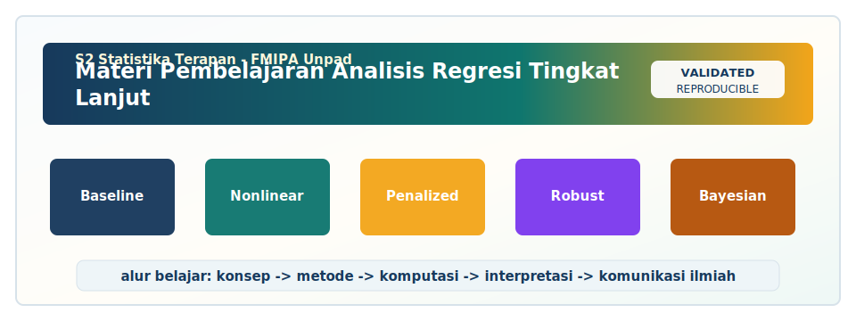

<!-- BEGIN UNPAD MATERIAL STYLE -->
<style>
:root {
  --unpad-navy: #17395c;
  --unpad-gold: #f2a51a;
  --unpad-teal: #0f766e;
  --unpad-ink: #172033;
  --unpad-paper: #fffdf8;
  --unpad-soft: #eef5f8;
  --unpad-line: #d7e2ea;
}
html, body {
  background: linear-gradient(135deg, #f8fbfd 0%, #fffdf8 48%, #f3f6ee 100%) !important;
  color: var(--unpad-ink) !important;
}
body {
  font-family: "Segoe UI", Arial, sans-serif !important;
  line-height: 1.72 !important;
}
.main-container {
  max-width: 1180px !important;
  background: rgba(255, 253, 248, 0.98) !important;
  border: 1px solid var(--unpad-line) !important;
  border-radius: 8px !important;
  box-shadow: 0 18px 42px rgba(23, 57, 92, 0.12) !important;
}
h1, h2, h3, h4 {
  letter-spacing: 0 !important;
}
h1.title {
  color: var(--unpad-navy) !important;
  -webkit-text-fill-color: var(--unpad-navy) !important;
  background: none !important;
}
h2 {
  border-left-color: var(--unpad-gold) !important;
}
a {
  color: #0b5c86 !important;
}
pre, code {
  border-radius: 8px !important;
}
.unpad-cover {
  margin: 18px 0 26px;
  padding: 24px;
  border-radius: 8px;
  background: linear-gradient(135deg, #17395c 0%, #0f766e 58%, #f2a51a 100%);
  color: #ffffff;
  box-shadow: 0 18px 36px rgba(23, 57, 92, 0.22);
}
.unpad-cover__brand {
  display: grid;
  grid-template-columns: 92px 1fr;
  gap: 20px;
  align-items: center;
}
.unpad-cover img {
  width: 92px;
  height: 92px;
  object-fit: contain;
  background: #ffffff;
  border-radius: 8px;
  padding: 8px;
  box-shadow: 0 8px 22px rgba(0,0,0,0.18);
}
.unpad-kicker {
  text-transform: uppercase;
  font-size: 0.82rem;
  font-weight: 800;
  letter-spacing: 0;
  color: #fff8dc;
}
.unpad-cover h2 {
  margin: 6px 0 8px;
  padding: 0;
  border: 0;
  background: transparent;
  color: #ffffff !important;
  font-size: 1.65rem;
}
.unpad-meta {
  margin: 0;
  color: #f7fbff;
  font-weight: 600;
}
.materi-illustration {
  margin: 20px 0 24px;
  padding: 14px;
  background: #ffffff;
  border: 1px solid var(--unpad-line);
  border-radius: 8px;
  box-shadow: 0 12px 28px rgba(23, 57, 92, 0.10);
}
.materi-illustration img {
  width: 100%;
  height: auto;
  display: block;
  border-radius: 6px;
}
.validasi-akademik {
  margin: 18px 0 28px;
  padding: 16px 18px;
  background: linear-gradient(135deg, #eef8f6, #fff8e7);
  border-left: 8px solid var(--unpad-teal);
  border-radius: 8px;
  color: var(--unpad-ink);
}
.validasi-akademik strong {
  color: var(--unpad-navy);
}
table {
  border-radius: 8px !important;
}
@media (max-width: 760px) {
  .unpad-cover__brand {
    grid-template-columns: 1fr;
  }
  .unpad-cover img {
    width: 76px;
    height: 76px;
  }
}
</style>
<!-- END UNPAD MATERIAL STYLE -->


<!-- BEGIN UNPAD MATERIAL ENHANCEMENT -->

```{r setup-unpad-render, include=FALSE}
execute_code <- FALSE
knitr::opts_chunk$set(
  echo = TRUE,
  eval = FALSE,
  message = FALSE,
  warning = FALSE,
  fig.align = "center",
  fig.width = 8,
  fig.height = 4.8,
  dpi = 120
)
set.seed(2025)
```


<div class="unpad-cover">
<div class="unpad-cover__brand">

<div>
<div class="unpad-kicker">S2 Statistika Terapan | FMIPA Universitas Padjadjaran</div>
<h2>Materi Pembelajaran Analisis Regresi Tingkat Lanjut</h2>
<p class="unpad-meta">S2 Statistika Terapan, FMIPA Universitas Padjadjaran<br>Penulis: I Gede Nyoman Mindra Jaya, Ph.D | Januari 2025</p>
</div>
</div>
</div>

<div class="materi-illustration">

</div>

<div class="validasi-akademik">
<strong>Catatan validasi akademik.</strong> Materi ini diseragamkan dengan rujukan ADWTL Januari 2025: rumus dibaca bersama asumsi, contoh kode diposisikan sebagai template reproducible, dan interpretasi diarahkan pada validitas data, diagnosis model, evaluasi ketidakpastian, serta komunikasi hasil secara ilmiah.
</div>

<!-- END UNPAD MATERIAL ENHANCEMENT -->

<style>
600;700;800&family=JetBrains+Mono:wght@400;600&display=swap');
:root{
  --brown-900:#3b2416; --brown-800:#4d2f1c; --brown-700:#6b4426; --brown-600:#8b5e34;
  --brown-500:#a97848; --brown-300:#d7b992; --brown-200:#ead7bd; --brown-100:#f6efe5;
  --cream:#fffaf2; --gold:#d9a441; --ink:#1e1713; --muted:#5f5147;
}
body{
  font-family:'Inter', system-ui, -apple-system, BlinkMacSystemFont, 'Segoe UI', sans-serif;
  background: linear-gradient(135deg, #fff8ee 0%, #f0dcc2 35%, #d0a876 100%);
  color:var(--ink); line-height:1.68; font-size:16.8px;
}
.main-container{max-width:1160px; background:rgba(255,250,242,.97); border-radius:28px; padding:34px 44px; box-shadow:0 22px 70px rgba(59,36,22,.18);}
@media (min-width: 1000px){
  body{margin-left:310px;}
  #TOC{position:fixed; left:0; top:0; bottom:0; width:282px; overflow:auto; padding:22px 16px; background:linear-gradient(180deg,#3b2416,#6b4426 62%,#a97848); color:#fff; box-shadow:8px 0 28px rgba(0,0,0,.18); z-index:999;}
  #TOC a{color:#fff2d6; text-decoration:none;}
  #TOC a:hover{color:#fff; text-decoration:underline;}
  #TOC ul{padding-left:18px;}
}
h1.title{font-size:2.5rem; font-weight:800; color:#fff; padding:34px 38px; border-radius:30px; background:linear-gradient(120deg,#3b2416,#8b5e34 55%,#d9a441); box-shadow:0 14px 35px rgba(107,68,38,.25);}
h1,h2,h3,h4{font-weight:800; color:var(--brown-800);}
h2{border-left:9px solid var(--gold); padding-left:16px; margin-top:54px;}
h3{color:var(--brown-700); margin-top:36px;}
a{color:#7a4b21; font-weight:600;}
blockquote{border-left:7px solid var(--gold); background:#fff1d8; padding:18px 22px; border-radius:18px; color:#3b2416;}
.note, .tujuan, .contoh, .interpretasi, .praktikum, .refleksi, .warning, .rpsbox{
  padding:18px 22px; border-radius:20px; margin:22px 0; border:1px solid rgba(107,68,38,.16);
  box-shadow:0 10px 25px rgba(107,68,38,.08);
}
.note{background:linear-gradient(135deg,#fff8ef,#f3dfc4);}
.tujuan{background:linear-gradient(135deg,#f6efe5,#ecd0aa);}
.contoh{background:linear-gradient(135deg,#fff9f0,#e9d3b3);}
.interpretasi{background:linear-gradient(135deg,#fdf4e7,#f2d7ae);}
.praktikum{background:linear-gradient(135deg,#fffaf2,#ead7bd);}
.refleksi{background:linear-gradient(135deg,#f9ead7,#fff7e9);}
.warning{background:linear-gradient(135deg,#fff0df,#f6c887);}
.rpsbox{background:linear-gradient(135deg,#4d2f1c,#8b5e34); color:#fff;}
.rpsbox h2, .rpsbox h3, .rpsbox strong{color:#fff;}
pre{background:#f3e1c9 !important; color:#111 !important; border-radius:18px; padding:18px; border:1px solid #d7b992; box-shadow:inset 0 0 0 1px rgba(255,255,255,.45);}
code{font-family:'JetBrains Mono', monospace; background:#f1dfc7; color:#111; padding:2px 5px; border-radius:7px;}
pre code{background:transparent; padding:0; color:#111 !important;}
table{border-collapse:collapse; width:100%; margin:22px 0; background:#fffdf8;}
th{background:#6b4426; color:#fff; padding:10px;}
td{border:1px solid #e0c8a8; padding:10px; vertical-align:top;}
tr:nth-child(even){background:#fbf1e5;}
.mathbox{background:#f4e4cf; color:#111; padding:15px 18px; border-radius:18px; border-left:7px solid #a97848; margin:18px 0; overflow-x:auto;}
hr{border:none; height:2px; background:linear-gradient(90deg,transparent,#a97848,transparent); margin:36px 0;}
.caption{font-size:.92rem; color:var(--muted); font-style:italic;}
</style>


```{r setup, include=FALSE, eval=FALSE}
# Paket sengaja tidak dipanggil otomatis agar file dapat dirender pada komputer apa pun.
# Untuk menjalankan semua kode, instal paket yang diperlukan lalu ubah eval = TRUE.
knitr::opts_chunk$set(
  echo = TRUE,
  eval = FALSE,
  message = FALSE,
  warning = FALSE,
  fig.align = "center",
  fig.width = 8,
  fig.height = 5,
  out.width = "92%"
)
```

<div class="rpsbox">

## Identitas Mata Kuliah

**Mata kuliah:** Analisis Regresi Tingkat Lanjut  
**Program studi:** S2 Statistika Terapan, FMIPA Universitas Padjadjaran  
**Semester:** 1  
**Bobot:** 3 SKS, terdiri atas 2 SKS teori dan 1 SKS praktikum  
**Dosen penulis RPS:** I Gede Nyoman Mindra Jaya, Ph.D  
**Dosen pengampu:** I Gede Nyoman Mindra Jaya, Ph.D; Dr. Yusep Suparman, M.Sc  
**Tahun pembuatan materi:** Januari 2025  
**Alamat program:** master.statistics.unpad.ac.id  
**Media sosial:** `@magister_stat_unpad`

</div>

<div class="note">

Materi ini disusun sebagai e-book pembelajaran untuk mata kuliah **Analisis Regresi Tingkat Lanjut**. Struktur pembahasan mengikuti RPS: konsep dan teori regresi lanjut, regresi nonlinier, regresi penalized, regresi robust, regresi Bayesian, teknik sampling, desain eksperimen, aplikasi pada data nyata, evaluasi model, penyusunan laporan ilmiah, visualisasi, dashboard, presentasi, dan etika publikasi. Rujukan utama yang digunakan adalah @montgomery2021 dan @fahrmeir2013, dengan dukungan dari @kutner2004, @james2021, @hastie2009, @gelman2013, dan literatur metodologis lain yang relevan.

</div>

# Prakata

Analisis regresi merupakan salah satu bahasa utama dalam statistika terapan. Hampir setiap bidang yang bekerja dengan data empiris membutuhkan kemampuan untuk menjelaskan hubungan antarvariabel, mengukur ketidakpastian, membuat prediksi, mengevaluasi intervensi, dan menerjemahkan output model menjadi argumen ilmiah yang dapat dipertanggungjawabkan. Pada tingkat dasar, regresi sering diperkenalkan sebagai hubungan linear antara satu respons dan satu atau beberapa prediktor. Pada tingkat lanjut, ruang persoalannya menjadi lebih luas: hubungan dapat bersifat nonlinier, prediktor dapat saling berkorelasi kuat, observasi dapat mengandung pencilan, ukuran sampel dapat kecil, jumlah prediktor dapat besar, dan inferensi perlu mengakomodasi ketidakpastian parameter secara lebih eksplisit.

Mata kuliah ini menempatkan regresi bukan sekadar kumpulan rumus, melainkan sebagai kerangka berpikir statistik. Mahasiswa S2 Statistika Terapan perlu mampu membaca masalah, merancang data, memilih model, mengevaluasi asumsi, menginterpretasikan parameter, dan menyampaikan hasil secara ilmiah. Oleh karena itu, materi ini sengaja disusun dalam format e-book R Markdown agar teori, formula, kode R, visualisasi, dan narasi interpretatif berada dalam satu alur yang utuh. Format ini juga mencerminkan praktik reproducible research: analisis tidak berhenti pada tabel output, tetapi disertai dokumentasi keputusan metodologis.

# Peta Pembelajaran Berdasarkan RPS

| Blok | Pertemuan | Fokus Materi | Sub-CPMK |
|---|---:|---|---|
| Fondasi dan model lanjut | 1-6 | Teori regresi lanjut, nonlinier, penalized, robust, Bayesian | SubCPMK1 |
| Desain data | 7-8 | Sampling, desain eksperimen, kualitas data, outlier, missing data | SubCPMK2 |
| UTS | 9 | Analisis kasus dan evaluasi pemahaman | SubCPMK1-2 |
| Aplikasi | 10-13 | Data bisnis, sosial, aktuaria, biostatistik, sains data, evaluasi model | SubCPMK3 |
| Pelaporan | 14-16 | Laporan ilmiah, visualisasi, dashboard, presentasi, etika publikasi | SubCPMK4 |

<div class="tujuan">

**Capaian umum materi:** setelah mempelajari e-book ini, mahasiswa diharapkan mampu menjelaskan model regresi tingkat lanjut, memilih metode yang sesuai dengan karakteristik data, menerapkan analisis menggunakan R, mengevaluasi model secara kritis, dan menyusun laporan ilmiah yang komunikatif.

</div>


# Landasan Umum Regresi Tingkat Lanjut

Regresi tingkat lanjut dapat dipahami sebagai perluasan dari tiga komponen dasar: struktur mean, struktur error, dan struktur inferensi. Struktur mean menjelaskan bagaimana nilai harapan respons berubah terhadap prediktor. Struktur error menjelaskan variasi yang tidak dijelaskan oleh model, termasuk heteroskedastisitas, korelasi, distribusi tidak normal, atau pencilan. Struktur inferensi menjelaskan bagaimana parameter diperkirakan, bagaimana ketidakpastian dihitung, dan bagaimana model divalidasi. Ketika salah satu komponen ini tidak sesuai dengan data, analis perlu mempertimbangkan metode yang lebih fleksibel.

Pada model linear klasik, semua komponen dibuat relatif sederhana: mean linear, error independen dengan varians konstan, dan inferensi berbasis least squares. Kesederhanaan ini sangat berguna untuk pembelajaran dan banyak aplikasi. Namun, pada penelitian tingkat lanjut, analis sering menghadapi situasi yang menuntut adaptasi. Hubungan dosis-respons mungkin mengikuti kurva saturasi. Prediktor sosial ekonomi mungkin berkorelasi kuat. Data survei mungkin tidak seimbang. Observasi ekstrem mungkin muncul akibat kejadian langka. Peneliti mungkin memiliki informasi awal dari studi sebelumnya. Semua situasi ini membuka ruang bagi regresi nonlinier, penalized, robust, dan Bayesian.

Literatur regresi modern menekankan bahwa pemodelan statistik adalah proses iteratif [@fahrmeir2013; @gelman2020]. Analis mulai dari pertanyaan, mengeksplorasi data, membangun model awal, mengevaluasi kelemahan, memperbaiki model, dan akhirnya menyampaikan hasil. Iterasi ini tidak boleh dipahami sebagai upaya mencari hasil yang diinginkan, melainkan sebagai proses memperbaiki representasi statistik terhadap fenomena. Setiap perubahan model harus memiliki alasan: teori, diagnostik, validasi, atau kebutuhan interpretasi.

Dalam pendidikan S2, kemampuan yang diharapkan bukan hanya mampu menggunakan metode, tetapi mampu memilih metode. Pemilihan metode membutuhkan pemahaman mengenai kondisi data dan konsekuensi inferensi. Misalnya, lasso dapat memilih variabel, tetapi jika prediktor sangat berkorelasi, variabel yang dipilih bisa tidak stabil. Robust regression dapat menurunkan pengaruh pencilan, tetapi jika pencilan adalah fenomena utama, pendekatan tersebut bisa mengaburkan informasi penting. Bayesian regression dapat menyatakan probabilitas parameter, tetapi prior harus dipilih secara bertanggung jawab. Jadi, tidak ada metode yang selalu menang; yang ada adalah metode yang paling sesuai dengan pertanyaan dan data.

<div class="note">

**Prinsip utama:** regresi tingkat lanjut bukan perlombaan memakai model paling rumit. Model terbaik adalah model yang menjawab pertanyaan penelitian, sesuai dengan data, dapat dievaluasi, dan dapat dijelaskan.

</div>


# Pertemuan 1: Orientasi Analisis Regresi Tingkat Lanjut

<div class="tujuan">

**Fokus pembelajaran:** Fondasi konseptual, peran regresi dalam statistika terapan, CPMK, SubCPMK, dan workflow reproducible research.  
**Rujukan utama:** @montgomery2021; @fahrmeir2013; @kutner2004.

</div>

## Tujuan Pembelajaran

Setelah mempelajari pertemuan ini, mahasiswa diharapkan mampu menjelaskan konsep utama **Orientasi Analisis Regresi Tingkat Lanjut**, menerapkan alur analisis dasar menggunakan R, mengevaluasi kekuatan dan keterbatasan metode, serta menulis interpretasi yang sesuai dengan konteks penelitian. Tujuan ini dikaitkan dengan capaian pembelajaran mata kuliah yang menekankan kemampuan analitis, evaluatif, kreatif, dan komunikatif dalam analisis regresi tingkat lanjut.

## Konsep Inti

Regresi tingkat lanjut berangkat dari kesadaran bahwa model linear klasik adalah titik awal, bukan tujuan akhir. Model klasik sangat berguna karena menyediakan interpretasi koefisien yang jelas, estimasi berbasis least squares, dan perangkat diagnostik yang matang. Namun, data nyata sering membawa struktur yang tidak ideal: kurva respons tidak selalu linear, varians error tidak selalu konstan, pengamatan tidak selalu bebas pencilan, dan prediktor tidak selalu berada dalam kondisi ortogonal. Dalam konteks ini, tujuan analis bukan memaksa data mengikuti model sederhana, melainkan membangun model yang cukup sederhana untuk dipahami tetapi cukup fleksibel untuk menjawab persoalan empiris. Prinsip ini sejalan dengan tradisi pemodelan regresi modern yang menekankan keseimbangan antara interpretabilitas, stabilitas, prediksi, dan inferensi [@montgomery2021; @fahrmeir2013].

Salah satu pergeseran penting pada regresi tingkat lanjut adalah berpindah dari pertanyaan 'apakah koefisien signifikan?' menuju pertanyaan yang lebih substantif: apakah bentuk hubungan masuk akal secara ilmiah, apakah parameter memiliki makna operasional, apakah prediksi stabil pada data baru, dan apakah ketidakpastian telah dikomunikasikan dengan jujur. Pengujian hipotesis tetap penting, tetapi tidak boleh menjadi satu-satunya dasar keputusan. Dalam praktik terapan, model yang tampak signifikan dapat buruk untuk prediksi, sedangkan model yang prediktif dapat kehilangan nilai ilmiah jika tidak dapat dijelaskan. Karena itu, mahasiswa perlu mengembangkan kebiasaan membaca model sebagai sistem yang terdiri dari data, asumsi, algoritma estimasi, tujuan analisis, dan konsekuensi interpretasi.

Pada level S2, mahasiswa tidak cukup hanya mengetahui cara menjalankan fungsi `lm()` atau `glm()`. Mahasiswa perlu memahami mengapa suatu fungsi objektif diminimalkan, bagaimana penalti mengubah estimasi, bagaimana prior memengaruhi posterior, mengapa pencilan dapat mendominasi OLS, dan bagaimana desain pengambilan data menentukan kualitas inferensi. Pemahaman ini membuat analis lebih tahan terhadap jebakan 'klik dan interpretasi instan'. Output perangkat lunak memang cepat, tetapi keputusan statistik yang baik tetap membutuhkan argumentasi. Statistik tidak boleh kalah dari tombol run; tombol run tidak pernah membaca jurnal metodologi, biasanya hanya patuh pada keyboard.

Materi ini mengintegrasikan perspektif teori dan praktik. Pada sisi teori, pembahasan mencakup fungsi objektif, asumsi, sifat estimasi, penalization, robustification, dan inferensi Bayesian. Pada sisi praktik, setiap topik dilengkapi dengan contoh kode R, alur analisis, interpretasi, serta catatan kesalahan umum. Dengan demikian, mahasiswa diharapkan tidak hanya dapat mereplikasi contoh, tetapi juga mampu mengadaptasi metode untuk penelitian tesis, publikasi, konsultasi statistika, maupun pengembangan dashboard analitik.

Regresi tingkat lanjut juga menuntut pemahaman domain. Model untuk data biostatistik berbeda nuansanya dari model bisnis, sosial, aktuaria, atau sains data. Pada data kesehatan, misalnya, interpretasi parameter berkaitan dengan risiko, prevalensi, atau odds. Pada data bisnis, parameter dapat diterjemahkan menjadi elastisitas, segmentasi pelanggan, atau dampak promosi. Pada aktuaria, model berkaitan dengan frekuensi klaim, severitas, dan risiko finansial. Pada sains data, model sering diarahkan pada prediksi dan regularisasi. Perbedaan ini membuat regresi menjadi metodologi yang fleksibel, tetapi juga menuntut kehati-hatian dalam memilih bahasa interpretasi.

## Pengembangan Pemahaman Konseptual

Secara pedagogis, pokok bahasan **Orientasi Analisis Regresi Tingkat Lanjut** perlu dipelajari melalui tiga lapisan. Lapisan pertama adalah konsep, yaitu memahami istilah, asumsi, dan tujuan metode. Lapisan kedua adalah mekanisme, yaitu memahami bagaimana estimasi dilakukan dan mengapa algoritma tertentu menghasilkan parameter tertentu. Lapisan ketiga adalah komunikasi, yaitu menjelaskan hasil kepada pembaca yang belum tentu menguasai detail matematika. Ketiga lapisan ini harus hadir bersama. Tanpa konsep, kode menjadi ritual. Tanpa mekanisme, interpretasi menjadi rapuh. Tanpa komunikasi, hasil analisis sulit berdampak.

Dalam konteks S2 Statistika Terapan, materi **Orientasi Analisis Regresi Tingkat Lanjut** juga harus dikaitkan dengan studi kasus. Mahasiswa sebaiknya tidak hanya menguji metode pada data simulasi yang rapi, tetapi juga pada data yang memiliki missing value, pencilan, korelasi antarprediktor, ukuran sampel terbatas, atau variabel dengan definisi operasional yang tidak sempurna. Data nyata sering agak berantakan; justru di situlah statistika menunjukkan kegunaannya. Model yang berhasil pada data rapi belum tentu siap menghadapi data lapangan yang kadang lebih dramatis daripada sinetron sore.

Aspek evaluasi pada topik ini mencakup dua dimensi. Dimensi pertama adalah evaluasi statistik, misalnya residual, ukuran prediktif, informasi model, atau diagnostik posterior. Dimensi kedua adalah evaluasi substantif, yaitu apakah hasil model masuk akal bagi bidang aplikasi. Model dapat memiliki nilai AIC rendah, tetapi menghasilkan implikasi yang tidak masuk akal karena variabel penting hilang atau desain data bias. Sebaliknya, model sederhana dapat lebih berguna jika selaras dengan teori dan mudah dijelaskan kepada pemangku kepentingan.

Mahasiswa juga perlu membangun kebiasaan membuat catatan keputusan analitik. Setiap pilihan, mulai dari transformasi variabel, penghapusan observasi, pemilihan lambda, prior, jumlah fold, hingga format visualisasi, harus dapat dijelaskan. Catatan ini memudahkan replikasi, diskusi kelompok, dan penulisan laporan. Dalam praktik profesional, keputusan analitik yang tidak terdokumentasi sering menjadi sumber kebingungan ketika hasil perlu direvisi beberapa minggu kemudian.

Keterampilan teknis dalam R perlu dibaca sebagai sarana untuk memperkuat argumentasi, bukan sebagai tujuan akhir. Fungsi, paket, dan visualisasi hanyalah alat. Nilai utama seorang analis terletak pada kemampuan menghubungkan output dengan teori, konteks, dan keputusan. Karena itu, setiap blok kode dalam materi ini sebaiknya dijalankan sambil bertanya: apa yang sedang diestimasi, asumsi apa yang digunakan, bagaimana mengevaluasi hasilnya, dan bagaimana menjelaskannya dalam laporan ilmiah?

## Kerangka Keputusan Analitik

**Langkah 1.** 
Nyatakan pertanyaan penelitian sebelum memilih model. Pada topik orientasi analisis regresi tingkat lanjut, pertanyaan yang baik harus memuat respons, prediktor, unit analisis, populasi target, serta tujuan apakah inferensi, prediksi, evaluasi kebijakan, atau eksplorasi. Pertanyaan yang kabur akan menghasilkan model yang kabur pula.

**Langkah 2.** 
Periksa struktur data: ukuran sampel, tipe respons, jumlah prediktor, skala pengukuran, missing value, pencilan, korelasi antarprediktor, dan kemungkinan struktur kelompok. Pemeriksaan ini menentukan apakah metode yang dipilih masuk akal.

**Langkah 3.** 
Tentukan baseline model. Baseline tidak selalu menjadi model final, tetapi menjadi pembanding yang membantu menilai apakah metode lanjut benar-benar memberi nilai tambah. Tanpa baseline, analis mudah terkesan oleh kompleksitas yang belum tentu diperlukan.

**Langkah 4.** 
Pilih metode estimasi dan strategi validasi. Jika tujuannya prediksi, validasi silang atau data uji menjadi penting. Jika tujuannya inferensi, stabilitas koefisien, asumsi, dan ketidakpastian harus menjadi fokus utama.

**Langkah 5.** 
Lakukan diagnostik. Diagnostik tidak hanya dilakukan ketika hasil terlihat aneh; diagnostik adalah bagian rutin dari analisis. Residual, leverage, performa prediktif, dan pemeriksaan sensitivitas membantu melihat apakah model cukup dapat dipercaya.

**Langkah 6.** 
Terjemahkan hasil ke dalam bahasa substantif. Hindari kalimat yang hanya menyalin nama koefisien. Jelaskan besaran efek, arah hubungan, ketidakpastian, serta implikasi terhadap masalah nyata.

**Langkah 7.** 
Laporkan keterbatasan. Model yang baik bukan model yang tidak punya keterbatasan, melainkan model yang keterbatasannya dipahami. Laporan yang jujur justru memperkuat kredibilitas analisis.

## Rumus dan Representasi Matematis


<div class="mathbox">
Model regresi umum dapat ditulis sebagai
$$Y_i = f(x_i,\theta) + \varepsilon_i,$$
dengan $f(\cdot)$ sebagai fungsi sistematik, $\theta$ parameter yang perlu diestimasi, dan $\varepsilon_i$ komponen error. Pada regresi linear klasik, $f(x_i,\theta)=x_i^\top\beta$, tetapi pada regresi lanjut bentuk $f$ dapat nonlinier, dikenai penalti, dibuat robust, atau dimodelkan dalam kerangka Bayesian.
</div>


## Contoh Kasus Terapan

Dalam studi kesehatan masyarakat, respons dapat berupa prevalensi penyakit, status risiko, atau jumlah kasus. Prediktor dapat mencakup faktor lingkungan, perilaku, layanan kesehatan, dan karakteristik sosial ekonomi. Data semacam ini sering mengandung multikolinearitas karena indikator pembangunan saling berkaitan. Penalized regression dapat membantu menstabilkan estimasi dan memilih prediktor yang paling informatif, tetapi hasilnya tetap harus diinterpretasikan bersama pengetahuan epidemiologi.

Pada data bisnis, analis sering berhadapan dengan banyak fitur pelanggan: frekuensi transaksi, nilai pembelian, respons promosi, umur akun, lokasi, dan kanal digital. Tujuan analisis bisa berupa prediksi churn, nilai pelanggan, atau respons kampanye. Regularisasi dan validasi silang menjadi penting karena model yang terlalu menyesuaikan data historis dapat gagal pada periode berikutnya. Prinsipnya sederhana: model boleh pintar, tetapi jangan terlalu hafal masa lalu sampai lupa masa depan.

Dalam aktuaria, jumlah klaim dan besar klaim sering memiliki distribusi tidak normal, variasi tinggi, dan eksposur yang berbeda antarindividu. Regresi dengan link function atau offset menjadi penting. Jika ada pencilan klaim ekstrem, robust analysis atau transformasi tertentu dapat dipertimbangkan. Namun, pencilan dalam aktuaria tidak selalu kesalahan; kadang justru kejadian ekstrem adalah inti risiko yang harus dimodelkan.

## Implementasi R

Blok kode berikut disediakan sebagai titik awal praktikum. Secara default, kode tidak dieksekusi ketika dokumen dirender agar e-book tetap aman dibuka pada komputer yang belum memiliki semua paket. Untuk praktikum, ubah opsi `eval = TRUE` pada chunk yang ingin dijalankan.


```{r workflow-regresi, eval=FALSE}
# Template alur kerja regresi tingkat lanjut
# 1. Definisikan masalah dan unit analisis
# 2. Pahami struktur data
# 3. Lakukan eksplorasi dan diagnostik awal
# 4. Pilih kandidat model
# 5. Estimasi model
# 6. Evaluasi asumsi dan performa
# 7. Interpretasi parameter dan prediksi
# 8. Laporkan keterbatasan dan rekomendasi
```

## Cara Membaca Output

Output pada pertemuan 1 harus dibaca dengan memperhatikan tujuan analisis. Jika output berupa koefisien, baca arah, besaran, satuan, dan ketidakpastian. Jika output berupa grafik, perhatikan pola utama, penyimpangan, dan apakah grafik mendukung asumsi model. Jika output berupa ukuran evaluasi, bandingkan dengan model alternatif dan jangan lupa menilai relevansi praktis. Pada topik **Orientasi Analisis Regresi Tingkat Lanjut**, interpretasi yang baik selalu menghubungkan angka dengan konsep metode dan konteks data.


<div class="interpretasi">

**Contoh kalimat interpretasi:** Model menunjukkan bahwa perubahan prediktor utama berkaitan dengan perubahan respons setelah mengendalikan prediktor lain. Namun, kesimpulan ini perlu dibaca bersama diagnostik model, desain data, dan batasan inferensi. Dengan demikian, hasil regresi tidak diperlakukan sebagai kebenaran tunggal, melainkan sebagai estimasi yang memiliki konteks dan ketidakpastian.

</div>

## Kesalahan Umum dan Cara Menghindarinya

- Jangan mengabaikan skala variabel. Banyak metode lanjut, khususnya penalized regression, sangat dipengaruhi oleh standardisasi prediktor.

- Jangan membaca model tanpa memeriksa data. Grafik eksploratif sering mengungkap pola yang tidak terlihat dari tabel ringkasan.

- Jangan menghapus outlier hanya karena mengganggu hasil. Periksa dulu apakah observasi tersebut kesalahan data, kejadian sah, atau sinyal fenomena penting.

- Jangan membandingkan model hanya dengan satu metrik. Gunakan kombinasi evaluasi prediktif, diagnostik residual, interpretabilitas, dan pengetahuan domain.


## Latihan Mandiri

1. Gunakan data simulasi sederhana untuk membandingkan dua model dan jelaskan perbedaan hasilnya.

2. Cari satu artikel ilmiah yang menggunakan metode terkait, lalu identifikasi tujuan analisis, jenis data, model, dan cara evaluasinya.

3. Susun satu paragraf interpretasi hasil yang dapat dipahami oleh pembaca nonstatistik.


## Mini-Quiz

1. Jelaskan alasan utama mengapa topik **Orientasi Analisis Regresi Tingkat Lanjut** diperlukan dalam analisis regresi tingkat lanjut.  

2. Sebutkan satu asumsi atau keputusan analitik yang paling menentukan kualitas hasil.  

3. Berikan contoh interpretasi hasil model dalam satu paragraf.  

4. Jelaskan satu keterbatasan metode dan cara melakukan pemeriksaan sensitivitas.


## Ringkasan Pertemuan

Pertemuan ini menekankan bahwa **Orientasi Analisis Regresi Tingkat Lanjut** bukan hanya prosedur komputasi, tetapi bagian dari proses berpikir statistik. Mahasiswa perlu memahami konsep, menjalankan analisis secara hati-hati, mengevaluasi hasil, dan mengomunikasikan temuan secara ilmiah. Keterampilan ini akan digunakan kembali pada tugas literatur, praktikum data nyata, proyek e-book/dashboard, serta presentasi akhir.


# Pertemuan 2: Regresi Linear sebagai Baseline dan Diagnostik Model

<div class="tujuan">

**Fokus pembelajaran:** Model matriks, estimasi OLS, asumsi, residual, leverage, multikolinearitas, dan interpretasi awal.  
**Rujukan utama:** @montgomery2021; @fox2019; @harrell2015.

</div>

## Tujuan Pembelajaran

Setelah mempelajari pertemuan ini, mahasiswa diharapkan mampu menjelaskan konsep utama **Regresi Linear sebagai Baseline dan Diagnostik Model**, menerapkan alur analisis dasar menggunakan R, mengevaluasi kekuatan dan keterbatasan metode, serta menulis interpretasi yang sesuai dengan konteks penelitian. Tujuan ini dikaitkan dengan capaian pembelajaran mata kuliah yang menekankan kemampuan analitis, evaluatif, kreatif, dan komunikatif dalam analisis regresi tingkat lanjut.

## Konsep Inti

Regresi tingkat lanjut berangkat dari kesadaran bahwa model linear klasik adalah titik awal, bukan tujuan akhir. Model klasik sangat berguna karena menyediakan interpretasi koefisien yang jelas, estimasi berbasis least squares, dan perangkat diagnostik yang matang. Namun, data nyata sering membawa struktur yang tidak ideal: kurva respons tidak selalu linear, varians error tidak selalu konstan, pengamatan tidak selalu bebas pencilan, dan prediktor tidak selalu berada dalam kondisi ortogonal. Dalam konteks ini, tujuan analis bukan memaksa data mengikuti model sederhana, melainkan membangun model yang cukup sederhana untuk dipahami tetapi cukup fleksibel untuk menjawab persoalan empiris. Prinsip ini sejalan dengan tradisi pemodelan regresi modern yang menekankan keseimbangan antara interpretabilitas, stabilitas, prediksi, dan inferensi [@montgomery2021; @fahrmeir2013].

Salah satu pergeseran penting pada regresi tingkat lanjut adalah berpindah dari pertanyaan 'apakah koefisien signifikan?' menuju pertanyaan yang lebih substantif: apakah bentuk hubungan masuk akal secara ilmiah, apakah parameter memiliki makna operasional, apakah prediksi stabil pada data baru, dan apakah ketidakpastian telah dikomunikasikan dengan jujur. Pengujian hipotesis tetap penting, tetapi tidak boleh menjadi satu-satunya dasar keputusan. Dalam praktik terapan, model yang tampak signifikan dapat buruk untuk prediksi, sedangkan model yang prediktif dapat kehilangan nilai ilmiah jika tidak dapat dijelaskan. Karena itu, mahasiswa perlu mengembangkan kebiasaan membaca model sebagai sistem yang terdiri dari data, asumsi, algoritma estimasi, tujuan analisis, dan konsekuensi interpretasi.

Pada level S2, mahasiswa tidak cukup hanya mengetahui cara menjalankan fungsi `lm()` atau `glm()`. Mahasiswa perlu memahami mengapa suatu fungsi objektif diminimalkan, bagaimana penalti mengubah estimasi, bagaimana prior memengaruhi posterior, mengapa pencilan dapat mendominasi OLS, dan bagaimana desain pengambilan data menentukan kualitas inferensi. Pemahaman ini membuat analis lebih tahan terhadap jebakan 'klik dan interpretasi instan'. Output perangkat lunak memang cepat, tetapi keputusan statistik yang baik tetap membutuhkan argumentasi. Statistik tidak boleh kalah dari tombol run; tombol run tidak pernah membaca jurnal metodologi, biasanya hanya patuh pada keyboard.

Materi ini mengintegrasikan perspektif teori dan praktik. Pada sisi teori, pembahasan mencakup fungsi objektif, asumsi, sifat estimasi, penalization, robustification, dan inferensi Bayesian. Pada sisi praktik, setiap topik dilengkapi dengan contoh kode R, alur analisis, interpretasi, serta catatan kesalahan umum. Dengan demikian, mahasiswa diharapkan tidak hanya dapat mereplikasi contoh, tetapi juga mampu mengadaptasi metode untuk penelitian tesis, publikasi, konsultasi statistika, maupun pengembangan dashboard analitik.

Regresi tingkat lanjut juga menuntut pemahaman domain. Model untuk data biostatistik berbeda nuansanya dari model bisnis, sosial, aktuaria, atau sains data. Pada data kesehatan, misalnya, interpretasi parameter berkaitan dengan risiko, prevalensi, atau odds. Pada data bisnis, parameter dapat diterjemahkan menjadi elastisitas, segmentasi pelanggan, atau dampak promosi. Pada aktuaria, model berkaitan dengan frekuensi klaim, severitas, dan risiko finansial. Pada sains data, model sering diarahkan pada prediksi dan regularisasi. Perbedaan ini membuat regresi menjadi metodologi yang fleksibel, tetapi juga menuntut kehati-hatian dalam memilih bahasa interpretasi.

## Pengembangan Pemahaman Konseptual

Secara pedagogis, pokok bahasan **Regresi Linear sebagai Baseline dan Diagnostik Model** perlu dipelajari melalui tiga lapisan. Lapisan pertama adalah konsep, yaitu memahami istilah, asumsi, dan tujuan metode. Lapisan kedua adalah mekanisme, yaitu memahami bagaimana estimasi dilakukan dan mengapa algoritma tertentu menghasilkan parameter tertentu. Lapisan ketiga adalah komunikasi, yaitu menjelaskan hasil kepada pembaca yang belum tentu menguasai detail matematika. Ketiga lapisan ini harus hadir bersama. Tanpa konsep, kode menjadi ritual. Tanpa mekanisme, interpretasi menjadi rapuh. Tanpa komunikasi, hasil analisis sulit berdampak.

Dalam konteks S2 Statistika Terapan, materi **Regresi Linear sebagai Baseline dan Diagnostik Model** juga harus dikaitkan dengan studi kasus. Mahasiswa sebaiknya tidak hanya menguji metode pada data simulasi yang rapi, tetapi juga pada data yang memiliki missing value, pencilan, korelasi antarprediktor, ukuran sampel terbatas, atau variabel dengan definisi operasional yang tidak sempurna. Data nyata sering agak berantakan; justru di situlah statistika menunjukkan kegunaannya. Model yang berhasil pada data rapi belum tentu siap menghadapi data lapangan yang kadang lebih dramatis daripada sinetron sore.

Aspek evaluasi pada topik ini mencakup dua dimensi. Dimensi pertama adalah evaluasi statistik, misalnya residual, ukuran prediktif, informasi model, atau diagnostik posterior. Dimensi kedua adalah evaluasi substantif, yaitu apakah hasil model masuk akal bagi bidang aplikasi. Model dapat memiliki nilai AIC rendah, tetapi menghasilkan implikasi yang tidak masuk akal karena variabel penting hilang atau desain data bias. Sebaliknya, model sederhana dapat lebih berguna jika selaras dengan teori dan mudah dijelaskan kepada pemangku kepentingan.

Mahasiswa juga perlu membangun kebiasaan membuat catatan keputusan analitik. Setiap pilihan, mulai dari transformasi variabel, penghapusan observasi, pemilihan lambda, prior, jumlah fold, hingga format visualisasi, harus dapat dijelaskan. Catatan ini memudahkan replikasi, diskusi kelompok, dan penulisan laporan. Dalam praktik profesional, keputusan analitik yang tidak terdokumentasi sering menjadi sumber kebingungan ketika hasil perlu direvisi beberapa minggu kemudian.

Keterampilan teknis dalam R perlu dibaca sebagai sarana untuk memperkuat argumentasi, bukan sebagai tujuan akhir. Fungsi, paket, dan visualisasi hanyalah alat. Nilai utama seorang analis terletak pada kemampuan menghubungkan output dengan teori, konteks, dan keputusan. Karena itu, setiap blok kode dalam materi ini sebaiknya dijalankan sambil bertanya: apa yang sedang diestimasi, asumsi apa yang digunakan, bagaimana mengevaluasi hasilnya, dan bagaimana menjelaskannya dalam laporan ilmiah?

## Kerangka Keputusan Analitik

**Langkah 1.** 
Nyatakan pertanyaan penelitian sebelum memilih model. Pada topik regresi linear sebagai baseline dan diagnostik model, pertanyaan yang baik harus memuat respons, prediktor, unit analisis, populasi target, serta tujuan apakah inferensi, prediksi, evaluasi kebijakan, atau eksplorasi. Pertanyaan yang kabur akan menghasilkan model yang kabur pula.

**Langkah 2.** 
Periksa struktur data: ukuran sampel, tipe respons, jumlah prediktor, skala pengukuran, missing value, pencilan, korelasi antarprediktor, dan kemungkinan struktur kelompok. Pemeriksaan ini menentukan apakah metode yang dipilih masuk akal.

**Langkah 3.** 
Tentukan baseline model. Baseline tidak selalu menjadi model final, tetapi menjadi pembanding yang membantu menilai apakah metode lanjut benar-benar memberi nilai tambah. Tanpa baseline, analis mudah terkesan oleh kompleksitas yang belum tentu diperlukan.

**Langkah 4.** 
Pilih metode estimasi dan strategi validasi. Jika tujuannya prediksi, validasi silang atau data uji menjadi penting. Jika tujuannya inferensi, stabilitas koefisien, asumsi, dan ketidakpastian harus menjadi fokus utama.

**Langkah 5.** 
Lakukan diagnostik. Diagnostik tidak hanya dilakukan ketika hasil terlihat aneh; diagnostik adalah bagian rutin dari analisis. Residual, leverage, performa prediktif, dan pemeriksaan sensitivitas membantu melihat apakah model cukup dapat dipercaya.

**Langkah 6.** 
Terjemahkan hasil ke dalam bahasa substantif. Hindari kalimat yang hanya menyalin nama koefisien. Jelaskan besaran efek, arah hubungan, ketidakpastian, serta implikasi terhadap masalah nyata.

**Langkah 7.** 
Laporkan keterbatasan. Model yang baik bukan model yang tidak punya keterbatasan, melainkan model yang keterbatasannya dipahami. Laporan yang jujur justru memperkuat kredibilitas analisis.

## Rumus dan Representasi Matematis


<div class="mathbox">
Model linear dalam notasi matriks:
$$\mathbf{y}=\mathbf{X}\boldsymbol{\beta}+\boldsymbol{\varepsilon}, \qquad \hat{\boldsymbol{\beta}}=(\mathbf{X}^\top\mathbf{X})^{-1}\mathbf{X}^\top\mathbf{y}.$$
Diagnostik penting mencakup residual, leverage $h_{ii}$, studentized residual, variance inflation factor, dan Cook's distance.
</div>


## Contoh Kasus Terapan

Pada data bisnis, analis sering berhadapan dengan banyak fitur pelanggan: frekuensi transaksi, nilai pembelian, respons promosi, umur akun, lokasi, dan kanal digital. Tujuan analisis bisa berupa prediksi churn, nilai pelanggan, atau respons kampanye. Regularisasi dan validasi silang menjadi penting karena model yang terlalu menyesuaikan data historis dapat gagal pada periode berikutnya. Prinsipnya sederhana: model boleh pintar, tetapi jangan terlalu hafal masa lalu sampai lupa masa depan.

Dalam aktuaria, jumlah klaim dan besar klaim sering memiliki distribusi tidak normal, variasi tinggi, dan eksposur yang berbeda antarindividu. Regresi dengan link function atau offset menjadi penting. Jika ada pencilan klaim ekstrem, robust analysis atau transformasi tertentu dapat dipertimbangkan. Namun, pencilan dalam aktuaria tidak selalu kesalahan; kadang justru kejadian ekstrem adalah inti risiko yang harus dimodelkan.

Untuk data sosial, bias sampling dan measurement error sering menjadi tantangan utama. Variabel seperti kesejahteraan, partisipasi, atau persepsi publik tidak selalu diukur sempurna. Model regresi dapat membantu menjelaskan pola, tetapi inferensi harus dikaitkan dengan desain survei dan konteks pengukuran. Peneliti perlu berhati-hati agar tidak membuat klaim kausal berlebihan dari data observasional.

## Implementasi R

Blok kode berikut disediakan sebagai titik awal praktikum. Secara default, kode tidak dieksekusi ketika dokumen dirender agar e-book tetap aman dibuka pada komputer yang belum memiliki semua paket. Untuk praktikum, ubah opsi `eval = TRUE` pada chunk yang ingin dijalankan.


```{r lm-diagnostic-example, eval=FALSE}
set.seed(123)
n <- 120
x1 <- rnorm(n)
x2 <- 0.85*x1 + rnorm(n, sd = 0.35)
y  <- 2 + 1.4*x1 - 0.8*x2 + rnorm(n, sd = 0.8)
dat <- data.frame(y, x1, x2)
fit <- lm(y ~ x1 + x2, data = dat)
summary(fit)
par(mfrow = c(2,2)); plot(fit)
# car::vif(fit) # aktifkan jika paket car tersedia
```

## Cara Membaca Output

Output pada pertemuan 2 harus dibaca dengan memperhatikan tujuan analisis. Jika output berupa koefisien, baca arah, besaran, satuan, dan ketidakpastian. Jika output berupa grafik, perhatikan pola utama, penyimpangan, dan apakah grafik mendukung asumsi model. Jika output berupa ukuran evaluasi, bandingkan dengan model alternatif dan jangan lupa menilai relevansi praktis. Pada topik **Regresi Linear sebagai Baseline dan Diagnostik Model**, interpretasi yang baik selalu menghubungkan angka dengan konsep metode dan konteks data.


<div class="interpretasi">

**Contoh kalimat interpretasi:** Model menunjukkan bahwa perubahan prediktor utama berkaitan dengan perubahan respons setelah mengendalikan prediktor lain. Namun, kesimpulan ini perlu dibaca bersama diagnostik model, desain data, dan batasan inferensi. Dengan demikian, hasil regresi tidak diperlakukan sebagai kebenaran tunggal, melainkan sebagai estimasi yang memiliki konteks dan ketidakpastian.

</div>

## Kesalahan Umum dan Cara Menghindarinya

- Jangan membaca model tanpa memeriksa data. Grafik eksploratif sering mengungkap pola yang tidak terlihat dari tabel ringkasan.

- Jangan menghapus outlier hanya karena mengganggu hasil. Periksa dulu apakah observasi tersebut kesalahan data, kejadian sah, atau sinyal fenomena penting.

- Jangan membandingkan model hanya dengan satu metrik. Gunakan kombinasi evaluasi prediktif, diagnostik residual, interpretabilitas, dan pengetahuan domain.

- Jangan melaporkan output mentah perangkat lunak sebagai interpretasi. Tugas analis adalah menerjemahkan angka menjadi kesimpulan ilmiah yang dapat dibaca.


## Latihan Mandiri

1. Cari satu artikel ilmiah yang menggunakan metode terkait, lalu identifikasi tujuan analisis, jenis data, model, dan cara evaluasinya.

2. Susun satu paragraf interpretasi hasil yang dapat dipahami oleh pembaca nonstatistik.

3. Buat grafik diagnostik atau visualisasi prediksi, kemudian tulis apa yang dapat dan tidak dapat disimpulkan dari grafik tersebut.


## Mini-Quiz

1. Jelaskan alasan utama mengapa topik **Regresi Linear sebagai Baseline dan Diagnostik Model** diperlukan dalam analisis regresi tingkat lanjut.  

2. Sebutkan satu asumsi atau keputusan analitik yang paling menentukan kualitas hasil.  

3. Berikan contoh interpretasi hasil model dalam satu paragraf.  

4. Jelaskan satu keterbatasan metode dan cara melakukan pemeriksaan sensitivitas.


## Ringkasan Pertemuan

Pertemuan ini menekankan bahwa **Regresi Linear sebagai Baseline dan Diagnostik Model** bukan hanya prosedur komputasi, tetapi bagian dari proses berpikir statistik. Mahasiswa perlu memahami konsep, menjalankan analisis secara hati-hati, mengevaluasi hasil, dan mengomunikasikan temuan secara ilmiah. Keterampilan ini akan digunakan kembali pada tugas literatur, praktikum data nyata, proyek e-book/dashboard, serta presentasi akhir.


# Pertemuan 3: Regresi Nonlinier I: Model, Parameter, dan Bentuk Kurva

<div class="tujuan">

**Fokus pembelajaran:** Model pertumbuhan, decay, Michaelis-Menten, logistic curve, dan interpretasi parameter substantif.  
**Rujukan utama:** @seber2003; @bates1988; @fahrmeir2013.

</div>

## Tujuan Pembelajaran

Setelah mempelajari pertemuan ini, mahasiswa diharapkan mampu menjelaskan konsep utama **Regresi Nonlinier I: Model, Parameter, dan Bentuk Kurva**, menerapkan alur analisis dasar menggunakan R, mengevaluasi kekuatan dan keterbatasan metode, serta menulis interpretasi yang sesuai dengan konteks penelitian. Tujuan ini dikaitkan dengan capaian pembelajaran mata kuliah yang menekankan kemampuan analitis, evaluatif, kreatif, dan komunikatif dalam analisis regresi tingkat lanjut.

## Konsep Inti

Regresi nonlinier digunakan ketika bentuk hubungan antara respons dan prediktor tidak dapat direpresentasikan secara memadai oleh kombinasi linear parameter. Perbedaan penting antara model nonlinier dan model linear tertransformasi terletak pada parameterisasi. Suatu model dapat memiliki kurva yang tampak melengkung tetapi tetap linear dalam parameter, misalnya model polinomial. Sebaliknya, model seperti pertumbuhan eksponensial, Michaelis-Menten, atau logistic growth bersifat nonlinier karena parameter muncul di dalam fungsi secara tidak linear. Hal ini menyebabkan estimasi memerlukan prosedur iteratif dan nilai awal yang baik [@seber2003; @bates1988].

Dalam regresi nonlinier, parameter sering memiliki makna substantif yang lebih kuat daripada koefisien polinomial. Misalnya parameter asimtot pada model pertumbuhan dapat menggambarkan kapasitas maksimum, parameter laju dapat menunjukkan kecepatan pertumbuhan, dan parameter titik belok dapat menunjukkan fase transisi. Keunggulan ini membuat model nonlinier menarik untuk bidang biologi, epidemiologi, farmakokinetik, ekonomi, teknik, dan ilmu lingkungan. Namun, makna parameter yang indah itu harus dibayar dengan tantangan estimasi: fungsi objektif dapat memiliki minimum lokal, korelasi parameter dapat tinggi, dan standard error dapat sensitif terhadap nilai awal.

Estimasi nonlinier umumnya dilakukan dengan meminimalkan jumlah kuadrat residual. Karena fungsi residual tidak linear dalam parameter, solusi tertutup seperti pada OLS tidak tersedia. Algoritma Gauss-Newton, Newton-Raphson, dan Levenberg-Marquardt digunakan untuk memperbarui parameter secara iteratif. Inti algoritma adalah melakukan linearisasi lokal pada fungsi nonlinier, menghitung arah perbaikan, lalu mengulang proses hingga konvergen. Konvergensi bukan sekadar pesan 'converged' di layar, tetapi harus diperiksa melalui residual, stabilitas parameter, dan kesesuaian bentuk kurva.

Masalah nilai awal sering menjadi sumber kegagalan. Nilai awal yang buruk dapat membawa algoritma ke solusi yang tidak masuk akal atau tidak konvergen. Oleh karena itu, eksplorasi grafik, pengetahuan domain, dan pendekatan grid sederhana sangat membantu. Misalnya pada model logistic growth, asimtot dapat diperkirakan dari nilai maksimum observasi, laju pertumbuhan dari kemiringan tengah, dan titik belok dari waktu ketika respons mencapai separuh asimtot. Strategi ini tampak sederhana, tetapi dalam praktik sering lebih efektif daripada memasukkan angka acak sambil berharap R berbaik hati.

Interpretasi model nonlinier harus memperhatikan skala asli data. Transformasi log dapat memudahkan estimasi, tetapi mengubah struktur error dan makna parameter. Jika model dipasang pada skala log, prediksi balik ke skala asli perlu mempertimbangkan bias transformasi. Selain itu, interval kepercayaan parameter nonlinier kadang tidak simetris. Pendekatan profile likelihood atau bootstrap dapat memberikan gambaran ketidakpastian yang lebih realistis daripada hanya mengandalkan aproksimasi normal lokal.

## Pengembangan Pemahaman Konseptual

Secara pedagogis, pokok bahasan **Regresi Nonlinier I: Model, Parameter, dan Bentuk Kurva** perlu dipelajari melalui tiga lapisan. Lapisan pertama adalah konsep, yaitu memahami istilah, asumsi, dan tujuan metode. Lapisan kedua adalah mekanisme, yaitu memahami bagaimana estimasi dilakukan dan mengapa algoritma tertentu menghasilkan parameter tertentu. Lapisan ketiga adalah komunikasi, yaitu menjelaskan hasil kepada pembaca yang belum tentu menguasai detail matematika. Ketiga lapisan ini harus hadir bersama. Tanpa konsep, kode menjadi ritual. Tanpa mekanisme, interpretasi menjadi rapuh. Tanpa komunikasi, hasil analisis sulit berdampak.

Dalam konteks S2 Statistika Terapan, materi **Regresi Nonlinier I: Model, Parameter, dan Bentuk Kurva** juga harus dikaitkan dengan studi kasus. Mahasiswa sebaiknya tidak hanya menguji metode pada data simulasi yang rapi, tetapi juga pada data yang memiliki missing value, pencilan, korelasi antarprediktor, ukuran sampel terbatas, atau variabel dengan definisi operasional yang tidak sempurna. Data nyata sering agak berantakan; justru di situlah statistika menunjukkan kegunaannya. Model yang berhasil pada data rapi belum tentu siap menghadapi data lapangan yang kadang lebih dramatis daripada sinetron sore.

Aspek evaluasi pada topik ini mencakup dua dimensi. Dimensi pertama adalah evaluasi statistik, misalnya residual, ukuran prediktif, informasi model, atau diagnostik posterior. Dimensi kedua adalah evaluasi substantif, yaitu apakah hasil model masuk akal bagi bidang aplikasi. Model dapat memiliki nilai AIC rendah, tetapi menghasilkan implikasi yang tidak masuk akal karena variabel penting hilang atau desain data bias. Sebaliknya, model sederhana dapat lebih berguna jika selaras dengan teori dan mudah dijelaskan kepada pemangku kepentingan.

Mahasiswa juga perlu membangun kebiasaan membuat catatan keputusan analitik. Setiap pilihan, mulai dari transformasi variabel, penghapusan observasi, pemilihan lambda, prior, jumlah fold, hingga format visualisasi, harus dapat dijelaskan. Catatan ini memudahkan replikasi, diskusi kelompok, dan penulisan laporan. Dalam praktik profesional, keputusan analitik yang tidak terdokumentasi sering menjadi sumber kebingungan ketika hasil perlu direvisi beberapa minggu kemudian.

Keterampilan teknis dalam R perlu dibaca sebagai sarana untuk memperkuat argumentasi, bukan sebagai tujuan akhir. Fungsi, paket, dan visualisasi hanyalah alat. Nilai utama seorang analis terletak pada kemampuan menghubungkan output dengan teori, konteks, dan keputusan. Karena itu, setiap blok kode dalam materi ini sebaiknya dijalankan sambil bertanya: apa yang sedang diestimasi, asumsi apa yang digunakan, bagaimana mengevaluasi hasilnya, dan bagaimana menjelaskannya dalam laporan ilmiah?

## Kerangka Keputusan Analitik

**Langkah 1.** 
Nyatakan pertanyaan penelitian sebelum memilih model. Pada topik regresi nonlinier i: model, parameter, dan bentuk kurva, pertanyaan yang baik harus memuat respons, prediktor, unit analisis, populasi target, serta tujuan apakah inferensi, prediksi, evaluasi kebijakan, atau eksplorasi. Pertanyaan yang kabur akan menghasilkan model yang kabur pula.

**Langkah 2.** 
Periksa struktur data: ukuran sampel, tipe respons, jumlah prediktor, skala pengukuran, missing value, pencilan, korelasi antarprediktor, dan kemungkinan struktur kelompok. Pemeriksaan ini menentukan apakah metode yang dipilih masuk akal.

**Langkah 3.** 
Tentukan baseline model. Baseline tidak selalu menjadi model final, tetapi menjadi pembanding yang membantu menilai apakah metode lanjut benar-benar memberi nilai tambah. Tanpa baseline, analis mudah terkesan oleh kompleksitas yang belum tentu diperlukan.

**Langkah 4.** 
Pilih metode estimasi dan strategi validasi. Jika tujuannya prediksi, validasi silang atau data uji menjadi penting. Jika tujuannya inferensi, stabilitas koefisien, asumsi, dan ketidakpastian harus menjadi fokus utama.

**Langkah 5.** 
Lakukan diagnostik. Diagnostik tidak hanya dilakukan ketika hasil terlihat aneh; diagnostik adalah bagian rutin dari analisis. Residual, leverage, performa prediktif, dan pemeriksaan sensitivitas membantu melihat apakah model cukup dapat dipercaya.

**Langkah 6.** 
Terjemahkan hasil ke dalam bahasa substantif. Hindari kalimat yang hanya menyalin nama koefisien. Jelaskan besaran efek, arah hubungan, ketidakpastian, serta implikasi terhadap masalah nyata.

**Langkah 7.** 
Laporkan keterbatasan. Model yang baik bukan model yang tidak punya keterbatasan, melainkan model yang keterbatasannya dipahami. Laporan yang jujur justru memperkuat kredibilitas analisis.

## Rumus dan Representasi Matematis


<div class="mathbox">
Contoh model logistic growth:
$$y_i = \frac{\alpha}{1+\exp\{-k(x_i-x_0)\}} + \varepsilon_i,$$
di mana $\alpha$ menyatakan asimtot, $k$ laju pertumbuhan, dan $x_0$ titik belok.
</div>


## Contoh Kasus Terapan

Dalam aktuaria, jumlah klaim dan besar klaim sering memiliki distribusi tidak normal, variasi tinggi, dan eksposur yang berbeda antarindividu. Regresi dengan link function atau offset menjadi penting. Jika ada pencilan klaim ekstrem, robust analysis atau transformasi tertentu dapat dipertimbangkan. Namun, pencilan dalam aktuaria tidak selalu kesalahan; kadang justru kejadian ekstrem adalah inti risiko yang harus dimodelkan.

Untuk data sosial, bias sampling dan measurement error sering menjadi tantangan utama. Variabel seperti kesejahteraan, partisipasi, atau persepsi publik tidak selalu diukur sempurna. Model regresi dapat membantu menjelaskan pola, tetapi inferensi harus dikaitkan dengan desain survei dan konteks pengukuran. Peneliti perlu berhati-hati agar tidak membuat klaim kausal berlebihan dari data observasional.

Bayangkan sebuah studi tentang kualitas layanan kampus. Respons yang diamati adalah skor kepuasan mahasiswa, sedangkan prediktor mencakup kualitas layanan digital, kecepatan administrasi, ketersediaan dosen pembimbing, dan fasilitas pembelajaran. Jika hubungan antara layanan digital dan kepuasan meningkat cepat pada awalnya lalu melambat setelah titik tertentu, model linear sederhana dapat terlalu kasar. Di sinilah pendekatan lanjut seperti nonlinier, spline, atau model Bayesian dapat memberikan narasi yang lebih realistis.

## Implementasi R

Blok kode berikut disediakan sebagai titik awal praktikum. Secara default, kode tidak dieksekusi ketika dokumen dirender agar e-book tetap aman dibuka pada komputer yang belum memiliki semua paket. Untuk praktikum, ubah opsi `eval = TRUE` pada chunk yang ingin dijalankan.


```{r nonlinear-curve, eval=FALSE}
set.seed(10)
x <- seq(0, 10, length.out = 100)
y_true <- 60/(1 + exp(-1.1*(x-5)))
y <- y_true + rnorm(length(x), 0, 3)
dat <- data.frame(x, y)
plot(dat$x, dat$y, pch = 19, main = "Ilustrasi Kurva Logistic Growth")
lines(x, y_true, lwd = 3)
```

## Cara Membaca Output

Output pada pertemuan 3 harus dibaca dengan memperhatikan tujuan analisis. Jika output berupa koefisien, baca arah, besaran, satuan, dan ketidakpastian. Jika output berupa grafik, perhatikan pola utama, penyimpangan, dan apakah grafik mendukung asumsi model. Jika output berupa ukuran evaluasi, bandingkan dengan model alternatif dan jangan lupa menilai relevansi praktis. Pada topik **Regresi Nonlinier I: Model, Parameter, dan Bentuk Kurva**, interpretasi yang baik selalu menghubungkan angka dengan konsep metode dan konteks data.


<div class="interpretasi">

**Contoh kalimat interpretasi:** Model menunjukkan bahwa perubahan prediktor utama berkaitan dengan perubahan respons setelah mengendalikan prediktor lain. Namun, kesimpulan ini perlu dibaca bersama diagnostik model, desain data, dan batasan inferensi. Dengan demikian, hasil regresi tidak diperlakukan sebagai kebenaran tunggal, melainkan sebagai estimasi yang memiliki konteks dan ketidakpastian.

</div>

## Kesalahan Umum dan Cara Menghindarinya

- Jangan menghapus outlier hanya karena mengganggu hasil. Periksa dulu apakah observasi tersebut kesalahan data, kejadian sah, atau sinyal fenomena penting.

- Jangan membandingkan model hanya dengan satu metrik. Gunakan kombinasi evaluasi prediktif, diagnostik residual, interpretabilitas, dan pengetahuan domain.

- Jangan melaporkan output mentah perangkat lunak sebagai interpretasi. Tugas analis adalah menerjemahkan angka menjadi kesimpulan ilmiah yang dapat dibaca.

- Jangan menyamakan signifikansi statistik dengan kepentingan praktis. Nilai p kecil atau posterior yang sempit tidak otomatis berarti efeknya besar secara kebijakan.


## Latihan Mandiri

1. Susun satu paragraf interpretasi hasil yang dapat dipahami oleh pembaca nonstatistik.

2. Buat grafik diagnostik atau visualisasi prediksi, kemudian tulis apa yang dapat dan tidak dapat disimpulkan dari grafik tersebut.

3. Buat ringkasan satu halaman tentang asumsi utama metode dan berikan contoh kapan asumsi tersebut masuk akal.


## Mini-Quiz

1. Jelaskan alasan utama mengapa topik **Regresi Nonlinier I: Model, Parameter, dan Bentuk Kurva** diperlukan dalam analisis regresi tingkat lanjut.  

2. Sebutkan satu asumsi atau keputusan analitik yang paling menentukan kualitas hasil.  

3. Berikan contoh interpretasi hasil model dalam satu paragraf.  

4. Jelaskan satu keterbatasan metode dan cara melakukan pemeriksaan sensitivitas.


## Ringkasan Pertemuan

Pertemuan ini menekankan bahwa **Regresi Nonlinier I: Model, Parameter, dan Bentuk Kurva** bukan hanya prosedur komputasi, tetapi bagian dari proses berpikir statistik. Mahasiswa perlu memahami konsep, menjalankan analisis secara hati-hati, mengevaluasi hasil, dan mengomunikasikan temuan secara ilmiah. Keterampilan ini akan digunakan kembali pada tugas literatur, praktikum data nyata, proyek e-book/dashboard, serta presentasi akhir.


# Pertemuan 4: Regresi Nonlinier II: Estimasi, Konvergensi, dan Ketidakpastian

<div class="tujuan">

**Fokus pembelajaran:** NLS, Gauss-Newton, Levenberg-Marquardt, nilai awal, profile likelihood, dan bootstrap.  
**Rujukan utama:** @seber2003; @bates1988.

</div>

## Tujuan Pembelajaran

Setelah mempelajari pertemuan ini, mahasiswa diharapkan mampu menjelaskan konsep utama **Regresi Nonlinier II: Estimasi, Konvergensi, dan Ketidakpastian**, menerapkan alur analisis dasar menggunakan R, mengevaluasi kekuatan dan keterbatasan metode, serta menulis interpretasi yang sesuai dengan konteks penelitian. Tujuan ini dikaitkan dengan capaian pembelajaran mata kuliah yang menekankan kemampuan analitis, evaluatif, kreatif, dan komunikatif dalam analisis regresi tingkat lanjut.

## Konsep Inti

Regresi nonlinier digunakan ketika bentuk hubungan antara respons dan prediktor tidak dapat direpresentasikan secara memadai oleh kombinasi linear parameter. Perbedaan penting antara model nonlinier dan model linear tertransformasi terletak pada parameterisasi. Suatu model dapat memiliki kurva yang tampak melengkung tetapi tetap linear dalam parameter, misalnya model polinomial. Sebaliknya, model seperti pertumbuhan eksponensial, Michaelis-Menten, atau logistic growth bersifat nonlinier karena parameter muncul di dalam fungsi secara tidak linear. Hal ini menyebabkan estimasi memerlukan prosedur iteratif dan nilai awal yang baik [@seber2003; @bates1988].

Dalam regresi nonlinier, parameter sering memiliki makna substantif yang lebih kuat daripada koefisien polinomial. Misalnya parameter asimtot pada model pertumbuhan dapat menggambarkan kapasitas maksimum, parameter laju dapat menunjukkan kecepatan pertumbuhan, dan parameter titik belok dapat menunjukkan fase transisi. Keunggulan ini membuat model nonlinier menarik untuk bidang biologi, epidemiologi, farmakokinetik, ekonomi, teknik, dan ilmu lingkungan. Namun, makna parameter yang indah itu harus dibayar dengan tantangan estimasi: fungsi objektif dapat memiliki minimum lokal, korelasi parameter dapat tinggi, dan standard error dapat sensitif terhadap nilai awal.

Estimasi nonlinier umumnya dilakukan dengan meminimalkan jumlah kuadrat residual. Karena fungsi residual tidak linear dalam parameter, solusi tertutup seperti pada OLS tidak tersedia. Algoritma Gauss-Newton, Newton-Raphson, dan Levenberg-Marquardt digunakan untuk memperbarui parameter secara iteratif. Inti algoritma adalah melakukan linearisasi lokal pada fungsi nonlinier, menghitung arah perbaikan, lalu mengulang proses hingga konvergen. Konvergensi bukan sekadar pesan 'converged' di layar, tetapi harus diperiksa melalui residual, stabilitas parameter, dan kesesuaian bentuk kurva.

Masalah nilai awal sering menjadi sumber kegagalan. Nilai awal yang buruk dapat membawa algoritma ke solusi yang tidak masuk akal atau tidak konvergen. Oleh karena itu, eksplorasi grafik, pengetahuan domain, dan pendekatan grid sederhana sangat membantu. Misalnya pada model logistic growth, asimtot dapat diperkirakan dari nilai maksimum observasi, laju pertumbuhan dari kemiringan tengah, dan titik belok dari waktu ketika respons mencapai separuh asimtot. Strategi ini tampak sederhana, tetapi dalam praktik sering lebih efektif daripada memasukkan angka acak sambil berharap R berbaik hati.

Interpretasi model nonlinier harus memperhatikan skala asli data. Transformasi log dapat memudahkan estimasi, tetapi mengubah struktur error dan makna parameter. Jika model dipasang pada skala log, prediksi balik ke skala asli perlu mempertimbangkan bias transformasi. Selain itu, interval kepercayaan parameter nonlinier kadang tidak simetris. Pendekatan profile likelihood atau bootstrap dapat memberikan gambaran ketidakpastian yang lebih realistis daripada hanya mengandalkan aproksimasi normal lokal.

## Pengembangan Pemahaman Konseptual

Secara pedagogis, pokok bahasan **Regresi Nonlinier II: Estimasi, Konvergensi, dan Ketidakpastian** perlu dipelajari melalui tiga lapisan. Lapisan pertama adalah konsep, yaitu memahami istilah, asumsi, dan tujuan metode. Lapisan kedua adalah mekanisme, yaitu memahami bagaimana estimasi dilakukan dan mengapa algoritma tertentu menghasilkan parameter tertentu. Lapisan ketiga adalah komunikasi, yaitu menjelaskan hasil kepada pembaca yang belum tentu menguasai detail matematika. Ketiga lapisan ini harus hadir bersama. Tanpa konsep, kode menjadi ritual. Tanpa mekanisme, interpretasi menjadi rapuh. Tanpa komunikasi, hasil analisis sulit berdampak.

Dalam konteks S2 Statistika Terapan, materi **Regresi Nonlinier II: Estimasi, Konvergensi, dan Ketidakpastian** juga harus dikaitkan dengan studi kasus. Mahasiswa sebaiknya tidak hanya menguji metode pada data simulasi yang rapi, tetapi juga pada data yang memiliki missing value, pencilan, korelasi antarprediktor, ukuran sampel terbatas, atau variabel dengan definisi operasional yang tidak sempurna. Data nyata sering agak berantakan; justru di situlah statistika menunjukkan kegunaannya. Model yang berhasil pada data rapi belum tentu siap menghadapi data lapangan yang kadang lebih dramatis daripada sinetron sore.

Aspek evaluasi pada topik ini mencakup dua dimensi. Dimensi pertama adalah evaluasi statistik, misalnya residual, ukuran prediktif, informasi model, atau diagnostik posterior. Dimensi kedua adalah evaluasi substantif, yaitu apakah hasil model masuk akal bagi bidang aplikasi. Model dapat memiliki nilai AIC rendah, tetapi menghasilkan implikasi yang tidak masuk akal karena variabel penting hilang atau desain data bias. Sebaliknya, model sederhana dapat lebih berguna jika selaras dengan teori dan mudah dijelaskan kepada pemangku kepentingan.

Mahasiswa juga perlu membangun kebiasaan membuat catatan keputusan analitik. Setiap pilihan, mulai dari transformasi variabel, penghapusan observasi, pemilihan lambda, prior, jumlah fold, hingga format visualisasi, harus dapat dijelaskan. Catatan ini memudahkan replikasi, diskusi kelompok, dan penulisan laporan. Dalam praktik profesional, keputusan analitik yang tidak terdokumentasi sering menjadi sumber kebingungan ketika hasil perlu direvisi beberapa minggu kemudian.

Keterampilan teknis dalam R perlu dibaca sebagai sarana untuk memperkuat argumentasi, bukan sebagai tujuan akhir. Fungsi, paket, dan visualisasi hanyalah alat. Nilai utama seorang analis terletak pada kemampuan menghubungkan output dengan teori, konteks, dan keputusan. Karena itu, setiap blok kode dalam materi ini sebaiknya dijalankan sambil bertanya: apa yang sedang diestimasi, asumsi apa yang digunakan, bagaimana mengevaluasi hasilnya, dan bagaimana menjelaskannya dalam laporan ilmiah?

## Kerangka Keputusan Analitik

**Langkah 1.** 
Nyatakan pertanyaan penelitian sebelum memilih model. Pada topik regresi nonlinier ii: estimasi, konvergensi, dan ketidakpastian, pertanyaan yang baik harus memuat respons, prediktor, unit analisis, populasi target, serta tujuan apakah inferensi, prediksi, evaluasi kebijakan, atau eksplorasi. Pertanyaan yang kabur akan menghasilkan model yang kabur pula.

**Langkah 2.** 
Periksa struktur data: ukuran sampel, tipe respons, jumlah prediktor, skala pengukuran, missing value, pencilan, korelasi antarprediktor, dan kemungkinan struktur kelompok. Pemeriksaan ini menentukan apakah metode yang dipilih masuk akal.

**Langkah 3.** 
Tentukan baseline model. Baseline tidak selalu menjadi model final, tetapi menjadi pembanding yang membantu menilai apakah metode lanjut benar-benar memberi nilai tambah. Tanpa baseline, analis mudah terkesan oleh kompleksitas yang belum tentu diperlukan.

**Langkah 4.** 
Pilih metode estimasi dan strategi validasi. Jika tujuannya prediksi, validasi silang atau data uji menjadi penting. Jika tujuannya inferensi, stabilitas koefisien, asumsi, dan ketidakpastian harus menjadi fokus utama.

**Langkah 5.** 
Lakukan diagnostik. Diagnostik tidak hanya dilakukan ketika hasil terlihat aneh; diagnostik adalah bagian rutin dari analisis. Residual, leverage, performa prediktif, dan pemeriksaan sensitivitas membantu melihat apakah model cukup dapat dipercaya.

**Langkah 6.** 
Terjemahkan hasil ke dalam bahasa substantif. Hindari kalimat yang hanya menyalin nama koefisien. Jelaskan besaran efek, arah hubungan, ketidakpastian, serta implikasi terhadap masalah nyata.

**Langkah 7.** 
Laporkan keterbatasan. Model yang baik bukan model yang tidak punya keterbatasan, melainkan model yang keterbatasannya dipahami. Laporan yang jujur justru memperkuat kredibilitas analisis.

## Rumus dan Representasi Matematis


<div class="mathbox">
Estimasi NLS meminimalkan
$$S(\theta)=\sum_{i=1}^{n}\{y_i-f(x_i,\theta)\}^2.$$
Algoritma iteratif memperbarui $\theta$ sampai perubahan fungsi objektif atau parameter menjadi cukup kecil.
</div>


## Contoh Kasus Terapan

Untuk data sosial, bias sampling dan measurement error sering menjadi tantangan utama. Variabel seperti kesejahteraan, partisipasi, atau persepsi publik tidak selalu diukur sempurna. Model regresi dapat membantu menjelaskan pola, tetapi inferensi harus dikaitkan dengan desain survei dan konteks pengukuran. Peneliti perlu berhati-hati agar tidak membuat klaim kausal berlebihan dari data observasional.

Bayangkan sebuah studi tentang kualitas layanan kampus. Respons yang diamati adalah skor kepuasan mahasiswa, sedangkan prediktor mencakup kualitas layanan digital, kecepatan administrasi, ketersediaan dosen pembimbing, dan fasilitas pembelajaran. Jika hubungan antara layanan digital dan kepuasan meningkat cepat pada awalnya lalu melambat setelah titik tertentu, model linear sederhana dapat terlalu kasar. Di sinilah pendekatan lanjut seperti nonlinier, spline, atau model Bayesian dapat memberikan narasi yang lebih realistis.

Dalam studi kesehatan masyarakat, respons dapat berupa prevalensi penyakit, status risiko, atau jumlah kasus. Prediktor dapat mencakup faktor lingkungan, perilaku, layanan kesehatan, dan karakteristik sosial ekonomi. Data semacam ini sering mengandung multikolinearitas karena indikator pembangunan saling berkaitan. Penalized regression dapat membantu menstabilkan estimasi dan memilih prediktor yang paling informatif, tetapi hasilnya tetap harus diinterpretasikan bersama pengetahuan epidemiologi.

## Implementasi R

Blok kode berikut disediakan sebagai titik awal praktikum. Secara default, kode tidak dieksekusi ketika dokumen dirender agar e-book tetap aman dibuka pada komputer yang belum memiliki semua paket. Untuk praktikum, ubah opsi `eval = TRUE` pada chunk yang ingin dijalankan.


```{r nls-example, eval=FALSE}
set.seed(10)
x <- seq(0, 10, length.out = 100)
y <- 60/(1 + exp(-1.1*(x-5))) + rnorm(length(x), 0, 3)
dat <- data.frame(x, y)
fit_nls <- nls(y ~ alpha/(1 + exp(-k*(x-x0))),
               data = dat,
               start = list(alpha = 55, k = 1, x0 = 4.5))
summary(fit_nls)
coef(fit_nls)
```

## Cara Membaca Output

Output pada pertemuan 4 harus dibaca dengan memperhatikan tujuan analisis. Jika output berupa koefisien, baca arah, besaran, satuan, dan ketidakpastian. Jika output berupa grafik, perhatikan pola utama, penyimpangan, dan apakah grafik mendukung asumsi model. Jika output berupa ukuran evaluasi, bandingkan dengan model alternatif dan jangan lupa menilai relevansi praktis. Pada topik **Regresi Nonlinier II: Estimasi, Konvergensi, dan Ketidakpastian**, interpretasi yang baik selalu menghubungkan angka dengan konsep metode dan konteks data.


<div class="interpretasi">

**Contoh kalimat interpretasi:** Model menunjukkan bahwa perubahan prediktor utama berkaitan dengan perubahan respons setelah mengendalikan prediktor lain. Namun, kesimpulan ini perlu dibaca bersama diagnostik model, desain data, dan batasan inferensi. Dengan demikian, hasil regresi tidak diperlakukan sebagai kebenaran tunggal, melainkan sebagai estimasi yang memiliki konteks dan ketidakpastian.

</div>

## Kesalahan Umum dan Cara Menghindarinya

- Jangan membandingkan model hanya dengan satu metrik. Gunakan kombinasi evaluasi prediktif, diagnostik residual, interpretabilitas, dan pengetahuan domain.

- Jangan melaporkan output mentah perangkat lunak sebagai interpretasi. Tugas analis adalah menerjemahkan angka menjadi kesimpulan ilmiah yang dapat dibaca.

- Jangan menyamakan signifikansi statistik dengan kepentingan praktis. Nilai p kecil atau posterior yang sempit tidak otomatis berarti efeknya besar secara kebijakan.

- Jangan mengabaikan skala variabel. Banyak metode lanjut, khususnya penalized regression, sangat dipengaruhi oleh standardisasi prediktor.


## Latihan Mandiri

1. Buat grafik diagnostik atau visualisasi prediksi, kemudian tulis apa yang dapat dan tidak dapat disimpulkan dari grafik tersebut.

2. Buat ringkasan satu halaman tentang asumsi utama metode dan berikan contoh kapan asumsi tersebut masuk akal.

3. Gunakan data simulasi sederhana untuk membandingkan dua model dan jelaskan perbedaan hasilnya.


## Mini-Quiz

1. Jelaskan alasan utama mengapa topik **Regresi Nonlinier II: Estimasi, Konvergensi, dan Ketidakpastian** diperlukan dalam analisis regresi tingkat lanjut.  

2. Sebutkan satu asumsi atau keputusan analitik yang paling menentukan kualitas hasil.  

3. Berikan contoh interpretasi hasil model dalam satu paragraf.  

4. Jelaskan satu keterbatasan metode dan cara melakukan pemeriksaan sensitivitas.


## Ringkasan Pertemuan

Pertemuan ini menekankan bahwa **Regresi Nonlinier II: Estimasi, Konvergensi, dan Ketidakpastian** bukan hanya prosedur komputasi, tetapi bagian dari proses berpikir statistik. Mahasiswa perlu memahami konsep, menjalankan analisis secara hati-hati, mengevaluasi hasil, dan mengomunikasikan temuan secara ilmiah. Keterampilan ini akan digunakan kembali pada tugas literatur, praktikum data nyata, proyek e-book/dashboard, serta presentasi akhir.


# Pertemuan 5: Regresi Penalized I: Ridge Regression dan Stabilitas Estimasi

<div class="tujuan">

**Fokus pembelajaran:** Multikolinearitas, shrinkage, bias-variance trade-off, standardisasi, dan cross-validation.  
**Rujukan utama:** @hoerl1970; @james2021; @hastie2009.

</div>

## Tujuan Pembelajaran

Setelah mempelajari pertemuan ini, mahasiswa diharapkan mampu menjelaskan konsep utama **Regresi Penalized I: Ridge Regression dan Stabilitas Estimasi**, menerapkan alur analisis dasar menggunakan R, mengevaluasi kekuatan dan keterbatasan metode, serta menulis interpretasi yang sesuai dengan konteks penelitian. Tujuan ini dikaitkan dengan capaian pembelajaran mata kuliah yang menekankan kemampuan analitis, evaluatif, kreatif, dan komunikatif dalam analisis regresi tingkat lanjut.

## Konsep Inti

Regresi penalized dikembangkan untuk mengatasi situasi ketika OLS tidak stabil, terutama akibat multikolinearitas, jumlah prediktor besar, atau kebutuhan seleksi variabel. Prinsip utamanya adalah menambahkan penalti pada fungsi objektif sehingga estimasi koefisien tidak hanya mengejar kecocokan terhadap data pelatihan, tetapi juga dibatasi agar lebih stabil. Dalam ridge regression, penalti berbasis kuadrat koefisien mengecilkan koefisien menuju nol tanpa membuatnya tepat nol. Pendekatan ini diperkenalkan sebagai solusi untuk masalah nonorthogonal predictors [@hoerl1970].

Lasso menggunakan penalti absolut yang dapat menghasilkan koefisien tepat nol, sehingga berfungsi sebagai metode regularisasi sekaligus seleksi variabel [@tibshirani1996]. Elastic Net menggabungkan penalti ridge dan lasso untuk menangani kelompok prediktor yang saling berkorelasi; pendekatan ini sering lebih stabil ketika variabel relevan muncul dalam klaster korelasi [@zou2005]. Dalam konteks statistika terapan, pemilihan antara ridge, lasso, dan elastic net tidak boleh hanya berbasis popularitas. Ridge cocok ketika banyak prediktor kecil sama-sama berkontribusi. Lasso cocok ketika diasumsikan hanya sebagian kecil prediktor penting. Elastic net cocok ketika struktur korelasi antarprediktor kuat.

Parameter tuning, khususnya lambda, menentukan kekuatan penalti. Lambda kecil mendekati OLS, sedangkan lambda besar menghasilkan penyusutan koefisien yang kuat. Cross-validation sering digunakan untuk memilih lambda berdasarkan performa prediksi pada data yang tidak digunakan untuk pelatihan. Namun, cross-validation juga harus dilakukan dengan desain yang benar. Jika data memiliki kelompok, waktu, atau struktur spasial, pembagian fold acak dapat menghasilkan estimasi performa yang terlalu optimistis. Oleh karena itu, regularisasi bukan hanya persoalan fungsi objektif, tetapi juga persoalan validasi.

Interpretasi koefisien pada model penalized memerlukan kehati-hatian. Koefisien telah mengalami bias terkontrol sebagai harga untuk menurunkan varians. Dalam banyak kasus, tujuan utama bukan uji signifikansi klasik, melainkan prediksi stabil dan seleksi variabel eksploratoris. Setelah variabel dipilih oleh lasso, sebagian analis melakukan refitting model OLS pada variabel terpilih. Praktik ini dapat membantu interpretasi, tetapi dapat mengabaikan ketidakpastian proses seleksi. Untuk laporan ilmiah, mahasiswa perlu menjelaskan bahwa proses seleksi merupakan bagian dari inferensi, bukan langkah ajaib yang menghapus semua masalah.

Standardisasi prediktor adalah langkah wajib sebelum penalized regression. Tanpa standardisasi, variabel dengan skala besar akan terkena penalti berbeda dari variabel dengan skala kecil. Paket seperti `glmnet` biasanya melakukan standardisasi secara default, tetapi analis tetap harus memahami konsekuensinya terhadap interpretasi. Koefisien pada skala standar berguna untuk membandingkan kontribusi relatif, sedangkan koefisien pada skala asli lebih mudah dikaitkan dengan satuan substantif. Keduanya dapat digunakan, asalkan dilaporkan dengan jelas.

## Pengembangan Pemahaman Konseptual

Secara pedagogis, pokok bahasan **Regresi Penalized I: Ridge Regression dan Stabilitas Estimasi** perlu dipelajari melalui tiga lapisan. Lapisan pertama adalah konsep, yaitu memahami istilah, asumsi, dan tujuan metode. Lapisan kedua adalah mekanisme, yaitu memahami bagaimana estimasi dilakukan dan mengapa algoritma tertentu menghasilkan parameter tertentu. Lapisan ketiga adalah komunikasi, yaitu menjelaskan hasil kepada pembaca yang belum tentu menguasai detail matematika. Ketiga lapisan ini harus hadir bersama. Tanpa konsep, kode menjadi ritual. Tanpa mekanisme, interpretasi menjadi rapuh. Tanpa komunikasi, hasil analisis sulit berdampak.

Dalam konteks S2 Statistika Terapan, materi **Regresi Penalized I: Ridge Regression dan Stabilitas Estimasi** juga harus dikaitkan dengan studi kasus. Mahasiswa sebaiknya tidak hanya menguji metode pada data simulasi yang rapi, tetapi juga pada data yang memiliki missing value, pencilan, korelasi antarprediktor, ukuran sampel terbatas, atau variabel dengan definisi operasional yang tidak sempurna. Data nyata sering agak berantakan; justru di situlah statistika menunjukkan kegunaannya. Model yang berhasil pada data rapi belum tentu siap menghadapi data lapangan yang kadang lebih dramatis daripada sinetron sore.

Aspek evaluasi pada topik ini mencakup dua dimensi. Dimensi pertama adalah evaluasi statistik, misalnya residual, ukuran prediktif, informasi model, atau diagnostik posterior. Dimensi kedua adalah evaluasi substantif, yaitu apakah hasil model masuk akal bagi bidang aplikasi. Model dapat memiliki nilai AIC rendah, tetapi menghasilkan implikasi yang tidak masuk akal karena variabel penting hilang atau desain data bias. Sebaliknya, model sederhana dapat lebih berguna jika selaras dengan teori dan mudah dijelaskan kepada pemangku kepentingan.

Mahasiswa juga perlu membangun kebiasaan membuat catatan keputusan analitik. Setiap pilihan, mulai dari transformasi variabel, penghapusan observasi, pemilihan lambda, prior, jumlah fold, hingga format visualisasi, harus dapat dijelaskan. Catatan ini memudahkan replikasi, diskusi kelompok, dan penulisan laporan. Dalam praktik profesional, keputusan analitik yang tidak terdokumentasi sering menjadi sumber kebingungan ketika hasil perlu direvisi beberapa minggu kemudian.

Keterampilan teknis dalam R perlu dibaca sebagai sarana untuk memperkuat argumentasi, bukan sebagai tujuan akhir. Fungsi, paket, dan visualisasi hanyalah alat. Nilai utama seorang analis terletak pada kemampuan menghubungkan output dengan teori, konteks, dan keputusan. Karena itu, setiap blok kode dalam materi ini sebaiknya dijalankan sambil bertanya: apa yang sedang diestimasi, asumsi apa yang digunakan, bagaimana mengevaluasi hasilnya, dan bagaimana menjelaskannya dalam laporan ilmiah?

## Kerangka Keputusan Analitik

**Langkah 1.** 
Nyatakan pertanyaan penelitian sebelum memilih model. Pada topik regresi penalized i: ridge regression dan stabilitas estimasi, pertanyaan yang baik harus memuat respons, prediktor, unit analisis, populasi target, serta tujuan apakah inferensi, prediksi, evaluasi kebijakan, atau eksplorasi. Pertanyaan yang kabur akan menghasilkan model yang kabur pula.

**Langkah 2.** 
Periksa struktur data: ukuran sampel, tipe respons, jumlah prediktor, skala pengukuran, missing value, pencilan, korelasi antarprediktor, dan kemungkinan struktur kelompok. Pemeriksaan ini menentukan apakah metode yang dipilih masuk akal.

**Langkah 3.** 
Tentukan baseline model. Baseline tidak selalu menjadi model final, tetapi menjadi pembanding yang membantu menilai apakah metode lanjut benar-benar memberi nilai tambah. Tanpa baseline, analis mudah terkesan oleh kompleksitas yang belum tentu diperlukan.

**Langkah 4.** 
Pilih metode estimasi dan strategi validasi. Jika tujuannya prediksi, validasi silang atau data uji menjadi penting. Jika tujuannya inferensi, stabilitas koefisien, asumsi, dan ketidakpastian harus menjadi fokus utama.

**Langkah 5.** 
Lakukan diagnostik. Diagnostik tidak hanya dilakukan ketika hasil terlihat aneh; diagnostik adalah bagian rutin dari analisis. Residual, leverage, performa prediktif, dan pemeriksaan sensitivitas membantu melihat apakah model cukup dapat dipercaya.

**Langkah 6.** 
Terjemahkan hasil ke dalam bahasa substantif. Hindari kalimat yang hanya menyalin nama koefisien. Jelaskan besaran efek, arah hubungan, ketidakpastian, serta implikasi terhadap masalah nyata.

**Langkah 7.** 
Laporkan keterbatasan. Model yang baik bukan model yang tidak punya keterbatasan, melainkan model yang keterbatasannya dipahami. Laporan yang jujur justru memperkuat kredibilitas analisis.

## Rumus dan Representasi Matematis


<div class="mathbox">
Ridge regression meminimalkan
$$\sum_{i=1}^{n}(y_i-x_i^\top\beta)^2 + \lambda\sum_{j=1}^{p}\beta_j^2.$$
Penalti L2 mengecilkan koefisien dan menstabilkan estimasi ketika prediktor berkorelasi kuat.
</div>


## Contoh Kasus Terapan

Bayangkan sebuah studi tentang kualitas layanan kampus. Respons yang diamati adalah skor kepuasan mahasiswa, sedangkan prediktor mencakup kualitas layanan digital, kecepatan administrasi, ketersediaan dosen pembimbing, dan fasilitas pembelajaran. Jika hubungan antara layanan digital dan kepuasan meningkat cepat pada awalnya lalu melambat setelah titik tertentu, model linear sederhana dapat terlalu kasar. Di sinilah pendekatan lanjut seperti nonlinier, spline, atau model Bayesian dapat memberikan narasi yang lebih realistis.

Dalam studi kesehatan masyarakat, respons dapat berupa prevalensi penyakit, status risiko, atau jumlah kasus. Prediktor dapat mencakup faktor lingkungan, perilaku, layanan kesehatan, dan karakteristik sosial ekonomi. Data semacam ini sering mengandung multikolinearitas karena indikator pembangunan saling berkaitan. Penalized regression dapat membantu menstabilkan estimasi dan memilih prediktor yang paling informatif, tetapi hasilnya tetap harus diinterpretasikan bersama pengetahuan epidemiologi.

Pada data bisnis, analis sering berhadapan dengan banyak fitur pelanggan: frekuensi transaksi, nilai pembelian, respons promosi, umur akun, lokasi, dan kanal digital. Tujuan analisis bisa berupa prediksi churn, nilai pelanggan, atau respons kampanye. Regularisasi dan validasi silang menjadi penting karena model yang terlalu menyesuaikan data historis dapat gagal pada periode berikutnya. Prinsipnya sederhana: model boleh pintar, tetapi jangan terlalu hafal masa lalu sampai lupa masa depan.

## Implementasi R

Blok kode berikut disediakan sebagai titik awal praktikum. Secara default, kode tidak dieksekusi ketika dokumen dirender agar e-book tetap aman dibuka pada komputer yang belum memiliki semua paket. Untuk praktikum, ubah opsi `eval = TRUE` pada chunk yang ingin dijalankan.


```{r ridge-glmnet, eval=FALSE}
# install.packages("glmnet")
library(glmnet)
set.seed(42)
n <- 150; p <- 20
X <- matrix(rnorm(n*p), n, p)
beta <- c(2, -1.5, rep(0.3, 5), rep(0, p-7))
y <- as.numeric(X %*% beta + rnorm(n))
cv_ridge <- cv.glmnet(X, y, alpha = 0)  # alpha=0 untuk ridge
plot(cv_ridge)
coef(cv_ridge, s = "lambda.min")
```

## Cara Membaca Output

Output pada pertemuan 5 harus dibaca dengan memperhatikan tujuan analisis. Jika output berupa koefisien, baca arah, besaran, satuan, dan ketidakpastian. Jika output berupa grafik, perhatikan pola utama, penyimpangan, dan apakah grafik mendukung asumsi model. Jika output berupa ukuran evaluasi, bandingkan dengan model alternatif dan jangan lupa menilai relevansi praktis. Pada topik **Regresi Penalized I: Ridge Regression dan Stabilitas Estimasi**, interpretasi yang baik selalu menghubungkan angka dengan konsep metode dan konteks data.


<div class="interpretasi">

**Contoh kalimat interpretasi:** Model menunjukkan bahwa perubahan prediktor utama berkaitan dengan perubahan respons setelah mengendalikan prediktor lain. Namun, kesimpulan ini perlu dibaca bersama diagnostik model, desain data, dan batasan inferensi. Dengan demikian, hasil regresi tidak diperlakukan sebagai kebenaran tunggal, melainkan sebagai estimasi yang memiliki konteks dan ketidakpastian.

</div>

## Kesalahan Umum dan Cara Menghindarinya

- Jangan melaporkan output mentah perangkat lunak sebagai interpretasi. Tugas analis adalah menerjemahkan angka menjadi kesimpulan ilmiah yang dapat dibaca.

- Jangan menyamakan signifikansi statistik dengan kepentingan praktis. Nilai p kecil atau posterior yang sempit tidak otomatis berarti efeknya besar secara kebijakan.

- Jangan mengabaikan skala variabel. Banyak metode lanjut, khususnya penalized regression, sangat dipengaruhi oleh standardisasi prediktor.

- Jangan membaca model tanpa memeriksa data. Grafik eksploratif sering mengungkap pola yang tidak terlihat dari tabel ringkasan.


## Latihan Mandiri

1. Buat ringkasan satu halaman tentang asumsi utama metode dan berikan contoh kapan asumsi tersebut masuk akal.

2. Gunakan data simulasi sederhana untuk membandingkan dua model dan jelaskan perbedaan hasilnya.

3. Cari satu artikel ilmiah yang menggunakan metode terkait, lalu identifikasi tujuan analisis, jenis data, model, dan cara evaluasinya.


## Mini-Quiz

1. Jelaskan alasan utama mengapa topik **Regresi Penalized I: Ridge Regression dan Stabilitas Estimasi** diperlukan dalam analisis regresi tingkat lanjut.  

2. Sebutkan satu asumsi atau keputusan analitik yang paling menentukan kualitas hasil.  

3. Berikan contoh interpretasi hasil model dalam satu paragraf.  

4. Jelaskan satu keterbatasan metode dan cara melakukan pemeriksaan sensitivitas.


## Ringkasan Pertemuan

Pertemuan ini menekankan bahwa **Regresi Penalized I: Ridge Regression dan Stabilitas Estimasi** bukan hanya prosedur komputasi, tetapi bagian dari proses berpikir statistik. Mahasiswa perlu memahami konsep, menjalankan analisis secara hati-hati, mengevaluasi hasil, dan mengomunikasikan temuan secara ilmiah. Keterampilan ini akan digunakan kembali pada tugas literatur, praktikum data nyata, proyek e-book/dashboard, serta presentasi akhir.


# Pertemuan 6: Regresi Penalized II: Lasso dan Elastic Net

<div class="tujuan">

**Fokus pembelajaran:** Seleksi variabel, regularisasi L1/L2, tuning lambda, interpretasi koefisien terseleksi.  
**Rujukan utama:** @tibshirani1996; @zou2005; @james2021.

</div>

## Tujuan Pembelajaran

Setelah mempelajari pertemuan ini, mahasiswa diharapkan mampu menjelaskan konsep utama **Regresi Penalized II: Lasso dan Elastic Net**, menerapkan alur analisis dasar menggunakan R, mengevaluasi kekuatan dan keterbatasan metode, serta menulis interpretasi yang sesuai dengan konteks penelitian. Tujuan ini dikaitkan dengan capaian pembelajaran mata kuliah yang menekankan kemampuan analitis, evaluatif, kreatif, dan komunikatif dalam analisis regresi tingkat lanjut.

## Konsep Inti

Regresi penalized dikembangkan untuk mengatasi situasi ketika OLS tidak stabil, terutama akibat multikolinearitas, jumlah prediktor besar, atau kebutuhan seleksi variabel. Prinsip utamanya adalah menambahkan penalti pada fungsi objektif sehingga estimasi koefisien tidak hanya mengejar kecocokan terhadap data pelatihan, tetapi juga dibatasi agar lebih stabil. Dalam ridge regression, penalti berbasis kuadrat koefisien mengecilkan koefisien menuju nol tanpa membuatnya tepat nol. Pendekatan ini diperkenalkan sebagai solusi untuk masalah nonorthogonal predictors [@hoerl1970].

Lasso menggunakan penalti absolut yang dapat menghasilkan koefisien tepat nol, sehingga berfungsi sebagai metode regularisasi sekaligus seleksi variabel [@tibshirani1996]. Elastic Net menggabungkan penalti ridge dan lasso untuk menangani kelompok prediktor yang saling berkorelasi; pendekatan ini sering lebih stabil ketika variabel relevan muncul dalam klaster korelasi [@zou2005]. Dalam konteks statistika terapan, pemilihan antara ridge, lasso, dan elastic net tidak boleh hanya berbasis popularitas. Ridge cocok ketika banyak prediktor kecil sama-sama berkontribusi. Lasso cocok ketika diasumsikan hanya sebagian kecil prediktor penting. Elastic net cocok ketika struktur korelasi antarprediktor kuat.

Parameter tuning, khususnya lambda, menentukan kekuatan penalti. Lambda kecil mendekati OLS, sedangkan lambda besar menghasilkan penyusutan koefisien yang kuat. Cross-validation sering digunakan untuk memilih lambda berdasarkan performa prediksi pada data yang tidak digunakan untuk pelatihan. Namun, cross-validation juga harus dilakukan dengan desain yang benar. Jika data memiliki kelompok, waktu, atau struktur spasial, pembagian fold acak dapat menghasilkan estimasi performa yang terlalu optimistis. Oleh karena itu, regularisasi bukan hanya persoalan fungsi objektif, tetapi juga persoalan validasi.

Interpretasi koefisien pada model penalized memerlukan kehati-hatian. Koefisien telah mengalami bias terkontrol sebagai harga untuk menurunkan varians. Dalam banyak kasus, tujuan utama bukan uji signifikansi klasik, melainkan prediksi stabil dan seleksi variabel eksploratoris. Setelah variabel dipilih oleh lasso, sebagian analis melakukan refitting model OLS pada variabel terpilih. Praktik ini dapat membantu interpretasi, tetapi dapat mengabaikan ketidakpastian proses seleksi. Untuk laporan ilmiah, mahasiswa perlu menjelaskan bahwa proses seleksi merupakan bagian dari inferensi, bukan langkah ajaib yang menghapus semua masalah.

Standardisasi prediktor adalah langkah wajib sebelum penalized regression. Tanpa standardisasi, variabel dengan skala besar akan terkena penalti berbeda dari variabel dengan skala kecil. Paket seperti `glmnet` biasanya melakukan standardisasi secara default, tetapi analis tetap harus memahami konsekuensinya terhadap interpretasi. Koefisien pada skala standar berguna untuk membandingkan kontribusi relatif, sedangkan koefisien pada skala asli lebih mudah dikaitkan dengan satuan substantif. Keduanya dapat digunakan, asalkan dilaporkan dengan jelas.

## Pengembangan Pemahaman Konseptual

Secara pedagogis, pokok bahasan **Regresi Penalized II: Lasso dan Elastic Net** perlu dipelajari melalui tiga lapisan. Lapisan pertama adalah konsep, yaitu memahami istilah, asumsi, dan tujuan metode. Lapisan kedua adalah mekanisme, yaitu memahami bagaimana estimasi dilakukan dan mengapa algoritma tertentu menghasilkan parameter tertentu. Lapisan ketiga adalah komunikasi, yaitu menjelaskan hasil kepada pembaca yang belum tentu menguasai detail matematika. Ketiga lapisan ini harus hadir bersama. Tanpa konsep, kode menjadi ritual. Tanpa mekanisme, interpretasi menjadi rapuh. Tanpa komunikasi, hasil analisis sulit berdampak.

Dalam konteks S2 Statistika Terapan, materi **Regresi Penalized II: Lasso dan Elastic Net** juga harus dikaitkan dengan studi kasus. Mahasiswa sebaiknya tidak hanya menguji metode pada data simulasi yang rapi, tetapi juga pada data yang memiliki missing value, pencilan, korelasi antarprediktor, ukuran sampel terbatas, atau variabel dengan definisi operasional yang tidak sempurna. Data nyata sering agak berantakan; justru di situlah statistika menunjukkan kegunaannya. Model yang berhasil pada data rapi belum tentu siap menghadapi data lapangan yang kadang lebih dramatis daripada sinetron sore.

Aspek evaluasi pada topik ini mencakup dua dimensi. Dimensi pertama adalah evaluasi statistik, misalnya residual, ukuran prediktif, informasi model, atau diagnostik posterior. Dimensi kedua adalah evaluasi substantif, yaitu apakah hasil model masuk akal bagi bidang aplikasi. Model dapat memiliki nilai AIC rendah, tetapi menghasilkan implikasi yang tidak masuk akal karena variabel penting hilang atau desain data bias. Sebaliknya, model sederhana dapat lebih berguna jika selaras dengan teori dan mudah dijelaskan kepada pemangku kepentingan.

Mahasiswa juga perlu membangun kebiasaan membuat catatan keputusan analitik. Setiap pilihan, mulai dari transformasi variabel, penghapusan observasi, pemilihan lambda, prior, jumlah fold, hingga format visualisasi, harus dapat dijelaskan. Catatan ini memudahkan replikasi, diskusi kelompok, dan penulisan laporan. Dalam praktik profesional, keputusan analitik yang tidak terdokumentasi sering menjadi sumber kebingungan ketika hasil perlu direvisi beberapa minggu kemudian.

Keterampilan teknis dalam R perlu dibaca sebagai sarana untuk memperkuat argumentasi, bukan sebagai tujuan akhir. Fungsi, paket, dan visualisasi hanyalah alat. Nilai utama seorang analis terletak pada kemampuan menghubungkan output dengan teori, konteks, dan keputusan. Karena itu, setiap blok kode dalam materi ini sebaiknya dijalankan sambil bertanya: apa yang sedang diestimasi, asumsi apa yang digunakan, bagaimana mengevaluasi hasilnya, dan bagaimana menjelaskannya dalam laporan ilmiah?

## Kerangka Keputusan Analitik

**Langkah 1.** 
Nyatakan pertanyaan penelitian sebelum memilih model. Pada topik regresi penalized ii: lasso dan elastic net, pertanyaan yang baik harus memuat respons, prediktor, unit analisis, populasi target, serta tujuan apakah inferensi, prediksi, evaluasi kebijakan, atau eksplorasi. Pertanyaan yang kabur akan menghasilkan model yang kabur pula.

**Langkah 2.** 
Periksa struktur data: ukuran sampel, tipe respons, jumlah prediktor, skala pengukuran, missing value, pencilan, korelasi antarprediktor, dan kemungkinan struktur kelompok. Pemeriksaan ini menentukan apakah metode yang dipilih masuk akal.

**Langkah 3.** 
Tentukan baseline model. Baseline tidak selalu menjadi model final, tetapi menjadi pembanding yang membantu menilai apakah metode lanjut benar-benar memberi nilai tambah. Tanpa baseline, analis mudah terkesan oleh kompleksitas yang belum tentu diperlukan.

**Langkah 4.** 
Pilih metode estimasi dan strategi validasi. Jika tujuannya prediksi, validasi silang atau data uji menjadi penting. Jika tujuannya inferensi, stabilitas koefisien, asumsi, dan ketidakpastian harus menjadi fokus utama.

**Langkah 5.** 
Lakukan diagnostik. Diagnostik tidak hanya dilakukan ketika hasil terlihat aneh; diagnostik adalah bagian rutin dari analisis. Residual, leverage, performa prediktif, dan pemeriksaan sensitivitas membantu melihat apakah model cukup dapat dipercaya.

**Langkah 6.** 
Terjemahkan hasil ke dalam bahasa substantif. Hindari kalimat yang hanya menyalin nama koefisien. Jelaskan besaran efek, arah hubungan, ketidakpastian, serta implikasi terhadap masalah nyata.

**Langkah 7.** 
Laporkan keterbatasan. Model yang baik bukan model yang tidak punya keterbatasan, melainkan model yang keterbatasannya dipahami. Laporan yang jujur justru memperkuat kredibilitas analisis.

## Rumus dan Representasi Matematis


<div class="mathbox">
Lasso meminimalkan
$$\sum_{i=1}^{n}(y_i-x_i^\top\beta)^2 + \lambda\sum_{j=1}^{p}|\beta_j|,$$
sedangkan Elastic Net menggunakan kombinasi penalti L1 dan L2.
</div>


## Contoh Kasus Terapan

Dalam studi kesehatan masyarakat, respons dapat berupa prevalensi penyakit, status risiko, atau jumlah kasus. Prediktor dapat mencakup faktor lingkungan, perilaku, layanan kesehatan, dan karakteristik sosial ekonomi. Data semacam ini sering mengandung multikolinearitas karena indikator pembangunan saling berkaitan. Penalized regression dapat membantu menstabilkan estimasi dan memilih prediktor yang paling informatif, tetapi hasilnya tetap harus diinterpretasikan bersama pengetahuan epidemiologi.

Pada data bisnis, analis sering berhadapan dengan banyak fitur pelanggan: frekuensi transaksi, nilai pembelian, respons promosi, umur akun, lokasi, dan kanal digital. Tujuan analisis bisa berupa prediksi churn, nilai pelanggan, atau respons kampanye. Regularisasi dan validasi silang menjadi penting karena model yang terlalu menyesuaikan data historis dapat gagal pada periode berikutnya. Prinsipnya sederhana: model boleh pintar, tetapi jangan terlalu hafal masa lalu sampai lupa masa depan.

Dalam aktuaria, jumlah klaim dan besar klaim sering memiliki distribusi tidak normal, variasi tinggi, dan eksposur yang berbeda antarindividu. Regresi dengan link function atau offset menjadi penting. Jika ada pencilan klaim ekstrem, robust analysis atau transformasi tertentu dapat dipertimbangkan. Namun, pencilan dalam aktuaria tidak selalu kesalahan; kadang justru kejadian ekstrem adalah inti risiko yang harus dimodelkan.

## Implementasi R

Blok kode berikut disediakan sebagai titik awal praktikum. Secara default, kode tidak dieksekusi ketika dokumen dirender agar e-book tetap aman dibuka pada komputer yang belum memiliki semua paket. Untuk praktikum, ubah opsi `eval = TRUE` pada chunk yang ingin dijalankan.


```{r lasso-elastic-net, eval=FALSE}
library(glmnet)
set.seed(42)
n <- 150; p <- 30
X <- matrix(rnorm(n*p), n, p)
beta <- c(2, -2, 1.2, rep(0, p-3))
y <- as.numeric(X %*% beta + rnorm(n))
cv_lasso <- cv.glmnet(X, y, alpha = 1)
cv_enet  <- cv.glmnet(X, y, alpha = 0.5)
coef(cv_lasso, s = "lambda.1se")
coef(cv_enet,  s = "lambda.1se")
```

## Cara Membaca Output

Output pada pertemuan 6 harus dibaca dengan memperhatikan tujuan analisis. Jika output berupa koefisien, baca arah, besaran, satuan, dan ketidakpastian. Jika output berupa grafik, perhatikan pola utama, penyimpangan, dan apakah grafik mendukung asumsi model. Jika output berupa ukuran evaluasi, bandingkan dengan model alternatif dan jangan lupa menilai relevansi praktis. Pada topik **Regresi Penalized II: Lasso dan Elastic Net**, interpretasi yang baik selalu menghubungkan angka dengan konsep metode dan konteks data.


<div class="interpretasi">

**Contoh kalimat interpretasi:** Model menunjukkan bahwa perubahan prediktor utama berkaitan dengan perubahan respons setelah mengendalikan prediktor lain. Namun, kesimpulan ini perlu dibaca bersama diagnostik model, desain data, dan batasan inferensi. Dengan demikian, hasil regresi tidak diperlakukan sebagai kebenaran tunggal, melainkan sebagai estimasi yang memiliki konteks dan ketidakpastian.

</div>

## Kesalahan Umum dan Cara Menghindarinya

- Jangan menyamakan signifikansi statistik dengan kepentingan praktis. Nilai p kecil atau posterior yang sempit tidak otomatis berarti efeknya besar secara kebijakan.

- Jangan mengabaikan skala variabel. Banyak metode lanjut, khususnya penalized regression, sangat dipengaruhi oleh standardisasi prediktor.

- Jangan membaca model tanpa memeriksa data. Grafik eksploratif sering mengungkap pola yang tidak terlihat dari tabel ringkasan.

- Jangan menghapus outlier hanya karena mengganggu hasil. Periksa dulu apakah observasi tersebut kesalahan data, kejadian sah, atau sinyal fenomena penting.


## Latihan Mandiri

1. Gunakan data simulasi sederhana untuk membandingkan dua model dan jelaskan perbedaan hasilnya.

2. Cari satu artikel ilmiah yang menggunakan metode terkait, lalu identifikasi tujuan analisis, jenis data, model, dan cara evaluasinya.

3. Susun satu paragraf interpretasi hasil yang dapat dipahami oleh pembaca nonstatistik.


## Mini-Quiz

1. Jelaskan alasan utama mengapa topik **Regresi Penalized II: Lasso dan Elastic Net** diperlukan dalam analisis regresi tingkat lanjut.  

2. Sebutkan satu asumsi atau keputusan analitik yang paling menentukan kualitas hasil.  

3. Berikan contoh interpretasi hasil model dalam satu paragraf.  

4. Jelaskan satu keterbatasan metode dan cara melakukan pemeriksaan sensitivitas.


## Ringkasan Pertemuan

Pertemuan ini menekankan bahwa **Regresi Penalized II: Lasso dan Elastic Net** bukan hanya prosedur komputasi, tetapi bagian dari proses berpikir statistik. Mahasiswa perlu memahami konsep, menjalankan analisis secara hati-hati, mengevaluasi hasil, dan mengomunikasikan temuan secara ilmiah. Keterampilan ini akan digunakan kembali pada tugas literatur, praktikum data nyata, proyek e-book/dashboard, serta presentasi akhir.


# Pertemuan 7: Regresi Robust: M-estimator, Leverage, Influence, dan RANSAC

<div class="tujuan">

**Fokus pembelajaran:** Pencilan, heavy-tailed error, Huber loss, Cook's distance, dan analisis sensitivitas.  
**Rujukan utama:** @huber2009; @rousseeuw1987; @fischler1981.

</div>

## Tujuan Pembelajaran

Setelah mempelajari pertemuan ini, mahasiswa diharapkan mampu menjelaskan konsep utama **Regresi Robust: M-estimator, Leverage, Influence, dan RANSAC**, menerapkan alur analisis dasar menggunakan R, mengevaluasi kekuatan dan keterbatasan metode, serta menulis interpretasi yang sesuai dengan konteks penelitian. Tujuan ini dikaitkan dengan capaian pembelajaran mata kuliah yang menekankan kemampuan analitis, evaluatif, kreatif, dan komunikatif dalam analisis regresi tingkat lanjut.

## Konsep Inti

Regresi robust muncul karena OLS sangat sensitif terhadap pencilan, terutama pencilan berpengaruh tinggi. Satu atau dua observasi ekstrem dapat mengubah kemiringan garis regresi, mengubah signifikansi koefisien, dan menghasilkan kesimpulan yang keliru. Robust regression tidak berarti mengabaikan data bermasalah, tetapi membatasi pengaruh observasi yang tidak konsisten dengan pola mayoritas. Dengan demikian, robust regression adalah pendekatan untuk menjaga stabilitas inferensi ketika asumsi error normal dan homogen tidak sepenuhnya terpenuhi [@huber2009; @rousseeuw1987].

M-estimator mengganti fungsi kuadrat residual dengan fungsi loss yang kurang agresif terhadap residual besar. Pada OLS, residual besar dihukum secara kuadrat sehingga pengaruhnya meningkat sangat cepat. Pada Huber loss, residual kecil diperlakukan seperti kuadrat, tetapi residual besar diperlakukan lebih mendekati absolut. Prinsip ini menghasilkan kompromi: efisien ketika data relatif normal, tetapi lebih tahan terhadap pencilan. Mahasiswa perlu memahami bahwa robust regression tidak otomatis lebih baik dari OLS; ia lebih tepat ketika terdapat alasan diagnostik yang menunjukkan pengaruh pencilan atau heavy-tailed errors.

RANSAC bekerja dengan filosofi yang berbeda. Algoritma ini mengambil sampel kecil secara acak, memasang model, mengidentifikasi inlier yang konsisten dengan model tersebut, lalu mengulang proses untuk mencari model dengan dukungan inlier terbaik [@fischler1981]. RANSAC populer dalam computer vision, tetapi gagasannya relevan untuk regresi ketika sebagian observasi diduga merupakan kontaminasi ekstrem. Kelemahannya adalah sifat acak dan kebutuhan menentukan ambang inlier. Dalam laporan akademik, penggunaan RANSAC harus disertai justifikasi yang kuat, bukan sekadar karena namanya terdengar seperti robot statistik yang sedang marah.

Diagnostik pencilan perlu membedakan antara outlier pada respons, leverage point pada prediktor, dan influential point yang mengubah estimasi. Studentized residual membantu mendeteksi respons yang tidak biasa, hat value menunjukkan leverage, dan Cook's distance merangkum pengaruh terhadap estimasi. Ketiga konsep ini harus dibaca bersama. Observasi dengan leverage tinggi tidak selalu buruk jika mengikuti pola model; sebaliknya observasi dengan leverage tinggi dan residual besar dapat sangat berpengaruh. Keputusan menghapus observasi harus berbasis alasan substantif, kesalahan pencatatan, atau analisis sensitivitas.

Dalam praktik pembelajaran, mahasiswa sebaiknya membandingkan OLS, robust regression, dan analisis setelah pengecekan data. Perbandingan ini membantu melihat apakah kesimpulan stabil. Jika koefisien utama berubah drastis ketika satu observasi dihapus atau ketika metode robust digunakan, maka laporan harus menyebutkan ketidakstabilan tersebut. Kejujuran seperti ini sering lebih ilmiah daripada menyembunyikan masalah demi tabel yang terlihat rapi.

## Pengembangan Pemahaman Konseptual

Secara pedagogis, pokok bahasan **Regresi Robust: M-estimator, Leverage, Influence, dan RANSAC** perlu dipelajari melalui tiga lapisan. Lapisan pertama adalah konsep, yaitu memahami istilah, asumsi, dan tujuan metode. Lapisan kedua adalah mekanisme, yaitu memahami bagaimana estimasi dilakukan dan mengapa algoritma tertentu menghasilkan parameter tertentu. Lapisan ketiga adalah komunikasi, yaitu menjelaskan hasil kepada pembaca yang belum tentu menguasai detail matematika. Ketiga lapisan ini harus hadir bersama. Tanpa konsep, kode menjadi ritual. Tanpa mekanisme, interpretasi menjadi rapuh. Tanpa komunikasi, hasil analisis sulit berdampak.

Dalam konteks S2 Statistika Terapan, materi **Regresi Robust: M-estimator, Leverage, Influence, dan RANSAC** juga harus dikaitkan dengan studi kasus. Mahasiswa sebaiknya tidak hanya menguji metode pada data simulasi yang rapi, tetapi juga pada data yang memiliki missing value, pencilan, korelasi antarprediktor, ukuran sampel terbatas, atau variabel dengan definisi operasional yang tidak sempurna. Data nyata sering agak berantakan; justru di situlah statistika menunjukkan kegunaannya. Model yang berhasil pada data rapi belum tentu siap menghadapi data lapangan yang kadang lebih dramatis daripada sinetron sore.

Aspek evaluasi pada topik ini mencakup dua dimensi. Dimensi pertama adalah evaluasi statistik, misalnya residual, ukuran prediktif, informasi model, atau diagnostik posterior. Dimensi kedua adalah evaluasi substantif, yaitu apakah hasil model masuk akal bagi bidang aplikasi. Model dapat memiliki nilai AIC rendah, tetapi menghasilkan implikasi yang tidak masuk akal karena variabel penting hilang atau desain data bias. Sebaliknya, model sederhana dapat lebih berguna jika selaras dengan teori dan mudah dijelaskan kepada pemangku kepentingan.

Mahasiswa juga perlu membangun kebiasaan membuat catatan keputusan analitik. Setiap pilihan, mulai dari transformasi variabel, penghapusan observasi, pemilihan lambda, prior, jumlah fold, hingga format visualisasi, harus dapat dijelaskan. Catatan ini memudahkan replikasi, diskusi kelompok, dan penulisan laporan. Dalam praktik profesional, keputusan analitik yang tidak terdokumentasi sering menjadi sumber kebingungan ketika hasil perlu direvisi beberapa minggu kemudian.

Keterampilan teknis dalam R perlu dibaca sebagai sarana untuk memperkuat argumentasi, bukan sebagai tujuan akhir. Fungsi, paket, dan visualisasi hanyalah alat. Nilai utama seorang analis terletak pada kemampuan menghubungkan output dengan teori, konteks, dan keputusan. Karena itu, setiap blok kode dalam materi ini sebaiknya dijalankan sambil bertanya: apa yang sedang diestimasi, asumsi apa yang digunakan, bagaimana mengevaluasi hasilnya, dan bagaimana menjelaskannya dalam laporan ilmiah?

## Kerangka Keputusan Analitik

**Langkah 1.** 
Nyatakan pertanyaan penelitian sebelum memilih model. Pada topik regresi robust: m-estimator, leverage, influence, dan ransac, pertanyaan yang baik harus memuat respons, prediktor, unit analisis, populasi target, serta tujuan apakah inferensi, prediksi, evaluasi kebijakan, atau eksplorasi. Pertanyaan yang kabur akan menghasilkan model yang kabur pula.

**Langkah 2.** 
Periksa struktur data: ukuran sampel, tipe respons, jumlah prediktor, skala pengukuran, missing value, pencilan, korelasi antarprediktor, dan kemungkinan struktur kelompok. Pemeriksaan ini menentukan apakah metode yang dipilih masuk akal.

**Langkah 3.** 
Tentukan baseline model. Baseline tidak selalu menjadi model final, tetapi menjadi pembanding yang membantu menilai apakah metode lanjut benar-benar memberi nilai tambah. Tanpa baseline, analis mudah terkesan oleh kompleksitas yang belum tentu diperlukan.

**Langkah 4.** 
Pilih metode estimasi dan strategi validasi. Jika tujuannya prediksi, validasi silang atau data uji menjadi penting. Jika tujuannya inferensi, stabilitas koefisien, asumsi, dan ketidakpastian harus menjadi fokus utama.

**Langkah 5.** 
Lakukan diagnostik. Diagnostik tidak hanya dilakukan ketika hasil terlihat aneh; diagnostik adalah bagian rutin dari analisis. Residual, leverage, performa prediktif, dan pemeriksaan sensitivitas membantu melihat apakah model cukup dapat dipercaya.

**Langkah 6.** 
Terjemahkan hasil ke dalam bahasa substantif. Hindari kalimat yang hanya menyalin nama koefisien. Jelaskan besaran efek, arah hubungan, ketidakpastian, serta implikasi terhadap masalah nyata.

**Langkah 7.** 
Laporkan keterbatasan. Model yang baik bukan model yang tidak punya keterbatasan, melainkan model yang keterbatasannya dipahami. Laporan yang jujur justru memperkuat kredibilitas analisis.

## Rumus dan Representasi Matematis


<div class="mathbox">
M-estimator meminimalkan
$$\sum_{i=1}^{n}\rho\left(\frac{y_i-x_i^\top\beta}{s}\right),$$
di mana $\rho$ dipilih agar residual besar tidak mendominasi estimasi seperti pada loss kuadrat OLS.
</div>


## Contoh Kasus Terapan

Pada data bisnis, analis sering berhadapan dengan banyak fitur pelanggan: frekuensi transaksi, nilai pembelian, respons promosi, umur akun, lokasi, dan kanal digital. Tujuan analisis bisa berupa prediksi churn, nilai pelanggan, atau respons kampanye. Regularisasi dan validasi silang menjadi penting karena model yang terlalu menyesuaikan data historis dapat gagal pada periode berikutnya. Prinsipnya sederhana: model boleh pintar, tetapi jangan terlalu hafal masa lalu sampai lupa masa depan.

Dalam aktuaria, jumlah klaim dan besar klaim sering memiliki distribusi tidak normal, variasi tinggi, dan eksposur yang berbeda antarindividu. Regresi dengan link function atau offset menjadi penting. Jika ada pencilan klaim ekstrem, robust analysis atau transformasi tertentu dapat dipertimbangkan. Namun, pencilan dalam aktuaria tidak selalu kesalahan; kadang justru kejadian ekstrem adalah inti risiko yang harus dimodelkan.

Untuk data sosial, bias sampling dan measurement error sering menjadi tantangan utama. Variabel seperti kesejahteraan, partisipasi, atau persepsi publik tidak selalu diukur sempurna. Model regresi dapat membantu menjelaskan pola, tetapi inferensi harus dikaitkan dengan desain survei dan konteks pengukuran. Peneliti perlu berhati-hati agar tidak membuat klaim kausal berlebihan dari data observasional.

## Implementasi R

Blok kode berikut disediakan sebagai titik awal praktikum. Secara default, kode tidak dieksekusi ketika dokumen dirender agar e-book tetap aman dibuka pada komputer yang belum memiliki semua paket. Untuk praktikum, ubah opsi `eval = TRUE` pada chunk yang ingin dijalankan.


```{r robust-example, eval=FALSE}
# install.packages(c("MASS", "robustbase"))
library(MASS)
set.seed(7)
x <- rnorm(100)
y <- 1 + 2*x + rnorm(100, sd = .7)
y[c(5, 12)] <- y[c(5, 12)] + 10
fit_ols <- lm(y ~ x)
fit_rob <- rlm(y ~ x, psi = psi.huber)
coef(fit_ols); coef(fit_rob)
plot(x, y, pch = 19)
abline(fit_ols, lwd = 2, lty = 2)
abline(fit_rob, lwd = 2)
```

## Cara Membaca Output

Output pada pertemuan 7 harus dibaca dengan memperhatikan tujuan analisis. Jika output berupa koefisien, baca arah, besaran, satuan, dan ketidakpastian. Jika output berupa grafik, perhatikan pola utama, penyimpangan, dan apakah grafik mendukung asumsi model. Jika output berupa ukuran evaluasi, bandingkan dengan model alternatif dan jangan lupa menilai relevansi praktis. Pada topik **Regresi Robust: M-estimator, Leverage, Influence, dan RANSAC**, interpretasi yang baik selalu menghubungkan angka dengan konsep metode dan konteks data.


<div class="interpretasi">

**Contoh kalimat interpretasi:** Model menunjukkan bahwa perubahan prediktor utama berkaitan dengan perubahan respons setelah mengendalikan prediktor lain. Namun, kesimpulan ini perlu dibaca bersama diagnostik model, desain data, dan batasan inferensi. Dengan demikian, hasil regresi tidak diperlakukan sebagai kebenaran tunggal, melainkan sebagai estimasi yang memiliki konteks dan ketidakpastian.

</div>

## Kesalahan Umum dan Cara Menghindarinya

- Jangan mengabaikan skala variabel. Banyak metode lanjut, khususnya penalized regression, sangat dipengaruhi oleh standardisasi prediktor.

- Jangan membaca model tanpa memeriksa data. Grafik eksploratif sering mengungkap pola yang tidak terlihat dari tabel ringkasan.

- Jangan menghapus outlier hanya karena mengganggu hasil. Periksa dulu apakah observasi tersebut kesalahan data, kejadian sah, atau sinyal fenomena penting.

- Jangan membandingkan model hanya dengan satu metrik. Gunakan kombinasi evaluasi prediktif, diagnostik residual, interpretabilitas, dan pengetahuan domain.


## Latihan Mandiri

1. Cari satu artikel ilmiah yang menggunakan metode terkait, lalu identifikasi tujuan analisis, jenis data, model, dan cara evaluasinya.

2. Susun satu paragraf interpretasi hasil yang dapat dipahami oleh pembaca nonstatistik.

3. Buat grafik diagnostik atau visualisasi prediksi, kemudian tulis apa yang dapat dan tidak dapat disimpulkan dari grafik tersebut.


## Mini-Quiz

1. Jelaskan alasan utama mengapa topik **Regresi Robust: M-estimator, Leverage, Influence, dan RANSAC** diperlukan dalam analisis regresi tingkat lanjut.  

2. Sebutkan satu asumsi atau keputusan analitik yang paling menentukan kualitas hasil.  

3. Berikan contoh interpretasi hasil model dalam satu paragraf.  

4. Jelaskan satu keterbatasan metode dan cara melakukan pemeriksaan sensitivitas.


## Ringkasan Pertemuan

Pertemuan ini menekankan bahwa **Regresi Robust: M-estimator, Leverage, Influence, dan RANSAC** bukan hanya prosedur komputasi, tetapi bagian dari proses berpikir statistik. Mahasiswa perlu memahami konsep, menjalankan analisis secara hati-hati, mengevaluasi hasil, dan mengomunikasikan temuan secara ilmiah. Keterampilan ini akan digunakan kembali pada tugas literatur, praktikum data nyata, proyek e-book/dashboard, serta presentasi akhir.


# Pertemuan 8: Regresi Bayesian I: Prior, Likelihood, dan Posterior

<div class="tujuan">

**Fokus pembelajaran:** Filosofi Bayesian, prior lemah-informatif, posterior, credible interval, dan prediksi posterior.  
**Rujukan utama:** @gelman2013; @mcelreath2020; @gelman2020.

</div>

## Tujuan Pembelajaran

Setelah mempelajari pertemuan ini, mahasiswa diharapkan mampu menjelaskan konsep utama **Regresi Bayesian I: Prior, Likelihood, dan Posterior**, menerapkan alur analisis dasar menggunakan R, mengevaluasi kekuatan dan keterbatasan metode, serta menulis interpretasi yang sesuai dengan konteks penelitian. Tujuan ini dikaitkan dengan capaian pembelajaran mata kuliah yang menekankan kemampuan analitis, evaluatif, kreatif, dan komunikatif dalam analisis regresi tingkat lanjut.

## Konsep Inti

Regresi Bayesian memandang parameter sebagai kuantitas tidak diketahui yang dinyatakan melalui distribusi probabilitas. Inferensi dilakukan dengan menggabungkan likelihood dari data dan prior untuk memperoleh posterior. Secara konseptual, posterior menyatakan pembaruan keyakinan tentang parameter setelah melihat data. Pendekatan ini memberikan cara yang natural untuk menyatakan ketidakpastian, membuat prediksi posterior, dan memasukkan informasi sebelumnya secara eksplisit [@gelman2013; @mcelreath2020].

Perbedaan utama dengan pendekatan frequentist bukan sekadar pilihan perangkat lunak, melainkan cara membaca probabilitas. Dalam regresi Bayesian, pernyataan seperti 'probabilitas koefisien positif sebesar 0,95' dapat langsung dibuat dari posterior. Dalam pendekatan frequentist, interval kepercayaan memiliki interpretasi prosedural jangka panjang, bukan probabilitas parameter berada dalam interval tertentu. Perbedaan ini perlu dipahami agar mahasiswa tidak mencampur bahasa inferensi. Bahasa yang salah dapat membuat hasil benar secara komputasi tetapi keliru secara epistemik.

Prior merupakan komponen penting. Prior informatif dapat berasal dari literatur, teori, data historis, atau pengetahuan pakar. Prior lemah-informatif sering digunakan untuk menstabilkan estimasi tanpa terlalu mendominasi data. Prior yang buruk dapat menghasilkan posterior yang menyesatkan, terutama pada sampel kecil atau model kompleks. Oleh karena itu, analisis sensitivitas prior adalah bagian dari praktik Bayesian yang sehat. Mahasiswa perlu mencoba beberapa prior masuk akal dan melihat apakah kesimpulan utama berubah secara substansial.

Komputasi Bayesian modern banyak menggunakan Markov Chain Monte Carlo, Hamiltonian Monte Carlo, variational inference, atau pendekatan aproksimasi. Dalam pembelajaran pengantar tingkat lanjut, fokus utama bukan menghafal semua algoritma, melainkan memahami bahwa posterior sering tidak memiliki bentuk tertutup sehingga perlu dihampiri secara numerik. Diagnostik seperti trace plot, effective sample size, R-hat, dan posterior predictive check membantu menilai apakah komputasi dan model memadai [@gelman2020].

Posterior predictive check menjadi jembatan antara model dan data. Ide dasarnya sederhana: jika model benar-benar menangkap struktur penting data, maka data tiruan yang disimulasikan dari posterior predictive distribution harus terlihat mirip dengan data observasi pada aspek yang relevan. Jika model gagal mereplikasi pola varians, ekor distribusi, jumlah nol, atau bentuk hubungan, maka model perlu diperbaiki. Pemeriksaan ini membuat Bayesian regression tidak berhenti pada posterior koefisien, tetapi juga mengevaluasi kemampuan generatif model.

## Pengembangan Pemahaman Konseptual

Secara pedagogis, pokok bahasan **Regresi Bayesian I: Prior, Likelihood, dan Posterior** perlu dipelajari melalui tiga lapisan. Lapisan pertama adalah konsep, yaitu memahami istilah, asumsi, dan tujuan metode. Lapisan kedua adalah mekanisme, yaitu memahami bagaimana estimasi dilakukan dan mengapa algoritma tertentu menghasilkan parameter tertentu. Lapisan ketiga adalah komunikasi, yaitu menjelaskan hasil kepada pembaca yang belum tentu menguasai detail matematika. Ketiga lapisan ini harus hadir bersama. Tanpa konsep, kode menjadi ritual. Tanpa mekanisme, interpretasi menjadi rapuh. Tanpa komunikasi, hasil analisis sulit berdampak.

Dalam konteks S2 Statistika Terapan, materi **Regresi Bayesian I: Prior, Likelihood, dan Posterior** juga harus dikaitkan dengan studi kasus. Mahasiswa sebaiknya tidak hanya menguji metode pada data simulasi yang rapi, tetapi juga pada data yang memiliki missing value, pencilan, korelasi antarprediktor, ukuran sampel terbatas, atau variabel dengan definisi operasional yang tidak sempurna. Data nyata sering agak berantakan; justru di situlah statistika menunjukkan kegunaannya. Model yang berhasil pada data rapi belum tentu siap menghadapi data lapangan yang kadang lebih dramatis daripada sinetron sore.

Aspek evaluasi pada topik ini mencakup dua dimensi. Dimensi pertama adalah evaluasi statistik, misalnya residual, ukuran prediktif, informasi model, atau diagnostik posterior. Dimensi kedua adalah evaluasi substantif, yaitu apakah hasil model masuk akal bagi bidang aplikasi. Model dapat memiliki nilai AIC rendah, tetapi menghasilkan implikasi yang tidak masuk akal karena variabel penting hilang atau desain data bias. Sebaliknya, model sederhana dapat lebih berguna jika selaras dengan teori dan mudah dijelaskan kepada pemangku kepentingan.

Mahasiswa juga perlu membangun kebiasaan membuat catatan keputusan analitik. Setiap pilihan, mulai dari transformasi variabel, penghapusan observasi, pemilihan lambda, prior, jumlah fold, hingga format visualisasi, harus dapat dijelaskan. Catatan ini memudahkan replikasi, diskusi kelompok, dan penulisan laporan. Dalam praktik profesional, keputusan analitik yang tidak terdokumentasi sering menjadi sumber kebingungan ketika hasil perlu direvisi beberapa minggu kemudian.

Keterampilan teknis dalam R perlu dibaca sebagai sarana untuk memperkuat argumentasi, bukan sebagai tujuan akhir. Fungsi, paket, dan visualisasi hanyalah alat. Nilai utama seorang analis terletak pada kemampuan menghubungkan output dengan teori, konteks, dan keputusan. Karena itu, setiap blok kode dalam materi ini sebaiknya dijalankan sambil bertanya: apa yang sedang diestimasi, asumsi apa yang digunakan, bagaimana mengevaluasi hasilnya, dan bagaimana menjelaskannya dalam laporan ilmiah?

## Kerangka Keputusan Analitik

**Langkah 1.** 
Nyatakan pertanyaan penelitian sebelum memilih model. Pada topik regresi bayesian i: prior, likelihood, dan posterior, pertanyaan yang baik harus memuat respons, prediktor, unit analisis, populasi target, serta tujuan apakah inferensi, prediksi, evaluasi kebijakan, atau eksplorasi. Pertanyaan yang kabur akan menghasilkan model yang kabur pula.

**Langkah 2.** 
Periksa struktur data: ukuran sampel, tipe respons, jumlah prediktor, skala pengukuran, missing value, pencilan, korelasi antarprediktor, dan kemungkinan struktur kelompok. Pemeriksaan ini menentukan apakah metode yang dipilih masuk akal.

**Langkah 3.** 
Tentukan baseline model. Baseline tidak selalu menjadi model final, tetapi menjadi pembanding yang membantu menilai apakah metode lanjut benar-benar memberi nilai tambah. Tanpa baseline, analis mudah terkesan oleh kompleksitas yang belum tentu diperlukan.

**Langkah 4.** 
Pilih metode estimasi dan strategi validasi. Jika tujuannya prediksi, validasi silang atau data uji menjadi penting. Jika tujuannya inferensi, stabilitas koefisien, asumsi, dan ketidakpastian harus menjadi fokus utama.

**Langkah 5.** 
Lakukan diagnostik. Diagnostik tidak hanya dilakukan ketika hasil terlihat aneh; diagnostik adalah bagian rutin dari analisis. Residual, leverage, performa prediktif, dan pemeriksaan sensitivitas membantu melihat apakah model cukup dapat dipercaya.

**Langkah 6.** 
Terjemahkan hasil ke dalam bahasa substantif. Hindari kalimat yang hanya menyalin nama koefisien. Jelaskan besaran efek, arah hubungan, ketidakpastian, serta implikasi terhadap masalah nyata.

**Langkah 7.** 
Laporkan keterbatasan. Model yang baik bukan model yang tidak punya keterbatasan, melainkan model yang keterbatasannya dipahami. Laporan yang jujur justru memperkuat kredibilitas analisis.

## Rumus dan Representasi Matematis


<div class="mathbox">
Teorema Bayes untuk regresi:
$$p(\theta\mid y,X)=\frac{p(y\mid X,\theta)p(\theta)}{p(y\mid X)}.$$
Posterior proporsional terhadap likelihood dikalikan prior: $p(\theta\mid y,X)\propto p(y\mid X,\theta)p(\theta)$.
</div>


## Contoh Kasus Terapan

Dalam aktuaria, jumlah klaim dan besar klaim sering memiliki distribusi tidak normal, variasi tinggi, dan eksposur yang berbeda antarindividu. Regresi dengan link function atau offset menjadi penting. Jika ada pencilan klaim ekstrem, robust analysis atau transformasi tertentu dapat dipertimbangkan. Namun, pencilan dalam aktuaria tidak selalu kesalahan; kadang justru kejadian ekstrem adalah inti risiko yang harus dimodelkan.

Untuk data sosial, bias sampling dan measurement error sering menjadi tantangan utama. Variabel seperti kesejahteraan, partisipasi, atau persepsi publik tidak selalu diukur sempurna. Model regresi dapat membantu menjelaskan pola, tetapi inferensi harus dikaitkan dengan desain survei dan konteks pengukuran. Peneliti perlu berhati-hati agar tidak membuat klaim kausal berlebihan dari data observasional.

Bayangkan sebuah studi tentang kualitas layanan kampus. Respons yang diamati adalah skor kepuasan mahasiswa, sedangkan prediktor mencakup kualitas layanan digital, kecepatan administrasi, ketersediaan dosen pembimbing, dan fasilitas pembelajaran. Jika hubungan antara layanan digital dan kepuasan meningkat cepat pada awalnya lalu melambat setelah titik tertentu, model linear sederhana dapat terlalu kasar. Di sinilah pendekatan lanjut seperti nonlinier, spline, atau model Bayesian dapat memberikan narasi yang lebih realistis.

## Implementasi R

Blok kode berikut disediakan sebagai titik awal praktikum. Secara default, kode tidak dieksekusi ketika dokumen dirender agar e-book tetap aman dibuka pada komputer yang belum memiliki semua paket. Untuk praktikum, ubah opsi `eval = TRUE` pada chunk yang ingin dijalankan.


```{r bayesian-skeleton, eval=FALSE}
# Contoh kerangka dengan rstanarm; jalankan jika paket tersedia.
# install.packages("rstanarm")
# library(rstanarm)
# fit_bayes <- stan_glm(y ~ x1 + x2, data = dat,
#                       prior = normal(0, 2.5),
#                       prior_intercept = normal(0, 5),
#                       chains = 4, iter = 2000)
# print(fit_bayes)
# posterior_interval(fit_bayes)
```

## Cara Membaca Output

Output pada pertemuan 8 harus dibaca dengan memperhatikan tujuan analisis. Jika output berupa koefisien, baca arah, besaran, satuan, dan ketidakpastian. Jika output berupa grafik, perhatikan pola utama, penyimpangan, dan apakah grafik mendukung asumsi model. Jika output berupa ukuran evaluasi, bandingkan dengan model alternatif dan jangan lupa menilai relevansi praktis. Pada topik **Regresi Bayesian I: Prior, Likelihood, dan Posterior**, interpretasi yang baik selalu menghubungkan angka dengan konsep metode dan konteks data.


<div class="interpretasi">

**Contoh kalimat interpretasi:** Model menunjukkan bahwa perubahan prediktor utama berkaitan dengan perubahan respons setelah mengendalikan prediktor lain. Namun, kesimpulan ini perlu dibaca bersama diagnostik model, desain data, dan batasan inferensi. Dengan demikian, hasil regresi tidak diperlakukan sebagai kebenaran tunggal, melainkan sebagai estimasi yang memiliki konteks dan ketidakpastian.

</div>

## Kesalahan Umum dan Cara Menghindarinya

- Jangan membaca model tanpa memeriksa data. Grafik eksploratif sering mengungkap pola yang tidak terlihat dari tabel ringkasan.

- Jangan menghapus outlier hanya karena mengganggu hasil. Periksa dulu apakah observasi tersebut kesalahan data, kejadian sah, atau sinyal fenomena penting.

- Jangan membandingkan model hanya dengan satu metrik. Gunakan kombinasi evaluasi prediktif, diagnostik residual, interpretabilitas, dan pengetahuan domain.

- Jangan melaporkan output mentah perangkat lunak sebagai interpretasi. Tugas analis adalah menerjemahkan angka menjadi kesimpulan ilmiah yang dapat dibaca.


## Latihan Mandiri

1. Susun satu paragraf interpretasi hasil yang dapat dipahami oleh pembaca nonstatistik.

2. Buat grafik diagnostik atau visualisasi prediksi, kemudian tulis apa yang dapat dan tidak dapat disimpulkan dari grafik tersebut.

3. Buat ringkasan satu halaman tentang asumsi utama metode dan berikan contoh kapan asumsi tersebut masuk akal.


## Mini-Quiz

1. Jelaskan alasan utama mengapa topik **Regresi Bayesian I: Prior, Likelihood, dan Posterior** diperlukan dalam analisis regresi tingkat lanjut.  

2. Sebutkan satu asumsi atau keputusan analitik yang paling menentukan kualitas hasil.  

3. Berikan contoh interpretasi hasil model dalam satu paragraf.  

4. Jelaskan satu keterbatasan metode dan cara melakukan pemeriksaan sensitivitas.


## Ringkasan Pertemuan

Pertemuan ini menekankan bahwa **Regresi Bayesian I: Prior, Likelihood, dan Posterior** bukan hanya prosedur komputasi, tetapi bagian dari proses berpikir statistik. Mahasiswa perlu memahami konsep, menjalankan analisis secara hati-hati, mengevaluasi hasil, dan mengomunikasikan temuan secara ilmiah. Keterampilan ini akan digunakan kembali pada tugas literatur, praktikum data nyata, proyek e-book/dashboard, serta presentasi akhir.


# Pertemuan 9: Regresi Bayesian II dan Review UTS

<div class="tujuan">

**Fokus pembelajaran:** Komputasi posterior, posterior predictive check, sensitivitas prior, dan latihan analisis kasus untuk UTS.  
**Rujukan utama:** @gelman2013; @vehtari2017; @gelman2020.

</div>

## Tujuan Pembelajaran

Setelah mempelajari pertemuan ini, mahasiswa diharapkan mampu menjelaskan konsep utama **Regresi Bayesian II dan Review UTS**, menerapkan alur analisis dasar menggunakan R, mengevaluasi kekuatan dan keterbatasan metode, serta menulis interpretasi yang sesuai dengan konteks penelitian. Tujuan ini dikaitkan dengan capaian pembelajaran mata kuliah yang menekankan kemampuan analitis, evaluatif, kreatif, dan komunikatif dalam analisis regresi tingkat lanjut.

## Konsep Inti

Regresi Bayesian memandang parameter sebagai kuantitas tidak diketahui yang dinyatakan melalui distribusi probabilitas. Inferensi dilakukan dengan menggabungkan likelihood dari data dan prior untuk memperoleh posterior. Secara konseptual, posterior menyatakan pembaruan keyakinan tentang parameter setelah melihat data. Pendekatan ini memberikan cara yang natural untuk menyatakan ketidakpastian, membuat prediksi posterior, dan memasukkan informasi sebelumnya secara eksplisit [@gelman2013; @mcelreath2020].

Perbedaan utama dengan pendekatan frequentist bukan sekadar pilihan perangkat lunak, melainkan cara membaca probabilitas. Dalam regresi Bayesian, pernyataan seperti 'probabilitas koefisien positif sebesar 0,95' dapat langsung dibuat dari posterior. Dalam pendekatan frequentist, interval kepercayaan memiliki interpretasi prosedural jangka panjang, bukan probabilitas parameter berada dalam interval tertentu. Perbedaan ini perlu dipahami agar mahasiswa tidak mencampur bahasa inferensi. Bahasa yang salah dapat membuat hasil benar secara komputasi tetapi keliru secara epistemik.

Prior merupakan komponen penting. Prior informatif dapat berasal dari literatur, teori, data historis, atau pengetahuan pakar. Prior lemah-informatif sering digunakan untuk menstabilkan estimasi tanpa terlalu mendominasi data. Prior yang buruk dapat menghasilkan posterior yang menyesatkan, terutama pada sampel kecil atau model kompleks. Oleh karena itu, analisis sensitivitas prior adalah bagian dari praktik Bayesian yang sehat. Mahasiswa perlu mencoba beberapa prior masuk akal dan melihat apakah kesimpulan utama berubah secara substansial.

Komputasi Bayesian modern banyak menggunakan Markov Chain Monte Carlo, Hamiltonian Monte Carlo, variational inference, atau pendekatan aproksimasi. Dalam pembelajaran pengantar tingkat lanjut, fokus utama bukan menghafal semua algoritma, melainkan memahami bahwa posterior sering tidak memiliki bentuk tertutup sehingga perlu dihampiri secara numerik. Diagnostik seperti trace plot, effective sample size, R-hat, dan posterior predictive check membantu menilai apakah komputasi dan model memadai [@gelman2020].

Posterior predictive check menjadi jembatan antara model dan data. Ide dasarnya sederhana: jika model benar-benar menangkap struktur penting data, maka data tiruan yang disimulasikan dari posterior predictive distribution harus terlihat mirip dengan data observasi pada aspek yang relevan. Jika model gagal mereplikasi pola varians, ekor distribusi, jumlah nol, atau bentuk hubungan, maka model perlu diperbaiki. Pemeriksaan ini membuat Bayesian regression tidak berhenti pada posterior koefisien, tetapi juga mengevaluasi kemampuan generatif model.

## Pengembangan Pemahaman Konseptual

Secara pedagogis, pokok bahasan **Regresi Bayesian II dan Review UTS** perlu dipelajari melalui tiga lapisan. Lapisan pertama adalah konsep, yaitu memahami istilah, asumsi, dan tujuan metode. Lapisan kedua adalah mekanisme, yaitu memahami bagaimana estimasi dilakukan dan mengapa algoritma tertentu menghasilkan parameter tertentu. Lapisan ketiga adalah komunikasi, yaitu menjelaskan hasil kepada pembaca yang belum tentu menguasai detail matematika. Ketiga lapisan ini harus hadir bersama. Tanpa konsep, kode menjadi ritual. Tanpa mekanisme, interpretasi menjadi rapuh. Tanpa komunikasi, hasil analisis sulit berdampak.

Dalam konteks S2 Statistika Terapan, materi **Regresi Bayesian II dan Review UTS** juga harus dikaitkan dengan studi kasus. Mahasiswa sebaiknya tidak hanya menguji metode pada data simulasi yang rapi, tetapi juga pada data yang memiliki missing value, pencilan, korelasi antarprediktor, ukuran sampel terbatas, atau variabel dengan definisi operasional yang tidak sempurna. Data nyata sering agak berantakan; justru di situlah statistika menunjukkan kegunaannya. Model yang berhasil pada data rapi belum tentu siap menghadapi data lapangan yang kadang lebih dramatis daripada sinetron sore.

Aspek evaluasi pada topik ini mencakup dua dimensi. Dimensi pertama adalah evaluasi statistik, misalnya residual, ukuran prediktif, informasi model, atau diagnostik posterior. Dimensi kedua adalah evaluasi substantif, yaitu apakah hasil model masuk akal bagi bidang aplikasi. Model dapat memiliki nilai AIC rendah, tetapi menghasilkan implikasi yang tidak masuk akal karena variabel penting hilang atau desain data bias. Sebaliknya, model sederhana dapat lebih berguna jika selaras dengan teori dan mudah dijelaskan kepada pemangku kepentingan.

Mahasiswa juga perlu membangun kebiasaan membuat catatan keputusan analitik. Setiap pilihan, mulai dari transformasi variabel, penghapusan observasi, pemilihan lambda, prior, jumlah fold, hingga format visualisasi, harus dapat dijelaskan. Catatan ini memudahkan replikasi, diskusi kelompok, dan penulisan laporan. Dalam praktik profesional, keputusan analitik yang tidak terdokumentasi sering menjadi sumber kebingungan ketika hasil perlu direvisi beberapa minggu kemudian.

Keterampilan teknis dalam R perlu dibaca sebagai sarana untuk memperkuat argumentasi, bukan sebagai tujuan akhir. Fungsi, paket, dan visualisasi hanyalah alat. Nilai utama seorang analis terletak pada kemampuan menghubungkan output dengan teori, konteks, dan keputusan. Karena itu, setiap blok kode dalam materi ini sebaiknya dijalankan sambil bertanya: apa yang sedang diestimasi, asumsi apa yang digunakan, bagaimana mengevaluasi hasilnya, dan bagaimana menjelaskannya dalam laporan ilmiah?

## Kerangka Keputusan Analitik

**Langkah 1.** 
Nyatakan pertanyaan penelitian sebelum memilih model. Pada topik regresi bayesian ii dan review uts, pertanyaan yang baik harus memuat respons, prediktor, unit analisis, populasi target, serta tujuan apakah inferensi, prediksi, evaluasi kebijakan, atau eksplorasi. Pertanyaan yang kabur akan menghasilkan model yang kabur pula.

**Langkah 2.** 
Periksa struktur data: ukuran sampel, tipe respons, jumlah prediktor, skala pengukuran, missing value, pencilan, korelasi antarprediktor, dan kemungkinan struktur kelompok. Pemeriksaan ini menentukan apakah metode yang dipilih masuk akal.

**Langkah 3.** 
Tentukan baseline model. Baseline tidak selalu menjadi model final, tetapi menjadi pembanding yang membantu menilai apakah metode lanjut benar-benar memberi nilai tambah. Tanpa baseline, analis mudah terkesan oleh kompleksitas yang belum tentu diperlukan.

**Langkah 4.** 
Pilih metode estimasi dan strategi validasi. Jika tujuannya prediksi, validasi silang atau data uji menjadi penting. Jika tujuannya inferensi, stabilitas koefisien, asumsi, dan ketidakpastian harus menjadi fokus utama.

**Langkah 5.** 
Lakukan diagnostik. Diagnostik tidak hanya dilakukan ketika hasil terlihat aneh; diagnostik adalah bagian rutin dari analisis. Residual, leverage, performa prediktif, dan pemeriksaan sensitivitas membantu melihat apakah model cukup dapat dipercaya.

**Langkah 6.** 
Terjemahkan hasil ke dalam bahasa substantif. Hindari kalimat yang hanya menyalin nama koefisien. Jelaskan besaran efek, arah hubungan, ketidakpastian, serta implikasi terhadap masalah nyata.

**Langkah 7.** 
Laporkan keterbatasan. Model yang baik bukan model yang tidak punya keterbatasan, melainkan model yang keterbatasannya dipahami. Laporan yang jujur justru memperkuat kredibilitas analisis.

## Rumus dan Representasi Matematis


<div class="mathbox">
Posterior predictive distribution:
$$p(\tilde{y}\mid y)=\int p(\tilde{y}\mid\theta)p(\theta\mid y)d\theta.$$
Distribusi ini digunakan untuk mengevaluasi apakah model mampu menghasilkan data tiruan yang menyerupai data observasi.
</div>


## Contoh Kasus Terapan

Untuk data sosial, bias sampling dan measurement error sering menjadi tantangan utama. Variabel seperti kesejahteraan, partisipasi, atau persepsi publik tidak selalu diukur sempurna. Model regresi dapat membantu menjelaskan pola, tetapi inferensi harus dikaitkan dengan desain survei dan konteks pengukuran. Peneliti perlu berhati-hati agar tidak membuat klaim kausal berlebihan dari data observasional.

Bayangkan sebuah studi tentang kualitas layanan kampus. Respons yang diamati adalah skor kepuasan mahasiswa, sedangkan prediktor mencakup kualitas layanan digital, kecepatan administrasi, ketersediaan dosen pembimbing, dan fasilitas pembelajaran. Jika hubungan antara layanan digital dan kepuasan meningkat cepat pada awalnya lalu melambat setelah titik tertentu, model linear sederhana dapat terlalu kasar. Di sinilah pendekatan lanjut seperti nonlinier, spline, atau model Bayesian dapat memberikan narasi yang lebih realistis.

Dalam studi kesehatan masyarakat, respons dapat berupa prevalensi penyakit, status risiko, atau jumlah kasus. Prediktor dapat mencakup faktor lingkungan, perilaku, layanan kesehatan, dan karakteristik sosial ekonomi. Data semacam ini sering mengandung multikolinearitas karena indikator pembangunan saling berkaitan. Penalized regression dapat membantu menstabilkan estimasi dan memilih prediktor yang paling informatif, tetapi hasilnya tetap harus diinterpretasikan bersama pengetahuan epidemiologi.

## Implementasi R

Blok kode berikut disediakan sebagai titik awal praktikum. Secara default, kode tidak dieksekusi ketika dokumen dirender agar e-book tetap aman dibuka pada komputer yang belum memiliki semua paket. Untuk praktikum, ubah opsi `eval = TRUE` pada chunk yang ingin dijalankan.


```{r posterior-predictive-skeleton, eval=FALSE}
# library(rstanarm)
# y_rep <- posterior_predict(fit_bayes, draws = 100)
# bayesplot::ppc_dens_overlay(dat$y, y_rep[1:50,])
# loo::loo(fit_bayes)
```

## Cara Membaca Output

Output pada pertemuan 9 harus dibaca dengan memperhatikan tujuan analisis. Jika output berupa koefisien, baca arah, besaran, satuan, dan ketidakpastian. Jika output berupa grafik, perhatikan pola utama, penyimpangan, dan apakah grafik mendukung asumsi model. Jika output berupa ukuran evaluasi, bandingkan dengan model alternatif dan jangan lupa menilai relevansi praktis. Pada topik **Regresi Bayesian II dan Review UTS**, interpretasi yang baik selalu menghubungkan angka dengan konsep metode dan konteks data.


<div class="interpretasi">

**Contoh kalimat interpretasi:** Model menunjukkan bahwa perubahan prediktor utama berkaitan dengan perubahan respons setelah mengendalikan prediktor lain. Namun, kesimpulan ini perlu dibaca bersama diagnostik model, desain data, dan batasan inferensi. Dengan demikian, hasil regresi tidak diperlakukan sebagai kebenaran tunggal, melainkan sebagai estimasi yang memiliki konteks dan ketidakpastian.

</div>

## Kesalahan Umum dan Cara Menghindarinya

- Jangan menghapus outlier hanya karena mengganggu hasil. Periksa dulu apakah observasi tersebut kesalahan data, kejadian sah, atau sinyal fenomena penting.

- Jangan membandingkan model hanya dengan satu metrik. Gunakan kombinasi evaluasi prediktif, diagnostik residual, interpretabilitas, dan pengetahuan domain.

- Jangan melaporkan output mentah perangkat lunak sebagai interpretasi. Tugas analis adalah menerjemahkan angka menjadi kesimpulan ilmiah yang dapat dibaca.

- Jangan menyamakan signifikansi statistik dengan kepentingan praktis. Nilai p kecil atau posterior yang sempit tidak otomatis berarti efeknya besar secara kebijakan.


## Latihan Mandiri

1. Buat grafik diagnostik atau visualisasi prediksi, kemudian tulis apa yang dapat dan tidak dapat disimpulkan dari grafik tersebut.

2. Buat ringkasan satu halaman tentang asumsi utama metode dan berikan contoh kapan asumsi tersebut masuk akal.

3. Gunakan data simulasi sederhana untuk membandingkan dua model dan jelaskan perbedaan hasilnya.


## Mini-Quiz

1. Jelaskan alasan utama mengapa topik **Regresi Bayesian II dan Review UTS** diperlukan dalam analisis regresi tingkat lanjut.  

2. Sebutkan satu asumsi atau keputusan analitik yang paling menentukan kualitas hasil.  

3. Berikan contoh interpretasi hasil model dalam satu paragraf.  

4. Jelaskan satu keterbatasan metode dan cara melakukan pemeriksaan sensitivitas.


## Ringkasan Pertemuan

Pertemuan ini menekankan bahwa **Regresi Bayesian II dan Review UTS** bukan hanya prosedur komputasi, tetapi bagian dari proses berpikir statistik. Mahasiswa perlu memahami konsep, menjalankan analisis secara hati-hati, mengevaluasi hasil, dan mengomunikasikan temuan secara ilmiah. Keterampilan ini akan digunakan kembali pada tugas literatur, praktikum data nyata, proyek e-book/dashboard, serta presentasi akhir.


# Pertemuan 10: Teknik Sampling untuk Analisis Regresi

<div class="tujuan">

**Fokus pembelajaran:** Random, stratified, cluster, purposive sampling, representativitas, bobot sampling, bias, dan efisiensi.  
**Rujukan utama:** @lohr2021; @montgomery2021.

</div>

## Tujuan Pembelajaran

Setelah mempelajari pertemuan ini, mahasiswa diharapkan mampu menjelaskan konsep utama **Teknik Sampling untuk Analisis Regresi**, menerapkan alur analisis dasar menggunakan R, mengevaluasi kekuatan dan keterbatasan metode, serta menulis interpretasi yang sesuai dengan konteks penelitian. Tujuan ini dikaitkan dengan capaian pembelajaran mata kuliah yang menekankan kemampuan analitis, evaluatif, kreatif, dan komunikatif dalam analisis regresi tingkat lanjut.

## Konsep Inti

Kualitas analisis regresi sangat bergantung pada kualitas data. Model canggih tidak dapat sepenuhnya memperbaiki desain pengumpulan data yang buruk. Teknik sampling menentukan sejauh mana sampel mewakili populasi target, sedangkan desain eksperimen menentukan sejauh mana hubungan kausal dapat dipelajari. Dalam studi observasional, regresi dapat mengontrol kovariat, tetapi tidak otomatis menghilangkan bias seleksi, confounding, atau measurement error. Karena itu, materi sampling dan desain eksperimen ditempatkan sebagai bagian inti dari regresi tingkat lanjut, bukan lampiran administratif [@lohr2021].

Simple random sampling mudah dipahami, tetapi tidak selalu efisien jika populasi heterogen. Stratified sampling dapat meningkatkan presisi dengan memastikan setiap strata penting terwakili. Cluster sampling berguna ketika populasi tersebar secara geografis atau biaya pencacahan tinggi, tetapi biasanya meningkatkan varians karena observasi dalam klaster cenderung mirip. Purposive sampling dapat relevan untuk studi eksploratoris, tetapi keterbatasan generalisasi harus diakui. Pemilihan desain sampling harus dikaitkan dengan tujuan regresi: estimasi efek, prediksi, pemetaan risiko, atau evaluasi program.

Desain eksperimen memberi peluang lebih kuat untuk interpretasi kausal karena peneliti mengendalikan perlakuan. Completely randomized design cocok ketika unit relatif homogen. Randomized block design digunakan ketika ada faktor pengganggu yang dapat diblok. Desain faktorial memungkinkan studi efek utama dan interaksi. Split-plot muncul ketika beberapa faktor sulit atau mahal untuk diacak pada level unit kecil. Dalam analisis regresi, desain ini dapat direpresentasikan melalui variabel dummy, interaksi, efek blok, atau struktur error yang sesuai [@montgomery2017doe].

Data quality control mencakup validasi rentang, konsistensi antarvariabel, deteksi duplikasi, dokumentasi missing data, dan audit outlier. Missing data perlu dibedakan menurut mekanisme MCAR, MAR, dan MNAR. Penghapusan baris lengkap sering praktis, tetapi dapat menghasilkan bias dan kehilangan presisi. Multiple imputation atau model berbasis likelihood dapat menjadi alternatif, tetapi tetap memerlukan asumsi [@little2019]. Dalam laporan regresi, strategi menangani missing data harus ditulis eksplisit karena ia memengaruhi estimasi dan interpretasi.

Dalam penelitian terapan, desain data juga berkaitan dengan etika. Sampel yang tidak mewakili kelompok rentan dapat menghasilkan rekomendasi kebijakan yang bias. Variabel yang diukur buruk dapat memperkuat kesimpulan yang salah. Dashboard yang menarik dapat menyesatkan jika didasarkan pada data yang rapuh. Oleh karena itu, mahasiswa perlu melihat pengumpulan data sebagai bagian dari tanggung jawab ilmiah. Metodologi yang kuat dimulai sebelum model dibangun; statistik yang baik tidak muncul tiba-tiba seperti plot cantik di akhir semester.

## Pengembangan Pemahaman Konseptual

Secara pedagogis, pokok bahasan **Teknik Sampling untuk Analisis Regresi** perlu dipelajari melalui tiga lapisan. Lapisan pertama adalah konsep, yaitu memahami istilah, asumsi, dan tujuan metode. Lapisan kedua adalah mekanisme, yaitu memahami bagaimana estimasi dilakukan dan mengapa algoritma tertentu menghasilkan parameter tertentu. Lapisan ketiga adalah komunikasi, yaitu menjelaskan hasil kepada pembaca yang belum tentu menguasai detail matematika. Ketiga lapisan ini harus hadir bersama. Tanpa konsep, kode menjadi ritual. Tanpa mekanisme, interpretasi menjadi rapuh. Tanpa komunikasi, hasil analisis sulit berdampak.

Dalam konteks S2 Statistika Terapan, materi **Teknik Sampling untuk Analisis Regresi** juga harus dikaitkan dengan studi kasus. Mahasiswa sebaiknya tidak hanya menguji metode pada data simulasi yang rapi, tetapi juga pada data yang memiliki missing value, pencilan, korelasi antarprediktor, ukuran sampel terbatas, atau variabel dengan definisi operasional yang tidak sempurna. Data nyata sering agak berantakan; justru di situlah statistika menunjukkan kegunaannya. Model yang berhasil pada data rapi belum tentu siap menghadapi data lapangan yang kadang lebih dramatis daripada sinetron sore.

Aspek evaluasi pada topik ini mencakup dua dimensi. Dimensi pertama adalah evaluasi statistik, misalnya residual, ukuran prediktif, informasi model, atau diagnostik posterior. Dimensi kedua adalah evaluasi substantif, yaitu apakah hasil model masuk akal bagi bidang aplikasi. Model dapat memiliki nilai AIC rendah, tetapi menghasilkan implikasi yang tidak masuk akal karena variabel penting hilang atau desain data bias. Sebaliknya, model sederhana dapat lebih berguna jika selaras dengan teori dan mudah dijelaskan kepada pemangku kepentingan.

Mahasiswa juga perlu membangun kebiasaan membuat catatan keputusan analitik. Setiap pilihan, mulai dari transformasi variabel, penghapusan observasi, pemilihan lambda, prior, jumlah fold, hingga format visualisasi, harus dapat dijelaskan. Catatan ini memudahkan replikasi, diskusi kelompok, dan penulisan laporan. Dalam praktik profesional, keputusan analitik yang tidak terdokumentasi sering menjadi sumber kebingungan ketika hasil perlu direvisi beberapa minggu kemudian.

Keterampilan teknis dalam R perlu dibaca sebagai sarana untuk memperkuat argumentasi, bukan sebagai tujuan akhir. Fungsi, paket, dan visualisasi hanyalah alat. Nilai utama seorang analis terletak pada kemampuan menghubungkan output dengan teori, konteks, dan keputusan. Karena itu, setiap blok kode dalam materi ini sebaiknya dijalankan sambil bertanya: apa yang sedang diestimasi, asumsi apa yang digunakan, bagaimana mengevaluasi hasilnya, dan bagaimana menjelaskannya dalam laporan ilmiah?

## Kerangka Keputusan Analitik

**Langkah 1.** 
Nyatakan pertanyaan penelitian sebelum memilih model. Pada topik teknik sampling untuk analisis regresi, pertanyaan yang baik harus memuat respons, prediktor, unit analisis, populasi target, serta tujuan apakah inferensi, prediksi, evaluasi kebijakan, atau eksplorasi. Pertanyaan yang kabur akan menghasilkan model yang kabur pula.

**Langkah 2.** 
Periksa struktur data: ukuran sampel, tipe respons, jumlah prediktor, skala pengukuran, missing value, pencilan, korelasi antarprediktor, dan kemungkinan struktur kelompok. Pemeriksaan ini menentukan apakah metode yang dipilih masuk akal.

**Langkah 3.** 
Tentukan baseline model. Baseline tidak selalu menjadi model final, tetapi menjadi pembanding yang membantu menilai apakah metode lanjut benar-benar memberi nilai tambah. Tanpa baseline, analis mudah terkesan oleh kompleksitas yang belum tentu diperlukan.

**Langkah 4.** 
Pilih metode estimasi dan strategi validasi. Jika tujuannya prediksi, validasi silang atau data uji menjadi penting. Jika tujuannya inferensi, stabilitas koefisien, asumsi, dan ketidakpastian harus menjadi fokus utama.

**Langkah 5.** 
Lakukan diagnostik. Diagnostik tidak hanya dilakukan ketika hasil terlihat aneh; diagnostik adalah bagian rutin dari analisis. Residual, leverage, performa prediktif, dan pemeriksaan sensitivitas membantu melihat apakah model cukup dapat dipercaya.

**Langkah 6.** 
Terjemahkan hasil ke dalam bahasa substantif. Hindari kalimat yang hanya menyalin nama koefisien. Jelaskan besaran efek, arah hubungan, ketidakpastian, serta implikasi terhadap masalah nyata.

**Langkah 7.** 
Laporkan keterbatasan. Model yang baik bukan model yang tidak punya keterbatasan, melainkan model yang keterbatasannya dipahami. Laporan yang jujur justru memperkuat kredibilitas analisis.

## Rumus dan Representasi Matematis


<div class="mathbox">
Dalam sampling berstrata, estimator rata-rata populasi dapat ditulis sebagai
$$\bar{y}_{st}=\sum_{h=1}^{H}W_h\bar{y}_h,$$
dengan $W_h=N_h/N$ sebagai bobot strata.
</div>


## Contoh Kasus Terapan

Bayangkan sebuah studi tentang kualitas layanan kampus. Respons yang diamati adalah skor kepuasan mahasiswa, sedangkan prediktor mencakup kualitas layanan digital, kecepatan administrasi, ketersediaan dosen pembimbing, dan fasilitas pembelajaran. Jika hubungan antara layanan digital dan kepuasan meningkat cepat pada awalnya lalu melambat setelah titik tertentu, model linear sederhana dapat terlalu kasar. Di sinilah pendekatan lanjut seperti nonlinier, spline, atau model Bayesian dapat memberikan narasi yang lebih realistis.

Dalam studi kesehatan masyarakat, respons dapat berupa prevalensi penyakit, status risiko, atau jumlah kasus. Prediktor dapat mencakup faktor lingkungan, perilaku, layanan kesehatan, dan karakteristik sosial ekonomi. Data semacam ini sering mengandung multikolinearitas karena indikator pembangunan saling berkaitan. Penalized regression dapat membantu menstabilkan estimasi dan memilih prediktor yang paling informatif, tetapi hasilnya tetap harus diinterpretasikan bersama pengetahuan epidemiologi.

Pada data bisnis, analis sering berhadapan dengan banyak fitur pelanggan: frekuensi transaksi, nilai pembelian, respons promosi, umur akun, lokasi, dan kanal digital. Tujuan analisis bisa berupa prediksi churn, nilai pelanggan, atau respons kampanye. Regularisasi dan validasi silang menjadi penting karena model yang terlalu menyesuaikan data historis dapat gagal pada periode berikutnya. Prinsipnya sederhana: model boleh pintar, tetapi jangan terlalu hafal masa lalu sampai lupa masa depan.

## Implementasi R

Blok kode berikut disediakan sebagai titik awal praktikum. Secara default, kode tidak dieksekusi ketika dokumen dirender agar e-book tetap aman dibuka pada komputer yang belum memiliki semua paket. Untuk praktikum, ubah opsi `eval = TRUE` pada chunk yang ingin dijalankan.


```{r sampling-simulation, eval=FALSE}
set.seed(88)
pop <- data.frame(
  strata = rep(c("A", "B", "C"), times = c(500, 300, 200)),
  x = c(rnorm(500, 10, 2), rnorm(300, 15, 3), rnorm(200, 20, 4))
)
pop$y <- 5 + 1.2*pop$x + rnorm(nrow(pop), 0, 3)
# contoh sampel berstrata sederhana
sampled <- do.call(rbind, lapply(split(pop, pop$strata), function(d) d[sample(nrow(d), 30), ]))
fit_sample <- lm(y ~ x + strata, data = sampled)
summary(fit_sample)
```

## Cara Membaca Output

Output pada pertemuan 10 harus dibaca dengan memperhatikan tujuan analisis. Jika output berupa koefisien, baca arah, besaran, satuan, dan ketidakpastian. Jika output berupa grafik, perhatikan pola utama, penyimpangan, dan apakah grafik mendukung asumsi model. Jika output berupa ukuran evaluasi, bandingkan dengan model alternatif dan jangan lupa menilai relevansi praktis. Pada topik **Teknik Sampling untuk Analisis Regresi**, interpretasi yang baik selalu menghubungkan angka dengan konsep metode dan konteks data.


<div class="interpretasi">

**Contoh kalimat interpretasi:** Model menunjukkan bahwa perubahan prediktor utama berkaitan dengan perubahan respons setelah mengendalikan prediktor lain. Namun, kesimpulan ini perlu dibaca bersama diagnostik model, desain data, dan batasan inferensi. Dengan demikian, hasil regresi tidak diperlakukan sebagai kebenaran tunggal, melainkan sebagai estimasi yang memiliki konteks dan ketidakpastian.

</div>

## Kesalahan Umum dan Cara Menghindarinya

- Jangan membandingkan model hanya dengan satu metrik. Gunakan kombinasi evaluasi prediktif, diagnostik residual, interpretabilitas, dan pengetahuan domain.

- Jangan melaporkan output mentah perangkat lunak sebagai interpretasi. Tugas analis adalah menerjemahkan angka menjadi kesimpulan ilmiah yang dapat dibaca.

- Jangan menyamakan signifikansi statistik dengan kepentingan praktis. Nilai p kecil atau posterior yang sempit tidak otomatis berarti efeknya besar secara kebijakan.

- Jangan mengabaikan skala variabel. Banyak metode lanjut, khususnya penalized regression, sangat dipengaruhi oleh standardisasi prediktor.


## Latihan Mandiri

1. Buat ringkasan satu halaman tentang asumsi utama metode dan berikan contoh kapan asumsi tersebut masuk akal.

2. Gunakan data simulasi sederhana untuk membandingkan dua model dan jelaskan perbedaan hasilnya.

3. Cari satu artikel ilmiah yang menggunakan metode terkait, lalu identifikasi tujuan analisis, jenis data, model, dan cara evaluasinya.


## Mini-Quiz

1. Jelaskan alasan utama mengapa topik **Teknik Sampling untuk Analisis Regresi** diperlukan dalam analisis regresi tingkat lanjut.  

2. Sebutkan satu asumsi atau keputusan analitik yang paling menentukan kualitas hasil.  

3. Berikan contoh interpretasi hasil model dalam satu paragraf.  

4. Jelaskan satu keterbatasan metode dan cara melakukan pemeriksaan sensitivitas.


## Ringkasan Pertemuan

Pertemuan ini menekankan bahwa **Teknik Sampling untuk Analisis Regresi** bukan hanya prosedur komputasi, tetapi bagian dari proses berpikir statistik. Mahasiswa perlu memahami konsep, menjalankan analisis secara hati-hati, mengevaluasi hasil, dan mengomunikasikan temuan secara ilmiah. Keterampilan ini akan digunakan kembali pada tugas literatur, praktikum data nyata, proyek e-book/dashboard, serta presentasi akhir.


# Pertemuan 11: Desain Eksperimen dan Kualitas Data

<div class="tujuan">

**Fokus pembelajaran:** CRD, RBD, faktorial, split-plot, outlier, missing data, measurement error, dan data audit.  
**Rujukan utama:** @montgomery2017doe; @little2019.

</div>

## Tujuan Pembelajaran

Setelah mempelajari pertemuan ini, mahasiswa diharapkan mampu menjelaskan konsep utama **Desain Eksperimen dan Kualitas Data**, menerapkan alur analisis dasar menggunakan R, mengevaluasi kekuatan dan keterbatasan metode, serta menulis interpretasi yang sesuai dengan konteks penelitian. Tujuan ini dikaitkan dengan capaian pembelajaran mata kuliah yang menekankan kemampuan analitis, evaluatif, kreatif, dan komunikatif dalam analisis regresi tingkat lanjut.

## Konsep Inti

Kualitas analisis regresi sangat bergantung pada kualitas data. Model canggih tidak dapat sepenuhnya memperbaiki desain pengumpulan data yang buruk. Teknik sampling menentukan sejauh mana sampel mewakili populasi target, sedangkan desain eksperimen menentukan sejauh mana hubungan kausal dapat dipelajari. Dalam studi observasional, regresi dapat mengontrol kovariat, tetapi tidak otomatis menghilangkan bias seleksi, confounding, atau measurement error. Karena itu, materi sampling dan desain eksperimen ditempatkan sebagai bagian inti dari regresi tingkat lanjut, bukan lampiran administratif [@lohr2021].

Simple random sampling mudah dipahami, tetapi tidak selalu efisien jika populasi heterogen. Stratified sampling dapat meningkatkan presisi dengan memastikan setiap strata penting terwakili. Cluster sampling berguna ketika populasi tersebar secara geografis atau biaya pencacahan tinggi, tetapi biasanya meningkatkan varians karena observasi dalam klaster cenderung mirip. Purposive sampling dapat relevan untuk studi eksploratoris, tetapi keterbatasan generalisasi harus diakui. Pemilihan desain sampling harus dikaitkan dengan tujuan regresi: estimasi efek, prediksi, pemetaan risiko, atau evaluasi program.

Desain eksperimen memberi peluang lebih kuat untuk interpretasi kausal karena peneliti mengendalikan perlakuan. Completely randomized design cocok ketika unit relatif homogen. Randomized block design digunakan ketika ada faktor pengganggu yang dapat diblok. Desain faktorial memungkinkan studi efek utama dan interaksi. Split-plot muncul ketika beberapa faktor sulit atau mahal untuk diacak pada level unit kecil. Dalam analisis regresi, desain ini dapat direpresentasikan melalui variabel dummy, interaksi, efek blok, atau struktur error yang sesuai [@montgomery2017doe].

Data quality control mencakup validasi rentang, konsistensi antarvariabel, deteksi duplikasi, dokumentasi missing data, dan audit outlier. Missing data perlu dibedakan menurut mekanisme MCAR, MAR, dan MNAR. Penghapusan baris lengkap sering praktis, tetapi dapat menghasilkan bias dan kehilangan presisi. Multiple imputation atau model berbasis likelihood dapat menjadi alternatif, tetapi tetap memerlukan asumsi [@little2019]. Dalam laporan regresi, strategi menangani missing data harus ditulis eksplisit karena ia memengaruhi estimasi dan interpretasi.

Dalam penelitian terapan, desain data juga berkaitan dengan etika. Sampel yang tidak mewakili kelompok rentan dapat menghasilkan rekomendasi kebijakan yang bias. Variabel yang diukur buruk dapat memperkuat kesimpulan yang salah. Dashboard yang menarik dapat menyesatkan jika didasarkan pada data yang rapuh. Oleh karena itu, mahasiswa perlu melihat pengumpulan data sebagai bagian dari tanggung jawab ilmiah. Metodologi yang kuat dimulai sebelum model dibangun; statistik yang baik tidak muncul tiba-tiba seperti plot cantik di akhir semester.

## Pengembangan Pemahaman Konseptual

Secara pedagogis, pokok bahasan **Desain Eksperimen dan Kualitas Data** perlu dipelajari melalui tiga lapisan. Lapisan pertama adalah konsep, yaitu memahami istilah, asumsi, dan tujuan metode. Lapisan kedua adalah mekanisme, yaitu memahami bagaimana estimasi dilakukan dan mengapa algoritma tertentu menghasilkan parameter tertentu. Lapisan ketiga adalah komunikasi, yaitu menjelaskan hasil kepada pembaca yang belum tentu menguasai detail matematika. Ketiga lapisan ini harus hadir bersama. Tanpa konsep, kode menjadi ritual. Tanpa mekanisme, interpretasi menjadi rapuh. Tanpa komunikasi, hasil analisis sulit berdampak.

Dalam konteks S2 Statistika Terapan, materi **Desain Eksperimen dan Kualitas Data** juga harus dikaitkan dengan studi kasus. Mahasiswa sebaiknya tidak hanya menguji metode pada data simulasi yang rapi, tetapi juga pada data yang memiliki missing value, pencilan, korelasi antarprediktor, ukuran sampel terbatas, atau variabel dengan definisi operasional yang tidak sempurna. Data nyata sering agak berantakan; justru di situlah statistika menunjukkan kegunaannya. Model yang berhasil pada data rapi belum tentu siap menghadapi data lapangan yang kadang lebih dramatis daripada sinetron sore.

Aspek evaluasi pada topik ini mencakup dua dimensi. Dimensi pertama adalah evaluasi statistik, misalnya residual, ukuran prediktif, informasi model, atau diagnostik posterior. Dimensi kedua adalah evaluasi substantif, yaitu apakah hasil model masuk akal bagi bidang aplikasi. Model dapat memiliki nilai AIC rendah, tetapi menghasilkan implikasi yang tidak masuk akal karena variabel penting hilang atau desain data bias. Sebaliknya, model sederhana dapat lebih berguna jika selaras dengan teori dan mudah dijelaskan kepada pemangku kepentingan.

Mahasiswa juga perlu membangun kebiasaan membuat catatan keputusan analitik. Setiap pilihan, mulai dari transformasi variabel, penghapusan observasi, pemilihan lambda, prior, jumlah fold, hingga format visualisasi, harus dapat dijelaskan. Catatan ini memudahkan replikasi, diskusi kelompok, dan penulisan laporan. Dalam praktik profesional, keputusan analitik yang tidak terdokumentasi sering menjadi sumber kebingungan ketika hasil perlu direvisi beberapa minggu kemudian.

Keterampilan teknis dalam R perlu dibaca sebagai sarana untuk memperkuat argumentasi, bukan sebagai tujuan akhir. Fungsi, paket, dan visualisasi hanyalah alat. Nilai utama seorang analis terletak pada kemampuan menghubungkan output dengan teori, konteks, dan keputusan. Karena itu, setiap blok kode dalam materi ini sebaiknya dijalankan sambil bertanya: apa yang sedang diestimasi, asumsi apa yang digunakan, bagaimana mengevaluasi hasilnya, dan bagaimana menjelaskannya dalam laporan ilmiah?

## Kerangka Keputusan Analitik

**Langkah 1.** 
Nyatakan pertanyaan penelitian sebelum memilih model. Pada topik desain eksperimen dan kualitas data, pertanyaan yang baik harus memuat respons, prediktor, unit analisis, populasi target, serta tujuan apakah inferensi, prediksi, evaluasi kebijakan, atau eksplorasi. Pertanyaan yang kabur akan menghasilkan model yang kabur pula.

**Langkah 2.** 
Periksa struktur data: ukuran sampel, tipe respons, jumlah prediktor, skala pengukuran, missing value, pencilan, korelasi antarprediktor, dan kemungkinan struktur kelompok. Pemeriksaan ini menentukan apakah metode yang dipilih masuk akal.

**Langkah 3.** 
Tentukan baseline model. Baseline tidak selalu menjadi model final, tetapi menjadi pembanding yang membantu menilai apakah metode lanjut benar-benar memberi nilai tambah. Tanpa baseline, analis mudah terkesan oleh kompleksitas yang belum tentu diperlukan.

**Langkah 4.** 
Pilih metode estimasi dan strategi validasi. Jika tujuannya prediksi, validasi silang atau data uji menjadi penting. Jika tujuannya inferensi, stabilitas koefisien, asumsi, dan ketidakpastian harus menjadi fokus utama.

**Langkah 5.** 
Lakukan diagnostik. Diagnostik tidak hanya dilakukan ketika hasil terlihat aneh; diagnostik adalah bagian rutin dari analisis. Residual, leverage, performa prediktif, dan pemeriksaan sensitivitas membantu melihat apakah model cukup dapat dipercaya.

**Langkah 6.** 
Terjemahkan hasil ke dalam bahasa substantif. Hindari kalimat yang hanya menyalin nama koefisien. Jelaskan besaran efek, arah hubungan, ketidakpastian, serta implikasi terhadap masalah nyata.

**Langkah 7.** 
Laporkan keterbatasan. Model yang baik bukan model yang tidak punya keterbatasan, melainkan model yang keterbatasannya dipahami. Laporan yang jujur justru memperkuat kredibilitas analisis.

## Rumus dan Representasi Matematis


<div class="mathbox">
Model regresi untuk desain faktorial dua faktor dapat ditulis sebagai
$$Y=\beta_0+\beta_1 A+\beta_2 B+\beta_3 AB+\varepsilon,$$
di mana $AB$ merepresentasikan interaksi antara faktor A dan B.
</div>


## Contoh Kasus Terapan

Dalam studi kesehatan masyarakat, respons dapat berupa prevalensi penyakit, status risiko, atau jumlah kasus. Prediktor dapat mencakup faktor lingkungan, perilaku, layanan kesehatan, dan karakteristik sosial ekonomi. Data semacam ini sering mengandung multikolinearitas karena indikator pembangunan saling berkaitan. Penalized regression dapat membantu menstabilkan estimasi dan memilih prediktor yang paling informatif, tetapi hasilnya tetap harus diinterpretasikan bersama pengetahuan epidemiologi.

Pada data bisnis, analis sering berhadapan dengan banyak fitur pelanggan: frekuensi transaksi, nilai pembelian, respons promosi, umur akun, lokasi, dan kanal digital. Tujuan analisis bisa berupa prediksi churn, nilai pelanggan, atau respons kampanye. Regularisasi dan validasi silang menjadi penting karena model yang terlalu menyesuaikan data historis dapat gagal pada periode berikutnya. Prinsipnya sederhana: model boleh pintar, tetapi jangan terlalu hafal masa lalu sampai lupa masa depan.

Dalam aktuaria, jumlah klaim dan besar klaim sering memiliki distribusi tidak normal, variasi tinggi, dan eksposur yang berbeda antarindividu. Regresi dengan link function atau offset menjadi penting. Jika ada pencilan klaim ekstrem, robust analysis atau transformasi tertentu dapat dipertimbangkan. Namun, pencilan dalam aktuaria tidak selalu kesalahan; kadang justru kejadian ekstrem adalah inti risiko yang harus dimodelkan.

## Implementasi R

Blok kode berikut disediakan sebagai titik awal praktikum. Secara default, kode tidak dieksekusi ketika dokumen dirender agar e-book tetap aman dibuka pada komputer yang belum memiliki semua paket. Untuk praktikum, ubah opsi `eval = TRUE` pada chunk yang ingin dijalankan.


```{r factorial-regression, eval=FALSE}
set.seed(1)
dat <- expand.grid(A = c("Low", "High"), B = c("Control", "Treatment"), rep = 1:20)
dat$y <- 10 + ifelse(dat$A == "High", 2, 0) + ifelse(dat$B == "Treatment", 3, 0) +
  ifelse(dat$A == "High" & dat$B == "Treatment", 1.5, 0) + rnorm(nrow(dat))
fit_fact <- lm(y ~ A * B, data = dat)
anova(fit_fact)
summary(fit_fact)
```

## Cara Membaca Output

Output pada pertemuan 11 harus dibaca dengan memperhatikan tujuan analisis. Jika output berupa koefisien, baca arah, besaran, satuan, dan ketidakpastian. Jika output berupa grafik, perhatikan pola utama, penyimpangan, dan apakah grafik mendukung asumsi model. Jika output berupa ukuran evaluasi, bandingkan dengan model alternatif dan jangan lupa menilai relevansi praktis. Pada topik **Desain Eksperimen dan Kualitas Data**, interpretasi yang baik selalu menghubungkan angka dengan konsep metode dan konteks data.


<div class="interpretasi">

**Contoh kalimat interpretasi:** Model menunjukkan bahwa perubahan prediktor utama berkaitan dengan perubahan respons setelah mengendalikan prediktor lain. Namun, kesimpulan ini perlu dibaca bersama diagnostik model, desain data, dan batasan inferensi. Dengan demikian, hasil regresi tidak diperlakukan sebagai kebenaran tunggal, melainkan sebagai estimasi yang memiliki konteks dan ketidakpastian.

</div>

## Kesalahan Umum dan Cara Menghindarinya

- Jangan melaporkan output mentah perangkat lunak sebagai interpretasi. Tugas analis adalah menerjemahkan angka menjadi kesimpulan ilmiah yang dapat dibaca.

- Jangan menyamakan signifikansi statistik dengan kepentingan praktis. Nilai p kecil atau posterior yang sempit tidak otomatis berarti efeknya besar secara kebijakan.

- Jangan mengabaikan skala variabel. Banyak metode lanjut, khususnya penalized regression, sangat dipengaruhi oleh standardisasi prediktor.

- Jangan membaca model tanpa memeriksa data. Grafik eksploratif sering mengungkap pola yang tidak terlihat dari tabel ringkasan.


## Latihan Mandiri

1. Gunakan data simulasi sederhana untuk membandingkan dua model dan jelaskan perbedaan hasilnya.

2. Cari satu artikel ilmiah yang menggunakan metode terkait, lalu identifikasi tujuan analisis, jenis data, model, dan cara evaluasinya.

3. Susun satu paragraf interpretasi hasil yang dapat dipahami oleh pembaca nonstatistik.


## Mini-Quiz

1. Jelaskan alasan utama mengapa topik **Desain Eksperimen dan Kualitas Data** diperlukan dalam analisis regresi tingkat lanjut.  

2. Sebutkan satu asumsi atau keputusan analitik yang paling menentukan kualitas hasil.  

3. Berikan contoh interpretasi hasil model dalam satu paragraf.  

4. Jelaskan satu keterbatasan metode dan cara melakukan pemeriksaan sensitivitas.


## Ringkasan Pertemuan

Pertemuan ini menekankan bahwa **Desain Eksperimen dan Kualitas Data** bukan hanya prosedur komputasi, tetapi bagian dari proses berpikir statistik. Mahasiswa perlu memahami konsep, menjalankan analisis secara hati-hati, mengevaluasi hasil, dan mengomunikasikan temuan secara ilmiah. Keterampilan ini akan digunakan kembali pada tugas literatur, praktikum data nyata, proyek e-book/dashboard, serta presentasi akhir.


# Pertemuan 12: Aplikasi Regresi Lanjutan pada Data Bisnis dan Sosial

<div class="tujuan">

**Fokus pembelajaran:** Elastisitas, segmentasi, kepuasan, ketimpangan, kebijakan publik, dan interpretasi dampak.  
**Rujukan utama:** @harrell2015; @agresti2015; @fahrmeir2013.

</div>

## Tujuan Pembelajaran

Setelah mempelajari pertemuan ini, mahasiswa diharapkan mampu menjelaskan konsep utama **Aplikasi Regresi Lanjutan pada Data Bisnis dan Sosial**, menerapkan alur analisis dasar menggunakan R, mengevaluasi kekuatan dan keterbatasan metode, serta menulis interpretasi yang sesuai dengan konteks penelitian. Tujuan ini dikaitkan dengan capaian pembelajaran mata kuliah yang menekankan kemampuan analitis, evaluatif, kreatif, dan komunikatif dalam analisis regresi tingkat lanjut.

## Konsep Inti

Aplikasi regresi tingkat lanjut harus dimulai dari pertanyaan substantif. Dalam bisnis, pertanyaan dapat berupa faktor apa yang memengaruhi penjualan, bagaimana elastisitas harga berubah antarsegmen, atau apakah promosi memiliki dampak yang konsisten. Dalam bidang sosial, regresi dapat digunakan untuk mempelajari ketimpangan, kepuasan publik, pendidikan, atau partisipasi masyarakat. Dalam aktuaria, regresi membantu memodelkan frekuensi klaim, severitas, dan risiko. Dalam biostatistik, regresi digunakan untuk mempelajari faktor risiko, respons terapi, atau outcome kesehatan. Dalam sains data, regresi sering menjadi bagian dari pipeline prediksi yang lebih luas [@harrell2015; @agresti2015].

Pemilihan metode harus mempertimbangkan karakteristik respons. Respons kontinu dapat dianalisis dengan regresi linear, nonlinier, robust, atau penalized. Respons biner membutuhkan regresi logistik atau pendekatan Bayesian/logit regularized. Respons hitungan dapat menggunakan Poisson, negative binomial, atau model zero-inflated. Respons waktu-ke-kejadian membutuhkan survival regression. Meskipun mata kuliah ini berfokus pada regresi lanjutan tertentu, mahasiswa perlu memahami bahwa keluarga model regresi sangat luas. Keterampilan kuncinya adalah memetakan jenis data ke struktur likelihood dan interpretasi parameter yang tepat.

Evaluasi model tidak hanya berbicara tentang satu angka. AIC dan BIC berguna untuk membandingkan model berdasarkan trade-off kecocokan dan kompleksitas [@burnham2002]. Cross-validation mengukur performa prediksi pada data yang ditahan. Residual analysis membantu melihat pola yang tidak ditangkap model. Pada Bayesian regression, WAIC dan LOO-CV dapat digunakan sebagai ukuran prediktif berbasis posterior [@vehtari2017]. Namun, semua metrik memiliki konteks. Model dengan RMSE kecil belum tentu memiliki interpretasi ilmiah terbaik, dan model dengan AIC rendah belum tentu aman untuk ekstrapolasi.

Interpretasi hasil harus ditulis dalam bahasa yang menghubungkan angka dengan masalah. Koefisien tidak boleh hanya disebut positif atau negatif. Analis perlu menjelaskan satuan perubahan, interval ketidakpastian, kondisi ceteris paribus, serta relevansi praktis. Misalnya, dalam studi kesehatan, peningkatan risiko kecil tetapi terjadi pada populasi besar dapat penting secara kebijakan. Dalam bisnis, efek statistik signifikan mungkin tidak berarti secara finansial jika besarnya terlalu kecil. Dalam sains data, peningkatan akurasi kecil dapat berguna jika diterapkan pada jutaan prediksi. Jadi, interpretasi adalah seni mengubah estimasi menjadi pengetahuan.

Proyek akhir mata kuliah sebaiknya menuntut mahasiswa membangun narasi lengkap: masalah, data, metode, hasil, evaluasi, visualisasi, dan rekomendasi. Narasi ini membuat mahasiswa berlatih sebagai analis profesional. Mereka tidak hanya menekan fungsi regresi, tetapi menjelaskan mengapa metode dipilih, apa keterbatasannya, bagaimana validasi dilakukan, dan bagaimana hasil digunakan. Ini sejalan dengan tujuan pembelajaran yang menekankan pemecahan masalah nyata secara interdisipliner dan komunikasi ilmiah yang inovatif.

## Pengembangan Pemahaman Konseptual

Secara pedagogis, pokok bahasan **Aplikasi Regresi Lanjutan pada Data Bisnis dan Sosial** perlu dipelajari melalui tiga lapisan. Lapisan pertama adalah konsep, yaitu memahami istilah, asumsi, dan tujuan metode. Lapisan kedua adalah mekanisme, yaitu memahami bagaimana estimasi dilakukan dan mengapa algoritma tertentu menghasilkan parameter tertentu. Lapisan ketiga adalah komunikasi, yaitu menjelaskan hasil kepada pembaca yang belum tentu menguasai detail matematika. Ketiga lapisan ini harus hadir bersama. Tanpa konsep, kode menjadi ritual. Tanpa mekanisme, interpretasi menjadi rapuh. Tanpa komunikasi, hasil analisis sulit berdampak.

Dalam konteks S2 Statistika Terapan, materi **Aplikasi Regresi Lanjutan pada Data Bisnis dan Sosial** juga harus dikaitkan dengan studi kasus. Mahasiswa sebaiknya tidak hanya menguji metode pada data simulasi yang rapi, tetapi juga pada data yang memiliki missing value, pencilan, korelasi antarprediktor, ukuran sampel terbatas, atau variabel dengan definisi operasional yang tidak sempurna. Data nyata sering agak berantakan; justru di situlah statistika menunjukkan kegunaannya. Model yang berhasil pada data rapi belum tentu siap menghadapi data lapangan yang kadang lebih dramatis daripada sinetron sore.

Aspek evaluasi pada topik ini mencakup dua dimensi. Dimensi pertama adalah evaluasi statistik, misalnya residual, ukuran prediktif, informasi model, atau diagnostik posterior. Dimensi kedua adalah evaluasi substantif, yaitu apakah hasil model masuk akal bagi bidang aplikasi. Model dapat memiliki nilai AIC rendah, tetapi menghasilkan implikasi yang tidak masuk akal karena variabel penting hilang atau desain data bias. Sebaliknya, model sederhana dapat lebih berguna jika selaras dengan teori dan mudah dijelaskan kepada pemangku kepentingan.

Mahasiswa juga perlu membangun kebiasaan membuat catatan keputusan analitik. Setiap pilihan, mulai dari transformasi variabel, penghapusan observasi, pemilihan lambda, prior, jumlah fold, hingga format visualisasi, harus dapat dijelaskan. Catatan ini memudahkan replikasi, diskusi kelompok, dan penulisan laporan. Dalam praktik profesional, keputusan analitik yang tidak terdokumentasi sering menjadi sumber kebingungan ketika hasil perlu direvisi beberapa minggu kemudian.

Keterampilan teknis dalam R perlu dibaca sebagai sarana untuk memperkuat argumentasi, bukan sebagai tujuan akhir. Fungsi, paket, dan visualisasi hanyalah alat. Nilai utama seorang analis terletak pada kemampuan menghubungkan output dengan teori, konteks, dan keputusan. Karena itu, setiap blok kode dalam materi ini sebaiknya dijalankan sambil bertanya: apa yang sedang diestimasi, asumsi apa yang digunakan, bagaimana mengevaluasi hasilnya, dan bagaimana menjelaskannya dalam laporan ilmiah?

## Kerangka Keputusan Analitik

**Langkah 1.** 
Nyatakan pertanyaan penelitian sebelum memilih model. Pada topik aplikasi regresi lanjutan pada data bisnis dan sosial, pertanyaan yang baik harus memuat respons, prediktor, unit analisis, populasi target, serta tujuan apakah inferensi, prediksi, evaluasi kebijakan, atau eksplorasi. Pertanyaan yang kabur akan menghasilkan model yang kabur pula.

**Langkah 2.** 
Periksa struktur data: ukuran sampel, tipe respons, jumlah prediktor, skala pengukuran, missing value, pencilan, korelasi antarprediktor, dan kemungkinan struktur kelompok. Pemeriksaan ini menentukan apakah metode yang dipilih masuk akal.

**Langkah 3.** 
Tentukan baseline model. Baseline tidak selalu menjadi model final, tetapi menjadi pembanding yang membantu menilai apakah metode lanjut benar-benar memberi nilai tambah. Tanpa baseline, analis mudah terkesan oleh kompleksitas yang belum tentu diperlukan.

**Langkah 4.** 
Pilih metode estimasi dan strategi validasi. Jika tujuannya prediksi, validasi silang atau data uji menjadi penting. Jika tujuannya inferensi, stabilitas koefisien, asumsi, dan ketidakpastian harus menjadi fokus utama.

**Langkah 5.** 
Lakukan diagnostik. Diagnostik tidak hanya dilakukan ketika hasil terlihat aneh; diagnostik adalah bagian rutin dari analisis. Residual, leverage, performa prediktif, dan pemeriksaan sensitivitas membantu melihat apakah model cukup dapat dipercaya.

**Langkah 6.** 
Terjemahkan hasil ke dalam bahasa substantif. Hindari kalimat yang hanya menyalin nama koefisien. Jelaskan besaran efek, arah hubungan, ketidakpastian, serta implikasi terhadap masalah nyata.

**Langkah 7.** 
Laporkan keterbatasan. Model yang baik bukan model yang tidak punya keterbatasan, melainkan model yang keterbatasannya dipahami. Laporan yang jujur justru memperkuat kredibilitas analisis.

## Rumus dan Representasi Matematis


<div class="mathbox">
Dalam aplikasi kebijakan, koefisien regresi perlu dibaca sebagai perubahan ekspektasi respons:
$$E(Y\mid X=x+1,Z)-E(Y\mid X=x,Z),$$
dengan variabel lain dikondisikan tetap.
</div>


## Contoh Kasus Terapan

Pada data bisnis, analis sering berhadapan dengan banyak fitur pelanggan: frekuensi transaksi, nilai pembelian, respons promosi, umur akun, lokasi, dan kanal digital. Tujuan analisis bisa berupa prediksi churn, nilai pelanggan, atau respons kampanye. Regularisasi dan validasi silang menjadi penting karena model yang terlalu menyesuaikan data historis dapat gagal pada periode berikutnya. Prinsipnya sederhana: model boleh pintar, tetapi jangan terlalu hafal masa lalu sampai lupa masa depan.

Dalam aktuaria, jumlah klaim dan besar klaim sering memiliki distribusi tidak normal, variasi tinggi, dan eksposur yang berbeda antarindividu. Regresi dengan link function atau offset menjadi penting. Jika ada pencilan klaim ekstrem, robust analysis atau transformasi tertentu dapat dipertimbangkan. Namun, pencilan dalam aktuaria tidak selalu kesalahan; kadang justru kejadian ekstrem adalah inti risiko yang harus dimodelkan.

Untuk data sosial, bias sampling dan measurement error sering menjadi tantangan utama. Variabel seperti kesejahteraan, partisipasi, atau persepsi publik tidak selalu diukur sempurna. Model regresi dapat membantu menjelaskan pola, tetapi inferensi harus dikaitkan dengan desain survei dan konteks pengukuran. Peneliti perlu berhati-hati agar tidak membuat klaim kausal berlebihan dari data observasional.

## Implementasi R

Blok kode berikut disediakan sebagai titik awal praktikum. Secara default, kode tidak dieksekusi ketika dokumen dirender agar e-book tetap aman dibuka pada komputer yang belum memiliki semua paket. Untuk praktikum, ubah opsi `eval = TRUE` pada chunk yang ingin dijalankan.


```{r business-social-example, eval=FALSE}
set.seed(2025)
n <- 250
dat <- data.frame(
  income = rlnorm(n, 10, .35),
  digital_service = runif(n, 1, 5),
  region = sample(c("Urban", "Rural"), n, TRUE)
)
dat$satisfaction <- 50 + 7*dat$digital_service + 0.0004*dat$income +
  ifelse(dat$region == "Urban", 3, -2) + rnorm(n, 0, 8)
fit <- lm(satisfaction ~ digital_service + income + region, data = dat)
summary(fit)
```

## Cara Membaca Output

Output pada pertemuan 12 harus dibaca dengan memperhatikan tujuan analisis. Jika output berupa koefisien, baca arah, besaran, satuan, dan ketidakpastian. Jika output berupa grafik, perhatikan pola utama, penyimpangan, dan apakah grafik mendukung asumsi model. Jika output berupa ukuran evaluasi, bandingkan dengan model alternatif dan jangan lupa menilai relevansi praktis. Pada topik **Aplikasi Regresi Lanjutan pada Data Bisnis dan Sosial**, interpretasi yang baik selalu menghubungkan angka dengan konsep metode dan konteks data.


<div class="interpretasi">

**Contoh kalimat interpretasi:** Model menunjukkan bahwa perubahan prediktor utama berkaitan dengan perubahan respons setelah mengendalikan prediktor lain. Namun, kesimpulan ini perlu dibaca bersama diagnostik model, desain data, dan batasan inferensi. Dengan demikian, hasil regresi tidak diperlakukan sebagai kebenaran tunggal, melainkan sebagai estimasi yang memiliki konteks dan ketidakpastian.

</div>

## Kesalahan Umum dan Cara Menghindarinya

- Jangan menyamakan signifikansi statistik dengan kepentingan praktis. Nilai p kecil atau posterior yang sempit tidak otomatis berarti efeknya besar secara kebijakan.

- Jangan mengabaikan skala variabel. Banyak metode lanjut, khususnya penalized regression, sangat dipengaruhi oleh standardisasi prediktor.

- Jangan membaca model tanpa memeriksa data. Grafik eksploratif sering mengungkap pola yang tidak terlihat dari tabel ringkasan.

- Jangan menghapus outlier hanya karena mengganggu hasil. Periksa dulu apakah observasi tersebut kesalahan data, kejadian sah, atau sinyal fenomena penting.


## Latihan Mandiri

1. Cari satu artikel ilmiah yang menggunakan metode terkait, lalu identifikasi tujuan analisis, jenis data, model, dan cara evaluasinya.

2. Susun satu paragraf interpretasi hasil yang dapat dipahami oleh pembaca nonstatistik.

3. Buat grafik diagnostik atau visualisasi prediksi, kemudian tulis apa yang dapat dan tidak dapat disimpulkan dari grafik tersebut.


## Mini-Quiz

1. Jelaskan alasan utama mengapa topik **Aplikasi Regresi Lanjutan pada Data Bisnis dan Sosial** diperlukan dalam analisis regresi tingkat lanjut.  

2. Sebutkan satu asumsi atau keputusan analitik yang paling menentukan kualitas hasil.  

3. Berikan contoh interpretasi hasil model dalam satu paragraf.  

4. Jelaskan satu keterbatasan metode dan cara melakukan pemeriksaan sensitivitas.


## Ringkasan Pertemuan

Pertemuan ini menekankan bahwa **Aplikasi Regresi Lanjutan pada Data Bisnis dan Sosial** bukan hanya prosedur komputasi, tetapi bagian dari proses berpikir statistik. Mahasiswa perlu memahami konsep, menjalankan analisis secara hati-hati, mengevaluasi hasil, dan mengomunikasikan temuan secara ilmiah. Keterampilan ini akan digunakan kembali pada tugas literatur, praktikum data nyata, proyek e-book/dashboard, serta presentasi akhir.


# Pertemuan 13: Aplikasi Regresi Lanjutan pada Aktuaria, Biostatistik, dan Sains Data

<div class="tujuan">

**Fokus pembelajaran:** Risiko klaim, faktor risiko kesehatan, high-dimensional predictors, dan pipeline prediksi.  
**Rujukan utama:** @james2021; @hastie2009; @harrell2015.

</div>

## Tujuan Pembelajaran

Setelah mempelajari pertemuan ini, mahasiswa diharapkan mampu menjelaskan konsep utama **Aplikasi Regresi Lanjutan pada Aktuaria, Biostatistik, dan Sains Data**, menerapkan alur analisis dasar menggunakan R, mengevaluasi kekuatan dan keterbatasan metode, serta menulis interpretasi yang sesuai dengan konteks penelitian. Tujuan ini dikaitkan dengan capaian pembelajaran mata kuliah yang menekankan kemampuan analitis, evaluatif, kreatif, dan komunikatif dalam analisis regresi tingkat lanjut.

## Konsep Inti

Aplikasi regresi tingkat lanjut harus dimulai dari pertanyaan substantif. Dalam bisnis, pertanyaan dapat berupa faktor apa yang memengaruhi penjualan, bagaimana elastisitas harga berubah antarsegmen, atau apakah promosi memiliki dampak yang konsisten. Dalam bidang sosial, regresi dapat digunakan untuk mempelajari ketimpangan, kepuasan publik, pendidikan, atau partisipasi masyarakat. Dalam aktuaria, regresi membantu memodelkan frekuensi klaim, severitas, dan risiko. Dalam biostatistik, regresi digunakan untuk mempelajari faktor risiko, respons terapi, atau outcome kesehatan. Dalam sains data, regresi sering menjadi bagian dari pipeline prediksi yang lebih luas [@harrell2015; @agresti2015].

Pemilihan metode harus mempertimbangkan karakteristik respons. Respons kontinu dapat dianalisis dengan regresi linear, nonlinier, robust, atau penalized. Respons biner membutuhkan regresi logistik atau pendekatan Bayesian/logit regularized. Respons hitungan dapat menggunakan Poisson, negative binomial, atau model zero-inflated. Respons waktu-ke-kejadian membutuhkan survival regression. Meskipun mata kuliah ini berfokus pada regresi lanjutan tertentu, mahasiswa perlu memahami bahwa keluarga model regresi sangat luas. Keterampilan kuncinya adalah memetakan jenis data ke struktur likelihood dan interpretasi parameter yang tepat.

Evaluasi model tidak hanya berbicara tentang satu angka. AIC dan BIC berguna untuk membandingkan model berdasarkan trade-off kecocokan dan kompleksitas [@burnham2002]. Cross-validation mengukur performa prediksi pada data yang ditahan. Residual analysis membantu melihat pola yang tidak ditangkap model. Pada Bayesian regression, WAIC dan LOO-CV dapat digunakan sebagai ukuran prediktif berbasis posterior [@vehtari2017]. Namun, semua metrik memiliki konteks. Model dengan RMSE kecil belum tentu memiliki interpretasi ilmiah terbaik, dan model dengan AIC rendah belum tentu aman untuk ekstrapolasi.

Interpretasi hasil harus ditulis dalam bahasa yang menghubungkan angka dengan masalah. Koefisien tidak boleh hanya disebut positif atau negatif. Analis perlu menjelaskan satuan perubahan, interval ketidakpastian, kondisi ceteris paribus, serta relevansi praktis. Misalnya, dalam studi kesehatan, peningkatan risiko kecil tetapi terjadi pada populasi besar dapat penting secara kebijakan. Dalam bisnis, efek statistik signifikan mungkin tidak berarti secara finansial jika besarnya terlalu kecil. Dalam sains data, peningkatan akurasi kecil dapat berguna jika diterapkan pada jutaan prediksi. Jadi, interpretasi adalah seni mengubah estimasi menjadi pengetahuan.

Proyek akhir mata kuliah sebaiknya menuntut mahasiswa membangun narasi lengkap: masalah, data, metode, hasil, evaluasi, visualisasi, dan rekomendasi. Narasi ini membuat mahasiswa berlatih sebagai analis profesional. Mereka tidak hanya menekan fungsi regresi, tetapi menjelaskan mengapa metode dipilih, apa keterbatasannya, bagaimana validasi dilakukan, dan bagaimana hasil digunakan. Ini sejalan dengan tujuan pembelajaran yang menekankan pemecahan masalah nyata secara interdisipliner dan komunikasi ilmiah yang inovatif.

## Pengembangan Pemahaman Konseptual

Secara pedagogis, pokok bahasan **Aplikasi Regresi Lanjutan pada Aktuaria, Biostatistik, dan Sains Data** perlu dipelajari melalui tiga lapisan. Lapisan pertama adalah konsep, yaitu memahami istilah, asumsi, dan tujuan metode. Lapisan kedua adalah mekanisme, yaitu memahami bagaimana estimasi dilakukan dan mengapa algoritma tertentu menghasilkan parameter tertentu. Lapisan ketiga adalah komunikasi, yaitu menjelaskan hasil kepada pembaca yang belum tentu menguasai detail matematika. Ketiga lapisan ini harus hadir bersama. Tanpa konsep, kode menjadi ritual. Tanpa mekanisme, interpretasi menjadi rapuh. Tanpa komunikasi, hasil analisis sulit berdampak.

Dalam konteks S2 Statistika Terapan, materi **Aplikasi Regresi Lanjutan pada Aktuaria, Biostatistik, dan Sains Data** juga harus dikaitkan dengan studi kasus. Mahasiswa sebaiknya tidak hanya menguji metode pada data simulasi yang rapi, tetapi juga pada data yang memiliki missing value, pencilan, korelasi antarprediktor, ukuran sampel terbatas, atau variabel dengan definisi operasional yang tidak sempurna. Data nyata sering agak berantakan; justru di situlah statistika menunjukkan kegunaannya. Model yang berhasil pada data rapi belum tentu siap menghadapi data lapangan yang kadang lebih dramatis daripada sinetron sore.

Aspek evaluasi pada topik ini mencakup dua dimensi. Dimensi pertama adalah evaluasi statistik, misalnya residual, ukuran prediktif, informasi model, atau diagnostik posterior. Dimensi kedua adalah evaluasi substantif, yaitu apakah hasil model masuk akal bagi bidang aplikasi. Model dapat memiliki nilai AIC rendah, tetapi menghasilkan implikasi yang tidak masuk akal karena variabel penting hilang atau desain data bias. Sebaliknya, model sederhana dapat lebih berguna jika selaras dengan teori dan mudah dijelaskan kepada pemangku kepentingan.

Mahasiswa juga perlu membangun kebiasaan membuat catatan keputusan analitik. Setiap pilihan, mulai dari transformasi variabel, penghapusan observasi, pemilihan lambda, prior, jumlah fold, hingga format visualisasi, harus dapat dijelaskan. Catatan ini memudahkan replikasi, diskusi kelompok, dan penulisan laporan. Dalam praktik profesional, keputusan analitik yang tidak terdokumentasi sering menjadi sumber kebingungan ketika hasil perlu direvisi beberapa minggu kemudian.

Keterampilan teknis dalam R perlu dibaca sebagai sarana untuk memperkuat argumentasi, bukan sebagai tujuan akhir. Fungsi, paket, dan visualisasi hanyalah alat. Nilai utama seorang analis terletak pada kemampuan menghubungkan output dengan teori, konteks, dan keputusan. Karena itu, setiap blok kode dalam materi ini sebaiknya dijalankan sambil bertanya: apa yang sedang diestimasi, asumsi apa yang digunakan, bagaimana mengevaluasi hasilnya, dan bagaimana menjelaskannya dalam laporan ilmiah?

## Kerangka Keputusan Analitik

**Langkah 1.** 
Nyatakan pertanyaan penelitian sebelum memilih model. Pada topik aplikasi regresi lanjutan pada aktuaria, biostatistik, dan sains data, pertanyaan yang baik harus memuat respons, prediktor, unit analisis, populasi target, serta tujuan apakah inferensi, prediksi, evaluasi kebijakan, atau eksplorasi. Pertanyaan yang kabur akan menghasilkan model yang kabur pula.

**Langkah 2.** 
Periksa struktur data: ukuran sampel, tipe respons, jumlah prediktor, skala pengukuran, missing value, pencilan, korelasi antarprediktor, dan kemungkinan struktur kelompok. Pemeriksaan ini menentukan apakah metode yang dipilih masuk akal.

**Langkah 3.** 
Tentukan baseline model. Baseline tidak selalu menjadi model final, tetapi menjadi pembanding yang membantu menilai apakah metode lanjut benar-benar memberi nilai tambah. Tanpa baseline, analis mudah terkesan oleh kompleksitas yang belum tentu diperlukan.

**Langkah 4.** 
Pilih metode estimasi dan strategi validasi. Jika tujuannya prediksi, validasi silang atau data uji menjadi penting. Jika tujuannya inferensi, stabilitas koefisien, asumsi, dan ketidakpastian harus menjadi fokus utama.

**Langkah 5.** 
Lakukan diagnostik. Diagnostik tidak hanya dilakukan ketika hasil terlihat aneh; diagnostik adalah bagian rutin dari analisis. Residual, leverage, performa prediktif, dan pemeriksaan sensitivitas membantu melihat apakah model cukup dapat dipercaya.

**Langkah 6.** 
Terjemahkan hasil ke dalam bahasa substantif. Hindari kalimat yang hanya menyalin nama koefisien. Jelaskan besaran efek, arah hubungan, ketidakpastian, serta implikasi terhadap masalah nyata.

**Langkah 7.** 
Laporkan keterbatasan. Model yang baik bukan model yang tidak punya keterbatasan, melainkan model yang keterbatasannya dipahami. Laporan yang jujur justru memperkuat kredibilitas analisis.

## Rumus dan Representasi Matematis


<div class="mathbox">
Untuk respons hitungan dalam aktuaria atau kesehatan, model log-link umum adalah
$$\log\{E(Y_i\mid X_i)\}=x_i^\top\beta.$$
Interpretasi koefisien dilakukan melalui rasio laju $\exp(\beta_j)$.
</div>


## Contoh Kasus Terapan

Dalam aktuaria, jumlah klaim dan besar klaim sering memiliki distribusi tidak normal, variasi tinggi, dan eksposur yang berbeda antarindividu. Regresi dengan link function atau offset menjadi penting. Jika ada pencilan klaim ekstrem, robust analysis atau transformasi tertentu dapat dipertimbangkan. Namun, pencilan dalam aktuaria tidak selalu kesalahan; kadang justru kejadian ekstrem adalah inti risiko yang harus dimodelkan.

Untuk data sosial, bias sampling dan measurement error sering menjadi tantangan utama. Variabel seperti kesejahteraan, partisipasi, atau persepsi publik tidak selalu diukur sempurna. Model regresi dapat membantu menjelaskan pola, tetapi inferensi harus dikaitkan dengan desain survei dan konteks pengukuran. Peneliti perlu berhati-hati agar tidak membuat klaim kausal berlebihan dari data observasional.

Bayangkan sebuah studi tentang kualitas layanan kampus. Respons yang diamati adalah skor kepuasan mahasiswa, sedangkan prediktor mencakup kualitas layanan digital, kecepatan administrasi, ketersediaan dosen pembimbing, dan fasilitas pembelajaran. Jika hubungan antara layanan digital dan kepuasan meningkat cepat pada awalnya lalu melambat setelah titik tertentu, model linear sederhana dapat terlalu kasar. Di sinilah pendekatan lanjut seperti nonlinier, spline, atau model Bayesian dapat memberikan narasi yang lebih realistis.

## Implementasi R

Blok kode berikut disediakan sebagai titik awal praktikum. Secara default, kode tidak dieksekusi ketika dokumen dirender agar e-book tetap aman dibuka pada komputer yang belum memiliki semua paket. Untuk praktikum, ubah opsi `eval = TRUE` pada chunk yang ingin dijalankan.


```{r count-regression-example, eval=FALSE}
set.seed(2025)
n <- 300
age <- runif(n, 20, 70)
exposure <- runif(n, .5, 2)
lambda <- exp(-2 + 0.025*age + log(exposure))
claims <- rpois(n, lambda)
fit_pois <- glm(claims ~ age + offset(log(exposure)), family = poisson())
summary(fit_pois)
exp(coef(fit_pois))
```

## Cara Membaca Output

Output pada pertemuan 13 harus dibaca dengan memperhatikan tujuan analisis. Jika output berupa koefisien, baca arah, besaran, satuan, dan ketidakpastian. Jika output berupa grafik, perhatikan pola utama, penyimpangan, dan apakah grafik mendukung asumsi model. Jika output berupa ukuran evaluasi, bandingkan dengan model alternatif dan jangan lupa menilai relevansi praktis. Pada topik **Aplikasi Regresi Lanjutan pada Aktuaria, Biostatistik, dan Sains Data**, interpretasi yang baik selalu menghubungkan angka dengan konsep metode dan konteks data.


<div class="interpretasi">

**Contoh kalimat interpretasi:** Model menunjukkan bahwa perubahan prediktor utama berkaitan dengan perubahan respons setelah mengendalikan prediktor lain. Namun, kesimpulan ini perlu dibaca bersama diagnostik model, desain data, dan batasan inferensi. Dengan demikian, hasil regresi tidak diperlakukan sebagai kebenaran tunggal, melainkan sebagai estimasi yang memiliki konteks dan ketidakpastian.

</div>

## Kesalahan Umum dan Cara Menghindarinya

- Jangan mengabaikan skala variabel. Banyak metode lanjut, khususnya penalized regression, sangat dipengaruhi oleh standardisasi prediktor.

- Jangan membaca model tanpa memeriksa data. Grafik eksploratif sering mengungkap pola yang tidak terlihat dari tabel ringkasan.

- Jangan menghapus outlier hanya karena mengganggu hasil. Periksa dulu apakah observasi tersebut kesalahan data, kejadian sah, atau sinyal fenomena penting.

- Jangan membandingkan model hanya dengan satu metrik. Gunakan kombinasi evaluasi prediktif, diagnostik residual, interpretabilitas, dan pengetahuan domain.


## Latihan Mandiri

1. Susun satu paragraf interpretasi hasil yang dapat dipahami oleh pembaca nonstatistik.

2. Buat grafik diagnostik atau visualisasi prediksi, kemudian tulis apa yang dapat dan tidak dapat disimpulkan dari grafik tersebut.

3. Buat ringkasan satu halaman tentang asumsi utama metode dan berikan contoh kapan asumsi tersebut masuk akal.


## Mini-Quiz

1. Jelaskan alasan utama mengapa topik **Aplikasi Regresi Lanjutan pada Aktuaria, Biostatistik, dan Sains Data** diperlukan dalam analisis regresi tingkat lanjut.  

2. Sebutkan satu asumsi atau keputusan analitik yang paling menentukan kualitas hasil.  

3. Berikan contoh interpretasi hasil model dalam satu paragraf.  

4. Jelaskan satu keterbatasan metode dan cara melakukan pemeriksaan sensitivitas.


## Ringkasan Pertemuan

Pertemuan ini menekankan bahwa **Aplikasi Regresi Lanjutan pada Aktuaria, Biostatistik, dan Sains Data** bukan hanya prosedur komputasi, tetapi bagian dari proses berpikir statistik. Mahasiswa perlu memahami konsep, menjalankan analisis secara hati-hati, mengevaluasi hasil, dan mengomunikasikan temuan secara ilmiah. Keterampilan ini akan digunakan kembali pada tugas literatur, praktikum data nyata, proyek e-book/dashboard, serta presentasi akhir.


# Pertemuan 14: Evaluasi dan Perbandingan Model

<div class="tujuan">

**Fokus pembelajaran:** AIC, BIC, cross-validation, residual analysis, RMSE, MAE, calibration, WAIC, dan LOO-CV.  
**Rujukan utama:** @burnham2002; @vehtari2017; @efron2016.

</div>

## Tujuan Pembelajaran

Setelah mempelajari pertemuan ini, mahasiswa diharapkan mampu menjelaskan konsep utama **Evaluasi dan Perbandingan Model**, menerapkan alur analisis dasar menggunakan R, mengevaluasi kekuatan dan keterbatasan metode, serta menulis interpretasi yang sesuai dengan konteks penelitian. Tujuan ini dikaitkan dengan capaian pembelajaran mata kuliah yang menekankan kemampuan analitis, evaluatif, kreatif, dan komunikatif dalam analisis regresi tingkat lanjut.

## Konsep Inti

Aplikasi regresi tingkat lanjut harus dimulai dari pertanyaan substantif. Dalam bisnis, pertanyaan dapat berupa faktor apa yang memengaruhi penjualan, bagaimana elastisitas harga berubah antarsegmen, atau apakah promosi memiliki dampak yang konsisten. Dalam bidang sosial, regresi dapat digunakan untuk mempelajari ketimpangan, kepuasan publik, pendidikan, atau partisipasi masyarakat. Dalam aktuaria, regresi membantu memodelkan frekuensi klaim, severitas, dan risiko. Dalam biostatistik, regresi digunakan untuk mempelajari faktor risiko, respons terapi, atau outcome kesehatan. Dalam sains data, regresi sering menjadi bagian dari pipeline prediksi yang lebih luas [@harrell2015; @agresti2015].

Pemilihan metode harus mempertimbangkan karakteristik respons. Respons kontinu dapat dianalisis dengan regresi linear, nonlinier, robust, atau penalized. Respons biner membutuhkan regresi logistik atau pendekatan Bayesian/logit regularized. Respons hitungan dapat menggunakan Poisson, negative binomial, atau model zero-inflated. Respons waktu-ke-kejadian membutuhkan survival regression. Meskipun mata kuliah ini berfokus pada regresi lanjutan tertentu, mahasiswa perlu memahami bahwa keluarga model regresi sangat luas. Keterampilan kuncinya adalah memetakan jenis data ke struktur likelihood dan interpretasi parameter yang tepat.

Evaluasi model tidak hanya berbicara tentang satu angka. AIC dan BIC berguna untuk membandingkan model berdasarkan trade-off kecocokan dan kompleksitas [@burnham2002]. Cross-validation mengukur performa prediksi pada data yang ditahan. Residual analysis membantu melihat pola yang tidak ditangkap model. Pada Bayesian regression, WAIC dan LOO-CV dapat digunakan sebagai ukuran prediktif berbasis posterior [@vehtari2017]. Namun, semua metrik memiliki konteks. Model dengan RMSE kecil belum tentu memiliki interpretasi ilmiah terbaik, dan model dengan AIC rendah belum tentu aman untuk ekstrapolasi.

Interpretasi hasil harus ditulis dalam bahasa yang menghubungkan angka dengan masalah. Koefisien tidak boleh hanya disebut positif atau negatif. Analis perlu menjelaskan satuan perubahan, interval ketidakpastian, kondisi ceteris paribus, serta relevansi praktis. Misalnya, dalam studi kesehatan, peningkatan risiko kecil tetapi terjadi pada populasi besar dapat penting secara kebijakan. Dalam bisnis, efek statistik signifikan mungkin tidak berarti secara finansial jika besarnya terlalu kecil. Dalam sains data, peningkatan akurasi kecil dapat berguna jika diterapkan pada jutaan prediksi. Jadi, interpretasi adalah seni mengubah estimasi menjadi pengetahuan.

Proyek akhir mata kuliah sebaiknya menuntut mahasiswa membangun narasi lengkap: masalah, data, metode, hasil, evaluasi, visualisasi, dan rekomendasi. Narasi ini membuat mahasiswa berlatih sebagai analis profesional. Mereka tidak hanya menekan fungsi regresi, tetapi menjelaskan mengapa metode dipilih, apa keterbatasannya, bagaimana validasi dilakukan, dan bagaimana hasil digunakan. Ini sejalan dengan tujuan pembelajaran yang menekankan pemecahan masalah nyata secara interdisipliner dan komunikasi ilmiah yang inovatif.

## Pengembangan Pemahaman Konseptual

Secara pedagogis, pokok bahasan **Evaluasi dan Perbandingan Model** perlu dipelajari melalui tiga lapisan. Lapisan pertama adalah konsep, yaitu memahami istilah, asumsi, dan tujuan metode. Lapisan kedua adalah mekanisme, yaitu memahami bagaimana estimasi dilakukan dan mengapa algoritma tertentu menghasilkan parameter tertentu. Lapisan ketiga adalah komunikasi, yaitu menjelaskan hasil kepada pembaca yang belum tentu menguasai detail matematika. Ketiga lapisan ini harus hadir bersama. Tanpa konsep, kode menjadi ritual. Tanpa mekanisme, interpretasi menjadi rapuh. Tanpa komunikasi, hasil analisis sulit berdampak.

Dalam konteks S2 Statistika Terapan, materi **Evaluasi dan Perbandingan Model** juga harus dikaitkan dengan studi kasus. Mahasiswa sebaiknya tidak hanya menguji metode pada data simulasi yang rapi, tetapi juga pada data yang memiliki missing value, pencilan, korelasi antarprediktor, ukuran sampel terbatas, atau variabel dengan definisi operasional yang tidak sempurna. Data nyata sering agak berantakan; justru di situlah statistika menunjukkan kegunaannya. Model yang berhasil pada data rapi belum tentu siap menghadapi data lapangan yang kadang lebih dramatis daripada sinetron sore.

Aspek evaluasi pada topik ini mencakup dua dimensi. Dimensi pertama adalah evaluasi statistik, misalnya residual, ukuran prediktif, informasi model, atau diagnostik posterior. Dimensi kedua adalah evaluasi substantif, yaitu apakah hasil model masuk akal bagi bidang aplikasi. Model dapat memiliki nilai AIC rendah, tetapi menghasilkan implikasi yang tidak masuk akal karena variabel penting hilang atau desain data bias. Sebaliknya, model sederhana dapat lebih berguna jika selaras dengan teori dan mudah dijelaskan kepada pemangku kepentingan.

Mahasiswa juga perlu membangun kebiasaan membuat catatan keputusan analitik. Setiap pilihan, mulai dari transformasi variabel, penghapusan observasi, pemilihan lambda, prior, jumlah fold, hingga format visualisasi, harus dapat dijelaskan. Catatan ini memudahkan replikasi, diskusi kelompok, dan penulisan laporan. Dalam praktik profesional, keputusan analitik yang tidak terdokumentasi sering menjadi sumber kebingungan ketika hasil perlu direvisi beberapa minggu kemudian.

Keterampilan teknis dalam R perlu dibaca sebagai sarana untuk memperkuat argumentasi, bukan sebagai tujuan akhir. Fungsi, paket, dan visualisasi hanyalah alat. Nilai utama seorang analis terletak pada kemampuan menghubungkan output dengan teori, konteks, dan keputusan. Karena itu, setiap blok kode dalam materi ini sebaiknya dijalankan sambil bertanya: apa yang sedang diestimasi, asumsi apa yang digunakan, bagaimana mengevaluasi hasilnya, dan bagaimana menjelaskannya dalam laporan ilmiah?

## Kerangka Keputusan Analitik

**Langkah 1.** 
Nyatakan pertanyaan penelitian sebelum memilih model. Pada topik evaluasi dan perbandingan model, pertanyaan yang baik harus memuat respons, prediktor, unit analisis, populasi target, serta tujuan apakah inferensi, prediksi, evaluasi kebijakan, atau eksplorasi. Pertanyaan yang kabur akan menghasilkan model yang kabur pula.

**Langkah 2.** 
Periksa struktur data: ukuran sampel, tipe respons, jumlah prediktor, skala pengukuran, missing value, pencilan, korelasi antarprediktor, dan kemungkinan struktur kelompok. Pemeriksaan ini menentukan apakah metode yang dipilih masuk akal.

**Langkah 3.** 
Tentukan baseline model. Baseline tidak selalu menjadi model final, tetapi menjadi pembanding yang membantu menilai apakah metode lanjut benar-benar memberi nilai tambah. Tanpa baseline, analis mudah terkesan oleh kompleksitas yang belum tentu diperlukan.

**Langkah 4.** 
Pilih metode estimasi dan strategi validasi. Jika tujuannya prediksi, validasi silang atau data uji menjadi penting. Jika tujuannya inferensi, stabilitas koefisien, asumsi, dan ketidakpastian harus menjadi fokus utama.

**Langkah 5.** 
Lakukan diagnostik. Diagnostik tidak hanya dilakukan ketika hasil terlihat aneh; diagnostik adalah bagian rutin dari analisis. Residual, leverage, performa prediktif, dan pemeriksaan sensitivitas membantu melihat apakah model cukup dapat dipercaya.

**Langkah 6.** 
Terjemahkan hasil ke dalam bahasa substantif. Hindari kalimat yang hanya menyalin nama koefisien. Jelaskan besaran efek, arah hubungan, ketidakpastian, serta implikasi terhadap masalah nyata.

**Langkah 7.** 
Laporkan keterbatasan. Model yang baik bukan model yang tidak punya keterbatasan, melainkan model yang keterbatasannya dipahami. Laporan yang jujur justru memperkuat kredibilitas analisis.

## Rumus dan Representasi Matematis


<div class="mathbox">
AIC dan BIC:
$$AIC=-2\ell(\hat\theta)+2k,\qquad BIC=-2\ell(\hat\theta)+k\log(n).$$
Keduanya menyeimbangkan goodness-of-fit dan kompleksitas model.
</div>


## Contoh Kasus Terapan

Untuk data sosial, bias sampling dan measurement error sering menjadi tantangan utama. Variabel seperti kesejahteraan, partisipasi, atau persepsi publik tidak selalu diukur sempurna. Model regresi dapat membantu menjelaskan pola, tetapi inferensi harus dikaitkan dengan desain survei dan konteks pengukuran. Peneliti perlu berhati-hati agar tidak membuat klaim kausal berlebihan dari data observasional.

Bayangkan sebuah studi tentang kualitas layanan kampus. Respons yang diamati adalah skor kepuasan mahasiswa, sedangkan prediktor mencakup kualitas layanan digital, kecepatan administrasi, ketersediaan dosen pembimbing, dan fasilitas pembelajaran. Jika hubungan antara layanan digital dan kepuasan meningkat cepat pada awalnya lalu melambat setelah titik tertentu, model linear sederhana dapat terlalu kasar. Di sinilah pendekatan lanjut seperti nonlinier, spline, atau model Bayesian dapat memberikan narasi yang lebih realistis.

Dalam studi kesehatan masyarakat, respons dapat berupa prevalensi penyakit, status risiko, atau jumlah kasus. Prediktor dapat mencakup faktor lingkungan, perilaku, layanan kesehatan, dan karakteristik sosial ekonomi. Data semacam ini sering mengandung multikolinearitas karena indikator pembangunan saling berkaitan. Penalized regression dapat membantu menstabilkan estimasi dan memilih prediktor yang paling informatif, tetapi hasilnya tetap harus diinterpretasikan bersama pengetahuan epidemiologi.

## Implementasi R

Blok kode berikut disediakan sebagai titik awal praktikum. Secara default, kode tidak dieksekusi ketika dokumen dirender agar e-book tetap aman dibuka pada komputer yang belum memiliki semua paket. Untuk praktikum, ubah opsi `eval = TRUE` pada chunk yang ingin dijalankan.


```{r model-evaluation-example, eval=FALSE}
set.seed(4)
n <- 180
x <- runif(n, 0, 10)
y <- 3 + 2*x - .15*x^2 + rnorm(n, 0, 2)
dat <- data.frame(x, y)
fit1 <- lm(y ~ x, data = dat)
fit2 <- lm(y ~ poly(x, 2, raw = TRUE), data = dat)
AIC(fit1, fit2)
BIC(fit1, fit2)
par(mfrow = c(1,2)); plot(fit1, which = 1); plot(fit2, which = 1)
```

## Cara Membaca Output

Output pada pertemuan 14 harus dibaca dengan memperhatikan tujuan analisis. Jika output berupa koefisien, baca arah, besaran, satuan, dan ketidakpastian. Jika output berupa grafik, perhatikan pola utama, penyimpangan, dan apakah grafik mendukung asumsi model. Jika output berupa ukuran evaluasi, bandingkan dengan model alternatif dan jangan lupa menilai relevansi praktis. Pada topik **Evaluasi dan Perbandingan Model**, interpretasi yang baik selalu menghubungkan angka dengan konsep metode dan konteks data.


<div class="interpretasi">

**Contoh kalimat interpretasi:** Model menunjukkan bahwa perubahan prediktor utama berkaitan dengan perubahan respons setelah mengendalikan prediktor lain. Namun, kesimpulan ini perlu dibaca bersama diagnostik model, desain data, dan batasan inferensi. Dengan demikian, hasil regresi tidak diperlakukan sebagai kebenaran tunggal, melainkan sebagai estimasi yang memiliki konteks dan ketidakpastian.

</div>

## Kesalahan Umum dan Cara Menghindarinya

- Jangan membaca model tanpa memeriksa data. Grafik eksploratif sering mengungkap pola yang tidak terlihat dari tabel ringkasan.

- Jangan menghapus outlier hanya karena mengganggu hasil. Periksa dulu apakah observasi tersebut kesalahan data, kejadian sah, atau sinyal fenomena penting.

- Jangan membandingkan model hanya dengan satu metrik. Gunakan kombinasi evaluasi prediktif, diagnostik residual, interpretabilitas, dan pengetahuan domain.

- Jangan melaporkan output mentah perangkat lunak sebagai interpretasi. Tugas analis adalah menerjemahkan angka menjadi kesimpulan ilmiah yang dapat dibaca.


## Latihan Mandiri

1. Buat grafik diagnostik atau visualisasi prediksi, kemudian tulis apa yang dapat dan tidak dapat disimpulkan dari grafik tersebut.

2. Buat ringkasan satu halaman tentang asumsi utama metode dan berikan contoh kapan asumsi tersebut masuk akal.

3. Gunakan data simulasi sederhana untuk membandingkan dua model dan jelaskan perbedaan hasilnya.


## Mini-Quiz

1. Jelaskan alasan utama mengapa topik **Evaluasi dan Perbandingan Model** diperlukan dalam analisis regresi tingkat lanjut.  

2. Sebutkan satu asumsi atau keputusan analitik yang paling menentukan kualitas hasil.  

3. Berikan contoh interpretasi hasil model dalam satu paragraf.  

4. Jelaskan satu keterbatasan metode dan cara melakukan pemeriksaan sensitivitas.


## Ringkasan Pertemuan

Pertemuan ini menekankan bahwa **Evaluasi dan Perbandingan Model** bukan hanya prosedur komputasi, tetapi bagian dari proses berpikir statistik. Mahasiswa perlu memahami konsep, menjalankan analisis secara hati-hati, mengevaluasi hasil, dan mengomunikasikan temuan secara ilmiah. Keterampilan ini akan digunakan kembali pada tugas literatur, praktikum data nyata, proyek e-book/dashboard, serta presentasi akhir.


# Pertemuan 15: Penyusunan Laporan Ilmiah, Visualisasi, dan Dashboard

<div class="tujuan">

**Fokus pembelajaran:** IMRAD, grafik diagnostik, plot koefisien, R Markdown, dashboard, dan komunikasi hasil.  
**Rujukan utama:** @wickham2017; @fox2019; @harrell2015.

</div>

## Tujuan Pembelajaran

Setelah mempelajari pertemuan ini, mahasiswa diharapkan mampu menjelaskan konsep utama **Penyusunan Laporan Ilmiah, Visualisasi, dan Dashboard**, menerapkan alur analisis dasar menggunakan R, mengevaluasi kekuatan dan keterbatasan metode, serta menulis interpretasi yang sesuai dengan konteks penelitian. Tujuan ini dikaitkan dengan capaian pembelajaran mata kuliah yang menekankan kemampuan analitis, evaluatif, kreatif, dan komunikatif dalam analisis regresi tingkat lanjut.

## Konsep Inti

Pelaporan ilmiah adalah bagian dari analisis, bukan aktivitas setelah analisis selesai. Laporan yang baik membantu pembaca memahami alasan pemilihan metode, struktur data, asumsi, hasil utama, dan implikasi. Format IMRAD memberikan alur standar: Introduction menjelaskan masalah dan gap, Methods menjelaskan data dan metode, Results menyajikan temuan, Discussion menafsirkan hasil dan keterbatasan. Untuk mata kuliah ini, laporan akhir sebaiknya ringkas tetapi lengkap, dengan tabel dan grafik yang benar-benar mendukung argumen.

Visualisasi hasil regresi harus dipilih sesuai tujuan. Plot diagnostik membantu mengevaluasi asumsi. Plot koefisien membantu membandingkan efek dan ketidakpastian. Plot prediksi membantu menunjukkan bentuk hubungan antara prediktor dan respons. Dashboard membantu komunikasi interaktif, terutama untuk pemangku kepentingan nonteknis. Namun, visualisasi tidak boleh sekadar dekorasi. Warna, skala, label, dan narasi harus memandu pembaca. Grafik yang indah tetapi membingungkan adalah seperti kopi enak tanpa gelas: potensinya ada, tapi sulit dinikmati.

R Markdown mendukung reproducible reporting karena kode, output, dan narasi ditempatkan dalam dokumen yang sama. Keuntungan ini sangat penting dalam pendidikan statistika terapan. Mahasiswa dapat memperbarui data, menjalankan ulang kode, dan menghasilkan laporan baru tanpa menyalin output secara manual. Prinsip ini mengurangi kesalahan, mempercepat revisi, dan meningkatkan transparansi [@wickham2017]. Dalam konteks tugas akhir, R Markdown juga dapat digunakan untuk membuat e-book, laporan praktikum, dashboard sederhana, atau materi presentasi.

Etika penulisan ilmiah meliputi kejujuran terhadap data, sitasi yang tepat, pelaporan keterbatasan, dan tidak memanipulasi visualisasi untuk mendukung klaim tertentu. Dalam analisis regresi, etika juga berkaitan dengan selective reporting. Analis sebaiknya tidak hanya melaporkan model yang 'cantik' dan menyembunyikan model yang gagal. Proses eksplorasi boleh dilakukan, tetapi laporan harus menjelaskan keputusan penting. Ini bukan soal membuat laporan terlihat sempurna; ini soal membuat laporan dapat dipercaya.

Presentasi ilmiah yang baik berbeda dari laporan tertulis. Slide harus menonjolkan pesan utama, bukan memindahkan seluruh paragraf ke layar. Untuk proyek regresi, struktur presentasi dapat mengikuti alur: masalah, data, metode, hasil utama, validasi, rekomendasi, dan keterbatasan. Tabel besar sebaiknya diringkas, grafik diberi anotasi, dan interpretasi disampaikan dalam bahasa yang mudah dipahami. Audiens perlu dibimbing dari pertanyaan menuju kesimpulan.

## Pengembangan Pemahaman Konseptual

Secara pedagogis, pokok bahasan **Penyusunan Laporan Ilmiah, Visualisasi, dan Dashboard** perlu dipelajari melalui tiga lapisan. Lapisan pertama adalah konsep, yaitu memahami istilah, asumsi, dan tujuan metode. Lapisan kedua adalah mekanisme, yaitu memahami bagaimana estimasi dilakukan dan mengapa algoritma tertentu menghasilkan parameter tertentu. Lapisan ketiga adalah komunikasi, yaitu menjelaskan hasil kepada pembaca yang belum tentu menguasai detail matematika. Ketiga lapisan ini harus hadir bersama. Tanpa konsep, kode menjadi ritual. Tanpa mekanisme, interpretasi menjadi rapuh. Tanpa komunikasi, hasil analisis sulit berdampak.

Dalam konteks S2 Statistika Terapan, materi **Penyusunan Laporan Ilmiah, Visualisasi, dan Dashboard** juga harus dikaitkan dengan studi kasus. Mahasiswa sebaiknya tidak hanya menguji metode pada data simulasi yang rapi, tetapi juga pada data yang memiliki missing value, pencilan, korelasi antarprediktor, ukuran sampel terbatas, atau variabel dengan definisi operasional yang tidak sempurna. Data nyata sering agak berantakan; justru di situlah statistika menunjukkan kegunaannya. Model yang berhasil pada data rapi belum tentu siap menghadapi data lapangan yang kadang lebih dramatis daripada sinetron sore.

Aspek evaluasi pada topik ini mencakup dua dimensi. Dimensi pertama adalah evaluasi statistik, misalnya residual, ukuran prediktif, informasi model, atau diagnostik posterior. Dimensi kedua adalah evaluasi substantif, yaitu apakah hasil model masuk akal bagi bidang aplikasi. Model dapat memiliki nilai AIC rendah, tetapi menghasilkan implikasi yang tidak masuk akal karena variabel penting hilang atau desain data bias. Sebaliknya, model sederhana dapat lebih berguna jika selaras dengan teori dan mudah dijelaskan kepada pemangku kepentingan.

Mahasiswa juga perlu membangun kebiasaan membuat catatan keputusan analitik. Setiap pilihan, mulai dari transformasi variabel, penghapusan observasi, pemilihan lambda, prior, jumlah fold, hingga format visualisasi, harus dapat dijelaskan. Catatan ini memudahkan replikasi, diskusi kelompok, dan penulisan laporan. Dalam praktik profesional, keputusan analitik yang tidak terdokumentasi sering menjadi sumber kebingungan ketika hasil perlu direvisi beberapa minggu kemudian.

Keterampilan teknis dalam R perlu dibaca sebagai sarana untuk memperkuat argumentasi, bukan sebagai tujuan akhir. Fungsi, paket, dan visualisasi hanyalah alat. Nilai utama seorang analis terletak pada kemampuan menghubungkan output dengan teori, konteks, dan keputusan. Karena itu, setiap blok kode dalam materi ini sebaiknya dijalankan sambil bertanya: apa yang sedang diestimasi, asumsi apa yang digunakan, bagaimana mengevaluasi hasilnya, dan bagaimana menjelaskannya dalam laporan ilmiah?

## Kerangka Keputusan Analitik

**Langkah 1.** 
Nyatakan pertanyaan penelitian sebelum memilih model. Pada topik penyusunan laporan ilmiah, visualisasi, dan dashboard, pertanyaan yang baik harus memuat respons, prediktor, unit analisis, populasi target, serta tujuan apakah inferensi, prediksi, evaluasi kebijakan, atau eksplorasi. Pertanyaan yang kabur akan menghasilkan model yang kabur pula.

**Langkah 2.** 
Periksa struktur data: ukuran sampel, tipe respons, jumlah prediktor, skala pengukuran, missing value, pencilan, korelasi antarprediktor, dan kemungkinan struktur kelompok. Pemeriksaan ini menentukan apakah metode yang dipilih masuk akal.

**Langkah 3.** 
Tentukan baseline model. Baseline tidak selalu menjadi model final, tetapi menjadi pembanding yang membantu menilai apakah metode lanjut benar-benar memberi nilai tambah. Tanpa baseline, analis mudah terkesan oleh kompleksitas yang belum tentu diperlukan.

**Langkah 4.** 
Pilih metode estimasi dan strategi validasi. Jika tujuannya prediksi, validasi silang atau data uji menjadi penting. Jika tujuannya inferensi, stabilitas koefisien, asumsi, dan ketidakpastian harus menjadi fokus utama.

**Langkah 5.** 
Lakukan diagnostik. Diagnostik tidak hanya dilakukan ketika hasil terlihat aneh; diagnostik adalah bagian rutin dari analisis. Residual, leverage, performa prediktif, dan pemeriksaan sensitivitas membantu melihat apakah model cukup dapat dipercaya.

**Langkah 6.** 
Terjemahkan hasil ke dalam bahasa substantif. Hindari kalimat yang hanya menyalin nama koefisien. Jelaskan besaran efek, arah hubungan, ketidakpastian, serta implikasi terhadap masalah nyata.

**Langkah 7.** 
Laporkan keterbatasan. Model yang baik bukan model yang tidak punya keterbatasan, melainkan model yang keterbatasannya dipahami. Laporan yang jujur justru memperkuat kredibilitas analisis.

## Rumus dan Representasi Matematis


<div class="mathbox">
Struktur laporan IMRAD dapat dipandang sebagai alur inferensi:
$$Masalah \rightarrow Data \rightarrow Model \rightarrow Evaluasi \rightarrow Interpretasi \rightarrow Rekomendasi.$$
</div>


## Contoh Kasus Terapan

Bayangkan sebuah studi tentang kualitas layanan kampus. Respons yang diamati adalah skor kepuasan mahasiswa, sedangkan prediktor mencakup kualitas layanan digital, kecepatan administrasi, ketersediaan dosen pembimbing, dan fasilitas pembelajaran. Jika hubungan antara layanan digital dan kepuasan meningkat cepat pada awalnya lalu melambat setelah titik tertentu, model linear sederhana dapat terlalu kasar. Di sinilah pendekatan lanjut seperti nonlinier, spline, atau model Bayesian dapat memberikan narasi yang lebih realistis.

Dalam studi kesehatan masyarakat, respons dapat berupa prevalensi penyakit, status risiko, atau jumlah kasus. Prediktor dapat mencakup faktor lingkungan, perilaku, layanan kesehatan, dan karakteristik sosial ekonomi. Data semacam ini sering mengandung multikolinearitas karena indikator pembangunan saling berkaitan. Penalized regression dapat membantu menstabilkan estimasi dan memilih prediktor yang paling informatif, tetapi hasilnya tetap harus diinterpretasikan bersama pengetahuan epidemiologi.

Pada data bisnis, analis sering berhadapan dengan banyak fitur pelanggan: frekuensi transaksi, nilai pembelian, respons promosi, umur akun, lokasi, dan kanal digital. Tujuan analisis bisa berupa prediksi churn, nilai pelanggan, atau respons kampanye. Regularisasi dan validasi silang menjadi penting karena model yang terlalu menyesuaikan data historis dapat gagal pada periode berikutnya. Prinsipnya sederhana: model boleh pintar, tetapi jangan terlalu hafal masa lalu sampai lupa masa depan.

## Implementasi R

Blok kode berikut disediakan sebagai titik awal praktikum. Secara default, kode tidak dieksekusi ketika dokumen dirender agar e-book tetap aman dibuka pada komputer yang belum memiliki semua paket. Untuk praktikum, ubah opsi `eval = TRUE` pada chunk yang ingin dijalankan.


```{r coefficient-plot-template, eval=FALSE}
# Template plot koefisien dengan ggplot2
# library(broom); library(ggplot2)
# tidy_fit <- broom::tidy(fit, conf.int = TRUE)
# ggplot(tidy_fit[-1,], aes(x = estimate, y = term)) +
#   geom_point(size = 3) +
#   geom_errorbarh(aes(xmin = conf.low, xmax = conf.high), height = .2) +
#   geom_vline(xintercept = 0, linetype = 2) +
#   labs(x = "Estimasi koefisien", y = NULL, title = "Plot Koefisien Regresi")
```

## Cara Membaca Output

Output pada pertemuan 15 harus dibaca dengan memperhatikan tujuan analisis. Jika output berupa koefisien, baca arah, besaran, satuan, dan ketidakpastian. Jika output berupa grafik, perhatikan pola utama, penyimpangan, dan apakah grafik mendukung asumsi model. Jika output berupa ukuran evaluasi, bandingkan dengan model alternatif dan jangan lupa menilai relevansi praktis. Pada topik **Penyusunan Laporan Ilmiah, Visualisasi, dan Dashboard**, interpretasi yang baik selalu menghubungkan angka dengan konsep metode dan konteks data.


<div class="interpretasi">

**Contoh kalimat interpretasi:** Model menunjukkan bahwa perubahan prediktor utama berkaitan dengan perubahan respons setelah mengendalikan prediktor lain. Namun, kesimpulan ini perlu dibaca bersama diagnostik model, desain data, dan batasan inferensi. Dengan demikian, hasil regresi tidak diperlakukan sebagai kebenaran tunggal, melainkan sebagai estimasi yang memiliki konteks dan ketidakpastian.

</div>

## Kesalahan Umum dan Cara Menghindarinya

- Jangan menghapus outlier hanya karena mengganggu hasil. Periksa dulu apakah observasi tersebut kesalahan data, kejadian sah, atau sinyal fenomena penting.

- Jangan membandingkan model hanya dengan satu metrik. Gunakan kombinasi evaluasi prediktif, diagnostik residual, interpretabilitas, dan pengetahuan domain.

- Jangan melaporkan output mentah perangkat lunak sebagai interpretasi. Tugas analis adalah menerjemahkan angka menjadi kesimpulan ilmiah yang dapat dibaca.

- Jangan menyamakan signifikansi statistik dengan kepentingan praktis. Nilai p kecil atau posterior yang sempit tidak otomatis berarti efeknya besar secara kebijakan.


## Latihan Mandiri

1. Buat ringkasan satu halaman tentang asumsi utama metode dan berikan contoh kapan asumsi tersebut masuk akal.

2. Gunakan data simulasi sederhana untuk membandingkan dua model dan jelaskan perbedaan hasilnya.

3. Cari satu artikel ilmiah yang menggunakan metode terkait, lalu identifikasi tujuan analisis, jenis data, model, dan cara evaluasinya.


## Mini-Quiz

1. Jelaskan alasan utama mengapa topik **Penyusunan Laporan Ilmiah, Visualisasi, dan Dashboard** diperlukan dalam analisis regresi tingkat lanjut.  

2. Sebutkan satu asumsi atau keputusan analitik yang paling menentukan kualitas hasil.  

3. Berikan contoh interpretasi hasil model dalam satu paragraf.  

4. Jelaskan satu keterbatasan metode dan cara melakukan pemeriksaan sensitivitas.


## Ringkasan Pertemuan

Pertemuan ini menekankan bahwa **Penyusunan Laporan Ilmiah, Visualisasi, dan Dashboard** bukan hanya prosedur komputasi, tetapi bagian dari proses berpikir statistik. Mahasiswa perlu memahami konsep, menjalankan analisis secara hati-hati, mengevaluasi hasil, dan mengomunikasikan temuan secara ilmiah. Keterampilan ini akan digunakan kembali pada tugas literatur, praktikum data nyata, proyek e-book/dashboard, serta presentasi akhir.


# Pertemuan 16: Presentasi Proyek, Etika Publikasi, dan UAS

<div class="tujuan">

**Fokus pembelajaran:** Slide ilmiah, etika sitasi, keterbatasan model, rekomendasi, dan rubrik presentasi akhir.  
**Rujukan utama:** @wickham2017; @gelman2020; @harrell2015.

</div>

## Tujuan Pembelajaran

Setelah mempelajari pertemuan ini, mahasiswa diharapkan mampu menjelaskan konsep utama **Presentasi Proyek, Etika Publikasi, dan UAS**, menerapkan alur analisis dasar menggunakan R, mengevaluasi kekuatan dan keterbatasan metode, serta menulis interpretasi yang sesuai dengan konteks penelitian. Tujuan ini dikaitkan dengan capaian pembelajaran mata kuliah yang menekankan kemampuan analitis, evaluatif, kreatif, dan komunikatif dalam analisis regresi tingkat lanjut.

## Konsep Inti

Pelaporan ilmiah adalah bagian dari analisis, bukan aktivitas setelah analisis selesai. Laporan yang baik membantu pembaca memahami alasan pemilihan metode, struktur data, asumsi, hasil utama, dan implikasi. Format IMRAD memberikan alur standar: Introduction menjelaskan masalah dan gap, Methods menjelaskan data dan metode, Results menyajikan temuan, Discussion menafsirkan hasil dan keterbatasan. Untuk mata kuliah ini, laporan akhir sebaiknya ringkas tetapi lengkap, dengan tabel dan grafik yang benar-benar mendukung argumen.

Visualisasi hasil regresi harus dipilih sesuai tujuan. Plot diagnostik membantu mengevaluasi asumsi. Plot koefisien membantu membandingkan efek dan ketidakpastian. Plot prediksi membantu menunjukkan bentuk hubungan antara prediktor dan respons. Dashboard membantu komunikasi interaktif, terutama untuk pemangku kepentingan nonteknis. Namun, visualisasi tidak boleh sekadar dekorasi. Warna, skala, label, dan narasi harus memandu pembaca. Grafik yang indah tetapi membingungkan adalah seperti kopi enak tanpa gelas: potensinya ada, tapi sulit dinikmati.

R Markdown mendukung reproducible reporting karena kode, output, dan narasi ditempatkan dalam dokumen yang sama. Keuntungan ini sangat penting dalam pendidikan statistika terapan. Mahasiswa dapat memperbarui data, menjalankan ulang kode, dan menghasilkan laporan baru tanpa menyalin output secara manual. Prinsip ini mengurangi kesalahan, mempercepat revisi, dan meningkatkan transparansi [@wickham2017]. Dalam konteks tugas akhir, R Markdown juga dapat digunakan untuk membuat e-book, laporan praktikum, dashboard sederhana, atau materi presentasi.

Etika penulisan ilmiah meliputi kejujuran terhadap data, sitasi yang tepat, pelaporan keterbatasan, dan tidak memanipulasi visualisasi untuk mendukung klaim tertentu. Dalam analisis regresi, etika juga berkaitan dengan selective reporting. Analis sebaiknya tidak hanya melaporkan model yang 'cantik' dan menyembunyikan model yang gagal. Proses eksplorasi boleh dilakukan, tetapi laporan harus menjelaskan keputusan penting. Ini bukan soal membuat laporan terlihat sempurna; ini soal membuat laporan dapat dipercaya.

Presentasi ilmiah yang baik berbeda dari laporan tertulis. Slide harus menonjolkan pesan utama, bukan memindahkan seluruh paragraf ke layar. Untuk proyek regresi, struktur presentasi dapat mengikuti alur: masalah, data, metode, hasil utama, validasi, rekomendasi, dan keterbatasan. Tabel besar sebaiknya diringkas, grafik diberi anotasi, dan interpretasi disampaikan dalam bahasa yang mudah dipahami. Audiens perlu dibimbing dari pertanyaan menuju kesimpulan.

## Pengembangan Pemahaman Konseptual

Secara pedagogis, pokok bahasan **Presentasi Proyek, Etika Publikasi, dan UAS** perlu dipelajari melalui tiga lapisan. Lapisan pertama adalah konsep, yaitu memahami istilah, asumsi, dan tujuan metode. Lapisan kedua adalah mekanisme, yaitu memahami bagaimana estimasi dilakukan dan mengapa algoritma tertentu menghasilkan parameter tertentu. Lapisan ketiga adalah komunikasi, yaitu menjelaskan hasil kepada pembaca yang belum tentu menguasai detail matematika. Ketiga lapisan ini harus hadir bersama. Tanpa konsep, kode menjadi ritual. Tanpa mekanisme, interpretasi menjadi rapuh. Tanpa komunikasi, hasil analisis sulit berdampak.

Dalam konteks S2 Statistika Terapan, materi **Presentasi Proyek, Etika Publikasi, dan UAS** juga harus dikaitkan dengan studi kasus. Mahasiswa sebaiknya tidak hanya menguji metode pada data simulasi yang rapi, tetapi juga pada data yang memiliki missing value, pencilan, korelasi antarprediktor, ukuran sampel terbatas, atau variabel dengan definisi operasional yang tidak sempurna. Data nyata sering agak berantakan; justru di situlah statistika menunjukkan kegunaannya. Model yang berhasil pada data rapi belum tentu siap menghadapi data lapangan yang kadang lebih dramatis daripada sinetron sore.

Aspek evaluasi pada topik ini mencakup dua dimensi. Dimensi pertama adalah evaluasi statistik, misalnya residual, ukuran prediktif, informasi model, atau diagnostik posterior. Dimensi kedua adalah evaluasi substantif, yaitu apakah hasil model masuk akal bagi bidang aplikasi. Model dapat memiliki nilai AIC rendah, tetapi menghasilkan implikasi yang tidak masuk akal karena variabel penting hilang atau desain data bias. Sebaliknya, model sederhana dapat lebih berguna jika selaras dengan teori dan mudah dijelaskan kepada pemangku kepentingan.

Mahasiswa juga perlu membangun kebiasaan membuat catatan keputusan analitik. Setiap pilihan, mulai dari transformasi variabel, penghapusan observasi, pemilihan lambda, prior, jumlah fold, hingga format visualisasi, harus dapat dijelaskan. Catatan ini memudahkan replikasi, diskusi kelompok, dan penulisan laporan. Dalam praktik profesional, keputusan analitik yang tidak terdokumentasi sering menjadi sumber kebingungan ketika hasil perlu direvisi beberapa minggu kemudian.

Keterampilan teknis dalam R perlu dibaca sebagai sarana untuk memperkuat argumentasi, bukan sebagai tujuan akhir. Fungsi, paket, dan visualisasi hanyalah alat. Nilai utama seorang analis terletak pada kemampuan menghubungkan output dengan teori, konteks, dan keputusan. Karena itu, setiap blok kode dalam materi ini sebaiknya dijalankan sambil bertanya: apa yang sedang diestimasi, asumsi apa yang digunakan, bagaimana mengevaluasi hasilnya, dan bagaimana menjelaskannya dalam laporan ilmiah?

## Kerangka Keputusan Analitik

**Langkah 1.** 
Nyatakan pertanyaan penelitian sebelum memilih model. Pada topik presentasi proyek, etika publikasi, dan uas, pertanyaan yang baik harus memuat respons, prediktor, unit analisis, populasi target, serta tujuan apakah inferensi, prediksi, evaluasi kebijakan, atau eksplorasi. Pertanyaan yang kabur akan menghasilkan model yang kabur pula.

**Langkah 2.** 
Periksa struktur data: ukuran sampel, tipe respons, jumlah prediktor, skala pengukuran, missing value, pencilan, korelasi antarprediktor, dan kemungkinan struktur kelompok. Pemeriksaan ini menentukan apakah metode yang dipilih masuk akal.

**Langkah 3.** 
Tentukan baseline model. Baseline tidak selalu menjadi model final, tetapi menjadi pembanding yang membantu menilai apakah metode lanjut benar-benar memberi nilai tambah. Tanpa baseline, analis mudah terkesan oleh kompleksitas yang belum tentu diperlukan.

**Langkah 4.** 
Pilih metode estimasi dan strategi validasi. Jika tujuannya prediksi, validasi silang atau data uji menjadi penting. Jika tujuannya inferensi, stabilitas koefisien, asumsi, dan ketidakpastian harus menjadi fokus utama.

**Langkah 5.** 
Lakukan diagnostik. Diagnostik tidak hanya dilakukan ketika hasil terlihat aneh; diagnostik adalah bagian rutin dari analisis. Residual, leverage, performa prediktif, dan pemeriksaan sensitivitas membantu melihat apakah model cukup dapat dipercaya.

**Langkah 6.** 
Terjemahkan hasil ke dalam bahasa substantif. Hindari kalimat yang hanya menyalin nama koefisien. Jelaskan besaran efek, arah hubungan, ketidakpastian, serta implikasi terhadap masalah nyata.

**Langkah 7.** 
Laporkan keterbatasan. Model yang baik bukan model yang tidak punya keterbatasan, melainkan model yang keterbatasannya dipahami. Laporan yang jujur justru memperkuat kredibilitas analisis.

## Rumus dan Representasi Matematis


<div class="mathbox">
Rubrik presentasi akhir menilai konsistensi antara tujuan, metode, hasil, visualisasi, dan rekomendasi. Secara praktis, proyek akhir harus menjawab:
$$Apakah\;model\;yang\;dipilih\;mendukung\;keputusan\;yang\;diusulkan?$$
</div>


## Contoh Kasus Terapan

Dalam studi kesehatan masyarakat, respons dapat berupa prevalensi penyakit, status risiko, atau jumlah kasus. Prediktor dapat mencakup faktor lingkungan, perilaku, layanan kesehatan, dan karakteristik sosial ekonomi. Data semacam ini sering mengandung multikolinearitas karena indikator pembangunan saling berkaitan. Penalized regression dapat membantu menstabilkan estimasi dan memilih prediktor yang paling informatif, tetapi hasilnya tetap harus diinterpretasikan bersama pengetahuan epidemiologi.

Pada data bisnis, analis sering berhadapan dengan banyak fitur pelanggan: frekuensi transaksi, nilai pembelian, respons promosi, umur akun, lokasi, dan kanal digital. Tujuan analisis bisa berupa prediksi churn, nilai pelanggan, atau respons kampanye. Regularisasi dan validasi silang menjadi penting karena model yang terlalu menyesuaikan data historis dapat gagal pada periode berikutnya. Prinsipnya sederhana: model boleh pintar, tetapi jangan terlalu hafal masa lalu sampai lupa masa depan.

Dalam aktuaria, jumlah klaim dan besar klaim sering memiliki distribusi tidak normal, variasi tinggi, dan eksposur yang berbeda antarindividu. Regresi dengan link function atau offset menjadi penting. Jika ada pencilan klaim ekstrem, robust analysis atau transformasi tertentu dapat dipertimbangkan. Namun, pencilan dalam aktuaria tidak selalu kesalahan; kadang justru kejadian ekstrem adalah inti risiko yang harus dimodelkan.

## Implementasi R

Blok kode berikut disediakan sebagai titik awal praktikum. Secara default, kode tidak dieksekusi ketika dokumen dirender agar e-book tetap aman dibuka pada komputer yang belum memiliki semua paket. Untuk praktikum, ubah opsi `eval = TRUE` pada chunk yang ingin dijalankan.


```{r final-project-checklist, eval=FALSE}
checklist <- data.frame(
  Komponen = c("Masalah", "Data", "Metode", "Evaluasi", "Interpretasi", "Visualisasi", "Keterbatasan"),
  Pertanyaan = c(
    "Apakah masalah nyata dan terukur?",
    "Apakah data relevan dan dijelaskan?",
    "Apakah metode sesuai karakteristik data?",
    "Apakah model dibandingkan secara adil?",
    "Apakah koefisien diterjemahkan substantif?",
    "Apakah grafik membantu argumen?",
    "Apakah keterbatasan dilaporkan jujur?"
  )
)
checklist
```

## Cara Membaca Output

Output pada pertemuan 16 harus dibaca dengan memperhatikan tujuan analisis. Jika output berupa koefisien, baca arah, besaran, satuan, dan ketidakpastian. Jika output berupa grafik, perhatikan pola utama, penyimpangan, dan apakah grafik mendukung asumsi model. Jika output berupa ukuran evaluasi, bandingkan dengan model alternatif dan jangan lupa menilai relevansi praktis. Pada topik **Presentasi Proyek, Etika Publikasi, dan UAS**, interpretasi yang baik selalu menghubungkan angka dengan konsep metode dan konteks data.


<div class="interpretasi">

**Contoh kalimat interpretasi:** Model menunjukkan bahwa perubahan prediktor utama berkaitan dengan perubahan respons setelah mengendalikan prediktor lain. Namun, kesimpulan ini perlu dibaca bersama diagnostik model, desain data, dan batasan inferensi. Dengan demikian, hasil regresi tidak diperlakukan sebagai kebenaran tunggal, melainkan sebagai estimasi yang memiliki konteks dan ketidakpastian.

</div>

## Kesalahan Umum dan Cara Menghindarinya

- Jangan membandingkan model hanya dengan satu metrik. Gunakan kombinasi evaluasi prediktif, diagnostik residual, interpretabilitas, dan pengetahuan domain.

- Jangan melaporkan output mentah perangkat lunak sebagai interpretasi. Tugas analis adalah menerjemahkan angka menjadi kesimpulan ilmiah yang dapat dibaca.

- Jangan menyamakan signifikansi statistik dengan kepentingan praktis. Nilai p kecil atau posterior yang sempit tidak otomatis berarti efeknya besar secara kebijakan.

- Jangan mengabaikan skala variabel. Banyak metode lanjut, khususnya penalized regression, sangat dipengaruhi oleh standardisasi prediktor.


## Latihan Mandiri

1. Gunakan data simulasi sederhana untuk membandingkan dua model dan jelaskan perbedaan hasilnya.

2. Cari satu artikel ilmiah yang menggunakan metode terkait, lalu identifikasi tujuan analisis, jenis data, model, dan cara evaluasinya.

3. Susun satu paragraf interpretasi hasil yang dapat dipahami oleh pembaca nonstatistik.


## Mini-Quiz

1. Jelaskan alasan utama mengapa topik **Presentasi Proyek, Etika Publikasi, dan UAS** diperlukan dalam analisis regresi tingkat lanjut.  

2. Sebutkan satu asumsi atau keputusan analitik yang paling menentukan kualitas hasil.  

3. Berikan contoh interpretasi hasil model dalam satu paragraf.  

4. Jelaskan satu keterbatasan metode dan cara melakukan pemeriksaan sensitivitas.


## Ringkasan Pertemuan

Pertemuan ini menekankan bahwa **Presentasi Proyek, Etika Publikasi, dan UAS** bukan hanya prosedur komputasi, tetapi bagian dari proses berpikir statistik. Mahasiswa perlu memahami konsep, menjalankan analisis secara hati-hati, mengevaluasi hasil, dan mengomunikasikan temuan secara ilmiah. Keterampilan ini akan digunakan kembali pada tugas literatur, praktikum data nyata, proyek e-book/dashboard, serta presentasi akhir.


# Panduan Tugas dan Rubrik Terintegrasi

## Tugas SubCPMK1: Review Model Regresi Lanjutan

Mahasiswa bekerja berpasangan dan memilih satu topik: regresi nonlinier, regresi penalized, regresi robust, atau regresi Bayesian. Laporan maksimal tiga halaman harus memuat pendahuluan, uraian teori, studi literatur minimal dua artikel ilmiah, contoh penerapan sederhana, kesimpulan, refleksi, dan daftar pustaka. Tujuan tugas ini adalah melatih kemampuan menganalisis perkembangan metode, bukan hanya menyalin definisi. Literatur harus dibaca secara kritis: apa masalah yang diselesaikan, mengapa metode dipilih, bagaimana data digunakan, dan apa keterbatasan hasilnya.

| Dimensi | Kriteria sangat memuaskan | Bobot |
|---|---|---:|
| Pemahaman teori | Uraian lengkap, sistematis, dan kritis terhadap konsep/metode | 30% |
| Studi literatur | Artikel relevan, analisis tajam, dan terintegrasi | 25% |
| Penerapan model | Contoh jelas, benar, dan disajikan menarik | 25% |
| Penulisan dan presentasi | Bahasa ilmiah, format rapi, referensi tepat | 20% |

## Tugas SubCPMK2: Evaluasi Sampling dan Desain Eksperimen

Mahasiswa bekerja dalam kelompok dua sampai tiga orang dan memilih teknik sampling atau desain eksperimen. Laporan harus menjelaskan prinsip dasar, keunggulan, kelemahan, studi literatur, contoh skenario penelitian, evaluasi potensi bias, serta rekomendasi desain. Penekanan utama ada pada kemampuan mengevaluasi kecocokan desain dengan tujuan regresi. Desain yang baik tidak harus paling rumit; desain yang baik adalah desain yang dapat menjawab pertanyaan penelitian dengan bias minimal dan efisiensi memadai.

| Dimensi | Kriteria sangat memuaskan | Bobot |
|---|---|---:|
| Pemahaman teori | Uraian komprehensif, kritis, dan kontekstual | 25% |
| Studi literatur dan kasus | Referensi relevan dan perbandingan jelas | 25% |
| Evaluasi dan aplikasi | Contoh skenario tepat dan rekomendasi rasional | 25% |
| Penulisan dan format | Sistematis, jelas, rapi, dan sitasi tepat | 25% |

## Tugas SubCPMK3: Aplikasi Regresi Lanjutan pada Data Nyata

Mahasiswa memilih bidang aplikasi: bisnis, sosial, aktuaria, biostatistik, atau sains data. Kelompok harus mengidentifikasi masalah nyata, mendeskripsikan data, menerapkan minimal dua metode regresi lanjut, mengevaluasi model, dan menulis rekomendasi. Pada tugas ini, mahasiswa mulai berlatih menjadi konsultan statistik. Kualitas tugas tidak hanya dinilai dari kompleksitas model, tetapi dari kecocokan metode dengan masalah. Model sederhana yang dipilih dengan alasan kuat dapat lebih baik daripada model rumit yang tidak jelas kontribusinya.

| Dimensi | Kriteria sangat memuaskan | Bobot |
|---|---|---:|
| Identifikasi masalah dan data | Masalah nyata, data relevan, deskripsi jelas | 20% |
| Penerapan metode regresi | Metode tepat, proses analisis jelas, inovatif | 25% |
| Evaluasi dan interpretasi | Evaluasi lengkap, interpretasi kritis dan mendalam | 30% |
| Penulisan dan format | Rapi, sistematis, bahasa ilmiah, sitasi benar | 25% |

## Tugas SubCPMK4: Laporan Ilmiah dan Presentasi Akhir

Mahasiswa menyusun laporan ilmiah berbasis tugas aplikasi sebelumnya dan mempresentasikan hasilnya. Format laporan mengikuti IMRAD dan dilengkapi visualisasi. Presentasi maksimal sepuluh slide harus komunikatif, ringkas, dan menunjukkan kontribusi utama analisis. Pada tahap ini, mahasiswa menunjukkan kemampuan mengintegrasikan teori, komputasi, interpretasi, dan komunikasi ilmiah.

| Dimensi | Kriteria sangat memuaskan | Bobot |
|---|---|---:|
| Struktur laporan | IMRAD lengkap, alur logis, format sesuai | 20% |
| Kualitas analisis dan visualisasi | Analisis mendalam, visualisasi informatif | 30% |
| Bahasa dan referensi | Bahasa ilmiah, sitasi tepat, daftar pustaka lengkap | 20% |
| Kualitas presentasi | Slide komunikatif, presentasi sistematis dan interaktif | 30% |


# Lampiran A: Template Laporan Praktikum

## Judul

Judul harus singkat, informatif, dan memuat metode atau konteks utama. Contoh: *Perbandingan Ridge dan Lasso Regression untuk Prediksi Kepuasan Layanan Digital Mahasiswa*. Judul seperti ini langsung memberi informasi tentang metode, respons, dan konteks. Hindari judul yang terlalu umum seperti *Analisis Data Regresi*, karena tidak memberi sinyal kontribusi.

## Abstrak

Abstrak memuat latar belakang, tujuan, data, metode, hasil utama, dan implikasi. Untuk laporan pendek, abstrak cukup 150-200 kata. Jangan memasukkan semua angka output; pilih temuan paling penting. Abstrak adalah pintu masuk pembaca. Jika abstrak tidak jelas, pembaca akan seperti masuk gedung tanpa papan arah: mungkin sampai, tapi menggerutu dulu.

## Pendahuluan

Pendahuluan menjelaskan masalah, relevansi, gap, dan tujuan. Dalam laporan regresi, pendahuluan harus menjawab mengapa respons penting, mengapa prediktor dipilih, dan mengapa metode regresi lanjut diperlukan. Jika menggunakan penalized regression, jelaskan apakah masalahnya multikolinearitas atau banyak prediktor. Jika menggunakan robust regression, jelaskan indikasi pencilan. Jika menggunakan Bayesian regression, jelaskan alasan penggunaan prior atau kebutuhan inferensi probabilistik.

## Metode

Bagian metode menjelaskan sumber data, variabel, preprocessing, model, estimasi, evaluasi, dan perangkat lunak. Tulis formula model secara eksplisit. Untuk penalized regression, sebutkan standardisasi dan cara memilih lambda. Untuk Bayesian regression, sebutkan prior, jumlah iterasi, dan diagnostik. Untuk robust regression, sebutkan loss function atau estimator. Metode harus cukup rinci agar analisis dapat direplikasi.

## Hasil

Hasil menyajikan tabel ringkasan data, output model, evaluasi, dan visualisasi. Jangan menyajikan semua output mentah. Pilih output yang mendukung argumen. Jika ada beberapa model, buat tabel perbandingan. Jika ada grafik diagnostik, jelaskan apa yang terlihat. Jika ada hasil yang tidak sesuai harapan, jangan disembunyikan; jelaskan kemungkinan penyebabnya.

## Pembahasan

Pembahasan menghubungkan hasil dengan teori, literatur, dan konteks. Bagian ini bukan pengulangan hasil. Pembahasan menjawab makna hasil, implikasi, keterbatasan, dan rekomendasi. Jika model memiliki performa baik, jelaskan mengapa hal itu masuk akal. Jika model lemah, jelaskan apakah disebabkan data, asumsi, variabel kurang, atau hubungan yang memang kompleks.

## Kesimpulan

Kesimpulan harus menjawab tujuan. Hindari kesimpulan yang terlalu luas. Jika studi hanya berbasis sampel tertentu, jangan menyimpulkan seluruh populasi tanpa dasar. Sertakan rekomendasi praktis dan saran penelitian lanjutan. Kesimpulan yang baik ringkas, tajam, dan tidak berlebihan.

# Lampiran B: Checklist Reproducible Regression Analysis

| Tahap | Pertanyaan pemeriksaan |
|---|---|
| Data | Apakah sumber data, unit analisis, dan definisi variabel jelas? |
| Preprocessing | Apakah missing value, outlier, transformasi, dan standardisasi dilaporkan? |
| Model | Apakah formula model dan alasan pemilihan metode dijelaskan? |
| Estimasi | Apakah algoritma, tuning, atau prior ditulis eksplisit? |
| Evaluasi | Apakah model dievaluasi dengan metrik dan diagnostik yang sesuai? |
| Interpretasi | Apakah hasil diterjemahkan ke konteks substantif? |
| Replikasi | Apakah kode, seed, dan paket dicantumkan? |
| Etika | Apakah keterbatasan, potensi bias, dan sitasi ditulis jujur? |

# Lampiran C: Contoh Struktur Slide Presentasi Akhir

1. Judul dan anggota kelompok.  
2. Latar belakang masalah dan tujuan.  
3. Data dan variabel utama.  
4. Eksplorasi data.  
5. Metode model pertama.  
6. Metode model kedua.  
7. Perbandingan hasil dan evaluasi.  
8. Interpretasi substantif.  
9. Rekomendasi dan keterbatasan.  
10. Penutup dan diskusi.


# Bagian Pendalaman Konseptual dan Praktikum

Bagian berikut disediakan untuk memperluas materi sehingga dapat digunakan sebagai bahan bacaan mandiri, pengayaan praktikum, dan persiapan proyek akhir. Setiap subbagian menghubungkan teori, keputusan analitik, interpretasi, dan potensi kesalahan yang perlu dihindari.

# Pendalaman Terintegrasi: Fondasi dan Diagnostik

<div class="note">

Bagian ini memperluas pembahasan tentang **Fondasi dan Diagnostik**, terutama terkait model linear klasik, residual, leverage, multikolinearitas, dan validitas asumsi. Rujukan yang relevan: @montgomery2021; @fox2019.

</div>

Pada bagian pendalaman ini, topik **Fondasi dan Diagnostik** dibaca sebagai proses pengambilan keputusan statistik. Mahasiswa perlu melihat bahwa setiap metode memiliki prasyarat, konsekuensi, dan batas penerapan. Pilihan model tidak boleh hanya mengikuti kebiasaan atau contoh yang tersedia di internet. Pilihan model harus dapat dipertanggungjawabkan melalui struktur data, teori substantif, tujuan analisis, dan ketersediaan informasi. Dalam praktik konsultasi statistika, pertanyaan pertama bukan 'pakai paket apa?', melainkan 'masalahnya apa, datanya seperti apa, dan keputusan apa yang akan dibuat dari hasilnya?'. Pertanyaan ini tampak sederhana, tetapi sering menyelamatkan analisis dari model yang rumit namun tidak relevan.

Aspek teknis dari **Fondasi dan Diagnostik** berhubungan dengan model linear klasik, residual, leverage, multikolinearitas, dan validitas asumsi. Komponen-komponen tersebut saling terhubung. Misalnya, evaluasi residual berkaitan dengan asumsi error, standardisasi berkaitan dengan penalti, prior berkaitan dengan informasi awal, dan randomisasi berkaitan dengan validitas inferensi. Mahasiswa perlu menghindari cara belajar yang memisahkan rumus, kode, dan interpretasi. Rumus menjelaskan struktur model, kode menjalankan estimasi, sedangkan interpretasi mengubah hasil menjadi pengetahuan. Jika salah satu bagian hilang, analisis menjadi tidak lengkap dan sulit dipertanggungjawabkan.

Dalam laporan ilmiah, pembahasan **Fondasi dan Diagnostik** harus memuat alasan pemilihan metode. Kalimat seperti 'metode ini digunakan karena umum digunakan' kurang kuat. Alasan yang lebih baik adalah menghubungkan metode dengan masalah: karena terdapat multikolinearitas, digunakan regularisasi; karena hubungan bersifat saturasi, digunakan model nonlinier; karena terdapat pencilan berpengaruh, dilakukan analisis robust; karena ketidakpastian parameter perlu dinyatakan secara probabilistik, digunakan pendekatan Bayesian; karena desain sampling tidak sederhana, bobot atau struktur desain perlu dipertimbangkan. Argumen semacam ini menunjukkan kedewasaan metodologis.

Pembacaan output pada **Fondasi dan Diagnostik** harus membedakan antara estimasi, ketidakpastian, dan keputusan. Estimasi memberi nilai titik, ketidakpastian memberi rentang keyakinan atau credible interval, sedangkan keputusan memerlukan konteks. Model dapat menunjukkan efek positif, tetapi keputusan kebijakan masih memerlukan pertimbangan biaya, risiko, keadilan, dan kelayakan implementasi. Dengan kata lain, regresi memberi informasi, bukan menggantikan kebijaksanaan manusia. Model yang bagus membantu berpikir lebih jernih; model yang buruk membuat kita percaya diri pada kesalahan dengan tampilan tabel yang rapi.

Mahasiswa dianjurkan membuat catatan analisis untuk **Fondasi dan Diagnostik** dalam bentuk log. Log tersebut memuat versi data, langkah pembersihan, transformasi variabel, kandidat model, alasan menghapus atau mempertahankan observasi, hasil validasi, dan keputusan final. Kebiasaan ini sangat berguna dalam proyek kelompok. Tanpa log, diskusi sering kembali ke pertanyaan lama: 'kemarin kita pakai data yang mana ya?'. Pertanyaan itu kecil, tetapi dapat menghabiskan waktu lebih banyak daripada estimasi modelnya.

Dari sudut pembelajaran, **Fondasi dan Diagnostik** sebaiknya dipelajari melalui kombinasi simulasi dan data nyata. Simulasi membantu memahami perilaku metode karena kebenaran parameter diketahui. Data nyata membantu memahami kompleksitas lapangan karena kebenaran tidak langsung terlihat. Keduanya saling melengkapi. Simulasi tanpa data nyata dapat terlalu steril, sedangkan data nyata tanpa simulasi dapat membuat mahasiswa sulit memahami mengapa metode bekerja. Materi ini mendorong mahasiswa melakukan keduanya, terutama saat menyusun tugas dan proyek akhir.

Dalam diskusi kelas, dosen dapat meminta mahasiswa membandingkan minimal dua pendekatan untuk **Fondasi dan Diagnostik**. Perbandingan membuat mahasiswa melihat trade-off. Model yang lebih fleksibel mungkin lebih prediktif, tetapi lebih sulit dijelaskan. Model yang lebih sederhana mungkin lebih stabil, tetapi kurang menangkap pola nonlinier. Model Bayesian mungkin lebih kaya dalam menyatakan ketidakpastian, tetapi menuntut pemilihan prior dan diagnostik komputasi. Model penalized mungkin kuat dalam prediksi, tetapi inferensi koefisien perlu hati-hati. Trade-off inilah inti dari statistika terapan.

Keterbatasan **Fondasi dan Diagnostik** harus dilaporkan secara eksplisit. Keterbatasan bukan kelemahan penulis; keterbatasan adalah bagian dari kejujuran ilmiah. Jika ukuran sampel kecil, katakan. Jika variabel penting tidak tersedia, katakan. Jika validasi hanya internal, katakan. Jika prior belum diuji sensitivitasnya, katakan. Jika ada kemungkinan bias sampling, katakan. Pembaca ilmiah lebih menghargai laporan yang jujur daripada laporan yang seolah-olah sempurna. Data nyata hampir selalu memuat keterbatasan; karena itu ketidakpastian dan batasan analisis perlu dinyatakan secara eksplisit.

## Catatan Substantif untuk Fondasi dan Diagnostik

Diagnostik regresi sebaiknya dimulai dari visualisasi sederhana. Scatterplot, residual-versus-fitted, Q-Q plot, dan scale-location plot dapat mengungkap masalah linearitas, heteroskedastisitas, normalitas residual, dan pengaruh observasi. Mahasiswa perlu membiasakan diri membaca pola, bukan hanya mencari nilai statistik. Pola kipas pada residual-versus-fitted menunjukkan varians yang berubah. Pola lengkung menunjukkan spesifikasi mean yang belum tepat. Titik yang jauh dari kumpulan utama perlu diperiksa melalui leverage dan Cook's distance. Diagnostik adalah percakapan dengan data; jangan hanya mendengar jika data berteriak.

Multikolinearitas perlu dipahami sebagai masalah stabilitas, bukan sekadar masalah korelasi. Dua prediktor yang berkorelasi tinggi dapat membuat standard error besar dan tanda koefisien tidak stabil. Namun, jika tujuan utama adalah prediksi, multikolinearitas kadang tidak terlalu merusak performa prediktif. Sebaliknya, jika tujuan adalah interpretasi efek masing-masing prediktor, multikolinearitas menjadi masalah serius. Karena itu, keputusan menangani multikolinearitas harus disesuaikan dengan tujuan analisis.

Baseline linear model membantu mahasiswa mengembangkan intuisi. Bahkan ketika model final menggunakan pendekatan lanjut, baseline memberi pembanding. Apakah nonlinier benar-benar memperbaiki residual? Apakah penalized regression memperbaiki validasi? Apakah robust regression mengubah kesimpulan? Apakah Bayesian regression memberi informasi ketidakpastian tambahan? Pertanyaan-pertanyaan ini membuat penggunaan metode lanjut menjadi rasional, bukan kosmetik metodologis.

## Pertanyaan Diskusi untuk Fondasi dan Diagnostik

1. Apa kondisi data yang membuat fondasi dan diagnostik menjadi relevan dibanding pendekatan yang lebih sederhana?

2. Bagaimana cara menjelaskan hasil fondasi dan diagnostik kepada pembaca nonstatistik tanpa menghilangkan ketelitian ilmiah?

3. Apa risiko interpretasi yang paling mungkin terjadi ketika menggunakan fondasi dan diagnostik?

4. Bagaimana bentuk validasi atau diagnostik yang paling tepat untuk topik ini?

5. Jika hasil model berubah setelah analisis sensitivitas, bagaimana sebaiknya penulis melaporkannya?


## Mini-Catatan Praktikum Fondasi dan Diagnostik

Untuk praktikum, mahasiswa dapat memilih satu dataset sederhana, membangun baseline model, lalu menerapkan pendekatan yang relevan dengan fondasi dan diagnostik. Hasil praktikum sebaiknya memuat minimal satu tabel ringkasan, satu grafik diagnostik atau prediksi, satu paragraf interpretasi, dan satu paragraf keterbatasan. Format ini melatih mahasiswa menyeimbangkan komputasi dan komunikasi.


# Pendalaman Terintegrasi: Regresi Nonlinier

<div class="note">

Bagian ini memperluas pembahasan tentang **Regresi Nonlinier**, terutama terkait parameter substantif, estimasi iteratif, nilai awal, dan bentuk kurva. Rujukan yang relevan: @seber2003; @bates1988.

</div>

Pada bagian pendalaman ini, topik **Regresi Nonlinier** dibaca sebagai proses pengambilan keputusan statistik. Mahasiswa perlu melihat bahwa setiap metode memiliki prasyarat, konsekuensi, dan batas penerapan. Pilihan model tidak boleh hanya mengikuti kebiasaan atau contoh yang tersedia di internet. Pilihan model harus dapat dipertanggungjawabkan melalui struktur data, teori substantif, tujuan analisis, dan ketersediaan informasi. Dalam praktik konsultasi statistika, pertanyaan pertama bukan 'pakai paket apa?', melainkan 'masalahnya apa, datanya seperti apa, dan keputusan apa yang akan dibuat dari hasilnya?'. Pertanyaan ini tampak sederhana, tetapi sering menyelamatkan analisis dari model yang rumit namun tidak relevan.

Aspek teknis dari **Regresi Nonlinier** berhubungan dengan parameter substantif, estimasi iteratif, nilai awal, dan bentuk kurva. Komponen-komponen tersebut saling terhubung. Misalnya, evaluasi residual berkaitan dengan asumsi error, standardisasi berkaitan dengan penalti, prior berkaitan dengan informasi awal, dan randomisasi berkaitan dengan validitas inferensi. Mahasiswa perlu menghindari cara belajar yang memisahkan rumus, kode, dan interpretasi. Rumus menjelaskan struktur model, kode menjalankan estimasi, sedangkan interpretasi mengubah hasil menjadi pengetahuan. Jika salah satu bagian hilang, analisis menjadi tidak lengkap dan sulit dipertanggungjawabkan.

Dalam laporan ilmiah, pembahasan **Regresi Nonlinier** harus memuat alasan pemilihan metode. Kalimat seperti 'metode ini digunakan karena umum digunakan' kurang kuat. Alasan yang lebih baik adalah menghubungkan metode dengan masalah: karena terdapat multikolinearitas, digunakan regularisasi; karena hubungan bersifat saturasi, digunakan model nonlinier; karena terdapat pencilan berpengaruh, dilakukan analisis robust; karena ketidakpastian parameter perlu dinyatakan secara probabilistik, digunakan pendekatan Bayesian; karena desain sampling tidak sederhana, bobot atau struktur desain perlu dipertimbangkan. Argumen semacam ini menunjukkan kedewasaan metodologis.

Pembacaan output pada **Regresi Nonlinier** harus membedakan antara estimasi, ketidakpastian, dan keputusan. Estimasi memberi nilai titik, ketidakpastian memberi rentang keyakinan atau credible interval, sedangkan keputusan memerlukan konteks. Model dapat menunjukkan efek positif, tetapi keputusan kebijakan masih memerlukan pertimbangan biaya, risiko, keadilan, dan kelayakan implementasi. Dengan kata lain, regresi memberi informasi, bukan menggantikan kebijaksanaan manusia. Model yang bagus membantu berpikir lebih jernih; model yang buruk membuat kita percaya diri pada kesalahan dengan tampilan tabel yang rapi.

Mahasiswa dianjurkan membuat catatan analisis untuk **Regresi Nonlinier** dalam bentuk log. Log tersebut memuat versi data, langkah pembersihan, transformasi variabel, kandidat model, alasan menghapus atau mempertahankan observasi, hasil validasi, dan keputusan final. Kebiasaan ini sangat berguna dalam proyek kelompok. Tanpa log, diskusi sering kembali ke pertanyaan lama: 'kemarin kita pakai data yang mana ya?'. Pertanyaan itu kecil, tetapi dapat menghabiskan waktu lebih banyak daripada estimasi modelnya.

Dari sudut pembelajaran, **Regresi Nonlinier** sebaiknya dipelajari melalui kombinasi simulasi dan data nyata. Simulasi membantu memahami perilaku metode karena kebenaran parameter diketahui. Data nyata membantu memahami kompleksitas lapangan karena kebenaran tidak langsung terlihat. Keduanya saling melengkapi. Simulasi tanpa data nyata dapat terlalu steril, sedangkan data nyata tanpa simulasi dapat membuat mahasiswa sulit memahami mengapa metode bekerja. Materi ini mendorong mahasiswa melakukan keduanya, terutama saat menyusun tugas dan proyek akhir.

Dalam diskusi kelas, dosen dapat meminta mahasiswa membandingkan minimal dua pendekatan untuk **Regresi Nonlinier**. Perbandingan membuat mahasiswa melihat trade-off. Model yang lebih fleksibel mungkin lebih prediktif, tetapi lebih sulit dijelaskan. Model yang lebih sederhana mungkin lebih stabil, tetapi kurang menangkap pola nonlinier. Model Bayesian mungkin lebih kaya dalam menyatakan ketidakpastian, tetapi menuntut pemilihan prior dan diagnostik komputasi. Model penalized mungkin kuat dalam prediksi, tetapi inferensi koefisien perlu hati-hati. Trade-off inilah inti dari statistika terapan.

Keterbatasan **Regresi Nonlinier** harus dilaporkan secara eksplisit. Keterbatasan bukan kelemahan penulis; keterbatasan adalah bagian dari kejujuran ilmiah. Jika ukuran sampel kecil, katakan. Jika variabel penting tidak tersedia, katakan. Jika validasi hanya internal, katakan. Jika prior belum diuji sensitivitasnya, katakan. Jika ada kemungkinan bias sampling, katakan. Pembaca ilmiah lebih menghargai laporan yang jujur daripada laporan yang seolah-olah sempurna. Data nyata hampir selalu memuat keterbatasan; karena itu ketidakpastian dan batasan analisis perlu dinyatakan secara eksplisit.

## Catatan Substantif untuk Regresi Nonlinier

Dalam regresi nonlinier, interpretasi parameter sering lebih dekat dengan teori domain. Pada model pertumbuhan, parameter asimtot, laju, dan titik belok dapat dibaca secara substantif. Pada model dosis-respons, parameter maksimum respons dan konsentrasi setengah maksimum memiliki makna ilmiah. Keunggulan ini membuat model nonlinier sangat berguna ketika teori menyarankan bentuk tertentu. Namun, jika bentuk dipilih hanya karena kurva terlihat menarik, risiko overfitting dan interpretasi palsu meningkat.

Nilai awal adalah bagian dari analisis, bukan detail teknis kecil. Mahasiswa sebaiknya membuat plot data, memperkirakan parameter secara visual, lalu mencoba beberapa nilai awal. Jika hasil sangat bergantung pada nilai awal, hal itu harus dilaporkan. Ketergantungan tersebut dapat menunjukkan identifikasi parameter yang lemah atau fungsi objektif yang memiliki beberapa minimum lokal. Dalam situasi seperti itu, profile likelihood atau pendekatan Bayesian dapat membantu mengevaluasi ketidakpastian parameter.

Model nonlinier perlu dievaluasi pada skala prediksi. Residual pada skala asli, plot prediksi terhadap data, dan interval prediksi sangat penting. Model dapat memiliki parameter yang tampak signifikan tetapi gagal merepresentasikan bagian tertentu dari kurva, misalnya fase awal atau fase saturasi. Oleh karena itu, grafik bukan tambahan estetika, melainkan alat validasi utama.

## Pertanyaan Diskusi untuk Regresi Nonlinier

1. Apa kondisi data yang membuat regresi nonlinier menjadi relevan dibanding pendekatan yang lebih sederhana?

2. Bagaimana cara menjelaskan hasil regresi nonlinier kepada pembaca nonstatistik tanpa menghilangkan ketelitian ilmiah?

3. Apa risiko interpretasi yang paling mungkin terjadi ketika menggunakan regresi nonlinier?

4. Bagaimana bentuk validasi atau diagnostik yang paling tepat untuk topik ini?

5. Jika hasil model berubah setelah analisis sensitivitas, bagaimana sebaiknya penulis melaporkannya?


## Mini-Catatan Praktikum Regresi Nonlinier

Untuk praktikum, mahasiswa dapat memilih satu dataset sederhana, membangun baseline model, lalu menerapkan pendekatan yang relevan dengan regresi nonlinier. Hasil praktikum sebaiknya memuat minimal satu tabel ringkasan, satu grafik diagnostik atau prediksi, satu paragraf interpretasi, dan satu paragraf keterbatasan. Format ini melatih mahasiswa menyeimbangkan komputasi dan komunikasi.


# Pendalaman Terintegrasi: Regresi Penalized

<div class="note">

Bagian ini memperluas pembahasan tentang **Regresi Penalized**, terutama terkait regularisasi, ridge, lasso, elastic net, standardisasi, dan validasi silang. Rujukan yang relevan: @hoerl1970; @tibshirani1996; @zou2005.

</div>

Pada bagian pendalaman ini, topik **Regresi Penalized** dibaca sebagai proses pengambilan keputusan statistik. Mahasiswa perlu melihat bahwa setiap metode memiliki prasyarat, konsekuensi, dan batas penerapan. Pilihan model tidak boleh hanya mengikuti kebiasaan atau contoh yang tersedia di internet. Pilihan model harus dapat dipertanggungjawabkan melalui struktur data, teori substantif, tujuan analisis, dan ketersediaan informasi. Dalam praktik konsultasi statistika, pertanyaan pertama bukan 'pakai paket apa?', melainkan 'masalahnya apa, datanya seperti apa, dan keputusan apa yang akan dibuat dari hasilnya?'. Pertanyaan ini tampak sederhana, tetapi sering menyelamatkan analisis dari model yang rumit namun tidak relevan.

Aspek teknis dari **Regresi Penalized** berhubungan dengan regularisasi, ridge, lasso, elastic net, standardisasi, dan validasi silang. Komponen-komponen tersebut saling terhubung. Misalnya, evaluasi residual berkaitan dengan asumsi error, standardisasi berkaitan dengan penalti, prior berkaitan dengan informasi awal, dan randomisasi berkaitan dengan validitas inferensi. Mahasiswa perlu menghindari cara belajar yang memisahkan rumus, kode, dan interpretasi. Rumus menjelaskan struktur model, kode menjalankan estimasi, sedangkan interpretasi mengubah hasil menjadi pengetahuan. Jika salah satu bagian hilang, analisis menjadi tidak lengkap dan sulit dipertanggungjawabkan.

Dalam laporan ilmiah, pembahasan **Regresi Penalized** harus memuat alasan pemilihan metode. Kalimat seperti 'metode ini digunakan karena umum digunakan' kurang kuat. Alasan yang lebih baik adalah menghubungkan metode dengan masalah: karena terdapat multikolinearitas, digunakan regularisasi; karena hubungan bersifat saturasi, digunakan model nonlinier; karena terdapat pencilan berpengaruh, dilakukan analisis robust; karena ketidakpastian parameter perlu dinyatakan secara probabilistik, digunakan pendekatan Bayesian; karena desain sampling tidak sederhana, bobot atau struktur desain perlu dipertimbangkan. Argumen semacam ini menunjukkan kedewasaan metodologis.

Pembacaan output pada **Regresi Penalized** harus membedakan antara estimasi, ketidakpastian, dan keputusan. Estimasi memberi nilai titik, ketidakpastian memberi rentang keyakinan atau credible interval, sedangkan keputusan memerlukan konteks. Model dapat menunjukkan efek positif, tetapi keputusan kebijakan masih memerlukan pertimbangan biaya, risiko, keadilan, dan kelayakan implementasi. Dengan kata lain, regresi memberi informasi, bukan menggantikan kebijaksanaan manusia. Model yang bagus membantu berpikir lebih jernih; model yang buruk membuat kita percaya diri pada kesalahan dengan tampilan tabel yang rapi.

Mahasiswa dianjurkan membuat catatan analisis untuk **Regresi Penalized** dalam bentuk log. Log tersebut memuat versi data, langkah pembersihan, transformasi variabel, kandidat model, alasan menghapus atau mempertahankan observasi, hasil validasi, dan keputusan final. Kebiasaan ini sangat berguna dalam proyek kelompok. Tanpa log, diskusi sering kembali ke pertanyaan lama: 'kemarin kita pakai data yang mana ya?'. Pertanyaan itu kecil, tetapi dapat menghabiskan waktu lebih banyak daripada estimasi modelnya.

Dari sudut pembelajaran, **Regresi Penalized** sebaiknya dipelajari melalui kombinasi simulasi dan data nyata. Simulasi membantu memahami perilaku metode karena kebenaran parameter diketahui. Data nyata membantu memahami kompleksitas lapangan karena kebenaran tidak langsung terlihat. Keduanya saling melengkapi. Simulasi tanpa data nyata dapat terlalu steril, sedangkan data nyata tanpa simulasi dapat membuat mahasiswa sulit memahami mengapa metode bekerja. Materi ini mendorong mahasiswa melakukan keduanya, terutama saat menyusun tugas dan proyek akhir.

Dalam diskusi kelas, dosen dapat meminta mahasiswa membandingkan minimal dua pendekatan untuk **Regresi Penalized**. Perbandingan membuat mahasiswa melihat trade-off. Model yang lebih fleksibel mungkin lebih prediktif, tetapi lebih sulit dijelaskan. Model yang lebih sederhana mungkin lebih stabil, tetapi kurang menangkap pola nonlinier. Model Bayesian mungkin lebih kaya dalam menyatakan ketidakpastian, tetapi menuntut pemilihan prior dan diagnostik komputasi. Model penalized mungkin kuat dalam prediksi, tetapi inferensi koefisien perlu hati-hati. Trade-off inilah inti dari statistika terapan.

Keterbatasan **Regresi Penalized** harus dilaporkan secara eksplisit. Keterbatasan bukan kelemahan penulis; keterbatasan adalah bagian dari kejujuran ilmiah. Jika ukuran sampel kecil, katakan. Jika variabel penting tidak tersedia, katakan. Jika validasi hanya internal, katakan. Jika prior belum diuji sensitivitasnya, katakan. Jika ada kemungkinan bias sampling, katakan. Pembaca ilmiah lebih menghargai laporan yang jujur daripada laporan yang seolah-olah sempurna. Data nyata hampir selalu memuat keterbatasan; karena itu ketidakpastian dan batasan analisis perlu dinyatakan secara eksplisit.

## Catatan Substantif untuk Regresi Penalized

Regularisasi mengubah tujuan estimasi dari sekadar meminimalkan error pelatihan menjadi mencari keseimbangan antara fit dan kompleksitas. Ridge memilih stabilitas dengan mengecilkan semua koefisien, lasso memilih sparsity dengan meniadakan sebagian koefisien, sedangkan elastic net mencari kompromi. Dalam data berdimensi tinggi, regularisasi sering menjadi kebutuhan, bukan pilihan gaya. Tanpa regularisasi, model dapat terlihat sangat baik pada data pelatihan tetapi gagal pada data baru.

Cross-validation pada penalized regression harus dirancang hati-hati. Jika data berasal dari waktu berbeda, fold acak dapat membocorkan informasi masa depan ke masa lalu. Jika data berasal dari kelompok atau wilayah, observasi dalam fold yang berbeda dapat tidak independen. Dalam kondisi seperti itu, blocked cross-validation, grouped cross-validation, atau validasi berbasis waktu lebih sesuai. Mahasiswa perlu memahami bahwa validasi yang salah dapat membuat model terlihat hebat padahal hanya memanfaatkan kebocoran informasi.

Koefisien lasso yang tepat nol sering menggoda untuk disebut sebagai bukti bahwa variabel tidak penting. Interpretasi itu terlalu kuat. Lasso memilih variabel berdasarkan data, penalti, dan korelasi antarprediktor. Variabel yang tidak terpilih dapat tetap penting secara teori, terutama jika ada prediktor lain yang sangat berkorelasi. Oleh karena itu, hasil seleksi variabel harus dibaca sebagai alat bantu, bukan pengadilan final terhadap relevansi ilmiah variabel.

## Pertanyaan Diskusi untuk Regresi Penalized

1. Apa kondisi data yang membuat regresi penalized menjadi relevan dibanding pendekatan yang lebih sederhana?

2. Bagaimana cara menjelaskan hasil regresi penalized kepada pembaca nonstatistik tanpa menghilangkan ketelitian ilmiah?

3. Apa risiko interpretasi yang paling mungkin terjadi ketika menggunakan regresi penalized?

4. Bagaimana bentuk validasi atau diagnostik yang paling tepat untuk topik ini?

5. Jika hasil model berubah setelah analisis sensitivitas, bagaimana sebaiknya penulis melaporkannya?


## Mini-Catatan Praktikum Regresi Penalized

Untuk praktikum, mahasiswa dapat memilih satu dataset sederhana, membangun baseline model, lalu menerapkan pendekatan yang relevan dengan regresi penalized. Hasil praktikum sebaiknya memuat minimal satu tabel ringkasan, satu grafik diagnostik atau prediksi, satu paragraf interpretasi, dan satu paragraf keterbatasan. Format ini melatih mahasiswa menyeimbangkan komputasi dan komunikasi.


# Pendalaman Terintegrasi: Regresi Robust

<div class="note">

Bagian ini memperluas pembahasan tentang **Regresi Robust**, terutama terkait pencilan, leverage, influential points, M-estimator, dan RANSAC. Rujukan yang relevan: @huber2009; @rousseeuw1987; @fischler1981.

</div>

Pada bagian pendalaman ini, topik **Regresi Robust** dibaca sebagai proses pengambilan keputusan statistik. Mahasiswa perlu melihat bahwa setiap metode memiliki prasyarat, konsekuensi, dan batas penerapan. Pilihan model tidak boleh hanya mengikuti kebiasaan atau contoh yang tersedia di internet. Pilihan model harus dapat dipertanggungjawabkan melalui struktur data, teori substantif, tujuan analisis, dan ketersediaan informasi. Dalam praktik konsultasi statistika, pertanyaan pertama bukan 'pakai paket apa?', melainkan 'masalahnya apa, datanya seperti apa, dan keputusan apa yang akan dibuat dari hasilnya?'. Pertanyaan ini tampak sederhana, tetapi sering menyelamatkan analisis dari model yang rumit namun tidak relevan.

Aspek teknis dari **Regresi Robust** berhubungan dengan pencilan, leverage, influential points, M-estimator, dan RANSAC. Komponen-komponen tersebut saling terhubung. Misalnya, evaluasi residual berkaitan dengan asumsi error, standardisasi berkaitan dengan penalti, prior berkaitan dengan informasi awal, dan randomisasi berkaitan dengan validitas inferensi. Mahasiswa perlu menghindari cara belajar yang memisahkan rumus, kode, dan interpretasi. Rumus menjelaskan struktur model, kode menjalankan estimasi, sedangkan interpretasi mengubah hasil menjadi pengetahuan. Jika salah satu bagian hilang, analisis menjadi tidak lengkap dan sulit dipertanggungjawabkan.

Dalam laporan ilmiah, pembahasan **Regresi Robust** harus memuat alasan pemilihan metode. Kalimat seperti 'metode ini digunakan karena umum digunakan' kurang kuat. Alasan yang lebih baik adalah menghubungkan metode dengan masalah: karena terdapat multikolinearitas, digunakan regularisasi; karena hubungan bersifat saturasi, digunakan model nonlinier; karena terdapat pencilan berpengaruh, dilakukan analisis robust; karena ketidakpastian parameter perlu dinyatakan secara probabilistik, digunakan pendekatan Bayesian; karena desain sampling tidak sederhana, bobot atau struktur desain perlu dipertimbangkan. Argumen semacam ini menunjukkan kedewasaan metodologis.

Pembacaan output pada **Regresi Robust** harus membedakan antara estimasi, ketidakpastian, dan keputusan. Estimasi memberi nilai titik, ketidakpastian memberi rentang keyakinan atau credible interval, sedangkan keputusan memerlukan konteks. Model dapat menunjukkan efek positif, tetapi keputusan kebijakan masih memerlukan pertimbangan biaya, risiko, keadilan, dan kelayakan implementasi. Dengan kata lain, regresi memberi informasi, bukan menggantikan kebijaksanaan manusia. Model yang bagus membantu berpikir lebih jernih; model yang buruk membuat kita percaya diri pada kesalahan dengan tampilan tabel yang rapi.

Mahasiswa dianjurkan membuat catatan analisis untuk **Regresi Robust** dalam bentuk log. Log tersebut memuat versi data, langkah pembersihan, transformasi variabel, kandidat model, alasan menghapus atau mempertahankan observasi, hasil validasi, dan keputusan final. Kebiasaan ini sangat berguna dalam proyek kelompok. Tanpa log, diskusi sering kembali ke pertanyaan lama: 'kemarin kita pakai data yang mana ya?'. Pertanyaan itu kecil, tetapi dapat menghabiskan waktu lebih banyak daripada estimasi modelnya.

Dari sudut pembelajaran, **Regresi Robust** sebaiknya dipelajari melalui kombinasi simulasi dan data nyata. Simulasi membantu memahami perilaku metode karena kebenaran parameter diketahui. Data nyata membantu memahami kompleksitas lapangan karena kebenaran tidak langsung terlihat. Keduanya saling melengkapi. Simulasi tanpa data nyata dapat terlalu steril, sedangkan data nyata tanpa simulasi dapat membuat mahasiswa sulit memahami mengapa metode bekerja. Materi ini mendorong mahasiswa melakukan keduanya, terutama saat menyusun tugas dan proyek akhir.

Dalam diskusi kelas, dosen dapat meminta mahasiswa membandingkan minimal dua pendekatan untuk **Regresi Robust**. Perbandingan membuat mahasiswa melihat trade-off. Model yang lebih fleksibel mungkin lebih prediktif, tetapi lebih sulit dijelaskan. Model yang lebih sederhana mungkin lebih stabil, tetapi kurang menangkap pola nonlinier. Model Bayesian mungkin lebih kaya dalam menyatakan ketidakpastian, tetapi menuntut pemilihan prior dan diagnostik komputasi. Model penalized mungkin kuat dalam prediksi, tetapi inferensi koefisien perlu hati-hati. Trade-off inilah inti dari statistika terapan.

Keterbatasan **Regresi Robust** harus dilaporkan secara eksplisit. Keterbatasan bukan kelemahan penulis; keterbatasan adalah bagian dari kejujuran ilmiah. Jika ukuran sampel kecil, katakan. Jika variabel penting tidak tersedia, katakan. Jika validasi hanya internal, katakan. Jika prior belum diuji sensitivitasnya, katakan. Jika ada kemungkinan bias sampling, katakan. Pembaca ilmiah lebih menghargai laporan yang jujur daripada laporan yang seolah-olah sempurna. Data nyata hampir selalu memuat keterbatasan; karena itu ketidakpastian dan batasan analisis perlu dinyatakan secara eksplisit.

## Catatan Substantif untuk Regresi Robust

Pencilan perlu diklasifikasi. Ada pencilan karena kesalahan input, pencilan karena unit pengamatan tidak sesuai populasi target, pencilan karena kejadian langka tetapi sah, dan pencilan karena model belum menangkap struktur penting. Tindakan terhadap pencilan berbeda untuk setiap jenis. Menghapus semua pencilan secara otomatis adalah praktik yang berbahaya. Sebaliknya, mempertahankan pencilan tanpa analisis sensitivitas juga berisiko. Pendekatan robust membantu menilai apakah kesimpulan bergantung pada beberapa observasi ekstrem.

M-estimator mengurangi pengaruh residual besar, tetapi tidak menyelesaikan semua masalah leverage. Observasi dengan leverage tinggi dapat tetap berpengaruh jika posisinya ekstrem pada ruang prediktor. Karena itu, robust regression perlu dikombinasikan dengan diagnostik leverage dan influence. Dalam laporan, mahasiswa dapat menampilkan perbandingan koefisien OLS dan robust. Jika hasil serupa, kesimpulan lebih stabil. Jika berbeda, jelaskan observasi mana yang menyebabkan perbedaan dan apa makna substantifnya.

RANSAC sangat berguna ketika ada dugaan kontaminasi kuat dan model mayoritas ingin diidentifikasi. Namun, metode ini memerlukan ambang inlier dan jumlah iterasi. Hasil dapat berubah jika parameter algoritma berubah. Untuk pembelajaran, RANSAC baik digunakan sebagai ilustrasi bahwa fitting model dapat dilakukan dengan fokus pada konsensus mayoritas, bukan rata-rata seluruh data. Tetapi untuk laporan akademik, pemilihan parameter RANSAC harus dijelaskan secara transparan.

## Pertanyaan Diskusi untuk Regresi Robust

1. Apa kondisi data yang membuat regresi robust menjadi relevan dibanding pendekatan yang lebih sederhana?

2. Bagaimana cara menjelaskan hasil regresi robust kepada pembaca nonstatistik tanpa menghilangkan ketelitian ilmiah?

3. Apa risiko interpretasi yang paling mungkin terjadi ketika menggunakan regresi robust?

4. Bagaimana bentuk validasi atau diagnostik yang paling tepat untuk topik ini?

5. Jika hasil model berubah setelah analisis sensitivitas, bagaimana sebaiknya penulis melaporkannya?


## Mini-Catatan Praktikum Regresi Robust

Untuk praktikum, mahasiswa dapat memilih satu dataset sederhana, membangun baseline model, lalu menerapkan pendekatan yang relevan dengan regresi robust. Hasil praktikum sebaiknya memuat minimal satu tabel ringkasan, satu grafik diagnostik atau prediksi, satu paragraf interpretasi, dan satu paragraf keterbatasan. Format ini melatih mahasiswa menyeimbangkan komputasi dan komunikasi.


# Pendalaman Terintegrasi: Regresi Bayesian

<div class="note">

Bagian ini memperluas pembahasan tentang **Regresi Bayesian**, terutama terkait prior, likelihood, posterior, credible interval, dan posterior predictive check. Rujukan yang relevan: @gelman2013; @mcelreath2020; @gelman2020.

</div>

Pada bagian pendalaman ini, topik **Regresi Bayesian** dibaca sebagai proses pengambilan keputusan statistik. Mahasiswa perlu melihat bahwa setiap metode memiliki prasyarat, konsekuensi, dan batas penerapan. Pilihan model tidak boleh hanya mengikuti kebiasaan atau contoh yang tersedia di internet. Pilihan model harus dapat dipertanggungjawabkan melalui struktur data, teori substantif, tujuan analisis, dan ketersediaan informasi. Dalam praktik konsultasi statistika, pertanyaan pertama bukan 'pakai paket apa?', melainkan 'masalahnya apa, datanya seperti apa, dan keputusan apa yang akan dibuat dari hasilnya?'. Pertanyaan ini tampak sederhana, tetapi sering menyelamatkan analisis dari model yang rumit namun tidak relevan.

Aspek teknis dari **Regresi Bayesian** berhubungan dengan prior, likelihood, posterior, credible interval, dan posterior predictive check. Komponen-komponen tersebut saling terhubung. Misalnya, evaluasi residual berkaitan dengan asumsi error, standardisasi berkaitan dengan penalti, prior berkaitan dengan informasi awal, dan randomisasi berkaitan dengan validitas inferensi. Mahasiswa perlu menghindari cara belajar yang memisahkan rumus, kode, dan interpretasi. Rumus menjelaskan struktur model, kode menjalankan estimasi, sedangkan interpretasi mengubah hasil menjadi pengetahuan. Jika salah satu bagian hilang, analisis menjadi tidak lengkap dan sulit dipertanggungjawabkan.

Dalam laporan ilmiah, pembahasan **Regresi Bayesian** harus memuat alasan pemilihan metode. Kalimat seperti 'metode ini digunakan karena umum digunakan' kurang kuat. Alasan yang lebih baik adalah menghubungkan metode dengan masalah: karena terdapat multikolinearitas, digunakan regularisasi; karena hubungan bersifat saturasi, digunakan model nonlinier; karena terdapat pencilan berpengaruh, dilakukan analisis robust; karena ketidakpastian parameter perlu dinyatakan secara probabilistik, digunakan pendekatan Bayesian; karena desain sampling tidak sederhana, bobot atau struktur desain perlu dipertimbangkan. Argumen semacam ini menunjukkan kedewasaan metodologis.

Pembacaan output pada **Regresi Bayesian** harus membedakan antara estimasi, ketidakpastian, dan keputusan. Estimasi memberi nilai titik, ketidakpastian memberi rentang keyakinan atau credible interval, sedangkan keputusan memerlukan konteks. Model dapat menunjukkan efek positif, tetapi keputusan kebijakan masih memerlukan pertimbangan biaya, risiko, keadilan, dan kelayakan implementasi. Dengan kata lain, regresi memberi informasi, bukan menggantikan kebijaksanaan manusia. Model yang bagus membantu berpikir lebih jernih; model yang buruk membuat kita percaya diri pada kesalahan dengan tampilan tabel yang rapi.

Mahasiswa dianjurkan membuat catatan analisis untuk **Regresi Bayesian** dalam bentuk log. Log tersebut memuat versi data, langkah pembersihan, transformasi variabel, kandidat model, alasan menghapus atau mempertahankan observasi, hasil validasi, dan keputusan final. Kebiasaan ini sangat berguna dalam proyek kelompok. Tanpa log, diskusi sering kembali ke pertanyaan lama: 'kemarin kita pakai data yang mana ya?'. Pertanyaan itu kecil, tetapi dapat menghabiskan waktu lebih banyak daripada estimasi modelnya.

Dari sudut pembelajaran, **Regresi Bayesian** sebaiknya dipelajari melalui kombinasi simulasi dan data nyata. Simulasi membantu memahami perilaku metode karena kebenaran parameter diketahui. Data nyata membantu memahami kompleksitas lapangan karena kebenaran tidak langsung terlihat. Keduanya saling melengkapi. Simulasi tanpa data nyata dapat terlalu steril, sedangkan data nyata tanpa simulasi dapat membuat mahasiswa sulit memahami mengapa metode bekerja. Materi ini mendorong mahasiswa melakukan keduanya, terutama saat menyusun tugas dan proyek akhir.

Dalam diskusi kelas, dosen dapat meminta mahasiswa membandingkan minimal dua pendekatan untuk **Regresi Bayesian**. Perbandingan membuat mahasiswa melihat trade-off. Model yang lebih fleksibel mungkin lebih prediktif, tetapi lebih sulit dijelaskan. Model yang lebih sederhana mungkin lebih stabil, tetapi kurang menangkap pola nonlinier. Model Bayesian mungkin lebih kaya dalam menyatakan ketidakpastian, tetapi menuntut pemilihan prior dan diagnostik komputasi. Model penalized mungkin kuat dalam prediksi, tetapi inferensi koefisien perlu hati-hati. Trade-off inilah inti dari statistika terapan.

Keterbatasan **Regresi Bayesian** harus dilaporkan secara eksplisit. Keterbatasan bukan kelemahan penulis; keterbatasan adalah bagian dari kejujuran ilmiah. Jika ukuran sampel kecil, katakan. Jika variabel penting tidak tersedia, katakan. Jika validasi hanya internal, katakan. Jika prior belum diuji sensitivitasnya, katakan. Jika ada kemungkinan bias sampling, katakan. Pembaca ilmiah lebih menghargai laporan yang jujur daripada laporan yang seolah-olah sempurna. Data nyata hampir selalu memuat keterbatasan; karena itu ketidakpastian dan batasan analisis perlu dinyatakan secara eksplisit.

## Catatan Substantif untuk Regresi Bayesian

Prior bukan hiasan matematis. Prior adalah cara menyatakan pengetahuan atau pembatasan masuk akal sebelum melihat data. Prior terlalu lebar dapat menyebabkan estimasi tidak stabil, sedangkan prior terlalu sempit dapat mendominasi data. Prior lemah-informatif sering menjadi pilihan praktis karena mencegah nilai parameter ekstrem yang tidak realistis tanpa mengunci hasil. Mahasiswa perlu menuliskan alasan prior dalam bahasa substantif, bukan hanya menyalin sintaks perangkat lunak.

Credible interval memiliki interpretasi yang lebih langsung daripada confidence interval, tetapi bukan berarti selalu lebih benar. Kualitas credible interval bergantung pada model, prior, dan komputasi. Jika model salah spesifikasi atau prior tidak masuk akal, posterior juga dapat menyesatkan. Oleh karena itu, pendekatan Bayesian tetap membutuhkan diagnostik, posterior predictive check, dan analisis sensitivitas. Bayesian bukan mantra anti-salah; ia hanya memberi cara yang lebih eksplisit untuk mengelola ketidakpastian.

Posterior predictive check membantu mahasiswa menguji apakah model mampu menghasilkan data yang menyerupai observasi. Jika data observasi memiliki ekor berat tetapi simulasi posterior terlalu sempit, model kurang menangkap variabilitas. Jika data memiliki banyak nol tetapi model menghasilkan sedikit nol, likelihood perlu dipertimbangkan ulang. Pemeriksaan ini sangat baik untuk mengajarkan bahwa model adalah generator data, bukan hanya kalkulator koefisien.

## Pertanyaan Diskusi untuk Regresi Bayesian

1. Apa kondisi data yang membuat regresi bayesian menjadi relevan dibanding pendekatan yang lebih sederhana?

2. Bagaimana cara menjelaskan hasil regresi bayesian kepada pembaca nonstatistik tanpa menghilangkan ketelitian ilmiah?

3. Apa risiko interpretasi yang paling mungkin terjadi ketika menggunakan regresi bayesian?

4. Bagaimana bentuk validasi atau diagnostik yang paling tepat untuk topik ini?

5. Jika hasil model berubah setelah analisis sensitivitas, bagaimana sebaiknya penulis melaporkannya?


## Mini-Catatan Praktikum Regresi Bayesian

Untuk praktikum, mahasiswa dapat memilih satu dataset sederhana, membangun baseline model, lalu menerapkan pendekatan yang relevan dengan regresi bayesian. Hasil praktikum sebaiknya memuat minimal satu tabel ringkasan, satu grafik diagnostik atau prediksi, satu paragraf interpretasi, dan satu paragraf keterbatasan. Format ini melatih mahasiswa menyeimbangkan komputasi dan komunikasi.


# Pendalaman Terintegrasi: Sampling dan Desain Eksperimen

<div class="note">

Bagian ini memperluas pembahasan tentang **Sampling dan Desain Eksperimen**, terutama terkait representativitas, bias, efisiensi, randomisasi, blok, faktorial, dan split-plot. Rujukan yang relevan: @lohr2021; @montgomery2017doe.

</div>

Pada bagian pendalaman ini, topik **Sampling dan Desain Eksperimen** dibaca sebagai proses pengambilan keputusan statistik. Mahasiswa perlu melihat bahwa setiap metode memiliki prasyarat, konsekuensi, dan batas penerapan. Pilihan model tidak boleh hanya mengikuti kebiasaan atau contoh yang tersedia di internet. Pilihan model harus dapat dipertanggungjawabkan melalui struktur data, teori substantif, tujuan analisis, dan ketersediaan informasi. Dalam praktik konsultasi statistika, pertanyaan pertama bukan 'pakai paket apa?', melainkan 'masalahnya apa, datanya seperti apa, dan keputusan apa yang akan dibuat dari hasilnya?'. Pertanyaan ini tampak sederhana, tetapi sering menyelamatkan analisis dari model yang rumit namun tidak relevan.

Aspek teknis dari **Sampling dan Desain Eksperimen** berhubungan dengan representativitas, bias, efisiensi, randomisasi, blok, faktorial, dan split-plot. Komponen-komponen tersebut saling terhubung. Misalnya, evaluasi residual berkaitan dengan asumsi error, standardisasi berkaitan dengan penalti, prior berkaitan dengan informasi awal, dan randomisasi berkaitan dengan validitas inferensi. Mahasiswa perlu menghindari cara belajar yang memisahkan rumus, kode, dan interpretasi. Rumus menjelaskan struktur model, kode menjalankan estimasi, sedangkan interpretasi mengubah hasil menjadi pengetahuan. Jika salah satu bagian hilang, analisis menjadi tidak lengkap dan sulit dipertanggungjawabkan.

Dalam laporan ilmiah, pembahasan **Sampling dan Desain Eksperimen** harus memuat alasan pemilihan metode. Kalimat seperti 'metode ini digunakan karena umum digunakan' kurang kuat. Alasan yang lebih baik adalah menghubungkan metode dengan masalah: karena terdapat multikolinearitas, digunakan regularisasi; karena hubungan bersifat saturasi, digunakan model nonlinier; karena terdapat pencilan berpengaruh, dilakukan analisis robust; karena ketidakpastian parameter perlu dinyatakan secara probabilistik, digunakan pendekatan Bayesian; karena desain sampling tidak sederhana, bobot atau struktur desain perlu dipertimbangkan. Argumen semacam ini menunjukkan kedewasaan metodologis.

Pembacaan output pada **Sampling dan Desain Eksperimen** harus membedakan antara estimasi, ketidakpastian, dan keputusan. Estimasi memberi nilai titik, ketidakpastian memberi rentang keyakinan atau credible interval, sedangkan keputusan memerlukan konteks. Model dapat menunjukkan efek positif, tetapi keputusan kebijakan masih memerlukan pertimbangan biaya, risiko, keadilan, dan kelayakan implementasi. Dengan kata lain, regresi memberi informasi, bukan menggantikan kebijaksanaan manusia. Model yang bagus membantu berpikir lebih jernih; model yang buruk membuat kita percaya diri pada kesalahan dengan tampilan tabel yang rapi.

Mahasiswa dianjurkan membuat catatan analisis untuk **Sampling dan Desain Eksperimen** dalam bentuk log. Log tersebut memuat versi data, langkah pembersihan, transformasi variabel, kandidat model, alasan menghapus atau mempertahankan observasi, hasil validasi, dan keputusan final. Kebiasaan ini sangat berguna dalam proyek kelompok. Tanpa log, diskusi sering kembali ke pertanyaan lama: 'kemarin kita pakai data yang mana ya?'. Pertanyaan itu kecil, tetapi dapat menghabiskan waktu lebih banyak daripada estimasi modelnya.

Dari sudut pembelajaran, **Sampling dan Desain Eksperimen** sebaiknya dipelajari melalui kombinasi simulasi dan data nyata. Simulasi membantu memahami perilaku metode karena kebenaran parameter diketahui. Data nyata membantu memahami kompleksitas lapangan karena kebenaran tidak langsung terlihat. Keduanya saling melengkapi. Simulasi tanpa data nyata dapat terlalu steril, sedangkan data nyata tanpa simulasi dapat membuat mahasiswa sulit memahami mengapa metode bekerja. Materi ini mendorong mahasiswa melakukan keduanya, terutama saat menyusun tugas dan proyek akhir.

Dalam diskusi kelas, dosen dapat meminta mahasiswa membandingkan minimal dua pendekatan untuk **Sampling dan Desain Eksperimen**. Perbandingan membuat mahasiswa melihat trade-off. Model yang lebih fleksibel mungkin lebih prediktif, tetapi lebih sulit dijelaskan. Model yang lebih sederhana mungkin lebih stabil, tetapi kurang menangkap pola nonlinier. Model Bayesian mungkin lebih kaya dalam menyatakan ketidakpastian, tetapi menuntut pemilihan prior dan diagnostik komputasi. Model penalized mungkin kuat dalam prediksi, tetapi inferensi koefisien perlu hati-hati. Trade-off inilah inti dari statistika terapan.

Keterbatasan **Sampling dan Desain Eksperimen** harus dilaporkan secara eksplisit. Keterbatasan bukan kelemahan penulis; keterbatasan adalah bagian dari kejujuran ilmiah. Jika ukuran sampel kecil, katakan. Jika variabel penting tidak tersedia, katakan. Jika validasi hanya internal, katakan. Jika prior belum diuji sensitivitasnya, katakan. Jika ada kemungkinan bias sampling, katakan. Pembaca ilmiah lebih menghargai laporan yang jujur daripada laporan yang seolah-olah sempurna. Data nyata hampir selalu memuat keterbatasan; karena itu ketidakpastian dan batasan analisis perlu dinyatakan secara eksplisit.

## Catatan Substantif untuk Sampling dan Desain Eksperimen

Representativitas tidak muncul otomatis dari ukuran sampel besar. Sampel besar yang bias tetap bias, hanya lebih presisi dalam mengukur bias tersebut. Teknik sampling perlu menjamin bahwa kelompok penting dalam populasi memiliki peluang terpilih yang memadai. Dalam regresi, masalah representativitas dapat memengaruhi estimasi hubungan dan prediksi. Jika kelompok tertentu kurang terwakili, model dapat bekerja buruk pada kelompok tersebut. Ini penting untuk analisis kebijakan dan layanan publik.

Randomisasi dalam eksperimen membantu menyeimbangkan faktor pengganggu, baik yang terukur maupun tidak terukur. Namun, randomisasi perlu dilaksanakan dan dicatat dengan benar. Blocking dapat meningkatkan presisi ketika ada faktor variasi yang diketahui. Desain faktorial memungkinkan analisis interaksi, yang sering penting dalam ilmu terapan. Split-plot mengakui realitas bahwa tidak semua faktor mudah diacak pada level yang sama. Desain eksperimen adalah seni menggabungkan prinsip statistik dengan keterbatasan lapangan.

Dalam laporan regresi, desain sampling dan eksperimen harus dijelaskan sebelum model. Ini urutan yang penting. Model dibangun dari data, sedangkan data lahir dari desain. Jika desain tidak dijelaskan, pembaca tidak dapat menilai generalisasi dan validitas inferensi. Oleh karena itu, mahasiswa perlu menulis sumber data, populasi target, metode pemilihan sampel, ukuran sampel, kriteria inklusi, dan potensi bias.

## Pertanyaan Diskusi untuk Sampling dan Desain Eksperimen

1. Apa kondisi data yang membuat sampling dan desain eksperimen menjadi relevan dibanding pendekatan yang lebih sederhana?

2. Bagaimana cara menjelaskan hasil sampling dan desain eksperimen kepada pembaca nonstatistik tanpa menghilangkan ketelitian ilmiah?

3. Apa risiko interpretasi yang paling mungkin terjadi ketika menggunakan sampling dan desain eksperimen?

4. Bagaimana bentuk validasi atau diagnostik yang paling tepat untuk topik ini?

5. Jika hasil model berubah setelah analisis sensitivitas, bagaimana sebaiknya penulis melaporkannya?


## Mini-Catatan Praktikum Sampling dan Desain Eksperimen

Untuk praktikum, mahasiswa dapat memilih satu dataset sederhana, membangun baseline model, lalu menerapkan pendekatan yang relevan dengan sampling dan desain eksperimen. Hasil praktikum sebaiknya memuat minimal satu tabel ringkasan, satu grafik diagnostik atau prediksi, satu paragraf interpretasi, dan satu paragraf keterbatasan. Format ini melatih mahasiswa menyeimbangkan komputasi dan komunikasi.


# Pendalaman Terintegrasi: Kualitas Data

<div class="note">

Bagian ini memperluas pembahasan tentang **Kualitas Data**, terutama terkait missing data, outlier, measurement error, audit data, dan dokumentasi preprocessing. Rujukan yang relevan: @little2019; @harrell2015.

</div>

Pada bagian pendalaman ini, topik **Kualitas Data** dibaca sebagai proses pengambilan keputusan statistik. Mahasiswa perlu melihat bahwa setiap metode memiliki prasyarat, konsekuensi, dan batas penerapan. Pilihan model tidak boleh hanya mengikuti kebiasaan atau contoh yang tersedia di internet. Pilihan model harus dapat dipertanggungjawabkan melalui struktur data, teori substantif, tujuan analisis, dan ketersediaan informasi. Dalam praktik konsultasi statistika, pertanyaan pertama bukan 'pakai paket apa?', melainkan 'masalahnya apa, datanya seperti apa, dan keputusan apa yang akan dibuat dari hasilnya?'. Pertanyaan ini tampak sederhana, tetapi sering menyelamatkan analisis dari model yang rumit namun tidak relevan.

Aspek teknis dari **Kualitas Data** berhubungan dengan missing data, outlier, measurement error, audit data, dan dokumentasi preprocessing. Komponen-komponen tersebut saling terhubung. Misalnya, evaluasi residual berkaitan dengan asumsi error, standardisasi berkaitan dengan penalti, prior berkaitan dengan informasi awal, dan randomisasi berkaitan dengan validitas inferensi. Mahasiswa perlu menghindari cara belajar yang memisahkan rumus, kode, dan interpretasi. Rumus menjelaskan struktur model, kode menjalankan estimasi, sedangkan interpretasi mengubah hasil menjadi pengetahuan. Jika salah satu bagian hilang, analisis menjadi tidak lengkap dan sulit dipertanggungjawabkan.

Dalam laporan ilmiah, pembahasan **Kualitas Data** harus memuat alasan pemilihan metode. Kalimat seperti 'metode ini digunakan karena umum digunakan' kurang kuat. Alasan yang lebih baik adalah menghubungkan metode dengan masalah: karena terdapat multikolinearitas, digunakan regularisasi; karena hubungan bersifat saturasi, digunakan model nonlinier; karena terdapat pencilan berpengaruh, dilakukan analisis robust; karena ketidakpastian parameter perlu dinyatakan secara probabilistik, digunakan pendekatan Bayesian; karena desain sampling tidak sederhana, bobot atau struktur desain perlu dipertimbangkan. Argumen semacam ini menunjukkan kedewasaan metodologis.

Pembacaan output pada **Kualitas Data** harus membedakan antara estimasi, ketidakpastian, dan keputusan. Estimasi memberi nilai titik, ketidakpastian memberi rentang keyakinan atau credible interval, sedangkan keputusan memerlukan konteks. Model dapat menunjukkan efek positif, tetapi keputusan kebijakan masih memerlukan pertimbangan biaya, risiko, keadilan, dan kelayakan implementasi. Dengan kata lain, regresi memberi informasi, bukan menggantikan kebijaksanaan manusia. Model yang bagus membantu berpikir lebih jernih; model yang buruk membuat kita percaya diri pada kesalahan dengan tampilan tabel yang rapi.

Mahasiswa dianjurkan membuat catatan analisis untuk **Kualitas Data** dalam bentuk log. Log tersebut memuat versi data, langkah pembersihan, transformasi variabel, kandidat model, alasan menghapus atau mempertahankan observasi, hasil validasi, dan keputusan final. Kebiasaan ini sangat berguna dalam proyek kelompok. Tanpa log, diskusi sering kembali ke pertanyaan lama: 'kemarin kita pakai data yang mana ya?'. Pertanyaan itu kecil, tetapi dapat menghabiskan waktu lebih banyak daripada estimasi modelnya.

Dari sudut pembelajaran, **Kualitas Data** sebaiknya dipelajari melalui kombinasi simulasi dan data nyata. Simulasi membantu memahami perilaku metode karena kebenaran parameter diketahui. Data nyata membantu memahami kompleksitas lapangan karena kebenaran tidak langsung terlihat. Keduanya saling melengkapi. Simulasi tanpa data nyata dapat terlalu steril, sedangkan data nyata tanpa simulasi dapat membuat mahasiswa sulit memahami mengapa metode bekerja. Materi ini mendorong mahasiswa melakukan keduanya, terutama saat menyusun tugas dan proyek akhir.

Dalam diskusi kelas, dosen dapat meminta mahasiswa membandingkan minimal dua pendekatan untuk **Kualitas Data**. Perbandingan membuat mahasiswa melihat trade-off. Model yang lebih fleksibel mungkin lebih prediktif, tetapi lebih sulit dijelaskan. Model yang lebih sederhana mungkin lebih stabil, tetapi kurang menangkap pola nonlinier. Model Bayesian mungkin lebih kaya dalam menyatakan ketidakpastian, tetapi menuntut pemilihan prior dan diagnostik komputasi. Model penalized mungkin kuat dalam prediksi, tetapi inferensi koefisien perlu hati-hati. Trade-off inilah inti dari statistika terapan.

Keterbatasan **Kualitas Data** harus dilaporkan secara eksplisit. Keterbatasan bukan kelemahan penulis; keterbatasan adalah bagian dari kejujuran ilmiah. Jika ukuran sampel kecil, katakan. Jika variabel penting tidak tersedia, katakan. Jika validasi hanya internal, katakan. Jika prior belum diuji sensitivitasnya, katakan. Jika ada kemungkinan bias sampling, katakan. Pembaca ilmiah lebih menghargai laporan yang jujur daripada laporan yang seolah-olah sempurna. Data nyata hampir selalu memuat keterbatasan; karena itu ketidakpastian dan batasan analisis perlu dinyatakan secara eksplisit.

## Catatan Substantif untuk Kualitas Data

Missing data perlu dilihat sebagai informasi tentang proses pengumpulan data. Jika data hilang karena responden tertentu tidak menjawab pertanyaan sensitif, mekanismenya berbeda dari data hilang karena kesalahan teknis acak. Complete case analysis mudah dilakukan, tetapi dapat membuang banyak informasi dan menghasilkan bias. Multiple imputation dapat membantu ketika asumsi missing at random masuk akal, tetapi imputasi juga harus memasukkan variabel yang relevan. Strategi missing data harus dilaporkan, bukan disembunyikan dalam preprocessing.

Measurement error pada prediktor dapat melemahkan estimasi efek dan mengubah kesimpulan. Dalam banyak studi sosial dan kesehatan, variabel tidak diukur sempurna. Skor indeks, self-report, atau agregasi administratif mengandung noise. Regresi tingkat lanjut tidak otomatis menyelesaikan measurement error. Mahasiswa perlu mengakui keterbatasan pengukuran dan, jika memungkinkan, melakukan analisis sensitivitas atau menggunakan indikator yang lebih reliabel.

Data audit adalah tahap sederhana tetapi sangat penting. Periksa nilai minimum maksimum, nilai tidak mungkin, kategori ganda, duplikasi, tanggal tidak konsisten, dan satuan yang tercampur. Banyak masalah model sebenarnya berasal dari masalah data. Sebelum menyalahkan algoritma, periksa dulu apakah data sudah masuk akal. Kadang model tampak aneh bukan karena statistiknya rumit, tetapi karena satu variabel berat badan ternyata tercatat dalam gram dan kilogram sekaligus.

## Pertanyaan Diskusi untuk Kualitas Data

1. Apa kondisi data yang membuat kualitas data menjadi relevan dibanding pendekatan yang lebih sederhana?

2. Bagaimana cara menjelaskan hasil kualitas data kepada pembaca nonstatistik tanpa menghilangkan ketelitian ilmiah?

3. Apa risiko interpretasi yang paling mungkin terjadi ketika menggunakan kualitas data?

4. Bagaimana bentuk validasi atau diagnostik yang paling tepat untuk topik ini?

5. Jika hasil model berubah setelah analisis sensitivitas, bagaimana sebaiknya penulis melaporkannya?


## Mini-Catatan Praktikum Kualitas Data

Untuk praktikum, mahasiswa dapat memilih satu dataset sederhana, membangun baseline model, lalu menerapkan pendekatan yang relevan dengan kualitas data. Hasil praktikum sebaiknya memuat minimal satu tabel ringkasan, satu grafik diagnostik atau prediksi, satu paragraf interpretasi, dan satu paragraf keterbatasan. Format ini melatih mahasiswa menyeimbangkan komputasi dan komunikasi.


# Pendalaman Terintegrasi: Evaluasi Model

<div class="note">

Bagian ini memperluas pembahasan tentang **Evaluasi Model**, terutama terkait AIC, BIC, cross-validation, residual analysis, RMSE, MAE, calibration, WAIC, dan LOO. Rujukan yang relevan: @burnham2002; @vehtari2017.

</div>

Pada bagian pendalaman ini, topik **Evaluasi Model** dibaca sebagai proses pengambilan keputusan statistik. Mahasiswa perlu melihat bahwa setiap metode memiliki prasyarat, konsekuensi, dan batas penerapan. Pilihan model tidak boleh hanya mengikuti kebiasaan atau contoh yang tersedia di internet. Pilihan model harus dapat dipertanggungjawabkan melalui struktur data, teori substantif, tujuan analisis, dan ketersediaan informasi. Dalam praktik konsultasi statistika, pertanyaan pertama bukan 'pakai paket apa?', melainkan 'masalahnya apa, datanya seperti apa, dan keputusan apa yang akan dibuat dari hasilnya?'. Pertanyaan ini tampak sederhana, tetapi sering menyelamatkan analisis dari model yang rumit namun tidak relevan.

Aspek teknis dari **Evaluasi Model** berhubungan dengan AIC, BIC, cross-validation, residual analysis, RMSE, MAE, calibration, WAIC, dan LOO. Komponen-komponen tersebut saling terhubung. Misalnya, evaluasi residual berkaitan dengan asumsi error, standardisasi berkaitan dengan penalti, prior berkaitan dengan informasi awal, dan randomisasi berkaitan dengan validitas inferensi. Mahasiswa perlu menghindari cara belajar yang memisahkan rumus, kode, dan interpretasi. Rumus menjelaskan struktur model, kode menjalankan estimasi, sedangkan interpretasi mengubah hasil menjadi pengetahuan. Jika salah satu bagian hilang, analisis menjadi tidak lengkap dan sulit dipertanggungjawabkan.

Dalam laporan ilmiah, pembahasan **Evaluasi Model** harus memuat alasan pemilihan metode. Kalimat seperti 'metode ini digunakan karena umum digunakan' kurang kuat. Alasan yang lebih baik adalah menghubungkan metode dengan masalah: karena terdapat multikolinearitas, digunakan regularisasi; karena hubungan bersifat saturasi, digunakan model nonlinier; karena terdapat pencilan berpengaruh, dilakukan analisis robust; karena ketidakpastian parameter perlu dinyatakan secara probabilistik, digunakan pendekatan Bayesian; karena desain sampling tidak sederhana, bobot atau struktur desain perlu dipertimbangkan. Argumen semacam ini menunjukkan kedewasaan metodologis.

Pembacaan output pada **Evaluasi Model** harus membedakan antara estimasi, ketidakpastian, dan keputusan. Estimasi memberi nilai titik, ketidakpastian memberi rentang keyakinan atau credible interval, sedangkan keputusan memerlukan konteks. Model dapat menunjukkan efek positif, tetapi keputusan kebijakan masih memerlukan pertimbangan biaya, risiko, keadilan, dan kelayakan implementasi. Dengan kata lain, regresi memberi informasi, bukan menggantikan kebijaksanaan manusia. Model yang bagus membantu berpikir lebih jernih; model yang buruk membuat kita percaya diri pada kesalahan dengan tampilan tabel yang rapi.

Mahasiswa dianjurkan membuat catatan analisis untuk **Evaluasi Model** dalam bentuk log. Log tersebut memuat versi data, langkah pembersihan, transformasi variabel, kandidat model, alasan menghapus atau mempertahankan observasi, hasil validasi, dan keputusan final. Kebiasaan ini sangat berguna dalam proyek kelompok. Tanpa log, diskusi sering kembali ke pertanyaan lama: 'kemarin kita pakai data yang mana ya?'. Pertanyaan itu kecil, tetapi dapat menghabiskan waktu lebih banyak daripada estimasi modelnya.

Dari sudut pembelajaran, **Evaluasi Model** sebaiknya dipelajari melalui kombinasi simulasi dan data nyata. Simulasi membantu memahami perilaku metode karena kebenaran parameter diketahui. Data nyata membantu memahami kompleksitas lapangan karena kebenaran tidak langsung terlihat. Keduanya saling melengkapi. Simulasi tanpa data nyata dapat terlalu steril, sedangkan data nyata tanpa simulasi dapat membuat mahasiswa sulit memahami mengapa metode bekerja. Materi ini mendorong mahasiswa melakukan keduanya, terutama saat menyusun tugas dan proyek akhir.

Dalam diskusi kelas, dosen dapat meminta mahasiswa membandingkan minimal dua pendekatan untuk **Evaluasi Model**. Perbandingan membuat mahasiswa melihat trade-off. Model yang lebih fleksibel mungkin lebih prediktif, tetapi lebih sulit dijelaskan. Model yang lebih sederhana mungkin lebih stabil, tetapi kurang menangkap pola nonlinier. Model Bayesian mungkin lebih kaya dalam menyatakan ketidakpastian, tetapi menuntut pemilihan prior dan diagnostik komputasi. Model penalized mungkin kuat dalam prediksi, tetapi inferensi koefisien perlu hati-hati. Trade-off inilah inti dari statistika terapan.

Keterbatasan **Evaluasi Model** harus dilaporkan secara eksplisit. Keterbatasan bukan kelemahan penulis; keterbatasan adalah bagian dari kejujuran ilmiah. Jika ukuran sampel kecil, katakan. Jika variabel penting tidak tersedia, katakan. Jika validasi hanya internal, katakan. Jika prior belum diuji sensitivitasnya, katakan. Jika ada kemungkinan bias sampling, katakan. Pembaca ilmiah lebih menghargai laporan yang jujur daripada laporan yang seolah-olah sempurna. Data nyata hampir selalu memuat keterbatasan; karena itu ketidakpastian dan batasan analisis perlu dinyatakan secara eksplisit.

## Catatan Substantif untuk Evaluasi Model

AIC dan BIC berguna ketika membandingkan model yang dipasang pada data yang sama dengan likelihood yang sebanding. Namun, angka ini tidak boleh digunakan sembarangan untuk model dengan respons berbeda atau preprocessing berbeda. BIC memberi penalti kompleksitas lebih besar daripada AIC, terutama ketika ukuran sampel besar. AIC sering lebih berorientasi prediksi, sedangkan BIC sering dikaitkan dengan pemilihan model yang lebih parsimonious. Interpretasi keduanya harus kontekstual.

Cross-validation mengukur kemampuan generalisasi, tetapi hasilnya bergantung pada cara membagi data. K-fold CV umum digunakan, LOOCV dapat berguna pada sampel kecil, dan repeated CV dapat mengurangi variabilitas estimasi performa. Untuk data time series, spasial, atau berkelompok, strategi CV harus mempertahankan struktur dependensi. Jika tidak, evaluasi menjadi terlalu optimistis. Validasi yang baik sering lebih penting daripada model yang sedikit lebih kompleks.

Residual analysis tetap penting meskipun model dipilih berdasarkan prediksi. Residual yang berpola menunjukkan bahwa ada struktur yang belum dimodelkan. Residual heteroskedastik dapat memengaruhi interval. Residual yang berkorelasi dapat menunjukkan dependensi waktu, spasial, atau kelompok. Dalam laporan, tampilkan minimal satu grafik residual dan jelaskan implikasinya. Evaluasi model yang baik menggabungkan angka dan gambar.

## Pertanyaan Diskusi untuk Evaluasi Model

1. Apa kondisi data yang membuat evaluasi model menjadi relevan dibanding pendekatan yang lebih sederhana?

2. Bagaimana cara menjelaskan hasil evaluasi model kepada pembaca nonstatistik tanpa menghilangkan ketelitian ilmiah?

3. Apa risiko interpretasi yang paling mungkin terjadi ketika menggunakan evaluasi model?

4. Bagaimana bentuk validasi atau diagnostik yang paling tepat untuk topik ini?

5. Jika hasil model berubah setelah analisis sensitivitas, bagaimana sebaiknya penulis melaporkannya?


## Mini-Catatan Praktikum Evaluasi Model

Untuk praktikum, mahasiswa dapat memilih satu dataset sederhana, membangun baseline model, lalu menerapkan pendekatan yang relevan dengan evaluasi model. Hasil praktikum sebaiknya memuat minimal satu tabel ringkasan, satu grafik diagnostik atau prediksi, satu paragraf interpretasi, dan satu paragraf keterbatasan. Format ini melatih mahasiswa menyeimbangkan komputasi dan komunikasi.


# Pendalaman Terintegrasi: Aplikasi Bisnis

<div class="note">

Bagian ini memperluas pembahasan tentang **Aplikasi Bisnis**, terutama terkait prediksi penjualan, churn, elastisitas harga, segmentasi pelanggan, dan evaluasi promosi. Rujukan yang relevan: @james2021; @hastie2009.

</div>

Pada bagian pendalaman ini, topik **Aplikasi Bisnis** dibaca sebagai proses pengambilan keputusan statistik. Mahasiswa perlu melihat bahwa setiap metode memiliki prasyarat, konsekuensi, dan batas penerapan. Pilihan model tidak boleh hanya mengikuti kebiasaan atau contoh yang tersedia di internet. Pilihan model harus dapat dipertanggungjawabkan melalui struktur data, teori substantif, tujuan analisis, dan ketersediaan informasi. Dalam praktik konsultasi statistika, pertanyaan pertama bukan 'pakai paket apa?', melainkan 'masalahnya apa, datanya seperti apa, dan keputusan apa yang akan dibuat dari hasilnya?'. Pertanyaan ini tampak sederhana, tetapi sering menyelamatkan analisis dari model yang rumit namun tidak relevan.

Aspek teknis dari **Aplikasi Bisnis** berhubungan dengan prediksi penjualan, churn, elastisitas harga, segmentasi pelanggan, dan evaluasi promosi. Komponen-komponen tersebut saling terhubung. Misalnya, evaluasi residual berkaitan dengan asumsi error, standardisasi berkaitan dengan penalti, prior berkaitan dengan informasi awal, dan randomisasi berkaitan dengan validitas inferensi. Mahasiswa perlu menghindari cara belajar yang memisahkan rumus, kode, dan interpretasi. Rumus menjelaskan struktur model, kode menjalankan estimasi, sedangkan interpretasi mengubah hasil menjadi pengetahuan. Jika salah satu bagian hilang, analisis menjadi tidak lengkap dan sulit dipertanggungjawabkan.

Dalam laporan ilmiah, pembahasan **Aplikasi Bisnis** harus memuat alasan pemilihan metode. Kalimat seperti 'metode ini digunakan karena umum digunakan' kurang kuat. Alasan yang lebih baik adalah menghubungkan metode dengan masalah: karena terdapat multikolinearitas, digunakan regularisasi; karena hubungan bersifat saturasi, digunakan model nonlinier; karena terdapat pencilan berpengaruh, dilakukan analisis robust; karena ketidakpastian parameter perlu dinyatakan secara probabilistik, digunakan pendekatan Bayesian; karena desain sampling tidak sederhana, bobot atau struktur desain perlu dipertimbangkan. Argumen semacam ini menunjukkan kedewasaan metodologis.

Pembacaan output pada **Aplikasi Bisnis** harus membedakan antara estimasi, ketidakpastian, dan keputusan. Estimasi memberi nilai titik, ketidakpastian memberi rentang keyakinan atau credible interval, sedangkan keputusan memerlukan konteks. Model dapat menunjukkan efek positif, tetapi keputusan kebijakan masih memerlukan pertimbangan biaya, risiko, keadilan, dan kelayakan implementasi. Dengan kata lain, regresi memberi informasi, bukan menggantikan kebijaksanaan manusia. Model yang bagus membantu berpikir lebih jernih; model yang buruk membuat kita percaya diri pada kesalahan dengan tampilan tabel yang rapi.

Mahasiswa dianjurkan membuat catatan analisis untuk **Aplikasi Bisnis** dalam bentuk log. Log tersebut memuat versi data, langkah pembersihan, transformasi variabel, kandidat model, alasan menghapus atau mempertahankan observasi, hasil validasi, dan keputusan final. Kebiasaan ini sangat berguna dalam proyek kelompok. Tanpa log, diskusi sering kembali ke pertanyaan lama: 'kemarin kita pakai data yang mana ya?'. Pertanyaan itu kecil, tetapi dapat menghabiskan waktu lebih banyak daripada estimasi modelnya.

Dari sudut pembelajaran, **Aplikasi Bisnis** sebaiknya dipelajari melalui kombinasi simulasi dan data nyata. Simulasi membantu memahami perilaku metode karena kebenaran parameter diketahui. Data nyata membantu memahami kompleksitas lapangan karena kebenaran tidak langsung terlihat. Keduanya saling melengkapi. Simulasi tanpa data nyata dapat terlalu steril, sedangkan data nyata tanpa simulasi dapat membuat mahasiswa sulit memahami mengapa metode bekerja. Materi ini mendorong mahasiswa melakukan keduanya, terutama saat menyusun tugas dan proyek akhir.

Dalam diskusi kelas, dosen dapat meminta mahasiswa membandingkan minimal dua pendekatan untuk **Aplikasi Bisnis**. Perbandingan membuat mahasiswa melihat trade-off. Model yang lebih fleksibel mungkin lebih prediktif, tetapi lebih sulit dijelaskan. Model yang lebih sederhana mungkin lebih stabil, tetapi kurang menangkap pola nonlinier. Model Bayesian mungkin lebih kaya dalam menyatakan ketidakpastian, tetapi menuntut pemilihan prior dan diagnostik komputasi. Model penalized mungkin kuat dalam prediksi, tetapi inferensi koefisien perlu hati-hati. Trade-off inilah inti dari statistika terapan.

Keterbatasan **Aplikasi Bisnis** harus dilaporkan secara eksplisit. Keterbatasan bukan kelemahan penulis; keterbatasan adalah bagian dari kejujuran ilmiah. Jika ukuran sampel kecil, katakan. Jika variabel penting tidak tersedia, katakan. Jika validasi hanya internal, katakan. Jika prior belum diuji sensitivitasnya, katakan. Jika ada kemungkinan bias sampling, katakan. Pembaca ilmiah lebih menghargai laporan yang jujur daripada laporan yang seolah-olah sempurna. Data nyata hampir selalu memuat keterbatasan; karena itu ketidakpastian dan batasan analisis perlu dinyatakan secara eksplisit.

## Catatan Substantif untuk Aplikasi Bisnis

Dalam bisnis, regresi sering digunakan untuk mengubah data transaksi menjadi keputusan. Prediksi penjualan membantu perencanaan stok, model churn membantu retensi pelanggan, dan elastisitas harga membantu strategi promosi. Namun, data bisnis sering dipengaruhi musim, kampanye, perilaku pesaing, dan perubahan kanal. Oleh karena itu, model perlu divalidasi pada periode yang relevan. Model yang hebat pada tahun lalu belum tentu hebat setelah strategi pasar berubah.

Interpretasi koefisien bisnis harus diterjemahkan ke satuan yang dipahami manajer. Alih-alih hanya mengatakan koefisien promosi sebesar 2,4, jelaskan dampaknya terhadap rata-rata penjualan, margin, atau probabilitas pembelian. Ketidakpastian juga perlu disampaikan. Keputusan bisnis yang baik mempertimbangkan rentang kemungkinan, bukan hanya estimasi titik. Statistik membantu menghindari keputusan yang terlalu percaya diri dari data yang terbatas.

Regresi penalized sangat relevan dalam data bisnis karena jumlah fitur pelanggan bisa besar. Namun, fitur yang dipilih model harus dicek dari sisi implementasi. Variabel yang sangat prediktif tetapi tidak tersedia secara real-time mungkin kurang berguna untuk sistem operasional. Variabel yang sensitif secara etika juga perlu dipertimbangkan. Prediksi yang akurat tetapi tidak etis bukan kemenangan; itu alarm.

## Pertanyaan Diskusi untuk Aplikasi Bisnis

1. Apa kondisi data yang membuat aplikasi bisnis menjadi relevan dibanding pendekatan yang lebih sederhana?

2. Bagaimana cara menjelaskan hasil aplikasi bisnis kepada pembaca nonstatistik tanpa menghilangkan ketelitian ilmiah?

3. Apa risiko interpretasi yang paling mungkin terjadi ketika menggunakan aplikasi bisnis?

4. Bagaimana bentuk validasi atau diagnostik yang paling tepat untuk topik ini?

5. Jika hasil model berubah setelah analisis sensitivitas, bagaimana sebaiknya penulis melaporkannya?


## Mini-Catatan Praktikum Aplikasi Bisnis

Untuk praktikum, mahasiswa dapat memilih satu dataset sederhana, membangun baseline model, lalu menerapkan pendekatan yang relevan dengan aplikasi bisnis. Hasil praktikum sebaiknya memuat minimal satu tabel ringkasan, satu grafik diagnostik atau prediksi, satu paragraf interpretasi, dan satu paragraf keterbatasan. Format ini melatih mahasiswa menyeimbangkan komputasi dan komunikasi.


# Pendalaman Terintegrasi: Aplikasi Sosial

<div class="note">

Bagian ini memperluas pembahasan tentang **Aplikasi Sosial**, terutama terkait survei, kepuasan publik, ketimpangan, pendidikan, dan kebijakan sosial. Rujukan yang relevan: @agresti2015; @fahrmeir2013.

</div>

Pada bagian pendalaman ini, topik **Aplikasi Sosial** dibaca sebagai proses pengambilan keputusan statistik. Mahasiswa perlu melihat bahwa setiap metode memiliki prasyarat, konsekuensi, dan batas penerapan. Pilihan model tidak boleh hanya mengikuti kebiasaan atau contoh yang tersedia di internet. Pilihan model harus dapat dipertanggungjawabkan melalui struktur data, teori substantif, tujuan analisis, dan ketersediaan informasi. Dalam praktik konsultasi statistika, pertanyaan pertama bukan 'pakai paket apa?', melainkan 'masalahnya apa, datanya seperti apa, dan keputusan apa yang akan dibuat dari hasilnya?'. Pertanyaan ini tampak sederhana, tetapi sering menyelamatkan analisis dari model yang rumit namun tidak relevan.

Aspek teknis dari **Aplikasi Sosial** berhubungan dengan survei, kepuasan publik, ketimpangan, pendidikan, dan kebijakan sosial. Komponen-komponen tersebut saling terhubung. Misalnya, evaluasi residual berkaitan dengan asumsi error, standardisasi berkaitan dengan penalti, prior berkaitan dengan informasi awal, dan randomisasi berkaitan dengan validitas inferensi. Mahasiswa perlu menghindari cara belajar yang memisahkan rumus, kode, dan interpretasi. Rumus menjelaskan struktur model, kode menjalankan estimasi, sedangkan interpretasi mengubah hasil menjadi pengetahuan. Jika salah satu bagian hilang, analisis menjadi tidak lengkap dan sulit dipertanggungjawabkan.

Dalam laporan ilmiah, pembahasan **Aplikasi Sosial** harus memuat alasan pemilihan metode. Kalimat seperti 'metode ini digunakan karena umum digunakan' kurang kuat. Alasan yang lebih baik adalah menghubungkan metode dengan masalah: karena terdapat multikolinearitas, digunakan regularisasi; karena hubungan bersifat saturasi, digunakan model nonlinier; karena terdapat pencilan berpengaruh, dilakukan analisis robust; karena ketidakpastian parameter perlu dinyatakan secara probabilistik, digunakan pendekatan Bayesian; karena desain sampling tidak sederhana, bobot atau struktur desain perlu dipertimbangkan. Argumen semacam ini menunjukkan kedewasaan metodologis.

Pembacaan output pada **Aplikasi Sosial** harus membedakan antara estimasi, ketidakpastian, dan keputusan. Estimasi memberi nilai titik, ketidakpastian memberi rentang keyakinan atau credible interval, sedangkan keputusan memerlukan konteks. Model dapat menunjukkan efek positif, tetapi keputusan kebijakan masih memerlukan pertimbangan biaya, risiko, keadilan, dan kelayakan implementasi. Dengan kata lain, regresi memberi informasi, bukan menggantikan kebijaksanaan manusia. Model yang bagus membantu berpikir lebih jernih; model yang buruk membuat kita percaya diri pada kesalahan dengan tampilan tabel yang rapi.

Mahasiswa dianjurkan membuat catatan analisis untuk **Aplikasi Sosial** dalam bentuk log. Log tersebut memuat versi data, langkah pembersihan, transformasi variabel, kandidat model, alasan menghapus atau mempertahankan observasi, hasil validasi, dan keputusan final. Kebiasaan ini sangat berguna dalam proyek kelompok. Tanpa log, diskusi sering kembali ke pertanyaan lama: 'kemarin kita pakai data yang mana ya?'. Pertanyaan itu kecil, tetapi dapat menghabiskan waktu lebih banyak daripada estimasi modelnya.

Dari sudut pembelajaran, **Aplikasi Sosial** sebaiknya dipelajari melalui kombinasi simulasi dan data nyata. Simulasi membantu memahami perilaku metode karena kebenaran parameter diketahui. Data nyata membantu memahami kompleksitas lapangan karena kebenaran tidak langsung terlihat. Keduanya saling melengkapi. Simulasi tanpa data nyata dapat terlalu steril, sedangkan data nyata tanpa simulasi dapat membuat mahasiswa sulit memahami mengapa metode bekerja. Materi ini mendorong mahasiswa melakukan keduanya, terutama saat menyusun tugas dan proyek akhir.

Dalam diskusi kelas, dosen dapat meminta mahasiswa membandingkan minimal dua pendekatan untuk **Aplikasi Sosial**. Perbandingan membuat mahasiswa melihat trade-off. Model yang lebih fleksibel mungkin lebih prediktif, tetapi lebih sulit dijelaskan. Model yang lebih sederhana mungkin lebih stabil, tetapi kurang menangkap pola nonlinier. Model Bayesian mungkin lebih kaya dalam menyatakan ketidakpastian, tetapi menuntut pemilihan prior dan diagnostik komputasi. Model penalized mungkin kuat dalam prediksi, tetapi inferensi koefisien perlu hati-hati. Trade-off inilah inti dari statistika terapan.

Keterbatasan **Aplikasi Sosial** harus dilaporkan secara eksplisit. Keterbatasan bukan kelemahan penulis; keterbatasan adalah bagian dari kejujuran ilmiah. Jika ukuran sampel kecil, katakan. Jika variabel penting tidak tersedia, katakan. Jika validasi hanya internal, katakan. Jika prior belum diuji sensitivitasnya, katakan. Jika ada kemungkinan bias sampling, katakan. Pembaca ilmiah lebih menghargai laporan yang jujur daripada laporan yang seolah-olah sempurna. Data nyata hampir selalu memuat keterbatasan; karena itu ketidakpastian dan batasan analisis perlu dinyatakan secara eksplisit.

## Catatan Substantif untuk Aplikasi Sosial

Data sosial sering berasal dari survei, administrasi, atau observasi lapangan. Tantangan utamanya adalah bias sampling, nonresponse, variabel laten, dan interpretasi kausal. Regresi dapat membantu menjelaskan asosiasi, tetapi klaim kausal harus sangat hati-hati. Jika desain observasional, gunakan bahasa asosiasi kecuali ada strategi identifikasi yang kuat. Mahasiswa perlu membedakan kalimat 'berhubungan dengan' dan 'menyebabkan'. Bedanya kecil di teks, besar di tanggung jawab ilmiah.

Model sosial juga perlu memperhatikan konteks. Variabel pendidikan, pendapatan, pekerjaan, atau akses digital memiliki makna berbeda antarwilayah dan kelompok. Interaksi dapat relevan, misalnya efek layanan digital terhadap kepuasan mungkin berbeda antara kelompok usia atau wilayah. Model yang mengabaikan heterogenitas dapat menghasilkan rata-rata yang menutupi ketimpangan. Visualisasi prediksi per kelompok dapat membantu menyampaikan hal ini.

Dalam kebijakan sosial, interpretasi harus diarahkan pada implikasi yang realistis. Jika variabel prediktor bukan sesuatu yang dapat diintervensi, rekomendasi harus hati-hati. Misalnya, umur dapat menjadi prediktor, tetapi tidak dapat diubah oleh kebijakan. Variabel layanan, akses, atau kualitas program lebih berguna sebagai dasar rekomendasi. Regresi membantu mengidentifikasi pola, tetapi rekomendasi memerlukan pemahaman kebijakan.

## Pertanyaan Diskusi untuk Aplikasi Sosial

1. Apa kondisi data yang membuat aplikasi sosial menjadi relevan dibanding pendekatan yang lebih sederhana?

2. Bagaimana cara menjelaskan hasil aplikasi sosial kepada pembaca nonstatistik tanpa menghilangkan ketelitian ilmiah?

3. Apa risiko interpretasi yang paling mungkin terjadi ketika menggunakan aplikasi sosial?

4. Bagaimana bentuk validasi atau diagnostik yang paling tepat untuk topik ini?

5. Jika hasil model berubah setelah analisis sensitivitas, bagaimana sebaiknya penulis melaporkannya?


## Mini-Catatan Praktikum Aplikasi Sosial

Untuk praktikum, mahasiswa dapat memilih satu dataset sederhana, membangun baseline model, lalu menerapkan pendekatan yang relevan dengan aplikasi sosial. Hasil praktikum sebaiknya memuat minimal satu tabel ringkasan, satu grafik diagnostik atau prediksi, satu paragraf interpretasi, dan satu paragraf keterbatasan. Format ini melatih mahasiswa menyeimbangkan komputasi dan komunikasi.


# Pendalaman Terintegrasi: Aplikasi Aktuaria

<div class="note">

Bagian ini memperluas pembahasan tentang **Aplikasi Aktuaria**, terutama terkait frekuensi klaim, severitas, exposure, overdispersion, dan risiko finansial. Rujukan yang relevan: @harrell2015; @agresti2015.

</div>

Pada bagian pendalaman ini, topik **Aplikasi Aktuaria** dibaca sebagai proses pengambilan keputusan statistik. Mahasiswa perlu melihat bahwa setiap metode memiliki prasyarat, konsekuensi, dan batas penerapan. Pilihan model tidak boleh hanya mengikuti kebiasaan atau contoh yang tersedia di internet. Pilihan model harus dapat dipertanggungjawabkan melalui struktur data, teori substantif, tujuan analisis, dan ketersediaan informasi. Dalam praktik konsultasi statistika, pertanyaan pertama bukan 'pakai paket apa?', melainkan 'masalahnya apa, datanya seperti apa, dan keputusan apa yang akan dibuat dari hasilnya?'. Pertanyaan ini tampak sederhana, tetapi sering menyelamatkan analisis dari model yang rumit namun tidak relevan.

Aspek teknis dari **Aplikasi Aktuaria** berhubungan dengan frekuensi klaim, severitas, exposure, overdispersion, dan risiko finansial. Komponen-komponen tersebut saling terhubung. Misalnya, evaluasi residual berkaitan dengan asumsi error, standardisasi berkaitan dengan penalti, prior berkaitan dengan informasi awal, dan randomisasi berkaitan dengan validitas inferensi. Mahasiswa perlu menghindari cara belajar yang memisahkan rumus, kode, dan interpretasi. Rumus menjelaskan struktur model, kode menjalankan estimasi, sedangkan interpretasi mengubah hasil menjadi pengetahuan. Jika salah satu bagian hilang, analisis menjadi tidak lengkap dan sulit dipertanggungjawabkan.

Dalam laporan ilmiah, pembahasan **Aplikasi Aktuaria** harus memuat alasan pemilihan metode. Kalimat seperti 'metode ini digunakan karena umum digunakan' kurang kuat. Alasan yang lebih baik adalah menghubungkan metode dengan masalah: karena terdapat multikolinearitas, digunakan regularisasi; karena hubungan bersifat saturasi, digunakan model nonlinier; karena terdapat pencilan berpengaruh, dilakukan analisis robust; karena ketidakpastian parameter perlu dinyatakan secara probabilistik, digunakan pendekatan Bayesian; karena desain sampling tidak sederhana, bobot atau struktur desain perlu dipertimbangkan. Argumen semacam ini menunjukkan kedewasaan metodologis.

Pembacaan output pada **Aplikasi Aktuaria** harus membedakan antara estimasi, ketidakpastian, dan keputusan. Estimasi memberi nilai titik, ketidakpastian memberi rentang keyakinan atau credible interval, sedangkan keputusan memerlukan konteks. Model dapat menunjukkan efek positif, tetapi keputusan kebijakan masih memerlukan pertimbangan biaya, risiko, keadilan, dan kelayakan implementasi. Dengan kata lain, regresi memberi informasi, bukan menggantikan kebijaksanaan manusia. Model yang bagus membantu berpikir lebih jernih; model yang buruk membuat kita percaya diri pada kesalahan dengan tampilan tabel yang rapi.

Mahasiswa dianjurkan membuat catatan analisis untuk **Aplikasi Aktuaria** dalam bentuk log. Log tersebut memuat versi data, langkah pembersihan, transformasi variabel, kandidat model, alasan menghapus atau mempertahankan observasi, hasil validasi, dan keputusan final. Kebiasaan ini sangat berguna dalam proyek kelompok. Tanpa log, diskusi sering kembali ke pertanyaan lama: 'kemarin kita pakai data yang mana ya?'. Pertanyaan itu kecil, tetapi dapat menghabiskan waktu lebih banyak daripada estimasi modelnya.

Dari sudut pembelajaran, **Aplikasi Aktuaria** sebaiknya dipelajari melalui kombinasi simulasi dan data nyata. Simulasi membantu memahami perilaku metode karena kebenaran parameter diketahui. Data nyata membantu memahami kompleksitas lapangan karena kebenaran tidak langsung terlihat. Keduanya saling melengkapi. Simulasi tanpa data nyata dapat terlalu steril, sedangkan data nyata tanpa simulasi dapat membuat mahasiswa sulit memahami mengapa metode bekerja. Materi ini mendorong mahasiswa melakukan keduanya, terutama saat menyusun tugas dan proyek akhir.

Dalam diskusi kelas, dosen dapat meminta mahasiswa membandingkan minimal dua pendekatan untuk **Aplikasi Aktuaria**. Perbandingan membuat mahasiswa melihat trade-off. Model yang lebih fleksibel mungkin lebih prediktif, tetapi lebih sulit dijelaskan. Model yang lebih sederhana mungkin lebih stabil, tetapi kurang menangkap pola nonlinier. Model Bayesian mungkin lebih kaya dalam menyatakan ketidakpastian, tetapi menuntut pemilihan prior dan diagnostik komputasi. Model penalized mungkin kuat dalam prediksi, tetapi inferensi koefisien perlu hati-hati. Trade-off inilah inti dari statistika terapan.

Keterbatasan **Aplikasi Aktuaria** harus dilaporkan secara eksplisit. Keterbatasan bukan kelemahan penulis; keterbatasan adalah bagian dari kejujuran ilmiah. Jika ukuran sampel kecil, katakan. Jika variabel penting tidak tersedia, katakan. Jika validasi hanya internal, katakan. Jika prior belum diuji sensitivitasnya, katakan. Jika ada kemungkinan bias sampling, katakan. Pembaca ilmiah lebih menghargai laporan yang jujur daripada laporan yang seolah-olah sempurna. Data nyata hampir selalu memuat keterbatasan; karena itu ketidakpastian dan batasan analisis perlu dinyatakan secara eksplisit.

## Catatan Substantif untuk Aplikasi Aktuaria

Dalam aktuaria, exposure harus diperhatikan. Dua individu dengan jumlah klaim sama tetapi masa paparan berbeda tidak memiliki tingkat risiko yang sama. Model count regression sering memasukkan offset log exposure agar estimasi merepresentasikan laju klaim. Mengabaikan exposure dapat menghasilkan interpretasi yang keliru. Ini contoh penting bahwa definisi variabel dalam domain sering menentukan struktur model statistik.

Overdispersion umum terjadi pada data klaim. Jika varians jauh lebih besar daripada mean, model Poisson standar dapat menghasilkan standard error yang terlalu kecil. Negative binomial atau model campuran dapat dipertimbangkan. Pencilan klaim besar juga perlu dibaca sebagai bagian dari risiko, bukan sekadar gangguan. Dalam aktuaria, ekor distribusi sering lebih penting daripada rata-rata. Oleh karena itu, evaluasi model harus mencakup performa pada kejadian ekstrem.

Regresi dalam aktuaria juga berhubungan dengan fairness dan regulasi. Variabel prediktor tertentu mungkin sensitif atau tidak boleh digunakan dalam penetapan premi. Model yang akurat perlu diuji dari sisi keadilan dan kepatuhan. Mahasiswa perlu memahami bahwa model aktuaria bukan hanya objek matematis, tetapi alat keputusan finansial yang berdampak pada orang.

## Pertanyaan Diskusi untuk Aplikasi Aktuaria

1. Apa kondisi data yang membuat aplikasi aktuaria menjadi relevan dibanding pendekatan yang lebih sederhana?

2. Bagaimana cara menjelaskan hasil aplikasi aktuaria kepada pembaca nonstatistik tanpa menghilangkan ketelitian ilmiah?

3. Apa risiko interpretasi yang paling mungkin terjadi ketika menggunakan aplikasi aktuaria?

4. Bagaimana bentuk validasi atau diagnostik yang paling tepat untuk topik ini?

5. Jika hasil model berubah setelah analisis sensitivitas, bagaimana sebaiknya penulis melaporkannya?


## Mini-Catatan Praktikum Aplikasi Aktuaria

Untuk praktikum, mahasiswa dapat memilih satu dataset sederhana, membangun baseline model, lalu menerapkan pendekatan yang relevan dengan aplikasi aktuaria. Hasil praktikum sebaiknya memuat minimal satu tabel ringkasan, satu grafik diagnostik atau prediksi, satu paragraf interpretasi, dan satu paragraf keterbatasan. Format ini melatih mahasiswa menyeimbangkan komputasi dan komunikasi.


# Pendalaman Terintegrasi: Aplikasi Biostatistik

<div class="note">

Bagian ini memperluas pembahasan tentang **Aplikasi Biostatistik**, terutama terkait faktor risiko, outcome kesehatan, prediksi klinis, validasi, dan komunikasi risiko. Rujukan yang relevan: @harrell2015; @gelman2020.

</div>

Pada bagian pendalaman ini, topik **Aplikasi Biostatistik** dibaca sebagai proses pengambilan keputusan statistik. Mahasiswa perlu melihat bahwa setiap metode memiliki prasyarat, konsekuensi, dan batas penerapan. Pilihan model tidak boleh hanya mengikuti kebiasaan atau contoh yang tersedia di internet. Pilihan model harus dapat dipertanggungjawabkan melalui struktur data, teori substantif, tujuan analisis, dan ketersediaan informasi. Dalam praktik konsultasi statistika, pertanyaan pertama bukan 'pakai paket apa?', melainkan 'masalahnya apa, datanya seperti apa, dan keputusan apa yang akan dibuat dari hasilnya?'. Pertanyaan ini tampak sederhana, tetapi sering menyelamatkan analisis dari model yang rumit namun tidak relevan.

Aspek teknis dari **Aplikasi Biostatistik** berhubungan dengan faktor risiko, outcome kesehatan, prediksi klinis, validasi, dan komunikasi risiko. Komponen-komponen tersebut saling terhubung. Misalnya, evaluasi residual berkaitan dengan asumsi error, standardisasi berkaitan dengan penalti, prior berkaitan dengan informasi awal, dan randomisasi berkaitan dengan validitas inferensi. Mahasiswa perlu menghindari cara belajar yang memisahkan rumus, kode, dan interpretasi. Rumus menjelaskan struktur model, kode menjalankan estimasi, sedangkan interpretasi mengubah hasil menjadi pengetahuan. Jika salah satu bagian hilang, analisis menjadi tidak lengkap dan sulit dipertanggungjawabkan.

Dalam laporan ilmiah, pembahasan **Aplikasi Biostatistik** harus memuat alasan pemilihan metode. Kalimat seperti 'metode ini digunakan karena umum digunakan' kurang kuat. Alasan yang lebih baik adalah menghubungkan metode dengan masalah: karena terdapat multikolinearitas, digunakan regularisasi; karena hubungan bersifat saturasi, digunakan model nonlinier; karena terdapat pencilan berpengaruh, dilakukan analisis robust; karena ketidakpastian parameter perlu dinyatakan secara probabilistik, digunakan pendekatan Bayesian; karena desain sampling tidak sederhana, bobot atau struktur desain perlu dipertimbangkan. Argumen semacam ini menunjukkan kedewasaan metodologis.

Pembacaan output pada **Aplikasi Biostatistik** harus membedakan antara estimasi, ketidakpastian, dan keputusan. Estimasi memberi nilai titik, ketidakpastian memberi rentang keyakinan atau credible interval, sedangkan keputusan memerlukan konteks. Model dapat menunjukkan efek positif, tetapi keputusan kebijakan masih memerlukan pertimbangan biaya, risiko, keadilan, dan kelayakan implementasi. Dengan kata lain, regresi memberi informasi, bukan menggantikan kebijaksanaan manusia. Model yang bagus membantu berpikir lebih jernih; model yang buruk membuat kita percaya diri pada kesalahan dengan tampilan tabel yang rapi.

Mahasiswa dianjurkan membuat catatan analisis untuk **Aplikasi Biostatistik** dalam bentuk log. Log tersebut memuat versi data, langkah pembersihan, transformasi variabel, kandidat model, alasan menghapus atau mempertahankan observasi, hasil validasi, dan keputusan final. Kebiasaan ini sangat berguna dalam proyek kelompok. Tanpa log, diskusi sering kembali ke pertanyaan lama: 'kemarin kita pakai data yang mana ya?'. Pertanyaan itu kecil, tetapi dapat menghabiskan waktu lebih banyak daripada estimasi modelnya.

Dari sudut pembelajaran, **Aplikasi Biostatistik** sebaiknya dipelajari melalui kombinasi simulasi dan data nyata. Simulasi membantu memahami perilaku metode karena kebenaran parameter diketahui. Data nyata membantu memahami kompleksitas lapangan karena kebenaran tidak langsung terlihat. Keduanya saling melengkapi. Simulasi tanpa data nyata dapat terlalu steril, sedangkan data nyata tanpa simulasi dapat membuat mahasiswa sulit memahami mengapa metode bekerja. Materi ini mendorong mahasiswa melakukan keduanya, terutama saat menyusun tugas dan proyek akhir.

Dalam diskusi kelas, dosen dapat meminta mahasiswa membandingkan minimal dua pendekatan untuk **Aplikasi Biostatistik**. Perbandingan membuat mahasiswa melihat trade-off. Model yang lebih fleksibel mungkin lebih prediktif, tetapi lebih sulit dijelaskan. Model yang lebih sederhana mungkin lebih stabil, tetapi kurang menangkap pola nonlinier. Model Bayesian mungkin lebih kaya dalam menyatakan ketidakpastian, tetapi menuntut pemilihan prior dan diagnostik komputasi. Model penalized mungkin kuat dalam prediksi, tetapi inferensi koefisien perlu hati-hati. Trade-off inilah inti dari statistika terapan.

Keterbatasan **Aplikasi Biostatistik** harus dilaporkan secara eksplisit. Keterbatasan bukan kelemahan penulis; keterbatasan adalah bagian dari kejujuran ilmiah. Jika ukuran sampel kecil, katakan. Jika variabel penting tidak tersedia, katakan. Jika validasi hanya internal, katakan. Jika prior belum diuji sensitivitasnya, katakan. Jika ada kemungkinan bias sampling, katakan. Pembaca ilmiah lebih menghargai laporan yang jujur daripada laporan yang seolah-olah sempurna. Data nyata hampir selalu memuat keterbatasan; karena itu ketidakpastian dan batasan analisis perlu dinyatakan secara eksplisit.

## Catatan Substantif untuk Aplikasi Biostatistik

Dalam biostatistik, regresi digunakan untuk memahami faktor risiko dan memprediksi outcome. Interpretasi harus memperhatikan desain studi: cross-sectional, cohort, case-control, atau trial. Odds ratio, risk ratio, dan hazard ratio tidak boleh dipertukarkan sembarangan. Confounding perlu dipertimbangkan sejak desain dan pemilihan kovariat. Model yang tidak mengontrol confounder penting dapat menghasilkan kesimpulan yang menyesatkan.

Validasi model prediksi kesehatan perlu mencakup diskriminasi dan kalibrasi. Model dengan AUC tinggi belum tentu menghasilkan probabilitas risiko yang terkalibrasi. Kalibrasi penting ketika prediksi digunakan untuk keputusan klinis atau kebijakan. Selain itu, interpretasi harus memperhatikan ketidakpastian dan populasi target. Model yang dikembangkan pada satu populasi belum tentu berlaku pada populasi lain.

Komunikasi risiko dalam biostatistik harus jelas. Perubahan kecil dalam odds dapat terdengar abstrak bagi pembuat kebijakan. Mengubah hasil menjadi prediksi probabilitas atau jumlah kasus tambahan dapat membantu. Namun, transformasi interpretasi harus dilakukan dengan benar. Kesalahan komunikasi risiko dapat membuat temuan statistik disalahpahami.

## Pertanyaan Diskusi untuk Aplikasi Biostatistik

1. Apa kondisi data yang membuat aplikasi biostatistik menjadi relevan dibanding pendekatan yang lebih sederhana?

2. Bagaimana cara menjelaskan hasil aplikasi biostatistik kepada pembaca nonstatistik tanpa menghilangkan ketelitian ilmiah?

3. Apa risiko interpretasi yang paling mungkin terjadi ketika menggunakan aplikasi biostatistik?

4. Bagaimana bentuk validasi atau diagnostik yang paling tepat untuk topik ini?

5. Jika hasil model berubah setelah analisis sensitivitas, bagaimana sebaiknya penulis melaporkannya?


## Mini-Catatan Praktikum Aplikasi Biostatistik

Untuk praktikum, mahasiswa dapat memilih satu dataset sederhana, membangun baseline model, lalu menerapkan pendekatan yang relevan dengan aplikasi biostatistik. Hasil praktikum sebaiknya memuat minimal satu tabel ringkasan, satu grafik diagnostik atau prediksi, satu paragraf interpretasi, dan satu paragraf keterbatasan. Format ini melatih mahasiswa menyeimbangkan komputasi dan komunikasi.


# Pendalaman Terintegrasi: Aplikasi Sains Data

<div class="note">

Bagian ini memperluas pembahasan tentang **Aplikasi Sains Data**, terutama terkait high-dimensional features, pipeline prediksi, regularisasi, interpretabilitas, dan reproducibility. Rujukan yang relevan: @james2021; @efron2016.

</div>

Pada bagian pendalaman ini, topik **Aplikasi Sains Data** dibaca sebagai proses pengambilan keputusan statistik. Mahasiswa perlu melihat bahwa setiap metode memiliki prasyarat, konsekuensi, dan batas penerapan. Pilihan model tidak boleh hanya mengikuti kebiasaan atau contoh yang tersedia di internet. Pilihan model harus dapat dipertanggungjawabkan melalui struktur data, teori substantif, tujuan analisis, dan ketersediaan informasi. Dalam praktik konsultasi statistika, pertanyaan pertama bukan 'pakai paket apa?', melainkan 'masalahnya apa, datanya seperti apa, dan keputusan apa yang akan dibuat dari hasilnya?'. Pertanyaan ini tampak sederhana, tetapi sering menyelamatkan analisis dari model yang rumit namun tidak relevan.

Aspek teknis dari **Aplikasi Sains Data** berhubungan dengan high-dimensional features, pipeline prediksi, regularisasi, interpretabilitas, dan reproducibility. Komponen-komponen tersebut saling terhubung. Misalnya, evaluasi residual berkaitan dengan asumsi error, standardisasi berkaitan dengan penalti, prior berkaitan dengan informasi awal, dan randomisasi berkaitan dengan validitas inferensi. Mahasiswa perlu menghindari cara belajar yang memisahkan rumus, kode, dan interpretasi. Rumus menjelaskan struktur model, kode menjalankan estimasi, sedangkan interpretasi mengubah hasil menjadi pengetahuan. Jika salah satu bagian hilang, analisis menjadi tidak lengkap dan sulit dipertanggungjawabkan.

Dalam laporan ilmiah, pembahasan **Aplikasi Sains Data** harus memuat alasan pemilihan metode. Kalimat seperti 'metode ini digunakan karena umum digunakan' kurang kuat. Alasan yang lebih baik adalah menghubungkan metode dengan masalah: karena terdapat multikolinearitas, digunakan regularisasi; karena hubungan bersifat saturasi, digunakan model nonlinier; karena terdapat pencilan berpengaruh, dilakukan analisis robust; karena ketidakpastian parameter perlu dinyatakan secara probabilistik, digunakan pendekatan Bayesian; karena desain sampling tidak sederhana, bobot atau struktur desain perlu dipertimbangkan. Argumen semacam ini menunjukkan kedewasaan metodologis.

Pembacaan output pada **Aplikasi Sains Data** harus membedakan antara estimasi, ketidakpastian, dan keputusan. Estimasi memberi nilai titik, ketidakpastian memberi rentang keyakinan atau credible interval, sedangkan keputusan memerlukan konteks. Model dapat menunjukkan efek positif, tetapi keputusan kebijakan masih memerlukan pertimbangan biaya, risiko, keadilan, dan kelayakan implementasi. Dengan kata lain, regresi memberi informasi, bukan menggantikan kebijaksanaan manusia. Model yang bagus membantu berpikir lebih jernih; model yang buruk membuat kita percaya diri pada kesalahan dengan tampilan tabel yang rapi.

Mahasiswa dianjurkan membuat catatan analisis untuk **Aplikasi Sains Data** dalam bentuk log. Log tersebut memuat versi data, langkah pembersihan, transformasi variabel, kandidat model, alasan menghapus atau mempertahankan observasi, hasil validasi, dan keputusan final. Kebiasaan ini sangat berguna dalam proyek kelompok. Tanpa log, diskusi sering kembali ke pertanyaan lama: 'kemarin kita pakai data yang mana ya?'. Pertanyaan itu kecil, tetapi dapat menghabiskan waktu lebih banyak daripada estimasi modelnya.

Dari sudut pembelajaran, **Aplikasi Sains Data** sebaiknya dipelajari melalui kombinasi simulasi dan data nyata. Simulasi membantu memahami perilaku metode karena kebenaran parameter diketahui. Data nyata membantu memahami kompleksitas lapangan karena kebenaran tidak langsung terlihat. Keduanya saling melengkapi. Simulasi tanpa data nyata dapat terlalu steril, sedangkan data nyata tanpa simulasi dapat membuat mahasiswa sulit memahami mengapa metode bekerja. Materi ini mendorong mahasiswa melakukan keduanya, terutama saat menyusun tugas dan proyek akhir.

Dalam diskusi kelas, dosen dapat meminta mahasiswa membandingkan minimal dua pendekatan untuk **Aplikasi Sains Data**. Perbandingan membuat mahasiswa melihat trade-off. Model yang lebih fleksibel mungkin lebih prediktif, tetapi lebih sulit dijelaskan. Model yang lebih sederhana mungkin lebih stabil, tetapi kurang menangkap pola nonlinier. Model Bayesian mungkin lebih kaya dalam menyatakan ketidakpastian, tetapi menuntut pemilihan prior dan diagnostik komputasi. Model penalized mungkin kuat dalam prediksi, tetapi inferensi koefisien perlu hati-hati. Trade-off inilah inti dari statistika terapan.

Keterbatasan **Aplikasi Sains Data** harus dilaporkan secara eksplisit. Keterbatasan bukan kelemahan penulis; keterbatasan adalah bagian dari kejujuran ilmiah. Jika ukuran sampel kecil, katakan. Jika variabel penting tidak tersedia, katakan. Jika validasi hanya internal, katakan. Jika prior belum diuji sensitivitasnya, katakan. Jika ada kemungkinan bias sampling, katakan. Pembaca ilmiah lebih menghargai laporan yang jujur daripada laporan yang seolah-olah sempurna. Data nyata hampir selalu memuat keterbatasan; karena itu ketidakpastian dan batasan analisis perlu dinyatakan secara eksplisit.

## Catatan Substantif untuk Aplikasi Sains Data

Dalam sains data, regresi sering menjadi bagian dari pipeline yang mencakup preprocessing, feature engineering, validasi, deployment, dan monitoring. Model tidak berhenti setelah akurasi dilaporkan. Setelah diterapkan, distribusi data dapat berubah, hubungan prediktor-respons dapat bergeser, dan performa model dapat menurun. Oleh karena itu, reproducibility dan monitoring menjadi bagian dari tanggung jawab analitik.

High-dimensional regression menuntut regularisasi dan validasi yang disiplin. Ketika jumlah prediktor mendekati atau melebihi jumlah observasi, OLS menjadi tidak stabil atau tidak teridentifikasi. Lasso, ridge, elastic net, principal component regression, atau partial least squares dapat dipertimbangkan. Namun, interpretasi fitur harus hati-hati karena seleksi dan korelasi fitur dapat membuat kesimpulan tidak stabil.

Explainability penting dalam sains data terapan. Model prediktif yang akurat perlu dijelaskan, terutama jika digunakan untuk keputusan berdampak tinggi. Regresi memiliki keunggulan karena koefisien relatif mudah diinterpretasikan. Namun, ketika fitur banyak dan transformasi kompleks, interpretasi tetap perlu dirancang. Plot koefisien, partial dependence, dan analisis sensitivitas dapat membantu.

## Pertanyaan Diskusi untuk Aplikasi Sains Data

1. Apa kondisi data yang membuat aplikasi sains data menjadi relevan dibanding pendekatan yang lebih sederhana?

2. Bagaimana cara menjelaskan hasil aplikasi sains data kepada pembaca nonstatistik tanpa menghilangkan ketelitian ilmiah?

3. Apa risiko interpretasi yang paling mungkin terjadi ketika menggunakan aplikasi sains data?

4. Bagaimana bentuk validasi atau diagnostik yang paling tepat untuk topik ini?

5. Jika hasil model berubah setelah analisis sensitivitas, bagaimana sebaiknya penulis melaporkannya?


## Mini-Catatan Praktikum Aplikasi Sains Data

Untuk praktikum, mahasiswa dapat memilih satu dataset sederhana, membangun baseline model, lalu menerapkan pendekatan yang relevan dengan aplikasi sains data. Hasil praktikum sebaiknya memuat minimal satu tabel ringkasan, satu grafik diagnostik atau prediksi, satu paragraf interpretasi, dan satu paragraf keterbatasan. Format ini melatih mahasiswa menyeimbangkan komputasi dan komunikasi.


# Pendalaman Terintegrasi: Visualisasi Regresi

<div class="note">

Bagian ini memperluas pembahasan tentang **Visualisasi Regresi**, terutama terkait grafik diagnostik, plot prediksi, plot koefisien, dashboard, dan narasi visual. Rujukan yang relevan: @wickham2017; @fox2019.

</div>

Pada bagian pendalaman ini, topik **Visualisasi Regresi** dibaca sebagai proses pengambilan keputusan statistik. Mahasiswa perlu melihat bahwa setiap metode memiliki prasyarat, konsekuensi, dan batas penerapan. Pilihan model tidak boleh hanya mengikuti kebiasaan atau contoh yang tersedia di internet. Pilihan model harus dapat dipertanggungjawabkan melalui struktur data, teori substantif, tujuan analisis, dan ketersediaan informasi. Dalam praktik konsultasi statistika, pertanyaan pertama bukan 'pakai paket apa?', melainkan 'masalahnya apa, datanya seperti apa, dan keputusan apa yang akan dibuat dari hasilnya?'. Pertanyaan ini tampak sederhana, tetapi sering menyelamatkan analisis dari model yang rumit namun tidak relevan.

Aspek teknis dari **Visualisasi Regresi** berhubungan dengan grafik diagnostik, plot prediksi, plot koefisien, dashboard, dan narasi visual. Komponen-komponen tersebut saling terhubung. Misalnya, evaluasi residual berkaitan dengan asumsi error, standardisasi berkaitan dengan penalti, prior berkaitan dengan informasi awal, dan randomisasi berkaitan dengan validitas inferensi. Mahasiswa perlu menghindari cara belajar yang memisahkan rumus, kode, dan interpretasi. Rumus menjelaskan struktur model, kode menjalankan estimasi, sedangkan interpretasi mengubah hasil menjadi pengetahuan. Jika salah satu bagian hilang, analisis menjadi tidak lengkap dan sulit dipertanggungjawabkan.

Dalam laporan ilmiah, pembahasan **Visualisasi Regresi** harus memuat alasan pemilihan metode. Kalimat seperti 'metode ini digunakan karena umum digunakan' kurang kuat. Alasan yang lebih baik adalah menghubungkan metode dengan masalah: karena terdapat multikolinearitas, digunakan regularisasi; karena hubungan bersifat saturasi, digunakan model nonlinier; karena terdapat pencilan berpengaruh, dilakukan analisis robust; karena ketidakpastian parameter perlu dinyatakan secara probabilistik, digunakan pendekatan Bayesian; karena desain sampling tidak sederhana, bobot atau struktur desain perlu dipertimbangkan. Argumen semacam ini menunjukkan kedewasaan metodologis.

Pembacaan output pada **Visualisasi Regresi** harus membedakan antara estimasi, ketidakpastian, dan keputusan. Estimasi memberi nilai titik, ketidakpastian memberi rentang keyakinan atau credible interval, sedangkan keputusan memerlukan konteks. Model dapat menunjukkan efek positif, tetapi keputusan kebijakan masih memerlukan pertimbangan biaya, risiko, keadilan, dan kelayakan implementasi. Dengan kata lain, regresi memberi informasi, bukan menggantikan kebijaksanaan manusia. Model yang bagus membantu berpikir lebih jernih; model yang buruk membuat kita percaya diri pada kesalahan dengan tampilan tabel yang rapi.

Mahasiswa dianjurkan membuat catatan analisis untuk **Visualisasi Regresi** dalam bentuk log. Log tersebut memuat versi data, langkah pembersihan, transformasi variabel, kandidat model, alasan menghapus atau mempertahankan observasi, hasil validasi, dan keputusan final. Kebiasaan ini sangat berguna dalam proyek kelompok. Tanpa log, diskusi sering kembali ke pertanyaan lama: 'kemarin kita pakai data yang mana ya?'. Pertanyaan itu kecil, tetapi dapat menghabiskan waktu lebih banyak daripada estimasi modelnya.

Dari sudut pembelajaran, **Visualisasi Regresi** sebaiknya dipelajari melalui kombinasi simulasi dan data nyata. Simulasi membantu memahami perilaku metode karena kebenaran parameter diketahui. Data nyata membantu memahami kompleksitas lapangan karena kebenaran tidak langsung terlihat. Keduanya saling melengkapi. Simulasi tanpa data nyata dapat terlalu steril, sedangkan data nyata tanpa simulasi dapat membuat mahasiswa sulit memahami mengapa metode bekerja. Materi ini mendorong mahasiswa melakukan keduanya, terutama saat menyusun tugas dan proyek akhir.

Dalam diskusi kelas, dosen dapat meminta mahasiswa membandingkan minimal dua pendekatan untuk **Visualisasi Regresi**. Perbandingan membuat mahasiswa melihat trade-off. Model yang lebih fleksibel mungkin lebih prediktif, tetapi lebih sulit dijelaskan. Model yang lebih sederhana mungkin lebih stabil, tetapi kurang menangkap pola nonlinier. Model Bayesian mungkin lebih kaya dalam menyatakan ketidakpastian, tetapi menuntut pemilihan prior dan diagnostik komputasi. Model penalized mungkin kuat dalam prediksi, tetapi inferensi koefisien perlu hati-hati. Trade-off inilah inti dari statistika terapan.

Keterbatasan **Visualisasi Regresi** harus dilaporkan secara eksplisit. Keterbatasan bukan kelemahan penulis; keterbatasan adalah bagian dari kejujuran ilmiah. Jika ukuran sampel kecil, katakan. Jika variabel penting tidak tersedia, katakan. Jika validasi hanya internal, katakan. Jika prior belum diuji sensitivitasnya, katakan. Jika ada kemungkinan bias sampling, katakan. Pembaca ilmiah lebih menghargai laporan yang jujur daripada laporan yang seolah-olah sempurna. Data nyata hampir selalu memuat keterbatasan; karena itu ketidakpastian dan batasan analisis perlu dinyatakan secara eksplisit.

## Catatan Substantif untuk Visualisasi Regresi

Visualisasi regresi harus menjawab pertanyaan tertentu. Untuk asumsi, gunakan diagnostik residual. Untuk efek, gunakan plot prediksi atau marginal effects. Untuk ketidakpastian, gunakan interval. Untuk perbandingan model, gunakan tabel ringkas atau grafik metrik. Jangan menggunakan grafik hanya karena terlihat keren. Grafik yang baik mengurangi beban kognitif pembaca. Grafik yang buruk membuat pembaca bekerja lebih keras daripada modelnya.

Warna dalam visualisasi harus konsisten dan memiliki fungsi. Dalam tema coklat degradasi pada e-book ini, warna digunakan untuk membedakan blok materi, rumus, interpretasi, dan praktikum. Pada dashboard regresi, warna dapat menunjukkan kategori risiko, status prediksi, atau kelompok. Namun, gunakan palet yang ramah pembaca dan hindari terlalu banyak warna. Visualisasi profesional sering justru sederhana, bukan ramai seperti pasar malam metodologis.

Caption grafik sangat penting. Caption tidak hanya menyebut 'Gambar 1', tetapi menjelaskan pesan utama. Misalnya: 'Residual menunjukkan pola kipas, mengindikasikan heteroskedastisitas'. Caption seperti ini membantu pembaca memahami mengapa grafik ditampilkan. Dalam laporan tugas, setiap grafik harus memiliki alasan keberadaan. Jika grafik tidak dijelaskan, kemungkinan besar grafik itu tidak diperlukan.

## Pertanyaan Diskusi untuk Visualisasi Regresi

1. Apa kondisi data yang membuat visualisasi regresi menjadi relevan dibanding pendekatan yang lebih sederhana?

2. Bagaimana cara menjelaskan hasil visualisasi regresi kepada pembaca nonstatistik tanpa menghilangkan ketelitian ilmiah?

3. Apa risiko interpretasi yang paling mungkin terjadi ketika menggunakan visualisasi regresi?

4. Bagaimana bentuk validasi atau diagnostik yang paling tepat untuk topik ini?

5. Jika hasil model berubah setelah analisis sensitivitas, bagaimana sebaiknya penulis melaporkannya?


## Mini-Catatan Praktikum Visualisasi Regresi

Untuk praktikum, mahasiswa dapat memilih satu dataset sederhana, membangun baseline model, lalu menerapkan pendekatan yang relevan dengan visualisasi regresi. Hasil praktikum sebaiknya memuat minimal satu tabel ringkasan, satu grafik diagnostik atau prediksi, satu paragraf interpretasi, dan satu paragraf keterbatasan. Format ini melatih mahasiswa menyeimbangkan komputasi dan komunikasi.


# Pendalaman Terintegrasi: Penulisan Ilmiah

<div class="note">

Bagian ini memperluas pembahasan tentang **Penulisan Ilmiah**, terutama terkait IMRAD, sitasi, keterbatasan, replikasi, dan etika pelaporan. Rujukan yang relevan: @harrell2015; @gelman2020.

</div>

Pada bagian pendalaman ini, topik **Penulisan Ilmiah** dibaca sebagai proses pengambilan keputusan statistik. Mahasiswa perlu melihat bahwa setiap metode memiliki prasyarat, konsekuensi, dan batas penerapan. Pilihan model tidak boleh hanya mengikuti kebiasaan atau contoh yang tersedia di internet. Pilihan model harus dapat dipertanggungjawabkan melalui struktur data, teori substantif, tujuan analisis, dan ketersediaan informasi. Dalam praktik konsultasi statistika, pertanyaan pertama bukan 'pakai paket apa?', melainkan 'masalahnya apa, datanya seperti apa, dan keputusan apa yang akan dibuat dari hasilnya?'. Pertanyaan ini tampak sederhana, tetapi sering menyelamatkan analisis dari model yang rumit namun tidak relevan.

Aspek teknis dari **Penulisan Ilmiah** berhubungan dengan IMRAD, sitasi, keterbatasan, replikasi, dan etika pelaporan. Komponen-komponen tersebut saling terhubung. Misalnya, evaluasi residual berkaitan dengan asumsi error, standardisasi berkaitan dengan penalti, prior berkaitan dengan informasi awal, dan randomisasi berkaitan dengan validitas inferensi. Mahasiswa perlu menghindari cara belajar yang memisahkan rumus, kode, dan interpretasi. Rumus menjelaskan struktur model, kode menjalankan estimasi, sedangkan interpretasi mengubah hasil menjadi pengetahuan. Jika salah satu bagian hilang, analisis menjadi tidak lengkap dan sulit dipertanggungjawabkan.

Dalam laporan ilmiah, pembahasan **Penulisan Ilmiah** harus memuat alasan pemilihan metode. Kalimat seperti 'metode ini digunakan karena umum digunakan' kurang kuat. Alasan yang lebih baik adalah menghubungkan metode dengan masalah: karena terdapat multikolinearitas, digunakan regularisasi; karena hubungan bersifat saturasi, digunakan model nonlinier; karena terdapat pencilan berpengaruh, dilakukan analisis robust; karena ketidakpastian parameter perlu dinyatakan secara probabilistik, digunakan pendekatan Bayesian; karena desain sampling tidak sederhana, bobot atau struktur desain perlu dipertimbangkan. Argumen semacam ini menunjukkan kedewasaan metodologis.

Pembacaan output pada **Penulisan Ilmiah** harus membedakan antara estimasi, ketidakpastian, dan keputusan. Estimasi memberi nilai titik, ketidakpastian memberi rentang keyakinan atau credible interval, sedangkan keputusan memerlukan konteks. Model dapat menunjukkan efek positif, tetapi keputusan kebijakan masih memerlukan pertimbangan biaya, risiko, keadilan, dan kelayakan implementasi. Dengan kata lain, regresi memberi informasi, bukan menggantikan kebijaksanaan manusia. Model yang bagus membantu berpikir lebih jernih; model yang buruk membuat kita percaya diri pada kesalahan dengan tampilan tabel yang rapi.

Mahasiswa dianjurkan membuat catatan analisis untuk **Penulisan Ilmiah** dalam bentuk log. Log tersebut memuat versi data, langkah pembersihan, transformasi variabel, kandidat model, alasan menghapus atau mempertahankan observasi, hasil validasi, dan keputusan final. Kebiasaan ini sangat berguna dalam proyek kelompok. Tanpa log, diskusi sering kembali ke pertanyaan lama: 'kemarin kita pakai data yang mana ya?'. Pertanyaan itu kecil, tetapi dapat menghabiskan waktu lebih banyak daripada estimasi modelnya.

Dari sudut pembelajaran, **Penulisan Ilmiah** sebaiknya dipelajari melalui kombinasi simulasi dan data nyata. Simulasi membantu memahami perilaku metode karena kebenaran parameter diketahui. Data nyata membantu memahami kompleksitas lapangan karena kebenaran tidak langsung terlihat. Keduanya saling melengkapi. Simulasi tanpa data nyata dapat terlalu steril, sedangkan data nyata tanpa simulasi dapat membuat mahasiswa sulit memahami mengapa metode bekerja. Materi ini mendorong mahasiswa melakukan keduanya, terutama saat menyusun tugas dan proyek akhir.

Dalam diskusi kelas, dosen dapat meminta mahasiswa membandingkan minimal dua pendekatan untuk **Penulisan Ilmiah**. Perbandingan membuat mahasiswa melihat trade-off. Model yang lebih fleksibel mungkin lebih prediktif, tetapi lebih sulit dijelaskan. Model yang lebih sederhana mungkin lebih stabil, tetapi kurang menangkap pola nonlinier. Model Bayesian mungkin lebih kaya dalam menyatakan ketidakpastian, tetapi menuntut pemilihan prior dan diagnostik komputasi. Model penalized mungkin kuat dalam prediksi, tetapi inferensi koefisien perlu hati-hati. Trade-off inilah inti dari statistika terapan.

Keterbatasan **Penulisan Ilmiah** harus dilaporkan secara eksplisit. Keterbatasan bukan kelemahan penulis; keterbatasan adalah bagian dari kejujuran ilmiah. Jika ukuran sampel kecil, katakan. Jika variabel penting tidak tersedia, katakan. Jika validasi hanya internal, katakan. Jika prior belum diuji sensitivitasnya, katakan. Jika ada kemungkinan bias sampling, katakan. Pembaca ilmiah lebih menghargai laporan yang jujur daripada laporan yang seolah-olah sempurna. Data nyata hampir selalu memuat keterbatasan; karena itu ketidakpastian dan batasan analisis perlu dinyatakan secara eksplisit.

## Catatan Substantif untuk Penulisan Ilmiah

Penulisan ilmiah membutuhkan struktur argumentasi. Paragraf yang baik memiliki kalimat topik, penjelasan, bukti, dan transisi. Dalam laporan regresi, setiap hasil numerik harus diikuti interpretasi. Jangan membiarkan tabel berbicara sendiri; tabel biasanya pendiam. Penulis perlu menjelaskan apa yang penting dari tabel, bagaimana kaitannya dengan tujuan, dan apa implikasinya.

Sitasi berfungsi untuk menempatkan analisis dalam percakapan ilmiah. Rujukan metodologis digunakan untuk mendukung pilihan metode, sedangkan rujukan substantif digunakan untuk mendukung konteks masalah. Jangan menumpuk sitasi tanpa menjelaskan relevansinya. Sitasi yang baik bukan dekorasi akademik, melainkan peta asal ide. Dalam e-book ini, sitasi diberikan untuk menghubungkan materi dengan literatur regresi klasik dan modern.

Bagian keterbatasan harus spesifik. Kalimat umum seperti 'penelitian ini memiliki keterbatasan' tidak cukup. Jelaskan keterbatasan data, desain, model, validasi, asumsi, dan generalisasi. Setelah itu, berikan saran penelitian lanjutan yang langsung terkait. Keterbatasan yang ditulis baik dapat menjadi pintu bagi penelitian berikutnya.

## Pertanyaan Diskusi untuk Penulisan Ilmiah

1. Apa kondisi data yang membuat penulisan ilmiah menjadi relevan dibanding pendekatan yang lebih sederhana?

2. Bagaimana cara menjelaskan hasil penulisan ilmiah kepada pembaca nonstatistik tanpa menghilangkan ketelitian ilmiah?

3. Apa risiko interpretasi yang paling mungkin terjadi ketika menggunakan penulisan ilmiah?

4. Bagaimana bentuk validasi atau diagnostik yang paling tepat untuk topik ini?

5. Jika hasil model berubah setelah analisis sensitivitas, bagaimana sebaiknya penulis melaporkannya?


## Mini-Catatan Praktikum Penulisan Ilmiah

Untuk praktikum, mahasiswa dapat memilih satu dataset sederhana, membangun baseline model, lalu menerapkan pendekatan yang relevan dengan penulisan ilmiah. Hasil praktikum sebaiknya memuat minimal satu tabel ringkasan, satu grafik diagnostik atau prediksi, satu paragraf interpretasi, dan satu paragraf keterbatasan. Format ini melatih mahasiswa menyeimbangkan komputasi dan komunikasi.


# Pendalaman Terintegrasi: Proyek Akhir

<div class="note">

Bagian ini memperluas pembahasan tentang **Proyek Akhir**, terutama terkait integrasi masalah, data, metode, evaluasi, rekomendasi, dan presentasi. Rujukan yang relevan: @fahrmeir2013; @montgomery2021.

</div>

Pada bagian pendalaman ini, topik **Proyek Akhir** dibaca sebagai proses pengambilan keputusan statistik. Mahasiswa perlu melihat bahwa setiap metode memiliki prasyarat, konsekuensi, dan batas penerapan. Pilihan model tidak boleh hanya mengikuti kebiasaan atau contoh yang tersedia di internet. Pilihan model harus dapat dipertanggungjawabkan melalui struktur data, teori substantif, tujuan analisis, dan ketersediaan informasi. Dalam praktik konsultasi statistika, pertanyaan pertama bukan 'pakai paket apa?', melainkan 'masalahnya apa, datanya seperti apa, dan keputusan apa yang akan dibuat dari hasilnya?'. Pertanyaan ini tampak sederhana, tetapi sering menyelamatkan analisis dari model yang rumit namun tidak relevan.

Aspek teknis dari **Proyek Akhir** berhubungan dengan integrasi masalah, data, metode, evaluasi, rekomendasi, dan presentasi. Komponen-komponen tersebut saling terhubung. Misalnya, evaluasi residual berkaitan dengan asumsi error, standardisasi berkaitan dengan penalti, prior berkaitan dengan informasi awal, dan randomisasi berkaitan dengan validitas inferensi. Mahasiswa perlu menghindari cara belajar yang memisahkan rumus, kode, dan interpretasi. Rumus menjelaskan struktur model, kode menjalankan estimasi, sedangkan interpretasi mengubah hasil menjadi pengetahuan. Jika salah satu bagian hilang, analisis menjadi tidak lengkap dan sulit dipertanggungjawabkan.

Dalam laporan ilmiah, pembahasan **Proyek Akhir** harus memuat alasan pemilihan metode. Kalimat seperti 'metode ini digunakan karena umum digunakan' kurang kuat. Alasan yang lebih baik adalah menghubungkan metode dengan masalah: karena terdapat multikolinearitas, digunakan regularisasi; karena hubungan bersifat saturasi, digunakan model nonlinier; karena terdapat pencilan berpengaruh, dilakukan analisis robust; karena ketidakpastian parameter perlu dinyatakan secara probabilistik, digunakan pendekatan Bayesian; karena desain sampling tidak sederhana, bobot atau struktur desain perlu dipertimbangkan. Argumen semacam ini menunjukkan kedewasaan metodologis.

Pembacaan output pada **Proyek Akhir** harus membedakan antara estimasi, ketidakpastian, dan keputusan. Estimasi memberi nilai titik, ketidakpastian memberi rentang keyakinan atau credible interval, sedangkan keputusan memerlukan konteks. Model dapat menunjukkan efek positif, tetapi keputusan kebijakan masih memerlukan pertimbangan biaya, risiko, keadilan, dan kelayakan implementasi. Dengan kata lain, regresi memberi informasi, bukan menggantikan kebijaksanaan manusia. Model yang bagus membantu berpikir lebih jernih; model yang buruk membuat kita percaya diri pada kesalahan dengan tampilan tabel yang rapi.

Mahasiswa dianjurkan membuat catatan analisis untuk **Proyek Akhir** dalam bentuk log. Log tersebut memuat versi data, langkah pembersihan, transformasi variabel, kandidat model, alasan menghapus atau mempertahankan observasi, hasil validasi, dan keputusan final. Kebiasaan ini sangat berguna dalam proyek kelompok. Tanpa log, diskusi sering kembali ke pertanyaan lama: 'kemarin kita pakai data yang mana ya?'. Pertanyaan itu kecil, tetapi dapat menghabiskan waktu lebih banyak daripada estimasi modelnya.

Dari sudut pembelajaran, **Proyek Akhir** sebaiknya dipelajari melalui kombinasi simulasi dan data nyata. Simulasi membantu memahami perilaku metode karena kebenaran parameter diketahui. Data nyata membantu memahami kompleksitas lapangan karena kebenaran tidak langsung terlihat. Keduanya saling melengkapi. Simulasi tanpa data nyata dapat terlalu steril, sedangkan data nyata tanpa simulasi dapat membuat mahasiswa sulit memahami mengapa metode bekerja. Materi ini mendorong mahasiswa melakukan keduanya, terutama saat menyusun tugas dan proyek akhir.

Dalam diskusi kelas, dosen dapat meminta mahasiswa membandingkan minimal dua pendekatan untuk **Proyek Akhir**. Perbandingan membuat mahasiswa melihat trade-off. Model yang lebih fleksibel mungkin lebih prediktif, tetapi lebih sulit dijelaskan. Model yang lebih sederhana mungkin lebih stabil, tetapi kurang menangkap pola nonlinier. Model Bayesian mungkin lebih kaya dalam menyatakan ketidakpastian, tetapi menuntut pemilihan prior dan diagnostik komputasi. Model penalized mungkin kuat dalam prediksi, tetapi inferensi koefisien perlu hati-hati. Trade-off inilah inti dari statistika terapan.

Keterbatasan **Proyek Akhir** harus dilaporkan secara eksplisit. Keterbatasan bukan kelemahan penulis; keterbatasan adalah bagian dari kejujuran ilmiah. Jika ukuran sampel kecil, katakan. Jika variabel penting tidak tersedia, katakan. Jika validasi hanya internal, katakan. Jika prior belum diuji sensitivitasnya, katakan. Jika ada kemungkinan bias sampling, katakan. Pembaca ilmiah lebih menghargai laporan yang jujur daripada laporan yang seolah-olah sempurna. Data nyata hampir selalu memuat keterbatasan; karena itu ketidakpastian dan batasan analisis perlu dinyatakan secara eksplisit.

## Catatan Substantif untuk Proyek Akhir

Proyek akhir idealnya menggunakan data yang relevan dengan minat kelompok. Pemilihan topik yang menarik meningkatkan motivasi dan kualitas interpretasi. Namun, topik menarik tetap harus realistis. Pastikan data tersedia, variabel cukup jelas, ukuran sampel memadai, dan metode dapat diterapkan dalam waktu semester. Proyek yang terlalu ambisius dapat berubah menjadi ekspedisi tanpa peta. Pilih masalah yang fokus, lalu kerjakan dengan rapi.

Kelompok perlu membagi peran: penanggung jawab data, penanggung jawab metode, penanggung jawab visualisasi, penanggung jawab penulisan, dan koordinator presentasi. Pembagian ini tidak berarti anggota lain tidak memahami bagian tersebut. Semua anggota tetap harus memahami keseluruhan proyek agar presentasi berjalan baik. Proyek regresi adalah kerja tim, bukan kumpulan potongan yang ditempel mendadak malam sebelum deadline.

Produk akhir dapat berupa laporan ilmiah, e-book mini, atau dashboard. Apa pun bentuknya, inti evaluasi tetap sama: apakah masalah jelas, data layak, metode tepat, evaluasi memadai, interpretasi kritis, dan rekomendasi masuk akal. Presentasi akhir harus menunjukkan perjalanan analisis, bukan hanya hasil terbaik. Proses yang transparan menunjukkan kematangan akademik.

## Pertanyaan Diskusi untuk Proyek Akhir

1. Apa kondisi data yang membuat proyek akhir menjadi relevan dibanding pendekatan yang lebih sederhana?

2. Bagaimana cara menjelaskan hasil proyek akhir kepada pembaca nonstatistik tanpa menghilangkan ketelitian ilmiah?

3. Apa risiko interpretasi yang paling mungkin terjadi ketika menggunakan proyek akhir?

4. Bagaimana bentuk validasi atau diagnostik yang paling tepat untuk topik ini?

5. Jika hasil model berubah setelah analisis sensitivitas, bagaimana sebaiknya penulis melaporkannya?


## Mini-Catatan Praktikum Proyek Akhir

Untuk praktikum, mahasiswa dapat memilih satu dataset sederhana, membangun baseline model, lalu menerapkan pendekatan yang relevan dengan proyek akhir. Hasil praktikum sebaiknya memuat minimal satu tabel ringkasan, satu grafik diagnostik atau prediksi, satu paragraf interpretasi, dan satu paragraf keterbatasan. Format ini melatih mahasiswa menyeimbangkan komputasi dan komunikasi.


# Bank Studi Kasus untuk Praktikum dan Diskusi

Bagian ini menyediakan kumpulan studi kasus yang dapat digunakan dosen untuk diskusi kelas, praktikum, tugas kelompok, atau proyek mini. Setiap studi kasus sengaja ditulis dengan alur yang sama: konteks, masalah statistik, pilihan metode, langkah analisis, interpretasi, potensi jebakan, dan bentuk luaran. Tujuannya adalah membantu mahasiswa melihat bahwa regresi tingkat lanjut selalu hidup dalam konteks data nyata. Metode statistik tidak berdiri sendirian; ia menjadi bermakna ketika menjawab pertanyaan yang jelas.

## Studi Kasus 1: Kurva Pertumbuhan dan Regresi Nonlinier

**Konteks.** Kasus ini membahas pertumbuhan jumlah pengguna aplikasi pembelajaran daring selama satu semester. Situasi substantifnya adalah bahwa respons meningkat cepat pada awal semester, kemudian melambat ketika sebagian besar mahasiswa telah mendaftar. Pada tahap awal, mahasiswa diminta menuliskan pertanyaan penelitian dalam satu kalimat operasional. Pertanyaan yang baik harus menyebutkan respons, prediktor utama, unit analisis, populasi target, dan tujuan analisis. Misalnya, pertanyaan dapat diarahkan pada estimasi hubungan, prediksi nilai respons, evaluasi perbedaan kelompok, atau identifikasi faktor yang paling informatif. Langkah kecil ini penting karena banyak analisis gagal bukan karena metode salah, tetapi karena pertanyaannya tidak pernah dirumuskan dengan tajam.

**Masalah statistik.** Dari sisi metodologi, kasus ini menuntut perhatian pada respons meningkat cepat pada awal semester, kemudian melambat ketika sebagian besar mahasiswa telah mendaftar. Mahasiswa perlu memeriksa grafik awal, distribusi respons, hubungan antara prediktor dan respons, serta korelasi antarprediktor. Pemeriksaan eksploratif harus dilakukan sebelum model dipasang. Jika grafik sudah menunjukkan pola nonlinier, memaksa model linear akan menghasilkan residual berpola. Jika prediktor berkorelasi kuat, standard error dapat membesar. Jika pencilan terlihat jelas, estimasi OLS dapat berubah drastis. Jika ukuran sampel kecil, ketidakpastian harus ditulis secara lebih hati-hati. EDA adalah tahap membaca medan sebelum berjalan; tanpa itu, analis seperti masuk hutan statistik memakai peta mall.

**Metode yang disarankan.** Pendekatan utama untuk kasus ini adalah regresi nonlinier logistic growth. Metode ini dipilih karena selaras dengan karakteristik masalah. Namun, mahasiswa tetap perlu membuat baseline model. Baseline dapat berupa regresi linear sederhana, model tanpa interaksi, atau model dengan prediktor terbatas. Setelah baseline diperoleh, metode lanjut digunakan untuk melihat apakah ada perbaikan yang dapat dijustifikasi. Perbaikan tidak hanya dilihat dari metrik, tetapi juga dari kesesuaian pola residual, stabilitas interpretasi, dan kemudahan komunikasi hasil. Dengan cara ini, penggunaan metode lanjut tidak menjadi aksesoris, tetapi jawaban metodologis atas masalah nyata.

**Langkah analisis.** Langkah pertama adalah mendokumentasikan data: sumber, periode, ukuran sampel, definisi variabel, satuan, dan kualitas pengukuran. Langkah kedua adalah eksplorasi visual dan ringkasan numerik. Langkah ketiga adalah membangun baseline model dan membaca diagnostiknya. Langkah keempat adalah menerapkan regresi nonlinier logistic growth dengan parameter atau opsi yang tepat. Langkah kelima adalah membandingkan hasil berdasarkan asimtot jumlah pengguna, laju adopsi, dan titik belok adopsi. Langkah keenam adalah menulis interpretasi substantif. Langkah ketujuh adalah menyusun catatan keterbatasan. Alur ini boleh disesuaikan, tetapi urutan logikanya sebaiknya dipertahankan agar laporan mudah diikuti.

**Interpretasi hasil.** Hasil utama yang perlu dilaporkan adalah asimtot jumlah pengguna, laju adopsi, dan titik belok adopsi. Interpretasi harus menyebutkan arah, besaran, ketidakpastian, dan makna praktis. Jika output berupa koefisien, jelaskan perubahan respons ketika prediktor berubah satu satuan atau satu standar deviasi, tergantung skala yang digunakan. Jika output berupa prediksi, jelaskan kondisi prediksi dan rentang ketidakpastian. Jika model membandingkan beberapa metode, jelaskan metode mana yang lebih baik dan mengapa. Hindari kalimat terlalu umum seperti 'model sudah baik'. Jelaskan baik dalam hal apa: residual, validasi, interpretasi, atau implikasi.

**Potensi jebakan.** Ada beberapa kesalahan yang perlu dihindari. Pertama, jangan menyimpulkan kausalitas jika desain data tidak mendukung. Kedua, jangan mengabaikan preprocessing karena hasil model sangat bergantung pada data yang masuk. Ketiga, jangan memilih model hanya karena metrik sedikit lebih baik tanpa mempertimbangkan kompleksitas. Keempat, jangan menulis interpretasi yang lebih kuat daripada bukti. Kelima, jangan lupa memeriksa sensitivitas terhadap pilihan model, nilai tuning, prior, transformasi, atau observasi ekstrem. Dalam laporan ilmiah, kehati-hatian bukan tanda ragu-ragu; kehati-hatian adalah tanda analis mengerti batas alatnya.

**Luaran praktikum.** Luaran minimal berupa satu halaman ringkasan data, satu tabel model, satu grafik diagnostik atau prediksi, satu paragraf interpretasi, dan satu paragraf keterbatasan. Untuk tugas kelompok, mahasiswa dapat menambahkan dashboard sederhana yang menampilkan pilihan variabel, grafik prediksi, dan tabel perbandingan model. Untuk presentasi, cukup tampilkan masalah, data, metode, hasil utama, dan rekomendasi. Jangan memasukkan semua output ke slide. Slide bukan gudang tabel; slide adalah alat bercerita.

**Pertanyaan refleksi.** Apakah metode yang dipilih benar-benar dibutuhkan? Apa yang berubah dibanding baseline model? Apakah hasil stabil jika data atau asumsi sedikit berubah? Apakah rekomendasi yang diberikan realistis bagi pemangku kepentingan? Apakah keterbatasan sudah ditulis jujur? Jawaban terhadap pertanyaan ini membantu mahasiswa bergerak dari sekadar menjalankan analisis menuju berpikir sebagai peneliti dan konsultan statistik.

## Studi Kasus 2: Multikolinearitas Indikator Sosial Ekonomi

**Konteks.** Kasus ini membahas prediksi indeks kesejahteraan wilayah menggunakan banyak indikator pendidikan, pekerjaan, sanitasi, dan akses digital. Situasi substantifnya adalah bahwa banyak prediktor saling berkorelasi karena mengukur dimensi pembangunan yang mirip. Pada tahap awal, mahasiswa diminta menuliskan pertanyaan penelitian dalam satu kalimat operasional. Pertanyaan yang baik harus menyebutkan respons, prediktor utama, unit analisis, populasi target, dan tujuan analisis. Misalnya, pertanyaan dapat diarahkan pada estimasi hubungan, prediksi nilai respons, evaluasi perbedaan kelompok, atau identifikasi faktor yang paling informatif. Langkah kecil ini penting karena banyak analisis gagal bukan karena metode salah, tetapi karena pertanyaannya tidak pernah dirumuskan dengan tajam.

**Masalah statistik.** Dari sisi metodologi, kasus ini menuntut perhatian pada banyak prediktor saling berkorelasi karena mengukur dimensi pembangunan yang mirip. Mahasiswa perlu memeriksa grafik awal, distribusi respons, hubungan antara prediktor dan respons, serta korelasi antarprediktor. Pemeriksaan eksploratif harus dilakukan sebelum model dipasang. Jika grafik sudah menunjukkan pola nonlinier, memaksa model linear akan menghasilkan residual berpola. Jika prediktor berkorelasi kuat, standard error dapat membesar. Jika pencilan terlihat jelas, estimasi OLS dapat berubah drastis. Jika ukuran sampel kecil, ketidakpastian harus ditulis secara lebih hati-hati. EDA adalah tahap membaca medan sebelum berjalan; tanpa itu, analis seperti masuk hutan statistik memakai peta mall.

**Metode yang disarankan.** Pendekatan utama untuk kasus ini adalah ridge, lasso, dan elastic net. Metode ini dipilih karena selaras dengan karakteristik masalah. Namun, mahasiswa tetap perlu membuat baseline model. Baseline dapat berupa regresi linear sederhana, model tanpa interaksi, atau model dengan prediktor terbatas. Setelah baseline diperoleh, metode lanjut digunakan untuk melihat apakah ada perbaikan yang dapat dijustifikasi. Perbaikan tidak hanya dilihat dari metrik, tetapi juga dari kesesuaian pola residual, stabilitas interpretasi, dan kemudahan komunikasi hasil. Dengan cara ini, penggunaan metode lanjut tidak menjadi aksesoris, tetapi jawaban metodologis atas masalah nyata.

**Langkah analisis.** Langkah pertama adalah mendokumentasikan data: sumber, periode, ukuran sampel, definisi variabel, satuan, dan kualitas pengukuran. Langkah kedua adalah eksplorasi visual dan ringkasan numerik. Langkah ketiga adalah membangun baseline model dan membaca diagnostiknya. Langkah keempat adalah menerapkan ridge, lasso, dan elastic net dengan parameter atau opsi yang tepat. Langkah kelima adalah membandingkan hasil berdasarkan stabilitas koefisien, variabel terseleksi, dan performa validasi. Langkah keenam adalah menulis interpretasi substantif. Langkah ketujuh adalah menyusun catatan keterbatasan. Alur ini boleh disesuaikan, tetapi urutan logikanya sebaiknya dipertahankan agar laporan mudah diikuti.

**Interpretasi hasil.** Hasil utama yang perlu dilaporkan adalah stabilitas koefisien, variabel terseleksi, dan performa validasi. Interpretasi harus menyebutkan arah, besaran, ketidakpastian, dan makna praktis. Jika output berupa koefisien, jelaskan perubahan respons ketika prediktor berubah satu satuan atau satu standar deviasi, tergantung skala yang digunakan. Jika output berupa prediksi, jelaskan kondisi prediksi dan rentang ketidakpastian. Jika model membandingkan beberapa metode, jelaskan metode mana yang lebih baik dan mengapa. Hindari kalimat terlalu umum seperti 'model sudah baik'. Jelaskan baik dalam hal apa: residual, validasi, interpretasi, atau implikasi.

**Potensi jebakan.** Ada beberapa kesalahan yang perlu dihindari. Pertama, jangan menyimpulkan kausalitas jika desain data tidak mendukung. Kedua, jangan mengabaikan preprocessing karena hasil model sangat bergantung pada data yang masuk. Ketiga, jangan memilih model hanya karena metrik sedikit lebih baik tanpa mempertimbangkan kompleksitas. Keempat, jangan menulis interpretasi yang lebih kuat daripada bukti. Kelima, jangan lupa memeriksa sensitivitas terhadap pilihan model, nilai tuning, prior, transformasi, atau observasi ekstrem. Dalam laporan ilmiah, kehati-hatian bukan tanda ragu-ragu; kehati-hatian adalah tanda analis mengerti batas alatnya.

**Luaran praktikum.** Luaran minimal berupa satu halaman ringkasan data, satu tabel model, satu grafik diagnostik atau prediksi, satu paragraf interpretasi, dan satu paragraf keterbatasan. Untuk tugas kelompok, mahasiswa dapat menambahkan dashboard sederhana yang menampilkan pilihan variabel, grafik prediksi, dan tabel perbandingan model. Untuk presentasi, cukup tampilkan masalah, data, metode, hasil utama, dan rekomendasi. Jangan memasukkan semua output ke slide. Slide bukan gudang tabel; slide adalah alat bercerita.

**Pertanyaan refleksi.** Apakah metode yang dipilih benar-benar dibutuhkan? Apa yang berubah dibanding baseline model? Apakah hasil stabil jika data atau asumsi sedikit berubah? Apakah rekomendasi yang diberikan realistis bagi pemangku kepentingan? Apakah keterbatasan sudah ditulis jujur? Jawaban terhadap pertanyaan ini membantu mahasiswa bergerak dari sekadar menjalankan analisis menuju berpikir sebagai peneliti dan konsultan statistik.

## Studi Kasus 3: Pencilan pada Data Biaya Kesehatan

**Konteks.** Kasus ini membahas analisis biaya perawatan pasien dengan beberapa klaim ekstrem. Situasi substantifnya adalah bahwa sebagian observasi memiliki biaya sangat tinggi karena komplikasi berat atau pencatatan khusus. Pada tahap awal, mahasiswa diminta menuliskan pertanyaan penelitian dalam satu kalimat operasional. Pertanyaan yang baik harus menyebutkan respons, prediktor utama, unit analisis, populasi target, dan tujuan analisis. Misalnya, pertanyaan dapat diarahkan pada estimasi hubungan, prediksi nilai respons, evaluasi perbedaan kelompok, atau identifikasi faktor yang paling informatif. Langkah kecil ini penting karena banyak analisis gagal bukan karena metode salah, tetapi karena pertanyaannya tidak pernah dirumuskan dengan tajam.

**Masalah statistik.** Dari sisi metodologi, kasus ini menuntut perhatian pada sebagian observasi memiliki biaya sangat tinggi karena komplikasi berat atau pencatatan khusus. Mahasiswa perlu memeriksa grafik awal, distribusi respons, hubungan antara prediktor dan respons, serta korelasi antarprediktor. Pemeriksaan eksploratif harus dilakukan sebelum model dipasang. Jika grafik sudah menunjukkan pola nonlinier, memaksa model linear akan menghasilkan residual berpola. Jika prediktor berkorelasi kuat, standard error dapat membesar. Jika pencilan terlihat jelas, estimasi OLS dapat berubah drastis. Jika ukuran sampel kecil, ketidakpastian harus ditulis secara lebih hati-hati. EDA adalah tahap membaca medan sebelum berjalan; tanpa itu, analis seperti masuk hutan statistik memakai peta mall.

**Metode yang disarankan.** Pendekatan utama untuk kasus ini adalah OLS, robust regression, dan analisis sensitivitas. Metode ini dipilih karena selaras dengan karakteristik masalah. Namun, mahasiswa tetap perlu membuat baseline model. Baseline dapat berupa regresi linear sederhana, model tanpa interaksi, atau model dengan prediktor terbatas. Setelah baseline diperoleh, metode lanjut digunakan untuk melihat apakah ada perbaikan yang dapat dijustifikasi. Perbaikan tidak hanya dilihat dari metrik, tetapi juga dari kesesuaian pola residual, stabilitas interpretasi, dan kemudahan komunikasi hasil. Dengan cara ini, penggunaan metode lanjut tidak menjadi aksesoris, tetapi jawaban metodologis atas masalah nyata.

**Langkah analisis.** Langkah pertama adalah mendokumentasikan data: sumber, periode, ukuran sampel, definisi variabel, satuan, dan kualitas pengukuran. Langkah kedua adalah eksplorasi visual dan ringkasan numerik. Langkah ketiga adalah membangun baseline model dan membaca diagnostiknya. Langkah keempat adalah menerapkan OLS, robust regression, dan analisis sensitivitas dengan parameter atau opsi yang tepat. Langkah kelima adalah membandingkan hasil berdasarkan perubahan koefisien setelah pengaruh pencilan dibatasi. Langkah keenam adalah menulis interpretasi substantif. Langkah ketujuh adalah menyusun catatan keterbatasan. Alur ini boleh disesuaikan, tetapi urutan logikanya sebaiknya dipertahankan agar laporan mudah diikuti.

**Interpretasi hasil.** Hasil utama yang perlu dilaporkan adalah perubahan koefisien setelah pengaruh pencilan dibatasi. Interpretasi harus menyebutkan arah, besaran, ketidakpastian, dan makna praktis. Jika output berupa koefisien, jelaskan perubahan respons ketika prediktor berubah satu satuan atau satu standar deviasi, tergantung skala yang digunakan. Jika output berupa prediksi, jelaskan kondisi prediksi dan rentang ketidakpastian. Jika model membandingkan beberapa metode, jelaskan metode mana yang lebih baik dan mengapa. Hindari kalimat terlalu umum seperti 'model sudah baik'. Jelaskan baik dalam hal apa: residual, validasi, interpretasi, atau implikasi.

**Potensi jebakan.** Ada beberapa kesalahan yang perlu dihindari. Pertama, jangan menyimpulkan kausalitas jika desain data tidak mendukung. Kedua, jangan mengabaikan preprocessing karena hasil model sangat bergantung pada data yang masuk. Ketiga, jangan memilih model hanya karena metrik sedikit lebih baik tanpa mempertimbangkan kompleksitas. Keempat, jangan menulis interpretasi yang lebih kuat daripada bukti. Kelima, jangan lupa memeriksa sensitivitas terhadap pilihan model, nilai tuning, prior, transformasi, atau observasi ekstrem. Dalam laporan ilmiah, kehati-hatian bukan tanda ragu-ragu; kehati-hatian adalah tanda analis mengerti batas alatnya.

**Luaran praktikum.** Luaran minimal berupa satu halaman ringkasan data, satu tabel model, satu grafik diagnostik atau prediksi, satu paragraf interpretasi, dan satu paragraf keterbatasan. Untuk tugas kelompok, mahasiswa dapat menambahkan dashboard sederhana yang menampilkan pilihan variabel, grafik prediksi, dan tabel perbandingan model. Untuk presentasi, cukup tampilkan masalah, data, metode, hasil utama, dan rekomendasi. Jangan memasukkan semua output ke slide. Slide bukan gudang tabel; slide adalah alat bercerita.

**Pertanyaan refleksi.** Apakah metode yang dipilih benar-benar dibutuhkan? Apa yang berubah dibanding baseline model? Apakah hasil stabil jika data atau asumsi sedikit berubah? Apakah rekomendasi yang diberikan realistis bagi pemangku kepentingan? Apakah keterbatasan sudah ditulis jujur? Jawaban terhadap pertanyaan ini membantu mahasiswa bergerak dari sekadar menjalankan analisis menuju berpikir sebagai peneliti dan konsultan statistik.

## Studi Kasus 4: Regresi Bayesian untuk Sampel Kecil

**Konteks.** Kasus ini membahas estimasi hubungan antara intensitas pendampingan akademik dan skor capaian mahasiswa pada kelas kecil. Situasi substantifnya adalah bahwa ukuran sampel terbatas sehingga interval klasik lebar dan informasi sebelumnya dari studi terdahulu relevan. Pada tahap awal, mahasiswa diminta menuliskan pertanyaan penelitian dalam satu kalimat operasional. Pertanyaan yang baik harus menyebutkan respons, prediktor utama, unit analisis, populasi target, dan tujuan analisis. Misalnya, pertanyaan dapat diarahkan pada estimasi hubungan, prediksi nilai respons, evaluasi perbedaan kelompok, atau identifikasi faktor yang paling informatif. Langkah kecil ini penting karena banyak analisis gagal bukan karena metode salah, tetapi karena pertanyaannya tidak pernah dirumuskan dengan tajam.

**Masalah statistik.** Dari sisi metodologi, kasus ini menuntut perhatian pada ukuran sampel terbatas sehingga interval klasik lebar dan informasi sebelumnya dari studi terdahulu relevan. Mahasiswa perlu memeriksa grafik awal, distribusi respons, hubungan antara prediktor dan respons, serta korelasi antarprediktor. Pemeriksaan eksploratif harus dilakukan sebelum model dipasang. Jika grafik sudah menunjukkan pola nonlinier, memaksa model linear akan menghasilkan residual berpola. Jika prediktor berkorelasi kuat, standard error dapat membesar. Jika pencilan terlihat jelas, estimasi OLS dapat berubah drastis. Jika ukuran sampel kecil, ketidakpastian harus ditulis secara lebih hati-hati. EDA adalah tahap membaca medan sebelum berjalan; tanpa itu, analis seperti masuk hutan statistik memakai peta mall.

**Metode yang disarankan.** Pendekatan utama untuk kasus ini adalah regresi Bayesian dengan prior lemah-informatif. Metode ini dipilih karena selaras dengan karakteristik masalah. Namun, mahasiswa tetap perlu membuat baseline model. Baseline dapat berupa regresi linear sederhana, model tanpa interaksi, atau model dengan prediktor terbatas. Setelah baseline diperoleh, metode lanjut digunakan untuk melihat apakah ada perbaikan yang dapat dijustifikasi. Perbaikan tidak hanya dilihat dari metrik, tetapi juga dari kesesuaian pola residual, stabilitas interpretasi, dan kemudahan komunikasi hasil. Dengan cara ini, penggunaan metode lanjut tidak menjadi aksesoris, tetapi jawaban metodologis atas masalah nyata.

**Langkah analisis.** Langkah pertama adalah mendokumentasikan data: sumber, periode, ukuran sampel, definisi variabel, satuan, dan kualitas pengukuran. Langkah kedua adalah eksplorasi visual dan ringkasan numerik. Langkah ketiga adalah membangun baseline model dan membaca diagnostiknya. Langkah keempat adalah menerapkan regresi Bayesian dengan prior lemah-informatif dengan parameter atau opsi yang tepat. Langkah kelima adalah membandingkan hasil berdasarkan posterior koefisien, credible interval, dan posterior predictive check. Langkah keenam adalah menulis interpretasi substantif. Langkah ketujuh adalah menyusun catatan keterbatasan. Alur ini boleh disesuaikan, tetapi urutan logikanya sebaiknya dipertahankan agar laporan mudah diikuti.

**Interpretasi hasil.** Hasil utama yang perlu dilaporkan adalah posterior koefisien, credible interval, dan posterior predictive check. Interpretasi harus menyebutkan arah, besaran, ketidakpastian, dan makna praktis. Jika output berupa koefisien, jelaskan perubahan respons ketika prediktor berubah satu satuan atau satu standar deviasi, tergantung skala yang digunakan. Jika output berupa prediksi, jelaskan kondisi prediksi dan rentang ketidakpastian. Jika model membandingkan beberapa metode, jelaskan metode mana yang lebih baik dan mengapa. Hindari kalimat terlalu umum seperti 'model sudah baik'. Jelaskan baik dalam hal apa: residual, validasi, interpretasi, atau implikasi.

**Potensi jebakan.** Ada beberapa kesalahan yang perlu dihindari. Pertama, jangan menyimpulkan kausalitas jika desain data tidak mendukung. Kedua, jangan mengabaikan preprocessing karena hasil model sangat bergantung pada data yang masuk. Ketiga, jangan memilih model hanya karena metrik sedikit lebih baik tanpa mempertimbangkan kompleksitas. Keempat, jangan menulis interpretasi yang lebih kuat daripada bukti. Kelima, jangan lupa memeriksa sensitivitas terhadap pilihan model, nilai tuning, prior, transformasi, atau observasi ekstrem. Dalam laporan ilmiah, kehati-hatian bukan tanda ragu-ragu; kehati-hatian adalah tanda analis mengerti batas alatnya.

**Luaran praktikum.** Luaran minimal berupa satu halaman ringkasan data, satu tabel model, satu grafik diagnostik atau prediksi, satu paragraf interpretasi, dan satu paragraf keterbatasan. Untuk tugas kelompok, mahasiswa dapat menambahkan dashboard sederhana yang menampilkan pilihan variabel, grafik prediksi, dan tabel perbandingan model. Untuk presentasi, cukup tampilkan masalah, data, metode, hasil utama, dan rekomendasi. Jangan memasukkan semua output ke slide. Slide bukan gudang tabel; slide adalah alat bercerita.

**Pertanyaan refleksi.** Apakah metode yang dipilih benar-benar dibutuhkan? Apa yang berubah dibanding baseline model? Apakah hasil stabil jika data atau asumsi sedikit berubah? Apakah rekomendasi yang diberikan realistis bagi pemangku kepentingan? Apakah keterbatasan sudah ditulis jujur? Jawaban terhadap pertanyaan ini membantu mahasiswa bergerak dari sekadar menjalankan analisis menuju berpikir sebagai peneliti dan konsultan statistik.

## Studi Kasus 5: Desain Sampling Survei Layanan Publik

**Konteks.** Kasus ini membahas survei kepuasan layanan administrasi di beberapa fakultas. Situasi substantifnya adalah bahwa populasi heterogen antar fakultas dan proporsi mahasiswa tidak seimbang. Pada tahap awal, mahasiswa diminta menuliskan pertanyaan penelitian dalam satu kalimat operasional. Pertanyaan yang baik harus menyebutkan respons, prediktor utama, unit analisis, populasi target, dan tujuan analisis. Misalnya, pertanyaan dapat diarahkan pada estimasi hubungan, prediksi nilai respons, evaluasi perbedaan kelompok, atau identifikasi faktor yang paling informatif. Langkah kecil ini penting karena banyak analisis gagal bukan karena metode salah, tetapi karena pertanyaannya tidak pernah dirumuskan dengan tajam.

**Masalah statistik.** Dari sisi metodologi, kasus ini menuntut perhatian pada populasi heterogen antar fakultas dan proporsi mahasiswa tidak seimbang. Mahasiswa perlu memeriksa grafik awal, distribusi respons, hubungan antara prediktor dan respons, serta korelasi antarprediktor. Pemeriksaan eksploratif harus dilakukan sebelum model dipasang. Jika grafik sudah menunjukkan pola nonlinier, memaksa model linear akan menghasilkan residual berpola. Jika prediktor berkorelasi kuat, standard error dapat membesar. Jika pencilan terlihat jelas, estimasi OLS dapat berubah drastis. Jika ukuran sampel kecil, ketidakpastian harus ditulis secara lebih hati-hati. EDA adalah tahap membaca medan sebelum berjalan; tanpa itu, analis seperti masuk hutan statistik memakai peta mall.

**Metode yang disarankan.** Pendekatan utama untuk kasus ini adalah stratified sampling dan regresi dengan indikator strata. Metode ini dipilih karena selaras dengan karakteristik masalah. Namun, mahasiswa tetap perlu membuat baseline model. Baseline dapat berupa regresi linear sederhana, model tanpa interaksi, atau model dengan prediktor terbatas. Setelah baseline diperoleh, metode lanjut digunakan untuk melihat apakah ada perbaikan yang dapat dijustifikasi. Perbaikan tidak hanya dilihat dari metrik, tetapi juga dari kesesuaian pola residual, stabilitas interpretasi, dan kemudahan komunikasi hasil. Dengan cara ini, penggunaan metode lanjut tidak menjadi aksesoris, tetapi jawaban metodologis atas masalah nyata.

**Langkah analisis.** Langkah pertama adalah mendokumentasikan data: sumber, periode, ukuran sampel, definisi variabel, satuan, dan kualitas pengukuran. Langkah kedua adalah eksplorasi visual dan ringkasan numerik. Langkah ketiga adalah membangun baseline model dan membaca diagnostiknya. Langkah keempat adalah menerapkan stratified sampling dan regresi dengan indikator strata dengan parameter atau opsi yang tepat. Langkah kelima adalah membandingkan hasil berdasarkan representativitas, presisi estimasi, dan potensi bias nonresponse. Langkah keenam adalah menulis interpretasi substantif. Langkah ketujuh adalah menyusun catatan keterbatasan. Alur ini boleh disesuaikan, tetapi urutan logikanya sebaiknya dipertahankan agar laporan mudah diikuti.

**Interpretasi hasil.** Hasil utama yang perlu dilaporkan adalah representativitas, presisi estimasi, dan potensi bias nonresponse. Interpretasi harus menyebutkan arah, besaran, ketidakpastian, dan makna praktis. Jika output berupa koefisien, jelaskan perubahan respons ketika prediktor berubah satu satuan atau satu standar deviasi, tergantung skala yang digunakan. Jika output berupa prediksi, jelaskan kondisi prediksi dan rentang ketidakpastian. Jika model membandingkan beberapa metode, jelaskan metode mana yang lebih baik dan mengapa. Hindari kalimat terlalu umum seperti 'model sudah baik'. Jelaskan baik dalam hal apa: residual, validasi, interpretasi, atau implikasi.

**Potensi jebakan.** Ada beberapa kesalahan yang perlu dihindari. Pertama, jangan menyimpulkan kausalitas jika desain data tidak mendukung. Kedua, jangan mengabaikan preprocessing karena hasil model sangat bergantung pada data yang masuk. Ketiga, jangan memilih model hanya karena metrik sedikit lebih baik tanpa mempertimbangkan kompleksitas. Keempat, jangan menulis interpretasi yang lebih kuat daripada bukti. Kelima, jangan lupa memeriksa sensitivitas terhadap pilihan model, nilai tuning, prior, transformasi, atau observasi ekstrem. Dalam laporan ilmiah, kehati-hatian bukan tanda ragu-ragu; kehati-hatian adalah tanda analis mengerti batas alatnya.

**Luaran praktikum.** Luaran minimal berupa satu halaman ringkasan data, satu tabel model, satu grafik diagnostik atau prediksi, satu paragraf interpretasi, dan satu paragraf keterbatasan. Untuk tugas kelompok, mahasiswa dapat menambahkan dashboard sederhana yang menampilkan pilihan variabel, grafik prediksi, dan tabel perbandingan model. Untuk presentasi, cukup tampilkan masalah, data, metode, hasil utama, dan rekomendasi. Jangan memasukkan semua output ke slide. Slide bukan gudang tabel; slide adalah alat bercerita.

**Pertanyaan refleksi.** Apakah metode yang dipilih benar-benar dibutuhkan? Apa yang berubah dibanding baseline model? Apakah hasil stabil jika data atau asumsi sedikit berubah? Apakah rekomendasi yang diberikan realistis bagi pemangku kepentingan? Apakah keterbatasan sudah ditulis jujur? Jawaban terhadap pertanyaan ini membantu mahasiswa bergerak dari sekadar menjalankan analisis menuju berpikir sebagai peneliti dan konsultan statistik.

## Studi Kasus 6: Desain Eksperimen Faktorial

**Konteks.** Kasus ini membahas evaluasi dua strategi pembelajaran dan dua bentuk umpan balik terhadap nilai praktikum. Situasi substantifnya adalah bahwa peneliti ingin mengetahui efek utama dan interaksi antara strategi pembelajaran dan feedback. Pada tahap awal, mahasiswa diminta menuliskan pertanyaan penelitian dalam satu kalimat operasional. Pertanyaan yang baik harus menyebutkan respons, prediktor utama, unit analisis, populasi target, dan tujuan analisis. Misalnya, pertanyaan dapat diarahkan pada estimasi hubungan, prediksi nilai respons, evaluasi perbedaan kelompok, atau identifikasi faktor yang paling informatif. Langkah kecil ini penting karena banyak analisis gagal bukan karena metode salah, tetapi karena pertanyaannya tidak pernah dirumuskan dengan tajam.

**Masalah statistik.** Dari sisi metodologi, kasus ini menuntut perhatian pada peneliti ingin mengetahui efek utama dan interaksi antara strategi pembelajaran dan feedback. Mahasiswa perlu memeriksa grafik awal, distribusi respons, hubungan antara prediktor dan respons, serta korelasi antarprediktor. Pemeriksaan eksploratif harus dilakukan sebelum model dipasang. Jika grafik sudah menunjukkan pola nonlinier, memaksa model linear akan menghasilkan residual berpola. Jika prediktor berkorelasi kuat, standard error dapat membesar. Jika pencilan terlihat jelas, estimasi OLS dapat berubah drastis. Jika ukuran sampel kecil, ketidakpastian harus ditulis secara lebih hati-hati. EDA adalah tahap membaca medan sebelum berjalan; tanpa itu, analis seperti masuk hutan statistik memakai peta mall.

**Metode yang disarankan.** Pendekatan utama untuk kasus ini adalah regresi dengan interaksi faktorial. Metode ini dipilih karena selaras dengan karakteristik masalah. Namun, mahasiswa tetap perlu membuat baseline model. Baseline dapat berupa regresi linear sederhana, model tanpa interaksi, atau model dengan prediktor terbatas. Setelah baseline diperoleh, metode lanjut digunakan untuk melihat apakah ada perbaikan yang dapat dijustifikasi. Perbaikan tidak hanya dilihat dari metrik, tetapi juga dari kesesuaian pola residual, stabilitas interpretasi, dan kemudahan komunikasi hasil. Dengan cara ini, penggunaan metode lanjut tidak menjadi aksesoris, tetapi jawaban metodologis atas masalah nyata.

**Langkah analisis.** Langkah pertama adalah mendokumentasikan data: sumber, periode, ukuran sampel, definisi variabel, satuan, dan kualitas pengukuran. Langkah kedua adalah eksplorasi visual dan ringkasan numerik. Langkah ketiga adalah membangun baseline model dan membaca diagnostiknya. Langkah keempat adalah menerapkan regresi dengan interaksi faktorial dengan parameter atau opsi yang tepat. Langkah kelima adalah membandingkan hasil berdasarkan efek utama, interaksi, dan interpretasi kombinasi perlakuan. Langkah keenam adalah menulis interpretasi substantif. Langkah ketujuh adalah menyusun catatan keterbatasan. Alur ini boleh disesuaikan, tetapi urutan logikanya sebaiknya dipertahankan agar laporan mudah diikuti.

**Interpretasi hasil.** Hasil utama yang perlu dilaporkan adalah efek utama, interaksi, dan interpretasi kombinasi perlakuan. Interpretasi harus menyebutkan arah, besaran, ketidakpastian, dan makna praktis. Jika output berupa koefisien, jelaskan perubahan respons ketika prediktor berubah satu satuan atau satu standar deviasi, tergantung skala yang digunakan. Jika output berupa prediksi, jelaskan kondisi prediksi dan rentang ketidakpastian. Jika model membandingkan beberapa metode, jelaskan metode mana yang lebih baik dan mengapa. Hindari kalimat terlalu umum seperti 'model sudah baik'. Jelaskan baik dalam hal apa: residual, validasi, interpretasi, atau implikasi.

**Potensi jebakan.** Ada beberapa kesalahan yang perlu dihindari. Pertama, jangan menyimpulkan kausalitas jika desain data tidak mendukung. Kedua, jangan mengabaikan preprocessing karena hasil model sangat bergantung pada data yang masuk. Ketiga, jangan memilih model hanya karena metrik sedikit lebih baik tanpa mempertimbangkan kompleksitas. Keempat, jangan menulis interpretasi yang lebih kuat daripada bukti. Kelima, jangan lupa memeriksa sensitivitas terhadap pilihan model, nilai tuning, prior, transformasi, atau observasi ekstrem. Dalam laporan ilmiah, kehati-hatian bukan tanda ragu-ragu; kehati-hatian adalah tanda analis mengerti batas alatnya.

**Luaran praktikum.** Luaran minimal berupa satu halaman ringkasan data, satu tabel model, satu grafik diagnostik atau prediksi, satu paragraf interpretasi, dan satu paragraf keterbatasan. Untuk tugas kelompok, mahasiswa dapat menambahkan dashboard sederhana yang menampilkan pilihan variabel, grafik prediksi, dan tabel perbandingan model. Untuk presentasi, cukup tampilkan masalah, data, metode, hasil utama, dan rekomendasi. Jangan memasukkan semua output ke slide. Slide bukan gudang tabel; slide adalah alat bercerita.

**Pertanyaan refleksi.** Apakah metode yang dipilih benar-benar dibutuhkan? Apa yang berubah dibanding baseline model? Apakah hasil stabil jika data atau asumsi sedikit berubah? Apakah rekomendasi yang diberikan realistis bagi pemangku kepentingan? Apakah keterbatasan sudah ditulis jujur? Jawaban terhadap pertanyaan ini membantu mahasiswa bergerak dari sekadar menjalankan analisis menuju berpikir sebagai peneliti dan konsultan statistik.

## Studi Kasus 7: Prediksi Churn Pelanggan

**Konteks.** Kasus ini membahas prediksi pelanggan yang berhenti menggunakan layanan digital. Situasi substantifnya adalah bahwa fitur pelanggan banyak, beberapa redundant, dan tujuan utama adalah prediksi stabil. Pada tahap awal, mahasiswa diminta menuliskan pertanyaan penelitian dalam satu kalimat operasional. Pertanyaan yang baik harus menyebutkan respons, prediktor utama, unit analisis, populasi target, dan tujuan analisis. Misalnya, pertanyaan dapat diarahkan pada estimasi hubungan, prediksi nilai respons, evaluasi perbedaan kelompok, atau identifikasi faktor yang paling informatif. Langkah kecil ini penting karena banyak analisis gagal bukan karena metode salah, tetapi karena pertanyaannya tidak pernah dirumuskan dengan tajam.

**Masalah statistik.** Dari sisi metodologi, kasus ini menuntut perhatian pada fitur pelanggan banyak, beberapa redundant, dan tujuan utama adalah prediksi stabil. Mahasiswa perlu memeriksa grafik awal, distribusi respons, hubungan antara prediktor dan respons, serta korelasi antarprediktor. Pemeriksaan eksploratif harus dilakukan sebelum model dipasang. Jika grafik sudah menunjukkan pola nonlinier, memaksa model linear akan menghasilkan residual berpola. Jika prediktor berkorelasi kuat, standard error dapat membesar. Jika pencilan terlihat jelas, estimasi OLS dapat berubah drastis. Jika ukuran sampel kecil, ketidakpastian harus ditulis secara lebih hati-hati. EDA adalah tahap membaca medan sebelum berjalan; tanpa itu, analis seperti masuk hutan statistik memakai peta mall.

**Metode yang disarankan.** Pendekatan utama untuk kasus ini adalah regularized logistic regression. Metode ini dipilih karena selaras dengan karakteristik masalah. Namun, mahasiswa tetap perlu membuat baseline model. Baseline dapat berupa regresi linear sederhana, model tanpa interaksi, atau model dengan prediktor terbatas. Setelah baseline diperoleh, metode lanjut digunakan untuk melihat apakah ada perbaikan yang dapat dijustifikasi. Perbaikan tidak hanya dilihat dari metrik, tetapi juga dari kesesuaian pola residual, stabilitas interpretasi, dan kemudahan komunikasi hasil. Dengan cara ini, penggunaan metode lanjut tidak menjadi aksesoris, tetapi jawaban metodologis atas masalah nyata.

**Langkah analisis.** Langkah pertama adalah mendokumentasikan data: sumber, periode, ukuran sampel, definisi variabel, satuan, dan kualitas pengukuran. Langkah kedua adalah eksplorasi visual dan ringkasan numerik. Langkah ketiga adalah membangun baseline model dan membaca diagnostiknya. Langkah keempat adalah menerapkan regularized logistic regression dengan parameter atau opsi yang tepat. Langkah kelima adalah membandingkan hasil berdasarkan akurasi, calibration, interpretasi koefisien, dan rekomendasi retensi. Langkah keenam adalah menulis interpretasi substantif. Langkah ketujuh adalah menyusun catatan keterbatasan. Alur ini boleh disesuaikan, tetapi urutan logikanya sebaiknya dipertahankan agar laporan mudah diikuti.

**Interpretasi hasil.** Hasil utama yang perlu dilaporkan adalah akurasi, calibration, interpretasi koefisien, dan rekomendasi retensi. Interpretasi harus menyebutkan arah, besaran, ketidakpastian, dan makna praktis. Jika output berupa koefisien, jelaskan perubahan respons ketika prediktor berubah satu satuan atau satu standar deviasi, tergantung skala yang digunakan. Jika output berupa prediksi, jelaskan kondisi prediksi dan rentang ketidakpastian. Jika model membandingkan beberapa metode, jelaskan metode mana yang lebih baik dan mengapa. Hindari kalimat terlalu umum seperti 'model sudah baik'. Jelaskan baik dalam hal apa: residual, validasi, interpretasi, atau implikasi.

**Potensi jebakan.** Ada beberapa kesalahan yang perlu dihindari. Pertama, jangan menyimpulkan kausalitas jika desain data tidak mendukung. Kedua, jangan mengabaikan preprocessing karena hasil model sangat bergantung pada data yang masuk. Ketiga, jangan memilih model hanya karena metrik sedikit lebih baik tanpa mempertimbangkan kompleksitas. Keempat, jangan menulis interpretasi yang lebih kuat daripada bukti. Kelima, jangan lupa memeriksa sensitivitas terhadap pilihan model, nilai tuning, prior, transformasi, atau observasi ekstrem. Dalam laporan ilmiah, kehati-hatian bukan tanda ragu-ragu; kehati-hatian adalah tanda analis mengerti batas alatnya.

**Luaran praktikum.** Luaran minimal berupa satu halaman ringkasan data, satu tabel model, satu grafik diagnostik atau prediksi, satu paragraf interpretasi, dan satu paragraf keterbatasan. Untuk tugas kelompok, mahasiswa dapat menambahkan dashboard sederhana yang menampilkan pilihan variabel, grafik prediksi, dan tabel perbandingan model. Untuk presentasi, cukup tampilkan masalah, data, metode, hasil utama, dan rekomendasi. Jangan memasukkan semua output ke slide. Slide bukan gudang tabel; slide adalah alat bercerita.

**Pertanyaan refleksi.** Apakah metode yang dipilih benar-benar dibutuhkan? Apa yang berubah dibanding baseline model? Apakah hasil stabil jika data atau asumsi sedikit berubah? Apakah rekomendasi yang diberikan realistis bagi pemangku kepentingan? Apakah keterbatasan sudah ditulis jujur? Jawaban terhadap pertanyaan ini membantu mahasiswa bergerak dari sekadar menjalankan analisis menuju berpikir sebagai peneliti dan konsultan statistik.

## Studi Kasus 8: Risiko Kesehatan dan Komunikasi Model

**Konteks.** Kasus ini membahas pemodelan faktor risiko outcome kesehatan biner. Situasi substantifnya adalah bahwa hasil perlu disampaikan kepada pembuat kebijakan dan tenaga kesehatan. Pada tahap awal, mahasiswa diminta menuliskan pertanyaan penelitian dalam satu kalimat operasional. Pertanyaan yang baik harus menyebutkan respons, prediktor utama, unit analisis, populasi target, dan tujuan analisis. Misalnya, pertanyaan dapat diarahkan pada estimasi hubungan, prediksi nilai respons, evaluasi perbedaan kelompok, atau identifikasi faktor yang paling informatif. Langkah kecil ini penting karena banyak analisis gagal bukan karena metode salah, tetapi karena pertanyaannya tidak pernah dirumuskan dengan tajam.

**Masalah statistik.** Dari sisi metodologi, kasus ini menuntut perhatian pada hasil perlu disampaikan kepada pembuat kebijakan dan tenaga kesehatan. Mahasiswa perlu memeriksa grafik awal, distribusi respons, hubungan antara prediktor dan respons, serta korelasi antarprediktor. Pemeriksaan eksploratif harus dilakukan sebelum model dipasang. Jika grafik sudah menunjukkan pola nonlinier, memaksa model linear akan menghasilkan residual berpola. Jika prediktor berkorelasi kuat, standard error dapat membesar. Jika pencilan terlihat jelas, estimasi OLS dapat berubah drastis. Jika ukuran sampel kecil, ketidakpastian harus ditulis secara lebih hati-hati. EDA adalah tahap membaca medan sebelum berjalan; tanpa itu, analis seperti masuk hutan statistik memakai peta mall.

**Metode yang disarankan.** Pendekatan utama untuk kasus ini adalah regresi logistik, regularisasi, dan visualisasi risiko. Metode ini dipilih karena selaras dengan karakteristik masalah. Namun, mahasiswa tetap perlu membuat baseline model. Baseline dapat berupa regresi linear sederhana, model tanpa interaksi, atau model dengan prediktor terbatas. Setelah baseline diperoleh, metode lanjut digunakan untuk melihat apakah ada perbaikan yang dapat dijustifikasi. Perbaikan tidak hanya dilihat dari metrik, tetapi juga dari kesesuaian pola residual, stabilitas interpretasi, dan kemudahan komunikasi hasil. Dengan cara ini, penggunaan metode lanjut tidak menjadi aksesoris, tetapi jawaban metodologis atas masalah nyata.

**Langkah analisis.** Langkah pertama adalah mendokumentasikan data: sumber, periode, ukuran sampel, definisi variabel, satuan, dan kualitas pengukuran. Langkah kedua adalah eksplorasi visual dan ringkasan numerik. Langkah ketiga adalah membangun baseline model dan membaca diagnostiknya. Langkah keempat adalah menerapkan regresi logistik, regularisasi, dan visualisasi risiko dengan parameter atau opsi yang tepat. Langkah kelima adalah membandingkan hasil berdasarkan odds ratio, prediksi probabilitas, ketidakpastian, dan implikasi kebijakan. Langkah keenam adalah menulis interpretasi substantif. Langkah ketujuh adalah menyusun catatan keterbatasan. Alur ini boleh disesuaikan, tetapi urutan logikanya sebaiknya dipertahankan agar laporan mudah diikuti.

**Interpretasi hasil.** Hasil utama yang perlu dilaporkan adalah odds ratio, prediksi probabilitas, ketidakpastian, dan implikasi kebijakan. Interpretasi harus menyebutkan arah, besaran, ketidakpastian, dan makna praktis. Jika output berupa koefisien, jelaskan perubahan respons ketika prediktor berubah satu satuan atau satu standar deviasi, tergantung skala yang digunakan. Jika output berupa prediksi, jelaskan kondisi prediksi dan rentang ketidakpastian. Jika model membandingkan beberapa metode, jelaskan metode mana yang lebih baik dan mengapa. Hindari kalimat terlalu umum seperti 'model sudah baik'. Jelaskan baik dalam hal apa: residual, validasi, interpretasi, atau implikasi.

**Potensi jebakan.** Ada beberapa kesalahan yang perlu dihindari. Pertama, jangan menyimpulkan kausalitas jika desain data tidak mendukung. Kedua, jangan mengabaikan preprocessing karena hasil model sangat bergantung pada data yang masuk. Ketiga, jangan memilih model hanya karena metrik sedikit lebih baik tanpa mempertimbangkan kompleksitas. Keempat, jangan menulis interpretasi yang lebih kuat daripada bukti. Kelima, jangan lupa memeriksa sensitivitas terhadap pilihan model, nilai tuning, prior, transformasi, atau observasi ekstrem. Dalam laporan ilmiah, kehati-hatian bukan tanda ragu-ragu; kehati-hatian adalah tanda analis mengerti batas alatnya.

**Luaran praktikum.** Luaran minimal berupa satu halaman ringkasan data, satu tabel model, satu grafik diagnostik atau prediksi, satu paragraf interpretasi, dan satu paragraf keterbatasan. Untuk tugas kelompok, mahasiswa dapat menambahkan dashboard sederhana yang menampilkan pilihan variabel, grafik prediksi, dan tabel perbandingan model. Untuk presentasi, cukup tampilkan masalah, data, metode, hasil utama, dan rekomendasi. Jangan memasukkan semua output ke slide. Slide bukan gudang tabel; slide adalah alat bercerita.

**Pertanyaan refleksi.** Apakah metode yang dipilih benar-benar dibutuhkan? Apa yang berubah dibanding baseline model? Apakah hasil stabil jika data atau asumsi sedikit berubah? Apakah rekomendasi yang diberikan realistis bagi pemangku kepentingan? Apakah keterbatasan sudah ditulis jujur? Jawaban terhadap pertanyaan ini membantu mahasiswa bergerak dari sekadar menjalankan analisis menuju berpikir sebagai peneliti dan konsultan statistik.

# Daftar Pustaka
