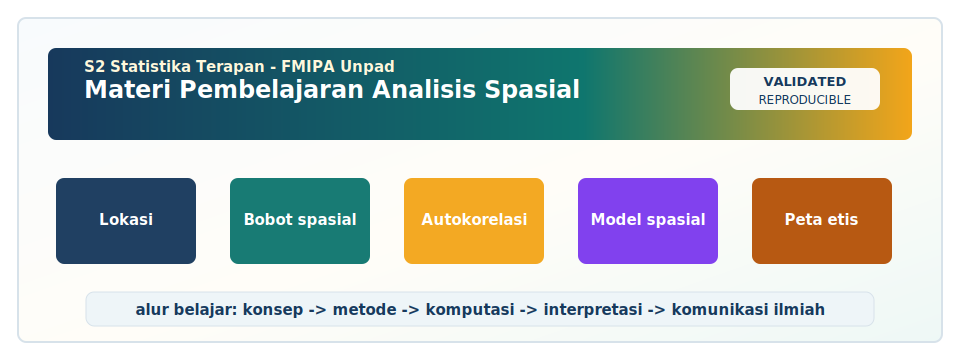

<!-- BEGIN UNPAD MATERIAL STYLE -->
<style>
:root {
  --unpad-navy: #17395c;
  --unpad-gold: #f2a51a;
  --unpad-teal: #0f766e;
  --unpad-ink: #172033;
  --unpad-paper: #fffdf8;
  --unpad-soft: #eef5f8;
  --unpad-line: #d7e2ea;
}
html, body {
  background: linear-gradient(135deg, #f8fbfd 0%, #fffdf8 48%, #f3f6ee 100%) !important;
  color: var(--unpad-ink) !important;
}
body {
  font-family: "Segoe UI", Arial, sans-serif !important;
  line-height: 1.72 !important;
}
.main-container {
  max-width: 1180px !important;
  background: rgba(255, 253, 248, 0.98) !important;
  border: 1px solid var(--unpad-line) !important;
  border-radius: 8px !important;
  box-shadow: 0 18px 42px rgba(23, 57, 92, 0.12) !important;
}
h1, h2, h3, h4 {
  letter-spacing: 0 !important;
}
h1.title {
  color: var(--unpad-navy) !important;
  -webkit-text-fill-color: var(--unpad-navy) !important;
  background: none !important;
}
h2 {
  border-left-color: var(--unpad-gold) !important;
}
a {
  color: #0b5c86 !important;
}
pre, code {
  border-radius: 8px !important;
}
.unpad-cover {
  margin: 18px 0 26px;
  padding: 24px;
  border-radius: 8px;
  background: linear-gradient(135deg, #17395c 0%, #0f766e 58%, #f2a51a 100%);
  color: #ffffff;
  box-shadow: 0 18px 36px rgba(23, 57, 92, 0.22);
}
.unpad-cover__brand {
  display: grid;
  grid-template-columns: 92px 1fr;
  gap: 20px;
  align-items: center;
}
.unpad-cover img {
  width: 92px;
  height: 92px;
  object-fit: contain;
  background: #ffffff;
  border-radius: 8px;
  padding: 8px;
  box-shadow: 0 8px 22px rgba(0,0,0,0.18);
}
.unpad-kicker {
  text-transform: uppercase;
  font-size: 0.82rem;
  font-weight: 800;
  letter-spacing: 0;
  color: #fff8dc;
}
.unpad-cover h2 {
  margin: 6px 0 8px;
  padding: 0;
  border: 0;
  background: transparent;
  color: #ffffff !important;
  font-size: 1.65rem;
}
.unpad-meta {
  margin: 0;
  color: #f7fbff;
  font-weight: 600;
}
.materi-illustration {
  margin: 20px 0 24px;
  padding: 14px;
  background: #ffffff;
  border: 1px solid var(--unpad-line);
  border-radius: 8px;
  box-shadow: 0 12px 28px rgba(23, 57, 92, 0.10);
}
.materi-illustration img {
  width: 100%;
  height: auto;
  display: block;
  border-radius: 6px;
}
.validasi-akademik {
  margin: 18px 0 28px;
  padding: 16px 18px;
  background: linear-gradient(135deg, #eef8f6, #fff8e7);
  border-left: 8px solid var(--unpad-teal);
  border-radius: 8px;
  color: var(--unpad-ink);
}
.validasi-akademik strong {
  color: var(--unpad-navy);
}
table {
  border-radius: 8px !important;
}
@media (max-width: 760px) {
  .unpad-cover__brand {
    grid-template-columns: 1fr;
  }
  .unpad-cover img {
    width: 76px;
    height: 76px;
  }
}
</style>
<!-- END UNPAD MATERIAL STYLE -->


<!-- BEGIN UNPAD MATERIAL ENHANCEMENT -->

```{r setup-unpad-render, include=FALSE}
execute_code <- FALSE
knitr::opts_chunk$set(
  echo = TRUE,
  eval = FALSE,
  message = FALSE,
  warning = FALSE,
  fig.align = "center",
  fig.width = 8,
  fig.height = 4.8,
  dpi = 120
)
set.seed(2025)
```


<div class="unpad-cover">
<div class="unpad-cover__brand">

<div>
<div class="unpad-kicker">S2 Statistika Terapan | FMIPA Universitas Padjadjaran</div>
<h2>Materi Pembelajaran Analisis Spasial</h2>
<p class="unpad-meta">Program Studi S2 Statistika Terapan, FMIPA Universitas Padjadjaran<br>Penulis: I Gede Nyoman Mindra Jaya, Ph.D | Januari 2025</p>
</div>
</div>
</div>

<div class="materi-illustration">

</div>

<div class="validasi-akademik">
<strong>Catatan validasi akademik.</strong> Materi ini diseragamkan dengan rujukan ADWTL Januari 2025: rumus dibaca bersama asumsi, contoh kode diposisikan sebagai template reproducible, dan interpretasi diarahkan pada validitas data, diagnosis model, evaluasi ketidakpastian, serta komunikasi hasil secara ilmiah.
</div>

<!-- END UNPAD MATERIAL ENHANCEMENT -->

```{css, echo=FALSE}
:root{
  --kopi:#4b2e1f;
  --karamel:#a7652a;
  --moka:#c99155;
  --krim:#fff3df;
  --coklat-muda:#f7e4cc;
  --coklat-sangat-muda:#fffaf3;
  --emas:#d9a441;
  --hitam:#1a100b;
  --teal:#2a6f73;
  --ungu:#7b4a8b;
}
body{
  color: var(--hitam);
  background: linear-gradient(135deg, #fffaf4 0%, #faeddb 42%, #e9c9a7 100%);
  font-size: 16px;
  line-height: 1.75;
}
.main-container{
  max-width: 1120px !important;
  background: rgba(255,250,243,0.98);
  border-radius: 22px;
  padding: 34px 42px;
  box-shadow: 0 22px 70px rgba(75,46,31,.18);
  border: 1px solid rgba(167,101,42,.18);
}
h1.title{
  color: #fff;
  padding: 30px;
  border-radius: 24px;
  background: linear-gradient(135deg, #3b2419, #8a4f24 48%, #d7a65a);
  box-shadow: 0 16px 40px rgba(75,46,31,.30);
}
h1, h2, h3, h4{
  color: var(--kopi);
  font-weight: 800;
}
h2{
  border-left: 8px solid var(--karamel);
  padding-left: 16px;
  margin-top: 44px;
  background: linear-gradient(90deg, rgba(247,228,204,.8), rgba(255,250,243,0));
  border-radius: 12px;
}
h3{
  color: #6b3f20;
}
a{ color: #6b3f20; font-weight: 700; }
.tocify{
  border-radius: 18px !important;
  border: 1px solid rgba(167,101,42,.22) !important;
  background: linear-gradient(180deg, #fff8ee, #f5d9b9) !important;
  box-shadow: 0 12px 36px rgba(75,46,31,.14);
}
.tocify .tocify-item{ color: #3b2419; font-weight: 600; }
.tocify .active{ background: linear-gradient(90deg, #6f3e1f, #c89152) !important; color: white !important; }
pre, code, pre code{
  background-color: var(--coklat-muda) !important;
  color: #111111 !important;
  border-radius: 12px !important;
  border: 1px solid rgba(167,101,42,.30);
}
pre{ padding: 16px; box-shadow: inset 0 0 0 1px rgba(255,255,255,.50); }
blockquote{
  background: #fff4e5;
  border-left: 7px solid #b36f2f;
  color: #1f130c;
  border-radius: 12px;
  padding: 14px 18px;
}
table{
  background: #fffaf3;
  border-radius: 12px;
  overflow: hidden;
}
th{
  background: linear-gradient(90deg,#5b3320,#b8793b);
  color: white;
}
.callout, .kotak, .rumus, .praktikum, .refleksi, .studi{
  padding: 18px 22px;
  margin: 20px 0;
  border-radius: 18px;
  box-shadow: 0 10px 28px rgba(75,46,31,.10);
}
.callout{ background: #fff8ed; border-left: 8px solid #8a4f24; }
.kotak{ background: #fbe9d2; border-left: 8px solid #c08745; }
.rumus{ background: #fff3df; border-left: 8px solid #a7652a; color: #111111; }
.praktikum{ background: linear-gradient(135deg,#fff3df,#f9ddbc); border-left: 8px solid #2a6f73; }
.refleksi{ background: #f4e3ff; border-left: 8px solid #7b4a8b; }
.studi{ background: #eaf7f4; border-left: 8px solid #2a6f73; }
.badge{
  display:inline-block; padding:6px 12px; border-radius:999px; margin:3px;
  background:#6f3e1f; color:white; font-weight:700; font-size:.85em;
}
.small-note{ font-size:.92em; color:#5a3a27; }
.figure-caption{ color:#5a3a27; font-style:italic; text-align:center; }
```


```{r setup, include=FALSE, eval=FALSE}
knitr::opts_chunk$set(
  echo = TRUE,
  warning = FALSE,
  message = FALSE,
  fig.align = "center",
  fig.width = 9,
  fig.height = 6,
  dpi = 140
)
```

<div class="callout">
<span class="badge">Mata Kuliah</span> Analisis Spasial  
<span class="badge">Kode</span> D20B.204  
<span class="badge">Bobot</span> 3 SKS: Teori 2 SKS dan Praktikum 1 SKS  
<span class="badge">Semester</span> 2  
<span class="badge">Program</span> S2 Statistika Terapan, FMIPA Universitas Padjadjaran  
<span class="badge">Tahun Pembuatan Materi</span> Januari 2025
</div>

# Prakata

Materi pembelajaran ini disusun sebagai naskah kuliah, modul praktikum, dan bahan pengembangan proyek untuk mata kuliah **Analisis Spasial** pada Program Studi **S2 Statistika Terapan, FMIPA Universitas Padjadjaran**. Naskah ini mengikuti struktur RPS Analisis Spasial yang menempatkan capaian pembelajaran pada empat arah utama: pemahaman karakteristik data spasial, visualisasi dan interpretasi spasial, pengembangan model dan algoritma spasial menggunakan perangkat lunak statistik, serta perancangan riset tingkat lanjut berbasis Bayesian spatial dan Bayesian spatiotemporal modeling. Karena mata kuliah ini berada pada jenjang magister, pembahasan tidak berhenti pada penggunaan fungsi perangkat lunak. Setiap metode dijelaskan dari sisi ide statistik, formulasi model, asumsi, mekanisme komputasi, cara membaca output, serta implikasinya untuk riset terapan.

Secara pedagogis, materi ini dirancang untuk membimbing mahasiswa dari pertanyaan paling dasar, yaitu *mengapa lokasi penting dalam analisis statistik*, menuju pertanyaan metodologis yang lebih kompleks, seperti *bagaimana dependensi spasial dimasukkan ke dalam likelihood*, *bagaimana struktur ketetanggaan memengaruhi inferensi*, dan *bagaimana model Bayesian dapat digunakan untuk memetakan risiko spasial-temporal*. Narasi pembelajaran disusun mengikuti urutan pertemuan pada RPS: konsep dasar data spasial, lokasi, jarak, autokorelasi spasial, visualisasi, eksplorasi dan pemrosesan data, Spatial Lag Model, Spatial Error Model, diagnostik model, Geographically Weighted Regression, variogram, kriging, dan Bayesian spatiotemporal modeling.

<div class="kotak">
**Cara menggunakan modul ini.** Dosen dapat memakai bagian konseptual untuk kuliah sinkron, bagian kode R untuk praktikum, bagian studi kasus untuk diskusi, dan bagian tugas untuk penilaian berbasis proyek. Mahasiswa dianjurkan membaca konsep sebelum kelas, menjalankan kode saat praktikum, lalu menulis interpretasi dengan bahasa statistik yang lengkap. Analisis spasial itu seperti kopi: aromanya baru keluar kalau data, peta, model, dan interpretasi diseduh bersama - jangan cuma dipanaskan di fungsi R. ☕
</div>

## Identitas dan arah pembelajaran

| Komponen | Keterangan |
|---|---|
| Mata kuliah | Analisis Spasial |
| Program studi | S2 Statistika Terapan |
| Fakultas | Fakultas Matematika dan Ilmu Pengetahuan Alam |
| Universitas | Universitas Padjadjaran |
| Author | I Gede Nyoman Mindra Jaya, Ph.D |
| Dosen pengampu | I Gede Nyoman Mindra Jaya, Ph.D; Prof. Dr. Budi Nurani, M.Si |
| Tahun materi | Januari 2025 |
| Fokus utama | Spatial data, spatial autocorrelation, spatial regression, GWR, geostatistics, kriging, Bayesian spatial/spatiotemporal modeling |

## Capaian Pembelajaran Mata Kuliah

1. Mahasiswa mampu menganalisis karakteristik data spasial dan konsep keterkaitan spasial.
2. Mahasiswa mampu menerapkan dan memvisualisasikan data spasial serta menginterpretasikan hasil analisis secara komprehensif.
3. Mahasiswa mampu mengembangkan model dan algoritma spasial untuk menyelesaikan permasalahan nyata menggunakan software statistik.
4. Mahasiswa mampu merancang riset inovatif dan kritis di bidang spasial tingkat lanjut berbasis Bayesian spatiotemporal model.

## Paket R yang disarankan

```{r instalasi-paket, eval=FALSE}
paket <- c(
  "sf", "dplyr", "ggplot2", "tmap", "spdep", "spatialreg", "gstat",
  "GWmodel", "spData", "stars", "terra", "tidyr", "readr", "viridis",
  "patchwork", "knitr", "kableExtra"
)
install.packages(setdiff(paket, rownames(installed.packages())))

# Untuk INLA, gunakan repositori khusus INLA.
install.packages("INLA", repos = c(getOption("repos"),
  INLA = "https://inla.r-inla-download.org/R/stable"), dep = TRUE)
```

```{r load-paket, eval=FALSE}
library(sf)
library(dplyr)
library(ggplot2)
library(spdep)
library(spatialreg)
library(gstat)
library(GWmodel)
library(tmap)
```

## Peta alur perkuliahan

<div class="callout">
**Alur materi.** Pertemuan 1-3 membangun fondasi konsep data spasial, jarak, ketetanggaan, dan autokorelasi. Pertemuan 4-5 mengembangkan kemampuan visualisasi dan evaluasi peta. Pertemuan 6-11 memperkenalkan regresi spasial global, diagnostik, GWR, variogram, dan kriging. Pertemuan 12-16 berfokus pada Bayesian spatial/spatiotemporal modeling dan proyek riset inovatif.
</div>

```{r ilustrasi-alur-kuliah, echo=FALSE, eval=FALSE}
# Ilustrasi sederhana alur pembelajaran; dapat dijalankan jika ggplot2 tersedia.
if (requireNamespace("ggplot2", quietly = TRUE)) {
  library(ggplot2)
  alur <- data.frame(
    tahap = factor(c("Fondasi", "Visualisasi", "Regresi Spasial", "Geostatistik", "Bayesian Spatiotemporal"),
                   levels = c("Fondasi", "Visualisasi", "Regresi Spasial", "Geostatistik", "Bayesian Spatiotemporal")),
    pertemuan = c("1-3", "4-5", "6-8", "9-11", "12-16"),
    y = c(1, 1, 1, 1, 1),
    x = 1:5
  )
  ggplot(alur, aes(x, y, label = paste0(tahap, "\nPertemuan ", pertemuan))) +
    geom_point(size = 12) +
    geom_text(vjust = -1.15, size = 4, fontface = "bold") +
    geom_segment(aes(x = x, xend = x + .8, y = y, yend = y),
                 data = alur[1:4,], linewidth = 1.1,
                 arrow = arrow(length = unit(.18, "inches"))) +
    theme_void() +
    ggtitle("Alur Pembelajaran Analisis Spasial")
}
```

# Bab 1. Konsep Dasar Data Spasial, Lokasi, dan Pertanyaan Statistik

<span class="badge">Pertemuan 1</span> <span class="badge">SubCPMK1</span>

## Tujuan pembelajaran

Pada akhir bagian ini, mahasiswa diharapkan mampu menjelaskan, menganalisis, dan menggunakan konsep **konsep dasar data spasial** dalam konteks statistik terapan. Topik ini penting karena analisis spasial tidak hanya mempelajari nilai variabel, tetapi juga mempelajari posisi, kedekatan, keterhubungan, serta pola ketergantungan antar unit observasi. Dalam kerangka RPS, kemampuan ini mendukung pembentukan kompetensi mahasiswa untuk mengelola data, membangun model, menginterpretasikan hasil, dan mengembangkan riset yang relevan dengan masalah nyata di bidang kesehatan, lingkungan, sosial, industri, dan sains data. Rujukan konseptual utama untuk bagian ini adalah Bivand, Pebesma, & Gomez-Rubio (2013); Fortin & Dale (2005); Griffith & Layne (1999).

## Ide dasar

Secara sederhana, **konsep dasar data spasial** dapat dipahami sebagai data yang setiap unit observasinya memiliki atribut dan posisi pada ruang geografis atau ruang koordinat tertentu. Pada data non-spasial, dua observasi sering diasumsikan saling bebas setelah kovariat dimasukkan ke dalam model. Pada data spasial, asumsi tersebut sering terlalu kuat karena unit yang berdekatan cenderung berbagi kondisi lingkungan, akses infrastruktur, mobilitas penduduk, kebijakan lokal, atau proses sosial yang sama. Oleh karena itu, pertanyaan statistik yang diajukan tidak cukup berupa "berapa rata-rata" atau "apakah koefisien signifikan", tetapi perlu diperluas menjadi "di mana pola terjadi", "apakah pola tersebut berkelompok", "apakah nilai wilayah tetangga memengaruhi nilai suatu wilayah", dan "seberapa besar ketidakpastian pada peta estimasi".

Analisis spasial juga menuntut cara berpikir yang lebih hati-hati terhadap skala. Satu pola yang tampak jelas pada level provinsi dapat hilang pada level kabupaten, dan pola pada level kabupaten dapat berubah lagi ketika data dianalisis pada level kecamatan. Fenomena ini dikenal melalui gagasan *modifiable areal unit problem* dan masalah skala agregasi. Dalam perkuliahan magister, mahasiswa perlu memahami bahwa peta bukan sekadar hiasan pada laporan, melainkan bentuk representasi data yang membawa asumsi tentang unit analisis, batas wilayah, sistem koordinat, dan metode klasifikasi. Peta yang indah tetapi tidak konsisten secara statistik dapat membuat kesimpulan bergerak lebih cepat daripada bukti; ini mirip seminar yang slide-nya keren tetapi tabel datanya belum dibersihkan - penonton terpukau, reviewer tetap bertanya.

## Mengapa topik ini diperlukan?

Dalam banyak studi terapan, pemetaan prevalensi penyakit, distribusi kemiskinan, kualitas udara, risiko bencana, dan akses layanan publik tidak dapat dijelaskan secara memadai tanpa memperhatikan lokasi. Misalnya, prevalensi penyakit menular dapat meningkat karena faktor iklim lokal dan pergerakan manusia antar wilayah. Kualitas udara dapat dipengaruhi oleh sumber emisi di wilayah tetangga dan arah angin. Stunting dapat berhubungan dengan fasilitas kesehatan, kemiskinan, sanitasi, dan kondisi wilayah sekitar. Dalam konteks seperti ini, lokasi menjadi bagian dari mekanisme generatif data. Analisis yang menghapus lokasi dari model berisiko menghapus bagian penting dari cerita ilmiah.

Kebutuhan memasukkan lokasi juga muncul karena banyak indikator sosial dan kesehatan dikumpulkan pada unit administratif. Unit administratif bukan unit alami dari proses statistik; batas kabupaten atau provinsi dibuat untuk tata kelola, bukan selalu untuk menggambarkan proses biologis, ekonomi, atau lingkungan. Karena itu, model spasial membantu peneliti menjembatani data administratif dengan proses nyata yang lebih kontinu. Pembobotan spasial, autokorelasi, model lag, model error, GWR, variogram, kriging, dan model Bayesian adalah beberapa perangkat yang dapat digunakan untuk membuat jembatan tersebut lebih eksplisit.

<div class="rumus">
**Formula kunci.**

$$
d_i = (x_i, y_i),\quad z_i = z(d_i)
$$

Formula ini tidak harus dihafalkan secara mekanis. Yang perlu dipahami adalah makna statistiknya: bagaimana ruang, lokasi, bobot, parameter, atau ketidakpastian masuk ke dalam proses analisis.
</div>


## Konsep inti yang harus dikuasai

Pertama, mahasiswa perlu membedakan antara **objek spasial** dan **atribut non-spasial**. Objek spasial memuat geometri, seperti titik, garis, poligon, raster, atau jaringan. Atribut non-spasial memuat variabel yang melekat pada objek tersebut, seperti jumlah penduduk, jumlah kasus, rata-rata pendapatan, konsentrasi polutan, atau skor indeks. Kedua komponen ini harus konsisten. Bila atribut wilayah tahun 2024 digabungkan dengan batas administrasi lama, maka peta dan model dapat mengandung ketidaksesuaian yang tidak terlihat dari tabel biasa.

Kedua, mahasiswa perlu memahami bahwa **kedekatan** tidak selalu berarti kedekatan geografis absolut. Dua wilayah dapat dianggap dekat karena berbagi batas, berada dalam radius tertentu, terhubung oleh jaringan jalan, memiliki mobilitas penduduk yang tinggi, atau memiliki karakteristik sosial ekonomi yang mirip. Pilihan definisi kedekatan harus dikaitkan dengan teori substantif. Dalam epidemiologi, kontak dan mobilitas dapat lebih relevan daripada jarak Euclidean. Dalam geostatistik lingkungan, jarak fisik dan arah dapat sangat penting. Dalam ekonomi regional, jaringan perdagangan atau commuting dapat menjadi dasar hubungan antar wilayah.

Ketiga, mahasiswa perlu membedakan **dependensi spasial** dan **heterogenitas spasial**. Dependensi spasial berarti nilai pada suatu lokasi berkaitan dengan nilai pada lokasi lain. Heterogenitas spasial berarti hubungan antar variabel dapat berbeda di tempat yang berbeda. Model SLM dan SEM terutama berangkat dari gagasan dependensi, sementara GWR lebih menekankan variasi lokal koefisien. Model Bayesian dapat mengakomodasi keduanya melalui efek acak terstruktur, efek acak tidak terstruktur, tren waktu, dan interaksi ruang-waktu.

## Langkah analisis umum

Sebelum menerapkan model, selalu mulai dari audit data. Periksa unit analisis, tahun data, sistem koordinat, missing values, duplikasi kode wilayah, validitas geometri, serta kesesuaian antara data atribut dan shapefile. Setelah itu, lakukan eksplorasi peta awal, ringkasan statistik, dan identifikasi outlier. Barulah definisikan struktur hubungan spasial atau struktur kovarians yang sesuai. Tahap ini sering tampak teknis, tetapi justru menentukan kualitas inferensi. Model yang rumit tidak akan menyelamatkan data yang salah join; bahkan Bayesian pun bisa bingung kalau kode wilayahnya tertukar - posteriornya mungkin konvergen, tapi ke kabupaten yang salah.

Secara konseptual, alur kerja dapat dituliskan sebagai: rumuskan pertanyaan substantif, tentukan unit dan skala analisis, siapkan geometri dan atribut, pilih representasi kedekatan atau kovarians, lakukan eksplorasi visual, uji pola spasial, bangun model, validasi model, interpretasikan efek dan ketidakpastian, lalu komunikasikan hasil dalam bentuk peta, tabel, narasi, dan rekomendasi. Setiap tahap memerlukan keputusan analitis. Keputusan tersebut harus ditulis dalam laporan agar pembaca memahami mengapa model tertentu dipilih dan apa keterbatasannya.

## Koneksi dengan metode lain dalam mata kuliah

Topik **konsep dasar data spasial** berfungsi sebagai simpul yang terhubung dengan seluruh materi Analisis Spasial. Ketika mahasiswa belajar autokorelasi, mereka memerlukan pemahaman lokasi dan bobot. Ketika mahasiswa belajar SLM atau SEM, mereka memerlukan pemahaman tentang bagaimana W bekerja. Ketika mahasiswa belajar GWR, mereka memerlukan pemahaman bahwa koefisien dapat berubah menurut lokasi. Ketika mahasiswa belajar variogram dan kriging, mereka memerlukan pemahaman bahwa kemiripan nilai sering menurun ketika jarak meningkat. Ketika mahasiswa belajar Bayesian spatiotemporal, mereka perlu memahami bahwa risiko spasial dapat berubah dari waktu ke waktu dengan ketidakpastian yang perlu diukur.

## Praktikum R

Kode berikut dirancang sebagai titik awal. Dosen dapat mengganti data simulasi dengan data nyata seperti data kabupaten/kota, data kesehatan, data lingkungan, atau data sosial ekonomi. Mahasiswa perlu menjalankan kode, memeriksa output, lalu menulis interpretasi. Praktikum tidak boleh berhenti pada kalimat "hasil dapat dilihat pada peta". Interpretasi harus menjelaskan pola dominan, wilayah ekstrem, kemungkinan mekanisme substantif, serta keterbatasan data.

```{r contoh-grid-spasial, eval=FALSE}
library(sf)
library(dplyr)
library(ggplot2)

set.seed(123)
bbox <- st_bbox(c(xmin = 0, ymin = 0, xmax = 10, ymax = 10), crs = st_crs(3857))
wilayah <- st_make_grid(st_as_sfc(bbox), n = c(10, 10)) |>
  st_sf(id = 1:100, geometry = _) |>
  mutate(
    x = st_coordinates(st_centroid(geometry))[,1],
    y = st_coordinates(st_centroid(geometry))[,2],
    risiko = 40 + 2*x - 1.5*y + rnorm(100, 0, 5)
  )

ggplot(wilayah) +
  geom_sf(aes(fill = risiko), color = "white") +
  coord_sf() +
  labs(title = "Ilustrasi Data Spasial Berbasis Grid", fill = "Risiko") +
  theme_minimal()
```


## Interpretasi output

Interpretasi pada topik ini harus menjawab tiga pertanyaan: apa pola statistiknya, di mana pola tersebut terjadi, dan mengapa pola tersebut masuk akal secara substantif. Misalnya, bila peta menunjukkan klaster nilai tinggi, mahasiswa perlu menjelaskan apakah klaster itu terkait dengan kepadatan penduduk, kedekatan fasilitas, kondisi lingkungan, atau proses sosial tertentu. Bila model menunjukkan parameter spasial signifikan, mahasiswa perlu menjelaskan apakah itu menunjukkan spillover, omitted spatial process, atau struktur residual yang belum tertangkap oleh kovariat. Interpretasi yang baik tidak hanya menyebut angka, tetapi menghubungkan angka dengan mekanisme data.

Dalam laporan akademik, jangan menulis "terdapat pengaruh spasial" tanpa menjelaskan bentuk pengaruhnya. Jika menggunakan Moran's I, jelaskan bahwa statistik tersebut mengukur autokorelasi global dan tidak langsung menunjukkan hubungan kausal. Jika menggunakan SLM, jelaskan kemungkinan proses interaksi pada respons. Jika menggunakan SEM, jelaskan ketergantungan residual atau faktor tidak teramati yang memiliki pola spasial. Jika menggunakan kriging, jelaskan bahwa prediksi didasarkan pada struktur variogram. Jika menggunakan Bayesian model, laporkan estimasi posterior, interval kredibel, dan peta ketidakpastian.

## Kesalahan umum

Kesalahan pertama adalah memperlakukan peta sebagai bukti final. Peta adalah alat eksplorasi dan komunikasi, bukan pengganti model. Kesalahan kedua adalah memilih matriks bobot karena fungsi R paling mudah, bukan karena teori masalah. Kesalahan ketiga adalah menafsirkan koefisien model spasial seperti koefisien OLS biasa. Kesalahan keempat adalah mengabaikan ketidakpastian pada prediksi peta. Kesalahan kelima adalah membandingkan model hanya dari satu angka tanpa memeriksa residual, asumsi, dan tujuan analisis. Pada topik ini, risiko utama adalah: mengabaikan lokasi dapat membuat estimasi tampak presisi padahal residual masih berpola menurut wilayah.

## Studi kasus mini

Bayangkan seorang peneliti ingin menganalisis variasi prevalensi stunting antar kabupaten di Jawa Barat. Data respons tersedia per kabupaten, kovariat mencakup kemiskinan, cakupan layanan ibu dan anak, sanitasi, dan akses fasilitas kesehatan. Pertanyaan awalnya bukan hanya apakah kemiskinan berhubungan dengan stunting, tetapi apakah kabupaten dengan stunting tinggi cenderung berdekatan, apakah residual model masih berpola spasial, dan apakah ada wilayah tertentu yang menunjukkan hubungan kovariat-respons lebih kuat daripada wilayah lain. Pertanyaan seperti ini mengarahkan peneliti untuk menggunakan peta, Moran's I, model regresi spasial, GWR, atau model Bayesian spatial.

Dalam studi lingkungan, peneliti dapat menganalisis PM2.5 atau PM10 dari sensor udara. Bila data berupa titik, variogram dan kriging dapat digunakan untuk memprediksi permukaan konsentrasi polutan. Bila data agregat kabupaten, model areal seperti CAR/BYM dapat digunakan untuk memetakan risiko. Bila data tersedia harian atau bulanan, model spatiotemporal memungkinkan peneliti memisahkan variasi ruang, variasi waktu, dan interaksi ruang-waktu. Dengan demikian, pemilihan metode harus mengikuti bentuk data, skala observasi, dan tujuan riset, bukan sekadar mengikuti tren perangkat lunak.

## Catatan untuk penulisan laporan

Laporan mahasiswa sebaiknya memuat latar belakang masalah, deskripsi data, definisi unit spasial, sumber geometri, sumber atribut, metode pembobotan atau struktur kovarians, visualisasi awal, hasil model, diagnostik, interpretasi, keterbatasan, dan rekomendasi. Semua keputusan yang tampak teknis harus didokumentasikan. Misalnya, bila menggunakan queen contiguity, jelaskan mengapa berbagi batas dianggap relevan. Bila menggunakan jarak 50 km, jelaskan alasan radius tersebut. Bila menggunakan bandwidth adaptif pada GWR, jelaskan bahwa kepadatan titik atau poligon tidak merata. Bila menggunakan prior dalam Bayesian model, jelaskan sensitivitasnya.

Mahasiswa juga perlu menuliskan kode secara reproducible. Gunakan R Markdown agar narasi, kode, output, dan referensi berada dalam satu dokumen. Gunakan seed untuk simulasi. Simpan data mentah dan data olahan secara terpisah. Tulis komentar pada kode, tetapi jangan berlebihan. Komentar yang baik menjelaskan alasan langkah analisis, bukan mengulang sintaks yang sudah jelas. Misalnya, komentar "membuat bobot queen karena unit analisis adalah poligon kabupaten dan mekanisme ketetanggaan diasumsikan berbasis batas administratif" jauh lebih informatif daripada komentar "membuat nb".

## Evaluasi pembelajaran

Untuk mengevaluasi pemahaman, dosen dapat memberikan mini-quiz konseptual dan tugas praktikum. Contoh pertanyaan konseptual: apa perbedaan dependensi spasial dan heterogenitas spasial? Mengapa proyeksi koordinat memengaruhi jarak? Apa konsekuensi memilih matriks W yang berbeda? Kapan SEM lebih masuk akal daripada SLM? Bagaimana cara membaca peta posterior exceedance probability? Pertanyaan praktikum dapat meminta mahasiswa menjalankan kode, menghasilkan peta, membandingkan model, dan menulis interpretasi satu halaman. Penilaian sebaiknya menekankan kualitas argumentasi, bukan hanya keberhasilan menjalankan fungsi R.

## Ringkasan bab

Bagian ini menegaskan bahwa **konsep dasar data spasial** adalah komponen penting dari analisis spasial modern. Mahasiswa harus menguasai konsep, formula, alur kerja, kode, interpretasi, dan keterbatasan metode. Literatur seperti Bivand, Pebesma, & Gomez-Rubio (2013); Fortin & Dale (2005); Griffith & Layne (1999) memberikan dasar teori dan praktik yang kuat. Namun, keberhasilan analisis tidak hanya bergantung pada referensi dan perangkat lunak. Keberhasilan juga bergantung pada kemampuan peneliti merumuskan pertanyaan, memahami data, memilih struktur spasial yang sesuai, serta mengkomunikasikan hasil dengan jujur dan mudah dipahami.

### Pendalaman 1: perspektif substantif

Dilihat dari perspektif substantif, **konsep dasar data spasial** perlu dipelajari sebagai bagian dari rantai inferensi. Rantai ini dimulai dari fenomena nyata, diterjemahkan menjadi variabel, direpresentasikan melalui objek spasial, dianalisis dengan model, lalu dikembalikan menjadi kesimpulan substantif. Pada setiap titik terdapat kemungkinan bias. Unit wilayah dapat terlalu besar, variabel dapat tidak lengkap, bobot spasial dapat tidak menggambarkan hubungan sebenarnya, model dapat terlalu sederhana, atau interpretasi dapat terlalu berani. Oleh karena itu, mahasiswa perlu membangun kebiasaan memeriksa data dan model dari beberapa sisi. Dalam riset magister, kualitas analisis terlihat dari kemampuan menjelaskan mengapa suatu metode dipilih, bukan hanya dari kemampuan menghasilkan output.

Penerapan perspektif substantif juga mengingatkan bahwa analisis spasial merupakan wilayah pertemuan antara statistik, geografi, komputasi, dan bidang aplikasi. Seorang analis harus nyaman membaca peta, memahami matriks, menulis kode, dan berdiskusi dengan ahli domain. Misalnya, pada kasus kesehatan masyarakat, ahli statistik perlu berdialog dengan epidemiolog mengenai masa inkubasi penyakit, mobilitas penduduk, dan mekanisme penularan. Pada kasus lingkungan, ahli statistik perlu memahami sumber emisi, arah angin, topografi, dan resolusi sensor. Tanpa dialog domain, model spasial mudah menjadi latihan teknis yang rapi tetapi kurang berdampak.

### Pendalaman 2: perspektif statistik

Dilihat dari perspektif statistik, **konsep dasar data spasial** perlu dipelajari sebagai bagian dari rantai inferensi. Rantai ini dimulai dari fenomena nyata, diterjemahkan menjadi variabel, direpresentasikan melalui objek spasial, dianalisis dengan model, lalu dikembalikan menjadi kesimpulan substantif. Pada setiap titik terdapat kemungkinan bias. Unit wilayah dapat terlalu besar, variabel dapat tidak lengkap, bobot spasial dapat tidak menggambarkan hubungan sebenarnya, model dapat terlalu sederhana, atau interpretasi dapat terlalu berani. Oleh karena itu, mahasiswa perlu membangun kebiasaan memeriksa data dan model dari beberapa sisi. Dalam riset magister, kualitas analisis terlihat dari kemampuan menjelaskan mengapa suatu metode dipilih, bukan hanya dari kemampuan menghasilkan output.

Penerapan perspektif statistik juga mengingatkan bahwa analisis spasial merupakan wilayah pertemuan antara statistik, geografi, komputasi, dan bidang aplikasi. Seorang analis harus nyaman membaca peta, memahami matriks, menulis kode, dan berdiskusi dengan ahli domain. Misalnya, pada kasus kesehatan masyarakat, ahli statistik perlu berdialog dengan epidemiolog mengenai masa inkubasi penyakit, mobilitas penduduk, dan mekanisme penularan. Pada kasus lingkungan, ahli statistik perlu memahami sumber emisi, arah angin, topografi, dan resolusi sensor. Tanpa dialog domain, model spasial mudah menjadi latihan teknis yang rapi tetapi kurang berdampak.

### Pendalaman 3: perspektif komputasi

Dilihat dari perspektif komputasi, **konsep dasar data spasial** perlu dipelajari sebagai bagian dari rantai inferensi. Rantai ini dimulai dari fenomena nyata, diterjemahkan menjadi variabel, direpresentasikan melalui objek spasial, dianalisis dengan model, lalu dikembalikan menjadi kesimpulan substantif. Pada setiap titik terdapat kemungkinan bias. Unit wilayah dapat terlalu besar, variabel dapat tidak lengkap, bobot spasial dapat tidak menggambarkan hubungan sebenarnya, model dapat terlalu sederhana, atau interpretasi dapat terlalu berani. Oleh karena itu, mahasiswa perlu membangun kebiasaan memeriksa data dan model dari beberapa sisi. Dalam riset magister, kualitas analisis terlihat dari kemampuan menjelaskan mengapa suatu metode dipilih, bukan hanya dari kemampuan menghasilkan output.

Penerapan perspektif komputasi juga mengingatkan bahwa analisis spasial merupakan wilayah pertemuan antara statistik, geografi, komputasi, dan bidang aplikasi. Seorang analis harus nyaman membaca peta, memahami matriks, menulis kode, dan berdiskusi dengan ahli domain. Misalnya, pada kasus kesehatan masyarakat, ahli statistik perlu berdialog dengan epidemiolog mengenai masa inkubasi penyakit, mobilitas penduduk, dan mekanisme penularan. Pada kasus lingkungan, ahli statistik perlu memahami sumber emisi, arah angin, topografi, dan resolusi sensor. Tanpa dialog domain, model spasial mudah menjadi latihan teknis yang rapi tetapi kurang berdampak.

### Pendalaman 4: perspektif interpretasi

Dilihat dari perspektif interpretasi, **konsep dasar data spasial** perlu dipelajari sebagai bagian dari rantai inferensi. Rantai ini dimulai dari fenomena nyata, diterjemahkan menjadi variabel, direpresentasikan melalui objek spasial, dianalisis dengan model, lalu dikembalikan menjadi kesimpulan substantif. Pada setiap titik terdapat kemungkinan bias. Unit wilayah dapat terlalu besar, variabel dapat tidak lengkap, bobot spasial dapat tidak menggambarkan hubungan sebenarnya, model dapat terlalu sederhana, atau interpretasi dapat terlalu berani. Oleh karena itu, mahasiswa perlu membangun kebiasaan memeriksa data dan model dari beberapa sisi. Dalam riset magister, kualitas analisis terlihat dari kemampuan menjelaskan mengapa suatu metode dipilih, bukan hanya dari kemampuan menghasilkan output.

Penerapan perspektif interpretasi juga mengingatkan bahwa analisis spasial merupakan wilayah pertemuan antara statistik, geografi, komputasi, dan bidang aplikasi. Seorang analis harus nyaman membaca peta, memahami matriks, menulis kode, dan berdiskusi dengan ahli domain. Misalnya, pada kasus kesehatan masyarakat, ahli statistik perlu berdialog dengan epidemiolog mengenai masa inkubasi penyakit, mobilitas penduduk, dan mekanisme penularan. Pada kasus lingkungan, ahli statistik perlu memahami sumber emisi, arah angin, topografi, dan resolusi sensor. Tanpa dialog domain, model spasial mudah menjadi latihan teknis yang rapi tetapi kurang berdampak.

### Pendalaman 5: perspektif validasi

Dilihat dari perspektif validasi, **konsep dasar data spasial** perlu dipelajari sebagai bagian dari rantai inferensi. Rantai ini dimulai dari fenomena nyata, diterjemahkan menjadi variabel, direpresentasikan melalui objek spasial, dianalisis dengan model, lalu dikembalikan menjadi kesimpulan substantif. Pada setiap titik terdapat kemungkinan bias. Unit wilayah dapat terlalu besar, variabel dapat tidak lengkap, bobot spasial dapat tidak menggambarkan hubungan sebenarnya, model dapat terlalu sederhana, atau interpretasi dapat terlalu berani. Oleh karena itu, mahasiswa perlu membangun kebiasaan memeriksa data dan model dari beberapa sisi. Dalam riset magister, kualitas analisis terlihat dari kemampuan menjelaskan mengapa suatu metode dipilih, bukan hanya dari kemampuan menghasilkan output.

Penerapan perspektif validasi juga mengingatkan bahwa analisis spasial merupakan wilayah pertemuan antara statistik, geografi, komputasi, dan bidang aplikasi. Seorang analis harus nyaman membaca peta, memahami matriks, menulis kode, dan berdiskusi dengan ahli domain. Misalnya, pada kasus kesehatan masyarakat, ahli statistik perlu berdialog dengan epidemiolog mengenai masa inkubasi penyakit, mobilitas penduduk, dan mekanisme penularan. Pada kasus lingkungan, ahli statistik perlu memahami sumber emisi, arah angin, topografi, dan resolusi sensor. Tanpa dialog domain, model spasial mudah menjadi latihan teknis yang rapi tetapi kurang berdampak.

# Bab 2. Sistem Koordinat, Proyeksi, Jarak, dan Skala Analisis

<span class="badge">Pertemuan 2</span> <span class="badge">SubCPMK1</span>

## Tujuan pembelajaran

Pada akhir bagian ini, mahasiswa diharapkan mampu menjelaskan, menganalisis, dan menggunakan konsep **koordinat, proyeksi, dan jarak** dalam konteks statistik terapan. Topik ini penting karena analisis spasial tidak hanya mempelajari nilai variabel, tetapi juga mempelajari posisi, kedekatan, keterhubungan, serta pola ketergantungan antar unit observasi. Dalam kerangka RPS, kemampuan ini mendukung pembentukan kompetensi mahasiswa untuk mengelola data, membangun model, menginterpretasikan hasil, dan mengembangkan riset yang relevan dengan masalah nyata di bidang kesehatan, lingkungan, sosial, industri, dan sains data. Rujukan konseptual utama untuk bagian ini adalah Bivand, Pebesma, & Gomez-Rubio (2013); Pebesma (2018); Fortin & Dale (2005).

## Ide dasar

Secara sederhana, **koordinat, proyeksi, dan jarak** dapat dipahami sebagai kerangka untuk menyatakan posisi objek spasial serta menghitung kedekatan antar lokasi secara konsisten. Pada data non-spasial, dua observasi sering diasumsikan saling bebas setelah kovariat dimasukkan ke dalam model. Pada data spasial, asumsi tersebut sering terlalu kuat karena unit yang berdekatan cenderung berbagi kondisi lingkungan, akses infrastruktur, mobilitas penduduk, kebijakan lokal, atau proses sosial yang sama. Oleh karena itu, pertanyaan statistik yang diajukan tidak cukup berupa "berapa rata-rata" atau "apakah koefisien signifikan", tetapi perlu diperluas menjadi "di mana pola terjadi", "apakah pola tersebut berkelompok", "apakah nilai wilayah tetangga memengaruhi nilai suatu wilayah", dan "seberapa besar ketidakpastian pada peta estimasi".

Analisis spasial juga menuntut cara berpikir yang lebih hati-hati terhadap skala. Satu pola yang tampak jelas pada level provinsi dapat hilang pada level kabupaten, dan pola pada level kabupaten dapat berubah lagi ketika data dianalisis pada level kecamatan. Fenomena ini dikenal melalui gagasan *modifiable areal unit problem* dan masalah skala agregasi. Dalam perkuliahan magister, mahasiswa perlu memahami bahwa peta bukan sekadar hiasan pada laporan, melainkan bentuk representasi data yang membawa asumsi tentang unit analisis, batas wilayah, sistem koordinat, dan metode klasifikasi. Peta yang indah tetapi tidak konsisten secara statistik dapat membuat kesimpulan bergerak lebih cepat daripada bukti; ini mirip seminar yang slide-nya keren tetapi tabel datanya belum dibersihkan - penonton terpukau, reviewer tetap bertanya.

## Mengapa topik ini diperlukan?

Dalam banyak studi terapan, menghitung jarak antar fasilitas kesehatan, menentukan radius keterpaparan polusi, dan membuat bobot jarak antar kabupaten tidak dapat dijelaskan secara memadai tanpa memperhatikan lokasi. Misalnya, prevalensi penyakit menular dapat meningkat karena faktor iklim lokal dan pergerakan manusia antar wilayah. Kualitas udara dapat dipengaruhi oleh sumber emisi di wilayah tetangga dan arah angin. Stunting dapat berhubungan dengan fasilitas kesehatan, kemiskinan, sanitasi, dan kondisi wilayah sekitar. Dalam konteks seperti ini, lokasi menjadi bagian dari mekanisme generatif data. Analisis yang menghapus lokasi dari model berisiko menghapus bagian penting dari cerita ilmiah.

Kebutuhan memasukkan lokasi juga muncul karena banyak indikator sosial dan kesehatan dikumpulkan pada unit administratif. Unit administratif bukan unit alami dari proses statistik; batas kabupaten atau provinsi dibuat untuk tata kelola, bukan selalu untuk menggambarkan proses biologis, ekonomi, atau lingkungan. Karena itu, model spasial membantu peneliti menjembatani data administratif dengan proses nyata yang lebih kontinu. Pembobotan spasial, autokorelasi, model lag, model error, GWR, variogram, kriging, dan model Bayesian adalah beberapa perangkat yang dapat digunakan untuk membuat jembatan tersebut lebih eksplisit.

<div class="rumus">
**Formula kunci.**

$$
d_{ij}=\sqrt{(x_i-x_j)^2+(y_i-y_j)^2}
$$

Formula ini tidak harus dihafalkan secara mekanis. Yang perlu dipahami adalah makna statistiknya: bagaimana ruang, lokasi, bobot, parameter, atau ketidakpastian masuk ke dalam proses analisis.
</div>


## Konsep inti yang harus dikuasai

Pertama, mahasiswa perlu membedakan antara **objek spasial** dan **atribut non-spasial**. Objek spasial memuat geometri, seperti titik, garis, poligon, raster, atau jaringan. Atribut non-spasial memuat variabel yang melekat pada objek tersebut, seperti jumlah penduduk, jumlah kasus, rata-rata pendapatan, konsentrasi polutan, atau skor indeks. Kedua komponen ini harus konsisten. Bila atribut wilayah tahun 2024 digabungkan dengan batas administrasi lama, maka peta dan model dapat mengandung ketidaksesuaian yang tidak terlihat dari tabel biasa.

Kedua, mahasiswa perlu memahami bahwa **kedekatan** tidak selalu berarti kedekatan geografis absolut. Dua wilayah dapat dianggap dekat karena berbagi batas, berada dalam radius tertentu, terhubung oleh jaringan jalan, memiliki mobilitas penduduk yang tinggi, atau memiliki karakteristik sosial ekonomi yang mirip. Pilihan definisi kedekatan harus dikaitkan dengan teori substantif. Dalam epidemiologi, kontak dan mobilitas dapat lebih relevan daripada jarak Euclidean. Dalam geostatistik lingkungan, jarak fisik dan arah dapat sangat penting. Dalam ekonomi regional, jaringan perdagangan atau commuting dapat menjadi dasar hubungan antar wilayah.

Ketiga, mahasiswa perlu membedakan **dependensi spasial** dan **heterogenitas spasial**. Dependensi spasial berarti nilai pada suatu lokasi berkaitan dengan nilai pada lokasi lain. Heterogenitas spasial berarti hubungan antar variabel dapat berbeda di tempat yang berbeda. Model SLM dan SEM terutama berangkat dari gagasan dependensi, sementara GWR lebih menekankan variasi lokal koefisien. Model Bayesian dapat mengakomodasi keduanya melalui efek acak terstruktur, efek acak tidak terstruktur, tren waktu, dan interaksi ruang-waktu.

## Langkah analisis umum

Sebelum menerapkan model, selalu mulai dari audit data. Periksa unit analisis, tahun data, sistem koordinat, missing values, duplikasi kode wilayah, validitas geometri, serta kesesuaian antara data atribut dan shapefile. Setelah itu, lakukan eksplorasi peta awal, ringkasan statistik, dan identifikasi outlier. Barulah definisikan struktur hubungan spasial atau struktur kovarians yang sesuai. Tahap ini sering tampak teknis, tetapi justru menentukan kualitas inferensi. Model yang rumit tidak akan menyelamatkan data yang salah join; bahkan Bayesian pun bisa bingung kalau kode wilayahnya tertukar - posteriornya mungkin konvergen, tapi ke kabupaten yang salah.

Secara konseptual, alur kerja dapat dituliskan sebagai: rumuskan pertanyaan substantif, tentukan unit dan skala analisis, siapkan geometri dan atribut, pilih representasi kedekatan atau kovarians, lakukan eksplorasi visual, uji pola spasial, bangun model, validasi model, interpretasikan efek dan ketidakpastian, lalu komunikasikan hasil dalam bentuk peta, tabel, narasi, dan rekomendasi. Setiap tahap memerlukan keputusan analitis. Keputusan tersebut harus ditulis dalam laporan agar pembaca memahami mengapa model tertentu dipilih dan apa keterbatasannya.

## Koneksi dengan metode lain dalam mata kuliah

Topik **koordinat, proyeksi, dan jarak** berfungsi sebagai simpul yang terhubung dengan seluruh materi Analisis Spasial. Ketika mahasiswa belajar autokorelasi, mereka memerlukan pemahaman lokasi dan bobot. Ketika mahasiswa belajar SLM atau SEM, mereka memerlukan pemahaman tentang bagaimana W bekerja. Ketika mahasiswa belajar GWR, mereka memerlukan pemahaman bahwa koefisien dapat berubah menurut lokasi. Ketika mahasiswa belajar variogram dan kriging, mereka memerlukan pemahaman bahwa kemiripan nilai sering menurun ketika jarak meningkat. Ketika mahasiswa belajar Bayesian spatiotemporal, mereka perlu memahami bahwa risiko spasial dapat berubah dari waktu ke waktu dengan ketidakpastian yang perlu diukur.

## Praktikum R

Kode berikut dirancang sebagai titik awal. Dosen dapat mengganti data simulasi dengan data nyata seperti data kabupaten/kota, data kesehatan, data lingkungan, atau data sosial ekonomi. Mahasiswa perlu menjalankan kode, memeriksa output, lalu menulis interpretasi. Praktikum tidak boleh berhenti pada kalimat "hasil dapat dilihat pada peta". Interpretasi harus menjelaskan pola dominan, wilayah ekstrem, kemungkinan mekanisme substantif, serta keterbatasan data.

```{r contoh-jarak, eval=FALSE}
library(sf)
pts <- st_as_sf(data.frame(
  nama = c("A", "B", "C"),
  lon = c(107.61, 107.75, 107.88),
  lat = c(-6.91, -6.83, -6.95)
), coords = c("lon", "lat"), crs = 4326)

# Transformasi ke UTM zona yang sesuai untuk memperoleh satuan meter.
pts_utm <- st_transform(pts, 32748)
st_distance(pts_utm)
```


## Interpretasi output

Interpretasi pada topik ini harus menjawab tiga pertanyaan: apa pola statistiknya, di mana pola tersebut terjadi, dan mengapa pola tersebut masuk akal secara substantif. Misalnya, bila peta menunjukkan klaster nilai tinggi, mahasiswa perlu menjelaskan apakah klaster itu terkait dengan kepadatan penduduk, kedekatan fasilitas, kondisi lingkungan, atau proses sosial tertentu. Bila model menunjukkan parameter spasial signifikan, mahasiswa perlu menjelaskan apakah itu menunjukkan spillover, omitted spatial process, atau struktur residual yang belum tertangkap oleh kovariat. Interpretasi yang baik tidak hanya menyebut angka, tetapi menghubungkan angka dengan mekanisme data.

Dalam laporan akademik, jangan menulis "terdapat pengaruh spasial" tanpa menjelaskan bentuk pengaruhnya. Jika menggunakan Moran's I, jelaskan bahwa statistik tersebut mengukur autokorelasi global dan tidak langsung menunjukkan hubungan kausal. Jika menggunakan SLM, jelaskan kemungkinan proses interaksi pada respons. Jika menggunakan SEM, jelaskan ketergantungan residual atau faktor tidak teramati yang memiliki pola spasial. Jika menggunakan kriging, jelaskan bahwa prediksi didasarkan pada struktur variogram. Jika menggunakan Bayesian model, laporkan estimasi posterior, interval kredibel, dan peta ketidakpastian.

## Kesalahan umum

Kesalahan pertama adalah memperlakukan peta sebagai bukti final. Peta adalah alat eksplorasi dan komunikasi, bukan pengganti model. Kesalahan kedua adalah memilih matriks bobot karena fungsi R paling mudah, bukan karena teori masalah. Kesalahan ketiga adalah menafsirkan koefisien model spasial seperti koefisien OLS biasa. Kesalahan keempat adalah mengabaikan ketidakpastian pada prediksi peta. Kesalahan kelima adalah membandingkan model hanya dari satu angka tanpa memeriksa residual, asumsi, dan tujuan analisis. Pada topik ini, risiko utama adalah: jarak pada longitude-latitude tidak boleh diperlakukan sama dengan jarak meter tanpa proyeksi yang sesuai.

## Studi kasus mini

Bayangkan seorang peneliti ingin menganalisis variasi prevalensi stunting antar kabupaten di Jawa Barat. Data respons tersedia per kabupaten, kovariat mencakup kemiskinan, cakupan layanan ibu dan anak, sanitasi, dan akses fasilitas kesehatan. Pertanyaan awalnya bukan hanya apakah kemiskinan berhubungan dengan stunting, tetapi apakah kabupaten dengan stunting tinggi cenderung berdekatan, apakah residual model masih berpola spasial, dan apakah ada wilayah tertentu yang menunjukkan hubungan kovariat-respons lebih kuat daripada wilayah lain. Pertanyaan seperti ini mengarahkan peneliti untuk menggunakan peta, Moran's I, model regresi spasial, GWR, atau model Bayesian spatial.

Dalam studi lingkungan, peneliti dapat menganalisis PM2.5 atau PM10 dari sensor udara. Bila data berupa titik, variogram dan kriging dapat digunakan untuk memprediksi permukaan konsentrasi polutan. Bila data agregat kabupaten, model areal seperti CAR/BYM dapat digunakan untuk memetakan risiko. Bila data tersedia harian atau bulanan, model spatiotemporal memungkinkan peneliti memisahkan variasi ruang, variasi waktu, dan interaksi ruang-waktu. Dengan demikian, pemilihan metode harus mengikuti bentuk data, skala observasi, dan tujuan riset, bukan sekadar mengikuti tren perangkat lunak.

## Catatan untuk penulisan laporan

Laporan mahasiswa sebaiknya memuat latar belakang masalah, deskripsi data, definisi unit spasial, sumber geometri, sumber atribut, metode pembobotan atau struktur kovarians, visualisasi awal, hasil model, diagnostik, interpretasi, keterbatasan, dan rekomendasi. Semua keputusan yang tampak teknis harus didokumentasikan. Misalnya, bila menggunakan queen contiguity, jelaskan mengapa berbagi batas dianggap relevan. Bila menggunakan jarak 50 km, jelaskan alasan radius tersebut. Bila menggunakan bandwidth adaptif pada GWR, jelaskan bahwa kepadatan titik atau poligon tidak merata. Bila menggunakan prior dalam Bayesian model, jelaskan sensitivitasnya.

Mahasiswa juga perlu menuliskan kode secara reproducible. Gunakan R Markdown agar narasi, kode, output, dan referensi berada dalam satu dokumen. Gunakan seed untuk simulasi. Simpan data mentah dan data olahan secara terpisah. Tulis komentar pada kode, tetapi jangan berlebihan. Komentar yang baik menjelaskan alasan langkah analisis, bukan mengulang sintaks yang sudah jelas. Misalnya, komentar "membuat bobot queen karena unit analisis adalah poligon kabupaten dan mekanisme ketetanggaan diasumsikan berbasis batas administratif" jauh lebih informatif daripada komentar "membuat nb".

## Evaluasi pembelajaran

Untuk mengevaluasi pemahaman, dosen dapat memberikan mini-quiz konseptual dan tugas praktikum. Contoh pertanyaan konseptual: apa perbedaan dependensi spasial dan heterogenitas spasial? Mengapa proyeksi koordinat memengaruhi jarak? Apa konsekuensi memilih matriks W yang berbeda? Kapan SEM lebih masuk akal daripada SLM? Bagaimana cara membaca peta posterior exceedance probability? Pertanyaan praktikum dapat meminta mahasiswa menjalankan kode, menghasilkan peta, membandingkan model, dan menulis interpretasi satu halaman. Penilaian sebaiknya menekankan kualitas argumentasi, bukan hanya keberhasilan menjalankan fungsi R.

## Ringkasan bab

Bagian ini menegaskan bahwa **koordinat, proyeksi, dan jarak** adalah komponen penting dari analisis spasial modern. Mahasiswa harus menguasai konsep, formula, alur kerja, kode, interpretasi, dan keterbatasan metode. Literatur seperti Bivand, Pebesma, & Gomez-Rubio (2013); Pebesma (2018); Fortin & Dale (2005) memberikan dasar teori dan praktik yang kuat. Namun, keberhasilan analisis tidak hanya bergantung pada referensi dan perangkat lunak. Keberhasilan juga bergantung pada kemampuan peneliti merumuskan pertanyaan, memahami data, memilih struktur spasial yang sesuai, serta mengkomunikasikan hasil dengan jujur dan mudah dipahami.

### Pendalaman 1: perspektif substantif

Dilihat dari perspektif substantif, **koordinat, proyeksi, dan jarak** perlu dipelajari sebagai bagian dari rantai inferensi. Rantai ini dimulai dari fenomena nyata, diterjemahkan menjadi variabel, direpresentasikan melalui objek spasial, dianalisis dengan model, lalu dikembalikan menjadi kesimpulan substantif. Pada setiap titik terdapat kemungkinan bias. Unit wilayah dapat terlalu besar, variabel dapat tidak lengkap, bobot spasial dapat tidak menggambarkan hubungan sebenarnya, model dapat terlalu sederhana, atau interpretasi dapat terlalu berani. Oleh karena itu, mahasiswa perlu membangun kebiasaan memeriksa data dan model dari beberapa sisi. Dalam riset magister, kualitas analisis terlihat dari kemampuan menjelaskan mengapa suatu metode dipilih, bukan hanya dari kemampuan menghasilkan output.

Penerapan perspektif substantif juga mengingatkan bahwa analisis spasial merupakan wilayah pertemuan antara statistik, geografi, komputasi, dan bidang aplikasi. Seorang analis harus nyaman membaca peta, memahami matriks, menulis kode, dan berdiskusi dengan ahli domain. Misalnya, pada kasus kesehatan masyarakat, ahli statistik perlu berdialog dengan epidemiolog mengenai masa inkubasi penyakit, mobilitas penduduk, dan mekanisme penularan. Pada kasus lingkungan, ahli statistik perlu memahami sumber emisi, arah angin, topografi, dan resolusi sensor. Tanpa dialog domain, model spasial mudah menjadi latihan teknis yang rapi tetapi kurang berdampak.

### Pendalaman 2: perspektif statistik

Dilihat dari perspektif statistik, **koordinat, proyeksi, dan jarak** perlu dipelajari sebagai bagian dari rantai inferensi. Rantai ini dimulai dari fenomena nyata, diterjemahkan menjadi variabel, direpresentasikan melalui objek spasial, dianalisis dengan model, lalu dikembalikan menjadi kesimpulan substantif. Pada setiap titik terdapat kemungkinan bias. Unit wilayah dapat terlalu besar, variabel dapat tidak lengkap, bobot spasial dapat tidak menggambarkan hubungan sebenarnya, model dapat terlalu sederhana, atau interpretasi dapat terlalu berani. Oleh karena itu, mahasiswa perlu membangun kebiasaan memeriksa data dan model dari beberapa sisi. Dalam riset magister, kualitas analisis terlihat dari kemampuan menjelaskan mengapa suatu metode dipilih, bukan hanya dari kemampuan menghasilkan output.

Penerapan perspektif statistik juga mengingatkan bahwa analisis spasial merupakan wilayah pertemuan antara statistik, geografi, komputasi, dan bidang aplikasi. Seorang analis harus nyaman membaca peta, memahami matriks, menulis kode, dan berdiskusi dengan ahli domain. Misalnya, pada kasus kesehatan masyarakat, ahli statistik perlu berdialog dengan epidemiolog mengenai masa inkubasi penyakit, mobilitas penduduk, dan mekanisme penularan. Pada kasus lingkungan, ahli statistik perlu memahami sumber emisi, arah angin, topografi, dan resolusi sensor. Tanpa dialog domain, model spasial mudah menjadi latihan teknis yang rapi tetapi kurang berdampak.

### Pendalaman 3: perspektif komputasi

Dilihat dari perspektif komputasi, **koordinat, proyeksi, dan jarak** perlu dipelajari sebagai bagian dari rantai inferensi. Rantai ini dimulai dari fenomena nyata, diterjemahkan menjadi variabel, direpresentasikan melalui objek spasial, dianalisis dengan model, lalu dikembalikan menjadi kesimpulan substantif. Pada setiap titik terdapat kemungkinan bias. Unit wilayah dapat terlalu besar, variabel dapat tidak lengkap, bobot spasial dapat tidak menggambarkan hubungan sebenarnya, model dapat terlalu sederhana, atau interpretasi dapat terlalu berani. Oleh karena itu, mahasiswa perlu membangun kebiasaan memeriksa data dan model dari beberapa sisi. Dalam riset magister, kualitas analisis terlihat dari kemampuan menjelaskan mengapa suatu metode dipilih, bukan hanya dari kemampuan menghasilkan output.

Penerapan perspektif komputasi juga mengingatkan bahwa analisis spasial merupakan wilayah pertemuan antara statistik, geografi, komputasi, dan bidang aplikasi. Seorang analis harus nyaman membaca peta, memahami matriks, menulis kode, dan berdiskusi dengan ahli domain. Misalnya, pada kasus kesehatan masyarakat, ahli statistik perlu berdialog dengan epidemiolog mengenai masa inkubasi penyakit, mobilitas penduduk, dan mekanisme penularan. Pada kasus lingkungan, ahli statistik perlu memahami sumber emisi, arah angin, topografi, dan resolusi sensor. Tanpa dialog domain, model spasial mudah menjadi latihan teknis yang rapi tetapi kurang berdampak.

### Pendalaman 4: perspektif interpretasi

Dilihat dari perspektif interpretasi, **koordinat, proyeksi, dan jarak** perlu dipelajari sebagai bagian dari rantai inferensi. Rantai ini dimulai dari fenomena nyata, diterjemahkan menjadi variabel, direpresentasikan melalui objek spasial, dianalisis dengan model, lalu dikembalikan menjadi kesimpulan substantif. Pada setiap titik terdapat kemungkinan bias. Unit wilayah dapat terlalu besar, variabel dapat tidak lengkap, bobot spasial dapat tidak menggambarkan hubungan sebenarnya, model dapat terlalu sederhana, atau interpretasi dapat terlalu berani. Oleh karena itu, mahasiswa perlu membangun kebiasaan memeriksa data dan model dari beberapa sisi. Dalam riset magister, kualitas analisis terlihat dari kemampuan menjelaskan mengapa suatu metode dipilih, bukan hanya dari kemampuan menghasilkan output.

Penerapan perspektif interpretasi juga mengingatkan bahwa analisis spasial merupakan wilayah pertemuan antara statistik, geografi, komputasi, dan bidang aplikasi. Seorang analis harus nyaman membaca peta, memahami matriks, menulis kode, dan berdiskusi dengan ahli domain. Misalnya, pada kasus kesehatan masyarakat, ahli statistik perlu berdialog dengan epidemiolog mengenai masa inkubasi penyakit, mobilitas penduduk, dan mekanisme penularan. Pada kasus lingkungan, ahli statistik perlu memahami sumber emisi, arah angin, topografi, dan resolusi sensor. Tanpa dialog domain, model spasial mudah menjadi latihan teknis yang rapi tetapi kurang berdampak.

### Pendalaman 5: perspektif validasi

Dilihat dari perspektif validasi, **koordinat, proyeksi, dan jarak** perlu dipelajari sebagai bagian dari rantai inferensi. Rantai ini dimulai dari fenomena nyata, diterjemahkan menjadi variabel, direpresentasikan melalui objek spasial, dianalisis dengan model, lalu dikembalikan menjadi kesimpulan substantif. Pada setiap titik terdapat kemungkinan bias. Unit wilayah dapat terlalu besar, variabel dapat tidak lengkap, bobot spasial dapat tidak menggambarkan hubungan sebenarnya, model dapat terlalu sederhana, atau interpretasi dapat terlalu berani. Oleh karena itu, mahasiswa perlu membangun kebiasaan memeriksa data dan model dari beberapa sisi. Dalam riset magister, kualitas analisis terlihat dari kemampuan menjelaskan mengapa suatu metode dipilih, bukan hanya dari kemampuan menghasilkan output.

Penerapan perspektif validasi juga mengingatkan bahwa analisis spasial merupakan wilayah pertemuan antara statistik, geografi, komputasi, dan bidang aplikasi. Seorang analis harus nyaman membaca peta, memahami matriks, menulis kode, dan berdiskusi dengan ahli domain. Misalnya, pada kasus kesehatan masyarakat, ahli statistik perlu berdialog dengan epidemiolog mengenai masa inkubasi penyakit, mobilitas penduduk, dan mekanisme penularan. Pada kasus lingkungan, ahli statistik perlu memahami sumber emisi, arah angin, topografi, dan resolusi sensor. Tanpa dialog domain, model spasial mudah menjadi latihan teknis yang rapi tetapi kurang berdampak.

# Bab 3. Matriks Bobot Spasial, Keterkaitan Wilayah, dan Autokorelasi

<span class="badge">Pertemuan 3</span> <span class="badge">SubCPMK1</span>

## Tujuan pembelajaran

Pada akhir bagian ini, mahasiswa diharapkan mampu menjelaskan, menganalisis, dan menggunakan konsep **matriks bobot spasial dan autokorelasi** dalam konteks statistik terapan. Topik ini penting karena analisis spasial tidak hanya mempelajari nilai variabel, tetapi juga mempelajari posisi, kedekatan, keterhubungan, serta pola ketergantungan antar unit observasi. Dalam kerangka RPS, kemampuan ini mendukung pembentukan kompetensi mahasiswa untuk mengelola data, membangun model, menginterpretasikan hasil, dan mengembangkan riset yang relevan dengan masalah nyata di bidang kesehatan, lingkungan, sosial, industri, dan sains data. Rujukan konseptual utama untuk bagian ini adalah Anselin (1988); Bivand, Pebesma, & Gomez-Rubio (2013); Fortin & Dale (2005).

## Ide dasar

Secara sederhana, **matriks bobot spasial dan autokorelasi** dapat dipahami sebagai representasi matematis mengenai siapa bertetangga dengan siapa dan seberapa kuat hubungan antar unit spasial. Pada data non-spasial, dua observasi sering diasumsikan saling bebas setelah kovariat dimasukkan ke dalam model. Pada data spasial, asumsi tersebut sering terlalu kuat karena unit yang berdekatan cenderung berbagi kondisi lingkungan, akses infrastruktur, mobilitas penduduk, kebijakan lokal, atau proses sosial yang sama. Oleh karena itu, pertanyaan statistik yang diajukan tidak cukup berupa "berapa rata-rata" atau "apakah koefisien signifikan", tetapi perlu diperluas menjadi "di mana pola terjadi", "apakah pola tersebut berkelompok", "apakah nilai wilayah tetangga memengaruhi nilai suatu wilayah", dan "seberapa besar ketidakpastian pada peta estimasi".

Analisis spasial juga menuntut cara berpikir yang lebih hati-hati terhadap skala. Satu pola yang tampak jelas pada level provinsi dapat hilang pada level kabupaten, dan pola pada level kabupaten dapat berubah lagi ketika data dianalisis pada level kecamatan. Fenomena ini dikenal melalui gagasan *modifiable areal unit problem* dan masalah skala agregasi. Dalam perkuliahan magister, mahasiswa perlu memahami bahwa peta bukan sekadar hiasan pada laporan, melainkan bentuk representasi data yang membawa asumsi tentang unit analisis, batas wilayah, sistem koordinat, dan metode klasifikasi. Peta yang indah tetapi tidak konsisten secara statistik dapat membuat kesimpulan bergerak lebih cepat daripada bukti; ini mirip seminar yang slide-nya keren tetapi tabel datanya belum dibersihkan - penonton terpukau, reviewer tetap bertanya.

## Mengapa topik ini diperlukan?

Dalam banyak studi terapan, menilai apakah kabupaten dengan nilai risiko tinggi cenderung berdekatan dengan kabupaten berisiko tinggi lainnya tidak dapat dijelaskan secara memadai tanpa memperhatikan lokasi. Misalnya, prevalensi penyakit menular dapat meningkat karena faktor iklim lokal dan pergerakan manusia antar wilayah. Kualitas udara dapat dipengaruhi oleh sumber emisi di wilayah tetangga dan arah angin. Stunting dapat berhubungan dengan fasilitas kesehatan, kemiskinan, sanitasi, dan kondisi wilayah sekitar. Dalam konteks seperti ini, lokasi menjadi bagian dari mekanisme generatif data. Analisis yang menghapus lokasi dari model berisiko menghapus bagian penting dari cerita ilmiah.

Kebutuhan memasukkan lokasi juga muncul karena banyak indikator sosial dan kesehatan dikumpulkan pada unit administratif. Unit administratif bukan unit alami dari proses statistik; batas kabupaten atau provinsi dibuat untuk tata kelola, bukan selalu untuk menggambarkan proses biologis, ekonomi, atau lingkungan. Karena itu, model spasial membantu peneliti menjembatani data administratif dengan proses nyata yang lebih kontinu. Pembobotan spasial, autokorelasi, model lag, model error, GWR, variogram, kriging, dan model Bayesian adalah beberapa perangkat yang dapat digunakan untuk membuat jembatan tersebut lebih eksplisit.

<div class="rumus">
**Formula kunci.**

$$
I=\frac{n}{S_0}\frac{\sum_i\sum_j w_{ij}(x_i-\bar{x})(x_j-\bar{x})}{\sum_i(x_i-\bar{x})^2}
$$

Formula ini tidak harus dihafalkan secara mekanis. Yang perlu dipahami adalah makna statistiknya: bagaimana ruang, lokasi, bobot, parameter, atau ketidakpastian masuk ke dalam proses analisis.
</div>


## Konsep inti yang harus dikuasai

Pertama, mahasiswa perlu membedakan antara **objek spasial** dan **atribut non-spasial**. Objek spasial memuat geometri, seperti titik, garis, poligon, raster, atau jaringan. Atribut non-spasial memuat variabel yang melekat pada objek tersebut, seperti jumlah penduduk, jumlah kasus, rata-rata pendapatan, konsentrasi polutan, atau skor indeks. Kedua komponen ini harus konsisten. Bila atribut wilayah tahun 2024 digabungkan dengan batas administrasi lama, maka peta dan model dapat mengandung ketidaksesuaian yang tidak terlihat dari tabel biasa.

Kedua, mahasiswa perlu memahami bahwa **kedekatan** tidak selalu berarti kedekatan geografis absolut. Dua wilayah dapat dianggap dekat karena berbagi batas, berada dalam radius tertentu, terhubung oleh jaringan jalan, memiliki mobilitas penduduk yang tinggi, atau memiliki karakteristik sosial ekonomi yang mirip. Pilihan definisi kedekatan harus dikaitkan dengan teori substantif. Dalam epidemiologi, kontak dan mobilitas dapat lebih relevan daripada jarak Euclidean. Dalam geostatistik lingkungan, jarak fisik dan arah dapat sangat penting. Dalam ekonomi regional, jaringan perdagangan atau commuting dapat menjadi dasar hubungan antar wilayah.

Ketiga, mahasiswa perlu membedakan **dependensi spasial** dan **heterogenitas spasial**. Dependensi spasial berarti nilai pada suatu lokasi berkaitan dengan nilai pada lokasi lain. Heterogenitas spasial berarti hubungan antar variabel dapat berbeda di tempat yang berbeda. Model SLM dan SEM terutama berangkat dari gagasan dependensi, sementara GWR lebih menekankan variasi lokal koefisien. Model Bayesian dapat mengakomodasi keduanya melalui efek acak terstruktur, efek acak tidak terstruktur, tren waktu, dan interaksi ruang-waktu.

## Langkah analisis umum

Sebelum menerapkan model, selalu mulai dari audit data. Periksa unit analisis, tahun data, sistem koordinat, missing values, duplikasi kode wilayah, validitas geometri, serta kesesuaian antara data atribut dan shapefile. Setelah itu, lakukan eksplorasi peta awal, ringkasan statistik, dan identifikasi outlier. Barulah definisikan struktur hubungan spasial atau struktur kovarians yang sesuai. Tahap ini sering tampak teknis, tetapi justru menentukan kualitas inferensi. Model yang rumit tidak akan menyelamatkan data yang salah join; bahkan Bayesian pun bisa bingung kalau kode wilayahnya tertukar - posteriornya mungkin konvergen, tapi ke kabupaten yang salah.

Secara konseptual, alur kerja dapat dituliskan sebagai: rumuskan pertanyaan substantif, tentukan unit dan skala analisis, siapkan geometri dan atribut, pilih representasi kedekatan atau kovarians, lakukan eksplorasi visual, uji pola spasial, bangun model, validasi model, interpretasikan efek dan ketidakpastian, lalu komunikasikan hasil dalam bentuk peta, tabel, narasi, dan rekomendasi. Setiap tahap memerlukan keputusan analitis. Keputusan tersebut harus ditulis dalam laporan agar pembaca memahami mengapa model tertentu dipilih dan apa keterbatasannya.

## Koneksi dengan metode lain dalam mata kuliah

Topik **matriks bobot spasial dan autokorelasi** berfungsi sebagai simpul yang terhubung dengan seluruh materi Analisis Spasial. Ketika mahasiswa belajar autokorelasi, mereka memerlukan pemahaman lokasi dan bobot. Ketika mahasiswa belajar SLM atau SEM, mereka memerlukan pemahaman tentang bagaimana W bekerja. Ketika mahasiswa belajar GWR, mereka memerlukan pemahaman bahwa koefisien dapat berubah menurut lokasi. Ketika mahasiswa belajar variogram dan kriging, mereka memerlukan pemahaman bahwa kemiripan nilai sering menurun ketika jarak meningkat. Ketika mahasiswa belajar Bayesian spatiotemporal, mereka perlu memahami bahwa risiko spasial dapat berubah dari waktu ke waktu dengan ketidakpastian yang perlu diukur.

## Praktikum R

Kode berikut dirancang sebagai titik awal. Dosen dapat mengganti data simulasi dengan data nyata seperti data kabupaten/kota, data kesehatan, data lingkungan, atau data sosial ekonomi. Mahasiswa perlu menjalankan kode, memeriksa output, lalu menulis interpretasi. Praktikum tidak boleh berhenti pada kalimat "hasil dapat dilihat pada peta". Interpretasi harus menjelaskan pola dominan, wilayah ekstrem, kemungkinan mekanisme substantif, serta keterbatasan data.

```{r contoh-moran, eval=FALSE}
library(sf)
library(spdep)

nb <- poly2nb(wilayah, queen = TRUE)
lw <- nb2listw(nb, style = "W", zero.policy = TRUE)
moran.test(wilayah$risiko, lw, zero.policy = TRUE)
geary.test(wilayah$risiko, lw, zero.policy = TRUE)
```


## Interpretasi output

Interpretasi pada topik ini harus menjawab tiga pertanyaan: apa pola statistiknya, di mana pola tersebut terjadi, dan mengapa pola tersebut masuk akal secara substantif. Misalnya, bila peta menunjukkan klaster nilai tinggi, mahasiswa perlu menjelaskan apakah klaster itu terkait dengan kepadatan penduduk, kedekatan fasilitas, kondisi lingkungan, atau proses sosial tertentu. Bila model menunjukkan parameter spasial signifikan, mahasiswa perlu menjelaskan apakah itu menunjukkan spillover, omitted spatial process, atau struktur residual yang belum tertangkap oleh kovariat. Interpretasi yang baik tidak hanya menyebut angka, tetapi menghubungkan angka dengan mekanisme data.

Dalam laporan akademik, jangan menulis "terdapat pengaruh spasial" tanpa menjelaskan bentuk pengaruhnya. Jika menggunakan Moran's I, jelaskan bahwa statistik tersebut mengukur autokorelasi global dan tidak langsung menunjukkan hubungan kausal. Jika menggunakan SLM, jelaskan kemungkinan proses interaksi pada respons. Jika menggunakan SEM, jelaskan ketergantungan residual atau faktor tidak teramati yang memiliki pola spasial. Jika menggunakan kriging, jelaskan bahwa prediksi didasarkan pada struktur variogram. Jika menggunakan Bayesian model, laporkan estimasi posterior, interval kredibel, dan peta ketidakpastian.

## Kesalahan umum

Kesalahan pertama adalah memperlakukan peta sebagai bukti final. Peta adalah alat eksplorasi dan komunikasi, bukan pengganti model. Kesalahan kedua adalah memilih matriks bobot karena fungsi R paling mudah, bukan karena teori masalah. Kesalahan ketiga adalah menafsirkan koefisien model spasial seperti koefisien OLS biasa. Kesalahan keempat adalah mengabaikan ketidakpastian pada prediksi peta. Kesalahan kelima adalah membandingkan model hanya dari satu angka tanpa memeriksa residual, asumsi, dan tujuan analisis. Pada topik ini, risiko utama adalah: hasil Moran atau model spasial dapat berubah jika definisi W tidak sesuai dengan mekanisme substantif masalah.

## Studi kasus mini

Bayangkan seorang peneliti ingin menganalisis variasi prevalensi stunting antar kabupaten di Jawa Barat. Data respons tersedia per kabupaten, kovariat mencakup kemiskinan, cakupan layanan ibu dan anak, sanitasi, dan akses fasilitas kesehatan. Pertanyaan awalnya bukan hanya apakah kemiskinan berhubungan dengan stunting, tetapi apakah kabupaten dengan stunting tinggi cenderung berdekatan, apakah residual model masih berpola spasial, dan apakah ada wilayah tertentu yang menunjukkan hubungan kovariat-respons lebih kuat daripada wilayah lain. Pertanyaan seperti ini mengarahkan peneliti untuk menggunakan peta, Moran's I, model regresi spasial, GWR, atau model Bayesian spatial.

Dalam studi lingkungan, peneliti dapat menganalisis PM2.5 atau PM10 dari sensor udara. Bila data berupa titik, variogram dan kriging dapat digunakan untuk memprediksi permukaan konsentrasi polutan. Bila data agregat kabupaten, model areal seperti CAR/BYM dapat digunakan untuk memetakan risiko. Bila data tersedia harian atau bulanan, model spatiotemporal memungkinkan peneliti memisahkan variasi ruang, variasi waktu, dan interaksi ruang-waktu. Dengan demikian, pemilihan metode harus mengikuti bentuk data, skala observasi, dan tujuan riset, bukan sekadar mengikuti tren perangkat lunak.

## Catatan untuk penulisan laporan

Laporan mahasiswa sebaiknya memuat latar belakang masalah, deskripsi data, definisi unit spasial, sumber geometri, sumber atribut, metode pembobotan atau struktur kovarians, visualisasi awal, hasil model, diagnostik, interpretasi, keterbatasan, dan rekomendasi. Semua keputusan yang tampak teknis harus didokumentasikan. Misalnya, bila menggunakan queen contiguity, jelaskan mengapa berbagi batas dianggap relevan. Bila menggunakan jarak 50 km, jelaskan alasan radius tersebut. Bila menggunakan bandwidth adaptif pada GWR, jelaskan bahwa kepadatan titik atau poligon tidak merata. Bila menggunakan prior dalam Bayesian model, jelaskan sensitivitasnya.

Mahasiswa juga perlu menuliskan kode secara reproducible. Gunakan R Markdown agar narasi, kode, output, dan referensi berada dalam satu dokumen. Gunakan seed untuk simulasi. Simpan data mentah dan data olahan secara terpisah. Tulis komentar pada kode, tetapi jangan berlebihan. Komentar yang baik menjelaskan alasan langkah analisis, bukan mengulang sintaks yang sudah jelas. Misalnya, komentar "membuat bobot queen karena unit analisis adalah poligon kabupaten dan mekanisme ketetanggaan diasumsikan berbasis batas administratif" jauh lebih informatif daripada komentar "membuat nb".

## Evaluasi pembelajaran

Untuk mengevaluasi pemahaman, dosen dapat memberikan mini-quiz konseptual dan tugas praktikum. Contoh pertanyaan konseptual: apa perbedaan dependensi spasial dan heterogenitas spasial? Mengapa proyeksi koordinat memengaruhi jarak? Apa konsekuensi memilih matriks W yang berbeda? Kapan SEM lebih masuk akal daripada SLM? Bagaimana cara membaca peta posterior exceedance probability? Pertanyaan praktikum dapat meminta mahasiswa menjalankan kode, menghasilkan peta, membandingkan model, dan menulis interpretasi satu halaman. Penilaian sebaiknya menekankan kualitas argumentasi, bukan hanya keberhasilan menjalankan fungsi R.

## Ringkasan bab

Bagian ini menegaskan bahwa **matriks bobot spasial dan autokorelasi** adalah komponen penting dari analisis spasial modern. Mahasiswa harus menguasai konsep, formula, alur kerja, kode, interpretasi, dan keterbatasan metode. Literatur seperti Anselin (1988); Bivand, Pebesma, & Gomez-Rubio (2013); Fortin & Dale (2005) memberikan dasar teori dan praktik yang kuat. Namun, keberhasilan analisis tidak hanya bergantung pada referensi dan perangkat lunak. Keberhasilan juga bergantung pada kemampuan peneliti merumuskan pertanyaan, memahami data, memilih struktur spasial yang sesuai, serta mengkomunikasikan hasil dengan jujur dan mudah dipahami.

### Pendalaman 1: perspektif substantif

Dilihat dari perspektif substantif, **matriks bobot spasial dan autokorelasi** perlu dipelajari sebagai bagian dari rantai inferensi. Rantai ini dimulai dari fenomena nyata, diterjemahkan menjadi variabel, direpresentasikan melalui objek spasial, dianalisis dengan model, lalu dikembalikan menjadi kesimpulan substantif. Pada setiap titik terdapat kemungkinan bias. Unit wilayah dapat terlalu besar, variabel dapat tidak lengkap, bobot spasial dapat tidak menggambarkan hubungan sebenarnya, model dapat terlalu sederhana, atau interpretasi dapat terlalu berani. Oleh karena itu, mahasiswa perlu membangun kebiasaan memeriksa data dan model dari beberapa sisi. Dalam riset magister, kualitas analisis terlihat dari kemampuan menjelaskan mengapa suatu metode dipilih, bukan hanya dari kemampuan menghasilkan output.

Penerapan perspektif substantif juga mengingatkan bahwa analisis spasial merupakan wilayah pertemuan antara statistik, geografi, komputasi, dan bidang aplikasi. Seorang analis harus nyaman membaca peta, memahami matriks, menulis kode, dan berdiskusi dengan ahli domain. Misalnya, pada kasus kesehatan masyarakat, ahli statistik perlu berdialog dengan epidemiolog mengenai masa inkubasi penyakit, mobilitas penduduk, dan mekanisme penularan. Pada kasus lingkungan, ahli statistik perlu memahami sumber emisi, arah angin, topografi, dan resolusi sensor. Tanpa dialog domain, model spasial mudah menjadi latihan teknis yang rapi tetapi kurang berdampak.

### Pendalaman 2: perspektif statistik

Dilihat dari perspektif statistik, **matriks bobot spasial dan autokorelasi** perlu dipelajari sebagai bagian dari rantai inferensi. Rantai ini dimulai dari fenomena nyata, diterjemahkan menjadi variabel, direpresentasikan melalui objek spasial, dianalisis dengan model, lalu dikembalikan menjadi kesimpulan substantif. Pada setiap titik terdapat kemungkinan bias. Unit wilayah dapat terlalu besar, variabel dapat tidak lengkap, bobot spasial dapat tidak menggambarkan hubungan sebenarnya, model dapat terlalu sederhana, atau interpretasi dapat terlalu berani. Oleh karena itu, mahasiswa perlu membangun kebiasaan memeriksa data dan model dari beberapa sisi. Dalam riset magister, kualitas analisis terlihat dari kemampuan menjelaskan mengapa suatu metode dipilih, bukan hanya dari kemampuan menghasilkan output.

Penerapan perspektif statistik juga mengingatkan bahwa analisis spasial merupakan wilayah pertemuan antara statistik, geografi, komputasi, dan bidang aplikasi. Seorang analis harus nyaman membaca peta, memahami matriks, menulis kode, dan berdiskusi dengan ahli domain. Misalnya, pada kasus kesehatan masyarakat, ahli statistik perlu berdialog dengan epidemiolog mengenai masa inkubasi penyakit, mobilitas penduduk, dan mekanisme penularan. Pada kasus lingkungan, ahli statistik perlu memahami sumber emisi, arah angin, topografi, dan resolusi sensor. Tanpa dialog domain, model spasial mudah menjadi latihan teknis yang rapi tetapi kurang berdampak.

### Pendalaman 3: perspektif komputasi

Dilihat dari perspektif komputasi, **matriks bobot spasial dan autokorelasi** perlu dipelajari sebagai bagian dari rantai inferensi. Rantai ini dimulai dari fenomena nyata, diterjemahkan menjadi variabel, direpresentasikan melalui objek spasial, dianalisis dengan model, lalu dikembalikan menjadi kesimpulan substantif. Pada setiap titik terdapat kemungkinan bias. Unit wilayah dapat terlalu besar, variabel dapat tidak lengkap, bobot spasial dapat tidak menggambarkan hubungan sebenarnya, model dapat terlalu sederhana, atau interpretasi dapat terlalu berani. Oleh karena itu, mahasiswa perlu membangun kebiasaan memeriksa data dan model dari beberapa sisi. Dalam riset magister, kualitas analisis terlihat dari kemampuan menjelaskan mengapa suatu metode dipilih, bukan hanya dari kemampuan menghasilkan output.

Penerapan perspektif komputasi juga mengingatkan bahwa analisis spasial merupakan wilayah pertemuan antara statistik, geografi, komputasi, dan bidang aplikasi. Seorang analis harus nyaman membaca peta, memahami matriks, menulis kode, dan berdiskusi dengan ahli domain. Misalnya, pada kasus kesehatan masyarakat, ahli statistik perlu berdialog dengan epidemiolog mengenai masa inkubasi penyakit, mobilitas penduduk, dan mekanisme penularan. Pada kasus lingkungan, ahli statistik perlu memahami sumber emisi, arah angin, topografi, dan resolusi sensor. Tanpa dialog domain, model spasial mudah menjadi latihan teknis yang rapi tetapi kurang berdampak.

### Pendalaman 4: perspektif interpretasi

Dilihat dari perspektif interpretasi, **matriks bobot spasial dan autokorelasi** perlu dipelajari sebagai bagian dari rantai inferensi. Rantai ini dimulai dari fenomena nyata, diterjemahkan menjadi variabel, direpresentasikan melalui objek spasial, dianalisis dengan model, lalu dikembalikan menjadi kesimpulan substantif. Pada setiap titik terdapat kemungkinan bias. Unit wilayah dapat terlalu besar, variabel dapat tidak lengkap, bobot spasial dapat tidak menggambarkan hubungan sebenarnya, model dapat terlalu sederhana, atau interpretasi dapat terlalu berani. Oleh karena itu, mahasiswa perlu membangun kebiasaan memeriksa data dan model dari beberapa sisi. Dalam riset magister, kualitas analisis terlihat dari kemampuan menjelaskan mengapa suatu metode dipilih, bukan hanya dari kemampuan menghasilkan output.

Penerapan perspektif interpretasi juga mengingatkan bahwa analisis spasial merupakan wilayah pertemuan antara statistik, geografi, komputasi, dan bidang aplikasi. Seorang analis harus nyaman membaca peta, memahami matriks, menulis kode, dan berdiskusi dengan ahli domain. Misalnya, pada kasus kesehatan masyarakat, ahli statistik perlu berdialog dengan epidemiolog mengenai masa inkubasi penyakit, mobilitas penduduk, dan mekanisme penularan. Pada kasus lingkungan, ahli statistik perlu memahami sumber emisi, arah angin, topografi, dan resolusi sensor. Tanpa dialog domain, model spasial mudah menjadi latihan teknis yang rapi tetapi kurang berdampak.

### Pendalaman 5: perspektif validasi

Dilihat dari perspektif validasi, **matriks bobot spasial dan autokorelasi** perlu dipelajari sebagai bagian dari rantai inferensi. Rantai ini dimulai dari fenomena nyata, diterjemahkan menjadi variabel, direpresentasikan melalui objek spasial, dianalisis dengan model, lalu dikembalikan menjadi kesimpulan substantif. Pada setiap titik terdapat kemungkinan bias. Unit wilayah dapat terlalu besar, variabel dapat tidak lengkap, bobot spasial dapat tidak menggambarkan hubungan sebenarnya, model dapat terlalu sederhana, atau interpretasi dapat terlalu berani. Oleh karena itu, mahasiswa perlu membangun kebiasaan memeriksa data dan model dari beberapa sisi. Dalam riset magister, kualitas analisis terlihat dari kemampuan menjelaskan mengapa suatu metode dipilih, bukan hanya dari kemampuan menghasilkan output.

Penerapan perspektif validasi juga mengingatkan bahwa analisis spasial merupakan wilayah pertemuan antara statistik, geografi, komputasi, dan bidang aplikasi. Seorang analis harus nyaman membaca peta, memahami matriks, menulis kode, dan berdiskusi dengan ahli domain. Misalnya, pada kasus kesehatan masyarakat, ahli statistik perlu berdialog dengan epidemiolog mengenai masa inkubasi penyakit, mobilitas penduduk, dan mekanisme penularan. Pada kasus lingkungan, ahli statistik perlu memahami sumber emisi, arah angin, topografi, dan resolusi sensor. Tanpa dialog domain, model spasial mudah menjadi latihan teknis yang rapi tetapi kurang berdampak.

# Bab 4. Peta Choropleth dan Etika Visualisasi Spasial

<span class="badge">Pertemuan 4</span> <span class="badge">SubCPMK2</span>

## Tujuan pembelajaran

Pada akhir bagian ini, mahasiswa diharapkan mampu menjelaskan, menganalisis, dan menggunakan konsep **peta choropleth** dalam konteks statistik terapan. Topik ini penting karena analisis spasial tidak hanya mempelajari nilai variabel, tetapi juga mempelajari posisi, kedekatan, keterhubungan, serta pola ketergantungan antar unit observasi. Dalam kerangka RPS, kemampuan ini mendukung pembentukan kompetensi mahasiswa untuk mengelola data, membangun model, menginterpretasikan hasil, dan mengembangkan riset yang relevan dengan masalah nyata di bidang kesehatan, lingkungan, sosial, industri, dan sains data. Rujukan konseptual utama untuk bagian ini adalah Bivand, Pebesma, & Gomez-Rubio (2013); Pebesma (2018); Griffith & Layne (1999).

## Ide dasar

Secara sederhana, **peta choropleth** dapat dipahami sebagai visualisasi wilayah yang memberi warna berdasarkan nilai atribut yang melekat pada poligon administratif atau wilayah analisis. Pada data non-spasial, dua observasi sering diasumsikan saling bebas setelah kovariat dimasukkan ke dalam model. Pada data spasial, asumsi tersebut sering terlalu kuat karena unit yang berdekatan cenderung berbagi kondisi lingkungan, akses infrastruktur, mobilitas penduduk, kebijakan lokal, atau proses sosial yang sama. Oleh karena itu, pertanyaan statistik yang diajukan tidak cukup berupa "berapa rata-rata" atau "apakah koefisien signifikan", tetapi perlu diperluas menjadi "di mana pola terjadi", "apakah pola tersebut berkelompok", "apakah nilai wilayah tetangga memengaruhi nilai suatu wilayah", dan "seberapa besar ketidakpastian pada peta estimasi".

Analisis spasial juga menuntut cara berpikir yang lebih hati-hati terhadap skala. Satu pola yang tampak jelas pada level provinsi dapat hilang pada level kabupaten, dan pola pada level kabupaten dapat berubah lagi ketika data dianalisis pada level kecamatan. Fenomena ini dikenal melalui gagasan *modifiable areal unit problem* dan masalah skala agregasi. Dalam perkuliahan magister, mahasiswa perlu memahami bahwa peta bukan sekadar hiasan pada laporan, melainkan bentuk representasi data yang membawa asumsi tentang unit analisis, batas wilayah, sistem koordinat, dan metode klasifikasi. Peta yang indah tetapi tidak konsisten secara statistik dapat membuat kesimpulan bergerak lebih cepat daripada bukti; ini mirip seminar yang slide-nya keren tetapi tabel datanya belum dibersihkan - penonton terpukau, reviewer tetap bertanya.

## Mengapa topik ini diperlukan?

Dalam banyak studi terapan, menampilkan angka stunting, kepadatan penduduk, indeks pembangunan, prevalensi penyakit, dan indikator lingkungan tidak dapat dijelaskan secara memadai tanpa memperhatikan lokasi. Misalnya, prevalensi penyakit menular dapat meningkat karena faktor iklim lokal dan pergerakan manusia antar wilayah. Kualitas udara dapat dipengaruhi oleh sumber emisi di wilayah tetangga dan arah angin. Stunting dapat berhubungan dengan fasilitas kesehatan, kemiskinan, sanitasi, dan kondisi wilayah sekitar. Dalam konteks seperti ini, lokasi menjadi bagian dari mekanisme generatif data. Analisis yang menghapus lokasi dari model berisiko menghapus bagian penting dari cerita ilmiah.

Kebutuhan memasukkan lokasi juga muncul karena banyak indikator sosial dan kesehatan dikumpulkan pada unit administratif. Unit administratif bukan unit alami dari proses statistik; batas kabupaten atau provinsi dibuat untuk tata kelola, bukan selalu untuk menggambarkan proses biologis, ekonomi, atau lingkungan. Karena itu, model spasial membantu peneliti menjembatani data administratif dengan proses nyata yang lebih kontinu. Pembobotan spasial, autokorelasi, model lag, model error, GWR, variogram, kriging, dan model Bayesian adalah beberapa perangkat yang dapat digunakan untuk membuat jembatan tersebut lebih eksplisit.

<div class="rumus">
**Formula kunci.**

$$
r_i=\frac{y_i}{E_i}
$$

Formula ini tidak harus dihafalkan secara mekanis. Yang perlu dipahami adalah makna statistiknya: bagaimana ruang, lokasi, bobot, parameter, atau ketidakpastian masuk ke dalam proses analisis.
</div>


## Konsep inti yang harus dikuasai

Pertama, mahasiswa perlu membedakan antara **objek spasial** dan **atribut non-spasial**. Objek spasial memuat geometri, seperti titik, garis, poligon, raster, atau jaringan. Atribut non-spasial memuat variabel yang melekat pada objek tersebut, seperti jumlah penduduk, jumlah kasus, rata-rata pendapatan, konsentrasi polutan, atau skor indeks. Kedua komponen ini harus konsisten. Bila atribut wilayah tahun 2024 digabungkan dengan batas administrasi lama, maka peta dan model dapat mengandung ketidaksesuaian yang tidak terlihat dari tabel biasa.

Kedua, mahasiswa perlu memahami bahwa **kedekatan** tidak selalu berarti kedekatan geografis absolut. Dua wilayah dapat dianggap dekat karena berbagi batas, berada dalam radius tertentu, terhubung oleh jaringan jalan, memiliki mobilitas penduduk yang tinggi, atau memiliki karakteristik sosial ekonomi yang mirip. Pilihan definisi kedekatan harus dikaitkan dengan teori substantif. Dalam epidemiologi, kontak dan mobilitas dapat lebih relevan daripada jarak Euclidean. Dalam geostatistik lingkungan, jarak fisik dan arah dapat sangat penting. Dalam ekonomi regional, jaringan perdagangan atau commuting dapat menjadi dasar hubungan antar wilayah.

Ketiga, mahasiswa perlu membedakan **dependensi spasial** dan **heterogenitas spasial**. Dependensi spasial berarti nilai pada suatu lokasi berkaitan dengan nilai pada lokasi lain. Heterogenitas spasial berarti hubungan antar variabel dapat berbeda di tempat yang berbeda. Model SLM dan SEM terutama berangkat dari gagasan dependensi, sementara GWR lebih menekankan variasi lokal koefisien. Model Bayesian dapat mengakomodasi keduanya melalui efek acak terstruktur, efek acak tidak terstruktur, tren waktu, dan interaksi ruang-waktu.

## Langkah analisis umum

Sebelum menerapkan model, selalu mulai dari audit data. Periksa unit analisis, tahun data, sistem koordinat, missing values, duplikasi kode wilayah, validitas geometri, serta kesesuaian antara data atribut dan shapefile. Setelah itu, lakukan eksplorasi peta awal, ringkasan statistik, dan identifikasi outlier. Barulah definisikan struktur hubungan spasial atau struktur kovarians yang sesuai. Tahap ini sering tampak teknis, tetapi justru menentukan kualitas inferensi. Model yang rumit tidak akan menyelamatkan data yang salah join; bahkan Bayesian pun bisa bingung kalau kode wilayahnya tertukar - posteriornya mungkin konvergen, tapi ke kabupaten yang salah.

Secara konseptual, alur kerja dapat dituliskan sebagai: rumuskan pertanyaan substantif, tentukan unit dan skala analisis, siapkan geometri dan atribut, pilih representasi kedekatan atau kovarians, lakukan eksplorasi visual, uji pola spasial, bangun model, validasi model, interpretasikan efek dan ketidakpastian, lalu komunikasikan hasil dalam bentuk peta, tabel, narasi, dan rekomendasi. Setiap tahap memerlukan keputusan analitis. Keputusan tersebut harus ditulis dalam laporan agar pembaca memahami mengapa model tertentu dipilih dan apa keterbatasannya.

## Koneksi dengan metode lain dalam mata kuliah

Topik **peta choropleth** berfungsi sebagai simpul yang terhubung dengan seluruh materi Analisis Spasial. Ketika mahasiswa belajar autokorelasi, mereka memerlukan pemahaman lokasi dan bobot. Ketika mahasiswa belajar SLM atau SEM, mereka memerlukan pemahaman tentang bagaimana W bekerja. Ketika mahasiswa belajar GWR, mereka memerlukan pemahaman bahwa koefisien dapat berubah menurut lokasi. Ketika mahasiswa belajar variogram dan kriging, mereka memerlukan pemahaman bahwa kemiripan nilai sering menurun ketika jarak meningkat. Ketika mahasiswa belajar Bayesian spatiotemporal, mereka perlu memahami bahwa risiko spasial dapat berubah dari waktu ke waktu dengan ketidakpastian yang perlu diukur.

## Praktikum R

Kode berikut dirancang sebagai titik awal. Dosen dapat mengganti data simulasi dengan data nyata seperti data kabupaten/kota, data kesehatan, data lingkungan, atau data sosial ekonomi. Mahasiswa perlu menjalankan kode, memeriksa output, lalu menulis interpretasi. Praktikum tidak boleh berhenti pada kalimat "hasil dapat dilihat pada peta". Interpretasi harus menjelaskan pola dominan, wilayah ekstrem, kemungkinan mekanisme substantif, serta keterbatasan data.

```{r contoh-choropleth, eval=FALSE}
library(ggplot2)

ggplot(wilayah) +
  geom_sf(aes(fill = risiko), color = "#ffffff", linewidth = .15) +
  scale_fill_viridis_c(option = "C", name = "Nilai") +
  labs(title = "Peta Choropleth Indikator Spasial",
       subtitle = "Gunakan indikator yang sudah dinormalisasi bila ukuran populasi berbeda") +
  theme_void()
```


## Interpretasi output

Interpretasi pada topik ini harus menjawab tiga pertanyaan: apa pola statistiknya, di mana pola tersebut terjadi, dan mengapa pola tersebut masuk akal secara substantif. Misalnya, bila peta menunjukkan klaster nilai tinggi, mahasiswa perlu menjelaskan apakah klaster itu terkait dengan kepadatan penduduk, kedekatan fasilitas, kondisi lingkungan, atau proses sosial tertentu. Bila model menunjukkan parameter spasial signifikan, mahasiswa perlu menjelaskan apakah itu menunjukkan spillover, omitted spatial process, atau struktur residual yang belum tertangkap oleh kovariat. Interpretasi yang baik tidak hanya menyebut angka, tetapi menghubungkan angka dengan mekanisme data.

Dalam laporan akademik, jangan menulis "terdapat pengaruh spasial" tanpa menjelaskan bentuk pengaruhnya. Jika menggunakan Moran's I, jelaskan bahwa statistik tersebut mengukur autokorelasi global dan tidak langsung menunjukkan hubungan kausal. Jika menggunakan SLM, jelaskan kemungkinan proses interaksi pada respons. Jika menggunakan SEM, jelaskan ketergantungan residual atau faktor tidak teramati yang memiliki pola spasial. Jika menggunakan kriging, jelaskan bahwa prediksi didasarkan pada struktur variogram. Jika menggunakan Bayesian model, laporkan estimasi posterior, interval kredibel, dan peta ketidakpastian.

## Kesalahan umum

Kesalahan pertama adalah memperlakukan peta sebagai bukti final. Peta adalah alat eksplorasi dan komunikasi, bukan pengganti model. Kesalahan kedua adalah memilih matriks bobot karena fungsi R paling mudah, bukan karena teori masalah. Kesalahan ketiga adalah menafsirkan koefisien model spasial seperti koefisien OLS biasa. Kesalahan keempat adalah mengabaikan ketidakpastian pada prediksi peta. Kesalahan kelima adalah membandingkan model hanya dari satu angka tanpa memeriksa residual, asumsi, dan tujuan analisis. Pada topik ini, risiko utama adalah: peta bisa menipu bila skala warna, klasifikasi, legenda, atau normalisasi indikator tidak dipilih secara sadar.

## Studi kasus mini

Bayangkan seorang peneliti ingin menganalisis variasi prevalensi stunting antar kabupaten di Jawa Barat. Data respons tersedia per kabupaten, kovariat mencakup kemiskinan, cakupan layanan ibu dan anak, sanitasi, dan akses fasilitas kesehatan. Pertanyaan awalnya bukan hanya apakah kemiskinan berhubungan dengan stunting, tetapi apakah kabupaten dengan stunting tinggi cenderung berdekatan, apakah residual model masih berpola spasial, dan apakah ada wilayah tertentu yang menunjukkan hubungan kovariat-respons lebih kuat daripada wilayah lain. Pertanyaan seperti ini mengarahkan peneliti untuk menggunakan peta, Moran's I, model regresi spasial, GWR, atau model Bayesian spatial.

Dalam studi lingkungan, peneliti dapat menganalisis PM2.5 atau PM10 dari sensor udara. Bila data berupa titik, variogram dan kriging dapat digunakan untuk memprediksi permukaan konsentrasi polutan. Bila data agregat kabupaten, model areal seperti CAR/BYM dapat digunakan untuk memetakan risiko. Bila data tersedia harian atau bulanan, model spatiotemporal memungkinkan peneliti memisahkan variasi ruang, variasi waktu, dan interaksi ruang-waktu. Dengan demikian, pemilihan metode harus mengikuti bentuk data, skala observasi, dan tujuan riset, bukan sekadar mengikuti tren perangkat lunak.

## Catatan untuk penulisan laporan

Laporan mahasiswa sebaiknya memuat latar belakang masalah, deskripsi data, definisi unit spasial, sumber geometri, sumber atribut, metode pembobotan atau struktur kovarians, visualisasi awal, hasil model, diagnostik, interpretasi, keterbatasan, dan rekomendasi. Semua keputusan yang tampak teknis harus didokumentasikan. Misalnya, bila menggunakan queen contiguity, jelaskan mengapa berbagi batas dianggap relevan. Bila menggunakan jarak 50 km, jelaskan alasan radius tersebut. Bila menggunakan bandwidth adaptif pada GWR, jelaskan bahwa kepadatan titik atau poligon tidak merata. Bila menggunakan prior dalam Bayesian model, jelaskan sensitivitasnya.

Mahasiswa juga perlu menuliskan kode secara reproducible. Gunakan R Markdown agar narasi, kode, output, dan referensi berada dalam satu dokumen. Gunakan seed untuk simulasi. Simpan data mentah dan data olahan secara terpisah. Tulis komentar pada kode, tetapi jangan berlebihan. Komentar yang baik menjelaskan alasan langkah analisis, bukan mengulang sintaks yang sudah jelas. Misalnya, komentar "membuat bobot queen karena unit analisis adalah poligon kabupaten dan mekanisme ketetanggaan diasumsikan berbasis batas administratif" jauh lebih informatif daripada komentar "membuat nb".

## Evaluasi pembelajaran

Untuk mengevaluasi pemahaman, dosen dapat memberikan mini-quiz konseptual dan tugas praktikum. Contoh pertanyaan konseptual: apa perbedaan dependensi spasial dan heterogenitas spasial? Mengapa proyeksi koordinat memengaruhi jarak? Apa konsekuensi memilih matriks W yang berbeda? Kapan SEM lebih masuk akal daripada SLM? Bagaimana cara membaca peta posterior exceedance probability? Pertanyaan praktikum dapat meminta mahasiswa menjalankan kode, menghasilkan peta, membandingkan model, dan menulis interpretasi satu halaman. Penilaian sebaiknya menekankan kualitas argumentasi, bukan hanya keberhasilan menjalankan fungsi R.

## Ringkasan bab

Bagian ini menegaskan bahwa **peta choropleth** adalah komponen penting dari analisis spasial modern. Mahasiswa harus menguasai konsep, formula, alur kerja, kode, interpretasi, dan keterbatasan metode. Literatur seperti Bivand, Pebesma, & Gomez-Rubio (2013); Pebesma (2018); Griffith & Layne (1999) memberikan dasar teori dan praktik yang kuat. Namun, keberhasilan analisis tidak hanya bergantung pada referensi dan perangkat lunak. Keberhasilan juga bergantung pada kemampuan peneliti merumuskan pertanyaan, memahami data, memilih struktur spasial yang sesuai, serta mengkomunikasikan hasil dengan jujur dan mudah dipahami.

### Pendalaman 1: perspektif substantif

Dilihat dari perspektif substantif, **peta choropleth** perlu dipelajari sebagai bagian dari rantai inferensi. Rantai ini dimulai dari fenomena nyata, diterjemahkan menjadi variabel, direpresentasikan melalui objek spasial, dianalisis dengan model, lalu dikembalikan menjadi kesimpulan substantif. Pada setiap titik terdapat kemungkinan bias. Unit wilayah dapat terlalu besar, variabel dapat tidak lengkap, bobot spasial dapat tidak menggambarkan hubungan sebenarnya, model dapat terlalu sederhana, atau interpretasi dapat terlalu berani. Oleh karena itu, mahasiswa perlu membangun kebiasaan memeriksa data dan model dari beberapa sisi. Dalam riset magister, kualitas analisis terlihat dari kemampuan menjelaskan mengapa suatu metode dipilih, bukan hanya dari kemampuan menghasilkan output.

Penerapan perspektif substantif juga mengingatkan bahwa analisis spasial merupakan wilayah pertemuan antara statistik, geografi, komputasi, dan bidang aplikasi. Seorang analis harus nyaman membaca peta, memahami matriks, menulis kode, dan berdiskusi dengan ahli domain. Misalnya, pada kasus kesehatan masyarakat, ahli statistik perlu berdialog dengan epidemiolog mengenai masa inkubasi penyakit, mobilitas penduduk, dan mekanisme penularan. Pada kasus lingkungan, ahli statistik perlu memahami sumber emisi, arah angin, topografi, dan resolusi sensor. Tanpa dialog domain, model spasial mudah menjadi latihan teknis yang rapi tetapi kurang berdampak.

### Pendalaman 2: perspektif statistik

Dilihat dari perspektif statistik, **peta choropleth** perlu dipelajari sebagai bagian dari rantai inferensi. Rantai ini dimulai dari fenomena nyata, diterjemahkan menjadi variabel, direpresentasikan melalui objek spasial, dianalisis dengan model, lalu dikembalikan menjadi kesimpulan substantif. Pada setiap titik terdapat kemungkinan bias. Unit wilayah dapat terlalu besar, variabel dapat tidak lengkap, bobot spasial dapat tidak menggambarkan hubungan sebenarnya, model dapat terlalu sederhana, atau interpretasi dapat terlalu berani. Oleh karena itu, mahasiswa perlu membangun kebiasaan memeriksa data dan model dari beberapa sisi. Dalam riset magister, kualitas analisis terlihat dari kemampuan menjelaskan mengapa suatu metode dipilih, bukan hanya dari kemampuan menghasilkan output.

Penerapan perspektif statistik juga mengingatkan bahwa analisis spasial merupakan wilayah pertemuan antara statistik, geografi, komputasi, dan bidang aplikasi. Seorang analis harus nyaman membaca peta, memahami matriks, menulis kode, dan berdiskusi dengan ahli domain. Misalnya, pada kasus kesehatan masyarakat, ahli statistik perlu berdialog dengan epidemiolog mengenai masa inkubasi penyakit, mobilitas penduduk, dan mekanisme penularan. Pada kasus lingkungan, ahli statistik perlu memahami sumber emisi, arah angin, topografi, dan resolusi sensor. Tanpa dialog domain, model spasial mudah menjadi latihan teknis yang rapi tetapi kurang berdampak.

### Pendalaman 3: perspektif komputasi

Dilihat dari perspektif komputasi, **peta choropleth** perlu dipelajari sebagai bagian dari rantai inferensi. Rantai ini dimulai dari fenomena nyata, diterjemahkan menjadi variabel, direpresentasikan melalui objek spasial, dianalisis dengan model, lalu dikembalikan menjadi kesimpulan substantif. Pada setiap titik terdapat kemungkinan bias. Unit wilayah dapat terlalu besar, variabel dapat tidak lengkap, bobot spasial dapat tidak menggambarkan hubungan sebenarnya, model dapat terlalu sederhana, atau interpretasi dapat terlalu berani. Oleh karena itu, mahasiswa perlu membangun kebiasaan memeriksa data dan model dari beberapa sisi. Dalam riset magister, kualitas analisis terlihat dari kemampuan menjelaskan mengapa suatu metode dipilih, bukan hanya dari kemampuan menghasilkan output.

Penerapan perspektif komputasi juga mengingatkan bahwa analisis spasial merupakan wilayah pertemuan antara statistik, geografi, komputasi, dan bidang aplikasi. Seorang analis harus nyaman membaca peta, memahami matriks, menulis kode, dan berdiskusi dengan ahli domain. Misalnya, pada kasus kesehatan masyarakat, ahli statistik perlu berdialog dengan epidemiolog mengenai masa inkubasi penyakit, mobilitas penduduk, dan mekanisme penularan. Pada kasus lingkungan, ahli statistik perlu memahami sumber emisi, arah angin, topografi, dan resolusi sensor. Tanpa dialog domain, model spasial mudah menjadi latihan teknis yang rapi tetapi kurang berdampak.

### Pendalaman 4: perspektif interpretasi

Dilihat dari perspektif interpretasi, **peta choropleth** perlu dipelajari sebagai bagian dari rantai inferensi. Rantai ini dimulai dari fenomena nyata, diterjemahkan menjadi variabel, direpresentasikan melalui objek spasial, dianalisis dengan model, lalu dikembalikan menjadi kesimpulan substantif. Pada setiap titik terdapat kemungkinan bias. Unit wilayah dapat terlalu besar, variabel dapat tidak lengkap, bobot spasial dapat tidak menggambarkan hubungan sebenarnya, model dapat terlalu sederhana, atau interpretasi dapat terlalu berani. Oleh karena itu, mahasiswa perlu membangun kebiasaan memeriksa data dan model dari beberapa sisi. Dalam riset magister, kualitas analisis terlihat dari kemampuan menjelaskan mengapa suatu metode dipilih, bukan hanya dari kemampuan menghasilkan output.

Penerapan perspektif interpretasi juga mengingatkan bahwa analisis spasial merupakan wilayah pertemuan antara statistik, geografi, komputasi, dan bidang aplikasi. Seorang analis harus nyaman membaca peta, memahami matriks, menulis kode, dan berdiskusi dengan ahli domain. Misalnya, pada kasus kesehatan masyarakat, ahli statistik perlu berdialog dengan epidemiolog mengenai masa inkubasi penyakit, mobilitas penduduk, dan mekanisme penularan. Pada kasus lingkungan, ahli statistik perlu memahami sumber emisi, arah angin, topografi, dan resolusi sensor. Tanpa dialog domain, model spasial mudah menjadi latihan teknis yang rapi tetapi kurang berdampak.

### Pendalaman 5: perspektif validasi

Dilihat dari perspektif validasi, **peta choropleth** perlu dipelajari sebagai bagian dari rantai inferensi. Rantai ini dimulai dari fenomena nyata, diterjemahkan menjadi variabel, direpresentasikan melalui objek spasial, dianalisis dengan model, lalu dikembalikan menjadi kesimpulan substantif. Pada setiap titik terdapat kemungkinan bias. Unit wilayah dapat terlalu besar, variabel dapat tidak lengkap, bobot spasial dapat tidak menggambarkan hubungan sebenarnya, model dapat terlalu sederhana, atau interpretasi dapat terlalu berani. Oleh karena itu, mahasiswa perlu membangun kebiasaan memeriksa data dan model dari beberapa sisi. Dalam riset magister, kualitas analisis terlihat dari kemampuan menjelaskan mengapa suatu metode dipilih, bukan hanya dari kemampuan menghasilkan output.

Penerapan perspektif validasi juga mengingatkan bahwa analisis spasial merupakan wilayah pertemuan antara statistik, geografi, komputasi, dan bidang aplikasi. Seorang analis harus nyaman membaca peta, memahami matriks, menulis kode, dan berdiskusi dengan ahli domain. Misalnya, pada kasus kesehatan masyarakat, ahli statistik perlu berdialog dengan epidemiolog mengenai masa inkubasi penyakit, mobilitas penduduk, dan mekanisme penularan. Pada kasus lingkungan, ahli statistik perlu memahami sumber emisi, arah angin, topografi, dan resolusi sensor. Tanpa dialog domain, model spasial mudah menjadi latihan teknis yang rapi tetapi kurang berdampak.

# Bab 5. Scatterplot Spasial, Moran Scatterplot, dan Eksplorasi Pola

<span class="badge">Pertemuan 5</span> <span class="badge">SubCPMK2</span>

## Tujuan pembelajaran

Pada akhir bagian ini, mahasiswa diharapkan mampu menjelaskan, menganalisis, dan menggunakan konsep **scatterplot spasial dan eksplorasi pola** dalam konteks statistik terapan. Topik ini penting karena analisis spasial tidak hanya mempelajari nilai variabel, tetapi juga mempelajari posisi, kedekatan, keterhubungan, serta pola ketergantungan antar unit observasi. Dalam kerangka RPS, kemampuan ini mendukung pembentukan kompetensi mahasiswa untuk mengelola data, membangun model, menginterpretasikan hasil, dan mengembangkan riset yang relevan dengan masalah nyata di bidang kesehatan, lingkungan, sosial, industri, dan sains data. Rujukan konseptual utama untuk bagian ini adalah Anselin (1988); Bivand, Pebesma, & Gomez-Rubio (2013); Fortin & Dale (2005).

## Ide dasar

Secara sederhana, **scatterplot spasial dan eksplorasi pola** dapat dipahami sebagai teknik eksplorasi yang menghubungkan nilai suatu wilayah dengan nilai rata-rata tetangganya atau dengan koordinat geografis. Pada data non-spasial, dua observasi sering diasumsikan saling bebas setelah kovariat dimasukkan ke dalam model. Pada data spasial, asumsi tersebut sering terlalu kuat karena unit yang berdekatan cenderung berbagi kondisi lingkungan, akses infrastruktur, mobilitas penduduk, kebijakan lokal, atau proses sosial yang sama. Oleh karena itu, pertanyaan statistik yang diajukan tidak cukup berupa "berapa rata-rata" atau "apakah koefisien signifikan", tetapi perlu diperluas menjadi "di mana pola terjadi", "apakah pola tersebut berkelompok", "apakah nilai wilayah tetangga memengaruhi nilai suatu wilayah", dan "seberapa besar ketidakpastian pada peta estimasi".

Analisis spasial juga menuntut cara berpikir yang lebih hati-hati terhadap skala. Satu pola yang tampak jelas pada level provinsi dapat hilang pada level kabupaten, dan pola pada level kabupaten dapat berubah lagi ketika data dianalisis pada level kecamatan. Fenomena ini dikenal melalui gagasan *modifiable areal unit problem* dan masalah skala agregasi. Dalam perkuliahan magister, mahasiswa perlu memahami bahwa peta bukan sekadar hiasan pada laporan, melainkan bentuk representasi data yang membawa asumsi tentang unit analisis, batas wilayah, sistem koordinat, dan metode klasifikasi. Peta yang indah tetapi tidak konsisten secara statistik dapat membuat kesimpulan bergerak lebih cepat daripada bukti; ini mirip seminar yang slide-nya keren tetapi tabel datanya belum dibersihkan - penonton terpukau, reviewer tetap bertanya.

## Mengapa topik ini diperlukan?

Dalam banyak studi terapan, membedakan kuadran high-high, low-low, high-low, dan low-high sebelum membuat model spasial formal tidak dapat dijelaskan secara memadai tanpa memperhatikan lokasi. Misalnya, prevalensi penyakit menular dapat meningkat karena faktor iklim lokal dan pergerakan manusia antar wilayah. Kualitas udara dapat dipengaruhi oleh sumber emisi di wilayah tetangga dan arah angin. Stunting dapat berhubungan dengan fasilitas kesehatan, kemiskinan, sanitasi, dan kondisi wilayah sekitar. Dalam konteks seperti ini, lokasi menjadi bagian dari mekanisme generatif data. Analisis yang menghapus lokasi dari model berisiko menghapus bagian penting dari cerita ilmiah.

Kebutuhan memasukkan lokasi juga muncul karena banyak indikator sosial dan kesehatan dikumpulkan pada unit administratif. Unit administratif bukan unit alami dari proses statistik; batas kabupaten atau provinsi dibuat untuk tata kelola, bukan selalu untuk menggambarkan proses biologis, ekonomi, atau lingkungan. Karena itu, model spasial membantu peneliti menjembatani data administratif dengan proses nyata yang lebih kontinu. Pembobotan spasial, autokorelasi, model lag, model error, GWR, variogram, kriging, dan model Bayesian adalah beberapa perangkat yang dapat digunakan untuk membuat jembatan tersebut lebih eksplisit.

<div class="rumus">
**Formula kunci.**

$$
Wz_i=\sum_j w_{ij}z_j
$$

Formula ini tidak harus dihafalkan secara mekanis. Yang perlu dipahami adalah makna statistiknya: bagaimana ruang, lokasi, bobot, parameter, atau ketidakpastian masuk ke dalam proses analisis.
</div>


## Konsep inti yang harus dikuasai

Pertama, mahasiswa perlu membedakan antara **objek spasial** dan **atribut non-spasial**. Objek spasial memuat geometri, seperti titik, garis, poligon, raster, atau jaringan. Atribut non-spasial memuat variabel yang melekat pada objek tersebut, seperti jumlah penduduk, jumlah kasus, rata-rata pendapatan, konsentrasi polutan, atau skor indeks. Kedua komponen ini harus konsisten. Bila atribut wilayah tahun 2024 digabungkan dengan batas administrasi lama, maka peta dan model dapat mengandung ketidaksesuaian yang tidak terlihat dari tabel biasa.

Kedua, mahasiswa perlu memahami bahwa **kedekatan** tidak selalu berarti kedekatan geografis absolut. Dua wilayah dapat dianggap dekat karena berbagi batas, berada dalam radius tertentu, terhubung oleh jaringan jalan, memiliki mobilitas penduduk yang tinggi, atau memiliki karakteristik sosial ekonomi yang mirip. Pilihan definisi kedekatan harus dikaitkan dengan teori substantif. Dalam epidemiologi, kontak dan mobilitas dapat lebih relevan daripada jarak Euclidean. Dalam geostatistik lingkungan, jarak fisik dan arah dapat sangat penting. Dalam ekonomi regional, jaringan perdagangan atau commuting dapat menjadi dasar hubungan antar wilayah.

Ketiga, mahasiswa perlu membedakan **dependensi spasial** dan **heterogenitas spasial**. Dependensi spasial berarti nilai pada suatu lokasi berkaitan dengan nilai pada lokasi lain. Heterogenitas spasial berarti hubungan antar variabel dapat berbeda di tempat yang berbeda. Model SLM dan SEM terutama berangkat dari gagasan dependensi, sementara GWR lebih menekankan variasi lokal koefisien. Model Bayesian dapat mengakomodasi keduanya melalui efek acak terstruktur, efek acak tidak terstruktur, tren waktu, dan interaksi ruang-waktu.

## Langkah analisis umum

Sebelum menerapkan model, selalu mulai dari audit data. Periksa unit analisis, tahun data, sistem koordinat, missing values, duplikasi kode wilayah, validitas geometri, serta kesesuaian antara data atribut dan shapefile. Setelah itu, lakukan eksplorasi peta awal, ringkasan statistik, dan identifikasi outlier. Barulah definisikan struktur hubungan spasial atau struktur kovarians yang sesuai. Tahap ini sering tampak teknis, tetapi justru menentukan kualitas inferensi. Model yang rumit tidak akan menyelamatkan data yang salah join; bahkan Bayesian pun bisa bingung kalau kode wilayahnya tertukar - posteriornya mungkin konvergen, tapi ke kabupaten yang salah.

Secara konseptual, alur kerja dapat dituliskan sebagai: rumuskan pertanyaan substantif, tentukan unit dan skala analisis, siapkan geometri dan atribut, pilih representasi kedekatan atau kovarians, lakukan eksplorasi visual, uji pola spasial, bangun model, validasi model, interpretasikan efek dan ketidakpastian, lalu komunikasikan hasil dalam bentuk peta, tabel, narasi, dan rekomendasi. Setiap tahap memerlukan keputusan analitis. Keputusan tersebut harus ditulis dalam laporan agar pembaca memahami mengapa model tertentu dipilih dan apa keterbatasannya.

## Koneksi dengan metode lain dalam mata kuliah

Topik **scatterplot spasial dan eksplorasi pola** berfungsi sebagai simpul yang terhubung dengan seluruh materi Analisis Spasial. Ketika mahasiswa belajar autokorelasi, mereka memerlukan pemahaman lokasi dan bobot. Ketika mahasiswa belajar SLM atau SEM, mereka memerlukan pemahaman tentang bagaimana W bekerja. Ketika mahasiswa belajar GWR, mereka memerlukan pemahaman bahwa koefisien dapat berubah menurut lokasi. Ketika mahasiswa belajar variogram dan kriging, mereka memerlukan pemahaman bahwa kemiripan nilai sering menurun ketika jarak meningkat. Ketika mahasiswa belajar Bayesian spatiotemporal, mereka perlu memahami bahwa risiko spasial dapat berubah dari waktu ke waktu dengan ketidakpastian yang perlu diukur.

## Praktikum R

Kode berikut dirancang sebagai titik awal. Dosen dapat mengganti data simulasi dengan data nyata seperti data kabupaten/kota, data kesehatan, data lingkungan, atau data sosial ekonomi. Mahasiswa perlu menjalankan kode, memeriksa output, lalu menulis interpretasi. Praktikum tidak boleh berhenti pada kalimat "hasil dapat dilihat pada peta". Interpretasi harus menjelaskan pola dominan, wilayah ekstrem, kemungkinan mekanisme substantif, serta keterbatasan data.

```{r contoh-moran-scatter, eval=FALSE}
library(spdep)
z <- scale(wilayah$risiko)[,1]
wz <- lag.listw(lw, z, zero.policy = TRUE)
plot(z, wz, pch = 19,
     xlab = "Nilai terstandar",
     ylab = "Lag spasial nilai terstandar")
abline(h = 0, v = 0, lty = 2)
abline(lm(wz ~ z), col = "brown", lwd = 2)
```


## Interpretasi output

Interpretasi pada topik ini harus menjawab tiga pertanyaan: apa pola statistiknya, di mana pola tersebut terjadi, dan mengapa pola tersebut masuk akal secara substantif. Misalnya, bila peta menunjukkan klaster nilai tinggi, mahasiswa perlu menjelaskan apakah klaster itu terkait dengan kepadatan penduduk, kedekatan fasilitas, kondisi lingkungan, atau proses sosial tertentu. Bila model menunjukkan parameter spasial signifikan, mahasiswa perlu menjelaskan apakah itu menunjukkan spillover, omitted spatial process, atau struktur residual yang belum tertangkap oleh kovariat. Interpretasi yang baik tidak hanya menyebut angka, tetapi menghubungkan angka dengan mekanisme data.

Dalam laporan akademik, jangan menulis "terdapat pengaruh spasial" tanpa menjelaskan bentuk pengaruhnya. Jika menggunakan Moran's I, jelaskan bahwa statistik tersebut mengukur autokorelasi global dan tidak langsung menunjukkan hubungan kausal. Jika menggunakan SLM, jelaskan kemungkinan proses interaksi pada respons. Jika menggunakan SEM, jelaskan ketergantungan residual atau faktor tidak teramati yang memiliki pola spasial. Jika menggunakan kriging, jelaskan bahwa prediksi didasarkan pada struktur variogram. Jika menggunakan Bayesian model, laporkan estimasi posterior, interval kredibel, dan peta ketidakpastian.

## Kesalahan umum

Kesalahan pertama adalah memperlakukan peta sebagai bukti final. Peta adalah alat eksplorasi dan komunikasi, bukan pengganti model. Kesalahan kedua adalah memilih matriks bobot karena fungsi R paling mudah, bukan karena teori masalah. Kesalahan ketiga adalah menafsirkan koefisien model spasial seperti koefisien OLS biasa. Kesalahan keempat adalah mengabaikan ketidakpastian pada prediksi peta. Kesalahan kelima adalah membandingkan model hanya dari satu angka tanpa memeriksa residual, asumsi, dan tujuan analisis. Pada topik ini, risiko utama adalah: pola visual tidak otomatis membuktikan kausalitas karena masih mungkin dipengaruhi ukuran populasi, skala agregasi, atau variabel perancu.

## Studi kasus mini

Bayangkan seorang peneliti ingin menganalisis variasi prevalensi stunting antar kabupaten di Jawa Barat. Data respons tersedia per kabupaten, kovariat mencakup kemiskinan, cakupan layanan ibu dan anak, sanitasi, dan akses fasilitas kesehatan. Pertanyaan awalnya bukan hanya apakah kemiskinan berhubungan dengan stunting, tetapi apakah kabupaten dengan stunting tinggi cenderung berdekatan, apakah residual model masih berpola spasial, dan apakah ada wilayah tertentu yang menunjukkan hubungan kovariat-respons lebih kuat daripada wilayah lain. Pertanyaan seperti ini mengarahkan peneliti untuk menggunakan peta, Moran's I, model regresi spasial, GWR, atau model Bayesian spatial.

Dalam studi lingkungan, peneliti dapat menganalisis PM2.5 atau PM10 dari sensor udara. Bila data berupa titik, variogram dan kriging dapat digunakan untuk memprediksi permukaan konsentrasi polutan. Bila data agregat kabupaten, model areal seperti CAR/BYM dapat digunakan untuk memetakan risiko. Bila data tersedia harian atau bulanan, model spatiotemporal memungkinkan peneliti memisahkan variasi ruang, variasi waktu, dan interaksi ruang-waktu. Dengan demikian, pemilihan metode harus mengikuti bentuk data, skala observasi, dan tujuan riset, bukan sekadar mengikuti tren perangkat lunak.

## Catatan untuk penulisan laporan

Laporan mahasiswa sebaiknya memuat latar belakang masalah, deskripsi data, definisi unit spasial, sumber geometri, sumber atribut, metode pembobotan atau struktur kovarians, visualisasi awal, hasil model, diagnostik, interpretasi, keterbatasan, dan rekomendasi. Semua keputusan yang tampak teknis harus didokumentasikan. Misalnya, bila menggunakan queen contiguity, jelaskan mengapa berbagi batas dianggap relevan. Bila menggunakan jarak 50 km, jelaskan alasan radius tersebut. Bila menggunakan bandwidth adaptif pada GWR, jelaskan bahwa kepadatan titik atau poligon tidak merata. Bila menggunakan prior dalam Bayesian model, jelaskan sensitivitasnya.

Mahasiswa juga perlu menuliskan kode secara reproducible. Gunakan R Markdown agar narasi, kode, output, dan referensi berada dalam satu dokumen. Gunakan seed untuk simulasi. Simpan data mentah dan data olahan secara terpisah. Tulis komentar pada kode, tetapi jangan berlebihan. Komentar yang baik menjelaskan alasan langkah analisis, bukan mengulang sintaks yang sudah jelas. Misalnya, komentar "membuat bobot queen karena unit analisis adalah poligon kabupaten dan mekanisme ketetanggaan diasumsikan berbasis batas administratif" jauh lebih informatif daripada komentar "membuat nb".

## Evaluasi pembelajaran

Untuk mengevaluasi pemahaman, dosen dapat memberikan mini-quiz konseptual dan tugas praktikum. Contoh pertanyaan konseptual: apa perbedaan dependensi spasial dan heterogenitas spasial? Mengapa proyeksi koordinat memengaruhi jarak? Apa konsekuensi memilih matriks W yang berbeda? Kapan SEM lebih masuk akal daripada SLM? Bagaimana cara membaca peta posterior exceedance probability? Pertanyaan praktikum dapat meminta mahasiswa menjalankan kode, menghasilkan peta, membandingkan model, dan menulis interpretasi satu halaman. Penilaian sebaiknya menekankan kualitas argumentasi, bukan hanya keberhasilan menjalankan fungsi R.

## Ringkasan bab

Bagian ini menegaskan bahwa **scatterplot spasial dan eksplorasi pola** adalah komponen penting dari analisis spasial modern. Mahasiswa harus menguasai konsep, formula, alur kerja, kode, interpretasi, dan keterbatasan metode. Literatur seperti Anselin (1988); Bivand, Pebesma, & Gomez-Rubio (2013); Fortin & Dale (2005) memberikan dasar teori dan praktik yang kuat. Namun, keberhasilan analisis tidak hanya bergantung pada referensi dan perangkat lunak. Keberhasilan juga bergantung pada kemampuan peneliti merumuskan pertanyaan, memahami data, memilih struktur spasial yang sesuai, serta mengkomunikasikan hasil dengan jujur dan mudah dipahami.

### Pendalaman 1: perspektif substantif

Dilihat dari perspektif substantif, **scatterplot spasial dan eksplorasi pola** perlu dipelajari sebagai bagian dari rantai inferensi. Rantai ini dimulai dari fenomena nyata, diterjemahkan menjadi variabel, direpresentasikan melalui objek spasial, dianalisis dengan model, lalu dikembalikan menjadi kesimpulan substantif. Pada setiap titik terdapat kemungkinan bias. Unit wilayah dapat terlalu besar, variabel dapat tidak lengkap, bobot spasial dapat tidak menggambarkan hubungan sebenarnya, model dapat terlalu sederhana, atau interpretasi dapat terlalu berani. Oleh karena itu, mahasiswa perlu membangun kebiasaan memeriksa data dan model dari beberapa sisi. Dalam riset magister, kualitas analisis terlihat dari kemampuan menjelaskan mengapa suatu metode dipilih, bukan hanya dari kemampuan menghasilkan output.

Penerapan perspektif substantif juga mengingatkan bahwa analisis spasial merupakan wilayah pertemuan antara statistik, geografi, komputasi, dan bidang aplikasi. Seorang analis harus nyaman membaca peta, memahami matriks, menulis kode, dan berdiskusi dengan ahli domain. Misalnya, pada kasus kesehatan masyarakat, ahli statistik perlu berdialog dengan epidemiolog mengenai masa inkubasi penyakit, mobilitas penduduk, dan mekanisme penularan. Pada kasus lingkungan, ahli statistik perlu memahami sumber emisi, arah angin, topografi, dan resolusi sensor. Tanpa dialog domain, model spasial mudah menjadi latihan teknis yang rapi tetapi kurang berdampak.

### Pendalaman 2: perspektif statistik

Dilihat dari perspektif statistik, **scatterplot spasial dan eksplorasi pola** perlu dipelajari sebagai bagian dari rantai inferensi. Rantai ini dimulai dari fenomena nyata, diterjemahkan menjadi variabel, direpresentasikan melalui objek spasial, dianalisis dengan model, lalu dikembalikan menjadi kesimpulan substantif. Pada setiap titik terdapat kemungkinan bias. Unit wilayah dapat terlalu besar, variabel dapat tidak lengkap, bobot spasial dapat tidak menggambarkan hubungan sebenarnya, model dapat terlalu sederhana, atau interpretasi dapat terlalu berani. Oleh karena itu, mahasiswa perlu membangun kebiasaan memeriksa data dan model dari beberapa sisi. Dalam riset magister, kualitas analisis terlihat dari kemampuan menjelaskan mengapa suatu metode dipilih, bukan hanya dari kemampuan menghasilkan output.

Penerapan perspektif statistik juga mengingatkan bahwa analisis spasial merupakan wilayah pertemuan antara statistik, geografi, komputasi, dan bidang aplikasi. Seorang analis harus nyaman membaca peta, memahami matriks, menulis kode, dan berdiskusi dengan ahli domain. Misalnya, pada kasus kesehatan masyarakat, ahli statistik perlu berdialog dengan epidemiolog mengenai masa inkubasi penyakit, mobilitas penduduk, dan mekanisme penularan. Pada kasus lingkungan, ahli statistik perlu memahami sumber emisi, arah angin, topografi, dan resolusi sensor. Tanpa dialog domain, model spasial mudah menjadi latihan teknis yang rapi tetapi kurang berdampak.

### Pendalaman 3: perspektif komputasi

Dilihat dari perspektif komputasi, **scatterplot spasial dan eksplorasi pola** perlu dipelajari sebagai bagian dari rantai inferensi. Rantai ini dimulai dari fenomena nyata, diterjemahkan menjadi variabel, direpresentasikan melalui objek spasial, dianalisis dengan model, lalu dikembalikan menjadi kesimpulan substantif. Pada setiap titik terdapat kemungkinan bias. Unit wilayah dapat terlalu besar, variabel dapat tidak lengkap, bobot spasial dapat tidak menggambarkan hubungan sebenarnya, model dapat terlalu sederhana, atau interpretasi dapat terlalu berani. Oleh karena itu, mahasiswa perlu membangun kebiasaan memeriksa data dan model dari beberapa sisi. Dalam riset magister, kualitas analisis terlihat dari kemampuan menjelaskan mengapa suatu metode dipilih, bukan hanya dari kemampuan menghasilkan output.

Penerapan perspektif komputasi juga mengingatkan bahwa analisis spasial merupakan wilayah pertemuan antara statistik, geografi, komputasi, dan bidang aplikasi. Seorang analis harus nyaman membaca peta, memahami matriks, menulis kode, dan berdiskusi dengan ahli domain. Misalnya, pada kasus kesehatan masyarakat, ahli statistik perlu berdialog dengan epidemiolog mengenai masa inkubasi penyakit, mobilitas penduduk, dan mekanisme penularan. Pada kasus lingkungan, ahli statistik perlu memahami sumber emisi, arah angin, topografi, dan resolusi sensor. Tanpa dialog domain, model spasial mudah menjadi latihan teknis yang rapi tetapi kurang berdampak.

### Pendalaman 4: perspektif interpretasi

Dilihat dari perspektif interpretasi, **scatterplot spasial dan eksplorasi pola** perlu dipelajari sebagai bagian dari rantai inferensi. Rantai ini dimulai dari fenomena nyata, diterjemahkan menjadi variabel, direpresentasikan melalui objek spasial, dianalisis dengan model, lalu dikembalikan menjadi kesimpulan substantif. Pada setiap titik terdapat kemungkinan bias. Unit wilayah dapat terlalu besar, variabel dapat tidak lengkap, bobot spasial dapat tidak menggambarkan hubungan sebenarnya, model dapat terlalu sederhana, atau interpretasi dapat terlalu berani. Oleh karena itu, mahasiswa perlu membangun kebiasaan memeriksa data dan model dari beberapa sisi. Dalam riset magister, kualitas analisis terlihat dari kemampuan menjelaskan mengapa suatu metode dipilih, bukan hanya dari kemampuan menghasilkan output.

Penerapan perspektif interpretasi juga mengingatkan bahwa analisis spasial merupakan wilayah pertemuan antara statistik, geografi, komputasi, dan bidang aplikasi. Seorang analis harus nyaman membaca peta, memahami matriks, menulis kode, dan berdiskusi dengan ahli domain. Misalnya, pada kasus kesehatan masyarakat, ahli statistik perlu berdialog dengan epidemiolog mengenai masa inkubasi penyakit, mobilitas penduduk, dan mekanisme penularan. Pada kasus lingkungan, ahli statistik perlu memahami sumber emisi, arah angin, topografi, dan resolusi sensor. Tanpa dialog domain, model spasial mudah menjadi latihan teknis yang rapi tetapi kurang berdampak.

### Pendalaman 5: perspektif validasi

Dilihat dari perspektif validasi, **scatterplot spasial dan eksplorasi pola** perlu dipelajari sebagai bagian dari rantai inferensi. Rantai ini dimulai dari fenomena nyata, diterjemahkan menjadi variabel, direpresentasikan melalui objek spasial, dianalisis dengan model, lalu dikembalikan menjadi kesimpulan substantif. Pada setiap titik terdapat kemungkinan bias. Unit wilayah dapat terlalu besar, variabel dapat tidak lengkap, bobot spasial dapat tidak menggambarkan hubungan sebenarnya, model dapat terlalu sederhana, atau interpretasi dapat terlalu berani. Oleh karena itu, mahasiswa perlu membangun kebiasaan memeriksa data dan model dari beberapa sisi. Dalam riset magister, kualitas analisis terlihat dari kemampuan menjelaskan mengapa suatu metode dipilih, bukan hanya dari kemampuan menghasilkan output.

Penerapan perspektif validasi juga mengingatkan bahwa analisis spasial merupakan wilayah pertemuan antara statistik, geografi, komputasi, dan bidang aplikasi. Seorang analis harus nyaman membaca peta, memahami matriks, menulis kode, dan berdiskusi dengan ahli domain. Misalnya, pada kasus kesehatan masyarakat, ahli statistik perlu berdialog dengan epidemiolog mengenai masa inkubasi penyakit, mobilitas penduduk, dan mekanisme penularan. Pada kasus lingkungan, ahli statistik perlu memahami sumber emisi, arah angin, topografi, dan resolusi sensor. Tanpa dialog domain, model spasial mudah menjadi latihan teknis yang rapi tetapi kurang berdampak.

# Bab 6. Pemrosesan Data Spasial, Join, Validasi Geometri, dan Reproducible Workflow

<span class="badge">Pertemuan 6</span> <span class="badge">SubCPMK3</span>

## Tujuan pembelajaran

Pada akhir bagian ini, mahasiswa diharapkan mampu menjelaskan, menganalisis, dan menggunakan konsep **eksplorasi dan pemrosesan data spasial** dalam konteks statistik terapan. Topik ini penting karena analisis spasial tidak hanya mempelajari nilai variabel, tetapi juga mempelajari posisi, kedekatan, keterhubungan, serta pola ketergantungan antar unit observasi. Dalam kerangka RPS, kemampuan ini mendukung pembentukan kompetensi mahasiswa untuk mengelola data, membangun model, menginterpretasikan hasil, dan mengembangkan riset yang relevan dengan masalah nyata di bidang kesehatan, lingkungan, sosial, industri, dan sains data. Rujukan konseptual utama untuk bagian ini adalah Bivand, Pebesma, & Gomez-Rubio (2013); Pebesma (2018).

## Ide dasar

Secara sederhana, **eksplorasi dan pemrosesan data spasial** dapat dipahami sebagai rangkaian tindakan untuk memastikan geometri, atribut, proyeksi, dan struktur data siap dianalisis secara statistik. Pada data non-spasial, dua observasi sering diasumsikan saling bebas setelah kovariat dimasukkan ke dalam model. Pada data spasial, asumsi tersebut sering terlalu kuat karena unit yang berdekatan cenderung berbagi kondisi lingkungan, akses infrastruktur, mobilitas penduduk, kebijakan lokal, atau proses sosial yang sama. Oleh karena itu, pertanyaan statistik yang diajukan tidak cukup berupa "berapa rata-rata" atau "apakah koefisien signifikan", tetapi perlu diperluas menjadi "di mana pola terjadi", "apakah pola tersebut berkelompok", "apakah nilai wilayah tetangga memengaruhi nilai suatu wilayah", dan "seberapa besar ketidakpastian pada peta estimasi".

Analisis spasial juga menuntut cara berpikir yang lebih hati-hati terhadap skala. Satu pola yang tampak jelas pada level provinsi dapat hilang pada level kabupaten, dan pola pada level kabupaten dapat berubah lagi ketika data dianalisis pada level kecamatan. Fenomena ini dikenal melalui gagasan *modifiable areal unit problem* dan masalah skala agregasi. Dalam perkuliahan magister, mahasiswa perlu memahami bahwa peta bukan sekadar hiasan pada laporan, melainkan bentuk representasi data yang membawa asumsi tentang unit analisis, batas wilayah, sistem koordinat, dan metode klasifikasi. Peta yang indah tetapi tidak konsisten secara statistik dapat membuat kesimpulan bergerak lebih cepat daripada bukti; ini mirip seminar yang slide-nya keren tetapi tabel datanya belum dibersihkan - penonton terpukau, reviewer tetap bertanya.

## Mengapa topik ini diperlukan?

Dalam banyak studi terapan, menggabungkan shapefile kabupaten dengan data survei, indikator kesehatan, data cuaca, atau data sosial ekonomi tidak dapat dijelaskan secara memadai tanpa memperhatikan lokasi. Misalnya, prevalensi penyakit menular dapat meningkat karena faktor iklim lokal dan pergerakan manusia antar wilayah. Kualitas udara dapat dipengaruhi oleh sumber emisi di wilayah tetangga dan arah angin. Stunting dapat berhubungan dengan fasilitas kesehatan, kemiskinan, sanitasi, dan kondisi wilayah sekitar. Dalam konteks seperti ini, lokasi menjadi bagian dari mekanisme generatif data. Analisis yang menghapus lokasi dari model berisiko menghapus bagian penting dari cerita ilmiah.

Kebutuhan memasukkan lokasi juga muncul karena banyak indikator sosial dan kesehatan dikumpulkan pada unit administratif. Unit administratif bukan unit alami dari proses statistik; batas kabupaten atau provinsi dibuat untuk tata kelola, bukan selalu untuk menggambarkan proses biologis, ekonomi, atau lingkungan. Karena itu, model spasial membantu peneliti menjembatani data administratif dengan proses nyata yang lebih kontinu. Pembobotan spasial, autokorelasi, model lag, model error, GWR, variogram, kriging, dan model Bayesian adalah beberapa perangkat yang dapat digunakan untuk membuat jembatan tersebut lebih eksplisit.

<div class="rumus">
**Formula kunci.**

$$
D = G \Join A
$$

Formula ini tidak harus dihafalkan secara mekanis. Yang perlu dipahami adalah makna statistiknya: bagaimana ruang, lokasi, bobot, parameter, atau ketidakpastian masuk ke dalam proses analisis.
</div>


## Konsep inti yang harus dikuasai

Pertama, mahasiswa perlu membedakan antara **objek spasial** dan **atribut non-spasial**. Objek spasial memuat geometri, seperti titik, garis, poligon, raster, atau jaringan. Atribut non-spasial memuat variabel yang melekat pada objek tersebut, seperti jumlah penduduk, jumlah kasus, rata-rata pendapatan, konsentrasi polutan, atau skor indeks. Kedua komponen ini harus konsisten. Bila atribut wilayah tahun 2024 digabungkan dengan batas administrasi lama, maka peta dan model dapat mengandung ketidaksesuaian yang tidak terlihat dari tabel biasa.

Kedua, mahasiswa perlu memahami bahwa **kedekatan** tidak selalu berarti kedekatan geografis absolut. Dua wilayah dapat dianggap dekat karena berbagi batas, berada dalam radius tertentu, terhubung oleh jaringan jalan, memiliki mobilitas penduduk yang tinggi, atau memiliki karakteristik sosial ekonomi yang mirip. Pilihan definisi kedekatan harus dikaitkan dengan teori substantif. Dalam epidemiologi, kontak dan mobilitas dapat lebih relevan daripada jarak Euclidean. Dalam geostatistik lingkungan, jarak fisik dan arah dapat sangat penting. Dalam ekonomi regional, jaringan perdagangan atau commuting dapat menjadi dasar hubungan antar wilayah.

Ketiga, mahasiswa perlu membedakan **dependensi spasial** dan **heterogenitas spasial**. Dependensi spasial berarti nilai pada suatu lokasi berkaitan dengan nilai pada lokasi lain. Heterogenitas spasial berarti hubungan antar variabel dapat berbeda di tempat yang berbeda. Model SLM dan SEM terutama berangkat dari gagasan dependensi, sementara GWR lebih menekankan variasi lokal koefisien. Model Bayesian dapat mengakomodasi keduanya melalui efek acak terstruktur, efek acak tidak terstruktur, tren waktu, dan interaksi ruang-waktu.

## Langkah analisis umum

Sebelum menerapkan model, selalu mulai dari audit data. Periksa unit analisis, tahun data, sistem koordinat, missing values, duplikasi kode wilayah, validitas geometri, serta kesesuaian antara data atribut dan shapefile. Setelah itu, lakukan eksplorasi peta awal, ringkasan statistik, dan identifikasi outlier. Barulah definisikan struktur hubungan spasial atau struktur kovarians yang sesuai. Tahap ini sering tampak teknis, tetapi justru menentukan kualitas inferensi. Model yang rumit tidak akan menyelamatkan data yang salah join; bahkan Bayesian pun bisa bingung kalau kode wilayahnya tertukar - posteriornya mungkin konvergen, tapi ke kabupaten yang salah.

Secara konseptual, alur kerja dapat dituliskan sebagai: rumuskan pertanyaan substantif, tentukan unit dan skala analisis, siapkan geometri dan atribut, pilih representasi kedekatan atau kovarians, lakukan eksplorasi visual, uji pola spasial, bangun model, validasi model, interpretasikan efek dan ketidakpastian, lalu komunikasikan hasil dalam bentuk peta, tabel, narasi, dan rekomendasi. Setiap tahap memerlukan keputusan analitis. Keputusan tersebut harus ditulis dalam laporan agar pembaca memahami mengapa model tertentu dipilih dan apa keterbatasannya.

## Koneksi dengan metode lain dalam mata kuliah

Topik **eksplorasi dan pemrosesan data spasial** berfungsi sebagai simpul yang terhubung dengan seluruh materi Analisis Spasial. Ketika mahasiswa belajar autokorelasi, mereka memerlukan pemahaman lokasi dan bobot. Ketika mahasiswa belajar SLM atau SEM, mereka memerlukan pemahaman tentang bagaimana W bekerja. Ketika mahasiswa belajar GWR, mereka memerlukan pemahaman bahwa koefisien dapat berubah menurut lokasi. Ketika mahasiswa belajar variogram dan kriging, mereka memerlukan pemahaman bahwa kemiripan nilai sering menurun ketika jarak meningkat. Ketika mahasiswa belajar Bayesian spatiotemporal, mereka perlu memahami bahwa risiko spasial dapat berubah dari waktu ke waktu dengan ketidakpastian yang perlu diukur.

## Praktikum R

Kode berikut dirancang sebagai titik awal. Dosen dapat mengganti data simulasi dengan data nyata seperti data kabupaten/kota, data kesehatan, data lingkungan, atau data sosial ekonomi. Mahasiswa perlu menjalankan kode, memeriksa output, lalu menulis interpretasi. Praktikum tidak boleh berhenti pada kalimat "hasil dapat dilihat pada peta". Interpretasi harus menjelaskan pola dominan, wilayah ekstrem, kemungkinan mekanisme substantif, serta keterbatasan data.

```{r contoh-validasi-geometri, eval=FALSE}
library(sf)

# Pemeriksaan CRS dan validitas geometri.
st_crs(wilayah)
all(st_is_valid(wilayah))
wilayah_valid <- st_make_valid(wilayah)

# Contoh join atribut.
atribut <- data.frame(id = 1:100, penduduk = sample(5000:50000, 100))
data_spasial <- wilayah_valid |>
  left_join(atribut, by = "id") |>
  mutate(rate = risiko / penduduk * 100000)
```


## Interpretasi output

Interpretasi pada topik ini harus menjawab tiga pertanyaan: apa pola statistiknya, di mana pola tersebut terjadi, dan mengapa pola tersebut masuk akal secara substantif. Misalnya, bila peta menunjukkan klaster nilai tinggi, mahasiswa perlu menjelaskan apakah klaster itu terkait dengan kepadatan penduduk, kedekatan fasilitas, kondisi lingkungan, atau proses sosial tertentu. Bila model menunjukkan parameter spasial signifikan, mahasiswa perlu menjelaskan apakah itu menunjukkan spillover, omitted spatial process, atau struktur residual yang belum tertangkap oleh kovariat. Interpretasi yang baik tidak hanya menyebut angka, tetapi menghubungkan angka dengan mekanisme data.

Dalam laporan akademik, jangan menulis "terdapat pengaruh spasial" tanpa menjelaskan bentuk pengaruhnya. Jika menggunakan Moran's I, jelaskan bahwa statistik tersebut mengukur autokorelasi global dan tidak langsung menunjukkan hubungan kausal. Jika menggunakan SLM, jelaskan kemungkinan proses interaksi pada respons. Jika menggunakan SEM, jelaskan ketergantungan residual atau faktor tidak teramati yang memiliki pola spasial. Jika menggunakan kriging, jelaskan bahwa prediksi didasarkan pada struktur variogram. Jika menggunakan Bayesian model, laporkan estimasi posterior, interval kredibel, dan peta ketidakpastian.

## Kesalahan umum

Kesalahan pertama adalah memperlakukan peta sebagai bukti final. Peta adalah alat eksplorasi dan komunikasi, bukan pengganti model. Kesalahan kedua adalah memilih matriks bobot karena fungsi R paling mudah, bukan karena teori masalah. Kesalahan ketiga adalah menafsirkan koefisien model spasial seperti koefisien OLS biasa. Kesalahan keempat adalah mengabaikan ketidakpastian pada prediksi peta. Kesalahan kelima adalah membandingkan model hanya dari satu angka tanpa memeriksa residual, asumsi, dan tujuan analisis. Pada topik ini, risiko utama adalah: kesalahan kunci wilayah, geometri tidak valid, dan CRS yang bercampur sering menghasilkan peta cantik tetapi analisis keliru.

## Studi kasus mini

Bayangkan seorang peneliti ingin menganalisis variasi prevalensi stunting antar kabupaten di Jawa Barat. Data respons tersedia per kabupaten, kovariat mencakup kemiskinan, cakupan layanan ibu dan anak, sanitasi, dan akses fasilitas kesehatan. Pertanyaan awalnya bukan hanya apakah kemiskinan berhubungan dengan stunting, tetapi apakah kabupaten dengan stunting tinggi cenderung berdekatan, apakah residual model masih berpola spasial, dan apakah ada wilayah tertentu yang menunjukkan hubungan kovariat-respons lebih kuat daripada wilayah lain. Pertanyaan seperti ini mengarahkan peneliti untuk menggunakan peta, Moran's I, model regresi spasial, GWR, atau model Bayesian spatial.

Dalam studi lingkungan, peneliti dapat menganalisis PM2.5 atau PM10 dari sensor udara. Bila data berupa titik, variogram dan kriging dapat digunakan untuk memprediksi permukaan konsentrasi polutan. Bila data agregat kabupaten, model areal seperti CAR/BYM dapat digunakan untuk memetakan risiko. Bila data tersedia harian atau bulanan, model spatiotemporal memungkinkan peneliti memisahkan variasi ruang, variasi waktu, dan interaksi ruang-waktu. Dengan demikian, pemilihan metode harus mengikuti bentuk data, skala observasi, dan tujuan riset, bukan sekadar mengikuti tren perangkat lunak.

## Catatan untuk penulisan laporan

Laporan mahasiswa sebaiknya memuat latar belakang masalah, deskripsi data, definisi unit spasial, sumber geometri, sumber atribut, metode pembobotan atau struktur kovarians, visualisasi awal, hasil model, diagnostik, interpretasi, keterbatasan, dan rekomendasi. Semua keputusan yang tampak teknis harus didokumentasikan. Misalnya, bila menggunakan queen contiguity, jelaskan mengapa berbagi batas dianggap relevan. Bila menggunakan jarak 50 km, jelaskan alasan radius tersebut. Bila menggunakan bandwidth adaptif pada GWR, jelaskan bahwa kepadatan titik atau poligon tidak merata. Bila menggunakan prior dalam Bayesian model, jelaskan sensitivitasnya.

Mahasiswa juga perlu menuliskan kode secara reproducible. Gunakan R Markdown agar narasi, kode, output, dan referensi berada dalam satu dokumen. Gunakan seed untuk simulasi. Simpan data mentah dan data olahan secara terpisah. Tulis komentar pada kode, tetapi jangan berlebihan. Komentar yang baik menjelaskan alasan langkah analisis, bukan mengulang sintaks yang sudah jelas. Misalnya, komentar "membuat bobot queen karena unit analisis adalah poligon kabupaten dan mekanisme ketetanggaan diasumsikan berbasis batas administratif" jauh lebih informatif daripada komentar "membuat nb".

## Evaluasi pembelajaran

Untuk mengevaluasi pemahaman, dosen dapat memberikan mini-quiz konseptual dan tugas praktikum. Contoh pertanyaan konseptual: apa perbedaan dependensi spasial dan heterogenitas spasial? Mengapa proyeksi koordinat memengaruhi jarak? Apa konsekuensi memilih matriks W yang berbeda? Kapan SEM lebih masuk akal daripada SLM? Bagaimana cara membaca peta posterior exceedance probability? Pertanyaan praktikum dapat meminta mahasiswa menjalankan kode, menghasilkan peta, membandingkan model, dan menulis interpretasi satu halaman. Penilaian sebaiknya menekankan kualitas argumentasi, bukan hanya keberhasilan menjalankan fungsi R.

## Ringkasan bab

Bagian ini menegaskan bahwa **eksplorasi dan pemrosesan data spasial** adalah komponen penting dari analisis spasial modern. Mahasiswa harus menguasai konsep, formula, alur kerja, kode, interpretasi, dan keterbatasan metode. Literatur seperti Bivand, Pebesma, & Gomez-Rubio (2013); Pebesma (2018) memberikan dasar teori dan praktik yang kuat. Namun, keberhasilan analisis tidak hanya bergantung pada referensi dan perangkat lunak. Keberhasilan juga bergantung pada kemampuan peneliti merumuskan pertanyaan, memahami data, memilih struktur spasial yang sesuai, serta mengkomunikasikan hasil dengan jujur dan mudah dipahami.

### Pendalaman 1: perspektif substantif

Dilihat dari perspektif substantif, **eksplorasi dan pemrosesan data spasial** perlu dipelajari sebagai bagian dari rantai inferensi. Rantai ini dimulai dari fenomena nyata, diterjemahkan menjadi variabel, direpresentasikan melalui objek spasial, dianalisis dengan model, lalu dikembalikan menjadi kesimpulan substantif. Pada setiap titik terdapat kemungkinan bias. Unit wilayah dapat terlalu besar, variabel dapat tidak lengkap, bobot spasial dapat tidak menggambarkan hubungan sebenarnya, model dapat terlalu sederhana, atau interpretasi dapat terlalu berani. Oleh karena itu, mahasiswa perlu membangun kebiasaan memeriksa data dan model dari beberapa sisi. Dalam riset magister, kualitas analisis terlihat dari kemampuan menjelaskan mengapa suatu metode dipilih, bukan hanya dari kemampuan menghasilkan output.

Penerapan perspektif substantif juga mengingatkan bahwa analisis spasial merupakan wilayah pertemuan antara statistik, geografi, komputasi, dan bidang aplikasi. Seorang analis harus nyaman membaca peta, memahami matriks, menulis kode, dan berdiskusi dengan ahli domain. Misalnya, pada kasus kesehatan masyarakat, ahli statistik perlu berdialog dengan epidemiolog mengenai masa inkubasi penyakit, mobilitas penduduk, dan mekanisme penularan. Pada kasus lingkungan, ahli statistik perlu memahami sumber emisi, arah angin, topografi, dan resolusi sensor. Tanpa dialog domain, model spasial mudah menjadi latihan teknis yang rapi tetapi kurang berdampak.

### Pendalaman 2: perspektif statistik

Dilihat dari perspektif statistik, **eksplorasi dan pemrosesan data spasial** perlu dipelajari sebagai bagian dari rantai inferensi. Rantai ini dimulai dari fenomena nyata, diterjemahkan menjadi variabel, direpresentasikan melalui objek spasial, dianalisis dengan model, lalu dikembalikan menjadi kesimpulan substantif. Pada setiap titik terdapat kemungkinan bias. Unit wilayah dapat terlalu besar, variabel dapat tidak lengkap, bobot spasial dapat tidak menggambarkan hubungan sebenarnya, model dapat terlalu sederhana, atau interpretasi dapat terlalu berani. Oleh karena itu, mahasiswa perlu membangun kebiasaan memeriksa data dan model dari beberapa sisi. Dalam riset magister, kualitas analisis terlihat dari kemampuan menjelaskan mengapa suatu metode dipilih, bukan hanya dari kemampuan menghasilkan output.

Penerapan perspektif statistik juga mengingatkan bahwa analisis spasial merupakan wilayah pertemuan antara statistik, geografi, komputasi, dan bidang aplikasi. Seorang analis harus nyaman membaca peta, memahami matriks, menulis kode, dan berdiskusi dengan ahli domain. Misalnya, pada kasus kesehatan masyarakat, ahli statistik perlu berdialog dengan epidemiolog mengenai masa inkubasi penyakit, mobilitas penduduk, dan mekanisme penularan. Pada kasus lingkungan, ahli statistik perlu memahami sumber emisi, arah angin, topografi, dan resolusi sensor. Tanpa dialog domain, model spasial mudah menjadi latihan teknis yang rapi tetapi kurang berdampak.

### Pendalaman 3: perspektif komputasi

Dilihat dari perspektif komputasi, **eksplorasi dan pemrosesan data spasial** perlu dipelajari sebagai bagian dari rantai inferensi. Rantai ini dimulai dari fenomena nyata, diterjemahkan menjadi variabel, direpresentasikan melalui objek spasial, dianalisis dengan model, lalu dikembalikan menjadi kesimpulan substantif. Pada setiap titik terdapat kemungkinan bias. Unit wilayah dapat terlalu besar, variabel dapat tidak lengkap, bobot spasial dapat tidak menggambarkan hubungan sebenarnya, model dapat terlalu sederhana, atau interpretasi dapat terlalu berani. Oleh karena itu, mahasiswa perlu membangun kebiasaan memeriksa data dan model dari beberapa sisi. Dalam riset magister, kualitas analisis terlihat dari kemampuan menjelaskan mengapa suatu metode dipilih, bukan hanya dari kemampuan menghasilkan output.

Penerapan perspektif komputasi juga mengingatkan bahwa analisis spasial merupakan wilayah pertemuan antara statistik, geografi, komputasi, dan bidang aplikasi. Seorang analis harus nyaman membaca peta, memahami matriks, menulis kode, dan berdiskusi dengan ahli domain. Misalnya, pada kasus kesehatan masyarakat, ahli statistik perlu berdialog dengan epidemiolog mengenai masa inkubasi penyakit, mobilitas penduduk, dan mekanisme penularan. Pada kasus lingkungan, ahli statistik perlu memahami sumber emisi, arah angin, topografi, dan resolusi sensor. Tanpa dialog domain, model spasial mudah menjadi latihan teknis yang rapi tetapi kurang berdampak.

### Pendalaman 4: perspektif interpretasi

Dilihat dari perspektif interpretasi, **eksplorasi dan pemrosesan data spasial** perlu dipelajari sebagai bagian dari rantai inferensi. Rantai ini dimulai dari fenomena nyata, diterjemahkan menjadi variabel, direpresentasikan melalui objek spasial, dianalisis dengan model, lalu dikembalikan menjadi kesimpulan substantif. Pada setiap titik terdapat kemungkinan bias. Unit wilayah dapat terlalu besar, variabel dapat tidak lengkap, bobot spasial dapat tidak menggambarkan hubungan sebenarnya, model dapat terlalu sederhana, atau interpretasi dapat terlalu berani. Oleh karena itu, mahasiswa perlu membangun kebiasaan memeriksa data dan model dari beberapa sisi. Dalam riset magister, kualitas analisis terlihat dari kemampuan menjelaskan mengapa suatu metode dipilih, bukan hanya dari kemampuan menghasilkan output.

Penerapan perspektif interpretasi juga mengingatkan bahwa analisis spasial merupakan wilayah pertemuan antara statistik, geografi, komputasi, dan bidang aplikasi. Seorang analis harus nyaman membaca peta, memahami matriks, menulis kode, dan berdiskusi dengan ahli domain. Misalnya, pada kasus kesehatan masyarakat, ahli statistik perlu berdialog dengan epidemiolog mengenai masa inkubasi penyakit, mobilitas penduduk, dan mekanisme penularan. Pada kasus lingkungan, ahli statistik perlu memahami sumber emisi, arah angin, topografi, dan resolusi sensor. Tanpa dialog domain, model spasial mudah menjadi latihan teknis yang rapi tetapi kurang berdampak.

### Pendalaman 5: perspektif validasi

Dilihat dari perspektif validasi, **eksplorasi dan pemrosesan data spasial** perlu dipelajari sebagai bagian dari rantai inferensi. Rantai ini dimulai dari fenomena nyata, diterjemahkan menjadi variabel, direpresentasikan melalui objek spasial, dianalisis dengan model, lalu dikembalikan menjadi kesimpulan substantif. Pada setiap titik terdapat kemungkinan bias. Unit wilayah dapat terlalu besar, variabel dapat tidak lengkap, bobot spasial dapat tidak menggambarkan hubungan sebenarnya, model dapat terlalu sederhana, atau interpretasi dapat terlalu berani. Oleh karena itu, mahasiswa perlu membangun kebiasaan memeriksa data dan model dari beberapa sisi. Dalam riset magister, kualitas analisis terlihat dari kemampuan menjelaskan mengapa suatu metode dipilih, bukan hanya dari kemampuan menghasilkan output.

Penerapan perspektif validasi juga mengingatkan bahwa analisis spasial merupakan wilayah pertemuan antara statistik, geografi, komputasi, dan bidang aplikasi. Seorang analis harus nyaman membaca peta, memahami matriks, menulis kode, dan berdiskusi dengan ahli domain. Misalnya, pada kasus kesehatan masyarakat, ahli statistik perlu berdialog dengan epidemiolog mengenai masa inkubasi penyakit, mobilitas penduduk, dan mekanisme penularan. Pada kasus lingkungan, ahli statistik perlu memahami sumber emisi, arah angin, topografi, dan resolusi sensor. Tanpa dialog domain, model spasial mudah menjadi latihan teknis yang rapi tetapi kurang berdampak.

# Bab 7. Regresi Linear sebagai Baseline dan Diagnostik Dependensi Spasial

<span class="badge">Pertemuan 7</span> <span class="badge">SubCPMK3</span>

## Tujuan pembelajaran

Pada akhir bagian ini, mahasiswa diharapkan mampu menjelaskan, menganalisis, dan menggunakan konsep **baseline OLS dan diagnostik spasial** dalam konteks statistik terapan. Topik ini penting karena analisis spasial tidak hanya mempelajari nilai variabel, tetapi juga mempelajari posisi, kedekatan, keterhubungan, serta pola ketergantungan antar unit observasi. Dalam kerangka RPS, kemampuan ini mendukung pembentukan kompetensi mahasiswa untuk mengelola data, membangun model, menginterpretasikan hasil, dan mengembangkan riset yang relevan dengan masalah nyata di bidang kesehatan, lingkungan, sosial, industri, dan sains data. Rujukan konseptual utama untuk bagian ini adalah Anselin (1988); Bivand, Pebesma, & Gomez-Rubio (2013).

## Ide dasar

Secara sederhana, **baseline OLS dan diagnostik spasial** dapat dipahami sebagai model awal yang menjelaskan variasi respons melalui kovariat tanpa memasukkan struktur spasial eksplisit. Pada data non-spasial, dua observasi sering diasumsikan saling bebas setelah kovariat dimasukkan ke dalam model. Pada data spasial, asumsi tersebut sering terlalu kuat karena unit yang berdekatan cenderung berbagi kondisi lingkungan, akses infrastruktur, mobilitas penduduk, kebijakan lokal, atau proses sosial yang sama. Oleh karena itu, pertanyaan statistik yang diajukan tidak cukup berupa "berapa rata-rata" atau "apakah koefisien signifikan", tetapi perlu diperluas menjadi "di mana pola terjadi", "apakah pola tersebut berkelompok", "apakah nilai wilayah tetangga memengaruhi nilai suatu wilayah", dan "seberapa besar ketidakpastian pada peta estimasi".

Analisis spasial juga menuntut cara berpikir yang lebih hati-hati terhadap skala. Satu pola yang tampak jelas pada level provinsi dapat hilang pada level kabupaten, dan pola pada level kabupaten dapat berubah lagi ketika data dianalisis pada level kecamatan. Fenomena ini dikenal melalui gagasan *modifiable areal unit problem* dan masalah skala agregasi. Dalam perkuliahan magister, mahasiswa perlu memahami bahwa peta bukan sekadar hiasan pada laporan, melainkan bentuk representasi data yang membawa asumsi tentang unit analisis, batas wilayah, sistem koordinat, dan metode klasifikasi. Peta yang indah tetapi tidak konsisten secara statistik dapat membuat kesimpulan bergerak lebih cepat daripada bukti; ini mirip seminar yang slide-nya keren tetapi tabel datanya belum dibersihkan - penonton terpukau, reviewer tetap bertanya.

## Mengapa topik ini diperlukan?

Dalam banyak studi terapan, membangun pembanding sebelum menentukan apakah model SLM, SEM, SDM, GWR, atau Bayesian spatial diperlukan tidak dapat dijelaskan secara memadai tanpa memperhatikan lokasi. Misalnya, prevalensi penyakit menular dapat meningkat karena faktor iklim lokal dan pergerakan manusia antar wilayah. Kualitas udara dapat dipengaruhi oleh sumber emisi di wilayah tetangga dan arah angin. Stunting dapat berhubungan dengan fasilitas kesehatan, kemiskinan, sanitasi, dan kondisi wilayah sekitar. Dalam konteks seperti ini, lokasi menjadi bagian dari mekanisme generatif data. Analisis yang menghapus lokasi dari model berisiko menghapus bagian penting dari cerita ilmiah.

Kebutuhan memasukkan lokasi juga muncul karena banyak indikator sosial dan kesehatan dikumpulkan pada unit administratif. Unit administratif bukan unit alami dari proses statistik; batas kabupaten atau provinsi dibuat untuk tata kelola, bukan selalu untuk menggambarkan proses biologis, ekonomi, atau lingkungan. Karena itu, model spasial membantu peneliti menjembatani data administratif dengan proses nyata yang lebih kontinu. Pembobotan spasial, autokorelasi, model lag, model error, GWR, variogram, kriging, dan model Bayesian adalah beberapa perangkat yang dapat digunakan untuk membuat jembatan tersebut lebih eksplisit.

<div class="rumus">
**Formula kunci.**

$$
y = X\beta + \varepsilon,\quad \varepsilon\sim N(0,\sigma^2I)
$$

Formula ini tidak harus dihafalkan secara mekanis. Yang perlu dipahami adalah makna statistiknya: bagaimana ruang, lokasi, bobot, parameter, atau ketidakpastian masuk ke dalam proses analisis.
</div>


## Konsep inti yang harus dikuasai

Pertama, mahasiswa perlu membedakan antara **objek spasial** dan **atribut non-spasial**. Objek spasial memuat geometri, seperti titik, garis, poligon, raster, atau jaringan. Atribut non-spasial memuat variabel yang melekat pada objek tersebut, seperti jumlah penduduk, jumlah kasus, rata-rata pendapatan, konsentrasi polutan, atau skor indeks. Kedua komponen ini harus konsisten. Bila atribut wilayah tahun 2024 digabungkan dengan batas administrasi lama, maka peta dan model dapat mengandung ketidaksesuaian yang tidak terlihat dari tabel biasa.

Kedua, mahasiswa perlu memahami bahwa **kedekatan** tidak selalu berarti kedekatan geografis absolut. Dua wilayah dapat dianggap dekat karena berbagi batas, berada dalam radius tertentu, terhubung oleh jaringan jalan, memiliki mobilitas penduduk yang tinggi, atau memiliki karakteristik sosial ekonomi yang mirip. Pilihan definisi kedekatan harus dikaitkan dengan teori substantif. Dalam epidemiologi, kontak dan mobilitas dapat lebih relevan daripada jarak Euclidean. Dalam geostatistik lingkungan, jarak fisik dan arah dapat sangat penting. Dalam ekonomi regional, jaringan perdagangan atau commuting dapat menjadi dasar hubungan antar wilayah.

Ketiga, mahasiswa perlu membedakan **dependensi spasial** dan **heterogenitas spasial**. Dependensi spasial berarti nilai pada suatu lokasi berkaitan dengan nilai pada lokasi lain. Heterogenitas spasial berarti hubungan antar variabel dapat berbeda di tempat yang berbeda. Model SLM dan SEM terutama berangkat dari gagasan dependensi, sementara GWR lebih menekankan variasi lokal koefisien. Model Bayesian dapat mengakomodasi keduanya melalui efek acak terstruktur, efek acak tidak terstruktur, tren waktu, dan interaksi ruang-waktu.

## Langkah analisis umum

Sebelum menerapkan model, selalu mulai dari audit data. Periksa unit analisis, tahun data, sistem koordinat, missing values, duplikasi kode wilayah, validitas geometri, serta kesesuaian antara data atribut dan shapefile. Setelah itu, lakukan eksplorasi peta awal, ringkasan statistik, dan identifikasi outlier. Barulah definisikan struktur hubungan spasial atau struktur kovarians yang sesuai. Tahap ini sering tampak teknis, tetapi justru menentukan kualitas inferensi. Model yang rumit tidak akan menyelamatkan data yang salah join; bahkan Bayesian pun bisa bingung kalau kode wilayahnya tertukar - posteriornya mungkin konvergen, tapi ke kabupaten yang salah.

Secara konseptual, alur kerja dapat dituliskan sebagai: rumuskan pertanyaan substantif, tentukan unit dan skala analisis, siapkan geometri dan atribut, pilih representasi kedekatan atau kovarians, lakukan eksplorasi visual, uji pola spasial, bangun model, validasi model, interpretasikan efek dan ketidakpastian, lalu komunikasikan hasil dalam bentuk peta, tabel, narasi, dan rekomendasi. Setiap tahap memerlukan keputusan analitis. Keputusan tersebut harus ditulis dalam laporan agar pembaca memahami mengapa model tertentu dipilih dan apa keterbatasannya.

## Koneksi dengan metode lain dalam mata kuliah

Topik **baseline OLS dan diagnostik spasial** berfungsi sebagai simpul yang terhubung dengan seluruh materi Analisis Spasial. Ketika mahasiswa belajar autokorelasi, mereka memerlukan pemahaman lokasi dan bobot. Ketika mahasiswa belajar SLM atau SEM, mereka memerlukan pemahaman tentang bagaimana W bekerja. Ketika mahasiswa belajar GWR, mereka memerlukan pemahaman bahwa koefisien dapat berubah menurut lokasi. Ketika mahasiswa belajar variogram dan kriging, mereka memerlukan pemahaman bahwa kemiripan nilai sering menurun ketika jarak meningkat. Ketika mahasiswa belajar Bayesian spatiotemporal, mereka perlu memahami bahwa risiko spasial dapat berubah dari waktu ke waktu dengan ketidakpastian yang perlu diukur.

## Praktikum R

Kode berikut dirancang sebagai titik awal. Dosen dapat mengganti data simulasi dengan data nyata seperti data kabupaten/kota, data kesehatan, data lingkungan, atau data sosial ekonomi. Mahasiswa perlu menjalankan kode, memeriksa output, lalu menulis interpretasi. Praktikum tidak boleh berhenti pada kalimat "hasil dapat dilihat pada peta". Interpretasi harus menjelaskan pola dominan, wilayah ekstrem, kemungkinan mekanisme substantif, serta keterbatasan data.

```{r contoh-ols-diagnostik, eval=FALSE}
library(spdep)
model_ols <- lm(risiko ~ x + y, data = st_drop_geometry(wilayah))
summary(model_ols)
wilayah$resid_ols <- residuals(model_ols)
moran.test(wilayah$resid_ols, lw, zero.policy = TRUE)
lm.LMtests(model_ols, lw, test = c("LMlag", "LMerr", "RLMlag", "RLMerr"), zero.policy = TRUE)
```


## Interpretasi output

Interpretasi pada topik ini harus menjawab tiga pertanyaan: apa pola statistiknya, di mana pola tersebut terjadi, dan mengapa pola tersebut masuk akal secara substantif. Misalnya, bila peta menunjukkan klaster nilai tinggi, mahasiswa perlu menjelaskan apakah klaster itu terkait dengan kepadatan penduduk, kedekatan fasilitas, kondisi lingkungan, atau proses sosial tertentu. Bila model menunjukkan parameter spasial signifikan, mahasiswa perlu menjelaskan apakah itu menunjukkan spillover, omitted spatial process, atau struktur residual yang belum tertangkap oleh kovariat. Interpretasi yang baik tidak hanya menyebut angka, tetapi menghubungkan angka dengan mekanisme data.

Dalam laporan akademik, jangan menulis "terdapat pengaruh spasial" tanpa menjelaskan bentuk pengaruhnya. Jika menggunakan Moran's I, jelaskan bahwa statistik tersebut mengukur autokorelasi global dan tidak langsung menunjukkan hubungan kausal. Jika menggunakan SLM, jelaskan kemungkinan proses interaksi pada respons. Jika menggunakan SEM, jelaskan ketergantungan residual atau faktor tidak teramati yang memiliki pola spasial. Jika menggunakan kriging, jelaskan bahwa prediksi didasarkan pada struktur variogram. Jika menggunakan Bayesian model, laporkan estimasi posterior, interval kredibel, dan peta ketidakpastian.

## Kesalahan umum

Kesalahan pertama adalah memperlakukan peta sebagai bukti final. Peta adalah alat eksplorasi dan komunikasi, bukan pengganti model. Kesalahan kedua adalah memilih matriks bobot karena fungsi R paling mudah, bukan karena teori masalah. Kesalahan ketiga adalah menafsirkan koefisien model spasial seperti koefisien OLS biasa. Kesalahan keempat adalah mengabaikan ketidakpastian pada prediksi peta. Kesalahan kelima adalah membandingkan model hanya dari satu angka tanpa memeriksa residual, asumsi, dan tujuan analisis. Pada topik ini, risiko utama adalah: koefisien OLS dapat tampak signifikan tetapi error yang berkorelasi spasial melanggar asumsi independensi.

## Studi kasus mini

Bayangkan seorang peneliti ingin menganalisis variasi prevalensi stunting antar kabupaten di Jawa Barat. Data respons tersedia per kabupaten, kovariat mencakup kemiskinan, cakupan layanan ibu dan anak, sanitasi, dan akses fasilitas kesehatan. Pertanyaan awalnya bukan hanya apakah kemiskinan berhubungan dengan stunting, tetapi apakah kabupaten dengan stunting tinggi cenderung berdekatan, apakah residual model masih berpola spasial, dan apakah ada wilayah tertentu yang menunjukkan hubungan kovariat-respons lebih kuat daripada wilayah lain. Pertanyaan seperti ini mengarahkan peneliti untuk menggunakan peta, Moran's I, model regresi spasial, GWR, atau model Bayesian spatial.

Dalam studi lingkungan, peneliti dapat menganalisis PM2.5 atau PM10 dari sensor udara. Bila data berupa titik, variogram dan kriging dapat digunakan untuk memprediksi permukaan konsentrasi polutan. Bila data agregat kabupaten, model areal seperti CAR/BYM dapat digunakan untuk memetakan risiko. Bila data tersedia harian atau bulanan, model spatiotemporal memungkinkan peneliti memisahkan variasi ruang, variasi waktu, dan interaksi ruang-waktu. Dengan demikian, pemilihan metode harus mengikuti bentuk data, skala observasi, dan tujuan riset, bukan sekadar mengikuti tren perangkat lunak.

## Catatan untuk penulisan laporan

Laporan mahasiswa sebaiknya memuat latar belakang masalah, deskripsi data, definisi unit spasial, sumber geometri, sumber atribut, metode pembobotan atau struktur kovarians, visualisasi awal, hasil model, diagnostik, interpretasi, keterbatasan, dan rekomendasi. Semua keputusan yang tampak teknis harus didokumentasikan. Misalnya, bila menggunakan queen contiguity, jelaskan mengapa berbagi batas dianggap relevan. Bila menggunakan jarak 50 km, jelaskan alasan radius tersebut. Bila menggunakan bandwidth adaptif pada GWR, jelaskan bahwa kepadatan titik atau poligon tidak merata. Bila menggunakan prior dalam Bayesian model, jelaskan sensitivitasnya.

Mahasiswa juga perlu menuliskan kode secara reproducible. Gunakan R Markdown agar narasi, kode, output, dan referensi berada dalam satu dokumen. Gunakan seed untuk simulasi. Simpan data mentah dan data olahan secara terpisah. Tulis komentar pada kode, tetapi jangan berlebihan. Komentar yang baik menjelaskan alasan langkah analisis, bukan mengulang sintaks yang sudah jelas. Misalnya, komentar "membuat bobot queen karena unit analisis adalah poligon kabupaten dan mekanisme ketetanggaan diasumsikan berbasis batas administratif" jauh lebih informatif daripada komentar "membuat nb".

## Evaluasi pembelajaran

Untuk mengevaluasi pemahaman, dosen dapat memberikan mini-quiz konseptual dan tugas praktikum. Contoh pertanyaan konseptual: apa perbedaan dependensi spasial dan heterogenitas spasial? Mengapa proyeksi koordinat memengaruhi jarak? Apa konsekuensi memilih matriks W yang berbeda? Kapan SEM lebih masuk akal daripada SLM? Bagaimana cara membaca peta posterior exceedance probability? Pertanyaan praktikum dapat meminta mahasiswa menjalankan kode, menghasilkan peta, membandingkan model, dan menulis interpretasi satu halaman. Penilaian sebaiknya menekankan kualitas argumentasi, bukan hanya keberhasilan menjalankan fungsi R.

## Ringkasan bab

Bagian ini menegaskan bahwa **baseline OLS dan diagnostik spasial** adalah komponen penting dari analisis spasial modern. Mahasiswa harus menguasai konsep, formula, alur kerja, kode, interpretasi, dan keterbatasan metode. Literatur seperti Anselin (1988); Bivand, Pebesma, & Gomez-Rubio (2013) memberikan dasar teori dan praktik yang kuat. Namun, keberhasilan analisis tidak hanya bergantung pada referensi dan perangkat lunak. Keberhasilan juga bergantung pada kemampuan peneliti merumuskan pertanyaan, memahami data, memilih struktur spasial yang sesuai, serta mengkomunikasikan hasil dengan jujur dan mudah dipahami.

### Pendalaman 1: perspektif substantif

Dilihat dari perspektif substantif, **baseline OLS dan diagnostik spasial** perlu dipelajari sebagai bagian dari rantai inferensi. Rantai ini dimulai dari fenomena nyata, diterjemahkan menjadi variabel, direpresentasikan melalui objek spasial, dianalisis dengan model, lalu dikembalikan menjadi kesimpulan substantif. Pada setiap titik terdapat kemungkinan bias. Unit wilayah dapat terlalu besar, variabel dapat tidak lengkap, bobot spasial dapat tidak menggambarkan hubungan sebenarnya, model dapat terlalu sederhana, atau interpretasi dapat terlalu berani. Oleh karena itu, mahasiswa perlu membangun kebiasaan memeriksa data dan model dari beberapa sisi. Dalam riset magister, kualitas analisis terlihat dari kemampuan menjelaskan mengapa suatu metode dipilih, bukan hanya dari kemampuan menghasilkan output.

Penerapan perspektif substantif juga mengingatkan bahwa analisis spasial merupakan wilayah pertemuan antara statistik, geografi, komputasi, dan bidang aplikasi. Seorang analis harus nyaman membaca peta, memahami matriks, menulis kode, dan berdiskusi dengan ahli domain. Misalnya, pada kasus kesehatan masyarakat, ahli statistik perlu berdialog dengan epidemiolog mengenai masa inkubasi penyakit, mobilitas penduduk, dan mekanisme penularan. Pada kasus lingkungan, ahli statistik perlu memahami sumber emisi, arah angin, topografi, dan resolusi sensor. Tanpa dialog domain, model spasial mudah menjadi latihan teknis yang rapi tetapi kurang berdampak.

### Pendalaman 2: perspektif statistik

Dilihat dari perspektif statistik, **baseline OLS dan diagnostik spasial** perlu dipelajari sebagai bagian dari rantai inferensi. Rantai ini dimulai dari fenomena nyata, diterjemahkan menjadi variabel, direpresentasikan melalui objek spasial, dianalisis dengan model, lalu dikembalikan menjadi kesimpulan substantif. Pada setiap titik terdapat kemungkinan bias. Unit wilayah dapat terlalu besar, variabel dapat tidak lengkap, bobot spasial dapat tidak menggambarkan hubungan sebenarnya, model dapat terlalu sederhana, atau interpretasi dapat terlalu berani. Oleh karena itu, mahasiswa perlu membangun kebiasaan memeriksa data dan model dari beberapa sisi. Dalam riset magister, kualitas analisis terlihat dari kemampuan menjelaskan mengapa suatu metode dipilih, bukan hanya dari kemampuan menghasilkan output.

Penerapan perspektif statistik juga mengingatkan bahwa analisis spasial merupakan wilayah pertemuan antara statistik, geografi, komputasi, dan bidang aplikasi. Seorang analis harus nyaman membaca peta, memahami matriks, menulis kode, dan berdiskusi dengan ahli domain. Misalnya, pada kasus kesehatan masyarakat, ahli statistik perlu berdialog dengan epidemiolog mengenai masa inkubasi penyakit, mobilitas penduduk, dan mekanisme penularan. Pada kasus lingkungan, ahli statistik perlu memahami sumber emisi, arah angin, topografi, dan resolusi sensor. Tanpa dialog domain, model spasial mudah menjadi latihan teknis yang rapi tetapi kurang berdampak.

### Pendalaman 3: perspektif komputasi

Dilihat dari perspektif komputasi, **baseline OLS dan diagnostik spasial** perlu dipelajari sebagai bagian dari rantai inferensi. Rantai ini dimulai dari fenomena nyata, diterjemahkan menjadi variabel, direpresentasikan melalui objek spasial, dianalisis dengan model, lalu dikembalikan menjadi kesimpulan substantif. Pada setiap titik terdapat kemungkinan bias. Unit wilayah dapat terlalu besar, variabel dapat tidak lengkap, bobot spasial dapat tidak menggambarkan hubungan sebenarnya, model dapat terlalu sederhana, atau interpretasi dapat terlalu berani. Oleh karena itu, mahasiswa perlu membangun kebiasaan memeriksa data dan model dari beberapa sisi. Dalam riset magister, kualitas analisis terlihat dari kemampuan menjelaskan mengapa suatu metode dipilih, bukan hanya dari kemampuan menghasilkan output.

Penerapan perspektif komputasi juga mengingatkan bahwa analisis spasial merupakan wilayah pertemuan antara statistik, geografi, komputasi, dan bidang aplikasi. Seorang analis harus nyaman membaca peta, memahami matriks, menulis kode, dan berdiskusi dengan ahli domain. Misalnya, pada kasus kesehatan masyarakat, ahli statistik perlu berdialog dengan epidemiolog mengenai masa inkubasi penyakit, mobilitas penduduk, dan mekanisme penularan. Pada kasus lingkungan, ahli statistik perlu memahami sumber emisi, arah angin, topografi, dan resolusi sensor. Tanpa dialog domain, model spasial mudah menjadi latihan teknis yang rapi tetapi kurang berdampak.

### Pendalaman 4: perspektif interpretasi

Dilihat dari perspektif interpretasi, **baseline OLS dan diagnostik spasial** perlu dipelajari sebagai bagian dari rantai inferensi. Rantai ini dimulai dari fenomena nyata, diterjemahkan menjadi variabel, direpresentasikan melalui objek spasial, dianalisis dengan model, lalu dikembalikan menjadi kesimpulan substantif. Pada setiap titik terdapat kemungkinan bias. Unit wilayah dapat terlalu besar, variabel dapat tidak lengkap, bobot spasial dapat tidak menggambarkan hubungan sebenarnya, model dapat terlalu sederhana, atau interpretasi dapat terlalu berani. Oleh karena itu, mahasiswa perlu membangun kebiasaan memeriksa data dan model dari beberapa sisi. Dalam riset magister, kualitas analisis terlihat dari kemampuan menjelaskan mengapa suatu metode dipilih, bukan hanya dari kemampuan menghasilkan output.

Penerapan perspektif interpretasi juga mengingatkan bahwa analisis spasial merupakan wilayah pertemuan antara statistik, geografi, komputasi, dan bidang aplikasi. Seorang analis harus nyaman membaca peta, memahami matriks, menulis kode, dan berdiskusi dengan ahli domain. Misalnya, pada kasus kesehatan masyarakat, ahli statistik perlu berdialog dengan epidemiolog mengenai masa inkubasi penyakit, mobilitas penduduk, dan mekanisme penularan. Pada kasus lingkungan, ahli statistik perlu memahami sumber emisi, arah angin, topografi, dan resolusi sensor. Tanpa dialog domain, model spasial mudah menjadi latihan teknis yang rapi tetapi kurang berdampak.

### Pendalaman 5: perspektif validasi

Dilihat dari perspektif validasi, **baseline OLS dan diagnostik spasial** perlu dipelajari sebagai bagian dari rantai inferensi. Rantai ini dimulai dari fenomena nyata, diterjemahkan menjadi variabel, direpresentasikan melalui objek spasial, dianalisis dengan model, lalu dikembalikan menjadi kesimpulan substantif. Pada setiap titik terdapat kemungkinan bias. Unit wilayah dapat terlalu besar, variabel dapat tidak lengkap, bobot spasial dapat tidak menggambarkan hubungan sebenarnya, model dapat terlalu sederhana, atau interpretasi dapat terlalu berani. Oleh karena itu, mahasiswa perlu membangun kebiasaan memeriksa data dan model dari beberapa sisi. Dalam riset magister, kualitas analisis terlihat dari kemampuan menjelaskan mengapa suatu metode dipilih, bukan hanya dari kemampuan menghasilkan output.

Penerapan perspektif validasi juga mengingatkan bahwa analisis spasial merupakan wilayah pertemuan antara statistik, geografi, komputasi, dan bidang aplikasi. Seorang analis harus nyaman membaca peta, memahami matriks, menulis kode, dan berdiskusi dengan ahli domain. Misalnya, pada kasus kesehatan masyarakat, ahli statistik perlu berdialog dengan epidemiolog mengenai masa inkubasi penyakit, mobilitas penduduk, dan mekanisme penularan. Pada kasus lingkungan, ahli statistik perlu memahami sumber emisi, arah angin, topografi, dan resolusi sensor. Tanpa dialog domain, model spasial mudah menjadi latihan teknis yang rapi tetapi kurang berdampak.

# Bab 8. Spatial Lag Model: Dependensi Substantif antar Wilayah

<span class="badge">Pertemuan 8</span> <span class="badge">SubCPMK3</span>

## Tujuan pembelajaran

Pada akhir bagian ini, mahasiswa diharapkan mampu menjelaskan, menganalisis, dan menggunakan konsep **Spatial Lag Model** dalam konteks statistik terapan. Topik ini penting karena analisis spasial tidak hanya mempelajari nilai variabel, tetapi juga mempelajari posisi, kedekatan, keterhubungan, serta pola ketergantungan antar unit observasi. Dalam kerangka RPS, kemampuan ini mendukung pembentukan kompetensi mahasiswa untuk mengelola data, membangun model, menginterpretasikan hasil, dan mengembangkan riset yang relevan dengan masalah nyata di bidang kesehatan, lingkungan, sosial, industri, dan sains data. Rujukan konseptual utama untuk bagian ini adalah Anselin (1988); Bivand, Pebesma, & Gomez-Rubio (2013).

## Ide dasar

Secara sederhana, **Spatial Lag Model** dapat dipahami sebagai model regresi yang memasukkan lag spasial dari respons sebagai prediktor untuk merepresentasikan proses interaksi antar wilayah. Pada data non-spasial, dua observasi sering diasumsikan saling bebas setelah kovariat dimasukkan ke dalam model. Pada data spasial, asumsi tersebut sering terlalu kuat karena unit yang berdekatan cenderung berbagi kondisi lingkungan, akses infrastruktur, mobilitas penduduk, kebijakan lokal, atau proses sosial yang sama. Oleh karena itu, pertanyaan statistik yang diajukan tidak cukup berupa "berapa rata-rata" atau "apakah koefisien signifikan", tetapi perlu diperluas menjadi "di mana pola terjadi", "apakah pola tersebut berkelompok", "apakah nilai wilayah tetangga memengaruhi nilai suatu wilayah", dan "seberapa besar ketidakpastian pada peta estimasi".

Analisis spasial juga menuntut cara berpikir yang lebih hati-hati terhadap skala. Satu pola yang tampak jelas pada level provinsi dapat hilang pada level kabupaten, dan pola pada level kabupaten dapat berubah lagi ketika data dianalisis pada level kecamatan. Fenomena ini dikenal melalui gagasan *modifiable areal unit problem* dan masalah skala agregasi. Dalam perkuliahan magister, mahasiswa perlu memahami bahwa peta bukan sekadar hiasan pada laporan, melainkan bentuk representasi data yang membawa asumsi tentang unit analisis, batas wilayah, sistem koordinat, dan metode klasifikasi. Peta yang indah tetapi tidak konsisten secara statistik dapat membuat kesimpulan bergerak lebih cepat daripada bukti; ini mirip seminar yang slide-nya keren tetapi tabel datanya belum dibersihkan - penonton terpukau, reviewer tetap bertanya.

## Mengapa topik ini diperlukan?

Dalam banyak studi terapan, menganalisis kasus ketika risiko di suatu wilayah dipengaruhi langsung oleh kondisi risiko wilayah tetangganya tidak dapat dijelaskan secara memadai tanpa memperhatikan lokasi. Misalnya, prevalensi penyakit menular dapat meningkat karena faktor iklim lokal dan pergerakan manusia antar wilayah. Kualitas udara dapat dipengaruhi oleh sumber emisi di wilayah tetangga dan arah angin. Stunting dapat berhubungan dengan fasilitas kesehatan, kemiskinan, sanitasi, dan kondisi wilayah sekitar. Dalam konteks seperti ini, lokasi menjadi bagian dari mekanisme generatif data. Analisis yang menghapus lokasi dari model berisiko menghapus bagian penting dari cerita ilmiah.

Kebutuhan memasukkan lokasi juga muncul karena banyak indikator sosial dan kesehatan dikumpulkan pada unit administratif. Unit administratif bukan unit alami dari proses statistik; batas kabupaten atau provinsi dibuat untuk tata kelola, bukan selalu untuk menggambarkan proses biologis, ekonomi, atau lingkungan. Karena itu, model spasial membantu peneliti menjembatani data administratif dengan proses nyata yang lebih kontinu. Pembobotan spasial, autokorelasi, model lag, model error, GWR, variogram, kriging, dan model Bayesian adalah beberapa perangkat yang dapat digunakan untuk membuat jembatan tersebut lebih eksplisit.

<div class="rumus">
**Formula kunci.**

$$
y=\rho Wy + X\beta + \varepsilon
$$

Formula ini tidak harus dihafalkan secara mekanis. Yang perlu dipahami adalah makna statistiknya: bagaimana ruang, lokasi, bobot, parameter, atau ketidakpastian masuk ke dalam proses analisis.
</div>


## Konsep inti yang harus dikuasai

Pertama, mahasiswa perlu membedakan antara **objek spasial** dan **atribut non-spasial**. Objek spasial memuat geometri, seperti titik, garis, poligon, raster, atau jaringan. Atribut non-spasial memuat variabel yang melekat pada objek tersebut, seperti jumlah penduduk, jumlah kasus, rata-rata pendapatan, konsentrasi polutan, atau skor indeks. Kedua komponen ini harus konsisten. Bila atribut wilayah tahun 2024 digabungkan dengan batas administrasi lama, maka peta dan model dapat mengandung ketidaksesuaian yang tidak terlihat dari tabel biasa.

Kedua, mahasiswa perlu memahami bahwa **kedekatan** tidak selalu berarti kedekatan geografis absolut. Dua wilayah dapat dianggap dekat karena berbagi batas, berada dalam radius tertentu, terhubung oleh jaringan jalan, memiliki mobilitas penduduk yang tinggi, atau memiliki karakteristik sosial ekonomi yang mirip. Pilihan definisi kedekatan harus dikaitkan dengan teori substantif. Dalam epidemiologi, kontak dan mobilitas dapat lebih relevan daripada jarak Euclidean. Dalam geostatistik lingkungan, jarak fisik dan arah dapat sangat penting. Dalam ekonomi regional, jaringan perdagangan atau commuting dapat menjadi dasar hubungan antar wilayah.

Ketiga, mahasiswa perlu membedakan **dependensi spasial** dan **heterogenitas spasial**. Dependensi spasial berarti nilai pada suatu lokasi berkaitan dengan nilai pada lokasi lain. Heterogenitas spasial berarti hubungan antar variabel dapat berbeda di tempat yang berbeda. Model SLM dan SEM terutama berangkat dari gagasan dependensi, sementara GWR lebih menekankan variasi lokal koefisien. Model Bayesian dapat mengakomodasi keduanya melalui efek acak terstruktur, efek acak tidak terstruktur, tren waktu, dan interaksi ruang-waktu.

## Langkah analisis umum

Sebelum menerapkan model, selalu mulai dari audit data. Periksa unit analisis, tahun data, sistem koordinat, missing values, duplikasi kode wilayah, validitas geometri, serta kesesuaian antara data atribut dan shapefile. Setelah itu, lakukan eksplorasi peta awal, ringkasan statistik, dan identifikasi outlier. Barulah definisikan struktur hubungan spasial atau struktur kovarians yang sesuai. Tahap ini sering tampak teknis, tetapi justru menentukan kualitas inferensi. Model yang rumit tidak akan menyelamatkan data yang salah join; bahkan Bayesian pun bisa bingung kalau kode wilayahnya tertukar - posteriornya mungkin konvergen, tapi ke kabupaten yang salah.

Secara konseptual, alur kerja dapat dituliskan sebagai: rumuskan pertanyaan substantif, tentukan unit dan skala analisis, siapkan geometri dan atribut, pilih representasi kedekatan atau kovarians, lakukan eksplorasi visual, uji pola spasial, bangun model, validasi model, interpretasikan efek dan ketidakpastian, lalu komunikasikan hasil dalam bentuk peta, tabel, narasi, dan rekomendasi. Setiap tahap memerlukan keputusan analitis. Keputusan tersebut harus ditulis dalam laporan agar pembaca memahami mengapa model tertentu dipilih dan apa keterbatasannya.

## Koneksi dengan metode lain dalam mata kuliah

Topik **Spatial Lag Model** berfungsi sebagai simpul yang terhubung dengan seluruh materi Analisis Spasial. Ketika mahasiswa belajar autokorelasi, mereka memerlukan pemahaman lokasi dan bobot. Ketika mahasiswa belajar SLM atau SEM, mereka memerlukan pemahaman tentang bagaimana W bekerja. Ketika mahasiswa belajar GWR, mereka memerlukan pemahaman bahwa koefisien dapat berubah menurut lokasi. Ketika mahasiswa belajar variogram dan kriging, mereka memerlukan pemahaman bahwa kemiripan nilai sering menurun ketika jarak meningkat. Ketika mahasiswa belajar Bayesian spatiotemporal, mereka perlu memahami bahwa risiko spasial dapat berubah dari waktu ke waktu dengan ketidakpastian yang perlu diukur.

## Praktikum R

Kode berikut dirancang sebagai titik awal. Dosen dapat mengganti data simulasi dengan data nyata seperti data kabupaten/kota, data kesehatan, data lingkungan, atau data sosial ekonomi. Mahasiswa perlu menjalankan kode, memeriksa output, lalu menulis interpretasi. Praktikum tidak boleh berhenti pada kalimat "hasil dapat dilihat pada peta". Interpretasi harus menjelaskan pola dominan, wilayah ekstrem, kemungkinan mekanisme substantif, serta keterbatasan data.

```{r contoh-slm, eval=FALSE}
library(spatialreg)
model_slm <- lagsarlm(risiko ~ x + y, data = wilayah, listw = lw, zero.policy = TRUE)
summary(model_slm)
impacts(model_slm, listw = lw, R = 1000)
```


## Interpretasi output

Interpretasi pada topik ini harus menjawab tiga pertanyaan: apa pola statistiknya, di mana pola tersebut terjadi, dan mengapa pola tersebut masuk akal secara substantif. Misalnya, bila peta menunjukkan klaster nilai tinggi, mahasiswa perlu menjelaskan apakah klaster itu terkait dengan kepadatan penduduk, kedekatan fasilitas, kondisi lingkungan, atau proses sosial tertentu. Bila model menunjukkan parameter spasial signifikan, mahasiswa perlu menjelaskan apakah itu menunjukkan spillover, omitted spatial process, atau struktur residual yang belum tertangkap oleh kovariat. Interpretasi yang baik tidak hanya menyebut angka, tetapi menghubungkan angka dengan mekanisme data.

Dalam laporan akademik, jangan menulis "terdapat pengaruh spasial" tanpa menjelaskan bentuk pengaruhnya. Jika menggunakan Moran's I, jelaskan bahwa statistik tersebut mengukur autokorelasi global dan tidak langsung menunjukkan hubungan kausal. Jika menggunakan SLM, jelaskan kemungkinan proses interaksi pada respons. Jika menggunakan SEM, jelaskan ketergantungan residual atau faktor tidak teramati yang memiliki pola spasial. Jika menggunakan kriging, jelaskan bahwa prediksi didasarkan pada struktur variogram. Jika menggunakan Bayesian model, laporkan estimasi posterior, interval kredibel, dan peta ketidakpastian.

## Kesalahan umum

Kesalahan pertama adalah memperlakukan peta sebagai bukti final. Peta adalah alat eksplorasi dan komunikasi, bukan pengganti model. Kesalahan kedua adalah memilih matriks bobot karena fungsi R paling mudah, bukan karena teori masalah. Kesalahan ketiga adalah menafsirkan koefisien model spasial seperti koefisien OLS biasa. Kesalahan keempat adalah mengabaikan ketidakpastian pada prediksi peta. Kesalahan kelima adalah membandingkan model hanya dari satu angka tanpa memeriksa residual, asumsi, dan tujuan analisis. Pada topik ini, risiko utama adalah: koefisien pada kovariat tidak bisa dibaca sebagai efek marginal langsung biasa karena terdapat efek langsung, tidak langsung, dan total.

## Studi kasus mini

Bayangkan seorang peneliti ingin menganalisis variasi prevalensi stunting antar kabupaten di Jawa Barat. Data respons tersedia per kabupaten, kovariat mencakup kemiskinan, cakupan layanan ibu dan anak, sanitasi, dan akses fasilitas kesehatan. Pertanyaan awalnya bukan hanya apakah kemiskinan berhubungan dengan stunting, tetapi apakah kabupaten dengan stunting tinggi cenderung berdekatan, apakah residual model masih berpola spasial, dan apakah ada wilayah tertentu yang menunjukkan hubungan kovariat-respons lebih kuat daripada wilayah lain. Pertanyaan seperti ini mengarahkan peneliti untuk menggunakan peta, Moran's I, model regresi spasial, GWR, atau model Bayesian spatial.

Dalam studi lingkungan, peneliti dapat menganalisis PM2.5 atau PM10 dari sensor udara. Bila data berupa titik, variogram dan kriging dapat digunakan untuk memprediksi permukaan konsentrasi polutan. Bila data agregat kabupaten, model areal seperti CAR/BYM dapat digunakan untuk memetakan risiko. Bila data tersedia harian atau bulanan, model spatiotemporal memungkinkan peneliti memisahkan variasi ruang, variasi waktu, dan interaksi ruang-waktu. Dengan demikian, pemilihan metode harus mengikuti bentuk data, skala observasi, dan tujuan riset, bukan sekadar mengikuti tren perangkat lunak.

## Catatan untuk penulisan laporan

Laporan mahasiswa sebaiknya memuat latar belakang masalah, deskripsi data, definisi unit spasial, sumber geometri, sumber atribut, metode pembobotan atau struktur kovarians, visualisasi awal, hasil model, diagnostik, interpretasi, keterbatasan, dan rekomendasi. Semua keputusan yang tampak teknis harus didokumentasikan. Misalnya, bila menggunakan queen contiguity, jelaskan mengapa berbagi batas dianggap relevan. Bila menggunakan jarak 50 km, jelaskan alasan radius tersebut. Bila menggunakan bandwidth adaptif pada GWR, jelaskan bahwa kepadatan titik atau poligon tidak merata. Bila menggunakan prior dalam Bayesian model, jelaskan sensitivitasnya.

Mahasiswa juga perlu menuliskan kode secara reproducible. Gunakan R Markdown agar narasi, kode, output, dan referensi berada dalam satu dokumen. Gunakan seed untuk simulasi. Simpan data mentah dan data olahan secara terpisah. Tulis komentar pada kode, tetapi jangan berlebihan. Komentar yang baik menjelaskan alasan langkah analisis, bukan mengulang sintaks yang sudah jelas. Misalnya, komentar "membuat bobot queen karena unit analisis adalah poligon kabupaten dan mekanisme ketetanggaan diasumsikan berbasis batas administratif" jauh lebih informatif daripada komentar "membuat nb".

## Evaluasi pembelajaran

Untuk mengevaluasi pemahaman, dosen dapat memberikan mini-quiz konseptual dan tugas praktikum. Contoh pertanyaan konseptual: apa perbedaan dependensi spasial dan heterogenitas spasial? Mengapa proyeksi koordinat memengaruhi jarak? Apa konsekuensi memilih matriks W yang berbeda? Kapan SEM lebih masuk akal daripada SLM? Bagaimana cara membaca peta posterior exceedance probability? Pertanyaan praktikum dapat meminta mahasiswa menjalankan kode, menghasilkan peta, membandingkan model, dan menulis interpretasi satu halaman. Penilaian sebaiknya menekankan kualitas argumentasi, bukan hanya keberhasilan menjalankan fungsi R.

## Ringkasan bab

Bagian ini menegaskan bahwa **Spatial Lag Model** adalah komponen penting dari analisis spasial modern. Mahasiswa harus menguasai konsep, formula, alur kerja, kode, interpretasi, dan keterbatasan metode. Literatur seperti Anselin (1988); Bivand, Pebesma, & Gomez-Rubio (2013) memberikan dasar teori dan praktik yang kuat. Namun, keberhasilan analisis tidak hanya bergantung pada referensi dan perangkat lunak. Keberhasilan juga bergantung pada kemampuan peneliti merumuskan pertanyaan, memahami data, memilih struktur spasial yang sesuai, serta mengkomunikasikan hasil dengan jujur dan mudah dipahami.

### Pendalaman 1: perspektif substantif

Dilihat dari perspektif substantif, **Spatial Lag Model** perlu dipelajari sebagai bagian dari rantai inferensi. Rantai ini dimulai dari fenomena nyata, diterjemahkan menjadi variabel, direpresentasikan melalui objek spasial, dianalisis dengan model, lalu dikembalikan menjadi kesimpulan substantif. Pada setiap titik terdapat kemungkinan bias. Unit wilayah dapat terlalu besar, variabel dapat tidak lengkap, bobot spasial dapat tidak menggambarkan hubungan sebenarnya, model dapat terlalu sederhana, atau interpretasi dapat terlalu berani. Oleh karena itu, mahasiswa perlu membangun kebiasaan memeriksa data dan model dari beberapa sisi. Dalam riset magister, kualitas analisis terlihat dari kemampuan menjelaskan mengapa suatu metode dipilih, bukan hanya dari kemampuan menghasilkan output.

Penerapan perspektif substantif juga mengingatkan bahwa analisis spasial merupakan wilayah pertemuan antara statistik, geografi, komputasi, dan bidang aplikasi. Seorang analis harus nyaman membaca peta, memahami matriks, menulis kode, dan berdiskusi dengan ahli domain. Misalnya, pada kasus kesehatan masyarakat, ahli statistik perlu berdialog dengan epidemiolog mengenai masa inkubasi penyakit, mobilitas penduduk, dan mekanisme penularan. Pada kasus lingkungan, ahli statistik perlu memahami sumber emisi, arah angin, topografi, dan resolusi sensor. Tanpa dialog domain, model spasial mudah menjadi latihan teknis yang rapi tetapi kurang berdampak.

### Pendalaman 2: perspektif statistik

Dilihat dari perspektif statistik, **Spatial Lag Model** perlu dipelajari sebagai bagian dari rantai inferensi. Rantai ini dimulai dari fenomena nyata, diterjemahkan menjadi variabel, direpresentasikan melalui objek spasial, dianalisis dengan model, lalu dikembalikan menjadi kesimpulan substantif. Pada setiap titik terdapat kemungkinan bias. Unit wilayah dapat terlalu besar, variabel dapat tidak lengkap, bobot spasial dapat tidak menggambarkan hubungan sebenarnya, model dapat terlalu sederhana, atau interpretasi dapat terlalu berani. Oleh karena itu, mahasiswa perlu membangun kebiasaan memeriksa data dan model dari beberapa sisi. Dalam riset magister, kualitas analisis terlihat dari kemampuan menjelaskan mengapa suatu metode dipilih, bukan hanya dari kemampuan menghasilkan output.

Penerapan perspektif statistik juga mengingatkan bahwa analisis spasial merupakan wilayah pertemuan antara statistik, geografi, komputasi, dan bidang aplikasi. Seorang analis harus nyaman membaca peta, memahami matriks, menulis kode, dan berdiskusi dengan ahli domain. Misalnya, pada kasus kesehatan masyarakat, ahli statistik perlu berdialog dengan epidemiolog mengenai masa inkubasi penyakit, mobilitas penduduk, dan mekanisme penularan. Pada kasus lingkungan, ahli statistik perlu memahami sumber emisi, arah angin, topografi, dan resolusi sensor. Tanpa dialog domain, model spasial mudah menjadi latihan teknis yang rapi tetapi kurang berdampak.

### Pendalaman 3: perspektif komputasi

Dilihat dari perspektif komputasi, **Spatial Lag Model** perlu dipelajari sebagai bagian dari rantai inferensi. Rantai ini dimulai dari fenomena nyata, diterjemahkan menjadi variabel, direpresentasikan melalui objek spasial, dianalisis dengan model, lalu dikembalikan menjadi kesimpulan substantif. Pada setiap titik terdapat kemungkinan bias. Unit wilayah dapat terlalu besar, variabel dapat tidak lengkap, bobot spasial dapat tidak menggambarkan hubungan sebenarnya, model dapat terlalu sederhana, atau interpretasi dapat terlalu berani. Oleh karena itu, mahasiswa perlu membangun kebiasaan memeriksa data dan model dari beberapa sisi. Dalam riset magister, kualitas analisis terlihat dari kemampuan menjelaskan mengapa suatu metode dipilih, bukan hanya dari kemampuan menghasilkan output.

Penerapan perspektif komputasi juga mengingatkan bahwa analisis spasial merupakan wilayah pertemuan antara statistik, geografi, komputasi, dan bidang aplikasi. Seorang analis harus nyaman membaca peta, memahami matriks, menulis kode, dan berdiskusi dengan ahli domain. Misalnya, pada kasus kesehatan masyarakat, ahli statistik perlu berdialog dengan epidemiolog mengenai masa inkubasi penyakit, mobilitas penduduk, dan mekanisme penularan. Pada kasus lingkungan, ahli statistik perlu memahami sumber emisi, arah angin, topografi, dan resolusi sensor. Tanpa dialog domain, model spasial mudah menjadi latihan teknis yang rapi tetapi kurang berdampak.

### Pendalaman 4: perspektif interpretasi

Dilihat dari perspektif interpretasi, **Spatial Lag Model** perlu dipelajari sebagai bagian dari rantai inferensi. Rantai ini dimulai dari fenomena nyata, diterjemahkan menjadi variabel, direpresentasikan melalui objek spasial, dianalisis dengan model, lalu dikembalikan menjadi kesimpulan substantif. Pada setiap titik terdapat kemungkinan bias. Unit wilayah dapat terlalu besar, variabel dapat tidak lengkap, bobot spasial dapat tidak menggambarkan hubungan sebenarnya, model dapat terlalu sederhana, atau interpretasi dapat terlalu berani. Oleh karena itu, mahasiswa perlu membangun kebiasaan memeriksa data dan model dari beberapa sisi. Dalam riset magister, kualitas analisis terlihat dari kemampuan menjelaskan mengapa suatu metode dipilih, bukan hanya dari kemampuan menghasilkan output.

Penerapan perspektif interpretasi juga mengingatkan bahwa analisis spasial merupakan wilayah pertemuan antara statistik, geografi, komputasi, dan bidang aplikasi. Seorang analis harus nyaman membaca peta, memahami matriks, menulis kode, dan berdiskusi dengan ahli domain. Misalnya, pada kasus kesehatan masyarakat, ahli statistik perlu berdialog dengan epidemiolog mengenai masa inkubasi penyakit, mobilitas penduduk, dan mekanisme penularan. Pada kasus lingkungan, ahli statistik perlu memahami sumber emisi, arah angin, topografi, dan resolusi sensor. Tanpa dialog domain, model spasial mudah menjadi latihan teknis yang rapi tetapi kurang berdampak.

### Pendalaman 5: perspektif validasi

Dilihat dari perspektif validasi, **Spatial Lag Model** perlu dipelajari sebagai bagian dari rantai inferensi. Rantai ini dimulai dari fenomena nyata, diterjemahkan menjadi variabel, direpresentasikan melalui objek spasial, dianalisis dengan model, lalu dikembalikan menjadi kesimpulan substantif. Pada setiap titik terdapat kemungkinan bias. Unit wilayah dapat terlalu besar, variabel dapat tidak lengkap, bobot spasial dapat tidak menggambarkan hubungan sebenarnya, model dapat terlalu sederhana, atau interpretasi dapat terlalu berani. Oleh karena itu, mahasiswa perlu membangun kebiasaan memeriksa data dan model dari beberapa sisi. Dalam riset magister, kualitas analisis terlihat dari kemampuan menjelaskan mengapa suatu metode dipilih, bukan hanya dari kemampuan menghasilkan output.

Penerapan perspektif validasi juga mengingatkan bahwa analisis spasial merupakan wilayah pertemuan antara statistik, geografi, komputasi, dan bidang aplikasi. Seorang analis harus nyaman membaca peta, memahami matriks, menulis kode, dan berdiskusi dengan ahli domain. Misalnya, pada kasus kesehatan masyarakat, ahli statistik perlu berdialog dengan epidemiolog mengenai masa inkubasi penyakit, mobilitas penduduk, dan mekanisme penularan. Pada kasus lingkungan, ahli statistik perlu memahami sumber emisi, arah angin, topografi, dan resolusi sensor. Tanpa dialog domain, model spasial mudah menjadi latihan teknis yang rapi tetapi kurang berdampak.

# Bab 9. Spatial Error Model: Dependensi pada Komponen Tak Teramati

<span class="badge">Pertemuan 9</span> <span class="badge">SubCPMK3</span>

## Tujuan pembelajaran

Pada akhir bagian ini, mahasiswa diharapkan mampu menjelaskan, menganalisis, dan menggunakan konsep **Spatial Error Model** dalam konteks statistik terapan. Topik ini penting karena analisis spasial tidak hanya mempelajari nilai variabel, tetapi juga mempelajari posisi, kedekatan, keterhubungan, serta pola ketergantungan antar unit observasi. Dalam kerangka RPS, kemampuan ini mendukung pembentukan kompetensi mahasiswa untuk mengelola data, membangun model, menginterpretasikan hasil, dan mengembangkan riset yang relevan dengan masalah nyata di bidang kesehatan, lingkungan, sosial, industri, dan sains data. Rujukan konseptual utama untuk bagian ini adalah Anselin (1988); Bivand, Pebesma, & Gomez-Rubio (2013).

## Ide dasar

Secara sederhana, **Spatial Error Model** dapat dipahami sebagai model yang menempatkan autokorelasi spasial pada error untuk menangkap faktor tidak terukur yang tersebar menurut struktur wilayah. Pada data non-spasial, dua observasi sering diasumsikan saling bebas setelah kovariat dimasukkan ke dalam model. Pada data spasial, asumsi tersebut sering terlalu kuat karena unit yang berdekatan cenderung berbagi kondisi lingkungan, akses infrastruktur, mobilitas penduduk, kebijakan lokal, atau proses sosial yang sama. Oleh karena itu, pertanyaan statistik yang diajukan tidak cukup berupa "berapa rata-rata" atau "apakah koefisien signifikan", tetapi perlu diperluas menjadi "di mana pola terjadi", "apakah pola tersebut berkelompok", "apakah nilai wilayah tetangga memengaruhi nilai suatu wilayah", dan "seberapa besar ketidakpastian pada peta estimasi".

Analisis spasial juga menuntut cara berpikir yang lebih hati-hati terhadap skala. Satu pola yang tampak jelas pada level provinsi dapat hilang pada level kabupaten, dan pola pada level kabupaten dapat berubah lagi ketika data dianalisis pada level kecamatan. Fenomena ini dikenal melalui gagasan *modifiable areal unit problem* dan masalah skala agregasi. Dalam perkuliahan magister, mahasiswa perlu memahami bahwa peta bukan sekadar hiasan pada laporan, melainkan bentuk representasi data yang membawa asumsi tentang unit analisis, batas wilayah, sistem koordinat, dan metode klasifikasi. Peta yang indah tetapi tidak konsisten secara statistik dapat membuat kesimpulan bergerak lebih cepat daripada bukti; ini mirip seminar yang slide-nya keren tetapi tabel datanya belum dibersihkan - penonton terpukau, reviewer tetap bertanya.

## Mengapa topik ini diperlukan?

Dalam banyak studi terapan, menganalisis outcome yang dipengaruhi oleh faktor lingkungan, kelembagaan, atau sosial yang tidak semuanya tersedia sebagai kovariat tidak dapat dijelaskan secara memadai tanpa memperhatikan lokasi. Misalnya, prevalensi penyakit menular dapat meningkat karena faktor iklim lokal dan pergerakan manusia antar wilayah. Kualitas udara dapat dipengaruhi oleh sumber emisi di wilayah tetangga dan arah angin. Stunting dapat berhubungan dengan fasilitas kesehatan, kemiskinan, sanitasi, dan kondisi wilayah sekitar. Dalam konteks seperti ini, lokasi menjadi bagian dari mekanisme generatif data. Analisis yang menghapus lokasi dari model berisiko menghapus bagian penting dari cerita ilmiah.

Kebutuhan memasukkan lokasi juga muncul karena banyak indikator sosial dan kesehatan dikumpulkan pada unit administratif. Unit administratif bukan unit alami dari proses statistik; batas kabupaten atau provinsi dibuat untuk tata kelola, bukan selalu untuk menggambarkan proses biologis, ekonomi, atau lingkungan. Karena itu, model spasial membantu peneliti menjembatani data administratif dengan proses nyata yang lebih kontinu. Pembobotan spasial, autokorelasi, model lag, model error, GWR, variogram, kriging, dan model Bayesian adalah beberapa perangkat yang dapat digunakan untuk membuat jembatan tersebut lebih eksplisit.

<div class="rumus">
**Formula kunci.**

$$
y=X\beta+u,\quad u=\lambda Wu+\varepsilon
$$

Formula ini tidak harus dihafalkan secara mekanis. Yang perlu dipahami adalah makna statistiknya: bagaimana ruang, lokasi, bobot, parameter, atau ketidakpastian masuk ke dalam proses analisis.
</div>


## Konsep inti yang harus dikuasai

Pertama, mahasiswa perlu membedakan antara **objek spasial** dan **atribut non-spasial**. Objek spasial memuat geometri, seperti titik, garis, poligon, raster, atau jaringan. Atribut non-spasial memuat variabel yang melekat pada objek tersebut, seperti jumlah penduduk, jumlah kasus, rata-rata pendapatan, konsentrasi polutan, atau skor indeks. Kedua komponen ini harus konsisten. Bila atribut wilayah tahun 2024 digabungkan dengan batas administrasi lama, maka peta dan model dapat mengandung ketidaksesuaian yang tidak terlihat dari tabel biasa.

Kedua, mahasiswa perlu memahami bahwa **kedekatan** tidak selalu berarti kedekatan geografis absolut. Dua wilayah dapat dianggap dekat karena berbagi batas, berada dalam radius tertentu, terhubung oleh jaringan jalan, memiliki mobilitas penduduk yang tinggi, atau memiliki karakteristik sosial ekonomi yang mirip. Pilihan definisi kedekatan harus dikaitkan dengan teori substantif. Dalam epidemiologi, kontak dan mobilitas dapat lebih relevan daripada jarak Euclidean. Dalam geostatistik lingkungan, jarak fisik dan arah dapat sangat penting. Dalam ekonomi regional, jaringan perdagangan atau commuting dapat menjadi dasar hubungan antar wilayah.

Ketiga, mahasiswa perlu membedakan **dependensi spasial** dan **heterogenitas spasial**. Dependensi spasial berarti nilai pada suatu lokasi berkaitan dengan nilai pada lokasi lain. Heterogenitas spasial berarti hubungan antar variabel dapat berbeda di tempat yang berbeda. Model SLM dan SEM terutama berangkat dari gagasan dependensi, sementara GWR lebih menekankan variasi lokal koefisien. Model Bayesian dapat mengakomodasi keduanya melalui efek acak terstruktur, efek acak tidak terstruktur, tren waktu, dan interaksi ruang-waktu.

## Langkah analisis umum

Sebelum menerapkan model, selalu mulai dari audit data. Periksa unit analisis, tahun data, sistem koordinat, missing values, duplikasi kode wilayah, validitas geometri, serta kesesuaian antara data atribut dan shapefile. Setelah itu, lakukan eksplorasi peta awal, ringkasan statistik, dan identifikasi outlier. Barulah definisikan struktur hubungan spasial atau struktur kovarians yang sesuai. Tahap ini sering tampak teknis, tetapi justru menentukan kualitas inferensi. Model yang rumit tidak akan menyelamatkan data yang salah join; bahkan Bayesian pun bisa bingung kalau kode wilayahnya tertukar - posteriornya mungkin konvergen, tapi ke kabupaten yang salah.

Secara konseptual, alur kerja dapat dituliskan sebagai: rumuskan pertanyaan substantif, tentukan unit dan skala analisis, siapkan geometri dan atribut, pilih representasi kedekatan atau kovarians, lakukan eksplorasi visual, uji pola spasial, bangun model, validasi model, interpretasikan efek dan ketidakpastian, lalu komunikasikan hasil dalam bentuk peta, tabel, narasi, dan rekomendasi. Setiap tahap memerlukan keputusan analitis. Keputusan tersebut harus ditulis dalam laporan agar pembaca memahami mengapa model tertentu dipilih dan apa keterbatasannya.

## Koneksi dengan metode lain dalam mata kuliah

Topik **Spatial Error Model** berfungsi sebagai simpul yang terhubung dengan seluruh materi Analisis Spasial. Ketika mahasiswa belajar autokorelasi, mereka memerlukan pemahaman lokasi dan bobot. Ketika mahasiswa belajar SLM atau SEM, mereka memerlukan pemahaman tentang bagaimana W bekerja. Ketika mahasiswa belajar GWR, mereka memerlukan pemahaman bahwa koefisien dapat berubah menurut lokasi. Ketika mahasiswa belajar variogram dan kriging, mereka memerlukan pemahaman bahwa kemiripan nilai sering menurun ketika jarak meningkat. Ketika mahasiswa belajar Bayesian spatiotemporal, mereka perlu memahami bahwa risiko spasial dapat berubah dari waktu ke waktu dengan ketidakpastian yang perlu diukur.

## Praktikum R

Kode berikut dirancang sebagai titik awal. Dosen dapat mengganti data simulasi dengan data nyata seperti data kabupaten/kota, data kesehatan, data lingkungan, atau data sosial ekonomi. Mahasiswa perlu menjalankan kode, memeriksa output, lalu menulis interpretasi. Praktikum tidak boleh berhenti pada kalimat "hasil dapat dilihat pada peta". Interpretasi harus menjelaskan pola dominan, wilayah ekstrem, kemungkinan mekanisme substantif, serta keterbatasan data.

```{r contoh-sem, eval=FALSE}
library(spatialreg)
model_sem <- errorsarlm(risiko ~ x + y, data = wilayah, listw = lw, zero.policy = TRUE)
summary(model_sem)
AIC(model_ols, model_sem)
```


## Interpretasi output

Interpretasi pada topik ini harus menjawab tiga pertanyaan: apa pola statistiknya, di mana pola tersebut terjadi, dan mengapa pola tersebut masuk akal secara substantif. Misalnya, bila peta menunjukkan klaster nilai tinggi, mahasiswa perlu menjelaskan apakah klaster itu terkait dengan kepadatan penduduk, kedekatan fasilitas, kondisi lingkungan, atau proses sosial tertentu. Bila model menunjukkan parameter spasial signifikan, mahasiswa perlu menjelaskan apakah itu menunjukkan spillover, omitted spatial process, atau struktur residual yang belum tertangkap oleh kovariat. Interpretasi yang baik tidak hanya menyebut angka, tetapi menghubungkan angka dengan mekanisme data.

Dalam laporan akademik, jangan menulis "terdapat pengaruh spasial" tanpa menjelaskan bentuk pengaruhnya. Jika menggunakan Moran's I, jelaskan bahwa statistik tersebut mengukur autokorelasi global dan tidak langsung menunjukkan hubungan kausal. Jika menggunakan SLM, jelaskan kemungkinan proses interaksi pada respons. Jika menggunakan SEM, jelaskan ketergantungan residual atau faktor tidak teramati yang memiliki pola spasial. Jika menggunakan kriging, jelaskan bahwa prediksi didasarkan pada struktur variogram. Jika menggunakan Bayesian model, laporkan estimasi posterior, interval kredibel, dan peta ketidakpastian.

## Kesalahan umum

Kesalahan pertama adalah memperlakukan peta sebagai bukti final. Peta adalah alat eksplorasi dan komunikasi, bukan pengganti model. Kesalahan kedua adalah memilih matriks bobot karena fungsi R paling mudah, bukan karena teori masalah. Kesalahan ketiga adalah menafsirkan koefisien model spasial seperti koefisien OLS biasa. Kesalahan keempat adalah mengabaikan ketidakpastian pada prediksi peta. Kesalahan kelima adalah membandingkan model hanya dari satu angka tanpa memeriksa residual, asumsi, dan tujuan analisis. Pada topik ini, risiko utama adalah: SEM bukan model efek tular langsung pada respons; interpretasi harus diarahkan pada dependensi residual atau omitted spatial process.

## Studi kasus mini

Bayangkan seorang peneliti ingin menganalisis variasi prevalensi stunting antar kabupaten di Jawa Barat. Data respons tersedia per kabupaten, kovariat mencakup kemiskinan, cakupan layanan ibu dan anak, sanitasi, dan akses fasilitas kesehatan. Pertanyaan awalnya bukan hanya apakah kemiskinan berhubungan dengan stunting, tetapi apakah kabupaten dengan stunting tinggi cenderung berdekatan, apakah residual model masih berpola spasial, dan apakah ada wilayah tertentu yang menunjukkan hubungan kovariat-respons lebih kuat daripada wilayah lain. Pertanyaan seperti ini mengarahkan peneliti untuk menggunakan peta, Moran's I, model regresi spasial, GWR, atau model Bayesian spatial.

Dalam studi lingkungan, peneliti dapat menganalisis PM2.5 atau PM10 dari sensor udara. Bila data berupa titik, variogram dan kriging dapat digunakan untuk memprediksi permukaan konsentrasi polutan. Bila data agregat kabupaten, model areal seperti CAR/BYM dapat digunakan untuk memetakan risiko. Bila data tersedia harian atau bulanan, model spatiotemporal memungkinkan peneliti memisahkan variasi ruang, variasi waktu, dan interaksi ruang-waktu. Dengan demikian, pemilihan metode harus mengikuti bentuk data, skala observasi, dan tujuan riset, bukan sekadar mengikuti tren perangkat lunak.

## Catatan untuk penulisan laporan

Laporan mahasiswa sebaiknya memuat latar belakang masalah, deskripsi data, definisi unit spasial, sumber geometri, sumber atribut, metode pembobotan atau struktur kovarians, visualisasi awal, hasil model, diagnostik, interpretasi, keterbatasan, dan rekomendasi. Semua keputusan yang tampak teknis harus didokumentasikan. Misalnya, bila menggunakan queen contiguity, jelaskan mengapa berbagi batas dianggap relevan. Bila menggunakan jarak 50 km, jelaskan alasan radius tersebut. Bila menggunakan bandwidth adaptif pada GWR, jelaskan bahwa kepadatan titik atau poligon tidak merata. Bila menggunakan prior dalam Bayesian model, jelaskan sensitivitasnya.

Mahasiswa juga perlu menuliskan kode secara reproducible. Gunakan R Markdown agar narasi, kode, output, dan referensi berada dalam satu dokumen. Gunakan seed untuk simulasi. Simpan data mentah dan data olahan secara terpisah. Tulis komentar pada kode, tetapi jangan berlebihan. Komentar yang baik menjelaskan alasan langkah analisis, bukan mengulang sintaks yang sudah jelas. Misalnya, komentar "membuat bobot queen karena unit analisis adalah poligon kabupaten dan mekanisme ketetanggaan diasumsikan berbasis batas administratif" jauh lebih informatif daripada komentar "membuat nb".

## Evaluasi pembelajaran

Untuk mengevaluasi pemahaman, dosen dapat memberikan mini-quiz konseptual dan tugas praktikum. Contoh pertanyaan konseptual: apa perbedaan dependensi spasial dan heterogenitas spasial? Mengapa proyeksi koordinat memengaruhi jarak? Apa konsekuensi memilih matriks W yang berbeda? Kapan SEM lebih masuk akal daripada SLM? Bagaimana cara membaca peta posterior exceedance probability? Pertanyaan praktikum dapat meminta mahasiswa menjalankan kode, menghasilkan peta, membandingkan model, dan menulis interpretasi satu halaman. Penilaian sebaiknya menekankan kualitas argumentasi, bukan hanya keberhasilan menjalankan fungsi R.

## Ringkasan bab

Bagian ini menegaskan bahwa **Spatial Error Model** adalah komponen penting dari analisis spasial modern. Mahasiswa harus menguasai konsep, formula, alur kerja, kode, interpretasi, dan keterbatasan metode. Literatur seperti Anselin (1988); Bivand, Pebesma, & Gomez-Rubio (2013) memberikan dasar teori dan praktik yang kuat. Namun, keberhasilan analisis tidak hanya bergantung pada referensi dan perangkat lunak. Keberhasilan juga bergantung pada kemampuan peneliti merumuskan pertanyaan, memahami data, memilih struktur spasial yang sesuai, serta mengkomunikasikan hasil dengan jujur dan mudah dipahami.

### Pendalaman 1: perspektif substantif

Dilihat dari perspektif substantif, **Spatial Error Model** perlu dipelajari sebagai bagian dari rantai inferensi. Rantai ini dimulai dari fenomena nyata, diterjemahkan menjadi variabel, direpresentasikan melalui objek spasial, dianalisis dengan model, lalu dikembalikan menjadi kesimpulan substantif. Pada setiap titik terdapat kemungkinan bias. Unit wilayah dapat terlalu besar, variabel dapat tidak lengkap, bobot spasial dapat tidak menggambarkan hubungan sebenarnya, model dapat terlalu sederhana, atau interpretasi dapat terlalu berani. Oleh karena itu, mahasiswa perlu membangun kebiasaan memeriksa data dan model dari beberapa sisi. Dalam riset magister, kualitas analisis terlihat dari kemampuan menjelaskan mengapa suatu metode dipilih, bukan hanya dari kemampuan menghasilkan output.

Penerapan perspektif substantif juga mengingatkan bahwa analisis spasial merupakan wilayah pertemuan antara statistik, geografi, komputasi, dan bidang aplikasi. Seorang analis harus nyaman membaca peta, memahami matriks, menulis kode, dan berdiskusi dengan ahli domain. Misalnya, pada kasus kesehatan masyarakat, ahli statistik perlu berdialog dengan epidemiolog mengenai masa inkubasi penyakit, mobilitas penduduk, dan mekanisme penularan. Pada kasus lingkungan, ahli statistik perlu memahami sumber emisi, arah angin, topografi, dan resolusi sensor. Tanpa dialog domain, model spasial mudah menjadi latihan teknis yang rapi tetapi kurang berdampak.

### Pendalaman 2: perspektif statistik

Dilihat dari perspektif statistik, **Spatial Error Model** perlu dipelajari sebagai bagian dari rantai inferensi. Rantai ini dimulai dari fenomena nyata, diterjemahkan menjadi variabel, direpresentasikan melalui objek spasial, dianalisis dengan model, lalu dikembalikan menjadi kesimpulan substantif. Pada setiap titik terdapat kemungkinan bias. Unit wilayah dapat terlalu besar, variabel dapat tidak lengkap, bobot spasial dapat tidak menggambarkan hubungan sebenarnya, model dapat terlalu sederhana, atau interpretasi dapat terlalu berani. Oleh karena itu, mahasiswa perlu membangun kebiasaan memeriksa data dan model dari beberapa sisi. Dalam riset magister, kualitas analisis terlihat dari kemampuan menjelaskan mengapa suatu metode dipilih, bukan hanya dari kemampuan menghasilkan output.

Penerapan perspektif statistik juga mengingatkan bahwa analisis spasial merupakan wilayah pertemuan antara statistik, geografi, komputasi, dan bidang aplikasi. Seorang analis harus nyaman membaca peta, memahami matriks, menulis kode, dan berdiskusi dengan ahli domain. Misalnya, pada kasus kesehatan masyarakat, ahli statistik perlu berdialog dengan epidemiolog mengenai masa inkubasi penyakit, mobilitas penduduk, dan mekanisme penularan. Pada kasus lingkungan, ahli statistik perlu memahami sumber emisi, arah angin, topografi, dan resolusi sensor. Tanpa dialog domain, model spasial mudah menjadi latihan teknis yang rapi tetapi kurang berdampak.

### Pendalaman 3: perspektif komputasi

Dilihat dari perspektif komputasi, **Spatial Error Model** perlu dipelajari sebagai bagian dari rantai inferensi. Rantai ini dimulai dari fenomena nyata, diterjemahkan menjadi variabel, direpresentasikan melalui objek spasial, dianalisis dengan model, lalu dikembalikan menjadi kesimpulan substantif. Pada setiap titik terdapat kemungkinan bias. Unit wilayah dapat terlalu besar, variabel dapat tidak lengkap, bobot spasial dapat tidak menggambarkan hubungan sebenarnya, model dapat terlalu sederhana, atau interpretasi dapat terlalu berani. Oleh karena itu, mahasiswa perlu membangun kebiasaan memeriksa data dan model dari beberapa sisi. Dalam riset magister, kualitas analisis terlihat dari kemampuan menjelaskan mengapa suatu metode dipilih, bukan hanya dari kemampuan menghasilkan output.

Penerapan perspektif komputasi juga mengingatkan bahwa analisis spasial merupakan wilayah pertemuan antara statistik, geografi, komputasi, dan bidang aplikasi. Seorang analis harus nyaman membaca peta, memahami matriks, menulis kode, dan berdiskusi dengan ahli domain. Misalnya, pada kasus kesehatan masyarakat, ahli statistik perlu berdialog dengan epidemiolog mengenai masa inkubasi penyakit, mobilitas penduduk, dan mekanisme penularan. Pada kasus lingkungan, ahli statistik perlu memahami sumber emisi, arah angin, topografi, dan resolusi sensor. Tanpa dialog domain, model spasial mudah menjadi latihan teknis yang rapi tetapi kurang berdampak.

### Pendalaman 4: perspektif interpretasi

Dilihat dari perspektif interpretasi, **Spatial Error Model** perlu dipelajari sebagai bagian dari rantai inferensi. Rantai ini dimulai dari fenomena nyata, diterjemahkan menjadi variabel, direpresentasikan melalui objek spasial, dianalisis dengan model, lalu dikembalikan menjadi kesimpulan substantif. Pada setiap titik terdapat kemungkinan bias. Unit wilayah dapat terlalu besar, variabel dapat tidak lengkap, bobot spasial dapat tidak menggambarkan hubungan sebenarnya, model dapat terlalu sederhana, atau interpretasi dapat terlalu berani. Oleh karena itu, mahasiswa perlu membangun kebiasaan memeriksa data dan model dari beberapa sisi. Dalam riset magister, kualitas analisis terlihat dari kemampuan menjelaskan mengapa suatu metode dipilih, bukan hanya dari kemampuan menghasilkan output.

Penerapan perspektif interpretasi juga mengingatkan bahwa analisis spasial merupakan wilayah pertemuan antara statistik, geografi, komputasi, dan bidang aplikasi. Seorang analis harus nyaman membaca peta, memahami matriks, menulis kode, dan berdiskusi dengan ahli domain. Misalnya, pada kasus kesehatan masyarakat, ahli statistik perlu berdialog dengan epidemiolog mengenai masa inkubasi penyakit, mobilitas penduduk, dan mekanisme penularan. Pada kasus lingkungan, ahli statistik perlu memahami sumber emisi, arah angin, topografi, dan resolusi sensor. Tanpa dialog domain, model spasial mudah menjadi latihan teknis yang rapi tetapi kurang berdampak.

### Pendalaman 5: perspektif validasi

Dilihat dari perspektif validasi, **Spatial Error Model** perlu dipelajari sebagai bagian dari rantai inferensi. Rantai ini dimulai dari fenomena nyata, diterjemahkan menjadi variabel, direpresentasikan melalui objek spasial, dianalisis dengan model, lalu dikembalikan menjadi kesimpulan substantif. Pada setiap titik terdapat kemungkinan bias. Unit wilayah dapat terlalu besar, variabel dapat tidak lengkap, bobot spasial dapat tidak menggambarkan hubungan sebenarnya, model dapat terlalu sederhana, atau interpretasi dapat terlalu berani. Oleh karena itu, mahasiswa perlu membangun kebiasaan memeriksa data dan model dari beberapa sisi. Dalam riset magister, kualitas analisis terlihat dari kemampuan menjelaskan mengapa suatu metode dipilih, bukan hanya dari kemampuan menghasilkan output.

Penerapan perspektif validasi juga mengingatkan bahwa analisis spasial merupakan wilayah pertemuan antara statistik, geografi, komputasi, dan bidang aplikasi. Seorang analis harus nyaman membaca peta, memahami matriks, menulis kode, dan berdiskusi dengan ahli domain. Misalnya, pada kasus kesehatan masyarakat, ahli statistik perlu berdialog dengan epidemiolog mengenai masa inkubasi penyakit, mobilitas penduduk, dan mekanisme penularan. Pada kasus lingkungan, ahli statistik perlu memahami sumber emisi, arah angin, topografi, dan resolusi sensor. Tanpa dialog domain, model spasial mudah menjadi latihan teknis yang rapi tetapi kurang berdampak.

# Bab 10. Uji Diagnostik dan Pemilihan Model Spasial

<span class="badge">Pertemuan 10</span> <span class="badge">SubCPMK3</span>

## Tujuan pembelajaran

Pada akhir bagian ini, mahasiswa diharapkan mampu menjelaskan, menganalisis, dan menggunakan konsep **diagnostik dan pemilihan model spasial** dalam konteks statistik terapan. Topik ini penting karena analisis spasial tidak hanya mempelajari nilai variabel, tetapi juga mempelajari posisi, kedekatan, keterhubungan, serta pola ketergantungan antar unit observasi. Dalam kerangka RPS, kemampuan ini mendukung pembentukan kompetensi mahasiswa untuk mengelola data, membangun model, menginterpretasikan hasil, dan mengembangkan riset yang relevan dengan masalah nyata di bidang kesehatan, lingkungan, sosial, industri, dan sains data. Rujukan konseptual utama untuk bagian ini adalah Anselin (1988); Bivand, Pebesma, & Gomez-Rubio (2013).

## Ide dasar

Secara sederhana, **diagnostik dan pemilihan model spasial** dapat dipahami sebagai prosedur sistematis untuk memeriksa apakah dependensi spasial lebih tepat dimodelkan pada respons, error, kovariat, atau variasi lokal. Pada data non-spasial, dua observasi sering diasumsikan saling bebas setelah kovariat dimasukkan ke dalam model. Pada data spasial, asumsi tersebut sering terlalu kuat karena unit yang berdekatan cenderung berbagi kondisi lingkungan, akses infrastruktur, mobilitas penduduk, kebijakan lokal, atau proses sosial yang sama. Oleh karena itu, pertanyaan statistik yang diajukan tidak cukup berupa "berapa rata-rata" atau "apakah koefisien signifikan", tetapi perlu diperluas menjadi "di mana pola terjadi", "apakah pola tersebut berkelompok", "apakah nilai wilayah tetangga memengaruhi nilai suatu wilayah", dan "seberapa besar ketidakpastian pada peta estimasi".

Analisis spasial juga menuntut cara berpikir yang lebih hati-hati terhadap skala. Satu pola yang tampak jelas pada level provinsi dapat hilang pada level kabupaten, dan pola pada level kabupaten dapat berubah lagi ketika data dianalisis pada level kecamatan. Fenomena ini dikenal melalui gagasan *modifiable areal unit problem* dan masalah skala agregasi. Dalam perkuliahan magister, mahasiswa perlu memahami bahwa peta bukan sekadar hiasan pada laporan, melainkan bentuk representasi data yang membawa asumsi tentang unit analisis, batas wilayah, sistem koordinat, dan metode klasifikasi. Peta yang indah tetapi tidak konsisten secara statistik dapat membuat kesimpulan bergerak lebih cepat daripada bukti; ini mirip seminar yang slide-nya keren tetapi tabel datanya belum dibersihkan - penonton terpukau, reviewer tetap bertanya.

## Mengapa topik ini diperlukan?

Dalam banyak studi terapan, menentukan apakah data lebih mendukung OLS, SLM, SEM, SDM, GWR, atau model Bayesian spatial tidak dapat dijelaskan secara memadai tanpa memperhatikan lokasi. Misalnya, prevalensi penyakit menular dapat meningkat karena faktor iklim lokal dan pergerakan manusia antar wilayah. Kualitas udara dapat dipengaruhi oleh sumber emisi di wilayah tetangga dan arah angin. Stunting dapat berhubungan dengan fasilitas kesehatan, kemiskinan, sanitasi, dan kondisi wilayah sekitar. Dalam konteks seperti ini, lokasi menjadi bagian dari mekanisme generatif data. Analisis yang menghapus lokasi dari model berisiko menghapus bagian penting dari cerita ilmiah.

Kebutuhan memasukkan lokasi juga muncul karena banyak indikator sosial dan kesehatan dikumpulkan pada unit administratif. Unit administratif bukan unit alami dari proses statistik; batas kabupaten atau provinsi dibuat untuk tata kelola, bukan selalu untuk menggambarkan proses biologis, ekonomi, atau lingkungan. Karena itu, model spasial membantu peneliti menjembatani data administratif dengan proses nyata yang lebih kontinu. Pembobotan spasial, autokorelasi, model lag, model error, GWR, variogram, kriging, dan model Bayesian adalah beberapa perangkat yang dapat digunakan untuk membuat jembatan tersebut lebih eksplisit.

<div class="rumus">
**Formula kunci.**

$$
AIC=-2\log L + 2k
$$

Formula ini tidak harus dihafalkan secara mekanis. Yang perlu dipahami adalah makna statistiknya: bagaimana ruang, lokasi, bobot, parameter, atau ketidakpastian masuk ke dalam proses analisis.
</div>


## Konsep inti yang harus dikuasai

Pertama, mahasiswa perlu membedakan antara **objek spasial** dan **atribut non-spasial**. Objek spasial memuat geometri, seperti titik, garis, poligon, raster, atau jaringan. Atribut non-spasial memuat variabel yang melekat pada objek tersebut, seperti jumlah penduduk, jumlah kasus, rata-rata pendapatan, konsentrasi polutan, atau skor indeks. Kedua komponen ini harus konsisten. Bila atribut wilayah tahun 2024 digabungkan dengan batas administrasi lama, maka peta dan model dapat mengandung ketidaksesuaian yang tidak terlihat dari tabel biasa.

Kedua, mahasiswa perlu memahami bahwa **kedekatan** tidak selalu berarti kedekatan geografis absolut. Dua wilayah dapat dianggap dekat karena berbagi batas, berada dalam radius tertentu, terhubung oleh jaringan jalan, memiliki mobilitas penduduk yang tinggi, atau memiliki karakteristik sosial ekonomi yang mirip. Pilihan definisi kedekatan harus dikaitkan dengan teori substantif. Dalam epidemiologi, kontak dan mobilitas dapat lebih relevan daripada jarak Euclidean. Dalam geostatistik lingkungan, jarak fisik dan arah dapat sangat penting. Dalam ekonomi regional, jaringan perdagangan atau commuting dapat menjadi dasar hubungan antar wilayah.

Ketiga, mahasiswa perlu membedakan **dependensi spasial** dan **heterogenitas spasial**. Dependensi spasial berarti nilai pada suatu lokasi berkaitan dengan nilai pada lokasi lain. Heterogenitas spasial berarti hubungan antar variabel dapat berbeda di tempat yang berbeda. Model SLM dan SEM terutama berangkat dari gagasan dependensi, sementara GWR lebih menekankan variasi lokal koefisien. Model Bayesian dapat mengakomodasi keduanya melalui efek acak terstruktur, efek acak tidak terstruktur, tren waktu, dan interaksi ruang-waktu.

## Langkah analisis umum

Sebelum menerapkan model, selalu mulai dari audit data. Periksa unit analisis, tahun data, sistem koordinat, missing values, duplikasi kode wilayah, validitas geometri, serta kesesuaian antara data atribut dan shapefile. Setelah itu, lakukan eksplorasi peta awal, ringkasan statistik, dan identifikasi outlier. Barulah definisikan struktur hubungan spasial atau struktur kovarians yang sesuai. Tahap ini sering tampak teknis, tetapi justru menentukan kualitas inferensi. Model yang rumit tidak akan menyelamatkan data yang salah join; bahkan Bayesian pun bisa bingung kalau kode wilayahnya tertukar - posteriornya mungkin konvergen, tapi ke kabupaten yang salah.

Secara konseptual, alur kerja dapat dituliskan sebagai: rumuskan pertanyaan substantif, tentukan unit dan skala analisis, siapkan geometri dan atribut, pilih representasi kedekatan atau kovarians, lakukan eksplorasi visual, uji pola spasial, bangun model, validasi model, interpretasikan efek dan ketidakpastian, lalu komunikasikan hasil dalam bentuk peta, tabel, narasi, dan rekomendasi. Setiap tahap memerlukan keputusan analitis. Keputusan tersebut harus ditulis dalam laporan agar pembaca memahami mengapa model tertentu dipilih dan apa keterbatasannya.

## Koneksi dengan metode lain dalam mata kuliah

Topik **diagnostik dan pemilihan model spasial** berfungsi sebagai simpul yang terhubung dengan seluruh materi Analisis Spasial. Ketika mahasiswa belajar autokorelasi, mereka memerlukan pemahaman lokasi dan bobot. Ketika mahasiswa belajar SLM atau SEM, mereka memerlukan pemahaman tentang bagaimana W bekerja. Ketika mahasiswa belajar GWR, mereka memerlukan pemahaman bahwa koefisien dapat berubah menurut lokasi. Ketika mahasiswa belajar variogram dan kriging, mereka memerlukan pemahaman bahwa kemiripan nilai sering menurun ketika jarak meningkat. Ketika mahasiswa belajar Bayesian spatiotemporal, mereka perlu memahami bahwa risiko spasial dapat berubah dari waktu ke waktu dengan ketidakpastian yang perlu diukur.

## Praktikum R

Kode berikut dirancang sebagai titik awal. Dosen dapat mengganti data simulasi dengan data nyata seperti data kabupaten/kota, data kesehatan, data lingkungan, atau data sosial ekonomi. Mahasiswa perlu menjalankan kode, memeriksa output, lalu menulis interpretasi. Praktikum tidak boleh berhenti pada kalimat "hasil dapat dilihat pada peta". Interpretasi harus menjelaskan pola dominan, wilayah ekstrem, kemungkinan mekanisme substantif, serta keterbatasan data.

```{r contoh-pemilihan-model, eval=FALSE}
model_slm <- lagsarlm(risiko ~ x + y, data = wilayah, listw = lw, zero.policy = TRUE)
model_sem <- errorsarlm(risiko ~ x + y, data = wilayah, listw = lw, zero.policy = TRUE)
AIC(model_ols, model_slm, model_sem)
BIC(model_ols, model_slm, model_sem)

wilayah$resid_slm <- residuals(model_slm)
wilayah$resid_sem <- residuals(model_sem)
moran.test(wilayah$resid_slm, lw, zero.policy = TRUE)
moran.test(wilayah$resid_sem, lw, zero.policy = TRUE)
```


## Interpretasi output

Interpretasi pada topik ini harus menjawab tiga pertanyaan: apa pola statistiknya, di mana pola tersebut terjadi, dan mengapa pola tersebut masuk akal secara substantif. Misalnya, bila peta menunjukkan klaster nilai tinggi, mahasiswa perlu menjelaskan apakah klaster itu terkait dengan kepadatan penduduk, kedekatan fasilitas, kondisi lingkungan, atau proses sosial tertentu. Bila model menunjukkan parameter spasial signifikan, mahasiswa perlu menjelaskan apakah itu menunjukkan spillover, omitted spatial process, atau struktur residual yang belum tertangkap oleh kovariat. Interpretasi yang baik tidak hanya menyebut angka, tetapi menghubungkan angka dengan mekanisme data.

Dalam laporan akademik, jangan menulis "terdapat pengaruh spasial" tanpa menjelaskan bentuk pengaruhnya. Jika menggunakan Moran's I, jelaskan bahwa statistik tersebut mengukur autokorelasi global dan tidak langsung menunjukkan hubungan kausal. Jika menggunakan SLM, jelaskan kemungkinan proses interaksi pada respons. Jika menggunakan SEM, jelaskan ketergantungan residual atau faktor tidak teramati yang memiliki pola spasial. Jika menggunakan kriging, jelaskan bahwa prediksi didasarkan pada struktur variogram. Jika menggunakan Bayesian model, laporkan estimasi posterior, interval kredibel, dan peta ketidakpastian.

## Kesalahan umum

Kesalahan pertama adalah memperlakukan peta sebagai bukti final. Peta adalah alat eksplorasi dan komunikasi, bukan pengganti model. Kesalahan kedua adalah memilih matriks bobot karena fungsi R paling mudah, bukan karena teori masalah. Kesalahan ketiga adalah menafsirkan koefisien model spasial seperti koefisien OLS biasa. Kesalahan keempat adalah mengabaikan ketidakpastian pada prediksi peta. Kesalahan kelima adalah membandingkan model hanya dari satu angka tanpa memeriksa residual, asumsi, dan tujuan analisis. Pada topik ini, risiko utama adalah: memilih model hanya berdasarkan nilai AIC tanpa membaca teori proses spasial dapat menghasilkan kesimpulan yang tampak objektif tetapi miskin substansi.

## Studi kasus mini

Bayangkan seorang peneliti ingin menganalisis variasi prevalensi stunting antar kabupaten di Jawa Barat. Data respons tersedia per kabupaten, kovariat mencakup kemiskinan, cakupan layanan ibu dan anak, sanitasi, dan akses fasilitas kesehatan. Pertanyaan awalnya bukan hanya apakah kemiskinan berhubungan dengan stunting, tetapi apakah kabupaten dengan stunting tinggi cenderung berdekatan, apakah residual model masih berpola spasial, dan apakah ada wilayah tertentu yang menunjukkan hubungan kovariat-respons lebih kuat daripada wilayah lain. Pertanyaan seperti ini mengarahkan peneliti untuk menggunakan peta, Moran's I, model regresi spasial, GWR, atau model Bayesian spatial.

Dalam studi lingkungan, peneliti dapat menganalisis PM2.5 atau PM10 dari sensor udara. Bila data berupa titik, variogram dan kriging dapat digunakan untuk memprediksi permukaan konsentrasi polutan. Bila data agregat kabupaten, model areal seperti CAR/BYM dapat digunakan untuk memetakan risiko. Bila data tersedia harian atau bulanan, model spatiotemporal memungkinkan peneliti memisahkan variasi ruang, variasi waktu, dan interaksi ruang-waktu. Dengan demikian, pemilihan metode harus mengikuti bentuk data, skala observasi, dan tujuan riset, bukan sekadar mengikuti tren perangkat lunak.

## Catatan untuk penulisan laporan

Laporan mahasiswa sebaiknya memuat latar belakang masalah, deskripsi data, definisi unit spasial, sumber geometri, sumber atribut, metode pembobotan atau struktur kovarians, visualisasi awal, hasil model, diagnostik, interpretasi, keterbatasan, dan rekomendasi. Semua keputusan yang tampak teknis harus didokumentasikan. Misalnya, bila menggunakan queen contiguity, jelaskan mengapa berbagi batas dianggap relevan. Bila menggunakan jarak 50 km, jelaskan alasan radius tersebut. Bila menggunakan bandwidth adaptif pada GWR, jelaskan bahwa kepadatan titik atau poligon tidak merata. Bila menggunakan prior dalam Bayesian model, jelaskan sensitivitasnya.

Mahasiswa juga perlu menuliskan kode secara reproducible. Gunakan R Markdown agar narasi, kode, output, dan referensi berada dalam satu dokumen. Gunakan seed untuk simulasi. Simpan data mentah dan data olahan secara terpisah. Tulis komentar pada kode, tetapi jangan berlebihan. Komentar yang baik menjelaskan alasan langkah analisis, bukan mengulang sintaks yang sudah jelas. Misalnya, komentar "membuat bobot queen karena unit analisis adalah poligon kabupaten dan mekanisme ketetanggaan diasumsikan berbasis batas administratif" jauh lebih informatif daripada komentar "membuat nb".

## Evaluasi pembelajaran

Untuk mengevaluasi pemahaman, dosen dapat memberikan mini-quiz konseptual dan tugas praktikum. Contoh pertanyaan konseptual: apa perbedaan dependensi spasial dan heterogenitas spasial? Mengapa proyeksi koordinat memengaruhi jarak? Apa konsekuensi memilih matriks W yang berbeda? Kapan SEM lebih masuk akal daripada SLM? Bagaimana cara membaca peta posterior exceedance probability? Pertanyaan praktikum dapat meminta mahasiswa menjalankan kode, menghasilkan peta, membandingkan model, dan menulis interpretasi satu halaman. Penilaian sebaiknya menekankan kualitas argumentasi, bukan hanya keberhasilan menjalankan fungsi R.

## Ringkasan bab

Bagian ini menegaskan bahwa **diagnostik dan pemilihan model spasial** adalah komponen penting dari analisis spasial modern. Mahasiswa harus menguasai konsep, formula, alur kerja, kode, interpretasi, dan keterbatasan metode. Literatur seperti Anselin (1988); Bivand, Pebesma, & Gomez-Rubio (2013) memberikan dasar teori dan praktik yang kuat. Namun, keberhasilan analisis tidak hanya bergantung pada referensi dan perangkat lunak. Keberhasilan juga bergantung pada kemampuan peneliti merumuskan pertanyaan, memahami data, memilih struktur spasial yang sesuai, serta mengkomunikasikan hasil dengan jujur dan mudah dipahami.

### Pendalaman 1: perspektif substantif

Dilihat dari perspektif substantif, **diagnostik dan pemilihan model spasial** perlu dipelajari sebagai bagian dari rantai inferensi. Rantai ini dimulai dari fenomena nyata, diterjemahkan menjadi variabel, direpresentasikan melalui objek spasial, dianalisis dengan model, lalu dikembalikan menjadi kesimpulan substantif. Pada setiap titik terdapat kemungkinan bias. Unit wilayah dapat terlalu besar, variabel dapat tidak lengkap, bobot spasial dapat tidak menggambarkan hubungan sebenarnya, model dapat terlalu sederhana, atau interpretasi dapat terlalu berani. Oleh karena itu, mahasiswa perlu membangun kebiasaan memeriksa data dan model dari beberapa sisi. Dalam riset magister, kualitas analisis terlihat dari kemampuan menjelaskan mengapa suatu metode dipilih, bukan hanya dari kemampuan menghasilkan output.

Penerapan perspektif substantif juga mengingatkan bahwa analisis spasial merupakan wilayah pertemuan antara statistik, geografi, komputasi, dan bidang aplikasi. Seorang analis harus nyaman membaca peta, memahami matriks, menulis kode, dan berdiskusi dengan ahli domain. Misalnya, pada kasus kesehatan masyarakat, ahli statistik perlu berdialog dengan epidemiolog mengenai masa inkubasi penyakit, mobilitas penduduk, dan mekanisme penularan. Pada kasus lingkungan, ahli statistik perlu memahami sumber emisi, arah angin, topografi, dan resolusi sensor. Tanpa dialog domain, model spasial mudah menjadi latihan teknis yang rapi tetapi kurang berdampak.

### Pendalaman 2: perspektif statistik

Dilihat dari perspektif statistik, **diagnostik dan pemilihan model spasial** perlu dipelajari sebagai bagian dari rantai inferensi. Rantai ini dimulai dari fenomena nyata, diterjemahkan menjadi variabel, direpresentasikan melalui objek spasial, dianalisis dengan model, lalu dikembalikan menjadi kesimpulan substantif. Pada setiap titik terdapat kemungkinan bias. Unit wilayah dapat terlalu besar, variabel dapat tidak lengkap, bobot spasial dapat tidak menggambarkan hubungan sebenarnya, model dapat terlalu sederhana, atau interpretasi dapat terlalu berani. Oleh karena itu, mahasiswa perlu membangun kebiasaan memeriksa data dan model dari beberapa sisi. Dalam riset magister, kualitas analisis terlihat dari kemampuan menjelaskan mengapa suatu metode dipilih, bukan hanya dari kemampuan menghasilkan output.

Penerapan perspektif statistik juga mengingatkan bahwa analisis spasial merupakan wilayah pertemuan antara statistik, geografi, komputasi, dan bidang aplikasi. Seorang analis harus nyaman membaca peta, memahami matriks, menulis kode, dan berdiskusi dengan ahli domain. Misalnya, pada kasus kesehatan masyarakat, ahli statistik perlu berdialog dengan epidemiolog mengenai masa inkubasi penyakit, mobilitas penduduk, dan mekanisme penularan. Pada kasus lingkungan, ahli statistik perlu memahami sumber emisi, arah angin, topografi, dan resolusi sensor. Tanpa dialog domain, model spasial mudah menjadi latihan teknis yang rapi tetapi kurang berdampak.

### Pendalaman 3: perspektif komputasi

Dilihat dari perspektif komputasi, **diagnostik dan pemilihan model spasial** perlu dipelajari sebagai bagian dari rantai inferensi. Rantai ini dimulai dari fenomena nyata, diterjemahkan menjadi variabel, direpresentasikan melalui objek spasial, dianalisis dengan model, lalu dikembalikan menjadi kesimpulan substantif. Pada setiap titik terdapat kemungkinan bias. Unit wilayah dapat terlalu besar, variabel dapat tidak lengkap, bobot spasial dapat tidak menggambarkan hubungan sebenarnya, model dapat terlalu sederhana, atau interpretasi dapat terlalu berani. Oleh karena itu, mahasiswa perlu membangun kebiasaan memeriksa data dan model dari beberapa sisi. Dalam riset magister, kualitas analisis terlihat dari kemampuan menjelaskan mengapa suatu metode dipilih, bukan hanya dari kemampuan menghasilkan output.

Penerapan perspektif komputasi juga mengingatkan bahwa analisis spasial merupakan wilayah pertemuan antara statistik, geografi, komputasi, dan bidang aplikasi. Seorang analis harus nyaman membaca peta, memahami matriks, menulis kode, dan berdiskusi dengan ahli domain. Misalnya, pada kasus kesehatan masyarakat, ahli statistik perlu berdialog dengan epidemiolog mengenai masa inkubasi penyakit, mobilitas penduduk, dan mekanisme penularan. Pada kasus lingkungan, ahli statistik perlu memahami sumber emisi, arah angin, topografi, dan resolusi sensor. Tanpa dialog domain, model spasial mudah menjadi latihan teknis yang rapi tetapi kurang berdampak.

### Pendalaman 4: perspektif interpretasi

Dilihat dari perspektif interpretasi, **diagnostik dan pemilihan model spasial** perlu dipelajari sebagai bagian dari rantai inferensi. Rantai ini dimulai dari fenomena nyata, diterjemahkan menjadi variabel, direpresentasikan melalui objek spasial, dianalisis dengan model, lalu dikembalikan menjadi kesimpulan substantif. Pada setiap titik terdapat kemungkinan bias. Unit wilayah dapat terlalu besar, variabel dapat tidak lengkap, bobot spasial dapat tidak menggambarkan hubungan sebenarnya, model dapat terlalu sederhana, atau interpretasi dapat terlalu berani. Oleh karena itu, mahasiswa perlu membangun kebiasaan memeriksa data dan model dari beberapa sisi. Dalam riset magister, kualitas analisis terlihat dari kemampuan menjelaskan mengapa suatu metode dipilih, bukan hanya dari kemampuan menghasilkan output.

Penerapan perspektif interpretasi juga mengingatkan bahwa analisis spasial merupakan wilayah pertemuan antara statistik, geografi, komputasi, dan bidang aplikasi. Seorang analis harus nyaman membaca peta, memahami matriks, menulis kode, dan berdiskusi dengan ahli domain. Misalnya, pada kasus kesehatan masyarakat, ahli statistik perlu berdialog dengan epidemiolog mengenai masa inkubasi penyakit, mobilitas penduduk, dan mekanisme penularan. Pada kasus lingkungan, ahli statistik perlu memahami sumber emisi, arah angin, topografi, dan resolusi sensor. Tanpa dialog domain, model spasial mudah menjadi latihan teknis yang rapi tetapi kurang berdampak.

### Pendalaman 5: perspektif validasi

Dilihat dari perspektif validasi, **diagnostik dan pemilihan model spasial** perlu dipelajari sebagai bagian dari rantai inferensi. Rantai ini dimulai dari fenomena nyata, diterjemahkan menjadi variabel, direpresentasikan melalui objek spasial, dianalisis dengan model, lalu dikembalikan menjadi kesimpulan substantif. Pada setiap titik terdapat kemungkinan bias. Unit wilayah dapat terlalu besar, variabel dapat tidak lengkap, bobot spasial dapat tidak menggambarkan hubungan sebenarnya, model dapat terlalu sederhana, atau interpretasi dapat terlalu berani. Oleh karena itu, mahasiswa perlu membangun kebiasaan memeriksa data dan model dari beberapa sisi. Dalam riset magister, kualitas analisis terlihat dari kemampuan menjelaskan mengapa suatu metode dipilih, bukan hanya dari kemampuan menghasilkan output.

Penerapan perspektif validasi juga mengingatkan bahwa analisis spasial merupakan wilayah pertemuan antara statistik, geografi, komputasi, dan bidang aplikasi. Seorang analis harus nyaman membaca peta, memahami matriks, menulis kode, dan berdiskusi dengan ahli domain. Misalnya, pada kasus kesehatan masyarakat, ahli statistik perlu berdialog dengan epidemiolog mengenai masa inkubasi penyakit, mobilitas penduduk, dan mekanisme penularan. Pada kasus lingkungan, ahli statistik perlu memahami sumber emisi, arah angin, topografi, dan resolusi sensor. Tanpa dialog domain, model spasial mudah menjadi latihan teknis yang rapi tetapi kurang berdampak.

# Bab 11. Geographically Weighted Regression: Heterogenitas Spasial Lokal

<span class="badge">Pertemuan 11</span> <span class="badge">SubCPMK3</span>

## Tujuan pembelajaran

Pada akhir bagian ini, mahasiswa diharapkan mampu menjelaskan, menganalisis, dan menggunakan konsep **Geographically Weighted Regression** dalam konteks statistik terapan. Topik ini penting karena analisis spasial tidak hanya mempelajari nilai variabel, tetapi juga mempelajari posisi, kedekatan, keterhubungan, serta pola ketergantungan antar unit observasi. Dalam kerangka RPS, kemampuan ini mendukung pembentukan kompetensi mahasiswa untuk mengelola data, membangun model, menginterpretasikan hasil, dan mengembangkan riset yang relevan dengan masalah nyata di bidang kesehatan, lingkungan, sosial, industri, dan sains data. Rujukan konseptual utama untuk bagian ini adalah Bivand, Pebesma, & Gomez-Rubio (2013); Fortin & Dale (2005).

## Ide dasar

Secara sederhana, **Geographically Weighted Regression** dapat dipahami sebagai model regresi lokal yang mengizinkan koefisien berubah menurut lokasi sehingga hubungan antar variabel tidak dipaksa homogen di seluruh ruang. Pada data non-spasial, dua observasi sering diasumsikan saling bebas setelah kovariat dimasukkan ke dalam model. Pada data spasial, asumsi tersebut sering terlalu kuat karena unit yang berdekatan cenderung berbagi kondisi lingkungan, akses infrastruktur, mobilitas penduduk, kebijakan lokal, atau proses sosial yang sama. Oleh karena itu, pertanyaan statistik yang diajukan tidak cukup berupa "berapa rata-rata" atau "apakah koefisien signifikan", tetapi perlu diperluas menjadi "di mana pola terjadi", "apakah pola tersebut berkelompok", "apakah nilai wilayah tetangga memengaruhi nilai suatu wilayah", dan "seberapa besar ketidakpastian pada peta estimasi".

Analisis spasial juga menuntut cara berpikir yang lebih hati-hati terhadap skala. Satu pola yang tampak jelas pada level provinsi dapat hilang pada level kabupaten, dan pola pada level kabupaten dapat berubah lagi ketika data dianalisis pada level kecamatan. Fenomena ini dikenal melalui gagasan *modifiable areal unit problem* dan masalah skala agregasi. Dalam perkuliahan magister, mahasiswa perlu memahami bahwa peta bukan sekadar hiasan pada laporan, melainkan bentuk representasi data yang membawa asumsi tentang unit analisis, batas wilayah, sistem koordinat, dan metode klasifikasi. Peta yang indah tetapi tidak konsisten secara statistik dapat membuat kesimpulan bergerak lebih cepat daripada bukti; ini mirip seminar yang slide-nya keren tetapi tabel datanya belum dibersihkan - penonton terpukau, reviewer tetap bertanya.

## Mengapa topik ini diperlukan?

Dalam banyak studi terapan, mengidentifikasi wilayah di mana hubungan antara kemiskinan dan stunting lebih kuat dibanding wilayah lain tidak dapat dijelaskan secara memadai tanpa memperhatikan lokasi. Misalnya, prevalensi penyakit menular dapat meningkat karena faktor iklim lokal dan pergerakan manusia antar wilayah. Kualitas udara dapat dipengaruhi oleh sumber emisi di wilayah tetangga dan arah angin. Stunting dapat berhubungan dengan fasilitas kesehatan, kemiskinan, sanitasi, dan kondisi wilayah sekitar. Dalam konteks seperti ini, lokasi menjadi bagian dari mekanisme generatif data. Analisis yang menghapus lokasi dari model berisiko menghapus bagian penting dari cerita ilmiah.

Kebutuhan memasukkan lokasi juga muncul karena banyak indikator sosial dan kesehatan dikumpulkan pada unit administratif. Unit administratif bukan unit alami dari proses statistik; batas kabupaten atau provinsi dibuat untuk tata kelola, bukan selalu untuk menggambarkan proses biologis, ekonomi, atau lingkungan. Karena itu, model spasial membantu peneliti menjembatani data administratif dengan proses nyata yang lebih kontinu. Pembobotan spasial, autokorelasi, model lag, model error, GWR, variogram, kriging, dan model Bayesian adalah beberapa perangkat yang dapat digunakan untuk membuat jembatan tersebut lebih eksplisit.

<div class="rumus">
**Formula kunci.**

$$
y_i=\beta_0(u_i,v_i)+\sum_k\beta_k(u_i,v_i)x_{ik}+\varepsilon_i
$$

Formula ini tidak harus dihafalkan secara mekanis. Yang perlu dipahami adalah makna statistiknya: bagaimana ruang, lokasi, bobot, parameter, atau ketidakpastian masuk ke dalam proses analisis.
</div>


## Konsep inti yang harus dikuasai

Pertama, mahasiswa perlu membedakan antara **objek spasial** dan **atribut non-spasial**. Objek spasial memuat geometri, seperti titik, garis, poligon, raster, atau jaringan. Atribut non-spasial memuat variabel yang melekat pada objek tersebut, seperti jumlah penduduk, jumlah kasus, rata-rata pendapatan, konsentrasi polutan, atau skor indeks. Kedua komponen ini harus konsisten. Bila atribut wilayah tahun 2024 digabungkan dengan batas administrasi lama, maka peta dan model dapat mengandung ketidaksesuaian yang tidak terlihat dari tabel biasa.

Kedua, mahasiswa perlu memahami bahwa **kedekatan** tidak selalu berarti kedekatan geografis absolut. Dua wilayah dapat dianggap dekat karena berbagi batas, berada dalam radius tertentu, terhubung oleh jaringan jalan, memiliki mobilitas penduduk yang tinggi, atau memiliki karakteristik sosial ekonomi yang mirip. Pilihan definisi kedekatan harus dikaitkan dengan teori substantif. Dalam epidemiologi, kontak dan mobilitas dapat lebih relevan daripada jarak Euclidean. Dalam geostatistik lingkungan, jarak fisik dan arah dapat sangat penting. Dalam ekonomi regional, jaringan perdagangan atau commuting dapat menjadi dasar hubungan antar wilayah.

Ketiga, mahasiswa perlu membedakan **dependensi spasial** dan **heterogenitas spasial**. Dependensi spasial berarti nilai pada suatu lokasi berkaitan dengan nilai pada lokasi lain. Heterogenitas spasial berarti hubungan antar variabel dapat berbeda di tempat yang berbeda. Model SLM dan SEM terutama berangkat dari gagasan dependensi, sementara GWR lebih menekankan variasi lokal koefisien. Model Bayesian dapat mengakomodasi keduanya melalui efek acak terstruktur, efek acak tidak terstruktur, tren waktu, dan interaksi ruang-waktu.

## Langkah analisis umum

Sebelum menerapkan model, selalu mulai dari audit data. Periksa unit analisis, tahun data, sistem koordinat, missing values, duplikasi kode wilayah, validitas geometri, serta kesesuaian antara data atribut dan shapefile. Setelah itu, lakukan eksplorasi peta awal, ringkasan statistik, dan identifikasi outlier. Barulah definisikan struktur hubungan spasial atau struktur kovarians yang sesuai. Tahap ini sering tampak teknis, tetapi justru menentukan kualitas inferensi. Model yang rumit tidak akan menyelamatkan data yang salah join; bahkan Bayesian pun bisa bingung kalau kode wilayahnya tertukar - posteriornya mungkin konvergen, tapi ke kabupaten yang salah.

Secara konseptual, alur kerja dapat dituliskan sebagai: rumuskan pertanyaan substantif, tentukan unit dan skala analisis, siapkan geometri dan atribut, pilih representasi kedekatan atau kovarians, lakukan eksplorasi visual, uji pola spasial, bangun model, validasi model, interpretasikan efek dan ketidakpastian, lalu komunikasikan hasil dalam bentuk peta, tabel, narasi, dan rekomendasi. Setiap tahap memerlukan keputusan analitis. Keputusan tersebut harus ditulis dalam laporan agar pembaca memahami mengapa model tertentu dipilih dan apa keterbatasannya.

## Koneksi dengan metode lain dalam mata kuliah

Topik **Geographically Weighted Regression** berfungsi sebagai simpul yang terhubung dengan seluruh materi Analisis Spasial. Ketika mahasiswa belajar autokorelasi, mereka memerlukan pemahaman lokasi dan bobot. Ketika mahasiswa belajar SLM atau SEM, mereka memerlukan pemahaman tentang bagaimana W bekerja. Ketika mahasiswa belajar GWR, mereka memerlukan pemahaman bahwa koefisien dapat berubah menurut lokasi. Ketika mahasiswa belajar variogram dan kriging, mereka memerlukan pemahaman bahwa kemiripan nilai sering menurun ketika jarak meningkat. Ketika mahasiswa belajar Bayesian spatiotemporal, mereka perlu memahami bahwa risiko spasial dapat berubah dari waktu ke waktu dengan ketidakpastian yang perlu diukur.

## Praktikum R

Kode berikut dirancang sebagai titik awal. Dosen dapat mengganti data simulasi dengan data nyata seperti data kabupaten/kota, data kesehatan, data lingkungan, atau data sosial ekonomi. Mahasiswa perlu menjalankan kode, memeriksa output, lalu menulis interpretasi. Praktikum tidak boleh berhenti pada kalimat "hasil dapat dilihat pada peta". Interpretasi harus menjelaskan pola dominan, wilayah ekstrem, kemungkinan mekanisme substantif, serta keterbatasan data.

```{r contoh-gwr, eval=FALSE}
library(GWmodel)
wilayah_sp <- as(wilayah, "Spatial")
bw <- bw.gwr(risiko ~ x + y, data = wilayah_sp, approach = "AICc", kernel = "bisquare", adaptive = TRUE)
fit_gwr <- gwr.basic(risiko ~ x + y, data = wilayah_sp, bw = bw, kernel = "bisquare", adaptive = TRUE)
fit_gwr
```


## Interpretasi output

Interpretasi pada topik ini harus menjawab tiga pertanyaan: apa pola statistiknya, di mana pola tersebut terjadi, dan mengapa pola tersebut masuk akal secara substantif. Misalnya, bila peta menunjukkan klaster nilai tinggi, mahasiswa perlu menjelaskan apakah klaster itu terkait dengan kepadatan penduduk, kedekatan fasilitas, kondisi lingkungan, atau proses sosial tertentu. Bila model menunjukkan parameter spasial signifikan, mahasiswa perlu menjelaskan apakah itu menunjukkan spillover, omitted spatial process, atau struktur residual yang belum tertangkap oleh kovariat. Interpretasi yang baik tidak hanya menyebut angka, tetapi menghubungkan angka dengan mekanisme data.

Dalam laporan akademik, jangan menulis "terdapat pengaruh spasial" tanpa menjelaskan bentuk pengaruhnya. Jika menggunakan Moran's I, jelaskan bahwa statistik tersebut mengukur autokorelasi global dan tidak langsung menunjukkan hubungan kausal. Jika menggunakan SLM, jelaskan kemungkinan proses interaksi pada respons. Jika menggunakan SEM, jelaskan ketergantungan residual atau faktor tidak teramati yang memiliki pola spasial. Jika menggunakan kriging, jelaskan bahwa prediksi didasarkan pada struktur variogram. Jika menggunakan Bayesian model, laporkan estimasi posterior, interval kredibel, dan peta ketidakpastian.

## Kesalahan umum

Kesalahan pertama adalah memperlakukan peta sebagai bukti final. Peta adalah alat eksplorasi dan komunikasi, bukan pengganti model. Kesalahan kedua adalah memilih matriks bobot karena fungsi R paling mudah, bukan karena teori masalah. Kesalahan ketiga adalah menafsirkan koefisien model spasial seperti koefisien OLS biasa. Kesalahan keempat adalah mengabaikan ketidakpastian pada prediksi peta. Kesalahan kelima adalah membandingkan model hanya dari satu angka tanpa memeriksa residual, asumsi, dan tujuan analisis. Pada topik ini, risiko utama adalah: GWR mudah overfitting bila bandwidth terlalu kecil dan tidak boleh dipakai sebagai pengganti teori substantif.

## Studi kasus mini

Bayangkan seorang peneliti ingin menganalisis variasi prevalensi stunting antar kabupaten di Jawa Barat. Data respons tersedia per kabupaten, kovariat mencakup kemiskinan, cakupan layanan ibu dan anak, sanitasi, dan akses fasilitas kesehatan. Pertanyaan awalnya bukan hanya apakah kemiskinan berhubungan dengan stunting, tetapi apakah kabupaten dengan stunting tinggi cenderung berdekatan, apakah residual model masih berpola spasial, dan apakah ada wilayah tertentu yang menunjukkan hubungan kovariat-respons lebih kuat daripada wilayah lain. Pertanyaan seperti ini mengarahkan peneliti untuk menggunakan peta, Moran's I, model regresi spasial, GWR, atau model Bayesian spatial.

Dalam studi lingkungan, peneliti dapat menganalisis PM2.5 atau PM10 dari sensor udara. Bila data berupa titik, variogram dan kriging dapat digunakan untuk memprediksi permukaan konsentrasi polutan. Bila data agregat kabupaten, model areal seperti CAR/BYM dapat digunakan untuk memetakan risiko. Bila data tersedia harian atau bulanan, model spatiotemporal memungkinkan peneliti memisahkan variasi ruang, variasi waktu, dan interaksi ruang-waktu. Dengan demikian, pemilihan metode harus mengikuti bentuk data, skala observasi, dan tujuan riset, bukan sekadar mengikuti tren perangkat lunak.

## Catatan untuk penulisan laporan

Laporan mahasiswa sebaiknya memuat latar belakang masalah, deskripsi data, definisi unit spasial, sumber geometri, sumber atribut, metode pembobotan atau struktur kovarians, visualisasi awal, hasil model, diagnostik, interpretasi, keterbatasan, dan rekomendasi. Semua keputusan yang tampak teknis harus didokumentasikan. Misalnya, bila menggunakan queen contiguity, jelaskan mengapa berbagi batas dianggap relevan. Bila menggunakan jarak 50 km, jelaskan alasan radius tersebut. Bila menggunakan bandwidth adaptif pada GWR, jelaskan bahwa kepadatan titik atau poligon tidak merata. Bila menggunakan prior dalam Bayesian model, jelaskan sensitivitasnya.

Mahasiswa juga perlu menuliskan kode secara reproducible. Gunakan R Markdown agar narasi, kode, output, dan referensi berada dalam satu dokumen. Gunakan seed untuk simulasi. Simpan data mentah dan data olahan secara terpisah. Tulis komentar pada kode, tetapi jangan berlebihan. Komentar yang baik menjelaskan alasan langkah analisis, bukan mengulang sintaks yang sudah jelas. Misalnya, komentar "membuat bobot queen karena unit analisis adalah poligon kabupaten dan mekanisme ketetanggaan diasumsikan berbasis batas administratif" jauh lebih informatif daripada komentar "membuat nb".

## Evaluasi pembelajaran

Untuk mengevaluasi pemahaman, dosen dapat memberikan mini-quiz konseptual dan tugas praktikum. Contoh pertanyaan konseptual: apa perbedaan dependensi spasial dan heterogenitas spasial? Mengapa proyeksi koordinat memengaruhi jarak? Apa konsekuensi memilih matriks W yang berbeda? Kapan SEM lebih masuk akal daripada SLM? Bagaimana cara membaca peta posterior exceedance probability? Pertanyaan praktikum dapat meminta mahasiswa menjalankan kode, menghasilkan peta, membandingkan model, dan menulis interpretasi satu halaman. Penilaian sebaiknya menekankan kualitas argumentasi, bukan hanya keberhasilan menjalankan fungsi R.

## Ringkasan bab

Bagian ini menegaskan bahwa **Geographically Weighted Regression** adalah komponen penting dari analisis spasial modern. Mahasiswa harus menguasai konsep, formula, alur kerja, kode, interpretasi, dan keterbatasan metode. Literatur seperti Bivand, Pebesma, & Gomez-Rubio (2013); Fortin & Dale (2005) memberikan dasar teori dan praktik yang kuat. Namun, keberhasilan analisis tidak hanya bergantung pada referensi dan perangkat lunak. Keberhasilan juga bergantung pada kemampuan peneliti merumuskan pertanyaan, memahami data, memilih struktur spasial yang sesuai, serta mengkomunikasikan hasil dengan jujur dan mudah dipahami.

### Pendalaman 1: perspektif substantif

Dilihat dari perspektif substantif, **Geographically Weighted Regression** perlu dipelajari sebagai bagian dari rantai inferensi. Rantai ini dimulai dari fenomena nyata, diterjemahkan menjadi variabel, direpresentasikan melalui objek spasial, dianalisis dengan model, lalu dikembalikan menjadi kesimpulan substantif. Pada setiap titik terdapat kemungkinan bias. Unit wilayah dapat terlalu besar, variabel dapat tidak lengkap, bobot spasial dapat tidak menggambarkan hubungan sebenarnya, model dapat terlalu sederhana, atau interpretasi dapat terlalu berani. Oleh karena itu, mahasiswa perlu membangun kebiasaan memeriksa data dan model dari beberapa sisi. Dalam riset magister, kualitas analisis terlihat dari kemampuan menjelaskan mengapa suatu metode dipilih, bukan hanya dari kemampuan menghasilkan output.

Penerapan perspektif substantif juga mengingatkan bahwa analisis spasial merupakan wilayah pertemuan antara statistik, geografi, komputasi, dan bidang aplikasi. Seorang analis harus nyaman membaca peta, memahami matriks, menulis kode, dan berdiskusi dengan ahli domain. Misalnya, pada kasus kesehatan masyarakat, ahli statistik perlu berdialog dengan epidemiolog mengenai masa inkubasi penyakit, mobilitas penduduk, dan mekanisme penularan. Pada kasus lingkungan, ahli statistik perlu memahami sumber emisi, arah angin, topografi, dan resolusi sensor. Tanpa dialog domain, model spasial mudah menjadi latihan teknis yang rapi tetapi kurang berdampak.

### Pendalaman 2: perspektif statistik

Dilihat dari perspektif statistik, **Geographically Weighted Regression** perlu dipelajari sebagai bagian dari rantai inferensi. Rantai ini dimulai dari fenomena nyata, diterjemahkan menjadi variabel, direpresentasikan melalui objek spasial, dianalisis dengan model, lalu dikembalikan menjadi kesimpulan substantif. Pada setiap titik terdapat kemungkinan bias. Unit wilayah dapat terlalu besar, variabel dapat tidak lengkap, bobot spasial dapat tidak menggambarkan hubungan sebenarnya, model dapat terlalu sederhana, atau interpretasi dapat terlalu berani. Oleh karena itu, mahasiswa perlu membangun kebiasaan memeriksa data dan model dari beberapa sisi. Dalam riset magister, kualitas analisis terlihat dari kemampuan menjelaskan mengapa suatu metode dipilih, bukan hanya dari kemampuan menghasilkan output.

Penerapan perspektif statistik juga mengingatkan bahwa analisis spasial merupakan wilayah pertemuan antara statistik, geografi, komputasi, dan bidang aplikasi. Seorang analis harus nyaman membaca peta, memahami matriks, menulis kode, dan berdiskusi dengan ahli domain. Misalnya, pada kasus kesehatan masyarakat, ahli statistik perlu berdialog dengan epidemiolog mengenai masa inkubasi penyakit, mobilitas penduduk, dan mekanisme penularan. Pada kasus lingkungan, ahli statistik perlu memahami sumber emisi, arah angin, topografi, dan resolusi sensor. Tanpa dialog domain, model spasial mudah menjadi latihan teknis yang rapi tetapi kurang berdampak.

### Pendalaman 3: perspektif komputasi

Dilihat dari perspektif komputasi, **Geographically Weighted Regression** perlu dipelajari sebagai bagian dari rantai inferensi. Rantai ini dimulai dari fenomena nyata, diterjemahkan menjadi variabel, direpresentasikan melalui objek spasial, dianalisis dengan model, lalu dikembalikan menjadi kesimpulan substantif. Pada setiap titik terdapat kemungkinan bias. Unit wilayah dapat terlalu besar, variabel dapat tidak lengkap, bobot spasial dapat tidak menggambarkan hubungan sebenarnya, model dapat terlalu sederhana, atau interpretasi dapat terlalu berani. Oleh karena itu, mahasiswa perlu membangun kebiasaan memeriksa data dan model dari beberapa sisi. Dalam riset magister, kualitas analisis terlihat dari kemampuan menjelaskan mengapa suatu metode dipilih, bukan hanya dari kemampuan menghasilkan output.

Penerapan perspektif komputasi juga mengingatkan bahwa analisis spasial merupakan wilayah pertemuan antara statistik, geografi, komputasi, dan bidang aplikasi. Seorang analis harus nyaman membaca peta, memahami matriks, menulis kode, dan berdiskusi dengan ahli domain. Misalnya, pada kasus kesehatan masyarakat, ahli statistik perlu berdialog dengan epidemiolog mengenai masa inkubasi penyakit, mobilitas penduduk, dan mekanisme penularan. Pada kasus lingkungan, ahli statistik perlu memahami sumber emisi, arah angin, topografi, dan resolusi sensor. Tanpa dialog domain, model spasial mudah menjadi latihan teknis yang rapi tetapi kurang berdampak.

### Pendalaman 4: perspektif interpretasi

Dilihat dari perspektif interpretasi, **Geographically Weighted Regression** perlu dipelajari sebagai bagian dari rantai inferensi. Rantai ini dimulai dari fenomena nyata, diterjemahkan menjadi variabel, direpresentasikan melalui objek spasial, dianalisis dengan model, lalu dikembalikan menjadi kesimpulan substantif. Pada setiap titik terdapat kemungkinan bias. Unit wilayah dapat terlalu besar, variabel dapat tidak lengkap, bobot spasial dapat tidak menggambarkan hubungan sebenarnya, model dapat terlalu sederhana, atau interpretasi dapat terlalu berani. Oleh karena itu, mahasiswa perlu membangun kebiasaan memeriksa data dan model dari beberapa sisi. Dalam riset magister, kualitas analisis terlihat dari kemampuan menjelaskan mengapa suatu metode dipilih, bukan hanya dari kemampuan menghasilkan output.

Penerapan perspektif interpretasi juga mengingatkan bahwa analisis spasial merupakan wilayah pertemuan antara statistik, geografi, komputasi, dan bidang aplikasi. Seorang analis harus nyaman membaca peta, memahami matriks, menulis kode, dan berdiskusi dengan ahli domain. Misalnya, pada kasus kesehatan masyarakat, ahli statistik perlu berdialog dengan epidemiolog mengenai masa inkubasi penyakit, mobilitas penduduk, dan mekanisme penularan. Pada kasus lingkungan, ahli statistik perlu memahami sumber emisi, arah angin, topografi, dan resolusi sensor. Tanpa dialog domain, model spasial mudah menjadi latihan teknis yang rapi tetapi kurang berdampak.

### Pendalaman 5: perspektif validasi

Dilihat dari perspektif validasi, **Geographically Weighted Regression** perlu dipelajari sebagai bagian dari rantai inferensi. Rantai ini dimulai dari fenomena nyata, diterjemahkan menjadi variabel, direpresentasikan melalui objek spasial, dianalisis dengan model, lalu dikembalikan menjadi kesimpulan substantif. Pada setiap titik terdapat kemungkinan bias. Unit wilayah dapat terlalu besar, variabel dapat tidak lengkap, bobot spasial dapat tidak menggambarkan hubungan sebenarnya, model dapat terlalu sederhana, atau interpretasi dapat terlalu berani. Oleh karena itu, mahasiswa perlu membangun kebiasaan memeriksa data dan model dari beberapa sisi. Dalam riset magister, kualitas analisis terlihat dari kemampuan menjelaskan mengapa suatu metode dipilih, bukan hanya dari kemampuan menghasilkan output.

Penerapan perspektif validasi juga mengingatkan bahwa analisis spasial merupakan wilayah pertemuan antara statistik, geografi, komputasi, dan bidang aplikasi. Seorang analis harus nyaman membaca peta, memahami matriks, menulis kode, dan berdiskusi dengan ahli domain. Misalnya, pada kasus kesehatan masyarakat, ahli statistik perlu berdialog dengan epidemiolog mengenai masa inkubasi penyakit, mobilitas penduduk, dan mekanisme penularan. Pada kasus lingkungan, ahli statistik perlu memahami sumber emisi, arah angin, topografi, dan resolusi sensor. Tanpa dialog domain, model spasial mudah menjadi latihan teknis yang rapi tetapi kurang berdampak.

# Bab 12. Variogram: Membaca Struktur Ketergantungan dalam Geostatistik

<span class="badge">Pertemuan 12</span> <span class="badge">SubCPMK3</span>

## Tujuan pembelajaran

Pada akhir bagian ini, mahasiswa diharapkan mampu menjelaskan, menganalisis, dan menggunakan konsep **variogram** dalam konteks statistik terapan. Topik ini penting karena analisis spasial tidak hanya mempelajari nilai variabel, tetapi juga mempelajari posisi, kedekatan, keterhubungan, serta pola ketergantungan antar unit observasi. Dalam kerangka RPS, kemampuan ini mendukung pembentukan kompetensi mahasiswa untuk mengelola data, membangun model, menginterpretasikan hasil, dan mengembangkan riset yang relevan dengan masalah nyata di bidang kesehatan, lingkungan, sosial, industri, dan sains data. Rujukan konseptual utama untuk bagian ini adalah Cressie (1993); Bivand, Pebesma, & Gomez-Rubio (2013).

## Ide dasar

Secara sederhana, **variogram** dapat dipahami sebagai fungsi yang merangkum perubahan kesamaan nilai atribut seiring bertambahnya jarak antar lokasi. Pada data non-spasial, dua observasi sering diasumsikan saling bebas setelah kovariat dimasukkan ke dalam model. Pada data spasial, asumsi tersebut sering terlalu kuat karena unit yang berdekatan cenderung berbagi kondisi lingkungan, akses infrastruktur, mobilitas penduduk, kebijakan lokal, atau proses sosial yang sama. Oleh karena itu, pertanyaan statistik yang diajukan tidak cukup berupa "berapa rata-rata" atau "apakah koefisien signifikan", tetapi perlu diperluas menjadi "di mana pola terjadi", "apakah pola tersebut berkelompok", "apakah nilai wilayah tetangga memengaruhi nilai suatu wilayah", dan "seberapa besar ketidakpastian pada peta estimasi".

Analisis spasial juga menuntut cara berpikir yang lebih hati-hati terhadap skala. Satu pola yang tampak jelas pada level provinsi dapat hilang pada level kabupaten, dan pola pada level kabupaten dapat berubah lagi ketika data dianalisis pada level kecamatan. Fenomena ini dikenal melalui gagasan *modifiable areal unit problem* dan masalah skala agregasi. Dalam perkuliahan magister, mahasiswa perlu memahami bahwa peta bukan sekadar hiasan pada laporan, melainkan bentuk representasi data yang membawa asumsi tentang unit analisis, batas wilayah, sistem koordinat, dan metode klasifikasi. Peta yang indah tetapi tidak konsisten secara statistik dapat membuat kesimpulan bergerak lebih cepat daripada bukti; ini mirip seminar yang slide-nya keren tetapi tabel datanya belum dibersihkan - penonton terpukau, reviewer tetap bertanya.

## Mengapa topik ini diperlukan?

Dalam banyak studi terapan, menganalisis konsentrasi polutan, curah hujan, suhu, kadar logam berat, atau nilai kontinu lainnya yang diamati pada titik sampel tidak dapat dijelaskan secara memadai tanpa memperhatikan lokasi. Misalnya, prevalensi penyakit menular dapat meningkat karena faktor iklim lokal dan pergerakan manusia antar wilayah. Kualitas udara dapat dipengaruhi oleh sumber emisi di wilayah tetangga dan arah angin. Stunting dapat berhubungan dengan fasilitas kesehatan, kemiskinan, sanitasi, dan kondisi wilayah sekitar. Dalam konteks seperti ini, lokasi menjadi bagian dari mekanisme generatif data. Analisis yang menghapus lokasi dari model berisiko menghapus bagian penting dari cerita ilmiah.

Kebutuhan memasukkan lokasi juga muncul karena banyak indikator sosial dan kesehatan dikumpulkan pada unit administratif. Unit administratif bukan unit alami dari proses statistik; batas kabupaten atau provinsi dibuat untuk tata kelola, bukan selalu untuk menggambarkan proses biologis, ekonomi, atau lingkungan. Karena itu, model spasial membantu peneliti menjembatani data administratif dengan proses nyata yang lebih kontinu. Pembobotan spasial, autokorelasi, model lag, model error, GWR, variogram, kriging, dan model Bayesian adalah beberapa perangkat yang dapat digunakan untuk membuat jembatan tersebut lebih eksplisit.

<div class="rumus">
**Formula kunci.**

$$
\gamma(h)=\frac{1}{2N(h)}\sum_{N(h)}[Z(s_i)-Z(s_i+h)]^2
$$

Formula ini tidak harus dihafalkan secara mekanis. Yang perlu dipahami adalah makna statistiknya: bagaimana ruang, lokasi, bobot, parameter, atau ketidakpastian masuk ke dalam proses analisis.
</div>


## Konsep inti yang harus dikuasai

Pertama, mahasiswa perlu membedakan antara **objek spasial** dan **atribut non-spasial**. Objek spasial memuat geometri, seperti titik, garis, poligon, raster, atau jaringan. Atribut non-spasial memuat variabel yang melekat pada objek tersebut, seperti jumlah penduduk, jumlah kasus, rata-rata pendapatan, konsentrasi polutan, atau skor indeks. Kedua komponen ini harus konsisten. Bila atribut wilayah tahun 2024 digabungkan dengan batas administrasi lama, maka peta dan model dapat mengandung ketidaksesuaian yang tidak terlihat dari tabel biasa.

Kedua, mahasiswa perlu memahami bahwa **kedekatan** tidak selalu berarti kedekatan geografis absolut. Dua wilayah dapat dianggap dekat karena berbagi batas, berada dalam radius tertentu, terhubung oleh jaringan jalan, memiliki mobilitas penduduk yang tinggi, atau memiliki karakteristik sosial ekonomi yang mirip. Pilihan definisi kedekatan harus dikaitkan dengan teori substantif. Dalam epidemiologi, kontak dan mobilitas dapat lebih relevan daripada jarak Euclidean. Dalam geostatistik lingkungan, jarak fisik dan arah dapat sangat penting. Dalam ekonomi regional, jaringan perdagangan atau commuting dapat menjadi dasar hubungan antar wilayah.

Ketiga, mahasiswa perlu membedakan **dependensi spasial** dan **heterogenitas spasial**. Dependensi spasial berarti nilai pada suatu lokasi berkaitan dengan nilai pada lokasi lain. Heterogenitas spasial berarti hubungan antar variabel dapat berbeda di tempat yang berbeda. Model SLM dan SEM terutama berangkat dari gagasan dependensi, sementara GWR lebih menekankan variasi lokal koefisien. Model Bayesian dapat mengakomodasi keduanya melalui efek acak terstruktur, efek acak tidak terstruktur, tren waktu, dan interaksi ruang-waktu.

## Langkah analisis umum

Sebelum menerapkan model, selalu mulai dari audit data. Periksa unit analisis, tahun data, sistem koordinat, missing values, duplikasi kode wilayah, validitas geometri, serta kesesuaian antara data atribut dan shapefile. Setelah itu, lakukan eksplorasi peta awal, ringkasan statistik, dan identifikasi outlier. Barulah definisikan struktur hubungan spasial atau struktur kovarians yang sesuai. Tahap ini sering tampak teknis, tetapi justru menentukan kualitas inferensi. Model yang rumit tidak akan menyelamatkan data yang salah join; bahkan Bayesian pun bisa bingung kalau kode wilayahnya tertukar - posteriornya mungkin konvergen, tapi ke kabupaten yang salah.

Secara konseptual, alur kerja dapat dituliskan sebagai: rumuskan pertanyaan substantif, tentukan unit dan skala analisis, siapkan geometri dan atribut, pilih representasi kedekatan atau kovarians, lakukan eksplorasi visual, uji pola spasial, bangun model, validasi model, interpretasikan efek dan ketidakpastian, lalu komunikasikan hasil dalam bentuk peta, tabel, narasi, dan rekomendasi. Setiap tahap memerlukan keputusan analitis. Keputusan tersebut harus ditulis dalam laporan agar pembaca memahami mengapa model tertentu dipilih dan apa keterbatasannya.

## Koneksi dengan metode lain dalam mata kuliah

Topik **variogram** berfungsi sebagai simpul yang terhubung dengan seluruh materi Analisis Spasial. Ketika mahasiswa belajar autokorelasi, mereka memerlukan pemahaman lokasi dan bobot. Ketika mahasiswa belajar SLM atau SEM, mereka memerlukan pemahaman tentang bagaimana W bekerja. Ketika mahasiswa belajar GWR, mereka memerlukan pemahaman bahwa koefisien dapat berubah menurut lokasi. Ketika mahasiswa belajar variogram dan kriging, mereka memerlukan pemahaman bahwa kemiripan nilai sering menurun ketika jarak meningkat. Ketika mahasiswa belajar Bayesian spatiotemporal, mereka perlu memahami bahwa risiko spasial dapat berubah dari waktu ke waktu dengan ketidakpastian yang perlu diukur.

## Praktikum R

Kode berikut dirancang sebagai titik awal. Dosen dapat mengganti data simulasi dengan data nyata seperti data kabupaten/kota, data kesehatan, data lingkungan, atau data sosial ekonomi. Mahasiswa perlu menjalankan kode, memeriksa output, lalu menulis interpretasi. Praktikum tidak boleh berhenti pada kalimat "hasil dapat dilihat pada peta". Interpretasi harus menjelaskan pola dominan, wilayah ekstrem, kemungkinan mekanisme substantif, serta keterbatasan data.

```{r contoh-variogram, eval=FALSE}
library(gstat)
library(sf)
pts <- st_centroid(wilayah)
vg_emp <- variogram(risiko ~ 1, as(pts, "Spatial"))
vg_mod <- fit.variogram(vg_emp, model = vgm(psill = 20, model = "Sph", range = 5, nugget = 5))
plot(vg_emp, vg_mod)
```


## Interpretasi output

Interpretasi pada topik ini harus menjawab tiga pertanyaan: apa pola statistiknya, di mana pola tersebut terjadi, dan mengapa pola tersebut masuk akal secara substantif. Misalnya, bila peta menunjukkan klaster nilai tinggi, mahasiswa perlu menjelaskan apakah klaster itu terkait dengan kepadatan penduduk, kedekatan fasilitas, kondisi lingkungan, atau proses sosial tertentu. Bila model menunjukkan parameter spasial signifikan, mahasiswa perlu menjelaskan apakah itu menunjukkan spillover, omitted spatial process, atau struktur residual yang belum tertangkap oleh kovariat. Interpretasi yang baik tidak hanya menyebut angka, tetapi menghubungkan angka dengan mekanisme data.

Dalam laporan akademik, jangan menulis "terdapat pengaruh spasial" tanpa menjelaskan bentuk pengaruhnya. Jika menggunakan Moran's I, jelaskan bahwa statistik tersebut mengukur autokorelasi global dan tidak langsung menunjukkan hubungan kausal. Jika menggunakan SLM, jelaskan kemungkinan proses interaksi pada respons. Jika menggunakan SEM, jelaskan ketergantungan residual atau faktor tidak teramati yang memiliki pola spasial. Jika menggunakan kriging, jelaskan bahwa prediksi didasarkan pada struktur variogram. Jika menggunakan Bayesian model, laporkan estimasi posterior, interval kredibel, dan peta ketidakpastian.

## Kesalahan umum

Kesalahan pertama adalah memperlakukan peta sebagai bukti final. Peta adalah alat eksplorasi dan komunikasi, bukan pengganti model. Kesalahan kedua adalah memilih matriks bobot karena fungsi R paling mudah, bukan karena teori masalah. Kesalahan ketiga adalah menafsirkan koefisien model spasial seperti koefisien OLS biasa. Kesalahan keempat adalah mengabaikan ketidakpastian pada prediksi peta. Kesalahan kelima adalah membandingkan model hanya dari satu angka tanpa memeriksa residual, asumsi, dan tujuan analisis. Pada topik ini, risiko utama adalah: variogram yang dipasang tanpa memeriksa anisotropi, outlier, dan tren spasial dapat menghasilkan prediksi kriging yang bias.

## Studi kasus mini

Bayangkan seorang peneliti ingin menganalisis variasi prevalensi stunting antar kabupaten di Jawa Barat. Data respons tersedia per kabupaten, kovariat mencakup kemiskinan, cakupan layanan ibu dan anak, sanitasi, dan akses fasilitas kesehatan. Pertanyaan awalnya bukan hanya apakah kemiskinan berhubungan dengan stunting, tetapi apakah kabupaten dengan stunting tinggi cenderung berdekatan, apakah residual model masih berpola spasial, dan apakah ada wilayah tertentu yang menunjukkan hubungan kovariat-respons lebih kuat daripada wilayah lain. Pertanyaan seperti ini mengarahkan peneliti untuk menggunakan peta, Moran's I, model regresi spasial, GWR, atau model Bayesian spatial.

Dalam studi lingkungan, peneliti dapat menganalisis PM2.5 atau PM10 dari sensor udara. Bila data berupa titik, variogram dan kriging dapat digunakan untuk memprediksi permukaan konsentrasi polutan. Bila data agregat kabupaten, model areal seperti CAR/BYM dapat digunakan untuk memetakan risiko. Bila data tersedia harian atau bulanan, model spatiotemporal memungkinkan peneliti memisahkan variasi ruang, variasi waktu, dan interaksi ruang-waktu. Dengan demikian, pemilihan metode harus mengikuti bentuk data, skala observasi, dan tujuan riset, bukan sekadar mengikuti tren perangkat lunak.

## Catatan untuk penulisan laporan

Laporan mahasiswa sebaiknya memuat latar belakang masalah, deskripsi data, definisi unit spasial, sumber geometri, sumber atribut, metode pembobotan atau struktur kovarians, visualisasi awal, hasil model, diagnostik, interpretasi, keterbatasan, dan rekomendasi. Semua keputusan yang tampak teknis harus didokumentasikan. Misalnya, bila menggunakan queen contiguity, jelaskan mengapa berbagi batas dianggap relevan. Bila menggunakan jarak 50 km, jelaskan alasan radius tersebut. Bila menggunakan bandwidth adaptif pada GWR, jelaskan bahwa kepadatan titik atau poligon tidak merata. Bila menggunakan prior dalam Bayesian model, jelaskan sensitivitasnya.

Mahasiswa juga perlu menuliskan kode secara reproducible. Gunakan R Markdown agar narasi, kode, output, dan referensi berada dalam satu dokumen. Gunakan seed untuk simulasi. Simpan data mentah dan data olahan secara terpisah. Tulis komentar pada kode, tetapi jangan berlebihan. Komentar yang baik menjelaskan alasan langkah analisis, bukan mengulang sintaks yang sudah jelas. Misalnya, komentar "membuat bobot queen karena unit analisis adalah poligon kabupaten dan mekanisme ketetanggaan diasumsikan berbasis batas administratif" jauh lebih informatif daripada komentar "membuat nb".

## Evaluasi pembelajaran

Untuk mengevaluasi pemahaman, dosen dapat memberikan mini-quiz konseptual dan tugas praktikum. Contoh pertanyaan konseptual: apa perbedaan dependensi spasial dan heterogenitas spasial? Mengapa proyeksi koordinat memengaruhi jarak? Apa konsekuensi memilih matriks W yang berbeda? Kapan SEM lebih masuk akal daripada SLM? Bagaimana cara membaca peta posterior exceedance probability? Pertanyaan praktikum dapat meminta mahasiswa menjalankan kode, menghasilkan peta, membandingkan model, dan menulis interpretasi satu halaman. Penilaian sebaiknya menekankan kualitas argumentasi, bukan hanya keberhasilan menjalankan fungsi R.

## Ringkasan bab

Bagian ini menegaskan bahwa **variogram** adalah komponen penting dari analisis spasial modern. Mahasiswa harus menguasai konsep, formula, alur kerja, kode, interpretasi, dan keterbatasan metode. Literatur seperti Cressie (1993); Bivand, Pebesma, & Gomez-Rubio (2013) memberikan dasar teori dan praktik yang kuat. Namun, keberhasilan analisis tidak hanya bergantung pada referensi dan perangkat lunak. Keberhasilan juga bergantung pada kemampuan peneliti merumuskan pertanyaan, memahami data, memilih struktur spasial yang sesuai, serta mengkomunikasikan hasil dengan jujur dan mudah dipahami.

### Pendalaman 1: perspektif substantif

Dilihat dari perspektif substantif, **variogram** perlu dipelajari sebagai bagian dari rantai inferensi. Rantai ini dimulai dari fenomena nyata, diterjemahkan menjadi variabel, direpresentasikan melalui objek spasial, dianalisis dengan model, lalu dikembalikan menjadi kesimpulan substantif. Pada setiap titik terdapat kemungkinan bias. Unit wilayah dapat terlalu besar, variabel dapat tidak lengkap, bobot spasial dapat tidak menggambarkan hubungan sebenarnya, model dapat terlalu sederhana, atau interpretasi dapat terlalu berani. Oleh karena itu, mahasiswa perlu membangun kebiasaan memeriksa data dan model dari beberapa sisi. Dalam riset magister, kualitas analisis terlihat dari kemampuan menjelaskan mengapa suatu metode dipilih, bukan hanya dari kemampuan menghasilkan output.

Penerapan perspektif substantif juga mengingatkan bahwa analisis spasial merupakan wilayah pertemuan antara statistik, geografi, komputasi, dan bidang aplikasi. Seorang analis harus nyaman membaca peta, memahami matriks, menulis kode, dan berdiskusi dengan ahli domain. Misalnya, pada kasus kesehatan masyarakat, ahli statistik perlu berdialog dengan epidemiolog mengenai masa inkubasi penyakit, mobilitas penduduk, dan mekanisme penularan. Pada kasus lingkungan, ahli statistik perlu memahami sumber emisi, arah angin, topografi, dan resolusi sensor. Tanpa dialog domain, model spasial mudah menjadi latihan teknis yang rapi tetapi kurang berdampak.

### Pendalaman 2: perspektif statistik

Dilihat dari perspektif statistik, **variogram** perlu dipelajari sebagai bagian dari rantai inferensi. Rantai ini dimulai dari fenomena nyata, diterjemahkan menjadi variabel, direpresentasikan melalui objek spasial, dianalisis dengan model, lalu dikembalikan menjadi kesimpulan substantif. Pada setiap titik terdapat kemungkinan bias. Unit wilayah dapat terlalu besar, variabel dapat tidak lengkap, bobot spasial dapat tidak menggambarkan hubungan sebenarnya, model dapat terlalu sederhana, atau interpretasi dapat terlalu berani. Oleh karena itu, mahasiswa perlu membangun kebiasaan memeriksa data dan model dari beberapa sisi. Dalam riset magister, kualitas analisis terlihat dari kemampuan menjelaskan mengapa suatu metode dipilih, bukan hanya dari kemampuan menghasilkan output.

Penerapan perspektif statistik juga mengingatkan bahwa analisis spasial merupakan wilayah pertemuan antara statistik, geografi, komputasi, dan bidang aplikasi. Seorang analis harus nyaman membaca peta, memahami matriks, menulis kode, dan berdiskusi dengan ahli domain. Misalnya, pada kasus kesehatan masyarakat, ahli statistik perlu berdialog dengan epidemiolog mengenai masa inkubasi penyakit, mobilitas penduduk, dan mekanisme penularan. Pada kasus lingkungan, ahli statistik perlu memahami sumber emisi, arah angin, topografi, dan resolusi sensor. Tanpa dialog domain, model spasial mudah menjadi latihan teknis yang rapi tetapi kurang berdampak.

### Pendalaman 3: perspektif komputasi

Dilihat dari perspektif komputasi, **variogram** perlu dipelajari sebagai bagian dari rantai inferensi. Rantai ini dimulai dari fenomena nyata, diterjemahkan menjadi variabel, direpresentasikan melalui objek spasial, dianalisis dengan model, lalu dikembalikan menjadi kesimpulan substantif. Pada setiap titik terdapat kemungkinan bias. Unit wilayah dapat terlalu besar, variabel dapat tidak lengkap, bobot spasial dapat tidak menggambarkan hubungan sebenarnya, model dapat terlalu sederhana, atau interpretasi dapat terlalu berani. Oleh karena itu, mahasiswa perlu membangun kebiasaan memeriksa data dan model dari beberapa sisi. Dalam riset magister, kualitas analisis terlihat dari kemampuan menjelaskan mengapa suatu metode dipilih, bukan hanya dari kemampuan menghasilkan output.

Penerapan perspektif komputasi juga mengingatkan bahwa analisis spasial merupakan wilayah pertemuan antara statistik, geografi, komputasi, dan bidang aplikasi. Seorang analis harus nyaman membaca peta, memahami matriks, menulis kode, dan berdiskusi dengan ahli domain. Misalnya, pada kasus kesehatan masyarakat, ahli statistik perlu berdialog dengan epidemiolog mengenai masa inkubasi penyakit, mobilitas penduduk, dan mekanisme penularan. Pada kasus lingkungan, ahli statistik perlu memahami sumber emisi, arah angin, topografi, dan resolusi sensor. Tanpa dialog domain, model spasial mudah menjadi latihan teknis yang rapi tetapi kurang berdampak.

### Pendalaman 4: perspektif interpretasi

Dilihat dari perspektif interpretasi, **variogram** perlu dipelajari sebagai bagian dari rantai inferensi. Rantai ini dimulai dari fenomena nyata, diterjemahkan menjadi variabel, direpresentasikan melalui objek spasial, dianalisis dengan model, lalu dikembalikan menjadi kesimpulan substantif. Pada setiap titik terdapat kemungkinan bias. Unit wilayah dapat terlalu besar, variabel dapat tidak lengkap, bobot spasial dapat tidak menggambarkan hubungan sebenarnya, model dapat terlalu sederhana, atau interpretasi dapat terlalu berani. Oleh karena itu, mahasiswa perlu membangun kebiasaan memeriksa data dan model dari beberapa sisi. Dalam riset magister, kualitas analisis terlihat dari kemampuan menjelaskan mengapa suatu metode dipilih, bukan hanya dari kemampuan menghasilkan output.

Penerapan perspektif interpretasi juga mengingatkan bahwa analisis spasial merupakan wilayah pertemuan antara statistik, geografi, komputasi, dan bidang aplikasi. Seorang analis harus nyaman membaca peta, memahami matriks, menulis kode, dan berdiskusi dengan ahli domain. Misalnya, pada kasus kesehatan masyarakat, ahli statistik perlu berdialog dengan epidemiolog mengenai masa inkubasi penyakit, mobilitas penduduk, dan mekanisme penularan. Pada kasus lingkungan, ahli statistik perlu memahami sumber emisi, arah angin, topografi, dan resolusi sensor. Tanpa dialog domain, model spasial mudah menjadi latihan teknis yang rapi tetapi kurang berdampak.

### Pendalaman 5: perspektif validasi

Dilihat dari perspektif validasi, **variogram** perlu dipelajari sebagai bagian dari rantai inferensi. Rantai ini dimulai dari fenomena nyata, diterjemahkan menjadi variabel, direpresentasikan melalui objek spasial, dianalisis dengan model, lalu dikembalikan menjadi kesimpulan substantif. Pada setiap titik terdapat kemungkinan bias. Unit wilayah dapat terlalu besar, variabel dapat tidak lengkap, bobot spasial dapat tidak menggambarkan hubungan sebenarnya, model dapat terlalu sederhana, atau interpretasi dapat terlalu berani. Oleh karena itu, mahasiswa perlu membangun kebiasaan memeriksa data dan model dari beberapa sisi. Dalam riset magister, kualitas analisis terlihat dari kemampuan menjelaskan mengapa suatu metode dipilih, bukan hanya dari kemampuan menghasilkan output.

Penerapan perspektif validasi juga mengingatkan bahwa analisis spasial merupakan wilayah pertemuan antara statistik, geografi, komputasi, dan bidang aplikasi. Seorang analis harus nyaman membaca peta, memahami matriks, menulis kode, dan berdiskusi dengan ahli domain. Misalnya, pada kasus kesehatan masyarakat, ahli statistik perlu berdialog dengan epidemiolog mengenai masa inkubasi penyakit, mobilitas penduduk, dan mekanisme penularan. Pada kasus lingkungan, ahli statistik perlu memahami sumber emisi, arah angin, topografi, dan resolusi sensor. Tanpa dialog domain, model spasial mudah menjadi latihan teknis yang rapi tetapi kurang berdampak.

# Bab 13. Ordinary Kriging dan Prediksi Spasial

<span class="badge">Pertemuan 13</span> <span class="badge">SubCPMK3</span>

## Tujuan pembelajaran

Pada akhir bagian ini, mahasiswa diharapkan mampu menjelaskan, menganalisis, dan menggunakan konsep **kriging** dalam konteks statistik terapan. Topik ini penting karena analisis spasial tidak hanya mempelajari nilai variabel, tetapi juga mempelajari posisi, kedekatan, keterhubungan, serta pola ketergantungan antar unit observasi. Dalam kerangka RPS, kemampuan ini mendukung pembentukan kompetensi mahasiswa untuk mengelola data, membangun model, menginterpretasikan hasil, dan mengembangkan riset yang relevan dengan masalah nyata di bidang kesehatan, lingkungan, sosial, industri, dan sains data. Rujukan konseptual utama untuk bagian ini adalah Cressie (1993); Bivand, Pebesma, & Gomez-Rubio (2013).

## Ide dasar

Secara sederhana, **kriging** dapat dipahami sebagai metode prediksi spasial berbasis kovarians yang menghasilkan prediksi tak bias dengan varians prediksi minimum dalam kerangka model tertentu. Pada data non-spasial, dua observasi sering diasumsikan saling bebas setelah kovariat dimasukkan ke dalam model. Pada data spasial, asumsi tersebut sering terlalu kuat karena unit yang berdekatan cenderung berbagi kondisi lingkungan, akses infrastruktur, mobilitas penduduk, kebijakan lokal, atau proses sosial yang sama. Oleh karena itu, pertanyaan statistik yang diajukan tidak cukup berupa "berapa rata-rata" atau "apakah koefisien signifikan", tetapi perlu diperluas menjadi "di mana pola terjadi", "apakah pola tersebut berkelompok", "apakah nilai wilayah tetangga memengaruhi nilai suatu wilayah", dan "seberapa besar ketidakpastian pada peta estimasi".

Analisis spasial juga menuntut cara berpikir yang lebih hati-hati terhadap skala. Satu pola yang tampak jelas pada level provinsi dapat hilang pada level kabupaten, dan pola pada level kabupaten dapat berubah lagi ketika data dianalisis pada level kecamatan. Fenomena ini dikenal melalui gagasan *modifiable areal unit problem* dan masalah skala agregasi. Dalam perkuliahan magister, mahasiswa perlu memahami bahwa peta bukan sekadar hiasan pada laporan, melainkan bentuk representasi data yang membawa asumsi tentang unit analisis, batas wilayah, sistem koordinat, dan metode klasifikasi. Peta yang indah tetapi tidak konsisten secara statistik dapat membuat kesimpulan bergerak lebih cepat daripada bukti; ini mirip seminar yang slide-nya keren tetapi tabel datanya belum dibersihkan - penonton terpukau, reviewer tetap bertanya.

## Mengapa topik ini diperlukan?

Dalam banyak studi terapan, membangun peta prediksi kualitas udara, curah hujan, atau risiko lingkungan dari titik pengamatan terbatas tidak dapat dijelaskan secara memadai tanpa memperhatikan lokasi. Misalnya, prevalensi penyakit menular dapat meningkat karena faktor iklim lokal dan pergerakan manusia antar wilayah. Kualitas udara dapat dipengaruhi oleh sumber emisi di wilayah tetangga dan arah angin. Stunting dapat berhubungan dengan fasilitas kesehatan, kemiskinan, sanitasi, dan kondisi wilayah sekitar. Dalam konteks seperti ini, lokasi menjadi bagian dari mekanisme generatif data. Analisis yang menghapus lokasi dari model berisiko menghapus bagian penting dari cerita ilmiah.

Kebutuhan memasukkan lokasi juga muncul karena banyak indikator sosial dan kesehatan dikumpulkan pada unit administratif. Unit administratif bukan unit alami dari proses statistik; batas kabupaten atau provinsi dibuat untuk tata kelola, bukan selalu untuk menggambarkan proses biologis, ekonomi, atau lingkungan. Karena itu, model spasial membantu peneliti menjembatani data administratif dengan proses nyata yang lebih kontinu. Pembobotan spasial, autokorelasi, model lag, model error, GWR, variogram, kriging, dan model Bayesian adalah beberapa perangkat yang dapat digunakan untuk membuat jembatan tersebut lebih eksplisit.

<div class="rumus">
**Formula kunci.**

$$
\hat{Z}(s_0)=\sum_{i=1}^{n}\lambda_i Z(s_i),\quad \sum_i\lambda_i=1
$$

Formula ini tidak harus dihafalkan secara mekanis. Yang perlu dipahami adalah makna statistiknya: bagaimana ruang, lokasi, bobot, parameter, atau ketidakpastian masuk ke dalam proses analisis.
</div>


## Konsep inti yang harus dikuasai

Pertama, mahasiswa perlu membedakan antara **objek spasial** dan **atribut non-spasial**. Objek spasial memuat geometri, seperti titik, garis, poligon, raster, atau jaringan. Atribut non-spasial memuat variabel yang melekat pada objek tersebut, seperti jumlah penduduk, jumlah kasus, rata-rata pendapatan, konsentrasi polutan, atau skor indeks. Kedua komponen ini harus konsisten. Bila atribut wilayah tahun 2024 digabungkan dengan batas administrasi lama, maka peta dan model dapat mengandung ketidaksesuaian yang tidak terlihat dari tabel biasa.

Kedua, mahasiswa perlu memahami bahwa **kedekatan** tidak selalu berarti kedekatan geografis absolut. Dua wilayah dapat dianggap dekat karena berbagi batas, berada dalam radius tertentu, terhubung oleh jaringan jalan, memiliki mobilitas penduduk yang tinggi, atau memiliki karakteristik sosial ekonomi yang mirip. Pilihan definisi kedekatan harus dikaitkan dengan teori substantif. Dalam epidemiologi, kontak dan mobilitas dapat lebih relevan daripada jarak Euclidean. Dalam geostatistik lingkungan, jarak fisik dan arah dapat sangat penting. Dalam ekonomi regional, jaringan perdagangan atau commuting dapat menjadi dasar hubungan antar wilayah.

Ketiga, mahasiswa perlu membedakan **dependensi spasial** dan **heterogenitas spasial**. Dependensi spasial berarti nilai pada suatu lokasi berkaitan dengan nilai pada lokasi lain. Heterogenitas spasial berarti hubungan antar variabel dapat berbeda di tempat yang berbeda. Model SLM dan SEM terutama berangkat dari gagasan dependensi, sementara GWR lebih menekankan variasi lokal koefisien. Model Bayesian dapat mengakomodasi keduanya melalui efek acak terstruktur, efek acak tidak terstruktur, tren waktu, dan interaksi ruang-waktu.

## Langkah analisis umum

Sebelum menerapkan model, selalu mulai dari audit data. Periksa unit analisis, tahun data, sistem koordinat, missing values, duplikasi kode wilayah, validitas geometri, serta kesesuaian antara data atribut dan shapefile. Setelah itu, lakukan eksplorasi peta awal, ringkasan statistik, dan identifikasi outlier. Barulah definisikan struktur hubungan spasial atau struktur kovarians yang sesuai. Tahap ini sering tampak teknis, tetapi justru menentukan kualitas inferensi. Model yang rumit tidak akan menyelamatkan data yang salah join; bahkan Bayesian pun bisa bingung kalau kode wilayahnya tertukar - posteriornya mungkin konvergen, tapi ke kabupaten yang salah.

Secara konseptual, alur kerja dapat dituliskan sebagai: rumuskan pertanyaan substantif, tentukan unit dan skala analisis, siapkan geometri dan atribut, pilih representasi kedekatan atau kovarians, lakukan eksplorasi visual, uji pola spasial, bangun model, validasi model, interpretasikan efek dan ketidakpastian, lalu komunikasikan hasil dalam bentuk peta, tabel, narasi, dan rekomendasi. Setiap tahap memerlukan keputusan analitis. Keputusan tersebut harus ditulis dalam laporan agar pembaca memahami mengapa model tertentu dipilih dan apa keterbatasannya.

## Koneksi dengan metode lain dalam mata kuliah

Topik **kriging** berfungsi sebagai simpul yang terhubung dengan seluruh materi Analisis Spasial. Ketika mahasiswa belajar autokorelasi, mereka memerlukan pemahaman lokasi dan bobot. Ketika mahasiswa belajar SLM atau SEM, mereka memerlukan pemahaman tentang bagaimana W bekerja. Ketika mahasiswa belajar GWR, mereka memerlukan pemahaman bahwa koefisien dapat berubah menurut lokasi. Ketika mahasiswa belajar variogram dan kriging, mereka memerlukan pemahaman bahwa kemiripan nilai sering menurun ketika jarak meningkat. Ketika mahasiswa belajar Bayesian spatiotemporal, mereka perlu memahami bahwa risiko spasial dapat berubah dari waktu ke waktu dengan ketidakpastian yang perlu diukur.

## Praktikum R

Kode berikut dirancang sebagai titik awal. Dosen dapat mengganti data simulasi dengan data nyata seperti data kabupaten/kota, data kesehatan, data lingkungan, atau data sosial ekonomi. Mahasiswa perlu menjalankan kode, memeriksa output, lalu menulis interpretasi. Praktikum tidak boleh berhenti pada kalimat "hasil dapat dilihat pada peta". Interpretasi harus menjelaskan pola dominan, wilayah ekstrem, kemungkinan mekanisme substantif, serta keterbatasan data.

```{r contoh-kriging, eval=FALSE}
library(gstat)
pts <- st_centroid(wilayah)
gr <- st_make_grid(st_union(wilayah), n = c(50, 50), what = "centers") |> st_sf()
kr <- krige(risiko ~ 1, as(pts, "Spatial"), as(gr, "Spatial"), model = vg_mod)
kr_sf <- st_as_sf(kr)
ggplot(kr_sf) + geom_sf(aes(color = var1.pred), size = .8) + theme_minimal()
```


## Interpretasi output

Interpretasi pada topik ini harus menjawab tiga pertanyaan: apa pola statistiknya, di mana pola tersebut terjadi, dan mengapa pola tersebut masuk akal secara substantif. Misalnya, bila peta menunjukkan klaster nilai tinggi, mahasiswa perlu menjelaskan apakah klaster itu terkait dengan kepadatan penduduk, kedekatan fasilitas, kondisi lingkungan, atau proses sosial tertentu. Bila model menunjukkan parameter spasial signifikan, mahasiswa perlu menjelaskan apakah itu menunjukkan spillover, omitted spatial process, atau struktur residual yang belum tertangkap oleh kovariat. Interpretasi yang baik tidak hanya menyebut angka, tetapi menghubungkan angka dengan mekanisme data.

Dalam laporan akademik, jangan menulis "terdapat pengaruh spasial" tanpa menjelaskan bentuk pengaruhnya. Jika menggunakan Moran's I, jelaskan bahwa statistik tersebut mengukur autokorelasi global dan tidak langsung menunjukkan hubungan kausal. Jika menggunakan SLM, jelaskan kemungkinan proses interaksi pada respons. Jika menggunakan SEM, jelaskan ketergantungan residual atau faktor tidak teramati yang memiliki pola spasial. Jika menggunakan kriging, jelaskan bahwa prediksi didasarkan pada struktur variogram. Jika menggunakan Bayesian model, laporkan estimasi posterior, interval kredibel, dan peta ketidakpastian.

## Kesalahan umum

Kesalahan pertama adalah memperlakukan peta sebagai bukti final. Peta adalah alat eksplorasi dan komunikasi, bukan pengganti model. Kesalahan kedua adalah memilih matriks bobot karena fungsi R paling mudah, bukan karena teori masalah. Kesalahan ketiga adalah menafsirkan koefisien model spasial seperti koefisien OLS biasa. Kesalahan keempat adalah mengabaikan ketidakpastian pada prediksi peta. Kesalahan kelima adalah membandingkan model hanya dari satu angka tanpa memeriksa residual, asumsi, dan tujuan analisis. Pada topik ini, risiko utama adalah: kriging bukan sihir pengisi peta; kualitas prediksi sangat tergantung desain sampel, variogram, asumsi stasioneritas, dan validasi silang.

## Studi kasus mini

Bayangkan seorang peneliti ingin menganalisis variasi prevalensi stunting antar kabupaten di Jawa Barat. Data respons tersedia per kabupaten, kovariat mencakup kemiskinan, cakupan layanan ibu dan anak, sanitasi, dan akses fasilitas kesehatan. Pertanyaan awalnya bukan hanya apakah kemiskinan berhubungan dengan stunting, tetapi apakah kabupaten dengan stunting tinggi cenderung berdekatan, apakah residual model masih berpola spasial, dan apakah ada wilayah tertentu yang menunjukkan hubungan kovariat-respons lebih kuat daripada wilayah lain. Pertanyaan seperti ini mengarahkan peneliti untuk menggunakan peta, Moran's I, model regresi spasial, GWR, atau model Bayesian spatial.

Dalam studi lingkungan, peneliti dapat menganalisis PM2.5 atau PM10 dari sensor udara. Bila data berupa titik, variogram dan kriging dapat digunakan untuk memprediksi permukaan konsentrasi polutan. Bila data agregat kabupaten, model areal seperti CAR/BYM dapat digunakan untuk memetakan risiko. Bila data tersedia harian atau bulanan, model spatiotemporal memungkinkan peneliti memisahkan variasi ruang, variasi waktu, dan interaksi ruang-waktu. Dengan demikian, pemilihan metode harus mengikuti bentuk data, skala observasi, dan tujuan riset, bukan sekadar mengikuti tren perangkat lunak.

## Catatan untuk penulisan laporan

Laporan mahasiswa sebaiknya memuat latar belakang masalah, deskripsi data, definisi unit spasial, sumber geometri, sumber atribut, metode pembobotan atau struktur kovarians, visualisasi awal, hasil model, diagnostik, interpretasi, keterbatasan, dan rekomendasi. Semua keputusan yang tampak teknis harus didokumentasikan. Misalnya, bila menggunakan queen contiguity, jelaskan mengapa berbagi batas dianggap relevan. Bila menggunakan jarak 50 km, jelaskan alasan radius tersebut. Bila menggunakan bandwidth adaptif pada GWR, jelaskan bahwa kepadatan titik atau poligon tidak merata. Bila menggunakan prior dalam Bayesian model, jelaskan sensitivitasnya.

Mahasiswa juga perlu menuliskan kode secara reproducible. Gunakan R Markdown agar narasi, kode, output, dan referensi berada dalam satu dokumen. Gunakan seed untuk simulasi. Simpan data mentah dan data olahan secara terpisah. Tulis komentar pada kode, tetapi jangan berlebihan. Komentar yang baik menjelaskan alasan langkah analisis, bukan mengulang sintaks yang sudah jelas. Misalnya, komentar "membuat bobot queen karena unit analisis adalah poligon kabupaten dan mekanisme ketetanggaan diasumsikan berbasis batas administratif" jauh lebih informatif daripada komentar "membuat nb".

## Evaluasi pembelajaran

Untuk mengevaluasi pemahaman, dosen dapat memberikan mini-quiz konseptual dan tugas praktikum. Contoh pertanyaan konseptual: apa perbedaan dependensi spasial dan heterogenitas spasial? Mengapa proyeksi koordinat memengaruhi jarak? Apa konsekuensi memilih matriks W yang berbeda? Kapan SEM lebih masuk akal daripada SLM? Bagaimana cara membaca peta posterior exceedance probability? Pertanyaan praktikum dapat meminta mahasiswa menjalankan kode, menghasilkan peta, membandingkan model, dan menulis interpretasi satu halaman. Penilaian sebaiknya menekankan kualitas argumentasi, bukan hanya keberhasilan menjalankan fungsi R.

## Ringkasan bab

Bagian ini menegaskan bahwa **kriging** adalah komponen penting dari analisis spasial modern. Mahasiswa harus menguasai konsep, formula, alur kerja, kode, interpretasi, dan keterbatasan metode. Literatur seperti Cressie (1993); Bivand, Pebesma, & Gomez-Rubio (2013) memberikan dasar teori dan praktik yang kuat. Namun, keberhasilan analisis tidak hanya bergantung pada referensi dan perangkat lunak. Keberhasilan juga bergantung pada kemampuan peneliti merumuskan pertanyaan, memahami data, memilih struktur spasial yang sesuai, serta mengkomunikasikan hasil dengan jujur dan mudah dipahami.

### Pendalaman 1: perspektif substantif

Dilihat dari perspektif substantif, **kriging** perlu dipelajari sebagai bagian dari rantai inferensi. Rantai ini dimulai dari fenomena nyata, diterjemahkan menjadi variabel, direpresentasikan melalui objek spasial, dianalisis dengan model, lalu dikembalikan menjadi kesimpulan substantif. Pada setiap titik terdapat kemungkinan bias. Unit wilayah dapat terlalu besar, variabel dapat tidak lengkap, bobot spasial dapat tidak menggambarkan hubungan sebenarnya, model dapat terlalu sederhana, atau interpretasi dapat terlalu berani. Oleh karena itu, mahasiswa perlu membangun kebiasaan memeriksa data dan model dari beberapa sisi. Dalam riset magister, kualitas analisis terlihat dari kemampuan menjelaskan mengapa suatu metode dipilih, bukan hanya dari kemampuan menghasilkan output.

Penerapan perspektif substantif juga mengingatkan bahwa analisis spasial merupakan wilayah pertemuan antara statistik, geografi, komputasi, dan bidang aplikasi. Seorang analis harus nyaman membaca peta, memahami matriks, menulis kode, dan berdiskusi dengan ahli domain. Misalnya, pada kasus kesehatan masyarakat, ahli statistik perlu berdialog dengan epidemiolog mengenai masa inkubasi penyakit, mobilitas penduduk, dan mekanisme penularan. Pada kasus lingkungan, ahli statistik perlu memahami sumber emisi, arah angin, topografi, dan resolusi sensor. Tanpa dialog domain, model spasial mudah menjadi latihan teknis yang rapi tetapi kurang berdampak.

### Pendalaman 2: perspektif statistik

Dilihat dari perspektif statistik, **kriging** perlu dipelajari sebagai bagian dari rantai inferensi. Rantai ini dimulai dari fenomena nyata, diterjemahkan menjadi variabel, direpresentasikan melalui objek spasial, dianalisis dengan model, lalu dikembalikan menjadi kesimpulan substantif. Pada setiap titik terdapat kemungkinan bias. Unit wilayah dapat terlalu besar, variabel dapat tidak lengkap, bobot spasial dapat tidak menggambarkan hubungan sebenarnya, model dapat terlalu sederhana, atau interpretasi dapat terlalu berani. Oleh karena itu, mahasiswa perlu membangun kebiasaan memeriksa data dan model dari beberapa sisi. Dalam riset magister, kualitas analisis terlihat dari kemampuan menjelaskan mengapa suatu metode dipilih, bukan hanya dari kemampuan menghasilkan output.

Penerapan perspektif statistik juga mengingatkan bahwa analisis spasial merupakan wilayah pertemuan antara statistik, geografi, komputasi, dan bidang aplikasi. Seorang analis harus nyaman membaca peta, memahami matriks, menulis kode, dan berdiskusi dengan ahli domain. Misalnya, pada kasus kesehatan masyarakat, ahli statistik perlu berdialog dengan epidemiolog mengenai masa inkubasi penyakit, mobilitas penduduk, dan mekanisme penularan. Pada kasus lingkungan, ahli statistik perlu memahami sumber emisi, arah angin, topografi, dan resolusi sensor. Tanpa dialog domain, model spasial mudah menjadi latihan teknis yang rapi tetapi kurang berdampak.

### Pendalaman 3: perspektif komputasi

Dilihat dari perspektif komputasi, **kriging** perlu dipelajari sebagai bagian dari rantai inferensi. Rantai ini dimulai dari fenomena nyata, diterjemahkan menjadi variabel, direpresentasikan melalui objek spasial, dianalisis dengan model, lalu dikembalikan menjadi kesimpulan substantif. Pada setiap titik terdapat kemungkinan bias. Unit wilayah dapat terlalu besar, variabel dapat tidak lengkap, bobot spasial dapat tidak menggambarkan hubungan sebenarnya, model dapat terlalu sederhana, atau interpretasi dapat terlalu berani. Oleh karena itu, mahasiswa perlu membangun kebiasaan memeriksa data dan model dari beberapa sisi. Dalam riset magister, kualitas analisis terlihat dari kemampuan menjelaskan mengapa suatu metode dipilih, bukan hanya dari kemampuan menghasilkan output.

Penerapan perspektif komputasi juga mengingatkan bahwa analisis spasial merupakan wilayah pertemuan antara statistik, geografi, komputasi, dan bidang aplikasi. Seorang analis harus nyaman membaca peta, memahami matriks, menulis kode, dan berdiskusi dengan ahli domain. Misalnya, pada kasus kesehatan masyarakat, ahli statistik perlu berdialog dengan epidemiolog mengenai masa inkubasi penyakit, mobilitas penduduk, dan mekanisme penularan. Pada kasus lingkungan, ahli statistik perlu memahami sumber emisi, arah angin, topografi, dan resolusi sensor. Tanpa dialog domain, model spasial mudah menjadi latihan teknis yang rapi tetapi kurang berdampak.

### Pendalaman 4: perspektif interpretasi

Dilihat dari perspektif interpretasi, **kriging** perlu dipelajari sebagai bagian dari rantai inferensi. Rantai ini dimulai dari fenomena nyata, diterjemahkan menjadi variabel, direpresentasikan melalui objek spasial, dianalisis dengan model, lalu dikembalikan menjadi kesimpulan substantif. Pada setiap titik terdapat kemungkinan bias. Unit wilayah dapat terlalu besar, variabel dapat tidak lengkap, bobot spasial dapat tidak menggambarkan hubungan sebenarnya, model dapat terlalu sederhana, atau interpretasi dapat terlalu berani. Oleh karena itu, mahasiswa perlu membangun kebiasaan memeriksa data dan model dari beberapa sisi. Dalam riset magister, kualitas analisis terlihat dari kemampuan menjelaskan mengapa suatu metode dipilih, bukan hanya dari kemampuan menghasilkan output.

Penerapan perspektif interpretasi juga mengingatkan bahwa analisis spasial merupakan wilayah pertemuan antara statistik, geografi, komputasi, dan bidang aplikasi. Seorang analis harus nyaman membaca peta, memahami matriks, menulis kode, dan berdiskusi dengan ahli domain. Misalnya, pada kasus kesehatan masyarakat, ahli statistik perlu berdialog dengan epidemiolog mengenai masa inkubasi penyakit, mobilitas penduduk, dan mekanisme penularan. Pada kasus lingkungan, ahli statistik perlu memahami sumber emisi, arah angin, topografi, dan resolusi sensor. Tanpa dialog domain, model spasial mudah menjadi latihan teknis yang rapi tetapi kurang berdampak.

### Pendalaman 5: perspektif validasi

Dilihat dari perspektif validasi, **kriging** perlu dipelajari sebagai bagian dari rantai inferensi. Rantai ini dimulai dari fenomena nyata, diterjemahkan menjadi variabel, direpresentasikan melalui objek spasial, dianalisis dengan model, lalu dikembalikan menjadi kesimpulan substantif. Pada setiap titik terdapat kemungkinan bias. Unit wilayah dapat terlalu besar, variabel dapat tidak lengkap, bobot spasial dapat tidak menggambarkan hubungan sebenarnya, model dapat terlalu sederhana, atau interpretasi dapat terlalu berani. Oleh karena itu, mahasiswa perlu membangun kebiasaan memeriksa data dan model dari beberapa sisi. Dalam riset magister, kualitas analisis terlihat dari kemampuan menjelaskan mengapa suatu metode dipilih, bukan hanya dari kemampuan menghasilkan output.

Penerapan perspektif validasi juga mengingatkan bahwa analisis spasial merupakan wilayah pertemuan antara statistik, geografi, komputasi, dan bidang aplikasi. Seorang analis harus nyaman membaca peta, memahami matriks, menulis kode, dan berdiskusi dengan ahli domain. Misalnya, pada kasus kesehatan masyarakat, ahli statistik perlu berdialog dengan epidemiolog mengenai masa inkubasi penyakit, mobilitas penduduk, dan mekanisme penularan. Pada kasus lingkungan, ahli statistik perlu memahami sumber emisi, arah angin, topografi, dan resolusi sensor. Tanpa dialog domain, model spasial mudah menjadi latihan teknis yang rapi tetapi kurang berdampak.

# Bab 14. Bayesian Spatial Modeling: CAR, BYM, BYM2, dan SPDE

<span class="badge">Pertemuan 14</span> <span class="badge">SubCPMK4</span>

## Tujuan pembelajaran

Pada akhir bagian ini, mahasiswa diharapkan mampu menjelaskan, menganalisis, dan menggunakan konsep **Bayesian spatial modeling** dalam konteks statistik terapan. Topik ini penting karena analisis spasial tidak hanya mempelajari nilai variabel, tetapi juga mempelajari posisi, kedekatan, keterhubungan, serta pola ketergantungan antar unit observasi. Dalam kerangka RPS, kemampuan ini mendukung pembentukan kompetensi mahasiswa untuk mengelola data, membangun model, menginterpretasikan hasil, dan mengembangkan riset yang relevan dengan masalah nyata di bidang kesehatan, lingkungan, sosial, industri, dan sains data. Rujukan konseptual utama untuk bagian ini adalah Banerjee, Carlin, & Gelfand (2014); Blangiardo & Cameletti (2015); Rue, Martino, & Chopin (2009); Jaya & Yudhie (2020).

## Ide dasar

Secara sederhana, **Bayesian spatial modeling** dapat dipahami sebagai pendekatan probabilistik yang menggabungkan likelihood, prior, dan struktur dependensi spasial untuk menghasilkan distribusi posterior parameter dan risiko. Pada data non-spasial, dua observasi sering diasumsikan saling bebas setelah kovariat dimasukkan ke dalam model. Pada data spasial, asumsi tersebut sering terlalu kuat karena unit yang berdekatan cenderung berbagi kondisi lingkungan, akses infrastruktur, mobilitas penduduk, kebijakan lokal, atau proses sosial yang sama. Oleh karena itu, pertanyaan statistik yang diajukan tidak cukup berupa "berapa rata-rata" atau "apakah koefisien signifikan", tetapi perlu diperluas menjadi "di mana pola terjadi", "apakah pola tersebut berkelompok", "apakah nilai wilayah tetangga memengaruhi nilai suatu wilayah", dan "seberapa besar ketidakpastian pada peta estimasi".

Analisis spasial juga menuntut cara berpikir yang lebih hati-hati terhadap skala. Satu pola yang tampak jelas pada level provinsi dapat hilang pada level kabupaten, dan pola pada level kabupaten dapat berubah lagi ketika data dianalisis pada level kecamatan. Fenomena ini dikenal melalui gagasan *modifiable areal unit problem* dan masalah skala agregasi. Dalam perkuliahan magister, mahasiswa perlu memahami bahwa peta bukan sekadar hiasan pada laporan, melainkan bentuk representasi data yang membawa asumsi tentang unit analisis, batas wilayah, sistem koordinat, dan metode klasifikasi. Peta yang indah tetapi tidak konsisten secara statistik dapat membuat kesimpulan bergerak lebih cepat daripada bukti; ini mirip seminar yang slide-nya keren tetapi tabel datanya belum dibersihkan - penonton terpukau, reviewer tetap bertanya.

## Mengapa topik ini diperlukan?

Dalam banyak studi terapan, pemetaan penyakit, stunting, kemiskinan, risiko bencana, dan indikator sosial yang memerlukan estimasi risiko wilayah beserta ketidakpastian tidak dapat dijelaskan secara memadai tanpa memperhatikan lokasi. Misalnya, prevalensi penyakit menular dapat meningkat karena faktor iklim lokal dan pergerakan manusia antar wilayah. Kualitas udara dapat dipengaruhi oleh sumber emisi di wilayah tetangga dan arah angin. Stunting dapat berhubungan dengan fasilitas kesehatan, kemiskinan, sanitasi, dan kondisi wilayah sekitar. Dalam konteks seperti ini, lokasi menjadi bagian dari mekanisme generatif data. Analisis yang menghapus lokasi dari model berisiko menghapus bagian penting dari cerita ilmiah.

Kebutuhan memasukkan lokasi juga muncul karena banyak indikator sosial dan kesehatan dikumpulkan pada unit administratif. Unit administratif bukan unit alami dari proses statistik; batas kabupaten atau provinsi dibuat untuk tata kelola, bukan selalu untuk menggambarkan proses biologis, ekonomi, atau lingkungan. Karena itu, model spasial membantu peneliti menjembatani data administratif dengan proses nyata yang lebih kontinu. Pembobotan spasial, autokorelasi, model lag, model error, GWR, variogram, kriging, dan model Bayesian adalah beberapa perangkat yang dapat digunakan untuk membuat jembatan tersebut lebih eksplisit.

<div class="rumus">
**Formula kunci.**

$$
p(\theta\mid y)\propto p(y\mid\theta)p(\theta)
$$

Formula ini tidak harus dihafalkan secara mekanis. Yang perlu dipahami adalah makna statistiknya: bagaimana ruang, lokasi, bobot, parameter, atau ketidakpastian masuk ke dalam proses analisis.
</div>


## Konsep inti yang harus dikuasai

Pertama, mahasiswa perlu membedakan antara **objek spasial** dan **atribut non-spasial**. Objek spasial memuat geometri, seperti titik, garis, poligon, raster, atau jaringan. Atribut non-spasial memuat variabel yang melekat pada objek tersebut, seperti jumlah penduduk, jumlah kasus, rata-rata pendapatan, konsentrasi polutan, atau skor indeks. Kedua komponen ini harus konsisten. Bila atribut wilayah tahun 2024 digabungkan dengan batas administrasi lama, maka peta dan model dapat mengandung ketidaksesuaian yang tidak terlihat dari tabel biasa.

Kedua, mahasiswa perlu memahami bahwa **kedekatan** tidak selalu berarti kedekatan geografis absolut. Dua wilayah dapat dianggap dekat karena berbagi batas, berada dalam radius tertentu, terhubung oleh jaringan jalan, memiliki mobilitas penduduk yang tinggi, atau memiliki karakteristik sosial ekonomi yang mirip. Pilihan definisi kedekatan harus dikaitkan dengan teori substantif. Dalam epidemiologi, kontak dan mobilitas dapat lebih relevan daripada jarak Euclidean. Dalam geostatistik lingkungan, jarak fisik dan arah dapat sangat penting. Dalam ekonomi regional, jaringan perdagangan atau commuting dapat menjadi dasar hubungan antar wilayah.

Ketiga, mahasiswa perlu membedakan **dependensi spasial** dan **heterogenitas spasial**. Dependensi spasial berarti nilai pada suatu lokasi berkaitan dengan nilai pada lokasi lain. Heterogenitas spasial berarti hubungan antar variabel dapat berbeda di tempat yang berbeda. Model SLM dan SEM terutama berangkat dari gagasan dependensi, sementara GWR lebih menekankan variasi lokal koefisien. Model Bayesian dapat mengakomodasi keduanya melalui efek acak terstruktur, efek acak tidak terstruktur, tren waktu, dan interaksi ruang-waktu.

## Langkah analisis umum

Sebelum menerapkan model, selalu mulai dari audit data. Periksa unit analisis, tahun data, sistem koordinat, missing values, duplikasi kode wilayah, validitas geometri, serta kesesuaian antara data atribut dan shapefile. Setelah itu, lakukan eksplorasi peta awal, ringkasan statistik, dan identifikasi outlier. Barulah definisikan struktur hubungan spasial atau struktur kovarians yang sesuai. Tahap ini sering tampak teknis, tetapi justru menentukan kualitas inferensi. Model yang rumit tidak akan menyelamatkan data yang salah join; bahkan Bayesian pun bisa bingung kalau kode wilayahnya tertukar - posteriornya mungkin konvergen, tapi ke kabupaten yang salah.

Secara konseptual, alur kerja dapat dituliskan sebagai: rumuskan pertanyaan substantif, tentukan unit dan skala analisis, siapkan geometri dan atribut, pilih representasi kedekatan atau kovarians, lakukan eksplorasi visual, uji pola spasial, bangun model, validasi model, interpretasikan efek dan ketidakpastian, lalu komunikasikan hasil dalam bentuk peta, tabel, narasi, dan rekomendasi. Setiap tahap memerlukan keputusan analitis. Keputusan tersebut harus ditulis dalam laporan agar pembaca memahami mengapa model tertentu dipilih dan apa keterbatasannya.

## Koneksi dengan metode lain dalam mata kuliah

Topik **Bayesian spatial modeling** berfungsi sebagai simpul yang terhubung dengan seluruh materi Analisis Spasial. Ketika mahasiswa belajar autokorelasi, mereka memerlukan pemahaman lokasi dan bobot. Ketika mahasiswa belajar SLM atau SEM, mereka memerlukan pemahaman tentang bagaimana W bekerja. Ketika mahasiswa belajar GWR, mereka memerlukan pemahaman bahwa koefisien dapat berubah menurut lokasi. Ketika mahasiswa belajar variogram dan kriging, mereka memerlukan pemahaman bahwa kemiripan nilai sering menurun ketika jarak meningkat. Ketika mahasiswa belajar Bayesian spatiotemporal, mereka perlu memahami bahwa risiko spasial dapat berubah dari waktu ke waktu dengan ketidakpastian yang perlu diukur.

## Praktikum R

Kode berikut dirancang sebagai titik awal. Dosen dapat mengganti data simulasi dengan data nyata seperti data kabupaten/kota, data kesehatan, data lingkungan, atau data sosial ekonomi. Mahasiswa perlu menjalankan kode, memeriksa output, lalu menulis interpretasi. Praktikum tidak boleh berhenti pada kalimat "hasil dapat dilihat pada peta". Interpretasi harus menjelaskan pola dominan, wilayah ekstrem, kemungkinan mekanisme substantif, serta keterbatasan data.

```{r contoh-bayesian-spatial, eval=FALSE}
# Sketsa model BYM2 dengan INLA. Kode ini memerlukan INLA dan graph adjacency.
library(INLA)
formula_bym2 <- y ~ 1 + x1 + x2 +
  f(id_area, model = "bym2", graph = "adjacency.graph", scale.model = TRUE)
fit_bym2 <- inla(formula_bym2,
                 family = "poisson",
                 data = data_area,
                 E = expected,
                 control.predictor = list(compute = TRUE),
                 control.compute = list(dic = TRUE, waic = TRUE, cpo = TRUE))
summary(fit_bym2)
```


## Interpretasi output

Interpretasi pada topik ini harus menjawab tiga pertanyaan: apa pola statistiknya, di mana pola tersebut terjadi, dan mengapa pola tersebut masuk akal secara substantif. Misalnya, bila peta menunjukkan klaster nilai tinggi, mahasiswa perlu menjelaskan apakah klaster itu terkait dengan kepadatan penduduk, kedekatan fasilitas, kondisi lingkungan, atau proses sosial tertentu. Bila model menunjukkan parameter spasial signifikan, mahasiswa perlu menjelaskan apakah itu menunjukkan spillover, omitted spatial process, atau struktur residual yang belum tertangkap oleh kovariat. Interpretasi yang baik tidak hanya menyebut angka, tetapi menghubungkan angka dengan mekanisme data.

Dalam laporan akademik, jangan menulis "terdapat pengaruh spasial" tanpa menjelaskan bentuk pengaruhnya. Jika menggunakan Moran's I, jelaskan bahwa statistik tersebut mengukur autokorelasi global dan tidak langsung menunjukkan hubungan kausal. Jika menggunakan SLM, jelaskan kemungkinan proses interaksi pada respons. Jika menggunakan SEM, jelaskan ketergantungan residual atau faktor tidak teramati yang memiliki pola spasial. Jika menggunakan kriging, jelaskan bahwa prediksi didasarkan pada struktur variogram. Jika menggunakan Bayesian model, laporkan estimasi posterior, interval kredibel, dan peta ketidakpastian.

## Kesalahan umum

Kesalahan pertama adalah memperlakukan peta sebagai bukti final. Peta adalah alat eksplorasi dan komunikasi, bukan pengganti model. Kesalahan kedua adalah memilih matriks bobot karena fungsi R paling mudah, bukan karena teori masalah. Kesalahan ketiga adalah menafsirkan koefisien model spasial seperti koefisien OLS biasa. Kesalahan keempat adalah mengabaikan ketidakpastian pada prediksi peta. Kesalahan kelima adalah membandingkan model hanya dari satu angka tanpa memeriksa residual, asumsi, dan tujuan analisis. Pada topik ini, risiko utama adalah: prior dan struktur efek acak harus dikomunikasikan secara transparan karena keduanya memengaruhi smoothing dan interpretasi risiko.

## Studi kasus mini

Bayangkan seorang peneliti ingin menganalisis variasi prevalensi stunting antar kabupaten di Jawa Barat. Data respons tersedia per kabupaten, kovariat mencakup kemiskinan, cakupan layanan ibu dan anak, sanitasi, dan akses fasilitas kesehatan. Pertanyaan awalnya bukan hanya apakah kemiskinan berhubungan dengan stunting, tetapi apakah kabupaten dengan stunting tinggi cenderung berdekatan, apakah residual model masih berpola spasial, dan apakah ada wilayah tertentu yang menunjukkan hubungan kovariat-respons lebih kuat daripada wilayah lain. Pertanyaan seperti ini mengarahkan peneliti untuk menggunakan peta, Moran's I, model regresi spasial, GWR, atau model Bayesian spatial.

Dalam studi lingkungan, peneliti dapat menganalisis PM2.5 atau PM10 dari sensor udara. Bila data berupa titik, variogram dan kriging dapat digunakan untuk memprediksi permukaan konsentrasi polutan. Bila data agregat kabupaten, model areal seperti CAR/BYM dapat digunakan untuk memetakan risiko. Bila data tersedia harian atau bulanan, model spatiotemporal memungkinkan peneliti memisahkan variasi ruang, variasi waktu, dan interaksi ruang-waktu. Dengan demikian, pemilihan metode harus mengikuti bentuk data, skala observasi, dan tujuan riset, bukan sekadar mengikuti tren perangkat lunak.

## Catatan untuk penulisan laporan

Laporan mahasiswa sebaiknya memuat latar belakang masalah, deskripsi data, definisi unit spasial, sumber geometri, sumber atribut, metode pembobotan atau struktur kovarians, visualisasi awal, hasil model, diagnostik, interpretasi, keterbatasan, dan rekomendasi. Semua keputusan yang tampak teknis harus didokumentasikan. Misalnya, bila menggunakan queen contiguity, jelaskan mengapa berbagi batas dianggap relevan. Bila menggunakan jarak 50 km, jelaskan alasan radius tersebut. Bila menggunakan bandwidth adaptif pada GWR, jelaskan bahwa kepadatan titik atau poligon tidak merata. Bila menggunakan prior dalam Bayesian model, jelaskan sensitivitasnya.

Mahasiswa juga perlu menuliskan kode secara reproducible. Gunakan R Markdown agar narasi, kode, output, dan referensi berada dalam satu dokumen. Gunakan seed untuk simulasi. Simpan data mentah dan data olahan secara terpisah. Tulis komentar pada kode, tetapi jangan berlebihan. Komentar yang baik menjelaskan alasan langkah analisis, bukan mengulang sintaks yang sudah jelas. Misalnya, komentar "membuat bobot queen karena unit analisis adalah poligon kabupaten dan mekanisme ketetanggaan diasumsikan berbasis batas administratif" jauh lebih informatif daripada komentar "membuat nb".

## Evaluasi pembelajaran

Untuk mengevaluasi pemahaman, dosen dapat memberikan mini-quiz konseptual dan tugas praktikum. Contoh pertanyaan konseptual: apa perbedaan dependensi spasial dan heterogenitas spasial? Mengapa proyeksi koordinat memengaruhi jarak? Apa konsekuensi memilih matriks W yang berbeda? Kapan SEM lebih masuk akal daripada SLM? Bagaimana cara membaca peta posterior exceedance probability? Pertanyaan praktikum dapat meminta mahasiswa menjalankan kode, menghasilkan peta, membandingkan model, dan menulis interpretasi satu halaman. Penilaian sebaiknya menekankan kualitas argumentasi, bukan hanya keberhasilan menjalankan fungsi R.

## Ringkasan bab

Bagian ini menegaskan bahwa **Bayesian spatial modeling** adalah komponen penting dari analisis spasial modern. Mahasiswa harus menguasai konsep, formula, alur kerja, kode, interpretasi, dan keterbatasan metode. Literatur seperti Banerjee, Carlin, & Gelfand (2014); Blangiardo & Cameletti (2015); Rue, Martino, & Chopin (2009); Jaya & Yudhie (2020) memberikan dasar teori dan praktik yang kuat. Namun, keberhasilan analisis tidak hanya bergantung pada referensi dan perangkat lunak. Keberhasilan juga bergantung pada kemampuan peneliti merumuskan pertanyaan, memahami data, memilih struktur spasial yang sesuai, serta mengkomunikasikan hasil dengan jujur dan mudah dipahami.

### Pendalaman 1: perspektif substantif

Dilihat dari perspektif substantif, **Bayesian spatial modeling** perlu dipelajari sebagai bagian dari rantai inferensi. Rantai ini dimulai dari fenomena nyata, diterjemahkan menjadi variabel, direpresentasikan melalui objek spasial, dianalisis dengan model, lalu dikembalikan menjadi kesimpulan substantif. Pada setiap titik terdapat kemungkinan bias. Unit wilayah dapat terlalu besar, variabel dapat tidak lengkap, bobot spasial dapat tidak menggambarkan hubungan sebenarnya, model dapat terlalu sederhana, atau interpretasi dapat terlalu berani. Oleh karena itu, mahasiswa perlu membangun kebiasaan memeriksa data dan model dari beberapa sisi. Dalam riset magister, kualitas analisis terlihat dari kemampuan menjelaskan mengapa suatu metode dipilih, bukan hanya dari kemampuan menghasilkan output.

Penerapan perspektif substantif juga mengingatkan bahwa analisis spasial merupakan wilayah pertemuan antara statistik, geografi, komputasi, dan bidang aplikasi. Seorang analis harus nyaman membaca peta, memahami matriks, menulis kode, dan berdiskusi dengan ahli domain. Misalnya, pada kasus kesehatan masyarakat, ahli statistik perlu berdialog dengan epidemiolog mengenai masa inkubasi penyakit, mobilitas penduduk, dan mekanisme penularan. Pada kasus lingkungan, ahli statistik perlu memahami sumber emisi, arah angin, topografi, dan resolusi sensor. Tanpa dialog domain, model spasial mudah menjadi latihan teknis yang rapi tetapi kurang berdampak.

### Pendalaman 2: perspektif statistik

Dilihat dari perspektif statistik, **Bayesian spatial modeling** perlu dipelajari sebagai bagian dari rantai inferensi. Rantai ini dimulai dari fenomena nyata, diterjemahkan menjadi variabel, direpresentasikan melalui objek spasial, dianalisis dengan model, lalu dikembalikan menjadi kesimpulan substantif. Pada setiap titik terdapat kemungkinan bias. Unit wilayah dapat terlalu besar, variabel dapat tidak lengkap, bobot spasial dapat tidak menggambarkan hubungan sebenarnya, model dapat terlalu sederhana, atau interpretasi dapat terlalu berani. Oleh karena itu, mahasiswa perlu membangun kebiasaan memeriksa data dan model dari beberapa sisi. Dalam riset magister, kualitas analisis terlihat dari kemampuan menjelaskan mengapa suatu metode dipilih, bukan hanya dari kemampuan menghasilkan output.

Penerapan perspektif statistik juga mengingatkan bahwa analisis spasial merupakan wilayah pertemuan antara statistik, geografi, komputasi, dan bidang aplikasi. Seorang analis harus nyaman membaca peta, memahami matriks, menulis kode, dan berdiskusi dengan ahli domain. Misalnya, pada kasus kesehatan masyarakat, ahli statistik perlu berdialog dengan epidemiolog mengenai masa inkubasi penyakit, mobilitas penduduk, dan mekanisme penularan. Pada kasus lingkungan, ahli statistik perlu memahami sumber emisi, arah angin, topografi, dan resolusi sensor. Tanpa dialog domain, model spasial mudah menjadi latihan teknis yang rapi tetapi kurang berdampak.

### Pendalaman 3: perspektif komputasi

Dilihat dari perspektif komputasi, **Bayesian spatial modeling** perlu dipelajari sebagai bagian dari rantai inferensi. Rantai ini dimulai dari fenomena nyata, diterjemahkan menjadi variabel, direpresentasikan melalui objek spasial, dianalisis dengan model, lalu dikembalikan menjadi kesimpulan substantif. Pada setiap titik terdapat kemungkinan bias. Unit wilayah dapat terlalu besar, variabel dapat tidak lengkap, bobot spasial dapat tidak menggambarkan hubungan sebenarnya, model dapat terlalu sederhana, atau interpretasi dapat terlalu berani. Oleh karena itu, mahasiswa perlu membangun kebiasaan memeriksa data dan model dari beberapa sisi. Dalam riset magister, kualitas analisis terlihat dari kemampuan menjelaskan mengapa suatu metode dipilih, bukan hanya dari kemampuan menghasilkan output.

Penerapan perspektif komputasi juga mengingatkan bahwa analisis spasial merupakan wilayah pertemuan antara statistik, geografi, komputasi, dan bidang aplikasi. Seorang analis harus nyaman membaca peta, memahami matriks, menulis kode, dan berdiskusi dengan ahli domain. Misalnya, pada kasus kesehatan masyarakat, ahli statistik perlu berdialog dengan epidemiolog mengenai masa inkubasi penyakit, mobilitas penduduk, dan mekanisme penularan. Pada kasus lingkungan, ahli statistik perlu memahami sumber emisi, arah angin, topografi, dan resolusi sensor. Tanpa dialog domain, model spasial mudah menjadi latihan teknis yang rapi tetapi kurang berdampak.

### Pendalaman 4: perspektif interpretasi

Dilihat dari perspektif interpretasi, **Bayesian spatial modeling** perlu dipelajari sebagai bagian dari rantai inferensi. Rantai ini dimulai dari fenomena nyata, diterjemahkan menjadi variabel, direpresentasikan melalui objek spasial, dianalisis dengan model, lalu dikembalikan menjadi kesimpulan substantif. Pada setiap titik terdapat kemungkinan bias. Unit wilayah dapat terlalu besar, variabel dapat tidak lengkap, bobot spasial dapat tidak menggambarkan hubungan sebenarnya, model dapat terlalu sederhana, atau interpretasi dapat terlalu berani. Oleh karena itu, mahasiswa perlu membangun kebiasaan memeriksa data dan model dari beberapa sisi. Dalam riset magister, kualitas analisis terlihat dari kemampuan menjelaskan mengapa suatu metode dipilih, bukan hanya dari kemampuan menghasilkan output.

Penerapan perspektif interpretasi juga mengingatkan bahwa analisis spasial merupakan wilayah pertemuan antara statistik, geografi, komputasi, dan bidang aplikasi. Seorang analis harus nyaman membaca peta, memahami matriks, menulis kode, dan berdiskusi dengan ahli domain. Misalnya, pada kasus kesehatan masyarakat, ahli statistik perlu berdialog dengan epidemiolog mengenai masa inkubasi penyakit, mobilitas penduduk, dan mekanisme penularan. Pada kasus lingkungan, ahli statistik perlu memahami sumber emisi, arah angin, topografi, dan resolusi sensor. Tanpa dialog domain, model spasial mudah menjadi latihan teknis yang rapi tetapi kurang berdampak.

### Pendalaman 5: perspektif validasi

Dilihat dari perspektif validasi, **Bayesian spatial modeling** perlu dipelajari sebagai bagian dari rantai inferensi. Rantai ini dimulai dari fenomena nyata, diterjemahkan menjadi variabel, direpresentasikan melalui objek spasial, dianalisis dengan model, lalu dikembalikan menjadi kesimpulan substantif. Pada setiap titik terdapat kemungkinan bias. Unit wilayah dapat terlalu besar, variabel dapat tidak lengkap, bobot spasial dapat tidak menggambarkan hubungan sebenarnya, model dapat terlalu sederhana, atau interpretasi dapat terlalu berani. Oleh karena itu, mahasiswa perlu membangun kebiasaan memeriksa data dan model dari beberapa sisi. Dalam riset magister, kualitas analisis terlihat dari kemampuan menjelaskan mengapa suatu metode dipilih, bukan hanya dari kemampuan menghasilkan output.

Penerapan perspektif validasi juga mengingatkan bahwa analisis spasial merupakan wilayah pertemuan antara statistik, geografi, komputasi, dan bidang aplikasi. Seorang analis harus nyaman membaca peta, memahami matriks, menulis kode, dan berdiskusi dengan ahli domain. Misalnya, pada kasus kesehatan masyarakat, ahli statistik perlu berdialog dengan epidemiolog mengenai masa inkubasi penyakit, mobilitas penduduk, dan mekanisme penularan. Pada kasus lingkungan, ahli statistik perlu memahami sumber emisi, arah angin, topografi, dan resolusi sensor. Tanpa dialog domain, model spasial mudah menjadi latihan teknis yang rapi tetapi kurang berdampak.

# Bab 15. Bayesian Spatiotemporal Modeling dan Evaluasi Model

<span class="badge">Pertemuan 15</span> <span class="badge">SubCPMK4</span>

## Tujuan pembelajaran

Pada akhir bagian ini, mahasiswa diharapkan mampu menjelaskan, menganalisis, dan menggunakan konsep **Bayesian spatiotemporal modeling** dalam konteks statistik terapan. Topik ini penting karena analisis spasial tidak hanya mempelajari nilai variabel, tetapi juga mempelajari posisi, kedekatan, keterhubungan, serta pola ketergantungan antar unit observasi. Dalam kerangka RPS, kemampuan ini mendukung pembentukan kompetensi mahasiswa untuk mengelola data, membangun model, menginterpretasikan hasil, dan mengembangkan riset yang relevan dengan masalah nyata di bidang kesehatan, lingkungan, sosial, industri, dan sains data. Rujukan konseptual utama untuk bagian ini adalah Blangiardo & Cameletti (2015); Rue, Martino, & Chopin (2009); Banerjee, Carlin, & Gelfand (2014); Jaya & Yudhie (2020).

## Ide dasar

Secara sederhana, **Bayesian spatiotemporal modeling** dapat dipahami sebagai model yang menggabungkan variasi ruang dan waktu sehingga risiko dapat berubah antar wilayah sekaligus berevolusi menurut periode pengamatan. Pada data non-spasial, dua observasi sering diasumsikan saling bebas setelah kovariat dimasukkan ke dalam model. Pada data spasial, asumsi tersebut sering terlalu kuat karena unit yang berdekatan cenderung berbagi kondisi lingkungan, akses infrastruktur, mobilitas penduduk, kebijakan lokal, atau proses sosial yang sama. Oleh karena itu, pertanyaan statistik yang diajukan tidak cukup berupa "berapa rata-rata" atau "apakah koefisien signifikan", tetapi perlu diperluas menjadi "di mana pola terjadi", "apakah pola tersebut berkelompok", "apakah nilai wilayah tetangga memengaruhi nilai suatu wilayah", dan "seberapa besar ketidakpastian pada peta estimasi".

Analisis spasial juga menuntut cara berpikir yang lebih hati-hati terhadap skala. Satu pola yang tampak jelas pada level provinsi dapat hilang pada level kabupaten, dan pola pada level kabupaten dapat berubah lagi ketika data dianalisis pada level kecamatan. Fenomena ini dikenal melalui gagasan *modifiable areal unit problem* dan masalah skala agregasi. Dalam perkuliahan magister, mahasiswa perlu memahami bahwa peta bukan sekadar hiasan pada laporan, melainkan bentuk representasi data yang membawa asumsi tentang unit analisis, batas wilayah, sistem koordinat, dan metode klasifikasi. Peta yang indah tetapi tidak konsisten secara statistik dapat membuat kesimpulan bergerak lebih cepat daripada bukti; ini mirip seminar yang slide-nya keren tetapi tabel datanya belum dibersihkan - penonton terpukau, reviewer tetap bertanya.

## Mengapa topik ini diperlukan?

Dalam banyak studi terapan, menganalisis tren DBD, stunting, PM2.5, kemiskinan, atau indikator kesehatan publik kabupaten/kota dari tahun ke tahun tidak dapat dijelaskan secara memadai tanpa memperhatikan lokasi. Misalnya, prevalensi penyakit menular dapat meningkat karena faktor iklim lokal dan pergerakan manusia antar wilayah. Kualitas udara dapat dipengaruhi oleh sumber emisi di wilayah tetangga dan arah angin. Stunting dapat berhubungan dengan fasilitas kesehatan, kemiskinan, sanitasi, dan kondisi wilayah sekitar. Dalam konteks seperti ini, lokasi menjadi bagian dari mekanisme generatif data. Analisis yang menghapus lokasi dari model berisiko menghapus bagian penting dari cerita ilmiah.

Kebutuhan memasukkan lokasi juga muncul karena banyak indikator sosial dan kesehatan dikumpulkan pada unit administratif. Unit administratif bukan unit alami dari proses statistik; batas kabupaten atau provinsi dibuat untuk tata kelola, bukan selalu untuk menggambarkan proses biologis, ekonomi, atau lingkungan. Karena itu, model spasial membantu peneliti menjembatani data administratif dengan proses nyata yang lebih kontinu. Pembobotan spasial, autokorelasi, model lag, model error, GWR, variogram, kriging, dan model Bayesian adalah beberapa perangkat yang dapat digunakan untuk membuat jembatan tersebut lebih eksplisit.

<div class="rumus">
**Formula kunci.**

$$
\eta_{it}=\alpha + x_{it}^{\top}\beta + u_i + v_i + \gamma_t + \delta_{it}
$$

Formula ini tidak harus dihafalkan secara mekanis. Yang perlu dipahami adalah makna statistiknya: bagaimana ruang, lokasi, bobot, parameter, atau ketidakpastian masuk ke dalam proses analisis.
</div>


## Konsep inti yang harus dikuasai

Pertama, mahasiswa perlu membedakan antara **objek spasial** dan **atribut non-spasial**. Objek spasial memuat geometri, seperti titik, garis, poligon, raster, atau jaringan. Atribut non-spasial memuat variabel yang melekat pada objek tersebut, seperti jumlah penduduk, jumlah kasus, rata-rata pendapatan, konsentrasi polutan, atau skor indeks. Kedua komponen ini harus konsisten. Bila atribut wilayah tahun 2024 digabungkan dengan batas administrasi lama, maka peta dan model dapat mengandung ketidaksesuaian yang tidak terlihat dari tabel biasa.

Kedua, mahasiswa perlu memahami bahwa **kedekatan** tidak selalu berarti kedekatan geografis absolut. Dua wilayah dapat dianggap dekat karena berbagi batas, berada dalam radius tertentu, terhubung oleh jaringan jalan, memiliki mobilitas penduduk yang tinggi, atau memiliki karakteristik sosial ekonomi yang mirip. Pilihan definisi kedekatan harus dikaitkan dengan teori substantif. Dalam epidemiologi, kontak dan mobilitas dapat lebih relevan daripada jarak Euclidean. Dalam geostatistik lingkungan, jarak fisik dan arah dapat sangat penting. Dalam ekonomi regional, jaringan perdagangan atau commuting dapat menjadi dasar hubungan antar wilayah.

Ketiga, mahasiswa perlu membedakan **dependensi spasial** dan **heterogenitas spasial**. Dependensi spasial berarti nilai pada suatu lokasi berkaitan dengan nilai pada lokasi lain. Heterogenitas spasial berarti hubungan antar variabel dapat berbeda di tempat yang berbeda. Model SLM dan SEM terutama berangkat dari gagasan dependensi, sementara GWR lebih menekankan variasi lokal koefisien. Model Bayesian dapat mengakomodasi keduanya melalui efek acak terstruktur, efek acak tidak terstruktur, tren waktu, dan interaksi ruang-waktu.

## Langkah analisis umum

Sebelum menerapkan model, selalu mulai dari audit data. Periksa unit analisis, tahun data, sistem koordinat, missing values, duplikasi kode wilayah, validitas geometri, serta kesesuaian antara data atribut dan shapefile. Setelah itu, lakukan eksplorasi peta awal, ringkasan statistik, dan identifikasi outlier. Barulah definisikan struktur hubungan spasial atau struktur kovarians yang sesuai. Tahap ini sering tampak teknis, tetapi justru menentukan kualitas inferensi. Model yang rumit tidak akan menyelamatkan data yang salah join; bahkan Bayesian pun bisa bingung kalau kode wilayahnya tertukar - posteriornya mungkin konvergen, tapi ke kabupaten yang salah.

Secara konseptual, alur kerja dapat dituliskan sebagai: rumuskan pertanyaan substantif, tentukan unit dan skala analisis, siapkan geometri dan atribut, pilih representasi kedekatan atau kovarians, lakukan eksplorasi visual, uji pola spasial, bangun model, validasi model, interpretasikan efek dan ketidakpastian, lalu komunikasikan hasil dalam bentuk peta, tabel, narasi, dan rekomendasi. Setiap tahap memerlukan keputusan analitis. Keputusan tersebut harus ditulis dalam laporan agar pembaca memahami mengapa model tertentu dipilih dan apa keterbatasannya.

## Koneksi dengan metode lain dalam mata kuliah

Topik **Bayesian spatiotemporal modeling** berfungsi sebagai simpul yang terhubung dengan seluruh materi Analisis Spasial. Ketika mahasiswa belajar autokorelasi, mereka memerlukan pemahaman lokasi dan bobot. Ketika mahasiswa belajar SLM atau SEM, mereka memerlukan pemahaman tentang bagaimana W bekerja. Ketika mahasiswa belajar GWR, mereka memerlukan pemahaman bahwa koefisien dapat berubah menurut lokasi. Ketika mahasiswa belajar variogram dan kriging, mereka memerlukan pemahaman bahwa kemiripan nilai sering menurun ketika jarak meningkat. Ketika mahasiswa belajar Bayesian spatiotemporal, mereka perlu memahami bahwa risiko spasial dapat berubah dari waktu ke waktu dengan ketidakpastian yang perlu diukur.

## Praktikum R

Kode berikut dirancang sebagai titik awal. Dosen dapat mengganti data simulasi dengan data nyata seperti data kabupaten/kota, data kesehatan, data lingkungan, atau data sosial ekonomi. Mahasiswa perlu menjalankan kode, memeriksa output, lalu menulis interpretasi. Praktikum tidak boleh berhenti pada kalimat "hasil dapat dilihat pada peta". Interpretasi harus menjelaskan pola dominan, wilayah ekstrem, kemungkinan mekanisme substantif, serta keterbatasan data.

```{r contoh-bayesian-spatiotemporal, eval=FALSE}
# Sketsa model spasial-temporal dengan efek area, waktu, dan interaksi.
formula_st <- y ~ 1 + x1 + x2 +
  f(id_area, model = "bym2", graph = "adjacency.graph", scale.model = TRUE) +
  f(id_time, model = "rw1") +
  f(id_interaction, model = "iid")

fit_st <- inla(formula_st,
               family = "poisson",
               data = data_panel,
               E = expected,
               control.predictor = list(compute = TRUE),
               control.compute = list(dic = TRUE, waic = TRUE, cpo = TRUE))
```


## Interpretasi output

Interpretasi pada topik ini harus menjawab tiga pertanyaan: apa pola statistiknya, di mana pola tersebut terjadi, dan mengapa pola tersebut masuk akal secara substantif. Misalnya, bila peta menunjukkan klaster nilai tinggi, mahasiswa perlu menjelaskan apakah klaster itu terkait dengan kepadatan penduduk, kedekatan fasilitas, kondisi lingkungan, atau proses sosial tertentu. Bila model menunjukkan parameter spasial signifikan, mahasiswa perlu menjelaskan apakah itu menunjukkan spillover, omitted spatial process, atau struktur residual yang belum tertangkap oleh kovariat. Interpretasi yang baik tidak hanya menyebut angka, tetapi menghubungkan angka dengan mekanisme data.

Dalam laporan akademik, jangan menulis "terdapat pengaruh spasial" tanpa menjelaskan bentuk pengaruhnya. Jika menggunakan Moran's I, jelaskan bahwa statistik tersebut mengukur autokorelasi global dan tidak langsung menunjukkan hubungan kausal. Jika menggunakan SLM, jelaskan kemungkinan proses interaksi pada respons. Jika menggunakan SEM, jelaskan ketergantungan residual atau faktor tidak teramati yang memiliki pola spasial. Jika menggunakan kriging, jelaskan bahwa prediksi didasarkan pada struktur variogram. Jika menggunakan Bayesian model, laporkan estimasi posterior, interval kredibel, dan peta ketidakpastian.

## Kesalahan umum

Kesalahan pertama adalah memperlakukan peta sebagai bukti final. Peta adalah alat eksplorasi dan komunikasi, bukan pengganti model. Kesalahan kedua adalah memilih matriks bobot karena fungsi R paling mudah, bukan karena teori masalah. Kesalahan ketiga adalah menafsirkan koefisien model spasial seperti koefisien OLS biasa. Kesalahan keempat adalah mengabaikan ketidakpastian pada prediksi peta. Kesalahan kelima adalah membandingkan model hanya dari satu angka tanpa memeriksa residual, asumsi, dan tujuan analisis. Pada topik ini, risiko utama adalah: model kompleks perlu divalidasi dengan posterior predictive checks, kriteria informasi, dan pemeriksaan peta residual agar tidak hanya terlihat canggih.

## Studi kasus mini

Bayangkan seorang peneliti ingin menganalisis variasi prevalensi stunting antar kabupaten di Jawa Barat. Data respons tersedia per kabupaten, kovariat mencakup kemiskinan, cakupan layanan ibu dan anak, sanitasi, dan akses fasilitas kesehatan. Pertanyaan awalnya bukan hanya apakah kemiskinan berhubungan dengan stunting, tetapi apakah kabupaten dengan stunting tinggi cenderung berdekatan, apakah residual model masih berpola spasial, dan apakah ada wilayah tertentu yang menunjukkan hubungan kovariat-respons lebih kuat daripada wilayah lain. Pertanyaan seperti ini mengarahkan peneliti untuk menggunakan peta, Moran's I, model regresi spasial, GWR, atau model Bayesian spatial.

Dalam studi lingkungan, peneliti dapat menganalisis PM2.5 atau PM10 dari sensor udara. Bila data berupa titik, variogram dan kriging dapat digunakan untuk memprediksi permukaan konsentrasi polutan. Bila data agregat kabupaten, model areal seperti CAR/BYM dapat digunakan untuk memetakan risiko. Bila data tersedia harian atau bulanan, model spatiotemporal memungkinkan peneliti memisahkan variasi ruang, variasi waktu, dan interaksi ruang-waktu. Dengan demikian, pemilihan metode harus mengikuti bentuk data, skala observasi, dan tujuan riset, bukan sekadar mengikuti tren perangkat lunak.

## Catatan untuk penulisan laporan

Laporan mahasiswa sebaiknya memuat latar belakang masalah, deskripsi data, definisi unit spasial, sumber geometri, sumber atribut, metode pembobotan atau struktur kovarians, visualisasi awal, hasil model, diagnostik, interpretasi, keterbatasan, dan rekomendasi. Semua keputusan yang tampak teknis harus didokumentasikan. Misalnya, bila menggunakan queen contiguity, jelaskan mengapa berbagi batas dianggap relevan. Bila menggunakan jarak 50 km, jelaskan alasan radius tersebut. Bila menggunakan bandwidth adaptif pada GWR, jelaskan bahwa kepadatan titik atau poligon tidak merata. Bila menggunakan prior dalam Bayesian model, jelaskan sensitivitasnya.

Mahasiswa juga perlu menuliskan kode secara reproducible. Gunakan R Markdown agar narasi, kode, output, dan referensi berada dalam satu dokumen. Gunakan seed untuk simulasi. Simpan data mentah dan data olahan secara terpisah. Tulis komentar pada kode, tetapi jangan berlebihan. Komentar yang baik menjelaskan alasan langkah analisis, bukan mengulang sintaks yang sudah jelas. Misalnya, komentar "membuat bobot queen karena unit analisis adalah poligon kabupaten dan mekanisme ketetanggaan diasumsikan berbasis batas administratif" jauh lebih informatif daripada komentar "membuat nb".

## Evaluasi pembelajaran

Untuk mengevaluasi pemahaman, dosen dapat memberikan mini-quiz konseptual dan tugas praktikum. Contoh pertanyaan konseptual: apa perbedaan dependensi spasial dan heterogenitas spasial? Mengapa proyeksi koordinat memengaruhi jarak? Apa konsekuensi memilih matriks W yang berbeda? Kapan SEM lebih masuk akal daripada SLM? Bagaimana cara membaca peta posterior exceedance probability? Pertanyaan praktikum dapat meminta mahasiswa menjalankan kode, menghasilkan peta, membandingkan model, dan menulis interpretasi satu halaman. Penilaian sebaiknya menekankan kualitas argumentasi, bukan hanya keberhasilan menjalankan fungsi R.

## Ringkasan bab

Bagian ini menegaskan bahwa **Bayesian spatiotemporal modeling** adalah komponen penting dari analisis spasial modern. Mahasiswa harus menguasai konsep, formula, alur kerja, kode, interpretasi, dan keterbatasan metode. Literatur seperti Blangiardo & Cameletti (2015); Rue, Martino, & Chopin (2009); Banerjee, Carlin, & Gelfand (2014); Jaya & Yudhie (2020) memberikan dasar teori dan praktik yang kuat. Namun, keberhasilan analisis tidak hanya bergantung pada referensi dan perangkat lunak. Keberhasilan juga bergantung pada kemampuan peneliti merumuskan pertanyaan, memahami data, memilih struktur spasial yang sesuai, serta mengkomunikasikan hasil dengan jujur dan mudah dipahami.

### Pendalaman 1: perspektif substantif

Dilihat dari perspektif substantif, **Bayesian spatiotemporal modeling** perlu dipelajari sebagai bagian dari rantai inferensi. Rantai ini dimulai dari fenomena nyata, diterjemahkan menjadi variabel, direpresentasikan melalui objek spasial, dianalisis dengan model, lalu dikembalikan menjadi kesimpulan substantif. Pada setiap titik terdapat kemungkinan bias. Unit wilayah dapat terlalu besar, variabel dapat tidak lengkap, bobot spasial dapat tidak menggambarkan hubungan sebenarnya, model dapat terlalu sederhana, atau interpretasi dapat terlalu berani. Oleh karena itu, mahasiswa perlu membangun kebiasaan memeriksa data dan model dari beberapa sisi. Dalam riset magister, kualitas analisis terlihat dari kemampuan menjelaskan mengapa suatu metode dipilih, bukan hanya dari kemampuan menghasilkan output.

Penerapan perspektif substantif juga mengingatkan bahwa analisis spasial merupakan wilayah pertemuan antara statistik, geografi, komputasi, dan bidang aplikasi. Seorang analis harus nyaman membaca peta, memahami matriks, menulis kode, dan berdiskusi dengan ahli domain. Misalnya, pada kasus kesehatan masyarakat, ahli statistik perlu berdialog dengan epidemiolog mengenai masa inkubasi penyakit, mobilitas penduduk, dan mekanisme penularan. Pada kasus lingkungan, ahli statistik perlu memahami sumber emisi, arah angin, topografi, dan resolusi sensor. Tanpa dialog domain, model spasial mudah menjadi latihan teknis yang rapi tetapi kurang berdampak.

### Pendalaman 2: perspektif statistik

Dilihat dari perspektif statistik, **Bayesian spatiotemporal modeling** perlu dipelajari sebagai bagian dari rantai inferensi. Rantai ini dimulai dari fenomena nyata, diterjemahkan menjadi variabel, direpresentasikan melalui objek spasial, dianalisis dengan model, lalu dikembalikan menjadi kesimpulan substantif. Pada setiap titik terdapat kemungkinan bias. Unit wilayah dapat terlalu besar, variabel dapat tidak lengkap, bobot spasial dapat tidak menggambarkan hubungan sebenarnya, model dapat terlalu sederhana, atau interpretasi dapat terlalu berani. Oleh karena itu, mahasiswa perlu membangun kebiasaan memeriksa data dan model dari beberapa sisi. Dalam riset magister, kualitas analisis terlihat dari kemampuan menjelaskan mengapa suatu metode dipilih, bukan hanya dari kemampuan menghasilkan output.

Penerapan perspektif statistik juga mengingatkan bahwa analisis spasial merupakan wilayah pertemuan antara statistik, geografi, komputasi, dan bidang aplikasi. Seorang analis harus nyaman membaca peta, memahami matriks, menulis kode, dan berdiskusi dengan ahli domain. Misalnya, pada kasus kesehatan masyarakat, ahli statistik perlu berdialog dengan epidemiolog mengenai masa inkubasi penyakit, mobilitas penduduk, dan mekanisme penularan. Pada kasus lingkungan, ahli statistik perlu memahami sumber emisi, arah angin, topografi, dan resolusi sensor. Tanpa dialog domain, model spasial mudah menjadi latihan teknis yang rapi tetapi kurang berdampak.

### Pendalaman 3: perspektif komputasi

Dilihat dari perspektif komputasi, **Bayesian spatiotemporal modeling** perlu dipelajari sebagai bagian dari rantai inferensi. Rantai ini dimulai dari fenomena nyata, diterjemahkan menjadi variabel, direpresentasikan melalui objek spasial, dianalisis dengan model, lalu dikembalikan menjadi kesimpulan substantif. Pada setiap titik terdapat kemungkinan bias. Unit wilayah dapat terlalu besar, variabel dapat tidak lengkap, bobot spasial dapat tidak menggambarkan hubungan sebenarnya, model dapat terlalu sederhana, atau interpretasi dapat terlalu berani. Oleh karena itu, mahasiswa perlu membangun kebiasaan memeriksa data dan model dari beberapa sisi. Dalam riset magister, kualitas analisis terlihat dari kemampuan menjelaskan mengapa suatu metode dipilih, bukan hanya dari kemampuan menghasilkan output.

Penerapan perspektif komputasi juga mengingatkan bahwa analisis spasial merupakan wilayah pertemuan antara statistik, geografi, komputasi, dan bidang aplikasi. Seorang analis harus nyaman membaca peta, memahami matriks, menulis kode, dan berdiskusi dengan ahli domain. Misalnya, pada kasus kesehatan masyarakat, ahli statistik perlu berdialog dengan epidemiolog mengenai masa inkubasi penyakit, mobilitas penduduk, dan mekanisme penularan. Pada kasus lingkungan, ahli statistik perlu memahami sumber emisi, arah angin, topografi, dan resolusi sensor. Tanpa dialog domain, model spasial mudah menjadi latihan teknis yang rapi tetapi kurang berdampak.

### Pendalaman 4: perspektif interpretasi

Dilihat dari perspektif interpretasi, **Bayesian spatiotemporal modeling** perlu dipelajari sebagai bagian dari rantai inferensi. Rantai ini dimulai dari fenomena nyata, diterjemahkan menjadi variabel, direpresentasikan melalui objek spasial, dianalisis dengan model, lalu dikembalikan menjadi kesimpulan substantif. Pada setiap titik terdapat kemungkinan bias. Unit wilayah dapat terlalu besar, variabel dapat tidak lengkap, bobot spasial dapat tidak menggambarkan hubungan sebenarnya, model dapat terlalu sederhana, atau interpretasi dapat terlalu berani. Oleh karena itu, mahasiswa perlu membangun kebiasaan memeriksa data dan model dari beberapa sisi. Dalam riset magister, kualitas analisis terlihat dari kemampuan menjelaskan mengapa suatu metode dipilih, bukan hanya dari kemampuan menghasilkan output.

Penerapan perspektif interpretasi juga mengingatkan bahwa analisis spasial merupakan wilayah pertemuan antara statistik, geografi, komputasi, dan bidang aplikasi. Seorang analis harus nyaman membaca peta, memahami matriks, menulis kode, dan berdiskusi dengan ahli domain. Misalnya, pada kasus kesehatan masyarakat, ahli statistik perlu berdialog dengan epidemiolog mengenai masa inkubasi penyakit, mobilitas penduduk, dan mekanisme penularan. Pada kasus lingkungan, ahli statistik perlu memahami sumber emisi, arah angin, topografi, dan resolusi sensor. Tanpa dialog domain, model spasial mudah menjadi latihan teknis yang rapi tetapi kurang berdampak.

### Pendalaman 5: perspektif validasi

Dilihat dari perspektif validasi, **Bayesian spatiotemporal modeling** perlu dipelajari sebagai bagian dari rantai inferensi. Rantai ini dimulai dari fenomena nyata, diterjemahkan menjadi variabel, direpresentasikan melalui objek spasial, dianalisis dengan model, lalu dikembalikan menjadi kesimpulan substantif. Pada setiap titik terdapat kemungkinan bias. Unit wilayah dapat terlalu besar, variabel dapat tidak lengkap, bobot spasial dapat tidak menggambarkan hubungan sebenarnya, model dapat terlalu sederhana, atau interpretasi dapat terlalu berani. Oleh karena itu, mahasiswa perlu membangun kebiasaan memeriksa data dan model dari beberapa sisi. Dalam riset magister, kualitas analisis terlihat dari kemampuan menjelaskan mengapa suatu metode dipilih, bukan hanya dari kemampuan menghasilkan output.

Penerapan perspektif validasi juga mengingatkan bahwa analisis spasial merupakan wilayah pertemuan antara statistik, geografi, komputasi, dan bidang aplikasi. Seorang analis harus nyaman membaca peta, memahami matriks, menulis kode, dan berdiskusi dengan ahli domain. Misalnya, pada kasus kesehatan masyarakat, ahli statistik perlu berdialog dengan epidemiolog mengenai masa inkubasi penyakit, mobilitas penduduk, dan mekanisme penularan. Pada kasus lingkungan, ahli statistik perlu memahami sumber emisi, arah angin, topografi, dan resolusi sensor. Tanpa dialog domain, model spasial mudah menjadi latihan teknis yang rapi tetapi kurang berdampak.

# Bab 16. Desain Riset, Komunikasi Ilmiah, dan Dashboard Analisis Spasial

<span class="badge">Pertemuan 16</span> <span class="badge">SubCPMK4</span>

## Tujuan pembelajaran

Pada akhir bagian ini, mahasiswa diharapkan mampu menjelaskan, menganalisis, dan menggunakan konsep **proyek riset dan komunikasi analisis spasial** dalam konteks statistik terapan. Topik ini penting karena analisis spasial tidak hanya mempelajari nilai variabel, tetapi juga mempelajari posisi, kedekatan, keterhubungan, serta pola ketergantungan antar unit observasi. Dalam kerangka RPS, kemampuan ini mendukung pembentukan kompetensi mahasiswa untuk mengelola data, membangun model, menginterpretasikan hasil, dan mengembangkan riset yang relevan dengan masalah nyata di bidang kesehatan, lingkungan, sosial, industri, dan sains data. Rujukan konseptual utama untuk bagian ini adalah Bivand, Pebesma, & Gomez-Rubio (2013); Anselin (1988); Cressie (1993); Blangiardo & Cameletti (2015).

## Ide dasar

Secara sederhana, **proyek riset dan komunikasi analisis spasial** dapat dipahami sebagai kemampuan menyusun pertanyaan riset, memilih metode spasial yang sesuai, melaksanakan analisis, dan menyampaikan hasil secara argumentatif. Pada data non-spasial, dua observasi sering diasumsikan saling bebas setelah kovariat dimasukkan ke dalam model. Pada data spasial, asumsi tersebut sering terlalu kuat karena unit yang berdekatan cenderung berbagi kondisi lingkungan, akses infrastruktur, mobilitas penduduk, kebijakan lokal, atau proses sosial yang sama. Oleh karena itu, pertanyaan statistik yang diajukan tidak cukup berupa "berapa rata-rata" atau "apakah koefisien signifikan", tetapi perlu diperluas menjadi "di mana pola terjadi", "apakah pola tersebut berkelompok", "apakah nilai wilayah tetangga memengaruhi nilai suatu wilayah", dan "seberapa besar ketidakpastian pada peta estimasi".

Analisis spasial juga menuntut cara berpikir yang lebih hati-hati terhadap skala. Satu pola yang tampak jelas pada level provinsi dapat hilang pada level kabupaten, dan pola pada level kabupaten dapat berubah lagi ketika data dianalisis pada level kecamatan. Fenomena ini dikenal melalui gagasan *modifiable areal unit problem* dan masalah skala agregasi. Dalam perkuliahan magister, mahasiswa perlu memahami bahwa peta bukan sekadar hiasan pada laporan, melainkan bentuk representasi data yang membawa asumsi tentang unit analisis, batas wilayah, sistem koordinat, dan metode klasifikasi. Peta yang indah tetapi tidak konsisten secara statistik dapat membuat kesimpulan bergerak lebih cepat daripada bukti; ini mirip seminar yang slide-nya keren tetapi tabel datanya belum dibersihkan - penonton terpukau, reviewer tetap bertanya.

## Mengapa topik ini diperlukan?

Dalam banyak studi terapan, pengembangan e-book, dashboard, presentasi riset, dan artikel terapan berbasis data spasial nyata tidak dapat dijelaskan secara memadai tanpa memperhatikan lokasi. Misalnya, prevalensi penyakit menular dapat meningkat karena faktor iklim lokal dan pergerakan manusia antar wilayah. Kualitas udara dapat dipengaruhi oleh sumber emisi di wilayah tetangga dan arah angin. Stunting dapat berhubungan dengan fasilitas kesehatan, kemiskinan, sanitasi, dan kondisi wilayah sekitar. Dalam konteks seperti ini, lokasi menjadi bagian dari mekanisme generatif data. Analisis yang menghapus lokasi dari model berisiko menghapus bagian penting dari cerita ilmiah.

Kebutuhan memasukkan lokasi juga muncul karena banyak indikator sosial dan kesehatan dikumpulkan pada unit administratif. Unit administratif bukan unit alami dari proses statistik; batas kabupaten atau provinsi dibuat untuk tata kelola, bukan selalu untuk menggambarkan proses biologis, ekonomi, atau lingkungan. Karena itu, model spasial membantu peneliti menjembatani data administratif dengan proses nyata yang lebih kontinu. Pembobotan spasial, autokorelasi, model lag, model error, GWR, variogram, kriging, dan model Bayesian adalah beberapa perangkat yang dapat digunakan untuk membuat jembatan tersebut lebih eksplisit.

<div class="rumus">
**Formula kunci.**

$$
Pertanyaan\ Riset \rightarrow Data \rightarrow W/Model \rightarrow Validasi \rightarrow Komunikasi
$$

Formula ini tidak harus dihafalkan secara mekanis. Yang perlu dipahami adalah makna statistiknya: bagaimana ruang, lokasi, bobot, parameter, atau ketidakpastian masuk ke dalam proses analisis.
</div>


## Konsep inti yang harus dikuasai

Pertama, mahasiswa perlu membedakan antara **objek spasial** dan **atribut non-spasial**. Objek spasial memuat geometri, seperti titik, garis, poligon, raster, atau jaringan. Atribut non-spasial memuat variabel yang melekat pada objek tersebut, seperti jumlah penduduk, jumlah kasus, rata-rata pendapatan, konsentrasi polutan, atau skor indeks. Kedua komponen ini harus konsisten. Bila atribut wilayah tahun 2024 digabungkan dengan batas administrasi lama, maka peta dan model dapat mengandung ketidaksesuaian yang tidak terlihat dari tabel biasa.

Kedua, mahasiswa perlu memahami bahwa **kedekatan** tidak selalu berarti kedekatan geografis absolut. Dua wilayah dapat dianggap dekat karena berbagi batas, berada dalam radius tertentu, terhubung oleh jaringan jalan, memiliki mobilitas penduduk yang tinggi, atau memiliki karakteristik sosial ekonomi yang mirip. Pilihan definisi kedekatan harus dikaitkan dengan teori substantif. Dalam epidemiologi, kontak dan mobilitas dapat lebih relevan daripada jarak Euclidean. Dalam geostatistik lingkungan, jarak fisik dan arah dapat sangat penting. Dalam ekonomi regional, jaringan perdagangan atau commuting dapat menjadi dasar hubungan antar wilayah.

Ketiga, mahasiswa perlu membedakan **dependensi spasial** dan **heterogenitas spasial**. Dependensi spasial berarti nilai pada suatu lokasi berkaitan dengan nilai pada lokasi lain. Heterogenitas spasial berarti hubungan antar variabel dapat berbeda di tempat yang berbeda. Model SLM dan SEM terutama berangkat dari gagasan dependensi, sementara GWR lebih menekankan variasi lokal koefisien. Model Bayesian dapat mengakomodasi keduanya melalui efek acak terstruktur, efek acak tidak terstruktur, tren waktu, dan interaksi ruang-waktu.

## Langkah analisis umum

Sebelum menerapkan model, selalu mulai dari audit data. Periksa unit analisis, tahun data, sistem koordinat, missing values, duplikasi kode wilayah, validitas geometri, serta kesesuaian antara data atribut dan shapefile. Setelah itu, lakukan eksplorasi peta awal, ringkasan statistik, dan identifikasi outlier. Barulah definisikan struktur hubungan spasial atau struktur kovarians yang sesuai. Tahap ini sering tampak teknis, tetapi justru menentukan kualitas inferensi. Model yang rumit tidak akan menyelamatkan data yang salah join; bahkan Bayesian pun bisa bingung kalau kode wilayahnya tertukar - posteriornya mungkin konvergen, tapi ke kabupaten yang salah.

Secara konseptual, alur kerja dapat dituliskan sebagai: rumuskan pertanyaan substantif, tentukan unit dan skala analisis, siapkan geometri dan atribut, pilih representasi kedekatan atau kovarians, lakukan eksplorasi visual, uji pola spasial, bangun model, validasi model, interpretasikan efek dan ketidakpastian, lalu komunikasikan hasil dalam bentuk peta, tabel, narasi, dan rekomendasi. Setiap tahap memerlukan keputusan analitis. Keputusan tersebut harus ditulis dalam laporan agar pembaca memahami mengapa model tertentu dipilih dan apa keterbatasannya.

## Koneksi dengan metode lain dalam mata kuliah

Topik **proyek riset dan komunikasi analisis spasial** berfungsi sebagai simpul yang terhubung dengan seluruh materi Analisis Spasial. Ketika mahasiswa belajar autokorelasi, mereka memerlukan pemahaman lokasi dan bobot. Ketika mahasiswa belajar SLM atau SEM, mereka memerlukan pemahaman tentang bagaimana W bekerja. Ketika mahasiswa belajar GWR, mereka memerlukan pemahaman bahwa koefisien dapat berubah menurut lokasi. Ketika mahasiswa belajar variogram dan kriging, mereka memerlukan pemahaman bahwa kemiripan nilai sering menurun ketika jarak meningkat. Ketika mahasiswa belajar Bayesian spatiotemporal, mereka perlu memahami bahwa risiko spasial dapat berubah dari waktu ke waktu dengan ketidakpastian yang perlu diukur.

## Praktikum R

Kode berikut dirancang sebagai titik awal. Dosen dapat mengganti data simulasi dengan data nyata seperti data kabupaten/kota, data kesehatan, data lingkungan, atau data sosial ekonomi. Mahasiswa perlu menjalankan kode, memeriksa output, lalu menulis interpretasi. Praktikum tidak boleh berhenti pada kalimat "hasil dapat dilihat pada peta". Interpretasi harus menjelaskan pola dominan, wilayah ekstrem, kemungkinan mekanisme substantif, serta keterbatasan data.

```{r struktur-dashboard, eval=FALSE}
# Contoh rancangan modul Shiny untuk dashboard analisis spasial.
# ui: input dataset, pilihan variabel, pilihan W, pilihan model, peta output.
# server: validasi data, pembuatan peta, estimasi model, ringkasan diagnostik.
# output: peta choropleth, Moran scatterplot, tabel model, peta residual, laporan HTML.
```


## Interpretasi output

Interpretasi pada topik ini harus menjawab tiga pertanyaan: apa pola statistiknya, di mana pola tersebut terjadi, dan mengapa pola tersebut masuk akal secara substantif. Misalnya, bila peta menunjukkan klaster nilai tinggi, mahasiswa perlu menjelaskan apakah klaster itu terkait dengan kepadatan penduduk, kedekatan fasilitas, kondisi lingkungan, atau proses sosial tertentu. Bila model menunjukkan parameter spasial signifikan, mahasiswa perlu menjelaskan apakah itu menunjukkan spillover, omitted spatial process, atau struktur residual yang belum tertangkap oleh kovariat. Interpretasi yang baik tidak hanya menyebut angka, tetapi menghubungkan angka dengan mekanisme data.

Dalam laporan akademik, jangan menulis "terdapat pengaruh spasial" tanpa menjelaskan bentuk pengaruhnya. Jika menggunakan Moran's I, jelaskan bahwa statistik tersebut mengukur autokorelasi global dan tidak langsung menunjukkan hubungan kausal. Jika menggunakan SLM, jelaskan kemungkinan proses interaksi pada respons. Jika menggunakan SEM, jelaskan ketergantungan residual atau faktor tidak teramati yang memiliki pola spasial. Jika menggunakan kriging, jelaskan bahwa prediksi didasarkan pada struktur variogram. Jika menggunakan Bayesian model, laporkan estimasi posterior, interval kredibel, dan peta ketidakpastian.

## Kesalahan umum

Kesalahan pertama adalah memperlakukan peta sebagai bukti final. Peta adalah alat eksplorasi dan komunikasi, bukan pengganti model. Kesalahan kedua adalah memilih matriks bobot karena fungsi R paling mudah, bukan karena teori masalah. Kesalahan ketiga adalah menafsirkan koefisien model spasial seperti koefisien OLS biasa. Kesalahan keempat adalah mengabaikan ketidakpastian pada prediksi peta. Kesalahan kelima adalah membandingkan model hanya dari satu angka tanpa memeriksa residual, asumsi, dan tujuan analisis. Pada topik ini, risiko utama adalah: produk visual yang menarik tidak cukup; kesimpulan harus ditopang oleh desain data, model, validasi, dan keterbatasan yang jujur.

## Studi kasus mini

Bayangkan seorang peneliti ingin menganalisis variasi prevalensi stunting antar kabupaten di Jawa Barat. Data respons tersedia per kabupaten, kovariat mencakup kemiskinan, cakupan layanan ibu dan anak, sanitasi, dan akses fasilitas kesehatan. Pertanyaan awalnya bukan hanya apakah kemiskinan berhubungan dengan stunting, tetapi apakah kabupaten dengan stunting tinggi cenderung berdekatan, apakah residual model masih berpola spasial, dan apakah ada wilayah tertentu yang menunjukkan hubungan kovariat-respons lebih kuat daripada wilayah lain. Pertanyaan seperti ini mengarahkan peneliti untuk menggunakan peta, Moran's I, model regresi spasial, GWR, atau model Bayesian spatial.

Dalam studi lingkungan, peneliti dapat menganalisis PM2.5 atau PM10 dari sensor udara. Bila data berupa titik, variogram dan kriging dapat digunakan untuk memprediksi permukaan konsentrasi polutan. Bila data agregat kabupaten, model areal seperti CAR/BYM dapat digunakan untuk memetakan risiko. Bila data tersedia harian atau bulanan, model spatiotemporal memungkinkan peneliti memisahkan variasi ruang, variasi waktu, dan interaksi ruang-waktu. Dengan demikian, pemilihan metode harus mengikuti bentuk data, skala observasi, dan tujuan riset, bukan sekadar mengikuti tren perangkat lunak.

## Catatan untuk penulisan laporan

Laporan mahasiswa sebaiknya memuat latar belakang masalah, deskripsi data, definisi unit spasial, sumber geometri, sumber atribut, metode pembobotan atau struktur kovarians, visualisasi awal, hasil model, diagnostik, interpretasi, keterbatasan, dan rekomendasi. Semua keputusan yang tampak teknis harus didokumentasikan. Misalnya, bila menggunakan queen contiguity, jelaskan mengapa berbagi batas dianggap relevan. Bila menggunakan jarak 50 km, jelaskan alasan radius tersebut. Bila menggunakan bandwidth adaptif pada GWR, jelaskan bahwa kepadatan titik atau poligon tidak merata. Bila menggunakan prior dalam Bayesian model, jelaskan sensitivitasnya.

Mahasiswa juga perlu menuliskan kode secara reproducible. Gunakan R Markdown agar narasi, kode, output, dan referensi berada dalam satu dokumen. Gunakan seed untuk simulasi. Simpan data mentah dan data olahan secara terpisah. Tulis komentar pada kode, tetapi jangan berlebihan. Komentar yang baik menjelaskan alasan langkah analisis, bukan mengulang sintaks yang sudah jelas. Misalnya, komentar "membuat bobot queen karena unit analisis adalah poligon kabupaten dan mekanisme ketetanggaan diasumsikan berbasis batas administratif" jauh lebih informatif daripada komentar "membuat nb".

## Evaluasi pembelajaran

Untuk mengevaluasi pemahaman, dosen dapat memberikan mini-quiz konseptual dan tugas praktikum. Contoh pertanyaan konseptual: apa perbedaan dependensi spasial dan heterogenitas spasial? Mengapa proyeksi koordinat memengaruhi jarak? Apa konsekuensi memilih matriks W yang berbeda? Kapan SEM lebih masuk akal daripada SLM? Bagaimana cara membaca peta posterior exceedance probability? Pertanyaan praktikum dapat meminta mahasiswa menjalankan kode, menghasilkan peta, membandingkan model, dan menulis interpretasi satu halaman. Penilaian sebaiknya menekankan kualitas argumentasi, bukan hanya keberhasilan menjalankan fungsi R.

## Ringkasan bab

Bagian ini menegaskan bahwa **proyek riset dan komunikasi analisis spasial** adalah komponen penting dari analisis spasial modern. Mahasiswa harus menguasai konsep, formula, alur kerja, kode, interpretasi, dan keterbatasan metode. Literatur seperti Bivand, Pebesma, & Gomez-Rubio (2013); Anselin (1988); Cressie (1993); Blangiardo & Cameletti (2015) memberikan dasar teori dan praktik yang kuat. Namun, keberhasilan analisis tidak hanya bergantung pada referensi dan perangkat lunak. Keberhasilan juga bergantung pada kemampuan peneliti merumuskan pertanyaan, memahami data, memilih struktur spasial yang sesuai, serta mengkomunikasikan hasil dengan jujur dan mudah dipahami.

### Pendalaman 1: perspektif substantif

Dilihat dari perspektif substantif, **proyek riset dan komunikasi analisis spasial** perlu dipelajari sebagai bagian dari rantai inferensi. Rantai ini dimulai dari fenomena nyata, diterjemahkan menjadi variabel, direpresentasikan melalui objek spasial, dianalisis dengan model, lalu dikembalikan menjadi kesimpulan substantif. Pada setiap titik terdapat kemungkinan bias. Unit wilayah dapat terlalu besar, variabel dapat tidak lengkap, bobot spasial dapat tidak menggambarkan hubungan sebenarnya, model dapat terlalu sederhana, atau interpretasi dapat terlalu berani. Oleh karena itu, mahasiswa perlu membangun kebiasaan memeriksa data dan model dari beberapa sisi. Dalam riset magister, kualitas analisis terlihat dari kemampuan menjelaskan mengapa suatu metode dipilih, bukan hanya dari kemampuan menghasilkan output.

Penerapan perspektif substantif juga mengingatkan bahwa analisis spasial merupakan wilayah pertemuan antara statistik, geografi, komputasi, dan bidang aplikasi. Seorang analis harus nyaman membaca peta, memahami matriks, menulis kode, dan berdiskusi dengan ahli domain. Misalnya, pada kasus kesehatan masyarakat, ahli statistik perlu berdialog dengan epidemiolog mengenai masa inkubasi penyakit, mobilitas penduduk, dan mekanisme penularan. Pada kasus lingkungan, ahli statistik perlu memahami sumber emisi, arah angin, topografi, dan resolusi sensor. Tanpa dialog domain, model spasial mudah menjadi latihan teknis yang rapi tetapi kurang berdampak.

### Pendalaman 2: perspektif statistik

Dilihat dari perspektif statistik, **proyek riset dan komunikasi analisis spasial** perlu dipelajari sebagai bagian dari rantai inferensi. Rantai ini dimulai dari fenomena nyata, diterjemahkan menjadi variabel, direpresentasikan melalui objek spasial, dianalisis dengan model, lalu dikembalikan menjadi kesimpulan substantif. Pada setiap titik terdapat kemungkinan bias. Unit wilayah dapat terlalu besar, variabel dapat tidak lengkap, bobot spasial dapat tidak menggambarkan hubungan sebenarnya, model dapat terlalu sederhana, atau interpretasi dapat terlalu berani. Oleh karena itu, mahasiswa perlu membangun kebiasaan memeriksa data dan model dari beberapa sisi. Dalam riset magister, kualitas analisis terlihat dari kemampuan menjelaskan mengapa suatu metode dipilih, bukan hanya dari kemampuan menghasilkan output.

Penerapan perspektif statistik juga mengingatkan bahwa analisis spasial merupakan wilayah pertemuan antara statistik, geografi, komputasi, dan bidang aplikasi. Seorang analis harus nyaman membaca peta, memahami matriks, menulis kode, dan berdiskusi dengan ahli domain. Misalnya, pada kasus kesehatan masyarakat, ahli statistik perlu berdialog dengan epidemiolog mengenai masa inkubasi penyakit, mobilitas penduduk, dan mekanisme penularan. Pada kasus lingkungan, ahli statistik perlu memahami sumber emisi, arah angin, topografi, dan resolusi sensor. Tanpa dialog domain, model spasial mudah menjadi latihan teknis yang rapi tetapi kurang berdampak.

### Pendalaman 3: perspektif komputasi

Dilihat dari perspektif komputasi, **proyek riset dan komunikasi analisis spasial** perlu dipelajari sebagai bagian dari rantai inferensi. Rantai ini dimulai dari fenomena nyata, diterjemahkan menjadi variabel, direpresentasikan melalui objek spasial, dianalisis dengan model, lalu dikembalikan menjadi kesimpulan substantif. Pada setiap titik terdapat kemungkinan bias. Unit wilayah dapat terlalu besar, variabel dapat tidak lengkap, bobot spasial dapat tidak menggambarkan hubungan sebenarnya, model dapat terlalu sederhana, atau interpretasi dapat terlalu berani. Oleh karena itu, mahasiswa perlu membangun kebiasaan memeriksa data dan model dari beberapa sisi. Dalam riset magister, kualitas analisis terlihat dari kemampuan menjelaskan mengapa suatu metode dipilih, bukan hanya dari kemampuan menghasilkan output.

Penerapan perspektif komputasi juga mengingatkan bahwa analisis spasial merupakan wilayah pertemuan antara statistik, geografi, komputasi, dan bidang aplikasi. Seorang analis harus nyaman membaca peta, memahami matriks, menulis kode, dan berdiskusi dengan ahli domain. Misalnya, pada kasus kesehatan masyarakat, ahli statistik perlu berdialog dengan epidemiolog mengenai masa inkubasi penyakit, mobilitas penduduk, dan mekanisme penularan. Pada kasus lingkungan, ahli statistik perlu memahami sumber emisi, arah angin, topografi, dan resolusi sensor. Tanpa dialog domain, model spasial mudah menjadi latihan teknis yang rapi tetapi kurang berdampak.

### Pendalaman 4: perspektif interpretasi

Dilihat dari perspektif interpretasi, **proyek riset dan komunikasi analisis spasial** perlu dipelajari sebagai bagian dari rantai inferensi. Rantai ini dimulai dari fenomena nyata, diterjemahkan menjadi variabel, direpresentasikan melalui objek spasial, dianalisis dengan model, lalu dikembalikan menjadi kesimpulan substantif. Pada setiap titik terdapat kemungkinan bias. Unit wilayah dapat terlalu besar, variabel dapat tidak lengkap, bobot spasial dapat tidak menggambarkan hubungan sebenarnya, model dapat terlalu sederhana, atau interpretasi dapat terlalu berani. Oleh karena itu, mahasiswa perlu membangun kebiasaan memeriksa data dan model dari beberapa sisi. Dalam riset magister, kualitas analisis terlihat dari kemampuan menjelaskan mengapa suatu metode dipilih, bukan hanya dari kemampuan menghasilkan output.

Penerapan perspektif interpretasi juga mengingatkan bahwa analisis spasial merupakan wilayah pertemuan antara statistik, geografi, komputasi, dan bidang aplikasi. Seorang analis harus nyaman membaca peta, memahami matriks, menulis kode, dan berdiskusi dengan ahli domain. Misalnya, pada kasus kesehatan masyarakat, ahli statistik perlu berdialog dengan epidemiolog mengenai masa inkubasi penyakit, mobilitas penduduk, dan mekanisme penularan. Pada kasus lingkungan, ahli statistik perlu memahami sumber emisi, arah angin, topografi, dan resolusi sensor. Tanpa dialog domain, model spasial mudah menjadi latihan teknis yang rapi tetapi kurang berdampak.

### Pendalaman 5: perspektif validasi

Dilihat dari perspektif validasi, **proyek riset dan komunikasi analisis spasial** perlu dipelajari sebagai bagian dari rantai inferensi. Rantai ini dimulai dari fenomena nyata, diterjemahkan menjadi variabel, direpresentasikan melalui objek spasial, dianalisis dengan model, lalu dikembalikan menjadi kesimpulan substantif. Pada setiap titik terdapat kemungkinan bias. Unit wilayah dapat terlalu besar, variabel dapat tidak lengkap, bobot spasial dapat tidak menggambarkan hubungan sebenarnya, model dapat terlalu sederhana, atau interpretasi dapat terlalu berani. Oleh karena itu, mahasiswa perlu membangun kebiasaan memeriksa data dan model dari beberapa sisi. Dalam riset magister, kualitas analisis terlihat dari kemampuan menjelaskan mengapa suatu metode dipilih, bukan hanya dari kemampuan menghasilkan output.

Penerapan perspektif validasi juga mengingatkan bahwa analisis spasial merupakan wilayah pertemuan antara statistik, geografi, komputasi, dan bidang aplikasi. Seorang analis harus nyaman membaca peta, memahami matriks, menulis kode, dan berdiskusi dengan ahli domain. Misalnya, pada kasus kesehatan masyarakat, ahli statistik perlu berdialog dengan epidemiolog mengenai masa inkubasi penyakit, mobilitas penduduk, dan mekanisme penularan. Pada kasus lingkungan, ahli statistik perlu memahami sumber emisi, arah angin, topografi, dan resolusi sensor. Tanpa dialog domain, model spasial mudah menjadi latihan teknis yang rapi tetapi kurang berdampak.


# Bank Tugas dan Rubrik Penilaian

## Tugas 1: Eksplorasi lokasi, jarak, dan autokorelasi spasial

Mahasiswa diminta memilih dataset spasial berbasis wilayah administrasi atau titik observasi. Laporan harus memuat deskripsi data, peta awal, penjelasan lokasi dan jarak, definisi ketetanggaan, perhitungan Moran's I atau Geary's C, serta interpretasi. Penilaian menekankan kelengkapan eksplorasi, ketepatan perhitungan, dan kualitas argumentasi.

| Dimensi | Indikator sangat baik | Bobot |
|---|---|---:|
| Eksplorasi dan visualisasi | Data dieksplorasi dengan peta, tabel, dan ringkasan yang relevan | 30% |
| Lokasi dan jarak | Konsep lokasi, CRS, jarak, dan ketetanggaan dijelaskan tepat | 25% |
| Autokorelasi spasial | Moran's I atau Geary's C dihitung dan diinterpretasikan akurat | 25% |
| Sistematika laporan | Narasi terstruktur, kode reproducible, kesimpulan jelas | 20% |

## Tugas 2: Visualisasi peta choropleth dan scatterplot spasial

Mahasiswa membuat peta choropleth, Moran scatterplot, dan ringkasan visual lain dari dataset spasial. Laporan harus menjelaskan pemilihan skala warna, klasifikasi, legenda, normalisasi indikator, dan keterbatasan peta.

| Dimensi | Indikator sangat baik | Bobot |
|---|---|---:|
| Kualitas visualisasi | Peta informatif, bersih, proporsional, dan mudah dibaca | 30% |
| Evaluasi dan interpretasi | Interpretasi kritis, tidak berlebihan, dan berbasis data | 30% |
| Inovasi | Ada gagasan visual atau narasi spasial yang kreatif | 20% |
| Sistematika laporan | Laporan rapi dan dapat direproduksi | 20% |

## Tugas 3: SEM dan SAR/SLM sebelum UTS

Mahasiswa menerapkan model SEM dan SAR/SLM pada data spasial. Laporan harus membandingkan OLS, SEM, dan SLM berdasarkan teori proses, estimasi, diagnostik residual, dan kriteria model.

| Dimensi | Indikator sangat baik | Bobot |
|---|---|---:|
| Implementasi SEM dan SLM | Model dijalankan benar, W jelas, output lengkap | 35% |
| Interpretasi | Parameter, dependensi spasial, dan diagnostik dibaca kritis | 30% |
| Sistematika laporan | Struktur analisis mudah diikuti | 20% |
| Refleksi kritis | Ada komparasi kelebihan dan keterbatasan | 15% |

## Tugas 4: GWR dan Kriging setelah UTS

Mahasiswa menerapkan GWR dan kriging pada data yang sesuai. Laporan harus membedakan tujuan kedua metode: GWR untuk heterogenitas koefisien lokal, kriging untuk prediksi permukaan spasial berbasis variogram.

| Dimensi | Indikator sangat baik | Bobot |
|---|---|---:|
| Implementasi GWR dan kriging | Model benar, parameter dipilih dengan alasan, output diuji | 35% |
| Visualisasi dan interpretasi | Peta koefisien lokal atau prediksi spasial informatif | 30% |
| Sistematika laporan | Laporan runtut dan reproducible | 20% |
| Refleksi | Diskusi asumsi, kelebihan, dan keterbatasan mendalam | 15% |

## Proyek Akhir: Bayesian spatial/spatiotemporal modeling

Proyek akhir dapat dikerjakan individu atau kelompok. Mahasiswa memilih dataset nyata di bidang epidemiologi, lingkungan, sosial, ekonomi, atau kebijakan publik. Output minimal terdiri atas laporan R Markdown HTML, slide presentasi, file kode, dan peta hasil. Model dapat berupa CAR/BYM/BYM2, SPDE, model temporal sederhana, atau model spatiotemporal dengan struktur area dan waktu. Penilaian menekankan relevansi pertanyaan riset, kelayakan data, ketepatan metode, kualitas validasi, dan komunikasi ilmiah.

<div class="praktikum">
**Struktur laporan proyek akhir:** latar belakang, tujuan, telaah pustaka singkat, data dan sumber, unit spasial dan temporal, metode, kode utama, hasil estimasi, peta risiko atau peta prediksi, evaluasi model, interpretasi substantif, keterbatasan, kesimpulan, dan rekomendasi. Gunakan kalimat yang jujur. Jangan menulis "model sangat baik" hanya karena peta terlihat halus. Peta yang terlalu halus kadang bukan bukti model bagus; kadang hanya bukti smoothing-nya rajin bekerja.
</div>

# Template Interpretasi Output

## Interpretasi Moran's I

Nilai Moran's I positif menunjukkan kecenderungan wilayah dengan nilai tinggi berdekatan dengan wilayah bernilai tinggi dan wilayah bernilai rendah berdekatan dengan wilayah bernilai rendah. Nilai negatif menunjukkan pola dispersi, sedangkan nilai mendekati nol menunjukkan tidak ada autokorelasi global yang kuat. Namun, signifikansi statistik perlu dibaca bersama peta dan konteks. Moran's I global dapat menyembunyikan pola lokal yang berbeda, sehingga LISA atau peta klaster lokal dapat dipertimbangkan bila tujuan analisis adalah identifikasi hotspot.

## Interpretasi SLM

Pada Spatial Lag Model, parameter rho menggambarkan intensitas ketergantungan respons antar wilayah berdasarkan matriks W. Bila rho positif dan signifikan, respons suatu wilayah berkaitan dengan respons wilayah tetangga. Koefisien kovariat tidak boleh langsung dibaca sebagai efek marginal tunggal seperti OLS karena perubahan pada satu wilayah dapat menyebar melalui sistem spasial. Karena itu, laporkan efek langsung, efek tidak langsung, dan efek total bila tersedia.

## Interpretasi SEM

Pada Spatial Error Model, parameter lambda menunjukkan autokorelasi pada komponen error. Bila lambda signifikan, terdapat faktor tidak teramati atau proses residual yang berpola spasial. SEM cocok bila teori menyatakan bahwa dependensi bukan berasal dari respons wilayah tetangga secara langsung, tetapi dari omitted variables yang terstruktur secara spasial. Setelah model SEM dipasang, residual perlu diperiksa kembali untuk memastikan autokorelasi spasial berkurang.

## Interpretasi GWR

Pada GWR, koefisien dapat berbeda antar lokasi. Interpretasi harus difokuskan pada pola spasial koefisien, bukan hanya nilai rata-rata. Perhatikan bandwidth, multikolinearitas lokal, dan stabilitas koefisien. Peta koefisien lokal perlu dibandingkan dengan peta variabel dan residual. Jangan menyimpulkan bahwa hubungan lokal adalah hubungan kausal tanpa desain penelitian yang mendukung.

## Interpretasi Kriging

Pada kriging, prediksi ditentukan oleh nilai observasi sekitar dan struktur variogram. Laporkan model variogram, nugget, sill, range, peta prediksi, dan peta varians prediksi. Peta prediksi harus dibaca bersama peta ketidakpastian. Wilayah jauh dari titik observasi biasanya memiliki ketidakpastian lebih besar, sehingga rekomendasi kebijakan harus mempertimbangkan distribusi data sampel.

## Interpretasi Bayesian spatial/spatiotemporal

Pada model Bayesian, fokus interpretasi adalah distribusi posterior. Laporkan mean atau median posterior, credible interval, posterior probability, exceedance probability, DIC, WAIC, CPO, atau ukuran validasi lain sesuai kebutuhan. Peta risiko harus disertai peta ketidakpastian. Jika menggunakan model spatiotemporal, jelaskan komponen spasial, temporal, dan interaksi. Bila ada wilayah dengan risiko tinggi dan ketidakpastian rendah, wilayah tersebut dapat menjadi prioritas. Bila risiko tinggi tetapi ketidakpastian juga tinggi, rekomendasi harus lebih hati-hati dan dapat diarahkan pada peningkatan kualitas data.

# Glosarium

| Istilah | Makna ringkas |
|---|---|
| Data spasial | Data dengan atribut dan lokasi |
| CRS | Sistem referensi koordinat |
| W | Matriks bobot spasial |
| Queen contiguity | Wilayah bertetangga jika berbagi sisi atau titik sudut |
| Rook contiguity | Wilayah bertetangga jika berbagi sisi |
| Moran's I | Statistik autokorelasi spasial global |
| Geary's C | Statistik autokorelasi berbasis perbedaan lokal |
| SLM/SAR | Model regresi dengan lag spasial respons |
| SEM | Model regresi dengan error spasial |
| GWR | Regresi lokal dengan koefisien berubah menurut lokasi |
| Variogram | Fungsi ketergantungan nilai terhadap jarak |
| Kriging | Prediksi spasial berbasis kovarians |
| CAR | Conditional autoregressive model untuk data areal |
| BYM/BYM2 | Model penyakit areal dengan efek terstruktur dan tidak terstruktur |
| SPDE | Pendekatan untuk memodelkan bidang spasial kontinu dengan GMRF |
| INLA | Pendekatan aproksimasi Bayesian untuk latent Gaussian model |

# Daftar Pustaka

Anselin, L. (1988). *Spatial Econometrics: Methods and Models*. Dordrecht: Kluwer Academic Publishers.

Banerjee, S., Carlin, B. P., & Gelfand, A. E. (2014). *Hierarchical Modeling and Analysis for Spatial Data* (2nd ed.). Boca Raton: Chapman & Hall/CRC.

Bivand, R. S., Pebesma, E., & Gomez-Rubio, V. (2013). *Applied Spatial Data Analysis with R* (2nd ed.). New York: Springer.

Blangiardo, M., & Cameletti, M. (2015). *Spatial and Spatio-temporal Bayesian Models with R-INLA*. Chichester: Wiley.

Cressie, N. A. C. (1993). *Statistics for Spatial Data* (rev. ed.). New York: Wiley.

Fortin, M.-J., & Dale, M. R. T. (2005). *Spatial Analysis: A Guide for Ecologists*. Cambridge: Cambridge University Press.

Griffith, D. A., & Layne, L. J. (1999). *A Casebook for Spatial Statistical Data Analysis*. Oxford: Oxford University Press.

Jaya, I. G. N. M., & Yudhie, A. (2020). *Analisis Data Spasial Perspektif Bayesian*. Sumedang: Alqaprint Jatinangor.

Pebesma, E. (2018). Simple Features for R: Standardized Support for Spatial Vector Data. *The R Journal*, 10(1), 439-446.

Rue, H., Martino, S., & Chopin, N. (2009). Approximate Bayesian inference for latent Gaussian models by using integrated nested Laplace approximations. *Journal of the Royal Statistical Society: Series B*, 71(2), 319-392.

# Catatan Akhir

Materi ini dapat diperluas dengan dataset lokal Jawa Barat, data kesehatan kabupaten/kota, data kualitas udara, data kependudukan, atau data sosial ekonomi. Untuk kelas magister, dosen sangat dianjurkan memberi ruang diskusi mengenai konsekuensi substantif dari setiap pilihan model. Analisis spasial yang baik bukan hanya yang menghasilkan peta berwarna, tetapi yang mampu menjawab pertanyaan ilmiah dengan argumen yang dapat dipertanggungjawabkan.


<!-- Perkiraan jumlah kata prosa, tidak termasuk sebagian kode: 46185 -->

# Lampiran Pendalaman: Desain Kasus Terapan untuk Kelas Magister

## Kasus 1: Pemetaan risiko kesehatan masyarakat

Dalam kasus kesehatan masyarakat, analisis spasial sering dimulai dari data jumlah kasus dan populasi berisiko pada unit administratif. Contoh yang umum adalah jumlah kasus DBD, stunting, tuberculosis, kematian ibu, atau penyakit kronis pada kabupaten/kota. Tujuan analisis tidak hanya menghitung angka prevalensi atau insidensi, tetapi juga memahami apakah risiko tersebut membentuk pola spasial, apakah ada wilayah prioritas, dan apakah ketidakpastian estimasi cukup kecil untuk mendukung keputusan. Pada tahap awal, mahasiswa perlu membedakan antara jumlah kasus dan rate. Jumlah kasus mentah biasanya dipengaruhi ukuran populasi. Kabupaten dengan penduduk besar mungkin memiliki jumlah kasus tinggi, tetapi rate-nya belum tentu tinggi. Karena itu, peta rate, expected count, standardized incidence ratio, atau posterior relative risk lebih informatif dibanding peta jumlah kasus mentah.

Setelah indikator dasar dihitung, mahasiswa dapat melakukan eksplorasi menggunakan peta choropleth dan Moran's I. Jika Moran's I positif, wilayah dengan risiko tinggi cenderung berdekatan dengan wilayah tinggi lain. Namun, interpretasi perlu hati-hati karena autokorelasi dapat muncul akibat kovariat yang juga berpola spasial, seperti kepadatan penduduk, kemiskinan, urbanisasi, sanitasi, atau akses layanan kesehatan. Pada tahap model, pendekatan OLS dapat digunakan sebagai baseline, tetapi data count kesehatan lebih sering membutuhkan Poisson, negative binomial, atau model Bayesian hierarchical. Untuk data areal, CAR, BYM, atau BYM2 dapat digunakan agar risiko wilayah yang populasinya kecil tidak terlalu berfluktuasi. Model Bayesian juga memungkinkan peta exceedance probability, misalnya peluang risiko relatif lebih besar dari satu. Peta ini penting karena menggabungkan besarnya risiko dan ketidakpastian posterior.

Dalam diskusi kelas, dosen dapat meminta mahasiswa membandingkan tiga peta: peta rate mentah, peta risiko hasil smoothing, dan peta ketidakpastian. Mahasiswa biasanya akan melihat bahwa wilayah kecil dengan populasi sedikit dapat memiliki rate ekstrem, tetapi ketidakpastiannya besar. Sebaliknya, wilayah dengan risiko tinggi dan ketidakpastian rendah lebih kuat sebagai kandidat prioritas intervensi. Ini adalah pelajaran penting dalam statistik spasial: peta keputusan tidak hanya tentang warna paling gelap, tetapi juga tentang seberapa yakin kita terhadap warna tersebut. Warna tua pada peta tanpa ketidakpastian ibarat kopi pahit tanpa air putih: kuat, tetapi belum tentu aman diminum cepat-cepat.

## Kasus 2: Kualitas udara dan prediksi permukaan spasial

Pada kasus lingkungan seperti PM2.5, PM10, suhu, kelembapan, atau curah hujan, data sering berbentuk titik pengamatan. Sensor udara ditempatkan pada lokasi tertentu, sementara peneliti ingin memahami kondisi di lokasi yang tidak memiliki sensor. Di sini geostatistik menjadi penting. Variogram digunakan untuk mempelajari bagaimana perbedaan nilai meningkat ketika jarak antar lokasi bertambah. Jika semivarians meningkat cepat pada jarak pendek, berarti korelasi spasial melemah dengan cepat. Jika range panjang, berarti nilai pada lokasi yang jauh masih memiliki hubungan. Model variogram seperti spherical, exponential, atau Gaussian dipilih untuk merepresentasikan struktur ketergantungan tersebut.

Ordinary kriging kemudian menggunakan model variogram untuk memprediksi nilai pada lokasi baru. Keunggulan kriging adalah menghasilkan prediksi dan varians prediksi. Dengan demikian, mahasiswa dapat membuat dua peta: peta prediksi dan peta ketidakpastian. Peta prediksi menunjukkan nilai yang diperkirakan, sedangkan peta ketidakpastian menunjukkan seberapa kuat dukungan data di lokasi tersebut. Daerah yang jauh dari titik sensor biasanya memiliki ketidakpastian lebih tinggi. Ini sangat relevan untuk desain jaringan sensor. Jika peta ketidakpastian menunjukkan area luas yang belum terukur, rekomendasi praktis dapat berupa penambahan sensor pada area tersebut.

Mahasiswa perlu memahami bahwa kriging mengandalkan asumsi stasioneritas lokal atau global sesuai model yang dipilih. Bila terdapat tren spasial kuat, misalnya polusi meningkat mendekati pusat kota atau jalan utama, universal kriging atau model dengan kovariat mungkin lebih sesuai. Bila arah angin menyebabkan anisotropi, variogram isotropik sederhana dapat kurang memadai. Oleh karena itu, praktikum tidak hanya meminta mahasiswa menjalankan fungsi `krige`, tetapi juga membaca plot variogram, memeriksa outlier, melakukan cross-validation, dan mendiskusikan apakah model masuk akal secara lingkungan. Dengan cara ini, kriging dipelajari sebagai metode statistik, bukan tombol otomatis untuk mempercantik peta.

## Kasus 3: Ketimpangan sosial dan model regresi spasial

Pada data sosial ekonomi, pertanyaan riset sering berhubungan dengan faktor-faktor yang menjelaskan variasi indikator antar wilayah. Misalnya, peneliti ingin menganalisis indeks pembangunan manusia, kemiskinan, pengangguran, akses internet, literasi digital, atau ketimpangan pendapatan. Data biasanya berbasis wilayah administratif, sehingga pendekatan regresi spasial global seperti SLM, SEM, atau SDM dapat digunakan. Langkah pertama adalah membangun model OLS sebagai baseline. Setelah itu, residual diperiksa menggunakan Moran's I dan uji Lagrange Multiplier. Bila residual masih berpola spasial, model non-spasial tidak cukup.

Pemilihan antara SLM dan SEM perlu didasarkan pada teori. SLM lebih masuk akal bila outcome di suatu wilayah dipengaruhi langsung oleh outcome wilayah tetangga, misalnya difusi pertumbuhan ekonomi, penyebaran harga tanah, atau interaksi pasar kerja. SEM lebih masuk akal bila dependensi muncul karena faktor tidak teramati yang berdekatan secara spasial, seperti kualitas tata kelola lokal, sejarah infrastruktur, atau faktor budaya. SDM dapat dipertimbangkan bila kovariat wilayah tetangga juga relevan. Dalam laporan, mahasiswa perlu menjelaskan mengapa struktur dependensi tertentu dipilih. Menulis "AIC model SLM paling kecil" belum cukup jika tidak ada argumentasi substantif.

Interpretasi koefisien pada model spasial juga perlu hati-hati. Pada SLM dan SDM, perubahan kovariat di satu wilayah dapat memengaruhi wilayah tersebut dan wilayah lain melalui struktur W. Karena itu, efek langsung, tidak langsung, dan total perlu dipahami. Mahasiswa dapat menggunakan fungsi `impacts` pada paket `spatialreg` untuk menghitung dampak tersebut. Dalam diskusi kebijakan, efek tidak langsung sering sangat menarik karena menunjukkan kemungkinan spillover. Misalnya, peningkatan akses internet di suatu wilayah dapat berdampak pada wilayah sekitar melalui aktivitas ekonomi, pendidikan, atau jejaring sosial. Namun, istilah spillover tidak boleh digunakan secara longgar tanpa mekanisme yang jelas.

## Kasus 4: Heterogenitas hubungan dan GWR

GWR cocok diperkenalkan setelah mahasiswa memahami regresi global. Dalam regresi global, satu koefisien berlaku untuk seluruh wilayah. Dalam GWR, koefisien dapat berubah menurut lokasi. Hal ini berguna ketika peneliti menduga bahwa hubungan antara prediktor dan respons tidak homogen. Misalnya, hubungan antara kemiskinan dan stunting mungkin lebih kuat di wilayah pedesaan tertentu, sementara di wilayah perkotaan faktor akses pangan atau kepadatan hunian lebih dominan. Dengan GWR, mahasiswa dapat memetakan koefisien lokal dan melihat di mana suatu prediktor memiliki asosiasi lebih kuat atau lebih lemah.

Namun, GWR juga memiliki risiko. Bandwidth yang terlalu kecil dapat menghasilkan model yang terlalu mengikuti noise lokal. Multikolinearitas lokal dapat membuat koefisien tidak stabil. Selain itu, peta koefisien GWR sering menggoda pembaca untuk membuat narasi lokal yang terlalu percaya diri. Oleh karena itu, dosen perlu menekankan bahwa GWR adalah alat eksplorasi heterogenitas spasial, bukan bukti otomatis kausalitas lokal. Laporan harus memuat informasi bandwidth, kernel, ukuran goodness-of-fit, peta residual, dan diskusi keterbatasan. Mahasiswa juga dapat diminta membandingkan hasil GWR dengan model global agar memahami trade-off antara interpretasi umum dan fleksibilitas lokal.

Dalam kelas, latihan yang baik adalah meminta mahasiswa membuat peta koefisien lokal untuk satu prediktor utama dan peta t-value lokal. Setelah itu, mahasiswa diminta menjawab: apakah pola koefisien lokal masuk akal? Apakah wilayah dengan koefisien besar juga memiliki data yang cukup? Apakah ada indikasi edge effect? Apakah peta residual masih berpola? Pertanyaan-pertanyaan ini membantu mahasiswa tidak hanya mengagumi warna peta, tetapi juga memeriksa kualitas inferensi. Peta GWR itu memang sering cantik, tetapi kecantikan metodologis tetap perlu validasi; jangan sampai modelnya seperti foto wisuda: rapi di depan, panik di belakang.

## Kasus 5: Model Bayesian spatiotemporal untuk data panel wilayah

Model Bayesian spatiotemporal sangat relevan untuk mata kuliah tingkat lanjut karena banyak data kebijakan dikumpulkan berulang menurut wilayah dan waktu. Contoh data meliputi kasus DBD bulanan per kabupaten, prevalensi stunting tahunan, indeks kemiskinan, kejadian bencana, atau kualitas udara harian. Struktur data seperti ini membutuhkan model yang mampu memisahkan variasi spasial, variasi temporal, kovariat, dan interaksi ruang-waktu. Model umum dapat ditulis melalui prediktor linear yang mencakup efek tetap, efek acak spasial terstruktur, efek acak spasial tidak terstruktur, efek waktu, dan efek interaksi area-waktu.

Dalam pendekatan Bayesian, setiap komponen model memiliki prior. Prior bukan sekadar formalitas, tetapi bagian dari model. Prior pada efek spasial mengatur derajat smoothing antar wilayah. Prior pada efek temporal mengatur kelancaran perubahan waktu. Prior pada hiperparameter memengaruhi kekuatan regularisasi. Karena itu, mahasiswa perlu memahami bahwa hasil posterior merupakan gabungan informasi data dan prior. Untuk laporan magister, cukup bila mahasiswa mampu menjelaskan struktur model, alasan pemilihan prior secara ringkas, hasil posterior utama, kriteria model seperti DIC atau WAIC, serta peta risiko dan ketidakpastian.

Keunggulan utama model Bayesian spatiotemporal adalah kemampuannya mengomunikasikan ketidakpastian secara alami. Misalnya, untuk setiap wilayah dan tahun, mahasiswa dapat menghitung peluang risiko relatif melebihi ambang tertentu. Ini jauh lebih informatif daripada hanya menampilkan estimasi titik. Dalam pengambilan keputusan, wilayah dengan estimasi tinggi tetapi interval kredibel sangat lebar perlu diperlakukan berbeda dari wilayah dengan estimasi tinggi dan ketidakpastian kecil. Peta exceedance probability dapat membantu memprioritaskan intervensi secara lebih bertanggung jawab. Pada bagian ini, mahasiswa juga perlu diajak memahami bahwa model kompleks bukan tujuan akhir. Tujuan akhirnya adalah inferensi yang lebih baik, keputusan yang lebih tepat, dan komunikasi risiko yang jujur.

## Panduan membaca artikel spasial

Ketika membaca artikel analisis spasial, mahasiswa sebaiknya menggunakan daftar cek. Pertama, apa unit spasial dan temporalnya? Kedua, apa sumber data dan bagaimana kualitasnya? Ketiga, apakah penulis menjelaskan sistem koordinat, batas wilayah, dan proses join data? Keempat, bagaimana struktur ketetanggaan atau kovarians didefinisikan? Kelima, apakah ada eksplorasi spasial sebelum model? Keenam, model apa yang digunakan dan mengapa? Ketujuh, bagaimana asumsi model diperiksa? Kedelapan, apakah hasil disertai ketidakpastian? Kesembilan, apakah kesimpulan konsisten dengan desain data? Kesepuluh, apakah ada diskusi keterbatasan yang jujur?

Daftar cek ini dapat digunakan dalam tugas review literatur. Mahasiswa tidak hanya diminta merangkum isi artikel, tetapi menilai kualitas desain spasialnya. Misalnya, artikel yang menggunakan peta tetapi tidak menjelaskan definisi wilayah atau metode klasifikasi perlu dikritisi. Artikel yang menggunakan Moran's I tetapi langsung menyimpulkan kausalitas juga perlu dikritisi. Artikel yang memakai model Bayesian tetapi tidak menjelaskan prior atau validasi model perlu dibahas secara hati-hati. Dengan latihan ini, mahasiswa belajar menjadi pembaca kritis sekaligus penulis riset yang lebih baik.

## Panduan komunikasi hasil kepada pemangku kepentingan

Hasil analisis spasial sering digunakan oleh pemangku kepentingan non-statistik. Karena itu, komunikasi harus berlapis. Lapisan pertama adalah pesan utama: wilayah mana yang menjadi prioritas dan mengapa. Lapisan kedua adalah bukti visual: peta risiko, peta prediksi, atau peta residual. Lapisan ketiga adalah bukti statistik: estimasi, interval, diagnostic, dan validasi. Lapisan keempat adalah keterbatasan: kualitas data, asumsi model, unit analisis, dan ketidakpastian. Komunikasi yang baik tidak menenggelamkan pembaca dalam rumus, tetapi juga tidak menyembunyikan asumsi penting.

Dalam presentasi, gunakan peta yang jelas, legenda yang mudah dibaca, dan narasi yang langsung menjawab pertanyaan kebijakan. Hindari warna yang terlalu banyak, peta tanpa satuan, atau istilah teknis tanpa penjelasan. Jika memakai Bayesian, jelaskan probabilitas dengan contoh sederhana. Misalnya, "wilayah ini memiliki peluang 85 persen bahwa risikonya lebih tinggi dari rata-rata" lebih mudah dipahami daripada "posterior exceedance probability lebih besar dari 0,85". Namun, dalam laporan akademik, istilah teknis tetap perlu ditulis agar pembaca ilmiah dapat menilai metode. Kuncinya adalah menyesuaikan bahasa dengan audiens tanpa mengorbankan akurasi.

## Rekomendasi proyek semester

Proyek semester dapat diarahkan pada tiga tipe. Tipe pertama adalah proyek pemetaan dan eksplorasi, cocok untuk mahasiswa yang baru memperkuat fondasi spasial. Outputnya adalah peta, Moran's I, LISA, dan rekomendasi awal. Tipe kedua adalah proyek pemodelan regresi spasial, cocok untuk data areal dengan kovariat yang jelas. Outputnya adalah perbandingan OLS, SLM, SEM, atau SDM, termasuk interpretasi efek dan residual. Tipe ketiga adalah proyek prediksi atau Bayesian, cocok untuk mahasiswa yang ingin tantangan lebih tinggi. Outputnya adalah peta prediksi, peta risiko posterior, atau model spatiotemporal.

Dosen dapat meminta setiap kelompok menyusun proposal satu halaman sebelum proyek dimulai. Proposal harus memuat judul, latar belakang, pertanyaan riset, data, unit spasial, variabel respons, kovariat, metode yang direncanakan, output visual, dan rencana validasi. Proposal pendek ini membantu mencegah proyek melebar. Dalam proyek spasial, scope creep sangat mudah terjadi: awalnya hanya ingin membuat peta, tiba-tiba ingin membuat dashboard, Bayesian model, machine learning, dan aplikasi mobile. Ambisi bagus, tetapi deadline semester biasanya tidak ikut Bayesian; ia tetap datang tepat waktu.

## Checklist akhir sebelum mengumpulkan laporan

Sebelum laporan dikumpulkan, mahasiswa perlu memeriksa beberapa hal. Pastikan semua sumber data ditulis. Pastikan geometri dan atribut memiliki unit wilayah yang sama. Pastikan CRS dijelaskan. Pastikan pilihan W, bandwidth, variogram, atau prior dijelaskan. Pastikan semua peta memiliki judul, legenda, satuan, dan sumber. Pastikan model dibandingkan dengan baseline. Pastikan residual atau ketidakpastian diperiksa. Pastikan kesimpulan tidak melebihi bukti. Pastikan kode dapat dijalankan kembali. Pastikan referensi ditulis konsisten. Jika satu saja dari daftar ini hilang, laporan masih bisa baik, tetapi peluang reviewer bertanya akan meningkat tajam.

Pada akhirnya, tujuan mata kuliah Analisis Spasial bukan hanya membuat mahasiswa mampu menjalankan paket R. Tujuannya adalah membentuk analis yang dapat berpikir spasial, menilai ketergantungan wilayah, membedakan eksplorasi dan inferensi, memilih model sesuai data, dan menyampaikan hasil dengan tanggung jawab ilmiah. Dalam dunia yang semakin dipenuhi data lokasi, kemampuan ini sangat strategis. Banyak keputusan publik, bisnis, kesehatan, lingkungan, dan sosial membutuhkan pemahaman ruang. Dengan fondasi yang kuat, mahasiswa S2 Statistika Terapan dapat berkontribusi tidak hanya sebagai pengguna metode, tetapi sebagai pengembang analisis yang kritis, adaptif, dan berdampak.

# Lembar Kerja Ringkas per Pertemuan

## Pertemuan 1

Mahasiswa membaca pengantar data spasial dan menuliskan satu contoh masalah penelitian yang tidak dapat dijawab dengan analisis non-spasial biasa. Dalam lembar kerja, mahasiswa harus menjelaskan unit analisis, bentuk geometri, variabel respons, kovariat, serta alasan mengapa lokasi penting. Jawaban yang baik tidak hanya menyebut "karena ada peta", tetapi menjelaskan mekanisme spasial yang mungkin terjadi. Misalnya, penyebaran penyakit dapat dipengaruhi mobilitas penduduk, kualitas udara dapat dipengaruhi sumber emisi dan arah angin, sedangkan kemiskinan dapat dipengaruhi jejaring ekonomi wilayah sekitar.

## Pertemuan 2

Mahasiswa memilih tiga lokasi dan menghitung jarak antar lokasi menggunakan CRS geografis dan CRS proyeksi. Tujuannya adalah menyadari bahwa satuan derajat tidak sama dengan meter. Dalam diskusi, mahasiswa diminta menjelaskan kapan jarak Euclidean cukup, kapan jarak geodesik lebih tepat, dan kapan jarak jaringan lebih substantif. Jawaban yang baik menghubungkan jenis jarak dengan pertanyaan riset. Untuk akses rumah sakit, jarak jalan mungkin lebih masuk akal daripada jarak garis lurus. Untuk paparan polusi, jarak fisik, arah angin, dan topografi perlu dipertimbangkan.

## Pertemuan 3

Mahasiswa membuat matriks ketetanggaan queen, rook, dan k-nearest neighbors pada data wilayah yang sama. Setelah itu, mahasiswa menghitung Moran's I untuk setiap struktur W dan membandingkan hasilnya. Tujuan latihan ini adalah memahami bahwa W bukan keputusan teknis kecil. W adalah representasi teori hubungan antar wilayah. Jika hasil sangat sensitif terhadap W, laporan harus menyebutkan sensitivitas tersebut. Mahasiswa juga perlu menuliskan konsekuensi normalisasi baris pada interpretasi lag spasial.

## Pertemuan 4

Mahasiswa membuat peta choropleth dengan beberapa metode klasifikasi, misalnya equal interval, quantile, dan natural breaks. Setiap peta dibandingkan dari sisi keterbacaan, kejujuran visual, dan kesesuaian dengan distribusi data. Mahasiswa harus menuliskan mengapa satu metode klasifikasi dipilih untuk laporan utama. Latihan ini penting karena peta yang sama dapat terlihat berbeda hanya karena skema klasifikasinya berubah. Visualisasi adalah argumentasi; karena itu, pilihan visual harus dapat dipertanggungjawabkan.

## Pertemuan 5

Mahasiswa membuat Moran scatterplot dan mengidentifikasi kuadran high-high, low-low, high-low, dan low-high. Setelah itu, mahasiswa menulis interpretasi singkat tentang wilayah yang perlu diperiksa lebih lanjut. Kuadran high-high dapat menjadi kandidat hotspot, sedangkan high-low atau low-high dapat menunjukkan wilayah outlier. Namun, mahasiswa harus menghindari klaim kausal. Scatterplot spasial adalah alat eksplorasi yang membuka pertanyaan lanjutan, bukan vonis akhir.

## Pertemuan 6

Mahasiswa melakukan audit data spasial: memeriksa CRS, validitas geometri, duplikasi kode wilayah, missing values, dan konsistensi join atribut. Hasil audit ditulis dalam tabel singkat. Latihan ini mungkin terlihat sederhana, tetapi merupakan fondasi profesionalisme analisis. Banyak kesalahan riset spasial terjadi bukan karena model salah, melainkan karena data atribut tersambung pada wilayah yang salah atau geometri tidak valid. Pembersihan data adalah bagian dari metodologi, bukan pekerjaan administratif semata.

## Pertemuan 7

Mahasiswa membangun model OLS sebagai baseline dan memeriksa residualnya. Tugas utama bukan mencari koefisien yang signifikan, tetapi menilai apakah model non-spasial sudah cukup. Jika residual menunjukkan autokorelasi spasial, mahasiswa harus menjelaskan konsekuensinya terhadap standard error, inferensi, dan pemilihan model lanjutan. Baseline diperlukan agar model spasial tidak dipilih hanya karena terlihat lebih canggih. Dalam statistik, baseline adalah tempat kita belajar rendah hati.

## Pertemuan 8

Mahasiswa menerapkan Spatial Lag Model dan membaca parameter rho, koefisien kovariat, serta efek langsung dan tidak langsung. Laporan harus membedakan interpretasi rho dan beta. Bila rho signifikan, mahasiswa menjelaskan apakah dependensi respons masuk akal menurut konteks. Bila efek tidak langsung besar, mahasiswa mendiskusikan kemungkinan spillover. Namun, mahasiswa juga perlu mengingat bahwa spillover adalah istilah substantif yang memerlukan penjelasan mekanisme, bukan sekadar hasil fungsi perangkat lunak.

## Pertemuan 9

Mahasiswa menerapkan Spatial Error Model dan membandingkannya dengan OLS serta SLM. Fokus utama adalah memahami lambda sebagai dependensi pada error. Mahasiswa harus menuliskan contoh faktor tidak teramati yang mungkin menyebabkan residual berpola spasial. Misalnya, kualitas implementasi program, karakteristik geografis, atau budaya lokal yang tidak tersedia dalam dataset. Dengan demikian, SEM dipahami bukan sebagai model alternatif acak, melainkan sebagai representasi statistik dari proses tak teramati yang berstruktur spasial.

## Pertemuan 10

Mahasiswa melakukan pemilihan model menggunakan kombinasi teori, diagnostik, AIC, BIC, dan pemeriksaan residual. Laporan harus menjelaskan mengapa model final dipilih. Jika hasil kriteria informasi berbeda dengan teori substantif, mahasiswa perlu mendiskusikannya. Tidak semua keputusan model harus mengikuti angka terkecil secara mekanis. Pada riset terapan, model dipilih karena memberikan keseimbangan antara kecocokan data, interpretabilitas, validitas asumsi, dan relevansi pertanyaan penelitian.

## Pertemuan 11

Mahasiswa menjalankan GWR dan memetakan koefisien lokal. Setiap peta koefisien harus disertai interpretasi, bukan hanya ditampilkan. Mahasiswa juga perlu melaporkan bandwidth dan memeriksa kemungkinan multikolinearitas lokal. Diskusi harus menjelaskan wilayah mana yang menunjukkan hubungan kuat dan apa kemungkinan alasannya. Namun, interpretasi harus tetap hati-hati karena koefisien lokal dapat dipengaruhi outlier, kepadatan data, dan spesifikasi model.

## Pertemuan 12

Mahasiswa menghitung variogram empiris dan mencoba beberapa model variogram teoretis. Mereka membandingkan nugget, sill, dan range, lalu menjelaskan implikasinya terhadap prediksi. Variogram yang baik bukan hanya garis yang tampak dekat dengan titik, tetapi model yang masuk akal terhadap proses spasial. Mahasiswa juga perlu memeriksa apakah terdapat tren atau anisotropi. Jika ada tren kuat, ordinary kriging mungkin tidak cukup dan perlu pendekatan dengan kovariat atau transformasi.

## Pertemuan 13

Mahasiswa menerapkan ordinary kriging dan membuat peta prediksi serta peta varians prediksi. Interpretasi harus menyebut lokasi dengan prediksi tinggi dan lokasi dengan ketidakpastian tinggi. Peta prediksi tanpa peta ketidakpastian dapat menyesatkan karena pembaca mungkin mengira semua wilayah diprediksi dengan keyakinan yang sama. Dalam diskusi, mahasiswa diminta merekomendasikan lokasi tambahan untuk pengamatan berdasarkan peta ketidakpastian.

## Pertemuan 14

Mahasiswa mempelajari struktur model Bayesian spatial, khususnya CAR, BYM, BYM2, atau SPDE. Latihan dapat berupa membaca output contoh INLA dan mengidentifikasi komponen fixed effects, random effects, hiperparameter, DIC, WAIC, serta fitted values. Mahasiswa harus menjelaskan perbedaan estimasi titik dan distribusi posterior. Tujuan pertemuan ini adalah mengubah cara berpikir dari "berapa nilainya" menjadi "seberapa besar ketidakpastiannya dan apa peluangnya melewati ambang substantif".

## Pertemuan 15

Mahasiswa mempelajari model Bayesian spatiotemporal dengan komponen area, waktu, dan interaksi. Dalam latihan konseptual, mahasiswa membuat diagram model yang menunjukkan aliran data dari observasi wilayah-waktu menuju likelihood, prediktor linear, prior, dan posterior. Diagram membantu mahasiswa memahami bahwa model spatiotemporal bukan sekadar menambahkan variabel tahun, tetapi menggabungkan struktur dependensi ruang dan evolusi waktu. Diskusi juga mencakup evaluasi model menggunakan WAIC, DIC, CPO, dan posterior predictive checks.

## Pertemuan 16

Mahasiswa mempresentasikan proyek akhir dan menerima umpan balik dari dosen serta teman kelas. Presentasi yang baik harus menjelaskan masalah, data, metode, hasil utama, validasi, keterbatasan, dan rekomendasi. Slide tidak perlu terlalu penuh. Peta harus mudah dibaca. Kesimpulan harus jujur terhadap bukti. Pada akhir perkuliahan, mahasiswa diharapkan memiliki portofolio analisis spasial yang dapat dikembangkan menjadi laporan riset, artikel, dashboard, atau bahan kebijakan. Dengan begitu, mata kuliah tidak berhenti pada nilai akhir, tetapi menjadi modal kerja ilmiah.

# Penutup Penguatan Kompetensi

Setelah menyelesaikan seluruh rangkaian materi, mahasiswa sebaiknya mampu melihat analisis spasial sebagai satu ekosistem metodologis. Ekosistem ini dimulai dari data yang memiliki lokasi, bergerak menuju eksplorasi peta, dilanjutkan dengan pengujian autokorelasi, diperluas ke model regresi spasial, dikembangkan ke heterogenitas lokal dan geostatistik, lalu diperdalam dengan pendekatan Bayesian yang mampu mengukur ketidakpastian secara lebih eksplisit. Setiap metode memiliki tempatnya sendiri. Tidak semua masalah membutuhkan model paling kompleks, tetapi semua masalah membutuhkan alasan metodologis yang jelas. Kemampuan memilih metode sesuai pertanyaan riset adalah tanda kematangan analitis.

Dalam praktik profesional, analis spasial sering bekerja dengan data yang tidak sempurna. Batas wilayah dapat berubah, kode wilayah tidak konsisten, data hilang pada beberapa tahun, kovariat memiliki definisi berbeda antar sumber, dan peta administratif tidak selalu sesuai dengan mekanisme fenomena. Karena itu, kejujuran terhadap kualitas data harus menjadi bagian dari analisis. Laporan yang baik tidak menyembunyikan masalah data, tetapi menjelaskan bagaimana masalah tersebut ditangani dan bagaimana pengaruhnya terhadap interpretasi. Transparansi seperti ini membuat hasil analisis lebih dipercaya.

Mahasiswa juga perlu membangun kebiasaan menghubungkan model dengan substansi. Dalam kasus kesehatan, tanyakan mekanisme epidemiologis. Dalam kasus lingkungan, tanyakan mekanisme fisik dan meteorologis. Dalam kasus sosial ekonomi, tanyakan mekanisme kebijakan, mobilitas, dan interaksi antar wilayah. Model statistik adalah bahasa formal untuk meringkas fenomena, tetapi fenomena tidak lahir dari rumus. Rumus membantu kita berpikir lebih presisi; konteks membantu kita tidak tersesat dalam presisi yang kosong.

Komunikasi hasil adalah kompetensi akhir yang tidak kalah penting. Peta, tabel, dan grafik harus mendukung argumen. Jangan menumpuk terlalu banyak peta bila tidak ada pesan yang jelas. Jangan menampilkan semua output perangkat lunak bila pembaca hanya membutuhkan inti inferensi. Sebaliknya, jangan menyederhanakan secara berlebihan hingga asumsi penting hilang. Keseimbangan antara akurasi statistik dan kejelasan komunikasi adalah keterampilan yang perlu dilatih. Di sinilah mahasiswa magister dapat menunjukkan kedewasaan ilmiah: mampu berbicara kepada ahli statistik sekaligus kepada pengguna hasil analisis.

Sebagai tindak lanjut, materi ini dapat diperluas menjadi e-book kelas, modul praktikum mingguan, dashboard pembelajaran, atau bank studi kasus lokal Jawa Barat. Dosen dapat mengganti contoh simulasi dengan dataset nyata agar mahasiswa merasakan kompleksitas data lapangan. Mahasiswa dapat mengembangkan proyek akhir menjadi artikel ilmiah, policy brief, atau produk visual interaktif. Dengan cara demikian, Analisis Spasial tidak hanya menjadi mata kuliah dalam transkrip, tetapi menjadi keterampilan strategis untuk memahami dunia yang selalu memiliki dimensi ruang.

## Catatan implementasi untuk dosen

Untuk menjaga ritme kelas, dosen dapat membagi setiap pertemuan menjadi tiga sesi: pemantik konseptual, demonstrasi kode, dan refleksi interpretatif. Pada sesi pemantik, mahasiswa diminta menjawab pertanyaan pendek seperti mengapa lokasi penting atau bagaimana memilih W. Pada sesi demonstrasi, dosen menjalankan kode secara bertahap dan menunjukkan bagaimana kesalahan kecil dapat mengubah output. Pada sesi refleksi, mahasiswa menulis interpretasi singkat. Pola ini membuat kelas tetap aktif dan mencegah praktikum berubah menjadi kegiatan menyalin kode. Kode memang penting, tetapi kemampuan menjelaskan output jauh lebih penting.

Dosen juga dapat menambahkan rubrik lisan pada presentasi proyek. Pertanyaan yang diajukan tidak perlu selalu teknis. Beberapa pertanyaan yang efektif adalah: mengapa metode ini dipilih, apa asumsi paling kuat dalam analisis, bagian mana dari hasil yang paling tidak pasti, dan apa yang akan dilakukan jika data diperbaiki. Jawaban mahasiswa terhadap pertanyaan seperti ini menunjukkan kedalaman pemahaman. Bila mahasiswa mampu menjawab dengan jujur, terstruktur, dan tidak defensif, berarti pembelajaran analisis spasial telah bergerak dari sekadar menjalankan model menuju berpikir sebagai peneliti.

Akhirnya, mahasiswa perlu diingatkan bahwa analisis spasial adalah proses belajar berulang. Setiap peta membuka pertanyaan baru, setiap residual memberi sinyal, dan setiap model membawa asumsi. Sikap ilmiah terbaik adalah teliti, rendah hati, dan selalu siap memperbaiki analisis ketika data atau pemahaman substantif berkembang.

Selamat mengajar, mengeksplorasi, dan memetakan pengetahuan. ☕
Tuntas.
