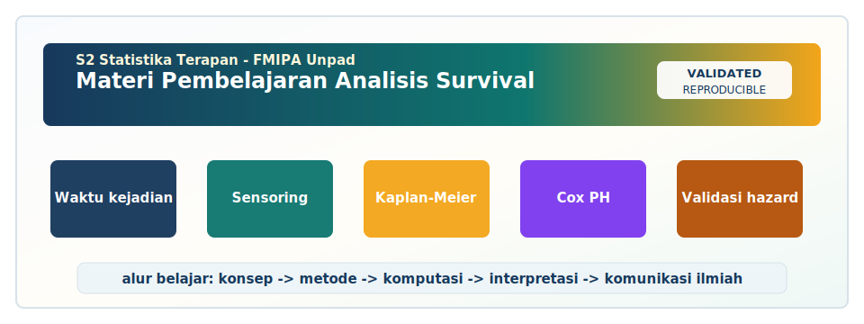

<!-- BEGIN UNPAD MATERIAL STYLE -->
<style>
:root {
  --unpad-navy: #17395c;
  --unpad-gold: #f2a51a;
  --unpad-teal: #0f766e;
  --unpad-ink: #172033;
  --unpad-paper: #fffdf8;
  --unpad-soft: #eef5f8;
  --unpad-line: #d7e2ea;
}
html, body {
  background: linear-gradient(135deg, #f8fbfd 0%, #fffdf8 48%, #f3f6ee 100%) !important;
  color: var(--unpad-ink) !important;
}
body {
  font-family: "Segoe UI", Arial, sans-serif !important;
  line-height: 1.72 !important;
}
.main-container {
  max-width: 1180px !important;
  background: rgba(255, 253, 248, 0.98) !important;
  border: 1px solid var(--unpad-line) !important;
  border-radius: 8px !important;
  box-shadow: 0 18px 42px rgba(23, 57, 92, 0.12) !important;
}
h1, h2, h3, h4 {
  letter-spacing: 0 !important;
}
h1.title {
  color: var(--unpad-navy) !important;
  -webkit-text-fill-color: var(--unpad-navy) !important;
  background: none !important;
}
h2 {
  border-left-color: var(--unpad-gold) !important;
}
a {
  color: #0b5c86 !important;
}
pre, code {
  border-radius: 8px !important;
}
.unpad-cover {
  margin: 18px 0 26px;
  padding: 24px;
  border-radius: 8px;
  background: linear-gradient(135deg, #17395c 0%, #0f766e 58%, #f2a51a 100%);
  color: #ffffff;
  box-shadow: 0 18px 36px rgba(23, 57, 92, 0.22);
}
.unpad-cover__brand {
  display: grid;
  grid-template-columns: 92px 1fr;
  gap: 20px;
  align-items: center;
}
.unpad-cover img {
  width: 92px;
  height: 92px;
  object-fit: contain;
  background: #ffffff;
  border-radius: 8px;
  padding: 8px;
  box-shadow: 0 8px 22px rgba(0,0,0,0.18);
}
.unpad-kicker {
  text-transform: uppercase;
  font-size: 0.82rem;
  font-weight: 800;
  letter-spacing: 0;
  color: #fff8dc;
}
.unpad-cover h2 {
  margin: 6px 0 8px;
  padding: 0;
  border: 0;
  background: transparent;
  color: #ffffff !important;
  font-size: 1.65rem;
}
.unpad-meta {
  margin: 0;
  color: #f7fbff;
  font-weight: 600;
}
.materi-illustration {
  margin: 20px 0 24px;
  padding: 14px;
  background: #ffffff;
  border: 1px solid var(--unpad-line);
  border-radius: 8px;
  box-shadow: 0 12px 28px rgba(23, 57, 92, 0.10);
}
.materi-illustration img {
  width: 100%;
  height: auto;
  display: block;
  border-radius: 6px;
}
.validasi-akademik {
  margin: 18px 0 28px;
  padding: 16px 18px;
  background: linear-gradient(135deg, #eef8f6, #fff8e7);
  border-left: 8px solid var(--unpad-teal);
  border-radius: 8px;
  color: var(--unpad-ink);
}
.validasi-akademik strong {
  color: var(--unpad-navy);
}
table {
  border-radius: 8px !important;
}
@media (max-width: 760px) {
  .unpad-cover__brand {
    grid-template-columns: 1fr;
  }
  .unpad-cover img {
    width: 76px;
    height: 76px;
  }
}
</style>
<!-- END UNPAD MATERIAL STYLE -->


<!-- BEGIN UNPAD MATERIAL ENHANCEMENT -->

```{r setup-unpad-render, include=FALSE}
execute_code <- FALSE
knitr::opts_chunk$set(
  echo = TRUE,
  eval = FALSE,
  message = FALSE,
  warning = FALSE,
  fig.align = "center",
  fig.width = 8,
  fig.height = 4.8,
  dpi = 120
)
set.seed(2025)
```


<div class="unpad-cover">
<div class="unpad-cover__brand">

<div>
<div class="unpad-kicker">S2 Statistika Terapan | FMIPA Universitas Padjadjaran</div>
<h2>Materi Pembelajaran Analisis Survival</h2>
<p class="unpad-meta">R Markdown HTML Profesional | Program Studi S2 Statistika Terapan FMIPA Universitas Padjadjaran<br>Penulis: Dr. Lienda Noviyanti, M.S. | Januari 2025</p>
</div>
</div>
</div>

<div class="materi-illustration">

</div>

<div class="validasi-akademik">
<strong>Catatan validasi akademik.</strong> Materi ini diseragamkan dengan rujukan ADWTL Januari 2025: rumus dibaca bersama asumsi, contoh kode diposisikan sebagai template reproducible, dan interpretasi diarahkan pada validitas data, diagnosis model, evaluasi ketidakpastian, serta komunikasi hasil secara ilmiah.
</div>

<!-- END UNPAD MATERIAL ENHANCEMENT -->

<style>
:root{
  --dark-brown:#3b2416;
  --coffee:#6f4e37;
  --caramel:#b88752;
  --cream:#fff4e1;
  --latte:#f6e3c7;
  --soft-brown:#ead2ad;
  --amber:#d99a3d;
  --ink:#1f140d;
  --paper:#fffaf2;
}
body{
  font-family: "Aptos", "Segoe UI", Arial, sans-serif;
  color: var(--ink);
  background: linear-gradient(135deg,#fff8ef 0%,#f6e0bd 38%,#d7a96d 100%);
  line-height: 1.72;
  font-size: 16.5px;
  max-width: none !important;
  margin: 0 !important;
  padding: 32px 42px 60px 340px !important;
  box-sizing: border-box;
}
body .main-container, body main, .container-fluid{
  max-width: 1100px;
  margin-left: 320px;
  margin-right: 38px;
  background: rgba(255,250,242,0.97);
  padding: 44px 56px;
  border-radius: 22px;
  box-shadow: 0 24px 70px rgba(72,42,19,.22);
}
#TOC, .tocify{
  position: fixed;
  left: 22px;
  top: 22px;
  width: 270px;
  max-height: calc(100vh - 44px);
  overflow-y: auto;
  background: linear-gradient(180deg,#4b2e1f 0%,#7b5734 50%,#c38a4a 100%);
  color: #fffaf2;
  padding: 20px 18px;
  border-radius: 22px;
  box-shadow: 0 18px 45px rgba(42,22,10,.36);
  z-index: 1000;
}
#TOC:before{
  content:"Daftar Isi";
  display:block;
  font-weight:800;
  font-size:1.25rem;
  letter-spacing:.5px;
  margin-bottom:12px;
  color:#fff6e6;
}
#TOC ul{list-style:none;padding-left:10px;margin:0;}
#TOC li{margin:7px 0;}
#TOC a{color:#fff6e6;text-decoration:none;border-bottom:1px solid rgba(255,255,255,.16);}
#TOC a:hover{color:#ffe2a8;border-bottom-color:#ffe2a8;}
h1,h2,h3,h4{
  color:#442716;
  font-weight:800;
  line-height:1.25;
}
h1{
  padding:18px 20px;
  border-radius:18px;
  color:#fffaf2;
  background: linear-gradient(120deg,#4a2d1d,#9b6b3c,#d69b4c);
  box-shadow: 0 12px 30px rgba(112,72,31,.2);
}
h2{
  border-left: 9px solid #b87936;
  padding-left: 15px;
  margin-top: 44px;
}
h3{
  color:#6a3e20;
  border-bottom:1px solid #e5c39b;
  padding-bottom:5px;
}
.title{
  font-size: 2.45rem;
  color:#442716;
}
.subtitle{color:#6f4e37;}
.author,.date{color:#5b3821;}
blockquote{
  background: linear-gradient(90deg,#fff0d7,#fae3bf);
  border-left: 8px solid #a86f3a;
  padding:16px 22px;
  border-radius: 14px;
  color:#25160d;
}
.formula-box, div.theorem, div.definition, div.example{
  background:#f6e3c7;
  color:#15100c;
  border: 1px solid #d8af78;
  border-left: 8px solid #9b6b3c;
  border-radius: 16px;
  padding: 16px 20px;
  margin: 18px 0;
  box-shadow: 0 10px 22px rgba(117,74,29,.11);
}
.formula-box strong{color:#3b2416;}
pre{
  background:#f4e4cf !important;
  color:#111 !important;
  border:1px solid #d1ad80;
  border-left:8px solid #a56d37;
  border-radius:15px;
  padding:18px;
  overflow-x:auto;
}
code{
  background:#f1dcc0;
  color:#111;
  border-radius:6px;
  padding:2px 5px;
}
pre code{
  background:transparent !important;
  color:#111 !important;
  padding:0;
}
table{
  border-collapse: collapse;
  width:100%;
  margin:20px 0;
  background:#fff8ed;
  border-radius:12px;
  overflow:hidden;
}
th{
  background:#74492b;
  color:#fff8ed;
  padding:10px;
}
td{
  border:1px solid #e1c5a4;
  padding:9px;
}
tr:nth-child(even){background:#fbebd5;}
.callout{
  background: linear-gradient(90deg,#fff7ec,#f1d3a8);
  border-left: 8px solid #d3913c;
  padding: 15px 19px;
  margin: 16px 0;
  border-radius: 15px;
}
.badge{
  display:inline-block;
  background:#7b4a27;
  color:#fff8ed;
  border-radius:999px;
  padding:4px 10px;
  font-size:.86rem;
  margin-right:5px;
}
.cover-card{
  background: linear-gradient(135deg,#432818 0%,#8b5e34 45%,#dda15e 100%);
  color:#fffaf2;
  border-radius: 28px;
  padding: 34px 38px;
  box-shadow:0 24px 70px rgba(51,30,15,.25);
  margin-bottom:30px;
}
.cover-card h1{
  background:transparent;
  box-shadow:none;
  padding:0;
  color:#fffaf2;
}
.cover-grid{
  display:grid;
  grid-template-columns: 1fr 1fr;
  gap:18px;
}
.cover-grid div{
  background:rgba(255,255,255,.13);
  border:1px solid rgba(255,255,255,.25);
  padding:14px 16px;
  border-radius:15px;
}
hr{border:0;border-top:1px solid #d9b98f;margin:32px 0;}
@media print{
  #TOC{position:relative;width:auto;max-height:none;left:auto;top:auto;}
  body .main-container, body main, .container-fluid{margin:0;box-shadow:none;}
}
@media (max-width: 980px){
  #TOC{position:relative;width:auto;max-height:none;left:auto;top:auto;margin:10px;}
  body{padding:16px !important;}
  body .main-container, body main, .container-fluid{margin:10px;padding:24px;}
  .cover-grid{grid-template-columns:1fr;}
}
</style>

```{r setup, include=FALSE, eval=FALSE}
# Ubah menjadi TRUE jika ingin menjalankan seluruh contoh kode.
execute_code <- FALSE

knitr::opts_chunk$set(
  echo = TRUE,
  eval = execute_code,
  warning = FALSE,
  message = FALSE,
  fig.width = 8,
  fig.height = 5,
  fig.align = "center"
)
```

<div class="cover-card">
<h1>Analisis Survival</h1>
<p><strong>Materi Pembelajaran R Markdown HTML</strong></p>
<div class="cover-grid">
<div><strong>Program Studi</strong><br>S2 Statistika Terapan, FMIPA Universitas Padjadjaran</div>
<div><strong>Dosen Pengampu / Penulis RPS</strong><br>Dr. Lienda Noviyanti, M.S.</div>
<div><strong>Semester</strong><br>Semester 2 | 3 SKS: Teori 2 SKS dan Praktikum 1 SKS</div>
<div><strong>Tahun Pembuatan</strong><br>Januari 2025</div>
</div>
</div>

# Prakata

Materi ini disusun sebagai bahan ajar komprehensif untuk mata kuliah **Analisis Survival** pada Program Studi **S2 Statistika Terapan, Fakultas Matematika dan Ilmu Pengetahuan Alam, Universitas Padjadjaran**. Struktur materi mengikuti RPS-OBE mata kuliah yang menempatkan analisis survival sebagai mata kuliah wajib semester 2 dengan bobot 3 SKS, yaitu 2 SKS teori dan 1 SKS praktikum. Fokus pembelajaran mencakup konsep waktu-ke-kejadian, tabel kehidupan, interpolasi usia, distribusi waktu kegagalan, data survival tidak lengkap, estimasi nonparametrik, model parametrik, model Cox, estimasi likelihood dan Bayes, implementasi R/Python, komplikasi multivariat, serta komunikasi ilmiah hasil analisis survival.

Dokumen ini sengaja dirancang dalam format **R Markdown** agar dapat digunakan sebagai e-book HTML yang memadukan narasi, rumus, kode, studi kasus, latihan, dan arahan praktikum. Nuansa visual menggunakan gradasi coklat karena warna ini memberi kesan hangat, akademik, dan nyaman dibaca lama. Rumus diletakkan pada kotak coklat muda dengan teks hitam agar tetap terbaca jelas. Kode R juga diberi latar coklat muda, bukan coklat gelap, supaya mahasiswa tidak “tersensor” oleh warna—sensor cukup di data survival saja, bukan di mata pembaca.

Secara pedagogis, materi ini menekankan tiga kompetensi besar. Pertama, mahasiswa memahami konsep survival secara benar, terutama perbedaan antara peluang survival, hazard, risiko kumulatif, dan distribusi waktu kejadian. Kedua, mahasiswa mampu mengimplementasikan metode analisis survival pada data nyata menggunakan perangkat lunak statistik. Ketiga, mahasiswa mampu menyusun interpretasi ilmiah yang relevan dengan konteks biostatistika, aktuaria, industri, sosial, dan bidang terapan lain. Pembelajaran diarahkan agar mahasiswa tidak hanya menjadi pengguna software, tetapi juga analis yang mampu menjelaskan pilihan metodologi dan implikasi hasil.

# Identitas Mata Kuliah Berdasarkan RPS

| Komponen | Informasi |
|---|---|
| Nama Mata Kuliah | Analisis Survival |
| Kode Mata Kuliah | D20B.212 |
| Rumpun Mata Kuliah | Wajib |
| Bobot | Teori 2 SKS, Praktikum 1 SKS |
| Semester | 2 |
| Dosen Pengembang RPS | Dr. Lienda Noviyanti, M.S. |
| Koordinator RMK | Dr. Lienda Noviyanti, M.S. |
| Ketua Program Studi | I Gede Nyoman Mindra Jaya, Ph.D. |
| Program Studi | S2 Statistika Terapan |
| Fakultas | FMIPA Universitas Padjadjaran |
| Tahun Materi | Januari 2025 |

# Capaian Pembelajaran

## Capaian Pembelajaran Lulusan yang Didukung

Materi ini mendukung beberapa capaian pembelajaran lulusan. Mahasiswa diharapkan mampu mengelola dan menganalisis data untuk menyelesaikan permasalahan nyata di bidang bisnis, industri, sosial, aktuaria, biostatistika, dan sains data. Mahasiswa juga diharapkan mampu mengembangkan algoritma komputasi menggunakan software statistika untuk memecahkan masalah kompleks serta menyajikan hasil dengan jelas. Pada tingkat lanjut, mahasiswa didorong untuk berpikir logis, kritis, sistematis, dan inovatif dalam riset yang memiliki dampak akademik maupun sosial.

## Capaian Pembelajaran Mata Kuliah

1. Mahasiswa mampu menganalisis konsep dasar dan aplikasi tabel kehidupan serta model survival dasar.
2. Mahasiswa mampu mengevaluasi teknik estimasi survival dan mengaplikasikan model survival parametrik maupun nonparametrik pada data yang tidak lengkap.
3. Mahasiswa mampu merancang algoritma dan mengimplementasikan model survival parametrik untuk pemecahan masalah di berbagai bidang.
4. Mahasiswa mampu mengembangkan solusi inovatif berbasis riset dan mengkomunikasikan hasil analisis survival pada lingkungan akademik atau profesional.

## Peta Sub-CPMK

| Sub-CPMK | Fokus Kemampuan | Pertemuan |
|---|---|---|
| SubCPMK1 | Menganalisis struktur tabel kehidupan, interpolasi usia, dan distribusi waktu kegagalan | 1--3 |
| SubCPMK2 | Mengevaluasi estimasi survival pada data interval, single/double decrement, dan data tidak lengkap | 4--7 |
| SubCPMK3 | Membangun dan menguji algoritma pemodelan survival parametrik dan aplikasi software | 9--12 |
| SubCPMK4 | Merancang dan mempresentasikan riset inovatif analisis survival | 13--16 |

# Cara Menggunakan Materi Ini

Mahasiswa disarankan membaca materi ini secara bertahap mengikuti urutan pertemuan. Setiap bagian berisi orientasi konsep, notasi, rumus inti, pembahasan teoritis, langkah analisis, contoh mini, implementasi R, checklist, kesalahan umum, serta latihan. Dosen dapat memilih bagian tertentu untuk kuliah tatap muka, praktikum, tugas mandiri, atau diskusi kelas. Karena dokumen ini panjang, daftar isi di sisi kiri dapat digunakan sebagai navigasi cepat.

Kode R dalam dokumen ini secara default **tidak dieksekusi** agar file HTML dapat dirender dengan aman di berbagai komputer. Jika ingin menjalankan kode, ubah nilai `execute_code <- FALSE` menjadi `execute_code <- TRUE` pada chunk `setup`. Pastikan paket yang diperlukan telah terpasang, terutama `survival`, dan bila ingin visualisasi lanjutan dapat menambahkan `survminer`, `flexsurv`, atau paket lain sesuai kebutuhan.

# Landasan Teoretis Singkat

Analisis survival merupakan kumpulan metode statistik untuk menganalisis waktu sampai kejadian. Kejadian dapat berupa kematian, kekambuhan penyakit, kegagalan mesin, klaim asuransi, churn pelanggan, atau kejadian sosial lain. Ciri khas data survival adalah kemungkinan adanya **censoring**, yaitu keadaan ketika waktu kejadian sebenarnya tidak diketahui secara lengkap, tetapi diketahui melampaui atau berada dalam rentang tertentu. Oleh karena itu, metode survival berbeda dari regresi linear atau regresi logistik biasa. Regresi logistik dapat menjawab apakah event terjadi, tetapi tidak memanfaatkan informasi kapan event terjadi. Analisis survival memanfaatkan keduanya: status event dan waktu pengamatan.

Pustaka utama yang digunakan dalam materi ini mencakup buku Kleinbaum dan Klein tentang survival analysis sebagai teks belajar mandiri, Collett tentang pemodelan survival dalam riset medis, Hosmer, Lemeshow, dan May tentang regresi untuk data waktu-ke-kejadian, serta Therneau dan Grambsch tentang perluasan model Cox. Materi juga merujuk pada artikel klasik Kaplan-Meier, Cox, Nelson, dan Aalen, serta literatur lanjutan tentang competing risks, multistate model, Bayesian survival, dan model parametrik fleksibel [@kleinbaum2012survival; @collett2015modelling; @hosmer2008applied; @therneau2000modeling].

<div class="formula-box">
<strong>Kerangka dasar survival:</strong>

$$
T\ge 0,\quad S(t)=P(T>t),\quad F(t)=1-S(t),\quad h(t)=\lim_{\Delta t\downarrow 0}\frac{P(t\le T<t+\Delta t\mid T\ge t)}{\Delta t}.
$$
</div>

# Rencana Pembelajaran 16 Pertemuan

| Pertemuan | Fokus Materi | Praktikum / Aktivitas |
|---|---|---|
| 1 | Pendahuluan analisis survival dan konsep time-to-event | Identifikasi event, time origin, dan status sensor |
| 2 | Life table, survival function, hazard function | Membangun life table sederhana |
| 3 | Interpolasi usia dan distribusi waktu kegagalan | Interpolasi linear, eksponensial, hiperbolik |
| 4 | Desain studi survival dan data tidak lengkap | Studi cohort, clinical trial, data follow-up |
| 5 | Censoring dan truncation | Identifikasi right/left/interval censoring |
| 6 | Kaplan-Meier dan Nelson-Aalen | Estimasi survival nonparametrik |
| 7 | Log-rank test, single/double decrement | Perbandingan kurva dan decrement table |
| 8 | UTS | Proyek pendahuluan, laporan, presentasi |
| 9 | Model parametrik survival | Exponential, Weibull, log-normal, log-logistic |
| 10 | Cox proportional hazards | Hazard ratio, uji asumsi PH |
| 11 | Estimasi MLE, partial likelihood, Bayes | Algoritma estimasi dan interpretasi |
| 12 | Software R/Python dan survival multivariat | Workflow analisis data nyata |
| 13 | Aplikasi survival di bidang tertentu | Biostatistika, aktuaria, industri, sosial |
| 14 | Pengembangan algoritma dan inovasi | Otomasi workflow dan big data survival |
| 15 | Komunikasi ilmiah | Laporan riset dan presentasi hasil |
| 16 | Studi kasus dan proyek akhir | Presentasi proyek akhir berbasis data nyata |

# Pertemuan 1: Pendahuluan Analisis Survival

<span class="badge">RPS</span> Pertemuan 1: konsep waktu-kejadian, ruang lingkup aplikasi, dan fondasi statistik survival.

### Orientasi Konsep

Topik **Pendahuluan Analisis Survival** menjadi bagian penting dari capaian pembelajaran karena berkaitan langsung dengan kemampuan mahasiswa untuk memahami data waktu-ke-kejadian secara metodologis, komputasional, dan aplikatif. Dalam RPS, topik ini ditempatkan sebagai bagian dari alur pembelajaran yang bergerak dari konsep dasar, estimasi, pemodelan, implementasi perangkat lunak, sampai komunikasi hasil. Fokus utamanya adalah time-to-event, event, censoring, survival function, hazard. Dengan menguasai topik ini, mahasiswa tidak hanya mampu menjalankan fungsi dalam perangkat lunak, tetapi juga dapat membangun argumen statistik yang logis dan dapat dipertanggungjawabkan [@kleinbaum2012survival; @collett2015modelling].

Pertemuan 1: konsep waktu-kejadian, ruang lingkup aplikasi, dan fondasi statistik survival. Pada konteks Program Studi S2 Statistika Terapan, penekanan pembelajaran diarahkan pada pemahaman konsep, penguasaan formulasi, kemampuan menyusun workflow analisis, dan kemampuan menjelaskan hasil kepada audiens akademik maupun profesional. Dengan kata lain, mahasiswa tidak cukup hanya menghasilkan tabel output; mahasiswa harus mampu menjelaskan alasan pemilihan metode, asumsi yang digunakan, konsekuensi dari sensor, dan implikasi hasil bagi masalah nyata.

Contoh konteks yang relevan untuk topik ini adalah waktu sampai pasien mengalami kekambuhan setelah terapi, waktu sampai mesin gagal, dan waktu sampai nasabah menghentikan polis asuransi. Kasus-kasus tersebut memperlihatkan bahwa survival analysis tidak hanya milik biostatistika. Ia juga muncul dalam aktuaria, teknik industri, pendidikan, ekonomi, pemasaran, ilmu sosial, epidemiologi, dan sains data. Perbedaan bidang aplikasi akan memengaruhi bahasa interpretasi, tetapi kerangka statistik dasarnya tetap berpijak pada definisi event, waktu observasi, status sensor, dan mekanisme risiko.

### Notasi dan Rumus Inti

<div class="formula-box">
<strong>Rumus kunci:</strong>

$$
S(t)=P(T>t),\qquad F(t)=P(T\le t)=1-S(t)
$$
</div>

Rumus di atas perlu dibaca sebagai bahasa probabilistik, bukan sekadar simbol. Dalam survival analysis, simbol \(T\) umumnya menyatakan waktu sampai event, \(S(t)\) menyatakan peluang bahwa event belum terjadi sampai melewati waktu \(t\), \(h(t)\) menyatakan laju risiko sesaat pada waktu \(t\), dan \(x\) menyatakan kovariat atau faktor penjelas. Ketika model melibatkan kovariat, interpretasi harus diarahkan pada bagaimana perubahan kovariat mengubah pola risiko atau waktu survival. Pada topik **Pendahuluan Analisis Survival**, rumus tersebut berfungsi sebagai jembatan antara teori, estimasi, dan keputusan substantif.

Pemahaman rumus harus disertai perhatian pada satuan waktu. Satuan hari, minggu, bulan, atau tahun tidak boleh dicampur tanpa transformasi yang jelas. Bila data dikumpulkan dalam bulan tetapi dilaporkan dalam tahun, seluruh interpretasi hazard, median survival, dan prediksi survival harus mengikuti transformasi tersebut. Kesalahan kecil pada satuan dapat menghasilkan rekomendasi yang tampak ilmiah tetapi keliru secara praktis. Dalam laporan profesional, satuan waktu sebaiknya dituliskan pada judul tabel, label sumbu grafik, dan uraian interpretasi.

### Pembahasan Teoritis

Dalam analisis survival, unit analisis tidak hanya direduksi menjadi status akhir, tetapi dilihat sebagai proses yang berlangsung sepanjang waktu. Perspektif ini penting karena dua individu yang sama-sama belum mengalami event dapat membawa informasi yang berbeda bila lama observasinya berbeda. Seseorang yang diikuti selama 2 minggu tentu tidak memberi informasi yang sama dengan seseorang yang diikuti selama 2 tahun. Oleh karena itu, analisis survival memadukan dua dimensi sekaligus: durasi pengamatan dan status kejadian. Ini membuat pendekatan survival lebih kaya daripada regresi biasa ketika tujuan riset berkaitan dengan kapan suatu kejadian terjadi. Pada bagian **Pendahuluan Analisis Survival**, perhatian khusus diberikan pada time-to-event, event, censoring.

Kekuatan utama pendekatan survival adalah kemampuannya menangani data tidak lengkap secara eksplisit. Dalam banyak studi nyata, tidak semua subjek mengalami event sebelum penelitian berakhir. Ada subjek yang keluar dari studi, berpindah fasilitas, belum mengalami kerusakan produk, atau masih hidup ketika data dianalisis. Data seperti ini tidak boleh dibuang begitu saja karena tetap mengandung informasi tentang batas bawah waktu survival. Mengabaikan sensor dapat menghasilkan bias yang cukup serius, ibarat menghitung waktu tempuh lomba lari tetapi menghapus peserta yang belum sampai garis finis—hasilnya pasti terlalu optimis atau terlalu pesimis tergantung pola penghapusannya. Hal ini sejalan dengan fokus RPS pada pertemuan 1: konsep waktu-kejadian, ruang lingkup aplikasi, dan fondasi statistik survival.

Secara konseptual, fungsi survival, fungsi hazard, dan fungsi densitas menggambarkan sisi yang berbeda dari fenomena yang sama. Fungsi survival menjawab pertanyaan peluang bertahan melewati waktu tertentu. Fungsi densitas menggambarkan distribusi waktu kejadian. Fungsi hazard menyatakan laju risiko sesaat di antara subjek yang masih berada dalam keadaan berisiko. Ketiga fungsi tersebut saling terkait; pemahaman atas keterkaitan ini membantu mahasiswa menafsirkan output perangkat lunak dengan lebih tajam, bukan sekadar membaca angka p-value seperti membaca ramalan cuaca tanpa melihat langit. Pada bagian **Pendahuluan Analisis Survival**, perhatian khusus diberikan pada time-to-event, event, censoring.

Dalam praktik penelitian, analisis survival selalu perlu dimulai dengan definisi event yang tegas. Event dapat berupa kematian, relaps, kegagalan mesin, churn pelanggan, klaim asuransi, kelulusan, atau kejadian sosial lain. Definisi event yang kabur akan merusak interpretasi model, karena waktu survival hanya bermakna jika titik awal, titik akhir, dan status observasi dinyatakan konsisten. Sebelum model dijalankan, peneliti perlu menanyakan: kapan risiko mulai dihitung, apa event utama, bagaimana sensor terjadi, dan apakah terdapat kejadian pesaing. Hal ini sejalan dengan fokus RPS pada pertemuan 1: konsep waktu-kejadian, ruang lingkup aplikasi, dan fondasi statistik survival.

Model survival yang baik tidak hanya ditentukan oleh kecanggihan matematis, tetapi juga oleh kecocokan antara asumsi model dan mekanisme data. Model Exponential sederhana dan elegan, tetapi mengasumsikan hazard konstan. Model Weibull lebih fleksibel karena hazard dapat meningkat atau menurun secara monoton. Model Cox menghindari spesifikasi baseline hazard, tetapi membutuhkan asumsi proportional hazards. Di sinilah seni statistik bekerja: bukan memilih model paling 'mahal', melainkan model yang secara ilmiah masuk akal, secara statistik sah, dan secara komunikasi dapat dipertanggungjawabkan. Pada bagian **Pendahuluan Analisis Survival**, perhatian khusus diberikan pada time-to-event, event, censoring.

Dalam pembelajaran tingkat magister, mahasiswa diharapkan tidak berhenti pada penggunaan perangkat lunak. Output software harus dikembalikan ke pertanyaan substantif: apa makna median survival, bagaimana hazard ratio diterjemahkan, kelompok mana yang memiliki risiko lebih tinggi, dan seberapa besar ketidakpastian inferensi. Laporan yang baik menempatkan angka statistik dalam konteks aplikasi. Jika grafik survival turun tajam pada awal waktu, peneliti harus mampu menjelaskan apakah itu menunjukkan risiko awal tinggi, kesalahan desain follow-up, atau karakteristik populasi yang memang rentan. Hal ini sejalan dengan fokus RPS pada pertemuan 1: konsep waktu-kejadian, ruang lingkup aplikasi, dan fondasi statistik survival.

Analisis survival juga menuntut disiplin visualisasi. Kurva Kaplan-Meier, cumulative hazard plot, log-minus-log plot, residual plot, dan forest plot hazard ratio dapat membantu pembaca melihat pola data sebelum menerima kesimpulan model. Visualisasi bukan hiasan; visualisasi adalah alat diagnostik dan alat komunikasi. Dalam laporan profesional, grafik harus diberi label jelas, menyebut jumlah subjek berisiko bila memungkinkan, dan tidak memaksa pembaca menebak satuan waktu atau definisi event. Pada bagian **Pendahuluan Analisis Survival**, perhatian khusus diberikan pada time-to-event, event, censoring.

Dari sisi komputasi, R Markdown menjadi media yang sangat tepat untuk mata kuliah ini karena menggabungkan narasi, rumus, kode, output, dan interpretasi dalam satu dokumen. Mahasiswa dapat menulis proses analisis secara reproducible: data dibaca, dibersihkan, dimodelkan, divisualisasikan, lalu ditafsirkan. Dengan demikian, laporan survival bukan hanya berisi hasil akhir, tetapi juga jejak analisis yang dapat diperiksa ulang. Ini sangat penting dalam riset akademik dan konsultasi statistik profesional. Hal ini sejalan dengan fokus RPS pada pertemuan 1: konsep waktu-kejadian, ruang lingkup aplikasi, dan fondasi statistik survival.

### Langkah Analisis yang Direkomendasikan

Langkah analisis pada topik ini dapat dirancang sebagai workflow berikut.

1. **Definisikan event dan waktu awal.** Tentukan secara eksplisit kapan subjek mulai berada dalam risiko dan kejadian apa yang disebut event.
2. **Identifikasi struktur data.** Pastikan variabel waktu, status event, kovariat, kelompok, dan potensi sensor sudah dikodekan dengan benar.
3. **Lakukan eksplorasi awal.** Ringkas jumlah event, jumlah sensor, rentang waktu, distribusi kovariat, dan pola missing value.
4. **Gunakan estimasi atau model yang sesuai.** Pilih estimator atau model berdasarkan tujuan inferensi, bentuk sensor, dan asumsi substantif.
5. **Periksa asumsi dan diagnostik.** Lihat residual, plot, ukuran goodness-of-fit, serta konsistensi hasil dengan pengetahuan domain.
6. **Komunikasikan hasil.** Terjemahkan estimasi ke dalam bahasa risiko, peluang survival, median survival, hazard ratio, atau rekomendasi praktis.

Pada tahap eksplorasi, mahasiswa sebaiknya tidak langsung melompat ke model lanjutan. Tabel deskriptif sederhana sering kali mengungkap masalah besar: status event tertukar, waktu bernilai negatif, follow-up tidak konsisten, atau kategori kelompok tidak seimbang. Kesalahan pra-pemodelan seperti ini lebih berbahaya daripada kesalahan memilih warna grafik. Statistik bisa memaafkan variasi data, tetapi tidak memaafkan variabel status yang salah kode.

Pada tahap pemodelan, istilah kunci seperti **time-to-event**, **event**, dan **censoring** harus diterjemahkan ke dalam pilihan model dan output yang spesifik. Misalnya, bila topik menekankan Kaplan-Meier, maka fokus utama adalah estimasi survival nonparametrik dan perbandingan kurva. Bila topik menekankan Cox PH, maka interpretasi hazard ratio dan uji proportional hazards menjadi krusial. Bila topik menekankan parametric survival, maka distribusi baseline dan kecocokan model harus dibahas dengan cermat.

#### Pendalaman Substantif

Dalam konteks **Pendahuluan Analisis Survival**, kata kunci seperti **time-to-event**, **event**, **censoring**, **survival function**, dan **hazard** harus dipahami sebagai bagian dari satu sistem analitik. Setiap istilah memiliki peran dalam membangun jawaban terhadap pertanyaan riset. Jika pertanyaan riset menekankan estimasi peluang bertahan hidup, maka kurva survival dan interval kepercayaannya menjadi pusat pembahasan. Jika pertanyaan riset menekankan faktor risiko, maka model regresi survival lebih relevan. Jika pertanyaan riset menekankan prediksi individual, maka validasi, kalibrasi, dan ukuran diskriminasi menjadi sangat penting. Pemilihan fokus ini sebaiknya dilakukan sebelum analisis dijalankan agar laporan tidak berubah menjadi kumpulan output tanpa arah.

Dalam desain pembelajaran, mahasiswa perlu membedakan tujuan **deskriptif**, **inferensial**, **prediktif**, dan **keputusan**. Analisis deskriptif merangkum pola survival yang diamati. Analisis inferensial menguji atau mengestimasi hubungan antara kovariat dan waktu kejadian. Analisis prediktif bertujuan memperkirakan risiko masa depan pada individu atau kelompok. Analisis keputusan menggunakan hasil survival untuk memilih intervensi atau kebijakan. Keempat tujuan itu dapat menggunakan data yang sama, tetapi memerlukan metrik keberhasilan yang berbeda. Pada topik ini, dosen dapat meminta mahasiswa menyatakan tujuan utama analisis sebelum memilih metode, supaya kereta statistik tidak berangkat sebelum relnya dipasang.

Aspek penting lain adalah **ketidakpastian**. Setiap estimasi survival, hazard, median survival, atau hazard ratio memiliki ketidakpastian yang perlu dilaporkan. Interval kepercayaan atau credible interval tidak hanya menjadi pelengkap tabel, tetapi memberi informasi tentang presisi dan kekuatan bukti. Dalam sampel kecil, interval dapat sangat lebar, terutama pada bagian akhir follow-up. Ketika hasil tidak presisi, kesimpulan harus disampaikan dengan bahasa hati-hati. Pernyataan seperti “terdapat indikasi” atau “estimasi menunjukkan kecenderungan” sering kali lebih jujur daripada klaim tegas yang tidak didukung data.

Mahasiswa juga perlu memeriksa apakah data mencerminkan populasi target. Dalam survival analysis, masalah seleksi dapat muncul melalui truncation, kriteria inklusi, kehilangan follow-up, atau perbedaan waktu rekrutmen. Bila hanya subjek yang bertahan cukup lama yang masuk dataset, estimasi survival dapat terlalu optimis. Bila subjek berisiko tinggi lebih sering keluar dari studi, sensor mungkin tidak independen. Asumsi sensor non-informatif sering dipakai, tetapi dalam laporan ilmiah, asumsi ini sebaiknya disebutkan dan didiskusikan, khususnya bila mekanisme sensor terkait dengan kondisi subjek.

Dari sisi praktikum, topik ini dapat diajarkan melalui dua lapisan. Lapisan pertama adalah **perhitungan manual sederhana** menggunakan dataset kecil agar mahasiswa memahami risk set, event, sensor, dan perkalian peluang survival. Lapisan kedua adalah **implementasi perangkat lunak** pada dataset yang lebih realistis. Kombinasi keduanya penting: perhitungan manual memberi intuisi, sedangkan perangkat lunak memberi kemampuan menangani data nyata. Jika hanya manual, mahasiswa sulit melihat kompleksitas. Jika hanya software, mahasiswa bisa menjadi operator tombol. Keduanya harus saling menguatkan.

Pada penulisan laporan, setiap grafik survival sebaiknya diikuti interpretasi. Grafik tanpa interpretasi seperti peta tanpa legenda: tampak menarik tetapi kurang berguna. Mahasiswa dapat menulis interpretasi dengan pola: sebutkan pola umum, jelaskan perbedaan antar-kelompok, tunjukkan waktu penting, ungkapkan ketidakpastian, lalu hubungkan dengan konteks. Misalnya, “Kurva kelompok A turun lebih cepat pada 6 bulan pertama, menunjukkan risiko awal yang lebih tinggi. Namun setelah 18 bulan jumlah subjek berisiko kecil sehingga perbedaan pada ekor kurva harus ditafsirkan hati-hati.” Pola ini sederhana, tetapi sangat membantu pembaca.

Dalam konteks etika dan dampak sosial, analisis survival dapat memengaruhi keputusan penting: prioritas pasien, premi asuransi, jadwal pemeliharaan mesin, atau intervensi sosial. Oleh karena itu, model perlu transparan dan dapat dijelaskan. Ketika model menunjukkan kelompok tertentu memiliki risiko lebih tinggi, peneliti harus berhati-hati agar hasil tidak digunakan untuk stigmatisasi. Rekomendasi sebaiknya diarahkan pada perbaikan layanan, pencegahan risiko, dan peningkatan efisiensi, bukan sekadar pelabelan kelompok. Hal ini sejalan dengan orientasi pembelajaran yang menekankan solusi inovatif dan dampak positif bagi masyarakat.

Sebagai penutup bagian ini, topik **Pendahuluan Analisis Survival** perlu dipahami sebagai komponen dari ekosistem analisis survival yang lebih luas. Mahasiswa yang menguasai topik ini akan lebih siap mengerjakan tugas analisis tabel kehidupan, evaluasi data tidak lengkap, proyek model parametrik, serta proyek riset akhir. Kemampuan tersebut juga mendukung kompetensi lulusan dalam mengelola data, mengembangkan algoritma komputasi, berpikir kritis, dan mengkomunikasikan hasil analisis secara profesional.

### Contoh Mini dan Interpretasi

Misalkan tersedia data sederhana tentang waktu sampai pasien mengalami kekambuhan setelah terapi, waktu sampai mesin gagal, dan waktu sampai nasabah menghentikan polis asuransi. Setiap baris data berisi identitas subjek, waktu observasi, status event, dan beberapa kovariat. Variabel status biasanya diberi nilai 1 bila event terjadi dan 0 bila observasi tersensor. Dalam praktik, peneliti harus memastikan definisi ini konsisten. Ada dataset yang menggunakan status 1 untuk sensor dan 2 untuk event; ada pula yang menggunakan teks seperti `"dead"`, `"alive"`, `"failed"`, atau `"censored"`. Kesalahan membaca kode status dapat membalik seluruh kesimpulan.

Interpretasi awal dilakukan dengan menghitung proporsi event, median waktu observasi, serta distribusi waktu berdasarkan kelompok. Jika satu kelompok memiliki follow-up jauh lebih pendek daripada kelompok lain, perbandingan survival perlu dibaca hati-hati karena perbedaan kurva bisa mencerminkan desain pengamatan, bukan semata-mata efek kelompok. Selain itu, jumlah subjek berisiko pada waktu ekor kurva biasanya kecil sehingga ketidakpastian meningkat. Bagian ekor kurva Kaplan-Meier sering terlihat dramatis, tetapi kadang hanya didukung oleh sedikit observasi; di sinilah kehati-hatian ilmiah diperlukan.

Sebagai contoh interpretasi: bila estimasi survival pada bulan ke-12 adalah 0,72, maka sekitar 72% subjek diperkirakan belum mengalami event sampai melewati 12 bulan. Jika hazard ratio untuk kelompok intervensi terhadap kontrol adalah 0,65, maka pada setiap waktu, kelompok intervensi memiliki hazard sekitar 35% lebih rendah daripada kontrol, dengan catatan asumsi proportional hazards terpenuhi. Interpretasi ini tidak boleh diubah menjadi “probabilitas event 35% lebih rendah” tanpa konteks karena hazard bukan probabilitas kumulatif.

### Implementasi R

    Kode berikut bersifat *template* pembelajaran. Pada laporan mahasiswa, bagian simulasi dapat diganti dengan data nyata sesuai proyek. Variabel minimal yang dibutuhkan adalah waktu observasi dan status event. Kovariat dapat ditambahkan sesuai pertanyaan penelitian.


```{r contoh-1, eval=FALSE}
# Contoh kode R untuk topik: Pendahuluan Analisis Survival
# Paket utama:
# install.packages(c("survival", "survminer"))
library(survival)

set.seed(2025)
n <- 180
x1 <- rbinom(n, 1, 0.45)
age <- round(rnorm(n, mean = 52, sd = 10), 1)

# Simulasi waktu event dengan hazard dasar dan efek kovariat
rate <- 0.06 * exp(0.55*x1 + 0.018*(age-50))
time_event <- rexp(n, rate = rate)
time_cens  <- rexp(n, rate = 0.035)

time <- pmin(time_event, time_cens)
status <- as.integer(time_event <= time_cens)

dat <- data.frame(
  id = 1:n,
  time = round(time, 2),
  status = status,
  group = factor(x1, labels = c("Kontrol", "Intervensi")),
  age = age
)

head(dat)
table(dat$status)
summary(dat$time)

# Objek survival
Sobj <- Surv(time = dat$time, event = dat$status)

# Kaplan-Meier menurut kelompok
fit_km <- survfit(Sobj ~ group, data = dat)
print(fit_km)

plot(fit_km, xlab = "Waktu", ylab = "Peluang Survival",
     main = "Kurva Kaplan-Meier: Pendahuluan Analisis Survival")
legend("topright", legend = levels(dat$group), lty = 1:2, bty = "n")

# Cox proportional hazards
fit_cox <- coxph(Sobj ~ group + age, data = dat)
summary(fit_cox)

# Diagnostik proportional hazards
cox.zph(fit_cox)
```


    Dalam interpretasi kode di atas, `Surv(time, status)` membangun objek survival. Fungsi `survfit()` digunakan untuk estimasi Kaplan-Meier, sedangkan `coxph()` digunakan untuk model Cox proportional hazards. Bila topik yang sedang dibahas adalah model parametrik, mahasiswa dapat menggunakan fungsi `survreg()` untuk model accelerated failure time, atau paket lain seperti `flexsurv` bila ingin membandingkan distribusi Weibull, log-normal, dan log-logistic secara lebih eksplisit. Karena dokumen ini dirancang sebagai bahan ajar HTML, sebagian chunk dapat dijalankan ulang oleh mahasiswa di RStudio dengan mengubah nilai `execute_code <- TRUE` pada bagian awal dokumen.

### Checklist Kualitas Analisis

    - Apakah definisi event pada topik **Pendahuluan Analisis Survival** sudah jelas dan konsisten?
- Apakah waktu awal observasi sama maknanya untuk seluruh subjek?
- Apakah tipe sensor sudah diidentifikasi sebelum memilih model?
- Apakah jumlah subjek berisiko pada bagian ekor kurva masih memadai?
- Apakah asumsi model telah diuji atau setidaknya dibahas secara substantif?
- Apakah hasil diterjemahkan ke dalam bahasa aplikasi, bukan hanya bahasa output software?
- Apakah visualisasi memuat label sumbu, satuan waktu, dan keterangan kelompok?
- Apakah laporan memuat keterbatasan dan implikasi praktis?

    Checklist ini dapat digunakan sebelum mahasiswa mengumpulkan tugas atau proyek. Untuk mata kuliah tingkat magister, kualitas analisis tidak hanya dilihat dari benar tidaknya sintaks. Kualitas juga dilihat dari ketepatan argumen, kewajaran asumsi, kedalaman interpretasi, dan kemampuan menghubungkan hasil dengan masalah nyata. Laporan yang hanya berisi screenshot output biasanya belum memenuhi standar ilmiah karena pembaca tidak melihat proses berpikir statistiknya.

### Kesalahan Umum yang Perlu Dihindari

Kesalahan pertama adalah memperlakukan data tersensor sebagai data hilang biasa. Sensor bukan sekadar missing value; sensor memiliki informasi waktu sampai batas tertentu. Menghapus observasi tersensor dapat mengubah estimasi survival secara substansial. Kesalahan kedua adalah menyimpulkan bahwa kurva survival berbeda hanya karena terlihat terpisah, tanpa melihat ketidakpastian, jumlah subjek berisiko, dan uji komparatif yang relevan. Kesalahan ketiga adalah menafsirkan hazard ratio sebagai rasio probabilitas event kumulatif. Hazard ratio bekerja pada laju risiko sesaat, sehingga narasinya harus dijaga.

Kesalahan lain yang sering muncul adalah mengabaikan asumsi proportional hazards pada model Cox. Bila asumsi ini dilanggar, satu hazard ratio konstan dapat menyembunyikan efek yang berubah sepanjang waktu. Dalam keadaan tersebut, peneliti dapat mempertimbangkan interaksi dengan waktu, stratified Cox model, model parametrik fleksibel, atau pendekatan lain yang sesuai. Untuk topik **Pendahuluan Analisis Survival**, kesalahan-kesalahan ini perlu dibahas secara terbuka agar mahasiswa mampu membuat keputusan metodologis, bukan hanya mengikuti tombol default perangkat lunak.

### Latihan, Praktikum, dan Diskusi

**Latihan konsep.** Jelaskan perbedaan antara peluang survival, hazard, dan risiko kumulatif dengan menggunakan contoh nyata dari bidang kesehatan, aktuaria, industri, atau sosial. Gunakan maksimal satu halaman dan sertakan minimal satu grafik sederhana.

**Latihan komputasi.** Gunakan data simulasi pada chunk R sebelumnya, lalu ubah proporsi sensor dengan mengganti parameter `rate` pada `time_cens`. Amati perubahan kurva Kaplan-Meier, median survival, dan kestabilan estimasi pada bagian ekor kurva. Jelaskan bagaimana sensor yang lebih berat memengaruhi inferensi.

**Latihan interpretasi.** Buat narasi 150--250 kata untuk menjelaskan hasil model kepada audiens non-statistisi. Hindari istilah teknis yang tidak dijelaskan. Misalnya, bila menggunakan hazard ratio, jelaskan bahwa ukuran tersebut menggambarkan perbandingan laju kejadian pada setiap waktu, bukan peluang absolut event dalam seluruh periode.

**Diskusi kelas.** Dalam konteks **Pendahuluan Analisis Survival**, kapan model sederhana lebih baik daripada model kompleks? Diskusikan dari sisi asumsi, ukuran sampel, kemudahan komunikasi, validasi, dan dampak keputusan. Mahasiswa dapat membawa contoh artikel, laporan rumah sakit, laporan aktuaria, atau studi industri untuk memperkaya diskusi.

# Pertemuan 2: Struktur Data Survival dan Tabel Kehidupan

<span class="badge">RPS</span> Pertemuan 1--3: struktur life table, fungsi survival, fungsi hazard, dan interpretasi tabel kehidupan.

### Orientasi Konsep

Topik **Struktur Data Survival dan Tabel Kehidupan** menjadi bagian penting dari capaian pembelajaran karena berkaitan langsung dengan kemampuan mahasiswa untuk memahami data waktu-ke-kejadian secara metodologis, komputasional, dan aplikatif. Dalam RPS, topik ini ditempatkan sebagai bagian dari alur pembelajaran yang bergerak dari konsep dasar, estimasi, pemodelan, implementasi perangkat lunak, sampai komunikasi hasil. Fokus utamanya adalah life table, risk set, interval, deaths, withdrawals. Dengan menguasai topik ini, mahasiswa tidak hanya mampu menjalankan fungsi dalam perangkat lunak, tetapi juga dapat membangun argumen statistik yang logis dan dapat dipertanggungjawabkan [@kleinbaum2012survival; @lawless2003statistical].

Pertemuan 1--3: struktur life table, fungsi survival, fungsi hazard, dan interpretasi tabel kehidupan. Pada konteks Program Studi S2 Statistika Terapan, penekanan pembelajaran diarahkan pada pemahaman konsep, penguasaan formulasi, kemampuan menyusun workflow analisis, dan kemampuan menjelaskan hasil kepada audiens akademik maupun profesional. Dengan kata lain, mahasiswa tidak cukup hanya menghasilkan tabel output; mahasiswa harus mampu menjelaskan alasan pemilihan metode, asumsi yang digunakan, konsekuensi dari sensor, dan implikasi hasil bagi masalah nyata.

Contoh konteks yang relevan untuk topik ini adalah tabel kematian kelompok umur, masa pakai produk garansi, dan masa tunggu alumni memperoleh pekerjaan pertama. Kasus-kasus tersebut memperlihatkan bahwa survival analysis tidak hanya milik biostatistika. Ia juga muncul dalam aktuaria, teknik industri, pendidikan, ekonomi, pemasaran, ilmu sosial, epidemiologi, dan sains data. Perbedaan bidang aplikasi akan memengaruhi bahasa interpretasi, tetapi kerangka statistik dasarnya tetap berpijak pada definisi event, waktu observasi, status sensor, dan mekanisme risiko.

### Notasi dan Rumus Inti

<div class="formula-box">
<strong>Rumus kunci:</strong>

$$
\hat{q}_j=\frac{d_j}{n_j-\frac{1}{2}w_j},\qquad \hat{p}_j=1-\hat{q}_j,\qquad \hat{S}(t_j)=\prod_{k\le j}\hat{p}_k
$$
</div>

Rumus di atas perlu dibaca sebagai bahasa probabilistik, bukan sekadar simbol. Dalam survival analysis, simbol \(T\) umumnya menyatakan waktu sampai event, \(S(t)\) menyatakan peluang bahwa event belum terjadi sampai melewati waktu \(t\), \(h(t)\) menyatakan laju risiko sesaat pada waktu \(t\), dan \(x\) menyatakan kovariat atau faktor penjelas. Ketika model melibatkan kovariat, interpretasi harus diarahkan pada bagaimana perubahan kovariat mengubah pola risiko atau waktu survival. Pada topik **Struktur Data Survival dan Tabel Kehidupan**, rumus tersebut berfungsi sebagai jembatan antara teori, estimasi, dan keputusan substantif.

Pemahaman rumus harus disertai perhatian pada satuan waktu. Satuan hari, minggu, bulan, atau tahun tidak boleh dicampur tanpa transformasi yang jelas. Bila data dikumpulkan dalam bulan tetapi dilaporkan dalam tahun, seluruh interpretasi hazard, median survival, dan prediksi survival harus mengikuti transformasi tersebut. Kesalahan kecil pada satuan dapat menghasilkan rekomendasi yang tampak ilmiah tetapi keliru secara praktis. Dalam laporan profesional, satuan waktu sebaiknya dituliskan pada judul tabel, label sumbu grafik, dan uraian interpretasi.

### Pembahasan Teoritis

Dalam analisis survival, unit analisis tidak hanya direduksi menjadi status akhir, tetapi dilihat sebagai proses yang berlangsung sepanjang waktu. Perspektif ini penting karena dua individu yang sama-sama belum mengalami event dapat membawa informasi yang berbeda bila lama observasinya berbeda. Seseorang yang diikuti selama 2 minggu tentu tidak memberi informasi yang sama dengan seseorang yang diikuti selama 2 tahun. Oleh karena itu, analisis survival memadukan dua dimensi sekaligus: durasi pengamatan dan status kejadian. Ini membuat pendekatan survival lebih kaya daripada regresi biasa ketika tujuan riset berkaitan dengan kapan suatu kejadian terjadi. Pada bagian **Struktur Data Survival dan Tabel Kehidupan**, perhatian khusus diberikan pada life table, risk set, interval.

Kekuatan utama pendekatan survival adalah kemampuannya menangani data tidak lengkap secara eksplisit. Dalam banyak studi nyata, tidak semua subjek mengalami event sebelum penelitian berakhir. Ada subjek yang keluar dari studi, berpindah fasilitas, belum mengalami kerusakan produk, atau masih hidup ketika data dianalisis. Data seperti ini tidak boleh dibuang begitu saja karena tetap mengandung informasi tentang batas bawah waktu survival. Mengabaikan sensor dapat menghasilkan bias yang cukup serius, ibarat menghitung waktu tempuh lomba lari tetapi menghapus peserta yang belum sampai garis finis—hasilnya pasti terlalu optimis atau terlalu pesimis tergantung pola penghapusannya. Hal ini sejalan dengan fokus RPS pada pertemuan 1--3: struktur life table, fungsi survival, fungsi hazard, dan interpretasi tabel kehidupan.

Secara konseptual, fungsi survival, fungsi hazard, dan fungsi densitas menggambarkan sisi yang berbeda dari fenomena yang sama. Fungsi survival menjawab pertanyaan peluang bertahan melewati waktu tertentu. Fungsi densitas menggambarkan distribusi waktu kejadian. Fungsi hazard menyatakan laju risiko sesaat di antara subjek yang masih berada dalam keadaan berisiko. Ketiga fungsi tersebut saling terkait; pemahaman atas keterkaitan ini membantu mahasiswa menafsirkan output perangkat lunak dengan lebih tajam, bukan sekadar membaca angka p-value seperti membaca ramalan cuaca tanpa melihat langit. Pada bagian **Struktur Data Survival dan Tabel Kehidupan**, perhatian khusus diberikan pada life table, risk set, interval.

Dalam praktik penelitian, analisis survival selalu perlu dimulai dengan definisi event yang tegas. Event dapat berupa kematian, relaps, kegagalan mesin, churn pelanggan, klaim asuransi, kelulusan, atau kejadian sosial lain. Definisi event yang kabur akan merusak interpretasi model, karena waktu survival hanya bermakna jika titik awal, titik akhir, dan status observasi dinyatakan konsisten. Sebelum model dijalankan, peneliti perlu menanyakan: kapan risiko mulai dihitung, apa event utama, bagaimana sensor terjadi, dan apakah terdapat kejadian pesaing. Hal ini sejalan dengan fokus RPS pada pertemuan 1--3: struktur life table, fungsi survival, fungsi hazard, dan interpretasi tabel kehidupan.

Model survival yang baik tidak hanya ditentukan oleh kecanggihan matematis, tetapi juga oleh kecocokan antara asumsi model dan mekanisme data. Model Exponential sederhana dan elegan, tetapi mengasumsikan hazard konstan. Model Weibull lebih fleksibel karena hazard dapat meningkat atau menurun secara monoton. Model Cox menghindari spesifikasi baseline hazard, tetapi membutuhkan asumsi proportional hazards. Di sinilah seni statistik bekerja: bukan memilih model paling 'mahal', melainkan model yang secara ilmiah masuk akal, secara statistik sah, dan secara komunikasi dapat dipertanggungjawabkan. Pada bagian **Struktur Data Survival dan Tabel Kehidupan**, perhatian khusus diberikan pada life table, risk set, interval.

Dalam pembelajaran tingkat magister, mahasiswa diharapkan tidak berhenti pada penggunaan perangkat lunak. Output software harus dikembalikan ke pertanyaan substantif: apa makna median survival, bagaimana hazard ratio diterjemahkan, kelompok mana yang memiliki risiko lebih tinggi, dan seberapa besar ketidakpastian inferensi. Laporan yang baik menempatkan angka statistik dalam konteks aplikasi. Jika grafik survival turun tajam pada awal waktu, peneliti harus mampu menjelaskan apakah itu menunjukkan risiko awal tinggi, kesalahan desain follow-up, atau karakteristik populasi yang memang rentan. Hal ini sejalan dengan fokus RPS pada pertemuan 1--3: struktur life table, fungsi survival, fungsi hazard, dan interpretasi tabel kehidupan.

Analisis survival juga menuntut disiplin visualisasi. Kurva Kaplan-Meier, cumulative hazard plot, log-minus-log plot, residual plot, dan forest plot hazard ratio dapat membantu pembaca melihat pola data sebelum menerima kesimpulan model. Visualisasi bukan hiasan; visualisasi adalah alat diagnostik dan alat komunikasi. Dalam laporan profesional, grafik harus diberi label jelas, menyebut jumlah subjek berisiko bila memungkinkan, dan tidak memaksa pembaca menebak satuan waktu atau definisi event. Pada bagian **Struktur Data Survival dan Tabel Kehidupan**, perhatian khusus diberikan pada life table, risk set, interval.

Dari sisi komputasi, R Markdown menjadi media yang sangat tepat untuk mata kuliah ini karena menggabungkan narasi, rumus, kode, output, dan interpretasi dalam satu dokumen. Mahasiswa dapat menulis proses analisis secara reproducible: data dibaca, dibersihkan, dimodelkan, divisualisasikan, lalu ditafsirkan. Dengan demikian, laporan survival bukan hanya berisi hasil akhir, tetapi juga jejak analisis yang dapat diperiksa ulang. Ini sangat penting dalam riset akademik dan konsultasi statistik profesional. Hal ini sejalan dengan fokus RPS pada pertemuan 1--3: struktur life table, fungsi survival, fungsi hazard, dan interpretasi tabel kehidupan.

### Langkah Analisis yang Direkomendasikan

Langkah analisis pada topik ini dapat dirancang sebagai workflow berikut.

1. **Definisikan event dan waktu awal.** Tentukan secara eksplisit kapan subjek mulai berada dalam risiko dan kejadian apa yang disebut event.
2. **Identifikasi struktur data.** Pastikan variabel waktu, status event, kovariat, kelompok, dan potensi sensor sudah dikodekan dengan benar.
3. **Lakukan eksplorasi awal.** Ringkas jumlah event, jumlah sensor, rentang waktu, distribusi kovariat, dan pola missing value.
4. **Gunakan estimasi atau model yang sesuai.** Pilih estimator atau model berdasarkan tujuan inferensi, bentuk sensor, dan asumsi substantif.
5. **Periksa asumsi dan diagnostik.** Lihat residual, plot, ukuran goodness-of-fit, serta konsistensi hasil dengan pengetahuan domain.
6. **Komunikasikan hasil.** Terjemahkan estimasi ke dalam bahasa risiko, peluang survival, median survival, hazard ratio, atau rekomendasi praktis.

Pada tahap eksplorasi, mahasiswa sebaiknya tidak langsung melompat ke model lanjutan. Tabel deskriptif sederhana sering kali mengungkap masalah besar: status event tertukar, waktu bernilai negatif, follow-up tidak konsisten, atau kategori kelompok tidak seimbang. Kesalahan pra-pemodelan seperti ini lebih berbahaya daripada kesalahan memilih warna grafik. Statistik bisa memaafkan variasi data, tetapi tidak memaafkan variabel status yang salah kode.

Pada tahap pemodelan, istilah kunci seperti **life table**, **risk set**, dan **interval** harus diterjemahkan ke dalam pilihan model dan output yang spesifik. Misalnya, bila topik menekankan Kaplan-Meier, maka fokus utama adalah estimasi survival nonparametrik dan perbandingan kurva. Bila topik menekankan Cox PH, maka interpretasi hazard ratio dan uji proportional hazards menjadi krusial. Bila topik menekankan parametric survival, maka distribusi baseline dan kecocokan model harus dibahas dengan cermat.

#### Pendalaman Substantif

Dalam konteks **Struktur Data Survival dan Tabel Kehidupan**, kata kunci seperti **life table**, **risk set**, **interval**, **deaths**, dan **withdrawals** harus dipahami sebagai bagian dari satu sistem analitik. Setiap istilah memiliki peran dalam membangun jawaban terhadap pertanyaan riset. Jika pertanyaan riset menekankan estimasi peluang bertahan hidup, maka kurva survival dan interval kepercayaannya menjadi pusat pembahasan. Jika pertanyaan riset menekankan faktor risiko, maka model regresi survival lebih relevan. Jika pertanyaan riset menekankan prediksi individual, maka validasi, kalibrasi, dan ukuran diskriminasi menjadi sangat penting. Pemilihan fokus ini sebaiknya dilakukan sebelum analisis dijalankan agar laporan tidak berubah menjadi kumpulan output tanpa arah.

Dalam desain pembelajaran, mahasiswa perlu membedakan tujuan **deskriptif**, **inferensial**, **prediktif**, dan **keputusan**. Analisis deskriptif merangkum pola survival yang diamati. Analisis inferensial menguji atau mengestimasi hubungan antara kovariat dan waktu kejadian. Analisis prediktif bertujuan memperkirakan risiko masa depan pada individu atau kelompok. Analisis keputusan menggunakan hasil survival untuk memilih intervensi atau kebijakan. Keempat tujuan itu dapat menggunakan data yang sama, tetapi memerlukan metrik keberhasilan yang berbeda. Pada topik ini, dosen dapat meminta mahasiswa menyatakan tujuan utama analisis sebelum memilih metode, supaya kereta statistik tidak berangkat sebelum relnya dipasang.

Aspek penting lain adalah **ketidakpastian**. Setiap estimasi survival, hazard, median survival, atau hazard ratio memiliki ketidakpastian yang perlu dilaporkan. Interval kepercayaan atau credible interval tidak hanya menjadi pelengkap tabel, tetapi memberi informasi tentang presisi dan kekuatan bukti. Dalam sampel kecil, interval dapat sangat lebar, terutama pada bagian akhir follow-up. Ketika hasil tidak presisi, kesimpulan harus disampaikan dengan bahasa hati-hati. Pernyataan seperti “terdapat indikasi” atau “estimasi menunjukkan kecenderungan” sering kali lebih jujur daripada klaim tegas yang tidak didukung data.

Mahasiswa juga perlu memeriksa apakah data mencerminkan populasi target. Dalam survival analysis, masalah seleksi dapat muncul melalui truncation, kriteria inklusi, kehilangan follow-up, atau perbedaan waktu rekrutmen. Bila hanya subjek yang bertahan cukup lama yang masuk dataset, estimasi survival dapat terlalu optimis. Bila subjek berisiko tinggi lebih sering keluar dari studi, sensor mungkin tidak independen. Asumsi sensor non-informatif sering dipakai, tetapi dalam laporan ilmiah, asumsi ini sebaiknya disebutkan dan didiskusikan, khususnya bila mekanisme sensor terkait dengan kondisi subjek.

Dari sisi praktikum, topik ini dapat diajarkan melalui dua lapisan. Lapisan pertama adalah **perhitungan manual sederhana** menggunakan dataset kecil agar mahasiswa memahami risk set, event, sensor, dan perkalian peluang survival. Lapisan kedua adalah **implementasi perangkat lunak** pada dataset yang lebih realistis. Kombinasi keduanya penting: perhitungan manual memberi intuisi, sedangkan perangkat lunak memberi kemampuan menangani data nyata. Jika hanya manual, mahasiswa sulit melihat kompleksitas. Jika hanya software, mahasiswa bisa menjadi operator tombol. Keduanya harus saling menguatkan.

Pada penulisan laporan, setiap grafik survival sebaiknya diikuti interpretasi. Grafik tanpa interpretasi seperti peta tanpa legenda: tampak menarik tetapi kurang berguna. Mahasiswa dapat menulis interpretasi dengan pola: sebutkan pola umum, jelaskan perbedaan antar-kelompok, tunjukkan waktu penting, ungkapkan ketidakpastian, lalu hubungkan dengan konteks. Misalnya, “Kurva kelompok A turun lebih cepat pada 6 bulan pertama, menunjukkan risiko awal yang lebih tinggi. Namun setelah 18 bulan jumlah subjek berisiko kecil sehingga perbedaan pada ekor kurva harus ditafsirkan hati-hati.” Pola ini sederhana, tetapi sangat membantu pembaca.

Dalam konteks etika dan dampak sosial, analisis survival dapat memengaruhi keputusan penting: prioritas pasien, premi asuransi, jadwal pemeliharaan mesin, atau intervensi sosial. Oleh karena itu, model perlu transparan dan dapat dijelaskan. Ketika model menunjukkan kelompok tertentu memiliki risiko lebih tinggi, peneliti harus berhati-hati agar hasil tidak digunakan untuk stigmatisasi. Rekomendasi sebaiknya diarahkan pada perbaikan layanan, pencegahan risiko, dan peningkatan efisiensi, bukan sekadar pelabelan kelompok. Hal ini sejalan dengan orientasi pembelajaran yang menekankan solusi inovatif dan dampak positif bagi masyarakat.

Sebagai penutup bagian ini, topik **Struktur Data Survival dan Tabel Kehidupan** perlu dipahami sebagai komponen dari ekosistem analisis survival yang lebih luas. Mahasiswa yang menguasai topik ini akan lebih siap mengerjakan tugas analisis tabel kehidupan, evaluasi data tidak lengkap, proyek model parametrik, serta proyek riset akhir. Kemampuan tersebut juga mendukung kompetensi lulusan dalam mengelola data, mengembangkan algoritma komputasi, berpikir kritis, dan mengkomunikasikan hasil analisis secara profesional.

### Contoh Mini dan Interpretasi

Misalkan tersedia data sederhana tentang tabel kematian kelompok umur, masa pakai produk garansi, dan masa tunggu alumni memperoleh pekerjaan pertama. Setiap baris data berisi identitas subjek, waktu observasi, status event, dan beberapa kovariat. Variabel status biasanya diberi nilai 1 bila event terjadi dan 0 bila observasi tersensor. Dalam praktik, peneliti harus memastikan definisi ini konsisten. Ada dataset yang menggunakan status 1 untuk sensor dan 2 untuk event; ada pula yang menggunakan teks seperti `"dead"`, `"alive"`, `"failed"`, atau `"censored"`. Kesalahan membaca kode status dapat membalik seluruh kesimpulan.

Interpretasi awal dilakukan dengan menghitung proporsi event, median waktu observasi, serta distribusi waktu berdasarkan kelompok. Jika satu kelompok memiliki follow-up jauh lebih pendek daripada kelompok lain, perbandingan survival perlu dibaca hati-hati karena perbedaan kurva bisa mencerminkan desain pengamatan, bukan semata-mata efek kelompok. Selain itu, jumlah subjek berisiko pada waktu ekor kurva biasanya kecil sehingga ketidakpastian meningkat. Bagian ekor kurva Kaplan-Meier sering terlihat dramatis, tetapi kadang hanya didukung oleh sedikit observasi; di sinilah kehati-hatian ilmiah diperlukan.

Sebagai contoh interpretasi: bila estimasi survival pada bulan ke-12 adalah 0,72, maka sekitar 72% subjek diperkirakan belum mengalami event sampai melewati 12 bulan. Jika hazard ratio untuk kelompok intervensi terhadap kontrol adalah 0,65, maka pada setiap waktu, kelompok intervensi memiliki hazard sekitar 35% lebih rendah daripada kontrol, dengan catatan asumsi proportional hazards terpenuhi. Interpretasi ini tidak boleh diubah menjadi “probabilitas event 35% lebih rendah” tanpa konteks karena hazard bukan probabilitas kumulatif.

### Implementasi R

    Kode berikut bersifat *template* pembelajaran. Pada laporan mahasiswa, bagian simulasi dapat diganti dengan data nyata sesuai proyek. Variabel minimal yang dibutuhkan adalah waktu observasi dan status event. Kovariat dapat ditambahkan sesuai pertanyaan penelitian.


```{r contoh-2, eval=FALSE}
# Contoh kode R untuk topik: Struktur Data Survival dan Tabel Kehidupan
# Paket utama:
# install.packages(c("survival", "survminer"))
library(survival)

set.seed(2025)
n <- 180
x1 <- rbinom(n, 1, 0.45)
age <- round(rnorm(n, mean = 52, sd = 10), 1)

# Simulasi waktu event dengan hazard dasar dan efek kovariat
rate <- 0.06 * exp(0.55*x1 + 0.018*(age-50))
time_event <- rexp(n, rate = rate)
time_cens  <- rexp(n, rate = 0.035)

time <- pmin(time_event, time_cens)
status <- as.integer(time_event <= time_cens)

dat <- data.frame(
  id = 1:n,
  time = round(time, 2),
  status = status,
  group = factor(x1, labels = c("Kontrol", "Intervensi")),
  age = age
)

head(dat)
table(dat$status)
summary(dat$time)

# Objek survival
Sobj <- Surv(time = dat$time, event = dat$status)

# Kaplan-Meier menurut kelompok
fit_km <- survfit(Sobj ~ group, data = dat)
print(fit_km)

plot(fit_km, xlab = "Waktu", ylab = "Peluang Survival",
     main = "Kurva Kaplan-Meier: Struktur Data Survival dan Tabel Kehidupan")
legend("topright", legend = levels(dat$group), lty = 1:2, bty = "n")

# Cox proportional hazards
fit_cox <- coxph(Sobj ~ group + age, data = dat)
summary(fit_cox)

# Diagnostik proportional hazards
cox.zph(fit_cox)
```


    Dalam interpretasi kode di atas, `Surv(time, status)` membangun objek survival. Fungsi `survfit()` digunakan untuk estimasi Kaplan-Meier, sedangkan `coxph()` digunakan untuk model Cox proportional hazards. Bila topik yang sedang dibahas adalah model parametrik, mahasiswa dapat menggunakan fungsi `survreg()` untuk model accelerated failure time, atau paket lain seperti `flexsurv` bila ingin membandingkan distribusi Weibull, log-normal, dan log-logistic secara lebih eksplisit. Karena dokumen ini dirancang sebagai bahan ajar HTML, sebagian chunk dapat dijalankan ulang oleh mahasiswa di RStudio dengan mengubah nilai `execute_code <- TRUE` pada bagian awal dokumen.

### Checklist Kualitas Analisis

    - Apakah definisi event pada topik **Struktur Data Survival dan Tabel Kehidupan** sudah jelas dan konsisten?
- Apakah waktu awal observasi sama maknanya untuk seluruh subjek?
- Apakah tipe sensor sudah diidentifikasi sebelum memilih model?
- Apakah jumlah subjek berisiko pada bagian ekor kurva masih memadai?
- Apakah asumsi model telah diuji atau setidaknya dibahas secara substantif?
- Apakah hasil diterjemahkan ke dalam bahasa aplikasi, bukan hanya bahasa output software?
- Apakah visualisasi memuat label sumbu, satuan waktu, dan keterangan kelompok?
- Apakah laporan memuat keterbatasan dan implikasi praktis?

    Checklist ini dapat digunakan sebelum mahasiswa mengumpulkan tugas atau proyek. Untuk mata kuliah tingkat magister, kualitas analisis tidak hanya dilihat dari benar tidaknya sintaks. Kualitas juga dilihat dari ketepatan argumen, kewajaran asumsi, kedalaman interpretasi, dan kemampuan menghubungkan hasil dengan masalah nyata. Laporan yang hanya berisi screenshot output biasanya belum memenuhi standar ilmiah karena pembaca tidak melihat proses berpikir statistiknya.

### Kesalahan Umum yang Perlu Dihindari

Kesalahan pertama adalah memperlakukan data tersensor sebagai data hilang biasa. Sensor bukan sekadar missing value; sensor memiliki informasi waktu sampai batas tertentu. Menghapus observasi tersensor dapat mengubah estimasi survival secara substansial. Kesalahan kedua adalah menyimpulkan bahwa kurva survival berbeda hanya karena terlihat terpisah, tanpa melihat ketidakpastian, jumlah subjek berisiko, dan uji komparatif yang relevan. Kesalahan ketiga adalah menafsirkan hazard ratio sebagai rasio probabilitas event kumulatif. Hazard ratio bekerja pada laju risiko sesaat, sehingga narasinya harus dijaga.

Kesalahan lain yang sering muncul adalah mengabaikan asumsi proportional hazards pada model Cox. Bila asumsi ini dilanggar, satu hazard ratio konstan dapat menyembunyikan efek yang berubah sepanjang waktu. Dalam keadaan tersebut, peneliti dapat mempertimbangkan interaksi dengan waktu, stratified Cox model, model parametrik fleksibel, atau pendekatan lain yang sesuai. Untuk topik **Struktur Data Survival dan Tabel Kehidupan**, kesalahan-kesalahan ini perlu dibahas secara terbuka agar mahasiswa mampu membuat keputusan metodologis, bukan hanya mengikuti tombol default perangkat lunak.

### Latihan, Praktikum, dan Diskusi

**Latihan konsep.** Jelaskan perbedaan antara peluang survival, hazard, dan risiko kumulatif dengan menggunakan contoh nyata dari bidang kesehatan, aktuaria, industri, atau sosial. Gunakan maksimal satu halaman dan sertakan minimal satu grafik sederhana.

**Latihan komputasi.** Gunakan data simulasi pada chunk R sebelumnya, lalu ubah proporsi sensor dengan mengganti parameter `rate` pada `time_cens`. Amati perubahan kurva Kaplan-Meier, median survival, dan kestabilan estimasi pada bagian ekor kurva. Jelaskan bagaimana sensor yang lebih berat memengaruhi inferensi.

**Latihan interpretasi.** Buat narasi 150--250 kata untuk menjelaskan hasil model kepada audiens non-statistisi. Hindari istilah teknis yang tidak dijelaskan. Misalnya, bila menggunakan hazard ratio, jelaskan bahwa ukuran tersebut menggambarkan perbandingan laju kejadian pada setiap waktu, bukan peluang absolut event dalam seluruh periode.

**Diskusi kelas.** Dalam konteks **Struktur Data Survival dan Tabel Kehidupan**, kapan model sederhana lebih baik daripada model kompleks? Diskusikan dari sisi asumsi, ukuran sampel, kemudahan komunikasi, validasi, dan dampak keputusan. Mahasiswa dapat membawa contoh artikel, laporan rumah sakit, laporan aktuaria, atau studi industri untuk memperkaya diskusi.

# Pertemuan 3: Interpolasi Usia dalam Life Table

<span class="badge">RPS</span> Pertemuan 1--3: metode interpolasi linear, eksponensial, dan hiperbolik untuk kebutuhan life table.

### Orientasi Konsep

Topik **Interpolasi Usia dalam Life Table** menjadi bagian penting dari capaian pembelajaran karena berkaitan langsung dengan kemampuan mahasiswa untuk memahami data waktu-ke-kejadian secara metodologis, komputasional, dan aplikatif. Dalam RPS, topik ini ditempatkan sebagai bagian dari alur pembelajaran yang bergerak dari konsep dasar, estimasi, pemodelan, implementasi perangkat lunak, sampai komunikasi hasil. Fokus utamanya adalah interpolasi usia, linear, eksponensial, hiperbolik, mortalitas. Dengan menguasai topik ini, mahasiswa tidak hanya mampu menjalankan fungsi dalam perangkat lunak, tetapi juga dapat membangun argumen statistik yang logis dan dapat dipertanggungjawabkan [@lawless2003statistical; @klein2003survival].

Pertemuan 1--3: metode interpolasi linear, eksponensial, dan hiperbolik untuk kebutuhan life table. Pada konteks Program Studi S2 Statistika Terapan, penekanan pembelajaran diarahkan pada pemahaman konsep, penguasaan formulasi, kemampuan menyusun workflow analisis, dan kemampuan menjelaskan hasil kepada audiens akademik maupun profesional. Dengan kata lain, mahasiswa tidak cukup hanya menghasilkan tabel output; mahasiswa harus mampu menjelaskan alasan pemilihan metode, asumsi yang digunakan, konsekuensi dari sensor, dan implikasi hasil bagi masalah nyata.

Contoh konteks yang relevan untuk topik ini adalah estimasi peluang bertahan hidup pada usia pecahan, seperti 60,5 tahun atau interval antar-ulang tahun pada data aktuaria. Kasus-kasus tersebut memperlihatkan bahwa survival analysis tidak hanya milik biostatistika. Ia juga muncul dalam aktuaria, teknik industri, pendidikan, ekonomi, pemasaran, ilmu sosial, epidemiologi, dan sains data. Perbedaan bidang aplikasi akan memengaruhi bahasa interpretasi, tetapi kerangka statistik dasarnya tetap berpijak pada definisi event, waktu observasi, status sensor, dan mekanisme risiko.

### Notasi dan Rumus Inti

<div class="formula-box">
<strong>Rumus kunci:</strong>

$$
l_{x+\theta}\approx (1-\theta)l_x+\theta l_{x+1},\qquad 0\le\theta\le 1
$$
</div>

Rumus di atas perlu dibaca sebagai bahasa probabilistik, bukan sekadar simbol. Dalam survival analysis, simbol \(T\) umumnya menyatakan waktu sampai event, \(S(t)\) menyatakan peluang bahwa event belum terjadi sampai melewati waktu \(t\), \(h(t)\) menyatakan laju risiko sesaat pada waktu \(t\), dan \(x\) menyatakan kovariat atau faktor penjelas. Ketika model melibatkan kovariat, interpretasi harus diarahkan pada bagaimana perubahan kovariat mengubah pola risiko atau waktu survival. Pada topik **Interpolasi Usia dalam Life Table**, rumus tersebut berfungsi sebagai jembatan antara teori, estimasi, dan keputusan substantif.

Pemahaman rumus harus disertai perhatian pada satuan waktu. Satuan hari, minggu, bulan, atau tahun tidak boleh dicampur tanpa transformasi yang jelas. Bila data dikumpulkan dalam bulan tetapi dilaporkan dalam tahun, seluruh interpretasi hazard, median survival, dan prediksi survival harus mengikuti transformasi tersebut. Kesalahan kecil pada satuan dapat menghasilkan rekomendasi yang tampak ilmiah tetapi keliru secara praktis. Dalam laporan profesional, satuan waktu sebaiknya dituliskan pada judul tabel, label sumbu grafik, dan uraian interpretasi.

### Pembahasan Teoritis

Dalam analisis survival, unit analisis tidak hanya direduksi menjadi status akhir, tetapi dilihat sebagai proses yang berlangsung sepanjang waktu. Perspektif ini penting karena dua individu yang sama-sama belum mengalami event dapat membawa informasi yang berbeda bila lama observasinya berbeda. Seseorang yang diikuti selama 2 minggu tentu tidak memberi informasi yang sama dengan seseorang yang diikuti selama 2 tahun. Oleh karena itu, analisis survival memadukan dua dimensi sekaligus: durasi pengamatan dan status kejadian. Ini membuat pendekatan survival lebih kaya daripada regresi biasa ketika tujuan riset berkaitan dengan kapan suatu kejadian terjadi. Pada bagian **Interpolasi Usia dalam Life Table**, perhatian khusus diberikan pada interpolasi usia, linear, eksponensial.

Kekuatan utama pendekatan survival adalah kemampuannya menangani data tidak lengkap secara eksplisit. Dalam banyak studi nyata, tidak semua subjek mengalami event sebelum penelitian berakhir. Ada subjek yang keluar dari studi, berpindah fasilitas, belum mengalami kerusakan produk, atau masih hidup ketika data dianalisis. Data seperti ini tidak boleh dibuang begitu saja karena tetap mengandung informasi tentang batas bawah waktu survival. Mengabaikan sensor dapat menghasilkan bias yang cukup serius, ibarat menghitung waktu tempuh lomba lari tetapi menghapus peserta yang belum sampai garis finis—hasilnya pasti terlalu optimis atau terlalu pesimis tergantung pola penghapusannya. Hal ini sejalan dengan fokus RPS pada pertemuan 1--3: metode interpolasi linear, eksponensial, dan hiperbolik untuk kebutuhan life table.

Secara konseptual, fungsi survival, fungsi hazard, dan fungsi densitas menggambarkan sisi yang berbeda dari fenomena yang sama. Fungsi survival menjawab pertanyaan peluang bertahan melewati waktu tertentu. Fungsi densitas menggambarkan distribusi waktu kejadian. Fungsi hazard menyatakan laju risiko sesaat di antara subjek yang masih berada dalam keadaan berisiko. Ketiga fungsi tersebut saling terkait; pemahaman atas keterkaitan ini membantu mahasiswa menafsirkan output perangkat lunak dengan lebih tajam, bukan sekadar membaca angka p-value seperti membaca ramalan cuaca tanpa melihat langit. Pada bagian **Interpolasi Usia dalam Life Table**, perhatian khusus diberikan pada interpolasi usia, linear, eksponensial.

Dalam praktik penelitian, analisis survival selalu perlu dimulai dengan definisi event yang tegas. Event dapat berupa kematian, relaps, kegagalan mesin, churn pelanggan, klaim asuransi, kelulusan, atau kejadian sosial lain. Definisi event yang kabur akan merusak interpretasi model, karena waktu survival hanya bermakna jika titik awal, titik akhir, dan status observasi dinyatakan konsisten. Sebelum model dijalankan, peneliti perlu menanyakan: kapan risiko mulai dihitung, apa event utama, bagaimana sensor terjadi, dan apakah terdapat kejadian pesaing. Hal ini sejalan dengan fokus RPS pada pertemuan 1--3: metode interpolasi linear, eksponensial, dan hiperbolik untuk kebutuhan life table.

Model survival yang baik tidak hanya ditentukan oleh kecanggihan matematis, tetapi juga oleh kecocokan antara asumsi model dan mekanisme data. Model Exponential sederhana dan elegan, tetapi mengasumsikan hazard konstan. Model Weibull lebih fleksibel karena hazard dapat meningkat atau menurun secara monoton. Model Cox menghindari spesifikasi baseline hazard, tetapi membutuhkan asumsi proportional hazards. Di sinilah seni statistik bekerja: bukan memilih model paling 'mahal', melainkan model yang secara ilmiah masuk akal, secara statistik sah, dan secara komunikasi dapat dipertanggungjawabkan. Pada bagian **Interpolasi Usia dalam Life Table**, perhatian khusus diberikan pada interpolasi usia, linear, eksponensial.

Dalam pembelajaran tingkat magister, mahasiswa diharapkan tidak berhenti pada penggunaan perangkat lunak. Output software harus dikembalikan ke pertanyaan substantif: apa makna median survival, bagaimana hazard ratio diterjemahkan, kelompok mana yang memiliki risiko lebih tinggi, dan seberapa besar ketidakpastian inferensi. Laporan yang baik menempatkan angka statistik dalam konteks aplikasi. Jika grafik survival turun tajam pada awal waktu, peneliti harus mampu menjelaskan apakah itu menunjukkan risiko awal tinggi, kesalahan desain follow-up, atau karakteristik populasi yang memang rentan. Hal ini sejalan dengan fokus RPS pada pertemuan 1--3: metode interpolasi linear, eksponensial, dan hiperbolik untuk kebutuhan life table.

Analisis survival juga menuntut disiplin visualisasi. Kurva Kaplan-Meier, cumulative hazard plot, log-minus-log plot, residual plot, dan forest plot hazard ratio dapat membantu pembaca melihat pola data sebelum menerima kesimpulan model. Visualisasi bukan hiasan; visualisasi adalah alat diagnostik dan alat komunikasi. Dalam laporan profesional, grafik harus diberi label jelas, menyebut jumlah subjek berisiko bila memungkinkan, dan tidak memaksa pembaca menebak satuan waktu atau definisi event. Pada bagian **Interpolasi Usia dalam Life Table**, perhatian khusus diberikan pada interpolasi usia, linear, eksponensial.

Dari sisi komputasi, R Markdown menjadi media yang sangat tepat untuk mata kuliah ini karena menggabungkan narasi, rumus, kode, output, dan interpretasi dalam satu dokumen. Mahasiswa dapat menulis proses analisis secara reproducible: data dibaca, dibersihkan, dimodelkan, divisualisasikan, lalu ditafsirkan. Dengan demikian, laporan survival bukan hanya berisi hasil akhir, tetapi juga jejak analisis yang dapat diperiksa ulang. Ini sangat penting dalam riset akademik dan konsultasi statistik profesional. Hal ini sejalan dengan fokus RPS pada pertemuan 1--3: metode interpolasi linear, eksponensial, dan hiperbolik untuk kebutuhan life table.

### Langkah Analisis yang Direkomendasikan

Langkah analisis pada topik ini dapat dirancang sebagai workflow berikut.

1. **Definisikan event dan waktu awal.** Tentukan secara eksplisit kapan subjek mulai berada dalam risiko dan kejadian apa yang disebut event.
2. **Identifikasi struktur data.** Pastikan variabel waktu, status event, kovariat, kelompok, dan potensi sensor sudah dikodekan dengan benar.
3. **Lakukan eksplorasi awal.** Ringkas jumlah event, jumlah sensor, rentang waktu, distribusi kovariat, dan pola missing value.
4. **Gunakan estimasi atau model yang sesuai.** Pilih estimator atau model berdasarkan tujuan inferensi, bentuk sensor, dan asumsi substantif.
5. **Periksa asumsi dan diagnostik.** Lihat residual, plot, ukuran goodness-of-fit, serta konsistensi hasil dengan pengetahuan domain.
6. **Komunikasikan hasil.** Terjemahkan estimasi ke dalam bahasa risiko, peluang survival, median survival, hazard ratio, atau rekomendasi praktis.

Pada tahap eksplorasi, mahasiswa sebaiknya tidak langsung melompat ke model lanjutan. Tabel deskriptif sederhana sering kali mengungkap masalah besar: status event tertukar, waktu bernilai negatif, follow-up tidak konsisten, atau kategori kelompok tidak seimbang. Kesalahan pra-pemodelan seperti ini lebih berbahaya daripada kesalahan memilih warna grafik. Statistik bisa memaafkan variasi data, tetapi tidak memaafkan variabel status yang salah kode.

Pada tahap pemodelan, istilah kunci seperti **interpolasi usia**, **linear**, dan **eksponensial** harus diterjemahkan ke dalam pilihan model dan output yang spesifik. Misalnya, bila topik menekankan Kaplan-Meier, maka fokus utama adalah estimasi survival nonparametrik dan perbandingan kurva. Bila topik menekankan Cox PH, maka interpretasi hazard ratio dan uji proportional hazards menjadi krusial. Bila topik menekankan parametric survival, maka distribusi baseline dan kecocokan model harus dibahas dengan cermat.

#### Pendalaman Substantif

Dalam konteks **Interpolasi Usia dalam Life Table**, kata kunci seperti **interpolasi usia**, **linear**, **eksponensial**, **hiperbolik**, dan **mortalitas** harus dipahami sebagai bagian dari satu sistem analitik. Setiap istilah memiliki peran dalam membangun jawaban terhadap pertanyaan riset. Jika pertanyaan riset menekankan estimasi peluang bertahan hidup, maka kurva survival dan interval kepercayaannya menjadi pusat pembahasan. Jika pertanyaan riset menekankan faktor risiko, maka model regresi survival lebih relevan. Jika pertanyaan riset menekankan prediksi individual, maka validasi, kalibrasi, dan ukuran diskriminasi menjadi sangat penting. Pemilihan fokus ini sebaiknya dilakukan sebelum analisis dijalankan agar laporan tidak berubah menjadi kumpulan output tanpa arah.

Dalam desain pembelajaran, mahasiswa perlu membedakan tujuan **deskriptif**, **inferensial**, **prediktif**, dan **keputusan**. Analisis deskriptif merangkum pola survival yang diamati. Analisis inferensial menguji atau mengestimasi hubungan antara kovariat dan waktu kejadian. Analisis prediktif bertujuan memperkirakan risiko masa depan pada individu atau kelompok. Analisis keputusan menggunakan hasil survival untuk memilih intervensi atau kebijakan. Keempat tujuan itu dapat menggunakan data yang sama, tetapi memerlukan metrik keberhasilan yang berbeda. Pada topik ini, dosen dapat meminta mahasiswa menyatakan tujuan utama analisis sebelum memilih metode, supaya kereta statistik tidak berangkat sebelum relnya dipasang.

Aspek penting lain adalah **ketidakpastian**. Setiap estimasi survival, hazard, median survival, atau hazard ratio memiliki ketidakpastian yang perlu dilaporkan. Interval kepercayaan atau credible interval tidak hanya menjadi pelengkap tabel, tetapi memberi informasi tentang presisi dan kekuatan bukti. Dalam sampel kecil, interval dapat sangat lebar, terutama pada bagian akhir follow-up. Ketika hasil tidak presisi, kesimpulan harus disampaikan dengan bahasa hati-hati. Pernyataan seperti “terdapat indikasi” atau “estimasi menunjukkan kecenderungan” sering kali lebih jujur daripada klaim tegas yang tidak didukung data.

Mahasiswa juga perlu memeriksa apakah data mencerminkan populasi target. Dalam survival analysis, masalah seleksi dapat muncul melalui truncation, kriteria inklusi, kehilangan follow-up, atau perbedaan waktu rekrutmen. Bila hanya subjek yang bertahan cukup lama yang masuk dataset, estimasi survival dapat terlalu optimis. Bila subjek berisiko tinggi lebih sering keluar dari studi, sensor mungkin tidak independen. Asumsi sensor non-informatif sering dipakai, tetapi dalam laporan ilmiah, asumsi ini sebaiknya disebutkan dan didiskusikan, khususnya bila mekanisme sensor terkait dengan kondisi subjek.

Dari sisi praktikum, topik ini dapat diajarkan melalui dua lapisan. Lapisan pertama adalah **perhitungan manual sederhana** menggunakan dataset kecil agar mahasiswa memahami risk set, event, sensor, dan perkalian peluang survival. Lapisan kedua adalah **implementasi perangkat lunak** pada dataset yang lebih realistis. Kombinasi keduanya penting: perhitungan manual memberi intuisi, sedangkan perangkat lunak memberi kemampuan menangani data nyata. Jika hanya manual, mahasiswa sulit melihat kompleksitas. Jika hanya software, mahasiswa bisa menjadi operator tombol. Keduanya harus saling menguatkan.

Pada penulisan laporan, setiap grafik survival sebaiknya diikuti interpretasi. Grafik tanpa interpretasi seperti peta tanpa legenda: tampak menarik tetapi kurang berguna. Mahasiswa dapat menulis interpretasi dengan pola: sebutkan pola umum, jelaskan perbedaan antar-kelompok, tunjukkan waktu penting, ungkapkan ketidakpastian, lalu hubungkan dengan konteks. Misalnya, “Kurva kelompok A turun lebih cepat pada 6 bulan pertama, menunjukkan risiko awal yang lebih tinggi. Namun setelah 18 bulan jumlah subjek berisiko kecil sehingga perbedaan pada ekor kurva harus ditafsirkan hati-hati.” Pola ini sederhana, tetapi sangat membantu pembaca.

Dalam konteks etika dan dampak sosial, analisis survival dapat memengaruhi keputusan penting: prioritas pasien, premi asuransi, jadwal pemeliharaan mesin, atau intervensi sosial. Oleh karena itu, model perlu transparan dan dapat dijelaskan. Ketika model menunjukkan kelompok tertentu memiliki risiko lebih tinggi, peneliti harus berhati-hati agar hasil tidak digunakan untuk stigmatisasi. Rekomendasi sebaiknya diarahkan pada perbaikan layanan, pencegahan risiko, dan peningkatan efisiensi, bukan sekadar pelabelan kelompok. Hal ini sejalan dengan orientasi pembelajaran yang menekankan solusi inovatif dan dampak positif bagi masyarakat.

Sebagai penutup bagian ini, topik **Interpolasi Usia dalam Life Table** perlu dipahami sebagai komponen dari ekosistem analisis survival yang lebih luas. Mahasiswa yang menguasai topik ini akan lebih siap mengerjakan tugas analisis tabel kehidupan, evaluasi data tidak lengkap, proyek model parametrik, serta proyek riset akhir. Kemampuan tersebut juga mendukung kompetensi lulusan dalam mengelola data, mengembangkan algoritma komputasi, berpikir kritis, dan mengkomunikasikan hasil analisis secara profesional.

### Contoh Mini dan Interpretasi

Misalkan tersedia data sederhana tentang estimasi peluang bertahan hidup pada usia pecahan, seperti 60,5 tahun atau interval antar-ulang tahun pada data aktuaria. Setiap baris data berisi identitas subjek, waktu observasi, status event, dan beberapa kovariat. Variabel status biasanya diberi nilai 1 bila event terjadi dan 0 bila observasi tersensor. Dalam praktik, peneliti harus memastikan definisi ini konsisten. Ada dataset yang menggunakan status 1 untuk sensor dan 2 untuk event; ada pula yang menggunakan teks seperti `"dead"`, `"alive"`, `"failed"`, atau `"censored"`. Kesalahan membaca kode status dapat membalik seluruh kesimpulan.

Interpretasi awal dilakukan dengan menghitung proporsi event, median waktu observasi, serta distribusi waktu berdasarkan kelompok. Jika satu kelompok memiliki follow-up jauh lebih pendek daripada kelompok lain, perbandingan survival perlu dibaca hati-hati karena perbedaan kurva bisa mencerminkan desain pengamatan, bukan semata-mata efek kelompok. Selain itu, jumlah subjek berisiko pada waktu ekor kurva biasanya kecil sehingga ketidakpastian meningkat. Bagian ekor kurva Kaplan-Meier sering terlihat dramatis, tetapi kadang hanya didukung oleh sedikit observasi; di sinilah kehati-hatian ilmiah diperlukan.

Sebagai contoh interpretasi: bila estimasi survival pada bulan ke-12 adalah 0,72, maka sekitar 72% subjek diperkirakan belum mengalami event sampai melewati 12 bulan. Jika hazard ratio untuk kelompok intervensi terhadap kontrol adalah 0,65, maka pada setiap waktu, kelompok intervensi memiliki hazard sekitar 35% lebih rendah daripada kontrol, dengan catatan asumsi proportional hazards terpenuhi. Interpretasi ini tidak boleh diubah menjadi “probabilitas event 35% lebih rendah” tanpa konteks karena hazard bukan probabilitas kumulatif.

### Implementasi R

    Kode berikut bersifat *template* pembelajaran. Pada laporan mahasiswa, bagian simulasi dapat diganti dengan data nyata sesuai proyek. Variabel minimal yang dibutuhkan adalah waktu observasi dan status event. Kovariat dapat ditambahkan sesuai pertanyaan penelitian.


```{r contoh-3, eval=FALSE}
# Contoh kode R untuk topik: Interpolasi Usia dalam Life Table
# Paket utama:
# install.packages(c("survival", "survminer"))
library(survival)

set.seed(2025)
n <- 180
x1 <- rbinom(n, 1, 0.45)
age <- round(rnorm(n, mean = 52, sd = 10), 1)

# Simulasi waktu event dengan hazard dasar dan efek kovariat
rate <- 0.06 * exp(0.55*x1 + 0.018*(age-50))
time_event <- rexp(n, rate = rate)
time_cens  <- rexp(n, rate = 0.035)

time <- pmin(time_event, time_cens)
status <- as.integer(time_event <= time_cens)

dat <- data.frame(
  id = 1:n,
  time = round(time, 2),
  status = status,
  group = factor(x1, labels = c("Kontrol", "Intervensi")),
  age = age
)

head(dat)
table(dat$status)
summary(dat$time)

# Objek survival
Sobj <- Surv(time = dat$time, event = dat$status)

# Kaplan-Meier menurut kelompok
fit_km <- survfit(Sobj ~ group, data = dat)
print(fit_km)

plot(fit_km, xlab = "Waktu", ylab = "Peluang Survival",
     main = "Kurva Kaplan-Meier: Interpolasi Usia dalam Life Table")
legend("topright", legend = levels(dat$group), lty = 1:2, bty = "n")

# Cox proportional hazards
fit_cox <- coxph(Sobj ~ group + age, data = dat)
summary(fit_cox)

# Diagnostik proportional hazards
cox.zph(fit_cox)
```


    Dalam interpretasi kode di atas, `Surv(time, status)` membangun objek survival. Fungsi `survfit()` digunakan untuk estimasi Kaplan-Meier, sedangkan `coxph()` digunakan untuk model Cox proportional hazards. Bila topik yang sedang dibahas adalah model parametrik, mahasiswa dapat menggunakan fungsi `survreg()` untuk model accelerated failure time, atau paket lain seperti `flexsurv` bila ingin membandingkan distribusi Weibull, log-normal, dan log-logistic secara lebih eksplisit. Karena dokumen ini dirancang sebagai bahan ajar HTML, sebagian chunk dapat dijalankan ulang oleh mahasiswa di RStudio dengan mengubah nilai `execute_code <- TRUE` pada bagian awal dokumen.

### Checklist Kualitas Analisis

    - Apakah definisi event pada topik **Interpolasi Usia dalam Life Table** sudah jelas dan konsisten?
- Apakah waktu awal observasi sama maknanya untuk seluruh subjek?
- Apakah tipe sensor sudah diidentifikasi sebelum memilih model?
- Apakah jumlah subjek berisiko pada bagian ekor kurva masih memadai?
- Apakah asumsi model telah diuji atau setidaknya dibahas secara substantif?
- Apakah hasil diterjemahkan ke dalam bahasa aplikasi, bukan hanya bahasa output software?
- Apakah visualisasi memuat label sumbu, satuan waktu, dan keterangan kelompok?
- Apakah laporan memuat keterbatasan dan implikasi praktis?

    Checklist ini dapat digunakan sebelum mahasiswa mengumpulkan tugas atau proyek. Untuk mata kuliah tingkat magister, kualitas analisis tidak hanya dilihat dari benar tidaknya sintaks. Kualitas juga dilihat dari ketepatan argumen, kewajaran asumsi, kedalaman interpretasi, dan kemampuan menghubungkan hasil dengan masalah nyata. Laporan yang hanya berisi screenshot output biasanya belum memenuhi standar ilmiah karena pembaca tidak melihat proses berpikir statistiknya.

### Kesalahan Umum yang Perlu Dihindari

Kesalahan pertama adalah memperlakukan data tersensor sebagai data hilang biasa. Sensor bukan sekadar missing value; sensor memiliki informasi waktu sampai batas tertentu. Menghapus observasi tersensor dapat mengubah estimasi survival secara substansial. Kesalahan kedua adalah menyimpulkan bahwa kurva survival berbeda hanya karena terlihat terpisah, tanpa melihat ketidakpastian, jumlah subjek berisiko, dan uji komparatif yang relevan. Kesalahan ketiga adalah menafsirkan hazard ratio sebagai rasio probabilitas event kumulatif. Hazard ratio bekerja pada laju risiko sesaat, sehingga narasinya harus dijaga.

Kesalahan lain yang sering muncul adalah mengabaikan asumsi proportional hazards pada model Cox. Bila asumsi ini dilanggar, satu hazard ratio konstan dapat menyembunyikan efek yang berubah sepanjang waktu. Dalam keadaan tersebut, peneliti dapat mempertimbangkan interaksi dengan waktu, stratified Cox model, model parametrik fleksibel, atau pendekatan lain yang sesuai. Untuk topik **Interpolasi Usia dalam Life Table**, kesalahan-kesalahan ini perlu dibahas secara terbuka agar mahasiswa mampu membuat keputusan metodologis, bukan hanya mengikuti tombol default perangkat lunak.

### Latihan, Praktikum, dan Diskusi

**Latihan konsep.** Jelaskan perbedaan antara peluang survival, hazard, dan risiko kumulatif dengan menggunakan contoh nyata dari bidang kesehatan, aktuaria, industri, atau sosial. Gunakan maksimal satu halaman dan sertakan minimal satu grafik sederhana.

**Latihan komputasi.** Gunakan data simulasi pada chunk R sebelumnya, lalu ubah proporsi sensor dengan mengganti parameter `rate` pada `time_cens`. Amati perubahan kurva Kaplan-Meier, median survival, dan kestabilan estimasi pada bagian ekor kurva. Jelaskan bagaimana sensor yang lebih berat memengaruhi inferensi.

**Latihan interpretasi.** Buat narasi 150--250 kata untuk menjelaskan hasil model kepada audiens non-statistisi. Hindari istilah teknis yang tidak dijelaskan. Misalnya, bila menggunakan hazard ratio, jelaskan bahwa ukuran tersebut menggambarkan perbandingan laju kejadian pada setiap waktu, bukan peluang absolut event dalam seluruh periode.

**Diskusi kelas.** Dalam konteks **Interpolasi Usia dalam Life Table**, kapan model sederhana lebih baik daripada model kompleks? Diskusikan dari sisi asumsi, ukuran sampel, kemudahan komunikasi, validasi, dan dampak keputusan. Mahasiswa dapat membawa contoh artikel, laporan rumah sakit, laporan aktuaria, atau studi industri untuk memperkaya diskusi.

# Pertemuan 4: Desain Studi Survival

<span class="badge">RPS</span> Pertemuan awal: desain cohort, case-control, clinical trial, pengumpulan, dan pengelolaan data survival.

### Orientasi Konsep

Topik **Desain Studi Survival** menjadi bagian penting dari capaian pembelajaran karena berkaitan langsung dengan kemampuan mahasiswa untuk memahami data waktu-ke-kejadian secara metodologis, komputasional, dan aplikatif. Dalam RPS, topik ini ditempatkan sebagai bagian dari alur pembelajaran yang bergerak dari konsep dasar, estimasi, pemodelan, implementasi perangkat lunak, sampai komunikasi hasil. Fokus utamanya adalah kohort, clinical trial, follow-up, endpoint, bias. Dengan menguasai topik ini, mahasiswa tidak hanya mampu menjalankan fungsi dalam perangkat lunak, tetapi juga dapat membangun argumen statistik yang logis dan dapat dipertanggungjawabkan [@collett2015modelling; @hosmer2008applied].

Pertemuan awal: desain cohort, case-control, clinical trial, pengumpulan, dan pengelolaan data survival. Pada konteks Program Studi S2 Statistika Terapan, penekanan pembelajaran diarahkan pada pemahaman konsep, penguasaan formulasi, kemampuan menyusun workflow analisis, dan kemampuan menjelaskan hasil kepada audiens akademik maupun profesional. Dengan kata lain, mahasiswa tidak cukup hanya menghasilkan tabel output; mahasiswa harus mampu menjelaskan alasan pemilihan metode, asumsi yang digunakan, konsekuensi dari sensor, dan implikasi hasil bagi masalah nyata.

Contoh konteks yang relevan untuk topik ini adalah riset klinis longitudinal yang memantau waktu sampai remisi, waktu sampai dropout, atau waktu sampai kejadian buruk. Kasus-kasus tersebut memperlihatkan bahwa survival analysis tidak hanya milik biostatistika. Ia juga muncul dalam aktuaria, teknik industri, pendidikan, ekonomi, pemasaran, ilmu sosial, epidemiologi, dan sains data. Perbedaan bidang aplikasi akan memengaruhi bahasa interpretasi, tetapi kerangka statistik dasarnya tetap berpijak pada definisi event, waktu observasi, status sensor, dan mekanisme risiko.

### Notasi dan Rumus Inti

<div class="formula-box">
<strong>Rumus kunci:</strong>

$$
\text{waktu survival}= \text{tanggal event atau sensor}-\text{tanggal awal observasi}
$$
</div>

Rumus di atas perlu dibaca sebagai bahasa probabilistik, bukan sekadar simbol. Dalam survival analysis, simbol \(T\) umumnya menyatakan waktu sampai event, \(S(t)\) menyatakan peluang bahwa event belum terjadi sampai melewati waktu \(t\), \(h(t)\) menyatakan laju risiko sesaat pada waktu \(t\), dan \(x\) menyatakan kovariat atau faktor penjelas. Ketika model melibatkan kovariat, interpretasi harus diarahkan pada bagaimana perubahan kovariat mengubah pola risiko atau waktu survival. Pada topik **Desain Studi Survival**, rumus tersebut berfungsi sebagai jembatan antara teori, estimasi, dan keputusan substantif.

Pemahaman rumus harus disertai perhatian pada satuan waktu. Satuan hari, minggu, bulan, atau tahun tidak boleh dicampur tanpa transformasi yang jelas. Bila data dikumpulkan dalam bulan tetapi dilaporkan dalam tahun, seluruh interpretasi hazard, median survival, dan prediksi survival harus mengikuti transformasi tersebut. Kesalahan kecil pada satuan dapat menghasilkan rekomendasi yang tampak ilmiah tetapi keliru secara praktis. Dalam laporan profesional, satuan waktu sebaiknya dituliskan pada judul tabel, label sumbu grafik, dan uraian interpretasi.

### Pembahasan Teoritis

Dalam analisis survival, unit analisis tidak hanya direduksi menjadi status akhir, tetapi dilihat sebagai proses yang berlangsung sepanjang waktu. Perspektif ini penting karena dua individu yang sama-sama belum mengalami event dapat membawa informasi yang berbeda bila lama observasinya berbeda. Seseorang yang diikuti selama 2 minggu tentu tidak memberi informasi yang sama dengan seseorang yang diikuti selama 2 tahun. Oleh karena itu, analisis survival memadukan dua dimensi sekaligus: durasi pengamatan dan status kejadian. Ini membuat pendekatan survival lebih kaya daripada regresi biasa ketika tujuan riset berkaitan dengan kapan suatu kejadian terjadi. Pada bagian **Desain Studi Survival**, perhatian khusus diberikan pada kohort, clinical trial, follow-up.

Kekuatan utama pendekatan survival adalah kemampuannya menangani data tidak lengkap secara eksplisit. Dalam banyak studi nyata, tidak semua subjek mengalami event sebelum penelitian berakhir. Ada subjek yang keluar dari studi, berpindah fasilitas, belum mengalami kerusakan produk, atau masih hidup ketika data dianalisis. Data seperti ini tidak boleh dibuang begitu saja karena tetap mengandung informasi tentang batas bawah waktu survival. Mengabaikan sensor dapat menghasilkan bias yang cukup serius, ibarat menghitung waktu tempuh lomba lari tetapi menghapus peserta yang belum sampai garis finis—hasilnya pasti terlalu optimis atau terlalu pesimis tergantung pola penghapusannya. Hal ini sejalan dengan fokus RPS pada pertemuan awal: desain cohort, case-control, clinical trial, pengumpulan, dan pengelolaan data survival.

Secara konseptual, fungsi survival, fungsi hazard, dan fungsi densitas menggambarkan sisi yang berbeda dari fenomena yang sama. Fungsi survival menjawab pertanyaan peluang bertahan melewati waktu tertentu. Fungsi densitas menggambarkan distribusi waktu kejadian. Fungsi hazard menyatakan laju risiko sesaat di antara subjek yang masih berada dalam keadaan berisiko. Ketiga fungsi tersebut saling terkait; pemahaman atas keterkaitan ini membantu mahasiswa menafsirkan output perangkat lunak dengan lebih tajam, bukan sekadar membaca angka p-value seperti membaca ramalan cuaca tanpa melihat langit. Pada bagian **Desain Studi Survival**, perhatian khusus diberikan pada kohort, clinical trial, follow-up.

Dalam praktik penelitian, analisis survival selalu perlu dimulai dengan definisi event yang tegas. Event dapat berupa kematian, relaps, kegagalan mesin, churn pelanggan, klaim asuransi, kelulusan, atau kejadian sosial lain. Definisi event yang kabur akan merusak interpretasi model, karena waktu survival hanya bermakna jika titik awal, titik akhir, dan status observasi dinyatakan konsisten. Sebelum model dijalankan, peneliti perlu menanyakan: kapan risiko mulai dihitung, apa event utama, bagaimana sensor terjadi, dan apakah terdapat kejadian pesaing. Hal ini sejalan dengan fokus RPS pada pertemuan awal: desain cohort, case-control, clinical trial, pengumpulan, dan pengelolaan data survival.

Model survival yang baik tidak hanya ditentukan oleh kecanggihan matematis, tetapi juga oleh kecocokan antara asumsi model dan mekanisme data. Model Exponential sederhana dan elegan, tetapi mengasumsikan hazard konstan. Model Weibull lebih fleksibel karena hazard dapat meningkat atau menurun secara monoton. Model Cox menghindari spesifikasi baseline hazard, tetapi membutuhkan asumsi proportional hazards. Di sinilah seni statistik bekerja: bukan memilih model paling 'mahal', melainkan model yang secara ilmiah masuk akal, secara statistik sah, dan secara komunikasi dapat dipertanggungjawabkan. Pada bagian **Desain Studi Survival**, perhatian khusus diberikan pada kohort, clinical trial, follow-up.

Dalam pembelajaran tingkat magister, mahasiswa diharapkan tidak berhenti pada penggunaan perangkat lunak. Output software harus dikembalikan ke pertanyaan substantif: apa makna median survival, bagaimana hazard ratio diterjemahkan, kelompok mana yang memiliki risiko lebih tinggi, dan seberapa besar ketidakpastian inferensi. Laporan yang baik menempatkan angka statistik dalam konteks aplikasi. Jika grafik survival turun tajam pada awal waktu, peneliti harus mampu menjelaskan apakah itu menunjukkan risiko awal tinggi, kesalahan desain follow-up, atau karakteristik populasi yang memang rentan. Hal ini sejalan dengan fokus RPS pada pertemuan awal: desain cohort, case-control, clinical trial, pengumpulan, dan pengelolaan data survival.

Analisis survival juga menuntut disiplin visualisasi. Kurva Kaplan-Meier, cumulative hazard plot, log-minus-log plot, residual plot, dan forest plot hazard ratio dapat membantu pembaca melihat pola data sebelum menerima kesimpulan model. Visualisasi bukan hiasan; visualisasi adalah alat diagnostik dan alat komunikasi. Dalam laporan profesional, grafik harus diberi label jelas, menyebut jumlah subjek berisiko bila memungkinkan, dan tidak memaksa pembaca menebak satuan waktu atau definisi event. Pada bagian **Desain Studi Survival**, perhatian khusus diberikan pada kohort, clinical trial, follow-up.

Dari sisi komputasi, R Markdown menjadi media yang sangat tepat untuk mata kuliah ini karena menggabungkan narasi, rumus, kode, output, dan interpretasi dalam satu dokumen. Mahasiswa dapat menulis proses analisis secara reproducible: data dibaca, dibersihkan, dimodelkan, divisualisasikan, lalu ditafsirkan. Dengan demikian, laporan survival bukan hanya berisi hasil akhir, tetapi juga jejak analisis yang dapat diperiksa ulang. Ini sangat penting dalam riset akademik dan konsultasi statistik profesional. Hal ini sejalan dengan fokus RPS pada pertemuan awal: desain cohort, case-control, clinical trial, pengumpulan, dan pengelolaan data survival.

### Langkah Analisis yang Direkomendasikan

Langkah analisis pada topik ini dapat dirancang sebagai workflow berikut.

1. **Definisikan event dan waktu awal.** Tentukan secara eksplisit kapan subjek mulai berada dalam risiko dan kejadian apa yang disebut event.
2. **Identifikasi struktur data.** Pastikan variabel waktu, status event, kovariat, kelompok, dan potensi sensor sudah dikodekan dengan benar.
3. **Lakukan eksplorasi awal.** Ringkas jumlah event, jumlah sensor, rentang waktu, distribusi kovariat, dan pola missing value.
4. **Gunakan estimasi atau model yang sesuai.** Pilih estimator atau model berdasarkan tujuan inferensi, bentuk sensor, dan asumsi substantif.
5. **Periksa asumsi dan diagnostik.** Lihat residual, plot, ukuran goodness-of-fit, serta konsistensi hasil dengan pengetahuan domain.
6. **Komunikasikan hasil.** Terjemahkan estimasi ke dalam bahasa risiko, peluang survival, median survival, hazard ratio, atau rekomendasi praktis.

Pada tahap eksplorasi, mahasiswa sebaiknya tidak langsung melompat ke model lanjutan. Tabel deskriptif sederhana sering kali mengungkap masalah besar: status event tertukar, waktu bernilai negatif, follow-up tidak konsisten, atau kategori kelompok tidak seimbang. Kesalahan pra-pemodelan seperti ini lebih berbahaya daripada kesalahan memilih warna grafik. Statistik bisa memaafkan variasi data, tetapi tidak memaafkan variabel status yang salah kode.

Pada tahap pemodelan, istilah kunci seperti **kohort**, **clinical trial**, dan **follow-up** harus diterjemahkan ke dalam pilihan model dan output yang spesifik. Misalnya, bila topik menekankan Kaplan-Meier, maka fokus utama adalah estimasi survival nonparametrik dan perbandingan kurva. Bila topik menekankan Cox PH, maka interpretasi hazard ratio dan uji proportional hazards menjadi krusial. Bila topik menekankan parametric survival, maka distribusi baseline dan kecocokan model harus dibahas dengan cermat.

#### Pendalaman Substantif

Dalam konteks **Desain Studi Survival**, kata kunci seperti **kohort**, **clinical trial**, **follow-up**, **endpoint**, dan **bias** harus dipahami sebagai bagian dari satu sistem analitik. Setiap istilah memiliki peran dalam membangun jawaban terhadap pertanyaan riset. Jika pertanyaan riset menekankan estimasi peluang bertahan hidup, maka kurva survival dan interval kepercayaannya menjadi pusat pembahasan. Jika pertanyaan riset menekankan faktor risiko, maka model regresi survival lebih relevan. Jika pertanyaan riset menekankan prediksi individual, maka validasi, kalibrasi, dan ukuran diskriminasi menjadi sangat penting. Pemilihan fokus ini sebaiknya dilakukan sebelum analisis dijalankan agar laporan tidak berubah menjadi kumpulan output tanpa arah.

Dalam desain pembelajaran, mahasiswa perlu membedakan tujuan **deskriptif**, **inferensial**, **prediktif**, dan **keputusan**. Analisis deskriptif merangkum pola survival yang diamati. Analisis inferensial menguji atau mengestimasi hubungan antara kovariat dan waktu kejadian. Analisis prediktif bertujuan memperkirakan risiko masa depan pada individu atau kelompok. Analisis keputusan menggunakan hasil survival untuk memilih intervensi atau kebijakan. Keempat tujuan itu dapat menggunakan data yang sama, tetapi memerlukan metrik keberhasilan yang berbeda. Pada topik ini, dosen dapat meminta mahasiswa menyatakan tujuan utama analisis sebelum memilih metode, supaya kereta statistik tidak berangkat sebelum relnya dipasang.

Aspek penting lain adalah **ketidakpastian**. Setiap estimasi survival, hazard, median survival, atau hazard ratio memiliki ketidakpastian yang perlu dilaporkan. Interval kepercayaan atau credible interval tidak hanya menjadi pelengkap tabel, tetapi memberi informasi tentang presisi dan kekuatan bukti. Dalam sampel kecil, interval dapat sangat lebar, terutama pada bagian akhir follow-up. Ketika hasil tidak presisi, kesimpulan harus disampaikan dengan bahasa hati-hati. Pernyataan seperti “terdapat indikasi” atau “estimasi menunjukkan kecenderungan” sering kali lebih jujur daripada klaim tegas yang tidak didukung data.

Mahasiswa juga perlu memeriksa apakah data mencerminkan populasi target. Dalam survival analysis, masalah seleksi dapat muncul melalui truncation, kriteria inklusi, kehilangan follow-up, atau perbedaan waktu rekrutmen. Bila hanya subjek yang bertahan cukup lama yang masuk dataset, estimasi survival dapat terlalu optimis. Bila subjek berisiko tinggi lebih sering keluar dari studi, sensor mungkin tidak independen. Asumsi sensor non-informatif sering dipakai, tetapi dalam laporan ilmiah, asumsi ini sebaiknya disebutkan dan didiskusikan, khususnya bila mekanisme sensor terkait dengan kondisi subjek.

Dari sisi praktikum, topik ini dapat diajarkan melalui dua lapisan. Lapisan pertama adalah **perhitungan manual sederhana** menggunakan dataset kecil agar mahasiswa memahami risk set, event, sensor, dan perkalian peluang survival. Lapisan kedua adalah **implementasi perangkat lunak** pada dataset yang lebih realistis. Kombinasi keduanya penting: perhitungan manual memberi intuisi, sedangkan perangkat lunak memberi kemampuan menangani data nyata. Jika hanya manual, mahasiswa sulit melihat kompleksitas. Jika hanya software, mahasiswa bisa menjadi operator tombol. Keduanya harus saling menguatkan.

Pada penulisan laporan, setiap grafik survival sebaiknya diikuti interpretasi. Grafik tanpa interpretasi seperti peta tanpa legenda: tampak menarik tetapi kurang berguna. Mahasiswa dapat menulis interpretasi dengan pola: sebutkan pola umum, jelaskan perbedaan antar-kelompok, tunjukkan waktu penting, ungkapkan ketidakpastian, lalu hubungkan dengan konteks. Misalnya, “Kurva kelompok A turun lebih cepat pada 6 bulan pertama, menunjukkan risiko awal yang lebih tinggi. Namun setelah 18 bulan jumlah subjek berisiko kecil sehingga perbedaan pada ekor kurva harus ditafsirkan hati-hati.” Pola ini sederhana, tetapi sangat membantu pembaca.

Dalam konteks etika dan dampak sosial, analisis survival dapat memengaruhi keputusan penting: prioritas pasien, premi asuransi, jadwal pemeliharaan mesin, atau intervensi sosial. Oleh karena itu, model perlu transparan dan dapat dijelaskan. Ketika model menunjukkan kelompok tertentu memiliki risiko lebih tinggi, peneliti harus berhati-hati agar hasil tidak digunakan untuk stigmatisasi. Rekomendasi sebaiknya diarahkan pada perbaikan layanan, pencegahan risiko, dan peningkatan efisiensi, bukan sekadar pelabelan kelompok. Hal ini sejalan dengan orientasi pembelajaran yang menekankan solusi inovatif dan dampak positif bagi masyarakat.

Sebagai penutup bagian ini, topik **Desain Studi Survival** perlu dipahami sebagai komponen dari ekosistem analisis survival yang lebih luas. Mahasiswa yang menguasai topik ini akan lebih siap mengerjakan tugas analisis tabel kehidupan, evaluasi data tidak lengkap, proyek model parametrik, serta proyek riset akhir. Kemampuan tersebut juga mendukung kompetensi lulusan dalam mengelola data, mengembangkan algoritma komputasi, berpikir kritis, dan mengkomunikasikan hasil analisis secara profesional.

### Contoh Mini dan Interpretasi

Misalkan tersedia data sederhana tentang riset klinis longitudinal yang memantau waktu sampai remisi, waktu sampai dropout, atau waktu sampai kejadian buruk. Setiap baris data berisi identitas subjek, waktu observasi, status event, dan beberapa kovariat. Variabel status biasanya diberi nilai 1 bila event terjadi dan 0 bila observasi tersensor. Dalam praktik, peneliti harus memastikan definisi ini konsisten. Ada dataset yang menggunakan status 1 untuk sensor dan 2 untuk event; ada pula yang menggunakan teks seperti `"dead"`, `"alive"`, `"failed"`, atau `"censored"`. Kesalahan membaca kode status dapat membalik seluruh kesimpulan.

Interpretasi awal dilakukan dengan menghitung proporsi event, median waktu observasi, serta distribusi waktu berdasarkan kelompok. Jika satu kelompok memiliki follow-up jauh lebih pendek daripada kelompok lain, perbandingan survival perlu dibaca hati-hati karena perbedaan kurva bisa mencerminkan desain pengamatan, bukan semata-mata efek kelompok. Selain itu, jumlah subjek berisiko pada waktu ekor kurva biasanya kecil sehingga ketidakpastian meningkat. Bagian ekor kurva Kaplan-Meier sering terlihat dramatis, tetapi kadang hanya didukung oleh sedikit observasi; di sinilah kehati-hatian ilmiah diperlukan.

Sebagai contoh interpretasi: bila estimasi survival pada bulan ke-12 adalah 0,72, maka sekitar 72% subjek diperkirakan belum mengalami event sampai melewati 12 bulan. Jika hazard ratio untuk kelompok intervensi terhadap kontrol adalah 0,65, maka pada setiap waktu, kelompok intervensi memiliki hazard sekitar 35% lebih rendah daripada kontrol, dengan catatan asumsi proportional hazards terpenuhi. Interpretasi ini tidak boleh diubah menjadi “probabilitas event 35% lebih rendah” tanpa konteks karena hazard bukan probabilitas kumulatif.

### Implementasi R

    Kode berikut bersifat *template* pembelajaran. Pada laporan mahasiswa, bagian simulasi dapat diganti dengan data nyata sesuai proyek. Variabel minimal yang dibutuhkan adalah waktu observasi dan status event. Kovariat dapat ditambahkan sesuai pertanyaan penelitian.


```{r contoh-4, eval=FALSE}
# Contoh kode R untuk topik: Desain Studi Survival
# Paket utama:
# install.packages(c("survival", "survminer"))
library(survival)

set.seed(2025)
n <- 180
x1 <- rbinom(n, 1, 0.45)
age <- round(rnorm(n, mean = 52, sd = 10), 1)

# Simulasi waktu event dengan hazard dasar dan efek kovariat
rate <- 0.06 * exp(0.55*x1 + 0.018*(age-50))
time_event <- rexp(n, rate = rate)
time_cens  <- rexp(n, rate = 0.035)

time <- pmin(time_event, time_cens)
status <- as.integer(time_event <= time_cens)

dat <- data.frame(
  id = 1:n,
  time = round(time, 2),
  status = status,
  group = factor(x1, labels = c("Kontrol", "Intervensi")),
  age = age
)

head(dat)
table(dat$status)
summary(dat$time)

# Objek survival
Sobj <- Surv(time = dat$time, event = dat$status)

# Kaplan-Meier menurut kelompok
fit_km <- survfit(Sobj ~ group, data = dat)
print(fit_km)

plot(fit_km, xlab = "Waktu", ylab = "Peluang Survival",
     main = "Kurva Kaplan-Meier: Desain Studi Survival")
legend("topright", legend = levels(dat$group), lty = 1:2, bty = "n")

# Cox proportional hazards
fit_cox <- coxph(Sobj ~ group + age, data = dat)
summary(fit_cox)

# Diagnostik proportional hazards
cox.zph(fit_cox)
```


    Dalam interpretasi kode di atas, `Surv(time, status)` membangun objek survival. Fungsi `survfit()` digunakan untuk estimasi Kaplan-Meier, sedangkan `coxph()` digunakan untuk model Cox proportional hazards. Bila topik yang sedang dibahas adalah model parametrik, mahasiswa dapat menggunakan fungsi `survreg()` untuk model accelerated failure time, atau paket lain seperti `flexsurv` bila ingin membandingkan distribusi Weibull, log-normal, dan log-logistic secara lebih eksplisit. Karena dokumen ini dirancang sebagai bahan ajar HTML, sebagian chunk dapat dijalankan ulang oleh mahasiswa di RStudio dengan mengubah nilai `execute_code <- TRUE` pada bagian awal dokumen.

### Checklist Kualitas Analisis

    - Apakah definisi event pada topik **Desain Studi Survival** sudah jelas dan konsisten?
- Apakah waktu awal observasi sama maknanya untuk seluruh subjek?
- Apakah tipe sensor sudah diidentifikasi sebelum memilih model?
- Apakah jumlah subjek berisiko pada bagian ekor kurva masih memadai?
- Apakah asumsi model telah diuji atau setidaknya dibahas secara substantif?
- Apakah hasil diterjemahkan ke dalam bahasa aplikasi, bukan hanya bahasa output software?
- Apakah visualisasi memuat label sumbu, satuan waktu, dan keterangan kelompok?
- Apakah laporan memuat keterbatasan dan implikasi praktis?

    Checklist ini dapat digunakan sebelum mahasiswa mengumpulkan tugas atau proyek. Untuk mata kuliah tingkat magister, kualitas analisis tidak hanya dilihat dari benar tidaknya sintaks. Kualitas juga dilihat dari ketepatan argumen, kewajaran asumsi, kedalaman interpretasi, dan kemampuan menghubungkan hasil dengan masalah nyata. Laporan yang hanya berisi screenshot output biasanya belum memenuhi standar ilmiah karena pembaca tidak melihat proses berpikir statistiknya.

### Kesalahan Umum yang Perlu Dihindari

Kesalahan pertama adalah memperlakukan data tersensor sebagai data hilang biasa. Sensor bukan sekadar missing value; sensor memiliki informasi waktu sampai batas tertentu. Menghapus observasi tersensor dapat mengubah estimasi survival secara substansial. Kesalahan kedua adalah menyimpulkan bahwa kurva survival berbeda hanya karena terlihat terpisah, tanpa melihat ketidakpastian, jumlah subjek berisiko, dan uji komparatif yang relevan. Kesalahan ketiga adalah menafsirkan hazard ratio sebagai rasio probabilitas event kumulatif. Hazard ratio bekerja pada laju risiko sesaat, sehingga narasinya harus dijaga.

Kesalahan lain yang sering muncul adalah mengabaikan asumsi proportional hazards pada model Cox. Bila asumsi ini dilanggar, satu hazard ratio konstan dapat menyembunyikan efek yang berubah sepanjang waktu. Dalam keadaan tersebut, peneliti dapat mempertimbangkan interaksi dengan waktu, stratified Cox model, model parametrik fleksibel, atau pendekatan lain yang sesuai. Untuk topik **Desain Studi Survival**, kesalahan-kesalahan ini perlu dibahas secara terbuka agar mahasiswa mampu membuat keputusan metodologis, bukan hanya mengikuti tombol default perangkat lunak.

### Latihan, Praktikum, dan Diskusi

**Latihan konsep.** Jelaskan perbedaan antara peluang survival, hazard, dan risiko kumulatif dengan menggunakan contoh nyata dari bidang kesehatan, aktuaria, industri, atau sosial. Gunakan maksimal satu halaman dan sertakan minimal satu grafik sederhana.

**Latihan komputasi.** Gunakan data simulasi pada chunk R sebelumnya, lalu ubah proporsi sensor dengan mengganti parameter `rate` pada `time_cens`. Amati perubahan kurva Kaplan-Meier, median survival, dan kestabilan estimasi pada bagian ekor kurva. Jelaskan bagaimana sensor yang lebih berat memengaruhi inferensi.

**Latihan interpretasi.** Buat narasi 150--250 kata untuk menjelaskan hasil model kepada audiens non-statistisi. Hindari istilah teknis yang tidak dijelaskan. Misalnya, bila menggunakan hazard ratio, jelaskan bahwa ukuran tersebut menggambarkan perbandingan laju kejadian pada setiap waktu, bukan peluang absolut event dalam seluruh periode.

**Diskusi kelas.** Dalam konteks **Desain Studi Survival**, kapan model sederhana lebih baik daripada model kompleks? Diskusikan dari sisi asumsi, ukuran sampel, kemudahan komunikasi, validasi, dan dampak keputusan. Mahasiswa dapat membawa contoh artikel, laporan rumah sakit, laporan aktuaria, atau studi industri untuk memperkaya diskusi.

# Pertemuan 5: Distribusi Waktu Kegagalan

<span class="badge">RPS</span> Pertemuan 1--3 dan 9--12: distribusi Exponential, Weibull, Log-normal, Log-logistic, dan pemilihan model.

### Orientasi Konsep

Topik **Distribusi Waktu Kegagalan** menjadi bagian penting dari capaian pembelajaran karena berkaitan langsung dengan kemampuan mahasiswa untuk memahami data waktu-ke-kejadian secara metodologis, komputasional, dan aplikatif. Dalam RPS, topik ini ditempatkan sebagai bagian dari alur pembelajaran yang bergerak dari konsep dasar, estimasi, pemodelan, implementasi perangkat lunak, sampai komunikasi hasil. Fokus utamanya adalah Exponential, Weibull, log-normal, log-logistic, failure time. Dengan menguasai topik ini, mahasiswa tidak hanya mampu menjalankan fungsi dalam perangkat lunak, tetapi juga dapat membangun argumen statistik yang logis dan dapat dipertanggungjawabkan [@kalbfleisch2002statistical; @lawless2003statistical].

Pertemuan 1--3 dan 9--12: distribusi Exponential, Weibull, Log-normal, Log-logistic, dan pemilihan model. Pada konteks Program Studi S2 Statistika Terapan, penekanan pembelajaran diarahkan pada pemahaman konsep, penguasaan formulasi, kemampuan menyusun workflow analisis, dan kemampuan menjelaskan hasil kepada audiens akademik maupun profesional. Dengan kata lain, mahasiswa tidak cukup hanya menghasilkan tabel output; mahasiswa harus mampu menjelaskan alasan pemilihan metode, asumsi yang digunakan, konsekuensi dari sensor, dan implikasi hasil bagi masalah nyata.

Contoh konteks yang relevan untuk topik ini adalah masa hidup komponen elektronik yang cenderung mengalami peningkatan risiko kegagalan seiring umur pakai. Kasus-kasus tersebut memperlihatkan bahwa survival analysis tidak hanya milik biostatistika. Ia juga muncul dalam aktuaria, teknik industri, pendidikan, ekonomi, pemasaran, ilmu sosial, epidemiologi, dan sains data. Perbedaan bidang aplikasi akan memengaruhi bahasa interpretasi, tetapi kerangka statistik dasarnya tetap berpijak pada definisi event, waktu observasi, status sensor, dan mekanisme risiko.

### Notasi dan Rumus Inti

<div class="formula-box">
<strong>Rumus kunci:</strong>

$$
h(t)=\frac{f(t)}{S(t)},\qquad f(t)=-\frac{dS(t)}{dt}
$$
</div>

Rumus di atas perlu dibaca sebagai bahasa probabilistik, bukan sekadar simbol. Dalam survival analysis, simbol \(T\) umumnya menyatakan waktu sampai event, \(S(t)\) menyatakan peluang bahwa event belum terjadi sampai melewati waktu \(t\), \(h(t)\) menyatakan laju risiko sesaat pada waktu \(t\), dan \(x\) menyatakan kovariat atau faktor penjelas. Ketika model melibatkan kovariat, interpretasi harus diarahkan pada bagaimana perubahan kovariat mengubah pola risiko atau waktu survival. Pada topik **Distribusi Waktu Kegagalan**, rumus tersebut berfungsi sebagai jembatan antara teori, estimasi, dan keputusan substantif.

Pemahaman rumus harus disertai perhatian pada satuan waktu. Satuan hari, minggu, bulan, atau tahun tidak boleh dicampur tanpa transformasi yang jelas. Bila data dikumpulkan dalam bulan tetapi dilaporkan dalam tahun, seluruh interpretasi hazard, median survival, dan prediksi survival harus mengikuti transformasi tersebut. Kesalahan kecil pada satuan dapat menghasilkan rekomendasi yang tampak ilmiah tetapi keliru secara praktis. Dalam laporan profesional, satuan waktu sebaiknya dituliskan pada judul tabel, label sumbu grafik, dan uraian interpretasi.

### Pembahasan Teoritis

Dalam analisis survival, unit analisis tidak hanya direduksi menjadi status akhir, tetapi dilihat sebagai proses yang berlangsung sepanjang waktu. Perspektif ini penting karena dua individu yang sama-sama belum mengalami event dapat membawa informasi yang berbeda bila lama observasinya berbeda. Seseorang yang diikuti selama 2 minggu tentu tidak memberi informasi yang sama dengan seseorang yang diikuti selama 2 tahun. Oleh karena itu, analisis survival memadukan dua dimensi sekaligus: durasi pengamatan dan status kejadian. Ini membuat pendekatan survival lebih kaya daripada regresi biasa ketika tujuan riset berkaitan dengan kapan suatu kejadian terjadi. Pada bagian **Distribusi Waktu Kegagalan**, perhatian khusus diberikan pada Exponential, Weibull, log-normal.

Kekuatan utama pendekatan survival adalah kemampuannya menangani data tidak lengkap secara eksplisit. Dalam banyak studi nyata, tidak semua subjek mengalami event sebelum penelitian berakhir. Ada subjek yang keluar dari studi, berpindah fasilitas, belum mengalami kerusakan produk, atau masih hidup ketika data dianalisis. Data seperti ini tidak boleh dibuang begitu saja karena tetap mengandung informasi tentang batas bawah waktu survival. Mengabaikan sensor dapat menghasilkan bias yang cukup serius, ibarat menghitung waktu tempuh lomba lari tetapi menghapus peserta yang belum sampai garis finis—hasilnya pasti terlalu optimis atau terlalu pesimis tergantung pola penghapusannya. Hal ini sejalan dengan fokus RPS pada pertemuan 1--3 dan 9--12: distribusi exponential, weibull, log-normal, log-logistic, dan pemilihan model.

Secara konseptual, fungsi survival, fungsi hazard, dan fungsi densitas menggambarkan sisi yang berbeda dari fenomena yang sama. Fungsi survival menjawab pertanyaan peluang bertahan melewati waktu tertentu. Fungsi densitas menggambarkan distribusi waktu kejadian. Fungsi hazard menyatakan laju risiko sesaat di antara subjek yang masih berada dalam keadaan berisiko. Ketiga fungsi tersebut saling terkait; pemahaman atas keterkaitan ini membantu mahasiswa menafsirkan output perangkat lunak dengan lebih tajam, bukan sekadar membaca angka p-value seperti membaca ramalan cuaca tanpa melihat langit. Pada bagian **Distribusi Waktu Kegagalan**, perhatian khusus diberikan pada Exponential, Weibull, log-normal.

Dalam praktik penelitian, analisis survival selalu perlu dimulai dengan definisi event yang tegas. Event dapat berupa kematian, relaps, kegagalan mesin, churn pelanggan, klaim asuransi, kelulusan, atau kejadian sosial lain. Definisi event yang kabur akan merusak interpretasi model, karena waktu survival hanya bermakna jika titik awal, titik akhir, dan status observasi dinyatakan konsisten. Sebelum model dijalankan, peneliti perlu menanyakan: kapan risiko mulai dihitung, apa event utama, bagaimana sensor terjadi, dan apakah terdapat kejadian pesaing. Hal ini sejalan dengan fokus RPS pada pertemuan 1--3 dan 9--12: distribusi exponential, weibull, log-normal, log-logistic, dan pemilihan model.

Model survival yang baik tidak hanya ditentukan oleh kecanggihan matematis, tetapi juga oleh kecocokan antara asumsi model dan mekanisme data. Model Exponential sederhana dan elegan, tetapi mengasumsikan hazard konstan. Model Weibull lebih fleksibel karena hazard dapat meningkat atau menurun secara monoton. Model Cox menghindari spesifikasi baseline hazard, tetapi membutuhkan asumsi proportional hazards. Di sinilah seni statistik bekerja: bukan memilih model paling 'mahal', melainkan model yang secara ilmiah masuk akal, secara statistik sah, dan secara komunikasi dapat dipertanggungjawabkan. Pada bagian **Distribusi Waktu Kegagalan**, perhatian khusus diberikan pada Exponential, Weibull, log-normal.

Dalam pembelajaran tingkat magister, mahasiswa diharapkan tidak berhenti pada penggunaan perangkat lunak. Output software harus dikembalikan ke pertanyaan substantif: apa makna median survival, bagaimana hazard ratio diterjemahkan, kelompok mana yang memiliki risiko lebih tinggi, dan seberapa besar ketidakpastian inferensi. Laporan yang baik menempatkan angka statistik dalam konteks aplikasi. Jika grafik survival turun tajam pada awal waktu, peneliti harus mampu menjelaskan apakah itu menunjukkan risiko awal tinggi, kesalahan desain follow-up, atau karakteristik populasi yang memang rentan. Hal ini sejalan dengan fokus RPS pada pertemuan 1--3 dan 9--12: distribusi exponential, weibull, log-normal, log-logistic, dan pemilihan model.

Analisis survival juga menuntut disiplin visualisasi. Kurva Kaplan-Meier, cumulative hazard plot, log-minus-log plot, residual plot, dan forest plot hazard ratio dapat membantu pembaca melihat pola data sebelum menerima kesimpulan model. Visualisasi bukan hiasan; visualisasi adalah alat diagnostik dan alat komunikasi. Dalam laporan profesional, grafik harus diberi label jelas, menyebut jumlah subjek berisiko bila memungkinkan, dan tidak memaksa pembaca menebak satuan waktu atau definisi event. Pada bagian **Distribusi Waktu Kegagalan**, perhatian khusus diberikan pada Exponential, Weibull, log-normal.

Dari sisi komputasi, R Markdown menjadi media yang sangat tepat untuk mata kuliah ini karena menggabungkan narasi, rumus, kode, output, dan interpretasi dalam satu dokumen. Mahasiswa dapat menulis proses analisis secara reproducible: data dibaca, dibersihkan, dimodelkan, divisualisasikan, lalu ditafsirkan. Dengan demikian, laporan survival bukan hanya berisi hasil akhir, tetapi juga jejak analisis yang dapat diperiksa ulang. Ini sangat penting dalam riset akademik dan konsultasi statistik profesional. Hal ini sejalan dengan fokus RPS pada pertemuan 1--3 dan 9--12: distribusi exponential, weibull, log-normal, log-logistic, dan pemilihan model.

### Langkah Analisis yang Direkomendasikan

Langkah analisis pada topik ini dapat dirancang sebagai workflow berikut.

1. **Definisikan event dan waktu awal.** Tentukan secara eksplisit kapan subjek mulai berada dalam risiko dan kejadian apa yang disebut event.
2. **Identifikasi struktur data.** Pastikan variabel waktu, status event, kovariat, kelompok, dan potensi sensor sudah dikodekan dengan benar.
3. **Lakukan eksplorasi awal.** Ringkas jumlah event, jumlah sensor, rentang waktu, distribusi kovariat, dan pola missing value.
4. **Gunakan estimasi atau model yang sesuai.** Pilih estimator atau model berdasarkan tujuan inferensi, bentuk sensor, dan asumsi substantif.
5. **Periksa asumsi dan diagnostik.** Lihat residual, plot, ukuran goodness-of-fit, serta konsistensi hasil dengan pengetahuan domain.
6. **Komunikasikan hasil.** Terjemahkan estimasi ke dalam bahasa risiko, peluang survival, median survival, hazard ratio, atau rekomendasi praktis.

Pada tahap eksplorasi, mahasiswa sebaiknya tidak langsung melompat ke model lanjutan. Tabel deskriptif sederhana sering kali mengungkap masalah besar: status event tertukar, waktu bernilai negatif, follow-up tidak konsisten, atau kategori kelompok tidak seimbang. Kesalahan pra-pemodelan seperti ini lebih berbahaya daripada kesalahan memilih warna grafik. Statistik bisa memaafkan variasi data, tetapi tidak memaafkan variabel status yang salah kode.

Pada tahap pemodelan, istilah kunci seperti **Exponential**, **Weibull**, dan **log-normal** harus diterjemahkan ke dalam pilihan model dan output yang spesifik. Misalnya, bila topik menekankan Kaplan-Meier, maka fokus utama adalah estimasi survival nonparametrik dan perbandingan kurva. Bila topik menekankan Cox PH, maka interpretasi hazard ratio dan uji proportional hazards menjadi krusial. Bila topik menekankan parametric survival, maka distribusi baseline dan kecocokan model harus dibahas dengan cermat.

#### Pendalaman Substantif

Dalam konteks **Distribusi Waktu Kegagalan**, kata kunci seperti **Exponential**, **Weibull**, **log-normal**, **log-logistic**, dan **failure time** harus dipahami sebagai bagian dari satu sistem analitik. Setiap istilah memiliki peran dalam membangun jawaban terhadap pertanyaan riset. Jika pertanyaan riset menekankan estimasi peluang bertahan hidup, maka kurva survival dan interval kepercayaannya menjadi pusat pembahasan. Jika pertanyaan riset menekankan faktor risiko, maka model regresi survival lebih relevan. Jika pertanyaan riset menekankan prediksi individual, maka validasi, kalibrasi, dan ukuran diskriminasi menjadi sangat penting. Pemilihan fokus ini sebaiknya dilakukan sebelum analisis dijalankan agar laporan tidak berubah menjadi kumpulan output tanpa arah.

Dalam desain pembelajaran, mahasiswa perlu membedakan tujuan **deskriptif**, **inferensial**, **prediktif**, dan **keputusan**. Analisis deskriptif merangkum pola survival yang diamati. Analisis inferensial menguji atau mengestimasi hubungan antara kovariat dan waktu kejadian. Analisis prediktif bertujuan memperkirakan risiko masa depan pada individu atau kelompok. Analisis keputusan menggunakan hasil survival untuk memilih intervensi atau kebijakan. Keempat tujuan itu dapat menggunakan data yang sama, tetapi memerlukan metrik keberhasilan yang berbeda. Pada topik ini, dosen dapat meminta mahasiswa menyatakan tujuan utama analisis sebelum memilih metode, supaya kereta statistik tidak berangkat sebelum relnya dipasang.

Aspek penting lain adalah **ketidakpastian**. Setiap estimasi survival, hazard, median survival, atau hazard ratio memiliki ketidakpastian yang perlu dilaporkan. Interval kepercayaan atau credible interval tidak hanya menjadi pelengkap tabel, tetapi memberi informasi tentang presisi dan kekuatan bukti. Dalam sampel kecil, interval dapat sangat lebar, terutama pada bagian akhir follow-up. Ketika hasil tidak presisi, kesimpulan harus disampaikan dengan bahasa hati-hati. Pernyataan seperti “terdapat indikasi” atau “estimasi menunjukkan kecenderungan” sering kali lebih jujur daripada klaim tegas yang tidak didukung data.

Mahasiswa juga perlu memeriksa apakah data mencerminkan populasi target. Dalam survival analysis, masalah seleksi dapat muncul melalui truncation, kriteria inklusi, kehilangan follow-up, atau perbedaan waktu rekrutmen. Bila hanya subjek yang bertahan cukup lama yang masuk dataset, estimasi survival dapat terlalu optimis. Bila subjek berisiko tinggi lebih sering keluar dari studi, sensor mungkin tidak independen. Asumsi sensor non-informatif sering dipakai, tetapi dalam laporan ilmiah, asumsi ini sebaiknya disebutkan dan didiskusikan, khususnya bila mekanisme sensor terkait dengan kondisi subjek.

Dari sisi praktikum, topik ini dapat diajarkan melalui dua lapisan. Lapisan pertama adalah **perhitungan manual sederhana** menggunakan dataset kecil agar mahasiswa memahami risk set, event, sensor, dan perkalian peluang survival. Lapisan kedua adalah **implementasi perangkat lunak** pada dataset yang lebih realistis. Kombinasi keduanya penting: perhitungan manual memberi intuisi, sedangkan perangkat lunak memberi kemampuan menangani data nyata. Jika hanya manual, mahasiswa sulit melihat kompleksitas. Jika hanya software, mahasiswa bisa menjadi operator tombol. Keduanya harus saling menguatkan.

Pada penulisan laporan, setiap grafik survival sebaiknya diikuti interpretasi. Grafik tanpa interpretasi seperti peta tanpa legenda: tampak menarik tetapi kurang berguna. Mahasiswa dapat menulis interpretasi dengan pola: sebutkan pola umum, jelaskan perbedaan antar-kelompok, tunjukkan waktu penting, ungkapkan ketidakpastian, lalu hubungkan dengan konteks. Misalnya, “Kurva kelompok A turun lebih cepat pada 6 bulan pertama, menunjukkan risiko awal yang lebih tinggi. Namun setelah 18 bulan jumlah subjek berisiko kecil sehingga perbedaan pada ekor kurva harus ditafsirkan hati-hati.” Pola ini sederhana, tetapi sangat membantu pembaca.

Dalam konteks etika dan dampak sosial, analisis survival dapat memengaruhi keputusan penting: prioritas pasien, premi asuransi, jadwal pemeliharaan mesin, atau intervensi sosial. Oleh karena itu, model perlu transparan dan dapat dijelaskan. Ketika model menunjukkan kelompok tertentu memiliki risiko lebih tinggi, peneliti harus berhati-hati agar hasil tidak digunakan untuk stigmatisasi. Rekomendasi sebaiknya diarahkan pada perbaikan layanan, pencegahan risiko, dan peningkatan efisiensi, bukan sekadar pelabelan kelompok. Hal ini sejalan dengan orientasi pembelajaran yang menekankan solusi inovatif dan dampak positif bagi masyarakat.

Sebagai penutup bagian ini, topik **Distribusi Waktu Kegagalan** perlu dipahami sebagai komponen dari ekosistem analisis survival yang lebih luas. Mahasiswa yang menguasai topik ini akan lebih siap mengerjakan tugas analisis tabel kehidupan, evaluasi data tidak lengkap, proyek model parametrik, serta proyek riset akhir. Kemampuan tersebut juga mendukung kompetensi lulusan dalam mengelola data, mengembangkan algoritma komputasi, berpikir kritis, dan mengkomunikasikan hasil analisis secara profesional.

### Contoh Mini dan Interpretasi

Misalkan tersedia data sederhana tentang masa hidup komponen elektronik yang cenderung mengalami peningkatan risiko kegagalan seiring umur pakai. Setiap baris data berisi identitas subjek, waktu observasi, status event, dan beberapa kovariat. Variabel status biasanya diberi nilai 1 bila event terjadi dan 0 bila observasi tersensor. Dalam praktik, peneliti harus memastikan definisi ini konsisten. Ada dataset yang menggunakan status 1 untuk sensor dan 2 untuk event; ada pula yang menggunakan teks seperti `"dead"`, `"alive"`, `"failed"`, atau `"censored"`. Kesalahan membaca kode status dapat membalik seluruh kesimpulan.

Interpretasi awal dilakukan dengan menghitung proporsi event, median waktu observasi, serta distribusi waktu berdasarkan kelompok. Jika satu kelompok memiliki follow-up jauh lebih pendek daripada kelompok lain, perbandingan survival perlu dibaca hati-hati karena perbedaan kurva bisa mencerminkan desain pengamatan, bukan semata-mata efek kelompok. Selain itu, jumlah subjek berisiko pada waktu ekor kurva biasanya kecil sehingga ketidakpastian meningkat. Bagian ekor kurva Kaplan-Meier sering terlihat dramatis, tetapi kadang hanya didukung oleh sedikit observasi; di sinilah kehati-hatian ilmiah diperlukan.

Sebagai contoh interpretasi: bila estimasi survival pada bulan ke-12 adalah 0,72, maka sekitar 72% subjek diperkirakan belum mengalami event sampai melewati 12 bulan. Jika hazard ratio untuk kelompok intervensi terhadap kontrol adalah 0,65, maka pada setiap waktu, kelompok intervensi memiliki hazard sekitar 35% lebih rendah daripada kontrol, dengan catatan asumsi proportional hazards terpenuhi. Interpretasi ini tidak boleh diubah menjadi “probabilitas event 35% lebih rendah” tanpa konteks karena hazard bukan probabilitas kumulatif.

### Implementasi R

    Kode berikut bersifat *template* pembelajaran. Pada laporan mahasiswa, bagian simulasi dapat diganti dengan data nyata sesuai proyek. Variabel minimal yang dibutuhkan adalah waktu observasi dan status event. Kovariat dapat ditambahkan sesuai pertanyaan penelitian.


```{r contoh-5, eval=FALSE}
# Contoh kode R untuk topik: Distribusi Waktu Kegagalan
# Paket utama:
# install.packages(c("survival", "survminer"))
library(survival)

set.seed(2025)
n <- 180
x1 <- rbinom(n, 1, 0.45)
age <- round(rnorm(n, mean = 52, sd = 10), 1)

# Simulasi waktu event dengan hazard dasar dan efek kovariat
rate <- 0.06 * exp(0.55*x1 + 0.018*(age-50))
time_event <- rexp(n, rate = rate)
time_cens  <- rexp(n, rate = 0.035)

time <- pmin(time_event, time_cens)
status <- as.integer(time_event <= time_cens)

dat <- data.frame(
  id = 1:n,
  time = round(time, 2),
  status = status,
  group = factor(x1, labels = c("Kontrol", "Intervensi")),
  age = age
)

head(dat)
table(dat$status)
summary(dat$time)

# Objek survival
Sobj <- Surv(time = dat$time, event = dat$status)

# Kaplan-Meier menurut kelompok
fit_km <- survfit(Sobj ~ group, data = dat)
print(fit_km)

plot(fit_km, xlab = "Waktu", ylab = "Peluang Survival",
     main = "Kurva Kaplan-Meier: Distribusi Waktu Kegagalan")
legend("topright", legend = levels(dat$group), lty = 1:2, bty = "n")

# Cox proportional hazards
fit_cox <- coxph(Sobj ~ group + age, data = dat)
summary(fit_cox)

# Diagnostik proportional hazards
cox.zph(fit_cox)
```


    Dalam interpretasi kode di atas, `Surv(time, status)` membangun objek survival. Fungsi `survfit()` digunakan untuk estimasi Kaplan-Meier, sedangkan `coxph()` digunakan untuk model Cox proportional hazards. Bila topik yang sedang dibahas adalah model parametrik, mahasiswa dapat menggunakan fungsi `survreg()` untuk model accelerated failure time, atau paket lain seperti `flexsurv` bila ingin membandingkan distribusi Weibull, log-normal, dan log-logistic secara lebih eksplisit. Karena dokumen ini dirancang sebagai bahan ajar HTML, sebagian chunk dapat dijalankan ulang oleh mahasiswa di RStudio dengan mengubah nilai `execute_code <- TRUE` pada bagian awal dokumen.

### Checklist Kualitas Analisis

    - Apakah definisi event pada topik **Distribusi Waktu Kegagalan** sudah jelas dan konsisten?
- Apakah waktu awal observasi sama maknanya untuk seluruh subjek?
- Apakah tipe sensor sudah diidentifikasi sebelum memilih model?
- Apakah jumlah subjek berisiko pada bagian ekor kurva masih memadai?
- Apakah asumsi model telah diuji atau setidaknya dibahas secara substantif?
- Apakah hasil diterjemahkan ke dalam bahasa aplikasi, bukan hanya bahasa output software?
- Apakah visualisasi memuat label sumbu, satuan waktu, dan keterangan kelompok?
- Apakah laporan memuat keterbatasan dan implikasi praktis?

    Checklist ini dapat digunakan sebelum mahasiswa mengumpulkan tugas atau proyek. Untuk mata kuliah tingkat magister, kualitas analisis tidak hanya dilihat dari benar tidaknya sintaks. Kualitas juga dilihat dari ketepatan argumen, kewajaran asumsi, kedalaman interpretasi, dan kemampuan menghubungkan hasil dengan masalah nyata. Laporan yang hanya berisi screenshot output biasanya belum memenuhi standar ilmiah karena pembaca tidak melihat proses berpikir statistiknya.

### Kesalahan Umum yang Perlu Dihindari

Kesalahan pertama adalah memperlakukan data tersensor sebagai data hilang biasa. Sensor bukan sekadar missing value; sensor memiliki informasi waktu sampai batas tertentu. Menghapus observasi tersensor dapat mengubah estimasi survival secara substansial. Kesalahan kedua adalah menyimpulkan bahwa kurva survival berbeda hanya karena terlihat terpisah, tanpa melihat ketidakpastian, jumlah subjek berisiko, dan uji komparatif yang relevan. Kesalahan ketiga adalah menafsirkan hazard ratio sebagai rasio probabilitas event kumulatif. Hazard ratio bekerja pada laju risiko sesaat, sehingga narasinya harus dijaga.

Kesalahan lain yang sering muncul adalah mengabaikan asumsi proportional hazards pada model Cox. Bila asumsi ini dilanggar, satu hazard ratio konstan dapat menyembunyikan efek yang berubah sepanjang waktu. Dalam keadaan tersebut, peneliti dapat mempertimbangkan interaksi dengan waktu, stratified Cox model, model parametrik fleksibel, atau pendekatan lain yang sesuai. Untuk topik **Distribusi Waktu Kegagalan**, kesalahan-kesalahan ini perlu dibahas secara terbuka agar mahasiswa mampu membuat keputusan metodologis, bukan hanya mengikuti tombol default perangkat lunak.

### Latihan, Praktikum, dan Diskusi

**Latihan konsep.** Jelaskan perbedaan antara peluang survival, hazard, dan risiko kumulatif dengan menggunakan contoh nyata dari bidang kesehatan, aktuaria, industri, atau sosial. Gunakan maksimal satu halaman dan sertakan minimal satu grafik sederhana.

**Latihan komputasi.** Gunakan data simulasi pada chunk R sebelumnya, lalu ubah proporsi sensor dengan mengganti parameter `rate` pada `time_cens`. Amati perubahan kurva Kaplan-Meier, median survival, dan kestabilan estimasi pada bagian ekor kurva. Jelaskan bagaimana sensor yang lebih berat memengaruhi inferensi.

**Latihan interpretasi.** Buat narasi 150--250 kata untuk menjelaskan hasil model kepada audiens non-statistisi. Hindari istilah teknis yang tidak dijelaskan. Misalnya, bila menggunakan hazard ratio, jelaskan bahwa ukuran tersebut menggambarkan perbandingan laju kejadian pada setiap waktu, bukan peluang absolut event dalam seluruh periode.

**Diskusi kelas.** Dalam konteks **Distribusi Waktu Kegagalan**, kapan model sederhana lebih baik daripada model kompleks? Diskusikan dari sisi asumsi, ukuran sampel, kemudahan komunikasi, validasi, dan dampak keputusan. Mahasiswa dapat membawa contoh artikel, laporan rumah sakit, laporan aktuaria, atau studi industri untuk memperkaya diskusi.

# Pertemuan 6: Data Survival Tidak Lengkap: Censoring dan Truncation

<span class="badge">RPS</span> Pertemuan 4--7: right, left, interval censoring, truncated data, dan konsekuensinya terhadap inferensi.

### Orientasi Konsep

Topik **Data Survival Tidak Lengkap: Censoring dan Truncation** menjadi bagian penting dari capaian pembelajaran karena berkaitan langsung dengan kemampuan mahasiswa untuk memahami data waktu-ke-kejadian secara metodologis, komputasional, dan aplikatif. Dalam RPS, topik ini ditempatkan sebagai bagian dari alur pembelajaran yang bergerak dari konsep dasar, estimasi, pemodelan, implementasi perangkat lunak, sampai komunikasi hasil. Fokus utamanya adalah right censoring, left censoring, interval censoring, left truncation, incomplete data. Dengan menguasai topik ini, mahasiswa tidak hanya mampu menjalankan fungsi dalam perangkat lunak, tetapi juga dapat membangun argumen statistik yang logis dan dapat dipertanggungjawabkan [@klein2003survival; @collett2015modelling].

Pertemuan 4--7: right, left, interval censoring, truncated data, dan konsekuensinya terhadap inferensi. Pada konteks Program Studi S2 Statistika Terapan, penekanan pembelajaran diarahkan pada pemahaman konsep, penguasaan formulasi, kemampuan menyusun workflow analisis, dan kemampuan menjelaskan hasil kepada audiens akademik maupun profesional. Dengan kata lain, mahasiswa tidak cukup hanya menghasilkan tabel output; mahasiswa harus mampu menjelaskan alasan pemilihan metode, asumsi yang digunakan, konsekuensi dari sensor, dan implikasi hasil bagi masalah nyata.

Contoh konteks yang relevan untuk topik ini adalah pasien yang belum mengalami event sampai akhir studi, responden yang masuk studi setelah waktu risiko dimulai, dan inspeksi berkala yang hanya mengetahui event terjadi di antara dua kunjungan. Kasus-kasus tersebut memperlihatkan bahwa survival analysis tidak hanya milik biostatistika. Ia juga muncul dalam aktuaria, teknik industri, pendidikan, ekonomi, pemasaran, ilmu sosial, epidemiologi, dan sains data. Perbedaan bidang aplikasi akan memengaruhi bahasa interpretasi, tetapi kerangka statistik dasarnya tetap berpijak pada definisi event, waktu observasi, status sensor, dan mekanisme risiko.

### Notasi dan Rumus Inti

<div class="formula-box">
<strong>Rumus kunci:</strong>

$$
L_i=\{f(t_i)\}^{\delta_i}\{S(t_i)\}^{1-\delta_i}
$$
</div>

Rumus di atas perlu dibaca sebagai bahasa probabilistik, bukan sekadar simbol. Dalam survival analysis, simbol \(T\) umumnya menyatakan waktu sampai event, \(S(t)\) menyatakan peluang bahwa event belum terjadi sampai melewati waktu \(t\), \(h(t)\) menyatakan laju risiko sesaat pada waktu \(t\), dan \(x\) menyatakan kovariat atau faktor penjelas. Ketika model melibatkan kovariat, interpretasi harus diarahkan pada bagaimana perubahan kovariat mengubah pola risiko atau waktu survival. Pada topik **Data Survival Tidak Lengkap: Censoring dan Truncation**, rumus tersebut berfungsi sebagai jembatan antara teori, estimasi, dan keputusan substantif.

Pemahaman rumus harus disertai perhatian pada satuan waktu. Satuan hari, minggu, bulan, atau tahun tidak boleh dicampur tanpa transformasi yang jelas. Bila data dikumpulkan dalam bulan tetapi dilaporkan dalam tahun, seluruh interpretasi hazard, median survival, dan prediksi survival harus mengikuti transformasi tersebut. Kesalahan kecil pada satuan dapat menghasilkan rekomendasi yang tampak ilmiah tetapi keliru secara praktis. Dalam laporan profesional, satuan waktu sebaiknya dituliskan pada judul tabel, label sumbu grafik, dan uraian interpretasi.

### Pembahasan Teoritis

Dalam analisis survival, unit analisis tidak hanya direduksi menjadi status akhir, tetapi dilihat sebagai proses yang berlangsung sepanjang waktu. Perspektif ini penting karena dua individu yang sama-sama belum mengalami event dapat membawa informasi yang berbeda bila lama observasinya berbeda. Seseorang yang diikuti selama 2 minggu tentu tidak memberi informasi yang sama dengan seseorang yang diikuti selama 2 tahun. Oleh karena itu, analisis survival memadukan dua dimensi sekaligus: durasi pengamatan dan status kejadian. Ini membuat pendekatan survival lebih kaya daripada regresi biasa ketika tujuan riset berkaitan dengan kapan suatu kejadian terjadi. Pada bagian **Data Survival Tidak Lengkap: Censoring dan Truncation**, perhatian khusus diberikan pada right censoring, left censoring, interval censoring.

Kekuatan utama pendekatan survival adalah kemampuannya menangani data tidak lengkap secara eksplisit. Dalam banyak studi nyata, tidak semua subjek mengalami event sebelum penelitian berakhir. Ada subjek yang keluar dari studi, berpindah fasilitas, belum mengalami kerusakan produk, atau masih hidup ketika data dianalisis. Data seperti ini tidak boleh dibuang begitu saja karena tetap mengandung informasi tentang batas bawah waktu survival. Mengabaikan sensor dapat menghasilkan bias yang cukup serius, ibarat menghitung waktu tempuh lomba lari tetapi menghapus peserta yang belum sampai garis finis—hasilnya pasti terlalu optimis atau terlalu pesimis tergantung pola penghapusannya. Hal ini sejalan dengan fokus RPS pada pertemuan 4--7: right, left, interval censoring, truncated data, dan konsekuensinya terhadap inferensi.

Secara konseptual, fungsi survival, fungsi hazard, dan fungsi densitas menggambarkan sisi yang berbeda dari fenomena yang sama. Fungsi survival menjawab pertanyaan peluang bertahan melewati waktu tertentu. Fungsi densitas menggambarkan distribusi waktu kejadian. Fungsi hazard menyatakan laju risiko sesaat di antara subjek yang masih berada dalam keadaan berisiko. Ketiga fungsi tersebut saling terkait; pemahaman atas keterkaitan ini membantu mahasiswa menafsirkan output perangkat lunak dengan lebih tajam, bukan sekadar membaca angka p-value seperti membaca ramalan cuaca tanpa melihat langit. Pada bagian **Data Survival Tidak Lengkap: Censoring dan Truncation**, perhatian khusus diberikan pada right censoring, left censoring, interval censoring.

Dalam praktik penelitian, analisis survival selalu perlu dimulai dengan definisi event yang tegas. Event dapat berupa kematian, relaps, kegagalan mesin, churn pelanggan, klaim asuransi, kelulusan, atau kejadian sosial lain. Definisi event yang kabur akan merusak interpretasi model, karena waktu survival hanya bermakna jika titik awal, titik akhir, dan status observasi dinyatakan konsisten. Sebelum model dijalankan, peneliti perlu menanyakan: kapan risiko mulai dihitung, apa event utama, bagaimana sensor terjadi, dan apakah terdapat kejadian pesaing. Hal ini sejalan dengan fokus RPS pada pertemuan 4--7: right, left, interval censoring, truncated data, dan konsekuensinya terhadap inferensi.

Model survival yang baik tidak hanya ditentukan oleh kecanggihan matematis, tetapi juga oleh kecocokan antara asumsi model dan mekanisme data. Model Exponential sederhana dan elegan, tetapi mengasumsikan hazard konstan. Model Weibull lebih fleksibel karena hazard dapat meningkat atau menurun secara monoton. Model Cox menghindari spesifikasi baseline hazard, tetapi membutuhkan asumsi proportional hazards. Di sinilah seni statistik bekerja: bukan memilih model paling 'mahal', melainkan model yang secara ilmiah masuk akal, secara statistik sah, dan secara komunikasi dapat dipertanggungjawabkan. Pada bagian **Data Survival Tidak Lengkap: Censoring dan Truncation**, perhatian khusus diberikan pada right censoring, left censoring, interval censoring.

Dalam pembelajaran tingkat magister, mahasiswa diharapkan tidak berhenti pada penggunaan perangkat lunak. Output software harus dikembalikan ke pertanyaan substantif: apa makna median survival, bagaimana hazard ratio diterjemahkan, kelompok mana yang memiliki risiko lebih tinggi, dan seberapa besar ketidakpastian inferensi. Laporan yang baik menempatkan angka statistik dalam konteks aplikasi. Jika grafik survival turun tajam pada awal waktu, peneliti harus mampu menjelaskan apakah itu menunjukkan risiko awal tinggi, kesalahan desain follow-up, atau karakteristik populasi yang memang rentan. Hal ini sejalan dengan fokus RPS pada pertemuan 4--7: right, left, interval censoring, truncated data, dan konsekuensinya terhadap inferensi.

Analisis survival juga menuntut disiplin visualisasi. Kurva Kaplan-Meier, cumulative hazard plot, log-minus-log plot, residual plot, dan forest plot hazard ratio dapat membantu pembaca melihat pola data sebelum menerima kesimpulan model. Visualisasi bukan hiasan; visualisasi adalah alat diagnostik dan alat komunikasi. Dalam laporan profesional, grafik harus diberi label jelas, menyebut jumlah subjek berisiko bila memungkinkan, dan tidak memaksa pembaca menebak satuan waktu atau definisi event. Pada bagian **Data Survival Tidak Lengkap: Censoring dan Truncation**, perhatian khusus diberikan pada right censoring, left censoring, interval censoring.

Dari sisi komputasi, R Markdown menjadi media yang sangat tepat untuk mata kuliah ini karena menggabungkan narasi, rumus, kode, output, dan interpretasi dalam satu dokumen. Mahasiswa dapat menulis proses analisis secara reproducible: data dibaca, dibersihkan, dimodelkan, divisualisasikan, lalu ditafsirkan. Dengan demikian, laporan survival bukan hanya berisi hasil akhir, tetapi juga jejak analisis yang dapat diperiksa ulang. Ini sangat penting dalam riset akademik dan konsultasi statistik profesional. Hal ini sejalan dengan fokus RPS pada pertemuan 4--7: right, left, interval censoring, truncated data, dan konsekuensinya terhadap inferensi.

### Langkah Analisis yang Direkomendasikan

Langkah analisis pada topik ini dapat dirancang sebagai workflow berikut.

1. **Definisikan event dan waktu awal.** Tentukan secara eksplisit kapan subjek mulai berada dalam risiko dan kejadian apa yang disebut event.
2. **Identifikasi struktur data.** Pastikan variabel waktu, status event, kovariat, kelompok, dan potensi sensor sudah dikodekan dengan benar.
3. **Lakukan eksplorasi awal.** Ringkas jumlah event, jumlah sensor, rentang waktu, distribusi kovariat, dan pola missing value.
4. **Gunakan estimasi atau model yang sesuai.** Pilih estimator atau model berdasarkan tujuan inferensi, bentuk sensor, dan asumsi substantif.
5. **Periksa asumsi dan diagnostik.** Lihat residual, plot, ukuran goodness-of-fit, serta konsistensi hasil dengan pengetahuan domain.
6. **Komunikasikan hasil.** Terjemahkan estimasi ke dalam bahasa risiko, peluang survival, median survival, hazard ratio, atau rekomendasi praktis.

Pada tahap eksplorasi, mahasiswa sebaiknya tidak langsung melompat ke model lanjutan. Tabel deskriptif sederhana sering kali mengungkap masalah besar: status event tertukar, waktu bernilai negatif, follow-up tidak konsisten, atau kategori kelompok tidak seimbang. Kesalahan pra-pemodelan seperti ini lebih berbahaya daripada kesalahan memilih warna grafik. Statistik bisa memaafkan variasi data, tetapi tidak memaafkan variabel status yang salah kode.

Pada tahap pemodelan, istilah kunci seperti **right censoring**, **left censoring**, dan **interval censoring** harus diterjemahkan ke dalam pilihan model dan output yang spesifik. Misalnya, bila topik menekankan Kaplan-Meier, maka fokus utama adalah estimasi survival nonparametrik dan perbandingan kurva. Bila topik menekankan Cox PH, maka interpretasi hazard ratio dan uji proportional hazards menjadi krusial. Bila topik menekankan parametric survival, maka distribusi baseline dan kecocokan model harus dibahas dengan cermat.

#### Pendalaman Substantif

Dalam konteks **Data Survival Tidak Lengkap: Censoring dan Truncation**, kata kunci seperti **right censoring**, **left censoring**, **interval censoring**, **left truncation**, dan **incomplete data** harus dipahami sebagai bagian dari satu sistem analitik. Setiap istilah memiliki peran dalam membangun jawaban terhadap pertanyaan riset. Jika pertanyaan riset menekankan estimasi peluang bertahan hidup, maka kurva survival dan interval kepercayaannya menjadi pusat pembahasan. Jika pertanyaan riset menekankan faktor risiko, maka model regresi survival lebih relevan. Jika pertanyaan riset menekankan prediksi individual, maka validasi, kalibrasi, dan ukuran diskriminasi menjadi sangat penting. Pemilihan fokus ini sebaiknya dilakukan sebelum analisis dijalankan agar laporan tidak berubah menjadi kumpulan output tanpa arah.

Dalam desain pembelajaran, mahasiswa perlu membedakan tujuan **deskriptif**, **inferensial**, **prediktif**, dan **keputusan**. Analisis deskriptif merangkum pola survival yang diamati. Analisis inferensial menguji atau mengestimasi hubungan antara kovariat dan waktu kejadian. Analisis prediktif bertujuan memperkirakan risiko masa depan pada individu atau kelompok. Analisis keputusan menggunakan hasil survival untuk memilih intervensi atau kebijakan. Keempat tujuan itu dapat menggunakan data yang sama, tetapi memerlukan metrik keberhasilan yang berbeda. Pada topik ini, dosen dapat meminta mahasiswa menyatakan tujuan utama analisis sebelum memilih metode, supaya kereta statistik tidak berangkat sebelum relnya dipasang.

Aspek penting lain adalah **ketidakpastian**. Setiap estimasi survival, hazard, median survival, atau hazard ratio memiliki ketidakpastian yang perlu dilaporkan. Interval kepercayaan atau credible interval tidak hanya menjadi pelengkap tabel, tetapi memberi informasi tentang presisi dan kekuatan bukti. Dalam sampel kecil, interval dapat sangat lebar, terutama pada bagian akhir follow-up. Ketika hasil tidak presisi, kesimpulan harus disampaikan dengan bahasa hati-hati. Pernyataan seperti “terdapat indikasi” atau “estimasi menunjukkan kecenderungan” sering kali lebih jujur daripada klaim tegas yang tidak didukung data.

Mahasiswa juga perlu memeriksa apakah data mencerminkan populasi target. Dalam survival analysis, masalah seleksi dapat muncul melalui truncation, kriteria inklusi, kehilangan follow-up, atau perbedaan waktu rekrutmen. Bila hanya subjek yang bertahan cukup lama yang masuk dataset, estimasi survival dapat terlalu optimis. Bila subjek berisiko tinggi lebih sering keluar dari studi, sensor mungkin tidak independen. Asumsi sensor non-informatif sering dipakai, tetapi dalam laporan ilmiah, asumsi ini sebaiknya disebutkan dan didiskusikan, khususnya bila mekanisme sensor terkait dengan kondisi subjek.

Dari sisi praktikum, topik ini dapat diajarkan melalui dua lapisan. Lapisan pertama adalah **perhitungan manual sederhana** menggunakan dataset kecil agar mahasiswa memahami risk set, event, sensor, dan perkalian peluang survival. Lapisan kedua adalah **implementasi perangkat lunak** pada dataset yang lebih realistis. Kombinasi keduanya penting: perhitungan manual memberi intuisi, sedangkan perangkat lunak memberi kemampuan menangani data nyata. Jika hanya manual, mahasiswa sulit melihat kompleksitas. Jika hanya software, mahasiswa bisa menjadi operator tombol. Keduanya harus saling menguatkan.

Pada penulisan laporan, setiap grafik survival sebaiknya diikuti interpretasi. Grafik tanpa interpretasi seperti peta tanpa legenda: tampak menarik tetapi kurang berguna. Mahasiswa dapat menulis interpretasi dengan pola: sebutkan pola umum, jelaskan perbedaan antar-kelompok, tunjukkan waktu penting, ungkapkan ketidakpastian, lalu hubungkan dengan konteks. Misalnya, “Kurva kelompok A turun lebih cepat pada 6 bulan pertama, menunjukkan risiko awal yang lebih tinggi. Namun setelah 18 bulan jumlah subjek berisiko kecil sehingga perbedaan pada ekor kurva harus ditafsirkan hati-hati.” Pola ini sederhana, tetapi sangat membantu pembaca.

Dalam konteks etika dan dampak sosial, analisis survival dapat memengaruhi keputusan penting: prioritas pasien, premi asuransi, jadwal pemeliharaan mesin, atau intervensi sosial. Oleh karena itu, model perlu transparan dan dapat dijelaskan. Ketika model menunjukkan kelompok tertentu memiliki risiko lebih tinggi, peneliti harus berhati-hati agar hasil tidak digunakan untuk stigmatisasi. Rekomendasi sebaiknya diarahkan pada perbaikan layanan, pencegahan risiko, dan peningkatan efisiensi, bukan sekadar pelabelan kelompok. Hal ini sejalan dengan orientasi pembelajaran yang menekankan solusi inovatif dan dampak positif bagi masyarakat.

Sebagai penutup bagian ini, topik **Data Survival Tidak Lengkap: Censoring dan Truncation** perlu dipahami sebagai komponen dari ekosistem analisis survival yang lebih luas. Mahasiswa yang menguasai topik ini akan lebih siap mengerjakan tugas analisis tabel kehidupan, evaluasi data tidak lengkap, proyek model parametrik, serta proyek riset akhir. Kemampuan tersebut juga mendukung kompetensi lulusan dalam mengelola data, mengembangkan algoritma komputasi, berpikir kritis, dan mengkomunikasikan hasil analisis secara profesional.

### Contoh Mini dan Interpretasi

Misalkan tersedia data sederhana tentang pasien yang belum mengalami event sampai akhir studi, responden yang masuk studi setelah waktu risiko dimulai, dan inspeksi berkala yang hanya mengetahui event terjadi di antara dua kunjungan. Setiap baris data berisi identitas subjek, waktu observasi, status event, dan beberapa kovariat. Variabel status biasanya diberi nilai 1 bila event terjadi dan 0 bila observasi tersensor. Dalam praktik, peneliti harus memastikan definisi ini konsisten. Ada dataset yang menggunakan status 1 untuk sensor dan 2 untuk event; ada pula yang menggunakan teks seperti `"dead"`, `"alive"`, `"failed"`, atau `"censored"`. Kesalahan membaca kode status dapat membalik seluruh kesimpulan.

Interpretasi awal dilakukan dengan menghitung proporsi event, median waktu observasi, serta distribusi waktu berdasarkan kelompok. Jika satu kelompok memiliki follow-up jauh lebih pendek daripada kelompok lain, perbandingan survival perlu dibaca hati-hati karena perbedaan kurva bisa mencerminkan desain pengamatan, bukan semata-mata efek kelompok. Selain itu, jumlah subjek berisiko pada waktu ekor kurva biasanya kecil sehingga ketidakpastian meningkat. Bagian ekor kurva Kaplan-Meier sering terlihat dramatis, tetapi kadang hanya didukung oleh sedikit observasi; di sinilah kehati-hatian ilmiah diperlukan.

Sebagai contoh interpretasi: bila estimasi survival pada bulan ke-12 adalah 0,72, maka sekitar 72% subjek diperkirakan belum mengalami event sampai melewati 12 bulan. Jika hazard ratio untuk kelompok intervensi terhadap kontrol adalah 0,65, maka pada setiap waktu, kelompok intervensi memiliki hazard sekitar 35% lebih rendah daripada kontrol, dengan catatan asumsi proportional hazards terpenuhi. Interpretasi ini tidak boleh diubah menjadi “probabilitas event 35% lebih rendah” tanpa konteks karena hazard bukan probabilitas kumulatif.

### Implementasi R

    Kode berikut bersifat *template* pembelajaran. Pada laporan mahasiswa, bagian simulasi dapat diganti dengan data nyata sesuai proyek. Variabel minimal yang dibutuhkan adalah waktu observasi dan status event. Kovariat dapat ditambahkan sesuai pertanyaan penelitian.


```{r contoh-6, eval=FALSE}
# Contoh kode R untuk topik: Data Survival Tidak Lengkap: Censoring dan Truncation
# Paket utama:
# install.packages(c("survival", "survminer"))
library(survival)

set.seed(2025)
n <- 180
x1 <- rbinom(n, 1, 0.45)
age <- round(rnorm(n, mean = 52, sd = 10), 1)

# Simulasi waktu event dengan hazard dasar dan efek kovariat
rate <- 0.06 * exp(0.55*x1 + 0.018*(age-50))
time_event <- rexp(n, rate = rate)
time_cens  <- rexp(n, rate = 0.035)

time <- pmin(time_event, time_cens)
status <- as.integer(time_event <= time_cens)

dat <- data.frame(
  id = 1:n,
  time = round(time, 2),
  status = status,
  group = factor(x1, labels = c("Kontrol", "Intervensi")),
  age = age
)

head(dat)
table(dat$status)
summary(dat$time)

# Objek survival
Sobj <- Surv(time = dat$time, event = dat$status)

# Kaplan-Meier menurut kelompok
fit_km <- survfit(Sobj ~ group, data = dat)
print(fit_km)

plot(fit_km, xlab = "Waktu", ylab = "Peluang Survival",
     main = "Kurva Kaplan-Meier: Data Survival Tidak Lengkap: Censoring dan Truncation")
legend("topright", legend = levels(dat$group), lty = 1:2, bty = "n")

# Cox proportional hazards
fit_cox <- coxph(Sobj ~ group + age, data = dat)
summary(fit_cox)

# Diagnostik proportional hazards
cox.zph(fit_cox)
```


    Dalam interpretasi kode di atas, `Surv(time, status)` membangun objek survival. Fungsi `survfit()` digunakan untuk estimasi Kaplan-Meier, sedangkan `coxph()` digunakan untuk model Cox proportional hazards. Bila topik yang sedang dibahas adalah model parametrik, mahasiswa dapat menggunakan fungsi `survreg()` untuk model accelerated failure time, atau paket lain seperti `flexsurv` bila ingin membandingkan distribusi Weibull, log-normal, dan log-logistic secara lebih eksplisit. Karena dokumen ini dirancang sebagai bahan ajar HTML, sebagian chunk dapat dijalankan ulang oleh mahasiswa di RStudio dengan mengubah nilai `execute_code <- TRUE` pada bagian awal dokumen.

### Checklist Kualitas Analisis

    - Apakah definisi event pada topik **Data Survival Tidak Lengkap: Censoring dan Truncation** sudah jelas dan konsisten?
- Apakah waktu awal observasi sama maknanya untuk seluruh subjek?
- Apakah tipe sensor sudah diidentifikasi sebelum memilih model?
- Apakah jumlah subjek berisiko pada bagian ekor kurva masih memadai?
- Apakah asumsi model telah diuji atau setidaknya dibahas secara substantif?
- Apakah hasil diterjemahkan ke dalam bahasa aplikasi, bukan hanya bahasa output software?
- Apakah visualisasi memuat label sumbu, satuan waktu, dan keterangan kelompok?
- Apakah laporan memuat keterbatasan dan implikasi praktis?

    Checklist ini dapat digunakan sebelum mahasiswa mengumpulkan tugas atau proyek. Untuk mata kuliah tingkat magister, kualitas analisis tidak hanya dilihat dari benar tidaknya sintaks. Kualitas juga dilihat dari ketepatan argumen, kewajaran asumsi, kedalaman interpretasi, dan kemampuan menghubungkan hasil dengan masalah nyata. Laporan yang hanya berisi screenshot output biasanya belum memenuhi standar ilmiah karena pembaca tidak melihat proses berpikir statistiknya.

### Kesalahan Umum yang Perlu Dihindari

Kesalahan pertama adalah memperlakukan data tersensor sebagai data hilang biasa. Sensor bukan sekadar missing value; sensor memiliki informasi waktu sampai batas tertentu. Menghapus observasi tersensor dapat mengubah estimasi survival secara substansial. Kesalahan kedua adalah menyimpulkan bahwa kurva survival berbeda hanya karena terlihat terpisah, tanpa melihat ketidakpastian, jumlah subjek berisiko, dan uji komparatif yang relevan. Kesalahan ketiga adalah menafsirkan hazard ratio sebagai rasio probabilitas event kumulatif. Hazard ratio bekerja pada laju risiko sesaat, sehingga narasinya harus dijaga.

Kesalahan lain yang sering muncul adalah mengabaikan asumsi proportional hazards pada model Cox. Bila asumsi ini dilanggar, satu hazard ratio konstan dapat menyembunyikan efek yang berubah sepanjang waktu. Dalam keadaan tersebut, peneliti dapat mempertimbangkan interaksi dengan waktu, stratified Cox model, model parametrik fleksibel, atau pendekatan lain yang sesuai. Untuk topik **Data Survival Tidak Lengkap: Censoring dan Truncation**, kesalahan-kesalahan ini perlu dibahas secara terbuka agar mahasiswa mampu membuat keputusan metodologis, bukan hanya mengikuti tombol default perangkat lunak.

### Latihan, Praktikum, dan Diskusi

**Latihan konsep.** Jelaskan perbedaan antara peluang survival, hazard, dan risiko kumulatif dengan menggunakan contoh nyata dari bidang kesehatan, aktuaria, industri, atau sosial. Gunakan maksimal satu halaman dan sertakan minimal satu grafik sederhana.

**Latihan komputasi.** Gunakan data simulasi pada chunk R sebelumnya, lalu ubah proporsi sensor dengan mengganti parameter `rate` pada `time_cens`. Amati perubahan kurva Kaplan-Meier, median survival, dan kestabilan estimasi pada bagian ekor kurva. Jelaskan bagaimana sensor yang lebih berat memengaruhi inferensi.

**Latihan interpretasi.** Buat narasi 150--250 kata untuk menjelaskan hasil model kepada audiens non-statistisi. Hindari istilah teknis yang tidak dijelaskan. Misalnya, bila menggunakan hazard ratio, jelaskan bahwa ukuran tersebut menggambarkan perbandingan laju kejadian pada setiap waktu, bukan peluang absolut event dalam seluruh periode.

**Diskusi kelas.** Dalam konteks **Data Survival Tidak Lengkap: Censoring dan Truncation**, kapan model sederhana lebih baik daripada model kompleks? Diskusikan dari sisi asumsi, ukuran sampel, kemudahan komunikasi, validasi, dan dampak keputusan. Mahasiswa dapat membawa contoh artikel, laporan rumah sakit, laporan aktuaria, atau studi industri untuk memperkaya diskusi.

# Pertemuan 7: Estimasi Survival Nonparametrik

<span class="badge">RPS</span> Pertemuan 4--7: Kaplan-Meier, Nelson-Aalen, log-rank test, dan uji komparatif survival.

### Orientasi Konsep

Topik **Estimasi Survival Nonparametrik** menjadi bagian penting dari capaian pembelajaran karena berkaitan langsung dengan kemampuan mahasiswa untuk memahami data waktu-ke-kejadian secara metodologis, komputasional, dan aplikatif. Dalam RPS, topik ini ditempatkan sebagai bagian dari alur pembelajaran yang bergerak dari konsep dasar, estimasi, pemodelan, implementasi perangkat lunak, sampai komunikasi hasil. Fokus utamanya adalah Kaplan-Meier, Nelson-Aalen, log-rank, median survival, confidence band. Dengan menguasai topik ini, mahasiswa tidak hanya mampu menjalankan fungsi dalam perangkat lunak, tetapi juga dapat membangun argumen statistik yang logis dan dapat dipertanggungjawabkan [@kaplan1958nonparametric; @nelson1972theory; @aalen1978nonparametric].

Pertemuan 4--7: Kaplan-Meier, Nelson-Aalen, log-rank test, dan uji komparatif survival. Pada konteks Program Studi S2 Statistika Terapan, penekanan pembelajaran diarahkan pada pemahaman konsep, penguasaan formulasi, kemampuan menyusun workflow analisis, dan kemampuan menjelaskan hasil kepada audiens akademik maupun profesional. Dengan kata lain, mahasiswa tidak cukup hanya menghasilkan tabel output; mahasiswa harus mampu menjelaskan alasan pemilihan metode, asumsi yang digunakan, konsekuensi dari sensor, dan implikasi hasil bagi masalah nyata.

Contoh konteks yang relevan untuk topik ini adalah membandingkan kurva ketahanan dua kelompok terapi tanpa memaksakan bentuk distribusi tertentu. Kasus-kasus tersebut memperlihatkan bahwa survival analysis tidak hanya milik biostatistika. Ia juga muncul dalam aktuaria, teknik industri, pendidikan, ekonomi, pemasaran, ilmu sosial, epidemiologi, dan sains data. Perbedaan bidang aplikasi akan memengaruhi bahasa interpretasi, tetapi kerangka statistik dasarnya tetap berpijak pada definisi event, waktu observasi, status sensor, dan mekanisme risiko.

### Notasi dan Rumus Inti

<div class="formula-box">
<strong>Rumus kunci:</strong>

$$
\hat{S}_{KM}(t)=\prod_{t_j\le t}\left(1-\frac{d_j}{n_j}\right),\qquad \hat{H}(t)=\sum_{t_j\le t}\frac{d_j}{n_j}
$$
</div>

Rumus di atas perlu dibaca sebagai bahasa probabilistik, bukan sekadar simbol. Dalam survival analysis, simbol \(T\) umumnya menyatakan waktu sampai event, \(S(t)\) menyatakan peluang bahwa event belum terjadi sampai melewati waktu \(t\), \(h(t)\) menyatakan laju risiko sesaat pada waktu \(t\), dan \(x\) menyatakan kovariat atau faktor penjelas. Ketika model melibatkan kovariat, interpretasi harus diarahkan pada bagaimana perubahan kovariat mengubah pola risiko atau waktu survival. Pada topik **Estimasi Survival Nonparametrik**, rumus tersebut berfungsi sebagai jembatan antara teori, estimasi, dan keputusan substantif.

Pemahaman rumus harus disertai perhatian pada satuan waktu. Satuan hari, minggu, bulan, atau tahun tidak boleh dicampur tanpa transformasi yang jelas. Bila data dikumpulkan dalam bulan tetapi dilaporkan dalam tahun, seluruh interpretasi hazard, median survival, dan prediksi survival harus mengikuti transformasi tersebut. Kesalahan kecil pada satuan dapat menghasilkan rekomendasi yang tampak ilmiah tetapi keliru secara praktis. Dalam laporan profesional, satuan waktu sebaiknya dituliskan pada judul tabel, label sumbu grafik, dan uraian interpretasi.

### Pembahasan Teoritis

Dalam analisis survival, unit analisis tidak hanya direduksi menjadi status akhir, tetapi dilihat sebagai proses yang berlangsung sepanjang waktu. Perspektif ini penting karena dua individu yang sama-sama belum mengalami event dapat membawa informasi yang berbeda bila lama observasinya berbeda. Seseorang yang diikuti selama 2 minggu tentu tidak memberi informasi yang sama dengan seseorang yang diikuti selama 2 tahun. Oleh karena itu, analisis survival memadukan dua dimensi sekaligus: durasi pengamatan dan status kejadian. Ini membuat pendekatan survival lebih kaya daripada regresi biasa ketika tujuan riset berkaitan dengan kapan suatu kejadian terjadi. Pada bagian **Estimasi Survival Nonparametrik**, perhatian khusus diberikan pada Kaplan-Meier, Nelson-Aalen, log-rank.

Kekuatan utama pendekatan survival adalah kemampuannya menangani data tidak lengkap secara eksplisit. Dalam banyak studi nyata, tidak semua subjek mengalami event sebelum penelitian berakhir. Ada subjek yang keluar dari studi, berpindah fasilitas, belum mengalami kerusakan produk, atau masih hidup ketika data dianalisis. Data seperti ini tidak boleh dibuang begitu saja karena tetap mengandung informasi tentang batas bawah waktu survival. Mengabaikan sensor dapat menghasilkan bias yang cukup serius, ibarat menghitung waktu tempuh lomba lari tetapi menghapus peserta yang belum sampai garis finis—hasilnya pasti terlalu optimis atau terlalu pesimis tergantung pola penghapusannya. Hal ini sejalan dengan fokus RPS pada pertemuan 4--7: kaplan-meier, nelson-aalen, log-rank test, dan uji komparatif survival.

Secara konseptual, fungsi survival, fungsi hazard, dan fungsi densitas menggambarkan sisi yang berbeda dari fenomena yang sama. Fungsi survival menjawab pertanyaan peluang bertahan melewati waktu tertentu. Fungsi densitas menggambarkan distribusi waktu kejadian. Fungsi hazard menyatakan laju risiko sesaat di antara subjek yang masih berada dalam keadaan berisiko. Ketiga fungsi tersebut saling terkait; pemahaman atas keterkaitan ini membantu mahasiswa menafsirkan output perangkat lunak dengan lebih tajam, bukan sekadar membaca angka p-value seperti membaca ramalan cuaca tanpa melihat langit. Pada bagian **Estimasi Survival Nonparametrik**, perhatian khusus diberikan pada Kaplan-Meier, Nelson-Aalen, log-rank.

Dalam praktik penelitian, analisis survival selalu perlu dimulai dengan definisi event yang tegas. Event dapat berupa kematian, relaps, kegagalan mesin, churn pelanggan, klaim asuransi, kelulusan, atau kejadian sosial lain. Definisi event yang kabur akan merusak interpretasi model, karena waktu survival hanya bermakna jika titik awal, titik akhir, dan status observasi dinyatakan konsisten. Sebelum model dijalankan, peneliti perlu menanyakan: kapan risiko mulai dihitung, apa event utama, bagaimana sensor terjadi, dan apakah terdapat kejadian pesaing. Hal ini sejalan dengan fokus RPS pada pertemuan 4--7: kaplan-meier, nelson-aalen, log-rank test, dan uji komparatif survival.

Model survival yang baik tidak hanya ditentukan oleh kecanggihan matematis, tetapi juga oleh kecocokan antara asumsi model dan mekanisme data. Model Exponential sederhana dan elegan, tetapi mengasumsikan hazard konstan. Model Weibull lebih fleksibel karena hazard dapat meningkat atau menurun secara monoton. Model Cox menghindari spesifikasi baseline hazard, tetapi membutuhkan asumsi proportional hazards. Di sinilah seni statistik bekerja: bukan memilih model paling 'mahal', melainkan model yang secara ilmiah masuk akal, secara statistik sah, dan secara komunikasi dapat dipertanggungjawabkan. Pada bagian **Estimasi Survival Nonparametrik**, perhatian khusus diberikan pada Kaplan-Meier, Nelson-Aalen, log-rank.

Dalam pembelajaran tingkat magister, mahasiswa diharapkan tidak berhenti pada penggunaan perangkat lunak. Output software harus dikembalikan ke pertanyaan substantif: apa makna median survival, bagaimana hazard ratio diterjemahkan, kelompok mana yang memiliki risiko lebih tinggi, dan seberapa besar ketidakpastian inferensi. Laporan yang baik menempatkan angka statistik dalam konteks aplikasi. Jika grafik survival turun tajam pada awal waktu, peneliti harus mampu menjelaskan apakah itu menunjukkan risiko awal tinggi, kesalahan desain follow-up, atau karakteristik populasi yang memang rentan. Hal ini sejalan dengan fokus RPS pada pertemuan 4--7: kaplan-meier, nelson-aalen, log-rank test, dan uji komparatif survival.

Analisis survival juga menuntut disiplin visualisasi. Kurva Kaplan-Meier, cumulative hazard plot, log-minus-log plot, residual plot, dan forest plot hazard ratio dapat membantu pembaca melihat pola data sebelum menerima kesimpulan model. Visualisasi bukan hiasan; visualisasi adalah alat diagnostik dan alat komunikasi. Dalam laporan profesional, grafik harus diberi label jelas, menyebut jumlah subjek berisiko bila memungkinkan, dan tidak memaksa pembaca menebak satuan waktu atau definisi event. Pada bagian **Estimasi Survival Nonparametrik**, perhatian khusus diberikan pada Kaplan-Meier, Nelson-Aalen, log-rank.

Dari sisi komputasi, R Markdown menjadi media yang sangat tepat untuk mata kuliah ini karena menggabungkan narasi, rumus, kode, output, dan interpretasi dalam satu dokumen. Mahasiswa dapat menulis proses analisis secara reproducible: data dibaca, dibersihkan, dimodelkan, divisualisasikan, lalu ditafsirkan. Dengan demikian, laporan survival bukan hanya berisi hasil akhir, tetapi juga jejak analisis yang dapat diperiksa ulang. Ini sangat penting dalam riset akademik dan konsultasi statistik profesional. Hal ini sejalan dengan fokus RPS pada pertemuan 4--7: kaplan-meier, nelson-aalen, log-rank test, dan uji komparatif survival.

### Langkah Analisis yang Direkomendasikan

Langkah analisis pada topik ini dapat dirancang sebagai workflow berikut.

1. **Definisikan event dan waktu awal.** Tentukan secara eksplisit kapan subjek mulai berada dalam risiko dan kejadian apa yang disebut event.
2. **Identifikasi struktur data.** Pastikan variabel waktu, status event, kovariat, kelompok, dan potensi sensor sudah dikodekan dengan benar.
3. **Lakukan eksplorasi awal.** Ringkas jumlah event, jumlah sensor, rentang waktu, distribusi kovariat, dan pola missing value.
4. **Gunakan estimasi atau model yang sesuai.** Pilih estimator atau model berdasarkan tujuan inferensi, bentuk sensor, dan asumsi substantif.
5. **Periksa asumsi dan diagnostik.** Lihat residual, plot, ukuran goodness-of-fit, serta konsistensi hasil dengan pengetahuan domain.
6. **Komunikasikan hasil.** Terjemahkan estimasi ke dalam bahasa risiko, peluang survival, median survival, hazard ratio, atau rekomendasi praktis.

Pada tahap eksplorasi, mahasiswa sebaiknya tidak langsung melompat ke model lanjutan. Tabel deskriptif sederhana sering kali mengungkap masalah besar: status event tertukar, waktu bernilai negatif, follow-up tidak konsisten, atau kategori kelompok tidak seimbang. Kesalahan pra-pemodelan seperti ini lebih berbahaya daripada kesalahan memilih warna grafik. Statistik bisa memaafkan variasi data, tetapi tidak memaafkan variabel status yang salah kode.

Pada tahap pemodelan, istilah kunci seperti **Kaplan-Meier**, **Nelson-Aalen**, dan **log-rank** harus diterjemahkan ke dalam pilihan model dan output yang spesifik. Misalnya, bila topik menekankan Kaplan-Meier, maka fokus utama adalah estimasi survival nonparametrik dan perbandingan kurva. Bila topik menekankan Cox PH, maka interpretasi hazard ratio dan uji proportional hazards menjadi krusial. Bila topik menekankan parametric survival, maka distribusi baseline dan kecocokan model harus dibahas dengan cermat.

#### Pendalaman Substantif

Dalam konteks **Estimasi Survival Nonparametrik**, kata kunci seperti **Kaplan-Meier**, **Nelson-Aalen**, **log-rank**, **median survival**, dan **confidence band** harus dipahami sebagai bagian dari satu sistem analitik. Setiap istilah memiliki peran dalam membangun jawaban terhadap pertanyaan riset. Jika pertanyaan riset menekankan estimasi peluang bertahan hidup, maka kurva survival dan interval kepercayaannya menjadi pusat pembahasan. Jika pertanyaan riset menekankan faktor risiko, maka model regresi survival lebih relevan. Jika pertanyaan riset menekankan prediksi individual, maka validasi, kalibrasi, dan ukuran diskriminasi menjadi sangat penting. Pemilihan fokus ini sebaiknya dilakukan sebelum analisis dijalankan agar laporan tidak berubah menjadi kumpulan output tanpa arah.

Dalam desain pembelajaran, mahasiswa perlu membedakan tujuan **deskriptif**, **inferensial**, **prediktif**, dan **keputusan**. Analisis deskriptif merangkum pola survival yang diamati. Analisis inferensial menguji atau mengestimasi hubungan antara kovariat dan waktu kejadian. Analisis prediktif bertujuan memperkirakan risiko masa depan pada individu atau kelompok. Analisis keputusan menggunakan hasil survival untuk memilih intervensi atau kebijakan. Keempat tujuan itu dapat menggunakan data yang sama, tetapi memerlukan metrik keberhasilan yang berbeda. Pada topik ini, dosen dapat meminta mahasiswa menyatakan tujuan utama analisis sebelum memilih metode, supaya kereta statistik tidak berangkat sebelum relnya dipasang.

Aspek penting lain adalah **ketidakpastian**. Setiap estimasi survival, hazard, median survival, atau hazard ratio memiliki ketidakpastian yang perlu dilaporkan. Interval kepercayaan atau credible interval tidak hanya menjadi pelengkap tabel, tetapi memberi informasi tentang presisi dan kekuatan bukti. Dalam sampel kecil, interval dapat sangat lebar, terutama pada bagian akhir follow-up. Ketika hasil tidak presisi, kesimpulan harus disampaikan dengan bahasa hati-hati. Pernyataan seperti “terdapat indikasi” atau “estimasi menunjukkan kecenderungan” sering kali lebih jujur daripada klaim tegas yang tidak didukung data.

Mahasiswa juga perlu memeriksa apakah data mencerminkan populasi target. Dalam survival analysis, masalah seleksi dapat muncul melalui truncation, kriteria inklusi, kehilangan follow-up, atau perbedaan waktu rekrutmen. Bila hanya subjek yang bertahan cukup lama yang masuk dataset, estimasi survival dapat terlalu optimis. Bila subjek berisiko tinggi lebih sering keluar dari studi, sensor mungkin tidak independen. Asumsi sensor non-informatif sering dipakai, tetapi dalam laporan ilmiah, asumsi ini sebaiknya disebutkan dan didiskusikan, khususnya bila mekanisme sensor terkait dengan kondisi subjek.

Dari sisi praktikum, topik ini dapat diajarkan melalui dua lapisan. Lapisan pertama adalah **perhitungan manual sederhana** menggunakan dataset kecil agar mahasiswa memahami risk set, event, sensor, dan perkalian peluang survival. Lapisan kedua adalah **implementasi perangkat lunak** pada dataset yang lebih realistis. Kombinasi keduanya penting: perhitungan manual memberi intuisi, sedangkan perangkat lunak memberi kemampuan menangani data nyata. Jika hanya manual, mahasiswa sulit melihat kompleksitas. Jika hanya software, mahasiswa bisa menjadi operator tombol. Keduanya harus saling menguatkan.

Pada penulisan laporan, setiap grafik survival sebaiknya diikuti interpretasi. Grafik tanpa interpretasi seperti peta tanpa legenda: tampak menarik tetapi kurang berguna. Mahasiswa dapat menulis interpretasi dengan pola: sebutkan pola umum, jelaskan perbedaan antar-kelompok, tunjukkan waktu penting, ungkapkan ketidakpastian, lalu hubungkan dengan konteks. Misalnya, “Kurva kelompok A turun lebih cepat pada 6 bulan pertama, menunjukkan risiko awal yang lebih tinggi. Namun setelah 18 bulan jumlah subjek berisiko kecil sehingga perbedaan pada ekor kurva harus ditafsirkan hati-hati.” Pola ini sederhana, tetapi sangat membantu pembaca.

Dalam konteks etika dan dampak sosial, analisis survival dapat memengaruhi keputusan penting: prioritas pasien, premi asuransi, jadwal pemeliharaan mesin, atau intervensi sosial. Oleh karena itu, model perlu transparan dan dapat dijelaskan. Ketika model menunjukkan kelompok tertentu memiliki risiko lebih tinggi, peneliti harus berhati-hati agar hasil tidak digunakan untuk stigmatisasi. Rekomendasi sebaiknya diarahkan pada perbaikan layanan, pencegahan risiko, dan peningkatan efisiensi, bukan sekadar pelabelan kelompok. Hal ini sejalan dengan orientasi pembelajaran yang menekankan solusi inovatif dan dampak positif bagi masyarakat.

Sebagai penutup bagian ini, topik **Estimasi Survival Nonparametrik** perlu dipahami sebagai komponen dari ekosistem analisis survival yang lebih luas. Mahasiswa yang menguasai topik ini akan lebih siap mengerjakan tugas analisis tabel kehidupan, evaluasi data tidak lengkap, proyek model parametrik, serta proyek riset akhir. Kemampuan tersebut juga mendukung kompetensi lulusan dalam mengelola data, mengembangkan algoritma komputasi, berpikir kritis, dan mengkomunikasikan hasil analisis secara profesional.

### Contoh Mini dan Interpretasi

Misalkan tersedia data sederhana tentang membandingkan kurva ketahanan dua kelompok terapi tanpa memaksakan bentuk distribusi tertentu. Setiap baris data berisi identitas subjek, waktu observasi, status event, dan beberapa kovariat. Variabel status biasanya diberi nilai 1 bila event terjadi dan 0 bila observasi tersensor. Dalam praktik, peneliti harus memastikan definisi ini konsisten. Ada dataset yang menggunakan status 1 untuk sensor dan 2 untuk event; ada pula yang menggunakan teks seperti `"dead"`, `"alive"`, `"failed"`, atau `"censored"`. Kesalahan membaca kode status dapat membalik seluruh kesimpulan.

Interpretasi awal dilakukan dengan menghitung proporsi event, median waktu observasi, serta distribusi waktu berdasarkan kelompok. Jika satu kelompok memiliki follow-up jauh lebih pendek daripada kelompok lain, perbandingan survival perlu dibaca hati-hati karena perbedaan kurva bisa mencerminkan desain pengamatan, bukan semata-mata efek kelompok. Selain itu, jumlah subjek berisiko pada waktu ekor kurva biasanya kecil sehingga ketidakpastian meningkat. Bagian ekor kurva Kaplan-Meier sering terlihat dramatis, tetapi kadang hanya didukung oleh sedikit observasi; di sinilah kehati-hatian ilmiah diperlukan.

Sebagai contoh interpretasi: bila estimasi survival pada bulan ke-12 adalah 0,72, maka sekitar 72% subjek diperkirakan belum mengalami event sampai melewati 12 bulan. Jika hazard ratio untuk kelompok intervensi terhadap kontrol adalah 0,65, maka pada setiap waktu, kelompok intervensi memiliki hazard sekitar 35% lebih rendah daripada kontrol, dengan catatan asumsi proportional hazards terpenuhi. Interpretasi ini tidak boleh diubah menjadi “probabilitas event 35% lebih rendah” tanpa konteks karena hazard bukan probabilitas kumulatif.

### Implementasi R

    Kode berikut bersifat *template* pembelajaran. Pada laporan mahasiswa, bagian simulasi dapat diganti dengan data nyata sesuai proyek. Variabel minimal yang dibutuhkan adalah waktu observasi dan status event. Kovariat dapat ditambahkan sesuai pertanyaan penelitian.


```{r contoh-7, eval=FALSE}
# Contoh kode R untuk topik: Estimasi Survival Nonparametrik
# Paket utama:
# install.packages(c("survival", "survminer"))
library(survival)

set.seed(2025)
n <- 180
x1 <- rbinom(n, 1, 0.45)
age <- round(rnorm(n, mean = 52, sd = 10), 1)

# Simulasi waktu event dengan hazard dasar dan efek kovariat
rate <- 0.06 * exp(0.55*x1 + 0.018*(age-50))
time_event <- rexp(n, rate = rate)
time_cens  <- rexp(n, rate = 0.035)

time <- pmin(time_event, time_cens)
status <- as.integer(time_event <= time_cens)

dat <- data.frame(
  id = 1:n,
  time = round(time, 2),
  status = status,
  group = factor(x1, labels = c("Kontrol", "Intervensi")),
  age = age
)

head(dat)
table(dat$status)
summary(dat$time)

# Objek survival
Sobj <- Surv(time = dat$time, event = dat$status)

# Kaplan-Meier menurut kelompok
fit_km <- survfit(Sobj ~ group, data = dat)
print(fit_km)

plot(fit_km, xlab = "Waktu", ylab = "Peluang Survival",
     main = "Kurva Kaplan-Meier: Estimasi Survival Nonparametrik")
legend("topright", legend = levels(dat$group), lty = 1:2, bty = "n")

# Cox proportional hazards
fit_cox <- coxph(Sobj ~ group + age, data = dat)
summary(fit_cox)

# Diagnostik proportional hazards
cox.zph(fit_cox)
```


    Dalam interpretasi kode di atas, `Surv(time, status)` membangun objek survival. Fungsi `survfit()` digunakan untuk estimasi Kaplan-Meier, sedangkan `coxph()` digunakan untuk model Cox proportional hazards. Bila topik yang sedang dibahas adalah model parametrik, mahasiswa dapat menggunakan fungsi `survreg()` untuk model accelerated failure time, atau paket lain seperti `flexsurv` bila ingin membandingkan distribusi Weibull, log-normal, dan log-logistic secara lebih eksplisit. Karena dokumen ini dirancang sebagai bahan ajar HTML, sebagian chunk dapat dijalankan ulang oleh mahasiswa di RStudio dengan mengubah nilai `execute_code <- TRUE` pada bagian awal dokumen.

### Checklist Kualitas Analisis

    - Apakah definisi event pada topik **Estimasi Survival Nonparametrik** sudah jelas dan konsisten?
- Apakah waktu awal observasi sama maknanya untuk seluruh subjek?
- Apakah tipe sensor sudah diidentifikasi sebelum memilih model?
- Apakah jumlah subjek berisiko pada bagian ekor kurva masih memadai?
- Apakah asumsi model telah diuji atau setidaknya dibahas secara substantif?
- Apakah hasil diterjemahkan ke dalam bahasa aplikasi, bukan hanya bahasa output software?
- Apakah visualisasi memuat label sumbu, satuan waktu, dan keterangan kelompok?
- Apakah laporan memuat keterbatasan dan implikasi praktis?

    Checklist ini dapat digunakan sebelum mahasiswa mengumpulkan tugas atau proyek. Untuk mata kuliah tingkat magister, kualitas analisis tidak hanya dilihat dari benar tidaknya sintaks. Kualitas juga dilihat dari ketepatan argumen, kewajaran asumsi, kedalaman interpretasi, dan kemampuan menghubungkan hasil dengan masalah nyata. Laporan yang hanya berisi screenshot output biasanya belum memenuhi standar ilmiah karena pembaca tidak melihat proses berpikir statistiknya.

### Kesalahan Umum yang Perlu Dihindari

Kesalahan pertama adalah memperlakukan data tersensor sebagai data hilang biasa. Sensor bukan sekadar missing value; sensor memiliki informasi waktu sampai batas tertentu. Menghapus observasi tersensor dapat mengubah estimasi survival secara substansial. Kesalahan kedua adalah menyimpulkan bahwa kurva survival berbeda hanya karena terlihat terpisah, tanpa melihat ketidakpastian, jumlah subjek berisiko, dan uji komparatif yang relevan. Kesalahan ketiga adalah menafsirkan hazard ratio sebagai rasio probabilitas event kumulatif. Hazard ratio bekerja pada laju risiko sesaat, sehingga narasinya harus dijaga.

Kesalahan lain yang sering muncul adalah mengabaikan asumsi proportional hazards pada model Cox. Bila asumsi ini dilanggar, satu hazard ratio konstan dapat menyembunyikan efek yang berubah sepanjang waktu. Dalam keadaan tersebut, peneliti dapat mempertimbangkan interaksi dengan waktu, stratified Cox model, model parametrik fleksibel, atau pendekatan lain yang sesuai. Untuk topik **Estimasi Survival Nonparametrik**, kesalahan-kesalahan ini perlu dibahas secara terbuka agar mahasiswa mampu membuat keputusan metodologis, bukan hanya mengikuti tombol default perangkat lunak.

### Latihan, Praktikum, dan Diskusi

**Latihan konsep.** Jelaskan perbedaan antara peluang survival, hazard, dan risiko kumulatif dengan menggunakan contoh nyata dari bidang kesehatan, aktuaria, industri, atau sosial. Gunakan maksimal satu halaman dan sertakan minimal satu grafik sederhana.

**Latihan komputasi.** Gunakan data simulasi pada chunk R sebelumnya, lalu ubah proporsi sensor dengan mengganti parameter `rate` pada `time_cens`. Amati perubahan kurva Kaplan-Meier, median survival, dan kestabilan estimasi pada bagian ekor kurva. Jelaskan bagaimana sensor yang lebih berat memengaruhi inferensi.

**Latihan interpretasi.** Buat narasi 150--250 kata untuk menjelaskan hasil model kepada audiens non-statistisi. Hindari istilah teknis yang tidak dijelaskan. Misalnya, bila menggunakan hazard ratio, jelaskan bahwa ukuran tersebut menggambarkan perbandingan laju kejadian pada setiap waktu, bukan peluang absolut event dalam seluruh periode.

**Diskusi kelas.** Dalam konteks **Estimasi Survival Nonparametrik**, kapan model sederhana lebih baik daripada model kompleks? Diskusikan dari sisi asumsi, ukuran sampel, kemudahan komunikasi, validasi, dan dampak keputusan. Mahasiswa dapat membawa contoh artikel, laporan rumah sakit, laporan aktuaria, atau studi industri untuk memperkaya diskusi.

# Pertemuan 8: Single Decrement, Double Decrement, dan Competing Risks

<span class="badge">RPS</span> Pertemuan 4--7 dan 12: single/double decrement, multiple decrement table, dan competing risks.

### Orientasi Konsep

Topik **Single Decrement, Double Decrement, dan Competing Risks** menjadi bagian penting dari capaian pembelajaran karena berkaitan langsung dengan kemampuan mahasiswa untuk memahami data waktu-ke-kejadian secara metodologis, komputasional, dan aplikatif. Dalam RPS, topik ini ditempatkan sebagai bagian dari alur pembelajaran yang bergerak dari konsep dasar, estimasi, pemodelan, implementasi perangkat lunak, sampai komunikasi hasil. Fokus utamanya adalah single decrement, double decrement, competing risks, cause-specific hazard, cumulative incidence. Dengan menguasai topik ini, mahasiswa tidak hanya mampu menjalankan fungsi dalam perangkat lunak, tetapi juga dapat membangun argumen statistik yang logis dan dapat dipertanggungjawabkan [@kalbfleisch2002statistical; @fine1999proportional; @putter2007tutorial].

Pertemuan 4--7 dan 12: single/double decrement, multiple decrement table, dan competing risks. Pada konteks Program Studi S2 Statistika Terapan, penekanan pembelajaran diarahkan pada pemahaman konsep, penguasaan formulasi, kemampuan menyusun workflow analisis, dan kemampuan menjelaskan hasil kepada audiens akademik maupun profesional. Dengan kata lain, mahasiswa tidak cukup hanya menghasilkan tabel output; mahasiswa harus mampu menjelaskan alasan pemilihan metode, asumsi yang digunakan, konsekuensi dari sensor, dan implikasi hasil bagi masalah nyata.

Contoh konteks yang relevan untuk topik ini adalah kematian karena penyebab kardiovaskular dan non-kardiovaskular, atau klaim asuransi karena penyebab berbeda. Kasus-kasus tersebut memperlihatkan bahwa survival analysis tidak hanya milik biostatistika. Ia juga muncul dalam aktuaria, teknik industri, pendidikan, ekonomi, pemasaran, ilmu sosial, epidemiologi, dan sains data. Perbedaan bidang aplikasi akan memengaruhi bahasa interpretasi, tetapi kerangka statistik dasarnya tetap berpijak pada definisi event, waktu observasi, status sensor, dan mekanisme risiko.

### Notasi dan Rumus Inti

<div class="formula-box">
<strong>Rumus kunci:</strong>

$$
F_k(t)=P(T\le t, J=k)=\int_0^t S(u^-)\,h_k(u)\,du
$$
</div>

Rumus di atas perlu dibaca sebagai bahasa probabilistik, bukan sekadar simbol. Dalam survival analysis, simbol \(T\) umumnya menyatakan waktu sampai event, \(S(t)\) menyatakan peluang bahwa event belum terjadi sampai melewati waktu \(t\), \(h(t)\) menyatakan laju risiko sesaat pada waktu \(t\), dan \(x\) menyatakan kovariat atau faktor penjelas. Ketika model melibatkan kovariat, interpretasi harus diarahkan pada bagaimana perubahan kovariat mengubah pola risiko atau waktu survival. Pada topik **Single Decrement, Double Decrement, dan Competing Risks**, rumus tersebut berfungsi sebagai jembatan antara teori, estimasi, dan keputusan substantif.

Pemahaman rumus harus disertai perhatian pada satuan waktu. Satuan hari, minggu, bulan, atau tahun tidak boleh dicampur tanpa transformasi yang jelas. Bila data dikumpulkan dalam bulan tetapi dilaporkan dalam tahun, seluruh interpretasi hazard, median survival, dan prediksi survival harus mengikuti transformasi tersebut. Kesalahan kecil pada satuan dapat menghasilkan rekomendasi yang tampak ilmiah tetapi keliru secara praktis. Dalam laporan profesional, satuan waktu sebaiknya dituliskan pada judul tabel, label sumbu grafik, dan uraian interpretasi.

### Pembahasan Teoritis

Dalam analisis survival, unit analisis tidak hanya direduksi menjadi status akhir, tetapi dilihat sebagai proses yang berlangsung sepanjang waktu. Perspektif ini penting karena dua individu yang sama-sama belum mengalami event dapat membawa informasi yang berbeda bila lama observasinya berbeda. Seseorang yang diikuti selama 2 minggu tentu tidak memberi informasi yang sama dengan seseorang yang diikuti selama 2 tahun. Oleh karena itu, analisis survival memadukan dua dimensi sekaligus: durasi pengamatan dan status kejadian. Ini membuat pendekatan survival lebih kaya daripada regresi biasa ketika tujuan riset berkaitan dengan kapan suatu kejadian terjadi. Pada bagian **Single Decrement, Double Decrement, dan Competing Risks**, perhatian khusus diberikan pada single decrement, double decrement, competing risks.

Kekuatan utama pendekatan survival adalah kemampuannya menangani data tidak lengkap secara eksplisit. Dalam banyak studi nyata, tidak semua subjek mengalami event sebelum penelitian berakhir. Ada subjek yang keluar dari studi, berpindah fasilitas, belum mengalami kerusakan produk, atau masih hidup ketika data dianalisis. Data seperti ini tidak boleh dibuang begitu saja karena tetap mengandung informasi tentang batas bawah waktu survival. Mengabaikan sensor dapat menghasilkan bias yang cukup serius, ibarat menghitung waktu tempuh lomba lari tetapi menghapus peserta yang belum sampai garis finis—hasilnya pasti terlalu optimis atau terlalu pesimis tergantung pola penghapusannya. Hal ini sejalan dengan fokus RPS pada pertemuan 4--7 dan 12: single/double decrement, multiple decrement table, dan competing risks.

Secara konseptual, fungsi survival, fungsi hazard, dan fungsi densitas menggambarkan sisi yang berbeda dari fenomena yang sama. Fungsi survival menjawab pertanyaan peluang bertahan melewati waktu tertentu. Fungsi densitas menggambarkan distribusi waktu kejadian. Fungsi hazard menyatakan laju risiko sesaat di antara subjek yang masih berada dalam keadaan berisiko. Ketiga fungsi tersebut saling terkait; pemahaman atas keterkaitan ini membantu mahasiswa menafsirkan output perangkat lunak dengan lebih tajam, bukan sekadar membaca angka p-value seperti membaca ramalan cuaca tanpa melihat langit. Pada bagian **Single Decrement, Double Decrement, dan Competing Risks**, perhatian khusus diberikan pada single decrement, double decrement, competing risks.

Dalam praktik penelitian, analisis survival selalu perlu dimulai dengan definisi event yang tegas. Event dapat berupa kematian, relaps, kegagalan mesin, churn pelanggan, klaim asuransi, kelulusan, atau kejadian sosial lain. Definisi event yang kabur akan merusak interpretasi model, karena waktu survival hanya bermakna jika titik awal, titik akhir, dan status observasi dinyatakan konsisten. Sebelum model dijalankan, peneliti perlu menanyakan: kapan risiko mulai dihitung, apa event utama, bagaimana sensor terjadi, dan apakah terdapat kejadian pesaing. Hal ini sejalan dengan fokus RPS pada pertemuan 4--7 dan 12: single/double decrement, multiple decrement table, dan competing risks.

Model survival yang baik tidak hanya ditentukan oleh kecanggihan matematis, tetapi juga oleh kecocokan antara asumsi model dan mekanisme data. Model Exponential sederhana dan elegan, tetapi mengasumsikan hazard konstan. Model Weibull lebih fleksibel karena hazard dapat meningkat atau menurun secara monoton. Model Cox menghindari spesifikasi baseline hazard, tetapi membutuhkan asumsi proportional hazards. Di sinilah seni statistik bekerja: bukan memilih model paling 'mahal', melainkan model yang secara ilmiah masuk akal, secara statistik sah, dan secara komunikasi dapat dipertanggungjawabkan. Pada bagian **Single Decrement, Double Decrement, dan Competing Risks**, perhatian khusus diberikan pada single decrement, double decrement, competing risks.

Dalam pembelajaran tingkat magister, mahasiswa diharapkan tidak berhenti pada penggunaan perangkat lunak. Output software harus dikembalikan ke pertanyaan substantif: apa makna median survival, bagaimana hazard ratio diterjemahkan, kelompok mana yang memiliki risiko lebih tinggi, dan seberapa besar ketidakpastian inferensi. Laporan yang baik menempatkan angka statistik dalam konteks aplikasi. Jika grafik survival turun tajam pada awal waktu, peneliti harus mampu menjelaskan apakah itu menunjukkan risiko awal tinggi, kesalahan desain follow-up, atau karakteristik populasi yang memang rentan. Hal ini sejalan dengan fokus RPS pada pertemuan 4--7 dan 12: single/double decrement, multiple decrement table, dan competing risks.

Analisis survival juga menuntut disiplin visualisasi. Kurva Kaplan-Meier, cumulative hazard plot, log-minus-log plot, residual plot, dan forest plot hazard ratio dapat membantu pembaca melihat pola data sebelum menerima kesimpulan model. Visualisasi bukan hiasan; visualisasi adalah alat diagnostik dan alat komunikasi. Dalam laporan profesional, grafik harus diberi label jelas, menyebut jumlah subjek berisiko bila memungkinkan, dan tidak memaksa pembaca menebak satuan waktu atau definisi event. Pada bagian **Single Decrement, Double Decrement, dan Competing Risks**, perhatian khusus diberikan pada single decrement, double decrement, competing risks.

Dari sisi komputasi, R Markdown menjadi media yang sangat tepat untuk mata kuliah ini karena menggabungkan narasi, rumus, kode, output, dan interpretasi dalam satu dokumen. Mahasiswa dapat menulis proses analisis secara reproducible: data dibaca, dibersihkan, dimodelkan, divisualisasikan, lalu ditafsirkan. Dengan demikian, laporan survival bukan hanya berisi hasil akhir, tetapi juga jejak analisis yang dapat diperiksa ulang. Ini sangat penting dalam riset akademik dan konsultasi statistik profesional. Hal ini sejalan dengan fokus RPS pada pertemuan 4--7 dan 12: single/double decrement, multiple decrement table, dan competing risks.

### Langkah Analisis yang Direkomendasikan

Langkah analisis pada topik ini dapat dirancang sebagai workflow berikut.

1. **Definisikan event dan waktu awal.** Tentukan secara eksplisit kapan subjek mulai berada dalam risiko dan kejadian apa yang disebut event.
2. **Identifikasi struktur data.** Pastikan variabel waktu, status event, kovariat, kelompok, dan potensi sensor sudah dikodekan dengan benar.
3. **Lakukan eksplorasi awal.** Ringkas jumlah event, jumlah sensor, rentang waktu, distribusi kovariat, dan pola missing value.
4. **Gunakan estimasi atau model yang sesuai.** Pilih estimator atau model berdasarkan tujuan inferensi, bentuk sensor, dan asumsi substantif.
5. **Periksa asumsi dan diagnostik.** Lihat residual, plot, ukuran goodness-of-fit, serta konsistensi hasil dengan pengetahuan domain.
6. **Komunikasikan hasil.** Terjemahkan estimasi ke dalam bahasa risiko, peluang survival, median survival, hazard ratio, atau rekomendasi praktis.

Pada tahap eksplorasi, mahasiswa sebaiknya tidak langsung melompat ke model lanjutan. Tabel deskriptif sederhana sering kali mengungkap masalah besar: status event tertukar, waktu bernilai negatif, follow-up tidak konsisten, atau kategori kelompok tidak seimbang. Kesalahan pra-pemodelan seperti ini lebih berbahaya daripada kesalahan memilih warna grafik. Statistik bisa memaafkan variasi data, tetapi tidak memaafkan variabel status yang salah kode.

Pada tahap pemodelan, istilah kunci seperti **single decrement**, **double decrement**, dan **competing risks** harus diterjemahkan ke dalam pilihan model dan output yang spesifik. Misalnya, bila topik menekankan Kaplan-Meier, maka fokus utama adalah estimasi survival nonparametrik dan perbandingan kurva. Bila topik menekankan Cox PH, maka interpretasi hazard ratio dan uji proportional hazards menjadi krusial. Bila topik menekankan parametric survival, maka distribusi baseline dan kecocokan model harus dibahas dengan cermat.

#### Pendalaman Substantif

Dalam konteks **Single Decrement, Double Decrement, dan Competing Risks**, kata kunci seperti **single decrement**, **double decrement**, **competing risks**, **cause-specific hazard**, dan **cumulative incidence** harus dipahami sebagai bagian dari satu sistem analitik. Setiap istilah memiliki peran dalam membangun jawaban terhadap pertanyaan riset. Jika pertanyaan riset menekankan estimasi peluang bertahan hidup, maka kurva survival dan interval kepercayaannya menjadi pusat pembahasan. Jika pertanyaan riset menekankan faktor risiko, maka model regresi survival lebih relevan. Jika pertanyaan riset menekankan prediksi individual, maka validasi, kalibrasi, dan ukuran diskriminasi menjadi sangat penting. Pemilihan fokus ini sebaiknya dilakukan sebelum analisis dijalankan agar laporan tidak berubah menjadi kumpulan output tanpa arah.

Dalam desain pembelajaran, mahasiswa perlu membedakan tujuan **deskriptif**, **inferensial**, **prediktif**, dan **keputusan**. Analisis deskriptif merangkum pola survival yang diamati. Analisis inferensial menguji atau mengestimasi hubungan antara kovariat dan waktu kejadian. Analisis prediktif bertujuan memperkirakan risiko masa depan pada individu atau kelompok. Analisis keputusan menggunakan hasil survival untuk memilih intervensi atau kebijakan. Keempat tujuan itu dapat menggunakan data yang sama, tetapi memerlukan metrik keberhasilan yang berbeda. Pada topik ini, dosen dapat meminta mahasiswa menyatakan tujuan utama analisis sebelum memilih metode, supaya kereta statistik tidak berangkat sebelum relnya dipasang.

Aspek penting lain adalah **ketidakpastian**. Setiap estimasi survival, hazard, median survival, atau hazard ratio memiliki ketidakpastian yang perlu dilaporkan. Interval kepercayaan atau credible interval tidak hanya menjadi pelengkap tabel, tetapi memberi informasi tentang presisi dan kekuatan bukti. Dalam sampel kecil, interval dapat sangat lebar, terutama pada bagian akhir follow-up. Ketika hasil tidak presisi, kesimpulan harus disampaikan dengan bahasa hati-hati. Pernyataan seperti “terdapat indikasi” atau “estimasi menunjukkan kecenderungan” sering kali lebih jujur daripada klaim tegas yang tidak didukung data.

Mahasiswa juga perlu memeriksa apakah data mencerminkan populasi target. Dalam survival analysis, masalah seleksi dapat muncul melalui truncation, kriteria inklusi, kehilangan follow-up, atau perbedaan waktu rekrutmen. Bila hanya subjek yang bertahan cukup lama yang masuk dataset, estimasi survival dapat terlalu optimis. Bila subjek berisiko tinggi lebih sering keluar dari studi, sensor mungkin tidak independen. Asumsi sensor non-informatif sering dipakai, tetapi dalam laporan ilmiah, asumsi ini sebaiknya disebutkan dan didiskusikan, khususnya bila mekanisme sensor terkait dengan kondisi subjek.

Dari sisi praktikum, topik ini dapat diajarkan melalui dua lapisan. Lapisan pertama adalah **perhitungan manual sederhana** menggunakan dataset kecil agar mahasiswa memahami risk set, event, sensor, dan perkalian peluang survival. Lapisan kedua adalah **implementasi perangkat lunak** pada dataset yang lebih realistis. Kombinasi keduanya penting: perhitungan manual memberi intuisi, sedangkan perangkat lunak memberi kemampuan menangani data nyata. Jika hanya manual, mahasiswa sulit melihat kompleksitas. Jika hanya software, mahasiswa bisa menjadi operator tombol. Keduanya harus saling menguatkan.

Pada penulisan laporan, setiap grafik survival sebaiknya diikuti interpretasi. Grafik tanpa interpretasi seperti peta tanpa legenda: tampak menarik tetapi kurang berguna. Mahasiswa dapat menulis interpretasi dengan pola: sebutkan pola umum, jelaskan perbedaan antar-kelompok, tunjukkan waktu penting, ungkapkan ketidakpastian, lalu hubungkan dengan konteks. Misalnya, “Kurva kelompok A turun lebih cepat pada 6 bulan pertama, menunjukkan risiko awal yang lebih tinggi. Namun setelah 18 bulan jumlah subjek berisiko kecil sehingga perbedaan pada ekor kurva harus ditafsirkan hati-hati.” Pola ini sederhana, tetapi sangat membantu pembaca.

Dalam konteks etika dan dampak sosial, analisis survival dapat memengaruhi keputusan penting: prioritas pasien, premi asuransi, jadwal pemeliharaan mesin, atau intervensi sosial. Oleh karena itu, model perlu transparan dan dapat dijelaskan. Ketika model menunjukkan kelompok tertentu memiliki risiko lebih tinggi, peneliti harus berhati-hati agar hasil tidak digunakan untuk stigmatisasi. Rekomendasi sebaiknya diarahkan pada perbaikan layanan, pencegahan risiko, dan peningkatan efisiensi, bukan sekadar pelabelan kelompok. Hal ini sejalan dengan orientasi pembelajaran yang menekankan solusi inovatif dan dampak positif bagi masyarakat.

Sebagai penutup bagian ini, topik **Single Decrement, Double Decrement, dan Competing Risks** perlu dipahami sebagai komponen dari ekosistem analisis survival yang lebih luas. Mahasiswa yang menguasai topik ini akan lebih siap mengerjakan tugas analisis tabel kehidupan, evaluasi data tidak lengkap, proyek model parametrik, serta proyek riset akhir. Kemampuan tersebut juga mendukung kompetensi lulusan dalam mengelola data, mengembangkan algoritma komputasi, berpikir kritis, dan mengkomunikasikan hasil analisis secara profesional.

### Contoh Mini dan Interpretasi

Misalkan tersedia data sederhana tentang kematian karena penyebab kardiovaskular dan non-kardiovaskular, atau klaim asuransi karena penyebab berbeda. Setiap baris data berisi identitas subjek, waktu observasi, status event, dan beberapa kovariat. Variabel status biasanya diberi nilai 1 bila event terjadi dan 0 bila observasi tersensor. Dalam praktik, peneliti harus memastikan definisi ini konsisten. Ada dataset yang menggunakan status 1 untuk sensor dan 2 untuk event; ada pula yang menggunakan teks seperti `"dead"`, `"alive"`, `"failed"`, atau `"censored"`. Kesalahan membaca kode status dapat membalik seluruh kesimpulan.

Interpretasi awal dilakukan dengan menghitung proporsi event, median waktu observasi, serta distribusi waktu berdasarkan kelompok. Jika satu kelompok memiliki follow-up jauh lebih pendek daripada kelompok lain, perbandingan survival perlu dibaca hati-hati karena perbedaan kurva bisa mencerminkan desain pengamatan, bukan semata-mata efek kelompok. Selain itu, jumlah subjek berisiko pada waktu ekor kurva biasanya kecil sehingga ketidakpastian meningkat. Bagian ekor kurva Kaplan-Meier sering terlihat dramatis, tetapi kadang hanya didukung oleh sedikit observasi; di sinilah kehati-hatian ilmiah diperlukan.

Sebagai contoh interpretasi: bila estimasi survival pada bulan ke-12 adalah 0,72, maka sekitar 72% subjek diperkirakan belum mengalami event sampai melewati 12 bulan. Jika hazard ratio untuk kelompok intervensi terhadap kontrol adalah 0,65, maka pada setiap waktu, kelompok intervensi memiliki hazard sekitar 35% lebih rendah daripada kontrol, dengan catatan asumsi proportional hazards terpenuhi. Interpretasi ini tidak boleh diubah menjadi “probabilitas event 35% lebih rendah” tanpa konteks karena hazard bukan probabilitas kumulatif.

### Implementasi R

    Kode berikut bersifat *template* pembelajaran. Pada laporan mahasiswa, bagian simulasi dapat diganti dengan data nyata sesuai proyek. Variabel minimal yang dibutuhkan adalah waktu observasi dan status event. Kovariat dapat ditambahkan sesuai pertanyaan penelitian.


```{r contoh-8, eval=FALSE}
# Contoh kode R untuk topik: Single Decrement, Double Decrement, dan Competing Risks
# Paket utama:
# install.packages(c("survival", "survminer"))
library(survival)

set.seed(2025)
n <- 180
x1 <- rbinom(n, 1, 0.45)
age <- round(rnorm(n, mean = 52, sd = 10), 1)

# Simulasi waktu event dengan hazard dasar dan efek kovariat
rate <- 0.06 * exp(0.55*x1 + 0.018*(age-50))
time_event <- rexp(n, rate = rate)
time_cens  <- rexp(n, rate = 0.035)

time <- pmin(time_event, time_cens)
status <- as.integer(time_event <= time_cens)

dat <- data.frame(
  id = 1:n,
  time = round(time, 2),
  status = status,
  group = factor(x1, labels = c("Kontrol", "Intervensi")),
  age = age
)

head(dat)
table(dat$status)
summary(dat$time)

# Objek survival
Sobj <- Surv(time = dat$time, event = dat$status)

# Kaplan-Meier menurut kelompok
fit_km <- survfit(Sobj ~ group, data = dat)
print(fit_km)

plot(fit_km, xlab = "Waktu", ylab = "Peluang Survival",
     main = "Kurva Kaplan-Meier: Single Decrement, Double Decrement, dan Competing Risks")
legend("topright", legend = levels(dat$group), lty = 1:2, bty = "n")

# Cox proportional hazards
fit_cox <- coxph(Sobj ~ group + age, data = dat)
summary(fit_cox)

# Diagnostik proportional hazards
cox.zph(fit_cox)
```


    Dalam interpretasi kode di atas, `Surv(time, status)` membangun objek survival. Fungsi `survfit()` digunakan untuk estimasi Kaplan-Meier, sedangkan `coxph()` digunakan untuk model Cox proportional hazards. Bila topik yang sedang dibahas adalah model parametrik, mahasiswa dapat menggunakan fungsi `survreg()` untuk model accelerated failure time, atau paket lain seperti `flexsurv` bila ingin membandingkan distribusi Weibull, log-normal, dan log-logistic secara lebih eksplisit. Karena dokumen ini dirancang sebagai bahan ajar HTML, sebagian chunk dapat dijalankan ulang oleh mahasiswa di RStudio dengan mengubah nilai `execute_code <- TRUE` pada bagian awal dokumen.

### Checklist Kualitas Analisis

    - Apakah definisi event pada topik **Single Decrement, Double Decrement, dan Competing Risks** sudah jelas dan konsisten?
- Apakah waktu awal observasi sama maknanya untuk seluruh subjek?
- Apakah tipe sensor sudah diidentifikasi sebelum memilih model?
- Apakah jumlah subjek berisiko pada bagian ekor kurva masih memadai?
- Apakah asumsi model telah diuji atau setidaknya dibahas secara substantif?
- Apakah hasil diterjemahkan ke dalam bahasa aplikasi, bukan hanya bahasa output software?
- Apakah visualisasi memuat label sumbu, satuan waktu, dan keterangan kelompok?
- Apakah laporan memuat keterbatasan dan implikasi praktis?

    Checklist ini dapat digunakan sebelum mahasiswa mengumpulkan tugas atau proyek. Untuk mata kuliah tingkat magister, kualitas analisis tidak hanya dilihat dari benar tidaknya sintaks. Kualitas juga dilihat dari ketepatan argumen, kewajaran asumsi, kedalaman interpretasi, dan kemampuan menghubungkan hasil dengan masalah nyata. Laporan yang hanya berisi screenshot output biasanya belum memenuhi standar ilmiah karena pembaca tidak melihat proses berpikir statistiknya.

### Kesalahan Umum yang Perlu Dihindari

Kesalahan pertama adalah memperlakukan data tersensor sebagai data hilang biasa. Sensor bukan sekadar missing value; sensor memiliki informasi waktu sampai batas tertentu. Menghapus observasi tersensor dapat mengubah estimasi survival secara substansial. Kesalahan kedua adalah menyimpulkan bahwa kurva survival berbeda hanya karena terlihat terpisah, tanpa melihat ketidakpastian, jumlah subjek berisiko, dan uji komparatif yang relevan. Kesalahan ketiga adalah menafsirkan hazard ratio sebagai rasio probabilitas event kumulatif. Hazard ratio bekerja pada laju risiko sesaat, sehingga narasinya harus dijaga.

Kesalahan lain yang sering muncul adalah mengabaikan asumsi proportional hazards pada model Cox. Bila asumsi ini dilanggar, satu hazard ratio konstan dapat menyembunyikan efek yang berubah sepanjang waktu. Dalam keadaan tersebut, peneliti dapat mempertimbangkan interaksi dengan waktu, stratified Cox model, model parametrik fleksibel, atau pendekatan lain yang sesuai. Untuk topik **Single Decrement, Double Decrement, dan Competing Risks**, kesalahan-kesalahan ini perlu dibahas secara terbuka agar mahasiswa mampu membuat keputusan metodologis, bukan hanya mengikuti tombol default perangkat lunak.

### Latihan, Praktikum, dan Diskusi

**Latihan konsep.** Jelaskan perbedaan antara peluang survival, hazard, dan risiko kumulatif dengan menggunakan contoh nyata dari bidang kesehatan, aktuaria, industri, atau sosial. Gunakan maksimal satu halaman dan sertakan minimal satu grafik sederhana.

**Latihan komputasi.** Gunakan data simulasi pada chunk R sebelumnya, lalu ubah proporsi sensor dengan mengganti parameter `rate` pada `time_cens`. Amati perubahan kurva Kaplan-Meier, median survival, dan kestabilan estimasi pada bagian ekor kurva. Jelaskan bagaimana sensor yang lebih berat memengaruhi inferensi.

**Latihan interpretasi.** Buat narasi 150--250 kata untuk menjelaskan hasil model kepada audiens non-statistisi. Hindari istilah teknis yang tidak dijelaskan. Misalnya, bila menggunakan hazard ratio, jelaskan bahwa ukuran tersebut menggambarkan perbandingan laju kejadian pada setiap waktu, bukan peluang absolut event dalam seluruh periode.

**Diskusi kelas.** Dalam konteks **Single Decrement, Double Decrement, dan Competing Risks**, kapan model sederhana lebih baik daripada model kompleks? Diskusikan dari sisi asumsi, ukuran sampel, kemudahan komunikasi, validasi, dan dampak keputusan. Mahasiswa dapat membawa contoh artikel, laporan rumah sakit, laporan aktuaria, atau studi industri untuk memperkaya diskusi.

# Pertemuan 9: Model Survival Parametrik

<span class="badge">RPS</span> Pertemuan 9--12: model Exponential, Weibull, Log-logistic, Log-normal, penyesuaian data, AIC/BIC.

### Orientasi Konsep

Topik **Model Survival Parametrik** menjadi bagian penting dari capaian pembelajaran karena berkaitan langsung dengan kemampuan mahasiswa untuk memahami data waktu-ke-kejadian secara metodologis, komputasional, dan aplikatif. Dalam RPS, topik ini ditempatkan sebagai bagian dari alur pembelajaran yang bergerak dari konsep dasar, estimasi, pemodelan, implementasi perangkat lunak, sampai komunikasi hasil. Fokus utamanya adalah model parametrik, AFT, proportional hazards, AIC, BIC. Dengan menguasai topik ini, mahasiswa tidak hanya mampu menjalankan fungsi dalam perangkat lunak, tetapi juga dapat membangun argumen statistik yang logis dan dapat dipertanggungjawabkan [@collett2015modelling; @lawless2003statistical].

Pertemuan 9--12: model Exponential, Weibull, Log-logistic, Log-normal, penyesuaian data, AIC/BIC. Pada konteks Program Studi S2 Statistika Terapan, penekanan pembelajaran diarahkan pada pemahaman konsep, penguasaan formulasi, kemampuan menyusun workflow analisis, dan kemampuan menjelaskan hasil kepada audiens akademik maupun profesional. Dengan kata lain, mahasiswa tidak cukup hanya menghasilkan tabel output; mahasiswa harus mampu menjelaskan alasan pemilihan metode, asumsi yang digunakan, konsekuensi dari sensor, dan implikasi hasil bagi masalah nyata.

Contoh konteks yang relevan untuk topik ini adalah prediksi waktu kegagalan produk dan estimasi efek kovariat dalam bentuk percepatan atau perlambatan waktu kejadian. Kasus-kasus tersebut memperlihatkan bahwa survival analysis tidak hanya milik biostatistika. Ia juga muncul dalam aktuaria, teknik industri, pendidikan, ekonomi, pemasaran, ilmu sosial, epidemiologi, dan sains data. Perbedaan bidang aplikasi akan memengaruhi bahasa interpretasi, tetapi kerangka statistik dasarnya tetap berpijak pada definisi event, waktu observasi, status sensor, dan mekanisme risiko.

### Notasi dan Rumus Inti

<div class="formula-box">
<strong>Rumus kunci:</strong>

$$
S(t\mid x)=S_0\{t\exp(-x^\top\beta)\}
$$
</div>

Rumus di atas perlu dibaca sebagai bahasa probabilistik, bukan sekadar simbol. Dalam survival analysis, simbol \(T\) umumnya menyatakan waktu sampai event, \(S(t)\) menyatakan peluang bahwa event belum terjadi sampai melewati waktu \(t\), \(h(t)\) menyatakan laju risiko sesaat pada waktu \(t\), dan \(x\) menyatakan kovariat atau faktor penjelas. Ketika model melibatkan kovariat, interpretasi harus diarahkan pada bagaimana perubahan kovariat mengubah pola risiko atau waktu survival. Pada topik **Model Survival Parametrik**, rumus tersebut berfungsi sebagai jembatan antara teori, estimasi, dan keputusan substantif.

Pemahaman rumus harus disertai perhatian pada satuan waktu. Satuan hari, minggu, bulan, atau tahun tidak boleh dicampur tanpa transformasi yang jelas. Bila data dikumpulkan dalam bulan tetapi dilaporkan dalam tahun, seluruh interpretasi hazard, median survival, dan prediksi survival harus mengikuti transformasi tersebut. Kesalahan kecil pada satuan dapat menghasilkan rekomendasi yang tampak ilmiah tetapi keliru secara praktis. Dalam laporan profesional, satuan waktu sebaiknya dituliskan pada judul tabel, label sumbu grafik, dan uraian interpretasi.

### Pembahasan Teoritis

Dalam analisis survival, unit analisis tidak hanya direduksi menjadi status akhir, tetapi dilihat sebagai proses yang berlangsung sepanjang waktu. Perspektif ini penting karena dua individu yang sama-sama belum mengalami event dapat membawa informasi yang berbeda bila lama observasinya berbeda. Seseorang yang diikuti selama 2 minggu tentu tidak memberi informasi yang sama dengan seseorang yang diikuti selama 2 tahun. Oleh karena itu, analisis survival memadukan dua dimensi sekaligus: durasi pengamatan dan status kejadian. Ini membuat pendekatan survival lebih kaya daripada regresi biasa ketika tujuan riset berkaitan dengan kapan suatu kejadian terjadi. Pada bagian **Model Survival Parametrik**, perhatian khusus diberikan pada model parametrik, AFT, proportional hazards.

Kekuatan utama pendekatan survival adalah kemampuannya menangani data tidak lengkap secara eksplisit. Dalam banyak studi nyata, tidak semua subjek mengalami event sebelum penelitian berakhir. Ada subjek yang keluar dari studi, berpindah fasilitas, belum mengalami kerusakan produk, atau masih hidup ketika data dianalisis. Data seperti ini tidak boleh dibuang begitu saja karena tetap mengandung informasi tentang batas bawah waktu survival. Mengabaikan sensor dapat menghasilkan bias yang cukup serius, ibarat menghitung waktu tempuh lomba lari tetapi menghapus peserta yang belum sampai garis finis—hasilnya pasti terlalu optimis atau terlalu pesimis tergantung pola penghapusannya. Hal ini sejalan dengan fokus RPS pada pertemuan 9--12: model exponential, weibull, log-logistic, log-normal, penyesuaian data, aic/bic.

Secara konseptual, fungsi survival, fungsi hazard, dan fungsi densitas menggambarkan sisi yang berbeda dari fenomena yang sama. Fungsi survival menjawab pertanyaan peluang bertahan melewati waktu tertentu. Fungsi densitas menggambarkan distribusi waktu kejadian. Fungsi hazard menyatakan laju risiko sesaat di antara subjek yang masih berada dalam keadaan berisiko. Ketiga fungsi tersebut saling terkait; pemahaman atas keterkaitan ini membantu mahasiswa menafsirkan output perangkat lunak dengan lebih tajam, bukan sekadar membaca angka p-value seperti membaca ramalan cuaca tanpa melihat langit. Pada bagian **Model Survival Parametrik**, perhatian khusus diberikan pada model parametrik, AFT, proportional hazards.

Dalam praktik penelitian, analisis survival selalu perlu dimulai dengan definisi event yang tegas. Event dapat berupa kematian, relaps, kegagalan mesin, churn pelanggan, klaim asuransi, kelulusan, atau kejadian sosial lain. Definisi event yang kabur akan merusak interpretasi model, karena waktu survival hanya bermakna jika titik awal, titik akhir, dan status observasi dinyatakan konsisten. Sebelum model dijalankan, peneliti perlu menanyakan: kapan risiko mulai dihitung, apa event utama, bagaimana sensor terjadi, dan apakah terdapat kejadian pesaing. Hal ini sejalan dengan fokus RPS pada pertemuan 9--12: model exponential, weibull, log-logistic, log-normal, penyesuaian data, aic/bic.

Model survival yang baik tidak hanya ditentukan oleh kecanggihan matematis, tetapi juga oleh kecocokan antara asumsi model dan mekanisme data. Model Exponential sederhana dan elegan, tetapi mengasumsikan hazard konstan. Model Weibull lebih fleksibel karena hazard dapat meningkat atau menurun secara monoton. Model Cox menghindari spesifikasi baseline hazard, tetapi membutuhkan asumsi proportional hazards. Di sinilah seni statistik bekerja: bukan memilih model paling 'mahal', melainkan model yang secara ilmiah masuk akal, secara statistik sah, dan secara komunikasi dapat dipertanggungjawabkan. Pada bagian **Model Survival Parametrik**, perhatian khusus diberikan pada model parametrik, AFT, proportional hazards.

Dalam pembelajaran tingkat magister, mahasiswa diharapkan tidak berhenti pada penggunaan perangkat lunak. Output software harus dikembalikan ke pertanyaan substantif: apa makna median survival, bagaimana hazard ratio diterjemahkan, kelompok mana yang memiliki risiko lebih tinggi, dan seberapa besar ketidakpastian inferensi. Laporan yang baik menempatkan angka statistik dalam konteks aplikasi. Jika grafik survival turun tajam pada awal waktu, peneliti harus mampu menjelaskan apakah itu menunjukkan risiko awal tinggi, kesalahan desain follow-up, atau karakteristik populasi yang memang rentan. Hal ini sejalan dengan fokus RPS pada pertemuan 9--12: model exponential, weibull, log-logistic, log-normal, penyesuaian data, aic/bic.

Analisis survival juga menuntut disiplin visualisasi. Kurva Kaplan-Meier, cumulative hazard plot, log-minus-log plot, residual plot, dan forest plot hazard ratio dapat membantu pembaca melihat pola data sebelum menerima kesimpulan model. Visualisasi bukan hiasan; visualisasi adalah alat diagnostik dan alat komunikasi. Dalam laporan profesional, grafik harus diberi label jelas, menyebut jumlah subjek berisiko bila memungkinkan, dan tidak memaksa pembaca menebak satuan waktu atau definisi event. Pada bagian **Model Survival Parametrik**, perhatian khusus diberikan pada model parametrik, AFT, proportional hazards.

Dari sisi komputasi, R Markdown menjadi media yang sangat tepat untuk mata kuliah ini karena menggabungkan narasi, rumus, kode, output, dan interpretasi dalam satu dokumen. Mahasiswa dapat menulis proses analisis secara reproducible: data dibaca, dibersihkan, dimodelkan, divisualisasikan, lalu ditafsirkan. Dengan demikian, laporan survival bukan hanya berisi hasil akhir, tetapi juga jejak analisis yang dapat diperiksa ulang. Ini sangat penting dalam riset akademik dan konsultasi statistik profesional. Hal ini sejalan dengan fokus RPS pada pertemuan 9--12: model exponential, weibull, log-logistic, log-normal, penyesuaian data, aic/bic.

### Langkah Analisis yang Direkomendasikan

Langkah analisis pada topik ini dapat dirancang sebagai workflow berikut.

1. **Definisikan event dan waktu awal.** Tentukan secara eksplisit kapan subjek mulai berada dalam risiko dan kejadian apa yang disebut event.
2. **Identifikasi struktur data.** Pastikan variabel waktu, status event, kovariat, kelompok, dan potensi sensor sudah dikodekan dengan benar.
3. **Lakukan eksplorasi awal.** Ringkas jumlah event, jumlah sensor, rentang waktu, distribusi kovariat, dan pola missing value.
4. **Gunakan estimasi atau model yang sesuai.** Pilih estimator atau model berdasarkan tujuan inferensi, bentuk sensor, dan asumsi substantif.
5. **Periksa asumsi dan diagnostik.** Lihat residual, plot, ukuran goodness-of-fit, serta konsistensi hasil dengan pengetahuan domain.
6. **Komunikasikan hasil.** Terjemahkan estimasi ke dalam bahasa risiko, peluang survival, median survival, hazard ratio, atau rekomendasi praktis.

Pada tahap eksplorasi, mahasiswa sebaiknya tidak langsung melompat ke model lanjutan. Tabel deskriptif sederhana sering kali mengungkap masalah besar: status event tertukar, waktu bernilai negatif, follow-up tidak konsisten, atau kategori kelompok tidak seimbang. Kesalahan pra-pemodelan seperti ini lebih berbahaya daripada kesalahan memilih warna grafik. Statistik bisa memaafkan variasi data, tetapi tidak memaafkan variabel status yang salah kode.

Pada tahap pemodelan, istilah kunci seperti **model parametrik**, **AFT**, dan **proportional hazards** harus diterjemahkan ke dalam pilihan model dan output yang spesifik. Misalnya, bila topik menekankan Kaplan-Meier, maka fokus utama adalah estimasi survival nonparametrik dan perbandingan kurva. Bila topik menekankan Cox PH, maka interpretasi hazard ratio dan uji proportional hazards menjadi krusial. Bila topik menekankan parametric survival, maka distribusi baseline dan kecocokan model harus dibahas dengan cermat.

#### Pendalaman Substantif

Dalam konteks **Model Survival Parametrik**, kata kunci seperti **model parametrik**, **AFT**, **proportional hazards**, **AIC**, dan **BIC** harus dipahami sebagai bagian dari satu sistem analitik. Setiap istilah memiliki peran dalam membangun jawaban terhadap pertanyaan riset. Jika pertanyaan riset menekankan estimasi peluang bertahan hidup, maka kurva survival dan interval kepercayaannya menjadi pusat pembahasan. Jika pertanyaan riset menekankan faktor risiko, maka model regresi survival lebih relevan. Jika pertanyaan riset menekankan prediksi individual, maka validasi, kalibrasi, dan ukuran diskriminasi menjadi sangat penting. Pemilihan fokus ini sebaiknya dilakukan sebelum analisis dijalankan agar laporan tidak berubah menjadi kumpulan output tanpa arah.

Dalam desain pembelajaran, mahasiswa perlu membedakan tujuan **deskriptif**, **inferensial**, **prediktif**, dan **keputusan**. Analisis deskriptif merangkum pola survival yang diamati. Analisis inferensial menguji atau mengestimasi hubungan antara kovariat dan waktu kejadian. Analisis prediktif bertujuan memperkirakan risiko masa depan pada individu atau kelompok. Analisis keputusan menggunakan hasil survival untuk memilih intervensi atau kebijakan. Keempat tujuan itu dapat menggunakan data yang sama, tetapi memerlukan metrik keberhasilan yang berbeda. Pada topik ini, dosen dapat meminta mahasiswa menyatakan tujuan utama analisis sebelum memilih metode, supaya kereta statistik tidak berangkat sebelum relnya dipasang.

Aspek penting lain adalah **ketidakpastian**. Setiap estimasi survival, hazard, median survival, atau hazard ratio memiliki ketidakpastian yang perlu dilaporkan. Interval kepercayaan atau credible interval tidak hanya menjadi pelengkap tabel, tetapi memberi informasi tentang presisi dan kekuatan bukti. Dalam sampel kecil, interval dapat sangat lebar, terutama pada bagian akhir follow-up. Ketika hasil tidak presisi, kesimpulan harus disampaikan dengan bahasa hati-hati. Pernyataan seperti “terdapat indikasi” atau “estimasi menunjukkan kecenderungan” sering kali lebih jujur daripada klaim tegas yang tidak didukung data.

Mahasiswa juga perlu memeriksa apakah data mencerminkan populasi target. Dalam survival analysis, masalah seleksi dapat muncul melalui truncation, kriteria inklusi, kehilangan follow-up, atau perbedaan waktu rekrutmen. Bila hanya subjek yang bertahan cukup lama yang masuk dataset, estimasi survival dapat terlalu optimis. Bila subjek berisiko tinggi lebih sering keluar dari studi, sensor mungkin tidak independen. Asumsi sensor non-informatif sering dipakai, tetapi dalam laporan ilmiah, asumsi ini sebaiknya disebutkan dan didiskusikan, khususnya bila mekanisme sensor terkait dengan kondisi subjek.

Dari sisi praktikum, topik ini dapat diajarkan melalui dua lapisan. Lapisan pertama adalah **perhitungan manual sederhana** menggunakan dataset kecil agar mahasiswa memahami risk set, event, sensor, dan perkalian peluang survival. Lapisan kedua adalah **implementasi perangkat lunak** pada dataset yang lebih realistis. Kombinasi keduanya penting: perhitungan manual memberi intuisi, sedangkan perangkat lunak memberi kemampuan menangani data nyata. Jika hanya manual, mahasiswa sulit melihat kompleksitas. Jika hanya software, mahasiswa bisa menjadi operator tombol. Keduanya harus saling menguatkan.

Pada penulisan laporan, setiap grafik survival sebaiknya diikuti interpretasi. Grafik tanpa interpretasi seperti peta tanpa legenda: tampak menarik tetapi kurang berguna. Mahasiswa dapat menulis interpretasi dengan pola: sebutkan pola umum, jelaskan perbedaan antar-kelompok, tunjukkan waktu penting, ungkapkan ketidakpastian, lalu hubungkan dengan konteks. Misalnya, “Kurva kelompok A turun lebih cepat pada 6 bulan pertama, menunjukkan risiko awal yang lebih tinggi. Namun setelah 18 bulan jumlah subjek berisiko kecil sehingga perbedaan pada ekor kurva harus ditafsirkan hati-hati.” Pola ini sederhana, tetapi sangat membantu pembaca.

Dalam konteks etika dan dampak sosial, analisis survival dapat memengaruhi keputusan penting: prioritas pasien, premi asuransi, jadwal pemeliharaan mesin, atau intervensi sosial. Oleh karena itu, model perlu transparan dan dapat dijelaskan. Ketika model menunjukkan kelompok tertentu memiliki risiko lebih tinggi, peneliti harus berhati-hati agar hasil tidak digunakan untuk stigmatisasi. Rekomendasi sebaiknya diarahkan pada perbaikan layanan, pencegahan risiko, dan peningkatan efisiensi, bukan sekadar pelabelan kelompok. Hal ini sejalan dengan orientasi pembelajaran yang menekankan solusi inovatif dan dampak positif bagi masyarakat.

Sebagai penutup bagian ini, topik **Model Survival Parametrik** perlu dipahami sebagai komponen dari ekosistem analisis survival yang lebih luas. Mahasiswa yang menguasai topik ini akan lebih siap mengerjakan tugas analisis tabel kehidupan, evaluasi data tidak lengkap, proyek model parametrik, serta proyek riset akhir. Kemampuan tersebut juga mendukung kompetensi lulusan dalam mengelola data, mengembangkan algoritma komputasi, berpikir kritis, dan mengkomunikasikan hasil analisis secara profesional.

### Contoh Mini dan Interpretasi

Misalkan tersedia data sederhana tentang prediksi waktu kegagalan produk dan estimasi efek kovariat dalam bentuk percepatan atau perlambatan waktu kejadian. Setiap baris data berisi identitas subjek, waktu observasi, status event, dan beberapa kovariat. Variabel status biasanya diberi nilai 1 bila event terjadi dan 0 bila observasi tersensor. Dalam praktik, peneliti harus memastikan definisi ini konsisten. Ada dataset yang menggunakan status 1 untuk sensor dan 2 untuk event; ada pula yang menggunakan teks seperti `"dead"`, `"alive"`, `"failed"`, atau `"censored"`. Kesalahan membaca kode status dapat membalik seluruh kesimpulan.

Interpretasi awal dilakukan dengan menghitung proporsi event, median waktu observasi, serta distribusi waktu berdasarkan kelompok. Jika satu kelompok memiliki follow-up jauh lebih pendek daripada kelompok lain, perbandingan survival perlu dibaca hati-hati karena perbedaan kurva bisa mencerminkan desain pengamatan, bukan semata-mata efek kelompok. Selain itu, jumlah subjek berisiko pada waktu ekor kurva biasanya kecil sehingga ketidakpastian meningkat. Bagian ekor kurva Kaplan-Meier sering terlihat dramatis, tetapi kadang hanya didukung oleh sedikit observasi; di sinilah kehati-hatian ilmiah diperlukan.

Sebagai contoh interpretasi: bila estimasi survival pada bulan ke-12 adalah 0,72, maka sekitar 72% subjek diperkirakan belum mengalami event sampai melewati 12 bulan. Jika hazard ratio untuk kelompok intervensi terhadap kontrol adalah 0,65, maka pada setiap waktu, kelompok intervensi memiliki hazard sekitar 35% lebih rendah daripada kontrol, dengan catatan asumsi proportional hazards terpenuhi. Interpretasi ini tidak boleh diubah menjadi “probabilitas event 35% lebih rendah” tanpa konteks karena hazard bukan probabilitas kumulatif.

### Implementasi R

    Kode berikut bersifat *template* pembelajaran. Pada laporan mahasiswa, bagian simulasi dapat diganti dengan data nyata sesuai proyek. Variabel minimal yang dibutuhkan adalah waktu observasi dan status event. Kovariat dapat ditambahkan sesuai pertanyaan penelitian.


```{r contoh-9, eval=FALSE}
# Contoh kode R untuk topik: Model Survival Parametrik
# Paket utama:
# install.packages(c("survival", "survminer"))
library(survival)

set.seed(2025)
n <- 180
x1 <- rbinom(n, 1, 0.45)
age <- round(rnorm(n, mean = 52, sd = 10), 1)

# Simulasi waktu event dengan hazard dasar dan efek kovariat
rate <- 0.06 * exp(0.55*x1 + 0.018*(age-50))
time_event <- rexp(n, rate = rate)
time_cens  <- rexp(n, rate = 0.035)

time <- pmin(time_event, time_cens)
status <- as.integer(time_event <= time_cens)

dat <- data.frame(
  id = 1:n,
  time = round(time, 2),
  status = status,
  group = factor(x1, labels = c("Kontrol", "Intervensi")),
  age = age
)

head(dat)
table(dat$status)
summary(dat$time)

# Objek survival
Sobj <- Surv(time = dat$time, event = dat$status)

# Kaplan-Meier menurut kelompok
fit_km <- survfit(Sobj ~ group, data = dat)
print(fit_km)

plot(fit_km, xlab = "Waktu", ylab = "Peluang Survival",
     main = "Kurva Kaplan-Meier: Model Survival Parametrik")
legend("topright", legend = levels(dat$group), lty = 1:2, bty = "n")

# Cox proportional hazards
fit_cox <- coxph(Sobj ~ group + age, data = dat)
summary(fit_cox)

# Diagnostik proportional hazards
cox.zph(fit_cox)
```


    Dalam interpretasi kode di atas, `Surv(time, status)` membangun objek survival. Fungsi `survfit()` digunakan untuk estimasi Kaplan-Meier, sedangkan `coxph()` digunakan untuk model Cox proportional hazards. Bila topik yang sedang dibahas adalah model parametrik, mahasiswa dapat menggunakan fungsi `survreg()` untuk model accelerated failure time, atau paket lain seperti `flexsurv` bila ingin membandingkan distribusi Weibull, log-normal, dan log-logistic secara lebih eksplisit. Karena dokumen ini dirancang sebagai bahan ajar HTML, sebagian chunk dapat dijalankan ulang oleh mahasiswa di RStudio dengan mengubah nilai `execute_code <- TRUE` pada bagian awal dokumen.

### Checklist Kualitas Analisis

    - Apakah definisi event pada topik **Model Survival Parametrik** sudah jelas dan konsisten?
- Apakah waktu awal observasi sama maknanya untuk seluruh subjek?
- Apakah tipe sensor sudah diidentifikasi sebelum memilih model?
- Apakah jumlah subjek berisiko pada bagian ekor kurva masih memadai?
- Apakah asumsi model telah diuji atau setidaknya dibahas secara substantif?
- Apakah hasil diterjemahkan ke dalam bahasa aplikasi, bukan hanya bahasa output software?
- Apakah visualisasi memuat label sumbu, satuan waktu, dan keterangan kelompok?
- Apakah laporan memuat keterbatasan dan implikasi praktis?

    Checklist ini dapat digunakan sebelum mahasiswa mengumpulkan tugas atau proyek. Untuk mata kuliah tingkat magister, kualitas analisis tidak hanya dilihat dari benar tidaknya sintaks. Kualitas juga dilihat dari ketepatan argumen, kewajaran asumsi, kedalaman interpretasi, dan kemampuan menghubungkan hasil dengan masalah nyata. Laporan yang hanya berisi screenshot output biasanya belum memenuhi standar ilmiah karena pembaca tidak melihat proses berpikir statistiknya.

### Kesalahan Umum yang Perlu Dihindari

Kesalahan pertama adalah memperlakukan data tersensor sebagai data hilang biasa. Sensor bukan sekadar missing value; sensor memiliki informasi waktu sampai batas tertentu. Menghapus observasi tersensor dapat mengubah estimasi survival secara substansial. Kesalahan kedua adalah menyimpulkan bahwa kurva survival berbeda hanya karena terlihat terpisah, tanpa melihat ketidakpastian, jumlah subjek berisiko, dan uji komparatif yang relevan. Kesalahan ketiga adalah menafsirkan hazard ratio sebagai rasio probabilitas event kumulatif. Hazard ratio bekerja pada laju risiko sesaat, sehingga narasinya harus dijaga.

Kesalahan lain yang sering muncul adalah mengabaikan asumsi proportional hazards pada model Cox. Bila asumsi ini dilanggar, satu hazard ratio konstan dapat menyembunyikan efek yang berubah sepanjang waktu. Dalam keadaan tersebut, peneliti dapat mempertimbangkan interaksi dengan waktu, stratified Cox model, model parametrik fleksibel, atau pendekatan lain yang sesuai. Untuk topik **Model Survival Parametrik**, kesalahan-kesalahan ini perlu dibahas secara terbuka agar mahasiswa mampu membuat keputusan metodologis, bukan hanya mengikuti tombol default perangkat lunak.

### Latihan, Praktikum, dan Diskusi

**Latihan konsep.** Jelaskan perbedaan antara peluang survival, hazard, dan risiko kumulatif dengan menggunakan contoh nyata dari bidang kesehatan, aktuaria, industri, atau sosial. Gunakan maksimal satu halaman dan sertakan minimal satu grafik sederhana.

**Latihan komputasi.** Gunakan data simulasi pada chunk R sebelumnya, lalu ubah proporsi sensor dengan mengganti parameter `rate` pada `time_cens`. Amati perubahan kurva Kaplan-Meier, median survival, dan kestabilan estimasi pada bagian ekor kurva. Jelaskan bagaimana sensor yang lebih berat memengaruhi inferensi.

**Latihan interpretasi.** Buat narasi 150--250 kata untuk menjelaskan hasil model kepada audiens non-statistisi. Hindari istilah teknis yang tidak dijelaskan. Misalnya, bila menggunakan hazard ratio, jelaskan bahwa ukuran tersebut menggambarkan perbandingan laju kejadian pada setiap waktu, bukan peluang absolut event dalam seluruh periode.

**Diskusi kelas.** Dalam konteks **Model Survival Parametrik**, kapan model sederhana lebih baik daripada model kompleks? Diskusikan dari sisi asumsi, ukuran sampel, kemudahan komunikasi, validasi, dan dampak keputusan. Mahasiswa dapat membawa contoh artikel, laporan rumah sakit, laporan aktuaria, atau studi industri untuk memperkaya diskusi.

# Pertemuan 10: Model Cox Proportional Hazards

<span class="badge">RPS</span> Pertemuan 9--12: model Cox PH, asumsi proportional hazards, interpretasi hazard ratio, dan uji validitas model.

### Orientasi Konsep

Topik **Model Cox Proportional Hazards** menjadi bagian penting dari capaian pembelajaran karena berkaitan langsung dengan kemampuan mahasiswa untuk memahami data waktu-ke-kejadian secara metodologis, komputasional, dan aplikatif. Dalam RPS, topik ini ditempatkan sebagai bagian dari alur pembelajaran yang bergerak dari konsep dasar, estimasi, pemodelan, implementasi perangkat lunak, sampai komunikasi hasil. Fokus utamanya adalah Cox PH, hazard ratio, partial likelihood, Schoenfeld residual, proportional hazards. Dengan menguasai topik ini, mahasiswa tidak hanya mampu menjalankan fungsi dalam perangkat lunak, tetapi juga dapat membangun argumen statistik yang logis dan dapat dipertanggungjawabkan [@cox1972regression; @therneau2000modeling; @hosmer2008applied].

Pertemuan 9--12: model Cox PH, asumsi proportional hazards, interpretasi hazard ratio, dan uji validitas model. Pada konteks Program Studi S2 Statistika Terapan, penekanan pembelajaran diarahkan pada pemahaman konsep, penguasaan formulasi, kemampuan menyusun workflow analisis, dan kemampuan menjelaskan hasil kepada audiens akademik maupun profesional. Dengan kata lain, mahasiswa tidak cukup hanya menghasilkan tabel output; mahasiswa harus mampu menjelaskan alasan pemilihan metode, asumsi yang digunakan, konsekuensi dari sensor, dan implikasi hasil bagi masalah nyata.

Contoh konteks yang relevan untuk topik ini adalah mengukur apakah terapi, usia, komorbiditas, atau karakteristik sosial ekonomi mengubah risiko kejadian setiap saat. Kasus-kasus tersebut memperlihatkan bahwa survival analysis tidak hanya milik biostatistika. Ia juga muncul dalam aktuaria, teknik industri, pendidikan, ekonomi, pemasaran, ilmu sosial, epidemiologi, dan sains data. Perbedaan bidang aplikasi akan memengaruhi bahasa interpretasi, tetapi kerangka statistik dasarnya tetap berpijak pada definisi event, waktu observasi, status sensor, dan mekanisme risiko.

### Notasi dan Rumus Inti

<div class="formula-box">
<strong>Rumus kunci:</strong>

$$
h(t\mid x)=h_0(t)\exp(x^\top\beta)
$$
</div>

Rumus di atas perlu dibaca sebagai bahasa probabilistik, bukan sekadar simbol. Dalam survival analysis, simbol \(T\) umumnya menyatakan waktu sampai event, \(S(t)\) menyatakan peluang bahwa event belum terjadi sampai melewati waktu \(t\), \(h(t)\) menyatakan laju risiko sesaat pada waktu \(t\), dan \(x\) menyatakan kovariat atau faktor penjelas. Ketika model melibatkan kovariat, interpretasi harus diarahkan pada bagaimana perubahan kovariat mengubah pola risiko atau waktu survival. Pada topik **Model Cox Proportional Hazards**, rumus tersebut berfungsi sebagai jembatan antara teori, estimasi, dan keputusan substantif.

Pemahaman rumus harus disertai perhatian pada satuan waktu. Satuan hari, minggu, bulan, atau tahun tidak boleh dicampur tanpa transformasi yang jelas. Bila data dikumpulkan dalam bulan tetapi dilaporkan dalam tahun, seluruh interpretasi hazard, median survival, dan prediksi survival harus mengikuti transformasi tersebut. Kesalahan kecil pada satuan dapat menghasilkan rekomendasi yang tampak ilmiah tetapi keliru secara praktis. Dalam laporan profesional, satuan waktu sebaiknya dituliskan pada judul tabel, label sumbu grafik, dan uraian interpretasi.

### Pembahasan Teoritis

Dalam analisis survival, unit analisis tidak hanya direduksi menjadi status akhir, tetapi dilihat sebagai proses yang berlangsung sepanjang waktu. Perspektif ini penting karena dua individu yang sama-sama belum mengalami event dapat membawa informasi yang berbeda bila lama observasinya berbeda. Seseorang yang diikuti selama 2 minggu tentu tidak memberi informasi yang sama dengan seseorang yang diikuti selama 2 tahun. Oleh karena itu, analisis survival memadukan dua dimensi sekaligus: durasi pengamatan dan status kejadian. Ini membuat pendekatan survival lebih kaya daripada regresi biasa ketika tujuan riset berkaitan dengan kapan suatu kejadian terjadi. Pada bagian **Model Cox Proportional Hazards**, perhatian khusus diberikan pada Cox PH, hazard ratio, partial likelihood.

Kekuatan utama pendekatan survival adalah kemampuannya menangani data tidak lengkap secara eksplisit. Dalam banyak studi nyata, tidak semua subjek mengalami event sebelum penelitian berakhir. Ada subjek yang keluar dari studi, berpindah fasilitas, belum mengalami kerusakan produk, atau masih hidup ketika data dianalisis. Data seperti ini tidak boleh dibuang begitu saja karena tetap mengandung informasi tentang batas bawah waktu survival. Mengabaikan sensor dapat menghasilkan bias yang cukup serius, ibarat menghitung waktu tempuh lomba lari tetapi menghapus peserta yang belum sampai garis finis—hasilnya pasti terlalu optimis atau terlalu pesimis tergantung pola penghapusannya. Hal ini sejalan dengan fokus RPS pada pertemuan 9--12: model cox ph, asumsi proportional hazards, interpretasi hazard ratio, dan uji validitas model.

Secara konseptual, fungsi survival, fungsi hazard, dan fungsi densitas menggambarkan sisi yang berbeda dari fenomena yang sama. Fungsi survival menjawab pertanyaan peluang bertahan melewati waktu tertentu. Fungsi densitas menggambarkan distribusi waktu kejadian. Fungsi hazard menyatakan laju risiko sesaat di antara subjek yang masih berada dalam keadaan berisiko. Ketiga fungsi tersebut saling terkait; pemahaman atas keterkaitan ini membantu mahasiswa menafsirkan output perangkat lunak dengan lebih tajam, bukan sekadar membaca angka p-value seperti membaca ramalan cuaca tanpa melihat langit. Pada bagian **Model Cox Proportional Hazards**, perhatian khusus diberikan pada Cox PH, hazard ratio, partial likelihood.

Dalam praktik penelitian, analisis survival selalu perlu dimulai dengan definisi event yang tegas. Event dapat berupa kematian, relaps, kegagalan mesin, churn pelanggan, klaim asuransi, kelulusan, atau kejadian sosial lain. Definisi event yang kabur akan merusak interpretasi model, karena waktu survival hanya bermakna jika titik awal, titik akhir, dan status observasi dinyatakan konsisten. Sebelum model dijalankan, peneliti perlu menanyakan: kapan risiko mulai dihitung, apa event utama, bagaimana sensor terjadi, dan apakah terdapat kejadian pesaing. Hal ini sejalan dengan fokus RPS pada pertemuan 9--12: model cox ph, asumsi proportional hazards, interpretasi hazard ratio, dan uji validitas model.

Model survival yang baik tidak hanya ditentukan oleh kecanggihan matematis, tetapi juga oleh kecocokan antara asumsi model dan mekanisme data. Model Exponential sederhana dan elegan, tetapi mengasumsikan hazard konstan. Model Weibull lebih fleksibel karena hazard dapat meningkat atau menurun secara monoton. Model Cox menghindari spesifikasi baseline hazard, tetapi membutuhkan asumsi proportional hazards. Di sinilah seni statistik bekerja: bukan memilih model paling 'mahal', melainkan model yang secara ilmiah masuk akal, secara statistik sah, dan secara komunikasi dapat dipertanggungjawabkan. Pada bagian **Model Cox Proportional Hazards**, perhatian khusus diberikan pada Cox PH, hazard ratio, partial likelihood.

Dalam pembelajaran tingkat magister, mahasiswa diharapkan tidak berhenti pada penggunaan perangkat lunak. Output software harus dikembalikan ke pertanyaan substantif: apa makna median survival, bagaimana hazard ratio diterjemahkan, kelompok mana yang memiliki risiko lebih tinggi, dan seberapa besar ketidakpastian inferensi. Laporan yang baik menempatkan angka statistik dalam konteks aplikasi. Jika grafik survival turun tajam pada awal waktu, peneliti harus mampu menjelaskan apakah itu menunjukkan risiko awal tinggi, kesalahan desain follow-up, atau karakteristik populasi yang memang rentan. Hal ini sejalan dengan fokus RPS pada pertemuan 9--12: model cox ph, asumsi proportional hazards, interpretasi hazard ratio, dan uji validitas model.

Analisis survival juga menuntut disiplin visualisasi. Kurva Kaplan-Meier, cumulative hazard plot, log-minus-log plot, residual plot, dan forest plot hazard ratio dapat membantu pembaca melihat pola data sebelum menerima kesimpulan model. Visualisasi bukan hiasan; visualisasi adalah alat diagnostik dan alat komunikasi. Dalam laporan profesional, grafik harus diberi label jelas, menyebut jumlah subjek berisiko bila memungkinkan, dan tidak memaksa pembaca menebak satuan waktu atau definisi event. Pada bagian **Model Cox Proportional Hazards**, perhatian khusus diberikan pada Cox PH, hazard ratio, partial likelihood.

Dari sisi komputasi, R Markdown menjadi media yang sangat tepat untuk mata kuliah ini karena menggabungkan narasi, rumus, kode, output, dan interpretasi dalam satu dokumen. Mahasiswa dapat menulis proses analisis secara reproducible: data dibaca, dibersihkan, dimodelkan, divisualisasikan, lalu ditafsirkan. Dengan demikian, laporan survival bukan hanya berisi hasil akhir, tetapi juga jejak analisis yang dapat diperiksa ulang. Ini sangat penting dalam riset akademik dan konsultasi statistik profesional. Hal ini sejalan dengan fokus RPS pada pertemuan 9--12: model cox ph, asumsi proportional hazards, interpretasi hazard ratio, dan uji validitas model.

### Langkah Analisis yang Direkomendasikan

Langkah analisis pada topik ini dapat dirancang sebagai workflow berikut.

1. **Definisikan event dan waktu awal.** Tentukan secara eksplisit kapan subjek mulai berada dalam risiko dan kejadian apa yang disebut event.
2. **Identifikasi struktur data.** Pastikan variabel waktu, status event, kovariat, kelompok, dan potensi sensor sudah dikodekan dengan benar.
3. **Lakukan eksplorasi awal.** Ringkas jumlah event, jumlah sensor, rentang waktu, distribusi kovariat, dan pola missing value.
4. **Gunakan estimasi atau model yang sesuai.** Pilih estimator atau model berdasarkan tujuan inferensi, bentuk sensor, dan asumsi substantif.
5. **Periksa asumsi dan diagnostik.** Lihat residual, plot, ukuran goodness-of-fit, serta konsistensi hasil dengan pengetahuan domain.
6. **Komunikasikan hasil.** Terjemahkan estimasi ke dalam bahasa risiko, peluang survival, median survival, hazard ratio, atau rekomendasi praktis.

Pada tahap eksplorasi, mahasiswa sebaiknya tidak langsung melompat ke model lanjutan. Tabel deskriptif sederhana sering kali mengungkap masalah besar: status event tertukar, waktu bernilai negatif, follow-up tidak konsisten, atau kategori kelompok tidak seimbang. Kesalahan pra-pemodelan seperti ini lebih berbahaya daripada kesalahan memilih warna grafik. Statistik bisa memaafkan variasi data, tetapi tidak memaafkan variabel status yang salah kode.

Pada tahap pemodelan, istilah kunci seperti **Cox PH**, **hazard ratio**, dan **partial likelihood** harus diterjemahkan ke dalam pilihan model dan output yang spesifik. Misalnya, bila topik menekankan Kaplan-Meier, maka fokus utama adalah estimasi survival nonparametrik dan perbandingan kurva. Bila topik menekankan Cox PH, maka interpretasi hazard ratio dan uji proportional hazards menjadi krusial. Bila topik menekankan parametric survival, maka distribusi baseline dan kecocokan model harus dibahas dengan cermat.

#### Pendalaman Substantif

Dalam konteks **Model Cox Proportional Hazards**, kata kunci seperti **Cox PH**, **hazard ratio**, **partial likelihood**, **Schoenfeld residual**, dan **proportional hazards** harus dipahami sebagai bagian dari satu sistem analitik. Setiap istilah memiliki peran dalam membangun jawaban terhadap pertanyaan riset. Jika pertanyaan riset menekankan estimasi peluang bertahan hidup, maka kurva survival dan interval kepercayaannya menjadi pusat pembahasan. Jika pertanyaan riset menekankan faktor risiko, maka model regresi survival lebih relevan. Jika pertanyaan riset menekankan prediksi individual, maka validasi, kalibrasi, dan ukuran diskriminasi menjadi sangat penting. Pemilihan fokus ini sebaiknya dilakukan sebelum analisis dijalankan agar laporan tidak berubah menjadi kumpulan output tanpa arah.

Dalam desain pembelajaran, mahasiswa perlu membedakan tujuan **deskriptif**, **inferensial**, **prediktif**, dan **keputusan**. Analisis deskriptif merangkum pola survival yang diamati. Analisis inferensial menguji atau mengestimasi hubungan antara kovariat dan waktu kejadian. Analisis prediktif bertujuan memperkirakan risiko masa depan pada individu atau kelompok. Analisis keputusan menggunakan hasil survival untuk memilih intervensi atau kebijakan. Keempat tujuan itu dapat menggunakan data yang sama, tetapi memerlukan metrik keberhasilan yang berbeda. Pada topik ini, dosen dapat meminta mahasiswa menyatakan tujuan utama analisis sebelum memilih metode, supaya kereta statistik tidak berangkat sebelum relnya dipasang.

Aspek penting lain adalah **ketidakpastian**. Setiap estimasi survival, hazard, median survival, atau hazard ratio memiliki ketidakpastian yang perlu dilaporkan. Interval kepercayaan atau credible interval tidak hanya menjadi pelengkap tabel, tetapi memberi informasi tentang presisi dan kekuatan bukti. Dalam sampel kecil, interval dapat sangat lebar, terutama pada bagian akhir follow-up. Ketika hasil tidak presisi, kesimpulan harus disampaikan dengan bahasa hati-hati. Pernyataan seperti “terdapat indikasi” atau “estimasi menunjukkan kecenderungan” sering kali lebih jujur daripada klaim tegas yang tidak didukung data.

Mahasiswa juga perlu memeriksa apakah data mencerminkan populasi target. Dalam survival analysis, masalah seleksi dapat muncul melalui truncation, kriteria inklusi, kehilangan follow-up, atau perbedaan waktu rekrutmen. Bila hanya subjek yang bertahan cukup lama yang masuk dataset, estimasi survival dapat terlalu optimis. Bila subjek berisiko tinggi lebih sering keluar dari studi, sensor mungkin tidak independen. Asumsi sensor non-informatif sering dipakai, tetapi dalam laporan ilmiah, asumsi ini sebaiknya disebutkan dan didiskusikan, khususnya bila mekanisme sensor terkait dengan kondisi subjek.

Dari sisi praktikum, topik ini dapat diajarkan melalui dua lapisan. Lapisan pertama adalah **perhitungan manual sederhana** menggunakan dataset kecil agar mahasiswa memahami risk set, event, sensor, dan perkalian peluang survival. Lapisan kedua adalah **implementasi perangkat lunak** pada dataset yang lebih realistis. Kombinasi keduanya penting: perhitungan manual memberi intuisi, sedangkan perangkat lunak memberi kemampuan menangani data nyata. Jika hanya manual, mahasiswa sulit melihat kompleksitas. Jika hanya software, mahasiswa bisa menjadi operator tombol. Keduanya harus saling menguatkan.

Pada penulisan laporan, setiap grafik survival sebaiknya diikuti interpretasi. Grafik tanpa interpretasi seperti peta tanpa legenda: tampak menarik tetapi kurang berguna. Mahasiswa dapat menulis interpretasi dengan pola: sebutkan pola umum, jelaskan perbedaan antar-kelompok, tunjukkan waktu penting, ungkapkan ketidakpastian, lalu hubungkan dengan konteks. Misalnya, “Kurva kelompok A turun lebih cepat pada 6 bulan pertama, menunjukkan risiko awal yang lebih tinggi. Namun setelah 18 bulan jumlah subjek berisiko kecil sehingga perbedaan pada ekor kurva harus ditafsirkan hati-hati.” Pola ini sederhana, tetapi sangat membantu pembaca.

Dalam konteks etika dan dampak sosial, analisis survival dapat memengaruhi keputusan penting: prioritas pasien, premi asuransi, jadwal pemeliharaan mesin, atau intervensi sosial. Oleh karena itu, model perlu transparan dan dapat dijelaskan. Ketika model menunjukkan kelompok tertentu memiliki risiko lebih tinggi, peneliti harus berhati-hati agar hasil tidak digunakan untuk stigmatisasi. Rekomendasi sebaiknya diarahkan pada perbaikan layanan, pencegahan risiko, dan peningkatan efisiensi, bukan sekadar pelabelan kelompok. Hal ini sejalan dengan orientasi pembelajaran yang menekankan solusi inovatif dan dampak positif bagi masyarakat.

Sebagai penutup bagian ini, topik **Model Cox Proportional Hazards** perlu dipahami sebagai komponen dari ekosistem analisis survival yang lebih luas. Mahasiswa yang menguasai topik ini akan lebih siap mengerjakan tugas analisis tabel kehidupan, evaluasi data tidak lengkap, proyek model parametrik, serta proyek riset akhir. Kemampuan tersebut juga mendukung kompetensi lulusan dalam mengelola data, mengembangkan algoritma komputasi, berpikir kritis, dan mengkomunikasikan hasil analisis secara profesional.

### Contoh Mini dan Interpretasi

Misalkan tersedia data sederhana tentang mengukur apakah terapi, usia, komorbiditas, atau karakteristik sosial ekonomi mengubah risiko kejadian setiap saat. Setiap baris data berisi identitas subjek, waktu observasi, status event, dan beberapa kovariat. Variabel status biasanya diberi nilai 1 bila event terjadi dan 0 bila observasi tersensor. Dalam praktik, peneliti harus memastikan definisi ini konsisten. Ada dataset yang menggunakan status 1 untuk sensor dan 2 untuk event; ada pula yang menggunakan teks seperti `"dead"`, `"alive"`, `"failed"`, atau `"censored"`. Kesalahan membaca kode status dapat membalik seluruh kesimpulan.

Interpretasi awal dilakukan dengan menghitung proporsi event, median waktu observasi, serta distribusi waktu berdasarkan kelompok. Jika satu kelompok memiliki follow-up jauh lebih pendek daripada kelompok lain, perbandingan survival perlu dibaca hati-hati karena perbedaan kurva bisa mencerminkan desain pengamatan, bukan semata-mata efek kelompok. Selain itu, jumlah subjek berisiko pada waktu ekor kurva biasanya kecil sehingga ketidakpastian meningkat. Bagian ekor kurva Kaplan-Meier sering terlihat dramatis, tetapi kadang hanya didukung oleh sedikit observasi; di sinilah kehati-hatian ilmiah diperlukan.

Sebagai contoh interpretasi: bila estimasi survival pada bulan ke-12 adalah 0,72, maka sekitar 72% subjek diperkirakan belum mengalami event sampai melewati 12 bulan. Jika hazard ratio untuk kelompok intervensi terhadap kontrol adalah 0,65, maka pada setiap waktu, kelompok intervensi memiliki hazard sekitar 35% lebih rendah daripada kontrol, dengan catatan asumsi proportional hazards terpenuhi. Interpretasi ini tidak boleh diubah menjadi “probabilitas event 35% lebih rendah” tanpa konteks karena hazard bukan probabilitas kumulatif.

### Implementasi R

    Kode berikut bersifat *template* pembelajaran. Pada laporan mahasiswa, bagian simulasi dapat diganti dengan data nyata sesuai proyek. Variabel minimal yang dibutuhkan adalah waktu observasi dan status event. Kovariat dapat ditambahkan sesuai pertanyaan penelitian.


```{r contoh-10, eval=FALSE}
# Contoh kode R untuk topik: Model Cox Proportional Hazards
# Paket utama:
# install.packages(c("survival", "survminer"))
library(survival)

set.seed(2025)
n <- 180
x1 <- rbinom(n, 1, 0.45)
age <- round(rnorm(n, mean = 52, sd = 10), 1)

# Simulasi waktu event dengan hazard dasar dan efek kovariat
rate <- 0.06 * exp(0.55*x1 + 0.018*(age-50))
time_event <- rexp(n, rate = rate)
time_cens  <- rexp(n, rate = 0.035)

time <- pmin(time_event, time_cens)
status <- as.integer(time_event <= time_cens)

dat <- data.frame(
  id = 1:n,
  time = round(time, 2),
  status = status,
  group = factor(x1, labels = c("Kontrol", "Intervensi")),
  age = age
)

head(dat)
table(dat$status)
summary(dat$time)

# Objek survival
Sobj <- Surv(time = dat$time, event = dat$status)

# Kaplan-Meier menurut kelompok
fit_km <- survfit(Sobj ~ group, data = dat)
print(fit_km)

plot(fit_km, xlab = "Waktu", ylab = "Peluang Survival",
     main = "Kurva Kaplan-Meier: Model Cox Proportional Hazards")
legend("topright", legend = levels(dat$group), lty = 1:2, bty = "n")

# Cox proportional hazards
fit_cox <- coxph(Sobj ~ group + age, data = dat)
summary(fit_cox)

# Diagnostik proportional hazards
cox.zph(fit_cox)
```


    Dalam interpretasi kode di atas, `Surv(time, status)` membangun objek survival. Fungsi `survfit()` digunakan untuk estimasi Kaplan-Meier, sedangkan `coxph()` digunakan untuk model Cox proportional hazards. Bila topik yang sedang dibahas adalah model parametrik, mahasiswa dapat menggunakan fungsi `survreg()` untuk model accelerated failure time, atau paket lain seperti `flexsurv` bila ingin membandingkan distribusi Weibull, log-normal, dan log-logistic secara lebih eksplisit. Karena dokumen ini dirancang sebagai bahan ajar HTML, sebagian chunk dapat dijalankan ulang oleh mahasiswa di RStudio dengan mengubah nilai `execute_code <- TRUE` pada bagian awal dokumen.

### Checklist Kualitas Analisis

    - Apakah definisi event pada topik **Model Cox Proportional Hazards** sudah jelas dan konsisten?
- Apakah waktu awal observasi sama maknanya untuk seluruh subjek?
- Apakah tipe sensor sudah diidentifikasi sebelum memilih model?
- Apakah jumlah subjek berisiko pada bagian ekor kurva masih memadai?
- Apakah asumsi model telah diuji atau setidaknya dibahas secara substantif?
- Apakah hasil diterjemahkan ke dalam bahasa aplikasi, bukan hanya bahasa output software?
- Apakah visualisasi memuat label sumbu, satuan waktu, dan keterangan kelompok?
- Apakah laporan memuat keterbatasan dan implikasi praktis?

    Checklist ini dapat digunakan sebelum mahasiswa mengumpulkan tugas atau proyek. Untuk mata kuliah tingkat magister, kualitas analisis tidak hanya dilihat dari benar tidaknya sintaks. Kualitas juga dilihat dari ketepatan argumen, kewajaran asumsi, kedalaman interpretasi, dan kemampuan menghubungkan hasil dengan masalah nyata. Laporan yang hanya berisi screenshot output biasanya belum memenuhi standar ilmiah karena pembaca tidak melihat proses berpikir statistiknya.

### Kesalahan Umum yang Perlu Dihindari

Kesalahan pertama adalah memperlakukan data tersensor sebagai data hilang biasa. Sensor bukan sekadar missing value; sensor memiliki informasi waktu sampai batas tertentu. Menghapus observasi tersensor dapat mengubah estimasi survival secara substansial. Kesalahan kedua adalah menyimpulkan bahwa kurva survival berbeda hanya karena terlihat terpisah, tanpa melihat ketidakpastian, jumlah subjek berisiko, dan uji komparatif yang relevan. Kesalahan ketiga adalah menafsirkan hazard ratio sebagai rasio probabilitas event kumulatif. Hazard ratio bekerja pada laju risiko sesaat, sehingga narasinya harus dijaga.

Kesalahan lain yang sering muncul adalah mengabaikan asumsi proportional hazards pada model Cox. Bila asumsi ini dilanggar, satu hazard ratio konstan dapat menyembunyikan efek yang berubah sepanjang waktu. Dalam keadaan tersebut, peneliti dapat mempertimbangkan interaksi dengan waktu, stratified Cox model, model parametrik fleksibel, atau pendekatan lain yang sesuai. Untuk topik **Model Cox Proportional Hazards**, kesalahan-kesalahan ini perlu dibahas secara terbuka agar mahasiswa mampu membuat keputusan metodologis, bukan hanya mengikuti tombol default perangkat lunak.

### Latihan, Praktikum, dan Diskusi

**Latihan konsep.** Jelaskan perbedaan antara peluang survival, hazard, dan risiko kumulatif dengan menggunakan contoh nyata dari bidang kesehatan, aktuaria, industri, atau sosial. Gunakan maksimal satu halaman dan sertakan minimal satu grafik sederhana.

**Latihan komputasi.** Gunakan data simulasi pada chunk R sebelumnya, lalu ubah proporsi sensor dengan mengganti parameter `rate` pada `time_cens`. Amati perubahan kurva Kaplan-Meier, median survival, dan kestabilan estimasi pada bagian ekor kurva. Jelaskan bagaimana sensor yang lebih berat memengaruhi inferensi.

**Latihan interpretasi.** Buat narasi 150--250 kata untuk menjelaskan hasil model kepada audiens non-statistisi. Hindari istilah teknis yang tidak dijelaskan. Misalnya, bila menggunakan hazard ratio, jelaskan bahwa ukuran tersebut menggambarkan perbandingan laju kejadian pada setiap waktu, bukan peluang absolut event dalam seluruh periode.

**Diskusi kelas.** Dalam konteks **Model Cox Proportional Hazards**, kapan model sederhana lebih baik daripada model kompleks? Diskusikan dari sisi asumsi, ukuran sampel, kemudahan komunikasi, validasi, dan dampak keputusan. Mahasiswa dapat membawa contoh artikel, laporan rumah sakit, laporan aktuaria, atau studi industri untuk memperkaya diskusi.

# Pertemuan 11: Metode Estimasi: MLE, Partial Likelihood, dan Bayes

<span class="badge">RPS</span> Pertemuan 10: maximum likelihood estimation dan metode Bayes dalam survival.

### Orientasi Konsep

Topik **Metode Estimasi: MLE, Partial Likelihood, dan Bayes** menjadi bagian penting dari capaian pembelajaran karena berkaitan langsung dengan kemampuan mahasiswa untuk memahami data waktu-ke-kejadian secara metodologis, komputasional, dan aplikatif. Dalam RPS, topik ini ditempatkan sebagai bagian dari alur pembelajaran yang bergerak dari konsep dasar, estimasi, pemodelan, implementasi perangkat lunak, sampai komunikasi hasil. Fokus utamanya adalah MLE, partial likelihood, Bayesian survival, posterior, prior. Dengan menguasai topik ini, mahasiswa tidak hanya mampu menjalankan fungsi dalam perangkat lunak, tetapi juga dapat membangun argumen statistik yang logis dan dapat dipertanggungjawabkan [@andersen1993statistical; @ibrahim2001bayesian; @therneau2000modeling].

Pertemuan 10: maximum likelihood estimation dan metode Bayes dalam survival. Pada konteks Program Studi S2 Statistika Terapan, penekanan pembelajaran diarahkan pada pemahaman konsep, penguasaan formulasi, kemampuan menyusun workflow analisis, dan kemampuan menjelaskan hasil kepada audiens akademik maupun profesional. Dengan kata lain, mahasiswa tidak cukup hanya menghasilkan tabel output; mahasiswa harus mampu menjelaskan alasan pemilihan metode, asumsi yang digunakan, konsekuensi dari sensor, dan implikasi hasil bagi masalah nyata.

Contoh konteks yang relevan untuk topik ini adalah pemodelan data survival berukuran kecil dengan ketidakpastian tinggi, ketika prior ilmiah atau informasi historis dapat membantu stabilisasi inferensi. Kasus-kasus tersebut memperlihatkan bahwa survival analysis tidak hanya milik biostatistika. Ia juga muncul dalam aktuaria, teknik industri, pendidikan, ekonomi, pemasaran, ilmu sosial, epidemiologi, dan sains data. Perbedaan bidang aplikasi akan memengaruhi bahasa interpretasi, tetapi kerangka statistik dasarnya tetap berpijak pada definisi event, waktu observasi, status sensor, dan mekanisme risiko.

### Notasi dan Rumus Inti

<div class="formula-box">
<strong>Rumus kunci:</strong>

$$
p(\theta\mid \mathcal{D})\propto L(\theta;\mathcal{D})p(\theta)
$$
</div>

Rumus di atas perlu dibaca sebagai bahasa probabilistik, bukan sekadar simbol. Dalam survival analysis, simbol \(T\) umumnya menyatakan waktu sampai event, \(S(t)\) menyatakan peluang bahwa event belum terjadi sampai melewati waktu \(t\), \(h(t)\) menyatakan laju risiko sesaat pada waktu \(t\), dan \(x\) menyatakan kovariat atau faktor penjelas. Ketika model melibatkan kovariat, interpretasi harus diarahkan pada bagaimana perubahan kovariat mengubah pola risiko atau waktu survival. Pada topik **Metode Estimasi: MLE, Partial Likelihood, dan Bayes**, rumus tersebut berfungsi sebagai jembatan antara teori, estimasi, dan keputusan substantif.

Pemahaman rumus harus disertai perhatian pada satuan waktu. Satuan hari, minggu, bulan, atau tahun tidak boleh dicampur tanpa transformasi yang jelas. Bila data dikumpulkan dalam bulan tetapi dilaporkan dalam tahun, seluruh interpretasi hazard, median survival, dan prediksi survival harus mengikuti transformasi tersebut. Kesalahan kecil pada satuan dapat menghasilkan rekomendasi yang tampak ilmiah tetapi keliru secara praktis. Dalam laporan profesional, satuan waktu sebaiknya dituliskan pada judul tabel, label sumbu grafik, dan uraian interpretasi.

### Pembahasan Teoritis

Dalam analisis survival, unit analisis tidak hanya direduksi menjadi status akhir, tetapi dilihat sebagai proses yang berlangsung sepanjang waktu. Perspektif ini penting karena dua individu yang sama-sama belum mengalami event dapat membawa informasi yang berbeda bila lama observasinya berbeda. Seseorang yang diikuti selama 2 minggu tentu tidak memberi informasi yang sama dengan seseorang yang diikuti selama 2 tahun. Oleh karena itu, analisis survival memadukan dua dimensi sekaligus: durasi pengamatan dan status kejadian. Ini membuat pendekatan survival lebih kaya daripada regresi biasa ketika tujuan riset berkaitan dengan kapan suatu kejadian terjadi. Pada bagian **Metode Estimasi: MLE, Partial Likelihood, dan Bayes**, perhatian khusus diberikan pada MLE, partial likelihood, Bayesian survival.

Kekuatan utama pendekatan survival adalah kemampuannya menangani data tidak lengkap secara eksplisit. Dalam banyak studi nyata, tidak semua subjek mengalami event sebelum penelitian berakhir. Ada subjek yang keluar dari studi, berpindah fasilitas, belum mengalami kerusakan produk, atau masih hidup ketika data dianalisis. Data seperti ini tidak boleh dibuang begitu saja karena tetap mengandung informasi tentang batas bawah waktu survival. Mengabaikan sensor dapat menghasilkan bias yang cukup serius, ibarat menghitung waktu tempuh lomba lari tetapi menghapus peserta yang belum sampai garis finis—hasilnya pasti terlalu optimis atau terlalu pesimis tergantung pola penghapusannya. Hal ini sejalan dengan fokus RPS pada pertemuan 10: maximum likelihood estimation dan metode bayes dalam survival.

Secara konseptual, fungsi survival, fungsi hazard, dan fungsi densitas menggambarkan sisi yang berbeda dari fenomena yang sama. Fungsi survival menjawab pertanyaan peluang bertahan melewati waktu tertentu. Fungsi densitas menggambarkan distribusi waktu kejadian. Fungsi hazard menyatakan laju risiko sesaat di antara subjek yang masih berada dalam keadaan berisiko. Ketiga fungsi tersebut saling terkait; pemahaman atas keterkaitan ini membantu mahasiswa menafsirkan output perangkat lunak dengan lebih tajam, bukan sekadar membaca angka p-value seperti membaca ramalan cuaca tanpa melihat langit. Pada bagian **Metode Estimasi: MLE, Partial Likelihood, dan Bayes**, perhatian khusus diberikan pada MLE, partial likelihood, Bayesian survival.

Dalam praktik penelitian, analisis survival selalu perlu dimulai dengan definisi event yang tegas. Event dapat berupa kematian, relaps, kegagalan mesin, churn pelanggan, klaim asuransi, kelulusan, atau kejadian sosial lain. Definisi event yang kabur akan merusak interpretasi model, karena waktu survival hanya bermakna jika titik awal, titik akhir, dan status observasi dinyatakan konsisten. Sebelum model dijalankan, peneliti perlu menanyakan: kapan risiko mulai dihitung, apa event utama, bagaimana sensor terjadi, dan apakah terdapat kejadian pesaing. Hal ini sejalan dengan fokus RPS pada pertemuan 10: maximum likelihood estimation dan metode bayes dalam survival.

Model survival yang baik tidak hanya ditentukan oleh kecanggihan matematis, tetapi juga oleh kecocokan antara asumsi model dan mekanisme data. Model Exponential sederhana dan elegan, tetapi mengasumsikan hazard konstan. Model Weibull lebih fleksibel karena hazard dapat meningkat atau menurun secara monoton. Model Cox menghindari spesifikasi baseline hazard, tetapi membutuhkan asumsi proportional hazards. Di sinilah seni statistik bekerja: bukan memilih model paling 'mahal', melainkan model yang secara ilmiah masuk akal, secara statistik sah, dan secara komunikasi dapat dipertanggungjawabkan. Pada bagian **Metode Estimasi: MLE, Partial Likelihood, dan Bayes**, perhatian khusus diberikan pada MLE, partial likelihood, Bayesian survival.

Dalam pembelajaran tingkat magister, mahasiswa diharapkan tidak berhenti pada penggunaan perangkat lunak. Output software harus dikembalikan ke pertanyaan substantif: apa makna median survival, bagaimana hazard ratio diterjemahkan, kelompok mana yang memiliki risiko lebih tinggi, dan seberapa besar ketidakpastian inferensi. Laporan yang baik menempatkan angka statistik dalam konteks aplikasi. Jika grafik survival turun tajam pada awal waktu, peneliti harus mampu menjelaskan apakah itu menunjukkan risiko awal tinggi, kesalahan desain follow-up, atau karakteristik populasi yang memang rentan. Hal ini sejalan dengan fokus RPS pada pertemuan 10: maximum likelihood estimation dan metode bayes dalam survival.

Analisis survival juga menuntut disiplin visualisasi. Kurva Kaplan-Meier, cumulative hazard plot, log-minus-log plot, residual plot, dan forest plot hazard ratio dapat membantu pembaca melihat pola data sebelum menerima kesimpulan model. Visualisasi bukan hiasan; visualisasi adalah alat diagnostik dan alat komunikasi. Dalam laporan profesional, grafik harus diberi label jelas, menyebut jumlah subjek berisiko bila memungkinkan, dan tidak memaksa pembaca menebak satuan waktu atau definisi event. Pada bagian **Metode Estimasi: MLE, Partial Likelihood, dan Bayes**, perhatian khusus diberikan pada MLE, partial likelihood, Bayesian survival.

Dari sisi komputasi, R Markdown menjadi media yang sangat tepat untuk mata kuliah ini karena menggabungkan narasi, rumus, kode, output, dan interpretasi dalam satu dokumen. Mahasiswa dapat menulis proses analisis secara reproducible: data dibaca, dibersihkan, dimodelkan, divisualisasikan, lalu ditafsirkan. Dengan demikian, laporan survival bukan hanya berisi hasil akhir, tetapi juga jejak analisis yang dapat diperiksa ulang. Ini sangat penting dalam riset akademik dan konsultasi statistik profesional. Hal ini sejalan dengan fokus RPS pada pertemuan 10: maximum likelihood estimation dan metode bayes dalam survival.

### Langkah Analisis yang Direkomendasikan

Langkah analisis pada topik ini dapat dirancang sebagai workflow berikut.

1. **Definisikan event dan waktu awal.** Tentukan secara eksplisit kapan subjek mulai berada dalam risiko dan kejadian apa yang disebut event.
2. **Identifikasi struktur data.** Pastikan variabel waktu, status event, kovariat, kelompok, dan potensi sensor sudah dikodekan dengan benar.
3. **Lakukan eksplorasi awal.** Ringkas jumlah event, jumlah sensor, rentang waktu, distribusi kovariat, dan pola missing value.
4. **Gunakan estimasi atau model yang sesuai.** Pilih estimator atau model berdasarkan tujuan inferensi, bentuk sensor, dan asumsi substantif.
5. **Periksa asumsi dan diagnostik.** Lihat residual, plot, ukuran goodness-of-fit, serta konsistensi hasil dengan pengetahuan domain.
6. **Komunikasikan hasil.** Terjemahkan estimasi ke dalam bahasa risiko, peluang survival, median survival, hazard ratio, atau rekomendasi praktis.

Pada tahap eksplorasi, mahasiswa sebaiknya tidak langsung melompat ke model lanjutan. Tabel deskriptif sederhana sering kali mengungkap masalah besar: status event tertukar, waktu bernilai negatif, follow-up tidak konsisten, atau kategori kelompok tidak seimbang. Kesalahan pra-pemodelan seperti ini lebih berbahaya daripada kesalahan memilih warna grafik. Statistik bisa memaafkan variasi data, tetapi tidak memaafkan variabel status yang salah kode.

Pada tahap pemodelan, istilah kunci seperti **MLE**, **partial likelihood**, dan **Bayesian survival** harus diterjemahkan ke dalam pilihan model dan output yang spesifik. Misalnya, bila topik menekankan Kaplan-Meier, maka fokus utama adalah estimasi survival nonparametrik dan perbandingan kurva. Bila topik menekankan Cox PH, maka interpretasi hazard ratio dan uji proportional hazards menjadi krusial. Bila topik menekankan parametric survival, maka distribusi baseline dan kecocokan model harus dibahas dengan cermat.

#### Pendalaman Substantif

Dalam konteks **Metode Estimasi: MLE, Partial Likelihood, dan Bayes**, kata kunci seperti **MLE**, **partial likelihood**, **Bayesian survival**, **posterior**, dan **prior** harus dipahami sebagai bagian dari satu sistem analitik. Setiap istilah memiliki peran dalam membangun jawaban terhadap pertanyaan riset. Jika pertanyaan riset menekankan estimasi peluang bertahan hidup, maka kurva survival dan interval kepercayaannya menjadi pusat pembahasan. Jika pertanyaan riset menekankan faktor risiko, maka model regresi survival lebih relevan. Jika pertanyaan riset menekankan prediksi individual, maka validasi, kalibrasi, dan ukuran diskriminasi menjadi sangat penting. Pemilihan fokus ini sebaiknya dilakukan sebelum analisis dijalankan agar laporan tidak berubah menjadi kumpulan output tanpa arah.

Dalam desain pembelajaran, mahasiswa perlu membedakan tujuan **deskriptif**, **inferensial**, **prediktif**, dan **keputusan**. Analisis deskriptif merangkum pola survival yang diamati. Analisis inferensial menguji atau mengestimasi hubungan antara kovariat dan waktu kejadian. Analisis prediktif bertujuan memperkirakan risiko masa depan pada individu atau kelompok. Analisis keputusan menggunakan hasil survival untuk memilih intervensi atau kebijakan. Keempat tujuan itu dapat menggunakan data yang sama, tetapi memerlukan metrik keberhasilan yang berbeda. Pada topik ini, dosen dapat meminta mahasiswa menyatakan tujuan utama analisis sebelum memilih metode, supaya kereta statistik tidak berangkat sebelum relnya dipasang.

Aspek penting lain adalah **ketidakpastian**. Setiap estimasi survival, hazard, median survival, atau hazard ratio memiliki ketidakpastian yang perlu dilaporkan. Interval kepercayaan atau credible interval tidak hanya menjadi pelengkap tabel, tetapi memberi informasi tentang presisi dan kekuatan bukti. Dalam sampel kecil, interval dapat sangat lebar, terutama pada bagian akhir follow-up. Ketika hasil tidak presisi, kesimpulan harus disampaikan dengan bahasa hati-hati. Pernyataan seperti “terdapat indikasi” atau “estimasi menunjukkan kecenderungan” sering kali lebih jujur daripada klaim tegas yang tidak didukung data.

Mahasiswa juga perlu memeriksa apakah data mencerminkan populasi target. Dalam survival analysis, masalah seleksi dapat muncul melalui truncation, kriteria inklusi, kehilangan follow-up, atau perbedaan waktu rekrutmen. Bila hanya subjek yang bertahan cukup lama yang masuk dataset, estimasi survival dapat terlalu optimis. Bila subjek berisiko tinggi lebih sering keluar dari studi, sensor mungkin tidak independen. Asumsi sensor non-informatif sering dipakai, tetapi dalam laporan ilmiah, asumsi ini sebaiknya disebutkan dan didiskusikan, khususnya bila mekanisme sensor terkait dengan kondisi subjek.

Dari sisi praktikum, topik ini dapat diajarkan melalui dua lapisan. Lapisan pertama adalah **perhitungan manual sederhana** menggunakan dataset kecil agar mahasiswa memahami risk set, event, sensor, dan perkalian peluang survival. Lapisan kedua adalah **implementasi perangkat lunak** pada dataset yang lebih realistis. Kombinasi keduanya penting: perhitungan manual memberi intuisi, sedangkan perangkat lunak memberi kemampuan menangani data nyata. Jika hanya manual, mahasiswa sulit melihat kompleksitas. Jika hanya software, mahasiswa bisa menjadi operator tombol. Keduanya harus saling menguatkan.

Pada penulisan laporan, setiap grafik survival sebaiknya diikuti interpretasi. Grafik tanpa interpretasi seperti peta tanpa legenda: tampak menarik tetapi kurang berguna. Mahasiswa dapat menulis interpretasi dengan pola: sebutkan pola umum, jelaskan perbedaan antar-kelompok, tunjukkan waktu penting, ungkapkan ketidakpastian, lalu hubungkan dengan konteks. Misalnya, “Kurva kelompok A turun lebih cepat pada 6 bulan pertama, menunjukkan risiko awal yang lebih tinggi. Namun setelah 18 bulan jumlah subjek berisiko kecil sehingga perbedaan pada ekor kurva harus ditafsirkan hati-hati.” Pola ini sederhana, tetapi sangat membantu pembaca.

Dalam konteks etika dan dampak sosial, analisis survival dapat memengaruhi keputusan penting: prioritas pasien, premi asuransi, jadwal pemeliharaan mesin, atau intervensi sosial. Oleh karena itu, model perlu transparan dan dapat dijelaskan. Ketika model menunjukkan kelompok tertentu memiliki risiko lebih tinggi, peneliti harus berhati-hati agar hasil tidak digunakan untuk stigmatisasi. Rekomendasi sebaiknya diarahkan pada perbaikan layanan, pencegahan risiko, dan peningkatan efisiensi, bukan sekadar pelabelan kelompok. Hal ini sejalan dengan orientasi pembelajaran yang menekankan solusi inovatif dan dampak positif bagi masyarakat.

Sebagai penutup bagian ini, topik **Metode Estimasi: MLE, Partial Likelihood, dan Bayes** perlu dipahami sebagai komponen dari ekosistem analisis survival yang lebih luas. Mahasiswa yang menguasai topik ini akan lebih siap mengerjakan tugas analisis tabel kehidupan, evaluasi data tidak lengkap, proyek model parametrik, serta proyek riset akhir. Kemampuan tersebut juga mendukung kompetensi lulusan dalam mengelola data, mengembangkan algoritma komputasi, berpikir kritis, dan mengkomunikasikan hasil analisis secara profesional.

### Contoh Mini dan Interpretasi

Misalkan tersedia data sederhana tentang pemodelan data survival berukuran kecil dengan ketidakpastian tinggi, ketika prior ilmiah atau informasi historis dapat membantu stabilisasi inferensi. Setiap baris data berisi identitas subjek, waktu observasi, status event, dan beberapa kovariat. Variabel status biasanya diberi nilai 1 bila event terjadi dan 0 bila observasi tersensor. Dalam praktik, peneliti harus memastikan definisi ini konsisten. Ada dataset yang menggunakan status 1 untuk sensor dan 2 untuk event; ada pula yang menggunakan teks seperti `"dead"`, `"alive"`, `"failed"`, atau `"censored"`. Kesalahan membaca kode status dapat membalik seluruh kesimpulan.

Interpretasi awal dilakukan dengan menghitung proporsi event, median waktu observasi, serta distribusi waktu berdasarkan kelompok. Jika satu kelompok memiliki follow-up jauh lebih pendek daripada kelompok lain, perbandingan survival perlu dibaca hati-hati karena perbedaan kurva bisa mencerminkan desain pengamatan, bukan semata-mata efek kelompok. Selain itu, jumlah subjek berisiko pada waktu ekor kurva biasanya kecil sehingga ketidakpastian meningkat. Bagian ekor kurva Kaplan-Meier sering terlihat dramatis, tetapi kadang hanya didukung oleh sedikit observasi; di sinilah kehati-hatian ilmiah diperlukan.

Sebagai contoh interpretasi: bila estimasi survival pada bulan ke-12 adalah 0,72, maka sekitar 72% subjek diperkirakan belum mengalami event sampai melewati 12 bulan. Jika hazard ratio untuk kelompok intervensi terhadap kontrol adalah 0,65, maka pada setiap waktu, kelompok intervensi memiliki hazard sekitar 35% lebih rendah daripada kontrol, dengan catatan asumsi proportional hazards terpenuhi. Interpretasi ini tidak boleh diubah menjadi “probabilitas event 35% lebih rendah” tanpa konteks karena hazard bukan probabilitas kumulatif.

### Implementasi R

    Kode berikut bersifat *template* pembelajaran. Pada laporan mahasiswa, bagian simulasi dapat diganti dengan data nyata sesuai proyek. Variabel minimal yang dibutuhkan adalah waktu observasi dan status event. Kovariat dapat ditambahkan sesuai pertanyaan penelitian.


```{r contoh-11, eval=FALSE}
# Contoh kode R untuk topik: Metode Estimasi: MLE, Partial Likelihood, dan Bayes
# Paket utama:
# install.packages(c("survival", "survminer"))
library(survival)

set.seed(2025)
n <- 180
x1 <- rbinom(n, 1, 0.45)
age <- round(rnorm(n, mean = 52, sd = 10), 1)

# Simulasi waktu event dengan hazard dasar dan efek kovariat
rate <- 0.06 * exp(0.55*x1 + 0.018*(age-50))
time_event <- rexp(n, rate = rate)
time_cens  <- rexp(n, rate = 0.035)

time <- pmin(time_event, time_cens)
status <- as.integer(time_event <= time_cens)

dat <- data.frame(
  id = 1:n,
  time = round(time, 2),
  status = status,
  group = factor(x1, labels = c("Kontrol", "Intervensi")),
  age = age
)

head(dat)
table(dat$status)
summary(dat$time)

# Objek survival
Sobj <- Surv(time = dat$time, event = dat$status)

# Kaplan-Meier menurut kelompok
fit_km <- survfit(Sobj ~ group, data = dat)
print(fit_km)

plot(fit_km, xlab = "Waktu", ylab = "Peluang Survival",
     main = "Kurva Kaplan-Meier: Metode Estimasi: MLE, Partial Likelihood, dan Bayes")
legend("topright", legend = levels(dat$group), lty = 1:2, bty = "n")

# Cox proportional hazards
fit_cox <- coxph(Sobj ~ group + age, data = dat)
summary(fit_cox)

# Diagnostik proportional hazards
cox.zph(fit_cox)
```


    Dalam interpretasi kode di atas, `Surv(time, status)` membangun objek survival. Fungsi `survfit()` digunakan untuk estimasi Kaplan-Meier, sedangkan `coxph()` digunakan untuk model Cox proportional hazards. Bila topik yang sedang dibahas adalah model parametrik, mahasiswa dapat menggunakan fungsi `survreg()` untuk model accelerated failure time, atau paket lain seperti `flexsurv` bila ingin membandingkan distribusi Weibull, log-normal, dan log-logistic secara lebih eksplisit. Karena dokumen ini dirancang sebagai bahan ajar HTML, sebagian chunk dapat dijalankan ulang oleh mahasiswa di RStudio dengan mengubah nilai `execute_code <- TRUE` pada bagian awal dokumen.

### Checklist Kualitas Analisis

    - Apakah definisi event pada topik **Metode Estimasi: MLE, Partial Likelihood, dan Bayes** sudah jelas dan konsisten?
- Apakah waktu awal observasi sama maknanya untuk seluruh subjek?
- Apakah tipe sensor sudah diidentifikasi sebelum memilih model?
- Apakah jumlah subjek berisiko pada bagian ekor kurva masih memadai?
- Apakah asumsi model telah diuji atau setidaknya dibahas secara substantif?
- Apakah hasil diterjemahkan ke dalam bahasa aplikasi, bukan hanya bahasa output software?
- Apakah visualisasi memuat label sumbu, satuan waktu, dan keterangan kelompok?
- Apakah laporan memuat keterbatasan dan implikasi praktis?

    Checklist ini dapat digunakan sebelum mahasiswa mengumpulkan tugas atau proyek. Untuk mata kuliah tingkat magister, kualitas analisis tidak hanya dilihat dari benar tidaknya sintaks. Kualitas juga dilihat dari ketepatan argumen, kewajaran asumsi, kedalaman interpretasi, dan kemampuan menghubungkan hasil dengan masalah nyata. Laporan yang hanya berisi screenshot output biasanya belum memenuhi standar ilmiah karena pembaca tidak melihat proses berpikir statistiknya.

### Kesalahan Umum yang Perlu Dihindari

Kesalahan pertama adalah memperlakukan data tersensor sebagai data hilang biasa. Sensor bukan sekadar missing value; sensor memiliki informasi waktu sampai batas tertentu. Menghapus observasi tersensor dapat mengubah estimasi survival secara substansial. Kesalahan kedua adalah menyimpulkan bahwa kurva survival berbeda hanya karena terlihat terpisah, tanpa melihat ketidakpastian, jumlah subjek berisiko, dan uji komparatif yang relevan. Kesalahan ketiga adalah menafsirkan hazard ratio sebagai rasio probabilitas event kumulatif. Hazard ratio bekerja pada laju risiko sesaat, sehingga narasinya harus dijaga.

Kesalahan lain yang sering muncul adalah mengabaikan asumsi proportional hazards pada model Cox. Bila asumsi ini dilanggar, satu hazard ratio konstan dapat menyembunyikan efek yang berubah sepanjang waktu. Dalam keadaan tersebut, peneliti dapat mempertimbangkan interaksi dengan waktu, stratified Cox model, model parametrik fleksibel, atau pendekatan lain yang sesuai. Untuk topik **Metode Estimasi: MLE, Partial Likelihood, dan Bayes**, kesalahan-kesalahan ini perlu dibahas secara terbuka agar mahasiswa mampu membuat keputusan metodologis, bukan hanya mengikuti tombol default perangkat lunak.

### Latihan, Praktikum, dan Diskusi

**Latihan konsep.** Jelaskan perbedaan antara peluang survival, hazard, dan risiko kumulatif dengan menggunakan contoh nyata dari bidang kesehatan, aktuaria, industri, atau sosial. Gunakan maksimal satu halaman dan sertakan minimal satu grafik sederhana.

**Latihan komputasi.** Gunakan data simulasi pada chunk R sebelumnya, lalu ubah proporsi sensor dengan mengganti parameter `rate` pada `time_cens`. Amati perubahan kurva Kaplan-Meier, median survival, dan kestabilan estimasi pada bagian ekor kurva. Jelaskan bagaimana sensor yang lebih berat memengaruhi inferensi.

**Latihan interpretasi.** Buat narasi 150--250 kata untuk menjelaskan hasil model kepada audiens non-statistisi. Hindari istilah teknis yang tidak dijelaskan. Misalnya, bila menggunakan hazard ratio, jelaskan bahwa ukuran tersebut menggambarkan perbandingan laju kejadian pada setiap waktu, bukan peluang absolut event dalam seluruh periode.

**Diskusi kelas.** Dalam konteks **Metode Estimasi: MLE, Partial Likelihood, dan Bayes**, kapan model sederhana lebih baik daripada model kompleks? Diskusikan dari sisi asumsi, ukuran sampel, kemudahan komunikasi, validasi, dan dampak keputusan. Mahasiswa dapat membawa contoh artikel, laporan rumah sakit, laporan aktuaria, atau studi industri untuk memperkaya diskusi.

# Pertemuan 12: Analisis Data Survival dengan R dan Python

<span class="badge">RPS</span> Pertemuan 11: implementasi analisis survival menggunakan R/Python dan visualisasi kurva survival.

### Orientasi Konsep

Topik **Analisis Data Survival dengan R dan Python** menjadi bagian penting dari capaian pembelajaran karena berkaitan langsung dengan kemampuan mahasiswa untuk memahami data waktu-ke-kejadian secara metodologis, komputasional, dan aplikatif. Dalam RPS, topik ini ditempatkan sebagai bagian dari alur pembelajaran yang bergerak dari konsep dasar, estimasi, pemodelan, implementasi perangkat lunak, sampai komunikasi hasil. Fokus utamanya adalah R, Python, workflow, visualisasi, reproducibility. Dengan menguasai topik ini, mahasiswa tidak hanya mampu menjalankan fungsi dalam perangkat lunak, tetapi juga dapat membangun argumen statistik yang logis dan dapat dipertanggungjawabkan [@therneau2000modeling; @harrell2015regression].

Pertemuan 11: implementasi analisis survival menggunakan R/Python dan visualisasi kurva survival. Pada konteks Program Studi S2 Statistika Terapan, penekanan pembelajaran diarahkan pada pemahaman konsep, penguasaan formulasi, kemampuan menyusun workflow analisis, dan kemampuan menjelaskan hasil kepada audiens akademik maupun profesional. Dengan kata lain, mahasiswa tidak cukup hanya menghasilkan tabel output; mahasiswa harus mampu menjelaskan alasan pemilihan metode, asumsi yang digunakan, konsekuensi dari sensor, dan implikasi hasil bagi masalah nyata.

Contoh konteks yang relevan untuk topik ini adalah workflow reproducible dari data mentah hingga grafik Kaplan-Meier, model Cox, model Weibull, dan laporan HTML. Kasus-kasus tersebut memperlihatkan bahwa survival analysis tidak hanya milik biostatistika. Ia juga muncul dalam aktuaria, teknik industri, pendidikan, ekonomi, pemasaran, ilmu sosial, epidemiologi, dan sains data. Perbedaan bidang aplikasi akan memengaruhi bahasa interpretasi, tetapi kerangka statistik dasarnya tetap berpijak pada definisi event, waktu observasi, status sensor, dan mekanisme risiko.

### Notasi dan Rumus Inti

<div class="formula-box">
<strong>Rumus kunci:</strong>

$$
\text{workflow}=\{\text{data}\rightarrow \text{QC}\rightarrow \text{estimasi}\rightarrow \text{diagnostik}\rightarrow \text{komunikasi}\}
$$
</div>

Rumus di atas perlu dibaca sebagai bahasa probabilistik, bukan sekadar simbol. Dalam survival analysis, simbol \(T\) umumnya menyatakan waktu sampai event, \(S(t)\) menyatakan peluang bahwa event belum terjadi sampai melewati waktu \(t\), \(h(t)\) menyatakan laju risiko sesaat pada waktu \(t\), dan \(x\) menyatakan kovariat atau faktor penjelas. Ketika model melibatkan kovariat, interpretasi harus diarahkan pada bagaimana perubahan kovariat mengubah pola risiko atau waktu survival. Pada topik **Analisis Data Survival dengan R dan Python**, rumus tersebut berfungsi sebagai jembatan antara teori, estimasi, dan keputusan substantif.

Pemahaman rumus harus disertai perhatian pada satuan waktu. Satuan hari, minggu, bulan, atau tahun tidak boleh dicampur tanpa transformasi yang jelas. Bila data dikumpulkan dalam bulan tetapi dilaporkan dalam tahun, seluruh interpretasi hazard, median survival, dan prediksi survival harus mengikuti transformasi tersebut. Kesalahan kecil pada satuan dapat menghasilkan rekomendasi yang tampak ilmiah tetapi keliru secara praktis. Dalam laporan profesional, satuan waktu sebaiknya dituliskan pada judul tabel, label sumbu grafik, dan uraian interpretasi.

### Pembahasan Teoritis

Dalam analisis survival, unit analisis tidak hanya direduksi menjadi status akhir, tetapi dilihat sebagai proses yang berlangsung sepanjang waktu. Perspektif ini penting karena dua individu yang sama-sama belum mengalami event dapat membawa informasi yang berbeda bila lama observasinya berbeda. Seseorang yang diikuti selama 2 minggu tentu tidak memberi informasi yang sama dengan seseorang yang diikuti selama 2 tahun. Oleh karena itu, analisis survival memadukan dua dimensi sekaligus: durasi pengamatan dan status kejadian. Ini membuat pendekatan survival lebih kaya daripada regresi biasa ketika tujuan riset berkaitan dengan kapan suatu kejadian terjadi. Pada bagian **Analisis Data Survival dengan R dan Python**, perhatian khusus diberikan pada R, Python, workflow.

Kekuatan utama pendekatan survival adalah kemampuannya menangani data tidak lengkap secara eksplisit. Dalam banyak studi nyata, tidak semua subjek mengalami event sebelum penelitian berakhir. Ada subjek yang keluar dari studi, berpindah fasilitas, belum mengalami kerusakan produk, atau masih hidup ketika data dianalisis. Data seperti ini tidak boleh dibuang begitu saja karena tetap mengandung informasi tentang batas bawah waktu survival. Mengabaikan sensor dapat menghasilkan bias yang cukup serius, ibarat menghitung waktu tempuh lomba lari tetapi menghapus peserta yang belum sampai garis finis—hasilnya pasti terlalu optimis atau terlalu pesimis tergantung pola penghapusannya. Hal ini sejalan dengan fokus RPS pada pertemuan 11: implementasi analisis survival menggunakan r/python dan visualisasi kurva survival.

Secara konseptual, fungsi survival, fungsi hazard, dan fungsi densitas menggambarkan sisi yang berbeda dari fenomena yang sama. Fungsi survival menjawab pertanyaan peluang bertahan melewati waktu tertentu. Fungsi densitas menggambarkan distribusi waktu kejadian. Fungsi hazard menyatakan laju risiko sesaat di antara subjek yang masih berada dalam keadaan berisiko. Ketiga fungsi tersebut saling terkait; pemahaman atas keterkaitan ini membantu mahasiswa menafsirkan output perangkat lunak dengan lebih tajam, bukan sekadar membaca angka p-value seperti membaca ramalan cuaca tanpa melihat langit. Pada bagian **Analisis Data Survival dengan R dan Python**, perhatian khusus diberikan pada R, Python, workflow.

Dalam praktik penelitian, analisis survival selalu perlu dimulai dengan definisi event yang tegas. Event dapat berupa kematian, relaps, kegagalan mesin, churn pelanggan, klaim asuransi, kelulusan, atau kejadian sosial lain. Definisi event yang kabur akan merusak interpretasi model, karena waktu survival hanya bermakna jika titik awal, titik akhir, dan status observasi dinyatakan konsisten. Sebelum model dijalankan, peneliti perlu menanyakan: kapan risiko mulai dihitung, apa event utama, bagaimana sensor terjadi, dan apakah terdapat kejadian pesaing. Hal ini sejalan dengan fokus RPS pada pertemuan 11: implementasi analisis survival menggunakan r/python dan visualisasi kurva survival.

Model survival yang baik tidak hanya ditentukan oleh kecanggihan matematis, tetapi juga oleh kecocokan antara asumsi model dan mekanisme data. Model Exponential sederhana dan elegan, tetapi mengasumsikan hazard konstan. Model Weibull lebih fleksibel karena hazard dapat meningkat atau menurun secara monoton. Model Cox menghindari spesifikasi baseline hazard, tetapi membutuhkan asumsi proportional hazards. Di sinilah seni statistik bekerja: bukan memilih model paling 'mahal', melainkan model yang secara ilmiah masuk akal, secara statistik sah, dan secara komunikasi dapat dipertanggungjawabkan. Pada bagian **Analisis Data Survival dengan R dan Python**, perhatian khusus diberikan pada R, Python, workflow.

Dalam pembelajaran tingkat magister, mahasiswa diharapkan tidak berhenti pada penggunaan perangkat lunak. Output software harus dikembalikan ke pertanyaan substantif: apa makna median survival, bagaimana hazard ratio diterjemahkan, kelompok mana yang memiliki risiko lebih tinggi, dan seberapa besar ketidakpastian inferensi. Laporan yang baik menempatkan angka statistik dalam konteks aplikasi. Jika grafik survival turun tajam pada awal waktu, peneliti harus mampu menjelaskan apakah itu menunjukkan risiko awal tinggi, kesalahan desain follow-up, atau karakteristik populasi yang memang rentan. Hal ini sejalan dengan fokus RPS pada pertemuan 11: implementasi analisis survival menggunakan r/python dan visualisasi kurva survival.

Analisis survival juga menuntut disiplin visualisasi. Kurva Kaplan-Meier, cumulative hazard plot, log-minus-log plot, residual plot, dan forest plot hazard ratio dapat membantu pembaca melihat pola data sebelum menerima kesimpulan model. Visualisasi bukan hiasan; visualisasi adalah alat diagnostik dan alat komunikasi. Dalam laporan profesional, grafik harus diberi label jelas, menyebut jumlah subjek berisiko bila memungkinkan, dan tidak memaksa pembaca menebak satuan waktu atau definisi event. Pada bagian **Analisis Data Survival dengan R dan Python**, perhatian khusus diberikan pada R, Python, workflow.

Dari sisi komputasi, R Markdown menjadi media yang sangat tepat untuk mata kuliah ini karena menggabungkan narasi, rumus, kode, output, dan interpretasi dalam satu dokumen. Mahasiswa dapat menulis proses analisis secara reproducible: data dibaca, dibersihkan, dimodelkan, divisualisasikan, lalu ditafsirkan. Dengan demikian, laporan survival bukan hanya berisi hasil akhir, tetapi juga jejak analisis yang dapat diperiksa ulang. Ini sangat penting dalam riset akademik dan konsultasi statistik profesional. Hal ini sejalan dengan fokus RPS pada pertemuan 11: implementasi analisis survival menggunakan r/python dan visualisasi kurva survival.

### Langkah Analisis yang Direkomendasikan

Langkah analisis pada topik ini dapat dirancang sebagai workflow berikut.

1. **Definisikan event dan waktu awal.** Tentukan secara eksplisit kapan subjek mulai berada dalam risiko dan kejadian apa yang disebut event.
2. **Identifikasi struktur data.** Pastikan variabel waktu, status event, kovariat, kelompok, dan potensi sensor sudah dikodekan dengan benar.
3. **Lakukan eksplorasi awal.** Ringkas jumlah event, jumlah sensor, rentang waktu, distribusi kovariat, dan pola missing value.
4. **Gunakan estimasi atau model yang sesuai.** Pilih estimator atau model berdasarkan tujuan inferensi, bentuk sensor, dan asumsi substantif.
5. **Periksa asumsi dan diagnostik.** Lihat residual, plot, ukuran goodness-of-fit, serta konsistensi hasil dengan pengetahuan domain.
6. **Komunikasikan hasil.** Terjemahkan estimasi ke dalam bahasa risiko, peluang survival, median survival, hazard ratio, atau rekomendasi praktis.

Pada tahap eksplorasi, mahasiswa sebaiknya tidak langsung melompat ke model lanjutan. Tabel deskriptif sederhana sering kali mengungkap masalah besar: status event tertukar, waktu bernilai negatif, follow-up tidak konsisten, atau kategori kelompok tidak seimbang. Kesalahan pra-pemodelan seperti ini lebih berbahaya daripada kesalahan memilih warna grafik. Statistik bisa memaafkan variasi data, tetapi tidak memaafkan variabel status yang salah kode.

Pada tahap pemodelan, istilah kunci seperti **R**, **Python**, dan **workflow** harus diterjemahkan ke dalam pilihan model dan output yang spesifik. Misalnya, bila topik menekankan Kaplan-Meier, maka fokus utama adalah estimasi survival nonparametrik dan perbandingan kurva. Bila topik menekankan Cox PH, maka interpretasi hazard ratio dan uji proportional hazards menjadi krusial. Bila topik menekankan parametric survival, maka distribusi baseline dan kecocokan model harus dibahas dengan cermat.

#### Pendalaman Substantif

Dalam konteks **Analisis Data Survival dengan R dan Python**, kata kunci seperti **R**, **Python**, **workflow**, **visualisasi**, dan **reproducibility** harus dipahami sebagai bagian dari satu sistem analitik. Setiap istilah memiliki peran dalam membangun jawaban terhadap pertanyaan riset. Jika pertanyaan riset menekankan estimasi peluang bertahan hidup, maka kurva survival dan interval kepercayaannya menjadi pusat pembahasan. Jika pertanyaan riset menekankan faktor risiko, maka model regresi survival lebih relevan. Jika pertanyaan riset menekankan prediksi individual, maka validasi, kalibrasi, dan ukuran diskriminasi menjadi sangat penting. Pemilihan fokus ini sebaiknya dilakukan sebelum analisis dijalankan agar laporan tidak berubah menjadi kumpulan output tanpa arah.

Dalam desain pembelajaran, mahasiswa perlu membedakan tujuan **deskriptif**, **inferensial**, **prediktif**, dan **keputusan**. Analisis deskriptif merangkum pola survival yang diamati. Analisis inferensial menguji atau mengestimasi hubungan antara kovariat dan waktu kejadian. Analisis prediktif bertujuan memperkirakan risiko masa depan pada individu atau kelompok. Analisis keputusan menggunakan hasil survival untuk memilih intervensi atau kebijakan. Keempat tujuan itu dapat menggunakan data yang sama, tetapi memerlukan metrik keberhasilan yang berbeda. Pada topik ini, dosen dapat meminta mahasiswa menyatakan tujuan utama analisis sebelum memilih metode, supaya kereta statistik tidak berangkat sebelum relnya dipasang.

Aspek penting lain adalah **ketidakpastian**. Setiap estimasi survival, hazard, median survival, atau hazard ratio memiliki ketidakpastian yang perlu dilaporkan. Interval kepercayaan atau credible interval tidak hanya menjadi pelengkap tabel, tetapi memberi informasi tentang presisi dan kekuatan bukti. Dalam sampel kecil, interval dapat sangat lebar, terutama pada bagian akhir follow-up. Ketika hasil tidak presisi, kesimpulan harus disampaikan dengan bahasa hati-hati. Pernyataan seperti “terdapat indikasi” atau “estimasi menunjukkan kecenderungan” sering kali lebih jujur daripada klaim tegas yang tidak didukung data.

Mahasiswa juga perlu memeriksa apakah data mencerminkan populasi target. Dalam survival analysis, masalah seleksi dapat muncul melalui truncation, kriteria inklusi, kehilangan follow-up, atau perbedaan waktu rekrutmen. Bila hanya subjek yang bertahan cukup lama yang masuk dataset, estimasi survival dapat terlalu optimis. Bila subjek berisiko tinggi lebih sering keluar dari studi, sensor mungkin tidak independen. Asumsi sensor non-informatif sering dipakai, tetapi dalam laporan ilmiah, asumsi ini sebaiknya disebutkan dan didiskusikan, khususnya bila mekanisme sensor terkait dengan kondisi subjek.

Dari sisi praktikum, topik ini dapat diajarkan melalui dua lapisan. Lapisan pertama adalah **perhitungan manual sederhana** menggunakan dataset kecil agar mahasiswa memahami risk set, event, sensor, dan perkalian peluang survival. Lapisan kedua adalah **implementasi perangkat lunak** pada dataset yang lebih realistis. Kombinasi keduanya penting: perhitungan manual memberi intuisi, sedangkan perangkat lunak memberi kemampuan menangani data nyata. Jika hanya manual, mahasiswa sulit melihat kompleksitas. Jika hanya software, mahasiswa bisa menjadi operator tombol. Keduanya harus saling menguatkan.

Pada penulisan laporan, setiap grafik survival sebaiknya diikuti interpretasi. Grafik tanpa interpretasi seperti peta tanpa legenda: tampak menarik tetapi kurang berguna. Mahasiswa dapat menulis interpretasi dengan pola: sebutkan pola umum, jelaskan perbedaan antar-kelompok, tunjukkan waktu penting, ungkapkan ketidakpastian, lalu hubungkan dengan konteks. Misalnya, “Kurva kelompok A turun lebih cepat pada 6 bulan pertama, menunjukkan risiko awal yang lebih tinggi. Namun setelah 18 bulan jumlah subjek berisiko kecil sehingga perbedaan pada ekor kurva harus ditafsirkan hati-hati.” Pola ini sederhana, tetapi sangat membantu pembaca.

Dalam konteks etika dan dampak sosial, analisis survival dapat memengaruhi keputusan penting: prioritas pasien, premi asuransi, jadwal pemeliharaan mesin, atau intervensi sosial. Oleh karena itu, model perlu transparan dan dapat dijelaskan. Ketika model menunjukkan kelompok tertentu memiliki risiko lebih tinggi, peneliti harus berhati-hati agar hasil tidak digunakan untuk stigmatisasi. Rekomendasi sebaiknya diarahkan pada perbaikan layanan, pencegahan risiko, dan peningkatan efisiensi, bukan sekadar pelabelan kelompok. Hal ini sejalan dengan orientasi pembelajaran yang menekankan solusi inovatif dan dampak positif bagi masyarakat.

Sebagai penutup bagian ini, topik **Analisis Data Survival dengan R dan Python** perlu dipahami sebagai komponen dari ekosistem analisis survival yang lebih luas. Mahasiswa yang menguasai topik ini akan lebih siap mengerjakan tugas analisis tabel kehidupan, evaluasi data tidak lengkap, proyek model parametrik, serta proyek riset akhir. Kemampuan tersebut juga mendukung kompetensi lulusan dalam mengelola data, mengembangkan algoritma komputasi, berpikir kritis, dan mengkomunikasikan hasil analisis secara profesional.

### Contoh Mini dan Interpretasi

Misalkan tersedia data sederhana tentang workflow reproducible dari data mentah hingga grafik Kaplan-Meier, model Cox, model Weibull, dan laporan HTML. Setiap baris data berisi identitas subjek, waktu observasi, status event, dan beberapa kovariat. Variabel status biasanya diberi nilai 1 bila event terjadi dan 0 bila observasi tersensor. Dalam praktik, peneliti harus memastikan definisi ini konsisten. Ada dataset yang menggunakan status 1 untuk sensor dan 2 untuk event; ada pula yang menggunakan teks seperti `"dead"`, `"alive"`, `"failed"`, atau `"censored"`. Kesalahan membaca kode status dapat membalik seluruh kesimpulan.

Interpretasi awal dilakukan dengan menghitung proporsi event, median waktu observasi, serta distribusi waktu berdasarkan kelompok. Jika satu kelompok memiliki follow-up jauh lebih pendek daripada kelompok lain, perbandingan survival perlu dibaca hati-hati karena perbedaan kurva bisa mencerminkan desain pengamatan, bukan semata-mata efek kelompok. Selain itu, jumlah subjek berisiko pada waktu ekor kurva biasanya kecil sehingga ketidakpastian meningkat. Bagian ekor kurva Kaplan-Meier sering terlihat dramatis, tetapi kadang hanya didukung oleh sedikit observasi; di sinilah kehati-hatian ilmiah diperlukan.

Sebagai contoh interpretasi: bila estimasi survival pada bulan ke-12 adalah 0,72, maka sekitar 72% subjek diperkirakan belum mengalami event sampai melewati 12 bulan. Jika hazard ratio untuk kelompok intervensi terhadap kontrol adalah 0,65, maka pada setiap waktu, kelompok intervensi memiliki hazard sekitar 35% lebih rendah daripada kontrol, dengan catatan asumsi proportional hazards terpenuhi. Interpretasi ini tidak boleh diubah menjadi “probabilitas event 35% lebih rendah” tanpa konteks karena hazard bukan probabilitas kumulatif.

### Implementasi R

    Kode berikut bersifat *template* pembelajaran. Pada laporan mahasiswa, bagian simulasi dapat diganti dengan data nyata sesuai proyek. Variabel minimal yang dibutuhkan adalah waktu observasi dan status event. Kovariat dapat ditambahkan sesuai pertanyaan penelitian.


```{r contoh-12, eval=FALSE}
# Contoh kode R untuk topik: Analisis Data Survival dengan R dan Python
# Paket utama:
# install.packages(c("survival", "survminer"))
library(survival)

set.seed(2025)
n <- 180
x1 <- rbinom(n, 1, 0.45)
age <- round(rnorm(n, mean = 52, sd = 10), 1)

# Simulasi waktu event dengan hazard dasar dan efek kovariat
rate <- 0.06 * exp(0.55*x1 + 0.018*(age-50))
time_event <- rexp(n, rate = rate)
time_cens  <- rexp(n, rate = 0.035)

time <- pmin(time_event, time_cens)
status <- as.integer(time_event <= time_cens)

dat <- data.frame(
  id = 1:n,
  time = round(time, 2),
  status = status,
  group = factor(x1, labels = c("Kontrol", "Intervensi")),
  age = age
)

head(dat)
table(dat$status)
summary(dat$time)

# Objek survival
Sobj <- Surv(time = dat$time, event = dat$status)

# Kaplan-Meier menurut kelompok
fit_km <- survfit(Sobj ~ group, data = dat)
print(fit_km)

plot(fit_km, xlab = "Waktu", ylab = "Peluang Survival",
     main = "Kurva Kaplan-Meier: Analisis Data Survival dengan R dan Python")
legend("topright", legend = levels(dat$group), lty = 1:2, bty = "n")

# Cox proportional hazards
fit_cox <- coxph(Sobj ~ group + age, data = dat)
summary(fit_cox)

# Diagnostik proportional hazards
cox.zph(fit_cox)
```


    Dalam interpretasi kode di atas, `Surv(time, status)` membangun objek survival. Fungsi `survfit()` digunakan untuk estimasi Kaplan-Meier, sedangkan `coxph()` digunakan untuk model Cox proportional hazards. Bila topik yang sedang dibahas adalah model parametrik, mahasiswa dapat menggunakan fungsi `survreg()` untuk model accelerated failure time, atau paket lain seperti `flexsurv` bila ingin membandingkan distribusi Weibull, log-normal, dan log-logistic secara lebih eksplisit. Karena dokumen ini dirancang sebagai bahan ajar HTML, sebagian chunk dapat dijalankan ulang oleh mahasiswa di RStudio dengan mengubah nilai `execute_code <- TRUE` pada bagian awal dokumen.

### Checklist Kualitas Analisis

    - Apakah definisi event pada topik **Analisis Data Survival dengan R dan Python** sudah jelas dan konsisten?
- Apakah waktu awal observasi sama maknanya untuk seluruh subjek?
- Apakah tipe sensor sudah diidentifikasi sebelum memilih model?
- Apakah jumlah subjek berisiko pada bagian ekor kurva masih memadai?
- Apakah asumsi model telah diuji atau setidaknya dibahas secara substantif?
- Apakah hasil diterjemahkan ke dalam bahasa aplikasi, bukan hanya bahasa output software?
- Apakah visualisasi memuat label sumbu, satuan waktu, dan keterangan kelompok?
- Apakah laporan memuat keterbatasan dan implikasi praktis?

    Checklist ini dapat digunakan sebelum mahasiswa mengumpulkan tugas atau proyek. Untuk mata kuliah tingkat magister, kualitas analisis tidak hanya dilihat dari benar tidaknya sintaks. Kualitas juga dilihat dari ketepatan argumen, kewajaran asumsi, kedalaman interpretasi, dan kemampuan menghubungkan hasil dengan masalah nyata. Laporan yang hanya berisi screenshot output biasanya belum memenuhi standar ilmiah karena pembaca tidak melihat proses berpikir statistiknya.

### Kesalahan Umum yang Perlu Dihindari

Kesalahan pertama adalah memperlakukan data tersensor sebagai data hilang biasa. Sensor bukan sekadar missing value; sensor memiliki informasi waktu sampai batas tertentu. Menghapus observasi tersensor dapat mengubah estimasi survival secara substansial. Kesalahan kedua adalah menyimpulkan bahwa kurva survival berbeda hanya karena terlihat terpisah, tanpa melihat ketidakpastian, jumlah subjek berisiko, dan uji komparatif yang relevan. Kesalahan ketiga adalah menafsirkan hazard ratio sebagai rasio probabilitas event kumulatif. Hazard ratio bekerja pada laju risiko sesaat, sehingga narasinya harus dijaga.

Kesalahan lain yang sering muncul adalah mengabaikan asumsi proportional hazards pada model Cox. Bila asumsi ini dilanggar, satu hazard ratio konstan dapat menyembunyikan efek yang berubah sepanjang waktu. Dalam keadaan tersebut, peneliti dapat mempertimbangkan interaksi dengan waktu, stratified Cox model, model parametrik fleksibel, atau pendekatan lain yang sesuai. Untuk topik **Analisis Data Survival dengan R dan Python**, kesalahan-kesalahan ini perlu dibahas secara terbuka agar mahasiswa mampu membuat keputusan metodologis, bukan hanya mengikuti tombol default perangkat lunak.

### Latihan, Praktikum, dan Diskusi

**Latihan konsep.** Jelaskan perbedaan antara peluang survival, hazard, dan risiko kumulatif dengan menggunakan contoh nyata dari bidang kesehatan, aktuaria, industri, atau sosial. Gunakan maksimal satu halaman dan sertakan minimal satu grafik sederhana.

**Latihan komputasi.** Gunakan data simulasi pada chunk R sebelumnya, lalu ubah proporsi sensor dengan mengganti parameter `rate` pada `time_cens`. Amati perubahan kurva Kaplan-Meier, median survival, dan kestabilan estimasi pada bagian ekor kurva. Jelaskan bagaimana sensor yang lebih berat memengaruhi inferensi.

**Latihan interpretasi.** Buat narasi 150--250 kata untuk menjelaskan hasil model kepada audiens non-statistisi. Hindari istilah teknis yang tidak dijelaskan. Misalnya, bila menggunakan hazard ratio, jelaskan bahwa ukuran tersebut menggambarkan perbandingan laju kejadian pada setiap waktu, bukan peluang absolut event dalam seluruh periode.

**Diskusi kelas.** Dalam konteks **Analisis Data Survival dengan R dan Python**, kapan model sederhana lebih baik daripada model kompleks? Diskusikan dari sisi asumsi, ukuran sampel, kemudahan komunikasi, validasi, dan dampak keputusan. Mahasiswa dapat membawa contoh artikel, laporan rumah sakit, laporan aktuaria, atau studi industri untuk memperkaya diskusi.

# Pertemuan 13: Survival Multivariat, Frailty, dan Recurrent Events

<span class="badge">RPS</span> Pertemuan 12: komplikasi survival, multivariat, dan pengembangan model untuk data kompleks.

### Orientasi Konsep

Topik **Survival Multivariat, Frailty, dan Recurrent Events** menjadi bagian penting dari capaian pembelajaran karena berkaitan langsung dengan kemampuan mahasiswa untuk memahami data waktu-ke-kejadian secara metodologis, komputasional, dan aplikatif. Dalam RPS, topik ini ditempatkan sebagai bagian dari alur pembelajaran yang bergerak dari konsep dasar, estimasi, pemodelan, implementasi perangkat lunak, sampai komunikasi hasil. Fokus utamanya adalah frailty, clustered survival, recurrent events, multivariat, shared random effects. Dengan menguasai topik ini, mahasiswa tidak hanya mampu menjalankan fungsi dalam perangkat lunak, tetapi juga dapat membangun argumen statistik yang logis dan dapat dipertanggungjawabkan [@therneau2000modeling; @andersen1993statistical].

Pertemuan 12: komplikasi survival, multivariat, dan pengembangan model untuk data kompleks. Pada konteks Program Studi S2 Statistika Terapan, penekanan pembelajaran diarahkan pada pemahaman konsep, penguasaan formulasi, kemampuan menyusun workflow analisis, dan kemampuan menjelaskan hasil kepada audiens akademik maupun profesional. Dengan kata lain, mahasiswa tidak cukup hanya menghasilkan tabel output; mahasiswa harus mampu menjelaskan alasan pemilihan metode, asumsi yang digunakan, konsekuensi dari sensor, dan implikasi hasil bagi masalah nyata.

Contoh konteks yang relevan untuk topik ini adalah pasien dari rumah sakit yang sama, mesin dalam lini produksi yang sama, atau kejadian berulang infeksi pada individu yang sama. Kasus-kasus tersebut memperlihatkan bahwa survival analysis tidak hanya milik biostatistika. Ia juga muncul dalam aktuaria, teknik industri, pendidikan, ekonomi, pemasaran, ilmu sosial, epidemiologi, dan sains data. Perbedaan bidang aplikasi akan memengaruhi bahasa interpretasi, tetapi kerangka statistik dasarnya tetap berpijak pada definisi event, waktu observasi, status sensor, dan mekanisme risiko.

### Notasi dan Rumus Inti

<div class="formula-box">
<strong>Rumus kunci:</strong>

$$
h_{ij}(t\mid x_{ij},u_i)=u_i h_0(t)\exp(x_{ij}^{\top}\beta)
$$
</div>

Rumus di atas perlu dibaca sebagai bahasa probabilistik, bukan sekadar simbol. Dalam survival analysis, simbol \(T\) umumnya menyatakan waktu sampai event, \(S(t)\) menyatakan peluang bahwa event belum terjadi sampai melewati waktu \(t\), \(h(t)\) menyatakan laju risiko sesaat pada waktu \(t\), dan \(x\) menyatakan kovariat atau faktor penjelas. Ketika model melibatkan kovariat, interpretasi harus diarahkan pada bagaimana perubahan kovariat mengubah pola risiko atau waktu survival. Pada topik **Survival Multivariat, Frailty, dan Recurrent Events**, rumus tersebut berfungsi sebagai jembatan antara teori, estimasi, dan keputusan substantif.

Pemahaman rumus harus disertai perhatian pada satuan waktu. Satuan hari, minggu, bulan, atau tahun tidak boleh dicampur tanpa transformasi yang jelas. Bila data dikumpulkan dalam bulan tetapi dilaporkan dalam tahun, seluruh interpretasi hazard, median survival, dan prediksi survival harus mengikuti transformasi tersebut. Kesalahan kecil pada satuan dapat menghasilkan rekomendasi yang tampak ilmiah tetapi keliru secara praktis. Dalam laporan profesional, satuan waktu sebaiknya dituliskan pada judul tabel, label sumbu grafik, dan uraian interpretasi.

### Pembahasan Teoritis

Dalam analisis survival, unit analisis tidak hanya direduksi menjadi status akhir, tetapi dilihat sebagai proses yang berlangsung sepanjang waktu. Perspektif ini penting karena dua individu yang sama-sama belum mengalami event dapat membawa informasi yang berbeda bila lama observasinya berbeda. Seseorang yang diikuti selama 2 minggu tentu tidak memberi informasi yang sama dengan seseorang yang diikuti selama 2 tahun. Oleh karena itu, analisis survival memadukan dua dimensi sekaligus: durasi pengamatan dan status kejadian. Ini membuat pendekatan survival lebih kaya daripada regresi biasa ketika tujuan riset berkaitan dengan kapan suatu kejadian terjadi. Pada bagian **Survival Multivariat, Frailty, dan Recurrent Events**, perhatian khusus diberikan pada frailty, clustered survival, recurrent events.

Kekuatan utama pendekatan survival adalah kemampuannya menangani data tidak lengkap secara eksplisit. Dalam banyak studi nyata, tidak semua subjek mengalami event sebelum penelitian berakhir. Ada subjek yang keluar dari studi, berpindah fasilitas, belum mengalami kerusakan produk, atau masih hidup ketika data dianalisis. Data seperti ini tidak boleh dibuang begitu saja karena tetap mengandung informasi tentang batas bawah waktu survival. Mengabaikan sensor dapat menghasilkan bias yang cukup serius, ibarat menghitung waktu tempuh lomba lari tetapi menghapus peserta yang belum sampai garis finis—hasilnya pasti terlalu optimis atau terlalu pesimis tergantung pola penghapusannya. Hal ini sejalan dengan fokus RPS pada pertemuan 12: komplikasi survival, multivariat, dan pengembangan model untuk data kompleks.

Secara konseptual, fungsi survival, fungsi hazard, dan fungsi densitas menggambarkan sisi yang berbeda dari fenomena yang sama. Fungsi survival menjawab pertanyaan peluang bertahan melewati waktu tertentu. Fungsi densitas menggambarkan distribusi waktu kejadian. Fungsi hazard menyatakan laju risiko sesaat di antara subjek yang masih berada dalam keadaan berisiko. Ketiga fungsi tersebut saling terkait; pemahaman atas keterkaitan ini membantu mahasiswa menafsirkan output perangkat lunak dengan lebih tajam, bukan sekadar membaca angka p-value seperti membaca ramalan cuaca tanpa melihat langit. Pada bagian **Survival Multivariat, Frailty, dan Recurrent Events**, perhatian khusus diberikan pada frailty, clustered survival, recurrent events.

Dalam praktik penelitian, analisis survival selalu perlu dimulai dengan definisi event yang tegas. Event dapat berupa kematian, relaps, kegagalan mesin, churn pelanggan, klaim asuransi, kelulusan, atau kejadian sosial lain. Definisi event yang kabur akan merusak interpretasi model, karena waktu survival hanya bermakna jika titik awal, titik akhir, dan status observasi dinyatakan konsisten. Sebelum model dijalankan, peneliti perlu menanyakan: kapan risiko mulai dihitung, apa event utama, bagaimana sensor terjadi, dan apakah terdapat kejadian pesaing. Hal ini sejalan dengan fokus RPS pada pertemuan 12: komplikasi survival, multivariat, dan pengembangan model untuk data kompleks.

Model survival yang baik tidak hanya ditentukan oleh kecanggihan matematis, tetapi juga oleh kecocokan antara asumsi model dan mekanisme data. Model Exponential sederhana dan elegan, tetapi mengasumsikan hazard konstan. Model Weibull lebih fleksibel karena hazard dapat meningkat atau menurun secara monoton. Model Cox menghindari spesifikasi baseline hazard, tetapi membutuhkan asumsi proportional hazards. Di sinilah seni statistik bekerja: bukan memilih model paling 'mahal', melainkan model yang secara ilmiah masuk akal, secara statistik sah, dan secara komunikasi dapat dipertanggungjawabkan. Pada bagian **Survival Multivariat, Frailty, dan Recurrent Events**, perhatian khusus diberikan pada frailty, clustered survival, recurrent events.

Dalam pembelajaran tingkat magister, mahasiswa diharapkan tidak berhenti pada penggunaan perangkat lunak. Output software harus dikembalikan ke pertanyaan substantif: apa makna median survival, bagaimana hazard ratio diterjemahkan, kelompok mana yang memiliki risiko lebih tinggi, dan seberapa besar ketidakpastian inferensi. Laporan yang baik menempatkan angka statistik dalam konteks aplikasi. Jika grafik survival turun tajam pada awal waktu, peneliti harus mampu menjelaskan apakah itu menunjukkan risiko awal tinggi, kesalahan desain follow-up, atau karakteristik populasi yang memang rentan. Hal ini sejalan dengan fokus RPS pada pertemuan 12: komplikasi survival, multivariat, dan pengembangan model untuk data kompleks.

Analisis survival juga menuntut disiplin visualisasi. Kurva Kaplan-Meier, cumulative hazard plot, log-minus-log plot, residual plot, dan forest plot hazard ratio dapat membantu pembaca melihat pola data sebelum menerima kesimpulan model. Visualisasi bukan hiasan; visualisasi adalah alat diagnostik dan alat komunikasi. Dalam laporan profesional, grafik harus diberi label jelas, menyebut jumlah subjek berisiko bila memungkinkan, dan tidak memaksa pembaca menebak satuan waktu atau definisi event. Pada bagian **Survival Multivariat, Frailty, dan Recurrent Events**, perhatian khusus diberikan pada frailty, clustered survival, recurrent events.

Dari sisi komputasi, R Markdown menjadi media yang sangat tepat untuk mata kuliah ini karena menggabungkan narasi, rumus, kode, output, dan interpretasi dalam satu dokumen. Mahasiswa dapat menulis proses analisis secara reproducible: data dibaca, dibersihkan, dimodelkan, divisualisasikan, lalu ditafsirkan. Dengan demikian, laporan survival bukan hanya berisi hasil akhir, tetapi juga jejak analisis yang dapat diperiksa ulang. Ini sangat penting dalam riset akademik dan konsultasi statistik profesional. Hal ini sejalan dengan fokus RPS pada pertemuan 12: komplikasi survival, multivariat, dan pengembangan model untuk data kompleks.

### Langkah Analisis yang Direkomendasikan

Langkah analisis pada topik ini dapat dirancang sebagai workflow berikut.

1. **Definisikan event dan waktu awal.** Tentukan secara eksplisit kapan subjek mulai berada dalam risiko dan kejadian apa yang disebut event.
2. **Identifikasi struktur data.** Pastikan variabel waktu, status event, kovariat, kelompok, dan potensi sensor sudah dikodekan dengan benar.
3. **Lakukan eksplorasi awal.** Ringkas jumlah event, jumlah sensor, rentang waktu, distribusi kovariat, dan pola missing value.
4. **Gunakan estimasi atau model yang sesuai.** Pilih estimator atau model berdasarkan tujuan inferensi, bentuk sensor, dan asumsi substantif.
5. **Periksa asumsi dan diagnostik.** Lihat residual, plot, ukuran goodness-of-fit, serta konsistensi hasil dengan pengetahuan domain.
6. **Komunikasikan hasil.** Terjemahkan estimasi ke dalam bahasa risiko, peluang survival, median survival, hazard ratio, atau rekomendasi praktis.

Pada tahap eksplorasi, mahasiswa sebaiknya tidak langsung melompat ke model lanjutan. Tabel deskriptif sederhana sering kali mengungkap masalah besar: status event tertukar, waktu bernilai negatif, follow-up tidak konsisten, atau kategori kelompok tidak seimbang. Kesalahan pra-pemodelan seperti ini lebih berbahaya daripada kesalahan memilih warna grafik. Statistik bisa memaafkan variasi data, tetapi tidak memaafkan variabel status yang salah kode.

Pada tahap pemodelan, istilah kunci seperti **frailty**, **clustered survival**, dan **recurrent events** harus diterjemahkan ke dalam pilihan model dan output yang spesifik. Misalnya, bila topik menekankan Kaplan-Meier, maka fokus utama adalah estimasi survival nonparametrik dan perbandingan kurva. Bila topik menekankan Cox PH, maka interpretasi hazard ratio dan uji proportional hazards menjadi krusial. Bila topik menekankan parametric survival, maka distribusi baseline dan kecocokan model harus dibahas dengan cermat.

#### Pendalaman Substantif

Dalam konteks **Survival Multivariat, Frailty, dan Recurrent Events**, kata kunci seperti **frailty**, **clustered survival**, **recurrent events**, **multivariat**, dan **shared random effects** harus dipahami sebagai bagian dari satu sistem analitik. Setiap istilah memiliki peran dalam membangun jawaban terhadap pertanyaan riset. Jika pertanyaan riset menekankan estimasi peluang bertahan hidup, maka kurva survival dan interval kepercayaannya menjadi pusat pembahasan. Jika pertanyaan riset menekankan faktor risiko, maka model regresi survival lebih relevan. Jika pertanyaan riset menekankan prediksi individual, maka validasi, kalibrasi, dan ukuran diskriminasi menjadi sangat penting. Pemilihan fokus ini sebaiknya dilakukan sebelum analisis dijalankan agar laporan tidak berubah menjadi kumpulan output tanpa arah.

Dalam desain pembelajaran, mahasiswa perlu membedakan tujuan **deskriptif**, **inferensial**, **prediktif**, dan **keputusan**. Analisis deskriptif merangkum pola survival yang diamati. Analisis inferensial menguji atau mengestimasi hubungan antara kovariat dan waktu kejadian. Analisis prediktif bertujuan memperkirakan risiko masa depan pada individu atau kelompok. Analisis keputusan menggunakan hasil survival untuk memilih intervensi atau kebijakan. Keempat tujuan itu dapat menggunakan data yang sama, tetapi memerlukan metrik keberhasilan yang berbeda. Pada topik ini, dosen dapat meminta mahasiswa menyatakan tujuan utama analisis sebelum memilih metode, supaya kereta statistik tidak berangkat sebelum relnya dipasang.

Aspek penting lain adalah **ketidakpastian**. Setiap estimasi survival, hazard, median survival, atau hazard ratio memiliki ketidakpastian yang perlu dilaporkan. Interval kepercayaan atau credible interval tidak hanya menjadi pelengkap tabel, tetapi memberi informasi tentang presisi dan kekuatan bukti. Dalam sampel kecil, interval dapat sangat lebar, terutama pada bagian akhir follow-up. Ketika hasil tidak presisi, kesimpulan harus disampaikan dengan bahasa hati-hati. Pernyataan seperti “terdapat indikasi” atau “estimasi menunjukkan kecenderungan” sering kali lebih jujur daripada klaim tegas yang tidak didukung data.

Mahasiswa juga perlu memeriksa apakah data mencerminkan populasi target. Dalam survival analysis, masalah seleksi dapat muncul melalui truncation, kriteria inklusi, kehilangan follow-up, atau perbedaan waktu rekrutmen. Bila hanya subjek yang bertahan cukup lama yang masuk dataset, estimasi survival dapat terlalu optimis. Bila subjek berisiko tinggi lebih sering keluar dari studi, sensor mungkin tidak independen. Asumsi sensor non-informatif sering dipakai, tetapi dalam laporan ilmiah, asumsi ini sebaiknya disebutkan dan didiskusikan, khususnya bila mekanisme sensor terkait dengan kondisi subjek.

Dari sisi praktikum, topik ini dapat diajarkan melalui dua lapisan. Lapisan pertama adalah **perhitungan manual sederhana** menggunakan dataset kecil agar mahasiswa memahami risk set, event, sensor, dan perkalian peluang survival. Lapisan kedua adalah **implementasi perangkat lunak** pada dataset yang lebih realistis. Kombinasi keduanya penting: perhitungan manual memberi intuisi, sedangkan perangkat lunak memberi kemampuan menangani data nyata. Jika hanya manual, mahasiswa sulit melihat kompleksitas. Jika hanya software, mahasiswa bisa menjadi operator tombol. Keduanya harus saling menguatkan.

Pada penulisan laporan, setiap grafik survival sebaiknya diikuti interpretasi. Grafik tanpa interpretasi seperti peta tanpa legenda: tampak menarik tetapi kurang berguna. Mahasiswa dapat menulis interpretasi dengan pola: sebutkan pola umum, jelaskan perbedaan antar-kelompok, tunjukkan waktu penting, ungkapkan ketidakpastian, lalu hubungkan dengan konteks. Misalnya, “Kurva kelompok A turun lebih cepat pada 6 bulan pertama, menunjukkan risiko awal yang lebih tinggi. Namun setelah 18 bulan jumlah subjek berisiko kecil sehingga perbedaan pada ekor kurva harus ditafsirkan hati-hati.” Pola ini sederhana, tetapi sangat membantu pembaca.

Dalam konteks etika dan dampak sosial, analisis survival dapat memengaruhi keputusan penting: prioritas pasien, premi asuransi, jadwal pemeliharaan mesin, atau intervensi sosial. Oleh karena itu, model perlu transparan dan dapat dijelaskan. Ketika model menunjukkan kelompok tertentu memiliki risiko lebih tinggi, peneliti harus berhati-hati agar hasil tidak digunakan untuk stigmatisasi. Rekomendasi sebaiknya diarahkan pada perbaikan layanan, pencegahan risiko, dan peningkatan efisiensi, bukan sekadar pelabelan kelompok. Hal ini sejalan dengan orientasi pembelajaran yang menekankan solusi inovatif dan dampak positif bagi masyarakat.

Sebagai penutup bagian ini, topik **Survival Multivariat, Frailty, dan Recurrent Events** perlu dipahami sebagai komponen dari ekosistem analisis survival yang lebih luas. Mahasiswa yang menguasai topik ini akan lebih siap mengerjakan tugas analisis tabel kehidupan, evaluasi data tidak lengkap, proyek model parametrik, serta proyek riset akhir. Kemampuan tersebut juga mendukung kompetensi lulusan dalam mengelola data, mengembangkan algoritma komputasi, berpikir kritis, dan mengkomunikasikan hasil analisis secara profesional.

### Contoh Mini dan Interpretasi

Misalkan tersedia data sederhana tentang pasien dari rumah sakit yang sama, mesin dalam lini produksi yang sama, atau kejadian berulang infeksi pada individu yang sama. Setiap baris data berisi identitas subjek, waktu observasi, status event, dan beberapa kovariat. Variabel status biasanya diberi nilai 1 bila event terjadi dan 0 bila observasi tersensor. Dalam praktik, peneliti harus memastikan definisi ini konsisten. Ada dataset yang menggunakan status 1 untuk sensor dan 2 untuk event; ada pula yang menggunakan teks seperti `"dead"`, `"alive"`, `"failed"`, atau `"censored"`. Kesalahan membaca kode status dapat membalik seluruh kesimpulan.

Interpretasi awal dilakukan dengan menghitung proporsi event, median waktu observasi, serta distribusi waktu berdasarkan kelompok. Jika satu kelompok memiliki follow-up jauh lebih pendek daripada kelompok lain, perbandingan survival perlu dibaca hati-hati karena perbedaan kurva bisa mencerminkan desain pengamatan, bukan semata-mata efek kelompok. Selain itu, jumlah subjek berisiko pada waktu ekor kurva biasanya kecil sehingga ketidakpastian meningkat. Bagian ekor kurva Kaplan-Meier sering terlihat dramatis, tetapi kadang hanya didukung oleh sedikit observasi; di sinilah kehati-hatian ilmiah diperlukan.

Sebagai contoh interpretasi: bila estimasi survival pada bulan ke-12 adalah 0,72, maka sekitar 72% subjek diperkirakan belum mengalami event sampai melewati 12 bulan. Jika hazard ratio untuk kelompok intervensi terhadap kontrol adalah 0,65, maka pada setiap waktu, kelompok intervensi memiliki hazard sekitar 35% lebih rendah daripada kontrol, dengan catatan asumsi proportional hazards terpenuhi. Interpretasi ini tidak boleh diubah menjadi “probabilitas event 35% lebih rendah” tanpa konteks karena hazard bukan probabilitas kumulatif.

### Implementasi R

    Kode berikut bersifat *template* pembelajaran. Pada laporan mahasiswa, bagian simulasi dapat diganti dengan data nyata sesuai proyek. Variabel minimal yang dibutuhkan adalah waktu observasi dan status event. Kovariat dapat ditambahkan sesuai pertanyaan penelitian.


```{r contoh-13, eval=FALSE}
# Contoh kode R untuk topik: Survival Multivariat, Frailty, dan Recurrent Events
# Paket utama:
# install.packages(c("survival", "survminer"))
library(survival)

set.seed(2025)
n <- 180
x1 <- rbinom(n, 1, 0.45)
age <- round(rnorm(n, mean = 52, sd = 10), 1)

# Simulasi waktu event dengan hazard dasar dan efek kovariat
rate <- 0.06 * exp(0.55*x1 + 0.018*(age-50))
time_event <- rexp(n, rate = rate)
time_cens  <- rexp(n, rate = 0.035)

time <- pmin(time_event, time_cens)
status <- as.integer(time_event <= time_cens)

dat <- data.frame(
  id = 1:n,
  time = round(time, 2),
  status = status,
  group = factor(x1, labels = c("Kontrol", "Intervensi")),
  age = age
)

head(dat)
table(dat$status)
summary(dat$time)

# Objek survival
Sobj <- Surv(time = dat$time, event = dat$status)

# Kaplan-Meier menurut kelompok
fit_km <- survfit(Sobj ~ group, data = dat)
print(fit_km)

plot(fit_km, xlab = "Waktu", ylab = "Peluang Survival",
     main = "Kurva Kaplan-Meier: Survival Multivariat, Frailty, dan Recurrent Events")
legend("topright", legend = levels(dat$group), lty = 1:2, bty = "n")

# Cox proportional hazards
fit_cox <- coxph(Sobj ~ group + age, data = dat)
summary(fit_cox)

# Diagnostik proportional hazards
cox.zph(fit_cox)
```


    Dalam interpretasi kode di atas, `Surv(time, status)` membangun objek survival. Fungsi `survfit()` digunakan untuk estimasi Kaplan-Meier, sedangkan `coxph()` digunakan untuk model Cox proportional hazards. Bila topik yang sedang dibahas adalah model parametrik, mahasiswa dapat menggunakan fungsi `survreg()` untuk model accelerated failure time, atau paket lain seperti `flexsurv` bila ingin membandingkan distribusi Weibull, log-normal, dan log-logistic secara lebih eksplisit. Karena dokumen ini dirancang sebagai bahan ajar HTML, sebagian chunk dapat dijalankan ulang oleh mahasiswa di RStudio dengan mengubah nilai `execute_code <- TRUE` pada bagian awal dokumen.

### Checklist Kualitas Analisis

    - Apakah definisi event pada topik **Survival Multivariat, Frailty, dan Recurrent Events** sudah jelas dan konsisten?
- Apakah waktu awal observasi sama maknanya untuk seluruh subjek?
- Apakah tipe sensor sudah diidentifikasi sebelum memilih model?
- Apakah jumlah subjek berisiko pada bagian ekor kurva masih memadai?
- Apakah asumsi model telah diuji atau setidaknya dibahas secara substantif?
- Apakah hasil diterjemahkan ke dalam bahasa aplikasi, bukan hanya bahasa output software?
- Apakah visualisasi memuat label sumbu, satuan waktu, dan keterangan kelompok?
- Apakah laporan memuat keterbatasan dan implikasi praktis?

    Checklist ini dapat digunakan sebelum mahasiswa mengumpulkan tugas atau proyek. Untuk mata kuliah tingkat magister, kualitas analisis tidak hanya dilihat dari benar tidaknya sintaks. Kualitas juga dilihat dari ketepatan argumen, kewajaran asumsi, kedalaman interpretasi, dan kemampuan menghubungkan hasil dengan masalah nyata. Laporan yang hanya berisi screenshot output biasanya belum memenuhi standar ilmiah karena pembaca tidak melihat proses berpikir statistiknya.

### Kesalahan Umum yang Perlu Dihindari

Kesalahan pertama adalah memperlakukan data tersensor sebagai data hilang biasa. Sensor bukan sekadar missing value; sensor memiliki informasi waktu sampai batas tertentu. Menghapus observasi tersensor dapat mengubah estimasi survival secara substansial. Kesalahan kedua adalah menyimpulkan bahwa kurva survival berbeda hanya karena terlihat terpisah, tanpa melihat ketidakpastian, jumlah subjek berisiko, dan uji komparatif yang relevan. Kesalahan ketiga adalah menafsirkan hazard ratio sebagai rasio probabilitas event kumulatif. Hazard ratio bekerja pada laju risiko sesaat, sehingga narasinya harus dijaga.

Kesalahan lain yang sering muncul adalah mengabaikan asumsi proportional hazards pada model Cox. Bila asumsi ini dilanggar, satu hazard ratio konstan dapat menyembunyikan efek yang berubah sepanjang waktu. Dalam keadaan tersebut, peneliti dapat mempertimbangkan interaksi dengan waktu, stratified Cox model, model parametrik fleksibel, atau pendekatan lain yang sesuai. Untuk topik **Survival Multivariat, Frailty, dan Recurrent Events**, kesalahan-kesalahan ini perlu dibahas secara terbuka agar mahasiswa mampu membuat keputusan metodologis, bukan hanya mengikuti tombol default perangkat lunak.

### Latihan, Praktikum, dan Diskusi

**Latihan konsep.** Jelaskan perbedaan antara peluang survival, hazard, dan risiko kumulatif dengan menggunakan contoh nyata dari bidang kesehatan, aktuaria, industri, atau sosial. Gunakan maksimal satu halaman dan sertakan minimal satu grafik sederhana.

**Latihan komputasi.** Gunakan data simulasi pada chunk R sebelumnya, lalu ubah proporsi sensor dengan mengganti parameter `rate` pada `time_cens`. Amati perubahan kurva Kaplan-Meier, median survival, dan kestabilan estimasi pada bagian ekor kurva. Jelaskan bagaimana sensor yang lebih berat memengaruhi inferensi.

**Latihan interpretasi.** Buat narasi 150--250 kata untuk menjelaskan hasil model kepada audiens non-statistisi. Hindari istilah teknis yang tidak dijelaskan. Misalnya, bila menggunakan hazard ratio, jelaskan bahwa ukuran tersebut menggambarkan perbandingan laju kejadian pada setiap waktu, bukan peluang absolut event dalam seluruh periode.

**Diskusi kelas.** Dalam konteks **Survival Multivariat, Frailty, dan Recurrent Events**, kapan model sederhana lebih baik daripada model kompleks? Diskusikan dari sisi asumsi, ukuran sampel, kemudahan komunikasi, validasi, dan dampak keputusan. Mahasiswa dapat membawa contoh artikel, laporan rumah sakit, laporan aktuaria, atau studi industri untuk memperkaya diskusi.

# Pertemuan 14: Multistate Models dan Proses Transisi

<span class="badge">RPS</span> Pertemuan 12: multistate models sebagai perluasan untuk beberapa status kejadian.

### Orientasi Konsep

Topik **Multistate Models dan Proses Transisi** menjadi bagian penting dari capaian pembelajaran karena berkaitan langsung dengan kemampuan mahasiswa untuk memahami data waktu-ke-kejadian secara metodologis, komputasional, dan aplikatif. Dalam RPS, topik ini ditempatkan sebagai bagian dari alur pembelajaran yang bergerak dari konsep dasar, estimasi, pemodelan, implementasi perangkat lunak, sampai komunikasi hasil. Fokus utamanya adalah multistate, transition intensity, Markov, illness-death, state occupation probability. Dengan menguasai topik ini, mahasiswa tidak hanya mampu menjalankan fungsi dalam perangkat lunak, tetapi juga dapat membangun argumen statistik yang logis dan dapat dipertanggungjawabkan [@putter2007tutorial; @andersen1993statistical].

Pertemuan 12: multistate models sebagai perluasan untuk beberapa status kejadian. Pada konteks Program Studi S2 Statistika Terapan, penekanan pembelajaran diarahkan pada pemahaman konsep, penguasaan formulasi, kemampuan menyusun workflow analisis, dan kemampuan menjelaskan hasil kepada audiens akademik maupun profesional. Dengan kata lain, mahasiswa tidak cukup hanya menghasilkan tabel output; mahasiswa harus mampu menjelaskan alasan pemilihan metode, asumsi yang digunakan, konsekuensi dari sensor, dan implikasi hasil bagi masalah nyata.

Contoh konteks yang relevan untuk topik ini adalah transisi sehat-sakit-meninggal, bebas penyakit-kambuh-meninggal, atau pelanggan aktif-berisiko-churn. Kasus-kasus tersebut memperlihatkan bahwa survival analysis tidak hanya milik biostatistika. Ia juga muncul dalam aktuaria, teknik industri, pendidikan, ekonomi, pemasaran, ilmu sosial, epidemiologi, dan sains data. Perbedaan bidang aplikasi akan memengaruhi bahasa interpretasi, tetapi kerangka statistik dasarnya tetap berpijak pada definisi event, waktu observasi, status sensor, dan mekanisme risiko.

### Notasi dan Rumus Inti

<div class="formula-box">
<strong>Rumus kunci:</strong>

$$
\lambda_{rs}(t)=\lim_{\Delta t\downarrow 0}\frac{P\{X(t+\Delta t)=s\mid X(t)=r\}}{\Delta t}
$$
</div>

Rumus di atas perlu dibaca sebagai bahasa probabilistik, bukan sekadar simbol. Dalam survival analysis, simbol \(T\) umumnya menyatakan waktu sampai event, \(S(t)\) menyatakan peluang bahwa event belum terjadi sampai melewati waktu \(t\), \(h(t)\) menyatakan laju risiko sesaat pada waktu \(t\), dan \(x\) menyatakan kovariat atau faktor penjelas. Ketika model melibatkan kovariat, interpretasi harus diarahkan pada bagaimana perubahan kovariat mengubah pola risiko atau waktu survival. Pada topik **Multistate Models dan Proses Transisi**, rumus tersebut berfungsi sebagai jembatan antara teori, estimasi, dan keputusan substantif.

Pemahaman rumus harus disertai perhatian pada satuan waktu. Satuan hari, minggu, bulan, atau tahun tidak boleh dicampur tanpa transformasi yang jelas. Bila data dikumpulkan dalam bulan tetapi dilaporkan dalam tahun, seluruh interpretasi hazard, median survival, dan prediksi survival harus mengikuti transformasi tersebut. Kesalahan kecil pada satuan dapat menghasilkan rekomendasi yang tampak ilmiah tetapi keliru secara praktis. Dalam laporan profesional, satuan waktu sebaiknya dituliskan pada judul tabel, label sumbu grafik, dan uraian interpretasi.

### Pembahasan Teoritis

Dalam analisis survival, unit analisis tidak hanya direduksi menjadi status akhir, tetapi dilihat sebagai proses yang berlangsung sepanjang waktu. Perspektif ini penting karena dua individu yang sama-sama belum mengalami event dapat membawa informasi yang berbeda bila lama observasinya berbeda. Seseorang yang diikuti selama 2 minggu tentu tidak memberi informasi yang sama dengan seseorang yang diikuti selama 2 tahun. Oleh karena itu, analisis survival memadukan dua dimensi sekaligus: durasi pengamatan dan status kejadian. Ini membuat pendekatan survival lebih kaya daripada regresi biasa ketika tujuan riset berkaitan dengan kapan suatu kejadian terjadi. Pada bagian **Multistate Models dan Proses Transisi**, perhatian khusus diberikan pada multistate, transition intensity, Markov.

Kekuatan utama pendekatan survival adalah kemampuannya menangani data tidak lengkap secara eksplisit. Dalam banyak studi nyata, tidak semua subjek mengalami event sebelum penelitian berakhir. Ada subjek yang keluar dari studi, berpindah fasilitas, belum mengalami kerusakan produk, atau masih hidup ketika data dianalisis. Data seperti ini tidak boleh dibuang begitu saja karena tetap mengandung informasi tentang batas bawah waktu survival. Mengabaikan sensor dapat menghasilkan bias yang cukup serius, ibarat menghitung waktu tempuh lomba lari tetapi menghapus peserta yang belum sampai garis finis—hasilnya pasti terlalu optimis atau terlalu pesimis tergantung pola penghapusannya. Hal ini sejalan dengan fokus RPS pada pertemuan 12: multistate models sebagai perluasan untuk beberapa status kejadian.

Secara konseptual, fungsi survival, fungsi hazard, dan fungsi densitas menggambarkan sisi yang berbeda dari fenomena yang sama. Fungsi survival menjawab pertanyaan peluang bertahan melewati waktu tertentu. Fungsi densitas menggambarkan distribusi waktu kejadian. Fungsi hazard menyatakan laju risiko sesaat di antara subjek yang masih berada dalam keadaan berisiko. Ketiga fungsi tersebut saling terkait; pemahaman atas keterkaitan ini membantu mahasiswa menafsirkan output perangkat lunak dengan lebih tajam, bukan sekadar membaca angka p-value seperti membaca ramalan cuaca tanpa melihat langit. Pada bagian **Multistate Models dan Proses Transisi**, perhatian khusus diberikan pada multistate, transition intensity, Markov.

Dalam praktik penelitian, analisis survival selalu perlu dimulai dengan definisi event yang tegas. Event dapat berupa kematian, relaps, kegagalan mesin, churn pelanggan, klaim asuransi, kelulusan, atau kejadian sosial lain. Definisi event yang kabur akan merusak interpretasi model, karena waktu survival hanya bermakna jika titik awal, titik akhir, dan status observasi dinyatakan konsisten. Sebelum model dijalankan, peneliti perlu menanyakan: kapan risiko mulai dihitung, apa event utama, bagaimana sensor terjadi, dan apakah terdapat kejadian pesaing. Hal ini sejalan dengan fokus RPS pada pertemuan 12: multistate models sebagai perluasan untuk beberapa status kejadian.

Model survival yang baik tidak hanya ditentukan oleh kecanggihan matematis, tetapi juga oleh kecocokan antara asumsi model dan mekanisme data. Model Exponential sederhana dan elegan, tetapi mengasumsikan hazard konstan. Model Weibull lebih fleksibel karena hazard dapat meningkat atau menurun secara monoton. Model Cox menghindari spesifikasi baseline hazard, tetapi membutuhkan asumsi proportional hazards. Di sinilah seni statistik bekerja: bukan memilih model paling 'mahal', melainkan model yang secara ilmiah masuk akal, secara statistik sah, dan secara komunikasi dapat dipertanggungjawabkan. Pada bagian **Multistate Models dan Proses Transisi**, perhatian khusus diberikan pada multistate, transition intensity, Markov.

Dalam pembelajaran tingkat magister, mahasiswa diharapkan tidak berhenti pada penggunaan perangkat lunak. Output software harus dikembalikan ke pertanyaan substantif: apa makna median survival, bagaimana hazard ratio diterjemahkan, kelompok mana yang memiliki risiko lebih tinggi, dan seberapa besar ketidakpastian inferensi. Laporan yang baik menempatkan angka statistik dalam konteks aplikasi. Jika grafik survival turun tajam pada awal waktu, peneliti harus mampu menjelaskan apakah itu menunjukkan risiko awal tinggi, kesalahan desain follow-up, atau karakteristik populasi yang memang rentan. Hal ini sejalan dengan fokus RPS pada pertemuan 12: multistate models sebagai perluasan untuk beberapa status kejadian.

Analisis survival juga menuntut disiplin visualisasi. Kurva Kaplan-Meier, cumulative hazard plot, log-minus-log plot, residual plot, dan forest plot hazard ratio dapat membantu pembaca melihat pola data sebelum menerima kesimpulan model. Visualisasi bukan hiasan; visualisasi adalah alat diagnostik dan alat komunikasi. Dalam laporan profesional, grafik harus diberi label jelas, menyebut jumlah subjek berisiko bila memungkinkan, dan tidak memaksa pembaca menebak satuan waktu atau definisi event. Pada bagian **Multistate Models dan Proses Transisi**, perhatian khusus diberikan pada multistate, transition intensity, Markov.

Dari sisi komputasi, R Markdown menjadi media yang sangat tepat untuk mata kuliah ini karena menggabungkan narasi, rumus, kode, output, dan interpretasi dalam satu dokumen. Mahasiswa dapat menulis proses analisis secara reproducible: data dibaca, dibersihkan, dimodelkan, divisualisasikan, lalu ditafsirkan. Dengan demikian, laporan survival bukan hanya berisi hasil akhir, tetapi juga jejak analisis yang dapat diperiksa ulang. Ini sangat penting dalam riset akademik dan konsultasi statistik profesional. Hal ini sejalan dengan fokus RPS pada pertemuan 12: multistate models sebagai perluasan untuk beberapa status kejadian.

### Langkah Analisis yang Direkomendasikan

Langkah analisis pada topik ini dapat dirancang sebagai workflow berikut.

1. **Definisikan event dan waktu awal.** Tentukan secara eksplisit kapan subjek mulai berada dalam risiko dan kejadian apa yang disebut event.
2. **Identifikasi struktur data.** Pastikan variabel waktu, status event, kovariat, kelompok, dan potensi sensor sudah dikodekan dengan benar.
3. **Lakukan eksplorasi awal.** Ringkas jumlah event, jumlah sensor, rentang waktu, distribusi kovariat, dan pola missing value.
4. **Gunakan estimasi atau model yang sesuai.** Pilih estimator atau model berdasarkan tujuan inferensi, bentuk sensor, dan asumsi substantif.
5. **Periksa asumsi dan diagnostik.** Lihat residual, plot, ukuran goodness-of-fit, serta konsistensi hasil dengan pengetahuan domain.
6. **Komunikasikan hasil.** Terjemahkan estimasi ke dalam bahasa risiko, peluang survival, median survival, hazard ratio, atau rekomendasi praktis.

Pada tahap eksplorasi, mahasiswa sebaiknya tidak langsung melompat ke model lanjutan. Tabel deskriptif sederhana sering kali mengungkap masalah besar: status event tertukar, waktu bernilai negatif, follow-up tidak konsisten, atau kategori kelompok tidak seimbang. Kesalahan pra-pemodelan seperti ini lebih berbahaya daripada kesalahan memilih warna grafik. Statistik bisa memaafkan variasi data, tetapi tidak memaafkan variabel status yang salah kode.

Pada tahap pemodelan, istilah kunci seperti **multistate**, **transition intensity**, dan **Markov** harus diterjemahkan ke dalam pilihan model dan output yang spesifik. Misalnya, bila topik menekankan Kaplan-Meier, maka fokus utama adalah estimasi survival nonparametrik dan perbandingan kurva. Bila topik menekankan Cox PH, maka interpretasi hazard ratio dan uji proportional hazards menjadi krusial. Bila topik menekankan parametric survival, maka distribusi baseline dan kecocokan model harus dibahas dengan cermat.

#### Pendalaman Substantif

Dalam konteks **Multistate Models dan Proses Transisi**, kata kunci seperti **multistate**, **transition intensity**, **Markov**, **illness-death**, dan **state occupation probability** harus dipahami sebagai bagian dari satu sistem analitik. Setiap istilah memiliki peran dalam membangun jawaban terhadap pertanyaan riset. Jika pertanyaan riset menekankan estimasi peluang bertahan hidup, maka kurva survival dan interval kepercayaannya menjadi pusat pembahasan. Jika pertanyaan riset menekankan faktor risiko, maka model regresi survival lebih relevan. Jika pertanyaan riset menekankan prediksi individual, maka validasi, kalibrasi, dan ukuran diskriminasi menjadi sangat penting. Pemilihan fokus ini sebaiknya dilakukan sebelum analisis dijalankan agar laporan tidak berubah menjadi kumpulan output tanpa arah.

Dalam desain pembelajaran, mahasiswa perlu membedakan tujuan **deskriptif**, **inferensial**, **prediktif**, dan **keputusan**. Analisis deskriptif merangkum pola survival yang diamati. Analisis inferensial menguji atau mengestimasi hubungan antara kovariat dan waktu kejadian. Analisis prediktif bertujuan memperkirakan risiko masa depan pada individu atau kelompok. Analisis keputusan menggunakan hasil survival untuk memilih intervensi atau kebijakan. Keempat tujuan itu dapat menggunakan data yang sama, tetapi memerlukan metrik keberhasilan yang berbeda. Pada topik ini, dosen dapat meminta mahasiswa menyatakan tujuan utama analisis sebelum memilih metode, supaya kereta statistik tidak berangkat sebelum relnya dipasang.

Aspek penting lain adalah **ketidakpastian**. Setiap estimasi survival, hazard, median survival, atau hazard ratio memiliki ketidakpastian yang perlu dilaporkan. Interval kepercayaan atau credible interval tidak hanya menjadi pelengkap tabel, tetapi memberi informasi tentang presisi dan kekuatan bukti. Dalam sampel kecil, interval dapat sangat lebar, terutama pada bagian akhir follow-up. Ketika hasil tidak presisi, kesimpulan harus disampaikan dengan bahasa hati-hati. Pernyataan seperti “terdapat indikasi” atau “estimasi menunjukkan kecenderungan” sering kali lebih jujur daripada klaim tegas yang tidak didukung data.

Mahasiswa juga perlu memeriksa apakah data mencerminkan populasi target. Dalam survival analysis, masalah seleksi dapat muncul melalui truncation, kriteria inklusi, kehilangan follow-up, atau perbedaan waktu rekrutmen. Bila hanya subjek yang bertahan cukup lama yang masuk dataset, estimasi survival dapat terlalu optimis. Bila subjek berisiko tinggi lebih sering keluar dari studi, sensor mungkin tidak independen. Asumsi sensor non-informatif sering dipakai, tetapi dalam laporan ilmiah, asumsi ini sebaiknya disebutkan dan didiskusikan, khususnya bila mekanisme sensor terkait dengan kondisi subjek.

Dari sisi praktikum, topik ini dapat diajarkan melalui dua lapisan. Lapisan pertama adalah **perhitungan manual sederhana** menggunakan dataset kecil agar mahasiswa memahami risk set, event, sensor, dan perkalian peluang survival. Lapisan kedua adalah **implementasi perangkat lunak** pada dataset yang lebih realistis. Kombinasi keduanya penting: perhitungan manual memberi intuisi, sedangkan perangkat lunak memberi kemampuan menangani data nyata. Jika hanya manual, mahasiswa sulit melihat kompleksitas. Jika hanya software, mahasiswa bisa menjadi operator tombol. Keduanya harus saling menguatkan.

Pada penulisan laporan, setiap grafik survival sebaiknya diikuti interpretasi. Grafik tanpa interpretasi seperti peta tanpa legenda: tampak menarik tetapi kurang berguna. Mahasiswa dapat menulis interpretasi dengan pola: sebutkan pola umum, jelaskan perbedaan antar-kelompok, tunjukkan waktu penting, ungkapkan ketidakpastian, lalu hubungkan dengan konteks. Misalnya, “Kurva kelompok A turun lebih cepat pada 6 bulan pertama, menunjukkan risiko awal yang lebih tinggi. Namun setelah 18 bulan jumlah subjek berisiko kecil sehingga perbedaan pada ekor kurva harus ditafsirkan hati-hati.” Pola ini sederhana, tetapi sangat membantu pembaca.

Dalam konteks etika dan dampak sosial, analisis survival dapat memengaruhi keputusan penting: prioritas pasien, premi asuransi, jadwal pemeliharaan mesin, atau intervensi sosial. Oleh karena itu, model perlu transparan dan dapat dijelaskan. Ketika model menunjukkan kelompok tertentu memiliki risiko lebih tinggi, peneliti harus berhati-hati agar hasil tidak digunakan untuk stigmatisasi. Rekomendasi sebaiknya diarahkan pada perbaikan layanan, pencegahan risiko, dan peningkatan efisiensi, bukan sekadar pelabelan kelompok. Hal ini sejalan dengan orientasi pembelajaran yang menekankan solusi inovatif dan dampak positif bagi masyarakat.

Sebagai penutup bagian ini, topik **Multistate Models dan Proses Transisi** perlu dipahami sebagai komponen dari ekosistem analisis survival yang lebih luas. Mahasiswa yang menguasai topik ini akan lebih siap mengerjakan tugas analisis tabel kehidupan, evaluasi data tidak lengkap, proyek model parametrik, serta proyek riset akhir. Kemampuan tersebut juga mendukung kompetensi lulusan dalam mengelola data, mengembangkan algoritma komputasi, berpikir kritis, dan mengkomunikasikan hasil analisis secara profesional.

### Contoh Mini dan Interpretasi

Misalkan tersedia data sederhana tentang transisi sehat-sakit-meninggal, bebas penyakit-kambuh-meninggal, atau pelanggan aktif-berisiko-churn. Setiap baris data berisi identitas subjek, waktu observasi, status event, dan beberapa kovariat. Variabel status biasanya diberi nilai 1 bila event terjadi dan 0 bila observasi tersensor. Dalam praktik, peneliti harus memastikan definisi ini konsisten. Ada dataset yang menggunakan status 1 untuk sensor dan 2 untuk event; ada pula yang menggunakan teks seperti `"dead"`, `"alive"`, `"failed"`, atau `"censored"`. Kesalahan membaca kode status dapat membalik seluruh kesimpulan.

Interpretasi awal dilakukan dengan menghitung proporsi event, median waktu observasi, serta distribusi waktu berdasarkan kelompok. Jika satu kelompok memiliki follow-up jauh lebih pendek daripada kelompok lain, perbandingan survival perlu dibaca hati-hati karena perbedaan kurva bisa mencerminkan desain pengamatan, bukan semata-mata efek kelompok. Selain itu, jumlah subjek berisiko pada waktu ekor kurva biasanya kecil sehingga ketidakpastian meningkat. Bagian ekor kurva Kaplan-Meier sering terlihat dramatis, tetapi kadang hanya didukung oleh sedikit observasi; di sinilah kehati-hatian ilmiah diperlukan.

Sebagai contoh interpretasi: bila estimasi survival pada bulan ke-12 adalah 0,72, maka sekitar 72% subjek diperkirakan belum mengalami event sampai melewati 12 bulan. Jika hazard ratio untuk kelompok intervensi terhadap kontrol adalah 0,65, maka pada setiap waktu, kelompok intervensi memiliki hazard sekitar 35% lebih rendah daripada kontrol, dengan catatan asumsi proportional hazards terpenuhi. Interpretasi ini tidak boleh diubah menjadi “probabilitas event 35% lebih rendah” tanpa konteks karena hazard bukan probabilitas kumulatif.

### Implementasi R

    Kode berikut bersifat *template* pembelajaran. Pada laporan mahasiswa, bagian simulasi dapat diganti dengan data nyata sesuai proyek. Variabel minimal yang dibutuhkan adalah waktu observasi dan status event. Kovariat dapat ditambahkan sesuai pertanyaan penelitian.


```{r contoh-14, eval=FALSE}
# Contoh kode R untuk topik: Multistate Models dan Proses Transisi
# Paket utama:
# install.packages(c("survival", "survminer"))
library(survival)

set.seed(2025)
n <- 180
x1 <- rbinom(n, 1, 0.45)
age <- round(rnorm(n, mean = 52, sd = 10), 1)

# Simulasi waktu event dengan hazard dasar dan efek kovariat
rate <- 0.06 * exp(0.55*x1 + 0.018*(age-50))
time_event <- rexp(n, rate = rate)
time_cens  <- rexp(n, rate = 0.035)

time <- pmin(time_event, time_cens)
status <- as.integer(time_event <= time_cens)

dat <- data.frame(
  id = 1:n,
  time = round(time, 2),
  status = status,
  group = factor(x1, labels = c("Kontrol", "Intervensi")),
  age = age
)

head(dat)
table(dat$status)
summary(dat$time)

# Objek survival
Sobj <- Surv(time = dat$time, event = dat$status)

# Kaplan-Meier menurut kelompok
fit_km <- survfit(Sobj ~ group, data = dat)
print(fit_km)

plot(fit_km, xlab = "Waktu", ylab = "Peluang Survival",
     main = "Kurva Kaplan-Meier: Multistate Models dan Proses Transisi")
legend("topright", legend = levels(dat$group), lty = 1:2, bty = "n")

# Cox proportional hazards
fit_cox <- coxph(Sobj ~ group + age, data = dat)
summary(fit_cox)

# Diagnostik proportional hazards
cox.zph(fit_cox)
```


    Dalam interpretasi kode di atas, `Surv(time, status)` membangun objek survival. Fungsi `survfit()` digunakan untuk estimasi Kaplan-Meier, sedangkan `coxph()` digunakan untuk model Cox proportional hazards. Bila topik yang sedang dibahas adalah model parametrik, mahasiswa dapat menggunakan fungsi `survreg()` untuk model accelerated failure time, atau paket lain seperti `flexsurv` bila ingin membandingkan distribusi Weibull, log-normal, dan log-logistic secara lebih eksplisit. Karena dokumen ini dirancang sebagai bahan ajar HTML, sebagian chunk dapat dijalankan ulang oleh mahasiswa di RStudio dengan mengubah nilai `execute_code <- TRUE` pada bagian awal dokumen.

### Checklist Kualitas Analisis

    - Apakah definisi event pada topik **Multistate Models dan Proses Transisi** sudah jelas dan konsisten?
- Apakah waktu awal observasi sama maknanya untuk seluruh subjek?
- Apakah tipe sensor sudah diidentifikasi sebelum memilih model?
- Apakah jumlah subjek berisiko pada bagian ekor kurva masih memadai?
- Apakah asumsi model telah diuji atau setidaknya dibahas secara substantif?
- Apakah hasil diterjemahkan ke dalam bahasa aplikasi, bukan hanya bahasa output software?
- Apakah visualisasi memuat label sumbu, satuan waktu, dan keterangan kelompok?
- Apakah laporan memuat keterbatasan dan implikasi praktis?

    Checklist ini dapat digunakan sebelum mahasiswa mengumpulkan tugas atau proyek. Untuk mata kuliah tingkat magister, kualitas analisis tidak hanya dilihat dari benar tidaknya sintaks. Kualitas juga dilihat dari ketepatan argumen, kewajaran asumsi, kedalaman interpretasi, dan kemampuan menghubungkan hasil dengan masalah nyata. Laporan yang hanya berisi screenshot output biasanya belum memenuhi standar ilmiah karena pembaca tidak melihat proses berpikir statistiknya.

### Kesalahan Umum yang Perlu Dihindari

Kesalahan pertama adalah memperlakukan data tersensor sebagai data hilang biasa. Sensor bukan sekadar missing value; sensor memiliki informasi waktu sampai batas tertentu. Menghapus observasi tersensor dapat mengubah estimasi survival secara substansial. Kesalahan kedua adalah menyimpulkan bahwa kurva survival berbeda hanya karena terlihat terpisah, tanpa melihat ketidakpastian, jumlah subjek berisiko, dan uji komparatif yang relevan. Kesalahan ketiga adalah menafsirkan hazard ratio sebagai rasio probabilitas event kumulatif. Hazard ratio bekerja pada laju risiko sesaat, sehingga narasinya harus dijaga.

Kesalahan lain yang sering muncul adalah mengabaikan asumsi proportional hazards pada model Cox. Bila asumsi ini dilanggar, satu hazard ratio konstan dapat menyembunyikan efek yang berubah sepanjang waktu. Dalam keadaan tersebut, peneliti dapat mempertimbangkan interaksi dengan waktu, stratified Cox model, model parametrik fleksibel, atau pendekatan lain yang sesuai. Untuk topik **Multistate Models dan Proses Transisi**, kesalahan-kesalahan ini perlu dibahas secara terbuka agar mahasiswa mampu membuat keputusan metodologis, bukan hanya mengikuti tombol default perangkat lunak.

### Latihan, Praktikum, dan Diskusi

**Latihan konsep.** Jelaskan perbedaan antara peluang survival, hazard, dan risiko kumulatif dengan menggunakan contoh nyata dari bidang kesehatan, aktuaria, industri, atau sosial. Gunakan maksimal satu halaman dan sertakan minimal satu grafik sederhana.

**Latihan komputasi.** Gunakan data simulasi pada chunk R sebelumnya, lalu ubah proporsi sensor dengan mengganti parameter `rate` pada `time_cens`. Amati perubahan kurva Kaplan-Meier, median survival, dan kestabilan estimasi pada bagian ekor kurva. Jelaskan bagaimana sensor yang lebih berat memengaruhi inferensi.

**Latihan interpretasi.** Buat narasi 150--250 kata untuk menjelaskan hasil model kepada audiens non-statistisi. Hindari istilah teknis yang tidak dijelaskan. Misalnya, bila menggunakan hazard ratio, jelaskan bahwa ukuran tersebut menggambarkan perbandingan laju kejadian pada setiap waktu, bukan peluang absolut event dalam seluruh periode.

**Diskusi kelas.** Dalam konteks **Multistate Models dan Proses Transisi**, kapan model sederhana lebih baik daripada model kompleks? Diskusikan dari sisi asumsi, ukuran sampel, kemudahan komunikasi, validasi, dan dampak keputusan. Mahasiswa dapat membawa contoh artikel, laporan rumah sakit, laporan aktuaria, atau studi industri untuk memperkaya diskusi.

# Pertemuan 15: Aplikasi Survival pada Biostatistika, Aktuaria, Industri, dan Sosial

<span class="badge">RPS</span> Pertemuan 13: aplikasi survival dalam progression of disease, asuransi, failure time analysis, industri, dan sosial.

### Orientasi Konsep

Topik **Aplikasi Survival pada Biostatistika, Aktuaria, Industri, dan Sosial** menjadi bagian penting dari capaian pembelajaran karena berkaitan langsung dengan kemampuan mahasiswa untuk memahami data waktu-ke-kejadian secara metodologis, komputasional, dan aplikatif. Dalam RPS, topik ini ditempatkan sebagai bagian dari alur pembelajaran yang bergerak dari konsep dasar, estimasi, pemodelan, implementasi perangkat lunak, sampai komunikasi hasil. Fokus utamanya adalah biostatistika, aktuaria, industri, sosial, policy analytics. Dengan menguasai topik ini, mahasiswa tidak hanya mampu menjalankan fungsi dalam perangkat lunak, tetapi juga dapat membangun argumen statistik yang logis dan dapat dipertanggungjawabkan [@collett2015modelling; @kleinbaum2012survival; @lawless2003statistical].

Pertemuan 13: aplikasi survival dalam progression of disease, asuransi, failure time analysis, industri, dan sosial. Pada konteks Program Studi S2 Statistika Terapan, penekanan pembelajaran diarahkan pada pemahaman konsep, penguasaan formulasi, kemampuan menyusun workflow analisis, dan kemampuan menjelaskan hasil kepada audiens akademik maupun profesional. Dengan kata lain, mahasiswa tidak cukup hanya menghasilkan tabel output; mahasiswa harus mampu menjelaskan alasan pemilihan metode, asumsi yang digunakan, konsekuensi dari sensor, dan implikasi hasil bagi masalah nyata.

Contoh konteks yang relevan untuk topik ini adalah prioritas intervensi pasien, penentuan premi, pengendalian kualitas, dan analisis retensi mahasiswa atau pelanggan. Kasus-kasus tersebut memperlihatkan bahwa survival analysis tidak hanya milik biostatistika. Ia juga muncul dalam aktuaria, teknik industri, pendidikan, ekonomi, pemasaran, ilmu sosial, epidemiologi, dan sains data. Perbedaan bidang aplikasi akan memengaruhi bahasa interpretasi, tetapi kerangka statistik dasarnya tetap berpijak pada definisi event, waktu observasi, status sensor, dan mekanisme risiko.

### Notasi dan Rumus Inti

<div class="formula-box">
<strong>Rumus kunci:</strong>

$$
\text{keputusan} = g\{\hat{S}(t),\hat{h}(t),\widehat{HR},\text{biaya},\text{risiko}\}
$$
</div>

Rumus di atas perlu dibaca sebagai bahasa probabilistik, bukan sekadar simbol. Dalam survival analysis, simbol \(T\) umumnya menyatakan waktu sampai event, \(S(t)\) menyatakan peluang bahwa event belum terjadi sampai melewati waktu \(t\), \(h(t)\) menyatakan laju risiko sesaat pada waktu \(t\), dan \(x\) menyatakan kovariat atau faktor penjelas. Ketika model melibatkan kovariat, interpretasi harus diarahkan pada bagaimana perubahan kovariat mengubah pola risiko atau waktu survival. Pada topik **Aplikasi Survival pada Biostatistika, Aktuaria, Industri, dan Sosial**, rumus tersebut berfungsi sebagai jembatan antara teori, estimasi, dan keputusan substantif.

Pemahaman rumus harus disertai perhatian pada satuan waktu. Satuan hari, minggu, bulan, atau tahun tidak boleh dicampur tanpa transformasi yang jelas. Bila data dikumpulkan dalam bulan tetapi dilaporkan dalam tahun, seluruh interpretasi hazard, median survival, dan prediksi survival harus mengikuti transformasi tersebut. Kesalahan kecil pada satuan dapat menghasilkan rekomendasi yang tampak ilmiah tetapi keliru secara praktis. Dalam laporan profesional, satuan waktu sebaiknya dituliskan pada judul tabel, label sumbu grafik, dan uraian interpretasi.

### Pembahasan Teoritis

Dalam analisis survival, unit analisis tidak hanya direduksi menjadi status akhir, tetapi dilihat sebagai proses yang berlangsung sepanjang waktu. Perspektif ini penting karena dua individu yang sama-sama belum mengalami event dapat membawa informasi yang berbeda bila lama observasinya berbeda. Seseorang yang diikuti selama 2 minggu tentu tidak memberi informasi yang sama dengan seseorang yang diikuti selama 2 tahun. Oleh karena itu, analisis survival memadukan dua dimensi sekaligus: durasi pengamatan dan status kejadian. Ini membuat pendekatan survival lebih kaya daripada regresi biasa ketika tujuan riset berkaitan dengan kapan suatu kejadian terjadi. Pada bagian **Aplikasi Survival pada Biostatistika, Aktuaria, Industri, dan Sosial**, perhatian khusus diberikan pada biostatistika, aktuaria, industri.

Kekuatan utama pendekatan survival adalah kemampuannya menangani data tidak lengkap secara eksplisit. Dalam banyak studi nyata, tidak semua subjek mengalami event sebelum penelitian berakhir. Ada subjek yang keluar dari studi, berpindah fasilitas, belum mengalami kerusakan produk, atau masih hidup ketika data dianalisis. Data seperti ini tidak boleh dibuang begitu saja karena tetap mengandung informasi tentang batas bawah waktu survival. Mengabaikan sensor dapat menghasilkan bias yang cukup serius, ibarat menghitung waktu tempuh lomba lari tetapi menghapus peserta yang belum sampai garis finis—hasilnya pasti terlalu optimis atau terlalu pesimis tergantung pola penghapusannya. Hal ini sejalan dengan fokus RPS pada pertemuan 13: aplikasi survival dalam progression of disease, asuransi, failure time analysis, industri, dan sosial.

Secara konseptual, fungsi survival, fungsi hazard, dan fungsi densitas menggambarkan sisi yang berbeda dari fenomena yang sama. Fungsi survival menjawab pertanyaan peluang bertahan melewati waktu tertentu. Fungsi densitas menggambarkan distribusi waktu kejadian. Fungsi hazard menyatakan laju risiko sesaat di antara subjek yang masih berada dalam keadaan berisiko. Ketiga fungsi tersebut saling terkait; pemahaman atas keterkaitan ini membantu mahasiswa menafsirkan output perangkat lunak dengan lebih tajam, bukan sekadar membaca angka p-value seperti membaca ramalan cuaca tanpa melihat langit. Pada bagian **Aplikasi Survival pada Biostatistika, Aktuaria, Industri, dan Sosial**, perhatian khusus diberikan pada biostatistika, aktuaria, industri.

Dalam praktik penelitian, analisis survival selalu perlu dimulai dengan definisi event yang tegas. Event dapat berupa kematian, relaps, kegagalan mesin, churn pelanggan, klaim asuransi, kelulusan, atau kejadian sosial lain. Definisi event yang kabur akan merusak interpretasi model, karena waktu survival hanya bermakna jika titik awal, titik akhir, dan status observasi dinyatakan konsisten. Sebelum model dijalankan, peneliti perlu menanyakan: kapan risiko mulai dihitung, apa event utama, bagaimana sensor terjadi, dan apakah terdapat kejadian pesaing. Hal ini sejalan dengan fokus RPS pada pertemuan 13: aplikasi survival dalam progression of disease, asuransi, failure time analysis, industri, dan sosial.

Model survival yang baik tidak hanya ditentukan oleh kecanggihan matematis, tetapi juga oleh kecocokan antara asumsi model dan mekanisme data. Model Exponential sederhana dan elegan, tetapi mengasumsikan hazard konstan. Model Weibull lebih fleksibel karena hazard dapat meningkat atau menurun secara monoton. Model Cox menghindari spesifikasi baseline hazard, tetapi membutuhkan asumsi proportional hazards. Di sinilah seni statistik bekerja: bukan memilih model paling 'mahal', melainkan model yang secara ilmiah masuk akal, secara statistik sah, dan secara komunikasi dapat dipertanggungjawabkan. Pada bagian **Aplikasi Survival pada Biostatistika, Aktuaria, Industri, dan Sosial**, perhatian khusus diberikan pada biostatistika, aktuaria, industri.

Dalam pembelajaran tingkat magister, mahasiswa diharapkan tidak berhenti pada penggunaan perangkat lunak. Output software harus dikembalikan ke pertanyaan substantif: apa makna median survival, bagaimana hazard ratio diterjemahkan, kelompok mana yang memiliki risiko lebih tinggi, dan seberapa besar ketidakpastian inferensi. Laporan yang baik menempatkan angka statistik dalam konteks aplikasi. Jika grafik survival turun tajam pada awal waktu, peneliti harus mampu menjelaskan apakah itu menunjukkan risiko awal tinggi, kesalahan desain follow-up, atau karakteristik populasi yang memang rentan. Hal ini sejalan dengan fokus RPS pada pertemuan 13: aplikasi survival dalam progression of disease, asuransi, failure time analysis, industri, dan sosial.

Analisis survival juga menuntut disiplin visualisasi. Kurva Kaplan-Meier, cumulative hazard plot, log-minus-log plot, residual plot, dan forest plot hazard ratio dapat membantu pembaca melihat pola data sebelum menerima kesimpulan model. Visualisasi bukan hiasan; visualisasi adalah alat diagnostik dan alat komunikasi. Dalam laporan profesional, grafik harus diberi label jelas, menyebut jumlah subjek berisiko bila memungkinkan, dan tidak memaksa pembaca menebak satuan waktu atau definisi event. Pada bagian **Aplikasi Survival pada Biostatistika, Aktuaria, Industri, dan Sosial**, perhatian khusus diberikan pada biostatistika, aktuaria, industri.

Dari sisi komputasi, R Markdown menjadi media yang sangat tepat untuk mata kuliah ini karena menggabungkan narasi, rumus, kode, output, dan interpretasi dalam satu dokumen. Mahasiswa dapat menulis proses analisis secara reproducible: data dibaca, dibersihkan, dimodelkan, divisualisasikan, lalu ditafsirkan. Dengan demikian, laporan survival bukan hanya berisi hasil akhir, tetapi juga jejak analisis yang dapat diperiksa ulang. Ini sangat penting dalam riset akademik dan konsultasi statistik profesional. Hal ini sejalan dengan fokus RPS pada pertemuan 13: aplikasi survival dalam progression of disease, asuransi, failure time analysis, industri, dan sosial.

### Langkah Analisis yang Direkomendasikan

Langkah analisis pada topik ini dapat dirancang sebagai workflow berikut.

1. **Definisikan event dan waktu awal.** Tentukan secara eksplisit kapan subjek mulai berada dalam risiko dan kejadian apa yang disebut event.
2. **Identifikasi struktur data.** Pastikan variabel waktu, status event, kovariat, kelompok, dan potensi sensor sudah dikodekan dengan benar.
3. **Lakukan eksplorasi awal.** Ringkas jumlah event, jumlah sensor, rentang waktu, distribusi kovariat, dan pola missing value.
4. **Gunakan estimasi atau model yang sesuai.** Pilih estimator atau model berdasarkan tujuan inferensi, bentuk sensor, dan asumsi substantif.
5. **Periksa asumsi dan diagnostik.** Lihat residual, plot, ukuran goodness-of-fit, serta konsistensi hasil dengan pengetahuan domain.
6. **Komunikasikan hasil.** Terjemahkan estimasi ke dalam bahasa risiko, peluang survival, median survival, hazard ratio, atau rekomendasi praktis.

Pada tahap eksplorasi, mahasiswa sebaiknya tidak langsung melompat ke model lanjutan. Tabel deskriptif sederhana sering kali mengungkap masalah besar: status event tertukar, waktu bernilai negatif, follow-up tidak konsisten, atau kategori kelompok tidak seimbang. Kesalahan pra-pemodelan seperti ini lebih berbahaya daripada kesalahan memilih warna grafik. Statistik bisa memaafkan variasi data, tetapi tidak memaafkan variabel status yang salah kode.

Pada tahap pemodelan, istilah kunci seperti **biostatistika**, **aktuaria**, dan **industri** harus diterjemahkan ke dalam pilihan model dan output yang spesifik. Misalnya, bila topik menekankan Kaplan-Meier, maka fokus utama adalah estimasi survival nonparametrik dan perbandingan kurva. Bila topik menekankan Cox PH, maka interpretasi hazard ratio dan uji proportional hazards menjadi krusial. Bila topik menekankan parametric survival, maka distribusi baseline dan kecocokan model harus dibahas dengan cermat.

#### Pendalaman Substantif

Dalam konteks **Aplikasi Survival pada Biostatistika, Aktuaria, Industri, dan Sosial**, kata kunci seperti **biostatistika**, **aktuaria**, **industri**, **sosial**, dan **policy analytics** harus dipahami sebagai bagian dari satu sistem analitik. Setiap istilah memiliki peran dalam membangun jawaban terhadap pertanyaan riset. Jika pertanyaan riset menekankan estimasi peluang bertahan hidup, maka kurva survival dan interval kepercayaannya menjadi pusat pembahasan. Jika pertanyaan riset menekankan faktor risiko, maka model regresi survival lebih relevan. Jika pertanyaan riset menekankan prediksi individual, maka validasi, kalibrasi, dan ukuran diskriminasi menjadi sangat penting. Pemilihan fokus ini sebaiknya dilakukan sebelum analisis dijalankan agar laporan tidak berubah menjadi kumpulan output tanpa arah.

Dalam desain pembelajaran, mahasiswa perlu membedakan tujuan **deskriptif**, **inferensial**, **prediktif**, dan **keputusan**. Analisis deskriptif merangkum pola survival yang diamati. Analisis inferensial menguji atau mengestimasi hubungan antara kovariat dan waktu kejadian. Analisis prediktif bertujuan memperkirakan risiko masa depan pada individu atau kelompok. Analisis keputusan menggunakan hasil survival untuk memilih intervensi atau kebijakan. Keempat tujuan itu dapat menggunakan data yang sama, tetapi memerlukan metrik keberhasilan yang berbeda. Pada topik ini, dosen dapat meminta mahasiswa menyatakan tujuan utama analisis sebelum memilih metode, supaya kereta statistik tidak berangkat sebelum relnya dipasang.

Aspek penting lain adalah **ketidakpastian**. Setiap estimasi survival, hazard, median survival, atau hazard ratio memiliki ketidakpastian yang perlu dilaporkan. Interval kepercayaan atau credible interval tidak hanya menjadi pelengkap tabel, tetapi memberi informasi tentang presisi dan kekuatan bukti. Dalam sampel kecil, interval dapat sangat lebar, terutama pada bagian akhir follow-up. Ketika hasil tidak presisi, kesimpulan harus disampaikan dengan bahasa hati-hati. Pernyataan seperti “terdapat indikasi” atau “estimasi menunjukkan kecenderungan” sering kali lebih jujur daripada klaim tegas yang tidak didukung data.

Mahasiswa juga perlu memeriksa apakah data mencerminkan populasi target. Dalam survival analysis, masalah seleksi dapat muncul melalui truncation, kriteria inklusi, kehilangan follow-up, atau perbedaan waktu rekrutmen. Bila hanya subjek yang bertahan cukup lama yang masuk dataset, estimasi survival dapat terlalu optimis. Bila subjek berisiko tinggi lebih sering keluar dari studi, sensor mungkin tidak independen. Asumsi sensor non-informatif sering dipakai, tetapi dalam laporan ilmiah, asumsi ini sebaiknya disebutkan dan didiskusikan, khususnya bila mekanisme sensor terkait dengan kondisi subjek.

Dari sisi praktikum, topik ini dapat diajarkan melalui dua lapisan. Lapisan pertama adalah **perhitungan manual sederhana** menggunakan dataset kecil agar mahasiswa memahami risk set, event, sensor, dan perkalian peluang survival. Lapisan kedua adalah **implementasi perangkat lunak** pada dataset yang lebih realistis. Kombinasi keduanya penting: perhitungan manual memberi intuisi, sedangkan perangkat lunak memberi kemampuan menangani data nyata. Jika hanya manual, mahasiswa sulit melihat kompleksitas. Jika hanya software, mahasiswa bisa menjadi operator tombol. Keduanya harus saling menguatkan.

Pada penulisan laporan, setiap grafik survival sebaiknya diikuti interpretasi. Grafik tanpa interpretasi seperti peta tanpa legenda: tampak menarik tetapi kurang berguna. Mahasiswa dapat menulis interpretasi dengan pola: sebutkan pola umum, jelaskan perbedaan antar-kelompok, tunjukkan waktu penting, ungkapkan ketidakpastian, lalu hubungkan dengan konteks. Misalnya, “Kurva kelompok A turun lebih cepat pada 6 bulan pertama, menunjukkan risiko awal yang lebih tinggi. Namun setelah 18 bulan jumlah subjek berisiko kecil sehingga perbedaan pada ekor kurva harus ditafsirkan hati-hati.” Pola ini sederhana, tetapi sangat membantu pembaca.

Dalam konteks etika dan dampak sosial, analisis survival dapat memengaruhi keputusan penting: prioritas pasien, premi asuransi, jadwal pemeliharaan mesin, atau intervensi sosial. Oleh karena itu, model perlu transparan dan dapat dijelaskan. Ketika model menunjukkan kelompok tertentu memiliki risiko lebih tinggi, peneliti harus berhati-hati agar hasil tidak digunakan untuk stigmatisasi. Rekomendasi sebaiknya diarahkan pada perbaikan layanan, pencegahan risiko, dan peningkatan efisiensi, bukan sekadar pelabelan kelompok. Hal ini sejalan dengan orientasi pembelajaran yang menekankan solusi inovatif dan dampak positif bagi masyarakat.

Sebagai penutup bagian ini, topik **Aplikasi Survival pada Biostatistika, Aktuaria, Industri, dan Sosial** perlu dipahami sebagai komponen dari ekosistem analisis survival yang lebih luas. Mahasiswa yang menguasai topik ini akan lebih siap mengerjakan tugas analisis tabel kehidupan, evaluasi data tidak lengkap, proyek model parametrik, serta proyek riset akhir. Kemampuan tersebut juga mendukung kompetensi lulusan dalam mengelola data, mengembangkan algoritma komputasi, berpikir kritis, dan mengkomunikasikan hasil analisis secara profesional.

### Contoh Mini dan Interpretasi

Misalkan tersedia data sederhana tentang prioritas intervensi pasien, penentuan premi, pengendalian kualitas, dan analisis retensi mahasiswa atau pelanggan. Setiap baris data berisi identitas subjek, waktu observasi, status event, dan beberapa kovariat. Variabel status biasanya diberi nilai 1 bila event terjadi dan 0 bila observasi tersensor. Dalam praktik, peneliti harus memastikan definisi ini konsisten. Ada dataset yang menggunakan status 1 untuk sensor dan 2 untuk event; ada pula yang menggunakan teks seperti `"dead"`, `"alive"`, `"failed"`, atau `"censored"`. Kesalahan membaca kode status dapat membalik seluruh kesimpulan.

Interpretasi awal dilakukan dengan menghitung proporsi event, median waktu observasi, serta distribusi waktu berdasarkan kelompok. Jika satu kelompok memiliki follow-up jauh lebih pendek daripada kelompok lain, perbandingan survival perlu dibaca hati-hati karena perbedaan kurva bisa mencerminkan desain pengamatan, bukan semata-mata efek kelompok. Selain itu, jumlah subjek berisiko pada waktu ekor kurva biasanya kecil sehingga ketidakpastian meningkat. Bagian ekor kurva Kaplan-Meier sering terlihat dramatis, tetapi kadang hanya didukung oleh sedikit observasi; di sinilah kehati-hatian ilmiah diperlukan.

Sebagai contoh interpretasi: bila estimasi survival pada bulan ke-12 adalah 0,72, maka sekitar 72% subjek diperkirakan belum mengalami event sampai melewati 12 bulan. Jika hazard ratio untuk kelompok intervensi terhadap kontrol adalah 0,65, maka pada setiap waktu, kelompok intervensi memiliki hazard sekitar 35% lebih rendah daripada kontrol, dengan catatan asumsi proportional hazards terpenuhi. Interpretasi ini tidak boleh diubah menjadi “probabilitas event 35% lebih rendah” tanpa konteks karena hazard bukan probabilitas kumulatif.

### Implementasi R

    Kode berikut bersifat *template* pembelajaran. Pada laporan mahasiswa, bagian simulasi dapat diganti dengan data nyata sesuai proyek. Variabel minimal yang dibutuhkan adalah waktu observasi dan status event. Kovariat dapat ditambahkan sesuai pertanyaan penelitian.


```{r contoh-15, eval=FALSE}
# Contoh kode R untuk topik: Aplikasi Survival pada Biostatistika, Aktuaria, Industri, dan Sosial
# Paket utama:
# install.packages(c("survival", "survminer"))
library(survival)

set.seed(2025)
n <- 180
x1 <- rbinom(n, 1, 0.45)
age <- round(rnorm(n, mean = 52, sd = 10), 1)

# Simulasi waktu event dengan hazard dasar dan efek kovariat
rate <- 0.06 * exp(0.55*x1 + 0.018*(age-50))
time_event <- rexp(n, rate = rate)
time_cens  <- rexp(n, rate = 0.035)

time <- pmin(time_event, time_cens)
status <- as.integer(time_event <= time_cens)

dat <- data.frame(
  id = 1:n,
  time = round(time, 2),
  status = status,
  group = factor(x1, labels = c("Kontrol", "Intervensi")),
  age = age
)

head(dat)
table(dat$status)
summary(dat$time)

# Objek survival
Sobj <- Surv(time = dat$time, event = dat$status)

# Kaplan-Meier menurut kelompok
fit_km <- survfit(Sobj ~ group, data = dat)
print(fit_km)

plot(fit_km, xlab = "Waktu", ylab = "Peluang Survival",
     main = "Kurva Kaplan-Meier: Aplikasi Survival pada Biostatistika, Aktuaria, Industri, dan Sosial")
legend("topright", legend = levels(dat$group), lty = 1:2, bty = "n")

# Cox proportional hazards
fit_cox <- coxph(Sobj ~ group + age, data = dat)
summary(fit_cox)

# Diagnostik proportional hazards
cox.zph(fit_cox)
```


    Dalam interpretasi kode di atas, `Surv(time, status)` membangun objek survival. Fungsi `survfit()` digunakan untuk estimasi Kaplan-Meier, sedangkan `coxph()` digunakan untuk model Cox proportional hazards. Bila topik yang sedang dibahas adalah model parametrik, mahasiswa dapat menggunakan fungsi `survreg()` untuk model accelerated failure time, atau paket lain seperti `flexsurv` bila ingin membandingkan distribusi Weibull, log-normal, dan log-logistic secara lebih eksplisit. Karena dokumen ini dirancang sebagai bahan ajar HTML, sebagian chunk dapat dijalankan ulang oleh mahasiswa di RStudio dengan mengubah nilai `execute_code <- TRUE` pada bagian awal dokumen.

### Checklist Kualitas Analisis

    - Apakah definisi event pada topik **Aplikasi Survival pada Biostatistika, Aktuaria, Industri, dan Sosial** sudah jelas dan konsisten?
- Apakah waktu awal observasi sama maknanya untuk seluruh subjek?
- Apakah tipe sensor sudah diidentifikasi sebelum memilih model?
- Apakah jumlah subjek berisiko pada bagian ekor kurva masih memadai?
- Apakah asumsi model telah diuji atau setidaknya dibahas secara substantif?
- Apakah hasil diterjemahkan ke dalam bahasa aplikasi, bukan hanya bahasa output software?
- Apakah visualisasi memuat label sumbu, satuan waktu, dan keterangan kelompok?
- Apakah laporan memuat keterbatasan dan implikasi praktis?

    Checklist ini dapat digunakan sebelum mahasiswa mengumpulkan tugas atau proyek. Untuk mata kuliah tingkat magister, kualitas analisis tidak hanya dilihat dari benar tidaknya sintaks. Kualitas juga dilihat dari ketepatan argumen, kewajaran asumsi, kedalaman interpretasi, dan kemampuan menghubungkan hasil dengan masalah nyata. Laporan yang hanya berisi screenshot output biasanya belum memenuhi standar ilmiah karena pembaca tidak melihat proses berpikir statistiknya.

### Kesalahan Umum yang Perlu Dihindari

Kesalahan pertama adalah memperlakukan data tersensor sebagai data hilang biasa. Sensor bukan sekadar missing value; sensor memiliki informasi waktu sampai batas tertentu. Menghapus observasi tersensor dapat mengubah estimasi survival secara substansial. Kesalahan kedua adalah menyimpulkan bahwa kurva survival berbeda hanya karena terlihat terpisah, tanpa melihat ketidakpastian, jumlah subjek berisiko, dan uji komparatif yang relevan. Kesalahan ketiga adalah menafsirkan hazard ratio sebagai rasio probabilitas event kumulatif. Hazard ratio bekerja pada laju risiko sesaat, sehingga narasinya harus dijaga.

Kesalahan lain yang sering muncul adalah mengabaikan asumsi proportional hazards pada model Cox. Bila asumsi ini dilanggar, satu hazard ratio konstan dapat menyembunyikan efek yang berubah sepanjang waktu. Dalam keadaan tersebut, peneliti dapat mempertimbangkan interaksi dengan waktu, stratified Cox model, model parametrik fleksibel, atau pendekatan lain yang sesuai. Untuk topik **Aplikasi Survival pada Biostatistika, Aktuaria, Industri, dan Sosial**, kesalahan-kesalahan ini perlu dibahas secara terbuka agar mahasiswa mampu membuat keputusan metodologis, bukan hanya mengikuti tombol default perangkat lunak.

### Latihan, Praktikum, dan Diskusi

**Latihan konsep.** Jelaskan perbedaan antara peluang survival, hazard, dan risiko kumulatif dengan menggunakan contoh nyata dari bidang kesehatan, aktuaria, industri, atau sosial. Gunakan maksimal satu halaman dan sertakan minimal satu grafik sederhana.

**Latihan komputasi.** Gunakan data simulasi pada chunk R sebelumnya, lalu ubah proporsi sensor dengan mengganti parameter `rate` pada `time_cens`. Amati perubahan kurva Kaplan-Meier, median survival, dan kestabilan estimasi pada bagian ekor kurva. Jelaskan bagaimana sensor yang lebih berat memengaruhi inferensi.

**Latihan interpretasi.** Buat narasi 150--250 kata untuk menjelaskan hasil model kepada audiens non-statistisi. Hindari istilah teknis yang tidak dijelaskan. Misalnya, bila menggunakan hazard ratio, jelaskan bahwa ukuran tersebut menggambarkan perbandingan laju kejadian pada setiap waktu, bukan peluang absolut event dalam seluruh periode.

**Diskusi kelas.** Dalam konteks **Aplikasi Survival pada Biostatistika, Aktuaria, Industri, dan Sosial**, kapan model sederhana lebih baik daripada model kompleks? Diskusikan dari sisi asumsi, ukuran sampel, kemudahan komunikasi, validasi, dan dampak keputusan. Mahasiswa dapat membawa contoh artikel, laporan rumah sakit, laporan aktuaria, atau studi industri untuk memperkaya diskusi.

# Pertemuan 16: Pengembangan Algoritma dan Inovasi Survival di Era Data Besar

<span class="badge">RPS</span> Pertemuan 14: otomasi workflow, inovasi aplikasi survival, dan konteks big data.

### Orientasi Konsep

Topik **Pengembangan Algoritma dan Inovasi Survival di Era Data Besar** menjadi bagian penting dari capaian pembelajaran karena berkaitan langsung dengan kemampuan mahasiswa untuk memahami data waktu-ke-kejadian secara metodologis, komputasional, dan aplikatif. Dalam RPS, topik ini ditempatkan sebagai bagian dari alur pembelajaran yang bergerak dari konsep dasar, estimasi, pemodelan, implementasi perangkat lunak, sampai komunikasi hasil. Fokus utamanya adalah otomasi, big data, machine learning survival, validasi, dashboard. Dengan menguasai topik ini, mahasiswa tidak hanya mampu menjalankan fungsi dalam perangkat lunak, tetapi juga dapat membangun argumen statistik yang logis dan dapat dipertanggungjawabkan [@royston2002flexible; @harrell2015regression].

Pertemuan 14: otomasi workflow, inovasi aplikasi survival, dan konteks big data. Pada konteks Program Studi S2 Statistika Terapan, penekanan pembelajaran diarahkan pada pemahaman konsep, penguasaan formulasi, kemampuan menyusun workflow analisis, dan kemampuan menjelaskan hasil kepada audiens akademik maupun profesional. Dengan kata lain, mahasiswa tidak cukup hanya menghasilkan tabel output; mahasiswa harus mampu menjelaskan alasan pemilihan metode, asumsi yang digunakan, konsekuensi dari sensor, dan implikasi hasil bagi masalah nyata.

Contoh konteks yang relevan untuk topik ini adalah dashboard risiko dinamis, pipeline analitik R Markdown, integrasi survival dengan machine learning, dan decision support system. Kasus-kasus tersebut memperlihatkan bahwa survival analysis tidak hanya milik biostatistika. Ia juga muncul dalam aktuaria, teknik industri, pendidikan, ekonomi, pemasaran, ilmu sosial, epidemiologi, dan sains data. Perbedaan bidang aplikasi akan memengaruhi bahasa interpretasi, tetapi kerangka statistik dasarnya tetap berpijak pada definisi event, waktu observasi, status sensor, dan mekanisme risiko.

### Notasi dan Rumus Inti

<div class="formula-box">
<strong>Rumus kunci:</strong>

$$
\widehat{\text{risk}}(t\mid x)=1-\hat{S}(t\mid x)
$$
</div>

Rumus di atas perlu dibaca sebagai bahasa probabilistik, bukan sekadar simbol. Dalam survival analysis, simbol \(T\) umumnya menyatakan waktu sampai event, \(S(t)\) menyatakan peluang bahwa event belum terjadi sampai melewati waktu \(t\), \(h(t)\) menyatakan laju risiko sesaat pada waktu \(t\), dan \(x\) menyatakan kovariat atau faktor penjelas. Ketika model melibatkan kovariat, interpretasi harus diarahkan pada bagaimana perubahan kovariat mengubah pola risiko atau waktu survival. Pada topik **Pengembangan Algoritma dan Inovasi Survival di Era Data Besar**, rumus tersebut berfungsi sebagai jembatan antara teori, estimasi, dan keputusan substantif.

Pemahaman rumus harus disertai perhatian pada satuan waktu. Satuan hari, minggu, bulan, atau tahun tidak boleh dicampur tanpa transformasi yang jelas. Bila data dikumpulkan dalam bulan tetapi dilaporkan dalam tahun, seluruh interpretasi hazard, median survival, dan prediksi survival harus mengikuti transformasi tersebut. Kesalahan kecil pada satuan dapat menghasilkan rekomendasi yang tampak ilmiah tetapi keliru secara praktis. Dalam laporan profesional, satuan waktu sebaiknya dituliskan pada judul tabel, label sumbu grafik, dan uraian interpretasi.

### Pembahasan Teoritis

Dalam analisis survival, unit analisis tidak hanya direduksi menjadi status akhir, tetapi dilihat sebagai proses yang berlangsung sepanjang waktu. Perspektif ini penting karena dua individu yang sama-sama belum mengalami event dapat membawa informasi yang berbeda bila lama observasinya berbeda. Seseorang yang diikuti selama 2 minggu tentu tidak memberi informasi yang sama dengan seseorang yang diikuti selama 2 tahun. Oleh karena itu, analisis survival memadukan dua dimensi sekaligus: durasi pengamatan dan status kejadian. Ini membuat pendekatan survival lebih kaya daripada regresi biasa ketika tujuan riset berkaitan dengan kapan suatu kejadian terjadi. Pada bagian **Pengembangan Algoritma dan Inovasi Survival di Era Data Besar**, perhatian khusus diberikan pada otomasi, big data, machine learning survival.

Kekuatan utama pendekatan survival adalah kemampuannya menangani data tidak lengkap secara eksplisit. Dalam banyak studi nyata, tidak semua subjek mengalami event sebelum penelitian berakhir. Ada subjek yang keluar dari studi, berpindah fasilitas, belum mengalami kerusakan produk, atau masih hidup ketika data dianalisis. Data seperti ini tidak boleh dibuang begitu saja karena tetap mengandung informasi tentang batas bawah waktu survival. Mengabaikan sensor dapat menghasilkan bias yang cukup serius, ibarat menghitung waktu tempuh lomba lari tetapi menghapus peserta yang belum sampai garis finis—hasilnya pasti terlalu optimis atau terlalu pesimis tergantung pola penghapusannya. Hal ini sejalan dengan fokus RPS pada pertemuan 14: otomasi workflow, inovasi aplikasi survival, dan konteks big data.

Secara konseptual, fungsi survival, fungsi hazard, dan fungsi densitas menggambarkan sisi yang berbeda dari fenomena yang sama. Fungsi survival menjawab pertanyaan peluang bertahan melewati waktu tertentu. Fungsi densitas menggambarkan distribusi waktu kejadian. Fungsi hazard menyatakan laju risiko sesaat di antara subjek yang masih berada dalam keadaan berisiko. Ketiga fungsi tersebut saling terkait; pemahaman atas keterkaitan ini membantu mahasiswa menafsirkan output perangkat lunak dengan lebih tajam, bukan sekadar membaca angka p-value seperti membaca ramalan cuaca tanpa melihat langit. Pada bagian **Pengembangan Algoritma dan Inovasi Survival di Era Data Besar**, perhatian khusus diberikan pada otomasi, big data, machine learning survival.

Dalam praktik penelitian, analisis survival selalu perlu dimulai dengan definisi event yang tegas. Event dapat berupa kematian, relaps, kegagalan mesin, churn pelanggan, klaim asuransi, kelulusan, atau kejadian sosial lain. Definisi event yang kabur akan merusak interpretasi model, karena waktu survival hanya bermakna jika titik awal, titik akhir, dan status observasi dinyatakan konsisten. Sebelum model dijalankan, peneliti perlu menanyakan: kapan risiko mulai dihitung, apa event utama, bagaimana sensor terjadi, dan apakah terdapat kejadian pesaing. Hal ini sejalan dengan fokus RPS pada pertemuan 14: otomasi workflow, inovasi aplikasi survival, dan konteks big data.

Model survival yang baik tidak hanya ditentukan oleh kecanggihan matematis, tetapi juga oleh kecocokan antara asumsi model dan mekanisme data. Model Exponential sederhana dan elegan, tetapi mengasumsikan hazard konstan. Model Weibull lebih fleksibel karena hazard dapat meningkat atau menurun secara monoton. Model Cox menghindari spesifikasi baseline hazard, tetapi membutuhkan asumsi proportional hazards. Di sinilah seni statistik bekerja: bukan memilih model paling 'mahal', melainkan model yang secara ilmiah masuk akal, secara statistik sah, dan secara komunikasi dapat dipertanggungjawabkan. Pada bagian **Pengembangan Algoritma dan Inovasi Survival di Era Data Besar**, perhatian khusus diberikan pada otomasi, big data, machine learning survival.

Dalam pembelajaran tingkat magister, mahasiswa diharapkan tidak berhenti pada penggunaan perangkat lunak. Output software harus dikembalikan ke pertanyaan substantif: apa makna median survival, bagaimana hazard ratio diterjemahkan, kelompok mana yang memiliki risiko lebih tinggi, dan seberapa besar ketidakpastian inferensi. Laporan yang baik menempatkan angka statistik dalam konteks aplikasi. Jika grafik survival turun tajam pada awal waktu, peneliti harus mampu menjelaskan apakah itu menunjukkan risiko awal tinggi, kesalahan desain follow-up, atau karakteristik populasi yang memang rentan. Hal ini sejalan dengan fokus RPS pada pertemuan 14: otomasi workflow, inovasi aplikasi survival, dan konteks big data.

Analisis survival juga menuntut disiplin visualisasi. Kurva Kaplan-Meier, cumulative hazard plot, log-minus-log plot, residual plot, dan forest plot hazard ratio dapat membantu pembaca melihat pola data sebelum menerima kesimpulan model. Visualisasi bukan hiasan; visualisasi adalah alat diagnostik dan alat komunikasi. Dalam laporan profesional, grafik harus diberi label jelas, menyebut jumlah subjek berisiko bila memungkinkan, dan tidak memaksa pembaca menebak satuan waktu atau definisi event. Pada bagian **Pengembangan Algoritma dan Inovasi Survival di Era Data Besar**, perhatian khusus diberikan pada otomasi, big data, machine learning survival.

Dari sisi komputasi, R Markdown menjadi media yang sangat tepat untuk mata kuliah ini karena menggabungkan narasi, rumus, kode, output, dan interpretasi dalam satu dokumen. Mahasiswa dapat menulis proses analisis secara reproducible: data dibaca, dibersihkan, dimodelkan, divisualisasikan, lalu ditafsirkan. Dengan demikian, laporan survival bukan hanya berisi hasil akhir, tetapi juga jejak analisis yang dapat diperiksa ulang. Ini sangat penting dalam riset akademik dan konsultasi statistik profesional. Hal ini sejalan dengan fokus RPS pada pertemuan 14: otomasi workflow, inovasi aplikasi survival, dan konteks big data.

### Langkah Analisis yang Direkomendasikan

Langkah analisis pada topik ini dapat dirancang sebagai workflow berikut.

1. **Definisikan event dan waktu awal.** Tentukan secara eksplisit kapan subjek mulai berada dalam risiko dan kejadian apa yang disebut event.
2. **Identifikasi struktur data.** Pastikan variabel waktu, status event, kovariat, kelompok, dan potensi sensor sudah dikodekan dengan benar.
3. **Lakukan eksplorasi awal.** Ringkas jumlah event, jumlah sensor, rentang waktu, distribusi kovariat, dan pola missing value.
4. **Gunakan estimasi atau model yang sesuai.** Pilih estimator atau model berdasarkan tujuan inferensi, bentuk sensor, dan asumsi substantif.
5. **Periksa asumsi dan diagnostik.** Lihat residual, plot, ukuran goodness-of-fit, serta konsistensi hasil dengan pengetahuan domain.
6. **Komunikasikan hasil.** Terjemahkan estimasi ke dalam bahasa risiko, peluang survival, median survival, hazard ratio, atau rekomendasi praktis.

Pada tahap eksplorasi, mahasiswa sebaiknya tidak langsung melompat ke model lanjutan. Tabel deskriptif sederhana sering kali mengungkap masalah besar: status event tertukar, waktu bernilai negatif, follow-up tidak konsisten, atau kategori kelompok tidak seimbang. Kesalahan pra-pemodelan seperti ini lebih berbahaya daripada kesalahan memilih warna grafik. Statistik bisa memaafkan variasi data, tetapi tidak memaafkan variabel status yang salah kode.

Pada tahap pemodelan, istilah kunci seperti **otomasi**, **big data**, dan **machine learning survival** harus diterjemahkan ke dalam pilihan model dan output yang spesifik. Misalnya, bila topik menekankan Kaplan-Meier, maka fokus utama adalah estimasi survival nonparametrik dan perbandingan kurva. Bila topik menekankan Cox PH, maka interpretasi hazard ratio dan uji proportional hazards menjadi krusial. Bila topik menekankan parametric survival, maka distribusi baseline dan kecocokan model harus dibahas dengan cermat.

#### Pendalaman Substantif

Dalam konteks **Pengembangan Algoritma dan Inovasi Survival di Era Data Besar**, kata kunci seperti **otomasi**, **big data**, **machine learning survival**, **validasi**, dan **dashboard** harus dipahami sebagai bagian dari satu sistem analitik. Setiap istilah memiliki peran dalam membangun jawaban terhadap pertanyaan riset. Jika pertanyaan riset menekankan estimasi peluang bertahan hidup, maka kurva survival dan interval kepercayaannya menjadi pusat pembahasan. Jika pertanyaan riset menekankan faktor risiko, maka model regresi survival lebih relevan. Jika pertanyaan riset menekankan prediksi individual, maka validasi, kalibrasi, dan ukuran diskriminasi menjadi sangat penting. Pemilihan fokus ini sebaiknya dilakukan sebelum analisis dijalankan agar laporan tidak berubah menjadi kumpulan output tanpa arah.

Dalam desain pembelajaran, mahasiswa perlu membedakan tujuan **deskriptif**, **inferensial**, **prediktif**, dan **keputusan**. Analisis deskriptif merangkum pola survival yang diamati. Analisis inferensial menguji atau mengestimasi hubungan antara kovariat dan waktu kejadian. Analisis prediktif bertujuan memperkirakan risiko masa depan pada individu atau kelompok. Analisis keputusan menggunakan hasil survival untuk memilih intervensi atau kebijakan. Keempat tujuan itu dapat menggunakan data yang sama, tetapi memerlukan metrik keberhasilan yang berbeda. Pada topik ini, dosen dapat meminta mahasiswa menyatakan tujuan utama analisis sebelum memilih metode, supaya kereta statistik tidak berangkat sebelum relnya dipasang.

Aspek penting lain adalah **ketidakpastian**. Setiap estimasi survival, hazard, median survival, atau hazard ratio memiliki ketidakpastian yang perlu dilaporkan. Interval kepercayaan atau credible interval tidak hanya menjadi pelengkap tabel, tetapi memberi informasi tentang presisi dan kekuatan bukti. Dalam sampel kecil, interval dapat sangat lebar, terutama pada bagian akhir follow-up. Ketika hasil tidak presisi, kesimpulan harus disampaikan dengan bahasa hati-hati. Pernyataan seperti “terdapat indikasi” atau “estimasi menunjukkan kecenderungan” sering kali lebih jujur daripada klaim tegas yang tidak didukung data.

Mahasiswa juga perlu memeriksa apakah data mencerminkan populasi target. Dalam survival analysis, masalah seleksi dapat muncul melalui truncation, kriteria inklusi, kehilangan follow-up, atau perbedaan waktu rekrutmen. Bila hanya subjek yang bertahan cukup lama yang masuk dataset, estimasi survival dapat terlalu optimis. Bila subjek berisiko tinggi lebih sering keluar dari studi, sensor mungkin tidak independen. Asumsi sensor non-informatif sering dipakai, tetapi dalam laporan ilmiah, asumsi ini sebaiknya disebutkan dan didiskusikan, khususnya bila mekanisme sensor terkait dengan kondisi subjek.

Dari sisi praktikum, topik ini dapat diajarkan melalui dua lapisan. Lapisan pertama adalah **perhitungan manual sederhana** menggunakan dataset kecil agar mahasiswa memahami risk set, event, sensor, dan perkalian peluang survival. Lapisan kedua adalah **implementasi perangkat lunak** pada dataset yang lebih realistis. Kombinasi keduanya penting: perhitungan manual memberi intuisi, sedangkan perangkat lunak memberi kemampuan menangani data nyata. Jika hanya manual, mahasiswa sulit melihat kompleksitas. Jika hanya software, mahasiswa bisa menjadi operator tombol. Keduanya harus saling menguatkan.

Pada penulisan laporan, setiap grafik survival sebaiknya diikuti interpretasi. Grafik tanpa interpretasi seperti peta tanpa legenda: tampak menarik tetapi kurang berguna. Mahasiswa dapat menulis interpretasi dengan pola: sebutkan pola umum, jelaskan perbedaan antar-kelompok, tunjukkan waktu penting, ungkapkan ketidakpastian, lalu hubungkan dengan konteks. Misalnya, “Kurva kelompok A turun lebih cepat pada 6 bulan pertama, menunjukkan risiko awal yang lebih tinggi. Namun setelah 18 bulan jumlah subjek berisiko kecil sehingga perbedaan pada ekor kurva harus ditafsirkan hati-hati.” Pola ini sederhana, tetapi sangat membantu pembaca.

Dalam konteks etika dan dampak sosial, analisis survival dapat memengaruhi keputusan penting: prioritas pasien, premi asuransi, jadwal pemeliharaan mesin, atau intervensi sosial. Oleh karena itu, model perlu transparan dan dapat dijelaskan. Ketika model menunjukkan kelompok tertentu memiliki risiko lebih tinggi, peneliti harus berhati-hati agar hasil tidak digunakan untuk stigmatisasi. Rekomendasi sebaiknya diarahkan pada perbaikan layanan, pencegahan risiko, dan peningkatan efisiensi, bukan sekadar pelabelan kelompok. Hal ini sejalan dengan orientasi pembelajaran yang menekankan solusi inovatif dan dampak positif bagi masyarakat.

Sebagai penutup bagian ini, topik **Pengembangan Algoritma dan Inovasi Survival di Era Data Besar** perlu dipahami sebagai komponen dari ekosistem analisis survival yang lebih luas. Mahasiswa yang menguasai topik ini akan lebih siap mengerjakan tugas analisis tabel kehidupan, evaluasi data tidak lengkap, proyek model parametrik, serta proyek riset akhir. Kemampuan tersebut juga mendukung kompetensi lulusan dalam mengelola data, mengembangkan algoritma komputasi, berpikir kritis, dan mengkomunikasikan hasil analisis secara profesional.

### Contoh Mini dan Interpretasi

Misalkan tersedia data sederhana tentang dashboard risiko dinamis, pipeline analitik R Markdown, integrasi survival dengan machine learning, dan decision support system. Setiap baris data berisi identitas subjek, waktu observasi, status event, dan beberapa kovariat. Variabel status biasanya diberi nilai 1 bila event terjadi dan 0 bila observasi tersensor. Dalam praktik, peneliti harus memastikan definisi ini konsisten. Ada dataset yang menggunakan status 1 untuk sensor dan 2 untuk event; ada pula yang menggunakan teks seperti `"dead"`, `"alive"`, `"failed"`, atau `"censored"`. Kesalahan membaca kode status dapat membalik seluruh kesimpulan.

Interpretasi awal dilakukan dengan menghitung proporsi event, median waktu observasi, serta distribusi waktu berdasarkan kelompok. Jika satu kelompok memiliki follow-up jauh lebih pendek daripada kelompok lain, perbandingan survival perlu dibaca hati-hati karena perbedaan kurva bisa mencerminkan desain pengamatan, bukan semata-mata efek kelompok. Selain itu, jumlah subjek berisiko pada waktu ekor kurva biasanya kecil sehingga ketidakpastian meningkat. Bagian ekor kurva Kaplan-Meier sering terlihat dramatis, tetapi kadang hanya didukung oleh sedikit observasi; di sinilah kehati-hatian ilmiah diperlukan.

Sebagai contoh interpretasi: bila estimasi survival pada bulan ke-12 adalah 0,72, maka sekitar 72% subjek diperkirakan belum mengalami event sampai melewati 12 bulan. Jika hazard ratio untuk kelompok intervensi terhadap kontrol adalah 0,65, maka pada setiap waktu, kelompok intervensi memiliki hazard sekitar 35% lebih rendah daripada kontrol, dengan catatan asumsi proportional hazards terpenuhi. Interpretasi ini tidak boleh diubah menjadi “probabilitas event 35% lebih rendah” tanpa konteks karena hazard bukan probabilitas kumulatif.

### Implementasi R

    Kode berikut bersifat *template* pembelajaran. Pada laporan mahasiswa, bagian simulasi dapat diganti dengan data nyata sesuai proyek. Variabel minimal yang dibutuhkan adalah waktu observasi dan status event. Kovariat dapat ditambahkan sesuai pertanyaan penelitian.


```{r contoh-16, eval=FALSE}
# Contoh kode R untuk topik: Pengembangan Algoritma dan Inovasi Survival di Era Data Besar
# Paket utama:
# install.packages(c("survival", "survminer"))
library(survival)

set.seed(2025)
n <- 180
x1 <- rbinom(n, 1, 0.45)
age <- round(rnorm(n, mean = 52, sd = 10), 1)

# Simulasi waktu event dengan hazard dasar dan efek kovariat
rate <- 0.06 * exp(0.55*x1 + 0.018*(age-50))
time_event <- rexp(n, rate = rate)
time_cens  <- rexp(n, rate = 0.035)

time <- pmin(time_event, time_cens)
status <- as.integer(time_event <= time_cens)

dat <- data.frame(
  id = 1:n,
  time = round(time, 2),
  status = status,
  group = factor(x1, labels = c("Kontrol", "Intervensi")),
  age = age
)

head(dat)
table(dat$status)
summary(dat$time)

# Objek survival
Sobj <- Surv(time = dat$time, event = dat$status)

# Kaplan-Meier menurut kelompok
fit_km <- survfit(Sobj ~ group, data = dat)
print(fit_km)

plot(fit_km, xlab = "Waktu", ylab = "Peluang Survival",
     main = "Kurva Kaplan-Meier: Pengembangan Algoritma dan Inovasi Survival di Era Data Besar")
legend("topright", legend = levels(dat$group), lty = 1:2, bty = "n")

# Cox proportional hazards
fit_cox <- coxph(Sobj ~ group + age, data = dat)
summary(fit_cox)

# Diagnostik proportional hazards
cox.zph(fit_cox)
```


    Dalam interpretasi kode di atas, `Surv(time, status)` membangun objek survival. Fungsi `survfit()` digunakan untuk estimasi Kaplan-Meier, sedangkan `coxph()` digunakan untuk model Cox proportional hazards. Bila topik yang sedang dibahas adalah model parametrik, mahasiswa dapat menggunakan fungsi `survreg()` untuk model accelerated failure time, atau paket lain seperti `flexsurv` bila ingin membandingkan distribusi Weibull, log-normal, dan log-logistic secara lebih eksplisit. Karena dokumen ini dirancang sebagai bahan ajar HTML, sebagian chunk dapat dijalankan ulang oleh mahasiswa di RStudio dengan mengubah nilai `execute_code <- TRUE` pada bagian awal dokumen.

### Checklist Kualitas Analisis

    - Apakah definisi event pada topik **Pengembangan Algoritma dan Inovasi Survival di Era Data Besar** sudah jelas dan konsisten?
- Apakah waktu awal observasi sama maknanya untuk seluruh subjek?
- Apakah tipe sensor sudah diidentifikasi sebelum memilih model?
- Apakah jumlah subjek berisiko pada bagian ekor kurva masih memadai?
- Apakah asumsi model telah diuji atau setidaknya dibahas secara substantif?
- Apakah hasil diterjemahkan ke dalam bahasa aplikasi, bukan hanya bahasa output software?
- Apakah visualisasi memuat label sumbu, satuan waktu, dan keterangan kelompok?
- Apakah laporan memuat keterbatasan dan implikasi praktis?

    Checklist ini dapat digunakan sebelum mahasiswa mengumpulkan tugas atau proyek. Untuk mata kuliah tingkat magister, kualitas analisis tidak hanya dilihat dari benar tidaknya sintaks. Kualitas juga dilihat dari ketepatan argumen, kewajaran asumsi, kedalaman interpretasi, dan kemampuan menghubungkan hasil dengan masalah nyata. Laporan yang hanya berisi screenshot output biasanya belum memenuhi standar ilmiah karena pembaca tidak melihat proses berpikir statistiknya.

### Kesalahan Umum yang Perlu Dihindari

Kesalahan pertama adalah memperlakukan data tersensor sebagai data hilang biasa. Sensor bukan sekadar missing value; sensor memiliki informasi waktu sampai batas tertentu. Menghapus observasi tersensor dapat mengubah estimasi survival secara substansial. Kesalahan kedua adalah menyimpulkan bahwa kurva survival berbeda hanya karena terlihat terpisah, tanpa melihat ketidakpastian, jumlah subjek berisiko, dan uji komparatif yang relevan. Kesalahan ketiga adalah menafsirkan hazard ratio sebagai rasio probabilitas event kumulatif. Hazard ratio bekerja pada laju risiko sesaat, sehingga narasinya harus dijaga.

Kesalahan lain yang sering muncul adalah mengabaikan asumsi proportional hazards pada model Cox. Bila asumsi ini dilanggar, satu hazard ratio konstan dapat menyembunyikan efek yang berubah sepanjang waktu. Dalam keadaan tersebut, peneliti dapat mempertimbangkan interaksi dengan waktu, stratified Cox model, model parametrik fleksibel, atau pendekatan lain yang sesuai. Untuk topik **Pengembangan Algoritma dan Inovasi Survival di Era Data Besar**, kesalahan-kesalahan ini perlu dibahas secara terbuka agar mahasiswa mampu membuat keputusan metodologis, bukan hanya mengikuti tombol default perangkat lunak.

### Latihan, Praktikum, dan Diskusi

**Latihan konsep.** Jelaskan perbedaan antara peluang survival, hazard, dan risiko kumulatif dengan menggunakan contoh nyata dari bidang kesehatan, aktuaria, industri, atau sosial. Gunakan maksimal satu halaman dan sertakan minimal satu grafik sederhana.

**Latihan komputasi.** Gunakan data simulasi pada chunk R sebelumnya, lalu ubah proporsi sensor dengan mengganti parameter `rate` pada `time_cens`. Amati perubahan kurva Kaplan-Meier, median survival, dan kestabilan estimasi pada bagian ekor kurva. Jelaskan bagaimana sensor yang lebih berat memengaruhi inferensi.

**Latihan interpretasi.** Buat narasi 150--250 kata untuk menjelaskan hasil model kepada audiens non-statistisi. Hindari istilah teknis yang tidak dijelaskan. Misalnya, bila menggunakan hazard ratio, jelaskan bahwa ukuran tersebut menggambarkan perbandingan laju kejadian pada setiap waktu, bukan peluang absolut event dalam seluruh periode.

**Diskusi kelas.** Dalam konteks **Pengembangan Algoritma dan Inovasi Survival di Era Data Besar**, kapan model sederhana lebih baik daripada model kompleks? Diskusikan dari sisi asumsi, ukuran sampel, kemudahan komunikasi, validasi, dan dampak keputusan. Mahasiswa dapat membawa contoh artikel, laporan rumah sakit, laporan aktuaria, atau studi industri untuk memperkaya diskusi.

# Pertemuan 17: Komunikasi Ilmiah dan Presentasi Hasil Survival

<span class="badge">RPS</span> Pertemuan 15: penulisan laporan riset, visualisasi, dan presentasi kepada non-statistisi.

### Orientasi Konsep

Topik **Komunikasi Ilmiah dan Presentasi Hasil Survival** menjadi bagian penting dari capaian pembelajaran karena berkaitan langsung dengan kemampuan mahasiswa untuk memahami data waktu-ke-kejadian secara metodologis, komputasional, dan aplikatif. Dalam RPS, topik ini ditempatkan sebagai bagian dari alur pembelajaran yang bergerak dari konsep dasar, estimasi, pemodelan, implementasi perangkat lunak, sampai komunikasi hasil. Fokus utamanya adalah komunikasi ilmiah, laporan, visualisasi, interpretasi, non-statistisi. Dengan menguasai topik ini, mahasiswa tidak hanya mampu menjalankan fungsi dalam perangkat lunak, tetapi juga dapat membangun argumen statistik yang logis dan dapat dipertanggungjawabkan [@harrell2015regression; @hosmer2008applied].

Pertemuan 15: penulisan laporan riset, visualisasi, dan presentasi kepada non-statistisi. Pada konteks Program Studi S2 Statistika Terapan, penekanan pembelajaran diarahkan pada pemahaman konsep, penguasaan formulasi, kemampuan menyusun workflow analisis, dan kemampuan menjelaskan hasil kepada audiens akademik maupun profesional. Dengan kata lain, mahasiswa tidak cukup hanya menghasilkan tabel output; mahasiswa harus mampu menjelaskan alasan pemilihan metode, asumsi yang digunakan, konsekuensi dari sensor, dan implikasi hasil bagi masalah nyata.

Contoh konteks yang relevan untuk topik ini adalah mengubah output model menjadi rekomendasi yang dapat dipahami klinisi, aktuaris, manajer mutu, dan pengambil kebijakan. Kasus-kasus tersebut memperlihatkan bahwa survival analysis tidak hanya milik biostatistika. Ia juga muncul dalam aktuaria, teknik industri, pendidikan, ekonomi, pemasaran, ilmu sosial, epidemiologi, dan sains data. Perbedaan bidang aplikasi akan memengaruhi bahasa interpretasi, tetapi kerangka statistik dasarnya tetap berpijak pada definisi event, waktu observasi, status sensor, dan mekanisme risiko.

### Notasi dan Rumus Inti

<div class="formula-box">
<strong>Rumus kunci:</strong>

$$
\text{narasi hasil}=\text{pertanyaan}+\text{metode}+\text{temuan}+\text{ketidakpastian}+\text{implikasi}
$$
</div>

Rumus di atas perlu dibaca sebagai bahasa probabilistik, bukan sekadar simbol. Dalam survival analysis, simbol \(T\) umumnya menyatakan waktu sampai event, \(S(t)\) menyatakan peluang bahwa event belum terjadi sampai melewati waktu \(t\), \(h(t)\) menyatakan laju risiko sesaat pada waktu \(t\), dan \(x\) menyatakan kovariat atau faktor penjelas. Ketika model melibatkan kovariat, interpretasi harus diarahkan pada bagaimana perubahan kovariat mengubah pola risiko atau waktu survival. Pada topik **Komunikasi Ilmiah dan Presentasi Hasil Survival**, rumus tersebut berfungsi sebagai jembatan antara teori, estimasi, dan keputusan substantif.

Pemahaman rumus harus disertai perhatian pada satuan waktu. Satuan hari, minggu, bulan, atau tahun tidak boleh dicampur tanpa transformasi yang jelas. Bila data dikumpulkan dalam bulan tetapi dilaporkan dalam tahun, seluruh interpretasi hazard, median survival, dan prediksi survival harus mengikuti transformasi tersebut. Kesalahan kecil pada satuan dapat menghasilkan rekomendasi yang tampak ilmiah tetapi keliru secara praktis. Dalam laporan profesional, satuan waktu sebaiknya dituliskan pada judul tabel, label sumbu grafik, dan uraian interpretasi.

### Pembahasan Teoritis

Dalam analisis survival, unit analisis tidak hanya direduksi menjadi status akhir, tetapi dilihat sebagai proses yang berlangsung sepanjang waktu. Perspektif ini penting karena dua individu yang sama-sama belum mengalami event dapat membawa informasi yang berbeda bila lama observasinya berbeda. Seseorang yang diikuti selama 2 minggu tentu tidak memberi informasi yang sama dengan seseorang yang diikuti selama 2 tahun. Oleh karena itu, analisis survival memadukan dua dimensi sekaligus: durasi pengamatan dan status kejadian. Ini membuat pendekatan survival lebih kaya daripada regresi biasa ketika tujuan riset berkaitan dengan kapan suatu kejadian terjadi. Pada bagian **Komunikasi Ilmiah dan Presentasi Hasil Survival**, perhatian khusus diberikan pada komunikasi ilmiah, laporan, visualisasi.

Kekuatan utama pendekatan survival adalah kemampuannya menangani data tidak lengkap secara eksplisit. Dalam banyak studi nyata, tidak semua subjek mengalami event sebelum penelitian berakhir. Ada subjek yang keluar dari studi, berpindah fasilitas, belum mengalami kerusakan produk, atau masih hidup ketika data dianalisis. Data seperti ini tidak boleh dibuang begitu saja karena tetap mengandung informasi tentang batas bawah waktu survival. Mengabaikan sensor dapat menghasilkan bias yang cukup serius, ibarat menghitung waktu tempuh lomba lari tetapi menghapus peserta yang belum sampai garis finis—hasilnya pasti terlalu optimis atau terlalu pesimis tergantung pola penghapusannya. Hal ini sejalan dengan fokus RPS pada pertemuan 15: penulisan laporan riset, visualisasi, dan presentasi kepada non-statistisi.

Secara konseptual, fungsi survival, fungsi hazard, dan fungsi densitas menggambarkan sisi yang berbeda dari fenomena yang sama. Fungsi survival menjawab pertanyaan peluang bertahan melewati waktu tertentu. Fungsi densitas menggambarkan distribusi waktu kejadian. Fungsi hazard menyatakan laju risiko sesaat di antara subjek yang masih berada dalam keadaan berisiko. Ketiga fungsi tersebut saling terkait; pemahaman atas keterkaitan ini membantu mahasiswa menafsirkan output perangkat lunak dengan lebih tajam, bukan sekadar membaca angka p-value seperti membaca ramalan cuaca tanpa melihat langit. Pada bagian **Komunikasi Ilmiah dan Presentasi Hasil Survival**, perhatian khusus diberikan pada komunikasi ilmiah, laporan, visualisasi.

Dalam praktik penelitian, analisis survival selalu perlu dimulai dengan definisi event yang tegas. Event dapat berupa kematian, relaps, kegagalan mesin, churn pelanggan, klaim asuransi, kelulusan, atau kejadian sosial lain. Definisi event yang kabur akan merusak interpretasi model, karena waktu survival hanya bermakna jika titik awal, titik akhir, dan status observasi dinyatakan konsisten. Sebelum model dijalankan, peneliti perlu menanyakan: kapan risiko mulai dihitung, apa event utama, bagaimana sensor terjadi, dan apakah terdapat kejadian pesaing. Hal ini sejalan dengan fokus RPS pada pertemuan 15: penulisan laporan riset, visualisasi, dan presentasi kepada non-statistisi.

Model survival yang baik tidak hanya ditentukan oleh kecanggihan matematis, tetapi juga oleh kecocokan antara asumsi model dan mekanisme data. Model Exponential sederhana dan elegan, tetapi mengasumsikan hazard konstan. Model Weibull lebih fleksibel karena hazard dapat meningkat atau menurun secara monoton. Model Cox menghindari spesifikasi baseline hazard, tetapi membutuhkan asumsi proportional hazards. Di sinilah seni statistik bekerja: bukan memilih model paling 'mahal', melainkan model yang secara ilmiah masuk akal, secara statistik sah, dan secara komunikasi dapat dipertanggungjawabkan. Pada bagian **Komunikasi Ilmiah dan Presentasi Hasil Survival**, perhatian khusus diberikan pada komunikasi ilmiah, laporan, visualisasi.

Dalam pembelajaran tingkat magister, mahasiswa diharapkan tidak berhenti pada penggunaan perangkat lunak. Output software harus dikembalikan ke pertanyaan substantif: apa makna median survival, bagaimana hazard ratio diterjemahkan, kelompok mana yang memiliki risiko lebih tinggi, dan seberapa besar ketidakpastian inferensi. Laporan yang baik menempatkan angka statistik dalam konteks aplikasi. Jika grafik survival turun tajam pada awal waktu, peneliti harus mampu menjelaskan apakah itu menunjukkan risiko awal tinggi, kesalahan desain follow-up, atau karakteristik populasi yang memang rentan. Hal ini sejalan dengan fokus RPS pada pertemuan 15: penulisan laporan riset, visualisasi, dan presentasi kepada non-statistisi.

Analisis survival juga menuntut disiplin visualisasi. Kurva Kaplan-Meier, cumulative hazard plot, log-minus-log plot, residual plot, dan forest plot hazard ratio dapat membantu pembaca melihat pola data sebelum menerima kesimpulan model. Visualisasi bukan hiasan; visualisasi adalah alat diagnostik dan alat komunikasi. Dalam laporan profesional, grafik harus diberi label jelas, menyebut jumlah subjek berisiko bila memungkinkan, dan tidak memaksa pembaca menebak satuan waktu atau definisi event. Pada bagian **Komunikasi Ilmiah dan Presentasi Hasil Survival**, perhatian khusus diberikan pada komunikasi ilmiah, laporan, visualisasi.

Dari sisi komputasi, R Markdown menjadi media yang sangat tepat untuk mata kuliah ini karena menggabungkan narasi, rumus, kode, output, dan interpretasi dalam satu dokumen. Mahasiswa dapat menulis proses analisis secara reproducible: data dibaca, dibersihkan, dimodelkan, divisualisasikan, lalu ditafsirkan. Dengan demikian, laporan survival bukan hanya berisi hasil akhir, tetapi juga jejak analisis yang dapat diperiksa ulang. Ini sangat penting dalam riset akademik dan konsultasi statistik profesional. Hal ini sejalan dengan fokus RPS pada pertemuan 15: penulisan laporan riset, visualisasi, dan presentasi kepada non-statistisi.

### Langkah Analisis yang Direkomendasikan

Langkah analisis pada topik ini dapat dirancang sebagai workflow berikut.

1. **Definisikan event dan waktu awal.** Tentukan secara eksplisit kapan subjek mulai berada dalam risiko dan kejadian apa yang disebut event.
2. **Identifikasi struktur data.** Pastikan variabel waktu, status event, kovariat, kelompok, dan potensi sensor sudah dikodekan dengan benar.
3. **Lakukan eksplorasi awal.** Ringkas jumlah event, jumlah sensor, rentang waktu, distribusi kovariat, dan pola missing value.
4. **Gunakan estimasi atau model yang sesuai.** Pilih estimator atau model berdasarkan tujuan inferensi, bentuk sensor, dan asumsi substantif.
5. **Periksa asumsi dan diagnostik.** Lihat residual, plot, ukuran goodness-of-fit, serta konsistensi hasil dengan pengetahuan domain.
6. **Komunikasikan hasil.** Terjemahkan estimasi ke dalam bahasa risiko, peluang survival, median survival, hazard ratio, atau rekomendasi praktis.

Pada tahap eksplorasi, mahasiswa sebaiknya tidak langsung melompat ke model lanjutan. Tabel deskriptif sederhana sering kali mengungkap masalah besar: status event tertukar, waktu bernilai negatif, follow-up tidak konsisten, atau kategori kelompok tidak seimbang. Kesalahan pra-pemodelan seperti ini lebih berbahaya daripada kesalahan memilih warna grafik. Statistik bisa memaafkan variasi data, tetapi tidak memaafkan variabel status yang salah kode.

Pada tahap pemodelan, istilah kunci seperti **komunikasi ilmiah**, **laporan**, dan **visualisasi** harus diterjemahkan ke dalam pilihan model dan output yang spesifik. Misalnya, bila topik menekankan Kaplan-Meier, maka fokus utama adalah estimasi survival nonparametrik dan perbandingan kurva. Bila topik menekankan Cox PH, maka interpretasi hazard ratio dan uji proportional hazards menjadi krusial. Bila topik menekankan parametric survival, maka distribusi baseline dan kecocokan model harus dibahas dengan cermat.

#### Pendalaman Substantif

Dalam konteks **Komunikasi Ilmiah dan Presentasi Hasil Survival**, kata kunci seperti **komunikasi ilmiah**, **laporan**, **visualisasi**, **interpretasi**, dan **non-statistisi** harus dipahami sebagai bagian dari satu sistem analitik. Setiap istilah memiliki peran dalam membangun jawaban terhadap pertanyaan riset. Jika pertanyaan riset menekankan estimasi peluang bertahan hidup, maka kurva survival dan interval kepercayaannya menjadi pusat pembahasan. Jika pertanyaan riset menekankan faktor risiko, maka model regresi survival lebih relevan. Jika pertanyaan riset menekankan prediksi individual, maka validasi, kalibrasi, dan ukuran diskriminasi menjadi sangat penting. Pemilihan fokus ini sebaiknya dilakukan sebelum analisis dijalankan agar laporan tidak berubah menjadi kumpulan output tanpa arah.

Dalam desain pembelajaran, mahasiswa perlu membedakan tujuan **deskriptif**, **inferensial**, **prediktif**, dan **keputusan**. Analisis deskriptif merangkum pola survival yang diamati. Analisis inferensial menguji atau mengestimasi hubungan antara kovariat dan waktu kejadian. Analisis prediktif bertujuan memperkirakan risiko masa depan pada individu atau kelompok. Analisis keputusan menggunakan hasil survival untuk memilih intervensi atau kebijakan. Keempat tujuan itu dapat menggunakan data yang sama, tetapi memerlukan metrik keberhasilan yang berbeda. Pada topik ini, dosen dapat meminta mahasiswa menyatakan tujuan utama analisis sebelum memilih metode, supaya kereta statistik tidak berangkat sebelum relnya dipasang.

Aspek penting lain adalah **ketidakpastian**. Setiap estimasi survival, hazard, median survival, atau hazard ratio memiliki ketidakpastian yang perlu dilaporkan. Interval kepercayaan atau credible interval tidak hanya menjadi pelengkap tabel, tetapi memberi informasi tentang presisi dan kekuatan bukti. Dalam sampel kecil, interval dapat sangat lebar, terutama pada bagian akhir follow-up. Ketika hasil tidak presisi, kesimpulan harus disampaikan dengan bahasa hati-hati. Pernyataan seperti “terdapat indikasi” atau “estimasi menunjukkan kecenderungan” sering kali lebih jujur daripada klaim tegas yang tidak didukung data.

Mahasiswa juga perlu memeriksa apakah data mencerminkan populasi target. Dalam survival analysis, masalah seleksi dapat muncul melalui truncation, kriteria inklusi, kehilangan follow-up, atau perbedaan waktu rekrutmen. Bila hanya subjek yang bertahan cukup lama yang masuk dataset, estimasi survival dapat terlalu optimis. Bila subjek berisiko tinggi lebih sering keluar dari studi, sensor mungkin tidak independen. Asumsi sensor non-informatif sering dipakai, tetapi dalam laporan ilmiah, asumsi ini sebaiknya disebutkan dan didiskusikan, khususnya bila mekanisme sensor terkait dengan kondisi subjek.

Dari sisi praktikum, topik ini dapat diajarkan melalui dua lapisan. Lapisan pertama adalah **perhitungan manual sederhana** menggunakan dataset kecil agar mahasiswa memahami risk set, event, sensor, dan perkalian peluang survival. Lapisan kedua adalah **implementasi perangkat lunak** pada dataset yang lebih realistis. Kombinasi keduanya penting: perhitungan manual memberi intuisi, sedangkan perangkat lunak memberi kemampuan menangani data nyata. Jika hanya manual, mahasiswa sulit melihat kompleksitas. Jika hanya software, mahasiswa bisa menjadi operator tombol. Keduanya harus saling menguatkan.

Pada penulisan laporan, setiap grafik survival sebaiknya diikuti interpretasi. Grafik tanpa interpretasi seperti peta tanpa legenda: tampak menarik tetapi kurang berguna. Mahasiswa dapat menulis interpretasi dengan pola: sebutkan pola umum, jelaskan perbedaan antar-kelompok, tunjukkan waktu penting, ungkapkan ketidakpastian, lalu hubungkan dengan konteks. Misalnya, “Kurva kelompok A turun lebih cepat pada 6 bulan pertama, menunjukkan risiko awal yang lebih tinggi. Namun setelah 18 bulan jumlah subjek berisiko kecil sehingga perbedaan pada ekor kurva harus ditafsirkan hati-hati.” Pola ini sederhana, tetapi sangat membantu pembaca.

Dalam konteks etika dan dampak sosial, analisis survival dapat memengaruhi keputusan penting: prioritas pasien, premi asuransi, jadwal pemeliharaan mesin, atau intervensi sosial. Oleh karena itu, model perlu transparan dan dapat dijelaskan. Ketika model menunjukkan kelompok tertentu memiliki risiko lebih tinggi, peneliti harus berhati-hati agar hasil tidak digunakan untuk stigmatisasi. Rekomendasi sebaiknya diarahkan pada perbaikan layanan, pencegahan risiko, dan peningkatan efisiensi, bukan sekadar pelabelan kelompok. Hal ini sejalan dengan orientasi pembelajaran yang menekankan solusi inovatif dan dampak positif bagi masyarakat.

Sebagai penutup bagian ini, topik **Komunikasi Ilmiah dan Presentasi Hasil Survival** perlu dipahami sebagai komponen dari ekosistem analisis survival yang lebih luas. Mahasiswa yang menguasai topik ini akan lebih siap mengerjakan tugas analisis tabel kehidupan, evaluasi data tidak lengkap, proyek model parametrik, serta proyek riset akhir. Kemampuan tersebut juga mendukung kompetensi lulusan dalam mengelola data, mengembangkan algoritma komputasi, berpikir kritis, dan mengkomunikasikan hasil analisis secara profesional.

### Contoh Mini dan Interpretasi

Misalkan tersedia data sederhana tentang mengubah output model menjadi rekomendasi yang dapat dipahami klinisi, aktuaris, manajer mutu, dan pengambil kebijakan. Setiap baris data berisi identitas subjek, waktu observasi, status event, dan beberapa kovariat. Variabel status biasanya diberi nilai 1 bila event terjadi dan 0 bila observasi tersensor. Dalam praktik, peneliti harus memastikan definisi ini konsisten. Ada dataset yang menggunakan status 1 untuk sensor dan 2 untuk event; ada pula yang menggunakan teks seperti `"dead"`, `"alive"`, `"failed"`, atau `"censored"`. Kesalahan membaca kode status dapat membalik seluruh kesimpulan.

Interpretasi awal dilakukan dengan menghitung proporsi event, median waktu observasi, serta distribusi waktu berdasarkan kelompok. Jika satu kelompok memiliki follow-up jauh lebih pendek daripada kelompok lain, perbandingan survival perlu dibaca hati-hati karena perbedaan kurva bisa mencerminkan desain pengamatan, bukan semata-mata efek kelompok. Selain itu, jumlah subjek berisiko pada waktu ekor kurva biasanya kecil sehingga ketidakpastian meningkat. Bagian ekor kurva Kaplan-Meier sering terlihat dramatis, tetapi kadang hanya didukung oleh sedikit observasi; di sinilah kehati-hatian ilmiah diperlukan.

Sebagai contoh interpretasi: bila estimasi survival pada bulan ke-12 adalah 0,72, maka sekitar 72% subjek diperkirakan belum mengalami event sampai melewati 12 bulan. Jika hazard ratio untuk kelompok intervensi terhadap kontrol adalah 0,65, maka pada setiap waktu, kelompok intervensi memiliki hazard sekitar 35% lebih rendah daripada kontrol, dengan catatan asumsi proportional hazards terpenuhi. Interpretasi ini tidak boleh diubah menjadi “probabilitas event 35% lebih rendah” tanpa konteks karena hazard bukan probabilitas kumulatif.

### Implementasi R

    Kode berikut bersifat *template* pembelajaran. Pada laporan mahasiswa, bagian simulasi dapat diganti dengan data nyata sesuai proyek. Variabel minimal yang dibutuhkan adalah waktu observasi dan status event. Kovariat dapat ditambahkan sesuai pertanyaan penelitian.


```{r contoh-17, eval=FALSE}
# Contoh kode R untuk topik: Komunikasi Ilmiah dan Presentasi Hasil Survival
# Paket utama:
# install.packages(c("survival", "survminer"))
library(survival)

set.seed(2025)
n <- 180
x1 <- rbinom(n, 1, 0.45)
age <- round(rnorm(n, mean = 52, sd = 10), 1)

# Simulasi waktu event dengan hazard dasar dan efek kovariat
rate <- 0.06 * exp(0.55*x1 + 0.018*(age-50))
time_event <- rexp(n, rate = rate)
time_cens  <- rexp(n, rate = 0.035)

time <- pmin(time_event, time_cens)
status <- as.integer(time_event <= time_cens)

dat <- data.frame(
  id = 1:n,
  time = round(time, 2),
  status = status,
  group = factor(x1, labels = c("Kontrol", "Intervensi")),
  age = age
)

head(dat)
table(dat$status)
summary(dat$time)

# Objek survival
Sobj <- Surv(time = dat$time, event = dat$status)

# Kaplan-Meier menurut kelompok
fit_km <- survfit(Sobj ~ group, data = dat)
print(fit_km)

plot(fit_km, xlab = "Waktu", ylab = "Peluang Survival",
     main = "Kurva Kaplan-Meier: Komunikasi Ilmiah dan Presentasi Hasil Survival")
legend("topright", legend = levels(dat$group), lty = 1:2, bty = "n")

# Cox proportional hazards
fit_cox <- coxph(Sobj ~ group + age, data = dat)
summary(fit_cox)

# Diagnostik proportional hazards
cox.zph(fit_cox)
```


    Dalam interpretasi kode di atas, `Surv(time, status)` membangun objek survival. Fungsi `survfit()` digunakan untuk estimasi Kaplan-Meier, sedangkan `coxph()` digunakan untuk model Cox proportional hazards. Bila topik yang sedang dibahas adalah model parametrik, mahasiswa dapat menggunakan fungsi `survreg()` untuk model accelerated failure time, atau paket lain seperti `flexsurv` bila ingin membandingkan distribusi Weibull, log-normal, dan log-logistic secara lebih eksplisit. Karena dokumen ini dirancang sebagai bahan ajar HTML, sebagian chunk dapat dijalankan ulang oleh mahasiswa di RStudio dengan mengubah nilai `execute_code <- TRUE` pada bagian awal dokumen.

### Checklist Kualitas Analisis

    - Apakah definisi event pada topik **Komunikasi Ilmiah dan Presentasi Hasil Survival** sudah jelas dan konsisten?
- Apakah waktu awal observasi sama maknanya untuk seluruh subjek?
- Apakah tipe sensor sudah diidentifikasi sebelum memilih model?
- Apakah jumlah subjek berisiko pada bagian ekor kurva masih memadai?
- Apakah asumsi model telah diuji atau setidaknya dibahas secara substantif?
- Apakah hasil diterjemahkan ke dalam bahasa aplikasi, bukan hanya bahasa output software?
- Apakah visualisasi memuat label sumbu, satuan waktu, dan keterangan kelompok?
- Apakah laporan memuat keterbatasan dan implikasi praktis?

    Checklist ini dapat digunakan sebelum mahasiswa mengumpulkan tugas atau proyek. Untuk mata kuliah tingkat magister, kualitas analisis tidak hanya dilihat dari benar tidaknya sintaks. Kualitas juga dilihat dari ketepatan argumen, kewajaran asumsi, kedalaman interpretasi, dan kemampuan menghubungkan hasil dengan masalah nyata. Laporan yang hanya berisi screenshot output biasanya belum memenuhi standar ilmiah karena pembaca tidak melihat proses berpikir statistiknya.

### Kesalahan Umum yang Perlu Dihindari

Kesalahan pertama adalah memperlakukan data tersensor sebagai data hilang biasa. Sensor bukan sekadar missing value; sensor memiliki informasi waktu sampai batas tertentu. Menghapus observasi tersensor dapat mengubah estimasi survival secara substansial. Kesalahan kedua adalah menyimpulkan bahwa kurva survival berbeda hanya karena terlihat terpisah, tanpa melihat ketidakpastian, jumlah subjek berisiko, dan uji komparatif yang relevan. Kesalahan ketiga adalah menafsirkan hazard ratio sebagai rasio probabilitas event kumulatif. Hazard ratio bekerja pada laju risiko sesaat, sehingga narasinya harus dijaga.

Kesalahan lain yang sering muncul adalah mengabaikan asumsi proportional hazards pada model Cox. Bila asumsi ini dilanggar, satu hazard ratio konstan dapat menyembunyikan efek yang berubah sepanjang waktu. Dalam keadaan tersebut, peneliti dapat mempertimbangkan interaksi dengan waktu, stratified Cox model, model parametrik fleksibel, atau pendekatan lain yang sesuai. Untuk topik **Komunikasi Ilmiah dan Presentasi Hasil Survival**, kesalahan-kesalahan ini perlu dibahas secara terbuka agar mahasiswa mampu membuat keputusan metodologis, bukan hanya mengikuti tombol default perangkat lunak.

### Latihan, Praktikum, dan Diskusi

**Latihan konsep.** Jelaskan perbedaan antara peluang survival, hazard, dan risiko kumulatif dengan menggunakan contoh nyata dari bidang kesehatan, aktuaria, industri, atau sosial. Gunakan maksimal satu halaman dan sertakan minimal satu grafik sederhana.

**Latihan komputasi.** Gunakan data simulasi pada chunk R sebelumnya, lalu ubah proporsi sensor dengan mengganti parameter `rate` pada `time_cens`. Amati perubahan kurva Kaplan-Meier, median survival, dan kestabilan estimasi pada bagian ekor kurva. Jelaskan bagaimana sensor yang lebih berat memengaruhi inferensi.

**Latihan interpretasi.** Buat narasi 150--250 kata untuk menjelaskan hasil model kepada audiens non-statistisi. Hindari istilah teknis yang tidak dijelaskan. Misalnya, bila menggunakan hazard ratio, jelaskan bahwa ukuran tersebut menggambarkan perbandingan laju kejadian pada setiap waktu, bukan peluang absolut event dalam seluruh periode.

**Diskusi kelas.** Dalam konteks **Komunikasi Ilmiah dan Presentasi Hasil Survival**, kapan model sederhana lebih baik daripada model kompleks? Diskusikan dari sisi asumsi, ukuran sampel, kemudahan komunikasi, validasi, dan dampak keputusan. Mahasiswa dapat membawa contoh artikel, laporan rumah sakit, laporan aktuaria, atau studi industri untuk memperkaya diskusi.

# Pertemuan 18: Studi Kasus dan Proyek Akhir

<span class="badge">RPS</span> Pertemuan 16: penyusunan dan presentasi proyek akhir berbasis data nyata.

### Orientasi Konsep

Topik **Studi Kasus dan Proyek Akhir** menjadi bagian penting dari capaian pembelajaran karena berkaitan langsung dengan kemampuan mahasiswa untuk memahami data waktu-ke-kejadian secara metodologis, komputasional, dan aplikatif. Dalam RPS, topik ini ditempatkan sebagai bagian dari alur pembelajaran yang bergerak dari konsep dasar, estimasi, pemodelan, implementasi perangkat lunak, sampai komunikasi hasil. Fokus utamanya adalah proyek akhir, proposal, rubrik, reproducible report, peer review. Dengan menguasai topik ini, mahasiswa tidak hanya mampu menjalankan fungsi dalam perangkat lunak, tetapi juga dapat membangun argumen statistik yang logis dan dapat dipertanggungjawabkan [@kleinbaum2012survival; @collett2015modelling].

Pertemuan 16: penyusunan dan presentasi proyek akhir berbasis data nyata. Pada konteks Program Studi S2 Statistika Terapan, penekanan pembelajaran diarahkan pada pemahaman konsep, penguasaan formulasi, kemampuan menyusun workflow analisis, dan kemampuan menjelaskan hasil kepada audiens akademik maupun profesional. Dengan kata lain, mahasiswa tidak cukup hanya menghasilkan tabel output; mahasiswa harus mampu menjelaskan alasan pemilihan metode, asumsi yang digunakan, konsekuensi dari sensor, dan implikasi hasil bagi masalah nyata.

Contoh konteks yang relevan untuk topik ini adalah proyek mahasiswa yang menganalisis data pasien, asuransi, garansi produk, atau retensi pengguna dengan laporan reproducible. Kasus-kasus tersebut memperlihatkan bahwa survival analysis tidak hanya milik biostatistika. Ia juga muncul dalam aktuaria, teknik industri, pendidikan, ekonomi, pemasaran, ilmu sosial, epidemiologi, dan sains data. Perbedaan bidang aplikasi akan memengaruhi bahasa interpretasi, tetapi kerangka statistik dasarnya tetap berpijak pada definisi event, waktu observasi, status sensor, dan mekanisme risiko.

### Notasi dan Rumus Inti

<div class="formula-box">
<strong>Rumus kunci:</strong>

$$
\text{nilai proyek}=\text{metode}+\text{validasi}+\text{interpretasi}+\text{inovasi}+\text{komunikasi}
$$
</div>

Rumus di atas perlu dibaca sebagai bahasa probabilistik, bukan sekadar simbol. Dalam survival analysis, simbol \(T\) umumnya menyatakan waktu sampai event, \(S(t)\) menyatakan peluang bahwa event belum terjadi sampai melewati waktu \(t\), \(h(t)\) menyatakan laju risiko sesaat pada waktu \(t\), dan \(x\) menyatakan kovariat atau faktor penjelas. Ketika model melibatkan kovariat, interpretasi harus diarahkan pada bagaimana perubahan kovariat mengubah pola risiko atau waktu survival. Pada topik **Studi Kasus dan Proyek Akhir**, rumus tersebut berfungsi sebagai jembatan antara teori, estimasi, dan keputusan substantif.

Pemahaman rumus harus disertai perhatian pada satuan waktu. Satuan hari, minggu, bulan, atau tahun tidak boleh dicampur tanpa transformasi yang jelas. Bila data dikumpulkan dalam bulan tetapi dilaporkan dalam tahun, seluruh interpretasi hazard, median survival, dan prediksi survival harus mengikuti transformasi tersebut. Kesalahan kecil pada satuan dapat menghasilkan rekomendasi yang tampak ilmiah tetapi keliru secara praktis. Dalam laporan profesional, satuan waktu sebaiknya dituliskan pada judul tabel, label sumbu grafik, dan uraian interpretasi.

### Pembahasan Teoritis

Dalam analisis survival, unit analisis tidak hanya direduksi menjadi status akhir, tetapi dilihat sebagai proses yang berlangsung sepanjang waktu. Perspektif ini penting karena dua individu yang sama-sama belum mengalami event dapat membawa informasi yang berbeda bila lama observasinya berbeda. Seseorang yang diikuti selama 2 minggu tentu tidak memberi informasi yang sama dengan seseorang yang diikuti selama 2 tahun. Oleh karena itu, analisis survival memadukan dua dimensi sekaligus: durasi pengamatan dan status kejadian. Ini membuat pendekatan survival lebih kaya daripada regresi biasa ketika tujuan riset berkaitan dengan kapan suatu kejadian terjadi. Pada bagian **Studi Kasus dan Proyek Akhir**, perhatian khusus diberikan pada proyek akhir, proposal, rubrik.

Kekuatan utama pendekatan survival adalah kemampuannya menangani data tidak lengkap secara eksplisit. Dalam banyak studi nyata, tidak semua subjek mengalami event sebelum penelitian berakhir. Ada subjek yang keluar dari studi, berpindah fasilitas, belum mengalami kerusakan produk, atau masih hidup ketika data dianalisis. Data seperti ini tidak boleh dibuang begitu saja karena tetap mengandung informasi tentang batas bawah waktu survival. Mengabaikan sensor dapat menghasilkan bias yang cukup serius, ibarat menghitung waktu tempuh lomba lari tetapi menghapus peserta yang belum sampai garis finis—hasilnya pasti terlalu optimis atau terlalu pesimis tergantung pola penghapusannya. Hal ini sejalan dengan fokus RPS pada pertemuan 16: penyusunan dan presentasi proyek akhir berbasis data nyata.

Secara konseptual, fungsi survival, fungsi hazard, dan fungsi densitas menggambarkan sisi yang berbeda dari fenomena yang sama. Fungsi survival menjawab pertanyaan peluang bertahan melewati waktu tertentu. Fungsi densitas menggambarkan distribusi waktu kejadian. Fungsi hazard menyatakan laju risiko sesaat di antara subjek yang masih berada dalam keadaan berisiko. Ketiga fungsi tersebut saling terkait; pemahaman atas keterkaitan ini membantu mahasiswa menafsirkan output perangkat lunak dengan lebih tajam, bukan sekadar membaca angka p-value seperti membaca ramalan cuaca tanpa melihat langit. Pada bagian **Studi Kasus dan Proyek Akhir**, perhatian khusus diberikan pada proyek akhir, proposal, rubrik.

Dalam praktik penelitian, analisis survival selalu perlu dimulai dengan definisi event yang tegas. Event dapat berupa kematian, relaps, kegagalan mesin, churn pelanggan, klaim asuransi, kelulusan, atau kejadian sosial lain. Definisi event yang kabur akan merusak interpretasi model, karena waktu survival hanya bermakna jika titik awal, titik akhir, dan status observasi dinyatakan konsisten. Sebelum model dijalankan, peneliti perlu menanyakan: kapan risiko mulai dihitung, apa event utama, bagaimana sensor terjadi, dan apakah terdapat kejadian pesaing. Hal ini sejalan dengan fokus RPS pada pertemuan 16: penyusunan dan presentasi proyek akhir berbasis data nyata.

Model survival yang baik tidak hanya ditentukan oleh kecanggihan matematis, tetapi juga oleh kecocokan antara asumsi model dan mekanisme data. Model Exponential sederhana dan elegan, tetapi mengasumsikan hazard konstan. Model Weibull lebih fleksibel karena hazard dapat meningkat atau menurun secara monoton. Model Cox menghindari spesifikasi baseline hazard, tetapi membutuhkan asumsi proportional hazards. Di sinilah seni statistik bekerja: bukan memilih model paling 'mahal', melainkan model yang secara ilmiah masuk akal, secara statistik sah, dan secara komunikasi dapat dipertanggungjawabkan. Pada bagian **Studi Kasus dan Proyek Akhir**, perhatian khusus diberikan pada proyek akhir, proposal, rubrik.

Dalam pembelajaran tingkat magister, mahasiswa diharapkan tidak berhenti pada penggunaan perangkat lunak. Output software harus dikembalikan ke pertanyaan substantif: apa makna median survival, bagaimana hazard ratio diterjemahkan, kelompok mana yang memiliki risiko lebih tinggi, dan seberapa besar ketidakpastian inferensi. Laporan yang baik menempatkan angka statistik dalam konteks aplikasi. Jika grafik survival turun tajam pada awal waktu, peneliti harus mampu menjelaskan apakah itu menunjukkan risiko awal tinggi, kesalahan desain follow-up, atau karakteristik populasi yang memang rentan. Hal ini sejalan dengan fokus RPS pada pertemuan 16: penyusunan dan presentasi proyek akhir berbasis data nyata.

Analisis survival juga menuntut disiplin visualisasi. Kurva Kaplan-Meier, cumulative hazard plot, log-minus-log plot, residual plot, dan forest plot hazard ratio dapat membantu pembaca melihat pola data sebelum menerima kesimpulan model. Visualisasi bukan hiasan; visualisasi adalah alat diagnostik dan alat komunikasi. Dalam laporan profesional, grafik harus diberi label jelas, menyebut jumlah subjek berisiko bila memungkinkan, dan tidak memaksa pembaca menebak satuan waktu atau definisi event. Pada bagian **Studi Kasus dan Proyek Akhir**, perhatian khusus diberikan pada proyek akhir, proposal, rubrik.

Dari sisi komputasi, R Markdown menjadi media yang sangat tepat untuk mata kuliah ini karena menggabungkan narasi, rumus, kode, output, dan interpretasi dalam satu dokumen. Mahasiswa dapat menulis proses analisis secara reproducible: data dibaca, dibersihkan, dimodelkan, divisualisasikan, lalu ditafsirkan. Dengan demikian, laporan survival bukan hanya berisi hasil akhir, tetapi juga jejak analisis yang dapat diperiksa ulang. Ini sangat penting dalam riset akademik dan konsultasi statistik profesional. Hal ini sejalan dengan fokus RPS pada pertemuan 16: penyusunan dan presentasi proyek akhir berbasis data nyata.

### Langkah Analisis yang Direkomendasikan

Langkah analisis pada topik ini dapat dirancang sebagai workflow berikut.

1. **Definisikan event dan waktu awal.** Tentukan secara eksplisit kapan subjek mulai berada dalam risiko dan kejadian apa yang disebut event.
2. **Identifikasi struktur data.** Pastikan variabel waktu, status event, kovariat, kelompok, dan potensi sensor sudah dikodekan dengan benar.
3. **Lakukan eksplorasi awal.** Ringkas jumlah event, jumlah sensor, rentang waktu, distribusi kovariat, dan pola missing value.
4. **Gunakan estimasi atau model yang sesuai.** Pilih estimator atau model berdasarkan tujuan inferensi, bentuk sensor, dan asumsi substantif.
5. **Periksa asumsi dan diagnostik.** Lihat residual, plot, ukuran goodness-of-fit, serta konsistensi hasil dengan pengetahuan domain.
6. **Komunikasikan hasil.** Terjemahkan estimasi ke dalam bahasa risiko, peluang survival, median survival, hazard ratio, atau rekomendasi praktis.

Pada tahap eksplorasi, mahasiswa sebaiknya tidak langsung melompat ke model lanjutan. Tabel deskriptif sederhana sering kali mengungkap masalah besar: status event tertukar, waktu bernilai negatif, follow-up tidak konsisten, atau kategori kelompok tidak seimbang. Kesalahan pra-pemodelan seperti ini lebih berbahaya daripada kesalahan memilih warna grafik. Statistik bisa memaafkan variasi data, tetapi tidak memaafkan variabel status yang salah kode.

Pada tahap pemodelan, istilah kunci seperti **proyek akhir**, **proposal**, dan **rubrik** harus diterjemahkan ke dalam pilihan model dan output yang spesifik. Misalnya, bila topik menekankan Kaplan-Meier, maka fokus utama adalah estimasi survival nonparametrik dan perbandingan kurva. Bila topik menekankan Cox PH, maka interpretasi hazard ratio dan uji proportional hazards menjadi krusial. Bila topik menekankan parametric survival, maka distribusi baseline dan kecocokan model harus dibahas dengan cermat.

#### Pendalaman Substantif

Dalam konteks **Studi Kasus dan Proyek Akhir**, kata kunci seperti **proyek akhir**, **proposal**, **rubrik**, **reproducible report**, dan **peer review** harus dipahami sebagai bagian dari satu sistem analitik. Setiap istilah memiliki peran dalam membangun jawaban terhadap pertanyaan riset. Jika pertanyaan riset menekankan estimasi peluang bertahan hidup, maka kurva survival dan interval kepercayaannya menjadi pusat pembahasan. Jika pertanyaan riset menekankan faktor risiko, maka model regresi survival lebih relevan. Jika pertanyaan riset menekankan prediksi individual, maka validasi, kalibrasi, dan ukuran diskriminasi menjadi sangat penting. Pemilihan fokus ini sebaiknya dilakukan sebelum analisis dijalankan agar laporan tidak berubah menjadi kumpulan output tanpa arah.

Dalam desain pembelajaran, mahasiswa perlu membedakan tujuan **deskriptif**, **inferensial**, **prediktif**, dan **keputusan**. Analisis deskriptif merangkum pola survival yang diamati. Analisis inferensial menguji atau mengestimasi hubungan antara kovariat dan waktu kejadian. Analisis prediktif bertujuan memperkirakan risiko masa depan pada individu atau kelompok. Analisis keputusan menggunakan hasil survival untuk memilih intervensi atau kebijakan. Keempat tujuan itu dapat menggunakan data yang sama, tetapi memerlukan metrik keberhasilan yang berbeda. Pada topik ini, dosen dapat meminta mahasiswa menyatakan tujuan utama analisis sebelum memilih metode, supaya kereta statistik tidak berangkat sebelum relnya dipasang.

Aspek penting lain adalah **ketidakpastian**. Setiap estimasi survival, hazard, median survival, atau hazard ratio memiliki ketidakpastian yang perlu dilaporkan. Interval kepercayaan atau credible interval tidak hanya menjadi pelengkap tabel, tetapi memberi informasi tentang presisi dan kekuatan bukti. Dalam sampel kecil, interval dapat sangat lebar, terutama pada bagian akhir follow-up. Ketika hasil tidak presisi, kesimpulan harus disampaikan dengan bahasa hati-hati. Pernyataan seperti “terdapat indikasi” atau “estimasi menunjukkan kecenderungan” sering kali lebih jujur daripada klaim tegas yang tidak didukung data.

Mahasiswa juga perlu memeriksa apakah data mencerminkan populasi target. Dalam survival analysis, masalah seleksi dapat muncul melalui truncation, kriteria inklusi, kehilangan follow-up, atau perbedaan waktu rekrutmen. Bila hanya subjek yang bertahan cukup lama yang masuk dataset, estimasi survival dapat terlalu optimis. Bila subjek berisiko tinggi lebih sering keluar dari studi, sensor mungkin tidak independen. Asumsi sensor non-informatif sering dipakai, tetapi dalam laporan ilmiah, asumsi ini sebaiknya disebutkan dan didiskusikan, khususnya bila mekanisme sensor terkait dengan kondisi subjek.

Dari sisi praktikum, topik ini dapat diajarkan melalui dua lapisan. Lapisan pertama adalah **perhitungan manual sederhana** menggunakan dataset kecil agar mahasiswa memahami risk set, event, sensor, dan perkalian peluang survival. Lapisan kedua adalah **implementasi perangkat lunak** pada dataset yang lebih realistis. Kombinasi keduanya penting: perhitungan manual memberi intuisi, sedangkan perangkat lunak memberi kemampuan menangani data nyata. Jika hanya manual, mahasiswa sulit melihat kompleksitas. Jika hanya software, mahasiswa bisa menjadi operator tombol. Keduanya harus saling menguatkan.

Pada penulisan laporan, setiap grafik survival sebaiknya diikuti interpretasi. Grafik tanpa interpretasi seperti peta tanpa legenda: tampak menarik tetapi kurang berguna. Mahasiswa dapat menulis interpretasi dengan pola: sebutkan pola umum, jelaskan perbedaan antar-kelompok, tunjukkan waktu penting, ungkapkan ketidakpastian, lalu hubungkan dengan konteks. Misalnya, “Kurva kelompok A turun lebih cepat pada 6 bulan pertama, menunjukkan risiko awal yang lebih tinggi. Namun setelah 18 bulan jumlah subjek berisiko kecil sehingga perbedaan pada ekor kurva harus ditafsirkan hati-hati.” Pola ini sederhana, tetapi sangat membantu pembaca.

Dalam konteks etika dan dampak sosial, analisis survival dapat memengaruhi keputusan penting: prioritas pasien, premi asuransi, jadwal pemeliharaan mesin, atau intervensi sosial. Oleh karena itu, model perlu transparan dan dapat dijelaskan. Ketika model menunjukkan kelompok tertentu memiliki risiko lebih tinggi, peneliti harus berhati-hati agar hasil tidak digunakan untuk stigmatisasi. Rekomendasi sebaiknya diarahkan pada perbaikan layanan, pencegahan risiko, dan peningkatan efisiensi, bukan sekadar pelabelan kelompok. Hal ini sejalan dengan orientasi pembelajaran yang menekankan solusi inovatif dan dampak positif bagi masyarakat.

Sebagai penutup bagian ini, topik **Studi Kasus dan Proyek Akhir** perlu dipahami sebagai komponen dari ekosistem analisis survival yang lebih luas. Mahasiswa yang menguasai topik ini akan lebih siap mengerjakan tugas analisis tabel kehidupan, evaluasi data tidak lengkap, proyek model parametrik, serta proyek riset akhir. Kemampuan tersebut juga mendukung kompetensi lulusan dalam mengelola data, mengembangkan algoritma komputasi, berpikir kritis, dan mengkomunikasikan hasil analisis secara profesional.

### Contoh Mini dan Interpretasi

Misalkan tersedia data sederhana tentang proyek mahasiswa yang menganalisis data pasien, asuransi, garansi produk, atau retensi pengguna dengan laporan reproducible. Setiap baris data berisi identitas subjek, waktu observasi, status event, dan beberapa kovariat. Variabel status biasanya diberi nilai 1 bila event terjadi dan 0 bila observasi tersensor. Dalam praktik, peneliti harus memastikan definisi ini konsisten. Ada dataset yang menggunakan status 1 untuk sensor dan 2 untuk event; ada pula yang menggunakan teks seperti `"dead"`, `"alive"`, `"failed"`, atau `"censored"`. Kesalahan membaca kode status dapat membalik seluruh kesimpulan.

Interpretasi awal dilakukan dengan menghitung proporsi event, median waktu observasi, serta distribusi waktu berdasarkan kelompok. Jika satu kelompok memiliki follow-up jauh lebih pendek daripada kelompok lain, perbandingan survival perlu dibaca hati-hati karena perbedaan kurva bisa mencerminkan desain pengamatan, bukan semata-mata efek kelompok. Selain itu, jumlah subjek berisiko pada waktu ekor kurva biasanya kecil sehingga ketidakpastian meningkat. Bagian ekor kurva Kaplan-Meier sering terlihat dramatis, tetapi kadang hanya didukung oleh sedikit observasi; di sinilah kehati-hatian ilmiah diperlukan.

Sebagai contoh interpretasi: bila estimasi survival pada bulan ke-12 adalah 0,72, maka sekitar 72% subjek diperkirakan belum mengalami event sampai melewati 12 bulan. Jika hazard ratio untuk kelompok intervensi terhadap kontrol adalah 0,65, maka pada setiap waktu, kelompok intervensi memiliki hazard sekitar 35% lebih rendah daripada kontrol, dengan catatan asumsi proportional hazards terpenuhi. Interpretasi ini tidak boleh diubah menjadi “probabilitas event 35% lebih rendah” tanpa konteks karena hazard bukan probabilitas kumulatif.

### Implementasi R

    Kode berikut bersifat *template* pembelajaran. Pada laporan mahasiswa, bagian simulasi dapat diganti dengan data nyata sesuai proyek. Variabel minimal yang dibutuhkan adalah waktu observasi dan status event. Kovariat dapat ditambahkan sesuai pertanyaan penelitian.


```{r contoh-18, eval=FALSE}
# Contoh kode R untuk topik: Studi Kasus dan Proyek Akhir
# Paket utama:
# install.packages(c("survival", "survminer"))
library(survival)

set.seed(2025)
n <- 180
x1 <- rbinom(n, 1, 0.45)
age <- round(rnorm(n, mean = 52, sd = 10), 1)

# Simulasi waktu event dengan hazard dasar dan efek kovariat
rate <- 0.06 * exp(0.55*x1 + 0.018*(age-50))
time_event <- rexp(n, rate = rate)
time_cens  <- rexp(n, rate = 0.035)

time <- pmin(time_event, time_cens)
status <- as.integer(time_event <= time_cens)

dat <- data.frame(
  id = 1:n,
  time = round(time, 2),
  status = status,
  group = factor(x1, labels = c("Kontrol", "Intervensi")),
  age = age
)

head(dat)
table(dat$status)
summary(dat$time)

# Objek survival
Sobj <- Surv(time = dat$time, event = dat$status)

# Kaplan-Meier menurut kelompok
fit_km <- survfit(Sobj ~ group, data = dat)
print(fit_km)

plot(fit_km, xlab = "Waktu", ylab = "Peluang Survival",
     main = "Kurva Kaplan-Meier: Studi Kasus dan Proyek Akhir")
legend("topright", legend = levels(dat$group), lty = 1:2, bty = "n")

# Cox proportional hazards
fit_cox <- coxph(Sobj ~ group + age, data = dat)
summary(fit_cox)

# Diagnostik proportional hazards
cox.zph(fit_cox)
```


    Dalam interpretasi kode di atas, `Surv(time, status)` membangun objek survival. Fungsi `survfit()` digunakan untuk estimasi Kaplan-Meier, sedangkan `coxph()` digunakan untuk model Cox proportional hazards. Bila topik yang sedang dibahas adalah model parametrik, mahasiswa dapat menggunakan fungsi `survreg()` untuk model accelerated failure time, atau paket lain seperti `flexsurv` bila ingin membandingkan distribusi Weibull, log-normal, dan log-logistic secara lebih eksplisit. Karena dokumen ini dirancang sebagai bahan ajar HTML, sebagian chunk dapat dijalankan ulang oleh mahasiswa di RStudio dengan mengubah nilai `execute_code <- TRUE` pada bagian awal dokumen.

### Checklist Kualitas Analisis

    - Apakah definisi event pada topik **Studi Kasus dan Proyek Akhir** sudah jelas dan konsisten?
- Apakah waktu awal observasi sama maknanya untuk seluruh subjek?
- Apakah tipe sensor sudah diidentifikasi sebelum memilih model?
- Apakah jumlah subjek berisiko pada bagian ekor kurva masih memadai?
- Apakah asumsi model telah diuji atau setidaknya dibahas secara substantif?
- Apakah hasil diterjemahkan ke dalam bahasa aplikasi, bukan hanya bahasa output software?
- Apakah visualisasi memuat label sumbu, satuan waktu, dan keterangan kelompok?
- Apakah laporan memuat keterbatasan dan implikasi praktis?

    Checklist ini dapat digunakan sebelum mahasiswa mengumpulkan tugas atau proyek. Untuk mata kuliah tingkat magister, kualitas analisis tidak hanya dilihat dari benar tidaknya sintaks. Kualitas juga dilihat dari ketepatan argumen, kewajaran asumsi, kedalaman interpretasi, dan kemampuan menghubungkan hasil dengan masalah nyata. Laporan yang hanya berisi screenshot output biasanya belum memenuhi standar ilmiah karena pembaca tidak melihat proses berpikir statistiknya.

### Kesalahan Umum yang Perlu Dihindari

Kesalahan pertama adalah memperlakukan data tersensor sebagai data hilang biasa. Sensor bukan sekadar missing value; sensor memiliki informasi waktu sampai batas tertentu. Menghapus observasi tersensor dapat mengubah estimasi survival secara substansial. Kesalahan kedua adalah menyimpulkan bahwa kurva survival berbeda hanya karena terlihat terpisah, tanpa melihat ketidakpastian, jumlah subjek berisiko, dan uji komparatif yang relevan. Kesalahan ketiga adalah menafsirkan hazard ratio sebagai rasio probabilitas event kumulatif. Hazard ratio bekerja pada laju risiko sesaat, sehingga narasinya harus dijaga.

Kesalahan lain yang sering muncul adalah mengabaikan asumsi proportional hazards pada model Cox. Bila asumsi ini dilanggar, satu hazard ratio konstan dapat menyembunyikan efek yang berubah sepanjang waktu. Dalam keadaan tersebut, peneliti dapat mempertimbangkan interaksi dengan waktu, stratified Cox model, model parametrik fleksibel, atau pendekatan lain yang sesuai. Untuk topik **Studi Kasus dan Proyek Akhir**, kesalahan-kesalahan ini perlu dibahas secara terbuka agar mahasiswa mampu membuat keputusan metodologis, bukan hanya mengikuti tombol default perangkat lunak.

### Latihan, Praktikum, dan Diskusi

**Latihan konsep.** Jelaskan perbedaan antara peluang survival, hazard, dan risiko kumulatif dengan menggunakan contoh nyata dari bidang kesehatan, aktuaria, industri, atau sosial. Gunakan maksimal satu halaman dan sertakan minimal satu grafik sederhana.

**Latihan komputasi.** Gunakan data simulasi pada chunk R sebelumnya, lalu ubah proporsi sensor dengan mengganti parameter `rate` pada `time_cens`. Amati perubahan kurva Kaplan-Meier, median survival, dan kestabilan estimasi pada bagian ekor kurva. Jelaskan bagaimana sensor yang lebih berat memengaruhi inferensi.

**Latihan interpretasi.** Buat narasi 150--250 kata untuk menjelaskan hasil model kepada audiens non-statistisi. Hindari istilah teknis yang tidak dijelaskan. Misalnya, bila menggunakan hazard ratio, jelaskan bahwa ukuran tersebut menggambarkan perbandingan laju kejadian pada setiap waktu, bukan peluang absolut event dalam seluruh periode.

**Diskusi kelas.** Dalam konteks **Studi Kasus dan Proyek Akhir**, kapan model sederhana lebih baik daripada model kompleks? Diskusikan dari sisi asumsi, ukuran sampel, kemudahan komunikasi, validasi, dan dampak keputusan. Mahasiswa dapat membawa contoh artikel, laporan rumah sakit, laporan aktuaria, atau studi industri untuk memperkaya diskusi.

# Rencana Tugas Mahasiswa

## Tugas 1: Life Table, Interpolasi Usia, dan Distribusi Waktu Kegagalan

Mahasiswa diminta menyusun dan menghitung tabel kehidupan berdasarkan dataset simulasi atau data mortalitas nyata. Mahasiswa kemudian menerapkan metode interpolasi usia linear, eksponensial, dan hiperbolik pada life table yang telah dibuat. Selain itu, mahasiswa menganalisis distribusi waktu kegagalan dan memvisualisasikan hasilnya. Luaran berupa laporan individu atau kelompok maksimal tiga mahasiswa, dengan struktur pendahuluan, metode, hasil, interpretasi, kesimpulan, daftar pustaka, serta lampiran script R/Python.

| Dimensi | Kriteria Sangat Memuaskan | Bobot |
|---|---|---|
| Ketepatan metode | Metode life table, interpolasi, dan distribusi survival digunakan secara benar | 35% |
| Analisis dan interpretasi | Analisis mendalam, interpretasi jelas dan logis | 35% |
| Kualitas laporan | Struktur rapi, bahasa ilmiah, visualisasi menarik, lampiran lengkap | 20% |
| Kemandirian dan orisinalitas | Bebas plagiarisme dan menunjukkan kontribusi individu/kelompok | 10% |

## Tugas 2: Estimasi Survival pada Data Tidak Lengkap

Mahasiswa melakukan analisis survival pada data tidak lengkap dengan mengidentifikasi tipe censoring dan truncation, mengaplikasikan Kaplan-Meier dan Nelson-Aalen, membuat single/double decrement table, serta membandingkan performa metode pada berbagai jenis data. Laporan harus menekankan evaluasi metode, bukan hanya tampilan output.

| Dimensi | Kriteria Sangat Memuaskan | Bobot |
|---|---|---|
| Identifikasi data | Jenis censoring dan truncation diidentifikasi benar dan jelas | 20% |
| Penerapan metode | Kaplan-Meier, Nelson-Aalen, dan decrement table diterapkan dengan benar | 35% |
| Analisis dan evaluasi | Evaluasi komprehensif dan membandingkan keunggulan/keterbatasan metode | 35% |
| Kualitas laporan | Laporan terstruktur, visualisasi baik, referensi memadai | 10% |

## Tugas 3: Mini-Proyek Model Survival Parametrik dan Cox

Mahasiswa memilih dataset survival, membangun minimal dua model, misalnya Weibull dan Cox PH, melakukan estimasi parameter, uji asumsi, evaluasi model, serta menyusun interpretasi dan rekomendasi. Mahasiswa perlu menjelaskan alasan pemilihan model, bukan hanya menyatakan model mana yang menghasilkan AIC paling kecil.

| Dimensi | Kriteria Sangat Memuaskan | Bobot |
|---|---|---|
| Pemilihan dan implementasi model | Model tepat, workflow jelas, implementasi benar | 30% |
| Evaluasi dan uji asumsi | Diagnostik dan perbandingan model komprehensif | 30% |
| Analisis dan interpretasi | Interpretasi mendalam dan aplikatif | 20% |
| Dokumentasi | Laporan rapi, lampiran script/data lengkap | 20% |

## Tugas 4: Proyek Riset Akhir Survival Analysis

Mahasiswa merancang, melaksanakan, dan mempresentasikan proyek riset mini terkait aplikasi inovatif analisis survival. Topik dapat berasal dari biostatistika, aktuaria, industri, sosial, pendidikan, pemasaran, atau bidang terapan lain. Penilaian menekankan desain riset, analisis, interpretasi, inovasi, kualitas laporan, dan komunikasi.

| Dimensi | Kriteria Sangat Memuaskan | Bobot |
|---|---|---|
| Perancangan riset | Proposal inovatif, sistematis, dan berbasis masalah nyata | 25% |
| Analisis dan interpretasi | Analisis survival komprehensif, interpretasi dan diskusi kuat | 25% |
| Inovasi dan kontribusi | Ada kebaruan, solusi aplikatif, dampak jelas | 20% |
| Kualitas laporan | Laporan terstruktur, bahasa ilmiah, referensi dan lampiran lengkap | 15% |
| Presentasi | Komunikasi efektif, slide menarik, jawaban diskusi baik | 15% |

# Template Laporan Proyek Akhir

1. **Judul proyek.** Judul harus mencerminkan objek, event, metode, dan konteks.
2. **Latar belakang.** Jelaskan masalah nyata dan mengapa data waktu-ke-kejadian relevan.
3. **Tujuan.** Nyatakan pertanyaan riset deskriptif, inferensial, prediktif, atau keputusan.
4. **Data.** Jelaskan sumber data, unit analisis, time origin, event, status sensor, kovariat, dan kriteria inklusi.
5. **Metode.** Uraikan estimator atau model yang digunakan, asumsi, diagnostik, dan perangkat lunak.
6. **Hasil.** Sajikan tabel ringkasan, kurva survival, hasil model, ukuran kecocokan, dan diagnostik.
7. **Diskusi.** Hubungkan hasil dengan literatur dan konteks aplikasi.
8. **Keterbatasan.** Bahas sensor, ukuran sampel, bias seleksi, asumsi model, dan validitas eksternal.
9. **Kesimpulan.** Sampaikan temuan utama dan implikasi praktis.
10. **Lampiran.** Sertakan kode R/Python, metadata, dan output pendukung.

# Contoh Struktur Kode R untuk Proyek Akhir

```{r template-proyek-akhir, eval=FALSE}
library(survival)

# 1. Baca data
# dat <- read.csv("data_survival.csv")

# 2. Validasi struktur data
# str(dat)
# summary(dat)
# table(dat$status)

# 3. Definisikan objek survival
# Sobj <- Surv(dat$time, dat$status)

# 4. Estimasi Kaplan-Meier
# fit_km <- survfit(Sobj ~ dat$group)
# plot(fit_km)

# 5. Model Cox
# fit_cox <- coxph(Sobj ~ age + group + covariate1, data = dat)
# summary(fit_cox)
# cox.zph(fit_cox)

# 6. Model parametrik AFT
# fit_weibull <- survreg(Sobj ~ age + group + covariate1, data = dat, dist = "weibull")
# summary(fit_weibull)

# 7. Perbandingan model
# AIC(fit_cox)
# AIC(fit_weibull)

# 8. Simpan output dan grafik untuk laporan
```

# Glosarium

| Istilah | Makna |
|---|---|
| Event | Kejadian utama yang menjadi akhir waktu survival |
| Time origin | Titik awal ketika subjek mulai berada dalam risiko |
| Survival time | Durasi dari time origin sampai event atau sensor |
| Censoring | Ketidaklengkapan informasi waktu event, tetapi masih ada informasi batas |
| Right censoring | Event belum terjadi sampai akhir pengamatan atau subjek keluar studi |
| Left censoring | Event sudah terjadi sebelum waktu pengamatan pertama |
| Interval censoring | Event diketahui terjadi dalam suatu interval waktu |
| Truncation | Subjek hanya dapat diamati bila memenuhi kondisi masuk tertentu |
| Survival function | Peluang bertahan melewati waktu tertentu |
| Hazard function | Laju risiko sesaat di antara subjek yang masih berisiko |
| Kaplan-Meier | Estimator nonparametrik survival untuk data tersensor kanan |
| Nelson-Aalen | Estimator nonparametrik cumulative hazard |
| Log-rank test | Uji perbandingan kurva survival antar-kelompok |
| Cox PH | Model semi-parametrik dengan asumsi proportional hazards |
| Hazard ratio | Rasio hazard antara dua tingkat kovariat |
| AFT model | Accelerated failure time model yang memodelkan waktu survival secara parametrik |
| Competing risks | Situasi ketika beberapa jenis event saling bersaing |
| Multistate model | Model yang menggambarkan transisi antar-status dari waktu ke waktu |
| Frailty | Efek acak yang menangkap heterogenitas tidak teramati |

# Penutup

Analisis survival adalah salah satu cabang statistik terapan yang sangat kaya karena menyatukan teori peluang, inferensi, desain studi, komputasi, dan komunikasi ilmiah. Mahasiswa yang menguasai materi ini akan mampu menjawab pertanyaan yang tidak dapat diselesaikan secara memadai oleh regresi biasa: bukan hanya apakah kejadian terjadi, tetapi kapan kejadian terjadi, bagaimana risiko berubah sepanjang waktu, dan faktor apa yang memengaruhi dinamika risiko tersebut. Dalam konteks S2 Statistika Terapan, kemampuan ini sangat relevan untuk riset biostatistika, aktuaria, industri, sosial, kebijakan, dan sains data.

Dokumen ini dapat dikembangkan lebih lanjut menjadi modul praktikum, e-book interaktif, atau bahan kuliah berbasis proyek. Dosen dapat menambahkan dataset lokal, artikel jurnal terbaru, studi kasus dari mitra industri atau instansi kesehatan, serta proyek mahasiswa yang relevan dengan kebutuhan masyarakat. Dengan demikian, pembelajaran analisis survival tidak berhenti sebagai teori, tetapi menjadi instrumen ilmiah untuk memahami durasi, risiko, dan keputusan dalam dunia nyata.

# Daftar Pustaka