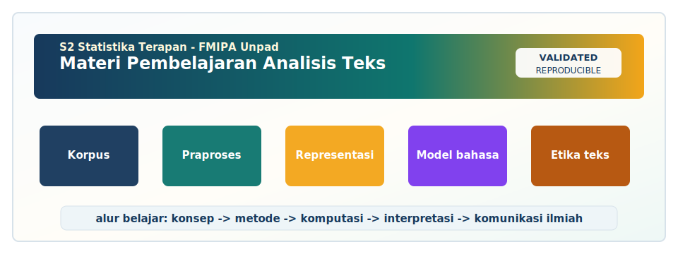

<!-- BEGIN UNPAD MATERIAL STYLE -->
<style>
:root {
  --unpad-navy: #17395c;
  --unpad-gold: #f2a51a;
  --unpad-teal: #0f766e;
  --unpad-ink: #172033;
  --unpad-paper: #fffdf8;
  --unpad-soft: #eef5f8;
  --unpad-line: #d7e2ea;
}
html, body {
  background: linear-gradient(135deg, #f8fbfd 0%, #fffdf8 48%, #f3f6ee 100%) !important;
  color: var(--unpad-ink) !important;
}
body {
  font-family: "Segoe UI", Arial, sans-serif !important;
  line-height: 1.72 !important;
}
.main-container {
  max-width: 1180px !important;
  background: rgba(255, 253, 248, 0.98) !important;
  border: 1px solid var(--unpad-line) !important;
  border-radius: 8px !important;
  box-shadow: 0 18px 42px rgba(23, 57, 92, 0.12) !important;
}
h1, h2, h3, h4 {
  letter-spacing: 0 !important;
}
h1.title {
  color: var(--unpad-navy) !important;
  -webkit-text-fill-color: var(--unpad-navy) !important;
  background: none !important;
}
h2 {
  border-left-color: var(--unpad-gold) !important;
}
a {
  color: #0b5c86 !important;
}
pre, code {
  border-radius: 8px !important;
}
.unpad-cover {
  margin: 18px 0 26px;
  padding: 24px;
  border-radius: 8px;
  background: linear-gradient(135deg, #17395c 0%, #0f766e 58%, #f2a51a 100%);
  color: #ffffff;
  box-shadow: 0 18px 36px rgba(23, 57, 92, 0.22);
}
.unpad-cover__brand {
  display: grid;
  grid-template-columns: 92px 1fr;
  gap: 20px;
  align-items: center;
}
.unpad-cover img {
  width: 92px;
  height: 92px;
  object-fit: contain;
  background: #ffffff;
  border-radius: 8px;
  padding: 8px;
  box-shadow: 0 8px 22px rgba(0,0,0,0.18);
}
.unpad-kicker {
  text-transform: uppercase;
  font-size: 0.82rem;
  font-weight: 800;
  letter-spacing: 0;
  color: #fff8dc;
}
.unpad-cover h2 {
  margin: 6px 0 8px;
  padding: 0;
  border: 0;
  background: transparent;
  color: #ffffff !important;
  font-size: 1.65rem;
}
.unpad-meta {
  margin: 0;
  color: #f7fbff;
  font-weight: 600;
}
.materi-illustration {
  margin: 20px 0 24px;
  padding: 14px;
  background: #ffffff;
  border: 1px solid var(--unpad-line);
  border-radius: 8px;
  box-shadow: 0 12px 28px rgba(23, 57, 92, 0.10);
}
.materi-illustration img {
  width: 100%;
  height: auto;
  display: block;
  border-radius: 6px;
}
.validasi-akademik {
  margin: 18px 0 28px;
  padding: 16px 18px;
  background: linear-gradient(135deg, #eef8f6, #fff8e7);
  border-left: 8px solid var(--unpad-teal);
  border-radius: 8px;
  color: var(--unpad-ink);
}
.validasi-akademik strong {
  color: var(--unpad-navy);
}
table {
  border-radius: 8px !important;
}
@media (max-width: 760px) {
  .unpad-cover__brand {
    grid-template-columns: 1fr;
  }
  .unpad-cover img {
    width: 76px;
    height: 76px;
  }
}
</style>
<!-- END UNPAD MATERIAL STYLE -->


<!-- BEGIN UNPAD MATERIAL ENHANCEMENT -->

```{r setup-unpad-render, include=FALSE}
execute_code <- FALSE
knitr::opts_chunk$set(
  echo = TRUE,
  eval = FALSE,
  message = FALSE,
  warning = FALSE,
  fig.align = "center",
  fig.width = 8,
  fig.height = 4.8,
  dpi = 120
)
set.seed(2025)
```


<div class="unpad-cover">
<div class="unpad-cover__brand">

<div>
<div class="unpad-kicker">S2 Statistika Terapan | FMIPA Universitas Padjadjaran</div>
<h2>Materi Pembelajaran Analisis Teks</h2>
<p class="unpad-meta">S2 Statistika Terapan FMIPA Universitas Padjadjaran<br>Penulis: Dr. Anindya Apriliyanti Pravitasari, M.Si | Januari 2025</p>
</div>
</div>
</div>

<div class="materi-illustration">

</div>

<div class="validasi-akademik">
<strong>Catatan validasi akademik.</strong> Materi ini diseragamkan dengan rujukan ADWTL Januari 2025: rumus dibaca bersama asumsi, contoh kode diposisikan sebagai template reproducible, dan interpretasi diarahkan pada validitas data, diagnosis model, evaluasi ketidakpastian, serta komunikasi hasil secara ilmiah.
</div>

<!-- END UNPAD MATERIAL ENHANCEMENT -->

<style>
:root{
  --brown-dark:#3b2115;
  --brown:#6d3f27;
  --brown-soft:#9b6847;
  --brown-light:#f4dfc3;
  --cream:#fffaf3;
  --gold:#d9a441;
  --teal:#1e7068;
  --rose:#b45f5f;
  --ink:#1f160f;
}
html { scroll-behavior: smooth; }
body{
  color:var(--ink);
  font-family:"Inter", "Segoe UI", Arial, sans-serif;
  line-height:1.72;
  max-width:none !important;
  padding:0 !important;
  margin:0 !important;
  background:
    radial-gradient(circle at top left, rgba(217,164,65,.20), transparent 30%),
    linear-gradient(135deg, #fffaf3 0%, #f5e2ca 40%, #ead0ae 70%, #d8b384 100%);
}
.main-container{
  max-width: 1180px !important;
  margin-left: 310px !important;
  margin-right: 42px !important;
  background: rgba(255,250,243,.94);
  padding: 34px 44px;
  border-radius: 28px;
  box-shadow: 0 20px 50px rgba(59,33,21,.22);
  border: 1px solid rgba(109,63,39,.18);
}
#TOC, nav#TOC{
  position: fixed;
  top: 18px;
  left: 18px;
  width: 270px;
  height: calc(100vh - 36px);
  overflow-y: auto;
  background: linear-gradient(180deg, #3b2115 0%, #6d3f27 45%, #9b6847 100%);
  color: white;
  padding: 20px 18px;
  border-radius: 24px;
  box-shadow: 0 16px 42px rgba(59,33,21,.38);
  z-index: 1000;
}
#TOC a, nav#TOC a{ color: #fff7e8 !important; text-decoration:none; font-weight:500; }
#TOC a:hover, nav#TOC a:hover{ color:#ffd775 !important; text-decoration:underline; }
.tocify-header{ text-indent:0 !important; }
.tocify-subheader{ text-indent:10px !important; }
h1, h2, h3, h4{
  color: var(--brown-dark);
  font-weight: 800;
  letter-spacing: -.02em;
}
h1.title{
  font-size: 2.8rem;
  color: #fff;
  text-align: left;
  margin-bottom: 10px;
}
h1{
  border-bottom: 4px solid rgba(217,164,65,.9);
  padding-bottom: 8px;
}
h2{
  margin-top: 42px;
  border-left: 10px solid var(--gold);
  padding-left: 14px;
}
h3{
  margin-top: 30px;
  color: var(--brown);
}
.hero{
  background:
    linear-gradient(135deg, rgba(59,33,21,.94), rgba(109,63,39,.92) 48%, rgba(217,164,65,.75)),
    linear-gradient(45deg, rgba(255,255,255,.06) 25%, transparent 25%),
    linear-gradient(-45deg, rgba(255,255,255,.05) 25%, transparent 25%);
  background-size: 48px 48px, 48px 48px;
  padding: 42px;
  border-radius: 30px;
  color: #fff;
  box-shadow: inset 0 0 0 1px rgba(255,255,255,.12), 0 20px 40px rgba(59,33,21,.25);
}
.hero p, .hero li{color:#fff7e8;}
.badge{
  display:inline-block;
  padding:6px 12px;
  border-radius:999px;
  background:#ffe0a3;
  color:#442313;
  font-weight:700;
  margin:4px 6px 4px 0;
}
.card{
  background: linear-gradient(135deg, rgba(255,255,255,.86), rgba(244,223,195,.78));
  border: 1px solid rgba(109,63,39,.18);
  border-radius: 24px;
  padding: 22px 26px;
  margin: 22px 0;
  box-shadow: 0 12px 26px rgba(59,33,21,.10);
}
.callout{
  background: linear-gradient(135deg, #fff4df, #f7dfbe);
  border-left: 8px solid var(--gold);
  border-radius: 18px;
  padding: 18px 22px;
  margin: 20px 0;
}
.callout.teal{border-left-color: var(--teal); background: linear-gradient(135deg,#effaf8,#d7eee9);}
.callout.rose{border-left-color: var(--rose); background: linear-gradient(135deg,#fff1ee,#f3d7d1);}
.rumus, div.rumus{
  background:#f8e7cf;
  color:#111;
  border:1px solid #dbb982;
  border-left:8px solid #b47a2e;
  border-radius:18px;
  padding:18px 22px;
  margin:20px 0;
  box-shadow:0 10px 18px rgba(109,63,39,.08);
}
pre{
  background:#fff2dc !important;
  color:#111 !important;
  border:1px solid #d6b27c !important;
  border-radius:18px !important;
  padding:18px !important;
}
code{
  background:#fff2dc;
  color:#111;
  border-radius:6px;
  padding:2px 5px;
}
table{
  border-collapse: collapse;
  width:100%;
  background:#fffdf8;
  border-radius:16px;
  overflow:hidden;
  box-shadow:0 8px 18px rgba(59,33,21,.08);
}
th{
  background:linear-gradient(135deg,#6d3f27,#9b6847);
  color:#fff;
}
th, td{padding:11px 13px; border:1px solid #e5cdaa; vertical-align: top;}
tr:nth-child(even){background:#fff7eb;}
.figure-box{
  background: #fff7ec;
  border:1px solid #e4c592;
  border-radius:24px;
  padding:18px;
  margin:22px 0;
  text-align:center;
}
.figcap{font-size:.92rem; color:#5f3d29; font-weight:700; margin-top:8px;}
.kpi-grid{display:grid; grid-template-columns: repeat(auto-fit, minmax(200px,1fr)); gap:16px; margin:18px 0;}
.kpi{background:#fff7ec; border:1px solid #e1c39a; border-radius:20px; padding:18px; box-shadow:0 8px 20px rgba(59,33,21,.08);}
.kpi .num{font-size:1.8rem; font-weight:900; color:#6d3f27;}
.small{font-size:.92rem; color:#5f4638;}
blockquote{
  background:#fff5e5;
  border-left:8px solid var(--gold);
  border-radius:16px;
  padding:14px 18px;
  color:#2e1f17;
}
@media(max-width: 980px){
  .main-container{margin-left:20px !important; margin-right:20px !important; padding:24px;}
  #TOC, nav#TOC{position:relative; width:auto; height:auto; left:auto; top:auto; margin-bottom:20px;}
}
</style>


<div class="hero">
<h1 class="title">Materi Pembelajaran Analisis Teks</h1>
<p><strong>Program Studi S2 Statistika Terapan, FMIPA Universitas Padjadjaran</strong></p>
<p><strong>Author:</strong> Dr. Anindya Apriliyanti Pravitasari, M.Si<br>
<strong>Tahun pembuatan:</strong> Januari 2025<br>
<strong>Format:</strong> R Markdown output HTML dengan daftar isi di sisi kiri.</p>
<span class="badge">Text Analytics</span><span class="badge">NLP</span><span class="badge">Machine Learning</span><span class="badge">Deep Learning</span><span class="badge">Project-Based Learning</span>
</div>

```{r setup, include=FALSE, eval=FALSE}
knitr::opts_chunk$set(
  echo = TRUE,
  warning = FALSE,
  message = FALSE,
  fig.align = "center",
  fig.width = 9,
  fig.height = 5,
  comment = "#>"
)
```


<div class="callout teal">
<strong>Catatan penyusunan:</strong> Dokumen R Markdown ini disusun sebagai modul panjang dengan perkiraan jumlah kata sekitar <strong>58,434</strong> kata berdasarkan perhitungan otomatis atas teks sumber Rmd. Jumlah aktual pada hasil render HTML dapat sedikit berbeda karena pemrosesan sitasi, kode, tabel, dan elemen HTML.
</div>

# Identitas Mata Kuliah dan Orientasi Pembelajaran

<div class="card">
Mata kuliah **Analisis Teks** merupakan mata kuliah wajib pada **Semester 2** Program Studi **S2 Statistika Terapan FMIPA Universitas Padjadjaran**. RPS menetapkan bobot **3 SKS** dengan komposisi **T = 2** dan **P = 1**, sehingga materi pembelajaran ini sengaja disusun sebagai gabungan antara fondasi konseptual, penalaran statistik, praktik komputasi, dan proyek terapan. Dosen pengembang RPS sekaligus koordinator mata kuliah adalah **Dr. Anindya Apriliyanti Pravitasari, M.Si**. Struktur modul ini mengikuti capaian pembelajaran dalam RPS, mulai dari pengenalan data teks, eksplorasi dan praproses, visualisasi, klasifikasi, analisis sentimen, machine learning, deep learning, topic modeling, clustering, data augmentation, hingga proyek inovatif berbasis kasus nyata.
</div>

## Capaian Pembelajaran Mata Kuliah

RPS menekankan empat capaian pembelajaran mata kuliah. Pertama, mahasiswa mampu menjelaskan konsep dasar, peran, dan aplikasi text analytics di berbagai bidang. Kedua, mahasiswa mampu menerapkan teknik eksplorasi dan praproses data teks sebagai persiapan analisis lanjutan. Ketiga, mahasiswa mampu mengembangkan dan menerapkan model machine learning/statistik untuk analisis data teks. Keempat, mahasiswa mampu mengkomunikasikan hasil dan rekomendasi analisis teks berbasis riset inovatif dan mandiri pada kasus nyata. Dengan struktur tersebut, mata kuliah ini bukan sekadar kursus pemrograman, melainkan kursus statistika terapan yang mengubah teks menjadi bukti, bukti menjadi model, dan model menjadi rekomendasi yang dapat dipertanggungjawabkan.

## Posisi Analisis Teks dalam Statistika Terapan

Analisis teks berada pada titik temu antara statistika, linguistik komputasional, ilmu komputer, komunikasi, dan domain aplikasi. Dalam statistika klasik, data sering dianggap sebagai matriks numerik yang tersusun rapi. Dalam analisis teks, data awal justru hadir sebagai kalimat, komentar, dokumen, transkrip, berita, abstrak ilmiah, catatan layanan, laporan klinis, dokumen kebijakan, atau percakapan digital. Tantangannya adalah bagaimana mengubah bentuk linguistik yang kaya konteks menjadi representasi kuantitatif tanpa membuang makna penting. Di sinilah text analytics memiliki nilai strategis: ia memperluas ruang kerja statistik dari angka yang sudah siap olah menjadi bahasa manusia yang harus dibaca, dinormalisasi, direpresentasikan, dimodelkan, dan diinterpretasikan secara hati-hati [@jurafsky2024speech; @miner2012practical].

Dalam konteks S2 Statistika Terapan, analisis teks perlu dipahami sebagai proses ilmiah end-to-end. Mahasiswa tidak hanya menekan tombol algoritma, tetapi harus menguji apakah data teks relevan dengan pertanyaan penelitian, apakah proses pembersihan tidak merusak sinyal, apakah fitur yang dipilih mewakili fenomena substantif, apakah model dievaluasi dengan metrik yang tepat, dan apakah rekomendasi tetap etis. Misalnya, sistem klasifikasi keluhan publik dapat tampak sangat akurat pada data pelatihan, tetapi gagal ketika diterapkan pada wilayah, bahasa gaul, atau periode waktu berbeda. Oleh karena itu, modul ini menekankan validasi, refleksi, dan komunikasi ilmiah sebagai bagian integral dari analisis.

## Roadmap 16 Pertemuan

| Pertemuan | Fokus Pembelajaran | Keluaran Utama |
|---:|---|---|
| 1--3 | Karakteristik data teks dan aplikasi text analytics | Tugas analisis konsep, klasifikasi data teks, diskusi reflektif |
| 4--5 | Eksplorasi, praproses, tokenisasi, stemming, BoW, TF-IDF | Proyek visualisasi dan evaluasi praproses |
| 6--7 | Feature extraction, klasifikasi teks, Naive Bayes, SVM, Logistic Regression | Model klasifikasi awal dan laporan evaluasi |
| 8 | UTS | Presentasi proyek antara |
| 9--11 | Neural network, LSTM, GRU, Transformer, topic modeling, clustering | Laporan tertulis dan presentasi modelling |
| 12--15 | Proyek kasus nyata, pipeline end-to-end, pelaporan, etika | Proyek riset inovatif dan presentasi riset |
| 16 | UAS | Presentasi akhir dan refleksi ilmiah |


<div class="figure-box">
<svg viewBox="0 0 1120 220" width="100%" role="img" aria-label="Pipeline analisis teks">
  <defs>
    <linearGradient id="g1" x1="0" x2="1"><stop offset="0%" stop-color="#6d3f27"/><stop offset="100%" stop-color="#d9a441"/></linearGradient>
    <filter id="shadow"><feDropShadow dx="0" dy="8" stdDeviation="5" flood-color="#6d3f27" flood-opacity=".22"/></filter>
  </defs>
  <rect x="20" y="30" width="150" height="90" rx="22" fill="#fff4df" stroke="#a77341" filter="url(#shadow)"/>
  <text x="95" y="68" text-anchor="middle" font-size="18" fill="#3b2115" font-weight="700">Akuisisi</text>
  <text x="95" y="94" text-anchor="middle" font-size="14" fill="#5f3d29">API • crawling</text>
  <path d="M175 75 L245 75" stroke="url(#g1)" stroke-width="7" marker-end="url(#arrow)"/>
  <rect x="250" y="30" width="150" height="90" rx="22" fill="#fff4df" stroke="#a77341" filter="url(#shadow)"/>
  <text x="325" y="68" text-anchor="middle" font-size="18" fill="#3b2115" font-weight="700">Praproses</text>
  <text x="325" y="94" text-anchor="middle" font-size="14" fill="#5f3d29">clean • token</text>
  <path d="M405 75 L475 75" stroke="url(#g1)" stroke-width="7"/>
  <rect x="480" y="30" width="150" height="90" rx="22" fill="#fff4df" stroke="#a77341" filter="url(#shadow)"/>
  <text x="555" y="68" text-anchor="middle" font-size="18" fill="#3b2115" font-weight="700">Representasi</text>
  <text x="555" y="94" text-anchor="middle" font-size="14" fill="#5f3d29">TF-IDF • embedding</text>
  <path d="M635 75 L705 75" stroke="url(#g1)" stroke-width="7"/>
  <rect x="710" y="30" width="150" height="90" rx="22" fill="#fff4df" stroke="#a77341" filter="url(#shadow)"/>
  <text x="785" y="68" text-anchor="middle" font-size="18" fill="#3b2115" font-weight="700">Model</text>
  <text x="785" y="94" text-anchor="middle" font-size="14" fill="#5f3d29">ML • DL • topik</text>
  <path d="M865 75 L935 75" stroke="url(#g1)" stroke-width="7"/>
  <rect x="940" y="30" width="150" height="90" rx="22" fill="#fff4df" stroke="#a77341" filter="url(#shadow)"/>
  <text x="1015" y="68" text-anchor="middle" font-size="18" fill="#3b2115" font-weight="700">Keputusan</text>
  <text x="1015" y="94" text-anchor="middle" font-size="14" fill="#5f3d29">insight • etika</text>
  <text x="560" y="172" text-anchor="middle" font-size="17" fill="#3b2115">Validasi, interpretasi, dokumentasi, dan komunikasi berjalan sebagai siklus, bukan garis lurus.</text>
</svg>
<div class="figcap">Gambar 1. Pipeline umum analisis teks dari akuisisi sampai rekomendasi.</div>
</div>


## Prinsip Desain Modul

Modul ini disusun untuk memberi pengalaman belajar yang bertahap. Pada bagian awal, mahasiswa diajak memahami bentuk dan karakteristik data teks. Pada bagian tengah, mahasiswa mempelajari praproses, representasi, dan klasifikasi. Pada bagian lanjut, mahasiswa masuk ke deep learning, transformer, topic modeling, clustering, dan augmentasi data. Pada bagian akhir, mahasiswa menyusun proyek analisis teks yang utuh. Urutan ini penting karena kesalahan pada awal pipeline sering berdampak besar pada hasil akhir. Dalam analisis teks, model yang canggih tidak otomatis menyelamatkan data yang salah dikumpulkan, salah dibersihkan, atau salah direpresentasikan. Pepatah versi statistiknya: garbage in, garbage out; versi mahasiswa praktikum: dataset berantakan, model pun ikut curhat.

## Ekosistem Perangkat Lunak

RPS menyebut penggunaan **R** dan **Python** sebagai perangkat lunak pembelajaran. Karena itu, modul R Markdown ini menampilkan contoh kode R dan Python. R sangat kuat untuk pelaporan ilmiah, visualisasi, *tidy workflow*, dan integrasi dokumen melalui R Markdown. Python sangat kuat untuk NLP modern, *scraping*, *machine learning*, dan *deep learning*. Keduanya tidak perlu dipertentangkan. Dalam riset terapan, pilihan perangkat lunak sebaiknya mengikuti tujuan analisis, stabilitas ekosistem, kemampuan replikasi, dan ketersediaan pustaka. Modul ini menggunakan gaya *literate programming*: narasi, kode, output, interpretasi, dan sitasi berada dalam satu dokumen sehingga proses analisis lebih mudah diaudit.

```{r packages, eval=FALSE}
# Paket R yang sering digunakan dalam modul ini
install.packages(c(
  "tidyverse", "tidytext", "tm", "SnowballC", "wordcloud2",
  "quanteda", "textrecipes", "caret", "glmnet", "e1071", "naivebayes",
  "topicmodels", "text2vec", "reticulate", "knitr", "kableExtra"
))
```

```{python packages-python, eval=FALSE}
# Paket Python yang sering digunakan dalam modul ini
pip install pandas numpy scikit-learn nltk spacy gensim matplotlib seaborn wordcloud transformers datasets torch evaluate imbalanced-learn
```

# Kerangka Teoretis Umum Analisis Teks

## Data Teks sebagai Objek Statistik

Data teks memiliki sifat yang berbeda dari data numerik standar. Sebuah dokumen terdiri atas urutan token, struktur kalimat, konteks semantik, gaya bahasa, dan sering kali metadata. Token dapat berupa kata, sub-kata, karakter, tanda baca, emoji, atau unit linguistik lain. Dalam model statistik, token-token itu harus direpresentasikan sebagai fitur. Namun representasi tersebut selalu membawa keputusan: apakah huruf besar-kecil dibedakan, apakah tanda baca dibuang, apakah kata tidak baku dinormalisasi, apakah kata umum dihapus, dan apakah urutan kata dipertahankan. Keputusan ini bukan hal teknis kecil; ia adalah bagian dari desain penelitian.

Dalam notasi sederhana, sebuah korpus dapat ditulis sebagai kumpulan dokumen $D=\{d_1,d_2,\ldots,d_N\}$. Setiap dokumen $d_i$ mengandung urutan token $d_i=(w_{i1},w_{i2},\ldots,w_{in_i})$. Tugas analisis teks adalah memetakan dokumen ke ruang representasi numerik $x_i=f(d_i)$, kemudian menggunakan $x_i$ untuk eksplorasi, visualisasi, klasifikasi, regresi, topic modeling, clustering, ekstraksi informasi, atau generasi teks. Fungsi $f(\cdot)$ bisa sesederhana hitungan frekuensi kata atau serumit representasi kontekstual transformer. Perbedaan fungsi representasi ini sering menentukan keberhasilan analisis lebih besar daripada pilihan algoritma akhir.

<div class="rumus">
$$
D=\{d_1,d_2,\ldots,d_N\}, \quad d_i=(w_{i1},w_{i2},\ldots,w_{in_i}), \quad x_i=f(d_i)
$$
</div>

## Dari Bahasa ke Fitur

Salah satu tujuan utama text analytics adalah mengubah teks menjadi fitur yang dapat digunakan oleh model. Pada pendekatan klasik, dokumen direpresentasikan sebagai vektor frekuensi kata, frekuensi n-gram, atau nilai TF-IDF. Pada pendekatan modern, dokumen direpresentasikan melalui word embedding, sentence embedding, atau representasi kontekstual transformer. Pendekatan klasik lebih mudah dijelaskan dan sering kuat pada dataset kecil sampai menengah. Pendekatan modern lebih kuat dalam menangkap konteks, sinonimi, dan makna kalimat, tetapi membutuhkan sumber daya komputasi, validasi, dan kehati-hatian interpretasi yang lebih besar [@manning2008ir; @vaswani2017attention; @devlin2019bert].


<div class="figure-box">
<svg viewBox="0 0 980 260" width="100%" role="img" aria-label="Ilustrasi matriks dokumen kata">
  <rect x="30" y="25" width="920" height="210" rx="24" fill="#fff4df" stroke="#c49a62"/>
  <text x="490" y="58" text-anchor="middle" font-size="22" font-weight="800" fill="#3b2115">Representasi Teks sebagai Matriks Dokumen–Term</text>
  <g font-size="16" fill="#3b2115">
    <text x="110" y="102" font-weight="700">Dokumen</text><text x="300" y="102" font-weight="700">kata: layanan</text><text x="470" y="102" font-weight="700">kata: cepat</text><text x="640" y="102" font-weight="700">kata: mahal</text><text x="800" y="102" font-weight="700">label</text>
    <line x1="80" y1="115" x2="890" y2="115" stroke="#6d3f27" stroke-width="3"/>
    <text x="110" y="145">Review 1</text><text x="345" y="145">2</text><text x="515" y="145">1</text><text x="685" y="145">0</text><text x="800" y="145">positif</text>
    <text x="110" y="180">Review 2</text><text x="345" y="180">1</text><text x="515" y="180">0</text><text x="685" y="180">2</text><text x="800" y="180">negatif</text>
    <text x="110" y="215">Review 3</text><text x="345" y="215">0</text><text x="515" y="215">2</text><text x="685" y="215">0</text><text x="800" y="215">positif</text>
  </g>
</svg>
<div class="figcap">Gambar 2. Intuisi BoW/TF-IDF: teks diubah menjadi fitur numerik agar dapat diproses model statistik atau machine learning.</div>
</div>


## Evaluasi sebagai Bagian dari Inferensi

Evaluasi model teks tidak boleh berhenti pada akurasi. Pada data tidak seimbang, akurasi dapat menipu. Misalnya, bila 95% komentar tergolong netral, model yang selalu menebak netral akan memiliki akurasi 95%, tetapi gagal mengenali komentar negatif yang justru paling penting. Oleh karena itu, presisi, recall, F1-score, confusion matrix, macro average, weighted average, dan validasi silang perlu dibahas. Untuk model probabilistik, kalibrasi probabilitas juga penting. Untuk model yang digunakan dalam kebijakan, interpretabilitas, stabilitas temporal, bias, dan konsekuensi kesalahan klasifikasi harus dipertimbangkan [@kowsari2019text; @kuhn2013applied].

## Etika, Privasi, dan Konteks Sosial

Data teks sering berasal dari manusia: keluhan, opini, pesan, komentar, rekam medis, transkrip wawancara, atau catatan layanan. Karena itu, analisis teks selalu membawa dimensi etika. Pertanyaan sederhana seperti “bolehkah data ini dikumpulkan?” sering lebih penting daripada pertanyaan “algoritma mana yang paling akurat?”. Mahasiswa perlu mempertimbangkan persetujuan, anonimisasi, risiko identifikasi ulang, bias bahasa, representasi kelompok rentan, dan dampak rekomendasi. Model yang tampak netral dapat memperkuat bias jika korpus pelatihan timpang. Dalam proyek akhir, aspek etika diminta hadir sebagai bagian eksplisit dari laporan, bukan catatan kaki yang muncul hanya karena halaman masih kosong.

# Bab 1. Pengenalan Analisis Data Teks

<div class="callout"><strong>Fokus:</strong> Pertemuan 1 • <strong>Capaian:</strong> SubCPMK1 • <strong>Kata kunci:</strong> data terstruktur, data semi-terstruktur, data tidak terstruktur, korpus, dokumen, token, metadata, aplikasi bisnis, aplikasi kesehatan, aplikasi sosial.</div>

## Tujuan Pembelajaran

Pada Pertemuan 1, fokus pembelajaran diarahkan pada SubCPMK1. Mahasiswa diharapkan tidak hanya mengenal istilah data terstruktur dan data semi-terstruktur, tetapi juga mampu menjelaskan mengapa konsep tersebut menentukan kualitas analisis. Dalam text analytics, pemahaman awal sering menjadi pembeda antara analisis yang sekadar menghasilkan grafik dan analisis yang benar-benar menghasilkan bukti. Karena itu, pembelajaran dimulai dari pertanyaan substantif: apa masalah yang ingin dijawab, siapa pengguna hasil analisis, dan konsekuensi keputusan apa yang mungkin muncul dari interpretasi model. Perspektif ini selaras dengan tradisi statistika terapan yang menempatkan model sebagai alat untuk memahami fenomena, bukan sebagai tujuan akhir [@jurafsky2024speech; @miner2012practical; @bird2009natural].

Dalam praktik profesional, data terstruktur tidak berdiri sendiri. Ia harus dikaitkan dengan tujuan analisis, kualitas data, dan kebutuhan pengguna. Misalnya, bila pengguna membutuhkan penjelasan yang mudah dipahami, pendekatan sederhana dengan visualisasi kata mungkin lebih berguna daripada model kompleks yang sulit dijelaskan. Sebaliknya, bila tugas menuntut prediksi skala besar dengan bahasa yang sangat variatif, model berbasis embedding atau transformer dapat dipertimbangkan. Kecocokan metode selalu bersifat kontekstual.

Mahasiswa dianjurkan membuat eksperimen kecil untuk data semi-terstruktur. Eksperimen dapat berupa membandingkan sebelum dan sesudah praproses, membandingkan unigram dan bigram, membandingkan model baseline dan model lanjutan, atau membandingkan metrik mikro dan makro. Eksperimen kecil yang dirancang baik sering lebih bernilai daripada satu eksperimen besar yang tidak dapat dijelaskan. Prinsipnya sederhana: jangan hanya mencari output, carilah alasan mengapa output muncul.

Pada tahap pelaporan, data tidak terstruktur sebaiknya dijelaskan dengan bahasa yang dapat dipahami pembaca non-teknis. Rumus dan kode penting untuk transparansi, tetapi insight harus ditulis dalam bentuk narasi. Pembaca perlu mengetahui apa temuan utama, seberapa kuat bukti yang mendukung temuan tersebut, apa keterbatasannya, dan tindakan apa yang disarankan. Dengan demikian, analisis teks menjadi jembatan antara data tidak terstruktur dan keputusan yang lebih terarah.

Aspek korpus perlu dibahas secara hati-hati karena keputusan kecil pada tahap ini dapat mengubah distribusi fitur. Dalam korpus berbahasa Indonesia, variasi ejaan, singkatan, imbuhan, kata serapan, dan campuran bahasa sering membuat proses otomatis kurang stabil. Mahasiswa perlu membandingkan hasil beberapa strategi dan menilai dampaknya terhadap interpretasi, bukan hanya terhadap skor model. Evaluasi seperti ini melatih kemampuan C5 dan C6: mengevaluasi metode serta menciptakan solusi yang sesuai konteks.

## Konsep Inti

Konsep inti bab ini berangkat dari hubungan antara data terstruktur, data semi-terstruktur, dan data tidak terstruktur. Dalam praktik, ketiganya saling memengaruhi. Ketika data berasal dari sumber digital, bentuk teks sering tidak stabil: ada singkatan, kesalahan ketik, campuran bahasa, simbol, emoji, tanda baca, tautan, dan metadata. Semua unsur tersebut bisa menjadi sinyal atau noise tergantung tujuan analisis. Misalnya, tanda seru dapat dianggap noise pada klasifikasi topik, tetapi menjadi sinyal emosi pada analisis sentimen. Oleh sebab itu, mahasiswa perlu membiasakan diri membaca sampel dokumen secara manual sebelum membuat pipeline komputasi. Pemeriksaan manual bukan pekerjaan kuno; ia adalah rem tangan ilmiah ketika algoritma mulai ngebut.

Dalam praktik profesional, data terstruktur tidak berdiri sendiri. Ia harus dikaitkan dengan tujuan analisis, kualitas data, dan kebutuhan pengguna. Misalnya, bila pengguna membutuhkan penjelasan yang mudah dipahami, pendekatan sederhana dengan visualisasi kata mungkin lebih berguna daripada model kompleks yang sulit dijelaskan. Sebaliknya, bila tugas menuntut prediksi skala besar dengan bahasa yang sangat variatif, model berbasis embedding atau transformer dapat dipertimbangkan. Kecocokan metode selalu bersifat kontekstual.

Mahasiswa dianjurkan membuat eksperimen kecil untuk data semi-terstruktur. Eksperimen dapat berupa membandingkan sebelum dan sesudah praproses, membandingkan unigram dan bigram, membandingkan model baseline dan model lanjutan, atau membandingkan metrik mikro dan makro. Eksperimen kecil yang dirancang baik sering lebih bernilai daripada satu eksperimen besar yang tidak dapat dijelaskan. Prinsipnya sederhana: jangan hanya mencari output, carilah alasan mengapa output muncul.

Pada tahap pelaporan, data tidak terstruktur sebaiknya dijelaskan dengan bahasa yang dapat dipahami pembaca non-teknis. Rumus dan kode penting untuk transparansi, tetapi insight harus ditulis dalam bentuk narasi. Pembaca perlu mengetahui apa temuan utama, seberapa kuat bukti yang mendukung temuan tersebut, apa keterbatasannya, dan tindakan apa yang disarankan. Dengan demikian, analisis teks menjadi jembatan antara data tidak terstruktur dan keputusan yang lebih terarah.

Aspek korpus perlu dibahas secara hati-hati karena keputusan kecil pada tahap ini dapat mengubah distribusi fitur. Dalam korpus berbahasa Indonesia, variasi ejaan, singkatan, imbuhan, kata serapan, dan campuran bahasa sering membuat proses otomatis kurang stabil. Mahasiswa perlu membandingkan hasil beberapa strategi dan menilai dampaknya terhadap interpretasi, bukan hanya terhadap skor model. Evaluasi seperti ini melatih kemampuan C5 dan C6: mengevaluasi metode serta menciptakan solusi yang sesuai konteks.

## Perspektif Statistik

Secara statistik, bab ini dapat dipahami sebagai proses mendefinisikan unit observasi, variabel, fitur, label, dan populasi target. Dokumen dapat menjadi unit observasi, tetapi dalam kasus lain kalimat, paragraf, akun, percakapan, atau periode waktu dapat menjadi unit analisis. Pilihan unit analisis harus konsisten dengan pertanyaan riset. Jika tujuan penelitian adalah mengetahui tren opini mingguan, maka agregasi dokumen per minggu mungkin diperlukan. Jika tujuan penelitian adalah mendeteksi komentar berisiko, maka unit komentar individual lebih tepat. Kesalahan mendefinisikan unit analisis akan membuat model terlihat canggih tetapi menjawab pertanyaan yang salah.

Dalam praktik profesional, data terstruktur tidak berdiri sendiri. Ia harus dikaitkan dengan tujuan analisis, kualitas data, dan kebutuhan pengguna. Misalnya, bila pengguna membutuhkan penjelasan yang mudah dipahami, pendekatan sederhana dengan visualisasi kata mungkin lebih berguna daripada model kompleks yang sulit dijelaskan. Sebaliknya, bila tugas menuntut prediksi skala besar dengan bahasa yang sangat variatif, model berbasis embedding atau transformer dapat dipertimbangkan. Kecocokan metode selalu bersifat kontekstual.

Mahasiswa dianjurkan membuat eksperimen kecil untuk data semi-terstruktur. Eksperimen dapat berupa membandingkan sebelum dan sesudah praproses, membandingkan unigram dan bigram, membandingkan model baseline dan model lanjutan, atau membandingkan metrik mikro dan makro. Eksperimen kecil yang dirancang baik sering lebih bernilai daripada satu eksperimen besar yang tidak dapat dijelaskan. Prinsipnya sederhana: jangan hanya mencari output, carilah alasan mengapa output muncul.

Pada tahap pelaporan, data tidak terstruktur sebaiknya dijelaskan dengan bahasa yang dapat dipahami pembaca non-teknis. Rumus dan kode penting untuk transparansi, tetapi insight harus ditulis dalam bentuk narasi. Pembaca perlu mengetahui apa temuan utama, seberapa kuat bukti yang mendukung temuan tersebut, apa keterbatasannya, dan tindakan apa yang disarankan. Dengan demikian, analisis teks menjadi jembatan antara data tidak terstruktur dan keputusan yang lebih terarah.

Aspek korpus perlu dibahas secara hati-hati karena keputusan kecil pada tahap ini dapat mengubah distribusi fitur. Dalam korpus berbahasa Indonesia, variasi ejaan, singkatan, imbuhan, kata serapan, dan campuran bahasa sering membuat proses otomatis kurang stabil. Mahasiswa perlu membandingkan hasil beberapa strategi dan menilai dampaknya terhadap interpretasi, bukan hanya terhadap skor model. Evaluasi seperti ini melatih kemampuan C5 dan C6: mengevaluasi metode serta menciptakan solusi yang sesuai konteks.

## Formulasi Ringkas

Formulasi berikut merangkum gagasan matematis bab ini. Notasi tidak dimaksudkan untuk membuat materi terlihat angker, melainkan untuk memastikan setiap tahap pipeline dapat dijelaskan secara eksplisit. Dalam riset terapan, notasi membantu kita membedakan data mentah, hasil praproses, fitur, label, dan prediksi. Perbedaan ini sangat penting ketika laporan harus direplikasi atau diperiksa oleh peneliti lain. Tanpa notasi, pipeline sering berubah menjadi cerita: 'data dibersihkan lalu dimodelkan'. Dengan notasi, proses menjadi dapat diaudit.

<div class="rumus">
$$
D=\{d_1,d_2,\ldots,d_N\},\quad d_i=(w_{i1},w_{i2},\ldots,w_{in_i})
$$
</div>

Dalam praktik profesional, data terstruktur tidak berdiri sendiri. Ia harus dikaitkan dengan tujuan analisis, kualitas data, dan kebutuhan pengguna. Misalnya, bila pengguna membutuhkan penjelasan yang mudah dipahami, pendekatan sederhana dengan visualisasi kata mungkin lebih berguna daripada model kompleks yang sulit dijelaskan. Sebaliknya, bila tugas menuntut prediksi skala besar dengan bahasa yang sangat variatif, model berbasis embedding atau transformer dapat dipertimbangkan. Kecocokan metode selalu bersifat kontekstual.

Mahasiswa dianjurkan membuat eksperimen kecil untuk data semi-terstruktur. Eksperimen dapat berupa membandingkan sebelum dan sesudah praproses, membandingkan unigram dan bigram, membandingkan model baseline dan model lanjutan, atau membandingkan metrik mikro dan makro. Eksperimen kecil yang dirancang baik sering lebih bernilai daripada satu eksperimen besar yang tidak dapat dijelaskan. Prinsipnya sederhana: jangan hanya mencari output, carilah alasan mengapa output muncul.

Pada tahap pelaporan, data tidak terstruktur sebaiknya dijelaskan dengan bahasa yang dapat dipahami pembaca non-teknis. Rumus dan kode penting untuk transparansi, tetapi insight harus ditulis dalam bentuk narasi. Pembaca perlu mengetahui apa temuan utama, seberapa kuat bukti yang mendukung temuan tersebut, apa keterbatasannya, dan tindakan apa yang disarankan. Dengan demikian, analisis teks menjadi jembatan antara data tidak terstruktur dan keputusan yang lebih terarah.

Aspek korpus perlu dibahas secara hati-hati karena keputusan kecil pada tahap ini dapat mengubah distribusi fitur. Dalam korpus berbahasa Indonesia, variasi ejaan, singkatan, imbuhan, kata serapan, dan campuran bahasa sering membuat proses otomatis kurang stabil. Mahasiswa perlu membandingkan hasil beberapa strategi dan menilai dampaknya terhadap interpretasi, bukan hanya terhadap skor model. Evaluasi seperti ini melatih kemampuan C5 dan C6: mengevaluasi metode serta menciptakan solusi yang sesuai konteks.

## Contoh Kasus

Contoh kasus yang digunakan pada bab ini adalah klasifikasi keluhan mahasiswa pada layanan akademik, komentar publik mengenai kebijakan, dan ulasan produk digital. Kasus semacam ini relevan karena teks muncul secara alami dalam proses layanan, komunikasi publik, transaksi digital, dan riset sosial. Mahasiswa dapat memulai dari dataset kecil agar memahami struktur masalah, lalu memperluas ke dataset lebih besar ketika pipeline sudah stabil. Untuk tugas kelas, dataset yang terlalu besar tidak selalu lebih baik. Dataset sedang dengan dokumentasi baik sering lebih mendidik daripada dataset raksasa yang membuat laptop berubah menjadi pemanggang roti akademik.

Dalam praktik profesional, data terstruktur tidak berdiri sendiri. Ia harus dikaitkan dengan tujuan analisis, kualitas data, dan kebutuhan pengguna. Misalnya, bila pengguna membutuhkan penjelasan yang mudah dipahami, pendekatan sederhana dengan visualisasi kata mungkin lebih berguna daripada model kompleks yang sulit dijelaskan. Sebaliknya, bila tugas menuntut prediksi skala besar dengan bahasa yang sangat variatif, model berbasis embedding atau transformer dapat dipertimbangkan. Kecocokan metode selalu bersifat kontekstual.

Mahasiswa dianjurkan membuat eksperimen kecil untuk data semi-terstruktur. Eksperimen dapat berupa membandingkan sebelum dan sesudah praproses, membandingkan unigram dan bigram, membandingkan model baseline dan model lanjutan, atau membandingkan metrik mikro dan makro. Eksperimen kecil yang dirancang baik sering lebih bernilai daripada satu eksperimen besar yang tidak dapat dijelaskan. Prinsipnya sederhana: jangan hanya mencari output, carilah alasan mengapa output muncul.

Pada tahap pelaporan, data tidak terstruktur sebaiknya dijelaskan dengan bahasa yang dapat dipahami pembaca non-teknis. Rumus dan kode penting untuk transparansi, tetapi insight harus ditulis dalam bentuk narasi. Pembaca perlu mengetahui apa temuan utama, seberapa kuat bukti yang mendukung temuan tersebut, apa keterbatasannya, dan tindakan apa yang disarankan. Dengan demikian, analisis teks menjadi jembatan antara data tidak terstruktur dan keputusan yang lebih terarah.

Aspek korpus perlu dibahas secara hati-hati karena keputusan kecil pada tahap ini dapat mengubah distribusi fitur. Dalam korpus berbahasa Indonesia, variasi ejaan, singkatan, imbuhan, kata serapan, dan campuran bahasa sering membuat proses otomatis kurang stabil. Mahasiswa perlu membandingkan hasil beberapa strategi dan menilai dampaknya terhadap interpretasi, bukan hanya terhadap skor model. Evaluasi seperti ini melatih kemampuan C5 dan C6: mengevaluasi metode serta menciptakan solusi yang sesuai konteks.

## Kesalahan Umum

Kesalahan umum pada topik ini adalah memperlakukan seluruh teks sebagai angka biasa tanpa memahami konteks bahasa. Kesalahan lain adalah membersihkan teks secara agresif sehingga informasi penting hilang. Dalam analisis opini, kata negasi seperti 'tidak' tidak boleh sembarangan dibuang karena dapat membalik makna. Dalam analisis institusi, istilah lokal, singkatan program, nama layanan, dan jargon domain sering justru menjadi kata kunci penting. Mahasiswa perlu membuat log keputusan praproses: apa yang dihapus, apa yang dipertahankan, dan mengapa. Log sederhana ini sering menyelamatkan laporan ketika penguji bertanya, 'kenapa kata itu dihapus?'

Dalam praktik profesional, data terstruktur tidak berdiri sendiri. Ia harus dikaitkan dengan tujuan analisis, kualitas data, dan kebutuhan pengguna. Misalnya, bila pengguna membutuhkan penjelasan yang mudah dipahami, pendekatan sederhana dengan visualisasi kata mungkin lebih berguna daripada model kompleks yang sulit dijelaskan. Sebaliknya, bila tugas menuntut prediksi skala besar dengan bahasa yang sangat variatif, model berbasis embedding atau transformer dapat dipertimbangkan. Kecocokan metode selalu bersifat kontekstual.

Mahasiswa dianjurkan membuat eksperimen kecil untuk data semi-terstruktur. Eksperimen dapat berupa membandingkan sebelum dan sesudah praproses, membandingkan unigram dan bigram, membandingkan model baseline dan model lanjutan, atau membandingkan metrik mikro dan makro. Eksperimen kecil yang dirancang baik sering lebih bernilai daripada satu eksperimen besar yang tidak dapat dijelaskan. Prinsipnya sederhana: jangan hanya mencari output, carilah alasan mengapa output muncul.

Pada tahap pelaporan, data tidak terstruktur sebaiknya dijelaskan dengan bahasa yang dapat dipahami pembaca non-teknis. Rumus dan kode penting untuk transparansi, tetapi insight harus ditulis dalam bentuk narasi. Pembaca perlu mengetahui apa temuan utama, seberapa kuat bukti yang mendukung temuan tersebut, apa keterbatasannya, dan tindakan apa yang disarankan. Dengan demikian, analisis teks menjadi jembatan antara data tidak terstruktur dan keputusan yang lebih terarah.

Aspek korpus perlu dibahas secara hati-hati karena keputusan kecil pada tahap ini dapat mengubah distribusi fitur. Dalam korpus berbahasa Indonesia, variasi ejaan, singkatan, imbuhan, kata serapan, dan campuran bahasa sering membuat proses otomatis kurang stabil. Mahasiswa perlu membandingkan hasil beberapa strategi dan menilai dampaknya terhadap interpretasi, bukan hanya terhadap skor model. Evaluasi seperti ini melatih kemampuan C5 dan C6: mengevaluasi metode serta menciptakan solusi yang sesuai konteks.

## Interpretasi

Interpretasi hasil tidak boleh hanya menyebut angka. Ketika model menghasilkan akurasi, topik, klaster, atau daftar kata penting, analis harus menghubungkannya kembali dengan masalah substantif. Kata yang sering muncul belum tentu kata yang paling penting. Klaster dokumen belum tentu mewakili kelompok sosial nyata. Probabilitas sentimen bukan ukuran kebenaran mutlak. Interpretasi yang baik memadukan output komputasi, sampel dokumen, pengetahuan domain, dan kehati-hatian terhadap bias. Prinsip ini perlu dilatih sejak awal agar mahasiswa tidak menjadi operator model, tetapi analis statistik yang berpikir kritis.

Dalam praktik profesional, data terstruktur tidak berdiri sendiri. Ia harus dikaitkan dengan tujuan analisis, kualitas data, dan kebutuhan pengguna. Misalnya, bila pengguna membutuhkan penjelasan yang mudah dipahami, pendekatan sederhana dengan visualisasi kata mungkin lebih berguna daripada model kompleks yang sulit dijelaskan. Sebaliknya, bila tugas menuntut prediksi skala besar dengan bahasa yang sangat variatif, model berbasis embedding atau transformer dapat dipertimbangkan. Kecocokan metode selalu bersifat kontekstual.

Mahasiswa dianjurkan membuat eksperimen kecil untuk data semi-terstruktur. Eksperimen dapat berupa membandingkan sebelum dan sesudah praproses, membandingkan unigram dan bigram, membandingkan model baseline dan model lanjutan, atau membandingkan metrik mikro dan makro. Eksperimen kecil yang dirancang baik sering lebih bernilai daripada satu eksperimen besar yang tidak dapat dijelaskan. Prinsipnya sederhana: jangan hanya mencari output, carilah alasan mengapa output muncul.

Pada tahap pelaporan, data tidak terstruktur sebaiknya dijelaskan dengan bahasa yang dapat dipahami pembaca non-teknis. Rumus dan kode penting untuk transparansi, tetapi insight harus ditulis dalam bentuk narasi. Pembaca perlu mengetahui apa temuan utama, seberapa kuat bukti yang mendukung temuan tersebut, apa keterbatasannya, dan tindakan apa yang disarankan. Dengan demikian, analisis teks menjadi jembatan antara data tidak terstruktur dan keputusan yang lebih terarah.

Aspek korpus perlu dibahas secara hati-hati karena keputusan kecil pada tahap ini dapat mengubah distribusi fitur. Dalam korpus berbahasa Indonesia, variasi ejaan, singkatan, imbuhan, kata serapan, dan campuran bahasa sering membuat proses otomatis kurang stabil. Mahasiswa perlu membandingkan hasil beberapa strategi dan menilai dampaknya terhadap interpretasi, bukan hanya terhadap skor model. Evaluasi seperti ini melatih kemampuan C5 dan C6: mengevaluasi metode serta menciptakan solusi yang sesuai konteks.

## Kaitan dengan Proyek

Dalam proyek akhir, topik ini berfungsi sebagai fondasi. Mahasiswa sebaiknya menyimpan setiap keputusan penting dalam dokumen kerja: sumber data, periode pengambilan, kriteria inklusi, strategi pembersihan, representasi fitur, algoritma, metrik evaluasi, serta keterbatasan. Kebiasaan dokumentasi ini membantu penyusunan laporan akhir dan presentasi. Selain itu, dokumentasi membuat proyek lebih mudah dikembangkan menjadi artikel, dashboard, policy brief, atau bahan diseminasi. Di tingkat magister, keluaran analisis diharapkan tidak berhenti di notebook, tetapi bergerak menuju rekomendasi yang bisa dipahami pengguna luas.

Dalam praktik profesional, data terstruktur tidak berdiri sendiri. Ia harus dikaitkan dengan tujuan analisis, kualitas data, dan kebutuhan pengguna. Misalnya, bila pengguna membutuhkan penjelasan yang mudah dipahami, pendekatan sederhana dengan visualisasi kata mungkin lebih berguna daripada model kompleks yang sulit dijelaskan. Sebaliknya, bila tugas menuntut prediksi skala besar dengan bahasa yang sangat variatif, model berbasis embedding atau transformer dapat dipertimbangkan. Kecocokan metode selalu bersifat kontekstual.

Mahasiswa dianjurkan membuat eksperimen kecil untuk data semi-terstruktur. Eksperimen dapat berupa membandingkan sebelum dan sesudah praproses, membandingkan unigram dan bigram, membandingkan model baseline dan model lanjutan, atau membandingkan metrik mikro dan makro. Eksperimen kecil yang dirancang baik sering lebih bernilai daripada satu eksperimen besar yang tidak dapat dijelaskan. Prinsipnya sederhana: jangan hanya mencari output, carilah alasan mengapa output muncul.

Pada tahap pelaporan, data tidak terstruktur sebaiknya dijelaskan dengan bahasa yang dapat dipahami pembaca non-teknis. Rumus dan kode penting untuk transparansi, tetapi insight harus ditulis dalam bentuk narasi. Pembaca perlu mengetahui apa temuan utama, seberapa kuat bukti yang mendukung temuan tersebut, apa keterbatasannya, dan tindakan apa yang disarankan. Dengan demikian, analisis teks menjadi jembatan antara data tidak terstruktur dan keputusan yang lebih terarah.

Aspek korpus perlu dibahas secara hati-hati karena keputusan kecil pada tahap ini dapat mengubah distribusi fitur. Dalam korpus berbahasa Indonesia, variasi ejaan, singkatan, imbuhan, kata serapan, dan campuran bahasa sering membuat proses otomatis kurang stabil. Mahasiswa perlu membandingkan hasil beberapa strategi dan menilai dampaknya terhadap interpretasi, bukan hanya terhadap skor model. Evaluasi seperti ini melatih kemampuan C5 dan C6: mengevaluasi metode serta menciptakan solusi yang sesuai konteks.

## Praktikum Terarah

Praktikum pada bab ini dirancang agar mahasiswa dapat menghubungkan konsep dengan implementasi. Kode berikut bersifat contoh awal. Pada proyek nyata, mahasiswa perlu menyesuaikan struktur data, bahasa, label, ukuran sampel, dan kebutuhan validasi. Jangan lupa menyimpan versi data dan kode agar hasil dapat direplikasi. Bila kode berjalan sekali tetapi tidak bisa dijalankan ulang, itu bukan pipeline, itu kenangan manis yang sulit dipertanggungjawabkan.


```{r contoh-korpus-mini, eval=FALSE}
library(tibble)
corpus_mini <- tibble::tribble(
  ~id, ~sumber, ~teks, ~jenis,
  1, "Survei", "Layanan akademik cepat dan sangat membantu", "tidak terstruktur",
  2, "Berita", "Kampus membuka kelas hybrid untuk mahasiswa magister", "semi-terstruktur",
  3, "Form", "NIM=2301; status=aktif; komentar=baik", "semi-terstruktur"
)
corpus_mini
```


## Latihan Reflektif

1. Jelaskan bagaimana konsep **data terstruktur** memengaruhi kualitas analisis pada kasus klasifikasi keluhan mahasiswa pada layanan akademik, komentar publik mengenai kebijakan, dan ulasan produk digital. Sertakan contoh keputusan teknis dan konsekuensi interpretasinya.

2. Jelaskan bagaimana konsep **data semi-terstruktur** memengaruhi kualitas analisis pada kasus klasifikasi keluhan mahasiswa pada layanan akademik, komentar publik mengenai kebijakan, dan ulasan produk digital. Sertakan contoh keputusan teknis dan konsekuensi interpretasinya.

3. Jelaskan bagaimana konsep **data tidak terstruktur** memengaruhi kualitas analisis pada kasus klasifikasi keluhan mahasiswa pada layanan akademik, komentar publik mengenai kebijakan, dan ulasan produk digital. Sertakan contoh keputusan teknis dan konsekuensi interpretasinya.

4. Jelaskan bagaimana konsep **korpus** memengaruhi kualitas analisis pada kasus klasifikasi keluhan mahasiswa pada layanan akademik, komentar publik mengenai kebijakan, dan ulasan produk digital. Sertakan contoh keputusan teknis dan konsekuensi interpretasinya.

5. Jelaskan bagaimana konsep **dokumen** memengaruhi kualitas analisis pada kasus klasifikasi keluhan mahasiswa pada layanan akademik, komentar publik mengenai kebijakan, dan ulasan produk digital. Sertakan contoh keputusan teknis dan konsekuensi interpretasinya.


## Checklist Kompetensi

| Aspek | Pertanyaan Cek | Bukti dalam Laporan |
|---|---|---|

| Konsep | Apakah aspek konsep telah dijelaskan secara eksplisit? | Narasi, tabel, kode, atau visualisasi yang relevan |

| Data | Apakah aspek data telah dijelaskan secara eksplisit? | Narasi, tabel, kode, atau visualisasi yang relevan |

| Metode | Apakah aspek metode telah dijelaskan secara eksplisit? | Narasi, tabel, kode, atau visualisasi yang relevan |

| Evaluasi | Apakah aspek evaluasi telah dijelaskan secara eksplisit? | Narasi, tabel, kode, atau visualisasi yang relevan |

| Komunikasi | Apakah aspek komunikasi telah dijelaskan secara eksplisit? | Narasi, tabel, kode, atau visualisasi yang relevan |


# Bab 2. Eksplorasi dan Akuisisi Data Teks

<div class="callout"><strong>Fokus:</strong> Pertemuan 2 • <strong>Capaian:</strong> SubCPMK1 • <strong>Kata kunci:</strong> web scraping, API, crawling, sampling, metadata, kualitas data, duplikasi, periode pengambilan, etika pengumpulan.</div>

## Tujuan Pembelajaran

Pada Pertemuan 2, fokus pembelajaran diarahkan pada SubCPMK1. Mahasiswa diharapkan tidak hanya mengenal istilah web scraping dan API, tetapi juga mampu menjelaskan mengapa konsep tersebut menentukan kualitas analisis. Dalam text analytics, pemahaman awal sering menjadi pembeda antara analisis yang sekadar menghasilkan grafik dan analisis yang benar-benar menghasilkan bukti. Karena itu, pembelajaran dimulai dari pertanyaan substantif: apa masalah yang ingin dijawab, siapa pengguna hasil analisis, dan konsekuensi keputusan apa yang mungkin muncul dari interpretasi model. Perspektif ini selaras dengan tradisi statistika terapan yang menempatkan model sebagai alat untuk memahami fenomena, bukan sebagai tujuan akhir [@miner2012practical; @manning2008ir; @bird2009natural].

Mahasiswa dianjurkan membuat eksperimen kecil untuk web scraping. Eksperimen dapat berupa membandingkan sebelum dan sesudah praproses, membandingkan unigram dan bigram, membandingkan model baseline dan model lanjutan, atau membandingkan metrik mikro dan makro. Eksperimen kecil yang dirancang baik sering lebih bernilai daripada satu eksperimen besar yang tidak dapat dijelaskan. Prinsipnya sederhana: jangan hanya mencari output, carilah alasan mengapa output muncul.

Pada tahap pelaporan, API sebaiknya dijelaskan dengan bahasa yang dapat dipahami pembaca non-teknis. Rumus dan kode penting untuk transparansi, tetapi insight harus ditulis dalam bentuk narasi. Pembaca perlu mengetahui apa temuan utama, seberapa kuat bukti yang mendukung temuan tersebut, apa keterbatasannya, dan tindakan apa yang disarankan. Dengan demikian, analisis teks menjadi jembatan antara data tidak terstruktur dan keputusan yang lebih terarah.

Aspek crawling perlu dibahas secara hati-hati karena keputusan kecil pada tahap ini dapat mengubah distribusi fitur. Dalam korpus berbahasa Indonesia, variasi ejaan, singkatan, imbuhan, kata serapan, dan campuran bahasa sering membuat proses otomatis kurang stabil. Mahasiswa perlu membandingkan hasil beberapa strategi dan menilai dampaknya terhadap interpretasi, bukan hanya terhadap skor model. Evaluasi seperti ini melatih kemampuan C5 dan C6: mengevaluasi metode serta menciptakan solusi yang sesuai konteks.

Dalam praktik profesional, sampling tidak berdiri sendiri. Ia harus dikaitkan dengan tujuan analisis, kualitas data, dan kebutuhan pengguna. Misalnya, bila pengguna membutuhkan penjelasan yang mudah dipahami, pendekatan sederhana dengan visualisasi kata mungkin lebih berguna daripada model kompleks yang sulit dijelaskan. Sebaliknya, bila tugas menuntut prediksi skala besar dengan bahasa yang sangat variatif, model berbasis embedding atau transformer dapat dipertimbangkan. Kecocokan metode selalu bersifat kontekstual.

## Konsep Inti

Konsep inti bab ini berangkat dari hubungan antara web scraping, API, dan crawling. Dalam praktik, ketiganya saling memengaruhi. Ketika data berasal dari sumber digital, bentuk teks sering tidak stabil: ada singkatan, kesalahan ketik, campuran bahasa, simbol, emoji, tanda baca, tautan, dan metadata. Semua unsur tersebut bisa menjadi sinyal atau noise tergantung tujuan analisis. Misalnya, tanda seru dapat dianggap noise pada klasifikasi topik, tetapi menjadi sinyal emosi pada analisis sentimen. Oleh sebab itu, mahasiswa perlu membiasakan diri membaca sampel dokumen secara manual sebelum membuat pipeline komputasi. Pemeriksaan manual bukan pekerjaan kuno; ia adalah rem tangan ilmiah ketika algoritma mulai ngebut.

Mahasiswa dianjurkan membuat eksperimen kecil untuk web scraping. Eksperimen dapat berupa membandingkan sebelum dan sesudah praproses, membandingkan unigram dan bigram, membandingkan model baseline dan model lanjutan, atau membandingkan metrik mikro dan makro. Eksperimen kecil yang dirancang baik sering lebih bernilai daripada satu eksperimen besar yang tidak dapat dijelaskan. Prinsipnya sederhana: jangan hanya mencari output, carilah alasan mengapa output muncul.

Pada tahap pelaporan, API sebaiknya dijelaskan dengan bahasa yang dapat dipahami pembaca non-teknis. Rumus dan kode penting untuk transparansi, tetapi insight harus ditulis dalam bentuk narasi. Pembaca perlu mengetahui apa temuan utama, seberapa kuat bukti yang mendukung temuan tersebut, apa keterbatasannya, dan tindakan apa yang disarankan. Dengan demikian, analisis teks menjadi jembatan antara data tidak terstruktur dan keputusan yang lebih terarah.

Aspek crawling perlu dibahas secara hati-hati karena keputusan kecil pada tahap ini dapat mengubah distribusi fitur. Dalam korpus berbahasa Indonesia, variasi ejaan, singkatan, imbuhan, kata serapan, dan campuran bahasa sering membuat proses otomatis kurang stabil. Mahasiswa perlu membandingkan hasil beberapa strategi dan menilai dampaknya terhadap interpretasi, bukan hanya terhadap skor model. Evaluasi seperti ini melatih kemampuan C5 dan C6: mengevaluasi metode serta menciptakan solusi yang sesuai konteks.

Dalam praktik profesional, sampling tidak berdiri sendiri. Ia harus dikaitkan dengan tujuan analisis, kualitas data, dan kebutuhan pengguna. Misalnya, bila pengguna membutuhkan penjelasan yang mudah dipahami, pendekatan sederhana dengan visualisasi kata mungkin lebih berguna daripada model kompleks yang sulit dijelaskan. Sebaliknya, bila tugas menuntut prediksi skala besar dengan bahasa yang sangat variatif, model berbasis embedding atau transformer dapat dipertimbangkan. Kecocokan metode selalu bersifat kontekstual.

## Perspektif Statistik

Secara statistik, bab ini dapat dipahami sebagai proses mendefinisikan unit observasi, variabel, fitur, label, dan populasi target. Dokumen dapat menjadi unit observasi, tetapi dalam kasus lain kalimat, paragraf, akun, percakapan, atau periode waktu dapat menjadi unit analisis. Pilihan unit analisis harus konsisten dengan pertanyaan riset. Jika tujuan penelitian adalah mengetahui tren opini mingguan, maka agregasi dokumen per minggu mungkin diperlukan. Jika tujuan penelitian adalah mendeteksi komentar berisiko, maka unit komentar individual lebih tepat. Kesalahan mendefinisikan unit analisis akan membuat model terlihat canggih tetapi menjawab pertanyaan yang salah.

Mahasiswa dianjurkan membuat eksperimen kecil untuk web scraping. Eksperimen dapat berupa membandingkan sebelum dan sesudah praproses, membandingkan unigram dan bigram, membandingkan model baseline dan model lanjutan, atau membandingkan metrik mikro dan makro. Eksperimen kecil yang dirancang baik sering lebih bernilai daripada satu eksperimen besar yang tidak dapat dijelaskan. Prinsipnya sederhana: jangan hanya mencari output, carilah alasan mengapa output muncul.

Pada tahap pelaporan, API sebaiknya dijelaskan dengan bahasa yang dapat dipahami pembaca non-teknis. Rumus dan kode penting untuk transparansi, tetapi insight harus ditulis dalam bentuk narasi. Pembaca perlu mengetahui apa temuan utama, seberapa kuat bukti yang mendukung temuan tersebut, apa keterbatasannya, dan tindakan apa yang disarankan. Dengan demikian, analisis teks menjadi jembatan antara data tidak terstruktur dan keputusan yang lebih terarah.

Aspek crawling perlu dibahas secara hati-hati karena keputusan kecil pada tahap ini dapat mengubah distribusi fitur. Dalam korpus berbahasa Indonesia, variasi ejaan, singkatan, imbuhan, kata serapan, dan campuran bahasa sering membuat proses otomatis kurang stabil. Mahasiswa perlu membandingkan hasil beberapa strategi dan menilai dampaknya terhadap interpretasi, bukan hanya terhadap skor model. Evaluasi seperti ini melatih kemampuan C5 dan C6: mengevaluasi metode serta menciptakan solusi yang sesuai konteks.

Dalam praktik profesional, sampling tidak berdiri sendiri. Ia harus dikaitkan dengan tujuan analisis, kualitas data, dan kebutuhan pengguna. Misalnya, bila pengguna membutuhkan penjelasan yang mudah dipahami, pendekatan sederhana dengan visualisasi kata mungkin lebih berguna daripada model kompleks yang sulit dijelaskan. Sebaliknya, bila tugas menuntut prediksi skala besar dengan bahasa yang sangat variatif, model berbasis embedding atau transformer dapat dipertimbangkan. Kecocokan metode selalu bersifat kontekstual.

## Formulasi Ringkas

Formulasi berikut merangkum gagasan matematis bab ini. Notasi tidak dimaksudkan untuk membuat materi terlihat angker, melainkan untuk memastikan setiap tahap pipeline dapat dijelaskan secara eksplisit. Dalam riset terapan, notasi membantu kita membedakan data mentah, hasil praproses, fitur, label, dan prediksi. Perbedaan ini sangat penting ketika laporan harus direplikasi atau diperiksa oleh peneliti lain. Tanpa notasi, pipeline sering berubah menjadi cerita: 'data dibersihkan lalu dimodelkan'. Dengan notasi, proses menjadi dapat diaudit.

<div class="rumus">
$$
\text{coverage}=\frac{\text{dokumen relevan yang terkumpul}}{\text{dokumen relevan yang tersedia}}
$$
</div>

Mahasiswa dianjurkan membuat eksperimen kecil untuk web scraping. Eksperimen dapat berupa membandingkan sebelum dan sesudah praproses, membandingkan unigram dan bigram, membandingkan model baseline dan model lanjutan, atau membandingkan metrik mikro dan makro. Eksperimen kecil yang dirancang baik sering lebih bernilai daripada satu eksperimen besar yang tidak dapat dijelaskan. Prinsipnya sederhana: jangan hanya mencari output, carilah alasan mengapa output muncul.

Pada tahap pelaporan, API sebaiknya dijelaskan dengan bahasa yang dapat dipahami pembaca non-teknis. Rumus dan kode penting untuk transparansi, tetapi insight harus ditulis dalam bentuk narasi. Pembaca perlu mengetahui apa temuan utama, seberapa kuat bukti yang mendukung temuan tersebut, apa keterbatasannya, dan tindakan apa yang disarankan. Dengan demikian, analisis teks menjadi jembatan antara data tidak terstruktur dan keputusan yang lebih terarah.

Aspek crawling perlu dibahas secara hati-hati karena keputusan kecil pada tahap ini dapat mengubah distribusi fitur. Dalam korpus berbahasa Indonesia, variasi ejaan, singkatan, imbuhan, kata serapan, dan campuran bahasa sering membuat proses otomatis kurang stabil. Mahasiswa perlu membandingkan hasil beberapa strategi dan menilai dampaknya terhadap interpretasi, bukan hanya terhadap skor model. Evaluasi seperti ini melatih kemampuan C5 dan C6: mengevaluasi metode serta menciptakan solusi yang sesuai konteks.

Dalam praktik profesional, sampling tidak berdiri sendiri. Ia harus dikaitkan dengan tujuan analisis, kualitas data, dan kebutuhan pengguna. Misalnya, bila pengguna membutuhkan penjelasan yang mudah dipahami, pendekatan sederhana dengan visualisasi kata mungkin lebih berguna daripada model kompleks yang sulit dijelaskan. Sebaliknya, bila tugas menuntut prediksi skala besar dengan bahasa yang sangat variatif, model berbasis embedding atau transformer dapat dipertimbangkan. Kecocokan metode selalu bersifat kontekstual.

## Contoh Kasus

Contoh kasus yang digunakan pada bab ini adalah pengambilan artikel berita, komentar media sosial, dan abstrak publikasi ilmiah untuk memetakan isu kesehatan masyarakat. Kasus semacam ini relevan karena teks muncul secara alami dalam proses layanan, komunikasi publik, transaksi digital, dan riset sosial. Mahasiswa dapat memulai dari dataset kecil agar memahami struktur masalah, lalu memperluas ke dataset lebih besar ketika pipeline sudah stabil. Untuk tugas kelas, dataset yang terlalu besar tidak selalu lebih baik. Dataset sedang dengan dokumentasi baik sering lebih mendidik daripada dataset raksasa yang membuat laptop berubah menjadi pemanggang roti akademik.

Mahasiswa dianjurkan membuat eksperimen kecil untuk web scraping. Eksperimen dapat berupa membandingkan sebelum dan sesudah praproses, membandingkan unigram dan bigram, membandingkan model baseline dan model lanjutan, atau membandingkan metrik mikro dan makro. Eksperimen kecil yang dirancang baik sering lebih bernilai daripada satu eksperimen besar yang tidak dapat dijelaskan. Prinsipnya sederhana: jangan hanya mencari output, carilah alasan mengapa output muncul.

Pada tahap pelaporan, API sebaiknya dijelaskan dengan bahasa yang dapat dipahami pembaca non-teknis. Rumus dan kode penting untuk transparansi, tetapi insight harus ditulis dalam bentuk narasi. Pembaca perlu mengetahui apa temuan utama, seberapa kuat bukti yang mendukung temuan tersebut, apa keterbatasannya, dan tindakan apa yang disarankan. Dengan demikian, analisis teks menjadi jembatan antara data tidak terstruktur dan keputusan yang lebih terarah.

Aspek crawling perlu dibahas secara hati-hati karena keputusan kecil pada tahap ini dapat mengubah distribusi fitur. Dalam korpus berbahasa Indonesia, variasi ejaan, singkatan, imbuhan, kata serapan, dan campuran bahasa sering membuat proses otomatis kurang stabil. Mahasiswa perlu membandingkan hasil beberapa strategi dan menilai dampaknya terhadap interpretasi, bukan hanya terhadap skor model. Evaluasi seperti ini melatih kemampuan C5 dan C6: mengevaluasi metode serta menciptakan solusi yang sesuai konteks.

Dalam praktik profesional, sampling tidak berdiri sendiri. Ia harus dikaitkan dengan tujuan analisis, kualitas data, dan kebutuhan pengguna. Misalnya, bila pengguna membutuhkan penjelasan yang mudah dipahami, pendekatan sederhana dengan visualisasi kata mungkin lebih berguna daripada model kompleks yang sulit dijelaskan. Sebaliknya, bila tugas menuntut prediksi skala besar dengan bahasa yang sangat variatif, model berbasis embedding atau transformer dapat dipertimbangkan. Kecocokan metode selalu bersifat kontekstual.

## Kesalahan Umum

Kesalahan umum pada topik ini adalah memperlakukan seluruh teks sebagai angka biasa tanpa memahami konteks bahasa. Kesalahan lain adalah membersihkan teks secara agresif sehingga informasi penting hilang. Dalam analisis opini, kata negasi seperti 'tidak' tidak boleh sembarangan dibuang karena dapat membalik makna. Dalam analisis institusi, istilah lokal, singkatan program, nama layanan, dan jargon domain sering justru menjadi kata kunci penting. Mahasiswa perlu membuat log keputusan praproses: apa yang dihapus, apa yang dipertahankan, dan mengapa. Log sederhana ini sering menyelamatkan laporan ketika penguji bertanya, 'kenapa kata itu dihapus?'

Mahasiswa dianjurkan membuat eksperimen kecil untuk web scraping. Eksperimen dapat berupa membandingkan sebelum dan sesudah praproses, membandingkan unigram dan bigram, membandingkan model baseline dan model lanjutan, atau membandingkan metrik mikro dan makro. Eksperimen kecil yang dirancang baik sering lebih bernilai daripada satu eksperimen besar yang tidak dapat dijelaskan. Prinsipnya sederhana: jangan hanya mencari output, carilah alasan mengapa output muncul.

Pada tahap pelaporan, API sebaiknya dijelaskan dengan bahasa yang dapat dipahami pembaca non-teknis. Rumus dan kode penting untuk transparansi, tetapi insight harus ditulis dalam bentuk narasi. Pembaca perlu mengetahui apa temuan utama, seberapa kuat bukti yang mendukung temuan tersebut, apa keterbatasannya, dan tindakan apa yang disarankan. Dengan demikian, analisis teks menjadi jembatan antara data tidak terstruktur dan keputusan yang lebih terarah.

Aspek crawling perlu dibahas secara hati-hati karena keputusan kecil pada tahap ini dapat mengubah distribusi fitur. Dalam korpus berbahasa Indonesia, variasi ejaan, singkatan, imbuhan, kata serapan, dan campuran bahasa sering membuat proses otomatis kurang stabil. Mahasiswa perlu membandingkan hasil beberapa strategi dan menilai dampaknya terhadap interpretasi, bukan hanya terhadap skor model. Evaluasi seperti ini melatih kemampuan C5 dan C6: mengevaluasi metode serta menciptakan solusi yang sesuai konteks.

Dalam praktik profesional, sampling tidak berdiri sendiri. Ia harus dikaitkan dengan tujuan analisis, kualitas data, dan kebutuhan pengguna. Misalnya, bila pengguna membutuhkan penjelasan yang mudah dipahami, pendekatan sederhana dengan visualisasi kata mungkin lebih berguna daripada model kompleks yang sulit dijelaskan. Sebaliknya, bila tugas menuntut prediksi skala besar dengan bahasa yang sangat variatif, model berbasis embedding atau transformer dapat dipertimbangkan. Kecocokan metode selalu bersifat kontekstual.

## Interpretasi

Interpretasi hasil tidak boleh hanya menyebut angka. Ketika model menghasilkan akurasi, topik, klaster, atau daftar kata penting, analis harus menghubungkannya kembali dengan masalah substantif. Kata yang sering muncul belum tentu kata yang paling penting. Klaster dokumen belum tentu mewakili kelompok sosial nyata. Probabilitas sentimen bukan ukuran kebenaran mutlak. Interpretasi yang baik memadukan output komputasi, sampel dokumen, pengetahuan domain, dan kehati-hatian terhadap bias. Prinsip ini perlu dilatih sejak awal agar mahasiswa tidak menjadi operator model, tetapi analis statistik yang berpikir kritis.

Mahasiswa dianjurkan membuat eksperimen kecil untuk web scraping. Eksperimen dapat berupa membandingkan sebelum dan sesudah praproses, membandingkan unigram dan bigram, membandingkan model baseline dan model lanjutan, atau membandingkan metrik mikro dan makro. Eksperimen kecil yang dirancang baik sering lebih bernilai daripada satu eksperimen besar yang tidak dapat dijelaskan. Prinsipnya sederhana: jangan hanya mencari output, carilah alasan mengapa output muncul.

Pada tahap pelaporan, API sebaiknya dijelaskan dengan bahasa yang dapat dipahami pembaca non-teknis. Rumus dan kode penting untuk transparansi, tetapi insight harus ditulis dalam bentuk narasi. Pembaca perlu mengetahui apa temuan utama, seberapa kuat bukti yang mendukung temuan tersebut, apa keterbatasannya, dan tindakan apa yang disarankan. Dengan demikian, analisis teks menjadi jembatan antara data tidak terstruktur dan keputusan yang lebih terarah.

Aspek crawling perlu dibahas secara hati-hati karena keputusan kecil pada tahap ini dapat mengubah distribusi fitur. Dalam korpus berbahasa Indonesia, variasi ejaan, singkatan, imbuhan, kata serapan, dan campuran bahasa sering membuat proses otomatis kurang stabil. Mahasiswa perlu membandingkan hasil beberapa strategi dan menilai dampaknya terhadap interpretasi, bukan hanya terhadap skor model. Evaluasi seperti ini melatih kemampuan C5 dan C6: mengevaluasi metode serta menciptakan solusi yang sesuai konteks.

Dalam praktik profesional, sampling tidak berdiri sendiri. Ia harus dikaitkan dengan tujuan analisis, kualitas data, dan kebutuhan pengguna. Misalnya, bila pengguna membutuhkan penjelasan yang mudah dipahami, pendekatan sederhana dengan visualisasi kata mungkin lebih berguna daripada model kompleks yang sulit dijelaskan. Sebaliknya, bila tugas menuntut prediksi skala besar dengan bahasa yang sangat variatif, model berbasis embedding atau transformer dapat dipertimbangkan. Kecocokan metode selalu bersifat kontekstual.

## Kaitan dengan Proyek

Dalam proyek akhir, topik ini berfungsi sebagai fondasi. Mahasiswa sebaiknya menyimpan setiap keputusan penting dalam dokumen kerja: sumber data, periode pengambilan, kriteria inklusi, strategi pembersihan, representasi fitur, algoritma, metrik evaluasi, serta keterbatasan. Kebiasaan dokumentasi ini membantu penyusunan laporan akhir dan presentasi. Selain itu, dokumentasi membuat proyek lebih mudah dikembangkan menjadi artikel, dashboard, policy brief, atau bahan diseminasi. Di tingkat magister, keluaran analisis diharapkan tidak berhenti di notebook, tetapi bergerak menuju rekomendasi yang bisa dipahami pengguna luas.

Mahasiswa dianjurkan membuat eksperimen kecil untuk web scraping. Eksperimen dapat berupa membandingkan sebelum dan sesudah praproses, membandingkan unigram dan bigram, membandingkan model baseline dan model lanjutan, atau membandingkan metrik mikro dan makro. Eksperimen kecil yang dirancang baik sering lebih bernilai daripada satu eksperimen besar yang tidak dapat dijelaskan. Prinsipnya sederhana: jangan hanya mencari output, carilah alasan mengapa output muncul.

Pada tahap pelaporan, API sebaiknya dijelaskan dengan bahasa yang dapat dipahami pembaca non-teknis. Rumus dan kode penting untuk transparansi, tetapi insight harus ditulis dalam bentuk narasi. Pembaca perlu mengetahui apa temuan utama, seberapa kuat bukti yang mendukung temuan tersebut, apa keterbatasannya, dan tindakan apa yang disarankan. Dengan demikian, analisis teks menjadi jembatan antara data tidak terstruktur dan keputusan yang lebih terarah.

Aspek crawling perlu dibahas secara hati-hati karena keputusan kecil pada tahap ini dapat mengubah distribusi fitur. Dalam korpus berbahasa Indonesia, variasi ejaan, singkatan, imbuhan, kata serapan, dan campuran bahasa sering membuat proses otomatis kurang stabil. Mahasiswa perlu membandingkan hasil beberapa strategi dan menilai dampaknya terhadap interpretasi, bukan hanya terhadap skor model. Evaluasi seperti ini melatih kemampuan C5 dan C6: mengevaluasi metode serta menciptakan solusi yang sesuai konteks.

Dalam praktik profesional, sampling tidak berdiri sendiri. Ia harus dikaitkan dengan tujuan analisis, kualitas data, dan kebutuhan pengguna. Misalnya, bila pengguna membutuhkan penjelasan yang mudah dipahami, pendekatan sederhana dengan visualisasi kata mungkin lebih berguna daripada model kompleks yang sulit dijelaskan. Sebaliknya, bila tugas menuntut prediksi skala besar dengan bahasa yang sangat variatif, model berbasis embedding atau transformer dapat dipertimbangkan. Kecocokan metode selalu bersifat kontekstual.

## Praktikum Terarah

Praktikum pada bab ini dirancang agar mahasiswa dapat menghubungkan konsep dengan implementasi. Kode berikut bersifat contoh awal. Pada proyek nyata, mahasiswa perlu menyesuaikan struktur data, bahasa, label, ukuran sampel, dan kebutuhan validasi. Jangan lupa menyimpan versi data dan kode agar hasil dapat direplikasi. Bila kode berjalan sekali tetapi tidak bisa dijalankan ulang, itu bukan pipeline, itu kenangan manis yang sulit dipertanggungjawabkan.


```{python akuisisi-api, eval=FALSE}
import pandas as pd
# Contoh struktur data hasil API, bukan scraping situs tertentu.
data = [
    {"id": 1, "tanggal": "2025-01-10", "teks": "Program magister semakin fleksibel."},
    {"id": 2, "tanggal": "2025-01-11", "teks": "Kuliah hybrid membantu mahasiswa bekerja."}
]
df = pd.DataFrame(data)
print(df)
```


## Latihan Reflektif

1. Jelaskan bagaimana konsep **web scraping** memengaruhi kualitas analisis pada kasus pengambilan artikel berita, komentar media sosial, dan abstrak publikasi ilmiah untuk memetakan isu kesehatan masyarakat. Sertakan contoh keputusan teknis dan konsekuensi interpretasinya.

2. Jelaskan bagaimana konsep **API** memengaruhi kualitas analisis pada kasus pengambilan artikel berita, komentar media sosial, dan abstrak publikasi ilmiah untuk memetakan isu kesehatan masyarakat. Sertakan contoh keputusan teknis dan konsekuensi interpretasinya.

3. Jelaskan bagaimana konsep **crawling** memengaruhi kualitas analisis pada kasus pengambilan artikel berita, komentar media sosial, dan abstrak publikasi ilmiah untuk memetakan isu kesehatan masyarakat. Sertakan contoh keputusan teknis dan konsekuensi interpretasinya.

4. Jelaskan bagaimana konsep **sampling** memengaruhi kualitas analisis pada kasus pengambilan artikel berita, komentar media sosial, dan abstrak publikasi ilmiah untuk memetakan isu kesehatan masyarakat. Sertakan contoh keputusan teknis dan konsekuensi interpretasinya.

5. Jelaskan bagaimana konsep **metadata** memengaruhi kualitas analisis pada kasus pengambilan artikel berita, komentar media sosial, dan abstrak publikasi ilmiah untuk memetakan isu kesehatan masyarakat. Sertakan contoh keputusan teknis dan konsekuensi interpretasinya.


## Checklist Kompetensi

| Aspek | Pertanyaan Cek | Bukti dalam Laporan |
|---|---|---|

| Konsep | Apakah aspek konsep telah dijelaskan secara eksplisit? | Narasi, tabel, kode, atau visualisasi yang relevan |

| Data | Apakah aspek data telah dijelaskan secara eksplisit? | Narasi, tabel, kode, atau visualisasi yang relevan |

| Metode | Apakah aspek metode telah dijelaskan secara eksplisit? | Narasi, tabel, kode, atau visualisasi yang relevan |

| Evaluasi | Apakah aspek evaluasi telah dijelaskan secara eksplisit? | Narasi, tabel, kode, atau visualisasi yang relevan |

| Komunikasi | Apakah aspek komunikasi telah dijelaskan secara eksplisit? | Narasi, tabel, kode, atau visualisasi yang relevan |


# Bab 3. Audit Kualitas dan Karakteristik Korpus

<div class="callout"><strong>Fokus:</strong> Pertemuan 3 • <strong>Capaian:</strong> SubCPMK1 • <strong>Kata kunci:</strong> audit korpus, panjang dokumen, bahasa campuran, duplikasi, missing text, noise, label quality, representativitas.</div>

## Tujuan Pembelajaran

Pada Pertemuan 3, fokus pembelajaran diarahkan pada SubCPMK1. Mahasiswa diharapkan tidak hanya mengenal istilah audit korpus dan panjang dokumen, tetapi juga mampu menjelaskan mengapa konsep tersebut menentukan kualitas analisis. Dalam text analytics, pemahaman awal sering menjadi pembeda antara analisis yang sekadar menghasilkan grafik dan analisis yang benar-benar menghasilkan bukti. Karena itu, pembelajaran dimulai dari pertanyaan substantif: apa masalah yang ingin dijawab, siapa pengguna hasil analisis, dan konsekuensi keputusan apa yang mungkin muncul dari interpretasi model. Perspektif ini selaras dengan tradisi statistika terapan yang menempatkan model sebagai alat untuk memahami fenomena, bukan sebagai tujuan akhir [@jurafsky2024speech; @manning1999statnlp].

Pada tahap pelaporan, audit korpus sebaiknya dijelaskan dengan bahasa yang dapat dipahami pembaca non-teknis. Rumus dan kode penting untuk transparansi, tetapi insight harus ditulis dalam bentuk narasi. Pembaca perlu mengetahui apa temuan utama, seberapa kuat bukti yang mendukung temuan tersebut, apa keterbatasannya, dan tindakan apa yang disarankan. Dengan demikian, analisis teks menjadi jembatan antara data tidak terstruktur dan keputusan yang lebih terarah.

Aspek panjang dokumen perlu dibahas secara hati-hati karena keputusan kecil pada tahap ini dapat mengubah distribusi fitur. Dalam korpus berbahasa Indonesia, variasi ejaan, singkatan, imbuhan, kata serapan, dan campuran bahasa sering membuat proses otomatis kurang stabil. Mahasiswa perlu membandingkan hasil beberapa strategi dan menilai dampaknya terhadap interpretasi, bukan hanya terhadap skor model. Evaluasi seperti ini melatih kemampuan C5 dan C6: mengevaluasi metode serta menciptakan solusi yang sesuai konteks.

Dalam praktik profesional, bahasa campuran tidak berdiri sendiri. Ia harus dikaitkan dengan tujuan analisis, kualitas data, dan kebutuhan pengguna. Misalnya, bila pengguna membutuhkan penjelasan yang mudah dipahami, pendekatan sederhana dengan visualisasi kata mungkin lebih berguna daripada model kompleks yang sulit dijelaskan. Sebaliknya, bila tugas menuntut prediksi skala besar dengan bahasa yang sangat variatif, model berbasis embedding atau transformer dapat dipertimbangkan. Kecocokan metode selalu bersifat kontekstual.

Mahasiswa dianjurkan membuat eksperimen kecil untuk duplikasi. Eksperimen dapat berupa membandingkan sebelum dan sesudah praproses, membandingkan unigram dan bigram, membandingkan model baseline dan model lanjutan, atau membandingkan metrik mikro dan makro. Eksperimen kecil yang dirancang baik sering lebih bernilai daripada satu eksperimen besar yang tidak dapat dijelaskan. Prinsipnya sederhana: jangan hanya mencari output, carilah alasan mengapa output muncul.

## Konsep Inti

Konsep inti bab ini berangkat dari hubungan antara audit korpus, panjang dokumen, dan bahasa campuran. Dalam praktik, ketiganya saling memengaruhi. Ketika data berasal dari sumber digital, bentuk teks sering tidak stabil: ada singkatan, kesalahan ketik, campuran bahasa, simbol, emoji, tanda baca, tautan, dan metadata. Semua unsur tersebut bisa menjadi sinyal atau noise tergantung tujuan analisis. Misalnya, tanda seru dapat dianggap noise pada klasifikasi topik, tetapi menjadi sinyal emosi pada analisis sentimen. Oleh sebab itu, mahasiswa perlu membiasakan diri membaca sampel dokumen secara manual sebelum membuat pipeline komputasi. Pemeriksaan manual bukan pekerjaan kuno; ia adalah rem tangan ilmiah ketika algoritma mulai ngebut.

Pada tahap pelaporan, audit korpus sebaiknya dijelaskan dengan bahasa yang dapat dipahami pembaca non-teknis. Rumus dan kode penting untuk transparansi, tetapi insight harus ditulis dalam bentuk narasi. Pembaca perlu mengetahui apa temuan utama, seberapa kuat bukti yang mendukung temuan tersebut, apa keterbatasannya, dan tindakan apa yang disarankan. Dengan demikian, analisis teks menjadi jembatan antara data tidak terstruktur dan keputusan yang lebih terarah.

Aspek panjang dokumen perlu dibahas secara hati-hati karena keputusan kecil pada tahap ini dapat mengubah distribusi fitur. Dalam korpus berbahasa Indonesia, variasi ejaan, singkatan, imbuhan, kata serapan, dan campuran bahasa sering membuat proses otomatis kurang stabil. Mahasiswa perlu membandingkan hasil beberapa strategi dan menilai dampaknya terhadap interpretasi, bukan hanya terhadap skor model. Evaluasi seperti ini melatih kemampuan C5 dan C6: mengevaluasi metode serta menciptakan solusi yang sesuai konteks.

Dalam praktik profesional, bahasa campuran tidak berdiri sendiri. Ia harus dikaitkan dengan tujuan analisis, kualitas data, dan kebutuhan pengguna. Misalnya, bila pengguna membutuhkan penjelasan yang mudah dipahami, pendekatan sederhana dengan visualisasi kata mungkin lebih berguna daripada model kompleks yang sulit dijelaskan. Sebaliknya, bila tugas menuntut prediksi skala besar dengan bahasa yang sangat variatif, model berbasis embedding atau transformer dapat dipertimbangkan. Kecocokan metode selalu bersifat kontekstual.

Mahasiswa dianjurkan membuat eksperimen kecil untuk duplikasi. Eksperimen dapat berupa membandingkan sebelum dan sesudah praproses, membandingkan unigram dan bigram, membandingkan model baseline dan model lanjutan, atau membandingkan metrik mikro dan makro. Eksperimen kecil yang dirancang baik sering lebih bernilai daripada satu eksperimen besar yang tidak dapat dijelaskan. Prinsipnya sederhana: jangan hanya mencari output, carilah alasan mengapa output muncul.

## Perspektif Statistik

Secara statistik, bab ini dapat dipahami sebagai proses mendefinisikan unit observasi, variabel, fitur, label, dan populasi target. Dokumen dapat menjadi unit observasi, tetapi dalam kasus lain kalimat, paragraf, akun, percakapan, atau periode waktu dapat menjadi unit analisis. Pilihan unit analisis harus konsisten dengan pertanyaan riset. Jika tujuan penelitian adalah mengetahui tren opini mingguan, maka agregasi dokumen per minggu mungkin diperlukan. Jika tujuan penelitian adalah mendeteksi komentar berisiko, maka unit komentar individual lebih tepat. Kesalahan mendefinisikan unit analisis akan membuat model terlihat canggih tetapi menjawab pertanyaan yang salah.

Pada tahap pelaporan, audit korpus sebaiknya dijelaskan dengan bahasa yang dapat dipahami pembaca non-teknis. Rumus dan kode penting untuk transparansi, tetapi insight harus ditulis dalam bentuk narasi. Pembaca perlu mengetahui apa temuan utama, seberapa kuat bukti yang mendukung temuan tersebut, apa keterbatasannya, dan tindakan apa yang disarankan. Dengan demikian, analisis teks menjadi jembatan antara data tidak terstruktur dan keputusan yang lebih terarah.

Aspek panjang dokumen perlu dibahas secara hati-hati karena keputusan kecil pada tahap ini dapat mengubah distribusi fitur. Dalam korpus berbahasa Indonesia, variasi ejaan, singkatan, imbuhan, kata serapan, dan campuran bahasa sering membuat proses otomatis kurang stabil. Mahasiswa perlu membandingkan hasil beberapa strategi dan menilai dampaknya terhadap interpretasi, bukan hanya terhadap skor model. Evaluasi seperti ini melatih kemampuan C5 dan C6: mengevaluasi metode serta menciptakan solusi yang sesuai konteks.

Dalam praktik profesional, bahasa campuran tidak berdiri sendiri. Ia harus dikaitkan dengan tujuan analisis, kualitas data, dan kebutuhan pengguna. Misalnya, bila pengguna membutuhkan penjelasan yang mudah dipahami, pendekatan sederhana dengan visualisasi kata mungkin lebih berguna daripada model kompleks yang sulit dijelaskan. Sebaliknya, bila tugas menuntut prediksi skala besar dengan bahasa yang sangat variatif, model berbasis embedding atau transformer dapat dipertimbangkan. Kecocokan metode selalu bersifat kontekstual.

Mahasiswa dianjurkan membuat eksperimen kecil untuk duplikasi. Eksperimen dapat berupa membandingkan sebelum dan sesudah praproses, membandingkan unigram dan bigram, membandingkan model baseline dan model lanjutan, atau membandingkan metrik mikro dan makro. Eksperimen kecil yang dirancang baik sering lebih bernilai daripada satu eksperimen besar yang tidak dapat dijelaskan. Prinsipnya sederhana: jangan hanya mencari output, carilah alasan mengapa output muncul.

## Formulasi Ringkas

Formulasi berikut merangkum gagasan matematis bab ini. Notasi tidak dimaksudkan untuk membuat materi terlihat angker, melainkan untuk memastikan setiap tahap pipeline dapat dijelaskan secara eksplisit. Dalam riset terapan, notasi membantu kita membedakan data mentah, hasil praproses, fitur, label, dan prediksi. Perbedaan ini sangat penting ketika laporan harus direplikasi atau diperiksa oleh peneliti lain. Tanpa notasi, pipeline sering berubah menjadi cerita: 'data dibersihkan lalu dimodelkan'. Dengan notasi, proses menjadi dapat diaudit.

<div class="rumus">
$$
\bar{L}=\frac{1}{N}\sum_{i=1}^{N} n_i,\quad V=|\{w: w\in D\}|
$$
</div>

Pada tahap pelaporan, audit korpus sebaiknya dijelaskan dengan bahasa yang dapat dipahami pembaca non-teknis. Rumus dan kode penting untuk transparansi, tetapi insight harus ditulis dalam bentuk narasi. Pembaca perlu mengetahui apa temuan utama, seberapa kuat bukti yang mendukung temuan tersebut, apa keterbatasannya, dan tindakan apa yang disarankan. Dengan demikian, analisis teks menjadi jembatan antara data tidak terstruktur dan keputusan yang lebih terarah.

Aspek panjang dokumen perlu dibahas secara hati-hati karena keputusan kecil pada tahap ini dapat mengubah distribusi fitur. Dalam korpus berbahasa Indonesia, variasi ejaan, singkatan, imbuhan, kata serapan, dan campuran bahasa sering membuat proses otomatis kurang stabil. Mahasiswa perlu membandingkan hasil beberapa strategi dan menilai dampaknya terhadap interpretasi, bukan hanya terhadap skor model. Evaluasi seperti ini melatih kemampuan C5 dan C6: mengevaluasi metode serta menciptakan solusi yang sesuai konteks.

Dalam praktik profesional, bahasa campuran tidak berdiri sendiri. Ia harus dikaitkan dengan tujuan analisis, kualitas data, dan kebutuhan pengguna. Misalnya, bila pengguna membutuhkan penjelasan yang mudah dipahami, pendekatan sederhana dengan visualisasi kata mungkin lebih berguna daripada model kompleks yang sulit dijelaskan. Sebaliknya, bila tugas menuntut prediksi skala besar dengan bahasa yang sangat variatif, model berbasis embedding atau transformer dapat dipertimbangkan. Kecocokan metode selalu bersifat kontekstual.

Mahasiswa dianjurkan membuat eksperimen kecil untuk duplikasi. Eksperimen dapat berupa membandingkan sebelum dan sesudah praproses, membandingkan unigram dan bigram, membandingkan model baseline dan model lanjutan, atau membandingkan metrik mikro dan makro. Eksperimen kecil yang dirancang baik sering lebih bernilai daripada satu eksperimen besar yang tidak dapat dijelaskan. Prinsipnya sederhana: jangan hanya mencari output, carilah alasan mengapa output muncul.

## Contoh Kasus

Contoh kasus yang digunakan pada bab ini adalah audit dataset tweet berbahasa Indonesia yang mengandung slang, singkatan, emoji, tautan, dan akun pengguna. Kasus semacam ini relevan karena teks muncul secara alami dalam proses layanan, komunikasi publik, transaksi digital, dan riset sosial. Mahasiswa dapat memulai dari dataset kecil agar memahami struktur masalah, lalu memperluas ke dataset lebih besar ketika pipeline sudah stabil. Untuk tugas kelas, dataset yang terlalu besar tidak selalu lebih baik. Dataset sedang dengan dokumentasi baik sering lebih mendidik daripada dataset raksasa yang membuat laptop berubah menjadi pemanggang roti akademik.

Pada tahap pelaporan, audit korpus sebaiknya dijelaskan dengan bahasa yang dapat dipahami pembaca non-teknis. Rumus dan kode penting untuk transparansi, tetapi insight harus ditulis dalam bentuk narasi. Pembaca perlu mengetahui apa temuan utama, seberapa kuat bukti yang mendukung temuan tersebut, apa keterbatasannya, dan tindakan apa yang disarankan. Dengan demikian, analisis teks menjadi jembatan antara data tidak terstruktur dan keputusan yang lebih terarah.

Aspek panjang dokumen perlu dibahas secara hati-hati karena keputusan kecil pada tahap ini dapat mengubah distribusi fitur. Dalam korpus berbahasa Indonesia, variasi ejaan, singkatan, imbuhan, kata serapan, dan campuran bahasa sering membuat proses otomatis kurang stabil. Mahasiswa perlu membandingkan hasil beberapa strategi dan menilai dampaknya terhadap interpretasi, bukan hanya terhadap skor model. Evaluasi seperti ini melatih kemampuan C5 dan C6: mengevaluasi metode serta menciptakan solusi yang sesuai konteks.

Dalam praktik profesional, bahasa campuran tidak berdiri sendiri. Ia harus dikaitkan dengan tujuan analisis, kualitas data, dan kebutuhan pengguna. Misalnya, bila pengguna membutuhkan penjelasan yang mudah dipahami, pendekatan sederhana dengan visualisasi kata mungkin lebih berguna daripada model kompleks yang sulit dijelaskan. Sebaliknya, bila tugas menuntut prediksi skala besar dengan bahasa yang sangat variatif, model berbasis embedding atau transformer dapat dipertimbangkan. Kecocokan metode selalu bersifat kontekstual.

Mahasiswa dianjurkan membuat eksperimen kecil untuk duplikasi. Eksperimen dapat berupa membandingkan sebelum dan sesudah praproses, membandingkan unigram dan bigram, membandingkan model baseline dan model lanjutan, atau membandingkan metrik mikro dan makro. Eksperimen kecil yang dirancang baik sering lebih bernilai daripada satu eksperimen besar yang tidak dapat dijelaskan. Prinsipnya sederhana: jangan hanya mencari output, carilah alasan mengapa output muncul.

## Kesalahan Umum

Kesalahan umum pada topik ini adalah memperlakukan seluruh teks sebagai angka biasa tanpa memahami konteks bahasa. Kesalahan lain adalah membersihkan teks secara agresif sehingga informasi penting hilang. Dalam analisis opini, kata negasi seperti 'tidak' tidak boleh sembarangan dibuang karena dapat membalik makna. Dalam analisis institusi, istilah lokal, singkatan program, nama layanan, dan jargon domain sering justru menjadi kata kunci penting. Mahasiswa perlu membuat log keputusan praproses: apa yang dihapus, apa yang dipertahankan, dan mengapa. Log sederhana ini sering menyelamatkan laporan ketika penguji bertanya, 'kenapa kata itu dihapus?'

Pada tahap pelaporan, audit korpus sebaiknya dijelaskan dengan bahasa yang dapat dipahami pembaca non-teknis. Rumus dan kode penting untuk transparansi, tetapi insight harus ditulis dalam bentuk narasi. Pembaca perlu mengetahui apa temuan utama, seberapa kuat bukti yang mendukung temuan tersebut, apa keterbatasannya, dan tindakan apa yang disarankan. Dengan demikian, analisis teks menjadi jembatan antara data tidak terstruktur dan keputusan yang lebih terarah.

Aspek panjang dokumen perlu dibahas secara hati-hati karena keputusan kecil pada tahap ini dapat mengubah distribusi fitur. Dalam korpus berbahasa Indonesia, variasi ejaan, singkatan, imbuhan, kata serapan, dan campuran bahasa sering membuat proses otomatis kurang stabil. Mahasiswa perlu membandingkan hasil beberapa strategi dan menilai dampaknya terhadap interpretasi, bukan hanya terhadap skor model. Evaluasi seperti ini melatih kemampuan C5 dan C6: mengevaluasi metode serta menciptakan solusi yang sesuai konteks.

Dalam praktik profesional, bahasa campuran tidak berdiri sendiri. Ia harus dikaitkan dengan tujuan analisis, kualitas data, dan kebutuhan pengguna. Misalnya, bila pengguna membutuhkan penjelasan yang mudah dipahami, pendekatan sederhana dengan visualisasi kata mungkin lebih berguna daripada model kompleks yang sulit dijelaskan. Sebaliknya, bila tugas menuntut prediksi skala besar dengan bahasa yang sangat variatif, model berbasis embedding atau transformer dapat dipertimbangkan. Kecocokan metode selalu bersifat kontekstual.

Mahasiswa dianjurkan membuat eksperimen kecil untuk duplikasi. Eksperimen dapat berupa membandingkan sebelum dan sesudah praproses, membandingkan unigram dan bigram, membandingkan model baseline dan model lanjutan, atau membandingkan metrik mikro dan makro. Eksperimen kecil yang dirancang baik sering lebih bernilai daripada satu eksperimen besar yang tidak dapat dijelaskan. Prinsipnya sederhana: jangan hanya mencari output, carilah alasan mengapa output muncul.

## Interpretasi

Interpretasi hasil tidak boleh hanya menyebut angka. Ketika model menghasilkan akurasi, topik, klaster, atau daftar kata penting, analis harus menghubungkannya kembali dengan masalah substantif. Kata yang sering muncul belum tentu kata yang paling penting. Klaster dokumen belum tentu mewakili kelompok sosial nyata. Probabilitas sentimen bukan ukuran kebenaran mutlak. Interpretasi yang baik memadukan output komputasi, sampel dokumen, pengetahuan domain, dan kehati-hatian terhadap bias. Prinsip ini perlu dilatih sejak awal agar mahasiswa tidak menjadi operator model, tetapi analis statistik yang berpikir kritis.

Pada tahap pelaporan, audit korpus sebaiknya dijelaskan dengan bahasa yang dapat dipahami pembaca non-teknis. Rumus dan kode penting untuk transparansi, tetapi insight harus ditulis dalam bentuk narasi. Pembaca perlu mengetahui apa temuan utama, seberapa kuat bukti yang mendukung temuan tersebut, apa keterbatasannya, dan tindakan apa yang disarankan. Dengan demikian, analisis teks menjadi jembatan antara data tidak terstruktur dan keputusan yang lebih terarah.

Aspek panjang dokumen perlu dibahas secara hati-hati karena keputusan kecil pada tahap ini dapat mengubah distribusi fitur. Dalam korpus berbahasa Indonesia, variasi ejaan, singkatan, imbuhan, kata serapan, dan campuran bahasa sering membuat proses otomatis kurang stabil. Mahasiswa perlu membandingkan hasil beberapa strategi dan menilai dampaknya terhadap interpretasi, bukan hanya terhadap skor model. Evaluasi seperti ini melatih kemampuan C5 dan C6: mengevaluasi metode serta menciptakan solusi yang sesuai konteks.

Dalam praktik profesional, bahasa campuran tidak berdiri sendiri. Ia harus dikaitkan dengan tujuan analisis, kualitas data, dan kebutuhan pengguna. Misalnya, bila pengguna membutuhkan penjelasan yang mudah dipahami, pendekatan sederhana dengan visualisasi kata mungkin lebih berguna daripada model kompleks yang sulit dijelaskan. Sebaliknya, bila tugas menuntut prediksi skala besar dengan bahasa yang sangat variatif, model berbasis embedding atau transformer dapat dipertimbangkan. Kecocokan metode selalu bersifat kontekstual.

Mahasiswa dianjurkan membuat eksperimen kecil untuk duplikasi. Eksperimen dapat berupa membandingkan sebelum dan sesudah praproses, membandingkan unigram dan bigram, membandingkan model baseline dan model lanjutan, atau membandingkan metrik mikro dan makro. Eksperimen kecil yang dirancang baik sering lebih bernilai daripada satu eksperimen besar yang tidak dapat dijelaskan. Prinsipnya sederhana: jangan hanya mencari output, carilah alasan mengapa output muncul.

## Kaitan dengan Proyek

Dalam proyek akhir, topik ini berfungsi sebagai fondasi. Mahasiswa sebaiknya menyimpan setiap keputusan penting dalam dokumen kerja: sumber data, periode pengambilan, kriteria inklusi, strategi pembersihan, representasi fitur, algoritma, metrik evaluasi, serta keterbatasan. Kebiasaan dokumentasi ini membantu penyusunan laporan akhir dan presentasi. Selain itu, dokumentasi membuat proyek lebih mudah dikembangkan menjadi artikel, dashboard, policy brief, atau bahan diseminasi. Di tingkat magister, keluaran analisis diharapkan tidak berhenti di notebook, tetapi bergerak menuju rekomendasi yang bisa dipahami pengguna luas.

Pada tahap pelaporan, audit korpus sebaiknya dijelaskan dengan bahasa yang dapat dipahami pembaca non-teknis. Rumus dan kode penting untuk transparansi, tetapi insight harus ditulis dalam bentuk narasi. Pembaca perlu mengetahui apa temuan utama, seberapa kuat bukti yang mendukung temuan tersebut, apa keterbatasannya, dan tindakan apa yang disarankan. Dengan demikian, analisis teks menjadi jembatan antara data tidak terstruktur dan keputusan yang lebih terarah.

Aspek panjang dokumen perlu dibahas secara hati-hati karena keputusan kecil pada tahap ini dapat mengubah distribusi fitur. Dalam korpus berbahasa Indonesia, variasi ejaan, singkatan, imbuhan, kata serapan, dan campuran bahasa sering membuat proses otomatis kurang stabil. Mahasiswa perlu membandingkan hasil beberapa strategi dan menilai dampaknya terhadap interpretasi, bukan hanya terhadap skor model. Evaluasi seperti ini melatih kemampuan C5 dan C6: mengevaluasi metode serta menciptakan solusi yang sesuai konteks.

Dalam praktik profesional, bahasa campuran tidak berdiri sendiri. Ia harus dikaitkan dengan tujuan analisis, kualitas data, dan kebutuhan pengguna. Misalnya, bila pengguna membutuhkan penjelasan yang mudah dipahami, pendekatan sederhana dengan visualisasi kata mungkin lebih berguna daripada model kompleks yang sulit dijelaskan. Sebaliknya, bila tugas menuntut prediksi skala besar dengan bahasa yang sangat variatif, model berbasis embedding atau transformer dapat dipertimbangkan. Kecocokan metode selalu bersifat kontekstual.

Mahasiswa dianjurkan membuat eksperimen kecil untuk duplikasi. Eksperimen dapat berupa membandingkan sebelum dan sesudah praproses, membandingkan unigram dan bigram, membandingkan model baseline dan model lanjutan, atau membandingkan metrik mikro dan makro. Eksperimen kecil yang dirancang baik sering lebih bernilai daripada satu eksperimen besar yang tidak dapat dijelaskan. Prinsipnya sederhana: jangan hanya mencari output, carilah alasan mengapa output muncul.

## Praktikum Terarah

Praktikum pada bab ini dirancang agar mahasiswa dapat menghubungkan konsep dengan implementasi. Kode berikut bersifat contoh awal. Pada proyek nyata, mahasiswa perlu menyesuaikan struktur data, bahasa, label, ukuran sampel, dan kebutuhan validasi. Jangan lupa menyimpan versi data dan kode agar hasil dapat direplikasi. Bila kode berjalan sekali tetapi tidak bisa dijalankan ulang, itu bukan pipeline, itu kenangan manis yang sulit dipertanggungjawabkan.


```{r audit-korpus, eval=FALSE}
library(tidyverse)
df %>%
  mutate(n_karakter = nchar(teks),
         n_kata = stringr::str_count(teks, "\\S+")) %>%
  summarise(
    jumlah_dokumen = n(),
    rata_kata = mean(n_kata),
    median_kata = median(n_kata),
    min_kata = min(n_kata),
    max_kata = max(n_kata)
  )
```


## Latihan Reflektif

1. Jelaskan bagaimana konsep **audit korpus** memengaruhi kualitas analisis pada kasus audit dataset tweet berbahasa Indonesia yang mengandung slang, singkatan, emoji, tautan, dan akun pengguna. Sertakan contoh keputusan teknis dan konsekuensi interpretasinya.

2. Jelaskan bagaimana konsep **panjang dokumen** memengaruhi kualitas analisis pada kasus audit dataset tweet berbahasa Indonesia yang mengandung slang, singkatan, emoji, tautan, dan akun pengguna. Sertakan contoh keputusan teknis dan konsekuensi interpretasinya.

3. Jelaskan bagaimana konsep **bahasa campuran** memengaruhi kualitas analisis pada kasus audit dataset tweet berbahasa Indonesia yang mengandung slang, singkatan, emoji, tautan, dan akun pengguna. Sertakan contoh keputusan teknis dan konsekuensi interpretasinya.

4. Jelaskan bagaimana konsep **duplikasi** memengaruhi kualitas analisis pada kasus audit dataset tweet berbahasa Indonesia yang mengandung slang, singkatan, emoji, tautan, dan akun pengguna. Sertakan contoh keputusan teknis dan konsekuensi interpretasinya.

5. Jelaskan bagaimana konsep **missing text** memengaruhi kualitas analisis pada kasus audit dataset tweet berbahasa Indonesia yang mengandung slang, singkatan, emoji, tautan, dan akun pengguna. Sertakan contoh keputusan teknis dan konsekuensi interpretasinya.


## Checklist Kompetensi

| Aspek | Pertanyaan Cek | Bukti dalam Laporan |
|---|---|---|

| Konsep | Apakah aspek konsep telah dijelaskan secara eksplisit? | Narasi, tabel, kode, atau visualisasi yang relevan |

| Data | Apakah aspek data telah dijelaskan secara eksplisit? | Narasi, tabel, kode, atau visualisasi yang relevan |

| Metode | Apakah aspek metode telah dijelaskan secara eksplisit? | Narasi, tabel, kode, atau visualisasi yang relevan |

| Evaluasi | Apakah aspek evaluasi telah dijelaskan secara eksplisit? | Narasi, tabel, kode, atau visualisasi yang relevan |

| Komunikasi | Apakah aspek komunikasi telah dijelaskan secara eksplisit? | Narasi, tabel, kode, atau visualisasi yang relevan |


# Bab 4. Praproses Data Teks I: Cleaning dan Tokenisasi

<div class="callout"><strong>Fokus:</strong> Pertemuan 4 • <strong>Capaian:</strong> SubCPMK2 • <strong>Kata kunci:</strong> cleaning, normalisasi, case folding, tokenisasi, regular expression, URL removal, emoji, punctuation, noise reduction.</div>

## Tujuan Pembelajaran

Pada Pertemuan 4, fokus pembelajaran diarahkan pada SubCPMK2. Mahasiswa diharapkan tidak hanya mengenal istilah cleaning dan normalisasi, tetapi juga mampu menjelaskan mengapa konsep tersebut menentukan kualitas analisis. Dalam text analytics, pemahaman awal sering menjadi pembeda antara analisis yang sekadar menghasilkan grafik dan analisis yang benar-benar menghasilkan bukti. Karena itu, pembelajaran dimulai dari pertanyaan substantif: apa masalah yang ingin dijawab, siapa pengguna hasil analisis, dan konsekuensi keputusan apa yang mungkin muncul dari interpretasi model. Perspektif ini selaras dengan tradisi statistika terapan yang menempatkan model sebagai alat untuk memahami fenomena, bukan sebagai tujuan akhir [@bird2009natural; @silge2017tidytext; @jurafsky2024speech].

Aspek cleaning perlu dibahas secara hati-hati karena keputusan kecil pada tahap ini dapat mengubah distribusi fitur. Dalam korpus berbahasa Indonesia, variasi ejaan, singkatan, imbuhan, kata serapan, dan campuran bahasa sering membuat proses otomatis kurang stabil. Mahasiswa perlu membandingkan hasil beberapa strategi dan menilai dampaknya terhadap interpretasi, bukan hanya terhadap skor model. Evaluasi seperti ini melatih kemampuan C5 dan C6: mengevaluasi metode serta menciptakan solusi yang sesuai konteks.

Dalam praktik profesional, normalisasi tidak berdiri sendiri. Ia harus dikaitkan dengan tujuan analisis, kualitas data, dan kebutuhan pengguna. Misalnya, bila pengguna membutuhkan penjelasan yang mudah dipahami, pendekatan sederhana dengan visualisasi kata mungkin lebih berguna daripada model kompleks yang sulit dijelaskan. Sebaliknya, bila tugas menuntut prediksi skala besar dengan bahasa yang sangat variatif, model berbasis embedding atau transformer dapat dipertimbangkan. Kecocokan metode selalu bersifat kontekstual.

Mahasiswa dianjurkan membuat eksperimen kecil untuk case folding. Eksperimen dapat berupa membandingkan sebelum dan sesudah praproses, membandingkan unigram dan bigram, membandingkan model baseline dan model lanjutan, atau membandingkan metrik mikro dan makro. Eksperimen kecil yang dirancang baik sering lebih bernilai daripada satu eksperimen besar yang tidak dapat dijelaskan. Prinsipnya sederhana: jangan hanya mencari output, carilah alasan mengapa output muncul.

Pada tahap pelaporan, tokenisasi sebaiknya dijelaskan dengan bahasa yang dapat dipahami pembaca non-teknis. Rumus dan kode penting untuk transparansi, tetapi insight harus ditulis dalam bentuk narasi. Pembaca perlu mengetahui apa temuan utama, seberapa kuat bukti yang mendukung temuan tersebut, apa keterbatasannya, dan tindakan apa yang disarankan. Dengan demikian, analisis teks menjadi jembatan antara data tidak terstruktur dan keputusan yang lebih terarah.

## Konsep Inti

Konsep inti bab ini berangkat dari hubungan antara cleaning, normalisasi, dan case folding. Dalam praktik, ketiganya saling memengaruhi. Ketika data berasal dari sumber digital, bentuk teks sering tidak stabil: ada singkatan, kesalahan ketik, campuran bahasa, simbol, emoji, tanda baca, tautan, dan metadata. Semua unsur tersebut bisa menjadi sinyal atau noise tergantung tujuan analisis. Misalnya, tanda seru dapat dianggap noise pada klasifikasi topik, tetapi menjadi sinyal emosi pada analisis sentimen. Oleh sebab itu, mahasiswa perlu membiasakan diri membaca sampel dokumen secara manual sebelum membuat pipeline komputasi. Pemeriksaan manual bukan pekerjaan kuno; ia adalah rem tangan ilmiah ketika algoritma mulai ngebut.

Aspek cleaning perlu dibahas secara hati-hati karena keputusan kecil pada tahap ini dapat mengubah distribusi fitur. Dalam korpus berbahasa Indonesia, variasi ejaan, singkatan, imbuhan, kata serapan, dan campuran bahasa sering membuat proses otomatis kurang stabil. Mahasiswa perlu membandingkan hasil beberapa strategi dan menilai dampaknya terhadap interpretasi, bukan hanya terhadap skor model. Evaluasi seperti ini melatih kemampuan C5 dan C6: mengevaluasi metode serta menciptakan solusi yang sesuai konteks.

Dalam praktik profesional, normalisasi tidak berdiri sendiri. Ia harus dikaitkan dengan tujuan analisis, kualitas data, dan kebutuhan pengguna. Misalnya, bila pengguna membutuhkan penjelasan yang mudah dipahami, pendekatan sederhana dengan visualisasi kata mungkin lebih berguna daripada model kompleks yang sulit dijelaskan. Sebaliknya, bila tugas menuntut prediksi skala besar dengan bahasa yang sangat variatif, model berbasis embedding atau transformer dapat dipertimbangkan. Kecocokan metode selalu bersifat kontekstual.

Mahasiswa dianjurkan membuat eksperimen kecil untuk case folding. Eksperimen dapat berupa membandingkan sebelum dan sesudah praproses, membandingkan unigram dan bigram, membandingkan model baseline dan model lanjutan, atau membandingkan metrik mikro dan makro. Eksperimen kecil yang dirancang baik sering lebih bernilai daripada satu eksperimen besar yang tidak dapat dijelaskan. Prinsipnya sederhana: jangan hanya mencari output, carilah alasan mengapa output muncul.

Pada tahap pelaporan, tokenisasi sebaiknya dijelaskan dengan bahasa yang dapat dipahami pembaca non-teknis. Rumus dan kode penting untuk transparansi, tetapi insight harus ditulis dalam bentuk narasi. Pembaca perlu mengetahui apa temuan utama, seberapa kuat bukti yang mendukung temuan tersebut, apa keterbatasannya, dan tindakan apa yang disarankan. Dengan demikian, analisis teks menjadi jembatan antara data tidak terstruktur dan keputusan yang lebih terarah.

## Perspektif Statistik

Secara statistik, bab ini dapat dipahami sebagai proses mendefinisikan unit observasi, variabel, fitur, label, dan populasi target. Dokumen dapat menjadi unit observasi, tetapi dalam kasus lain kalimat, paragraf, akun, percakapan, atau periode waktu dapat menjadi unit analisis. Pilihan unit analisis harus konsisten dengan pertanyaan riset. Jika tujuan penelitian adalah mengetahui tren opini mingguan, maka agregasi dokumen per minggu mungkin diperlukan. Jika tujuan penelitian adalah mendeteksi komentar berisiko, maka unit komentar individual lebih tepat. Kesalahan mendefinisikan unit analisis akan membuat model terlihat canggih tetapi menjawab pertanyaan yang salah.

Aspek cleaning perlu dibahas secara hati-hati karena keputusan kecil pada tahap ini dapat mengubah distribusi fitur. Dalam korpus berbahasa Indonesia, variasi ejaan, singkatan, imbuhan, kata serapan, dan campuran bahasa sering membuat proses otomatis kurang stabil. Mahasiswa perlu membandingkan hasil beberapa strategi dan menilai dampaknya terhadap interpretasi, bukan hanya terhadap skor model. Evaluasi seperti ini melatih kemampuan C5 dan C6: mengevaluasi metode serta menciptakan solusi yang sesuai konteks.

Dalam praktik profesional, normalisasi tidak berdiri sendiri. Ia harus dikaitkan dengan tujuan analisis, kualitas data, dan kebutuhan pengguna. Misalnya, bila pengguna membutuhkan penjelasan yang mudah dipahami, pendekatan sederhana dengan visualisasi kata mungkin lebih berguna daripada model kompleks yang sulit dijelaskan. Sebaliknya, bila tugas menuntut prediksi skala besar dengan bahasa yang sangat variatif, model berbasis embedding atau transformer dapat dipertimbangkan. Kecocokan metode selalu bersifat kontekstual.

Mahasiswa dianjurkan membuat eksperimen kecil untuk case folding. Eksperimen dapat berupa membandingkan sebelum dan sesudah praproses, membandingkan unigram dan bigram, membandingkan model baseline dan model lanjutan, atau membandingkan metrik mikro dan makro. Eksperimen kecil yang dirancang baik sering lebih bernilai daripada satu eksperimen besar yang tidak dapat dijelaskan. Prinsipnya sederhana: jangan hanya mencari output, carilah alasan mengapa output muncul.

Pada tahap pelaporan, tokenisasi sebaiknya dijelaskan dengan bahasa yang dapat dipahami pembaca non-teknis. Rumus dan kode penting untuk transparansi, tetapi insight harus ditulis dalam bentuk narasi. Pembaca perlu mengetahui apa temuan utama, seberapa kuat bukti yang mendukung temuan tersebut, apa keterbatasannya, dan tindakan apa yang disarankan. Dengan demikian, analisis teks menjadi jembatan antara data tidak terstruktur dan keputusan yang lebih terarah.

## Formulasi Ringkas

Formulasi berikut merangkum gagasan matematis bab ini. Notasi tidak dimaksudkan untuk membuat materi terlihat angker, melainkan untuk memastikan setiap tahap pipeline dapat dijelaskan secara eksplisit. Dalam riset terapan, notasi membantu kita membedakan data mentah, hasil praproses, fitur, label, dan prediksi. Perbedaan ini sangat penting ketika laporan harus direplikasi atau diperiksa oleh peneliti lain. Tanpa notasi, pipeline sering berubah menjadi cerita: 'data dibersihkan lalu dimodelkan'. Dengan notasi, proses menjadi dapat diaudit.

<div class="rumus">
$$
d_i\rightarrow\operatorname{tokenize}(\operatorname{clean}(d_i))
$$
</div>

Aspek cleaning perlu dibahas secara hati-hati karena keputusan kecil pada tahap ini dapat mengubah distribusi fitur. Dalam korpus berbahasa Indonesia, variasi ejaan, singkatan, imbuhan, kata serapan, dan campuran bahasa sering membuat proses otomatis kurang stabil. Mahasiswa perlu membandingkan hasil beberapa strategi dan menilai dampaknya terhadap interpretasi, bukan hanya terhadap skor model. Evaluasi seperti ini melatih kemampuan C5 dan C6: mengevaluasi metode serta menciptakan solusi yang sesuai konteks.

Dalam praktik profesional, normalisasi tidak berdiri sendiri. Ia harus dikaitkan dengan tujuan analisis, kualitas data, dan kebutuhan pengguna. Misalnya, bila pengguna membutuhkan penjelasan yang mudah dipahami, pendekatan sederhana dengan visualisasi kata mungkin lebih berguna daripada model kompleks yang sulit dijelaskan. Sebaliknya, bila tugas menuntut prediksi skala besar dengan bahasa yang sangat variatif, model berbasis embedding atau transformer dapat dipertimbangkan. Kecocokan metode selalu bersifat kontekstual.

Mahasiswa dianjurkan membuat eksperimen kecil untuk case folding. Eksperimen dapat berupa membandingkan sebelum dan sesudah praproses, membandingkan unigram dan bigram, membandingkan model baseline dan model lanjutan, atau membandingkan metrik mikro dan makro. Eksperimen kecil yang dirancang baik sering lebih bernilai daripada satu eksperimen besar yang tidak dapat dijelaskan. Prinsipnya sederhana: jangan hanya mencari output, carilah alasan mengapa output muncul.

Pada tahap pelaporan, tokenisasi sebaiknya dijelaskan dengan bahasa yang dapat dipahami pembaca non-teknis. Rumus dan kode penting untuk transparansi, tetapi insight harus ditulis dalam bentuk narasi. Pembaca perlu mengetahui apa temuan utama, seberapa kuat bukti yang mendukung temuan tersebut, apa keterbatasannya, dan tindakan apa yang disarankan. Dengan demikian, analisis teks menjadi jembatan antara data tidak terstruktur dan keputusan yang lebih terarah.

## Contoh Kasus

Contoh kasus yang digunakan pada bab ini adalah membersihkan komentar layanan publik agar tautan, tag akun, dan simbol tidak mengganggu analisis frekuensi kata. Kasus semacam ini relevan karena teks muncul secara alami dalam proses layanan, komunikasi publik, transaksi digital, dan riset sosial. Mahasiswa dapat memulai dari dataset kecil agar memahami struktur masalah, lalu memperluas ke dataset lebih besar ketika pipeline sudah stabil. Untuk tugas kelas, dataset yang terlalu besar tidak selalu lebih baik. Dataset sedang dengan dokumentasi baik sering lebih mendidik daripada dataset raksasa yang membuat laptop berubah menjadi pemanggang roti akademik.

Aspek cleaning perlu dibahas secara hati-hati karena keputusan kecil pada tahap ini dapat mengubah distribusi fitur. Dalam korpus berbahasa Indonesia, variasi ejaan, singkatan, imbuhan, kata serapan, dan campuran bahasa sering membuat proses otomatis kurang stabil. Mahasiswa perlu membandingkan hasil beberapa strategi dan menilai dampaknya terhadap interpretasi, bukan hanya terhadap skor model. Evaluasi seperti ini melatih kemampuan C5 dan C6: mengevaluasi metode serta menciptakan solusi yang sesuai konteks.

Dalam praktik profesional, normalisasi tidak berdiri sendiri. Ia harus dikaitkan dengan tujuan analisis, kualitas data, dan kebutuhan pengguna. Misalnya, bila pengguna membutuhkan penjelasan yang mudah dipahami, pendekatan sederhana dengan visualisasi kata mungkin lebih berguna daripada model kompleks yang sulit dijelaskan. Sebaliknya, bila tugas menuntut prediksi skala besar dengan bahasa yang sangat variatif, model berbasis embedding atau transformer dapat dipertimbangkan. Kecocokan metode selalu bersifat kontekstual.

Mahasiswa dianjurkan membuat eksperimen kecil untuk case folding. Eksperimen dapat berupa membandingkan sebelum dan sesudah praproses, membandingkan unigram dan bigram, membandingkan model baseline dan model lanjutan, atau membandingkan metrik mikro dan makro. Eksperimen kecil yang dirancang baik sering lebih bernilai daripada satu eksperimen besar yang tidak dapat dijelaskan. Prinsipnya sederhana: jangan hanya mencari output, carilah alasan mengapa output muncul.

Pada tahap pelaporan, tokenisasi sebaiknya dijelaskan dengan bahasa yang dapat dipahami pembaca non-teknis. Rumus dan kode penting untuk transparansi, tetapi insight harus ditulis dalam bentuk narasi. Pembaca perlu mengetahui apa temuan utama, seberapa kuat bukti yang mendukung temuan tersebut, apa keterbatasannya, dan tindakan apa yang disarankan. Dengan demikian, analisis teks menjadi jembatan antara data tidak terstruktur dan keputusan yang lebih terarah.

## Kesalahan Umum

Kesalahan umum pada topik ini adalah memperlakukan seluruh teks sebagai angka biasa tanpa memahami konteks bahasa. Kesalahan lain adalah membersihkan teks secara agresif sehingga informasi penting hilang. Dalam analisis opini, kata negasi seperti 'tidak' tidak boleh sembarangan dibuang karena dapat membalik makna. Dalam analisis institusi, istilah lokal, singkatan program, nama layanan, dan jargon domain sering justru menjadi kata kunci penting. Mahasiswa perlu membuat log keputusan praproses: apa yang dihapus, apa yang dipertahankan, dan mengapa. Log sederhana ini sering menyelamatkan laporan ketika penguji bertanya, 'kenapa kata itu dihapus?'

Aspek cleaning perlu dibahas secara hati-hati karena keputusan kecil pada tahap ini dapat mengubah distribusi fitur. Dalam korpus berbahasa Indonesia, variasi ejaan, singkatan, imbuhan, kata serapan, dan campuran bahasa sering membuat proses otomatis kurang stabil. Mahasiswa perlu membandingkan hasil beberapa strategi dan menilai dampaknya terhadap interpretasi, bukan hanya terhadap skor model. Evaluasi seperti ini melatih kemampuan C5 dan C6: mengevaluasi metode serta menciptakan solusi yang sesuai konteks.

Dalam praktik profesional, normalisasi tidak berdiri sendiri. Ia harus dikaitkan dengan tujuan analisis, kualitas data, dan kebutuhan pengguna. Misalnya, bila pengguna membutuhkan penjelasan yang mudah dipahami, pendekatan sederhana dengan visualisasi kata mungkin lebih berguna daripada model kompleks yang sulit dijelaskan. Sebaliknya, bila tugas menuntut prediksi skala besar dengan bahasa yang sangat variatif, model berbasis embedding atau transformer dapat dipertimbangkan. Kecocokan metode selalu bersifat kontekstual.

Mahasiswa dianjurkan membuat eksperimen kecil untuk case folding. Eksperimen dapat berupa membandingkan sebelum dan sesudah praproses, membandingkan unigram dan bigram, membandingkan model baseline dan model lanjutan, atau membandingkan metrik mikro dan makro. Eksperimen kecil yang dirancang baik sering lebih bernilai daripada satu eksperimen besar yang tidak dapat dijelaskan. Prinsipnya sederhana: jangan hanya mencari output, carilah alasan mengapa output muncul.

Pada tahap pelaporan, tokenisasi sebaiknya dijelaskan dengan bahasa yang dapat dipahami pembaca non-teknis. Rumus dan kode penting untuk transparansi, tetapi insight harus ditulis dalam bentuk narasi. Pembaca perlu mengetahui apa temuan utama, seberapa kuat bukti yang mendukung temuan tersebut, apa keterbatasannya, dan tindakan apa yang disarankan. Dengan demikian, analisis teks menjadi jembatan antara data tidak terstruktur dan keputusan yang lebih terarah.

## Interpretasi

Interpretasi hasil tidak boleh hanya menyebut angka. Ketika model menghasilkan akurasi, topik, klaster, atau daftar kata penting, analis harus menghubungkannya kembali dengan masalah substantif. Kata yang sering muncul belum tentu kata yang paling penting. Klaster dokumen belum tentu mewakili kelompok sosial nyata. Probabilitas sentimen bukan ukuran kebenaran mutlak. Interpretasi yang baik memadukan output komputasi, sampel dokumen, pengetahuan domain, dan kehati-hatian terhadap bias. Prinsip ini perlu dilatih sejak awal agar mahasiswa tidak menjadi operator model, tetapi analis statistik yang berpikir kritis.

Aspek cleaning perlu dibahas secara hati-hati karena keputusan kecil pada tahap ini dapat mengubah distribusi fitur. Dalam korpus berbahasa Indonesia, variasi ejaan, singkatan, imbuhan, kata serapan, dan campuran bahasa sering membuat proses otomatis kurang stabil. Mahasiswa perlu membandingkan hasil beberapa strategi dan menilai dampaknya terhadap interpretasi, bukan hanya terhadap skor model. Evaluasi seperti ini melatih kemampuan C5 dan C6: mengevaluasi metode serta menciptakan solusi yang sesuai konteks.

Dalam praktik profesional, normalisasi tidak berdiri sendiri. Ia harus dikaitkan dengan tujuan analisis, kualitas data, dan kebutuhan pengguna. Misalnya, bila pengguna membutuhkan penjelasan yang mudah dipahami, pendekatan sederhana dengan visualisasi kata mungkin lebih berguna daripada model kompleks yang sulit dijelaskan. Sebaliknya, bila tugas menuntut prediksi skala besar dengan bahasa yang sangat variatif, model berbasis embedding atau transformer dapat dipertimbangkan. Kecocokan metode selalu bersifat kontekstual.

Mahasiswa dianjurkan membuat eksperimen kecil untuk case folding. Eksperimen dapat berupa membandingkan sebelum dan sesudah praproses, membandingkan unigram dan bigram, membandingkan model baseline dan model lanjutan, atau membandingkan metrik mikro dan makro. Eksperimen kecil yang dirancang baik sering lebih bernilai daripada satu eksperimen besar yang tidak dapat dijelaskan. Prinsipnya sederhana: jangan hanya mencari output, carilah alasan mengapa output muncul.

Pada tahap pelaporan, tokenisasi sebaiknya dijelaskan dengan bahasa yang dapat dipahami pembaca non-teknis. Rumus dan kode penting untuk transparansi, tetapi insight harus ditulis dalam bentuk narasi. Pembaca perlu mengetahui apa temuan utama, seberapa kuat bukti yang mendukung temuan tersebut, apa keterbatasannya, dan tindakan apa yang disarankan. Dengan demikian, analisis teks menjadi jembatan antara data tidak terstruktur dan keputusan yang lebih terarah.

## Kaitan dengan Proyek

Dalam proyek akhir, topik ini berfungsi sebagai fondasi. Mahasiswa sebaiknya menyimpan setiap keputusan penting dalam dokumen kerja: sumber data, periode pengambilan, kriteria inklusi, strategi pembersihan, representasi fitur, algoritma, metrik evaluasi, serta keterbatasan. Kebiasaan dokumentasi ini membantu penyusunan laporan akhir dan presentasi. Selain itu, dokumentasi membuat proyek lebih mudah dikembangkan menjadi artikel, dashboard, policy brief, atau bahan diseminasi. Di tingkat magister, keluaran analisis diharapkan tidak berhenti di notebook, tetapi bergerak menuju rekomendasi yang bisa dipahami pengguna luas.

Aspek cleaning perlu dibahas secara hati-hati karena keputusan kecil pada tahap ini dapat mengubah distribusi fitur. Dalam korpus berbahasa Indonesia, variasi ejaan, singkatan, imbuhan, kata serapan, dan campuran bahasa sering membuat proses otomatis kurang stabil. Mahasiswa perlu membandingkan hasil beberapa strategi dan menilai dampaknya terhadap interpretasi, bukan hanya terhadap skor model. Evaluasi seperti ini melatih kemampuan C5 dan C6: mengevaluasi metode serta menciptakan solusi yang sesuai konteks.

Dalam praktik profesional, normalisasi tidak berdiri sendiri. Ia harus dikaitkan dengan tujuan analisis, kualitas data, dan kebutuhan pengguna. Misalnya, bila pengguna membutuhkan penjelasan yang mudah dipahami, pendekatan sederhana dengan visualisasi kata mungkin lebih berguna daripada model kompleks yang sulit dijelaskan. Sebaliknya, bila tugas menuntut prediksi skala besar dengan bahasa yang sangat variatif, model berbasis embedding atau transformer dapat dipertimbangkan. Kecocokan metode selalu bersifat kontekstual.

Mahasiswa dianjurkan membuat eksperimen kecil untuk case folding. Eksperimen dapat berupa membandingkan sebelum dan sesudah praproses, membandingkan unigram dan bigram, membandingkan model baseline dan model lanjutan, atau membandingkan metrik mikro dan makro. Eksperimen kecil yang dirancang baik sering lebih bernilai daripada satu eksperimen besar yang tidak dapat dijelaskan. Prinsipnya sederhana: jangan hanya mencari output, carilah alasan mengapa output muncul.

Pada tahap pelaporan, tokenisasi sebaiknya dijelaskan dengan bahasa yang dapat dipahami pembaca non-teknis. Rumus dan kode penting untuk transparansi, tetapi insight harus ditulis dalam bentuk narasi. Pembaca perlu mengetahui apa temuan utama, seberapa kuat bukti yang mendukung temuan tersebut, apa keterbatasannya, dan tindakan apa yang disarankan. Dengan demikian, analisis teks menjadi jembatan antara data tidak terstruktur dan keputusan yang lebih terarah.

## Praktikum Terarah

Praktikum pada bab ini dirancang agar mahasiswa dapat menghubungkan konsep dengan implementasi. Kode berikut bersifat contoh awal. Pada proyek nyata, mahasiswa perlu menyesuaikan struktur data, bahasa, label, ukuran sampel, dan kebutuhan validasi. Jangan lupa menyimpan versi data dan kode agar hasil dapat direplikasi. Bila kode berjalan sekali tetapi tidak bisa dijalankan ulang, itu bukan pipeline, itu kenangan manis yang sulit dipertanggungjawabkan.


```{r cleaning-tokenisasi, eval=FALSE}
library(stringr)
teks <- c("Layanan akademik CEPAT!!! cek https://contoh.ac.id @admin #kampus")
teks_bersih <- teks |>
  str_to_lower() |>
  str_remove_all("https?://\\S+") |>
  str_remove_all("@\\w+") |>
  str_remove_all("#") |>
  str_replace_all("[^[:alnum:]\\s]", " ") |>
  str_squish()
teks_bersih
str_split(teks_bersih, "\\s+")
```


## Latihan Reflektif

1. Jelaskan bagaimana konsep **cleaning** memengaruhi kualitas analisis pada kasus membersihkan komentar layanan publik agar tautan, tag akun, dan simbol tidak mengganggu analisis frekuensi kata. Sertakan contoh keputusan teknis dan konsekuensi interpretasinya.

2. Jelaskan bagaimana konsep **normalisasi** memengaruhi kualitas analisis pada kasus membersihkan komentar layanan publik agar tautan, tag akun, dan simbol tidak mengganggu analisis frekuensi kata. Sertakan contoh keputusan teknis dan konsekuensi interpretasinya.

3. Jelaskan bagaimana konsep **case folding** memengaruhi kualitas analisis pada kasus membersihkan komentar layanan publik agar tautan, tag akun, dan simbol tidak mengganggu analisis frekuensi kata. Sertakan contoh keputusan teknis dan konsekuensi interpretasinya.

4. Jelaskan bagaimana konsep **tokenisasi** memengaruhi kualitas analisis pada kasus membersihkan komentar layanan publik agar tautan, tag akun, dan simbol tidak mengganggu analisis frekuensi kata. Sertakan contoh keputusan teknis dan konsekuensi interpretasinya.

5. Jelaskan bagaimana konsep **regular expression** memengaruhi kualitas analisis pada kasus membersihkan komentar layanan publik agar tautan, tag akun, dan simbol tidak mengganggu analisis frekuensi kata. Sertakan contoh keputusan teknis dan konsekuensi interpretasinya.


## Checklist Kompetensi

| Aspek | Pertanyaan Cek | Bukti dalam Laporan |
|---|---|---|

| Konsep | Apakah aspek konsep telah dijelaskan secara eksplisit? | Narasi, tabel, kode, atau visualisasi yang relevan |

| Data | Apakah aspek data telah dijelaskan secara eksplisit? | Narasi, tabel, kode, atau visualisasi yang relevan |

| Metode | Apakah aspek metode telah dijelaskan secara eksplisit? | Narasi, tabel, kode, atau visualisasi yang relevan |

| Evaluasi | Apakah aspek evaluasi telah dijelaskan secara eksplisit? | Narasi, tabel, kode, atau visualisasi yang relevan |

| Komunikasi | Apakah aspek komunikasi telah dijelaskan secara eksplisit? | Narasi, tabel, kode, atau visualisasi yang relevan |


# Bab 5. Praproses Data Teks II: Stopword, Stemming, dan Lemmatization

<div class="callout"><strong>Fokus:</strong> Pertemuan 5 • <strong>Capaian:</strong> SubCPMK2 • <strong>Kata kunci:</strong> stopword removal, stemming, lemmatization, bahasa Indonesia, kamus normalisasi, kata tidak baku, evaluasi praproses.</div>

## Tujuan Pembelajaran

Pada Pertemuan 5, fokus pembelajaran diarahkan pada SubCPMK2. Mahasiswa diharapkan tidak hanya mengenal istilah stopword removal dan stemming, tetapi juga mampu menjelaskan mengapa konsep tersebut menentukan kualitas analisis. Dalam text analytics, pemahaman awal sering menjadi pembeda antara analisis yang sekadar menghasilkan grafik dan analisis yang benar-benar menghasilkan bukti. Karena itu, pembelajaran dimulai dari pertanyaan substantif: apa masalah yang ingin dijawab, siapa pengguna hasil analisis, dan konsekuensi keputusan apa yang mungkin muncul dari interpretasi model. Perspektif ini selaras dengan tradisi statistika terapan yang menempatkan model sebagai alat untuk memahami fenomena, bukan sebagai tujuan akhir [@bird2009natural; @silge2017tidytext; @manning2008ir].

Dalam praktik profesional, stopword removal tidak berdiri sendiri. Ia harus dikaitkan dengan tujuan analisis, kualitas data, dan kebutuhan pengguna. Misalnya, bila pengguna membutuhkan penjelasan yang mudah dipahami, pendekatan sederhana dengan visualisasi kata mungkin lebih berguna daripada model kompleks yang sulit dijelaskan. Sebaliknya, bila tugas menuntut prediksi skala besar dengan bahasa yang sangat variatif, model berbasis embedding atau transformer dapat dipertimbangkan. Kecocokan metode selalu bersifat kontekstual.

Mahasiswa dianjurkan membuat eksperimen kecil untuk stemming. Eksperimen dapat berupa membandingkan sebelum dan sesudah praproses, membandingkan unigram dan bigram, membandingkan model baseline dan model lanjutan, atau membandingkan metrik mikro dan makro. Eksperimen kecil yang dirancang baik sering lebih bernilai daripada satu eksperimen besar yang tidak dapat dijelaskan. Prinsipnya sederhana: jangan hanya mencari output, carilah alasan mengapa output muncul.

Pada tahap pelaporan, lemmatization sebaiknya dijelaskan dengan bahasa yang dapat dipahami pembaca non-teknis. Rumus dan kode penting untuk transparansi, tetapi insight harus ditulis dalam bentuk narasi. Pembaca perlu mengetahui apa temuan utama, seberapa kuat bukti yang mendukung temuan tersebut, apa keterbatasannya, dan tindakan apa yang disarankan. Dengan demikian, analisis teks menjadi jembatan antara data tidak terstruktur dan keputusan yang lebih terarah.

Aspek bahasa Indonesia perlu dibahas secara hati-hati karena keputusan kecil pada tahap ini dapat mengubah distribusi fitur. Dalam korpus berbahasa Indonesia, variasi ejaan, singkatan, imbuhan, kata serapan, dan campuran bahasa sering membuat proses otomatis kurang stabil. Mahasiswa perlu membandingkan hasil beberapa strategi dan menilai dampaknya terhadap interpretasi, bukan hanya terhadap skor model. Evaluasi seperti ini melatih kemampuan C5 dan C6: mengevaluasi metode serta menciptakan solusi yang sesuai konteks.

## Konsep Inti

Konsep inti bab ini berangkat dari hubungan antara stopword removal, stemming, dan lemmatization. Dalam praktik, ketiganya saling memengaruhi. Ketika data berasal dari sumber digital, bentuk teks sering tidak stabil: ada singkatan, kesalahan ketik, campuran bahasa, simbol, emoji, tanda baca, tautan, dan metadata. Semua unsur tersebut bisa menjadi sinyal atau noise tergantung tujuan analisis. Misalnya, tanda seru dapat dianggap noise pada klasifikasi topik, tetapi menjadi sinyal emosi pada analisis sentimen. Oleh sebab itu, mahasiswa perlu membiasakan diri membaca sampel dokumen secara manual sebelum membuat pipeline komputasi. Pemeriksaan manual bukan pekerjaan kuno; ia adalah rem tangan ilmiah ketika algoritma mulai ngebut.

Dalam praktik profesional, stopword removal tidak berdiri sendiri. Ia harus dikaitkan dengan tujuan analisis, kualitas data, dan kebutuhan pengguna. Misalnya, bila pengguna membutuhkan penjelasan yang mudah dipahami, pendekatan sederhana dengan visualisasi kata mungkin lebih berguna daripada model kompleks yang sulit dijelaskan. Sebaliknya, bila tugas menuntut prediksi skala besar dengan bahasa yang sangat variatif, model berbasis embedding atau transformer dapat dipertimbangkan. Kecocokan metode selalu bersifat kontekstual.

Mahasiswa dianjurkan membuat eksperimen kecil untuk stemming. Eksperimen dapat berupa membandingkan sebelum dan sesudah praproses, membandingkan unigram dan bigram, membandingkan model baseline dan model lanjutan, atau membandingkan metrik mikro dan makro. Eksperimen kecil yang dirancang baik sering lebih bernilai daripada satu eksperimen besar yang tidak dapat dijelaskan. Prinsipnya sederhana: jangan hanya mencari output, carilah alasan mengapa output muncul.

Pada tahap pelaporan, lemmatization sebaiknya dijelaskan dengan bahasa yang dapat dipahami pembaca non-teknis. Rumus dan kode penting untuk transparansi, tetapi insight harus ditulis dalam bentuk narasi. Pembaca perlu mengetahui apa temuan utama, seberapa kuat bukti yang mendukung temuan tersebut, apa keterbatasannya, dan tindakan apa yang disarankan. Dengan demikian, analisis teks menjadi jembatan antara data tidak terstruktur dan keputusan yang lebih terarah.

Aspek bahasa Indonesia perlu dibahas secara hati-hati karena keputusan kecil pada tahap ini dapat mengubah distribusi fitur. Dalam korpus berbahasa Indonesia, variasi ejaan, singkatan, imbuhan, kata serapan, dan campuran bahasa sering membuat proses otomatis kurang stabil. Mahasiswa perlu membandingkan hasil beberapa strategi dan menilai dampaknya terhadap interpretasi, bukan hanya terhadap skor model. Evaluasi seperti ini melatih kemampuan C5 dan C6: mengevaluasi metode serta menciptakan solusi yang sesuai konteks.

## Perspektif Statistik

Secara statistik, bab ini dapat dipahami sebagai proses mendefinisikan unit observasi, variabel, fitur, label, dan populasi target. Dokumen dapat menjadi unit observasi, tetapi dalam kasus lain kalimat, paragraf, akun, percakapan, atau periode waktu dapat menjadi unit analisis. Pilihan unit analisis harus konsisten dengan pertanyaan riset. Jika tujuan penelitian adalah mengetahui tren opini mingguan, maka agregasi dokumen per minggu mungkin diperlukan. Jika tujuan penelitian adalah mendeteksi komentar berisiko, maka unit komentar individual lebih tepat. Kesalahan mendefinisikan unit analisis akan membuat model terlihat canggih tetapi menjawab pertanyaan yang salah.

Dalam praktik profesional, stopword removal tidak berdiri sendiri. Ia harus dikaitkan dengan tujuan analisis, kualitas data, dan kebutuhan pengguna. Misalnya, bila pengguna membutuhkan penjelasan yang mudah dipahami, pendekatan sederhana dengan visualisasi kata mungkin lebih berguna daripada model kompleks yang sulit dijelaskan. Sebaliknya, bila tugas menuntut prediksi skala besar dengan bahasa yang sangat variatif, model berbasis embedding atau transformer dapat dipertimbangkan. Kecocokan metode selalu bersifat kontekstual.

Mahasiswa dianjurkan membuat eksperimen kecil untuk stemming. Eksperimen dapat berupa membandingkan sebelum dan sesudah praproses, membandingkan unigram dan bigram, membandingkan model baseline dan model lanjutan, atau membandingkan metrik mikro dan makro. Eksperimen kecil yang dirancang baik sering lebih bernilai daripada satu eksperimen besar yang tidak dapat dijelaskan. Prinsipnya sederhana: jangan hanya mencari output, carilah alasan mengapa output muncul.

Pada tahap pelaporan, lemmatization sebaiknya dijelaskan dengan bahasa yang dapat dipahami pembaca non-teknis. Rumus dan kode penting untuk transparansi, tetapi insight harus ditulis dalam bentuk narasi. Pembaca perlu mengetahui apa temuan utama, seberapa kuat bukti yang mendukung temuan tersebut, apa keterbatasannya, dan tindakan apa yang disarankan. Dengan demikian, analisis teks menjadi jembatan antara data tidak terstruktur dan keputusan yang lebih terarah.

Aspek bahasa Indonesia perlu dibahas secara hati-hati karena keputusan kecil pada tahap ini dapat mengubah distribusi fitur. Dalam korpus berbahasa Indonesia, variasi ejaan, singkatan, imbuhan, kata serapan, dan campuran bahasa sering membuat proses otomatis kurang stabil. Mahasiswa perlu membandingkan hasil beberapa strategi dan menilai dampaknya terhadap interpretasi, bukan hanya terhadap skor model. Evaluasi seperti ini melatih kemampuan C5 dan C6: mengevaluasi metode serta menciptakan solusi yang sesuai konteks.

## Formulasi Ringkas

Formulasi berikut merangkum gagasan matematis bab ini. Notasi tidak dimaksudkan untuk membuat materi terlihat angker, melainkan untuk memastikan setiap tahap pipeline dapat dijelaskan secara eksplisit. Dalam riset terapan, notasi membantu kita membedakan data mentah, hasil praproses, fitur, label, dan prediksi. Perbedaan ini sangat penting ketika laporan harus direplikasi atau diperiksa oleh peneliti lain. Tanpa notasi, pipeline sering berubah menjadi cerita: 'data dibersihkan lalu dimodelkan'. Dengan notasi, proses menjadi dapat diaudit.

<div class="rumus">
$$
T^{\ast}=T\setminus S,\quad S=\{\text{stopwords}\}
$$
</div>

Dalam praktik profesional, stopword removal tidak berdiri sendiri. Ia harus dikaitkan dengan tujuan analisis, kualitas data, dan kebutuhan pengguna. Misalnya, bila pengguna membutuhkan penjelasan yang mudah dipahami, pendekatan sederhana dengan visualisasi kata mungkin lebih berguna daripada model kompleks yang sulit dijelaskan. Sebaliknya, bila tugas menuntut prediksi skala besar dengan bahasa yang sangat variatif, model berbasis embedding atau transformer dapat dipertimbangkan. Kecocokan metode selalu bersifat kontekstual.

Mahasiswa dianjurkan membuat eksperimen kecil untuk stemming. Eksperimen dapat berupa membandingkan sebelum dan sesudah praproses, membandingkan unigram dan bigram, membandingkan model baseline dan model lanjutan, atau membandingkan metrik mikro dan makro. Eksperimen kecil yang dirancang baik sering lebih bernilai daripada satu eksperimen besar yang tidak dapat dijelaskan. Prinsipnya sederhana: jangan hanya mencari output, carilah alasan mengapa output muncul.

Pada tahap pelaporan, lemmatization sebaiknya dijelaskan dengan bahasa yang dapat dipahami pembaca non-teknis. Rumus dan kode penting untuk transparansi, tetapi insight harus ditulis dalam bentuk narasi. Pembaca perlu mengetahui apa temuan utama, seberapa kuat bukti yang mendukung temuan tersebut, apa keterbatasannya, dan tindakan apa yang disarankan. Dengan demikian, analisis teks menjadi jembatan antara data tidak terstruktur dan keputusan yang lebih terarah.

Aspek bahasa Indonesia perlu dibahas secara hati-hati karena keputusan kecil pada tahap ini dapat mengubah distribusi fitur. Dalam korpus berbahasa Indonesia, variasi ejaan, singkatan, imbuhan, kata serapan, dan campuran bahasa sering membuat proses otomatis kurang stabil. Mahasiswa perlu membandingkan hasil beberapa strategi dan menilai dampaknya terhadap interpretasi, bukan hanya terhadap skor model. Evaluasi seperti ini melatih kemampuan C5 dan C6: mengevaluasi metode serta menciptakan solusi yang sesuai konteks.

## Contoh Kasus

Contoh kasus yang digunakan pada bab ini adalah membandingkan hasil analisis kata sebelum dan sesudah stemming pada review aplikasi layanan kesehatan. Kasus semacam ini relevan karena teks muncul secara alami dalam proses layanan, komunikasi publik, transaksi digital, dan riset sosial. Mahasiswa dapat memulai dari dataset kecil agar memahami struktur masalah, lalu memperluas ke dataset lebih besar ketika pipeline sudah stabil. Untuk tugas kelas, dataset yang terlalu besar tidak selalu lebih baik. Dataset sedang dengan dokumentasi baik sering lebih mendidik daripada dataset raksasa yang membuat laptop berubah menjadi pemanggang roti akademik.

Dalam praktik profesional, stopword removal tidak berdiri sendiri. Ia harus dikaitkan dengan tujuan analisis, kualitas data, dan kebutuhan pengguna. Misalnya, bila pengguna membutuhkan penjelasan yang mudah dipahami, pendekatan sederhana dengan visualisasi kata mungkin lebih berguna daripada model kompleks yang sulit dijelaskan. Sebaliknya, bila tugas menuntut prediksi skala besar dengan bahasa yang sangat variatif, model berbasis embedding atau transformer dapat dipertimbangkan. Kecocokan metode selalu bersifat kontekstual.

Mahasiswa dianjurkan membuat eksperimen kecil untuk stemming. Eksperimen dapat berupa membandingkan sebelum dan sesudah praproses, membandingkan unigram dan bigram, membandingkan model baseline dan model lanjutan, atau membandingkan metrik mikro dan makro. Eksperimen kecil yang dirancang baik sering lebih bernilai daripada satu eksperimen besar yang tidak dapat dijelaskan. Prinsipnya sederhana: jangan hanya mencari output, carilah alasan mengapa output muncul.

Pada tahap pelaporan, lemmatization sebaiknya dijelaskan dengan bahasa yang dapat dipahami pembaca non-teknis. Rumus dan kode penting untuk transparansi, tetapi insight harus ditulis dalam bentuk narasi. Pembaca perlu mengetahui apa temuan utama, seberapa kuat bukti yang mendukung temuan tersebut, apa keterbatasannya, dan tindakan apa yang disarankan. Dengan demikian, analisis teks menjadi jembatan antara data tidak terstruktur dan keputusan yang lebih terarah.

Aspek bahasa Indonesia perlu dibahas secara hati-hati karena keputusan kecil pada tahap ini dapat mengubah distribusi fitur. Dalam korpus berbahasa Indonesia, variasi ejaan, singkatan, imbuhan, kata serapan, dan campuran bahasa sering membuat proses otomatis kurang stabil. Mahasiswa perlu membandingkan hasil beberapa strategi dan menilai dampaknya terhadap interpretasi, bukan hanya terhadap skor model. Evaluasi seperti ini melatih kemampuan C5 dan C6: mengevaluasi metode serta menciptakan solusi yang sesuai konteks.

## Kesalahan Umum

Kesalahan umum pada topik ini adalah memperlakukan seluruh teks sebagai angka biasa tanpa memahami konteks bahasa. Kesalahan lain adalah membersihkan teks secara agresif sehingga informasi penting hilang. Dalam analisis opini, kata negasi seperti 'tidak' tidak boleh sembarangan dibuang karena dapat membalik makna. Dalam analisis institusi, istilah lokal, singkatan program, nama layanan, dan jargon domain sering justru menjadi kata kunci penting. Mahasiswa perlu membuat log keputusan praproses: apa yang dihapus, apa yang dipertahankan, dan mengapa. Log sederhana ini sering menyelamatkan laporan ketika penguji bertanya, 'kenapa kata itu dihapus?'

Dalam praktik profesional, stopword removal tidak berdiri sendiri. Ia harus dikaitkan dengan tujuan analisis, kualitas data, dan kebutuhan pengguna. Misalnya, bila pengguna membutuhkan penjelasan yang mudah dipahami, pendekatan sederhana dengan visualisasi kata mungkin lebih berguna daripada model kompleks yang sulit dijelaskan. Sebaliknya, bila tugas menuntut prediksi skala besar dengan bahasa yang sangat variatif, model berbasis embedding atau transformer dapat dipertimbangkan. Kecocokan metode selalu bersifat kontekstual.

Mahasiswa dianjurkan membuat eksperimen kecil untuk stemming. Eksperimen dapat berupa membandingkan sebelum dan sesudah praproses, membandingkan unigram dan bigram, membandingkan model baseline dan model lanjutan, atau membandingkan metrik mikro dan makro. Eksperimen kecil yang dirancang baik sering lebih bernilai daripada satu eksperimen besar yang tidak dapat dijelaskan. Prinsipnya sederhana: jangan hanya mencari output, carilah alasan mengapa output muncul.

Pada tahap pelaporan, lemmatization sebaiknya dijelaskan dengan bahasa yang dapat dipahami pembaca non-teknis. Rumus dan kode penting untuk transparansi, tetapi insight harus ditulis dalam bentuk narasi. Pembaca perlu mengetahui apa temuan utama, seberapa kuat bukti yang mendukung temuan tersebut, apa keterbatasannya, dan tindakan apa yang disarankan. Dengan demikian, analisis teks menjadi jembatan antara data tidak terstruktur dan keputusan yang lebih terarah.

Aspek bahasa Indonesia perlu dibahas secara hati-hati karena keputusan kecil pada tahap ini dapat mengubah distribusi fitur. Dalam korpus berbahasa Indonesia, variasi ejaan, singkatan, imbuhan, kata serapan, dan campuran bahasa sering membuat proses otomatis kurang stabil. Mahasiswa perlu membandingkan hasil beberapa strategi dan menilai dampaknya terhadap interpretasi, bukan hanya terhadap skor model. Evaluasi seperti ini melatih kemampuan C5 dan C6: mengevaluasi metode serta menciptakan solusi yang sesuai konteks.

## Interpretasi

Interpretasi hasil tidak boleh hanya menyebut angka. Ketika model menghasilkan akurasi, topik, klaster, atau daftar kata penting, analis harus menghubungkannya kembali dengan masalah substantif. Kata yang sering muncul belum tentu kata yang paling penting. Klaster dokumen belum tentu mewakili kelompok sosial nyata. Probabilitas sentimen bukan ukuran kebenaran mutlak. Interpretasi yang baik memadukan output komputasi, sampel dokumen, pengetahuan domain, dan kehati-hatian terhadap bias. Prinsip ini perlu dilatih sejak awal agar mahasiswa tidak menjadi operator model, tetapi analis statistik yang berpikir kritis.

Dalam praktik profesional, stopword removal tidak berdiri sendiri. Ia harus dikaitkan dengan tujuan analisis, kualitas data, dan kebutuhan pengguna. Misalnya, bila pengguna membutuhkan penjelasan yang mudah dipahami, pendekatan sederhana dengan visualisasi kata mungkin lebih berguna daripada model kompleks yang sulit dijelaskan. Sebaliknya, bila tugas menuntut prediksi skala besar dengan bahasa yang sangat variatif, model berbasis embedding atau transformer dapat dipertimbangkan. Kecocokan metode selalu bersifat kontekstual.

Mahasiswa dianjurkan membuat eksperimen kecil untuk stemming. Eksperimen dapat berupa membandingkan sebelum dan sesudah praproses, membandingkan unigram dan bigram, membandingkan model baseline dan model lanjutan, atau membandingkan metrik mikro dan makro. Eksperimen kecil yang dirancang baik sering lebih bernilai daripada satu eksperimen besar yang tidak dapat dijelaskan. Prinsipnya sederhana: jangan hanya mencari output, carilah alasan mengapa output muncul.

Pada tahap pelaporan, lemmatization sebaiknya dijelaskan dengan bahasa yang dapat dipahami pembaca non-teknis. Rumus dan kode penting untuk transparansi, tetapi insight harus ditulis dalam bentuk narasi. Pembaca perlu mengetahui apa temuan utama, seberapa kuat bukti yang mendukung temuan tersebut, apa keterbatasannya, dan tindakan apa yang disarankan. Dengan demikian, analisis teks menjadi jembatan antara data tidak terstruktur dan keputusan yang lebih terarah.

Aspek bahasa Indonesia perlu dibahas secara hati-hati karena keputusan kecil pada tahap ini dapat mengubah distribusi fitur. Dalam korpus berbahasa Indonesia, variasi ejaan, singkatan, imbuhan, kata serapan, dan campuran bahasa sering membuat proses otomatis kurang stabil. Mahasiswa perlu membandingkan hasil beberapa strategi dan menilai dampaknya terhadap interpretasi, bukan hanya terhadap skor model. Evaluasi seperti ini melatih kemampuan C5 dan C6: mengevaluasi metode serta menciptakan solusi yang sesuai konteks.

## Kaitan dengan Proyek

Dalam proyek akhir, topik ini berfungsi sebagai fondasi. Mahasiswa sebaiknya menyimpan setiap keputusan penting dalam dokumen kerja: sumber data, periode pengambilan, kriteria inklusi, strategi pembersihan, representasi fitur, algoritma, metrik evaluasi, serta keterbatasan. Kebiasaan dokumentasi ini membantu penyusunan laporan akhir dan presentasi. Selain itu, dokumentasi membuat proyek lebih mudah dikembangkan menjadi artikel, dashboard, policy brief, atau bahan diseminasi. Di tingkat magister, keluaran analisis diharapkan tidak berhenti di notebook, tetapi bergerak menuju rekomendasi yang bisa dipahami pengguna luas.

Dalam praktik profesional, stopword removal tidak berdiri sendiri. Ia harus dikaitkan dengan tujuan analisis, kualitas data, dan kebutuhan pengguna. Misalnya, bila pengguna membutuhkan penjelasan yang mudah dipahami, pendekatan sederhana dengan visualisasi kata mungkin lebih berguna daripada model kompleks yang sulit dijelaskan. Sebaliknya, bila tugas menuntut prediksi skala besar dengan bahasa yang sangat variatif, model berbasis embedding atau transformer dapat dipertimbangkan. Kecocokan metode selalu bersifat kontekstual.

Mahasiswa dianjurkan membuat eksperimen kecil untuk stemming. Eksperimen dapat berupa membandingkan sebelum dan sesudah praproses, membandingkan unigram dan bigram, membandingkan model baseline dan model lanjutan, atau membandingkan metrik mikro dan makro. Eksperimen kecil yang dirancang baik sering lebih bernilai daripada satu eksperimen besar yang tidak dapat dijelaskan. Prinsipnya sederhana: jangan hanya mencari output, carilah alasan mengapa output muncul.

Pada tahap pelaporan, lemmatization sebaiknya dijelaskan dengan bahasa yang dapat dipahami pembaca non-teknis. Rumus dan kode penting untuk transparansi, tetapi insight harus ditulis dalam bentuk narasi. Pembaca perlu mengetahui apa temuan utama, seberapa kuat bukti yang mendukung temuan tersebut, apa keterbatasannya, dan tindakan apa yang disarankan. Dengan demikian, analisis teks menjadi jembatan antara data tidak terstruktur dan keputusan yang lebih terarah.

Aspek bahasa Indonesia perlu dibahas secara hati-hati karena keputusan kecil pada tahap ini dapat mengubah distribusi fitur. Dalam korpus berbahasa Indonesia, variasi ejaan, singkatan, imbuhan, kata serapan, dan campuran bahasa sering membuat proses otomatis kurang stabil. Mahasiswa perlu membandingkan hasil beberapa strategi dan menilai dampaknya terhadap interpretasi, bukan hanya terhadap skor model. Evaluasi seperti ini melatih kemampuan C5 dan C6: mengevaluasi metode serta menciptakan solusi yang sesuai konteks.

## Praktikum Terarah

Praktikum pada bab ini dirancang agar mahasiswa dapat menghubungkan konsep dengan implementasi. Kode berikut bersifat contoh awal. Pada proyek nyata, mahasiswa perlu menyesuaikan struktur data, bahasa, label, ukuran sampel, dan kebutuhan validasi. Jangan lupa menyimpan versi data dan kode agar hasil dapat direplikasi. Bila kode berjalan sekali tetapi tidak bisa dijalankan ulang, itu bukan pipeline, itu kenangan manis yang sulit dipertanggungjawabkan.


```{r stopword-stemming, eval=FALSE}
library(tidytext)
library(SnowballC)
stop_id <- tibble(kata = c("yang", "dan", "di", "ke", "dari", "untuk"))
contoh <- tibble(id=1, teks="Mahasiswa menyampaikan keluhan dan masukan untuk layanan akademik")
contoh %>%
  unnest_tokens(kata, teks) %>%
  anti_join(stop_id, by="kata") %>%
  mutate(stem = wordStem(kata, language="indonesian"))
```


## Latihan Reflektif

1. Jelaskan bagaimana konsep **stopword removal** memengaruhi kualitas analisis pada kasus membandingkan hasil analisis kata sebelum dan sesudah stemming pada review aplikasi layanan kesehatan. Sertakan contoh keputusan teknis dan konsekuensi interpretasinya.

2. Jelaskan bagaimana konsep **stemming** memengaruhi kualitas analisis pada kasus membandingkan hasil analisis kata sebelum dan sesudah stemming pada review aplikasi layanan kesehatan. Sertakan contoh keputusan teknis dan konsekuensi interpretasinya.

3. Jelaskan bagaimana konsep **lemmatization** memengaruhi kualitas analisis pada kasus membandingkan hasil analisis kata sebelum dan sesudah stemming pada review aplikasi layanan kesehatan. Sertakan contoh keputusan teknis dan konsekuensi interpretasinya.

4. Jelaskan bagaimana konsep **bahasa Indonesia** memengaruhi kualitas analisis pada kasus membandingkan hasil analisis kata sebelum dan sesudah stemming pada review aplikasi layanan kesehatan. Sertakan contoh keputusan teknis dan konsekuensi interpretasinya.

5. Jelaskan bagaimana konsep **kamus normalisasi** memengaruhi kualitas analisis pada kasus membandingkan hasil analisis kata sebelum dan sesudah stemming pada review aplikasi layanan kesehatan. Sertakan contoh keputusan teknis dan konsekuensi interpretasinya.


## Checklist Kompetensi

| Aspek | Pertanyaan Cek | Bukti dalam Laporan |
|---|---|---|

| Konsep | Apakah aspek konsep telah dijelaskan secara eksplisit? | Narasi, tabel, kode, atau visualisasi yang relevan |

| Data | Apakah aspek data telah dijelaskan secara eksplisit? | Narasi, tabel, kode, atau visualisasi yang relevan |

| Metode | Apakah aspek metode telah dijelaskan secara eksplisit? | Narasi, tabel, kode, atau visualisasi yang relevan |

| Evaluasi | Apakah aspek evaluasi telah dijelaskan secara eksplisit? | Narasi, tabel, kode, atau visualisasi yang relevan |

| Komunikasi | Apakah aspek komunikasi telah dijelaskan secara eksplisit? | Narasi, tabel, kode, atau visualisasi yang relevan |


# Bab 6. Representasi Teks: Bag of Words, N-gram, dan TF-IDF

<div class="callout"><strong>Fokus:</strong> Pertemuan 6 • <strong>Capaian:</strong> SubCPMK3 • <strong>Kata kunci:</strong> Bag of Words, n-gram, document-term matrix, TF-IDF, sparsity, feature selection, vocabulary, term frequency.</div>

## Tujuan Pembelajaran

Pada Pertemuan 6, fokus pembelajaran diarahkan pada SubCPMK3. Mahasiswa diharapkan tidak hanya mengenal istilah Bag of Words dan n-gram, tetapi juga mampu menjelaskan mengapa konsep tersebut menentukan kualitas analisis. Dalam text analytics, pemahaman awal sering menjadi pembeda antara analisis yang sekadar menghasilkan grafik dan analisis yang benar-benar menghasilkan bukti. Karena itu, pembelajaran dimulai dari pertanyaan substantif: apa masalah yang ingin dijawab, siapa pengguna hasil analisis, dan konsekuensi keputusan apa yang mungkin muncul dari interpretasi model. Perspektif ini selaras dengan tradisi statistika terapan yang menempatkan model sebagai alat untuk memahami fenomena, bukan sebagai tujuan akhir [@manning2008ir; @silge2017tidytext; @kowsari2019text].

Mahasiswa dianjurkan membuat eksperimen kecil untuk Bag of Words. Eksperimen dapat berupa membandingkan sebelum dan sesudah praproses, membandingkan unigram dan bigram, membandingkan model baseline dan model lanjutan, atau membandingkan metrik mikro dan makro. Eksperimen kecil yang dirancang baik sering lebih bernilai daripada satu eksperimen besar yang tidak dapat dijelaskan. Prinsipnya sederhana: jangan hanya mencari output, carilah alasan mengapa output muncul.

Pada tahap pelaporan, n-gram sebaiknya dijelaskan dengan bahasa yang dapat dipahami pembaca non-teknis. Rumus dan kode penting untuk transparansi, tetapi insight harus ditulis dalam bentuk narasi. Pembaca perlu mengetahui apa temuan utama, seberapa kuat bukti yang mendukung temuan tersebut, apa keterbatasannya, dan tindakan apa yang disarankan. Dengan demikian, analisis teks menjadi jembatan antara data tidak terstruktur dan keputusan yang lebih terarah.

Aspek document-term matrix perlu dibahas secara hati-hati karena keputusan kecil pada tahap ini dapat mengubah distribusi fitur. Dalam korpus berbahasa Indonesia, variasi ejaan, singkatan, imbuhan, kata serapan, dan campuran bahasa sering membuat proses otomatis kurang stabil. Mahasiswa perlu membandingkan hasil beberapa strategi dan menilai dampaknya terhadap interpretasi, bukan hanya terhadap skor model. Evaluasi seperti ini melatih kemampuan C5 dan C6: mengevaluasi metode serta menciptakan solusi yang sesuai konteks.

Dalam praktik profesional, TF-IDF tidak berdiri sendiri. Ia harus dikaitkan dengan tujuan analisis, kualitas data, dan kebutuhan pengguna. Misalnya, bila pengguna membutuhkan penjelasan yang mudah dipahami, pendekatan sederhana dengan visualisasi kata mungkin lebih berguna daripada model kompleks yang sulit dijelaskan. Sebaliknya, bila tugas menuntut prediksi skala besar dengan bahasa yang sangat variatif, model berbasis embedding atau transformer dapat dipertimbangkan. Kecocokan metode selalu bersifat kontekstual.

## Konsep Inti

Konsep inti bab ini berangkat dari hubungan antara Bag of Words, n-gram, dan document-term matrix. Dalam praktik, ketiganya saling memengaruhi. Ketika data berasal dari sumber digital, bentuk teks sering tidak stabil: ada singkatan, kesalahan ketik, campuran bahasa, simbol, emoji, tanda baca, tautan, dan metadata. Semua unsur tersebut bisa menjadi sinyal atau noise tergantung tujuan analisis. Misalnya, tanda seru dapat dianggap noise pada klasifikasi topik, tetapi menjadi sinyal emosi pada analisis sentimen. Oleh sebab itu, mahasiswa perlu membiasakan diri membaca sampel dokumen secara manual sebelum membuat pipeline komputasi. Pemeriksaan manual bukan pekerjaan kuno; ia adalah rem tangan ilmiah ketika algoritma mulai ngebut.

Mahasiswa dianjurkan membuat eksperimen kecil untuk Bag of Words. Eksperimen dapat berupa membandingkan sebelum dan sesudah praproses, membandingkan unigram dan bigram, membandingkan model baseline dan model lanjutan, atau membandingkan metrik mikro dan makro. Eksperimen kecil yang dirancang baik sering lebih bernilai daripada satu eksperimen besar yang tidak dapat dijelaskan. Prinsipnya sederhana: jangan hanya mencari output, carilah alasan mengapa output muncul.

Pada tahap pelaporan, n-gram sebaiknya dijelaskan dengan bahasa yang dapat dipahami pembaca non-teknis. Rumus dan kode penting untuk transparansi, tetapi insight harus ditulis dalam bentuk narasi. Pembaca perlu mengetahui apa temuan utama, seberapa kuat bukti yang mendukung temuan tersebut, apa keterbatasannya, dan tindakan apa yang disarankan. Dengan demikian, analisis teks menjadi jembatan antara data tidak terstruktur dan keputusan yang lebih terarah.

Aspek document-term matrix perlu dibahas secara hati-hati karena keputusan kecil pada tahap ini dapat mengubah distribusi fitur. Dalam korpus berbahasa Indonesia, variasi ejaan, singkatan, imbuhan, kata serapan, dan campuran bahasa sering membuat proses otomatis kurang stabil. Mahasiswa perlu membandingkan hasil beberapa strategi dan menilai dampaknya terhadap interpretasi, bukan hanya terhadap skor model. Evaluasi seperti ini melatih kemampuan C5 dan C6: mengevaluasi metode serta menciptakan solusi yang sesuai konteks.

Dalam praktik profesional, TF-IDF tidak berdiri sendiri. Ia harus dikaitkan dengan tujuan analisis, kualitas data, dan kebutuhan pengguna. Misalnya, bila pengguna membutuhkan penjelasan yang mudah dipahami, pendekatan sederhana dengan visualisasi kata mungkin lebih berguna daripada model kompleks yang sulit dijelaskan. Sebaliknya, bila tugas menuntut prediksi skala besar dengan bahasa yang sangat variatif, model berbasis embedding atau transformer dapat dipertimbangkan. Kecocokan metode selalu bersifat kontekstual.

## Perspektif Statistik

Secara statistik, bab ini dapat dipahami sebagai proses mendefinisikan unit observasi, variabel, fitur, label, dan populasi target. Dokumen dapat menjadi unit observasi, tetapi dalam kasus lain kalimat, paragraf, akun, percakapan, atau periode waktu dapat menjadi unit analisis. Pilihan unit analisis harus konsisten dengan pertanyaan riset. Jika tujuan penelitian adalah mengetahui tren opini mingguan, maka agregasi dokumen per minggu mungkin diperlukan. Jika tujuan penelitian adalah mendeteksi komentar berisiko, maka unit komentar individual lebih tepat. Kesalahan mendefinisikan unit analisis akan membuat model terlihat canggih tetapi menjawab pertanyaan yang salah.

Mahasiswa dianjurkan membuat eksperimen kecil untuk Bag of Words. Eksperimen dapat berupa membandingkan sebelum dan sesudah praproses, membandingkan unigram dan bigram, membandingkan model baseline dan model lanjutan, atau membandingkan metrik mikro dan makro. Eksperimen kecil yang dirancang baik sering lebih bernilai daripada satu eksperimen besar yang tidak dapat dijelaskan. Prinsipnya sederhana: jangan hanya mencari output, carilah alasan mengapa output muncul.

Pada tahap pelaporan, n-gram sebaiknya dijelaskan dengan bahasa yang dapat dipahami pembaca non-teknis. Rumus dan kode penting untuk transparansi, tetapi insight harus ditulis dalam bentuk narasi. Pembaca perlu mengetahui apa temuan utama, seberapa kuat bukti yang mendukung temuan tersebut, apa keterbatasannya, dan tindakan apa yang disarankan. Dengan demikian, analisis teks menjadi jembatan antara data tidak terstruktur dan keputusan yang lebih terarah.

Aspek document-term matrix perlu dibahas secara hati-hati karena keputusan kecil pada tahap ini dapat mengubah distribusi fitur. Dalam korpus berbahasa Indonesia, variasi ejaan, singkatan, imbuhan, kata serapan, dan campuran bahasa sering membuat proses otomatis kurang stabil. Mahasiswa perlu membandingkan hasil beberapa strategi dan menilai dampaknya terhadap interpretasi, bukan hanya terhadap skor model. Evaluasi seperti ini melatih kemampuan C5 dan C6: mengevaluasi metode serta menciptakan solusi yang sesuai konteks.

Dalam praktik profesional, TF-IDF tidak berdiri sendiri. Ia harus dikaitkan dengan tujuan analisis, kualitas data, dan kebutuhan pengguna. Misalnya, bila pengguna membutuhkan penjelasan yang mudah dipahami, pendekatan sederhana dengan visualisasi kata mungkin lebih berguna daripada model kompleks yang sulit dijelaskan. Sebaliknya, bila tugas menuntut prediksi skala besar dengan bahasa yang sangat variatif, model berbasis embedding atau transformer dapat dipertimbangkan. Kecocokan metode selalu bersifat kontekstual.

## Formulasi Ringkas

Formulasi berikut merangkum gagasan matematis bab ini. Notasi tidak dimaksudkan untuk membuat materi terlihat angker, melainkan untuk memastikan setiap tahap pipeline dapat dijelaskan secara eksplisit. Dalam riset terapan, notasi membantu kita membedakan data mentah, hasil praproses, fitur, label, dan prediksi. Perbedaan ini sangat penting ketika laporan harus direplikasi atau diperiksa oleh peneliti lain. Tanpa notasi, pipeline sering berubah menjadi cerita: 'data dibersihkan lalu dimodelkan'. Dengan notasi, proses menjadi dapat diaudit.

<div class="rumus">
$$
\operatorname{tfidf}_{t,d}=\operatorname{tf}_{t,d}\times\log\left(\frac{N}{\operatorname{df}_t}\right)
$$
</div>

Mahasiswa dianjurkan membuat eksperimen kecil untuk Bag of Words. Eksperimen dapat berupa membandingkan sebelum dan sesudah praproses, membandingkan unigram dan bigram, membandingkan model baseline dan model lanjutan, atau membandingkan metrik mikro dan makro. Eksperimen kecil yang dirancang baik sering lebih bernilai daripada satu eksperimen besar yang tidak dapat dijelaskan. Prinsipnya sederhana: jangan hanya mencari output, carilah alasan mengapa output muncul.

Pada tahap pelaporan, n-gram sebaiknya dijelaskan dengan bahasa yang dapat dipahami pembaca non-teknis. Rumus dan kode penting untuk transparansi, tetapi insight harus ditulis dalam bentuk narasi. Pembaca perlu mengetahui apa temuan utama, seberapa kuat bukti yang mendukung temuan tersebut, apa keterbatasannya, dan tindakan apa yang disarankan. Dengan demikian, analisis teks menjadi jembatan antara data tidak terstruktur dan keputusan yang lebih terarah.

Aspek document-term matrix perlu dibahas secara hati-hati karena keputusan kecil pada tahap ini dapat mengubah distribusi fitur. Dalam korpus berbahasa Indonesia, variasi ejaan, singkatan, imbuhan, kata serapan, dan campuran bahasa sering membuat proses otomatis kurang stabil. Mahasiswa perlu membandingkan hasil beberapa strategi dan menilai dampaknya terhadap interpretasi, bukan hanya terhadap skor model. Evaluasi seperti ini melatih kemampuan C5 dan C6: mengevaluasi metode serta menciptakan solusi yang sesuai konteks.

Dalam praktik profesional, TF-IDF tidak berdiri sendiri. Ia harus dikaitkan dengan tujuan analisis, kualitas data, dan kebutuhan pengguna. Misalnya, bila pengguna membutuhkan penjelasan yang mudah dipahami, pendekatan sederhana dengan visualisasi kata mungkin lebih berguna daripada model kompleks yang sulit dijelaskan. Sebaliknya, bila tugas menuntut prediksi skala besar dengan bahasa yang sangat variatif, model berbasis embedding atau transformer dapat dipertimbangkan. Kecocokan metode selalu bersifat kontekstual.

## Contoh Kasus

Contoh kasus yang digunakan pada bab ini adalah membangun fitur TF-IDF untuk membedakan review positif, negatif, dan netral pada layanan pendidikan. Kasus semacam ini relevan karena teks muncul secara alami dalam proses layanan, komunikasi publik, transaksi digital, dan riset sosial. Mahasiswa dapat memulai dari dataset kecil agar memahami struktur masalah, lalu memperluas ke dataset lebih besar ketika pipeline sudah stabil. Untuk tugas kelas, dataset yang terlalu besar tidak selalu lebih baik. Dataset sedang dengan dokumentasi baik sering lebih mendidik daripada dataset raksasa yang membuat laptop berubah menjadi pemanggang roti akademik.

Mahasiswa dianjurkan membuat eksperimen kecil untuk Bag of Words. Eksperimen dapat berupa membandingkan sebelum dan sesudah praproses, membandingkan unigram dan bigram, membandingkan model baseline dan model lanjutan, atau membandingkan metrik mikro dan makro. Eksperimen kecil yang dirancang baik sering lebih bernilai daripada satu eksperimen besar yang tidak dapat dijelaskan. Prinsipnya sederhana: jangan hanya mencari output, carilah alasan mengapa output muncul.

Pada tahap pelaporan, n-gram sebaiknya dijelaskan dengan bahasa yang dapat dipahami pembaca non-teknis. Rumus dan kode penting untuk transparansi, tetapi insight harus ditulis dalam bentuk narasi. Pembaca perlu mengetahui apa temuan utama, seberapa kuat bukti yang mendukung temuan tersebut, apa keterbatasannya, dan tindakan apa yang disarankan. Dengan demikian, analisis teks menjadi jembatan antara data tidak terstruktur dan keputusan yang lebih terarah.

Aspek document-term matrix perlu dibahas secara hati-hati karena keputusan kecil pada tahap ini dapat mengubah distribusi fitur. Dalam korpus berbahasa Indonesia, variasi ejaan, singkatan, imbuhan, kata serapan, dan campuran bahasa sering membuat proses otomatis kurang stabil. Mahasiswa perlu membandingkan hasil beberapa strategi dan menilai dampaknya terhadap interpretasi, bukan hanya terhadap skor model. Evaluasi seperti ini melatih kemampuan C5 dan C6: mengevaluasi metode serta menciptakan solusi yang sesuai konteks.

Dalam praktik profesional, TF-IDF tidak berdiri sendiri. Ia harus dikaitkan dengan tujuan analisis, kualitas data, dan kebutuhan pengguna. Misalnya, bila pengguna membutuhkan penjelasan yang mudah dipahami, pendekatan sederhana dengan visualisasi kata mungkin lebih berguna daripada model kompleks yang sulit dijelaskan. Sebaliknya, bila tugas menuntut prediksi skala besar dengan bahasa yang sangat variatif, model berbasis embedding atau transformer dapat dipertimbangkan. Kecocokan metode selalu bersifat kontekstual.

## Kesalahan Umum

Kesalahan umum pada topik ini adalah memperlakukan seluruh teks sebagai angka biasa tanpa memahami konteks bahasa. Kesalahan lain adalah membersihkan teks secara agresif sehingga informasi penting hilang. Dalam analisis opini, kata negasi seperti 'tidak' tidak boleh sembarangan dibuang karena dapat membalik makna. Dalam analisis institusi, istilah lokal, singkatan program, nama layanan, dan jargon domain sering justru menjadi kata kunci penting. Mahasiswa perlu membuat log keputusan praproses: apa yang dihapus, apa yang dipertahankan, dan mengapa. Log sederhana ini sering menyelamatkan laporan ketika penguji bertanya, 'kenapa kata itu dihapus?'

Mahasiswa dianjurkan membuat eksperimen kecil untuk Bag of Words. Eksperimen dapat berupa membandingkan sebelum dan sesudah praproses, membandingkan unigram dan bigram, membandingkan model baseline dan model lanjutan, atau membandingkan metrik mikro dan makro. Eksperimen kecil yang dirancang baik sering lebih bernilai daripada satu eksperimen besar yang tidak dapat dijelaskan. Prinsipnya sederhana: jangan hanya mencari output, carilah alasan mengapa output muncul.

Pada tahap pelaporan, n-gram sebaiknya dijelaskan dengan bahasa yang dapat dipahami pembaca non-teknis. Rumus dan kode penting untuk transparansi, tetapi insight harus ditulis dalam bentuk narasi. Pembaca perlu mengetahui apa temuan utama, seberapa kuat bukti yang mendukung temuan tersebut, apa keterbatasannya, dan tindakan apa yang disarankan. Dengan demikian, analisis teks menjadi jembatan antara data tidak terstruktur dan keputusan yang lebih terarah.

Aspek document-term matrix perlu dibahas secara hati-hati karena keputusan kecil pada tahap ini dapat mengubah distribusi fitur. Dalam korpus berbahasa Indonesia, variasi ejaan, singkatan, imbuhan, kata serapan, dan campuran bahasa sering membuat proses otomatis kurang stabil. Mahasiswa perlu membandingkan hasil beberapa strategi dan menilai dampaknya terhadap interpretasi, bukan hanya terhadap skor model. Evaluasi seperti ini melatih kemampuan C5 dan C6: mengevaluasi metode serta menciptakan solusi yang sesuai konteks.

Dalam praktik profesional, TF-IDF tidak berdiri sendiri. Ia harus dikaitkan dengan tujuan analisis, kualitas data, dan kebutuhan pengguna. Misalnya, bila pengguna membutuhkan penjelasan yang mudah dipahami, pendekatan sederhana dengan visualisasi kata mungkin lebih berguna daripada model kompleks yang sulit dijelaskan. Sebaliknya, bila tugas menuntut prediksi skala besar dengan bahasa yang sangat variatif, model berbasis embedding atau transformer dapat dipertimbangkan. Kecocokan metode selalu bersifat kontekstual.

## Interpretasi

Interpretasi hasil tidak boleh hanya menyebut angka. Ketika model menghasilkan akurasi, topik, klaster, atau daftar kata penting, analis harus menghubungkannya kembali dengan masalah substantif. Kata yang sering muncul belum tentu kata yang paling penting. Klaster dokumen belum tentu mewakili kelompok sosial nyata. Probabilitas sentimen bukan ukuran kebenaran mutlak. Interpretasi yang baik memadukan output komputasi, sampel dokumen, pengetahuan domain, dan kehati-hatian terhadap bias. Prinsip ini perlu dilatih sejak awal agar mahasiswa tidak menjadi operator model, tetapi analis statistik yang berpikir kritis.

Mahasiswa dianjurkan membuat eksperimen kecil untuk Bag of Words. Eksperimen dapat berupa membandingkan sebelum dan sesudah praproses, membandingkan unigram dan bigram, membandingkan model baseline dan model lanjutan, atau membandingkan metrik mikro dan makro. Eksperimen kecil yang dirancang baik sering lebih bernilai daripada satu eksperimen besar yang tidak dapat dijelaskan. Prinsipnya sederhana: jangan hanya mencari output, carilah alasan mengapa output muncul.

Pada tahap pelaporan, n-gram sebaiknya dijelaskan dengan bahasa yang dapat dipahami pembaca non-teknis. Rumus dan kode penting untuk transparansi, tetapi insight harus ditulis dalam bentuk narasi. Pembaca perlu mengetahui apa temuan utama, seberapa kuat bukti yang mendukung temuan tersebut, apa keterbatasannya, dan tindakan apa yang disarankan. Dengan demikian, analisis teks menjadi jembatan antara data tidak terstruktur dan keputusan yang lebih terarah.

Aspek document-term matrix perlu dibahas secara hati-hati karena keputusan kecil pada tahap ini dapat mengubah distribusi fitur. Dalam korpus berbahasa Indonesia, variasi ejaan, singkatan, imbuhan, kata serapan, dan campuran bahasa sering membuat proses otomatis kurang stabil. Mahasiswa perlu membandingkan hasil beberapa strategi dan menilai dampaknya terhadap interpretasi, bukan hanya terhadap skor model. Evaluasi seperti ini melatih kemampuan C5 dan C6: mengevaluasi metode serta menciptakan solusi yang sesuai konteks.

Dalam praktik profesional, TF-IDF tidak berdiri sendiri. Ia harus dikaitkan dengan tujuan analisis, kualitas data, dan kebutuhan pengguna. Misalnya, bila pengguna membutuhkan penjelasan yang mudah dipahami, pendekatan sederhana dengan visualisasi kata mungkin lebih berguna daripada model kompleks yang sulit dijelaskan. Sebaliknya, bila tugas menuntut prediksi skala besar dengan bahasa yang sangat variatif, model berbasis embedding atau transformer dapat dipertimbangkan. Kecocokan metode selalu bersifat kontekstual.

## Kaitan dengan Proyek

Dalam proyek akhir, topik ini berfungsi sebagai fondasi. Mahasiswa sebaiknya menyimpan setiap keputusan penting dalam dokumen kerja: sumber data, periode pengambilan, kriteria inklusi, strategi pembersihan, representasi fitur, algoritma, metrik evaluasi, serta keterbatasan. Kebiasaan dokumentasi ini membantu penyusunan laporan akhir dan presentasi. Selain itu, dokumentasi membuat proyek lebih mudah dikembangkan menjadi artikel, dashboard, policy brief, atau bahan diseminasi. Di tingkat magister, keluaran analisis diharapkan tidak berhenti di notebook, tetapi bergerak menuju rekomendasi yang bisa dipahami pengguna luas.

Mahasiswa dianjurkan membuat eksperimen kecil untuk Bag of Words. Eksperimen dapat berupa membandingkan sebelum dan sesudah praproses, membandingkan unigram dan bigram, membandingkan model baseline dan model lanjutan, atau membandingkan metrik mikro dan makro. Eksperimen kecil yang dirancang baik sering lebih bernilai daripada satu eksperimen besar yang tidak dapat dijelaskan. Prinsipnya sederhana: jangan hanya mencari output, carilah alasan mengapa output muncul.

Pada tahap pelaporan, n-gram sebaiknya dijelaskan dengan bahasa yang dapat dipahami pembaca non-teknis. Rumus dan kode penting untuk transparansi, tetapi insight harus ditulis dalam bentuk narasi. Pembaca perlu mengetahui apa temuan utama, seberapa kuat bukti yang mendukung temuan tersebut, apa keterbatasannya, dan tindakan apa yang disarankan. Dengan demikian, analisis teks menjadi jembatan antara data tidak terstruktur dan keputusan yang lebih terarah.

Aspek document-term matrix perlu dibahas secara hati-hati karena keputusan kecil pada tahap ini dapat mengubah distribusi fitur. Dalam korpus berbahasa Indonesia, variasi ejaan, singkatan, imbuhan, kata serapan, dan campuran bahasa sering membuat proses otomatis kurang stabil. Mahasiswa perlu membandingkan hasil beberapa strategi dan menilai dampaknya terhadap interpretasi, bukan hanya terhadap skor model. Evaluasi seperti ini melatih kemampuan C5 dan C6: mengevaluasi metode serta menciptakan solusi yang sesuai konteks.

Dalam praktik profesional, TF-IDF tidak berdiri sendiri. Ia harus dikaitkan dengan tujuan analisis, kualitas data, dan kebutuhan pengguna. Misalnya, bila pengguna membutuhkan penjelasan yang mudah dipahami, pendekatan sederhana dengan visualisasi kata mungkin lebih berguna daripada model kompleks yang sulit dijelaskan. Sebaliknya, bila tugas menuntut prediksi skala besar dengan bahasa yang sangat variatif, model berbasis embedding atau transformer dapat dipertimbangkan. Kecocokan metode selalu bersifat kontekstual.

## Praktikum Terarah

Praktikum pada bab ini dirancang agar mahasiswa dapat menghubungkan konsep dengan implementasi. Kode berikut bersifat contoh awal. Pada proyek nyata, mahasiswa perlu menyesuaikan struktur data, bahasa, label, ukuran sampel, dan kebutuhan validasi. Jangan lupa menyimpan versi data dan kode agar hasil dapat direplikasi. Bila kode berjalan sekali tetapi tidak bisa dijalankan ulang, itu bukan pipeline, itu kenangan manis yang sulit dipertanggungjawabkan.


```{r tfidf-contoh, eval=FALSE}
library(tidyverse)
library(tidytext)
dok <- tibble(
  id = c(1,2,3),
  teks = c("layanan cepat ramah", "layanan lambat mahal", "kelas cepat fleksibel")
)
tfidf <- dok %>%
  unnest_tokens(kata, teks) %>%
  count(id, kata) %>%
  bind_tf_idf(kata, id, n) %>%
  arrange(desc(tf_idf))
tfidf
```


## Latihan Reflektif

1. Jelaskan bagaimana konsep **Bag of Words** memengaruhi kualitas analisis pada kasus membangun fitur TF-IDF untuk membedakan review positif, negatif, dan netral pada layanan pendidikan. Sertakan contoh keputusan teknis dan konsekuensi interpretasinya.

2. Jelaskan bagaimana konsep **n-gram** memengaruhi kualitas analisis pada kasus membangun fitur TF-IDF untuk membedakan review positif, negatif, dan netral pada layanan pendidikan. Sertakan contoh keputusan teknis dan konsekuensi interpretasinya.

3. Jelaskan bagaimana konsep **document-term matrix** memengaruhi kualitas analisis pada kasus membangun fitur TF-IDF untuk membedakan review positif, negatif, dan netral pada layanan pendidikan. Sertakan contoh keputusan teknis dan konsekuensi interpretasinya.

4. Jelaskan bagaimana konsep **TF-IDF** memengaruhi kualitas analisis pada kasus membangun fitur TF-IDF untuk membedakan review positif, negatif, dan netral pada layanan pendidikan. Sertakan contoh keputusan teknis dan konsekuensi interpretasinya.

5. Jelaskan bagaimana konsep **sparsity** memengaruhi kualitas analisis pada kasus membangun fitur TF-IDF untuk membedakan review positif, negatif, dan netral pada layanan pendidikan. Sertakan contoh keputusan teknis dan konsekuensi interpretasinya.


## Checklist Kompetensi

| Aspek | Pertanyaan Cek | Bukti dalam Laporan |
|---|---|---|

| Konsep | Apakah aspek konsep telah dijelaskan secara eksplisit? | Narasi, tabel, kode, atau visualisasi yang relevan |

| Data | Apakah aspek data telah dijelaskan secara eksplisit? | Narasi, tabel, kode, atau visualisasi yang relevan |

| Metode | Apakah aspek metode telah dijelaskan secara eksplisit? | Narasi, tabel, kode, atau visualisasi yang relevan |

| Evaluasi | Apakah aspek evaluasi telah dijelaskan secara eksplisit? | Narasi, tabel, kode, atau visualisasi yang relevan |

| Komunikasi | Apakah aspek komunikasi telah dijelaskan secara eksplisit? | Narasi, tabel, kode, atau visualisasi yang relevan |


# Bab 7. Klasifikasi Teks Klasik: Naive Bayes, Logistic Regression, dan SVM

<div class="callout"><strong>Fokus:</strong> Pertemuan 7 • <strong>Capaian:</strong> SubCPMK3 • <strong>Kata kunci:</strong> Naive Bayes, Logistic Regression, Support Vector Machine, classification, confusion matrix, precision, recall, F1-score, validasi silang.</div>

## Tujuan Pembelajaran

Pada Pertemuan 7, fokus pembelajaran diarahkan pada SubCPMK3. Mahasiswa diharapkan tidak hanya mengenal istilah Naive Bayes dan Logistic Regression, tetapi juga mampu menjelaskan mengapa konsep tersebut menentukan kualitas analisis. Dalam text analytics, pemahaman awal sering menjadi pembeda antara analisis yang sekadar menghasilkan grafik dan analisis yang benar-benar menghasilkan bukti. Karena itu, pembelajaran dimulai dari pertanyaan substantif: apa masalah yang ingin dijawab, siapa pengguna hasil analisis, dan konsekuensi keputusan apa yang mungkin muncul dari interpretasi model. Perspektif ini selaras dengan tradisi statistika terapan yang menempatkan model sebagai alat untuk memahami fenomena, bukan sebagai tujuan akhir [@kowsari2019text; @manning2008ir; @kuhn2013applied].

Pada tahap pelaporan, Naive Bayes sebaiknya dijelaskan dengan bahasa yang dapat dipahami pembaca non-teknis. Rumus dan kode penting untuk transparansi, tetapi insight harus ditulis dalam bentuk narasi. Pembaca perlu mengetahui apa temuan utama, seberapa kuat bukti yang mendukung temuan tersebut, apa keterbatasannya, dan tindakan apa yang disarankan. Dengan demikian, analisis teks menjadi jembatan antara data tidak terstruktur dan keputusan yang lebih terarah.

Aspek Logistic Regression perlu dibahas secara hati-hati karena keputusan kecil pada tahap ini dapat mengubah distribusi fitur. Dalam korpus berbahasa Indonesia, variasi ejaan, singkatan, imbuhan, kata serapan, dan campuran bahasa sering membuat proses otomatis kurang stabil. Mahasiswa perlu membandingkan hasil beberapa strategi dan menilai dampaknya terhadap interpretasi, bukan hanya terhadap skor model. Evaluasi seperti ini melatih kemampuan C5 dan C6: mengevaluasi metode serta menciptakan solusi yang sesuai konteks.

Dalam praktik profesional, Support Vector Machine tidak berdiri sendiri. Ia harus dikaitkan dengan tujuan analisis, kualitas data, dan kebutuhan pengguna. Misalnya, bila pengguna membutuhkan penjelasan yang mudah dipahami, pendekatan sederhana dengan visualisasi kata mungkin lebih berguna daripada model kompleks yang sulit dijelaskan. Sebaliknya, bila tugas menuntut prediksi skala besar dengan bahasa yang sangat variatif, model berbasis embedding atau transformer dapat dipertimbangkan. Kecocokan metode selalu bersifat kontekstual.

Mahasiswa dianjurkan membuat eksperimen kecil untuk classification. Eksperimen dapat berupa membandingkan sebelum dan sesudah praproses, membandingkan unigram dan bigram, membandingkan model baseline dan model lanjutan, atau membandingkan metrik mikro dan makro. Eksperimen kecil yang dirancang baik sering lebih bernilai daripada satu eksperimen besar yang tidak dapat dijelaskan. Prinsipnya sederhana: jangan hanya mencari output, carilah alasan mengapa output muncul.

## Konsep Inti

Konsep inti bab ini berangkat dari hubungan antara Naive Bayes, Logistic Regression, dan Support Vector Machine. Dalam praktik, ketiganya saling memengaruhi. Ketika data berasal dari sumber digital, bentuk teks sering tidak stabil: ada singkatan, kesalahan ketik, campuran bahasa, simbol, emoji, tanda baca, tautan, dan metadata. Semua unsur tersebut bisa menjadi sinyal atau noise tergantung tujuan analisis. Misalnya, tanda seru dapat dianggap noise pada klasifikasi topik, tetapi menjadi sinyal emosi pada analisis sentimen. Oleh sebab itu, mahasiswa perlu membiasakan diri membaca sampel dokumen secara manual sebelum membuat pipeline komputasi. Pemeriksaan manual bukan pekerjaan kuno; ia adalah rem tangan ilmiah ketika algoritma mulai ngebut.

Pada tahap pelaporan, Naive Bayes sebaiknya dijelaskan dengan bahasa yang dapat dipahami pembaca non-teknis. Rumus dan kode penting untuk transparansi, tetapi insight harus ditulis dalam bentuk narasi. Pembaca perlu mengetahui apa temuan utama, seberapa kuat bukti yang mendukung temuan tersebut, apa keterbatasannya, dan tindakan apa yang disarankan. Dengan demikian, analisis teks menjadi jembatan antara data tidak terstruktur dan keputusan yang lebih terarah.

Aspek Logistic Regression perlu dibahas secara hati-hati karena keputusan kecil pada tahap ini dapat mengubah distribusi fitur. Dalam korpus berbahasa Indonesia, variasi ejaan, singkatan, imbuhan, kata serapan, dan campuran bahasa sering membuat proses otomatis kurang stabil. Mahasiswa perlu membandingkan hasil beberapa strategi dan menilai dampaknya terhadap interpretasi, bukan hanya terhadap skor model. Evaluasi seperti ini melatih kemampuan C5 dan C6: mengevaluasi metode serta menciptakan solusi yang sesuai konteks.

Dalam praktik profesional, Support Vector Machine tidak berdiri sendiri. Ia harus dikaitkan dengan tujuan analisis, kualitas data, dan kebutuhan pengguna. Misalnya, bila pengguna membutuhkan penjelasan yang mudah dipahami, pendekatan sederhana dengan visualisasi kata mungkin lebih berguna daripada model kompleks yang sulit dijelaskan. Sebaliknya, bila tugas menuntut prediksi skala besar dengan bahasa yang sangat variatif, model berbasis embedding atau transformer dapat dipertimbangkan. Kecocokan metode selalu bersifat kontekstual.

Mahasiswa dianjurkan membuat eksperimen kecil untuk classification. Eksperimen dapat berupa membandingkan sebelum dan sesudah praproses, membandingkan unigram dan bigram, membandingkan model baseline dan model lanjutan, atau membandingkan metrik mikro dan makro. Eksperimen kecil yang dirancang baik sering lebih bernilai daripada satu eksperimen besar yang tidak dapat dijelaskan. Prinsipnya sederhana: jangan hanya mencari output, carilah alasan mengapa output muncul.

## Perspektif Statistik

Secara statistik, bab ini dapat dipahami sebagai proses mendefinisikan unit observasi, variabel, fitur, label, dan populasi target. Dokumen dapat menjadi unit observasi, tetapi dalam kasus lain kalimat, paragraf, akun, percakapan, atau periode waktu dapat menjadi unit analisis. Pilihan unit analisis harus konsisten dengan pertanyaan riset. Jika tujuan penelitian adalah mengetahui tren opini mingguan, maka agregasi dokumen per minggu mungkin diperlukan. Jika tujuan penelitian adalah mendeteksi komentar berisiko, maka unit komentar individual lebih tepat. Kesalahan mendefinisikan unit analisis akan membuat model terlihat canggih tetapi menjawab pertanyaan yang salah.

Pada tahap pelaporan, Naive Bayes sebaiknya dijelaskan dengan bahasa yang dapat dipahami pembaca non-teknis. Rumus dan kode penting untuk transparansi, tetapi insight harus ditulis dalam bentuk narasi. Pembaca perlu mengetahui apa temuan utama, seberapa kuat bukti yang mendukung temuan tersebut, apa keterbatasannya, dan tindakan apa yang disarankan. Dengan demikian, analisis teks menjadi jembatan antara data tidak terstruktur dan keputusan yang lebih terarah.

Aspek Logistic Regression perlu dibahas secara hati-hati karena keputusan kecil pada tahap ini dapat mengubah distribusi fitur. Dalam korpus berbahasa Indonesia, variasi ejaan, singkatan, imbuhan, kata serapan, dan campuran bahasa sering membuat proses otomatis kurang stabil. Mahasiswa perlu membandingkan hasil beberapa strategi dan menilai dampaknya terhadap interpretasi, bukan hanya terhadap skor model. Evaluasi seperti ini melatih kemampuan C5 dan C6: mengevaluasi metode serta menciptakan solusi yang sesuai konteks.

Dalam praktik profesional, Support Vector Machine tidak berdiri sendiri. Ia harus dikaitkan dengan tujuan analisis, kualitas data, dan kebutuhan pengguna. Misalnya, bila pengguna membutuhkan penjelasan yang mudah dipahami, pendekatan sederhana dengan visualisasi kata mungkin lebih berguna daripada model kompleks yang sulit dijelaskan. Sebaliknya, bila tugas menuntut prediksi skala besar dengan bahasa yang sangat variatif, model berbasis embedding atau transformer dapat dipertimbangkan. Kecocokan metode selalu bersifat kontekstual.

Mahasiswa dianjurkan membuat eksperimen kecil untuk classification. Eksperimen dapat berupa membandingkan sebelum dan sesudah praproses, membandingkan unigram dan bigram, membandingkan model baseline dan model lanjutan, atau membandingkan metrik mikro dan makro. Eksperimen kecil yang dirancang baik sering lebih bernilai daripada satu eksperimen besar yang tidak dapat dijelaskan. Prinsipnya sederhana: jangan hanya mencari output, carilah alasan mengapa output muncul.

## Formulasi Ringkas

Formulasi berikut merangkum gagasan matematis bab ini. Notasi tidak dimaksudkan untuk membuat materi terlihat angker, melainkan untuk memastikan setiap tahap pipeline dapat dijelaskan secara eksplisit. Dalam riset terapan, notasi membantu kita membedakan data mentah, hasil praproses, fitur, label, dan prediksi. Perbedaan ini sangat penting ketika laporan harus direplikasi atau diperiksa oleh peneliti lain. Tanpa notasi, pipeline sering berubah menjadi cerita: 'data dibersihkan lalu dimodelkan'. Dengan notasi, proses menjadi dapat diaudit.

<div class="rumus">
$$
\hat{y}=\arg\max_{c} P(c)\prod_{j=1}^{p}P(x_j\mid c)
$$
</div>

Pada tahap pelaporan, Naive Bayes sebaiknya dijelaskan dengan bahasa yang dapat dipahami pembaca non-teknis. Rumus dan kode penting untuk transparansi, tetapi insight harus ditulis dalam bentuk narasi. Pembaca perlu mengetahui apa temuan utama, seberapa kuat bukti yang mendukung temuan tersebut, apa keterbatasannya, dan tindakan apa yang disarankan. Dengan demikian, analisis teks menjadi jembatan antara data tidak terstruktur dan keputusan yang lebih terarah.

Aspek Logistic Regression perlu dibahas secara hati-hati karena keputusan kecil pada tahap ini dapat mengubah distribusi fitur. Dalam korpus berbahasa Indonesia, variasi ejaan, singkatan, imbuhan, kata serapan, dan campuran bahasa sering membuat proses otomatis kurang stabil. Mahasiswa perlu membandingkan hasil beberapa strategi dan menilai dampaknya terhadap interpretasi, bukan hanya terhadap skor model. Evaluasi seperti ini melatih kemampuan C5 dan C6: mengevaluasi metode serta menciptakan solusi yang sesuai konteks.

Dalam praktik profesional, Support Vector Machine tidak berdiri sendiri. Ia harus dikaitkan dengan tujuan analisis, kualitas data, dan kebutuhan pengguna. Misalnya, bila pengguna membutuhkan penjelasan yang mudah dipahami, pendekatan sederhana dengan visualisasi kata mungkin lebih berguna daripada model kompleks yang sulit dijelaskan. Sebaliknya, bila tugas menuntut prediksi skala besar dengan bahasa yang sangat variatif, model berbasis embedding atau transformer dapat dipertimbangkan. Kecocokan metode selalu bersifat kontekstual.

Mahasiswa dianjurkan membuat eksperimen kecil untuk classification. Eksperimen dapat berupa membandingkan sebelum dan sesudah praproses, membandingkan unigram dan bigram, membandingkan model baseline dan model lanjutan, atau membandingkan metrik mikro dan makro. Eksperimen kecil yang dirancang baik sering lebih bernilai daripada satu eksperimen besar yang tidak dapat dijelaskan. Prinsipnya sederhana: jangan hanya mencari output, carilah alasan mengapa output muncul.

## Contoh Kasus

Contoh kasus yang digunakan pada bab ini adalah klasifikasi sentimen ulasan mahasiswa terhadap layanan pembelajaran daring. Kasus semacam ini relevan karena teks muncul secara alami dalam proses layanan, komunikasi publik, transaksi digital, dan riset sosial. Mahasiswa dapat memulai dari dataset kecil agar memahami struktur masalah, lalu memperluas ke dataset lebih besar ketika pipeline sudah stabil. Untuk tugas kelas, dataset yang terlalu besar tidak selalu lebih baik. Dataset sedang dengan dokumentasi baik sering lebih mendidik daripada dataset raksasa yang membuat laptop berubah menjadi pemanggang roti akademik.

Pada tahap pelaporan, Naive Bayes sebaiknya dijelaskan dengan bahasa yang dapat dipahami pembaca non-teknis. Rumus dan kode penting untuk transparansi, tetapi insight harus ditulis dalam bentuk narasi. Pembaca perlu mengetahui apa temuan utama, seberapa kuat bukti yang mendukung temuan tersebut, apa keterbatasannya, dan tindakan apa yang disarankan. Dengan demikian, analisis teks menjadi jembatan antara data tidak terstruktur dan keputusan yang lebih terarah.

Aspek Logistic Regression perlu dibahas secara hati-hati karena keputusan kecil pada tahap ini dapat mengubah distribusi fitur. Dalam korpus berbahasa Indonesia, variasi ejaan, singkatan, imbuhan, kata serapan, dan campuran bahasa sering membuat proses otomatis kurang stabil. Mahasiswa perlu membandingkan hasil beberapa strategi dan menilai dampaknya terhadap interpretasi, bukan hanya terhadap skor model. Evaluasi seperti ini melatih kemampuan C5 dan C6: mengevaluasi metode serta menciptakan solusi yang sesuai konteks.

Dalam praktik profesional, Support Vector Machine tidak berdiri sendiri. Ia harus dikaitkan dengan tujuan analisis, kualitas data, dan kebutuhan pengguna. Misalnya, bila pengguna membutuhkan penjelasan yang mudah dipahami, pendekatan sederhana dengan visualisasi kata mungkin lebih berguna daripada model kompleks yang sulit dijelaskan. Sebaliknya, bila tugas menuntut prediksi skala besar dengan bahasa yang sangat variatif, model berbasis embedding atau transformer dapat dipertimbangkan. Kecocokan metode selalu bersifat kontekstual.

Mahasiswa dianjurkan membuat eksperimen kecil untuk classification. Eksperimen dapat berupa membandingkan sebelum dan sesudah praproses, membandingkan unigram dan bigram, membandingkan model baseline dan model lanjutan, atau membandingkan metrik mikro dan makro. Eksperimen kecil yang dirancang baik sering lebih bernilai daripada satu eksperimen besar yang tidak dapat dijelaskan. Prinsipnya sederhana: jangan hanya mencari output, carilah alasan mengapa output muncul.

## Kesalahan Umum

Kesalahan umum pada topik ini adalah memperlakukan seluruh teks sebagai angka biasa tanpa memahami konteks bahasa. Kesalahan lain adalah membersihkan teks secara agresif sehingga informasi penting hilang. Dalam analisis opini, kata negasi seperti 'tidak' tidak boleh sembarangan dibuang karena dapat membalik makna. Dalam analisis institusi, istilah lokal, singkatan program, nama layanan, dan jargon domain sering justru menjadi kata kunci penting. Mahasiswa perlu membuat log keputusan praproses: apa yang dihapus, apa yang dipertahankan, dan mengapa. Log sederhana ini sering menyelamatkan laporan ketika penguji bertanya, 'kenapa kata itu dihapus?'

Pada tahap pelaporan, Naive Bayes sebaiknya dijelaskan dengan bahasa yang dapat dipahami pembaca non-teknis. Rumus dan kode penting untuk transparansi, tetapi insight harus ditulis dalam bentuk narasi. Pembaca perlu mengetahui apa temuan utama, seberapa kuat bukti yang mendukung temuan tersebut, apa keterbatasannya, dan tindakan apa yang disarankan. Dengan demikian, analisis teks menjadi jembatan antara data tidak terstruktur dan keputusan yang lebih terarah.

Aspek Logistic Regression perlu dibahas secara hati-hati karena keputusan kecil pada tahap ini dapat mengubah distribusi fitur. Dalam korpus berbahasa Indonesia, variasi ejaan, singkatan, imbuhan, kata serapan, dan campuran bahasa sering membuat proses otomatis kurang stabil. Mahasiswa perlu membandingkan hasil beberapa strategi dan menilai dampaknya terhadap interpretasi, bukan hanya terhadap skor model. Evaluasi seperti ini melatih kemampuan C5 dan C6: mengevaluasi metode serta menciptakan solusi yang sesuai konteks.

Dalam praktik profesional, Support Vector Machine tidak berdiri sendiri. Ia harus dikaitkan dengan tujuan analisis, kualitas data, dan kebutuhan pengguna. Misalnya, bila pengguna membutuhkan penjelasan yang mudah dipahami, pendekatan sederhana dengan visualisasi kata mungkin lebih berguna daripada model kompleks yang sulit dijelaskan. Sebaliknya, bila tugas menuntut prediksi skala besar dengan bahasa yang sangat variatif, model berbasis embedding atau transformer dapat dipertimbangkan. Kecocokan metode selalu bersifat kontekstual.

Mahasiswa dianjurkan membuat eksperimen kecil untuk classification. Eksperimen dapat berupa membandingkan sebelum dan sesudah praproses, membandingkan unigram dan bigram, membandingkan model baseline dan model lanjutan, atau membandingkan metrik mikro dan makro. Eksperimen kecil yang dirancang baik sering lebih bernilai daripada satu eksperimen besar yang tidak dapat dijelaskan. Prinsipnya sederhana: jangan hanya mencari output, carilah alasan mengapa output muncul.

## Interpretasi

Interpretasi hasil tidak boleh hanya menyebut angka. Ketika model menghasilkan akurasi, topik, klaster, atau daftar kata penting, analis harus menghubungkannya kembali dengan masalah substantif. Kata yang sering muncul belum tentu kata yang paling penting. Klaster dokumen belum tentu mewakili kelompok sosial nyata. Probabilitas sentimen bukan ukuran kebenaran mutlak. Interpretasi yang baik memadukan output komputasi, sampel dokumen, pengetahuan domain, dan kehati-hatian terhadap bias. Prinsip ini perlu dilatih sejak awal agar mahasiswa tidak menjadi operator model, tetapi analis statistik yang berpikir kritis.

Pada tahap pelaporan, Naive Bayes sebaiknya dijelaskan dengan bahasa yang dapat dipahami pembaca non-teknis. Rumus dan kode penting untuk transparansi, tetapi insight harus ditulis dalam bentuk narasi. Pembaca perlu mengetahui apa temuan utama, seberapa kuat bukti yang mendukung temuan tersebut, apa keterbatasannya, dan tindakan apa yang disarankan. Dengan demikian, analisis teks menjadi jembatan antara data tidak terstruktur dan keputusan yang lebih terarah.

Aspek Logistic Regression perlu dibahas secara hati-hati karena keputusan kecil pada tahap ini dapat mengubah distribusi fitur. Dalam korpus berbahasa Indonesia, variasi ejaan, singkatan, imbuhan, kata serapan, dan campuran bahasa sering membuat proses otomatis kurang stabil. Mahasiswa perlu membandingkan hasil beberapa strategi dan menilai dampaknya terhadap interpretasi, bukan hanya terhadap skor model. Evaluasi seperti ini melatih kemampuan C5 dan C6: mengevaluasi metode serta menciptakan solusi yang sesuai konteks.

Dalam praktik profesional, Support Vector Machine tidak berdiri sendiri. Ia harus dikaitkan dengan tujuan analisis, kualitas data, dan kebutuhan pengguna. Misalnya, bila pengguna membutuhkan penjelasan yang mudah dipahami, pendekatan sederhana dengan visualisasi kata mungkin lebih berguna daripada model kompleks yang sulit dijelaskan. Sebaliknya, bila tugas menuntut prediksi skala besar dengan bahasa yang sangat variatif, model berbasis embedding atau transformer dapat dipertimbangkan. Kecocokan metode selalu bersifat kontekstual.

Mahasiswa dianjurkan membuat eksperimen kecil untuk classification. Eksperimen dapat berupa membandingkan sebelum dan sesudah praproses, membandingkan unigram dan bigram, membandingkan model baseline dan model lanjutan, atau membandingkan metrik mikro dan makro. Eksperimen kecil yang dirancang baik sering lebih bernilai daripada satu eksperimen besar yang tidak dapat dijelaskan. Prinsipnya sederhana: jangan hanya mencari output, carilah alasan mengapa output muncul.

## Kaitan dengan Proyek

Dalam proyek akhir, topik ini berfungsi sebagai fondasi. Mahasiswa sebaiknya menyimpan setiap keputusan penting dalam dokumen kerja: sumber data, periode pengambilan, kriteria inklusi, strategi pembersihan, representasi fitur, algoritma, metrik evaluasi, serta keterbatasan. Kebiasaan dokumentasi ini membantu penyusunan laporan akhir dan presentasi. Selain itu, dokumentasi membuat proyek lebih mudah dikembangkan menjadi artikel, dashboard, policy brief, atau bahan diseminasi. Di tingkat magister, keluaran analisis diharapkan tidak berhenti di notebook, tetapi bergerak menuju rekomendasi yang bisa dipahami pengguna luas.

Pada tahap pelaporan, Naive Bayes sebaiknya dijelaskan dengan bahasa yang dapat dipahami pembaca non-teknis. Rumus dan kode penting untuk transparansi, tetapi insight harus ditulis dalam bentuk narasi. Pembaca perlu mengetahui apa temuan utama, seberapa kuat bukti yang mendukung temuan tersebut, apa keterbatasannya, dan tindakan apa yang disarankan. Dengan demikian, analisis teks menjadi jembatan antara data tidak terstruktur dan keputusan yang lebih terarah.

Aspek Logistic Regression perlu dibahas secara hati-hati karena keputusan kecil pada tahap ini dapat mengubah distribusi fitur. Dalam korpus berbahasa Indonesia, variasi ejaan, singkatan, imbuhan, kata serapan, dan campuran bahasa sering membuat proses otomatis kurang stabil. Mahasiswa perlu membandingkan hasil beberapa strategi dan menilai dampaknya terhadap interpretasi, bukan hanya terhadap skor model. Evaluasi seperti ini melatih kemampuan C5 dan C6: mengevaluasi metode serta menciptakan solusi yang sesuai konteks.

Dalam praktik profesional, Support Vector Machine tidak berdiri sendiri. Ia harus dikaitkan dengan tujuan analisis, kualitas data, dan kebutuhan pengguna. Misalnya, bila pengguna membutuhkan penjelasan yang mudah dipahami, pendekatan sederhana dengan visualisasi kata mungkin lebih berguna daripada model kompleks yang sulit dijelaskan. Sebaliknya, bila tugas menuntut prediksi skala besar dengan bahasa yang sangat variatif, model berbasis embedding atau transformer dapat dipertimbangkan. Kecocokan metode selalu bersifat kontekstual.

Mahasiswa dianjurkan membuat eksperimen kecil untuk classification. Eksperimen dapat berupa membandingkan sebelum dan sesudah praproses, membandingkan unigram dan bigram, membandingkan model baseline dan model lanjutan, atau membandingkan metrik mikro dan makro. Eksperimen kecil yang dirancang baik sering lebih bernilai daripada satu eksperimen besar yang tidak dapat dijelaskan. Prinsipnya sederhana: jangan hanya mencari output, carilah alasan mengapa output muncul.

## Praktikum Terarah

Praktikum pada bab ini dirancang agar mahasiswa dapat menghubungkan konsep dengan implementasi. Kode berikut bersifat contoh awal. Pada proyek nyata, mahasiswa perlu menyesuaikan struktur data, bahasa, label, ukuran sampel, dan kebutuhan validasi. Jangan lupa menyimpan versi data dan kode agar hasil dapat direplikasi. Bila kode berjalan sekali tetapi tidak bisa dijalankan ulang, itu bukan pipeline, itu kenangan manis yang sulit dipertanggungjawabkan.


```{python klasifikasi-sklearn, eval=FALSE}
from sklearn.model_selection import train_test_split
from sklearn.feature_extraction.text import TfidfVectorizer
from sklearn.linear_model import LogisticRegression
from sklearn.metrics import classification_report, confusion_matrix

teks = ["layanan cepat", "sangat membantu", "lambat sekali", "mahal dan lambat"]
y = [1, 1, 0, 0]
X_train, X_test, y_train, y_test = train_test_split(teks, y, test_size=0.5, random_state=123, stratify=y)
vec = TfidfVectorizer(ngram_range=(1,2))
Xtr = vec.fit_transform(X_train)
Xte = vec.transform(X_test)
model = LogisticRegression(max_iter=1000)
model.fit(Xtr, y_train)
pred = model.predict(Xte)
print(confusion_matrix(y_test, pred))
print(classification_report(y_test, pred))
```


## Latihan Reflektif

1. Jelaskan bagaimana konsep **Naive Bayes** memengaruhi kualitas analisis pada kasus klasifikasi sentimen ulasan mahasiswa terhadap layanan pembelajaran daring. Sertakan contoh keputusan teknis dan konsekuensi interpretasinya.

2. Jelaskan bagaimana konsep **Logistic Regression** memengaruhi kualitas analisis pada kasus klasifikasi sentimen ulasan mahasiswa terhadap layanan pembelajaran daring. Sertakan contoh keputusan teknis dan konsekuensi interpretasinya.

3. Jelaskan bagaimana konsep **Support Vector Machine** memengaruhi kualitas analisis pada kasus klasifikasi sentimen ulasan mahasiswa terhadap layanan pembelajaran daring. Sertakan contoh keputusan teknis dan konsekuensi interpretasinya.

4. Jelaskan bagaimana konsep **classification** memengaruhi kualitas analisis pada kasus klasifikasi sentimen ulasan mahasiswa terhadap layanan pembelajaran daring. Sertakan contoh keputusan teknis dan konsekuensi interpretasinya.

5. Jelaskan bagaimana konsep **confusion matrix** memengaruhi kualitas analisis pada kasus klasifikasi sentimen ulasan mahasiswa terhadap layanan pembelajaran daring. Sertakan contoh keputusan teknis dan konsekuensi interpretasinya.


## Checklist Kompetensi

| Aspek | Pertanyaan Cek | Bukti dalam Laporan |
|---|---|---|

| Konsep | Apakah aspek konsep telah dijelaskan secara eksplisit? | Narasi, tabel, kode, atau visualisasi yang relevan |

| Data | Apakah aspek data telah dijelaskan secara eksplisit? | Narasi, tabel, kode, atau visualisasi yang relevan |

| Metode | Apakah aspek metode telah dijelaskan secara eksplisit? | Narasi, tabel, kode, atau visualisasi yang relevan |

| Evaluasi | Apakah aspek evaluasi telah dijelaskan secara eksplisit? | Narasi, tabel, kode, atau visualisasi yang relevan |

| Komunikasi | Apakah aspek komunikasi telah dijelaskan secara eksplisit? | Narasi, tabel, kode, atau visualisasi yang relevan |


# Bab 8. UTS: Presentasi Proyek Antara dan Evaluasi Model Awal

<div class="callout"><strong>Fokus:</strong> Pertemuan 8 • <strong>Capaian:</strong> SubCPMK3 • <strong>Kata kunci:</strong> UTS, presentasi proyek, evaluasi model, error analysis, baseline, validasi, komunikasi hasil, refleksi.</div>

## Tujuan Pembelajaran

Pada Pertemuan 8, fokus pembelajaran diarahkan pada SubCPMK3. Mahasiswa diharapkan tidak hanya mengenal istilah UTS dan presentasi proyek, tetapi juga mampu menjelaskan mengapa konsep tersebut menentukan kualitas analisis. Dalam text analytics, pemahaman awal sering menjadi pembeda antara analisis yang sekadar menghasilkan grafik dan analisis yang benar-benar menghasilkan bukti. Karena itu, pembelajaran dimulai dari pertanyaan substantif: apa masalah yang ingin dijawab, siapa pengguna hasil analisis, dan konsekuensi keputusan apa yang mungkin muncul dari interpretasi model. Perspektif ini selaras dengan tradisi statistika terapan yang menempatkan model sebagai alat untuk memahami fenomena, bukan sebagai tujuan akhir [@kuhn2013applied; @kowsari2019text].

Aspek UTS perlu dibahas secara hati-hati karena keputusan kecil pada tahap ini dapat mengubah distribusi fitur. Dalam korpus berbahasa Indonesia, variasi ejaan, singkatan, imbuhan, kata serapan, dan campuran bahasa sering membuat proses otomatis kurang stabil. Mahasiswa perlu membandingkan hasil beberapa strategi dan menilai dampaknya terhadap interpretasi, bukan hanya terhadap skor model. Evaluasi seperti ini melatih kemampuan C5 dan C6: mengevaluasi metode serta menciptakan solusi yang sesuai konteks.

Dalam praktik profesional, presentasi proyek tidak berdiri sendiri. Ia harus dikaitkan dengan tujuan analisis, kualitas data, dan kebutuhan pengguna. Misalnya, bila pengguna membutuhkan penjelasan yang mudah dipahami, pendekatan sederhana dengan visualisasi kata mungkin lebih berguna daripada model kompleks yang sulit dijelaskan. Sebaliknya, bila tugas menuntut prediksi skala besar dengan bahasa yang sangat variatif, model berbasis embedding atau transformer dapat dipertimbangkan. Kecocokan metode selalu bersifat kontekstual.

Mahasiswa dianjurkan membuat eksperimen kecil untuk evaluasi model. Eksperimen dapat berupa membandingkan sebelum dan sesudah praproses, membandingkan unigram dan bigram, membandingkan model baseline dan model lanjutan, atau membandingkan metrik mikro dan makro. Eksperimen kecil yang dirancang baik sering lebih bernilai daripada satu eksperimen besar yang tidak dapat dijelaskan. Prinsipnya sederhana: jangan hanya mencari output, carilah alasan mengapa output muncul.

Pada tahap pelaporan, error analysis sebaiknya dijelaskan dengan bahasa yang dapat dipahami pembaca non-teknis. Rumus dan kode penting untuk transparansi, tetapi insight harus ditulis dalam bentuk narasi. Pembaca perlu mengetahui apa temuan utama, seberapa kuat bukti yang mendukung temuan tersebut, apa keterbatasannya, dan tindakan apa yang disarankan. Dengan demikian, analisis teks menjadi jembatan antara data tidak terstruktur dan keputusan yang lebih terarah.

## Konsep Inti

Konsep inti bab ini berangkat dari hubungan antara UTS, presentasi proyek, dan evaluasi model. Dalam praktik, ketiganya saling memengaruhi. Ketika data berasal dari sumber digital, bentuk teks sering tidak stabil: ada singkatan, kesalahan ketik, campuran bahasa, simbol, emoji, tanda baca, tautan, dan metadata. Semua unsur tersebut bisa menjadi sinyal atau noise tergantung tujuan analisis. Misalnya, tanda seru dapat dianggap noise pada klasifikasi topik, tetapi menjadi sinyal emosi pada analisis sentimen. Oleh sebab itu, mahasiswa perlu membiasakan diri membaca sampel dokumen secara manual sebelum membuat pipeline komputasi. Pemeriksaan manual bukan pekerjaan kuno; ia adalah rem tangan ilmiah ketika algoritma mulai ngebut.

Aspek UTS perlu dibahas secara hati-hati karena keputusan kecil pada tahap ini dapat mengubah distribusi fitur. Dalam korpus berbahasa Indonesia, variasi ejaan, singkatan, imbuhan, kata serapan, dan campuran bahasa sering membuat proses otomatis kurang stabil. Mahasiswa perlu membandingkan hasil beberapa strategi dan menilai dampaknya terhadap interpretasi, bukan hanya terhadap skor model. Evaluasi seperti ini melatih kemampuan C5 dan C6: mengevaluasi metode serta menciptakan solusi yang sesuai konteks.

Dalam praktik profesional, presentasi proyek tidak berdiri sendiri. Ia harus dikaitkan dengan tujuan analisis, kualitas data, dan kebutuhan pengguna. Misalnya, bila pengguna membutuhkan penjelasan yang mudah dipahami, pendekatan sederhana dengan visualisasi kata mungkin lebih berguna daripada model kompleks yang sulit dijelaskan. Sebaliknya, bila tugas menuntut prediksi skala besar dengan bahasa yang sangat variatif, model berbasis embedding atau transformer dapat dipertimbangkan. Kecocokan metode selalu bersifat kontekstual.

Mahasiswa dianjurkan membuat eksperimen kecil untuk evaluasi model. Eksperimen dapat berupa membandingkan sebelum dan sesudah praproses, membandingkan unigram dan bigram, membandingkan model baseline dan model lanjutan, atau membandingkan metrik mikro dan makro. Eksperimen kecil yang dirancang baik sering lebih bernilai daripada satu eksperimen besar yang tidak dapat dijelaskan. Prinsipnya sederhana: jangan hanya mencari output, carilah alasan mengapa output muncul.

Pada tahap pelaporan, error analysis sebaiknya dijelaskan dengan bahasa yang dapat dipahami pembaca non-teknis. Rumus dan kode penting untuk transparansi, tetapi insight harus ditulis dalam bentuk narasi. Pembaca perlu mengetahui apa temuan utama, seberapa kuat bukti yang mendukung temuan tersebut, apa keterbatasannya, dan tindakan apa yang disarankan. Dengan demikian, analisis teks menjadi jembatan antara data tidak terstruktur dan keputusan yang lebih terarah.

## Perspektif Statistik

Secara statistik, bab ini dapat dipahami sebagai proses mendefinisikan unit observasi, variabel, fitur, label, dan populasi target. Dokumen dapat menjadi unit observasi, tetapi dalam kasus lain kalimat, paragraf, akun, percakapan, atau periode waktu dapat menjadi unit analisis. Pilihan unit analisis harus konsisten dengan pertanyaan riset. Jika tujuan penelitian adalah mengetahui tren opini mingguan, maka agregasi dokumen per minggu mungkin diperlukan. Jika tujuan penelitian adalah mendeteksi komentar berisiko, maka unit komentar individual lebih tepat. Kesalahan mendefinisikan unit analisis akan membuat model terlihat canggih tetapi menjawab pertanyaan yang salah.

Aspek UTS perlu dibahas secara hati-hati karena keputusan kecil pada tahap ini dapat mengubah distribusi fitur. Dalam korpus berbahasa Indonesia, variasi ejaan, singkatan, imbuhan, kata serapan, dan campuran bahasa sering membuat proses otomatis kurang stabil. Mahasiswa perlu membandingkan hasil beberapa strategi dan menilai dampaknya terhadap interpretasi, bukan hanya terhadap skor model. Evaluasi seperti ini melatih kemampuan C5 dan C6: mengevaluasi metode serta menciptakan solusi yang sesuai konteks.

Dalam praktik profesional, presentasi proyek tidak berdiri sendiri. Ia harus dikaitkan dengan tujuan analisis, kualitas data, dan kebutuhan pengguna. Misalnya, bila pengguna membutuhkan penjelasan yang mudah dipahami, pendekatan sederhana dengan visualisasi kata mungkin lebih berguna daripada model kompleks yang sulit dijelaskan. Sebaliknya, bila tugas menuntut prediksi skala besar dengan bahasa yang sangat variatif, model berbasis embedding atau transformer dapat dipertimbangkan. Kecocokan metode selalu bersifat kontekstual.

Mahasiswa dianjurkan membuat eksperimen kecil untuk evaluasi model. Eksperimen dapat berupa membandingkan sebelum dan sesudah praproses, membandingkan unigram dan bigram, membandingkan model baseline dan model lanjutan, atau membandingkan metrik mikro dan makro. Eksperimen kecil yang dirancang baik sering lebih bernilai daripada satu eksperimen besar yang tidak dapat dijelaskan. Prinsipnya sederhana: jangan hanya mencari output, carilah alasan mengapa output muncul.

Pada tahap pelaporan, error analysis sebaiknya dijelaskan dengan bahasa yang dapat dipahami pembaca non-teknis. Rumus dan kode penting untuk transparansi, tetapi insight harus ditulis dalam bentuk narasi. Pembaca perlu mengetahui apa temuan utama, seberapa kuat bukti yang mendukung temuan tersebut, apa keterbatasannya, dan tindakan apa yang disarankan. Dengan demikian, analisis teks menjadi jembatan antara data tidak terstruktur dan keputusan yang lebih terarah.

## Formulasi Ringkas

Formulasi berikut merangkum gagasan matematis bab ini. Notasi tidak dimaksudkan untuk membuat materi terlihat angker, melainkan untuk memastikan setiap tahap pipeline dapat dijelaskan secara eksplisit. Dalam riset terapan, notasi membantu kita membedakan data mentah, hasil praproses, fitur, label, dan prediksi. Perbedaan ini sangat penting ketika laporan harus direplikasi atau diperiksa oleh peneliti lain. Tanpa notasi, pipeline sering berubah menjadi cerita: 'data dibersihkan lalu dimodelkan'. Dengan notasi, proses menjadi dapat diaudit.

<div class="rumus">
$$
F_1=2\times\frac{\operatorname{precision}\times\operatorname{recall}}{\operatorname{precision}+\operatorname{recall}}
$$
</div>

Aspek UTS perlu dibahas secara hati-hati karena keputusan kecil pada tahap ini dapat mengubah distribusi fitur. Dalam korpus berbahasa Indonesia, variasi ejaan, singkatan, imbuhan, kata serapan, dan campuran bahasa sering membuat proses otomatis kurang stabil. Mahasiswa perlu membandingkan hasil beberapa strategi dan menilai dampaknya terhadap interpretasi, bukan hanya terhadap skor model. Evaluasi seperti ini melatih kemampuan C5 dan C6: mengevaluasi metode serta menciptakan solusi yang sesuai konteks.

Dalam praktik profesional, presentasi proyek tidak berdiri sendiri. Ia harus dikaitkan dengan tujuan analisis, kualitas data, dan kebutuhan pengguna. Misalnya, bila pengguna membutuhkan penjelasan yang mudah dipahami, pendekatan sederhana dengan visualisasi kata mungkin lebih berguna daripada model kompleks yang sulit dijelaskan. Sebaliknya, bila tugas menuntut prediksi skala besar dengan bahasa yang sangat variatif, model berbasis embedding atau transformer dapat dipertimbangkan. Kecocokan metode selalu bersifat kontekstual.

Mahasiswa dianjurkan membuat eksperimen kecil untuk evaluasi model. Eksperimen dapat berupa membandingkan sebelum dan sesudah praproses, membandingkan unigram dan bigram, membandingkan model baseline dan model lanjutan, atau membandingkan metrik mikro dan makro. Eksperimen kecil yang dirancang baik sering lebih bernilai daripada satu eksperimen besar yang tidak dapat dijelaskan. Prinsipnya sederhana: jangan hanya mencari output, carilah alasan mengapa output muncul.

Pada tahap pelaporan, error analysis sebaiknya dijelaskan dengan bahasa yang dapat dipahami pembaca non-teknis. Rumus dan kode penting untuk transparansi, tetapi insight harus ditulis dalam bentuk narasi. Pembaca perlu mengetahui apa temuan utama, seberapa kuat bukti yang mendukung temuan tersebut, apa keterbatasannya, dan tindakan apa yang disarankan. Dengan demikian, analisis teks menjadi jembatan antara data tidak terstruktur dan keputusan yang lebih terarah.

## Contoh Kasus

Contoh kasus yang digunakan pada bab ini adalah mempresentasikan model baseline dan rencana peningkatan pada proyek analisis sentimen atau deteksi spam. Kasus semacam ini relevan karena teks muncul secara alami dalam proses layanan, komunikasi publik, transaksi digital, dan riset sosial. Mahasiswa dapat memulai dari dataset kecil agar memahami struktur masalah, lalu memperluas ke dataset lebih besar ketika pipeline sudah stabil. Untuk tugas kelas, dataset yang terlalu besar tidak selalu lebih baik. Dataset sedang dengan dokumentasi baik sering lebih mendidik daripada dataset raksasa yang membuat laptop berubah menjadi pemanggang roti akademik.

Aspek UTS perlu dibahas secara hati-hati karena keputusan kecil pada tahap ini dapat mengubah distribusi fitur. Dalam korpus berbahasa Indonesia, variasi ejaan, singkatan, imbuhan, kata serapan, dan campuran bahasa sering membuat proses otomatis kurang stabil. Mahasiswa perlu membandingkan hasil beberapa strategi dan menilai dampaknya terhadap interpretasi, bukan hanya terhadap skor model. Evaluasi seperti ini melatih kemampuan C5 dan C6: mengevaluasi metode serta menciptakan solusi yang sesuai konteks.

Dalam praktik profesional, presentasi proyek tidak berdiri sendiri. Ia harus dikaitkan dengan tujuan analisis, kualitas data, dan kebutuhan pengguna. Misalnya, bila pengguna membutuhkan penjelasan yang mudah dipahami, pendekatan sederhana dengan visualisasi kata mungkin lebih berguna daripada model kompleks yang sulit dijelaskan. Sebaliknya, bila tugas menuntut prediksi skala besar dengan bahasa yang sangat variatif, model berbasis embedding atau transformer dapat dipertimbangkan. Kecocokan metode selalu bersifat kontekstual.

Mahasiswa dianjurkan membuat eksperimen kecil untuk evaluasi model. Eksperimen dapat berupa membandingkan sebelum dan sesudah praproses, membandingkan unigram dan bigram, membandingkan model baseline dan model lanjutan, atau membandingkan metrik mikro dan makro. Eksperimen kecil yang dirancang baik sering lebih bernilai daripada satu eksperimen besar yang tidak dapat dijelaskan. Prinsipnya sederhana: jangan hanya mencari output, carilah alasan mengapa output muncul.

Pada tahap pelaporan, error analysis sebaiknya dijelaskan dengan bahasa yang dapat dipahami pembaca non-teknis. Rumus dan kode penting untuk transparansi, tetapi insight harus ditulis dalam bentuk narasi. Pembaca perlu mengetahui apa temuan utama, seberapa kuat bukti yang mendukung temuan tersebut, apa keterbatasannya, dan tindakan apa yang disarankan. Dengan demikian, analisis teks menjadi jembatan antara data tidak terstruktur dan keputusan yang lebih terarah.

## Kesalahan Umum

Kesalahan umum pada topik ini adalah memperlakukan seluruh teks sebagai angka biasa tanpa memahami konteks bahasa. Kesalahan lain adalah membersihkan teks secara agresif sehingga informasi penting hilang. Dalam analisis opini, kata negasi seperti 'tidak' tidak boleh sembarangan dibuang karena dapat membalik makna. Dalam analisis institusi, istilah lokal, singkatan program, nama layanan, dan jargon domain sering justru menjadi kata kunci penting. Mahasiswa perlu membuat log keputusan praproses: apa yang dihapus, apa yang dipertahankan, dan mengapa. Log sederhana ini sering menyelamatkan laporan ketika penguji bertanya, 'kenapa kata itu dihapus?'

Aspek UTS perlu dibahas secara hati-hati karena keputusan kecil pada tahap ini dapat mengubah distribusi fitur. Dalam korpus berbahasa Indonesia, variasi ejaan, singkatan, imbuhan, kata serapan, dan campuran bahasa sering membuat proses otomatis kurang stabil. Mahasiswa perlu membandingkan hasil beberapa strategi dan menilai dampaknya terhadap interpretasi, bukan hanya terhadap skor model. Evaluasi seperti ini melatih kemampuan C5 dan C6: mengevaluasi metode serta menciptakan solusi yang sesuai konteks.

Dalam praktik profesional, presentasi proyek tidak berdiri sendiri. Ia harus dikaitkan dengan tujuan analisis, kualitas data, dan kebutuhan pengguna. Misalnya, bila pengguna membutuhkan penjelasan yang mudah dipahami, pendekatan sederhana dengan visualisasi kata mungkin lebih berguna daripada model kompleks yang sulit dijelaskan. Sebaliknya, bila tugas menuntut prediksi skala besar dengan bahasa yang sangat variatif, model berbasis embedding atau transformer dapat dipertimbangkan. Kecocokan metode selalu bersifat kontekstual.

Mahasiswa dianjurkan membuat eksperimen kecil untuk evaluasi model. Eksperimen dapat berupa membandingkan sebelum dan sesudah praproses, membandingkan unigram dan bigram, membandingkan model baseline dan model lanjutan, atau membandingkan metrik mikro dan makro. Eksperimen kecil yang dirancang baik sering lebih bernilai daripada satu eksperimen besar yang tidak dapat dijelaskan. Prinsipnya sederhana: jangan hanya mencari output, carilah alasan mengapa output muncul.

Pada tahap pelaporan, error analysis sebaiknya dijelaskan dengan bahasa yang dapat dipahami pembaca non-teknis. Rumus dan kode penting untuk transparansi, tetapi insight harus ditulis dalam bentuk narasi. Pembaca perlu mengetahui apa temuan utama, seberapa kuat bukti yang mendukung temuan tersebut, apa keterbatasannya, dan tindakan apa yang disarankan. Dengan demikian, analisis teks menjadi jembatan antara data tidak terstruktur dan keputusan yang lebih terarah.

## Interpretasi

Interpretasi hasil tidak boleh hanya menyebut angka. Ketika model menghasilkan akurasi, topik, klaster, atau daftar kata penting, analis harus menghubungkannya kembali dengan masalah substantif. Kata yang sering muncul belum tentu kata yang paling penting. Klaster dokumen belum tentu mewakili kelompok sosial nyata. Probabilitas sentimen bukan ukuran kebenaran mutlak. Interpretasi yang baik memadukan output komputasi, sampel dokumen, pengetahuan domain, dan kehati-hatian terhadap bias. Prinsip ini perlu dilatih sejak awal agar mahasiswa tidak menjadi operator model, tetapi analis statistik yang berpikir kritis.

Aspek UTS perlu dibahas secara hati-hati karena keputusan kecil pada tahap ini dapat mengubah distribusi fitur. Dalam korpus berbahasa Indonesia, variasi ejaan, singkatan, imbuhan, kata serapan, dan campuran bahasa sering membuat proses otomatis kurang stabil. Mahasiswa perlu membandingkan hasil beberapa strategi dan menilai dampaknya terhadap interpretasi, bukan hanya terhadap skor model. Evaluasi seperti ini melatih kemampuan C5 dan C6: mengevaluasi metode serta menciptakan solusi yang sesuai konteks.

Dalam praktik profesional, presentasi proyek tidak berdiri sendiri. Ia harus dikaitkan dengan tujuan analisis, kualitas data, dan kebutuhan pengguna. Misalnya, bila pengguna membutuhkan penjelasan yang mudah dipahami, pendekatan sederhana dengan visualisasi kata mungkin lebih berguna daripada model kompleks yang sulit dijelaskan. Sebaliknya, bila tugas menuntut prediksi skala besar dengan bahasa yang sangat variatif, model berbasis embedding atau transformer dapat dipertimbangkan. Kecocokan metode selalu bersifat kontekstual.

Mahasiswa dianjurkan membuat eksperimen kecil untuk evaluasi model. Eksperimen dapat berupa membandingkan sebelum dan sesudah praproses, membandingkan unigram dan bigram, membandingkan model baseline dan model lanjutan, atau membandingkan metrik mikro dan makro. Eksperimen kecil yang dirancang baik sering lebih bernilai daripada satu eksperimen besar yang tidak dapat dijelaskan. Prinsipnya sederhana: jangan hanya mencari output, carilah alasan mengapa output muncul.

Pada tahap pelaporan, error analysis sebaiknya dijelaskan dengan bahasa yang dapat dipahami pembaca non-teknis. Rumus dan kode penting untuk transparansi, tetapi insight harus ditulis dalam bentuk narasi. Pembaca perlu mengetahui apa temuan utama, seberapa kuat bukti yang mendukung temuan tersebut, apa keterbatasannya, dan tindakan apa yang disarankan. Dengan demikian, analisis teks menjadi jembatan antara data tidak terstruktur dan keputusan yang lebih terarah.

## Kaitan dengan Proyek

Dalam proyek akhir, topik ini berfungsi sebagai fondasi. Mahasiswa sebaiknya menyimpan setiap keputusan penting dalam dokumen kerja: sumber data, periode pengambilan, kriteria inklusi, strategi pembersihan, representasi fitur, algoritma, metrik evaluasi, serta keterbatasan. Kebiasaan dokumentasi ini membantu penyusunan laporan akhir dan presentasi. Selain itu, dokumentasi membuat proyek lebih mudah dikembangkan menjadi artikel, dashboard, policy brief, atau bahan diseminasi. Di tingkat magister, keluaran analisis diharapkan tidak berhenti di notebook, tetapi bergerak menuju rekomendasi yang bisa dipahami pengguna luas.

Aspek UTS perlu dibahas secara hati-hati karena keputusan kecil pada tahap ini dapat mengubah distribusi fitur. Dalam korpus berbahasa Indonesia, variasi ejaan, singkatan, imbuhan, kata serapan, dan campuran bahasa sering membuat proses otomatis kurang stabil. Mahasiswa perlu membandingkan hasil beberapa strategi dan menilai dampaknya terhadap interpretasi, bukan hanya terhadap skor model. Evaluasi seperti ini melatih kemampuan C5 dan C6: mengevaluasi metode serta menciptakan solusi yang sesuai konteks.

Dalam praktik profesional, presentasi proyek tidak berdiri sendiri. Ia harus dikaitkan dengan tujuan analisis, kualitas data, dan kebutuhan pengguna. Misalnya, bila pengguna membutuhkan penjelasan yang mudah dipahami, pendekatan sederhana dengan visualisasi kata mungkin lebih berguna daripada model kompleks yang sulit dijelaskan. Sebaliknya, bila tugas menuntut prediksi skala besar dengan bahasa yang sangat variatif, model berbasis embedding atau transformer dapat dipertimbangkan. Kecocokan metode selalu bersifat kontekstual.

Mahasiswa dianjurkan membuat eksperimen kecil untuk evaluasi model. Eksperimen dapat berupa membandingkan sebelum dan sesudah praproses, membandingkan unigram dan bigram, membandingkan model baseline dan model lanjutan, atau membandingkan metrik mikro dan makro. Eksperimen kecil yang dirancang baik sering lebih bernilai daripada satu eksperimen besar yang tidak dapat dijelaskan. Prinsipnya sederhana: jangan hanya mencari output, carilah alasan mengapa output muncul.

Pada tahap pelaporan, error analysis sebaiknya dijelaskan dengan bahasa yang dapat dipahami pembaca non-teknis. Rumus dan kode penting untuk transparansi, tetapi insight harus ditulis dalam bentuk narasi. Pembaca perlu mengetahui apa temuan utama, seberapa kuat bukti yang mendukung temuan tersebut, apa keterbatasannya, dan tindakan apa yang disarankan. Dengan demikian, analisis teks menjadi jembatan antara data tidak terstruktur dan keputusan yang lebih terarah.

## Praktikum Terarah

Praktikum pada bab ini dirancang agar mahasiswa dapat menghubungkan konsep dengan implementasi. Kode berikut bersifat contoh awal. Pada proyek nyata, mahasiswa perlu menyesuaikan struktur data, bahasa, label, ukuran sampel, dan kebutuhan validasi. Jangan lupa menyimpan versi data dan kode agar hasil dapat direplikasi. Bila kode berjalan sekali tetapi tidak bisa dijalankan ulang, itu bukan pipeline, itu kenangan manis yang sulit dipertanggungjawabkan.


```{r f1-manual, eval=FALSE}
precision <- 0.82
recall <- 0.74
f1 <- 2 * precision * recall / (precision + recall)
f1
```


## Latihan Reflektif

1. Jelaskan bagaimana konsep **UTS** memengaruhi kualitas analisis pada kasus mempresentasikan model baseline dan rencana peningkatan pada proyek analisis sentimen atau deteksi spam. Sertakan contoh keputusan teknis dan konsekuensi interpretasinya.

2. Jelaskan bagaimana konsep **presentasi proyek** memengaruhi kualitas analisis pada kasus mempresentasikan model baseline dan rencana peningkatan pada proyek analisis sentimen atau deteksi spam. Sertakan contoh keputusan teknis dan konsekuensi interpretasinya.

3. Jelaskan bagaimana konsep **evaluasi model** memengaruhi kualitas analisis pada kasus mempresentasikan model baseline dan rencana peningkatan pada proyek analisis sentimen atau deteksi spam. Sertakan contoh keputusan teknis dan konsekuensi interpretasinya.

4. Jelaskan bagaimana konsep **error analysis** memengaruhi kualitas analisis pada kasus mempresentasikan model baseline dan rencana peningkatan pada proyek analisis sentimen atau deteksi spam. Sertakan contoh keputusan teknis dan konsekuensi interpretasinya.

5. Jelaskan bagaimana konsep **baseline** memengaruhi kualitas analisis pada kasus mempresentasikan model baseline dan rencana peningkatan pada proyek analisis sentimen atau deteksi spam. Sertakan contoh keputusan teknis dan konsekuensi interpretasinya.


## Checklist Kompetensi

| Aspek | Pertanyaan Cek | Bukti dalam Laporan |
|---|---|---|

| Konsep | Apakah aspek konsep telah dijelaskan secara eksplisit? | Narasi, tabel, kode, atau visualisasi yang relevan |

| Data | Apakah aspek data telah dijelaskan secara eksplisit? | Narasi, tabel, kode, atau visualisasi yang relevan |

| Metode | Apakah aspek metode telah dijelaskan secara eksplisit? | Narasi, tabel, kode, atau visualisasi yang relevan |

| Evaluasi | Apakah aspek evaluasi telah dijelaskan secara eksplisit? | Narasi, tabel, kode, atau visualisasi yang relevan |

| Komunikasi | Apakah aspek komunikasi telah dijelaskan secara eksplisit? | Narasi, tabel, kode, atau visualisasi yang relevan |


# Bab 9. Word Embedding dan Neural Network untuk Analisis Teks

<div class="callout"><strong>Fokus:</strong> Pertemuan 9 • <strong>Capaian:</strong> SubCPMK3 • <strong>Kata kunci:</strong> word embedding, Word2Vec, GloVe, dense representation, neural network, embedding layer, semantic similarity.</div>

## Tujuan Pembelajaran

Pada Pertemuan 9, fokus pembelajaran diarahkan pada SubCPMK3. Mahasiswa diharapkan tidak hanya mengenal istilah word embedding dan Word2Vec, tetapi juga mampu menjelaskan mengapa konsep tersebut menentukan kualitas analisis. Dalam text analytics, pemahaman awal sering menjadi pembeda antara analisis yang sekadar menghasilkan grafik dan analisis yang benar-benar menghasilkan bukti. Karena itu, pembelajaran dimulai dari pertanyaan substantif: apa masalah yang ingin dijawab, siapa pengguna hasil analisis, dan konsekuensi keputusan apa yang mungkin muncul dari interpretasi model. Perspektif ini selaras dengan tradisi statistika terapan yang menempatkan model sebagai alat untuk memahami fenomena, bukan sebagai tujuan akhir [@mikolov2013distributed; @pennington2014glove; @goodfellow2016deep].

Dalam praktik profesional, word embedding tidak berdiri sendiri. Ia harus dikaitkan dengan tujuan analisis, kualitas data, dan kebutuhan pengguna. Misalnya, bila pengguna membutuhkan penjelasan yang mudah dipahami, pendekatan sederhana dengan visualisasi kata mungkin lebih berguna daripada model kompleks yang sulit dijelaskan. Sebaliknya, bila tugas menuntut prediksi skala besar dengan bahasa yang sangat variatif, model berbasis embedding atau transformer dapat dipertimbangkan. Kecocokan metode selalu bersifat kontekstual.

Mahasiswa dianjurkan membuat eksperimen kecil untuk Word2Vec. Eksperimen dapat berupa membandingkan sebelum dan sesudah praproses, membandingkan unigram dan bigram, membandingkan model baseline dan model lanjutan, atau membandingkan metrik mikro dan makro. Eksperimen kecil yang dirancang baik sering lebih bernilai daripada satu eksperimen besar yang tidak dapat dijelaskan. Prinsipnya sederhana: jangan hanya mencari output, carilah alasan mengapa output muncul.

Pada tahap pelaporan, GloVe sebaiknya dijelaskan dengan bahasa yang dapat dipahami pembaca non-teknis. Rumus dan kode penting untuk transparansi, tetapi insight harus ditulis dalam bentuk narasi. Pembaca perlu mengetahui apa temuan utama, seberapa kuat bukti yang mendukung temuan tersebut, apa keterbatasannya, dan tindakan apa yang disarankan. Dengan demikian, analisis teks menjadi jembatan antara data tidak terstruktur dan keputusan yang lebih terarah.

Aspek dense representation perlu dibahas secara hati-hati karena keputusan kecil pada tahap ini dapat mengubah distribusi fitur. Dalam korpus berbahasa Indonesia, variasi ejaan, singkatan, imbuhan, kata serapan, dan campuran bahasa sering membuat proses otomatis kurang stabil. Mahasiswa perlu membandingkan hasil beberapa strategi dan menilai dampaknya terhadap interpretasi, bukan hanya terhadap skor model. Evaluasi seperti ini melatih kemampuan C5 dan C6: mengevaluasi metode serta menciptakan solusi yang sesuai konteks.

## Konsep Inti

Konsep inti bab ini berangkat dari hubungan antara word embedding, Word2Vec, dan GloVe. Dalam praktik, ketiganya saling memengaruhi. Ketika data berasal dari sumber digital, bentuk teks sering tidak stabil: ada singkatan, kesalahan ketik, campuran bahasa, simbol, emoji, tanda baca, tautan, dan metadata. Semua unsur tersebut bisa menjadi sinyal atau noise tergantung tujuan analisis. Misalnya, tanda seru dapat dianggap noise pada klasifikasi topik, tetapi menjadi sinyal emosi pada analisis sentimen. Oleh sebab itu, mahasiswa perlu membiasakan diri membaca sampel dokumen secara manual sebelum membuat pipeline komputasi. Pemeriksaan manual bukan pekerjaan kuno; ia adalah rem tangan ilmiah ketika algoritma mulai ngebut.

Dalam praktik profesional, word embedding tidak berdiri sendiri. Ia harus dikaitkan dengan tujuan analisis, kualitas data, dan kebutuhan pengguna. Misalnya, bila pengguna membutuhkan penjelasan yang mudah dipahami, pendekatan sederhana dengan visualisasi kata mungkin lebih berguna daripada model kompleks yang sulit dijelaskan. Sebaliknya, bila tugas menuntut prediksi skala besar dengan bahasa yang sangat variatif, model berbasis embedding atau transformer dapat dipertimbangkan. Kecocokan metode selalu bersifat kontekstual.

Mahasiswa dianjurkan membuat eksperimen kecil untuk Word2Vec. Eksperimen dapat berupa membandingkan sebelum dan sesudah praproses, membandingkan unigram dan bigram, membandingkan model baseline dan model lanjutan, atau membandingkan metrik mikro dan makro. Eksperimen kecil yang dirancang baik sering lebih bernilai daripada satu eksperimen besar yang tidak dapat dijelaskan. Prinsipnya sederhana: jangan hanya mencari output, carilah alasan mengapa output muncul.

Pada tahap pelaporan, GloVe sebaiknya dijelaskan dengan bahasa yang dapat dipahami pembaca non-teknis. Rumus dan kode penting untuk transparansi, tetapi insight harus ditulis dalam bentuk narasi. Pembaca perlu mengetahui apa temuan utama, seberapa kuat bukti yang mendukung temuan tersebut, apa keterbatasannya, dan tindakan apa yang disarankan. Dengan demikian, analisis teks menjadi jembatan antara data tidak terstruktur dan keputusan yang lebih terarah.

Aspek dense representation perlu dibahas secara hati-hati karena keputusan kecil pada tahap ini dapat mengubah distribusi fitur. Dalam korpus berbahasa Indonesia, variasi ejaan, singkatan, imbuhan, kata serapan, dan campuran bahasa sering membuat proses otomatis kurang stabil. Mahasiswa perlu membandingkan hasil beberapa strategi dan menilai dampaknya terhadap interpretasi, bukan hanya terhadap skor model. Evaluasi seperti ini melatih kemampuan C5 dan C6: mengevaluasi metode serta menciptakan solusi yang sesuai konteks.

## Perspektif Statistik

Secara statistik, bab ini dapat dipahami sebagai proses mendefinisikan unit observasi, variabel, fitur, label, dan populasi target. Dokumen dapat menjadi unit observasi, tetapi dalam kasus lain kalimat, paragraf, akun, percakapan, atau periode waktu dapat menjadi unit analisis. Pilihan unit analisis harus konsisten dengan pertanyaan riset. Jika tujuan penelitian adalah mengetahui tren opini mingguan, maka agregasi dokumen per minggu mungkin diperlukan. Jika tujuan penelitian adalah mendeteksi komentar berisiko, maka unit komentar individual lebih tepat. Kesalahan mendefinisikan unit analisis akan membuat model terlihat canggih tetapi menjawab pertanyaan yang salah.

Dalam praktik profesional, word embedding tidak berdiri sendiri. Ia harus dikaitkan dengan tujuan analisis, kualitas data, dan kebutuhan pengguna. Misalnya, bila pengguna membutuhkan penjelasan yang mudah dipahami, pendekatan sederhana dengan visualisasi kata mungkin lebih berguna daripada model kompleks yang sulit dijelaskan. Sebaliknya, bila tugas menuntut prediksi skala besar dengan bahasa yang sangat variatif, model berbasis embedding atau transformer dapat dipertimbangkan. Kecocokan metode selalu bersifat kontekstual.

Mahasiswa dianjurkan membuat eksperimen kecil untuk Word2Vec. Eksperimen dapat berupa membandingkan sebelum dan sesudah praproses, membandingkan unigram dan bigram, membandingkan model baseline dan model lanjutan, atau membandingkan metrik mikro dan makro. Eksperimen kecil yang dirancang baik sering lebih bernilai daripada satu eksperimen besar yang tidak dapat dijelaskan. Prinsipnya sederhana: jangan hanya mencari output, carilah alasan mengapa output muncul.

Pada tahap pelaporan, GloVe sebaiknya dijelaskan dengan bahasa yang dapat dipahami pembaca non-teknis. Rumus dan kode penting untuk transparansi, tetapi insight harus ditulis dalam bentuk narasi. Pembaca perlu mengetahui apa temuan utama, seberapa kuat bukti yang mendukung temuan tersebut, apa keterbatasannya, dan tindakan apa yang disarankan. Dengan demikian, analisis teks menjadi jembatan antara data tidak terstruktur dan keputusan yang lebih terarah.

Aspek dense representation perlu dibahas secara hati-hati karena keputusan kecil pada tahap ini dapat mengubah distribusi fitur. Dalam korpus berbahasa Indonesia, variasi ejaan, singkatan, imbuhan, kata serapan, dan campuran bahasa sering membuat proses otomatis kurang stabil. Mahasiswa perlu membandingkan hasil beberapa strategi dan menilai dampaknya terhadap interpretasi, bukan hanya terhadap skor model. Evaluasi seperti ini melatih kemampuan C5 dan C6: mengevaluasi metode serta menciptakan solusi yang sesuai konteks.

## Formulasi Ringkas

Formulasi berikut merangkum gagasan matematis bab ini. Notasi tidak dimaksudkan untuk membuat materi terlihat angker, melainkan untuk memastikan setiap tahap pipeline dapat dijelaskan secara eksplisit. Dalam riset terapan, notasi membantu kita membedakan data mentah, hasil praproses, fitur, label, dan prediksi. Perbedaan ini sangat penting ketika laporan harus direplikasi atau diperiksa oleh peneliti lain. Tanpa notasi, pipeline sering berubah menjadi cerita: 'data dibersihkan lalu dimodelkan'. Dengan notasi, proses menjadi dapat diaudit.

<div class="rumus">
$$
v_w\in\mathbb{R}^{k},\quad \operatorname{sim}(w_a,w_b)=\frac{v_{w_a}^{\top}v_{w_b}}{\|v_{w_a}\|\|v_{w_b}\|}
$$
</div>

Dalam praktik profesional, word embedding tidak berdiri sendiri. Ia harus dikaitkan dengan tujuan analisis, kualitas data, dan kebutuhan pengguna. Misalnya, bila pengguna membutuhkan penjelasan yang mudah dipahami, pendekatan sederhana dengan visualisasi kata mungkin lebih berguna daripada model kompleks yang sulit dijelaskan. Sebaliknya, bila tugas menuntut prediksi skala besar dengan bahasa yang sangat variatif, model berbasis embedding atau transformer dapat dipertimbangkan. Kecocokan metode selalu bersifat kontekstual.

Mahasiswa dianjurkan membuat eksperimen kecil untuk Word2Vec. Eksperimen dapat berupa membandingkan sebelum dan sesudah praproses, membandingkan unigram dan bigram, membandingkan model baseline dan model lanjutan, atau membandingkan metrik mikro dan makro. Eksperimen kecil yang dirancang baik sering lebih bernilai daripada satu eksperimen besar yang tidak dapat dijelaskan. Prinsipnya sederhana: jangan hanya mencari output, carilah alasan mengapa output muncul.

Pada tahap pelaporan, GloVe sebaiknya dijelaskan dengan bahasa yang dapat dipahami pembaca non-teknis. Rumus dan kode penting untuk transparansi, tetapi insight harus ditulis dalam bentuk narasi. Pembaca perlu mengetahui apa temuan utama, seberapa kuat bukti yang mendukung temuan tersebut, apa keterbatasannya, dan tindakan apa yang disarankan. Dengan demikian, analisis teks menjadi jembatan antara data tidak terstruktur dan keputusan yang lebih terarah.

Aspek dense representation perlu dibahas secara hati-hati karena keputusan kecil pada tahap ini dapat mengubah distribusi fitur. Dalam korpus berbahasa Indonesia, variasi ejaan, singkatan, imbuhan, kata serapan, dan campuran bahasa sering membuat proses otomatis kurang stabil. Mahasiswa perlu membandingkan hasil beberapa strategi dan menilai dampaknya terhadap interpretasi, bukan hanya terhadap skor model. Evaluasi seperti ini melatih kemampuan C5 dan C6: mengevaluasi metode serta menciptakan solusi yang sesuai konteks.

## Contoh Kasus

Contoh kasus yang digunakan pada bab ini adalah mengukur kedekatan semantik kata dalam korpus ulasan layanan publik dan berita kesehatan. Kasus semacam ini relevan karena teks muncul secara alami dalam proses layanan, komunikasi publik, transaksi digital, dan riset sosial. Mahasiswa dapat memulai dari dataset kecil agar memahami struktur masalah, lalu memperluas ke dataset lebih besar ketika pipeline sudah stabil. Untuk tugas kelas, dataset yang terlalu besar tidak selalu lebih baik. Dataset sedang dengan dokumentasi baik sering lebih mendidik daripada dataset raksasa yang membuat laptop berubah menjadi pemanggang roti akademik.

Dalam praktik profesional, word embedding tidak berdiri sendiri. Ia harus dikaitkan dengan tujuan analisis, kualitas data, dan kebutuhan pengguna. Misalnya, bila pengguna membutuhkan penjelasan yang mudah dipahami, pendekatan sederhana dengan visualisasi kata mungkin lebih berguna daripada model kompleks yang sulit dijelaskan. Sebaliknya, bila tugas menuntut prediksi skala besar dengan bahasa yang sangat variatif, model berbasis embedding atau transformer dapat dipertimbangkan. Kecocokan metode selalu bersifat kontekstual.

Mahasiswa dianjurkan membuat eksperimen kecil untuk Word2Vec. Eksperimen dapat berupa membandingkan sebelum dan sesudah praproses, membandingkan unigram dan bigram, membandingkan model baseline dan model lanjutan, atau membandingkan metrik mikro dan makro. Eksperimen kecil yang dirancang baik sering lebih bernilai daripada satu eksperimen besar yang tidak dapat dijelaskan. Prinsipnya sederhana: jangan hanya mencari output, carilah alasan mengapa output muncul.

Pada tahap pelaporan, GloVe sebaiknya dijelaskan dengan bahasa yang dapat dipahami pembaca non-teknis. Rumus dan kode penting untuk transparansi, tetapi insight harus ditulis dalam bentuk narasi. Pembaca perlu mengetahui apa temuan utama, seberapa kuat bukti yang mendukung temuan tersebut, apa keterbatasannya, dan tindakan apa yang disarankan. Dengan demikian, analisis teks menjadi jembatan antara data tidak terstruktur dan keputusan yang lebih terarah.

Aspek dense representation perlu dibahas secara hati-hati karena keputusan kecil pada tahap ini dapat mengubah distribusi fitur. Dalam korpus berbahasa Indonesia, variasi ejaan, singkatan, imbuhan, kata serapan, dan campuran bahasa sering membuat proses otomatis kurang stabil. Mahasiswa perlu membandingkan hasil beberapa strategi dan menilai dampaknya terhadap interpretasi, bukan hanya terhadap skor model. Evaluasi seperti ini melatih kemampuan C5 dan C6: mengevaluasi metode serta menciptakan solusi yang sesuai konteks.

## Kesalahan Umum

Kesalahan umum pada topik ini adalah memperlakukan seluruh teks sebagai angka biasa tanpa memahami konteks bahasa. Kesalahan lain adalah membersihkan teks secara agresif sehingga informasi penting hilang. Dalam analisis opini, kata negasi seperti 'tidak' tidak boleh sembarangan dibuang karena dapat membalik makna. Dalam analisis institusi, istilah lokal, singkatan program, nama layanan, dan jargon domain sering justru menjadi kata kunci penting. Mahasiswa perlu membuat log keputusan praproses: apa yang dihapus, apa yang dipertahankan, dan mengapa. Log sederhana ini sering menyelamatkan laporan ketika penguji bertanya, 'kenapa kata itu dihapus?'

Dalam praktik profesional, word embedding tidak berdiri sendiri. Ia harus dikaitkan dengan tujuan analisis, kualitas data, dan kebutuhan pengguna. Misalnya, bila pengguna membutuhkan penjelasan yang mudah dipahami, pendekatan sederhana dengan visualisasi kata mungkin lebih berguna daripada model kompleks yang sulit dijelaskan. Sebaliknya, bila tugas menuntut prediksi skala besar dengan bahasa yang sangat variatif, model berbasis embedding atau transformer dapat dipertimbangkan. Kecocokan metode selalu bersifat kontekstual.

Mahasiswa dianjurkan membuat eksperimen kecil untuk Word2Vec. Eksperimen dapat berupa membandingkan sebelum dan sesudah praproses, membandingkan unigram dan bigram, membandingkan model baseline dan model lanjutan, atau membandingkan metrik mikro dan makro. Eksperimen kecil yang dirancang baik sering lebih bernilai daripada satu eksperimen besar yang tidak dapat dijelaskan. Prinsipnya sederhana: jangan hanya mencari output, carilah alasan mengapa output muncul.

Pada tahap pelaporan, GloVe sebaiknya dijelaskan dengan bahasa yang dapat dipahami pembaca non-teknis. Rumus dan kode penting untuk transparansi, tetapi insight harus ditulis dalam bentuk narasi. Pembaca perlu mengetahui apa temuan utama, seberapa kuat bukti yang mendukung temuan tersebut, apa keterbatasannya, dan tindakan apa yang disarankan. Dengan demikian, analisis teks menjadi jembatan antara data tidak terstruktur dan keputusan yang lebih terarah.

Aspek dense representation perlu dibahas secara hati-hati karena keputusan kecil pada tahap ini dapat mengubah distribusi fitur. Dalam korpus berbahasa Indonesia, variasi ejaan, singkatan, imbuhan, kata serapan, dan campuran bahasa sering membuat proses otomatis kurang stabil. Mahasiswa perlu membandingkan hasil beberapa strategi dan menilai dampaknya terhadap interpretasi, bukan hanya terhadap skor model. Evaluasi seperti ini melatih kemampuan C5 dan C6: mengevaluasi metode serta menciptakan solusi yang sesuai konteks.

## Interpretasi

Interpretasi hasil tidak boleh hanya menyebut angka. Ketika model menghasilkan akurasi, topik, klaster, atau daftar kata penting, analis harus menghubungkannya kembali dengan masalah substantif. Kata yang sering muncul belum tentu kata yang paling penting. Klaster dokumen belum tentu mewakili kelompok sosial nyata. Probabilitas sentimen bukan ukuran kebenaran mutlak. Interpretasi yang baik memadukan output komputasi, sampel dokumen, pengetahuan domain, dan kehati-hatian terhadap bias. Prinsip ini perlu dilatih sejak awal agar mahasiswa tidak menjadi operator model, tetapi analis statistik yang berpikir kritis.

Dalam praktik profesional, word embedding tidak berdiri sendiri. Ia harus dikaitkan dengan tujuan analisis, kualitas data, dan kebutuhan pengguna. Misalnya, bila pengguna membutuhkan penjelasan yang mudah dipahami, pendekatan sederhana dengan visualisasi kata mungkin lebih berguna daripada model kompleks yang sulit dijelaskan. Sebaliknya, bila tugas menuntut prediksi skala besar dengan bahasa yang sangat variatif, model berbasis embedding atau transformer dapat dipertimbangkan. Kecocokan metode selalu bersifat kontekstual.

Mahasiswa dianjurkan membuat eksperimen kecil untuk Word2Vec. Eksperimen dapat berupa membandingkan sebelum dan sesudah praproses, membandingkan unigram dan bigram, membandingkan model baseline dan model lanjutan, atau membandingkan metrik mikro dan makro. Eksperimen kecil yang dirancang baik sering lebih bernilai daripada satu eksperimen besar yang tidak dapat dijelaskan. Prinsipnya sederhana: jangan hanya mencari output, carilah alasan mengapa output muncul.

Pada tahap pelaporan, GloVe sebaiknya dijelaskan dengan bahasa yang dapat dipahami pembaca non-teknis. Rumus dan kode penting untuk transparansi, tetapi insight harus ditulis dalam bentuk narasi. Pembaca perlu mengetahui apa temuan utama, seberapa kuat bukti yang mendukung temuan tersebut, apa keterbatasannya, dan tindakan apa yang disarankan. Dengan demikian, analisis teks menjadi jembatan antara data tidak terstruktur dan keputusan yang lebih terarah.

Aspek dense representation perlu dibahas secara hati-hati karena keputusan kecil pada tahap ini dapat mengubah distribusi fitur. Dalam korpus berbahasa Indonesia, variasi ejaan, singkatan, imbuhan, kata serapan, dan campuran bahasa sering membuat proses otomatis kurang stabil. Mahasiswa perlu membandingkan hasil beberapa strategi dan menilai dampaknya terhadap interpretasi, bukan hanya terhadap skor model. Evaluasi seperti ini melatih kemampuan C5 dan C6: mengevaluasi metode serta menciptakan solusi yang sesuai konteks.

## Kaitan dengan Proyek

Dalam proyek akhir, topik ini berfungsi sebagai fondasi. Mahasiswa sebaiknya menyimpan setiap keputusan penting dalam dokumen kerja: sumber data, periode pengambilan, kriteria inklusi, strategi pembersihan, representasi fitur, algoritma, metrik evaluasi, serta keterbatasan. Kebiasaan dokumentasi ini membantu penyusunan laporan akhir dan presentasi. Selain itu, dokumentasi membuat proyek lebih mudah dikembangkan menjadi artikel, dashboard, policy brief, atau bahan diseminasi. Di tingkat magister, keluaran analisis diharapkan tidak berhenti di notebook, tetapi bergerak menuju rekomendasi yang bisa dipahami pengguna luas.

Dalam praktik profesional, word embedding tidak berdiri sendiri. Ia harus dikaitkan dengan tujuan analisis, kualitas data, dan kebutuhan pengguna. Misalnya, bila pengguna membutuhkan penjelasan yang mudah dipahami, pendekatan sederhana dengan visualisasi kata mungkin lebih berguna daripada model kompleks yang sulit dijelaskan. Sebaliknya, bila tugas menuntut prediksi skala besar dengan bahasa yang sangat variatif, model berbasis embedding atau transformer dapat dipertimbangkan. Kecocokan metode selalu bersifat kontekstual.

Mahasiswa dianjurkan membuat eksperimen kecil untuk Word2Vec. Eksperimen dapat berupa membandingkan sebelum dan sesudah praproses, membandingkan unigram dan bigram, membandingkan model baseline dan model lanjutan, atau membandingkan metrik mikro dan makro. Eksperimen kecil yang dirancang baik sering lebih bernilai daripada satu eksperimen besar yang tidak dapat dijelaskan. Prinsipnya sederhana: jangan hanya mencari output, carilah alasan mengapa output muncul.

Pada tahap pelaporan, GloVe sebaiknya dijelaskan dengan bahasa yang dapat dipahami pembaca non-teknis. Rumus dan kode penting untuk transparansi, tetapi insight harus ditulis dalam bentuk narasi. Pembaca perlu mengetahui apa temuan utama, seberapa kuat bukti yang mendukung temuan tersebut, apa keterbatasannya, dan tindakan apa yang disarankan. Dengan demikian, analisis teks menjadi jembatan antara data tidak terstruktur dan keputusan yang lebih terarah.

Aspek dense representation perlu dibahas secara hati-hati karena keputusan kecil pada tahap ini dapat mengubah distribusi fitur. Dalam korpus berbahasa Indonesia, variasi ejaan, singkatan, imbuhan, kata serapan, dan campuran bahasa sering membuat proses otomatis kurang stabil. Mahasiswa perlu membandingkan hasil beberapa strategi dan menilai dampaknya terhadap interpretasi, bukan hanya terhadap skor model. Evaluasi seperti ini melatih kemampuan C5 dan C6: mengevaluasi metode serta menciptakan solusi yang sesuai konteks.

## Praktikum Terarah

Praktikum pada bab ini dirancang agar mahasiswa dapat menghubungkan konsep dengan implementasi. Kode berikut bersifat contoh awal. Pada proyek nyata, mahasiswa perlu menyesuaikan struktur data, bahasa, label, ukuran sampel, dan kebutuhan validasi. Jangan lupa menyimpan versi data dan kode agar hasil dapat direplikasi. Bila kode berjalan sekali tetapi tidak bisa dijalankan ulang, itu bukan pipeline, itu kenangan manis yang sulit dipertanggungjawabkan.


```{python embedding-contoh, eval=FALSE}
from sklearn.metrics.pairwise import cosine_similarity
import numpy as np
v_cepat = np.array([[0.8, 0.1, 0.3]])
v_sigap = np.array([[0.75, 0.12, 0.28]])
print(cosine_similarity(v_cepat, v_sigap))
```


## Latihan Reflektif

1. Jelaskan bagaimana konsep **word embedding** memengaruhi kualitas analisis pada kasus mengukur kedekatan semantik kata dalam korpus ulasan layanan publik dan berita kesehatan. Sertakan contoh keputusan teknis dan konsekuensi interpretasinya.

2. Jelaskan bagaimana konsep **Word2Vec** memengaruhi kualitas analisis pada kasus mengukur kedekatan semantik kata dalam korpus ulasan layanan publik dan berita kesehatan. Sertakan contoh keputusan teknis dan konsekuensi interpretasinya.

3. Jelaskan bagaimana konsep **GloVe** memengaruhi kualitas analisis pada kasus mengukur kedekatan semantik kata dalam korpus ulasan layanan publik dan berita kesehatan. Sertakan contoh keputusan teknis dan konsekuensi interpretasinya.

4. Jelaskan bagaimana konsep **dense representation** memengaruhi kualitas analisis pada kasus mengukur kedekatan semantik kata dalam korpus ulasan layanan publik dan berita kesehatan. Sertakan contoh keputusan teknis dan konsekuensi interpretasinya.

5. Jelaskan bagaimana konsep **neural network** memengaruhi kualitas analisis pada kasus mengukur kedekatan semantik kata dalam korpus ulasan layanan publik dan berita kesehatan. Sertakan contoh keputusan teknis dan konsekuensi interpretasinya.


## Checklist Kompetensi

| Aspek | Pertanyaan Cek | Bukti dalam Laporan |
|---|---|---|

| Konsep | Apakah aspek konsep telah dijelaskan secara eksplisit? | Narasi, tabel, kode, atau visualisasi yang relevan |

| Data | Apakah aspek data telah dijelaskan secara eksplisit? | Narasi, tabel, kode, atau visualisasi yang relevan |

| Metode | Apakah aspek metode telah dijelaskan secara eksplisit? | Narasi, tabel, kode, atau visualisasi yang relevan |

| Evaluasi | Apakah aspek evaluasi telah dijelaskan secara eksplisit? | Narasi, tabel, kode, atau visualisasi yang relevan |

| Komunikasi | Apakah aspek komunikasi telah dijelaskan secara eksplisit? | Narasi, tabel, kode, atau visualisasi yang relevan |


# Bab 10. Model Sekuensial: RNN, LSTM, dan GRU

<div class="callout"><strong>Fokus:</strong> Pertemuan 10 • <strong>Capaian:</strong> SubCPMK3 • <strong>Kata kunci:</strong> RNN, LSTM, GRU, sequence modeling, vanishing gradient, hidden state, gate, long-term dependency.</div>

## Tujuan Pembelajaran

Pada Pertemuan 10, fokus pembelajaran diarahkan pada SubCPMK3. Mahasiswa diharapkan tidak hanya mengenal istilah RNN dan LSTM, tetapi juga mampu menjelaskan mengapa konsep tersebut menentukan kualitas analisis. Dalam text analytics, pemahaman awal sering menjadi pembeda antara analisis yang sekadar menghasilkan grafik dan analisis yang benar-benar menghasilkan bukti. Karena itu, pembelajaran dimulai dari pertanyaan substantif: apa masalah yang ingin dijawab, siapa pengguna hasil analisis, dan konsekuensi keputusan apa yang mungkin muncul dari interpretasi model. Perspektif ini selaras dengan tradisi statistika terapan yang menempatkan model sebagai alat untuk memahami fenomena, bukan sebagai tujuan akhir [@hochreiter1997lstm; @cho2014gru; @goodfellow2016deep].

Mahasiswa dianjurkan membuat eksperimen kecil untuk RNN. Eksperimen dapat berupa membandingkan sebelum dan sesudah praproses, membandingkan unigram dan bigram, membandingkan model baseline dan model lanjutan, atau membandingkan metrik mikro dan makro. Eksperimen kecil yang dirancang baik sering lebih bernilai daripada satu eksperimen besar yang tidak dapat dijelaskan. Prinsipnya sederhana: jangan hanya mencari output, carilah alasan mengapa output muncul.

Pada tahap pelaporan, LSTM sebaiknya dijelaskan dengan bahasa yang dapat dipahami pembaca non-teknis. Rumus dan kode penting untuk transparansi, tetapi insight harus ditulis dalam bentuk narasi. Pembaca perlu mengetahui apa temuan utama, seberapa kuat bukti yang mendukung temuan tersebut, apa keterbatasannya, dan tindakan apa yang disarankan. Dengan demikian, analisis teks menjadi jembatan antara data tidak terstruktur dan keputusan yang lebih terarah.

Aspek GRU perlu dibahas secara hati-hati karena keputusan kecil pada tahap ini dapat mengubah distribusi fitur. Dalam korpus berbahasa Indonesia, variasi ejaan, singkatan, imbuhan, kata serapan, dan campuran bahasa sering membuat proses otomatis kurang stabil. Mahasiswa perlu membandingkan hasil beberapa strategi dan menilai dampaknya terhadap interpretasi, bukan hanya terhadap skor model. Evaluasi seperti ini melatih kemampuan C5 dan C6: mengevaluasi metode serta menciptakan solusi yang sesuai konteks.

Dalam praktik profesional, sequence modeling tidak berdiri sendiri. Ia harus dikaitkan dengan tujuan analisis, kualitas data, dan kebutuhan pengguna. Misalnya, bila pengguna membutuhkan penjelasan yang mudah dipahami, pendekatan sederhana dengan visualisasi kata mungkin lebih berguna daripada model kompleks yang sulit dijelaskan. Sebaliknya, bila tugas menuntut prediksi skala besar dengan bahasa yang sangat variatif, model berbasis embedding atau transformer dapat dipertimbangkan. Kecocokan metode selalu bersifat kontekstual.

## Konsep Inti

Konsep inti bab ini berangkat dari hubungan antara RNN, LSTM, dan GRU. Dalam praktik, ketiganya saling memengaruhi. Ketika data berasal dari sumber digital, bentuk teks sering tidak stabil: ada singkatan, kesalahan ketik, campuran bahasa, simbol, emoji, tanda baca, tautan, dan metadata. Semua unsur tersebut bisa menjadi sinyal atau noise tergantung tujuan analisis. Misalnya, tanda seru dapat dianggap noise pada klasifikasi topik, tetapi menjadi sinyal emosi pada analisis sentimen. Oleh sebab itu, mahasiswa perlu membiasakan diri membaca sampel dokumen secara manual sebelum membuat pipeline komputasi. Pemeriksaan manual bukan pekerjaan kuno; ia adalah rem tangan ilmiah ketika algoritma mulai ngebut.

Mahasiswa dianjurkan membuat eksperimen kecil untuk RNN. Eksperimen dapat berupa membandingkan sebelum dan sesudah praproses, membandingkan unigram dan bigram, membandingkan model baseline dan model lanjutan, atau membandingkan metrik mikro dan makro. Eksperimen kecil yang dirancang baik sering lebih bernilai daripada satu eksperimen besar yang tidak dapat dijelaskan. Prinsipnya sederhana: jangan hanya mencari output, carilah alasan mengapa output muncul.

Pada tahap pelaporan, LSTM sebaiknya dijelaskan dengan bahasa yang dapat dipahami pembaca non-teknis. Rumus dan kode penting untuk transparansi, tetapi insight harus ditulis dalam bentuk narasi. Pembaca perlu mengetahui apa temuan utama, seberapa kuat bukti yang mendukung temuan tersebut, apa keterbatasannya, dan tindakan apa yang disarankan. Dengan demikian, analisis teks menjadi jembatan antara data tidak terstruktur dan keputusan yang lebih terarah.

Aspek GRU perlu dibahas secara hati-hati karena keputusan kecil pada tahap ini dapat mengubah distribusi fitur. Dalam korpus berbahasa Indonesia, variasi ejaan, singkatan, imbuhan, kata serapan, dan campuran bahasa sering membuat proses otomatis kurang stabil. Mahasiswa perlu membandingkan hasil beberapa strategi dan menilai dampaknya terhadap interpretasi, bukan hanya terhadap skor model. Evaluasi seperti ini melatih kemampuan C5 dan C6: mengevaluasi metode serta menciptakan solusi yang sesuai konteks.

Dalam praktik profesional, sequence modeling tidak berdiri sendiri. Ia harus dikaitkan dengan tujuan analisis, kualitas data, dan kebutuhan pengguna. Misalnya, bila pengguna membutuhkan penjelasan yang mudah dipahami, pendekatan sederhana dengan visualisasi kata mungkin lebih berguna daripada model kompleks yang sulit dijelaskan. Sebaliknya, bila tugas menuntut prediksi skala besar dengan bahasa yang sangat variatif, model berbasis embedding atau transformer dapat dipertimbangkan. Kecocokan metode selalu bersifat kontekstual.

## Perspektif Statistik

Secara statistik, bab ini dapat dipahami sebagai proses mendefinisikan unit observasi, variabel, fitur, label, dan populasi target. Dokumen dapat menjadi unit observasi, tetapi dalam kasus lain kalimat, paragraf, akun, percakapan, atau periode waktu dapat menjadi unit analisis. Pilihan unit analisis harus konsisten dengan pertanyaan riset. Jika tujuan penelitian adalah mengetahui tren opini mingguan, maka agregasi dokumen per minggu mungkin diperlukan. Jika tujuan penelitian adalah mendeteksi komentar berisiko, maka unit komentar individual lebih tepat. Kesalahan mendefinisikan unit analisis akan membuat model terlihat canggih tetapi menjawab pertanyaan yang salah.

Mahasiswa dianjurkan membuat eksperimen kecil untuk RNN. Eksperimen dapat berupa membandingkan sebelum dan sesudah praproses, membandingkan unigram dan bigram, membandingkan model baseline dan model lanjutan, atau membandingkan metrik mikro dan makro. Eksperimen kecil yang dirancang baik sering lebih bernilai daripada satu eksperimen besar yang tidak dapat dijelaskan. Prinsipnya sederhana: jangan hanya mencari output, carilah alasan mengapa output muncul.

Pada tahap pelaporan, LSTM sebaiknya dijelaskan dengan bahasa yang dapat dipahami pembaca non-teknis. Rumus dan kode penting untuk transparansi, tetapi insight harus ditulis dalam bentuk narasi. Pembaca perlu mengetahui apa temuan utama, seberapa kuat bukti yang mendukung temuan tersebut, apa keterbatasannya, dan tindakan apa yang disarankan. Dengan demikian, analisis teks menjadi jembatan antara data tidak terstruktur dan keputusan yang lebih terarah.

Aspek GRU perlu dibahas secara hati-hati karena keputusan kecil pada tahap ini dapat mengubah distribusi fitur. Dalam korpus berbahasa Indonesia, variasi ejaan, singkatan, imbuhan, kata serapan, dan campuran bahasa sering membuat proses otomatis kurang stabil. Mahasiswa perlu membandingkan hasil beberapa strategi dan menilai dampaknya terhadap interpretasi, bukan hanya terhadap skor model. Evaluasi seperti ini melatih kemampuan C5 dan C6: mengevaluasi metode serta menciptakan solusi yang sesuai konteks.

Dalam praktik profesional, sequence modeling tidak berdiri sendiri. Ia harus dikaitkan dengan tujuan analisis, kualitas data, dan kebutuhan pengguna. Misalnya, bila pengguna membutuhkan penjelasan yang mudah dipahami, pendekatan sederhana dengan visualisasi kata mungkin lebih berguna daripada model kompleks yang sulit dijelaskan. Sebaliknya, bila tugas menuntut prediksi skala besar dengan bahasa yang sangat variatif, model berbasis embedding atau transformer dapat dipertimbangkan. Kecocokan metode selalu bersifat kontekstual.

## Formulasi Ringkas

Formulasi berikut merangkum gagasan matematis bab ini. Notasi tidak dimaksudkan untuk membuat materi terlihat angker, melainkan untuk memastikan setiap tahap pipeline dapat dijelaskan secara eksplisit. Dalam riset terapan, notasi membantu kita membedakan data mentah, hasil praproses, fitur, label, dan prediksi. Perbedaan ini sangat penting ketika laporan harus direplikasi atau diperiksa oleh peneliti lain. Tanpa notasi, pipeline sering berubah menjadi cerita: 'data dibersihkan lalu dimodelkan'. Dengan notasi, proses menjadi dapat diaudit.

<div class="rumus">
$$
h_t=f(W_xx_t+W_hh_{t-1}+b)
$$
</div>

Mahasiswa dianjurkan membuat eksperimen kecil untuk RNN. Eksperimen dapat berupa membandingkan sebelum dan sesudah praproses, membandingkan unigram dan bigram, membandingkan model baseline dan model lanjutan, atau membandingkan metrik mikro dan makro. Eksperimen kecil yang dirancang baik sering lebih bernilai daripada satu eksperimen besar yang tidak dapat dijelaskan. Prinsipnya sederhana: jangan hanya mencari output, carilah alasan mengapa output muncul.

Pada tahap pelaporan, LSTM sebaiknya dijelaskan dengan bahasa yang dapat dipahami pembaca non-teknis. Rumus dan kode penting untuk transparansi, tetapi insight harus ditulis dalam bentuk narasi. Pembaca perlu mengetahui apa temuan utama, seberapa kuat bukti yang mendukung temuan tersebut, apa keterbatasannya, dan tindakan apa yang disarankan. Dengan demikian, analisis teks menjadi jembatan antara data tidak terstruktur dan keputusan yang lebih terarah.

Aspek GRU perlu dibahas secara hati-hati karena keputusan kecil pada tahap ini dapat mengubah distribusi fitur. Dalam korpus berbahasa Indonesia, variasi ejaan, singkatan, imbuhan, kata serapan, dan campuran bahasa sering membuat proses otomatis kurang stabil. Mahasiswa perlu membandingkan hasil beberapa strategi dan menilai dampaknya terhadap interpretasi, bukan hanya terhadap skor model. Evaluasi seperti ini melatih kemampuan C5 dan C6: mengevaluasi metode serta menciptakan solusi yang sesuai konteks.

Dalam praktik profesional, sequence modeling tidak berdiri sendiri. Ia harus dikaitkan dengan tujuan analisis, kualitas data, dan kebutuhan pengguna. Misalnya, bila pengguna membutuhkan penjelasan yang mudah dipahami, pendekatan sederhana dengan visualisasi kata mungkin lebih berguna daripada model kompleks yang sulit dijelaskan. Sebaliknya, bila tugas menuntut prediksi skala besar dengan bahasa yang sangat variatif, model berbasis embedding atau transformer dapat dipertimbangkan. Kecocokan metode selalu bersifat kontekstual.

## Contoh Kasus

Contoh kasus yang digunakan pada bab ini adalah analisis sentimen kalimat panjang ketika kata negasi dan konteks akhir kalimat memengaruhi label. Kasus semacam ini relevan karena teks muncul secara alami dalam proses layanan, komunikasi publik, transaksi digital, dan riset sosial. Mahasiswa dapat memulai dari dataset kecil agar memahami struktur masalah, lalu memperluas ke dataset lebih besar ketika pipeline sudah stabil. Untuk tugas kelas, dataset yang terlalu besar tidak selalu lebih baik. Dataset sedang dengan dokumentasi baik sering lebih mendidik daripada dataset raksasa yang membuat laptop berubah menjadi pemanggang roti akademik.

Mahasiswa dianjurkan membuat eksperimen kecil untuk RNN. Eksperimen dapat berupa membandingkan sebelum dan sesudah praproses, membandingkan unigram dan bigram, membandingkan model baseline dan model lanjutan, atau membandingkan metrik mikro dan makro. Eksperimen kecil yang dirancang baik sering lebih bernilai daripada satu eksperimen besar yang tidak dapat dijelaskan. Prinsipnya sederhana: jangan hanya mencari output, carilah alasan mengapa output muncul.

Pada tahap pelaporan, LSTM sebaiknya dijelaskan dengan bahasa yang dapat dipahami pembaca non-teknis. Rumus dan kode penting untuk transparansi, tetapi insight harus ditulis dalam bentuk narasi. Pembaca perlu mengetahui apa temuan utama, seberapa kuat bukti yang mendukung temuan tersebut, apa keterbatasannya, dan tindakan apa yang disarankan. Dengan demikian, analisis teks menjadi jembatan antara data tidak terstruktur dan keputusan yang lebih terarah.

Aspek GRU perlu dibahas secara hati-hati karena keputusan kecil pada tahap ini dapat mengubah distribusi fitur. Dalam korpus berbahasa Indonesia, variasi ejaan, singkatan, imbuhan, kata serapan, dan campuran bahasa sering membuat proses otomatis kurang stabil. Mahasiswa perlu membandingkan hasil beberapa strategi dan menilai dampaknya terhadap interpretasi, bukan hanya terhadap skor model. Evaluasi seperti ini melatih kemampuan C5 dan C6: mengevaluasi metode serta menciptakan solusi yang sesuai konteks.

Dalam praktik profesional, sequence modeling tidak berdiri sendiri. Ia harus dikaitkan dengan tujuan analisis, kualitas data, dan kebutuhan pengguna. Misalnya, bila pengguna membutuhkan penjelasan yang mudah dipahami, pendekatan sederhana dengan visualisasi kata mungkin lebih berguna daripada model kompleks yang sulit dijelaskan. Sebaliknya, bila tugas menuntut prediksi skala besar dengan bahasa yang sangat variatif, model berbasis embedding atau transformer dapat dipertimbangkan. Kecocokan metode selalu bersifat kontekstual.

## Kesalahan Umum

Kesalahan umum pada topik ini adalah memperlakukan seluruh teks sebagai angka biasa tanpa memahami konteks bahasa. Kesalahan lain adalah membersihkan teks secara agresif sehingga informasi penting hilang. Dalam analisis opini, kata negasi seperti 'tidak' tidak boleh sembarangan dibuang karena dapat membalik makna. Dalam analisis institusi, istilah lokal, singkatan program, nama layanan, dan jargon domain sering justru menjadi kata kunci penting. Mahasiswa perlu membuat log keputusan praproses: apa yang dihapus, apa yang dipertahankan, dan mengapa. Log sederhana ini sering menyelamatkan laporan ketika penguji bertanya, 'kenapa kata itu dihapus?'

Mahasiswa dianjurkan membuat eksperimen kecil untuk RNN. Eksperimen dapat berupa membandingkan sebelum dan sesudah praproses, membandingkan unigram dan bigram, membandingkan model baseline dan model lanjutan, atau membandingkan metrik mikro dan makro. Eksperimen kecil yang dirancang baik sering lebih bernilai daripada satu eksperimen besar yang tidak dapat dijelaskan. Prinsipnya sederhana: jangan hanya mencari output, carilah alasan mengapa output muncul.

Pada tahap pelaporan, LSTM sebaiknya dijelaskan dengan bahasa yang dapat dipahami pembaca non-teknis. Rumus dan kode penting untuk transparansi, tetapi insight harus ditulis dalam bentuk narasi. Pembaca perlu mengetahui apa temuan utama, seberapa kuat bukti yang mendukung temuan tersebut, apa keterbatasannya, dan tindakan apa yang disarankan. Dengan demikian, analisis teks menjadi jembatan antara data tidak terstruktur dan keputusan yang lebih terarah.

Aspek GRU perlu dibahas secara hati-hati karena keputusan kecil pada tahap ini dapat mengubah distribusi fitur. Dalam korpus berbahasa Indonesia, variasi ejaan, singkatan, imbuhan, kata serapan, dan campuran bahasa sering membuat proses otomatis kurang stabil. Mahasiswa perlu membandingkan hasil beberapa strategi dan menilai dampaknya terhadap interpretasi, bukan hanya terhadap skor model. Evaluasi seperti ini melatih kemampuan C5 dan C6: mengevaluasi metode serta menciptakan solusi yang sesuai konteks.

Dalam praktik profesional, sequence modeling tidak berdiri sendiri. Ia harus dikaitkan dengan tujuan analisis, kualitas data, dan kebutuhan pengguna. Misalnya, bila pengguna membutuhkan penjelasan yang mudah dipahami, pendekatan sederhana dengan visualisasi kata mungkin lebih berguna daripada model kompleks yang sulit dijelaskan. Sebaliknya, bila tugas menuntut prediksi skala besar dengan bahasa yang sangat variatif, model berbasis embedding atau transformer dapat dipertimbangkan. Kecocokan metode selalu bersifat kontekstual.

## Interpretasi

Interpretasi hasil tidak boleh hanya menyebut angka. Ketika model menghasilkan akurasi, topik, klaster, atau daftar kata penting, analis harus menghubungkannya kembali dengan masalah substantif. Kata yang sering muncul belum tentu kata yang paling penting. Klaster dokumen belum tentu mewakili kelompok sosial nyata. Probabilitas sentimen bukan ukuran kebenaran mutlak. Interpretasi yang baik memadukan output komputasi, sampel dokumen, pengetahuan domain, dan kehati-hatian terhadap bias. Prinsip ini perlu dilatih sejak awal agar mahasiswa tidak menjadi operator model, tetapi analis statistik yang berpikir kritis.

Mahasiswa dianjurkan membuat eksperimen kecil untuk RNN. Eksperimen dapat berupa membandingkan sebelum dan sesudah praproses, membandingkan unigram dan bigram, membandingkan model baseline dan model lanjutan, atau membandingkan metrik mikro dan makro. Eksperimen kecil yang dirancang baik sering lebih bernilai daripada satu eksperimen besar yang tidak dapat dijelaskan. Prinsipnya sederhana: jangan hanya mencari output, carilah alasan mengapa output muncul.

Pada tahap pelaporan, LSTM sebaiknya dijelaskan dengan bahasa yang dapat dipahami pembaca non-teknis. Rumus dan kode penting untuk transparansi, tetapi insight harus ditulis dalam bentuk narasi. Pembaca perlu mengetahui apa temuan utama, seberapa kuat bukti yang mendukung temuan tersebut, apa keterbatasannya, dan tindakan apa yang disarankan. Dengan demikian, analisis teks menjadi jembatan antara data tidak terstruktur dan keputusan yang lebih terarah.

Aspek GRU perlu dibahas secara hati-hati karena keputusan kecil pada tahap ini dapat mengubah distribusi fitur. Dalam korpus berbahasa Indonesia, variasi ejaan, singkatan, imbuhan, kata serapan, dan campuran bahasa sering membuat proses otomatis kurang stabil. Mahasiswa perlu membandingkan hasil beberapa strategi dan menilai dampaknya terhadap interpretasi, bukan hanya terhadap skor model. Evaluasi seperti ini melatih kemampuan C5 dan C6: mengevaluasi metode serta menciptakan solusi yang sesuai konteks.

Dalam praktik profesional, sequence modeling tidak berdiri sendiri. Ia harus dikaitkan dengan tujuan analisis, kualitas data, dan kebutuhan pengguna. Misalnya, bila pengguna membutuhkan penjelasan yang mudah dipahami, pendekatan sederhana dengan visualisasi kata mungkin lebih berguna daripada model kompleks yang sulit dijelaskan. Sebaliknya, bila tugas menuntut prediksi skala besar dengan bahasa yang sangat variatif, model berbasis embedding atau transformer dapat dipertimbangkan. Kecocokan metode selalu bersifat kontekstual.

## Kaitan dengan Proyek

Dalam proyek akhir, topik ini berfungsi sebagai fondasi. Mahasiswa sebaiknya menyimpan setiap keputusan penting dalam dokumen kerja: sumber data, periode pengambilan, kriteria inklusi, strategi pembersihan, representasi fitur, algoritma, metrik evaluasi, serta keterbatasan. Kebiasaan dokumentasi ini membantu penyusunan laporan akhir dan presentasi. Selain itu, dokumentasi membuat proyek lebih mudah dikembangkan menjadi artikel, dashboard, policy brief, atau bahan diseminasi. Di tingkat magister, keluaran analisis diharapkan tidak berhenti di notebook, tetapi bergerak menuju rekomendasi yang bisa dipahami pengguna luas.

Mahasiswa dianjurkan membuat eksperimen kecil untuk RNN. Eksperimen dapat berupa membandingkan sebelum dan sesudah praproses, membandingkan unigram dan bigram, membandingkan model baseline dan model lanjutan, atau membandingkan metrik mikro dan makro. Eksperimen kecil yang dirancang baik sering lebih bernilai daripada satu eksperimen besar yang tidak dapat dijelaskan. Prinsipnya sederhana: jangan hanya mencari output, carilah alasan mengapa output muncul.

Pada tahap pelaporan, LSTM sebaiknya dijelaskan dengan bahasa yang dapat dipahami pembaca non-teknis. Rumus dan kode penting untuk transparansi, tetapi insight harus ditulis dalam bentuk narasi. Pembaca perlu mengetahui apa temuan utama, seberapa kuat bukti yang mendukung temuan tersebut, apa keterbatasannya, dan tindakan apa yang disarankan. Dengan demikian, analisis teks menjadi jembatan antara data tidak terstruktur dan keputusan yang lebih terarah.

Aspek GRU perlu dibahas secara hati-hati karena keputusan kecil pada tahap ini dapat mengubah distribusi fitur. Dalam korpus berbahasa Indonesia, variasi ejaan, singkatan, imbuhan, kata serapan, dan campuran bahasa sering membuat proses otomatis kurang stabil. Mahasiswa perlu membandingkan hasil beberapa strategi dan menilai dampaknya terhadap interpretasi, bukan hanya terhadap skor model. Evaluasi seperti ini melatih kemampuan C5 dan C6: mengevaluasi metode serta menciptakan solusi yang sesuai konteks.

Dalam praktik profesional, sequence modeling tidak berdiri sendiri. Ia harus dikaitkan dengan tujuan analisis, kualitas data, dan kebutuhan pengguna. Misalnya, bila pengguna membutuhkan penjelasan yang mudah dipahami, pendekatan sederhana dengan visualisasi kata mungkin lebih berguna daripada model kompleks yang sulit dijelaskan. Sebaliknya, bila tugas menuntut prediksi skala besar dengan bahasa yang sangat variatif, model berbasis embedding atau transformer dapat dipertimbangkan. Kecocokan metode selalu bersifat kontekstual.

## Praktikum Terarah

Praktikum pada bab ini dirancang agar mahasiswa dapat menghubungkan konsep dengan implementasi. Kode berikut bersifat contoh awal. Pada proyek nyata, mahasiswa perlu menyesuaikan struktur data, bahasa, label, ukuran sampel, dan kebutuhan validasi. Jangan lupa menyimpan versi data dan kode agar hasil dapat direplikasi. Bila kode berjalan sekali tetapi tidak bisa dijalankan ulang, itu bukan pipeline, itu kenangan manis yang sulit dipertanggungjawabkan.


```{python lstm-keras, eval=FALSE}
from tensorflow.keras.models import Sequential
from tensorflow.keras.layers import Embedding, LSTM, Dense, Dropout

model = Sequential([
    Embedding(input_dim=10000, output_dim=128, input_length=100),
    LSTM(64, dropout=0.2, recurrent_dropout=0.2),
    Dense(1, activation="sigmoid")
])
model.compile(optimizer="adam", loss="binary_crossentropy", metrics=["accuracy"])
model.summary()
```


## Latihan Reflektif

1. Jelaskan bagaimana konsep **RNN** memengaruhi kualitas analisis pada kasus analisis sentimen kalimat panjang ketika kata negasi dan konteks akhir kalimat memengaruhi label. Sertakan contoh keputusan teknis dan konsekuensi interpretasinya.

2. Jelaskan bagaimana konsep **LSTM** memengaruhi kualitas analisis pada kasus analisis sentimen kalimat panjang ketika kata negasi dan konteks akhir kalimat memengaruhi label. Sertakan contoh keputusan teknis dan konsekuensi interpretasinya.

3. Jelaskan bagaimana konsep **GRU** memengaruhi kualitas analisis pada kasus analisis sentimen kalimat panjang ketika kata negasi dan konteks akhir kalimat memengaruhi label. Sertakan contoh keputusan teknis dan konsekuensi interpretasinya.

4. Jelaskan bagaimana konsep **sequence modeling** memengaruhi kualitas analisis pada kasus analisis sentimen kalimat panjang ketika kata negasi dan konteks akhir kalimat memengaruhi label. Sertakan contoh keputusan teknis dan konsekuensi interpretasinya.

5. Jelaskan bagaimana konsep **vanishing gradient** memengaruhi kualitas analisis pada kasus analisis sentimen kalimat panjang ketika kata negasi dan konteks akhir kalimat memengaruhi label. Sertakan contoh keputusan teknis dan konsekuensi interpretasinya.


## Checklist Kompetensi

| Aspek | Pertanyaan Cek | Bukti dalam Laporan |
|---|---|---|

| Konsep | Apakah aspek konsep telah dijelaskan secara eksplisit? | Narasi, tabel, kode, atau visualisasi yang relevan |

| Data | Apakah aspek data telah dijelaskan secara eksplisit? | Narasi, tabel, kode, atau visualisasi yang relevan |

| Metode | Apakah aspek metode telah dijelaskan secara eksplisit? | Narasi, tabel, kode, atau visualisasi yang relevan |

| Evaluasi | Apakah aspek evaluasi telah dijelaskan secara eksplisit? | Narasi, tabel, kode, atau visualisasi yang relevan |

| Komunikasi | Apakah aspek komunikasi telah dijelaskan secara eksplisit? | Narasi, tabel, kode, atau visualisasi yang relevan |


# Bab 11. Transformer dan Model Bahasa Modern

<div class="callout"><strong>Fokus:</strong> Pertemuan 11 • <strong>Capaian:</strong> SubCPMK3 • <strong>Kata kunci:</strong> Transformer, self-attention, BERT, transfer learning, fine-tuning, tokenizer, contextual embedding, attention weights.</div>


<div class="figure-box">
<svg viewBox="0 0 1000 310" width="100%" role="img" aria-label="Ilustrasi attention transformer">
  <defs><linearGradient id="tg" x1="0" x2="1"><stop offset="0%" stop-color="#6d3f27"/><stop offset="100%" stop-color="#d9a441"/></linearGradient></defs>
  <rect x="25" y="25" width="950" height="260" rx="28" fill="#fff4df" stroke="#c49a62"/>
  <text x="500" y="62" text-anchor="middle" font-size="24" font-weight="800" fill="#3b2115">Intuisi Self-Attention</text>
  <g font-size="18" fill="#3b2115" font-weight="700">
    <rect x="80" y="110" width="120" height="55" rx="16" fill="#f6d6a6"/><text x="140" y="145" text-anchor="middle">pelayanan</text>
    <rect x="260" y="110" width="120" height="55" rx="16" fill="#f6d6a6"/><text x="320" y="145" text-anchor="middle">sangat</text>
    <rect x="440" y="110" width="120" height="55" rx="16" fill="#f6d6a6"/><text x="500" y="145" text-anchor="middle">cepat</text>
    <rect x="620" y="110" width="120" height="55" rx="16" fill="#f6d6a6"/><text x="680" y="145" text-anchor="middle">tetapi</text>
    <rect x="800" y="110" width="120" height="55" rx="16" fill="#f6d6a6"/><text x="860" y="145" text-anchor="middle">mahal</text>
  </g>
  <path d="M500 175 C460 225 230 225 140 168" fill="none" stroke="url(#tg)" stroke-width="5" opacity=".8"/>
  <path d="M500 175 C540 225 770 225 860 168" fill="none" stroke="url(#tg)" stroke-width="8" opacity=".85"/>
  <path d="M500 175 C500 220 500 230 500 250" fill="none" stroke="#1e7068" stroke-width="5" opacity=".75"/>
  <text x="500" y="263" text-anchor="middle" font-size="16" fill="#3b2115">Token tertentu memberi bobot perhatian berbeda pada token lain untuk membangun konteks.</text>
</svg>
<div class="figcap">Gambar 3. Transformer menangkap konteks melalui bobot perhatian antar-token, bukan sekadar urutan lokal.</div>
</div>

## Tujuan Pembelajaran

Pada Pertemuan 11, fokus pembelajaran diarahkan pada SubCPMK3. Mahasiswa diharapkan tidak hanya mengenal istilah Transformer dan self-attention, tetapi juga mampu menjelaskan mengapa konsep tersebut menentukan kualitas analisis. Dalam text analytics, pemahaman awal sering menjadi pembeda antara analisis yang sekadar menghasilkan grafik dan analisis yang benar-benar menghasilkan bukti. Karena itu, pembelajaran dimulai dari pertanyaan substantif: apa masalah yang ingin dijawab, siapa pengguna hasil analisis, dan konsekuensi keputusan apa yang mungkin muncul dari interpretasi model. Perspektif ini selaras dengan tradisi statistika terapan yang menempatkan model sebagai alat untuk memahami fenomena, bukan sebagai tujuan akhir [@vaswani2017attention; @devlin2019bert; @ruder2019transfer].

Pada tahap pelaporan, Transformer sebaiknya dijelaskan dengan bahasa yang dapat dipahami pembaca non-teknis. Rumus dan kode penting untuk transparansi, tetapi insight harus ditulis dalam bentuk narasi. Pembaca perlu mengetahui apa temuan utama, seberapa kuat bukti yang mendukung temuan tersebut, apa keterbatasannya, dan tindakan apa yang disarankan. Dengan demikian, analisis teks menjadi jembatan antara data tidak terstruktur dan keputusan yang lebih terarah.

Aspek self-attention perlu dibahas secara hati-hati karena keputusan kecil pada tahap ini dapat mengubah distribusi fitur. Dalam korpus berbahasa Indonesia, variasi ejaan, singkatan, imbuhan, kata serapan, dan campuran bahasa sering membuat proses otomatis kurang stabil. Mahasiswa perlu membandingkan hasil beberapa strategi dan menilai dampaknya terhadap interpretasi, bukan hanya terhadap skor model. Evaluasi seperti ini melatih kemampuan C5 dan C6: mengevaluasi metode serta menciptakan solusi yang sesuai konteks.

Dalam praktik profesional, BERT tidak berdiri sendiri. Ia harus dikaitkan dengan tujuan analisis, kualitas data, dan kebutuhan pengguna. Misalnya, bila pengguna membutuhkan penjelasan yang mudah dipahami, pendekatan sederhana dengan visualisasi kata mungkin lebih berguna daripada model kompleks yang sulit dijelaskan. Sebaliknya, bila tugas menuntut prediksi skala besar dengan bahasa yang sangat variatif, model berbasis embedding atau transformer dapat dipertimbangkan. Kecocokan metode selalu bersifat kontekstual.

Mahasiswa dianjurkan membuat eksperimen kecil untuk transfer learning. Eksperimen dapat berupa membandingkan sebelum dan sesudah praproses, membandingkan unigram dan bigram, membandingkan model baseline dan model lanjutan, atau membandingkan metrik mikro dan makro. Eksperimen kecil yang dirancang baik sering lebih bernilai daripada satu eksperimen besar yang tidak dapat dijelaskan. Prinsipnya sederhana: jangan hanya mencari output, carilah alasan mengapa output muncul.

## Konsep Inti

Konsep inti bab ini berangkat dari hubungan antara Transformer, self-attention, dan BERT. Dalam praktik, ketiganya saling memengaruhi. Ketika data berasal dari sumber digital, bentuk teks sering tidak stabil: ada singkatan, kesalahan ketik, campuran bahasa, simbol, emoji, tanda baca, tautan, dan metadata. Semua unsur tersebut bisa menjadi sinyal atau noise tergantung tujuan analisis. Misalnya, tanda seru dapat dianggap noise pada klasifikasi topik, tetapi menjadi sinyal emosi pada analisis sentimen. Oleh sebab itu, mahasiswa perlu membiasakan diri membaca sampel dokumen secara manual sebelum membuat pipeline komputasi. Pemeriksaan manual bukan pekerjaan kuno; ia adalah rem tangan ilmiah ketika algoritma mulai ngebut.

Pada tahap pelaporan, Transformer sebaiknya dijelaskan dengan bahasa yang dapat dipahami pembaca non-teknis. Rumus dan kode penting untuk transparansi, tetapi insight harus ditulis dalam bentuk narasi. Pembaca perlu mengetahui apa temuan utama, seberapa kuat bukti yang mendukung temuan tersebut, apa keterbatasannya, dan tindakan apa yang disarankan. Dengan demikian, analisis teks menjadi jembatan antara data tidak terstruktur dan keputusan yang lebih terarah.

Aspek self-attention perlu dibahas secara hati-hati karena keputusan kecil pada tahap ini dapat mengubah distribusi fitur. Dalam korpus berbahasa Indonesia, variasi ejaan, singkatan, imbuhan, kata serapan, dan campuran bahasa sering membuat proses otomatis kurang stabil. Mahasiswa perlu membandingkan hasil beberapa strategi dan menilai dampaknya terhadap interpretasi, bukan hanya terhadap skor model. Evaluasi seperti ini melatih kemampuan C5 dan C6: mengevaluasi metode serta menciptakan solusi yang sesuai konteks.

Dalam praktik profesional, BERT tidak berdiri sendiri. Ia harus dikaitkan dengan tujuan analisis, kualitas data, dan kebutuhan pengguna. Misalnya, bila pengguna membutuhkan penjelasan yang mudah dipahami, pendekatan sederhana dengan visualisasi kata mungkin lebih berguna daripada model kompleks yang sulit dijelaskan. Sebaliknya, bila tugas menuntut prediksi skala besar dengan bahasa yang sangat variatif, model berbasis embedding atau transformer dapat dipertimbangkan. Kecocokan metode selalu bersifat kontekstual.

Mahasiswa dianjurkan membuat eksperimen kecil untuk transfer learning. Eksperimen dapat berupa membandingkan sebelum dan sesudah praproses, membandingkan unigram dan bigram, membandingkan model baseline dan model lanjutan, atau membandingkan metrik mikro dan makro. Eksperimen kecil yang dirancang baik sering lebih bernilai daripada satu eksperimen besar yang tidak dapat dijelaskan. Prinsipnya sederhana: jangan hanya mencari output, carilah alasan mengapa output muncul.

## Perspektif Statistik

Secara statistik, bab ini dapat dipahami sebagai proses mendefinisikan unit observasi, variabel, fitur, label, dan populasi target. Dokumen dapat menjadi unit observasi, tetapi dalam kasus lain kalimat, paragraf, akun, percakapan, atau periode waktu dapat menjadi unit analisis. Pilihan unit analisis harus konsisten dengan pertanyaan riset. Jika tujuan penelitian adalah mengetahui tren opini mingguan, maka agregasi dokumen per minggu mungkin diperlukan. Jika tujuan penelitian adalah mendeteksi komentar berisiko, maka unit komentar individual lebih tepat. Kesalahan mendefinisikan unit analisis akan membuat model terlihat canggih tetapi menjawab pertanyaan yang salah.

Pada tahap pelaporan, Transformer sebaiknya dijelaskan dengan bahasa yang dapat dipahami pembaca non-teknis. Rumus dan kode penting untuk transparansi, tetapi insight harus ditulis dalam bentuk narasi. Pembaca perlu mengetahui apa temuan utama, seberapa kuat bukti yang mendukung temuan tersebut, apa keterbatasannya, dan tindakan apa yang disarankan. Dengan demikian, analisis teks menjadi jembatan antara data tidak terstruktur dan keputusan yang lebih terarah.

Aspek self-attention perlu dibahas secara hati-hati karena keputusan kecil pada tahap ini dapat mengubah distribusi fitur. Dalam korpus berbahasa Indonesia, variasi ejaan, singkatan, imbuhan, kata serapan, dan campuran bahasa sering membuat proses otomatis kurang stabil. Mahasiswa perlu membandingkan hasil beberapa strategi dan menilai dampaknya terhadap interpretasi, bukan hanya terhadap skor model. Evaluasi seperti ini melatih kemampuan C5 dan C6: mengevaluasi metode serta menciptakan solusi yang sesuai konteks.

Dalam praktik profesional, BERT tidak berdiri sendiri. Ia harus dikaitkan dengan tujuan analisis, kualitas data, dan kebutuhan pengguna. Misalnya, bila pengguna membutuhkan penjelasan yang mudah dipahami, pendekatan sederhana dengan visualisasi kata mungkin lebih berguna daripada model kompleks yang sulit dijelaskan. Sebaliknya, bila tugas menuntut prediksi skala besar dengan bahasa yang sangat variatif, model berbasis embedding atau transformer dapat dipertimbangkan. Kecocokan metode selalu bersifat kontekstual.

Mahasiswa dianjurkan membuat eksperimen kecil untuk transfer learning. Eksperimen dapat berupa membandingkan sebelum dan sesudah praproses, membandingkan unigram dan bigram, membandingkan model baseline dan model lanjutan, atau membandingkan metrik mikro dan makro. Eksperimen kecil yang dirancang baik sering lebih bernilai daripada satu eksperimen besar yang tidak dapat dijelaskan. Prinsipnya sederhana: jangan hanya mencari output, carilah alasan mengapa output muncul.

## Formulasi Ringkas

Formulasi berikut merangkum gagasan matematis bab ini. Notasi tidak dimaksudkan untuk membuat materi terlihat angker, melainkan untuk memastikan setiap tahap pipeline dapat dijelaskan secara eksplisit. Dalam riset terapan, notasi membantu kita membedakan data mentah, hasil praproses, fitur, label, dan prediksi. Perbedaan ini sangat penting ketika laporan harus direplikasi atau diperiksa oleh peneliti lain. Tanpa notasi, pipeline sering berubah menjadi cerita: 'data dibersihkan lalu dimodelkan'. Dengan notasi, proses menjadi dapat diaudit.

<div class="rumus">
$$
\operatorname{Attention}(Q,K,V)=\operatorname{softmax}\left(\frac{QK^{\top}}{\sqrt{d_k}}\right)V
$$
</div>

Pada tahap pelaporan, Transformer sebaiknya dijelaskan dengan bahasa yang dapat dipahami pembaca non-teknis. Rumus dan kode penting untuk transparansi, tetapi insight harus ditulis dalam bentuk narasi. Pembaca perlu mengetahui apa temuan utama, seberapa kuat bukti yang mendukung temuan tersebut, apa keterbatasannya, dan tindakan apa yang disarankan. Dengan demikian, analisis teks menjadi jembatan antara data tidak terstruktur dan keputusan yang lebih terarah.

Aspek self-attention perlu dibahas secara hati-hati karena keputusan kecil pada tahap ini dapat mengubah distribusi fitur. Dalam korpus berbahasa Indonesia, variasi ejaan, singkatan, imbuhan, kata serapan, dan campuran bahasa sering membuat proses otomatis kurang stabil. Mahasiswa perlu membandingkan hasil beberapa strategi dan menilai dampaknya terhadap interpretasi, bukan hanya terhadap skor model. Evaluasi seperti ini melatih kemampuan C5 dan C6: mengevaluasi metode serta menciptakan solusi yang sesuai konteks.

Dalam praktik profesional, BERT tidak berdiri sendiri. Ia harus dikaitkan dengan tujuan analisis, kualitas data, dan kebutuhan pengguna. Misalnya, bila pengguna membutuhkan penjelasan yang mudah dipahami, pendekatan sederhana dengan visualisasi kata mungkin lebih berguna daripada model kompleks yang sulit dijelaskan. Sebaliknya, bila tugas menuntut prediksi skala besar dengan bahasa yang sangat variatif, model berbasis embedding atau transformer dapat dipertimbangkan. Kecocokan metode selalu bersifat kontekstual.

Mahasiswa dianjurkan membuat eksperimen kecil untuk transfer learning. Eksperimen dapat berupa membandingkan sebelum dan sesudah praproses, membandingkan unigram dan bigram, membandingkan model baseline dan model lanjutan, atau membandingkan metrik mikro dan makro. Eksperimen kecil yang dirancang baik sering lebih bernilai daripada satu eksperimen besar yang tidak dapat dijelaskan. Prinsipnya sederhana: jangan hanya mencari output, carilah alasan mengapa output muncul.

## Contoh Kasus

Contoh kasus yang digunakan pada bab ini adalah fine-tuning model bahasa untuk klasifikasi komentar publik dengan bahasa Indonesia formal dan informal. Kasus semacam ini relevan karena teks muncul secara alami dalam proses layanan, komunikasi publik, transaksi digital, dan riset sosial. Mahasiswa dapat memulai dari dataset kecil agar memahami struktur masalah, lalu memperluas ke dataset lebih besar ketika pipeline sudah stabil. Untuk tugas kelas, dataset yang terlalu besar tidak selalu lebih baik. Dataset sedang dengan dokumentasi baik sering lebih mendidik daripada dataset raksasa yang membuat laptop berubah menjadi pemanggang roti akademik.

Pada tahap pelaporan, Transformer sebaiknya dijelaskan dengan bahasa yang dapat dipahami pembaca non-teknis. Rumus dan kode penting untuk transparansi, tetapi insight harus ditulis dalam bentuk narasi. Pembaca perlu mengetahui apa temuan utama, seberapa kuat bukti yang mendukung temuan tersebut, apa keterbatasannya, dan tindakan apa yang disarankan. Dengan demikian, analisis teks menjadi jembatan antara data tidak terstruktur dan keputusan yang lebih terarah.

Aspek self-attention perlu dibahas secara hati-hati karena keputusan kecil pada tahap ini dapat mengubah distribusi fitur. Dalam korpus berbahasa Indonesia, variasi ejaan, singkatan, imbuhan, kata serapan, dan campuran bahasa sering membuat proses otomatis kurang stabil. Mahasiswa perlu membandingkan hasil beberapa strategi dan menilai dampaknya terhadap interpretasi, bukan hanya terhadap skor model. Evaluasi seperti ini melatih kemampuan C5 dan C6: mengevaluasi metode serta menciptakan solusi yang sesuai konteks.

Dalam praktik profesional, BERT tidak berdiri sendiri. Ia harus dikaitkan dengan tujuan analisis, kualitas data, dan kebutuhan pengguna. Misalnya, bila pengguna membutuhkan penjelasan yang mudah dipahami, pendekatan sederhana dengan visualisasi kata mungkin lebih berguna daripada model kompleks yang sulit dijelaskan. Sebaliknya, bila tugas menuntut prediksi skala besar dengan bahasa yang sangat variatif, model berbasis embedding atau transformer dapat dipertimbangkan. Kecocokan metode selalu bersifat kontekstual.

Mahasiswa dianjurkan membuat eksperimen kecil untuk transfer learning. Eksperimen dapat berupa membandingkan sebelum dan sesudah praproses, membandingkan unigram dan bigram, membandingkan model baseline dan model lanjutan, atau membandingkan metrik mikro dan makro. Eksperimen kecil yang dirancang baik sering lebih bernilai daripada satu eksperimen besar yang tidak dapat dijelaskan. Prinsipnya sederhana: jangan hanya mencari output, carilah alasan mengapa output muncul.

## Kesalahan Umum

Kesalahan umum pada topik ini adalah memperlakukan seluruh teks sebagai angka biasa tanpa memahami konteks bahasa. Kesalahan lain adalah membersihkan teks secara agresif sehingga informasi penting hilang. Dalam analisis opini, kata negasi seperti 'tidak' tidak boleh sembarangan dibuang karena dapat membalik makna. Dalam analisis institusi, istilah lokal, singkatan program, nama layanan, dan jargon domain sering justru menjadi kata kunci penting. Mahasiswa perlu membuat log keputusan praproses: apa yang dihapus, apa yang dipertahankan, dan mengapa. Log sederhana ini sering menyelamatkan laporan ketika penguji bertanya, 'kenapa kata itu dihapus?'

Pada tahap pelaporan, Transformer sebaiknya dijelaskan dengan bahasa yang dapat dipahami pembaca non-teknis. Rumus dan kode penting untuk transparansi, tetapi insight harus ditulis dalam bentuk narasi. Pembaca perlu mengetahui apa temuan utama, seberapa kuat bukti yang mendukung temuan tersebut, apa keterbatasannya, dan tindakan apa yang disarankan. Dengan demikian, analisis teks menjadi jembatan antara data tidak terstruktur dan keputusan yang lebih terarah.

Aspek self-attention perlu dibahas secara hati-hati karena keputusan kecil pada tahap ini dapat mengubah distribusi fitur. Dalam korpus berbahasa Indonesia, variasi ejaan, singkatan, imbuhan, kata serapan, dan campuran bahasa sering membuat proses otomatis kurang stabil. Mahasiswa perlu membandingkan hasil beberapa strategi dan menilai dampaknya terhadap interpretasi, bukan hanya terhadap skor model. Evaluasi seperti ini melatih kemampuan C5 dan C6: mengevaluasi metode serta menciptakan solusi yang sesuai konteks.

Dalam praktik profesional, BERT tidak berdiri sendiri. Ia harus dikaitkan dengan tujuan analisis, kualitas data, dan kebutuhan pengguna. Misalnya, bila pengguna membutuhkan penjelasan yang mudah dipahami, pendekatan sederhana dengan visualisasi kata mungkin lebih berguna daripada model kompleks yang sulit dijelaskan. Sebaliknya, bila tugas menuntut prediksi skala besar dengan bahasa yang sangat variatif, model berbasis embedding atau transformer dapat dipertimbangkan. Kecocokan metode selalu bersifat kontekstual.

Mahasiswa dianjurkan membuat eksperimen kecil untuk transfer learning. Eksperimen dapat berupa membandingkan sebelum dan sesudah praproses, membandingkan unigram dan bigram, membandingkan model baseline dan model lanjutan, atau membandingkan metrik mikro dan makro. Eksperimen kecil yang dirancang baik sering lebih bernilai daripada satu eksperimen besar yang tidak dapat dijelaskan. Prinsipnya sederhana: jangan hanya mencari output, carilah alasan mengapa output muncul.

## Interpretasi

Interpretasi hasil tidak boleh hanya menyebut angka. Ketika model menghasilkan akurasi, topik, klaster, atau daftar kata penting, analis harus menghubungkannya kembali dengan masalah substantif. Kata yang sering muncul belum tentu kata yang paling penting. Klaster dokumen belum tentu mewakili kelompok sosial nyata. Probabilitas sentimen bukan ukuran kebenaran mutlak. Interpretasi yang baik memadukan output komputasi, sampel dokumen, pengetahuan domain, dan kehati-hatian terhadap bias. Prinsip ini perlu dilatih sejak awal agar mahasiswa tidak menjadi operator model, tetapi analis statistik yang berpikir kritis.

Pada tahap pelaporan, Transformer sebaiknya dijelaskan dengan bahasa yang dapat dipahami pembaca non-teknis. Rumus dan kode penting untuk transparansi, tetapi insight harus ditulis dalam bentuk narasi. Pembaca perlu mengetahui apa temuan utama, seberapa kuat bukti yang mendukung temuan tersebut, apa keterbatasannya, dan tindakan apa yang disarankan. Dengan demikian, analisis teks menjadi jembatan antara data tidak terstruktur dan keputusan yang lebih terarah.

Aspek self-attention perlu dibahas secara hati-hati karena keputusan kecil pada tahap ini dapat mengubah distribusi fitur. Dalam korpus berbahasa Indonesia, variasi ejaan, singkatan, imbuhan, kata serapan, dan campuran bahasa sering membuat proses otomatis kurang stabil. Mahasiswa perlu membandingkan hasil beberapa strategi dan menilai dampaknya terhadap interpretasi, bukan hanya terhadap skor model. Evaluasi seperti ini melatih kemampuan C5 dan C6: mengevaluasi metode serta menciptakan solusi yang sesuai konteks.

Dalam praktik profesional, BERT tidak berdiri sendiri. Ia harus dikaitkan dengan tujuan analisis, kualitas data, dan kebutuhan pengguna. Misalnya, bila pengguna membutuhkan penjelasan yang mudah dipahami, pendekatan sederhana dengan visualisasi kata mungkin lebih berguna daripada model kompleks yang sulit dijelaskan. Sebaliknya, bila tugas menuntut prediksi skala besar dengan bahasa yang sangat variatif, model berbasis embedding atau transformer dapat dipertimbangkan. Kecocokan metode selalu bersifat kontekstual.

Mahasiswa dianjurkan membuat eksperimen kecil untuk transfer learning. Eksperimen dapat berupa membandingkan sebelum dan sesudah praproses, membandingkan unigram dan bigram, membandingkan model baseline dan model lanjutan, atau membandingkan metrik mikro dan makro. Eksperimen kecil yang dirancang baik sering lebih bernilai daripada satu eksperimen besar yang tidak dapat dijelaskan. Prinsipnya sederhana: jangan hanya mencari output, carilah alasan mengapa output muncul.

## Kaitan dengan Proyek

Dalam proyek akhir, topik ini berfungsi sebagai fondasi. Mahasiswa sebaiknya menyimpan setiap keputusan penting dalam dokumen kerja: sumber data, periode pengambilan, kriteria inklusi, strategi pembersihan, representasi fitur, algoritma, metrik evaluasi, serta keterbatasan. Kebiasaan dokumentasi ini membantu penyusunan laporan akhir dan presentasi. Selain itu, dokumentasi membuat proyek lebih mudah dikembangkan menjadi artikel, dashboard, policy brief, atau bahan diseminasi. Di tingkat magister, keluaran analisis diharapkan tidak berhenti di notebook, tetapi bergerak menuju rekomendasi yang bisa dipahami pengguna luas.

Pada tahap pelaporan, Transformer sebaiknya dijelaskan dengan bahasa yang dapat dipahami pembaca non-teknis. Rumus dan kode penting untuk transparansi, tetapi insight harus ditulis dalam bentuk narasi. Pembaca perlu mengetahui apa temuan utama, seberapa kuat bukti yang mendukung temuan tersebut, apa keterbatasannya, dan tindakan apa yang disarankan. Dengan demikian, analisis teks menjadi jembatan antara data tidak terstruktur dan keputusan yang lebih terarah.

Aspek self-attention perlu dibahas secara hati-hati karena keputusan kecil pada tahap ini dapat mengubah distribusi fitur. Dalam korpus berbahasa Indonesia, variasi ejaan, singkatan, imbuhan, kata serapan, dan campuran bahasa sering membuat proses otomatis kurang stabil. Mahasiswa perlu membandingkan hasil beberapa strategi dan menilai dampaknya terhadap interpretasi, bukan hanya terhadap skor model. Evaluasi seperti ini melatih kemampuan C5 dan C6: mengevaluasi metode serta menciptakan solusi yang sesuai konteks.

Dalam praktik profesional, BERT tidak berdiri sendiri. Ia harus dikaitkan dengan tujuan analisis, kualitas data, dan kebutuhan pengguna. Misalnya, bila pengguna membutuhkan penjelasan yang mudah dipahami, pendekatan sederhana dengan visualisasi kata mungkin lebih berguna daripada model kompleks yang sulit dijelaskan. Sebaliknya, bila tugas menuntut prediksi skala besar dengan bahasa yang sangat variatif, model berbasis embedding atau transformer dapat dipertimbangkan. Kecocokan metode selalu bersifat kontekstual.

Mahasiswa dianjurkan membuat eksperimen kecil untuk transfer learning. Eksperimen dapat berupa membandingkan sebelum dan sesudah praproses, membandingkan unigram dan bigram, membandingkan model baseline dan model lanjutan, atau membandingkan metrik mikro dan makro. Eksperimen kecil yang dirancang baik sering lebih bernilai daripada satu eksperimen besar yang tidak dapat dijelaskan. Prinsipnya sederhana: jangan hanya mencari output, carilah alasan mengapa output muncul.

## Praktikum Terarah

Praktikum pada bab ini dirancang agar mahasiswa dapat menghubungkan konsep dengan implementasi. Kode berikut bersifat contoh awal. Pada proyek nyata, mahasiswa perlu menyesuaikan struktur data, bahasa, label, ukuran sampel, dan kebutuhan validasi. Jangan lupa menyimpan versi data dan kode agar hasil dapat direplikasi. Bila kode berjalan sekali tetapi tidak bisa dijalankan ulang, itu bukan pipeline, itu kenangan manis yang sulit dipertanggungjawabkan.


```{python transformer-hf, eval=FALSE}
from transformers import AutoTokenizer, AutoModelForSequenceClassification
model_name = "indobenchmark/indobert-base-p1"
tokenizer = AutoTokenizer.from_pretrained(model_name)
model = AutoModelForSequenceClassification.from_pretrained(model_name, num_labels=3)
contoh = tokenizer("Pelayanan akademik sangat cepat tetapi sistem masih sering error.", return_tensors="pt")
print(contoh.keys())
```


## Latihan Reflektif

1. Jelaskan bagaimana konsep **Transformer** memengaruhi kualitas analisis pada kasus fine-tuning model bahasa untuk klasifikasi komentar publik dengan bahasa Indonesia formal dan informal. Sertakan contoh keputusan teknis dan konsekuensi interpretasinya.

2. Jelaskan bagaimana konsep **self-attention** memengaruhi kualitas analisis pada kasus fine-tuning model bahasa untuk klasifikasi komentar publik dengan bahasa Indonesia formal dan informal. Sertakan contoh keputusan teknis dan konsekuensi interpretasinya.

3. Jelaskan bagaimana konsep **BERT** memengaruhi kualitas analisis pada kasus fine-tuning model bahasa untuk klasifikasi komentar publik dengan bahasa Indonesia formal dan informal. Sertakan contoh keputusan teknis dan konsekuensi interpretasinya.

4. Jelaskan bagaimana konsep **transfer learning** memengaruhi kualitas analisis pada kasus fine-tuning model bahasa untuk klasifikasi komentar publik dengan bahasa Indonesia formal dan informal. Sertakan contoh keputusan teknis dan konsekuensi interpretasinya.

5. Jelaskan bagaimana konsep **fine-tuning** memengaruhi kualitas analisis pada kasus fine-tuning model bahasa untuk klasifikasi komentar publik dengan bahasa Indonesia formal dan informal. Sertakan contoh keputusan teknis dan konsekuensi interpretasinya.


## Checklist Kompetensi

| Aspek | Pertanyaan Cek | Bukti dalam Laporan |
|---|---|---|

| Konsep | Apakah aspek konsep telah dijelaskan secara eksplisit? | Narasi, tabel, kode, atau visualisasi yang relevan |

| Data | Apakah aspek data telah dijelaskan secara eksplisit? | Narasi, tabel, kode, atau visualisasi yang relevan |

| Metode | Apakah aspek metode telah dijelaskan secara eksplisit? | Narasi, tabel, kode, atau visualisasi yang relevan |

| Evaluasi | Apakah aspek evaluasi telah dijelaskan secara eksplisit? | Narasi, tabel, kode, atau visualisasi yang relevan |

| Komunikasi | Apakah aspek komunikasi telah dijelaskan secara eksplisit? | Narasi, tabel, kode, atau visualisasi yang relevan |


# Bab 12. Analisis Sentimen dan Ekstraksi Informasi

<div class="callout"><strong>Fokus:</strong> Pertemuan 12 • <strong>Capaian:</strong> SubCPMK4 • <strong>Kata kunci:</strong> sentiment analysis, opinion mining, entity extraction, named entity recognition, aspect-based sentiment, rule-based, supervised learning.</div>

## Tujuan Pembelajaran

Pada Pertemuan 12, fokus pembelajaran diarahkan pada SubCPMK4. Mahasiswa diharapkan tidak hanya mengenal istilah sentiment analysis dan opinion mining, tetapi juga mampu menjelaskan mengapa konsep tersebut menentukan kualitas analisis. Dalam text analytics, pemahaman awal sering menjadi pembeda antara analisis yang sekadar menghasilkan grafik dan analisis yang benar-benar menghasilkan bukti. Karena itu, pembelajaran dimulai dari pertanyaan substantif: apa masalah yang ingin dijawab, siapa pengguna hasil analisis, dan konsekuensi keputusan apa yang mungkin muncul dari interpretasi model. Perspektif ini selaras dengan tradisi statistika terapan yang menempatkan model sebagai alat untuk memahami fenomena, bukan sebagai tujuan akhir [@liu2012sentiment; @jurafsky2024speech; @kowsari2019text].

Aspek sentiment analysis perlu dibahas secara hati-hati karena keputusan kecil pada tahap ini dapat mengubah distribusi fitur. Dalam korpus berbahasa Indonesia, variasi ejaan, singkatan, imbuhan, kata serapan, dan campuran bahasa sering membuat proses otomatis kurang stabil. Mahasiswa perlu membandingkan hasil beberapa strategi dan menilai dampaknya terhadap interpretasi, bukan hanya terhadap skor model. Evaluasi seperti ini melatih kemampuan C5 dan C6: mengevaluasi metode serta menciptakan solusi yang sesuai konteks.

Dalam praktik profesional, opinion mining tidak berdiri sendiri. Ia harus dikaitkan dengan tujuan analisis, kualitas data, dan kebutuhan pengguna. Misalnya, bila pengguna membutuhkan penjelasan yang mudah dipahami, pendekatan sederhana dengan visualisasi kata mungkin lebih berguna daripada model kompleks yang sulit dijelaskan. Sebaliknya, bila tugas menuntut prediksi skala besar dengan bahasa yang sangat variatif, model berbasis embedding atau transformer dapat dipertimbangkan. Kecocokan metode selalu bersifat kontekstual.

Mahasiswa dianjurkan membuat eksperimen kecil untuk entity extraction. Eksperimen dapat berupa membandingkan sebelum dan sesudah praproses, membandingkan unigram dan bigram, membandingkan model baseline dan model lanjutan, atau membandingkan metrik mikro dan makro. Eksperimen kecil yang dirancang baik sering lebih bernilai daripada satu eksperimen besar yang tidak dapat dijelaskan. Prinsipnya sederhana: jangan hanya mencari output, carilah alasan mengapa output muncul.

Pada tahap pelaporan, named entity recognition sebaiknya dijelaskan dengan bahasa yang dapat dipahami pembaca non-teknis. Rumus dan kode penting untuk transparansi, tetapi insight harus ditulis dalam bentuk narasi. Pembaca perlu mengetahui apa temuan utama, seberapa kuat bukti yang mendukung temuan tersebut, apa keterbatasannya, dan tindakan apa yang disarankan. Dengan demikian, analisis teks menjadi jembatan antara data tidak terstruktur dan keputusan yang lebih terarah.

## Konsep Inti

Konsep inti bab ini berangkat dari hubungan antara sentiment analysis, opinion mining, dan entity extraction. Dalam praktik, ketiganya saling memengaruhi. Ketika data berasal dari sumber digital, bentuk teks sering tidak stabil: ada singkatan, kesalahan ketik, campuran bahasa, simbol, emoji, tanda baca, tautan, dan metadata. Semua unsur tersebut bisa menjadi sinyal atau noise tergantung tujuan analisis. Misalnya, tanda seru dapat dianggap noise pada klasifikasi topik, tetapi menjadi sinyal emosi pada analisis sentimen. Oleh sebab itu, mahasiswa perlu membiasakan diri membaca sampel dokumen secara manual sebelum membuat pipeline komputasi. Pemeriksaan manual bukan pekerjaan kuno; ia adalah rem tangan ilmiah ketika algoritma mulai ngebut.

Aspek sentiment analysis perlu dibahas secara hati-hati karena keputusan kecil pada tahap ini dapat mengubah distribusi fitur. Dalam korpus berbahasa Indonesia, variasi ejaan, singkatan, imbuhan, kata serapan, dan campuran bahasa sering membuat proses otomatis kurang stabil. Mahasiswa perlu membandingkan hasil beberapa strategi dan menilai dampaknya terhadap interpretasi, bukan hanya terhadap skor model. Evaluasi seperti ini melatih kemampuan C5 dan C6: mengevaluasi metode serta menciptakan solusi yang sesuai konteks.

Dalam praktik profesional, opinion mining tidak berdiri sendiri. Ia harus dikaitkan dengan tujuan analisis, kualitas data, dan kebutuhan pengguna. Misalnya, bila pengguna membutuhkan penjelasan yang mudah dipahami, pendekatan sederhana dengan visualisasi kata mungkin lebih berguna daripada model kompleks yang sulit dijelaskan. Sebaliknya, bila tugas menuntut prediksi skala besar dengan bahasa yang sangat variatif, model berbasis embedding atau transformer dapat dipertimbangkan. Kecocokan metode selalu bersifat kontekstual.

Mahasiswa dianjurkan membuat eksperimen kecil untuk entity extraction. Eksperimen dapat berupa membandingkan sebelum dan sesudah praproses, membandingkan unigram dan bigram, membandingkan model baseline dan model lanjutan, atau membandingkan metrik mikro dan makro. Eksperimen kecil yang dirancang baik sering lebih bernilai daripada satu eksperimen besar yang tidak dapat dijelaskan. Prinsipnya sederhana: jangan hanya mencari output, carilah alasan mengapa output muncul.

Pada tahap pelaporan, named entity recognition sebaiknya dijelaskan dengan bahasa yang dapat dipahami pembaca non-teknis. Rumus dan kode penting untuk transparansi, tetapi insight harus ditulis dalam bentuk narasi. Pembaca perlu mengetahui apa temuan utama, seberapa kuat bukti yang mendukung temuan tersebut, apa keterbatasannya, dan tindakan apa yang disarankan. Dengan demikian, analisis teks menjadi jembatan antara data tidak terstruktur dan keputusan yang lebih terarah.

## Perspektif Statistik

Secara statistik, bab ini dapat dipahami sebagai proses mendefinisikan unit observasi, variabel, fitur, label, dan populasi target. Dokumen dapat menjadi unit observasi, tetapi dalam kasus lain kalimat, paragraf, akun, percakapan, atau periode waktu dapat menjadi unit analisis. Pilihan unit analisis harus konsisten dengan pertanyaan riset. Jika tujuan penelitian adalah mengetahui tren opini mingguan, maka agregasi dokumen per minggu mungkin diperlukan. Jika tujuan penelitian adalah mendeteksi komentar berisiko, maka unit komentar individual lebih tepat. Kesalahan mendefinisikan unit analisis akan membuat model terlihat canggih tetapi menjawab pertanyaan yang salah.

Aspek sentiment analysis perlu dibahas secara hati-hati karena keputusan kecil pada tahap ini dapat mengubah distribusi fitur. Dalam korpus berbahasa Indonesia, variasi ejaan, singkatan, imbuhan, kata serapan, dan campuran bahasa sering membuat proses otomatis kurang stabil. Mahasiswa perlu membandingkan hasil beberapa strategi dan menilai dampaknya terhadap interpretasi, bukan hanya terhadap skor model. Evaluasi seperti ini melatih kemampuan C5 dan C6: mengevaluasi metode serta menciptakan solusi yang sesuai konteks.

Dalam praktik profesional, opinion mining tidak berdiri sendiri. Ia harus dikaitkan dengan tujuan analisis, kualitas data, dan kebutuhan pengguna. Misalnya, bila pengguna membutuhkan penjelasan yang mudah dipahami, pendekatan sederhana dengan visualisasi kata mungkin lebih berguna daripada model kompleks yang sulit dijelaskan. Sebaliknya, bila tugas menuntut prediksi skala besar dengan bahasa yang sangat variatif, model berbasis embedding atau transformer dapat dipertimbangkan. Kecocokan metode selalu bersifat kontekstual.

Mahasiswa dianjurkan membuat eksperimen kecil untuk entity extraction. Eksperimen dapat berupa membandingkan sebelum dan sesudah praproses, membandingkan unigram dan bigram, membandingkan model baseline dan model lanjutan, atau membandingkan metrik mikro dan makro. Eksperimen kecil yang dirancang baik sering lebih bernilai daripada satu eksperimen besar yang tidak dapat dijelaskan. Prinsipnya sederhana: jangan hanya mencari output, carilah alasan mengapa output muncul.

Pada tahap pelaporan, named entity recognition sebaiknya dijelaskan dengan bahasa yang dapat dipahami pembaca non-teknis. Rumus dan kode penting untuk transparansi, tetapi insight harus ditulis dalam bentuk narasi. Pembaca perlu mengetahui apa temuan utama, seberapa kuat bukti yang mendukung temuan tersebut, apa keterbatasannya, dan tindakan apa yang disarankan. Dengan demikian, analisis teks menjadi jembatan antara data tidak terstruktur dan keputusan yang lebih terarah.

## Formulasi Ringkas

Formulasi berikut merangkum gagasan matematis bab ini. Notasi tidak dimaksudkan untuk membuat materi terlihat angker, melainkan untuk memastikan setiap tahap pipeline dapat dijelaskan secara eksplisit. Dalam riset terapan, notasi membantu kita membedakan data mentah, hasil praproses, fitur, label, dan prediksi. Perbedaan ini sangat penting ketika laporan harus direplikasi atau diperiksa oleh peneliti lain. Tanpa notasi, pipeline sering berubah menjadi cerita: 'data dibersihkan lalu dimodelkan'. Dengan notasi, proses menjadi dapat diaudit.

<div class="rumus">
$$
P(y\mid d)=\operatorname{softmax}(Wx_d+b)
$$
</div>

Aspek sentiment analysis perlu dibahas secara hati-hati karena keputusan kecil pada tahap ini dapat mengubah distribusi fitur. Dalam korpus berbahasa Indonesia, variasi ejaan, singkatan, imbuhan, kata serapan, dan campuran bahasa sering membuat proses otomatis kurang stabil. Mahasiswa perlu membandingkan hasil beberapa strategi dan menilai dampaknya terhadap interpretasi, bukan hanya terhadap skor model. Evaluasi seperti ini melatih kemampuan C5 dan C6: mengevaluasi metode serta menciptakan solusi yang sesuai konteks.

Dalam praktik profesional, opinion mining tidak berdiri sendiri. Ia harus dikaitkan dengan tujuan analisis, kualitas data, dan kebutuhan pengguna. Misalnya, bila pengguna membutuhkan penjelasan yang mudah dipahami, pendekatan sederhana dengan visualisasi kata mungkin lebih berguna daripada model kompleks yang sulit dijelaskan. Sebaliknya, bila tugas menuntut prediksi skala besar dengan bahasa yang sangat variatif, model berbasis embedding atau transformer dapat dipertimbangkan. Kecocokan metode selalu bersifat kontekstual.

Mahasiswa dianjurkan membuat eksperimen kecil untuk entity extraction. Eksperimen dapat berupa membandingkan sebelum dan sesudah praproses, membandingkan unigram dan bigram, membandingkan model baseline dan model lanjutan, atau membandingkan metrik mikro dan makro. Eksperimen kecil yang dirancang baik sering lebih bernilai daripada satu eksperimen besar yang tidak dapat dijelaskan. Prinsipnya sederhana: jangan hanya mencari output, carilah alasan mengapa output muncul.

Pada tahap pelaporan, named entity recognition sebaiknya dijelaskan dengan bahasa yang dapat dipahami pembaca non-teknis. Rumus dan kode penting untuk transparansi, tetapi insight harus ditulis dalam bentuk narasi. Pembaca perlu mengetahui apa temuan utama, seberapa kuat bukti yang mendukung temuan tersebut, apa keterbatasannya, dan tindakan apa yang disarankan. Dengan demikian, analisis teks menjadi jembatan antara data tidak terstruktur dan keputusan yang lebih terarah.

## Contoh Kasus

Contoh kasus yang digunakan pada bab ini adalah mengidentifikasi aspek layanan yang paling sering dikritik dalam komentar mahasiswa atau pelanggan. Kasus semacam ini relevan karena teks muncul secara alami dalam proses layanan, komunikasi publik, transaksi digital, dan riset sosial. Mahasiswa dapat memulai dari dataset kecil agar memahami struktur masalah, lalu memperluas ke dataset lebih besar ketika pipeline sudah stabil. Untuk tugas kelas, dataset yang terlalu besar tidak selalu lebih baik. Dataset sedang dengan dokumentasi baik sering lebih mendidik daripada dataset raksasa yang membuat laptop berubah menjadi pemanggang roti akademik.

Aspek sentiment analysis perlu dibahas secara hati-hati karena keputusan kecil pada tahap ini dapat mengubah distribusi fitur. Dalam korpus berbahasa Indonesia, variasi ejaan, singkatan, imbuhan, kata serapan, dan campuran bahasa sering membuat proses otomatis kurang stabil. Mahasiswa perlu membandingkan hasil beberapa strategi dan menilai dampaknya terhadap interpretasi, bukan hanya terhadap skor model. Evaluasi seperti ini melatih kemampuan C5 dan C6: mengevaluasi metode serta menciptakan solusi yang sesuai konteks.

Dalam praktik profesional, opinion mining tidak berdiri sendiri. Ia harus dikaitkan dengan tujuan analisis, kualitas data, dan kebutuhan pengguna. Misalnya, bila pengguna membutuhkan penjelasan yang mudah dipahami, pendekatan sederhana dengan visualisasi kata mungkin lebih berguna daripada model kompleks yang sulit dijelaskan. Sebaliknya, bila tugas menuntut prediksi skala besar dengan bahasa yang sangat variatif, model berbasis embedding atau transformer dapat dipertimbangkan. Kecocokan metode selalu bersifat kontekstual.

Mahasiswa dianjurkan membuat eksperimen kecil untuk entity extraction. Eksperimen dapat berupa membandingkan sebelum dan sesudah praproses, membandingkan unigram dan bigram, membandingkan model baseline dan model lanjutan, atau membandingkan metrik mikro dan makro. Eksperimen kecil yang dirancang baik sering lebih bernilai daripada satu eksperimen besar yang tidak dapat dijelaskan. Prinsipnya sederhana: jangan hanya mencari output, carilah alasan mengapa output muncul.

Pada tahap pelaporan, named entity recognition sebaiknya dijelaskan dengan bahasa yang dapat dipahami pembaca non-teknis. Rumus dan kode penting untuk transparansi, tetapi insight harus ditulis dalam bentuk narasi. Pembaca perlu mengetahui apa temuan utama, seberapa kuat bukti yang mendukung temuan tersebut, apa keterbatasannya, dan tindakan apa yang disarankan. Dengan demikian, analisis teks menjadi jembatan antara data tidak terstruktur dan keputusan yang lebih terarah.

## Kesalahan Umum

Kesalahan umum pada topik ini adalah memperlakukan seluruh teks sebagai angka biasa tanpa memahami konteks bahasa. Kesalahan lain adalah membersihkan teks secara agresif sehingga informasi penting hilang. Dalam analisis opini, kata negasi seperti 'tidak' tidak boleh sembarangan dibuang karena dapat membalik makna. Dalam analisis institusi, istilah lokal, singkatan program, nama layanan, dan jargon domain sering justru menjadi kata kunci penting. Mahasiswa perlu membuat log keputusan praproses: apa yang dihapus, apa yang dipertahankan, dan mengapa. Log sederhana ini sering menyelamatkan laporan ketika penguji bertanya, 'kenapa kata itu dihapus?'

Aspek sentiment analysis perlu dibahas secara hati-hati karena keputusan kecil pada tahap ini dapat mengubah distribusi fitur. Dalam korpus berbahasa Indonesia, variasi ejaan, singkatan, imbuhan, kata serapan, dan campuran bahasa sering membuat proses otomatis kurang stabil. Mahasiswa perlu membandingkan hasil beberapa strategi dan menilai dampaknya terhadap interpretasi, bukan hanya terhadap skor model. Evaluasi seperti ini melatih kemampuan C5 dan C6: mengevaluasi metode serta menciptakan solusi yang sesuai konteks.

Dalam praktik profesional, opinion mining tidak berdiri sendiri. Ia harus dikaitkan dengan tujuan analisis, kualitas data, dan kebutuhan pengguna. Misalnya, bila pengguna membutuhkan penjelasan yang mudah dipahami, pendekatan sederhana dengan visualisasi kata mungkin lebih berguna daripada model kompleks yang sulit dijelaskan. Sebaliknya, bila tugas menuntut prediksi skala besar dengan bahasa yang sangat variatif, model berbasis embedding atau transformer dapat dipertimbangkan. Kecocokan metode selalu bersifat kontekstual.

Mahasiswa dianjurkan membuat eksperimen kecil untuk entity extraction. Eksperimen dapat berupa membandingkan sebelum dan sesudah praproses, membandingkan unigram dan bigram, membandingkan model baseline dan model lanjutan, atau membandingkan metrik mikro dan makro. Eksperimen kecil yang dirancang baik sering lebih bernilai daripada satu eksperimen besar yang tidak dapat dijelaskan. Prinsipnya sederhana: jangan hanya mencari output, carilah alasan mengapa output muncul.

Pada tahap pelaporan, named entity recognition sebaiknya dijelaskan dengan bahasa yang dapat dipahami pembaca non-teknis. Rumus dan kode penting untuk transparansi, tetapi insight harus ditulis dalam bentuk narasi. Pembaca perlu mengetahui apa temuan utama, seberapa kuat bukti yang mendukung temuan tersebut, apa keterbatasannya, dan tindakan apa yang disarankan. Dengan demikian, analisis teks menjadi jembatan antara data tidak terstruktur dan keputusan yang lebih terarah.

## Interpretasi

Interpretasi hasil tidak boleh hanya menyebut angka. Ketika model menghasilkan akurasi, topik, klaster, atau daftar kata penting, analis harus menghubungkannya kembali dengan masalah substantif. Kata yang sering muncul belum tentu kata yang paling penting. Klaster dokumen belum tentu mewakili kelompok sosial nyata. Probabilitas sentimen bukan ukuran kebenaran mutlak. Interpretasi yang baik memadukan output komputasi, sampel dokumen, pengetahuan domain, dan kehati-hatian terhadap bias. Prinsip ini perlu dilatih sejak awal agar mahasiswa tidak menjadi operator model, tetapi analis statistik yang berpikir kritis.

Aspek sentiment analysis perlu dibahas secara hati-hati karena keputusan kecil pada tahap ini dapat mengubah distribusi fitur. Dalam korpus berbahasa Indonesia, variasi ejaan, singkatan, imbuhan, kata serapan, dan campuran bahasa sering membuat proses otomatis kurang stabil. Mahasiswa perlu membandingkan hasil beberapa strategi dan menilai dampaknya terhadap interpretasi, bukan hanya terhadap skor model. Evaluasi seperti ini melatih kemampuan C5 dan C6: mengevaluasi metode serta menciptakan solusi yang sesuai konteks.

Dalam praktik profesional, opinion mining tidak berdiri sendiri. Ia harus dikaitkan dengan tujuan analisis, kualitas data, dan kebutuhan pengguna. Misalnya, bila pengguna membutuhkan penjelasan yang mudah dipahami, pendekatan sederhana dengan visualisasi kata mungkin lebih berguna daripada model kompleks yang sulit dijelaskan. Sebaliknya, bila tugas menuntut prediksi skala besar dengan bahasa yang sangat variatif, model berbasis embedding atau transformer dapat dipertimbangkan. Kecocokan metode selalu bersifat kontekstual.

Mahasiswa dianjurkan membuat eksperimen kecil untuk entity extraction. Eksperimen dapat berupa membandingkan sebelum dan sesudah praproses, membandingkan unigram dan bigram, membandingkan model baseline dan model lanjutan, atau membandingkan metrik mikro dan makro. Eksperimen kecil yang dirancang baik sering lebih bernilai daripada satu eksperimen besar yang tidak dapat dijelaskan. Prinsipnya sederhana: jangan hanya mencari output, carilah alasan mengapa output muncul.

Pada tahap pelaporan, named entity recognition sebaiknya dijelaskan dengan bahasa yang dapat dipahami pembaca non-teknis. Rumus dan kode penting untuk transparansi, tetapi insight harus ditulis dalam bentuk narasi. Pembaca perlu mengetahui apa temuan utama, seberapa kuat bukti yang mendukung temuan tersebut, apa keterbatasannya, dan tindakan apa yang disarankan. Dengan demikian, analisis teks menjadi jembatan antara data tidak terstruktur dan keputusan yang lebih terarah.

## Kaitan dengan Proyek

Dalam proyek akhir, topik ini berfungsi sebagai fondasi. Mahasiswa sebaiknya menyimpan setiap keputusan penting dalam dokumen kerja: sumber data, periode pengambilan, kriteria inklusi, strategi pembersihan, representasi fitur, algoritma, metrik evaluasi, serta keterbatasan. Kebiasaan dokumentasi ini membantu penyusunan laporan akhir dan presentasi. Selain itu, dokumentasi membuat proyek lebih mudah dikembangkan menjadi artikel, dashboard, policy brief, atau bahan diseminasi. Di tingkat magister, keluaran analisis diharapkan tidak berhenti di notebook, tetapi bergerak menuju rekomendasi yang bisa dipahami pengguna luas.

Aspek sentiment analysis perlu dibahas secara hati-hati karena keputusan kecil pada tahap ini dapat mengubah distribusi fitur. Dalam korpus berbahasa Indonesia, variasi ejaan, singkatan, imbuhan, kata serapan, dan campuran bahasa sering membuat proses otomatis kurang stabil. Mahasiswa perlu membandingkan hasil beberapa strategi dan menilai dampaknya terhadap interpretasi, bukan hanya terhadap skor model. Evaluasi seperti ini melatih kemampuan C5 dan C6: mengevaluasi metode serta menciptakan solusi yang sesuai konteks.

Dalam praktik profesional, opinion mining tidak berdiri sendiri. Ia harus dikaitkan dengan tujuan analisis, kualitas data, dan kebutuhan pengguna. Misalnya, bila pengguna membutuhkan penjelasan yang mudah dipahami, pendekatan sederhana dengan visualisasi kata mungkin lebih berguna daripada model kompleks yang sulit dijelaskan. Sebaliknya, bila tugas menuntut prediksi skala besar dengan bahasa yang sangat variatif, model berbasis embedding atau transformer dapat dipertimbangkan. Kecocokan metode selalu bersifat kontekstual.

Mahasiswa dianjurkan membuat eksperimen kecil untuk entity extraction. Eksperimen dapat berupa membandingkan sebelum dan sesudah praproses, membandingkan unigram dan bigram, membandingkan model baseline dan model lanjutan, atau membandingkan metrik mikro dan makro. Eksperimen kecil yang dirancang baik sering lebih bernilai daripada satu eksperimen besar yang tidak dapat dijelaskan. Prinsipnya sederhana: jangan hanya mencari output, carilah alasan mengapa output muncul.

Pada tahap pelaporan, named entity recognition sebaiknya dijelaskan dengan bahasa yang dapat dipahami pembaca non-teknis. Rumus dan kode penting untuk transparansi, tetapi insight harus ditulis dalam bentuk narasi. Pembaca perlu mengetahui apa temuan utama, seberapa kuat bukti yang mendukung temuan tersebut, apa keterbatasannya, dan tindakan apa yang disarankan. Dengan demikian, analisis teks menjadi jembatan antara data tidak terstruktur dan keputusan yang lebih terarah.

## Praktikum Terarah

Praktikum pada bab ini dirancang agar mahasiswa dapat menghubungkan konsep dengan implementasi. Kode berikut bersifat contoh awal. Pada proyek nyata, mahasiswa perlu menyesuaikan struktur data, bahasa, label, ukuran sampel, dan kebutuhan validasi. Jangan lupa menyimpan versi data dan kode agar hasil dapat direplikasi. Bila kode berjalan sekali tetapi tidak bisa dijalankan ulang, itu bukan pipeline, itu kenangan manis yang sulit dipertanggungjawabkan.


```{r aspek-sentimen-mini, eval=FALSE}
ulasan <- data.frame(
  aspek = c("administrasi", "dosen", "jadwal", "sistem"),
  positif = c(24, 41, 18, 12),
  negatif = c(8, 3, 15, 22)
)
ulasan$rasio_positif <- ulasan$positif / (ulasan$positif + ulasan$negatif)
ulasan
```


## Latihan Reflektif

1. Jelaskan bagaimana konsep **sentiment analysis** memengaruhi kualitas analisis pada kasus mengidentifikasi aspek layanan yang paling sering dikritik dalam komentar mahasiswa atau pelanggan. Sertakan contoh keputusan teknis dan konsekuensi interpretasinya.

2. Jelaskan bagaimana konsep **opinion mining** memengaruhi kualitas analisis pada kasus mengidentifikasi aspek layanan yang paling sering dikritik dalam komentar mahasiswa atau pelanggan. Sertakan contoh keputusan teknis dan konsekuensi interpretasinya.

3. Jelaskan bagaimana konsep **entity extraction** memengaruhi kualitas analisis pada kasus mengidentifikasi aspek layanan yang paling sering dikritik dalam komentar mahasiswa atau pelanggan. Sertakan contoh keputusan teknis dan konsekuensi interpretasinya.

4. Jelaskan bagaimana konsep **named entity recognition** memengaruhi kualitas analisis pada kasus mengidentifikasi aspek layanan yang paling sering dikritik dalam komentar mahasiswa atau pelanggan. Sertakan contoh keputusan teknis dan konsekuensi interpretasinya.

5. Jelaskan bagaimana konsep **aspect-based sentiment** memengaruhi kualitas analisis pada kasus mengidentifikasi aspek layanan yang paling sering dikritik dalam komentar mahasiswa atau pelanggan. Sertakan contoh keputusan teknis dan konsekuensi interpretasinya.


## Checklist Kompetensi

| Aspek | Pertanyaan Cek | Bukti dalam Laporan |
|---|---|---|

| Konsep | Apakah aspek konsep telah dijelaskan secara eksplisit? | Narasi, tabel, kode, atau visualisasi yang relevan |

| Data | Apakah aspek data telah dijelaskan secara eksplisit? | Narasi, tabel, kode, atau visualisasi yang relevan |

| Metode | Apakah aspek metode telah dijelaskan secara eksplisit? | Narasi, tabel, kode, atau visualisasi yang relevan |

| Evaluasi | Apakah aspek evaluasi telah dijelaskan secara eksplisit? | Narasi, tabel, kode, atau visualisasi yang relevan |

| Komunikasi | Apakah aspek komunikasi telah dijelaskan secara eksplisit? | Narasi, tabel, kode, atau visualisasi yang relevan |


# Bab 13. Topic Modeling dan Clustering Dokumen

<div class="callout"><strong>Fokus:</strong> Pertemuan 13 • <strong>Capaian:</strong> SubCPMK4 • <strong>Kata kunci:</strong> topic modeling, LDA, clustering, k-means, hierarchical clustering, coherence, interpretasi topik, dokumen tidak berlabel.</div>

## Tujuan Pembelajaran

Pada Pertemuan 13, fokus pembelajaran diarahkan pada SubCPMK4. Mahasiswa diharapkan tidak hanya mengenal istilah topic modeling dan LDA, tetapi juga mampu menjelaskan mengapa konsep tersebut menentukan kualitas analisis. Dalam text analytics, pemahaman awal sering menjadi pembeda antara analisis yang sekadar menghasilkan grafik dan analisis yang benar-benar menghasilkan bukti. Karena itu, pembelajaran dimulai dari pertanyaan substantif: apa masalah yang ingin dijawab, siapa pengguna hasil analisis, dan konsekuensi keputusan apa yang mungkin muncul dari interpretasi model. Perspektif ini selaras dengan tradisi statistika terapan yang menempatkan model sebagai alat untuk memahami fenomena, bukan sebagai tujuan akhir [@blei2003latent; @manning2008ir; @silge2017tidytext].

Dalam praktik profesional, topic modeling tidak berdiri sendiri. Ia harus dikaitkan dengan tujuan analisis, kualitas data, dan kebutuhan pengguna. Misalnya, bila pengguna membutuhkan penjelasan yang mudah dipahami, pendekatan sederhana dengan visualisasi kata mungkin lebih berguna daripada model kompleks yang sulit dijelaskan. Sebaliknya, bila tugas menuntut prediksi skala besar dengan bahasa yang sangat variatif, model berbasis embedding atau transformer dapat dipertimbangkan. Kecocokan metode selalu bersifat kontekstual.

Mahasiswa dianjurkan membuat eksperimen kecil untuk LDA. Eksperimen dapat berupa membandingkan sebelum dan sesudah praproses, membandingkan unigram dan bigram, membandingkan model baseline dan model lanjutan, atau membandingkan metrik mikro dan makro. Eksperimen kecil yang dirancang baik sering lebih bernilai daripada satu eksperimen besar yang tidak dapat dijelaskan. Prinsipnya sederhana: jangan hanya mencari output, carilah alasan mengapa output muncul.

Pada tahap pelaporan, clustering sebaiknya dijelaskan dengan bahasa yang dapat dipahami pembaca non-teknis. Rumus dan kode penting untuk transparansi, tetapi insight harus ditulis dalam bentuk narasi. Pembaca perlu mengetahui apa temuan utama, seberapa kuat bukti yang mendukung temuan tersebut, apa keterbatasannya, dan tindakan apa yang disarankan. Dengan demikian, analisis teks menjadi jembatan antara data tidak terstruktur dan keputusan yang lebih terarah.

Aspek k-means perlu dibahas secara hati-hati karena keputusan kecil pada tahap ini dapat mengubah distribusi fitur. Dalam korpus berbahasa Indonesia, variasi ejaan, singkatan, imbuhan, kata serapan, dan campuran bahasa sering membuat proses otomatis kurang stabil. Mahasiswa perlu membandingkan hasil beberapa strategi dan menilai dampaknya terhadap interpretasi, bukan hanya terhadap skor model. Evaluasi seperti ini melatih kemampuan C5 dan C6: mengevaluasi metode serta menciptakan solusi yang sesuai konteks.

## Konsep Inti

Konsep inti bab ini berangkat dari hubungan antara topic modeling, LDA, dan clustering. Dalam praktik, ketiganya saling memengaruhi. Ketika data berasal dari sumber digital, bentuk teks sering tidak stabil: ada singkatan, kesalahan ketik, campuran bahasa, simbol, emoji, tanda baca, tautan, dan metadata. Semua unsur tersebut bisa menjadi sinyal atau noise tergantung tujuan analisis. Misalnya, tanda seru dapat dianggap noise pada klasifikasi topik, tetapi menjadi sinyal emosi pada analisis sentimen. Oleh sebab itu, mahasiswa perlu membiasakan diri membaca sampel dokumen secara manual sebelum membuat pipeline komputasi. Pemeriksaan manual bukan pekerjaan kuno; ia adalah rem tangan ilmiah ketika algoritma mulai ngebut.

Dalam praktik profesional, topic modeling tidak berdiri sendiri. Ia harus dikaitkan dengan tujuan analisis, kualitas data, dan kebutuhan pengguna. Misalnya, bila pengguna membutuhkan penjelasan yang mudah dipahami, pendekatan sederhana dengan visualisasi kata mungkin lebih berguna daripada model kompleks yang sulit dijelaskan. Sebaliknya, bila tugas menuntut prediksi skala besar dengan bahasa yang sangat variatif, model berbasis embedding atau transformer dapat dipertimbangkan. Kecocokan metode selalu bersifat kontekstual.

Mahasiswa dianjurkan membuat eksperimen kecil untuk LDA. Eksperimen dapat berupa membandingkan sebelum dan sesudah praproses, membandingkan unigram dan bigram, membandingkan model baseline dan model lanjutan, atau membandingkan metrik mikro dan makro. Eksperimen kecil yang dirancang baik sering lebih bernilai daripada satu eksperimen besar yang tidak dapat dijelaskan. Prinsipnya sederhana: jangan hanya mencari output, carilah alasan mengapa output muncul.

Pada tahap pelaporan, clustering sebaiknya dijelaskan dengan bahasa yang dapat dipahami pembaca non-teknis. Rumus dan kode penting untuk transparansi, tetapi insight harus ditulis dalam bentuk narasi. Pembaca perlu mengetahui apa temuan utama, seberapa kuat bukti yang mendukung temuan tersebut, apa keterbatasannya, dan tindakan apa yang disarankan. Dengan demikian, analisis teks menjadi jembatan antara data tidak terstruktur dan keputusan yang lebih terarah.

Aspek k-means perlu dibahas secara hati-hati karena keputusan kecil pada tahap ini dapat mengubah distribusi fitur. Dalam korpus berbahasa Indonesia, variasi ejaan, singkatan, imbuhan, kata serapan, dan campuran bahasa sering membuat proses otomatis kurang stabil. Mahasiswa perlu membandingkan hasil beberapa strategi dan menilai dampaknya terhadap interpretasi, bukan hanya terhadap skor model. Evaluasi seperti ini melatih kemampuan C5 dan C6: mengevaluasi metode serta menciptakan solusi yang sesuai konteks.

## Perspektif Statistik

Secara statistik, bab ini dapat dipahami sebagai proses mendefinisikan unit observasi, variabel, fitur, label, dan populasi target. Dokumen dapat menjadi unit observasi, tetapi dalam kasus lain kalimat, paragraf, akun, percakapan, atau periode waktu dapat menjadi unit analisis. Pilihan unit analisis harus konsisten dengan pertanyaan riset. Jika tujuan penelitian adalah mengetahui tren opini mingguan, maka agregasi dokumen per minggu mungkin diperlukan. Jika tujuan penelitian adalah mendeteksi komentar berisiko, maka unit komentar individual lebih tepat. Kesalahan mendefinisikan unit analisis akan membuat model terlihat canggih tetapi menjawab pertanyaan yang salah.

Dalam praktik profesional, topic modeling tidak berdiri sendiri. Ia harus dikaitkan dengan tujuan analisis, kualitas data, dan kebutuhan pengguna. Misalnya, bila pengguna membutuhkan penjelasan yang mudah dipahami, pendekatan sederhana dengan visualisasi kata mungkin lebih berguna daripada model kompleks yang sulit dijelaskan. Sebaliknya, bila tugas menuntut prediksi skala besar dengan bahasa yang sangat variatif, model berbasis embedding atau transformer dapat dipertimbangkan. Kecocokan metode selalu bersifat kontekstual.

Mahasiswa dianjurkan membuat eksperimen kecil untuk LDA. Eksperimen dapat berupa membandingkan sebelum dan sesudah praproses, membandingkan unigram dan bigram, membandingkan model baseline dan model lanjutan, atau membandingkan metrik mikro dan makro. Eksperimen kecil yang dirancang baik sering lebih bernilai daripada satu eksperimen besar yang tidak dapat dijelaskan. Prinsipnya sederhana: jangan hanya mencari output, carilah alasan mengapa output muncul.

Pada tahap pelaporan, clustering sebaiknya dijelaskan dengan bahasa yang dapat dipahami pembaca non-teknis. Rumus dan kode penting untuk transparansi, tetapi insight harus ditulis dalam bentuk narasi. Pembaca perlu mengetahui apa temuan utama, seberapa kuat bukti yang mendukung temuan tersebut, apa keterbatasannya, dan tindakan apa yang disarankan. Dengan demikian, analisis teks menjadi jembatan antara data tidak terstruktur dan keputusan yang lebih terarah.

Aspek k-means perlu dibahas secara hati-hati karena keputusan kecil pada tahap ini dapat mengubah distribusi fitur. Dalam korpus berbahasa Indonesia, variasi ejaan, singkatan, imbuhan, kata serapan, dan campuran bahasa sering membuat proses otomatis kurang stabil. Mahasiswa perlu membandingkan hasil beberapa strategi dan menilai dampaknya terhadap interpretasi, bukan hanya terhadap skor model. Evaluasi seperti ini melatih kemampuan C5 dan C6: mengevaluasi metode serta menciptakan solusi yang sesuai konteks.

## Formulasi Ringkas

Formulasi berikut merangkum gagasan matematis bab ini. Notasi tidak dimaksudkan untuk membuat materi terlihat angker, melainkan untuk memastikan setiap tahap pipeline dapat dijelaskan secara eksplisit. Dalam riset terapan, notasi membantu kita membedakan data mentah, hasil praproses, fitur, label, dan prediksi. Perbedaan ini sangat penting ketika laporan harus direplikasi atau diperiksa oleh peneliti lain. Tanpa notasi, pipeline sering berubah menjadi cerita: 'data dibersihkan lalu dimodelkan'. Dengan notasi, proses menjadi dapat diaudit.

<div class="rumus">
$$
P(w\mid d)=\sum_{k=1}^{K}P(w\mid z=k)P(z=k\mid d)
$$
</div>

Dalam praktik profesional, topic modeling tidak berdiri sendiri. Ia harus dikaitkan dengan tujuan analisis, kualitas data, dan kebutuhan pengguna. Misalnya, bila pengguna membutuhkan penjelasan yang mudah dipahami, pendekatan sederhana dengan visualisasi kata mungkin lebih berguna daripada model kompleks yang sulit dijelaskan. Sebaliknya, bila tugas menuntut prediksi skala besar dengan bahasa yang sangat variatif, model berbasis embedding atau transformer dapat dipertimbangkan. Kecocokan metode selalu bersifat kontekstual.

Mahasiswa dianjurkan membuat eksperimen kecil untuk LDA. Eksperimen dapat berupa membandingkan sebelum dan sesudah praproses, membandingkan unigram dan bigram, membandingkan model baseline dan model lanjutan, atau membandingkan metrik mikro dan makro. Eksperimen kecil yang dirancang baik sering lebih bernilai daripada satu eksperimen besar yang tidak dapat dijelaskan. Prinsipnya sederhana: jangan hanya mencari output, carilah alasan mengapa output muncul.

Pada tahap pelaporan, clustering sebaiknya dijelaskan dengan bahasa yang dapat dipahami pembaca non-teknis. Rumus dan kode penting untuk transparansi, tetapi insight harus ditulis dalam bentuk narasi. Pembaca perlu mengetahui apa temuan utama, seberapa kuat bukti yang mendukung temuan tersebut, apa keterbatasannya, dan tindakan apa yang disarankan. Dengan demikian, analisis teks menjadi jembatan antara data tidak terstruktur dan keputusan yang lebih terarah.

Aspek k-means perlu dibahas secara hati-hati karena keputusan kecil pada tahap ini dapat mengubah distribusi fitur. Dalam korpus berbahasa Indonesia, variasi ejaan, singkatan, imbuhan, kata serapan, dan campuran bahasa sering membuat proses otomatis kurang stabil. Mahasiswa perlu membandingkan hasil beberapa strategi dan menilai dampaknya terhadap interpretasi, bukan hanya terhadap skor model. Evaluasi seperti ini melatih kemampuan C5 dan C6: mengevaluasi metode serta menciptakan solusi yang sesuai konteks.

## Contoh Kasus

Contoh kasus yang digunakan pada bab ini adalah mengelompokkan artikel berita untuk menemukan tema dominan mengenai kesehatan, ekonomi, pendidikan, dan teknologi. Kasus semacam ini relevan karena teks muncul secara alami dalam proses layanan, komunikasi publik, transaksi digital, dan riset sosial. Mahasiswa dapat memulai dari dataset kecil agar memahami struktur masalah, lalu memperluas ke dataset lebih besar ketika pipeline sudah stabil. Untuk tugas kelas, dataset yang terlalu besar tidak selalu lebih baik. Dataset sedang dengan dokumentasi baik sering lebih mendidik daripada dataset raksasa yang membuat laptop berubah menjadi pemanggang roti akademik.

Dalam praktik profesional, topic modeling tidak berdiri sendiri. Ia harus dikaitkan dengan tujuan analisis, kualitas data, dan kebutuhan pengguna. Misalnya, bila pengguna membutuhkan penjelasan yang mudah dipahami, pendekatan sederhana dengan visualisasi kata mungkin lebih berguna daripada model kompleks yang sulit dijelaskan. Sebaliknya, bila tugas menuntut prediksi skala besar dengan bahasa yang sangat variatif, model berbasis embedding atau transformer dapat dipertimbangkan. Kecocokan metode selalu bersifat kontekstual.

Mahasiswa dianjurkan membuat eksperimen kecil untuk LDA. Eksperimen dapat berupa membandingkan sebelum dan sesudah praproses, membandingkan unigram dan bigram, membandingkan model baseline dan model lanjutan, atau membandingkan metrik mikro dan makro. Eksperimen kecil yang dirancang baik sering lebih bernilai daripada satu eksperimen besar yang tidak dapat dijelaskan. Prinsipnya sederhana: jangan hanya mencari output, carilah alasan mengapa output muncul.

Pada tahap pelaporan, clustering sebaiknya dijelaskan dengan bahasa yang dapat dipahami pembaca non-teknis. Rumus dan kode penting untuk transparansi, tetapi insight harus ditulis dalam bentuk narasi. Pembaca perlu mengetahui apa temuan utama, seberapa kuat bukti yang mendukung temuan tersebut, apa keterbatasannya, dan tindakan apa yang disarankan. Dengan demikian, analisis teks menjadi jembatan antara data tidak terstruktur dan keputusan yang lebih terarah.

Aspek k-means perlu dibahas secara hati-hati karena keputusan kecil pada tahap ini dapat mengubah distribusi fitur. Dalam korpus berbahasa Indonesia, variasi ejaan, singkatan, imbuhan, kata serapan, dan campuran bahasa sering membuat proses otomatis kurang stabil. Mahasiswa perlu membandingkan hasil beberapa strategi dan menilai dampaknya terhadap interpretasi, bukan hanya terhadap skor model. Evaluasi seperti ini melatih kemampuan C5 dan C6: mengevaluasi metode serta menciptakan solusi yang sesuai konteks.

## Kesalahan Umum

Kesalahan umum pada topik ini adalah memperlakukan seluruh teks sebagai angka biasa tanpa memahami konteks bahasa. Kesalahan lain adalah membersihkan teks secara agresif sehingga informasi penting hilang. Dalam analisis opini, kata negasi seperti 'tidak' tidak boleh sembarangan dibuang karena dapat membalik makna. Dalam analisis institusi, istilah lokal, singkatan program, nama layanan, dan jargon domain sering justru menjadi kata kunci penting. Mahasiswa perlu membuat log keputusan praproses: apa yang dihapus, apa yang dipertahankan, dan mengapa. Log sederhana ini sering menyelamatkan laporan ketika penguji bertanya, 'kenapa kata itu dihapus?'

Dalam praktik profesional, topic modeling tidak berdiri sendiri. Ia harus dikaitkan dengan tujuan analisis, kualitas data, dan kebutuhan pengguna. Misalnya, bila pengguna membutuhkan penjelasan yang mudah dipahami, pendekatan sederhana dengan visualisasi kata mungkin lebih berguna daripada model kompleks yang sulit dijelaskan. Sebaliknya, bila tugas menuntut prediksi skala besar dengan bahasa yang sangat variatif, model berbasis embedding atau transformer dapat dipertimbangkan. Kecocokan metode selalu bersifat kontekstual.

Mahasiswa dianjurkan membuat eksperimen kecil untuk LDA. Eksperimen dapat berupa membandingkan sebelum dan sesudah praproses, membandingkan unigram dan bigram, membandingkan model baseline dan model lanjutan, atau membandingkan metrik mikro dan makro. Eksperimen kecil yang dirancang baik sering lebih bernilai daripada satu eksperimen besar yang tidak dapat dijelaskan. Prinsipnya sederhana: jangan hanya mencari output, carilah alasan mengapa output muncul.

Pada tahap pelaporan, clustering sebaiknya dijelaskan dengan bahasa yang dapat dipahami pembaca non-teknis. Rumus dan kode penting untuk transparansi, tetapi insight harus ditulis dalam bentuk narasi. Pembaca perlu mengetahui apa temuan utama, seberapa kuat bukti yang mendukung temuan tersebut, apa keterbatasannya, dan tindakan apa yang disarankan. Dengan demikian, analisis teks menjadi jembatan antara data tidak terstruktur dan keputusan yang lebih terarah.

Aspek k-means perlu dibahas secara hati-hati karena keputusan kecil pada tahap ini dapat mengubah distribusi fitur. Dalam korpus berbahasa Indonesia, variasi ejaan, singkatan, imbuhan, kata serapan, dan campuran bahasa sering membuat proses otomatis kurang stabil. Mahasiswa perlu membandingkan hasil beberapa strategi dan menilai dampaknya terhadap interpretasi, bukan hanya terhadap skor model. Evaluasi seperti ini melatih kemampuan C5 dan C6: mengevaluasi metode serta menciptakan solusi yang sesuai konteks.

## Interpretasi

Interpretasi hasil tidak boleh hanya menyebut angka. Ketika model menghasilkan akurasi, topik, klaster, atau daftar kata penting, analis harus menghubungkannya kembali dengan masalah substantif. Kata yang sering muncul belum tentu kata yang paling penting. Klaster dokumen belum tentu mewakili kelompok sosial nyata. Probabilitas sentimen bukan ukuran kebenaran mutlak. Interpretasi yang baik memadukan output komputasi, sampel dokumen, pengetahuan domain, dan kehati-hatian terhadap bias. Prinsip ini perlu dilatih sejak awal agar mahasiswa tidak menjadi operator model, tetapi analis statistik yang berpikir kritis.

Dalam praktik profesional, topic modeling tidak berdiri sendiri. Ia harus dikaitkan dengan tujuan analisis, kualitas data, dan kebutuhan pengguna. Misalnya, bila pengguna membutuhkan penjelasan yang mudah dipahami, pendekatan sederhana dengan visualisasi kata mungkin lebih berguna daripada model kompleks yang sulit dijelaskan. Sebaliknya, bila tugas menuntut prediksi skala besar dengan bahasa yang sangat variatif, model berbasis embedding atau transformer dapat dipertimbangkan. Kecocokan metode selalu bersifat kontekstual.

Mahasiswa dianjurkan membuat eksperimen kecil untuk LDA. Eksperimen dapat berupa membandingkan sebelum dan sesudah praproses, membandingkan unigram dan bigram, membandingkan model baseline dan model lanjutan, atau membandingkan metrik mikro dan makro. Eksperimen kecil yang dirancang baik sering lebih bernilai daripada satu eksperimen besar yang tidak dapat dijelaskan. Prinsipnya sederhana: jangan hanya mencari output, carilah alasan mengapa output muncul.

Pada tahap pelaporan, clustering sebaiknya dijelaskan dengan bahasa yang dapat dipahami pembaca non-teknis. Rumus dan kode penting untuk transparansi, tetapi insight harus ditulis dalam bentuk narasi. Pembaca perlu mengetahui apa temuan utama, seberapa kuat bukti yang mendukung temuan tersebut, apa keterbatasannya, dan tindakan apa yang disarankan. Dengan demikian, analisis teks menjadi jembatan antara data tidak terstruktur dan keputusan yang lebih terarah.

Aspek k-means perlu dibahas secara hati-hati karena keputusan kecil pada tahap ini dapat mengubah distribusi fitur. Dalam korpus berbahasa Indonesia, variasi ejaan, singkatan, imbuhan, kata serapan, dan campuran bahasa sering membuat proses otomatis kurang stabil. Mahasiswa perlu membandingkan hasil beberapa strategi dan menilai dampaknya terhadap interpretasi, bukan hanya terhadap skor model. Evaluasi seperti ini melatih kemampuan C5 dan C6: mengevaluasi metode serta menciptakan solusi yang sesuai konteks.

## Kaitan dengan Proyek

Dalam proyek akhir, topik ini berfungsi sebagai fondasi. Mahasiswa sebaiknya menyimpan setiap keputusan penting dalam dokumen kerja: sumber data, periode pengambilan, kriteria inklusi, strategi pembersihan, representasi fitur, algoritma, metrik evaluasi, serta keterbatasan. Kebiasaan dokumentasi ini membantu penyusunan laporan akhir dan presentasi. Selain itu, dokumentasi membuat proyek lebih mudah dikembangkan menjadi artikel, dashboard, policy brief, atau bahan diseminasi. Di tingkat magister, keluaran analisis diharapkan tidak berhenti di notebook, tetapi bergerak menuju rekomendasi yang bisa dipahami pengguna luas.

Dalam praktik profesional, topic modeling tidak berdiri sendiri. Ia harus dikaitkan dengan tujuan analisis, kualitas data, dan kebutuhan pengguna. Misalnya, bila pengguna membutuhkan penjelasan yang mudah dipahami, pendekatan sederhana dengan visualisasi kata mungkin lebih berguna daripada model kompleks yang sulit dijelaskan. Sebaliknya, bila tugas menuntut prediksi skala besar dengan bahasa yang sangat variatif, model berbasis embedding atau transformer dapat dipertimbangkan. Kecocokan metode selalu bersifat kontekstual.

Mahasiswa dianjurkan membuat eksperimen kecil untuk LDA. Eksperimen dapat berupa membandingkan sebelum dan sesudah praproses, membandingkan unigram dan bigram, membandingkan model baseline dan model lanjutan, atau membandingkan metrik mikro dan makro. Eksperimen kecil yang dirancang baik sering lebih bernilai daripada satu eksperimen besar yang tidak dapat dijelaskan. Prinsipnya sederhana: jangan hanya mencari output, carilah alasan mengapa output muncul.

Pada tahap pelaporan, clustering sebaiknya dijelaskan dengan bahasa yang dapat dipahami pembaca non-teknis. Rumus dan kode penting untuk transparansi, tetapi insight harus ditulis dalam bentuk narasi. Pembaca perlu mengetahui apa temuan utama, seberapa kuat bukti yang mendukung temuan tersebut, apa keterbatasannya, dan tindakan apa yang disarankan. Dengan demikian, analisis teks menjadi jembatan antara data tidak terstruktur dan keputusan yang lebih terarah.

Aspek k-means perlu dibahas secara hati-hati karena keputusan kecil pada tahap ini dapat mengubah distribusi fitur. Dalam korpus berbahasa Indonesia, variasi ejaan, singkatan, imbuhan, kata serapan, dan campuran bahasa sering membuat proses otomatis kurang stabil. Mahasiswa perlu membandingkan hasil beberapa strategi dan menilai dampaknya terhadap interpretasi, bukan hanya terhadap skor model. Evaluasi seperti ini melatih kemampuan C5 dan C6: mengevaluasi metode serta menciptakan solusi yang sesuai konteks.

## Praktikum Terarah

Praktikum pada bab ini dirancang agar mahasiswa dapat menghubungkan konsep dengan implementasi. Kode berikut bersifat contoh awal. Pada proyek nyata, mahasiswa perlu menyesuaikan struktur data, bahasa, label, ukuran sampel, dan kebutuhan validasi. Jangan lupa menyimpan versi data dan kode agar hasil dapat direplikasi. Bila kode berjalan sekali tetapi tidak bisa dijalankan ulang, itu bukan pipeline, itu kenangan manis yang sulit dipertanggungjawabkan.


```{r lda-skeleton, eval=FALSE}
library(topicmodels)
# dtm adalah document-term matrix dari paket tm atau quanteda
# lda_fit <- LDA(dtm, k = 5, control = list(seed = 123))
# terms(lda_fit, 10)
```


## Latihan Reflektif

1. Jelaskan bagaimana konsep **topic modeling** memengaruhi kualitas analisis pada kasus mengelompokkan artikel berita untuk menemukan tema dominan mengenai kesehatan, ekonomi, pendidikan, dan teknologi. Sertakan contoh keputusan teknis dan konsekuensi interpretasinya.

2. Jelaskan bagaimana konsep **LDA** memengaruhi kualitas analisis pada kasus mengelompokkan artikel berita untuk menemukan tema dominan mengenai kesehatan, ekonomi, pendidikan, dan teknologi. Sertakan contoh keputusan teknis dan konsekuensi interpretasinya.

3. Jelaskan bagaimana konsep **clustering** memengaruhi kualitas analisis pada kasus mengelompokkan artikel berita untuk menemukan tema dominan mengenai kesehatan, ekonomi, pendidikan, dan teknologi. Sertakan contoh keputusan teknis dan konsekuensi interpretasinya.

4. Jelaskan bagaimana konsep **k-means** memengaruhi kualitas analisis pada kasus mengelompokkan artikel berita untuk menemukan tema dominan mengenai kesehatan, ekonomi, pendidikan, dan teknologi. Sertakan contoh keputusan teknis dan konsekuensi interpretasinya.

5. Jelaskan bagaimana konsep **hierarchical clustering** memengaruhi kualitas analisis pada kasus mengelompokkan artikel berita untuk menemukan tema dominan mengenai kesehatan, ekonomi, pendidikan, dan teknologi. Sertakan contoh keputusan teknis dan konsekuensi interpretasinya.


## Checklist Kompetensi

| Aspek | Pertanyaan Cek | Bukti dalam Laporan |
|---|---|---|

| Konsep | Apakah aspek konsep telah dijelaskan secara eksplisit? | Narasi, tabel, kode, atau visualisasi yang relevan |

| Data | Apakah aspek data telah dijelaskan secara eksplisit? | Narasi, tabel, kode, atau visualisasi yang relevan |

| Metode | Apakah aspek metode telah dijelaskan secara eksplisit? | Narasi, tabel, kode, atau visualisasi yang relevan |

| Evaluasi | Apakah aspek evaluasi telah dijelaskan secara eksplisit? | Narasi, tabel, kode, atau visualisasi yang relevan |

| Komunikasi | Apakah aspek komunikasi telah dijelaskan secara eksplisit? | Narasi, tabel, kode, atau visualisasi yang relevan |


# Bab 14. Balancing Data, Data Augmentation, dan Advanced Text Analytics

<div class="callout"><strong>Fokus:</strong> Pertemuan 14 • <strong>Capaian:</strong> SubCPMK4 • <strong>Kata kunci:</strong> imbalanced data, SMOTE, class weighting, oversampling, undersampling, backtranslation, paraphrasing, text generation, active learning.</div>

## Tujuan Pembelajaran

Pada Pertemuan 14, fokus pembelajaran diarahkan pada SubCPMK4. Mahasiswa diharapkan tidak hanya mengenal istilah imbalanced data dan SMOTE, tetapi juga mampu menjelaskan mengapa konsep tersebut menentukan kualitas analisis. Dalam text analytics, pemahaman awal sering menjadi pembeda antara analisis yang sekadar menghasilkan grafik dan analisis yang benar-benar menghasilkan bukti. Karena itu, pembelajaran dimulai dari pertanyaan substantif: apa masalah yang ingin dijawab, siapa pengguna hasil analisis, dan konsekuensi keputusan apa yang mungkin muncul dari interpretasi model. Perspektif ini selaras dengan tradisi statistika terapan yang menempatkan model sebagai alat untuk memahami fenomena, bukan sebagai tujuan akhir [@smote2002; @kowsari2019text; @ruder2019transfer].

Mahasiswa dianjurkan membuat eksperimen kecil untuk imbalanced data. Eksperimen dapat berupa membandingkan sebelum dan sesudah praproses, membandingkan unigram dan bigram, membandingkan model baseline dan model lanjutan, atau membandingkan metrik mikro dan makro. Eksperimen kecil yang dirancang baik sering lebih bernilai daripada satu eksperimen besar yang tidak dapat dijelaskan. Prinsipnya sederhana: jangan hanya mencari output, carilah alasan mengapa output muncul.

Pada tahap pelaporan, SMOTE sebaiknya dijelaskan dengan bahasa yang dapat dipahami pembaca non-teknis. Rumus dan kode penting untuk transparansi, tetapi insight harus ditulis dalam bentuk narasi. Pembaca perlu mengetahui apa temuan utama, seberapa kuat bukti yang mendukung temuan tersebut, apa keterbatasannya, dan tindakan apa yang disarankan. Dengan demikian, analisis teks menjadi jembatan antara data tidak terstruktur dan keputusan yang lebih terarah.

Aspek class weighting perlu dibahas secara hati-hati karena keputusan kecil pada tahap ini dapat mengubah distribusi fitur. Dalam korpus berbahasa Indonesia, variasi ejaan, singkatan, imbuhan, kata serapan, dan campuran bahasa sering membuat proses otomatis kurang stabil. Mahasiswa perlu membandingkan hasil beberapa strategi dan menilai dampaknya terhadap interpretasi, bukan hanya terhadap skor model. Evaluasi seperti ini melatih kemampuan C5 dan C6: mengevaluasi metode serta menciptakan solusi yang sesuai konteks.

Dalam praktik profesional, oversampling tidak berdiri sendiri. Ia harus dikaitkan dengan tujuan analisis, kualitas data, dan kebutuhan pengguna. Misalnya, bila pengguna membutuhkan penjelasan yang mudah dipahami, pendekatan sederhana dengan visualisasi kata mungkin lebih berguna daripada model kompleks yang sulit dijelaskan. Sebaliknya, bila tugas menuntut prediksi skala besar dengan bahasa yang sangat variatif, model berbasis embedding atau transformer dapat dipertimbangkan. Kecocokan metode selalu bersifat kontekstual.

## Konsep Inti

Konsep inti bab ini berangkat dari hubungan antara imbalanced data, SMOTE, dan class weighting. Dalam praktik, ketiganya saling memengaruhi. Ketika data berasal dari sumber digital, bentuk teks sering tidak stabil: ada singkatan, kesalahan ketik, campuran bahasa, simbol, emoji, tanda baca, tautan, dan metadata. Semua unsur tersebut bisa menjadi sinyal atau noise tergantung tujuan analisis. Misalnya, tanda seru dapat dianggap noise pada klasifikasi topik, tetapi menjadi sinyal emosi pada analisis sentimen. Oleh sebab itu, mahasiswa perlu membiasakan diri membaca sampel dokumen secara manual sebelum membuat pipeline komputasi. Pemeriksaan manual bukan pekerjaan kuno; ia adalah rem tangan ilmiah ketika algoritma mulai ngebut.

Mahasiswa dianjurkan membuat eksperimen kecil untuk imbalanced data. Eksperimen dapat berupa membandingkan sebelum dan sesudah praproses, membandingkan unigram dan bigram, membandingkan model baseline dan model lanjutan, atau membandingkan metrik mikro dan makro. Eksperimen kecil yang dirancang baik sering lebih bernilai daripada satu eksperimen besar yang tidak dapat dijelaskan. Prinsipnya sederhana: jangan hanya mencari output, carilah alasan mengapa output muncul.

Pada tahap pelaporan, SMOTE sebaiknya dijelaskan dengan bahasa yang dapat dipahami pembaca non-teknis. Rumus dan kode penting untuk transparansi, tetapi insight harus ditulis dalam bentuk narasi. Pembaca perlu mengetahui apa temuan utama, seberapa kuat bukti yang mendukung temuan tersebut, apa keterbatasannya, dan tindakan apa yang disarankan. Dengan demikian, analisis teks menjadi jembatan antara data tidak terstruktur dan keputusan yang lebih terarah.

Aspek class weighting perlu dibahas secara hati-hati karena keputusan kecil pada tahap ini dapat mengubah distribusi fitur. Dalam korpus berbahasa Indonesia, variasi ejaan, singkatan, imbuhan, kata serapan, dan campuran bahasa sering membuat proses otomatis kurang stabil. Mahasiswa perlu membandingkan hasil beberapa strategi dan menilai dampaknya terhadap interpretasi, bukan hanya terhadap skor model. Evaluasi seperti ini melatih kemampuan C5 dan C6: mengevaluasi metode serta menciptakan solusi yang sesuai konteks.

Dalam praktik profesional, oversampling tidak berdiri sendiri. Ia harus dikaitkan dengan tujuan analisis, kualitas data, dan kebutuhan pengguna. Misalnya, bila pengguna membutuhkan penjelasan yang mudah dipahami, pendekatan sederhana dengan visualisasi kata mungkin lebih berguna daripada model kompleks yang sulit dijelaskan. Sebaliknya, bila tugas menuntut prediksi skala besar dengan bahasa yang sangat variatif, model berbasis embedding atau transformer dapat dipertimbangkan. Kecocokan metode selalu bersifat kontekstual.

## Perspektif Statistik

Secara statistik, bab ini dapat dipahami sebagai proses mendefinisikan unit observasi, variabel, fitur, label, dan populasi target. Dokumen dapat menjadi unit observasi, tetapi dalam kasus lain kalimat, paragraf, akun, percakapan, atau periode waktu dapat menjadi unit analisis. Pilihan unit analisis harus konsisten dengan pertanyaan riset. Jika tujuan penelitian adalah mengetahui tren opini mingguan, maka agregasi dokumen per minggu mungkin diperlukan. Jika tujuan penelitian adalah mendeteksi komentar berisiko, maka unit komentar individual lebih tepat. Kesalahan mendefinisikan unit analisis akan membuat model terlihat canggih tetapi menjawab pertanyaan yang salah.

Mahasiswa dianjurkan membuat eksperimen kecil untuk imbalanced data. Eksperimen dapat berupa membandingkan sebelum dan sesudah praproses, membandingkan unigram dan bigram, membandingkan model baseline dan model lanjutan, atau membandingkan metrik mikro dan makro. Eksperimen kecil yang dirancang baik sering lebih bernilai daripada satu eksperimen besar yang tidak dapat dijelaskan. Prinsipnya sederhana: jangan hanya mencari output, carilah alasan mengapa output muncul.

Pada tahap pelaporan, SMOTE sebaiknya dijelaskan dengan bahasa yang dapat dipahami pembaca non-teknis. Rumus dan kode penting untuk transparansi, tetapi insight harus ditulis dalam bentuk narasi. Pembaca perlu mengetahui apa temuan utama, seberapa kuat bukti yang mendukung temuan tersebut, apa keterbatasannya, dan tindakan apa yang disarankan. Dengan demikian, analisis teks menjadi jembatan antara data tidak terstruktur dan keputusan yang lebih terarah.

Aspek class weighting perlu dibahas secara hati-hati karena keputusan kecil pada tahap ini dapat mengubah distribusi fitur. Dalam korpus berbahasa Indonesia, variasi ejaan, singkatan, imbuhan, kata serapan, dan campuran bahasa sering membuat proses otomatis kurang stabil. Mahasiswa perlu membandingkan hasil beberapa strategi dan menilai dampaknya terhadap interpretasi, bukan hanya terhadap skor model. Evaluasi seperti ini melatih kemampuan C5 dan C6: mengevaluasi metode serta menciptakan solusi yang sesuai konteks.

Dalam praktik profesional, oversampling tidak berdiri sendiri. Ia harus dikaitkan dengan tujuan analisis, kualitas data, dan kebutuhan pengguna. Misalnya, bila pengguna membutuhkan penjelasan yang mudah dipahami, pendekatan sederhana dengan visualisasi kata mungkin lebih berguna daripada model kompleks yang sulit dijelaskan. Sebaliknya, bila tugas menuntut prediksi skala besar dengan bahasa yang sangat variatif, model berbasis embedding atau transformer dapat dipertimbangkan. Kecocokan metode selalu bersifat kontekstual.

## Formulasi Ringkas

Formulasi berikut merangkum gagasan matematis bab ini. Notasi tidak dimaksudkan untuk membuat materi terlihat angker, melainkan untuk memastikan setiap tahap pipeline dapat dijelaskan secara eksplisit. Dalam riset terapan, notasi membantu kita membedakan data mentah, hasil praproses, fitur, label, dan prediksi. Perbedaan ini sangat penting ketika laporan harus direplikasi atau diperiksa oleh peneliti lain. Tanpa notasi, pipeline sering berubah menjadi cerita: 'data dibersihkan lalu dimodelkan'. Dengan notasi, proses menjadi dapat diaudit.

<div class="rumus">
$$
L= -\sum_{i=1}^{N}\alpha_{y_i}\log P(y_i\mid x_i)
$$
</div>

Mahasiswa dianjurkan membuat eksperimen kecil untuk imbalanced data. Eksperimen dapat berupa membandingkan sebelum dan sesudah praproses, membandingkan unigram dan bigram, membandingkan model baseline dan model lanjutan, atau membandingkan metrik mikro dan makro. Eksperimen kecil yang dirancang baik sering lebih bernilai daripada satu eksperimen besar yang tidak dapat dijelaskan. Prinsipnya sederhana: jangan hanya mencari output, carilah alasan mengapa output muncul.

Pada tahap pelaporan, SMOTE sebaiknya dijelaskan dengan bahasa yang dapat dipahami pembaca non-teknis. Rumus dan kode penting untuk transparansi, tetapi insight harus ditulis dalam bentuk narasi. Pembaca perlu mengetahui apa temuan utama, seberapa kuat bukti yang mendukung temuan tersebut, apa keterbatasannya, dan tindakan apa yang disarankan. Dengan demikian, analisis teks menjadi jembatan antara data tidak terstruktur dan keputusan yang lebih terarah.

Aspek class weighting perlu dibahas secara hati-hati karena keputusan kecil pada tahap ini dapat mengubah distribusi fitur. Dalam korpus berbahasa Indonesia, variasi ejaan, singkatan, imbuhan, kata serapan, dan campuran bahasa sering membuat proses otomatis kurang stabil. Mahasiswa perlu membandingkan hasil beberapa strategi dan menilai dampaknya terhadap interpretasi, bukan hanya terhadap skor model. Evaluasi seperti ini melatih kemampuan C5 dan C6: mengevaluasi metode serta menciptakan solusi yang sesuai konteks.

Dalam praktik profesional, oversampling tidak berdiri sendiri. Ia harus dikaitkan dengan tujuan analisis, kualitas data, dan kebutuhan pengguna. Misalnya, bila pengguna membutuhkan penjelasan yang mudah dipahami, pendekatan sederhana dengan visualisasi kata mungkin lebih berguna daripada model kompleks yang sulit dijelaskan. Sebaliknya, bila tugas menuntut prediksi skala besar dengan bahasa yang sangat variatif, model berbasis embedding atau transformer dapat dipertimbangkan. Kecocokan metode selalu bersifat kontekstual.

## Contoh Kasus

Contoh kasus yang digunakan pada bab ini adalah menangani kelas minoritas pada deteksi hoaks atau keluhan prioritas tinggi yang jumlahnya sedikit. Kasus semacam ini relevan karena teks muncul secara alami dalam proses layanan, komunikasi publik, transaksi digital, dan riset sosial. Mahasiswa dapat memulai dari dataset kecil agar memahami struktur masalah, lalu memperluas ke dataset lebih besar ketika pipeline sudah stabil. Untuk tugas kelas, dataset yang terlalu besar tidak selalu lebih baik. Dataset sedang dengan dokumentasi baik sering lebih mendidik daripada dataset raksasa yang membuat laptop berubah menjadi pemanggang roti akademik.

Mahasiswa dianjurkan membuat eksperimen kecil untuk imbalanced data. Eksperimen dapat berupa membandingkan sebelum dan sesudah praproses, membandingkan unigram dan bigram, membandingkan model baseline dan model lanjutan, atau membandingkan metrik mikro dan makro. Eksperimen kecil yang dirancang baik sering lebih bernilai daripada satu eksperimen besar yang tidak dapat dijelaskan. Prinsipnya sederhana: jangan hanya mencari output, carilah alasan mengapa output muncul.

Pada tahap pelaporan, SMOTE sebaiknya dijelaskan dengan bahasa yang dapat dipahami pembaca non-teknis. Rumus dan kode penting untuk transparansi, tetapi insight harus ditulis dalam bentuk narasi. Pembaca perlu mengetahui apa temuan utama, seberapa kuat bukti yang mendukung temuan tersebut, apa keterbatasannya, dan tindakan apa yang disarankan. Dengan demikian, analisis teks menjadi jembatan antara data tidak terstruktur dan keputusan yang lebih terarah.

Aspek class weighting perlu dibahas secara hati-hati karena keputusan kecil pada tahap ini dapat mengubah distribusi fitur. Dalam korpus berbahasa Indonesia, variasi ejaan, singkatan, imbuhan, kata serapan, dan campuran bahasa sering membuat proses otomatis kurang stabil. Mahasiswa perlu membandingkan hasil beberapa strategi dan menilai dampaknya terhadap interpretasi, bukan hanya terhadap skor model. Evaluasi seperti ini melatih kemampuan C5 dan C6: mengevaluasi metode serta menciptakan solusi yang sesuai konteks.

Dalam praktik profesional, oversampling tidak berdiri sendiri. Ia harus dikaitkan dengan tujuan analisis, kualitas data, dan kebutuhan pengguna. Misalnya, bila pengguna membutuhkan penjelasan yang mudah dipahami, pendekatan sederhana dengan visualisasi kata mungkin lebih berguna daripada model kompleks yang sulit dijelaskan. Sebaliknya, bila tugas menuntut prediksi skala besar dengan bahasa yang sangat variatif, model berbasis embedding atau transformer dapat dipertimbangkan. Kecocokan metode selalu bersifat kontekstual.

## Kesalahan Umum

Kesalahan umum pada topik ini adalah memperlakukan seluruh teks sebagai angka biasa tanpa memahami konteks bahasa. Kesalahan lain adalah membersihkan teks secara agresif sehingga informasi penting hilang. Dalam analisis opini, kata negasi seperti 'tidak' tidak boleh sembarangan dibuang karena dapat membalik makna. Dalam analisis institusi, istilah lokal, singkatan program, nama layanan, dan jargon domain sering justru menjadi kata kunci penting. Mahasiswa perlu membuat log keputusan praproses: apa yang dihapus, apa yang dipertahankan, dan mengapa. Log sederhana ini sering menyelamatkan laporan ketika penguji bertanya, 'kenapa kata itu dihapus?'

Mahasiswa dianjurkan membuat eksperimen kecil untuk imbalanced data. Eksperimen dapat berupa membandingkan sebelum dan sesudah praproses, membandingkan unigram dan bigram, membandingkan model baseline dan model lanjutan, atau membandingkan metrik mikro dan makro. Eksperimen kecil yang dirancang baik sering lebih bernilai daripada satu eksperimen besar yang tidak dapat dijelaskan. Prinsipnya sederhana: jangan hanya mencari output, carilah alasan mengapa output muncul.

Pada tahap pelaporan, SMOTE sebaiknya dijelaskan dengan bahasa yang dapat dipahami pembaca non-teknis. Rumus dan kode penting untuk transparansi, tetapi insight harus ditulis dalam bentuk narasi. Pembaca perlu mengetahui apa temuan utama, seberapa kuat bukti yang mendukung temuan tersebut, apa keterbatasannya, dan tindakan apa yang disarankan. Dengan demikian, analisis teks menjadi jembatan antara data tidak terstruktur dan keputusan yang lebih terarah.

Aspek class weighting perlu dibahas secara hati-hati karena keputusan kecil pada tahap ini dapat mengubah distribusi fitur. Dalam korpus berbahasa Indonesia, variasi ejaan, singkatan, imbuhan, kata serapan, dan campuran bahasa sering membuat proses otomatis kurang stabil. Mahasiswa perlu membandingkan hasil beberapa strategi dan menilai dampaknya terhadap interpretasi, bukan hanya terhadap skor model. Evaluasi seperti ini melatih kemampuan C5 dan C6: mengevaluasi metode serta menciptakan solusi yang sesuai konteks.

Dalam praktik profesional, oversampling tidak berdiri sendiri. Ia harus dikaitkan dengan tujuan analisis, kualitas data, dan kebutuhan pengguna. Misalnya, bila pengguna membutuhkan penjelasan yang mudah dipahami, pendekatan sederhana dengan visualisasi kata mungkin lebih berguna daripada model kompleks yang sulit dijelaskan. Sebaliknya, bila tugas menuntut prediksi skala besar dengan bahasa yang sangat variatif, model berbasis embedding atau transformer dapat dipertimbangkan. Kecocokan metode selalu bersifat kontekstual.

## Interpretasi

Interpretasi hasil tidak boleh hanya menyebut angka. Ketika model menghasilkan akurasi, topik, klaster, atau daftar kata penting, analis harus menghubungkannya kembali dengan masalah substantif. Kata yang sering muncul belum tentu kata yang paling penting. Klaster dokumen belum tentu mewakili kelompok sosial nyata. Probabilitas sentimen bukan ukuran kebenaran mutlak. Interpretasi yang baik memadukan output komputasi, sampel dokumen, pengetahuan domain, dan kehati-hatian terhadap bias. Prinsip ini perlu dilatih sejak awal agar mahasiswa tidak menjadi operator model, tetapi analis statistik yang berpikir kritis.

Mahasiswa dianjurkan membuat eksperimen kecil untuk imbalanced data. Eksperimen dapat berupa membandingkan sebelum dan sesudah praproses, membandingkan unigram dan bigram, membandingkan model baseline dan model lanjutan, atau membandingkan metrik mikro dan makro. Eksperimen kecil yang dirancang baik sering lebih bernilai daripada satu eksperimen besar yang tidak dapat dijelaskan. Prinsipnya sederhana: jangan hanya mencari output, carilah alasan mengapa output muncul.

Pada tahap pelaporan, SMOTE sebaiknya dijelaskan dengan bahasa yang dapat dipahami pembaca non-teknis. Rumus dan kode penting untuk transparansi, tetapi insight harus ditulis dalam bentuk narasi. Pembaca perlu mengetahui apa temuan utama, seberapa kuat bukti yang mendukung temuan tersebut, apa keterbatasannya, dan tindakan apa yang disarankan. Dengan demikian, analisis teks menjadi jembatan antara data tidak terstruktur dan keputusan yang lebih terarah.

Aspek class weighting perlu dibahas secara hati-hati karena keputusan kecil pada tahap ini dapat mengubah distribusi fitur. Dalam korpus berbahasa Indonesia, variasi ejaan, singkatan, imbuhan, kata serapan, dan campuran bahasa sering membuat proses otomatis kurang stabil. Mahasiswa perlu membandingkan hasil beberapa strategi dan menilai dampaknya terhadap interpretasi, bukan hanya terhadap skor model. Evaluasi seperti ini melatih kemampuan C5 dan C6: mengevaluasi metode serta menciptakan solusi yang sesuai konteks.

Dalam praktik profesional, oversampling tidak berdiri sendiri. Ia harus dikaitkan dengan tujuan analisis, kualitas data, dan kebutuhan pengguna. Misalnya, bila pengguna membutuhkan penjelasan yang mudah dipahami, pendekatan sederhana dengan visualisasi kata mungkin lebih berguna daripada model kompleks yang sulit dijelaskan. Sebaliknya, bila tugas menuntut prediksi skala besar dengan bahasa yang sangat variatif, model berbasis embedding atau transformer dapat dipertimbangkan. Kecocokan metode selalu bersifat kontekstual.

## Kaitan dengan Proyek

Dalam proyek akhir, topik ini berfungsi sebagai fondasi. Mahasiswa sebaiknya menyimpan setiap keputusan penting dalam dokumen kerja: sumber data, periode pengambilan, kriteria inklusi, strategi pembersihan, representasi fitur, algoritma, metrik evaluasi, serta keterbatasan. Kebiasaan dokumentasi ini membantu penyusunan laporan akhir dan presentasi. Selain itu, dokumentasi membuat proyek lebih mudah dikembangkan menjadi artikel, dashboard, policy brief, atau bahan diseminasi. Di tingkat magister, keluaran analisis diharapkan tidak berhenti di notebook, tetapi bergerak menuju rekomendasi yang bisa dipahami pengguna luas.

Mahasiswa dianjurkan membuat eksperimen kecil untuk imbalanced data. Eksperimen dapat berupa membandingkan sebelum dan sesudah praproses, membandingkan unigram dan bigram, membandingkan model baseline dan model lanjutan, atau membandingkan metrik mikro dan makro. Eksperimen kecil yang dirancang baik sering lebih bernilai daripada satu eksperimen besar yang tidak dapat dijelaskan. Prinsipnya sederhana: jangan hanya mencari output, carilah alasan mengapa output muncul.

Pada tahap pelaporan, SMOTE sebaiknya dijelaskan dengan bahasa yang dapat dipahami pembaca non-teknis. Rumus dan kode penting untuk transparansi, tetapi insight harus ditulis dalam bentuk narasi. Pembaca perlu mengetahui apa temuan utama, seberapa kuat bukti yang mendukung temuan tersebut, apa keterbatasannya, dan tindakan apa yang disarankan. Dengan demikian, analisis teks menjadi jembatan antara data tidak terstruktur dan keputusan yang lebih terarah.

Aspek class weighting perlu dibahas secara hati-hati karena keputusan kecil pada tahap ini dapat mengubah distribusi fitur. Dalam korpus berbahasa Indonesia, variasi ejaan, singkatan, imbuhan, kata serapan, dan campuran bahasa sering membuat proses otomatis kurang stabil. Mahasiswa perlu membandingkan hasil beberapa strategi dan menilai dampaknya terhadap interpretasi, bukan hanya terhadap skor model. Evaluasi seperti ini melatih kemampuan C5 dan C6: mengevaluasi metode serta menciptakan solusi yang sesuai konteks.

Dalam praktik profesional, oversampling tidak berdiri sendiri. Ia harus dikaitkan dengan tujuan analisis, kualitas data, dan kebutuhan pengguna. Misalnya, bila pengguna membutuhkan penjelasan yang mudah dipahami, pendekatan sederhana dengan visualisasi kata mungkin lebih berguna daripada model kompleks yang sulit dijelaskan. Sebaliknya, bila tugas menuntut prediksi skala besar dengan bahasa yang sangat variatif, model berbasis embedding atau transformer dapat dipertimbangkan. Kecocokan metode selalu bersifat kontekstual.

## Praktikum Terarah

Praktikum pada bab ini dirancang agar mahasiswa dapat menghubungkan konsep dengan implementasi. Kode berikut bersifat contoh awal. Pada proyek nyata, mahasiswa perlu menyesuaikan struktur data, bahasa, label, ukuran sampel, dan kebutuhan validasi. Jangan lupa menyimpan versi data dan kode agar hasil dapat direplikasi. Bila kode berjalan sekali tetapi tidak bisa dijalankan ulang, itu bukan pipeline, itu kenangan manis yang sulit dipertanggungjawabkan.


```{python class-weight, eval=FALSE}
from sklearn.linear_model import LogisticRegression
model = LogisticRegression(class_weight="balanced", max_iter=1000)
# model.fit(X_train_tfidf, y_train)
```


## Latihan Reflektif

1. Jelaskan bagaimana konsep **imbalanced data** memengaruhi kualitas analisis pada kasus menangani kelas minoritas pada deteksi hoaks atau keluhan prioritas tinggi yang jumlahnya sedikit. Sertakan contoh keputusan teknis dan konsekuensi interpretasinya.

2. Jelaskan bagaimana konsep **SMOTE** memengaruhi kualitas analisis pada kasus menangani kelas minoritas pada deteksi hoaks atau keluhan prioritas tinggi yang jumlahnya sedikit. Sertakan contoh keputusan teknis dan konsekuensi interpretasinya.

3. Jelaskan bagaimana konsep **class weighting** memengaruhi kualitas analisis pada kasus menangani kelas minoritas pada deteksi hoaks atau keluhan prioritas tinggi yang jumlahnya sedikit. Sertakan contoh keputusan teknis dan konsekuensi interpretasinya.

4. Jelaskan bagaimana konsep **oversampling** memengaruhi kualitas analisis pada kasus menangani kelas minoritas pada deteksi hoaks atau keluhan prioritas tinggi yang jumlahnya sedikit. Sertakan contoh keputusan teknis dan konsekuensi interpretasinya.

5. Jelaskan bagaimana konsep **undersampling** memengaruhi kualitas analisis pada kasus menangani kelas minoritas pada deteksi hoaks atau keluhan prioritas tinggi yang jumlahnya sedikit. Sertakan contoh keputusan teknis dan konsekuensi interpretasinya.


## Checklist Kompetensi

| Aspek | Pertanyaan Cek | Bukti dalam Laporan |
|---|---|---|

| Konsep | Apakah aspek konsep telah dijelaskan secara eksplisit? | Narasi, tabel, kode, atau visualisasi yang relevan |

| Data | Apakah aspek data telah dijelaskan secara eksplisit? | Narasi, tabel, kode, atau visualisasi yang relevan |

| Metode | Apakah aspek metode telah dijelaskan secara eksplisit? | Narasi, tabel, kode, atau visualisasi yang relevan |

| Evaluasi | Apakah aspek evaluasi telah dijelaskan secara eksplisit? | Narasi, tabel, kode, atau visualisasi yang relevan |

| Komunikasi | Apakah aspek komunikasi telah dijelaskan secara eksplisit? | Narasi, tabel, kode, atau visualisasi yang relevan |


# Bab 15. Proyek End-to-End: Dari Masalah Nyata ke Rekomendasi

<div class="callout"><strong>Fokus:</strong> Pertemuan 15 • <strong>Capaian:</strong> SubCPMK4 • <strong>Kata kunci:</strong> pipeline end-to-end, research question, reproducibility, dashboard, laporan analisis, stakeholder, recommendation, communication.</div>

## Tujuan Pembelajaran

Pada Pertemuan 15, fokus pembelajaran diarahkan pada SubCPMK4. Mahasiswa diharapkan tidak hanya mengenal istilah pipeline end-to-end dan research question, tetapi juga mampu menjelaskan mengapa konsep tersebut menentukan kualitas analisis. Dalam text analytics, pemahaman awal sering menjadi pembeda antara analisis yang sekadar menghasilkan grafik dan analisis yang benar-benar menghasilkan bukti. Karena itu, pembelajaran dimulai dari pertanyaan substantif: apa masalah yang ingin dijawab, siapa pengguna hasil analisis, dan konsekuensi keputusan apa yang mungkin muncul dari interpretasi model. Perspektif ini selaras dengan tradisi statistika terapan yang menempatkan model sebagai alat untuk memahami fenomena, bukan sebagai tujuan akhir [@miner2012practical; @kuhn2013applied; @wickham2016ggplot2].

Pada tahap pelaporan, pipeline end-to-end sebaiknya dijelaskan dengan bahasa yang dapat dipahami pembaca non-teknis. Rumus dan kode penting untuk transparansi, tetapi insight harus ditulis dalam bentuk narasi. Pembaca perlu mengetahui apa temuan utama, seberapa kuat bukti yang mendukung temuan tersebut, apa keterbatasannya, dan tindakan apa yang disarankan. Dengan demikian, analisis teks menjadi jembatan antara data tidak terstruktur dan keputusan yang lebih terarah.

Aspek research question perlu dibahas secara hati-hati karena keputusan kecil pada tahap ini dapat mengubah distribusi fitur. Dalam korpus berbahasa Indonesia, variasi ejaan, singkatan, imbuhan, kata serapan, dan campuran bahasa sering membuat proses otomatis kurang stabil. Mahasiswa perlu membandingkan hasil beberapa strategi dan menilai dampaknya terhadap interpretasi, bukan hanya terhadap skor model. Evaluasi seperti ini melatih kemampuan C5 dan C6: mengevaluasi metode serta menciptakan solusi yang sesuai konteks.

Dalam praktik profesional, reproducibility tidak berdiri sendiri. Ia harus dikaitkan dengan tujuan analisis, kualitas data, dan kebutuhan pengguna. Misalnya, bila pengguna membutuhkan penjelasan yang mudah dipahami, pendekatan sederhana dengan visualisasi kata mungkin lebih berguna daripada model kompleks yang sulit dijelaskan. Sebaliknya, bila tugas menuntut prediksi skala besar dengan bahasa yang sangat variatif, model berbasis embedding atau transformer dapat dipertimbangkan. Kecocokan metode selalu bersifat kontekstual.

Mahasiswa dianjurkan membuat eksperimen kecil untuk dashboard. Eksperimen dapat berupa membandingkan sebelum dan sesudah praproses, membandingkan unigram dan bigram, membandingkan model baseline dan model lanjutan, atau membandingkan metrik mikro dan makro. Eksperimen kecil yang dirancang baik sering lebih bernilai daripada satu eksperimen besar yang tidak dapat dijelaskan. Prinsipnya sederhana: jangan hanya mencari output, carilah alasan mengapa output muncul.

## Konsep Inti

Konsep inti bab ini berangkat dari hubungan antara pipeline end-to-end, research question, dan reproducibility. Dalam praktik, ketiganya saling memengaruhi. Ketika data berasal dari sumber digital, bentuk teks sering tidak stabil: ada singkatan, kesalahan ketik, campuran bahasa, simbol, emoji, tanda baca, tautan, dan metadata. Semua unsur tersebut bisa menjadi sinyal atau noise tergantung tujuan analisis. Misalnya, tanda seru dapat dianggap noise pada klasifikasi topik, tetapi menjadi sinyal emosi pada analisis sentimen. Oleh sebab itu, mahasiswa perlu membiasakan diri membaca sampel dokumen secara manual sebelum membuat pipeline komputasi. Pemeriksaan manual bukan pekerjaan kuno; ia adalah rem tangan ilmiah ketika algoritma mulai ngebut.

Pada tahap pelaporan, pipeline end-to-end sebaiknya dijelaskan dengan bahasa yang dapat dipahami pembaca non-teknis. Rumus dan kode penting untuk transparansi, tetapi insight harus ditulis dalam bentuk narasi. Pembaca perlu mengetahui apa temuan utama, seberapa kuat bukti yang mendukung temuan tersebut, apa keterbatasannya, dan tindakan apa yang disarankan. Dengan demikian, analisis teks menjadi jembatan antara data tidak terstruktur dan keputusan yang lebih terarah.

Aspek research question perlu dibahas secara hati-hati karena keputusan kecil pada tahap ini dapat mengubah distribusi fitur. Dalam korpus berbahasa Indonesia, variasi ejaan, singkatan, imbuhan, kata serapan, dan campuran bahasa sering membuat proses otomatis kurang stabil. Mahasiswa perlu membandingkan hasil beberapa strategi dan menilai dampaknya terhadap interpretasi, bukan hanya terhadap skor model. Evaluasi seperti ini melatih kemampuan C5 dan C6: mengevaluasi metode serta menciptakan solusi yang sesuai konteks.

Dalam praktik profesional, reproducibility tidak berdiri sendiri. Ia harus dikaitkan dengan tujuan analisis, kualitas data, dan kebutuhan pengguna. Misalnya, bila pengguna membutuhkan penjelasan yang mudah dipahami, pendekatan sederhana dengan visualisasi kata mungkin lebih berguna daripada model kompleks yang sulit dijelaskan. Sebaliknya, bila tugas menuntut prediksi skala besar dengan bahasa yang sangat variatif, model berbasis embedding atau transformer dapat dipertimbangkan. Kecocokan metode selalu bersifat kontekstual.

Mahasiswa dianjurkan membuat eksperimen kecil untuk dashboard. Eksperimen dapat berupa membandingkan sebelum dan sesudah praproses, membandingkan unigram dan bigram, membandingkan model baseline dan model lanjutan, atau membandingkan metrik mikro dan makro. Eksperimen kecil yang dirancang baik sering lebih bernilai daripada satu eksperimen besar yang tidak dapat dijelaskan. Prinsipnya sederhana: jangan hanya mencari output, carilah alasan mengapa output muncul.

## Perspektif Statistik

Secara statistik, bab ini dapat dipahami sebagai proses mendefinisikan unit observasi, variabel, fitur, label, dan populasi target. Dokumen dapat menjadi unit observasi, tetapi dalam kasus lain kalimat, paragraf, akun, percakapan, atau periode waktu dapat menjadi unit analisis. Pilihan unit analisis harus konsisten dengan pertanyaan riset. Jika tujuan penelitian adalah mengetahui tren opini mingguan, maka agregasi dokumen per minggu mungkin diperlukan. Jika tujuan penelitian adalah mendeteksi komentar berisiko, maka unit komentar individual lebih tepat. Kesalahan mendefinisikan unit analisis akan membuat model terlihat canggih tetapi menjawab pertanyaan yang salah.

Pada tahap pelaporan, pipeline end-to-end sebaiknya dijelaskan dengan bahasa yang dapat dipahami pembaca non-teknis. Rumus dan kode penting untuk transparansi, tetapi insight harus ditulis dalam bentuk narasi. Pembaca perlu mengetahui apa temuan utama, seberapa kuat bukti yang mendukung temuan tersebut, apa keterbatasannya, dan tindakan apa yang disarankan. Dengan demikian, analisis teks menjadi jembatan antara data tidak terstruktur dan keputusan yang lebih terarah.

Aspek research question perlu dibahas secara hati-hati karena keputusan kecil pada tahap ini dapat mengubah distribusi fitur. Dalam korpus berbahasa Indonesia, variasi ejaan, singkatan, imbuhan, kata serapan, dan campuran bahasa sering membuat proses otomatis kurang stabil. Mahasiswa perlu membandingkan hasil beberapa strategi dan menilai dampaknya terhadap interpretasi, bukan hanya terhadap skor model. Evaluasi seperti ini melatih kemampuan C5 dan C6: mengevaluasi metode serta menciptakan solusi yang sesuai konteks.

Dalam praktik profesional, reproducibility tidak berdiri sendiri. Ia harus dikaitkan dengan tujuan analisis, kualitas data, dan kebutuhan pengguna. Misalnya, bila pengguna membutuhkan penjelasan yang mudah dipahami, pendekatan sederhana dengan visualisasi kata mungkin lebih berguna daripada model kompleks yang sulit dijelaskan. Sebaliknya, bila tugas menuntut prediksi skala besar dengan bahasa yang sangat variatif, model berbasis embedding atau transformer dapat dipertimbangkan. Kecocokan metode selalu bersifat kontekstual.

Mahasiswa dianjurkan membuat eksperimen kecil untuk dashboard. Eksperimen dapat berupa membandingkan sebelum dan sesudah praproses, membandingkan unigram dan bigram, membandingkan model baseline dan model lanjutan, atau membandingkan metrik mikro dan makro. Eksperimen kecil yang dirancang baik sering lebih bernilai daripada satu eksperimen besar yang tidak dapat dijelaskan. Prinsipnya sederhana: jangan hanya mencari output, carilah alasan mengapa output muncul.

## Formulasi Ringkas

Formulasi berikut merangkum gagasan matematis bab ini. Notasi tidak dimaksudkan untuk membuat materi terlihat angker, melainkan untuk memastikan setiap tahap pipeline dapat dijelaskan secara eksplisit. Dalam riset terapan, notasi membantu kita membedakan data mentah, hasil praproses, fitur, label, dan prediksi. Perbedaan ini sangat penting ketika laporan harus direplikasi atau diperiksa oleh peneliti lain. Tanpa notasi, pipeline sering berubah menjadi cerita: 'data dibersihkan lalu dimodelkan'. Dengan notasi, proses menjadi dapat diaudit.

<div class="rumus">
$$
\text{Impact}=g(\text{validitas data},\text{kinerja model},\text{interpretabilitas},\text{kegunaan rekomendasi})
$$
</div>

Pada tahap pelaporan, pipeline end-to-end sebaiknya dijelaskan dengan bahasa yang dapat dipahami pembaca non-teknis. Rumus dan kode penting untuk transparansi, tetapi insight harus ditulis dalam bentuk narasi. Pembaca perlu mengetahui apa temuan utama, seberapa kuat bukti yang mendukung temuan tersebut, apa keterbatasannya, dan tindakan apa yang disarankan. Dengan demikian, analisis teks menjadi jembatan antara data tidak terstruktur dan keputusan yang lebih terarah.

Aspek research question perlu dibahas secara hati-hati karena keputusan kecil pada tahap ini dapat mengubah distribusi fitur. Dalam korpus berbahasa Indonesia, variasi ejaan, singkatan, imbuhan, kata serapan, dan campuran bahasa sering membuat proses otomatis kurang stabil. Mahasiswa perlu membandingkan hasil beberapa strategi dan menilai dampaknya terhadap interpretasi, bukan hanya terhadap skor model. Evaluasi seperti ini melatih kemampuan C5 dan C6: mengevaluasi metode serta menciptakan solusi yang sesuai konteks.

Dalam praktik profesional, reproducibility tidak berdiri sendiri. Ia harus dikaitkan dengan tujuan analisis, kualitas data, dan kebutuhan pengguna. Misalnya, bila pengguna membutuhkan penjelasan yang mudah dipahami, pendekatan sederhana dengan visualisasi kata mungkin lebih berguna daripada model kompleks yang sulit dijelaskan. Sebaliknya, bila tugas menuntut prediksi skala besar dengan bahasa yang sangat variatif, model berbasis embedding atau transformer dapat dipertimbangkan. Kecocokan metode selalu bersifat kontekstual.

Mahasiswa dianjurkan membuat eksperimen kecil untuk dashboard. Eksperimen dapat berupa membandingkan sebelum dan sesudah praproses, membandingkan unigram dan bigram, membandingkan model baseline dan model lanjutan, atau membandingkan metrik mikro dan makro. Eksperimen kecil yang dirancang baik sering lebih bernilai daripada satu eksperimen besar yang tidak dapat dijelaskan. Prinsipnya sederhana: jangan hanya mencari output, carilah alasan mengapa output muncul.

## Contoh Kasus

Contoh kasus yang digunakan pada bab ini adalah membangun dashboard analisis opini publik berbasis teks untuk mendukung keputusan program studi atau instansi. Kasus semacam ini relevan karena teks muncul secara alami dalam proses layanan, komunikasi publik, transaksi digital, dan riset sosial. Mahasiswa dapat memulai dari dataset kecil agar memahami struktur masalah, lalu memperluas ke dataset lebih besar ketika pipeline sudah stabil. Untuk tugas kelas, dataset yang terlalu besar tidak selalu lebih baik. Dataset sedang dengan dokumentasi baik sering lebih mendidik daripada dataset raksasa yang membuat laptop berubah menjadi pemanggang roti akademik.

Pada tahap pelaporan, pipeline end-to-end sebaiknya dijelaskan dengan bahasa yang dapat dipahami pembaca non-teknis. Rumus dan kode penting untuk transparansi, tetapi insight harus ditulis dalam bentuk narasi. Pembaca perlu mengetahui apa temuan utama, seberapa kuat bukti yang mendukung temuan tersebut, apa keterbatasannya, dan tindakan apa yang disarankan. Dengan demikian, analisis teks menjadi jembatan antara data tidak terstruktur dan keputusan yang lebih terarah.

Aspek research question perlu dibahas secara hati-hati karena keputusan kecil pada tahap ini dapat mengubah distribusi fitur. Dalam korpus berbahasa Indonesia, variasi ejaan, singkatan, imbuhan, kata serapan, dan campuran bahasa sering membuat proses otomatis kurang stabil. Mahasiswa perlu membandingkan hasil beberapa strategi dan menilai dampaknya terhadap interpretasi, bukan hanya terhadap skor model. Evaluasi seperti ini melatih kemampuan C5 dan C6: mengevaluasi metode serta menciptakan solusi yang sesuai konteks.

Dalam praktik profesional, reproducibility tidak berdiri sendiri. Ia harus dikaitkan dengan tujuan analisis, kualitas data, dan kebutuhan pengguna. Misalnya, bila pengguna membutuhkan penjelasan yang mudah dipahami, pendekatan sederhana dengan visualisasi kata mungkin lebih berguna daripada model kompleks yang sulit dijelaskan. Sebaliknya, bila tugas menuntut prediksi skala besar dengan bahasa yang sangat variatif, model berbasis embedding atau transformer dapat dipertimbangkan. Kecocokan metode selalu bersifat kontekstual.

Mahasiswa dianjurkan membuat eksperimen kecil untuk dashboard. Eksperimen dapat berupa membandingkan sebelum dan sesudah praproses, membandingkan unigram dan bigram, membandingkan model baseline dan model lanjutan, atau membandingkan metrik mikro dan makro. Eksperimen kecil yang dirancang baik sering lebih bernilai daripada satu eksperimen besar yang tidak dapat dijelaskan. Prinsipnya sederhana: jangan hanya mencari output, carilah alasan mengapa output muncul.

## Kesalahan Umum

Kesalahan umum pada topik ini adalah memperlakukan seluruh teks sebagai angka biasa tanpa memahami konteks bahasa. Kesalahan lain adalah membersihkan teks secara agresif sehingga informasi penting hilang. Dalam analisis opini, kata negasi seperti 'tidak' tidak boleh sembarangan dibuang karena dapat membalik makna. Dalam analisis institusi, istilah lokal, singkatan program, nama layanan, dan jargon domain sering justru menjadi kata kunci penting. Mahasiswa perlu membuat log keputusan praproses: apa yang dihapus, apa yang dipertahankan, dan mengapa. Log sederhana ini sering menyelamatkan laporan ketika penguji bertanya, 'kenapa kata itu dihapus?'

Pada tahap pelaporan, pipeline end-to-end sebaiknya dijelaskan dengan bahasa yang dapat dipahami pembaca non-teknis. Rumus dan kode penting untuk transparansi, tetapi insight harus ditulis dalam bentuk narasi. Pembaca perlu mengetahui apa temuan utama, seberapa kuat bukti yang mendukung temuan tersebut, apa keterbatasannya, dan tindakan apa yang disarankan. Dengan demikian, analisis teks menjadi jembatan antara data tidak terstruktur dan keputusan yang lebih terarah.

Aspek research question perlu dibahas secara hati-hati karena keputusan kecil pada tahap ini dapat mengubah distribusi fitur. Dalam korpus berbahasa Indonesia, variasi ejaan, singkatan, imbuhan, kata serapan, dan campuran bahasa sering membuat proses otomatis kurang stabil. Mahasiswa perlu membandingkan hasil beberapa strategi dan menilai dampaknya terhadap interpretasi, bukan hanya terhadap skor model. Evaluasi seperti ini melatih kemampuan C5 dan C6: mengevaluasi metode serta menciptakan solusi yang sesuai konteks.

Dalam praktik profesional, reproducibility tidak berdiri sendiri. Ia harus dikaitkan dengan tujuan analisis, kualitas data, dan kebutuhan pengguna. Misalnya, bila pengguna membutuhkan penjelasan yang mudah dipahami, pendekatan sederhana dengan visualisasi kata mungkin lebih berguna daripada model kompleks yang sulit dijelaskan. Sebaliknya, bila tugas menuntut prediksi skala besar dengan bahasa yang sangat variatif, model berbasis embedding atau transformer dapat dipertimbangkan. Kecocokan metode selalu bersifat kontekstual.

Mahasiswa dianjurkan membuat eksperimen kecil untuk dashboard. Eksperimen dapat berupa membandingkan sebelum dan sesudah praproses, membandingkan unigram dan bigram, membandingkan model baseline dan model lanjutan, atau membandingkan metrik mikro dan makro. Eksperimen kecil yang dirancang baik sering lebih bernilai daripada satu eksperimen besar yang tidak dapat dijelaskan. Prinsipnya sederhana: jangan hanya mencari output, carilah alasan mengapa output muncul.

## Interpretasi

Interpretasi hasil tidak boleh hanya menyebut angka. Ketika model menghasilkan akurasi, topik, klaster, atau daftar kata penting, analis harus menghubungkannya kembali dengan masalah substantif. Kata yang sering muncul belum tentu kata yang paling penting. Klaster dokumen belum tentu mewakili kelompok sosial nyata. Probabilitas sentimen bukan ukuran kebenaran mutlak. Interpretasi yang baik memadukan output komputasi, sampel dokumen, pengetahuan domain, dan kehati-hatian terhadap bias. Prinsip ini perlu dilatih sejak awal agar mahasiswa tidak menjadi operator model, tetapi analis statistik yang berpikir kritis.

Pada tahap pelaporan, pipeline end-to-end sebaiknya dijelaskan dengan bahasa yang dapat dipahami pembaca non-teknis. Rumus dan kode penting untuk transparansi, tetapi insight harus ditulis dalam bentuk narasi. Pembaca perlu mengetahui apa temuan utama, seberapa kuat bukti yang mendukung temuan tersebut, apa keterbatasannya, dan tindakan apa yang disarankan. Dengan demikian, analisis teks menjadi jembatan antara data tidak terstruktur dan keputusan yang lebih terarah.

Aspek research question perlu dibahas secara hati-hati karena keputusan kecil pada tahap ini dapat mengubah distribusi fitur. Dalam korpus berbahasa Indonesia, variasi ejaan, singkatan, imbuhan, kata serapan, dan campuran bahasa sering membuat proses otomatis kurang stabil. Mahasiswa perlu membandingkan hasil beberapa strategi dan menilai dampaknya terhadap interpretasi, bukan hanya terhadap skor model. Evaluasi seperti ini melatih kemampuan C5 dan C6: mengevaluasi metode serta menciptakan solusi yang sesuai konteks.

Dalam praktik profesional, reproducibility tidak berdiri sendiri. Ia harus dikaitkan dengan tujuan analisis, kualitas data, dan kebutuhan pengguna. Misalnya, bila pengguna membutuhkan penjelasan yang mudah dipahami, pendekatan sederhana dengan visualisasi kata mungkin lebih berguna daripada model kompleks yang sulit dijelaskan. Sebaliknya, bila tugas menuntut prediksi skala besar dengan bahasa yang sangat variatif, model berbasis embedding atau transformer dapat dipertimbangkan. Kecocokan metode selalu bersifat kontekstual.

Mahasiswa dianjurkan membuat eksperimen kecil untuk dashboard. Eksperimen dapat berupa membandingkan sebelum dan sesudah praproses, membandingkan unigram dan bigram, membandingkan model baseline dan model lanjutan, atau membandingkan metrik mikro dan makro. Eksperimen kecil yang dirancang baik sering lebih bernilai daripada satu eksperimen besar yang tidak dapat dijelaskan. Prinsipnya sederhana: jangan hanya mencari output, carilah alasan mengapa output muncul.

## Kaitan dengan Proyek

Dalam proyek akhir, topik ini berfungsi sebagai fondasi. Mahasiswa sebaiknya menyimpan setiap keputusan penting dalam dokumen kerja: sumber data, periode pengambilan, kriteria inklusi, strategi pembersihan, representasi fitur, algoritma, metrik evaluasi, serta keterbatasan. Kebiasaan dokumentasi ini membantu penyusunan laporan akhir dan presentasi. Selain itu, dokumentasi membuat proyek lebih mudah dikembangkan menjadi artikel, dashboard, policy brief, atau bahan diseminasi. Di tingkat magister, keluaran analisis diharapkan tidak berhenti di notebook, tetapi bergerak menuju rekomendasi yang bisa dipahami pengguna luas.

Pada tahap pelaporan, pipeline end-to-end sebaiknya dijelaskan dengan bahasa yang dapat dipahami pembaca non-teknis. Rumus dan kode penting untuk transparansi, tetapi insight harus ditulis dalam bentuk narasi. Pembaca perlu mengetahui apa temuan utama, seberapa kuat bukti yang mendukung temuan tersebut, apa keterbatasannya, dan tindakan apa yang disarankan. Dengan demikian, analisis teks menjadi jembatan antara data tidak terstruktur dan keputusan yang lebih terarah.

Aspek research question perlu dibahas secara hati-hati karena keputusan kecil pada tahap ini dapat mengubah distribusi fitur. Dalam korpus berbahasa Indonesia, variasi ejaan, singkatan, imbuhan, kata serapan, dan campuran bahasa sering membuat proses otomatis kurang stabil. Mahasiswa perlu membandingkan hasil beberapa strategi dan menilai dampaknya terhadap interpretasi, bukan hanya terhadap skor model. Evaluasi seperti ini melatih kemampuan C5 dan C6: mengevaluasi metode serta menciptakan solusi yang sesuai konteks.

Dalam praktik profesional, reproducibility tidak berdiri sendiri. Ia harus dikaitkan dengan tujuan analisis, kualitas data, dan kebutuhan pengguna. Misalnya, bila pengguna membutuhkan penjelasan yang mudah dipahami, pendekatan sederhana dengan visualisasi kata mungkin lebih berguna daripada model kompleks yang sulit dijelaskan. Sebaliknya, bila tugas menuntut prediksi skala besar dengan bahasa yang sangat variatif, model berbasis embedding atau transformer dapat dipertimbangkan. Kecocokan metode selalu bersifat kontekstual.

Mahasiswa dianjurkan membuat eksperimen kecil untuk dashboard. Eksperimen dapat berupa membandingkan sebelum dan sesudah praproses, membandingkan unigram dan bigram, membandingkan model baseline dan model lanjutan, atau membandingkan metrik mikro dan makro. Eksperimen kecil yang dirancang baik sering lebih bernilai daripada satu eksperimen besar yang tidak dapat dijelaskan. Prinsipnya sederhana: jangan hanya mencari output, carilah alasan mengapa output muncul.

## Praktikum Terarah

Praktikum pada bab ini dirancang agar mahasiswa dapat menghubungkan konsep dengan implementasi. Kode berikut bersifat contoh awal. Pada proyek nyata, mahasiswa perlu menyesuaikan struktur data, bahasa, label, ukuran sampel, dan kebutuhan validasi. Jangan lupa menyimpan versi data dan kode agar hasil dapat direplikasi. Bila kode berjalan sekali tetapi tidak bisa dijalankan ulang, itu bukan pipeline, itu kenangan manis yang sulit dipertanggungjawabkan.


```{r struktur-folder-proyek, eval=FALSE}
# Struktur proyek yang disarankan
# data/raw/          : data mentah
# data/processed/    : data bersih
# R/ atau scripts/   : fungsi dan skrip analisis
# output/tables/     : tabel hasil
# output/figures/    : gambar hasil
# report/            : Rmd laporan akhir
```


## Latihan Reflektif

1. Jelaskan bagaimana konsep **pipeline end-to-end** memengaruhi kualitas analisis pada kasus membangun dashboard analisis opini publik berbasis teks untuk mendukung keputusan program studi atau instansi. Sertakan contoh keputusan teknis dan konsekuensi interpretasinya.

2. Jelaskan bagaimana konsep **research question** memengaruhi kualitas analisis pada kasus membangun dashboard analisis opini publik berbasis teks untuk mendukung keputusan program studi atau instansi. Sertakan contoh keputusan teknis dan konsekuensi interpretasinya.

3. Jelaskan bagaimana konsep **reproducibility** memengaruhi kualitas analisis pada kasus membangun dashboard analisis opini publik berbasis teks untuk mendukung keputusan program studi atau instansi. Sertakan contoh keputusan teknis dan konsekuensi interpretasinya.

4. Jelaskan bagaimana konsep **dashboard** memengaruhi kualitas analisis pada kasus membangun dashboard analisis opini publik berbasis teks untuk mendukung keputusan program studi atau instansi. Sertakan contoh keputusan teknis dan konsekuensi interpretasinya.

5. Jelaskan bagaimana konsep **laporan analisis** memengaruhi kualitas analisis pada kasus membangun dashboard analisis opini publik berbasis teks untuk mendukung keputusan program studi atau instansi. Sertakan contoh keputusan teknis dan konsekuensi interpretasinya.


## Checklist Kompetensi

| Aspek | Pertanyaan Cek | Bukti dalam Laporan |
|---|---|---|

| Konsep | Apakah aspek konsep telah dijelaskan secara eksplisit? | Narasi, tabel, kode, atau visualisasi yang relevan |

| Data | Apakah aspek data telah dijelaskan secara eksplisit? | Narasi, tabel, kode, atau visualisasi yang relevan |

| Metode | Apakah aspek metode telah dijelaskan secara eksplisit? | Narasi, tabel, kode, atau visualisasi yang relevan |

| Evaluasi | Apakah aspek evaluasi telah dijelaskan secara eksplisit? | Narasi, tabel, kode, atau visualisasi yang relevan |

| Komunikasi | Apakah aspek komunikasi telah dijelaskan secara eksplisit? | Narasi, tabel, kode, atau visualisasi yang relevan |


# Bab 16. UAS: Komunikasi Ilmiah, Etika, dan Replikasi Analisis Teks

<div class="callout"><strong>Fokus:</strong> Pertemuan 16 • <strong>Capaian:</strong> SubCPMK4 • <strong>Kata kunci:</strong> UAS, presentasi akhir, etika AI, replikasi, audit model, bias, interpretabilitas, laporan akhir, open science.</div>

## Tujuan Pembelajaran

Pada Pertemuan 16, fokus pembelajaran diarahkan pada SubCPMK4. Mahasiswa diharapkan tidak hanya mengenal istilah UAS dan presentasi akhir, tetapi juga mampu menjelaskan mengapa konsep tersebut menentukan kualitas analisis. Dalam text analytics, pemahaman awal sering menjadi pembeda antara analisis yang sekadar menghasilkan grafik dan analisis yang benar-benar menghasilkan bukti. Karena itu, pembelajaran dimulai dari pertanyaan substantif: apa masalah yang ingin dijawab, siapa pengguna hasil analisis, dan konsekuensi keputusan apa yang mungkin muncul dari interpretasi model. Perspektif ini selaras dengan tradisi statistika terapan yang menempatkan model sebagai alat untuk memahami fenomena, bukan sebagai tujuan akhir [@barocas2019fairness; @jurafsky2024speech; @kuhn2013applied].

Aspek UAS perlu dibahas secara hati-hati karena keputusan kecil pada tahap ini dapat mengubah distribusi fitur. Dalam korpus berbahasa Indonesia, variasi ejaan, singkatan, imbuhan, kata serapan, dan campuran bahasa sering membuat proses otomatis kurang stabil. Mahasiswa perlu membandingkan hasil beberapa strategi dan menilai dampaknya terhadap interpretasi, bukan hanya terhadap skor model. Evaluasi seperti ini melatih kemampuan C5 dan C6: mengevaluasi metode serta menciptakan solusi yang sesuai konteks.

Dalam praktik profesional, presentasi akhir tidak berdiri sendiri. Ia harus dikaitkan dengan tujuan analisis, kualitas data, dan kebutuhan pengguna. Misalnya, bila pengguna membutuhkan penjelasan yang mudah dipahami, pendekatan sederhana dengan visualisasi kata mungkin lebih berguna daripada model kompleks yang sulit dijelaskan. Sebaliknya, bila tugas menuntut prediksi skala besar dengan bahasa yang sangat variatif, model berbasis embedding atau transformer dapat dipertimbangkan. Kecocokan metode selalu bersifat kontekstual.

Mahasiswa dianjurkan membuat eksperimen kecil untuk etika AI. Eksperimen dapat berupa membandingkan sebelum dan sesudah praproses, membandingkan unigram dan bigram, membandingkan model baseline dan model lanjutan, atau membandingkan metrik mikro dan makro. Eksperimen kecil yang dirancang baik sering lebih bernilai daripada satu eksperimen besar yang tidak dapat dijelaskan. Prinsipnya sederhana: jangan hanya mencari output, carilah alasan mengapa output muncul.

Pada tahap pelaporan, replikasi sebaiknya dijelaskan dengan bahasa yang dapat dipahami pembaca non-teknis. Rumus dan kode penting untuk transparansi, tetapi insight harus ditulis dalam bentuk narasi. Pembaca perlu mengetahui apa temuan utama, seberapa kuat bukti yang mendukung temuan tersebut, apa keterbatasannya, dan tindakan apa yang disarankan. Dengan demikian, analisis teks menjadi jembatan antara data tidak terstruktur dan keputusan yang lebih terarah.

## Konsep Inti

Konsep inti bab ini berangkat dari hubungan antara UAS, presentasi akhir, dan etika AI. Dalam praktik, ketiganya saling memengaruhi. Ketika data berasal dari sumber digital, bentuk teks sering tidak stabil: ada singkatan, kesalahan ketik, campuran bahasa, simbol, emoji, tanda baca, tautan, dan metadata. Semua unsur tersebut bisa menjadi sinyal atau noise tergantung tujuan analisis. Misalnya, tanda seru dapat dianggap noise pada klasifikasi topik, tetapi menjadi sinyal emosi pada analisis sentimen. Oleh sebab itu, mahasiswa perlu membiasakan diri membaca sampel dokumen secara manual sebelum membuat pipeline komputasi. Pemeriksaan manual bukan pekerjaan kuno; ia adalah rem tangan ilmiah ketika algoritma mulai ngebut.

Aspek UAS perlu dibahas secara hati-hati karena keputusan kecil pada tahap ini dapat mengubah distribusi fitur. Dalam korpus berbahasa Indonesia, variasi ejaan, singkatan, imbuhan, kata serapan, dan campuran bahasa sering membuat proses otomatis kurang stabil. Mahasiswa perlu membandingkan hasil beberapa strategi dan menilai dampaknya terhadap interpretasi, bukan hanya terhadap skor model. Evaluasi seperti ini melatih kemampuan C5 dan C6: mengevaluasi metode serta menciptakan solusi yang sesuai konteks.

Dalam praktik profesional, presentasi akhir tidak berdiri sendiri. Ia harus dikaitkan dengan tujuan analisis, kualitas data, dan kebutuhan pengguna. Misalnya, bila pengguna membutuhkan penjelasan yang mudah dipahami, pendekatan sederhana dengan visualisasi kata mungkin lebih berguna daripada model kompleks yang sulit dijelaskan. Sebaliknya, bila tugas menuntut prediksi skala besar dengan bahasa yang sangat variatif, model berbasis embedding atau transformer dapat dipertimbangkan. Kecocokan metode selalu bersifat kontekstual.

Mahasiswa dianjurkan membuat eksperimen kecil untuk etika AI. Eksperimen dapat berupa membandingkan sebelum dan sesudah praproses, membandingkan unigram dan bigram, membandingkan model baseline dan model lanjutan, atau membandingkan metrik mikro dan makro. Eksperimen kecil yang dirancang baik sering lebih bernilai daripada satu eksperimen besar yang tidak dapat dijelaskan. Prinsipnya sederhana: jangan hanya mencari output, carilah alasan mengapa output muncul.

Pada tahap pelaporan, replikasi sebaiknya dijelaskan dengan bahasa yang dapat dipahami pembaca non-teknis. Rumus dan kode penting untuk transparansi, tetapi insight harus ditulis dalam bentuk narasi. Pembaca perlu mengetahui apa temuan utama, seberapa kuat bukti yang mendukung temuan tersebut, apa keterbatasannya, dan tindakan apa yang disarankan. Dengan demikian, analisis teks menjadi jembatan antara data tidak terstruktur dan keputusan yang lebih terarah.

## Perspektif Statistik

Secara statistik, bab ini dapat dipahami sebagai proses mendefinisikan unit observasi, variabel, fitur, label, dan populasi target. Dokumen dapat menjadi unit observasi, tetapi dalam kasus lain kalimat, paragraf, akun, percakapan, atau periode waktu dapat menjadi unit analisis. Pilihan unit analisis harus konsisten dengan pertanyaan riset. Jika tujuan penelitian adalah mengetahui tren opini mingguan, maka agregasi dokumen per minggu mungkin diperlukan. Jika tujuan penelitian adalah mendeteksi komentar berisiko, maka unit komentar individual lebih tepat. Kesalahan mendefinisikan unit analisis akan membuat model terlihat canggih tetapi menjawab pertanyaan yang salah.

Aspek UAS perlu dibahas secara hati-hati karena keputusan kecil pada tahap ini dapat mengubah distribusi fitur. Dalam korpus berbahasa Indonesia, variasi ejaan, singkatan, imbuhan, kata serapan, dan campuran bahasa sering membuat proses otomatis kurang stabil. Mahasiswa perlu membandingkan hasil beberapa strategi dan menilai dampaknya terhadap interpretasi, bukan hanya terhadap skor model. Evaluasi seperti ini melatih kemampuan C5 dan C6: mengevaluasi metode serta menciptakan solusi yang sesuai konteks.

Dalam praktik profesional, presentasi akhir tidak berdiri sendiri. Ia harus dikaitkan dengan tujuan analisis, kualitas data, dan kebutuhan pengguna. Misalnya, bila pengguna membutuhkan penjelasan yang mudah dipahami, pendekatan sederhana dengan visualisasi kata mungkin lebih berguna daripada model kompleks yang sulit dijelaskan. Sebaliknya, bila tugas menuntut prediksi skala besar dengan bahasa yang sangat variatif, model berbasis embedding atau transformer dapat dipertimbangkan. Kecocokan metode selalu bersifat kontekstual.

Mahasiswa dianjurkan membuat eksperimen kecil untuk etika AI. Eksperimen dapat berupa membandingkan sebelum dan sesudah praproses, membandingkan unigram dan bigram, membandingkan model baseline dan model lanjutan, atau membandingkan metrik mikro dan makro. Eksperimen kecil yang dirancang baik sering lebih bernilai daripada satu eksperimen besar yang tidak dapat dijelaskan. Prinsipnya sederhana: jangan hanya mencari output, carilah alasan mengapa output muncul.

Pada tahap pelaporan, replikasi sebaiknya dijelaskan dengan bahasa yang dapat dipahami pembaca non-teknis. Rumus dan kode penting untuk transparansi, tetapi insight harus ditulis dalam bentuk narasi. Pembaca perlu mengetahui apa temuan utama, seberapa kuat bukti yang mendukung temuan tersebut, apa keterbatasannya, dan tindakan apa yang disarankan. Dengan demikian, analisis teks menjadi jembatan antara data tidak terstruktur dan keputusan yang lebih terarah.

## Formulasi Ringkas

Formulasi berikut merangkum gagasan matematis bab ini. Notasi tidak dimaksudkan untuk membuat materi terlihat angker, melainkan untuk memastikan setiap tahap pipeline dapat dijelaskan secara eksplisit. Dalam riset terapan, notasi membantu kita membedakan data mentah, hasil praproses, fitur, label, dan prediksi. Perbedaan ini sangat penting ketika laporan harus direplikasi atau diperiksa oleh peneliti lain. Tanpa notasi, pipeline sering berubah menjadi cerita: 'data dibersihkan lalu dimodelkan'. Dengan notasi, proses menjadi dapat diaudit.

<div class="rumus">
$$
\text{Kualitas Proyek}=\text{Metode}+\text{Validasi}+\text{Interpretasi}+\text{Etika}+\text{Komunikasi}
$$
</div>

Aspek UAS perlu dibahas secara hati-hati karena keputusan kecil pada tahap ini dapat mengubah distribusi fitur. Dalam korpus berbahasa Indonesia, variasi ejaan, singkatan, imbuhan, kata serapan, dan campuran bahasa sering membuat proses otomatis kurang stabil. Mahasiswa perlu membandingkan hasil beberapa strategi dan menilai dampaknya terhadap interpretasi, bukan hanya terhadap skor model. Evaluasi seperti ini melatih kemampuan C5 dan C6: mengevaluasi metode serta menciptakan solusi yang sesuai konteks.

Dalam praktik profesional, presentasi akhir tidak berdiri sendiri. Ia harus dikaitkan dengan tujuan analisis, kualitas data, dan kebutuhan pengguna. Misalnya, bila pengguna membutuhkan penjelasan yang mudah dipahami, pendekatan sederhana dengan visualisasi kata mungkin lebih berguna daripada model kompleks yang sulit dijelaskan. Sebaliknya, bila tugas menuntut prediksi skala besar dengan bahasa yang sangat variatif, model berbasis embedding atau transformer dapat dipertimbangkan. Kecocokan metode selalu bersifat kontekstual.

Mahasiswa dianjurkan membuat eksperimen kecil untuk etika AI. Eksperimen dapat berupa membandingkan sebelum dan sesudah praproses, membandingkan unigram dan bigram, membandingkan model baseline dan model lanjutan, atau membandingkan metrik mikro dan makro. Eksperimen kecil yang dirancang baik sering lebih bernilai daripada satu eksperimen besar yang tidak dapat dijelaskan. Prinsipnya sederhana: jangan hanya mencari output, carilah alasan mengapa output muncul.

Pada tahap pelaporan, replikasi sebaiknya dijelaskan dengan bahasa yang dapat dipahami pembaca non-teknis. Rumus dan kode penting untuk transparansi, tetapi insight harus ditulis dalam bentuk narasi. Pembaca perlu mengetahui apa temuan utama, seberapa kuat bukti yang mendukung temuan tersebut, apa keterbatasannya, dan tindakan apa yang disarankan. Dengan demikian, analisis teks menjadi jembatan antara data tidak terstruktur dan keputusan yang lebih terarah.

## Contoh Kasus

Contoh kasus yang digunakan pada bab ini adalah presentasi akhir proyek riset inovatif dengan penekanan pada manfaat, keterbatasan, dan rekomendasi. Kasus semacam ini relevan karena teks muncul secara alami dalam proses layanan, komunikasi publik, transaksi digital, dan riset sosial. Mahasiswa dapat memulai dari dataset kecil agar memahami struktur masalah, lalu memperluas ke dataset lebih besar ketika pipeline sudah stabil. Untuk tugas kelas, dataset yang terlalu besar tidak selalu lebih baik. Dataset sedang dengan dokumentasi baik sering lebih mendidik daripada dataset raksasa yang membuat laptop berubah menjadi pemanggang roti akademik.

Aspek UAS perlu dibahas secara hati-hati karena keputusan kecil pada tahap ini dapat mengubah distribusi fitur. Dalam korpus berbahasa Indonesia, variasi ejaan, singkatan, imbuhan, kata serapan, dan campuran bahasa sering membuat proses otomatis kurang stabil. Mahasiswa perlu membandingkan hasil beberapa strategi dan menilai dampaknya terhadap interpretasi, bukan hanya terhadap skor model. Evaluasi seperti ini melatih kemampuan C5 dan C6: mengevaluasi metode serta menciptakan solusi yang sesuai konteks.

Dalam praktik profesional, presentasi akhir tidak berdiri sendiri. Ia harus dikaitkan dengan tujuan analisis, kualitas data, dan kebutuhan pengguna. Misalnya, bila pengguna membutuhkan penjelasan yang mudah dipahami, pendekatan sederhana dengan visualisasi kata mungkin lebih berguna daripada model kompleks yang sulit dijelaskan. Sebaliknya, bila tugas menuntut prediksi skala besar dengan bahasa yang sangat variatif, model berbasis embedding atau transformer dapat dipertimbangkan. Kecocokan metode selalu bersifat kontekstual.

Mahasiswa dianjurkan membuat eksperimen kecil untuk etika AI. Eksperimen dapat berupa membandingkan sebelum dan sesudah praproses, membandingkan unigram dan bigram, membandingkan model baseline dan model lanjutan, atau membandingkan metrik mikro dan makro. Eksperimen kecil yang dirancang baik sering lebih bernilai daripada satu eksperimen besar yang tidak dapat dijelaskan. Prinsipnya sederhana: jangan hanya mencari output, carilah alasan mengapa output muncul.

Pada tahap pelaporan, replikasi sebaiknya dijelaskan dengan bahasa yang dapat dipahami pembaca non-teknis. Rumus dan kode penting untuk transparansi, tetapi insight harus ditulis dalam bentuk narasi. Pembaca perlu mengetahui apa temuan utama, seberapa kuat bukti yang mendukung temuan tersebut, apa keterbatasannya, dan tindakan apa yang disarankan. Dengan demikian, analisis teks menjadi jembatan antara data tidak terstruktur dan keputusan yang lebih terarah.

## Kesalahan Umum

Kesalahan umum pada topik ini adalah memperlakukan seluruh teks sebagai angka biasa tanpa memahami konteks bahasa. Kesalahan lain adalah membersihkan teks secara agresif sehingga informasi penting hilang. Dalam analisis opini, kata negasi seperti 'tidak' tidak boleh sembarangan dibuang karena dapat membalik makna. Dalam analisis institusi, istilah lokal, singkatan program, nama layanan, dan jargon domain sering justru menjadi kata kunci penting. Mahasiswa perlu membuat log keputusan praproses: apa yang dihapus, apa yang dipertahankan, dan mengapa. Log sederhana ini sering menyelamatkan laporan ketika penguji bertanya, 'kenapa kata itu dihapus?'

Aspek UAS perlu dibahas secara hati-hati karena keputusan kecil pada tahap ini dapat mengubah distribusi fitur. Dalam korpus berbahasa Indonesia, variasi ejaan, singkatan, imbuhan, kata serapan, dan campuran bahasa sering membuat proses otomatis kurang stabil. Mahasiswa perlu membandingkan hasil beberapa strategi dan menilai dampaknya terhadap interpretasi, bukan hanya terhadap skor model. Evaluasi seperti ini melatih kemampuan C5 dan C6: mengevaluasi metode serta menciptakan solusi yang sesuai konteks.

Dalam praktik profesional, presentasi akhir tidak berdiri sendiri. Ia harus dikaitkan dengan tujuan analisis, kualitas data, dan kebutuhan pengguna. Misalnya, bila pengguna membutuhkan penjelasan yang mudah dipahami, pendekatan sederhana dengan visualisasi kata mungkin lebih berguna daripada model kompleks yang sulit dijelaskan. Sebaliknya, bila tugas menuntut prediksi skala besar dengan bahasa yang sangat variatif, model berbasis embedding atau transformer dapat dipertimbangkan. Kecocokan metode selalu bersifat kontekstual.

Mahasiswa dianjurkan membuat eksperimen kecil untuk etika AI. Eksperimen dapat berupa membandingkan sebelum dan sesudah praproses, membandingkan unigram dan bigram, membandingkan model baseline dan model lanjutan, atau membandingkan metrik mikro dan makro. Eksperimen kecil yang dirancang baik sering lebih bernilai daripada satu eksperimen besar yang tidak dapat dijelaskan. Prinsipnya sederhana: jangan hanya mencari output, carilah alasan mengapa output muncul.

Pada tahap pelaporan, replikasi sebaiknya dijelaskan dengan bahasa yang dapat dipahami pembaca non-teknis. Rumus dan kode penting untuk transparansi, tetapi insight harus ditulis dalam bentuk narasi. Pembaca perlu mengetahui apa temuan utama, seberapa kuat bukti yang mendukung temuan tersebut, apa keterbatasannya, dan tindakan apa yang disarankan. Dengan demikian, analisis teks menjadi jembatan antara data tidak terstruktur dan keputusan yang lebih terarah.

## Interpretasi

Interpretasi hasil tidak boleh hanya menyebut angka. Ketika model menghasilkan akurasi, topik, klaster, atau daftar kata penting, analis harus menghubungkannya kembali dengan masalah substantif. Kata yang sering muncul belum tentu kata yang paling penting. Klaster dokumen belum tentu mewakili kelompok sosial nyata. Probabilitas sentimen bukan ukuran kebenaran mutlak. Interpretasi yang baik memadukan output komputasi, sampel dokumen, pengetahuan domain, dan kehati-hatian terhadap bias. Prinsip ini perlu dilatih sejak awal agar mahasiswa tidak menjadi operator model, tetapi analis statistik yang berpikir kritis.

Aspek UAS perlu dibahas secara hati-hati karena keputusan kecil pada tahap ini dapat mengubah distribusi fitur. Dalam korpus berbahasa Indonesia, variasi ejaan, singkatan, imbuhan, kata serapan, dan campuran bahasa sering membuat proses otomatis kurang stabil. Mahasiswa perlu membandingkan hasil beberapa strategi dan menilai dampaknya terhadap interpretasi, bukan hanya terhadap skor model. Evaluasi seperti ini melatih kemampuan C5 dan C6: mengevaluasi metode serta menciptakan solusi yang sesuai konteks.

Dalam praktik profesional, presentasi akhir tidak berdiri sendiri. Ia harus dikaitkan dengan tujuan analisis, kualitas data, dan kebutuhan pengguna. Misalnya, bila pengguna membutuhkan penjelasan yang mudah dipahami, pendekatan sederhana dengan visualisasi kata mungkin lebih berguna daripada model kompleks yang sulit dijelaskan. Sebaliknya, bila tugas menuntut prediksi skala besar dengan bahasa yang sangat variatif, model berbasis embedding atau transformer dapat dipertimbangkan. Kecocokan metode selalu bersifat kontekstual.

Mahasiswa dianjurkan membuat eksperimen kecil untuk etika AI. Eksperimen dapat berupa membandingkan sebelum dan sesudah praproses, membandingkan unigram dan bigram, membandingkan model baseline dan model lanjutan, atau membandingkan metrik mikro dan makro. Eksperimen kecil yang dirancang baik sering lebih bernilai daripada satu eksperimen besar yang tidak dapat dijelaskan. Prinsipnya sederhana: jangan hanya mencari output, carilah alasan mengapa output muncul.

Pada tahap pelaporan, replikasi sebaiknya dijelaskan dengan bahasa yang dapat dipahami pembaca non-teknis. Rumus dan kode penting untuk transparansi, tetapi insight harus ditulis dalam bentuk narasi. Pembaca perlu mengetahui apa temuan utama, seberapa kuat bukti yang mendukung temuan tersebut, apa keterbatasannya, dan tindakan apa yang disarankan. Dengan demikian, analisis teks menjadi jembatan antara data tidak terstruktur dan keputusan yang lebih terarah.

## Kaitan dengan Proyek

Dalam proyek akhir, topik ini berfungsi sebagai fondasi. Mahasiswa sebaiknya menyimpan setiap keputusan penting dalam dokumen kerja: sumber data, periode pengambilan, kriteria inklusi, strategi pembersihan, representasi fitur, algoritma, metrik evaluasi, serta keterbatasan. Kebiasaan dokumentasi ini membantu penyusunan laporan akhir dan presentasi. Selain itu, dokumentasi membuat proyek lebih mudah dikembangkan menjadi artikel, dashboard, policy brief, atau bahan diseminasi. Di tingkat magister, keluaran analisis diharapkan tidak berhenti di notebook, tetapi bergerak menuju rekomendasi yang bisa dipahami pengguna luas.

Aspek UAS perlu dibahas secara hati-hati karena keputusan kecil pada tahap ini dapat mengubah distribusi fitur. Dalam korpus berbahasa Indonesia, variasi ejaan, singkatan, imbuhan, kata serapan, dan campuran bahasa sering membuat proses otomatis kurang stabil. Mahasiswa perlu membandingkan hasil beberapa strategi dan menilai dampaknya terhadap interpretasi, bukan hanya terhadap skor model. Evaluasi seperti ini melatih kemampuan C5 dan C6: mengevaluasi metode serta menciptakan solusi yang sesuai konteks.

Dalam praktik profesional, presentasi akhir tidak berdiri sendiri. Ia harus dikaitkan dengan tujuan analisis, kualitas data, dan kebutuhan pengguna. Misalnya, bila pengguna membutuhkan penjelasan yang mudah dipahami, pendekatan sederhana dengan visualisasi kata mungkin lebih berguna daripada model kompleks yang sulit dijelaskan. Sebaliknya, bila tugas menuntut prediksi skala besar dengan bahasa yang sangat variatif, model berbasis embedding atau transformer dapat dipertimbangkan. Kecocokan metode selalu bersifat kontekstual.

Mahasiswa dianjurkan membuat eksperimen kecil untuk etika AI. Eksperimen dapat berupa membandingkan sebelum dan sesudah praproses, membandingkan unigram dan bigram, membandingkan model baseline dan model lanjutan, atau membandingkan metrik mikro dan makro. Eksperimen kecil yang dirancang baik sering lebih bernilai daripada satu eksperimen besar yang tidak dapat dijelaskan. Prinsipnya sederhana: jangan hanya mencari output, carilah alasan mengapa output muncul.

Pada tahap pelaporan, replikasi sebaiknya dijelaskan dengan bahasa yang dapat dipahami pembaca non-teknis. Rumus dan kode penting untuk transparansi, tetapi insight harus ditulis dalam bentuk narasi. Pembaca perlu mengetahui apa temuan utama, seberapa kuat bukti yang mendukung temuan tersebut, apa keterbatasannya, dan tindakan apa yang disarankan. Dengan demikian, analisis teks menjadi jembatan antara data tidak terstruktur dan keputusan yang lebih terarah.

## Praktikum Terarah

Praktikum pada bab ini dirancang agar mahasiswa dapat menghubungkan konsep dengan implementasi. Kode berikut bersifat contoh awal. Pada proyek nyata, mahasiswa perlu menyesuaikan struktur data, bahasa, label, ukuran sampel, dan kebutuhan validasi. Jangan lupa menyimpan versi data dan kode agar hasil dapat direplikasi. Bila kode berjalan sekali tetapi tidak bisa dijalankan ulang, itu bukan pipeline, itu kenangan manis yang sulit dipertanggungjawabkan.


```{r checklist-uji-replikasi, eval=FALSE}
checklist <- c(
  "Data mentah dan data bersih terdokumentasi",
  "Kode dapat dijalankan ulang dari awal",
  "Parameter model ditulis jelas",
  "Metrik evaluasi sesuai masalah",
  "Etika, bias, dan keterbatasan dibahas"
)
checklist
```


## Latihan Reflektif

1. Jelaskan bagaimana konsep **UAS** memengaruhi kualitas analisis pada kasus presentasi akhir proyek riset inovatif dengan penekanan pada manfaat, keterbatasan, dan rekomendasi. Sertakan contoh keputusan teknis dan konsekuensi interpretasinya.

2. Jelaskan bagaimana konsep **presentasi akhir** memengaruhi kualitas analisis pada kasus presentasi akhir proyek riset inovatif dengan penekanan pada manfaat, keterbatasan, dan rekomendasi. Sertakan contoh keputusan teknis dan konsekuensi interpretasinya.

3. Jelaskan bagaimana konsep **etika AI** memengaruhi kualitas analisis pada kasus presentasi akhir proyek riset inovatif dengan penekanan pada manfaat, keterbatasan, dan rekomendasi. Sertakan contoh keputusan teknis dan konsekuensi interpretasinya.

4. Jelaskan bagaimana konsep **replikasi** memengaruhi kualitas analisis pada kasus presentasi akhir proyek riset inovatif dengan penekanan pada manfaat, keterbatasan, dan rekomendasi. Sertakan contoh keputusan teknis dan konsekuensi interpretasinya.

5. Jelaskan bagaimana konsep **audit model** memengaruhi kualitas analisis pada kasus presentasi akhir proyek riset inovatif dengan penekanan pada manfaat, keterbatasan, dan rekomendasi. Sertakan contoh keputusan teknis dan konsekuensi interpretasinya.


## Checklist Kompetensi

| Aspek | Pertanyaan Cek | Bukti dalam Laporan |
|---|---|---|

| Konsep | Apakah aspek konsep telah dijelaskan secara eksplisit? | Narasi, tabel, kode, atau visualisasi yang relevan |

| Data | Apakah aspek data telah dijelaskan secara eksplisit? | Narasi, tabel, kode, atau visualisasi yang relevan |

| Metode | Apakah aspek metode telah dijelaskan secara eksplisit? | Narasi, tabel, kode, atau visualisasi yang relevan |

| Evaluasi | Apakah aspek evaluasi telah dijelaskan secara eksplisit? | Narasi, tabel, kode, atau visualisasi yang relevan |

| Komunikasi | Apakah aspek komunikasi telah dijelaskan secara eksplisit? | Narasi, tabel, kode, atau visualisasi yang relevan |


# Rencana Tugas, Penilaian, dan Rubrik

## Tugas 1: Analisis Karakteristik Data Teks

<div class="card">
Mahasiswa mengumpulkan minimal tiga contoh data teks dari sumber berbeda, misalnya media sosial, berita online, survei, dokumen bisnis, catatan layanan, atau abstrak ilmiah. Setiap contoh diklasifikasikan menjadi terstruktur, semi-terstruktur, atau tidak terstruktur. Mahasiswa mendeskripsikan karakteristik, tantangan, potensi pemanfaatan, dan refleksi singkat mengenai pengalaman mengidentifikasi data teks. Tugas ini menilai kemampuan analisis konsep, ketepatan klasifikasi, dan kemampuan menghubungkan data dengan permasalahan nyata.
</div>

| Dimensi | Indikator Sangat Baik | Bobot |
|---|---|---:|
| Identifikasi dan klasifikasi | Semua contoh dikumpulkan, sumber jelas, klasifikasi tepat | 40% |
| Analisis karakteristik | Tantangan dan potensi pemanfaatan dijelaskan argumentatif | 30% |
| Refleksi dan insight | Refleksi kritis, tidak sekadar deskriptif | 20% |
| Kerapihan format | Struktur laporan sistematis dan bahasa baik | 10% |

## Tugas 2: Eksplorasi, Praproses, dan Visualisasi

Mahasiswa memilih satu dataset teks, menerapkan eksplorasi awal, membersihkan teks, melakukan tokenisasi, stopword removal, stemming atau lemmatization, lalu membandingkan hasil sebelum dan sesudah praproses. Visualisasi dapat berupa distribusi panjang dokumen, frekuensi kata, word cloud, bigram network, atau tabel kata dominan. Bagian evaluasi harus menjawab pertanyaan: metode praproses mana yang membantu, metode mana yang berisiko menghapus informasi, dan bagaimana dampaknya terhadap interpretasi.

| Dimensi | Indikator Sangat Baik | Bobot |
|---|---|---:|
| Eksplorasi data teks | Eksplorasi lengkap, menarik, dan insightful | 30% |
| Penerapan praproses | Minimal tiga metode diterapkan dan dijelaskan | 30% |
| Evaluasi dan komparasi | Ada pembandingan visual/statistik dan argumen jelas | 30% |
| Kerapihan format | Notebook dan laporan rapi, visualisasi informatif | 10% |

## Tugas 3: Model Machine Learning Sebelum UTS

Mahasiswa mengambil dataset teks berlabel, melakukan praproses dan representasi BoW atau TF-IDF, membangun minimal satu model klasifikasi seperti Naive Bayes, SVM, atau Logistic Regression, serta mengevaluasi model menggunakan akurasi, confusion matrix, precision, recall, dan F1-score. Laporan harus memuat interpretasi hasil, kendala teknis, dan rencana perbaikan model.

| Dimensi | Indikator Sangat Baik | Bobot |
|---|---|---:|
| Praproses dan representasi | Data diproses benar, representasi dijelaskan | 20% |
| Pemodelan machine learning | Model sesuai, parameter jelas, pipeline rapi | 25% |
| Evaluasi hasil | Evaluasi komprehensif dan interpretatif | 25% |
| Dokumentasi | Kode dan laporan sistematis | 15% |
| Refleksi | Ada refleksi kritis tentang kendala | 15% |

## Tugas 4: Deep Learning, Topic Modeling, dan Komparasi

Mahasiswa mengembangkan model lanjutan seperti LSTM, GRU, atau Transformer untuk klasifikasi atau analisis sentimen, lalu menerapkan topic modeling atau clustering. Fokus tugas ini bukan hanya mengejar skor model, melainkan membandingkan pendekatan klasik dan lanjutan. Mahasiswa perlu menjelaskan kapan model kompleks lebih unggul, kapan model sederhana lebih masuk akal, dan bagaimana interpretasi hasil disampaikan kepada pengguna.

| Dimensi | Indikator Sangat Baik | Bobot |
|---|---|---:|
| Pemodelan deep learning | Model diterapkan benar dan dievaluasi | 25% |
| Topic modeling/clustering | Proses, visualisasi, dan interpretasi jelas | 20% |
| Komparasi model | Keunggulan dan keterbatasan dibahas kritis | 20% |
| Interpretasi | Kesimpulan logis dan sesuai data | 20% |
| Dokumentasi | Laporan/kode rapi dan mudah dipahami | 15% |

## Tugas 5: Proyek Riset Inovatif End-to-End

Proyek akhir meminta mahasiswa memilih kasus nyata dan membangun pipeline analisis teks secara lengkap: pengumpulan data, praproses, representasi, pemodelan, evaluasi, visualisasi, interpretasi, rekomendasi, refleksi etika, dan presentasi. Kasus dapat berupa analisis opini publik, deteksi hoaks, pemantauan tren kesehatan, analisis layanan akademik, analisis berita, atau klasifikasi dokumen organisasi. Laporan akhir diharapkan menunjukkan kedewasaan analisis: masalah jelas, data relevan, metode tepat, evaluasi jujur, visualisasi komunikatif, dan rekomendasi dapat ditindaklanjuti.

| Dimensi | Indikator Sangat Baik | Bobot |
|---|---|---:|
| Ketepatan solusi | Studi kasus dan pipeline sesuai masalah nyata | 20% |
| Kualitas analisis | Analisis mendalam dan bernilai guna | 25% |
| Komunikasi visual | Visualisasi efektif dan insight jelas | 20% |
| Rekomendasi dan refleksi | Rekomendasi kritis dan inovatif | 20% |
| Kerapihan format | Struktur, bahasa, dan file rapi | 15% |

# Template Laporan Akhir Proyek

## Struktur Laporan

1. **Judul dan identitas tim.** Judul harus spesifik, menyebut objek analisis, metode utama, dan konteks kasus.
2. **Latar belakang.** Jelaskan mengapa masalah penting, siapa pengguna hasil, dan apa konsekuensi keputusan.
3. **Tujuan dan pertanyaan analisis.** Nyatakan pertanyaan yang dapat dijawab oleh data teks.
4. **Data dan metode pengumpulan.** Jelaskan sumber data, periode, unit analisis, kriteria inklusi, dan etika.
5. **Praproses dan representasi.** Tunjukkan keputusan cleaning, tokenisasi, stopword, stemming, TF-IDF, embedding, atau tokenizer.
6. **Model dan evaluasi.** Jelaskan algoritma, pembagian data, validasi, metrik, dan hasil.
7. **Interpretasi dan visualisasi.** Sajikan temuan utama dengan grafik dan contoh dokumen.
8. **Rekomendasi.** Hubungkan hasil dengan tindakan yang masuk akal.
9. **Keterbatasan dan etika.** Bahas bias, privasi, generalisasi, dan risiko penggunaan.
10. **Lampiran kode.** Sertakan kode inti atau tautan repositori bila tersedia.

## Contoh Narasi Interpretasi

> Model klasifikasi sentimen menunjukkan performa macro F1-score sebesar 0,78. Kelas positif memiliki recall lebih tinggi daripada kelas negatif, yang mengindikasikan model lebih mudah mengenali komentar apresiatif daripada komentar keluhan. Error analysis terhadap 30 komentar yang salah klasifikasi menunjukkan bahwa banyak kesalahan terjadi pada komentar bercampur ironi dan negasi. Oleh karena itu, rekomendasi teknis berikutnya adalah menambahkan fitur bigram, memperluas kamus negasi, dan membandingkan model baseline dengan model transformer berbahasa Indonesia.

Narasi seperti ini lebih baik daripada hanya menulis “akurasi model 82%”. Angka tanpa konteks membuat pembaca mengangguk sopan tetapi belum tentu memahami apa yang harus dilakukan. Dalam laporan magister, angka perlu dibawa turun ke bumi: artinya apa, risiko apa, dan keputusan apa.

# Bank Ide Proyek Analisis Teks

| Bidang | Ide Proyek | Data Potensial | Output |
|---|---|---|---|
| Pendidikan | Analisis opini mahasiswa terhadap pembelajaran hybrid | Survei terbuka, komentar LMS | Rekomendasi perbaikan layanan |
| Kesehatan | Pemantauan tren keluhan kesehatan masyarakat | Berita, media sosial, forum publik | Peta topik dan tren waktu |
| Bisnis | Analisis sentimen review produk | Marketplace, ulasan aplikasi | Dashboard aspek produk |
| Kebijakan publik | Analisis respons publik terhadap program pemerintah | Komentar berita, media sosial | Ringkasan isu dominan |
| Akademik | Klasifikasi abstrak riset statistik terapan | Database publikasi | Pemetaan topik riset |
| Keamanan informasi | Deteksi indikasi hoaks sederhana | Dataset berita hoaks | Model klasifikasi dan edukasi |

# Penutup

Analisis teks adalah keterampilan inti dalam statistika terapan modern karena semakin banyak informasi penting hadir dalam bentuk bahasa manusia. Modul ini menempatkan mahasiswa sebagai analis yang mampu bergerak dari teks mentah menuju insight yang dapat dipertanggungjawabkan. Kekuatan utama bukan hanya pada kemampuan menjalankan algoritma, tetapi pada kemampuan merancang pertanyaan, memilih data, mengevaluasi metode, membaca kesalahan, menjelaskan hasil, dan mempertimbangkan etika. Dengan bekal tersebut, mahasiswa S2 Statistika Terapan dapat berkontribusi pada riset, industri, kebijakan, kesehatan, pendidikan, dan pengembangan sistem data yang lebih responsif terhadap kebutuhan masyarakat.

# Daftar Pustaka

# Lampiran A. Glosarium dan Catatan Metodologis

## Corpus

Kumpulan dokumen yang menjadi objek analisis. Corpus harus didefinisikan menurut sumber, periode, bahasa, unit observasi, dan kriteria inklusi agar analisis dapat direplikasi. Dalam laporan, istilah **Corpus** sebaiknya tidak hanya disebut, tetapi digunakan secara konsisten. Ketidakkonsistenan istilah sering membuat pembaca sulit mengikuti pipeline. Mahasiswa disarankan membuat tabel istilah pada awal proyek agar seluruh anggota tim memiliki pemahaman yang sama. Selain itu, istilah teknis perlu diterjemahkan ke dalam bahasa pengguna ketika hasil disampaikan kepada stakeholder non-teknis.

Catatan praktik 1: ketika bekerja dengan corpus, analis perlu menuliskan asumsi, pilihan parameter, dan alasan metodologisnya. Misalnya, apakah keputusan tersebut dibuat karena pertimbangan teori, keterbatasan data, kebutuhan komputasi, atau permintaan pengguna. Dokumentasi semacam ini membantu proses replikasi dan mencegah analisis berubah menjadi kumpulan langkah teknis tanpa justifikasi. Dalam kelas Analisis Teks, catatan ini dapat ditempatkan pada notebook, laporan, atau lampiran proyek.

Catatan praktik 2: ketika bekerja dengan corpus, analis perlu menuliskan asumsi, pilihan parameter, dan alasan metodologisnya. Misalnya, apakah keputusan tersebut dibuat karena pertimbangan teori, keterbatasan data, kebutuhan komputasi, atau permintaan pengguna. Dokumentasi semacam ini membantu proses replikasi dan mencegah analisis berubah menjadi kumpulan langkah teknis tanpa justifikasi. Dalam kelas Analisis Teks, catatan ini dapat ditempatkan pada notebook, laporan, atau lampiran proyek.

Catatan praktik 3: ketika bekerja dengan corpus, analis perlu menuliskan asumsi, pilihan parameter, dan alasan metodologisnya. Misalnya, apakah keputusan tersebut dibuat karena pertimbangan teori, keterbatasan data, kebutuhan komputasi, atau permintaan pengguna. Dokumentasi semacam ini membantu proses replikasi dan mencegah analisis berubah menjadi kumpulan langkah teknis tanpa justifikasi. Dalam kelas Analisis Teks, catatan ini dapat ditempatkan pada notebook, laporan, atau lampiran proyek.

Catatan praktik 4: ketika bekerja dengan corpus, analis perlu menuliskan asumsi, pilihan parameter, dan alasan metodologisnya. Misalnya, apakah keputusan tersebut dibuat karena pertimbangan teori, keterbatasan data, kebutuhan komputasi, atau permintaan pengguna. Dokumentasi semacam ini membantu proses replikasi dan mencegah analisis berubah menjadi kumpulan langkah teknis tanpa justifikasi. Dalam kelas Analisis Teks, catatan ini dapat ditempatkan pada notebook, laporan, atau lampiran proyek.

## Token

Unit teks hasil pemecahan dokumen. Token dapat berupa kata, sub-kata, karakter, atau simbol. Pilihan tokenisasi memengaruhi seluruh tahap representasi. Dalam laporan, istilah **Token** sebaiknya tidak hanya disebut, tetapi digunakan secara konsisten. Ketidakkonsistenan istilah sering membuat pembaca sulit mengikuti pipeline. Mahasiswa disarankan membuat tabel istilah pada awal proyek agar seluruh anggota tim memiliki pemahaman yang sama. Selain itu, istilah teknis perlu diterjemahkan ke dalam bahasa pengguna ketika hasil disampaikan kepada stakeholder non-teknis.

Catatan praktik 1: ketika bekerja dengan token, analis perlu menuliskan asumsi, pilihan parameter, dan alasan metodologisnya. Misalnya, apakah keputusan tersebut dibuat karena pertimbangan teori, keterbatasan data, kebutuhan komputasi, atau permintaan pengguna. Dokumentasi semacam ini membantu proses replikasi dan mencegah analisis berubah menjadi kumpulan langkah teknis tanpa justifikasi. Dalam kelas Analisis Teks, catatan ini dapat ditempatkan pada notebook, laporan, atau lampiran proyek.

Catatan praktik 2: ketika bekerja dengan token, analis perlu menuliskan asumsi, pilihan parameter, dan alasan metodologisnya. Misalnya, apakah keputusan tersebut dibuat karena pertimbangan teori, keterbatasan data, kebutuhan komputasi, atau permintaan pengguna. Dokumentasi semacam ini membantu proses replikasi dan mencegah analisis berubah menjadi kumpulan langkah teknis tanpa justifikasi. Dalam kelas Analisis Teks, catatan ini dapat ditempatkan pada notebook, laporan, atau lampiran proyek.

Catatan praktik 3: ketika bekerja dengan token, analis perlu menuliskan asumsi, pilihan parameter, dan alasan metodologisnya. Misalnya, apakah keputusan tersebut dibuat karena pertimbangan teori, keterbatasan data, kebutuhan komputasi, atau permintaan pengguna. Dokumentasi semacam ini membantu proses replikasi dan mencegah analisis berubah menjadi kumpulan langkah teknis tanpa justifikasi. Dalam kelas Analisis Teks, catatan ini dapat ditempatkan pada notebook, laporan, atau lampiran proyek.

Catatan praktik 4: ketika bekerja dengan token, analis perlu menuliskan asumsi, pilihan parameter, dan alasan metodologisnya. Misalnya, apakah keputusan tersebut dibuat karena pertimbangan teori, keterbatasan data, kebutuhan komputasi, atau permintaan pengguna. Dokumentasi semacam ini membantu proses replikasi dan mencegah analisis berubah menjadi kumpulan langkah teknis tanpa justifikasi. Dalam kelas Analisis Teks, catatan ini dapat ditempatkan pada notebook, laporan, atau lampiran proyek.

## Vocabulary

Daftar token unik yang digunakan sebagai fitur. Vocabulary yang terlalu besar dapat membuat matriks sangat jarang, sedangkan vocabulary terlalu kecil dapat menghilangkan sinyal. Dalam laporan, istilah **Vocabulary** sebaiknya tidak hanya disebut, tetapi digunakan secara konsisten. Ketidakkonsistenan istilah sering membuat pembaca sulit mengikuti pipeline. Mahasiswa disarankan membuat tabel istilah pada awal proyek agar seluruh anggota tim memiliki pemahaman yang sama. Selain itu, istilah teknis perlu diterjemahkan ke dalam bahasa pengguna ketika hasil disampaikan kepada stakeholder non-teknis.

Catatan praktik 1: ketika bekerja dengan vocabulary, analis perlu menuliskan asumsi, pilihan parameter, dan alasan metodologisnya. Misalnya, apakah keputusan tersebut dibuat karena pertimbangan teori, keterbatasan data, kebutuhan komputasi, atau permintaan pengguna. Dokumentasi semacam ini membantu proses replikasi dan mencegah analisis berubah menjadi kumpulan langkah teknis tanpa justifikasi. Dalam kelas Analisis Teks, catatan ini dapat ditempatkan pada notebook, laporan, atau lampiran proyek.

Catatan praktik 2: ketika bekerja dengan vocabulary, analis perlu menuliskan asumsi, pilihan parameter, dan alasan metodologisnya. Misalnya, apakah keputusan tersebut dibuat karena pertimbangan teori, keterbatasan data, kebutuhan komputasi, atau permintaan pengguna. Dokumentasi semacam ini membantu proses replikasi dan mencegah analisis berubah menjadi kumpulan langkah teknis tanpa justifikasi. Dalam kelas Analisis Teks, catatan ini dapat ditempatkan pada notebook, laporan, atau lampiran proyek.

Catatan praktik 3: ketika bekerja dengan vocabulary, analis perlu menuliskan asumsi, pilihan parameter, dan alasan metodologisnya. Misalnya, apakah keputusan tersebut dibuat karena pertimbangan teori, keterbatasan data, kebutuhan komputasi, atau permintaan pengguna. Dokumentasi semacam ini membantu proses replikasi dan mencegah analisis berubah menjadi kumpulan langkah teknis tanpa justifikasi. Dalam kelas Analisis Teks, catatan ini dapat ditempatkan pada notebook, laporan, atau lampiran proyek.

Catatan praktik 4: ketika bekerja dengan vocabulary, analis perlu menuliskan asumsi, pilihan parameter, dan alasan metodologisnya. Misalnya, apakah keputusan tersebut dibuat karena pertimbangan teori, keterbatasan data, kebutuhan komputasi, atau permintaan pengguna. Dokumentasi semacam ini membantu proses replikasi dan mencegah analisis berubah menjadi kumpulan langkah teknis tanpa justifikasi. Dalam kelas Analisis Teks, catatan ini dapat ditempatkan pada notebook, laporan, atau lampiran proyek.

## Document-Term Matrix

Matriks yang barisnya mewakili dokumen dan kolomnya mewakili term. Nilainya dapat berupa frekuensi, bobot TF-IDF, atau bobot lain. Dalam laporan, istilah **Document-Term Matrix** sebaiknya tidak hanya disebut, tetapi digunakan secara konsisten. Ketidakkonsistenan istilah sering membuat pembaca sulit mengikuti pipeline. Mahasiswa disarankan membuat tabel istilah pada awal proyek agar seluruh anggota tim memiliki pemahaman yang sama. Selain itu, istilah teknis perlu diterjemahkan ke dalam bahasa pengguna ketika hasil disampaikan kepada stakeholder non-teknis.

Catatan praktik 1: ketika bekerja dengan document-term matrix, analis perlu menuliskan asumsi, pilihan parameter, dan alasan metodologisnya. Misalnya, apakah keputusan tersebut dibuat karena pertimbangan teori, keterbatasan data, kebutuhan komputasi, atau permintaan pengguna. Dokumentasi semacam ini membantu proses replikasi dan mencegah analisis berubah menjadi kumpulan langkah teknis tanpa justifikasi. Dalam kelas Analisis Teks, catatan ini dapat ditempatkan pada notebook, laporan, atau lampiran proyek.

Catatan praktik 2: ketika bekerja dengan document-term matrix, analis perlu menuliskan asumsi, pilihan parameter, dan alasan metodologisnya. Misalnya, apakah keputusan tersebut dibuat karena pertimbangan teori, keterbatasan data, kebutuhan komputasi, atau permintaan pengguna. Dokumentasi semacam ini membantu proses replikasi dan mencegah analisis berubah menjadi kumpulan langkah teknis tanpa justifikasi. Dalam kelas Analisis Teks, catatan ini dapat ditempatkan pada notebook, laporan, atau lampiran proyek.

Catatan praktik 3: ketika bekerja dengan document-term matrix, analis perlu menuliskan asumsi, pilihan parameter, dan alasan metodologisnya. Misalnya, apakah keputusan tersebut dibuat karena pertimbangan teori, keterbatasan data, kebutuhan komputasi, atau permintaan pengguna. Dokumentasi semacam ini membantu proses replikasi dan mencegah analisis berubah menjadi kumpulan langkah teknis tanpa justifikasi. Dalam kelas Analisis Teks, catatan ini dapat ditempatkan pada notebook, laporan, atau lampiran proyek.

Catatan praktik 4: ketika bekerja dengan document-term matrix, analis perlu menuliskan asumsi, pilihan parameter, dan alasan metodologisnya. Misalnya, apakah keputusan tersebut dibuat karena pertimbangan teori, keterbatasan data, kebutuhan komputasi, atau permintaan pengguna. Dokumentasi semacam ini membantu proses replikasi dan mencegah analisis berubah menjadi kumpulan langkah teknis tanpa justifikasi. Dalam kelas Analisis Teks, catatan ini dapat ditempatkan pada notebook, laporan, atau lampiran proyek.

## TF-IDF

Bobot yang menggabungkan frekuensi term dalam dokumen dengan kelangkaan term di seluruh korpus. Cocok untuk menonjolkan kata yang informatif. Dalam laporan, istilah **TF-IDF** sebaiknya tidak hanya disebut, tetapi digunakan secara konsisten. Ketidakkonsistenan istilah sering membuat pembaca sulit mengikuti pipeline. Mahasiswa disarankan membuat tabel istilah pada awal proyek agar seluruh anggota tim memiliki pemahaman yang sama. Selain itu, istilah teknis perlu diterjemahkan ke dalam bahasa pengguna ketika hasil disampaikan kepada stakeholder non-teknis.

Catatan praktik 1: ketika bekerja dengan tf-idf, analis perlu menuliskan asumsi, pilihan parameter, dan alasan metodologisnya. Misalnya, apakah keputusan tersebut dibuat karena pertimbangan teori, keterbatasan data, kebutuhan komputasi, atau permintaan pengguna. Dokumentasi semacam ini membantu proses replikasi dan mencegah analisis berubah menjadi kumpulan langkah teknis tanpa justifikasi. Dalam kelas Analisis Teks, catatan ini dapat ditempatkan pada notebook, laporan, atau lampiran proyek.

Catatan praktik 2: ketika bekerja dengan tf-idf, analis perlu menuliskan asumsi, pilihan parameter, dan alasan metodologisnya. Misalnya, apakah keputusan tersebut dibuat karena pertimbangan teori, keterbatasan data, kebutuhan komputasi, atau permintaan pengguna. Dokumentasi semacam ini membantu proses replikasi dan mencegah analisis berubah menjadi kumpulan langkah teknis tanpa justifikasi. Dalam kelas Analisis Teks, catatan ini dapat ditempatkan pada notebook, laporan, atau lampiran proyek.

Catatan praktik 3: ketika bekerja dengan tf-idf, analis perlu menuliskan asumsi, pilihan parameter, dan alasan metodologisnya. Misalnya, apakah keputusan tersebut dibuat karena pertimbangan teori, keterbatasan data, kebutuhan komputasi, atau permintaan pengguna. Dokumentasi semacam ini membantu proses replikasi dan mencegah analisis berubah menjadi kumpulan langkah teknis tanpa justifikasi. Dalam kelas Analisis Teks, catatan ini dapat ditempatkan pada notebook, laporan, atau lampiran proyek.

Catatan praktik 4: ketika bekerja dengan tf-idf, analis perlu menuliskan asumsi, pilihan parameter, dan alasan metodologisnya. Misalnya, apakah keputusan tersebut dibuat karena pertimbangan teori, keterbatasan data, kebutuhan komputasi, atau permintaan pengguna. Dokumentasi semacam ini membantu proses replikasi dan mencegah analisis berubah menjadi kumpulan langkah teknis tanpa justifikasi. Dalam kelas Analisis Teks, catatan ini dapat ditempatkan pada notebook, laporan, atau lampiran proyek.

## Embedding

Representasi vektor padat yang menangkap kedekatan semantik. Word embedding dan sentence embedding membantu model memahami kemiripan makna. Dalam laporan, istilah **Embedding** sebaiknya tidak hanya disebut, tetapi digunakan secara konsisten. Ketidakkonsistenan istilah sering membuat pembaca sulit mengikuti pipeline. Mahasiswa disarankan membuat tabel istilah pada awal proyek agar seluruh anggota tim memiliki pemahaman yang sama. Selain itu, istilah teknis perlu diterjemahkan ke dalam bahasa pengguna ketika hasil disampaikan kepada stakeholder non-teknis.

Catatan praktik 1: ketika bekerja dengan embedding, analis perlu menuliskan asumsi, pilihan parameter, dan alasan metodologisnya. Misalnya, apakah keputusan tersebut dibuat karena pertimbangan teori, keterbatasan data, kebutuhan komputasi, atau permintaan pengguna. Dokumentasi semacam ini membantu proses replikasi dan mencegah analisis berubah menjadi kumpulan langkah teknis tanpa justifikasi. Dalam kelas Analisis Teks, catatan ini dapat ditempatkan pada notebook, laporan, atau lampiran proyek.

Catatan praktik 2: ketika bekerja dengan embedding, analis perlu menuliskan asumsi, pilihan parameter, dan alasan metodologisnya. Misalnya, apakah keputusan tersebut dibuat karena pertimbangan teori, keterbatasan data, kebutuhan komputasi, atau permintaan pengguna. Dokumentasi semacam ini membantu proses replikasi dan mencegah analisis berubah menjadi kumpulan langkah teknis tanpa justifikasi. Dalam kelas Analisis Teks, catatan ini dapat ditempatkan pada notebook, laporan, atau lampiran proyek.

Catatan praktik 3: ketika bekerja dengan embedding, analis perlu menuliskan asumsi, pilihan parameter, dan alasan metodologisnya. Misalnya, apakah keputusan tersebut dibuat karena pertimbangan teori, keterbatasan data, kebutuhan komputasi, atau permintaan pengguna. Dokumentasi semacam ini membantu proses replikasi dan mencegah analisis berubah menjadi kumpulan langkah teknis tanpa justifikasi. Dalam kelas Analisis Teks, catatan ini dapat ditempatkan pada notebook, laporan, atau lampiran proyek.

Catatan praktik 4: ketika bekerja dengan embedding, analis perlu menuliskan asumsi, pilihan parameter, dan alasan metodologisnya. Misalnya, apakah keputusan tersebut dibuat karena pertimbangan teori, keterbatasan data, kebutuhan komputasi, atau permintaan pengguna. Dokumentasi semacam ini membantu proses replikasi dan mencegah analisis berubah menjadi kumpulan langkah teknis tanpa justifikasi. Dalam kelas Analisis Teks, catatan ini dapat ditempatkan pada notebook, laporan, atau lampiran proyek.

## Classifier

Model yang memetakan representasi dokumen ke label kategori. Contohnya Naive Bayes, Logistic Regression, SVM, neural network, dan transformer. Dalam laporan, istilah **Classifier** sebaiknya tidak hanya disebut, tetapi digunakan secara konsisten. Ketidakkonsistenan istilah sering membuat pembaca sulit mengikuti pipeline. Mahasiswa disarankan membuat tabel istilah pada awal proyek agar seluruh anggota tim memiliki pemahaman yang sama. Selain itu, istilah teknis perlu diterjemahkan ke dalam bahasa pengguna ketika hasil disampaikan kepada stakeholder non-teknis.

Catatan praktik 1: ketika bekerja dengan classifier, analis perlu menuliskan asumsi, pilihan parameter, dan alasan metodologisnya. Misalnya, apakah keputusan tersebut dibuat karena pertimbangan teori, keterbatasan data, kebutuhan komputasi, atau permintaan pengguna. Dokumentasi semacam ini membantu proses replikasi dan mencegah analisis berubah menjadi kumpulan langkah teknis tanpa justifikasi. Dalam kelas Analisis Teks, catatan ini dapat ditempatkan pada notebook, laporan, atau lampiran proyek.

Catatan praktik 2: ketika bekerja dengan classifier, analis perlu menuliskan asumsi, pilihan parameter, dan alasan metodologisnya. Misalnya, apakah keputusan tersebut dibuat karena pertimbangan teori, keterbatasan data, kebutuhan komputasi, atau permintaan pengguna. Dokumentasi semacam ini membantu proses replikasi dan mencegah analisis berubah menjadi kumpulan langkah teknis tanpa justifikasi. Dalam kelas Analisis Teks, catatan ini dapat ditempatkan pada notebook, laporan, atau lampiran proyek.

Catatan praktik 3: ketika bekerja dengan classifier, analis perlu menuliskan asumsi, pilihan parameter, dan alasan metodologisnya. Misalnya, apakah keputusan tersebut dibuat karena pertimbangan teori, keterbatasan data, kebutuhan komputasi, atau permintaan pengguna. Dokumentasi semacam ini membantu proses replikasi dan mencegah analisis berubah menjadi kumpulan langkah teknis tanpa justifikasi. Dalam kelas Analisis Teks, catatan ini dapat ditempatkan pada notebook, laporan, atau lampiran proyek.

Catatan praktik 4: ketika bekerja dengan classifier, analis perlu menuliskan asumsi, pilihan parameter, dan alasan metodologisnya. Misalnya, apakah keputusan tersebut dibuat karena pertimbangan teori, keterbatasan data, kebutuhan komputasi, atau permintaan pengguna. Dokumentasi semacam ini membantu proses replikasi dan mencegah analisis berubah menjadi kumpulan langkah teknis tanpa justifikasi. Dalam kelas Analisis Teks, catatan ini dapat ditempatkan pada notebook, laporan, atau lampiran proyek.

## Confusion Matrix

Tabel yang membandingkan label aktual dan prediksi. Dari tabel ini dihitung akurasi, precision, recall, specificity, dan F1-score. Dalam laporan, istilah **Confusion Matrix** sebaiknya tidak hanya disebut, tetapi digunakan secara konsisten. Ketidakkonsistenan istilah sering membuat pembaca sulit mengikuti pipeline. Mahasiswa disarankan membuat tabel istilah pada awal proyek agar seluruh anggota tim memiliki pemahaman yang sama. Selain itu, istilah teknis perlu diterjemahkan ke dalam bahasa pengguna ketika hasil disampaikan kepada stakeholder non-teknis.

Catatan praktik 1: ketika bekerja dengan confusion matrix, analis perlu menuliskan asumsi, pilihan parameter, dan alasan metodologisnya. Misalnya, apakah keputusan tersebut dibuat karena pertimbangan teori, keterbatasan data, kebutuhan komputasi, atau permintaan pengguna. Dokumentasi semacam ini membantu proses replikasi dan mencegah analisis berubah menjadi kumpulan langkah teknis tanpa justifikasi. Dalam kelas Analisis Teks, catatan ini dapat ditempatkan pada notebook, laporan, atau lampiran proyek.

Catatan praktik 2: ketika bekerja dengan confusion matrix, analis perlu menuliskan asumsi, pilihan parameter, dan alasan metodologisnya. Misalnya, apakah keputusan tersebut dibuat karena pertimbangan teori, keterbatasan data, kebutuhan komputasi, atau permintaan pengguna. Dokumentasi semacam ini membantu proses replikasi dan mencegah analisis berubah menjadi kumpulan langkah teknis tanpa justifikasi. Dalam kelas Analisis Teks, catatan ini dapat ditempatkan pada notebook, laporan, atau lampiran proyek.

Catatan praktik 3: ketika bekerja dengan confusion matrix, analis perlu menuliskan asumsi, pilihan parameter, dan alasan metodologisnya. Misalnya, apakah keputusan tersebut dibuat karena pertimbangan teori, keterbatasan data, kebutuhan komputasi, atau permintaan pengguna. Dokumentasi semacam ini membantu proses replikasi dan mencegah analisis berubah menjadi kumpulan langkah teknis tanpa justifikasi. Dalam kelas Analisis Teks, catatan ini dapat ditempatkan pada notebook, laporan, atau lampiran proyek.

Catatan praktik 4: ketika bekerja dengan confusion matrix, analis perlu menuliskan asumsi, pilihan parameter, dan alasan metodologisnya. Misalnya, apakah keputusan tersebut dibuat karena pertimbangan teori, keterbatasan data, kebutuhan komputasi, atau permintaan pengguna. Dokumentasi semacam ini membantu proses replikasi dan mencegah analisis berubah menjadi kumpulan langkah teknis tanpa justifikasi. Dalam kelas Analisis Teks, catatan ini dapat ditempatkan pada notebook, laporan, atau lampiran proyek.

## Topic Modeling

Pendekatan unsupervised untuk menemukan struktur tema laten dalam korpus. LDA adalah salah satu metode yang banyak digunakan. Dalam laporan, istilah **Topic Modeling** sebaiknya tidak hanya disebut, tetapi digunakan secara konsisten. Ketidakkonsistenan istilah sering membuat pembaca sulit mengikuti pipeline. Mahasiswa disarankan membuat tabel istilah pada awal proyek agar seluruh anggota tim memiliki pemahaman yang sama. Selain itu, istilah teknis perlu diterjemahkan ke dalam bahasa pengguna ketika hasil disampaikan kepada stakeholder non-teknis.

Catatan praktik 1: ketika bekerja dengan topic modeling, analis perlu menuliskan asumsi, pilihan parameter, dan alasan metodologisnya. Misalnya, apakah keputusan tersebut dibuat karena pertimbangan teori, keterbatasan data, kebutuhan komputasi, atau permintaan pengguna. Dokumentasi semacam ini membantu proses replikasi dan mencegah analisis berubah menjadi kumpulan langkah teknis tanpa justifikasi. Dalam kelas Analisis Teks, catatan ini dapat ditempatkan pada notebook, laporan, atau lampiran proyek.

Catatan praktik 2: ketika bekerja dengan topic modeling, analis perlu menuliskan asumsi, pilihan parameter, dan alasan metodologisnya. Misalnya, apakah keputusan tersebut dibuat karena pertimbangan teori, keterbatasan data, kebutuhan komputasi, atau permintaan pengguna. Dokumentasi semacam ini membantu proses replikasi dan mencegah analisis berubah menjadi kumpulan langkah teknis tanpa justifikasi. Dalam kelas Analisis Teks, catatan ini dapat ditempatkan pada notebook, laporan, atau lampiran proyek.

Catatan praktik 3: ketika bekerja dengan topic modeling, analis perlu menuliskan asumsi, pilihan parameter, dan alasan metodologisnya. Misalnya, apakah keputusan tersebut dibuat karena pertimbangan teori, keterbatasan data, kebutuhan komputasi, atau permintaan pengguna. Dokumentasi semacam ini membantu proses replikasi dan mencegah analisis berubah menjadi kumpulan langkah teknis tanpa justifikasi. Dalam kelas Analisis Teks, catatan ini dapat ditempatkan pada notebook, laporan, atau lampiran proyek.

Catatan praktik 4: ketika bekerja dengan topic modeling, analis perlu menuliskan asumsi, pilihan parameter, dan alasan metodologisnya. Misalnya, apakah keputusan tersebut dibuat karena pertimbangan teori, keterbatasan data, kebutuhan komputasi, atau permintaan pengguna. Dokumentasi semacam ini membantu proses replikasi dan mencegah analisis berubah menjadi kumpulan langkah teknis tanpa justifikasi. Dalam kelas Analisis Teks, catatan ini dapat ditempatkan pada notebook, laporan, atau lampiran proyek.

## Transformer

Arsitektur deep learning berbasis self-attention yang menjadi dasar banyak model bahasa modern seperti BERT. Dalam laporan, istilah **Transformer** sebaiknya tidak hanya disebut, tetapi digunakan secara konsisten. Ketidakkonsistenan istilah sering membuat pembaca sulit mengikuti pipeline. Mahasiswa disarankan membuat tabel istilah pada awal proyek agar seluruh anggota tim memiliki pemahaman yang sama. Selain itu, istilah teknis perlu diterjemahkan ke dalam bahasa pengguna ketika hasil disampaikan kepada stakeholder non-teknis.

Catatan praktik 1: ketika bekerja dengan transformer, analis perlu menuliskan asumsi, pilihan parameter, dan alasan metodologisnya. Misalnya, apakah keputusan tersebut dibuat karena pertimbangan teori, keterbatasan data, kebutuhan komputasi, atau permintaan pengguna. Dokumentasi semacam ini membantu proses replikasi dan mencegah analisis berubah menjadi kumpulan langkah teknis tanpa justifikasi. Dalam kelas Analisis Teks, catatan ini dapat ditempatkan pada notebook, laporan, atau lampiran proyek.

Catatan praktik 2: ketika bekerja dengan transformer, analis perlu menuliskan asumsi, pilihan parameter, dan alasan metodologisnya. Misalnya, apakah keputusan tersebut dibuat karena pertimbangan teori, keterbatasan data, kebutuhan komputasi, atau permintaan pengguna. Dokumentasi semacam ini membantu proses replikasi dan mencegah analisis berubah menjadi kumpulan langkah teknis tanpa justifikasi. Dalam kelas Analisis Teks, catatan ini dapat ditempatkan pada notebook, laporan, atau lampiran proyek.

Catatan praktik 3: ketika bekerja dengan transformer, analis perlu menuliskan asumsi, pilihan parameter, dan alasan metodologisnya. Misalnya, apakah keputusan tersebut dibuat karena pertimbangan teori, keterbatasan data, kebutuhan komputasi, atau permintaan pengguna. Dokumentasi semacam ini membantu proses replikasi dan mencegah analisis berubah menjadi kumpulan langkah teknis tanpa justifikasi. Dalam kelas Analisis Teks, catatan ini dapat ditempatkan pada notebook, laporan, atau lampiran proyek.

Catatan praktik 4: ketika bekerja dengan transformer, analis perlu menuliskan asumsi, pilihan parameter, dan alasan metodologisnya. Misalnya, apakah keputusan tersebut dibuat karena pertimbangan teori, keterbatasan data, kebutuhan komputasi, atau permintaan pengguna. Dokumentasi semacam ini membantu proses replikasi dan mencegah analisis berubah menjadi kumpulan langkah teknis tanpa justifikasi. Dalam kelas Analisis Teks, catatan ini dapat ditempatkan pada notebook, laporan, atau lampiran proyek.

# Lampiran B. Contoh Kerangka Notebook Praktikum

## Langkah: Memuat Pustaka

Pada tahap **memuat pustaka**, mahasiswa perlu memastikan bahwa proses dilakukan secara eksplisit dan dapat dijalankan ulang. Setiap langkah sebaiknya memiliki komentar kode yang menjelaskan tujuan, input, output, dan potensi kesalahan. Notebook yang baik tidak hanya berisi kode, tetapi juga narasi yang menjelaskan mengapa kode tersebut diperlukan. Dengan cara ini, notebook menjadi dokumen ilmiah yang dapat dibaca, bukan sekadar catatan komputasi pribadi.

Pertanyaan reflektif yang dapat digunakan adalah: apakah langkah ini menjawab pertanyaan analisis, apakah ada alternatif metode, apakah parameter yang dipilih masuk akal, apakah hasil antara sudah diperiksa, dan apakah keputusan ini dapat dijelaskan kepada pembaca non-teknis. Bila jawaban terhadap pertanyaan tersebut belum jelas, maka tahap tersebut perlu diperbaiki sebelum masuk ke model yang lebih kompleks.

## Langkah: Mengimpor Data

Pada tahap **mengimpor data**, mahasiswa perlu memastikan bahwa proses dilakukan secara eksplisit dan dapat dijalankan ulang. Setiap langkah sebaiknya memiliki komentar kode yang menjelaskan tujuan, input, output, dan potensi kesalahan. Notebook yang baik tidak hanya berisi kode, tetapi juga narasi yang menjelaskan mengapa kode tersebut diperlukan. Dengan cara ini, notebook menjadi dokumen ilmiah yang dapat dibaca, bukan sekadar catatan komputasi pribadi.

Pertanyaan reflektif yang dapat digunakan adalah: apakah langkah ini menjawab pertanyaan analisis, apakah ada alternatif metode, apakah parameter yang dipilih masuk akal, apakah hasil antara sudah diperiksa, dan apakah keputusan ini dapat dijelaskan kepada pembaca non-teknis. Bila jawaban terhadap pertanyaan tersebut belum jelas, maka tahap tersebut perlu diperbaiki sebelum masuk ke model yang lebih kompleks.

## Langkah: Memeriksa Struktur Data

Pada tahap **memeriksa struktur data**, mahasiswa perlu memastikan bahwa proses dilakukan secara eksplisit dan dapat dijalankan ulang. Setiap langkah sebaiknya memiliki komentar kode yang menjelaskan tujuan, input, output, dan potensi kesalahan. Notebook yang baik tidak hanya berisi kode, tetapi juga narasi yang menjelaskan mengapa kode tersebut diperlukan. Dengan cara ini, notebook menjadi dokumen ilmiah yang dapat dibaca, bukan sekadar catatan komputasi pribadi.

Pertanyaan reflektif yang dapat digunakan adalah: apakah langkah ini menjawab pertanyaan analisis, apakah ada alternatif metode, apakah parameter yang dipilih masuk akal, apakah hasil antara sudah diperiksa, dan apakah keputusan ini dapat dijelaskan kepada pembaca non-teknis. Bila jawaban terhadap pertanyaan tersebut belum jelas, maka tahap tersebut perlu diperbaiki sebelum masuk ke model yang lebih kompleks.

## Langkah: Membersihkan Teks

Pada tahap **membersihkan teks**, mahasiswa perlu memastikan bahwa proses dilakukan secara eksplisit dan dapat dijalankan ulang. Setiap langkah sebaiknya memiliki komentar kode yang menjelaskan tujuan, input, output, dan potensi kesalahan. Notebook yang baik tidak hanya berisi kode, tetapi juga narasi yang menjelaskan mengapa kode tersebut diperlukan. Dengan cara ini, notebook menjadi dokumen ilmiah yang dapat dibaca, bukan sekadar catatan komputasi pribadi.

Pertanyaan reflektif yang dapat digunakan adalah: apakah langkah ini menjawab pertanyaan analisis, apakah ada alternatif metode, apakah parameter yang dipilih masuk akal, apakah hasil antara sudah diperiksa, dan apakah keputusan ini dapat dijelaskan kepada pembaca non-teknis. Bila jawaban terhadap pertanyaan tersebut belum jelas, maka tahap tersebut perlu diperbaiki sebelum masuk ke model yang lebih kompleks.

## Langkah: Melakukan Tokenisasi

Pada tahap **melakukan tokenisasi**, mahasiswa perlu memastikan bahwa proses dilakukan secara eksplisit dan dapat dijalankan ulang. Setiap langkah sebaiknya memiliki komentar kode yang menjelaskan tujuan, input, output, dan potensi kesalahan. Notebook yang baik tidak hanya berisi kode, tetapi juga narasi yang menjelaskan mengapa kode tersebut diperlukan. Dengan cara ini, notebook menjadi dokumen ilmiah yang dapat dibaca, bukan sekadar catatan komputasi pribadi.

Pertanyaan reflektif yang dapat digunakan adalah: apakah langkah ini menjawab pertanyaan analisis, apakah ada alternatif metode, apakah parameter yang dipilih masuk akal, apakah hasil antara sudah diperiksa, dan apakah keputusan ini dapat dijelaskan kepada pembaca non-teknis. Bila jawaban terhadap pertanyaan tersebut belum jelas, maka tahap tersebut perlu diperbaiki sebelum masuk ke model yang lebih kompleks.

## Langkah: Membangun Fitur

Pada tahap **membangun fitur**, mahasiswa perlu memastikan bahwa proses dilakukan secara eksplisit dan dapat dijalankan ulang. Setiap langkah sebaiknya memiliki komentar kode yang menjelaskan tujuan, input, output, dan potensi kesalahan. Notebook yang baik tidak hanya berisi kode, tetapi juga narasi yang menjelaskan mengapa kode tersebut diperlukan. Dengan cara ini, notebook menjadi dokumen ilmiah yang dapat dibaca, bukan sekadar catatan komputasi pribadi.

Pertanyaan reflektif yang dapat digunakan adalah: apakah langkah ini menjawab pertanyaan analisis, apakah ada alternatif metode, apakah parameter yang dipilih masuk akal, apakah hasil antara sudah diperiksa, dan apakah keputusan ini dapat dijelaskan kepada pembaca non-teknis. Bila jawaban terhadap pertanyaan tersebut belum jelas, maka tahap tersebut perlu diperbaiki sebelum masuk ke model yang lebih kompleks.

## Langkah: Membagi Data

Pada tahap **membagi data**, mahasiswa perlu memastikan bahwa proses dilakukan secara eksplisit dan dapat dijalankan ulang. Setiap langkah sebaiknya memiliki komentar kode yang menjelaskan tujuan, input, output, dan potensi kesalahan. Notebook yang baik tidak hanya berisi kode, tetapi juga narasi yang menjelaskan mengapa kode tersebut diperlukan. Dengan cara ini, notebook menjadi dokumen ilmiah yang dapat dibaca, bukan sekadar catatan komputasi pribadi.

Pertanyaan reflektif yang dapat digunakan adalah: apakah langkah ini menjawab pertanyaan analisis, apakah ada alternatif metode, apakah parameter yang dipilih masuk akal, apakah hasil antara sudah diperiksa, dan apakah keputusan ini dapat dijelaskan kepada pembaca non-teknis. Bila jawaban terhadap pertanyaan tersebut belum jelas, maka tahap tersebut perlu diperbaiki sebelum masuk ke model yang lebih kompleks.

## Langkah: Melatih Model

Pada tahap **melatih model**, mahasiswa perlu memastikan bahwa proses dilakukan secara eksplisit dan dapat dijalankan ulang. Setiap langkah sebaiknya memiliki komentar kode yang menjelaskan tujuan, input, output, dan potensi kesalahan. Notebook yang baik tidak hanya berisi kode, tetapi juga narasi yang menjelaskan mengapa kode tersebut diperlukan. Dengan cara ini, notebook menjadi dokumen ilmiah yang dapat dibaca, bukan sekadar catatan komputasi pribadi.

Pertanyaan reflektif yang dapat digunakan adalah: apakah langkah ini menjawab pertanyaan analisis, apakah ada alternatif metode, apakah parameter yang dipilih masuk akal, apakah hasil antara sudah diperiksa, dan apakah keputusan ini dapat dijelaskan kepada pembaca non-teknis. Bila jawaban terhadap pertanyaan tersebut belum jelas, maka tahap tersebut perlu diperbaiki sebelum masuk ke model yang lebih kompleks.

## Langkah: Mengevaluasi Model

Pada tahap **mengevaluasi model**, mahasiswa perlu memastikan bahwa proses dilakukan secara eksplisit dan dapat dijalankan ulang. Setiap langkah sebaiknya memiliki komentar kode yang menjelaskan tujuan, input, output, dan potensi kesalahan. Notebook yang baik tidak hanya berisi kode, tetapi juga narasi yang menjelaskan mengapa kode tersebut diperlukan. Dengan cara ini, notebook menjadi dokumen ilmiah yang dapat dibaca, bukan sekadar catatan komputasi pribadi.

Pertanyaan reflektif yang dapat digunakan adalah: apakah langkah ini menjawab pertanyaan analisis, apakah ada alternatif metode, apakah parameter yang dipilih masuk akal, apakah hasil antara sudah diperiksa, dan apakah keputusan ini dapat dijelaskan kepada pembaca non-teknis. Bila jawaban terhadap pertanyaan tersebut belum jelas, maka tahap tersebut perlu diperbaiki sebelum masuk ke model yang lebih kompleks.

## Langkah: Melakukan Error Analysis

Pada tahap **melakukan error analysis**, mahasiswa perlu memastikan bahwa proses dilakukan secara eksplisit dan dapat dijalankan ulang. Setiap langkah sebaiknya memiliki komentar kode yang menjelaskan tujuan, input, output, dan potensi kesalahan. Notebook yang baik tidak hanya berisi kode, tetapi juga narasi yang menjelaskan mengapa kode tersebut diperlukan. Dengan cara ini, notebook menjadi dokumen ilmiah yang dapat dibaca, bukan sekadar catatan komputasi pribadi.

Pertanyaan reflektif yang dapat digunakan adalah: apakah langkah ini menjawab pertanyaan analisis, apakah ada alternatif metode, apakah parameter yang dipilih masuk akal, apakah hasil antara sudah diperiksa, dan apakah keputusan ini dapat dijelaskan kepada pembaca non-teknis. Bila jawaban terhadap pertanyaan tersebut belum jelas, maka tahap tersebut perlu diperbaiki sebelum masuk ke model yang lebih kompleks.

## Langkah: Menulis Interpretasi

Pada tahap **menulis interpretasi**, mahasiswa perlu memastikan bahwa proses dilakukan secara eksplisit dan dapat dijalankan ulang. Setiap langkah sebaiknya memiliki komentar kode yang menjelaskan tujuan, input, output, dan potensi kesalahan. Notebook yang baik tidak hanya berisi kode, tetapi juga narasi yang menjelaskan mengapa kode tersebut diperlukan. Dengan cara ini, notebook menjadi dokumen ilmiah yang dapat dibaca, bukan sekadar catatan komputasi pribadi.

Pertanyaan reflektif yang dapat digunakan adalah: apakah langkah ini menjawab pertanyaan analisis, apakah ada alternatif metode, apakah parameter yang dipilih masuk akal, apakah hasil antara sudah diperiksa, dan apakah keputusan ini dapat dijelaskan kepada pembaca non-teknis. Bila jawaban terhadap pertanyaan tersebut belum jelas, maka tahap tersebut perlu diperbaiki sebelum masuk ke model yang lebih kompleks.

## Langkah: Menyimpan Output

Pada tahap **menyimpan output**, mahasiswa perlu memastikan bahwa proses dilakukan secara eksplisit dan dapat dijalankan ulang. Setiap langkah sebaiknya memiliki komentar kode yang menjelaskan tujuan, input, output, dan potensi kesalahan. Notebook yang baik tidak hanya berisi kode, tetapi juga narasi yang menjelaskan mengapa kode tersebut diperlukan. Dengan cara ini, notebook menjadi dokumen ilmiah yang dapat dibaca, bukan sekadar catatan komputasi pribadi.

Pertanyaan reflektif yang dapat digunakan adalah: apakah langkah ini menjawab pertanyaan analisis, apakah ada alternatif metode, apakah parameter yang dipilih masuk akal, apakah hasil antara sudah diperiksa, dan apakah keputusan ini dapat dijelaskan kepada pembaca non-teknis. Bila jawaban terhadap pertanyaan tersebut belum jelas, maka tahap tersebut perlu diperbaiki sebelum masuk ke model yang lebih kompleks.


# Lampiran C. Bank Pertanyaan Diskusi Lanjutan

