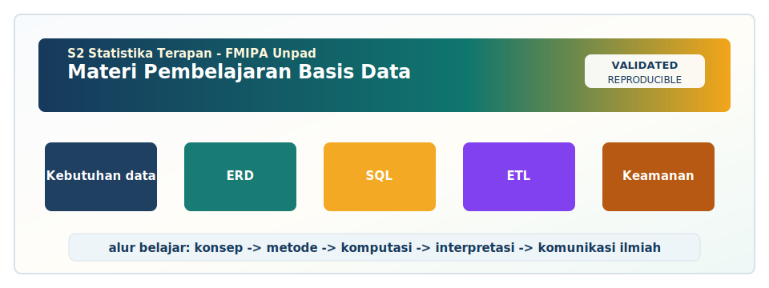

<!-- BEGIN UNPAD MATERIAL STYLE -->
<style>
:root {
  --unpad-navy: #17395c;
  --unpad-gold: #f2a51a;
  --unpad-teal: #0f766e;
  --unpad-ink: #172033;
  --unpad-paper: #fffdf8;
  --unpad-soft: #eef5f8;
  --unpad-line: #d7e2ea;
}
html, body {
  background: linear-gradient(135deg, #f8fbfd 0%, #fffdf8 48%, #f3f6ee 100%) !important;
  color: var(--unpad-ink) !important;
}
body {
  font-family: "Segoe UI", Arial, sans-serif !important;
  line-height: 1.72 !important;
}
.main-container {
  max-width: 1180px !important;
  background: rgba(255, 253, 248, 0.98) !important;
  border: 1px solid var(--unpad-line) !important;
  border-radius: 8px !important;
  box-shadow: 0 18px 42px rgba(23, 57, 92, 0.12) !important;
}
h1, h2, h3, h4 {
  letter-spacing: 0 !important;
}
h1.title {
  color: var(--unpad-navy) !important;
  -webkit-text-fill-color: var(--unpad-navy) !important;
  background: none !important;
}
h2 {
  border-left-color: var(--unpad-gold) !important;
}
a {
  color: #0b5c86 !important;
}
pre, code {
  border-radius: 8px !important;
}
.unpad-cover {
  margin: 18px 0 26px;
  padding: 24px;
  border-radius: 8px;
  background: linear-gradient(135deg, #17395c 0%, #0f766e 58%, #f2a51a 100%);
  color: #ffffff;
  box-shadow: 0 18px 36px rgba(23, 57, 92, 0.22);
}
.unpad-cover__brand {
  display: grid;
  grid-template-columns: 92px 1fr;
  gap: 20px;
  align-items: center;
}
.unpad-cover img {
  width: 92px;
  height: 92px;
  object-fit: contain;
  background: #ffffff;
  border-radius: 8px;
  padding: 8px;
  box-shadow: 0 8px 22px rgba(0,0,0,0.18);
}
.unpad-kicker {
  text-transform: uppercase;
  font-size: 0.82rem;
  font-weight: 800;
  letter-spacing: 0;
  color: #fff8dc;
}
.unpad-cover h2 {
  margin: 6px 0 8px;
  padding: 0;
  border: 0;
  background: transparent;
  color: #ffffff !important;
  font-size: 1.65rem;
}
.unpad-meta {
  margin: 0;
  color: #f7fbff;
  font-weight: 600;
}
.materi-illustration {
  margin: 20px 0 24px;
  padding: 14px;
  background: #ffffff;
  border: 1px solid var(--unpad-line);
  border-radius: 8px;
  box-shadow: 0 12px 28px rgba(23, 57, 92, 0.10);
}
.materi-illustration img {
  width: 100%;
  height: auto;
  display: block;
  border-radius: 6px;
}
.validasi-akademik {
  margin: 18px 0 28px;
  padding: 16px 18px;
  background: linear-gradient(135deg, #eef8f6, #fff8e7);
  border-left: 8px solid var(--unpad-teal);
  border-radius: 8px;
  color: var(--unpad-ink);
}
.validasi-akademik strong {
  color: var(--unpad-navy);
}
table {
  border-radius: 8px !important;
}
@media (max-width: 760px) {
  .unpad-cover__brand {
    grid-template-columns: 1fr;
  }
  .unpad-cover img {
    width: 76px;
    height: 76px;
  }
}
</style>
<!-- END UNPAD MATERIAL STYLE -->


<!-- BEGIN UNPAD MATERIAL ENHANCEMENT -->

```{r setup-unpad-render, include=FALSE}
execute_code <- FALSE
knitr::opts_chunk$set(
  echo = TRUE,
  eval = FALSE,
  message = FALSE,
  warning = FALSE,
  fig.align = "center",
  fig.width = 8,
  fig.height = 4.8,
  dpi = 120
)
set.seed(2025)
```


<div class="unpad-cover">
<div class="unpad-cover__brand">

<div>
<div class="unpad-kicker">S2 Statistika Terapan | FMIPA Universitas Padjadjaran</div>
<h2>Materi Pembelajaran Basis Data</h2>
<p class="unpad-meta">Program Studi S2 Statistika Terapan, FMIPA Universitas Padjadjaran<br>Penulis: Dr. Bertho Tantular, M.Si | Januari 2025</p>
</div>
</div>
</div>

<div class="materi-illustration">

</div>

<div class="validasi-akademik">
<strong>Catatan validasi akademik.</strong> Materi ini diseragamkan dengan rujukan ADWTL Januari 2025: rumus dibaca bersama asumsi, contoh kode diposisikan sebagai template reproducible, dan interpretasi diarahkan pada validitas data, diagnosis model, evaluasi ketidakpastian, serta komunikasi hasil secara ilmiah.
</div>

<!-- END UNPAD MATERIAL ENHANCEMENT -->

<style>
:root{
  --brown-900:#3b2116; --brown-800:#5a3321; --brown-700:#7a4a2e;
  --brown-600:#9b6843; --brown-500:#b9875a; --brown-300:#e8cfb4;
  --brown-200:#f3e2d3; --cream:#fff8ee; --ink:#15110e; --muted:#5e5148;
}
html, body { background: linear-gradient(135deg, #fff8ee 0%, #f8ead9 35%, #eed1b4 100%); color: var(--ink); }
body { font-family: 'Segoe UI', Roboto, Arial, sans-serif; line-height: 1.72; font-size: 16.5px; }
h1, h2, h3, h4 { color: var(--brown-900); font-weight: 800; letter-spacing: .1px; }
h1.title { color: #fff; background: linear-gradient(120deg, #3b2116, #8a5735, #d7a56e); padding: 32px; border-radius: 26px; box-shadow: 0 12px 32px rgba(70, 38, 20, .22); }
.subtitle, .author, .date { color: var(--brown-800); font-weight: 650; }
#TOC, .tocify { background: rgba(255,248,238,.96); border: 1px solid #d8b28a; border-radius: 18px; box-shadow: 0 8px 24px rgba(68,37,18,.16); padding: 12px; }
.tocify .tocify-item a, #TOC a { color: var(--brown-800); }
a { color: #7a3f1d; font-weight: 650; }
.section.level1, .section.level2, .section.level3 { scroll-margin-top: 18px; }
.hero-card { background: linear-gradient(135deg, #4a2a1a 0%, #8b5a35 45%, #e3b278 100%); color: #fff; padding: 28px; border-radius: 28px; margin: 22px 0 28px; box-shadow: 0 10px 30px rgba(80,42,18,.25); }
.hero-card strong { color:#fff7de; }
.info-box, .case-box, .task-box, .warning-box, .reading-box, .summary-box { border-radius: 20px; padding: 20px 24px; margin: 22px 0; box-shadow: 0 6px 20px rgba(80,42,18,.08); }
.info-box { background: linear-gradient(135deg, #fff6e9, #f3dcc4); border-left: 8px solid #9b6843; }
.case-box { background: #fffaf2; border: 1px solid #d5aa7b; }
.task-box { background: linear-gradient(135deg, #f7e5ce, #fff8ee); border-left: 8px solid #b98052; }
.warning-box { background: #fff0df; border-left: 8px solid #7a3d20; }
.reading-box { background: #f7eadc; border-left: 8px solid #c39162; }
.summary-box { background: linear-gradient(135deg, #fffaf2, #ead0b2); border: 1px solid #d1aa83; }
.formula { background: var(--brown-200); color: #000; border: 1px solid #d8b28a; padding: 16px 18px; margin: 18px 0; border-radius: 18px; overflow-x:auto; box-shadow: inset 0 0 0 1px rgba(255,255,255,.55); }
pre, pre.sourceCode, div.sourceCode pre { background: #f3e2d3 !important; color: #000 !important; border: 1px solid #d0aa84; border-radius: 16px; padding: 16px; }
code { background: #f3e2d3; color: #000; border-radius: 6px; padding: 2px 5px; }
table { width: 100%; border-collapse: collapse; margin: 18px 0; background: #fffaf2; border-radius: 14px; overflow:hidden; }
th { background: #7a4a2e; color: #fff; }
th, td { padding: 10px 12px; border: 1px solid #d8b28a; vertical-align: top; }
blockquote { border-left: 7px solid #9b6843; background: #fff8ee; padding: 12px 18px; color: #392316; border-radius: 12px; }
.diagram { background: #fffaf2; border: 1px solid #d5aa7b; border-radius: 20px; padding: 18px; margin: 24px 0; text-align:center; }
.badge { display: inline-block; background:#7a4a2e; color:#fff; border-radius:999px; padding:4px 10px; font-size:.85em; margin-right:6px; }
hr { border: 0; height: 2px; background: linear-gradient(90deg, transparent, #b9875a, transparent); margin: 32px 0; }
</style>


<div class="hero-card">
<h2>Basis Data untuk Riset Statistik Terapan</h2>
<p><strong>Program Studi:</strong> S2 Statistika Terapan, FMIPA Universitas Padjadjaran</p>
<p><strong>Dosen Pengampu dan Penulis RPS:</strong> Dr. Bertho Tantular, M.Si</p>
<p><strong>Tahun Pembuatan Materi:</strong> Januari 2025</p>
<p>Materi ini disusun sebagai bahan ajar profesional berbasis R Markdown dengan nuansa coklat degradasi. Isi diselaraskan dengan RPS mata kuliah Basis Data, termasuk capaian pembelajaran, SubCPMK, bahan kajian, metode pembelajaran, tugas, proyek, UTS, UAS, dan rubrik penilaian.</p>
</div>

# Identitas Mata Kuliah dan Orientasi Pembelajaran

<div class="info-box">
Mata kuliah <strong>Basis Data</strong> pada Program Studi S2 Statistika Terapan FMIPA Universitas Padjadjaran dirancang untuk memperkuat kemampuan mahasiswa dalam merancang, mengelola, mengintegrasikan, mengotomasi, mengevaluasi, dan mengembangkan basis data statistik. Fokus utamanya bukan sekadar membuat tabel, melainkan membangun ekosistem data yang dapat menopang riset multidisiplin, analisis statistik, dan pelaporan berbasis bukti.
</div>

## Posisi Mata Kuliah dalam Kurikulum

Mata kuliah ini berada pada semester dua dengan bobot teori dan praktikum. Orientasinya sangat aplikatif: mahasiswa diharapkan mampu bergerak dari analisis kebutuhan data, perancangan ERD, implementasi SQL/MySQL lanjutan, integrasi data, ETL, aplikasi web, hingga evaluasi kualitas dan keamanan basis data. Dalam konteks S2 Statistika Terapan, kemampuan tersebut menjadi fondasi untuk penelitian yang menggunakan data survei, data administratif, data transaksi, data longitudinal, data spasial, maupun data hasil eksperimen.

Basis data yang baik membuat proses analisis statistik lebih dapat dipercaya. Model statistik yang canggih sekalipun akan rapuh jika data disimpan secara tidak konsisten, tidak terdokumentasi, tidak memiliki kunci yang jelas, tidak memiliki prosedur validasi, atau sulit direproduksi. Karena itu, materi ini menempatkan basis data sebagai infrastruktur ilmiah: ia mengatur bagaimana data lahir, berpindah, berubah, dianalisis, diaudit, dan dilaporkan.

## Capaian Pembelajaran Mata Kuliah

Capaian pembelajaran yang menjadi kerangka materi ini adalah sebagai berikut.

| CPMK | Rumusan Kemampuan |
|---|---|
| CPMK1 | Mampu menganalisis kebutuhan, struktur, dan arsitektur basis data multidisiplin untuk mendukung riset statistik. |
| CPMK2 | Mampu mengimplementasikan query dan operasi basis data lanjutan untuk eksplorasi, analisis, dan integrasi data. |
| CPMK3 | Mampu mengembangkan otomasi pengolahan dan pelaporan basis data statistik melalui scripting dan aplikasi terintegrasi. |
| CPMK4 | Mampu mengevaluasi kualitas, keamanan, dan inovasi aplikasi basis data statistik dalam konteks riset kolaboratif. |

Keempat CPMK tersebut diterjemahkan menjadi empat kelompok SubCPMK: analisis kebutuhan dan ERD, implementasi SQL/MySQL lanjutan, pengembangan ETL dan aplikasi web, serta evaluasi kualitas, keamanan, dan inovasi. Struktur ini mengikuti prinsip pembelajaran bertahap: mahasiswa lebih dahulu memahami desain data, kemudian mengoperasikan data, lalu mengotomasi proses, dan akhirnya mengevaluasi sistem secara kritis.

## Peta Materi 16 Pertemuan

| Pertemuan | Fokus Utama | Produk Belajar |
|---|---|---|
| 1-4 | Konsep basis data, data warehouse, analisis kebutuhan, ERD, model relasional | Dokumen kebutuhan data, ERD, skema awal |
| 5-7 | Aljabar relasional, SQL/MySQL lanjutan, join, subquery, agregasi, optimasi | Script SQL dan laporan analisis query |
| 8 | UTS proyek pendahuluan | Proposal, ERD, query awal, presentasi |
| 9-12 | Integrasi data, ETL, otomasi, aplikasi web, reporting statistik | Workflow ETL dan prototype aplikasi |
| 13-15 | Audit kualitas, keamanan, interoperabilitas, open data, inovasi | Laporan evaluasi dan proposal inovasi |
| 16 | UAS proyek akhir | Laporan final, demonstrasi aplikasi, presentasi |

<div class="diagram">
<svg width="860" height="210" viewBox="0 0 860 210" xmlns="http://www.w3.org/2000/svg" role="img" aria-label="Arsitektur basis data untuk riset statistik">
<defs><linearGradient id="g" x1="0" x2="1"><stop stop-color="#5a3321"/><stop offset="1" stop-color="#d7a56e"/></linearGradient></defs>
<rect x="20" y="30" width="145" height="70" rx="16" fill="#f3e2d3" stroke="#9b6843"/><text x="92" y="58" text-anchor="middle" font-size="15" font-weight="700">Sumber Data</text><text x="92" y="82" text-anchor="middle" font-size="13">CSV, API, survei</text>
<rect x="220" y="30" width="145" height="70" rx="16" fill="#f3e2d3" stroke="#9b6843"/><text x="292" y="58" text-anchor="middle" font-size="15" font-weight="700">ETL</text><text x="292" y="82" text-anchor="middle" font-size="13">clean, transform</text>
<rect x="420" y="30" width="145" height="70" rx="16" fill="#f3e2d3" stroke="#9b6843"/><text x="492" y="58" text-anchor="middle" font-size="15" font-weight="700">Basis Data</text><text x="492" y="82" text-anchor="middle" font-size="13">OLTP/relasional</text>
<rect x="620" y="30" width="175" height="70" rx="16" fill="#f3e2d3" stroke="#9b6843"/><text x="707" y="58" text-anchor="middle" font-size="15" font-weight="700">Analisis Statistik</text><text x="707" y="82" text-anchor="middle" font-size="13">R, Python, dashboard</text>
<path d="M165 65 H220" stroke="url(#g)" stroke-width="6" marker-end="url(#arrow)"/><path d="M365 65 H420" stroke="url(#g)" stroke-width="6"/><path d="M565 65 H620" stroke="url(#g)" stroke-width="6"/>
<defs><marker id="arrow" markerWidth="10" markerHeight="10" refX="8" refY="3" orient="auto"><path d="M0,0 L0,6 L9,3 z" fill="#7a4a2e" /></marker></defs>
<rect x="120" y="135" width="620" height="44" rx="18" fill="#7a4a2e" opacity="0.95"/><text x="430" y="163" fill="white" text-anchor="middle" font-size="15" font-weight="700">Prinsip: desain konseptual → integritas → query → otomasi → evaluasi kualitas & keamanan</text>
</svg></div>

## Cara Menggunakan Modul Ini

Modul ini dapat dibaca secara berurutan atau digunakan sebagai referensi praktikum. Setiap bab mengikuti pola yang relatif konsisten: orientasi konsep, istilah penting, formulasi teknis, contoh kasus statistik, contoh sintaks, latihan, dan refleksi. Pada bagian kode, sebagian contoh ditulis dalam SQL, MySQL, R, Python, dan PHP secara selektif. Banyak kode diberi opsi `eval=FALSE` agar dapat ditampilkan aman di HTML tanpa membutuhkan koneksi database lokal.

<div class="reading-box">
Referensi utama yang digunakan dalam modul ini meliputi buku sistem basis data klasik dan modern, rujukan data warehouse, data management, ETL, serta integrasi R/Python. Beberapa rujukan dasar mengikuti pustaka pada RPS seperti Elmasri dan Navathe, Ramakrishnan dan Gehrke, Ullman, Beynon-Davies, serta Bulger, Greenspan, dan Wall. Rujukan tambahan digunakan untuk memperluas konteks data warehouse, data quality, keamanan, dan aplikasi data-intensive modern.
</div>

# Pertemuan 1: Pendahuluan Sistem Basis Data untuk Riset Statistik

<span class="badge">SubCPMK1</span> <span class="badge">Basis Data Statistik</span> <span class="badge">S2 Statistika Terapan</span>


<div class="info-box">
Bab ini membahas **pendahuluan sistem basis data untuk riset statistik** dalam konteks riset kesehatan masyarakat, survei sosial, aktuaria, dan sains data. Sasaran akhirnya adalah mahasiswa mampu menghasilkan **daftar kebutuhan data awal dan kamus data** yang dapat dipakai sebagai bagian dari proyek basis data statistik. Rujukan konseptual utama bab ini antara lain [@elmasri2015; @ramakrishnan2002; @dama2017].
</div>

## Tujuan Pembelajaran

Setelah mempelajari bab ini, mahasiswa diharapkan mampu menjelaskan konsep utama pada topik pendahuluan sistem basis data untuk riset statistik, menerapkannya pada kasus riset statistik, menyusun artefak pembelajaran berupa daftar kebutuhan data awal dan kamus data, serta mengevaluasi keterbatasan desain atau implementasinya. Tujuan ini selaras dengan logika pembelajaran berbasis proyek: pemahaman konsep harus berujung pada produk yang dapat diperiksa, dijalankan, dan dipresentasikan.

Mahasiswa juga diharapkan mampu menghubungkan topik ini dengan proses analisis statistik. Dengan demikian, pembelajaran tidak berhenti pada level administrasi data, tetapi masuk ke pertanyaan yang lebih substantif: apakah struktur data sudah mendukung estimasi yang valid, visualisasi yang benar, pelaporan yang efisien, dan keputusan yang dapat dipertanggungjawabkan?

## Narasi Kasus Pembuka

Bayangkan sebuah tim riset sedang mengerjakan riset kesehatan masyarakat, survei sosial, aktuaria, dan sains data. Tim tersebut memiliki data dari beberapa sumber, format berbeda, periode berbeda, dan tingkat agregasi berbeda. Sebagian data berada dalam file spreadsheet, sebagian dalam database institusi, sebagian lagi berasal dari API atau dokumen publik. Tanpa rancangan basis data yang sistematis, pekerjaan analisis akan tersendat oleh masalah yang berulang: kolom tidak konsisten, kode wilayah berubah, nilai hilang tidak terdokumentasi, dan hasil query sulit direproduksi. Pada bab ini, masalah tersebut diurai melalui perspektif pendahuluan sistem basis data untuk riset statistik.

Kasus pembuka ini penting karena sebagian besar proyek statistik terapan tidak dimulai dari data yang sudah rapi. Data sering datang sebagai kumpulan potongan informasi yang perlu dirapikan, disatukan, diberi makna, dan dijaga kualitasnya. Peran basis data adalah menyediakan struktur agar potongan tersebut dapat menjadi sistem informasi yang siap dianalisis.

## Konsep Inti

### Data

Dalam praktik riset statistik, konsep **data** harus dipahami bukan hanya sebagai istilah teknis, tetapi sebagai keputusan desain. Ketika seorang peneliti memilih struktur data, ia sebenarnya sedang menentukan bagaimana data dapat ditelusuri, divalidasi, dan dianalisis ulang oleh peneliti lain. Keputusan kecil pada tahap ini dapat menentukan apakah analisis berikutnya berjalan rapi atau justru menjadi proses penelusuran inkonsistensi data yang memakan waktu.

Konsep **data** juga berkaitan dengan reproducibility. Data yang tersimpan dengan definisi data yang jelas akan lebih mudah dihubungkan dengan skrip statistik, laporan R Markdown, dashboard, atau aplikasi web. Dalam ekosistem riset kolaboratif, kejelasan ini mengurangi salah tafsir antaranggota tim, terutama ketika tim terdiri dari ahli statistik, pakar domain, pengambil kebijakan, dan pengembang aplikasi.

Dari sisi desain sistem, **data** menuntut konsistensi antara kebutuhan konseptual dan implementasi fisik. Desain yang tampak sederhana pada ERD dapat menjadi rumit ketika masuk ke SQL, indeks, keamanan, dan integrasi data. Karena itu mahasiswa perlu melihat data sebagai jembatan antara logika riset dan struktur komputasi.

Dalam konteks pembelajaran S2, penguasaan **data** harus menghasilkan kemampuan evaluatif. Mahasiswa tidak hanya ditanya apa definisinya, tetapi diminta menilai apakah penggunaan data pada suatu kasus sudah tepat, efisien, aman, dan mendukung analisis statistik. Dengan cara ini, basis data tidak berhenti sebagai keterampilan teknis, melainkan menjadi bagian dari metodologi riset.

Secara praktis, pembahasan **data** harus selalu dikaitkan dengan dokumentasi. Dokumentasi membuat rancangan dapat dibaca oleh orang lain, bukan hanya oleh pembuatnya. Pada proyek kelompok, dokumentasi mencegah ketergantungan pada satu anggota yang 'paling tahu isi data'. Dalam riset profesional, ketergantungan seperti itu merupakan risiko operasional.

### Informasi

Dalam praktik riset statistik, konsep **informasi** harus dipahami bukan hanya sebagai istilah teknis, tetapi sebagai keputusan desain. Ketika seorang peneliti memilih struktur informasi, ia sebenarnya sedang menentukan bagaimana data dapat ditelusuri, divalidasi, dan dianalisis ulang oleh peneliti lain. Keputusan kecil pada tahap ini dapat menentukan apakah analisis berikutnya berjalan rapi atau justru menjadi proses penelusuran inkonsistensi data yang memakan waktu.

Konsep **informasi** juga berkaitan dengan reproducibility. Data yang tersimpan dengan definisi informasi yang jelas akan lebih mudah dihubungkan dengan skrip statistik, laporan R Markdown, dashboard, atau aplikasi web. Dalam ekosistem riset kolaboratif, kejelasan ini mengurangi salah tafsir antaranggota tim, terutama ketika tim terdiri dari ahli statistik, pakar domain, pengambil kebijakan, dan pengembang aplikasi.

Dari sisi desain sistem, **informasi** menuntut konsistensi antara kebutuhan konseptual dan implementasi fisik. Desain yang tampak sederhana pada ERD dapat menjadi rumit ketika masuk ke SQL, indeks, keamanan, dan integrasi data. Karena itu mahasiswa perlu melihat informasi sebagai jembatan antara logika riset dan struktur komputasi.

Dalam konteks pembelajaran S2, penguasaan **informasi** harus menghasilkan kemampuan evaluatif. Mahasiswa tidak hanya ditanya apa definisinya, tetapi diminta menilai apakah penggunaan informasi pada suatu kasus sudah tepat, efisien, aman, dan mendukung analisis statistik. Dengan cara ini, basis data tidak berhenti sebagai keterampilan teknis, melainkan menjadi bagian dari metodologi riset.

### Metadata

Dalam praktik riset statistik, konsep **metadata** harus dipahami bukan hanya sebagai istilah teknis, tetapi sebagai keputusan desain. Ketika seorang peneliti memilih struktur metadata, ia sebenarnya sedang menentukan bagaimana data dapat ditelusuri, divalidasi, dan dianalisis ulang oleh peneliti lain. Keputusan kecil pada tahap ini dapat menentukan apakah analisis berikutnya berjalan rapi atau justru menjadi proses penelusuran inkonsistensi data yang memakan waktu.

Konsep **metadata** juga berkaitan dengan reproducibility. Data yang tersimpan dengan definisi metadata yang jelas akan lebih mudah dihubungkan dengan skrip statistik, laporan R Markdown, dashboard, atau aplikasi web. Dalam ekosistem riset kolaboratif, kejelasan ini mengurangi salah tafsir antaranggota tim, terutama ketika tim terdiri dari ahli statistik, pakar domain, pengambil kebijakan, dan pengembang aplikasi.

Dari sisi desain sistem, **metadata** menuntut konsistensi antara kebutuhan konseptual dan implementasi fisik. Desain yang tampak sederhana pada ERD dapat menjadi rumit ketika masuk ke SQL, indeks, keamanan, dan integrasi data. Karena itu mahasiswa perlu melihat metadata sebagai jembatan antara logika riset dan struktur komputasi.

Dalam konteks pembelajaran S2, penguasaan **metadata** harus menghasilkan kemampuan evaluatif. Mahasiswa tidak hanya ditanya apa definisinya, tetapi diminta menilai apakah penggunaan metadata pada suatu kasus sudah tepat, efisien, aman, dan mendukung analisis statistik. Dengan cara ini, basis data tidak berhenti sebagai keterampilan teknis, melainkan menjadi bagian dari metodologi riset.

Secara praktis, pembahasan **metadata** harus selalu dikaitkan dengan dokumentasi. Dokumentasi membuat rancangan dapat dibaca oleh orang lain, bukan hanya oleh pembuatnya. Pada proyek kelompok, dokumentasi mencegah ketergantungan pada satu anggota yang 'paling tahu isi data'. Dalam riset profesional, ketergantungan seperti itu merupakan risiko operasional.

### Dbms

Dalam praktik riset statistik, konsep **DBMS** harus dipahami bukan hanya sebagai istilah teknis, tetapi sebagai keputusan desain. Ketika seorang peneliti memilih struktur DBMS, ia sebenarnya sedang menentukan bagaimana data dapat ditelusuri, divalidasi, dan dianalisis ulang oleh peneliti lain. Keputusan kecil pada tahap ini dapat menentukan apakah analisis berikutnya berjalan rapi atau justru menjadi proses penelusuran inkonsistensi data yang memakan waktu.

Konsep **DBMS** juga berkaitan dengan reproducibility. Data yang tersimpan dengan definisi DBMS yang jelas akan lebih mudah dihubungkan dengan skrip statistik, laporan R Markdown, dashboard, atau aplikasi web. Dalam ekosistem riset kolaboratif, kejelasan ini mengurangi salah tafsir antaranggota tim, terutama ketika tim terdiri dari ahli statistik, pakar domain, pengambil kebijakan, dan pengembang aplikasi.

Dari sisi desain sistem, **DBMS** menuntut konsistensi antara kebutuhan konseptual dan implementasi fisik. Desain yang tampak sederhana pada ERD dapat menjadi rumit ketika masuk ke SQL, indeks, keamanan, dan integrasi data. Karena itu mahasiswa perlu melihat DBMS sebagai jembatan antara logika riset dan struktur komputasi.

Dalam konteks pembelajaran S2, penguasaan **DBMS** harus menghasilkan kemampuan evaluatif. Mahasiswa tidak hanya ditanya apa definisinya, tetapi diminta menilai apakah penggunaan DBMS pada suatu kasus sudah tepat, efisien, aman, dan mendukung analisis statistik. Dengan cara ini, basis data tidak berhenti sebagai keterampilan teknis, melainkan menjadi bagian dari metodologi riset.

### Skema

Dalam praktik riset statistik, konsep **skema** harus dipahami bukan hanya sebagai istilah teknis, tetapi sebagai keputusan desain. Ketika seorang peneliti memilih struktur skema, ia sebenarnya sedang menentukan bagaimana data dapat ditelusuri, divalidasi, dan dianalisis ulang oleh peneliti lain. Keputusan kecil pada tahap ini dapat menentukan apakah analisis berikutnya berjalan rapi atau justru menjadi proses penelusuran inkonsistensi data yang memakan waktu.

Konsep **skema** juga berkaitan dengan reproducibility. Data yang tersimpan dengan definisi skema yang jelas akan lebih mudah dihubungkan dengan skrip statistik, laporan R Markdown, dashboard, atau aplikasi web. Dalam ekosistem riset kolaboratif, kejelasan ini mengurangi salah tafsir antaranggota tim, terutama ketika tim terdiri dari ahli statistik, pakar domain, pengambil kebijakan, dan pengembang aplikasi.

Dari sisi desain sistem, **skema** menuntut konsistensi antara kebutuhan konseptual dan implementasi fisik. Desain yang tampak sederhana pada ERD dapat menjadi rumit ketika masuk ke SQL, indeks, keamanan, dan integrasi data. Karena itu mahasiswa perlu melihat skema sebagai jembatan antara logika riset dan struktur komputasi.

Dalam konteks pembelajaran S2, penguasaan **skema** harus menghasilkan kemampuan evaluatif. Mahasiswa tidak hanya ditanya apa definisinya, tetapi diminta menilai apakah penggunaan skema pada suatu kasus sudah tepat, efisien, aman, dan mendukung analisis statistik. Dengan cara ini, basis data tidak berhenti sebagai keterampilan teknis, melainkan menjadi bagian dari metodologi riset.

Secara praktis, pembahasan **skema** harus selalu dikaitkan dengan dokumentasi. Dokumentasi membuat rancangan dapat dibaca oleh orang lain, bukan hanya oleh pembuatnya. Pada proyek kelompok, dokumentasi mencegah ketergantungan pada satu anggota yang 'paling tahu isi data'. Dalam riset profesional, ketergantungan seperti itu merupakan risiko operasional.

### Instance

Dalam praktik riset statistik, konsep **instance** harus dipahami bukan hanya sebagai istilah teknis, tetapi sebagai keputusan desain. Ketika seorang peneliti memilih struktur instance, ia sebenarnya sedang menentukan bagaimana data dapat ditelusuri, divalidasi, dan dianalisis ulang oleh peneliti lain. Keputusan kecil pada tahap ini dapat menentukan apakah analisis berikutnya berjalan rapi atau justru menjadi proses penelusuran inkonsistensi data yang memakan waktu.

Konsep **instance** juga berkaitan dengan reproducibility. Data yang tersimpan dengan definisi instance yang jelas akan lebih mudah dihubungkan dengan skrip statistik, laporan R Markdown, dashboard, atau aplikasi web. Dalam ekosistem riset kolaboratif, kejelasan ini mengurangi salah tafsir antaranggota tim, terutama ketika tim terdiri dari ahli statistik, pakar domain, pengambil kebijakan, dan pengembang aplikasi.

Dari sisi desain sistem, **instance** menuntut konsistensi antara kebutuhan konseptual dan implementasi fisik. Desain yang tampak sederhana pada ERD dapat menjadi rumit ketika masuk ke SQL, indeks, keamanan, dan integrasi data. Karena itu mahasiswa perlu melihat instance sebagai jembatan antara logika riset dan struktur komputasi.

Dalam konteks pembelajaran S2, penguasaan **instance** harus menghasilkan kemampuan evaluatif. Mahasiswa tidak hanya ditanya apa definisinya, tetapi diminta menilai apakah penggunaan instance pada suatu kasus sudah tepat, efisien, aman, dan mendukung analisis statistik. Dengan cara ini, basis data tidak berhenti sebagai keterampilan teknis, melainkan menjadi bagian dari metodologi riset.

### Integritas

Dalam praktik riset statistik, konsep **integritas** harus dipahami bukan hanya sebagai istilah teknis, tetapi sebagai keputusan desain. Ketika seorang peneliti memilih struktur integritas, ia sebenarnya sedang menentukan bagaimana data dapat ditelusuri, divalidasi, dan dianalisis ulang oleh peneliti lain. Keputusan kecil pada tahap ini dapat menentukan apakah analisis berikutnya berjalan rapi atau justru menjadi proses penelusuran inkonsistensi data yang memakan waktu.

Konsep **integritas** juga berkaitan dengan reproducibility. Data yang tersimpan dengan definisi integritas yang jelas akan lebih mudah dihubungkan dengan skrip statistik, laporan R Markdown, dashboard, atau aplikasi web. Dalam ekosistem riset kolaboratif, kejelasan ini mengurangi salah tafsir antaranggota tim, terutama ketika tim terdiri dari ahli statistik, pakar domain, pengambil kebijakan, dan pengembang aplikasi.

Dari sisi desain sistem, **integritas** menuntut konsistensi antara kebutuhan konseptual dan implementasi fisik. Desain yang tampak sederhana pada ERD dapat menjadi rumit ketika masuk ke SQL, indeks, keamanan, dan integrasi data. Karena itu mahasiswa perlu melihat integritas sebagai jembatan antara logika riset dan struktur komputasi.

Dalam konteks pembelajaran S2, penguasaan **integritas** harus menghasilkan kemampuan evaluatif. Mahasiswa tidak hanya ditanya apa definisinya, tetapi diminta menilai apakah penggunaan integritas pada suatu kasus sudah tepat, efisien, aman, dan mendukung analisis statistik. Dengan cara ini, basis data tidak berhenti sebagai keterampilan teknis, melainkan menjadi bagian dari metodologi riset.

Secara praktis, pembahasan **integritas** harus selalu dikaitkan dengan dokumentasi. Dokumentasi membuat rancangan dapat dibaca oleh orang lain, bukan hanya oleh pembuatnya. Pada proyek kelompok, dokumentasi mencegah ketergantungan pada satu anggota yang 'paling tahu isi data'. Dalam riset profesional, ketergantungan seperti itu merupakan risiko operasional.

## Prinsip Teknis dan Formulasi

Topik pendahuluan sistem basis data untuk riset statistik dapat dirangkum melalui tiga prinsip: kejelasan struktur, keterlacakan proses, dan kesesuaian dengan kebutuhan analisis. Kejelasan struktur berarti tabel, relasi, tipe data, dan constraint dapat dijelaskan secara eksplisit. Keterlacakan proses berarti perubahan dari data mentah menuju data analisis memiliki log atau dokumentasi. Kesesuaian dengan kebutuhan analisis berarti desain data tidak hanya benar secara komputasional, tetapi juga relevan dengan tujuan statistik.


<div class="formula">

$$\text{Kualitas Sistem Data} = f(\text{struktur},\ \text{integritas},\ \text{keterlacakan},\ \text{keamanan},\ \text{kegunaan analitik})$$

</div>

Formula konseptual di atas bukan rumus estimasi, melainkan cara berpikir. Basis data yang baik tidak cukup hanya dapat menyimpan data. Ia harus menjaga integritas, memungkinkan audit, mengamankan akses, dan mempermudah analisis. Dalam konteks statistik, aspek kegunaan analitik menjadi sangat penting karena basis data pada akhirnya akan memberi makan model. Kalau makanannya kacau, model bisa ikut kacau; statistik juga butuh gizi data yang seimbang.

## Relevansi dengan Riset Statistik

Dalam analisis regresi, klasifikasi, survival, spasial, atau longitudinal, setiap baris data harus merepresentasikan unit observasi yang benar. Jika unit observasi rancu, model statistik akan mempelajari struktur yang salah. Misalnya, campuran antara data individu dan data agregat wilayah tanpa penanda level dapat memunculkan ecological fallacy atau pseudo-replication.

Dalam pemodelan prediktif, desain basis data menentukan kemampuan membangun fitur. Fitur lag waktu, agregasi wilayah, indikator proporsi, atau ringkasan historis hanya dapat dibuat dengan benar jika kunci waktu, kunci lokasi, dan relasi antarentitas tersimpan konsisten. Karena itu, query SQL sering menjadi tahap feature engineering pertama sebelum R atau Python digunakan.

Dalam pelaporan statistik, basis data memungkinkan laporan otomatis yang konsisten dari waktu ke waktu. Ketika data diperbarui, query dan skrip yang sama dapat menghasilkan tabel dan grafik baru tanpa menyalin data secara manual. Ini meningkatkan efisiensi, mengurangi human error, dan membuat proses pelaporan lebih transparan.

Dalam riset kolaboratif, basis data menjadi mekanisme kontrol mutu. Peneliti dapat menelusuri asal data, memeriksa perubahan, dan menilai apakah proses pembersihan dilakukan sesuai prosedur. Hal ini mendukung audit ilmiah dan memudahkan reviewer memahami bagaimana data mentah berubah menjadi data analisis.

## Langkah Kerja Praktis

1. Definisikan masalah riset dan unit observasi yang relevan untuk riset kesehatan masyarakat, survei sosial, aktuaria, dan sains data.
2. Identifikasi sumber data, format file, pemilik data, frekuensi pembaruan, dan risiko kualitas data.
3. Rancang artefak utama berupa daftar kebutuhan data awal dan kamus data dan dokumentasikan asumsi desainnya.
4. Implementasikan rancangan dalam SQL, R, Python, atau aplikasi web sesuai kebutuhan praktikum.
5. Uji konsistensi hasil melalui query validasi, pemeriksaan duplikasi, ringkasan statistik, dan diskusi kelompok.
6. Susun laporan ringkas yang menjelaskan desain, hasil, keterbatasan, dan rekomendasi perbaikan.

## Contoh Sintaks

```sql
-- contoh: melihat daftar tabel pada MySQL
SHOW TABLES;
DESCRIBE responden;
```

Contoh kode di atas sengaja dibuat ringkas agar fokus pembelajaran berada pada logika. Dalam praktikum, mahasiswa perlu menyesuaikan nama tabel, nama kolom, tipe data, dan constraint dengan desain kasus masing-masing. Kode yang baik tidak hanya berjalan, tetapi juga mudah dibaca, aman, dan dapat dipertanggungjawabkan dalam laporan.

## Studi Kasus Mini

Pada studi kasus mini, mahasiswa diminta mengembangkan skenario riset kesehatan masyarakat, survei sosial, aktuaria, dan sains data. Misalkan terdapat entitas utama seperti wilayah, waktu, responden, observasi, indikator, dan sumber data. Mahasiswa harus menjawab pertanyaan: data apa yang dibutuhkan, bagaimana relasi antarentitas, bagaimana validasi dilakukan, dan bagaimana hasilnya dapat dipakai untuk analisis statistik. Jawaban tidak boleh berhenti pada gambar ERD atau query SQL; mahasiswa harus menjelaskan alasan metodologis di balik desain tersebut.

Contoh pertanyaan analitik yang dapat digunakan adalah: wilayah mana yang memiliki rata-rata indikator tertinggi, bagaimana perubahan indikator antarperiode, apakah terdapat kelompok responden dengan karakteristik tertentu, dan bagaimana data dapat disiapkan untuk pemodelan statistik. Dengan pertanyaan seperti ini, basis data berfungsi langsung sebagai instrumen riset, bukan sekadar lemari penyimpanan digital.

## Kesalahan Umum yang Harus Dihindari

- Membuat tabel berdasarkan tampilan laporan, bukan berdasarkan entitas dan relasi. Akibatnya struktur data sulit diperluas.
- Menggunakan nama kolom yang ambigu, misalnya `nilai1`, `kode`, atau `status` tanpa kamus data.
- Tidak menetapkan kunci primer dan kunci asing, sehingga duplikasi dan inkonsistensi sulit dikendalikan.
- Mencampur data mentah, data bersih, dan hasil analisis dalam satu tabel tanpa penanda lineage.
- Menjalankan query besar tanpa indeks atau filter, lalu menyalahkan laptop. Laptop hanya korban; query-nya pelaku.
- Mengabaikan keamanan akses pada data sensitif, padahal data riset sering memuat informasi personal atau kelembagaan.

## Pengayaan Teoretis dan Diskusi

Sebuah basis data riset yang baik selalu memiliki jejak keputusan. Jejak itu tampak pada nama tabel, definisi variabel, tipe data, aturan validasi, kunci primer, kunci asing, serta dokumentasi transformasi. Tanpa jejak tersebut, data memang dapat dianalisis, tetapi kualitas inferensinya sulit dipertanggungjawabkan. Dalam riset terapan, situasi ini berbahaya karena hasil analisis sering dipakai sebagai dasar rekomendasi kebijakan, evaluasi program, atau pengambilan keputusan organisasi.

Ketika data berasal dari berbagai sumber, tantangan utama bukan hanya menyatukan file, tetapi menyatukan makna. Kolom `umur` pada satu tabel dapat berarti umur saat wawancara, sedangkan pada tabel lain berarti umur saat kejadian. Kolom `wilayah` dapat merujuk kabupaten, kecamatan, atau kode administratif. Basis data yang dirancang baik memaksa peneliti mendefinisikan makna tersebut secara eksplisit, sehingga proses integrasi tidak berubah menjadi teka-teki semantik.

Hubungan antara basis data dan statistik bersifat dua arah. Statistik membutuhkan basis data yang rapi agar estimasi, pengujian, prediksi, dan visualisasi dapat dilakukan secara konsisten. Sebaliknya, desain basis data juga perlu memahami kebutuhan statistik, misalnya struktur longitudinal, hierarki wilayah, unit observasi, periode waktu, kovariat, outcome, metadata, dan potensi agregasi. Inilah alasan mata kuliah ini ditempatkan sebagai mata kuliah praktis sekaligus konseptual.

Dalam organisasi riset modern, basis data juga berfungsi sebagai ruang kolaborasi. Mahasiswa, dosen, enumerator, analis, dan mitra eksternal dapat bekerja pada versi data yang sama jika sistemnya mendukung kontrol akses, dokumentasi, validasi, dan backup. Tanpa itu, versi data akan berkembang liar: `final.csv`, `final_baru.csv`, `final_beneran.csv`, dan akhirnya `final_fix_terakhir_yang_ini_pakai.xlsx`. Lucu sebentar, pusingnya bisa satu semester.

Kualitas rancangan basis data dapat dinilai dari kemampuannya bertahan terhadap perubahan. Ketika indikator baru ditambahkan, wilayah dimekarkan, definisi variabel berubah, atau jumlah observasi bertambah, sistem yang baik tetap dapat dikembangkan tanpa merusak struktur utama. Prinsip ini sangat penting untuk riset statistik terapan karena data jarang statis; ia berkembang mengikuti kebutuhan ilmiah dan kebutuhan pengguna.

Literatur sistem basis data menekankan bahwa desain konseptual, logis, dan fisik perlu dipisahkan agar sistem lebih mudah dievaluasi dan dikembangkan [@elmasri2015; @ramakrishnan2002; @dama2017]. Pemisahan ini sangat berguna untuk mahasiswa statistika karena kebutuhan analisis dapat berubah seiring bertambahnya pemahaman terhadap data. Rancangan yang fleksibel membuat perubahan tersebut tidak selalu memaksa pembangunan ulang dari nol.

Dalam pembelajaran berbasis proyek, dosen dapat meminta mahasiswa menuliskan catatan desain setiap minggu. Catatan itu berisi keputusan yang diambil, alternatif yang ditolak, alasan teknis, dan konsekuensi statistik. Dengan cara ini, proses belajar menjadi lebih reflektif. Mahasiswa tidak hanya mengumpulkan produk akhir, tetapi juga menunjukkan proses berpikir.

## Latihan Terstruktur

1. Buat satu contoh kasus nyata yang relevan dengan riset kesehatan masyarakat, survei sosial, aktuaria, dan sains data. Jelaskan unit observasi, sumber data, dan tujuan analisisnya.
2. Rancang minimal lima entitas atau tabel yang diperlukan. Jelaskan kunci primer, kunci asing, dan constraint penting.
3. Tulis minimal tiga query untuk menjawab pertanyaan statistik deskriptif.
4. Identifikasi dua risiko kualitas data dan dua risiko keamanan yang mungkin muncul.
5. Susun rekomendasi perbaikan desain agar sistem lebih mudah digunakan dalam riset kolaboratif.

## Refleksi Singkat

Refleksi utama bab ini adalah bahwa pendahuluan sistem basis data untuk riset statistik selalu berhubungan dengan kualitas pengetahuan yang dihasilkan dari data. Ketika mahasiswa mampu menjelaskan desain, menjalankan query, memvalidasi hasil, dan mengaitkannya dengan kebutuhan statistik, maka mahasiswa telah bergerak dari pengguna data menjadi perancang sistem data. Pada level magister, pergeseran ini penting karena lulusan diharapkan mampu mengelola masalah nyata secara mandiri, kritis, dan inovatif.

<hr>
# Pertemuan 2: Analisis Kebutuhan Data dan Pemodelan Konseptual

<span class="badge">SubCPMK1</span> <span class="badge">Basis Data Statistik</span> <span class="badge">S2 Statistika Terapan</span>


<div class="info-box">
Bab ini membahas **analisis kebutuhan data dan pemodelan konseptual** dalam konteks penelitian stunting kabupaten/kota yang memerlukan data anak, rumah tangga, fasilitas, dan wilayah. Sasaran akhirnya adalah mahasiswa mampu menghasilkan **dokumen requirement dan ERD konseptual** yang dapat dipakai sebagai bagian dari proyek basis data statistik. Rujukan konseptual utama bab ini antara lain [@connolly2015; @elmasri2015].
</div>

## Tujuan Pembelajaran

Setelah mempelajari bab ini, mahasiswa diharapkan mampu menjelaskan konsep utama pada topik analisis kebutuhan data dan pemodelan konseptual, menerapkannya pada kasus riset statistik, menyusun artefak pembelajaran berupa dokumen requirement dan ERD konseptual, serta mengevaluasi keterbatasan desain atau implementasinya. Tujuan ini selaras dengan logika pembelajaran berbasis proyek: pemahaman konsep harus berujung pada produk yang dapat diperiksa, dijalankan, dan dipresentasikan.

Mahasiswa juga diharapkan mampu menghubungkan topik ini dengan proses analisis statistik. Dengan demikian, pembelajaran tidak berhenti pada level administrasi data, tetapi masuk ke pertanyaan yang lebih substantif: apakah struktur data sudah mendukung estimasi yang valid, visualisasi yang benar, pelaporan yang efisien, dan keputusan yang dapat dipertanggungjawabkan?

## Narasi Kasus Pembuka

Bayangkan sebuah tim riset sedang mengerjakan penelitian stunting kabupaten/kota yang memerlukan data anak, rumah tangga, fasilitas, dan wilayah. Tim tersebut memiliki data dari beberapa sumber, format berbeda, periode berbeda, dan tingkat agregasi berbeda. Sebagian data berada dalam file spreadsheet, sebagian dalam database institusi, sebagian lagi berasal dari API atau dokumen publik. Tanpa rancangan basis data yang sistematis, pekerjaan analisis akan tersendat oleh masalah yang berulang: kolom tidak konsisten, kode wilayah berubah, nilai hilang tidak terdokumentasi, dan hasil query sulit direproduksi. Pada bab ini, masalah tersebut diurai melalui perspektif analisis kebutuhan data dan pemodelan konseptual.

Kasus pembuka ini penting karena sebagian besar proyek statistik terapan tidak dimulai dari data yang sudah rapi. Data sering datang sebagai kumpulan potongan informasi yang perlu dirapikan, disatukan, diberi makna, dan dijaga kualitasnya. Peran basis data adalah menyediakan struktur agar potongan tersebut dapat menjadi sistem informasi yang siap dianalisis.

## Konsep Inti

### Kebutuhan Fungsional

Dalam praktik riset statistik, konsep **kebutuhan fungsional** harus dipahami bukan hanya sebagai istilah teknis, tetapi sebagai keputusan desain. Ketika seorang peneliti memilih struktur kebutuhan fungsional, ia sebenarnya sedang menentukan bagaimana data dapat ditelusuri, divalidasi, dan dianalisis ulang oleh peneliti lain. Keputusan kecil pada tahap ini dapat menentukan apakah analisis berikutnya berjalan rapi atau justru menjadi proses penelusuran inkonsistensi data yang memakan waktu.

Konsep **kebutuhan fungsional** juga berkaitan dengan reproducibility. Data yang tersimpan dengan definisi kebutuhan fungsional yang jelas akan lebih mudah dihubungkan dengan skrip statistik, laporan R Markdown, dashboard, atau aplikasi web. Dalam ekosistem riset kolaboratif, kejelasan ini mengurangi salah tafsir antaranggota tim, terutama ketika tim terdiri dari ahli statistik, pakar domain, pengambil kebijakan, dan pengembang aplikasi.

Dari sisi desain sistem, **kebutuhan fungsional** menuntut konsistensi antara kebutuhan konseptual dan implementasi fisik. Desain yang tampak sederhana pada ERD dapat menjadi rumit ketika masuk ke SQL, indeks, keamanan, dan integrasi data. Karena itu mahasiswa perlu melihat kebutuhan fungsional sebagai jembatan antara logika riset dan struktur komputasi.

Dalam konteks pembelajaran S2, penguasaan **kebutuhan fungsional** harus menghasilkan kemampuan evaluatif. Mahasiswa tidak hanya ditanya apa definisinya, tetapi diminta menilai apakah penggunaan kebutuhan fungsional pada suatu kasus sudah tepat, efisien, aman, dan mendukung analisis statistik. Dengan cara ini, basis data tidak berhenti sebagai keterampilan teknis, melainkan menjadi bagian dari metodologi riset.

Secara praktis, pembahasan **kebutuhan fungsional** harus selalu dikaitkan dengan dokumentasi. Dokumentasi membuat rancangan dapat dibaca oleh orang lain, bukan hanya oleh pembuatnya. Pada proyek kelompok, dokumentasi mencegah ketergantungan pada satu anggota yang 'paling tahu isi data'. Dalam riset profesional, ketergantungan seperti itu merupakan risiko operasional.

### Kebutuhan Nonfungsional

Dalam praktik riset statistik, konsep **kebutuhan nonfungsional** harus dipahami bukan hanya sebagai istilah teknis, tetapi sebagai keputusan desain. Ketika seorang peneliti memilih struktur kebutuhan nonfungsional, ia sebenarnya sedang menentukan bagaimana data dapat ditelusuri, divalidasi, dan dianalisis ulang oleh peneliti lain. Keputusan kecil pada tahap ini dapat menentukan apakah analisis berikutnya berjalan rapi atau justru menjadi proses penelusuran inkonsistensi data yang memakan waktu.

Konsep **kebutuhan nonfungsional** juga berkaitan dengan reproducibility. Data yang tersimpan dengan definisi kebutuhan nonfungsional yang jelas akan lebih mudah dihubungkan dengan skrip statistik, laporan R Markdown, dashboard, atau aplikasi web. Dalam ekosistem riset kolaboratif, kejelasan ini mengurangi salah tafsir antaranggota tim, terutama ketika tim terdiri dari ahli statistik, pakar domain, pengambil kebijakan, dan pengembang aplikasi.

Dari sisi desain sistem, **kebutuhan nonfungsional** menuntut konsistensi antara kebutuhan konseptual dan implementasi fisik. Desain yang tampak sederhana pada ERD dapat menjadi rumit ketika masuk ke SQL, indeks, keamanan, dan integrasi data. Karena itu mahasiswa perlu melihat kebutuhan nonfungsional sebagai jembatan antara logika riset dan struktur komputasi.

Dalam konteks pembelajaran S2, penguasaan **kebutuhan nonfungsional** harus menghasilkan kemampuan evaluatif. Mahasiswa tidak hanya ditanya apa definisinya, tetapi diminta menilai apakah penggunaan kebutuhan nonfungsional pada suatu kasus sudah tepat, efisien, aman, dan mendukung analisis statistik. Dengan cara ini, basis data tidak berhenti sebagai keterampilan teknis, melainkan menjadi bagian dari metodologi riset.

### Entitas

Dalam praktik riset statistik, konsep **entitas** harus dipahami bukan hanya sebagai istilah teknis, tetapi sebagai keputusan desain. Ketika seorang peneliti memilih struktur entitas, ia sebenarnya sedang menentukan bagaimana data dapat ditelusuri, divalidasi, dan dianalisis ulang oleh peneliti lain. Keputusan kecil pada tahap ini dapat menentukan apakah analisis berikutnya berjalan rapi atau justru menjadi proses penelusuran inkonsistensi data yang memakan waktu.

Konsep **entitas** juga berkaitan dengan reproducibility. Data yang tersimpan dengan definisi entitas yang jelas akan lebih mudah dihubungkan dengan skrip statistik, laporan R Markdown, dashboard, atau aplikasi web. Dalam ekosistem riset kolaboratif, kejelasan ini mengurangi salah tafsir antaranggota tim, terutama ketika tim terdiri dari ahli statistik, pakar domain, pengambil kebijakan, dan pengembang aplikasi.

Dari sisi desain sistem, **entitas** menuntut konsistensi antara kebutuhan konseptual dan implementasi fisik. Desain yang tampak sederhana pada ERD dapat menjadi rumit ketika masuk ke SQL, indeks, keamanan, dan integrasi data. Karena itu mahasiswa perlu melihat entitas sebagai jembatan antara logika riset dan struktur komputasi.

Dalam konteks pembelajaran S2, penguasaan **entitas** harus menghasilkan kemampuan evaluatif. Mahasiswa tidak hanya ditanya apa definisinya, tetapi diminta menilai apakah penggunaan entitas pada suatu kasus sudah tepat, efisien, aman, dan mendukung analisis statistik. Dengan cara ini, basis data tidak berhenti sebagai keterampilan teknis, melainkan menjadi bagian dari metodologi riset.

Secara praktis, pembahasan **entitas** harus selalu dikaitkan dengan dokumentasi. Dokumentasi membuat rancangan dapat dibaca oleh orang lain, bukan hanya oleh pembuatnya. Pada proyek kelompok, dokumentasi mencegah ketergantungan pada satu anggota yang 'paling tahu isi data'. Dalam riset profesional, ketergantungan seperti itu merupakan risiko operasional.

### Atribut

Dalam praktik riset statistik, konsep **atribut** harus dipahami bukan hanya sebagai istilah teknis, tetapi sebagai keputusan desain. Ketika seorang peneliti memilih struktur atribut, ia sebenarnya sedang menentukan bagaimana data dapat ditelusuri, divalidasi, dan dianalisis ulang oleh peneliti lain. Keputusan kecil pada tahap ini dapat menentukan apakah analisis berikutnya berjalan rapi atau justru menjadi proses penelusuran inkonsistensi data yang memakan waktu.

Konsep **atribut** juga berkaitan dengan reproducibility. Data yang tersimpan dengan definisi atribut yang jelas akan lebih mudah dihubungkan dengan skrip statistik, laporan R Markdown, dashboard, atau aplikasi web. Dalam ekosistem riset kolaboratif, kejelasan ini mengurangi salah tafsir antaranggota tim, terutama ketika tim terdiri dari ahli statistik, pakar domain, pengambil kebijakan, dan pengembang aplikasi.

Dari sisi desain sistem, **atribut** menuntut konsistensi antara kebutuhan konseptual dan implementasi fisik. Desain yang tampak sederhana pada ERD dapat menjadi rumit ketika masuk ke SQL, indeks, keamanan, dan integrasi data. Karena itu mahasiswa perlu melihat atribut sebagai jembatan antara logika riset dan struktur komputasi.

Dalam konteks pembelajaran S2, penguasaan **atribut** harus menghasilkan kemampuan evaluatif. Mahasiswa tidak hanya ditanya apa definisinya, tetapi diminta menilai apakah penggunaan atribut pada suatu kasus sudah tepat, efisien, aman, dan mendukung analisis statistik. Dengan cara ini, basis data tidak berhenti sebagai keterampilan teknis, melainkan menjadi bagian dari metodologi riset.

### Relasi

Dalam praktik riset statistik, konsep **relasi** harus dipahami bukan hanya sebagai istilah teknis, tetapi sebagai keputusan desain. Ketika seorang peneliti memilih struktur relasi, ia sebenarnya sedang menentukan bagaimana data dapat ditelusuri, divalidasi, dan dianalisis ulang oleh peneliti lain. Keputusan kecil pada tahap ini dapat menentukan apakah analisis berikutnya berjalan rapi atau justru menjadi proses penelusuran inkonsistensi data yang memakan waktu.

Konsep **relasi** juga berkaitan dengan reproducibility. Data yang tersimpan dengan definisi relasi yang jelas akan lebih mudah dihubungkan dengan skrip statistik, laporan R Markdown, dashboard, atau aplikasi web. Dalam ekosistem riset kolaboratif, kejelasan ini mengurangi salah tafsir antaranggota tim, terutama ketika tim terdiri dari ahli statistik, pakar domain, pengambil kebijakan, dan pengembang aplikasi.

Dari sisi desain sistem, **relasi** menuntut konsistensi antara kebutuhan konseptual dan implementasi fisik. Desain yang tampak sederhana pada ERD dapat menjadi rumit ketika masuk ke SQL, indeks, keamanan, dan integrasi data. Karena itu mahasiswa perlu melihat relasi sebagai jembatan antara logika riset dan struktur komputasi.

Dalam konteks pembelajaran S2, penguasaan **relasi** harus menghasilkan kemampuan evaluatif. Mahasiswa tidak hanya ditanya apa definisinya, tetapi diminta menilai apakah penggunaan relasi pada suatu kasus sudah tepat, efisien, aman, dan mendukung analisis statistik. Dengan cara ini, basis data tidak berhenti sebagai keterampilan teknis, melainkan menjadi bagian dari metodologi riset.

Secara praktis, pembahasan **relasi** harus selalu dikaitkan dengan dokumentasi. Dokumentasi membuat rancangan dapat dibaca oleh orang lain, bukan hanya oleh pembuatnya. Pada proyek kelompok, dokumentasi mencegah ketergantungan pada satu anggota yang 'paling tahu isi data'. Dalam riset profesional, ketergantungan seperti itu merupakan risiko operasional.

### Kardinalitas

Dalam praktik riset statistik, konsep **kardinalitas** harus dipahami bukan hanya sebagai istilah teknis, tetapi sebagai keputusan desain. Ketika seorang peneliti memilih struktur kardinalitas, ia sebenarnya sedang menentukan bagaimana data dapat ditelusuri, divalidasi, dan dianalisis ulang oleh peneliti lain. Keputusan kecil pada tahap ini dapat menentukan apakah analisis berikutnya berjalan rapi atau justru menjadi proses penelusuran inkonsistensi data yang memakan waktu.

Konsep **kardinalitas** juga berkaitan dengan reproducibility. Data yang tersimpan dengan definisi kardinalitas yang jelas akan lebih mudah dihubungkan dengan skrip statistik, laporan R Markdown, dashboard, atau aplikasi web. Dalam ekosistem riset kolaboratif, kejelasan ini mengurangi salah tafsir antaranggota tim, terutama ketika tim terdiri dari ahli statistik, pakar domain, pengambil kebijakan, dan pengembang aplikasi.

Dari sisi desain sistem, **kardinalitas** menuntut konsistensi antara kebutuhan konseptual dan implementasi fisik. Desain yang tampak sederhana pada ERD dapat menjadi rumit ketika masuk ke SQL, indeks, keamanan, dan integrasi data. Karena itu mahasiswa perlu melihat kardinalitas sebagai jembatan antara logika riset dan struktur komputasi.

Dalam konteks pembelajaran S2, penguasaan **kardinalitas** harus menghasilkan kemampuan evaluatif. Mahasiswa tidak hanya ditanya apa definisinya, tetapi diminta menilai apakah penggunaan kardinalitas pada suatu kasus sudah tepat, efisien, aman, dan mendukung analisis statistik. Dengan cara ini, basis data tidak berhenti sebagai keterampilan teknis, melainkan menjadi bagian dari metodologi riset.

### Constraint

Dalam praktik riset statistik, konsep **constraint** harus dipahami bukan hanya sebagai istilah teknis, tetapi sebagai keputusan desain. Ketika seorang peneliti memilih struktur constraint, ia sebenarnya sedang menentukan bagaimana data dapat ditelusuri, divalidasi, dan dianalisis ulang oleh peneliti lain. Keputusan kecil pada tahap ini dapat menentukan apakah analisis berikutnya berjalan rapi atau justru menjadi proses penelusuran inkonsistensi data yang memakan waktu.

Konsep **constraint** juga berkaitan dengan reproducibility. Data yang tersimpan dengan definisi constraint yang jelas akan lebih mudah dihubungkan dengan skrip statistik, laporan R Markdown, dashboard, atau aplikasi web. Dalam ekosistem riset kolaboratif, kejelasan ini mengurangi salah tafsir antaranggota tim, terutama ketika tim terdiri dari ahli statistik, pakar domain, pengambil kebijakan, dan pengembang aplikasi.

Dari sisi desain sistem, **constraint** menuntut konsistensi antara kebutuhan konseptual dan implementasi fisik. Desain yang tampak sederhana pada ERD dapat menjadi rumit ketika masuk ke SQL, indeks, keamanan, dan integrasi data. Karena itu mahasiswa perlu melihat constraint sebagai jembatan antara logika riset dan struktur komputasi.

Dalam konteks pembelajaran S2, penguasaan **constraint** harus menghasilkan kemampuan evaluatif. Mahasiswa tidak hanya ditanya apa definisinya, tetapi diminta menilai apakah penggunaan constraint pada suatu kasus sudah tepat, efisien, aman, dan mendukung analisis statistik. Dengan cara ini, basis data tidak berhenti sebagai keterampilan teknis, melainkan menjadi bagian dari metodologi riset.

Secara praktis, pembahasan **constraint** harus selalu dikaitkan dengan dokumentasi. Dokumentasi membuat rancangan dapat dibaca oleh orang lain, bukan hanya oleh pembuatnya. Pada proyek kelompok, dokumentasi mencegah ketergantungan pada satu anggota yang 'paling tahu isi data'. Dalam riset profesional, ketergantungan seperti itu merupakan risiko operasional.

## Prinsip Teknis dan Formulasi

Topik analisis kebutuhan data dan pemodelan konseptual dapat dirangkum melalui tiga prinsip: kejelasan struktur, keterlacakan proses, dan kesesuaian dengan kebutuhan analisis. Kejelasan struktur berarti tabel, relasi, tipe data, dan constraint dapat dijelaskan secara eksplisit. Keterlacakan proses berarti perubahan dari data mentah menuju data analisis memiliki log atau dokumentasi. Kesesuaian dengan kebutuhan analisis berarti desain data tidak hanya benar secara komputasional, tetapi juga relevan dengan tujuan statistik.


<div class="formula">

$$\text{Kualitas Sistem Data} = f(\text{struktur},\ \text{integritas},\ \text{keterlacakan},\ \text{keamanan},\ \text{kegunaan analitik})$$

</div>

Formula konseptual di atas bukan rumus estimasi, melainkan cara berpikir. Basis data yang baik tidak cukup hanya dapat menyimpan data. Ia harus menjaga integritas, memungkinkan audit, mengamankan akses, dan mempermudah analisis. Dalam konteks statistik, aspek kegunaan analitik menjadi sangat penting karena basis data pada akhirnya akan memberi makan model. Kalau makanannya kacau, model bisa ikut kacau; statistik juga butuh gizi data yang seimbang.

## Relevansi dengan Riset Statistik

Dalam analisis regresi, klasifikasi, survival, spasial, atau longitudinal, setiap baris data harus merepresentasikan unit observasi yang benar. Jika unit observasi rancu, model statistik akan mempelajari struktur yang salah. Misalnya, campuran antara data individu dan data agregat wilayah tanpa penanda level dapat memunculkan ecological fallacy atau pseudo-replication.

Dalam pemodelan prediktif, desain basis data menentukan kemampuan membangun fitur. Fitur lag waktu, agregasi wilayah, indikator proporsi, atau ringkasan historis hanya dapat dibuat dengan benar jika kunci waktu, kunci lokasi, dan relasi antarentitas tersimpan konsisten. Karena itu, query SQL sering menjadi tahap feature engineering pertama sebelum R atau Python digunakan.

Dalam pelaporan statistik, basis data memungkinkan laporan otomatis yang konsisten dari waktu ke waktu. Ketika data diperbarui, query dan skrip yang sama dapat menghasilkan tabel dan grafik baru tanpa menyalin data secara manual. Ini meningkatkan efisiensi, mengurangi human error, dan membuat proses pelaporan lebih transparan.

Dalam riset kolaboratif, basis data menjadi mekanisme kontrol mutu. Peneliti dapat menelusuri asal data, memeriksa perubahan, dan menilai apakah proses pembersihan dilakukan sesuai prosedur. Hal ini mendukung audit ilmiah dan memudahkan reviewer memahami bagaimana data mentah berubah menjadi data analisis.

## Langkah Kerja Praktis

1. Definisikan masalah riset dan unit observasi yang relevan untuk penelitian stunting kabupaten/kota yang memerlukan data anak, rumah tangga, fasilitas, dan wilayah.
2. Identifikasi sumber data, format file, pemilik data, frekuensi pembaruan, dan risiko kualitas data.
3. Rancang artefak utama berupa dokumen requirement dan ERD konseptual dan dokumentasikan asumsi desainnya.
4. Implementasikan rancangan dalam SQL, R, Python, atau aplikasi web sesuai kebutuhan praktikum.
5. Uji konsistensi hasil melalui query validasi, pemeriksaan duplikasi, ringkasan statistik, dan diskusi kelompok.
6. Susun laporan ringkas yang menjelaskan desain, hasil, keterbatasan, dan rekomendasi perbaikan.

## Contoh Sintaks

```sql
-- contoh: rancangan tabel awal
CREATE TABLE wilayah (id_wilayah INT PRIMARY KEY, nama_wilayah VARCHAR(100));
```

Contoh kode di atas sengaja dibuat ringkas agar fokus pembelajaran berada pada logika. Dalam praktikum, mahasiswa perlu menyesuaikan nama tabel, nama kolom, tipe data, dan constraint dengan desain kasus masing-masing. Kode yang baik tidak hanya berjalan, tetapi juga mudah dibaca, aman, dan dapat dipertanggungjawabkan dalam laporan.

## Studi Kasus Mini

Pada studi kasus mini, mahasiswa diminta mengembangkan skenario penelitian stunting kabupaten/kota yang memerlukan data anak, rumah tangga, fasilitas, dan wilayah. Misalkan terdapat entitas utama seperti wilayah, waktu, responden, observasi, indikator, dan sumber data. Mahasiswa harus menjawab pertanyaan: data apa yang dibutuhkan, bagaimana relasi antarentitas, bagaimana validasi dilakukan, dan bagaimana hasilnya dapat dipakai untuk analisis statistik. Jawaban tidak boleh berhenti pada gambar ERD atau query SQL; mahasiswa harus menjelaskan alasan metodologis di balik desain tersebut.

Contoh pertanyaan analitik yang dapat digunakan adalah: wilayah mana yang memiliki rata-rata indikator tertinggi, bagaimana perubahan indikator antarperiode, apakah terdapat kelompok responden dengan karakteristik tertentu, dan bagaimana data dapat disiapkan untuk pemodelan statistik. Dengan pertanyaan seperti ini, basis data berfungsi langsung sebagai instrumen riset, bukan sekadar lemari penyimpanan digital.

## Kesalahan Umum yang Harus Dihindari

- Membuat tabel berdasarkan tampilan laporan, bukan berdasarkan entitas dan relasi. Akibatnya struktur data sulit diperluas.
- Menggunakan nama kolom yang ambigu, misalnya `nilai1`, `kode`, atau `status` tanpa kamus data.
- Tidak menetapkan kunci primer dan kunci asing, sehingga duplikasi dan inkonsistensi sulit dikendalikan.
- Mencampur data mentah, data bersih, dan hasil analisis dalam satu tabel tanpa penanda lineage.
- Menjalankan query besar tanpa indeks atau filter, lalu menyalahkan laptop. Laptop hanya korban; query-nya pelaku.
- Mengabaikan keamanan akses pada data sensitif, padahal data riset sering memuat informasi personal atau kelembagaan.

## Pengayaan Teoretis dan Diskusi

Sebuah basis data riset yang baik selalu memiliki jejak keputusan. Jejak itu tampak pada nama tabel, definisi variabel, tipe data, aturan validasi, kunci primer, kunci asing, serta dokumentasi transformasi. Tanpa jejak tersebut, data memang dapat dianalisis, tetapi kualitas inferensinya sulit dipertanggungjawabkan. Dalam riset terapan, situasi ini berbahaya karena hasil analisis sering dipakai sebagai dasar rekomendasi kebijakan, evaluasi program, atau pengambilan keputusan organisasi.

Ketika data berasal dari berbagai sumber, tantangan utama bukan hanya menyatukan file, tetapi menyatukan makna. Kolom `umur` pada satu tabel dapat berarti umur saat wawancara, sedangkan pada tabel lain berarti umur saat kejadian. Kolom `wilayah` dapat merujuk kabupaten, kecamatan, atau kode administratif. Basis data yang dirancang baik memaksa peneliti mendefinisikan makna tersebut secara eksplisit, sehingga proses integrasi tidak berubah menjadi teka-teki semantik.

Hubungan antara basis data dan statistik bersifat dua arah. Statistik membutuhkan basis data yang rapi agar estimasi, pengujian, prediksi, dan visualisasi dapat dilakukan secara konsisten. Sebaliknya, desain basis data juga perlu memahami kebutuhan statistik, misalnya struktur longitudinal, hierarki wilayah, unit observasi, periode waktu, kovariat, outcome, metadata, dan potensi agregasi. Inilah alasan mata kuliah ini ditempatkan sebagai mata kuliah praktis sekaligus konseptual.

Dalam organisasi riset modern, basis data juga berfungsi sebagai ruang kolaborasi. Mahasiswa, dosen, enumerator, analis, dan mitra eksternal dapat bekerja pada versi data yang sama jika sistemnya mendukung kontrol akses, dokumentasi, validasi, dan backup. Tanpa itu, versi data akan berkembang liar: `final.csv`, `final_baru.csv`, `final_beneran.csv`, dan akhirnya `final_fix_terakhir_yang_ini_pakai.xlsx`. Lucu sebentar, pusingnya bisa satu semester.

Kualitas rancangan basis data dapat dinilai dari kemampuannya bertahan terhadap perubahan. Ketika indikator baru ditambahkan, wilayah dimekarkan, definisi variabel berubah, atau jumlah observasi bertambah, sistem yang baik tetap dapat dikembangkan tanpa merusak struktur utama. Prinsip ini sangat penting untuk riset statistik terapan karena data jarang statis; ia berkembang mengikuti kebutuhan ilmiah dan kebutuhan pengguna.

Literatur sistem basis data menekankan bahwa desain konseptual, logis, dan fisik perlu dipisahkan agar sistem lebih mudah dievaluasi dan dikembangkan [@connolly2015; @elmasri2015]. Pemisahan ini sangat berguna untuk mahasiswa statistika karena kebutuhan analisis dapat berubah seiring bertambahnya pemahaman terhadap data. Rancangan yang fleksibel membuat perubahan tersebut tidak selalu memaksa pembangunan ulang dari nol.

Dalam pembelajaran berbasis proyek, dosen dapat meminta mahasiswa menuliskan catatan desain setiap minggu. Catatan itu berisi keputusan yang diambil, alternatif yang ditolak, alasan teknis, dan konsekuensi statistik. Dengan cara ini, proses belajar menjadi lebih reflektif. Mahasiswa tidak hanya mengumpulkan produk akhir, tetapi juga menunjukkan proses berpikir.

## Latihan Terstruktur

1. Buat satu contoh kasus nyata yang relevan dengan penelitian stunting kabupaten/kota yang memerlukan data anak, rumah tangga, fasilitas, dan wilayah. Jelaskan unit observasi, sumber data, dan tujuan analisisnya.
2. Rancang minimal lima entitas atau tabel yang diperlukan. Jelaskan kunci primer, kunci asing, dan constraint penting.
3. Tulis minimal tiga query untuk menjawab pertanyaan statistik deskriptif.
4. Identifikasi dua risiko kualitas data dan dua risiko keamanan yang mungkin muncul.
5. Susun rekomendasi perbaikan desain agar sistem lebih mudah digunakan dalam riset kolaboratif.

## Refleksi Singkat

Refleksi utama bab ini adalah bahwa analisis kebutuhan data dan pemodelan konseptual selalu berhubungan dengan kualitas pengetahuan yang dihasilkan dari data. Ketika mahasiswa mampu menjelaskan desain, menjalankan query, memvalidasi hasil, dan mengaitkannya dengan kebutuhan statistik, maka mahasiswa telah bergerak dari pengguna data menjadi perancang sistem data. Pada level magister, pergeseran ini penting karena lulusan diharapkan mampu mengelola masalah nyata secara mandiri, kritis, dan inovatif.

<hr>
# Pertemuan 3: Model Data Relasional, ERD Lanjutan, dan Normalisasi

<span class="badge">SubCPMK1</span> <span class="badge">Basis Data Statistik</span> <span class="badge">S2 Statistika Terapan</span>


<div class="info-box">
Bab ini membahas **model data relasional, erd lanjutan, dan normalisasi** dalam konteks database survei mahasiswa dan data longitudinal pelayanan kesehatan. Sasaran akhirnya adalah mahasiswa mampu menghasilkan **skema relasional dan justifikasi normalisasi** yang dapat dipakai sebagai bagian dari proyek basis data statistik. Rujukan konseptual utama bab ini antara lain [@date2004; @ullman1982; @silberschatz2011].
</div>

## Tujuan Pembelajaran

Setelah mempelajari bab ini, mahasiswa diharapkan mampu menjelaskan konsep utama pada topik model data relasional, erd lanjutan, dan normalisasi, menerapkannya pada kasus riset statistik, menyusun artefak pembelajaran berupa skema relasional dan justifikasi normalisasi, serta mengevaluasi keterbatasan desain atau implementasinya. Tujuan ini selaras dengan logika pembelajaran berbasis proyek: pemahaman konsep harus berujung pada produk yang dapat diperiksa, dijalankan, dan dipresentasikan.

Mahasiswa juga diharapkan mampu menghubungkan topik ini dengan proses analisis statistik. Dengan demikian, pembelajaran tidak berhenti pada level administrasi data, tetapi masuk ke pertanyaan yang lebih substantif: apakah struktur data sudah mendukung estimasi yang valid, visualisasi yang benar, pelaporan yang efisien, dan keputusan yang dapat dipertanggungjawabkan?

## Narasi Kasus Pembuka

Bayangkan sebuah tim riset sedang mengerjakan database survei mahasiswa dan data longitudinal pelayanan kesehatan. Tim tersebut memiliki data dari beberapa sumber, format berbeda, periode berbeda, dan tingkat agregasi berbeda. Sebagian data berada dalam file spreadsheet, sebagian dalam database institusi, sebagian lagi berasal dari API atau dokumen publik. Tanpa rancangan basis data yang sistematis, pekerjaan analisis akan tersendat oleh masalah yang berulang: kolom tidak konsisten, kode wilayah berubah, nilai hilang tidak terdokumentasi, dan hasil query sulit direproduksi. Pada bab ini, masalah tersebut diurai melalui perspektif model data relasional, erd lanjutan, dan normalisasi.

Kasus pembuka ini penting karena sebagian besar proyek statistik terapan tidak dimulai dari data yang sudah rapi. Data sering datang sebagai kumpulan potongan informasi yang perlu dirapikan, disatukan, diberi makna, dan dijaga kualitasnya. Peran basis data adalah menyediakan struktur agar potongan tersebut dapat menjadi sistem informasi yang siap dianalisis.

## Konsep Inti

### Relasi

Dalam praktik riset statistik, konsep **relasi** harus dipahami bukan hanya sebagai istilah teknis, tetapi sebagai keputusan desain. Ketika seorang peneliti memilih struktur relasi, ia sebenarnya sedang menentukan bagaimana data dapat ditelusuri, divalidasi, dan dianalisis ulang oleh peneliti lain. Keputusan kecil pada tahap ini dapat menentukan apakah analisis berikutnya berjalan rapi atau justru menjadi proses penelusuran inkonsistensi data yang memakan waktu.

Konsep **relasi** juga berkaitan dengan reproducibility. Data yang tersimpan dengan definisi relasi yang jelas akan lebih mudah dihubungkan dengan skrip statistik, laporan R Markdown, dashboard, atau aplikasi web. Dalam ekosistem riset kolaboratif, kejelasan ini mengurangi salah tafsir antaranggota tim, terutama ketika tim terdiri dari ahli statistik, pakar domain, pengambil kebijakan, dan pengembang aplikasi.

Dari sisi desain sistem, **relasi** menuntut konsistensi antara kebutuhan konseptual dan implementasi fisik. Desain yang tampak sederhana pada ERD dapat menjadi rumit ketika masuk ke SQL, indeks, keamanan, dan integrasi data. Karena itu mahasiswa perlu melihat relasi sebagai jembatan antara logika riset dan struktur komputasi.

Dalam konteks pembelajaran S2, penguasaan **relasi** harus menghasilkan kemampuan evaluatif. Mahasiswa tidak hanya ditanya apa definisinya, tetapi diminta menilai apakah penggunaan relasi pada suatu kasus sudah tepat, efisien, aman, dan mendukung analisis statistik. Dengan cara ini, basis data tidak berhenti sebagai keterampilan teknis, melainkan menjadi bagian dari metodologi riset.

Secara praktis, pembahasan **relasi** harus selalu dikaitkan dengan dokumentasi. Dokumentasi membuat rancangan dapat dibaca oleh orang lain, bukan hanya oleh pembuatnya. Pada proyek kelompok, dokumentasi mencegah ketergantungan pada satu anggota yang 'paling tahu isi data'. Dalam riset profesional, ketergantungan seperti itu merupakan risiko operasional.

### Tuple

Dalam praktik riset statistik, konsep **tuple** harus dipahami bukan hanya sebagai istilah teknis, tetapi sebagai keputusan desain. Ketika seorang peneliti memilih struktur tuple, ia sebenarnya sedang menentukan bagaimana data dapat ditelusuri, divalidasi, dan dianalisis ulang oleh peneliti lain. Keputusan kecil pada tahap ini dapat menentukan apakah analisis berikutnya berjalan rapi atau justru menjadi proses penelusuran inkonsistensi data yang memakan waktu.

Konsep **tuple** juga berkaitan dengan reproducibility. Data yang tersimpan dengan definisi tuple yang jelas akan lebih mudah dihubungkan dengan skrip statistik, laporan R Markdown, dashboard, atau aplikasi web. Dalam ekosistem riset kolaboratif, kejelasan ini mengurangi salah tafsir antaranggota tim, terutama ketika tim terdiri dari ahli statistik, pakar domain, pengambil kebijakan, dan pengembang aplikasi.

Dari sisi desain sistem, **tuple** menuntut konsistensi antara kebutuhan konseptual dan implementasi fisik. Desain yang tampak sederhana pada ERD dapat menjadi rumit ketika masuk ke SQL, indeks, keamanan, dan integrasi data. Karena itu mahasiswa perlu melihat tuple sebagai jembatan antara logika riset dan struktur komputasi.

Dalam konteks pembelajaran S2, penguasaan **tuple** harus menghasilkan kemampuan evaluatif. Mahasiswa tidak hanya ditanya apa definisinya, tetapi diminta menilai apakah penggunaan tuple pada suatu kasus sudah tepat, efisien, aman, dan mendukung analisis statistik. Dengan cara ini, basis data tidak berhenti sebagai keterampilan teknis, melainkan menjadi bagian dari metodologi riset.

### Atribut

Dalam praktik riset statistik, konsep **atribut** harus dipahami bukan hanya sebagai istilah teknis, tetapi sebagai keputusan desain. Ketika seorang peneliti memilih struktur atribut, ia sebenarnya sedang menentukan bagaimana data dapat ditelusuri, divalidasi, dan dianalisis ulang oleh peneliti lain. Keputusan kecil pada tahap ini dapat menentukan apakah analisis berikutnya berjalan rapi atau justru menjadi proses penelusuran inkonsistensi data yang memakan waktu.

Konsep **atribut** juga berkaitan dengan reproducibility. Data yang tersimpan dengan definisi atribut yang jelas akan lebih mudah dihubungkan dengan skrip statistik, laporan R Markdown, dashboard, atau aplikasi web. Dalam ekosistem riset kolaboratif, kejelasan ini mengurangi salah tafsir antaranggota tim, terutama ketika tim terdiri dari ahli statistik, pakar domain, pengambil kebijakan, dan pengembang aplikasi.

Dari sisi desain sistem, **atribut** menuntut konsistensi antara kebutuhan konseptual dan implementasi fisik. Desain yang tampak sederhana pada ERD dapat menjadi rumit ketika masuk ke SQL, indeks, keamanan, dan integrasi data. Karena itu mahasiswa perlu melihat atribut sebagai jembatan antara logika riset dan struktur komputasi.

Dalam konteks pembelajaran S2, penguasaan **atribut** harus menghasilkan kemampuan evaluatif. Mahasiswa tidak hanya ditanya apa definisinya, tetapi diminta menilai apakah penggunaan atribut pada suatu kasus sudah tepat, efisien, aman, dan mendukung analisis statistik. Dengan cara ini, basis data tidak berhenti sebagai keterampilan teknis, melainkan menjadi bagian dari metodologi riset.

Secara praktis, pembahasan **atribut** harus selalu dikaitkan dengan dokumentasi. Dokumentasi membuat rancangan dapat dibaca oleh orang lain, bukan hanya oleh pembuatnya. Pada proyek kelompok, dokumentasi mencegah ketergantungan pada satu anggota yang 'paling tahu isi data'. Dalam riset profesional, ketergantungan seperti itu merupakan risiko operasional.

### Domain

Dalam praktik riset statistik, konsep **domain** harus dipahami bukan hanya sebagai istilah teknis, tetapi sebagai keputusan desain. Ketika seorang peneliti memilih struktur domain, ia sebenarnya sedang menentukan bagaimana data dapat ditelusuri, divalidasi, dan dianalisis ulang oleh peneliti lain. Keputusan kecil pada tahap ini dapat menentukan apakah analisis berikutnya berjalan rapi atau justru menjadi proses penelusuran inkonsistensi data yang memakan waktu.

Konsep **domain** juga berkaitan dengan reproducibility. Data yang tersimpan dengan definisi domain yang jelas akan lebih mudah dihubungkan dengan skrip statistik, laporan R Markdown, dashboard, atau aplikasi web. Dalam ekosistem riset kolaboratif, kejelasan ini mengurangi salah tafsir antaranggota tim, terutama ketika tim terdiri dari ahli statistik, pakar domain, pengambil kebijakan, dan pengembang aplikasi.

Dari sisi desain sistem, **domain** menuntut konsistensi antara kebutuhan konseptual dan implementasi fisik. Desain yang tampak sederhana pada ERD dapat menjadi rumit ketika masuk ke SQL, indeks, keamanan, dan integrasi data. Karena itu mahasiswa perlu melihat domain sebagai jembatan antara logika riset dan struktur komputasi.

Dalam konteks pembelajaran S2, penguasaan **domain** harus menghasilkan kemampuan evaluatif. Mahasiswa tidak hanya ditanya apa definisinya, tetapi diminta menilai apakah penggunaan domain pada suatu kasus sudah tepat, efisien, aman, dan mendukung analisis statistik. Dengan cara ini, basis data tidak berhenti sebagai keterampilan teknis, melainkan menjadi bagian dari metodologi riset.

### Primary Key

Dalam praktik riset statistik, konsep **primary key** harus dipahami bukan hanya sebagai istilah teknis, tetapi sebagai keputusan desain. Ketika seorang peneliti memilih struktur primary key, ia sebenarnya sedang menentukan bagaimana data dapat ditelusuri, divalidasi, dan dianalisis ulang oleh peneliti lain. Keputusan kecil pada tahap ini dapat menentukan apakah analisis berikutnya berjalan rapi atau justru menjadi proses penelusuran inkonsistensi data yang memakan waktu.

Konsep **primary key** juga berkaitan dengan reproducibility. Data yang tersimpan dengan definisi primary key yang jelas akan lebih mudah dihubungkan dengan skrip statistik, laporan R Markdown, dashboard, atau aplikasi web. Dalam ekosistem riset kolaboratif, kejelasan ini mengurangi salah tafsir antaranggota tim, terutama ketika tim terdiri dari ahli statistik, pakar domain, pengambil kebijakan, dan pengembang aplikasi.

Dari sisi desain sistem, **primary key** menuntut konsistensi antara kebutuhan konseptual dan implementasi fisik. Desain yang tampak sederhana pada ERD dapat menjadi rumit ketika masuk ke SQL, indeks, keamanan, dan integrasi data. Karena itu mahasiswa perlu melihat primary key sebagai jembatan antara logika riset dan struktur komputasi.

Dalam konteks pembelajaran S2, penguasaan **primary key** harus menghasilkan kemampuan evaluatif. Mahasiswa tidak hanya ditanya apa definisinya, tetapi diminta menilai apakah penggunaan primary key pada suatu kasus sudah tepat, efisien, aman, dan mendukung analisis statistik. Dengan cara ini, basis data tidak berhenti sebagai keterampilan teknis, melainkan menjadi bagian dari metodologi riset.

Secara praktis, pembahasan **primary key** harus selalu dikaitkan dengan dokumentasi. Dokumentasi membuat rancangan dapat dibaca oleh orang lain, bukan hanya oleh pembuatnya. Pada proyek kelompok, dokumentasi mencegah ketergantungan pada satu anggota yang 'paling tahu isi data'. Dalam riset profesional, ketergantungan seperti itu merupakan risiko operasional.

### Foreign Key

Dalam praktik riset statistik, konsep **foreign key** harus dipahami bukan hanya sebagai istilah teknis, tetapi sebagai keputusan desain. Ketika seorang peneliti memilih struktur foreign key, ia sebenarnya sedang menentukan bagaimana data dapat ditelusuri, divalidasi, dan dianalisis ulang oleh peneliti lain. Keputusan kecil pada tahap ini dapat menentukan apakah analisis berikutnya berjalan rapi atau justru menjadi proses penelusuran inkonsistensi data yang memakan waktu.

Konsep **foreign key** juga berkaitan dengan reproducibility. Data yang tersimpan dengan definisi foreign key yang jelas akan lebih mudah dihubungkan dengan skrip statistik, laporan R Markdown, dashboard, atau aplikasi web. Dalam ekosistem riset kolaboratif, kejelasan ini mengurangi salah tafsir antaranggota tim, terutama ketika tim terdiri dari ahli statistik, pakar domain, pengambil kebijakan, dan pengembang aplikasi.

Dari sisi desain sistem, **foreign key** menuntut konsistensi antara kebutuhan konseptual dan implementasi fisik. Desain yang tampak sederhana pada ERD dapat menjadi rumit ketika masuk ke SQL, indeks, keamanan, dan integrasi data. Karena itu mahasiswa perlu melihat foreign key sebagai jembatan antara logika riset dan struktur komputasi.

Dalam konteks pembelajaran S2, penguasaan **foreign key** harus menghasilkan kemampuan evaluatif. Mahasiswa tidak hanya ditanya apa definisinya, tetapi diminta menilai apakah penggunaan foreign key pada suatu kasus sudah tepat, efisien, aman, dan mendukung analisis statistik. Dengan cara ini, basis data tidak berhenti sebagai keterampilan teknis, melainkan menjadi bagian dari metodologi riset.

### Functional Dependency

Dalam praktik riset statistik, konsep **functional dependency** harus dipahami bukan hanya sebagai istilah teknis, tetapi sebagai keputusan desain. Ketika seorang peneliti memilih struktur functional dependency, ia sebenarnya sedang menentukan bagaimana data dapat ditelusuri, divalidasi, dan dianalisis ulang oleh peneliti lain. Keputusan kecil pada tahap ini dapat menentukan apakah analisis berikutnya berjalan rapi atau justru menjadi proses penelusuran inkonsistensi data yang memakan waktu.

Konsep **functional dependency** juga berkaitan dengan reproducibility. Data yang tersimpan dengan definisi functional dependency yang jelas akan lebih mudah dihubungkan dengan skrip statistik, laporan R Markdown, dashboard, atau aplikasi web. Dalam ekosistem riset kolaboratif, kejelasan ini mengurangi salah tafsir antaranggota tim, terutama ketika tim terdiri dari ahli statistik, pakar domain, pengambil kebijakan, dan pengembang aplikasi.

Dari sisi desain sistem, **functional dependency** menuntut konsistensi antara kebutuhan konseptual dan implementasi fisik. Desain yang tampak sederhana pada ERD dapat menjadi rumit ketika masuk ke SQL, indeks, keamanan, dan integrasi data. Karena itu mahasiswa perlu melihat functional dependency sebagai jembatan antara logika riset dan struktur komputasi.

Dalam konteks pembelajaran S2, penguasaan **functional dependency** harus menghasilkan kemampuan evaluatif. Mahasiswa tidak hanya ditanya apa definisinya, tetapi diminta menilai apakah penggunaan functional dependency pada suatu kasus sudah tepat, efisien, aman, dan mendukung analisis statistik. Dengan cara ini, basis data tidak berhenti sebagai keterampilan teknis, melainkan menjadi bagian dari metodologi riset.

Secara praktis, pembahasan **functional dependency** harus selalu dikaitkan dengan dokumentasi. Dokumentasi membuat rancangan dapat dibaca oleh orang lain, bukan hanya oleh pembuatnya. Pada proyek kelompok, dokumentasi mencegah ketergantungan pada satu anggota yang 'paling tahu isi data'. Dalam riset profesional, ketergantungan seperti itu merupakan risiko operasional.

### Normalisasi

Dalam praktik riset statistik, konsep **normalisasi** harus dipahami bukan hanya sebagai istilah teknis, tetapi sebagai keputusan desain. Ketika seorang peneliti memilih struktur normalisasi, ia sebenarnya sedang menentukan bagaimana data dapat ditelusuri, divalidasi, dan dianalisis ulang oleh peneliti lain. Keputusan kecil pada tahap ini dapat menentukan apakah analisis berikutnya berjalan rapi atau justru menjadi proses penelusuran inkonsistensi data yang memakan waktu.

Konsep **normalisasi** juga berkaitan dengan reproducibility. Data yang tersimpan dengan definisi normalisasi yang jelas akan lebih mudah dihubungkan dengan skrip statistik, laporan R Markdown, dashboard, atau aplikasi web. Dalam ekosistem riset kolaboratif, kejelasan ini mengurangi salah tafsir antaranggota tim, terutama ketika tim terdiri dari ahli statistik, pakar domain, pengambil kebijakan, dan pengembang aplikasi.

Dari sisi desain sistem, **normalisasi** menuntut konsistensi antara kebutuhan konseptual dan implementasi fisik. Desain yang tampak sederhana pada ERD dapat menjadi rumit ketika masuk ke SQL, indeks, keamanan, dan integrasi data. Karena itu mahasiswa perlu melihat normalisasi sebagai jembatan antara logika riset dan struktur komputasi.

Dalam konteks pembelajaran S2, penguasaan **normalisasi** harus menghasilkan kemampuan evaluatif. Mahasiswa tidak hanya ditanya apa definisinya, tetapi diminta menilai apakah penggunaan normalisasi pada suatu kasus sudah tepat, efisien, aman, dan mendukung analisis statistik. Dengan cara ini, basis data tidak berhenti sebagai keterampilan teknis, melainkan menjadi bagian dari metodologi riset.

## Prinsip Teknis dan Formulasi

Topik model data relasional, erd lanjutan, dan normalisasi dapat dirangkum melalui tiga prinsip: kejelasan struktur, keterlacakan proses, dan kesesuaian dengan kebutuhan analisis. Kejelasan struktur berarti tabel, relasi, tipe data, dan constraint dapat dijelaskan secara eksplisit. Keterlacakan proses berarti perubahan dari data mentah menuju data analisis memiliki log atau dokumentasi. Kesesuaian dengan kebutuhan analisis berarti desain data tidak hanya benar secara komputasional, tetapi juga relevan dengan tujuan statistik.


<div class="formula">

$$\text{Kualitas Sistem Data} = f(\text{struktur},\ \text{integritas},\ \text{keterlacakan},\ \text{keamanan},\ \text{kegunaan analitik})$$

</div>

Formula konseptual di atas bukan rumus estimasi, melainkan cara berpikir. Basis data yang baik tidak cukup hanya dapat menyimpan data. Ia harus menjaga integritas, memungkinkan audit, mengamankan akses, dan mempermudah analisis. Dalam konteks statistik, aspek kegunaan analitik menjadi sangat penting karena basis data pada akhirnya akan memberi makan model. Kalau makanannya kacau, model bisa ikut kacau; statistik juga butuh gizi data yang seimbang.


<div class="formula">

$$\pi_{kolom}(\sigma_{kondisi}(R \bowtie S))$$

</div>

Ekspresi aljabar relasional tersebut menggambarkan pola umum query: menggabungkan relasi, memilih baris berdasarkan kondisi, lalu memproyeksikan kolom yang diperlukan. Cara berpikir ini membantu mahasiswa memahami SQL bukan sebagai hafalan sintaks, melainkan sebagai operasi matematis atas relasi. Pendekatan aljabar relasional menjadi fondasi penting untuk optimasi query dan validasi logika pengambilan data.

## Relevansi dengan Riset Statistik

Dalam analisis regresi, klasifikasi, survival, spasial, atau longitudinal, setiap baris data harus merepresentasikan unit observasi yang benar. Jika unit observasi rancu, model statistik akan mempelajari struktur yang salah. Misalnya, campuran antara data individu dan data agregat wilayah tanpa penanda level dapat memunculkan ecological fallacy atau pseudo-replication.

Dalam pemodelan prediktif, desain basis data menentukan kemampuan membangun fitur. Fitur lag waktu, agregasi wilayah, indikator proporsi, atau ringkasan historis hanya dapat dibuat dengan benar jika kunci waktu, kunci lokasi, dan relasi antarentitas tersimpan konsisten. Karena itu, query SQL sering menjadi tahap feature engineering pertama sebelum R atau Python digunakan.

Dalam pelaporan statistik, basis data memungkinkan laporan otomatis yang konsisten dari waktu ke waktu. Ketika data diperbarui, query dan skrip yang sama dapat menghasilkan tabel dan grafik baru tanpa menyalin data secara manual. Ini meningkatkan efisiensi, mengurangi human error, dan membuat proses pelaporan lebih transparan.

Dalam riset kolaboratif, basis data menjadi mekanisme kontrol mutu. Peneliti dapat menelusuri asal data, memeriksa perubahan, dan menilai apakah proses pembersihan dilakukan sesuai prosedur. Hal ini mendukung audit ilmiah dan memudahkan reviewer memahami bagaimana data mentah berubah menjadi data analisis.

## Langkah Kerja Praktis

1. Definisikan masalah riset dan unit observasi yang relevan untuk database survei mahasiswa dan data longitudinal pelayanan kesehatan.
2. Identifikasi sumber data, format file, pemilik data, frekuensi pembaruan, dan risiko kualitas data.
3. Rancang artefak utama berupa skema relasional dan justifikasi normalisasi dan dokumentasikan asumsi desainnya.
4. Implementasikan rancangan dalam SQL, R, Python, atau aplikasi web sesuai kebutuhan praktikum.
5. Uji konsistensi hasil melalui query validasi, pemeriksaan duplikasi, ringkasan statistik, dan diskusi kelompok.
6. Susun laporan ringkas yang menjelaskan desain, hasil, keterbatasan, dan rekomendasi perbaikan.

## Contoh Sintaks

```sql
ALTER TABLE kunjungan ADD CONSTRAINT fk_pasien FOREIGN KEY (id_pasien) REFERENCES pasien(id_pasien);
```

Contoh kode di atas sengaja dibuat ringkas agar fokus pembelajaran berada pada logika. Dalam praktikum, mahasiswa perlu menyesuaikan nama tabel, nama kolom, tipe data, dan constraint dengan desain kasus masing-masing. Kode yang baik tidak hanya berjalan, tetapi juga mudah dibaca, aman, dan dapat dipertanggungjawabkan dalam laporan.

## Studi Kasus Mini

Pada studi kasus mini, mahasiswa diminta mengembangkan skenario database survei mahasiswa dan data longitudinal pelayanan kesehatan. Misalkan terdapat entitas utama seperti wilayah, waktu, responden, observasi, indikator, dan sumber data. Mahasiswa harus menjawab pertanyaan: data apa yang dibutuhkan, bagaimana relasi antarentitas, bagaimana validasi dilakukan, dan bagaimana hasilnya dapat dipakai untuk analisis statistik. Jawaban tidak boleh berhenti pada gambar ERD atau query SQL; mahasiswa harus menjelaskan alasan metodologis di balik desain tersebut.

Contoh pertanyaan analitik yang dapat digunakan adalah: wilayah mana yang memiliki rata-rata indikator tertinggi, bagaimana perubahan indikator antarperiode, apakah terdapat kelompok responden dengan karakteristik tertentu, dan bagaimana data dapat disiapkan untuk pemodelan statistik. Dengan pertanyaan seperti ini, basis data berfungsi langsung sebagai instrumen riset, bukan sekadar lemari penyimpanan digital.

## Kesalahan Umum yang Harus Dihindari

- Membuat tabel berdasarkan tampilan laporan, bukan berdasarkan entitas dan relasi. Akibatnya struktur data sulit diperluas.
- Menggunakan nama kolom yang ambigu, misalnya `nilai1`, `kode`, atau `status` tanpa kamus data.
- Tidak menetapkan kunci primer dan kunci asing, sehingga duplikasi dan inkonsistensi sulit dikendalikan.
- Mencampur data mentah, data bersih, dan hasil analisis dalam satu tabel tanpa penanda lineage.
- Menjalankan query besar tanpa indeks atau filter, lalu menyalahkan laptop. Laptop hanya korban; query-nya pelaku.
- Mengabaikan keamanan akses pada data sensitif, padahal data riset sering memuat informasi personal atau kelembagaan.

## Pengayaan Teoretis dan Diskusi

Sebuah basis data riset yang baik selalu memiliki jejak keputusan. Jejak itu tampak pada nama tabel, definisi variabel, tipe data, aturan validasi, kunci primer, kunci asing, serta dokumentasi transformasi. Tanpa jejak tersebut, data memang dapat dianalisis, tetapi kualitas inferensinya sulit dipertanggungjawabkan. Dalam riset terapan, situasi ini berbahaya karena hasil analisis sering dipakai sebagai dasar rekomendasi kebijakan, evaluasi program, atau pengambilan keputusan organisasi.

Ketika data berasal dari berbagai sumber, tantangan utama bukan hanya menyatukan file, tetapi menyatukan makna. Kolom `umur` pada satu tabel dapat berarti umur saat wawancara, sedangkan pada tabel lain berarti umur saat kejadian. Kolom `wilayah` dapat merujuk kabupaten, kecamatan, atau kode administratif. Basis data yang dirancang baik memaksa peneliti mendefinisikan makna tersebut secara eksplisit, sehingga proses integrasi tidak berubah menjadi teka-teki semantik.

Hubungan antara basis data dan statistik bersifat dua arah. Statistik membutuhkan basis data yang rapi agar estimasi, pengujian, prediksi, dan visualisasi dapat dilakukan secara konsisten. Sebaliknya, desain basis data juga perlu memahami kebutuhan statistik, misalnya struktur longitudinal, hierarki wilayah, unit observasi, periode waktu, kovariat, outcome, metadata, dan potensi agregasi. Inilah alasan mata kuliah ini ditempatkan sebagai mata kuliah praktis sekaligus konseptual.

Dalam organisasi riset modern, basis data juga berfungsi sebagai ruang kolaborasi. Mahasiswa, dosen, enumerator, analis, dan mitra eksternal dapat bekerja pada versi data yang sama jika sistemnya mendukung kontrol akses, dokumentasi, validasi, dan backup. Tanpa itu, versi data akan berkembang liar: `final.csv`, `final_baru.csv`, `final_beneran.csv`, dan akhirnya `final_fix_terakhir_yang_ini_pakai.xlsx`. Lucu sebentar, pusingnya bisa satu semester.

Kualitas rancangan basis data dapat dinilai dari kemampuannya bertahan terhadap perubahan. Ketika indikator baru ditambahkan, wilayah dimekarkan, definisi variabel berubah, atau jumlah observasi bertambah, sistem yang baik tetap dapat dikembangkan tanpa merusak struktur utama. Prinsip ini sangat penting untuk riset statistik terapan karena data jarang statis; ia berkembang mengikuti kebutuhan ilmiah dan kebutuhan pengguna.

Literatur sistem basis data menekankan bahwa desain konseptual, logis, dan fisik perlu dipisahkan agar sistem lebih mudah dievaluasi dan dikembangkan [@date2004; @ullman1982; @silberschatz2011]. Pemisahan ini sangat berguna untuk mahasiswa statistika karena kebutuhan analisis dapat berubah seiring bertambahnya pemahaman terhadap data. Rancangan yang fleksibel membuat perubahan tersebut tidak selalu memaksa pembangunan ulang dari nol.

Dalam pembelajaran berbasis proyek, dosen dapat meminta mahasiswa menuliskan catatan desain setiap minggu. Catatan itu berisi keputusan yang diambil, alternatif yang ditolak, alasan teknis, dan konsekuensi statistik. Dengan cara ini, proses belajar menjadi lebih reflektif. Mahasiswa tidak hanya mengumpulkan produk akhir, tetapi juga menunjukkan proses berpikir.

## Latihan Terstruktur

1. Buat satu contoh kasus nyata yang relevan dengan database survei mahasiswa dan data longitudinal pelayanan kesehatan. Jelaskan unit observasi, sumber data, dan tujuan analisisnya.
2. Rancang minimal lima entitas atau tabel yang diperlukan. Jelaskan kunci primer, kunci asing, dan constraint penting.
3. Tulis minimal tiga query untuk menjawab pertanyaan statistik deskriptif.
4. Identifikasi dua risiko kualitas data dan dua risiko keamanan yang mungkin muncul.
5. Susun rekomendasi perbaikan desain agar sistem lebih mudah digunakan dalam riset kolaboratif.

## Refleksi Singkat

Refleksi utama bab ini adalah bahwa model data relasional, erd lanjutan, dan normalisasi selalu berhubungan dengan kualitas pengetahuan yang dihasilkan dari data. Ketika mahasiswa mampu menjelaskan desain, menjalankan query, memvalidasi hasil, dan mengaitkannya dengan kebutuhan statistik, maka mahasiswa telah bergerak dari pengguna data menjadi perancang sistem data. Pada level magister, pergeseran ini penting karena lulusan diharapkan mampu mengelola masalah nyata secara mandiri, kritis, dan inovatif.

<hr>
# Pertemuan 4: Arsitektur Basis Data dan Data Warehouse

<span class="badge">SubCPMK1</span> <span class="badge">Basis Data Statistik</span> <span class="badge">S2 Statistika Terapan</span>


<div class="info-box">
Bab ini membahas **arsitektur basis data dan data warehouse** dalam konteks integrasi data pendidikan, publikasi, dan tracer study untuk analitik program studi. Sasaran akhirnya adalah mahasiswa mampu menghasilkan **diagram arsitektur OLTP-OLAP dan tabel fakta-dimensi** yang dapat dipakai sebagai bagian dari proyek basis data statistik. Rujukan konseptual utama bab ini antara lain [@kimball2013; @inmon2005; @kleppmann2017].
</div>

## Tujuan Pembelajaran

Setelah mempelajari bab ini, mahasiswa diharapkan mampu menjelaskan konsep utama pada topik arsitektur basis data dan data warehouse, menerapkannya pada kasus riset statistik, menyusun artefak pembelajaran berupa diagram arsitektur OLTP-OLAP dan tabel fakta-dimensi, serta mengevaluasi keterbatasan desain atau implementasinya. Tujuan ini selaras dengan logika pembelajaran berbasis proyek: pemahaman konsep harus berujung pada produk yang dapat diperiksa, dijalankan, dan dipresentasikan.

Mahasiswa juga diharapkan mampu menghubungkan topik ini dengan proses analisis statistik. Dengan demikian, pembelajaran tidak berhenti pada level administrasi data, tetapi masuk ke pertanyaan yang lebih substantif: apakah struktur data sudah mendukung estimasi yang valid, visualisasi yang benar, pelaporan yang efisien, dan keputusan yang dapat dipertanggungjawabkan?

## Narasi Kasus Pembuka

Bayangkan sebuah tim riset sedang mengerjakan integrasi data pendidikan, publikasi, dan tracer study untuk analitik program studi. Tim tersebut memiliki data dari beberapa sumber, format berbeda, periode berbeda, dan tingkat agregasi berbeda. Sebagian data berada dalam file spreadsheet, sebagian dalam database institusi, sebagian lagi berasal dari API atau dokumen publik. Tanpa rancangan basis data yang sistematis, pekerjaan analisis akan tersendat oleh masalah yang berulang: kolom tidak konsisten, kode wilayah berubah, nilai hilang tidak terdokumentasi, dan hasil query sulit direproduksi. Pada bab ini, masalah tersebut diurai melalui perspektif arsitektur basis data dan data warehouse.

Kasus pembuka ini penting karena sebagian besar proyek statistik terapan tidak dimulai dari data yang sudah rapi. Data sering datang sebagai kumpulan potongan informasi yang perlu dirapikan, disatukan, diberi makna, dan dijaga kualitasnya. Peran basis data adalah menyediakan struktur agar potongan tersebut dapat menjadi sistem informasi yang siap dianalisis.

## Konsep Inti

### Oltp

Dalam praktik riset statistik, konsep **OLTP** harus dipahami bukan hanya sebagai istilah teknis, tetapi sebagai keputusan desain. Ketika seorang peneliti memilih struktur OLTP, ia sebenarnya sedang menentukan bagaimana data dapat ditelusuri, divalidasi, dan dianalisis ulang oleh peneliti lain. Keputusan kecil pada tahap ini dapat menentukan apakah analisis berikutnya berjalan rapi atau justru menjadi proses penelusuran inkonsistensi data yang memakan waktu.

Konsep **OLTP** juga berkaitan dengan reproducibility. Data yang tersimpan dengan definisi OLTP yang jelas akan lebih mudah dihubungkan dengan skrip statistik, laporan R Markdown, dashboard, atau aplikasi web. Dalam ekosistem riset kolaboratif, kejelasan ini mengurangi salah tafsir antaranggota tim, terutama ketika tim terdiri dari ahli statistik, pakar domain, pengambil kebijakan, dan pengembang aplikasi.

Dari sisi desain sistem, **OLTP** menuntut konsistensi antara kebutuhan konseptual dan implementasi fisik. Desain yang tampak sederhana pada ERD dapat menjadi rumit ketika masuk ke SQL, indeks, keamanan, dan integrasi data. Karena itu mahasiswa perlu melihat OLTP sebagai jembatan antara logika riset dan struktur komputasi.

Dalam konteks pembelajaran S2, penguasaan **OLTP** harus menghasilkan kemampuan evaluatif. Mahasiswa tidak hanya ditanya apa definisinya, tetapi diminta menilai apakah penggunaan OLTP pada suatu kasus sudah tepat, efisien, aman, dan mendukung analisis statistik. Dengan cara ini, basis data tidak berhenti sebagai keterampilan teknis, melainkan menjadi bagian dari metodologi riset.

Secara praktis, pembahasan **OLTP** harus selalu dikaitkan dengan dokumentasi. Dokumentasi membuat rancangan dapat dibaca oleh orang lain, bukan hanya oleh pembuatnya. Pada proyek kelompok, dokumentasi mencegah ketergantungan pada satu anggota yang 'paling tahu isi data'. Dalam riset profesional, ketergantungan seperti itu merupakan risiko operasional.

### Olap

Dalam praktik riset statistik, konsep **OLAP** harus dipahami bukan hanya sebagai istilah teknis, tetapi sebagai keputusan desain. Ketika seorang peneliti memilih struktur OLAP, ia sebenarnya sedang menentukan bagaimana data dapat ditelusuri, divalidasi, dan dianalisis ulang oleh peneliti lain. Keputusan kecil pada tahap ini dapat menentukan apakah analisis berikutnya berjalan rapi atau justru menjadi proses penelusuran inkonsistensi data yang memakan waktu.

Konsep **OLAP** juga berkaitan dengan reproducibility. Data yang tersimpan dengan definisi OLAP yang jelas akan lebih mudah dihubungkan dengan skrip statistik, laporan R Markdown, dashboard, atau aplikasi web. Dalam ekosistem riset kolaboratif, kejelasan ini mengurangi salah tafsir antaranggota tim, terutama ketika tim terdiri dari ahli statistik, pakar domain, pengambil kebijakan, dan pengembang aplikasi.

Dari sisi desain sistem, **OLAP** menuntut konsistensi antara kebutuhan konseptual dan implementasi fisik. Desain yang tampak sederhana pada ERD dapat menjadi rumit ketika masuk ke SQL, indeks, keamanan, dan integrasi data. Karena itu mahasiswa perlu melihat OLAP sebagai jembatan antara logika riset dan struktur komputasi.

Dalam konteks pembelajaran S2, penguasaan **OLAP** harus menghasilkan kemampuan evaluatif. Mahasiswa tidak hanya ditanya apa definisinya, tetapi diminta menilai apakah penggunaan OLAP pada suatu kasus sudah tepat, efisien, aman, dan mendukung analisis statistik. Dengan cara ini, basis data tidak berhenti sebagai keterampilan teknis, melainkan menjadi bagian dari metodologi riset.

### Data Warehouse

Dalam praktik riset statistik, konsep **data warehouse** harus dipahami bukan hanya sebagai istilah teknis, tetapi sebagai keputusan desain. Ketika seorang peneliti memilih struktur data warehouse, ia sebenarnya sedang menentukan bagaimana data dapat ditelusuri, divalidasi, dan dianalisis ulang oleh peneliti lain. Keputusan kecil pada tahap ini dapat menentukan apakah analisis berikutnya berjalan rapi atau justru menjadi proses penelusuran inkonsistensi data yang memakan waktu.

Konsep **data warehouse** juga berkaitan dengan reproducibility. Data yang tersimpan dengan definisi data warehouse yang jelas akan lebih mudah dihubungkan dengan skrip statistik, laporan R Markdown, dashboard, atau aplikasi web. Dalam ekosistem riset kolaboratif, kejelasan ini mengurangi salah tafsir antaranggota tim, terutama ketika tim terdiri dari ahli statistik, pakar domain, pengambil kebijakan, dan pengembang aplikasi.

Dari sisi desain sistem, **data warehouse** menuntut konsistensi antara kebutuhan konseptual dan implementasi fisik. Desain yang tampak sederhana pada ERD dapat menjadi rumit ketika masuk ke SQL, indeks, keamanan, dan integrasi data. Karena itu mahasiswa perlu melihat data warehouse sebagai jembatan antara logika riset dan struktur komputasi.

Dalam konteks pembelajaran S2, penguasaan **data warehouse** harus menghasilkan kemampuan evaluatif. Mahasiswa tidak hanya ditanya apa definisinya, tetapi diminta menilai apakah penggunaan data warehouse pada suatu kasus sudah tepat, efisien, aman, dan mendukung analisis statistik. Dengan cara ini, basis data tidak berhenti sebagai keterampilan teknis, melainkan menjadi bagian dari metodologi riset.

Secara praktis, pembahasan **data warehouse** harus selalu dikaitkan dengan dokumentasi. Dokumentasi membuat rancangan dapat dibaca oleh orang lain, bukan hanya oleh pembuatnya. Pada proyek kelompok, dokumentasi mencegah ketergantungan pada satu anggota yang 'paling tahu isi data'. Dalam riset profesional, ketergantungan seperti itu merupakan risiko operasional.

### Data Mart

Dalam praktik riset statistik, konsep **data mart** harus dipahami bukan hanya sebagai istilah teknis, tetapi sebagai keputusan desain. Ketika seorang peneliti memilih struktur data mart, ia sebenarnya sedang menentukan bagaimana data dapat ditelusuri, divalidasi, dan dianalisis ulang oleh peneliti lain. Keputusan kecil pada tahap ini dapat menentukan apakah analisis berikutnya berjalan rapi atau justru menjadi proses penelusuran inkonsistensi data yang memakan waktu.

Konsep **data mart** juga berkaitan dengan reproducibility. Data yang tersimpan dengan definisi data mart yang jelas akan lebih mudah dihubungkan dengan skrip statistik, laporan R Markdown, dashboard, atau aplikasi web. Dalam ekosistem riset kolaboratif, kejelasan ini mengurangi salah tafsir antaranggota tim, terutama ketika tim terdiri dari ahli statistik, pakar domain, pengambil kebijakan, dan pengembang aplikasi.

Dari sisi desain sistem, **data mart** menuntut konsistensi antara kebutuhan konseptual dan implementasi fisik. Desain yang tampak sederhana pada ERD dapat menjadi rumit ketika masuk ke SQL, indeks, keamanan, dan integrasi data. Karena itu mahasiswa perlu melihat data mart sebagai jembatan antara logika riset dan struktur komputasi.

Dalam konteks pembelajaran S2, penguasaan **data mart** harus menghasilkan kemampuan evaluatif. Mahasiswa tidak hanya ditanya apa definisinya, tetapi diminta menilai apakah penggunaan data mart pada suatu kasus sudah tepat, efisien, aman, dan mendukung analisis statistik. Dengan cara ini, basis data tidak berhenti sebagai keterampilan teknis, melainkan menjadi bagian dari metodologi riset.

### Star Schema

Dalam praktik riset statistik, konsep **star schema** harus dipahami bukan hanya sebagai istilah teknis, tetapi sebagai keputusan desain. Ketika seorang peneliti memilih struktur star schema, ia sebenarnya sedang menentukan bagaimana data dapat ditelusuri, divalidasi, dan dianalisis ulang oleh peneliti lain. Keputusan kecil pada tahap ini dapat menentukan apakah analisis berikutnya berjalan rapi atau justru menjadi proses penelusuran inkonsistensi data yang memakan waktu.

Konsep **star schema** juga berkaitan dengan reproducibility. Data yang tersimpan dengan definisi star schema yang jelas akan lebih mudah dihubungkan dengan skrip statistik, laporan R Markdown, dashboard, atau aplikasi web. Dalam ekosistem riset kolaboratif, kejelasan ini mengurangi salah tafsir antaranggota tim, terutama ketika tim terdiri dari ahli statistik, pakar domain, pengambil kebijakan, dan pengembang aplikasi.

Dari sisi desain sistem, **star schema** menuntut konsistensi antara kebutuhan konseptual dan implementasi fisik. Desain yang tampak sederhana pada ERD dapat menjadi rumit ketika masuk ke SQL, indeks, keamanan, dan integrasi data. Karena itu mahasiswa perlu melihat star schema sebagai jembatan antara logika riset dan struktur komputasi.

Dalam konteks pembelajaran S2, penguasaan **star schema** harus menghasilkan kemampuan evaluatif. Mahasiswa tidak hanya ditanya apa definisinya, tetapi diminta menilai apakah penggunaan star schema pada suatu kasus sudah tepat, efisien, aman, dan mendukung analisis statistik. Dengan cara ini, basis data tidak berhenti sebagai keterampilan teknis, melainkan menjadi bagian dari metodologi riset.

Secara praktis, pembahasan **star schema** harus selalu dikaitkan dengan dokumentasi. Dokumentasi membuat rancangan dapat dibaca oleh orang lain, bukan hanya oleh pembuatnya. Pada proyek kelompok, dokumentasi mencegah ketergantungan pada satu anggota yang 'paling tahu isi data'. Dalam riset profesional, ketergantungan seperti itu merupakan risiko operasional.

### Fact Table

Dalam praktik riset statistik, konsep **fact table** harus dipahami bukan hanya sebagai istilah teknis, tetapi sebagai keputusan desain. Ketika seorang peneliti memilih struktur fact table, ia sebenarnya sedang menentukan bagaimana data dapat ditelusuri, divalidasi, dan dianalisis ulang oleh peneliti lain. Keputusan kecil pada tahap ini dapat menentukan apakah analisis berikutnya berjalan rapi atau justru menjadi proses penelusuran inkonsistensi data yang memakan waktu.

Konsep **fact table** juga berkaitan dengan reproducibility. Data yang tersimpan dengan definisi fact table yang jelas akan lebih mudah dihubungkan dengan skrip statistik, laporan R Markdown, dashboard, atau aplikasi web. Dalam ekosistem riset kolaboratif, kejelasan ini mengurangi salah tafsir antaranggota tim, terutama ketika tim terdiri dari ahli statistik, pakar domain, pengambil kebijakan, dan pengembang aplikasi.

Dari sisi desain sistem, **fact table** menuntut konsistensi antara kebutuhan konseptual dan implementasi fisik. Desain yang tampak sederhana pada ERD dapat menjadi rumit ketika masuk ke SQL, indeks, keamanan, dan integrasi data. Karena itu mahasiswa perlu melihat fact table sebagai jembatan antara logika riset dan struktur komputasi.

Dalam konteks pembelajaran S2, penguasaan **fact table** harus menghasilkan kemampuan evaluatif. Mahasiswa tidak hanya ditanya apa definisinya, tetapi diminta menilai apakah penggunaan fact table pada suatu kasus sudah tepat, efisien, aman, dan mendukung analisis statistik. Dengan cara ini, basis data tidak berhenti sebagai keterampilan teknis, melainkan menjadi bagian dari metodologi riset.

### Dimension Table

Dalam praktik riset statistik, konsep **dimension table** harus dipahami bukan hanya sebagai istilah teknis, tetapi sebagai keputusan desain. Ketika seorang peneliti memilih struktur dimension table, ia sebenarnya sedang menentukan bagaimana data dapat ditelusuri, divalidasi, dan dianalisis ulang oleh peneliti lain. Keputusan kecil pada tahap ini dapat menentukan apakah analisis berikutnya berjalan rapi atau justru menjadi proses penelusuran inkonsistensi data yang memakan waktu.

Konsep **dimension table** juga berkaitan dengan reproducibility. Data yang tersimpan dengan definisi dimension table yang jelas akan lebih mudah dihubungkan dengan skrip statistik, laporan R Markdown, dashboard, atau aplikasi web. Dalam ekosistem riset kolaboratif, kejelasan ini mengurangi salah tafsir antaranggota tim, terutama ketika tim terdiri dari ahli statistik, pakar domain, pengambil kebijakan, dan pengembang aplikasi.

Dari sisi desain sistem, **dimension table** menuntut konsistensi antara kebutuhan konseptual dan implementasi fisik. Desain yang tampak sederhana pada ERD dapat menjadi rumit ketika masuk ke SQL, indeks, keamanan, dan integrasi data. Karena itu mahasiswa perlu melihat dimension table sebagai jembatan antara logika riset dan struktur komputasi.

Dalam konteks pembelajaran S2, penguasaan **dimension table** harus menghasilkan kemampuan evaluatif. Mahasiswa tidak hanya ditanya apa definisinya, tetapi diminta menilai apakah penggunaan dimension table pada suatu kasus sudah tepat, efisien, aman, dan mendukung analisis statistik. Dengan cara ini, basis data tidak berhenti sebagai keterampilan teknis, melainkan menjadi bagian dari metodologi riset.

Secara praktis, pembahasan **dimension table** harus selalu dikaitkan dengan dokumentasi. Dokumentasi membuat rancangan dapat dibaca oleh orang lain, bukan hanya oleh pembuatnya. Pada proyek kelompok, dokumentasi mencegah ketergantungan pada satu anggota yang 'paling tahu isi data'. Dalam riset profesional, ketergantungan seperti itu merupakan risiko operasional.

### Granularity

Dalam praktik riset statistik, konsep **granularity** harus dipahami bukan hanya sebagai istilah teknis, tetapi sebagai keputusan desain. Ketika seorang peneliti memilih struktur granularity, ia sebenarnya sedang menentukan bagaimana data dapat ditelusuri, divalidasi, dan dianalisis ulang oleh peneliti lain. Keputusan kecil pada tahap ini dapat menentukan apakah analisis berikutnya berjalan rapi atau justru menjadi proses penelusuran inkonsistensi data yang memakan waktu.

Konsep **granularity** juga berkaitan dengan reproducibility. Data yang tersimpan dengan definisi granularity yang jelas akan lebih mudah dihubungkan dengan skrip statistik, laporan R Markdown, dashboard, atau aplikasi web. Dalam ekosistem riset kolaboratif, kejelasan ini mengurangi salah tafsir antaranggota tim, terutama ketika tim terdiri dari ahli statistik, pakar domain, pengambil kebijakan, dan pengembang aplikasi.

Dari sisi desain sistem, **granularity** menuntut konsistensi antara kebutuhan konseptual dan implementasi fisik. Desain yang tampak sederhana pada ERD dapat menjadi rumit ketika masuk ke SQL, indeks, keamanan, dan integrasi data. Karena itu mahasiswa perlu melihat granularity sebagai jembatan antara logika riset dan struktur komputasi.

Dalam konteks pembelajaran S2, penguasaan **granularity** harus menghasilkan kemampuan evaluatif. Mahasiswa tidak hanya ditanya apa definisinya, tetapi diminta menilai apakah penggunaan granularity pada suatu kasus sudah tepat, efisien, aman, dan mendukung analisis statistik. Dengan cara ini, basis data tidak berhenti sebagai keterampilan teknis, melainkan menjadi bagian dari metodologi riset.

## Prinsip Teknis dan Formulasi

Topik arsitektur basis data dan data warehouse dapat dirangkum melalui tiga prinsip: kejelasan struktur, keterlacakan proses, dan kesesuaian dengan kebutuhan analisis. Kejelasan struktur berarti tabel, relasi, tipe data, dan constraint dapat dijelaskan secara eksplisit. Keterlacakan proses berarti perubahan dari data mentah menuju data analisis memiliki log atau dokumentasi. Kesesuaian dengan kebutuhan analisis berarti desain data tidak hanya benar secara komputasional, tetapi juga relevan dengan tujuan statistik.


<div class="formula">

$$\text{Kualitas Sistem Data} = f(\text{struktur},\ \text{integritas},\ \text{keterlacakan},\ \text{keamanan},\ \text{kegunaan analitik})$$

</div>

Formula konseptual di atas bukan rumus estimasi, melainkan cara berpikir. Basis data yang baik tidak cukup hanya dapat menyimpan data. Ia harus menjaga integritas, memungkinkan audit, mengamankan akses, dan mempermudah analisis. Dalam konteks statistik, aspek kegunaan analitik menjadi sangat penting karena basis data pada akhirnya akan memberi makan model. Kalau makanannya kacau, model bisa ikut kacau; statistik juga butuh gizi data yang seimbang.


<div class="formula">

$$\text{Data Warehouse} = \text{subject-oriented} + \text{integrated} + \text{time-variant} + \text{non-volatile}$$

</div>

Persamaan ringkas ini merangkum karakter utama data warehouse. Ia berorientasi subjek, menyatukan sumber berbeda, memuat dimensi waktu, dan tidak mudah berubah seperti sistem transaksi. Untuk riset statistik, data warehouse membantu menyimpan sejarah data sehingga analisis tren, monitoring indikator, dan evaluasi program dapat dilakukan secara konsisten.

## Relevansi dengan Riset Statistik

Dalam analisis regresi, klasifikasi, survival, spasial, atau longitudinal, setiap baris data harus merepresentasikan unit observasi yang benar. Jika unit observasi rancu, model statistik akan mempelajari struktur yang salah. Misalnya, campuran antara data individu dan data agregat wilayah tanpa penanda level dapat memunculkan ecological fallacy atau pseudo-replication.

Dalam pemodelan prediktif, desain basis data menentukan kemampuan membangun fitur. Fitur lag waktu, agregasi wilayah, indikator proporsi, atau ringkasan historis hanya dapat dibuat dengan benar jika kunci waktu, kunci lokasi, dan relasi antarentitas tersimpan konsisten. Karena itu, query SQL sering menjadi tahap feature engineering pertama sebelum R atau Python digunakan.

Dalam pelaporan statistik, basis data memungkinkan laporan otomatis yang konsisten dari waktu ke waktu. Ketika data diperbarui, query dan skrip yang sama dapat menghasilkan tabel dan grafik baru tanpa menyalin data secara manual. Ini meningkatkan efisiensi, mengurangi human error, dan membuat proses pelaporan lebih transparan.

Dalam riset kolaboratif, basis data menjadi mekanisme kontrol mutu. Peneliti dapat menelusuri asal data, memeriksa perubahan, dan menilai apakah proses pembersihan dilakukan sesuai prosedur. Hal ini mendukung audit ilmiah dan memudahkan reviewer memahami bagaimana data mentah berubah menjadi data analisis.

## Langkah Kerja Praktis

1. Definisikan masalah riset dan unit observasi yang relevan untuk integrasi data pendidikan, publikasi, dan tracer study untuk analitik program studi.
2. Identifikasi sumber data, format file, pemilik data, frekuensi pembaruan, dan risiko kualitas data.
3. Rancang artefak utama berupa diagram arsitektur OLTP-OLAP dan tabel fakta-dimensi dan dokumentasikan asumsi desainnya.
4. Implementasikan rancangan dalam SQL, R, Python, atau aplikasi web sesuai kebutuhan praktikum.
5. Uji konsistensi hasil melalui query validasi, pemeriksaan duplikasi, ringkasan statistik, dan diskusi kelompok.
6. Susun laporan ringkas yang menjelaskan desain, hasil, keterbatasan, dan rekomendasi perbaikan.

## Contoh Sintaks

```sql
CREATE TABLE fact_publikasi (id_waktu INT, id_dosen INT, id_jurnal INT, jumlah INT);
```

Contoh kode di atas sengaja dibuat ringkas agar fokus pembelajaran berada pada logika. Dalam praktikum, mahasiswa perlu menyesuaikan nama tabel, nama kolom, tipe data, dan constraint dengan desain kasus masing-masing. Kode yang baik tidak hanya berjalan, tetapi juga mudah dibaca, aman, dan dapat dipertanggungjawabkan dalam laporan.

## Studi Kasus Mini

Pada studi kasus mini, mahasiswa diminta mengembangkan skenario integrasi data pendidikan, publikasi, dan tracer study untuk analitik program studi. Misalkan terdapat entitas utama seperti wilayah, waktu, responden, observasi, indikator, dan sumber data. Mahasiswa harus menjawab pertanyaan: data apa yang dibutuhkan, bagaimana relasi antarentitas, bagaimana validasi dilakukan, dan bagaimana hasilnya dapat dipakai untuk analisis statistik. Jawaban tidak boleh berhenti pada gambar ERD atau query SQL; mahasiswa harus menjelaskan alasan metodologis di balik desain tersebut.

Contoh pertanyaan analitik yang dapat digunakan adalah: wilayah mana yang memiliki rata-rata indikator tertinggi, bagaimana perubahan indikator antarperiode, apakah terdapat kelompok responden dengan karakteristik tertentu, dan bagaimana data dapat disiapkan untuk pemodelan statistik. Dengan pertanyaan seperti ini, basis data berfungsi langsung sebagai instrumen riset, bukan sekadar lemari penyimpanan digital.

## Kesalahan Umum yang Harus Dihindari

- Membuat tabel berdasarkan tampilan laporan, bukan berdasarkan entitas dan relasi. Akibatnya struktur data sulit diperluas.
- Menggunakan nama kolom yang ambigu, misalnya `nilai1`, `kode`, atau `status` tanpa kamus data.
- Tidak menetapkan kunci primer dan kunci asing, sehingga duplikasi dan inkonsistensi sulit dikendalikan.
- Mencampur data mentah, data bersih, dan hasil analisis dalam satu tabel tanpa penanda lineage.
- Menjalankan query besar tanpa indeks atau filter, lalu menyalahkan laptop. Laptop hanya korban; query-nya pelaku.
- Mengabaikan keamanan akses pada data sensitif, padahal data riset sering memuat informasi personal atau kelembagaan.

## Pengayaan Teoretis dan Diskusi

Sebuah basis data riset yang baik selalu memiliki jejak keputusan. Jejak itu tampak pada nama tabel, definisi variabel, tipe data, aturan validasi, kunci primer, kunci asing, serta dokumentasi transformasi. Tanpa jejak tersebut, data memang dapat dianalisis, tetapi kualitas inferensinya sulit dipertanggungjawabkan. Dalam riset terapan, situasi ini berbahaya karena hasil analisis sering dipakai sebagai dasar rekomendasi kebijakan, evaluasi program, atau pengambilan keputusan organisasi.

Ketika data berasal dari berbagai sumber, tantangan utama bukan hanya menyatukan file, tetapi menyatukan makna. Kolom `umur` pada satu tabel dapat berarti umur saat wawancara, sedangkan pada tabel lain berarti umur saat kejadian. Kolom `wilayah` dapat merujuk kabupaten, kecamatan, atau kode administratif. Basis data yang dirancang baik memaksa peneliti mendefinisikan makna tersebut secara eksplisit, sehingga proses integrasi tidak berubah menjadi teka-teki semantik.

Hubungan antara basis data dan statistik bersifat dua arah. Statistik membutuhkan basis data yang rapi agar estimasi, pengujian, prediksi, dan visualisasi dapat dilakukan secara konsisten. Sebaliknya, desain basis data juga perlu memahami kebutuhan statistik, misalnya struktur longitudinal, hierarki wilayah, unit observasi, periode waktu, kovariat, outcome, metadata, dan potensi agregasi. Inilah alasan mata kuliah ini ditempatkan sebagai mata kuliah praktis sekaligus konseptual.

Dalam organisasi riset modern, basis data juga berfungsi sebagai ruang kolaborasi. Mahasiswa, dosen, enumerator, analis, dan mitra eksternal dapat bekerja pada versi data yang sama jika sistemnya mendukung kontrol akses, dokumentasi, validasi, dan backup. Tanpa itu, versi data akan berkembang liar: `final.csv`, `final_baru.csv`, `final_beneran.csv`, dan akhirnya `final_fix_terakhir_yang_ini_pakai.xlsx`. Lucu sebentar, pusingnya bisa satu semester.

Kualitas rancangan basis data dapat dinilai dari kemampuannya bertahan terhadap perubahan. Ketika indikator baru ditambahkan, wilayah dimekarkan, definisi variabel berubah, atau jumlah observasi bertambah, sistem yang baik tetap dapat dikembangkan tanpa merusak struktur utama. Prinsip ini sangat penting untuk riset statistik terapan karena data jarang statis; ia berkembang mengikuti kebutuhan ilmiah dan kebutuhan pengguna.

Literatur sistem basis data menekankan bahwa desain konseptual, logis, dan fisik perlu dipisahkan agar sistem lebih mudah dievaluasi dan dikembangkan [@kimball2013; @inmon2005; @kleppmann2017]. Pemisahan ini sangat berguna untuk mahasiswa statistika karena kebutuhan analisis dapat berubah seiring bertambahnya pemahaman terhadap data. Rancangan yang fleksibel membuat perubahan tersebut tidak selalu memaksa pembangunan ulang dari nol.

Dalam pembelajaran berbasis proyek, dosen dapat meminta mahasiswa menuliskan catatan desain setiap minggu. Catatan itu berisi keputusan yang diambil, alternatif yang ditolak, alasan teknis, dan konsekuensi statistik. Dengan cara ini, proses belajar menjadi lebih reflektif. Mahasiswa tidak hanya mengumpulkan produk akhir, tetapi juga menunjukkan proses berpikir.

## Latihan Terstruktur

1. Buat satu contoh kasus nyata yang relevan dengan integrasi data pendidikan, publikasi, dan tracer study untuk analitik program studi. Jelaskan unit observasi, sumber data, dan tujuan analisisnya.
2. Rancang minimal lima entitas atau tabel yang diperlukan. Jelaskan kunci primer, kunci asing, dan constraint penting.
3. Tulis minimal tiga query untuk menjawab pertanyaan statistik deskriptif.
4. Identifikasi dua risiko kualitas data dan dua risiko keamanan yang mungkin muncul.
5. Susun rekomendasi perbaikan desain agar sistem lebih mudah digunakan dalam riset kolaboratif.

## Refleksi Singkat

Refleksi utama bab ini adalah bahwa arsitektur basis data dan data warehouse selalu berhubungan dengan kualitas pengetahuan yang dihasilkan dari data. Ketika mahasiswa mampu menjelaskan desain, menjalankan query, memvalidasi hasil, dan mengaitkannya dengan kebutuhan statistik, maka mahasiswa telah bergerak dari pengguna data menjadi perancang sistem data. Pada level magister, pergeseran ini penting karena lulusan diharapkan mampu mengelola masalah nyata secara mandiri, kritis, dan inovatif.

<hr>
# Pertemuan 5: Aljabar Relasional dan Dasar Query Kompleks

<span class="badge">SubCPMK2</span> <span class="badge">Basis Data Statistik</span> <span class="badge">S2 Statistika Terapan</span>


<div class="info-box">
Bab ini membahas **aljabar relasional dan dasar query kompleks** dalam konteks eksplorasi data multi-tabel untuk laporan penelitian kolaboratif. Sasaran akhirnya adalah mahasiswa mampu menghasilkan **ekspresi aljabar relasional dan translasi SQL** yang dapat dipakai sebagai bagian dari proyek basis data statistik. Rujukan konseptual utama bab ini antara lain [@ullman1982; @date2004; @ramakrishnan2002].
</div>

## Tujuan Pembelajaran

Setelah mempelajari bab ini, mahasiswa diharapkan mampu menjelaskan konsep utama pada topik aljabar relasional dan dasar query kompleks, menerapkannya pada kasus riset statistik, menyusun artefak pembelajaran berupa ekspresi aljabar relasional dan translasi SQL, serta mengevaluasi keterbatasan desain atau implementasinya. Tujuan ini selaras dengan logika pembelajaran berbasis proyek: pemahaman konsep harus berujung pada produk yang dapat diperiksa, dijalankan, dan dipresentasikan.

Mahasiswa juga diharapkan mampu menghubungkan topik ini dengan proses analisis statistik. Dengan demikian, pembelajaran tidak berhenti pada level administrasi data, tetapi masuk ke pertanyaan yang lebih substantif: apakah struktur data sudah mendukung estimasi yang valid, visualisasi yang benar, pelaporan yang efisien, dan keputusan yang dapat dipertanggungjawabkan?

## Narasi Kasus Pembuka

Bayangkan sebuah tim riset sedang mengerjakan eksplorasi data multi-tabel untuk laporan penelitian kolaboratif. Tim tersebut memiliki data dari beberapa sumber, format berbeda, periode berbeda, dan tingkat agregasi berbeda. Sebagian data berada dalam file spreadsheet, sebagian dalam database institusi, sebagian lagi berasal dari API atau dokumen publik. Tanpa rancangan basis data yang sistematis, pekerjaan analisis akan tersendat oleh masalah yang berulang: kolom tidak konsisten, kode wilayah berubah, nilai hilang tidak terdokumentasi, dan hasil query sulit direproduksi. Pada bab ini, masalah tersebut diurai melalui perspektif aljabar relasional dan dasar query kompleks.

Kasus pembuka ini penting karena sebagian besar proyek statistik terapan tidak dimulai dari data yang sudah rapi. Data sering datang sebagai kumpulan potongan informasi yang perlu dirapikan, disatukan, diberi makna, dan dijaga kualitasnya. Peran basis data adalah menyediakan struktur agar potongan tersebut dapat menjadi sistem informasi yang siap dianalisis.

## Konsep Inti

### Selection

Dalam praktik riset statistik, konsep **selection** harus dipahami bukan hanya sebagai istilah teknis, tetapi sebagai keputusan desain. Ketika seorang peneliti memilih struktur selection, ia sebenarnya sedang menentukan bagaimana data dapat ditelusuri, divalidasi, dan dianalisis ulang oleh peneliti lain. Keputusan kecil pada tahap ini dapat menentukan apakah analisis berikutnya berjalan rapi atau justru menjadi proses penelusuran inkonsistensi data yang memakan waktu.

Konsep **selection** juga berkaitan dengan reproducibility. Data yang tersimpan dengan definisi selection yang jelas akan lebih mudah dihubungkan dengan skrip statistik, laporan R Markdown, dashboard, atau aplikasi web. Dalam ekosistem riset kolaboratif, kejelasan ini mengurangi salah tafsir antaranggota tim, terutama ketika tim terdiri dari ahli statistik, pakar domain, pengambil kebijakan, dan pengembang aplikasi.

Dari sisi desain sistem, **selection** menuntut konsistensi antara kebutuhan konseptual dan implementasi fisik. Desain yang tampak sederhana pada ERD dapat menjadi rumit ketika masuk ke SQL, indeks, keamanan, dan integrasi data. Karena itu mahasiswa perlu melihat selection sebagai jembatan antara logika riset dan struktur komputasi.

Dalam konteks pembelajaran S2, penguasaan **selection** harus menghasilkan kemampuan evaluatif. Mahasiswa tidak hanya ditanya apa definisinya, tetapi diminta menilai apakah penggunaan selection pada suatu kasus sudah tepat, efisien, aman, dan mendukung analisis statistik. Dengan cara ini, basis data tidak berhenti sebagai keterampilan teknis, melainkan menjadi bagian dari metodologi riset.

Secara praktis, pembahasan **selection** harus selalu dikaitkan dengan dokumentasi. Dokumentasi membuat rancangan dapat dibaca oleh orang lain, bukan hanya oleh pembuatnya. Pada proyek kelompok, dokumentasi mencegah ketergantungan pada satu anggota yang 'paling tahu isi data'. Dalam riset profesional, ketergantungan seperti itu merupakan risiko operasional.

### Projection

Dalam praktik riset statistik, konsep **projection** harus dipahami bukan hanya sebagai istilah teknis, tetapi sebagai keputusan desain. Ketika seorang peneliti memilih struktur projection, ia sebenarnya sedang menentukan bagaimana data dapat ditelusuri, divalidasi, dan dianalisis ulang oleh peneliti lain. Keputusan kecil pada tahap ini dapat menentukan apakah analisis berikutnya berjalan rapi atau justru menjadi proses penelusuran inkonsistensi data yang memakan waktu.

Konsep **projection** juga berkaitan dengan reproducibility. Data yang tersimpan dengan definisi projection yang jelas akan lebih mudah dihubungkan dengan skrip statistik, laporan R Markdown, dashboard, atau aplikasi web. Dalam ekosistem riset kolaboratif, kejelasan ini mengurangi salah tafsir antaranggota tim, terutama ketika tim terdiri dari ahli statistik, pakar domain, pengambil kebijakan, dan pengembang aplikasi.

Dari sisi desain sistem, **projection** menuntut konsistensi antara kebutuhan konseptual dan implementasi fisik. Desain yang tampak sederhana pada ERD dapat menjadi rumit ketika masuk ke SQL, indeks, keamanan, dan integrasi data. Karena itu mahasiswa perlu melihat projection sebagai jembatan antara logika riset dan struktur komputasi.

Dalam konteks pembelajaran S2, penguasaan **projection** harus menghasilkan kemampuan evaluatif. Mahasiswa tidak hanya ditanya apa definisinya, tetapi diminta menilai apakah penggunaan projection pada suatu kasus sudah tepat, efisien, aman, dan mendukung analisis statistik. Dengan cara ini, basis data tidak berhenti sebagai keterampilan teknis, melainkan menjadi bagian dari metodologi riset.

### Join

Dalam praktik riset statistik, konsep **join** harus dipahami bukan hanya sebagai istilah teknis, tetapi sebagai keputusan desain. Ketika seorang peneliti memilih struktur join, ia sebenarnya sedang menentukan bagaimana data dapat ditelusuri, divalidasi, dan dianalisis ulang oleh peneliti lain. Keputusan kecil pada tahap ini dapat menentukan apakah analisis berikutnya berjalan rapi atau justru menjadi proses penelusuran inkonsistensi data yang memakan waktu.

Konsep **join** juga berkaitan dengan reproducibility. Data yang tersimpan dengan definisi join yang jelas akan lebih mudah dihubungkan dengan skrip statistik, laporan R Markdown, dashboard, atau aplikasi web. Dalam ekosistem riset kolaboratif, kejelasan ini mengurangi salah tafsir antaranggota tim, terutama ketika tim terdiri dari ahli statistik, pakar domain, pengambil kebijakan, dan pengembang aplikasi.

Dari sisi desain sistem, **join** menuntut konsistensi antara kebutuhan konseptual dan implementasi fisik. Desain yang tampak sederhana pada ERD dapat menjadi rumit ketika masuk ke SQL, indeks, keamanan, dan integrasi data. Karena itu mahasiswa perlu melihat join sebagai jembatan antara logika riset dan struktur komputasi.

Dalam konteks pembelajaran S2, penguasaan **join** harus menghasilkan kemampuan evaluatif. Mahasiswa tidak hanya ditanya apa definisinya, tetapi diminta menilai apakah penggunaan join pada suatu kasus sudah tepat, efisien, aman, dan mendukung analisis statistik. Dengan cara ini, basis data tidak berhenti sebagai keterampilan teknis, melainkan menjadi bagian dari metodologi riset.

Secara praktis, pembahasan **join** harus selalu dikaitkan dengan dokumentasi. Dokumentasi membuat rancangan dapat dibaca oleh orang lain, bukan hanya oleh pembuatnya. Pada proyek kelompok, dokumentasi mencegah ketergantungan pada satu anggota yang 'paling tahu isi data'. Dalam riset profesional, ketergantungan seperti itu merupakan risiko operasional.

### Union

Dalam praktik riset statistik, konsep **union** harus dipahami bukan hanya sebagai istilah teknis, tetapi sebagai keputusan desain. Ketika seorang peneliti memilih struktur union, ia sebenarnya sedang menentukan bagaimana data dapat ditelusuri, divalidasi, dan dianalisis ulang oleh peneliti lain. Keputusan kecil pada tahap ini dapat menentukan apakah analisis berikutnya berjalan rapi atau justru menjadi proses penelusuran inkonsistensi data yang memakan waktu.

Konsep **union** juga berkaitan dengan reproducibility. Data yang tersimpan dengan definisi union yang jelas akan lebih mudah dihubungkan dengan skrip statistik, laporan R Markdown, dashboard, atau aplikasi web. Dalam ekosistem riset kolaboratif, kejelasan ini mengurangi salah tafsir antaranggota tim, terutama ketika tim terdiri dari ahli statistik, pakar domain, pengambil kebijakan, dan pengembang aplikasi.

Dari sisi desain sistem, **union** menuntut konsistensi antara kebutuhan konseptual dan implementasi fisik. Desain yang tampak sederhana pada ERD dapat menjadi rumit ketika masuk ke SQL, indeks, keamanan, dan integrasi data. Karena itu mahasiswa perlu melihat union sebagai jembatan antara logika riset dan struktur komputasi.

Dalam konteks pembelajaran S2, penguasaan **union** harus menghasilkan kemampuan evaluatif. Mahasiswa tidak hanya ditanya apa definisinya, tetapi diminta menilai apakah penggunaan union pada suatu kasus sudah tepat, efisien, aman, dan mendukung analisis statistik. Dengan cara ini, basis data tidak berhenti sebagai keterampilan teknis, melainkan menjadi bagian dari metodologi riset.

### Intersection

Dalam praktik riset statistik, konsep **intersection** harus dipahami bukan hanya sebagai istilah teknis, tetapi sebagai keputusan desain. Ketika seorang peneliti memilih struktur intersection, ia sebenarnya sedang menentukan bagaimana data dapat ditelusuri, divalidasi, dan dianalisis ulang oleh peneliti lain. Keputusan kecil pada tahap ini dapat menentukan apakah analisis berikutnya berjalan rapi atau justru menjadi proses penelusuran inkonsistensi data yang memakan waktu.

Konsep **intersection** juga berkaitan dengan reproducibility. Data yang tersimpan dengan definisi intersection yang jelas akan lebih mudah dihubungkan dengan skrip statistik, laporan R Markdown, dashboard, atau aplikasi web. Dalam ekosistem riset kolaboratif, kejelasan ini mengurangi salah tafsir antaranggota tim, terutama ketika tim terdiri dari ahli statistik, pakar domain, pengambil kebijakan, dan pengembang aplikasi.

Dari sisi desain sistem, **intersection** menuntut konsistensi antara kebutuhan konseptual dan implementasi fisik. Desain yang tampak sederhana pada ERD dapat menjadi rumit ketika masuk ke SQL, indeks, keamanan, dan integrasi data. Karena itu mahasiswa perlu melihat intersection sebagai jembatan antara logika riset dan struktur komputasi.

Dalam konteks pembelajaran S2, penguasaan **intersection** harus menghasilkan kemampuan evaluatif. Mahasiswa tidak hanya ditanya apa definisinya, tetapi diminta menilai apakah penggunaan intersection pada suatu kasus sudah tepat, efisien, aman, dan mendukung analisis statistik. Dengan cara ini, basis data tidak berhenti sebagai keterampilan teknis, melainkan menjadi bagian dari metodologi riset.

Secara praktis, pembahasan **intersection** harus selalu dikaitkan dengan dokumentasi. Dokumentasi membuat rancangan dapat dibaca oleh orang lain, bukan hanya oleh pembuatnya. Pada proyek kelompok, dokumentasi mencegah ketergantungan pada satu anggota yang 'paling tahu isi data'. Dalam riset profesional, ketergantungan seperti itu merupakan risiko operasional.

### Difference

Dalam praktik riset statistik, konsep **difference** harus dipahami bukan hanya sebagai istilah teknis, tetapi sebagai keputusan desain. Ketika seorang peneliti memilih struktur difference, ia sebenarnya sedang menentukan bagaimana data dapat ditelusuri, divalidasi, dan dianalisis ulang oleh peneliti lain. Keputusan kecil pada tahap ini dapat menentukan apakah analisis berikutnya berjalan rapi atau justru menjadi proses penelusuran inkonsistensi data yang memakan waktu.

Konsep **difference** juga berkaitan dengan reproducibility. Data yang tersimpan dengan definisi difference yang jelas akan lebih mudah dihubungkan dengan skrip statistik, laporan R Markdown, dashboard, atau aplikasi web. Dalam ekosistem riset kolaboratif, kejelasan ini mengurangi salah tafsir antaranggota tim, terutama ketika tim terdiri dari ahli statistik, pakar domain, pengambil kebijakan, dan pengembang aplikasi.

Dari sisi desain sistem, **difference** menuntut konsistensi antara kebutuhan konseptual dan implementasi fisik. Desain yang tampak sederhana pada ERD dapat menjadi rumit ketika masuk ke SQL, indeks, keamanan, dan integrasi data. Karena itu mahasiswa perlu melihat difference sebagai jembatan antara logika riset dan struktur komputasi.

Dalam konteks pembelajaran S2, penguasaan **difference** harus menghasilkan kemampuan evaluatif. Mahasiswa tidak hanya ditanya apa definisinya, tetapi diminta menilai apakah penggunaan difference pada suatu kasus sudah tepat, efisien, aman, dan mendukung analisis statistik. Dengan cara ini, basis data tidak berhenti sebagai keterampilan teknis, melainkan menjadi bagian dari metodologi riset.

### Division

Dalam praktik riset statistik, konsep **division** harus dipahami bukan hanya sebagai istilah teknis, tetapi sebagai keputusan desain. Ketika seorang peneliti memilih struktur division, ia sebenarnya sedang menentukan bagaimana data dapat ditelusuri, divalidasi, dan dianalisis ulang oleh peneliti lain. Keputusan kecil pada tahap ini dapat menentukan apakah analisis berikutnya berjalan rapi atau justru menjadi proses penelusuran inkonsistensi data yang memakan waktu.

Konsep **division** juga berkaitan dengan reproducibility. Data yang tersimpan dengan definisi division yang jelas akan lebih mudah dihubungkan dengan skrip statistik, laporan R Markdown, dashboard, atau aplikasi web. Dalam ekosistem riset kolaboratif, kejelasan ini mengurangi salah tafsir antaranggota tim, terutama ketika tim terdiri dari ahli statistik, pakar domain, pengambil kebijakan, dan pengembang aplikasi.

Dari sisi desain sistem, **division** menuntut konsistensi antara kebutuhan konseptual dan implementasi fisik. Desain yang tampak sederhana pada ERD dapat menjadi rumit ketika masuk ke SQL, indeks, keamanan, dan integrasi data. Karena itu mahasiswa perlu melihat division sebagai jembatan antara logika riset dan struktur komputasi.

Dalam konteks pembelajaran S2, penguasaan **division** harus menghasilkan kemampuan evaluatif. Mahasiswa tidak hanya ditanya apa definisinya, tetapi diminta menilai apakah penggunaan division pada suatu kasus sudah tepat, efisien, aman, dan mendukung analisis statistik. Dengan cara ini, basis data tidak berhenti sebagai keterampilan teknis, melainkan menjadi bagian dari metodologi riset.

Secara praktis, pembahasan **division** harus selalu dikaitkan dengan dokumentasi. Dokumentasi membuat rancangan dapat dibaca oleh orang lain, bukan hanya oleh pembuatnya. Pada proyek kelompok, dokumentasi mencegah ketergantungan pada satu anggota yang 'paling tahu isi data'. Dalam riset profesional, ketergantungan seperti itu merupakan risiko operasional.

### Closure

Dalam praktik riset statistik, konsep **closure** harus dipahami bukan hanya sebagai istilah teknis, tetapi sebagai keputusan desain. Ketika seorang peneliti memilih struktur closure, ia sebenarnya sedang menentukan bagaimana data dapat ditelusuri, divalidasi, dan dianalisis ulang oleh peneliti lain. Keputusan kecil pada tahap ini dapat menentukan apakah analisis berikutnya berjalan rapi atau justru menjadi proses penelusuran inkonsistensi data yang memakan waktu.

Konsep **closure** juga berkaitan dengan reproducibility. Data yang tersimpan dengan definisi closure yang jelas akan lebih mudah dihubungkan dengan skrip statistik, laporan R Markdown, dashboard, atau aplikasi web. Dalam ekosistem riset kolaboratif, kejelasan ini mengurangi salah tafsir antaranggota tim, terutama ketika tim terdiri dari ahli statistik, pakar domain, pengambil kebijakan, dan pengembang aplikasi.

Dari sisi desain sistem, **closure** menuntut konsistensi antara kebutuhan konseptual dan implementasi fisik. Desain yang tampak sederhana pada ERD dapat menjadi rumit ketika masuk ke SQL, indeks, keamanan, dan integrasi data. Karena itu mahasiswa perlu melihat closure sebagai jembatan antara logika riset dan struktur komputasi.

Dalam konteks pembelajaran S2, penguasaan **closure** harus menghasilkan kemampuan evaluatif. Mahasiswa tidak hanya ditanya apa definisinya, tetapi diminta menilai apakah penggunaan closure pada suatu kasus sudah tepat, efisien, aman, dan mendukung analisis statistik. Dengan cara ini, basis data tidak berhenti sebagai keterampilan teknis, melainkan menjadi bagian dari metodologi riset.

## Prinsip Teknis dan Formulasi

Topik aljabar relasional dan dasar query kompleks dapat dirangkum melalui tiga prinsip: kejelasan struktur, keterlacakan proses, dan kesesuaian dengan kebutuhan analisis. Kejelasan struktur berarti tabel, relasi, tipe data, dan constraint dapat dijelaskan secara eksplisit. Keterlacakan proses berarti perubahan dari data mentah menuju data analisis memiliki log atau dokumentasi. Kesesuaian dengan kebutuhan analisis berarti desain data tidak hanya benar secara komputasional, tetapi juga relevan dengan tujuan statistik.


<div class="formula">

$$\text{Kualitas Sistem Data} = f(\text{struktur},\ \text{integritas},\ \text{keterlacakan},\ \text{keamanan},\ \text{kegunaan analitik})$$

</div>

Formula konseptual di atas bukan rumus estimasi, melainkan cara berpikir. Basis data yang baik tidak cukup hanya dapat menyimpan data. Ia harus menjaga integritas, memungkinkan audit, mengamankan akses, dan mempermudah analisis. Dalam konteks statistik, aspek kegunaan analitik menjadi sangat penting karena basis data pada akhirnya akan memberi makan model. Kalau makanannya kacau, model bisa ikut kacau; statistik juga butuh gizi data yang seimbang.


<div class="formula">

$$\pi_{kolom}(\sigma_{kondisi}(R \bowtie S))$$

</div>

Ekspresi aljabar relasional tersebut menggambarkan pola umum query: menggabungkan relasi, memilih baris berdasarkan kondisi, lalu memproyeksikan kolom yang diperlukan. Cara berpikir ini membantu mahasiswa memahami SQL bukan sebagai hafalan sintaks, melainkan sebagai operasi matematis atas relasi. Pendekatan aljabar relasional menjadi fondasi penting untuk optimasi query dan validasi logika pengambilan data.

## Relevansi dengan Riset Statistik

Dalam analisis regresi, klasifikasi, survival, spasial, atau longitudinal, setiap baris data harus merepresentasikan unit observasi yang benar. Jika unit observasi rancu, model statistik akan mempelajari struktur yang salah. Misalnya, campuran antara data individu dan data agregat wilayah tanpa penanda level dapat memunculkan ecological fallacy atau pseudo-replication.

Dalam pemodelan prediktif, desain basis data menentukan kemampuan membangun fitur. Fitur lag waktu, agregasi wilayah, indikator proporsi, atau ringkasan historis hanya dapat dibuat dengan benar jika kunci waktu, kunci lokasi, dan relasi antarentitas tersimpan konsisten. Karena itu, query SQL sering menjadi tahap feature engineering pertama sebelum R atau Python digunakan.

Dalam pelaporan statistik, basis data memungkinkan laporan otomatis yang konsisten dari waktu ke waktu. Ketika data diperbarui, query dan skrip yang sama dapat menghasilkan tabel dan grafik baru tanpa menyalin data secara manual. Ini meningkatkan efisiensi, mengurangi human error, dan membuat proses pelaporan lebih transparan.

Dalam riset kolaboratif, basis data menjadi mekanisme kontrol mutu. Peneliti dapat menelusuri asal data, memeriksa perubahan, dan menilai apakah proses pembersihan dilakukan sesuai prosedur. Hal ini mendukung audit ilmiah dan memudahkan reviewer memahami bagaimana data mentah berubah menjadi data analisis.

## Langkah Kerja Praktis

1. Definisikan masalah riset dan unit observasi yang relevan untuk eksplorasi data multi-tabel untuk laporan penelitian kolaboratif.
2. Identifikasi sumber data, format file, pemilik data, frekuensi pembaruan, dan risiko kualitas data.
3. Rancang artefak utama berupa ekspresi aljabar relasional dan translasi SQL dan dokumentasikan asumsi desainnya.
4. Implementasikan rancangan dalam SQL, R, Python, atau aplikasi web sesuai kebutuhan praktikum.
5. Uji konsistensi hasil melalui query validasi, pemeriksaan duplikasi, ringkasan statistik, dan diskusi kelompok.
6. Susun laporan ringkas yang menjelaskan desain, hasil, keterbatasan, dan rekomendasi perbaikan.

## Contoh Sintaks

```sql
SELECT p.nama, k.tanggal, k.skor
FROM pasien p JOIN kunjungan k ON p.id_pasien = k.id_pasien
WHERE k.skor > 10;
```

Contoh kode di atas sengaja dibuat ringkas agar fokus pembelajaran berada pada logika. Dalam praktikum, mahasiswa perlu menyesuaikan nama tabel, nama kolom, tipe data, dan constraint dengan desain kasus masing-masing. Kode yang baik tidak hanya berjalan, tetapi juga mudah dibaca, aman, dan dapat dipertanggungjawabkan dalam laporan.

## Studi Kasus Mini

Pada studi kasus mini, mahasiswa diminta mengembangkan skenario eksplorasi data multi-tabel untuk laporan penelitian kolaboratif. Misalkan terdapat entitas utama seperti wilayah, waktu, responden, observasi, indikator, dan sumber data. Mahasiswa harus menjawab pertanyaan: data apa yang dibutuhkan, bagaimana relasi antarentitas, bagaimana validasi dilakukan, dan bagaimana hasilnya dapat dipakai untuk analisis statistik. Jawaban tidak boleh berhenti pada gambar ERD atau query SQL; mahasiswa harus menjelaskan alasan metodologis di balik desain tersebut.

Contoh pertanyaan analitik yang dapat digunakan adalah: wilayah mana yang memiliki rata-rata indikator tertinggi, bagaimana perubahan indikator antarperiode, apakah terdapat kelompok responden dengan karakteristik tertentu, dan bagaimana data dapat disiapkan untuk pemodelan statistik. Dengan pertanyaan seperti ini, basis data berfungsi langsung sebagai instrumen riset, bukan sekadar lemari penyimpanan digital.

## Kesalahan Umum yang Harus Dihindari

- Membuat tabel berdasarkan tampilan laporan, bukan berdasarkan entitas dan relasi. Akibatnya struktur data sulit diperluas.
- Menggunakan nama kolom yang ambigu, misalnya `nilai1`, `kode`, atau `status` tanpa kamus data.
- Tidak menetapkan kunci primer dan kunci asing, sehingga duplikasi dan inkonsistensi sulit dikendalikan.
- Mencampur data mentah, data bersih, dan hasil analisis dalam satu tabel tanpa penanda lineage.
- Menjalankan query besar tanpa indeks atau filter, lalu menyalahkan laptop. Laptop hanya korban; query-nya pelaku.
- Mengabaikan keamanan akses pada data sensitif, padahal data riset sering memuat informasi personal atau kelembagaan.

## Pengayaan Teoretis dan Diskusi

Sebuah basis data riset yang baik selalu memiliki jejak keputusan. Jejak itu tampak pada nama tabel, definisi variabel, tipe data, aturan validasi, kunci primer, kunci asing, serta dokumentasi transformasi. Tanpa jejak tersebut, data memang dapat dianalisis, tetapi kualitas inferensinya sulit dipertanggungjawabkan. Dalam riset terapan, situasi ini berbahaya karena hasil analisis sering dipakai sebagai dasar rekomendasi kebijakan, evaluasi program, atau pengambilan keputusan organisasi.

Ketika data berasal dari berbagai sumber, tantangan utama bukan hanya menyatukan file, tetapi menyatukan makna. Kolom `umur` pada satu tabel dapat berarti umur saat wawancara, sedangkan pada tabel lain berarti umur saat kejadian. Kolom `wilayah` dapat merujuk kabupaten, kecamatan, atau kode administratif. Basis data yang dirancang baik memaksa peneliti mendefinisikan makna tersebut secara eksplisit, sehingga proses integrasi tidak berubah menjadi teka-teki semantik.

Hubungan antara basis data dan statistik bersifat dua arah. Statistik membutuhkan basis data yang rapi agar estimasi, pengujian, prediksi, dan visualisasi dapat dilakukan secara konsisten. Sebaliknya, desain basis data juga perlu memahami kebutuhan statistik, misalnya struktur longitudinal, hierarki wilayah, unit observasi, periode waktu, kovariat, outcome, metadata, dan potensi agregasi. Inilah alasan mata kuliah ini ditempatkan sebagai mata kuliah praktis sekaligus konseptual.

Dalam organisasi riset modern, basis data juga berfungsi sebagai ruang kolaborasi. Mahasiswa, dosen, enumerator, analis, dan mitra eksternal dapat bekerja pada versi data yang sama jika sistemnya mendukung kontrol akses, dokumentasi, validasi, dan backup. Tanpa itu, versi data akan berkembang liar: `final.csv`, `final_baru.csv`, `final_beneran.csv`, dan akhirnya `final_fix_terakhir_yang_ini_pakai.xlsx`. Lucu sebentar, pusingnya bisa satu semester.

Kualitas rancangan basis data dapat dinilai dari kemampuannya bertahan terhadap perubahan. Ketika indikator baru ditambahkan, wilayah dimekarkan, definisi variabel berubah, atau jumlah observasi bertambah, sistem yang baik tetap dapat dikembangkan tanpa merusak struktur utama. Prinsip ini sangat penting untuk riset statistik terapan karena data jarang statis; ia berkembang mengikuti kebutuhan ilmiah dan kebutuhan pengguna.

Literatur sistem basis data menekankan bahwa desain konseptual, logis, dan fisik perlu dipisahkan agar sistem lebih mudah dievaluasi dan dikembangkan [@ullman1982; @date2004; @ramakrishnan2002]. Pemisahan ini sangat berguna untuk mahasiswa statistika karena kebutuhan analisis dapat berubah seiring bertambahnya pemahaman terhadap data. Rancangan yang fleksibel membuat perubahan tersebut tidak selalu memaksa pembangunan ulang dari nol.

Dalam pembelajaran berbasis proyek, dosen dapat meminta mahasiswa menuliskan catatan desain setiap minggu. Catatan itu berisi keputusan yang diambil, alternatif yang ditolak, alasan teknis, dan konsekuensi statistik. Dengan cara ini, proses belajar menjadi lebih reflektif. Mahasiswa tidak hanya mengumpulkan produk akhir, tetapi juga menunjukkan proses berpikir.

## Latihan Terstruktur

1. Buat satu contoh kasus nyata yang relevan dengan eksplorasi data multi-tabel untuk laporan penelitian kolaboratif. Jelaskan unit observasi, sumber data, dan tujuan analisisnya.
2. Rancang minimal lima entitas atau tabel yang diperlukan. Jelaskan kunci primer, kunci asing, dan constraint penting.
3. Tulis minimal tiga query untuk menjawab pertanyaan statistik deskriptif.
4. Identifikasi dua risiko kualitas data dan dua risiko keamanan yang mungkin muncul.
5. Susun rekomendasi perbaikan desain agar sistem lebih mudah digunakan dalam riset kolaboratif.

## Refleksi Singkat

Refleksi utama bab ini adalah bahwa aljabar relasional dan dasar query kompleks selalu berhubungan dengan kualitas pengetahuan yang dihasilkan dari data. Ketika mahasiswa mampu menjelaskan desain, menjalankan query, memvalidasi hasil, dan mengaitkannya dengan kebutuhan statistik, maka mahasiswa telah bergerak dari pengguna data menjadi perancang sistem data. Pada level magister, pergeseran ini penting karena lulusan diharapkan mampu mengelola masalah nyata secara mandiri, kritis, dan inovatif.

<hr>
# Pertemuan 6: SQL/MySQL Lanjutan: Join, Subquery, Agregasi, View, dan Trigger

<span class="badge">SubCPMK2</span> <span class="badge">Basis Data Statistik</span> <span class="badge">S2 Statistika Terapan</span>


<div class="info-box">
Bab ini membahas **sql/mysql lanjutan: join, subquery, agregasi, view, dan trigger** dalam konteks statistik deskriptif berbasis basis data untuk dashboard survei. Sasaran akhirnya adalah mahasiswa mampu menghasilkan **script SQL lanjutan dan interpretasi output** yang dapat dipakai sebagai bagian dari proyek basis data statistik. Rujukan konseptual utama bab ini antara lain [@ramakrishnan2002; @silberschatz2011; @bulger2004].
</div>

## Tujuan Pembelajaran

Setelah mempelajari bab ini, mahasiswa diharapkan mampu menjelaskan konsep utama pada topik sql/mysql lanjutan: join, subquery, agregasi, view, dan trigger, menerapkannya pada kasus riset statistik, menyusun artefak pembelajaran berupa script SQL lanjutan dan interpretasi output, serta mengevaluasi keterbatasan desain atau implementasinya. Tujuan ini selaras dengan logika pembelajaran berbasis proyek: pemahaman konsep harus berujung pada produk yang dapat diperiksa, dijalankan, dan dipresentasikan.

Mahasiswa juga diharapkan mampu menghubungkan topik ini dengan proses analisis statistik. Dengan demikian, pembelajaran tidak berhenti pada level administrasi data, tetapi masuk ke pertanyaan yang lebih substantif: apakah struktur data sudah mendukung estimasi yang valid, visualisasi yang benar, pelaporan yang efisien, dan keputusan yang dapat dipertanggungjawabkan?

## Narasi Kasus Pembuka

Bayangkan sebuah tim riset sedang mengerjakan statistik deskriptif berbasis basis data untuk dashboard survei. Tim tersebut memiliki data dari beberapa sumber, format berbeda, periode berbeda, dan tingkat agregasi berbeda. Sebagian data berada dalam file spreadsheet, sebagian dalam database institusi, sebagian lagi berasal dari API atau dokumen publik. Tanpa rancangan basis data yang sistematis, pekerjaan analisis akan tersendat oleh masalah yang berulang: kolom tidak konsisten, kode wilayah berubah, nilai hilang tidak terdokumentasi, dan hasil query sulit direproduksi. Pada bab ini, masalah tersebut diurai melalui perspektif sql/mysql lanjutan: join, subquery, agregasi, view, dan trigger.

Kasus pembuka ini penting karena sebagian besar proyek statistik terapan tidak dimulai dari data yang sudah rapi. Data sering datang sebagai kumpulan potongan informasi yang perlu dirapikan, disatukan, diberi makna, dan dijaga kualitasnya. Peran basis data adalah menyediakan struktur agar potongan tersebut dapat menjadi sistem informasi yang siap dianalisis.

## Konsep Inti

### Inner Join

Dalam praktik riset statistik, konsep **inner join** harus dipahami bukan hanya sebagai istilah teknis, tetapi sebagai keputusan desain. Ketika seorang peneliti memilih struktur inner join, ia sebenarnya sedang menentukan bagaimana data dapat ditelusuri, divalidasi, dan dianalisis ulang oleh peneliti lain. Keputusan kecil pada tahap ini dapat menentukan apakah analisis berikutnya berjalan rapi atau justru menjadi proses penelusuran inkonsistensi data yang memakan waktu.

Konsep **inner join** juga berkaitan dengan reproducibility. Data yang tersimpan dengan definisi inner join yang jelas akan lebih mudah dihubungkan dengan skrip statistik, laporan R Markdown, dashboard, atau aplikasi web. Dalam ekosistem riset kolaboratif, kejelasan ini mengurangi salah tafsir antaranggota tim, terutama ketika tim terdiri dari ahli statistik, pakar domain, pengambil kebijakan, dan pengembang aplikasi.

Dari sisi desain sistem, **inner join** menuntut konsistensi antara kebutuhan konseptual dan implementasi fisik. Desain yang tampak sederhana pada ERD dapat menjadi rumit ketika masuk ke SQL, indeks, keamanan, dan integrasi data. Karena itu mahasiswa perlu melihat inner join sebagai jembatan antara logika riset dan struktur komputasi.

Dalam konteks pembelajaran S2, penguasaan **inner join** harus menghasilkan kemampuan evaluatif. Mahasiswa tidak hanya ditanya apa definisinya, tetapi diminta menilai apakah penggunaan inner join pada suatu kasus sudah tepat, efisien, aman, dan mendukung analisis statistik. Dengan cara ini, basis data tidak berhenti sebagai keterampilan teknis, melainkan menjadi bagian dari metodologi riset.

Secara praktis, pembahasan **inner join** harus selalu dikaitkan dengan dokumentasi. Dokumentasi membuat rancangan dapat dibaca oleh orang lain, bukan hanya oleh pembuatnya. Pada proyek kelompok, dokumentasi mencegah ketergantungan pada satu anggota yang 'paling tahu isi data'. Dalam riset profesional, ketergantungan seperti itu merupakan risiko operasional.

### Left Join

Dalam praktik riset statistik, konsep **left join** harus dipahami bukan hanya sebagai istilah teknis, tetapi sebagai keputusan desain. Ketika seorang peneliti memilih struktur left join, ia sebenarnya sedang menentukan bagaimana data dapat ditelusuri, divalidasi, dan dianalisis ulang oleh peneliti lain. Keputusan kecil pada tahap ini dapat menentukan apakah analisis berikutnya berjalan rapi atau justru menjadi proses penelusuran inkonsistensi data yang memakan waktu.

Konsep **left join** juga berkaitan dengan reproducibility. Data yang tersimpan dengan definisi left join yang jelas akan lebih mudah dihubungkan dengan skrip statistik, laporan R Markdown, dashboard, atau aplikasi web. Dalam ekosistem riset kolaboratif, kejelasan ini mengurangi salah tafsir antaranggota tim, terutama ketika tim terdiri dari ahli statistik, pakar domain, pengambil kebijakan, dan pengembang aplikasi.

Dari sisi desain sistem, **left join** menuntut konsistensi antara kebutuhan konseptual dan implementasi fisik. Desain yang tampak sederhana pada ERD dapat menjadi rumit ketika masuk ke SQL, indeks, keamanan, dan integrasi data. Karena itu mahasiswa perlu melihat left join sebagai jembatan antara logika riset dan struktur komputasi.

Dalam konteks pembelajaran S2, penguasaan **left join** harus menghasilkan kemampuan evaluatif. Mahasiswa tidak hanya ditanya apa definisinya, tetapi diminta menilai apakah penggunaan left join pada suatu kasus sudah tepat, efisien, aman, dan mendukung analisis statistik. Dengan cara ini, basis data tidak berhenti sebagai keterampilan teknis, melainkan menjadi bagian dari metodologi riset.

### Subquery

Dalam praktik riset statistik, konsep **subquery** harus dipahami bukan hanya sebagai istilah teknis, tetapi sebagai keputusan desain. Ketika seorang peneliti memilih struktur subquery, ia sebenarnya sedang menentukan bagaimana data dapat ditelusuri, divalidasi, dan dianalisis ulang oleh peneliti lain. Keputusan kecil pada tahap ini dapat menentukan apakah analisis berikutnya berjalan rapi atau justru menjadi proses penelusuran inkonsistensi data yang memakan waktu.

Konsep **subquery** juga berkaitan dengan reproducibility. Data yang tersimpan dengan definisi subquery yang jelas akan lebih mudah dihubungkan dengan skrip statistik, laporan R Markdown, dashboard, atau aplikasi web. Dalam ekosistem riset kolaboratif, kejelasan ini mengurangi salah tafsir antaranggota tim, terutama ketika tim terdiri dari ahli statistik, pakar domain, pengambil kebijakan, dan pengembang aplikasi.

Dari sisi desain sistem, **subquery** menuntut konsistensi antara kebutuhan konseptual dan implementasi fisik. Desain yang tampak sederhana pada ERD dapat menjadi rumit ketika masuk ke SQL, indeks, keamanan, dan integrasi data. Karena itu mahasiswa perlu melihat subquery sebagai jembatan antara logika riset dan struktur komputasi.

Dalam konteks pembelajaran S2, penguasaan **subquery** harus menghasilkan kemampuan evaluatif. Mahasiswa tidak hanya ditanya apa definisinya, tetapi diminta menilai apakah penggunaan subquery pada suatu kasus sudah tepat, efisien, aman, dan mendukung analisis statistik. Dengan cara ini, basis data tidak berhenti sebagai keterampilan teknis, melainkan menjadi bagian dari metodologi riset.

Secara praktis, pembahasan **subquery** harus selalu dikaitkan dengan dokumentasi. Dokumentasi membuat rancangan dapat dibaca oleh orang lain, bukan hanya oleh pembuatnya. Pada proyek kelompok, dokumentasi mencegah ketergantungan pada satu anggota yang 'paling tahu isi data'. Dalam riset profesional, ketergantungan seperti itu merupakan risiko operasional.

### Group By

Dalam praktik riset statistik, konsep **group by** harus dipahami bukan hanya sebagai istilah teknis, tetapi sebagai keputusan desain. Ketika seorang peneliti memilih struktur group by, ia sebenarnya sedang menentukan bagaimana data dapat ditelusuri, divalidasi, dan dianalisis ulang oleh peneliti lain. Keputusan kecil pada tahap ini dapat menentukan apakah analisis berikutnya berjalan rapi atau justru menjadi proses penelusuran inkonsistensi data yang memakan waktu.

Konsep **group by** juga berkaitan dengan reproducibility. Data yang tersimpan dengan definisi group by yang jelas akan lebih mudah dihubungkan dengan skrip statistik, laporan R Markdown, dashboard, atau aplikasi web. Dalam ekosistem riset kolaboratif, kejelasan ini mengurangi salah tafsir antaranggota tim, terutama ketika tim terdiri dari ahli statistik, pakar domain, pengambil kebijakan, dan pengembang aplikasi.

Dari sisi desain sistem, **group by** menuntut konsistensi antara kebutuhan konseptual dan implementasi fisik. Desain yang tampak sederhana pada ERD dapat menjadi rumit ketika masuk ke SQL, indeks, keamanan, dan integrasi data. Karena itu mahasiswa perlu melihat group by sebagai jembatan antara logika riset dan struktur komputasi.

Dalam konteks pembelajaran S2, penguasaan **group by** harus menghasilkan kemampuan evaluatif. Mahasiswa tidak hanya ditanya apa definisinya, tetapi diminta menilai apakah penggunaan group by pada suatu kasus sudah tepat, efisien, aman, dan mendukung analisis statistik. Dengan cara ini, basis data tidak berhenti sebagai keterampilan teknis, melainkan menjadi bagian dari metodologi riset.

### Having

Dalam praktik riset statistik, konsep **having** harus dipahami bukan hanya sebagai istilah teknis, tetapi sebagai keputusan desain. Ketika seorang peneliti memilih struktur having, ia sebenarnya sedang menentukan bagaimana data dapat ditelusuri, divalidasi, dan dianalisis ulang oleh peneliti lain. Keputusan kecil pada tahap ini dapat menentukan apakah analisis berikutnya berjalan rapi atau justru menjadi proses penelusuran inkonsistensi data yang memakan waktu.

Konsep **having** juga berkaitan dengan reproducibility. Data yang tersimpan dengan definisi having yang jelas akan lebih mudah dihubungkan dengan skrip statistik, laporan R Markdown, dashboard, atau aplikasi web. Dalam ekosistem riset kolaboratif, kejelasan ini mengurangi salah tafsir antaranggota tim, terutama ketika tim terdiri dari ahli statistik, pakar domain, pengambil kebijakan, dan pengembang aplikasi.

Dari sisi desain sistem, **having** menuntut konsistensi antara kebutuhan konseptual dan implementasi fisik. Desain yang tampak sederhana pada ERD dapat menjadi rumit ketika masuk ke SQL, indeks, keamanan, dan integrasi data. Karena itu mahasiswa perlu melihat having sebagai jembatan antara logika riset dan struktur komputasi.

Dalam konteks pembelajaran S2, penguasaan **having** harus menghasilkan kemampuan evaluatif. Mahasiswa tidak hanya ditanya apa definisinya, tetapi diminta menilai apakah penggunaan having pada suatu kasus sudah tepat, efisien, aman, dan mendukung analisis statistik. Dengan cara ini, basis data tidak berhenti sebagai keterampilan teknis, melainkan menjadi bagian dari metodologi riset.

Secara praktis, pembahasan **having** harus selalu dikaitkan dengan dokumentasi. Dokumentasi membuat rancangan dapat dibaca oleh orang lain, bukan hanya oleh pembuatnya. Pada proyek kelompok, dokumentasi mencegah ketergantungan pada satu anggota yang 'paling tahu isi data'. Dalam riset profesional, ketergantungan seperti itu merupakan risiko operasional.

### View

Dalam praktik riset statistik, konsep **view** harus dipahami bukan hanya sebagai istilah teknis, tetapi sebagai keputusan desain. Ketika seorang peneliti memilih struktur view, ia sebenarnya sedang menentukan bagaimana data dapat ditelusuri, divalidasi, dan dianalisis ulang oleh peneliti lain. Keputusan kecil pada tahap ini dapat menentukan apakah analisis berikutnya berjalan rapi atau justru menjadi proses penelusuran inkonsistensi data yang memakan waktu.

Konsep **view** juga berkaitan dengan reproducibility. Data yang tersimpan dengan definisi view yang jelas akan lebih mudah dihubungkan dengan skrip statistik, laporan R Markdown, dashboard, atau aplikasi web. Dalam ekosistem riset kolaboratif, kejelasan ini mengurangi salah tafsir antaranggota tim, terutama ketika tim terdiri dari ahli statistik, pakar domain, pengambil kebijakan, dan pengembang aplikasi.

Dari sisi desain sistem, **view** menuntut konsistensi antara kebutuhan konseptual dan implementasi fisik. Desain yang tampak sederhana pada ERD dapat menjadi rumit ketika masuk ke SQL, indeks, keamanan, dan integrasi data. Karena itu mahasiswa perlu melihat view sebagai jembatan antara logika riset dan struktur komputasi.

Dalam konteks pembelajaran S2, penguasaan **view** harus menghasilkan kemampuan evaluatif. Mahasiswa tidak hanya ditanya apa definisinya, tetapi diminta menilai apakah penggunaan view pada suatu kasus sudah tepat, efisien, aman, dan mendukung analisis statistik. Dengan cara ini, basis data tidak berhenti sebagai keterampilan teknis, melainkan menjadi bagian dari metodologi riset.

### Trigger

Dalam praktik riset statistik, konsep **trigger** harus dipahami bukan hanya sebagai istilah teknis, tetapi sebagai keputusan desain. Ketika seorang peneliti memilih struktur trigger, ia sebenarnya sedang menentukan bagaimana data dapat ditelusuri, divalidasi, dan dianalisis ulang oleh peneliti lain. Keputusan kecil pada tahap ini dapat menentukan apakah analisis berikutnya berjalan rapi atau justru menjadi proses penelusuran inkonsistensi data yang memakan waktu.

Konsep **trigger** juga berkaitan dengan reproducibility. Data yang tersimpan dengan definisi trigger yang jelas akan lebih mudah dihubungkan dengan skrip statistik, laporan R Markdown, dashboard, atau aplikasi web. Dalam ekosistem riset kolaboratif, kejelasan ini mengurangi salah tafsir antaranggota tim, terutama ketika tim terdiri dari ahli statistik, pakar domain, pengambil kebijakan, dan pengembang aplikasi.

Dari sisi desain sistem, **trigger** menuntut konsistensi antara kebutuhan konseptual dan implementasi fisik. Desain yang tampak sederhana pada ERD dapat menjadi rumit ketika masuk ke SQL, indeks, keamanan, dan integrasi data. Karena itu mahasiswa perlu melihat trigger sebagai jembatan antara logika riset dan struktur komputasi.

Dalam konteks pembelajaran S2, penguasaan **trigger** harus menghasilkan kemampuan evaluatif. Mahasiswa tidak hanya ditanya apa definisinya, tetapi diminta menilai apakah penggunaan trigger pada suatu kasus sudah tepat, efisien, aman, dan mendukung analisis statistik. Dengan cara ini, basis data tidak berhenti sebagai keterampilan teknis, melainkan menjadi bagian dari metodologi riset.

Secara praktis, pembahasan **trigger** harus selalu dikaitkan dengan dokumentasi. Dokumentasi membuat rancangan dapat dibaca oleh orang lain, bukan hanya oleh pembuatnya. Pada proyek kelompok, dokumentasi mencegah ketergantungan pada satu anggota yang 'paling tahu isi data'. Dalam riset profesional, ketergantungan seperti itu merupakan risiko operasional.

### Stored Procedure

Dalam praktik riset statistik, konsep **stored procedure** harus dipahami bukan hanya sebagai istilah teknis, tetapi sebagai keputusan desain. Ketika seorang peneliti memilih struktur stored procedure, ia sebenarnya sedang menentukan bagaimana data dapat ditelusuri, divalidasi, dan dianalisis ulang oleh peneliti lain. Keputusan kecil pada tahap ini dapat menentukan apakah analisis berikutnya berjalan rapi atau justru menjadi proses penelusuran inkonsistensi data yang memakan waktu.

Konsep **stored procedure** juga berkaitan dengan reproducibility. Data yang tersimpan dengan definisi stored procedure yang jelas akan lebih mudah dihubungkan dengan skrip statistik, laporan R Markdown, dashboard, atau aplikasi web. Dalam ekosistem riset kolaboratif, kejelasan ini mengurangi salah tafsir antaranggota tim, terutama ketika tim terdiri dari ahli statistik, pakar domain, pengambil kebijakan, dan pengembang aplikasi.

Dari sisi desain sistem, **stored procedure** menuntut konsistensi antara kebutuhan konseptual dan implementasi fisik. Desain yang tampak sederhana pada ERD dapat menjadi rumit ketika masuk ke SQL, indeks, keamanan, dan integrasi data. Karena itu mahasiswa perlu melihat stored procedure sebagai jembatan antara logika riset dan struktur komputasi.

Dalam konteks pembelajaran S2, penguasaan **stored procedure** harus menghasilkan kemampuan evaluatif. Mahasiswa tidak hanya ditanya apa definisinya, tetapi diminta menilai apakah penggunaan stored procedure pada suatu kasus sudah tepat, efisien, aman, dan mendukung analisis statistik. Dengan cara ini, basis data tidak berhenti sebagai keterampilan teknis, melainkan menjadi bagian dari metodologi riset.

## Prinsip Teknis dan Formulasi

Topik sql/mysql lanjutan: join, subquery, agregasi, view, dan trigger dapat dirangkum melalui tiga prinsip: kejelasan struktur, keterlacakan proses, dan kesesuaian dengan kebutuhan analisis. Kejelasan struktur berarti tabel, relasi, tipe data, dan constraint dapat dijelaskan secara eksplisit. Keterlacakan proses berarti perubahan dari data mentah menuju data analisis memiliki log atau dokumentasi. Kesesuaian dengan kebutuhan analisis berarti desain data tidak hanya benar secara komputasional, tetapi juga relevan dengan tujuan statistik.


<div class="formula">

$$\text{Kualitas Sistem Data} = f(\text{struktur},\ \text{integritas},\ \text{keterlacakan},\ \text{keamanan},\ \text{kegunaan analitik})$$

</div>

Formula konseptual di atas bukan rumus estimasi, melainkan cara berpikir. Basis data yang baik tidak cukup hanya dapat menyimpan data. Ia harus menjaga integritas, memungkinkan audit, mengamankan akses, dan mempermudah analisis. Dalam konteks statistik, aspek kegunaan analitik menjadi sangat penting karena basis data pada akhirnya akan memberi makan model. Kalau makanannya kacau, model bisa ikut kacau; statistik juga butuh gizi data yang seimbang.


<div class="formula">

$$\pi_{kolom}(\sigma_{kondisi}(R \bowtie S))$$

</div>

Ekspresi aljabar relasional tersebut menggambarkan pola umum query: menggabungkan relasi, memilih baris berdasarkan kondisi, lalu memproyeksikan kolom yang diperlukan. Cara berpikir ini membantu mahasiswa memahami SQL bukan sebagai hafalan sintaks, melainkan sebagai operasi matematis atas relasi. Pendekatan aljabar relasional menjadi fondasi penting untuk optimasi query dan validasi logika pengambilan data.

## Relevansi dengan Riset Statistik

Dalam analisis regresi, klasifikasi, survival, spasial, atau longitudinal, setiap baris data harus merepresentasikan unit observasi yang benar. Jika unit observasi rancu, model statistik akan mempelajari struktur yang salah. Misalnya, campuran antara data individu dan data agregat wilayah tanpa penanda level dapat memunculkan ecological fallacy atau pseudo-replication.

Dalam pemodelan prediktif, desain basis data menentukan kemampuan membangun fitur. Fitur lag waktu, agregasi wilayah, indikator proporsi, atau ringkasan historis hanya dapat dibuat dengan benar jika kunci waktu, kunci lokasi, dan relasi antarentitas tersimpan konsisten. Karena itu, query SQL sering menjadi tahap feature engineering pertama sebelum R atau Python digunakan.

Dalam pelaporan statistik, basis data memungkinkan laporan otomatis yang konsisten dari waktu ke waktu. Ketika data diperbarui, query dan skrip yang sama dapat menghasilkan tabel dan grafik baru tanpa menyalin data secara manual. Ini meningkatkan efisiensi, mengurangi human error, dan membuat proses pelaporan lebih transparan.

Dalam riset kolaboratif, basis data menjadi mekanisme kontrol mutu. Peneliti dapat menelusuri asal data, memeriksa perubahan, dan menilai apakah proses pembersihan dilakukan sesuai prosedur. Hal ini mendukung audit ilmiah dan memudahkan reviewer memahami bagaimana data mentah berubah menjadi data analisis.

## Langkah Kerja Praktis

1. Definisikan masalah riset dan unit observasi yang relevan untuk statistik deskriptif berbasis basis data untuk dashboard survei.
2. Identifikasi sumber data, format file, pemilik data, frekuensi pembaruan, dan risiko kualitas data.
3. Rancang artefak utama berupa script SQL lanjutan dan interpretasi output dan dokumentasikan asumsi desainnya.
4. Implementasikan rancangan dalam SQL, R, Python, atau aplikasi web sesuai kebutuhan praktikum.
5. Uji konsistensi hasil melalui query validasi, pemeriksaan duplikasi, ringkasan statistik, dan diskusi kelompok.
6. Susun laporan ringkas yang menjelaskan desain, hasil, keterbatasan, dan rekomendasi perbaikan.

## Contoh Sintaks

```sql
SELECT id_wilayah, AVG(nilai) AS rata_rata
FROM observasi
GROUP BY id_wilayah
HAVING AVG(nilai) > 50;
```

Contoh kode di atas sengaja dibuat ringkas agar fokus pembelajaran berada pada logika. Dalam praktikum, mahasiswa perlu menyesuaikan nama tabel, nama kolom, tipe data, dan constraint dengan desain kasus masing-masing. Kode yang baik tidak hanya berjalan, tetapi juga mudah dibaca, aman, dan dapat dipertanggungjawabkan dalam laporan.

## Studi Kasus Mini

Pada studi kasus mini, mahasiswa diminta mengembangkan skenario statistik deskriptif berbasis basis data untuk dashboard survei. Misalkan terdapat entitas utama seperti wilayah, waktu, responden, observasi, indikator, dan sumber data. Mahasiswa harus menjawab pertanyaan: data apa yang dibutuhkan, bagaimana relasi antarentitas, bagaimana validasi dilakukan, dan bagaimana hasilnya dapat dipakai untuk analisis statistik. Jawaban tidak boleh berhenti pada gambar ERD atau query SQL; mahasiswa harus menjelaskan alasan metodologis di balik desain tersebut.

Contoh pertanyaan analitik yang dapat digunakan adalah: wilayah mana yang memiliki rata-rata indikator tertinggi, bagaimana perubahan indikator antarperiode, apakah terdapat kelompok responden dengan karakteristik tertentu, dan bagaimana data dapat disiapkan untuk pemodelan statistik. Dengan pertanyaan seperti ini, basis data berfungsi langsung sebagai instrumen riset, bukan sekadar lemari penyimpanan digital.

## Kesalahan Umum yang Harus Dihindari

- Membuat tabel berdasarkan tampilan laporan, bukan berdasarkan entitas dan relasi. Akibatnya struktur data sulit diperluas.
- Menggunakan nama kolom yang ambigu, misalnya `nilai1`, `kode`, atau `status` tanpa kamus data.
- Tidak menetapkan kunci primer dan kunci asing, sehingga duplikasi dan inkonsistensi sulit dikendalikan.
- Mencampur data mentah, data bersih, dan hasil analisis dalam satu tabel tanpa penanda lineage.
- Menjalankan query besar tanpa indeks atau filter, lalu menyalahkan laptop. Laptop hanya korban; query-nya pelaku.
- Mengabaikan keamanan akses pada data sensitif, padahal data riset sering memuat informasi personal atau kelembagaan.

## Pengayaan Teoretis dan Diskusi

Sebuah basis data riset yang baik selalu memiliki jejak keputusan. Jejak itu tampak pada nama tabel, definisi variabel, tipe data, aturan validasi, kunci primer, kunci asing, serta dokumentasi transformasi. Tanpa jejak tersebut, data memang dapat dianalisis, tetapi kualitas inferensinya sulit dipertanggungjawabkan. Dalam riset terapan, situasi ini berbahaya karena hasil analisis sering dipakai sebagai dasar rekomendasi kebijakan, evaluasi program, atau pengambilan keputusan organisasi.

Ketika data berasal dari berbagai sumber, tantangan utama bukan hanya menyatukan file, tetapi menyatukan makna. Kolom `umur` pada satu tabel dapat berarti umur saat wawancara, sedangkan pada tabel lain berarti umur saat kejadian. Kolom `wilayah` dapat merujuk kabupaten, kecamatan, atau kode administratif. Basis data yang dirancang baik memaksa peneliti mendefinisikan makna tersebut secara eksplisit, sehingga proses integrasi tidak berubah menjadi teka-teki semantik.

Hubungan antara basis data dan statistik bersifat dua arah. Statistik membutuhkan basis data yang rapi agar estimasi, pengujian, prediksi, dan visualisasi dapat dilakukan secara konsisten. Sebaliknya, desain basis data juga perlu memahami kebutuhan statistik, misalnya struktur longitudinal, hierarki wilayah, unit observasi, periode waktu, kovariat, outcome, metadata, dan potensi agregasi. Inilah alasan mata kuliah ini ditempatkan sebagai mata kuliah praktis sekaligus konseptual.

Dalam organisasi riset modern, basis data juga berfungsi sebagai ruang kolaborasi. Mahasiswa, dosen, enumerator, analis, dan mitra eksternal dapat bekerja pada versi data yang sama jika sistemnya mendukung kontrol akses, dokumentasi, validasi, dan backup. Tanpa itu, versi data akan berkembang liar: `final.csv`, `final_baru.csv`, `final_beneran.csv`, dan akhirnya `final_fix_terakhir_yang_ini_pakai.xlsx`. Lucu sebentar, pusingnya bisa satu semester.

Kualitas rancangan basis data dapat dinilai dari kemampuannya bertahan terhadap perubahan. Ketika indikator baru ditambahkan, wilayah dimekarkan, definisi variabel berubah, atau jumlah observasi bertambah, sistem yang baik tetap dapat dikembangkan tanpa merusak struktur utama. Prinsip ini sangat penting untuk riset statistik terapan karena data jarang statis; ia berkembang mengikuti kebutuhan ilmiah dan kebutuhan pengguna.

Literatur sistem basis data menekankan bahwa desain konseptual, logis, dan fisik perlu dipisahkan agar sistem lebih mudah dievaluasi dan dikembangkan [@ramakrishnan2002; @silberschatz2011; @bulger2004]. Pemisahan ini sangat berguna untuk mahasiswa statistika karena kebutuhan analisis dapat berubah seiring bertambahnya pemahaman terhadap data. Rancangan yang fleksibel membuat perubahan tersebut tidak selalu memaksa pembangunan ulang dari nol.

Dalam pembelajaran berbasis proyek, dosen dapat meminta mahasiswa menuliskan catatan desain setiap minggu. Catatan itu berisi keputusan yang diambil, alternatif yang ditolak, alasan teknis, dan konsekuensi statistik. Dengan cara ini, proses belajar menjadi lebih reflektif. Mahasiswa tidak hanya mengumpulkan produk akhir, tetapi juga menunjukkan proses berpikir.

## Latihan Terstruktur

1. Buat satu contoh kasus nyata yang relevan dengan statistik deskriptif berbasis basis data untuk dashboard survei. Jelaskan unit observasi, sumber data, dan tujuan analisisnya.
2. Rancang minimal lima entitas atau tabel yang diperlukan. Jelaskan kunci primer, kunci asing, dan constraint penting.
3. Tulis minimal tiga query untuk menjawab pertanyaan statistik deskriptif.
4. Identifikasi dua risiko kualitas data dan dua risiko keamanan yang mungkin muncul.
5. Susun rekomendasi perbaikan desain agar sistem lebih mudah digunakan dalam riset kolaboratif.

## Refleksi Singkat

Refleksi utama bab ini adalah bahwa sql/mysql lanjutan: join, subquery, agregasi, view, dan trigger selalu berhubungan dengan kualitas pengetahuan yang dihasilkan dari data. Ketika mahasiswa mampu menjelaskan desain, menjalankan query, memvalidasi hasil, dan mengaitkannya dengan kebutuhan statistik, maka mahasiswa telah bergerak dari pengguna data menjadi perancang sistem data. Pada level magister, pergeseran ini penting karena lulusan diharapkan mampu mengelola masalah nyata secara mandiri, kritis, dan inovatif.

<hr>
# Pertemuan 7: Optimasi Query dan Indeks untuk Data Berskala Besar

<span class="badge">SubCPMK2</span> <span class="badge">Basis Data Statistik</span> <span class="badge">S2 Statistika Terapan</span>


<div class="info-box">
Bab ini membahas **optimasi query dan indeks untuk data berskala besar** dalam konteks data transaksi atau survei besar yang harus diekstrak untuk model statistik. Sasaran akhirnya adalah mahasiswa mampu menghasilkan **laporan uji query plan dan rekomendasi indeks** yang dapat dipakai sebagai bagian dari proyek basis data statistik. Rujukan konseptual utama bab ini antara lain [@ramakrishnan2002; @silberschatz2011; @kleppmann2017].
</div>

## Tujuan Pembelajaran

Setelah mempelajari bab ini, mahasiswa diharapkan mampu menjelaskan konsep utama pada topik optimasi query dan indeks untuk data berskala besar, menerapkannya pada kasus riset statistik, menyusun artefak pembelajaran berupa laporan uji query plan dan rekomendasi indeks, serta mengevaluasi keterbatasan desain atau implementasinya. Tujuan ini selaras dengan logika pembelajaran berbasis proyek: pemahaman konsep harus berujung pada produk yang dapat diperiksa, dijalankan, dan dipresentasikan.

Mahasiswa juga diharapkan mampu menghubungkan topik ini dengan proses analisis statistik. Dengan demikian, pembelajaran tidak berhenti pada level administrasi data, tetapi masuk ke pertanyaan yang lebih substantif: apakah struktur data sudah mendukung estimasi yang valid, visualisasi yang benar, pelaporan yang efisien, dan keputusan yang dapat dipertanggungjawabkan?

## Narasi Kasus Pembuka

Bayangkan sebuah tim riset sedang mengerjakan data transaksi atau survei besar yang harus diekstrak untuk model statistik. Tim tersebut memiliki data dari beberapa sumber, format berbeda, periode berbeda, dan tingkat agregasi berbeda. Sebagian data berada dalam file spreadsheet, sebagian dalam database institusi, sebagian lagi berasal dari API atau dokumen publik. Tanpa rancangan basis data yang sistematis, pekerjaan analisis akan tersendat oleh masalah yang berulang: kolom tidak konsisten, kode wilayah berubah, nilai hilang tidak terdokumentasi, dan hasil query sulit direproduksi. Pada bab ini, masalah tersebut diurai melalui perspektif optimasi query dan indeks untuk data berskala besar.

Kasus pembuka ini penting karena sebagian besar proyek statistik terapan tidak dimulai dari data yang sudah rapi. Data sering datang sebagai kumpulan potongan informasi yang perlu dirapikan, disatukan, diberi makna, dan dijaga kualitasnya. Peran basis data adalah menyediakan struktur agar potongan tersebut dapat menjadi sistem informasi yang siap dianalisis.

## Konsep Inti

### Index

Dalam praktik riset statistik, konsep **index** harus dipahami bukan hanya sebagai istilah teknis, tetapi sebagai keputusan desain. Ketika seorang peneliti memilih struktur index, ia sebenarnya sedang menentukan bagaimana data dapat ditelusuri, divalidasi, dan dianalisis ulang oleh peneliti lain. Keputusan kecil pada tahap ini dapat menentukan apakah analisis berikutnya berjalan rapi atau justru menjadi proses penelusuran inkonsistensi data yang memakan waktu.

Konsep **index** juga berkaitan dengan reproducibility. Data yang tersimpan dengan definisi index yang jelas akan lebih mudah dihubungkan dengan skrip statistik, laporan R Markdown, dashboard, atau aplikasi web. Dalam ekosistem riset kolaboratif, kejelasan ini mengurangi salah tafsir antaranggota tim, terutama ketika tim terdiri dari ahli statistik, pakar domain, pengambil kebijakan, dan pengembang aplikasi.

Dari sisi desain sistem, **index** menuntut konsistensi antara kebutuhan konseptual dan implementasi fisik. Desain yang tampak sederhana pada ERD dapat menjadi rumit ketika masuk ke SQL, indeks, keamanan, dan integrasi data. Karena itu mahasiswa perlu melihat index sebagai jembatan antara logika riset dan struktur komputasi.

Dalam konteks pembelajaran S2, penguasaan **index** harus menghasilkan kemampuan evaluatif. Mahasiswa tidak hanya ditanya apa definisinya, tetapi diminta menilai apakah penggunaan index pada suatu kasus sudah tepat, efisien, aman, dan mendukung analisis statistik. Dengan cara ini, basis data tidak berhenti sebagai keterampilan teknis, melainkan menjadi bagian dari metodologi riset.

Secara praktis, pembahasan **index** harus selalu dikaitkan dengan dokumentasi. Dokumentasi membuat rancangan dapat dibaca oleh orang lain, bukan hanya oleh pembuatnya. Pada proyek kelompok, dokumentasi mencegah ketergantungan pada satu anggota yang 'paling tahu isi data'. Dalam riset profesional, ketergantungan seperti itu merupakan risiko operasional.

### B-Tree

Dalam praktik riset statistik, konsep **B-tree** harus dipahami bukan hanya sebagai istilah teknis, tetapi sebagai keputusan desain. Ketika seorang peneliti memilih struktur B-tree, ia sebenarnya sedang menentukan bagaimana data dapat ditelusuri, divalidasi, dan dianalisis ulang oleh peneliti lain. Keputusan kecil pada tahap ini dapat menentukan apakah analisis berikutnya berjalan rapi atau justru menjadi proses penelusuran inkonsistensi data yang memakan waktu.

Konsep **B-tree** juga berkaitan dengan reproducibility. Data yang tersimpan dengan definisi B-tree yang jelas akan lebih mudah dihubungkan dengan skrip statistik, laporan R Markdown, dashboard, atau aplikasi web. Dalam ekosistem riset kolaboratif, kejelasan ini mengurangi salah tafsir antaranggota tim, terutama ketika tim terdiri dari ahli statistik, pakar domain, pengambil kebijakan, dan pengembang aplikasi.

Dari sisi desain sistem, **B-tree** menuntut konsistensi antara kebutuhan konseptual dan implementasi fisik. Desain yang tampak sederhana pada ERD dapat menjadi rumit ketika masuk ke SQL, indeks, keamanan, dan integrasi data. Karena itu mahasiswa perlu melihat B-tree sebagai jembatan antara logika riset dan struktur komputasi.

Dalam konteks pembelajaran S2, penguasaan **B-tree** harus menghasilkan kemampuan evaluatif. Mahasiswa tidak hanya ditanya apa definisinya, tetapi diminta menilai apakah penggunaan B-tree pada suatu kasus sudah tepat, efisien, aman, dan mendukung analisis statistik. Dengan cara ini, basis data tidak berhenti sebagai keterampilan teknis, melainkan menjadi bagian dari metodologi riset.

### Query Plan

Dalam praktik riset statistik, konsep **query plan** harus dipahami bukan hanya sebagai istilah teknis, tetapi sebagai keputusan desain. Ketika seorang peneliti memilih struktur query plan, ia sebenarnya sedang menentukan bagaimana data dapat ditelusuri, divalidasi, dan dianalisis ulang oleh peneliti lain. Keputusan kecil pada tahap ini dapat menentukan apakah analisis berikutnya berjalan rapi atau justru menjadi proses penelusuran inkonsistensi data yang memakan waktu.

Konsep **query plan** juga berkaitan dengan reproducibility. Data yang tersimpan dengan definisi query plan yang jelas akan lebih mudah dihubungkan dengan skrip statistik, laporan R Markdown, dashboard, atau aplikasi web. Dalam ekosistem riset kolaboratif, kejelasan ini mengurangi salah tafsir antaranggota tim, terutama ketika tim terdiri dari ahli statistik, pakar domain, pengambil kebijakan, dan pengembang aplikasi.

Dari sisi desain sistem, **query plan** menuntut konsistensi antara kebutuhan konseptual dan implementasi fisik. Desain yang tampak sederhana pada ERD dapat menjadi rumit ketika masuk ke SQL, indeks, keamanan, dan integrasi data. Karena itu mahasiswa perlu melihat query plan sebagai jembatan antara logika riset dan struktur komputasi.

Dalam konteks pembelajaran S2, penguasaan **query plan** harus menghasilkan kemampuan evaluatif. Mahasiswa tidak hanya ditanya apa definisinya, tetapi diminta menilai apakah penggunaan query plan pada suatu kasus sudah tepat, efisien, aman, dan mendukung analisis statistik. Dengan cara ini, basis data tidak berhenti sebagai keterampilan teknis, melainkan menjadi bagian dari metodologi riset.

Secara praktis, pembahasan **query plan** harus selalu dikaitkan dengan dokumentasi. Dokumentasi membuat rancangan dapat dibaca oleh orang lain, bukan hanya oleh pembuatnya. Pada proyek kelompok, dokumentasi mencegah ketergantungan pada satu anggota yang 'paling tahu isi data'. Dalam riset profesional, ketergantungan seperti itu merupakan risiko operasional.

### Cost

Dalam praktik riset statistik, konsep **cost** harus dipahami bukan hanya sebagai istilah teknis, tetapi sebagai keputusan desain. Ketika seorang peneliti memilih struktur cost, ia sebenarnya sedang menentukan bagaimana data dapat ditelusuri, divalidasi, dan dianalisis ulang oleh peneliti lain. Keputusan kecil pada tahap ini dapat menentukan apakah analisis berikutnya berjalan rapi atau justru menjadi proses penelusuran inkonsistensi data yang memakan waktu.

Konsep **cost** juga berkaitan dengan reproducibility. Data yang tersimpan dengan definisi cost yang jelas akan lebih mudah dihubungkan dengan skrip statistik, laporan R Markdown, dashboard, atau aplikasi web. Dalam ekosistem riset kolaboratif, kejelasan ini mengurangi salah tafsir antaranggota tim, terutama ketika tim terdiri dari ahli statistik, pakar domain, pengambil kebijakan, dan pengembang aplikasi.

Dari sisi desain sistem, **cost** menuntut konsistensi antara kebutuhan konseptual dan implementasi fisik. Desain yang tampak sederhana pada ERD dapat menjadi rumit ketika masuk ke SQL, indeks, keamanan, dan integrasi data. Karena itu mahasiswa perlu melihat cost sebagai jembatan antara logika riset dan struktur komputasi.

Dalam konteks pembelajaran S2, penguasaan **cost** harus menghasilkan kemampuan evaluatif. Mahasiswa tidak hanya ditanya apa definisinya, tetapi diminta menilai apakah penggunaan cost pada suatu kasus sudah tepat, efisien, aman, dan mendukung analisis statistik. Dengan cara ini, basis data tidak berhenti sebagai keterampilan teknis, melainkan menjadi bagian dari metodologi riset.

### Selectivity

Dalam praktik riset statistik, konsep **selectivity** harus dipahami bukan hanya sebagai istilah teknis, tetapi sebagai keputusan desain. Ketika seorang peneliti memilih struktur selectivity, ia sebenarnya sedang menentukan bagaimana data dapat ditelusuri, divalidasi, dan dianalisis ulang oleh peneliti lain. Keputusan kecil pada tahap ini dapat menentukan apakah analisis berikutnya berjalan rapi atau justru menjadi proses penelusuran inkonsistensi data yang memakan waktu.

Konsep **selectivity** juga berkaitan dengan reproducibility. Data yang tersimpan dengan definisi selectivity yang jelas akan lebih mudah dihubungkan dengan skrip statistik, laporan R Markdown, dashboard, atau aplikasi web. Dalam ekosistem riset kolaboratif, kejelasan ini mengurangi salah tafsir antaranggota tim, terutama ketika tim terdiri dari ahli statistik, pakar domain, pengambil kebijakan, dan pengembang aplikasi.

Dari sisi desain sistem, **selectivity** menuntut konsistensi antara kebutuhan konseptual dan implementasi fisik. Desain yang tampak sederhana pada ERD dapat menjadi rumit ketika masuk ke SQL, indeks, keamanan, dan integrasi data. Karena itu mahasiswa perlu melihat selectivity sebagai jembatan antara logika riset dan struktur komputasi.

Dalam konteks pembelajaran S2, penguasaan **selectivity** harus menghasilkan kemampuan evaluatif. Mahasiswa tidak hanya ditanya apa definisinya, tetapi diminta menilai apakah penggunaan selectivity pada suatu kasus sudah tepat, efisien, aman, dan mendukung analisis statistik. Dengan cara ini, basis data tidak berhenti sebagai keterampilan teknis, melainkan menjadi bagian dari metodologi riset.

Secara praktis, pembahasan **selectivity** harus selalu dikaitkan dengan dokumentasi. Dokumentasi membuat rancangan dapat dibaca oleh orang lain, bukan hanya oleh pembuatnya. Pada proyek kelompok, dokumentasi mencegah ketergantungan pada satu anggota yang 'paling tahu isi data'. Dalam riset profesional, ketergantungan seperti itu merupakan risiko operasional.

### Partitioning

Dalam praktik riset statistik, konsep **partitioning** harus dipahami bukan hanya sebagai istilah teknis, tetapi sebagai keputusan desain. Ketika seorang peneliti memilih struktur partitioning, ia sebenarnya sedang menentukan bagaimana data dapat ditelusuri, divalidasi, dan dianalisis ulang oleh peneliti lain. Keputusan kecil pada tahap ini dapat menentukan apakah analisis berikutnya berjalan rapi atau justru menjadi proses penelusuran inkonsistensi data yang memakan waktu.

Konsep **partitioning** juga berkaitan dengan reproducibility. Data yang tersimpan dengan definisi partitioning yang jelas akan lebih mudah dihubungkan dengan skrip statistik, laporan R Markdown, dashboard, atau aplikasi web. Dalam ekosistem riset kolaboratif, kejelasan ini mengurangi salah tafsir antaranggota tim, terutama ketika tim terdiri dari ahli statistik, pakar domain, pengambil kebijakan, dan pengembang aplikasi.

Dari sisi desain sistem, **partitioning** menuntut konsistensi antara kebutuhan konseptual dan implementasi fisik. Desain yang tampak sederhana pada ERD dapat menjadi rumit ketika masuk ke SQL, indeks, keamanan, dan integrasi data. Karena itu mahasiswa perlu melihat partitioning sebagai jembatan antara logika riset dan struktur komputasi.

Dalam konteks pembelajaran S2, penguasaan **partitioning** harus menghasilkan kemampuan evaluatif. Mahasiswa tidak hanya ditanya apa definisinya, tetapi diminta menilai apakah penggunaan partitioning pada suatu kasus sudah tepat, efisien, aman, dan mendukung analisis statistik. Dengan cara ini, basis data tidak berhenti sebagai keterampilan teknis, melainkan menjadi bagian dari metodologi riset.

### Materialized View

Dalam praktik riset statistik, konsep **materialized view** harus dipahami bukan hanya sebagai istilah teknis, tetapi sebagai keputusan desain. Ketika seorang peneliti memilih struktur materialized view, ia sebenarnya sedang menentukan bagaimana data dapat ditelusuri, divalidasi, dan dianalisis ulang oleh peneliti lain. Keputusan kecil pada tahap ini dapat menentukan apakah analisis berikutnya berjalan rapi atau justru menjadi proses penelusuran inkonsistensi data yang memakan waktu.

Konsep **materialized view** juga berkaitan dengan reproducibility. Data yang tersimpan dengan definisi materialized view yang jelas akan lebih mudah dihubungkan dengan skrip statistik, laporan R Markdown, dashboard, atau aplikasi web. Dalam ekosistem riset kolaboratif, kejelasan ini mengurangi salah tafsir antaranggota tim, terutama ketika tim terdiri dari ahli statistik, pakar domain, pengambil kebijakan, dan pengembang aplikasi.

Dari sisi desain sistem, **materialized view** menuntut konsistensi antara kebutuhan konseptual dan implementasi fisik. Desain yang tampak sederhana pada ERD dapat menjadi rumit ketika masuk ke SQL, indeks, keamanan, dan integrasi data. Karena itu mahasiswa perlu melihat materialized view sebagai jembatan antara logika riset dan struktur komputasi.

Dalam konteks pembelajaran S2, penguasaan **materialized view** harus menghasilkan kemampuan evaluatif. Mahasiswa tidak hanya ditanya apa definisinya, tetapi diminta menilai apakah penggunaan materialized view pada suatu kasus sudah tepat, efisien, aman, dan mendukung analisis statistik. Dengan cara ini, basis data tidak berhenti sebagai keterampilan teknis, melainkan menjadi bagian dari metodologi riset.

Secara praktis, pembahasan **materialized view** harus selalu dikaitkan dengan dokumentasi. Dokumentasi membuat rancangan dapat dibaca oleh orang lain, bukan hanya oleh pembuatnya. Pada proyek kelompok, dokumentasi mencegah ketergantungan pada satu anggota yang 'paling tahu isi data'. Dalam riset profesional, ketergantungan seperti itu merupakan risiko operasional.

## Prinsip Teknis dan Formulasi

Topik optimasi query dan indeks untuk data berskala besar dapat dirangkum melalui tiga prinsip: kejelasan struktur, keterlacakan proses, dan kesesuaian dengan kebutuhan analisis. Kejelasan struktur berarti tabel, relasi, tipe data, dan constraint dapat dijelaskan secara eksplisit. Keterlacakan proses berarti perubahan dari data mentah menuju data analisis memiliki log atau dokumentasi. Kesesuaian dengan kebutuhan analisis berarti desain data tidak hanya benar secara komputasional, tetapi juga relevan dengan tujuan statistik.


<div class="formula">

$$\text{Kualitas Sistem Data} = f(\text{struktur},\ \text{integritas},\ \text{keterlacakan},\ \text{keamanan},\ \text{kegunaan analitik})$$

</div>

Formula konseptual di atas bukan rumus estimasi, melainkan cara berpikir. Basis data yang baik tidak cukup hanya dapat menyimpan data. Ia harus menjaga integritas, memungkinkan audit, mengamankan akses, dan mempermudah analisis. Dalam konteks statistik, aspek kegunaan analitik menjadi sangat penting karena basis data pada akhirnya akan memberi makan model. Kalau makanannya kacau, model bisa ikut kacau; statistik juga butuh gizi data yang seimbang.


<div class="formula">

$$\pi_{kolom}(\sigma_{kondisi}(R \bowtie S))$$

</div>

Ekspresi aljabar relasional tersebut menggambarkan pola umum query: menggabungkan relasi, memilih baris berdasarkan kondisi, lalu memproyeksikan kolom yang diperlukan. Cara berpikir ini membantu mahasiswa memahami SQL bukan sebagai hafalan sintaks, melainkan sebagai operasi matematis atas relasi. Pendekatan aljabar relasional menjadi fondasi penting untuk optimasi query dan validasi logika pengambilan data.

## Relevansi dengan Riset Statistik

Dalam analisis regresi, klasifikasi, survival, spasial, atau longitudinal, setiap baris data harus merepresentasikan unit observasi yang benar. Jika unit observasi rancu, model statistik akan mempelajari struktur yang salah. Misalnya, campuran antara data individu dan data agregat wilayah tanpa penanda level dapat memunculkan ecological fallacy atau pseudo-replication.

Dalam pemodelan prediktif, desain basis data menentukan kemampuan membangun fitur. Fitur lag waktu, agregasi wilayah, indikator proporsi, atau ringkasan historis hanya dapat dibuat dengan benar jika kunci waktu, kunci lokasi, dan relasi antarentitas tersimpan konsisten. Karena itu, query SQL sering menjadi tahap feature engineering pertama sebelum R atau Python digunakan.

Dalam pelaporan statistik, basis data memungkinkan laporan otomatis yang konsisten dari waktu ke waktu. Ketika data diperbarui, query dan skrip yang sama dapat menghasilkan tabel dan grafik baru tanpa menyalin data secara manual. Ini meningkatkan efisiensi, mengurangi human error, dan membuat proses pelaporan lebih transparan.

Dalam riset kolaboratif, basis data menjadi mekanisme kontrol mutu. Peneliti dapat menelusuri asal data, memeriksa perubahan, dan menilai apakah proses pembersihan dilakukan sesuai prosedur. Hal ini mendukung audit ilmiah dan memudahkan reviewer memahami bagaimana data mentah berubah menjadi data analisis.

## Langkah Kerja Praktis

1. Definisikan masalah riset dan unit observasi yang relevan untuk data transaksi atau survei besar yang harus diekstrak untuk model statistik.
2. Identifikasi sumber data, format file, pemilik data, frekuensi pembaruan, dan risiko kualitas data.
3. Rancang artefak utama berupa laporan uji query plan dan rekomendasi indeks dan dokumentasikan asumsi desainnya.
4. Implementasikan rancangan dalam SQL, R, Python, atau aplikasi web sesuai kebutuhan praktikum.
5. Uji konsistensi hasil melalui query validasi, pemeriksaan duplikasi, ringkasan statistik, dan diskusi kelompok.
6. Susun laporan ringkas yang menjelaskan desain, hasil, keterbatasan, dan rekomendasi perbaikan.

## Contoh Sintaks

```sql
EXPLAIN SELECT * FROM observasi WHERE id_wilayah = 3201 AND tahun = 2025;
CREATE INDEX idx_obs_wilayah_tahun ON observasi(id_wilayah, tahun);
```

Contoh kode di atas sengaja dibuat ringkas agar fokus pembelajaran berada pada logika. Dalam praktikum, mahasiswa perlu menyesuaikan nama tabel, nama kolom, tipe data, dan constraint dengan desain kasus masing-masing. Kode yang baik tidak hanya berjalan, tetapi juga mudah dibaca, aman, dan dapat dipertanggungjawabkan dalam laporan.

## Studi Kasus Mini

Pada studi kasus mini, mahasiswa diminta mengembangkan skenario data transaksi atau survei besar yang harus diekstrak untuk model statistik. Misalkan terdapat entitas utama seperti wilayah, waktu, responden, observasi, indikator, dan sumber data. Mahasiswa harus menjawab pertanyaan: data apa yang dibutuhkan, bagaimana relasi antarentitas, bagaimana validasi dilakukan, dan bagaimana hasilnya dapat dipakai untuk analisis statistik. Jawaban tidak boleh berhenti pada gambar ERD atau query SQL; mahasiswa harus menjelaskan alasan metodologis di balik desain tersebut.

Contoh pertanyaan analitik yang dapat digunakan adalah: wilayah mana yang memiliki rata-rata indikator tertinggi, bagaimana perubahan indikator antarperiode, apakah terdapat kelompok responden dengan karakteristik tertentu, dan bagaimana data dapat disiapkan untuk pemodelan statistik. Dengan pertanyaan seperti ini, basis data berfungsi langsung sebagai instrumen riset, bukan sekadar lemari penyimpanan digital.

## Kesalahan Umum yang Harus Dihindari

- Membuat tabel berdasarkan tampilan laporan, bukan berdasarkan entitas dan relasi. Akibatnya struktur data sulit diperluas.
- Menggunakan nama kolom yang ambigu, misalnya `nilai1`, `kode`, atau `status` tanpa kamus data.
- Tidak menetapkan kunci primer dan kunci asing, sehingga duplikasi dan inkonsistensi sulit dikendalikan.
- Mencampur data mentah, data bersih, dan hasil analisis dalam satu tabel tanpa penanda lineage.
- Menjalankan query besar tanpa indeks atau filter, lalu menyalahkan laptop. Laptop hanya korban; query-nya pelaku.
- Mengabaikan keamanan akses pada data sensitif, padahal data riset sering memuat informasi personal atau kelembagaan.

## Pengayaan Teoretis dan Diskusi

Sebuah basis data riset yang baik selalu memiliki jejak keputusan. Jejak itu tampak pada nama tabel, definisi variabel, tipe data, aturan validasi, kunci primer, kunci asing, serta dokumentasi transformasi. Tanpa jejak tersebut, data memang dapat dianalisis, tetapi kualitas inferensinya sulit dipertanggungjawabkan. Dalam riset terapan, situasi ini berbahaya karena hasil analisis sering dipakai sebagai dasar rekomendasi kebijakan, evaluasi program, atau pengambilan keputusan organisasi.

Ketika data berasal dari berbagai sumber, tantangan utama bukan hanya menyatukan file, tetapi menyatukan makna. Kolom `umur` pada satu tabel dapat berarti umur saat wawancara, sedangkan pada tabel lain berarti umur saat kejadian. Kolom `wilayah` dapat merujuk kabupaten, kecamatan, atau kode administratif. Basis data yang dirancang baik memaksa peneliti mendefinisikan makna tersebut secara eksplisit, sehingga proses integrasi tidak berubah menjadi teka-teki semantik.

Hubungan antara basis data dan statistik bersifat dua arah. Statistik membutuhkan basis data yang rapi agar estimasi, pengujian, prediksi, dan visualisasi dapat dilakukan secara konsisten. Sebaliknya, desain basis data juga perlu memahami kebutuhan statistik, misalnya struktur longitudinal, hierarki wilayah, unit observasi, periode waktu, kovariat, outcome, metadata, dan potensi agregasi. Inilah alasan mata kuliah ini ditempatkan sebagai mata kuliah praktis sekaligus konseptual.

Dalam organisasi riset modern, basis data juga berfungsi sebagai ruang kolaborasi. Mahasiswa, dosen, enumerator, analis, dan mitra eksternal dapat bekerja pada versi data yang sama jika sistemnya mendukung kontrol akses, dokumentasi, validasi, dan backup. Tanpa itu, versi data akan berkembang liar: `final.csv`, `final_baru.csv`, `final_beneran.csv`, dan akhirnya `final_fix_terakhir_yang_ini_pakai.xlsx`. Lucu sebentar, pusingnya bisa satu semester.

Kualitas rancangan basis data dapat dinilai dari kemampuannya bertahan terhadap perubahan. Ketika indikator baru ditambahkan, wilayah dimekarkan, definisi variabel berubah, atau jumlah observasi bertambah, sistem yang baik tetap dapat dikembangkan tanpa merusak struktur utama. Prinsip ini sangat penting untuk riset statistik terapan karena data jarang statis; ia berkembang mengikuti kebutuhan ilmiah dan kebutuhan pengguna.

Literatur sistem basis data menekankan bahwa desain konseptual, logis, dan fisik perlu dipisahkan agar sistem lebih mudah dievaluasi dan dikembangkan [@ramakrishnan2002; @silberschatz2011; @kleppmann2017]. Pemisahan ini sangat berguna untuk mahasiswa statistika karena kebutuhan analisis dapat berubah seiring bertambahnya pemahaman terhadap data. Rancangan yang fleksibel membuat perubahan tersebut tidak selalu memaksa pembangunan ulang dari nol.

Dalam pembelajaran berbasis proyek, dosen dapat meminta mahasiswa menuliskan catatan desain setiap minggu. Catatan itu berisi keputusan yang diambil, alternatif yang ditolak, alasan teknis, dan konsekuensi statistik. Dengan cara ini, proses belajar menjadi lebih reflektif. Mahasiswa tidak hanya mengumpulkan produk akhir, tetapi juga menunjukkan proses berpikir.

## Latihan Terstruktur

1. Buat satu contoh kasus nyata yang relevan dengan data transaksi atau survei besar yang harus diekstrak untuk model statistik. Jelaskan unit observasi, sumber data, dan tujuan analisisnya.
2. Rancang minimal lima entitas atau tabel yang diperlukan. Jelaskan kunci primer, kunci asing, dan constraint penting.
3. Tulis minimal tiga query untuk menjawab pertanyaan statistik deskriptif.
4. Identifikasi dua risiko kualitas data dan dua risiko keamanan yang mungkin muncul.
5. Susun rekomendasi perbaikan desain agar sistem lebih mudah digunakan dalam riset kolaboratif.

## Refleksi Singkat

Refleksi utama bab ini adalah bahwa optimasi query dan indeks untuk data berskala besar selalu berhubungan dengan kualitas pengetahuan yang dihasilkan dari data. Ketika mahasiswa mampu menjelaskan desain, menjalankan query, memvalidasi hasil, dan mengaitkannya dengan kebutuhan statistik, maka mahasiswa telah bergerak dari pengguna data menjadi perancang sistem data. Pada level magister, pergeseran ini penting karena lulusan diharapkan mampu mengelola masalah nyata secara mandiri, kritis, dan inovatif.

<hr>
# Pertemuan 8: UTS: Proyek Pendahuluan, Presentasi, dan Review Desain

<span class="badge">SubCPMK1-2</span> <span class="badge">Basis Data Statistik</span> <span class="badge">S2 Statistika Terapan</span>


<div class="info-box">
Bab ini membahas **uts: proyek pendahuluan, presentasi, dan review desain** dalam konteks proyek basis data statistik yang dikembangkan bertahap sampai UAS. Sasaran akhirnya adalah mahasiswa mampu menghasilkan **proposal awal, ERD, dan demonstrasi query** yang dapat dipakai sebagai bagian dari proyek basis data statistik. Rujukan konseptual utama bab ini antara lain [@elmasri2015; @connolly2015; @dama2017].
</div>

## Tujuan Pembelajaran

Setelah mempelajari bab ini, mahasiswa diharapkan mampu menjelaskan konsep utama pada topik uts: proyek pendahuluan, presentasi, dan review desain, menerapkannya pada kasus riset statistik, menyusun artefak pembelajaran berupa proposal awal, ERD, dan demonstrasi query, serta mengevaluasi keterbatasan desain atau implementasinya. Tujuan ini selaras dengan logika pembelajaran berbasis proyek: pemahaman konsep harus berujung pada produk yang dapat diperiksa, dijalankan, dan dipresentasikan.

Mahasiswa juga diharapkan mampu menghubungkan topik ini dengan proses analisis statistik. Dengan demikian, pembelajaran tidak berhenti pada level administrasi data, tetapi masuk ke pertanyaan yang lebih substantif: apakah struktur data sudah mendukung estimasi yang valid, visualisasi yang benar, pelaporan yang efisien, dan keputusan yang dapat dipertanggungjawabkan?

## Narasi Kasus Pembuka

Bayangkan sebuah tim riset sedang mengerjakan proyek basis data statistik yang dikembangkan bertahap sampai UAS. Tim tersebut memiliki data dari beberapa sumber, format berbeda, periode berbeda, dan tingkat agregasi berbeda. Sebagian data berada dalam file spreadsheet, sebagian dalam database institusi, sebagian lagi berasal dari API atau dokumen publik. Tanpa rancangan basis data yang sistematis, pekerjaan analisis akan tersendat oleh masalah yang berulang: kolom tidak konsisten, kode wilayah berubah, nilai hilang tidak terdokumentasi, dan hasil query sulit direproduksi. Pada bab ini, masalah tersebut diurai melalui perspektif uts: proyek pendahuluan, presentasi, dan review desain.

Kasus pembuka ini penting karena sebagian besar proyek statistik terapan tidak dimulai dari data yang sudah rapi. Data sering datang sebagai kumpulan potongan informasi yang perlu dirapikan, disatukan, diberi makna, dan dijaga kualitasnya. Peran basis data adalah menyediakan struktur agar potongan tersebut dapat menjadi sistem informasi yang siap dianalisis.

## Konsep Inti

### Problem Statement

Dalam praktik riset statistik, konsep **problem statement** harus dipahami bukan hanya sebagai istilah teknis, tetapi sebagai keputusan desain. Ketika seorang peneliti memilih struktur problem statement, ia sebenarnya sedang menentukan bagaimana data dapat ditelusuri, divalidasi, dan dianalisis ulang oleh peneliti lain. Keputusan kecil pada tahap ini dapat menentukan apakah analisis berikutnya berjalan rapi atau justru menjadi proses penelusuran inkonsistensi data yang memakan waktu.

Konsep **problem statement** juga berkaitan dengan reproducibility. Data yang tersimpan dengan definisi problem statement yang jelas akan lebih mudah dihubungkan dengan skrip statistik, laporan R Markdown, dashboard, atau aplikasi web. Dalam ekosistem riset kolaboratif, kejelasan ini mengurangi salah tafsir antaranggota tim, terutama ketika tim terdiri dari ahli statistik, pakar domain, pengambil kebijakan, dan pengembang aplikasi.

Dari sisi desain sistem, **problem statement** menuntut konsistensi antara kebutuhan konseptual dan implementasi fisik. Desain yang tampak sederhana pada ERD dapat menjadi rumit ketika masuk ke SQL, indeks, keamanan, dan integrasi data. Karena itu mahasiswa perlu melihat problem statement sebagai jembatan antara logika riset dan struktur komputasi.

Dalam konteks pembelajaran S2, penguasaan **problem statement** harus menghasilkan kemampuan evaluatif. Mahasiswa tidak hanya ditanya apa definisinya, tetapi diminta menilai apakah penggunaan problem statement pada suatu kasus sudah tepat, efisien, aman, dan mendukung analisis statistik. Dengan cara ini, basis data tidak berhenti sebagai keterampilan teknis, melainkan menjadi bagian dari metodologi riset.

Secara praktis, pembahasan **problem statement** harus selalu dikaitkan dengan dokumentasi. Dokumentasi membuat rancangan dapat dibaca oleh orang lain, bukan hanya oleh pembuatnya. Pada proyek kelompok, dokumentasi mencegah ketergantungan pada satu anggota yang 'paling tahu isi data'. Dalam riset profesional, ketergantungan seperti itu merupakan risiko operasional.

### Scope

Dalam praktik riset statistik, konsep **scope** harus dipahami bukan hanya sebagai istilah teknis, tetapi sebagai keputusan desain. Ketika seorang peneliti memilih struktur scope, ia sebenarnya sedang menentukan bagaimana data dapat ditelusuri, divalidasi, dan dianalisis ulang oleh peneliti lain. Keputusan kecil pada tahap ini dapat menentukan apakah analisis berikutnya berjalan rapi atau justru menjadi proses penelusuran inkonsistensi data yang memakan waktu.

Konsep **scope** juga berkaitan dengan reproducibility. Data yang tersimpan dengan definisi scope yang jelas akan lebih mudah dihubungkan dengan skrip statistik, laporan R Markdown, dashboard, atau aplikasi web. Dalam ekosistem riset kolaboratif, kejelasan ini mengurangi salah tafsir antaranggota tim, terutama ketika tim terdiri dari ahli statistik, pakar domain, pengambil kebijakan, dan pengembang aplikasi.

Dari sisi desain sistem, **scope** menuntut konsistensi antara kebutuhan konseptual dan implementasi fisik. Desain yang tampak sederhana pada ERD dapat menjadi rumit ketika masuk ke SQL, indeks, keamanan, dan integrasi data. Karena itu mahasiswa perlu melihat scope sebagai jembatan antara logika riset dan struktur komputasi.

Dalam konteks pembelajaran S2, penguasaan **scope** harus menghasilkan kemampuan evaluatif. Mahasiswa tidak hanya ditanya apa definisinya, tetapi diminta menilai apakah penggunaan scope pada suatu kasus sudah tepat, efisien, aman, dan mendukung analisis statistik. Dengan cara ini, basis data tidak berhenti sebagai keterampilan teknis, melainkan menjadi bagian dari metodologi riset.

### Erd

Dalam praktik riset statistik, konsep **ERD** harus dipahami bukan hanya sebagai istilah teknis, tetapi sebagai keputusan desain. Ketika seorang peneliti memilih struktur ERD, ia sebenarnya sedang menentukan bagaimana data dapat ditelusuri, divalidasi, dan dianalisis ulang oleh peneliti lain. Keputusan kecil pada tahap ini dapat menentukan apakah analisis berikutnya berjalan rapi atau justru menjadi proses penelusuran inkonsistensi data yang memakan waktu.

Konsep **ERD** juga berkaitan dengan reproducibility. Data yang tersimpan dengan definisi ERD yang jelas akan lebih mudah dihubungkan dengan skrip statistik, laporan R Markdown, dashboard, atau aplikasi web. Dalam ekosistem riset kolaboratif, kejelasan ini mengurangi salah tafsir antaranggota tim, terutama ketika tim terdiri dari ahli statistik, pakar domain, pengambil kebijakan, dan pengembang aplikasi.

Dari sisi desain sistem, **ERD** menuntut konsistensi antara kebutuhan konseptual dan implementasi fisik. Desain yang tampak sederhana pada ERD dapat menjadi rumit ketika masuk ke SQL, indeks, keamanan, dan integrasi data. Karena itu mahasiswa perlu melihat ERD sebagai jembatan antara logika riset dan struktur komputasi.

Dalam konteks pembelajaran S2, penguasaan **ERD** harus menghasilkan kemampuan evaluatif. Mahasiswa tidak hanya ditanya apa definisinya, tetapi diminta menilai apakah penggunaan ERD pada suatu kasus sudah tepat, efisien, aman, dan mendukung analisis statistik. Dengan cara ini, basis data tidak berhenti sebagai keterampilan teknis, melainkan menjadi bagian dari metodologi riset.

Secara praktis, pembahasan **ERD** harus selalu dikaitkan dengan dokumentasi. Dokumentasi membuat rancangan dapat dibaca oleh orang lain, bukan hanya oleh pembuatnya. Pada proyek kelompok, dokumentasi mencegah ketergantungan pada satu anggota yang 'paling tahu isi data'. Dalam riset profesional, ketergantungan seperti itu merupakan risiko operasional.

### Sql Validation

Dalam praktik riset statistik, konsep **SQL validation** harus dipahami bukan hanya sebagai istilah teknis, tetapi sebagai keputusan desain. Ketika seorang peneliti memilih struktur SQL validation, ia sebenarnya sedang menentukan bagaimana data dapat ditelusuri, divalidasi, dan dianalisis ulang oleh peneliti lain. Keputusan kecil pada tahap ini dapat menentukan apakah analisis berikutnya berjalan rapi atau justru menjadi proses penelusuran inkonsistensi data yang memakan waktu.

Konsep **SQL validation** juga berkaitan dengan reproducibility. Data yang tersimpan dengan definisi SQL validation yang jelas akan lebih mudah dihubungkan dengan skrip statistik, laporan R Markdown, dashboard, atau aplikasi web. Dalam ekosistem riset kolaboratif, kejelasan ini mengurangi salah tafsir antaranggota tim, terutama ketika tim terdiri dari ahli statistik, pakar domain, pengambil kebijakan, dan pengembang aplikasi.

Dari sisi desain sistem, **SQL validation** menuntut konsistensi antara kebutuhan konseptual dan implementasi fisik. Desain yang tampak sederhana pada ERD dapat menjadi rumit ketika masuk ke SQL, indeks, keamanan, dan integrasi data. Karena itu mahasiswa perlu melihat SQL validation sebagai jembatan antara logika riset dan struktur komputasi.

Dalam konteks pembelajaran S2, penguasaan **SQL validation** harus menghasilkan kemampuan evaluatif. Mahasiswa tidak hanya ditanya apa definisinya, tetapi diminta menilai apakah penggunaan SQL validation pada suatu kasus sudah tepat, efisien, aman, dan mendukung analisis statistik. Dengan cara ini, basis data tidak berhenti sebagai keterampilan teknis, melainkan menjadi bagian dari metodologi riset.

### Reproducibility

Dalam praktik riset statistik, konsep **reproducibility** harus dipahami bukan hanya sebagai istilah teknis, tetapi sebagai keputusan desain. Ketika seorang peneliti memilih struktur reproducibility, ia sebenarnya sedang menentukan bagaimana data dapat ditelusuri, divalidasi, dan dianalisis ulang oleh peneliti lain. Keputusan kecil pada tahap ini dapat menentukan apakah analisis berikutnya berjalan rapi atau justru menjadi proses penelusuran inkonsistensi data yang memakan waktu.

Konsep **reproducibility** juga berkaitan dengan reproducibility. Data yang tersimpan dengan definisi reproducibility yang jelas akan lebih mudah dihubungkan dengan skrip statistik, laporan R Markdown, dashboard, atau aplikasi web. Dalam ekosistem riset kolaboratif, kejelasan ini mengurangi salah tafsir antaranggota tim, terutama ketika tim terdiri dari ahli statistik, pakar domain, pengambil kebijakan, dan pengembang aplikasi.

Dari sisi desain sistem, **reproducibility** menuntut konsistensi antara kebutuhan konseptual dan implementasi fisik. Desain yang tampak sederhana pada ERD dapat menjadi rumit ketika masuk ke SQL, indeks, keamanan, dan integrasi data. Karena itu mahasiswa perlu melihat reproducibility sebagai jembatan antara logika riset dan struktur komputasi.

Dalam konteks pembelajaran S2, penguasaan **reproducibility** harus menghasilkan kemampuan evaluatif. Mahasiswa tidak hanya ditanya apa definisinya, tetapi diminta menilai apakah penggunaan reproducibility pada suatu kasus sudah tepat, efisien, aman, dan mendukung analisis statistik. Dengan cara ini, basis data tidak berhenti sebagai keterampilan teknis, melainkan menjadi bagian dari metodologi riset.

Secara praktis, pembahasan **reproducibility** harus selalu dikaitkan dengan dokumentasi. Dokumentasi membuat rancangan dapat dibaca oleh orang lain, bukan hanya oleh pembuatnya. Pada proyek kelompok, dokumentasi mencegah ketergantungan pada satu anggota yang 'paling tahu isi data'. Dalam riset profesional, ketergantungan seperti itu merupakan risiko operasional.

### Rubric

Dalam praktik riset statistik, konsep **rubric** harus dipahami bukan hanya sebagai istilah teknis, tetapi sebagai keputusan desain. Ketika seorang peneliti memilih struktur rubric, ia sebenarnya sedang menentukan bagaimana data dapat ditelusuri, divalidasi, dan dianalisis ulang oleh peneliti lain. Keputusan kecil pada tahap ini dapat menentukan apakah analisis berikutnya berjalan rapi atau justru menjadi proses penelusuran inkonsistensi data yang memakan waktu.

Konsep **rubric** juga berkaitan dengan reproducibility. Data yang tersimpan dengan definisi rubric yang jelas akan lebih mudah dihubungkan dengan skrip statistik, laporan R Markdown, dashboard, atau aplikasi web. Dalam ekosistem riset kolaboratif, kejelasan ini mengurangi salah tafsir antaranggota tim, terutama ketika tim terdiri dari ahli statistik, pakar domain, pengambil kebijakan, dan pengembang aplikasi.

Dari sisi desain sistem, **rubric** menuntut konsistensi antara kebutuhan konseptual dan implementasi fisik. Desain yang tampak sederhana pada ERD dapat menjadi rumit ketika masuk ke SQL, indeks, keamanan, dan integrasi data. Karena itu mahasiswa perlu melihat rubric sebagai jembatan antara logika riset dan struktur komputasi.

Dalam konteks pembelajaran S2, penguasaan **rubric** harus menghasilkan kemampuan evaluatif. Mahasiswa tidak hanya ditanya apa definisinya, tetapi diminta menilai apakah penggunaan rubric pada suatu kasus sudah tepat, efisien, aman, dan mendukung analisis statistik. Dengan cara ini, basis data tidak berhenti sebagai keterampilan teknis, melainkan menjadi bagian dari metodologi riset.

### Peer Review

Dalam praktik riset statistik, konsep **peer review** harus dipahami bukan hanya sebagai istilah teknis, tetapi sebagai keputusan desain. Ketika seorang peneliti memilih struktur peer review, ia sebenarnya sedang menentukan bagaimana data dapat ditelusuri, divalidasi, dan dianalisis ulang oleh peneliti lain. Keputusan kecil pada tahap ini dapat menentukan apakah analisis berikutnya berjalan rapi atau justru menjadi proses penelusuran inkonsistensi data yang memakan waktu.

Konsep **peer review** juga berkaitan dengan reproducibility. Data yang tersimpan dengan definisi peer review yang jelas akan lebih mudah dihubungkan dengan skrip statistik, laporan R Markdown, dashboard, atau aplikasi web. Dalam ekosistem riset kolaboratif, kejelasan ini mengurangi salah tafsir antaranggota tim, terutama ketika tim terdiri dari ahli statistik, pakar domain, pengambil kebijakan, dan pengembang aplikasi.

Dari sisi desain sistem, **peer review** menuntut konsistensi antara kebutuhan konseptual dan implementasi fisik. Desain yang tampak sederhana pada ERD dapat menjadi rumit ketika masuk ke SQL, indeks, keamanan, dan integrasi data. Karena itu mahasiswa perlu melihat peer review sebagai jembatan antara logika riset dan struktur komputasi.

Dalam konteks pembelajaran S2, penguasaan **peer review** harus menghasilkan kemampuan evaluatif. Mahasiswa tidak hanya ditanya apa definisinya, tetapi diminta menilai apakah penggunaan peer review pada suatu kasus sudah tepat, efisien, aman, dan mendukung analisis statistik. Dengan cara ini, basis data tidak berhenti sebagai keterampilan teknis, melainkan menjadi bagian dari metodologi riset.

Secara praktis, pembahasan **peer review** harus selalu dikaitkan dengan dokumentasi. Dokumentasi membuat rancangan dapat dibaca oleh orang lain, bukan hanya oleh pembuatnya. Pada proyek kelompok, dokumentasi mencegah ketergantungan pada satu anggota yang 'paling tahu isi data'. Dalam riset profesional, ketergantungan seperti itu merupakan risiko operasional.

## Prinsip Teknis dan Formulasi

Topik uts: proyek pendahuluan, presentasi, dan review desain dapat dirangkum melalui tiga prinsip: kejelasan struktur, keterlacakan proses, dan kesesuaian dengan kebutuhan analisis. Kejelasan struktur berarti tabel, relasi, tipe data, dan constraint dapat dijelaskan secara eksplisit. Keterlacakan proses berarti perubahan dari data mentah menuju data analisis memiliki log atau dokumentasi. Kesesuaian dengan kebutuhan analisis berarti desain data tidak hanya benar secara komputasional, tetapi juga relevan dengan tujuan statistik.


<div class="formula">

$$\text{Kualitas Sistem Data} = f(\text{struktur},\ \text{integritas},\ \text{keterlacakan},\ \text{keamanan},\ \text{kegunaan analitik})$$

</div>

Formula konseptual di atas bukan rumus estimasi, melainkan cara berpikir. Basis data yang baik tidak cukup hanya dapat menyimpan data. Ia harus menjaga integritas, memungkinkan audit, mengamankan akses, dan mempermudah analisis. Dalam konteks statistik, aspek kegunaan analitik menjadi sangat penting karena basis data pada akhirnya akan memberi makan model. Kalau makanannya kacau, model bisa ikut kacau; statistik juga butuh gizi data yang seimbang.

## Relevansi dengan Riset Statistik

Dalam analisis regresi, klasifikasi, survival, spasial, atau longitudinal, setiap baris data harus merepresentasikan unit observasi yang benar. Jika unit observasi rancu, model statistik akan mempelajari struktur yang salah. Misalnya, campuran antara data individu dan data agregat wilayah tanpa penanda level dapat memunculkan ecological fallacy atau pseudo-replication.

Dalam pemodelan prediktif, desain basis data menentukan kemampuan membangun fitur. Fitur lag waktu, agregasi wilayah, indikator proporsi, atau ringkasan historis hanya dapat dibuat dengan benar jika kunci waktu, kunci lokasi, dan relasi antarentitas tersimpan konsisten. Karena itu, query SQL sering menjadi tahap feature engineering pertama sebelum R atau Python digunakan.

Dalam pelaporan statistik, basis data memungkinkan laporan otomatis yang konsisten dari waktu ke waktu. Ketika data diperbarui, query dan skrip yang sama dapat menghasilkan tabel dan grafik baru tanpa menyalin data secara manual. Ini meningkatkan efisiensi, mengurangi human error, dan membuat proses pelaporan lebih transparan.

Dalam riset kolaboratif, basis data menjadi mekanisme kontrol mutu. Peneliti dapat menelusuri asal data, memeriksa perubahan, dan menilai apakah proses pembersihan dilakukan sesuai prosedur. Hal ini mendukung audit ilmiah dan memudahkan reviewer memahami bagaimana data mentah berubah menjadi data analisis.

## Langkah Kerja Praktis

1. Definisikan masalah riset dan unit observasi yang relevan untuk proyek basis data statistik yang dikembangkan bertahap sampai UAS.
2. Identifikasi sumber data, format file, pemilik data, frekuensi pembaruan, dan risiko kualitas data.
3. Rancang artefak utama berupa proposal awal, ERD, dan demonstrasi query dan dokumentasikan asumsi desainnya.
4. Implementasikan rancangan dalam SQL, R, Python, atau aplikasi web sesuai kebutuhan praktikum.
5. Uji konsistensi hasil melalui query validasi, pemeriksaan duplikasi, ringkasan statistik, dan diskusi kelompok.
6. Susun laporan ringkas yang menjelaskan desain, hasil, keterbatasan, dan rekomendasi perbaikan.

## Contoh Sintaks

```sql
-- checklist validasi menjelang UTS
SELECT COUNT(*) AS total_record FROM observasi;
SELECT COUNT(*) AS missing_wilayah FROM observasi WHERE id_wilayah IS NULL;
```

Contoh kode di atas sengaja dibuat ringkas agar fokus pembelajaran berada pada logika. Dalam praktikum, mahasiswa perlu menyesuaikan nama tabel, nama kolom, tipe data, dan constraint dengan desain kasus masing-masing. Kode yang baik tidak hanya berjalan, tetapi juga mudah dibaca, aman, dan dapat dipertanggungjawabkan dalam laporan.

## Studi Kasus Mini

Pada studi kasus mini, mahasiswa diminta mengembangkan skenario proyek basis data statistik yang dikembangkan bertahap sampai UAS. Misalkan terdapat entitas utama seperti wilayah, waktu, responden, observasi, indikator, dan sumber data. Mahasiswa harus menjawab pertanyaan: data apa yang dibutuhkan, bagaimana relasi antarentitas, bagaimana validasi dilakukan, dan bagaimana hasilnya dapat dipakai untuk analisis statistik. Jawaban tidak boleh berhenti pada gambar ERD atau query SQL; mahasiswa harus menjelaskan alasan metodologis di balik desain tersebut.

Contoh pertanyaan analitik yang dapat digunakan adalah: wilayah mana yang memiliki rata-rata indikator tertinggi, bagaimana perubahan indikator antarperiode, apakah terdapat kelompok responden dengan karakteristik tertentu, dan bagaimana data dapat disiapkan untuk pemodelan statistik. Dengan pertanyaan seperti ini, basis data berfungsi langsung sebagai instrumen riset, bukan sekadar lemari penyimpanan digital.

## Kesalahan Umum yang Harus Dihindari

- Membuat tabel berdasarkan tampilan laporan, bukan berdasarkan entitas dan relasi. Akibatnya struktur data sulit diperluas.
- Menggunakan nama kolom yang ambigu, misalnya `nilai1`, `kode`, atau `status` tanpa kamus data.
- Tidak menetapkan kunci primer dan kunci asing, sehingga duplikasi dan inkonsistensi sulit dikendalikan.
- Mencampur data mentah, data bersih, dan hasil analisis dalam satu tabel tanpa penanda lineage.
- Menjalankan query besar tanpa indeks atau filter, lalu menyalahkan laptop. Laptop hanya korban; query-nya pelaku.
- Mengabaikan keamanan akses pada data sensitif, padahal data riset sering memuat informasi personal atau kelembagaan.

## Pengayaan Teoretis dan Diskusi

Sebuah basis data riset yang baik selalu memiliki jejak keputusan. Jejak itu tampak pada nama tabel, definisi variabel, tipe data, aturan validasi, kunci primer, kunci asing, serta dokumentasi transformasi. Tanpa jejak tersebut, data memang dapat dianalisis, tetapi kualitas inferensinya sulit dipertanggungjawabkan. Dalam riset terapan, situasi ini berbahaya karena hasil analisis sering dipakai sebagai dasar rekomendasi kebijakan, evaluasi program, atau pengambilan keputusan organisasi.

Ketika data berasal dari berbagai sumber, tantangan utama bukan hanya menyatukan file, tetapi menyatukan makna. Kolom `umur` pada satu tabel dapat berarti umur saat wawancara, sedangkan pada tabel lain berarti umur saat kejadian. Kolom `wilayah` dapat merujuk kabupaten, kecamatan, atau kode administratif. Basis data yang dirancang baik memaksa peneliti mendefinisikan makna tersebut secara eksplisit, sehingga proses integrasi tidak berubah menjadi teka-teki semantik.

Hubungan antara basis data dan statistik bersifat dua arah. Statistik membutuhkan basis data yang rapi agar estimasi, pengujian, prediksi, dan visualisasi dapat dilakukan secara konsisten. Sebaliknya, desain basis data juga perlu memahami kebutuhan statistik, misalnya struktur longitudinal, hierarki wilayah, unit observasi, periode waktu, kovariat, outcome, metadata, dan potensi agregasi. Inilah alasan mata kuliah ini ditempatkan sebagai mata kuliah praktis sekaligus konseptual.

Dalam organisasi riset modern, basis data juga berfungsi sebagai ruang kolaborasi. Mahasiswa, dosen, enumerator, analis, dan mitra eksternal dapat bekerja pada versi data yang sama jika sistemnya mendukung kontrol akses, dokumentasi, validasi, dan backup. Tanpa itu, versi data akan berkembang liar: `final.csv`, `final_baru.csv`, `final_beneran.csv`, dan akhirnya `final_fix_terakhir_yang_ini_pakai.xlsx`. Lucu sebentar, pusingnya bisa satu semester.

Kualitas rancangan basis data dapat dinilai dari kemampuannya bertahan terhadap perubahan. Ketika indikator baru ditambahkan, wilayah dimekarkan, definisi variabel berubah, atau jumlah observasi bertambah, sistem yang baik tetap dapat dikembangkan tanpa merusak struktur utama. Prinsip ini sangat penting untuk riset statistik terapan karena data jarang statis; ia berkembang mengikuti kebutuhan ilmiah dan kebutuhan pengguna.

Literatur sistem basis data menekankan bahwa desain konseptual, logis, dan fisik perlu dipisahkan agar sistem lebih mudah dievaluasi dan dikembangkan [@elmasri2015; @connolly2015; @dama2017]. Pemisahan ini sangat berguna untuk mahasiswa statistika karena kebutuhan analisis dapat berubah seiring bertambahnya pemahaman terhadap data. Rancangan yang fleksibel membuat perubahan tersebut tidak selalu memaksa pembangunan ulang dari nol.

Dalam pembelajaran berbasis proyek, dosen dapat meminta mahasiswa menuliskan catatan desain setiap minggu. Catatan itu berisi keputusan yang diambil, alternatif yang ditolak, alasan teknis, dan konsekuensi statistik. Dengan cara ini, proses belajar menjadi lebih reflektif. Mahasiswa tidak hanya mengumpulkan produk akhir, tetapi juga menunjukkan proses berpikir.

## Latihan Terstruktur

1. Buat satu contoh kasus nyata yang relevan dengan proyek basis data statistik yang dikembangkan bertahap sampai UAS. Jelaskan unit observasi, sumber data, dan tujuan analisisnya.
2. Rancang minimal lima entitas atau tabel yang diperlukan. Jelaskan kunci primer, kunci asing, dan constraint penting.
3. Tulis minimal tiga query untuk menjawab pertanyaan statistik deskriptif.
4. Identifikasi dua risiko kualitas data dan dua risiko keamanan yang mungkin muncul.
5. Susun rekomendasi perbaikan desain agar sistem lebih mudah digunakan dalam riset kolaboratif.

## Refleksi Singkat

Refleksi utama bab ini adalah bahwa uts: proyek pendahuluan, presentasi, dan review desain selalu berhubungan dengan kualitas pengetahuan yang dihasilkan dari data. Ketika mahasiswa mampu menjelaskan desain, menjalankan query, memvalidasi hasil, dan mengaitkannya dengan kebutuhan statistik, maka mahasiswa telah bergerak dari pengguna data menjadi perancang sistem data. Pada level magister, pergeseran ini penting karena lulusan diharapkan mampu mengelola masalah nyata secara mandiri, kritis, dan inovatif.

<hr>
# Pertemuan 9: Manipulasi, Manajemen, dan Integrasi Data Multi-Sumber

<span class="badge">SubCPMK3</span> <span class="badge">Basis Data Statistik</span> <span class="badge">S2 Statistika Terapan</span>


<div class="info-box">
Bab ini membahas **manipulasi, manajemen, dan integrasi data multi-sumber** dalam konteks menggabungkan data survei, data administratif, dan data geospasial untuk analisis kebijakan. Sasaran akhirnya adalah mahasiswa mampu menghasilkan **workflow integrasi dan log transformasi** yang dapat dipakai sebagai bagian dari proyek basis data statistik. Rujukan konseptual utama bab ini antara lain [@dama2017; @mckinney2022; @wickham2023].
</div>

## Tujuan Pembelajaran

Setelah mempelajari bab ini, mahasiswa diharapkan mampu menjelaskan konsep utama pada topik manipulasi, manajemen, dan integrasi data multi-sumber, menerapkannya pada kasus riset statistik, menyusun artefak pembelajaran berupa workflow integrasi dan log transformasi, serta mengevaluasi keterbatasan desain atau implementasinya. Tujuan ini selaras dengan logika pembelajaran berbasis proyek: pemahaman konsep harus berujung pada produk yang dapat diperiksa, dijalankan, dan dipresentasikan.

Mahasiswa juga diharapkan mampu menghubungkan topik ini dengan proses analisis statistik. Dengan demikian, pembelajaran tidak berhenti pada level administrasi data, tetapi masuk ke pertanyaan yang lebih substantif: apakah struktur data sudah mendukung estimasi yang valid, visualisasi yang benar, pelaporan yang efisien, dan keputusan yang dapat dipertanggungjawabkan?

## Narasi Kasus Pembuka

Bayangkan sebuah tim riset sedang mengerjakan menggabungkan data survei, data administratif, dan data geospasial untuk analisis kebijakan. Tim tersebut memiliki data dari beberapa sumber, format berbeda, periode berbeda, dan tingkat agregasi berbeda. Sebagian data berada dalam file spreadsheet, sebagian dalam database institusi, sebagian lagi berasal dari API atau dokumen publik. Tanpa rancangan basis data yang sistematis, pekerjaan analisis akan tersendat oleh masalah yang berulang: kolom tidak konsisten, kode wilayah berubah, nilai hilang tidak terdokumentasi, dan hasil query sulit direproduksi. Pada bab ini, masalah tersebut diurai melalui perspektif manipulasi, manajemen, dan integrasi data multi-sumber.

Kasus pembuka ini penting karena sebagian besar proyek statistik terapan tidak dimulai dari data yang sudah rapi. Data sering datang sebagai kumpulan potongan informasi yang perlu dirapikan, disatukan, diberi makna, dan dijaga kualitasnya. Peran basis data adalah menyediakan struktur agar potongan tersebut dapat menjadi sistem informasi yang siap dianalisis.

## Konsep Inti

### Data Cleaning

Dalam praktik riset statistik, konsep **data cleaning** harus dipahami bukan hanya sebagai istilah teknis, tetapi sebagai keputusan desain. Ketika seorang peneliti memilih struktur data cleaning, ia sebenarnya sedang menentukan bagaimana data dapat ditelusuri, divalidasi, dan dianalisis ulang oleh peneliti lain. Keputusan kecil pada tahap ini dapat menentukan apakah analisis berikutnya berjalan rapi atau justru menjadi proses penelusuran inkonsistensi data yang memakan waktu.

Konsep **data cleaning** juga berkaitan dengan reproducibility. Data yang tersimpan dengan definisi data cleaning yang jelas akan lebih mudah dihubungkan dengan skrip statistik, laporan R Markdown, dashboard, atau aplikasi web. Dalam ekosistem riset kolaboratif, kejelasan ini mengurangi salah tafsir antaranggota tim, terutama ketika tim terdiri dari ahli statistik, pakar domain, pengambil kebijakan, dan pengembang aplikasi.

Dari sisi desain sistem, **data cleaning** menuntut konsistensi antara kebutuhan konseptual dan implementasi fisik. Desain yang tampak sederhana pada ERD dapat menjadi rumit ketika masuk ke SQL, indeks, keamanan, dan integrasi data. Karena itu mahasiswa perlu melihat data cleaning sebagai jembatan antara logika riset dan struktur komputasi.

Dalam konteks pembelajaran S2, penguasaan **data cleaning** harus menghasilkan kemampuan evaluatif. Mahasiswa tidak hanya ditanya apa definisinya, tetapi diminta menilai apakah penggunaan data cleaning pada suatu kasus sudah tepat, efisien, aman, dan mendukung analisis statistik. Dengan cara ini, basis data tidak berhenti sebagai keterampilan teknis, melainkan menjadi bagian dari metodologi riset.

Secara praktis, pembahasan **data cleaning** harus selalu dikaitkan dengan dokumentasi. Dokumentasi membuat rancangan dapat dibaca oleh orang lain, bukan hanya oleh pembuatnya. Pada proyek kelompok, dokumentasi mencegah ketergantungan pada satu anggota yang 'paling tahu isi data'. Dalam riset profesional, ketergantungan seperti itu merupakan risiko operasional.

### Data Wrangling

Dalam praktik riset statistik, konsep **data wrangling** harus dipahami bukan hanya sebagai istilah teknis, tetapi sebagai keputusan desain. Ketika seorang peneliti memilih struktur data wrangling, ia sebenarnya sedang menentukan bagaimana data dapat ditelusuri, divalidasi, dan dianalisis ulang oleh peneliti lain. Keputusan kecil pada tahap ini dapat menentukan apakah analisis berikutnya berjalan rapi atau justru menjadi proses penelusuran inkonsistensi data yang memakan waktu.

Konsep **data wrangling** juga berkaitan dengan reproducibility. Data yang tersimpan dengan definisi data wrangling yang jelas akan lebih mudah dihubungkan dengan skrip statistik, laporan R Markdown, dashboard, atau aplikasi web. Dalam ekosistem riset kolaboratif, kejelasan ini mengurangi salah tafsir antaranggota tim, terutama ketika tim terdiri dari ahli statistik, pakar domain, pengambil kebijakan, dan pengembang aplikasi.

Dari sisi desain sistem, **data wrangling** menuntut konsistensi antara kebutuhan konseptual dan implementasi fisik. Desain yang tampak sederhana pada ERD dapat menjadi rumit ketika masuk ke SQL, indeks, keamanan, dan integrasi data. Karena itu mahasiswa perlu melihat data wrangling sebagai jembatan antara logika riset dan struktur komputasi.

Dalam konteks pembelajaran S2, penguasaan **data wrangling** harus menghasilkan kemampuan evaluatif. Mahasiswa tidak hanya ditanya apa definisinya, tetapi diminta menilai apakah penggunaan data wrangling pada suatu kasus sudah tepat, efisien, aman, dan mendukung analisis statistik. Dengan cara ini, basis data tidak berhenti sebagai keterampilan teknis, melainkan menjadi bagian dari metodologi riset.

### Deduplication

Dalam praktik riset statistik, konsep **deduplication** harus dipahami bukan hanya sebagai istilah teknis, tetapi sebagai keputusan desain. Ketika seorang peneliti memilih struktur deduplication, ia sebenarnya sedang menentukan bagaimana data dapat ditelusuri, divalidasi, dan dianalisis ulang oleh peneliti lain. Keputusan kecil pada tahap ini dapat menentukan apakah analisis berikutnya berjalan rapi atau justru menjadi proses penelusuran inkonsistensi data yang memakan waktu.

Konsep **deduplication** juga berkaitan dengan reproducibility. Data yang tersimpan dengan definisi deduplication yang jelas akan lebih mudah dihubungkan dengan skrip statistik, laporan R Markdown, dashboard, atau aplikasi web. Dalam ekosistem riset kolaboratif, kejelasan ini mengurangi salah tafsir antaranggota tim, terutama ketika tim terdiri dari ahli statistik, pakar domain, pengambil kebijakan, dan pengembang aplikasi.

Dari sisi desain sistem, **deduplication** menuntut konsistensi antara kebutuhan konseptual dan implementasi fisik. Desain yang tampak sederhana pada ERD dapat menjadi rumit ketika masuk ke SQL, indeks, keamanan, dan integrasi data. Karena itu mahasiswa perlu melihat deduplication sebagai jembatan antara logika riset dan struktur komputasi.

Dalam konteks pembelajaran S2, penguasaan **deduplication** harus menghasilkan kemampuan evaluatif. Mahasiswa tidak hanya ditanya apa definisinya, tetapi diminta menilai apakah penggunaan deduplication pada suatu kasus sudah tepat, efisien, aman, dan mendukung analisis statistik. Dengan cara ini, basis data tidak berhenti sebagai keterampilan teknis, melainkan menjadi bagian dari metodologi riset.

Secara praktis, pembahasan **deduplication** harus selalu dikaitkan dengan dokumentasi. Dokumentasi membuat rancangan dapat dibaca oleh orang lain, bukan hanya oleh pembuatnya. Pada proyek kelompok, dokumentasi mencegah ketergantungan pada satu anggota yang 'paling tahu isi data'. Dalam riset profesional, ketergantungan seperti itu merupakan risiko operasional.

### Schema Matching

Dalam praktik riset statistik, konsep **schema matching** harus dipahami bukan hanya sebagai istilah teknis, tetapi sebagai keputusan desain. Ketika seorang peneliti memilih struktur schema matching, ia sebenarnya sedang menentukan bagaimana data dapat ditelusuri, divalidasi, dan dianalisis ulang oleh peneliti lain. Keputusan kecil pada tahap ini dapat menentukan apakah analisis berikutnya berjalan rapi atau justru menjadi proses penelusuran inkonsistensi data yang memakan waktu.

Konsep **schema matching** juga berkaitan dengan reproducibility. Data yang tersimpan dengan definisi schema matching yang jelas akan lebih mudah dihubungkan dengan skrip statistik, laporan R Markdown, dashboard, atau aplikasi web. Dalam ekosistem riset kolaboratif, kejelasan ini mengurangi salah tafsir antaranggota tim, terutama ketika tim terdiri dari ahli statistik, pakar domain, pengambil kebijakan, dan pengembang aplikasi.

Dari sisi desain sistem, **schema matching** menuntut konsistensi antara kebutuhan konseptual dan implementasi fisik. Desain yang tampak sederhana pada ERD dapat menjadi rumit ketika masuk ke SQL, indeks, keamanan, dan integrasi data. Karena itu mahasiswa perlu melihat schema matching sebagai jembatan antara logika riset dan struktur komputasi.

Dalam konteks pembelajaran S2, penguasaan **schema matching** harus menghasilkan kemampuan evaluatif. Mahasiswa tidak hanya ditanya apa definisinya, tetapi diminta menilai apakah penggunaan schema matching pada suatu kasus sudah tepat, efisien, aman, dan mendukung analisis statistik. Dengan cara ini, basis data tidak berhenti sebagai keterampilan teknis, melainkan menjadi bagian dari metodologi riset.

### Record Linkage

Dalam praktik riset statistik, konsep **record linkage** harus dipahami bukan hanya sebagai istilah teknis, tetapi sebagai keputusan desain. Ketika seorang peneliti memilih struktur record linkage, ia sebenarnya sedang menentukan bagaimana data dapat ditelusuri, divalidasi, dan dianalisis ulang oleh peneliti lain. Keputusan kecil pada tahap ini dapat menentukan apakah analisis berikutnya berjalan rapi atau justru menjadi proses penelusuran inkonsistensi data yang memakan waktu.

Konsep **record linkage** juga berkaitan dengan reproducibility. Data yang tersimpan dengan definisi record linkage yang jelas akan lebih mudah dihubungkan dengan skrip statistik, laporan R Markdown, dashboard, atau aplikasi web. Dalam ekosistem riset kolaboratif, kejelasan ini mengurangi salah tafsir antaranggota tim, terutama ketika tim terdiri dari ahli statistik, pakar domain, pengambil kebijakan, dan pengembang aplikasi.

Dari sisi desain sistem, **record linkage** menuntut konsistensi antara kebutuhan konseptual dan implementasi fisik. Desain yang tampak sederhana pada ERD dapat menjadi rumit ketika masuk ke SQL, indeks, keamanan, dan integrasi data. Karena itu mahasiswa perlu melihat record linkage sebagai jembatan antara logika riset dan struktur komputasi.

Dalam konteks pembelajaran S2, penguasaan **record linkage** harus menghasilkan kemampuan evaluatif. Mahasiswa tidak hanya ditanya apa definisinya, tetapi diminta menilai apakah penggunaan record linkage pada suatu kasus sudah tepat, efisien, aman, dan mendukung analisis statistik. Dengan cara ini, basis data tidak berhenti sebagai keterampilan teknis, melainkan menjadi bagian dari metodologi riset.

Secara praktis, pembahasan **record linkage** harus selalu dikaitkan dengan dokumentasi. Dokumentasi membuat rancangan dapat dibaca oleh orang lain, bukan hanya oleh pembuatnya. Pada proyek kelompok, dokumentasi mencegah ketergantungan pada satu anggota yang 'paling tahu isi data'. Dalam riset profesional, ketergantungan seperti itu merupakan risiko operasional.

### Missing Value

Dalam praktik riset statistik, konsep **missing value** harus dipahami bukan hanya sebagai istilah teknis, tetapi sebagai keputusan desain. Ketika seorang peneliti memilih struktur missing value, ia sebenarnya sedang menentukan bagaimana data dapat ditelusuri, divalidasi, dan dianalisis ulang oleh peneliti lain. Keputusan kecil pada tahap ini dapat menentukan apakah analisis berikutnya berjalan rapi atau justru menjadi proses penelusuran inkonsistensi data yang memakan waktu.

Konsep **missing value** juga berkaitan dengan reproducibility. Data yang tersimpan dengan definisi missing value yang jelas akan lebih mudah dihubungkan dengan skrip statistik, laporan R Markdown, dashboard, atau aplikasi web. Dalam ekosistem riset kolaboratif, kejelasan ini mengurangi salah tafsir antaranggota tim, terutama ketika tim terdiri dari ahli statistik, pakar domain, pengambil kebijakan, dan pengembang aplikasi.

Dari sisi desain sistem, **missing value** menuntut konsistensi antara kebutuhan konseptual dan implementasi fisik. Desain yang tampak sederhana pada ERD dapat menjadi rumit ketika masuk ke SQL, indeks, keamanan, dan integrasi data. Karena itu mahasiswa perlu melihat missing value sebagai jembatan antara logika riset dan struktur komputasi.

Dalam konteks pembelajaran S2, penguasaan **missing value** harus menghasilkan kemampuan evaluatif. Mahasiswa tidak hanya ditanya apa definisinya, tetapi diminta menilai apakah penggunaan missing value pada suatu kasus sudah tepat, efisien, aman, dan mendukung analisis statistik. Dengan cara ini, basis data tidak berhenti sebagai keterampilan teknis, melainkan menjadi bagian dari metodologi riset.

### Data Lineage

Dalam praktik riset statistik, konsep **data lineage** harus dipahami bukan hanya sebagai istilah teknis, tetapi sebagai keputusan desain. Ketika seorang peneliti memilih struktur data lineage, ia sebenarnya sedang menentukan bagaimana data dapat ditelusuri, divalidasi, dan dianalisis ulang oleh peneliti lain. Keputusan kecil pada tahap ini dapat menentukan apakah analisis berikutnya berjalan rapi atau justru menjadi proses penelusuran inkonsistensi data yang memakan waktu.

Konsep **data lineage** juga berkaitan dengan reproducibility. Data yang tersimpan dengan definisi data lineage yang jelas akan lebih mudah dihubungkan dengan skrip statistik, laporan R Markdown, dashboard, atau aplikasi web. Dalam ekosistem riset kolaboratif, kejelasan ini mengurangi salah tafsir antaranggota tim, terutama ketika tim terdiri dari ahli statistik, pakar domain, pengambil kebijakan, dan pengembang aplikasi.

Dari sisi desain sistem, **data lineage** menuntut konsistensi antara kebutuhan konseptual dan implementasi fisik. Desain yang tampak sederhana pada ERD dapat menjadi rumit ketika masuk ke SQL, indeks, keamanan, dan integrasi data. Karena itu mahasiswa perlu melihat data lineage sebagai jembatan antara logika riset dan struktur komputasi.

Dalam konteks pembelajaran S2, penguasaan **data lineage** harus menghasilkan kemampuan evaluatif. Mahasiswa tidak hanya ditanya apa definisinya, tetapi diminta menilai apakah penggunaan data lineage pada suatu kasus sudah tepat, efisien, aman, dan mendukung analisis statistik. Dengan cara ini, basis data tidak berhenti sebagai keterampilan teknis, melainkan menjadi bagian dari metodologi riset.

Secara praktis, pembahasan **data lineage** harus selalu dikaitkan dengan dokumentasi. Dokumentasi membuat rancangan dapat dibaca oleh orang lain, bukan hanya oleh pembuatnya. Pada proyek kelompok, dokumentasi mencegah ketergantungan pada satu anggota yang 'paling tahu isi data'. Dalam riset profesional, ketergantungan seperti itu merupakan risiko operasional.

## Prinsip Teknis dan Formulasi

Topik manipulasi, manajemen, dan integrasi data multi-sumber dapat dirangkum melalui tiga prinsip: kejelasan struktur, keterlacakan proses, dan kesesuaian dengan kebutuhan analisis. Kejelasan struktur berarti tabel, relasi, tipe data, dan constraint dapat dijelaskan secara eksplisit. Keterlacakan proses berarti perubahan dari data mentah menuju data analisis memiliki log atau dokumentasi. Kesesuaian dengan kebutuhan analisis berarti desain data tidak hanya benar secara komputasional, tetapi juga relevan dengan tujuan statistik.


<div class="formula">

$$\text{Kualitas Sistem Data} = f(\text{struktur},\ \text{integritas},\ \text{keterlacakan},\ \text{keamanan},\ \text{kegunaan analitik})$$

</div>

Formula konseptual di atas bukan rumus estimasi, melainkan cara berpikir. Basis data yang baik tidak cukup hanya dapat menyimpan data. Ia harus menjaga integritas, memungkinkan audit, mengamankan akses, dan mempermudah analisis. Dalam konteks statistik, aspek kegunaan analitik menjadi sangat penting karena basis data pada akhirnya akan memberi makan model. Kalau makanannya kacau, model bisa ikut kacau; statistik juga butuh gizi data yang seimbang.


<div class="formula">

$$DQ = w_1Akurasi + w_2Kelengkapan + w_3Konsistensi + w_4KetepatanWaktu + w_5Validitas$$

</div>

Skor kualitas data dapat dipandang sebagai indeks komposit. Bobot setiap dimensi perlu disesuaikan dengan konteks riset. Pada studi klinis, akurasi dan validitas mungkin paling dominan. Pada dashboard monitoring cepat, ketepatan waktu dapat menjadi prioritas. Pendekatan ini sejalan dengan gagasan model kualitas data yang menilai data dari beberapa dimensi, bukan dari satu indikator tunggal.

## Relevansi dengan Riset Statistik

Dalam analisis regresi, klasifikasi, survival, spasial, atau longitudinal, setiap baris data harus merepresentasikan unit observasi yang benar. Jika unit observasi rancu, model statistik akan mempelajari struktur yang salah. Misalnya, campuran antara data individu dan data agregat wilayah tanpa penanda level dapat memunculkan ecological fallacy atau pseudo-replication.

Dalam pemodelan prediktif, desain basis data menentukan kemampuan membangun fitur. Fitur lag waktu, agregasi wilayah, indikator proporsi, atau ringkasan historis hanya dapat dibuat dengan benar jika kunci waktu, kunci lokasi, dan relasi antarentitas tersimpan konsisten. Karena itu, query SQL sering menjadi tahap feature engineering pertama sebelum R atau Python digunakan.

Dalam pelaporan statistik, basis data memungkinkan laporan otomatis yang konsisten dari waktu ke waktu. Ketika data diperbarui, query dan skrip yang sama dapat menghasilkan tabel dan grafik baru tanpa menyalin data secara manual. Ini meningkatkan efisiensi, mengurangi human error, dan membuat proses pelaporan lebih transparan.

Dalam riset kolaboratif, basis data menjadi mekanisme kontrol mutu. Peneliti dapat menelusuri asal data, memeriksa perubahan, dan menilai apakah proses pembersihan dilakukan sesuai prosedur. Hal ini mendukung audit ilmiah dan memudahkan reviewer memahami bagaimana data mentah berubah menjadi data analisis.

## Langkah Kerja Praktis

1. Definisikan masalah riset dan unit observasi yang relevan untuk menggabungkan data survei, data administratif, dan data geospasial untuk analisis kebijakan.
2. Identifikasi sumber data, format file, pemilik data, frekuensi pembaruan, dan risiko kualitas data.
3. Rancang artefak utama berupa workflow integrasi dan log transformasi dan dokumentasikan asumsi desainnya.
4. Implementasikan rancangan dalam SQL, R, Python, atau aplikasi web sesuai kebutuhan praktikum.
5. Uji konsistensi hasil melalui query validasi, pemeriksaan duplikasi, ringkasan statistik, dan diskusi kelompok.
6. Susun laporan ringkas yang menjelaskan desain, hasil, keterbatasan, dan rekomendasi perbaikan.

## Contoh Sintaks

```sql
SELECT a.id_responden, a.umur, b.pendapatan
FROM survei_a a
LEFT JOIN survei_b b ON a.nik_hash = b.nik_hash;
```

Contoh kode di atas sengaja dibuat ringkas agar fokus pembelajaran berada pada logika. Dalam praktikum, mahasiswa perlu menyesuaikan nama tabel, nama kolom, tipe data, dan constraint dengan desain kasus masing-masing. Kode yang baik tidak hanya berjalan, tetapi juga mudah dibaca, aman, dan dapat dipertanggungjawabkan dalam laporan.

## Studi Kasus Mini

Pada studi kasus mini, mahasiswa diminta mengembangkan skenario menggabungkan data survei, data administratif, dan data geospasial untuk analisis kebijakan. Misalkan terdapat entitas utama seperti wilayah, waktu, responden, observasi, indikator, dan sumber data. Mahasiswa harus menjawab pertanyaan: data apa yang dibutuhkan, bagaimana relasi antarentitas, bagaimana validasi dilakukan, dan bagaimana hasilnya dapat dipakai untuk analisis statistik. Jawaban tidak boleh berhenti pada gambar ERD atau query SQL; mahasiswa harus menjelaskan alasan metodologis di balik desain tersebut.

Contoh pertanyaan analitik yang dapat digunakan adalah: wilayah mana yang memiliki rata-rata indikator tertinggi, bagaimana perubahan indikator antarperiode, apakah terdapat kelompok responden dengan karakteristik tertentu, dan bagaimana data dapat disiapkan untuk pemodelan statistik. Dengan pertanyaan seperti ini, basis data berfungsi langsung sebagai instrumen riset, bukan sekadar lemari penyimpanan digital.

## Kesalahan Umum yang Harus Dihindari

- Membuat tabel berdasarkan tampilan laporan, bukan berdasarkan entitas dan relasi. Akibatnya struktur data sulit diperluas.
- Menggunakan nama kolom yang ambigu, misalnya `nilai1`, `kode`, atau `status` tanpa kamus data.
- Tidak menetapkan kunci primer dan kunci asing, sehingga duplikasi dan inkonsistensi sulit dikendalikan.
- Mencampur data mentah, data bersih, dan hasil analisis dalam satu tabel tanpa penanda lineage.
- Menjalankan query besar tanpa indeks atau filter, lalu menyalahkan laptop. Laptop hanya korban; query-nya pelaku.
- Mengabaikan keamanan akses pada data sensitif, padahal data riset sering memuat informasi personal atau kelembagaan.

## Pengayaan Teoretis dan Diskusi

Sebuah basis data riset yang baik selalu memiliki jejak keputusan. Jejak itu tampak pada nama tabel, definisi variabel, tipe data, aturan validasi, kunci primer, kunci asing, serta dokumentasi transformasi. Tanpa jejak tersebut, data memang dapat dianalisis, tetapi kualitas inferensinya sulit dipertanggungjawabkan. Dalam riset terapan, situasi ini berbahaya karena hasil analisis sering dipakai sebagai dasar rekomendasi kebijakan, evaluasi program, atau pengambilan keputusan organisasi.

Ketika data berasal dari berbagai sumber, tantangan utama bukan hanya menyatukan file, tetapi menyatukan makna. Kolom `umur` pada satu tabel dapat berarti umur saat wawancara, sedangkan pada tabel lain berarti umur saat kejadian. Kolom `wilayah` dapat merujuk kabupaten, kecamatan, atau kode administratif. Basis data yang dirancang baik memaksa peneliti mendefinisikan makna tersebut secara eksplisit, sehingga proses integrasi tidak berubah menjadi teka-teki semantik.

Hubungan antara basis data dan statistik bersifat dua arah. Statistik membutuhkan basis data yang rapi agar estimasi, pengujian, prediksi, dan visualisasi dapat dilakukan secara konsisten. Sebaliknya, desain basis data juga perlu memahami kebutuhan statistik, misalnya struktur longitudinal, hierarki wilayah, unit observasi, periode waktu, kovariat, outcome, metadata, dan potensi agregasi. Inilah alasan mata kuliah ini ditempatkan sebagai mata kuliah praktis sekaligus konseptual.

Dalam organisasi riset modern, basis data juga berfungsi sebagai ruang kolaborasi. Mahasiswa, dosen, enumerator, analis, dan mitra eksternal dapat bekerja pada versi data yang sama jika sistemnya mendukung kontrol akses, dokumentasi, validasi, dan backup. Tanpa itu, versi data akan berkembang liar: `final.csv`, `final_baru.csv`, `final_beneran.csv`, dan akhirnya `final_fix_terakhir_yang_ini_pakai.xlsx`. Lucu sebentar, pusingnya bisa satu semester.

Kualitas rancangan basis data dapat dinilai dari kemampuannya bertahan terhadap perubahan. Ketika indikator baru ditambahkan, wilayah dimekarkan, definisi variabel berubah, atau jumlah observasi bertambah, sistem yang baik tetap dapat dikembangkan tanpa merusak struktur utama. Prinsip ini sangat penting untuk riset statistik terapan karena data jarang statis; ia berkembang mengikuti kebutuhan ilmiah dan kebutuhan pengguna.

Literatur sistem basis data menekankan bahwa desain konseptual, logis, dan fisik perlu dipisahkan agar sistem lebih mudah dievaluasi dan dikembangkan [@dama2017; @mckinney2022; @wickham2023]. Pemisahan ini sangat berguna untuk mahasiswa statistika karena kebutuhan analisis dapat berubah seiring bertambahnya pemahaman terhadap data. Rancangan yang fleksibel membuat perubahan tersebut tidak selalu memaksa pembangunan ulang dari nol.

Dalam pembelajaran berbasis proyek, dosen dapat meminta mahasiswa menuliskan catatan desain setiap minggu. Catatan itu berisi keputusan yang diambil, alternatif yang ditolak, alasan teknis, dan konsekuensi statistik. Dengan cara ini, proses belajar menjadi lebih reflektif. Mahasiswa tidak hanya mengumpulkan produk akhir, tetapi juga menunjukkan proses berpikir.

## Latihan Terstruktur

1. Buat satu contoh kasus nyata yang relevan dengan menggabungkan data survei, data administratif, dan data geospasial untuk analisis kebijakan. Jelaskan unit observasi, sumber data, dan tujuan analisisnya.
2. Rancang minimal lima entitas atau tabel yang diperlukan. Jelaskan kunci primer, kunci asing, dan constraint penting.
3. Tulis minimal tiga query untuk menjawab pertanyaan statistik deskriptif.
4. Identifikasi dua risiko kualitas data dan dua risiko keamanan yang mungkin muncul.
5. Susun rekomendasi perbaikan desain agar sistem lebih mudah digunakan dalam riset kolaboratif.

## Refleksi Singkat

Refleksi utama bab ini adalah bahwa manipulasi, manajemen, dan integrasi data multi-sumber selalu berhubungan dengan kualitas pengetahuan yang dihasilkan dari data. Ketika mahasiswa mampu menjelaskan desain, menjalankan query, memvalidasi hasil, dan mengaitkannya dengan kebutuhan statistik, maka mahasiswa telah bergerak dari pengguna data menjadi perancang sistem data. Pada level magister, pergeseran ini penting karena lulusan diharapkan mampu mengelola masalah nyata secara mandiri, kritis, dan inovatif.

<hr>
# Pertemuan 10: ETL: Extract, Transform, Load dan Automasi Basis Data

<span class="badge">SubCPMK3</span> <span class="badge">Basis Data Statistik</span> <span class="badge">S2 Statistika Terapan</span>


<div class="info-box">
Bab ini membahas **etl: extract, transform, load dan automasi basis data** dalam konteks pipeline data statistik periodik untuk laporan bulanan atau dashboard program. Sasaran akhirnya adalah mahasiswa mampu menghasilkan **script ETL dan dokumentasi jadwal proses** yang dapat dipakai sebagai bagian dari proyek basis data statistik. Rujukan konseptual utama bab ini antara lain [@kimball2004; @kimball2013; @kleppmann2017].
</div>

## Tujuan Pembelajaran

Setelah mempelajari bab ini, mahasiswa diharapkan mampu menjelaskan konsep utama pada topik etl: extract, transform, load dan automasi basis data, menerapkannya pada kasus riset statistik, menyusun artefak pembelajaran berupa script ETL dan dokumentasi jadwal proses, serta mengevaluasi keterbatasan desain atau implementasinya. Tujuan ini selaras dengan logika pembelajaran berbasis proyek: pemahaman konsep harus berujung pada produk yang dapat diperiksa, dijalankan, dan dipresentasikan.

Mahasiswa juga diharapkan mampu menghubungkan topik ini dengan proses analisis statistik. Dengan demikian, pembelajaran tidak berhenti pada level administrasi data, tetapi masuk ke pertanyaan yang lebih substantif: apakah struktur data sudah mendukung estimasi yang valid, visualisasi yang benar, pelaporan yang efisien, dan keputusan yang dapat dipertanggungjawabkan?

## Narasi Kasus Pembuka

Bayangkan sebuah tim riset sedang mengerjakan pipeline data statistik periodik untuk laporan bulanan atau dashboard program. Tim tersebut memiliki data dari beberapa sumber, format berbeda, periode berbeda, dan tingkat agregasi berbeda. Sebagian data berada dalam file spreadsheet, sebagian dalam database institusi, sebagian lagi berasal dari API atau dokumen publik. Tanpa rancangan basis data yang sistematis, pekerjaan analisis akan tersendat oleh masalah yang berulang: kolom tidak konsisten, kode wilayah berubah, nilai hilang tidak terdokumentasi, dan hasil query sulit direproduksi. Pada bab ini, masalah tersebut diurai melalui perspektif etl: extract, transform, load dan automasi basis data.

Kasus pembuka ini penting karena sebagian besar proyek statistik terapan tidak dimulai dari data yang sudah rapi. Data sering datang sebagai kumpulan potongan informasi yang perlu dirapikan, disatukan, diberi makna, dan dijaga kualitasnya. Peran basis data adalah menyediakan struktur agar potongan tersebut dapat menjadi sistem informasi yang siap dianalisis.

## Konsep Inti

### Extract

Dalam praktik riset statistik, konsep **extract** harus dipahami bukan hanya sebagai istilah teknis, tetapi sebagai keputusan desain. Ketika seorang peneliti memilih struktur extract, ia sebenarnya sedang menentukan bagaimana data dapat ditelusuri, divalidasi, dan dianalisis ulang oleh peneliti lain. Keputusan kecil pada tahap ini dapat menentukan apakah analisis berikutnya berjalan rapi atau justru menjadi proses penelusuran inkonsistensi data yang memakan waktu.

Konsep **extract** juga berkaitan dengan reproducibility. Data yang tersimpan dengan definisi extract yang jelas akan lebih mudah dihubungkan dengan skrip statistik, laporan R Markdown, dashboard, atau aplikasi web. Dalam ekosistem riset kolaboratif, kejelasan ini mengurangi salah tafsir antaranggota tim, terutama ketika tim terdiri dari ahli statistik, pakar domain, pengambil kebijakan, dan pengembang aplikasi.

Dari sisi desain sistem, **extract** menuntut konsistensi antara kebutuhan konseptual dan implementasi fisik. Desain yang tampak sederhana pada ERD dapat menjadi rumit ketika masuk ke SQL, indeks, keamanan, dan integrasi data. Karena itu mahasiswa perlu melihat extract sebagai jembatan antara logika riset dan struktur komputasi.

Dalam konteks pembelajaran S2, penguasaan **extract** harus menghasilkan kemampuan evaluatif. Mahasiswa tidak hanya ditanya apa definisinya, tetapi diminta menilai apakah penggunaan extract pada suatu kasus sudah tepat, efisien, aman, dan mendukung analisis statistik. Dengan cara ini, basis data tidak berhenti sebagai keterampilan teknis, melainkan menjadi bagian dari metodologi riset.

Secara praktis, pembahasan **extract** harus selalu dikaitkan dengan dokumentasi. Dokumentasi membuat rancangan dapat dibaca oleh orang lain, bukan hanya oleh pembuatnya. Pada proyek kelompok, dokumentasi mencegah ketergantungan pada satu anggota yang 'paling tahu isi data'. Dalam riset profesional, ketergantungan seperti itu merupakan risiko operasional.

### Transform

Dalam praktik riset statistik, konsep **transform** harus dipahami bukan hanya sebagai istilah teknis, tetapi sebagai keputusan desain. Ketika seorang peneliti memilih struktur transform, ia sebenarnya sedang menentukan bagaimana data dapat ditelusuri, divalidasi, dan dianalisis ulang oleh peneliti lain. Keputusan kecil pada tahap ini dapat menentukan apakah analisis berikutnya berjalan rapi atau justru menjadi proses penelusuran inkonsistensi data yang memakan waktu.

Konsep **transform** juga berkaitan dengan reproducibility. Data yang tersimpan dengan definisi transform yang jelas akan lebih mudah dihubungkan dengan skrip statistik, laporan R Markdown, dashboard, atau aplikasi web. Dalam ekosistem riset kolaboratif, kejelasan ini mengurangi salah tafsir antaranggota tim, terutama ketika tim terdiri dari ahli statistik, pakar domain, pengambil kebijakan, dan pengembang aplikasi.

Dari sisi desain sistem, **transform** menuntut konsistensi antara kebutuhan konseptual dan implementasi fisik. Desain yang tampak sederhana pada ERD dapat menjadi rumit ketika masuk ke SQL, indeks, keamanan, dan integrasi data. Karena itu mahasiswa perlu melihat transform sebagai jembatan antara logika riset dan struktur komputasi.

Dalam konteks pembelajaran S2, penguasaan **transform** harus menghasilkan kemampuan evaluatif. Mahasiswa tidak hanya ditanya apa definisinya, tetapi diminta menilai apakah penggunaan transform pada suatu kasus sudah tepat, efisien, aman, dan mendukung analisis statistik. Dengan cara ini, basis data tidak berhenti sebagai keterampilan teknis, melainkan menjadi bagian dari metodologi riset.

### Load

Dalam praktik riset statistik, konsep **load** harus dipahami bukan hanya sebagai istilah teknis, tetapi sebagai keputusan desain. Ketika seorang peneliti memilih struktur load, ia sebenarnya sedang menentukan bagaimana data dapat ditelusuri, divalidasi, dan dianalisis ulang oleh peneliti lain. Keputusan kecil pada tahap ini dapat menentukan apakah analisis berikutnya berjalan rapi atau justru menjadi proses penelusuran inkonsistensi data yang memakan waktu.

Konsep **load** juga berkaitan dengan reproducibility. Data yang tersimpan dengan definisi load yang jelas akan lebih mudah dihubungkan dengan skrip statistik, laporan R Markdown, dashboard, atau aplikasi web. Dalam ekosistem riset kolaboratif, kejelasan ini mengurangi salah tafsir antaranggota tim, terutama ketika tim terdiri dari ahli statistik, pakar domain, pengambil kebijakan, dan pengembang aplikasi.

Dari sisi desain sistem, **load** menuntut konsistensi antara kebutuhan konseptual dan implementasi fisik. Desain yang tampak sederhana pada ERD dapat menjadi rumit ketika masuk ke SQL, indeks, keamanan, dan integrasi data. Karena itu mahasiswa perlu melihat load sebagai jembatan antara logika riset dan struktur komputasi.

Dalam konteks pembelajaran S2, penguasaan **load** harus menghasilkan kemampuan evaluatif. Mahasiswa tidak hanya ditanya apa definisinya, tetapi diminta menilai apakah penggunaan load pada suatu kasus sudah tepat, efisien, aman, dan mendukung analisis statistik. Dengan cara ini, basis data tidak berhenti sebagai keterampilan teknis, melainkan menjadi bagian dari metodologi riset.

Secara praktis, pembahasan **load** harus selalu dikaitkan dengan dokumentasi. Dokumentasi membuat rancangan dapat dibaca oleh orang lain, bukan hanya oleh pembuatnya. Pada proyek kelompok, dokumentasi mencegah ketergantungan pada satu anggota yang 'paling tahu isi data'. Dalam riset profesional, ketergantungan seperti itu merupakan risiko operasional.

### Staging Area

Dalam praktik riset statistik, konsep **staging area** harus dipahami bukan hanya sebagai istilah teknis, tetapi sebagai keputusan desain. Ketika seorang peneliti memilih struktur staging area, ia sebenarnya sedang menentukan bagaimana data dapat ditelusuri, divalidasi, dan dianalisis ulang oleh peneliti lain. Keputusan kecil pada tahap ini dapat menentukan apakah analisis berikutnya berjalan rapi atau justru menjadi proses penelusuran inkonsistensi data yang memakan waktu.

Konsep **staging area** juga berkaitan dengan reproducibility. Data yang tersimpan dengan definisi staging area yang jelas akan lebih mudah dihubungkan dengan skrip statistik, laporan R Markdown, dashboard, atau aplikasi web. Dalam ekosistem riset kolaboratif, kejelasan ini mengurangi salah tafsir antaranggota tim, terutama ketika tim terdiri dari ahli statistik, pakar domain, pengambil kebijakan, dan pengembang aplikasi.

Dari sisi desain sistem, **staging area** menuntut konsistensi antara kebutuhan konseptual dan implementasi fisik. Desain yang tampak sederhana pada ERD dapat menjadi rumit ketika masuk ke SQL, indeks, keamanan, dan integrasi data. Karena itu mahasiswa perlu melihat staging area sebagai jembatan antara logika riset dan struktur komputasi.

Dalam konteks pembelajaran S2, penguasaan **staging area** harus menghasilkan kemampuan evaluatif. Mahasiswa tidak hanya ditanya apa definisinya, tetapi diminta menilai apakah penggunaan staging area pada suatu kasus sudah tepat, efisien, aman, dan mendukung analisis statistik. Dengan cara ini, basis data tidak berhenti sebagai keterampilan teknis, melainkan menjadi bagian dari metodologi riset.

### Batch

Dalam praktik riset statistik, konsep **batch** harus dipahami bukan hanya sebagai istilah teknis, tetapi sebagai keputusan desain. Ketika seorang peneliti memilih struktur batch, ia sebenarnya sedang menentukan bagaimana data dapat ditelusuri, divalidasi, dan dianalisis ulang oleh peneliti lain. Keputusan kecil pada tahap ini dapat menentukan apakah analisis berikutnya berjalan rapi atau justru menjadi proses penelusuran inkonsistensi data yang memakan waktu.

Konsep **batch** juga berkaitan dengan reproducibility. Data yang tersimpan dengan definisi batch yang jelas akan lebih mudah dihubungkan dengan skrip statistik, laporan R Markdown, dashboard, atau aplikasi web. Dalam ekosistem riset kolaboratif, kejelasan ini mengurangi salah tafsir antaranggota tim, terutama ketika tim terdiri dari ahli statistik, pakar domain, pengambil kebijakan, dan pengembang aplikasi.

Dari sisi desain sistem, **batch** menuntut konsistensi antara kebutuhan konseptual dan implementasi fisik. Desain yang tampak sederhana pada ERD dapat menjadi rumit ketika masuk ke SQL, indeks, keamanan, dan integrasi data. Karena itu mahasiswa perlu melihat batch sebagai jembatan antara logika riset dan struktur komputasi.

Dalam konteks pembelajaran S2, penguasaan **batch** harus menghasilkan kemampuan evaluatif. Mahasiswa tidak hanya ditanya apa definisinya, tetapi diminta menilai apakah penggunaan batch pada suatu kasus sudah tepat, efisien, aman, dan mendukung analisis statistik. Dengan cara ini, basis data tidak berhenti sebagai keterampilan teknis, melainkan menjadi bagian dari metodologi riset.

Secara praktis, pembahasan **batch** harus selalu dikaitkan dengan dokumentasi. Dokumentasi membuat rancangan dapat dibaca oleh orang lain, bukan hanya oleh pembuatnya. Pada proyek kelompok, dokumentasi mencegah ketergantungan pada satu anggota yang 'paling tahu isi data'. Dalam riset profesional, ketergantungan seperti itu merupakan risiko operasional.

### Incremental Load

Dalam praktik riset statistik, konsep **incremental load** harus dipahami bukan hanya sebagai istilah teknis, tetapi sebagai keputusan desain. Ketika seorang peneliti memilih struktur incremental load, ia sebenarnya sedang menentukan bagaimana data dapat ditelusuri, divalidasi, dan dianalisis ulang oleh peneliti lain. Keputusan kecil pada tahap ini dapat menentukan apakah analisis berikutnya berjalan rapi atau justru menjadi proses penelusuran inkonsistensi data yang memakan waktu.

Konsep **incremental load** juga berkaitan dengan reproducibility. Data yang tersimpan dengan definisi incremental load yang jelas akan lebih mudah dihubungkan dengan skrip statistik, laporan R Markdown, dashboard, atau aplikasi web. Dalam ekosistem riset kolaboratif, kejelasan ini mengurangi salah tafsir antaranggota tim, terutama ketika tim terdiri dari ahli statistik, pakar domain, pengambil kebijakan, dan pengembang aplikasi.

Dari sisi desain sistem, **incremental load** menuntut konsistensi antara kebutuhan konseptual dan implementasi fisik. Desain yang tampak sederhana pada ERD dapat menjadi rumit ketika masuk ke SQL, indeks, keamanan, dan integrasi data. Karena itu mahasiswa perlu melihat incremental load sebagai jembatan antara logika riset dan struktur komputasi.

Dalam konteks pembelajaran S2, penguasaan **incremental load** harus menghasilkan kemampuan evaluatif. Mahasiswa tidak hanya ditanya apa definisinya, tetapi diminta menilai apakah penggunaan incremental load pada suatu kasus sudah tepat, efisien, aman, dan mendukung analisis statistik. Dengan cara ini, basis data tidak berhenti sebagai keterampilan teknis, melainkan menjadi bagian dari metodologi riset.

### Scheduler

Dalam praktik riset statistik, konsep **scheduler** harus dipahami bukan hanya sebagai istilah teknis, tetapi sebagai keputusan desain. Ketika seorang peneliti memilih struktur scheduler, ia sebenarnya sedang menentukan bagaimana data dapat ditelusuri, divalidasi, dan dianalisis ulang oleh peneliti lain. Keputusan kecil pada tahap ini dapat menentukan apakah analisis berikutnya berjalan rapi atau justru menjadi proses penelusuran inkonsistensi data yang memakan waktu.

Konsep **scheduler** juga berkaitan dengan reproducibility. Data yang tersimpan dengan definisi scheduler yang jelas akan lebih mudah dihubungkan dengan skrip statistik, laporan R Markdown, dashboard, atau aplikasi web. Dalam ekosistem riset kolaboratif, kejelasan ini mengurangi salah tafsir antaranggota tim, terutama ketika tim terdiri dari ahli statistik, pakar domain, pengambil kebijakan, dan pengembang aplikasi.

Dari sisi desain sistem, **scheduler** menuntut konsistensi antara kebutuhan konseptual dan implementasi fisik. Desain yang tampak sederhana pada ERD dapat menjadi rumit ketika masuk ke SQL, indeks, keamanan, dan integrasi data. Karena itu mahasiswa perlu melihat scheduler sebagai jembatan antara logika riset dan struktur komputasi.

Dalam konteks pembelajaran S2, penguasaan **scheduler** harus menghasilkan kemampuan evaluatif. Mahasiswa tidak hanya ditanya apa definisinya, tetapi diminta menilai apakah penggunaan scheduler pada suatu kasus sudah tepat, efisien, aman, dan mendukung analisis statistik. Dengan cara ini, basis data tidak berhenti sebagai keterampilan teknis, melainkan menjadi bagian dari metodologi riset.

Secara praktis, pembahasan **scheduler** harus selalu dikaitkan dengan dokumentasi. Dokumentasi membuat rancangan dapat dibaca oleh orang lain, bukan hanya oleh pembuatnya. Pada proyek kelompok, dokumentasi mencegah ketergantungan pada satu anggota yang 'paling tahu isi data'. Dalam riset profesional, ketergantungan seperti itu merupakan risiko operasional.

### Audit Trail

Dalam praktik riset statistik, konsep **audit trail** harus dipahami bukan hanya sebagai istilah teknis, tetapi sebagai keputusan desain. Ketika seorang peneliti memilih struktur audit trail, ia sebenarnya sedang menentukan bagaimana data dapat ditelusuri, divalidasi, dan dianalisis ulang oleh peneliti lain. Keputusan kecil pada tahap ini dapat menentukan apakah analisis berikutnya berjalan rapi atau justru menjadi proses penelusuran inkonsistensi data yang memakan waktu.

Konsep **audit trail** juga berkaitan dengan reproducibility. Data yang tersimpan dengan definisi audit trail yang jelas akan lebih mudah dihubungkan dengan skrip statistik, laporan R Markdown, dashboard, atau aplikasi web. Dalam ekosistem riset kolaboratif, kejelasan ini mengurangi salah tafsir antaranggota tim, terutama ketika tim terdiri dari ahli statistik, pakar domain, pengambil kebijakan, dan pengembang aplikasi.

Dari sisi desain sistem, **audit trail** menuntut konsistensi antara kebutuhan konseptual dan implementasi fisik. Desain yang tampak sederhana pada ERD dapat menjadi rumit ketika masuk ke SQL, indeks, keamanan, dan integrasi data. Karena itu mahasiswa perlu melihat audit trail sebagai jembatan antara logika riset dan struktur komputasi.

Dalam konteks pembelajaran S2, penguasaan **audit trail** harus menghasilkan kemampuan evaluatif. Mahasiswa tidak hanya ditanya apa definisinya, tetapi diminta menilai apakah penggunaan audit trail pada suatu kasus sudah tepat, efisien, aman, dan mendukung analisis statistik. Dengan cara ini, basis data tidak berhenti sebagai keterampilan teknis, melainkan menjadi bagian dari metodologi riset.

## Prinsip Teknis dan Formulasi

Topik etl: extract, transform, load dan automasi basis data dapat dirangkum melalui tiga prinsip: kejelasan struktur, keterlacakan proses, dan kesesuaian dengan kebutuhan analisis. Kejelasan struktur berarti tabel, relasi, tipe data, dan constraint dapat dijelaskan secara eksplisit. Keterlacakan proses berarti perubahan dari data mentah menuju data analisis memiliki log atau dokumentasi. Kesesuaian dengan kebutuhan analisis berarti desain data tidak hanya benar secara komputasional, tetapi juga relevan dengan tujuan statistik.


<div class="formula">

$$\text{Kualitas Sistem Data} = f(\text{struktur},\ \text{integritas},\ \text{keterlacakan},\ \text{keamanan},\ \text{kegunaan analitik})$$

</div>

Formula konseptual di atas bukan rumus estimasi, melainkan cara berpikir. Basis data yang baik tidak cukup hanya dapat menyimpan data. Ia harus menjaga integritas, memungkinkan audit, mengamankan akses, dan mempermudah analisis. Dalam konteks statistik, aspek kegunaan analitik menjadi sangat penting karena basis data pada akhirnya akan memberi makan model. Kalau makanannya kacau, model bisa ikut kacau; statistik juga butuh gizi data yang seimbang.


<div class="formula">

$$\text{Data Warehouse} = \text{subject-oriented} + \text{integrated} + \text{time-variant} + \text{non-volatile}$$

</div>

Persamaan ringkas ini merangkum karakter utama data warehouse. Ia berorientasi subjek, menyatukan sumber berbeda, memuat dimensi waktu, dan tidak mudah berubah seperti sistem transaksi. Untuk riset statistik, data warehouse membantu menyimpan sejarah data sehingga analisis tren, monitoring indikator, dan evaluasi program dapat dilakukan secara konsisten.


<div class="formula">

$$DQ = w_1Akurasi + w_2Kelengkapan + w_3Konsistensi + w_4KetepatanWaktu + w_5Validitas$$

</div>

Skor kualitas data dapat dipandang sebagai indeks komposit. Bobot setiap dimensi perlu disesuaikan dengan konteks riset. Pada studi klinis, akurasi dan validitas mungkin paling dominan. Pada dashboard monitoring cepat, ketepatan waktu dapat menjadi prioritas. Pendekatan ini sejalan dengan gagasan model kualitas data yang menilai data dari beberapa dimensi, bukan dari satu indikator tunggal.

## Relevansi dengan Riset Statistik

Dalam analisis regresi, klasifikasi, survival, spasial, atau longitudinal, setiap baris data harus merepresentasikan unit observasi yang benar. Jika unit observasi rancu, model statistik akan mempelajari struktur yang salah. Misalnya, campuran antara data individu dan data agregat wilayah tanpa penanda level dapat memunculkan ecological fallacy atau pseudo-replication.

Dalam pemodelan prediktif, desain basis data menentukan kemampuan membangun fitur. Fitur lag waktu, agregasi wilayah, indikator proporsi, atau ringkasan historis hanya dapat dibuat dengan benar jika kunci waktu, kunci lokasi, dan relasi antarentitas tersimpan konsisten. Karena itu, query SQL sering menjadi tahap feature engineering pertama sebelum R atau Python digunakan.

Dalam pelaporan statistik, basis data memungkinkan laporan otomatis yang konsisten dari waktu ke waktu. Ketika data diperbarui, query dan skrip yang sama dapat menghasilkan tabel dan grafik baru tanpa menyalin data secara manual. Ini meningkatkan efisiensi, mengurangi human error, dan membuat proses pelaporan lebih transparan.

Dalam riset kolaboratif, basis data menjadi mekanisme kontrol mutu. Peneliti dapat menelusuri asal data, memeriksa perubahan, dan menilai apakah proses pembersihan dilakukan sesuai prosedur. Hal ini mendukung audit ilmiah dan memudahkan reviewer memahami bagaimana data mentah berubah menjadi data analisis.

## Langkah Kerja Praktis

1. Definisikan masalah riset dan unit observasi yang relevan untuk pipeline data statistik periodik untuk laporan bulanan atau dashboard program.
2. Identifikasi sumber data, format file, pemilik data, frekuensi pembaruan, dan risiko kualitas data.
3. Rancang artefak utama berupa script ETL dan dokumentasi jadwal proses dan dokumentasikan asumsi desainnya.
4. Implementasikan rancangan dalam SQL, R, Python, atau aplikasi web sesuai kebutuhan praktikum.
5. Uji konsistensi hasil melalui query validasi, pemeriksaan duplikasi, ringkasan statistik, dan diskusi kelompok.
6. Susun laporan ringkas yang menjelaskan desain, hasil, keterbatasan, dan rekomendasi perbaikan.

## Contoh Sintaks

```sql
-- contoh loading ringkas
LOAD DATA INFILE "data.csv" INTO TABLE staging_observasi
FIELDS TERMINATED BY "," ENCLOSED BY "\""
IGNORE 1 ROWS;
```

Contoh kode di atas sengaja dibuat ringkas agar fokus pembelajaran berada pada logika. Dalam praktikum, mahasiswa perlu menyesuaikan nama tabel, nama kolom, tipe data, dan constraint dengan desain kasus masing-masing. Kode yang baik tidak hanya berjalan, tetapi juga mudah dibaca, aman, dan dapat dipertanggungjawabkan dalam laporan.

## Studi Kasus Mini

Pada studi kasus mini, mahasiswa diminta mengembangkan skenario pipeline data statistik periodik untuk laporan bulanan atau dashboard program. Misalkan terdapat entitas utama seperti wilayah, waktu, responden, observasi, indikator, dan sumber data. Mahasiswa harus menjawab pertanyaan: data apa yang dibutuhkan, bagaimana relasi antarentitas, bagaimana validasi dilakukan, dan bagaimana hasilnya dapat dipakai untuk analisis statistik. Jawaban tidak boleh berhenti pada gambar ERD atau query SQL; mahasiswa harus menjelaskan alasan metodologis di balik desain tersebut.

Contoh pertanyaan analitik yang dapat digunakan adalah: wilayah mana yang memiliki rata-rata indikator tertinggi, bagaimana perubahan indikator antarperiode, apakah terdapat kelompok responden dengan karakteristik tertentu, dan bagaimana data dapat disiapkan untuk pemodelan statistik. Dengan pertanyaan seperti ini, basis data berfungsi langsung sebagai instrumen riset, bukan sekadar lemari penyimpanan digital.

## Kesalahan Umum yang Harus Dihindari

- Membuat tabel berdasarkan tampilan laporan, bukan berdasarkan entitas dan relasi. Akibatnya struktur data sulit diperluas.
- Menggunakan nama kolom yang ambigu, misalnya `nilai1`, `kode`, atau `status` tanpa kamus data.
- Tidak menetapkan kunci primer dan kunci asing, sehingga duplikasi dan inkonsistensi sulit dikendalikan.
- Mencampur data mentah, data bersih, dan hasil analisis dalam satu tabel tanpa penanda lineage.
- Menjalankan query besar tanpa indeks atau filter, lalu menyalahkan laptop. Laptop hanya korban; query-nya pelaku.
- Mengabaikan keamanan akses pada data sensitif, padahal data riset sering memuat informasi personal atau kelembagaan.

## Pengayaan Teoretis dan Diskusi

Sebuah basis data riset yang baik selalu memiliki jejak keputusan. Jejak itu tampak pada nama tabel, definisi variabel, tipe data, aturan validasi, kunci primer, kunci asing, serta dokumentasi transformasi. Tanpa jejak tersebut, data memang dapat dianalisis, tetapi kualitas inferensinya sulit dipertanggungjawabkan. Dalam riset terapan, situasi ini berbahaya karena hasil analisis sering dipakai sebagai dasar rekomendasi kebijakan, evaluasi program, atau pengambilan keputusan organisasi.

Ketika data berasal dari berbagai sumber, tantangan utama bukan hanya menyatukan file, tetapi menyatukan makna. Kolom `umur` pada satu tabel dapat berarti umur saat wawancara, sedangkan pada tabel lain berarti umur saat kejadian. Kolom `wilayah` dapat merujuk kabupaten, kecamatan, atau kode administratif. Basis data yang dirancang baik memaksa peneliti mendefinisikan makna tersebut secara eksplisit, sehingga proses integrasi tidak berubah menjadi teka-teki semantik.

Hubungan antara basis data dan statistik bersifat dua arah. Statistik membutuhkan basis data yang rapi agar estimasi, pengujian, prediksi, dan visualisasi dapat dilakukan secara konsisten. Sebaliknya, desain basis data juga perlu memahami kebutuhan statistik, misalnya struktur longitudinal, hierarki wilayah, unit observasi, periode waktu, kovariat, outcome, metadata, dan potensi agregasi. Inilah alasan mata kuliah ini ditempatkan sebagai mata kuliah praktis sekaligus konseptual.

Dalam organisasi riset modern, basis data juga berfungsi sebagai ruang kolaborasi. Mahasiswa, dosen, enumerator, analis, dan mitra eksternal dapat bekerja pada versi data yang sama jika sistemnya mendukung kontrol akses, dokumentasi, validasi, dan backup. Tanpa itu, versi data akan berkembang liar: `final.csv`, `final_baru.csv`, `final_beneran.csv`, dan akhirnya `final_fix_terakhir_yang_ini_pakai.xlsx`. Lucu sebentar, pusingnya bisa satu semester.

Kualitas rancangan basis data dapat dinilai dari kemampuannya bertahan terhadap perubahan. Ketika indikator baru ditambahkan, wilayah dimekarkan, definisi variabel berubah, atau jumlah observasi bertambah, sistem yang baik tetap dapat dikembangkan tanpa merusak struktur utama. Prinsip ini sangat penting untuk riset statistik terapan karena data jarang statis; ia berkembang mengikuti kebutuhan ilmiah dan kebutuhan pengguna.

Literatur sistem basis data menekankan bahwa desain konseptual, logis, dan fisik perlu dipisahkan agar sistem lebih mudah dievaluasi dan dikembangkan [@kimball2004; @kimball2013; @kleppmann2017]. Pemisahan ini sangat berguna untuk mahasiswa statistika karena kebutuhan analisis dapat berubah seiring bertambahnya pemahaman terhadap data. Rancangan yang fleksibel membuat perubahan tersebut tidak selalu memaksa pembangunan ulang dari nol.

Dalam pembelajaran berbasis proyek, dosen dapat meminta mahasiswa menuliskan catatan desain setiap minggu. Catatan itu berisi keputusan yang diambil, alternatif yang ditolak, alasan teknis, dan konsekuensi statistik. Dengan cara ini, proses belajar menjadi lebih reflektif. Mahasiswa tidak hanya mengumpulkan produk akhir, tetapi juga menunjukkan proses berpikir.

## Latihan Terstruktur

1. Buat satu contoh kasus nyata yang relevan dengan pipeline data statistik periodik untuk laporan bulanan atau dashboard program. Jelaskan unit observasi, sumber data, dan tujuan analisisnya.
2. Rancang minimal lima entitas atau tabel yang diperlukan. Jelaskan kunci primer, kunci asing, dan constraint penting.
3. Tulis minimal tiga query untuk menjawab pertanyaan statistik deskriptif.
4. Identifikasi dua risiko kualitas data dan dua risiko keamanan yang mungkin muncul.
5. Susun rekomendasi perbaikan desain agar sistem lebih mudah digunakan dalam riset kolaboratif.

## Refleksi Singkat

Refleksi utama bab ini adalah bahwa etl: extract, transform, load dan automasi basis data selalu berhubungan dengan kualitas pengetahuan yang dihasilkan dari data. Ketika mahasiswa mampu menjelaskan desain, menjalankan query, memvalidasi hasil, dan mengaitkannya dengan kebutuhan statistik, maka mahasiswa telah bergerak dari pengguna data menjadi perancang sistem data. Pada level magister, pergeseran ini penting karena lulusan diharapkan mampu mengelola masalah nyata secara mandiri, kritis, dan inovatif.

<hr>
# Pertemuan 11: Integrasi Basis Data dengan R/Python untuk Analisis Statistik

<span class="badge">SubCPMK3</span> <span class="badge">Basis Data Statistik</span> <span class="badge">S2 Statistika Terapan</span>


<div class="info-box">
Bab ini membahas **integrasi basis data dengan r/python untuk analisis statistik** dalam konteks mengambil data langsung dari database untuk regresi, visualisasi, dan laporan otomatis. Sasaran akhirnya adalah mahasiswa mampu menghasilkan **script R/Python yang membaca, menganalisis, dan melaporkan data** yang dapat dipakai sebagai bagian dari proyek basis data statistik. Rujukan konseptual utama bab ini antara lain [@mckinney2022; @wickham2023; @dama2017].
</div>

## Tujuan Pembelajaran

Setelah mempelajari bab ini, mahasiswa diharapkan mampu menjelaskan konsep utama pada topik integrasi basis data dengan r/python untuk analisis statistik, menerapkannya pada kasus riset statistik, menyusun artefak pembelajaran berupa script R/Python yang membaca, menganalisis, dan melaporkan data, serta mengevaluasi keterbatasan desain atau implementasinya. Tujuan ini selaras dengan logika pembelajaran berbasis proyek: pemahaman konsep harus berujung pada produk yang dapat diperiksa, dijalankan, dan dipresentasikan.

Mahasiswa juga diharapkan mampu menghubungkan topik ini dengan proses analisis statistik. Dengan demikian, pembelajaran tidak berhenti pada level administrasi data, tetapi masuk ke pertanyaan yang lebih substantif: apakah struktur data sudah mendukung estimasi yang valid, visualisasi yang benar, pelaporan yang efisien, dan keputusan yang dapat dipertanggungjawabkan?

## Narasi Kasus Pembuka

Bayangkan sebuah tim riset sedang mengerjakan mengambil data langsung dari database untuk regresi, visualisasi, dan laporan otomatis. Tim tersebut memiliki data dari beberapa sumber, format berbeda, periode berbeda, dan tingkat agregasi berbeda. Sebagian data berada dalam file spreadsheet, sebagian dalam database institusi, sebagian lagi berasal dari API atau dokumen publik. Tanpa rancangan basis data yang sistematis, pekerjaan analisis akan tersendat oleh masalah yang berulang: kolom tidak konsisten, kode wilayah berubah, nilai hilang tidak terdokumentasi, dan hasil query sulit direproduksi. Pada bab ini, masalah tersebut diurai melalui perspektif integrasi basis data dengan r/python untuk analisis statistik.

Kasus pembuka ini penting karena sebagian besar proyek statistik terapan tidak dimulai dari data yang sudah rapi. Data sering datang sebagai kumpulan potongan informasi yang perlu dirapikan, disatukan, diberi makna, dan dijaga kualitasnya. Peran basis data adalah menyediakan struktur agar potongan tersebut dapat menjadi sistem informasi yang siap dianalisis.

## Konsep Inti

### Dbi

Dalam praktik riset statistik, konsep **DBI** harus dipahami bukan hanya sebagai istilah teknis, tetapi sebagai keputusan desain. Ketika seorang peneliti memilih struktur DBI, ia sebenarnya sedang menentukan bagaimana data dapat ditelusuri, divalidasi, dan dianalisis ulang oleh peneliti lain. Keputusan kecil pada tahap ini dapat menentukan apakah analisis berikutnya berjalan rapi atau justru menjadi proses penelusuran inkonsistensi data yang memakan waktu.

Konsep **DBI** juga berkaitan dengan reproducibility. Data yang tersimpan dengan definisi DBI yang jelas akan lebih mudah dihubungkan dengan skrip statistik, laporan R Markdown, dashboard, atau aplikasi web. Dalam ekosistem riset kolaboratif, kejelasan ini mengurangi salah tafsir antaranggota tim, terutama ketika tim terdiri dari ahli statistik, pakar domain, pengambil kebijakan, dan pengembang aplikasi.

Dari sisi desain sistem, **DBI** menuntut konsistensi antara kebutuhan konseptual dan implementasi fisik. Desain yang tampak sederhana pada ERD dapat menjadi rumit ketika masuk ke SQL, indeks, keamanan, dan integrasi data. Karena itu mahasiswa perlu melihat DBI sebagai jembatan antara logika riset dan struktur komputasi.

Dalam konteks pembelajaran S2, penguasaan **DBI** harus menghasilkan kemampuan evaluatif. Mahasiswa tidak hanya ditanya apa definisinya, tetapi diminta menilai apakah penggunaan DBI pada suatu kasus sudah tepat, efisien, aman, dan mendukung analisis statistik. Dengan cara ini, basis data tidak berhenti sebagai keterampilan teknis, melainkan menjadi bagian dari metodologi riset.

Secara praktis, pembahasan **DBI** harus selalu dikaitkan dengan dokumentasi. Dokumentasi membuat rancangan dapat dibaca oleh orang lain, bukan hanya oleh pembuatnya. Pada proyek kelompok, dokumentasi mencegah ketergantungan pada satu anggota yang 'paling tahu isi data'. Dalam riset profesional, ketergantungan seperti itu merupakan risiko operasional.

### Odbc

Dalam praktik riset statistik, konsep **ODBC** harus dipahami bukan hanya sebagai istilah teknis, tetapi sebagai keputusan desain. Ketika seorang peneliti memilih struktur ODBC, ia sebenarnya sedang menentukan bagaimana data dapat ditelusuri, divalidasi, dan dianalisis ulang oleh peneliti lain. Keputusan kecil pada tahap ini dapat menentukan apakah analisis berikutnya berjalan rapi atau justru menjadi proses penelusuran inkonsistensi data yang memakan waktu.

Konsep **ODBC** juga berkaitan dengan reproducibility. Data yang tersimpan dengan definisi ODBC yang jelas akan lebih mudah dihubungkan dengan skrip statistik, laporan R Markdown, dashboard, atau aplikasi web. Dalam ekosistem riset kolaboratif, kejelasan ini mengurangi salah tafsir antaranggota tim, terutama ketika tim terdiri dari ahli statistik, pakar domain, pengambil kebijakan, dan pengembang aplikasi.

Dari sisi desain sistem, **ODBC** menuntut konsistensi antara kebutuhan konseptual dan implementasi fisik. Desain yang tampak sederhana pada ERD dapat menjadi rumit ketika masuk ke SQL, indeks, keamanan, dan integrasi data. Karena itu mahasiswa perlu melihat ODBC sebagai jembatan antara logika riset dan struktur komputasi.

Dalam konteks pembelajaran S2, penguasaan **ODBC** harus menghasilkan kemampuan evaluatif. Mahasiswa tidak hanya ditanya apa definisinya, tetapi diminta menilai apakah penggunaan ODBC pada suatu kasus sudah tepat, efisien, aman, dan mendukung analisis statistik. Dengan cara ini, basis data tidak berhenti sebagai keterampilan teknis, melainkan menjadi bagian dari metodologi riset.

### Sqlalchemy

Dalam praktik riset statistik, konsep **SQLAlchemy** harus dipahami bukan hanya sebagai istilah teknis, tetapi sebagai keputusan desain. Ketika seorang peneliti memilih struktur SQLAlchemy, ia sebenarnya sedang menentukan bagaimana data dapat ditelusuri, divalidasi, dan dianalisis ulang oleh peneliti lain. Keputusan kecil pada tahap ini dapat menentukan apakah analisis berikutnya berjalan rapi atau justru menjadi proses penelusuran inkonsistensi data yang memakan waktu.

Konsep **SQLAlchemy** juga berkaitan dengan reproducibility. Data yang tersimpan dengan definisi SQLAlchemy yang jelas akan lebih mudah dihubungkan dengan skrip statistik, laporan R Markdown, dashboard, atau aplikasi web. Dalam ekosistem riset kolaboratif, kejelasan ini mengurangi salah tafsir antaranggota tim, terutama ketika tim terdiri dari ahli statistik, pakar domain, pengambil kebijakan, dan pengembang aplikasi.

Dari sisi desain sistem, **SQLAlchemy** menuntut konsistensi antara kebutuhan konseptual dan implementasi fisik. Desain yang tampak sederhana pada ERD dapat menjadi rumit ketika masuk ke SQL, indeks, keamanan, dan integrasi data. Karena itu mahasiswa perlu melihat SQLAlchemy sebagai jembatan antara logika riset dan struktur komputasi.

Dalam konteks pembelajaran S2, penguasaan **SQLAlchemy** harus menghasilkan kemampuan evaluatif. Mahasiswa tidak hanya ditanya apa definisinya, tetapi diminta menilai apakah penggunaan SQLAlchemy pada suatu kasus sudah tepat, efisien, aman, dan mendukung analisis statistik. Dengan cara ini, basis data tidak berhenti sebagai keterampilan teknis, melainkan menjadi bagian dari metodologi riset.

Secara praktis, pembahasan **SQLAlchemy** harus selalu dikaitkan dengan dokumentasi. Dokumentasi membuat rancangan dapat dibaca oleh orang lain, bukan hanya oleh pembuatnya. Pada proyek kelompok, dokumentasi mencegah ketergantungan pada satu anggota yang 'paling tahu isi data'. Dalam riset profesional, ketergantungan seperti itu merupakan risiko operasional.

### Parameterized Query

Dalam praktik riset statistik, konsep **parameterized query** harus dipahami bukan hanya sebagai istilah teknis, tetapi sebagai keputusan desain. Ketika seorang peneliti memilih struktur parameterized query, ia sebenarnya sedang menentukan bagaimana data dapat ditelusuri, divalidasi, dan dianalisis ulang oleh peneliti lain. Keputusan kecil pada tahap ini dapat menentukan apakah analisis berikutnya berjalan rapi atau justru menjadi proses penelusuran inkonsistensi data yang memakan waktu.

Konsep **parameterized query** juga berkaitan dengan reproducibility. Data yang tersimpan dengan definisi parameterized query yang jelas akan lebih mudah dihubungkan dengan skrip statistik, laporan R Markdown, dashboard, atau aplikasi web. Dalam ekosistem riset kolaboratif, kejelasan ini mengurangi salah tafsir antaranggota tim, terutama ketika tim terdiri dari ahli statistik, pakar domain, pengambil kebijakan, dan pengembang aplikasi.

Dari sisi desain sistem, **parameterized query** menuntut konsistensi antara kebutuhan konseptual dan implementasi fisik. Desain yang tampak sederhana pada ERD dapat menjadi rumit ketika masuk ke SQL, indeks, keamanan, dan integrasi data. Karena itu mahasiswa perlu melihat parameterized query sebagai jembatan antara logika riset dan struktur komputasi.

Dalam konteks pembelajaran S2, penguasaan **parameterized query** harus menghasilkan kemampuan evaluatif. Mahasiswa tidak hanya ditanya apa definisinya, tetapi diminta menilai apakah penggunaan parameterized query pada suatu kasus sudah tepat, efisien, aman, dan mendukung analisis statistik. Dengan cara ini, basis data tidak berhenti sebagai keterampilan teknis, melainkan menjadi bagian dari metodologi riset.

### Reproducible Report

Dalam praktik riset statistik, konsep **reproducible report** harus dipahami bukan hanya sebagai istilah teknis, tetapi sebagai keputusan desain. Ketika seorang peneliti memilih struktur reproducible report, ia sebenarnya sedang menentukan bagaimana data dapat ditelusuri, divalidasi, dan dianalisis ulang oleh peneliti lain. Keputusan kecil pada tahap ini dapat menentukan apakah analisis berikutnya berjalan rapi atau justru menjadi proses penelusuran inkonsistensi data yang memakan waktu.

Konsep **reproducible report** juga berkaitan dengan reproducibility. Data yang tersimpan dengan definisi reproducible report yang jelas akan lebih mudah dihubungkan dengan skrip statistik, laporan R Markdown, dashboard, atau aplikasi web. Dalam ekosistem riset kolaboratif, kejelasan ini mengurangi salah tafsir antaranggota tim, terutama ketika tim terdiri dari ahli statistik, pakar domain, pengambil kebijakan, dan pengembang aplikasi.

Dari sisi desain sistem, **reproducible report** menuntut konsistensi antara kebutuhan konseptual dan implementasi fisik. Desain yang tampak sederhana pada ERD dapat menjadi rumit ketika masuk ke SQL, indeks, keamanan, dan integrasi data. Karena itu mahasiswa perlu melihat reproducible report sebagai jembatan antara logika riset dan struktur komputasi.

Dalam konteks pembelajaran S2, penguasaan **reproducible report** harus menghasilkan kemampuan evaluatif. Mahasiswa tidak hanya ditanya apa definisinya, tetapi diminta menilai apakah penggunaan reproducible report pada suatu kasus sudah tepat, efisien, aman, dan mendukung analisis statistik. Dengan cara ini, basis data tidak berhenti sebagai keterampilan teknis, melainkan menjadi bagian dari metodologi riset.

Secara praktis, pembahasan **reproducible report** harus selalu dikaitkan dengan dokumentasi. Dokumentasi membuat rancangan dapat dibaca oleh orang lain, bukan hanya oleh pembuatnya. Pada proyek kelompok, dokumentasi mencegah ketergantungan pada satu anggota yang 'paling tahu isi data'. Dalam riset profesional, ketergantungan seperti itu merupakan risiko operasional.

### Data Frame

Dalam praktik riset statistik, konsep **data frame** harus dipahami bukan hanya sebagai istilah teknis, tetapi sebagai keputusan desain. Ketika seorang peneliti memilih struktur data frame, ia sebenarnya sedang menentukan bagaimana data dapat ditelusuri, divalidasi, dan dianalisis ulang oleh peneliti lain. Keputusan kecil pada tahap ini dapat menentukan apakah analisis berikutnya berjalan rapi atau justru menjadi proses penelusuran inkonsistensi data yang memakan waktu.

Konsep **data frame** juga berkaitan dengan reproducibility. Data yang tersimpan dengan definisi data frame yang jelas akan lebih mudah dihubungkan dengan skrip statistik, laporan R Markdown, dashboard, atau aplikasi web. Dalam ekosistem riset kolaboratif, kejelasan ini mengurangi salah tafsir antaranggota tim, terutama ketika tim terdiri dari ahli statistik, pakar domain, pengambil kebijakan, dan pengembang aplikasi.

Dari sisi desain sistem, **data frame** menuntut konsistensi antara kebutuhan konseptual dan implementasi fisik. Desain yang tampak sederhana pada ERD dapat menjadi rumit ketika masuk ke SQL, indeks, keamanan, dan integrasi data. Karena itu mahasiswa perlu melihat data frame sebagai jembatan antara logika riset dan struktur komputasi.

Dalam konteks pembelajaran S2, penguasaan **data frame** harus menghasilkan kemampuan evaluatif. Mahasiswa tidak hanya ditanya apa definisinya, tetapi diminta menilai apakah penggunaan data frame pada suatu kasus sudah tepat, efisien, aman, dan mendukung analisis statistik. Dengan cara ini, basis data tidak berhenti sebagai keterampilan teknis, melainkan menjadi bagian dari metodologi riset.

### Pipeline

Dalam praktik riset statistik, konsep **pipeline** harus dipahami bukan hanya sebagai istilah teknis, tetapi sebagai keputusan desain. Ketika seorang peneliti memilih struktur pipeline, ia sebenarnya sedang menentukan bagaimana data dapat ditelusuri, divalidasi, dan dianalisis ulang oleh peneliti lain. Keputusan kecil pada tahap ini dapat menentukan apakah analisis berikutnya berjalan rapi atau justru menjadi proses penelusuran inkonsistensi data yang memakan waktu.

Konsep **pipeline** juga berkaitan dengan reproducibility. Data yang tersimpan dengan definisi pipeline yang jelas akan lebih mudah dihubungkan dengan skrip statistik, laporan R Markdown, dashboard, atau aplikasi web. Dalam ekosistem riset kolaboratif, kejelasan ini mengurangi salah tafsir antaranggota tim, terutama ketika tim terdiri dari ahli statistik, pakar domain, pengambil kebijakan, dan pengembang aplikasi.

Dari sisi desain sistem, **pipeline** menuntut konsistensi antara kebutuhan konseptual dan implementasi fisik. Desain yang tampak sederhana pada ERD dapat menjadi rumit ketika masuk ke SQL, indeks, keamanan, dan integrasi data. Karena itu mahasiswa perlu melihat pipeline sebagai jembatan antara logika riset dan struktur komputasi.

Dalam konteks pembelajaran S2, penguasaan **pipeline** harus menghasilkan kemampuan evaluatif. Mahasiswa tidak hanya ditanya apa definisinya, tetapi diminta menilai apakah penggunaan pipeline pada suatu kasus sudah tepat, efisien, aman, dan mendukung analisis statistik. Dengan cara ini, basis data tidak berhenti sebagai keterampilan teknis, melainkan menjadi bagian dari metodologi riset.

Secara praktis, pembahasan **pipeline** harus selalu dikaitkan dengan dokumentasi. Dokumentasi membuat rancangan dapat dibaca oleh orang lain, bukan hanya oleh pembuatnya. Pada proyek kelompok, dokumentasi mencegah ketergantungan pada satu anggota yang 'paling tahu isi data'. Dalam riset profesional, ketergantungan seperti itu merupakan risiko operasional.

## Prinsip Teknis dan Formulasi

Topik integrasi basis data dengan r/python untuk analisis statistik dapat dirangkum melalui tiga prinsip: kejelasan struktur, keterlacakan proses, dan kesesuaian dengan kebutuhan analisis. Kejelasan struktur berarti tabel, relasi, tipe data, dan constraint dapat dijelaskan secara eksplisit. Keterlacakan proses berarti perubahan dari data mentah menuju data analisis memiliki log atau dokumentasi. Kesesuaian dengan kebutuhan analisis berarti desain data tidak hanya benar secara komputasional, tetapi juga relevan dengan tujuan statistik.


<div class="formula">

$$\text{Kualitas Sistem Data} = f(\text{struktur},\ \text{integritas},\ \text{keterlacakan},\ \text{keamanan},\ \text{kegunaan analitik})$$

</div>

Formula konseptual di atas bukan rumus estimasi, melainkan cara berpikir. Basis data yang baik tidak cukup hanya dapat menyimpan data. Ia harus menjaga integritas, memungkinkan audit, mengamankan akses, dan mempermudah analisis. Dalam konteks statistik, aspek kegunaan analitik menjadi sangat penting karena basis data pada akhirnya akan memberi makan model. Kalau makanannya kacau, model bisa ikut kacau; statistik juga butuh gizi data yang seimbang.

## Relevansi dengan Riset Statistik

Dalam analisis regresi, klasifikasi, survival, spasial, atau longitudinal, setiap baris data harus merepresentasikan unit observasi yang benar. Jika unit observasi rancu, model statistik akan mempelajari struktur yang salah. Misalnya, campuran antara data individu dan data agregat wilayah tanpa penanda level dapat memunculkan ecological fallacy atau pseudo-replication.

Dalam pemodelan prediktif, desain basis data menentukan kemampuan membangun fitur. Fitur lag waktu, agregasi wilayah, indikator proporsi, atau ringkasan historis hanya dapat dibuat dengan benar jika kunci waktu, kunci lokasi, dan relasi antarentitas tersimpan konsisten. Karena itu, query SQL sering menjadi tahap feature engineering pertama sebelum R atau Python digunakan.

Dalam pelaporan statistik, basis data memungkinkan laporan otomatis yang konsisten dari waktu ke waktu. Ketika data diperbarui, query dan skrip yang sama dapat menghasilkan tabel dan grafik baru tanpa menyalin data secara manual. Ini meningkatkan efisiensi, mengurangi human error, dan membuat proses pelaporan lebih transparan.

Dalam riset kolaboratif, basis data menjadi mekanisme kontrol mutu. Peneliti dapat menelusuri asal data, memeriksa perubahan, dan menilai apakah proses pembersihan dilakukan sesuai prosedur. Hal ini mendukung audit ilmiah dan memudahkan reviewer memahami bagaimana data mentah berubah menjadi data analisis.

## Langkah Kerja Praktis

1. Definisikan masalah riset dan unit observasi yang relevan untuk mengambil data langsung dari database untuk regresi, visualisasi, dan laporan otomatis.
2. Identifikasi sumber data, format file, pemilik data, frekuensi pembaruan, dan risiko kualitas data.
3. Rancang artefak utama berupa script R/Python yang membaca, menganalisis, dan melaporkan data dan dokumentasikan asumsi desainnya.
4. Implementasikan rancangan dalam SQL, R, Python, atau aplikasi web sesuai kebutuhan praktikum.
5. Uji konsistensi hasil melalui query validasi, pemeriksaan duplikasi, ringkasan statistik, dan diskusi kelompok.
6. Susun laporan ringkas yang menjelaskan desain, hasil, keterbatasan, dan rekomendasi perbaikan.

## Contoh Sintaks

```{r , eval=FALSE}
library(DBI)
con <- dbConnect(RSQLite::SQLite(), "riset.db")
df <- dbGetQuery(con, "SELECT wilayah, AVG(nilai) rata FROM observasi GROUP BY wilayah")
dbDisconnect(con)
```

Contoh kode di atas sengaja dibuat ringkas agar fokus pembelajaran berada pada logika. Dalam praktikum, mahasiswa perlu menyesuaikan nama tabel, nama kolom, tipe data, dan constraint dengan desain kasus masing-masing. Kode yang baik tidak hanya berjalan, tetapi juga mudah dibaca, aman, dan dapat dipertanggungjawabkan dalam laporan.

## Studi Kasus Mini

Pada studi kasus mini, mahasiswa diminta mengembangkan skenario mengambil data langsung dari database untuk regresi, visualisasi, dan laporan otomatis. Misalkan terdapat entitas utama seperti wilayah, waktu, responden, observasi, indikator, dan sumber data. Mahasiswa harus menjawab pertanyaan: data apa yang dibutuhkan, bagaimana relasi antarentitas, bagaimana validasi dilakukan, dan bagaimana hasilnya dapat dipakai untuk analisis statistik. Jawaban tidak boleh berhenti pada gambar ERD atau query SQL; mahasiswa harus menjelaskan alasan metodologis di balik desain tersebut.

Contoh pertanyaan analitik yang dapat digunakan adalah: wilayah mana yang memiliki rata-rata indikator tertinggi, bagaimana perubahan indikator antarperiode, apakah terdapat kelompok responden dengan karakteristik tertentu, dan bagaimana data dapat disiapkan untuk pemodelan statistik. Dengan pertanyaan seperti ini, basis data berfungsi langsung sebagai instrumen riset, bukan sekadar lemari penyimpanan digital.

## Kesalahan Umum yang Harus Dihindari

- Membuat tabel berdasarkan tampilan laporan, bukan berdasarkan entitas dan relasi. Akibatnya struktur data sulit diperluas.
- Menggunakan nama kolom yang ambigu, misalnya `nilai1`, `kode`, atau `status` tanpa kamus data.
- Tidak menetapkan kunci primer dan kunci asing, sehingga duplikasi dan inkonsistensi sulit dikendalikan.
- Mencampur data mentah, data bersih, dan hasil analisis dalam satu tabel tanpa penanda lineage.
- Menjalankan query besar tanpa indeks atau filter, lalu menyalahkan laptop. Laptop hanya korban; query-nya pelaku.
- Mengabaikan keamanan akses pada data sensitif, padahal data riset sering memuat informasi personal atau kelembagaan.

## Pengayaan Teoretis dan Diskusi

Sebuah basis data riset yang baik selalu memiliki jejak keputusan. Jejak itu tampak pada nama tabel, definisi variabel, tipe data, aturan validasi, kunci primer, kunci asing, serta dokumentasi transformasi. Tanpa jejak tersebut, data memang dapat dianalisis, tetapi kualitas inferensinya sulit dipertanggungjawabkan. Dalam riset terapan, situasi ini berbahaya karena hasil analisis sering dipakai sebagai dasar rekomendasi kebijakan, evaluasi program, atau pengambilan keputusan organisasi.

Ketika data berasal dari berbagai sumber, tantangan utama bukan hanya menyatukan file, tetapi menyatukan makna. Kolom `umur` pada satu tabel dapat berarti umur saat wawancara, sedangkan pada tabel lain berarti umur saat kejadian. Kolom `wilayah` dapat merujuk kabupaten, kecamatan, atau kode administratif. Basis data yang dirancang baik memaksa peneliti mendefinisikan makna tersebut secara eksplisit, sehingga proses integrasi tidak berubah menjadi teka-teki semantik.

Hubungan antara basis data dan statistik bersifat dua arah. Statistik membutuhkan basis data yang rapi agar estimasi, pengujian, prediksi, dan visualisasi dapat dilakukan secara konsisten. Sebaliknya, desain basis data juga perlu memahami kebutuhan statistik, misalnya struktur longitudinal, hierarki wilayah, unit observasi, periode waktu, kovariat, outcome, metadata, dan potensi agregasi. Inilah alasan mata kuliah ini ditempatkan sebagai mata kuliah praktis sekaligus konseptual.

Dalam organisasi riset modern, basis data juga berfungsi sebagai ruang kolaborasi. Mahasiswa, dosen, enumerator, analis, dan mitra eksternal dapat bekerja pada versi data yang sama jika sistemnya mendukung kontrol akses, dokumentasi, validasi, dan backup. Tanpa itu, versi data akan berkembang liar: `final.csv`, `final_baru.csv`, `final_beneran.csv`, dan akhirnya `final_fix_terakhir_yang_ini_pakai.xlsx`. Lucu sebentar, pusingnya bisa satu semester.

Kualitas rancangan basis data dapat dinilai dari kemampuannya bertahan terhadap perubahan. Ketika indikator baru ditambahkan, wilayah dimekarkan, definisi variabel berubah, atau jumlah observasi bertambah, sistem yang baik tetap dapat dikembangkan tanpa merusak struktur utama. Prinsip ini sangat penting untuk riset statistik terapan karena data jarang statis; ia berkembang mengikuti kebutuhan ilmiah dan kebutuhan pengguna.

Literatur sistem basis data menekankan bahwa desain konseptual, logis, dan fisik perlu dipisahkan agar sistem lebih mudah dievaluasi dan dikembangkan [@mckinney2022; @wickham2023; @dama2017]. Pemisahan ini sangat berguna untuk mahasiswa statistika karena kebutuhan analisis dapat berubah seiring bertambahnya pemahaman terhadap data. Rancangan yang fleksibel membuat perubahan tersebut tidak selalu memaksa pembangunan ulang dari nol.

Dalam pembelajaran berbasis proyek, dosen dapat meminta mahasiswa menuliskan catatan desain setiap minggu. Catatan itu berisi keputusan yang diambil, alternatif yang ditolak, alasan teknis, dan konsekuensi statistik. Dengan cara ini, proses belajar menjadi lebih reflektif. Mahasiswa tidak hanya mengumpulkan produk akhir, tetapi juga menunjukkan proses berpikir.

## Latihan Terstruktur

1. Buat satu contoh kasus nyata yang relevan dengan mengambil data langsung dari database untuk regresi, visualisasi, dan laporan otomatis. Jelaskan unit observasi, sumber data, dan tujuan analisisnya.
2. Rancang minimal lima entitas atau tabel yang diperlukan. Jelaskan kunci primer, kunci asing, dan constraint penting.
3. Tulis minimal tiga query untuk menjawab pertanyaan statistik deskriptif.
4. Identifikasi dua risiko kualitas data dan dua risiko keamanan yang mungkin muncul.
5. Susun rekomendasi perbaikan desain agar sistem lebih mudah digunakan dalam riset kolaboratif.

## Refleksi Singkat

Refleksi utama bab ini adalah bahwa integrasi basis data dengan r/python untuk analisis statistik selalu berhubungan dengan kualitas pengetahuan yang dihasilkan dari data. Ketika mahasiswa mampu menjelaskan desain, menjalankan query, memvalidasi hasil, dan mengaitkannya dengan kebutuhan statistik, maka mahasiswa telah bergerak dari pengguna data menjadi perancang sistem data. Pada level magister, pergeseran ini penting karena lulusan diharapkan mampu mengelola masalah nyata secara mandiri, kritis, dan inovatif.

<hr>
# Pertemuan 12: Aplikasi Web Basis Data untuk Reporting Statistik

<span class="badge">SubCPMK3</span> <span class="badge">Basis Data Statistik</span> <span class="badge">S2 Statistika Terapan</span>


<div class="info-box">
Bab ini membahas **aplikasi web basis data untuk reporting statistik** dalam konteks aplikasi input dan pelaporan indikator riset atau monitoring akademik. Sasaran akhirnya adalah mahasiswa mampu menghasilkan **prototype aplikasi web dan dashboard ringkas** yang dapat dipakai sebagai bagian dari proyek basis data statistik. Rujukan konseptual utama bab ini antara lain [@bulger2004; @kleppmann2017; @kimball2013].
</div>

## Tujuan Pembelajaran

Setelah mempelajari bab ini, mahasiswa diharapkan mampu menjelaskan konsep utama pada topik aplikasi web basis data untuk reporting statistik, menerapkannya pada kasus riset statistik, menyusun artefak pembelajaran berupa prototype aplikasi web dan dashboard ringkas, serta mengevaluasi keterbatasan desain atau implementasinya. Tujuan ini selaras dengan logika pembelajaran berbasis proyek: pemahaman konsep harus berujung pada produk yang dapat diperiksa, dijalankan, dan dipresentasikan.

Mahasiswa juga diharapkan mampu menghubungkan topik ini dengan proses analisis statistik. Dengan demikian, pembelajaran tidak berhenti pada level administrasi data, tetapi masuk ke pertanyaan yang lebih substantif: apakah struktur data sudah mendukung estimasi yang valid, visualisasi yang benar, pelaporan yang efisien, dan keputusan yang dapat dipertanggungjawabkan?

## Narasi Kasus Pembuka

Bayangkan sebuah tim riset sedang mengerjakan aplikasi input dan pelaporan indikator riset atau monitoring akademik. Tim tersebut memiliki data dari beberapa sumber, format berbeda, periode berbeda, dan tingkat agregasi berbeda. Sebagian data berada dalam file spreadsheet, sebagian dalam database institusi, sebagian lagi berasal dari API atau dokumen publik. Tanpa rancangan basis data yang sistematis, pekerjaan analisis akan tersendat oleh masalah yang berulang: kolom tidak konsisten, kode wilayah berubah, nilai hilang tidak terdokumentasi, dan hasil query sulit direproduksi. Pada bab ini, masalah tersebut diurai melalui perspektif aplikasi web basis data untuk reporting statistik.

Kasus pembuka ini penting karena sebagian besar proyek statistik terapan tidak dimulai dari data yang sudah rapi. Data sering datang sebagai kumpulan potongan informasi yang perlu dirapikan, disatukan, diberi makna, dan dijaga kualitasnya. Peran basis data adalah menyediakan struktur agar potongan tersebut dapat menjadi sistem informasi yang siap dianalisis.

## Konsep Inti

### Php-Mysql

Dalam praktik riset statistik, konsep **PHP-MySQL** harus dipahami bukan hanya sebagai istilah teknis, tetapi sebagai keputusan desain. Ketika seorang peneliti memilih struktur PHP-MySQL, ia sebenarnya sedang menentukan bagaimana data dapat ditelusuri, divalidasi, dan dianalisis ulang oleh peneliti lain. Keputusan kecil pada tahap ini dapat menentukan apakah analisis berikutnya berjalan rapi atau justru menjadi proses penelusuran inkonsistensi data yang memakan waktu.

Konsep **PHP-MySQL** juga berkaitan dengan reproducibility. Data yang tersimpan dengan definisi PHP-MySQL yang jelas akan lebih mudah dihubungkan dengan skrip statistik, laporan R Markdown, dashboard, atau aplikasi web. Dalam ekosistem riset kolaboratif, kejelasan ini mengurangi salah tafsir antaranggota tim, terutama ketika tim terdiri dari ahli statistik, pakar domain, pengambil kebijakan, dan pengembang aplikasi.

Dari sisi desain sistem, **PHP-MySQL** menuntut konsistensi antara kebutuhan konseptual dan implementasi fisik. Desain yang tampak sederhana pada ERD dapat menjadi rumit ketika masuk ke SQL, indeks, keamanan, dan integrasi data. Karena itu mahasiswa perlu melihat PHP-MySQL sebagai jembatan antara logika riset dan struktur komputasi.

Dalam konteks pembelajaran S2, penguasaan **PHP-MySQL** harus menghasilkan kemampuan evaluatif. Mahasiswa tidak hanya ditanya apa definisinya, tetapi diminta menilai apakah penggunaan PHP-MySQL pada suatu kasus sudah tepat, efisien, aman, dan mendukung analisis statistik. Dengan cara ini, basis data tidak berhenti sebagai keterampilan teknis, melainkan menjadi bagian dari metodologi riset.

Secara praktis, pembahasan **PHP-MySQL** harus selalu dikaitkan dengan dokumentasi. Dokumentasi membuat rancangan dapat dibaca oleh orang lain, bukan hanya oleh pembuatnya. Pada proyek kelompok, dokumentasi mencegah ketergantungan pada satu anggota yang 'paling tahu isi data'. Dalam riset profesional, ketergantungan seperti itu merupakan risiko operasional.

### Api

Dalam praktik riset statistik, konsep **API** harus dipahami bukan hanya sebagai istilah teknis, tetapi sebagai keputusan desain. Ketika seorang peneliti memilih struktur API, ia sebenarnya sedang menentukan bagaimana data dapat ditelusuri, divalidasi, dan dianalisis ulang oleh peneliti lain. Keputusan kecil pada tahap ini dapat menentukan apakah analisis berikutnya berjalan rapi atau justru menjadi proses penelusuran inkonsistensi data yang memakan waktu.

Konsep **API** juga berkaitan dengan reproducibility. Data yang tersimpan dengan definisi API yang jelas akan lebih mudah dihubungkan dengan skrip statistik, laporan R Markdown, dashboard, atau aplikasi web. Dalam ekosistem riset kolaboratif, kejelasan ini mengurangi salah tafsir antaranggota tim, terutama ketika tim terdiri dari ahli statistik, pakar domain, pengambil kebijakan, dan pengembang aplikasi.

Dari sisi desain sistem, **API** menuntut konsistensi antara kebutuhan konseptual dan implementasi fisik. Desain yang tampak sederhana pada ERD dapat menjadi rumit ketika masuk ke SQL, indeks, keamanan, dan integrasi data. Karena itu mahasiswa perlu melihat API sebagai jembatan antara logika riset dan struktur komputasi.

Dalam konteks pembelajaran S2, penguasaan **API** harus menghasilkan kemampuan evaluatif. Mahasiswa tidak hanya ditanya apa definisinya, tetapi diminta menilai apakah penggunaan API pada suatu kasus sudah tepat, efisien, aman, dan mendukung analisis statistik. Dengan cara ini, basis data tidak berhenti sebagai keterampilan teknis, melainkan menjadi bagian dari metodologi riset.

### Dashboard

Dalam praktik riset statistik, konsep **dashboard** harus dipahami bukan hanya sebagai istilah teknis, tetapi sebagai keputusan desain. Ketika seorang peneliti memilih struktur dashboard, ia sebenarnya sedang menentukan bagaimana data dapat ditelusuri, divalidasi, dan dianalisis ulang oleh peneliti lain. Keputusan kecil pada tahap ini dapat menentukan apakah analisis berikutnya berjalan rapi atau justru menjadi proses penelusuran inkonsistensi data yang memakan waktu.

Konsep **dashboard** juga berkaitan dengan reproducibility. Data yang tersimpan dengan definisi dashboard yang jelas akan lebih mudah dihubungkan dengan skrip statistik, laporan R Markdown, dashboard, atau aplikasi web. Dalam ekosistem riset kolaboratif, kejelasan ini mengurangi salah tafsir antaranggota tim, terutama ketika tim terdiri dari ahli statistik, pakar domain, pengambil kebijakan, dan pengembang aplikasi.

Dari sisi desain sistem, **dashboard** menuntut konsistensi antara kebutuhan konseptual dan implementasi fisik. Desain yang tampak sederhana pada ERD dapat menjadi rumit ketika masuk ke SQL, indeks, keamanan, dan integrasi data. Karena itu mahasiswa perlu melihat dashboard sebagai jembatan antara logika riset dan struktur komputasi.

Dalam konteks pembelajaran S2, penguasaan **dashboard** harus menghasilkan kemampuan evaluatif. Mahasiswa tidak hanya ditanya apa definisinya, tetapi diminta menilai apakah penggunaan dashboard pada suatu kasus sudah tepat, efisien, aman, dan mendukung analisis statistik. Dengan cara ini, basis data tidak berhenti sebagai keterampilan teknis, melainkan menjadi bagian dari metodologi riset.

Secara praktis, pembahasan **dashboard** harus selalu dikaitkan dengan dokumentasi. Dokumentasi membuat rancangan dapat dibaca oleh orang lain, bukan hanya oleh pembuatnya. Pada proyek kelompok, dokumentasi mencegah ketergantungan pada satu anggota yang 'paling tahu isi data'. Dalam riset profesional, ketergantungan seperti itu merupakan risiko operasional.

### Server-Side Validation

Dalam praktik riset statistik, konsep **server-side validation** harus dipahami bukan hanya sebagai istilah teknis, tetapi sebagai keputusan desain. Ketika seorang peneliti memilih struktur server-side validation, ia sebenarnya sedang menentukan bagaimana data dapat ditelusuri, divalidasi, dan dianalisis ulang oleh peneliti lain. Keputusan kecil pada tahap ini dapat menentukan apakah analisis berikutnya berjalan rapi atau justru menjadi proses penelusuran inkonsistensi data yang memakan waktu.

Konsep **server-side validation** juga berkaitan dengan reproducibility. Data yang tersimpan dengan definisi server-side validation yang jelas akan lebih mudah dihubungkan dengan skrip statistik, laporan R Markdown, dashboard, atau aplikasi web. Dalam ekosistem riset kolaboratif, kejelasan ini mengurangi salah tafsir antaranggota tim, terutama ketika tim terdiri dari ahli statistik, pakar domain, pengambil kebijakan, dan pengembang aplikasi.

Dari sisi desain sistem, **server-side validation** menuntut konsistensi antara kebutuhan konseptual dan implementasi fisik. Desain yang tampak sederhana pada ERD dapat menjadi rumit ketika masuk ke SQL, indeks, keamanan, dan integrasi data. Karena itu mahasiswa perlu melihat server-side validation sebagai jembatan antara logika riset dan struktur komputasi.

Dalam konteks pembelajaran S2, penguasaan **server-side validation** harus menghasilkan kemampuan evaluatif. Mahasiswa tidak hanya ditanya apa definisinya, tetapi diminta menilai apakah penggunaan server-side validation pada suatu kasus sudah tepat, efisien, aman, dan mendukung analisis statistik. Dengan cara ini, basis data tidak berhenti sebagai keterampilan teknis, melainkan menjadi bagian dari metodologi riset.

### Session

Dalam praktik riset statistik, konsep **session** harus dipahami bukan hanya sebagai istilah teknis, tetapi sebagai keputusan desain. Ketika seorang peneliti memilih struktur session, ia sebenarnya sedang menentukan bagaimana data dapat ditelusuri, divalidasi, dan dianalisis ulang oleh peneliti lain. Keputusan kecil pada tahap ini dapat menentukan apakah analisis berikutnya berjalan rapi atau justru menjadi proses penelusuran inkonsistensi data yang memakan waktu.

Konsep **session** juga berkaitan dengan reproducibility. Data yang tersimpan dengan definisi session yang jelas akan lebih mudah dihubungkan dengan skrip statistik, laporan R Markdown, dashboard, atau aplikasi web. Dalam ekosistem riset kolaboratif, kejelasan ini mengurangi salah tafsir antaranggota tim, terutama ketika tim terdiri dari ahli statistik, pakar domain, pengambil kebijakan, dan pengembang aplikasi.

Dari sisi desain sistem, **session** menuntut konsistensi antara kebutuhan konseptual dan implementasi fisik. Desain yang tampak sederhana pada ERD dapat menjadi rumit ketika masuk ke SQL, indeks, keamanan, dan integrasi data. Karena itu mahasiswa perlu melihat session sebagai jembatan antara logika riset dan struktur komputasi.

Dalam konteks pembelajaran S2, penguasaan **session** harus menghasilkan kemampuan evaluatif. Mahasiswa tidak hanya ditanya apa definisinya, tetapi diminta menilai apakah penggunaan session pada suatu kasus sudah tepat, efisien, aman, dan mendukung analisis statistik. Dengan cara ini, basis data tidak berhenti sebagai keterampilan teknis, melainkan menjadi bagian dari metodologi riset.

Secara praktis, pembahasan **session** harus selalu dikaitkan dengan dokumentasi. Dokumentasi membuat rancangan dapat dibaca oleh orang lain, bukan hanya oleh pembuatnya. Pada proyek kelompok, dokumentasi mencegah ketergantungan pada satu anggota yang 'paling tahu isi data'. Dalam riset profesional, ketergantungan seperti itu merupakan risiko operasional.

### Crud

Dalam praktik riset statistik, konsep **CRUD** harus dipahami bukan hanya sebagai istilah teknis, tetapi sebagai keputusan desain. Ketika seorang peneliti memilih struktur CRUD, ia sebenarnya sedang menentukan bagaimana data dapat ditelusuri, divalidasi, dan dianalisis ulang oleh peneliti lain. Keputusan kecil pada tahap ini dapat menentukan apakah analisis berikutnya berjalan rapi atau justru menjadi proses penelusuran inkonsistensi data yang memakan waktu.

Konsep **CRUD** juga berkaitan dengan reproducibility. Data yang tersimpan dengan definisi CRUD yang jelas akan lebih mudah dihubungkan dengan skrip statistik, laporan R Markdown, dashboard, atau aplikasi web. Dalam ekosistem riset kolaboratif, kejelasan ini mengurangi salah tafsir antaranggota tim, terutama ketika tim terdiri dari ahli statistik, pakar domain, pengambil kebijakan, dan pengembang aplikasi.

Dari sisi desain sistem, **CRUD** menuntut konsistensi antara kebutuhan konseptual dan implementasi fisik. Desain yang tampak sederhana pada ERD dapat menjadi rumit ketika masuk ke SQL, indeks, keamanan, dan integrasi data. Karena itu mahasiswa perlu melihat CRUD sebagai jembatan antara logika riset dan struktur komputasi.

Dalam konteks pembelajaran S2, penguasaan **CRUD** harus menghasilkan kemampuan evaluatif. Mahasiswa tidak hanya ditanya apa definisinya, tetapi diminta menilai apakah penggunaan CRUD pada suatu kasus sudah tepat, efisien, aman, dan mendukung analisis statistik. Dengan cara ini, basis data tidak berhenti sebagai keterampilan teknis, melainkan menjadi bagian dari metodologi riset.

### Visualisasi

Dalam praktik riset statistik, konsep **visualisasi** harus dipahami bukan hanya sebagai istilah teknis, tetapi sebagai keputusan desain. Ketika seorang peneliti memilih struktur visualisasi, ia sebenarnya sedang menentukan bagaimana data dapat ditelusuri, divalidasi, dan dianalisis ulang oleh peneliti lain. Keputusan kecil pada tahap ini dapat menentukan apakah analisis berikutnya berjalan rapi atau justru menjadi proses penelusuran inkonsistensi data yang memakan waktu.

Konsep **visualisasi** juga berkaitan dengan reproducibility. Data yang tersimpan dengan definisi visualisasi yang jelas akan lebih mudah dihubungkan dengan skrip statistik, laporan R Markdown, dashboard, atau aplikasi web. Dalam ekosistem riset kolaboratif, kejelasan ini mengurangi salah tafsir antaranggota tim, terutama ketika tim terdiri dari ahli statistik, pakar domain, pengambil kebijakan, dan pengembang aplikasi.

Dari sisi desain sistem, **visualisasi** menuntut konsistensi antara kebutuhan konseptual dan implementasi fisik. Desain yang tampak sederhana pada ERD dapat menjadi rumit ketika masuk ke SQL, indeks, keamanan, dan integrasi data. Karena itu mahasiswa perlu melihat visualisasi sebagai jembatan antara logika riset dan struktur komputasi.

Dalam konteks pembelajaran S2, penguasaan **visualisasi** harus menghasilkan kemampuan evaluatif. Mahasiswa tidak hanya ditanya apa definisinya, tetapi diminta menilai apakah penggunaan visualisasi pada suatu kasus sudah tepat, efisien, aman, dan mendukung analisis statistik. Dengan cara ini, basis data tidak berhenti sebagai keterampilan teknis, melainkan menjadi bagian dari metodologi riset.

Secara praktis, pembahasan **visualisasi** harus selalu dikaitkan dengan dokumentasi. Dokumentasi membuat rancangan dapat dibaca oleh orang lain, bukan hanya oleh pembuatnya. Pada proyek kelompok, dokumentasi mencegah ketergantungan pada satu anggota yang 'paling tahu isi data'. Dalam riset profesional, ketergantungan seperti itu merupakan risiko operasional.

### Xampp

Dalam praktik riset statistik, konsep **XAMPP** harus dipahami bukan hanya sebagai istilah teknis, tetapi sebagai keputusan desain. Ketika seorang peneliti memilih struktur XAMPP, ia sebenarnya sedang menentukan bagaimana data dapat ditelusuri, divalidasi, dan dianalisis ulang oleh peneliti lain. Keputusan kecil pada tahap ini dapat menentukan apakah analisis berikutnya berjalan rapi atau justru menjadi proses penelusuran inkonsistensi data yang memakan waktu.

Konsep **XAMPP** juga berkaitan dengan reproducibility. Data yang tersimpan dengan definisi XAMPP yang jelas akan lebih mudah dihubungkan dengan skrip statistik, laporan R Markdown, dashboard, atau aplikasi web. Dalam ekosistem riset kolaboratif, kejelasan ini mengurangi salah tafsir antaranggota tim, terutama ketika tim terdiri dari ahli statistik, pakar domain, pengambil kebijakan, dan pengembang aplikasi.

Dari sisi desain sistem, **XAMPP** menuntut konsistensi antara kebutuhan konseptual dan implementasi fisik. Desain yang tampak sederhana pada ERD dapat menjadi rumit ketika masuk ke SQL, indeks, keamanan, dan integrasi data. Karena itu mahasiswa perlu melihat XAMPP sebagai jembatan antara logika riset dan struktur komputasi.

Dalam konteks pembelajaran S2, penguasaan **XAMPP** harus menghasilkan kemampuan evaluatif. Mahasiswa tidak hanya ditanya apa definisinya, tetapi diminta menilai apakah penggunaan XAMPP pada suatu kasus sudah tepat, efisien, aman, dan mendukung analisis statistik. Dengan cara ini, basis data tidak berhenti sebagai keterampilan teknis, melainkan menjadi bagian dari metodologi riset.

## Prinsip Teknis dan Formulasi

Topik aplikasi web basis data untuk reporting statistik dapat dirangkum melalui tiga prinsip: kejelasan struktur, keterlacakan proses, dan kesesuaian dengan kebutuhan analisis. Kejelasan struktur berarti tabel, relasi, tipe data, dan constraint dapat dijelaskan secara eksplisit. Keterlacakan proses berarti perubahan dari data mentah menuju data analisis memiliki log atau dokumentasi. Kesesuaian dengan kebutuhan analisis berarti desain data tidak hanya benar secara komputasional, tetapi juga relevan dengan tujuan statistik.


<div class="formula">

$$\text{Kualitas Sistem Data} = f(\text{struktur},\ \text{integritas},\ \text{keterlacakan},\ \text{keamanan},\ \text{kegunaan analitik})$$

</div>

Formula konseptual di atas bukan rumus estimasi, melainkan cara berpikir. Basis data yang baik tidak cukup hanya dapat menyimpan data. Ia harus menjaga integritas, memungkinkan audit, mengamankan akses, dan mempermudah analisis. Dalam konteks statistik, aspek kegunaan analitik menjadi sangat penting karena basis data pada akhirnya akan memberi makan model. Kalau makanannya kacau, model bisa ikut kacau; statistik juga butuh gizi data yang seimbang.


<div class="formula">

$$\text{Data Warehouse} = \text{subject-oriented} + \text{integrated} + \text{time-variant} + \text{non-volatile}$$

</div>

Persamaan ringkas ini merangkum karakter utama data warehouse. Ia berorientasi subjek, menyatukan sumber berbeda, memuat dimensi waktu, dan tidak mudah berubah seperti sistem transaksi. Untuk riset statistik, data warehouse membantu menyimpan sejarah data sehingga analisis tren, monitoring indikator, dan evaluasi program dapat dilakukan secara konsisten.

## Relevansi dengan Riset Statistik

Dalam analisis regresi, klasifikasi, survival, spasial, atau longitudinal, setiap baris data harus merepresentasikan unit observasi yang benar. Jika unit observasi rancu, model statistik akan mempelajari struktur yang salah. Misalnya, campuran antara data individu dan data agregat wilayah tanpa penanda level dapat memunculkan ecological fallacy atau pseudo-replication.

Dalam pemodelan prediktif, desain basis data menentukan kemampuan membangun fitur. Fitur lag waktu, agregasi wilayah, indikator proporsi, atau ringkasan historis hanya dapat dibuat dengan benar jika kunci waktu, kunci lokasi, dan relasi antarentitas tersimpan konsisten. Karena itu, query SQL sering menjadi tahap feature engineering pertama sebelum R atau Python digunakan.

Dalam pelaporan statistik, basis data memungkinkan laporan otomatis yang konsisten dari waktu ke waktu. Ketika data diperbarui, query dan skrip yang sama dapat menghasilkan tabel dan grafik baru tanpa menyalin data secara manual. Ini meningkatkan efisiensi, mengurangi human error, dan membuat proses pelaporan lebih transparan.

Dalam riset kolaboratif, basis data menjadi mekanisme kontrol mutu. Peneliti dapat menelusuri asal data, memeriksa perubahan, dan menilai apakah proses pembersihan dilakukan sesuai prosedur. Hal ini mendukung audit ilmiah dan memudahkan reviewer memahami bagaimana data mentah berubah menjadi data analisis.

## Langkah Kerja Praktis

1. Definisikan masalah riset dan unit observasi yang relevan untuk aplikasi input dan pelaporan indikator riset atau monitoring akademik.
2. Identifikasi sumber data, format file, pemilik data, frekuensi pembaruan, dan risiko kualitas data.
3. Rancang artefak utama berupa prototype aplikasi web dan dashboard ringkas dan dokumentasikan asumsi desainnya.
4. Implementasikan rancangan dalam SQL, R, Python, atau aplikasi web sesuai kebutuhan praktikum.
5. Uji konsistensi hasil melalui query validasi, pemeriksaan duplikasi, ringkasan statistik, dan diskusi kelompok.
6. Susun laporan ringkas yang menjelaskan desain, hasil, keterbatasan, dan rekomendasi perbaikan.

## Contoh Sintaks

```php
<?php
$conn = new mysqli("localhost", "root", "", "riset");
$result = $conn->query("SELECT wilayah, AVG(nilai) AS rata FROM observasi GROUP BY wilayah");
?>
```

Contoh kode di atas sengaja dibuat ringkas agar fokus pembelajaran berada pada logika. Dalam praktikum, mahasiswa perlu menyesuaikan nama tabel, nama kolom, tipe data, dan constraint dengan desain kasus masing-masing. Kode yang baik tidak hanya berjalan, tetapi juga mudah dibaca, aman, dan dapat dipertanggungjawabkan dalam laporan.

## Studi Kasus Mini

Pada studi kasus mini, mahasiswa diminta mengembangkan skenario aplikasi input dan pelaporan indikator riset atau monitoring akademik. Misalkan terdapat entitas utama seperti wilayah, waktu, responden, observasi, indikator, dan sumber data. Mahasiswa harus menjawab pertanyaan: data apa yang dibutuhkan, bagaimana relasi antarentitas, bagaimana validasi dilakukan, dan bagaimana hasilnya dapat dipakai untuk analisis statistik. Jawaban tidak boleh berhenti pada gambar ERD atau query SQL; mahasiswa harus menjelaskan alasan metodologis di balik desain tersebut.

Contoh pertanyaan analitik yang dapat digunakan adalah: wilayah mana yang memiliki rata-rata indikator tertinggi, bagaimana perubahan indikator antarperiode, apakah terdapat kelompok responden dengan karakteristik tertentu, dan bagaimana data dapat disiapkan untuk pemodelan statistik. Dengan pertanyaan seperti ini, basis data berfungsi langsung sebagai instrumen riset, bukan sekadar lemari penyimpanan digital.

## Kesalahan Umum yang Harus Dihindari

- Membuat tabel berdasarkan tampilan laporan, bukan berdasarkan entitas dan relasi. Akibatnya struktur data sulit diperluas.
- Menggunakan nama kolom yang ambigu, misalnya `nilai1`, `kode`, atau `status` tanpa kamus data.
- Tidak menetapkan kunci primer dan kunci asing, sehingga duplikasi dan inkonsistensi sulit dikendalikan.
- Mencampur data mentah, data bersih, dan hasil analisis dalam satu tabel tanpa penanda lineage.
- Menjalankan query besar tanpa indeks atau filter, lalu menyalahkan laptop. Laptop hanya korban; query-nya pelaku.
- Mengabaikan keamanan akses pada data sensitif, padahal data riset sering memuat informasi personal atau kelembagaan.

## Pengayaan Teoretis dan Diskusi

Sebuah basis data riset yang baik selalu memiliki jejak keputusan. Jejak itu tampak pada nama tabel, definisi variabel, tipe data, aturan validasi, kunci primer, kunci asing, serta dokumentasi transformasi. Tanpa jejak tersebut, data memang dapat dianalisis, tetapi kualitas inferensinya sulit dipertanggungjawabkan. Dalam riset terapan, situasi ini berbahaya karena hasil analisis sering dipakai sebagai dasar rekomendasi kebijakan, evaluasi program, atau pengambilan keputusan organisasi.

Ketika data berasal dari berbagai sumber, tantangan utama bukan hanya menyatukan file, tetapi menyatukan makna. Kolom `umur` pada satu tabel dapat berarti umur saat wawancara, sedangkan pada tabel lain berarti umur saat kejadian. Kolom `wilayah` dapat merujuk kabupaten, kecamatan, atau kode administratif. Basis data yang dirancang baik memaksa peneliti mendefinisikan makna tersebut secara eksplisit, sehingga proses integrasi tidak berubah menjadi teka-teki semantik.

Hubungan antara basis data dan statistik bersifat dua arah. Statistik membutuhkan basis data yang rapi agar estimasi, pengujian, prediksi, dan visualisasi dapat dilakukan secara konsisten. Sebaliknya, desain basis data juga perlu memahami kebutuhan statistik, misalnya struktur longitudinal, hierarki wilayah, unit observasi, periode waktu, kovariat, outcome, metadata, dan potensi agregasi. Inilah alasan mata kuliah ini ditempatkan sebagai mata kuliah praktis sekaligus konseptual.

Dalam organisasi riset modern, basis data juga berfungsi sebagai ruang kolaborasi. Mahasiswa, dosen, enumerator, analis, dan mitra eksternal dapat bekerja pada versi data yang sama jika sistemnya mendukung kontrol akses, dokumentasi, validasi, dan backup. Tanpa itu, versi data akan berkembang liar: `final.csv`, `final_baru.csv`, `final_beneran.csv`, dan akhirnya `final_fix_terakhir_yang_ini_pakai.xlsx`. Lucu sebentar, pusingnya bisa satu semester.

Kualitas rancangan basis data dapat dinilai dari kemampuannya bertahan terhadap perubahan. Ketika indikator baru ditambahkan, wilayah dimekarkan, definisi variabel berubah, atau jumlah observasi bertambah, sistem yang baik tetap dapat dikembangkan tanpa merusak struktur utama. Prinsip ini sangat penting untuk riset statistik terapan karena data jarang statis; ia berkembang mengikuti kebutuhan ilmiah dan kebutuhan pengguna.

Literatur sistem basis data menekankan bahwa desain konseptual, logis, dan fisik perlu dipisahkan agar sistem lebih mudah dievaluasi dan dikembangkan [@bulger2004; @kleppmann2017; @kimball2013]. Pemisahan ini sangat berguna untuk mahasiswa statistika karena kebutuhan analisis dapat berubah seiring bertambahnya pemahaman terhadap data. Rancangan yang fleksibel membuat perubahan tersebut tidak selalu memaksa pembangunan ulang dari nol.

Dalam pembelajaran berbasis proyek, dosen dapat meminta mahasiswa menuliskan catatan desain setiap minggu. Catatan itu berisi keputusan yang diambil, alternatif yang ditolak, alasan teknis, dan konsekuensi statistik. Dengan cara ini, proses belajar menjadi lebih reflektif. Mahasiswa tidak hanya mengumpulkan produk akhir, tetapi juga menunjukkan proses berpikir.

## Latihan Terstruktur

1. Buat satu contoh kasus nyata yang relevan dengan aplikasi input dan pelaporan indikator riset atau monitoring akademik. Jelaskan unit observasi, sumber data, dan tujuan analisisnya.
2. Rancang minimal lima entitas atau tabel yang diperlukan. Jelaskan kunci primer, kunci asing, dan constraint penting.
3. Tulis minimal tiga query untuk menjawab pertanyaan statistik deskriptif.
4. Identifikasi dua risiko kualitas data dan dua risiko keamanan yang mungkin muncul.
5. Susun rekomendasi perbaikan desain agar sistem lebih mudah digunakan dalam riset kolaboratif.

## Refleksi Singkat

Refleksi utama bab ini adalah bahwa aplikasi web basis data untuk reporting statistik selalu berhubungan dengan kualitas pengetahuan yang dihasilkan dari data. Ketika mahasiswa mampu menjelaskan desain, menjalankan query, memvalidasi hasil, dan mengaitkannya dengan kebutuhan statistik, maka mahasiswa telah bergerak dari pengguna data menjadi perancang sistem data. Pada level magister, pergeseran ini penting karena lulusan diharapkan mampu mengelola masalah nyata secara mandiri, kritis, dan inovatif.

<hr>
# Pertemuan 13: Evaluasi Kualitas Data dan Audit Basis Data Statistik

<span class="badge">SubCPMK4</span> <span class="badge">Basis Data Statistik</span> <span class="badge">S2 Statistika Terapan</span>


<div class="info-box">
Bab ini membahas **evaluasi kualitas data dan audit basis data statistik** dalam konteks audit dataset sebelum digunakan untuk publikasi ilmiah dan rekomendasi kebijakan. Sasaran akhirnya adalah mahasiswa mampu menghasilkan **laporan kualitas data dan rekomendasi pembersihan** yang dapat dipakai sebagai bagian dari proyek basis data statistik. Rujukan konseptual utama bab ini antara lain [@iso25012; @dama2017; @connolly2015].
</div>

## Tujuan Pembelajaran

Setelah mempelajari bab ini, mahasiswa diharapkan mampu menjelaskan konsep utama pada topik evaluasi kualitas data dan audit basis data statistik, menerapkannya pada kasus riset statistik, menyusun artefak pembelajaran berupa laporan kualitas data dan rekomendasi pembersihan, serta mengevaluasi keterbatasan desain atau implementasinya. Tujuan ini selaras dengan logika pembelajaran berbasis proyek: pemahaman konsep harus berujung pada produk yang dapat diperiksa, dijalankan, dan dipresentasikan.

Mahasiswa juga diharapkan mampu menghubungkan topik ini dengan proses analisis statistik. Dengan demikian, pembelajaran tidak berhenti pada level administrasi data, tetapi masuk ke pertanyaan yang lebih substantif: apakah struktur data sudah mendukung estimasi yang valid, visualisasi yang benar, pelaporan yang efisien, dan keputusan yang dapat dipertanggungjawabkan?

## Narasi Kasus Pembuka

Bayangkan sebuah tim riset sedang mengerjakan audit dataset sebelum digunakan untuk publikasi ilmiah dan rekomendasi kebijakan. Tim tersebut memiliki data dari beberapa sumber, format berbeda, periode berbeda, dan tingkat agregasi berbeda. Sebagian data berada dalam file spreadsheet, sebagian dalam database institusi, sebagian lagi berasal dari API atau dokumen publik. Tanpa rancangan basis data yang sistematis, pekerjaan analisis akan tersendat oleh masalah yang berulang: kolom tidak konsisten, kode wilayah berubah, nilai hilang tidak terdokumentasi, dan hasil query sulit direproduksi. Pada bab ini, masalah tersebut diurai melalui perspektif evaluasi kualitas data dan audit basis data statistik.

Kasus pembuka ini penting karena sebagian besar proyek statistik terapan tidak dimulai dari data yang sudah rapi. Data sering datang sebagai kumpulan potongan informasi yang perlu dirapikan, disatukan, diberi makna, dan dijaga kualitasnya. Peran basis data adalah menyediakan struktur agar potongan tersebut dapat menjadi sistem informasi yang siap dianalisis.

## Konsep Inti

### Accuracy

Dalam praktik riset statistik, konsep **accuracy** harus dipahami bukan hanya sebagai istilah teknis, tetapi sebagai keputusan desain. Ketika seorang peneliti memilih struktur accuracy, ia sebenarnya sedang menentukan bagaimana data dapat ditelusuri, divalidasi, dan dianalisis ulang oleh peneliti lain. Keputusan kecil pada tahap ini dapat menentukan apakah analisis berikutnya berjalan rapi atau justru menjadi proses penelusuran inkonsistensi data yang memakan waktu.

Konsep **accuracy** juga berkaitan dengan reproducibility. Data yang tersimpan dengan definisi accuracy yang jelas akan lebih mudah dihubungkan dengan skrip statistik, laporan R Markdown, dashboard, atau aplikasi web. Dalam ekosistem riset kolaboratif, kejelasan ini mengurangi salah tafsir antaranggota tim, terutama ketika tim terdiri dari ahli statistik, pakar domain, pengambil kebijakan, dan pengembang aplikasi.

Dari sisi desain sistem, **accuracy** menuntut konsistensi antara kebutuhan konseptual dan implementasi fisik. Desain yang tampak sederhana pada ERD dapat menjadi rumit ketika masuk ke SQL, indeks, keamanan, dan integrasi data. Karena itu mahasiswa perlu melihat accuracy sebagai jembatan antara logika riset dan struktur komputasi.

Dalam konteks pembelajaran S2, penguasaan **accuracy** harus menghasilkan kemampuan evaluatif. Mahasiswa tidak hanya ditanya apa definisinya, tetapi diminta menilai apakah penggunaan accuracy pada suatu kasus sudah tepat, efisien, aman, dan mendukung analisis statistik. Dengan cara ini, basis data tidak berhenti sebagai keterampilan teknis, melainkan menjadi bagian dari metodologi riset.

Secara praktis, pembahasan **accuracy** harus selalu dikaitkan dengan dokumentasi. Dokumentasi membuat rancangan dapat dibaca oleh orang lain, bukan hanya oleh pembuatnya. Pada proyek kelompok, dokumentasi mencegah ketergantungan pada satu anggota yang 'paling tahu isi data'. Dalam riset profesional, ketergantungan seperti itu merupakan risiko operasional.

### Completeness

Dalam praktik riset statistik, konsep **completeness** harus dipahami bukan hanya sebagai istilah teknis, tetapi sebagai keputusan desain. Ketika seorang peneliti memilih struktur completeness, ia sebenarnya sedang menentukan bagaimana data dapat ditelusuri, divalidasi, dan dianalisis ulang oleh peneliti lain. Keputusan kecil pada tahap ini dapat menentukan apakah analisis berikutnya berjalan rapi atau justru menjadi proses penelusuran inkonsistensi data yang memakan waktu.

Konsep **completeness** juga berkaitan dengan reproducibility. Data yang tersimpan dengan definisi completeness yang jelas akan lebih mudah dihubungkan dengan skrip statistik, laporan R Markdown, dashboard, atau aplikasi web. Dalam ekosistem riset kolaboratif, kejelasan ini mengurangi salah tafsir antaranggota tim, terutama ketika tim terdiri dari ahli statistik, pakar domain, pengambil kebijakan, dan pengembang aplikasi.

Dari sisi desain sistem, **completeness** menuntut konsistensi antara kebutuhan konseptual dan implementasi fisik. Desain yang tampak sederhana pada ERD dapat menjadi rumit ketika masuk ke SQL, indeks, keamanan, dan integrasi data. Karena itu mahasiswa perlu melihat completeness sebagai jembatan antara logika riset dan struktur komputasi.

Dalam konteks pembelajaran S2, penguasaan **completeness** harus menghasilkan kemampuan evaluatif. Mahasiswa tidak hanya ditanya apa definisinya, tetapi diminta menilai apakah penggunaan completeness pada suatu kasus sudah tepat, efisien, aman, dan mendukung analisis statistik. Dengan cara ini, basis data tidak berhenti sebagai keterampilan teknis, melainkan menjadi bagian dari metodologi riset.

### Consistency

Dalam praktik riset statistik, konsep **consistency** harus dipahami bukan hanya sebagai istilah teknis, tetapi sebagai keputusan desain. Ketika seorang peneliti memilih struktur consistency, ia sebenarnya sedang menentukan bagaimana data dapat ditelusuri, divalidasi, dan dianalisis ulang oleh peneliti lain. Keputusan kecil pada tahap ini dapat menentukan apakah analisis berikutnya berjalan rapi atau justru menjadi proses penelusuran inkonsistensi data yang memakan waktu.

Konsep **consistency** juga berkaitan dengan reproducibility. Data yang tersimpan dengan definisi consistency yang jelas akan lebih mudah dihubungkan dengan skrip statistik, laporan R Markdown, dashboard, atau aplikasi web. Dalam ekosistem riset kolaboratif, kejelasan ini mengurangi salah tafsir antaranggota tim, terutama ketika tim terdiri dari ahli statistik, pakar domain, pengambil kebijakan, dan pengembang aplikasi.

Dari sisi desain sistem, **consistency** menuntut konsistensi antara kebutuhan konseptual dan implementasi fisik. Desain yang tampak sederhana pada ERD dapat menjadi rumit ketika masuk ke SQL, indeks, keamanan, dan integrasi data. Karena itu mahasiswa perlu melihat consistency sebagai jembatan antara logika riset dan struktur komputasi.

Dalam konteks pembelajaran S2, penguasaan **consistency** harus menghasilkan kemampuan evaluatif. Mahasiswa tidak hanya ditanya apa definisinya, tetapi diminta menilai apakah penggunaan consistency pada suatu kasus sudah tepat, efisien, aman, dan mendukung analisis statistik. Dengan cara ini, basis data tidak berhenti sebagai keterampilan teknis, melainkan menjadi bagian dari metodologi riset.

Secara praktis, pembahasan **consistency** harus selalu dikaitkan dengan dokumentasi. Dokumentasi membuat rancangan dapat dibaca oleh orang lain, bukan hanya oleh pembuatnya. Pada proyek kelompok, dokumentasi mencegah ketergantungan pada satu anggota yang 'paling tahu isi data'. Dalam riset profesional, ketergantungan seperti itu merupakan risiko operasional.

### Timeliness

Dalam praktik riset statistik, konsep **timeliness** harus dipahami bukan hanya sebagai istilah teknis, tetapi sebagai keputusan desain. Ketika seorang peneliti memilih struktur timeliness, ia sebenarnya sedang menentukan bagaimana data dapat ditelusuri, divalidasi, dan dianalisis ulang oleh peneliti lain. Keputusan kecil pada tahap ini dapat menentukan apakah analisis berikutnya berjalan rapi atau justru menjadi proses penelusuran inkonsistensi data yang memakan waktu.

Konsep **timeliness** juga berkaitan dengan reproducibility. Data yang tersimpan dengan definisi timeliness yang jelas akan lebih mudah dihubungkan dengan skrip statistik, laporan R Markdown, dashboard, atau aplikasi web. Dalam ekosistem riset kolaboratif, kejelasan ini mengurangi salah tafsir antaranggota tim, terutama ketika tim terdiri dari ahli statistik, pakar domain, pengambil kebijakan, dan pengembang aplikasi.

Dari sisi desain sistem, **timeliness** menuntut konsistensi antara kebutuhan konseptual dan implementasi fisik. Desain yang tampak sederhana pada ERD dapat menjadi rumit ketika masuk ke SQL, indeks, keamanan, dan integrasi data. Karena itu mahasiswa perlu melihat timeliness sebagai jembatan antara logika riset dan struktur komputasi.

Dalam konteks pembelajaran S2, penguasaan **timeliness** harus menghasilkan kemampuan evaluatif. Mahasiswa tidak hanya ditanya apa definisinya, tetapi diminta menilai apakah penggunaan timeliness pada suatu kasus sudah tepat, efisien, aman, dan mendukung analisis statistik. Dengan cara ini, basis data tidak berhenti sebagai keterampilan teknis, melainkan menjadi bagian dari metodologi riset.

### Validity

Dalam praktik riset statistik, konsep **validity** harus dipahami bukan hanya sebagai istilah teknis, tetapi sebagai keputusan desain. Ketika seorang peneliti memilih struktur validity, ia sebenarnya sedang menentukan bagaimana data dapat ditelusuri, divalidasi, dan dianalisis ulang oleh peneliti lain. Keputusan kecil pada tahap ini dapat menentukan apakah analisis berikutnya berjalan rapi atau justru menjadi proses penelusuran inkonsistensi data yang memakan waktu.

Konsep **validity** juga berkaitan dengan reproducibility. Data yang tersimpan dengan definisi validity yang jelas akan lebih mudah dihubungkan dengan skrip statistik, laporan R Markdown, dashboard, atau aplikasi web. Dalam ekosistem riset kolaboratif, kejelasan ini mengurangi salah tafsir antaranggota tim, terutama ketika tim terdiri dari ahli statistik, pakar domain, pengambil kebijakan, dan pengembang aplikasi.

Dari sisi desain sistem, **validity** menuntut konsistensi antara kebutuhan konseptual dan implementasi fisik. Desain yang tampak sederhana pada ERD dapat menjadi rumit ketika masuk ke SQL, indeks, keamanan, dan integrasi data. Karena itu mahasiswa perlu melihat validity sebagai jembatan antara logika riset dan struktur komputasi.

Dalam konteks pembelajaran S2, penguasaan **validity** harus menghasilkan kemampuan evaluatif. Mahasiswa tidak hanya ditanya apa definisinya, tetapi diminta menilai apakah penggunaan validity pada suatu kasus sudah tepat, efisien, aman, dan mendukung analisis statistik. Dengan cara ini, basis data tidak berhenti sebagai keterampilan teknis, melainkan menjadi bagian dari metodologi riset.

Secara praktis, pembahasan **validity** harus selalu dikaitkan dengan dokumentasi. Dokumentasi membuat rancangan dapat dibaca oleh orang lain, bukan hanya oleh pembuatnya. Pada proyek kelompok, dokumentasi mencegah ketergantungan pada satu anggota yang 'paling tahu isi data'. Dalam riset profesional, ketergantungan seperti itu merupakan risiko operasional.

### Uniqueness

Dalam praktik riset statistik, konsep **uniqueness** harus dipahami bukan hanya sebagai istilah teknis, tetapi sebagai keputusan desain. Ketika seorang peneliti memilih struktur uniqueness, ia sebenarnya sedang menentukan bagaimana data dapat ditelusuri, divalidasi, dan dianalisis ulang oleh peneliti lain. Keputusan kecil pada tahap ini dapat menentukan apakah analisis berikutnya berjalan rapi atau justru menjadi proses penelusuran inkonsistensi data yang memakan waktu.

Konsep **uniqueness** juga berkaitan dengan reproducibility. Data yang tersimpan dengan definisi uniqueness yang jelas akan lebih mudah dihubungkan dengan skrip statistik, laporan R Markdown, dashboard, atau aplikasi web. Dalam ekosistem riset kolaboratif, kejelasan ini mengurangi salah tafsir antaranggota tim, terutama ketika tim terdiri dari ahli statistik, pakar domain, pengambil kebijakan, dan pengembang aplikasi.

Dari sisi desain sistem, **uniqueness** menuntut konsistensi antara kebutuhan konseptual dan implementasi fisik. Desain yang tampak sederhana pada ERD dapat menjadi rumit ketika masuk ke SQL, indeks, keamanan, dan integrasi data. Karena itu mahasiswa perlu melihat uniqueness sebagai jembatan antara logika riset dan struktur komputasi.

Dalam konteks pembelajaran S2, penguasaan **uniqueness** harus menghasilkan kemampuan evaluatif. Mahasiswa tidak hanya ditanya apa definisinya, tetapi diminta menilai apakah penggunaan uniqueness pada suatu kasus sudah tepat, efisien, aman, dan mendukung analisis statistik. Dengan cara ini, basis data tidak berhenti sebagai keterampilan teknis, melainkan menjadi bagian dari metodologi riset.

### Audit

Dalam praktik riset statistik, konsep **audit** harus dipahami bukan hanya sebagai istilah teknis, tetapi sebagai keputusan desain. Ketika seorang peneliti memilih struktur audit, ia sebenarnya sedang menentukan bagaimana data dapat ditelusuri, divalidasi, dan dianalisis ulang oleh peneliti lain. Keputusan kecil pada tahap ini dapat menentukan apakah analisis berikutnya berjalan rapi atau justru menjadi proses penelusuran inkonsistensi data yang memakan waktu.

Konsep **audit** juga berkaitan dengan reproducibility. Data yang tersimpan dengan definisi audit yang jelas akan lebih mudah dihubungkan dengan skrip statistik, laporan R Markdown, dashboard, atau aplikasi web. Dalam ekosistem riset kolaboratif, kejelasan ini mengurangi salah tafsir antaranggota tim, terutama ketika tim terdiri dari ahli statistik, pakar domain, pengambil kebijakan, dan pengembang aplikasi.

Dari sisi desain sistem, **audit** menuntut konsistensi antara kebutuhan konseptual dan implementasi fisik. Desain yang tampak sederhana pada ERD dapat menjadi rumit ketika masuk ke SQL, indeks, keamanan, dan integrasi data. Karena itu mahasiswa perlu melihat audit sebagai jembatan antara logika riset dan struktur komputasi.

Dalam konteks pembelajaran S2, penguasaan **audit** harus menghasilkan kemampuan evaluatif. Mahasiswa tidak hanya ditanya apa definisinya, tetapi diminta menilai apakah penggunaan audit pada suatu kasus sudah tepat, efisien, aman, dan mendukung analisis statistik. Dengan cara ini, basis data tidak berhenti sebagai keterampilan teknis, melainkan menjadi bagian dari metodologi riset.

Secara praktis, pembahasan **audit** harus selalu dikaitkan dengan dokumentasi. Dokumentasi membuat rancangan dapat dibaca oleh orang lain, bukan hanya oleh pembuatnya. Pada proyek kelompok, dokumentasi mencegah ketergantungan pada satu anggota yang 'paling tahu isi data'. Dalam riset profesional, ketergantungan seperti itu merupakan risiko operasional.

### Profiling

Dalam praktik riset statistik, konsep **profiling** harus dipahami bukan hanya sebagai istilah teknis, tetapi sebagai keputusan desain. Ketika seorang peneliti memilih struktur profiling, ia sebenarnya sedang menentukan bagaimana data dapat ditelusuri, divalidasi, dan dianalisis ulang oleh peneliti lain. Keputusan kecil pada tahap ini dapat menentukan apakah analisis berikutnya berjalan rapi atau justru menjadi proses penelusuran inkonsistensi data yang memakan waktu.

Konsep **profiling** juga berkaitan dengan reproducibility. Data yang tersimpan dengan definisi profiling yang jelas akan lebih mudah dihubungkan dengan skrip statistik, laporan R Markdown, dashboard, atau aplikasi web. Dalam ekosistem riset kolaboratif, kejelasan ini mengurangi salah tafsir antaranggota tim, terutama ketika tim terdiri dari ahli statistik, pakar domain, pengambil kebijakan, dan pengembang aplikasi.

Dari sisi desain sistem, **profiling** menuntut konsistensi antara kebutuhan konseptual dan implementasi fisik. Desain yang tampak sederhana pada ERD dapat menjadi rumit ketika masuk ke SQL, indeks, keamanan, dan integrasi data. Karena itu mahasiswa perlu melihat profiling sebagai jembatan antara logika riset dan struktur komputasi.

Dalam konteks pembelajaran S2, penguasaan **profiling** harus menghasilkan kemampuan evaluatif. Mahasiswa tidak hanya ditanya apa definisinya, tetapi diminta menilai apakah penggunaan profiling pada suatu kasus sudah tepat, efisien, aman, dan mendukung analisis statistik. Dengan cara ini, basis data tidak berhenti sebagai keterampilan teknis, melainkan menjadi bagian dari metodologi riset.

## Prinsip Teknis dan Formulasi

Topik evaluasi kualitas data dan audit basis data statistik dapat dirangkum melalui tiga prinsip: kejelasan struktur, keterlacakan proses, dan kesesuaian dengan kebutuhan analisis. Kejelasan struktur berarti tabel, relasi, tipe data, dan constraint dapat dijelaskan secara eksplisit. Keterlacakan proses berarti perubahan dari data mentah menuju data analisis memiliki log atau dokumentasi. Kesesuaian dengan kebutuhan analisis berarti desain data tidak hanya benar secara komputasional, tetapi juga relevan dengan tujuan statistik.


<div class="formula">

$$\text{Kualitas Sistem Data} = f(\text{struktur},\ \text{integritas},\ \text{keterlacakan},\ \text{keamanan},\ \text{kegunaan analitik})$$

</div>

Formula konseptual di atas bukan rumus estimasi, melainkan cara berpikir. Basis data yang baik tidak cukup hanya dapat menyimpan data. Ia harus menjaga integritas, memungkinkan audit, mengamankan akses, dan mempermudah analisis. Dalam konteks statistik, aspek kegunaan analitik menjadi sangat penting karena basis data pada akhirnya akan memberi makan model. Kalau makanannya kacau, model bisa ikut kacau; statistik juga butuh gizi data yang seimbang.


<div class="formula">

$$DQ = w_1Akurasi + w_2Kelengkapan + w_3Konsistensi + w_4KetepatanWaktu + w_5Validitas$$

</div>

Skor kualitas data dapat dipandang sebagai indeks komposit. Bobot setiap dimensi perlu disesuaikan dengan konteks riset. Pada studi klinis, akurasi dan validitas mungkin paling dominan. Pada dashboard monitoring cepat, ketepatan waktu dapat menjadi prioritas. Pendekatan ini sejalan dengan gagasan model kualitas data yang menilai data dari beberapa dimensi, bukan dari satu indikator tunggal.

## Relevansi dengan Riset Statistik

Dalam analisis regresi, klasifikasi, survival, spasial, atau longitudinal, setiap baris data harus merepresentasikan unit observasi yang benar. Jika unit observasi rancu, model statistik akan mempelajari struktur yang salah. Misalnya, campuran antara data individu dan data agregat wilayah tanpa penanda level dapat memunculkan ecological fallacy atau pseudo-replication.

Dalam pemodelan prediktif, desain basis data menentukan kemampuan membangun fitur. Fitur lag waktu, agregasi wilayah, indikator proporsi, atau ringkasan historis hanya dapat dibuat dengan benar jika kunci waktu, kunci lokasi, dan relasi antarentitas tersimpan konsisten. Karena itu, query SQL sering menjadi tahap feature engineering pertama sebelum R atau Python digunakan.

Dalam pelaporan statistik, basis data memungkinkan laporan otomatis yang konsisten dari waktu ke waktu. Ketika data diperbarui, query dan skrip yang sama dapat menghasilkan tabel dan grafik baru tanpa menyalin data secara manual. Ini meningkatkan efisiensi, mengurangi human error, dan membuat proses pelaporan lebih transparan.

Dalam riset kolaboratif, basis data menjadi mekanisme kontrol mutu. Peneliti dapat menelusuri asal data, memeriksa perubahan, dan menilai apakah proses pembersihan dilakukan sesuai prosedur. Hal ini mendukung audit ilmiah dan memudahkan reviewer memahami bagaimana data mentah berubah menjadi data analisis.

## Langkah Kerja Praktis

1. Definisikan masalah riset dan unit observasi yang relevan untuk audit dataset sebelum digunakan untuk publikasi ilmiah dan rekomendasi kebijakan.
2. Identifikasi sumber data, format file, pemilik data, frekuensi pembaruan, dan risiko kualitas data.
3. Rancang artefak utama berupa laporan kualitas data dan rekomendasi pembersihan dan dokumentasikan asumsi desainnya.
4. Implementasikan rancangan dalam SQL, R, Python, atau aplikasi web sesuai kebutuhan praktikum.
5. Uji konsistensi hasil melalui query validasi, pemeriksaan duplikasi, ringkasan statistik, dan diskusi kelompok.
6. Susun laporan ringkas yang menjelaskan desain, hasil, keterbatasan, dan rekomendasi perbaikan.

## Contoh Sintaks

```sql
SELECT id_responden, COUNT(*) AS duplikasi
FROM responden
GROUP BY id_responden
HAVING COUNT(*) > 1;
```

Contoh kode di atas sengaja dibuat ringkas agar fokus pembelajaran berada pada logika. Dalam praktikum, mahasiswa perlu menyesuaikan nama tabel, nama kolom, tipe data, dan constraint dengan desain kasus masing-masing. Kode yang baik tidak hanya berjalan, tetapi juga mudah dibaca, aman, dan dapat dipertanggungjawabkan dalam laporan.

## Studi Kasus Mini

Pada studi kasus mini, mahasiswa diminta mengembangkan skenario audit dataset sebelum digunakan untuk publikasi ilmiah dan rekomendasi kebijakan. Misalkan terdapat entitas utama seperti wilayah, waktu, responden, observasi, indikator, dan sumber data. Mahasiswa harus menjawab pertanyaan: data apa yang dibutuhkan, bagaimana relasi antarentitas, bagaimana validasi dilakukan, dan bagaimana hasilnya dapat dipakai untuk analisis statistik. Jawaban tidak boleh berhenti pada gambar ERD atau query SQL; mahasiswa harus menjelaskan alasan metodologis di balik desain tersebut.

Contoh pertanyaan analitik yang dapat digunakan adalah: wilayah mana yang memiliki rata-rata indikator tertinggi, bagaimana perubahan indikator antarperiode, apakah terdapat kelompok responden dengan karakteristik tertentu, dan bagaimana data dapat disiapkan untuk pemodelan statistik. Dengan pertanyaan seperti ini, basis data berfungsi langsung sebagai instrumen riset, bukan sekadar lemari penyimpanan digital.

## Kesalahan Umum yang Harus Dihindari

- Membuat tabel berdasarkan tampilan laporan, bukan berdasarkan entitas dan relasi. Akibatnya struktur data sulit diperluas.
- Menggunakan nama kolom yang ambigu, misalnya `nilai1`, `kode`, atau `status` tanpa kamus data.
- Tidak menetapkan kunci primer dan kunci asing, sehingga duplikasi dan inkonsistensi sulit dikendalikan.
- Mencampur data mentah, data bersih, dan hasil analisis dalam satu tabel tanpa penanda lineage.
- Menjalankan query besar tanpa indeks atau filter, lalu menyalahkan laptop. Laptop hanya korban; query-nya pelaku.
- Mengabaikan keamanan akses pada data sensitif, padahal data riset sering memuat informasi personal atau kelembagaan.

## Pengayaan Teoretis dan Diskusi

Sebuah basis data riset yang baik selalu memiliki jejak keputusan. Jejak itu tampak pada nama tabel, definisi variabel, tipe data, aturan validasi, kunci primer, kunci asing, serta dokumentasi transformasi. Tanpa jejak tersebut, data memang dapat dianalisis, tetapi kualitas inferensinya sulit dipertanggungjawabkan. Dalam riset terapan, situasi ini berbahaya karena hasil analisis sering dipakai sebagai dasar rekomendasi kebijakan, evaluasi program, atau pengambilan keputusan organisasi.

Ketika data berasal dari berbagai sumber, tantangan utama bukan hanya menyatukan file, tetapi menyatukan makna. Kolom `umur` pada satu tabel dapat berarti umur saat wawancara, sedangkan pada tabel lain berarti umur saat kejadian. Kolom `wilayah` dapat merujuk kabupaten, kecamatan, atau kode administratif. Basis data yang dirancang baik memaksa peneliti mendefinisikan makna tersebut secara eksplisit, sehingga proses integrasi tidak berubah menjadi teka-teki semantik.

Hubungan antara basis data dan statistik bersifat dua arah. Statistik membutuhkan basis data yang rapi agar estimasi, pengujian, prediksi, dan visualisasi dapat dilakukan secara konsisten. Sebaliknya, desain basis data juga perlu memahami kebutuhan statistik, misalnya struktur longitudinal, hierarki wilayah, unit observasi, periode waktu, kovariat, outcome, metadata, dan potensi agregasi. Inilah alasan mata kuliah ini ditempatkan sebagai mata kuliah praktis sekaligus konseptual.

Dalam organisasi riset modern, basis data juga berfungsi sebagai ruang kolaborasi. Mahasiswa, dosen, enumerator, analis, dan mitra eksternal dapat bekerja pada versi data yang sama jika sistemnya mendukung kontrol akses, dokumentasi, validasi, dan backup. Tanpa itu, versi data akan berkembang liar: `final.csv`, `final_baru.csv`, `final_beneran.csv`, dan akhirnya `final_fix_terakhir_yang_ini_pakai.xlsx`. Lucu sebentar, pusingnya bisa satu semester.

Kualitas rancangan basis data dapat dinilai dari kemampuannya bertahan terhadap perubahan. Ketika indikator baru ditambahkan, wilayah dimekarkan, definisi variabel berubah, atau jumlah observasi bertambah, sistem yang baik tetap dapat dikembangkan tanpa merusak struktur utama. Prinsip ini sangat penting untuk riset statistik terapan karena data jarang statis; ia berkembang mengikuti kebutuhan ilmiah dan kebutuhan pengguna.

Literatur sistem basis data menekankan bahwa desain konseptual, logis, dan fisik perlu dipisahkan agar sistem lebih mudah dievaluasi dan dikembangkan [@iso25012; @dama2017; @connolly2015]. Pemisahan ini sangat berguna untuk mahasiswa statistika karena kebutuhan analisis dapat berubah seiring bertambahnya pemahaman terhadap data. Rancangan yang fleksibel membuat perubahan tersebut tidak selalu memaksa pembangunan ulang dari nol.

Dalam pembelajaran berbasis proyek, dosen dapat meminta mahasiswa menuliskan catatan desain setiap minggu. Catatan itu berisi keputusan yang diambil, alternatif yang ditolak, alasan teknis, dan konsekuensi statistik. Dengan cara ini, proses belajar menjadi lebih reflektif. Mahasiswa tidak hanya mengumpulkan produk akhir, tetapi juga menunjukkan proses berpikir.

## Latihan Terstruktur

1. Buat satu contoh kasus nyata yang relevan dengan audit dataset sebelum digunakan untuk publikasi ilmiah dan rekomendasi kebijakan. Jelaskan unit observasi, sumber data, dan tujuan analisisnya.
2. Rancang minimal lima entitas atau tabel yang diperlukan. Jelaskan kunci primer, kunci asing, dan constraint penting.
3. Tulis minimal tiga query untuk menjawab pertanyaan statistik deskriptif.
4. Identifikasi dua risiko kualitas data dan dua risiko keamanan yang mungkin muncul.
5. Susun rekomendasi perbaikan desain agar sistem lebih mudah digunakan dalam riset kolaboratif.

## Refleksi Singkat

Refleksi utama bab ini adalah bahwa evaluasi kualitas data dan audit basis data statistik selalu berhubungan dengan kualitas pengetahuan yang dihasilkan dari data. Ketika mahasiswa mampu menjelaskan desain, menjalankan query, memvalidasi hasil, dan mengaitkannya dengan kebutuhan statistik, maka mahasiswa telah bergerak dari pengguna data menjadi perancang sistem data. Pada level magister, pergeseran ini penting karena lulusan diharapkan mampu mengelola masalah nyata secara mandiri, kritis, dan inovatif.

<hr>
# Pertemuan 14: Keamanan, Privasi, dan Tata Kelola Akses Basis Data

<span class="badge">SubCPMK4</span> <span class="badge">Basis Data Statistik</span> <span class="badge">S2 Statistika Terapan</span>


<div class="info-box">
Bab ini membahas **keamanan, privasi, dan tata kelola akses basis data** dalam konteks pengelolaan data sensitif pada riset kesehatan, pendidikan, dan sosial. Sasaran akhirnya adalah mahasiswa mampu menghasilkan **rancangan kontrol akses dan prosedur backup-restore** yang dapat dipakai sebagai bagian dari proyek basis data statistik. Rujukan konseptual utama bab ini antara lain [@iso27001; @connolly2015; @kleppmann2017].
</div>

## Tujuan Pembelajaran

Setelah mempelajari bab ini, mahasiswa diharapkan mampu menjelaskan konsep utama pada topik keamanan, privasi, dan tata kelola akses basis data, menerapkannya pada kasus riset statistik, menyusun artefak pembelajaran berupa rancangan kontrol akses dan prosedur backup-restore, serta mengevaluasi keterbatasan desain atau implementasinya. Tujuan ini selaras dengan logika pembelajaran berbasis proyek: pemahaman konsep harus berujung pada produk yang dapat diperiksa, dijalankan, dan dipresentasikan.

Mahasiswa juga diharapkan mampu menghubungkan topik ini dengan proses analisis statistik. Dengan demikian, pembelajaran tidak berhenti pada level administrasi data, tetapi masuk ke pertanyaan yang lebih substantif: apakah struktur data sudah mendukung estimasi yang valid, visualisasi yang benar, pelaporan yang efisien, dan keputusan yang dapat dipertanggungjawabkan?

## Narasi Kasus Pembuka

Bayangkan sebuah tim riset sedang mengerjakan pengelolaan data sensitif pada riset kesehatan, pendidikan, dan sosial. Tim tersebut memiliki data dari beberapa sumber, format berbeda, periode berbeda, dan tingkat agregasi berbeda. Sebagian data berada dalam file spreadsheet, sebagian dalam database institusi, sebagian lagi berasal dari API atau dokumen publik. Tanpa rancangan basis data yang sistematis, pekerjaan analisis akan tersendat oleh masalah yang berulang: kolom tidak konsisten, kode wilayah berubah, nilai hilang tidak terdokumentasi, dan hasil query sulit direproduksi. Pada bab ini, masalah tersebut diurai melalui perspektif keamanan, privasi, dan tata kelola akses basis data.

Kasus pembuka ini penting karena sebagian besar proyek statistik terapan tidak dimulai dari data yang sudah rapi. Data sering datang sebagai kumpulan potongan informasi yang perlu dirapikan, disatukan, diberi makna, dan dijaga kualitasnya. Peran basis data adalah menyediakan struktur agar potongan tersebut dapat menjadi sistem informasi yang siap dianalisis.

## Konsep Inti

### Authentication

Dalam praktik riset statistik, konsep **authentication** harus dipahami bukan hanya sebagai istilah teknis, tetapi sebagai keputusan desain. Ketika seorang peneliti memilih struktur authentication, ia sebenarnya sedang menentukan bagaimana data dapat ditelusuri, divalidasi, dan dianalisis ulang oleh peneliti lain. Keputusan kecil pada tahap ini dapat menentukan apakah analisis berikutnya berjalan rapi atau justru menjadi proses penelusuran inkonsistensi data yang memakan waktu.

Konsep **authentication** juga berkaitan dengan reproducibility. Data yang tersimpan dengan definisi authentication yang jelas akan lebih mudah dihubungkan dengan skrip statistik, laporan R Markdown, dashboard, atau aplikasi web. Dalam ekosistem riset kolaboratif, kejelasan ini mengurangi salah tafsir antaranggota tim, terutama ketika tim terdiri dari ahli statistik, pakar domain, pengambil kebijakan, dan pengembang aplikasi.

Dari sisi desain sistem, **authentication** menuntut konsistensi antara kebutuhan konseptual dan implementasi fisik. Desain yang tampak sederhana pada ERD dapat menjadi rumit ketika masuk ke SQL, indeks, keamanan, dan integrasi data. Karena itu mahasiswa perlu melihat authentication sebagai jembatan antara logika riset dan struktur komputasi.

Dalam konteks pembelajaran S2, penguasaan **authentication** harus menghasilkan kemampuan evaluatif. Mahasiswa tidak hanya ditanya apa definisinya, tetapi diminta menilai apakah penggunaan authentication pada suatu kasus sudah tepat, efisien, aman, dan mendukung analisis statistik. Dengan cara ini, basis data tidak berhenti sebagai keterampilan teknis, melainkan menjadi bagian dari metodologi riset.

Secara praktis, pembahasan **authentication** harus selalu dikaitkan dengan dokumentasi. Dokumentasi membuat rancangan dapat dibaca oleh orang lain, bukan hanya oleh pembuatnya. Pada proyek kelompok, dokumentasi mencegah ketergantungan pada satu anggota yang 'paling tahu isi data'. Dalam riset profesional, ketergantungan seperti itu merupakan risiko operasional.

### Authorization

Dalam praktik riset statistik, konsep **authorization** harus dipahami bukan hanya sebagai istilah teknis, tetapi sebagai keputusan desain. Ketika seorang peneliti memilih struktur authorization, ia sebenarnya sedang menentukan bagaimana data dapat ditelusuri, divalidasi, dan dianalisis ulang oleh peneliti lain. Keputusan kecil pada tahap ini dapat menentukan apakah analisis berikutnya berjalan rapi atau justru menjadi proses penelusuran inkonsistensi data yang memakan waktu.

Konsep **authorization** juga berkaitan dengan reproducibility. Data yang tersimpan dengan definisi authorization yang jelas akan lebih mudah dihubungkan dengan skrip statistik, laporan R Markdown, dashboard, atau aplikasi web. Dalam ekosistem riset kolaboratif, kejelasan ini mengurangi salah tafsir antaranggota tim, terutama ketika tim terdiri dari ahli statistik, pakar domain, pengambil kebijakan, dan pengembang aplikasi.

Dari sisi desain sistem, **authorization** menuntut konsistensi antara kebutuhan konseptual dan implementasi fisik. Desain yang tampak sederhana pada ERD dapat menjadi rumit ketika masuk ke SQL, indeks, keamanan, dan integrasi data. Karena itu mahasiswa perlu melihat authorization sebagai jembatan antara logika riset dan struktur komputasi.

Dalam konteks pembelajaran S2, penguasaan **authorization** harus menghasilkan kemampuan evaluatif. Mahasiswa tidak hanya ditanya apa definisinya, tetapi diminta menilai apakah penggunaan authorization pada suatu kasus sudah tepat, efisien, aman, dan mendukung analisis statistik. Dengan cara ini, basis data tidak berhenti sebagai keterampilan teknis, melainkan menjadi bagian dari metodologi riset.

### Role-Based Access Control

Dalam praktik riset statistik, konsep **role-based access control** harus dipahami bukan hanya sebagai istilah teknis, tetapi sebagai keputusan desain. Ketika seorang peneliti memilih struktur role-based access control, ia sebenarnya sedang menentukan bagaimana data dapat ditelusuri, divalidasi, dan dianalisis ulang oleh peneliti lain. Keputusan kecil pada tahap ini dapat menentukan apakah analisis berikutnya berjalan rapi atau justru menjadi proses penelusuran inkonsistensi data yang memakan waktu.

Konsep **role-based access control** juga berkaitan dengan reproducibility. Data yang tersimpan dengan definisi role-based access control yang jelas akan lebih mudah dihubungkan dengan skrip statistik, laporan R Markdown, dashboard, atau aplikasi web. Dalam ekosistem riset kolaboratif, kejelasan ini mengurangi salah tafsir antaranggota tim, terutama ketika tim terdiri dari ahli statistik, pakar domain, pengambil kebijakan, dan pengembang aplikasi.

Dari sisi desain sistem, **role-based access control** menuntut konsistensi antara kebutuhan konseptual dan implementasi fisik. Desain yang tampak sederhana pada ERD dapat menjadi rumit ketika masuk ke SQL, indeks, keamanan, dan integrasi data. Karena itu mahasiswa perlu melihat role-based access control sebagai jembatan antara logika riset dan struktur komputasi.

Dalam konteks pembelajaran S2, penguasaan **role-based access control** harus menghasilkan kemampuan evaluatif. Mahasiswa tidak hanya ditanya apa definisinya, tetapi diminta menilai apakah penggunaan role-based access control pada suatu kasus sudah tepat, efisien, aman, dan mendukung analisis statistik. Dengan cara ini, basis data tidak berhenti sebagai keterampilan teknis, melainkan menjadi bagian dari metodologi riset.

Secara praktis, pembahasan **role-based access control** harus selalu dikaitkan dengan dokumentasi. Dokumentasi membuat rancangan dapat dibaca oleh orang lain, bukan hanya oleh pembuatnya. Pada proyek kelompok, dokumentasi mencegah ketergantungan pada satu anggota yang 'paling tahu isi data'. Dalam riset profesional, ketergantungan seperti itu merupakan risiko operasional.

### Encryption

Dalam praktik riset statistik, konsep **encryption** harus dipahami bukan hanya sebagai istilah teknis, tetapi sebagai keputusan desain. Ketika seorang peneliti memilih struktur encryption, ia sebenarnya sedang menentukan bagaimana data dapat ditelusuri, divalidasi, dan dianalisis ulang oleh peneliti lain. Keputusan kecil pada tahap ini dapat menentukan apakah analisis berikutnya berjalan rapi atau justru menjadi proses penelusuran inkonsistensi data yang memakan waktu.

Konsep **encryption** juga berkaitan dengan reproducibility. Data yang tersimpan dengan definisi encryption yang jelas akan lebih mudah dihubungkan dengan skrip statistik, laporan R Markdown, dashboard, atau aplikasi web. Dalam ekosistem riset kolaboratif, kejelasan ini mengurangi salah tafsir antaranggota tim, terutama ketika tim terdiri dari ahli statistik, pakar domain, pengambil kebijakan, dan pengembang aplikasi.

Dari sisi desain sistem, **encryption** menuntut konsistensi antara kebutuhan konseptual dan implementasi fisik. Desain yang tampak sederhana pada ERD dapat menjadi rumit ketika masuk ke SQL, indeks, keamanan, dan integrasi data. Karena itu mahasiswa perlu melihat encryption sebagai jembatan antara logika riset dan struktur komputasi.

Dalam konteks pembelajaran S2, penguasaan **encryption** harus menghasilkan kemampuan evaluatif. Mahasiswa tidak hanya ditanya apa definisinya, tetapi diminta menilai apakah penggunaan encryption pada suatu kasus sudah tepat, efisien, aman, dan mendukung analisis statistik. Dengan cara ini, basis data tidak berhenti sebagai keterampilan teknis, melainkan menjadi bagian dari metodologi riset.

### Backup

Dalam praktik riset statistik, konsep **backup** harus dipahami bukan hanya sebagai istilah teknis, tetapi sebagai keputusan desain. Ketika seorang peneliti memilih struktur backup, ia sebenarnya sedang menentukan bagaimana data dapat ditelusuri, divalidasi, dan dianalisis ulang oleh peneliti lain. Keputusan kecil pada tahap ini dapat menentukan apakah analisis berikutnya berjalan rapi atau justru menjadi proses penelusuran inkonsistensi data yang memakan waktu.

Konsep **backup** juga berkaitan dengan reproducibility. Data yang tersimpan dengan definisi backup yang jelas akan lebih mudah dihubungkan dengan skrip statistik, laporan R Markdown, dashboard, atau aplikasi web. Dalam ekosistem riset kolaboratif, kejelasan ini mengurangi salah tafsir antaranggota tim, terutama ketika tim terdiri dari ahli statistik, pakar domain, pengambil kebijakan, dan pengembang aplikasi.

Dari sisi desain sistem, **backup** menuntut konsistensi antara kebutuhan konseptual dan implementasi fisik. Desain yang tampak sederhana pada ERD dapat menjadi rumit ketika masuk ke SQL, indeks, keamanan, dan integrasi data. Karena itu mahasiswa perlu melihat backup sebagai jembatan antara logika riset dan struktur komputasi.

Dalam konteks pembelajaran S2, penguasaan **backup** harus menghasilkan kemampuan evaluatif. Mahasiswa tidak hanya ditanya apa definisinya, tetapi diminta menilai apakah penggunaan backup pada suatu kasus sudah tepat, efisien, aman, dan mendukung analisis statistik. Dengan cara ini, basis data tidak berhenti sebagai keterampilan teknis, melainkan menjadi bagian dari metodologi riset.

Secara praktis, pembahasan **backup** harus selalu dikaitkan dengan dokumentasi. Dokumentasi membuat rancangan dapat dibaca oleh orang lain, bukan hanya oleh pembuatnya. Pada proyek kelompok, dokumentasi mencegah ketergantungan pada satu anggota yang 'paling tahu isi data'. Dalam riset profesional, ketergantungan seperti itu merupakan risiko operasional.

### Restore

Dalam praktik riset statistik, konsep **restore** harus dipahami bukan hanya sebagai istilah teknis, tetapi sebagai keputusan desain. Ketika seorang peneliti memilih struktur restore, ia sebenarnya sedang menentukan bagaimana data dapat ditelusuri, divalidasi, dan dianalisis ulang oleh peneliti lain. Keputusan kecil pada tahap ini dapat menentukan apakah analisis berikutnya berjalan rapi atau justru menjadi proses penelusuran inkonsistensi data yang memakan waktu.

Konsep **restore** juga berkaitan dengan reproducibility. Data yang tersimpan dengan definisi restore yang jelas akan lebih mudah dihubungkan dengan skrip statistik, laporan R Markdown, dashboard, atau aplikasi web. Dalam ekosistem riset kolaboratif, kejelasan ini mengurangi salah tafsir antaranggota tim, terutama ketika tim terdiri dari ahli statistik, pakar domain, pengambil kebijakan, dan pengembang aplikasi.

Dari sisi desain sistem, **restore** menuntut konsistensi antara kebutuhan konseptual dan implementasi fisik. Desain yang tampak sederhana pada ERD dapat menjadi rumit ketika masuk ke SQL, indeks, keamanan, dan integrasi data. Karena itu mahasiswa perlu melihat restore sebagai jembatan antara logika riset dan struktur komputasi.

Dalam konteks pembelajaran S2, penguasaan **restore** harus menghasilkan kemampuan evaluatif. Mahasiswa tidak hanya ditanya apa definisinya, tetapi diminta menilai apakah penggunaan restore pada suatu kasus sudah tepat, efisien, aman, dan mendukung analisis statistik. Dengan cara ini, basis data tidak berhenti sebagai keterampilan teknis, melainkan menjadi bagian dari metodologi riset.

### Least Privilege

Dalam praktik riset statistik, konsep **least privilege** harus dipahami bukan hanya sebagai istilah teknis, tetapi sebagai keputusan desain. Ketika seorang peneliti memilih struktur least privilege, ia sebenarnya sedang menentukan bagaimana data dapat ditelusuri, divalidasi, dan dianalisis ulang oleh peneliti lain. Keputusan kecil pada tahap ini dapat menentukan apakah analisis berikutnya berjalan rapi atau justru menjadi proses penelusuran inkonsistensi data yang memakan waktu.

Konsep **least privilege** juga berkaitan dengan reproducibility. Data yang tersimpan dengan definisi least privilege yang jelas akan lebih mudah dihubungkan dengan skrip statistik, laporan R Markdown, dashboard, atau aplikasi web. Dalam ekosistem riset kolaboratif, kejelasan ini mengurangi salah tafsir antaranggota tim, terutama ketika tim terdiri dari ahli statistik, pakar domain, pengambil kebijakan, dan pengembang aplikasi.

Dari sisi desain sistem, **least privilege** menuntut konsistensi antara kebutuhan konseptual dan implementasi fisik. Desain yang tampak sederhana pada ERD dapat menjadi rumit ketika masuk ke SQL, indeks, keamanan, dan integrasi data. Karena itu mahasiswa perlu melihat least privilege sebagai jembatan antara logika riset dan struktur komputasi.

Dalam konteks pembelajaran S2, penguasaan **least privilege** harus menghasilkan kemampuan evaluatif. Mahasiswa tidak hanya ditanya apa definisinya, tetapi diminta menilai apakah penggunaan least privilege pada suatu kasus sudah tepat, efisien, aman, dan mendukung analisis statistik. Dengan cara ini, basis data tidak berhenti sebagai keterampilan teknis, melainkan menjadi bagian dari metodologi riset.

Secara praktis, pembahasan **least privilege** harus selalu dikaitkan dengan dokumentasi. Dokumentasi membuat rancangan dapat dibaca oleh orang lain, bukan hanya oleh pembuatnya. Pada proyek kelompok, dokumentasi mencegah ketergantungan pada satu anggota yang 'paling tahu isi data'. Dalam riset profesional, ketergantungan seperti itu merupakan risiko operasional.

### Privacy

Dalam praktik riset statistik, konsep **privacy** harus dipahami bukan hanya sebagai istilah teknis, tetapi sebagai keputusan desain. Ketika seorang peneliti memilih struktur privacy, ia sebenarnya sedang menentukan bagaimana data dapat ditelusuri, divalidasi, dan dianalisis ulang oleh peneliti lain. Keputusan kecil pada tahap ini dapat menentukan apakah analisis berikutnya berjalan rapi atau justru menjadi proses penelusuran inkonsistensi data yang memakan waktu.

Konsep **privacy** juga berkaitan dengan reproducibility. Data yang tersimpan dengan definisi privacy yang jelas akan lebih mudah dihubungkan dengan skrip statistik, laporan R Markdown, dashboard, atau aplikasi web. Dalam ekosistem riset kolaboratif, kejelasan ini mengurangi salah tafsir antaranggota tim, terutama ketika tim terdiri dari ahli statistik, pakar domain, pengambil kebijakan, dan pengembang aplikasi.

Dari sisi desain sistem, **privacy** menuntut konsistensi antara kebutuhan konseptual dan implementasi fisik. Desain yang tampak sederhana pada ERD dapat menjadi rumit ketika masuk ke SQL, indeks, keamanan, dan integrasi data. Karena itu mahasiswa perlu melihat privacy sebagai jembatan antara logika riset dan struktur komputasi.

Dalam konteks pembelajaran S2, penguasaan **privacy** harus menghasilkan kemampuan evaluatif. Mahasiswa tidak hanya ditanya apa definisinya, tetapi diminta menilai apakah penggunaan privacy pada suatu kasus sudah tepat, efisien, aman, dan mendukung analisis statistik. Dengan cara ini, basis data tidak berhenti sebagai keterampilan teknis, melainkan menjadi bagian dari metodologi riset.

## Prinsip Teknis dan Formulasi

Topik keamanan, privasi, dan tata kelola akses basis data dapat dirangkum melalui tiga prinsip: kejelasan struktur, keterlacakan proses, dan kesesuaian dengan kebutuhan analisis. Kejelasan struktur berarti tabel, relasi, tipe data, dan constraint dapat dijelaskan secara eksplisit. Keterlacakan proses berarti perubahan dari data mentah menuju data analisis memiliki log atau dokumentasi. Kesesuaian dengan kebutuhan analisis berarti desain data tidak hanya benar secara komputasional, tetapi juga relevan dengan tujuan statistik.


<div class="formula">

$$\text{Kualitas Sistem Data} = f(\text{struktur},\ \text{integritas},\ \text{keterlacakan},\ \text{keamanan},\ \text{kegunaan analitik})$$

</div>

Formula konseptual di atas bukan rumus estimasi, melainkan cara berpikir. Basis data yang baik tidak cukup hanya dapat menyimpan data. Ia harus menjaga integritas, memungkinkan audit, mengamankan akses, dan mempermudah analisis. Dalam konteks statistik, aspek kegunaan analitik menjadi sangat penting karena basis data pada akhirnya akan memberi makan model. Kalau makanannya kacau, model bisa ikut kacau; statistik juga butuh gizi data yang seimbang.


<div class="formula">

$$DQ = w_1Akurasi + w_2Kelengkapan + w_3Konsistensi + w_4KetepatanWaktu + w_5Validitas$$

</div>

Skor kualitas data dapat dipandang sebagai indeks komposit. Bobot setiap dimensi perlu disesuaikan dengan konteks riset. Pada studi klinis, akurasi dan validitas mungkin paling dominan. Pada dashboard monitoring cepat, ketepatan waktu dapat menjadi prioritas. Pendekatan ini sejalan dengan gagasan model kualitas data yang menilai data dari beberapa dimensi, bukan dari satu indikator tunggal.

## Relevansi dengan Riset Statistik

Dalam analisis regresi, klasifikasi, survival, spasial, atau longitudinal, setiap baris data harus merepresentasikan unit observasi yang benar. Jika unit observasi rancu, model statistik akan mempelajari struktur yang salah. Misalnya, campuran antara data individu dan data agregat wilayah tanpa penanda level dapat memunculkan ecological fallacy atau pseudo-replication.

Dalam pemodelan prediktif, desain basis data menentukan kemampuan membangun fitur. Fitur lag waktu, agregasi wilayah, indikator proporsi, atau ringkasan historis hanya dapat dibuat dengan benar jika kunci waktu, kunci lokasi, dan relasi antarentitas tersimpan konsisten. Karena itu, query SQL sering menjadi tahap feature engineering pertama sebelum R atau Python digunakan.

Dalam pelaporan statistik, basis data memungkinkan laporan otomatis yang konsisten dari waktu ke waktu. Ketika data diperbarui, query dan skrip yang sama dapat menghasilkan tabel dan grafik baru tanpa menyalin data secara manual. Ini meningkatkan efisiensi, mengurangi human error, dan membuat proses pelaporan lebih transparan.

Dalam riset kolaboratif, basis data menjadi mekanisme kontrol mutu. Peneliti dapat menelusuri asal data, memeriksa perubahan, dan menilai apakah proses pembersihan dilakukan sesuai prosedur. Hal ini mendukung audit ilmiah dan memudahkan reviewer memahami bagaimana data mentah berubah menjadi data analisis.

## Langkah Kerja Praktis

1. Definisikan masalah riset dan unit observasi yang relevan untuk pengelolaan data sensitif pada riset kesehatan, pendidikan, dan sosial.
2. Identifikasi sumber data, format file, pemilik data, frekuensi pembaruan, dan risiko kualitas data.
3. Rancang artefak utama berupa rancangan kontrol akses dan prosedur backup-restore dan dokumentasikan asumsi desainnya.
4. Implementasikan rancangan dalam SQL, R, Python, atau aplikasi web sesuai kebutuhan praktikum.
5. Uji konsistensi hasil melalui query validasi, pemeriksaan duplikasi, ringkasan statistik, dan diskusi kelompok.
6. Susun laporan ringkas yang menjelaskan desain, hasil, keterbatasan, dan rekomendasi perbaikan.

## Contoh Sintaks

```sql
CREATE USER "analis"@"localhost" IDENTIFIED BY "password_kuat";
GRANT SELECT ON riset.observasi TO "analis"@"localhost";
```

Contoh kode di atas sengaja dibuat ringkas agar fokus pembelajaran berada pada logika. Dalam praktikum, mahasiswa perlu menyesuaikan nama tabel, nama kolom, tipe data, dan constraint dengan desain kasus masing-masing. Kode yang baik tidak hanya berjalan, tetapi juga mudah dibaca, aman, dan dapat dipertanggungjawabkan dalam laporan.

## Studi Kasus Mini

Pada studi kasus mini, mahasiswa diminta mengembangkan skenario pengelolaan data sensitif pada riset kesehatan, pendidikan, dan sosial. Misalkan terdapat entitas utama seperti wilayah, waktu, responden, observasi, indikator, dan sumber data. Mahasiswa harus menjawab pertanyaan: data apa yang dibutuhkan, bagaimana relasi antarentitas, bagaimana validasi dilakukan, dan bagaimana hasilnya dapat dipakai untuk analisis statistik. Jawaban tidak boleh berhenti pada gambar ERD atau query SQL; mahasiswa harus menjelaskan alasan metodologis di balik desain tersebut.

Contoh pertanyaan analitik yang dapat digunakan adalah: wilayah mana yang memiliki rata-rata indikator tertinggi, bagaimana perubahan indikator antarperiode, apakah terdapat kelompok responden dengan karakteristik tertentu, dan bagaimana data dapat disiapkan untuk pemodelan statistik. Dengan pertanyaan seperti ini, basis data berfungsi langsung sebagai instrumen riset, bukan sekadar lemari penyimpanan digital.

## Kesalahan Umum yang Harus Dihindari

- Membuat tabel berdasarkan tampilan laporan, bukan berdasarkan entitas dan relasi. Akibatnya struktur data sulit diperluas.
- Menggunakan nama kolom yang ambigu, misalnya `nilai1`, `kode`, atau `status` tanpa kamus data.
- Tidak menetapkan kunci primer dan kunci asing, sehingga duplikasi dan inkonsistensi sulit dikendalikan.
- Mencampur data mentah, data bersih, dan hasil analisis dalam satu tabel tanpa penanda lineage.
- Menjalankan query besar tanpa indeks atau filter, lalu menyalahkan laptop. Laptop hanya korban; query-nya pelaku.
- Mengabaikan keamanan akses pada data sensitif, padahal data riset sering memuat informasi personal atau kelembagaan.

## Pengayaan Teoretis dan Diskusi

Sebuah basis data riset yang baik selalu memiliki jejak keputusan. Jejak itu tampak pada nama tabel, definisi variabel, tipe data, aturan validasi, kunci primer, kunci asing, serta dokumentasi transformasi. Tanpa jejak tersebut, data memang dapat dianalisis, tetapi kualitas inferensinya sulit dipertanggungjawabkan. Dalam riset terapan, situasi ini berbahaya karena hasil analisis sering dipakai sebagai dasar rekomendasi kebijakan, evaluasi program, atau pengambilan keputusan organisasi.

Ketika data berasal dari berbagai sumber, tantangan utama bukan hanya menyatukan file, tetapi menyatukan makna. Kolom `umur` pada satu tabel dapat berarti umur saat wawancara, sedangkan pada tabel lain berarti umur saat kejadian. Kolom `wilayah` dapat merujuk kabupaten, kecamatan, atau kode administratif. Basis data yang dirancang baik memaksa peneliti mendefinisikan makna tersebut secara eksplisit, sehingga proses integrasi tidak berubah menjadi teka-teki semantik.

Hubungan antara basis data dan statistik bersifat dua arah. Statistik membutuhkan basis data yang rapi agar estimasi, pengujian, prediksi, dan visualisasi dapat dilakukan secara konsisten. Sebaliknya, desain basis data juga perlu memahami kebutuhan statistik, misalnya struktur longitudinal, hierarki wilayah, unit observasi, periode waktu, kovariat, outcome, metadata, dan potensi agregasi. Inilah alasan mata kuliah ini ditempatkan sebagai mata kuliah praktis sekaligus konseptual.

Dalam organisasi riset modern, basis data juga berfungsi sebagai ruang kolaborasi. Mahasiswa, dosen, enumerator, analis, dan mitra eksternal dapat bekerja pada versi data yang sama jika sistemnya mendukung kontrol akses, dokumentasi, validasi, dan backup. Tanpa itu, versi data akan berkembang liar: `final.csv`, `final_baru.csv`, `final_beneran.csv`, dan akhirnya `final_fix_terakhir_yang_ini_pakai.xlsx`. Lucu sebentar, pusingnya bisa satu semester.

Kualitas rancangan basis data dapat dinilai dari kemampuannya bertahan terhadap perubahan. Ketika indikator baru ditambahkan, wilayah dimekarkan, definisi variabel berubah, atau jumlah observasi bertambah, sistem yang baik tetap dapat dikembangkan tanpa merusak struktur utama. Prinsip ini sangat penting untuk riset statistik terapan karena data jarang statis; ia berkembang mengikuti kebutuhan ilmiah dan kebutuhan pengguna.

Literatur sistem basis data menekankan bahwa desain konseptual, logis, dan fisik perlu dipisahkan agar sistem lebih mudah dievaluasi dan dikembangkan [@iso27001; @connolly2015; @kleppmann2017]. Pemisahan ini sangat berguna untuk mahasiswa statistika karena kebutuhan analisis dapat berubah seiring bertambahnya pemahaman terhadap data. Rancangan yang fleksibel membuat perubahan tersebut tidak selalu memaksa pembangunan ulang dari nol.

Dalam pembelajaran berbasis proyek, dosen dapat meminta mahasiswa menuliskan catatan desain setiap minggu. Catatan itu berisi keputusan yang diambil, alternatif yang ditolak, alasan teknis, dan konsekuensi statistik. Dengan cara ini, proses belajar menjadi lebih reflektif. Mahasiswa tidak hanya mengumpulkan produk akhir, tetapi juga menunjukkan proses berpikir.

## Latihan Terstruktur

1. Buat satu contoh kasus nyata yang relevan dengan pengelolaan data sensitif pada riset kesehatan, pendidikan, dan sosial. Jelaskan unit observasi, sumber data, dan tujuan analisisnya.
2. Rancang minimal lima entitas atau tabel yang diperlukan. Jelaskan kunci primer, kunci asing, dan constraint penting.
3. Tulis minimal tiga query untuk menjawab pertanyaan statistik deskriptif.
4. Identifikasi dua risiko kualitas data dan dua risiko keamanan yang mungkin muncul.
5. Susun rekomendasi perbaikan desain agar sistem lebih mudah digunakan dalam riset kolaboratif.

## Refleksi Singkat

Refleksi utama bab ini adalah bahwa keamanan, privasi, dan tata kelola akses basis data selalu berhubungan dengan kualitas pengetahuan yang dihasilkan dari data. Ketika mahasiswa mampu menjelaskan desain, menjalankan query, memvalidasi hasil, dan mengaitkannya dengan kebutuhan statistik, maka mahasiswa telah bergerak dari pengguna data menjadi perancang sistem data. Pada level magister, pergeseran ini penting karena lulusan diharapkan mampu mengelola masalah nyata secara mandiri, kritis, dan inovatif.

<hr>
# Pertemuan 15: Interoperabilitas, Open Data Riset, dan Inovasi Aplikasi Basis Data

<span class="badge">SubCPMK4</span> <span class="badge">Basis Data Statistik</span> <span class="badge">S2 Statistika Terapan</span>


<div class="info-box">
Bab ini membahas **interoperabilitas, open data riset, dan inovasi aplikasi basis data** dalam konteks kolaborasi riset lintas fakultas, pemerintah daerah, dan mitra industri. Sasaran akhirnya adalah mahasiswa mampu menghasilkan **proposal inovasi aplikasi basis data riset** yang dapat dipakai sebagai bagian dari proyek basis data statistik. Rujukan konseptual utama bab ini antara lain [@dama2017; @kleppmann2017; @kimball2013].
</div>

## Tujuan Pembelajaran

Setelah mempelajari bab ini, mahasiswa diharapkan mampu menjelaskan konsep utama pada topik interoperabilitas, open data riset, dan inovasi aplikasi basis data, menerapkannya pada kasus riset statistik, menyusun artefak pembelajaran berupa proposal inovasi aplikasi basis data riset, serta mengevaluasi keterbatasan desain atau implementasinya. Tujuan ini selaras dengan logika pembelajaran berbasis proyek: pemahaman konsep harus berujung pada produk yang dapat diperiksa, dijalankan, dan dipresentasikan.

Mahasiswa juga diharapkan mampu menghubungkan topik ini dengan proses analisis statistik. Dengan demikian, pembelajaran tidak berhenti pada level administrasi data, tetapi masuk ke pertanyaan yang lebih substantif: apakah struktur data sudah mendukung estimasi yang valid, visualisasi yang benar, pelaporan yang efisien, dan keputusan yang dapat dipertanggungjawabkan?

## Narasi Kasus Pembuka

Bayangkan sebuah tim riset sedang mengerjakan kolaborasi riset lintas fakultas, pemerintah daerah, dan mitra industri. Tim tersebut memiliki data dari beberapa sumber, format berbeda, periode berbeda, dan tingkat agregasi berbeda. Sebagian data berada dalam file spreadsheet, sebagian dalam database institusi, sebagian lagi berasal dari API atau dokumen publik. Tanpa rancangan basis data yang sistematis, pekerjaan analisis akan tersendat oleh masalah yang berulang: kolom tidak konsisten, kode wilayah berubah, nilai hilang tidak terdokumentasi, dan hasil query sulit direproduksi. Pada bab ini, masalah tersebut diurai melalui perspektif interoperabilitas, open data riset, dan inovasi aplikasi basis data.

Kasus pembuka ini penting karena sebagian besar proyek statistik terapan tidak dimulai dari data yang sudah rapi. Data sering datang sebagai kumpulan potongan informasi yang perlu dirapikan, disatukan, diberi makna, dan dijaga kualitasnya. Peran basis data adalah menyediakan struktur agar potongan tersebut dapat menjadi sistem informasi yang siap dianalisis.

## Konsep Inti

### Interoperability

Dalam praktik riset statistik, konsep **interoperability** harus dipahami bukan hanya sebagai istilah teknis, tetapi sebagai keputusan desain. Ketika seorang peneliti memilih struktur interoperability, ia sebenarnya sedang menentukan bagaimana data dapat ditelusuri, divalidasi, dan dianalisis ulang oleh peneliti lain. Keputusan kecil pada tahap ini dapat menentukan apakah analisis berikutnya berjalan rapi atau justru menjadi proses penelusuran inkonsistensi data yang memakan waktu.

Konsep **interoperability** juga berkaitan dengan reproducibility. Data yang tersimpan dengan definisi interoperability yang jelas akan lebih mudah dihubungkan dengan skrip statistik, laporan R Markdown, dashboard, atau aplikasi web. Dalam ekosistem riset kolaboratif, kejelasan ini mengurangi salah tafsir antaranggota tim, terutama ketika tim terdiri dari ahli statistik, pakar domain, pengambil kebijakan, dan pengembang aplikasi.

Dari sisi desain sistem, **interoperability** menuntut konsistensi antara kebutuhan konseptual dan implementasi fisik. Desain yang tampak sederhana pada ERD dapat menjadi rumit ketika masuk ke SQL, indeks, keamanan, dan integrasi data. Karena itu mahasiswa perlu melihat interoperability sebagai jembatan antara logika riset dan struktur komputasi.

Dalam konteks pembelajaran S2, penguasaan **interoperability** harus menghasilkan kemampuan evaluatif. Mahasiswa tidak hanya ditanya apa definisinya, tetapi diminta menilai apakah penggunaan interoperability pada suatu kasus sudah tepat, efisien, aman, dan mendukung analisis statistik. Dengan cara ini, basis data tidak berhenti sebagai keterampilan teknis, melainkan menjadi bagian dari metodologi riset.

Secara praktis, pembahasan **interoperability** harus selalu dikaitkan dengan dokumentasi. Dokumentasi membuat rancangan dapat dibaca oleh orang lain, bukan hanya oleh pembuatnya. Pada proyek kelompok, dokumentasi mencegah ketergantungan pada satu anggota yang 'paling tahu isi data'. Dalam riset profesional, ketergantungan seperti itu merupakan risiko operasional.

### Api

Dalam praktik riset statistik, konsep **API** harus dipahami bukan hanya sebagai istilah teknis, tetapi sebagai keputusan desain. Ketika seorang peneliti memilih struktur API, ia sebenarnya sedang menentukan bagaimana data dapat ditelusuri, divalidasi, dan dianalisis ulang oleh peneliti lain. Keputusan kecil pada tahap ini dapat menentukan apakah analisis berikutnya berjalan rapi atau justru menjadi proses penelusuran inkonsistensi data yang memakan waktu.

Konsep **API** juga berkaitan dengan reproducibility. Data yang tersimpan dengan definisi API yang jelas akan lebih mudah dihubungkan dengan skrip statistik, laporan R Markdown, dashboard, atau aplikasi web. Dalam ekosistem riset kolaboratif, kejelasan ini mengurangi salah tafsir antaranggota tim, terutama ketika tim terdiri dari ahli statistik, pakar domain, pengambil kebijakan, dan pengembang aplikasi.

Dari sisi desain sistem, **API** menuntut konsistensi antara kebutuhan konseptual dan implementasi fisik. Desain yang tampak sederhana pada ERD dapat menjadi rumit ketika masuk ke SQL, indeks, keamanan, dan integrasi data. Karena itu mahasiswa perlu melihat API sebagai jembatan antara logika riset dan struktur komputasi.

Dalam konteks pembelajaran S2, penguasaan **API** harus menghasilkan kemampuan evaluatif. Mahasiswa tidak hanya ditanya apa definisinya, tetapi diminta menilai apakah penggunaan API pada suatu kasus sudah tepat, efisien, aman, dan mendukung analisis statistik. Dengan cara ini, basis data tidak berhenti sebagai keterampilan teknis, melainkan menjadi bagian dari metodologi riset.

### Metadata Standard

Dalam praktik riset statistik, konsep **metadata standard** harus dipahami bukan hanya sebagai istilah teknis, tetapi sebagai keputusan desain. Ketika seorang peneliti memilih struktur metadata standard, ia sebenarnya sedang menentukan bagaimana data dapat ditelusuri, divalidasi, dan dianalisis ulang oleh peneliti lain. Keputusan kecil pada tahap ini dapat menentukan apakah analisis berikutnya berjalan rapi atau justru menjadi proses penelusuran inkonsistensi data yang memakan waktu.

Konsep **metadata standard** juga berkaitan dengan reproducibility. Data yang tersimpan dengan definisi metadata standard yang jelas akan lebih mudah dihubungkan dengan skrip statistik, laporan R Markdown, dashboard, atau aplikasi web. Dalam ekosistem riset kolaboratif, kejelasan ini mengurangi salah tafsir antaranggota tim, terutama ketika tim terdiri dari ahli statistik, pakar domain, pengambil kebijakan, dan pengembang aplikasi.

Dari sisi desain sistem, **metadata standard** menuntut konsistensi antara kebutuhan konseptual dan implementasi fisik. Desain yang tampak sederhana pada ERD dapat menjadi rumit ketika masuk ke SQL, indeks, keamanan, dan integrasi data. Karena itu mahasiswa perlu melihat metadata standard sebagai jembatan antara logika riset dan struktur komputasi.

Dalam konteks pembelajaran S2, penguasaan **metadata standard** harus menghasilkan kemampuan evaluatif. Mahasiswa tidak hanya ditanya apa definisinya, tetapi diminta menilai apakah penggunaan metadata standard pada suatu kasus sudah tepat, efisien, aman, dan mendukung analisis statistik. Dengan cara ini, basis data tidak berhenti sebagai keterampilan teknis, melainkan menjadi bagian dari metodologi riset.

Secara praktis, pembahasan **metadata standard** harus selalu dikaitkan dengan dokumentasi. Dokumentasi membuat rancangan dapat dibaca oleh orang lain, bukan hanya oleh pembuatnya. Pada proyek kelompok, dokumentasi mencegah ketergantungan pada satu anggota yang 'paling tahu isi data'. Dalam riset profesional, ketergantungan seperti itu merupakan risiko operasional.

### Open Data

Dalam praktik riset statistik, konsep **open data** harus dipahami bukan hanya sebagai istilah teknis, tetapi sebagai keputusan desain. Ketika seorang peneliti memilih struktur open data, ia sebenarnya sedang menentukan bagaimana data dapat ditelusuri, divalidasi, dan dianalisis ulang oleh peneliti lain. Keputusan kecil pada tahap ini dapat menentukan apakah analisis berikutnya berjalan rapi atau justru menjadi proses penelusuran inkonsistensi data yang memakan waktu.

Konsep **open data** juga berkaitan dengan reproducibility. Data yang tersimpan dengan definisi open data yang jelas akan lebih mudah dihubungkan dengan skrip statistik, laporan R Markdown, dashboard, atau aplikasi web. Dalam ekosistem riset kolaboratif, kejelasan ini mengurangi salah tafsir antaranggota tim, terutama ketika tim terdiri dari ahli statistik, pakar domain, pengambil kebijakan, dan pengembang aplikasi.

Dari sisi desain sistem, **open data** menuntut konsistensi antara kebutuhan konseptual dan implementasi fisik. Desain yang tampak sederhana pada ERD dapat menjadi rumit ketika masuk ke SQL, indeks, keamanan, dan integrasi data. Karena itu mahasiswa perlu melihat open data sebagai jembatan antara logika riset dan struktur komputasi.

Dalam konteks pembelajaran S2, penguasaan **open data** harus menghasilkan kemampuan evaluatif. Mahasiswa tidak hanya ditanya apa definisinya, tetapi diminta menilai apakah penggunaan open data pada suatu kasus sudah tepat, efisien, aman, dan mendukung analisis statistik. Dengan cara ini, basis data tidak berhenti sebagai keterampilan teknis, melainkan menjadi bagian dari metodologi riset.

### Fair Principle

Dalam praktik riset statistik, konsep **FAIR principle** harus dipahami bukan hanya sebagai istilah teknis, tetapi sebagai keputusan desain. Ketika seorang peneliti memilih struktur FAIR principle, ia sebenarnya sedang menentukan bagaimana data dapat ditelusuri, divalidasi, dan dianalisis ulang oleh peneliti lain. Keputusan kecil pada tahap ini dapat menentukan apakah analisis berikutnya berjalan rapi atau justru menjadi proses penelusuran inkonsistensi data yang memakan waktu.

Konsep **FAIR principle** juga berkaitan dengan reproducibility. Data yang tersimpan dengan definisi FAIR principle yang jelas akan lebih mudah dihubungkan dengan skrip statistik, laporan R Markdown, dashboard, atau aplikasi web. Dalam ekosistem riset kolaboratif, kejelasan ini mengurangi salah tafsir antaranggota tim, terutama ketika tim terdiri dari ahli statistik, pakar domain, pengambil kebijakan, dan pengembang aplikasi.

Dari sisi desain sistem, **FAIR principle** menuntut konsistensi antara kebutuhan konseptual dan implementasi fisik. Desain yang tampak sederhana pada ERD dapat menjadi rumit ketika masuk ke SQL, indeks, keamanan, dan integrasi data. Karena itu mahasiswa perlu melihat FAIR principle sebagai jembatan antara logika riset dan struktur komputasi.

Dalam konteks pembelajaran S2, penguasaan **FAIR principle** harus menghasilkan kemampuan evaluatif. Mahasiswa tidak hanya ditanya apa definisinya, tetapi diminta menilai apakah penggunaan FAIR principle pada suatu kasus sudah tepat, efisien, aman, dan mendukung analisis statistik. Dengan cara ini, basis data tidak berhenti sebagai keterampilan teknis, melainkan menjadi bagian dari metodologi riset.

Secara praktis, pembahasan **FAIR principle** harus selalu dikaitkan dengan dokumentasi. Dokumentasi membuat rancangan dapat dibaca oleh orang lain, bukan hanya oleh pembuatnya. Pada proyek kelompok, dokumentasi mencegah ketergantungan pada satu anggota yang 'paling tahu isi data'. Dalam riset profesional, ketergantungan seperti itu merupakan risiko operasional.

### Versioning

Dalam praktik riset statistik, konsep **versioning** harus dipahami bukan hanya sebagai istilah teknis, tetapi sebagai keputusan desain. Ketika seorang peneliti memilih struktur versioning, ia sebenarnya sedang menentukan bagaimana data dapat ditelusuri, divalidasi, dan dianalisis ulang oleh peneliti lain. Keputusan kecil pada tahap ini dapat menentukan apakah analisis berikutnya berjalan rapi atau justru menjadi proses penelusuran inkonsistensi data yang memakan waktu.

Konsep **versioning** juga berkaitan dengan reproducibility. Data yang tersimpan dengan definisi versioning yang jelas akan lebih mudah dihubungkan dengan skrip statistik, laporan R Markdown, dashboard, atau aplikasi web. Dalam ekosistem riset kolaboratif, kejelasan ini mengurangi salah tafsir antaranggota tim, terutama ketika tim terdiri dari ahli statistik, pakar domain, pengambil kebijakan, dan pengembang aplikasi.

Dari sisi desain sistem, **versioning** menuntut konsistensi antara kebutuhan konseptual dan implementasi fisik. Desain yang tampak sederhana pada ERD dapat menjadi rumit ketika masuk ke SQL, indeks, keamanan, dan integrasi data. Karena itu mahasiswa perlu melihat versioning sebagai jembatan antara logika riset dan struktur komputasi.

Dalam konteks pembelajaran S2, penguasaan **versioning** harus menghasilkan kemampuan evaluatif. Mahasiswa tidak hanya ditanya apa definisinya, tetapi diminta menilai apakah penggunaan versioning pada suatu kasus sudah tepat, efisien, aman, dan mendukung analisis statistik. Dengan cara ini, basis data tidak berhenti sebagai keterampilan teknis, melainkan menjadi bagian dari metodologi riset.

### Governance

Dalam praktik riset statistik, konsep **governance** harus dipahami bukan hanya sebagai istilah teknis, tetapi sebagai keputusan desain. Ketika seorang peneliti memilih struktur governance, ia sebenarnya sedang menentukan bagaimana data dapat ditelusuri, divalidasi, dan dianalisis ulang oleh peneliti lain. Keputusan kecil pada tahap ini dapat menentukan apakah analisis berikutnya berjalan rapi atau justru menjadi proses penelusuran inkonsistensi data yang memakan waktu.

Konsep **governance** juga berkaitan dengan reproducibility. Data yang tersimpan dengan definisi governance yang jelas akan lebih mudah dihubungkan dengan skrip statistik, laporan R Markdown, dashboard, atau aplikasi web. Dalam ekosistem riset kolaboratif, kejelasan ini mengurangi salah tafsir antaranggota tim, terutama ketika tim terdiri dari ahli statistik, pakar domain, pengambil kebijakan, dan pengembang aplikasi.

Dari sisi desain sistem, **governance** menuntut konsistensi antara kebutuhan konseptual dan implementasi fisik. Desain yang tampak sederhana pada ERD dapat menjadi rumit ketika masuk ke SQL, indeks, keamanan, dan integrasi data. Karena itu mahasiswa perlu melihat governance sebagai jembatan antara logika riset dan struktur komputasi.

Dalam konteks pembelajaran S2, penguasaan **governance** harus menghasilkan kemampuan evaluatif. Mahasiswa tidak hanya ditanya apa definisinya, tetapi diminta menilai apakah penggunaan governance pada suatu kasus sudah tepat, efisien, aman, dan mendukung analisis statistik. Dengan cara ini, basis data tidak berhenti sebagai keterampilan teknis, melainkan menjadi bagian dari metodologi riset.

Secara praktis, pembahasan **governance** harus selalu dikaitkan dengan dokumentasi. Dokumentasi membuat rancangan dapat dibaca oleh orang lain, bukan hanya oleh pembuatnya. Pada proyek kelompok, dokumentasi mencegah ketergantungan pada satu anggota yang 'paling tahu isi data'. Dalam riset profesional, ketergantungan seperti itu merupakan risiko operasional.

### Innovation

Dalam praktik riset statistik, konsep **innovation** harus dipahami bukan hanya sebagai istilah teknis, tetapi sebagai keputusan desain. Ketika seorang peneliti memilih struktur innovation, ia sebenarnya sedang menentukan bagaimana data dapat ditelusuri, divalidasi, dan dianalisis ulang oleh peneliti lain. Keputusan kecil pada tahap ini dapat menentukan apakah analisis berikutnya berjalan rapi atau justru menjadi proses penelusuran inkonsistensi data yang memakan waktu.

Konsep **innovation** juga berkaitan dengan reproducibility. Data yang tersimpan dengan definisi innovation yang jelas akan lebih mudah dihubungkan dengan skrip statistik, laporan R Markdown, dashboard, atau aplikasi web. Dalam ekosistem riset kolaboratif, kejelasan ini mengurangi salah tafsir antaranggota tim, terutama ketika tim terdiri dari ahli statistik, pakar domain, pengambil kebijakan, dan pengembang aplikasi.

Dari sisi desain sistem, **innovation** menuntut konsistensi antara kebutuhan konseptual dan implementasi fisik. Desain yang tampak sederhana pada ERD dapat menjadi rumit ketika masuk ke SQL, indeks, keamanan, dan integrasi data. Karena itu mahasiswa perlu melihat innovation sebagai jembatan antara logika riset dan struktur komputasi.

Dalam konteks pembelajaran S2, penguasaan **innovation** harus menghasilkan kemampuan evaluatif. Mahasiswa tidak hanya ditanya apa definisinya, tetapi diminta menilai apakah penggunaan innovation pada suatu kasus sudah tepat, efisien, aman, dan mendukung analisis statistik. Dengan cara ini, basis data tidak berhenti sebagai keterampilan teknis, melainkan menjadi bagian dari metodologi riset.

## Prinsip Teknis dan Formulasi

Topik interoperabilitas, open data riset, dan inovasi aplikasi basis data dapat dirangkum melalui tiga prinsip: kejelasan struktur, keterlacakan proses, dan kesesuaian dengan kebutuhan analisis. Kejelasan struktur berarti tabel, relasi, tipe data, dan constraint dapat dijelaskan secara eksplisit. Keterlacakan proses berarti perubahan dari data mentah menuju data analisis memiliki log atau dokumentasi. Kesesuaian dengan kebutuhan analisis berarti desain data tidak hanya benar secara komputasional, tetapi juga relevan dengan tujuan statistik.


<div class="formula">

$$\text{Kualitas Sistem Data} = f(\text{struktur},\ \text{integritas},\ \text{keterlacakan},\ \text{keamanan},\ \text{kegunaan analitik})$$

</div>

Formula konseptual di atas bukan rumus estimasi, melainkan cara berpikir. Basis data yang baik tidak cukup hanya dapat menyimpan data. Ia harus menjaga integritas, memungkinkan audit, mengamankan akses, dan mempermudah analisis. Dalam konteks statistik, aspek kegunaan analitik menjadi sangat penting karena basis data pada akhirnya akan memberi makan model. Kalau makanannya kacau, model bisa ikut kacau; statistik juga butuh gizi data yang seimbang.


<div class="formula">

$$DQ = w_1Akurasi + w_2Kelengkapan + w_3Konsistensi + w_4KetepatanWaktu + w_5Validitas$$

</div>

Skor kualitas data dapat dipandang sebagai indeks komposit. Bobot setiap dimensi perlu disesuaikan dengan konteks riset. Pada studi klinis, akurasi dan validitas mungkin paling dominan. Pada dashboard monitoring cepat, ketepatan waktu dapat menjadi prioritas. Pendekatan ini sejalan dengan gagasan model kualitas data yang menilai data dari beberapa dimensi, bukan dari satu indikator tunggal.

## Relevansi dengan Riset Statistik

Dalam analisis regresi, klasifikasi, survival, spasial, atau longitudinal, setiap baris data harus merepresentasikan unit observasi yang benar. Jika unit observasi rancu, model statistik akan mempelajari struktur yang salah. Misalnya, campuran antara data individu dan data agregat wilayah tanpa penanda level dapat memunculkan ecological fallacy atau pseudo-replication.

Dalam pemodelan prediktif, desain basis data menentukan kemampuan membangun fitur. Fitur lag waktu, agregasi wilayah, indikator proporsi, atau ringkasan historis hanya dapat dibuat dengan benar jika kunci waktu, kunci lokasi, dan relasi antarentitas tersimpan konsisten. Karena itu, query SQL sering menjadi tahap feature engineering pertama sebelum R atau Python digunakan.

Dalam pelaporan statistik, basis data memungkinkan laporan otomatis yang konsisten dari waktu ke waktu. Ketika data diperbarui, query dan skrip yang sama dapat menghasilkan tabel dan grafik baru tanpa menyalin data secara manual. Ini meningkatkan efisiensi, mengurangi human error, dan membuat proses pelaporan lebih transparan.

Dalam riset kolaboratif, basis data menjadi mekanisme kontrol mutu. Peneliti dapat menelusuri asal data, memeriksa perubahan, dan menilai apakah proses pembersihan dilakukan sesuai prosedur. Hal ini mendukung audit ilmiah dan memudahkan reviewer memahami bagaimana data mentah berubah menjadi data analisis.

## Langkah Kerja Praktis

1. Definisikan masalah riset dan unit observasi yang relevan untuk kolaborasi riset lintas fakultas, pemerintah daerah, dan mitra industri.
2. Identifikasi sumber data, format file, pemilik data, frekuensi pembaruan, dan risiko kualitas data.
3. Rancang artefak utama berupa proposal inovasi aplikasi basis data riset dan dokumentasikan asumsi desainnya.
4. Implementasikan rancangan dalam SQL, R, Python, atau aplikasi web sesuai kebutuhan praktikum.
5. Uji konsistensi hasil melalui query validasi, pemeriksaan duplikasi, ringkasan statistik, dan diskusi kelompok.
6. Susun laporan ringkas yang menjelaskan desain, hasil, keterbatasan, dan rekomendasi perbaikan.

## Contoh Sintaks

```http
GET /api/v1/indikator?wilayah=3201&tahun=2025
Accept: application/json
```

Contoh kode di atas sengaja dibuat ringkas agar fokus pembelajaran berada pada logika. Dalam praktikum, mahasiswa perlu menyesuaikan nama tabel, nama kolom, tipe data, dan constraint dengan desain kasus masing-masing. Kode yang baik tidak hanya berjalan, tetapi juga mudah dibaca, aman, dan dapat dipertanggungjawabkan dalam laporan.

## Studi Kasus Mini

Pada studi kasus mini, mahasiswa diminta mengembangkan skenario kolaborasi riset lintas fakultas, pemerintah daerah, dan mitra industri. Misalkan terdapat entitas utama seperti wilayah, waktu, responden, observasi, indikator, dan sumber data. Mahasiswa harus menjawab pertanyaan: data apa yang dibutuhkan, bagaimana relasi antarentitas, bagaimana validasi dilakukan, dan bagaimana hasilnya dapat dipakai untuk analisis statistik. Jawaban tidak boleh berhenti pada gambar ERD atau query SQL; mahasiswa harus menjelaskan alasan metodologis di balik desain tersebut.

Contoh pertanyaan analitik yang dapat digunakan adalah: wilayah mana yang memiliki rata-rata indikator tertinggi, bagaimana perubahan indikator antarperiode, apakah terdapat kelompok responden dengan karakteristik tertentu, dan bagaimana data dapat disiapkan untuk pemodelan statistik. Dengan pertanyaan seperti ini, basis data berfungsi langsung sebagai instrumen riset, bukan sekadar lemari penyimpanan digital.

## Kesalahan Umum yang Harus Dihindari

- Membuat tabel berdasarkan tampilan laporan, bukan berdasarkan entitas dan relasi. Akibatnya struktur data sulit diperluas.
- Menggunakan nama kolom yang ambigu, misalnya `nilai1`, `kode`, atau `status` tanpa kamus data.
- Tidak menetapkan kunci primer dan kunci asing, sehingga duplikasi dan inkonsistensi sulit dikendalikan.
- Mencampur data mentah, data bersih, dan hasil analisis dalam satu tabel tanpa penanda lineage.
- Menjalankan query besar tanpa indeks atau filter, lalu menyalahkan laptop. Laptop hanya korban; query-nya pelaku.
- Mengabaikan keamanan akses pada data sensitif, padahal data riset sering memuat informasi personal atau kelembagaan.

## Pengayaan Teoretis dan Diskusi

Sebuah basis data riset yang baik selalu memiliki jejak keputusan. Jejak itu tampak pada nama tabel, definisi variabel, tipe data, aturan validasi, kunci primer, kunci asing, serta dokumentasi transformasi. Tanpa jejak tersebut, data memang dapat dianalisis, tetapi kualitas inferensinya sulit dipertanggungjawabkan. Dalam riset terapan, situasi ini berbahaya karena hasil analisis sering dipakai sebagai dasar rekomendasi kebijakan, evaluasi program, atau pengambilan keputusan organisasi.

Ketika data berasal dari berbagai sumber, tantangan utama bukan hanya menyatukan file, tetapi menyatukan makna. Kolom `umur` pada satu tabel dapat berarti umur saat wawancara, sedangkan pada tabel lain berarti umur saat kejadian. Kolom `wilayah` dapat merujuk kabupaten, kecamatan, atau kode administratif. Basis data yang dirancang baik memaksa peneliti mendefinisikan makna tersebut secara eksplisit, sehingga proses integrasi tidak berubah menjadi teka-teki semantik.

Hubungan antara basis data dan statistik bersifat dua arah. Statistik membutuhkan basis data yang rapi agar estimasi, pengujian, prediksi, dan visualisasi dapat dilakukan secara konsisten. Sebaliknya, desain basis data juga perlu memahami kebutuhan statistik, misalnya struktur longitudinal, hierarki wilayah, unit observasi, periode waktu, kovariat, outcome, metadata, dan potensi agregasi. Inilah alasan mata kuliah ini ditempatkan sebagai mata kuliah praktis sekaligus konseptual.

Dalam organisasi riset modern, basis data juga berfungsi sebagai ruang kolaborasi. Mahasiswa, dosen, enumerator, analis, dan mitra eksternal dapat bekerja pada versi data yang sama jika sistemnya mendukung kontrol akses, dokumentasi, validasi, dan backup. Tanpa itu, versi data akan berkembang liar: `final.csv`, `final_baru.csv`, `final_beneran.csv`, dan akhirnya `final_fix_terakhir_yang_ini_pakai.xlsx`. Lucu sebentar, pusingnya bisa satu semester.

Kualitas rancangan basis data dapat dinilai dari kemampuannya bertahan terhadap perubahan. Ketika indikator baru ditambahkan, wilayah dimekarkan, definisi variabel berubah, atau jumlah observasi bertambah, sistem yang baik tetap dapat dikembangkan tanpa merusak struktur utama. Prinsip ini sangat penting untuk riset statistik terapan karena data jarang statis; ia berkembang mengikuti kebutuhan ilmiah dan kebutuhan pengguna.

Literatur sistem basis data menekankan bahwa desain konseptual, logis, dan fisik perlu dipisahkan agar sistem lebih mudah dievaluasi dan dikembangkan [@dama2017; @kleppmann2017; @kimball2013]. Pemisahan ini sangat berguna untuk mahasiswa statistika karena kebutuhan analisis dapat berubah seiring bertambahnya pemahaman terhadap data. Rancangan yang fleksibel membuat perubahan tersebut tidak selalu memaksa pembangunan ulang dari nol.

Dalam pembelajaran berbasis proyek, dosen dapat meminta mahasiswa menuliskan catatan desain setiap minggu. Catatan itu berisi keputusan yang diambil, alternatif yang ditolak, alasan teknis, dan konsekuensi statistik. Dengan cara ini, proses belajar menjadi lebih reflektif. Mahasiswa tidak hanya mengumpulkan produk akhir, tetapi juga menunjukkan proses berpikir.

## Latihan Terstruktur

1. Buat satu contoh kasus nyata yang relevan dengan kolaborasi riset lintas fakultas, pemerintah daerah, dan mitra industri. Jelaskan unit observasi, sumber data, dan tujuan analisisnya.
2. Rancang minimal lima entitas atau tabel yang diperlukan. Jelaskan kunci primer, kunci asing, dan constraint penting.
3. Tulis minimal tiga query untuk menjawab pertanyaan statistik deskriptif.
4. Identifikasi dua risiko kualitas data dan dua risiko keamanan yang mungkin muncul.
5. Susun rekomendasi perbaikan desain agar sistem lebih mudah digunakan dalam riset kolaboratif.

## Refleksi Singkat

Refleksi utama bab ini adalah bahwa interoperabilitas, open data riset, dan inovasi aplikasi basis data selalu berhubungan dengan kualitas pengetahuan yang dihasilkan dari data. Ketika mahasiswa mampu menjelaskan desain, menjalankan query, memvalidasi hasil, dan mengaitkannya dengan kebutuhan statistik, maka mahasiswa telah bergerak dari pengguna data menjadi perancang sistem data. Pada level magister, pergeseran ini penting karena lulusan diharapkan mampu mengelola masalah nyata secara mandiri, kritis, dan inovatif.

<hr>
# Pertemuan 16: UAS: Presentasi Proyek Akhir dan Rencana Pengembangan Lanjutan

<span class="badge">SubCPMK4</span> <span class="badge">Basis Data Statistik</span> <span class="badge">S2 Statistika Terapan</span>


<div class="info-box">
Bab ini membahas **uas: presentasi proyek akhir dan rencana pengembangan lanjutan** dalam konteks produk akhir berupa aplikasi basis data statistik yang dapat diuji, dijelaskan, dan dikembangkan. Sasaran akhirnya adalah mahasiswa mampu menghasilkan **laporan final, slide, source code, dan video demonstrasi** yang dapat dipakai sebagai bagian dari proyek basis data statistik. Rujukan konseptual utama bab ini antara lain [@elmasri2015; @dama2017; @kleppmann2017].
</div>

## Tujuan Pembelajaran

Setelah mempelajari bab ini, mahasiswa diharapkan mampu menjelaskan konsep utama pada topik uas: presentasi proyek akhir dan rencana pengembangan lanjutan, menerapkannya pada kasus riset statistik, menyusun artefak pembelajaran berupa laporan final, slide, source code, dan video demonstrasi, serta mengevaluasi keterbatasan desain atau implementasinya. Tujuan ini selaras dengan logika pembelajaran berbasis proyek: pemahaman konsep harus berujung pada produk yang dapat diperiksa, dijalankan, dan dipresentasikan.

Mahasiswa juga diharapkan mampu menghubungkan topik ini dengan proses analisis statistik. Dengan demikian, pembelajaran tidak berhenti pada level administrasi data, tetapi masuk ke pertanyaan yang lebih substantif: apakah struktur data sudah mendukung estimasi yang valid, visualisasi yang benar, pelaporan yang efisien, dan keputusan yang dapat dipertanggungjawabkan?

## Narasi Kasus Pembuka

Bayangkan sebuah tim riset sedang mengerjakan produk akhir berupa aplikasi basis data statistik yang dapat diuji, dijelaskan, dan dikembangkan. Tim tersebut memiliki data dari beberapa sumber, format berbeda, periode berbeda, dan tingkat agregasi berbeda. Sebagian data berada dalam file spreadsheet, sebagian dalam database institusi, sebagian lagi berasal dari API atau dokumen publik. Tanpa rancangan basis data yang sistematis, pekerjaan analisis akan tersendat oleh masalah yang berulang: kolom tidak konsisten, kode wilayah berubah, nilai hilang tidak terdokumentasi, dan hasil query sulit direproduksi. Pada bab ini, masalah tersebut diurai melalui perspektif uas: presentasi proyek akhir dan rencana pengembangan lanjutan.

Kasus pembuka ini penting karena sebagian besar proyek statistik terapan tidak dimulai dari data yang sudah rapi. Data sering datang sebagai kumpulan potongan informasi yang perlu dirapikan, disatukan, diberi makna, dan dijaga kualitasnya. Peran basis data adalah menyediakan struktur agar potongan tersebut dapat menjadi sistem informasi yang siap dianalisis.

## Konsep Inti

### Final Report

Dalam praktik riset statistik, konsep **final report** harus dipahami bukan hanya sebagai istilah teknis, tetapi sebagai keputusan desain. Ketika seorang peneliti memilih struktur final report, ia sebenarnya sedang menentukan bagaimana data dapat ditelusuri, divalidasi, dan dianalisis ulang oleh peneliti lain. Keputusan kecil pada tahap ini dapat menentukan apakah analisis berikutnya berjalan rapi atau justru menjadi proses penelusuran inkonsistensi data yang memakan waktu.

Konsep **final report** juga berkaitan dengan reproducibility. Data yang tersimpan dengan definisi final report yang jelas akan lebih mudah dihubungkan dengan skrip statistik, laporan R Markdown, dashboard, atau aplikasi web. Dalam ekosistem riset kolaboratif, kejelasan ini mengurangi salah tafsir antaranggota tim, terutama ketika tim terdiri dari ahli statistik, pakar domain, pengambil kebijakan, dan pengembang aplikasi.

Dari sisi desain sistem, **final report** menuntut konsistensi antara kebutuhan konseptual dan implementasi fisik. Desain yang tampak sederhana pada ERD dapat menjadi rumit ketika masuk ke SQL, indeks, keamanan, dan integrasi data. Karena itu mahasiswa perlu melihat final report sebagai jembatan antara logika riset dan struktur komputasi.

Dalam konteks pembelajaran S2, penguasaan **final report** harus menghasilkan kemampuan evaluatif. Mahasiswa tidak hanya ditanya apa definisinya, tetapi diminta menilai apakah penggunaan final report pada suatu kasus sudah tepat, efisien, aman, dan mendukung analisis statistik. Dengan cara ini, basis data tidak berhenti sebagai keterampilan teknis, melainkan menjadi bagian dari metodologi riset.

Secara praktis, pembahasan **final report** harus selalu dikaitkan dengan dokumentasi. Dokumentasi membuat rancangan dapat dibaca oleh orang lain, bukan hanya oleh pembuatnya. Pada proyek kelompok, dokumentasi mencegah ketergantungan pada satu anggota yang 'paling tahu isi data'. Dalam riset profesional, ketergantungan seperti itu merupakan risiko operasional.

### Prototype

Dalam praktik riset statistik, konsep **prototype** harus dipahami bukan hanya sebagai istilah teknis, tetapi sebagai keputusan desain. Ketika seorang peneliti memilih struktur prototype, ia sebenarnya sedang menentukan bagaimana data dapat ditelusuri, divalidasi, dan dianalisis ulang oleh peneliti lain. Keputusan kecil pada tahap ini dapat menentukan apakah analisis berikutnya berjalan rapi atau justru menjadi proses penelusuran inkonsistensi data yang memakan waktu.

Konsep **prototype** juga berkaitan dengan reproducibility. Data yang tersimpan dengan definisi prototype yang jelas akan lebih mudah dihubungkan dengan skrip statistik, laporan R Markdown, dashboard, atau aplikasi web. Dalam ekosistem riset kolaboratif, kejelasan ini mengurangi salah tafsir antaranggota tim, terutama ketika tim terdiri dari ahli statistik, pakar domain, pengambil kebijakan, dan pengembang aplikasi.

Dari sisi desain sistem, **prototype** menuntut konsistensi antara kebutuhan konseptual dan implementasi fisik. Desain yang tampak sederhana pada ERD dapat menjadi rumit ketika masuk ke SQL, indeks, keamanan, dan integrasi data. Karena itu mahasiswa perlu melihat prototype sebagai jembatan antara logika riset dan struktur komputasi.

Dalam konteks pembelajaran S2, penguasaan **prototype** harus menghasilkan kemampuan evaluatif. Mahasiswa tidak hanya ditanya apa definisinya, tetapi diminta menilai apakah penggunaan prototype pada suatu kasus sudah tepat, efisien, aman, dan mendukung analisis statistik. Dengan cara ini, basis data tidak berhenti sebagai keterampilan teknis, melainkan menjadi bagian dari metodologi riset.

### Validation

Dalam praktik riset statistik, konsep **validation** harus dipahami bukan hanya sebagai istilah teknis, tetapi sebagai keputusan desain. Ketika seorang peneliti memilih struktur validation, ia sebenarnya sedang menentukan bagaimana data dapat ditelusuri, divalidasi, dan dianalisis ulang oleh peneliti lain. Keputusan kecil pada tahap ini dapat menentukan apakah analisis berikutnya berjalan rapi atau justru menjadi proses penelusuran inkonsistensi data yang memakan waktu.

Konsep **validation** juga berkaitan dengan reproducibility. Data yang tersimpan dengan definisi validation yang jelas akan lebih mudah dihubungkan dengan skrip statistik, laporan R Markdown, dashboard, atau aplikasi web. Dalam ekosistem riset kolaboratif, kejelasan ini mengurangi salah tafsir antaranggota tim, terutama ketika tim terdiri dari ahli statistik, pakar domain, pengambil kebijakan, dan pengembang aplikasi.

Dari sisi desain sistem, **validation** menuntut konsistensi antara kebutuhan konseptual dan implementasi fisik. Desain yang tampak sederhana pada ERD dapat menjadi rumit ketika masuk ke SQL, indeks, keamanan, dan integrasi data. Karena itu mahasiswa perlu melihat validation sebagai jembatan antara logika riset dan struktur komputasi.

Dalam konteks pembelajaran S2, penguasaan **validation** harus menghasilkan kemampuan evaluatif. Mahasiswa tidak hanya ditanya apa definisinya, tetapi diminta menilai apakah penggunaan validation pada suatu kasus sudah tepat, efisien, aman, dan mendukung analisis statistik. Dengan cara ini, basis data tidak berhenti sebagai keterampilan teknis, melainkan menjadi bagian dari metodologi riset.

Secara praktis, pembahasan **validation** harus selalu dikaitkan dengan dokumentasi. Dokumentasi membuat rancangan dapat dibaca oleh orang lain, bukan hanya oleh pembuatnya. Pada proyek kelompok, dokumentasi mencegah ketergantungan pada satu anggota yang 'paling tahu isi data'. Dalam riset profesional, ketergantungan seperti itu merupakan risiko operasional.

### Usability

Dalam praktik riset statistik, konsep **usability** harus dipahami bukan hanya sebagai istilah teknis, tetapi sebagai keputusan desain. Ketika seorang peneliti memilih struktur usability, ia sebenarnya sedang menentukan bagaimana data dapat ditelusuri, divalidasi, dan dianalisis ulang oleh peneliti lain. Keputusan kecil pada tahap ini dapat menentukan apakah analisis berikutnya berjalan rapi atau justru menjadi proses penelusuran inkonsistensi data yang memakan waktu.

Konsep **usability** juga berkaitan dengan reproducibility. Data yang tersimpan dengan definisi usability yang jelas akan lebih mudah dihubungkan dengan skrip statistik, laporan R Markdown, dashboard, atau aplikasi web. Dalam ekosistem riset kolaboratif, kejelasan ini mengurangi salah tafsir antaranggota tim, terutama ketika tim terdiri dari ahli statistik, pakar domain, pengambil kebijakan, dan pengembang aplikasi.

Dari sisi desain sistem, **usability** menuntut konsistensi antara kebutuhan konseptual dan implementasi fisik. Desain yang tampak sederhana pada ERD dapat menjadi rumit ketika masuk ke SQL, indeks, keamanan, dan integrasi data. Karena itu mahasiswa perlu melihat usability sebagai jembatan antara logika riset dan struktur komputasi.

Dalam konteks pembelajaran S2, penguasaan **usability** harus menghasilkan kemampuan evaluatif. Mahasiswa tidak hanya ditanya apa definisinya, tetapi diminta menilai apakah penggunaan usability pada suatu kasus sudah tepat, efisien, aman, dan mendukung analisis statistik. Dengan cara ini, basis data tidak berhenti sebagai keterampilan teknis, melainkan menjadi bagian dari metodologi riset.

### Sustainability

Dalam praktik riset statistik, konsep **sustainability** harus dipahami bukan hanya sebagai istilah teknis, tetapi sebagai keputusan desain. Ketika seorang peneliti memilih struktur sustainability, ia sebenarnya sedang menentukan bagaimana data dapat ditelusuri, divalidasi, dan dianalisis ulang oleh peneliti lain. Keputusan kecil pada tahap ini dapat menentukan apakah analisis berikutnya berjalan rapi atau justru menjadi proses penelusuran inkonsistensi data yang memakan waktu.

Konsep **sustainability** juga berkaitan dengan reproducibility. Data yang tersimpan dengan definisi sustainability yang jelas akan lebih mudah dihubungkan dengan skrip statistik, laporan R Markdown, dashboard, atau aplikasi web. Dalam ekosistem riset kolaboratif, kejelasan ini mengurangi salah tafsir antaranggota tim, terutama ketika tim terdiri dari ahli statistik, pakar domain, pengambil kebijakan, dan pengembang aplikasi.

Dari sisi desain sistem, **sustainability** menuntut konsistensi antara kebutuhan konseptual dan implementasi fisik. Desain yang tampak sederhana pada ERD dapat menjadi rumit ketika masuk ke SQL, indeks, keamanan, dan integrasi data. Karena itu mahasiswa perlu melihat sustainability sebagai jembatan antara logika riset dan struktur komputasi.

Dalam konteks pembelajaran S2, penguasaan **sustainability** harus menghasilkan kemampuan evaluatif. Mahasiswa tidak hanya ditanya apa definisinya, tetapi diminta menilai apakah penggunaan sustainability pada suatu kasus sudah tepat, efisien, aman, dan mendukung analisis statistik. Dengan cara ini, basis data tidak berhenti sebagai keterampilan teknis, melainkan menjadi bagian dari metodologi riset.

Secara praktis, pembahasan **sustainability** harus selalu dikaitkan dengan dokumentasi. Dokumentasi membuat rancangan dapat dibaca oleh orang lain, bukan hanya oleh pembuatnya. Pada proyek kelompok, dokumentasi mencegah ketergantungan pada satu anggota yang 'paling tahu isi data'. Dalam riset profesional, ketergantungan seperti itu merupakan risiko operasional.

### Innovation Roadmap

Dalam praktik riset statistik, konsep **innovation roadmap** harus dipahami bukan hanya sebagai istilah teknis, tetapi sebagai keputusan desain. Ketika seorang peneliti memilih struktur innovation roadmap, ia sebenarnya sedang menentukan bagaimana data dapat ditelusuri, divalidasi, dan dianalisis ulang oleh peneliti lain. Keputusan kecil pada tahap ini dapat menentukan apakah analisis berikutnya berjalan rapi atau justru menjadi proses penelusuran inkonsistensi data yang memakan waktu.

Konsep **innovation roadmap** juga berkaitan dengan reproducibility. Data yang tersimpan dengan definisi innovation roadmap yang jelas akan lebih mudah dihubungkan dengan skrip statistik, laporan R Markdown, dashboard, atau aplikasi web. Dalam ekosistem riset kolaboratif, kejelasan ini mengurangi salah tafsir antaranggota tim, terutama ketika tim terdiri dari ahli statistik, pakar domain, pengambil kebijakan, dan pengembang aplikasi.

Dari sisi desain sistem, **innovation roadmap** menuntut konsistensi antara kebutuhan konseptual dan implementasi fisik. Desain yang tampak sederhana pada ERD dapat menjadi rumit ketika masuk ke SQL, indeks, keamanan, dan integrasi data. Karena itu mahasiswa perlu melihat innovation roadmap sebagai jembatan antara logika riset dan struktur komputasi.

Dalam konteks pembelajaran S2, penguasaan **innovation roadmap** harus menghasilkan kemampuan evaluatif. Mahasiswa tidak hanya ditanya apa definisinya, tetapi diminta menilai apakah penggunaan innovation roadmap pada suatu kasus sudah tepat, efisien, aman, dan mendukung analisis statistik. Dengan cara ini, basis data tidak berhenti sebagai keterampilan teknis, melainkan menjadi bagian dari metodologi riset.

### Impact

Dalam praktik riset statistik, konsep **impact** harus dipahami bukan hanya sebagai istilah teknis, tetapi sebagai keputusan desain. Ketika seorang peneliti memilih struktur impact, ia sebenarnya sedang menentukan bagaimana data dapat ditelusuri, divalidasi, dan dianalisis ulang oleh peneliti lain. Keputusan kecil pada tahap ini dapat menentukan apakah analisis berikutnya berjalan rapi atau justru menjadi proses penelusuran inkonsistensi data yang memakan waktu.

Konsep **impact** juga berkaitan dengan reproducibility. Data yang tersimpan dengan definisi impact yang jelas akan lebih mudah dihubungkan dengan skrip statistik, laporan R Markdown, dashboard, atau aplikasi web. Dalam ekosistem riset kolaboratif, kejelasan ini mengurangi salah tafsir antaranggota tim, terutama ketika tim terdiri dari ahli statistik, pakar domain, pengambil kebijakan, dan pengembang aplikasi.

Dari sisi desain sistem, **impact** menuntut konsistensi antara kebutuhan konseptual dan implementasi fisik. Desain yang tampak sederhana pada ERD dapat menjadi rumit ketika masuk ke SQL, indeks, keamanan, dan integrasi data. Karena itu mahasiswa perlu melihat impact sebagai jembatan antara logika riset dan struktur komputasi.

Dalam konteks pembelajaran S2, penguasaan **impact** harus menghasilkan kemampuan evaluatif. Mahasiswa tidak hanya ditanya apa definisinya, tetapi diminta menilai apakah penggunaan impact pada suatu kasus sudah tepat, efisien, aman, dan mendukung analisis statistik. Dengan cara ini, basis data tidak berhenti sebagai keterampilan teknis, melainkan menjadi bagian dari metodologi riset.

Secara praktis, pembahasan **impact** harus selalu dikaitkan dengan dokumentasi. Dokumentasi membuat rancangan dapat dibaca oleh orang lain, bukan hanya oleh pembuatnya. Pada proyek kelompok, dokumentasi mencegah ketergantungan pada satu anggota yang 'paling tahu isi data'. Dalam riset profesional, ketergantungan seperti itu merupakan risiko operasional.

## Prinsip Teknis dan Formulasi

Topik uas: presentasi proyek akhir dan rencana pengembangan lanjutan dapat dirangkum melalui tiga prinsip: kejelasan struktur, keterlacakan proses, dan kesesuaian dengan kebutuhan analisis. Kejelasan struktur berarti tabel, relasi, tipe data, dan constraint dapat dijelaskan secara eksplisit. Keterlacakan proses berarti perubahan dari data mentah menuju data analisis memiliki log atau dokumentasi. Kesesuaian dengan kebutuhan analisis berarti desain data tidak hanya benar secara komputasional, tetapi juga relevan dengan tujuan statistik.


<div class="formula">

$$\text{Kualitas Sistem Data} = f(\text{struktur},\ \text{integritas},\ \text{keterlacakan},\ \text{keamanan},\ \text{kegunaan analitik})$$

</div>

Formula konseptual di atas bukan rumus estimasi, melainkan cara berpikir. Basis data yang baik tidak cukup hanya dapat menyimpan data. Ia harus menjaga integritas, memungkinkan audit, mengamankan akses, dan mempermudah analisis. Dalam konteks statistik, aspek kegunaan analitik menjadi sangat penting karena basis data pada akhirnya akan memberi makan model. Kalau makanannya kacau, model bisa ikut kacau; statistik juga butuh gizi data yang seimbang.

## Relevansi dengan Riset Statistik

Dalam analisis regresi, klasifikasi, survival, spasial, atau longitudinal, setiap baris data harus merepresentasikan unit observasi yang benar. Jika unit observasi rancu, model statistik akan mempelajari struktur yang salah. Misalnya, campuran antara data individu dan data agregat wilayah tanpa penanda level dapat memunculkan ecological fallacy atau pseudo-replication.

Dalam pemodelan prediktif, desain basis data menentukan kemampuan membangun fitur. Fitur lag waktu, agregasi wilayah, indikator proporsi, atau ringkasan historis hanya dapat dibuat dengan benar jika kunci waktu, kunci lokasi, dan relasi antarentitas tersimpan konsisten. Karena itu, query SQL sering menjadi tahap feature engineering pertama sebelum R atau Python digunakan.

Dalam pelaporan statistik, basis data memungkinkan laporan otomatis yang konsisten dari waktu ke waktu. Ketika data diperbarui, query dan skrip yang sama dapat menghasilkan tabel dan grafik baru tanpa menyalin data secara manual. Ini meningkatkan efisiensi, mengurangi human error, dan membuat proses pelaporan lebih transparan.

Dalam riset kolaboratif, basis data menjadi mekanisme kontrol mutu. Peneliti dapat menelusuri asal data, memeriksa perubahan, dan menilai apakah proses pembersihan dilakukan sesuai prosedur. Hal ini mendukung audit ilmiah dan memudahkan reviewer memahami bagaimana data mentah berubah menjadi data analisis.

## Langkah Kerja Praktis

1. Definisikan masalah riset dan unit observasi yang relevan untuk produk akhir berupa aplikasi basis data statistik yang dapat diuji, dijelaskan, dan dikembangkan.
2. Identifikasi sumber data, format file, pemilik data, frekuensi pembaruan, dan risiko kualitas data.
3. Rancang artefak utama berupa laporan final, slide, source code, dan video demonstrasi dan dokumentasikan asumsi desainnya.
4. Implementasikan rancangan dalam SQL, R, Python, atau aplikasi web sesuai kebutuhan praktikum.
5. Uji konsistensi hasil melalui query validasi, pemeriksaan duplikasi, ringkasan statistik, dan diskusi kelompok.
6. Susun laporan ringkas yang menjelaskan desain, hasil, keterbatasan, dan rekomendasi perbaikan.

## Contoh Sintaks

```sql
-- ringkasan indikator aplikasi akhir
SELECT modul, status, catatan FROM audit_proyek ORDER BY prioritas DESC;
```

Contoh kode di atas sengaja dibuat ringkas agar fokus pembelajaran berada pada logika. Dalam praktikum, mahasiswa perlu menyesuaikan nama tabel, nama kolom, tipe data, dan constraint dengan desain kasus masing-masing. Kode yang baik tidak hanya berjalan, tetapi juga mudah dibaca, aman, dan dapat dipertanggungjawabkan dalam laporan.

## Studi Kasus Mini

Pada studi kasus mini, mahasiswa diminta mengembangkan skenario produk akhir berupa aplikasi basis data statistik yang dapat diuji, dijelaskan, dan dikembangkan. Misalkan terdapat entitas utama seperti wilayah, waktu, responden, observasi, indikator, dan sumber data. Mahasiswa harus menjawab pertanyaan: data apa yang dibutuhkan, bagaimana relasi antarentitas, bagaimana validasi dilakukan, dan bagaimana hasilnya dapat dipakai untuk analisis statistik. Jawaban tidak boleh berhenti pada gambar ERD atau query SQL; mahasiswa harus menjelaskan alasan metodologis di balik desain tersebut.

Contoh pertanyaan analitik yang dapat digunakan adalah: wilayah mana yang memiliki rata-rata indikator tertinggi, bagaimana perubahan indikator antarperiode, apakah terdapat kelompok responden dengan karakteristik tertentu, dan bagaimana data dapat disiapkan untuk pemodelan statistik. Dengan pertanyaan seperti ini, basis data berfungsi langsung sebagai instrumen riset, bukan sekadar lemari penyimpanan digital.

## Kesalahan Umum yang Harus Dihindari

- Membuat tabel berdasarkan tampilan laporan, bukan berdasarkan entitas dan relasi. Akibatnya struktur data sulit diperluas.
- Menggunakan nama kolom yang ambigu, misalnya `nilai1`, `kode`, atau `status` tanpa kamus data.
- Tidak menetapkan kunci primer dan kunci asing, sehingga duplikasi dan inkonsistensi sulit dikendalikan.
- Mencampur data mentah, data bersih, dan hasil analisis dalam satu tabel tanpa penanda lineage.
- Menjalankan query besar tanpa indeks atau filter, lalu menyalahkan laptop. Laptop hanya korban; query-nya pelaku.
- Mengabaikan keamanan akses pada data sensitif, padahal data riset sering memuat informasi personal atau kelembagaan.

## Pengayaan Teoretis dan Diskusi

Sebuah basis data riset yang baik selalu memiliki jejak keputusan. Jejak itu tampak pada nama tabel, definisi variabel, tipe data, aturan validasi, kunci primer, kunci asing, serta dokumentasi transformasi. Tanpa jejak tersebut, data memang dapat dianalisis, tetapi kualitas inferensinya sulit dipertanggungjawabkan. Dalam riset terapan, situasi ini berbahaya karena hasil analisis sering dipakai sebagai dasar rekomendasi kebijakan, evaluasi program, atau pengambilan keputusan organisasi.

Ketika data berasal dari berbagai sumber, tantangan utama bukan hanya menyatukan file, tetapi menyatukan makna. Kolom `umur` pada satu tabel dapat berarti umur saat wawancara, sedangkan pada tabel lain berarti umur saat kejadian. Kolom `wilayah` dapat merujuk kabupaten, kecamatan, atau kode administratif. Basis data yang dirancang baik memaksa peneliti mendefinisikan makna tersebut secara eksplisit, sehingga proses integrasi tidak berubah menjadi teka-teki semantik.

Hubungan antara basis data dan statistik bersifat dua arah. Statistik membutuhkan basis data yang rapi agar estimasi, pengujian, prediksi, dan visualisasi dapat dilakukan secara konsisten. Sebaliknya, desain basis data juga perlu memahami kebutuhan statistik, misalnya struktur longitudinal, hierarki wilayah, unit observasi, periode waktu, kovariat, outcome, metadata, dan potensi agregasi. Inilah alasan mata kuliah ini ditempatkan sebagai mata kuliah praktis sekaligus konseptual.

Dalam organisasi riset modern, basis data juga berfungsi sebagai ruang kolaborasi. Mahasiswa, dosen, enumerator, analis, dan mitra eksternal dapat bekerja pada versi data yang sama jika sistemnya mendukung kontrol akses, dokumentasi, validasi, dan backup. Tanpa itu, versi data akan berkembang liar: `final.csv`, `final_baru.csv`, `final_beneran.csv`, dan akhirnya `final_fix_terakhir_yang_ini_pakai.xlsx`. Lucu sebentar, pusingnya bisa satu semester.

Kualitas rancangan basis data dapat dinilai dari kemampuannya bertahan terhadap perubahan. Ketika indikator baru ditambahkan, wilayah dimekarkan, definisi variabel berubah, atau jumlah observasi bertambah, sistem yang baik tetap dapat dikembangkan tanpa merusak struktur utama. Prinsip ini sangat penting untuk riset statistik terapan karena data jarang statis; ia berkembang mengikuti kebutuhan ilmiah dan kebutuhan pengguna.

Literatur sistem basis data menekankan bahwa desain konseptual, logis, dan fisik perlu dipisahkan agar sistem lebih mudah dievaluasi dan dikembangkan [@elmasri2015; @dama2017; @kleppmann2017]. Pemisahan ini sangat berguna untuk mahasiswa statistika karena kebutuhan analisis dapat berubah seiring bertambahnya pemahaman terhadap data. Rancangan yang fleksibel membuat perubahan tersebut tidak selalu memaksa pembangunan ulang dari nol.

Dalam pembelajaran berbasis proyek, dosen dapat meminta mahasiswa menuliskan catatan desain setiap minggu. Catatan itu berisi keputusan yang diambil, alternatif yang ditolak, alasan teknis, dan konsekuensi statistik. Dengan cara ini, proses belajar menjadi lebih reflektif. Mahasiswa tidak hanya mengumpulkan produk akhir, tetapi juga menunjukkan proses berpikir.

## Latihan Terstruktur

1. Buat satu contoh kasus nyata yang relevan dengan produk akhir berupa aplikasi basis data statistik yang dapat diuji, dijelaskan, dan dikembangkan. Jelaskan unit observasi, sumber data, dan tujuan analisisnya.
2. Rancang minimal lima entitas atau tabel yang diperlukan. Jelaskan kunci primer, kunci asing, dan constraint penting.
3. Tulis minimal tiga query untuk menjawab pertanyaan statistik deskriptif.
4. Identifikasi dua risiko kualitas data dan dua risiko keamanan yang mungkin muncul.
5. Susun rekomendasi perbaikan desain agar sistem lebih mudah digunakan dalam riset kolaboratif.

## Refleksi Singkat

Refleksi utama bab ini adalah bahwa uas: presentasi proyek akhir dan rencana pengembangan lanjutan selalu berhubungan dengan kualitas pengetahuan yang dihasilkan dari data. Ketika mahasiswa mampu menjelaskan desain, menjalankan query, memvalidasi hasil, dan mengaitkannya dengan kebutuhan statistik, maka mahasiswa telah bergerak dari pengguna data menjadi perancang sistem data. Pada level magister, pergeseran ini penting karena lulusan diharapkan mampu mengelola masalah nyata secara mandiri, kritis, dan inovatif.

<hr>

# Panduan Proyek Semester

<div class="task-box">
Proyek semester merupakan benang merah seluruh mata kuliah. Mahasiswa disarankan memilih satu kasus sejak awal, lalu mengembangkannya secara bertahap: analisis kebutuhan, ERD, skema relasional, query SQL, integrasi data, ETL, aplikasi web sederhana, evaluasi kualitas, keamanan, dan proposal inovasi.
</div>

## Struktur Proyek yang Disarankan

| Tahap | Minggu | Produk | Kriteria Keberhasilan |
|---|---:|---|---|
| Analisis kebutuhan | 1-2 | Dokumen kebutuhan data | Unit observasi, sumber data, dan pertanyaan riset jelas |
| Desain konseptual | 2-3 | ERD | Entitas, atribut, relasi, kardinalitas, dan constraint tepat |
| Desain logis | 3-4 | Skema relasional | Normalisasi, kunci primer, kunci asing, dan tipe data konsisten |
| Implementasi query | 5-7 | Script SQL | Join, subquery, agregasi, dan validasi berjalan |
| UTS | 8 | Presentasi proyek awal | Desain dan query dapat dijelaskan |
| ETL dan aplikasi | 9-12 | Workflow dan prototype | Data dapat diproses dan dilaporkan otomatis |
| Evaluasi | 13-15 | Audit dan inovasi | Kualitas, keamanan, dan interoperabilitas dievaluasi |
| UAS | 16 | Laporan final | Sistem dapat didemonstrasikan dan dikritisi |

## Template Laporan Proyek

Laporan proyek sebaiknya memuat identitas kelompok, latar belakang kasus, tujuan analisis, sumber data, deskripsi entitas, ERD, skema relasional, query utama, hasil ringkasan statistik, desain ETL, tampilan aplikasi, evaluasi kualitas data, evaluasi keamanan, keterbatasan, rekomendasi inovasi, dan lampiran kode. Format ini dibuat agar mahasiswa tidak hanya menyerahkan kode, tetapi juga menunjukkan argumentasi desain. Dalam riset statistik, argumentasi desain sering sama pentingnya dengan hasil numerik karena ia menjelaskan mengapa data dapat dipercaya.

## Rubrik Umum

| Dimensi | Indikator Sangat Baik | Bobot Saran |
|---|---|---:|
| Kejelasan kasus | Masalah nyata, tujuan analisis jelas, unit observasi tepat | 15% |
| Desain data | ERD dan skema relasional konsisten, constraint logis | 20% |
| Implementasi query | SQL berjalan, efisien, menjawab kebutuhan analisis | 20% |
| ETL dan aplikasi | Workflow terdokumentasi, prototype dapat diuji | 20% |
| Evaluasi dan inovasi | Audit kritis, rekomendasi feasible dan kreatif | 15% |
| Dokumentasi | Laporan rapi, kode jelas, presentasi komunikatif | 10% |

# Glosarium Basis Data Statistik

Glosarium ini membantu mahasiswa menyamakan bahasa teknis. Dalam kerja kelompok, penyamaan istilah dapat mengurangi salah tafsir dan mempercepat diskusi. Setiap istilah di bawah perlu dipahami melalui contoh nyata, bukan hanya definisi hafalan.

## Basis data

Kumpulan data yang terorganisasi secara sistematis sehingga dapat disimpan, diakses, dimanipulasi, dan diamankan untuk tujuan tertentu. Dalam konteks mata kuliah ini, istilah **Basis data** harus selalu dikaitkan dengan kasus statistik terapan. Mahasiswa perlu mampu memberi contoh, menunjukkan implementasi, dan menjelaskan konsekuensi jika konsep tersebut diabaikan.

## DBMS

Perangkat lunak yang mengelola basis data, termasuk penyimpanan, query, transaksi, keamanan, dan pemulihan. Dalam konteks mata kuliah ini, istilah **DBMS** harus selalu dikaitkan dengan kasus statistik terapan. Mahasiswa perlu mampu memberi contoh, menunjukkan implementasi, dan menjelaskan konsekuensi jika konsep tersebut diabaikan.

## Skema

Struktur logis basis data yang mendefinisikan tabel, atribut, relasi, constraint, dan aturan integritas. Dalam konteks mata kuliah ini, istilah **Skema** harus selalu dikaitkan dengan kasus statistik terapan. Mahasiswa perlu mampu memberi contoh, menunjukkan implementasi, dan menjelaskan konsekuensi jika konsep tersebut diabaikan.

## Instance

Isi basis data pada suatu waktu tertentu. Skema relatif stabil, sedangkan instance dapat berubah setiap kali data diperbarui. Dalam konteks mata kuliah ini, istilah **Instance** harus selalu dikaitkan dengan kasus statistik terapan. Mahasiswa perlu mampu memberi contoh, menunjukkan implementasi, dan menjelaskan konsekuensi jika konsep tersebut diabaikan.

## Entitas

Objek atau konsep yang datanya perlu disimpan, misalnya mahasiswa, wilayah, responden, publikasi, atau observasi. Dalam konteks mata kuliah ini, istilah **Entitas** harus selalu dikaitkan dengan kasus statistik terapan. Mahasiswa perlu mampu memberi contoh, menunjukkan implementasi, dan menjelaskan konsekuensi jika konsep tersebut diabaikan.

## Atribut

Karakteristik dari entitas, misalnya nama, umur, kode wilayah, tanggal, nilai indikator, atau status validasi. Dalam konteks mata kuliah ini, istilah **Atribut** harus selalu dikaitkan dengan kasus statistik terapan. Mahasiswa perlu mampu memberi contoh, menunjukkan implementasi, dan menjelaskan konsekuensi jika konsep tersebut diabaikan.

## Primary key

Atribut atau gabungan atribut yang mengidentifikasi setiap baris secara unik. Dalam konteks mata kuliah ini, istilah **Primary key** harus selalu dikaitkan dengan kasus statistik terapan. Mahasiswa perlu mampu memberi contoh, menunjukkan implementasi, dan menjelaskan konsekuensi jika konsep tersebut diabaikan.

## Foreign key

Atribut yang menghubungkan satu tabel dengan tabel lain dan menjaga integritas referensial. Dalam konteks mata kuliah ini, istilah **Foreign key** harus selalu dikaitkan dengan kasus statistik terapan. Mahasiswa perlu mampu memberi contoh, menunjukkan implementasi, dan menjelaskan konsekuensi jika konsep tersebut diabaikan.

## ERD

Diagram konseptual yang menggambarkan entitas, atribut, relasi, dan kardinalitas. Dalam konteks mata kuliah ini, istilah **ERD** harus selalu dikaitkan dengan kasus statistik terapan. Mahasiswa perlu mampu memberi contoh, menunjukkan implementasi, dan menjelaskan konsekuensi jika konsep tersebut diabaikan.

## Kardinalitas

Aturan jumlah keterhubungan antarentitas, misalnya satu-ke-satu, satu-ke-banyak, atau banyak-ke-banyak. Dalam konteks mata kuliah ini, istilah **Kardinalitas** harus selalu dikaitkan dengan kasus statistik terapan. Mahasiswa perlu mampu memberi contoh, menunjukkan implementasi, dan menjelaskan konsekuensi jika konsep tersebut diabaikan.

## Normalisasi

Proses mengorganisasi tabel agar redundansi dan anomali data berkurang. Dalam konteks mata kuliah ini, istilah **Normalisasi** harus selalu dikaitkan dengan kasus statistik terapan. Mahasiswa perlu mampu memberi contoh, menunjukkan implementasi, dan menjelaskan konsekuensi jika konsep tersebut diabaikan.

## Denormalisasi

Strategi menambahkan redundansi terkontrol untuk mempercepat query atau memudahkan pelaporan. Dalam konteks mata kuliah ini, istilah **Denormalisasi** harus selalu dikaitkan dengan kasus statistik terapan. Mahasiswa perlu mampu memberi contoh, menunjukkan implementasi, dan menjelaskan konsekuensi jika konsep tersebut diabaikan.

## OLTP

Sistem transaksi operasional yang berfokus pada pencatatan data harian secara cepat dan konsisten. Dalam konteks mata kuliah ini, istilah **OLTP** harus selalu dikaitkan dengan kasus statistik terapan. Mahasiswa perlu mampu memberi contoh, menunjukkan implementasi, dan menjelaskan konsekuensi jika konsep tersebut diabaikan.

## OLAP

Sistem analitik yang berfokus pada agregasi, ringkasan, tren, dan pelaporan multidimensi. Dalam konteks mata kuliah ini, istilah **OLAP** harus selalu dikaitkan dengan kasus statistik terapan. Mahasiswa perlu mampu memberi contoh, menunjukkan implementasi, dan menjelaskan konsekuensi jika konsep tersebut diabaikan.

## Data warehouse

Repositori data terintegrasi, historis, dan berorientasi subjek untuk analitik dan pengambilan keputusan. Dalam konteks mata kuliah ini, istilah **Data warehouse** harus selalu dikaitkan dengan kasus statistik terapan. Mahasiswa perlu mampu memberi contoh, menunjukkan implementasi, dan menjelaskan konsekuensi jika konsep tersebut diabaikan.

## Fact table

Tabel pusat pada skema dimensional yang menyimpan ukuran numerik atau kejadian utama. Dalam konteks mata kuliah ini, istilah **Fact table** harus selalu dikaitkan dengan kasus statistik terapan. Mahasiswa perlu mampu memberi contoh, menunjukkan implementasi, dan menjelaskan konsekuensi jika konsep tersebut diabaikan.

## Dimension table

Tabel yang menjelaskan konteks fakta, seperti waktu, wilayah, produk, responden, atau kategori. Dalam konteks mata kuliah ini, istilah **Dimension table** harus selalu dikaitkan dengan kasus statistik terapan. Mahasiswa perlu mampu memberi contoh, menunjukkan implementasi, dan menjelaskan konsekuensi jika konsep tersebut diabaikan.

## ETL

Proses extract, transform, dan load untuk memindahkan serta menyiapkan data dari sumber ke target. Dalam konteks mata kuliah ini, istilah **ETL** harus selalu dikaitkan dengan kasus statistik terapan. Mahasiswa perlu mampu memberi contoh, menunjukkan implementasi, dan menjelaskan konsekuensi jika konsep tersebut diabaikan.

## Data quality

Derajat kesesuaian data terhadap kebutuhan penggunaan, mencakup akurasi, kelengkapan, konsistensi, validitas, dan ketepatan waktu. Dalam konteks mata kuliah ini, istilah **Data quality** harus selalu dikaitkan dengan kasus statistik terapan. Mahasiswa perlu mampu memberi contoh, menunjukkan implementasi, dan menjelaskan konsekuensi jika konsep tersebut diabaikan.

## Data lineage

Jejak asal-usul dan transformasi data sejak sumber hingga menjadi data analisis. Dalam konteks mata kuliah ini, istilah **Data lineage** harus selalu dikaitkan dengan kasus statistik terapan. Mahasiswa perlu mampu memberi contoh, menunjukkan implementasi, dan menjelaskan konsekuensi jika konsep tersebut diabaikan.

## Metadata

Data tentang data, misalnya definisi variabel, satuan, sumber, tanggal pembaruan, dan aturan validasi. Dalam konteks mata kuliah ini, istilah **Metadata** harus selalu dikaitkan dengan kasus statistik terapan. Mahasiswa perlu mampu memberi contoh, menunjukkan implementasi, dan menjelaskan konsekuensi jika konsep tersebut diabaikan.

## SQL

Bahasa standar untuk mendefinisikan, mengambil, memanipulasi, dan mengendalikan data relasional. Dalam konteks mata kuliah ini, istilah **SQL** harus selalu dikaitkan dengan kasus statistik terapan. Mahasiswa perlu mampu memberi contoh, menunjukkan implementasi, dan menjelaskan konsekuensi jika konsep tersebut diabaikan.

## Join

Operasi untuk menggabungkan baris dari dua atau lebih tabel berdasarkan kondisi relasi. Dalam konteks mata kuliah ini, istilah **Join** harus selalu dikaitkan dengan kasus statistik terapan. Mahasiswa perlu mampu memberi contoh, menunjukkan implementasi, dan menjelaskan konsekuensi jika konsep tersebut diabaikan.

## Subquery

Query yang berada di dalam query lain untuk menyaring, menghitung, atau membentuk hasil antara. Dalam konteks mata kuliah ini, istilah **Subquery** harus selalu dikaitkan dengan kasus statistik terapan. Mahasiswa perlu mampu memberi contoh, menunjukkan implementasi, dan menjelaskan konsekuensi jika konsep tersebut diabaikan.

## Trigger

Kode database yang otomatis berjalan ketika terjadi operasi tertentu seperti insert, update, atau delete. Dalam konteks mata kuliah ini, istilah **Trigger** harus selalu dikaitkan dengan kasus statistik terapan. Mahasiswa perlu mampu memberi contoh, menunjukkan implementasi, dan menjelaskan konsekuensi jika konsep tersebut diabaikan.

## Index

Struktur tambahan untuk mempercepat pencarian data pada kolom tertentu. Dalam konteks mata kuliah ini, istilah **Index** harus selalu dikaitkan dengan kasus statistik terapan. Mahasiswa perlu mampu memberi contoh, menunjukkan implementasi, dan menjelaskan konsekuensi jika konsep tersebut diabaikan.

## Query plan

Rencana eksekusi yang dipilih DBMS untuk menjalankan query. Dalam konteks mata kuliah ini, istilah **Query plan** harus selalu dikaitkan dengan kasus statistik terapan. Mahasiswa perlu mampu memberi contoh, menunjukkan implementasi, dan menjelaskan konsekuensi jika konsep tersebut diabaikan.

## Backup

Salinan data yang dibuat untuk pemulihan ketika terjadi kehilangan atau kerusakan. Dalam konteks mata kuliah ini, istilah **Backup** harus selalu dikaitkan dengan kasus statistik terapan. Mahasiswa perlu mampu memberi contoh, menunjukkan implementasi, dan menjelaskan konsekuensi jika konsep tersebut diabaikan.

## Restore

Proses mengembalikan data dari backup. Dalam konteks mata kuliah ini, istilah **Restore** harus selalu dikaitkan dengan kasus statistik terapan. Mahasiswa perlu mampu memberi contoh, menunjukkan implementasi, dan menjelaskan konsekuensi jika konsep tersebut diabaikan.

## Authentication

Proses memverifikasi identitas pengguna. Dalam konteks mata kuliah ini, istilah **Authentication** harus selalu dikaitkan dengan kasus statistik terapan. Mahasiswa perlu mampu memberi contoh, menunjukkan implementasi, dan menjelaskan konsekuensi jika konsep tersebut diabaikan.

## Authorization

Proses menentukan hak akses pengguna terhadap objek basis data. Dalam konteks mata kuliah ini, istilah **Authorization** harus selalu dikaitkan dengan kasus statistik terapan. Mahasiswa perlu mampu memberi contoh, menunjukkan implementasi, dan menjelaskan konsekuensi jika konsep tersebut diabaikan.

## Interoperabilitas

Kemampuan sistem bertukar data dengan sistem lain menggunakan format, protokol, dan definisi yang disepakati. Dalam konteks mata kuliah ini, istilah **Interoperabilitas** harus selalu dikaitkan dengan kasus statistik terapan. Mahasiswa perlu mampu memberi contoh, menunjukkan implementasi, dan menjelaskan konsekuensi jika konsep tersebut diabaikan.

## API

Antarmuka pemrograman yang memungkinkan aplikasi lain mengakses data atau layanan secara terkontrol. Dalam konteks mata kuliah ini, istilah **API** harus selalu dikaitkan dengan kasus statistik terapan. Mahasiswa perlu mampu memberi contoh, menunjukkan implementasi, dan menjelaskan konsekuensi jika konsep tersebut diabaikan.

## Dashboard

Tampilan visual ringkas untuk memantau indikator, tren, dan hasil analisis. Dalam konteks mata kuliah ini, istilah **Dashboard** harus selalu dikaitkan dengan kasus statistik terapan. Mahasiswa perlu mampu memberi contoh, menunjukkan implementasi, dan menjelaskan konsekuensi jika konsep tersebut diabaikan.


# Bank Contoh Soal dan Jawaban Ringkas

## Soal 1
Jelaskan perbedaan antara basis data operasional dan data warehouse dalam konteks riset statistik.

**Jawaban ringkas:** Basis data operasional berfokus pada transaksi harian, konsistensi pencatatan, dan pembaruan data secara cepat. Data warehouse berfokus pada analitik, integrasi data historis, agregasi, dan pelaporan. Dalam riset statistik, basis data operasional cocok untuk input dan validasi data, sedangkan data warehouse cocok untuk monitoring tren, dashboard, dan analisis longitudinal.

## Soal 2
Mengapa ERD penting sebelum membuat tabel SQL?

**Jawaban ringkas:** ERD membantu memodelkan entitas, atribut, relasi, dan kardinalitas secara konseptual sebelum implementasi teknis. Tanpa ERD, tabel sering dibuat berdasarkan intuisi sesaat, sehingga rawan redundansi, relasi tidak jelas, dan constraint tidak konsisten. ERD juga memudahkan komunikasi antara peneliti, analis, dan pengembang.

## Soal 3
Apa risiko jika kunci primer tidak ditentukan dengan baik?

**Jawaban ringkas:** Tanpa kunci primer yang jelas, baris tidak dapat diidentifikasi secara unik. Akibatnya duplikasi sulit dideteksi, relasi antar tabel lemah, pembaruan data rawan salah sasaran, dan hasil agregasi statistik dapat bias. Dalam proyek riset, masalah ini dapat merusak integritas data sejak awal.

## Soal 4
Berikan contoh query agregasi untuk laporan statistik.

```sql
SELECT id_wilayah, tahun, AVG(nilai_indikator) AS rata_rata,
       MIN(nilai_indikator) AS minimum,
       MAX(nilai_indikator) AS maksimum
FROM observasi
GROUP BY id_wilayah, tahun
ORDER BY tahun, id_wilayah;
```

Query tersebut menghitung ringkasan indikator per wilayah dan tahun. Outputnya dapat digunakan sebagai tabel laporan, input visualisasi, atau tahap awal eksplorasi sebelum pemodelan.

## Soal 5
Apa yang dimaksud data lineage dan mengapa penting?

**Jawaban ringkas:** Data lineage adalah jejak asal-usul dan perubahan data. Ia menjelaskan dari mana data berasal, transformasi apa yang dilakukan, kapan proses terjadi, dan siapa atau skrip apa yang menjalankannya. Dalam riset statistik, lineage penting untuk audit, reproduksibilitas, dan kepercayaan terhadap hasil.

## Soal 6
Mengapa parameterized query lebih aman daripada menyusun query dari string input pengguna?

**Jawaban ringkas:** Parameterized query memisahkan logika SQL dari nilai input sehingga mengurangi risiko SQL injection. Dalam aplikasi web basis data, input pengguna tidak boleh langsung ditempelkan ke query karena dapat dimanipulasi untuk membaca, mengubah, atau menghapus data secara tidak sah.

## Soal 7
Sebutkan tiga dimensi kualitas data yang penting untuk riset.

**Jawaban ringkas:** Akurasi, kelengkapan, dan konsistensi. Akurasi berkaitan dengan kebenaran nilai, kelengkapan berkaitan dengan ketersediaan nilai yang dibutuhkan, dan konsistensi berkaitan dengan kesesuaian nilai antar tabel atau antar periode. Dimensi lain yang juga penting adalah validitas, ketepatan waktu, dan keunikan.

## Soal 8
Apa hubungan antara ETL dan pelaporan otomatis?

**Jawaban ringkas:** ETL menyiapkan data dari sumber mentah menuju database atau data warehouse yang siap dianalisis. Jika ETL berjalan terjadwal dan terdokumentasi, laporan otomatis dapat menarik data terbaru dengan query yang sama. Ini membuat pelaporan lebih cepat, konsisten, dan mudah diaudit.

# Lampiran Contoh Praktikum Terpadu

## Deskripsi Kasus

Sebuah program studi ingin membangun basis data untuk memantau aktivitas akademik mahasiswa, publikasi dosen, keterlibatan mahasiswa dalam riset, serta capaian luaran. Data berasal dari spreadsheet akademik, formulir penelitian, file publikasi, dan laporan kegiatan. Tujuannya adalah membuat dashboard sederhana yang menampilkan jumlah mahasiswa aktif, jumlah publikasi, jumlah mahasiswa yang terlibat riset, dan tren kegiatan per semester.

## Rancangan Entitas

Entitas minimal meliputi `mahasiswa`, `dosen`, `publikasi`, `kegiatan_riset`, `keterlibatan_mahasiswa`, `semester`, dan `program_studi`. Relasi penting meliputi mahasiswa mengikuti kegiatan, dosen menghasilkan publikasi, publikasi terkait kegiatan, dan kegiatan berada pada semester tertentu. Dalam implementasi, relasi banyak-ke-banyak antara mahasiswa dan kegiatan perlu dipecah melalui tabel penghubung.

## Contoh DDL

```sql
CREATE TABLE mahasiswa (
  id_mahasiswa INT PRIMARY KEY,
  nama VARCHAR(120) NOT NULL,
  angkatan INT NOT NULL,
  status VARCHAR(30) NOT NULL
);

CREATE TABLE dosen (
  id_dosen INT PRIMARY KEY,
  nama VARCHAR(120) NOT NULL,
  bidang VARCHAR(100)
);

CREATE TABLE kegiatan_riset (
  id_kegiatan INT PRIMARY KEY,
  judul VARCHAR(200) NOT NULL,
  tahun INT NOT NULL,
  id_dosen_ketua INT,
  FOREIGN KEY (id_dosen_ketua) REFERENCES dosen(id_dosen)
);

CREATE TABLE keterlibatan_mahasiswa (
  id_kegiatan INT,
  id_mahasiswa INT,
  peran VARCHAR(80),
  PRIMARY KEY (id_kegiatan, id_mahasiswa),
  FOREIGN KEY (id_kegiatan) REFERENCES kegiatan_riset(id_kegiatan),
  FOREIGN KEY (id_mahasiswa) REFERENCES mahasiswa(id_mahasiswa)
);
```

## Contoh Query Laporan

```sql
SELECT k.tahun, COUNT(DISTINCT km.id_mahasiswa) AS jumlah_mahasiswa_terlibat
FROM kegiatan_riset k
JOIN keterlibatan_mahasiswa km ON k.id_kegiatan = km.id_kegiatan
GROUP BY k.tahun
ORDER BY k.tahun;
```

Query tersebut menghasilkan jumlah mahasiswa yang terlibat riset per tahun. Untuk pelaporan program studi, hasil ini dapat divisualisasikan sebagai grafik tren. Interpretasi statistiknya sederhana, tetapi manfaat manajerialnya besar karena program studi dapat melihat dinamika keterlibatan mahasiswa dari waktu ke waktu.

## Contoh Koneksi R

```{r , eval=FALSE}
library(DBI)
library(RSQLite)
library(dplyr)
library(ggplot2)

con <- dbConnect(SQLite(), "akademik_riset.db")
tren <- dbGetQuery(con, "
  SELECT k.tahun, COUNT(DISTINCT km.id_mahasiswa) AS jumlah_mahasiswa_terlibat
  FROM kegiatan_riset k
  JOIN keterlibatan_mahasiswa km ON k.id_kegiatan = km.id_kegiatan
  GROUP BY k.tahun
  ORDER BY k.tahun
")

ggplot(tren, aes(x = tahun, y = jumlah_mahasiswa_terlibat)) +
  geom_line() +
  geom_point() +
  labs(title = "Tren Keterlibatan Mahasiswa dalam Riset",
       x = "Tahun", y = "Jumlah Mahasiswa")

dbDisconnect(con)
```

# Penutup

Mata kuliah Basis Data pada S2 Statistika Terapan menempatkan mahasiswa sebagai perancang sistem data untuk riset. Kemampuan ini berbeda dari sekadar kemampuan mengolah file. Mahasiswa diharapkan mampu memahami masalah nyata, merancang struktur data, menulis query, membangun workflow, mengotomasi laporan, dan mengevaluasi kualitas serta keamanan sistem. Dengan kompetensi tersebut, lulusan dapat berkontribusi pada riset statistik yang lebih rapi, transparan, kolaboratif, dan berdampak.

# Referensi
