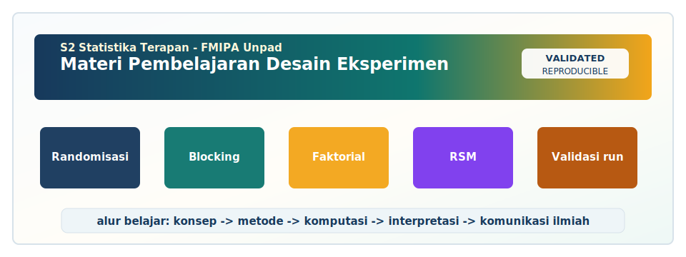

<!-- BEGIN UNPAD MATERIAL STYLE -->
<style>
:root {
  --unpad-navy: #17395c;
  --unpad-gold: #f2a51a;
  --unpad-teal: #0f766e;
  --unpad-ink: #172033;
  --unpad-paper: #fffdf8;
  --unpad-soft: #eef5f8;
  --unpad-line: #d7e2ea;
}
html, body {
  background: linear-gradient(135deg, #f8fbfd 0%, #fffdf8 48%, #f3f6ee 100%) !important;
  color: var(--unpad-ink) !important;
}
body {
  font-family: "Segoe UI", Arial, sans-serif !important;
  line-height: 1.72 !important;
}
.main-container {
  max-width: 1180px !important;
  background: rgba(255, 253, 248, 0.98) !important;
  border: 1px solid var(--unpad-line) !important;
  border-radius: 8px !important;
  box-shadow: 0 18px 42px rgba(23, 57, 92, 0.12) !important;
}
h1, h2, h3, h4 {
  letter-spacing: 0 !important;
}
h1.title {
  color: var(--unpad-navy) !important;
  -webkit-text-fill-color: var(--unpad-navy) !important;
  background: none !important;
}
h2 {
  border-left-color: var(--unpad-gold) !important;
}
a {
  color: #0b5c86 !important;
}
pre, code {
  border-radius: 8px !important;
}
.unpad-cover {
  margin: 18px 0 26px;
  padding: 24px;
  border-radius: 8px;
  background: linear-gradient(135deg, #17395c 0%, #0f766e 58%, #f2a51a 100%);
  color: #ffffff;
  box-shadow: 0 18px 36px rgba(23, 57, 92, 0.22);
}
.unpad-cover__brand {
  display: grid;
  grid-template-columns: 92px 1fr;
  gap: 20px;
  align-items: center;
}
.unpad-cover img {
  width: 92px;
  height: 92px;
  object-fit: contain;
  background: #ffffff;
  border-radius: 8px;
  padding: 8px;
  box-shadow: 0 8px 22px rgba(0,0,0,0.18);
}
.unpad-kicker {
  text-transform: uppercase;
  font-size: 0.82rem;
  font-weight: 800;
  letter-spacing: 0;
  color: #fff8dc;
}
.unpad-cover h2 {
  margin: 6px 0 8px;
  padding: 0;
  border: 0;
  background: transparent;
  color: #ffffff !important;
  font-size: 1.65rem;
}
.unpad-meta {
  margin: 0;
  color: #f7fbff;
  font-weight: 600;
}
.materi-illustration {
  margin: 20px 0 24px;
  padding: 14px;
  background: #ffffff;
  border: 1px solid var(--unpad-line);
  border-radius: 8px;
  box-shadow: 0 12px 28px rgba(23, 57, 92, 0.10);
}
.materi-illustration img {
  width: 100%;
  height: auto;
  display: block;
  border-radius: 6px;
}
.validasi-akademik {
  margin: 18px 0 28px;
  padding: 16px 18px;
  background: linear-gradient(135deg, #eef8f6, #fff8e7);
  border-left: 8px solid var(--unpad-teal);
  border-radius: 8px;
  color: var(--unpad-ink);
}
.validasi-akademik strong {
  color: var(--unpad-navy);
}
table {
  border-radius: 8px !important;
}
@media (max-width: 760px) {
  .unpad-cover__brand {
    grid-template-columns: 1fr;
  }
  .unpad-cover img {
    width: 76px;
    height: 76px;
  }
}
</style>
<!-- END UNPAD MATERIAL STYLE -->


<!-- BEGIN UNPAD MATERIAL ENHANCEMENT -->

```{r setup-unpad-render, include=FALSE}
execute_code <- FALSE
knitr::opts_chunk$set(
  echo = TRUE,
  eval = FALSE,
  message = FALSE,
  warning = FALSE,
  fig.align = "center",
  fig.width = 8,
  fig.height = 4.8,
  dpi = 120
)
set.seed(2025)
```


<div class="unpad-cover">
<div class="unpad-cover__brand">

<div>
<div class="unpad-kicker">S2 Statistika Terapan | FMIPA Universitas Padjadjaran</div>
<h2>Materi Pembelajaran Desain Eksperimen</h2>
<p class="unpad-meta">Program Studi S2 Statistika Terapan, FMIPA Universitas Padjadjaran<br>Penulis: Dr. Sri Winarni, M.Si | Januari 2025</p>
</div>
</div>
</div>

<div class="materi-illustration">

</div>

<div class="validasi-akademik">
<strong>Catatan validasi akademik.</strong> Materi ini diseragamkan dengan rujukan ADWTL Januari 2025: rumus dibaca bersama asumsi, contoh kode diposisikan sebagai template reproducible, dan interpretasi diarahkan pada validitas data, diagnosis model, evaluasi ketidakpastian, serta komunikasi hasil secara ilmiah.
</div>

<!-- END UNPAD MATERIAL ENHANCEMENT -->

<style>
500;600;700;800&display=swap');
:root{
  --espresso:#3b2415;
  --cocoa:#6b3f22;
  --caramel:#a66a3f;
  --sand:#f7ead7;
  --cream:#fffaf2;
  --gold:#d5a449;
  --ink:#1f1712;
  --muted:#6f6259;
}
html, body { scroll-behavior:smooth; }
body {
  font-family: 'Inter', system-ui, -apple-system, BlinkMacSystemFont, 'Segoe UI', sans-serif;
  color: var(--ink);
  background:
    radial-gradient(circle at 8% 5%, rgba(255,235,198,.95), transparent 26%),
    radial-gradient(circle at 92% 12%, rgba(180,111,58,.35), transparent 28%),
    linear-gradient(135deg, #fff7ec 0%, #f7dfc1 42%, #d4a06c 100%);
  line-height:1.72;
}
.main-container {
  max-width: 1180px !important;
  background: rgba(255,250,242,.97);
  border: 1px solid rgba(107,63,34,.16);
  border-radius: 24px;
  padding: 36px 46px 52px 46px;
  box-shadow: 0 30px 90px rgba(59,36,21,.18);
  margin-top: 24px;
  margin-bottom: 48px;
}
.title, .subtitle, .author, .date { text-align:center; }
.title { color: var(--espresso); font-weight:800; letter-spacing:-.03em; }
.subtitle { color: var(--cocoa); font-weight:700; }
.author, .date { color: var(--muted); font-weight:600; }
h1, h2, h3, h4 { color: var(--espresso); font-weight:800; letter-spacing:-.02em; }
h1 {
  border-bottom: 4px solid transparent;
  border-image: linear-gradient(90deg, var(--espresso), var(--gold), transparent) 1;
  padding-bottom: .35em;
  margin-top: 1.4em;
}
h2 { margin-top: 1.15em; color:#4d2e1c; }
h3 { color:#6b3f22; }
a { color:#8a4f25; font-weight:650; }
blockquote {
  background: linear-gradient(135deg, #fff2df, #f8dfbf);
  border-left: 8px solid var(--caramel);
  border-radius: 16px;
  padding: 18px 22px;
  color:#3a2619;
  box-shadow: 0 12px 30px rgba(107,63,34,.08);
}
pre, pre.sourceCode, div.sourceCode, .sourceCode {
  background: #f7e2c5 !important;
  color: #111 !important;
  border: 1px solid #d2a06d;
  border-radius: 16px;
  box-shadow: inset 0 0 0 1px rgba(255,255,255,.45), 0 10px 24px rgba(107,63,34,.08);
}
code, pre code {
  color:#111 !important;
  background: #f7e2c5 !important;
  border-radius: 8px;
  padding: 2px 5px;
}
.math, span.math, div.math, .MathJax, .mjx-chtml { color:#111 !important; }
.formula-box, .concept-box, .case-box, .practice-box, .warning-box, .rps-box {
  border-radius: 20px;
  padding: 20px 24px;
  margin: 20px 0;
  box-shadow: 0 14px 35px rgba(74,42,23,.10);
}
.formula-box { background: #f8e8cf; border: 1px solid #d7a66f; color:#111; }
.concept-box { background: linear-gradient(135deg,#fff6e9,#f1d2aa); border: 1px solid #d6a269; }
.case-box { background: linear-gradient(135deg,#fffaf2,#ecd1b0); border: 1px solid #c18a55; }
.practice-box { background: linear-gradient(135deg,#fff4dd,#f9d79c); border: 1px solid #d5a449; }
.warning-box { background: linear-gradient(135deg,#fff1e6,#efc4aa); border: 1px solid #bd7048; }
.rps-box { background: linear-gradient(135deg,#fff7ec,#f4dfc6); border: 1px solid #c3925a; }
table { background:#fffaf2; border-radius:14px; overflow:hidden; }
th { background:#6b3f22 !important; color:#fff !important; }
td { border-color:#ead0ad !important; }
.tocify, .list-group, #TOC {
  background: rgba(255,250,242,.96) !important;
  border-radius: 18px;
  border: 1px solid rgba(107,63,34,.18);
  box-shadow: 0 14px 35px rgba(74,42,23,.10);
}
.tocify-item a, .tocify-subheader a { color:#4c2c1a !important; }
.tocify-item.active, .tocify-subheader .active { background:#8b552d !important; color:#fff !important; }
hr { border-top: 1px solid #d9b98d; }
.badge-coklat {
  display:inline-block; padding: 4px 10px; border-radius: 999px;
  background: linear-gradient(135deg,#6b3f22,#c98e4e);
  color:white; font-weight:700; font-size:.85em;
}
.small-note { color:#6f6259; font-size:.95em; }
</style>


```{r setup, include=FALSE, eval=FALSE}
knitr::opts_chunk$set(
  echo = TRUE,
  message = FALSE,
  warning = FALSE,
  fig.align = "center",
  fig.width = 8,
  fig.height = 5.5,
  out.width = "92%"
)
set.seed(2025)
```


# Identitas dan Peta Pembelajaran

<div class="rps-box">
<span class="badge-coklat">S2 Statistika Terapan FMIPA UNPAD</span>

Dokumen ini disusun sebagai **materi pembelajaran lengkap** untuk mata kuliah **Desain Eksperimen** pada Program Studi S2 Statistika Terapan, Fakultas Matematika dan Ilmu Pengetahuan Alam, Universitas Padjadjaran. Struktur materi mengikuti RPS-OBE mata kuliah Desain Eksperimen semester 2 yang memuat capaian pembelajaran, bahan kajian, metode pembelajaran, rencana praktikum, tugas, UTS, UAS, dan rubrik penilaian. RPS mencantumkan dosen pengampu sekaligus penyusun RPS, yaitu **Dr. Sri Winarni, M.Si**, dengan bobot mata kuliah **T = 2 SKS** dan **P = 1 SKS**.

Materi ini dirancang untuk membantu mahasiswa memahami desain eksperimen bukan hanya sebagai kumpulan rumus ANAVA, tetapi sebagai cara berpikir ilmiah untuk merancang bukti empiris yang valid, efisien, replikabel, dan komunikatif. Karena itu, setiap bab memuat konsep, formulasi, contoh kasus, prosedur kerja, implementasi R, interpretasi hasil, serta latihan reflektif.
</div>

## Profil Mata Kuliah

| Komponen | Keterangan |
|---|---|
| Mata Kuliah | Desain Eksperimen |
| Program Studi | S2 Statistika Terapan |
| Fakultas | FMIPA Universitas Padjadjaran |
| Semester | 2 |
| Bobot | 3 SKS, terdiri atas 2 SKS teori dan 1 SKS praktikum |
| Dosen Pengampu | Dr. Sri Winarni, M.Si |
| Tahun Materi | Januari 2025 |
| Perangkat Lunak | R dan Python |
| Perangkat Keras | Laptop dan TV/layar kelas |

## Capaian Pembelajaran Mata Kuliah

Berdasarkan RPS, mata kuliah ini menekankan empat capaian utama. Pertama, mahasiswa mampu menganalisis dan merancang eksperimen faktorial serta menentukan ekspektasi kuadrat tengah pada model tetap, acak, dan campuran. Kedua, mahasiswa mampu menerapkan dan mengevaluasi desain eksperimen baur dan faktorial fraksional untuk permasalahan nyata. Ketiga, mahasiswa mampu mengembangkan, mengimplementasikan, dan mengomunikasikan model eksperimen tersarang, split plot, dan analisis kovarians menggunakan perangkat lunak statistika. Keempat, mahasiswa mampu merancang, mengkritisi, dan mengoptimalkan desain eksperimen permukaan respon untuk riset dan pengembangan inovatif.

Keempat capaian tersebut selaras dengan tradisi desain eksperimen modern: perencanaan ilmiah yang ketat, analisis berbasis model linear, pemahaman struktur error, dan pengambilan keputusan berbasis bukti [@fisher1935; @cox1958; @montgomery2017; @box2005]. Pada level magister, mahasiswa tidak cukup hanya menjalankan fungsi `aov()` atau `lm()` di R. Mahasiswa perlu memahami mengapa rancangan tertentu digunakan, bagaimana sumber variasi dipisahkan, bagaimana galat eksperimen dibentuk, kapan uji F sah digunakan, dan bagaimana hasil eksperimen diterjemahkan menjadi rekomendasi praktis.

## Cara Menggunakan Materi Ini

Materi ini dapat dibaca secara bertahap mengikuti 16 pertemuan. Setiap bab disusun dengan pola yang konsisten: tujuan belajar, konsep inti, formulasi statistik, contoh kasus, kode R, interpretasi, kesalahan umum, latihan, dan refleksi. Untuk perkuliahan tatap muka, dosen dapat menggunakan bagian konsep, ilustrasi, dan studi kasus sebagai bahan diskusi. Untuk praktikum, dosen dapat menggunakan bagian kode R dan tugas terstruktur. Untuk kegiatan mandiri, mahasiswa dapat menggunakan latihan reflektif, pertanyaan kritis, dan proyek mini.

<div class="concept-box">
**Prinsip besar mata kuliah:** desain eksperimen yang baik harus menjawab pertanyaan riset sebelum data dikumpulkan. Analisis statistik memang penting, tetapi analisis terbaik sekalipun tidak dapat menyelamatkan eksperimen yang rancangan awalnya keliru. Dalam bahasa praktis: model statistik itu seperti kamera; desain eksperimen adalah pencahayaannya. Kamera mahal tetap menghasilkan gambar buruk jika pencahayaannya kacau. 📸
</div>

## Peta Materi Sesuai RPS

| Minggu | Fokus Materi | Produk Belajar |
|---:|---|---|
| 1 | Pendahuluan desain eksperimen | Peta masalah, faktor, respons, unit eksperimen |
| 2 | Faktor kuantitatif dan kualitatif | Formulasi faktor, taraf, interaksi |
| 3 | Eksperimen faktorial 2^k dan 3^k | Layout faktorial dan estimasi efek |
| 4 | EKT model tetap, acak, campuran, Satterthwaite | Tabel ANAVA dan ekspektasi kuadrat tengah |
| 5 | Pembauran pada faktorial 2^k dan 3^k | Struktur blok dan confounding |
| 6 | Desain baur parsial dan tanpa replikasi | Seleksi efek aktif dan interpretasi hati-hati |
| 7 | Faktorial fraksional 2^k dan 3^k | Generator, aliasing, resolusi desain |
| 8 | UTS/proyek pendahuluan | Proposal dan analisis kasus awal |
| 9 | Model eksperimen tersarang | Variasi bertingkat dan komponen ragam |
| 10 | Faktorial tersarang | Kombinasi faktorial dan struktur tersarang |
| 11 | Pembatasan pengacakan | Whole plot, subplot, error strata |
| 12 | Split plot dan ANCOVA | Model split plot dan kovariat |
| 13 | Response Surface Methodology | Model orde pertama dan eksplorasi optimum |
| 14 | Model permukaan respon | CCD, Box-Behnken, model orde kedua |
| 15 | Optimasi dan critical appraisal | Titik stasioner, ridge, desirability |
| 16 | UAS/proyek akhir | Laporan, presentasi, rekomendasi inovatif |

## Kompetensi Perangkat Lunak

Bagian praktikum menggunakan R karena R menyediakan ekosistem yang kuat untuk ANAVA, model linear, model campuran, visualisasi, dan response surface methodology [@lawson2015]. Beberapa paket seperti `FrF2`, `DoE.base`, `rsm`, `emmeans`, `lme4`, dan `nlme` sangat berguna. Namun, kode dalam materi ini dibuat bertingkat: sebagian besar contoh dasar dapat dijalankan dengan fungsi bawaan R, sedangkan contoh lanjutan diberi opsi `eval=FALSE` agar mahasiswa dapat menyesuaikan lingkungan komputasinya.

<div class="warning-box">
**Catatan teknis:** file Rmd ini sengaja dibuat sebagai modul pembelajaran besar. Jika proses rendering terasa berat, jalankan per bab atau ubah beberapa chunk lanjutan menjadi `eval=FALSE`. Desain eksperimen harus efisien; proses knitting pun sebaiknya jangan dibuat seperti eksperimen tanpa replikasi—sekali gagal, panik berjamaah. 😄
</div>


# Pertemuan 1: Pendahuluan Desain Eksperimen

<div class="rps-box">
**Keterkaitan RPS:** SubCPMK1 — materi ini mengikuti bahan kajian RPS pada pertemuan 1. Fokus pembelajaran adalah pendahuluan desain eksperimen dengan penekanan pada perancangan, analisis, interpretasi, dan komunikasi hasil.
</div>

## Tujuan Pembelajaran

- Menjelaskan konsep inti pendahuluan desain eksperimen dengan bahasa statistik dan bahasa terapan.
- Menyusun rancangan eksperimen yang sesuai dengan pertanyaan riset dan keterbatasan lapangan.
- Menerjemahkan rancangan menjadi model statistik, tabel ANAVA, atau prosedur komputasi R.
- Menginterpretasikan hasil eksperimen secara kritis, proporsional, dan komunikatif.

## Konsep Inti dan Posisi dalam Desain Eksperimen


Fokus utama pertemuan ini adalah **Pendahuluan Desain Eksperimen**. Kata kunci yang harus dikuasai mahasiswa meliputi tujuan eksperimen, unit eksperimen, perlakuan, faktor, taraf, respons, randomisasi, replikasi, blocking. Istilah-istilah tersebut tampak sederhana, tetapi dalam praktik desain eksperimen setiap istilah membawa konsekuensi statistik. Misalnya, salah mendefinisikan unit eksperimen dapat membuat derajat bebas galat menjadi keliru; salah membaca interaksi dapat membuat rekomendasi perlakuan terlalu umum; dan salah memilih struktur randomisasi dapat membuat uji F terlihat meyakinkan padahal memakai error term yang tidak tepat. Literatur klasik desain eksperimen menekankan bahwa validitas inferensi terutama dibangun sejak tahap perencanaan, bukan setelah data terkumpul [@fisher1935; @cox1958; @montgomery2017].

Dalam konteks kasus **pengujian formula pupuk organik terhadap pertumbuhan tanaman**, mahasiswa perlu membayangkan proses nyata yang menghasilkan data. Siapa atau apa yang menerima perlakuan? Apakah perlakuan dapat diterapkan secara bebas pada setiap unit, atau ada keterbatasan alat, ruang, waktu, dan biaya? Apakah respons diukur sekali atau berulang? Apakah ada faktor gangguan yang perlu diblok? Pertanyaan seperti ini membedakan desain eksperimen dari analisis data observasional biasa. Eksperimen bukan sekadar mengumpulkan data, tetapi menyusun mekanisme pembandingan yang adil.


Pada level magister, pembelajaran topik ini perlu bergerak dari hafalan prosedur menuju penalaran desain. Mahasiswa perlu menjawab tiga pertanyaan sebelum membuka perangkat lunak: apa unit eksperimennya, apa sumber variasi yang sengaja dimanipulasi, dan apa sumber variasi yang hanya perlu dikendalikan. Jawaban atas tiga pertanyaan tersebut menentukan bentuk model, derajat bebas, galat yang digunakan untuk pengujian, dan kredibilitas kesimpulan. Dengan demikian, setiap tabel ANAVA harus dibaca sebagai peta proses eksperimen, bukan sekadar daftar angka yang muncul setelah menjalankan perintah statistik.


**Tujuan eksperimen** perlu dipahami sebagai bagian dari sistem eksperimen yang saling berhubungan. Dalam perancangan, tujuan eksperimen tidak boleh didefinisikan hanya berdasarkan kenyamanan administrasi, tetapi harus berdasarkan mekanisme ilmiah yang ingin diuji. Jika tujuan eksperimen berkaitan dengan perlakuan, maka dosen dan mahasiswa harus memastikan tarafnya cukup berbeda untuk menghasilkan respons yang dapat dideteksi. Jika tujuan eksperimen berkaitan dengan struktur galat, maka rancangan harus menyediakan replikasi atau pembandingan yang memungkinkan ragam galat diestimasi. Jika tujuan eksperimen berkaitan dengan interpretasi, maka hasilnya harus dikaitkan dengan batas domain eksperimen, bukan digeneralisasi secara berlebihan.


**Unit eksperimen** perlu dipahami sebagai bagian dari sistem eksperimen yang saling berhubungan. Dalam perancangan, unit eksperimen tidak boleh didefinisikan hanya berdasarkan kenyamanan administrasi, tetapi harus berdasarkan mekanisme ilmiah yang ingin diuji. Jika unit eksperimen berkaitan dengan perlakuan, maka dosen dan mahasiswa harus memastikan tarafnya cukup berbeda untuk menghasilkan respons yang dapat dideteksi. Jika unit eksperimen berkaitan dengan struktur galat, maka rancangan harus menyediakan replikasi atau pembandingan yang memungkinkan ragam galat diestimasi. Jika unit eksperimen berkaitan dengan interpretasi, maka hasilnya harus dikaitkan dengan batas domain eksperimen, bukan digeneralisasi secara berlebihan.


**Perlakuan** perlu dipahami sebagai bagian dari sistem eksperimen yang saling berhubungan. Dalam perancangan, perlakuan tidak boleh didefinisikan hanya berdasarkan kenyamanan administrasi, tetapi harus berdasarkan mekanisme ilmiah yang ingin diuji. Jika perlakuan berkaitan dengan perlakuan, maka dosen dan mahasiswa harus memastikan tarafnya cukup berbeda untuk menghasilkan respons yang dapat dideteksi. Jika perlakuan berkaitan dengan struktur galat, maka rancangan harus menyediakan replikasi atau pembandingan yang memungkinkan ragam galat diestimasi. Jika perlakuan berkaitan dengan interpretasi, maka hasilnya harus dikaitkan dengan batas domain eksperimen, bukan digeneralisasi secara berlebihan.


**Faktor** perlu dipahami sebagai bagian dari sistem eksperimen yang saling berhubungan. Dalam perancangan, faktor tidak boleh didefinisikan hanya berdasarkan kenyamanan administrasi, tetapi harus berdasarkan mekanisme ilmiah yang ingin diuji. Jika faktor berkaitan dengan perlakuan, maka dosen dan mahasiswa harus memastikan tarafnya cukup berbeda untuk menghasilkan respons yang dapat dideteksi. Jika faktor berkaitan dengan struktur galat, maka rancangan harus menyediakan replikasi atau pembandingan yang memungkinkan ragam galat diestimasi. Jika faktor berkaitan dengan interpretasi, maka hasilnya harus dikaitkan dengan batas domain eksperimen, bukan digeneralisasi secara berlebihan.


**Taraf** perlu dipahami sebagai bagian dari sistem eksperimen yang saling berhubungan. Dalam perancangan, taraf tidak boleh didefinisikan hanya berdasarkan kenyamanan administrasi, tetapi harus berdasarkan mekanisme ilmiah yang ingin diuji. Jika taraf berkaitan dengan perlakuan, maka dosen dan mahasiswa harus memastikan tarafnya cukup berbeda untuk menghasilkan respons yang dapat dideteksi. Jika taraf berkaitan dengan struktur galat, maka rancangan harus menyediakan replikasi atau pembandingan yang memungkinkan ragam galat diestimasi. Jika taraf berkaitan dengan interpretasi, maka hasilnya harus dikaitkan dengan batas domain eksperimen, bukan digeneralisasi secara berlebihan.


**Respons** perlu dipahami sebagai bagian dari sistem eksperimen yang saling berhubungan. Dalam perancangan, respons tidak boleh didefinisikan hanya berdasarkan kenyamanan administrasi, tetapi harus berdasarkan mekanisme ilmiah yang ingin diuji. Jika respons berkaitan dengan perlakuan, maka dosen dan mahasiswa harus memastikan tarafnya cukup berbeda untuk menghasilkan respons yang dapat dideteksi. Jika respons berkaitan dengan struktur galat, maka rancangan harus menyediakan replikasi atau pembandingan yang memungkinkan ragam galat diestimasi. Jika respons berkaitan dengan interpretasi, maka hasilnya harus dikaitkan dengan batas domain eksperimen, bukan digeneralisasi secara berlebihan.


**Randomisasi** perlu dipahami sebagai bagian dari sistem eksperimen yang saling berhubungan. Dalam perancangan, randomisasi tidak boleh didefinisikan hanya berdasarkan kenyamanan administrasi, tetapi harus berdasarkan mekanisme ilmiah yang ingin diuji. Jika randomisasi berkaitan dengan perlakuan, maka dosen dan mahasiswa harus memastikan tarafnya cukup berbeda untuk menghasilkan respons yang dapat dideteksi. Jika randomisasi berkaitan dengan struktur galat, maka rancangan harus menyediakan replikasi atau pembandingan yang memungkinkan ragam galat diestimasi. Jika randomisasi berkaitan dengan interpretasi, maka hasilnya harus dikaitkan dengan batas domain eksperimen, bukan digeneralisasi secara berlebihan.


**Replikasi** perlu dipahami sebagai bagian dari sistem eksperimen yang saling berhubungan. Dalam perancangan, replikasi tidak boleh didefinisikan hanya berdasarkan kenyamanan administrasi, tetapi harus berdasarkan mekanisme ilmiah yang ingin diuji. Jika replikasi berkaitan dengan perlakuan, maka dosen dan mahasiswa harus memastikan tarafnya cukup berbeda untuk menghasilkan respons yang dapat dideteksi. Jika replikasi berkaitan dengan struktur galat, maka rancangan harus menyediakan replikasi atau pembandingan yang memungkinkan ragam galat diestimasi. Jika replikasi berkaitan dengan interpretasi, maka hasilnya harus dikaitkan dengan batas domain eksperimen, bukan digeneralisasi secara berlebihan.


**Blocking** perlu dipahami sebagai bagian dari sistem eksperimen yang saling berhubungan. Dalam perancangan, blocking tidak boleh didefinisikan hanya berdasarkan kenyamanan administrasi, tetapi harus berdasarkan mekanisme ilmiah yang ingin diuji. Jika blocking berkaitan dengan perlakuan, maka dosen dan mahasiswa harus memastikan tarafnya cukup berbeda untuk menghasilkan respons yang dapat dideteksi. Jika blocking berkaitan dengan struktur galat, maka rancangan harus menyediakan replikasi atau pembandingan yang memungkinkan ragam galat diestimasi. Jika blocking berkaitan dengan interpretasi, maka hasilnya harus dikaitkan dengan batas domain eksperimen, bukan digeneralisasi secara berlebihan.


Kualitas desain juga bergantung pada kejujuran terhadap keterbatasan lapangan. Banyak eksperimen terapan tidak memiliki kondisi ideal: biaya terbatas, waktu pengamatan pendek, unit eksperimen tidak homogen, alat ukur memiliki drift, dan pelaksanaan lapangan sering tidak sepenuhnya seimbang. Di sinilah peran statistikawan terapan menjadi penting. Tugasnya bukan memaksa data mengikuti rancangan ideal, melainkan memilih rancangan yang paling masuk akal, mendokumentasikan asumsi, dan mengomunikasikan konsekuensi inferensial dari setiap kompromi.


## Formulasi Statistik Utama

<div class="formula-box">

Model satu faktor: $$Y_{ij}=\mu+\tau_i+\varepsilon_{ij},\quad \varepsilon_{ij}\sim N(0,\sigma^2).$$

</div>
<div class="formula-box">

Hipotesis perlakuan: $$H_0:\tau_1=\tau_2=\cdots=\tau_a=0 \quad \text{versus}\quad H_1:\text{minimal satu }\tau_i\neq 0.$$

</div>

Formulasi di atas perlu dibaca sebagai representasi desain, bukan sekadar simbol matematis. Parameter model menunjukkan sumber variasi yang ingin diestimasi, indeks menunjukkan struktur pengamatan, sedangkan galat menunjukkan pembanding yang sah untuk uji inferensial. Dalam banyak kesalahan praktikum, mahasiswa dapat menghitung nilai F dengan benar tetapi memakai galat yang salah. Akibatnya, keputusan statistik terlihat rapi tetapi tidak valid secara desain. Hal inilah yang perlu dihindari dalam mata kuliah ini [@fisher1935; @cox1958; @montgomery2017].

## Langkah Kerja Perancangan

1. Rumusan masalah riset ditulis dalam bentuk pertanyaan eksperimen yang eksplisit.
2. Respons utama, respons sekunder, faktor, taraf, unit eksperimen, dan unit pengamatan didefinisikan.
3. Struktur randomisasi dan blocking dipilih sebelum eksperimen berjalan.
4. Ukuran sampel atau jumlah run ditentukan berdasarkan presisi, biaya, dan sumber daya.
5. Model statistik awal ditulis lengkap dengan asumsi galat dan struktur efek.
6. Data dikumpulkan sesuai urutan randomisasi, bukan urutan yang terasa nyaman saja.
7. Analisis dilakukan dengan tabel ANAVA, estimasi efek, diagnostik model, dan visualisasi.
8. Kesimpulan disampaikan bersama batasan desain, risiko bias, dan rekomendasi validasi.

Setiap langkah harus terdokumentasi. Dokumentasi bukan formalitas; dokumentasi adalah bukti bahwa eksperimen dapat diaudit, direplikasi, dan dikritisi. Dalam laporan akademik, bagian metode eksperimen perlu menjelaskan mengapa desain tertentu dipilih, bukan hanya menyatakan bahwa desain tersebut digunakan. Dalam proyek terapan, alasan pemilihan desain sering menjadi bagian paling penting karena mitra ingin tahu apakah hasil eksperimen benar-benar dapat dipercaya.

## Contoh Kasus Terapan

<div class="case-box">
Kasus yang digunakan pada pertemuan ini adalah **pengujian formula pupuk organik terhadap pertumbuhan tanaman**. Bayangkan peneliti memiliki sumber daya terbatas, tetapi tetap ingin memperoleh bukti empiris yang cukup kuat. Mahasiswa diminta menentukan faktor utama, taraf faktor, respons, unit eksperimen, potensi blok, serta strategi analisis. Contoh ini dapat dimodifikasi untuk konteks lain seperti kualitas layanan kesehatan, optimasi proses industri, eksperimen pembelajaran, atau pengembangan produk berbasis data.
</div>

Dalam kasus tersebut, langkah pertama adalah menyusun pertanyaan riset yang tidak ambigu. Pertanyaan seperti "apakah perlakuan berpengaruh" masih terlalu umum. Pertanyaan yang lebih baik adalah "pada rentang taraf tertentu, apakah perubahan faktor A dan faktor B memengaruhi rata-rata respons, apakah terdapat interaksi, dan kombinasi mana yang direkomendasikan untuk validasi lanjutan". Perubahan kalimat ini membuat rancangan lebih operasional karena langsung menunjuk pada faktor, taraf, interaksi, dan rekomendasi.

Langkah kedua adalah mengidentifikasi pembanding yang adil. Jika dua perlakuan dibandingkan pada hari yang berbeda tanpa blocking, maka perbedaan hari dapat tercampur dengan perbedaan perlakuan. Jika dua kombinasi faktor dijalankan oleh operator yang berbeda tanpa pencatatan operator, maka variasi operator dapat menjadi sumber bias. Jika unit eksperimen tidak diacak, maka tren waktu, kelelahan alat, atau perubahan lingkungan dapat masuk ke dalam efek perlakuan. Prinsip-prinsip ini tampak sederhana, tetapi sering menjadi sumber masalah terbesar dalam eksperimen nyata.

Langkah ketiga adalah memutuskan bagaimana hasil akan dikomunikasikan. Untuk audiens statistik, tabel ANAVA dan model lengkap penting. Untuk audiens non-statistik, grafik efek, plot interaksi, dan rekomendasi kombinasi faktor sering lebih efektif. Keduanya harus konsisten. Jangan sampai laporan teknis menyatakan interaksi signifikan, tetapi slide presentasi hanya menampilkan efek utama seolah-olah efek faktor selalu sama pada semua kondisi. Ini ibarat membaca peta Bandung tapi beloknya pakai feeling—kadang sampai, seringnya nyasar ke lembur tugas. 😄

## Implementasi R


```{r desain-dasar-simulasi, eval=FALSE}
# Ilustrasi sederhana: rancangan acak lengkap dengan 3 perlakuan dan 4 replikasi
perlakuan <- rep(c("Kontrol", "Formula_A", "Formula_B"), each = 4)
unit <- paste0("U", sprintf("%02d", 1:length(perlakuan)))
layout_awal <- data.frame(unit = unit, perlakuan = perlakuan)
layout_acak <- layout_awal[sample(seq_len(nrow(layout_awal))), ]
layout_acak$urutan_pelaksanaan <- seq_len(nrow(layout_acak))
layout_acak

# Simulasi respons
set.seed(2025)
mu <- c(Kontrol = 20, Formula_A = 24, Formula_B = 27)
layout_acak$respons <- rnorm(nrow(layout_acak), mean = mu[layout_acak$perlakuan], sd = 2.2)
fit <- aov(respons ~ perlakuan, data = layout_acak)
summary(fit)
boxplot(respons ~ perlakuan, data = layout_acak,
        main = "Respons menurut perlakuan",
        xlab = "Perlakuan", ylab = "Respons")
```


Kode R di atas bersifat minimal tetapi memperlihatkan alur analisis: menyusun data, mendefinisikan faktor, membangun model, melihat ringkasan, dan membuat visualisasi. Pada proyek nyata, mahasiswa perlu menambahkan pemeriksaan asumsi, dokumentasi data, komentar kode, serta interpretasi hasil. Jika menggunakan paket tambahan, sebaiknya cantumkan versi paket dan `sessionInfo()` agar analisis dapat direplikasi.

## Interpretasi Hasil


Interpretasi hasil eksperimen harus memisahkan signifikansi statistik, ukuran efek, dan relevansi substantif. Sebuah efek dapat signifikan karena ragam galat kecil, tetapi belum tentu bermakna secara operasional. Sebaliknya, efek yang tidak signifikan pada eksperimen kecil dapat tetap penting jika arah dan besarannya konsisten dengan mekanisme ilmiah. Karena itu, laporan eksperimen yang baik selalu menyertakan estimasi efek, interval kepercayaan atau ukuran ketidakpastian, grafik diagnostik, interpretasi konteks, dan rekomendasi yang proporsional.


Pada topik **pendahuluan desain eksperimen**, interpretasi harus selalu dikembalikan pada desain. Bila model menunjukkan efek signifikan, pertanyaan berikutnya adalah apakah efek tersebut stabil terhadap asumsi, apakah efek tersebut relevan secara substantif, dan apakah desain memungkinkan generalisasi. Bila model tidak menunjukkan efek signifikan, pertanyaan berikutnya adalah apakah ukuran sampel cukup, apakah ragam galat terlalu besar, apakah taraf faktor terlalu sempit, atau apakah respons yang dipilih memang sensitif terhadap perlakuan.


Keterkaitan dengan RPS terlihat pada tuntutan agar mahasiswa tidak hanya mengerjakan perhitungan, tetapi juga merancang, mengevaluasi, mengomunikasikan, dan mengkritisi rancangan. Dalam konteks S2 Statistika Terapan, kompetensi tersebut penting karena lulusan sering berhadapan dengan data nyata lintas bidang: industri, biostatistik, sosial, aktuaria, dan sains data. Setiap rancangan harus dapat dipertanggungjawabkan secara ilmiah sekaligus dipahami oleh mitra non-statistik.


## Kesalahan Umum yang Perlu Dihindari

- Menganggap semua pengamatan sebagai replikasi padahal sebagian hanya subsampel atau pengukuran berulang.
- Mengabaikan interaksi sehingga rekomendasi hanya berdasarkan efek utama.
- Memilih desain karena familiar, bukan karena sesuai dengan struktur pertanyaan riset.
- Melaporkan p-value tanpa ukuran efek, grafik, atau interpretasi substantif.
- Menggunakan model yang terlalu kompleks untuk jumlah run yang terlalu sedikit.
- Tidak mendokumentasikan batasan eksperimen dan prosedur randomisasi.

## Latihan dan Refleksi

<div class="practice-box">

1. Buat contoh kasus baru yang cocok untuk pendahuluan desain eksperimen pada bidang industri, biostatistik, sosial, atau sains data.
2. Identifikasi respons, faktor, taraf, unit eksperimen, unit pengamatan, dan sumber variasi tak terkendali.
3. Tuliskan model statistik yang sesuai, lengkap dengan indeks dan asumsi galat.
4. Susun rancangan data hipotetik minimal dan jelaskan bagaimana randomisasi dilakukan.
5. Buat interpretasi hasil jika satu efek utama signifikan tetapi interaksi tidak signifikan.
6. Buat interpretasi hasil jika interaksi signifikan tetapi salah satu efek utama tidak signifikan.
7. Jelaskan risiko inferensi jika desain tidak seimbang atau data hilang pada sebagian kombinasi perlakuan.
8. Rancang satu slide visual untuk mengomunikasikan hasil kepada mitra non-statistik.

</div>

## Rubrik Mini untuk Kegiatan Pertemuan


| Dimensi | Kriteria Sangat Baik | Bobot |
|---|---|---:|
| Ketepatan konsep | Definisi faktor, taraf, unit, galat, dan model sangat jelas | 25% |
| Kualitas rancangan | Layout, randomisasi, replikasi, dan blocking sesuai tujuan | 25% |
| Analisis statistik | ANAVA/model/diagnostik dilakukan benar dan dapat direplikasi | 25% |
| Interpretasi | Kesimpulan kritis, tidak berlebihan, dan relevan dengan kasus | 15% |
| Komunikasi | Laporan rapi, visual informatif, dan bahasa akademik baik | 10% |


Pada akhir pertemuan, mahasiswa sebaiknya menghasilkan artefak kecil: rancangan tabel data, potongan kode, grafik diagnostik, atau ringkasan interpretasi. Artefak ini penting karena desain eksperimen merupakan keterampilan yang dipelajari melalui praktik, bukan hanya melalui membaca definisi. Laporan ringkas juga melatih mahasiswa menyusun argumen statistik yang dapat dipahami oleh pengambil keputusan.


## Ringkasan Pertemuan

Pertemuan ini menegaskan bahwa **pendahuluan desain eksperimen** merupakan bagian dari rantai logika desain eksperimen. Rancangan yang baik dimulai dari pertanyaan riset yang jelas, dilanjutkan dengan pemilihan faktor dan taraf yang relevan, pengaturan randomisasi dan replikasi yang sah, analisis statistik yang sesuai, serta komunikasi hasil yang jujur terhadap keterbatasan desain. Literatur utama seperti Montgomery, Box-Hunter-Hunter, Wu-Hamada, Kuehl, dan sumber klasik Fisher tetap relevan karena prinsip-prinsip dasar desain eksperimen tidak berubah: kendalikan variasi yang tidak diinginkan, buat pembandingan yang adil, dan simpulkan hanya sejauh desain mengizinkan.


# Pertemuan 2: Faktor Kuantitatif dan Kualitatif dalam Eksperimen Faktorial

<div class="rps-box">
**Keterkaitan RPS:** SubCPMK1 — materi ini mengikuti bahan kajian RPS pada pertemuan 2. Fokus pembelajaran adalah faktor kuantitatif dan kualitatif dalam eksperimen faktorial dengan penekanan pada perancangan, analisis, interpretasi, dan komunikasi hasil.
</div>

## Tujuan Pembelajaran

- Menjelaskan konsep inti faktor kuantitatif dan kualitatif dalam eksperimen faktorial dengan bahasa statistik dan bahasa terapan.
- Menyusun rancangan eksperimen yang sesuai dengan pertanyaan riset dan keterbatasan lapangan.
- Menerjemahkan rancangan menjadi model statistik, tabel ANAVA, atau prosedur komputasi R.
- Menginterpretasikan hasil eksperimen secara kritis, proporsional, dan komunikatif.

## Konsep Inti dan Posisi dalam Desain Eksperimen


Fokus utama pertemuan ini adalah **Faktor Kuantitatif dan Kualitatif dalam Eksperimen Faktorial**. Kata kunci yang harus dikuasai mahasiswa meliputi faktor kuantitatif, faktor kualitatif, interaksi, main effect, simple effect, coding faktor. Istilah-istilah tersebut tampak sederhana, tetapi dalam praktik desain eksperimen setiap istilah membawa konsekuensi statistik. Misalnya, salah mendefinisikan unit eksperimen dapat membuat derajat bebas galat menjadi keliru; salah membaca interaksi dapat membuat rekomendasi perlakuan terlalu umum; dan salah memilih struktur randomisasi dapat membuat uji F terlihat meyakinkan padahal memakai error term yang tidak tepat. Literatur klasik desain eksperimen menekankan bahwa validitas inferensi terutama dibangun sejak tahap perencanaan, bukan setelah data terkumpul [@montgomery2017; @dean2017; @kuehl2000].

Dalam konteks kasus **pengaruh suhu inkubasi dan jenis media terhadap yield enzim**, mahasiswa perlu membayangkan proses nyata yang menghasilkan data. Siapa atau apa yang menerima perlakuan? Apakah perlakuan dapat diterapkan secara bebas pada setiap unit, atau ada keterbatasan alat, ruang, waktu, dan biaya? Apakah respons diukur sekali atau berulang? Apakah ada faktor gangguan yang perlu diblok? Pertanyaan seperti ini membedakan desain eksperimen dari analisis data observasional biasa. Eksperimen bukan sekadar mengumpulkan data, tetapi menyusun mekanisme pembandingan yang adil.


Pada level magister, pembelajaran topik ini perlu bergerak dari hafalan prosedur menuju penalaran desain. Mahasiswa perlu menjawab tiga pertanyaan sebelum membuka perangkat lunak: apa unit eksperimennya, apa sumber variasi yang sengaja dimanipulasi, dan apa sumber variasi yang hanya perlu dikendalikan. Jawaban atas tiga pertanyaan tersebut menentukan bentuk model, derajat bebas, galat yang digunakan untuk pengujian, dan kredibilitas kesimpulan. Dengan demikian, setiap tabel ANAVA harus dibaca sebagai peta proses eksperimen, bukan sekadar daftar angka yang muncul setelah menjalankan perintah statistik.


**Faktor kuantitatif** perlu dipahami sebagai bagian dari sistem eksperimen yang saling berhubungan. Dalam perancangan, faktor kuantitatif tidak boleh didefinisikan hanya berdasarkan kenyamanan administrasi, tetapi harus berdasarkan mekanisme ilmiah yang ingin diuji. Jika faktor kuantitatif berkaitan dengan perlakuan, maka dosen dan mahasiswa harus memastikan tarafnya cukup berbeda untuk menghasilkan respons yang dapat dideteksi. Jika faktor kuantitatif berkaitan dengan struktur galat, maka rancangan harus menyediakan replikasi atau pembandingan yang memungkinkan ragam galat diestimasi. Jika faktor kuantitatif berkaitan dengan interpretasi, maka hasilnya harus dikaitkan dengan batas domain eksperimen, bukan digeneralisasi secara berlebihan.


**Faktor kualitatif** perlu dipahami sebagai bagian dari sistem eksperimen yang saling berhubungan. Dalam perancangan, faktor kualitatif tidak boleh didefinisikan hanya berdasarkan kenyamanan administrasi, tetapi harus berdasarkan mekanisme ilmiah yang ingin diuji. Jika faktor kualitatif berkaitan dengan perlakuan, maka dosen dan mahasiswa harus memastikan tarafnya cukup berbeda untuk menghasilkan respons yang dapat dideteksi. Jika faktor kualitatif berkaitan dengan struktur galat, maka rancangan harus menyediakan replikasi atau pembandingan yang memungkinkan ragam galat diestimasi. Jika faktor kualitatif berkaitan dengan interpretasi, maka hasilnya harus dikaitkan dengan batas domain eksperimen, bukan digeneralisasi secara berlebihan.


**Interaksi** perlu dipahami sebagai bagian dari sistem eksperimen yang saling berhubungan. Dalam perancangan, interaksi tidak boleh didefinisikan hanya berdasarkan kenyamanan administrasi, tetapi harus berdasarkan mekanisme ilmiah yang ingin diuji. Jika interaksi berkaitan dengan perlakuan, maka dosen dan mahasiswa harus memastikan tarafnya cukup berbeda untuk menghasilkan respons yang dapat dideteksi. Jika interaksi berkaitan dengan struktur galat, maka rancangan harus menyediakan replikasi atau pembandingan yang memungkinkan ragam galat diestimasi. Jika interaksi berkaitan dengan interpretasi, maka hasilnya harus dikaitkan dengan batas domain eksperimen, bukan digeneralisasi secara berlebihan.


**Main effect** perlu dipahami sebagai bagian dari sistem eksperimen yang saling berhubungan. Dalam perancangan, main effect tidak boleh didefinisikan hanya berdasarkan kenyamanan administrasi, tetapi harus berdasarkan mekanisme ilmiah yang ingin diuji. Jika main effect berkaitan dengan perlakuan, maka dosen dan mahasiswa harus memastikan tarafnya cukup berbeda untuk menghasilkan respons yang dapat dideteksi. Jika main effect berkaitan dengan struktur galat, maka rancangan harus menyediakan replikasi atau pembandingan yang memungkinkan ragam galat diestimasi. Jika main effect berkaitan dengan interpretasi, maka hasilnya harus dikaitkan dengan batas domain eksperimen, bukan digeneralisasi secara berlebihan.


**Simple effect** perlu dipahami sebagai bagian dari sistem eksperimen yang saling berhubungan. Dalam perancangan, simple effect tidak boleh didefinisikan hanya berdasarkan kenyamanan administrasi, tetapi harus berdasarkan mekanisme ilmiah yang ingin diuji. Jika simple effect berkaitan dengan perlakuan, maka dosen dan mahasiswa harus memastikan tarafnya cukup berbeda untuk menghasilkan respons yang dapat dideteksi. Jika simple effect berkaitan dengan struktur galat, maka rancangan harus menyediakan replikasi atau pembandingan yang memungkinkan ragam galat diestimasi. Jika simple effect berkaitan dengan interpretasi, maka hasilnya harus dikaitkan dengan batas domain eksperimen, bukan digeneralisasi secara berlebihan.


**Coding faktor** perlu dipahami sebagai bagian dari sistem eksperimen yang saling berhubungan. Dalam perancangan, coding faktor tidak boleh didefinisikan hanya berdasarkan kenyamanan administrasi, tetapi harus berdasarkan mekanisme ilmiah yang ingin diuji. Jika coding faktor berkaitan dengan perlakuan, maka dosen dan mahasiswa harus memastikan tarafnya cukup berbeda untuk menghasilkan respons yang dapat dideteksi. Jika coding faktor berkaitan dengan struktur galat, maka rancangan harus menyediakan replikasi atau pembandingan yang memungkinkan ragam galat diestimasi. Jika coding faktor berkaitan dengan interpretasi, maka hasilnya harus dikaitkan dengan batas domain eksperimen, bukan digeneralisasi secara berlebihan.


Kualitas desain juga bergantung pada kejujuran terhadap keterbatasan lapangan. Banyak eksperimen terapan tidak memiliki kondisi ideal: biaya terbatas, waktu pengamatan pendek, unit eksperimen tidak homogen, alat ukur memiliki drift, dan pelaksanaan lapangan sering tidak sepenuhnya seimbang. Di sinilah peran statistikawan terapan menjadi penting. Tugasnya bukan memaksa data mengikuti rancangan ideal, melainkan memilih rancangan yang paling masuk akal, mendokumentasikan asumsi, dan mengomunikasikan konsekuensi inferensial dari setiap kompromi.


## Formulasi Statistik Utama

<div class="formula-box">

Model faktorial dua faktor: $$Y_{ijk}=\mu+\alpha_i+\beta_j+(\alpha\beta)_{ij}+\varepsilon_{ijk}.$$

</div>
<div class="formula-box">

Interaksi berarti perubahan efek faktor A bergantung pada taraf faktor B: $$\Delta_A(B_1)\neq \Delta_A(B_2).$$

</div>

Formulasi di atas perlu dibaca sebagai representasi desain, bukan sekadar simbol matematis. Parameter model menunjukkan sumber variasi yang ingin diestimasi, indeks menunjukkan struktur pengamatan, sedangkan galat menunjukkan pembanding yang sah untuk uji inferensial. Dalam banyak kesalahan praktikum, mahasiswa dapat menghitung nilai F dengan benar tetapi memakai galat yang salah. Akibatnya, keputusan statistik terlihat rapi tetapi tidak valid secara desain. Hal inilah yang perlu dihindari dalam mata kuliah ini [@montgomery2017; @dean2017; @kuehl2000].

## Langkah Kerja Perancangan

1. Rumusan masalah riset ditulis dalam bentuk pertanyaan eksperimen yang eksplisit.
2. Respons utama, respons sekunder, faktor, taraf, unit eksperimen, dan unit pengamatan didefinisikan.
3. Struktur randomisasi dan blocking dipilih sebelum eksperimen berjalan.
4. Ukuran sampel atau jumlah run ditentukan berdasarkan presisi, biaya, dan sumber daya.
5. Model statistik awal ditulis lengkap dengan asumsi galat dan struktur efek.
6. Data dikumpulkan sesuai urutan randomisasi, bukan urutan yang terasa nyaman saja.
7. Analisis dilakukan dengan tabel ANAVA, estimasi efek, diagnostik model, dan visualisasi.
8. Kesimpulan disampaikan bersama batasan desain, risiko bias, dan rekomendasi validasi.

Setiap langkah harus terdokumentasi. Dokumentasi bukan formalitas; dokumentasi adalah bukti bahwa eksperimen dapat diaudit, direplikasi, dan dikritisi. Dalam laporan akademik, bagian metode eksperimen perlu menjelaskan mengapa desain tertentu dipilih, bukan hanya menyatakan bahwa desain tersebut digunakan. Dalam proyek terapan, alasan pemilihan desain sering menjadi bagian paling penting karena mitra ingin tahu apakah hasil eksperimen benar-benar dapat dipercaya.

## Contoh Kasus Terapan

<div class="case-box">
Kasus yang digunakan pada pertemuan ini adalah **pengaruh suhu inkubasi dan jenis media terhadap yield enzim**. Bayangkan peneliti memiliki sumber daya terbatas, tetapi tetap ingin memperoleh bukti empiris yang cukup kuat. Mahasiswa diminta menentukan faktor utama, taraf faktor, respons, unit eksperimen, potensi blok, serta strategi analisis. Contoh ini dapat dimodifikasi untuk konteks lain seperti kualitas layanan kesehatan, optimasi proses industri, eksperimen pembelajaran, atau pengembangan produk berbasis data.
</div>

Dalam kasus tersebut, langkah pertama adalah menyusun pertanyaan riset yang tidak ambigu. Pertanyaan seperti "apakah perlakuan berpengaruh" masih terlalu umum. Pertanyaan yang lebih baik adalah "pada rentang taraf tertentu, apakah perubahan faktor A dan faktor B memengaruhi rata-rata respons, apakah terdapat interaksi, dan kombinasi mana yang direkomendasikan untuk validasi lanjutan". Perubahan kalimat ini membuat rancangan lebih operasional karena langsung menunjuk pada faktor, taraf, interaksi, dan rekomendasi.

Langkah kedua adalah mengidentifikasi pembanding yang adil. Jika dua perlakuan dibandingkan pada hari yang berbeda tanpa blocking, maka perbedaan hari dapat tercampur dengan perbedaan perlakuan. Jika dua kombinasi faktor dijalankan oleh operator yang berbeda tanpa pencatatan operator, maka variasi operator dapat menjadi sumber bias. Jika unit eksperimen tidak diacak, maka tren waktu, kelelahan alat, atau perubahan lingkungan dapat masuk ke dalam efek perlakuan. Prinsip-prinsip ini tampak sederhana, tetapi sering menjadi sumber masalah terbesar dalam eksperimen nyata.

Langkah ketiga adalah memutuskan bagaimana hasil akan dikomunikasikan. Untuk audiens statistik, tabel ANAVA dan model lengkap penting. Untuk audiens non-statistik, grafik efek, plot interaksi, dan rekomendasi kombinasi faktor sering lebih efektif. Keduanya harus konsisten. Jangan sampai laporan teknis menyatakan interaksi signifikan, tetapi slide presentasi hanya menampilkan efek utama seolah-olah efek faktor selalu sama pada semua kondisi. Ini ibarat membaca peta Bandung tapi beloknya pakai feeling—kadang sampai, seringnya nyasar ke lembur tugas. 😄

## Implementasi R


```{r interaksi-faktor, eval=FALSE}
# Ilustrasi interaksi faktor kualitatif dan kuantitatif
set.seed(2025)
dat <- expand.grid(media = c("A", "B"), suhu = c(30, 35, 40), rep = 1:5)
dat$yield <- with(dat, 40 + 4*(media == "B") + 1.1*(suhu-30) +
                    2.5*(media == "B")*(suhu-35)/5 + rnorm(nrow(dat), 0, 1.5))
fit <- aov(yield ~ media * factor(suhu), data = dat)
summary(fit)
interaction.plot(dat$suhu, dat$media, dat$yield,
                 xlab = "Suhu", ylab = "Rata-rata yield",
                 trace.label = "Media")
```


Kode R di atas bersifat minimal tetapi memperlihatkan alur analisis: menyusun data, mendefinisikan faktor, membangun model, melihat ringkasan, dan membuat visualisasi. Pada proyek nyata, mahasiswa perlu menambahkan pemeriksaan asumsi, dokumentasi data, komentar kode, serta interpretasi hasil. Jika menggunakan paket tambahan, sebaiknya cantumkan versi paket dan `sessionInfo()` agar analisis dapat direplikasi.

## Interpretasi Hasil


Interpretasi hasil eksperimen harus memisahkan signifikansi statistik, ukuran efek, dan relevansi substantif. Sebuah efek dapat signifikan karena ragam galat kecil, tetapi belum tentu bermakna secara operasional. Sebaliknya, efek yang tidak signifikan pada eksperimen kecil dapat tetap penting jika arah dan besarannya konsisten dengan mekanisme ilmiah. Karena itu, laporan eksperimen yang baik selalu menyertakan estimasi efek, interval kepercayaan atau ukuran ketidakpastian, grafik diagnostik, interpretasi konteks, dan rekomendasi yang proporsional.


Pada topik **faktor kuantitatif dan kualitatif dalam eksperimen faktorial**, interpretasi harus selalu dikembalikan pada desain. Bila model menunjukkan efek signifikan, pertanyaan berikutnya adalah apakah efek tersebut stabil terhadap asumsi, apakah efek tersebut relevan secara substantif, dan apakah desain memungkinkan generalisasi. Bila model tidak menunjukkan efek signifikan, pertanyaan berikutnya adalah apakah ukuran sampel cukup, apakah ragam galat terlalu besar, apakah taraf faktor terlalu sempit, atau apakah respons yang dipilih memang sensitif terhadap perlakuan.


Keterkaitan dengan RPS terlihat pada tuntutan agar mahasiswa tidak hanya mengerjakan perhitungan, tetapi juga merancang, mengevaluasi, mengomunikasikan, dan mengkritisi rancangan. Dalam konteks S2 Statistika Terapan, kompetensi tersebut penting karena lulusan sering berhadapan dengan data nyata lintas bidang: industri, biostatistik, sosial, aktuaria, dan sains data. Setiap rancangan harus dapat dipertanggungjawabkan secara ilmiah sekaligus dipahami oleh mitra non-statistik.


## Kesalahan Umum yang Perlu Dihindari

- Menganggap semua pengamatan sebagai replikasi padahal sebagian hanya subsampel atau pengukuran berulang.
- Mengabaikan interaksi sehingga rekomendasi hanya berdasarkan efek utama.
- Memilih desain karena familiar, bukan karena sesuai dengan struktur pertanyaan riset.
- Melaporkan p-value tanpa ukuran efek, grafik, atau interpretasi substantif.
- Menggunakan model yang terlalu kompleks untuk jumlah run yang terlalu sedikit.
- Tidak mendokumentasikan batasan eksperimen dan prosedur randomisasi.

## Latihan dan Refleksi

<div class="practice-box">

1. Buat contoh kasus baru yang cocok untuk faktor kuantitatif dan kualitatif dalam eksperimen faktorial pada bidang industri, biostatistik, sosial, atau sains data.
2. Identifikasi respons, faktor, taraf, unit eksperimen, unit pengamatan, dan sumber variasi tak terkendali.
3. Tuliskan model statistik yang sesuai, lengkap dengan indeks dan asumsi galat.
4. Susun rancangan data hipotetik minimal dan jelaskan bagaimana randomisasi dilakukan.
5. Buat interpretasi hasil jika satu efek utama signifikan tetapi interaksi tidak signifikan.
6. Buat interpretasi hasil jika interaksi signifikan tetapi salah satu efek utama tidak signifikan.
7. Jelaskan risiko inferensi jika desain tidak seimbang atau data hilang pada sebagian kombinasi perlakuan.
8. Rancang satu slide visual untuk mengomunikasikan hasil kepada mitra non-statistik.

</div>

## Rubrik Mini untuk Kegiatan Pertemuan


| Dimensi | Kriteria Sangat Baik | Bobot |
|---|---|---:|
| Ketepatan konsep | Definisi faktor, taraf, unit, galat, dan model sangat jelas | 25% |
| Kualitas rancangan | Layout, randomisasi, replikasi, dan blocking sesuai tujuan | 25% |
| Analisis statistik | ANAVA/model/diagnostik dilakukan benar dan dapat direplikasi | 25% |
| Interpretasi | Kesimpulan kritis, tidak berlebihan, dan relevan dengan kasus | 15% |
| Komunikasi | Laporan rapi, visual informatif, dan bahasa akademik baik | 10% |


Pada akhir pertemuan, mahasiswa sebaiknya menghasilkan artefak kecil: rancangan tabel data, potongan kode, grafik diagnostik, atau ringkasan interpretasi. Artefak ini penting karena desain eksperimen merupakan keterampilan yang dipelajari melalui praktik, bukan hanya melalui membaca definisi. Laporan ringkas juga melatih mahasiswa menyusun argumen statistik yang dapat dipahami oleh pengambil keputusan.


## Ringkasan Pertemuan

Pertemuan ini menegaskan bahwa **faktor kuantitatif dan kualitatif dalam eksperimen faktorial** merupakan bagian dari rantai logika desain eksperimen. Rancangan yang baik dimulai dari pertanyaan riset yang jelas, dilanjutkan dengan pemilihan faktor dan taraf yang relevan, pengaturan randomisasi dan replikasi yang sah, analisis statistik yang sesuai, serta komunikasi hasil yang jujur terhadap keterbatasan desain. Literatur utama seperti Montgomery, Box-Hunter-Hunter, Wu-Hamada, Kuehl, dan sumber klasik Fisher tetap relevan karena prinsip-prinsip dasar desain eksperimen tidak berubah: kendalikan variasi yang tidak diinginkan, buat pembandingan yang adil, dan simpulkan hanya sejauh desain mengizinkan.


# Pertemuan 3: Eksperimen Faktorial 2^k

<div class="rps-box">
**Keterkaitan RPS:** SubCPMK1 — materi ini mengikuti bahan kajian RPS pada pertemuan 3. Fokus pembelajaran adalah eksperimen faktorial 2^k dengan penekanan pada perancangan, analisis, interpretasi, dan komunikasi hasil.
</div>

## Tujuan Pembelajaran

- Menjelaskan konsep inti eksperimen faktorial 2^k dengan bahasa statistik dan bahasa terapan.
- Menyusun rancangan eksperimen yang sesuai dengan pertanyaan riset dan keterbatasan lapangan.
- Menerjemahkan rancangan menjadi model statistik, tabel ANAVA, atau prosedur komputasi R.
- Menginterpretasikan hasil eksperimen secara kritis, proporsional, dan komunikatif.

## Konsep Inti dan Posisi dalam Desain Eksperimen


Fokus utama pertemuan ini adalah **Eksperimen Faktorial 2^k**. Kata kunci yang harus dikuasai mahasiswa meliputi faktorial dua taraf, notasi Yates, kontras, estimasi efek, interaksi orde tinggi, grafik kubus. Istilah-istilah tersebut tampak sederhana, tetapi dalam praktik desain eksperimen setiap istilah membawa konsekuensi statistik. Misalnya, salah mendefinisikan unit eksperimen dapat membuat derajat bebas galat menjadi keliru; salah membaca interaksi dapat membuat rekomendasi perlakuan terlalu umum; dan salah memilih struktur randomisasi dapat membuat uji F terlihat meyakinkan padahal memakai error term yang tidak tepat. Literatur klasik desain eksperimen menekankan bahwa validitas inferensi terutama dibangun sejak tahap perencanaan, bukan setelah data terkumpul [@yates1937; @montgomery2017; @wu2009].

Dalam konteks kasus **optimasi kecepatan mesin, tekanan, dan jenis katalis pada proses produksi**, mahasiswa perlu membayangkan proses nyata yang menghasilkan data. Siapa atau apa yang menerima perlakuan? Apakah perlakuan dapat diterapkan secara bebas pada setiap unit, atau ada keterbatasan alat, ruang, waktu, dan biaya? Apakah respons diukur sekali atau berulang? Apakah ada faktor gangguan yang perlu diblok? Pertanyaan seperti ini membedakan desain eksperimen dari analisis data observasional biasa. Eksperimen bukan sekadar mengumpulkan data, tetapi menyusun mekanisme pembandingan yang adil.


Pada level magister, pembelajaran topik ini perlu bergerak dari hafalan prosedur menuju penalaran desain. Mahasiswa perlu menjawab tiga pertanyaan sebelum membuka perangkat lunak: apa unit eksperimennya, apa sumber variasi yang sengaja dimanipulasi, dan apa sumber variasi yang hanya perlu dikendalikan. Jawaban atas tiga pertanyaan tersebut menentukan bentuk model, derajat bebas, galat yang digunakan untuk pengujian, dan kredibilitas kesimpulan. Dengan demikian, setiap tabel ANAVA harus dibaca sebagai peta proses eksperimen, bukan sekadar daftar angka yang muncul setelah menjalankan perintah statistik.


**Faktorial dua taraf** perlu dipahami sebagai bagian dari sistem eksperimen yang saling berhubungan. Dalam perancangan, faktorial dua taraf tidak boleh didefinisikan hanya berdasarkan kenyamanan administrasi, tetapi harus berdasarkan mekanisme ilmiah yang ingin diuji. Jika faktorial dua taraf berkaitan dengan perlakuan, maka dosen dan mahasiswa harus memastikan tarafnya cukup berbeda untuk menghasilkan respons yang dapat dideteksi. Jika faktorial dua taraf berkaitan dengan struktur galat, maka rancangan harus menyediakan replikasi atau pembandingan yang memungkinkan ragam galat diestimasi. Jika faktorial dua taraf berkaitan dengan interpretasi, maka hasilnya harus dikaitkan dengan batas domain eksperimen, bukan digeneralisasi secara berlebihan.


**Notasi yates** perlu dipahami sebagai bagian dari sistem eksperimen yang saling berhubungan. Dalam perancangan, notasi Yates tidak boleh didefinisikan hanya berdasarkan kenyamanan administrasi, tetapi harus berdasarkan mekanisme ilmiah yang ingin diuji. Jika notasi Yates berkaitan dengan perlakuan, maka dosen dan mahasiswa harus memastikan tarafnya cukup berbeda untuk menghasilkan respons yang dapat dideteksi. Jika notasi Yates berkaitan dengan struktur galat, maka rancangan harus menyediakan replikasi atau pembandingan yang memungkinkan ragam galat diestimasi. Jika notasi Yates berkaitan dengan interpretasi, maka hasilnya harus dikaitkan dengan batas domain eksperimen, bukan digeneralisasi secara berlebihan.


**Kontras** perlu dipahami sebagai bagian dari sistem eksperimen yang saling berhubungan. Dalam perancangan, kontras tidak boleh didefinisikan hanya berdasarkan kenyamanan administrasi, tetapi harus berdasarkan mekanisme ilmiah yang ingin diuji. Jika kontras berkaitan dengan perlakuan, maka dosen dan mahasiswa harus memastikan tarafnya cukup berbeda untuk menghasilkan respons yang dapat dideteksi. Jika kontras berkaitan dengan struktur galat, maka rancangan harus menyediakan replikasi atau pembandingan yang memungkinkan ragam galat diestimasi. Jika kontras berkaitan dengan interpretasi, maka hasilnya harus dikaitkan dengan batas domain eksperimen, bukan digeneralisasi secara berlebihan.


**Estimasi efek** perlu dipahami sebagai bagian dari sistem eksperimen yang saling berhubungan. Dalam perancangan, estimasi efek tidak boleh didefinisikan hanya berdasarkan kenyamanan administrasi, tetapi harus berdasarkan mekanisme ilmiah yang ingin diuji. Jika estimasi efek berkaitan dengan perlakuan, maka dosen dan mahasiswa harus memastikan tarafnya cukup berbeda untuk menghasilkan respons yang dapat dideteksi. Jika estimasi efek berkaitan dengan struktur galat, maka rancangan harus menyediakan replikasi atau pembandingan yang memungkinkan ragam galat diestimasi. Jika estimasi efek berkaitan dengan interpretasi, maka hasilnya harus dikaitkan dengan batas domain eksperimen, bukan digeneralisasi secara berlebihan.


**Interaksi orde tinggi** perlu dipahami sebagai bagian dari sistem eksperimen yang saling berhubungan. Dalam perancangan, interaksi orde tinggi tidak boleh didefinisikan hanya berdasarkan kenyamanan administrasi, tetapi harus berdasarkan mekanisme ilmiah yang ingin diuji. Jika interaksi orde tinggi berkaitan dengan perlakuan, maka dosen dan mahasiswa harus memastikan tarafnya cukup berbeda untuk menghasilkan respons yang dapat dideteksi. Jika interaksi orde tinggi berkaitan dengan struktur galat, maka rancangan harus menyediakan replikasi atau pembandingan yang memungkinkan ragam galat diestimasi. Jika interaksi orde tinggi berkaitan dengan interpretasi, maka hasilnya harus dikaitkan dengan batas domain eksperimen, bukan digeneralisasi secara berlebihan.


**Grafik kubus** perlu dipahami sebagai bagian dari sistem eksperimen yang saling berhubungan. Dalam perancangan, grafik kubus tidak boleh didefinisikan hanya berdasarkan kenyamanan administrasi, tetapi harus berdasarkan mekanisme ilmiah yang ingin diuji. Jika grafik kubus berkaitan dengan perlakuan, maka dosen dan mahasiswa harus memastikan tarafnya cukup berbeda untuk menghasilkan respons yang dapat dideteksi. Jika grafik kubus berkaitan dengan struktur galat, maka rancangan harus menyediakan replikasi atau pembandingan yang memungkinkan ragam galat diestimasi. Jika grafik kubus berkaitan dengan interpretasi, maka hasilnya harus dikaitkan dengan batas domain eksperimen, bukan digeneralisasi secara berlebihan.


Kualitas desain juga bergantung pada kejujuran terhadap keterbatasan lapangan. Banyak eksperimen terapan tidak memiliki kondisi ideal: biaya terbatas, waktu pengamatan pendek, unit eksperimen tidak homogen, alat ukur memiliki drift, dan pelaksanaan lapangan sering tidak sepenuhnya seimbang. Di sinilah peran statistikawan terapan menjadi penting. Tugasnya bukan memaksa data mengikuti rancangan ideal, melainkan memilih rancangan yang paling masuk akal, mendokumentasikan asumsi, dan mengomunikasikan konsekuensi inferensial dari setiap kompromi.


## Formulasi Statistik Utama

<div class="formula-box">

Model faktorial dua taraf dengan coding ortogonal: $$Y=\beta_0+\sum_j\beta_j x_j+\sum_{j<l}\beta_{jl}x_jx_l+\cdots+\varepsilon.$$

</div>
<div class="formula-box">

Estimasi efek: $$\widehat{\text{effect}}_A=\bar{Y}_{A+}-\bar{Y}_{A-}=2\hat\beta_A.$$

</div>

Formulasi di atas perlu dibaca sebagai representasi desain, bukan sekadar simbol matematis. Parameter model menunjukkan sumber variasi yang ingin diestimasi, indeks menunjukkan struktur pengamatan, sedangkan galat menunjukkan pembanding yang sah untuk uji inferensial. Dalam banyak kesalahan praktikum, mahasiswa dapat menghitung nilai F dengan benar tetapi memakai galat yang salah. Akibatnya, keputusan statistik terlihat rapi tetapi tidak valid secara desain. Hal inilah yang perlu dihindari dalam mata kuliah ini [@yates1937; @montgomery2017; @wu2009].

## Langkah Kerja Perancangan

1. Rumusan masalah riset ditulis dalam bentuk pertanyaan eksperimen yang eksplisit.
2. Respons utama, respons sekunder, faktor, taraf, unit eksperimen, dan unit pengamatan didefinisikan.
3. Struktur randomisasi dan blocking dipilih sebelum eksperimen berjalan.
4. Ukuran sampel atau jumlah run ditentukan berdasarkan presisi, biaya, dan sumber daya.
5. Model statistik awal ditulis lengkap dengan asumsi galat dan struktur efek.
6. Data dikumpulkan sesuai urutan randomisasi, bukan urutan yang terasa nyaman saja.
7. Analisis dilakukan dengan tabel ANAVA, estimasi efek, diagnostik model, dan visualisasi.
8. Kesimpulan disampaikan bersama batasan desain, risiko bias, dan rekomendasi validasi.

Setiap langkah harus terdokumentasi. Dokumentasi bukan formalitas; dokumentasi adalah bukti bahwa eksperimen dapat diaudit, direplikasi, dan dikritisi. Dalam laporan akademik, bagian metode eksperimen perlu menjelaskan mengapa desain tertentu dipilih, bukan hanya menyatakan bahwa desain tersebut digunakan. Dalam proyek terapan, alasan pemilihan desain sering menjadi bagian paling penting karena mitra ingin tahu apakah hasil eksperimen benar-benar dapat dipercaya.

## Contoh Kasus Terapan

<div class="case-box">
Kasus yang digunakan pada pertemuan ini adalah **optimasi kecepatan mesin, tekanan, dan jenis katalis pada proses produksi**. Bayangkan peneliti memiliki sumber daya terbatas, tetapi tetap ingin memperoleh bukti empiris yang cukup kuat. Mahasiswa diminta menentukan faktor utama, taraf faktor, respons, unit eksperimen, potensi blok, serta strategi analisis. Contoh ini dapat dimodifikasi untuk konteks lain seperti kualitas layanan kesehatan, optimasi proses industri, eksperimen pembelajaran, atau pengembangan produk berbasis data.
</div>

Dalam kasus tersebut, langkah pertama adalah menyusun pertanyaan riset yang tidak ambigu. Pertanyaan seperti "apakah perlakuan berpengaruh" masih terlalu umum. Pertanyaan yang lebih baik adalah "pada rentang taraf tertentu, apakah perubahan faktor A dan faktor B memengaruhi rata-rata respons, apakah terdapat interaksi, dan kombinasi mana yang direkomendasikan untuk validasi lanjutan". Perubahan kalimat ini membuat rancangan lebih operasional karena langsung menunjuk pada faktor, taraf, interaksi, dan rekomendasi.

Langkah kedua adalah mengidentifikasi pembanding yang adil. Jika dua perlakuan dibandingkan pada hari yang berbeda tanpa blocking, maka perbedaan hari dapat tercampur dengan perbedaan perlakuan. Jika dua kombinasi faktor dijalankan oleh operator yang berbeda tanpa pencatatan operator, maka variasi operator dapat menjadi sumber bias. Jika unit eksperimen tidak diacak, maka tren waktu, kelelahan alat, atau perubahan lingkungan dapat masuk ke dalam efek perlakuan. Prinsip-prinsip ini tampak sederhana, tetapi sering menjadi sumber masalah terbesar dalam eksperimen nyata.

Langkah ketiga adalah memutuskan bagaimana hasil akan dikomunikasikan. Untuk audiens statistik, tabel ANAVA dan model lengkap penting. Untuk audiens non-statistik, grafik efek, plot interaksi, dan rekomendasi kombinasi faktor sering lebih efektif. Keduanya harus konsisten. Jangan sampai laporan teknis menyatakan interaksi signifikan, tetapi slide presentasi hanya menampilkan efek utama seolah-olah efek faktor selalu sama pada semua kondisi. Ini ibarat membaca peta Bandung tapi beloknya pakai feeling—kadang sampai, seringnya nyasar ke lembur tugas. 😄

## Implementasi R


```{r faktorial-2k, eval=FALSE}
# Rancangan faktorial 2^3 dengan coding -1 dan +1
des <- expand.grid(A = c(-1, 1), B = c(-1, 1), C = c(-1, 1), rep = 1:2)
set.seed(2025)
des$y <- 60 + 5*des$A - 3*des$B + 4*des$A*des$B + rnorm(nrow(des), 0, 2)
fit <- lm(y ~ A*B*C, data = des)
summary(fit)
# Estimasi efek pada coding -1/+1 adalah dua kali koefisien model.
2 * coef(fit)

# Plot interaksi A dan B
with(des, interaction.plot(A, B, y, xlab = "A", ylab = "Respons", trace.label = "B"))
```


Kode R di atas bersifat minimal tetapi memperlihatkan alur analisis: menyusun data, mendefinisikan faktor, membangun model, melihat ringkasan, dan membuat visualisasi. Pada proyek nyata, mahasiswa perlu menambahkan pemeriksaan asumsi, dokumentasi data, komentar kode, serta interpretasi hasil. Jika menggunakan paket tambahan, sebaiknya cantumkan versi paket dan `sessionInfo()` agar analisis dapat direplikasi.

## Interpretasi Hasil


Interpretasi hasil eksperimen harus memisahkan signifikansi statistik, ukuran efek, dan relevansi substantif. Sebuah efek dapat signifikan karena ragam galat kecil, tetapi belum tentu bermakna secara operasional. Sebaliknya, efek yang tidak signifikan pada eksperimen kecil dapat tetap penting jika arah dan besarannya konsisten dengan mekanisme ilmiah. Karena itu, laporan eksperimen yang baik selalu menyertakan estimasi efek, interval kepercayaan atau ukuran ketidakpastian, grafik diagnostik, interpretasi konteks, dan rekomendasi yang proporsional.


Pada topik **eksperimen faktorial 2^k**, interpretasi harus selalu dikembalikan pada desain. Bila model menunjukkan efek signifikan, pertanyaan berikutnya adalah apakah efek tersebut stabil terhadap asumsi, apakah efek tersebut relevan secara substantif, dan apakah desain memungkinkan generalisasi. Bila model tidak menunjukkan efek signifikan, pertanyaan berikutnya adalah apakah ukuran sampel cukup, apakah ragam galat terlalu besar, apakah taraf faktor terlalu sempit, atau apakah respons yang dipilih memang sensitif terhadap perlakuan.


Keterkaitan dengan RPS terlihat pada tuntutan agar mahasiswa tidak hanya mengerjakan perhitungan, tetapi juga merancang, mengevaluasi, mengomunikasikan, dan mengkritisi rancangan. Dalam konteks S2 Statistika Terapan, kompetensi tersebut penting karena lulusan sering berhadapan dengan data nyata lintas bidang: industri, biostatistik, sosial, aktuaria, dan sains data. Setiap rancangan harus dapat dipertanggungjawabkan secara ilmiah sekaligus dipahami oleh mitra non-statistik.


## Kesalahan Umum yang Perlu Dihindari

- Menganggap semua pengamatan sebagai replikasi padahal sebagian hanya subsampel atau pengukuran berulang.
- Mengabaikan interaksi sehingga rekomendasi hanya berdasarkan efek utama.
- Memilih desain karena familiar, bukan karena sesuai dengan struktur pertanyaan riset.
- Melaporkan p-value tanpa ukuran efek, grafik, atau interpretasi substantif.
- Menggunakan model yang terlalu kompleks untuk jumlah run yang terlalu sedikit.
- Tidak mendokumentasikan batasan eksperimen dan prosedur randomisasi.

## Latihan dan Refleksi

<div class="practice-box">

1. Buat contoh kasus baru yang cocok untuk eksperimen faktorial 2^k pada bidang industri, biostatistik, sosial, atau sains data.
2. Identifikasi respons, faktor, taraf, unit eksperimen, unit pengamatan, dan sumber variasi tak terkendali.
3. Tuliskan model statistik yang sesuai, lengkap dengan indeks dan asumsi galat.
4. Susun rancangan data hipotetik minimal dan jelaskan bagaimana randomisasi dilakukan.
5. Buat interpretasi hasil jika satu efek utama signifikan tetapi interaksi tidak signifikan.
6. Buat interpretasi hasil jika interaksi signifikan tetapi salah satu efek utama tidak signifikan.
7. Jelaskan risiko inferensi jika desain tidak seimbang atau data hilang pada sebagian kombinasi perlakuan.
8. Rancang satu slide visual untuk mengomunikasikan hasil kepada mitra non-statistik.

</div>

## Rubrik Mini untuk Kegiatan Pertemuan


| Dimensi | Kriteria Sangat Baik | Bobot |
|---|---|---:|
| Ketepatan konsep | Definisi faktor, taraf, unit, galat, dan model sangat jelas | 25% |
| Kualitas rancangan | Layout, randomisasi, replikasi, dan blocking sesuai tujuan | 25% |
| Analisis statistik | ANAVA/model/diagnostik dilakukan benar dan dapat direplikasi | 25% |
| Interpretasi | Kesimpulan kritis, tidak berlebihan, dan relevan dengan kasus | 15% |
| Komunikasi | Laporan rapi, visual informatif, dan bahasa akademik baik | 10% |


Pada akhir pertemuan, mahasiswa sebaiknya menghasilkan artefak kecil: rancangan tabel data, potongan kode, grafik diagnostik, atau ringkasan interpretasi. Artefak ini penting karena desain eksperimen merupakan keterampilan yang dipelajari melalui praktik, bukan hanya melalui membaca definisi. Laporan ringkas juga melatih mahasiswa menyusun argumen statistik yang dapat dipahami oleh pengambil keputusan.


## Ringkasan Pertemuan

Pertemuan ini menegaskan bahwa **eksperimen faktorial 2^k** merupakan bagian dari rantai logika desain eksperimen. Rancangan yang baik dimulai dari pertanyaan riset yang jelas, dilanjutkan dengan pemilihan faktor dan taraf yang relevan, pengaturan randomisasi dan replikasi yang sah, analisis statistik yang sesuai, serta komunikasi hasil yang jujur terhadap keterbatasan desain. Literatur utama seperti Montgomery, Box-Hunter-Hunter, Wu-Hamada, Kuehl, dan sumber klasik Fisher tetap relevan karena prinsip-prinsip dasar desain eksperimen tidak berubah: kendalikan variasi yang tidak diinginkan, buat pembandingan yang adil, dan simpulkan hanya sejauh desain mengizinkan.


# Pertemuan 4: Eksperimen Faktorial 3^k dan Ekspektasi Kuadrat Tengah

<div class="rps-box">
**Keterkaitan RPS:** SubCPMK1 — materi ini mengikuti bahan kajian RPS pada pertemuan 4. Fokus pembelajaran adalah eksperimen faktorial 3^k dan ekspektasi kuadrat tengah dengan penekanan pada perancangan, analisis, interpretasi, dan komunikasi hasil.
</div>

## Tujuan Pembelajaran

- Menjelaskan konsep inti eksperimen faktorial 3^k dan ekspektasi kuadrat tengah dengan bahasa statistik dan bahasa terapan.
- Menyusun rancangan eksperimen yang sesuai dengan pertanyaan riset dan keterbatasan lapangan.
- Menerjemahkan rancangan menjadi model statistik, tabel ANAVA, atau prosedur komputasi R.
- Menginterpretasikan hasil eksperimen secara kritis, proporsional, dan komunikatif.

## Konsep Inti dan Posisi dalam Desain Eksperimen


Fokus utama pertemuan ini adalah **Eksperimen Faktorial 3^k dan Ekspektasi Kuadrat Tengah**. Kata kunci yang harus dikuasai mahasiswa meliputi faktorial tiga taraf, efek linear dan kuadratik, EKT, model tetap, model acak, model campuran, Satterthwaite. Istilah-istilah tersebut tampak sederhana, tetapi dalam praktik desain eksperimen setiap istilah membawa konsekuensi statistik. Misalnya, salah mendefinisikan unit eksperimen dapat membuat derajat bebas galat menjadi keliru; salah membaca interaksi dapat membuat rekomendasi perlakuan terlalu umum; dan salah memilih struktur randomisasi dapat membuat uji F terlihat meyakinkan padahal memakai error term yang tidak tepat. Literatur klasik desain eksperimen menekankan bahwa validitas inferensi terutama dibangun sejak tahap perencanaan, bukan setelah data terkumpul [@satterthwaite1946; @kempthorne1952; @montgomery2017].

Dalam konteks kasus **pengujian tiga tingkat dosis, tiga waktu reaksi, dan tiga suhu proses**, mahasiswa perlu membayangkan proses nyata yang menghasilkan data. Siapa atau apa yang menerima perlakuan? Apakah perlakuan dapat diterapkan secara bebas pada setiap unit, atau ada keterbatasan alat, ruang, waktu, dan biaya? Apakah respons diukur sekali atau berulang? Apakah ada faktor gangguan yang perlu diblok? Pertanyaan seperti ini membedakan desain eksperimen dari analisis data observasional biasa. Eksperimen bukan sekadar mengumpulkan data, tetapi menyusun mekanisme pembandingan yang adil.


Pada level magister, pembelajaran topik ini perlu bergerak dari hafalan prosedur menuju penalaran desain. Mahasiswa perlu menjawab tiga pertanyaan sebelum membuka perangkat lunak: apa unit eksperimennya, apa sumber variasi yang sengaja dimanipulasi, dan apa sumber variasi yang hanya perlu dikendalikan. Jawaban atas tiga pertanyaan tersebut menentukan bentuk model, derajat bebas, galat yang digunakan untuk pengujian, dan kredibilitas kesimpulan. Dengan demikian, setiap tabel ANAVA harus dibaca sebagai peta proses eksperimen, bukan sekadar daftar angka yang muncul setelah menjalankan perintah statistik.


**Faktorial tiga taraf** perlu dipahami sebagai bagian dari sistem eksperimen yang saling berhubungan. Dalam perancangan, faktorial tiga taraf tidak boleh didefinisikan hanya berdasarkan kenyamanan administrasi, tetapi harus berdasarkan mekanisme ilmiah yang ingin diuji. Jika faktorial tiga taraf berkaitan dengan perlakuan, maka dosen dan mahasiswa harus memastikan tarafnya cukup berbeda untuk menghasilkan respons yang dapat dideteksi. Jika faktorial tiga taraf berkaitan dengan struktur galat, maka rancangan harus menyediakan replikasi atau pembandingan yang memungkinkan ragam galat diestimasi. Jika faktorial tiga taraf berkaitan dengan interpretasi, maka hasilnya harus dikaitkan dengan batas domain eksperimen, bukan digeneralisasi secara berlebihan.


**Efek linear dan kuadratik** perlu dipahami sebagai bagian dari sistem eksperimen yang saling berhubungan. Dalam perancangan, efek linear dan kuadratik tidak boleh didefinisikan hanya berdasarkan kenyamanan administrasi, tetapi harus berdasarkan mekanisme ilmiah yang ingin diuji. Jika efek linear dan kuadratik berkaitan dengan perlakuan, maka dosen dan mahasiswa harus memastikan tarafnya cukup berbeda untuk menghasilkan respons yang dapat dideteksi. Jika efek linear dan kuadratik berkaitan dengan struktur galat, maka rancangan harus menyediakan replikasi atau pembandingan yang memungkinkan ragam galat diestimasi. Jika efek linear dan kuadratik berkaitan dengan interpretasi, maka hasilnya harus dikaitkan dengan batas domain eksperimen, bukan digeneralisasi secara berlebihan.


**Ekt** perlu dipahami sebagai bagian dari sistem eksperimen yang saling berhubungan. Dalam perancangan, EKT tidak boleh didefinisikan hanya berdasarkan kenyamanan administrasi, tetapi harus berdasarkan mekanisme ilmiah yang ingin diuji. Jika EKT berkaitan dengan perlakuan, maka dosen dan mahasiswa harus memastikan tarafnya cukup berbeda untuk menghasilkan respons yang dapat dideteksi. Jika EKT berkaitan dengan struktur galat, maka rancangan harus menyediakan replikasi atau pembandingan yang memungkinkan ragam galat diestimasi. Jika EKT berkaitan dengan interpretasi, maka hasilnya harus dikaitkan dengan batas domain eksperimen, bukan digeneralisasi secara berlebihan.


**Model tetap** perlu dipahami sebagai bagian dari sistem eksperimen yang saling berhubungan. Dalam perancangan, model tetap tidak boleh didefinisikan hanya berdasarkan kenyamanan administrasi, tetapi harus berdasarkan mekanisme ilmiah yang ingin diuji. Jika model tetap berkaitan dengan perlakuan, maka dosen dan mahasiswa harus memastikan tarafnya cukup berbeda untuk menghasilkan respons yang dapat dideteksi. Jika model tetap berkaitan dengan struktur galat, maka rancangan harus menyediakan replikasi atau pembandingan yang memungkinkan ragam galat diestimasi. Jika model tetap berkaitan dengan interpretasi, maka hasilnya harus dikaitkan dengan batas domain eksperimen, bukan digeneralisasi secara berlebihan.


**Model acak** perlu dipahami sebagai bagian dari sistem eksperimen yang saling berhubungan. Dalam perancangan, model acak tidak boleh didefinisikan hanya berdasarkan kenyamanan administrasi, tetapi harus berdasarkan mekanisme ilmiah yang ingin diuji. Jika model acak berkaitan dengan perlakuan, maka dosen dan mahasiswa harus memastikan tarafnya cukup berbeda untuk menghasilkan respons yang dapat dideteksi. Jika model acak berkaitan dengan struktur galat, maka rancangan harus menyediakan replikasi atau pembandingan yang memungkinkan ragam galat diestimasi. Jika model acak berkaitan dengan interpretasi, maka hasilnya harus dikaitkan dengan batas domain eksperimen, bukan digeneralisasi secara berlebihan.


**Model campuran** perlu dipahami sebagai bagian dari sistem eksperimen yang saling berhubungan. Dalam perancangan, model campuran tidak boleh didefinisikan hanya berdasarkan kenyamanan administrasi, tetapi harus berdasarkan mekanisme ilmiah yang ingin diuji. Jika model campuran berkaitan dengan perlakuan, maka dosen dan mahasiswa harus memastikan tarafnya cukup berbeda untuk menghasilkan respons yang dapat dideteksi. Jika model campuran berkaitan dengan struktur galat, maka rancangan harus menyediakan replikasi atau pembandingan yang memungkinkan ragam galat diestimasi. Jika model campuran berkaitan dengan interpretasi, maka hasilnya harus dikaitkan dengan batas domain eksperimen, bukan digeneralisasi secara berlebihan.


**Satterthwaite** perlu dipahami sebagai bagian dari sistem eksperimen yang saling berhubungan. Dalam perancangan, Satterthwaite tidak boleh didefinisikan hanya berdasarkan kenyamanan administrasi, tetapi harus berdasarkan mekanisme ilmiah yang ingin diuji. Jika Satterthwaite berkaitan dengan perlakuan, maka dosen dan mahasiswa harus memastikan tarafnya cukup berbeda untuk menghasilkan respons yang dapat dideteksi. Jika Satterthwaite berkaitan dengan struktur galat, maka rancangan harus menyediakan replikasi atau pembandingan yang memungkinkan ragam galat diestimasi. Jika Satterthwaite berkaitan dengan interpretasi, maka hasilnya harus dikaitkan dengan batas domain eksperimen, bukan digeneralisasi secara berlebihan.


Kualitas desain juga bergantung pada kejujuran terhadap keterbatasan lapangan. Banyak eksperimen terapan tidak memiliki kondisi ideal: biaya terbatas, waktu pengamatan pendek, unit eksperimen tidak homogen, alat ukur memiliki drift, dan pelaksanaan lapangan sering tidak sepenuhnya seimbang. Di sinilah peran statistikawan terapan menjadi penting. Tugasnya bukan memaksa data mengikuti rancangan ideal, melainkan memilih rancangan yang paling masuk akal, mendokumentasikan asumsi, dan mengomunikasikan konsekuensi inferensial dari setiap kompromi.


## Formulasi Statistik Utama

<div class="formula-box">

Model faktorial tetap: $$Y_{ijk}=\mu+\alpha_i+\beta_j+(\alpha\beta)_{ij}+\varepsilon_{ijk}.$$

</div>
<div class="formula-box">

Aproksimasi Satterthwaite: $$\nu\approx \frac{\left(\sum_i c_i MS_i\right)^2}{\sum_i c_i^2 MS_i^2/\nu_i}.$$

</div>

Formulasi di atas perlu dibaca sebagai representasi desain, bukan sekadar simbol matematis. Parameter model menunjukkan sumber variasi yang ingin diestimasi, indeks menunjukkan struktur pengamatan, sedangkan galat menunjukkan pembanding yang sah untuk uji inferensial. Dalam banyak kesalahan praktikum, mahasiswa dapat menghitung nilai F dengan benar tetapi memakai galat yang salah. Akibatnya, keputusan statistik terlihat rapi tetapi tidak valid secara desain. Hal inilah yang perlu dihindari dalam mata kuliah ini [@satterthwaite1946; @kempthorne1952; @montgomery2017].

## Langkah Kerja Perancangan

1. Rumusan masalah riset ditulis dalam bentuk pertanyaan eksperimen yang eksplisit.
2. Respons utama, respons sekunder, faktor, taraf, unit eksperimen, dan unit pengamatan didefinisikan.
3. Struktur randomisasi dan blocking dipilih sebelum eksperimen berjalan.
4. Ukuran sampel atau jumlah run ditentukan berdasarkan presisi, biaya, dan sumber daya.
5. Model statistik awal ditulis lengkap dengan asumsi galat dan struktur efek.
6. Data dikumpulkan sesuai urutan randomisasi, bukan urutan yang terasa nyaman saja.
7. Analisis dilakukan dengan tabel ANAVA, estimasi efek, diagnostik model, dan visualisasi.
8. Kesimpulan disampaikan bersama batasan desain, risiko bias, dan rekomendasi validasi.

Setiap langkah harus terdokumentasi. Dokumentasi bukan formalitas; dokumentasi adalah bukti bahwa eksperimen dapat diaudit, direplikasi, dan dikritisi. Dalam laporan akademik, bagian metode eksperimen perlu menjelaskan mengapa desain tertentu dipilih, bukan hanya menyatakan bahwa desain tersebut digunakan. Dalam proyek terapan, alasan pemilihan desain sering menjadi bagian paling penting karena mitra ingin tahu apakah hasil eksperimen benar-benar dapat dipercaya.

## Contoh Kasus Terapan

<div class="case-box">
Kasus yang digunakan pada pertemuan ini adalah **pengujian tiga tingkat dosis, tiga waktu reaksi, dan tiga suhu proses**. Bayangkan peneliti memiliki sumber daya terbatas, tetapi tetap ingin memperoleh bukti empiris yang cukup kuat. Mahasiswa diminta menentukan faktor utama, taraf faktor, respons, unit eksperimen, potensi blok, serta strategi analisis. Contoh ini dapat dimodifikasi untuk konteks lain seperti kualitas layanan kesehatan, optimasi proses industri, eksperimen pembelajaran, atau pengembangan produk berbasis data.
</div>

Dalam kasus tersebut, langkah pertama adalah menyusun pertanyaan riset yang tidak ambigu. Pertanyaan seperti "apakah perlakuan berpengaruh" masih terlalu umum. Pertanyaan yang lebih baik adalah "pada rentang taraf tertentu, apakah perubahan faktor A dan faktor B memengaruhi rata-rata respons, apakah terdapat interaksi, dan kombinasi mana yang direkomendasikan untuk validasi lanjutan". Perubahan kalimat ini membuat rancangan lebih operasional karena langsung menunjuk pada faktor, taraf, interaksi, dan rekomendasi.

Langkah kedua adalah mengidentifikasi pembanding yang adil. Jika dua perlakuan dibandingkan pada hari yang berbeda tanpa blocking, maka perbedaan hari dapat tercampur dengan perbedaan perlakuan. Jika dua kombinasi faktor dijalankan oleh operator yang berbeda tanpa pencatatan operator, maka variasi operator dapat menjadi sumber bias. Jika unit eksperimen tidak diacak, maka tren waktu, kelelahan alat, atau perubahan lingkungan dapat masuk ke dalam efek perlakuan. Prinsip-prinsip ini tampak sederhana, tetapi sering menjadi sumber masalah terbesar dalam eksperimen nyata.

Langkah ketiga adalah memutuskan bagaimana hasil akan dikomunikasikan. Untuk audiens statistik, tabel ANAVA dan model lengkap penting. Untuk audiens non-statistik, grafik efek, plot interaksi, dan rekomendasi kombinasi faktor sering lebih efektif. Keduanya harus konsisten. Jangan sampai laporan teknis menyatakan interaksi signifikan, tetapi slide presentasi hanya menampilkan efek utama seolah-olah efek faktor selalu sama pada semua kondisi. Ini ibarat membaca peta Bandung tapi beloknya pakai feeling—kadang sampai, seringnya nyasar ke lembur tugas. 😄

## Implementasi R


```{r faktorial-3k-ekt, eval=FALSE}
# Contoh faktorial 3^2: efek linear dan kuadratik dengan polynomial contrasts
set.seed(2025)
dat <- expand.grid(dosis = factor(c("rendah", "sedang", "tinggi"), ordered = TRUE),
                   waktu = factor(c("pendek", "sedang", "panjang"), ordered = TRUE),
                   rep = 1:4)
contrasts(dat$dosis) <- contr.poly(3)
contrasts(dat$waktu) <- contr.poly(3)
dat$y <- 50 + as.numeric(dat$dosis)*3 + as.numeric(dat$waktu)*2 +
         rnorm(nrow(dat), 0, 2)
fit <- aov(y ~ dosis * waktu, data = dat)
summary(fit)
model.tables(fit, type = "means")
```


Kode R di atas bersifat minimal tetapi memperlihatkan alur analisis: menyusun data, mendefinisikan faktor, membangun model, melihat ringkasan, dan membuat visualisasi. Pada proyek nyata, mahasiswa perlu menambahkan pemeriksaan asumsi, dokumentasi data, komentar kode, serta interpretasi hasil. Jika menggunakan paket tambahan, sebaiknya cantumkan versi paket dan `sessionInfo()` agar analisis dapat direplikasi.

## Interpretasi Hasil


Interpretasi hasil eksperimen harus memisahkan signifikansi statistik, ukuran efek, dan relevansi substantif. Sebuah efek dapat signifikan karena ragam galat kecil, tetapi belum tentu bermakna secara operasional. Sebaliknya, efek yang tidak signifikan pada eksperimen kecil dapat tetap penting jika arah dan besarannya konsisten dengan mekanisme ilmiah. Karena itu, laporan eksperimen yang baik selalu menyertakan estimasi efek, interval kepercayaan atau ukuran ketidakpastian, grafik diagnostik, interpretasi konteks, dan rekomendasi yang proporsional.


Pada topik **eksperimen faktorial 3^k dan ekspektasi kuadrat tengah**, interpretasi harus selalu dikembalikan pada desain. Bila model menunjukkan efek signifikan, pertanyaan berikutnya adalah apakah efek tersebut stabil terhadap asumsi, apakah efek tersebut relevan secara substantif, dan apakah desain memungkinkan generalisasi. Bila model tidak menunjukkan efek signifikan, pertanyaan berikutnya adalah apakah ukuran sampel cukup, apakah ragam galat terlalu besar, apakah taraf faktor terlalu sempit, atau apakah respons yang dipilih memang sensitif terhadap perlakuan.


Keterkaitan dengan RPS terlihat pada tuntutan agar mahasiswa tidak hanya mengerjakan perhitungan, tetapi juga merancang, mengevaluasi, mengomunikasikan, dan mengkritisi rancangan. Dalam konteks S2 Statistika Terapan, kompetensi tersebut penting karena lulusan sering berhadapan dengan data nyata lintas bidang: industri, biostatistik, sosial, aktuaria, dan sains data. Setiap rancangan harus dapat dipertanggungjawabkan secara ilmiah sekaligus dipahami oleh mitra non-statistik.


## Kesalahan Umum yang Perlu Dihindari

- Menganggap semua pengamatan sebagai replikasi padahal sebagian hanya subsampel atau pengukuran berulang.
- Mengabaikan interaksi sehingga rekomendasi hanya berdasarkan efek utama.
- Memilih desain karena familiar, bukan karena sesuai dengan struktur pertanyaan riset.
- Melaporkan p-value tanpa ukuran efek, grafik, atau interpretasi substantif.
- Menggunakan model yang terlalu kompleks untuk jumlah run yang terlalu sedikit.
- Tidak mendokumentasikan batasan eksperimen dan prosedur randomisasi.

## Latihan dan Refleksi

<div class="practice-box">

1. Buat contoh kasus baru yang cocok untuk eksperimen faktorial 3^k dan ekspektasi kuadrat tengah pada bidang industri, biostatistik, sosial, atau sains data.
2. Identifikasi respons, faktor, taraf, unit eksperimen, unit pengamatan, dan sumber variasi tak terkendali.
3. Tuliskan model statistik yang sesuai, lengkap dengan indeks dan asumsi galat.
4. Susun rancangan data hipotetik minimal dan jelaskan bagaimana randomisasi dilakukan.
5. Buat interpretasi hasil jika satu efek utama signifikan tetapi interaksi tidak signifikan.
6. Buat interpretasi hasil jika interaksi signifikan tetapi salah satu efek utama tidak signifikan.
7. Jelaskan risiko inferensi jika desain tidak seimbang atau data hilang pada sebagian kombinasi perlakuan.
8. Rancang satu slide visual untuk mengomunikasikan hasil kepada mitra non-statistik.

</div>

## Rubrik Mini untuk Kegiatan Pertemuan


| Dimensi | Kriteria Sangat Baik | Bobot |
|---|---|---:|
| Ketepatan konsep | Definisi faktor, taraf, unit, galat, dan model sangat jelas | 25% |
| Kualitas rancangan | Layout, randomisasi, replikasi, dan blocking sesuai tujuan | 25% |
| Analisis statistik | ANAVA/model/diagnostik dilakukan benar dan dapat direplikasi | 25% |
| Interpretasi | Kesimpulan kritis, tidak berlebihan, dan relevan dengan kasus | 15% |
| Komunikasi | Laporan rapi, visual informatif, dan bahasa akademik baik | 10% |


Pada akhir pertemuan, mahasiswa sebaiknya menghasilkan artefak kecil: rancangan tabel data, potongan kode, grafik diagnostik, atau ringkasan interpretasi. Artefak ini penting karena desain eksperimen merupakan keterampilan yang dipelajari melalui praktik, bukan hanya melalui membaca definisi. Laporan ringkas juga melatih mahasiswa menyusun argumen statistik yang dapat dipahami oleh pengambil keputusan.


## Ringkasan Pertemuan

Pertemuan ini menegaskan bahwa **eksperimen faktorial 3^k dan ekspektasi kuadrat tengah** merupakan bagian dari rantai logika desain eksperimen. Rancangan yang baik dimulai dari pertanyaan riset yang jelas, dilanjutkan dengan pemilihan faktor dan taraf yang relevan, pengaturan randomisasi dan replikasi yang sah, analisis statistik yang sesuai, serta komunikasi hasil yang jujur terhadap keterbatasan desain. Literatur utama seperti Montgomery, Box-Hunter-Hunter, Wu-Hamada, Kuehl, dan sumber klasik Fisher tetap relevan karena prinsip-prinsip dasar desain eksperimen tidak berubah: kendalikan variasi yang tidak diinginkan, buat pembandingan yang adil, dan simpulkan hanya sejauh desain mengizinkan.


# Pertemuan 5: Pembauran pada Desain Faktorial 2^k dan 3^k

<div class="rps-box">
**Keterkaitan RPS:** SubCPMK2 — materi ini mengikuti bahan kajian RPS pada pertemuan 5. Fokus pembelajaran adalah pembauran pada desain faktorial 2^k dan 3^k dengan penekanan pada perancangan, analisis, interpretasi, dan komunikasi hasil.
</div>

## Tujuan Pembelajaran

- Menjelaskan konsep inti pembauran pada desain faktorial 2^k dan 3^k dengan bahasa statistik dan bahasa terapan.
- Menyusun rancangan eksperimen yang sesuai dengan pertanyaan riset dan keterbatasan lapangan.
- Menerjemahkan rancangan menjadi model statistik, tabel ANAVA, atau prosedur komputasi R.
- Menginterpretasikan hasil eksperimen secara kritis, proporsional, dan komunikatif.

## Konsep Inti dan Posisi dalam Desain Eksperimen


Fokus utama pertemuan ini adalah **Pembauran pada Desain Faktorial 2^k dan 3^k**. Kata kunci yang harus dikuasai mahasiswa meliputi confounding, blocking, efek terbaur, defining contrast, struktur blok, pembauran dalam replikasi. Istilah-istilah tersebut tampak sederhana, tetapi dalam praktik desain eksperimen setiap istilah membawa konsekuensi statistik. Misalnya, salah mendefinisikan unit eksperimen dapat membuat derajat bebas galat menjadi keliru; salah membaca interaksi dapat membuat rekomendasi perlakuan terlalu umum; dan salah memilih struktur randomisasi dapat membuat uji F terlihat meyakinkan padahal memakai error term yang tidak tepat. Literatur klasik desain eksperimen menekankan bahwa validitas inferensi terutama dibangun sejak tahap perencanaan, bukan setelah data terkumpul [@cochran1957; @montgomery2017; @wu2009].

Dalam konteks kasus **eksperimen produksi yang harus dibagi ke beberapa hari kerja karena kapasitas mesin terbatas**, mahasiswa perlu membayangkan proses nyata yang menghasilkan data. Siapa atau apa yang menerima perlakuan? Apakah perlakuan dapat diterapkan secara bebas pada setiap unit, atau ada keterbatasan alat, ruang, waktu, dan biaya? Apakah respons diukur sekali atau berulang? Apakah ada faktor gangguan yang perlu diblok? Pertanyaan seperti ini membedakan desain eksperimen dari analisis data observasional biasa. Eksperimen bukan sekadar mengumpulkan data, tetapi menyusun mekanisme pembandingan yang adil.


Pada level magister, pembelajaran topik ini perlu bergerak dari hafalan prosedur menuju penalaran desain. Mahasiswa perlu menjawab tiga pertanyaan sebelum membuka perangkat lunak: apa unit eksperimennya, apa sumber variasi yang sengaja dimanipulasi, dan apa sumber variasi yang hanya perlu dikendalikan. Jawaban atas tiga pertanyaan tersebut menentukan bentuk model, derajat bebas, galat yang digunakan untuk pengujian, dan kredibilitas kesimpulan. Dengan demikian, setiap tabel ANAVA harus dibaca sebagai peta proses eksperimen, bukan sekadar daftar angka yang muncul setelah menjalankan perintah statistik.


**Confounding** perlu dipahami sebagai bagian dari sistem eksperimen yang saling berhubungan. Dalam perancangan, confounding tidak boleh didefinisikan hanya berdasarkan kenyamanan administrasi, tetapi harus berdasarkan mekanisme ilmiah yang ingin diuji. Jika confounding berkaitan dengan perlakuan, maka dosen dan mahasiswa harus memastikan tarafnya cukup berbeda untuk menghasilkan respons yang dapat dideteksi. Jika confounding berkaitan dengan struktur galat, maka rancangan harus menyediakan replikasi atau pembandingan yang memungkinkan ragam galat diestimasi. Jika confounding berkaitan dengan interpretasi, maka hasilnya harus dikaitkan dengan batas domain eksperimen, bukan digeneralisasi secara berlebihan.


**Blocking** perlu dipahami sebagai bagian dari sistem eksperimen yang saling berhubungan. Dalam perancangan, blocking tidak boleh didefinisikan hanya berdasarkan kenyamanan administrasi, tetapi harus berdasarkan mekanisme ilmiah yang ingin diuji. Jika blocking berkaitan dengan perlakuan, maka dosen dan mahasiswa harus memastikan tarafnya cukup berbeda untuk menghasilkan respons yang dapat dideteksi. Jika blocking berkaitan dengan struktur galat, maka rancangan harus menyediakan replikasi atau pembandingan yang memungkinkan ragam galat diestimasi. Jika blocking berkaitan dengan interpretasi, maka hasilnya harus dikaitkan dengan batas domain eksperimen, bukan digeneralisasi secara berlebihan.


**Efek terbaur** perlu dipahami sebagai bagian dari sistem eksperimen yang saling berhubungan. Dalam perancangan, efek terbaur tidak boleh didefinisikan hanya berdasarkan kenyamanan administrasi, tetapi harus berdasarkan mekanisme ilmiah yang ingin diuji. Jika efek terbaur berkaitan dengan perlakuan, maka dosen dan mahasiswa harus memastikan tarafnya cukup berbeda untuk menghasilkan respons yang dapat dideteksi. Jika efek terbaur berkaitan dengan struktur galat, maka rancangan harus menyediakan replikasi atau pembandingan yang memungkinkan ragam galat diestimasi. Jika efek terbaur berkaitan dengan interpretasi, maka hasilnya harus dikaitkan dengan batas domain eksperimen, bukan digeneralisasi secara berlebihan.


**Defining contrast** perlu dipahami sebagai bagian dari sistem eksperimen yang saling berhubungan. Dalam perancangan, defining contrast tidak boleh didefinisikan hanya berdasarkan kenyamanan administrasi, tetapi harus berdasarkan mekanisme ilmiah yang ingin diuji. Jika defining contrast berkaitan dengan perlakuan, maka dosen dan mahasiswa harus memastikan tarafnya cukup berbeda untuk menghasilkan respons yang dapat dideteksi. Jika defining contrast berkaitan dengan struktur galat, maka rancangan harus menyediakan replikasi atau pembandingan yang memungkinkan ragam galat diestimasi. Jika defining contrast berkaitan dengan interpretasi, maka hasilnya harus dikaitkan dengan batas domain eksperimen, bukan digeneralisasi secara berlebihan.


**Struktur blok** perlu dipahami sebagai bagian dari sistem eksperimen yang saling berhubungan. Dalam perancangan, struktur blok tidak boleh didefinisikan hanya berdasarkan kenyamanan administrasi, tetapi harus berdasarkan mekanisme ilmiah yang ingin diuji. Jika struktur blok berkaitan dengan perlakuan, maka dosen dan mahasiswa harus memastikan tarafnya cukup berbeda untuk menghasilkan respons yang dapat dideteksi. Jika struktur blok berkaitan dengan struktur galat, maka rancangan harus menyediakan replikasi atau pembandingan yang memungkinkan ragam galat diestimasi. Jika struktur blok berkaitan dengan interpretasi, maka hasilnya harus dikaitkan dengan batas domain eksperimen, bukan digeneralisasi secara berlebihan.


**Pembauran dalam replikasi** perlu dipahami sebagai bagian dari sistem eksperimen yang saling berhubungan. Dalam perancangan, pembauran dalam replikasi tidak boleh didefinisikan hanya berdasarkan kenyamanan administrasi, tetapi harus berdasarkan mekanisme ilmiah yang ingin diuji. Jika pembauran dalam replikasi berkaitan dengan perlakuan, maka dosen dan mahasiswa harus memastikan tarafnya cukup berbeda untuk menghasilkan respons yang dapat dideteksi. Jika pembauran dalam replikasi berkaitan dengan struktur galat, maka rancangan harus menyediakan replikasi atau pembandingan yang memungkinkan ragam galat diestimasi. Jika pembauran dalam replikasi berkaitan dengan interpretasi, maka hasilnya harus dikaitkan dengan batas domain eksperimen, bukan digeneralisasi secara berlebihan.


Kualitas desain juga bergantung pada kejujuran terhadap keterbatasan lapangan. Banyak eksperimen terapan tidak memiliki kondisi ideal: biaya terbatas, waktu pengamatan pendek, unit eksperimen tidak homogen, alat ukur memiliki drift, dan pelaksanaan lapangan sering tidak sepenuhnya seimbang. Di sinilah peran statistikawan terapan menjadi penting. Tugasnya bukan memaksa data mengikuti rancangan ideal, melainkan memilih rancangan yang paling masuk akal, mendokumentasikan asumsi, dan mengomunikasikan konsekuensi inferensial dari setiap kompromi.


## Formulasi Statistik Utama

<div class="formula-box">

Defining contrast untuk pembauran dapat ditulis: $$I=ABC,$$ sehingga efek $ABC$ terbaur dengan blok.

</div>
<div class="formula-box">

Jika blok dibentuk oleh tanda $ABC$, maka perlakuan dengan $ABC=+1$ dan $ABC=-1$ ditempatkan pada blok berbeda.

</div>

Formulasi di atas perlu dibaca sebagai representasi desain, bukan sekadar simbol matematis. Parameter model menunjukkan sumber variasi yang ingin diestimasi, indeks menunjukkan struktur pengamatan, sedangkan galat menunjukkan pembanding yang sah untuk uji inferensial. Dalam banyak kesalahan praktikum, mahasiswa dapat menghitung nilai F dengan benar tetapi memakai galat yang salah. Akibatnya, keputusan statistik terlihat rapi tetapi tidak valid secara desain. Hal inilah yang perlu dihindari dalam mata kuliah ini [@cochran1957; @montgomery2017; @wu2009].

## Langkah Kerja Perancangan

1. Rumusan masalah riset ditulis dalam bentuk pertanyaan eksperimen yang eksplisit.
2. Respons utama, respons sekunder, faktor, taraf, unit eksperimen, dan unit pengamatan didefinisikan.
3. Struktur randomisasi dan blocking dipilih sebelum eksperimen berjalan.
4. Ukuran sampel atau jumlah run ditentukan berdasarkan presisi, biaya, dan sumber daya.
5. Model statistik awal ditulis lengkap dengan asumsi galat dan struktur efek.
6. Data dikumpulkan sesuai urutan randomisasi, bukan urutan yang terasa nyaman saja.
7. Analisis dilakukan dengan tabel ANAVA, estimasi efek, diagnostik model, dan visualisasi.
8. Kesimpulan disampaikan bersama batasan desain, risiko bias, dan rekomendasi validasi.

Setiap langkah harus terdokumentasi. Dokumentasi bukan formalitas; dokumentasi adalah bukti bahwa eksperimen dapat diaudit, direplikasi, dan dikritisi. Dalam laporan akademik, bagian metode eksperimen perlu menjelaskan mengapa desain tertentu dipilih, bukan hanya menyatakan bahwa desain tersebut digunakan. Dalam proyek terapan, alasan pemilihan desain sering menjadi bagian paling penting karena mitra ingin tahu apakah hasil eksperimen benar-benar dapat dipercaya.

## Contoh Kasus Terapan

<div class="case-box">
Kasus yang digunakan pada pertemuan ini adalah **eksperimen produksi yang harus dibagi ke beberapa hari kerja karena kapasitas mesin terbatas**. Bayangkan peneliti memiliki sumber daya terbatas, tetapi tetap ingin memperoleh bukti empiris yang cukup kuat. Mahasiswa diminta menentukan faktor utama, taraf faktor, respons, unit eksperimen, potensi blok, serta strategi analisis. Contoh ini dapat dimodifikasi untuk konteks lain seperti kualitas layanan kesehatan, optimasi proses industri, eksperimen pembelajaran, atau pengembangan produk berbasis data.
</div>

Dalam kasus tersebut, langkah pertama adalah menyusun pertanyaan riset yang tidak ambigu. Pertanyaan seperti "apakah perlakuan berpengaruh" masih terlalu umum. Pertanyaan yang lebih baik adalah "pada rentang taraf tertentu, apakah perubahan faktor A dan faktor B memengaruhi rata-rata respons, apakah terdapat interaksi, dan kombinasi mana yang direkomendasikan untuk validasi lanjutan". Perubahan kalimat ini membuat rancangan lebih operasional karena langsung menunjuk pada faktor, taraf, interaksi, dan rekomendasi.

Langkah kedua adalah mengidentifikasi pembanding yang adil. Jika dua perlakuan dibandingkan pada hari yang berbeda tanpa blocking, maka perbedaan hari dapat tercampur dengan perbedaan perlakuan. Jika dua kombinasi faktor dijalankan oleh operator yang berbeda tanpa pencatatan operator, maka variasi operator dapat menjadi sumber bias. Jika unit eksperimen tidak diacak, maka tren waktu, kelelahan alat, atau perubahan lingkungan dapat masuk ke dalam efek perlakuan. Prinsip-prinsip ini tampak sederhana, tetapi sering menjadi sumber masalah terbesar dalam eksperimen nyata.

Langkah ketiga adalah memutuskan bagaimana hasil akan dikomunikasikan. Untuk audiens statistik, tabel ANAVA dan model lengkap penting. Untuk audiens non-statistik, grafik efek, plot interaksi, dan rekomendasi kombinasi faktor sering lebih efektif. Keduanya harus konsisten. Jangan sampai laporan teknis menyatakan interaksi signifikan, tetapi slide presentasi hanya menampilkan efek utama seolah-olah efek faktor selalu sama pada semua kondisi. Ini ibarat membaca peta Bandung tapi beloknya pakai feeling—kadang sampai, seringnya nyasar ke lembur tugas. 😄

## Implementasi R


```{r confounding-blok, eval=FALSE}
# Contoh blok pada faktorial 2^3: efek ABC digunakan sebagai pembentuk blok
full <- expand.grid(A = c(-1,1), B = c(-1,1), C = c(-1,1))
full$ABC <- with(full, A*B*C)
full$blok <- ifelse(full$ABC == 1, "Blok_1", "Blok_2")
full[order(full$blok), ]
```


Kode R di atas bersifat minimal tetapi memperlihatkan alur analisis: menyusun data, mendefinisikan faktor, membangun model, melihat ringkasan, dan membuat visualisasi. Pada proyek nyata, mahasiswa perlu menambahkan pemeriksaan asumsi, dokumentasi data, komentar kode, serta interpretasi hasil. Jika menggunakan paket tambahan, sebaiknya cantumkan versi paket dan `sessionInfo()` agar analisis dapat direplikasi.

## Interpretasi Hasil


Interpretasi hasil eksperimen harus memisahkan signifikansi statistik, ukuran efek, dan relevansi substantif. Sebuah efek dapat signifikan karena ragam galat kecil, tetapi belum tentu bermakna secara operasional. Sebaliknya, efek yang tidak signifikan pada eksperimen kecil dapat tetap penting jika arah dan besarannya konsisten dengan mekanisme ilmiah. Karena itu, laporan eksperimen yang baik selalu menyertakan estimasi efek, interval kepercayaan atau ukuran ketidakpastian, grafik diagnostik, interpretasi konteks, dan rekomendasi yang proporsional.


Pada topik **pembauran pada desain faktorial 2^k dan 3^k**, interpretasi harus selalu dikembalikan pada desain. Bila model menunjukkan efek signifikan, pertanyaan berikutnya adalah apakah efek tersebut stabil terhadap asumsi, apakah efek tersebut relevan secara substantif, dan apakah desain memungkinkan generalisasi. Bila model tidak menunjukkan efek signifikan, pertanyaan berikutnya adalah apakah ukuran sampel cukup, apakah ragam galat terlalu besar, apakah taraf faktor terlalu sempit, atau apakah respons yang dipilih memang sensitif terhadap perlakuan.


Keterkaitan dengan RPS terlihat pada tuntutan agar mahasiswa tidak hanya mengerjakan perhitungan, tetapi juga merancang, mengevaluasi, mengomunikasikan, dan mengkritisi rancangan. Dalam konteks S2 Statistika Terapan, kompetensi tersebut penting karena lulusan sering berhadapan dengan data nyata lintas bidang: industri, biostatistik, sosial, aktuaria, dan sains data. Setiap rancangan harus dapat dipertanggungjawabkan secara ilmiah sekaligus dipahami oleh mitra non-statistik.


## Kesalahan Umum yang Perlu Dihindari

- Menganggap semua pengamatan sebagai replikasi padahal sebagian hanya subsampel atau pengukuran berulang.
- Mengabaikan interaksi sehingga rekomendasi hanya berdasarkan efek utama.
- Memilih desain karena familiar, bukan karena sesuai dengan struktur pertanyaan riset.
- Melaporkan p-value tanpa ukuran efek, grafik, atau interpretasi substantif.
- Menggunakan model yang terlalu kompleks untuk jumlah run yang terlalu sedikit.
- Tidak mendokumentasikan batasan eksperimen dan prosedur randomisasi.

## Latihan dan Refleksi

<div class="practice-box">

1. Buat contoh kasus baru yang cocok untuk pembauran pada desain faktorial 2^k dan 3^k pada bidang industri, biostatistik, sosial, atau sains data.
2. Identifikasi respons, faktor, taraf, unit eksperimen, unit pengamatan, dan sumber variasi tak terkendali.
3. Tuliskan model statistik yang sesuai, lengkap dengan indeks dan asumsi galat.
4. Susun rancangan data hipotetik minimal dan jelaskan bagaimana randomisasi dilakukan.
5. Buat interpretasi hasil jika satu efek utama signifikan tetapi interaksi tidak signifikan.
6. Buat interpretasi hasil jika interaksi signifikan tetapi salah satu efek utama tidak signifikan.
7. Jelaskan risiko inferensi jika desain tidak seimbang atau data hilang pada sebagian kombinasi perlakuan.
8. Rancang satu slide visual untuk mengomunikasikan hasil kepada mitra non-statistik.

</div>

## Rubrik Mini untuk Kegiatan Pertemuan


| Dimensi | Kriteria Sangat Baik | Bobot |
|---|---|---:|
| Ketepatan konsep | Definisi faktor, taraf, unit, galat, dan model sangat jelas | 25% |
| Kualitas rancangan | Layout, randomisasi, replikasi, dan blocking sesuai tujuan | 25% |
| Analisis statistik | ANAVA/model/diagnostik dilakukan benar dan dapat direplikasi | 25% |
| Interpretasi | Kesimpulan kritis, tidak berlebihan, dan relevan dengan kasus | 15% |
| Komunikasi | Laporan rapi, visual informatif, dan bahasa akademik baik | 10% |


Pada akhir pertemuan, mahasiswa sebaiknya menghasilkan artefak kecil: rancangan tabel data, potongan kode, grafik diagnostik, atau ringkasan interpretasi. Artefak ini penting karena desain eksperimen merupakan keterampilan yang dipelajari melalui praktik, bukan hanya melalui membaca definisi. Laporan ringkas juga melatih mahasiswa menyusun argumen statistik yang dapat dipahami oleh pengambil keputusan.


## Ringkasan Pertemuan

Pertemuan ini menegaskan bahwa **pembauran pada desain faktorial 2^k dan 3^k** merupakan bagian dari rantai logika desain eksperimen. Rancangan yang baik dimulai dari pertanyaan riset yang jelas, dilanjutkan dengan pemilihan faktor dan taraf yang relevan, pengaturan randomisasi dan replikasi yang sah, analisis statistik yang sesuai, serta komunikasi hasil yang jujur terhadap keterbatasan desain. Literatur utama seperti Montgomery, Box-Hunter-Hunter, Wu-Hamada, Kuehl, dan sumber klasik Fisher tetap relevan karena prinsip-prinsip dasar desain eksperimen tidak berubah: kendalikan variasi yang tidak diinginkan, buat pembandingan yang adil, dan simpulkan hanya sejauh desain mengizinkan.


# Pertemuan 6: Desain Baur Parsial dan Tanpa Replikasi

<div class="rps-box">
**Keterkaitan RPS:** SubCPMK2 — materi ini mengikuti bahan kajian RPS pada pertemuan 6. Fokus pembelajaran adalah desain baur parsial dan tanpa replikasi dengan penekanan pada perancangan, analisis, interpretasi, dan komunikasi hasil.
</div>

## Tujuan Pembelajaran

- Menjelaskan konsep inti desain baur parsial dan tanpa replikasi dengan bahasa statistik dan bahasa terapan.
- Menyusun rancangan eksperimen yang sesuai dengan pertanyaan riset dan keterbatasan lapangan.
- Menerjemahkan rancangan menjadi model statistik, tabel ANAVA, atau prosedur komputasi R.
- Menginterpretasikan hasil eksperimen secara kritis, proporsional, dan komunikatif.

## Konsep Inti dan Posisi dalam Desain Eksperimen


Fokus utama pertemuan ini adalah **Desain Baur Parsial dan Tanpa Replikasi**. Kata kunci yang harus dikuasai mahasiswa meliputi unreplicated factorial, sparsity of effects, normal plot, Lenth method, efek aktif, risiko salah deteksi. Istilah-istilah tersebut tampak sederhana, tetapi dalam praktik desain eksperimen setiap istilah membawa konsekuensi statistik. Misalnya, salah mendefinisikan unit eksperimen dapat membuat derajat bebas galat menjadi keliru; salah membaca interaksi dapat membuat rekomendasi perlakuan terlalu umum; dan salah memilih struktur randomisasi dapat membuat uji F terlihat meyakinkan padahal memakai error term yang tidak tepat. Literatur klasik desain eksperimen menekankan bahwa validitas inferensi terutama dibangun sejak tahap perencanaan, bukan setelah data terkumpul [@box2005; @montgomery2017; @wu2009].

Dalam konteks kasus **screening banyak faktor proses ketika biaya eksperimen hanya memungkinkan satu replikasi**, mahasiswa perlu membayangkan proses nyata yang menghasilkan data. Siapa atau apa yang menerima perlakuan? Apakah perlakuan dapat diterapkan secara bebas pada setiap unit, atau ada keterbatasan alat, ruang, waktu, dan biaya? Apakah respons diukur sekali atau berulang? Apakah ada faktor gangguan yang perlu diblok? Pertanyaan seperti ini membedakan desain eksperimen dari analisis data observasional biasa. Eksperimen bukan sekadar mengumpulkan data, tetapi menyusun mekanisme pembandingan yang adil.


Pada level magister, pembelajaran topik ini perlu bergerak dari hafalan prosedur menuju penalaran desain. Mahasiswa perlu menjawab tiga pertanyaan sebelum membuka perangkat lunak: apa unit eksperimennya, apa sumber variasi yang sengaja dimanipulasi, dan apa sumber variasi yang hanya perlu dikendalikan. Jawaban atas tiga pertanyaan tersebut menentukan bentuk model, derajat bebas, galat yang digunakan untuk pengujian, dan kredibilitas kesimpulan. Dengan demikian, setiap tabel ANAVA harus dibaca sebagai peta proses eksperimen, bukan sekadar daftar angka yang muncul setelah menjalankan perintah statistik.


**Unreplicated factorial** perlu dipahami sebagai bagian dari sistem eksperimen yang saling berhubungan. Dalam perancangan, unreplicated factorial tidak boleh didefinisikan hanya berdasarkan kenyamanan administrasi, tetapi harus berdasarkan mekanisme ilmiah yang ingin diuji. Jika unreplicated factorial berkaitan dengan perlakuan, maka dosen dan mahasiswa harus memastikan tarafnya cukup berbeda untuk menghasilkan respons yang dapat dideteksi. Jika unreplicated factorial berkaitan dengan struktur galat, maka rancangan harus menyediakan replikasi atau pembandingan yang memungkinkan ragam galat diestimasi. Jika unreplicated factorial berkaitan dengan interpretasi, maka hasilnya harus dikaitkan dengan batas domain eksperimen, bukan digeneralisasi secara berlebihan.


**Sparsity of effects** perlu dipahami sebagai bagian dari sistem eksperimen yang saling berhubungan. Dalam perancangan, sparsity of effects tidak boleh didefinisikan hanya berdasarkan kenyamanan administrasi, tetapi harus berdasarkan mekanisme ilmiah yang ingin diuji. Jika sparsity of effects berkaitan dengan perlakuan, maka dosen dan mahasiswa harus memastikan tarafnya cukup berbeda untuk menghasilkan respons yang dapat dideteksi. Jika sparsity of effects berkaitan dengan struktur galat, maka rancangan harus menyediakan replikasi atau pembandingan yang memungkinkan ragam galat diestimasi. Jika sparsity of effects berkaitan dengan interpretasi, maka hasilnya harus dikaitkan dengan batas domain eksperimen, bukan digeneralisasi secara berlebihan.


**Normal plot** perlu dipahami sebagai bagian dari sistem eksperimen yang saling berhubungan. Dalam perancangan, normal plot tidak boleh didefinisikan hanya berdasarkan kenyamanan administrasi, tetapi harus berdasarkan mekanisme ilmiah yang ingin diuji. Jika normal plot berkaitan dengan perlakuan, maka dosen dan mahasiswa harus memastikan tarafnya cukup berbeda untuk menghasilkan respons yang dapat dideteksi. Jika normal plot berkaitan dengan struktur galat, maka rancangan harus menyediakan replikasi atau pembandingan yang memungkinkan ragam galat diestimasi. Jika normal plot berkaitan dengan interpretasi, maka hasilnya harus dikaitkan dengan batas domain eksperimen, bukan digeneralisasi secara berlebihan.


**Lenth method** perlu dipahami sebagai bagian dari sistem eksperimen yang saling berhubungan. Dalam perancangan, Lenth method tidak boleh didefinisikan hanya berdasarkan kenyamanan administrasi, tetapi harus berdasarkan mekanisme ilmiah yang ingin diuji. Jika Lenth method berkaitan dengan perlakuan, maka dosen dan mahasiswa harus memastikan tarafnya cukup berbeda untuk menghasilkan respons yang dapat dideteksi. Jika Lenth method berkaitan dengan struktur galat, maka rancangan harus menyediakan replikasi atau pembandingan yang memungkinkan ragam galat diestimasi. Jika Lenth method berkaitan dengan interpretasi, maka hasilnya harus dikaitkan dengan batas domain eksperimen, bukan digeneralisasi secara berlebihan.


**Efek aktif** perlu dipahami sebagai bagian dari sistem eksperimen yang saling berhubungan. Dalam perancangan, efek aktif tidak boleh didefinisikan hanya berdasarkan kenyamanan administrasi, tetapi harus berdasarkan mekanisme ilmiah yang ingin diuji. Jika efek aktif berkaitan dengan perlakuan, maka dosen dan mahasiswa harus memastikan tarafnya cukup berbeda untuk menghasilkan respons yang dapat dideteksi. Jika efek aktif berkaitan dengan struktur galat, maka rancangan harus menyediakan replikasi atau pembandingan yang memungkinkan ragam galat diestimasi. Jika efek aktif berkaitan dengan interpretasi, maka hasilnya harus dikaitkan dengan batas domain eksperimen, bukan digeneralisasi secara berlebihan.


**Risiko salah deteksi** perlu dipahami sebagai bagian dari sistem eksperimen yang saling berhubungan. Dalam perancangan, risiko salah deteksi tidak boleh didefinisikan hanya berdasarkan kenyamanan administrasi, tetapi harus berdasarkan mekanisme ilmiah yang ingin diuji. Jika risiko salah deteksi berkaitan dengan perlakuan, maka dosen dan mahasiswa harus memastikan tarafnya cukup berbeda untuk menghasilkan respons yang dapat dideteksi. Jika risiko salah deteksi berkaitan dengan struktur galat, maka rancangan harus menyediakan replikasi atau pembandingan yang memungkinkan ragam galat diestimasi. Jika risiko salah deteksi berkaitan dengan interpretasi, maka hasilnya harus dikaitkan dengan batas domain eksperimen, bukan digeneralisasi secara berlebihan.


Kualitas desain juga bergantung pada kejujuran terhadap keterbatasan lapangan. Banyak eksperimen terapan tidak memiliki kondisi ideal: biaya terbatas, waktu pengamatan pendek, unit eksperimen tidak homogen, alat ukur memiliki drift, dan pelaksanaan lapangan sering tidak sepenuhnya seimbang. Di sinilah peran statistikawan terapan menjadi penting. Tugasnya bukan memaksa data mengikuti rancangan ideal, melainkan memilih rancangan yang paling masuk akal, mendokumentasikan asumsi, dan mengomunikasikan konsekuensi inferensial dari setiap kompromi.


## Formulasi Statistik Utama

<div class="formula-box">

Prinsip sparsity of effects: sebagian besar interaksi orde tinggi diasumsikan kecil sehingga dapat digunakan sebagai pembanding galat secara hati-hati.

</div>
<div class="formula-box">

Model screening: $$Y=\beta_0+\sum_j\beta_j x_j+\sum_{j<l}\beta_{jl}x_jx_l+\varepsilon.$$

</div>

Formulasi di atas perlu dibaca sebagai representasi desain, bukan sekadar simbol matematis. Parameter model menunjukkan sumber variasi yang ingin diestimasi, indeks menunjukkan struktur pengamatan, sedangkan galat menunjukkan pembanding yang sah untuk uji inferensial. Dalam banyak kesalahan praktikum, mahasiswa dapat menghitung nilai F dengan benar tetapi memakai galat yang salah. Akibatnya, keputusan statistik terlihat rapi tetapi tidak valid secara desain. Hal inilah yang perlu dihindari dalam mata kuliah ini [@box2005; @montgomery2017; @wu2009].

## Langkah Kerja Perancangan

1. Rumusan masalah riset ditulis dalam bentuk pertanyaan eksperimen yang eksplisit.
2. Respons utama, respons sekunder, faktor, taraf, unit eksperimen, dan unit pengamatan didefinisikan.
3. Struktur randomisasi dan blocking dipilih sebelum eksperimen berjalan.
4. Ukuran sampel atau jumlah run ditentukan berdasarkan presisi, biaya, dan sumber daya.
5. Model statistik awal ditulis lengkap dengan asumsi galat dan struktur efek.
6. Data dikumpulkan sesuai urutan randomisasi, bukan urutan yang terasa nyaman saja.
7. Analisis dilakukan dengan tabel ANAVA, estimasi efek, diagnostik model, dan visualisasi.
8. Kesimpulan disampaikan bersama batasan desain, risiko bias, dan rekomendasi validasi.

Setiap langkah harus terdokumentasi. Dokumentasi bukan formalitas; dokumentasi adalah bukti bahwa eksperimen dapat diaudit, direplikasi, dan dikritisi. Dalam laporan akademik, bagian metode eksperimen perlu menjelaskan mengapa desain tertentu dipilih, bukan hanya menyatakan bahwa desain tersebut digunakan. Dalam proyek terapan, alasan pemilihan desain sering menjadi bagian paling penting karena mitra ingin tahu apakah hasil eksperimen benar-benar dapat dipercaya.

## Contoh Kasus Terapan

<div class="case-box">
Kasus yang digunakan pada pertemuan ini adalah **screening banyak faktor proses ketika biaya eksperimen hanya memungkinkan satu replikasi**. Bayangkan peneliti memiliki sumber daya terbatas, tetapi tetap ingin memperoleh bukti empiris yang cukup kuat. Mahasiswa diminta menentukan faktor utama, taraf faktor, respons, unit eksperimen, potensi blok, serta strategi analisis. Contoh ini dapat dimodifikasi untuk konteks lain seperti kualitas layanan kesehatan, optimasi proses industri, eksperimen pembelajaran, atau pengembangan produk berbasis data.
</div>

Dalam kasus tersebut, langkah pertama adalah menyusun pertanyaan riset yang tidak ambigu. Pertanyaan seperti "apakah perlakuan berpengaruh" masih terlalu umum. Pertanyaan yang lebih baik adalah "pada rentang taraf tertentu, apakah perubahan faktor A dan faktor B memengaruhi rata-rata respons, apakah terdapat interaksi, dan kombinasi mana yang direkomendasikan untuk validasi lanjutan". Perubahan kalimat ini membuat rancangan lebih operasional karena langsung menunjuk pada faktor, taraf, interaksi, dan rekomendasi.

Langkah kedua adalah mengidentifikasi pembanding yang adil. Jika dua perlakuan dibandingkan pada hari yang berbeda tanpa blocking, maka perbedaan hari dapat tercampur dengan perbedaan perlakuan. Jika dua kombinasi faktor dijalankan oleh operator yang berbeda tanpa pencatatan operator, maka variasi operator dapat menjadi sumber bias. Jika unit eksperimen tidak diacak, maka tren waktu, kelelahan alat, atau perubahan lingkungan dapat masuk ke dalam efek perlakuan. Prinsip-prinsip ini tampak sederhana, tetapi sering menjadi sumber masalah terbesar dalam eksperimen nyata.

Langkah ketiga adalah memutuskan bagaimana hasil akan dikomunikasikan. Untuk audiens statistik, tabel ANAVA dan model lengkap penting. Untuk audiens non-statistik, grafik efek, plot interaksi, dan rekomendasi kombinasi faktor sering lebih efektif. Keduanya harus konsisten. Jangan sampai laporan teknis menyatakan interaksi signifikan, tetapi slide presentasi hanya menampilkan efek utama seolah-olah efek faktor selalu sama pada semua kondisi. Ini ibarat membaca peta Bandung tapi beloknya pakai feeling—kadang sampai, seringnya nyasar ke lembur tugas. 😄

## Implementasi R


```{r unreplicated-normalplot, eval=FALSE}
# Screening tanpa replikasi: gunakan plot efek untuk mencari kandidat efek aktif
set.seed(2025)
des <- expand.grid(A=c(-1,1), B=c(-1,1), C=c(-1,1), D=c(-1,1))
des$y <- 100 + 8*des$A - 6*des$C + 5*des$A*des$C + rnorm(nrow(des), 0, 1.2)
fit <- lm(y ~ A*B*C*D, data = des)
eff <- 2 * coef(fit)[-1]
qqnorm(eff, main = "Normal plot efek faktorial")
qqline(eff)
sort(eff)
```


Kode R di atas bersifat minimal tetapi memperlihatkan alur analisis: menyusun data, mendefinisikan faktor, membangun model, melihat ringkasan, dan membuat visualisasi. Pada proyek nyata, mahasiswa perlu menambahkan pemeriksaan asumsi, dokumentasi data, komentar kode, serta interpretasi hasil. Jika menggunakan paket tambahan, sebaiknya cantumkan versi paket dan `sessionInfo()` agar analisis dapat direplikasi.

## Interpretasi Hasil


Interpretasi hasil eksperimen harus memisahkan signifikansi statistik, ukuran efek, dan relevansi substantif. Sebuah efek dapat signifikan karena ragam galat kecil, tetapi belum tentu bermakna secara operasional. Sebaliknya, efek yang tidak signifikan pada eksperimen kecil dapat tetap penting jika arah dan besarannya konsisten dengan mekanisme ilmiah. Karena itu, laporan eksperimen yang baik selalu menyertakan estimasi efek, interval kepercayaan atau ukuran ketidakpastian, grafik diagnostik, interpretasi konteks, dan rekomendasi yang proporsional.


Pada topik **desain baur parsial dan tanpa replikasi**, interpretasi harus selalu dikembalikan pada desain. Bila model menunjukkan efek signifikan, pertanyaan berikutnya adalah apakah efek tersebut stabil terhadap asumsi, apakah efek tersebut relevan secara substantif, dan apakah desain memungkinkan generalisasi. Bila model tidak menunjukkan efek signifikan, pertanyaan berikutnya adalah apakah ukuran sampel cukup, apakah ragam galat terlalu besar, apakah taraf faktor terlalu sempit, atau apakah respons yang dipilih memang sensitif terhadap perlakuan.


Keterkaitan dengan RPS terlihat pada tuntutan agar mahasiswa tidak hanya mengerjakan perhitungan, tetapi juga merancang, mengevaluasi, mengomunikasikan, dan mengkritisi rancangan. Dalam konteks S2 Statistika Terapan, kompetensi tersebut penting karena lulusan sering berhadapan dengan data nyata lintas bidang: industri, biostatistik, sosial, aktuaria, dan sains data. Setiap rancangan harus dapat dipertanggungjawabkan secara ilmiah sekaligus dipahami oleh mitra non-statistik.


## Kesalahan Umum yang Perlu Dihindari

- Menganggap semua pengamatan sebagai replikasi padahal sebagian hanya subsampel atau pengukuran berulang.
- Mengabaikan interaksi sehingga rekomendasi hanya berdasarkan efek utama.
- Memilih desain karena familiar, bukan karena sesuai dengan struktur pertanyaan riset.
- Melaporkan p-value tanpa ukuran efek, grafik, atau interpretasi substantif.
- Menggunakan model yang terlalu kompleks untuk jumlah run yang terlalu sedikit.
- Tidak mendokumentasikan batasan eksperimen dan prosedur randomisasi.

## Latihan dan Refleksi

<div class="practice-box">

1. Buat contoh kasus baru yang cocok untuk desain baur parsial dan tanpa replikasi pada bidang industri, biostatistik, sosial, atau sains data.
2. Identifikasi respons, faktor, taraf, unit eksperimen, unit pengamatan, dan sumber variasi tak terkendali.
3. Tuliskan model statistik yang sesuai, lengkap dengan indeks dan asumsi galat.
4. Susun rancangan data hipotetik minimal dan jelaskan bagaimana randomisasi dilakukan.
5. Buat interpretasi hasil jika satu efek utama signifikan tetapi interaksi tidak signifikan.
6. Buat interpretasi hasil jika interaksi signifikan tetapi salah satu efek utama tidak signifikan.
7. Jelaskan risiko inferensi jika desain tidak seimbang atau data hilang pada sebagian kombinasi perlakuan.
8. Rancang satu slide visual untuk mengomunikasikan hasil kepada mitra non-statistik.

</div>

## Rubrik Mini untuk Kegiatan Pertemuan


| Dimensi | Kriteria Sangat Baik | Bobot |
|---|---|---:|
| Ketepatan konsep | Definisi faktor, taraf, unit, galat, dan model sangat jelas | 25% |
| Kualitas rancangan | Layout, randomisasi, replikasi, dan blocking sesuai tujuan | 25% |
| Analisis statistik | ANAVA/model/diagnostik dilakukan benar dan dapat direplikasi | 25% |
| Interpretasi | Kesimpulan kritis, tidak berlebihan, dan relevan dengan kasus | 15% |
| Komunikasi | Laporan rapi, visual informatif, dan bahasa akademik baik | 10% |


Pada akhir pertemuan, mahasiswa sebaiknya menghasilkan artefak kecil: rancangan tabel data, potongan kode, grafik diagnostik, atau ringkasan interpretasi. Artefak ini penting karena desain eksperimen merupakan keterampilan yang dipelajari melalui praktik, bukan hanya melalui membaca definisi. Laporan ringkas juga melatih mahasiswa menyusun argumen statistik yang dapat dipahami oleh pengambil keputusan.


## Ringkasan Pertemuan

Pertemuan ini menegaskan bahwa **desain baur parsial dan tanpa replikasi** merupakan bagian dari rantai logika desain eksperimen. Rancangan yang baik dimulai dari pertanyaan riset yang jelas, dilanjutkan dengan pemilihan faktor dan taraf yang relevan, pengaturan randomisasi dan replikasi yang sah, analisis statistik yang sesuai, serta komunikasi hasil yang jujur terhadap keterbatasan desain. Literatur utama seperti Montgomery, Box-Hunter-Hunter, Wu-Hamada, Kuehl, dan sumber klasik Fisher tetap relevan karena prinsip-prinsip dasar desain eksperimen tidak berubah: kendalikan variasi yang tidak diinginkan, buat pembandingan yang adil, dan simpulkan hanya sejauh desain mengizinkan.


# Pertemuan 7: Faktorial Fraksional 2^k dan 3^k

<div class="rps-box">
**Keterkaitan RPS:** SubCPMK2 — materi ini mengikuti bahan kajian RPS pada pertemuan 7. Fokus pembelajaran adalah faktorial fraksional 2^k dan 3^k dengan penekanan pada perancangan, analisis, interpretasi, dan komunikasi hasil.
</div>

## Tujuan Pembelajaran

- Menjelaskan konsep inti faktorial fraksional 2^k dan 3^k dengan bahasa statistik dan bahasa terapan.
- Menyusun rancangan eksperimen yang sesuai dengan pertanyaan riset dan keterbatasan lapangan.
- Menerjemahkan rancangan menjadi model statistik, tabel ANAVA, atau prosedur komputasi R.
- Menginterpretasikan hasil eksperimen secara kritis, proporsional, dan komunikatif.

## Konsep Inti dan Posisi dalam Desain Eksperimen


Fokus utama pertemuan ini adalah **Faktorial Fraksional 2^k dan 3^k**. Kata kunci yang harus dikuasai mahasiswa meliputi fractional factorial, generator, alias structure, resolusi desain, foldover, screening design. Istilah-istilah tersebut tampak sederhana, tetapi dalam praktik desain eksperimen setiap istilah membawa konsekuensi statistik. Misalnya, salah mendefinisikan unit eksperimen dapat membuat derajat bebas galat menjadi keliru; salah membaca interaksi dapat membuat rekomendasi perlakuan terlalu umum; dan salah memilih struktur randomisasi dapat membuat uji F terlihat meyakinkan padahal memakai error term yang tidak tepat. Literatur klasik desain eksperimen menekankan bahwa validitas inferensi terutama dibangun sejak tahap perencanaan, bukan setelah data terkumpul [@wu2009; @montgomery2017; @box2005].

Dalam konteks kasus **seleksi awal faktor penting dalam pengembangan produk pangan fungsional**, mahasiswa perlu membayangkan proses nyata yang menghasilkan data. Siapa atau apa yang menerima perlakuan? Apakah perlakuan dapat diterapkan secara bebas pada setiap unit, atau ada keterbatasan alat, ruang, waktu, dan biaya? Apakah respons diukur sekali atau berulang? Apakah ada faktor gangguan yang perlu diblok? Pertanyaan seperti ini membedakan desain eksperimen dari analisis data observasional biasa. Eksperimen bukan sekadar mengumpulkan data, tetapi menyusun mekanisme pembandingan yang adil.


Pada level magister, pembelajaran topik ini perlu bergerak dari hafalan prosedur menuju penalaran desain. Mahasiswa perlu menjawab tiga pertanyaan sebelum membuka perangkat lunak: apa unit eksperimennya, apa sumber variasi yang sengaja dimanipulasi, dan apa sumber variasi yang hanya perlu dikendalikan. Jawaban atas tiga pertanyaan tersebut menentukan bentuk model, derajat bebas, galat yang digunakan untuk pengujian, dan kredibilitas kesimpulan. Dengan demikian, setiap tabel ANAVA harus dibaca sebagai peta proses eksperimen, bukan sekadar daftar angka yang muncul setelah menjalankan perintah statistik.


**Fractional factorial** perlu dipahami sebagai bagian dari sistem eksperimen yang saling berhubungan. Dalam perancangan, fractional factorial tidak boleh didefinisikan hanya berdasarkan kenyamanan administrasi, tetapi harus berdasarkan mekanisme ilmiah yang ingin diuji. Jika fractional factorial berkaitan dengan perlakuan, maka dosen dan mahasiswa harus memastikan tarafnya cukup berbeda untuk menghasilkan respons yang dapat dideteksi. Jika fractional factorial berkaitan dengan struktur galat, maka rancangan harus menyediakan replikasi atau pembandingan yang memungkinkan ragam galat diestimasi. Jika fractional factorial berkaitan dengan interpretasi, maka hasilnya harus dikaitkan dengan batas domain eksperimen, bukan digeneralisasi secara berlebihan.


**Generator** perlu dipahami sebagai bagian dari sistem eksperimen yang saling berhubungan. Dalam perancangan, generator tidak boleh didefinisikan hanya berdasarkan kenyamanan administrasi, tetapi harus berdasarkan mekanisme ilmiah yang ingin diuji. Jika generator berkaitan dengan perlakuan, maka dosen dan mahasiswa harus memastikan tarafnya cukup berbeda untuk menghasilkan respons yang dapat dideteksi. Jika generator berkaitan dengan struktur galat, maka rancangan harus menyediakan replikasi atau pembandingan yang memungkinkan ragam galat diestimasi. Jika generator berkaitan dengan interpretasi, maka hasilnya harus dikaitkan dengan batas domain eksperimen, bukan digeneralisasi secara berlebihan.


**Alias structure** perlu dipahami sebagai bagian dari sistem eksperimen yang saling berhubungan. Dalam perancangan, alias structure tidak boleh didefinisikan hanya berdasarkan kenyamanan administrasi, tetapi harus berdasarkan mekanisme ilmiah yang ingin diuji. Jika alias structure berkaitan dengan perlakuan, maka dosen dan mahasiswa harus memastikan tarafnya cukup berbeda untuk menghasilkan respons yang dapat dideteksi. Jika alias structure berkaitan dengan struktur galat, maka rancangan harus menyediakan replikasi atau pembandingan yang memungkinkan ragam galat diestimasi. Jika alias structure berkaitan dengan interpretasi, maka hasilnya harus dikaitkan dengan batas domain eksperimen, bukan digeneralisasi secara berlebihan.


**Resolusi desain** perlu dipahami sebagai bagian dari sistem eksperimen yang saling berhubungan. Dalam perancangan, resolusi desain tidak boleh didefinisikan hanya berdasarkan kenyamanan administrasi, tetapi harus berdasarkan mekanisme ilmiah yang ingin diuji. Jika resolusi desain berkaitan dengan perlakuan, maka dosen dan mahasiswa harus memastikan tarafnya cukup berbeda untuk menghasilkan respons yang dapat dideteksi. Jika resolusi desain berkaitan dengan struktur galat, maka rancangan harus menyediakan replikasi atau pembandingan yang memungkinkan ragam galat diestimasi. Jika resolusi desain berkaitan dengan interpretasi, maka hasilnya harus dikaitkan dengan batas domain eksperimen, bukan digeneralisasi secara berlebihan.


**Foldover** perlu dipahami sebagai bagian dari sistem eksperimen yang saling berhubungan. Dalam perancangan, foldover tidak boleh didefinisikan hanya berdasarkan kenyamanan administrasi, tetapi harus berdasarkan mekanisme ilmiah yang ingin diuji. Jika foldover berkaitan dengan perlakuan, maka dosen dan mahasiswa harus memastikan tarafnya cukup berbeda untuk menghasilkan respons yang dapat dideteksi. Jika foldover berkaitan dengan struktur galat, maka rancangan harus menyediakan replikasi atau pembandingan yang memungkinkan ragam galat diestimasi. Jika foldover berkaitan dengan interpretasi, maka hasilnya harus dikaitkan dengan batas domain eksperimen, bukan digeneralisasi secara berlebihan.


**Screening design** perlu dipahami sebagai bagian dari sistem eksperimen yang saling berhubungan. Dalam perancangan, screening design tidak boleh didefinisikan hanya berdasarkan kenyamanan administrasi, tetapi harus berdasarkan mekanisme ilmiah yang ingin diuji. Jika screening design berkaitan dengan perlakuan, maka dosen dan mahasiswa harus memastikan tarafnya cukup berbeda untuk menghasilkan respons yang dapat dideteksi. Jika screening design berkaitan dengan struktur galat, maka rancangan harus menyediakan replikasi atau pembandingan yang memungkinkan ragam galat diestimasi. Jika screening design berkaitan dengan interpretasi, maka hasilnya harus dikaitkan dengan batas domain eksperimen, bukan digeneralisasi secara berlebihan.


Kualitas desain juga bergantung pada kejujuran terhadap keterbatasan lapangan. Banyak eksperimen terapan tidak memiliki kondisi ideal: biaya terbatas, waktu pengamatan pendek, unit eksperimen tidak homogen, alat ukur memiliki drift, dan pelaksanaan lapangan sering tidak sepenuhnya seimbang. Di sinilah peran statistikawan terapan menjadi penting. Tugasnya bukan memaksa data mengikuti rancangan ideal, melainkan memilih rancangan yang paling masuk akal, mendokumentasikan asumsi, dan mengomunikasikan konsekuensi inferensial dari setiap kompromi.


## Formulasi Statistik Utama

<div class="formula-box">

Fraksi $2^{k-p}$ memiliki $2^{k-p}$ run dan $p$ generator independen.

</div>
<div class="formula-box">

Contoh generator $D=ABC$ menghasilkan defining relation: $$I=ABCD.$$

</div>

Formulasi di atas perlu dibaca sebagai representasi desain, bukan sekadar simbol matematis. Parameter model menunjukkan sumber variasi yang ingin diestimasi, indeks menunjukkan struktur pengamatan, sedangkan galat menunjukkan pembanding yang sah untuk uji inferensial. Dalam banyak kesalahan praktikum, mahasiswa dapat menghitung nilai F dengan benar tetapi memakai galat yang salah. Akibatnya, keputusan statistik terlihat rapi tetapi tidak valid secara desain. Hal inilah yang perlu dihindari dalam mata kuliah ini [@wu2009; @montgomery2017; @box2005].

## Langkah Kerja Perancangan

1. Rumusan masalah riset ditulis dalam bentuk pertanyaan eksperimen yang eksplisit.
2. Respons utama, respons sekunder, faktor, taraf, unit eksperimen, dan unit pengamatan didefinisikan.
3. Struktur randomisasi dan blocking dipilih sebelum eksperimen berjalan.
4. Ukuran sampel atau jumlah run ditentukan berdasarkan presisi, biaya, dan sumber daya.
5. Model statistik awal ditulis lengkap dengan asumsi galat dan struktur efek.
6. Data dikumpulkan sesuai urutan randomisasi, bukan urutan yang terasa nyaman saja.
7. Analisis dilakukan dengan tabel ANAVA, estimasi efek, diagnostik model, dan visualisasi.
8. Kesimpulan disampaikan bersama batasan desain, risiko bias, dan rekomendasi validasi.

Setiap langkah harus terdokumentasi. Dokumentasi bukan formalitas; dokumentasi adalah bukti bahwa eksperimen dapat diaudit, direplikasi, dan dikritisi. Dalam laporan akademik, bagian metode eksperimen perlu menjelaskan mengapa desain tertentu dipilih, bukan hanya menyatakan bahwa desain tersebut digunakan. Dalam proyek terapan, alasan pemilihan desain sering menjadi bagian paling penting karena mitra ingin tahu apakah hasil eksperimen benar-benar dapat dipercaya.

## Contoh Kasus Terapan

<div class="case-box">
Kasus yang digunakan pada pertemuan ini adalah **seleksi awal faktor penting dalam pengembangan produk pangan fungsional**. Bayangkan peneliti memiliki sumber daya terbatas, tetapi tetap ingin memperoleh bukti empiris yang cukup kuat. Mahasiswa diminta menentukan faktor utama, taraf faktor, respons, unit eksperimen, potensi blok, serta strategi analisis. Contoh ini dapat dimodifikasi untuk konteks lain seperti kualitas layanan kesehatan, optimasi proses industri, eksperimen pembelajaran, atau pengembangan produk berbasis data.
</div>

Dalam kasus tersebut, langkah pertama adalah menyusun pertanyaan riset yang tidak ambigu. Pertanyaan seperti "apakah perlakuan berpengaruh" masih terlalu umum. Pertanyaan yang lebih baik adalah "pada rentang taraf tertentu, apakah perubahan faktor A dan faktor B memengaruhi rata-rata respons, apakah terdapat interaksi, dan kombinasi mana yang direkomendasikan untuk validasi lanjutan". Perubahan kalimat ini membuat rancangan lebih operasional karena langsung menunjuk pada faktor, taraf, interaksi, dan rekomendasi.

Langkah kedua adalah mengidentifikasi pembanding yang adil. Jika dua perlakuan dibandingkan pada hari yang berbeda tanpa blocking, maka perbedaan hari dapat tercampur dengan perbedaan perlakuan. Jika dua kombinasi faktor dijalankan oleh operator yang berbeda tanpa pencatatan operator, maka variasi operator dapat menjadi sumber bias. Jika unit eksperimen tidak diacak, maka tren waktu, kelelahan alat, atau perubahan lingkungan dapat masuk ke dalam efek perlakuan. Prinsip-prinsip ini tampak sederhana, tetapi sering menjadi sumber masalah terbesar dalam eksperimen nyata.

Langkah ketiga adalah memutuskan bagaimana hasil akan dikomunikasikan. Untuk audiens statistik, tabel ANAVA dan model lengkap penting. Untuk audiens non-statistik, grafik efek, plot interaksi, dan rekomendasi kombinasi faktor sering lebih efektif. Keduanya harus konsisten. Jangan sampai laporan teknis menyatakan interaksi signifikan, tetapi slide presentasi hanya menampilkan efek utama seolah-olah efek faktor selalu sama pada semua kondisi. Ini ibarat membaca peta Bandung tapi beloknya pakai feeling—kadang sampai, seringnya nyasar ke lembur tugas. 😄

## Implementasi R


```{r fractional-manual, eval=FALSE}
# Fraksi 2^(4-1) dengan generator D = A*B*C
frac <- expand.grid(A=c(-1,1), B=c(-1,1), C=c(-1,1))
frac$D <- with(frac, A*B*C)
frac$AB <- with(frac, A*B)
frac$CD <- with(frac, C*D)
frac
# Karena D=ABC, defining relation adalah I=ABCD.
# Maka A alias BCD, B alias ACD, C alias ABD, D alias ABC, AB alias CD, AC alias BD, AD alias BC.
```


Kode R di atas bersifat minimal tetapi memperlihatkan alur analisis: menyusun data, mendefinisikan faktor, membangun model, melihat ringkasan, dan membuat visualisasi. Pada proyek nyata, mahasiswa perlu menambahkan pemeriksaan asumsi, dokumentasi data, komentar kode, serta interpretasi hasil. Jika menggunakan paket tambahan, sebaiknya cantumkan versi paket dan `sessionInfo()` agar analisis dapat direplikasi.

## Interpretasi Hasil


Interpretasi hasil eksperimen harus memisahkan signifikansi statistik, ukuran efek, dan relevansi substantif. Sebuah efek dapat signifikan karena ragam galat kecil, tetapi belum tentu bermakna secara operasional. Sebaliknya, efek yang tidak signifikan pada eksperimen kecil dapat tetap penting jika arah dan besarannya konsisten dengan mekanisme ilmiah. Karena itu, laporan eksperimen yang baik selalu menyertakan estimasi efek, interval kepercayaan atau ukuran ketidakpastian, grafik diagnostik, interpretasi konteks, dan rekomendasi yang proporsional.


Pada topik **faktorial fraksional 2^k dan 3^k**, interpretasi harus selalu dikembalikan pada desain. Bila model menunjukkan efek signifikan, pertanyaan berikutnya adalah apakah efek tersebut stabil terhadap asumsi, apakah efek tersebut relevan secara substantif, dan apakah desain memungkinkan generalisasi. Bila model tidak menunjukkan efek signifikan, pertanyaan berikutnya adalah apakah ukuran sampel cukup, apakah ragam galat terlalu besar, apakah taraf faktor terlalu sempit, atau apakah respons yang dipilih memang sensitif terhadap perlakuan.


Keterkaitan dengan RPS terlihat pada tuntutan agar mahasiswa tidak hanya mengerjakan perhitungan, tetapi juga merancang, mengevaluasi, mengomunikasikan, dan mengkritisi rancangan. Dalam konteks S2 Statistika Terapan, kompetensi tersebut penting karena lulusan sering berhadapan dengan data nyata lintas bidang: industri, biostatistik, sosial, aktuaria, dan sains data. Setiap rancangan harus dapat dipertanggungjawabkan secara ilmiah sekaligus dipahami oleh mitra non-statistik.


## Kesalahan Umum yang Perlu Dihindari

- Menganggap semua pengamatan sebagai replikasi padahal sebagian hanya subsampel atau pengukuran berulang.
- Mengabaikan interaksi sehingga rekomendasi hanya berdasarkan efek utama.
- Memilih desain karena familiar, bukan karena sesuai dengan struktur pertanyaan riset.
- Melaporkan p-value tanpa ukuran efek, grafik, atau interpretasi substantif.
- Menggunakan model yang terlalu kompleks untuk jumlah run yang terlalu sedikit.
- Tidak mendokumentasikan batasan eksperimen dan prosedur randomisasi.

## Latihan dan Refleksi

<div class="practice-box">

1. Buat contoh kasus baru yang cocok untuk faktorial fraksional 2^k dan 3^k pada bidang industri, biostatistik, sosial, atau sains data.
2. Identifikasi respons, faktor, taraf, unit eksperimen, unit pengamatan, dan sumber variasi tak terkendali.
3. Tuliskan model statistik yang sesuai, lengkap dengan indeks dan asumsi galat.
4. Susun rancangan data hipotetik minimal dan jelaskan bagaimana randomisasi dilakukan.
5. Buat interpretasi hasil jika satu efek utama signifikan tetapi interaksi tidak signifikan.
6. Buat interpretasi hasil jika interaksi signifikan tetapi salah satu efek utama tidak signifikan.
7. Jelaskan risiko inferensi jika desain tidak seimbang atau data hilang pada sebagian kombinasi perlakuan.
8. Rancang satu slide visual untuk mengomunikasikan hasil kepada mitra non-statistik.

</div>

## Rubrik Mini untuk Kegiatan Pertemuan


| Dimensi | Kriteria Sangat Baik | Bobot |
|---|---|---:|
| Ketepatan konsep | Definisi faktor, taraf, unit, galat, dan model sangat jelas | 25% |
| Kualitas rancangan | Layout, randomisasi, replikasi, dan blocking sesuai tujuan | 25% |
| Analisis statistik | ANAVA/model/diagnostik dilakukan benar dan dapat direplikasi | 25% |
| Interpretasi | Kesimpulan kritis, tidak berlebihan, dan relevan dengan kasus | 15% |
| Komunikasi | Laporan rapi, visual informatif, dan bahasa akademik baik | 10% |


Pada akhir pertemuan, mahasiswa sebaiknya menghasilkan artefak kecil: rancangan tabel data, potongan kode, grafik diagnostik, atau ringkasan interpretasi. Artefak ini penting karena desain eksperimen merupakan keterampilan yang dipelajari melalui praktik, bukan hanya melalui membaca definisi. Laporan ringkas juga melatih mahasiswa menyusun argumen statistik yang dapat dipahami oleh pengambil keputusan.


## Ringkasan Pertemuan

Pertemuan ini menegaskan bahwa **faktorial fraksional 2^k dan 3^k** merupakan bagian dari rantai logika desain eksperimen. Rancangan yang baik dimulai dari pertanyaan riset yang jelas, dilanjutkan dengan pemilihan faktor dan taraf yang relevan, pengaturan randomisasi dan replikasi yang sah, analisis statistik yang sesuai, serta komunikasi hasil yang jujur terhadap keterbatasan desain. Literatur utama seperti Montgomery, Box-Hunter-Hunter, Wu-Hamada, Kuehl, dan sumber klasik Fisher tetap relevan karena prinsip-prinsip dasar desain eksperimen tidak berubah: kendalikan variasi yang tidak diinginkan, buat pembandingan yang adil, dan simpulkan hanya sejauh desain mengizinkan.


# Pertemuan 8: ANAVA pada Desain Fraksional dan UTS Proyek Pendahuluan

<div class="rps-box">
**Keterkaitan RPS:** SubCPMK2 — materi ini mengikuti bahan kajian RPS pada pertemuan 8. Fokus pembelajaran adalah anava pada desain fraksional dan uts proyek pendahuluan dengan penekanan pada perancangan, analisis, interpretasi, dan komunikasi hasil.
</div>

## Tujuan Pembelajaran

- Menjelaskan konsep inti anava pada desain fraksional dan uts proyek pendahuluan dengan bahasa statistik dan bahasa terapan.
- Menyusun rancangan eksperimen yang sesuai dengan pertanyaan riset dan keterbatasan lapangan.
- Menerjemahkan rancangan menjadi model statistik, tabel ANAVA, atau prosedur komputasi R.
- Menginterpretasikan hasil eksperimen secara kritis, proporsional, dan komunikatif.

## Konsep Inti dan Posisi dalam Desain Eksperimen


Fokus utama pertemuan ini adalah **ANAVA pada Desain Fraksional dan UTS Proyek Pendahuluan**. Kata kunci yang harus dikuasai mahasiswa meliputi ANAVA fraksional, pooling error, hierarchy principle, heredity principle, laporan proyek, presentasi awal. Istilah-istilah tersebut tampak sederhana, tetapi dalam praktik desain eksperimen setiap istilah membawa konsekuensi statistik. Misalnya, salah mendefinisikan unit eksperimen dapat membuat derajat bebas galat menjadi keliru; salah membaca interaksi dapat membuat rekomendasi perlakuan terlalu umum; dan salah memilih struktur randomisasi dapat membuat uji F terlihat meyakinkan padahal memakai error term yang tidak tepat. Literatur klasik desain eksperimen menekankan bahwa validitas inferensi terutama dibangun sejak tahap perencanaan, bukan setelah data terkumpul [@montgomery2017; @dean2017; @goos2011].

Dalam konteks kasus **kajian awal faktor aktif pada eksperimen optimasi kualitas air**, mahasiswa perlu membayangkan proses nyata yang menghasilkan data. Siapa atau apa yang menerima perlakuan? Apakah perlakuan dapat diterapkan secara bebas pada setiap unit, atau ada keterbatasan alat, ruang, waktu, dan biaya? Apakah respons diukur sekali atau berulang? Apakah ada faktor gangguan yang perlu diblok? Pertanyaan seperti ini membedakan desain eksperimen dari analisis data observasional biasa. Eksperimen bukan sekadar mengumpulkan data, tetapi menyusun mekanisme pembandingan yang adil.


Pada level magister, pembelajaran topik ini perlu bergerak dari hafalan prosedur menuju penalaran desain. Mahasiswa perlu menjawab tiga pertanyaan sebelum membuka perangkat lunak: apa unit eksperimennya, apa sumber variasi yang sengaja dimanipulasi, dan apa sumber variasi yang hanya perlu dikendalikan. Jawaban atas tiga pertanyaan tersebut menentukan bentuk model, derajat bebas, galat yang digunakan untuk pengujian, dan kredibilitas kesimpulan. Dengan demikian, setiap tabel ANAVA harus dibaca sebagai peta proses eksperimen, bukan sekadar daftar angka yang muncul setelah menjalankan perintah statistik.


**Anava fraksional** perlu dipahami sebagai bagian dari sistem eksperimen yang saling berhubungan. Dalam perancangan, ANAVA fraksional tidak boleh didefinisikan hanya berdasarkan kenyamanan administrasi, tetapi harus berdasarkan mekanisme ilmiah yang ingin diuji. Jika ANAVA fraksional berkaitan dengan perlakuan, maka dosen dan mahasiswa harus memastikan tarafnya cukup berbeda untuk menghasilkan respons yang dapat dideteksi. Jika ANAVA fraksional berkaitan dengan struktur galat, maka rancangan harus menyediakan replikasi atau pembandingan yang memungkinkan ragam galat diestimasi. Jika ANAVA fraksional berkaitan dengan interpretasi, maka hasilnya harus dikaitkan dengan batas domain eksperimen, bukan digeneralisasi secara berlebihan.


**Pooling error** perlu dipahami sebagai bagian dari sistem eksperimen yang saling berhubungan. Dalam perancangan, pooling error tidak boleh didefinisikan hanya berdasarkan kenyamanan administrasi, tetapi harus berdasarkan mekanisme ilmiah yang ingin diuji. Jika pooling error berkaitan dengan perlakuan, maka dosen dan mahasiswa harus memastikan tarafnya cukup berbeda untuk menghasilkan respons yang dapat dideteksi. Jika pooling error berkaitan dengan struktur galat, maka rancangan harus menyediakan replikasi atau pembandingan yang memungkinkan ragam galat diestimasi. Jika pooling error berkaitan dengan interpretasi, maka hasilnya harus dikaitkan dengan batas domain eksperimen, bukan digeneralisasi secara berlebihan.


**Hierarchy principle** perlu dipahami sebagai bagian dari sistem eksperimen yang saling berhubungan. Dalam perancangan, hierarchy principle tidak boleh didefinisikan hanya berdasarkan kenyamanan administrasi, tetapi harus berdasarkan mekanisme ilmiah yang ingin diuji. Jika hierarchy principle berkaitan dengan perlakuan, maka dosen dan mahasiswa harus memastikan tarafnya cukup berbeda untuk menghasilkan respons yang dapat dideteksi. Jika hierarchy principle berkaitan dengan struktur galat, maka rancangan harus menyediakan replikasi atau pembandingan yang memungkinkan ragam galat diestimasi. Jika hierarchy principle berkaitan dengan interpretasi, maka hasilnya harus dikaitkan dengan batas domain eksperimen, bukan digeneralisasi secara berlebihan.


**Heredity principle** perlu dipahami sebagai bagian dari sistem eksperimen yang saling berhubungan. Dalam perancangan, heredity principle tidak boleh didefinisikan hanya berdasarkan kenyamanan administrasi, tetapi harus berdasarkan mekanisme ilmiah yang ingin diuji. Jika heredity principle berkaitan dengan perlakuan, maka dosen dan mahasiswa harus memastikan tarafnya cukup berbeda untuk menghasilkan respons yang dapat dideteksi. Jika heredity principle berkaitan dengan struktur galat, maka rancangan harus menyediakan replikasi atau pembandingan yang memungkinkan ragam galat diestimasi. Jika heredity principle berkaitan dengan interpretasi, maka hasilnya harus dikaitkan dengan batas domain eksperimen, bukan digeneralisasi secara berlebihan.


**Laporan proyek** perlu dipahami sebagai bagian dari sistem eksperimen yang saling berhubungan. Dalam perancangan, laporan proyek tidak boleh didefinisikan hanya berdasarkan kenyamanan administrasi, tetapi harus berdasarkan mekanisme ilmiah yang ingin diuji. Jika laporan proyek berkaitan dengan perlakuan, maka dosen dan mahasiswa harus memastikan tarafnya cukup berbeda untuk menghasilkan respons yang dapat dideteksi. Jika laporan proyek berkaitan dengan struktur galat, maka rancangan harus menyediakan replikasi atau pembandingan yang memungkinkan ragam galat diestimasi. Jika laporan proyek berkaitan dengan interpretasi, maka hasilnya harus dikaitkan dengan batas domain eksperimen, bukan digeneralisasi secara berlebihan.


**Presentasi awal** perlu dipahami sebagai bagian dari sistem eksperimen yang saling berhubungan. Dalam perancangan, presentasi awal tidak boleh didefinisikan hanya berdasarkan kenyamanan administrasi, tetapi harus berdasarkan mekanisme ilmiah yang ingin diuji. Jika presentasi awal berkaitan dengan perlakuan, maka dosen dan mahasiswa harus memastikan tarafnya cukup berbeda untuk menghasilkan respons yang dapat dideteksi. Jika presentasi awal berkaitan dengan struktur galat, maka rancangan harus menyediakan replikasi atau pembandingan yang memungkinkan ragam galat diestimasi. Jika presentasi awal berkaitan dengan interpretasi, maka hasilnya harus dikaitkan dengan batas domain eksperimen, bukan digeneralisasi secara berlebihan.


Kualitas desain juga bergantung pada kejujuran terhadap keterbatasan lapangan. Banyak eksperimen terapan tidak memiliki kondisi ideal: biaya terbatas, waktu pengamatan pendek, unit eksperimen tidak homogen, alat ukur memiliki drift, dan pelaksanaan lapangan sering tidak sepenuhnya seimbang. Di sinilah peran statistikawan terapan menjadi penting. Tugasnya bukan memaksa data mengikuti rancangan ideal, melainkan memilih rancangan yang paling masuk akal, mendokumentasikan asumsi, dan mengomunikasikan konsekuensi inferensial dari setiap kompromi.


## Formulasi Statistik Utama

<div class="formula-box">

Prinsip hierarki model: jika interaksi $AB$ masuk model, maka efek utama $A$ dan $B$ sebaiknya dipertahankan.

</div>
<div class="formula-box">

ANAVA fraksional tetap bertumpu pada pemisahan variasi, tetapi derajat bebas dan struktur alias harus dibaca bersama.

</div>

Formulasi di atas perlu dibaca sebagai representasi desain, bukan sekadar simbol matematis. Parameter model menunjukkan sumber variasi yang ingin diestimasi, indeks menunjukkan struktur pengamatan, sedangkan galat menunjukkan pembanding yang sah untuk uji inferensial. Dalam banyak kesalahan praktikum, mahasiswa dapat menghitung nilai F dengan benar tetapi memakai galat yang salah. Akibatnya, keputusan statistik terlihat rapi tetapi tidak valid secara desain. Hal inilah yang perlu dihindari dalam mata kuliah ini [@montgomery2017; @dean2017; @goos2011].

## Langkah Kerja Perancangan

1. Rumusan masalah riset ditulis dalam bentuk pertanyaan eksperimen yang eksplisit.
2. Respons utama, respons sekunder, faktor, taraf, unit eksperimen, dan unit pengamatan didefinisikan.
3. Struktur randomisasi dan blocking dipilih sebelum eksperimen berjalan.
4. Ukuran sampel atau jumlah run ditentukan berdasarkan presisi, biaya, dan sumber daya.
5. Model statistik awal ditulis lengkap dengan asumsi galat dan struktur efek.
6. Data dikumpulkan sesuai urutan randomisasi, bukan urutan yang terasa nyaman saja.
7. Analisis dilakukan dengan tabel ANAVA, estimasi efek, diagnostik model, dan visualisasi.
8. Kesimpulan disampaikan bersama batasan desain, risiko bias, dan rekomendasi validasi.

Setiap langkah harus terdokumentasi. Dokumentasi bukan formalitas; dokumentasi adalah bukti bahwa eksperimen dapat diaudit, direplikasi, dan dikritisi. Dalam laporan akademik, bagian metode eksperimen perlu menjelaskan mengapa desain tertentu dipilih, bukan hanya menyatakan bahwa desain tersebut digunakan. Dalam proyek terapan, alasan pemilihan desain sering menjadi bagian paling penting karena mitra ingin tahu apakah hasil eksperimen benar-benar dapat dipercaya.

## Contoh Kasus Terapan

<div class="case-box">
Kasus yang digunakan pada pertemuan ini adalah **kajian awal faktor aktif pada eksperimen optimasi kualitas air**. Bayangkan peneliti memiliki sumber daya terbatas, tetapi tetap ingin memperoleh bukti empiris yang cukup kuat. Mahasiswa diminta menentukan faktor utama, taraf faktor, respons, unit eksperimen, potensi blok, serta strategi analisis. Contoh ini dapat dimodifikasi untuk konteks lain seperti kualitas layanan kesehatan, optimasi proses industri, eksperimen pembelajaran, atau pengembangan produk berbasis data.
</div>

Dalam kasus tersebut, langkah pertama adalah menyusun pertanyaan riset yang tidak ambigu. Pertanyaan seperti "apakah perlakuan berpengaruh" masih terlalu umum. Pertanyaan yang lebih baik adalah "pada rentang taraf tertentu, apakah perubahan faktor A dan faktor B memengaruhi rata-rata respons, apakah terdapat interaksi, dan kombinasi mana yang direkomendasikan untuk validasi lanjutan". Perubahan kalimat ini membuat rancangan lebih operasional karena langsung menunjuk pada faktor, taraf, interaksi, dan rekomendasi.

Langkah kedua adalah mengidentifikasi pembanding yang adil. Jika dua perlakuan dibandingkan pada hari yang berbeda tanpa blocking, maka perbedaan hari dapat tercampur dengan perbedaan perlakuan. Jika dua kombinasi faktor dijalankan oleh operator yang berbeda tanpa pencatatan operator, maka variasi operator dapat menjadi sumber bias. Jika unit eksperimen tidak diacak, maka tren waktu, kelelahan alat, atau perubahan lingkungan dapat masuk ke dalam efek perlakuan. Prinsip-prinsip ini tampak sederhana, tetapi sering menjadi sumber masalah terbesar dalam eksperimen nyata.

Langkah ketiga adalah memutuskan bagaimana hasil akan dikomunikasikan. Untuk audiens statistik, tabel ANAVA dan model lengkap penting. Untuk audiens non-statistik, grafik efek, plot interaksi, dan rekomendasi kombinasi faktor sering lebih efektif. Keduanya harus konsisten. Jangan sampai laporan teknis menyatakan interaksi signifikan, tetapi slide presentasi hanya menampilkan efek utama seolah-olah efek faktor selalu sama pada semua kondisi. Ini ibarat membaca peta Bandung tapi beloknya pakai feeling—kadang sampai, seringnya nyasar ke lembur tugas. 😄

## Implementasi R


```{r anava-fraksional, eval=FALSE}
set.seed(2025)
frac <- expand.grid(A=c(-1,1), B=c(-1,1), C=c(-1,1))
frac$D <- with(frac, A*B*C)
frac$y <- 50 + 6*frac$A + 4*frac$C + rnorm(nrow(frac), 0, 1)
fit <- lm(y ~ A + B + C + D, data = frac)
anova(fit)
coef(fit)
# Pada desain fraksional, interpretasi koefisien harus dibaca bersama struktur alias.
```


Kode R di atas bersifat minimal tetapi memperlihatkan alur analisis: menyusun data, mendefinisikan faktor, membangun model, melihat ringkasan, dan membuat visualisasi. Pada proyek nyata, mahasiswa perlu menambahkan pemeriksaan asumsi, dokumentasi data, komentar kode, serta interpretasi hasil. Jika menggunakan paket tambahan, sebaiknya cantumkan versi paket dan `sessionInfo()` agar analisis dapat direplikasi.

## Interpretasi Hasil


Interpretasi hasil eksperimen harus memisahkan signifikansi statistik, ukuran efek, dan relevansi substantif. Sebuah efek dapat signifikan karena ragam galat kecil, tetapi belum tentu bermakna secara operasional. Sebaliknya, efek yang tidak signifikan pada eksperimen kecil dapat tetap penting jika arah dan besarannya konsisten dengan mekanisme ilmiah. Karena itu, laporan eksperimen yang baik selalu menyertakan estimasi efek, interval kepercayaan atau ukuran ketidakpastian, grafik diagnostik, interpretasi konteks, dan rekomendasi yang proporsional.


Pada topik **anava pada desain fraksional dan uts proyek pendahuluan**, interpretasi harus selalu dikembalikan pada desain. Bila model menunjukkan efek signifikan, pertanyaan berikutnya adalah apakah efek tersebut stabil terhadap asumsi, apakah efek tersebut relevan secara substantif, dan apakah desain memungkinkan generalisasi. Bila model tidak menunjukkan efek signifikan, pertanyaan berikutnya adalah apakah ukuran sampel cukup, apakah ragam galat terlalu besar, apakah taraf faktor terlalu sempit, atau apakah respons yang dipilih memang sensitif terhadap perlakuan.


Keterkaitan dengan RPS terlihat pada tuntutan agar mahasiswa tidak hanya mengerjakan perhitungan, tetapi juga merancang, mengevaluasi, mengomunikasikan, dan mengkritisi rancangan. Dalam konteks S2 Statistika Terapan, kompetensi tersebut penting karena lulusan sering berhadapan dengan data nyata lintas bidang: industri, biostatistik, sosial, aktuaria, dan sains data. Setiap rancangan harus dapat dipertanggungjawabkan secara ilmiah sekaligus dipahami oleh mitra non-statistik.


## Kesalahan Umum yang Perlu Dihindari

- Menganggap semua pengamatan sebagai replikasi padahal sebagian hanya subsampel atau pengukuran berulang.
- Mengabaikan interaksi sehingga rekomendasi hanya berdasarkan efek utama.
- Memilih desain karena familiar, bukan karena sesuai dengan struktur pertanyaan riset.
- Melaporkan p-value tanpa ukuran efek, grafik, atau interpretasi substantif.
- Menggunakan model yang terlalu kompleks untuk jumlah run yang terlalu sedikit.
- Tidak mendokumentasikan batasan eksperimen dan prosedur randomisasi.

## Latihan dan Refleksi

<div class="practice-box">

1. Buat contoh kasus baru yang cocok untuk anava pada desain fraksional dan uts proyek pendahuluan pada bidang industri, biostatistik, sosial, atau sains data.
2. Identifikasi respons, faktor, taraf, unit eksperimen, unit pengamatan, dan sumber variasi tak terkendali.
3. Tuliskan model statistik yang sesuai, lengkap dengan indeks dan asumsi galat.
4. Susun rancangan data hipotetik minimal dan jelaskan bagaimana randomisasi dilakukan.
5. Buat interpretasi hasil jika satu efek utama signifikan tetapi interaksi tidak signifikan.
6. Buat interpretasi hasil jika interaksi signifikan tetapi salah satu efek utama tidak signifikan.
7. Jelaskan risiko inferensi jika desain tidak seimbang atau data hilang pada sebagian kombinasi perlakuan.
8. Rancang satu slide visual untuk mengomunikasikan hasil kepada mitra non-statistik.

</div>

## Rubrik Mini untuk Kegiatan Pertemuan


| Dimensi | Kriteria Sangat Baik | Bobot |
|---|---|---:|
| Ketepatan konsep | Definisi faktor, taraf, unit, galat, dan model sangat jelas | 25% |
| Kualitas rancangan | Layout, randomisasi, replikasi, dan blocking sesuai tujuan | 25% |
| Analisis statistik | ANAVA/model/diagnostik dilakukan benar dan dapat direplikasi | 25% |
| Interpretasi | Kesimpulan kritis, tidak berlebihan, dan relevan dengan kasus | 15% |
| Komunikasi | Laporan rapi, visual informatif, dan bahasa akademik baik | 10% |


Pada akhir pertemuan, mahasiswa sebaiknya menghasilkan artefak kecil: rancangan tabel data, potongan kode, grafik diagnostik, atau ringkasan interpretasi. Artefak ini penting karena desain eksperimen merupakan keterampilan yang dipelajari melalui praktik, bukan hanya melalui membaca definisi. Laporan ringkas juga melatih mahasiswa menyusun argumen statistik yang dapat dipahami oleh pengambil keputusan.


## Ringkasan Pertemuan

Pertemuan ini menegaskan bahwa **anava pada desain fraksional dan uts proyek pendahuluan** merupakan bagian dari rantai logika desain eksperimen. Rancangan yang baik dimulai dari pertanyaan riset yang jelas, dilanjutkan dengan pemilihan faktor dan taraf yang relevan, pengaturan randomisasi dan replikasi yang sah, analisis statistik yang sesuai, serta komunikasi hasil yang jujur terhadap keterbatasan desain. Literatur utama seperti Montgomery, Box-Hunter-Hunter, Wu-Hamada, Kuehl, dan sumber klasik Fisher tetap relevan karena prinsip-prinsip dasar desain eksperimen tidak berubah: kendalikan variasi yang tidak diinginkan, buat pembandingan yang adil, dan simpulkan hanya sejauh desain mengizinkan.


# Pertemuan 9: Model dan Asumsi Eksperimen Tersarang

<div class="rps-box">
**Keterkaitan RPS:** SubCPMK3 — materi ini mengikuti bahan kajian RPS pada pertemuan 9. Fokus pembelajaran adalah model dan asumsi eksperimen tersarang dengan penekanan pada perancangan, analisis, interpretasi, dan komunikasi hasil.
</div>

## Tujuan Pembelajaran

- Menjelaskan konsep inti model dan asumsi eksperimen tersarang dengan bahasa statistik dan bahasa terapan.
- Menyusun rancangan eksperimen yang sesuai dengan pertanyaan riset dan keterbatasan lapangan.
- Menerjemahkan rancangan menjadi model statistik, tabel ANAVA, atau prosedur komputasi R.
- Menginterpretasikan hasil eksperimen secara kritis, proporsional, dan komunikatif.

## Konsep Inti dan Posisi dalam Desain Eksperimen


Fokus utama pertemuan ini adalah **Model dan Asumsi Eksperimen Tersarang**. Kata kunci yang harus dikuasai mahasiswa meliputi nested design, unit sampling, unit eksperimen, komponen ragam, struktur hierarkis, random effects. Istilah-istilah tersebut tampak sederhana, tetapi dalam praktik desain eksperimen setiap istilah membawa konsekuensi statistik. Misalnya, salah mendefinisikan unit eksperimen dapat membuat derajat bebas galat menjadi keliru; salah membaca interaksi dapat membuat rekomendasi perlakuan terlalu umum; dan salah memilih struktur randomisasi dapat membuat uji F terlihat meyakinkan padahal memakai error term yang tidak tepat. Literatur klasik desain eksperimen menekankan bahwa validitas inferensi terutama dibangun sejak tahap perencanaan, bukan setelah data terkumpul [@kuehl2000; @hinkelmann2008; @pinheiro2000].

Dalam konteks kasus **pengukuran kualitas produk dari beberapa pabrik, mesin di dalam pabrik, dan batch di dalam mesin**, mahasiswa perlu membayangkan proses nyata yang menghasilkan data. Siapa atau apa yang menerima perlakuan? Apakah perlakuan dapat diterapkan secara bebas pada setiap unit, atau ada keterbatasan alat, ruang, waktu, dan biaya? Apakah respons diukur sekali atau berulang? Apakah ada faktor gangguan yang perlu diblok? Pertanyaan seperti ini membedakan desain eksperimen dari analisis data observasional biasa. Eksperimen bukan sekadar mengumpulkan data, tetapi menyusun mekanisme pembandingan yang adil.


Pada level magister, pembelajaran topik ini perlu bergerak dari hafalan prosedur menuju penalaran desain. Mahasiswa perlu menjawab tiga pertanyaan sebelum membuka perangkat lunak: apa unit eksperimennya, apa sumber variasi yang sengaja dimanipulasi, dan apa sumber variasi yang hanya perlu dikendalikan. Jawaban atas tiga pertanyaan tersebut menentukan bentuk model, derajat bebas, galat yang digunakan untuk pengujian, dan kredibilitas kesimpulan. Dengan demikian, setiap tabel ANAVA harus dibaca sebagai peta proses eksperimen, bukan sekadar daftar angka yang muncul setelah menjalankan perintah statistik.


**Nested design** perlu dipahami sebagai bagian dari sistem eksperimen yang saling berhubungan. Dalam perancangan, nested design tidak boleh didefinisikan hanya berdasarkan kenyamanan administrasi, tetapi harus berdasarkan mekanisme ilmiah yang ingin diuji. Jika nested design berkaitan dengan perlakuan, maka dosen dan mahasiswa harus memastikan tarafnya cukup berbeda untuk menghasilkan respons yang dapat dideteksi. Jika nested design berkaitan dengan struktur galat, maka rancangan harus menyediakan replikasi atau pembandingan yang memungkinkan ragam galat diestimasi. Jika nested design berkaitan dengan interpretasi, maka hasilnya harus dikaitkan dengan batas domain eksperimen, bukan digeneralisasi secara berlebihan.


**Unit sampling** perlu dipahami sebagai bagian dari sistem eksperimen yang saling berhubungan. Dalam perancangan, unit sampling tidak boleh didefinisikan hanya berdasarkan kenyamanan administrasi, tetapi harus berdasarkan mekanisme ilmiah yang ingin diuji. Jika unit sampling berkaitan dengan perlakuan, maka dosen dan mahasiswa harus memastikan tarafnya cukup berbeda untuk menghasilkan respons yang dapat dideteksi. Jika unit sampling berkaitan dengan struktur galat, maka rancangan harus menyediakan replikasi atau pembandingan yang memungkinkan ragam galat diestimasi. Jika unit sampling berkaitan dengan interpretasi, maka hasilnya harus dikaitkan dengan batas domain eksperimen, bukan digeneralisasi secara berlebihan.


**Unit eksperimen** perlu dipahami sebagai bagian dari sistem eksperimen yang saling berhubungan. Dalam perancangan, unit eksperimen tidak boleh didefinisikan hanya berdasarkan kenyamanan administrasi, tetapi harus berdasarkan mekanisme ilmiah yang ingin diuji. Jika unit eksperimen berkaitan dengan perlakuan, maka dosen dan mahasiswa harus memastikan tarafnya cukup berbeda untuk menghasilkan respons yang dapat dideteksi. Jika unit eksperimen berkaitan dengan struktur galat, maka rancangan harus menyediakan replikasi atau pembandingan yang memungkinkan ragam galat diestimasi. Jika unit eksperimen berkaitan dengan interpretasi, maka hasilnya harus dikaitkan dengan batas domain eksperimen, bukan digeneralisasi secara berlebihan.


**Komponen ragam** perlu dipahami sebagai bagian dari sistem eksperimen yang saling berhubungan. Dalam perancangan, komponen ragam tidak boleh didefinisikan hanya berdasarkan kenyamanan administrasi, tetapi harus berdasarkan mekanisme ilmiah yang ingin diuji. Jika komponen ragam berkaitan dengan perlakuan, maka dosen dan mahasiswa harus memastikan tarafnya cukup berbeda untuk menghasilkan respons yang dapat dideteksi. Jika komponen ragam berkaitan dengan struktur galat, maka rancangan harus menyediakan replikasi atau pembandingan yang memungkinkan ragam galat diestimasi. Jika komponen ragam berkaitan dengan interpretasi, maka hasilnya harus dikaitkan dengan batas domain eksperimen, bukan digeneralisasi secara berlebihan.


**Struktur hierarkis** perlu dipahami sebagai bagian dari sistem eksperimen yang saling berhubungan. Dalam perancangan, struktur hierarkis tidak boleh didefinisikan hanya berdasarkan kenyamanan administrasi, tetapi harus berdasarkan mekanisme ilmiah yang ingin diuji. Jika struktur hierarkis berkaitan dengan perlakuan, maka dosen dan mahasiswa harus memastikan tarafnya cukup berbeda untuk menghasilkan respons yang dapat dideteksi. Jika struktur hierarkis berkaitan dengan struktur galat, maka rancangan harus menyediakan replikasi atau pembandingan yang memungkinkan ragam galat diestimasi. Jika struktur hierarkis berkaitan dengan interpretasi, maka hasilnya harus dikaitkan dengan batas domain eksperimen, bukan digeneralisasi secara berlebihan.


**Random effects** perlu dipahami sebagai bagian dari sistem eksperimen yang saling berhubungan. Dalam perancangan, random effects tidak boleh didefinisikan hanya berdasarkan kenyamanan administrasi, tetapi harus berdasarkan mekanisme ilmiah yang ingin diuji. Jika random effects berkaitan dengan perlakuan, maka dosen dan mahasiswa harus memastikan tarafnya cukup berbeda untuk menghasilkan respons yang dapat dideteksi. Jika random effects berkaitan dengan struktur galat, maka rancangan harus menyediakan replikasi atau pembandingan yang memungkinkan ragam galat diestimasi. Jika random effects berkaitan dengan interpretasi, maka hasilnya harus dikaitkan dengan batas domain eksperimen, bukan digeneralisasi secara berlebihan.


Kualitas desain juga bergantung pada kejujuran terhadap keterbatasan lapangan. Banyak eksperimen terapan tidak memiliki kondisi ideal: biaya terbatas, waktu pengamatan pendek, unit eksperimen tidak homogen, alat ukur memiliki drift, dan pelaksanaan lapangan sering tidak sepenuhnya seimbang. Di sinilah peran statistikawan terapan menjadi penting. Tugasnya bukan memaksa data mengikuti rancangan ideal, melainkan memilih rancangan yang paling masuk akal, mendokumentasikan asumsi, dan mengomunikasikan konsekuensi inferensial dari setiap kompromi.


## Formulasi Statistik Utama

<div class="formula-box">

Model tersarang sederhana: $$Y_{ijk}=\mu+A_i+B_{j(i)}+\varepsilon_{k(ij)}.$$

</div>
<div class="formula-box">

Jika $B$ acak tersarang dalam $A$, variasi total dipisahkan menjadi variasi antar-$A$, variasi $B$ di dalam $A$, dan galat residual.

</div>

Formulasi di atas perlu dibaca sebagai representasi desain, bukan sekadar simbol matematis. Parameter model menunjukkan sumber variasi yang ingin diestimasi, indeks menunjukkan struktur pengamatan, sedangkan galat menunjukkan pembanding yang sah untuk uji inferensial. Dalam banyak kesalahan praktikum, mahasiswa dapat menghitung nilai F dengan benar tetapi memakai galat yang salah. Akibatnya, keputusan statistik terlihat rapi tetapi tidak valid secara desain. Hal inilah yang perlu dihindari dalam mata kuliah ini [@kuehl2000; @hinkelmann2008; @pinheiro2000].

## Langkah Kerja Perancangan

1. Rumusan masalah riset ditulis dalam bentuk pertanyaan eksperimen yang eksplisit.
2. Respons utama, respons sekunder, faktor, taraf, unit eksperimen, dan unit pengamatan didefinisikan.
3. Struktur randomisasi dan blocking dipilih sebelum eksperimen berjalan.
4. Ukuran sampel atau jumlah run ditentukan berdasarkan presisi, biaya, dan sumber daya.
5. Model statistik awal ditulis lengkap dengan asumsi galat dan struktur efek.
6. Data dikumpulkan sesuai urutan randomisasi, bukan urutan yang terasa nyaman saja.
7. Analisis dilakukan dengan tabel ANAVA, estimasi efek, diagnostik model, dan visualisasi.
8. Kesimpulan disampaikan bersama batasan desain, risiko bias, dan rekomendasi validasi.

Setiap langkah harus terdokumentasi. Dokumentasi bukan formalitas; dokumentasi adalah bukti bahwa eksperimen dapat diaudit, direplikasi, dan dikritisi. Dalam laporan akademik, bagian metode eksperimen perlu menjelaskan mengapa desain tertentu dipilih, bukan hanya menyatakan bahwa desain tersebut digunakan. Dalam proyek terapan, alasan pemilihan desain sering menjadi bagian paling penting karena mitra ingin tahu apakah hasil eksperimen benar-benar dapat dipercaya.

## Contoh Kasus Terapan

<div class="case-box">
Kasus yang digunakan pada pertemuan ini adalah **pengukuran kualitas produk dari beberapa pabrik, mesin di dalam pabrik, dan batch di dalam mesin**. Bayangkan peneliti memiliki sumber daya terbatas, tetapi tetap ingin memperoleh bukti empiris yang cukup kuat. Mahasiswa diminta menentukan faktor utama, taraf faktor, respons, unit eksperimen, potensi blok, serta strategi analisis. Contoh ini dapat dimodifikasi untuk konteks lain seperti kualitas layanan kesehatan, optimasi proses industri, eksperimen pembelajaran, atau pengembangan produk berbasis data.
</div>

Dalam kasus tersebut, langkah pertama adalah menyusun pertanyaan riset yang tidak ambigu. Pertanyaan seperti "apakah perlakuan berpengaruh" masih terlalu umum. Pertanyaan yang lebih baik adalah "pada rentang taraf tertentu, apakah perubahan faktor A dan faktor B memengaruhi rata-rata respons, apakah terdapat interaksi, dan kombinasi mana yang direkomendasikan untuk validasi lanjutan". Perubahan kalimat ini membuat rancangan lebih operasional karena langsung menunjuk pada faktor, taraf, interaksi, dan rekomendasi.

Langkah kedua adalah mengidentifikasi pembanding yang adil. Jika dua perlakuan dibandingkan pada hari yang berbeda tanpa blocking, maka perbedaan hari dapat tercampur dengan perbedaan perlakuan. Jika dua kombinasi faktor dijalankan oleh operator yang berbeda tanpa pencatatan operator, maka variasi operator dapat menjadi sumber bias. Jika unit eksperimen tidak diacak, maka tren waktu, kelelahan alat, atau perubahan lingkungan dapat masuk ke dalam efek perlakuan. Prinsip-prinsip ini tampak sederhana, tetapi sering menjadi sumber masalah terbesar dalam eksperimen nyata.

Langkah ketiga adalah memutuskan bagaimana hasil akan dikomunikasikan. Untuk audiens statistik, tabel ANAVA dan model lengkap penting. Untuk audiens non-statistik, grafik efek, plot interaksi, dan rekomendasi kombinasi faktor sering lebih efektif. Keduanya harus konsisten. Jangan sampai laporan teknis menyatakan interaksi signifikan, tetapi slide presentasi hanya menampilkan efek utama seolah-olah efek faktor selalu sama pada semua kondisi. Ini ibarat membaca peta Bandung tapi beloknya pakai feeling—kadang sampai, seringnya nyasar ke lembur tugas. 😄

## Implementasi R


```{r nested-aov, eval=FALSE}
set.seed(2025)
dat <- expand.grid(pabrik = factor(1:3), mesin = factor(1:2), batch = factor(1:4))
dat$mesin_id <- interaction(dat$pabrik, dat$mesin)
dat$y <- 80 + rnorm(3,0,4)[dat$pabrik] + rnorm(6,0,2)[dat$mesin_id] + rnorm(nrow(dat),0,1)
fit <- aov(y ~ pabrik/mesin, data = dat)
summary(fit)
```


Kode R di atas bersifat minimal tetapi memperlihatkan alur analisis: menyusun data, mendefinisikan faktor, membangun model, melihat ringkasan, dan membuat visualisasi. Pada proyek nyata, mahasiswa perlu menambahkan pemeriksaan asumsi, dokumentasi data, komentar kode, serta interpretasi hasil. Jika menggunakan paket tambahan, sebaiknya cantumkan versi paket dan `sessionInfo()` agar analisis dapat direplikasi.

## Interpretasi Hasil


Interpretasi hasil eksperimen harus memisahkan signifikansi statistik, ukuran efek, dan relevansi substantif. Sebuah efek dapat signifikan karena ragam galat kecil, tetapi belum tentu bermakna secara operasional. Sebaliknya, efek yang tidak signifikan pada eksperimen kecil dapat tetap penting jika arah dan besarannya konsisten dengan mekanisme ilmiah. Karena itu, laporan eksperimen yang baik selalu menyertakan estimasi efek, interval kepercayaan atau ukuran ketidakpastian, grafik diagnostik, interpretasi konteks, dan rekomendasi yang proporsional.


Pada topik **model dan asumsi eksperimen tersarang**, interpretasi harus selalu dikembalikan pada desain. Bila model menunjukkan efek signifikan, pertanyaan berikutnya adalah apakah efek tersebut stabil terhadap asumsi, apakah efek tersebut relevan secara substantif, dan apakah desain memungkinkan generalisasi. Bila model tidak menunjukkan efek signifikan, pertanyaan berikutnya adalah apakah ukuran sampel cukup, apakah ragam galat terlalu besar, apakah taraf faktor terlalu sempit, atau apakah respons yang dipilih memang sensitif terhadap perlakuan.


Keterkaitan dengan RPS terlihat pada tuntutan agar mahasiswa tidak hanya mengerjakan perhitungan, tetapi juga merancang, mengevaluasi, mengomunikasikan, dan mengkritisi rancangan. Dalam konteks S2 Statistika Terapan, kompetensi tersebut penting karena lulusan sering berhadapan dengan data nyata lintas bidang: industri, biostatistik, sosial, aktuaria, dan sains data. Setiap rancangan harus dapat dipertanggungjawabkan secara ilmiah sekaligus dipahami oleh mitra non-statistik.


## Kesalahan Umum yang Perlu Dihindari

- Menganggap semua pengamatan sebagai replikasi padahal sebagian hanya subsampel atau pengukuran berulang.
- Mengabaikan interaksi sehingga rekomendasi hanya berdasarkan efek utama.
- Memilih desain karena familiar, bukan karena sesuai dengan struktur pertanyaan riset.
- Melaporkan p-value tanpa ukuran efek, grafik, atau interpretasi substantif.
- Menggunakan model yang terlalu kompleks untuk jumlah run yang terlalu sedikit.
- Tidak mendokumentasikan batasan eksperimen dan prosedur randomisasi.

## Latihan dan Refleksi

<div class="practice-box">

1. Buat contoh kasus baru yang cocok untuk model dan asumsi eksperimen tersarang pada bidang industri, biostatistik, sosial, atau sains data.
2. Identifikasi respons, faktor, taraf, unit eksperimen, unit pengamatan, dan sumber variasi tak terkendali.
3. Tuliskan model statistik yang sesuai, lengkap dengan indeks dan asumsi galat.
4. Susun rancangan data hipotetik minimal dan jelaskan bagaimana randomisasi dilakukan.
5. Buat interpretasi hasil jika satu efek utama signifikan tetapi interaksi tidak signifikan.
6. Buat interpretasi hasil jika interaksi signifikan tetapi salah satu efek utama tidak signifikan.
7. Jelaskan risiko inferensi jika desain tidak seimbang atau data hilang pada sebagian kombinasi perlakuan.
8. Rancang satu slide visual untuk mengomunikasikan hasil kepada mitra non-statistik.

</div>

## Rubrik Mini untuk Kegiatan Pertemuan


| Dimensi | Kriteria Sangat Baik | Bobot |
|---|---|---:|
| Ketepatan konsep | Definisi faktor, taraf, unit, galat, dan model sangat jelas | 25% |
| Kualitas rancangan | Layout, randomisasi, replikasi, dan blocking sesuai tujuan | 25% |
| Analisis statistik | ANAVA/model/diagnostik dilakukan benar dan dapat direplikasi | 25% |
| Interpretasi | Kesimpulan kritis, tidak berlebihan, dan relevan dengan kasus | 15% |
| Komunikasi | Laporan rapi, visual informatif, dan bahasa akademik baik | 10% |


Pada akhir pertemuan, mahasiswa sebaiknya menghasilkan artefak kecil: rancangan tabel data, potongan kode, grafik diagnostik, atau ringkasan interpretasi. Artefak ini penting karena desain eksperimen merupakan keterampilan yang dipelajari melalui praktik, bukan hanya melalui membaca definisi. Laporan ringkas juga melatih mahasiswa menyusun argumen statistik yang dapat dipahami oleh pengambil keputusan.


## Ringkasan Pertemuan

Pertemuan ini menegaskan bahwa **model dan asumsi eksperimen tersarang** merupakan bagian dari rantai logika desain eksperimen. Rancangan yang baik dimulai dari pertanyaan riset yang jelas, dilanjutkan dengan pemilihan faktor dan taraf yang relevan, pengaturan randomisasi dan replikasi yang sah, analisis statistik yang sesuai, serta komunikasi hasil yang jujur terhadap keterbatasan desain. Literatur utama seperti Montgomery, Box-Hunter-Hunter, Wu-Hamada, Kuehl, dan sumber klasik Fisher tetap relevan karena prinsip-prinsip dasar desain eksperimen tidak berubah: kendalikan variasi yang tidak diinginkan, buat pembandingan yang adil, dan simpulkan hanya sejauh desain mengizinkan.


# Pertemuan 10: Analisis Varians pada Faktorial Tersarang

<div class="rps-box">
**Keterkaitan RPS:** SubCPMK3 — materi ini mengikuti bahan kajian RPS pada pertemuan 10. Fokus pembelajaran adalah analisis varians pada faktorial tersarang dengan penekanan pada perancangan, analisis, interpretasi, dan komunikasi hasil.
</div>

## Tujuan Pembelajaran

- Menjelaskan konsep inti analisis varians pada faktorial tersarang dengan bahasa statistik dan bahasa terapan.
- Menyusun rancangan eksperimen yang sesuai dengan pertanyaan riset dan keterbatasan lapangan.
- Menerjemahkan rancangan menjadi model statistik, tabel ANAVA, atau prosedur komputasi R.
- Menginterpretasikan hasil eksperimen secara kritis, proporsional, dan komunikatif.

## Konsep Inti dan Posisi dalam Desain Eksperimen


Fokus utama pertemuan ini adalah **Analisis Varians pada Faktorial Tersarang**. Kata kunci yang harus dikuasai mahasiswa meliputi faktorial tersarang, crossed factor, nested factor, error term, mixed model, komponen ragam. Istilah-istilah tersebut tampak sederhana, tetapi dalam praktik desain eksperimen setiap istilah membawa konsekuensi statistik. Misalnya, salah mendefinisikan unit eksperimen dapat membuat derajat bebas galat menjadi keliru; salah membaca interaksi dapat membuat rekomendasi perlakuan terlalu umum; dan salah memilih struktur randomisasi dapat membuat uji F terlihat meyakinkan padahal memakai error term yang tidak tepat. Literatur klasik desain eksperimen menekankan bahwa validitas inferensi terutama dibangun sejak tahap perencanaan, bukan setelah data terkumpul [@kuehl2000; @dean2017; @pinheiro2000].

Dalam konteks kasus **evaluasi performa metode laboratorium dengan operator tersarang dalam laboratorium**, mahasiswa perlu membayangkan proses nyata yang menghasilkan data. Siapa atau apa yang menerima perlakuan? Apakah perlakuan dapat diterapkan secara bebas pada setiap unit, atau ada keterbatasan alat, ruang, waktu, dan biaya? Apakah respons diukur sekali atau berulang? Apakah ada faktor gangguan yang perlu diblok? Pertanyaan seperti ini membedakan desain eksperimen dari analisis data observasional biasa. Eksperimen bukan sekadar mengumpulkan data, tetapi menyusun mekanisme pembandingan yang adil.


Pada level magister, pembelajaran topik ini perlu bergerak dari hafalan prosedur menuju penalaran desain. Mahasiswa perlu menjawab tiga pertanyaan sebelum membuka perangkat lunak: apa unit eksperimennya, apa sumber variasi yang sengaja dimanipulasi, dan apa sumber variasi yang hanya perlu dikendalikan. Jawaban atas tiga pertanyaan tersebut menentukan bentuk model, derajat bebas, galat yang digunakan untuk pengujian, dan kredibilitas kesimpulan. Dengan demikian, setiap tabel ANAVA harus dibaca sebagai peta proses eksperimen, bukan sekadar daftar angka yang muncul setelah menjalankan perintah statistik.


**Faktorial tersarang** perlu dipahami sebagai bagian dari sistem eksperimen yang saling berhubungan. Dalam perancangan, faktorial tersarang tidak boleh didefinisikan hanya berdasarkan kenyamanan administrasi, tetapi harus berdasarkan mekanisme ilmiah yang ingin diuji. Jika faktorial tersarang berkaitan dengan perlakuan, maka dosen dan mahasiswa harus memastikan tarafnya cukup berbeda untuk menghasilkan respons yang dapat dideteksi. Jika faktorial tersarang berkaitan dengan struktur galat, maka rancangan harus menyediakan replikasi atau pembandingan yang memungkinkan ragam galat diestimasi. Jika faktorial tersarang berkaitan dengan interpretasi, maka hasilnya harus dikaitkan dengan batas domain eksperimen, bukan digeneralisasi secara berlebihan.


**Crossed factor** perlu dipahami sebagai bagian dari sistem eksperimen yang saling berhubungan. Dalam perancangan, crossed factor tidak boleh didefinisikan hanya berdasarkan kenyamanan administrasi, tetapi harus berdasarkan mekanisme ilmiah yang ingin diuji. Jika crossed factor berkaitan dengan perlakuan, maka dosen dan mahasiswa harus memastikan tarafnya cukup berbeda untuk menghasilkan respons yang dapat dideteksi. Jika crossed factor berkaitan dengan struktur galat, maka rancangan harus menyediakan replikasi atau pembandingan yang memungkinkan ragam galat diestimasi. Jika crossed factor berkaitan dengan interpretasi, maka hasilnya harus dikaitkan dengan batas domain eksperimen, bukan digeneralisasi secara berlebihan.


**Nested factor** perlu dipahami sebagai bagian dari sistem eksperimen yang saling berhubungan. Dalam perancangan, nested factor tidak boleh didefinisikan hanya berdasarkan kenyamanan administrasi, tetapi harus berdasarkan mekanisme ilmiah yang ingin diuji. Jika nested factor berkaitan dengan perlakuan, maka dosen dan mahasiswa harus memastikan tarafnya cukup berbeda untuk menghasilkan respons yang dapat dideteksi. Jika nested factor berkaitan dengan struktur galat, maka rancangan harus menyediakan replikasi atau pembandingan yang memungkinkan ragam galat diestimasi. Jika nested factor berkaitan dengan interpretasi, maka hasilnya harus dikaitkan dengan batas domain eksperimen, bukan digeneralisasi secara berlebihan.


**Error term** perlu dipahami sebagai bagian dari sistem eksperimen yang saling berhubungan. Dalam perancangan, error term tidak boleh didefinisikan hanya berdasarkan kenyamanan administrasi, tetapi harus berdasarkan mekanisme ilmiah yang ingin diuji. Jika error term berkaitan dengan perlakuan, maka dosen dan mahasiswa harus memastikan tarafnya cukup berbeda untuk menghasilkan respons yang dapat dideteksi. Jika error term berkaitan dengan struktur galat, maka rancangan harus menyediakan replikasi atau pembandingan yang memungkinkan ragam galat diestimasi. Jika error term berkaitan dengan interpretasi, maka hasilnya harus dikaitkan dengan batas domain eksperimen, bukan digeneralisasi secara berlebihan.


**Mixed model** perlu dipahami sebagai bagian dari sistem eksperimen yang saling berhubungan. Dalam perancangan, mixed model tidak boleh didefinisikan hanya berdasarkan kenyamanan administrasi, tetapi harus berdasarkan mekanisme ilmiah yang ingin diuji. Jika mixed model berkaitan dengan perlakuan, maka dosen dan mahasiswa harus memastikan tarafnya cukup berbeda untuk menghasilkan respons yang dapat dideteksi. Jika mixed model berkaitan dengan struktur galat, maka rancangan harus menyediakan replikasi atau pembandingan yang memungkinkan ragam galat diestimasi. Jika mixed model berkaitan dengan interpretasi, maka hasilnya harus dikaitkan dengan batas domain eksperimen, bukan digeneralisasi secara berlebihan.


**Komponen ragam** perlu dipahami sebagai bagian dari sistem eksperimen yang saling berhubungan. Dalam perancangan, komponen ragam tidak boleh didefinisikan hanya berdasarkan kenyamanan administrasi, tetapi harus berdasarkan mekanisme ilmiah yang ingin diuji. Jika komponen ragam berkaitan dengan perlakuan, maka dosen dan mahasiswa harus memastikan tarafnya cukup berbeda untuk menghasilkan respons yang dapat dideteksi. Jika komponen ragam berkaitan dengan struktur galat, maka rancangan harus menyediakan replikasi atau pembandingan yang memungkinkan ragam galat diestimasi. Jika komponen ragam berkaitan dengan interpretasi, maka hasilnya harus dikaitkan dengan batas domain eksperimen, bukan digeneralisasi secara berlebihan.


Kualitas desain juga bergantung pada kejujuran terhadap keterbatasan lapangan. Banyak eksperimen terapan tidak memiliki kondisi ideal: biaya terbatas, waktu pengamatan pendek, unit eksperimen tidak homogen, alat ukur memiliki drift, dan pelaksanaan lapangan sering tidak sepenuhnya seimbang. Di sinilah peran statistikawan terapan menjadi penting. Tugasnya bukan memaksa data mengikuti rancangan ideal, melainkan memilih rancangan yang paling masuk akal, mendokumentasikan asumsi, dan mengomunikasikan konsekuensi inferensial dari setiap kompromi.


## Formulasi Statistik Utama

<div class="formula-box">

Model faktorial dengan faktor tersarang: $$Y_{ijkl}=\mu+A_i+B_j+(AB)_{ij}+C_{k(ij)}+\varepsilon_{l(ijk)}.$$

</div>
<div class="formula-box">

Pemilihan error term untuk uji F bergantung pada struktur tetap/acak dan hubungan tersarang antar faktor.

</div>

Formulasi di atas perlu dibaca sebagai representasi desain, bukan sekadar simbol matematis. Parameter model menunjukkan sumber variasi yang ingin diestimasi, indeks menunjukkan struktur pengamatan, sedangkan galat menunjukkan pembanding yang sah untuk uji inferensial. Dalam banyak kesalahan praktikum, mahasiswa dapat menghitung nilai F dengan benar tetapi memakai galat yang salah. Akibatnya, keputusan statistik terlihat rapi tetapi tidak valid secara desain. Hal inilah yang perlu dihindari dalam mata kuliah ini [@kuehl2000; @dean2017; @pinheiro2000].

## Langkah Kerja Perancangan

1. Rumusan masalah riset ditulis dalam bentuk pertanyaan eksperimen yang eksplisit.
2. Respons utama, respons sekunder, faktor, taraf, unit eksperimen, dan unit pengamatan didefinisikan.
3. Struktur randomisasi dan blocking dipilih sebelum eksperimen berjalan.
4. Ukuran sampel atau jumlah run ditentukan berdasarkan presisi, biaya, dan sumber daya.
5. Model statistik awal ditulis lengkap dengan asumsi galat dan struktur efek.
6. Data dikumpulkan sesuai urutan randomisasi, bukan urutan yang terasa nyaman saja.
7. Analisis dilakukan dengan tabel ANAVA, estimasi efek, diagnostik model, dan visualisasi.
8. Kesimpulan disampaikan bersama batasan desain, risiko bias, dan rekomendasi validasi.

Setiap langkah harus terdokumentasi. Dokumentasi bukan formalitas; dokumentasi adalah bukti bahwa eksperimen dapat diaudit, direplikasi, dan dikritisi. Dalam laporan akademik, bagian metode eksperimen perlu menjelaskan mengapa desain tertentu dipilih, bukan hanya menyatakan bahwa desain tersebut digunakan. Dalam proyek terapan, alasan pemilihan desain sering menjadi bagian paling penting karena mitra ingin tahu apakah hasil eksperimen benar-benar dapat dipercaya.

## Contoh Kasus Terapan

<div class="case-box">
Kasus yang digunakan pada pertemuan ini adalah **evaluasi performa metode laboratorium dengan operator tersarang dalam laboratorium**. Bayangkan peneliti memiliki sumber daya terbatas, tetapi tetap ingin memperoleh bukti empiris yang cukup kuat. Mahasiswa diminta menentukan faktor utama, taraf faktor, respons, unit eksperimen, potensi blok, serta strategi analisis. Contoh ini dapat dimodifikasi untuk konteks lain seperti kualitas layanan kesehatan, optimasi proses industri, eksperimen pembelajaran, atau pengembangan produk berbasis data.
</div>

Dalam kasus tersebut, langkah pertama adalah menyusun pertanyaan riset yang tidak ambigu. Pertanyaan seperti "apakah perlakuan berpengaruh" masih terlalu umum. Pertanyaan yang lebih baik adalah "pada rentang taraf tertentu, apakah perubahan faktor A dan faktor B memengaruhi rata-rata respons, apakah terdapat interaksi, dan kombinasi mana yang direkomendasikan untuk validasi lanjutan". Perubahan kalimat ini membuat rancangan lebih operasional karena langsung menunjuk pada faktor, taraf, interaksi, dan rekomendasi.

Langkah kedua adalah mengidentifikasi pembanding yang adil. Jika dua perlakuan dibandingkan pada hari yang berbeda tanpa blocking, maka perbedaan hari dapat tercampur dengan perbedaan perlakuan. Jika dua kombinasi faktor dijalankan oleh operator yang berbeda tanpa pencatatan operator, maka variasi operator dapat menjadi sumber bias. Jika unit eksperimen tidak diacak, maka tren waktu, kelelahan alat, atau perubahan lingkungan dapat masuk ke dalam efek perlakuan. Prinsip-prinsip ini tampak sederhana, tetapi sering menjadi sumber masalah terbesar dalam eksperimen nyata.

Langkah ketiga adalah memutuskan bagaimana hasil akan dikomunikasikan. Untuk audiens statistik, tabel ANAVA dan model lengkap penting. Untuk audiens non-statistik, grafik efek, plot interaksi, dan rekomendasi kombinasi faktor sering lebih efektif. Keduanya harus konsisten. Jangan sampai laporan teknis menyatakan interaksi signifikan, tetapi slide presentasi hanya menampilkan efek utama seolah-olah efek faktor selalu sama pada semua kondisi. Ini ibarat membaca peta Bandung tapi beloknya pakai feeling—kadang sampai, seringnya nyasar ke lembur tugas. 😄

## Implementasi R


```{r faktorial-tersarang, eval=FALSE}
set.seed(2025)
dat <- expand.grid(metode = factor(c("M1","M2")), lab = factor(1:3), operator = factor(1:2), rep = 1:3)
dat$operator_id <- interaction(dat$lab, dat$operator)
dat$y <- 30 + 2*(dat$metode=="M2") + rnorm(3,0,2)[dat$lab] +
         rnorm(6,0,1)[dat$operator_id] + rnorm(nrow(dat),0,1)
fit <- aov(y ~ metode * lab + lab/operator, data = dat)
summary(fit)
```


Kode R di atas bersifat minimal tetapi memperlihatkan alur analisis: menyusun data, mendefinisikan faktor, membangun model, melihat ringkasan, dan membuat visualisasi. Pada proyek nyata, mahasiswa perlu menambahkan pemeriksaan asumsi, dokumentasi data, komentar kode, serta interpretasi hasil. Jika menggunakan paket tambahan, sebaiknya cantumkan versi paket dan `sessionInfo()` agar analisis dapat direplikasi.

## Interpretasi Hasil


Interpretasi hasil eksperimen harus memisahkan signifikansi statistik, ukuran efek, dan relevansi substantif. Sebuah efek dapat signifikan karena ragam galat kecil, tetapi belum tentu bermakna secara operasional. Sebaliknya, efek yang tidak signifikan pada eksperimen kecil dapat tetap penting jika arah dan besarannya konsisten dengan mekanisme ilmiah. Karena itu, laporan eksperimen yang baik selalu menyertakan estimasi efek, interval kepercayaan atau ukuran ketidakpastian, grafik diagnostik, interpretasi konteks, dan rekomendasi yang proporsional.


Pada topik **analisis varians pada faktorial tersarang**, interpretasi harus selalu dikembalikan pada desain. Bila model menunjukkan efek signifikan, pertanyaan berikutnya adalah apakah efek tersebut stabil terhadap asumsi, apakah efek tersebut relevan secara substantif, dan apakah desain memungkinkan generalisasi. Bila model tidak menunjukkan efek signifikan, pertanyaan berikutnya adalah apakah ukuran sampel cukup, apakah ragam galat terlalu besar, apakah taraf faktor terlalu sempit, atau apakah respons yang dipilih memang sensitif terhadap perlakuan.


Keterkaitan dengan RPS terlihat pada tuntutan agar mahasiswa tidak hanya mengerjakan perhitungan, tetapi juga merancang, mengevaluasi, mengomunikasikan, dan mengkritisi rancangan. Dalam konteks S2 Statistika Terapan, kompetensi tersebut penting karena lulusan sering berhadapan dengan data nyata lintas bidang: industri, biostatistik, sosial, aktuaria, dan sains data. Setiap rancangan harus dapat dipertanggungjawabkan secara ilmiah sekaligus dipahami oleh mitra non-statistik.


## Kesalahan Umum yang Perlu Dihindari

- Menganggap semua pengamatan sebagai replikasi padahal sebagian hanya subsampel atau pengukuran berulang.
- Mengabaikan interaksi sehingga rekomendasi hanya berdasarkan efek utama.
- Memilih desain karena familiar, bukan karena sesuai dengan struktur pertanyaan riset.
- Melaporkan p-value tanpa ukuran efek, grafik, atau interpretasi substantif.
- Menggunakan model yang terlalu kompleks untuk jumlah run yang terlalu sedikit.
- Tidak mendokumentasikan batasan eksperimen dan prosedur randomisasi.

## Latihan dan Refleksi

<div class="practice-box">

1. Buat contoh kasus baru yang cocok untuk analisis varians pada faktorial tersarang pada bidang industri, biostatistik, sosial, atau sains data.
2. Identifikasi respons, faktor, taraf, unit eksperimen, unit pengamatan, dan sumber variasi tak terkendali.
3. Tuliskan model statistik yang sesuai, lengkap dengan indeks dan asumsi galat.
4. Susun rancangan data hipotetik minimal dan jelaskan bagaimana randomisasi dilakukan.
5. Buat interpretasi hasil jika satu efek utama signifikan tetapi interaksi tidak signifikan.
6. Buat interpretasi hasil jika interaksi signifikan tetapi salah satu efek utama tidak signifikan.
7. Jelaskan risiko inferensi jika desain tidak seimbang atau data hilang pada sebagian kombinasi perlakuan.
8. Rancang satu slide visual untuk mengomunikasikan hasil kepada mitra non-statistik.

</div>

## Rubrik Mini untuk Kegiatan Pertemuan


| Dimensi | Kriteria Sangat Baik | Bobot |
|---|---|---:|
| Ketepatan konsep | Definisi faktor, taraf, unit, galat, dan model sangat jelas | 25% |
| Kualitas rancangan | Layout, randomisasi, replikasi, dan blocking sesuai tujuan | 25% |
| Analisis statistik | ANAVA/model/diagnostik dilakukan benar dan dapat direplikasi | 25% |
| Interpretasi | Kesimpulan kritis, tidak berlebihan, dan relevan dengan kasus | 15% |
| Komunikasi | Laporan rapi, visual informatif, dan bahasa akademik baik | 10% |


Pada akhir pertemuan, mahasiswa sebaiknya menghasilkan artefak kecil: rancangan tabel data, potongan kode, grafik diagnostik, atau ringkasan interpretasi. Artefak ini penting karena desain eksperimen merupakan keterampilan yang dipelajari melalui praktik, bukan hanya melalui membaca definisi. Laporan ringkas juga melatih mahasiswa menyusun argumen statistik yang dapat dipahami oleh pengambil keputusan.


## Ringkasan Pertemuan

Pertemuan ini menegaskan bahwa **analisis varians pada faktorial tersarang** merupakan bagian dari rantai logika desain eksperimen. Rancangan yang baik dimulai dari pertanyaan riset yang jelas, dilanjutkan dengan pemilihan faktor dan taraf yang relevan, pengaturan randomisasi dan replikasi yang sah, analisis statistik yang sesuai, serta komunikasi hasil yang jujur terhadap keterbatasan desain. Literatur utama seperti Montgomery, Box-Hunter-Hunter, Wu-Hamada, Kuehl, dan sumber klasik Fisher tetap relevan karena prinsip-prinsip dasar desain eksperimen tidak berubah: kendalikan variasi yang tidak diinginkan, buat pembandingan yang adil, dan simpulkan hanya sejauh desain mengizinkan.


# Pertemuan 11: Pembatasan Pengacakan pada Desain Faktorial

<div class="rps-box">
**Keterkaitan RPS:** SubCPMK3 — materi ini mengikuti bahan kajian RPS pada pertemuan 11. Fokus pembelajaran adalah pembatasan pengacakan pada desain faktorial dengan penekanan pada perancangan, analisis, interpretasi, dan komunikasi hasil.
</div>

## Tujuan Pembelajaran

- Menjelaskan konsep inti pembatasan pengacakan pada desain faktorial dengan bahasa statistik dan bahasa terapan.
- Menyusun rancangan eksperimen yang sesuai dengan pertanyaan riset dan keterbatasan lapangan.
- Menerjemahkan rancangan menjadi model statistik, tabel ANAVA, atau prosedur komputasi R.
- Menginterpretasikan hasil eksperimen secara kritis, proporsional, dan komunikatif.

## Konsep Inti dan Posisi dalam Desain Eksperimen


Fokus utama pertemuan ini adalah **Pembatasan Pengacakan pada Desain Faktorial**. Kata kunci yang harus dikuasai mahasiswa meliputi restriction on randomization, whole plot, subplot, hard-to-change factor, strata galat, efisiensi operasional. Istilah-istilah tersebut tampak sederhana, tetapi dalam praktik desain eksperimen setiap istilah membawa konsekuensi statistik. Misalnya, salah mendefinisikan unit eksperimen dapat membuat derajat bebas galat menjadi keliru; salah membaca interaksi dapat membuat rekomendasi perlakuan terlalu umum; dan salah memilih struktur randomisasi dapat membuat uji F terlihat meyakinkan padahal memakai error term yang tidak tepat. Literatur klasik desain eksperimen menekankan bahwa validitas inferensi terutama dibangun sejak tahap perencanaan, bukan setelah data terkumpul [@cox1958; @montgomery2017; @mead2012].

Dalam konteks kasus **eksperimen suhu oven yang sulit diubah dan waktu pemanggangan yang mudah diubah**, mahasiswa perlu membayangkan proses nyata yang menghasilkan data. Siapa atau apa yang menerima perlakuan? Apakah perlakuan dapat diterapkan secara bebas pada setiap unit, atau ada keterbatasan alat, ruang, waktu, dan biaya? Apakah respons diukur sekali atau berulang? Apakah ada faktor gangguan yang perlu diblok? Pertanyaan seperti ini membedakan desain eksperimen dari analisis data observasional biasa. Eksperimen bukan sekadar mengumpulkan data, tetapi menyusun mekanisme pembandingan yang adil.


Pada level magister, pembelajaran topik ini perlu bergerak dari hafalan prosedur menuju penalaran desain. Mahasiswa perlu menjawab tiga pertanyaan sebelum membuka perangkat lunak: apa unit eksperimennya, apa sumber variasi yang sengaja dimanipulasi, dan apa sumber variasi yang hanya perlu dikendalikan. Jawaban atas tiga pertanyaan tersebut menentukan bentuk model, derajat bebas, galat yang digunakan untuk pengujian, dan kredibilitas kesimpulan. Dengan demikian, setiap tabel ANAVA harus dibaca sebagai peta proses eksperimen, bukan sekadar daftar angka yang muncul setelah menjalankan perintah statistik.


**Restriction on randomization** perlu dipahami sebagai bagian dari sistem eksperimen yang saling berhubungan. Dalam perancangan, restriction on randomization tidak boleh didefinisikan hanya berdasarkan kenyamanan administrasi, tetapi harus berdasarkan mekanisme ilmiah yang ingin diuji. Jika restriction on randomization berkaitan dengan perlakuan, maka dosen dan mahasiswa harus memastikan tarafnya cukup berbeda untuk menghasilkan respons yang dapat dideteksi. Jika restriction on randomization berkaitan dengan struktur galat, maka rancangan harus menyediakan replikasi atau pembandingan yang memungkinkan ragam galat diestimasi. Jika restriction on randomization berkaitan dengan interpretasi, maka hasilnya harus dikaitkan dengan batas domain eksperimen, bukan digeneralisasi secara berlebihan.


**Whole plot** perlu dipahami sebagai bagian dari sistem eksperimen yang saling berhubungan. Dalam perancangan, whole plot tidak boleh didefinisikan hanya berdasarkan kenyamanan administrasi, tetapi harus berdasarkan mekanisme ilmiah yang ingin diuji. Jika whole plot berkaitan dengan perlakuan, maka dosen dan mahasiswa harus memastikan tarafnya cukup berbeda untuk menghasilkan respons yang dapat dideteksi. Jika whole plot berkaitan dengan struktur galat, maka rancangan harus menyediakan replikasi atau pembandingan yang memungkinkan ragam galat diestimasi. Jika whole plot berkaitan dengan interpretasi, maka hasilnya harus dikaitkan dengan batas domain eksperimen, bukan digeneralisasi secara berlebihan.


**Subplot** perlu dipahami sebagai bagian dari sistem eksperimen yang saling berhubungan. Dalam perancangan, subplot tidak boleh didefinisikan hanya berdasarkan kenyamanan administrasi, tetapi harus berdasarkan mekanisme ilmiah yang ingin diuji. Jika subplot berkaitan dengan perlakuan, maka dosen dan mahasiswa harus memastikan tarafnya cukup berbeda untuk menghasilkan respons yang dapat dideteksi. Jika subplot berkaitan dengan struktur galat, maka rancangan harus menyediakan replikasi atau pembandingan yang memungkinkan ragam galat diestimasi. Jika subplot berkaitan dengan interpretasi, maka hasilnya harus dikaitkan dengan batas domain eksperimen, bukan digeneralisasi secara berlebihan.


**Hard-to-change factor** perlu dipahami sebagai bagian dari sistem eksperimen yang saling berhubungan. Dalam perancangan, hard-to-change factor tidak boleh didefinisikan hanya berdasarkan kenyamanan administrasi, tetapi harus berdasarkan mekanisme ilmiah yang ingin diuji. Jika hard-to-change factor berkaitan dengan perlakuan, maka dosen dan mahasiswa harus memastikan tarafnya cukup berbeda untuk menghasilkan respons yang dapat dideteksi. Jika hard-to-change factor berkaitan dengan struktur galat, maka rancangan harus menyediakan replikasi atau pembandingan yang memungkinkan ragam galat diestimasi. Jika hard-to-change factor berkaitan dengan interpretasi, maka hasilnya harus dikaitkan dengan batas domain eksperimen, bukan digeneralisasi secara berlebihan.


**Strata galat** perlu dipahami sebagai bagian dari sistem eksperimen yang saling berhubungan. Dalam perancangan, strata galat tidak boleh didefinisikan hanya berdasarkan kenyamanan administrasi, tetapi harus berdasarkan mekanisme ilmiah yang ingin diuji. Jika strata galat berkaitan dengan perlakuan, maka dosen dan mahasiswa harus memastikan tarafnya cukup berbeda untuk menghasilkan respons yang dapat dideteksi. Jika strata galat berkaitan dengan struktur galat, maka rancangan harus menyediakan replikasi atau pembandingan yang memungkinkan ragam galat diestimasi. Jika strata galat berkaitan dengan interpretasi, maka hasilnya harus dikaitkan dengan batas domain eksperimen, bukan digeneralisasi secara berlebihan.


**Efisiensi operasional** perlu dipahami sebagai bagian dari sistem eksperimen yang saling berhubungan. Dalam perancangan, efisiensi operasional tidak boleh didefinisikan hanya berdasarkan kenyamanan administrasi, tetapi harus berdasarkan mekanisme ilmiah yang ingin diuji. Jika efisiensi operasional berkaitan dengan perlakuan, maka dosen dan mahasiswa harus memastikan tarafnya cukup berbeda untuk menghasilkan respons yang dapat dideteksi. Jika efisiensi operasional berkaitan dengan struktur galat, maka rancangan harus menyediakan replikasi atau pembandingan yang memungkinkan ragam galat diestimasi. Jika efisiensi operasional berkaitan dengan interpretasi, maka hasilnya harus dikaitkan dengan batas domain eksperimen, bukan digeneralisasi secara berlebihan.


Kualitas desain juga bergantung pada kejujuran terhadap keterbatasan lapangan. Banyak eksperimen terapan tidak memiliki kondisi ideal: biaya terbatas, waktu pengamatan pendek, unit eksperimen tidak homogen, alat ukur memiliki drift, dan pelaksanaan lapangan sering tidak sepenuhnya seimbang. Di sinilah peran statistikawan terapan menjadi penting. Tugasnya bukan memaksa data mengikuti rancangan ideal, melainkan memilih rancangan yang paling masuk akal, mendokumentasikan asumsi, dan mengomunikasikan konsekuensi inferensial dari setiap kompromi.


## Formulasi Statistik Utama

<div class="formula-box">

Randomisasi terbatas memunculkan lebih dari satu strata galat: $$Y=\text{whole plot effects}+\text{subplot effects}+\varepsilon_{WP}+\varepsilon_{SP}.$$

</div>
<div class="formula-box">

Faktor sulit diubah diuji terhadap galat whole-plot, bukan galat subplot.

</div>

Formulasi di atas perlu dibaca sebagai representasi desain, bukan sekadar simbol matematis. Parameter model menunjukkan sumber variasi yang ingin diestimasi, indeks menunjukkan struktur pengamatan, sedangkan galat menunjukkan pembanding yang sah untuk uji inferensial. Dalam banyak kesalahan praktikum, mahasiswa dapat menghitung nilai F dengan benar tetapi memakai galat yang salah. Akibatnya, keputusan statistik terlihat rapi tetapi tidak valid secara desain. Hal inilah yang perlu dihindari dalam mata kuliah ini [@cox1958; @montgomery2017; @mead2012].

## Langkah Kerja Perancangan

1. Rumusan masalah riset ditulis dalam bentuk pertanyaan eksperimen yang eksplisit.
2. Respons utama, respons sekunder, faktor, taraf, unit eksperimen, dan unit pengamatan didefinisikan.
3. Struktur randomisasi dan blocking dipilih sebelum eksperimen berjalan.
4. Ukuran sampel atau jumlah run ditentukan berdasarkan presisi, biaya, dan sumber daya.
5. Model statistik awal ditulis lengkap dengan asumsi galat dan struktur efek.
6. Data dikumpulkan sesuai urutan randomisasi, bukan urutan yang terasa nyaman saja.
7. Analisis dilakukan dengan tabel ANAVA, estimasi efek, diagnostik model, dan visualisasi.
8. Kesimpulan disampaikan bersama batasan desain, risiko bias, dan rekomendasi validasi.

Setiap langkah harus terdokumentasi. Dokumentasi bukan formalitas; dokumentasi adalah bukti bahwa eksperimen dapat diaudit, direplikasi, dan dikritisi. Dalam laporan akademik, bagian metode eksperimen perlu menjelaskan mengapa desain tertentu dipilih, bukan hanya menyatakan bahwa desain tersebut digunakan. Dalam proyek terapan, alasan pemilihan desain sering menjadi bagian paling penting karena mitra ingin tahu apakah hasil eksperimen benar-benar dapat dipercaya.

## Contoh Kasus Terapan

<div class="case-box">
Kasus yang digunakan pada pertemuan ini adalah **eksperimen suhu oven yang sulit diubah dan waktu pemanggangan yang mudah diubah**. Bayangkan peneliti memiliki sumber daya terbatas, tetapi tetap ingin memperoleh bukti empiris yang cukup kuat. Mahasiswa diminta menentukan faktor utama, taraf faktor, respons, unit eksperimen, potensi blok, serta strategi analisis. Contoh ini dapat dimodifikasi untuk konteks lain seperti kualitas layanan kesehatan, optimasi proses industri, eksperimen pembelajaran, atau pengembangan produk berbasis data.
</div>

Dalam kasus tersebut, langkah pertama adalah menyusun pertanyaan riset yang tidak ambigu. Pertanyaan seperti "apakah perlakuan berpengaruh" masih terlalu umum. Pertanyaan yang lebih baik adalah "pada rentang taraf tertentu, apakah perubahan faktor A dan faktor B memengaruhi rata-rata respons, apakah terdapat interaksi, dan kombinasi mana yang direkomendasikan untuk validasi lanjutan". Perubahan kalimat ini membuat rancangan lebih operasional karena langsung menunjuk pada faktor, taraf, interaksi, dan rekomendasi.

Langkah kedua adalah mengidentifikasi pembanding yang adil. Jika dua perlakuan dibandingkan pada hari yang berbeda tanpa blocking, maka perbedaan hari dapat tercampur dengan perbedaan perlakuan. Jika dua kombinasi faktor dijalankan oleh operator yang berbeda tanpa pencatatan operator, maka variasi operator dapat menjadi sumber bias. Jika unit eksperimen tidak diacak, maka tren waktu, kelelahan alat, atau perubahan lingkungan dapat masuk ke dalam efek perlakuan. Prinsip-prinsip ini tampak sederhana, tetapi sering menjadi sumber masalah terbesar dalam eksperimen nyata.

Langkah ketiga adalah memutuskan bagaimana hasil akan dikomunikasikan. Untuk audiens statistik, tabel ANAVA dan model lengkap penting. Untuk audiens non-statistik, grafik efek, plot interaksi, dan rekomendasi kombinasi faktor sering lebih efektif. Keduanya harus konsisten. Jangan sampai laporan teknis menyatakan interaksi signifikan, tetapi slide presentasi hanya menampilkan efek utama seolah-olah efek faktor selalu sama pada semua kondisi. Ini ibarat membaca peta Bandung tapi beloknya pakai feeling—kadang sampai, seringnya nyasar ke lembur tugas. 😄

## Implementasi R


```{r randomisasi-terbatas-layout, eval=FALSE}
# Ilustrasi layout split-plot: faktor sulit diubah = suhu oven
set.seed(2025)
whole_plot <- data.frame(batch = factor(1:4), suhu = sample(rep(c("Rendah", "Tinggi"), each = 2)))
subplot <- do.call(rbind, lapply(1:nrow(whole_plot), function(i){
  data.frame(batch = whole_plot$batch[i], suhu = whole_plot$suhu[i],
             waktu = sample(c("Pendek", "Panjang")))
}))
subplot
```


Kode R di atas bersifat minimal tetapi memperlihatkan alur analisis: menyusun data, mendefinisikan faktor, membangun model, melihat ringkasan, dan membuat visualisasi. Pada proyek nyata, mahasiswa perlu menambahkan pemeriksaan asumsi, dokumentasi data, komentar kode, serta interpretasi hasil. Jika menggunakan paket tambahan, sebaiknya cantumkan versi paket dan `sessionInfo()` agar analisis dapat direplikasi.

## Interpretasi Hasil


Interpretasi hasil eksperimen harus memisahkan signifikansi statistik, ukuran efek, dan relevansi substantif. Sebuah efek dapat signifikan karena ragam galat kecil, tetapi belum tentu bermakna secara operasional. Sebaliknya, efek yang tidak signifikan pada eksperimen kecil dapat tetap penting jika arah dan besarannya konsisten dengan mekanisme ilmiah. Karena itu, laporan eksperimen yang baik selalu menyertakan estimasi efek, interval kepercayaan atau ukuran ketidakpastian, grafik diagnostik, interpretasi konteks, dan rekomendasi yang proporsional.


Pada topik **pembatasan pengacakan pada desain faktorial**, interpretasi harus selalu dikembalikan pada desain. Bila model menunjukkan efek signifikan, pertanyaan berikutnya adalah apakah efek tersebut stabil terhadap asumsi, apakah efek tersebut relevan secara substantif, dan apakah desain memungkinkan generalisasi. Bila model tidak menunjukkan efek signifikan, pertanyaan berikutnya adalah apakah ukuran sampel cukup, apakah ragam galat terlalu besar, apakah taraf faktor terlalu sempit, atau apakah respons yang dipilih memang sensitif terhadap perlakuan.


Keterkaitan dengan RPS terlihat pada tuntutan agar mahasiswa tidak hanya mengerjakan perhitungan, tetapi juga merancang, mengevaluasi, mengomunikasikan, dan mengkritisi rancangan. Dalam konteks S2 Statistika Terapan, kompetensi tersebut penting karena lulusan sering berhadapan dengan data nyata lintas bidang: industri, biostatistik, sosial, aktuaria, dan sains data. Setiap rancangan harus dapat dipertanggungjawabkan secara ilmiah sekaligus dipahami oleh mitra non-statistik.


## Kesalahan Umum yang Perlu Dihindari

- Menganggap semua pengamatan sebagai replikasi padahal sebagian hanya subsampel atau pengukuran berulang.
- Mengabaikan interaksi sehingga rekomendasi hanya berdasarkan efek utama.
- Memilih desain karena familiar, bukan karena sesuai dengan struktur pertanyaan riset.
- Melaporkan p-value tanpa ukuran efek, grafik, atau interpretasi substantif.
- Menggunakan model yang terlalu kompleks untuk jumlah run yang terlalu sedikit.
- Tidak mendokumentasikan batasan eksperimen dan prosedur randomisasi.

## Latihan dan Refleksi

<div class="practice-box">

1. Buat contoh kasus baru yang cocok untuk pembatasan pengacakan pada desain faktorial pada bidang industri, biostatistik, sosial, atau sains data.
2. Identifikasi respons, faktor, taraf, unit eksperimen, unit pengamatan, dan sumber variasi tak terkendali.
3. Tuliskan model statistik yang sesuai, lengkap dengan indeks dan asumsi galat.
4. Susun rancangan data hipotetik minimal dan jelaskan bagaimana randomisasi dilakukan.
5. Buat interpretasi hasil jika satu efek utama signifikan tetapi interaksi tidak signifikan.
6. Buat interpretasi hasil jika interaksi signifikan tetapi salah satu efek utama tidak signifikan.
7. Jelaskan risiko inferensi jika desain tidak seimbang atau data hilang pada sebagian kombinasi perlakuan.
8. Rancang satu slide visual untuk mengomunikasikan hasil kepada mitra non-statistik.

</div>

## Rubrik Mini untuk Kegiatan Pertemuan


| Dimensi | Kriteria Sangat Baik | Bobot |
|---|---|---:|
| Ketepatan konsep | Definisi faktor, taraf, unit, galat, dan model sangat jelas | 25% |
| Kualitas rancangan | Layout, randomisasi, replikasi, dan blocking sesuai tujuan | 25% |
| Analisis statistik | ANAVA/model/diagnostik dilakukan benar dan dapat direplikasi | 25% |
| Interpretasi | Kesimpulan kritis, tidak berlebihan, dan relevan dengan kasus | 15% |
| Komunikasi | Laporan rapi, visual informatif, dan bahasa akademik baik | 10% |


Pada akhir pertemuan, mahasiswa sebaiknya menghasilkan artefak kecil: rancangan tabel data, potongan kode, grafik diagnostik, atau ringkasan interpretasi. Artefak ini penting karena desain eksperimen merupakan keterampilan yang dipelajari melalui praktik, bukan hanya melalui membaca definisi. Laporan ringkas juga melatih mahasiswa menyusun argumen statistik yang dapat dipahami oleh pengambil keputusan.


## Ringkasan Pertemuan

Pertemuan ini menegaskan bahwa **pembatasan pengacakan pada desain faktorial** merupakan bagian dari rantai logika desain eksperimen. Rancangan yang baik dimulai dari pertanyaan riset yang jelas, dilanjutkan dengan pemilihan faktor dan taraf yang relevan, pengaturan randomisasi dan replikasi yang sah, analisis statistik yang sesuai, serta komunikasi hasil yang jujur terhadap keterbatasan desain. Literatur utama seperti Montgomery, Box-Hunter-Hunter, Wu-Hamada, Kuehl, dan sumber klasik Fisher tetap relevan karena prinsip-prinsip dasar desain eksperimen tidak berubah: kendalikan variasi yang tidak diinginkan, buat pembandingan yang adil, dan simpulkan hanya sejauh desain mengizinkan.


# Pertemuan 12: Desain Split Plot

<div class="rps-box">
**Keterkaitan RPS:** SubCPMK3 — materi ini mengikuti bahan kajian RPS pada pertemuan 12. Fokus pembelajaran adalah desain split plot dengan penekanan pada perancangan, analisis, interpretasi, dan komunikasi hasil.
</div>

## Tujuan Pembelajaran

- Menjelaskan konsep inti desain split plot dengan bahasa statistik dan bahasa terapan.
- Menyusun rancangan eksperimen yang sesuai dengan pertanyaan riset dan keterbatasan lapangan.
- Menerjemahkan rancangan menjadi model statistik, tabel ANAVA, atau prosedur komputasi R.
- Menginterpretasikan hasil eksperimen secara kritis, proporsional, dan komunikatif.

## Konsep Inti dan Posisi dalam Desain Eksperimen


Fokus utama pertemuan ini adalah **Desain Split Plot**. Kata kunci yang harus dikuasai mahasiswa meliputi split plot, whole-plot error, subplot error, mixed model, interaksi, praktikum pelaporan. Istilah-istilah tersebut tampak sederhana, tetapi dalam praktik desain eksperimen setiap istilah membawa konsekuensi statistik. Misalnya, salah mendefinisikan unit eksperimen dapat membuat derajat bebas galat menjadi keliru; salah membaca interaksi dapat membuat rekomendasi perlakuan terlalu umum; dan salah memilih struktur randomisasi dapat membuat uji F terlihat meyakinkan padahal memakai error term yang tidak tepat. Literatur klasik desain eksperimen menekankan bahwa validitas inferensi terutama dibangun sejak tahap perencanaan, bukan setelah data terkumpul [@kuehl2000; @montgomery2017; @hinkelmann2008].

Dalam konteks kasus **percobaan pertanian dengan varietas sebagai whole-plot dan dosis pupuk sebagai subplot**, mahasiswa perlu membayangkan proses nyata yang menghasilkan data. Siapa atau apa yang menerima perlakuan? Apakah perlakuan dapat diterapkan secara bebas pada setiap unit, atau ada keterbatasan alat, ruang, waktu, dan biaya? Apakah respons diukur sekali atau berulang? Apakah ada faktor gangguan yang perlu diblok? Pertanyaan seperti ini membedakan desain eksperimen dari analisis data observasional biasa. Eksperimen bukan sekadar mengumpulkan data, tetapi menyusun mekanisme pembandingan yang adil.


Pada level magister, pembelajaran topik ini perlu bergerak dari hafalan prosedur menuju penalaran desain. Mahasiswa perlu menjawab tiga pertanyaan sebelum membuka perangkat lunak: apa unit eksperimennya, apa sumber variasi yang sengaja dimanipulasi, dan apa sumber variasi yang hanya perlu dikendalikan. Jawaban atas tiga pertanyaan tersebut menentukan bentuk model, derajat bebas, galat yang digunakan untuk pengujian, dan kredibilitas kesimpulan. Dengan demikian, setiap tabel ANAVA harus dibaca sebagai peta proses eksperimen, bukan sekadar daftar angka yang muncul setelah menjalankan perintah statistik.


**Split plot** perlu dipahami sebagai bagian dari sistem eksperimen yang saling berhubungan. Dalam perancangan, split plot tidak boleh didefinisikan hanya berdasarkan kenyamanan administrasi, tetapi harus berdasarkan mekanisme ilmiah yang ingin diuji. Jika split plot berkaitan dengan perlakuan, maka dosen dan mahasiswa harus memastikan tarafnya cukup berbeda untuk menghasilkan respons yang dapat dideteksi. Jika split plot berkaitan dengan struktur galat, maka rancangan harus menyediakan replikasi atau pembandingan yang memungkinkan ragam galat diestimasi. Jika split plot berkaitan dengan interpretasi, maka hasilnya harus dikaitkan dengan batas domain eksperimen, bukan digeneralisasi secara berlebihan.


**Whole-plot error** perlu dipahami sebagai bagian dari sistem eksperimen yang saling berhubungan. Dalam perancangan, whole-plot error tidak boleh didefinisikan hanya berdasarkan kenyamanan administrasi, tetapi harus berdasarkan mekanisme ilmiah yang ingin diuji. Jika whole-plot error berkaitan dengan perlakuan, maka dosen dan mahasiswa harus memastikan tarafnya cukup berbeda untuk menghasilkan respons yang dapat dideteksi. Jika whole-plot error berkaitan dengan struktur galat, maka rancangan harus menyediakan replikasi atau pembandingan yang memungkinkan ragam galat diestimasi. Jika whole-plot error berkaitan dengan interpretasi, maka hasilnya harus dikaitkan dengan batas domain eksperimen, bukan digeneralisasi secara berlebihan.


**Subplot error** perlu dipahami sebagai bagian dari sistem eksperimen yang saling berhubungan. Dalam perancangan, subplot error tidak boleh didefinisikan hanya berdasarkan kenyamanan administrasi, tetapi harus berdasarkan mekanisme ilmiah yang ingin diuji. Jika subplot error berkaitan dengan perlakuan, maka dosen dan mahasiswa harus memastikan tarafnya cukup berbeda untuk menghasilkan respons yang dapat dideteksi. Jika subplot error berkaitan dengan struktur galat, maka rancangan harus menyediakan replikasi atau pembandingan yang memungkinkan ragam galat diestimasi. Jika subplot error berkaitan dengan interpretasi, maka hasilnya harus dikaitkan dengan batas domain eksperimen, bukan digeneralisasi secara berlebihan.


**Mixed model** perlu dipahami sebagai bagian dari sistem eksperimen yang saling berhubungan. Dalam perancangan, mixed model tidak boleh didefinisikan hanya berdasarkan kenyamanan administrasi, tetapi harus berdasarkan mekanisme ilmiah yang ingin diuji. Jika mixed model berkaitan dengan perlakuan, maka dosen dan mahasiswa harus memastikan tarafnya cukup berbeda untuk menghasilkan respons yang dapat dideteksi. Jika mixed model berkaitan dengan struktur galat, maka rancangan harus menyediakan replikasi atau pembandingan yang memungkinkan ragam galat diestimasi. Jika mixed model berkaitan dengan interpretasi, maka hasilnya harus dikaitkan dengan batas domain eksperimen, bukan digeneralisasi secara berlebihan.


**Interaksi** perlu dipahami sebagai bagian dari sistem eksperimen yang saling berhubungan. Dalam perancangan, interaksi tidak boleh didefinisikan hanya berdasarkan kenyamanan administrasi, tetapi harus berdasarkan mekanisme ilmiah yang ingin diuji. Jika interaksi berkaitan dengan perlakuan, maka dosen dan mahasiswa harus memastikan tarafnya cukup berbeda untuk menghasilkan respons yang dapat dideteksi. Jika interaksi berkaitan dengan struktur galat, maka rancangan harus menyediakan replikasi atau pembandingan yang memungkinkan ragam galat diestimasi. Jika interaksi berkaitan dengan interpretasi, maka hasilnya harus dikaitkan dengan batas domain eksperimen, bukan digeneralisasi secara berlebihan.


**Praktikum pelaporan** perlu dipahami sebagai bagian dari sistem eksperimen yang saling berhubungan. Dalam perancangan, praktikum pelaporan tidak boleh didefinisikan hanya berdasarkan kenyamanan administrasi, tetapi harus berdasarkan mekanisme ilmiah yang ingin diuji. Jika praktikum pelaporan berkaitan dengan perlakuan, maka dosen dan mahasiswa harus memastikan tarafnya cukup berbeda untuk menghasilkan respons yang dapat dideteksi. Jika praktikum pelaporan berkaitan dengan struktur galat, maka rancangan harus menyediakan replikasi atau pembandingan yang memungkinkan ragam galat diestimasi. Jika praktikum pelaporan berkaitan dengan interpretasi, maka hasilnya harus dikaitkan dengan batas domain eksperimen, bukan digeneralisasi secara berlebihan.


Kualitas desain juga bergantung pada kejujuran terhadap keterbatasan lapangan. Banyak eksperimen terapan tidak memiliki kondisi ideal: biaya terbatas, waktu pengamatan pendek, unit eksperimen tidak homogen, alat ukur memiliki drift, dan pelaksanaan lapangan sering tidak sepenuhnya seimbang. Di sinilah peran statistikawan terapan menjadi penting. Tugasnya bukan memaksa data mengikuti rancangan ideal, melainkan memilih rancangan yang paling masuk akal, mendokumentasikan asumsi, dan mengomunikasikan konsekuensi inferensial dari setiap kompromi.


## Formulasi Statistik Utama

<div class="formula-box">

Model split plot: $$Y_{ijk}=\mu+B_i+A_j+\delta_{ij}+C_k+(AC)_{jk}+\varepsilon_{ijk},$$ dengan $\delta_{ij}$ sebagai whole-plot error.

</div>
<div class="formula-box">

Kesalahan umum adalah menguji semua efek terhadap satu residual yang sama; pada split plot, ini tidak sah.

</div>

Formulasi di atas perlu dibaca sebagai representasi desain, bukan sekadar simbol matematis. Parameter model menunjukkan sumber variasi yang ingin diestimasi, indeks menunjukkan struktur pengamatan, sedangkan galat menunjukkan pembanding yang sah untuk uji inferensial. Dalam banyak kesalahan praktikum, mahasiswa dapat menghitung nilai F dengan benar tetapi memakai galat yang salah. Akibatnya, keputusan statistik terlihat rapi tetapi tidak valid secara desain. Hal inilah yang perlu dihindari dalam mata kuliah ini [@kuehl2000; @montgomery2017; @hinkelmann2008].

## Langkah Kerja Perancangan

1. Rumusan masalah riset ditulis dalam bentuk pertanyaan eksperimen yang eksplisit.
2. Respons utama, respons sekunder, faktor, taraf, unit eksperimen, dan unit pengamatan didefinisikan.
3. Struktur randomisasi dan blocking dipilih sebelum eksperimen berjalan.
4. Ukuran sampel atau jumlah run ditentukan berdasarkan presisi, biaya, dan sumber daya.
5. Model statistik awal ditulis lengkap dengan asumsi galat dan struktur efek.
6. Data dikumpulkan sesuai urutan randomisasi, bukan urutan yang terasa nyaman saja.
7. Analisis dilakukan dengan tabel ANAVA, estimasi efek, diagnostik model, dan visualisasi.
8. Kesimpulan disampaikan bersama batasan desain, risiko bias, dan rekomendasi validasi.

Setiap langkah harus terdokumentasi. Dokumentasi bukan formalitas; dokumentasi adalah bukti bahwa eksperimen dapat diaudit, direplikasi, dan dikritisi. Dalam laporan akademik, bagian metode eksperimen perlu menjelaskan mengapa desain tertentu dipilih, bukan hanya menyatakan bahwa desain tersebut digunakan. Dalam proyek terapan, alasan pemilihan desain sering menjadi bagian paling penting karena mitra ingin tahu apakah hasil eksperimen benar-benar dapat dipercaya.

## Contoh Kasus Terapan

<div class="case-box">
Kasus yang digunakan pada pertemuan ini adalah **percobaan pertanian dengan varietas sebagai whole-plot dan dosis pupuk sebagai subplot**. Bayangkan peneliti memiliki sumber daya terbatas, tetapi tetap ingin memperoleh bukti empiris yang cukup kuat. Mahasiswa diminta menentukan faktor utama, taraf faktor, respons, unit eksperimen, potensi blok, serta strategi analisis. Contoh ini dapat dimodifikasi untuk konteks lain seperti kualitas layanan kesehatan, optimasi proses industri, eksperimen pembelajaran, atau pengembangan produk berbasis data.
</div>

Dalam kasus tersebut, langkah pertama adalah menyusun pertanyaan riset yang tidak ambigu. Pertanyaan seperti "apakah perlakuan berpengaruh" masih terlalu umum. Pertanyaan yang lebih baik adalah "pada rentang taraf tertentu, apakah perubahan faktor A dan faktor B memengaruhi rata-rata respons, apakah terdapat interaksi, dan kombinasi mana yang direkomendasikan untuk validasi lanjutan". Perubahan kalimat ini membuat rancangan lebih operasional karena langsung menunjuk pada faktor, taraf, interaksi, dan rekomendasi.

Langkah kedua adalah mengidentifikasi pembanding yang adil. Jika dua perlakuan dibandingkan pada hari yang berbeda tanpa blocking, maka perbedaan hari dapat tercampur dengan perbedaan perlakuan. Jika dua kombinasi faktor dijalankan oleh operator yang berbeda tanpa pencatatan operator, maka variasi operator dapat menjadi sumber bias. Jika unit eksperimen tidak diacak, maka tren waktu, kelelahan alat, atau perubahan lingkungan dapat masuk ke dalam efek perlakuan. Prinsip-prinsip ini tampak sederhana, tetapi sering menjadi sumber masalah terbesar dalam eksperimen nyata.

Langkah ketiga adalah memutuskan bagaimana hasil akan dikomunikasikan. Untuk audiens statistik, tabel ANAVA dan model lengkap penting. Untuk audiens non-statistik, grafik efek, plot interaksi, dan rekomendasi kombinasi faktor sering lebih efektif. Keduanya harus konsisten. Jangan sampai laporan teknis menyatakan interaksi signifikan, tetapi slide presentasi hanya menampilkan efek utama seolah-olah efek faktor selalu sama pada semua kondisi. Ini ibarat membaca peta Bandung tapi beloknya pakai feeling—kadang sampai, seringnya nyasar ke lembur tugas. 😄

## Implementasi R


```{r splitplot-aov, eval=FALSE}
set.seed(2025)
dat <- expand.grid(blok=factor(1:4), varietas=factor(c("V1","V2")), dosis=factor(c("D1","D2","D3")))
dat$whole <- interaction(dat$blok, dat$varietas)
dat$y <- 20 + 3*(dat$varietas=="V2") + as.numeric(dat$dosis)*1.5 +
         rnorm(length(unique(dat$whole)),0,2)[dat$whole] + rnorm(nrow(dat),0,1)
fit <- aov(y ~ varietas*dosis + Error(blok/varietas), data=dat)
summary(fit)
```


Kode R di atas bersifat minimal tetapi memperlihatkan alur analisis: menyusun data, mendefinisikan faktor, membangun model, melihat ringkasan, dan membuat visualisasi. Pada proyek nyata, mahasiswa perlu menambahkan pemeriksaan asumsi, dokumentasi data, komentar kode, serta interpretasi hasil. Jika menggunakan paket tambahan, sebaiknya cantumkan versi paket dan `sessionInfo()` agar analisis dapat direplikasi.

## Interpretasi Hasil


Interpretasi hasil eksperimen harus memisahkan signifikansi statistik, ukuran efek, dan relevansi substantif. Sebuah efek dapat signifikan karena ragam galat kecil, tetapi belum tentu bermakna secara operasional. Sebaliknya, efek yang tidak signifikan pada eksperimen kecil dapat tetap penting jika arah dan besarannya konsisten dengan mekanisme ilmiah. Karena itu, laporan eksperimen yang baik selalu menyertakan estimasi efek, interval kepercayaan atau ukuran ketidakpastian, grafik diagnostik, interpretasi konteks, dan rekomendasi yang proporsional.


Pada topik **desain split plot**, interpretasi harus selalu dikembalikan pada desain. Bila model menunjukkan efek signifikan, pertanyaan berikutnya adalah apakah efek tersebut stabil terhadap asumsi, apakah efek tersebut relevan secara substantif, dan apakah desain memungkinkan generalisasi. Bila model tidak menunjukkan efek signifikan, pertanyaan berikutnya adalah apakah ukuran sampel cukup, apakah ragam galat terlalu besar, apakah taraf faktor terlalu sempit, atau apakah respons yang dipilih memang sensitif terhadap perlakuan.


Keterkaitan dengan RPS terlihat pada tuntutan agar mahasiswa tidak hanya mengerjakan perhitungan, tetapi juga merancang, mengevaluasi, mengomunikasikan, dan mengkritisi rancangan. Dalam konteks S2 Statistika Terapan, kompetensi tersebut penting karena lulusan sering berhadapan dengan data nyata lintas bidang: industri, biostatistik, sosial, aktuaria, dan sains data. Setiap rancangan harus dapat dipertanggungjawabkan secara ilmiah sekaligus dipahami oleh mitra non-statistik.


## Kesalahan Umum yang Perlu Dihindari

- Menganggap semua pengamatan sebagai replikasi padahal sebagian hanya subsampel atau pengukuran berulang.
- Mengabaikan interaksi sehingga rekomendasi hanya berdasarkan efek utama.
- Memilih desain karena familiar, bukan karena sesuai dengan struktur pertanyaan riset.
- Melaporkan p-value tanpa ukuran efek, grafik, atau interpretasi substantif.
- Menggunakan model yang terlalu kompleks untuk jumlah run yang terlalu sedikit.
- Tidak mendokumentasikan batasan eksperimen dan prosedur randomisasi.

## Latihan dan Refleksi

<div class="practice-box">

1. Buat contoh kasus baru yang cocok untuk desain split plot pada bidang industri, biostatistik, sosial, atau sains data.
2. Identifikasi respons, faktor, taraf, unit eksperimen, unit pengamatan, dan sumber variasi tak terkendali.
3. Tuliskan model statistik yang sesuai, lengkap dengan indeks dan asumsi galat.
4. Susun rancangan data hipotetik minimal dan jelaskan bagaimana randomisasi dilakukan.
5. Buat interpretasi hasil jika satu efek utama signifikan tetapi interaksi tidak signifikan.
6. Buat interpretasi hasil jika interaksi signifikan tetapi salah satu efek utama tidak signifikan.
7. Jelaskan risiko inferensi jika desain tidak seimbang atau data hilang pada sebagian kombinasi perlakuan.
8. Rancang satu slide visual untuk mengomunikasikan hasil kepada mitra non-statistik.

</div>

## Rubrik Mini untuk Kegiatan Pertemuan


| Dimensi | Kriteria Sangat Baik | Bobot |
|---|---|---:|
| Ketepatan konsep | Definisi faktor, taraf, unit, galat, dan model sangat jelas | 25% |
| Kualitas rancangan | Layout, randomisasi, replikasi, dan blocking sesuai tujuan | 25% |
| Analisis statistik | ANAVA/model/diagnostik dilakukan benar dan dapat direplikasi | 25% |
| Interpretasi | Kesimpulan kritis, tidak berlebihan, dan relevan dengan kasus | 15% |
| Komunikasi | Laporan rapi, visual informatif, dan bahasa akademik baik | 10% |


Pada akhir pertemuan, mahasiswa sebaiknya menghasilkan artefak kecil: rancangan tabel data, potongan kode, grafik diagnostik, atau ringkasan interpretasi. Artefak ini penting karena desain eksperimen merupakan keterampilan yang dipelajari melalui praktik, bukan hanya melalui membaca definisi. Laporan ringkas juga melatih mahasiswa menyusun argumen statistik yang dapat dipahami oleh pengambil keputusan.


## Ringkasan Pertemuan

Pertemuan ini menegaskan bahwa **desain split plot** merupakan bagian dari rantai logika desain eksperimen. Rancangan yang baik dimulai dari pertanyaan riset yang jelas, dilanjutkan dengan pemilihan faktor dan taraf yang relevan, pengaturan randomisasi dan replikasi yang sah, analisis statistik yang sesuai, serta komunikasi hasil yang jujur terhadap keterbatasan desain. Literatur utama seperti Montgomery, Box-Hunter-Hunter, Wu-Hamada, Kuehl, dan sumber klasik Fisher tetap relevan karena prinsip-prinsip dasar desain eksperimen tidak berubah: kendalikan variasi yang tidak diinginkan, buat pembandingan yang adil, dan simpulkan hanya sejauh desain mengizinkan.


# Pertemuan 13: Analisis Kovarians dalam Desain Eksperimen

<div class="rps-box">
**Keterkaitan RPS:** SubCPMK3 — materi ini mengikuti bahan kajian RPS pada pertemuan 13. Fokus pembelajaran adalah analisis kovarians dalam desain eksperimen dengan penekanan pada perancangan, analisis, interpretasi, dan komunikasi hasil.
</div>

## Tujuan Pembelajaran

- Menjelaskan konsep inti analisis kovarians dalam desain eksperimen dengan bahasa statistik dan bahasa terapan.
- Menyusun rancangan eksperimen yang sesuai dengan pertanyaan riset dan keterbatasan lapangan.
- Menerjemahkan rancangan menjadi model statistik, tabel ANAVA, atau prosedur komputasi R.
- Menginterpretasikan hasil eksperimen secara kritis, proporsional, dan komunikatif.

## Konsep Inti dan Posisi dalam Desain Eksperimen


Fokus utama pertemuan ini adalah **Analisis Kovarians dalam Desain Eksperimen**. Kata kunci yang harus dikuasai mahasiswa meliputi ANCOVA, kovariat, adjusted means, homogeneity of slopes, precision gain, diagnostik. Istilah-istilah tersebut tampak sederhana, tetapi dalam praktik desain eksperimen setiap istilah membawa konsekuensi statistik. Misalnya, salah mendefinisikan unit eksperimen dapat membuat derajat bebas galat menjadi keliru; salah membaca interaksi dapat membuat rekomendasi perlakuan terlalu umum; dan salah memilih struktur randomisasi dapat membuat uji F terlihat meyakinkan padahal memakai error term yang tidak tepat. Literatur klasik desain eksperimen menekankan bahwa validitas inferensi terutama dibangun sejak tahap perencanaan, bukan setelah data terkumpul [@neter1996; @montgomery2017; @dean2017].

Dalam konteks kasus **evaluasi perlakuan pembelajaran dengan skor pre-test sebagai kovariat**, mahasiswa perlu membayangkan proses nyata yang menghasilkan data. Siapa atau apa yang menerima perlakuan? Apakah perlakuan dapat diterapkan secara bebas pada setiap unit, atau ada keterbatasan alat, ruang, waktu, dan biaya? Apakah respons diukur sekali atau berulang? Apakah ada faktor gangguan yang perlu diblok? Pertanyaan seperti ini membedakan desain eksperimen dari analisis data observasional biasa. Eksperimen bukan sekadar mengumpulkan data, tetapi menyusun mekanisme pembandingan yang adil.


Pada level magister, pembelajaran topik ini perlu bergerak dari hafalan prosedur menuju penalaran desain. Mahasiswa perlu menjawab tiga pertanyaan sebelum membuka perangkat lunak: apa unit eksperimennya, apa sumber variasi yang sengaja dimanipulasi, dan apa sumber variasi yang hanya perlu dikendalikan. Jawaban atas tiga pertanyaan tersebut menentukan bentuk model, derajat bebas, galat yang digunakan untuk pengujian, dan kredibilitas kesimpulan. Dengan demikian, setiap tabel ANAVA harus dibaca sebagai peta proses eksperimen, bukan sekadar daftar angka yang muncul setelah menjalankan perintah statistik.


**Ancova** perlu dipahami sebagai bagian dari sistem eksperimen yang saling berhubungan. Dalam perancangan, ANCOVA tidak boleh didefinisikan hanya berdasarkan kenyamanan administrasi, tetapi harus berdasarkan mekanisme ilmiah yang ingin diuji. Jika ANCOVA berkaitan dengan perlakuan, maka dosen dan mahasiswa harus memastikan tarafnya cukup berbeda untuk menghasilkan respons yang dapat dideteksi. Jika ANCOVA berkaitan dengan struktur galat, maka rancangan harus menyediakan replikasi atau pembandingan yang memungkinkan ragam galat diestimasi. Jika ANCOVA berkaitan dengan interpretasi, maka hasilnya harus dikaitkan dengan batas domain eksperimen, bukan digeneralisasi secara berlebihan.


**Kovariat** perlu dipahami sebagai bagian dari sistem eksperimen yang saling berhubungan. Dalam perancangan, kovariat tidak boleh didefinisikan hanya berdasarkan kenyamanan administrasi, tetapi harus berdasarkan mekanisme ilmiah yang ingin diuji. Jika kovariat berkaitan dengan perlakuan, maka dosen dan mahasiswa harus memastikan tarafnya cukup berbeda untuk menghasilkan respons yang dapat dideteksi. Jika kovariat berkaitan dengan struktur galat, maka rancangan harus menyediakan replikasi atau pembandingan yang memungkinkan ragam galat diestimasi. Jika kovariat berkaitan dengan interpretasi, maka hasilnya harus dikaitkan dengan batas domain eksperimen, bukan digeneralisasi secara berlebihan.


**Adjusted means** perlu dipahami sebagai bagian dari sistem eksperimen yang saling berhubungan. Dalam perancangan, adjusted means tidak boleh didefinisikan hanya berdasarkan kenyamanan administrasi, tetapi harus berdasarkan mekanisme ilmiah yang ingin diuji. Jika adjusted means berkaitan dengan perlakuan, maka dosen dan mahasiswa harus memastikan tarafnya cukup berbeda untuk menghasilkan respons yang dapat dideteksi. Jika adjusted means berkaitan dengan struktur galat, maka rancangan harus menyediakan replikasi atau pembandingan yang memungkinkan ragam galat diestimasi. Jika adjusted means berkaitan dengan interpretasi, maka hasilnya harus dikaitkan dengan batas domain eksperimen, bukan digeneralisasi secara berlebihan.


**Homogeneity of slopes** perlu dipahami sebagai bagian dari sistem eksperimen yang saling berhubungan. Dalam perancangan, homogeneity of slopes tidak boleh didefinisikan hanya berdasarkan kenyamanan administrasi, tetapi harus berdasarkan mekanisme ilmiah yang ingin diuji. Jika homogeneity of slopes berkaitan dengan perlakuan, maka dosen dan mahasiswa harus memastikan tarafnya cukup berbeda untuk menghasilkan respons yang dapat dideteksi. Jika homogeneity of slopes berkaitan dengan struktur galat, maka rancangan harus menyediakan replikasi atau pembandingan yang memungkinkan ragam galat diestimasi. Jika homogeneity of slopes berkaitan dengan interpretasi, maka hasilnya harus dikaitkan dengan batas domain eksperimen, bukan digeneralisasi secara berlebihan.


**Precision gain** perlu dipahami sebagai bagian dari sistem eksperimen yang saling berhubungan. Dalam perancangan, precision gain tidak boleh didefinisikan hanya berdasarkan kenyamanan administrasi, tetapi harus berdasarkan mekanisme ilmiah yang ingin diuji. Jika precision gain berkaitan dengan perlakuan, maka dosen dan mahasiswa harus memastikan tarafnya cukup berbeda untuk menghasilkan respons yang dapat dideteksi. Jika precision gain berkaitan dengan struktur galat, maka rancangan harus menyediakan replikasi atau pembandingan yang memungkinkan ragam galat diestimasi. Jika precision gain berkaitan dengan interpretasi, maka hasilnya harus dikaitkan dengan batas domain eksperimen, bukan digeneralisasi secara berlebihan.


**Diagnostik** perlu dipahami sebagai bagian dari sistem eksperimen yang saling berhubungan. Dalam perancangan, diagnostik tidak boleh didefinisikan hanya berdasarkan kenyamanan administrasi, tetapi harus berdasarkan mekanisme ilmiah yang ingin diuji. Jika diagnostik berkaitan dengan perlakuan, maka dosen dan mahasiswa harus memastikan tarafnya cukup berbeda untuk menghasilkan respons yang dapat dideteksi. Jika diagnostik berkaitan dengan struktur galat, maka rancangan harus menyediakan replikasi atau pembandingan yang memungkinkan ragam galat diestimasi. Jika diagnostik berkaitan dengan interpretasi, maka hasilnya harus dikaitkan dengan batas domain eksperimen, bukan digeneralisasi secara berlebihan.


Kualitas desain juga bergantung pada kejujuran terhadap keterbatasan lapangan. Banyak eksperimen terapan tidak memiliki kondisi ideal: biaya terbatas, waktu pengamatan pendek, unit eksperimen tidak homogen, alat ukur memiliki drift, dan pelaksanaan lapangan sering tidak sepenuhnya seimbang. Di sinilah peran statistikawan terapan menjadi penting. Tugasnya bukan memaksa data mengikuti rancangan ideal, melainkan memilih rancangan yang paling masuk akal, mendokumentasikan asumsi, dan mengomunikasikan konsekuensi inferensial dari setiap kompromi.


## Formulasi Statistik Utama

<div class="formula-box">

Model ANCOVA: $$Y_{ij}=\mu+\tau_i+\beta(X_{ij}-\bar X)+\varepsilon_{ij}.$$

</div>
<div class="formula-box">

Asumsi homogenitas slope: $$Y_{ij}=\mu+\tau_i+\beta X_{ij}+\varepsilon_{ij},\quad \beta \text{ sama untuk semua perlakuan}.$$

</div>

Formulasi di atas perlu dibaca sebagai representasi desain, bukan sekadar simbol matematis. Parameter model menunjukkan sumber variasi yang ingin diestimasi, indeks menunjukkan struktur pengamatan, sedangkan galat menunjukkan pembanding yang sah untuk uji inferensial. Dalam banyak kesalahan praktikum, mahasiswa dapat menghitung nilai F dengan benar tetapi memakai galat yang salah. Akibatnya, keputusan statistik terlihat rapi tetapi tidak valid secara desain. Hal inilah yang perlu dihindari dalam mata kuliah ini [@neter1996; @montgomery2017; @dean2017].

## Langkah Kerja Perancangan

1. Rumusan masalah riset ditulis dalam bentuk pertanyaan eksperimen yang eksplisit.
2. Respons utama, respons sekunder, faktor, taraf, unit eksperimen, dan unit pengamatan didefinisikan.
3. Struktur randomisasi dan blocking dipilih sebelum eksperimen berjalan.
4. Ukuran sampel atau jumlah run ditentukan berdasarkan presisi, biaya, dan sumber daya.
5. Model statistik awal ditulis lengkap dengan asumsi galat dan struktur efek.
6. Data dikumpulkan sesuai urutan randomisasi, bukan urutan yang terasa nyaman saja.
7. Analisis dilakukan dengan tabel ANAVA, estimasi efek, diagnostik model, dan visualisasi.
8. Kesimpulan disampaikan bersama batasan desain, risiko bias, dan rekomendasi validasi.

Setiap langkah harus terdokumentasi. Dokumentasi bukan formalitas; dokumentasi adalah bukti bahwa eksperimen dapat diaudit, direplikasi, dan dikritisi. Dalam laporan akademik, bagian metode eksperimen perlu menjelaskan mengapa desain tertentu dipilih, bukan hanya menyatakan bahwa desain tersebut digunakan. Dalam proyek terapan, alasan pemilihan desain sering menjadi bagian paling penting karena mitra ingin tahu apakah hasil eksperimen benar-benar dapat dipercaya.

## Contoh Kasus Terapan

<div class="case-box">
Kasus yang digunakan pada pertemuan ini adalah **evaluasi perlakuan pembelajaran dengan skor pre-test sebagai kovariat**. Bayangkan peneliti memiliki sumber daya terbatas, tetapi tetap ingin memperoleh bukti empiris yang cukup kuat. Mahasiswa diminta menentukan faktor utama, taraf faktor, respons, unit eksperimen, potensi blok, serta strategi analisis. Contoh ini dapat dimodifikasi untuk konteks lain seperti kualitas layanan kesehatan, optimasi proses industri, eksperimen pembelajaran, atau pengembangan produk berbasis data.
</div>

Dalam kasus tersebut, langkah pertama adalah menyusun pertanyaan riset yang tidak ambigu. Pertanyaan seperti "apakah perlakuan berpengaruh" masih terlalu umum. Pertanyaan yang lebih baik adalah "pada rentang taraf tertentu, apakah perubahan faktor A dan faktor B memengaruhi rata-rata respons, apakah terdapat interaksi, dan kombinasi mana yang direkomendasikan untuk validasi lanjutan". Perubahan kalimat ini membuat rancangan lebih operasional karena langsung menunjuk pada faktor, taraf, interaksi, dan rekomendasi.

Langkah kedua adalah mengidentifikasi pembanding yang adil. Jika dua perlakuan dibandingkan pada hari yang berbeda tanpa blocking, maka perbedaan hari dapat tercampur dengan perbedaan perlakuan. Jika dua kombinasi faktor dijalankan oleh operator yang berbeda tanpa pencatatan operator, maka variasi operator dapat menjadi sumber bias. Jika unit eksperimen tidak diacak, maka tren waktu, kelelahan alat, atau perubahan lingkungan dapat masuk ke dalam efek perlakuan. Prinsip-prinsip ini tampak sederhana, tetapi sering menjadi sumber masalah terbesar dalam eksperimen nyata.

Langkah ketiga adalah memutuskan bagaimana hasil akan dikomunikasikan. Untuk audiens statistik, tabel ANAVA dan model lengkap penting. Untuk audiens non-statistik, grafik efek, plot interaksi, dan rekomendasi kombinasi faktor sering lebih efektif. Keduanya harus konsisten. Jangan sampai laporan teknis menyatakan interaksi signifikan, tetapi slide presentasi hanya menampilkan efek utama seolah-olah efek faktor selalu sama pada semua kondisi. Ini ibarat membaca peta Bandung tapi beloknya pakai feeling—kadang sampai, seringnya nyasar ke lembur tugas. 😄

## Implementasi R


```{r ancova-example, eval=FALSE}
set.seed(2025)
dat <- data.frame(perlakuan = factor(rep(c("Kontrol","A","B"), each=20)))
dat$pre <- rnorm(nrow(dat), 70, 8)
dat$post <- 20 + 0.65*dat$pre + c(Kontrol=0,A=4,B=7)[dat$perlakuan] + rnorm(nrow(dat),0,4)
fit0 <- lm(post ~ perlakuan * pre, data=dat)
fit1 <- lm(post ~ perlakuan + pre, data=dat)
anova(fit0)  # cek interaksi perlakuan:pre untuk asumsi homogenitas slope
anova(fit1)
summary(fit1)
plot(fit1, which=1)
```


Kode R di atas bersifat minimal tetapi memperlihatkan alur analisis: menyusun data, mendefinisikan faktor, membangun model, melihat ringkasan, dan membuat visualisasi. Pada proyek nyata, mahasiswa perlu menambahkan pemeriksaan asumsi, dokumentasi data, komentar kode, serta interpretasi hasil. Jika menggunakan paket tambahan, sebaiknya cantumkan versi paket dan `sessionInfo()` agar analisis dapat direplikasi.

## Interpretasi Hasil


Interpretasi hasil eksperimen harus memisahkan signifikansi statistik, ukuran efek, dan relevansi substantif. Sebuah efek dapat signifikan karena ragam galat kecil, tetapi belum tentu bermakna secara operasional. Sebaliknya, efek yang tidak signifikan pada eksperimen kecil dapat tetap penting jika arah dan besarannya konsisten dengan mekanisme ilmiah. Karena itu, laporan eksperimen yang baik selalu menyertakan estimasi efek, interval kepercayaan atau ukuran ketidakpastian, grafik diagnostik, interpretasi konteks, dan rekomendasi yang proporsional.


Pada topik **analisis kovarians dalam desain eksperimen**, interpretasi harus selalu dikembalikan pada desain. Bila model menunjukkan efek signifikan, pertanyaan berikutnya adalah apakah efek tersebut stabil terhadap asumsi, apakah efek tersebut relevan secara substantif, dan apakah desain memungkinkan generalisasi. Bila model tidak menunjukkan efek signifikan, pertanyaan berikutnya adalah apakah ukuran sampel cukup, apakah ragam galat terlalu besar, apakah taraf faktor terlalu sempit, atau apakah respons yang dipilih memang sensitif terhadap perlakuan.


Keterkaitan dengan RPS terlihat pada tuntutan agar mahasiswa tidak hanya mengerjakan perhitungan, tetapi juga merancang, mengevaluasi, mengomunikasikan, dan mengkritisi rancangan. Dalam konteks S2 Statistika Terapan, kompetensi tersebut penting karena lulusan sering berhadapan dengan data nyata lintas bidang: industri, biostatistik, sosial, aktuaria, dan sains data. Setiap rancangan harus dapat dipertanggungjawabkan secara ilmiah sekaligus dipahami oleh mitra non-statistik.


## Kesalahan Umum yang Perlu Dihindari

- Menganggap semua pengamatan sebagai replikasi padahal sebagian hanya subsampel atau pengukuran berulang.
- Mengabaikan interaksi sehingga rekomendasi hanya berdasarkan efek utama.
- Memilih desain karena familiar, bukan karena sesuai dengan struktur pertanyaan riset.
- Melaporkan p-value tanpa ukuran efek, grafik, atau interpretasi substantif.
- Menggunakan model yang terlalu kompleks untuk jumlah run yang terlalu sedikit.
- Tidak mendokumentasikan batasan eksperimen dan prosedur randomisasi.

## Latihan dan Refleksi

<div class="practice-box">

1. Buat contoh kasus baru yang cocok untuk analisis kovarians dalam desain eksperimen pada bidang industri, biostatistik, sosial, atau sains data.
2. Identifikasi respons, faktor, taraf, unit eksperimen, unit pengamatan, dan sumber variasi tak terkendali.
3. Tuliskan model statistik yang sesuai, lengkap dengan indeks dan asumsi galat.
4. Susun rancangan data hipotetik minimal dan jelaskan bagaimana randomisasi dilakukan.
5. Buat interpretasi hasil jika satu efek utama signifikan tetapi interaksi tidak signifikan.
6. Buat interpretasi hasil jika interaksi signifikan tetapi salah satu efek utama tidak signifikan.
7. Jelaskan risiko inferensi jika desain tidak seimbang atau data hilang pada sebagian kombinasi perlakuan.
8. Rancang satu slide visual untuk mengomunikasikan hasil kepada mitra non-statistik.

</div>

## Rubrik Mini untuk Kegiatan Pertemuan


| Dimensi | Kriteria Sangat Baik | Bobot |
|---|---|---:|
| Ketepatan konsep | Definisi faktor, taraf, unit, galat, dan model sangat jelas | 25% |
| Kualitas rancangan | Layout, randomisasi, replikasi, dan blocking sesuai tujuan | 25% |
| Analisis statistik | ANAVA/model/diagnostik dilakukan benar dan dapat direplikasi | 25% |
| Interpretasi | Kesimpulan kritis, tidak berlebihan, dan relevan dengan kasus | 15% |
| Komunikasi | Laporan rapi, visual informatif, dan bahasa akademik baik | 10% |


Pada akhir pertemuan, mahasiswa sebaiknya menghasilkan artefak kecil: rancangan tabel data, potongan kode, grafik diagnostik, atau ringkasan interpretasi. Artefak ini penting karena desain eksperimen merupakan keterampilan yang dipelajari melalui praktik, bukan hanya melalui membaca definisi. Laporan ringkas juga melatih mahasiswa menyusun argumen statistik yang dapat dipahami oleh pengambil keputusan.


## Ringkasan Pertemuan

Pertemuan ini menegaskan bahwa **analisis kovarians dalam desain eksperimen** merupakan bagian dari rantai logika desain eksperimen. Rancangan yang baik dimulai dari pertanyaan riset yang jelas, dilanjutkan dengan pemilihan faktor dan taraf yang relevan, pengaturan randomisasi dan replikasi yang sah, analisis statistik yang sesuai, serta komunikasi hasil yang jujur terhadap keterbatasan desain. Literatur utama seperti Montgomery, Box-Hunter-Hunter, Wu-Hamada, Kuehl, dan sumber klasik Fisher tetap relevan karena prinsip-prinsip dasar desain eksperimen tidak berubah: kendalikan variasi yang tidak diinginkan, buat pembandingan yang adil, dan simpulkan hanya sejauh desain mengizinkan.


# Pertemuan 14: Response Surface Methodology Tahap Awal

<div class="rps-box">
**Keterkaitan RPS:** SubCPMK4 — materi ini mengikuti bahan kajian RPS pada pertemuan 14. Fokus pembelajaran adalah response surface methodology tahap awal dengan penekanan pada perancangan, analisis, interpretasi, dan komunikasi hasil.
</div>

## Tujuan Pembelajaran

- Menjelaskan konsep inti response surface methodology tahap awal dengan bahasa statistik dan bahasa terapan.
- Menyusun rancangan eksperimen yang sesuai dengan pertanyaan riset dan keterbatasan lapangan.
- Menerjemahkan rancangan menjadi model statistik, tabel ANAVA, atau prosedur komputasi R.
- Menginterpretasikan hasil eksperimen secara kritis, proporsional, dan komunikatif.

## Konsep Inti dan Posisi dalam Desain Eksperimen


Fokus utama pertemuan ini adalah **Response Surface Methodology Tahap Awal**. Kata kunci yang harus dikuasai mahasiswa meliputi RSM, model orde pertama, steepest ascent, central composite design, Box-Behnken, sequential experimentation. Istilah-istilah tersebut tampak sederhana, tetapi dalam praktik desain eksperimen setiap istilah membawa konsekuensi statistik. Misalnya, salah mendefinisikan unit eksperimen dapat membuat derajat bebas galat menjadi keliru; salah membaca interaksi dapat membuat rekomendasi perlakuan terlalu umum; dan salah memilih struktur randomisasi dapat membuat uji F terlihat meyakinkan padahal memakai error term yang tidak tepat. Literatur klasik desain eksperimen menekankan bahwa validitas inferensi terutama dibangun sejak tahap perencanaan, bukan setelah data terkumpul [@box1951; @myers2016; @montgomery2017].

Dalam konteks kasus **optimasi rendemen ekstraksi senyawa aktif berdasarkan suhu dan waktu**, mahasiswa perlu membayangkan proses nyata yang menghasilkan data. Siapa atau apa yang menerima perlakuan? Apakah perlakuan dapat diterapkan secara bebas pada setiap unit, atau ada keterbatasan alat, ruang, waktu, dan biaya? Apakah respons diukur sekali atau berulang? Apakah ada faktor gangguan yang perlu diblok? Pertanyaan seperti ini membedakan desain eksperimen dari analisis data observasional biasa. Eksperimen bukan sekadar mengumpulkan data, tetapi menyusun mekanisme pembandingan yang adil.


Pada level magister, pembelajaran topik ini perlu bergerak dari hafalan prosedur menuju penalaran desain. Mahasiswa perlu menjawab tiga pertanyaan sebelum membuka perangkat lunak: apa unit eksperimennya, apa sumber variasi yang sengaja dimanipulasi, dan apa sumber variasi yang hanya perlu dikendalikan. Jawaban atas tiga pertanyaan tersebut menentukan bentuk model, derajat bebas, galat yang digunakan untuk pengujian, dan kredibilitas kesimpulan. Dengan demikian, setiap tabel ANAVA harus dibaca sebagai peta proses eksperimen, bukan sekadar daftar angka yang muncul setelah menjalankan perintah statistik.


**Rsm** perlu dipahami sebagai bagian dari sistem eksperimen yang saling berhubungan. Dalam perancangan, RSM tidak boleh didefinisikan hanya berdasarkan kenyamanan administrasi, tetapi harus berdasarkan mekanisme ilmiah yang ingin diuji. Jika RSM berkaitan dengan perlakuan, maka dosen dan mahasiswa harus memastikan tarafnya cukup berbeda untuk menghasilkan respons yang dapat dideteksi. Jika RSM berkaitan dengan struktur galat, maka rancangan harus menyediakan replikasi atau pembandingan yang memungkinkan ragam galat diestimasi. Jika RSM berkaitan dengan interpretasi, maka hasilnya harus dikaitkan dengan batas domain eksperimen, bukan digeneralisasi secara berlebihan.


**Model orde pertama** perlu dipahami sebagai bagian dari sistem eksperimen yang saling berhubungan. Dalam perancangan, model orde pertama tidak boleh didefinisikan hanya berdasarkan kenyamanan administrasi, tetapi harus berdasarkan mekanisme ilmiah yang ingin diuji. Jika model orde pertama berkaitan dengan perlakuan, maka dosen dan mahasiswa harus memastikan tarafnya cukup berbeda untuk menghasilkan respons yang dapat dideteksi. Jika model orde pertama berkaitan dengan struktur galat, maka rancangan harus menyediakan replikasi atau pembandingan yang memungkinkan ragam galat diestimasi. Jika model orde pertama berkaitan dengan interpretasi, maka hasilnya harus dikaitkan dengan batas domain eksperimen, bukan digeneralisasi secara berlebihan.


**Steepest ascent** perlu dipahami sebagai bagian dari sistem eksperimen yang saling berhubungan. Dalam perancangan, steepest ascent tidak boleh didefinisikan hanya berdasarkan kenyamanan administrasi, tetapi harus berdasarkan mekanisme ilmiah yang ingin diuji. Jika steepest ascent berkaitan dengan perlakuan, maka dosen dan mahasiswa harus memastikan tarafnya cukup berbeda untuk menghasilkan respons yang dapat dideteksi. Jika steepest ascent berkaitan dengan struktur galat, maka rancangan harus menyediakan replikasi atau pembandingan yang memungkinkan ragam galat diestimasi. Jika steepest ascent berkaitan dengan interpretasi, maka hasilnya harus dikaitkan dengan batas domain eksperimen, bukan digeneralisasi secara berlebihan.


**Central composite design** perlu dipahami sebagai bagian dari sistem eksperimen yang saling berhubungan. Dalam perancangan, central composite design tidak boleh didefinisikan hanya berdasarkan kenyamanan administrasi, tetapi harus berdasarkan mekanisme ilmiah yang ingin diuji. Jika central composite design berkaitan dengan perlakuan, maka dosen dan mahasiswa harus memastikan tarafnya cukup berbeda untuk menghasilkan respons yang dapat dideteksi. Jika central composite design berkaitan dengan struktur galat, maka rancangan harus menyediakan replikasi atau pembandingan yang memungkinkan ragam galat diestimasi. Jika central composite design berkaitan dengan interpretasi, maka hasilnya harus dikaitkan dengan batas domain eksperimen, bukan digeneralisasi secara berlebihan.


**Box-behnken** perlu dipahami sebagai bagian dari sistem eksperimen yang saling berhubungan. Dalam perancangan, Box-Behnken tidak boleh didefinisikan hanya berdasarkan kenyamanan administrasi, tetapi harus berdasarkan mekanisme ilmiah yang ingin diuji. Jika Box-Behnken berkaitan dengan perlakuan, maka dosen dan mahasiswa harus memastikan tarafnya cukup berbeda untuk menghasilkan respons yang dapat dideteksi. Jika Box-Behnken berkaitan dengan struktur galat, maka rancangan harus menyediakan replikasi atau pembandingan yang memungkinkan ragam galat diestimasi. Jika Box-Behnken berkaitan dengan interpretasi, maka hasilnya harus dikaitkan dengan batas domain eksperimen, bukan digeneralisasi secara berlebihan.


**Sequential experimentation** perlu dipahami sebagai bagian dari sistem eksperimen yang saling berhubungan. Dalam perancangan, sequential experimentation tidak boleh didefinisikan hanya berdasarkan kenyamanan administrasi, tetapi harus berdasarkan mekanisme ilmiah yang ingin diuji. Jika sequential experimentation berkaitan dengan perlakuan, maka dosen dan mahasiswa harus memastikan tarafnya cukup berbeda untuk menghasilkan respons yang dapat dideteksi. Jika sequential experimentation berkaitan dengan struktur galat, maka rancangan harus menyediakan replikasi atau pembandingan yang memungkinkan ragam galat diestimasi. Jika sequential experimentation berkaitan dengan interpretasi, maka hasilnya harus dikaitkan dengan batas domain eksperimen, bukan digeneralisasi secara berlebihan.


Kualitas desain juga bergantung pada kejujuran terhadap keterbatasan lapangan. Banyak eksperimen terapan tidak memiliki kondisi ideal: biaya terbatas, waktu pengamatan pendek, unit eksperimen tidak homogen, alat ukur memiliki drift, dan pelaksanaan lapangan sering tidak sepenuhnya seimbang. Di sinilah peran statistikawan terapan menjadi penting. Tugasnya bukan memaksa data mengikuti rancangan ideal, melainkan memilih rancangan yang paling masuk akal, mendokumentasikan asumsi, dan mengomunikasikan konsekuensi inferensial dari setiap kompromi.


## Formulasi Statistik Utama

<div class="formula-box">

Model orde pertama RSM: $$Y=\beta_0+\beta_1x_1+\cdots+\beta_kx_k+\varepsilon.$$

</div>
<div class="formula-box">

Arah steepest ascent mengikuti vektor gradien: $$\nabla \hat Y=(\hat\beta_1,\ldots,\hat\beta_k)^T.$$

</div>

Formulasi di atas perlu dibaca sebagai representasi desain, bukan sekadar simbol matematis. Parameter model menunjukkan sumber variasi yang ingin diestimasi, indeks menunjukkan struktur pengamatan, sedangkan galat menunjukkan pembanding yang sah untuk uji inferensial. Dalam banyak kesalahan praktikum, mahasiswa dapat menghitung nilai F dengan benar tetapi memakai galat yang salah. Akibatnya, keputusan statistik terlihat rapi tetapi tidak valid secara desain. Hal inilah yang perlu dihindari dalam mata kuliah ini [@box1951; @myers2016; @montgomery2017].

## Langkah Kerja Perancangan

1. Rumusan masalah riset ditulis dalam bentuk pertanyaan eksperimen yang eksplisit.
2. Respons utama, respons sekunder, faktor, taraf, unit eksperimen, dan unit pengamatan didefinisikan.
3. Struktur randomisasi dan blocking dipilih sebelum eksperimen berjalan.
4. Ukuran sampel atau jumlah run ditentukan berdasarkan presisi, biaya, dan sumber daya.
5. Model statistik awal ditulis lengkap dengan asumsi galat dan struktur efek.
6. Data dikumpulkan sesuai urutan randomisasi, bukan urutan yang terasa nyaman saja.
7. Analisis dilakukan dengan tabel ANAVA, estimasi efek, diagnostik model, dan visualisasi.
8. Kesimpulan disampaikan bersama batasan desain, risiko bias, dan rekomendasi validasi.

Setiap langkah harus terdokumentasi. Dokumentasi bukan formalitas; dokumentasi adalah bukti bahwa eksperimen dapat diaudit, direplikasi, dan dikritisi. Dalam laporan akademik, bagian metode eksperimen perlu menjelaskan mengapa desain tertentu dipilih, bukan hanya menyatakan bahwa desain tersebut digunakan. Dalam proyek terapan, alasan pemilihan desain sering menjadi bagian paling penting karena mitra ingin tahu apakah hasil eksperimen benar-benar dapat dipercaya.

## Contoh Kasus Terapan

<div class="case-box">
Kasus yang digunakan pada pertemuan ini adalah **optimasi rendemen ekstraksi senyawa aktif berdasarkan suhu dan waktu**. Bayangkan peneliti memiliki sumber daya terbatas, tetapi tetap ingin memperoleh bukti empiris yang cukup kuat. Mahasiswa diminta menentukan faktor utama, taraf faktor, respons, unit eksperimen, potensi blok, serta strategi analisis. Contoh ini dapat dimodifikasi untuk konteks lain seperti kualitas layanan kesehatan, optimasi proses industri, eksperimen pembelajaran, atau pengembangan produk berbasis data.
</div>

Dalam kasus tersebut, langkah pertama adalah menyusun pertanyaan riset yang tidak ambigu. Pertanyaan seperti "apakah perlakuan berpengaruh" masih terlalu umum. Pertanyaan yang lebih baik adalah "pada rentang taraf tertentu, apakah perubahan faktor A dan faktor B memengaruhi rata-rata respons, apakah terdapat interaksi, dan kombinasi mana yang direkomendasikan untuk validasi lanjutan". Perubahan kalimat ini membuat rancangan lebih operasional karena langsung menunjuk pada faktor, taraf, interaksi, dan rekomendasi.

Langkah kedua adalah mengidentifikasi pembanding yang adil. Jika dua perlakuan dibandingkan pada hari yang berbeda tanpa blocking, maka perbedaan hari dapat tercampur dengan perbedaan perlakuan. Jika dua kombinasi faktor dijalankan oleh operator yang berbeda tanpa pencatatan operator, maka variasi operator dapat menjadi sumber bias. Jika unit eksperimen tidak diacak, maka tren waktu, kelelahan alat, atau perubahan lingkungan dapat masuk ke dalam efek perlakuan. Prinsip-prinsip ini tampak sederhana, tetapi sering menjadi sumber masalah terbesar dalam eksperimen nyata.

Langkah ketiga adalah memutuskan bagaimana hasil akan dikomunikasikan. Untuk audiens statistik, tabel ANAVA dan model lengkap penting. Untuk audiens non-statistik, grafik efek, plot interaksi, dan rekomendasi kombinasi faktor sering lebih efektif. Keduanya harus konsisten. Jangan sampai laporan teknis menyatakan interaksi signifikan, tetapi slide presentasi hanya menampilkan efek utama seolah-olah efek faktor selalu sama pada semua kondisi. Ini ibarat membaca peta Bandung tapi beloknya pakai feeling—kadang sampai, seringnya nyasar ke lembur tugas. 😄

## Implementasi R


```{r rsm-first-order, eval=FALSE}
set.seed(2025)
dat <- expand.grid(x1 = c(-1,0,1), x2 = c(-1,0,1), rep = 1:2)
dat$y <- 40 + 5*dat$x1 + 3*dat$x2 - 2*dat$x1^2 - 1.5*dat$x2^2 + rnorm(nrow(dat),0,1)
fit1 <- lm(y ~ x1 + x2, data=dat)
fit2 <- lm(y ~ x1 + x2 + I(x1^2) + I(x2^2) + x1:x2, data=dat)
summary(fit1)
summary(fit2)
# Arah steepest ascent pada model orde pertama proporsional terhadap koefisien x1 dan x2.
coef(fit1)[c("x1","x2")]
```


Kode R di atas bersifat minimal tetapi memperlihatkan alur analisis: menyusun data, mendefinisikan faktor, membangun model, melihat ringkasan, dan membuat visualisasi. Pada proyek nyata, mahasiswa perlu menambahkan pemeriksaan asumsi, dokumentasi data, komentar kode, serta interpretasi hasil. Jika menggunakan paket tambahan, sebaiknya cantumkan versi paket dan `sessionInfo()` agar analisis dapat direplikasi.

## Interpretasi Hasil


Interpretasi hasil eksperimen harus memisahkan signifikansi statistik, ukuran efek, dan relevansi substantif. Sebuah efek dapat signifikan karena ragam galat kecil, tetapi belum tentu bermakna secara operasional. Sebaliknya, efek yang tidak signifikan pada eksperimen kecil dapat tetap penting jika arah dan besarannya konsisten dengan mekanisme ilmiah. Karena itu, laporan eksperimen yang baik selalu menyertakan estimasi efek, interval kepercayaan atau ukuran ketidakpastian, grafik diagnostik, interpretasi konteks, dan rekomendasi yang proporsional.


Pada topik **response surface methodology tahap awal**, interpretasi harus selalu dikembalikan pada desain. Bila model menunjukkan efek signifikan, pertanyaan berikutnya adalah apakah efek tersebut stabil terhadap asumsi, apakah efek tersebut relevan secara substantif, dan apakah desain memungkinkan generalisasi. Bila model tidak menunjukkan efek signifikan, pertanyaan berikutnya adalah apakah ukuran sampel cukup, apakah ragam galat terlalu besar, apakah taraf faktor terlalu sempit, atau apakah respons yang dipilih memang sensitif terhadap perlakuan.


Keterkaitan dengan RPS terlihat pada tuntutan agar mahasiswa tidak hanya mengerjakan perhitungan, tetapi juga merancang, mengevaluasi, mengomunikasikan, dan mengkritisi rancangan. Dalam konteks S2 Statistika Terapan, kompetensi tersebut penting karena lulusan sering berhadapan dengan data nyata lintas bidang: industri, biostatistik, sosial, aktuaria, dan sains data. Setiap rancangan harus dapat dipertanggungjawabkan secara ilmiah sekaligus dipahami oleh mitra non-statistik.


## Kesalahan Umum yang Perlu Dihindari

- Menganggap semua pengamatan sebagai replikasi padahal sebagian hanya subsampel atau pengukuran berulang.
- Mengabaikan interaksi sehingga rekomendasi hanya berdasarkan efek utama.
- Memilih desain karena familiar, bukan karena sesuai dengan struktur pertanyaan riset.
- Melaporkan p-value tanpa ukuran efek, grafik, atau interpretasi substantif.
- Menggunakan model yang terlalu kompleks untuk jumlah run yang terlalu sedikit.
- Tidak mendokumentasikan batasan eksperimen dan prosedur randomisasi.

## Latihan dan Refleksi

<div class="practice-box">

1. Buat contoh kasus baru yang cocok untuk response surface methodology tahap awal pada bidang industri, biostatistik, sosial, atau sains data.
2. Identifikasi respons, faktor, taraf, unit eksperimen, unit pengamatan, dan sumber variasi tak terkendali.
3. Tuliskan model statistik yang sesuai, lengkap dengan indeks dan asumsi galat.
4. Susun rancangan data hipotetik minimal dan jelaskan bagaimana randomisasi dilakukan.
5. Buat interpretasi hasil jika satu efek utama signifikan tetapi interaksi tidak signifikan.
6. Buat interpretasi hasil jika interaksi signifikan tetapi salah satu efek utama tidak signifikan.
7. Jelaskan risiko inferensi jika desain tidak seimbang atau data hilang pada sebagian kombinasi perlakuan.
8. Rancang satu slide visual untuk mengomunikasikan hasil kepada mitra non-statistik.

</div>

## Rubrik Mini untuk Kegiatan Pertemuan


| Dimensi | Kriteria Sangat Baik | Bobot |
|---|---|---:|
| Ketepatan konsep | Definisi faktor, taraf, unit, galat, dan model sangat jelas | 25% |
| Kualitas rancangan | Layout, randomisasi, replikasi, dan blocking sesuai tujuan | 25% |
| Analisis statistik | ANAVA/model/diagnostik dilakukan benar dan dapat direplikasi | 25% |
| Interpretasi | Kesimpulan kritis, tidak berlebihan, dan relevan dengan kasus | 15% |
| Komunikasi | Laporan rapi, visual informatif, dan bahasa akademik baik | 10% |


Pada akhir pertemuan, mahasiswa sebaiknya menghasilkan artefak kecil: rancangan tabel data, potongan kode, grafik diagnostik, atau ringkasan interpretasi. Artefak ini penting karena desain eksperimen merupakan keterampilan yang dipelajari melalui praktik, bukan hanya melalui membaca definisi. Laporan ringkas juga melatih mahasiswa menyusun argumen statistik yang dapat dipahami oleh pengambil keputusan.


## Ringkasan Pertemuan

Pertemuan ini menegaskan bahwa **response surface methodology tahap awal** merupakan bagian dari rantai logika desain eksperimen. Rancangan yang baik dimulai dari pertanyaan riset yang jelas, dilanjutkan dengan pemilihan faktor dan taraf yang relevan, pengaturan randomisasi dan replikasi yang sah, analisis statistik yang sesuai, serta komunikasi hasil yang jujur terhadap keterbatasan desain. Literatur utama seperti Montgomery, Box-Hunter-Hunter, Wu-Hamada, Kuehl, dan sumber klasik Fisher tetap relevan karena prinsip-prinsip dasar desain eksperimen tidak berubah: kendalikan variasi yang tidak diinginkan, buat pembandingan yang adil, dan simpulkan hanya sejauh desain mengizinkan.


# Pertemuan 15: Optimasi Titik Faktor pada Permukaan Respon

<div class="rps-box">
**Keterkaitan RPS:** SubCPMK4 — materi ini mengikuti bahan kajian RPS pada pertemuan 15. Fokus pembelajaran adalah optimasi titik faktor pada permukaan respon dengan penekanan pada perancangan, analisis, interpretasi, dan komunikasi hasil.
</div>

## Tujuan Pembelajaran

- Menjelaskan konsep inti optimasi titik faktor pada permukaan respon dengan bahasa statistik dan bahasa terapan.
- Menyusun rancangan eksperimen yang sesuai dengan pertanyaan riset dan keterbatasan lapangan.
- Menerjemahkan rancangan menjadi model statistik, tabel ANAVA, atau prosedur komputasi R.
- Menginterpretasikan hasil eksperimen secara kritis, proporsional, dan komunikatif.

## Konsep Inti dan Posisi dalam Desain Eksperimen


Fokus utama pertemuan ini adalah **Optimasi Titik Faktor pada Permukaan Respon**. Kata kunci yang harus dikuasai mahasiswa meliputi model orde kedua, titik stasioner, canonical analysis, ridge analysis, desirability, validasi optimum. Istilah-istilah tersebut tampak sederhana, tetapi dalam praktik desain eksperimen setiap istilah membawa konsekuensi statistik. Misalnya, salah mendefinisikan unit eksperimen dapat membuat derajat bebas galat menjadi keliru; salah membaca interaksi dapat membuat rekomendasi perlakuan terlalu umum; dan salah memilih struktur randomisasi dapat membuat uji F terlihat meyakinkan padahal memakai error term yang tidak tepat. Literatur klasik desain eksperimen menekankan bahwa validitas inferensi terutama dibangun sejak tahap perencanaan, bukan setelah data terkumpul [@myers2016; @goos2011; @box2005].

Dalam konteks kasus **penentuan kombinasi suhu, tekanan, dan konsentrasi yang memaksimalkan yield serta meminimalkan impuritas**, mahasiswa perlu membayangkan proses nyata yang menghasilkan data. Siapa atau apa yang menerima perlakuan? Apakah perlakuan dapat diterapkan secara bebas pada setiap unit, atau ada keterbatasan alat, ruang, waktu, dan biaya? Apakah respons diukur sekali atau berulang? Apakah ada faktor gangguan yang perlu diblok? Pertanyaan seperti ini membedakan desain eksperimen dari analisis data observasional biasa. Eksperimen bukan sekadar mengumpulkan data, tetapi menyusun mekanisme pembandingan yang adil.


Pada level magister, pembelajaran topik ini perlu bergerak dari hafalan prosedur menuju penalaran desain. Mahasiswa perlu menjawab tiga pertanyaan sebelum membuka perangkat lunak: apa unit eksperimennya, apa sumber variasi yang sengaja dimanipulasi, dan apa sumber variasi yang hanya perlu dikendalikan. Jawaban atas tiga pertanyaan tersebut menentukan bentuk model, derajat bebas, galat yang digunakan untuk pengujian, dan kredibilitas kesimpulan. Dengan demikian, setiap tabel ANAVA harus dibaca sebagai peta proses eksperimen, bukan sekadar daftar angka yang muncul setelah menjalankan perintah statistik.


**Model orde kedua** perlu dipahami sebagai bagian dari sistem eksperimen yang saling berhubungan. Dalam perancangan, model orde kedua tidak boleh didefinisikan hanya berdasarkan kenyamanan administrasi, tetapi harus berdasarkan mekanisme ilmiah yang ingin diuji. Jika model orde kedua berkaitan dengan perlakuan, maka dosen dan mahasiswa harus memastikan tarafnya cukup berbeda untuk menghasilkan respons yang dapat dideteksi. Jika model orde kedua berkaitan dengan struktur galat, maka rancangan harus menyediakan replikasi atau pembandingan yang memungkinkan ragam galat diestimasi. Jika model orde kedua berkaitan dengan interpretasi, maka hasilnya harus dikaitkan dengan batas domain eksperimen, bukan digeneralisasi secara berlebihan.


**Titik stasioner** perlu dipahami sebagai bagian dari sistem eksperimen yang saling berhubungan. Dalam perancangan, titik stasioner tidak boleh didefinisikan hanya berdasarkan kenyamanan administrasi, tetapi harus berdasarkan mekanisme ilmiah yang ingin diuji. Jika titik stasioner berkaitan dengan perlakuan, maka dosen dan mahasiswa harus memastikan tarafnya cukup berbeda untuk menghasilkan respons yang dapat dideteksi. Jika titik stasioner berkaitan dengan struktur galat, maka rancangan harus menyediakan replikasi atau pembandingan yang memungkinkan ragam galat diestimasi. Jika titik stasioner berkaitan dengan interpretasi, maka hasilnya harus dikaitkan dengan batas domain eksperimen, bukan digeneralisasi secara berlebihan.


**Canonical analysis** perlu dipahami sebagai bagian dari sistem eksperimen yang saling berhubungan. Dalam perancangan, canonical analysis tidak boleh didefinisikan hanya berdasarkan kenyamanan administrasi, tetapi harus berdasarkan mekanisme ilmiah yang ingin diuji. Jika canonical analysis berkaitan dengan perlakuan, maka dosen dan mahasiswa harus memastikan tarafnya cukup berbeda untuk menghasilkan respons yang dapat dideteksi. Jika canonical analysis berkaitan dengan struktur galat, maka rancangan harus menyediakan replikasi atau pembandingan yang memungkinkan ragam galat diestimasi. Jika canonical analysis berkaitan dengan interpretasi, maka hasilnya harus dikaitkan dengan batas domain eksperimen, bukan digeneralisasi secara berlebihan.


**Ridge analysis** perlu dipahami sebagai bagian dari sistem eksperimen yang saling berhubungan. Dalam perancangan, ridge analysis tidak boleh didefinisikan hanya berdasarkan kenyamanan administrasi, tetapi harus berdasarkan mekanisme ilmiah yang ingin diuji. Jika ridge analysis berkaitan dengan perlakuan, maka dosen dan mahasiswa harus memastikan tarafnya cukup berbeda untuk menghasilkan respons yang dapat dideteksi. Jika ridge analysis berkaitan dengan struktur galat, maka rancangan harus menyediakan replikasi atau pembandingan yang memungkinkan ragam galat diestimasi. Jika ridge analysis berkaitan dengan interpretasi, maka hasilnya harus dikaitkan dengan batas domain eksperimen, bukan digeneralisasi secara berlebihan.


**Desirability** perlu dipahami sebagai bagian dari sistem eksperimen yang saling berhubungan. Dalam perancangan, desirability tidak boleh didefinisikan hanya berdasarkan kenyamanan administrasi, tetapi harus berdasarkan mekanisme ilmiah yang ingin diuji. Jika desirability berkaitan dengan perlakuan, maka dosen dan mahasiswa harus memastikan tarafnya cukup berbeda untuk menghasilkan respons yang dapat dideteksi. Jika desirability berkaitan dengan struktur galat, maka rancangan harus menyediakan replikasi atau pembandingan yang memungkinkan ragam galat diestimasi. Jika desirability berkaitan dengan interpretasi, maka hasilnya harus dikaitkan dengan batas domain eksperimen, bukan digeneralisasi secara berlebihan.


**Validasi optimum** perlu dipahami sebagai bagian dari sistem eksperimen yang saling berhubungan. Dalam perancangan, validasi optimum tidak boleh didefinisikan hanya berdasarkan kenyamanan administrasi, tetapi harus berdasarkan mekanisme ilmiah yang ingin diuji. Jika validasi optimum berkaitan dengan perlakuan, maka dosen dan mahasiswa harus memastikan tarafnya cukup berbeda untuk menghasilkan respons yang dapat dideteksi. Jika validasi optimum berkaitan dengan struktur galat, maka rancangan harus menyediakan replikasi atau pembandingan yang memungkinkan ragam galat diestimasi. Jika validasi optimum berkaitan dengan interpretasi, maka hasilnya harus dikaitkan dengan batas domain eksperimen, bukan digeneralisasi secara berlebihan.


Kualitas desain juga bergantung pada kejujuran terhadap keterbatasan lapangan. Banyak eksperimen terapan tidak memiliki kondisi ideal: biaya terbatas, waktu pengamatan pendek, unit eksperimen tidak homogen, alat ukur memiliki drift, dan pelaksanaan lapangan sering tidak sepenuhnya seimbang. Di sinilah peran statistikawan terapan menjadi penting. Tugasnya bukan memaksa data mengikuti rancangan ideal, melainkan memilih rancangan yang paling masuk akal, mendokumentasikan asumsi, dan mengomunikasikan konsekuensi inferensial dari setiap kompromi.


## Formulasi Statistik Utama

<div class="formula-box">

Model orde kedua RSM: $$Y=\beta_0+\sum_i\beta_i x_i+\sum_i\beta_{ii}x_i^2+\sum_{i<j}\beta_{ij}x_ix_j+\varepsilon.$$

</div>
<div class="formula-box">

Titik stasioner diperoleh dari: $$\nabla \hat Y = b+2Bx=0,\quad x_s=-\frac{1}{2}B^{-1}b.$$

</div>

Formulasi di atas perlu dibaca sebagai representasi desain, bukan sekadar simbol matematis. Parameter model menunjukkan sumber variasi yang ingin diestimasi, indeks menunjukkan struktur pengamatan, sedangkan galat menunjukkan pembanding yang sah untuk uji inferensial. Dalam banyak kesalahan praktikum, mahasiswa dapat menghitung nilai F dengan benar tetapi memakai galat yang salah. Akibatnya, keputusan statistik terlihat rapi tetapi tidak valid secara desain. Hal inilah yang perlu dihindari dalam mata kuliah ini [@myers2016; @goos2011; @box2005].

## Langkah Kerja Perancangan

1. Rumusan masalah riset ditulis dalam bentuk pertanyaan eksperimen yang eksplisit.
2. Respons utama, respons sekunder, faktor, taraf, unit eksperimen, dan unit pengamatan didefinisikan.
3. Struktur randomisasi dan blocking dipilih sebelum eksperimen berjalan.
4. Ukuran sampel atau jumlah run ditentukan berdasarkan presisi, biaya, dan sumber daya.
5. Model statistik awal ditulis lengkap dengan asumsi galat dan struktur efek.
6. Data dikumpulkan sesuai urutan randomisasi, bukan urutan yang terasa nyaman saja.
7. Analisis dilakukan dengan tabel ANAVA, estimasi efek, diagnostik model, dan visualisasi.
8. Kesimpulan disampaikan bersama batasan desain, risiko bias, dan rekomendasi validasi.

Setiap langkah harus terdokumentasi. Dokumentasi bukan formalitas; dokumentasi adalah bukti bahwa eksperimen dapat diaudit, direplikasi, dan dikritisi. Dalam laporan akademik, bagian metode eksperimen perlu menjelaskan mengapa desain tertentu dipilih, bukan hanya menyatakan bahwa desain tersebut digunakan. Dalam proyek terapan, alasan pemilihan desain sering menjadi bagian paling penting karena mitra ingin tahu apakah hasil eksperimen benar-benar dapat dipercaya.

## Contoh Kasus Terapan

<div class="case-box">
Kasus yang digunakan pada pertemuan ini adalah **penentuan kombinasi suhu, tekanan, dan konsentrasi yang memaksimalkan yield serta meminimalkan impuritas**. Bayangkan peneliti memiliki sumber daya terbatas, tetapi tetap ingin memperoleh bukti empiris yang cukup kuat. Mahasiswa diminta menentukan faktor utama, taraf faktor, respons, unit eksperimen, potensi blok, serta strategi analisis. Contoh ini dapat dimodifikasi untuk konteks lain seperti kualitas layanan kesehatan, optimasi proses industri, eksperimen pembelajaran, atau pengembangan produk berbasis data.
</div>

Dalam kasus tersebut, langkah pertama adalah menyusun pertanyaan riset yang tidak ambigu. Pertanyaan seperti "apakah perlakuan berpengaruh" masih terlalu umum. Pertanyaan yang lebih baik adalah "pada rentang taraf tertentu, apakah perubahan faktor A dan faktor B memengaruhi rata-rata respons, apakah terdapat interaksi, dan kombinasi mana yang direkomendasikan untuk validasi lanjutan". Perubahan kalimat ini membuat rancangan lebih operasional karena langsung menunjuk pada faktor, taraf, interaksi, dan rekomendasi.

Langkah kedua adalah mengidentifikasi pembanding yang adil. Jika dua perlakuan dibandingkan pada hari yang berbeda tanpa blocking, maka perbedaan hari dapat tercampur dengan perbedaan perlakuan. Jika dua kombinasi faktor dijalankan oleh operator yang berbeda tanpa pencatatan operator, maka variasi operator dapat menjadi sumber bias. Jika unit eksperimen tidak diacak, maka tren waktu, kelelahan alat, atau perubahan lingkungan dapat masuk ke dalam efek perlakuan. Prinsip-prinsip ini tampak sederhana, tetapi sering menjadi sumber masalah terbesar dalam eksperimen nyata.

Langkah ketiga adalah memutuskan bagaimana hasil akan dikomunikasikan. Untuk audiens statistik, tabel ANAVA dan model lengkap penting. Untuk audiens non-statistik, grafik efek, plot interaksi, dan rekomendasi kombinasi faktor sering lebih efektif. Keduanya harus konsisten. Jangan sampai laporan teknis menyatakan interaksi signifikan, tetapi slide presentasi hanya menampilkan efek utama seolah-olah efek faktor selalu sama pada semua kondisi. Ini ibarat membaca peta Bandung tapi beloknya pakai feeling—kadang sampai, seringnya nyasar ke lembur tugas. 😄

## Implementasi R


```{r rsm-surface-plot, eval=FALSE}
set.seed(2025)
grid <- expand.grid(x1 = seq(-1.5,1.5,length=40), x2 = seq(-1.5,1.5,length=40))
grid$yhat <- 55 + 6*grid$x1 + 4*grid$x2 - 5*grid$x1^2 - 3*grid$x2^2 + 2*grid$x1*grid$x2
zmat <- matrix(grid$yhat, nrow=40, ncol=40)
persp(seq(-1.5,1.5,length=40), seq(-1.5,1.5,length=40), zmat,
      theta = 35, phi = 25, xlab = "x1", ylab = "x2", zlab = "Respons",
      main = "Ilustrasi Permukaan Respon Orde Kedua")
contour(seq(-1.5,1.5,length=40), seq(-1.5,1.5,length=40), zmat,
        xlab="x1", ylab="x2", main="Kontur Permukaan Respon")
```


Kode R di atas bersifat minimal tetapi memperlihatkan alur analisis: menyusun data, mendefinisikan faktor, membangun model, melihat ringkasan, dan membuat visualisasi. Pada proyek nyata, mahasiswa perlu menambahkan pemeriksaan asumsi, dokumentasi data, komentar kode, serta interpretasi hasil. Jika menggunakan paket tambahan, sebaiknya cantumkan versi paket dan `sessionInfo()` agar analisis dapat direplikasi.

## Interpretasi Hasil


Interpretasi hasil eksperimen harus memisahkan signifikansi statistik, ukuran efek, dan relevansi substantif. Sebuah efek dapat signifikan karena ragam galat kecil, tetapi belum tentu bermakna secara operasional. Sebaliknya, efek yang tidak signifikan pada eksperimen kecil dapat tetap penting jika arah dan besarannya konsisten dengan mekanisme ilmiah. Karena itu, laporan eksperimen yang baik selalu menyertakan estimasi efek, interval kepercayaan atau ukuran ketidakpastian, grafik diagnostik, interpretasi konteks, dan rekomendasi yang proporsional.


Pada topik **optimasi titik faktor pada permukaan respon**, interpretasi harus selalu dikembalikan pada desain. Bila model menunjukkan efek signifikan, pertanyaan berikutnya adalah apakah efek tersebut stabil terhadap asumsi, apakah efek tersebut relevan secara substantif, dan apakah desain memungkinkan generalisasi. Bila model tidak menunjukkan efek signifikan, pertanyaan berikutnya adalah apakah ukuran sampel cukup, apakah ragam galat terlalu besar, apakah taraf faktor terlalu sempit, atau apakah respons yang dipilih memang sensitif terhadap perlakuan.


Keterkaitan dengan RPS terlihat pada tuntutan agar mahasiswa tidak hanya mengerjakan perhitungan, tetapi juga merancang, mengevaluasi, mengomunikasikan, dan mengkritisi rancangan. Dalam konteks S2 Statistika Terapan, kompetensi tersebut penting karena lulusan sering berhadapan dengan data nyata lintas bidang: industri, biostatistik, sosial, aktuaria, dan sains data. Setiap rancangan harus dapat dipertanggungjawabkan secara ilmiah sekaligus dipahami oleh mitra non-statistik.


## Kesalahan Umum yang Perlu Dihindari

- Menganggap semua pengamatan sebagai replikasi padahal sebagian hanya subsampel atau pengukuran berulang.
- Mengabaikan interaksi sehingga rekomendasi hanya berdasarkan efek utama.
- Memilih desain karena familiar, bukan karena sesuai dengan struktur pertanyaan riset.
- Melaporkan p-value tanpa ukuran efek, grafik, atau interpretasi substantif.
- Menggunakan model yang terlalu kompleks untuk jumlah run yang terlalu sedikit.
- Tidak mendokumentasikan batasan eksperimen dan prosedur randomisasi.

## Latihan dan Refleksi

<div class="practice-box">

1. Buat contoh kasus baru yang cocok untuk optimasi titik faktor pada permukaan respon pada bidang industri, biostatistik, sosial, atau sains data.
2. Identifikasi respons, faktor, taraf, unit eksperimen, unit pengamatan, dan sumber variasi tak terkendali.
3. Tuliskan model statistik yang sesuai, lengkap dengan indeks dan asumsi galat.
4. Susun rancangan data hipotetik minimal dan jelaskan bagaimana randomisasi dilakukan.
5. Buat interpretasi hasil jika satu efek utama signifikan tetapi interaksi tidak signifikan.
6. Buat interpretasi hasil jika interaksi signifikan tetapi salah satu efek utama tidak signifikan.
7. Jelaskan risiko inferensi jika desain tidak seimbang atau data hilang pada sebagian kombinasi perlakuan.
8. Rancang satu slide visual untuk mengomunikasikan hasil kepada mitra non-statistik.

</div>

## Rubrik Mini untuk Kegiatan Pertemuan


| Dimensi | Kriteria Sangat Baik | Bobot |
|---|---|---:|
| Ketepatan konsep | Definisi faktor, taraf, unit, galat, dan model sangat jelas | 25% |
| Kualitas rancangan | Layout, randomisasi, replikasi, dan blocking sesuai tujuan | 25% |
| Analisis statistik | ANAVA/model/diagnostik dilakukan benar dan dapat direplikasi | 25% |
| Interpretasi | Kesimpulan kritis, tidak berlebihan, dan relevan dengan kasus | 15% |
| Komunikasi | Laporan rapi, visual informatif, dan bahasa akademik baik | 10% |


Pada akhir pertemuan, mahasiswa sebaiknya menghasilkan artefak kecil: rancangan tabel data, potongan kode, grafik diagnostik, atau ringkasan interpretasi. Artefak ini penting karena desain eksperimen merupakan keterampilan yang dipelajari melalui praktik, bukan hanya melalui membaca definisi. Laporan ringkas juga melatih mahasiswa menyusun argumen statistik yang dapat dipahami oleh pengambil keputusan.


## Ringkasan Pertemuan

Pertemuan ini menegaskan bahwa **optimasi titik faktor pada permukaan respon** merupakan bagian dari rantai logika desain eksperimen. Rancangan yang baik dimulai dari pertanyaan riset yang jelas, dilanjutkan dengan pemilihan faktor dan taraf yang relevan, pengaturan randomisasi dan replikasi yang sah, analisis statistik yang sesuai, serta komunikasi hasil yang jujur terhadap keterbatasan desain. Literatur utama seperti Montgomery, Box-Hunter-Hunter, Wu-Hamada, Kuehl, dan sumber klasik Fisher tetap relevan karena prinsip-prinsip dasar desain eksperimen tidak berubah: kendalikan variasi yang tidak diinginkan, buat pembandingan yang adil, dan simpulkan hanya sejauh desain mengizinkan.


# Pertemuan 16: Interpretasi, Kesimpulan, dan Komunikasi Hasil Eksperimen

<div class="rps-box">
**Keterkaitan RPS:** SubCPMK4 — materi ini mengikuti bahan kajian RPS pada pertemuan 16. Fokus pembelajaran adalah interpretasi, kesimpulan, dan komunikasi hasil eksperimen dengan penekanan pada perancangan, analisis, interpretasi, dan komunikasi hasil.
</div>

## Tujuan Pembelajaran

- Menjelaskan konsep inti interpretasi, kesimpulan, dan komunikasi hasil eksperimen dengan bahasa statistik dan bahasa terapan.
- Menyusun rancangan eksperimen yang sesuai dengan pertanyaan riset dan keterbatasan lapangan.
- Menerjemahkan rancangan menjadi model statistik, tabel ANAVA, atau prosedur komputasi R.
- Menginterpretasikan hasil eksperimen secara kritis, proporsional, dan komunikatif.

## Konsep Inti dan Posisi dalam Desain Eksperimen


Fokus utama pertemuan ini adalah **Interpretasi, Kesimpulan, dan Komunikasi Hasil Eksperimen**. Kata kunci yang harus dikuasai mahasiswa meliputi komunikasi hasil, critical appraisal, reproducibility, laporan eksperimen, presentasi UAS, rekomendasi inovatif. Istilah-istilah tersebut tampak sederhana, tetapi dalam praktik desain eksperimen setiap istilah membawa konsekuensi statistik. Misalnya, salah mendefinisikan unit eksperimen dapat membuat derajat bebas galat menjadi keliru; salah membaca interaksi dapat membuat rekomendasi perlakuan terlalu umum; dan salah memilih struktur randomisasi dapat membuat uji F terlihat meyakinkan padahal memakai error term yang tidak tepat. Literatur klasik desain eksperimen menekankan bahwa validitas inferensi terutama dibangun sejak tahap perencanaan, bukan setelah data terkumpul [@box2005; @mead2012; @lawson2015].

Dalam konteks kasus **penyusunan laporan akhir eksperimen RSM untuk mitra industri dan forum akademik**, mahasiswa perlu membayangkan proses nyata yang menghasilkan data. Siapa atau apa yang menerima perlakuan? Apakah perlakuan dapat diterapkan secara bebas pada setiap unit, atau ada keterbatasan alat, ruang, waktu, dan biaya? Apakah respons diukur sekali atau berulang? Apakah ada faktor gangguan yang perlu diblok? Pertanyaan seperti ini membedakan desain eksperimen dari analisis data observasional biasa. Eksperimen bukan sekadar mengumpulkan data, tetapi menyusun mekanisme pembandingan yang adil.


Pada level magister, pembelajaran topik ini perlu bergerak dari hafalan prosedur menuju penalaran desain. Mahasiswa perlu menjawab tiga pertanyaan sebelum membuka perangkat lunak: apa unit eksperimennya, apa sumber variasi yang sengaja dimanipulasi, dan apa sumber variasi yang hanya perlu dikendalikan. Jawaban atas tiga pertanyaan tersebut menentukan bentuk model, derajat bebas, galat yang digunakan untuk pengujian, dan kredibilitas kesimpulan. Dengan demikian, setiap tabel ANAVA harus dibaca sebagai peta proses eksperimen, bukan sekadar daftar angka yang muncul setelah menjalankan perintah statistik.


**Komunikasi hasil** perlu dipahami sebagai bagian dari sistem eksperimen yang saling berhubungan. Dalam perancangan, komunikasi hasil tidak boleh didefinisikan hanya berdasarkan kenyamanan administrasi, tetapi harus berdasarkan mekanisme ilmiah yang ingin diuji. Jika komunikasi hasil berkaitan dengan perlakuan, maka dosen dan mahasiswa harus memastikan tarafnya cukup berbeda untuk menghasilkan respons yang dapat dideteksi. Jika komunikasi hasil berkaitan dengan struktur galat, maka rancangan harus menyediakan replikasi atau pembandingan yang memungkinkan ragam galat diestimasi. Jika komunikasi hasil berkaitan dengan interpretasi, maka hasilnya harus dikaitkan dengan batas domain eksperimen, bukan digeneralisasi secara berlebihan.


**Critical appraisal** perlu dipahami sebagai bagian dari sistem eksperimen yang saling berhubungan. Dalam perancangan, critical appraisal tidak boleh didefinisikan hanya berdasarkan kenyamanan administrasi, tetapi harus berdasarkan mekanisme ilmiah yang ingin diuji. Jika critical appraisal berkaitan dengan perlakuan, maka dosen dan mahasiswa harus memastikan tarafnya cukup berbeda untuk menghasilkan respons yang dapat dideteksi. Jika critical appraisal berkaitan dengan struktur galat, maka rancangan harus menyediakan replikasi atau pembandingan yang memungkinkan ragam galat diestimasi. Jika critical appraisal berkaitan dengan interpretasi, maka hasilnya harus dikaitkan dengan batas domain eksperimen, bukan digeneralisasi secara berlebihan.


**Reproducibility** perlu dipahami sebagai bagian dari sistem eksperimen yang saling berhubungan. Dalam perancangan, reproducibility tidak boleh didefinisikan hanya berdasarkan kenyamanan administrasi, tetapi harus berdasarkan mekanisme ilmiah yang ingin diuji. Jika reproducibility berkaitan dengan perlakuan, maka dosen dan mahasiswa harus memastikan tarafnya cukup berbeda untuk menghasilkan respons yang dapat dideteksi. Jika reproducibility berkaitan dengan struktur galat, maka rancangan harus menyediakan replikasi atau pembandingan yang memungkinkan ragam galat diestimasi. Jika reproducibility berkaitan dengan interpretasi, maka hasilnya harus dikaitkan dengan batas domain eksperimen, bukan digeneralisasi secara berlebihan.


**Laporan eksperimen** perlu dipahami sebagai bagian dari sistem eksperimen yang saling berhubungan. Dalam perancangan, laporan eksperimen tidak boleh didefinisikan hanya berdasarkan kenyamanan administrasi, tetapi harus berdasarkan mekanisme ilmiah yang ingin diuji. Jika laporan eksperimen berkaitan dengan perlakuan, maka dosen dan mahasiswa harus memastikan tarafnya cukup berbeda untuk menghasilkan respons yang dapat dideteksi. Jika laporan eksperimen berkaitan dengan struktur galat, maka rancangan harus menyediakan replikasi atau pembandingan yang memungkinkan ragam galat diestimasi. Jika laporan eksperimen berkaitan dengan interpretasi, maka hasilnya harus dikaitkan dengan batas domain eksperimen, bukan digeneralisasi secara berlebihan.


**Presentasi uas** perlu dipahami sebagai bagian dari sistem eksperimen yang saling berhubungan. Dalam perancangan, presentasi UAS tidak boleh didefinisikan hanya berdasarkan kenyamanan administrasi, tetapi harus berdasarkan mekanisme ilmiah yang ingin diuji. Jika presentasi UAS berkaitan dengan perlakuan, maka dosen dan mahasiswa harus memastikan tarafnya cukup berbeda untuk menghasilkan respons yang dapat dideteksi. Jika presentasi UAS berkaitan dengan struktur galat, maka rancangan harus menyediakan replikasi atau pembandingan yang memungkinkan ragam galat diestimasi. Jika presentasi UAS berkaitan dengan interpretasi, maka hasilnya harus dikaitkan dengan batas domain eksperimen, bukan digeneralisasi secara berlebihan.


**Rekomendasi inovatif** perlu dipahami sebagai bagian dari sistem eksperimen yang saling berhubungan. Dalam perancangan, rekomendasi inovatif tidak boleh didefinisikan hanya berdasarkan kenyamanan administrasi, tetapi harus berdasarkan mekanisme ilmiah yang ingin diuji. Jika rekomendasi inovatif berkaitan dengan perlakuan, maka dosen dan mahasiswa harus memastikan tarafnya cukup berbeda untuk menghasilkan respons yang dapat dideteksi. Jika rekomendasi inovatif berkaitan dengan struktur galat, maka rancangan harus menyediakan replikasi atau pembandingan yang memungkinkan ragam galat diestimasi. Jika rekomendasi inovatif berkaitan dengan interpretasi, maka hasilnya harus dikaitkan dengan batas domain eksperimen, bukan digeneralisasi secara berlebihan.


Kualitas desain juga bergantung pada kejujuran terhadap keterbatasan lapangan. Banyak eksperimen terapan tidak memiliki kondisi ideal: biaya terbatas, waktu pengamatan pendek, unit eksperimen tidak homogen, alat ukur memiliki drift, dan pelaksanaan lapangan sering tidak sepenuhnya seimbang. Di sinilah peran statistikawan terapan menjadi penting. Tugasnya bukan memaksa data mengikuti rancangan ideal, melainkan memilih rancangan yang paling masuk akal, mendokumentasikan asumsi, dan mengomunikasikan konsekuensi inferensial dari setiap kompromi.


## Formulasi Statistik Utama

<div class="formula-box">

Kesimpulan eksperimen idealnya memuat estimasi efek, ketidakpastian, domain berlaku, implikasi praktis, dan kebutuhan validasi.

</div>
<div class="formula-box">

Rekomendasi operasional tidak boleh melampaui wilayah faktor yang diuji tanpa konfirmasi tambahan.

</div>

Formulasi di atas perlu dibaca sebagai representasi desain, bukan sekadar simbol matematis. Parameter model menunjukkan sumber variasi yang ingin diestimasi, indeks menunjukkan struktur pengamatan, sedangkan galat menunjukkan pembanding yang sah untuk uji inferensial. Dalam banyak kesalahan praktikum, mahasiswa dapat menghitung nilai F dengan benar tetapi memakai galat yang salah. Akibatnya, keputusan statistik terlihat rapi tetapi tidak valid secara desain. Hal inilah yang perlu dihindari dalam mata kuliah ini [@box2005; @mead2012; @lawson2015].

## Langkah Kerja Perancangan

1. Rumusan masalah riset ditulis dalam bentuk pertanyaan eksperimen yang eksplisit.
2. Respons utama, respons sekunder, faktor, taraf, unit eksperimen, dan unit pengamatan didefinisikan.
3. Struktur randomisasi dan blocking dipilih sebelum eksperimen berjalan.
4. Ukuran sampel atau jumlah run ditentukan berdasarkan presisi, biaya, dan sumber daya.
5. Model statistik awal ditulis lengkap dengan asumsi galat dan struktur efek.
6. Data dikumpulkan sesuai urutan randomisasi, bukan urutan yang terasa nyaman saja.
7. Analisis dilakukan dengan tabel ANAVA, estimasi efek, diagnostik model, dan visualisasi.
8. Kesimpulan disampaikan bersama batasan desain, risiko bias, dan rekomendasi validasi.

Setiap langkah harus terdokumentasi. Dokumentasi bukan formalitas; dokumentasi adalah bukti bahwa eksperimen dapat diaudit, direplikasi, dan dikritisi. Dalam laporan akademik, bagian metode eksperimen perlu menjelaskan mengapa desain tertentu dipilih, bukan hanya menyatakan bahwa desain tersebut digunakan. Dalam proyek terapan, alasan pemilihan desain sering menjadi bagian paling penting karena mitra ingin tahu apakah hasil eksperimen benar-benar dapat dipercaya.

## Contoh Kasus Terapan

<div class="case-box">
Kasus yang digunakan pada pertemuan ini adalah **penyusunan laporan akhir eksperimen RSM untuk mitra industri dan forum akademik**. Bayangkan peneliti memiliki sumber daya terbatas, tetapi tetap ingin memperoleh bukti empiris yang cukup kuat. Mahasiswa diminta menentukan faktor utama, taraf faktor, respons, unit eksperimen, potensi blok, serta strategi analisis. Contoh ini dapat dimodifikasi untuk konteks lain seperti kualitas layanan kesehatan, optimasi proses industri, eksperimen pembelajaran, atau pengembangan produk berbasis data.
</div>

Dalam kasus tersebut, langkah pertama adalah menyusun pertanyaan riset yang tidak ambigu. Pertanyaan seperti "apakah perlakuan berpengaruh" masih terlalu umum. Pertanyaan yang lebih baik adalah "pada rentang taraf tertentu, apakah perubahan faktor A dan faktor B memengaruhi rata-rata respons, apakah terdapat interaksi, dan kombinasi mana yang direkomendasikan untuk validasi lanjutan". Perubahan kalimat ini membuat rancangan lebih operasional karena langsung menunjuk pada faktor, taraf, interaksi, dan rekomendasi.

Langkah kedua adalah mengidentifikasi pembanding yang adil. Jika dua perlakuan dibandingkan pada hari yang berbeda tanpa blocking, maka perbedaan hari dapat tercampur dengan perbedaan perlakuan. Jika dua kombinasi faktor dijalankan oleh operator yang berbeda tanpa pencatatan operator, maka variasi operator dapat menjadi sumber bias. Jika unit eksperimen tidak diacak, maka tren waktu, kelelahan alat, atau perubahan lingkungan dapat masuk ke dalam efek perlakuan. Prinsip-prinsip ini tampak sederhana, tetapi sering menjadi sumber masalah terbesar dalam eksperimen nyata.

Langkah ketiga adalah memutuskan bagaimana hasil akan dikomunikasikan. Untuk audiens statistik, tabel ANAVA dan model lengkap penting. Untuk audiens non-statistik, grafik efek, plot interaksi, dan rekomendasi kombinasi faktor sering lebih efektif. Keduanya harus konsisten. Jangan sampai laporan teknis menyatakan interaksi signifikan, tetapi slide presentasi hanya menampilkan efek utama seolah-olah efek faktor selalu sama pada semua kondisi. Ini ibarat membaca peta Bandung tapi beloknya pakai feeling—kadang sampai, seringnya nyasar ke lembur tugas. 😄

## Implementasi R


```{r template-ringkasan-hasil, eval=FALSE}
# Template tabel ringkasan rekomendasi eksperimen
rekom <- data.frame(
  Komponen = c("Tujuan", "Faktor aktif", "Kombinasi disarankan", "Risiko", "Validasi"),
  Isi = c("Meningkatkan respons utama dengan biaya terkendali",
          "Faktor A, faktor C, dan interaksi A:C",
          "A pada level tinggi, C pada level menengah, validasi pada 3 run konfirmasi",
          "Rentang optimum belum diuji di luar domain eksperimen",
          "Lakukan run konfirmasi dan bandingkan prediksi dengan observasi")
)
knitr::kable(rekom, caption = "Contoh ringkasan rekomendasi hasil eksperimen")
```


Kode R di atas bersifat minimal tetapi memperlihatkan alur analisis: menyusun data, mendefinisikan faktor, membangun model, melihat ringkasan, dan membuat visualisasi. Pada proyek nyata, mahasiswa perlu menambahkan pemeriksaan asumsi, dokumentasi data, komentar kode, serta interpretasi hasil. Jika menggunakan paket tambahan, sebaiknya cantumkan versi paket dan `sessionInfo()` agar analisis dapat direplikasi.

## Interpretasi Hasil


Interpretasi hasil eksperimen harus memisahkan signifikansi statistik, ukuran efek, dan relevansi substantif. Sebuah efek dapat signifikan karena ragam galat kecil, tetapi belum tentu bermakna secara operasional. Sebaliknya, efek yang tidak signifikan pada eksperimen kecil dapat tetap penting jika arah dan besarannya konsisten dengan mekanisme ilmiah. Karena itu, laporan eksperimen yang baik selalu menyertakan estimasi efek, interval kepercayaan atau ukuran ketidakpastian, grafik diagnostik, interpretasi konteks, dan rekomendasi yang proporsional.


Pada topik **interpretasi, kesimpulan, dan komunikasi hasil eksperimen**, interpretasi harus selalu dikembalikan pada desain. Bila model menunjukkan efek signifikan, pertanyaan berikutnya adalah apakah efek tersebut stabil terhadap asumsi, apakah efek tersebut relevan secara substantif, dan apakah desain memungkinkan generalisasi. Bila model tidak menunjukkan efek signifikan, pertanyaan berikutnya adalah apakah ukuran sampel cukup, apakah ragam galat terlalu besar, apakah taraf faktor terlalu sempit, atau apakah respons yang dipilih memang sensitif terhadap perlakuan.


Keterkaitan dengan RPS terlihat pada tuntutan agar mahasiswa tidak hanya mengerjakan perhitungan, tetapi juga merancang, mengevaluasi, mengomunikasikan, dan mengkritisi rancangan. Dalam konteks S2 Statistika Terapan, kompetensi tersebut penting karena lulusan sering berhadapan dengan data nyata lintas bidang: industri, biostatistik, sosial, aktuaria, dan sains data. Setiap rancangan harus dapat dipertanggungjawabkan secara ilmiah sekaligus dipahami oleh mitra non-statistik.


## Kesalahan Umum yang Perlu Dihindari

- Menganggap semua pengamatan sebagai replikasi padahal sebagian hanya subsampel atau pengukuran berulang.
- Mengabaikan interaksi sehingga rekomendasi hanya berdasarkan efek utama.
- Memilih desain karena familiar, bukan karena sesuai dengan struktur pertanyaan riset.
- Melaporkan p-value tanpa ukuran efek, grafik, atau interpretasi substantif.
- Menggunakan model yang terlalu kompleks untuk jumlah run yang terlalu sedikit.
- Tidak mendokumentasikan batasan eksperimen dan prosedur randomisasi.

## Latihan dan Refleksi

<div class="practice-box">

1. Buat contoh kasus baru yang cocok untuk interpretasi, kesimpulan, dan komunikasi hasil eksperimen pada bidang industri, biostatistik, sosial, atau sains data.
2. Identifikasi respons, faktor, taraf, unit eksperimen, unit pengamatan, dan sumber variasi tak terkendali.
3. Tuliskan model statistik yang sesuai, lengkap dengan indeks dan asumsi galat.
4. Susun rancangan data hipotetik minimal dan jelaskan bagaimana randomisasi dilakukan.
5. Buat interpretasi hasil jika satu efek utama signifikan tetapi interaksi tidak signifikan.
6. Buat interpretasi hasil jika interaksi signifikan tetapi salah satu efek utama tidak signifikan.
7. Jelaskan risiko inferensi jika desain tidak seimbang atau data hilang pada sebagian kombinasi perlakuan.
8. Rancang satu slide visual untuk mengomunikasikan hasil kepada mitra non-statistik.

</div>

## Rubrik Mini untuk Kegiatan Pertemuan


| Dimensi | Kriteria Sangat Baik | Bobot |
|---|---|---:|
| Ketepatan konsep | Definisi faktor, taraf, unit, galat, dan model sangat jelas | 25% |
| Kualitas rancangan | Layout, randomisasi, replikasi, dan blocking sesuai tujuan | 25% |
| Analisis statistik | ANAVA/model/diagnostik dilakukan benar dan dapat direplikasi | 25% |
| Interpretasi | Kesimpulan kritis, tidak berlebihan, dan relevan dengan kasus | 15% |
| Komunikasi | Laporan rapi, visual informatif, dan bahasa akademik baik | 10% |


Pada akhir pertemuan, mahasiswa sebaiknya menghasilkan artefak kecil: rancangan tabel data, potongan kode, grafik diagnostik, atau ringkasan interpretasi. Artefak ini penting karena desain eksperimen merupakan keterampilan yang dipelajari melalui praktik, bukan hanya melalui membaca definisi. Laporan ringkas juga melatih mahasiswa menyusun argumen statistik yang dapat dipahami oleh pengambil keputusan.


## Ringkasan Pertemuan

Pertemuan ini menegaskan bahwa **interpretasi, kesimpulan, dan komunikasi hasil eksperimen** merupakan bagian dari rantai logika desain eksperimen. Rancangan yang baik dimulai dari pertanyaan riset yang jelas, dilanjutkan dengan pemilihan faktor dan taraf yang relevan, pengaturan randomisasi dan replikasi yang sah, analisis statistik yang sesuai, serta komunikasi hasil yang jujur terhadap keterbatasan desain. Literatur utama seperti Montgomery, Box-Hunter-Hunter, Wu-Hamada, Kuehl, dan sumber klasik Fisher tetap relevan karena prinsip-prinsip dasar desain eksperimen tidak berubah: kendalikan variasi yang tidak diinginkan, buat pembandingan yang adil, dan simpulkan hanya sejauh desain mengizinkan.


# Lampiran A: Panduan Proyek UTS

Proyek UTS dirancang untuk mengevaluasi penguasaan mahasiswa pada materi awal: desain faktorial, EKT, pembauran, desain tanpa replikasi, dan faktorial fraksional. Mahasiswa dapat bekerja secara individu atau kelompok kecil. Produk utama adalah proposal eksperimen mini yang memuat latar belakang masalah, tujuan eksperimen, faktor dan taraf, respons, unit eksperimen, rancangan layout, strategi randomisasi, rencana analisis, serta interpretasi awal.

## Format Laporan UTS

| Bagian | Isi yang Diharapkan |
|---|---|
| Judul | Singkat, spesifik, menyebut faktor/respons utama |
| Latar belakang | Masalah terapan dan alasan perlunya eksperimen |
| Tujuan | Tujuan umum dan tujuan statistik |
| Faktor dan taraf | Definisi operasional, alasan pemilihan taraf |
| Respons | Definisi, satuan, metode pengukuran, potensi error ukur |
| Unit eksperimen | Unit yang menerima perlakuan dan unit pengamatan |
| Layout desain | Tabel kombinasi perlakuan, randomisasi, replikasi/blok |
| Model statistik | Model ANAVA atau model linear yang sesuai |
| Rencana analisis | Uji efek utama, interaksi, diagnostik, visualisasi |
| Interpretasi awal | Ekspektasi hasil, risiko, dan batas generalisasi |

## Catatan Penilaian UTS

Penilaian UTS tidak hanya melihat apakah mahasiswa bisa menghasilkan tabel ANAVA, tetapi apakah mahasiswa dapat membangun argumen desain yang logis. Laporan yang baik memperlihatkan hubungan antara masalah, desain, model, analisis, dan rekomendasi. Laporan yang lemah biasanya langsung masuk ke kode atau p-value tanpa menjelaskan mengapa desain tersebut dipilih. Dalam konteks OBE, proses berpikir ini penting karena mahasiswa diharapkan mampu mengelola dan menyelesaikan masalah nyata secara interdisipliner.

# Lampiran B: Panduan Proyek UAS

Proyek UAS berfokus pada materi lanjut: eksperimen tersarang, split plot, ANCOVA, dan Response Surface Methodology. Mahasiswa dapat memilih salah satu dari dua tipe proyek. Tipe pertama adalah proyek analisis eksperimen kompleks, misalnya split plot atau ANCOVA. Tipe kedua adalah proyek optimasi berbasis RSM. Keduanya harus memuat perancangan, analisis, interpretasi, critical appraisal, dan komunikasi rekomendasi.

## Format Laporan UAS

| Bagian | Isi yang Diharapkan |
|---|---|
| Ringkasan eksekutif | Temuan utama dalam bahasa non-teknis |
| Masalah riset | Konteks substantif dan kebutuhan eksperimen |
| Desain | Struktur eksperimen, randomisasi, replikasi, blok/strata |
| Data | Deskripsi data, kualitas data, data hilang bila ada |
| Model | Model statistik lengkap dan alasan pemilihan |
| Analisis | Estimasi, ANAVA/model summary, diagnostik, visualisasi |
| Optimasi/kesimpulan | Titik optimum atau rekomendasi perlakuan |
| Critical appraisal | Kekuatan, kelemahan, asumsi, risiko bias |
| Rekomendasi | Tindakan lanjutan, validasi, dan desain berikutnya |
| Lampiran | Script R, data simulasi, output tambahan |

# Lampiran C: Template R untuk Laporan Eksperimen

```{r template-laporan, eval=FALSE}
# 1. Import data
# dat <- read.csv("data_eksperimen.csv")

# 2. Definisi faktor
dat$A <- factor(dat$A)
dat$B <- factor(dat$B)

# 3. Eksplorasi awal
summary(dat)
boxplot(y ~ A*B, data = dat)
interaction.plot(dat$A, dat$B, dat$y)

# 4. Model
fit <- aov(y ~ A * B, data = dat)
summary(fit)

# 5. Diagnostik
par(mfrow = c(2,2))
plot(fit)
par(mfrow = c(1,1))

# 6. Interpretasi
# Tulis efek utama, interaksi, arah efek, ukuran efek, dan batasan desain.
```

# Lampiran D: Glosarium Ringkas

**Unit eksperimen** adalah unit terkecil yang menerima perlakuan secara independen. **Unit pengamatan** adalah unit tempat respons diukur. Keduanya dapat sama, tetapi tidak selalu sama. Dalam eksperimen tanaman, plot dapat menjadi unit eksperimen, sedangkan beberapa tanaman di dalam plot dapat menjadi unit pengamatan. Salah membedakan keduanya dapat menyebabkan pseudoreplikasi.

**Randomisasi** adalah mekanisme pengacakan alokasi perlakuan atau urutan pelaksanaan untuk melindungi eksperimen dari bias sistematis. Randomisasi bukan hiasan metodologis, tetapi dasar probabilistik inferensi.

**Replikasi** adalah pengulangan independen kombinasi perlakuan. Replikasi memungkinkan estimasi galat eksperimen. Pengukuran berulang pada unit yang sama bukan replikasi independen jika tidak ada penerapan perlakuan yang independen.

**Blocking** adalah pengelompokan unit eksperimen yang relatif homogen untuk mengurangi variasi galat. Blok digunakan ketika peneliti mengetahui sumber variasi yang dapat mengganggu perbandingan perlakuan.

**Interaksi** terjadi ketika efek satu faktor berubah bergantung pada taraf faktor lain. Interaksi sangat penting dalam eksperimen faktorial karena sering kali rekomendasi terbaik tidak dapat ditentukan dari efek utama saja.

**Confounding atau pembauran** terjadi ketika dua efek tidak dapat dibedakan berdasarkan data karena desain sengaja atau tidak sengaja membuat keduanya memiliki pola yang sama. Pembauran dapat berguna untuk mengurangi run, tetapi harus dipilih secara sadar.

**Alias structure** adalah daftar efek yang saling terbaur dalam desain fraksional. Membaca struktur alias adalah syarat utama sebelum menafsirkan efek pada desain fraksional.

**Ekspektasi Kuadrat Tengah atau EKT** adalah nilai harapan dari mean square pada tabel ANAVA. EKT digunakan untuk menentukan error term yang tepat, khususnya pada model acak dan campuran.

**Split plot** adalah desain dengan pembatasan randomisasi, biasanya karena ada faktor yang sulit diubah. Split plot memiliki lebih dari satu strata galat sehingga pengujian efek harus hati-hati.

**ANCOVA** menggabungkan analisis varians dan regresi dengan memasukkan kovariat untuk meningkatkan presisi atau mengoreksi perbedaan awal. Asumsi homogenitas slope perlu diperiksa.

**RSM** adalah pendekatan desain dan analisis untuk memodelkan hubungan respons dengan faktor kuantitatif dan mencari kondisi optimum. RSM bersifat sekuensial: eksplorasi awal, pencarian arah perbaikan, pemodelan orde kedua, lalu validasi optimum.

# Lampiran E: Bank Kasus Pembelajaran

1. **Biostatistik:** pengaruh dosis ekstrak herbal, waktu inkubasi, dan suhu penyimpanan terhadap aktivitas antioksidan.
2. **Industri:** pengaruh kecepatan putar, tekanan, dan jenis material terhadap kekuatan produk.
3. **Sains data:** pengaruh ukuran batch, learning rate, dan arsitektur model terhadap akurasi validasi.
4. **Pendidikan:** pengaruh metode pembelajaran, durasi latihan, dan jenis umpan balik terhadap skor tes.
5. **Kesehatan masyarakat:** pengaruh media edukasi, frekuensi penyuluhan, dan karakteristik komunitas terhadap peningkatan pengetahuan.
6. **Pertanian:** pengaruh varietas, dosis pupuk, dan pola irigasi terhadap hasil panen.
7. **Lingkungan:** pengaruh jenis filter, durasi filtrasi, dan debit air terhadap kualitas air.
8. **Aktuaria/keuangan:** pengaruh strategi edukasi risiko, format informasi, dan profil peserta terhadap pemahaman produk asuransi.

Setiap kasus di atas dapat dikembangkan menjadi tugas faktorial, fraksional, split plot, ANCOVA, atau RSM. Kuncinya adalah memastikan faktor dapat dimanipulasi, respons dapat diukur, dan unit eksperimen dapat didefinisikan dengan jelas.

# Lampiran F: Daftar Pustaka

Daftar pustaka pada dokumen ini disimpan dalam file `references_desain_eksperimen.bib` dan dipanggil melalui sitasi BibTeX pada R Markdown. Bila file ini dipindahkan, pastikan file `.bib` tetap berada pada folder yang sama dengan file `.Rmd`.


# Lampiran G: Pengayaan Naratif untuk Kuliah Mandiri

Dalam pembelajaran desain eksperimen, mahasiswa perlu membiasakan diri menulis alasan desain secara eksplisit. Alasan tersebut meliputi hubungan antara pertanyaan riset dan pemilihan faktor, hubungan antara struktur lapangan dan randomisasi, serta hubungan antara model statistik dan interpretasi substantif. Kebiasaan ini membuat laporan eksperimen lebih kuat karena pembaca dapat melihat jalur argumen dari masalah nyata menuju keputusan statistik.

Praktikum sebaiknya tidak berhenti pada output perangkat lunak. Setiap output perlu diterjemahkan menjadi kalimat ilmiah yang menjelaskan apa yang diuji, error term apa yang digunakan, seberapa besar efeknya, apakah asumsi model cukup wajar, dan apa implikasinya bagi kasus. Dengan cara ini, mahasiswa tidak hanya menjadi operator perangkat lunak, tetapi analis eksperimen yang mampu memberi pertimbangan metodologis.

Pada desain faktorial dan fraksional, diskusi kelas perlu menekankan bahwa interaksi dapat mengubah makna efek utama. Jika interaksi kuat, rekomendasi perlakuan tunggal sering menyesatkan. Mahasiswa perlu melihat plot interaksi, menghitung simple effects bila diperlukan, dan menyusun rekomendasi berdasarkan kombinasi faktor. Inilah kekuatan eksperimen faktorial dibanding pendekatan satu faktor pada satu waktu.

Pada desain tersarang, split plot, dan ANCOVA, mahasiswa perlu lebih sensitif terhadap struktur data. Tidak semua baris data memiliki derajat independensi yang sama. Ada pengamatan yang berada dalam batch, plot, operator, laboratorium, kelas, atau wilayah tertentu. Struktur seperti ini harus masuk ke model agar inferensi tidak terlalu optimistis. Kesalahan membaca struktur data sering menyebabkan p-value terlalu kecil dan kesimpulan terlalu percaya diri.

Pada response surface methodology, mahasiswa perlu memahami bahwa optimasi bukan hanya mencari angka maksimum pada model. Optimasi harus dibatasi pada wilayah eksperimen, mempertimbangkan ketidakpastian prediksi, dan divalidasi dengan run konfirmasi. Titik optimum yang indah di grafik belum tentu aman secara operasional jika berada di tepi wilayah faktor atau jika model orde kedua kurang cocok.

Dalam pembelajaran desain eksperimen, mahasiswa perlu membiasakan diri menulis alasan desain secara eksplisit. Alasan tersebut meliputi hubungan antara pertanyaan riset dan pemilihan faktor, hubungan antara struktur lapangan dan randomisasi, serta hubungan antara model statistik dan interpretasi substantif. Kebiasaan ini membuat laporan eksperimen lebih kuat karena pembaca dapat melihat jalur argumen dari masalah nyata menuju keputusan statistik.

Praktikum sebaiknya tidak berhenti pada output perangkat lunak. Setiap output perlu diterjemahkan menjadi kalimat ilmiah yang menjelaskan apa yang diuji, error term apa yang digunakan, seberapa besar efeknya, apakah asumsi model cukup wajar, dan apa implikasinya bagi kasus. Dengan cara ini, mahasiswa tidak hanya menjadi operator perangkat lunak, tetapi analis eksperimen yang mampu memberi pertimbangan metodologis.

Pada desain faktorial dan fraksional, diskusi kelas perlu menekankan bahwa interaksi dapat mengubah makna efek utama. Jika interaksi kuat, rekomendasi perlakuan tunggal sering menyesatkan. Mahasiswa perlu melihat plot interaksi, menghitung simple effects bila diperlukan, dan menyusun rekomendasi berdasarkan kombinasi faktor. Inilah kekuatan eksperimen faktorial dibanding pendekatan satu faktor pada satu waktu.

Pada desain tersarang, split plot, dan ANCOVA, mahasiswa perlu lebih sensitif terhadap struktur data. Tidak semua baris data memiliki derajat independensi yang sama. Ada pengamatan yang berada dalam batch, plot, operator, laboratorium, kelas, atau wilayah tertentu. Struktur seperti ini harus masuk ke model agar inferensi tidak terlalu optimistis. Kesalahan membaca struktur data sering menyebabkan p-value terlalu kecil dan kesimpulan terlalu percaya diri.

Pada response surface methodology, mahasiswa perlu memahami bahwa optimasi bukan hanya mencari angka maksimum pada model. Optimasi harus dibatasi pada wilayah eksperimen, mempertimbangkan ketidakpastian prediksi, dan divalidasi dengan run konfirmasi. Titik optimum yang indah di grafik belum tentu aman secara operasional jika berada di tepi wilayah faktor atau jika model orde kedua kurang cocok.

Dalam pembelajaran desain eksperimen, mahasiswa perlu membiasakan diri menulis alasan desain secara eksplisit. Alasan tersebut meliputi hubungan antara pertanyaan riset dan pemilihan faktor, hubungan antara struktur lapangan dan randomisasi, serta hubungan antara model statistik dan interpretasi substantif. Kebiasaan ini membuat laporan eksperimen lebih kuat karena pembaca dapat melihat jalur argumen dari masalah nyata menuju keputusan statistik.

Praktikum sebaiknya tidak berhenti pada output perangkat lunak. Setiap output perlu diterjemahkan menjadi kalimat ilmiah yang menjelaskan apa yang diuji, error term apa yang digunakan, seberapa besar efeknya, apakah asumsi model cukup wajar, dan apa implikasinya bagi kasus. Dengan cara ini, mahasiswa tidak hanya menjadi operator perangkat lunak, tetapi analis eksperimen yang mampu memberi pertimbangan metodologis.

Pada desain faktorial dan fraksional, diskusi kelas perlu menekankan bahwa interaksi dapat mengubah makna efek utama. Jika interaksi kuat, rekomendasi perlakuan tunggal sering menyesatkan. Mahasiswa perlu melihat plot interaksi, menghitung simple effects bila diperlukan, dan menyusun rekomendasi berdasarkan kombinasi faktor. Inilah kekuatan eksperimen faktorial dibanding pendekatan satu faktor pada satu waktu.

Pada desain tersarang, split plot, dan ANCOVA, mahasiswa perlu lebih sensitif terhadap struktur data. Tidak semua baris data memiliki derajat independensi yang sama. Ada pengamatan yang berada dalam batch, plot, operator, laboratorium, kelas, atau wilayah tertentu. Struktur seperti ini harus masuk ke model agar inferensi tidak terlalu optimistis. Kesalahan membaca struktur data sering menyebabkan p-value terlalu kecil dan kesimpulan terlalu percaya diri.

Pada response surface methodology, mahasiswa perlu memahami bahwa optimasi bukan hanya mencari angka maksimum pada model. Optimasi harus dibatasi pada wilayah eksperimen, mempertimbangkan ketidakpastian prediksi, dan divalidasi dengan run konfirmasi. Titik optimum yang indah di grafik belum tentu aman secara operasional jika berada di tepi wilayah faktor atau jika model orde kedua kurang cocok.

Dalam pembelajaran desain eksperimen, mahasiswa perlu membiasakan diri menulis alasan desain secara eksplisit. Alasan tersebut meliputi hubungan antara pertanyaan riset dan pemilihan faktor, hubungan antara struktur lapangan dan randomisasi, serta hubungan antara model statistik dan interpretasi substantif. Kebiasaan ini membuat laporan eksperimen lebih kuat karena pembaca dapat melihat jalur argumen dari masalah nyata menuju keputusan statistik.

Praktikum sebaiknya tidak berhenti pada output perangkat lunak. Setiap output perlu diterjemahkan menjadi kalimat ilmiah yang menjelaskan apa yang diuji, error term apa yang digunakan, seberapa besar efeknya, apakah asumsi model cukup wajar, dan apa implikasinya bagi kasus. Dengan cara ini, mahasiswa tidak hanya menjadi operator perangkat lunak, tetapi analis eksperimen yang mampu memberi pertimbangan metodologis.

Pada desain faktorial dan fraksional, diskusi kelas perlu menekankan bahwa interaksi dapat mengubah makna efek utama. Jika interaksi kuat, rekomendasi perlakuan tunggal sering menyesatkan. Mahasiswa perlu melihat plot interaksi, menghitung simple effects bila diperlukan, dan menyusun rekomendasi berdasarkan kombinasi faktor. Inilah kekuatan eksperimen faktorial dibanding pendekatan satu faktor pada satu waktu.

Pada desain tersarang, split plot, dan ANCOVA, mahasiswa perlu lebih sensitif terhadap struktur data. Tidak semua baris data memiliki derajat independensi yang sama. Ada pengamatan yang berada dalam batch, plot, operator, laboratorium, kelas, atau wilayah tertentu. Struktur seperti ini harus masuk ke model agar inferensi tidak terlalu optimistis. Kesalahan membaca struktur data sering menyebabkan p-value terlalu kecil dan kesimpulan terlalu percaya diri.

Pada response surface methodology, mahasiswa perlu memahami bahwa optimasi bukan hanya mencari angka maksimum pada model. Optimasi harus dibatasi pada wilayah eksperimen, mempertimbangkan ketidakpastian prediksi, dan divalidasi dengan run konfirmasi. Titik optimum yang indah di grafik belum tentu aman secara operasional jika berada di tepi wilayah faktor atau jika model orde kedua kurang cocok.

Dalam pembelajaran desain eksperimen, mahasiswa perlu membiasakan diri menulis alasan desain secara eksplisit. Alasan tersebut meliputi hubungan antara pertanyaan riset dan pemilihan faktor, hubungan antara struktur lapangan dan randomisasi, serta hubungan antara model statistik dan interpretasi substantif. Kebiasaan ini membuat laporan eksperimen lebih kuat karena pembaca dapat melihat jalur argumen dari masalah nyata menuju keputusan statistik.

Praktikum sebaiknya tidak berhenti pada output perangkat lunak. Setiap output perlu diterjemahkan menjadi kalimat ilmiah yang menjelaskan apa yang diuji, error term apa yang digunakan, seberapa besar efeknya, apakah asumsi model cukup wajar, dan apa implikasinya bagi kasus. Dengan cara ini, mahasiswa tidak hanya menjadi operator perangkat lunak, tetapi analis eksperimen yang mampu memberi pertimbangan metodologis.

Pada desain faktorial dan fraksional, diskusi kelas perlu menekankan bahwa interaksi dapat mengubah makna efek utama. Jika interaksi kuat, rekomendasi perlakuan tunggal sering menyesatkan. Mahasiswa perlu melihat plot interaksi, menghitung simple effects bila diperlukan, dan menyusun rekomendasi berdasarkan kombinasi faktor. Inilah kekuatan eksperimen faktorial dibanding pendekatan satu faktor pada satu waktu.

Pada desain tersarang, split plot, dan ANCOVA, mahasiswa perlu lebih sensitif terhadap struktur data. Tidak semua baris data memiliki derajat independensi yang sama. Ada pengamatan yang berada dalam batch, plot, operator, laboratorium, kelas, atau wilayah tertentu. Struktur seperti ini harus masuk ke model agar inferensi tidak terlalu optimistis. Kesalahan membaca struktur data sering menyebabkan p-value terlalu kecil dan kesimpulan terlalu percaya diri.

Pada response surface methodology, mahasiswa perlu memahami bahwa optimasi bukan hanya mencari angka maksimum pada model. Optimasi harus dibatasi pada wilayah eksperimen, mempertimbangkan ketidakpastian prediksi, dan divalidasi dengan run konfirmasi. Titik optimum yang indah di grafik belum tentu aman secara operasional jika berada di tepi wilayah faktor atau jika model orde kedua kurang cocok.

Dalam pembelajaran desain eksperimen, mahasiswa perlu membiasakan diri menulis alasan desain secara eksplisit. Alasan tersebut meliputi hubungan antara pertanyaan riset dan pemilihan faktor, hubungan antara struktur lapangan dan randomisasi, serta hubungan antara model statistik dan interpretasi substantif. Kebiasaan ini membuat laporan eksperimen lebih kuat karena pembaca dapat melihat jalur argumen dari masalah nyata menuju keputusan statistik.

Praktikum sebaiknya tidak berhenti pada output perangkat lunak. Setiap output perlu diterjemahkan menjadi kalimat ilmiah yang menjelaskan apa yang diuji, error term apa yang digunakan, seberapa besar efeknya, apakah asumsi model cukup wajar, dan apa implikasinya bagi kasus. Dengan cara ini, mahasiswa tidak hanya menjadi operator perangkat lunak, tetapi analis eksperimen yang mampu memberi pertimbangan metodologis.

Pada desain faktorial dan fraksional, diskusi kelas perlu menekankan bahwa interaksi dapat mengubah makna efek utama. Jika interaksi kuat, rekomendasi perlakuan tunggal sering menyesatkan. Mahasiswa perlu melihat plot interaksi, menghitung simple effects bila diperlukan, dan menyusun rekomendasi berdasarkan kombinasi faktor. Inilah kekuatan eksperimen faktorial dibanding pendekatan satu faktor pada satu waktu.

Pada desain tersarang, split plot, dan ANCOVA, mahasiswa perlu lebih sensitif terhadap struktur data. Tidak semua baris data memiliki derajat independensi yang sama. Ada pengamatan yang berada dalam batch, plot, operator, laboratorium, kelas, atau wilayah tertentu. Struktur seperti ini harus masuk ke model agar inferensi tidak terlalu optimistis. Kesalahan membaca struktur data sering menyebabkan p-value terlalu kecil dan kesimpulan terlalu percaya diri.

Pada response surface methodology, mahasiswa perlu memahami bahwa optimasi bukan hanya mencari angka maksimum pada model. Optimasi harus dibatasi pada wilayah eksperimen, mempertimbangkan ketidakpastian prediksi, dan divalidasi dengan run konfirmasi. Titik optimum yang indah di grafik belum tentu aman secara operasional jika berada di tepi wilayah faktor atau jika model orde kedua kurang cocok.

Dalam pembelajaran desain eksperimen, mahasiswa perlu membiasakan diri menulis alasan desain secara eksplisit. Alasan tersebut meliputi hubungan antara pertanyaan riset dan pemilihan faktor, hubungan antara struktur lapangan dan randomisasi, serta hubungan antara model statistik dan interpretasi substantif. Kebiasaan ini membuat laporan eksperimen lebih kuat karena pembaca dapat melihat jalur argumen dari masalah nyata menuju keputusan statistik.

Praktikum sebaiknya tidak berhenti pada output perangkat lunak. Setiap output perlu diterjemahkan menjadi kalimat ilmiah yang menjelaskan apa yang diuji, error term apa yang digunakan, seberapa besar efeknya, apakah asumsi model cukup wajar, dan apa implikasinya bagi kasus. Dengan cara ini, mahasiswa tidak hanya menjadi operator perangkat lunak, tetapi analis eksperimen yang mampu memberi pertimbangan metodologis.

Pada desain faktorial dan fraksional, diskusi kelas perlu menekankan bahwa interaksi dapat mengubah makna efek utama. Jika interaksi kuat, rekomendasi perlakuan tunggal sering menyesatkan. Mahasiswa perlu melihat plot interaksi, menghitung simple effects bila diperlukan, dan menyusun rekomendasi berdasarkan kombinasi faktor. Inilah kekuatan eksperimen faktorial dibanding pendekatan satu faktor pada satu waktu.

Pada desain tersarang, split plot, dan ANCOVA, mahasiswa perlu lebih sensitif terhadap struktur data. Tidak semua baris data memiliki derajat independensi yang sama. Ada pengamatan yang berada dalam batch, plot, operator, laboratorium, kelas, atau wilayah tertentu. Struktur seperti ini harus masuk ke model agar inferensi tidak terlalu optimistis. Kesalahan membaca struktur data sering menyebabkan p-value terlalu kecil dan kesimpulan terlalu percaya diri.

Pada response surface methodology, mahasiswa perlu memahami bahwa optimasi bukan hanya mencari angka maksimum pada model. Optimasi harus dibatasi pada wilayah eksperimen, mempertimbangkan ketidakpastian prediksi, dan divalidasi dengan run konfirmasi. Titik optimum yang indah di grafik belum tentu aman secara operasional jika berada di tepi wilayah faktor atau jika model orde kedua kurang cocok.

Dalam pembelajaran desain eksperimen, mahasiswa perlu membiasakan diri menulis alasan desain secara eksplisit. Alasan tersebut meliputi hubungan antara pertanyaan riset dan pemilihan faktor, hubungan antara struktur lapangan dan randomisasi, serta hubungan antara model statistik dan interpretasi substantif. Kebiasaan ini membuat laporan eksperimen lebih kuat karena pembaca dapat melihat jalur argumen dari masalah nyata menuju keputusan statistik.

Praktikum sebaiknya tidak berhenti pada output perangkat lunak. Setiap output perlu diterjemahkan menjadi kalimat ilmiah yang menjelaskan apa yang diuji, error term apa yang digunakan, seberapa besar efeknya, apakah asumsi model cukup wajar, dan apa implikasinya bagi kasus. Dengan cara ini, mahasiswa tidak hanya menjadi operator perangkat lunak, tetapi analis eksperimen yang mampu memberi pertimbangan metodologis.

Pada desain faktorial dan fraksional, diskusi kelas perlu menekankan bahwa interaksi dapat mengubah makna efek utama. Jika interaksi kuat, rekomendasi perlakuan tunggal sering menyesatkan. Mahasiswa perlu melihat plot interaksi, menghitung simple effects bila diperlukan, dan menyusun rekomendasi berdasarkan kombinasi faktor. Inilah kekuatan eksperimen faktorial dibanding pendekatan satu faktor pada satu waktu.

Pada desain tersarang, split plot, dan ANCOVA, mahasiswa perlu lebih sensitif terhadap struktur data. Tidak semua baris data memiliki derajat independensi yang sama. Ada pengamatan yang berada dalam batch, plot, operator, laboratorium, kelas, atau wilayah tertentu. Struktur seperti ini harus masuk ke model agar inferensi tidak terlalu optimistis. Kesalahan membaca struktur data sering menyebabkan p-value terlalu kecil dan kesimpulan terlalu percaya diri.

Pada response surface methodology, mahasiswa perlu memahami bahwa optimasi bukan hanya mencari angka maksimum pada model. Optimasi harus dibatasi pada wilayah eksperimen, mempertimbangkan ketidakpastian prediksi, dan divalidasi dengan run konfirmasi. Titik optimum yang indah di grafik belum tentu aman secara operasional jika berada di tepi wilayah faktor atau jika model orde kedua kurang cocok.

Dalam pembelajaran desain eksperimen, mahasiswa perlu membiasakan diri menulis alasan desain secara eksplisit. Alasan tersebut meliputi hubungan antara pertanyaan riset dan pemilihan faktor, hubungan antara struktur lapangan dan randomisasi, serta hubungan antara model statistik dan interpretasi substantif. Kebiasaan ini membuat laporan eksperimen lebih kuat karena pembaca dapat melihat jalur argumen dari masalah nyata menuju keputusan statistik.

Praktikum sebaiknya tidak berhenti pada output perangkat lunak. Setiap output perlu diterjemahkan menjadi kalimat ilmiah yang menjelaskan apa yang diuji, error term apa yang digunakan, seberapa besar efeknya, apakah asumsi model cukup wajar, dan apa implikasinya bagi kasus. Dengan cara ini, mahasiswa tidak hanya menjadi operator perangkat lunak, tetapi analis eksperimen yang mampu memberi pertimbangan metodologis.

Pada desain faktorial dan fraksional, diskusi kelas perlu menekankan bahwa interaksi dapat mengubah makna efek utama. Jika interaksi kuat, rekomendasi perlakuan tunggal sering menyesatkan. Mahasiswa perlu melihat plot interaksi, menghitung simple effects bila diperlukan, dan menyusun rekomendasi berdasarkan kombinasi faktor. Inilah kekuatan eksperimen faktorial dibanding pendekatan satu faktor pada satu waktu.

Pada desain tersarang, split plot, dan ANCOVA, mahasiswa perlu lebih sensitif terhadap struktur data. Tidak semua baris data memiliki derajat independensi yang sama. Ada pengamatan yang berada dalam batch, plot, operator, laboratorium, kelas, atau wilayah tertentu. Struktur seperti ini harus masuk ke model agar inferensi tidak terlalu optimistis. Kesalahan membaca struktur data sering menyebabkan p-value terlalu kecil dan kesimpulan terlalu percaya diri.

Pada response surface methodology, mahasiswa perlu memahami bahwa optimasi bukan hanya mencari angka maksimum pada model. Optimasi harus dibatasi pada wilayah eksperimen, mempertimbangkan ketidakpastian prediksi, dan divalidasi dengan run konfirmasi. Titik optimum yang indah di grafik belum tentu aman secara operasional jika berada di tepi wilayah faktor atau jika model orde kedua kurang cocok.

Dalam pembelajaran desain eksperimen, mahasiswa perlu membiasakan diri menulis alasan desain secara eksplisit. Alasan tersebut meliputi hubungan antara pertanyaan riset dan pemilihan faktor, hubungan antara struktur lapangan dan randomisasi, serta hubungan antara model statistik dan interpretasi substantif. Kebiasaan ini membuat laporan eksperimen lebih kuat karena pembaca dapat melihat jalur argumen dari masalah nyata menuju keputusan statistik.

Praktikum sebaiknya tidak berhenti pada output perangkat lunak. Setiap output perlu diterjemahkan menjadi kalimat ilmiah yang menjelaskan apa yang diuji, error term apa yang digunakan, seberapa besar efeknya, apakah asumsi model cukup wajar, dan apa implikasinya bagi kasus. Dengan cara ini, mahasiswa tidak hanya menjadi operator perangkat lunak, tetapi analis eksperimen yang mampu memberi pertimbangan metodologis.

Pada desain faktorial dan fraksional, diskusi kelas perlu menekankan bahwa interaksi dapat mengubah makna efek utama. Jika interaksi kuat, rekomendasi perlakuan tunggal sering menyesatkan. Mahasiswa perlu melihat plot interaksi, menghitung simple effects bila diperlukan, dan menyusun rekomendasi berdasarkan kombinasi faktor. Inilah kekuatan eksperimen faktorial dibanding pendekatan satu faktor pada satu waktu.

Pada desain tersarang, split plot, dan ANCOVA, mahasiswa perlu lebih sensitif terhadap struktur data. Tidak semua baris data memiliki derajat independensi yang sama. Ada pengamatan yang berada dalam batch, plot, operator, laboratorium, kelas, atau wilayah tertentu. Struktur seperti ini harus masuk ke model agar inferensi tidak terlalu optimistis. Kesalahan membaca struktur data sering menyebabkan p-value terlalu kecil dan kesimpulan terlalu percaya diri.

Pada response surface methodology, mahasiswa perlu memahami bahwa optimasi bukan hanya mencari angka maksimum pada model. Optimasi harus dibatasi pada wilayah eksperimen, mempertimbangkan ketidakpastian prediksi, dan divalidasi dengan run konfirmasi. Titik optimum yang indah di grafik belum tentu aman secara operasional jika berada di tepi wilayah faktor atau jika model orde kedua kurang cocok.

Dalam pembelajaran desain eksperimen, mahasiswa perlu membiasakan diri menulis alasan desain secara eksplisit. Alasan tersebut meliputi hubungan antara pertanyaan riset dan pemilihan faktor, hubungan antara struktur lapangan dan randomisasi, serta hubungan antara model statistik dan interpretasi substantif. Kebiasaan ini membuat laporan eksperimen lebih kuat karena pembaca dapat melihat jalur argumen dari masalah nyata menuju keputusan statistik.

Praktikum sebaiknya tidak berhenti pada output perangkat lunak. Setiap output perlu diterjemahkan menjadi kalimat ilmiah yang menjelaskan apa yang diuji, error term apa yang digunakan, seberapa besar efeknya, apakah asumsi model cukup wajar, dan apa implikasinya bagi kasus. Dengan cara ini, mahasiswa tidak hanya menjadi operator perangkat lunak, tetapi analis eksperimen yang mampu memberi pertimbangan metodologis.

Pada desain faktorial dan fraksional, diskusi kelas perlu menekankan bahwa interaksi dapat mengubah makna efek utama. Jika interaksi kuat, rekomendasi perlakuan tunggal sering menyesatkan. Mahasiswa perlu melihat plot interaksi, menghitung simple effects bila diperlukan, dan menyusun rekomendasi berdasarkan kombinasi faktor. Inilah kekuatan eksperimen faktorial dibanding pendekatan satu faktor pada satu waktu.

Pada desain tersarang, split plot, dan ANCOVA, mahasiswa perlu lebih sensitif terhadap struktur data. Tidak semua baris data memiliki derajat independensi yang sama. Ada pengamatan yang berada dalam batch, plot, operator, laboratorium, kelas, atau wilayah tertentu. Struktur seperti ini harus masuk ke model agar inferensi tidak terlalu optimistis. Kesalahan membaca struktur data sering menyebabkan p-value terlalu kecil dan kesimpulan terlalu percaya diri.

Pada response surface methodology, mahasiswa perlu memahami bahwa optimasi bukan hanya mencari angka maksimum pada model. Optimasi harus dibatasi pada wilayah eksperimen, mempertimbangkan ketidakpastian prediksi, dan divalidasi dengan run konfirmasi. Titik optimum yang indah di grafik belum tentu aman secara operasional jika berada di tepi wilayah faktor atau jika model orde kedua kurang cocok.

Dalam pembelajaran desain eksperimen, mahasiswa perlu membiasakan diri menulis alasan desain secara eksplisit. Alasan tersebut meliputi hubungan antara pertanyaan riset dan pemilihan faktor, hubungan antara struktur lapangan dan randomisasi, serta hubungan antara model statistik dan interpretasi substantif. Kebiasaan ini membuat laporan eksperimen lebih kuat karena pembaca dapat melihat jalur argumen dari masalah nyata menuju keputusan statistik.

Praktikum sebaiknya tidak berhenti pada output perangkat lunak. Setiap output perlu diterjemahkan menjadi kalimat ilmiah yang menjelaskan apa yang diuji, error term apa yang digunakan, seberapa besar efeknya, apakah asumsi model cukup wajar, dan apa implikasinya bagi kasus. Dengan cara ini, mahasiswa tidak hanya menjadi operator perangkat lunak, tetapi analis eksperimen yang mampu memberi pertimbangan metodologis.

Pada desain faktorial dan fraksional, diskusi kelas perlu menekankan bahwa interaksi dapat mengubah makna efek utama. Jika interaksi kuat, rekomendasi perlakuan tunggal sering menyesatkan. Mahasiswa perlu melihat plot interaksi, menghitung simple effects bila diperlukan, dan menyusun rekomendasi berdasarkan kombinasi faktor. Inilah kekuatan eksperimen faktorial dibanding pendekatan satu faktor pada satu waktu.

Pada desain tersarang, split plot, dan ANCOVA, mahasiswa perlu lebih sensitif terhadap struktur data. Tidak semua baris data memiliki derajat independensi yang sama. Ada pengamatan yang berada dalam batch, plot, operator, laboratorium, kelas, atau wilayah tertentu. Struktur seperti ini harus masuk ke model agar inferensi tidak terlalu optimistis. Kesalahan membaca struktur data sering menyebabkan p-value terlalu kecil dan kesimpulan terlalu percaya diri.

Pada response surface methodology, mahasiswa perlu memahami bahwa optimasi bukan hanya mencari angka maksimum pada model. Optimasi harus dibatasi pada wilayah eksperimen, mempertimbangkan ketidakpastian prediksi, dan divalidasi dengan run konfirmasi. Titik optimum yang indah di grafik belum tentu aman secara operasional jika berada di tepi wilayah faktor atau jika model orde kedua kurang cocok.

Dalam pembelajaran desain eksperimen, mahasiswa perlu membiasakan diri menulis alasan desain secara eksplisit. Alasan tersebut meliputi hubungan antara pertanyaan riset dan pemilihan faktor, hubungan antara struktur lapangan dan randomisasi, serta hubungan antara model statistik dan interpretasi substantif. Kebiasaan ini membuat laporan eksperimen lebih kuat karena pembaca dapat melihat jalur argumen dari masalah nyata menuju keputusan statistik.

Praktikum sebaiknya tidak berhenti pada output perangkat lunak. Setiap output perlu diterjemahkan menjadi kalimat ilmiah yang menjelaskan apa yang diuji, error term apa yang digunakan, seberapa besar efeknya, apakah asumsi model cukup wajar, dan apa implikasinya bagi kasus. Dengan cara ini, mahasiswa tidak hanya menjadi operator perangkat lunak, tetapi analis eksperimen yang mampu memberi pertimbangan metodologis.

Pada desain faktorial dan fraksional, diskusi kelas perlu menekankan bahwa interaksi dapat mengubah makna efek utama. Jika interaksi kuat, rekomendasi perlakuan tunggal sering menyesatkan. Mahasiswa perlu melihat plot interaksi, menghitung simple effects bila diperlukan, dan menyusun rekomendasi berdasarkan kombinasi faktor. Inilah kekuatan eksperimen faktorial dibanding pendekatan satu faktor pada satu waktu.

Pada desain tersarang, split plot, dan ANCOVA, mahasiswa perlu lebih sensitif terhadap struktur data. Tidak semua baris data memiliki derajat independensi yang sama. Ada pengamatan yang berada dalam batch, plot, operator, laboratorium, kelas, atau wilayah tertentu. Struktur seperti ini harus masuk ke model agar inferensi tidak terlalu optimistis. Kesalahan membaca struktur data sering menyebabkan p-value terlalu kecil dan kesimpulan terlalu percaya diri.

Pada response surface methodology, mahasiswa perlu memahami bahwa optimasi bukan hanya mencari angka maksimum pada model. Optimasi harus dibatasi pada wilayah eksperimen, mempertimbangkan ketidakpastian prediksi, dan divalidasi dengan run konfirmasi. Titik optimum yang indah di grafik belum tentu aman secara operasional jika berada di tepi wilayah faktor atau jika model orde kedua kurang cocok.

Dalam pembelajaran desain eksperimen, mahasiswa perlu membiasakan diri menulis alasan desain secara eksplisit. Alasan tersebut meliputi hubungan antara pertanyaan riset dan pemilihan faktor, hubungan antara struktur lapangan dan randomisasi, serta hubungan antara model statistik dan interpretasi substantif. Kebiasaan ini membuat laporan eksperimen lebih kuat karena pembaca dapat melihat jalur argumen dari masalah nyata menuju keputusan statistik.

Praktikum sebaiknya tidak berhenti pada output perangkat lunak. Setiap output perlu diterjemahkan menjadi kalimat ilmiah yang menjelaskan apa yang diuji, error term apa yang digunakan, seberapa besar efeknya, apakah asumsi model cukup wajar, dan apa implikasinya bagi kasus. Dengan cara ini, mahasiswa tidak hanya menjadi operator perangkat lunak, tetapi analis eksperimen yang mampu memberi pertimbangan metodologis.

Pada desain faktorial dan fraksional, diskusi kelas perlu menekankan bahwa interaksi dapat mengubah makna efek utama. Jika interaksi kuat, rekomendasi perlakuan tunggal sering menyesatkan. Mahasiswa perlu melihat plot interaksi, menghitung simple effects bila diperlukan, dan menyusun rekomendasi berdasarkan kombinasi faktor. Inilah kekuatan eksperimen faktorial dibanding pendekatan satu faktor pada satu waktu.

Pada desain tersarang, split plot, dan ANCOVA, mahasiswa perlu lebih sensitif terhadap struktur data. Tidak semua baris data memiliki derajat independensi yang sama. Ada pengamatan yang berada dalam batch, plot, operator, laboratorium, kelas, atau wilayah tertentu. Struktur seperti ini harus masuk ke model agar inferensi tidak terlalu optimistis. Kesalahan membaca struktur data sering menyebabkan p-value terlalu kecil dan kesimpulan terlalu percaya diri.

Pada response surface methodology, mahasiswa perlu memahami bahwa optimasi bukan hanya mencari angka maksimum pada model. Optimasi harus dibatasi pada wilayah eksperimen, mempertimbangkan ketidakpastian prediksi, dan divalidasi dengan run konfirmasi. Titik optimum yang indah di grafik belum tentu aman secara operasional jika berada di tepi wilayah faktor atau jika model orde kedua kurang cocok.

Dalam pembelajaran desain eksperimen, mahasiswa perlu membiasakan diri menulis alasan desain secara eksplisit. Alasan tersebut meliputi hubungan antara pertanyaan riset dan pemilihan faktor, hubungan antara struktur lapangan dan randomisasi, serta hubungan antara model statistik dan interpretasi substantif. Kebiasaan ini membuat laporan eksperimen lebih kuat karena pembaca dapat melihat jalur argumen dari masalah nyata menuju keputusan statistik.

Praktikum sebaiknya tidak berhenti pada output perangkat lunak. Setiap output perlu diterjemahkan menjadi kalimat ilmiah yang menjelaskan apa yang diuji, error term apa yang digunakan, seberapa besar efeknya, apakah asumsi model cukup wajar, dan apa implikasinya bagi kasus. Dengan cara ini, mahasiswa tidak hanya menjadi operator perangkat lunak, tetapi analis eksperimen yang mampu memberi pertimbangan metodologis.

Pada desain faktorial dan fraksional, diskusi kelas perlu menekankan bahwa interaksi dapat mengubah makna efek utama. Jika interaksi kuat, rekomendasi perlakuan tunggal sering menyesatkan. Mahasiswa perlu melihat plot interaksi, menghitung simple effects bila diperlukan, dan menyusun rekomendasi berdasarkan kombinasi faktor. Inilah kekuatan eksperimen faktorial dibanding pendekatan satu faktor pada satu waktu.

Pada desain tersarang, split plot, dan ANCOVA, mahasiswa perlu lebih sensitif terhadap struktur data. Tidak semua baris data memiliki derajat independensi yang sama. Ada pengamatan yang berada dalam batch, plot, operator, laboratorium, kelas, atau wilayah tertentu. Struktur seperti ini harus masuk ke model agar inferensi tidak terlalu optimistis. Kesalahan membaca struktur data sering menyebabkan p-value terlalu kecil dan kesimpulan terlalu percaya diri.

Pada response surface methodology, mahasiswa perlu memahami bahwa optimasi bukan hanya mencari angka maksimum pada model. Optimasi harus dibatasi pada wilayah eksperimen, mempertimbangkan ketidakpastian prediksi, dan divalidasi dengan run konfirmasi. Titik optimum yang indah di grafik belum tentu aman secara operasional jika berada di tepi wilayah faktor atau jika model orde kedua kurang cocok.

Dalam pembelajaran desain eksperimen, mahasiswa perlu membiasakan diri menulis alasan desain secara eksplisit. Alasan tersebut meliputi hubungan antara pertanyaan riset dan pemilihan faktor, hubungan antara struktur lapangan dan randomisasi, serta hubungan antara model statistik dan interpretasi substantif. Kebiasaan ini membuat laporan eksperimen lebih kuat karena pembaca dapat melihat jalur argumen dari masalah nyata menuju keputusan statistik.

Praktikum sebaiknya tidak berhenti pada output perangkat lunak. Setiap output perlu diterjemahkan menjadi kalimat ilmiah yang menjelaskan apa yang diuji, error term apa yang digunakan, seberapa besar efeknya, apakah asumsi model cukup wajar, dan apa implikasinya bagi kasus. Dengan cara ini, mahasiswa tidak hanya menjadi operator perangkat lunak, tetapi analis eksperimen yang mampu memberi pertimbangan metodologis.

Pada desain faktorial dan fraksional, diskusi kelas perlu menekankan bahwa interaksi dapat mengubah makna efek utama. Jika interaksi kuat, rekomendasi perlakuan tunggal sering menyesatkan. Mahasiswa perlu melihat plot interaksi, menghitung simple effects bila diperlukan, dan menyusun rekomendasi berdasarkan kombinasi faktor. Inilah kekuatan eksperimen faktorial dibanding pendekatan satu faktor pada satu waktu.

Pada desain tersarang, split plot, dan ANCOVA, mahasiswa perlu lebih sensitif terhadap struktur data. Tidak semua baris data memiliki derajat independensi yang sama. Ada pengamatan yang berada dalam batch, plot, operator, laboratorium, kelas, atau wilayah tertentu. Struktur seperti ini harus masuk ke model agar inferensi tidak terlalu optimistis. Kesalahan membaca struktur data sering menyebabkan p-value terlalu kecil dan kesimpulan terlalu percaya diri.

Pada response surface methodology, mahasiswa perlu memahami bahwa optimasi bukan hanya mencari angka maksimum pada model. Optimasi harus dibatasi pada wilayah eksperimen, mempertimbangkan ketidakpastian prediksi, dan divalidasi dengan run konfirmasi. Titik optimum yang indah di grafik belum tentu aman secara operasional jika berada di tepi wilayah faktor atau jika model orde kedua kurang cocok.

Dalam pembelajaran desain eksperimen, mahasiswa perlu membiasakan diri menulis alasan desain secara eksplisit. Alasan tersebut meliputi hubungan antara pertanyaan riset dan pemilihan faktor, hubungan antara struktur lapangan dan randomisasi, serta hubungan antara model statistik dan interpretasi substantif. Kebiasaan ini membuat laporan eksperimen lebih kuat karena pembaca dapat melihat jalur argumen dari masalah nyata menuju keputusan statistik.

Praktikum sebaiknya tidak berhenti pada output perangkat lunak. Setiap output perlu diterjemahkan menjadi kalimat ilmiah yang menjelaskan apa yang diuji, error term apa yang digunakan, seberapa besar efeknya, apakah asumsi model cukup wajar, dan apa implikasinya bagi kasus. Dengan cara ini, mahasiswa tidak hanya menjadi operator perangkat lunak, tetapi analis eksperimen yang mampu memberi pertimbangan metodologis.

Pada desain faktorial dan fraksional, diskusi kelas perlu menekankan bahwa interaksi dapat mengubah makna efek utama. Jika interaksi kuat, rekomendasi perlakuan tunggal sering menyesatkan. Mahasiswa perlu melihat plot interaksi, menghitung simple effects bila diperlukan, dan menyusun rekomendasi berdasarkan kombinasi faktor. Inilah kekuatan eksperimen faktorial dibanding pendekatan satu faktor pada satu waktu.

Pada desain tersarang, split plot, dan ANCOVA, mahasiswa perlu lebih sensitif terhadap struktur data. Tidak semua baris data memiliki derajat independensi yang sama. Ada pengamatan yang berada dalam batch, plot, operator, laboratorium, kelas, atau wilayah tertentu. Struktur seperti ini harus masuk ke model agar inferensi tidak terlalu optimistis. Kesalahan membaca struktur data sering menyebabkan p-value terlalu kecil dan kesimpulan terlalu percaya diri.

Pada response surface methodology, mahasiswa perlu memahami bahwa optimasi bukan hanya mencari angka maksimum pada model. Optimasi harus dibatasi pada wilayah eksperimen, mempertimbangkan ketidakpastian prediksi, dan divalidasi dengan run konfirmasi. Titik optimum yang indah di grafik belum tentu aman secara operasional jika berada di tepi wilayah faktor atau jika model orde kedua kurang cocok.

Dalam pembelajaran desain eksperimen, mahasiswa perlu membiasakan diri menulis alasan desain secara eksplisit. Alasan tersebut meliputi hubungan antara pertanyaan riset dan pemilihan faktor, hubungan antara struktur lapangan dan randomisasi, serta hubungan antara model statistik dan interpretasi substantif. Kebiasaan ini membuat laporan eksperimen lebih kuat karena pembaca dapat melihat jalur argumen dari masalah nyata menuju keputusan statistik.

Praktikum sebaiknya tidak berhenti pada output perangkat lunak. Setiap output perlu diterjemahkan menjadi kalimat ilmiah yang menjelaskan apa yang diuji, error term apa yang digunakan, seberapa besar efeknya, apakah asumsi model cukup wajar, dan apa implikasinya bagi kasus. Dengan cara ini, mahasiswa tidak hanya menjadi operator perangkat lunak, tetapi analis eksperimen yang mampu memberi pertimbangan metodologis.

Pada desain faktorial dan fraksional, diskusi kelas perlu menekankan bahwa interaksi dapat mengubah makna efek utama. Jika interaksi kuat, rekomendasi perlakuan tunggal sering menyesatkan. Mahasiswa perlu melihat plot interaksi, menghitung simple effects bila diperlukan, dan menyusun rekomendasi berdasarkan kombinasi faktor. Inilah kekuatan eksperimen faktorial dibanding pendekatan satu faktor pada satu waktu.

Pada desain tersarang, split plot, dan ANCOVA, mahasiswa perlu lebih sensitif terhadap struktur data. Tidak semua baris data memiliki derajat independensi yang sama. Ada pengamatan yang berada dalam batch, plot, operator, laboratorium, kelas, atau wilayah tertentu. Struktur seperti ini harus masuk ke model agar inferensi tidak terlalu optimistis. Kesalahan membaca struktur data sering menyebabkan p-value terlalu kecil dan kesimpulan terlalu percaya diri.

Pada response surface methodology, mahasiswa perlu memahami bahwa optimasi bukan hanya mencari angka maksimum pada model. Optimasi harus dibatasi pada wilayah eksperimen, mempertimbangkan ketidakpastian prediksi, dan divalidasi dengan run konfirmasi. Titik optimum yang indah di grafik belum tentu aman secara operasional jika berada di tepi wilayah faktor atau jika model orde kedua kurang cocok.

Dalam pembelajaran desain eksperimen, mahasiswa perlu membiasakan diri menulis alasan desain secara eksplisit. Alasan tersebut meliputi hubungan antara pertanyaan riset dan pemilihan faktor, hubungan antara struktur lapangan dan randomisasi, serta hubungan antara model statistik dan interpretasi substantif. Kebiasaan ini membuat laporan eksperimen lebih kuat karena pembaca dapat melihat jalur argumen dari masalah nyata menuju keputusan statistik.

Praktikum sebaiknya tidak berhenti pada output perangkat lunak. Setiap output perlu diterjemahkan menjadi kalimat ilmiah yang menjelaskan apa yang diuji, error term apa yang digunakan, seberapa besar efeknya, apakah asumsi model cukup wajar, dan apa implikasinya bagi kasus. Dengan cara ini, mahasiswa tidak hanya menjadi operator perangkat lunak, tetapi analis eksperimen yang mampu memberi pertimbangan metodologis.

Pada desain faktorial dan fraksional, diskusi kelas perlu menekankan bahwa interaksi dapat mengubah makna efek utama. Jika interaksi kuat, rekomendasi perlakuan tunggal sering menyesatkan. Mahasiswa perlu melihat plot interaksi, menghitung simple effects bila diperlukan, dan menyusun rekomendasi berdasarkan kombinasi faktor. Inilah kekuatan eksperimen faktorial dibanding pendekatan satu faktor pada satu waktu.

Pada desain tersarang, split plot, dan ANCOVA, mahasiswa perlu lebih sensitif terhadap struktur data. Tidak semua baris data memiliki derajat independensi yang sama. Ada pengamatan yang berada dalam batch, plot, operator, laboratorium, kelas, atau wilayah tertentu. Struktur seperti ini harus masuk ke model agar inferensi tidak terlalu optimistis. Kesalahan membaca struktur data sering menyebabkan p-value terlalu kecil dan kesimpulan terlalu percaya diri.

Pada response surface methodology, mahasiswa perlu memahami bahwa optimasi bukan hanya mencari angka maksimum pada model. Optimasi harus dibatasi pada wilayah eksperimen, mempertimbangkan ketidakpastian prediksi, dan divalidasi dengan run konfirmasi. Titik optimum yang indah di grafik belum tentu aman secara operasional jika berada di tepi wilayah faktor atau jika model orde kedua kurang cocok.

Dalam pembelajaran desain eksperimen, mahasiswa perlu membiasakan diri menulis alasan desain secara eksplisit. Alasan tersebut meliputi hubungan antara pertanyaan riset dan pemilihan faktor, hubungan antara struktur lapangan dan randomisasi, serta hubungan antara model statistik dan interpretasi substantif. Kebiasaan ini membuat laporan eksperimen lebih kuat karena pembaca dapat melihat jalur argumen dari masalah nyata menuju keputusan statistik.

Praktikum sebaiknya tidak berhenti pada output perangkat lunak. Setiap output perlu diterjemahkan menjadi kalimat ilmiah yang menjelaskan apa yang diuji, error term apa yang digunakan, seberapa besar efeknya, apakah asumsi model cukup wajar, dan apa implikasinya bagi kasus. Dengan cara ini, mahasiswa tidak hanya menjadi operator perangkat lunak, tetapi analis eksperimen yang mampu memberi pertimbangan metodologis.

Pada desain faktorial dan fraksional, diskusi kelas perlu menekankan bahwa interaksi dapat mengubah makna efek utama. Jika interaksi kuat, rekomendasi perlakuan tunggal sering menyesatkan. Mahasiswa perlu melihat plot interaksi, menghitung simple effects bila diperlukan, dan menyusun rekomendasi berdasarkan kombinasi faktor. Inilah kekuatan eksperimen faktorial dibanding pendekatan satu faktor pada satu waktu.

Pada desain tersarang, split plot, dan ANCOVA, mahasiswa perlu lebih sensitif terhadap struktur data. Tidak semua baris data memiliki derajat independensi yang sama. Ada pengamatan yang berada dalam batch, plot, operator, laboratorium, kelas, atau wilayah tertentu. Struktur seperti ini harus masuk ke model agar inferensi tidak terlalu optimistis. Kesalahan membaca struktur data sering menyebabkan p-value terlalu kecil dan kesimpulan terlalu percaya diri.

Pada response surface methodology, mahasiswa perlu memahami bahwa optimasi bukan hanya mencari angka maksimum pada model. Optimasi harus dibatasi pada wilayah eksperimen, mempertimbangkan ketidakpastian prediksi, dan divalidasi dengan run konfirmasi. Titik optimum yang indah di grafik belum tentu aman secara operasional jika berada di tepi wilayah faktor atau jika model orde kedua kurang cocok.

Dalam pembelajaran desain eksperimen, mahasiswa perlu membiasakan diri menulis alasan desain secara eksplisit. Alasan tersebut meliputi hubungan antara pertanyaan riset dan pemilihan faktor, hubungan antara struktur lapangan dan randomisasi, serta hubungan antara model statistik dan interpretasi substantif. Kebiasaan ini membuat laporan eksperimen lebih kuat karena pembaca dapat melihat jalur argumen dari masalah nyata menuju keputusan statistik.

Praktikum sebaiknya tidak berhenti pada output perangkat lunak. Setiap output perlu diterjemahkan menjadi kalimat ilmiah yang menjelaskan apa yang diuji, error term apa yang digunakan, seberapa besar efeknya, apakah asumsi model cukup wajar, dan apa implikasinya bagi kasus. Dengan cara ini, mahasiswa tidak hanya menjadi operator perangkat lunak, tetapi analis eksperimen yang mampu memberi pertimbangan metodologis.

Pada desain faktorial dan fraksional, diskusi kelas perlu menekankan bahwa interaksi dapat mengubah makna efek utama. Jika interaksi kuat, rekomendasi perlakuan tunggal sering menyesatkan. Mahasiswa perlu melihat plot interaksi, menghitung simple effects bila diperlukan, dan menyusun rekomendasi berdasarkan kombinasi faktor. Inilah kekuatan eksperimen faktorial dibanding pendekatan satu faktor pada satu waktu.

Pada desain tersarang, split plot, dan ANCOVA, mahasiswa perlu lebih sensitif terhadap struktur data. Tidak semua baris data memiliki derajat independensi yang sama. Ada pengamatan yang berada dalam batch, plot, operator, laboratorium, kelas, atau wilayah tertentu. Struktur seperti ini harus masuk ke model agar inferensi tidak terlalu optimistis. Kesalahan membaca struktur data sering menyebabkan p-value terlalu kecil dan kesimpulan terlalu percaya diri.

Pada response surface methodology, mahasiswa perlu memahami bahwa optimasi bukan hanya mencari angka maksimum pada model. Optimasi harus dibatasi pada wilayah eksperimen, mempertimbangkan ketidakpastian prediksi, dan divalidasi dengan run konfirmasi. Titik optimum yang indah di grafik belum tentu aman secara operasional jika berada di tepi wilayah faktor atau jika model orde kedua kurang cocok.

Dalam pembelajaran desain eksperimen, mahasiswa perlu membiasakan diri menulis alasan desain secara eksplisit. Alasan tersebut meliputi hubungan antara pertanyaan riset dan pemilihan faktor, hubungan antara struktur lapangan dan randomisasi, serta hubungan antara model statistik dan interpretasi substantif. Kebiasaan ini membuat laporan eksperimen lebih kuat karena pembaca dapat melihat jalur argumen dari masalah nyata menuju keputusan statistik.

Praktikum sebaiknya tidak berhenti pada output perangkat lunak. Setiap output perlu diterjemahkan menjadi kalimat ilmiah yang menjelaskan apa yang diuji, error term apa yang digunakan, seberapa besar efeknya, apakah asumsi model cukup wajar, dan apa implikasinya bagi kasus. Dengan cara ini, mahasiswa tidak hanya menjadi operator perangkat lunak, tetapi analis eksperimen yang mampu memberi pertimbangan metodologis.

Pada desain faktorial dan fraksional, diskusi kelas perlu menekankan bahwa interaksi dapat mengubah makna efek utama. Jika interaksi kuat, rekomendasi perlakuan tunggal sering menyesatkan. Mahasiswa perlu melihat plot interaksi, menghitung simple effects bila diperlukan, dan menyusun rekomendasi berdasarkan kombinasi faktor. Inilah kekuatan eksperimen faktorial dibanding pendekatan satu faktor pada satu waktu.

Pada desain tersarang, split plot, dan ANCOVA, mahasiswa perlu lebih sensitif terhadap struktur data. Tidak semua baris data memiliki derajat independensi yang sama. Ada pengamatan yang berada dalam batch, plot, operator, laboratorium, kelas, atau wilayah tertentu. Struktur seperti ini harus masuk ke model agar inferensi tidak terlalu optimistis. Kesalahan membaca struktur data sering menyebabkan p-value terlalu kecil dan kesimpulan terlalu percaya diri.

Pada response surface methodology, mahasiswa perlu memahami bahwa optimasi bukan hanya mencari angka maksimum pada model. Optimasi harus dibatasi pada wilayah eksperimen, mempertimbangkan ketidakpastian prediksi, dan divalidasi dengan run konfirmasi. Titik optimum yang indah di grafik belum tentu aman secara operasional jika berada di tepi wilayah faktor atau jika model orde kedua kurang cocok.

Dalam pembelajaran desain eksperimen, mahasiswa perlu membiasakan diri menulis alasan desain secara eksplisit. Alasan tersebut meliputi hubungan antara pertanyaan riset dan pemilihan faktor, hubungan antara struktur lapangan dan randomisasi, serta hubungan antara model statistik dan interpretasi substantif. Kebiasaan ini membuat laporan eksperimen lebih kuat karena pembaca dapat melihat jalur argumen dari masalah nyata menuju keputusan statistik.

Praktikum sebaiknya tidak berhenti pada output perangkat lunak. Setiap output perlu diterjemahkan menjadi kalimat ilmiah yang menjelaskan apa yang diuji, error term apa yang digunakan, seberapa besar efeknya, apakah asumsi model cukup wajar, dan apa implikasinya bagi kasus. Dengan cara ini, mahasiswa tidak hanya menjadi operator perangkat lunak, tetapi analis eksperimen yang mampu memberi pertimbangan metodologis.

Pada desain faktorial dan fraksional, diskusi kelas perlu menekankan bahwa interaksi dapat mengubah makna efek utama. Jika interaksi kuat, rekomendasi perlakuan tunggal sering menyesatkan. Mahasiswa perlu melihat plot interaksi, menghitung simple effects bila diperlukan, dan menyusun rekomendasi berdasarkan kombinasi faktor. Inilah kekuatan eksperimen faktorial dibanding pendekatan satu faktor pada satu waktu.

Pada desain tersarang, split plot, dan ANCOVA, mahasiswa perlu lebih sensitif terhadap struktur data. Tidak semua baris data memiliki derajat independensi yang sama. Ada pengamatan yang berada dalam batch, plot, operator, laboratorium, kelas, atau wilayah tertentu. Struktur seperti ini harus masuk ke model agar inferensi tidak terlalu optimistis. Kesalahan membaca struktur data sering menyebabkan p-value terlalu kecil dan kesimpulan terlalu percaya diri.

Pada response surface methodology, mahasiswa perlu memahami bahwa optimasi bukan hanya mencari angka maksimum pada model. Optimasi harus dibatasi pada wilayah eksperimen, mempertimbangkan ketidakpastian prediksi, dan divalidasi dengan run konfirmasi. Titik optimum yang indah di grafik belum tentu aman secara operasional jika berada di tepi wilayah faktor atau jika model orde kedua kurang cocok.

Dalam pembelajaran desain eksperimen, mahasiswa perlu membiasakan diri menulis alasan desain secara eksplisit. Alasan tersebut meliputi hubungan antara pertanyaan riset dan pemilihan faktor, hubungan antara struktur lapangan dan randomisasi, serta hubungan antara model statistik dan interpretasi substantif. Kebiasaan ini membuat laporan eksperimen lebih kuat karena pembaca dapat melihat jalur argumen dari masalah nyata menuju keputusan statistik.

Praktikum sebaiknya tidak berhenti pada output perangkat lunak. Setiap output perlu diterjemahkan menjadi kalimat ilmiah yang menjelaskan apa yang diuji, error term apa yang digunakan, seberapa besar efeknya, apakah asumsi model cukup wajar, dan apa implikasinya bagi kasus. Dengan cara ini, mahasiswa tidak hanya menjadi operator perangkat lunak, tetapi analis eksperimen yang mampu memberi pertimbangan metodologis.

Pada desain faktorial dan fraksional, diskusi kelas perlu menekankan bahwa interaksi dapat mengubah makna efek utama. Jika interaksi kuat, rekomendasi perlakuan tunggal sering menyesatkan. Mahasiswa perlu melihat plot interaksi, menghitung simple effects bila diperlukan, dan menyusun rekomendasi berdasarkan kombinasi faktor. Inilah kekuatan eksperimen faktorial dibanding pendekatan satu faktor pada satu waktu.

Pada desain tersarang, split plot, dan ANCOVA, mahasiswa perlu lebih sensitif terhadap struktur data. Tidak semua baris data memiliki derajat independensi yang sama. Ada pengamatan yang berada dalam batch, plot, operator, laboratorium, kelas, atau wilayah tertentu. Struktur seperti ini harus masuk ke model agar inferensi tidak terlalu optimistis. Kesalahan membaca struktur data sering menyebabkan p-value terlalu kecil dan kesimpulan terlalu percaya diri.

Pada response surface methodology, mahasiswa perlu memahami bahwa optimasi bukan hanya mencari angka maksimum pada model. Optimasi harus dibatasi pada wilayah eksperimen, mempertimbangkan ketidakpastian prediksi, dan divalidasi dengan run konfirmasi. Titik optimum yang indah di grafik belum tentu aman secara operasional jika berada di tepi wilayah faktor atau jika model orde kedua kurang cocok.

Dalam pembelajaran desain eksperimen, mahasiswa perlu membiasakan diri menulis alasan desain secara eksplisit. Alasan tersebut meliputi hubungan antara pertanyaan riset dan pemilihan faktor, hubungan antara struktur lapangan dan randomisasi, serta hubungan antara model statistik dan interpretasi substantif. Kebiasaan ini membuat laporan eksperimen lebih kuat karena pembaca dapat melihat jalur argumen dari masalah nyata menuju keputusan statistik.

Praktikum sebaiknya tidak berhenti pada output perangkat lunak. Setiap output perlu diterjemahkan menjadi kalimat ilmiah yang menjelaskan apa yang diuji, error term apa yang digunakan, seberapa besar efeknya, apakah asumsi model cukup wajar, dan apa implikasinya bagi kasus. Dengan cara ini, mahasiswa tidak hanya menjadi operator perangkat lunak, tetapi analis eksperimen yang mampu memberi pertimbangan metodologis.

Pada desain faktorial dan fraksional, diskusi kelas perlu menekankan bahwa interaksi dapat mengubah makna efek utama. Jika interaksi kuat, rekomendasi perlakuan tunggal sering menyesatkan. Mahasiswa perlu melihat plot interaksi, menghitung simple effects bila diperlukan, dan menyusun rekomendasi berdasarkan kombinasi faktor. Inilah kekuatan eksperimen faktorial dibanding pendekatan satu faktor pada satu waktu.

Pada desain tersarang, split plot, dan ANCOVA, mahasiswa perlu lebih sensitif terhadap struktur data. Tidak semua baris data memiliki derajat independensi yang sama. Ada pengamatan yang berada dalam batch, plot, operator, laboratorium, kelas, atau wilayah tertentu. Struktur seperti ini harus masuk ke model agar inferensi tidak terlalu optimistis. Kesalahan membaca struktur data sering menyebabkan p-value terlalu kecil dan kesimpulan terlalu percaya diri.

Pada response surface methodology, mahasiswa perlu memahami bahwa optimasi bukan hanya mencari angka maksimum pada model. Optimasi harus dibatasi pada wilayah eksperimen, mempertimbangkan ketidakpastian prediksi, dan divalidasi dengan run konfirmasi. Titik optimum yang indah di grafik belum tentu aman secara operasional jika berada di tepi wilayah faktor atau jika model orde kedua kurang cocok.

Dalam pembelajaran desain eksperimen, mahasiswa perlu membiasakan diri menulis alasan desain secara eksplisit. Alasan tersebut meliputi hubungan antara pertanyaan riset dan pemilihan faktor, hubungan antara struktur lapangan dan randomisasi, serta hubungan antara model statistik dan interpretasi substantif. Kebiasaan ini membuat laporan eksperimen lebih kuat karena pembaca dapat melihat jalur argumen dari masalah nyata menuju keputusan statistik.

Praktikum sebaiknya tidak berhenti pada output perangkat lunak. Setiap output perlu diterjemahkan menjadi kalimat ilmiah yang menjelaskan apa yang diuji, error term apa yang digunakan, seberapa besar efeknya, apakah asumsi model cukup wajar, dan apa implikasinya bagi kasus. Dengan cara ini, mahasiswa tidak hanya menjadi operator perangkat lunak, tetapi analis eksperimen yang mampu memberi pertimbangan metodologis.

Pada desain faktorial dan fraksional, diskusi kelas perlu menekankan bahwa interaksi dapat mengubah makna efek utama. Jika interaksi kuat, rekomendasi perlakuan tunggal sering menyesatkan. Mahasiswa perlu melihat plot interaksi, menghitung simple effects bila diperlukan, dan menyusun rekomendasi berdasarkan kombinasi faktor. Inilah kekuatan eksperimen faktorial dibanding pendekatan satu faktor pada satu waktu.

Pada desain tersarang, split plot, dan ANCOVA, mahasiswa perlu lebih sensitif terhadap struktur data. Tidak semua baris data memiliki derajat independensi yang sama. Ada pengamatan yang berada dalam batch, plot, operator, laboratorium, kelas, atau wilayah tertentu. Struktur seperti ini harus masuk ke model agar inferensi tidak terlalu optimistis. Kesalahan membaca struktur data sering menyebabkan p-value terlalu kecil dan kesimpulan terlalu percaya diri.

Pada response surface methodology, mahasiswa perlu memahami bahwa optimasi bukan hanya mencari angka maksimum pada model. Optimasi harus dibatasi pada wilayah eksperimen, mempertimbangkan ketidakpastian prediksi, dan divalidasi dengan run konfirmasi. Titik optimum yang indah di grafik belum tentu aman secara operasional jika berada di tepi wilayah faktor atau jika model orde kedua kurang cocok.

Dalam pembelajaran desain eksperimen, mahasiswa perlu membiasakan diri menulis alasan desain secara eksplisit. Alasan tersebut meliputi hubungan antara pertanyaan riset dan pemilihan faktor, hubungan antara struktur lapangan dan randomisasi, serta hubungan antara model statistik dan interpretasi substantif. Kebiasaan ini membuat laporan eksperimen lebih kuat karena pembaca dapat melihat jalur argumen dari masalah nyata menuju keputusan statistik.

Praktikum sebaiknya tidak berhenti pada output perangkat lunak. Setiap output perlu diterjemahkan menjadi kalimat ilmiah yang menjelaskan apa yang diuji, error term apa yang digunakan, seberapa besar efeknya, apakah asumsi model cukup wajar, dan apa implikasinya bagi kasus. Dengan cara ini, mahasiswa tidak hanya menjadi operator perangkat lunak, tetapi analis eksperimen yang mampu memberi pertimbangan metodologis.

Pada desain faktorial dan fraksional, diskusi kelas perlu menekankan bahwa interaksi dapat mengubah makna efek utama. Jika interaksi kuat, rekomendasi perlakuan tunggal sering menyesatkan. Mahasiswa perlu melihat plot interaksi, menghitung simple effects bila diperlukan, dan menyusun rekomendasi berdasarkan kombinasi faktor. Inilah kekuatan eksperimen faktorial dibanding pendekatan satu faktor pada satu waktu.

Pada desain tersarang, split plot, dan ANCOVA, mahasiswa perlu lebih sensitif terhadap struktur data. Tidak semua baris data memiliki derajat independensi yang sama. Ada pengamatan yang berada dalam batch, plot, operator, laboratorium, kelas, atau wilayah tertentu. Struktur seperti ini harus masuk ke model agar inferensi tidak terlalu optimistis. Kesalahan membaca struktur data sering menyebabkan p-value terlalu kecil dan kesimpulan terlalu percaya diri.

Pada response surface methodology, mahasiswa perlu memahami bahwa optimasi bukan hanya mencari angka maksimum pada model. Optimasi harus dibatasi pada wilayah eksperimen, mempertimbangkan ketidakpastian prediksi, dan divalidasi dengan run konfirmasi. Titik optimum yang indah di grafik belum tentu aman secara operasional jika berada di tepi wilayah faktor atau jika model orde kedua kurang cocok.

Dalam pembelajaran desain eksperimen, mahasiswa perlu membiasakan diri menulis alasan desain secara eksplisit. Alasan tersebut meliputi hubungan antara pertanyaan riset dan pemilihan faktor, hubungan antara struktur lapangan dan randomisasi, serta hubungan antara model statistik dan interpretasi substantif. Kebiasaan ini membuat laporan eksperimen lebih kuat karena pembaca dapat melihat jalur argumen dari masalah nyata menuju keputusan statistik.

Praktikum sebaiknya tidak berhenti pada output perangkat lunak. Setiap output perlu diterjemahkan menjadi kalimat ilmiah yang menjelaskan apa yang diuji, error term apa yang digunakan, seberapa besar efeknya, apakah asumsi model cukup wajar, dan apa implikasinya bagi kasus. Dengan cara ini, mahasiswa tidak hanya menjadi operator perangkat lunak, tetapi analis eksperimen yang mampu memberi pertimbangan metodologis.

Pada desain faktorial dan fraksional, diskusi kelas perlu menekankan bahwa interaksi dapat mengubah makna efek utama. Jika interaksi kuat, rekomendasi perlakuan tunggal sering menyesatkan. Mahasiswa perlu melihat plot interaksi, menghitung simple effects bila diperlukan, dan menyusun rekomendasi berdasarkan kombinasi faktor. Inilah kekuatan eksperimen faktorial dibanding pendekatan satu faktor pada satu waktu.

Pada desain tersarang, split plot, dan ANCOVA, mahasiswa perlu lebih sensitif terhadap struktur data. Tidak semua baris data memiliki derajat independensi yang sama. Ada pengamatan yang berada dalam batch, plot, operator, laboratorium, kelas, atau wilayah tertentu. Struktur seperti ini harus masuk ke model agar inferensi tidak terlalu optimistis. Kesalahan membaca struktur data sering menyebabkan p-value terlalu kecil dan kesimpulan terlalu percaya diri.

Pada response surface methodology, mahasiswa perlu memahami bahwa optimasi bukan hanya mencari angka maksimum pada model. Optimasi harus dibatasi pada wilayah eksperimen, mempertimbangkan ketidakpastian prediksi, dan divalidasi dengan run konfirmasi. Titik optimum yang indah di grafik belum tentu aman secara operasional jika berada di tepi wilayah faktor atau jika model orde kedua kurang cocok.

Dalam pembelajaran desain eksperimen, mahasiswa perlu membiasakan diri menulis alasan desain secara eksplisit. Alasan tersebut meliputi hubungan antara pertanyaan riset dan pemilihan faktor, hubungan antara struktur lapangan dan randomisasi, serta hubungan antara model statistik dan interpretasi substantif. Kebiasaan ini membuat laporan eksperimen lebih kuat karena pembaca dapat melihat jalur argumen dari masalah nyata menuju keputusan statistik.

Praktikum sebaiknya tidak berhenti pada output perangkat lunak. Setiap output perlu diterjemahkan menjadi kalimat ilmiah yang menjelaskan apa yang diuji, error term apa yang digunakan, seberapa besar efeknya, apakah asumsi model cukup wajar, dan apa implikasinya bagi kasus. Dengan cara ini, mahasiswa tidak hanya menjadi operator perangkat lunak, tetapi analis eksperimen yang mampu memberi pertimbangan metodologis.

Pada desain faktorial dan fraksional, diskusi kelas perlu menekankan bahwa interaksi dapat mengubah makna efek utama. Jika interaksi kuat, rekomendasi perlakuan tunggal sering menyesatkan. Mahasiswa perlu melihat plot interaksi, menghitung simple effects bila diperlukan, dan menyusun rekomendasi berdasarkan kombinasi faktor. Inilah kekuatan eksperimen faktorial dibanding pendekatan satu faktor pada satu waktu.

Pada desain tersarang, split plot, dan ANCOVA, mahasiswa perlu lebih sensitif terhadap struktur data. Tidak semua baris data memiliki derajat independensi yang sama. Ada pengamatan yang berada dalam batch, plot, operator, laboratorium, kelas, atau wilayah tertentu. Struktur seperti ini harus masuk ke model agar inferensi tidak terlalu optimistis. Kesalahan membaca struktur data sering menyebabkan p-value terlalu kecil dan kesimpulan terlalu percaya diri.

Pada response surface methodology, mahasiswa perlu memahami bahwa optimasi bukan hanya mencari angka maksimum pada model. Optimasi harus dibatasi pada wilayah eksperimen, mempertimbangkan ketidakpastian prediksi, dan divalidasi dengan run konfirmasi. Titik optimum yang indah di grafik belum tentu aman secara operasional jika berada di tepi wilayah faktor atau jika model orde kedua kurang cocok.

Dalam pembelajaran desain eksperimen, mahasiswa perlu membiasakan diri menulis alasan desain secara eksplisit. Alasan tersebut meliputi hubungan antara pertanyaan riset dan pemilihan faktor, hubungan antara struktur lapangan dan randomisasi, serta hubungan antara model statistik dan interpretasi substantif. Kebiasaan ini membuat laporan eksperimen lebih kuat karena pembaca dapat melihat jalur argumen dari masalah nyata menuju keputusan statistik.

Praktikum sebaiknya tidak berhenti pada output perangkat lunak. Setiap output perlu diterjemahkan menjadi kalimat ilmiah yang menjelaskan apa yang diuji, error term apa yang digunakan, seberapa besar efeknya, apakah asumsi model cukup wajar, dan apa implikasinya bagi kasus. Dengan cara ini, mahasiswa tidak hanya menjadi operator perangkat lunak, tetapi analis eksperimen yang mampu memberi pertimbangan metodologis.

Pada desain faktorial dan fraksional, diskusi kelas perlu menekankan bahwa interaksi dapat mengubah makna efek utama. Jika interaksi kuat, rekomendasi perlakuan tunggal sering menyesatkan. Mahasiswa perlu melihat plot interaksi, menghitung simple effects bila diperlukan, dan menyusun rekomendasi berdasarkan kombinasi faktor. Inilah kekuatan eksperimen faktorial dibanding pendekatan satu faktor pada satu waktu.

Pada desain tersarang, split plot, dan ANCOVA, mahasiswa perlu lebih sensitif terhadap struktur data. Tidak semua baris data memiliki derajat independensi yang sama. Ada pengamatan yang berada dalam batch, plot, operator, laboratorium, kelas, atau wilayah tertentu. Struktur seperti ini harus masuk ke model agar inferensi tidak terlalu optimistis. Kesalahan membaca struktur data sering menyebabkan p-value terlalu kecil dan kesimpulan terlalu percaya diri.

Pada response surface methodology, mahasiswa perlu memahami bahwa optimasi bukan hanya mencari angka maksimum pada model. Optimasi harus dibatasi pada wilayah eksperimen, mempertimbangkan ketidakpastian prediksi, dan divalidasi dengan run konfirmasi. Titik optimum yang indah di grafik belum tentu aman secara operasional jika berada di tepi wilayah faktor atau jika model orde kedua kurang cocok.

Dalam pembelajaran desain eksperimen, mahasiswa perlu membiasakan diri menulis alasan desain secara eksplisit. Alasan tersebut meliputi hubungan antara pertanyaan riset dan pemilihan faktor, hubungan antara struktur lapangan dan randomisasi, serta hubungan antara model statistik dan interpretasi substantif. Kebiasaan ini membuat laporan eksperimen lebih kuat karena pembaca dapat melihat jalur argumen dari masalah nyata menuju keputusan statistik.

Praktikum sebaiknya tidak berhenti pada output perangkat lunak. Setiap output perlu diterjemahkan menjadi kalimat ilmiah yang menjelaskan apa yang diuji, error term apa yang digunakan, seberapa besar efeknya, apakah asumsi model cukup wajar, dan apa implikasinya bagi kasus. Dengan cara ini, mahasiswa tidak hanya menjadi operator perangkat lunak, tetapi analis eksperimen yang mampu memberi pertimbangan metodologis.

Pada desain faktorial dan fraksional, diskusi kelas perlu menekankan bahwa interaksi dapat mengubah makna efek utama. Jika interaksi kuat, rekomendasi perlakuan tunggal sering menyesatkan. Mahasiswa perlu melihat plot interaksi, menghitung simple effects bila diperlukan, dan menyusun rekomendasi berdasarkan kombinasi faktor. Inilah kekuatan eksperimen faktorial dibanding pendekatan satu faktor pada satu waktu.

Pada desain tersarang, split plot, dan ANCOVA, mahasiswa perlu lebih sensitif terhadap struktur data. Tidak semua baris data memiliki derajat independensi yang sama. Ada pengamatan yang berada dalam batch, plot, operator, laboratorium, kelas, atau wilayah tertentu. Struktur seperti ini harus masuk ke model agar inferensi tidak terlalu optimistis. Kesalahan membaca struktur data sering menyebabkan p-value terlalu kecil dan kesimpulan terlalu percaya diri.

Pada response surface methodology, mahasiswa perlu memahami bahwa optimasi bukan hanya mencari angka maksimum pada model. Optimasi harus dibatasi pada wilayah eksperimen, mempertimbangkan ketidakpastian prediksi, dan divalidasi dengan run konfirmasi. Titik optimum yang indah di grafik belum tentu aman secara operasional jika berada di tepi wilayah faktor atau jika model orde kedua kurang cocok.

Dalam pembelajaran desain eksperimen, mahasiswa perlu membiasakan diri menulis alasan desain secara eksplisit. Alasan tersebut meliputi hubungan antara pertanyaan riset dan pemilihan faktor, hubungan antara struktur lapangan dan randomisasi, serta hubungan antara model statistik dan interpretasi substantif. Kebiasaan ini membuat laporan eksperimen lebih kuat karena pembaca dapat melihat jalur argumen dari masalah nyata menuju keputusan statistik.

Praktikum sebaiknya tidak berhenti pada output perangkat lunak. Setiap output perlu diterjemahkan menjadi kalimat ilmiah yang menjelaskan apa yang diuji, error term apa yang digunakan, seberapa besar efeknya, apakah asumsi model cukup wajar, dan apa implikasinya bagi kasus. Dengan cara ini, mahasiswa tidak hanya menjadi operator perangkat lunak, tetapi analis eksperimen yang mampu memberi pertimbangan metodologis.

Pada desain faktorial dan fraksional, diskusi kelas perlu menekankan bahwa interaksi dapat mengubah makna efek utama. Jika interaksi kuat, rekomendasi perlakuan tunggal sering menyesatkan. Mahasiswa perlu melihat plot interaksi, menghitung simple effects bila diperlukan, dan menyusun rekomendasi berdasarkan kombinasi faktor. Inilah kekuatan eksperimen faktorial dibanding pendekatan satu faktor pada satu waktu.

Pada desain tersarang, split plot, dan ANCOVA, mahasiswa perlu lebih sensitif terhadap struktur data. Tidak semua baris data memiliki derajat independensi yang sama. Ada pengamatan yang berada dalam batch, plot, operator, laboratorium, kelas, atau wilayah tertentu. Struktur seperti ini harus masuk ke model agar inferensi tidak terlalu optimistis. Kesalahan membaca struktur data sering menyebabkan p-value terlalu kecil dan kesimpulan terlalu percaya diri.

Pada response surface methodology, mahasiswa perlu memahami bahwa optimasi bukan hanya mencari angka maksimum pada model. Optimasi harus dibatasi pada wilayah eksperimen, mempertimbangkan ketidakpastian prediksi, dan divalidasi dengan run konfirmasi. Titik optimum yang indah di grafik belum tentu aman secara operasional jika berada di tepi wilayah faktor atau jika model orde kedua kurang cocok.

Dalam pembelajaran desain eksperimen, mahasiswa perlu membiasakan diri menulis alasan desain secara eksplisit. Alasan tersebut meliputi hubungan antara pertanyaan riset dan pemilihan faktor, hubungan antara struktur lapangan dan randomisasi, serta hubungan antara model statistik dan interpretasi substantif. Kebiasaan ini membuat laporan eksperimen lebih kuat karena pembaca dapat melihat jalur argumen dari masalah nyata menuju keputusan statistik.

Praktikum sebaiknya tidak berhenti pada output perangkat lunak. Setiap output perlu diterjemahkan menjadi kalimat ilmiah yang menjelaskan apa yang diuji, error term apa yang digunakan, seberapa besar efeknya, apakah asumsi model cukup wajar, dan apa implikasinya bagi kasus. Dengan cara ini, mahasiswa tidak hanya menjadi operator perangkat lunak, tetapi analis eksperimen yang mampu memberi pertimbangan metodologis.

Pada desain faktorial dan fraksional, diskusi kelas perlu menekankan bahwa interaksi dapat mengubah makna efek utama. Jika interaksi kuat, rekomendasi perlakuan tunggal sering menyesatkan. Mahasiswa perlu melihat plot interaksi, menghitung simple effects bila diperlukan, dan menyusun rekomendasi berdasarkan kombinasi faktor. Inilah kekuatan eksperimen faktorial dibanding pendekatan satu faktor pada satu waktu.

Pada desain tersarang, split plot, dan ANCOVA, mahasiswa perlu lebih sensitif terhadap struktur data. Tidak semua baris data memiliki derajat independensi yang sama. Ada pengamatan yang berada dalam batch, plot, operator, laboratorium, kelas, atau wilayah tertentu. Struktur seperti ini harus masuk ke model agar inferensi tidak terlalu optimistis. Kesalahan membaca struktur data sering menyebabkan p-value terlalu kecil dan kesimpulan terlalu percaya diri.

Pada response surface methodology, mahasiswa perlu memahami bahwa optimasi bukan hanya mencari angka maksimum pada model. Optimasi harus dibatasi pada wilayah eksperimen, mempertimbangkan ketidakpastian prediksi, dan divalidasi dengan run konfirmasi. Titik optimum yang indah di grafik belum tentu aman secara operasional jika berada di tepi wilayah faktor atau jika model orde kedua kurang cocok.

Dalam pembelajaran desain eksperimen, mahasiswa perlu membiasakan diri menulis alasan desain secara eksplisit. Alasan tersebut meliputi hubungan antara pertanyaan riset dan pemilihan faktor, hubungan antara struktur lapangan dan randomisasi, serta hubungan antara model statistik dan interpretasi substantif. Kebiasaan ini membuat laporan eksperimen lebih kuat karena pembaca dapat melihat jalur argumen dari masalah nyata menuju keputusan statistik.

Praktikum sebaiknya tidak berhenti pada output perangkat lunak. Setiap output perlu diterjemahkan menjadi kalimat ilmiah yang menjelaskan apa yang diuji, error term apa yang digunakan, seberapa besar efeknya, apakah asumsi model cukup wajar, dan apa implikasinya bagi kasus. Dengan cara ini, mahasiswa tidak hanya menjadi operator perangkat lunak, tetapi analis eksperimen yang mampu memberi pertimbangan metodologis.

Pada desain faktorial dan fraksional, diskusi kelas perlu menekankan bahwa interaksi dapat mengubah makna efek utama. Jika interaksi kuat, rekomendasi perlakuan tunggal sering menyesatkan. Mahasiswa perlu melihat plot interaksi, menghitung simple effects bila diperlukan, dan menyusun rekomendasi berdasarkan kombinasi faktor. Inilah kekuatan eksperimen faktorial dibanding pendekatan satu faktor pada satu waktu.

Pada desain tersarang, split plot, dan ANCOVA, mahasiswa perlu lebih sensitif terhadap struktur data. Tidak semua baris data memiliki derajat independensi yang sama. Ada pengamatan yang berada dalam batch, plot, operator, laboratorium, kelas, atau wilayah tertentu. Struktur seperti ini harus masuk ke model agar inferensi tidak terlalu optimistis. Kesalahan membaca struktur data sering menyebabkan p-value terlalu kecil dan kesimpulan terlalu percaya diri.

Pada response surface methodology, mahasiswa perlu memahami bahwa optimasi bukan hanya mencari angka maksimum pada model. Optimasi harus dibatasi pada wilayah eksperimen, mempertimbangkan ketidakpastian prediksi, dan divalidasi dengan run konfirmasi. Titik optimum yang indah di grafik belum tentu aman secara operasional jika berada di tepi wilayah faktor atau jika model orde kedua kurang cocok.

Dalam pembelajaran desain eksperimen, mahasiswa perlu membiasakan diri menulis alasan desain secara eksplisit. Alasan tersebut meliputi hubungan antara pertanyaan riset dan pemilihan faktor, hubungan antara struktur lapangan dan randomisasi, serta hubungan antara model statistik dan interpretasi substantif. Kebiasaan ini membuat laporan eksperimen lebih kuat karena pembaca dapat melihat jalur argumen dari masalah nyata menuju keputusan statistik.

Praktikum sebaiknya tidak berhenti pada output perangkat lunak. Setiap output perlu diterjemahkan menjadi kalimat ilmiah yang menjelaskan apa yang diuji, error term apa yang digunakan, seberapa besar efeknya, apakah asumsi model cukup wajar, dan apa implikasinya bagi kasus. Dengan cara ini, mahasiswa tidak hanya menjadi operator perangkat lunak, tetapi analis eksperimen yang mampu memberi pertimbangan metodologis.

Pada desain faktorial dan fraksional, diskusi kelas perlu menekankan bahwa interaksi dapat mengubah makna efek utama. Jika interaksi kuat, rekomendasi perlakuan tunggal sering menyesatkan. Mahasiswa perlu melihat plot interaksi, menghitung simple effects bila diperlukan, dan menyusun rekomendasi berdasarkan kombinasi faktor. Inilah kekuatan eksperimen faktorial dibanding pendekatan satu faktor pada satu waktu.

Pada desain tersarang, split plot, dan ANCOVA, mahasiswa perlu lebih sensitif terhadap struktur data. Tidak semua baris data memiliki derajat independensi yang sama. Ada pengamatan yang berada dalam batch, plot, operator, laboratorium, kelas, atau wilayah tertentu. Struktur seperti ini harus masuk ke model agar inferensi tidak terlalu optimistis. Kesalahan membaca struktur data sering menyebabkan p-value terlalu kecil dan kesimpulan terlalu percaya diri.

Pada response surface methodology, mahasiswa perlu memahami bahwa optimasi bukan hanya mencari angka maksimum pada model. Optimasi harus dibatasi pada wilayah eksperimen, mempertimbangkan ketidakpastian prediksi, dan divalidasi dengan run konfirmasi. Titik optimum yang indah di grafik belum tentu aman secara operasional jika berada di tepi wilayah faktor atau jika model orde kedua kurang cocok.

Dalam pembelajaran desain eksperimen, mahasiswa perlu membiasakan diri menulis alasan desain secara eksplisit. Alasan tersebut meliputi hubungan antara pertanyaan riset dan pemilihan faktor, hubungan antara struktur lapangan dan randomisasi, serta hubungan antara model statistik dan interpretasi substantif. Kebiasaan ini membuat laporan eksperimen lebih kuat karena pembaca dapat melihat jalur argumen dari masalah nyata menuju keputusan statistik.

Praktikum sebaiknya tidak berhenti pada output perangkat lunak. Setiap output perlu diterjemahkan menjadi kalimat ilmiah yang menjelaskan apa yang diuji, error term apa yang digunakan, seberapa besar efeknya, apakah asumsi model cukup wajar, dan apa implikasinya bagi kasus. Dengan cara ini, mahasiswa tidak hanya menjadi operator perangkat lunak, tetapi analis eksperimen yang mampu memberi pertimbangan metodologis.

Pada desain faktorial dan fraksional, diskusi kelas perlu menekankan bahwa interaksi dapat mengubah makna efek utama. Jika interaksi kuat, rekomendasi perlakuan tunggal sering menyesatkan. Mahasiswa perlu melihat plot interaksi, menghitung simple effects bila diperlukan, dan menyusun rekomendasi berdasarkan kombinasi faktor. Inilah kekuatan eksperimen faktorial dibanding pendekatan satu faktor pada satu waktu.

Pada desain tersarang, split plot, dan ANCOVA, mahasiswa perlu lebih sensitif terhadap struktur data. Tidak semua baris data memiliki derajat independensi yang sama. Ada pengamatan yang berada dalam batch, plot, operator, laboratorium, kelas, atau wilayah tertentu. Struktur seperti ini harus masuk ke model agar inferensi tidak terlalu optimistis. Kesalahan membaca struktur data sering menyebabkan p-value terlalu kecil dan kesimpulan terlalu percaya diri.

Pada response surface methodology, mahasiswa perlu memahami bahwa optimasi bukan hanya mencari angka maksimum pada model. Optimasi harus dibatasi pada wilayah eksperimen, mempertimbangkan ketidakpastian prediksi, dan divalidasi dengan run konfirmasi. Titik optimum yang indah di grafik belum tentu aman secara operasional jika berada di tepi wilayah faktor atau jika model orde kedua kurang cocok.

Dalam pembelajaran desain eksperimen, mahasiswa perlu membiasakan diri menulis alasan desain secara eksplisit. Alasan tersebut meliputi hubungan antara pertanyaan riset dan pemilihan faktor, hubungan antara struktur lapangan dan randomisasi, serta hubungan antara model statistik dan interpretasi substantif. Kebiasaan ini membuat laporan eksperimen lebih kuat karena pembaca dapat melihat jalur argumen dari masalah nyata menuju keputusan statistik.

Praktikum sebaiknya tidak berhenti pada output perangkat lunak. Setiap output perlu diterjemahkan menjadi kalimat ilmiah yang menjelaskan apa yang diuji, error term apa yang digunakan, seberapa besar efeknya, apakah asumsi model cukup wajar, dan apa implikasinya bagi kasus. Dengan cara ini, mahasiswa tidak hanya menjadi operator perangkat lunak, tetapi analis eksperimen yang mampu memberi pertimbangan metodologis.

Pada desain faktorial dan fraksional, diskusi kelas perlu menekankan bahwa interaksi dapat mengubah makna efek utama. Jika interaksi kuat, rekomendasi perlakuan tunggal sering menyesatkan. Mahasiswa perlu melihat plot interaksi, menghitung simple effects bila diperlukan, dan menyusun rekomendasi berdasarkan kombinasi faktor. Inilah kekuatan eksperimen faktorial dibanding pendekatan satu faktor pada satu waktu.

Pada desain tersarang, split plot, dan ANCOVA, mahasiswa perlu lebih sensitif terhadap struktur data. Tidak semua baris data memiliki derajat independensi yang sama. Ada pengamatan yang berada dalam batch, plot, operator, laboratorium, kelas, atau wilayah tertentu. Struktur seperti ini harus masuk ke model agar inferensi tidak terlalu optimistis. Kesalahan membaca struktur data sering menyebabkan p-value terlalu kecil dan kesimpulan terlalu percaya diri.

Pada response surface methodology, mahasiswa perlu memahami bahwa optimasi bukan hanya mencari angka maksimum pada model. Optimasi harus dibatasi pada wilayah eksperimen, mempertimbangkan ketidakpastian prediksi, dan divalidasi dengan run konfirmasi. Titik optimum yang indah di grafik belum tentu aman secara operasional jika berada di tepi wilayah faktor atau jika model orde kedua kurang cocok.

Dalam pembelajaran desain eksperimen, mahasiswa perlu membiasakan diri menulis alasan desain secara eksplisit. Alasan tersebut meliputi hubungan antara pertanyaan riset dan pemilihan faktor, hubungan antara struktur lapangan dan randomisasi, serta hubungan antara model statistik dan interpretasi substantif. Kebiasaan ini membuat laporan eksperimen lebih kuat karena pembaca dapat melihat jalur argumen dari masalah nyata menuju keputusan statistik.

Praktikum sebaiknya tidak berhenti pada output perangkat lunak. Setiap output perlu diterjemahkan menjadi kalimat ilmiah yang menjelaskan apa yang diuji, error term apa yang digunakan, seberapa besar efeknya, apakah asumsi model cukup wajar, dan apa implikasinya bagi kasus. Dengan cara ini, mahasiswa tidak hanya menjadi operator perangkat lunak, tetapi analis eksperimen yang mampu memberi pertimbangan metodologis.

Pada desain faktorial dan fraksional, diskusi kelas perlu menekankan bahwa interaksi dapat mengubah makna efek utama. Jika interaksi kuat, rekomendasi perlakuan tunggal sering menyesatkan. Mahasiswa perlu melihat plot interaksi, menghitung simple effects bila diperlukan, dan menyusun rekomendasi berdasarkan kombinasi faktor. Inilah kekuatan eksperimen faktorial dibanding pendekatan satu faktor pada satu waktu.

Pada desain tersarang, split plot, dan ANCOVA, mahasiswa perlu lebih sensitif terhadap struktur data. Tidak semua baris data memiliki derajat independensi yang sama. Ada pengamatan yang berada dalam batch, plot, operator, laboratorium, kelas, atau wilayah tertentu. Struktur seperti ini harus masuk ke model agar inferensi tidak terlalu optimistis. Kesalahan membaca struktur data sering menyebabkan p-value terlalu kecil dan kesimpulan terlalu percaya diri.

Pada response surface methodology, mahasiswa perlu memahami bahwa optimasi bukan hanya mencari angka maksimum pada model. Optimasi harus dibatasi pada wilayah eksperimen, mempertimbangkan ketidakpastian prediksi, dan divalidasi dengan run konfirmasi. Titik optimum yang indah di grafik belum tentu aman secara operasional jika berada di tepi wilayah faktor atau jika model orde kedua kurang cocok.

Dalam pembelajaran desain eksperimen, mahasiswa perlu membiasakan diri menulis alasan desain secara eksplisit. Alasan tersebut meliputi hubungan antara pertanyaan riset dan pemilihan faktor, hubungan antara struktur lapangan dan randomisasi, serta hubungan antara model statistik dan interpretasi substantif. Kebiasaan ini membuat laporan eksperimen lebih kuat karena pembaca dapat melihat jalur argumen dari masalah nyata menuju keputusan statistik.

Praktikum sebaiknya tidak berhenti pada output perangkat lunak. Setiap output perlu diterjemahkan menjadi kalimat ilmiah yang menjelaskan apa yang diuji, error term apa yang digunakan, seberapa besar efeknya, apakah asumsi model cukup wajar, dan apa implikasinya bagi kasus. Dengan cara ini, mahasiswa tidak hanya menjadi operator perangkat lunak, tetapi analis eksperimen yang mampu memberi pertimbangan metodologis.

Pada desain faktorial dan fraksional, diskusi kelas perlu menekankan bahwa interaksi dapat mengubah makna efek utama. Jika interaksi kuat, rekomendasi perlakuan tunggal sering menyesatkan. Mahasiswa perlu melihat plot interaksi, menghitung simple effects bila diperlukan, dan menyusun rekomendasi berdasarkan kombinasi faktor. Inilah kekuatan eksperimen faktorial dibanding pendekatan satu faktor pada satu waktu.

Pada desain tersarang, split plot, dan ANCOVA, mahasiswa perlu lebih sensitif terhadap struktur data. Tidak semua baris data memiliki derajat independensi yang sama. Ada pengamatan yang berada dalam batch, plot, operator, laboratorium, kelas, atau wilayah tertentu. Struktur seperti ini harus masuk ke model agar inferensi tidak terlalu optimistis. Kesalahan membaca struktur data sering menyebabkan p-value terlalu kecil dan kesimpulan terlalu percaya diri.

Pada response surface methodology, mahasiswa perlu memahami bahwa optimasi bukan hanya mencari angka maksimum pada model. Optimasi harus dibatasi pada wilayah eksperimen, mempertimbangkan ketidakpastian prediksi, dan divalidasi dengan run konfirmasi. Titik optimum yang indah di grafik belum tentu aman secara operasional jika berada di tepi wilayah faktor atau jika model orde kedua kurang cocok.

Dalam pembelajaran desain eksperimen, mahasiswa perlu membiasakan diri menulis alasan desain secara eksplisit. Alasan tersebut meliputi hubungan antara pertanyaan riset dan pemilihan faktor, hubungan antara struktur lapangan dan randomisasi, serta hubungan antara model statistik dan interpretasi substantif. Kebiasaan ini membuat laporan eksperimen lebih kuat karena pembaca dapat melihat jalur argumen dari masalah nyata menuju keputusan statistik.

Praktikum sebaiknya tidak berhenti pada output perangkat lunak. Setiap output perlu diterjemahkan menjadi kalimat ilmiah yang menjelaskan apa yang diuji, error term apa yang digunakan, seberapa besar efeknya, apakah asumsi model cukup wajar, dan apa implikasinya bagi kasus. Dengan cara ini, mahasiswa tidak hanya menjadi operator perangkat lunak, tetapi analis eksperimen yang mampu memberi pertimbangan metodologis.

Pada desain faktorial dan fraksional, diskusi kelas perlu menekankan bahwa interaksi dapat mengubah makna efek utama. Jika interaksi kuat, rekomendasi perlakuan tunggal sering menyesatkan. Mahasiswa perlu melihat plot interaksi, menghitung simple effects bila diperlukan, dan menyusun rekomendasi berdasarkan kombinasi faktor. Inilah kekuatan eksperimen faktorial dibanding pendekatan satu faktor pada satu waktu.

Pada desain tersarang, split plot, dan ANCOVA, mahasiswa perlu lebih sensitif terhadap struktur data. Tidak semua baris data memiliki derajat independensi yang sama. Ada pengamatan yang berada dalam batch, plot, operator, laboratorium, kelas, atau wilayah tertentu. Struktur seperti ini harus masuk ke model agar inferensi tidak terlalu optimistis. Kesalahan membaca struktur data sering menyebabkan p-value terlalu kecil dan kesimpulan terlalu percaya diri.

Pada response surface methodology, mahasiswa perlu memahami bahwa optimasi bukan hanya mencari angka maksimum pada model. Optimasi harus dibatasi pada wilayah eksperimen, mempertimbangkan ketidakpastian prediksi, dan divalidasi dengan run konfirmasi. Titik optimum yang indah di grafik belum tentu aman secara operasional jika berada di tepi wilayah faktor atau jika model orde kedua kurang cocok.

Dalam pembelajaran desain eksperimen, mahasiswa perlu membiasakan diri menulis alasan desain secara eksplisit. Alasan tersebut meliputi hubungan antara pertanyaan riset dan pemilihan faktor, hubungan antara struktur lapangan dan randomisasi, serta hubungan antara model statistik dan interpretasi substantif. Kebiasaan ini membuat laporan eksperimen lebih kuat karena pembaca dapat melihat jalur argumen dari masalah nyata menuju keputusan statistik.

Praktikum sebaiknya tidak berhenti pada output perangkat lunak. Setiap output perlu diterjemahkan menjadi kalimat ilmiah yang menjelaskan apa yang diuji, error term apa yang digunakan, seberapa besar efeknya, apakah asumsi model cukup wajar, dan apa implikasinya bagi kasus. Dengan cara ini, mahasiswa tidak hanya menjadi operator perangkat lunak, tetapi analis eksperimen yang mampu memberi pertimbangan metodologis.

Pada desain faktorial dan fraksional, diskusi kelas perlu menekankan bahwa interaksi dapat mengubah makna efek utama. Jika interaksi kuat, rekomendasi perlakuan tunggal sering menyesatkan. Mahasiswa perlu melihat plot interaksi, menghitung simple effects bila diperlukan, dan menyusun rekomendasi berdasarkan kombinasi faktor. Inilah kekuatan eksperimen faktorial dibanding pendekatan satu faktor pada satu waktu.

Pada desain tersarang, split plot, dan ANCOVA, mahasiswa perlu lebih sensitif terhadap struktur data. Tidak semua baris data memiliki derajat independensi yang sama. Ada pengamatan yang berada dalam batch, plot, operator, laboratorium, kelas, atau wilayah tertentu. Struktur seperti ini harus masuk ke model agar inferensi tidak terlalu optimistis. Kesalahan membaca struktur data sering menyebabkan p-value terlalu kecil dan kesimpulan terlalu percaya diri.

Pada response surface methodology, mahasiswa perlu memahami bahwa optimasi bukan hanya mencari angka maksimum pada model. Optimasi harus dibatasi pada wilayah eksperimen, mempertimbangkan ketidakpastian prediksi, dan divalidasi dengan run konfirmasi. Titik optimum yang indah di grafik belum tentu aman secara operasional jika berada di tepi wilayah faktor atau jika model orde kedua kurang cocok.

Dalam pembelajaran desain eksperimen, mahasiswa perlu membiasakan diri menulis alasan desain secara eksplisit. Alasan tersebut meliputi hubungan antara pertanyaan riset dan pemilihan faktor, hubungan antara struktur lapangan dan randomisasi, serta hubungan antara model statistik dan interpretasi substantif. Kebiasaan ini membuat laporan eksperimen lebih kuat karena pembaca dapat melihat jalur argumen dari masalah nyata menuju keputusan statistik.

Praktikum sebaiknya tidak berhenti pada output perangkat lunak. Setiap output perlu diterjemahkan menjadi kalimat ilmiah yang menjelaskan apa yang diuji, error term apa yang digunakan, seberapa besar efeknya, apakah asumsi model cukup wajar, dan apa implikasinya bagi kasus. Dengan cara ini, mahasiswa tidak hanya menjadi operator perangkat lunak, tetapi analis eksperimen yang mampu memberi pertimbangan metodologis.

Pada desain faktorial dan fraksional, diskusi kelas perlu menekankan bahwa interaksi dapat mengubah makna efek utama. Jika interaksi kuat, rekomendasi perlakuan tunggal sering menyesatkan. Mahasiswa perlu melihat plot interaksi, menghitung simple effects bila diperlukan, dan menyusun rekomendasi berdasarkan kombinasi faktor. Inilah kekuatan eksperimen faktorial dibanding pendekatan satu faktor pada satu waktu.

Pada desain tersarang, split plot, dan ANCOVA, mahasiswa perlu lebih sensitif terhadap struktur data. Tidak semua baris data memiliki derajat independensi yang sama. Ada pengamatan yang berada dalam batch, plot, operator, laboratorium, kelas, atau wilayah tertentu. Struktur seperti ini harus masuk ke model agar inferensi tidak terlalu optimistis. Kesalahan membaca struktur data sering menyebabkan p-value terlalu kecil dan kesimpulan terlalu percaya diri.

Pada response surface methodology, mahasiswa perlu memahami bahwa optimasi bukan hanya mencari angka maksimum pada model. Optimasi harus dibatasi pada wilayah eksperimen, mempertimbangkan ketidakpastian prediksi, dan divalidasi dengan run konfirmasi. Titik optimum yang indah di grafik belum tentu aman secara operasional jika berada di tepi wilayah faktor atau jika model orde kedua kurang cocok.

Dalam pembelajaran desain eksperimen, mahasiswa perlu membiasakan diri menulis alasan desain secara eksplisit. Alasan tersebut meliputi hubungan antara pertanyaan riset dan pemilihan faktor, hubungan antara struktur lapangan dan randomisasi, serta hubungan antara model statistik dan interpretasi substantif. Kebiasaan ini membuat laporan eksperimen lebih kuat karena pembaca dapat melihat jalur argumen dari masalah nyata menuju keputusan statistik.

Praktikum sebaiknya tidak berhenti pada output perangkat lunak. Setiap output perlu diterjemahkan menjadi kalimat ilmiah yang menjelaskan apa yang diuji, error term apa yang digunakan, seberapa besar efeknya, apakah asumsi model cukup wajar, dan apa implikasinya bagi kasus. Dengan cara ini, mahasiswa tidak hanya menjadi operator perangkat lunak, tetapi analis eksperimen yang mampu memberi pertimbangan metodologis.

Pada desain faktorial dan fraksional, diskusi kelas perlu menekankan bahwa interaksi dapat mengubah makna efek utama. Jika interaksi kuat, rekomendasi perlakuan tunggal sering menyesatkan. Mahasiswa perlu melihat plot interaksi, menghitung simple effects bila diperlukan, dan menyusun rekomendasi berdasarkan kombinasi faktor. Inilah kekuatan eksperimen faktorial dibanding pendekatan satu faktor pada satu waktu.

Pada desain tersarang, split plot, dan ANCOVA, mahasiswa perlu lebih sensitif terhadap struktur data. Tidak semua baris data memiliki derajat independensi yang sama. Ada pengamatan yang berada dalam batch, plot, operator, laboratorium, kelas, atau wilayah tertentu. Struktur seperti ini harus masuk ke model agar inferensi tidak terlalu optimistis. Kesalahan membaca struktur data sering menyebabkan p-value terlalu kecil dan kesimpulan terlalu percaya diri.

Pada response surface methodology, mahasiswa perlu memahami bahwa optimasi bukan hanya mencari angka maksimum pada model. Optimasi harus dibatasi pada wilayah eksperimen, mempertimbangkan ketidakpastian prediksi, dan divalidasi dengan run konfirmasi. Titik optimum yang indah di grafik belum tentu aman secara operasional jika berada di tepi wilayah faktor atau jika model orde kedua kurang cocok.

Dalam pembelajaran desain eksperimen, mahasiswa perlu membiasakan diri menulis alasan desain secara eksplisit. Alasan tersebut meliputi hubungan antara pertanyaan riset dan pemilihan faktor, hubungan antara struktur lapangan dan randomisasi, serta hubungan antara model statistik dan interpretasi substantif. Kebiasaan ini membuat laporan eksperimen lebih kuat karena pembaca dapat melihat jalur argumen dari masalah nyata menuju keputusan statistik.

Praktikum sebaiknya tidak berhenti pada output perangkat lunak. Setiap output perlu diterjemahkan menjadi kalimat ilmiah yang menjelaskan apa yang diuji, error term apa yang digunakan, seberapa besar efeknya, apakah asumsi model cukup wajar, dan apa implikasinya bagi kasus. Dengan cara ini, mahasiswa tidak hanya menjadi operator perangkat lunak, tetapi analis eksperimen yang mampu memberi pertimbangan metodologis.

Pada desain faktorial dan fraksional, diskusi kelas perlu menekankan bahwa interaksi dapat mengubah makna efek utama. Jika interaksi kuat, rekomendasi perlakuan tunggal sering menyesatkan. Mahasiswa perlu melihat plot interaksi, menghitung simple effects bila diperlukan, dan menyusun rekomendasi berdasarkan kombinasi faktor. Inilah kekuatan eksperimen faktorial dibanding pendekatan satu faktor pada satu waktu.

Pada desain tersarang, split plot, dan ANCOVA, mahasiswa perlu lebih sensitif terhadap struktur data. Tidak semua baris data memiliki derajat independensi yang sama. Ada pengamatan yang berada dalam batch, plot, operator, laboratorium, kelas, atau wilayah tertentu. Struktur seperti ini harus masuk ke model agar inferensi tidak terlalu optimistis. Kesalahan membaca struktur data sering menyebabkan p-value terlalu kecil dan kesimpulan terlalu percaya diri.

Pada response surface methodology, mahasiswa perlu memahami bahwa optimasi bukan hanya mencari angka maksimum pada model. Optimasi harus dibatasi pada wilayah eksperimen, mempertimbangkan ketidakpastian prediksi, dan divalidasi dengan run konfirmasi. Titik optimum yang indah di grafik belum tentu aman secara operasional jika berada di tepi wilayah faktor atau jika model orde kedua kurang cocok.

Dalam pembelajaran desain eksperimen, mahasiswa perlu membiasakan diri menulis alasan desain secara eksplisit. Alasan tersebut meliputi hubungan antara pertanyaan riset dan pemilihan faktor, hubungan antara struktur lapangan dan randomisasi, serta hubungan antara model statistik dan interpretasi substantif. Kebiasaan ini membuat laporan eksperimen lebih kuat karena pembaca dapat melihat jalur argumen dari masalah nyata menuju keputusan statistik.

Praktikum sebaiknya tidak berhenti pada output perangkat lunak. Setiap output perlu diterjemahkan menjadi kalimat ilmiah yang menjelaskan apa yang diuji, error term apa yang digunakan, seberapa besar efeknya, apakah asumsi model cukup wajar, dan apa implikasinya bagi kasus. Dengan cara ini, mahasiswa tidak hanya menjadi operator perangkat lunak, tetapi analis eksperimen yang mampu memberi pertimbangan metodologis.

Pada desain faktorial dan fraksional, diskusi kelas perlu menekankan bahwa interaksi dapat mengubah makna efek utama. Jika interaksi kuat, rekomendasi perlakuan tunggal sering menyesatkan. Mahasiswa perlu melihat plot interaksi, menghitung simple effects bila diperlukan, dan menyusun rekomendasi berdasarkan kombinasi faktor. Inilah kekuatan eksperimen faktorial dibanding pendekatan satu faktor pada satu waktu.

Pada desain tersarang, split plot, dan ANCOVA, mahasiswa perlu lebih sensitif terhadap struktur data. Tidak semua baris data memiliki derajat independensi yang sama. Ada pengamatan yang berada dalam batch, plot, operator, laboratorium, kelas, atau wilayah tertentu. Struktur seperti ini harus masuk ke model agar inferensi tidak terlalu optimistis. Kesalahan membaca struktur data sering menyebabkan p-value terlalu kecil dan kesimpulan terlalu percaya diri.

Pada response surface methodology, mahasiswa perlu memahami bahwa optimasi bukan hanya mencari angka maksimum pada model. Optimasi harus dibatasi pada wilayah eksperimen, mempertimbangkan ketidakpastian prediksi, dan divalidasi dengan run konfirmasi. Titik optimum yang indah di grafik belum tentu aman secara operasional jika berada di tepi wilayah faktor atau jika model orde kedua kurang cocok.

Dalam pembelajaran desain eksperimen, mahasiswa perlu membiasakan diri menulis alasan desain secara eksplisit. Alasan tersebut meliputi hubungan antara pertanyaan riset dan pemilihan faktor, hubungan antara struktur lapangan dan randomisasi, serta hubungan antara model statistik dan interpretasi substantif. Kebiasaan ini membuat laporan eksperimen lebih kuat karena pembaca dapat melihat jalur argumen dari masalah nyata menuju keputusan statistik.

Praktikum sebaiknya tidak berhenti pada output perangkat lunak. Setiap output perlu diterjemahkan menjadi kalimat ilmiah yang menjelaskan apa yang diuji, error term apa yang digunakan, seberapa besar efeknya, apakah asumsi model cukup wajar, dan apa implikasinya bagi kasus. Dengan cara ini, mahasiswa tidak hanya menjadi operator perangkat lunak, tetapi analis eksperimen yang mampu memberi pertimbangan metodologis.

Pada desain faktorial dan fraksional, diskusi kelas perlu menekankan bahwa interaksi dapat mengubah makna efek utama. Jika interaksi kuat, rekomendasi perlakuan tunggal sering menyesatkan. Mahasiswa perlu melihat plot interaksi, menghitung simple effects bila diperlukan, dan menyusun rekomendasi berdasarkan kombinasi faktor. Inilah kekuatan eksperimen faktorial dibanding pendekatan satu faktor pada satu waktu.

Pada desain tersarang, split plot, dan ANCOVA, mahasiswa perlu lebih sensitif terhadap struktur data. Tidak semua baris data memiliki derajat independensi yang sama. Ada pengamatan yang berada dalam batch, plot, operator, laboratorium, kelas, atau wilayah tertentu. Struktur seperti ini harus masuk ke model agar inferensi tidak terlalu optimistis. Kesalahan membaca struktur data sering menyebabkan p-value terlalu kecil dan kesimpulan terlalu percaya diri.

Pada response surface methodology, mahasiswa perlu memahami bahwa optimasi bukan hanya mencari angka maksimum pada model. Optimasi harus dibatasi pada wilayah eksperimen, mempertimbangkan ketidakpastian prediksi, dan divalidasi dengan run konfirmasi. Titik optimum yang indah di grafik belum tentu aman secara operasional jika berada di tepi wilayah faktor atau jika model orde kedua kurang cocok.

Dalam pembelajaran desain eksperimen, mahasiswa perlu membiasakan diri menulis alasan desain secara eksplisit. Alasan tersebut meliputi hubungan antara pertanyaan riset dan pemilihan faktor, hubungan antara struktur lapangan dan randomisasi, serta hubungan antara model statistik dan interpretasi substantif. Kebiasaan ini membuat laporan eksperimen lebih kuat karena pembaca dapat melihat jalur argumen dari masalah nyata menuju keputusan statistik.

Praktikum sebaiknya tidak berhenti pada output perangkat lunak. Setiap output perlu diterjemahkan menjadi kalimat ilmiah yang menjelaskan apa yang diuji, error term apa yang digunakan, seberapa besar efeknya, apakah asumsi model cukup wajar, dan apa implikasinya bagi kasus. Dengan cara ini, mahasiswa tidak hanya menjadi operator perangkat lunak, tetapi analis eksperimen yang mampu memberi pertimbangan metodologis.

Pada desain faktorial dan fraksional, diskusi kelas perlu menekankan bahwa interaksi dapat mengubah makna efek utama. Jika interaksi kuat, rekomendasi perlakuan tunggal sering menyesatkan. Mahasiswa perlu melihat plot interaksi, menghitung simple effects bila diperlukan, dan menyusun rekomendasi berdasarkan kombinasi faktor. Inilah kekuatan eksperimen faktorial dibanding pendekatan satu faktor pada satu waktu.

Pada desain tersarang, split plot, dan ANCOVA, mahasiswa perlu lebih sensitif terhadap struktur data. Tidak semua baris data memiliki derajat independensi yang sama. Ada pengamatan yang berada dalam batch, plot, operator, laboratorium, kelas, atau wilayah tertentu. Struktur seperti ini harus masuk ke model agar inferensi tidak terlalu optimistis. Kesalahan membaca struktur data sering menyebabkan p-value terlalu kecil dan kesimpulan terlalu percaya diri.

Pada response surface methodology, mahasiswa perlu memahami bahwa optimasi bukan hanya mencari angka maksimum pada model. Optimasi harus dibatasi pada wilayah eksperimen, mempertimbangkan ketidakpastian prediksi, dan divalidasi dengan run konfirmasi. Titik optimum yang indah di grafik belum tentu aman secara operasional jika berada di tepi wilayah faktor atau jika model orde kedua kurang cocok.

Dalam pembelajaran desain eksperimen, mahasiswa perlu membiasakan diri menulis alasan desain secara eksplisit. Alasan tersebut meliputi hubungan antara pertanyaan riset dan pemilihan faktor, hubungan antara struktur lapangan dan randomisasi, serta hubungan antara model statistik dan interpretasi substantif. Kebiasaan ini membuat laporan eksperimen lebih kuat karena pembaca dapat melihat jalur argumen dari masalah nyata menuju keputusan statistik.

Praktikum sebaiknya tidak berhenti pada output perangkat lunak. Setiap output perlu diterjemahkan menjadi kalimat ilmiah yang menjelaskan apa yang diuji, error term apa yang digunakan, seberapa besar efeknya, apakah asumsi model cukup wajar, dan apa implikasinya bagi kasus. Dengan cara ini, mahasiswa tidak hanya menjadi operator perangkat lunak, tetapi analis eksperimen yang mampu memberi pertimbangan metodologis.

Pada desain faktorial dan fraksional, diskusi kelas perlu menekankan bahwa interaksi dapat mengubah makna efek utama. Jika interaksi kuat, rekomendasi perlakuan tunggal sering menyesatkan. Mahasiswa perlu melihat plot interaksi, menghitung simple effects bila diperlukan, dan menyusun rekomendasi berdasarkan kombinasi faktor. Inilah kekuatan eksperimen faktorial dibanding pendekatan satu faktor pada satu waktu.

Pada desain tersarang, split plot, dan ANCOVA, mahasiswa perlu lebih sensitif terhadap struktur data. Tidak semua baris data memiliki derajat independensi yang sama. Ada pengamatan yang berada dalam batch, plot, operator, laboratorium, kelas, atau wilayah tertentu. Struktur seperti ini harus masuk ke model agar inferensi tidak terlalu optimistis. Kesalahan membaca struktur data sering menyebabkan p-value terlalu kecil dan kesimpulan terlalu percaya diri.

Pada response surface methodology, mahasiswa perlu memahami bahwa optimasi bukan hanya mencari angka maksimum pada model. Optimasi harus dibatasi pada wilayah eksperimen, mempertimbangkan ketidakpastian prediksi, dan divalidasi dengan run konfirmasi. Titik optimum yang indah di grafik belum tentu aman secara operasional jika berada di tepi wilayah faktor atau jika model orde kedua kurang cocok.

Dalam pembelajaran desain eksperimen, mahasiswa perlu membiasakan diri menulis alasan desain secara eksplisit. Alasan tersebut meliputi hubungan antara pertanyaan riset dan pemilihan faktor, hubungan antara struktur lapangan dan randomisasi, serta hubungan antara model statistik dan interpretasi substantif. Kebiasaan ini membuat laporan eksperimen lebih kuat karena pembaca dapat melihat jalur argumen dari masalah nyata menuju keputusan statistik.

Praktikum sebaiknya tidak berhenti pada output perangkat lunak. Setiap output perlu diterjemahkan menjadi kalimat ilmiah yang menjelaskan apa yang diuji, error term apa yang digunakan, seberapa besar efeknya, apakah asumsi model cukup wajar, dan apa implikasinya bagi kasus. Dengan cara ini, mahasiswa tidak hanya menjadi operator perangkat lunak, tetapi analis eksperimen yang mampu memberi pertimbangan metodologis.