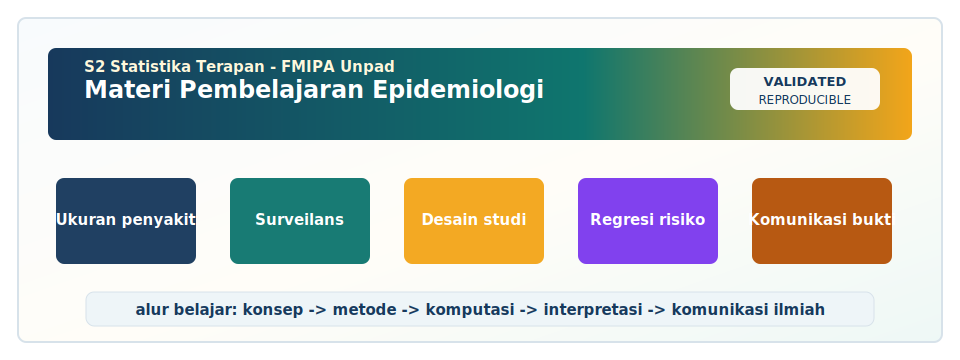
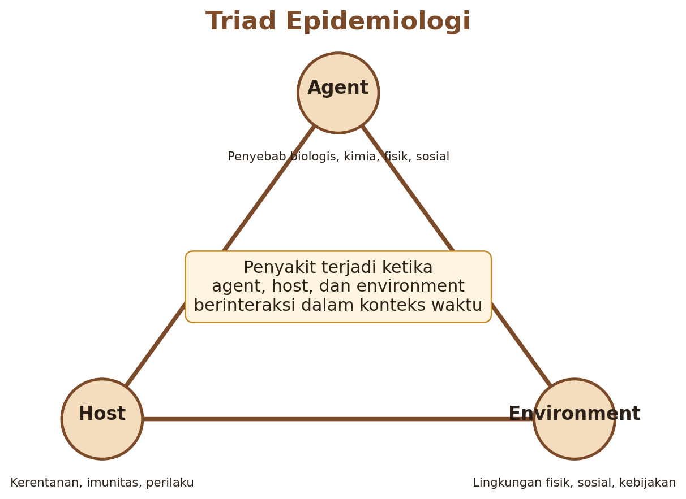
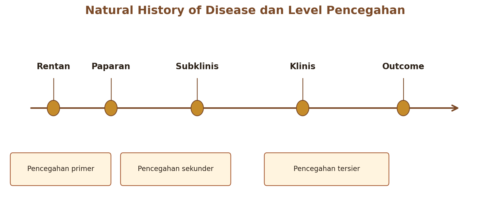
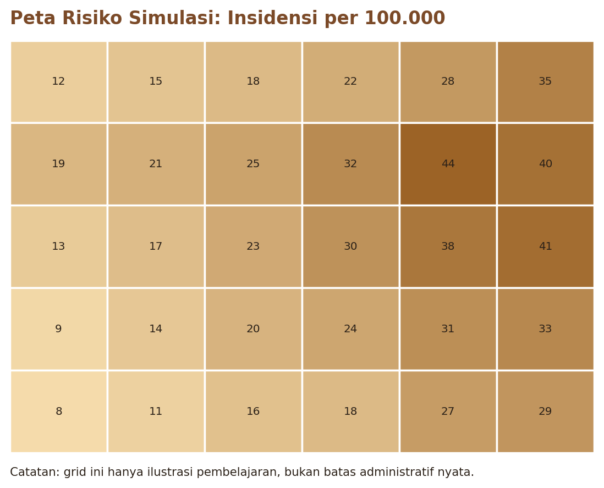
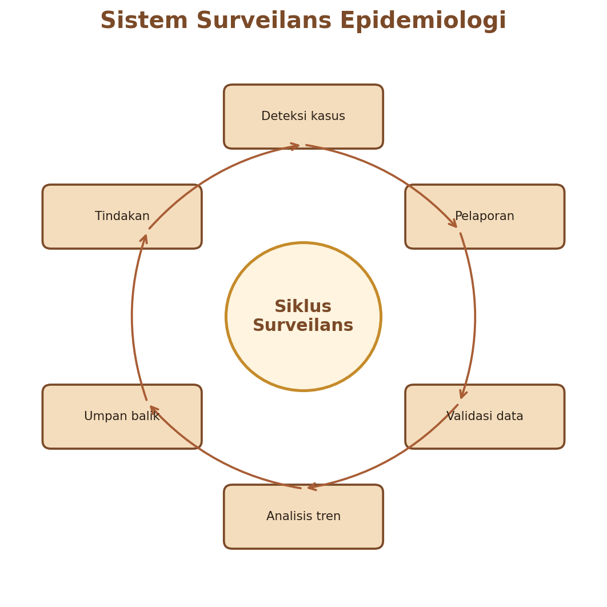
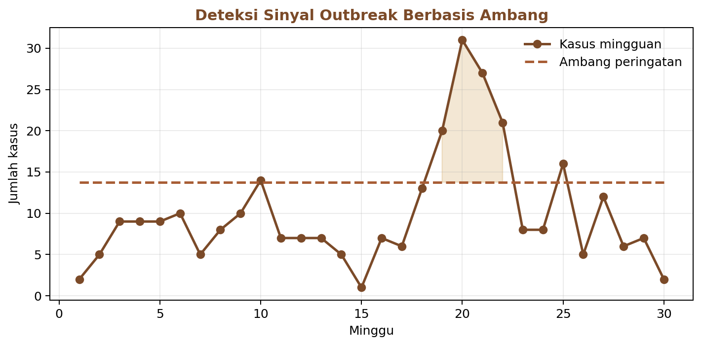
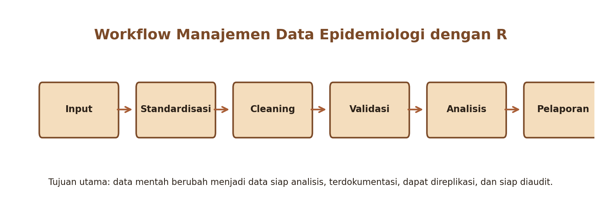
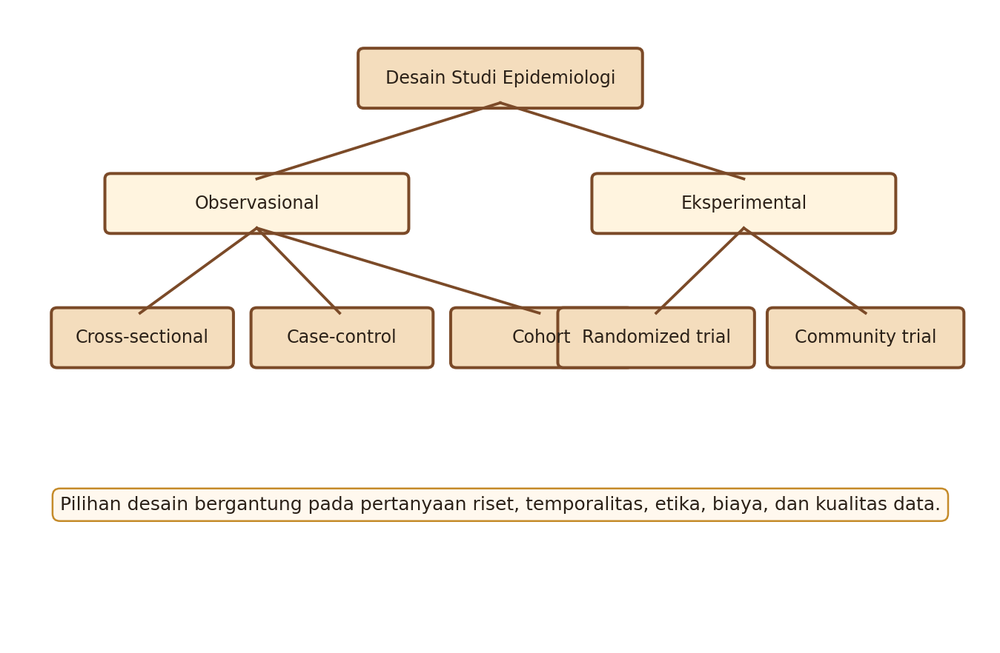
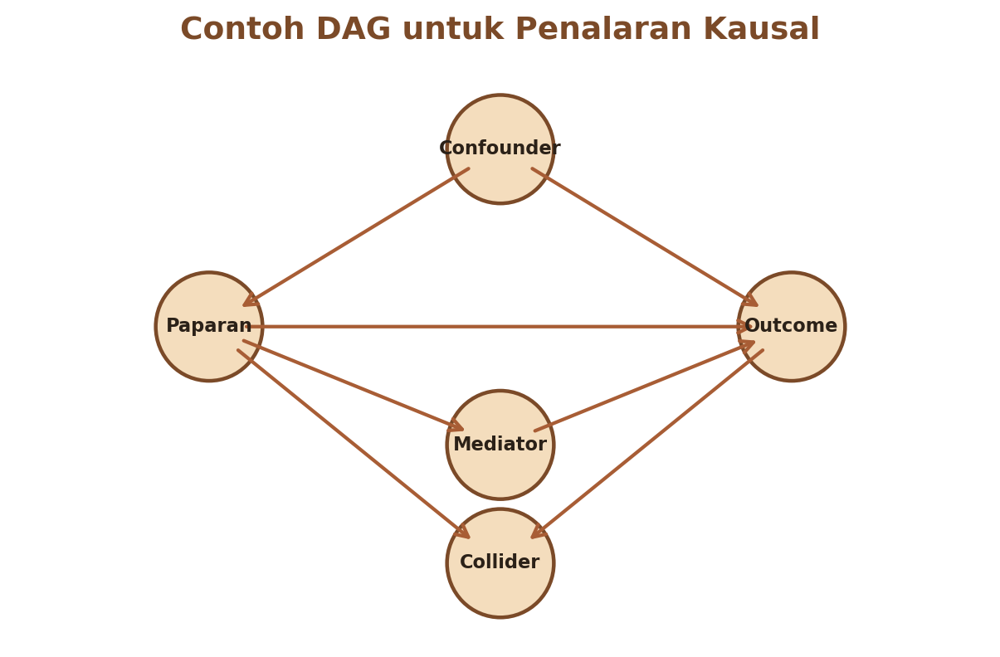

<!-- BEGIN UNPAD MATERIAL STYLE -->
<style>
:root {
  --unpad-navy: #17395c;
  --unpad-gold: #f2a51a;
  --unpad-teal: #0f766e;
  --unpad-ink: #172033;
  --unpad-paper: #fffdf8;
  --unpad-soft: #eef5f8;
  --unpad-line: #d7e2ea;
}
html, body {
  background: linear-gradient(135deg, #f8fbfd 0%, #fffdf8 48%, #f3f6ee 100%) !important;
  color: var(--unpad-ink) !important;
}
body {
  font-family: "Segoe UI", Arial, sans-serif !important;
  line-height: 1.72 !important;
}
.main-container {
  max-width: 1180px !important;
  background: rgba(255, 253, 248, 0.98) !important;
  border: 1px solid var(--unpad-line) !important;
  border-radius: 8px !important;
  box-shadow: 0 18px 42px rgba(23, 57, 92, 0.12) !important;
}
h1, h2, h3, h4 {
  letter-spacing: 0 !important;
}
h1.title {
  color: var(--unpad-navy) !important;
  -webkit-text-fill-color: var(--unpad-navy) !important;
  background: none !important;
}
h2 {
  border-left-color: var(--unpad-gold) !important;
}
a {
  color: #0b5c86 !important;
}
pre, code {
  border-radius: 8px !important;
}
.unpad-cover {
  margin: 18px 0 26px;
  padding: 24px;
  border-radius: 8px;
  background: linear-gradient(135deg, #17395c 0%, #0f766e 58%, #f2a51a 100%);
  color: #ffffff;
  box-shadow: 0 18px 36px rgba(23, 57, 92, 0.22);
}
.unpad-cover__brand {
  display: grid;
  grid-template-columns: 92px 1fr;
  gap: 20px;
  align-items: center;
}
.unpad-cover img {
  width: 92px;
  height: 92px;
  object-fit: contain;
  background: #ffffff;
  border-radius: 8px;
  padding: 8px;
  box-shadow: 0 8px 22px rgba(0,0,0,0.18);
}
.unpad-kicker {
  text-transform: uppercase;
  font-size: 0.82rem;
  font-weight: 800;
  letter-spacing: 0;
  color: #fff8dc;
}
.unpad-cover h2 {
  margin: 6px 0 8px;
  padding: 0;
  border: 0;
  background: transparent;
  color: #ffffff !important;
  font-size: 1.65rem;
}
.unpad-meta {
  margin: 0;
  color: #f7fbff;
  font-weight: 600;
}
.materi-illustration {
  margin: 20px 0 24px;
  padding: 14px;
  background: #ffffff;
  border: 1px solid var(--unpad-line);
  border-radius: 8px;
  box-shadow: 0 12px 28px rgba(23, 57, 92, 0.10);
}
.materi-illustration img {
  width: 100%;
  height: auto;
  display: block;
  border-radius: 6px;
}
.validasi-akademik {
  margin: 18px 0 28px;
  padding: 16px 18px;
  background: linear-gradient(135deg, #eef8f6, #fff8e7);
  border-left: 8px solid var(--unpad-teal);
  border-radius: 8px;
  color: var(--unpad-ink);
}
.validasi-akademik strong {
  color: var(--unpad-navy);
}
table {
  border-radius: 8px !important;
}
@media (max-width: 760px) {
  .unpad-cover__brand {
    grid-template-columns: 1fr;
  }
  .unpad-cover img {
    width: 76px;
    height: 76px;
  }
}
</style>
<!-- END UNPAD MATERIAL STYLE -->


<!-- BEGIN UNPAD MATERIAL ENHANCEMENT -->

```{r setup-unpad-render, include=FALSE}
execute_code <- FALSE
knitr::opts_chunk$set(
  echo = TRUE,
  eval = FALSE,
  message = FALSE,
  warning = FALSE,
  fig.align = "center",
  fig.width = 8,
  fig.height = 4.8,
  dpi = 120
)
set.seed(2025)
```


<div class="unpad-cover">
<div class="unpad-cover__brand">

<div>
<div class="unpad-kicker">S2 Statistika Terapan | FMIPA Universitas Padjadjaran</div>
<h2>Materi Pembelajaran Epidemiologi</h2>
<p class="unpad-meta">Program Studi S2 Statistika Terapan, FMIPA Universitas Padjadjaran<br>Penulis: I Gede Nyoman Mindra Jaya, Ph.D | Januari 2025</p>
</div>
</div>
</div>

<div class="materi-illustration">

</div>

<div class="validasi-akademik">
<strong>Catatan validasi akademik.</strong> Materi ini diseragamkan dengan rujukan ADWTL Januari 2025: rumus dibaca bersama asumsi, contoh kode diposisikan sebagai template reproducible, dan interpretasi diarahkan pada validitas data, diagnosis model, evaluasi ketidakpastian, serta komunikasi hasil secara ilmiah.
</div>

<!-- END UNPAD MATERIAL ENHANCEMENT -->

<style>
:root{
  --brown:#6f3f20; --brown2:#9b6137; --brown3:#c99055; --cream:#fff8ec;
  --light:#f7e6c7; --pale:#fff2db; --ink:#20170f; --muted:#5c4839; --gold:#cf9a3d;
}
html{scroll-behavior:smooth;}
body{
  color:var(--ink);
  background:linear-gradient(135deg,#fffaf0 0%,#f6dfbd 38%,#d0a06c 100%);
  font-family:-apple-system,BlinkMacSystemFont,"Segoe UI",Roboto,"Helvetica Neue",Arial,"Noto Sans",sans-serif;
  line-height:1.72;
  font-size:17px;
  max-width:1180px;
  margin:0 auto;
  padding:0 2rem 4rem 18rem;
}
#TOC{
  position:fixed; left:1.1rem; top:1.1rem; bottom:1.1rem; width:15rem;
  overflow-y:auto; padding:1rem 1rem 1.2rem 1rem;
  background:linear-gradient(180deg,#fff6e8 0%,#e5bd86 100%);
  border:1px solid rgba(111,63,32,.28); border-radius:18px;
  box-shadow:0 12px 35px rgba(78,44,20,.22);
  font-size:.86rem;
}
#TOC:before{content:"Daftar Isi"; display:block; font-size:1.15rem; font-weight:800; color:var(--brown); margin-bottom:.5rem;}
#TOC ul{padding-left:1rem;}
#TOC li{margin:.26rem 0;}
#TOC a{color:#4b2a16; text-decoration:none;}
#TOC a:hover{color:#8a4d23; text-decoration:underline;}
h1,h2,h3,h4{color:var(--brown); line-height:1.25; font-weight:850;}
h1.title{font-size:2.9rem; color:#fff; padding:2rem; border-radius:28px;
  background:linear-gradient(135deg,#4b2a16 0%,#8c532b 45%,#d3a15d 100%);
  box-shadow:0 18px 45px rgba(75,42,22,.32);}
h1{font-size:2.2rem; margin-top:2.4rem; border-bottom:4px solid rgba(156,93,47,.28); padding-bottom:.55rem;}
h2{font-size:1.65rem; margin-top:2rem;}
h3{font-size:1.25rem; margin-top:1.5rem; color:#7c4a29;}
a{color:#7b421e;}
blockquote{background:rgba(255,248,236,.83); border-left:7px solid var(--gold); padding:1rem 1.25rem; border-radius:0 18px 18px 0; box-shadow:0 8px 22px rgba(95,52,24,.08);}
table{border-collapse:collapse; width:100%; background:rgba(255,255,255,.72); margin:1rem 0 1.6rem 0; border-radius:14px; overflow:hidden;}
th{background:linear-gradient(90deg,#70401f,#b7793e); color:white; padding:.75rem;}
td{padding:.68rem; border-bottom:1px solid rgba(115,65,31,.18); vertical-align:top;}
tr:nth-child(even){background:rgba(250,232,198,.48);}
pre, pre.sourceCode{
  background:#f7e4c4 !important; color:#16100b !important; border:1px solid #c79256;
  border-radius:16px; padding:1rem; box-shadow:inset 0 0 0 1px rgba(255,255,255,.35), 0 8px 20px rgba(102,58,28,.12);
  overflow-x:auto;
}
code{background:#f3ddba; color:#111; padding:.12rem .28rem; border-radius:6px;}
pre code{background:transparent; padding:0; color:#111;}
img{max-width:100%; border-radius:18px; box-shadow:0 12px 30px rgba(75,42,22,.18); margin:1rem auto; display:block;}
.figure-caption, figcaption{font-size:.92rem; color:var(--muted); text-align:center;}
.callout, .rpsbox, .formula, .praktik, .assessment, .reflection{
  padding:1rem 1.15rem; margin:1.1rem 0; border-radius:18px; border:1px solid rgba(111,63,32,.25);
  box-shadow:0 10px 28px rgba(82,45,22,.12);
}
.callout{background:linear-gradient(135deg,#fff8ec,#f1d1a2);}
.rpsbox{background:linear-gradient(135deg,#fff1d6,#e4b677);}
.formula{background:#f8e8cc; color:#111; border-left:8px solid #b77435; font-size:1.04rem;}
.praktik{background:linear-gradient(135deg,#fff7ea,#edd0a3); border-left:8px solid #8d572d;}
.assessment{background:linear-gradient(135deg,#fff9ee,#e9c08c); border-left:8px solid #cf9a3d;}
.reflection{background:linear-gradient(135deg,#fff4df,#f6d8af); border-left:8px solid #a85d35;}
.badge{display:inline-block; padding:.25rem .65rem; border-radius:999px; background:#7a4523; color:#fff; font-weight:700; font-size:.82rem; margin:.1rem .15rem;}
.header-card{padding:1.4rem 1.6rem; border-radius:24px; background:linear-gradient(135deg,#fff7e6,#e9bf82); box-shadow:0 12px 32px rgba(83,48,24,.16); margin:1rem 0 2rem 0;}
.small{font-size:.93rem;color:#5c4839;}
hr{border:0; border-top:2px dashed rgba(111,63,32,.28); margin:2rem 0;}
@media(max-width:980px){body{padding:1rem; font-size:16px;} #TOC{position:relative; width:auto; left:auto; top:auto; bottom:auto; margin:1rem 0 2rem 0;} h1.title{font-size:2.1rem;}}
</style>


<div class="header-card">
<span class="badge">S2 Statistika Terapan</span>
<span class="badge">FMIPA UNPAD</span>
<span class="badge">Semester 2</span>
<span class="badge">3 SKS: T = 2, P = 1</span>
<span class="badge">RPS-OBE 2025</span>

**Identitas mata kuliah.** Materi ini disusun sebagai bahan ajar e-book untuk mata kuliah **Epidemiologi** pada Program Studi S2 Statistika Terapan, Fakultas Matematika dan Ilmu Pengetahuan Alam, Universitas Padjadjaran. Struktur pembelajaran mengikuti RPS mata kuliah Epidemiologi tahun 2025 yang memuat capaian pembelajaran, bahan kajian, kegiatan sinkron-asinkron, tugas, proyek, UTS, UAS, dan rubrik penilaian [@rps2025].
</div>

# Prakata

Epidemiologi adalah bahasa kerja untuk memahami mengapa penyakit muncul, bagaimana penyakit menyebar, siapa yang paling berisiko, kapan intervensi perlu dilakukan, dan bagaimana bukti statistik dapat diubah menjadi keputusan kesehatan masyarakat. Dalam konteks S2 Statistika Terapan, epidemiologi tidak cukup dipahami sebagai daftar definisi tentang insidensi, prevalensi, dan outbreak. Epidemiologi perlu ditempatkan sebagai medan aplikasi statistika yang menuntut ketelitian desain studi, kualitas data, penalaran kausal, pemodelan risiko, visualisasi spasial, surveilans, serta kemampuan mengomunikasikan hasil kepada pengambil keputusan.

Bahan ajar ini dibuat dengan orientasi **applied statistical epidemiology**. Artinya, setiap konsep teoritis dihubungkan dengan contoh data, rumus, interpretasi, workflow R, visualisasi, dan rancangan tugas yang dapat langsung dipraktikkan mahasiswa. Penekanan diberikan pada ukuran epidemiologi, surveilans, manajemen data epidemiologi dengan R, pemetaan distribusi penyakit, analisis statistik lanjut, dan rancangan proposal penelitian inovatif. Ini sejalan dengan CPMK mata kuliah, yaitu kemampuan menganalisis fenomena epidemiologi, menerapkan surveilans, mengembangkan algoritma manajemen data, serta merancang riset inovatif berbasis pendekatan interdisipliner.

<div class="callout">
**Cara menggunakan modul ini.** Bacalah bagian konsep sebelum kuliah, jalankan kode R pada bagian praktikum, kerjakan latihan singkat setelah tiap pertemuan, dan gunakan bagian proyek sebagai panduan penyusunan laporan. Modul ini sengaja disusun panjang agar dapat berfungsi sebagai bahan kuliah, modul praktikum, referensi tugas, serta bahan awal penulisan proposal penelitian epidemiologi.
</div>

# Peta RPS dan Desain Pembelajaran

## Identitas Mata Kuliah

| Komponen | Informasi |
|---|---|
| Mata kuliah | Epidemiologi |
| Kode | D20B.214 |
| Rumpun MK | Wajib |
| Bobot | 3 SKS, terdiri atas T = 2 dan P = 1 |
| Semester | 2 |
| Dosen pengampu / penyusun RPS | I Gede Nyoman Mindra Jaya, Ph.D |
| Program studi | S2 Statistika Terapan, FMIPA Universitas Padjadjaran |
| Tahun bahan ajar | Januari 2025 |

## CPL, CPMK, dan SubCPMK

RPS menempatkan mata kuliah ini pada tiga CPL utama. **CPL3** menekankan kemampuan mengelola dan menganalisis data untuk menyelesaikan masalah nyata. **CPL4** menekankan pengembangan algoritma komputasi menggunakan software statistika. **CPL5** menekankan kemampuan berpikir logis, kritis, sistematis, dan inovatif dalam riset yang berdampak positif bagi masyarakat [@rps2025].

| CPMK | Rumusan capaian |
|---|---|
| CPMK1 | Mahasiswa mampu menganalisis fenomena epidemiologi menggunakan konsep dan ukuran statistik yang relevan untuk memecahkan masalah nyata. |
| CPMK2 | Mahasiswa mampu menerapkan surveilans epidemiologi dan menyusun laporan analisis kejadian penyakit berbasis data nyata. |
| CPMK3 | Mahasiswa mampu mengembangkan dan mengimplementasikan algoritma manajemen data epidemiologi dengan software statistik. |
| CPMK4 | Mahasiswa mampu mengembangkan riset inovatif dalam analisis data epidemiologi dengan pendekatan interdisipliner dan mempublikasikan hasilnya. |

## Struktur Pertemuan

| Pertemuan | Fokus | SubCPMK | Produk belajar |
|---|---|---|---|
| 1--3 | Konsep dasar, ukuran statistik epidemiologi, dan visualisasi peta penyakit | SubCPMK1 | Perhitungan ukuran epidemiologi dan peta distribusi penyakit |
| 4--7 | Surveilans, jenis kejadian penyakit, pengumpulan data, analisis tren, dan laporan kejadian | SubCPMK2 | Laporan surveilans dan rekomendasi berbasis data |
| 8 | UTS berbasis proyek pendahuluan | CPMK1--CPMK2 | Presentasi dan laporan tengah semester |
| 9--12 | Manajemen data epidemiologi dengan R, cleaning, validasi, transformasi, dan sistem data | SubCPMK3 | Script R dan laporan sistem manajemen data |
| 13--15 | Riset inovatif, desain penelitian, regresi, spasial, machine learning, publikasi | SubCPMK4 | Proposal penelitian dan presentasi ilmiah |
| 16 | UAS berbasis proyek akhir | CPMK4 | Proposal final, laporan, dan presentasi |

## Komponen Penilaian

| Komponen | Bobot | Keterangan ringkas |
|---|---:|---|
| Tugas analisis ukuran statistik dan peta spasial | 10% | Menghitung ukuran epidemiologi dan membuat peta distribusi penyakit |
| Kuis reflektif / quiz | 10% | Menguji pemahaman konsep, definisi, dan interpretasi |
| Tugas surveilans dan analisis kejadian penyakit | 10% | Menyusun analisis surveilans berbasis data |
| Presentasi laporan surveilans / partisipasi | 10% | Diskusi, presentasi, dan partisipasi dalam tugas surveilans |
| UTS | 10% | Project tengah semester |
| Proyek manajemen data epidemiologi dengan R | 20% | Script, workflow, dokumentasi, dan laporan sistem data |
| Proyek penelitian inovatif dan peer assessment | 20% | Proposal riset epidemiologi berbasis statistik mutakhir |
| UAS | 10% | Project akhir, laporan, dan presentasi |

<div class="rpsbox">
**Benang merah pembelajaran.** Modul ini bergerak dari konsep dan ukuran dasar menuju surveilans, manajemen data, pemodelan statistik, pemetaan spasial, machine learning, dan proposal riset. Dengan demikian, mahasiswa tidak hanya mampu “menghitung angka”, tetapi juga mampu menjelaskan konsekuensi metodologisnya. Dalam epidemiologi, angka tanpa konteks adalah seperti termometer tanpa pasien: tetap terlihat ilmiah, tetapi bisa salah sasaran.
</div>


# Pertemuan 1: Pendahuluan Epidemiologi: Sejarah, Definisi, dan Ruang Lingkup


<div class="callout">
**Fokus pertemuan.** Sejarah epidemiologi, definisi, ruang lingkup, dan peran epidemiologi dalam kesehatan masyarakat. Topik ini mendukung CPMK/SubCPMK dalam RPS dan menghubungkan teori epidemiologi dengan praktik analisis data menggunakan pendekatan deskripsi populasi, perbandingan risiko, penalaran kausal, dan komunikasi kesehatan masyarakat. Referensi utama bagian ini adalah [@rothman2021; @gordis2014; @porta2014].
</div>


### Pendalaman konsep

Pendahuluan Epidemiologi perlu dipahami sebagai bagian dari rantai penalaran epidemiologi yang menghubungkan kejadian penyakit, populasi berisiko, waktu pengamatan, ruang geografis, serta mekanisme sosial-biologis yang memungkinkan suatu masalah kesehatan muncul. Pada tingkat dasar, mahasiswa harus mampu menjawab pertanyaan: **siapa yang sakit, kapan kejadian terjadi, di mana kejadian terkonsentrasi, mengapa kelompok tertentu lebih rentan, dan bukti apa yang cukup kuat untuk mendukung keputusan?** Pertanyaan ini sederhana, tetapi memaksa analis untuk menyusun definisi kasus, denominator, sumber data, periode pengamatan, dan unit analisis secara eksplisit. Literatur epidemiologi modern menekankan bahwa kualitas inferensi sangat bergantung pada kejelasan definisi operasional, bukan hanya kecanggihan model statistik [@rothman2021; @gordis2014].

Dalam mata kuliah ini, sejarah epidemiologi, definisi, ruang lingkup, dan peran epidemiologi dalam kesehatan masyarakat tidak dibahas sebagai hafalan, melainkan sebagai perangkat analitik. Setiap istilah harus dihubungkan dengan data. Misalnya, istilah kasus membutuhkan kriteria diagnostik; istilah populasi membutuhkan batas administratif atau kerangka sampling; istilah risiko membutuhkan periode observasi; dan istilah tren membutuhkan konsistensi sistem pencatatan dari waktu ke waktu. Ketika salah satu komponen ini kabur, hasil analisis dapat terlihat rapi tetapi sebenarnya rapuh. Karena itu, mahasiswa diarahkan untuk menuliskan asumsi, sumber data, dan keterbatasan sebelum membuat grafik atau menjalankan model. Ini adalah disiplin kecil yang menyelamatkan analisis besar.

Pendekatan deskripsi populasi, perbandingan risiko, penalaran kausal, dan komunikasi kesehatan masyarakat memberi ruang kepada mahasiswa statistika untuk mengintegrasikan konsep epidemiologi dengan teknik kuantitatif. Namun, teknik kuantitatif harus tetap tunduk pada substansi epidemiologi. Model regresi, peta risiko, atau algoritma machine learning tidak boleh menjadi pengganti pertanyaan riset. Model adalah alat untuk menjelaskan pola, menguji dugaan, memprediksi kejadian, atau mendukung prioritas intervensi. Dalam praktik kesehatan masyarakat, analisis yang berguna bukan analisis yang paling rumit, melainkan analisis yang valid, transparan, dapat diperiksa ulang, dan dapat diterjemahkan menjadi tindakan.

Epidemiologi juga menuntut kepekaan terhadap bias. Bias seleksi muncul ketika data yang dianalisis tidak mewakili populasi target. Bias informasi muncul ketika pengukuran paparan, outcome, atau kovariat tidak konsisten. Confounding muncul ketika hubungan paparan-outcome dipengaruhi faktor lain yang terkait dengan keduanya. Dalam konteks data rutin, misalnya data puskesmas atau rumah sakit, angka kasus sering dipengaruhi akses layanan, kapasitas diagnosis, perubahan pedoman pelaporan, dan perilaku pencarian pengobatan. Karena itu, interpretasi harus memisahkan “peningkatan kasus tercatat” dari “peningkatan risiko penyakit yang sebenarnya”. Pembedaan ini adalah jantung penalaran epidemiologi [@friis2020; @jewell2004].

Secara pedagogis, bagian ini dirancang agar mahasiswa bergerak dari pemahaman konseptual menuju kemampuan operasional. Setiap topik memuat definisi, rumus atau kerangka analisis, contoh kasus, implementasi R, pertanyaan refleksi, dan latihan. Dengan struktur seperti ini, kuliah tidak berhenti pada ceramah, tetapi berubah menjadi laboratorium pengambilan keputusan berbasis data. Mahasiswa diharapkan dapat menunjukkan argumen: mengapa ukuran tertentu dipakai, mengapa peta tertentu dipilih, mengapa model tertentu sesuai, serta bagaimana hasil dapat disampaikan kepada pemangku kepentingan nonstatistik.


<div class="formula">

Epidemiologi mempelajari distribusi dan determinan kejadian kesehatan pada populasi tertentu serta penerapannya untuk mengendalikan masalah kesehatan.

Rumus atau prinsip di atas menjadi pegangan awal untuk membaca data pada topik pendahuluan epidemiologi. Dalam laporan, tuliskan satuan, denominator, periode, dan sumber data agar interpretasi tidak melayang seperti grafik tanpa sumbu.

</div>

Dalam praktik, sejarah epidemiologi, definisi, ruang lingkup, dan peran epidemiologi dalam kesehatan masyarakat sering tampak sederhana karena hasil akhirnya berupa angka, tabel, atau grafik. Namun, sebelum angka tersebut muncul, analis harus mengambil keputusan metodologis yang tidak selalu terlihat oleh pembaca. Keputusan itu meliputi definisi kasus, periode pengamatan, denominator, cara menangani data hilang, dan cara menafsirkan perubahan sistem pencatatan. Bila keputusan ini tidak dijelaskan, pembaca dapat menganggap hasil sebagai fakta final, padahal hasil tersebut bergantung pada serangkaian asumsi. Oleh karena itu, setiap analisis pendahuluan epidemiologi harus menyertakan catatan asumsi dan keterbatasan. Ini bukan tanda kelemahan analisis; justru ini tanda bahwa analisis dilakukan secara profesional.

Mahasiswa statistika perlu memperhatikan bahwa ukuran epidemiologi tidak selalu dapat dibandingkan secara langsung antarwilayah atau antarperiode. Perbedaan umur penduduk, akses layanan, kualitas diagnosis, dan intensitas pelaporan dapat membuat dua wilayah terlihat berbeda meskipun risiko biologisnya serupa. Dalam situasi seperti ini, stratifikasi, standardisasi, pemodelan, atau analisis sensitivitas dapat diperlukan. Literatur epidemiologi menekankan pentingnya validitas internal dan eksternal, karena kesimpulan yang terlihat kuat dalam satu dataset belum tentu berlaku pada populasi target yang lebih luas [@rothman2021; @hernan2020].

Salah satu kompetensi penting dalam pendahuluan epidemiologi adalah membedakan deskripsi, asosiasi, prediksi, dan kausalitas. Deskripsi menjawab apa yang terjadi. Asosiasi menjawab variabel apa yang berkaitan. Prediksi menjawab apa yang mungkin terjadi pada observasi baru. Kausalitas menjawab apa yang akan terjadi jika intervensi dilakukan. Keempat tujuan ini dapat menggunakan data yang mirip, tetapi membutuhkan desain, asumsi, dan bahasa interpretasi yang berbeda. Kesalahan paling umum adalah menggunakan model prediktif untuk membuat klaim kausal tanpa desain dan asumsi kausal yang memadai.

Dalam laporan kesehatan masyarakat, hasil analisis harus disampaikan dengan bahasa yang dapat ditindaklanjuti. Tabel teknis penting untuk transparansi, tetapi ringkasan naratif membantu pembuat kebijakan memahami prioritas. Narasi yang baik biasanya memuat tiga elemen: lokasi atau kelompok dengan risiko tertinggi, kemungkinan penjelasan yang didukung data, dan tindakan yang disarankan. Bila ketidakpastian tinggi, rekomendasi dapat berupa pengumpulan data tambahan, verifikasi lapangan, atau investigasi cepat. Dengan demikian, ketidakpastian tidak menghentikan keputusan; ketidakpastian mengarahkan jenis keputusan yang lebih hati-hati.

Penggunaan R dalam topik ini bukan sekadar urusan software. R dipakai sebagai lingkungan berpikir reproducible: setiap transformasi data dapat dilacak, setiap grafik dapat dibuat ulang, dan setiap analisis dapat diperiksa oleh orang lain. Ini penting karena data epidemiologi sering digunakan untuk keputusan yang menyangkut masyarakat luas. Kesalahan kecil dalam filter data, denominator, atau pengkodean wilayah dapat mengubah prioritas intervensi. Karena itu, kode yang bersih dan terdokumentasi adalah bagian dari etika analisis, bukan sekadar gaya kerja teknis.

Kaitannya dengan RPS, pendahuluan epidemiologi mendukung penguasaan CPMK melalui kombinasi kuliah interaktif, diskusi, praktikum, tugas mandiri, dan presentasi. Mahasiswa tidak hanya diminta memahami konsep, tetapi juga membuktikan pemahaman melalui produk konkret. Produk tersebut dapat berupa script R, peta, laporan surveilans, proposal penelitian, atau presentasi ilmiah. Struktur ini penting karena kompetensi epidemiologi terapan tidak dapat dinilai hanya melalui ujian tertulis; kompetensi ini tampak dalam cara mahasiswa mengelola data nyata dan mempertahankan interpretasinya.

Dalam konteks Indonesia, sejarah epidemiologi, definisi, ruang lingkup, dan peran epidemiologi dalam kesehatan masyarakat memiliki nilai strategis karena masalah kesehatan masyarakat sering bersifat heterogen antarwilayah. Satu provinsi dapat memiliki kabupaten dengan risiko tinggi yang berdampingan dengan wilayah berisiko rendah. Perbedaan ini dapat dipengaruhi oleh kepadatan penduduk, lingkungan, kemiskinan, akses layanan, pendidikan, perilaku kesehatan, mobilitas, dan kapasitas surveilans. Dengan perspektif statistik terapan, mahasiswa dapat membantu mengubah data rutin menjadi informasi wilayah-prioritas yang berguna bagi program kesehatan.

Agar hasil analisis dapat dipercaya, mahasiswa perlu membangun kebiasaan audit sederhana. Setiap dataset perlu diperiksa jumlah barisnya sebelum dan sesudah cleaning, jumlah duplikasi, jumlah nilai hilang, rentang tanggal, distribusi umur, konsistensi kode wilayah, dan kelengkapan variabel outcome. Pemeriksaan seperti ini tampak membosankan, tetapi justru di sinilah banyak kesalahan besar ditemukan. Model canggih di atas data yang salah hanya menghasilkan kesalahan yang tampil lebih meyakinkan. Dalam kelas ini, kualitas data adalah pintu masuk utama menuju kualitas inferensi.

### Contoh kasus pembelajaran

Bayangkan sebuah dinas kesehatan kabupaten menerima laporan peningkatan kasus **dengue fever** pada beberapa kecamatan selama empat minggu terakhir. Data awal berasal dari puskesmas, rumah sakit, dan laporan kader. Sebagian kasus memiliki tanggal onset, sebagian hanya memiliki tanggal kunjungan, dan sebagian lagi belum memiliki alamat lengkap. Dalam situasi seperti ini, analis epidemiologi tidak boleh langsung menyimpulkan bahwa terjadi outbreak. Langkah pertama adalah memeriksa definisi kasus, kelengkapan variabel, konsistensi tanggal, serta perubahan sistem pelaporan. Apabila pada minggu yang sama ada kampanye skrining massal, peningkatan kasus tercatat dapat berasal dari peningkatan deteksi, bukan peningkatan penularan.

Dalam konteks **monitoring penyakit menular di wilayah perkotaan**, mahasiswa dapat menyusun alur analisis sebagai berikut. Pertama, definisikan populasi berisiko dan wilayah pengamatan. Kedua, hitung jumlah kasus menurut minggu onset dan kecamatan. Ketiga, bandingkan angka kasus dengan baseline historis atau rata-rata beberapa minggu sebelumnya. Keempat, visualisasikan distribusi spasial untuk melihat apakah kasus terkonsentrasi pada wilayah tertentu. Kelima, rumuskan hipotesis faktor risiko, misalnya kepadatan penduduk, sanitasi, cakupan imunisasi, curah hujan, atau mobilitas. Keenam, tuliskan rekomendasi berbasis data, misalnya investigasi lapangan, penguatan pelaporan, komunikasi risiko, atau intervensi pada wilayah prioritas.

Kasus ini mengajarkan bahwa Pendahuluan Epidemiologi selalu beroperasi dalam situasi data yang tidak sempurna. Data epidemiologi jarang datang seperti dataset latihan yang bersih, lengkap, dan bersahabat. Kadang nama variabel tidak konsisten, kode wilayah berubah, tanggal tidak logis, atau denominator penduduk berasal dari sumber yang berbeda. Oleh karena itu, kompetensi yang dibutuhkan bukan hanya kemampuan menghitung, tetapi juga kemampuan bertanya secara kritis. Pertanyaan seperti “apakah denominator ini sesuai?”, “apakah kasus ini memenuhi definisi?”, “apakah data minggu terakhir masih underreported?”, dan “apakah tren ini sejalan dengan bukti lapangan?” harus menjadi kebiasaan analitik.

Pada akhir contoh kasus, mahasiswa diminta menyusun interpretasi singkat maksimal tiga paragraf. Paragraf pertama menjelaskan pola utama. Paragraf kedua menjelaskan kemungkinan penyebab dan keterbatasan data. Paragraf ketiga memberikan rekomendasi. Format tiga paragraf ini membantu mahasiswa menulis secara terstruktur: **temuan, interpretasi, tindakan**. Dalam laporan profesional, struktur ini jauh lebih berguna daripada tabel panjang tanpa narasi.


### Praktikum R: Pendahuluan Epidemiologi

```{r eval=FALSE, message=FALSE, warning=FALSE}
# Contoh struktur awal analisis epidemiologi
kasus <- data.frame(
  id = 1:6,
  wilayah = c("A", "A", "B", "B", "C", "C"),
  tanggal_onset = as.Date(c("2025-01-02", "2025-01-05", "2025-01-07", "2025-01-11", "2025-01-13", "2025-01-16")),
  status = c("suspek", "konfirmasi", "konfirmasi", "suspek", "konfirmasi", "konfirmasi")
)
str(kasus)
table(kasus$wilayah, kasus$status)
```

Kode di atas bersifat contoh dan dapat dimodifikasi sesuai dataset. Prinsip pentingnya adalah membuat alur yang dapat direplikasi: input data, pemeriksaan struktur, transformasi, analisis, visualisasi, dan interpretasi. Dalam tugas kuliah, mahasiswa perlu menuliskan versi paket R yang digunakan, sumber data, serta catatan perubahan data agar hasil dapat diaudit kembali.


### Interpretasi hasil dan kesalahan umum

Pada topik pendahuluan epidemiologi, interpretasi harus selalu dimulai dari pertanyaan substantif. Apabila hasil menunjukkan peningkatan risiko, tanyakan apakah peningkatan tersebut konsisten secara waktu, konsisten antarwilayah, dan masuk akal secara biologis atau sosial. Apabila hasil menunjukkan tidak ada perbedaan, tanyakan apakah ukuran sampel cukup, apakah outcome jarang, apakah data terlalu kasar, dan apakah pengukuran paparan valid. Dengan cara ini, mahasiswa tidak terjebak pada ritual membaca p-value semata. P-value dapat membantu menilai kompatibilitas data dengan hipotesis nol, tetapi tidak menggantikan penilaian epidemiologis tentang bias, presisi, desain, dan relevansi kebijakan [@rothman2021; @jewell2004].

Kesalahan umum pertama adalah mencampuradukkan jumlah kasus dengan risiko. Wilayah dengan jumlah kasus besar belum tentu memiliki risiko tertinggi jika populasinya juga besar. Kesalahan kedua adalah membandingkan prevalensi dan insidensi seolah-olah keduanya menjawab pertanyaan yang sama. Prevalensi menggambarkan beban kasus pada suatu titik atau periode, sedangkan insidensi menggambarkan munculnya kasus baru. Kesalahan ketiga adalah membuat peta tanpa mempertimbangkan stabilitas denominator; wilayah kecil dapat terlihat ekstrem karena variasi acak. Kesalahan keempat adalah memakai model kompleks tanpa menjelaskan pertanyaan riset. Model yang paling baik adalah model yang menjawab pertanyaan dengan asumsi paling masuk akal.

Interpretasi juga harus memperhatikan audiens. Untuk sesama statistisi, detail model, asumsi distribusi, validasi, dan ketidakpastian perlu dijelaskan. Untuk dinas kesehatan, penekanan dapat diberikan pada wilayah prioritas, tren, faktor risiko yang dapat diintervensi, dan rekomendasi operasional. Untuk masyarakat, bahasa harus lebih sederhana, tidak menakut-nakuti, dan tetap akurat. Kemampuan berpindah bahasa ini adalah bagian penting dari kompetensi S2 Statistika Terapan: satu kaki berdiri pada metodologi, satu kaki lagi berdiri pada manfaat publik.


<div class="praktik">

**Aktivitas praktikum untuk Pendahuluan Epidemiologi.**  
1. Bentuk kelompok kecil berisi 2--3 mahasiswa.  
2. Pilih satu penyakit atau masalah kesehatan masyarakat yang memiliki dimensi populasi, waktu, dan wilayah.  
3. Susun definisi kasus, populasi berisiko, periode pengamatan, variabel utama, dan rencana analisis.  
4. Jalankan minimal satu analisis deskriptif dan satu visualisasi.  
5. Tulis interpretasi berbasis data, bukan berbasis firasat. Firasat boleh hadir sebagai hipotesis, tetapi jangan diberi jas laboratorium terlalu cepat.

</div>

<div class="reflection">

**Pertanyaan refleksi.** Apa asumsi paling kuat dalam analisis Anda? Apa yang terjadi jika asumsi itu salah? Variabel apa yang paling mungkin mengalami bias pencatatan? Bagaimana Anda menjelaskan keterbatasan tersebut kepada pengambil keputusan tanpa membuat hasil analisis terdengar tidak berguna?

</div>


<div class="assessment">

**Luaran yang dikumpulkan.** Ringkasan konsep 2 halaman, tabel definisi istilah epidemiologi, dan contoh data kecil yang menjelaskan populasi berisiko. Penilaian menekankan ketepatan konsep, transparansi metode, kualitas visualisasi, kemampuan interpretasi, dokumentasi kode, dan keberanian menyebutkan keterbatasan. Laporan yang baik tidak menyembunyikan ketidakpastian; laporan yang baik menjelaskan ketidakpastian secara jujur dan tetap memberi arah tindakan.

</div>


# Pertemuan 2: Proses Terjadinya Penyakit: Agent, Host, Environment, dan Natural History


<div class="callout">
**Fokus pertemuan.** Interaksi agent, host, environment, proses transmisi, dan riwayat alamiah penyakit. Topik ini mendukung CPMK/SubCPMK dalam RPS dan menghubungkan teori epidemiologi dengan praktik analisis data menggunakan pendekatan kerangka triad epidemiologi, model multifaktor, dan level pencegahan. Referensi utama bagian ini adalah [@gordis2014; @friis2020].
</div>








### Pendalaman konsep

Proses Terjadinya Penyakit perlu dipahami sebagai bagian dari rantai penalaran epidemiologi yang menghubungkan kejadian penyakit, populasi berisiko, waktu pengamatan, ruang geografis, serta mekanisme sosial-biologis yang memungkinkan suatu masalah kesehatan muncul. Pada tingkat dasar, mahasiswa harus mampu menjawab pertanyaan: **siapa yang sakit, kapan kejadian terjadi, di mana kejadian terkonsentrasi, mengapa kelompok tertentu lebih rentan, dan bukti apa yang cukup kuat untuk mendukung keputusan?** Pertanyaan ini sederhana, tetapi memaksa analis untuk menyusun definisi kasus, denominator, sumber data, periode pengamatan, dan unit analisis secara eksplisit. Literatur epidemiologi modern menekankan bahwa kualitas inferensi sangat bergantung pada kejelasan definisi operasional, bukan hanya kecanggihan model statistik [@rothman2021; @gordis2014].

Dalam mata kuliah ini, interaksi agent, host, environment, proses transmisi, dan riwayat alamiah penyakit tidak dibahas sebagai hafalan, melainkan sebagai perangkat analitik. Setiap istilah harus dihubungkan dengan data. Misalnya, istilah kasus membutuhkan kriteria diagnostik; istilah populasi membutuhkan batas administratif atau kerangka sampling; istilah risiko membutuhkan periode observasi; dan istilah tren membutuhkan konsistensi sistem pencatatan dari waktu ke waktu. Ketika salah satu komponen ini kabur, hasil analisis dapat terlihat rapi tetapi sebenarnya rapuh. Karena itu, mahasiswa diarahkan untuk menuliskan asumsi, sumber data, dan keterbatasan sebelum membuat grafik atau menjalankan model. Ini adalah disiplin kecil yang menyelamatkan analisis besar.

Pendekatan kerangka triad epidemiologi, model multifaktor, dan level pencegahan memberi ruang kepada mahasiswa statistika untuk mengintegrasikan konsep epidemiologi dengan teknik kuantitatif. Namun, teknik kuantitatif harus tetap tunduk pada substansi epidemiologi. Model regresi, peta risiko, atau algoritma machine learning tidak boleh menjadi pengganti pertanyaan riset. Model adalah alat untuk menjelaskan pola, menguji dugaan, memprediksi kejadian, atau mendukung prioritas intervensi. Dalam praktik kesehatan masyarakat, analisis yang berguna bukan analisis yang paling rumit, melainkan analisis yang valid, transparan, dapat diperiksa ulang, dan dapat diterjemahkan menjadi tindakan.

Epidemiologi juga menuntut kepekaan terhadap bias. Bias seleksi muncul ketika data yang dianalisis tidak mewakili populasi target. Bias informasi muncul ketika pengukuran paparan, outcome, atau kovariat tidak konsisten. Confounding muncul ketika hubungan paparan-outcome dipengaruhi faktor lain yang terkait dengan keduanya. Dalam konteks data rutin, misalnya data puskesmas atau rumah sakit, angka kasus sering dipengaruhi akses layanan, kapasitas diagnosis, perubahan pedoman pelaporan, dan perilaku pencarian pengobatan. Karena itu, interpretasi harus memisahkan “peningkatan kasus tercatat” dari “peningkatan risiko penyakit yang sebenarnya”. Pembedaan ini adalah jantung penalaran epidemiologi [@friis2020; @jewell2004].

Secara pedagogis, bagian ini dirancang agar mahasiswa bergerak dari pemahaman konseptual menuju kemampuan operasional. Setiap topik memuat definisi, rumus atau kerangka analisis, contoh kasus, implementasi R, pertanyaan refleksi, dan latihan. Dengan struktur seperti ini, kuliah tidak berhenti pada ceramah, tetapi berubah menjadi laboratorium pengambilan keputusan berbasis data. Mahasiswa diharapkan dapat menunjukkan argumen: mengapa ukuran tertentu dipakai, mengapa peta tertentu dipilih, mengapa model tertentu sesuai, serta bagaimana hasil dapat disampaikan kepada pemangku kepentingan nonstatistik.


<div class="formula">

Risiko penyakit dapat dipandang sebagai fungsi interaksi: $R=f(Agent, Host, Environment, Time)$, bukan akibat satu faktor tunggal.

Rumus atau prinsip di atas menjadi pegangan awal untuk membaca data pada topik proses terjadinya penyakit. Dalam laporan, tuliskan satuan, denominator, periode, dan sumber data agar interpretasi tidak melayang seperti grafik tanpa sumbu.

</div>

Dalam praktik, interaksi agent, host, environment, proses transmisi, dan riwayat alamiah penyakit sering tampak sederhana karena hasil akhirnya berupa angka, tabel, atau grafik. Namun, sebelum angka tersebut muncul, analis harus mengambil keputusan metodologis yang tidak selalu terlihat oleh pembaca. Keputusan itu meliputi definisi kasus, periode pengamatan, denominator, cara menangani data hilang, dan cara menafsirkan perubahan sistem pencatatan. Bila keputusan ini tidak dijelaskan, pembaca dapat menganggap hasil sebagai fakta final, padahal hasil tersebut bergantung pada serangkaian asumsi. Oleh karena itu, setiap analisis proses terjadinya penyakit harus menyertakan catatan asumsi dan keterbatasan. Ini bukan tanda kelemahan analisis; justru ini tanda bahwa analisis dilakukan secara profesional.

Mahasiswa statistika perlu memperhatikan bahwa ukuran epidemiologi tidak selalu dapat dibandingkan secara langsung antarwilayah atau antarperiode. Perbedaan umur penduduk, akses layanan, kualitas diagnosis, dan intensitas pelaporan dapat membuat dua wilayah terlihat berbeda meskipun risiko biologisnya serupa. Dalam situasi seperti ini, stratifikasi, standardisasi, pemodelan, atau analisis sensitivitas dapat diperlukan. Literatur epidemiologi menekankan pentingnya validitas internal dan eksternal, karena kesimpulan yang terlihat kuat dalam satu dataset belum tentu berlaku pada populasi target yang lebih luas [@rothman2021; @hernan2020].

Salah satu kompetensi penting dalam proses terjadinya penyakit adalah membedakan deskripsi, asosiasi, prediksi, dan kausalitas. Deskripsi menjawab apa yang terjadi. Asosiasi menjawab variabel apa yang berkaitan. Prediksi menjawab apa yang mungkin terjadi pada observasi baru. Kausalitas menjawab apa yang akan terjadi jika intervensi dilakukan. Keempat tujuan ini dapat menggunakan data yang mirip, tetapi membutuhkan desain, asumsi, dan bahasa interpretasi yang berbeda. Kesalahan paling umum adalah menggunakan model prediktif untuk membuat klaim kausal tanpa desain dan asumsi kausal yang memadai.

Dalam laporan kesehatan masyarakat, hasil analisis harus disampaikan dengan bahasa yang dapat ditindaklanjuti. Tabel teknis penting untuk transparansi, tetapi ringkasan naratif membantu pembuat kebijakan memahami prioritas. Narasi yang baik biasanya memuat tiga elemen: lokasi atau kelompok dengan risiko tertinggi, kemungkinan penjelasan yang didukung data, dan tindakan yang disarankan. Bila ketidakpastian tinggi, rekomendasi dapat berupa pengumpulan data tambahan, verifikasi lapangan, atau investigasi cepat. Dengan demikian, ketidakpastian tidak menghentikan keputusan; ketidakpastian mengarahkan jenis keputusan yang lebih hati-hati.

Penggunaan R dalam topik ini bukan sekadar urusan software. R dipakai sebagai lingkungan berpikir reproducible: setiap transformasi data dapat dilacak, setiap grafik dapat dibuat ulang, dan setiap analisis dapat diperiksa oleh orang lain. Ini penting karena data epidemiologi sering digunakan untuk keputusan yang menyangkut masyarakat luas. Kesalahan kecil dalam filter data, denominator, atau pengkodean wilayah dapat mengubah prioritas intervensi. Karena itu, kode yang bersih dan terdokumentasi adalah bagian dari etika analisis, bukan sekadar gaya kerja teknis.

Kaitannya dengan RPS, proses terjadinya penyakit mendukung penguasaan CPMK melalui kombinasi kuliah interaktif, diskusi, praktikum, tugas mandiri, dan presentasi. Mahasiswa tidak hanya diminta memahami konsep, tetapi juga membuktikan pemahaman melalui produk konkret. Produk tersebut dapat berupa script R, peta, laporan surveilans, proposal penelitian, atau presentasi ilmiah. Struktur ini penting karena kompetensi epidemiologi terapan tidak dapat dinilai hanya melalui ujian tertulis; kompetensi ini tampak dalam cara mahasiswa mengelola data nyata dan mempertahankan interpretasinya.

Dalam konteks Indonesia, interaksi agent, host, environment, proses transmisi, dan riwayat alamiah penyakit memiliki nilai strategis karena masalah kesehatan masyarakat sering bersifat heterogen antarwilayah. Satu provinsi dapat memiliki kabupaten dengan risiko tinggi yang berdampingan dengan wilayah berisiko rendah. Perbedaan ini dapat dipengaruhi oleh kepadatan penduduk, lingkungan, kemiskinan, akses layanan, pendidikan, perilaku kesehatan, mobilitas, dan kapasitas surveilans. Dengan perspektif statistik terapan, mahasiswa dapat membantu mengubah data rutin menjadi informasi wilayah-prioritas yang berguna bagi program kesehatan.

Agar hasil analisis dapat dipercaya, mahasiswa perlu membangun kebiasaan audit sederhana. Setiap dataset perlu diperiksa jumlah barisnya sebelum dan sesudah cleaning, jumlah duplikasi, jumlah nilai hilang, rentang tanggal, distribusi umur, konsistensi kode wilayah, dan kelengkapan variabel outcome. Pemeriksaan seperti ini tampak membosankan, tetapi justru di sinilah banyak kesalahan besar ditemukan. Model canggih di atas data yang salah hanya menghasilkan kesalahan yang tampil lebih meyakinkan. Dalam kelas ini, kualitas data adalah pintu masuk utama menuju kualitas inferensi.

### Contoh kasus pembelajaran

Bayangkan sebuah dinas kesehatan kabupaten menerima laporan peningkatan kasus **influenza** pada beberapa kecamatan selama empat minggu terakhir. Data awal berasal dari puskesmas, rumah sakit, dan laporan kader. Sebagian kasus memiliki tanggal onset, sebagian hanya memiliki tanggal kunjungan, dan sebagian lagi belum memiliki alamat lengkap. Dalam situasi seperti ini, analis epidemiologi tidak boleh langsung menyimpulkan bahwa terjadi outbreak. Langkah pertama adalah memeriksa definisi kasus, kelengkapan variabel, konsistensi tanggal, serta perubahan sistem pelaporan. Apabila pada minggu yang sama ada kampanye skrining massal, peningkatan kasus tercatat dapat berasal dari peningkatan deteksi, bukan peningkatan penularan.

Dalam konteks **penularan penyakit infeksi pada komunitas sekolah**, mahasiswa dapat menyusun alur analisis sebagai berikut. Pertama, definisikan populasi berisiko dan wilayah pengamatan. Kedua, hitung jumlah kasus menurut minggu onset dan kecamatan. Ketiga, bandingkan angka kasus dengan baseline historis atau rata-rata beberapa minggu sebelumnya. Keempat, visualisasikan distribusi spasial untuk melihat apakah kasus terkonsentrasi pada wilayah tertentu. Kelima, rumuskan hipotesis faktor risiko, misalnya kepadatan penduduk, sanitasi, cakupan imunisasi, curah hujan, atau mobilitas. Keenam, tuliskan rekomendasi berbasis data, misalnya investigasi lapangan, penguatan pelaporan, komunikasi risiko, atau intervensi pada wilayah prioritas.

Kasus ini mengajarkan bahwa Proses Terjadinya Penyakit selalu beroperasi dalam situasi data yang tidak sempurna. Data epidemiologi jarang datang seperti dataset latihan yang bersih, lengkap, dan bersahabat. Kadang nama variabel tidak konsisten, kode wilayah berubah, tanggal tidak logis, atau denominator penduduk berasal dari sumber yang berbeda. Oleh karena itu, kompetensi yang dibutuhkan bukan hanya kemampuan menghitung, tetapi juga kemampuan bertanya secara kritis. Pertanyaan seperti “apakah denominator ini sesuai?”, “apakah kasus ini memenuhi definisi?”, “apakah data minggu terakhir masih underreported?”, dan “apakah tren ini sejalan dengan bukti lapangan?” harus menjadi kebiasaan analitik.

Pada akhir contoh kasus, mahasiswa diminta menyusun interpretasi singkat maksimal tiga paragraf. Paragraf pertama menjelaskan pola utama. Paragraf kedua menjelaskan kemungkinan penyebab dan keterbatasan data. Paragraf ketiga memberikan rekomendasi. Format tiga paragraf ini membantu mahasiswa menulis secara terstruktur: **temuan, interpretasi, tindakan**. Dalam laporan profesional, struktur ini jauh lebih berguna daripada tabel panjang tanpa narasi.


### Praktikum R: Proses Terjadinya Penyakit

```{r eval=FALSE, message=FALSE, warning=FALSE}
# Membuat tabel sederhana faktor agent-host-environment
triad <- data.frame(
  komponen = c("Agent", "Host", "Environment"),
  contoh = c("virus, bakteri, toksin", "usia, imunitas, perilaku", "kepadatan, sanitasi, iklim"),
  pertanyaan = c("Apa penyebab langsung?", "Siapa yang rentan?", "Konteks apa yang memperkuat risiko?")
)
triad
```

Kode di atas bersifat contoh dan dapat dimodifikasi sesuai dataset. Prinsip pentingnya adalah membuat alur yang dapat direplikasi: input data, pemeriksaan struktur, transformasi, analisis, visualisasi, dan interpretasi. Dalam tugas kuliah, mahasiswa perlu menuliskan versi paket R yang digunakan, sumber data, serta catatan perubahan data agar hasil dapat diaudit kembali.


### Interpretasi hasil dan kesalahan umum

Pada topik proses terjadinya penyakit, interpretasi harus selalu dimulai dari pertanyaan substantif. Apabila hasil menunjukkan peningkatan risiko, tanyakan apakah peningkatan tersebut konsisten secara waktu, konsisten antarwilayah, dan masuk akal secara biologis atau sosial. Apabila hasil menunjukkan tidak ada perbedaan, tanyakan apakah ukuran sampel cukup, apakah outcome jarang, apakah data terlalu kasar, dan apakah pengukuran paparan valid. Dengan cara ini, mahasiswa tidak terjebak pada ritual membaca p-value semata. P-value dapat membantu menilai kompatibilitas data dengan hipotesis nol, tetapi tidak menggantikan penilaian epidemiologis tentang bias, presisi, desain, dan relevansi kebijakan [@rothman2021; @jewell2004].

Kesalahan umum pertama adalah mencampuradukkan jumlah kasus dengan risiko. Wilayah dengan jumlah kasus besar belum tentu memiliki risiko tertinggi jika populasinya juga besar. Kesalahan kedua adalah membandingkan prevalensi dan insidensi seolah-olah keduanya menjawab pertanyaan yang sama. Prevalensi menggambarkan beban kasus pada suatu titik atau periode, sedangkan insidensi menggambarkan munculnya kasus baru. Kesalahan ketiga adalah membuat peta tanpa mempertimbangkan stabilitas denominator; wilayah kecil dapat terlihat ekstrem karena variasi acak. Kesalahan keempat adalah memakai model kompleks tanpa menjelaskan pertanyaan riset. Model yang paling baik adalah model yang menjawab pertanyaan dengan asumsi paling masuk akal.

Interpretasi juga harus memperhatikan audiens. Untuk sesama statistisi, detail model, asumsi distribusi, validasi, dan ketidakpastian perlu dijelaskan. Untuk dinas kesehatan, penekanan dapat diberikan pada wilayah prioritas, tren, faktor risiko yang dapat diintervensi, dan rekomendasi operasional. Untuk masyarakat, bahasa harus lebih sederhana, tidak menakut-nakuti, dan tetap akurat. Kemampuan berpindah bahasa ini adalah bagian penting dari kompetensi S2 Statistika Terapan: satu kaki berdiri pada metodologi, satu kaki lagi berdiri pada manfaat publik.


<div class="praktik">

**Aktivitas praktikum untuk Proses Terjadinya Penyakit.**  
1. Bentuk kelompok kecil berisi 2--3 mahasiswa.  
2. Pilih satu penyakit atau masalah kesehatan masyarakat yang memiliki dimensi populasi, waktu, dan wilayah.  
3. Susun definisi kasus, populasi berisiko, periode pengamatan, variabel utama, dan rencana analisis.  
4. Jalankan minimal satu analisis deskriptif dan satu visualisasi.  
5. Tulis interpretasi berbasis data, bukan berbasis firasat. Firasat boleh hadir sebagai hipotesis, tetapi jangan diberi jas laboratorium terlalu cepat.

</div>

<div class="reflection">

**Pertanyaan refleksi.** Apa asumsi paling kuat dalam analisis Anda? Apa yang terjadi jika asumsi itu salah? Variabel apa yang paling mungkin mengalami bias pencatatan? Bagaimana Anda menjelaskan keterbatasan tersebut kepada pengambil keputusan tanpa membuat hasil analisis terdengar tidak berguna?

</div>


<div class="assessment">

**Luaran yang dikumpulkan.** Diagram proses terjadinya penyakit, tabel agent-host-environment, dan interpretasi level pencegahan. Penilaian menekankan ketepatan konsep, transparansi metode, kualitas visualisasi, kemampuan interpretasi, dokumentasi kode, dan keberanian menyebutkan keterbatasan. Laporan yang baik tidak menyembunyikan ketidakpastian; laporan yang baik menjelaskan ketidakpastian secara jujur dan tetap memberi arah tindakan.

</div>


# Pertemuan 3: Ukuran Statistik Epidemiologi: Prevalensi, Insidensi, Attack Rate, dan Mortalitas


<div class="callout">
**Fokus pertemuan.** Ukuran frekuensi penyakit dan ukuran dampak kesehatan masyarakat. Topik ini mendukung CPMK/SubCPMK dalam RPS dan menghubungkan teori epidemiologi dengan praktik analisis data menggunakan pendekatan perhitungan denominator, person-time, proporsi, rate, dan interpretasi risiko. Referensi utama bagian ini adalah [@rothman2021; @jewell2004].
</div>


### Pendalaman konsep

Ukuran Statistik Epidemiologi perlu dipahami sebagai bagian dari rantai penalaran epidemiologi yang menghubungkan kejadian penyakit, populasi berisiko, waktu pengamatan, ruang geografis, serta mekanisme sosial-biologis yang memungkinkan suatu masalah kesehatan muncul. Pada tingkat dasar, mahasiswa harus mampu menjawab pertanyaan: **siapa yang sakit, kapan kejadian terjadi, di mana kejadian terkonsentrasi, mengapa kelompok tertentu lebih rentan, dan bukti apa yang cukup kuat untuk mendukung keputusan?** Pertanyaan ini sederhana, tetapi memaksa analis untuk menyusun definisi kasus, denominator, sumber data, periode pengamatan, dan unit analisis secara eksplisit. Literatur epidemiologi modern menekankan bahwa kualitas inferensi sangat bergantung pada kejelasan definisi operasional, bukan hanya kecanggihan model statistik [@rothman2021; @gordis2014].

Dalam mata kuliah ini, ukuran frekuensi penyakit dan ukuran dampak kesehatan masyarakat tidak dibahas sebagai hafalan, melainkan sebagai perangkat analitik. Setiap istilah harus dihubungkan dengan data. Misalnya, istilah kasus membutuhkan kriteria diagnostik; istilah populasi membutuhkan batas administratif atau kerangka sampling; istilah risiko membutuhkan periode observasi; dan istilah tren membutuhkan konsistensi sistem pencatatan dari waktu ke waktu. Ketika salah satu komponen ini kabur, hasil analisis dapat terlihat rapi tetapi sebenarnya rapuh. Karena itu, mahasiswa diarahkan untuk menuliskan asumsi, sumber data, dan keterbatasan sebelum membuat grafik atau menjalankan model. Ini adalah disiplin kecil yang menyelamatkan analisis besar.

Pendekatan perhitungan denominator, person-time, proporsi, rate, dan interpretasi risiko memberi ruang kepada mahasiswa statistika untuk mengintegrasikan konsep epidemiologi dengan teknik kuantitatif. Namun, teknik kuantitatif harus tetap tunduk pada substansi epidemiologi. Model regresi, peta risiko, atau algoritma machine learning tidak boleh menjadi pengganti pertanyaan riset. Model adalah alat untuk menjelaskan pola, menguji dugaan, memprediksi kejadian, atau mendukung prioritas intervensi. Dalam praktik kesehatan masyarakat, analisis yang berguna bukan analisis yang paling rumit, melainkan analisis yang valid, transparan, dapat diperiksa ulang, dan dapat diterjemahkan menjadi tindakan.

Epidemiologi juga menuntut kepekaan terhadap bias. Bias seleksi muncul ketika data yang dianalisis tidak mewakili populasi target. Bias informasi muncul ketika pengukuran paparan, outcome, atau kovariat tidak konsisten. Confounding muncul ketika hubungan paparan-outcome dipengaruhi faktor lain yang terkait dengan keduanya. Dalam konteks data rutin, misalnya data puskesmas atau rumah sakit, angka kasus sering dipengaruhi akses layanan, kapasitas diagnosis, perubahan pedoman pelaporan, dan perilaku pencarian pengobatan. Karena itu, interpretasi harus memisahkan “peningkatan kasus tercatat” dari “peningkatan risiko penyakit yang sebenarnya”. Pembedaan ini adalah jantung penalaran epidemiologi [@friis2020; @jewell2004].

Secara pedagogis, bagian ini dirancang agar mahasiswa bergerak dari pemahaman konseptual menuju kemampuan operasional. Setiap topik memuat definisi, rumus atau kerangka analisis, contoh kasus, implementasi R, pertanyaan refleksi, dan latihan. Dengan struktur seperti ini, kuliah tidak berhenti pada ceramah, tetapi berubah menjadi laboratorium pengambilan keputusan berbasis data. Mahasiswa diharapkan dapat menunjukkan argumen: mengapa ukuran tertentu dipakai, mengapa peta tertentu dipilih, mengapa model tertentu sesuai, serta bagaimana hasil dapat disampaikan kepada pemangku kepentingan nonstatistik.


<div class="formula">

$	ext{Prevalensi}=
rac{	ext{jumlah kasus yang ada}}{	ext{jumlah populasi pada waktu tertentu}}	imes k$; $	ext{Insidensi kumulatif}=
rac{	ext{kasus baru}}{	ext{populasi berisiko pada awal periode}}	imes k$; $	ext{Incidence rate}=
rac{	ext{kasus baru}}{	ext{total person-time}}	imes k$.

Rumus atau prinsip di atas menjadi pegangan awal untuk membaca data pada topik ukuran statistik epidemiologi. Dalam laporan, tuliskan satuan, denominator, periode, dan sumber data agar interpretasi tidak melayang seperti grafik tanpa sumbu.

</div>

Dalam praktik, ukuran frekuensi penyakit dan ukuran dampak kesehatan masyarakat sering tampak sederhana karena hasil akhirnya berupa angka, tabel, atau grafik. Namun, sebelum angka tersebut muncul, analis harus mengambil keputusan metodologis yang tidak selalu terlihat oleh pembaca. Keputusan itu meliputi definisi kasus, periode pengamatan, denominator, cara menangani data hilang, dan cara menafsirkan perubahan sistem pencatatan. Bila keputusan ini tidak dijelaskan, pembaca dapat menganggap hasil sebagai fakta final, padahal hasil tersebut bergantung pada serangkaian asumsi. Oleh karena itu, setiap analisis ukuran statistik epidemiologi harus menyertakan catatan asumsi dan keterbatasan. Ini bukan tanda kelemahan analisis; justru ini tanda bahwa analisis dilakukan secara profesional.

Mahasiswa statistika perlu memperhatikan bahwa ukuran epidemiologi tidak selalu dapat dibandingkan secara langsung antarwilayah atau antarperiode. Perbedaan umur penduduk, akses layanan, kualitas diagnosis, dan intensitas pelaporan dapat membuat dua wilayah terlihat berbeda meskipun risiko biologisnya serupa. Dalam situasi seperti ini, stratifikasi, standardisasi, pemodelan, atau analisis sensitivitas dapat diperlukan. Literatur epidemiologi menekankan pentingnya validitas internal dan eksternal, karena kesimpulan yang terlihat kuat dalam satu dataset belum tentu berlaku pada populasi target yang lebih luas [@rothman2021; @hernan2020].

Salah satu kompetensi penting dalam ukuran statistik epidemiologi adalah membedakan deskripsi, asosiasi, prediksi, dan kausalitas. Deskripsi menjawab apa yang terjadi. Asosiasi menjawab variabel apa yang berkaitan. Prediksi menjawab apa yang mungkin terjadi pada observasi baru. Kausalitas menjawab apa yang akan terjadi jika intervensi dilakukan. Keempat tujuan ini dapat menggunakan data yang mirip, tetapi membutuhkan desain, asumsi, dan bahasa interpretasi yang berbeda. Kesalahan paling umum adalah menggunakan model prediktif untuk membuat klaim kausal tanpa desain dan asumsi kausal yang memadai.

Dalam laporan kesehatan masyarakat, hasil analisis harus disampaikan dengan bahasa yang dapat ditindaklanjuti. Tabel teknis penting untuk transparansi, tetapi ringkasan naratif membantu pembuat kebijakan memahami prioritas. Narasi yang baik biasanya memuat tiga elemen: lokasi atau kelompok dengan risiko tertinggi, kemungkinan penjelasan yang didukung data, dan tindakan yang disarankan. Bila ketidakpastian tinggi, rekomendasi dapat berupa pengumpulan data tambahan, verifikasi lapangan, atau investigasi cepat. Dengan demikian, ketidakpastian tidak menghentikan keputusan; ketidakpastian mengarahkan jenis keputusan yang lebih hati-hati.

Penggunaan R dalam topik ini bukan sekadar urusan software. R dipakai sebagai lingkungan berpikir reproducible: setiap transformasi data dapat dilacak, setiap grafik dapat dibuat ulang, dan setiap analisis dapat diperiksa oleh orang lain. Ini penting karena data epidemiologi sering digunakan untuk keputusan yang menyangkut masyarakat luas. Kesalahan kecil dalam filter data, denominator, atau pengkodean wilayah dapat mengubah prioritas intervensi. Karena itu, kode yang bersih dan terdokumentasi adalah bagian dari etika analisis, bukan sekadar gaya kerja teknis.

Kaitannya dengan RPS, ukuran statistik epidemiologi mendukung penguasaan CPMK melalui kombinasi kuliah interaktif, diskusi, praktikum, tugas mandiri, dan presentasi. Mahasiswa tidak hanya diminta memahami konsep, tetapi juga membuktikan pemahaman melalui produk konkret. Produk tersebut dapat berupa script R, peta, laporan surveilans, proposal penelitian, atau presentasi ilmiah. Struktur ini penting karena kompetensi epidemiologi terapan tidak dapat dinilai hanya melalui ujian tertulis; kompetensi ini tampak dalam cara mahasiswa mengelola data nyata dan mempertahankan interpretasinya.

Dalam konteks Indonesia, ukuran frekuensi penyakit dan ukuran dampak kesehatan masyarakat memiliki nilai strategis karena masalah kesehatan masyarakat sering bersifat heterogen antarwilayah. Satu provinsi dapat memiliki kabupaten dengan risiko tinggi yang berdampingan dengan wilayah berisiko rendah. Perbedaan ini dapat dipengaruhi oleh kepadatan penduduk, lingkungan, kemiskinan, akses layanan, pendidikan, perilaku kesehatan, mobilitas, dan kapasitas surveilans. Dengan perspektif statistik terapan, mahasiswa dapat membantu mengubah data rutin menjadi informasi wilayah-prioritas yang berguna bagi program kesehatan.

Agar hasil analisis dapat dipercaya, mahasiswa perlu membangun kebiasaan audit sederhana. Setiap dataset perlu diperiksa jumlah barisnya sebelum dan sesudah cleaning, jumlah duplikasi, jumlah nilai hilang, rentang tanggal, distribusi umur, konsistensi kode wilayah, dan kelengkapan variabel outcome. Pemeriksaan seperti ini tampak membosankan, tetapi justru di sinilah banyak kesalahan besar ditemukan. Model canggih di atas data yang salah hanya menghasilkan kesalahan yang tampil lebih meyakinkan. Dalam kelas ini, kualitas data adalah pintu masuk utama menuju kualitas inferensi.

### Contoh kasus pembelajaran

Bayangkan sebuah dinas kesehatan kabupaten menerima laporan peningkatan kasus **tuberkulosis** pada beberapa kecamatan selama empat minggu terakhir. Data awal berasal dari puskesmas, rumah sakit, dan laporan kader. Sebagian kasus memiliki tanggal onset, sebagian hanya memiliki tanggal kunjungan, dan sebagian lagi belum memiliki alamat lengkap. Dalam situasi seperti ini, analis epidemiologi tidak boleh langsung menyimpulkan bahwa terjadi outbreak. Langkah pertama adalah memeriksa definisi kasus, kelengkapan variabel, konsistensi tanggal, serta perubahan sistem pelaporan. Apabila pada minggu yang sama ada kampanye skrining massal, peningkatan kasus tercatat dapat berasal dari peningkatan deteksi, bukan peningkatan penularan.

Dalam konteks **evaluasi beban penyakit di tingkat kabupaten/kota**, mahasiswa dapat menyusun alur analisis sebagai berikut. Pertama, definisikan populasi berisiko dan wilayah pengamatan. Kedua, hitung jumlah kasus menurut minggu onset dan kecamatan. Ketiga, bandingkan angka kasus dengan baseline historis atau rata-rata beberapa minggu sebelumnya. Keempat, visualisasikan distribusi spasial untuk melihat apakah kasus terkonsentrasi pada wilayah tertentu. Kelima, rumuskan hipotesis faktor risiko, misalnya kepadatan penduduk, sanitasi, cakupan imunisasi, curah hujan, atau mobilitas. Keenam, tuliskan rekomendasi berbasis data, misalnya investigasi lapangan, penguatan pelaporan, komunikasi risiko, atau intervensi pada wilayah prioritas.

Kasus ini mengajarkan bahwa Ukuran Statistik Epidemiologi selalu beroperasi dalam situasi data yang tidak sempurna. Data epidemiologi jarang datang seperti dataset latihan yang bersih, lengkap, dan bersahabat. Kadang nama variabel tidak konsisten, kode wilayah berubah, tanggal tidak logis, atau denominator penduduk berasal dari sumber yang berbeda. Oleh karena itu, kompetensi yang dibutuhkan bukan hanya kemampuan menghitung, tetapi juga kemampuan bertanya secara kritis. Pertanyaan seperti “apakah denominator ini sesuai?”, “apakah kasus ini memenuhi definisi?”, “apakah data minggu terakhir masih underreported?”, dan “apakah tren ini sejalan dengan bukti lapangan?” harus menjadi kebiasaan analitik.

Pada akhir contoh kasus, mahasiswa diminta menyusun interpretasi singkat maksimal tiga paragraf. Paragraf pertama menjelaskan pola utama. Paragraf kedua menjelaskan kemungkinan penyebab dan keterbatasan data. Paragraf ketiga memberikan rekomendasi. Format tiga paragraf ini membantu mahasiswa menulis secara terstruktur: **temuan, interpretasi, tindakan**. Dalam laporan profesional, struktur ini jauh lebih berguna daripada tabel panjang tanpa narasi.


### Praktikum R: Ukuran Statistik Epidemiologi

```{r eval=FALSE, message=FALSE, warning=FALSE}
# Menghitung ukuran epidemiologi dasar
populasi <- 125000
kasus_lama_baru <- 850
kasus_baru <- 120
orang_terpapar <- 900
kasus_outbreak <- 135
kematian <- 18
prevalensi <- kasus_lama_baru / populasi * 100000
insidensi_kumulatif <- kasus_baru / populasi * 100000
attack_rate <- kasus_outbreak / orang_terpapar * 100
case_fatality_rate <- kematian / kasus_baru * 100
data.frame(prevalensi, insidensi_kumulatif, attack_rate, case_fatality_rate)
```

Kode di atas bersifat contoh dan dapat dimodifikasi sesuai dataset. Prinsip pentingnya adalah membuat alur yang dapat direplikasi: input data, pemeriksaan struktur, transformasi, analisis, visualisasi, dan interpretasi. Dalam tugas kuliah, mahasiswa perlu menuliskan versi paket R yang digunakan, sumber data, serta catatan perubahan data agar hasil dapat diaudit kembali.


### Interpretasi hasil dan kesalahan umum

Pada topik ukuran statistik epidemiologi, interpretasi harus selalu dimulai dari pertanyaan substantif. Apabila hasil menunjukkan peningkatan risiko, tanyakan apakah peningkatan tersebut konsisten secara waktu, konsisten antarwilayah, dan masuk akal secara biologis atau sosial. Apabila hasil menunjukkan tidak ada perbedaan, tanyakan apakah ukuran sampel cukup, apakah outcome jarang, apakah data terlalu kasar, dan apakah pengukuran paparan valid. Dengan cara ini, mahasiswa tidak terjebak pada ritual membaca p-value semata. P-value dapat membantu menilai kompatibilitas data dengan hipotesis nol, tetapi tidak menggantikan penilaian epidemiologis tentang bias, presisi, desain, dan relevansi kebijakan [@rothman2021; @jewell2004].

Kesalahan umum pertama adalah mencampuradukkan jumlah kasus dengan risiko. Wilayah dengan jumlah kasus besar belum tentu memiliki risiko tertinggi jika populasinya juga besar. Kesalahan kedua adalah membandingkan prevalensi dan insidensi seolah-olah keduanya menjawab pertanyaan yang sama. Prevalensi menggambarkan beban kasus pada suatu titik atau periode, sedangkan insidensi menggambarkan munculnya kasus baru. Kesalahan ketiga adalah membuat peta tanpa mempertimbangkan stabilitas denominator; wilayah kecil dapat terlihat ekstrem karena variasi acak. Kesalahan keempat adalah memakai model kompleks tanpa menjelaskan pertanyaan riset. Model yang paling baik adalah model yang menjawab pertanyaan dengan asumsi paling masuk akal.

Interpretasi juga harus memperhatikan audiens. Untuk sesama statistisi, detail model, asumsi distribusi, validasi, dan ketidakpastian perlu dijelaskan. Untuk dinas kesehatan, penekanan dapat diberikan pada wilayah prioritas, tren, faktor risiko yang dapat diintervensi, dan rekomendasi operasional. Untuk masyarakat, bahasa harus lebih sederhana, tidak menakut-nakuti, dan tetap akurat. Kemampuan berpindah bahasa ini adalah bagian penting dari kompetensi S2 Statistika Terapan: satu kaki berdiri pada metodologi, satu kaki lagi berdiri pada manfaat publik.


<div class="praktik">

**Aktivitas praktikum untuk Ukuran Statistik Epidemiologi.**  
1. Bentuk kelompok kecil berisi 2--3 mahasiswa.  
2. Pilih satu penyakit atau masalah kesehatan masyarakat yang memiliki dimensi populasi, waktu, dan wilayah.  
3. Susun definisi kasus, populasi berisiko, periode pengamatan, variabel utama, dan rencana analisis.  
4. Jalankan minimal satu analisis deskriptif dan satu visualisasi.  
5. Tulis interpretasi berbasis data, bukan berbasis firasat. Firasat boleh hadir sebagai hipotesis, tetapi jangan diberi jas laboratorium terlalu cepat.

</div>

<div class="reflection">

**Pertanyaan refleksi.** Apa asumsi paling kuat dalam analisis Anda? Apa yang terjadi jika asumsi itu salah? Variabel apa yang paling mungkin mengalami bias pencatatan? Bagaimana Anda menjelaskan keterbatasan tersebut kepada pengambil keputusan tanpa membuat hasil analisis terdengar tidak berguna?

</div>


<div class="assessment">

**Luaran yang dikumpulkan.** Laporan perhitungan prevalensi, insidensi, attack rate, CFR, dan interpretasi singkat. Penilaian menekankan ketepatan konsep, transparansi metode, kualitas visualisasi, kemampuan interpretasi, dokumentasi kode, dan keberanian menyebutkan keterbatasan. Laporan yang baik tidak menyembunyikan ketidakpastian; laporan yang baik menjelaskan ketidakpastian secara jujur dan tetap memberi arah tindakan.

</div>


# Pertemuan 4: Visualisasi Distribusi Penyakit dan Pemetaan Spasial Dasar


<div class="callout">
**Fokus pertemuan.** Pembuatan peta distribusi spasial penyakit dan interpretasi pola geografis. Topik ini mendukung CPMK/SubCPMK dalam RPS dan menghubungkan teori epidemiologi dengan praktik analisis data menggunakan pendekatan choropleth, klasifikasi risiko, join data spasial, dan eksplorasi autokorelasi spasial. Referensi utama bagian ini adalah [@bailey1995; @lawson2018; @diggle2013].
</div>





### Pendalaman konsep

Visualisasi Distribusi Penyakit dan Pemetaan Spasial Dasar perlu dipahami sebagai bagian dari rantai penalaran epidemiologi yang menghubungkan kejadian penyakit, populasi berisiko, waktu pengamatan, ruang geografis, serta mekanisme sosial-biologis yang memungkinkan suatu masalah kesehatan muncul. Pada tingkat dasar, mahasiswa harus mampu menjawab pertanyaan: **siapa yang sakit, kapan kejadian terjadi, di mana kejadian terkonsentrasi, mengapa kelompok tertentu lebih rentan, dan bukti apa yang cukup kuat untuk mendukung keputusan?** Pertanyaan ini sederhana, tetapi memaksa analis untuk menyusun definisi kasus, denominator, sumber data, periode pengamatan, dan unit analisis secara eksplisit. Literatur epidemiologi modern menekankan bahwa kualitas inferensi sangat bergantung pada kejelasan definisi operasional, bukan hanya kecanggihan model statistik [@rothman2021; @gordis2014].

Dalam mata kuliah ini, pembuatan peta distribusi spasial penyakit dan interpretasi pola geografis tidak dibahas sebagai hafalan, melainkan sebagai perangkat analitik. Setiap istilah harus dihubungkan dengan data. Misalnya, istilah kasus membutuhkan kriteria diagnostik; istilah populasi membutuhkan batas administratif atau kerangka sampling; istilah risiko membutuhkan periode observasi; dan istilah tren membutuhkan konsistensi sistem pencatatan dari waktu ke waktu. Ketika salah satu komponen ini kabur, hasil analisis dapat terlihat rapi tetapi sebenarnya rapuh. Karena itu, mahasiswa diarahkan untuk menuliskan asumsi, sumber data, dan keterbatasan sebelum membuat grafik atau menjalankan model. Ini adalah disiplin kecil yang menyelamatkan analisis besar.

Pendekatan choropleth, klasifikasi risiko, join data spasial, dan eksplorasi autokorelasi spasial memberi ruang kepada mahasiswa statistika untuk mengintegrasikan konsep epidemiologi dengan teknik kuantitatif. Namun, teknik kuantitatif harus tetap tunduk pada substansi epidemiologi. Model regresi, peta risiko, atau algoritma machine learning tidak boleh menjadi pengganti pertanyaan riset. Model adalah alat untuk menjelaskan pola, menguji dugaan, memprediksi kejadian, atau mendukung prioritas intervensi. Dalam praktik kesehatan masyarakat, analisis yang berguna bukan analisis yang paling rumit, melainkan analisis yang valid, transparan, dapat diperiksa ulang, dan dapat diterjemahkan menjadi tindakan.

Epidemiologi juga menuntut kepekaan terhadap bias. Bias seleksi muncul ketika data yang dianalisis tidak mewakili populasi target. Bias informasi muncul ketika pengukuran paparan, outcome, atau kovariat tidak konsisten. Confounding muncul ketika hubungan paparan-outcome dipengaruhi faktor lain yang terkait dengan keduanya. Dalam konteks data rutin, misalnya data puskesmas atau rumah sakit, angka kasus sering dipengaruhi akses layanan, kapasitas diagnosis, perubahan pedoman pelaporan, dan perilaku pencarian pengobatan. Karena itu, interpretasi harus memisahkan “peningkatan kasus tercatat” dari “peningkatan risiko penyakit yang sebenarnya”. Pembedaan ini adalah jantung penalaran epidemiologi [@friis2020; @jewell2004].

Secara pedagogis, bagian ini dirancang agar mahasiswa bergerak dari pemahaman konseptual menuju kemampuan operasional. Setiap topik memuat definisi, rumus atau kerangka analisis, contoh kasus, implementasi R, pertanyaan refleksi, dan latihan. Dengan struktur seperti ini, kuliah tidak berhenti pada ceramah, tetapi berubah menjadi laboratorium pengambilan keputusan berbasis data. Mahasiswa diharapkan dapat menunjukkan argumen: mengapa ukuran tertentu dipakai, mengapa peta tertentu dipilih, mengapa model tertentu sesuai, serta bagaimana hasil dapat disampaikan kepada pemangku kepentingan nonstatistik.


<div class="formula">

$I=
rac{n}{S_0}
$I=\frac{n}{S_0}\frac{\sum_i\sum_j w_{ij}(x_i-\bar{x})(x_j-\bar{x})}{\sum_i(x_i-\bar{x})^2}$ sebagai ringkasan Moran untuk eksplorasi autokorelasi spasial.

Rumus atau prinsip di atas menjadi pegangan awal untuk membaca data pada topik visualisasi distribusi penyakit dan pemetaan spasial dasar. Dalam laporan, tuliskan satuan, denominator, periode, dan sumber data agar interpretasi tidak melayang seperti grafik tanpa sumbu.

</div>

Dalam praktik, pembuatan peta distribusi spasial penyakit dan interpretasi pola geografis sering tampak sederhana karena hasil akhirnya berupa angka, tabel, atau grafik. Namun, sebelum angka tersebut muncul, analis harus mengambil keputusan metodologis yang tidak selalu terlihat oleh pembaca. Keputusan itu meliputi definisi kasus, periode pengamatan, denominator, cara menangani data hilang, dan cara menafsirkan perubahan sistem pencatatan. Bila keputusan ini tidak dijelaskan, pembaca dapat menganggap hasil sebagai fakta final, padahal hasil tersebut bergantung pada serangkaian asumsi. Oleh karena itu, setiap analisis visualisasi distribusi penyakit dan pemetaan spasial dasar harus menyertakan catatan asumsi dan keterbatasan. Ini bukan tanda kelemahan analisis; justru ini tanda bahwa analisis dilakukan secara profesional.

Mahasiswa statistika perlu memperhatikan bahwa ukuran epidemiologi tidak selalu dapat dibandingkan secara langsung antarwilayah atau antarperiode. Perbedaan umur penduduk, akses layanan, kualitas diagnosis, dan intensitas pelaporan dapat membuat dua wilayah terlihat berbeda meskipun risiko biologisnya serupa. Dalam situasi seperti ini, stratifikasi, standardisasi, pemodelan, atau analisis sensitivitas dapat diperlukan. Literatur epidemiologi menekankan pentingnya validitas internal dan eksternal, karena kesimpulan yang terlihat kuat dalam satu dataset belum tentu berlaku pada populasi target yang lebih luas [@rothman2021; @hernan2020].

Salah satu kompetensi penting dalam visualisasi distribusi penyakit dan pemetaan spasial dasar adalah membedakan deskripsi, asosiasi, prediksi, dan kausalitas. Deskripsi menjawab apa yang terjadi. Asosiasi menjawab variabel apa yang berkaitan. Prediksi menjawab apa yang mungkin terjadi pada observasi baru. Kausalitas menjawab apa yang akan terjadi jika intervensi dilakukan. Keempat tujuan ini dapat menggunakan data yang mirip, tetapi membutuhkan desain, asumsi, dan bahasa interpretasi yang berbeda. Kesalahan paling umum adalah menggunakan model prediktif untuk membuat klaim kausal tanpa desain dan asumsi kausal yang memadai.

Dalam laporan kesehatan masyarakat, hasil analisis harus disampaikan dengan bahasa yang dapat ditindaklanjuti. Tabel teknis penting untuk transparansi, tetapi ringkasan naratif membantu pembuat kebijakan memahami prioritas. Narasi yang baik biasanya memuat tiga elemen: lokasi atau kelompok dengan risiko tertinggi, kemungkinan penjelasan yang didukung data, dan tindakan yang disarankan. Bila ketidakpastian tinggi, rekomendasi dapat berupa pengumpulan data tambahan, verifikasi lapangan, atau investigasi cepat. Dengan demikian, ketidakpastian tidak menghentikan keputusan; ketidakpastian mengarahkan jenis keputusan yang lebih hati-hati.

Penggunaan R dalam topik ini bukan sekadar urusan software. R dipakai sebagai lingkungan berpikir reproducible: setiap transformasi data dapat dilacak, setiap grafik dapat dibuat ulang, dan setiap analisis dapat diperiksa oleh orang lain. Ini penting karena data epidemiologi sering digunakan untuk keputusan yang menyangkut masyarakat luas. Kesalahan kecil dalam filter data, denominator, atau pengkodean wilayah dapat mengubah prioritas intervensi. Karena itu, kode yang bersih dan terdokumentasi adalah bagian dari etika analisis, bukan sekadar gaya kerja teknis.

Kaitannya dengan RPS, visualisasi distribusi penyakit dan pemetaan spasial dasar mendukung penguasaan CPMK melalui kombinasi kuliah interaktif, diskusi, praktikum, tugas mandiri, dan presentasi. Mahasiswa tidak hanya diminta memahami konsep, tetapi juga membuktikan pemahaman melalui produk konkret. Produk tersebut dapat berupa script R, peta, laporan surveilans, proposal penelitian, atau presentasi ilmiah. Struktur ini penting karena kompetensi epidemiologi terapan tidak dapat dinilai hanya melalui ujian tertulis; kompetensi ini tampak dalam cara mahasiswa mengelola data nyata dan mempertahankan interpretasinya.

Dalam konteks Indonesia, pembuatan peta distribusi spasial penyakit dan interpretasi pola geografis memiliki nilai strategis karena masalah kesehatan masyarakat sering bersifat heterogen antarwilayah. Satu provinsi dapat memiliki kabupaten dengan risiko tinggi yang berdampingan dengan wilayah berisiko rendah. Perbedaan ini dapat dipengaruhi oleh kepadatan penduduk, lingkungan, kemiskinan, akses layanan, pendidikan, perilaku kesehatan, mobilitas, dan kapasitas surveilans. Dengan perspektif statistik terapan, mahasiswa dapat membantu mengubah data rutin menjadi informasi wilayah-prioritas yang berguna bagi program kesehatan.

Agar hasil analisis dapat dipercaya, mahasiswa perlu membangun kebiasaan audit sederhana. Setiap dataset perlu diperiksa jumlah barisnya sebelum dan sesudah cleaning, jumlah duplikasi, jumlah nilai hilang, rentang tanggal, distribusi umur, konsistensi kode wilayah, dan kelengkapan variabel outcome. Pemeriksaan seperti ini tampak membosankan, tetapi justru di sinilah banyak kesalahan besar ditemukan. Model canggih di atas data yang salah hanya menghasilkan kesalahan yang tampil lebih meyakinkan. Dalam kelas ini, kualitas data adalah pintu masuk utama menuju kualitas inferensi.

### Contoh kasus pembelajaran

Bayangkan sebuah dinas kesehatan kabupaten menerima laporan peningkatan kasus **stunting** pada beberapa kecamatan selama empat minggu terakhir. Data awal berasal dari puskesmas, rumah sakit, dan laporan kader. Sebagian kasus memiliki tanggal onset, sebagian hanya memiliki tanggal kunjungan, dan sebagian lagi belum memiliki alamat lengkap. Dalam situasi seperti ini, analis epidemiologi tidak boleh langsung menyimpulkan bahwa terjadi outbreak. Langkah pertama adalah memeriksa definisi kasus, kelengkapan variabel, konsistensi tanggal, serta perubahan sistem pelaporan. Apabila pada minggu yang sama ada kampanye skrining massal, peningkatan kasus tercatat dapat berasal dari peningkatan deteksi, bukan peningkatan penularan.

Dalam konteks **pemetaan beban masalah gizi antarwilayah**, mahasiswa dapat menyusun alur analisis sebagai berikut. Pertama, definisikan populasi berisiko dan wilayah pengamatan. Kedua, hitung jumlah kasus menurut minggu onset dan kecamatan. Ketiga, bandingkan angka kasus dengan baseline historis atau rata-rata beberapa minggu sebelumnya. Keempat, visualisasikan distribusi spasial untuk melihat apakah kasus terkonsentrasi pada wilayah tertentu. Kelima, rumuskan hipotesis faktor risiko, misalnya kepadatan penduduk, sanitasi, cakupan imunisasi, curah hujan, atau mobilitas. Keenam, tuliskan rekomendasi berbasis data, misalnya investigasi lapangan, penguatan pelaporan, komunikasi risiko, atau intervensi pada wilayah prioritas.

Kasus ini mengajarkan bahwa Visualisasi Distribusi Penyakit dan Pemetaan Spasial Dasar selalu beroperasi dalam situasi data yang tidak sempurna. Data epidemiologi jarang datang seperti dataset latihan yang bersih, lengkap, dan bersahabat. Kadang nama variabel tidak konsisten, kode wilayah berubah, tanggal tidak logis, atau denominator penduduk berasal dari sumber yang berbeda. Oleh karena itu, kompetensi yang dibutuhkan bukan hanya kemampuan menghitung, tetapi juga kemampuan bertanya secara kritis. Pertanyaan seperti “apakah denominator ini sesuai?”, “apakah kasus ini memenuhi definisi?”, “apakah data minggu terakhir masih underreported?”, dan “apakah tren ini sejalan dengan bukti lapangan?” harus menjadi kebiasaan analitik.

Pada akhir contoh kasus, mahasiswa diminta menyusun interpretasi singkat maksimal tiga paragraf. Paragraf pertama menjelaskan pola utama. Paragraf kedua menjelaskan kemungkinan penyebab dan keterbatasan data. Paragraf ketiga memberikan rekomendasi. Format tiga paragraf ini membantu mahasiswa menulis secara terstruktur: **temuan, interpretasi, tindakan**. Dalam laporan profesional, struktur ini jauh lebih berguna daripada tabel panjang tanpa narasi.


### Praktikum R: Visualisasi Distribusi Penyakit dan Pemetaan Spasial Dasar

```{r eval=FALSE, message=FALSE, warning=FALSE}
# Contoh peta sederhana dengan data simulasi
# install.packages(c("sf", "ggplot2", "dplyr"))
library(ggplot2)
set.seed(123)
map_grid <- expand.grid(x = 1:6, y = 1:5)
map_grid$insidensi <- round(runif(nrow(map_grid), 5, 45), 1)
ggplot(map_grid, aes(x, y, fill = insidensi)) +
  geom_tile(color = "white") +
  geom_text(aes(label = insidensi), size = 3) +
  coord_equal() +
  labs(title = "Peta Risiko Simulasi", fill = "Insidensi") +
  theme_minimal()
```

Kode di atas bersifat contoh dan dapat dimodifikasi sesuai dataset. Prinsip pentingnya adalah membuat alur yang dapat direplikasi: input data, pemeriksaan struktur, transformasi, analisis, visualisasi, dan interpretasi. Dalam tugas kuliah, mahasiswa perlu menuliskan versi paket R yang digunakan, sumber data, serta catatan perubahan data agar hasil dapat diaudit kembali.


### Interpretasi hasil dan kesalahan umum

Pada topik visualisasi distribusi penyakit dan pemetaan spasial dasar, interpretasi harus selalu dimulai dari pertanyaan substantif. Apabila hasil menunjukkan peningkatan risiko, tanyakan apakah peningkatan tersebut konsisten secara waktu, konsisten antarwilayah, dan masuk akal secara biologis atau sosial. Apabila hasil menunjukkan tidak ada perbedaan, tanyakan apakah ukuran sampel cukup, apakah outcome jarang, apakah data terlalu kasar, dan apakah pengukuran paparan valid. Dengan cara ini, mahasiswa tidak terjebak pada ritual membaca p-value semata. P-value dapat membantu menilai kompatibilitas data dengan hipotesis nol, tetapi tidak menggantikan penilaian epidemiologis tentang bias, presisi, desain, dan relevansi kebijakan [@rothman2021; @jewell2004].

Kesalahan umum pertama adalah mencampuradukkan jumlah kasus dengan risiko. Wilayah dengan jumlah kasus besar belum tentu memiliki risiko tertinggi jika populasinya juga besar. Kesalahan kedua adalah membandingkan prevalensi dan insidensi seolah-olah keduanya menjawab pertanyaan yang sama. Prevalensi menggambarkan beban kasus pada suatu titik atau periode, sedangkan insidensi menggambarkan munculnya kasus baru. Kesalahan ketiga adalah membuat peta tanpa mempertimbangkan stabilitas denominator; wilayah kecil dapat terlihat ekstrem karena variasi acak. Kesalahan keempat adalah memakai model kompleks tanpa menjelaskan pertanyaan riset. Model yang paling baik adalah model yang menjawab pertanyaan dengan asumsi paling masuk akal.

Interpretasi juga harus memperhatikan audiens. Untuk sesama statistisi, detail model, asumsi distribusi, validasi, dan ketidakpastian perlu dijelaskan. Untuk dinas kesehatan, penekanan dapat diberikan pada wilayah prioritas, tren, faktor risiko yang dapat diintervensi, dan rekomendasi operasional. Untuk masyarakat, bahasa harus lebih sederhana, tidak menakut-nakuti, dan tetap akurat. Kemampuan berpindah bahasa ini adalah bagian penting dari kompetensi S2 Statistika Terapan: satu kaki berdiri pada metodologi, satu kaki lagi berdiri pada manfaat publik.


<div class="praktik">

**Aktivitas praktikum untuk Visualisasi Distribusi Penyakit dan Pemetaan Spasial Dasar.**  
1. Bentuk kelompok kecil berisi 2--3 mahasiswa.  
2. Pilih satu penyakit atau masalah kesehatan masyarakat yang memiliki dimensi populasi, waktu, dan wilayah.  
3. Susun definisi kasus, populasi berisiko, periode pengamatan, variabel utama, dan rencana analisis.  
4. Jalankan minimal satu analisis deskriptif dan satu visualisasi.  
5. Tulis interpretasi berbasis data, bukan berbasis firasat. Firasat boleh hadir sebagai hipotesis, tetapi jangan diberi jas laboratorium terlalu cepat.

</div>

<div class="reflection">

**Pertanyaan refleksi.** Apa asumsi paling kuat dalam analisis Anda? Apa yang terjadi jika asumsi itu salah? Variabel apa yang paling mungkin mengalami bias pencatatan? Bagaimana Anda menjelaskan keterbatasan tersebut kepada pengambil keputusan tanpa membuat hasil analisis terdengar tidak berguna?

</div>


<div class="assessment">

**Luaran yang dikumpulkan.** Peta distribusi penyakit berbasis data simulasi atau data sekunder, dilengkapi catatan klasifikasi risiko. Penilaian menekankan ketepatan konsep, transparansi metode, kualitas visualisasi, kemampuan interpretasi, dokumentasi kode, dan keberanian menyebutkan keterbatasan. Laporan yang baik tidak menyembunyikan ketidakpastian; laporan yang baik menjelaskan ketidakpastian secara jujur dan tetap memberi arah tindakan.

</div>


# Pertemuan 5: Metode Pengumpulan Data Epidemiologi dan Surveilans


<div class="callout">
**Fokus pertemuan.** Sumber data primer, data sekunder, registrasi kasus, surveilans aktif, dan surveilans pasif. Topik ini mendukung CPMK/SubCPMK dalam RPS dan menghubungkan teori epidemiologi dengan praktik analisis data menggunakan pendekatan desain formulir, pelaporan rutin, validasi kasus, dan analisis kelengkapan data. Referensi utama bagian ini adalah [@cdc2012; @who2018; @friis2020].
</div>





### Pendalaman konsep

Metode Pengumpulan Data Epidemiologi dan Surveilans perlu dipahami sebagai bagian dari rantai penalaran epidemiologi yang menghubungkan kejadian penyakit, populasi berisiko, waktu pengamatan, ruang geografis, serta mekanisme sosial-biologis yang memungkinkan suatu masalah kesehatan muncul. Pada tingkat dasar, mahasiswa harus mampu menjawab pertanyaan: **siapa yang sakit, kapan kejadian terjadi, di mana kejadian terkonsentrasi, mengapa kelompok tertentu lebih rentan, dan bukti apa yang cukup kuat untuk mendukung keputusan?** Pertanyaan ini sederhana, tetapi memaksa analis untuk menyusun definisi kasus, denominator, sumber data, periode pengamatan, dan unit analisis secara eksplisit. Literatur epidemiologi modern menekankan bahwa kualitas inferensi sangat bergantung pada kejelasan definisi operasional, bukan hanya kecanggihan model statistik [@rothman2021; @gordis2014].

Dalam mata kuliah ini, sumber data primer, data sekunder, registrasi kasus, surveilans aktif, dan surveilans pasif tidak dibahas sebagai hafalan, melainkan sebagai perangkat analitik. Setiap istilah harus dihubungkan dengan data. Misalnya, istilah kasus membutuhkan kriteria diagnostik; istilah populasi membutuhkan batas administratif atau kerangka sampling; istilah risiko membutuhkan periode observasi; dan istilah tren membutuhkan konsistensi sistem pencatatan dari waktu ke waktu. Ketika salah satu komponen ini kabur, hasil analisis dapat terlihat rapi tetapi sebenarnya rapuh. Karena itu, mahasiswa diarahkan untuk menuliskan asumsi, sumber data, dan keterbatasan sebelum membuat grafik atau menjalankan model. Ini adalah disiplin kecil yang menyelamatkan analisis besar.

Pendekatan desain formulir, pelaporan rutin, validasi kasus, dan analisis kelengkapan data memberi ruang kepada mahasiswa statistika untuk mengintegrasikan konsep epidemiologi dengan teknik kuantitatif. Namun, teknik kuantitatif harus tetap tunduk pada substansi epidemiologi. Model regresi, peta risiko, atau algoritma machine learning tidak boleh menjadi pengganti pertanyaan riset. Model adalah alat untuk menjelaskan pola, menguji dugaan, memprediksi kejadian, atau mendukung prioritas intervensi. Dalam praktik kesehatan masyarakat, analisis yang berguna bukan analisis yang paling rumit, melainkan analisis yang valid, transparan, dapat diperiksa ulang, dan dapat diterjemahkan menjadi tindakan.

Epidemiologi juga menuntut kepekaan terhadap bias. Bias seleksi muncul ketika data yang dianalisis tidak mewakili populasi target. Bias informasi muncul ketika pengukuran paparan, outcome, atau kovariat tidak konsisten. Confounding muncul ketika hubungan paparan-outcome dipengaruhi faktor lain yang terkait dengan keduanya. Dalam konteks data rutin, misalnya data puskesmas atau rumah sakit, angka kasus sering dipengaruhi akses layanan, kapasitas diagnosis, perubahan pedoman pelaporan, dan perilaku pencarian pengobatan. Karena itu, interpretasi harus memisahkan “peningkatan kasus tercatat” dari “peningkatan risiko penyakit yang sebenarnya”. Pembedaan ini adalah jantung penalaran epidemiologi [@friis2020; @jewell2004].

Secara pedagogis, bagian ini dirancang agar mahasiswa bergerak dari pemahaman konseptual menuju kemampuan operasional. Setiap topik memuat definisi, rumus atau kerangka analisis, contoh kasus, implementasi R, pertanyaan refleksi, dan latihan. Dengan struktur seperti ini, kuliah tidak berhenti pada ceramah, tetapi berubah menjadi laboratorium pengambilan keputusan berbasis data. Mahasiswa diharapkan dapat menunjukkan argumen: mengapa ukuran tertentu dipakai, mengapa peta tertentu dipilih, mengapa model tertentu sesuai, serta bagaimana hasil dapat disampaikan kepada pemangku kepentingan nonstatistik.


<div class="formula">

Surveilans efektif adalah sistem berulang: deteksi kasus $
ightarrow$ pelaporan $
ightarrow$ validasi $
ightarrow$ analisis $
ightarrow$ umpan balik $
ightarrow$ tindakan.

Rumus atau prinsip di atas menjadi pegangan awal untuk membaca data pada topik metode pengumpulan data epidemiologi dan surveilans. Dalam laporan, tuliskan satuan, denominator, periode, dan sumber data agar interpretasi tidak melayang seperti grafik tanpa sumbu.

</div>

Dalam praktik, sumber data primer, data sekunder, registrasi kasus, surveilans aktif, dan surveilans pasif sering tampak sederhana karena hasil akhirnya berupa angka, tabel, atau grafik. Namun, sebelum angka tersebut muncul, analis harus mengambil keputusan metodologis yang tidak selalu terlihat oleh pembaca. Keputusan itu meliputi definisi kasus, periode pengamatan, denominator, cara menangani data hilang, dan cara menafsirkan perubahan sistem pencatatan. Bila keputusan ini tidak dijelaskan, pembaca dapat menganggap hasil sebagai fakta final, padahal hasil tersebut bergantung pada serangkaian asumsi. Oleh karena itu, setiap analisis metode pengumpulan data epidemiologi dan surveilans harus menyertakan catatan asumsi dan keterbatasan. Ini bukan tanda kelemahan analisis; justru ini tanda bahwa analisis dilakukan secara profesional.

Mahasiswa statistika perlu memperhatikan bahwa ukuran epidemiologi tidak selalu dapat dibandingkan secara langsung antarwilayah atau antarperiode. Perbedaan umur penduduk, akses layanan, kualitas diagnosis, dan intensitas pelaporan dapat membuat dua wilayah terlihat berbeda meskipun risiko biologisnya serupa. Dalam situasi seperti ini, stratifikasi, standardisasi, pemodelan, atau analisis sensitivitas dapat diperlukan. Literatur epidemiologi menekankan pentingnya validitas internal dan eksternal, karena kesimpulan yang terlihat kuat dalam satu dataset belum tentu berlaku pada populasi target yang lebih luas [@rothman2021; @hernan2020].

Salah satu kompetensi penting dalam metode pengumpulan data epidemiologi dan surveilans adalah membedakan deskripsi, asosiasi, prediksi, dan kausalitas. Deskripsi menjawab apa yang terjadi. Asosiasi menjawab variabel apa yang berkaitan. Prediksi menjawab apa yang mungkin terjadi pada observasi baru. Kausalitas menjawab apa yang akan terjadi jika intervensi dilakukan. Keempat tujuan ini dapat menggunakan data yang mirip, tetapi membutuhkan desain, asumsi, dan bahasa interpretasi yang berbeda. Kesalahan paling umum adalah menggunakan model prediktif untuk membuat klaim kausal tanpa desain dan asumsi kausal yang memadai.

Dalam laporan kesehatan masyarakat, hasil analisis harus disampaikan dengan bahasa yang dapat ditindaklanjuti. Tabel teknis penting untuk transparansi, tetapi ringkasan naratif membantu pembuat kebijakan memahami prioritas. Narasi yang baik biasanya memuat tiga elemen: lokasi atau kelompok dengan risiko tertinggi, kemungkinan penjelasan yang didukung data, dan tindakan yang disarankan. Bila ketidakpastian tinggi, rekomendasi dapat berupa pengumpulan data tambahan, verifikasi lapangan, atau investigasi cepat. Dengan demikian, ketidakpastian tidak menghentikan keputusan; ketidakpastian mengarahkan jenis keputusan yang lebih hati-hati.

Penggunaan R dalam topik ini bukan sekadar urusan software. R dipakai sebagai lingkungan berpikir reproducible: setiap transformasi data dapat dilacak, setiap grafik dapat dibuat ulang, dan setiap analisis dapat diperiksa oleh orang lain. Ini penting karena data epidemiologi sering digunakan untuk keputusan yang menyangkut masyarakat luas. Kesalahan kecil dalam filter data, denominator, atau pengkodean wilayah dapat mengubah prioritas intervensi. Karena itu, kode yang bersih dan terdokumentasi adalah bagian dari etika analisis, bukan sekadar gaya kerja teknis.

Kaitannya dengan RPS, metode pengumpulan data epidemiologi dan surveilans mendukung penguasaan CPMK melalui kombinasi kuliah interaktif, diskusi, praktikum, tugas mandiri, dan presentasi. Mahasiswa tidak hanya diminta memahami konsep, tetapi juga membuktikan pemahaman melalui produk konkret. Produk tersebut dapat berupa script R, peta, laporan surveilans, proposal penelitian, atau presentasi ilmiah. Struktur ini penting karena kompetensi epidemiologi terapan tidak dapat dinilai hanya melalui ujian tertulis; kompetensi ini tampak dalam cara mahasiswa mengelola data nyata dan mempertahankan interpretasinya.

Dalam konteks Indonesia, sumber data primer, data sekunder, registrasi kasus, surveilans aktif, dan surveilans pasif memiliki nilai strategis karena masalah kesehatan masyarakat sering bersifat heterogen antarwilayah. Satu provinsi dapat memiliki kabupaten dengan risiko tinggi yang berdampingan dengan wilayah berisiko rendah. Perbedaan ini dapat dipengaruhi oleh kepadatan penduduk, lingkungan, kemiskinan, akses layanan, pendidikan, perilaku kesehatan, mobilitas, dan kapasitas surveilans. Dengan perspektif statistik terapan, mahasiswa dapat membantu mengubah data rutin menjadi informasi wilayah-prioritas yang berguna bagi program kesehatan.

Agar hasil analisis dapat dipercaya, mahasiswa perlu membangun kebiasaan audit sederhana. Setiap dataset perlu diperiksa jumlah barisnya sebelum dan sesudah cleaning, jumlah duplikasi, jumlah nilai hilang, rentang tanggal, distribusi umur, konsistensi kode wilayah, dan kelengkapan variabel outcome. Pemeriksaan seperti ini tampak membosankan, tetapi justru di sinilah banyak kesalahan besar ditemukan. Model canggih di atas data yang salah hanya menghasilkan kesalahan yang tampil lebih meyakinkan. Dalam kelas ini, kualitas data adalah pintu masuk utama menuju kualitas inferensi.

### Contoh kasus pembelajaran

Bayangkan sebuah dinas kesehatan kabupaten menerima laporan peningkatan kasus **campak** pada beberapa kecamatan selama empat minggu terakhir. Data awal berasal dari puskesmas, rumah sakit, dan laporan kader. Sebagian kasus memiliki tanggal onset, sebagian hanya memiliki tanggal kunjungan, dan sebagian lagi belum memiliki alamat lengkap. Dalam situasi seperti ini, analis epidemiologi tidak boleh langsung menyimpulkan bahwa terjadi outbreak. Langkah pertama adalah memeriksa definisi kasus, kelengkapan variabel, konsistensi tanggal, serta perubahan sistem pelaporan. Apabila pada minggu yang sama ada kampanye skrining massal, peningkatan kasus tercatat dapat berasal dari peningkatan deteksi, bukan peningkatan penularan.

Dalam konteks **pelaporan mingguan penyakit potensial wabah**, mahasiswa dapat menyusun alur analisis sebagai berikut. Pertama, definisikan populasi berisiko dan wilayah pengamatan. Kedua, hitung jumlah kasus menurut minggu onset dan kecamatan. Ketiga, bandingkan angka kasus dengan baseline historis atau rata-rata beberapa minggu sebelumnya. Keempat, visualisasikan distribusi spasial untuk melihat apakah kasus terkonsentrasi pada wilayah tertentu. Kelima, rumuskan hipotesis faktor risiko, misalnya kepadatan penduduk, sanitasi, cakupan imunisasi, curah hujan, atau mobilitas. Keenam, tuliskan rekomendasi berbasis data, misalnya investigasi lapangan, penguatan pelaporan, komunikasi risiko, atau intervensi pada wilayah prioritas.

Kasus ini mengajarkan bahwa Metode Pengumpulan Data Epidemiologi dan Surveilans selalu beroperasi dalam situasi data yang tidak sempurna. Data epidemiologi jarang datang seperti dataset latihan yang bersih, lengkap, dan bersahabat. Kadang nama variabel tidak konsisten, kode wilayah berubah, tanggal tidak logis, atau denominator penduduk berasal dari sumber yang berbeda. Oleh karena itu, kompetensi yang dibutuhkan bukan hanya kemampuan menghitung, tetapi juga kemampuan bertanya secara kritis. Pertanyaan seperti “apakah denominator ini sesuai?”, “apakah kasus ini memenuhi definisi?”, “apakah data minggu terakhir masih underreported?”, dan “apakah tren ini sejalan dengan bukti lapangan?” harus menjadi kebiasaan analitik.

Pada akhir contoh kasus, mahasiswa diminta menyusun interpretasi singkat maksimal tiga paragraf. Paragraf pertama menjelaskan pola utama. Paragraf kedua menjelaskan kemungkinan penyebab dan keterbatasan data. Paragraf ketiga memberikan rekomendasi. Format tiga paragraf ini membantu mahasiswa menulis secara terstruktur: **temuan, interpretasi, tindakan**. Dalam laporan profesional, struktur ini jauh lebih berguna daripada tabel panjang tanpa narasi.


### Praktikum R: Metode Pengumpulan Data Epidemiologi dan Surveilans

```{r eval=FALSE, message=FALSE, warning=FALSE}
# Contoh format data surveilans mingguan
surv <- data.frame(
  minggu = 1:12,
  kasus = c(3,4,5,6,5,7,8,12,18,15,9,7),
  laporan_masuk = c(10,10,9,10,10,9,10,10,10,9,10,10),
  laporan_seharusnya = 10
)
surv$kelengkapan <- surv$laporan_masuk / surv$laporan_seharusnya * 100
surv$ma3 <- stats::filter(surv$kasus, rep(1/3, 3), sides = 1)
surv
```

Kode di atas bersifat contoh dan dapat dimodifikasi sesuai dataset. Prinsip pentingnya adalah membuat alur yang dapat direplikasi: input data, pemeriksaan struktur, transformasi, analisis, visualisasi, dan interpretasi. Dalam tugas kuliah, mahasiswa perlu menuliskan versi paket R yang digunakan, sumber data, serta catatan perubahan data agar hasil dapat diaudit kembali.


### Interpretasi hasil dan kesalahan umum

Pada topik metode pengumpulan data epidemiologi dan surveilans, interpretasi harus selalu dimulai dari pertanyaan substantif. Apabila hasil menunjukkan peningkatan risiko, tanyakan apakah peningkatan tersebut konsisten secara waktu, konsisten antarwilayah, dan masuk akal secara biologis atau sosial. Apabila hasil menunjukkan tidak ada perbedaan, tanyakan apakah ukuran sampel cukup, apakah outcome jarang, apakah data terlalu kasar, dan apakah pengukuran paparan valid. Dengan cara ini, mahasiswa tidak terjebak pada ritual membaca p-value semata. P-value dapat membantu menilai kompatibilitas data dengan hipotesis nol, tetapi tidak menggantikan penilaian epidemiologis tentang bias, presisi, desain, dan relevansi kebijakan [@rothman2021; @jewell2004].

Kesalahan umum pertama adalah mencampuradukkan jumlah kasus dengan risiko. Wilayah dengan jumlah kasus besar belum tentu memiliki risiko tertinggi jika populasinya juga besar. Kesalahan kedua adalah membandingkan prevalensi dan insidensi seolah-olah keduanya menjawab pertanyaan yang sama. Prevalensi menggambarkan beban kasus pada suatu titik atau periode, sedangkan insidensi menggambarkan munculnya kasus baru. Kesalahan ketiga adalah membuat peta tanpa mempertimbangkan stabilitas denominator; wilayah kecil dapat terlihat ekstrem karena variasi acak. Kesalahan keempat adalah memakai model kompleks tanpa menjelaskan pertanyaan riset. Model yang paling baik adalah model yang menjawab pertanyaan dengan asumsi paling masuk akal.

Interpretasi juga harus memperhatikan audiens. Untuk sesama statistisi, detail model, asumsi distribusi, validasi, dan ketidakpastian perlu dijelaskan. Untuk dinas kesehatan, penekanan dapat diberikan pada wilayah prioritas, tren, faktor risiko yang dapat diintervensi, dan rekomendasi operasional. Untuk masyarakat, bahasa harus lebih sederhana, tidak menakut-nakuti, dan tetap akurat. Kemampuan berpindah bahasa ini adalah bagian penting dari kompetensi S2 Statistika Terapan: satu kaki berdiri pada metodologi, satu kaki lagi berdiri pada manfaat publik.


<div class="praktik">

**Aktivitas praktikum untuk Metode Pengumpulan Data Epidemiologi dan Surveilans.**  
1. Bentuk kelompok kecil berisi 2--3 mahasiswa.  
2. Pilih satu penyakit atau masalah kesehatan masyarakat yang memiliki dimensi populasi, waktu, dan wilayah.  
3. Susun definisi kasus, populasi berisiko, periode pengamatan, variabel utama, dan rencana analisis.  
4. Jalankan minimal satu analisis deskriptif dan satu visualisasi.  
5. Tulis interpretasi berbasis data, bukan berbasis firasat. Firasat boleh hadir sebagai hipotesis, tetapi jangan diberi jas laboratorium terlalu cepat.

</div>

<div class="reflection">

**Pertanyaan refleksi.** Apa asumsi paling kuat dalam analisis Anda? Apa yang terjadi jika asumsi itu salah? Variabel apa yang paling mungkin mengalami bias pencatatan? Bagaimana Anda menjelaskan keterbatasan tersebut kepada pengambil keputusan tanpa membuat hasil analisis terdengar tidak berguna?

</div>


<div class="assessment">

**Luaran yang dikumpulkan.** Desain mini sistem surveilans, formulir variabel minimal, dan tabel kelengkapan pelaporan. Penilaian menekankan ketepatan konsep, transparansi metode, kualitas visualisasi, kemampuan interpretasi, dokumentasi kode, dan keberanian menyebutkan keterbatasan. Laporan yang baik tidak menyembunyikan ketidakpastian; laporan yang baik menjelaskan ketidakpastian secara jujur dan tetap memberi arah tindakan.

</div>


# Pertemuan 6: Jenis Kejadian Penyakit: Endemi, Epidemi, Pandemi, Outbreak, dan Klaster


<div class="callout">
**Fokus pertemuan.** Klasifikasi kejadian penyakit dalam masyarakat dan implikasinya untuk respons kesehatan publik. Topik ini mendukung CPMK/SubCPMK dalam RPS dan menghubungkan teori epidemiologi dengan praktik analisis data menggunakan pendekatan baseline historis, ambang peringatan, kurva epidemi, dan investigasi klaster. Referensi utama bagian ini adalah [@gordis2014; @who2018].
</div>





### Pendalaman konsep

Jenis Kejadian Penyakit perlu dipahami sebagai bagian dari rantai penalaran epidemiologi yang menghubungkan kejadian penyakit, populasi berisiko, waktu pengamatan, ruang geografis, serta mekanisme sosial-biologis yang memungkinkan suatu masalah kesehatan muncul. Pada tingkat dasar, mahasiswa harus mampu menjawab pertanyaan: **siapa yang sakit, kapan kejadian terjadi, di mana kejadian terkonsentrasi, mengapa kelompok tertentu lebih rentan, dan bukti apa yang cukup kuat untuk mendukung keputusan?** Pertanyaan ini sederhana, tetapi memaksa analis untuk menyusun definisi kasus, denominator, sumber data, periode pengamatan, dan unit analisis secara eksplisit. Literatur epidemiologi modern menekankan bahwa kualitas inferensi sangat bergantung pada kejelasan definisi operasional, bukan hanya kecanggihan model statistik [@rothman2021; @gordis2014].

Dalam mata kuliah ini, klasifikasi kejadian penyakit dalam masyarakat dan implikasinya untuk respons kesehatan publik tidak dibahas sebagai hafalan, melainkan sebagai perangkat analitik. Setiap istilah harus dihubungkan dengan data. Misalnya, istilah kasus membutuhkan kriteria diagnostik; istilah populasi membutuhkan batas administratif atau kerangka sampling; istilah risiko membutuhkan periode observasi; dan istilah tren membutuhkan konsistensi sistem pencatatan dari waktu ke waktu. Ketika salah satu komponen ini kabur, hasil analisis dapat terlihat rapi tetapi sebenarnya rapuh. Karena itu, mahasiswa diarahkan untuk menuliskan asumsi, sumber data, dan keterbatasan sebelum membuat grafik atau menjalankan model. Ini adalah disiplin kecil yang menyelamatkan analisis besar.

Pendekatan baseline historis, ambang peringatan, kurva epidemi, dan investigasi klaster memberi ruang kepada mahasiswa statistika untuk mengintegrasikan konsep epidemiologi dengan teknik kuantitatif. Namun, teknik kuantitatif harus tetap tunduk pada substansi epidemiologi. Model regresi, peta risiko, atau algoritma machine learning tidak boleh menjadi pengganti pertanyaan riset. Model adalah alat untuk menjelaskan pola, menguji dugaan, memprediksi kejadian, atau mendukung prioritas intervensi. Dalam praktik kesehatan masyarakat, analisis yang berguna bukan analisis yang paling rumit, melainkan analisis yang valid, transparan, dapat diperiksa ulang, dan dapat diterjemahkan menjadi tindakan.

Epidemiologi juga menuntut kepekaan terhadap bias. Bias seleksi muncul ketika data yang dianalisis tidak mewakili populasi target. Bias informasi muncul ketika pengukuran paparan, outcome, atau kovariat tidak konsisten. Confounding muncul ketika hubungan paparan-outcome dipengaruhi faktor lain yang terkait dengan keduanya. Dalam konteks data rutin, misalnya data puskesmas atau rumah sakit, angka kasus sering dipengaruhi akses layanan, kapasitas diagnosis, perubahan pedoman pelaporan, dan perilaku pencarian pengobatan. Karena itu, interpretasi harus memisahkan “peningkatan kasus tercatat” dari “peningkatan risiko penyakit yang sebenarnya”. Pembedaan ini adalah jantung penalaran epidemiologi [@friis2020; @jewell2004].

Secara pedagogis, bagian ini dirancang agar mahasiswa bergerak dari pemahaman konseptual menuju kemampuan operasional. Setiap topik memuat definisi, rumus atau kerangka analisis, contoh kasus, implementasi R, pertanyaan refleksi, dan latihan. Dengan struktur seperti ini, kuliah tidak berhenti pada ceramah, tetapi berubah menjadi laboratorium pengambilan keputusan berbasis data. Mahasiswa diharapkan dapat menunjukkan argumen: mengapa ukuran tertentu dipakai, mengapa peta tertentu dipilih, mengapa model tertentu sesuai, serta bagaimana hasil dapat disampaikan kepada pemangku kepentingan nonstatistik.


<div class="formula">

$\text{Attack rate}=\frac{\text{kasus baru selama outbreak}}{\text{populasi yang terpapar}}\times 100\%$.

Rumus atau prinsip di atas menjadi pegangan awal untuk membaca data pada topik jenis kejadian penyakit. Dalam laporan, tuliskan satuan, denominator, periode, dan sumber data agar interpretasi tidak melayang seperti grafik tanpa sumbu.

</div>

Dalam praktik, klasifikasi kejadian penyakit dalam masyarakat dan implikasinya untuk respons kesehatan publik sering tampak sederhana karena hasil akhirnya berupa angka, tabel, atau grafik. Namun, sebelum angka tersebut muncul, analis harus mengambil keputusan metodologis yang tidak selalu terlihat oleh pembaca. Keputusan itu meliputi definisi kasus, periode pengamatan, denominator, cara menangani data hilang, dan cara menafsirkan perubahan sistem pencatatan. Bila keputusan ini tidak dijelaskan, pembaca dapat menganggap hasil sebagai fakta final, padahal hasil tersebut bergantung pada serangkaian asumsi. Oleh karena itu, setiap analisis jenis kejadian penyakit harus menyertakan catatan asumsi dan keterbatasan. Ini bukan tanda kelemahan analisis; justru ini tanda bahwa analisis dilakukan secara profesional.

Mahasiswa statistika perlu memperhatikan bahwa ukuran epidemiologi tidak selalu dapat dibandingkan secara langsung antarwilayah atau antarperiode. Perbedaan umur penduduk, akses layanan, kualitas diagnosis, dan intensitas pelaporan dapat membuat dua wilayah terlihat berbeda meskipun risiko biologisnya serupa. Dalam situasi seperti ini, stratifikasi, standardisasi, pemodelan, atau analisis sensitivitas dapat diperlukan. Literatur epidemiologi menekankan pentingnya validitas internal dan eksternal, karena kesimpulan yang terlihat kuat dalam satu dataset belum tentu berlaku pada populasi target yang lebih luas [@rothman2021; @hernan2020].

Salah satu kompetensi penting dalam jenis kejadian penyakit adalah membedakan deskripsi, asosiasi, prediksi, dan kausalitas. Deskripsi menjawab apa yang terjadi. Asosiasi menjawab variabel apa yang berkaitan. Prediksi menjawab apa yang mungkin terjadi pada observasi baru. Kausalitas menjawab apa yang akan terjadi jika intervensi dilakukan. Keempat tujuan ini dapat menggunakan data yang mirip, tetapi membutuhkan desain, asumsi, dan bahasa interpretasi yang berbeda. Kesalahan paling umum adalah menggunakan model prediktif untuk membuat klaim kausal tanpa desain dan asumsi kausal yang memadai.

Dalam laporan kesehatan masyarakat, hasil analisis harus disampaikan dengan bahasa yang dapat ditindaklanjuti. Tabel teknis penting untuk transparansi, tetapi ringkasan naratif membantu pembuat kebijakan memahami prioritas. Narasi yang baik biasanya memuat tiga elemen: lokasi atau kelompok dengan risiko tertinggi, kemungkinan penjelasan yang didukung data, dan tindakan yang disarankan. Bila ketidakpastian tinggi, rekomendasi dapat berupa pengumpulan data tambahan, verifikasi lapangan, atau investigasi cepat. Dengan demikian, ketidakpastian tidak menghentikan keputusan; ketidakpastian mengarahkan jenis keputusan yang lebih hati-hati.

Penggunaan R dalam topik ini bukan sekadar urusan software. R dipakai sebagai lingkungan berpikir reproducible: setiap transformasi data dapat dilacak, setiap grafik dapat dibuat ulang, dan setiap analisis dapat diperiksa oleh orang lain. Ini penting karena data epidemiologi sering digunakan untuk keputusan yang menyangkut masyarakat luas. Kesalahan kecil dalam filter data, denominator, atau pengkodean wilayah dapat mengubah prioritas intervensi. Karena itu, kode yang bersih dan terdokumentasi adalah bagian dari etika analisis, bukan sekadar gaya kerja teknis.

Kaitannya dengan RPS, jenis kejadian penyakit mendukung penguasaan CPMK melalui kombinasi kuliah interaktif, diskusi, praktikum, tugas mandiri, dan presentasi. Mahasiswa tidak hanya diminta memahami konsep, tetapi juga membuktikan pemahaman melalui produk konkret. Produk tersebut dapat berupa script R, peta, laporan surveilans, proposal penelitian, atau presentasi ilmiah. Struktur ini penting karena kompetensi epidemiologi terapan tidak dapat dinilai hanya melalui ujian tertulis; kompetensi ini tampak dalam cara mahasiswa mengelola data nyata dan mempertahankan interpretasinya.

Dalam konteks Indonesia, klasifikasi kejadian penyakit dalam masyarakat dan implikasinya untuk respons kesehatan publik memiliki nilai strategis karena masalah kesehatan masyarakat sering bersifat heterogen antarwilayah. Satu provinsi dapat memiliki kabupaten dengan risiko tinggi yang berdampingan dengan wilayah berisiko rendah. Perbedaan ini dapat dipengaruhi oleh kepadatan penduduk, lingkungan, kemiskinan, akses layanan, pendidikan, perilaku kesehatan, mobilitas, dan kapasitas surveilans. Dengan perspektif statistik terapan, mahasiswa dapat membantu mengubah data rutin menjadi informasi wilayah-prioritas yang berguna bagi program kesehatan.

Agar hasil analisis dapat dipercaya, mahasiswa perlu membangun kebiasaan audit sederhana. Setiap dataset perlu diperiksa jumlah barisnya sebelum dan sesudah cleaning, jumlah duplikasi, jumlah nilai hilang, rentang tanggal, distribusi umur, konsistensi kode wilayah, dan kelengkapan variabel outcome. Pemeriksaan seperti ini tampak membosankan, tetapi justru di sinilah banyak kesalahan besar ditemukan. Model canggih di atas data yang salah hanya menghasilkan kesalahan yang tampil lebih meyakinkan. Dalam kelas ini, kualitas data adalah pintu masuk utama menuju kualitas inferensi.

### Contoh kasus pembelajaran

Bayangkan sebuah dinas kesehatan kabupaten menerima laporan peningkatan kasus **keracunan makanan** pada beberapa kecamatan selama empat minggu terakhir. Data awal berasal dari puskesmas, rumah sakit, dan laporan kader. Sebagian kasus memiliki tanggal onset, sebagian hanya memiliki tanggal kunjungan, dan sebagian lagi belum memiliki alamat lengkap. Dalam situasi seperti ini, analis epidemiologi tidak boleh langsung menyimpulkan bahwa terjadi outbreak. Langkah pertama adalah memeriksa definisi kasus, kelengkapan variabel, konsistensi tanggal, serta perubahan sistem pelaporan. Apabila pada minggu yang sama ada kampanye skrining massal, peningkatan kasus tercatat dapat berasal dari peningkatan deteksi, bukan peningkatan penularan.

Dalam konteks **investigasi kejadian luar biasa pada acara komunitas**, mahasiswa dapat menyusun alur analisis sebagai berikut. Pertama, definisikan populasi berisiko dan wilayah pengamatan. Kedua, hitung jumlah kasus menurut minggu onset dan kecamatan. Ketiga, bandingkan angka kasus dengan baseline historis atau rata-rata beberapa minggu sebelumnya. Keempat, visualisasikan distribusi spasial untuk melihat apakah kasus terkonsentrasi pada wilayah tertentu. Kelima, rumuskan hipotesis faktor risiko, misalnya kepadatan penduduk, sanitasi, cakupan imunisasi, curah hujan, atau mobilitas. Keenam, tuliskan rekomendasi berbasis data, misalnya investigasi lapangan, penguatan pelaporan, komunikasi risiko, atau intervensi pada wilayah prioritas.

Kasus ini mengajarkan bahwa Jenis Kejadian Penyakit selalu beroperasi dalam situasi data yang tidak sempurna. Data epidemiologi jarang datang seperti dataset latihan yang bersih, lengkap, dan bersahabat. Kadang nama variabel tidak konsisten, kode wilayah berubah, tanggal tidak logis, atau denominator penduduk berasal dari sumber yang berbeda. Oleh karena itu, kompetensi yang dibutuhkan bukan hanya kemampuan menghitung, tetapi juga kemampuan bertanya secara kritis. Pertanyaan seperti “apakah denominator ini sesuai?”, “apakah kasus ini memenuhi definisi?”, “apakah data minggu terakhir masih underreported?”, dan “apakah tren ini sejalan dengan bukti lapangan?” harus menjadi kebiasaan analitik.

Pada akhir contoh kasus, mahasiswa diminta menyusun interpretasi singkat maksimal tiga paragraf. Paragraf pertama menjelaskan pola utama. Paragraf kedua menjelaskan kemungkinan penyebab dan keterbatasan data. Paragraf ketiga memberikan rekomendasi. Format tiga paragraf ini membantu mahasiswa menulis secara terstruktur: **temuan, interpretasi, tindakan**. Dalam laporan profesional, struktur ini jauh lebih berguna daripada tabel panjang tanpa narasi.


### Praktikum R: Jenis Kejadian Penyakit

```{r eval=FALSE, message=FALSE, warning=FALSE}
# Deteksi ambang sederhana outbreak
kasus <- c(4,5,3,6,5,7,6,5,8,7,6,5,20,28,31,22,10)
baseline <- kasus[1:12]
ambang <- mean(baseline) + 2 * sd(baseline)
sinyal <- kasus > ambang
data.frame(minggu = seq_along(kasus), kasus, ambang = round(ambang, 2), sinyal)
```

Kode di atas bersifat contoh dan dapat dimodifikasi sesuai dataset. Prinsip pentingnya adalah membuat alur yang dapat direplikasi: input data, pemeriksaan struktur, transformasi, analisis, visualisasi, dan interpretasi. Dalam tugas kuliah, mahasiswa perlu menuliskan versi paket R yang digunakan, sumber data, serta catatan perubahan data agar hasil dapat diaudit kembali.


### Interpretasi hasil dan kesalahan umum

Pada topik jenis kejadian penyakit, interpretasi harus selalu dimulai dari pertanyaan substantif. Apabila hasil menunjukkan peningkatan risiko, tanyakan apakah peningkatan tersebut konsisten secara waktu, konsisten antarwilayah, dan masuk akal secara biologis atau sosial. Apabila hasil menunjukkan tidak ada perbedaan, tanyakan apakah ukuran sampel cukup, apakah outcome jarang, apakah data terlalu kasar, dan apakah pengukuran paparan valid. Dengan cara ini, mahasiswa tidak terjebak pada ritual membaca p-value semata. P-value dapat membantu menilai kompatibilitas data dengan hipotesis nol, tetapi tidak menggantikan penilaian epidemiologis tentang bias, presisi, desain, dan relevansi kebijakan [@rothman2021; @jewell2004].

Kesalahan umum pertama adalah mencampuradukkan jumlah kasus dengan risiko. Wilayah dengan jumlah kasus besar belum tentu memiliki risiko tertinggi jika populasinya juga besar. Kesalahan kedua adalah membandingkan prevalensi dan insidensi seolah-olah keduanya menjawab pertanyaan yang sama. Prevalensi menggambarkan beban kasus pada suatu titik atau periode, sedangkan insidensi menggambarkan munculnya kasus baru. Kesalahan ketiga adalah membuat peta tanpa mempertimbangkan stabilitas denominator; wilayah kecil dapat terlihat ekstrem karena variasi acak. Kesalahan keempat adalah memakai model kompleks tanpa menjelaskan pertanyaan riset. Model yang paling baik adalah model yang menjawab pertanyaan dengan asumsi paling masuk akal.

Interpretasi juga harus memperhatikan audiens. Untuk sesama statistisi, detail model, asumsi distribusi, validasi, dan ketidakpastian perlu dijelaskan. Untuk dinas kesehatan, penekanan dapat diberikan pada wilayah prioritas, tren, faktor risiko yang dapat diintervensi, dan rekomendasi operasional. Untuk masyarakat, bahasa harus lebih sederhana, tidak menakut-nakuti, dan tetap akurat. Kemampuan berpindah bahasa ini adalah bagian penting dari kompetensi S2 Statistika Terapan: satu kaki berdiri pada metodologi, satu kaki lagi berdiri pada manfaat publik.


<div class="praktik">

**Aktivitas praktikum untuk Jenis Kejadian Penyakit.**  
1. Bentuk kelompok kecil berisi 2--3 mahasiswa.  
2. Pilih satu penyakit atau masalah kesehatan masyarakat yang memiliki dimensi populasi, waktu, dan wilayah.  
3. Susun definisi kasus, populasi berisiko, periode pengamatan, variabel utama, dan rencana analisis.  
4. Jalankan minimal satu analisis deskriptif dan satu visualisasi.  
5. Tulis interpretasi berbasis data, bukan berbasis firasat. Firasat boleh hadir sebagai hipotesis, tetapi jangan diberi jas laboratorium terlalu cepat.

</div>

<div class="reflection">

**Pertanyaan refleksi.** Apa asumsi paling kuat dalam analisis Anda? Apa yang terjadi jika asumsi itu salah? Variabel apa yang paling mungkin mengalami bias pencatatan? Bagaimana Anda menjelaskan keterbatasan tersebut kepada pengambil keputusan tanpa membuat hasil analisis terdengar tidak berguna?

</div>


<div class="assessment">

**Luaran yang dikumpulkan.** Kurva epidemi, tabel attack rate, dan keputusan apakah sinyal layak disebut outbreak. Penilaian menekankan ketepatan konsep, transparansi metode, kualitas visualisasi, kemampuan interpretasi, dokumentasi kode, dan keberanian menyebutkan keterbatasan. Laporan yang baik tidak menyembunyikan ketidakpastian; laporan yang baik menjelaskan ketidakpastian secara jujur dan tetap memberi arah tindakan.

</div>


# Pertemuan 7: Analisis Data Surveilans dan Penyusunan Laporan Kejadian Penyakit


<div class="callout">
**Fokus pertemuan.** Analisis tren, evaluasi faktor risiko, interpretasi sinyal, dan penulisan rekomendasi berbasis data. Topik ini mendukung CPMK/SubCPMK dalam RPS dan menghubungkan teori epidemiologi dengan praktik analisis data menggunakan pendekatan time series sederhana, tabulasi silang, stratifikasi, dan narasi epidemiologi. Referensi utama bagian ini adalah [@cdc2012; @friis2020].
</div>


### Pendalaman konsep

Analisis Data Surveilans dan Penyusunan Laporan Kejadian Penyakit perlu dipahami sebagai bagian dari rantai penalaran epidemiologi yang menghubungkan kejadian penyakit, populasi berisiko, waktu pengamatan, ruang geografis, serta mekanisme sosial-biologis yang memungkinkan suatu masalah kesehatan muncul. Pada tingkat dasar, mahasiswa harus mampu menjawab pertanyaan: **siapa yang sakit, kapan kejadian terjadi, di mana kejadian terkonsentrasi, mengapa kelompok tertentu lebih rentan, dan bukti apa yang cukup kuat untuk mendukung keputusan?** Pertanyaan ini sederhana, tetapi memaksa analis untuk menyusun definisi kasus, denominator, sumber data, periode pengamatan, dan unit analisis secara eksplisit. Literatur epidemiologi modern menekankan bahwa kualitas inferensi sangat bergantung pada kejelasan definisi operasional, bukan hanya kecanggihan model statistik [@rothman2021; @gordis2014].

Dalam mata kuliah ini, analisis tren, evaluasi faktor risiko, interpretasi sinyal, dan penulisan rekomendasi berbasis data tidak dibahas sebagai hafalan, melainkan sebagai perangkat analitik. Setiap istilah harus dihubungkan dengan data. Misalnya, istilah kasus membutuhkan kriteria diagnostik; istilah populasi membutuhkan batas administratif atau kerangka sampling; istilah risiko membutuhkan periode observasi; dan istilah tren membutuhkan konsistensi sistem pencatatan dari waktu ke waktu. Ketika salah satu komponen ini kabur, hasil analisis dapat terlihat rapi tetapi sebenarnya rapuh. Karena itu, mahasiswa diarahkan untuk menuliskan asumsi, sumber data, dan keterbatasan sebelum membuat grafik atau menjalankan model. Ini adalah disiplin kecil yang menyelamatkan analisis besar.

Pendekatan time series sederhana, tabulasi silang, stratifikasi, dan narasi epidemiologi memberi ruang kepada mahasiswa statistika untuk mengintegrasikan konsep epidemiologi dengan teknik kuantitatif. Namun, teknik kuantitatif harus tetap tunduk pada substansi epidemiologi. Model regresi, peta risiko, atau algoritma machine learning tidak boleh menjadi pengganti pertanyaan riset. Model adalah alat untuk menjelaskan pola, menguji dugaan, memprediksi kejadian, atau mendukung prioritas intervensi. Dalam praktik kesehatan masyarakat, analisis yang berguna bukan analisis yang paling rumit, melainkan analisis yang valid, transparan, dapat diperiksa ulang, dan dapat diterjemahkan menjadi tindakan.

Epidemiologi juga menuntut kepekaan terhadap bias. Bias seleksi muncul ketika data yang dianalisis tidak mewakili populasi target. Bias informasi muncul ketika pengukuran paparan, outcome, atau kovariat tidak konsisten. Confounding muncul ketika hubungan paparan-outcome dipengaruhi faktor lain yang terkait dengan keduanya. Dalam konteks data rutin, misalnya data puskesmas atau rumah sakit, angka kasus sering dipengaruhi akses layanan, kapasitas diagnosis, perubahan pedoman pelaporan, dan perilaku pencarian pengobatan. Karena itu, interpretasi harus memisahkan “peningkatan kasus tercatat” dari “peningkatan risiko penyakit yang sebenarnya”. Pembedaan ini adalah jantung penalaran epidemiologi [@friis2020; @jewell2004].

Secara pedagogis, bagian ini dirancang agar mahasiswa bergerak dari pemahaman konseptual menuju kemampuan operasional. Setiap topik memuat definisi, rumus atau kerangka analisis, contoh kasus, implementasi R, pertanyaan refleksi, dan latihan. Dengan struktur seperti ini, kuliah tidak berhenti pada ceramah, tetapi berubah menjadi laboratorium pengambilan keputusan berbasis data. Mahasiswa diharapkan dapat menunjukkan argumen: mengapa ukuran tertentu dipakai, mengapa peta tertentu dipilih, mengapa model tertentu sesuai, serta bagaimana hasil dapat disampaikan kepada pemangku kepentingan nonstatistik.


<div class="formula">

$\text{Signal}_t = 1$ jika $Y_t > \bar{Y}_{baseline}+2s_{baseline}$, dengan catatan baseline harus sebanding secara musim dan sistem pelaporan.

Rumus atau prinsip di atas menjadi pegangan awal untuk membaca data pada topik analisis data surveilans dan penyusunan laporan kejadian penyakit. Dalam laporan, tuliskan satuan, denominator, periode, dan sumber data agar interpretasi tidak melayang seperti grafik tanpa sumbu.

</div>

Dalam praktik, analisis tren, evaluasi faktor risiko, interpretasi sinyal, dan penulisan rekomendasi berbasis data sering tampak sederhana karena hasil akhirnya berupa angka, tabel, atau grafik. Namun, sebelum angka tersebut muncul, analis harus mengambil keputusan metodologis yang tidak selalu terlihat oleh pembaca. Keputusan itu meliputi definisi kasus, periode pengamatan, denominator, cara menangani data hilang, dan cara menafsirkan perubahan sistem pencatatan. Bila keputusan ini tidak dijelaskan, pembaca dapat menganggap hasil sebagai fakta final, padahal hasil tersebut bergantung pada serangkaian asumsi. Oleh karena itu, setiap analisis analisis data surveilans dan penyusunan laporan kejadian penyakit harus menyertakan catatan asumsi dan keterbatasan. Ini bukan tanda kelemahan analisis; justru ini tanda bahwa analisis dilakukan secara profesional.

Mahasiswa statistika perlu memperhatikan bahwa ukuran epidemiologi tidak selalu dapat dibandingkan secara langsung antarwilayah atau antarperiode. Perbedaan umur penduduk, akses layanan, kualitas diagnosis, dan intensitas pelaporan dapat membuat dua wilayah terlihat berbeda meskipun risiko biologisnya serupa. Dalam situasi seperti ini, stratifikasi, standardisasi, pemodelan, atau analisis sensitivitas dapat diperlukan. Literatur epidemiologi menekankan pentingnya validitas internal dan eksternal, karena kesimpulan yang terlihat kuat dalam satu dataset belum tentu berlaku pada populasi target yang lebih luas [@rothman2021; @hernan2020].

Salah satu kompetensi penting dalam analisis data surveilans dan penyusunan laporan kejadian penyakit adalah membedakan deskripsi, asosiasi, prediksi, dan kausalitas. Deskripsi menjawab apa yang terjadi. Asosiasi menjawab variabel apa yang berkaitan. Prediksi menjawab apa yang mungkin terjadi pada observasi baru. Kausalitas menjawab apa yang akan terjadi jika intervensi dilakukan. Keempat tujuan ini dapat menggunakan data yang mirip, tetapi membutuhkan desain, asumsi, dan bahasa interpretasi yang berbeda. Kesalahan paling umum adalah menggunakan model prediktif untuk membuat klaim kausal tanpa desain dan asumsi kausal yang memadai.

Dalam laporan kesehatan masyarakat, hasil analisis harus disampaikan dengan bahasa yang dapat ditindaklanjuti. Tabel teknis penting untuk transparansi, tetapi ringkasan naratif membantu pembuat kebijakan memahami prioritas. Narasi yang baik biasanya memuat tiga elemen: lokasi atau kelompok dengan risiko tertinggi, kemungkinan penjelasan yang didukung data, dan tindakan yang disarankan. Bila ketidakpastian tinggi, rekomendasi dapat berupa pengumpulan data tambahan, verifikasi lapangan, atau investigasi cepat. Dengan demikian, ketidakpastian tidak menghentikan keputusan; ketidakpastian mengarahkan jenis keputusan yang lebih hati-hati.

Penggunaan R dalam topik ini bukan sekadar urusan software. R dipakai sebagai lingkungan berpikir reproducible: setiap transformasi data dapat dilacak, setiap grafik dapat dibuat ulang, dan setiap analisis dapat diperiksa oleh orang lain. Ini penting karena data epidemiologi sering digunakan untuk keputusan yang menyangkut masyarakat luas. Kesalahan kecil dalam filter data, denominator, atau pengkodean wilayah dapat mengubah prioritas intervensi. Karena itu, kode yang bersih dan terdokumentasi adalah bagian dari etika analisis, bukan sekadar gaya kerja teknis.

Kaitannya dengan RPS, analisis data surveilans dan penyusunan laporan kejadian penyakit mendukung penguasaan CPMK melalui kombinasi kuliah interaktif, diskusi, praktikum, tugas mandiri, dan presentasi. Mahasiswa tidak hanya diminta memahami konsep, tetapi juga membuktikan pemahaman melalui produk konkret. Produk tersebut dapat berupa script R, peta, laporan surveilans, proposal penelitian, atau presentasi ilmiah. Struktur ini penting karena kompetensi epidemiologi terapan tidak dapat dinilai hanya melalui ujian tertulis; kompetensi ini tampak dalam cara mahasiswa mengelola data nyata dan mempertahankan interpretasinya.

Dalam konteks Indonesia, analisis tren, evaluasi faktor risiko, interpretasi sinyal, dan penulisan rekomendasi berbasis data memiliki nilai strategis karena masalah kesehatan masyarakat sering bersifat heterogen antarwilayah. Satu provinsi dapat memiliki kabupaten dengan risiko tinggi yang berdampingan dengan wilayah berisiko rendah. Perbedaan ini dapat dipengaruhi oleh kepadatan penduduk, lingkungan, kemiskinan, akses layanan, pendidikan, perilaku kesehatan, mobilitas, dan kapasitas surveilans. Dengan perspektif statistik terapan, mahasiswa dapat membantu mengubah data rutin menjadi informasi wilayah-prioritas yang berguna bagi program kesehatan.

Agar hasil analisis dapat dipercaya, mahasiswa perlu membangun kebiasaan audit sederhana. Setiap dataset perlu diperiksa jumlah barisnya sebelum dan sesudah cleaning, jumlah duplikasi, jumlah nilai hilang, rentang tanggal, distribusi umur, konsistensi kode wilayah, dan kelengkapan variabel outcome. Pemeriksaan seperti ini tampak membosankan, tetapi justru di sinilah banyak kesalahan besar ditemukan. Model canggih di atas data yang salah hanya menghasilkan kesalahan yang tampil lebih meyakinkan. Dalam kelas ini, kualitas data adalah pintu masuk utama menuju kualitas inferensi.

### Contoh kasus pembelajaran

Bayangkan sebuah dinas kesehatan kabupaten menerima laporan peningkatan kasus **demam berdarah dengue** pada beberapa kecamatan selama empat minggu terakhir. Data awal berasal dari puskesmas, rumah sakit, dan laporan kader. Sebagian kasus memiliki tanggal onset, sebagian hanya memiliki tanggal kunjungan, dan sebagian lagi belum memiliki alamat lengkap. Dalam situasi seperti ini, analis epidemiologi tidak boleh langsung menyimpulkan bahwa terjadi outbreak. Langkah pertama adalah memeriksa definisi kasus, kelengkapan variabel, konsistensi tanggal, serta perubahan sistem pelaporan. Apabila pada minggu yang sama ada kampanye skrining massal, peningkatan kasus tercatat dapat berasal dari peningkatan deteksi, bukan peningkatan penularan.

Dalam konteks **laporan bulanan untuk dinas kesehatan**, mahasiswa dapat menyusun alur analisis sebagai berikut. Pertama, definisikan populasi berisiko dan wilayah pengamatan. Kedua, hitung jumlah kasus menurut minggu onset dan kecamatan. Ketiga, bandingkan angka kasus dengan baseline historis atau rata-rata beberapa minggu sebelumnya. Keempat, visualisasikan distribusi spasial untuk melihat apakah kasus terkonsentrasi pada wilayah tertentu. Kelima, rumuskan hipotesis faktor risiko, misalnya kepadatan penduduk, sanitasi, cakupan imunisasi, curah hujan, atau mobilitas. Keenam, tuliskan rekomendasi berbasis data, misalnya investigasi lapangan, penguatan pelaporan, komunikasi risiko, atau intervensi pada wilayah prioritas.

Kasus ini mengajarkan bahwa Analisis Data Surveilans dan Penyusunan Laporan Kejadian Penyakit selalu beroperasi dalam situasi data yang tidak sempurna. Data epidemiologi jarang datang seperti dataset latihan yang bersih, lengkap, dan bersahabat. Kadang nama variabel tidak konsisten, kode wilayah berubah, tanggal tidak logis, atau denominator penduduk berasal dari sumber yang berbeda. Oleh karena itu, kompetensi yang dibutuhkan bukan hanya kemampuan menghitung, tetapi juga kemampuan bertanya secara kritis. Pertanyaan seperti “apakah denominator ini sesuai?”, “apakah kasus ini memenuhi definisi?”, “apakah data minggu terakhir masih underreported?”, dan “apakah tren ini sejalan dengan bukti lapangan?” harus menjadi kebiasaan analitik.

Pada akhir contoh kasus, mahasiswa diminta menyusun interpretasi singkat maksimal tiga paragraf. Paragraf pertama menjelaskan pola utama. Paragraf kedua menjelaskan kemungkinan penyebab dan keterbatasan data. Paragraf ketiga memberikan rekomendasi. Format tiga paragraf ini membantu mahasiswa menulis secara terstruktur: **temuan, interpretasi, tindakan**. Dalam laporan profesional, struktur ini jauh lebih berguna daripada tabel panjang tanpa narasi.


### Praktikum R: Analisis Data Surveilans dan Penyusunan Laporan Kejadian Penyakit

```{r eval=FALSE, message=FALSE, warning=FALSE}
# Stratifikasi sederhana faktor risiko
library(dplyr)
data <- data.frame(
  paparan = rep(c("Terpapar", "Tidak terpapar"), each = 2),
  outcome = rep(c("Kasus", "Bukan kasus"), 2),
  n = c(45, 155, 20, 180)
)
data %>% group_by(paparan) %>% mutate(risiko = n / sum(n))
```

Kode di atas bersifat contoh dan dapat dimodifikasi sesuai dataset. Prinsip pentingnya adalah membuat alur yang dapat direplikasi: input data, pemeriksaan struktur, transformasi, analisis, visualisasi, dan interpretasi. Dalam tugas kuliah, mahasiswa perlu menuliskan versi paket R yang digunakan, sumber data, serta catatan perubahan data agar hasil dapat diaudit kembali.


### Interpretasi hasil dan kesalahan umum

Pada topik analisis data surveilans dan penyusunan laporan kejadian penyakit, interpretasi harus selalu dimulai dari pertanyaan substantif. Apabila hasil menunjukkan peningkatan risiko, tanyakan apakah peningkatan tersebut konsisten secara waktu, konsisten antarwilayah, dan masuk akal secara biologis atau sosial. Apabila hasil menunjukkan tidak ada perbedaan, tanyakan apakah ukuran sampel cukup, apakah outcome jarang, apakah data terlalu kasar, dan apakah pengukuran paparan valid. Dengan cara ini, mahasiswa tidak terjebak pada ritual membaca p-value semata. P-value dapat membantu menilai kompatibilitas data dengan hipotesis nol, tetapi tidak menggantikan penilaian epidemiologis tentang bias, presisi, desain, dan relevansi kebijakan [@rothman2021; @jewell2004].

Kesalahan umum pertama adalah mencampuradukkan jumlah kasus dengan risiko. Wilayah dengan jumlah kasus besar belum tentu memiliki risiko tertinggi jika populasinya juga besar. Kesalahan kedua adalah membandingkan prevalensi dan insidensi seolah-olah keduanya menjawab pertanyaan yang sama. Prevalensi menggambarkan beban kasus pada suatu titik atau periode, sedangkan insidensi menggambarkan munculnya kasus baru. Kesalahan ketiga adalah membuat peta tanpa mempertimbangkan stabilitas denominator; wilayah kecil dapat terlihat ekstrem karena variasi acak. Kesalahan keempat adalah memakai model kompleks tanpa menjelaskan pertanyaan riset. Model yang paling baik adalah model yang menjawab pertanyaan dengan asumsi paling masuk akal.

Interpretasi juga harus memperhatikan audiens. Untuk sesama statistisi, detail model, asumsi distribusi, validasi, dan ketidakpastian perlu dijelaskan. Untuk dinas kesehatan, penekanan dapat diberikan pada wilayah prioritas, tren, faktor risiko yang dapat diintervensi, dan rekomendasi operasional. Untuk masyarakat, bahasa harus lebih sederhana, tidak menakut-nakuti, dan tetap akurat. Kemampuan berpindah bahasa ini adalah bagian penting dari kompetensi S2 Statistika Terapan: satu kaki berdiri pada metodologi, satu kaki lagi berdiri pada manfaat publik.


<div class="praktik">

**Aktivitas praktikum untuk Analisis Data Surveilans dan Penyusunan Laporan Kejadian Penyakit.**  
1. Bentuk kelompok kecil berisi 2--3 mahasiswa.  
2. Pilih satu penyakit atau masalah kesehatan masyarakat yang memiliki dimensi populasi, waktu, dan wilayah.  
3. Susun definisi kasus, populasi berisiko, periode pengamatan, variabel utama, dan rencana analisis.  
4. Jalankan minimal satu analisis deskriptif dan satu visualisasi.  
5. Tulis interpretasi berbasis data, bukan berbasis firasat. Firasat boleh hadir sebagai hipotesis, tetapi jangan diberi jas laboratorium terlalu cepat.

</div>

<div class="reflection">

**Pertanyaan refleksi.** Apa asumsi paling kuat dalam analisis Anda? Apa yang terjadi jika asumsi itu salah? Variabel apa yang paling mungkin mengalami bias pencatatan? Bagaimana Anda menjelaskan keterbatasan tersebut kepada pengambil keputusan tanpa membuat hasil analisis terdengar tidak berguna?

</div>


<div class="assessment">

**Luaran yang dikumpulkan.** Laporan surveilans ringkas yang memuat tren, stratifikasi, faktor risiko, dan rekomendasi. Penilaian menekankan ketepatan konsep, transparansi metode, kualitas visualisasi, kemampuan interpretasi, dokumentasi kode, dan keberanian menyebutkan keterbatasan. Laporan yang baik tidak menyembunyikan ketidakpastian; laporan yang baik menjelaskan ketidakpastian secara jujur dan tetap memberi arah tindakan.

</div>


# Pertemuan 8: UTS Berbasis Proyek: Integrasi Ukuran, Peta, dan Surveilans


<div class="callout">
**Fokus pertemuan.** Integrasi subcpmk1 dan subcpmk2 melalui proyek tengah semester. Topik ini mendukung CPMK/SubCPMK dalam RPS dan menghubungkan teori epidemiologi dengan praktik analisis data menggunakan pendekatan analisis kasus, peta spasial, kurva epidemi, presentasi, dan laporan tertulis. Referensi utama bagian ini adalah [@rps2025; @gordis2014].
</div>


### Pendalaman konsep

UTS Berbasis Proyek perlu dipahami sebagai bagian dari rantai penalaran epidemiologi yang menghubungkan kejadian penyakit, populasi berisiko, waktu pengamatan, ruang geografis, serta mekanisme sosial-biologis yang memungkinkan suatu masalah kesehatan muncul. Pada tingkat dasar, mahasiswa harus mampu menjawab pertanyaan: **siapa yang sakit, kapan kejadian terjadi, di mana kejadian terkonsentrasi, mengapa kelompok tertentu lebih rentan, dan bukti apa yang cukup kuat untuk mendukung keputusan?** Pertanyaan ini sederhana, tetapi memaksa analis untuk menyusun definisi kasus, denominator, sumber data, periode pengamatan, dan unit analisis secara eksplisit. Literatur epidemiologi modern menekankan bahwa kualitas inferensi sangat bergantung pada kejelasan definisi operasional, bukan hanya kecanggihan model statistik [@rothman2021; @gordis2014].

Dalam mata kuliah ini, integrasi SubCPMK1 dan SubCPMK2 melalui proyek tengah semester tidak dibahas sebagai hafalan, melainkan sebagai perangkat analitik. Setiap istilah harus dihubungkan dengan data. Misalnya, istilah kasus membutuhkan kriteria diagnostik; istilah populasi membutuhkan batas administratif atau kerangka sampling; istilah risiko membutuhkan periode observasi; dan istilah tren membutuhkan konsistensi sistem pencatatan dari waktu ke waktu. Ketika salah satu komponen ini kabur, hasil analisis dapat terlihat rapi tetapi sebenarnya rapuh. Karena itu, mahasiswa diarahkan untuk menuliskan asumsi, sumber data, dan keterbatasan sebelum membuat grafik atau menjalankan model. Ini adalah disiplin kecil yang menyelamatkan analisis besar.

Pendekatan analisis kasus, peta spasial, kurva epidemi, presentasi, dan laporan tertulis memberi ruang kepada mahasiswa statistika untuk mengintegrasikan konsep epidemiologi dengan teknik kuantitatif. Namun, teknik kuantitatif harus tetap tunduk pada substansi epidemiologi. Model regresi, peta risiko, atau algoritma machine learning tidak boleh menjadi pengganti pertanyaan riset. Model adalah alat untuk menjelaskan pola, menguji dugaan, memprediksi kejadian, atau mendukung prioritas intervensi. Dalam praktik kesehatan masyarakat, analisis yang berguna bukan analisis yang paling rumit, melainkan analisis yang valid, transparan, dapat diperiksa ulang, dan dapat diterjemahkan menjadi tindakan.

Epidemiologi juga menuntut kepekaan terhadap bias. Bias seleksi muncul ketika data yang dianalisis tidak mewakili populasi target. Bias informasi muncul ketika pengukuran paparan, outcome, atau kovariat tidak konsisten. Confounding muncul ketika hubungan paparan-outcome dipengaruhi faktor lain yang terkait dengan keduanya. Dalam konteks data rutin, misalnya data puskesmas atau rumah sakit, angka kasus sering dipengaruhi akses layanan, kapasitas diagnosis, perubahan pedoman pelaporan, dan perilaku pencarian pengobatan. Karena itu, interpretasi harus memisahkan “peningkatan kasus tercatat” dari “peningkatan risiko penyakit yang sebenarnya”. Pembedaan ini adalah jantung penalaran epidemiologi [@friis2020; @jewell2004].

Secara pedagogis, bagian ini dirancang agar mahasiswa bergerak dari pemahaman konseptual menuju kemampuan operasional. Setiap topik memuat definisi, rumus atau kerangka analisis, contoh kasus, implementasi R, pertanyaan refleksi, dan latihan. Dengan struktur seperti ini, kuliah tidak berhenti pada ceramah, tetapi berubah menjadi laboratorium pengambilan keputusan berbasis data. Mahasiswa diharapkan dapat menunjukkan argumen: mengapa ukuran tertentu dipakai, mengapa peta tertentu dipilih, mengapa model tertentu sesuai, serta bagaimana hasil dapat disampaikan kepada pemangku kepentingan nonstatistik.


<div class="formula">

Produk UTS = data bersih + ukuran epidemiologi + visualisasi + interpretasi + rekomendasi. Tanpa interpretasi, angka hanya parkir di tabel.

Rumus atau prinsip di atas menjadi pegangan awal untuk membaca data pada topik uts berbasis proyek. Dalam laporan, tuliskan satuan, denominator, periode, dan sumber data agar interpretasi tidak melayang seperti grafik tanpa sumbu.

</div>

Dalam praktik, integrasi SubCPMK1 dan SubCPMK2 melalui proyek tengah semester sering tampak sederhana karena hasil akhirnya berupa angka, tabel, atau grafik. Namun, sebelum angka tersebut muncul, analis harus mengambil keputusan metodologis yang tidak selalu terlihat oleh pembaca. Keputusan itu meliputi definisi kasus, periode pengamatan, denominator, cara menangani data hilang, dan cara menafsirkan perubahan sistem pencatatan. Bila keputusan ini tidak dijelaskan, pembaca dapat menganggap hasil sebagai fakta final, padahal hasil tersebut bergantung pada serangkaian asumsi. Oleh karena itu, setiap analisis uts berbasis proyek harus menyertakan catatan asumsi dan keterbatasan. Ini bukan tanda kelemahan analisis; justru ini tanda bahwa analisis dilakukan secara profesional.

Mahasiswa statistika perlu memperhatikan bahwa ukuran epidemiologi tidak selalu dapat dibandingkan secara langsung antarwilayah atau antarperiode. Perbedaan umur penduduk, akses layanan, kualitas diagnosis, dan intensitas pelaporan dapat membuat dua wilayah terlihat berbeda meskipun risiko biologisnya serupa. Dalam situasi seperti ini, stratifikasi, standardisasi, pemodelan, atau analisis sensitivitas dapat diperlukan. Literatur epidemiologi menekankan pentingnya validitas internal dan eksternal, karena kesimpulan yang terlihat kuat dalam satu dataset belum tentu berlaku pada populasi target yang lebih luas [@rothman2021; @hernan2020].

Salah satu kompetensi penting dalam uts berbasis proyek adalah membedakan deskripsi, asosiasi, prediksi, dan kausalitas. Deskripsi menjawab apa yang terjadi. Asosiasi menjawab variabel apa yang berkaitan. Prediksi menjawab apa yang mungkin terjadi pada observasi baru. Kausalitas menjawab apa yang akan terjadi jika intervensi dilakukan. Keempat tujuan ini dapat menggunakan data yang mirip, tetapi membutuhkan desain, asumsi, dan bahasa interpretasi yang berbeda. Kesalahan paling umum adalah menggunakan model prediktif untuk membuat klaim kausal tanpa desain dan asumsi kausal yang memadai.

Dalam laporan kesehatan masyarakat, hasil analisis harus disampaikan dengan bahasa yang dapat ditindaklanjuti. Tabel teknis penting untuk transparansi, tetapi ringkasan naratif membantu pembuat kebijakan memahami prioritas. Narasi yang baik biasanya memuat tiga elemen: lokasi atau kelompok dengan risiko tertinggi, kemungkinan penjelasan yang didukung data, dan tindakan yang disarankan. Bila ketidakpastian tinggi, rekomendasi dapat berupa pengumpulan data tambahan, verifikasi lapangan, atau investigasi cepat. Dengan demikian, ketidakpastian tidak menghentikan keputusan; ketidakpastian mengarahkan jenis keputusan yang lebih hati-hati.

Penggunaan R dalam topik ini bukan sekadar urusan software. R dipakai sebagai lingkungan berpikir reproducible: setiap transformasi data dapat dilacak, setiap grafik dapat dibuat ulang, dan setiap analisis dapat diperiksa oleh orang lain. Ini penting karena data epidemiologi sering digunakan untuk keputusan yang menyangkut masyarakat luas. Kesalahan kecil dalam filter data, denominator, atau pengkodean wilayah dapat mengubah prioritas intervensi. Karena itu, kode yang bersih dan terdokumentasi adalah bagian dari etika analisis, bukan sekadar gaya kerja teknis.

Kaitannya dengan RPS, uts berbasis proyek mendukung penguasaan CPMK melalui kombinasi kuliah interaktif, diskusi, praktikum, tugas mandiri, dan presentasi. Mahasiswa tidak hanya diminta memahami konsep, tetapi juga membuktikan pemahaman melalui produk konkret. Produk tersebut dapat berupa script R, peta, laporan surveilans, proposal penelitian, atau presentasi ilmiah. Struktur ini penting karena kompetensi epidemiologi terapan tidak dapat dinilai hanya melalui ujian tertulis; kompetensi ini tampak dalam cara mahasiswa mengelola data nyata dan mempertahankan interpretasinya.

Dalam konteks Indonesia, integrasi SubCPMK1 dan SubCPMK2 melalui proyek tengah semester memiliki nilai strategis karena masalah kesehatan masyarakat sering bersifat heterogen antarwilayah. Satu provinsi dapat memiliki kabupaten dengan risiko tinggi yang berdampingan dengan wilayah berisiko rendah. Perbedaan ini dapat dipengaruhi oleh kepadatan penduduk, lingkungan, kemiskinan, akses layanan, pendidikan, perilaku kesehatan, mobilitas, dan kapasitas surveilans. Dengan perspektif statistik terapan, mahasiswa dapat membantu mengubah data rutin menjadi informasi wilayah-prioritas yang berguna bagi program kesehatan.

Agar hasil analisis dapat dipercaya, mahasiswa perlu membangun kebiasaan audit sederhana. Setiap dataset perlu diperiksa jumlah barisnya sebelum dan sesudah cleaning, jumlah duplikasi, jumlah nilai hilang, rentang tanggal, distribusi umur, konsistensi kode wilayah, dan kelengkapan variabel outcome. Pemeriksaan seperti ini tampak membosankan, tetapi justru di sinilah banyak kesalahan besar ditemukan. Model canggih di atas data yang salah hanya menghasilkan kesalahan yang tampil lebih meyakinkan. Dalam kelas ini, kualitas data adalah pintu masuk utama menuju kualitas inferensi.

### Contoh kasus pembelajaran

Bayangkan sebuah dinas kesehatan kabupaten menerima laporan peningkatan kasus **penyakit potensial wabah** pada beberapa kecamatan selama empat minggu terakhir. Data awal berasal dari puskesmas, rumah sakit, dan laporan kader. Sebagian kasus memiliki tanggal onset, sebagian hanya memiliki tanggal kunjungan, dan sebagian lagi belum memiliki alamat lengkap. Dalam situasi seperti ini, analis epidemiologi tidak boleh langsung menyimpulkan bahwa terjadi outbreak. Langkah pertama adalah memeriksa definisi kasus, kelengkapan variabel, konsistensi tanggal, serta perubahan sistem pelaporan. Apabila pada minggu yang sama ada kampanye skrining massal, peningkatan kasus tercatat dapat berasal dari peningkatan deteksi, bukan peningkatan penularan.

Dalam konteks **penilaian proyek tengah semester**, mahasiswa dapat menyusun alur analisis sebagai berikut. Pertama, definisikan populasi berisiko dan wilayah pengamatan. Kedua, hitung jumlah kasus menurut minggu onset dan kecamatan. Ketiga, bandingkan angka kasus dengan baseline historis atau rata-rata beberapa minggu sebelumnya. Keempat, visualisasikan distribusi spasial untuk melihat apakah kasus terkonsentrasi pada wilayah tertentu. Kelima, rumuskan hipotesis faktor risiko, misalnya kepadatan penduduk, sanitasi, cakupan imunisasi, curah hujan, atau mobilitas. Keenam, tuliskan rekomendasi berbasis data, misalnya investigasi lapangan, penguatan pelaporan, komunikasi risiko, atau intervensi pada wilayah prioritas.

Kasus ini mengajarkan bahwa UTS Berbasis Proyek selalu beroperasi dalam situasi data yang tidak sempurna. Data epidemiologi jarang datang seperti dataset latihan yang bersih, lengkap, dan bersahabat. Kadang nama variabel tidak konsisten, kode wilayah berubah, tanggal tidak logis, atau denominator penduduk berasal dari sumber yang berbeda. Oleh karena itu, kompetensi yang dibutuhkan bukan hanya kemampuan menghitung, tetapi juga kemampuan bertanya secara kritis. Pertanyaan seperti “apakah denominator ini sesuai?”, “apakah kasus ini memenuhi definisi?”, “apakah data minggu terakhir masih underreported?”, dan “apakah tren ini sejalan dengan bukti lapangan?” harus menjadi kebiasaan analitik.

Pada akhir contoh kasus, mahasiswa diminta menyusun interpretasi singkat maksimal tiga paragraf. Paragraf pertama menjelaskan pola utama. Paragraf kedua menjelaskan kemungkinan penyebab dan keterbatasan data. Paragraf ketiga memberikan rekomendasi. Format tiga paragraf ini membantu mahasiswa menulis secara terstruktur: **temuan, interpretasi, tindakan**. Dalam laporan profesional, struktur ini jauh lebih berguna daripada tabel panjang tanpa narasi.


### Praktikum R: UTS Berbasis Proyek

```{r eval=FALSE, message=FALSE, warning=FALSE}
# Template folder proyek UTS
folders <- c("data_raw", "data_clean", "script", "output", "report", "slides")
# dir.create("UTS_Epidemiologi")
# file.path("UTS_Epidemiologi", folders) |> lapply(dir.create, recursive = TRUE)
folders
```

Kode di atas bersifat contoh dan dapat dimodifikasi sesuai dataset. Prinsip pentingnya adalah membuat alur yang dapat direplikasi: input data, pemeriksaan struktur, transformasi, analisis, visualisasi, dan interpretasi. Dalam tugas kuliah, mahasiswa perlu menuliskan versi paket R yang digunakan, sumber data, serta catatan perubahan data agar hasil dapat diaudit kembali.


### Interpretasi hasil dan kesalahan umum

Pada topik uts berbasis proyek, interpretasi harus selalu dimulai dari pertanyaan substantif. Apabila hasil menunjukkan peningkatan risiko, tanyakan apakah peningkatan tersebut konsisten secara waktu, konsisten antarwilayah, dan masuk akal secara biologis atau sosial. Apabila hasil menunjukkan tidak ada perbedaan, tanyakan apakah ukuran sampel cukup, apakah outcome jarang, apakah data terlalu kasar, dan apakah pengukuran paparan valid. Dengan cara ini, mahasiswa tidak terjebak pada ritual membaca p-value semata. P-value dapat membantu menilai kompatibilitas data dengan hipotesis nol, tetapi tidak menggantikan penilaian epidemiologis tentang bias, presisi, desain, dan relevansi kebijakan [@rothman2021; @jewell2004].

Kesalahan umum pertama adalah mencampuradukkan jumlah kasus dengan risiko. Wilayah dengan jumlah kasus besar belum tentu memiliki risiko tertinggi jika populasinya juga besar. Kesalahan kedua adalah membandingkan prevalensi dan insidensi seolah-olah keduanya menjawab pertanyaan yang sama. Prevalensi menggambarkan beban kasus pada suatu titik atau periode, sedangkan insidensi menggambarkan munculnya kasus baru. Kesalahan ketiga adalah membuat peta tanpa mempertimbangkan stabilitas denominator; wilayah kecil dapat terlihat ekstrem karena variasi acak. Kesalahan keempat adalah memakai model kompleks tanpa menjelaskan pertanyaan riset. Model yang paling baik adalah model yang menjawab pertanyaan dengan asumsi paling masuk akal.

Interpretasi juga harus memperhatikan audiens. Untuk sesama statistisi, detail model, asumsi distribusi, validasi, dan ketidakpastian perlu dijelaskan. Untuk dinas kesehatan, penekanan dapat diberikan pada wilayah prioritas, tren, faktor risiko yang dapat diintervensi, dan rekomendasi operasional. Untuk masyarakat, bahasa harus lebih sederhana, tidak menakut-nakuti, dan tetap akurat. Kemampuan berpindah bahasa ini adalah bagian penting dari kompetensi S2 Statistika Terapan: satu kaki berdiri pada metodologi, satu kaki lagi berdiri pada manfaat publik.


<div class="praktik">

**Aktivitas praktikum untuk UTS Berbasis Proyek.**  
1. Bentuk kelompok kecil berisi 2--3 mahasiswa.  
2. Pilih satu penyakit atau masalah kesehatan masyarakat yang memiliki dimensi populasi, waktu, dan wilayah.  
3. Susun definisi kasus, populasi berisiko, periode pengamatan, variabel utama, dan rencana analisis.  
4. Jalankan minimal satu analisis deskriptif dan satu visualisasi.  
5. Tulis interpretasi berbasis data, bukan berbasis firasat. Firasat boleh hadir sebagai hipotesis, tetapi jangan diberi jas laboratorium terlalu cepat.

</div>

<div class="reflection">

**Pertanyaan refleksi.** Apa asumsi paling kuat dalam analisis Anda? Apa yang terjadi jika asumsi itu salah? Variabel apa yang paling mungkin mengalami bias pencatatan? Bagaimana Anda menjelaskan keterbatasan tersebut kepada pengambil keputusan tanpa membuat hasil analisis terdengar tidak berguna?

</div>


<div class="assessment">

**Luaran yang dikumpulkan.** Laporan UTS dan slide presentasi yang mengintegrasikan ukuran epidemiologi, peta, dan surveilans. Penilaian menekankan ketepatan konsep, transparansi metode, kualitas visualisasi, kemampuan interpretasi, dokumentasi kode, dan keberanian menyebutkan keterbatasan. Laporan yang baik tidak menyembunyikan ketidakpastian; laporan yang baik menjelaskan ketidakpastian secara jujur dan tetap memberi arah tindakan.

</div>


# Pertemuan 9: Manajemen Data Epidemiologi dengan R: Struktur Data dan Data Dictionary


<div class="callout">
**Fokus pertemuan.** Struktur data epidemiologi, kamus data, skema input-output, dan prinsip tidy data. Topik ini mendukung CPMK/SubCPMK dalam RPS dan menghubungkan teori epidemiologi dengan praktik analisis data menggunakan pendekatan data frame, identifier unik, format tanggal, validasi tipe data, dan dokumentasi variabel. Referensi utama bagian ini adalah [@wickham2023; @friis2020].
</div>





### Pendalaman konsep

Manajemen Data Epidemiologi dengan R perlu dipahami sebagai bagian dari rantai penalaran epidemiologi yang menghubungkan kejadian penyakit, populasi berisiko, waktu pengamatan, ruang geografis, serta mekanisme sosial-biologis yang memungkinkan suatu masalah kesehatan muncul. Pada tingkat dasar, mahasiswa harus mampu menjawab pertanyaan: **siapa yang sakit, kapan kejadian terjadi, di mana kejadian terkonsentrasi, mengapa kelompok tertentu lebih rentan, dan bukti apa yang cukup kuat untuk mendukung keputusan?** Pertanyaan ini sederhana, tetapi memaksa analis untuk menyusun definisi kasus, denominator, sumber data, periode pengamatan, dan unit analisis secara eksplisit. Literatur epidemiologi modern menekankan bahwa kualitas inferensi sangat bergantung pada kejelasan definisi operasional, bukan hanya kecanggihan model statistik [@rothman2021; @gordis2014].

Dalam mata kuliah ini, struktur data epidemiologi, kamus data, skema input-output, dan prinsip tidy data tidak dibahas sebagai hafalan, melainkan sebagai perangkat analitik. Setiap istilah harus dihubungkan dengan data. Misalnya, istilah kasus membutuhkan kriteria diagnostik; istilah populasi membutuhkan batas administratif atau kerangka sampling; istilah risiko membutuhkan periode observasi; dan istilah tren membutuhkan konsistensi sistem pencatatan dari waktu ke waktu. Ketika salah satu komponen ini kabur, hasil analisis dapat terlihat rapi tetapi sebenarnya rapuh. Karena itu, mahasiswa diarahkan untuk menuliskan asumsi, sumber data, dan keterbatasan sebelum membuat grafik atau menjalankan model. Ini adalah disiplin kecil yang menyelamatkan analisis besar.

Pendekatan data frame, identifier unik, format tanggal, validasi tipe data, dan dokumentasi variabel memberi ruang kepada mahasiswa statistika untuk mengintegrasikan konsep epidemiologi dengan teknik kuantitatif. Namun, teknik kuantitatif harus tetap tunduk pada substansi epidemiologi. Model regresi, peta risiko, atau algoritma machine learning tidak boleh menjadi pengganti pertanyaan riset. Model adalah alat untuk menjelaskan pola, menguji dugaan, memprediksi kejadian, atau mendukung prioritas intervensi. Dalam praktik kesehatan masyarakat, analisis yang berguna bukan analisis yang paling rumit, melainkan analisis yang valid, transparan, dapat diperiksa ulang, dan dapat diterjemahkan menjadi tindakan.

Epidemiologi juga menuntut kepekaan terhadap bias. Bias seleksi muncul ketika data yang dianalisis tidak mewakili populasi target. Bias informasi muncul ketika pengukuran paparan, outcome, atau kovariat tidak konsisten. Confounding muncul ketika hubungan paparan-outcome dipengaruhi faktor lain yang terkait dengan keduanya. Dalam konteks data rutin, misalnya data puskesmas atau rumah sakit, angka kasus sering dipengaruhi akses layanan, kapasitas diagnosis, perubahan pedoman pelaporan, dan perilaku pencarian pengobatan. Karena itu, interpretasi harus memisahkan “peningkatan kasus tercatat” dari “peningkatan risiko penyakit yang sebenarnya”. Pembedaan ini adalah jantung penalaran epidemiologi [@friis2020; @jewell2004].

Secara pedagogis, bagian ini dirancang agar mahasiswa bergerak dari pemahaman konseptual menuju kemampuan operasional. Setiap topik memuat definisi, rumus atau kerangka analisis, contoh kasus, implementasi R, pertanyaan refleksi, dan latihan. Dengan struktur seperti ini, kuliah tidak berhenti pada ceramah, tetapi berubah menjadi laboratorium pengambilan keputusan berbasis data. Mahasiswa diharapkan dapat menunjukkan argumen: mengapa ukuran tertentu dipakai, mengapa peta tertentu dipilih, mengapa model tertentu sesuai, serta bagaimana hasil dapat disampaikan kepada pemangku kepentingan nonstatistik.


<div class="formula">

Satu baris idealnya merepresentasikan satu unit observasi, satu kolom merepresentasikan satu variabel, dan satu tabel merepresentasikan satu jenis entitas analitik.

Rumus atau prinsip di atas menjadi pegangan awal untuk membaca data pada topik manajemen data epidemiologi dengan r. Dalam laporan, tuliskan satuan, denominator, periode, dan sumber data agar interpretasi tidak melayang seperti grafik tanpa sumbu.

</div>

Dalam praktik, struktur data epidemiologi, kamus data, skema input-output, dan prinsip tidy data sering tampak sederhana karena hasil akhirnya berupa angka, tabel, atau grafik. Namun, sebelum angka tersebut muncul, analis harus mengambil keputusan metodologis yang tidak selalu terlihat oleh pembaca. Keputusan itu meliputi definisi kasus, periode pengamatan, denominator, cara menangani data hilang, dan cara menafsirkan perubahan sistem pencatatan. Bila keputusan ini tidak dijelaskan, pembaca dapat menganggap hasil sebagai fakta final, padahal hasil tersebut bergantung pada serangkaian asumsi. Oleh karena itu, setiap analisis manajemen data epidemiologi dengan r harus menyertakan catatan asumsi dan keterbatasan. Ini bukan tanda kelemahan analisis; justru ini tanda bahwa analisis dilakukan secara profesional.

Mahasiswa statistika perlu memperhatikan bahwa ukuran epidemiologi tidak selalu dapat dibandingkan secara langsung antarwilayah atau antarperiode. Perbedaan umur penduduk, akses layanan, kualitas diagnosis, dan intensitas pelaporan dapat membuat dua wilayah terlihat berbeda meskipun risiko biologisnya serupa. Dalam situasi seperti ini, stratifikasi, standardisasi, pemodelan, atau analisis sensitivitas dapat diperlukan. Literatur epidemiologi menekankan pentingnya validitas internal dan eksternal, karena kesimpulan yang terlihat kuat dalam satu dataset belum tentu berlaku pada populasi target yang lebih luas [@rothman2021; @hernan2020].

Salah satu kompetensi penting dalam manajemen data epidemiologi dengan r adalah membedakan deskripsi, asosiasi, prediksi, dan kausalitas. Deskripsi menjawab apa yang terjadi. Asosiasi menjawab variabel apa yang berkaitan. Prediksi menjawab apa yang mungkin terjadi pada observasi baru. Kausalitas menjawab apa yang akan terjadi jika intervensi dilakukan. Keempat tujuan ini dapat menggunakan data yang mirip, tetapi membutuhkan desain, asumsi, dan bahasa interpretasi yang berbeda. Kesalahan paling umum adalah menggunakan model prediktif untuk membuat klaim kausal tanpa desain dan asumsi kausal yang memadai.

Dalam laporan kesehatan masyarakat, hasil analisis harus disampaikan dengan bahasa yang dapat ditindaklanjuti. Tabel teknis penting untuk transparansi, tetapi ringkasan naratif membantu pembuat kebijakan memahami prioritas. Narasi yang baik biasanya memuat tiga elemen: lokasi atau kelompok dengan risiko tertinggi, kemungkinan penjelasan yang didukung data, dan tindakan yang disarankan. Bila ketidakpastian tinggi, rekomendasi dapat berupa pengumpulan data tambahan, verifikasi lapangan, atau investigasi cepat. Dengan demikian, ketidakpastian tidak menghentikan keputusan; ketidakpastian mengarahkan jenis keputusan yang lebih hati-hati.

Penggunaan R dalam topik ini bukan sekadar urusan software. R dipakai sebagai lingkungan berpikir reproducible: setiap transformasi data dapat dilacak, setiap grafik dapat dibuat ulang, dan setiap analisis dapat diperiksa oleh orang lain. Ini penting karena data epidemiologi sering digunakan untuk keputusan yang menyangkut masyarakat luas. Kesalahan kecil dalam filter data, denominator, atau pengkodean wilayah dapat mengubah prioritas intervensi. Karena itu, kode yang bersih dan terdokumentasi adalah bagian dari etika analisis, bukan sekadar gaya kerja teknis.

Kaitannya dengan RPS, manajemen data epidemiologi dengan r mendukung penguasaan CPMK melalui kombinasi kuliah interaktif, diskusi, praktikum, tugas mandiri, dan presentasi. Mahasiswa tidak hanya diminta memahami konsep, tetapi juga membuktikan pemahaman melalui produk konkret. Produk tersebut dapat berupa script R, peta, laporan surveilans, proposal penelitian, atau presentasi ilmiah. Struktur ini penting karena kompetensi epidemiologi terapan tidak dapat dinilai hanya melalui ujian tertulis; kompetensi ini tampak dalam cara mahasiswa mengelola data nyata dan mempertahankan interpretasinya.

Dalam konteks Indonesia, struktur data epidemiologi, kamus data, skema input-output, dan prinsip tidy data memiliki nilai strategis karena masalah kesehatan masyarakat sering bersifat heterogen antarwilayah. Satu provinsi dapat memiliki kabupaten dengan risiko tinggi yang berdampingan dengan wilayah berisiko rendah. Perbedaan ini dapat dipengaruhi oleh kepadatan penduduk, lingkungan, kemiskinan, akses layanan, pendidikan, perilaku kesehatan, mobilitas, dan kapasitas surveilans. Dengan perspektif statistik terapan, mahasiswa dapat membantu mengubah data rutin menjadi informasi wilayah-prioritas yang berguna bagi program kesehatan.

Agar hasil analisis dapat dipercaya, mahasiswa perlu membangun kebiasaan audit sederhana. Setiap dataset perlu diperiksa jumlah barisnya sebelum dan sesudah cleaning, jumlah duplikasi, jumlah nilai hilang, rentang tanggal, distribusi umur, konsistensi kode wilayah, dan kelengkapan variabel outcome. Pemeriksaan seperti ini tampak membosankan, tetapi justru di sinilah banyak kesalahan besar ditemukan. Model canggih di atas data yang salah hanya menghasilkan kesalahan yang tampil lebih meyakinkan. Dalam kelas ini, kualitas data adalah pintu masuk utama menuju kualitas inferensi.

### Contoh kasus pembelajaran

Bayangkan sebuah dinas kesehatan kabupaten menerima laporan peningkatan kasus **infeksi saluran pernapasan akut** pada beberapa kecamatan selama empat minggu terakhir. Data awal berasal dari puskesmas, rumah sakit, dan laporan kader. Sebagian kasus memiliki tanggal onset, sebagian hanya memiliki tanggal kunjungan, dan sebagian lagi belum memiliki alamat lengkap. Dalam situasi seperti ini, analis epidemiologi tidak boleh langsung menyimpulkan bahwa terjadi outbreak. Langkah pertama adalah memeriksa definisi kasus, kelengkapan variabel, konsistensi tanggal, serta perubahan sistem pelaporan. Apabila pada minggu yang sama ada kampanye skrining massal, peningkatan kasus tercatat dapat berasal dari peningkatan deteksi, bukan peningkatan penularan.

Dalam konteks **pengelolaan data kasus dari beberapa fasilitas kesehatan**, mahasiswa dapat menyusun alur analisis sebagai berikut. Pertama, definisikan populasi berisiko dan wilayah pengamatan. Kedua, hitung jumlah kasus menurut minggu onset dan kecamatan. Ketiga, bandingkan angka kasus dengan baseline historis atau rata-rata beberapa minggu sebelumnya. Keempat, visualisasikan distribusi spasial untuk melihat apakah kasus terkonsentrasi pada wilayah tertentu. Kelima, rumuskan hipotesis faktor risiko, misalnya kepadatan penduduk, sanitasi, cakupan imunisasi, curah hujan, atau mobilitas. Keenam, tuliskan rekomendasi berbasis data, misalnya investigasi lapangan, penguatan pelaporan, komunikasi risiko, atau intervensi pada wilayah prioritas.

Kasus ini mengajarkan bahwa Manajemen Data Epidemiologi dengan R selalu beroperasi dalam situasi data yang tidak sempurna. Data epidemiologi jarang datang seperti dataset latihan yang bersih, lengkap, dan bersahabat. Kadang nama variabel tidak konsisten, kode wilayah berubah, tanggal tidak logis, atau denominator penduduk berasal dari sumber yang berbeda. Oleh karena itu, kompetensi yang dibutuhkan bukan hanya kemampuan menghitung, tetapi juga kemampuan bertanya secara kritis. Pertanyaan seperti “apakah denominator ini sesuai?”, “apakah kasus ini memenuhi definisi?”, “apakah data minggu terakhir masih underreported?”, dan “apakah tren ini sejalan dengan bukti lapangan?” harus menjadi kebiasaan analitik.

Pada akhir contoh kasus, mahasiswa diminta menyusun interpretasi singkat maksimal tiga paragraf. Paragraf pertama menjelaskan pola utama. Paragraf kedua menjelaskan kemungkinan penyebab dan keterbatasan data. Paragraf ketiga memberikan rekomendasi. Format tiga paragraf ini membantu mahasiswa menulis secara terstruktur: **temuan, interpretasi, tindakan**. Dalam laporan profesional, struktur ini jauh lebih berguna daripada tabel panjang tanpa narasi.


### Praktikum R: Manajemen Data Epidemiologi dengan R

```{r eval=FALSE, message=FALSE, warning=FALSE}
# Contoh data dictionary sederhana
data_dictionary <- data.frame(
  nama_variabel = c("id_kasus", "tanggal_onset", "kode_wilayah", "umur", "jenis_kelamin", "status_kasus"),
  tipe = c("character", "date", "character", "numeric", "factor", "factor"),
  aturan = c("unik", "tidak boleh setelah tanggal lapor", "sesuai kode BPS", "0-120", "L/P", "suspek/probable/konfirmasi")
)
data_dictionary
```

Kode di atas bersifat contoh dan dapat dimodifikasi sesuai dataset. Prinsip pentingnya adalah membuat alur yang dapat direplikasi: input data, pemeriksaan struktur, transformasi, analisis, visualisasi, dan interpretasi. Dalam tugas kuliah, mahasiswa perlu menuliskan versi paket R yang digunakan, sumber data, serta catatan perubahan data agar hasil dapat diaudit kembali.


### Interpretasi hasil dan kesalahan umum

Pada topik manajemen data epidemiologi dengan r, interpretasi harus selalu dimulai dari pertanyaan substantif. Apabila hasil menunjukkan peningkatan risiko, tanyakan apakah peningkatan tersebut konsisten secara waktu, konsisten antarwilayah, dan masuk akal secara biologis atau sosial. Apabila hasil menunjukkan tidak ada perbedaan, tanyakan apakah ukuran sampel cukup, apakah outcome jarang, apakah data terlalu kasar, dan apakah pengukuran paparan valid. Dengan cara ini, mahasiswa tidak terjebak pada ritual membaca p-value semata. P-value dapat membantu menilai kompatibilitas data dengan hipotesis nol, tetapi tidak menggantikan penilaian epidemiologis tentang bias, presisi, desain, dan relevansi kebijakan [@rothman2021; @jewell2004].

Kesalahan umum pertama adalah mencampuradukkan jumlah kasus dengan risiko. Wilayah dengan jumlah kasus besar belum tentu memiliki risiko tertinggi jika populasinya juga besar. Kesalahan kedua adalah membandingkan prevalensi dan insidensi seolah-olah keduanya menjawab pertanyaan yang sama. Prevalensi menggambarkan beban kasus pada suatu titik atau periode, sedangkan insidensi menggambarkan munculnya kasus baru. Kesalahan ketiga adalah membuat peta tanpa mempertimbangkan stabilitas denominator; wilayah kecil dapat terlihat ekstrem karena variasi acak. Kesalahan keempat adalah memakai model kompleks tanpa menjelaskan pertanyaan riset. Model yang paling baik adalah model yang menjawab pertanyaan dengan asumsi paling masuk akal.

Interpretasi juga harus memperhatikan audiens. Untuk sesama statistisi, detail model, asumsi distribusi, validasi, dan ketidakpastian perlu dijelaskan. Untuk dinas kesehatan, penekanan dapat diberikan pada wilayah prioritas, tren, faktor risiko yang dapat diintervensi, dan rekomendasi operasional. Untuk masyarakat, bahasa harus lebih sederhana, tidak menakut-nakuti, dan tetap akurat. Kemampuan berpindah bahasa ini adalah bagian penting dari kompetensi S2 Statistika Terapan: satu kaki berdiri pada metodologi, satu kaki lagi berdiri pada manfaat publik.


<div class="praktik">

**Aktivitas praktikum untuk Manajemen Data Epidemiologi dengan R.**  
1. Bentuk kelompok kecil berisi 2--3 mahasiswa.  
2. Pilih satu penyakit atau masalah kesehatan masyarakat yang memiliki dimensi populasi, waktu, dan wilayah.  
3. Susun definisi kasus, populasi berisiko, periode pengamatan, variabel utama, dan rencana analisis.  
4. Jalankan minimal satu analisis deskriptif dan satu visualisasi.  
5. Tulis interpretasi berbasis data, bukan berbasis firasat. Firasat boleh hadir sebagai hipotesis, tetapi jangan diberi jas laboratorium terlalu cepat.

</div>

<div class="reflection">

**Pertanyaan refleksi.** Apa asumsi paling kuat dalam analisis Anda? Apa yang terjadi jika asumsi itu salah? Variabel apa yang paling mungkin mengalami bias pencatatan? Bagaimana Anda menjelaskan keterbatasan tersebut kepada pengambil keputusan tanpa membuat hasil analisis terdengar tidak berguna?

</div>


<div class="assessment">

**Luaran yang dikumpulkan.** Data dictionary, skema input-output, dan contoh struktur data epidemiologi. Penilaian menekankan ketepatan konsep, transparansi metode, kualitas visualisasi, kemampuan interpretasi, dokumentasi kode, dan keberanian menyebutkan keterbatasan. Laporan yang baik tidak menyembunyikan ketidakpastian; laporan yang baik menjelaskan ketidakpastian secara jujur dan tetap memberi arah tindakan.

</div>


# Pertemuan 10: Cleaning, Validasi, dan Transformasi Data Epidemiologi


<div class="callout">
**Fokus pertemuan.** Pembersihan data, deteksi duplikasi, missing values, nilai tidak logis, dan transformasi variabel. Topik ini mendukung CPMK/SubCPMK dalam RPS dan menghubungkan teori epidemiologi dengan praktik analisis data menggunakan pendekatan rule-based validation, audit trail, recoding, dan pipeline reproducible. Referensi utama bagian ini adalah [@wickham2023; @cdc2012].
</div>


### Pendalaman konsep

Cleaning, Validasi, dan Transformasi Data Epidemiologi perlu dipahami sebagai bagian dari rantai penalaran epidemiologi yang menghubungkan kejadian penyakit, populasi berisiko, waktu pengamatan, ruang geografis, serta mekanisme sosial-biologis yang memungkinkan suatu masalah kesehatan muncul. Pada tingkat dasar, mahasiswa harus mampu menjawab pertanyaan: **siapa yang sakit, kapan kejadian terjadi, di mana kejadian terkonsentrasi, mengapa kelompok tertentu lebih rentan, dan bukti apa yang cukup kuat untuk mendukung keputusan?** Pertanyaan ini sederhana, tetapi memaksa analis untuk menyusun definisi kasus, denominator, sumber data, periode pengamatan, dan unit analisis secara eksplisit. Literatur epidemiologi modern menekankan bahwa kualitas inferensi sangat bergantung pada kejelasan definisi operasional, bukan hanya kecanggihan model statistik [@rothman2021; @gordis2014].

Dalam mata kuliah ini, pembersihan data, deteksi duplikasi, missing values, nilai tidak logis, dan transformasi variabel tidak dibahas sebagai hafalan, melainkan sebagai perangkat analitik. Setiap istilah harus dihubungkan dengan data. Misalnya, istilah kasus membutuhkan kriteria diagnostik; istilah populasi membutuhkan batas administratif atau kerangka sampling; istilah risiko membutuhkan periode observasi; dan istilah tren membutuhkan konsistensi sistem pencatatan dari waktu ke waktu. Ketika salah satu komponen ini kabur, hasil analisis dapat terlihat rapi tetapi sebenarnya rapuh. Karena itu, mahasiswa diarahkan untuk menuliskan asumsi, sumber data, dan keterbatasan sebelum membuat grafik atau menjalankan model. Ini adalah disiplin kecil yang menyelamatkan analisis besar.

Pendekatan rule-based validation, audit trail, recoding, dan pipeline reproducible memberi ruang kepada mahasiswa statistika untuk mengintegrasikan konsep epidemiologi dengan teknik kuantitatif. Namun, teknik kuantitatif harus tetap tunduk pada substansi epidemiologi. Model regresi, peta risiko, atau algoritma machine learning tidak boleh menjadi pengganti pertanyaan riset. Model adalah alat untuk menjelaskan pola, menguji dugaan, memprediksi kejadian, atau mendukung prioritas intervensi. Dalam praktik kesehatan masyarakat, analisis yang berguna bukan analisis yang paling rumit, melainkan analisis yang valid, transparan, dapat diperiksa ulang, dan dapat diterjemahkan menjadi tindakan.

Epidemiologi juga menuntut kepekaan terhadap bias. Bias seleksi muncul ketika data yang dianalisis tidak mewakili populasi target. Bias informasi muncul ketika pengukuran paparan, outcome, atau kovariat tidak konsisten. Confounding muncul ketika hubungan paparan-outcome dipengaruhi faktor lain yang terkait dengan keduanya. Dalam konteks data rutin, misalnya data puskesmas atau rumah sakit, angka kasus sering dipengaruhi akses layanan, kapasitas diagnosis, perubahan pedoman pelaporan, dan perilaku pencarian pengobatan. Karena itu, interpretasi harus memisahkan “peningkatan kasus tercatat” dari “peningkatan risiko penyakit yang sebenarnya”. Pembedaan ini adalah jantung penalaran epidemiologi [@friis2020; @jewell2004].

Secara pedagogis, bagian ini dirancang agar mahasiswa bergerak dari pemahaman konseptual menuju kemampuan operasional. Setiap topik memuat definisi, rumus atau kerangka analisis, contoh kasus, implementasi R, pertanyaan refleksi, dan latihan. Dengan struktur seperti ini, kuliah tidak berhenti pada ceramah, tetapi berubah menjadi laboratorium pengambilan keputusan berbasis data. Mahasiswa diharapkan dapat menunjukkan argumen: mengapa ukuran tertentu dipakai, mengapa peta tertentu dipilih, mengapa model tertentu sesuai, serta bagaimana hasil dapat disampaikan kepada pemangku kepentingan nonstatistik.


<div class="formula">

$\text{Completeness}=\frac{\text{jumlah nilai tidak kosong}}{\text{jumlah nilai yang seharusnya terisi}}\times 100\%$.

Rumus atau prinsip di atas menjadi pegangan awal untuk membaca data pada topik cleaning, validasi, dan transformasi data epidemiologi. Dalam laporan, tuliskan satuan, denominator, periode, dan sumber data agar interpretasi tidak melayang seperti grafik tanpa sumbu.

</div>

Dalam praktik, pembersihan data, deteksi duplikasi, missing values, nilai tidak logis, dan transformasi variabel sering tampak sederhana karena hasil akhirnya berupa angka, tabel, atau grafik. Namun, sebelum angka tersebut muncul, analis harus mengambil keputusan metodologis yang tidak selalu terlihat oleh pembaca. Keputusan itu meliputi definisi kasus, periode pengamatan, denominator, cara menangani data hilang, dan cara menafsirkan perubahan sistem pencatatan. Bila keputusan ini tidak dijelaskan, pembaca dapat menganggap hasil sebagai fakta final, padahal hasil tersebut bergantung pada serangkaian asumsi. Oleh karena itu, setiap analisis cleaning, validasi, dan transformasi data epidemiologi harus menyertakan catatan asumsi dan keterbatasan. Ini bukan tanda kelemahan analisis; justru ini tanda bahwa analisis dilakukan secara profesional.

Mahasiswa statistika perlu memperhatikan bahwa ukuran epidemiologi tidak selalu dapat dibandingkan secara langsung antarwilayah atau antarperiode. Perbedaan umur penduduk, akses layanan, kualitas diagnosis, dan intensitas pelaporan dapat membuat dua wilayah terlihat berbeda meskipun risiko biologisnya serupa. Dalam situasi seperti ini, stratifikasi, standardisasi, pemodelan, atau analisis sensitivitas dapat diperlukan. Literatur epidemiologi menekankan pentingnya validitas internal dan eksternal, karena kesimpulan yang terlihat kuat dalam satu dataset belum tentu berlaku pada populasi target yang lebih luas [@rothman2021; @hernan2020].

Salah satu kompetensi penting dalam cleaning, validasi, dan transformasi data epidemiologi adalah membedakan deskripsi, asosiasi, prediksi, dan kausalitas. Deskripsi menjawab apa yang terjadi. Asosiasi menjawab variabel apa yang berkaitan. Prediksi menjawab apa yang mungkin terjadi pada observasi baru. Kausalitas menjawab apa yang akan terjadi jika intervensi dilakukan. Keempat tujuan ini dapat menggunakan data yang mirip, tetapi membutuhkan desain, asumsi, dan bahasa interpretasi yang berbeda. Kesalahan paling umum adalah menggunakan model prediktif untuk membuat klaim kausal tanpa desain dan asumsi kausal yang memadai.

Dalam laporan kesehatan masyarakat, hasil analisis harus disampaikan dengan bahasa yang dapat ditindaklanjuti. Tabel teknis penting untuk transparansi, tetapi ringkasan naratif membantu pembuat kebijakan memahami prioritas. Narasi yang baik biasanya memuat tiga elemen: lokasi atau kelompok dengan risiko tertinggi, kemungkinan penjelasan yang didukung data, dan tindakan yang disarankan. Bila ketidakpastian tinggi, rekomendasi dapat berupa pengumpulan data tambahan, verifikasi lapangan, atau investigasi cepat. Dengan demikian, ketidakpastian tidak menghentikan keputusan; ketidakpastian mengarahkan jenis keputusan yang lebih hati-hati.

Penggunaan R dalam topik ini bukan sekadar urusan software. R dipakai sebagai lingkungan berpikir reproducible: setiap transformasi data dapat dilacak, setiap grafik dapat dibuat ulang, dan setiap analisis dapat diperiksa oleh orang lain. Ini penting karena data epidemiologi sering digunakan untuk keputusan yang menyangkut masyarakat luas. Kesalahan kecil dalam filter data, denominator, atau pengkodean wilayah dapat mengubah prioritas intervensi. Karena itu, kode yang bersih dan terdokumentasi adalah bagian dari etika analisis, bukan sekadar gaya kerja teknis.

Kaitannya dengan RPS, cleaning, validasi, dan transformasi data epidemiologi mendukung penguasaan CPMK melalui kombinasi kuliah interaktif, diskusi, praktikum, tugas mandiri, dan presentasi. Mahasiswa tidak hanya diminta memahami konsep, tetapi juga membuktikan pemahaman melalui produk konkret. Produk tersebut dapat berupa script R, peta, laporan surveilans, proposal penelitian, atau presentasi ilmiah. Struktur ini penting karena kompetensi epidemiologi terapan tidak dapat dinilai hanya melalui ujian tertulis; kompetensi ini tampak dalam cara mahasiswa mengelola data nyata dan mempertahankan interpretasinya.

Dalam konteks Indonesia, pembersihan data, deteksi duplikasi, missing values, nilai tidak logis, dan transformasi variabel memiliki nilai strategis karena masalah kesehatan masyarakat sering bersifat heterogen antarwilayah. Satu provinsi dapat memiliki kabupaten dengan risiko tinggi yang berdampingan dengan wilayah berisiko rendah. Perbedaan ini dapat dipengaruhi oleh kepadatan penduduk, lingkungan, kemiskinan, akses layanan, pendidikan, perilaku kesehatan, mobilitas, dan kapasitas surveilans. Dengan perspektif statistik terapan, mahasiswa dapat membantu mengubah data rutin menjadi informasi wilayah-prioritas yang berguna bagi program kesehatan.

Agar hasil analisis dapat dipercaya, mahasiswa perlu membangun kebiasaan audit sederhana. Setiap dataset perlu diperiksa jumlah barisnya sebelum dan sesudah cleaning, jumlah duplikasi, jumlah nilai hilang, rentang tanggal, distribusi umur, konsistensi kode wilayah, dan kelengkapan variabel outcome. Pemeriksaan seperti ini tampak membosankan, tetapi justru di sinilah banyak kesalahan besar ditemukan. Model canggih di atas data yang salah hanya menghasilkan kesalahan yang tampil lebih meyakinkan. Dalam kelas ini, kualitas data adalah pintu masuk utama menuju kualitas inferensi.

### Contoh kasus pembelajaran

Bayangkan sebuah dinas kesehatan kabupaten menerima laporan peningkatan kasus **malaria** pada beberapa kecamatan selama empat minggu terakhir. Data awal berasal dari puskesmas, rumah sakit, dan laporan kader. Sebagian kasus memiliki tanggal onset, sebagian hanya memiliki tanggal kunjungan, dan sebagian lagi belum memiliki alamat lengkap. Dalam situasi seperti ini, analis epidemiologi tidak boleh langsung menyimpulkan bahwa terjadi outbreak. Langkah pertama adalah memeriksa definisi kasus, kelengkapan variabel, konsistensi tanggal, serta perubahan sistem pelaporan. Apabila pada minggu yang sama ada kampanye skrining massal, peningkatan kasus tercatat dapat berasal dari peningkatan deteksi, bukan peningkatan penularan.

Dalam konteks **dataset surveilans dengan kualitas bervariasi antarwilayah**, mahasiswa dapat menyusun alur analisis sebagai berikut. Pertama, definisikan populasi berisiko dan wilayah pengamatan. Kedua, hitung jumlah kasus menurut minggu onset dan kecamatan. Ketiga, bandingkan angka kasus dengan baseline historis atau rata-rata beberapa minggu sebelumnya. Keempat, visualisasikan distribusi spasial untuk melihat apakah kasus terkonsentrasi pada wilayah tertentu. Kelima, rumuskan hipotesis faktor risiko, misalnya kepadatan penduduk, sanitasi, cakupan imunisasi, curah hujan, atau mobilitas. Keenam, tuliskan rekomendasi berbasis data, misalnya investigasi lapangan, penguatan pelaporan, komunikasi risiko, atau intervensi pada wilayah prioritas.

Kasus ini mengajarkan bahwa Cleaning, Validasi, dan Transformasi Data Epidemiologi selalu beroperasi dalam situasi data yang tidak sempurna. Data epidemiologi jarang datang seperti dataset latihan yang bersih, lengkap, dan bersahabat. Kadang nama variabel tidak konsisten, kode wilayah berubah, tanggal tidak logis, atau denominator penduduk berasal dari sumber yang berbeda. Oleh karena itu, kompetensi yang dibutuhkan bukan hanya kemampuan menghitung, tetapi juga kemampuan bertanya secara kritis. Pertanyaan seperti “apakah denominator ini sesuai?”, “apakah kasus ini memenuhi definisi?”, “apakah data minggu terakhir masih underreported?”, dan “apakah tren ini sejalan dengan bukti lapangan?” harus menjadi kebiasaan analitik.

Pada akhir contoh kasus, mahasiswa diminta menyusun interpretasi singkat maksimal tiga paragraf. Paragraf pertama menjelaskan pola utama. Paragraf kedua menjelaskan kemungkinan penyebab dan keterbatasan data. Paragraf ketiga memberikan rekomendasi. Format tiga paragraf ini membantu mahasiswa menulis secara terstruktur: **temuan, interpretasi, tindakan**. Dalam laporan profesional, struktur ini jauh lebih berguna daripada tabel panjang tanpa narasi.


### Praktikum R: Cleaning, Validasi, dan Transformasi Data Epidemiologi

```{r eval=FALSE, message=FALSE, warning=FALSE}
# Validasi sederhana data epidemiologi
validasi_epi <- function(df){
  df$flag_umur <- is.na(df$umur) | df$umur < 0 | df$umur > 120
  df$flag_tanggal <- df$tanggal_onset > df$tanggal_lapor
  df$flag_duplikat <- duplicated(df$id_kasus)
  df
}
contoh <- data.frame(
  id_kasus = c("A1", "A2", "A2"),
  umur = c(25, 150, 40),
  tanggal_onset = as.Date(c("2025-01-01", "2025-01-05", "2025-01-06")),
  tanggal_lapor = as.Date(c("2025-01-03", "2025-01-04", "2025-01-08"))
)
validasi_epi(contoh)
```

Kode di atas bersifat contoh dan dapat dimodifikasi sesuai dataset. Prinsip pentingnya adalah membuat alur yang dapat direplikasi: input data, pemeriksaan struktur, transformasi, analisis, visualisasi, dan interpretasi. Dalam tugas kuliah, mahasiswa perlu menuliskan versi paket R yang digunakan, sumber data, serta catatan perubahan data agar hasil dapat diaudit kembali.


### Interpretasi hasil dan kesalahan umum

Pada topik cleaning, validasi, dan transformasi data epidemiologi, interpretasi harus selalu dimulai dari pertanyaan substantif. Apabila hasil menunjukkan peningkatan risiko, tanyakan apakah peningkatan tersebut konsisten secara waktu, konsisten antarwilayah, dan masuk akal secara biologis atau sosial. Apabila hasil menunjukkan tidak ada perbedaan, tanyakan apakah ukuran sampel cukup, apakah outcome jarang, apakah data terlalu kasar, dan apakah pengukuran paparan valid. Dengan cara ini, mahasiswa tidak terjebak pada ritual membaca p-value semata. P-value dapat membantu menilai kompatibilitas data dengan hipotesis nol, tetapi tidak menggantikan penilaian epidemiologis tentang bias, presisi, desain, dan relevansi kebijakan [@rothman2021; @jewell2004].

Kesalahan umum pertama adalah mencampuradukkan jumlah kasus dengan risiko. Wilayah dengan jumlah kasus besar belum tentu memiliki risiko tertinggi jika populasinya juga besar. Kesalahan kedua adalah membandingkan prevalensi dan insidensi seolah-olah keduanya menjawab pertanyaan yang sama. Prevalensi menggambarkan beban kasus pada suatu titik atau periode, sedangkan insidensi menggambarkan munculnya kasus baru. Kesalahan ketiga adalah membuat peta tanpa mempertimbangkan stabilitas denominator; wilayah kecil dapat terlihat ekstrem karena variasi acak. Kesalahan keempat adalah memakai model kompleks tanpa menjelaskan pertanyaan riset. Model yang paling baik adalah model yang menjawab pertanyaan dengan asumsi paling masuk akal.

Interpretasi juga harus memperhatikan audiens. Untuk sesama statistisi, detail model, asumsi distribusi, validasi, dan ketidakpastian perlu dijelaskan. Untuk dinas kesehatan, penekanan dapat diberikan pada wilayah prioritas, tren, faktor risiko yang dapat diintervensi, dan rekomendasi operasional. Untuk masyarakat, bahasa harus lebih sederhana, tidak menakut-nakuti, dan tetap akurat. Kemampuan berpindah bahasa ini adalah bagian penting dari kompetensi S2 Statistika Terapan: satu kaki berdiri pada metodologi, satu kaki lagi berdiri pada manfaat publik.


<div class="praktik">

**Aktivitas praktikum untuk Cleaning, Validasi, dan Transformasi Data Epidemiologi.**  
1. Bentuk kelompok kecil berisi 2--3 mahasiswa.  
2. Pilih satu penyakit atau masalah kesehatan masyarakat yang memiliki dimensi populasi, waktu, dan wilayah.  
3. Susun definisi kasus, populasi berisiko, periode pengamatan, variabel utama, dan rencana analisis.  
4. Jalankan minimal satu analisis deskriptif dan satu visualisasi.  
5. Tulis interpretasi berbasis data, bukan berbasis firasat. Firasat boleh hadir sebagai hipotesis, tetapi jangan diberi jas laboratorium terlalu cepat.

</div>

<div class="reflection">

**Pertanyaan refleksi.** Apa asumsi paling kuat dalam analisis Anda? Apa yang terjadi jika asumsi itu salah? Variabel apa yang paling mungkin mengalami bias pencatatan? Bagaimana Anda menjelaskan keterbatasan tersebut kepada pengambil keputusan tanpa membuat hasil analisis terdengar tidak berguna?

</div>


<div class="assessment">

**Luaran yang dikumpulkan.** Script cleaning dan validasi data dengan dokumentasi flag kesalahan. Penilaian menekankan ketepatan konsep, transparansi metode, kualitas visualisasi, kemampuan interpretasi, dokumentasi kode, dan keberanian menyebutkan keterbatasan. Laporan yang baik tidak menyembunyikan ketidakpastian; laporan yang baik menjelaskan ketidakpastian secara jujur dan tetap memberi arah tindakan.

</div>


# Pertemuan 11: Algoritma Input-Output, Dokumentasi, dan Reproducible Epidemiology


<div class="callout">
**Fokus pertemuan.** Pengembangan algoritma manajemen data epidemiologi menggunakan r dan dokumentasi proses. Topik ini mendukung CPMK/SubCPMK dalam RPS dan menghubungkan teori epidemiologi dengan praktik analisis data menggunakan pendekatan fungsi R, modularisasi script, logging, versioning, dan quality assurance. Referensi utama bagian ini adalah [@wickham2023; @rps2025].
</div>


### Pendalaman konsep

Algoritma Input-Output, Dokumentasi, dan Reproducible Epidemiology perlu dipahami sebagai bagian dari rantai penalaran epidemiologi yang menghubungkan kejadian penyakit, populasi berisiko, waktu pengamatan, ruang geografis, serta mekanisme sosial-biologis yang memungkinkan suatu masalah kesehatan muncul. Pada tingkat dasar, mahasiswa harus mampu menjawab pertanyaan: **siapa yang sakit, kapan kejadian terjadi, di mana kejadian terkonsentrasi, mengapa kelompok tertentu lebih rentan, dan bukti apa yang cukup kuat untuk mendukung keputusan?** Pertanyaan ini sederhana, tetapi memaksa analis untuk menyusun definisi kasus, denominator, sumber data, periode pengamatan, dan unit analisis secara eksplisit. Literatur epidemiologi modern menekankan bahwa kualitas inferensi sangat bergantung pada kejelasan definisi operasional, bukan hanya kecanggihan model statistik [@rothman2021; @gordis2014].

Dalam mata kuliah ini, pengembangan algoritma manajemen data epidemiologi menggunakan R dan dokumentasi proses tidak dibahas sebagai hafalan, melainkan sebagai perangkat analitik. Setiap istilah harus dihubungkan dengan data. Misalnya, istilah kasus membutuhkan kriteria diagnostik; istilah populasi membutuhkan batas administratif atau kerangka sampling; istilah risiko membutuhkan periode observasi; dan istilah tren membutuhkan konsistensi sistem pencatatan dari waktu ke waktu. Ketika salah satu komponen ini kabur, hasil analisis dapat terlihat rapi tetapi sebenarnya rapuh. Karena itu, mahasiswa diarahkan untuk menuliskan asumsi, sumber data, dan keterbatasan sebelum membuat grafik atau menjalankan model. Ini adalah disiplin kecil yang menyelamatkan analisis besar.

Pendekatan fungsi R, modularisasi script, logging, versioning, dan quality assurance memberi ruang kepada mahasiswa statistika untuk mengintegrasikan konsep epidemiologi dengan teknik kuantitatif. Namun, teknik kuantitatif harus tetap tunduk pada substansi epidemiologi. Model regresi, peta risiko, atau algoritma machine learning tidak boleh menjadi pengganti pertanyaan riset. Model adalah alat untuk menjelaskan pola, menguji dugaan, memprediksi kejadian, atau mendukung prioritas intervensi. Dalam praktik kesehatan masyarakat, analisis yang berguna bukan analisis yang paling rumit, melainkan analisis yang valid, transparan, dapat diperiksa ulang, dan dapat diterjemahkan menjadi tindakan.

Epidemiologi juga menuntut kepekaan terhadap bias. Bias seleksi muncul ketika data yang dianalisis tidak mewakili populasi target. Bias informasi muncul ketika pengukuran paparan, outcome, atau kovariat tidak konsisten. Confounding muncul ketika hubungan paparan-outcome dipengaruhi faktor lain yang terkait dengan keduanya. Dalam konteks data rutin, misalnya data puskesmas atau rumah sakit, angka kasus sering dipengaruhi akses layanan, kapasitas diagnosis, perubahan pedoman pelaporan, dan perilaku pencarian pengobatan. Karena itu, interpretasi harus memisahkan “peningkatan kasus tercatat” dari “peningkatan risiko penyakit yang sebenarnya”. Pembedaan ini adalah jantung penalaran epidemiologi [@friis2020; @jewell2004].

Secara pedagogis, bagian ini dirancang agar mahasiswa bergerak dari pemahaman konseptual menuju kemampuan operasional. Setiap topik memuat definisi, rumus atau kerangka analisis, contoh kasus, implementasi R, pertanyaan refleksi, dan latihan. Dengan struktur seperti ini, kuliah tidak berhenti pada ceramah, tetapi berubah menjadi laboratorium pengambilan keputusan berbasis data. Mahasiswa diharapkan dapat menunjukkan argumen: mengapa ukuran tertentu dipakai, mengapa peta tertentu dipilih, mengapa model tertentu sesuai, serta bagaimana hasil dapat disampaikan kepada pemangku kepentingan nonstatistik.


<div class="formula">

Workflow reprodusibel mengikuti pola: raw data $
ightarrow$ validated data $
ightarrow$ analytic data $
ightarrow$ output $
ightarrow$ report.

Rumus atau prinsip di atas menjadi pegangan awal untuk membaca data pada topik algoritma input-output, dokumentasi, dan reproducible epidemiology. Dalam laporan, tuliskan satuan, denominator, periode, dan sumber data agar interpretasi tidak melayang seperti grafik tanpa sumbu.

</div>

Dalam praktik, pengembangan algoritma manajemen data epidemiologi menggunakan R dan dokumentasi proses sering tampak sederhana karena hasil akhirnya berupa angka, tabel, atau grafik. Namun, sebelum angka tersebut muncul, analis harus mengambil keputusan metodologis yang tidak selalu terlihat oleh pembaca. Keputusan itu meliputi definisi kasus, periode pengamatan, denominator, cara menangani data hilang, dan cara menafsirkan perubahan sistem pencatatan. Bila keputusan ini tidak dijelaskan, pembaca dapat menganggap hasil sebagai fakta final, padahal hasil tersebut bergantung pada serangkaian asumsi. Oleh karena itu, setiap analisis algoritma input-output, dokumentasi, dan reproducible epidemiology harus menyertakan catatan asumsi dan keterbatasan. Ini bukan tanda kelemahan analisis; justru ini tanda bahwa analisis dilakukan secara profesional.

Mahasiswa statistika perlu memperhatikan bahwa ukuran epidemiologi tidak selalu dapat dibandingkan secara langsung antarwilayah atau antarperiode. Perbedaan umur penduduk, akses layanan, kualitas diagnosis, dan intensitas pelaporan dapat membuat dua wilayah terlihat berbeda meskipun risiko biologisnya serupa. Dalam situasi seperti ini, stratifikasi, standardisasi, pemodelan, atau analisis sensitivitas dapat diperlukan. Literatur epidemiologi menekankan pentingnya validitas internal dan eksternal, karena kesimpulan yang terlihat kuat dalam satu dataset belum tentu berlaku pada populasi target yang lebih luas [@rothman2021; @hernan2020].

Salah satu kompetensi penting dalam algoritma input-output, dokumentasi, dan reproducible epidemiology adalah membedakan deskripsi, asosiasi, prediksi, dan kausalitas. Deskripsi menjawab apa yang terjadi. Asosiasi menjawab variabel apa yang berkaitan. Prediksi menjawab apa yang mungkin terjadi pada observasi baru. Kausalitas menjawab apa yang akan terjadi jika intervensi dilakukan. Keempat tujuan ini dapat menggunakan data yang mirip, tetapi membutuhkan desain, asumsi, dan bahasa interpretasi yang berbeda. Kesalahan paling umum adalah menggunakan model prediktif untuk membuat klaim kausal tanpa desain dan asumsi kausal yang memadai.

Dalam laporan kesehatan masyarakat, hasil analisis harus disampaikan dengan bahasa yang dapat ditindaklanjuti. Tabel teknis penting untuk transparansi, tetapi ringkasan naratif membantu pembuat kebijakan memahami prioritas. Narasi yang baik biasanya memuat tiga elemen: lokasi atau kelompok dengan risiko tertinggi, kemungkinan penjelasan yang didukung data, dan tindakan yang disarankan. Bila ketidakpastian tinggi, rekomendasi dapat berupa pengumpulan data tambahan, verifikasi lapangan, atau investigasi cepat. Dengan demikian, ketidakpastian tidak menghentikan keputusan; ketidakpastian mengarahkan jenis keputusan yang lebih hati-hati.

Penggunaan R dalam topik ini bukan sekadar urusan software. R dipakai sebagai lingkungan berpikir reproducible: setiap transformasi data dapat dilacak, setiap grafik dapat dibuat ulang, dan setiap analisis dapat diperiksa oleh orang lain. Ini penting karena data epidemiologi sering digunakan untuk keputusan yang menyangkut masyarakat luas. Kesalahan kecil dalam filter data, denominator, atau pengkodean wilayah dapat mengubah prioritas intervensi. Karena itu, kode yang bersih dan terdokumentasi adalah bagian dari etika analisis, bukan sekadar gaya kerja teknis.

Kaitannya dengan RPS, algoritma input-output, dokumentasi, dan reproducible epidemiology mendukung penguasaan CPMK melalui kombinasi kuliah interaktif, diskusi, praktikum, tugas mandiri, dan presentasi. Mahasiswa tidak hanya diminta memahami konsep, tetapi juga membuktikan pemahaman melalui produk konkret. Produk tersebut dapat berupa script R, peta, laporan surveilans, proposal penelitian, atau presentasi ilmiah. Struktur ini penting karena kompetensi epidemiologi terapan tidak dapat dinilai hanya melalui ujian tertulis; kompetensi ini tampak dalam cara mahasiswa mengelola data nyata dan mempertahankan interpretasinya.

Dalam konteks Indonesia, pengembangan algoritma manajemen data epidemiologi menggunakan R dan dokumentasi proses memiliki nilai strategis karena masalah kesehatan masyarakat sering bersifat heterogen antarwilayah. Satu provinsi dapat memiliki kabupaten dengan risiko tinggi yang berdampingan dengan wilayah berisiko rendah. Perbedaan ini dapat dipengaruhi oleh kepadatan penduduk, lingkungan, kemiskinan, akses layanan, pendidikan, perilaku kesehatan, mobilitas, dan kapasitas surveilans. Dengan perspektif statistik terapan, mahasiswa dapat membantu mengubah data rutin menjadi informasi wilayah-prioritas yang berguna bagi program kesehatan.

Agar hasil analisis dapat dipercaya, mahasiswa perlu membangun kebiasaan audit sederhana. Setiap dataset perlu diperiksa jumlah barisnya sebelum dan sesudah cleaning, jumlah duplikasi, jumlah nilai hilang, rentang tanggal, distribusi umur, konsistensi kode wilayah, dan kelengkapan variabel outcome. Pemeriksaan seperti ini tampak membosankan, tetapi justru di sinilah banyak kesalahan besar ditemukan. Model canggih di atas data yang salah hanya menghasilkan kesalahan yang tampil lebih meyakinkan. Dalam kelas ini, kualitas data adalah pintu masuk utama menuju kualitas inferensi.

### Contoh kasus pembelajaran

Bayangkan sebuah dinas kesehatan kabupaten menerima laporan peningkatan kasus **diabetes mellitus** pada beberapa kecamatan selama empat minggu terakhir. Data awal berasal dari puskesmas, rumah sakit, dan laporan kader. Sebagian kasus memiliki tanggal onset, sebagian hanya memiliki tanggal kunjungan, dan sebagian lagi belum memiliki alamat lengkap. Dalam situasi seperti ini, analis epidemiologi tidak boleh langsung menyimpulkan bahwa terjadi outbreak. Langkah pertama adalah memeriksa definisi kasus, kelengkapan variabel, konsistensi tanggal, serta perubahan sistem pelaporan. Apabila pada minggu yang sama ada kampanye skrining massal, peningkatan kasus tercatat dapat berasal dari peningkatan deteksi, bukan peningkatan penularan.

Dalam konteks **integrasi data skrining, laboratorium, dan follow-up pasien**, mahasiswa dapat menyusun alur analisis sebagai berikut. Pertama, definisikan populasi berisiko dan wilayah pengamatan. Kedua, hitung jumlah kasus menurut minggu onset dan kecamatan. Ketiga, bandingkan angka kasus dengan baseline historis atau rata-rata beberapa minggu sebelumnya. Keempat, visualisasikan distribusi spasial untuk melihat apakah kasus terkonsentrasi pada wilayah tertentu. Kelima, rumuskan hipotesis faktor risiko, misalnya kepadatan penduduk, sanitasi, cakupan imunisasi, curah hujan, atau mobilitas. Keenam, tuliskan rekomendasi berbasis data, misalnya investigasi lapangan, penguatan pelaporan, komunikasi risiko, atau intervensi pada wilayah prioritas.

Kasus ini mengajarkan bahwa Algoritma Input-Output, Dokumentasi, dan Reproducible Epidemiology selalu beroperasi dalam situasi data yang tidak sempurna. Data epidemiologi jarang datang seperti dataset latihan yang bersih, lengkap, dan bersahabat. Kadang nama variabel tidak konsisten, kode wilayah berubah, tanggal tidak logis, atau denominator penduduk berasal dari sumber yang berbeda. Oleh karena itu, kompetensi yang dibutuhkan bukan hanya kemampuan menghitung, tetapi juga kemampuan bertanya secara kritis. Pertanyaan seperti “apakah denominator ini sesuai?”, “apakah kasus ini memenuhi definisi?”, “apakah data minggu terakhir masih underreported?”, dan “apakah tren ini sejalan dengan bukti lapangan?” harus menjadi kebiasaan analitik.

Pada akhir contoh kasus, mahasiswa diminta menyusun interpretasi singkat maksimal tiga paragraf. Paragraf pertama menjelaskan pola utama. Paragraf kedua menjelaskan kemungkinan penyebab dan keterbatasan data. Paragraf ketiga memberikan rekomendasi. Format tiga paragraf ini membantu mahasiswa menulis secara terstruktur: **temuan, interpretasi, tindakan**. Dalam laporan profesional, struktur ini jauh lebih berguna daripada tabel panjang tanpa narasi.


### Praktikum R: Algoritma Input-Output, Dokumentasi, dan Reproducible Epidemiology

```{r eval=FALSE, message=FALSE, warning=FALSE}
# Fungsi modular untuk membuat data siap analisis
clean_epi <- function(df){
  df |>
    transform(
      tanggal_onset = as.Date(tanggal_onset),
      minggu = as.integer(format(tanggal_onset, "%U")),
      jenis_kelamin = toupper(jenis_kelamin)
    ) |>
    subset(!is.na(tanggal_onset))
}
# analytic_data <- clean_epi(raw_data)
```

Kode di atas bersifat contoh dan dapat dimodifikasi sesuai dataset. Prinsip pentingnya adalah membuat alur yang dapat direplikasi: input data, pemeriksaan struktur, transformasi, analisis, visualisasi, dan interpretasi. Dalam tugas kuliah, mahasiswa perlu menuliskan versi paket R yang digunakan, sumber data, serta catatan perubahan data agar hasil dapat diaudit kembali.


### Interpretasi hasil dan kesalahan umum

Pada topik algoritma input-output, dokumentasi, dan reproducible epidemiology, interpretasi harus selalu dimulai dari pertanyaan substantif. Apabila hasil menunjukkan peningkatan risiko, tanyakan apakah peningkatan tersebut konsisten secara waktu, konsisten antarwilayah, dan masuk akal secara biologis atau sosial. Apabila hasil menunjukkan tidak ada perbedaan, tanyakan apakah ukuran sampel cukup, apakah outcome jarang, apakah data terlalu kasar, dan apakah pengukuran paparan valid. Dengan cara ini, mahasiswa tidak terjebak pada ritual membaca p-value semata. P-value dapat membantu menilai kompatibilitas data dengan hipotesis nol, tetapi tidak menggantikan penilaian epidemiologis tentang bias, presisi, desain, dan relevansi kebijakan [@rothman2021; @jewell2004].

Kesalahan umum pertama adalah mencampuradukkan jumlah kasus dengan risiko. Wilayah dengan jumlah kasus besar belum tentu memiliki risiko tertinggi jika populasinya juga besar. Kesalahan kedua adalah membandingkan prevalensi dan insidensi seolah-olah keduanya menjawab pertanyaan yang sama. Prevalensi menggambarkan beban kasus pada suatu titik atau periode, sedangkan insidensi menggambarkan munculnya kasus baru. Kesalahan ketiga adalah membuat peta tanpa mempertimbangkan stabilitas denominator; wilayah kecil dapat terlihat ekstrem karena variasi acak. Kesalahan keempat adalah memakai model kompleks tanpa menjelaskan pertanyaan riset. Model yang paling baik adalah model yang menjawab pertanyaan dengan asumsi paling masuk akal.

Interpretasi juga harus memperhatikan audiens. Untuk sesama statistisi, detail model, asumsi distribusi, validasi, dan ketidakpastian perlu dijelaskan. Untuk dinas kesehatan, penekanan dapat diberikan pada wilayah prioritas, tren, faktor risiko yang dapat diintervensi, dan rekomendasi operasional. Untuk masyarakat, bahasa harus lebih sederhana, tidak menakut-nakuti, dan tetap akurat. Kemampuan berpindah bahasa ini adalah bagian penting dari kompetensi S2 Statistika Terapan: satu kaki berdiri pada metodologi, satu kaki lagi berdiri pada manfaat publik.


<div class="praktik">

**Aktivitas praktikum untuk Algoritma Input-Output, Dokumentasi, dan Reproducible Epidemiology.**  
1. Bentuk kelompok kecil berisi 2--3 mahasiswa.  
2. Pilih satu penyakit atau masalah kesehatan masyarakat yang memiliki dimensi populasi, waktu, dan wilayah.  
3. Susun definisi kasus, populasi berisiko, periode pengamatan, variabel utama, dan rencana analisis.  
4. Jalankan minimal satu analisis deskriptif dan satu visualisasi.  
5. Tulis interpretasi berbasis data, bukan berbasis firasat. Firasat boleh hadir sebagai hipotesis, tetapi jangan diberi jas laboratorium terlalu cepat.

</div>

<div class="reflection">

**Pertanyaan refleksi.** Apa asumsi paling kuat dalam analisis Anda? Apa yang terjadi jika asumsi itu salah? Variabel apa yang paling mungkin mengalami bias pencatatan? Bagaimana Anda menjelaskan keterbatasan tersebut kepada pengambil keputusan tanpa membuat hasil analisis terdengar tidak berguna?

</div>


<div class="assessment">

**Luaran yang dikumpulkan.** Pipeline R modular dari raw data menuju analytic data dan output laporan. Penilaian menekankan ketepatan konsep, transparansi metode, kualitas visualisasi, kemampuan interpretasi, dokumentasi kode, dan keberanian menyebutkan keterbatasan. Laporan yang baik tidak menyembunyikan ketidakpastian; laporan yang baik menjelaskan ketidakpastian secara jujur dan tetap memberi arah tindakan.

</div>


# Pertemuan 12: Sistem Peringatan Dini: Tren, Ambang, dan Deteksi Sinyal


<div class="callout">
**Fokus pertemuan.** Early warning system, deteksi dini outbreak, interpretasi ambang, dan evaluasi performa sinyal. Topik ini mendukung CPMK/SubCPMK dalam RPS dan menghubungkan teori epidemiologi dengan praktik analisis data menggunakan pendekatan moving average, z-score, CUSUM sederhana, dan pembandingan baseline. Referensi utama bagian ini adalah [@who2018; @cdc2012].
</div>


### Pendalaman konsep

Sistem Peringatan Dini perlu dipahami sebagai bagian dari rantai penalaran epidemiologi yang menghubungkan kejadian penyakit, populasi berisiko, waktu pengamatan, ruang geografis, serta mekanisme sosial-biologis yang memungkinkan suatu masalah kesehatan muncul. Pada tingkat dasar, mahasiswa harus mampu menjawab pertanyaan: **siapa yang sakit, kapan kejadian terjadi, di mana kejadian terkonsentrasi, mengapa kelompok tertentu lebih rentan, dan bukti apa yang cukup kuat untuk mendukung keputusan?** Pertanyaan ini sederhana, tetapi memaksa analis untuk menyusun definisi kasus, denominator, sumber data, periode pengamatan, dan unit analisis secara eksplisit. Literatur epidemiologi modern menekankan bahwa kualitas inferensi sangat bergantung pada kejelasan definisi operasional, bukan hanya kecanggihan model statistik [@rothman2021; @gordis2014].

Dalam mata kuliah ini, early warning system, deteksi dini outbreak, interpretasi ambang, dan evaluasi performa sinyal tidak dibahas sebagai hafalan, melainkan sebagai perangkat analitik. Setiap istilah harus dihubungkan dengan data. Misalnya, istilah kasus membutuhkan kriteria diagnostik; istilah populasi membutuhkan batas administratif atau kerangka sampling; istilah risiko membutuhkan periode observasi; dan istilah tren membutuhkan konsistensi sistem pencatatan dari waktu ke waktu. Ketika salah satu komponen ini kabur, hasil analisis dapat terlihat rapi tetapi sebenarnya rapuh. Karena itu, mahasiswa diarahkan untuk menuliskan asumsi, sumber data, dan keterbatasan sebelum membuat grafik atau menjalankan model. Ini adalah disiplin kecil yang menyelamatkan analisis besar.

Pendekatan moving average, z-score, CUSUM sederhana, dan pembandingan baseline memberi ruang kepada mahasiswa statistika untuk mengintegrasikan konsep epidemiologi dengan teknik kuantitatif. Namun, teknik kuantitatif harus tetap tunduk pada substansi epidemiologi. Model regresi, peta risiko, atau algoritma machine learning tidak boleh menjadi pengganti pertanyaan riset. Model adalah alat untuk menjelaskan pola, menguji dugaan, memprediksi kejadian, atau mendukung prioritas intervensi. Dalam praktik kesehatan masyarakat, analisis yang berguna bukan analisis yang paling rumit, melainkan analisis yang valid, transparan, dapat diperiksa ulang, dan dapat diterjemahkan menjadi tindakan.

Epidemiologi juga menuntut kepekaan terhadap bias. Bias seleksi muncul ketika data yang dianalisis tidak mewakili populasi target. Bias informasi muncul ketika pengukuran paparan, outcome, atau kovariat tidak konsisten. Confounding muncul ketika hubungan paparan-outcome dipengaruhi faktor lain yang terkait dengan keduanya. Dalam konteks data rutin, misalnya data puskesmas atau rumah sakit, angka kasus sering dipengaruhi akses layanan, kapasitas diagnosis, perubahan pedoman pelaporan, dan perilaku pencarian pengobatan. Karena itu, interpretasi harus memisahkan “peningkatan kasus tercatat” dari “peningkatan risiko penyakit yang sebenarnya”. Pembedaan ini adalah jantung penalaran epidemiologi [@friis2020; @jewell2004].

Secara pedagogis, bagian ini dirancang agar mahasiswa bergerak dari pemahaman konseptual menuju kemampuan operasional. Setiap topik memuat definisi, rumus atau kerangka analisis, contoh kasus, implementasi R, pertanyaan refleksi, dan latihan. Dengan struktur seperti ini, kuliah tidak berhenti pada ceramah, tetapi berubah menjadi laboratorium pengambilan keputusan berbasis data. Mahasiswa diharapkan dapat menunjukkan argumen: mengapa ukuran tertentu dipakai, mengapa peta tertentu dipilih, mengapa model tertentu sesuai, serta bagaimana hasil dapat disampaikan kepada pemangku kepentingan nonstatistik.


<div class="formula">

$Z_t=\frac{Y_t-\mu_{baseline}}{\sigma_{baseline}}$; sinyal kuat muncul ketika nilai aktual jauh melebihi variasi baseline yang wajar.

Rumus atau prinsip di atas menjadi pegangan awal untuk membaca data pada topik sistem peringatan dini. Dalam laporan, tuliskan satuan, denominator, periode, dan sumber data agar interpretasi tidak melayang seperti grafik tanpa sumbu.

</div>

Dalam praktik, early warning system, deteksi dini outbreak, interpretasi ambang, dan evaluasi performa sinyal sering tampak sederhana karena hasil akhirnya berupa angka, tabel, atau grafik. Namun, sebelum angka tersebut muncul, analis harus mengambil keputusan metodologis yang tidak selalu terlihat oleh pembaca. Keputusan itu meliputi definisi kasus, periode pengamatan, denominator, cara menangani data hilang, dan cara menafsirkan perubahan sistem pencatatan. Bila keputusan ini tidak dijelaskan, pembaca dapat menganggap hasil sebagai fakta final, padahal hasil tersebut bergantung pada serangkaian asumsi. Oleh karena itu, setiap analisis sistem peringatan dini harus menyertakan catatan asumsi dan keterbatasan. Ini bukan tanda kelemahan analisis; justru ini tanda bahwa analisis dilakukan secara profesional.

Mahasiswa statistika perlu memperhatikan bahwa ukuran epidemiologi tidak selalu dapat dibandingkan secara langsung antarwilayah atau antarperiode. Perbedaan umur penduduk, akses layanan, kualitas diagnosis, dan intensitas pelaporan dapat membuat dua wilayah terlihat berbeda meskipun risiko biologisnya serupa. Dalam situasi seperti ini, stratifikasi, standardisasi, pemodelan, atau analisis sensitivitas dapat diperlukan. Literatur epidemiologi menekankan pentingnya validitas internal dan eksternal, karena kesimpulan yang terlihat kuat dalam satu dataset belum tentu berlaku pada populasi target yang lebih luas [@rothman2021; @hernan2020].

Salah satu kompetensi penting dalam sistem peringatan dini adalah membedakan deskripsi, asosiasi, prediksi, dan kausalitas. Deskripsi menjawab apa yang terjadi. Asosiasi menjawab variabel apa yang berkaitan. Prediksi menjawab apa yang mungkin terjadi pada observasi baru. Kausalitas menjawab apa yang akan terjadi jika intervensi dilakukan. Keempat tujuan ini dapat menggunakan data yang mirip, tetapi membutuhkan desain, asumsi, dan bahasa interpretasi yang berbeda. Kesalahan paling umum adalah menggunakan model prediktif untuk membuat klaim kausal tanpa desain dan asumsi kausal yang memadai.

Dalam laporan kesehatan masyarakat, hasil analisis harus disampaikan dengan bahasa yang dapat ditindaklanjuti. Tabel teknis penting untuk transparansi, tetapi ringkasan naratif membantu pembuat kebijakan memahami prioritas. Narasi yang baik biasanya memuat tiga elemen: lokasi atau kelompok dengan risiko tertinggi, kemungkinan penjelasan yang didukung data, dan tindakan yang disarankan. Bila ketidakpastian tinggi, rekomendasi dapat berupa pengumpulan data tambahan, verifikasi lapangan, atau investigasi cepat. Dengan demikian, ketidakpastian tidak menghentikan keputusan; ketidakpastian mengarahkan jenis keputusan yang lebih hati-hati.

Penggunaan R dalam topik ini bukan sekadar urusan software. R dipakai sebagai lingkungan berpikir reproducible: setiap transformasi data dapat dilacak, setiap grafik dapat dibuat ulang, dan setiap analisis dapat diperiksa oleh orang lain. Ini penting karena data epidemiologi sering digunakan untuk keputusan yang menyangkut masyarakat luas. Kesalahan kecil dalam filter data, denominator, atau pengkodean wilayah dapat mengubah prioritas intervensi. Karena itu, kode yang bersih dan terdokumentasi adalah bagian dari etika analisis, bukan sekadar gaya kerja teknis.

Kaitannya dengan RPS, sistem peringatan dini mendukung penguasaan CPMK melalui kombinasi kuliah interaktif, diskusi, praktikum, tugas mandiri, dan presentasi. Mahasiswa tidak hanya diminta memahami konsep, tetapi juga membuktikan pemahaman melalui produk konkret. Produk tersebut dapat berupa script R, peta, laporan surveilans, proposal penelitian, atau presentasi ilmiah. Struktur ini penting karena kompetensi epidemiologi terapan tidak dapat dinilai hanya melalui ujian tertulis; kompetensi ini tampak dalam cara mahasiswa mengelola data nyata dan mempertahankan interpretasinya.

Dalam konteks Indonesia, early warning system, deteksi dini outbreak, interpretasi ambang, dan evaluasi performa sinyal memiliki nilai strategis karena masalah kesehatan masyarakat sering bersifat heterogen antarwilayah. Satu provinsi dapat memiliki kabupaten dengan risiko tinggi yang berdampingan dengan wilayah berisiko rendah. Perbedaan ini dapat dipengaruhi oleh kepadatan penduduk, lingkungan, kemiskinan, akses layanan, pendidikan, perilaku kesehatan, mobilitas, dan kapasitas surveilans. Dengan perspektif statistik terapan, mahasiswa dapat membantu mengubah data rutin menjadi informasi wilayah-prioritas yang berguna bagi program kesehatan.

Agar hasil analisis dapat dipercaya, mahasiswa perlu membangun kebiasaan audit sederhana. Setiap dataset perlu diperiksa jumlah barisnya sebelum dan sesudah cleaning, jumlah duplikasi, jumlah nilai hilang, rentang tanggal, distribusi umur, konsistensi kode wilayah, dan kelengkapan variabel outcome. Pemeriksaan seperti ini tampak membosankan, tetapi justru di sinilah banyak kesalahan besar ditemukan. Model canggih di atas data yang salah hanya menghasilkan kesalahan yang tampil lebih meyakinkan. Dalam kelas ini, kualitas data adalah pintu masuk utama menuju kualitas inferensi.

### Contoh kasus pembelajaran

Bayangkan sebuah dinas kesehatan kabupaten menerima laporan peningkatan kasus **diare akut** pada beberapa kecamatan selama empat minggu terakhir. Data awal berasal dari puskesmas, rumah sakit, dan laporan kader. Sebagian kasus memiliki tanggal onset, sebagian hanya memiliki tanggal kunjungan, dan sebagian lagi belum memiliki alamat lengkap. Dalam situasi seperti ini, analis epidemiologi tidak boleh langsung menyimpulkan bahwa terjadi outbreak. Langkah pertama adalah memeriksa definisi kasus, kelengkapan variabel, konsistensi tanggal, serta perubahan sistem pelaporan. Apabila pada minggu yang sama ada kampanye skrining massal, peningkatan kasus tercatat dapat berasal dari peningkatan deteksi, bukan peningkatan penularan.

Dalam konteks **pemantauan mingguan penyakit berbasis fasilitas kesehatan**, mahasiswa dapat menyusun alur analisis sebagai berikut. Pertama, definisikan populasi berisiko dan wilayah pengamatan. Kedua, hitung jumlah kasus menurut minggu onset dan kecamatan. Ketiga, bandingkan angka kasus dengan baseline historis atau rata-rata beberapa minggu sebelumnya. Keempat, visualisasikan distribusi spasial untuk melihat apakah kasus terkonsentrasi pada wilayah tertentu. Kelima, rumuskan hipotesis faktor risiko, misalnya kepadatan penduduk, sanitasi, cakupan imunisasi, curah hujan, atau mobilitas. Keenam, tuliskan rekomendasi berbasis data, misalnya investigasi lapangan, penguatan pelaporan, komunikasi risiko, atau intervensi pada wilayah prioritas.

Kasus ini mengajarkan bahwa Sistem Peringatan Dini selalu beroperasi dalam situasi data yang tidak sempurna. Data epidemiologi jarang datang seperti dataset latihan yang bersih, lengkap, dan bersahabat. Kadang nama variabel tidak konsisten, kode wilayah berubah, tanggal tidak logis, atau denominator penduduk berasal dari sumber yang berbeda. Oleh karena itu, kompetensi yang dibutuhkan bukan hanya kemampuan menghitung, tetapi juga kemampuan bertanya secara kritis. Pertanyaan seperti “apakah denominator ini sesuai?”, “apakah kasus ini memenuhi definisi?”, “apakah data minggu terakhir masih underreported?”, dan “apakah tren ini sejalan dengan bukti lapangan?” harus menjadi kebiasaan analitik.

Pada akhir contoh kasus, mahasiswa diminta menyusun interpretasi singkat maksimal tiga paragraf. Paragraf pertama menjelaskan pola utama. Paragraf kedua menjelaskan kemungkinan penyebab dan keterbatasan data. Paragraf ketiga memberikan rekomendasi. Format tiga paragraf ini membantu mahasiswa menulis secara terstruktur: **temuan, interpretasi, tindakan**. Dalam laporan profesional, struktur ini jauh lebih berguna daripada tabel panjang tanpa narasi.


### Praktikum R: Sistem Peringatan Dini

```{r eval=FALSE, message=FALSE, warning=FALSE}
# Moving average dan z-score baseline
set.seed(22)
y <- c(rpois(20, 8), 18, 25, 30, 19, rpois(6, 9))
baseline_mean <- mean(y[1:20])
baseline_sd <- sd(y[1:20])
z <- (y - baseline_mean) / baseline_sd
signal <- z > 2
data.frame(week = seq_along(y), cases = y, z = round(z, 2), signal)
```

Kode di atas bersifat contoh dan dapat dimodifikasi sesuai dataset. Prinsip pentingnya adalah membuat alur yang dapat direplikasi: input data, pemeriksaan struktur, transformasi, analisis, visualisasi, dan interpretasi. Dalam tugas kuliah, mahasiswa perlu menuliskan versi paket R yang digunakan, sumber data, serta catatan perubahan data agar hasil dapat diaudit kembali.


### Interpretasi hasil dan kesalahan umum

Pada topik sistem peringatan dini, interpretasi harus selalu dimulai dari pertanyaan substantif. Apabila hasil menunjukkan peningkatan risiko, tanyakan apakah peningkatan tersebut konsisten secara waktu, konsisten antarwilayah, dan masuk akal secara biologis atau sosial. Apabila hasil menunjukkan tidak ada perbedaan, tanyakan apakah ukuran sampel cukup, apakah outcome jarang, apakah data terlalu kasar, dan apakah pengukuran paparan valid. Dengan cara ini, mahasiswa tidak terjebak pada ritual membaca p-value semata. P-value dapat membantu menilai kompatibilitas data dengan hipotesis nol, tetapi tidak menggantikan penilaian epidemiologis tentang bias, presisi, desain, dan relevansi kebijakan [@rothman2021; @jewell2004].

Kesalahan umum pertama adalah mencampuradukkan jumlah kasus dengan risiko. Wilayah dengan jumlah kasus besar belum tentu memiliki risiko tertinggi jika populasinya juga besar. Kesalahan kedua adalah membandingkan prevalensi dan insidensi seolah-olah keduanya menjawab pertanyaan yang sama. Prevalensi menggambarkan beban kasus pada suatu titik atau periode, sedangkan insidensi menggambarkan munculnya kasus baru. Kesalahan ketiga adalah membuat peta tanpa mempertimbangkan stabilitas denominator; wilayah kecil dapat terlihat ekstrem karena variasi acak. Kesalahan keempat adalah memakai model kompleks tanpa menjelaskan pertanyaan riset. Model yang paling baik adalah model yang menjawab pertanyaan dengan asumsi paling masuk akal.

Interpretasi juga harus memperhatikan audiens. Untuk sesama statistisi, detail model, asumsi distribusi, validasi, dan ketidakpastian perlu dijelaskan. Untuk dinas kesehatan, penekanan dapat diberikan pada wilayah prioritas, tren, faktor risiko yang dapat diintervensi, dan rekomendasi operasional. Untuk masyarakat, bahasa harus lebih sederhana, tidak menakut-nakuti, dan tetap akurat. Kemampuan berpindah bahasa ini adalah bagian penting dari kompetensi S2 Statistika Terapan: satu kaki berdiri pada metodologi, satu kaki lagi berdiri pada manfaat publik.


<div class="praktik">

**Aktivitas praktikum untuk Sistem Peringatan Dini.**  
1. Bentuk kelompok kecil berisi 2--3 mahasiswa.  
2. Pilih satu penyakit atau masalah kesehatan masyarakat yang memiliki dimensi populasi, waktu, dan wilayah.  
3. Susun definisi kasus, populasi berisiko, periode pengamatan, variabel utama, dan rencana analisis.  
4. Jalankan minimal satu analisis deskriptif dan satu visualisasi.  
5. Tulis interpretasi berbasis data, bukan berbasis firasat. Firasat boleh hadir sebagai hipotesis, tetapi jangan diberi jas laboratorium terlalu cepat.

</div>

<div class="reflection">

**Pertanyaan refleksi.** Apa asumsi paling kuat dalam analisis Anda? Apa yang terjadi jika asumsi itu salah? Variabel apa yang paling mungkin mengalami bias pencatatan? Bagaimana Anda menjelaskan keterbatasan tersebut kepada pengambil keputusan tanpa membuat hasil analisis terdengar tidak berguna?

</div>


<div class="assessment">

**Luaran yang dikumpulkan.** Dashboard atau ringkasan early warning sederhana dengan ambang dan interpretasi sinyal. Penilaian menekankan ketepatan konsep, transparansi metode, kualitas visualisasi, kemampuan interpretasi, dokumentasi kode, dan keberanian menyebutkan keterbatasan. Laporan yang baik tidak menyembunyikan ketidakpastian; laporan yang baik menjelaskan ketidakpastian secara jujur dan tetap memberi arah tindakan.

</div>


# Pertemuan 13: Desain Studi Epidemiologi: Cross-sectional, Case-control, Cohort, dan Trial


<div class="callout">
**Fokus pertemuan.** Pemilihan desain studi epidemiologi dan konsekuensi inferensialnya. Topik ini mendukung CPMK/SubCPMK dalam RPS dan menghubungkan teori epidemiologi dengan praktik analisis data menggunakan pendekatan temporalitas, sampling, confounding, ukuran asosiasi, dan validitas internal. Referensi utama bagian ini adalah [@rothman2021; @hernan2020; @jewell2004].
</div>





### Pendalaman konsep

Desain Studi Epidemiologi perlu dipahami sebagai bagian dari rantai penalaran epidemiologi yang menghubungkan kejadian penyakit, populasi berisiko, waktu pengamatan, ruang geografis, serta mekanisme sosial-biologis yang memungkinkan suatu masalah kesehatan muncul. Pada tingkat dasar, mahasiswa harus mampu menjawab pertanyaan: **siapa yang sakit, kapan kejadian terjadi, di mana kejadian terkonsentrasi, mengapa kelompok tertentu lebih rentan, dan bukti apa yang cukup kuat untuk mendukung keputusan?** Pertanyaan ini sederhana, tetapi memaksa analis untuk menyusun definisi kasus, denominator, sumber data, periode pengamatan, dan unit analisis secara eksplisit. Literatur epidemiologi modern menekankan bahwa kualitas inferensi sangat bergantung pada kejelasan definisi operasional, bukan hanya kecanggihan model statistik [@rothman2021; @gordis2014].

Dalam mata kuliah ini, pemilihan desain studi epidemiologi dan konsekuensi inferensialnya tidak dibahas sebagai hafalan, melainkan sebagai perangkat analitik. Setiap istilah harus dihubungkan dengan data. Misalnya, istilah kasus membutuhkan kriteria diagnostik; istilah populasi membutuhkan batas administratif atau kerangka sampling; istilah risiko membutuhkan periode observasi; dan istilah tren membutuhkan konsistensi sistem pencatatan dari waktu ke waktu. Ketika salah satu komponen ini kabur, hasil analisis dapat terlihat rapi tetapi sebenarnya rapuh. Karena itu, mahasiswa diarahkan untuk menuliskan asumsi, sumber data, dan keterbatasan sebelum membuat grafik atau menjalankan model. Ini adalah disiplin kecil yang menyelamatkan analisis besar.

Pendekatan temporalitas, sampling, confounding, ukuran asosiasi, dan validitas internal memberi ruang kepada mahasiswa statistika untuk mengintegrasikan konsep epidemiologi dengan teknik kuantitatif. Namun, teknik kuantitatif harus tetap tunduk pada substansi epidemiologi. Model regresi, peta risiko, atau algoritma machine learning tidak boleh menjadi pengganti pertanyaan riset. Model adalah alat untuk menjelaskan pola, menguji dugaan, memprediksi kejadian, atau mendukung prioritas intervensi. Dalam praktik kesehatan masyarakat, analisis yang berguna bukan analisis yang paling rumit, melainkan analisis yang valid, transparan, dapat diperiksa ulang, dan dapat diterjemahkan menjadi tindakan.

Epidemiologi juga menuntut kepekaan terhadap bias. Bias seleksi muncul ketika data yang dianalisis tidak mewakili populasi target. Bias informasi muncul ketika pengukuran paparan, outcome, atau kovariat tidak konsisten. Confounding muncul ketika hubungan paparan-outcome dipengaruhi faktor lain yang terkait dengan keduanya. Dalam konteks data rutin, misalnya data puskesmas atau rumah sakit, angka kasus sering dipengaruhi akses layanan, kapasitas diagnosis, perubahan pedoman pelaporan, dan perilaku pencarian pengobatan. Karena itu, interpretasi harus memisahkan “peningkatan kasus tercatat” dari “peningkatan risiko penyakit yang sebenarnya”. Pembedaan ini adalah jantung penalaran epidemiologi [@friis2020; @jewell2004].

Secara pedagogis, bagian ini dirancang agar mahasiswa bergerak dari pemahaman konseptual menuju kemampuan operasional. Setiap topik memuat definisi, rumus atau kerangka analisis, contoh kasus, implementasi R, pertanyaan refleksi, dan latihan. Dengan struktur seperti ini, kuliah tidak berhenti pada ceramah, tetapi berubah menjadi laboratorium pengambilan keputusan berbasis data. Mahasiswa diharapkan dapat menunjukkan argumen: mengapa ukuran tertentu dipakai, mengapa peta tertentu dipilih, mengapa model tertentu sesuai, serta bagaimana hasil dapat disampaikan kepada pemangku kepentingan nonstatistik.


<div class="formula">

Desain studi harus menjawab urutan logis: paparan terjadi sebelum outcome, outcome diukur valid, dan pembanding dibentuk secara adil.

Rumus atau prinsip di atas menjadi pegangan awal untuk membaca data pada topik desain studi epidemiologi. Dalam laporan, tuliskan satuan, denominator, periode, dan sumber data agar interpretasi tidak melayang seperti grafik tanpa sumbu.

</div>

Dalam praktik, pemilihan desain studi epidemiologi dan konsekuensi inferensialnya sering tampak sederhana karena hasil akhirnya berupa angka, tabel, atau grafik. Namun, sebelum angka tersebut muncul, analis harus mengambil keputusan metodologis yang tidak selalu terlihat oleh pembaca. Keputusan itu meliputi definisi kasus, periode pengamatan, denominator, cara menangani data hilang, dan cara menafsirkan perubahan sistem pencatatan. Bila keputusan ini tidak dijelaskan, pembaca dapat menganggap hasil sebagai fakta final, padahal hasil tersebut bergantung pada serangkaian asumsi. Oleh karena itu, setiap analisis desain studi epidemiologi harus menyertakan catatan asumsi dan keterbatasan. Ini bukan tanda kelemahan analisis; justru ini tanda bahwa analisis dilakukan secara profesional.

Mahasiswa statistika perlu memperhatikan bahwa ukuran epidemiologi tidak selalu dapat dibandingkan secara langsung antarwilayah atau antarperiode. Perbedaan umur penduduk, akses layanan, kualitas diagnosis, dan intensitas pelaporan dapat membuat dua wilayah terlihat berbeda meskipun risiko biologisnya serupa. Dalam situasi seperti ini, stratifikasi, standardisasi, pemodelan, atau analisis sensitivitas dapat diperlukan. Literatur epidemiologi menekankan pentingnya validitas internal dan eksternal, karena kesimpulan yang terlihat kuat dalam satu dataset belum tentu berlaku pada populasi target yang lebih luas [@rothman2021; @hernan2020].

Salah satu kompetensi penting dalam desain studi epidemiologi adalah membedakan deskripsi, asosiasi, prediksi, dan kausalitas. Deskripsi menjawab apa yang terjadi. Asosiasi menjawab variabel apa yang berkaitan. Prediksi menjawab apa yang mungkin terjadi pada observasi baru. Kausalitas menjawab apa yang akan terjadi jika intervensi dilakukan. Keempat tujuan ini dapat menggunakan data yang mirip, tetapi membutuhkan desain, asumsi, dan bahasa interpretasi yang berbeda. Kesalahan paling umum adalah menggunakan model prediktif untuk membuat klaim kausal tanpa desain dan asumsi kausal yang memadai.

Dalam laporan kesehatan masyarakat, hasil analisis harus disampaikan dengan bahasa yang dapat ditindaklanjuti. Tabel teknis penting untuk transparansi, tetapi ringkasan naratif membantu pembuat kebijakan memahami prioritas. Narasi yang baik biasanya memuat tiga elemen: lokasi atau kelompok dengan risiko tertinggi, kemungkinan penjelasan yang didukung data, dan tindakan yang disarankan. Bila ketidakpastian tinggi, rekomendasi dapat berupa pengumpulan data tambahan, verifikasi lapangan, atau investigasi cepat. Dengan demikian, ketidakpastian tidak menghentikan keputusan; ketidakpastian mengarahkan jenis keputusan yang lebih hati-hati.

Penggunaan R dalam topik ini bukan sekadar urusan software. R dipakai sebagai lingkungan berpikir reproducible: setiap transformasi data dapat dilacak, setiap grafik dapat dibuat ulang, dan setiap analisis dapat diperiksa oleh orang lain. Ini penting karena data epidemiologi sering digunakan untuk keputusan yang menyangkut masyarakat luas. Kesalahan kecil dalam filter data, denominator, atau pengkodean wilayah dapat mengubah prioritas intervensi. Karena itu, kode yang bersih dan terdokumentasi adalah bagian dari etika analisis, bukan sekadar gaya kerja teknis.

Kaitannya dengan RPS, desain studi epidemiologi mendukung penguasaan CPMK melalui kombinasi kuliah interaktif, diskusi, praktikum, tugas mandiri, dan presentasi. Mahasiswa tidak hanya diminta memahami konsep, tetapi juga membuktikan pemahaman melalui produk konkret. Produk tersebut dapat berupa script R, peta, laporan surveilans, proposal penelitian, atau presentasi ilmiah. Struktur ini penting karena kompetensi epidemiologi terapan tidak dapat dinilai hanya melalui ujian tertulis; kompetensi ini tampak dalam cara mahasiswa mengelola data nyata dan mempertahankan interpretasinya.

Dalam konteks Indonesia, pemilihan desain studi epidemiologi dan konsekuensi inferensialnya memiliki nilai strategis karena masalah kesehatan masyarakat sering bersifat heterogen antarwilayah. Satu provinsi dapat memiliki kabupaten dengan risiko tinggi yang berdampingan dengan wilayah berisiko rendah. Perbedaan ini dapat dipengaruhi oleh kepadatan penduduk, lingkungan, kemiskinan, akses layanan, pendidikan, perilaku kesehatan, mobilitas, dan kapasitas surveilans. Dengan perspektif statistik terapan, mahasiswa dapat membantu mengubah data rutin menjadi informasi wilayah-prioritas yang berguna bagi program kesehatan.

Agar hasil analisis dapat dipercaya, mahasiswa perlu membangun kebiasaan audit sederhana. Setiap dataset perlu diperiksa jumlah barisnya sebelum dan sesudah cleaning, jumlah duplikasi, jumlah nilai hilang, rentang tanggal, distribusi umur, konsistensi kode wilayah, dan kelengkapan variabel outcome. Pemeriksaan seperti ini tampak membosankan, tetapi justru di sinilah banyak kesalahan besar ditemukan. Model canggih di atas data yang salah hanya menghasilkan kesalahan yang tampil lebih meyakinkan. Dalam kelas ini, kualitas data adalah pintu masuk utama menuju kualitas inferensi.

### Contoh kasus pembelajaran

Bayangkan sebuah dinas kesehatan kabupaten menerima laporan peningkatan kasus **hipertensi** pada beberapa kecamatan selama empat minggu terakhir. Data awal berasal dari puskesmas, rumah sakit, dan laporan kader. Sebagian kasus memiliki tanggal onset, sebagian hanya memiliki tanggal kunjungan, dan sebagian lagi belum memiliki alamat lengkap. Dalam situasi seperti ini, analis epidemiologi tidak boleh langsung menyimpulkan bahwa terjadi outbreak. Langkah pertama adalah memeriksa definisi kasus, kelengkapan variabel, konsistensi tanggal, serta perubahan sistem pelaporan. Apabila pada minggu yang sama ada kampanye skrining massal, peningkatan kasus tercatat dapat berasal dari peningkatan deteksi, bukan peningkatan penularan.

Dalam konteks **penelitian faktor risiko penyakit tidak menular**, mahasiswa dapat menyusun alur analisis sebagai berikut. Pertama, definisikan populasi berisiko dan wilayah pengamatan. Kedua, hitung jumlah kasus menurut minggu onset dan kecamatan. Ketiga, bandingkan angka kasus dengan baseline historis atau rata-rata beberapa minggu sebelumnya. Keempat, visualisasikan distribusi spasial untuk melihat apakah kasus terkonsentrasi pada wilayah tertentu. Kelima, rumuskan hipotesis faktor risiko, misalnya kepadatan penduduk, sanitasi, cakupan imunisasi, curah hujan, atau mobilitas. Keenam, tuliskan rekomendasi berbasis data, misalnya investigasi lapangan, penguatan pelaporan, komunikasi risiko, atau intervensi pada wilayah prioritas.

Kasus ini mengajarkan bahwa Desain Studi Epidemiologi selalu beroperasi dalam situasi data yang tidak sempurna. Data epidemiologi jarang datang seperti dataset latihan yang bersih, lengkap, dan bersahabat. Kadang nama variabel tidak konsisten, kode wilayah berubah, tanggal tidak logis, atau denominator penduduk berasal dari sumber yang berbeda. Oleh karena itu, kompetensi yang dibutuhkan bukan hanya kemampuan menghitung, tetapi juga kemampuan bertanya secara kritis. Pertanyaan seperti “apakah denominator ini sesuai?”, “apakah kasus ini memenuhi definisi?”, “apakah data minggu terakhir masih underreported?”, dan “apakah tren ini sejalan dengan bukti lapangan?” harus menjadi kebiasaan analitik.

Pada akhir contoh kasus, mahasiswa diminta menyusun interpretasi singkat maksimal tiga paragraf. Paragraf pertama menjelaskan pola utama. Paragraf kedua menjelaskan kemungkinan penyebab dan keterbatasan data. Paragraf ketiga memberikan rekomendasi. Format tiga paragraf ini membantu mahasiswa menulis secara terstruktur: **temuan, interpretasi, tindakan**. Dalam laporan profesional, struktur ini jauh lebih berguna daripada tabel panjang tanpa narasi.


### Praktikum R: Desain Studi Epidemiologi

```{r eval=FALSE, message=FALSE, warning=FALSE}
# Menghitung odds ratio dari tabel 2x2
#              Kasus Kontrol
# Terpapar        a       b
# Tidak terpapar  c       d
a <- 42; b <- 58; c <- 21; d <- 79
OR <- (a*d)/(b*c)
logOR <- log(OR)
SE <- sqrt(1/a + 1/b + 1/c + 1/d)
CI <- exp(logOR + c(-1, 1) * 1.96 * SE)
data.frame(OR = OR, lower = CI[1], upper = CI[2])
```

Kode di atas bersifat contoh dan dapat dimodifikasi sesuai dataset. Prinsip pentingnya adalah membuat alur yang dapat direplikasi: input data, pemeriksaan struktur, transformasi, analisis, visualisasi, dan interpretasi. Dalam tugas kuliah, mahasiswa perlu menuliskan versi paket R yang digunakan, sumber data, serta catatan perubahan data agar hasil dapat diaudit kembali.


### Interpretasi hasil dan kesalahan umum

Pada topik desain studi epidemiologi, interpretasi harus selalu dimulai dari pertanyaan substantif. Apabila hasil menunjukkan peningkatan risiko, tanyakan apakah peningkatan tersebut konsisten secara waktu, konsisten antarwilayah, dan masuk akal secara biologis atau sosial. Apabila hasil menunjukkan tidak ada perbedaan, tanyakan apakah ukuran sampel cukup, apakah outcome jarang, apakah data terlalu kasar, dan apakah pengukuran paparan valid. Dengan cara ini, mahasiswa tidak terjebak pada ritual membaca p-value semata. P-value dapat membantu menilai kompatibilitas data dengan hipotesis nol, tetapi tidak menggantikan penilaian epidemiologis tentang bias, presisi, desain, dan relevansi kebijakan [@rothman2021; @jewell2004].

Kesalahan umum pertama adalah mencampuradukkan jumlah kasus dengan risiko. Wilayah dengan jumlah kasus besar belum tentu memiliki risiko tertinggi jika populasinya juga besar. Kesalahan kedua adalah membandingkan prevalensi dan insidensi seolah-olah keduanya menjawab pertanyaan yang sama. Prevalensi menggambarkan beban kasus pada suatu titik atau periode, sedangkan insidensi menggambarkan munculnya kasus baru. Kesalahan ketiga adalah membuat peta tanpa mempertimbangkan stabilitas denominator; wilayah kecil dapat terlihat ekstrem karena variasi acak. Kesalahan keempat adalah memakai model kompleks tanpa menjelaskan pertanyaan riset. Model yang paling baik adalah model yang menjawab pertanyaan dengan asumsi paling masuk akal.

Interpretasi juga harus memperhatikan audiens. Untuk sesama statistisi, detail model, asumsi distribusi, validasi, dan ketidakpastian perlu dijelaskan. Untuk dinas kesehatan, penekanan dapat diberikan pada wilayah prioritas, tren, faktor risiko yang dapat diintervensi, dan rekomendasi operasional. Untuk masyarakat, bahasa harus lebih sederhana, tidak menakut-nakuti, dan tetap akurat. Kemampuan berpindah bahasa ini adalah bagian penting dari kompetensi S2 Statistika Terapan: satu kaki berdiri pada metodologi, satu kaki lagi berdiri pada manfaat publik.


<div class="praktik">

**Aktivitas praktikum untuk Desain Studi Epidemiologi.**  
1. Bentuk kelompok kecil berisi 2--3 mahasiswa.  
2. Pilih satu penyakit atau masalah kesehatan masyarakat yang memiliki dimensi populasi, waktu, dan wilayah.  
3. Susun definisi kasus, populasi berisiko, periode pengamatan, variabel utama, dan rencana analisis.  
4. Jalankan minimal satu analisis deskriptif dan satu visualisasi.  
5. Tulis interpretasi berbasis data, bukan berbasis firasat. Firasat boleh hadir sebagai hipotesis, tetapi jangan diberi jas laboratorium terlalu cepat.

</div>

<div class="reflection">

**Pertanyaan refleksi.** Apa asumsi paling kuat dalam analisis Anda? Apa yang terjadi jika asumsi itu salah? Variabel apa yang paling mungkin mengalami bias pencatatan? Bagaimana Anda menjelaskan keterbatasan tersebut kepada pengambil keputusan tanpa membuat hasil analisis terdengar tidak berguna?

</div>


<div class="assessment">

**Luaran yang dikumpulkan.** Tabel perbandingan desain studi dan contoh rumusan pertanyaan riset. Penilaian menekankan ketepatan konsep, transparansi metode, kualitas visualisasi, kemampuan interpretasi, dokumentasi kode, dan keberanian menyebutkan keterbatasan. Laporan yang baik tidak menyembunyikan ketidakpastian; laporan yang baik menjelaskan ketidakpastian secara jujur dan tetap memberi arah tindakan.

</div>


# Pertemuan 14: Analisis Statistik Lanjut: Regresi, Spasial, Survival, dan Penalaran Kausal


<div class="callout">
**Fokus pertemuan.** Regresi logistik, poisson, cox, model spasial, dan diagram kausal dalam epidemiologi. Topik ini mendukung CPMK/SubCPMK dalam RPS dan menghubungkan teori epidemiologi dengan praktik analisis data menggunakan pendekatan GLM, offset, random effects, DAG, dan interpretasi parameter. Referensi utama bagian ini adalah [@greenland1999; @hernan2020; @lawson2018; @wood2017].
</div>





### Pendalaman konsep

Analisis Statistik Lanjut perlu dipahami sebagai bagian dari rantai penalaran epidemiologi yang menghubungkan kejadian penyakit, populasi berisiko, waktu pengamatan, ruang geografis, serta mekanisme sosial-biologis yang memungkinkan suatu masalah kesehatan muncul. Pada tingkat dasar, mahasiswa harus mampu menjawab pertanyaan: **siapa yang sakit, kapan kejadian terjadi, di mana kejadian terkonsentrasi, mengapa kelompok tertentu lebih rentan, dan bukti apa yang cukup kuat untuk mendukung keputusan?** Pertanyaan ini sederhana, tetapi memaksa analis untuk menyusun definisi kasus, denominator, sumber data, periode pengamatan, dan unit analisis secara eksplisit. Literatur epidemiologi modern menekankan bahwa kualitas inferensi sangat bergantung pada kejelasan definisi operasional, bukan hanya kecanggihan model statistik [@rothman2021; @gordis2014].

Dalam mata kuliah ini, regresi logistik, Poisson, Cox, model spasial, dan diagram kausal dalam epidemiologi tidak dibahas sebagai hafalan, melainkan sebagai perangkat analitik. Setiap istilah harus dihubungkan dengan data. Misalnya, istilah kasus membutuhkan kriteria diagnostik; istilah populasi membutuhkan batas administratif atau kerangka sampling; istilah risiko membutuhkan periode observasi; dan istilah tren membutuhkan konsistensi sistem pencatatan dari waktu ke waktu. Ketika salah satu komponen ini kabur, hasil analisis dapat terlihat rapi tetapi sebenarnya rapuh. Karena itu, mahasiswa diarahkan untuk menuliskan asumsi, sumber data, dan keterbatasan sebelum membuat grafik atau menjalankan model. Ini adalah disiplin kecil yang menyelamatkan analisis besar.

Pendekatan GLM, offset, random effects, DAG, dan interpretasi parameter memberi ruang kepada mahasiswa statistika untuk mengintegrasikan konsep epidemiologi dengan teknik kuantitatif. Namun, teknik kuantitatif harus tetap tunduk pada substansi epidemiologi. Model regresi, peta risiko, atau algoritma machine learning tidak boleh menjadi pengganti pertanyaan riset. Model adalah alat untuk menjelaskan pola, menguji dugaan, memprediksi kejadian, atau mendukung prioritas intervensi. Dalam praktik kesehatan masyarakat, analisis yang berguna bukan analisis yang paling rumit, melainkan analisis yang valid, transparan, dapat diperiksa ulang, dan dapat diterjemahkan menjadi tindakan.

Epidemiologi juga menuntut kepekaan terhadap bias. Bias seleksi muncul ketika data yang dianalisis tidak mewakili populasi target. Bias informasi muncul ketika pengukuran paparan, outcome, atau kovariat tidak konsisten. Confounding muncul ketika hubungan paparan-outcome dipengaruhi faktor lain yang terkait dengan keduanya. Dalam konteks data rutin, misalnya data puskesmas atau rumah sakit, angka kasus sering dipengaruhi akses layanan, kapasitas diagnosis, perubahan pedoman pelaporan, dan perilaku pencarian pengobatan. Karena itu, interpretasi harus memisahkan “peningkatan kasus tercatat” dari “peningkatan risiko penyakit yang sebenarnya”. Pembedaan ini adalah jantung penalaran epidemiologi [@friis2020; @jewell2004].

Secara pedagogis, bagian ini dirancang agar mahasiswa bergerak dari pemahaman konseptual menuju kemampuan operasional. Setiap topik memuat definisi, rumus atau kerangka analisis, contoh kasus, implementasi R, pertanyaan refleksi, dan latihan. Dengan struktur seperti ini, kuliah tidak berhenti pada ceramah, tetapi berubah menjadi laboratorium pengambilan keputusan berbasis data. Mahasiswa diharapkan dapat menunjukkan argumen: mengapa ukuran tertentu dipakai, mengapa peta tertentu dipilih, mengapa model tertentu sesuai, serta bagaimana hasil dapat disampaikan kepada pemangku kepentingan nonstatistik.


<div class="formula">

$\log(E[Y_i])=\log(N_i)+\beta_0+\beta_1X_i$ untuk model Poisson dengan offset populasi $N_i$.

Rumus atau prinsip di atas menjadi pegangan awal untuk membaca data pada topik analisis statistik lanjut. Dalam laporan, tuliskan satuan, denominator, periode, dan sumber data agar interpretasi tidak melayang seperti grafik tanpa sumbu.

</div>

Dalam praktik, regresi logistik, Poisson, Cox, model spasial, dan diagram kausal dalam epidemiologi sering tampak sederhana karena hasil akhirnya berupa angka, tabel, atau grafik. Namun, sebelum angka tersebut muncul, analis harus mengambil keputusan metodologis yang tidak selalu terlihat oleh pembaca. Keputusan itu meliputi definisi kasus, periode pengamatan, denominator, cara menangani data hilang, dan cara menafsirkan perubahan sistem pencatatan. Bila keputusan ini tidak dijelaskan, pembaca dapat menganggap hasil sebagai fakta final, padahal hasil tersebut bergantung pada serangkaian asumsi. Oleh karena itu, setiap analisis analisis statistik lanjut harus menyertakan catatan asumsi dan keterbatasan. Ini bukan tanda kelemahan analisis; justru ini tanda bahwa analisis dilakukan secara profesional.

Mahasiswa statistika perlu memperhatikan bahwa ukuran epidemiologi tidak selalu dapat dibandingkan secara langsung antarwilayah atau antarperiode. Perbedaan umur penduduk, akses layanan, kualitas diagnosis, dan intensitas pelaporan dapat membuat dua wilayah terlihat berbeda meskipun risiko biologisnya serupa. Dalam situasi seperti ini, stratifikasi, standardisasi, pemodelan, atau analisis sensitivitas dapat diperlukan. Literatur epidemiologi menekankan pentingnya validitas internal dan eksternal, karena kesimpulan yang terlihat kuat dalam satu dataset belum tentu berlaku pada populasi target yang lebih luas [@rothman2021; @hernan2020].

Salah satu kompetensi penting dalam analisis statistik lanjut adalah membedakan deskripsi, asosiasi, prediksi, dan kausalitas. Deskripsi menjawab apa yang terjadi. Asosiasi menjawab variabel apa yang berkaitan. Prediksi menjawab apa yang mungkin terjadi pada observasi baru. Kausalitas menjawab apa yang akan terjadi jika intervensi dilakukan. Keempat tujuan ini dapat menggunakan data yang mirip, tetapi membutuhkan desain, asumsi, dan bahasa interpretasi yang berbeda. Kesalahan paling umum adalah menggunakan model prediktif untuk membuat klaim kausal tanpa desain dan asumsi kausal yang memadai.

Dalam laporan kesehatan masyarakat, hasil analisis harus disampaikan dengan bahasa yang dapat ditindaklanjuti. Tabel teknis penting untuk transparansi, tetapi ringkasan naratif membantu pembuat kebijakan memahami prioritas. Narasi yang baik biasanya memuat tiga elemen: lokasi atau kelompok dengan risiko tertinggi, kemungkinan penjelasan yang didukung data, dan tindakan yang disarankan. Bila ketidakpastian tinggi, rekomendasi dapat berupa pengumpulan data tambahan, verifikasi lapangan, atau investigasi cepat. Dengan demikian, ketidakpastian tidak menghentikan keputusan; ketidakpastian mengarahkan jenis keputusan yang lebih hati-hati.

Penggunaan R dalam topik ini bukan sekadar urusan software. R dipakai sebagai lingkungan berpikir reproducible: setiap transformasi data dapat dilacak, setiap grafik dapat dibuat ulang, dan setiap analisis dapat diperiksa oleh orang lain. Ini penting karena data epidemiologi sering digunakan untuk keputusan yang menyangkut masyarakat luas. Kesalahan kecil dalam filter data, denominator, atau pengkodean wilayah dapat mengubah prioritas intervensi. Karena itu, kode yang bersih dan terdokumentasi adalah bagian dari etika analisis, bukan sekadar gaya kerja teknis.

Kaitannya dengan RPS, analisis statistik lanjut mendukung penguasaan CPMK melalui kombinasi kuliah interaktif, diskusi, praktikum, tugas mandiri, dan presentasi. Mahasiswa tidak hanya diminta memahami konsep, tetapi juga membuktikan pemahaman melalui produk konkret. Produk tersebut dapat berupa script R, peta, laporan surveilans, proposal penelitian, atau presentasi ilmiah. Struktur ini penting karena kompetensi epidemiologi terapan tidak dapat dinilai hanya melalui ujian tertulis; kompetensi ini tampak dalam cara mahasiswa mengelola data nyata dan mempertahankan interpretasinya.

Dalam konteks Indonesia, regresi logistik, Poisson, Cox, model spasial, dan diagram kausal dalam epidemiologi memiliki nilai strategis karena masalah kesehatan masyarakat sering bersifat heterogen antarwilayah. Satu provinsi dapat memiliki kabupaten dengan risiko tinggi yang berdampingan dengan wilayah berisiko rendah. Perbedaan ini dapat dipengaruhi oleh kepadatan penduduk, lingkungan, kemiskinan, akses layanan, pendidikan, perilaku kesehatan, mobilitas, dan kapasitas surveilans. Dengan perspektif statistik terapan, mahasiswa dapat membantu mengubah data rutin menjadi informasi wilayah-prioritas yang berguna bagi program kesehatan.

Agar hasil analisis dapat dipercaya, mahasiswa perlu membangun kebiasaan audit sederhana. Setiap dataset perlu diperiksa jumlah barisnya sebelum dan sesudah cleaning, jumlah duplikasi, jumlah nilai hilang, rentang tanggal, distribusi umur, konsistensi kode wilayah, dan kelengkapan variabel outcome. Pemeriksaan seperti ini tampak membosankan, tetapi justru di sinilah banyak kesalahan besar ditemukan. Model canggih di atas data yang salah hanya menghasilkan kesalahan yang tampil lebih meyakinkan. Dalam kelas ini, kualitas data adalah pintu masuk utama menuju kualitas inferensi.

### Contoh kasus pembelajaran

Bayangkan sebuah dinas kesehatan kabupaten menerima laporan peningkatan kasus **kematian ibu** pada beberapa kecamatan selama empat minggu terakhir. Data awal berasal dari puskesmas, rumah sakit, dan laporan kader. Sebagian kasus memiliki tanggal onset, sebagian hanya memiliki tanggal kunjungan, dan sebagian lagi belum memiliki alamat lengkap. Dalam situasi seperti ini, analis epidemiologi tidak boleh langsung menyimpulkan bahwa terjadi outbreak. Langkah pertama adalah memeriksa definisi kasus, kelengkapan variabel, konsistensi tanggal, serta perubahan sistem pelaporan. Apabila pada minggu yang sama ada kampanye skrining massal, peningkatan kasus tercatat dapat berasal dari peningkatan deteksi, bukan peningkatan penularan.

Dalam konteks **analisis determinan risiko dan variasi wilayah**, mahasiswa dapat menyusun alur analisis sebagai berikut. Pertama, definisikan populasi berisiko dan wilayah pengamatan. Kedua, hitung jumlah kasus menurut minggu onset dan kecamatan. Ketiga, bandingkan angka kasus dengan baseline historis atau rata-rata beberapa minggu sebelumnya. Keempat, visualisasikan distribusi spasial untuk melihat apakah kasus terkonsentrasi pada wilayah tertentu. Kelima, rumuskan hipotesis faktor risiko, misalnya kepadatan penduduk, sanitasi, cakupan imunisasi, curah hujan, atau mobilitas. Keenam, tuliskan rekomendasi berbasis data, misalnya investigasi lapangan, penguatan pelaporan, komunikasi risiko, atau intervensi pada wilayah prioritas.

Kasus ini mengajarkan bahwa Analisis Statistik Lanjut selalu beroperasi dalam situasi data yang tidak sempurna. Data epidemiologi jarang datang seperti dataset latihan yang bersih, lengkap, dan bersahabat. Kadang nama variabel tidak konsisten, kode wilayah berubah, tanggal tidak logis, atau denominator penduduk berasal dari sumber yang berbeda. Oleh karena itu, kompetensi yang dibutuhkan bukan hanya kemampuan menghitung, tetapi juga kemampuan bertanya secara kritis. Pertanyaan seperti “apakah denominator ini sesuai?”, “apakah kasus ini memenuhi definisi?”, “apakah data minggu terakhir masih underreported?”, dan “apakah tren ini sejalan dengan bukti lapangan?” harus menjadi kebiasaan analitik.

Pada akhir contoh kasus, mahasiswa diminta menyusun interpretasi singkat maksimal tiga paragraf. Paragraf pertama menjelaskan pola utama. Paragraf kedua menjelaskan kemungkinan penyebab dan keterbatasan data. Paragraf ketiga memberikan rekomendasi. Format tiga paragraf ini membantu mahasiswa menulis secara terstruktur: **temuan, interpretasi, tindakan**. Dalam laporan profesional, struktur ini jauh lebih berguna daripada tabel panjang tanpa narasi.


### Praktikum R: Analisis Statistik Lanjut

```{r eval=FALSE, message=FALSE, warning=FALSE}
# Model Poisson dengan offset populasi
set.seed(7)
df <- data.frame(
  kasus = rpois(30, lambda = 12),
  populasi = round(runif(30, 20000, 90000)),
  kemiskinan = runif(30, 5, 25)
)
fit <- glm(kasus ~ kemiskinan + offset(log(populasi)), family = poisson(), data = df)
summary(fit)
exp(coef(fit))
```

Kode di atas bersifat contoh dan dapat dimodifikasi sesuai dataset. Prinsip pentingnya adalah membuat alur yang dapat direplikasi: input data, pemeriksaan struktur, transformasi, analisis, visualisasi, dan interpretasi. Dalam tugas kuliah, mahasiswa perlu menuliskan versi paket R yang digunakan, sumber data, serta catatan perubahan data agar hasil dapat diaudit kembali.


### Interpretasi hasil dan kesalahan umum

Pada topik analisis statistik lanjut, interpretasi harus selalu dimulai dari pertanyaan substantif. Apabila hasil menunjukkan peningkatan risiko, tanyakan apakah peningkatan tersebut konsisten secara waktu, konsisten antarwilayah, dan masuk akal secara biologis atau sosial. Apabila hasil menunjukkan tidak ada perbedaan, tanyakan apakah ukuran sampel cukup, apakah outcome jarang, apakah data terlalu kasar, dan apakah pengukuran paparan valid. Dengan cara ini, mahasiswa tidak terjebak pada ritual membaca p-value semata. P-value dapat membantu menilai kompatibilitas data dengan hipotesis nol, tetapi tidak menggantikan penilaian epidemiologis tentang bias, presisi, desain, dan relevansi kebijakan [@rothman2021; @jewell2004].

Kesalahan umum pertama adalah mencampuradukkan jumlah kasus dengan risiko. Wilayah dengan jumlah kasus besar belum tentu memiliki risiko tertinggi jika populasinya juga besar. Kesalahan kedua adalah membandingkan prevalensi dan insidensi seolah-olah keduanya menjawab pertanyaan yang sama. Prevalensi menggambarkan beban kasus pada suatu titik atau periode, sedangkan insidensi menggambarkan munculnya kasus baru. Kesalahan ketiga adalah membuat peta tanpa mempertimbangkan stabilitas denominator; wilayah kecil dapat terlihat ekstrem karena variasi acak. Kesalahan keempat adalah memakai model kompleks tanpa menjelaskan pertanyaan riset. Model yang paling baik adalah model yang menjawab pertanyaan dengan asumsi paling masuk akal.

Interpretasi juga harus memperhatikan audiens. Untuk sesama statistisi, detail model, asumsi distribusi, validasi, dan ketidakpastian perlu dijelaskan. Untuk dinas kesehatan, penekanan dapat diberikan pada wilayah prioritas, tren, faktor risiko yang dapat diintervensi, dan rekomendasi operasional. Untuk masyarakat, bahasa harus lebih sederhana, tidak menakut-nakuti, dan tetap akurat. Kemampuan berpindah bahasa ini adalah bagian penting dari kompetensi S2 Statistika Terapan: satu kaki berdiri pada metodologi, satu kaki lagi berdiri pada manfaat publik.


<div class="praktik">

**Aktivitas praktikum untuk Analisis Statistik Lanjut.**  
1. Bentuk kelompok kecil berisi 2--3 mahasiswa.  
2. Pilih satu penyakit atau masalah kesehatan masyarakat yang memiliki dimensi populasi, waktu, dan wilayah.  
3. Susun definisi kasus, populasi berisiko, periode pengamatan, variabel utama, dan rencana analisis.  
4. Jalankan minimal satu analisis deskriptif dan satu visualisasi.  
5. Tulis interpretasi berbasis data, bukan berbasis firasat. Firasat boleh hadir sebagai hipotesis, tetapi jangan diberi jas laboratorium terlalu cepat.

</div>

<div class="reflection">

**Pertanyaan refleksi.** Apa asumsi paling kuat dalam analisis Anda? Apa yang terjadi jika asumsi itu salah? Variabel apa yang paling mungkin mengalami bias pencatatan? Bagaimana Anda menjelaskan keterbatasan tersebut kepada pengambil keputusan tanpa membuat hasil analisis terdengar tidak berguna?

</div>


<div class="assessment">

**Luaran yang dikumpulkan.** Model regresi sederhana, interpretasi parameter, dan diagram kausal awal. Penilaian menekankan ketepatan konsep, transparansi metode, kualitas visualisasi, kemampuan interpretasi, dokumentasi kode, dan keberanian menyebutkan keterbatasan. Laporan yang baik tidak menyembunyikan ketidakpastian; laporan yang baik menjelaskan ketidakpastian secara jujur dan tetap memberi arah tindakan.

</div>


# Pertemuan 15: Epidemiologi Digital, Machine Learning, dan Bayesian Disease Mapping


<div class="callout">
**Fokus pertemuan.** Analisis big data, machine learning, pemetaan penyakit bayesian, dan interpretabilitas model. Topik ini mendukung CPMK/SubCPMK dalam RPS dan menghubungkan teori epidemiologi dengan praktik analisis data menggunakan pendekatan random forest, gradient boosting, validasi prediksi, exceedance probability, dan pemetaan risiko. Referensi utama bagian ini adalah [@lawson2018; @rue2009; @blangiardo2015; @breiman2001; @hastie2009; @kuhn2013].
</div>


### Pendalaman konsep

Epidemiologi Digital, Machine Learning, dan Bayesian Disease Mapping perlu dipahami sebagai bagian dari rantai penalaran epidemiologi yang menghubungkan kejadian penyakit, populasi berisiko, waktu pengamatan, ruang geografis, serta mekanisme sosial-biologis yang memungkinkan suatu masalah kesehatan muncul. Pada tingkat dasar, mahasiswa harus mampu menjawab pertanyaan: **siapa yang sakit, kapan kejadian terjadi, di mana kejadian terkonsentrasi, mengapa kelompok tertentu lebih rentan, dan bukti apa yang cukup kuat untuk mendukung keputusan?** Pertanyaan ini sederhana, tetapi memaksa analis untuk menyusun definisi kasus, denominator, sumber data, periode pengamatan, dan unit analisis secara eksplisit. Literatur epidemiologi modern menekankan bahwa kualitas inferensi sangat bergantung pada kejelasan definisi operasional, bukan hanya kecanggihan model statistik [@rothman2021; @gordis2014].

Dalam mata kuliah ini, analisis big data, machine learning, pemetaan penyakit Bayesian, dan interpretabilitas model tidak dibahas sebagai hafalan, melainkan sebagai perangkat analitik. Setiap istilah harus dihubungkan dengan data. Misalnya, istilah kasus membutuhkan kriteria diagnostik; istilah populasi membutuhkan batas administratif atau kerangka sampling; istilah risiko membutuhkan periode observasi; dan istilah tren membutuhkan konsistensi sistem pencatatan dari waktu ke waktu. Ketika salah satu komponen ini kabur, hasil analisis dapat terlihat rapi tetapi sebenarnya rapuh. Karena itu, mahasiswa diarahkan untuk menuliskan asumsi, sumber data, dan keterbatasan sebelum membuat grafik atau menjalankan model. Ini adalah disiplin kecil yang menyelamatkan analisis besar.

Pendekatan random forest, gradient boosting, validasi prediksi, exceedance probability, dan pemetaan risiko memberi ruang kepada mahasiswa statistika untuk mengintegrasikan konsep epidemiologi dengan teknik kuantitatif. Namun, teknik kuantitatif harus tetap tunduk pada substansi epidemiologi. Model regresi, peta risiko, atau algoritma machine learning tidak boleh menjadi pengganti pertanyaan riset. Model adalah alat untuk menjelaskan pola, menguji dugaan, memprediksi kejadian, atau mendukung prioritas intervensi. Dalam praktik kesehatan masyarakat, analisis yang berguna bukan analisis yang paling rumit, melainkan analisis yang valid, transparan, dapat diperiksa ulang, dan dapat diterjemahkan menjadi tindakan.

Epidemiologi juga menuntut kepekaan terhadap bias. Bias seleksi muncul ketika data yang dianalisis tidak mewakili populasi target. Bias informasi muncul ketika pengukuran paparan, outcome, atau kovariat tidak konsisten. Confounding muncul ketika hubungan paparan-outcome dipengaruhi faktor lain yang terkait dengan keduanya. Dalam konteks data rutin, misalnya data puskesmas atau rumah sakit, angka kasus sering dipengaruhi akses layanan, kapasitas diagnosis, perubahan pedoman pelaporan, dan perilaku pencarian pengobatan. Karena itu, interpretasi harus memisahkan “peningkatan kasus tercatat” dari “peningkatan risiko penyakit yang sebenarnya”. Pembedaan ini adalah jantung penalaran epidemiologi [@friis2020; @jewell2004].

Secara pedagogis, bagian ini dirancang agar mahasiswa bergerak dari pemahaman konseptual menuju kemampuan operasional. Setiap topik memuat definisi, rumus atau kerangka analisis, contoh kasus, implementasi R, pertanyaan refleksi, dan latihan. Dengan struktur seperti ini, kuliah tidak berhenti pada ceramah, tetapi berubah menjadi laboratorium pengambilan keputusan berbasis data. Mahasiswa diharapkan dapat menunjukkan argumen: mengapa ukuran tertentu dipakai, mengapa peta tertentu dipilih, mengapa model tertentu sesuai, serta bagaimana hasil dapat disampaikan kepada pemangku kepentingan nonstatistik.


<div class="formula">

$P(RR_i>1 \mid data)$ dapat digunakan sebagai probabilitas exceedance untuk menandai wilayah berisiko tinggi dalam disease mapping Bayesian.

Rumus atau prinsip di atas menjadi pegangan awal untuk membaca data pada topik epidemiologi digital, machine learning, dan bayesian disease mapping. Dalam laporan, tuliskan satuan, denominator, periode, dan sumber data agar interpretasi tidak melayang seperti grafik tanpa sumbu.

</div>

Dalam praktik, analisis big data, machine learning, pemetaan penyakit Bayesian, dan interpretabilitas model sering tampak sederhana karena hasil akhirnya berupa angka, tabel, atau grafik. Namun, sebelum angka tersebut muncul, analis harus mengambil keputusan metodologis yang tidak selalu terlihat oleh pembaca. Keputusan itu meliputi definisi kasus, periode pengamatan, denominator, cara menangani data hilang, dan cara menafsirkan perubahan sistem pencatatan. Bila keputusan ini tidak dijelaskan, pembaca dapat menganggap hasil sebagai fakta final, padahal hasil tersebut bergantung pada serangkaian asumsi. Oleh karena itu, setiap analisis epidemiologi digital, machine learning, dan bayesian disease mapping harus menyertakan catatan asumsi dan keterbatasan. Ini bukan tanda kelemahan analisis; justru ini tanda bahwa analisis dilakukan secara profesional.

Mahasiswa statistika perlu memperhatikan bahwa ukuran epidemiologi tidak selalu dapat dibandingkan secara langsung antarwilayah atau antarperiode. Perbedaan umur penduduk, akses layanan, kualitas diagnosis, dan intensitas pelaporan dapat membuat dua wilayah terlihat berbeda meskipun risiko biologisnya serupa. Dalam situasi seperti ini, stratifikasi, standardisasi, pemodelan, atau analisis sensitivitas dapat diperlukan. Literatur epidemiologi menekankan pentingnya validitas internal dan eksternal, karena kesimpulan yang terlihat kuat dalam satu dataset belum tentu berlaku pada populasi target yang lebih luas [@rothman2021; @hernan2020].

Salah satu kompetensi penting dalam epidemiologi digital, machine learning, dan bayesian disease mapping adalah membedakan deskripsi, asosiasi, prediksi, dan kausalitas. Deskripsi menjawab apa yang terjadi. Asosiasi menjawab variabel apa yang berkaitan. Prediksi menjawab apa yang mungkin terjadi pada observasi baru. Kausalitas menjawab apa yang akan terjadi jika intervensi dilakukan. Keempat tujuan ini dapat menggunakan data yang mirip, tetapi membutuhkan desain, asumsi, dan bahasa interpretasi yang berbeda. Kesalahan paling umum adalah menggunakan model prediktif untuk membuat klaim kausal tanpa desain dan asumsi kausal yang memadai.

Dalam laporan kesehatan masyarakat, hasil analisis harus disampaikan dengan bahasa yang dapat ditindaklanjuti. Tabel teknis penting untuk transparansi, tetapi ringkasan naratif membantu pembuat kebijakan memahami prioritas. Narasi yang baik biasanya memuat tiga elemen: lokasi atau kelompok dengan risiko tertinggi, kemungkinan penjelasan yang didukung data, dan tindakan yang disarankan. Bila ketidakpastian tinggi, rekomendasi dapat berupa pengumpulan data tambahan, verifikasi lapangan, atau investigasi cepat. Dengan demikian, ketidakpastian tidak menghentikan keputusan; ketidakpastian mengarahkan jenis keputusan yang lebih hati-hati.

Penggunaan R dalam topik ini bukan sekadar urusan software. R dipakai sebagai lingkungan berpikir reproducible: setiap transformasi data dapat dilacak, setiap grafik dapat dibuat ulang, dan setiap analisis dapat diperiksa oleh orang lain. Ini penting karena data epidemiologi sering digunakan untuk keputusan yang menyangkut masyarakat luas. Kesalahan kecil dalam filter data, denominator, atau pengkodean wilayah dapat mengubah prioritas intervensi. Karena itu, kode yang bersih dan terdokumentasi adalah bagian dari etika analisis, bukan sekadar gaya kerja teknis.

Kaitannya dengan RPS, epidemiologi digital, machine learning, dan bayesian disease mapping mendukung penguasaan CPMK melalui kombinasi kuliah interaktif, diskusi, praktikum, tugas mandiri, dan presentasi. Mahasiswa tidak hanya diminta memahami konsep, tetapi juga membuktikan pemahaman melalui produk konkret. Produk tersebut dapat berupa script R, peta, laporan surveilans, proposal penelitian, atau presentasi ilmiah. Struktur ini penting karena kompetensi epidemiologi terapan tidak dapat dinilai hanya melalui ujian tertulis; kompetensi ini tampak dalam cara mahasiswa mengelola data nyata dan mempertahankan interpretasinya.

Dalam konteks Indonesia, analisis big data, machine learning, pemetaan penyakit Bayesian, dan interpretabilitas model memiliki nilai strategis karena masalah kesehatan masyarakat sering bersifat heterogen antarwilayah. Satu provinsi dapat memiliki kabupaten dengan risiko tinggi yang berdampingan dengan wilayah berisiko rendah. Perbedaan ini dapat dipengaruhi oleh kepadatan penduduk, lingkungan, kemiskinan, akses layanan, pendidikan, perilaku kesehatan, mobilitas, dan kapasitas surveilans. Dengan perspektif statistik terapan, mahasiswa dapat membantu mengubah data rutin menjadi informasi wilayah-prioritas yang berguna bagi program kesehatan.

Agar hasil analisis dapat dipercaya, mahasiswa perlu membangun kebiasaan audit sederhana. Setiap dataset perlu diperiksa jumlah barisnya sebelum dan sesudah cleaning, jumlah duplikasi, jumlah nilai hilang, rentang tanggal, distribusi umur, konsistensi kode wilayah, dan kelengkapan variabel outcome. Pemeriksaan seperti ini tampak membosankan, tetapi justru di sinilah banyak kesalahan besar ditemukan. Model canggih di atas data yang salah hanya menghasilkan kesalahan yang tampil lebih meyakinkan. Dalam kelas ini, kualitas data adalah pintu masuk utama menuju kualitas inferensi.

### Contoh kasus pembelajaran

Bayangkan sebuah dinas kesehatan kabupaten menerima laporan peningkatan kasus **stunting dan DBD** pada beberapa kecamatan selama empat minggu terakhir. Data awal berasal dari puskesmas, rumah sakit, dan laporan kader. Sebagian kasus memiliki tanggal onset, sebagian hanya memiliki tanggal kunjungan, dan sebagian lagi belum memiliki alamat lengkap. Dalam situasi seperti ini, analis epidemiologi tidak boleh langsung menyimpulkan bahwa terjadi outbreak. Langkah pertama adalah memeriksa definisi kasus, kelengkapan variabel, konsistensi tanggal, serta perubahan sistem pelaporan. Apabila pada minggu yang sama ada kampanye skrining massal, peningkatan kasus tercatat dapat berasal dari peningkatan deteksi, bukan peningkatan penularan.

Dalam konteks **integrasi data kesehatan, lingkungan, dan sosial ekonomi**, mahasiswa dapat menyusun alur analisis sebagai berikut. Pertama, definisikan populasi berisiko dan wilayah pengamatan. Kedua, hitung jumlah kasus menurut minggu onset dan kecamatan. Ketiga, bandingkan angka kasus dengan baseline historis atau rata-rata beberapa minggu sebelumnya. Keempat, visualisasikan distribusi spasial untuk melihat apakah kasus terkonsentrasi pada wilayah tertentu. Kelima, rumuskan hipotesis faktor risiko, misalnya kepadatan penduduk, sanitasi, cakupan imunisasi, curah hujan, atau mobilitas. Keenam, tuliskan rekomendasi berbasis data, misalnya investigasi lapangan, penguatan pelaporan, komunikasi risiko, atau intervensi pada wilayah prioritas.

Kasus ini mengajarkan bahwa Epidemiologi Digital, Machine Learning, dan Bayesian Disease Mapping selalu beroperasi dalam situasi data yang tidak sempurna. Data epidemiologi jarang datang seperti dataset latihan yang bersih, lengkap, dan bersahabat. Kadang nama variabel tidak konsisten, kode wilayah berubah, tanggal tidak logis, atau denominator penduduk berasal dari sumber yang berbeda. Oleh karena itu, kompetensi yang dibutuhkan bukan hanya kemampuan menghitung, tetapi juga kemampuan bertanya secara kritis. Pertanyaan seperti “apakah denominator ini sesuai?”, “apakah kasus ini memenuhi definisi?”, “apakah data minggu terakhir masih underreported?”, dan “apakah tren ini sejalan dengan bukti lapangan?” harus menjadi kebiasaan analitik.

Pada akhir contoh kasus, mahasiswa diminta menyusun interpretasi singkat maksimal tiga paragraf. Paragraf pertama menjelaskan pola utama. Paragraf kedua menjelaskan kemungkinan penyebab dan keterbatasan data. Paragraf ketiga memberikan rekomendasi. Format tiga paragraf ini membantu mahasiswa menulis secara terstruktur: **temuan, interpretasi, tindakan**. Dalam laporan profesional, struktur ini jauh lebih berguna daripada tabel panjang tanpa narasi.


### Praktikum R: Epidemiologi Digital, Machine Learning, dan Bayesian Disease Mapping

```{r eval=FALSE, message=FALSE, warning=FALSE}
# Kerangka validasi prediksi sederhana
set.seed(10)
df <- data.frame(
  y = rnorm(80),
  x1 = rnorm(80),
  x2 = rnorm(80),
  wilayah = rep(1:20, each = 4)
)
idx <- sample(seq_len(nrow(df)), size = 0.8*nrow(df))
train <- df[idx, ]; test <- df[-idx, ]
fit <- lm(y ~ x1 + x2, data = train)
pred <- predict(fit, newdata = test)
rmse <- sqrt(mean((test$y - pred)^2))
mae <- mean(abs(test$y - pred))
data.frame(rmse, mae)
```

Kode di atas bersifat contoh dan dapat dimodifikasi sesuai dataset. Prinsip pentingnya adalah membuat alur yang dapat direplikasi: input data, pemeriksaan struktur, transformasi, analisis, visualisasi, dan interpretasi. Dalam tugas kuliah, mahasiswa perlu menuliskan versi paket R yang digunakan, sumber data, serta catatan perubahan data agar hasil dapat diaudit kembali.


### Interpretasi hasil dan kesalahan umum

Pada topik epidemiologi digital, machine learning, dan bayesian disease mapping, interpretasi harus selalu dimulai dari pertanyaan substantif. Apabila hasil menunjukkan peningkatan risiko, tanyakan apakah peningkatan tersebut konsisten secara waktu, konsisten antarwilayah, dan masuk akal secara biologis atau sosial. Apabila hasil menunjukkan tidak ada perbedaan, tanyakan apakah ukuran sampel cukup, apakah outcome jarang, apakah data terlalu kasar, dan apakah pengukuran paparan valid. Dengan cara ini, mahasiswa tidak terjebak pada ritual membaca p-value semata. P-value dapat membantu menilai kompatibilitas data dengan hipotesis nol, tetapi tidak menggantikan penilaian epidemiologis tentang bias, presisi, desain, dan relevansi kebijakan [@rothman2021; @jewell2004].

Kesalahan umum pertama adalah mencampuradukkan jumlah kasus dengan risiko. Wilayah dengan jumlah kasus besar belum tentu memiliki risiko tertinggi jika populasinya juga besar. Kesalahan kedua adalah membandingkan prevalensi dan insidensi seolah-olah keduanya menjawab pertanyaan yang sama. Prevalensi menggambarkan beban kasus pada suatu titik atau periode, sedangkan insidensi menggambarkan munculnya kasus baru. Kesalahan ketiga adalah membuat peta tanpa mempertimbangkan stabilitas denominator; wilayah kecil dapat terlihat ekstrem karena variasi acak. Kesalahan keempat adalah memakai model kompleks tanpa menjelaskan pertanyaan riset. Model yang paling baik adalah model yang menjawab pertanyaan dengan asumsi paling masuk akal.

Interpretasi juga harus memperhatikan audiens. Untuk sesama statistisi, detail model, asumsi distribusi, validasi, dan ketidakpastian perlu dijelaskan. Untuk dinas kesehatan, penekanan dapat diberikan pada wilayah prioritas, tren, faktor risiko yang dapat diintervensi, dan rekomendasi operasional. Untuk masyarakat, bahasa harus lebih sederhana, tidak menakut-nakuti, dan tetap akurat. Kemampuan berpindah bahasa ini adalah bagian penting dari kompetensi S2 Statistika Terapan: satu kaki berdiri pada metodologi, satu kaki lagi berdiri pada manfaat publik.


<div class="praktik">

**Aktivitas praktikum untuk Epidemiologi Digital, Machine Learning, dan Bayesian Disease Mapping.**  
1. Bentuk kelompok kecil berisi 2--3 mahasiswa.  
2. Pilih satu penyakit atau masalah kesehatan masyarakat yang memiliki dimensi populasi, waktu, dan wilayah.  
3. Susun definisi kasus, populasi berisiko, periode pengamatan, variabel utama, dan rencana analisis.  
4. Jalankan minimal satu analisis deskriptif dan satu visualisasi.  
5. Tulis interpretasi berbasis data, bukan berbasis firasat. Firasat boleh hadir sebagai hipotesis, tetapi jangan diberi jas laboratorium terlalu cepat.

</div>

<div class="reflection">

**Pertanyaan refleksi.** Apa asumsi paling kuat dalam analisis Anda? Apa yang terjadi jika asumsi itu salah? Variabel apa yang paling mungkin mengalami bias pencatatan? Bagaimana Anda menjelaskan keterbatasan tersebut kepada pengambil keputusan tanpa membuat hasil analisis terdengar tidak berguna?

</div>


<div class="assessment">

**Luaran yang dikumpulkan.** Rancangan analisis machine learning atau Bayesian disease mapping dengan strategi validasi. Penilaian menekankan ketepatan konsep, transparansi metode, kualitas visualisasi, kemampuan interpretasi, dokumentasi kode, dan keberanian menyebutkan keterbatasan. Laporan yang baik tidak menyembunyikan ketidakpastian; laporan yang baik menjelaskan ketidakpastian secara jujur dan tetap memberi arah tindakan.

</div>


# Pertemuan 16: UAS, Proposal Penelitian, Etika, Publikasi, dan Komunikasi Ilmiah


<div class="callout">
**Fokus pertemuan.** Penyusunan proposal inovatif epidemiologi dan presentasi ilmiah berbasis pendekatan statistik mutakhir. Topik ini mendukung CPMK/SubCPMK dalam RPS dan menghubungkan teori epidemiologi dengan praktik analisis data menggunakan pendekatan perumusan masalah, novelty, metode analisis, etika data, dan strategi publikasi. Referensi utama bagian ini adalah [@rps2025; @rothman2021; @hernan2020].
</div>


### Pendalaman konsep

UAS, Proposal Penelitian, Etika, Publikasi, dan Komunikasi Ilmiah perlu dipahami sebagai bagian dari rantai penalaran epidemiologi yang menghubungkan kejadian penyakit, populasi berisiko, waktu pengamatan, ruang geografis, serta mekanisme sosial-biologis yang memungkinkan suatu masalah kesehatan muncul. Pada tingkat dasar, mahasiswa harus mampu menjawab pertanyaan: **siapa yang sakit, kapan kejadian terjadi, di mana kejadian terkonsentrasi, mengapa kelompok tertentu lebih rentan, dan bukti apa yang cukup kuat untuk mendukung keputusan?** Pertanyaan ini sederhana, tetapi memaksa analis untuk menyusun definisi kasus, denominator, sumber data, periode pengamatan, dan unit analisis secara eksplisit. Literatur epidemiologi modern menekankan bahwa kualitas inferensi sangat bergantung pada kejelasan definisi operasional, bukan hanya kecanggihan model statistik [@rothman2021; @gordis2014].

Dalam mata kuliah ini, penyusunan proposal inovatif epidemiologi dan presentasi ilmiah berbasis pendekatan statistik mutakhir tidak dibahas sebagai hafalan, melainkan sebagai perangkat analitik. Setiap istilah harus dihubungkan dengan data. Misalnya, istilah kasus membutuhkan kriteria diagnostik; istilah populasi membutuhkan batas administratif atau kerangka sampling; istilah risiko membutuhkan periode observasi; dan istilah tren membutuhkan konsistensi sistem pencatatan dari waktu ke waktu. Ketika salah satu komponen ini kabur, hasil analisis dapat terlihat rapi tetapi sebenarnya rapuh. Karena itu, mahasiswa diarahkan untuk menuliskan asumsi, sumber data, dan keterbatasan sebelum membuat grafik atau menjalankan model. Ini adalah disiplin kecil yang menyelamatkan analisis besar.

Pendekatan perumusan masalah, novelty, metode analisis, etika data, dan strategi publikasi memberi ruang kepada mahasiswa statistika untuk mengintegrasikan konsep epidemiologi dengan teknik kuantitatif. Namun, teknik kuantitatif harus tetap tunduk pada substansi epidemiologi. Model regresi, peta risiko, atau algoritma machine learning tidak boleh menjadi pengganti pertanyaan riset. Model adalah alat untuk menjelaskan pola, menguji dugaan, memprediksi kejadian, atau mendukung prioritas intervensi. Dalam praktik kesehatan masyarakat, analisis yang berguna bukan analisis yang paling rumit, melainkan analisis yang valid, transparan, dapat diperiksa ulang, dan dapat diterjemahkan menjadi tindakan.

Epidemiologi juga menuntut kepekaan terhadap bias. Bias seleksi muncul ketika data yang dianalisis tidak mewakili populasi target. Bias informasi muncul ketika pengukuran paparan, outcome, atau kovariat tidak konsisten. Confounding muncul ketika hubungan paparan-outcome dipengaruhi faktor lain yang terkait dengan keduanya. Dalam konteks data rutin, misalnya data puskesmas atau rumah sakit, angka kasus sering dipengaruhi akses layanan, kapasitas diagnosis, perubahan pedoman pelaporan, dan perilaku pencarian pengobatan. Karena itu, interpretasi harus memisahkan “peningkatan kasus tercatat” dari “peningkatan risiko penyakit yang sebenarnya”. Pembedaan ini adalah jantung penalaran epidemiologi [@friis2020; @jewell2004].

Secara pedagogis, bagian ini dirancang agar mahasiswa bergerak dari pemahaman konseptual menuju kemampuan operasional. Setiap topik memuat definisi, rumus atau kerangka analisis, contoh kasus, implementasi R, pertanyaan refleksi, dan latihan. Dengan struktur seperti ini, kuliah tidak berhenti pada ceramah, tetapi berubah menjadi laboratorium pengambilan keputusan berbasis data. Mahasiswa diharapkan dapat menunjukkan argumen: mengapa ukuran tertentu dipakai, mengapa peta tertentu dipilih, mengapa model tertentu sesuai, serta bagaimana hasil dapat disampaikan kepada pemangku kepentingan nonstatistik.


<div class="formula">

Proposal kuat = masalah penting + gap jelas + data layak + metode tepat + kontribusi nyata + etika terjaga.

Rumus atau prinsip di atas menjadi pegangan awal untuk membaca data pada topik uas, proposal penelitian, etika, publikasi, dan komunikasi ilmiah. Dalam laporan, tuliskan satuan, denominator, periode, dan sumber data agar interpretasi tidak melayang seperti grafik tanpa sumbu.

</div>

Dalam praktik, penyusunan proposal inovatif epidemiologi dan presentasi ilmiah berbasis pendekatan statistik mutakhir sering tampak sederhana karena hasil akhirnya berupa angka, tabel, atau grafik. Namun, sebelum angka tersebut muncul, analis harus mengambil keputusan metodologis yang tidak selalu terlihat oleh pembaca. Keputusan itu meliputi definisi kasus, periode pengamatan, denominator, cara menangani data hilang, dan cara menafsirkan perubahan sistem pencatatan. Bila keputusan ini tidak dijelaskan, pembaca dapat menganggap hasil sebagai fakta final, padahal hasil tersebut bergantung pada serangkaian asumsi. Oleh karena itu, setiap analisis uas, proposal penelitian, etika, publikasi, dan komunikasi ilmiah harus menyertakan catatan asumsi dan keterbatasan. Ini bukan tanda kelemahan analisis; justru ini tanda bahwa analisis dilakukan secara profesional.

Mahasiswa statistika perlu memperhatikan bahwa ukuran epidemiologi tidak selalu dapat dibandingkan secara langsung antarwilayah atau antarperiode. Perbedaan umur penduduk, akses layanan, kualitas diagnosis, dan intensitas pelaporan dapat membuat dua wilayah terlihat berbeda meskipun risiko biologisnya serupa. Dalam situasi seperti ini, stratifikasi, standardisasi, pemodelan, atau analisis sensitivitas dapat diperlukan. Literatur epidemiologi menekankan pentingnya validitas internal dan eksternal, karena kesimpulan yang terlihat kuat dalam satu dataset belum tentu berlaku pada populasi target yang lebih luas [@rothman2021; @hernan2020].

Salah satu kompetensi penting dalam uas, proposal penelitian, etika, publikasi, dan komunikasi ilmiah adalah membedakan deskripsi, asosiasi, prediksi, dan kausalitas. Deskripsi menjawab apa yang terjadi. Asosiasi menjawab variabel apa yang berkaitan. Prediksi menjawab apa yang mungkin terjadi pada observasi baru. Kausalitas menjawab apa yang akan terjadi jika intervensi dilakukan. Keempat tujuan ini dapat menggunakan data yang mirip, tetapi membutuhkan desain, asumsi, dan bahasa interpretasi yang berbeda. Kesalahan paling umum adalah menggunakan model prediktif untuk membuat klaim kausal tanpa desain dan asumsi kausal yang memadai.

Dalam laporan kesehatan masyarakat, hasil analisis harus disampaikan dengan bahasa yang dapat ditindaklanjuti. Tabel teknis penting untuk transparansi, tetapi ringkasan naratif membantu pembuat kebijakan memahami prioritas. Narasi yang baik biasanya memuat tiga elemen: lokasi atau kelompok dengan risiko tertinggi, kemungkinan penjelasan yang didukung data, dan tindakan yang disarankan. Bila ketidakpastian tinggi, rekomendasi dapat berupa pengumpulan data tambahan, verifikasi lapangan, atau investigasi cepat. Dengan demikian, ketidakpastian tidak menghentikan keputusan; ketidakpastian mengarahkan jenis keputusan yang lebih hati-hati.

Penggunaan R dalam topik ini bukan sekadar urusan software. R dipakai sebagai lingkungan berpikir reproducible: setiap transformasi data dapat dilacak, setiap grafik dapat dibuat ulang, dan setiap analisis dapat diperiksa oleh orang lain. Ini penting karena data epidemiologi sering digunakan untuk keputusan yang menyangkut masyarakat luas. Kesalahan kecil dalam filter data, denominator, atau pengkodean wilayah dapat mengubah prioritas intervensi. Karena itu, kode yang bersih dan terdokumentasi adalah bagian dari etika analisis, bukan sekadar gaya kerja teknis.

Kaitannya dengan RPS, uas, proposal penelitian, etika, publikasi, dan komunikasi ilmiah mendukung penguasaan CPMK melalui kombinasi kuliah interaktif, diskusi, praktikum, tugas mandiri, dan presentasi. Mahasiswa tidak hanya diminta memahami konsep, tetapi juga membuktikan pemahaman melalui produk konkret. Produk tersebut dapat berupa script R, peta, laporan surveilans, proposal penelitian, atau presentasi ilmiah. Struktur ini penting karena kompetensi epidemiologi terapan tidak dapat dinilai hanya melalui ujian tertulis; kompetensi ini tampak dalam cara mahasiswa mengelola data nyata dan mempertahankan interpretasinya.

Dalam konteks Indonesia, penyusunan proposal inovatif epidemiologi dan presentasi ilmiah berbasis pendekatan statistik mutakhir memiliki nilai strategis karena masalah kesehatan masyarakat sering bersifat heterogen antarwilayah. Satu provinsi dapat memiliki kabupaten dengan risiko tinggi yang berdampingan dengan wilayah berisiko rendah. Perbedaan ini dapat dipengaruhi oleh kepadatan penduduk, lingkungan, kemiskinan, akses layanan, pendidikan, perilaku kesehatan, mobilitas, dan kapasitas surveilans. Dengan perspektif statistik terapan, mahasiswa dapat membantu mengubah data rutin menjadi informasi wilayah-prioritas yang berguna bagi program kesehatan.

Agar hasil analisis dapat dipercaya, mahasiswa perlu membangun kebiasaan audit sederhana. Setiap dataset perlu diperiksa jumlah barisnya sebelum dan sesudah cleaning, jumlah duplikasi, jumlah nilai hilang, rentang tanggal, distribusi umur, konsistensi kode wilayah, dan kelengkapan variabel outcome. Pemeriksaan seperti ini tampak membosankan, tetapi justru di sinilah banyak kesalahan besar ditemukan. Model canggih di atas data yang salah hanya menghasilkan kesalahan yang tampil lebih meyakinkan. Dalam kelas ini, kualitas data adalah pintu masuk utama menuju kualitas inferensi.

### Contoh kasus pembelajaran

Bayangkan sebuah dinas kesehatan kabupaten menerima laporan peningkatan kasus **masalah kesehatan prioritas daerah** pada beberapa kecamatan selama empat minggu terakhir. Data awal berasal dari puskesmas, rumah sakit, dan laporan kader. Sebagian kasus memiliki tanggal onset, sebagian hanya memiliki tanggal kunjungan, dan sebagian lagi belum memiliki alamat lengkap. Dalam situasi seperti ini, analis epidemiologi tidak boleh langsung menyimpulkan bahwa terjadi outbreak. Langkah pertama adalah memeriksa definisi kasus, kelengkapan variabel, konsistensi tanggal, serta perubahan sistem pelaporan. Apabila pada minggu yang sama ada kampanye skrining massal, peningkatan kasus tercatat dapat berasal dari peningkatan deteksi, bukan peningkatan penularan.

Dalam konteks **proyek akhir mata kuliah dan pengembangan manuskrip**, mahasiswa dapat menyusun alur analisis sebagai berikut. Pertama, definisikan populasi berisiko dan wilayah pengamatan. Kedua, hitung jumlah kasus menurut minggu onset dan kecamatan. Ketiga, bandingkan angka kasus dengan baseline historis atau rata-rata beberapa minggu sebelumnya. Keempat, visualisasikan distribusi spasial untuk melihat apakah kasus terkonsentrasi pada wilayah tertentu. Kelima, rumuskan hipotesis faktor risiko, misalnya kepadatan penduduk, sanitasi, cakupan imunisasi, curah hujan, atau mobilitas. Keenam, tuliskan rekomendasi berbasis data, misalnya investigasi lapangan, penguatan pelaporan, komunikasi risiko, atau intervensi pada wilayah prioritas.

Kasus ini mengajarkan bahwa UAS, Proposal Penelitian, Etika, Publikasi, dan Komunikasi Ilmiah selalu beroperasi dalam situasi data yang tidak sempurna. Data epidemiologi jarang datang seperti dataset latihan yang bersih, lengkap, dan bersahabat. Kadang nama variabel tidak konsisten, kode wilayah berubah, tanggal tidak logis, atau denominator penduduk berasal dari sumber yang berbeda. Oleh karena itu, kompetensi yang dibutuhkan bukan hanya kemampuan menghitung, tetapi juga kemampuan bertanya secara kritis. Pertanyaan seperti “apakah denominator ini sesuai?”, “apakah kasus ini memenuhi definisi?”, “apakah data minggu terakhir masih underreported?”, dan “apakah tren ini sejalan dengan bukti lapangan?” harus menjadi kebiasaan analitik.

Pada akhir contoh kasus, mahasiswa diminta menyusun interpretasi singkat maksimal tiga paragraf. Paragraf pertama menjelaskan pola utama. Paragraf kedua menjelaskan kemungkinan penyebab dan keterbatasan data. Paragraf ketiga memberikan rekomendasi. Format tiga paragraf ini membantu mahasiswa menulis secara terstruktur: **temuan, interpretasi, tindakan**. Dalam laporan profesional, struktur ini jauh lebih berguna daripada tabel panjang tanpa narasi.


### Praktikum R: UAS, Proposal Penelitian, Etika, Publikasi, dan Komunikasi Ilmiah

```{r eval=FALSE, message=FALSE, warning=FALSE}
# Kerangka tabel proposal akhir
proposal <- data.frame(
  bagian = c("Latar belakang", "Gap", "Tujuan", "Data", "Metode", "Etika", "Kontribusi"),
  pertanyaan_kunci = c(
    "Mengapa masalah ini penting?",
    "Apa yang belum dijawab studi sebelumnya?",
    "Apa yang ingin diuji atau dikembangkan?",
    "Apa sumber, unit, periode, dan kualitas data?",
    "Mengapa metode ini tepat?",
    "Bagaimana privasi dan risiko data dikelola?",
    "Apa manfaat ilmiah dan praktisnya?"
  )
)
proposal
```

Kode di atas bersifat contoh dan dapat dimodifikasi sesuai dataset. Prinsip pentingnya adalah membuat alur yang dapat direplikasi: input data, pemeriksaan struktur, transformasi, analisis, visualisasi, dan interpretasi. Dalam tugas kuliah, mahasiswa perlu menuliskan versi paket R yang digunakan, sumber data, serta catatan perubahan data agar hasil dapat diaudit kembali.


### Interpretasi hasil dan kesalahan umum

Pada topik uas, proposal penelitian, etika, publikasi, dan komunikasi ilmiah, interpretasi harus selalu dimulai dari pertanyaan substantif. Apabila hasil menunjukkan peningkatan risiko, tanyakan apakah peningkatan tersebut konsisten secara waktu, konsisten antarwilayah, dan masuk akal secara biologis atau sosial. Apabila hasil menunjukkan tidak ada perbedaan, tanyakan apakah ukuran sampel cukup, apakah outcome jarang, apakah data terlalu kasar, dan apakah pengukuran paparan valid. Dengan cara ini, mahasiswa tidak terjebak pada ritual membaca p-value semata. P-value dapat membantu menilai kompatibilitas data dengan hipotesis nol, tetapi tidak menggantikan penilaian epidemiologis tentang bias, presisi, desain, dan relevansi kebijakan [@rothman2021; @jewell2004].

Kesalahan umum pertama adalah mencampuradukkan jumlah kasus dengan risiko. Wilayah dengan jumlah kasus besar belum tentu memiliki risiko tertinggi jika populasinya juga besar. Kesalahan kedua adalah membandingkan prevalensi dan insidensi seolah-olah keduanya menjawab pertanyaan yang sama. Prevalensi menggambarkan beban kasus pada suatu titik atau periode, sedangkan insidensi menggambarkan munculnya kasus baru. Kesalahan ketiga adalah membuat peta tanpa mempertimbangkan stabilitas denominator; wilayah kecil dapat terlihat ekstrem karena variasi acak. Kesalahan keempat adalah memakai model kompleks tanpa menjelaskan pertanyaan riset. Model yang paling baik adalah model yang menjawab pertanyaan dengan asumsi paling masuk akal.

Interpretasi juga harus memperhatikan audiens. Untuk sesama statistisi, detail model, asumsi distribusi, validasi, dan ketidakpastian perlu dijelaskan. Untuk dinas kesehatan, penekanan dapat diberikan pada wilayah prioritas, tren, faktor risiko yang dapat diintervensi, dan rekomendasi operasional. Untuk masyarakat, bahasa harus lebih sederhana, tidak menakut-nakuti, dan tetap akurat. Kemampuan berpindah bahasa ini adalah bagian penting dari kompetensi S2 Statistika Terapan: satu kaki berdiri pada metodologi, satu kaki lagi berdiri pada manfaat publik.


<div class="praktik">

**Aktivitas praktikum untuk UAS, Proposal Penelitian, Etika, Publikasi, dan Komunikasi Ilmiah.**  
1. Bentuk kelompok kecil berisi 2--3 mahasiswa.  
2. Pilih satu penyakit atau masalah kesehatan masyarakat yang memiliki dimensi populasi, waktu, dan wilayah.  
3. Susun definisi kasus, populasi berisiko, periode pengamatan, variabel utama, dan rencana analisis.  
4. Jalankan minimal satu analisis deskriptif dan satu visualisasi.  
5. Tulis interpretasi berbasis data, bukan berbasis firasat. Firasat boleh hadir sebagai hipotesis, tetapi jangan diberi jas laboratorium terlalu cepat.

</div>

<div class="reflection">

**Pertanyaan refleksi.** Apa asumsi paling kuat dalam analisis Anda? Apa yang terjadi jika asumsi itu salah? Variabel apa yang paling mungkin mengalami bias pencatatan? Bagaimana Anda menjelaskan keterbatasan tersebut kepada pengambil keputusan tanpa membuat hasil analisis terdengar tidak berguna?

</div>


<div class="assessment">

**Luaran yang dikumpulkan.** Proposal penelitian akhir, slide presentasi, dan catatan peer review. Penilaian menekankan ketepatan konsep, transparansi metode, kualitas visualisasi, kemampuan interpretasi, dokumentasi kode, dan keberanian menyebutkan keterbatasan. Laporan yang baik tidak menyembunyikan ketidakpastian; laporan yang baik menjelaskan ketidakpastian secara jujur dan tetap memberi arah tindakan.

</div>


# Lampiran A: Rumus-Rumus Inti Epidemiologi

<div class="formula">

**Prevalensi titik**  
$$P = 
rac{	ext{jumlah kasus yang ada pada waktu tertentu}}{	ext{jumlah populasi pada waktu tertentu}} 	imes k$$

**Insidensi kumulatif**  
$$CI = 
rac{	ext{jumlah kasus baru selama periode}}{	ext{populasi berisiko pada awal periode}} 	imes k$$

**Incidence rate**  
$$IR = 
rac{	ext{jumlah kasus baru}}{	ext{total person-time}} 	imes k$$

**Attack rate**  
$$AR = 
rac{	ext{jumlah kasus baru pada populasi terpapar}}{	ext{jumlah populasi terpapar}} 	imes 100\%$$

**Risk ratio**  
$$RR = 
rac{a/(a+b)}{c/(c+d)}$$

**Odds ratio**  
$$OR = 
rac{a/b}{c/d} = 
rac{ad}{bc}$$

**Attributable risk**  
$$AR_{attrib} = R_e - R_u$$

**Case fatality rate**  
$$CFR = 
rac{	ext{jumlah kematian akibat penyakit}}{	ext{jumlah kasus terdiagnosis}} 	imes 100\%$$

</div>

# Lampiran B: Template Laporan Surveilans

1. **Judul dan ringkasan eksekutif.** Tuliskan penyakit, wilayah, periode, dan temuan utama.  
2. **Latar belakang.** Jelaskan mengapa penyakit atau masalah kesehatan tersebut penting.  
3. **Definisi kasus.** Jelaskan kriteria suspek, probable, atau konfirmasi.  
4. **Sumber data.** Jelaskan fasilitas, sistem pelaporan, periode, dan variabel.  
5. **Metode.** Jelaskan cleaning, denominator, ukuran epidemiologi, visualisasi, dan analisis tren.  
6. **Hasil.** Tampilkan tabel, kurva epidemi, peta, dan stratifikasi kelompok risiko.  
7. **Pembahasan.** Jelaskan pola, kemungkinan penyebab, bias, keterbatasan, dan perbandingan dengan baseline.  
8. **Rekomendasi.** Buat rekomendasi operasional berbasis data.  
9. **Lampiran.** Sertakan kode, metadata, dan definisi variabel.

# Lampiran C: Template Proposal Penelitian Epidemiologi

| Bagian | Isi minimal |
|---|---|
| Judul | Spesifik, memuat outcome, populasi/wilayah, dan pendekatan analisis |
| Latar belakang | Masalah, urgensi, gap, dan konsekuensi kebijakan |
| Rumusan masalah | Pertanyaan riset yang dapat diuji dengan data |
| Tujuan | Tujuan umum dan tujuan khusus |
| Tinjauan pustaka | Teori epidemiologi, studi empiris, dan posisi novelty |
| Data | Sumber, unit analisis, periode, variabel, kualitas, dan etika |
| Metode | Desain studi, ukuran epidemiologi, model statistik, validasi, dan sensitivitas |
| Luaran | Peta, model, rekomendasi, manuscript, atau dashboard |
| Kontribusi | Kontribusi metodologis, substantif, dan praktis |

# Lampiran D: Rubrik Ringkas Penilaian

| Dimensi | Sangat memuaskan | Perlu perbaikan |
|---|---|---|
| Ketepatan konsep | Definisi, ukuran, dan interpretasi tepat | Definisi kabur atau denominator salah |
| Kualitas data | Cleaning, validasi, dan dokumentasi jelas | Banyak asumsi tidak ditulis |
| Analisis | Metode sesuai pertanyaan riset | Metode tidak sesuai atau tidak dijustifikasi |
| Visualisasi | Informatif, jujur, dan mudah dibaca | Peta/grafik membingungkan atau dekoratif saja |
| Rekomendasi | Berbasis data dan realistis | Terlalu umum, tidak terhubung dengan hasil |
| Komunikasi | Laporan runtut dan presentasi kuat | Narasi tidak logis atau sulit dipahami |

# Lampiran E: Glosarium Singkat

**Agent.** Faktor biologis, kimia, fisik, atau sosial yang dapat berperan dalam proses terjadinya penyakit.  
**Host.** Individu atau populasi yang memiliki kerentanan terhadap penyakit.  
**Environment.** Konteks fisik, sosial, ekonomi, iklim, dan kebijakan yang memengaruhi risiko.  
**Outbreak.** Peningkatan kejadian penyakit melebihi ekspektasi normal pada populasi, tempat, dan waktu tertentu.  
**Surveilans.** Proses sistematis dan berkelanjutan untuk mengumpulkan, menganalisis, menginterpretasikan, dan menggunakan data kesehatan.  
**Confounding.** Distorsi asosiasi paparan-outcome karena faktor ketiga yang berkaitan dengan paparan dan outcome.  
**Bias seleksi.** Kesalahan sistematis akibat cara subjek masuk ke dalam data atau studi.  
**Bias informasi.** Kesalahan sistematis akibat pengukuran paparan, outcome, atau kovariat yang tidak valid.  
**Disease mapping.** Pendekatan statistik-spasial untuk memetakan risiko penyakit dan ketidakpastiannya.  
**Exceedance probability.** Probabilitas posterior bahwa risiko suatu wilayah melampaui ambang tertentu.

# Daftar Pustaka


# Lampiran F: Pengayaan Tambahan untuk Diskusi Kelas

## Pengayaan Tambahan 1

Pengayaan metodologis ini menekankan bahwa epidemiologi terapan harus menjaga keseimbangan antara ketepatan statistik, pemahaman substansi kesehatan, dan kegunaan kebijakan. Mahasiswa perlu menilai apakah data tersedia memang sesuai dengan pertanyaan penelitian, apakah definisi kasus dapat dipertanggungjawabkan, apakah denominator menggambarkan populasi berisiko, dan apakah model yang dipilih selaras dengan desain studi. Dalam setiap laporan, hasil utama sebaiknya disertai interpretasi, keterbatasan, serta rekomendasi yang dapat diuji atau ditindaklanjuti. Kebiasaan ini membuat analisis epidemiologi tidak berhenti sebagai latihan teknis, tetapi menjadi kontribusi nyata bagi kesehatan masyarakat. 


## Pengayaan Tambahan 2

Pengayaan metodologis ini menekankan bahwa epidemiologi terapan harus menjaga keseimbangan antara ketepatan statistik, pemahaman substansi kesehatan, dan kegunaan kebijakan. Mahasiswa perlu menilai apakah data tersedia memang sesuai dengan pertanyaan penelitian, apakah definisi kasus dapat dipertanggungjawabkan, apakah denominator menggambarkan populasi berisiko, dan apakah model yang dipilih selaras dengan desain studi. Dalam setiap laporan, hasil utama sebaiknya disertai interpretasi, keterbatasan, serta rekomendasi yang dapat diuji atau ditindaklanjuti. Kebiasaan ini membuat analisis epidemiologi tidak berhenti sebagai latihan teknis, tetapi menjadi kontribusi nyata bagi kesehatan masyarakat. 


## Pengayaan Tambahan 3

Pengayaan metodologis ini menekankan bahwa epidemiologi terapan harus menjaga keseimbangan antara ketepatan statistik, pemahaman substansi kesehatan, dan kegunaan kebijakan. Mahasiswa perlu menilai apakah data tersedia memang sesuai dengan pertanyaan penelitian, apakah definisi kasus dapat dipertanggungjawabkan, apakah denominator menggambarkan populasi berisiko, dan apakah model yang dipilih selaras dengan desain studi. Dalam setiap laporan, hasil utama sebaiknya disertai interpretasi, keterbatasan, serta rekomendasi yang dapat diuji atau ditindaklanjuti. Kebiasaan ini membuat analisis epidemiologi tidak berhenti sebagai latihan teknis, tetapi menjadi kontribusi nyata bagi kesehatan masyarakat. 


## Pengayaan Tambahan 4

Pengayaan metodologis ini menekankan bahwa epidemiologi terapan harus menjaga keseimbangan antara ketepatan statistik, pemahaman substansi kesehatan, dan kegunaan kebijakan. Mahasiswa perlu menilai apakah data tersedia memang sesuai dengan pertanyaan penelitian, apakah definisi kasus dapat dipertanggungjawabkan, apakah denominator menggambarkan populasi berisiko, dan apakah model yang dipilih selaras dengan desain studi. Dalam setiap laporan, hasil utama sebaiknya disertai interpretasi, keterbatasan, serta rekomendasi yang dapat diuji atau ditindaklanjuti. Kebiasaan ini membuat analisis epidemiologi tidak berhenti sebagai latihan teknis, tetapi menjadi kontribusi nyata bagi kesehatan masyarakat. 


## Pengayaan Tambahan 5

Pengayaan metodologis ini menekankan bahwa epidemiologi terapan harus menjaga keseimbangan antara ketepatan statistik, pemahaman substansi kesehatan, dan kegunaan kebijakan. Mahasiswa perlu menilai apakah data tersedia memang sesuai dengan pertanyaan penelitian, apakah definisi kasus dapat dipertanggungjawabkan, apakah denominator menggambarkan populasi berisiko, dan apakah model yang dipilih selaras dengan desain studi. Dalam setiap laporan, hasil utama sebaiknya disertai interpretasi, keterbatasan, serta rekomendasi yang dapat diuji atau ditindaklanjuti. Kebiasaan ini membuat analisis epidemiologi tidak berhenti sebagai latihan teknis, tetapi menjadi kontribusi nyata bagi kesehatan masyarakat. 


## Pengayaan Tambahan 6

Pengayaan metodologis ini menekankan bahwa epidemiologi terapan harus menjaga keseimbangan antara ketepatan statistik, pemahaman substansi kesehatan, dan kegunaan kebijakan. Mahasiswa perlu menilai apakah data tersedia memang sesuai dengan pertanyaan penelitian, apakah definisi kasus dapat dipertanggungjawabkan, apakah denominator menggambarkan populasi berisiko, dan apakah model yang dipilih selaras dengan desain studi. Dalam setiap laporan, hasil utama sebaiknya disertai interpretasi, keterbatasan, serta rekomendasi yang dapat diuji atau ditindaklanjuti. Kebiasaan ini membuat analisis epidemiologi tidak berhenti sebagai latihan teknis, tetapi menjadi kontribusi nyata bagi kesehatan masyarakat. 


## Pengayaan Tambahan 7

Pengayaan metodologis ini menekankan bahwa epidemiologi terapan harus menjaga keseimbangan antara ketepatan statistik, pemahaman substansi kesehatan, dan kegunaan kebijakan. Mahasiswa perlu menilai apakah data tersedia memang sesuai dengan pertanyaan penelitian, apakah definisi kasus dapat dipertanggungjawabkan, apakah denominator menggambarkan populasi berisiko, dan apakah model yang dipilih selaras dengan desain studi. Dalam setiap laporan, hasil utama sebaiknya disertai interpretasi, keterbatasan, serta rekomendasi yang dapat diuji atau ditindaklanjuti. Kebiasaan ini membuat analisis epidemiologi tidak berhenti sebagai latihan teknis, tetapi menjadi kontribusi nyata bagi kesehatan masyarakat. 


## Pengayaan Tambahan 8

Pengayaan metodologis ini menekankan bahwa epidemiologi terapan harus menjaga keseimbangan antara ketepatan statistik, pemahaman substansi kesehatan, dan kegunaan kebijakan. Mahasiswa perlu menilai apakah data tersedia memang sesuai dengan pertanyaan penelitian, apakah definisi kasus dapat dipertanggungjawabkan, apakah denominator menggambarkan populasi berisiko, dan apakah model yang dipilih selaras dengan desain studi. Dalam setiap laporan, hasil utama sebaiknya disertai interpretasi, keterbatasan, serta rekomendasi yang dapat diuji atau ditindaklanjuti. Kebiasaan ini membuat analisis epidemiologi tidak berhenti sebagai latihan teknis, tetapi menjadi kontribusi nyata bagi kesehatan masyarakat. 


## Pengayaan Tambahan 9

Pengayaan metodologis ini menekankan bahwa epidemiologi terapan harus menjaga keseimbangan antara ketepatan statistik, pemahaman substansi kesehatan, dan kegunaan kebijakan. Mahasiswa perlu menilai apakah data tersedia memang sesuai dengan pertanyaan penelitian, apakah definisi kasus dapat dipertanggungjawabkan, apakah denominator menggambarkan populasi berisiko, dan apakah model yang dipilih selaras dengan desain studi. Dalam setiap laporan, hasil utama sebaiknya disertai interpretasi, keterbatasan, serta rekomendasi yang dapat diuji atau ditindaklanjuti. Kebiasaan ini membuat analisis epidemiologi tidak berhenti sebagai latihan teknis, tetapi menjadi kontribusi nyata bagi kesehatan masyarakat. 


## Pengayaan Tambahan 10

Pengayaan metodologis ini menekankan bahwa epidemiologi terapan harus menjaga keseimbangan antara ketepatan statistik, pemahaman substansi kesehatan, dan kegunaan kebijakan. Mahasiswa perlu menilai apakah data tersedia memang sesuai dengan pertanyaan penelitian, apakah definisi kasus dapat dipertanggungjawabkan, apakah denominator menggambarkan populasi berisiko, dan apakah model yang dipilih selaras dengan desain studi. Dalam setiap laporan, hasil utama sebaiknya disertai interpretasi, keterbatasan, serta rekomendasi yang dapat diuji atau ditindaklanjuti. Kebiasaan ini membuat analisis epidemiologi tidak berhenti sebagai latihan teknis, tetapi menjadi kontribusi nyata bagi kesehatan masyarakat. 


## Pengayaan Tambahan 11

Pengayaan metodologis ini menekankan bahwa epidemiologi terapan harus menjaga keseimbangan antara ketepatan statistik, pemahaman substansi kesehatan, dan kegunaan kebijakan. Mahasiswa perlu menilai apakah data tersedia memang sesuai dengan pertanyaan penelitian, apakah definisi kasus dapat dipertanggungjawabkan, apakah denominator menggambarkan populasi berisiko, dan apakah model yang dipilih selaras dengan desain studi. Dalam setiap laporan, hasil utama sebaiknya disertai interpretasi, keterbatasan, serta rekomendasi yang dapat diuji atau ditindaklanjuti. Kebiasaan ini membuat analisis epidemiologi tidak berhenti sebagai latihan teknis, tetapi menjadi kontribusi nyata bagi kesehatan masyarakat. 


## Pengayaan Tambahan 12

Pengayaan metodologis ini menekankan bahwa epidemiologi terapan harus menjaga keseimbangan antara ketepatan statistik, pemahaman substansi kesehatan, dan kegunaan kebijakan. Mahasiswa perlu menilai apakah data tersedia memang sesuai dengan pertanyaan penelitian, apakah definisi kasus dapat dipertanggungjawabkan, apakah denominator menggambarkan populasi berisiko, dan apakah model yang dipilih selaras dengan desain studi. Dalam setiap laporan, hasil utama sebaiknya disertai interpretasi, keterbatasan, serta rekomendasi yang dapat diuji atau ditindaklanjuti. Kebiasaan ini membuat analisis epidemiologi tidak berhenti sebagai latihan teknis, tetapi menjadi kontribusi nyata bagi kesehatan masyarakat. 


## Pengayaan Tambahan 13

Pengayaan metodologis ini menekankan bahwa epidemiologi terapan harus menjaga keseimbangan antara ketepatan statistik, pemahaman substansi kesehatan, dan kegunaan kebijakan. Mahasiswa perlu menilai apakah data tersedia memang sesuai dengan pertanyaan penelitian, apakah definisi kasus dapat dipertanggungjawabkan, apakah denominator menggambarkan populasi berisiko, dan apakah model yang dipilih selaras dengan desain studi. Dalam setiap laporan, hasil utama sebaiknya disertai interpretasi, keterbatasan, serta rekomendasi yang dapat diuji atau ditindaklanjuti. Kebiasaan ini membuat analisis epidemiologi tidak berhenti sebagai latihan teknis, tetapi menjadi kontribusi nyata bagi kesehatan masyarakat. 


## Pengayaan Tambahan 14

Pengayaan metodologis ini menekankan bahwa epidemiologi terapan harus menjaga keseimbangan antara ketepatan statistik, pemahaman substansi kesehatan, dan kegunaan kebijakan. Mahasiswa perlu menilai apakah data tersedia memang sesuai dengan pertanyaan penelitian, apakah definisi kasus dapat dipertanggungjawabkan, apakah denominator menggambarkan populasi berisiko, dan apakah model yang dipilih selaras dengan desain studi. Dalam setiap laporan, hasil utama sebaiknya disertai interpretasi, keterbatasan, serta rekomendasi yang dapat diuji atau ditindaklanjuti. Kebiasaan ini membuat analisis epidemiologi tidak berhenti sebagai latihan teknis, tetapi menjadi kontribusi nyata bagi kesehatan masyarakat. 


## Pengayaan Tambahan 15

Pengayaan metodologis ini menekankan bahwa epidemiologi terapan harus menjaga keseimbangan antara ketepatan statistik, pemahaman substansi kesehatan, dan kegunaan kebijakan. Mahasiswa perlu menilai apakah data tersedia memang sesuai dengan pertanyaan penelitian, apakah definisi kasus dapat dipertanggungjawabkan, apakah denominator menggambarkan populasi berisiko, dan apakah model yang dipilih selaras dengan desain studi. Dalam setiap laporan, hasil utama sebaiknya disertai interpretasi, keterbatasan, serta rekomendasi yang dapat diuji atau ditindaklanjuti. Kebiasaan ini membuat analisis epidemiologi tidak berhenti sebagai latihan teknis, tetapi menjadi kontribusi nyata bagi kesehatan masyarakat. 


## Pengayaan Tambahan 16

Pengayaan metodologis ini menekankan bahwa epidemiologi terapan harus menjaga keseimbangan antara ketepatan statistik, pemahaman substansi kesehatan, dan kegunaan kebijakan. Mahasiswa perlu menilai apakah data tersedia memang sesuai dengan pertanyaan penelitian, apakah definisi kasus dapat dipertanggungjawabkan, apakah denominator menggambarkan populasi berisiko, dan apakah model yang dipilih selaras dengan desain studi. Dalam setiap laporan, hasil utama sebaiknya disertai interpretasi, keterbatasan, serta rekomendasi yang dapat diuji atau ditindaklanjuti. Kebiasaan ini membuat analisis epidemiologi tidak berhenti sebagai latihan teknis, tetapi menjadi kontribusi nyata bagi kesehatan masyarakat. 


## Pengayaan Tambahan 17

Pengayaan metodologis ini menekankan bahwa epidemiologi terapan harus menjaga keseimbangan antara ketepatan statistik, pemahaman substansi kesehatan, dan kegunaan kebijakan. Mahasiswa perlu menilai apakah data tersedia memang sesuai dengan pertanyaan penelitian, apakah definisi kasus dapat dipertanggungjawabkan, apakah denominator menggambarkan populasi berisiko, dan apakah model yang dipilih selaras dengan desain studi. Dalam setiap laporan, hasil utama sebaiknya disertai interpretasi, keterbatasan, serta rekomendasi yang dapat diuji atau ditindaklanjuti. Kebiasaan ini membuat analisis epidemiologi tidak berhenti sebagai latihan teknis, tetapi menjadi kontribusi nyata bagi kesehatan masyarakat. 


## Pengayaan Tambahan 18

Pengayaan metodologis ini menekankan bahwa epidemiologi terapan harus menjaga keseimbangan antara ketepatan statistik, pemahaman substansi kesehatan, dan kegunaan kebijakan. Mahasiswa perlu menilai apakah data tersedia memang sesuai dengan pertanyaan penelitian, apakah definisi kasus dapat dipertanggungjawabkan, apakah denominator menggambarkan populasi berisiko, dan apakah model yang dipilih selaras dengan desain studi. Dalam setiap laporan, hasil utama sebaiknya disertai interpretasi, keterbatasan, serta rekomendasi yang dapat diuji atau ditindaklanjuti. Kebiasaan ini membuat analisis epidemiologi tidak berhenti sebagai latihan teknis, tetapi menjadi kontribusi nyata bagi kesehatan masyarakat. 


## Pengayaan Tambahan 19

Pengayaan metodologis ini menekankan bahwa epidemiologi terapan harus menjaga keseimbangan antara ketepatan statistik, pemahaman substansi kesehatan, dan kegunaan kebijakan. Mahasiswa perlu menilai apakah data tersedia memang sesuai dengan pertanyaan penelitian, apakah definisi kasus dapat dipertanggungjawabkan, apakah denominator menggambarkan populasi berisiko, dan apakah model yang dipilih selaras dengan desain studi. Dalam setiap laporan, hasil utama sebaiknya disertai interpretasi, keterbatasan, serta rekomendasi yang dapat diuji atau ditindaklanjuti. Kebiasaan ini membuat analisis epidemiologi tidak berhenti sebagai latihan teknis, tetapi menjadi kontribusi nyata bagi kesehatan masyarakat. 


## Pengayaan Tambahan 20

Pengayaan metodologis ini menekankan bahwa epidemiologi terapan harus menjaga keseimbangan antara ketepatan statistik, pemahaman substansi kesehatan, dan kegunaan kebijakan. Mahasiswa perlu menilai apakah data tersedia memang sesuai dengan pertanyaan penelitian, apakah definisi kasus dapat dipertanggungjawabkan, apakah denominator menggambarkan populasi berisiko, dan apakah model yang dipilih selaras dengan desain studi. Dalam setiap laporan, hasil utama sebaiknya disertai interpretasi, keterbatasan, serta rekomendasi yang dapat diuji atau ditindaklanjuti. Kebiasaan ini membuat analisis epidemiologi tidak berhenti sebagai latihan teknis, tetapi menjadi kontribusi nyata bagi kesehatan masyarakat. 


## Pengayaan Tambahan 21

Pengayaan metodologis ini menekankan bahwa epidemiologi terapan harus menjaga keseimbangan antara ketepatan statistik, pemahaman substansi kesehatan, dan kegunaan kebijakan. Mahasiswa perlu menilai apakah data tersedia memang sesuai dengan pertanyaan penelitian, apakah definisi kasus dapat dipertanggungjawabkan, apakah denominator menggambarkan populasi berisiko, dan apakah model yang dipilih selaras dengan desain studi. Dalam setiap laporan, hasil utama sebaiknya disertai interpretasi, keterbatasan, serta rekomendasi yang dapat diuji atau ditindaklanjuti. Kebiasaan ini membuat analisis epidemiologi tidak berhenti sebagai latihan teknis, tetapi menjadi kontribusi nyata bagi kesehatan masyarakat. 


## Pengayaan Tambahan 22

Pengayaan metodologis ini menekankan bahwa epidemiologi terapan harus menjaga keseimbangan antara ketepatan statistik, pemahaman substansi kesehatan, dan kegunaan kebijakan. Mahasiswa perlu menilai apakah data tersedia memang sesuai dengan pertanyaan penelitian, apakah definisi kasus dapat dipertanggungjawabkan, apakah denominator menggambarkan populasi berisiko, dan apakah model yang dipilih selaras dengan desain studi. Dalam setiap laporan, hasil utama sebaiknya disertai interpretasi, keterbatasan, serta rekomendasi yang dapat diuji atau ditindaklanjuti. Kebiasaan ini membuat analisis epidemiologi tidak berhenti sebagai latihan teknis, tetapi menjadi kontribusi nyata bagi kesehatan masyarakat. 


## Pengayaan Tambahan 23

Pengayaan metodologis ini menekankan bahwa epidemiologi terapan harus menjaga keseimbangan antara ketepatan statistik, pemahaman substansi kesehatan, dan kegunaan kebijakan. Mahasiswa perlu menilai apakah data tersedia memang sesuai dengan pertanyaan penelitian, apakah definisi kasus dapat dipertanggungjawabkan, apakah denominator menggambarkan populasi berisiko, dan apakah model yang dipilih selaras dengan desain studi. Dalam setiap laporan, hasil utama sebaiknya disertai interpretasi, keterbatasan, serta rekomendasi yang dapat diuji atau ditindaklanjuti. Kebiasaan ini membuat analisis epidemiologi tidak berhenti sebagai latihan teknis, tetapi menjadi kontribusi nyata bagi kesehatan masyarakat. 


## Pengayaan Tambahan 24

Pengayaan metodologis ini menekankan bahwa epidemiologi terapan harus menjaga keseimbangan antara ketepatan statistik, pemahaman substansi kesehatan, dan kegunaan kebijakan. Mahasiswa perlu menilai apakah data tersedia memang sesuai dengan pertanyaan penelitian, apakah definisi kasus dapat dipertanggungjawabkan, apakah denominator menggambarkan populasi berisiko, dan apakah model yang dipilih selaras dengan desain studi. Dalam setiap laporan, hasil utama sebaiknya disertai interpretasi, keterbatasan, serta rekomendasi yang dapat diuji atau ditindaklanjuti. Kebiasaan ini membuat analisis epidemiologi tidak berhenti sebagai latihan teknis, tetapi menjadi kontribusi nyata bagi kesehatan masyarakat. 


## Pengayaan Tambahan 25

Pengayaan metodologis ini menekankan bahwa epidemiologi terapan harus menjaga keseimbangan antara ketepatan statistik, pemahaman substansi kesehatan, dan kegunaan kebijakan. Mahasiswa perlu menilai apakah data tersedia memang sesuai dengan pertanyaan penelitian, apakah definisi kasus dapat dipertanggungjawabkan, apakah denominator menggambarkan populasi berisiko, dan apakah model yang dipilih selaras dengan desain studi. Dalam setiap laporan, hasil utama sebaiknya disertai interpretasi, keterbatasan, serta rekomendasi yang dapat diuji atau ditindaklanjuti. Kebiasaan ini membuat analisis epidemiologi tidak berhenti sebagai latihan teknis, tetapi menjadi kontribusi nyata bagi kesehatan masyarakat. 


## Pengayaan Tambahan 26

Pengayaan metodologis ini menekankan bahwa epidemiologi terapan harus menjaga keseimbangan antara ketepatan statistik, pemahaman substansi kesehatan, dan kegunaan kebijakan. Mahasiswa perlu menilai apakah data tersedia memang sesuai dengan pertanyaan penelitian, apakah definisi kasus dapat dipertanggungjawabkan, apakah denominator menggambarkan populasi berisiko, dan apakah model yang dipilih selaras dengan desain studi. Dalam setiap laporan, hasil utama sebaiknya disertai interpretasi, keterbatasan, serta rekomendasi yang dapat diuji atau ditindaklanjuti. Kebiasaan ini membuat analisis epidemiologi tidak berhenti sebagai latihan teknis, tetapi menjadi kontribusi nyata bagi kesehatan masyarakat. 


## Pengayaan Tambahan 27

Pengayaan metodologis ini menekankan bahwa epidemiologi terapan harus menjaga keseimbangan antara ketepatan statistik, pemahaman substansi kesehatan, dan kegunaan kebijakan. Mahasiswa perlu menilai apakah data tersedia memang sesuai dengan pertanyaan penelitian, apakah definisi kasus dapat dipertanggungjawabkan, apakah denominator menggambarkan populasi berisiko, dan apakah model yang dipilih selaras dengan desain studi. Dalam setiap laporan, hasil utama sebaiknya disertai interpretasi, keterbatasan, serta rekomendasi yang dapat diuji atau ditindaklanjuti. Kebiasaan ini membuat analisis epidemiologi tidak berhenti sebagai latihan teknis, tetapi menjadi kontribusi nyata bagi kesehatan masyarakat. 


## Pengayaan Tambahan 28

Pengayaan metodologis ini menekankan bahwa epidemiologi terapan harus menjaga keseimbangan antara ketepatan statistik, pemahaman substansi kesehatan, dan kegunaan kebijakan. Mahasiswa perlu menilai apakah data tersedia memang sesuai dengan pertanyaan penelitian, apakah definisi kasus dapat dipertanggungjawabkan, apakah denominator menggambarkan populasi berisiko, dan apakah model yang dipilih selaras dengan desain studi. Dalam setiap laporan, hasil utama sebaiknya disertai interpretasi, keterbatasan, serta rekomendasi yang dapat diuji atau ditindaklanjuti. Kebiasaan ini membuat analisis epidemiologi tidak berhenti sebagai latihan teknis, tetapi menjadi kontribusi nyata bagi kesehatan masyarakat. 


## Pengayaan Tambahan 29

Pengayaan metodologis ini menekankan bahwa epidemiologi terapan harus menjaga keseimbangan antara ketepatan statistik, pemahaman substansi kesehatan, dan kegunaan kebijakan. Mahasiswa perlu menilai apakah data tersedia memang sesuai dengan pertanyaan penelitian, apakah definisi kasus dapat dipertanggungjawabkan, apakah denominator menggambarkan populasi berisiko, dan apakah model yang dipilih selaras dengan desain studi. Dalam setiap laporan, hasil utama sebaiknya disertai interpretasi, keterbatasan, serta rekomendasi yang dapat diuji atau ditindaklanjuti. Kebiasaan ini membuat analisis epidemiologi tidak berhenti sebagai latihan teknis, tetapi menjadi kontribusi nyata bagi kesehatan masyarakat. 


## Pengayaan Tambahan 30

Pengayaan metodologis ini menekankan bahwa epidemiologi terapan harus menjaga keseimbangan antara ketepatan statistik, pemahaman substansi kesehatan, dan kegunaan kebijakan. Mahasiswa perlu menilai apakah data tersedia memang sesuai dengan pertanyaan penelitian, apakah definisi kasus dapat dipertanggungjawabkan, apakah denominator menggambarkan populasi berisiko, dan apakah model yang dipilih selaras dengan desain studi. Dalam setiap laporan, hasil utama sebaiknya disertai interpretasi, keterbatasan, serta rekomendasi yang dapat diuji atau ditindaklanjuti. Kebiasaan ini membuat analisis epidemiologi tidak berhenti sebagai latihan teknis, tetapi menjadi kontribusi nyata bagi kesehatan masyarakat. 


## Pengayaan Tambahan 31

Pengayaan metodologis ini menekankan bahwa epidemiologi terapan harus menjaga keseimbangan antara ketepatan statistik, pemahaman substansi kesehatan, dan kegunaan kebijakan. Mahasiswa perlu menilai apakah data tersedia memang sesuai dengan pertanyaan penelitian, apakah definisi kasus dapat dipertanggungjawabkan, apakah denominator menggambarkan populasi berisiko, dan apakah model yang dipilih selaras dengan desain studi. Dalam setiap laporan, hasil utama sebaiknya disertai interpretasi, keterbatasan, serta rekomendasi yang dapat diuji atau ditindaklanjuti. Kebiasaan ini membuat analisis epidemiologi tidak berhenti sebagai latihan teknis, tetapi menjadi kontribusi nyata bagi kesehatan masyarakat. 


## Pengayaan Tambahan 32

Pengayaan metodologis ini menekankan bahwa epidemiologi terapan harus menjaga keseimbangan antara ketepatan statistik, pemahaman substansi kesehatan, dan kegunaan kebijakan. Mahasiswa perlu menilai apakah data tersedia memang sesuai dengan pertanyaan penelitian, apakah definisi kasus dapat dipertanggungjawabkan, apakah denominator menggambarkan populasi berisiko, dan apakah model yang dipilih selaras dengan desain studi. Dalam setiap laporan, hasil utama sebaiknya disertai interpretasi, keterbatasan, serta rekomendasi yang dapat diuji atau ditindaklanjuti. Kebiasaan ini membuat analisis epidemiologi tidak berhenti sebagai latihan teknis, tetapi menjadi kontribusi nyata bagi kesehatan masyarakat. 


## Pengayaan Tambahan 33

Pengayaan metodologis ini menekankan bahwa epidemiologi terapan harus menjaga keseimbangan antara ketepatan statistik, pemahaman substansi kesehatan, dan kegunaan kebijakan. Mahasiswa perlu menilai apakah data tersedia memang sesuai dengan pertanyaan penelitian, apakah definisi kasus dapat dipertanggungjawabkan, apakah denominator menggambarkan populasi berisiko, dan apakah model yang dipilih selaras dengan desain studi. Dalam setiap laporan, hasil utama sebaiknya disertai interpretasi, keterbatasan, serta rekomendasi yang dapat diuji atau ditindaklanjuti. Kebiasaan ini membuat analisis epidemiologi tidak berhenti sebagai latihan teknis, tetapi menjadi kontribusi nyata bagi kesehatan masyarakat. 


## Pengayaan Tambahan 34

Pengayaan metodologis ini menekankan bahwa epidemiologi terapan harus menjaga keseimbangan antara ketepatan statistik, pemahaman substansi kesehatan, dan kegunaan kebijakan. Mahasiswa perlu menilai apakah data tersedia memang sesuai dengan pertanyaan penelitian, apakah definisi kasus dapat dipertanggungjawabkan, apakah denominator menggambarkan populasi berisiko, dan apakah model yang dipilih selaras dengan desain studi. Dalam setiap laporan, hasil utama sebaiknya disertai interpretasi, keterbatasan, serta rekomendasi yang dapat diuji atau ditindaklanjuti. Kebiasaan ini membuat analisis epidemiologi tidak berhenti sebagai latihan teknis, tetapi menjadi kontribusi nyata bagi kesehatan masyarakat. 


## Pengayaan Tambahan 35

Pengayaan metodologis ini menekankan bahwa epidemiologi terapan harus menjaga keseimbangan antara ketepatan statistik, pemahaman substansi kesehatan, dan kegunaan kebijakan. Mahasiswa perlu menilai apakah data tersedia memang sesuai dengan pertanyaan penelitian, apakah definisi kasus dapat dipertanggungjawabkan, apakah denominator menggambarkan populasi berisiko, dan apakah model yang dipilih selaras dengan desain studi. Dalam setiap laporan, hasil utama sebaiknya disertai interpretasi, keterbatasan, serta rekomendasi yang dapat diuji atau ditindaklanjuti. Kebiasaan ini membuat analisis epidemiologi tidak berhenti sebagai latihan teknis, tetapi menjadi kontribusi nyata bagi kesehatan masyarakat. 


## Pengayaan Tambahan 36

Pengayaan metodologis ini menekankan bahwa epidemiologi terapan harus menjaga keseimbangan antara ketepatan statistik, pemahaman substansi kesehatan, dan kegunaan kebijakan. Mahasiswa perlu menilai apakah data tersedia memang sesuai dengan pertanyaan penelitian, apakah definisi kasus dapat dipertanggungjawabkan, apakah denominator menggambarkan populasi berisiko, dan apakah model yang dipilih selaras dengan desain studi. Dalam setiap laporan, hasil utama sebaiknya disertai interpretasi, keterbatasan, serta rekomendasi yang dapat diuji atau ditindaklanjuti. Kebiasaan ini membuat analisis epidemiologi tidak berhenti sebagai latihan teknis, tetapi menjadi kontribusi nyata bagi kesehatan masyarakat. 


## Pengayaan Tambahan 37

Pengayaan metodologis ini menekankan bahwa epidemiologi terapan harus menjaga keseimbangan antara ketepatan statistik, pemahaman substansi kesehatan, dan kegunaan kebijakan. Mahasiswa perlu menilai apakah data tersedia memang sesuai dengan pertanyaan penelitian, apakah definisi kasus dapat dipertanggungjawabkan, apakah denominator menggambarkan populasi berisiko, dan apakah model yang dipilih selaras dengan desain studi. Dalam setiap laporan, hasil utama sebaiknya disertai interpretasi, keterbatasan, serta rekomendasi yang dapat diuji atau ditindaklanjuti. Kebiasaan ini membuat analisis epidemiologi tidak berhenti sebagai latihan teknis, tetapi menjadi kontribusi nyata bagi kesehatan masyarakat. 


## Pengayaan Tambahan 38

Pengayaan metodologis ini menekankan bahwa epidemiologi terapan harus menjaga keseimbangan antara ketepatan statistik, pemahaman substansi kesehatan, dan kegunaan kebijakan. Mahasiswa perlu menilai apakah data tersedia memang sesuai dengan pertanyaan penelitian, apakah definisi kasus dapat dipertanggungjawabkan, apakah denominator menggambarkan populasi berisiko, dan apakah model yang dipilih selaras dengan desain studi. Dalam setiap laporan, hasil utama sebaiknya disertai interpretasi, keterbatasan, serta rekomendasi yang dapat diuji atau ditindaklanjuti. Kebiasaan ini membuat analisis epidemiologi tidak berhenti sebagai latihan teknis, tetapi menjadi kontribusi nyata bagi kesehatan masyarakat. 


## Pengayaan Tambahan 39

Pengayaan metodologis ini menekankan bahwa epidemiologi terapan harus menjaga keseimbangan antara ketepatan statistik, pemahaman substansi kesehatan, dan kegunaan kebijakan. Mahasiswa perlu menilai apakah data tersedia memang sesuai dengan pertanyaan penelitian, apakah definisi kasus dapat dipertanggungjawabkan, apakah denominator menggambarkan populasi berisiko, dan apakah model yang dipilih selaras dengan desain studi. Dalam setiap laporan, hasil utama sebaiknya disertai interpretasi, keterbatasan, serta rekomendasi yang dapat diuji atau ditindaklanjuti. Kebiasaan ini membuat analisis epidemiologi tidak berhenti sebagai latihan teknis, tetapi menjadi kontribusi nyata bagi kesehatan masyarakat. 


## Pengayaan Tambahan 40

Pengayaan metodologis ini menekankan bahwa epidemiologi terapan harus menjaga keseimbangan antara ketepatan statistik, pemahaman substansi kesehatan, dan kegunaan kebijakan. Mahasiswa perlu menilai apakah data tersedia memang sesuai dengan pertanyaan penelitian, apakah definisi kasus dapat dipertanggungjawabkan, apakah denominator menggambarkan populasi berisiko, dan apakah model yang dipilih selaras dengan desain studi. Dalam setiap laporan, hasil utama sebaiknya disertai interpretasi, keterbatasan, serta rekomendasi yang dapat diuji atau ditindaklanjuti. Kebiasaan ini membuat analisis epidemiologi tidak berhenti sebagai latihan teknis, tetapi menjadi kontribusi nyata bagi kesehatan masyarakat. 


## Pengayaan Tambahan 41

Pengayaan metodologis ini menekankan bahwa epidemiologi terapan harus menjaga keseimbangan antara ketepatan statistik, pemahaman substansi kesehatan, dan kegunaan kebijakan. Mahasiswa perlu menilai apakah data tersedia memang sesuai dengan pertanyaan penelitian, apakah definisi kasus dapat dipertanggungjawabkan, apakah denominator menggambarkan populasi berisiko, dan apakah model yang dipilih selaras dengan desain studi. Dalam setiap laporan, hasil utama sebaiknya disertai interpretasi, keterbatasan, serta rekomendasi yang dapat diuji atau ditindaklanjuti. Kebiasaan ini membuat analisis epidemiologi tidak berhenti sebagai latihan teknis, tetapi menjadi kontribusi nyata bagi kesehatan masyarakat. 


## Pengayaan Tambahan 42

Pengayaan metodologis ini menekankan bahwa epidemiologi terapan harus menjaga keseimbangan antara ketepatan statistik, pemahaman substansi kesehatan, dan kegunaan kebijakan. Mahasiswa perlu menilai apakah data tersedia memang sesuai dengan pertanyaan penelitian, apakah definisi kasus dapat dipertanggungjawabkan, apakah denominator menggambarkan populasi berisiko, dan apakah model yang dipilih selaras dengan desain studi. Dalam setiap laporan, hasil utama sebaiknya disertai interpretasi, keterbatasan, serta rekomendasi yang dapat diuji atau ditindaklanjuti. Kebiasaan ini membuat analisis epidemiologi tidak berhenti sebagai latihan teknis, tetapi menjadi kontribusi nyata bagi kesehatan masyarakat. 


## Pengayaan Tambahan 43

Pengayaan metodologis ini menekankan bahwa epidemiologi terapan harus menjaga keseimbangan antara ketepatan statistik, pemahaman substansi kesehatan, dan kegunaan kebijakan. Mahasiswa perlu menilai apakah data tersedia memang sesuai dengan pertanyaan penelitian, apakah definisi kasus dapat dipertanggungjawabkan, apakah denominator menggambarkan populasi berisiko, dan apakah model yang dipilih selaras dengan desain studi. Dalam setiap laporan, hasil utama sebaiknya disertai interpretasi, keterbatasan, serta rekomendasi yang dapat diuji atau ditindaklanjuti. Kebiasaan ini membuat analisis epidemiologi tidak berhenti sebagai latihan teknis, tetapi menjadi kontribusi nyata bagi kesehatan masyarakat. 


## Pengayaan Tambahan 44

Pengayaan metodologis ini menekankan bahwa epidemiologi terapan harus menjaga keseimbangan antara ketepatan statistik, pemahaman substansi kesehatan, dan kegunaan kebijakan. Mahasiswa perlu menilai apakah data tersedia memang sesuai dengan pertanyaan penelitian, apakah definisi kasus dapat dipertanggungjawabkan, apakah denominator menggambarkan populasi berisiko, dan apakah model yang dipilih selaras dengan desain studi. Dalam setiap laporan, hasil utama sebaiknya disertai interpretasi, keterbatasan, serta rekomendasi yang dapat diuji atau ditindaklanjuti. Kebiasaan ini membuat analisis epidemiologi tidak berhenti sebagai latihan teknis, tetapi menjadi kontribusi nyata bagi kesehatan masyarakat. 


## Pengayaan Tambahan 45

Pengayaan metodologis ini menekankan bahwa epidemiologi terapan harus menjaga keseimbangan antara ketepatan statistik, pemahaman substansi kesehatan, dan kegunaan kebijakan. Mahasiswa perlu menilai apakah data tersedia memang sesuai dengan pertanyaan penelitian, apakah definisi kasus dapat dipertanggungjawabkan, apakah denominator menggambarkan populasi berisiko, dan apakah model yang dipilih selaras dengan desain studi. Dalam setiap laporan, hasil utama sebaiknya disertai interpretasi, keterbatasan, serta rekomendasi yang dapat diuji atau ditindaklanjuti. Kebiasaan ini membuat analisis epidemiologi tidak berhenti sebagai latihan teknis, tetapi menjadi kontribusi nyata bagi kesehatan masyarakat. 


## Pengayaan Tambahan 46

Pengayaan metodologis ini menekankan bahwa epidemiologi terapan harus menjaga keseimbangan antara ketepatan statistik, pemahaman substansi kesehatan, dan kegunaan kebijakan. Mahasiswa perlu menilai apakah data tersedia memang sesuai dengan pertanyaan penelitian, apakah definisi kasus dapat dipertanggungjawabkan, apakah denominator menggambarkan populasi berisiko, dan apakah model yang dipilih selaras dengan desain studi. Dalam setiap laporan, hasil utama sebaiknya disertai interpretasi, keterbatasan, serta rekomendasi yang dapat diuji atau ditindaklanjuti. Kebiasaan ini membuat analisis epidemiologi tidak berhenti sebagai latihan teknis, tetapi menjadi kontribusi nyata bagi kesehatan masyarakat. 


## Pengayaan Tambahan 47

Pengayaan metodologis ini menekankan bahwa epidemiologi terapan harus menjaga keseimbangan antara ketepatan statistik, pemahaman substansi kesehatan, dan kegunaan kebijakan. Mahasiswa perlu menilai apakah data tersedia memang sesuai dengan pertanyaan penelitian, apakah definisi kasus dapat dipertanggungjawabkan, apakah denominator menggambarkan populasi berisiko, dan apakah model yang dipilih selaras dengan desain studi. Dalam setiap laporan, hasil utama sebaiknya disertai interpretasi, keterbatasan, serta rekomendasi yang dapat diuji atau ditindaklanjuti. Kebiasaan ini membuat analisis epidemiologi tidak berhenti sebagai latihan teknis, tetapi menjadi kontribusi nyata bagi kesehatan masyarakat. 


## Pengayaan Tambahan 48

Pengayaan metodologis ini menekankan bahwa epidemiologi terapan harus menjaga keseimbangan antara ketepatan statistik, pemahaman substansi kesehatan, dan kegunaan kebijakan. Mahasiswa perlu menilai apakah data tersedia memang sesuai dengan pertanyaan penelitian, apakah definisi kasus dapat dipertanggungjawabkan, apakah denominator menggambarkan populasi berisiko, dan apakah model yang dipilih selaras dengan desain studi. Dalam setiap laporan, hasil utama sebaiknya disertai interpretasi, keterbatasan, serta rekomendasi yang dapat diuji atau ditindaklanjuti. Kebiasaan ini membuat analisis epidemiologi tidak berhenti sebagai latihan teknis, tetapi menjadi kontribusi nyata bagi kesehatan masyarakat. 


## Pengayaan Tambahan 49

Pengayaan metodologis ini menekankan bahwa epidemiologi terapan harus menjaga keseimbangan antara ketepatan statistik, pemahaman substansi kesehatan, dan kegunaan kebijakan. Mahasiswa perlu menilai apakah data tersedia memang sesuai dengan pertanyaan penelitian, apakah definisi kasus dapat dipertanggungjawabkan, apakah denominator menggambarkan populasi berisiko, dan apakah model yang dipilih selaras dengan desain studi. Dalam setiap laporan, hasil utama sebaiknya disertai interpretasi, keterbatasan, serta rekomendasi yang dapat diuji atau ditindaklanjuti. Kebiasaan ini membuat analisis epidemiologi tidak berhenti sebagai latihan teknis, tetapi menjadi kontribusi nyata bagi kesehatan masyarakat. 


## Pengayaan Tambahan 50

Pengayaan metodologis ini menekankan bahwa epidemiologi terapan harus menjaga keseimbangan antara ketepatan statistik, pemahaman substansi kesehatan, dan kegunaan kebijakan. Mahasiswa perlu menilai apakah data tersedia memang sesuai dengan pertanyaan penelitian, apakah definisi kasus dapat dipertanggungjawabkan, apakah denominator menggambarkan populasi berisiko, dan apakah model yang dipilih selaras dengan desain studi. Dalam setiap laporan, hasil utama sebaiknya disertai interpretasi, keterbatasan, serta rekomendasi yang dapat diuji atau ditindaklanjuti. Kebiasaan ini membuat analisis epidemiologi tidak berhenti sebagai latihan teknis, tetapi menjadi kontribusi nyata bagi kesehatan masyarakat. 


## Pengayaan Tambahan 51

Pengayaan metodologis ini menekankan bahwa epidemiologi terapan harus menjaga keseimbangan antara ketepatan statistik, pemahaman substansi kesehatan, dan kegunaan kebijakan. Mahasiswa perlu menilai apakah data tersedia memang sesuai dengan pertanyaan penelitian, apakah definisi kasus dapat dipertanggungjawabkan, apakah denominator menggambarkan populasi berisiko, dan apakah model yang dipilih selaras dengan desain studi. Dalam setiap laporan, hasil utama sebaiknya disertai interpretasi, keterbatasan, serta rekomendasi yang dapat diuji atau ditindaklanjuti. Kebiasaan ini membuat analisis epidemiologi tidak berhenti sebagai latihan teknis, tetapi menjadi kontribusi nyata bagi kesehatan masyarakat. 


## Pengayaan Tambahan 52

Pengayaan metodologis ini menekankan bahwa epidemiologi terapan harus menjaga keseimbangan antara ketepatan statistik, pemahaman substansi kesehatan, dan kegunaan kebijakan. Mahasiswa perlu menilai apakah data tersedia memang sesuai dengan pertanyaan penelitian, apakah definisi kasus dapat dipertanggungjawabkan, apakah denominator menggambarkan populasi berisiko, dan apakah model yang dipilih selaras dengan desain studi. Dalam setiap laporan, hasil utama sebaiknya disertai interpretasi, keterbatasan, serta rekomendasi yang dapat diuji atau ditindaklanjuti. Kebiasaan ini membuat analisis epidemiologi tidak berhenti sebagai latihan teknis, tetapi menjadi kontribusi nyata bagi kesehatan masyarakat. 


## Pengayaan Tambahan 53

Pengayaan metodologis ini menekankan bahwa epidemiologi terapan harus menjaga keseimbangan antara ketepatan statistik, pemahaman substansi kesehatan, dan kegunaan kebijakan. Mahasiswa perlu menilai apakah data tersedia memang sesuai dengan pertanyaan penelitian, apakah definisi kasus dapat dipertanggungjawabkan, apakah denominator menggambarkan populasi berisiko, dan apakah model yang dipilih selaras dengan desain studi. Dalam setiap laporan, hasil utama sebaiknya disertai interpretasi, keterbatasan, serta rekomendasi yang dapat diuji atau ditindaklanjuti. Kebiasaan ini membuat analisis epidemiologi tidak berhenti sebagai latihan teknis, tetapi menjadi kontribusi nyata bagi kesehatan masyarakat. 


## Pengayaan Tambahan 54

Pengayaan metodologis ini menekankan bahwa epidemiologi terapan harus menjaga keseimbangan antara ketepatan statistik, pemahaman substansi kesehatan, dan kegunaan kebijakan. Mahasiswa perlu menilai apakah data tersedia memang sesuai dengan pertanyaan penelitian, apakah definisi kasus dapat dipertanggungjawabkan, apakah denominator menggambarkan populasi berisiko, dan apakah model yang dipilih selaras dengan desain studi. Dalam setiap laporan, hasil utama sebaiknya disertai interpretasi, keterbatasan, serta rekomendasi yang dapat diuji atau ditindaklanjuti. Kebiasaan ini membuat analisis epidemiologi tidak berhenti sebagai latihan teknis, tetapi menjadi kontribusi nyata bagi kesehatan masyarakat. 


## Pengayaan Tambahan 55

Pengayaan metodologis ini menekankan bahwa epidemiologi terapan harus menjaga keseimbangan antara ketepatan statistik, pemahaman substansi kesehatan, dan kegunaan kebijakan. Mahasiswa perlu menilai apakah data tersedia memang sesuai dengan pertanyaan penelitian, apakah definisi kasus dapat dipertanggungjawabkan, apakah denominator menggambarkan populasi berisiko, dan apakah model yang dipilih selaras dengan desain studi. Dalam setiap laporan, hasil utama sebaiknya disertai interpretasi, keterbatasan, serta rekomendasi yang dapat diuji atau ditindaklanjuti. Kebiasaan ini membuat analisis epidemiologi tidak berhenti sebagai latihan teknis, tetapi menjadi kontribusi nyata bagi kesehatan masyarakat. 


## Pengayaan Tambahan 56

Pengayaan metodologis ini menekankan bahwa epidemiologi terapan harus menjaga keseimbangan antara ketepatan statistik, pemahaman substansi kesehatan, dan kegunaan kebijakan. Mahasiswa perlu menilai apakah data tersedia memang sesuai dengan pertanyaan penelitian, apakah definisi kasus dapat dipertanggungjawabkan, apakah denominator menggambarkan populasi berisiko, dan apakah model yang dipilih selaras dengan desain studi. Dalam setiap laporan, hasil utama sebaiknya disertai interpretasi, keterbatasan, serta rekomendasi yang dapat diuji atau ditindaklanjuti. Kebiasaan ini membuat analisis epidemiologi tidak berhenti sebagai latihan teknis, tetapi menjadi kontribusi nyata bagi kesehatan masyarakat. 


## Pengayaan Tambahan 57

Pengayaan metodologis ini menekankan bahwa epidemiologi terapan harus menjaga keseimbangan antara ketepatan statistik, pemahaman substansi kesehatan, dan kegunaan kebijakan. Mahasiswa perlu menilai apakah data tersedia memang sesuai dengan pertanyaan penelitian, apakah definisi kasus dapat dipertanggungjawabkan, apakah denominator menggambarkan populasi berisiko, dan apakah model yang dipilih selaras dengan desain studi. Dalam setiap laporan, hasil utama sebaiknya disertai interpretasi, keterbatasan, serta rekomendasi yang dapat diuji atau ditindaklanjuti. Kebiasaan ini membuat analisis epidemiologi tidak berhenti sebagai latihan teknis, tetapi menjadi kontribusi nyata bagi kesehatan masyarakat. 


## Pengayaan Tambahan 58

Pengayaan metodologis ini menekankan bahwa epidemiologi terapan harus menjaga keseimbangan antara ketepatan statistik, pemahaman substansi kesehatan, dan kegunaan kebijakan. Mahasiswa perlu menilai apakah data tersedia memang sesuai dengan pertanyaan penelitian, apakah definisi kasus dapat dipertanggungjawabkan, apakah denominator menggambarkan populasi berisiko, dan apakah model yang dipilih selaras dengan desain studi. Dalam setiap laporan, hasil utama sebaiknya disertai interpretasi, keterbatasan, serta rekomendasi yang dapat diuji atau ditindaklanjuti. Kebiasaan ini membuat analisis epidemiologi tidak berhenti sebagai latihan teknis, tetapi menjadi kontribusi nyata bagi kesehatan masyarakat. 


## Pengayaan Tambahan 59

Pengayaan metodologis ini menekankan bahwa epidemiologi terapan harus menjaga keseimbangan antara ketepatan statistik, pemahaman substansi kesehatan, dan kegunaan kebijakan. Mahasiswa perlu menilai apakah data tersedia memang sesuai dengan pertanyaan penelitian, apakah definisi kasus dapat dipertanggungjawabkan, apakah denominator menggambarkan populasi berisiko, dan apakah model yang dipilih selaras dengan desain studi. Dalam setiap laporan, hasil utama sebaiknya disertai interpretasi, keterbatasan, serta rekomendasi yang dapat diuji atau ditindaklanjuti. Kebiasaan ini membuat analisis epidemiologi tidak berhenti sebagai latihan teknis, tetapi menjadi kontribusi nyata bagi kesehatan masyarakat. 


## Pengayaan Tambahan 60

Pengayaan metodologis ini menekankan bahwa epidemiologi terapan harus menjaga keseimbangan antara ketepatan statistik, pemahaman substansi kesehatan, dan kegunaan kebijakan. Mahasiswa perlu menilai apakah data tersedia memang sesuai dengan pertanyaan penelitian, apakah definisi kasus dapat dipertanggungjawabkan, apakah denominator menggambarkan populasi berisiko, dan apakah model yang dipilih selaras dengan desain studi. Dalam setiap laporan, hasil utama sebaiknya disertai interpretasi, keterbatasan, serta rekomendasi yang dapat diuji atau ditindaklanjuti. Kebiasaan ini membuat analisis epidemiologi tidak berhenti sebagai latihan teknis, tetapi menjadi kontribusi nyata bagi kesehatan masyarakat. 


## Pengayaan Tambahan 61

Pengayaan metodologis ini menekankan bahwa epidemiologi terapan harus menjaga keseimbangan antara ketepatan statistik, pemahaman substansi kesehatan, dan kegunaan kebijakan. Mahasiswa perlu menilai apakah data tersedia memang sesuai dengan pertanyaan penelitian, apakah definisi kasus dapat dipertanggungjawabkan, apakah denominator menggambarkan populasi berisiko, dan apakah model yang dipilih selaras dengan desain studi. Dalam setiap laporan, hasil utama sebaiknya disertai interpretasi, keterbatasan, serta rekomendasi yang dapat diuji atau ditindaklanjuti. Kebiasaan ini membuat analisis epidemiologi tidak berhenti sebagai latihan teknis, tetapi menjadi kontribusi nyata bagi kesehatan masyarakat. 


## Pengayaan Tambahan 62

Pengayaan metodologis ini menekankan bahwa epidemiologi terapan harus menjaga keseimbangan antara ketepatan statistik, pemahaman substansi kesehatan, dan kegunaan kebijakan. Mahasiswa perlu menilai apakah data tersedia memang sesuai dengan pertanyaan penelitian, apakah definisi kasus dapat dipertanggungjawabkan, apakah denominator menggambarkan populasi berisiko, dan apakah model yang dipilih selaras dengan desain studi. Dalam setiap laporan, hasil utama sebaiknya disertai interpretasi, keterbatasan, serta rekomendasi yang dapat diuji atau ditindaklanjuti. Kebiasaan ini membuat analisis epidemiologi tidak berhenti sebagai latihan teknis, tetapi menjadi kontribusi nyata bagi kesehatan masyarakat. 


## Pengayaan Tambahan 63

Pengayaan metodologis ini menekankan bahwa epidemiologi terapan harus menjaga keseimbangan antara ketepatan statistik, pemahaman substansi kesehatan, dan kegunaan kebijakan. Mahasiswa perlu menilai apakah data tersedia memang sesuai dengan pertanyaan penelitian, apakah definisi kasus dapat dipertanggungjawabkan, apakah denominator menggambarkan populasi berisiko, dan apakah model yang dipilih selaras dengan desain studi. Dalam setiap laporan, hasil utama sebaiknya disertai interpretasi, keterbatasan, serta rekomendasi yang dapat diuji atau ditindaklanjuti. Kebiasaan ini membuat analisis epidemiologi tidak berhenti sebagai latihan teknis, tetapi menjadi kontribusi nyata bagi kesehatan masyarakat. 


## Pengayaan Tambahan 64

Pengayaan metodologis ini menekankan bahwa epidemiologi terapan harus menjaga keseimbangan antara ketepatan statistik, pemahaman substansi kesehatan, dan kegunaan kebijakan. Mahasiswa perlu menilai apakah data tersedia memang sesuai dengan pertanyaan penelitian, apakah definisi kasus dapat dipertanggungjawabkan, apakah denominator menggambarkan populasi berisiko, dan apakah model yang dipilih selaras dengan desain studi. Dalam setiap laporan, hasil utama sebaiknya disertai interpretasi, keterbatasan, serta rekomendasi yang dapat diuji atau ditindaklanjuti. Kebiasaan ini membuat analisis epidemiologi tidak berhenti sebagai latihan teknis, tetapi menjadi kontribusi nyata bagi kesehatan masyarakat. 


## Pengayaan Tambahan 65

Pengayaan metodologis ini menekankan bahwa epidemiologi terapan harus menjaga keseimbangan antara ketepatan statistik, pemahaman substansi kesehatan, dan kegunaan kebijakan. Mahasiswa perlu menilai apakah data tersedia memang sesuai dengan pertanyaan penelitian, apakah definisi kasus dapat dipertanggungjawabkan, apakah denominator menggambarkan populasi berisiko, dan apakah model yang dipilih selaras dengan desain studi. Dalam setiap laporan, hasil utama sebaiknya disertai interpretasi, keterbatasan, serta rekomendasi yang dapat diuji atau ditindaklanjuti. Kebiasaan ini membuat analisis epidemiologi tidak berhenti sebagai latihan teknis, tetapi menjadi kontribusi nyata bagi kesehatan masyarakat. 


## Pengayaan Tambahan 66

Pengayaan metodologis ini menekankan bahwa epidemiologi terapan harus menjaga keseimbangan antara ketepatan statistik, pemahaman substansi kesehatan, dan kegunaan kebijakan. Mahasiswa perlu menilai apakah data tersedia memang sesuai dengan pertanyaan penelitian, apakah definisi kasus dapat dipertanggungjawabkan, apakah denominator menggambarkan populasi berisiko, dan apakah model yang dipilih selaras dengan desain studi. Dalam setiap laporan, hasil utama sebaiknya disertai interpretasi, keterbatasan, serta rekomendasi yang dapat diuji atau ditindaklanjuti. Kebiasaan ini membuat analisis epidemiologi tidak berhenti sebagai latihan teknis, tetapi menjadi kontribusi nyata bagi kesehatan masyarakat. 


## Pengayaan Tambahan 67

Pengayaan metodologis ini menekankan bahwa epidemiologi terapan harus menjaga keseimbangan antara ketepatan statistik, pemahaman substansi kesehatan, dan kegunaan kebijakan. Mahasiswa perlu menilai apakah data tersedia memang sesuai dengan pertanyaan penelitian, apakah definisi kasus dapat dipertanggungjawabkan, apakah denominator menggambarkan populasi berisiko, dan apakah model yang dipilih selaras dengan desain studi. Dalam setiap laporan, hasil utama sebaiknya disertai interpretasi, keterbatasan, serta rekomendasi yang dapat diuji atau ditindaklanjuti. Kebiasaan ini membuat analisis epidemiologi tidak berhenti sebagai latihan teknis, tetapi menjadi kontribusi nyata bagi kesehatan masyarakat. 


## Pengayaan Tambahan 68

Pengayaan metodologis ini menekankan bahwa epidemiologi terapan harus menjaga keseimbangan antara ketepatan statistik, pemahaman substansi kesehatan, dan kegunaan kebijakan. Mahasiswa perlu menilai apakah data tersedia memang sesuai dengan pertanyaan penelitian, apakah definisi kasus dapat dipertanggungjawabkan, apakah denominator menggambarkan populasi berisiko, dan apakah model yang dipilih selaras dengan desain studi. Dalam setiap laporan, hasil utama sebaiknya disertai interpretasi, keterbatasan, serta rekomendasi yang dapat diuji atau ditindaklanjuti. Kebiasaan ini membuat analisis epidemiologi tidak berhenti sebagai latihan teknis, tetapi menjadi kontribusi nyata bagi kesehatan masyarakat. 


## Pengayaan Tambahan 69

Pengayaan metodologis ini menekankan bahwa epidemiologi terapan harus menjaga keseimbangan antara ketepatan statistik, pemahaman substansi kesehatan, dan kegunaan kebijakan. Mahasiswa perlu menilai apakah data tersedia memang sesuai dengan pertanyaan penelitian, apakah definisi kasus dapat dipertanggungjawabkan, apakah denominator menggambarkan populasi berisiko, dan apakah model yang dipilih selaras dengan desain studi. Dalam setiap laporan, hasil utama sebaiknya disertai interpretasi, keterbatasan, serta rekomendasi yang dapat diuji atau ditindaklanjuti. Kebiasaan ini membuat analisis epidemiologi tidak berhenti sebagai latihan teknis, tetapi menjadi kontribusi nyata bagi kesehatan masyarakat. 


## Pengayaan Tambahan 70

Pengayaan metodologis ini menekankan bahwa epidemiologi terapan harus menjaga keseimbangan antara ketepatan statistik, pemahaman substansi kesehatan, dan kegunaan kebijakan. Mahasiswa perlu menilai apakah data tersedia memang sesuai dengan pertanyaan penelitian, apakah definisi kasus dapat dipertanggungjawabkan, apakah denominator menggambarkan populasi berisiko, dan apakah model yang dipilih selaras dengan desain studi. Dalam setiap laporan, hasil utama sebaiknya disertai interpretasi, keterbatasan, serta rekomendasi yang dapat diuji atau ditindaklanjuti. Kebiasaan ini membuat analisis epidemiologi tidak berhenti sebagai latihan teknis, tetapi menjadi kontribusi nyata bagi kesehatan masyarakat. 


## Pengayaan Tambahan 71

Pengayaan metodologis ini menekankan bahwa epidemiologi terapan harus menjaga keseimbangan antara ketepatan statistik, pemahaman substansi kesehatan, dan kegunaan kebijakan. Mahasiswa perlu menilai apakah data tersedia memang sesuai dengan pertanyaan penelitian, apakah definisi kasus dapat dipertanggungjawabkan, apakah denominator menggambarkan populasi berisiko, dan apakah model yang dipilih selaras dengan desain studi. Dalam setiap laporan, hasil utama sebaiknya disertai interpretasi, keterbatasan, serta rekomendasi yang dapat diuji atau ditindaklanjuti. Kebiasaan ini membuat analisis epidemiologi tidak berhenti sebagai latihan teknis, tetapi menjadi kontribusi nyata bagi kesehatan masyarakat. 


## Pengayaan Tambahan 72

Pengayaan metodologis ini menekankan bahwa epidemiologi terapan harus menjaga keseimbangan antara ketepatan statistik, pemahaman substansi kesehatan, dan kegunaan kebijakan. Mahasiswa perlu menilai apakah data tersedia memang sesuai dengan pertanyaan penelitian, apakah definisi kasus dapat dipertanggungjawabkan, apakah denominator menggambarkan populasi berisiko, dan apakah model yang dipilih selaras dengan desain studi. Dalam setiap laporan, hasil utama sebaiknya disertai interpretasi, keterbatasan, serta rekomendasi yang dapat diuji atau ditindaklanjuti. Kebiasaan ini membuat analisis epidemiologi tidak berhenti sebagai latihan teknis, tetapi menjadi kontribusi nyata bagi kesehatan masyarakat. 


## Pengayaan Tambahan 73

Pengayaan metodologis ini menekankan bahwa epidemiologi terapan harus menjaga keseimbangan antara ketepatan statistik, pemahaman substansi kesehatan, dan kegunaan kebijakan. Mahasiswa perlu menilai apakah data tersedia memang sesuai dengan pertanyaan penelitian, apakah definisi kasus dapat dipertanggungjawabkan, apakah denominator menggambarkan populasi berisiko, dan apakah model yang dipilih selaras dengan desain studi. Dalam setiap laporan, hasil utama sebaiknya disertai interpretasi, keterbatasan, serta rekomendasi yang dapat diuji atau ditindaklanjuti. Kebiasaan ini membuat analisis epidemiologi tidak berhenti sebagai latihan teknis, tetapi menjadi kontribusi nyata bagi kesehatan masyarakat. 


## Pengayaan Tambahan 74

Pengayaan metodologis ini menekankan bahwa epidemiologi terapan harus menjaga keseimbangan antara ketepatan statistik, pemahaman substansi kesehatan, dan kegunaan kebijakan. Mahasiswa perlu menilai apakah data tersedia memang sesuai dengan pertanyaan penelitian, apakah definisi kasus dapat dipertanggungjawabkan, apakah denominator menggambarkan populasi berisiko, dan apakah model yang dipilih selaras dengan desain studi. Dalam setiap laporan, hasil utama sebaiknya disertai interpretasi, keterbatasan, serta rekomendasi yang dapat diuji atau ditindaklanjuti. Kebiasaan ini membuat analisis epidemiologi tidak berhenti sebagai latihan teknis, tetapi menjadi kontribusi nyata bagi kesehatan masyarakat. 


## Pengayaan Tambahan 75

Pengayaan metodologis ini menekankan bahwa epidemiologi terapan harus menjaga keseimbangan antara ketepatan statistik, pemahaman substansi kesehatan, dan kegunaan kebijakan. Mahasiswa perlu menilai apakah data tersedia memang sesuai dengan pertanyaan penelitian, apakah definisi kasus dapat dipertanggungjawabkan, apakah denominator menggambarkan populasi berisiko, dan apakah model yang dipilih selaras dengan desain studi. Dalam setiap laporan, hasil utama sebaiknya disertai interpretasi, keterbatasan, serta rekomendasi yang dapat diuji atau ditindaklanjuti. Kebiasaan ini membuat analisis epidemiologi tidak berhenti sebagai latihan teknis, tetapi menjadi kontribusi nyata bagi kesehatan masyarakat. 


## Pengayaan Tambahan 76

Pengayaan metodologis ini menekankan bahwa epidemiologi terapan harus menjaga keseimbangan antara ketepatan statistik, pemahaman substansi kesehatan, dan kegunaan kebijakan. Mahasiswa perlu menilai apakah data tersedia memang sesuai dengan pertanyaan penelitian, apakah definisi kasus dapat dipertanggungjawabkan, apakah denominator menggambarkan populasi berisiko, dan apakah model yang dipilih selaras dengan desain studi. Dalam setiap laporan, hasil utama sebaiknya disertai interpretasi, keterbatasan, serta rekomendasi yang dapat diuji atau ditindaklanjuti. Kebiasaan ini membuat analisis epidemiologi tidak berhenti sebagai latihan teknis, tetapi menjadi kontribusi nyata bagi kesehatan masyarakat. 


## Pengayaan Tambahan 77

Pengayaan metodologis ini menekankan bahwa epidemiologi terapan harus menjaga keseimbangan antara ketepatan statistik, pemahaman substansi kesehatan, dan kegunaan kebijakan. Mahasiswa perlu menilai apakah data tersedia memang sesuai dengan pertanyaan penelitian, apakah definisi kasus dapat dipertanggungjawabkan, apakah denominator menggambarkan populasi berisiko, dan apakah model yang dipilih selaras dengan desain studi. Dalam setiap laporan, hasil utama sebaiknya disertai interpretasi, keterbatasan, serta rekomendasi yang dapat diuji atau ditindaklanjuti. Kebiasaan ini membuat analisis epidemiologi tidak berhenti sebagai latihan teknis, tetapi menjadi kontribusi nyata bagi kesehatan masyarakat. 


## Pengayaan Tambahan 78

Pengayaan metodologis ini menekankan bahwa epidemiologi terapan harus menjaga keseimbangan antara ketepatan statistik, pemahaman substansi kesehatan, dan kegunaan kebijakan. Mahasiswa perlu menilai apakah data tersedia memang sesuai dengan pertanyaan penelitian, apakah definisi kasus dapat dipertanggungjawabkan, apakah denominator menggambarkan populasi berisiko, dan apakah model yang dipilih selaras dengan desain studi. Dalam setiap laporan, hasil utama sebaiknya disertai interpretasi, keterbatasan, serta rekomendasi yang dapat diuji atau ditindaklanjuti. Kebiasaan ini membuat analisis epidemiologi tidak berhenti sebagai latihan teknis, tetapi menjadi kontribusi nyata bagi kesehatan masyarakat. 


## Pengayaan Tambahan 79

Pengayaan metodologis ini menekankan bahwa epidemiologi terapan harus menjaga keseimbangan antara ketepatan statistik, pemahaman substansi kesehatan, dan kegunaan kebijakan. Mahasiswa perlu menilai apakah data tersedia memang sesuai dengan pertanyaan penelitian, apakah definisi kasus dapat dipertanggungjawabkan, apakah denominator menggambarkan populasi berisiko, dan apakah model yang dipilih selaras dengan desain studi. Dalam setiap laporan, hasil utama sebaiknya disertai interpretasi, keterbatasan, serta rekomendasi yang dapat diuji atau ditindaklanjuti. Kebiasaan ini membuat analisis epidemiologi tidak berhenti sebagai latihan teknis, tetapi menjadi kontribusi nyata bagi kesehatan masyarakat. 


## Pengayaan Tambahan 80

Pengayaan metodologis ini menekankan bahwa epidemiologi terapan harus menjaga keseimbangan antara ketepatan statistik, pemahaman substansi kesehatan, dan kegunaan kebijakan. Mahasiswa perlu menilai apakah data tersedia memang sesuai dengan pertanyaan penelitian, apakah definisi kasus dapat dipertanggungjawabkan, apakah denominator menggambarkan populasi berisiko, dan apakah model yang dipilih selaras dengan desain studi. Dalam setiap laporan, hasil utama sebaiknya disertai interpretasi, keterbatasan, serta rekomendasi yang dapat diuji atau ditindaklanjuti. Kebiasaan ini membuat analisis epidemiologi tidak berhenti sebagai latihan teknis, tetapi menjadi kontribusi nyata bagi kesehatan masyarakat. 


## Pengayaan Tambahan 81

Pengayaan metodologis ini menekankan bahwa epidemiologi terapan harus menjaga keseimbangan antara ketepatan statistik, pemahaman substansi kesehatan, dan kegunaan kebijakan. Mahasiswa perlu menilai apakah data tersedia memang sesuai dengan pertanyaan penelitian, apakah definisi kasus dapat dipertanggungjawabkan, apakah denominator menggambarkan populasi berisiko, dan apakah model yang dipilih selaras dengan desain studi. Dalam setiap laporan, hasil utama sebaiknya disertai interpretasi, keterbatasan, serta rekomendasi yang dapat diuji atau ditindaklanjuti. Kebiasaan ini membuat analisis epidemiologi tidak berhenti sebagai latihan teknis, tetapi menjadi kontribusi nyata bagi kesehatan masyarakat. 


## Pengayaan Tambahan 82

Pengayaan metodologis ini menekankan bahwa epidemiologi terapan harus menjaga keseimbangan antara ketepatan statistik, pemahaman substansi kesehatan, dan kegunaan kebijakan. Mahasiswa perlu menilai apakah data tersedia memang sesuai dengan pertanyaan penelitian, apakah definisi kasus dapat dipertanggungjawabkan, apakah denominator menggambarkan populasi berisiko, dan apakah model yang dipilih selaras dengan desain studi. Dalam setiap laporan, hasil utama sebaiknya disertai interpretasi, keterbatasan, serta rekomendasi yang dapat diuji atau ditindaklanjuti. Kebiasaan ini membuat analisis epidemiologi tidak berhenti sebagai latihan teknis, tetapi menjadi kontribusi nyata bagi kesehatan masyarakat. 


## Pengayaan Tambahan 83

Pengayaan metodologis ini menekankan bahwa epidemiologi terapan harus menjaga keseimbangan antara ketepatan statistik, pemahaman substansi kesehatan, dan kegunaan kebijakan. Mahasiswa perlu menilai apakah data tersedia memang sesuai dengan pertanyaan penelitian, apakah definisi kasus dapat dipertanggungjawabkan, apakah denominator menggambarkan populasi berisiko, dan apakah model yang dipilih selaras dengan desain studi. Dalam setiap laporan, hasil utama sebaiknya disertai interpretasi, keterbatasan, serta rekomendasi yang dapat diuji atau ditindaklanjuti. Kebiasaan ini membuat analisis epidemiologi tidak berhenti sebagai latihan teknis, tetapi menjadi kontribusi nyata bagi kesehatan masyarakat. 


## Pengayaan Tambahan 84

Pengayaan metodologis ini menekankan bahwa epidemiologi terapan harus menjaga keseimbangan antara ketepatan statistik, pemahaman substansi kesehatan, dan kegunaan kebijakan. Mahasiswa perlu menilai apakah data tersedia memang sesuai dengan pertanyaan penelitian, apakah definisi kasus dapat dipertanggungjawabkan, apakah denominator menggambarkan populasi berisiko, dan apakah model yang dipilih selaras dengan desain studi. Dalam setiap laporan, hasil utama sebaiknya disertai interpretasi, keterbatasan, serta rekomendasi yang dapat diuji atau ditindaklanjuti. Kebiasaan ini membuat analisis epidemiologi tidak berhenti sebagai latihan teknis, tetapi menjadi kontribusi nyata bagi kesehatan masyarakat. 


## Pengayaan Tambahan 85

Pengayaan metodologis ini menekankan bahwa epidemiologi terapan harus menjaga keseimbangan antara ketepatan statistik, pemahaman substansi kesehatan, dan kegunaan kebijakan. Mahasiswa perlu menilai apakah data tersedia memang sesuai dengan pertanyaan penelitian, apakah definisi kasus dapat dipertanggungjawabkan, apakah denominator menggambarkan populasi berisiko, dan apakah model yang dipilih selaras dengan desain studi. Dalam setiap laporan, hasil utama sebaiknya disertai interpretasi, keterbatasan, serta rekomendasi yang dapat diuji atau ditindaklanjuti. Kebiasaan ini membuat analisis epidemiologi tidak berhenti sebagai latihan teknis, tetapi menjadi kontribusi nyata bagi kesehatan masyarakat. 


## Pengayaan Tambahan 86

Pengayaan metodologis ini menekankan bahwa epidemiologi terapan harus menjaga keseimbangan antara ketepatan statistik, pemahaman substansi kesehatan, dan kegunaan kebijakan. Mahasiswa perlu menilai apakah data tersedia memang sesuai dengan pertanyaan penelitian, apakah definisi kasus dapat dipertanggungjawabkan, apakah denominator menggambarkan populasi berisiko, dan apakah model yang dipilih selaras dengan desain studi. Dalam setiap laporan, hasil utama sebaiknya disertai interpretasi, keterbatasan, serta rekomendasi yang dapat diuji atau ditindaklanjuti. Kebiasaan ini membuat analisis epidemiologi tidak berhenti sebagai latihan teknis, tetapi menjadi kontribusi nyata bagi kesehatan masyarakat. 


## Pengayaan Tambahan 87

Pengayaan metodologis ini menekankan bahwa epidemiologi terapan harus menjaga keseimbangan antara ketepatan statistik, pemahaman substansi kesehatan, dan kegunaan kebijakan. Mahasiswa perlu menilai apakah data tersedia memang sesuai dengan pertanyaan penelitian, apakah definisi kasus dapat dipertanggungjawabkan, apakah denominator menggambarkan populasi berisiko, dan apakah model yang dipilih selaras dengan desain studi. Dalam setiap laporan, hasil utama sebaiknya disertai interpretasi, keterbatasan, serta rekomendasi yang dapat diuji atau ditindaklanjuti. Kebiasaan ini membuat analisis epidemiologi tidak berhenti sebagai latihan teknis, tetapi menjadi kontribusi nyata bagi kesehatan masyarakat. 


## Pengayaan Tambahan 88

Pengayaan metodologis ini menekankan bahwa epidemiologi terapan harus menjaga keseimbangan antara ketepatan statistik, pemahaman substansi kesehatan, dan kegunaan kebijakan. Mahasiswa perlu menilai apakah data tersedia memang sesuai dengan pertanyaan penelitian, apakah definisi kasus dapat dipertanggungjawabkan, apakah denominator menggambarkan populasi berisiko, dan apakah model yang dipilih selaras dengan desain studi. Dalam setiap laporan, hasil utama sebaiknya disertai interpretasi, keterbatasan, serta rekomendasi yang dapat diuji atau ditindaklanjuti. Kebiasaan ini membuat analisis epidemiologi tidak berhenti sebagai latihan teknis, tetapi menjadi kontribusi nyata bagi kesehatan masyarakat. 


## Pengayaan Tambahan 89

Pengayaan metodologis ini menekankan bahwa epidemiologi terapan harus menjaga keseimbangan antara ketepatan statistik, pemahaman substansi kesehatan, dan kegunaan kebijakan. Mahasiswa perlu menilai apakah data tersedia memang sesuai dengan pertanyaan penelitian, apakah definisi kasus dapat dipertanggungjawabkan, apakah denominator menggambarkan populasi berisiko, dan apakah model yang dipilih selaras dengan desain studi. Dalam setiap laporan, hasil utama sebaiknya disertai interpretasi, keterbatasan, serta rekomendasi yang dapat diuji atau ditindaklanjuti. Kebiasaan ini membuat analisis epidemiologi tidak berhenti sebagai latihan teknis, tetapi menjadi kontribusi nyata bagi kesehatan masyarakat. 


## Pengayaan Tambahan 90

Pengayaan metodologis ini menekankan bahwa epidemiologi terapan harus menjaga keseimbangan antara ketepatan statistik, pemahaman substansi kesehatan, dan kegunaan kebijakan. Mahasiswa perlu menilai apakah data tersedia memang sesuai dengan pertanyaan penelitian, apakah definisi kasus dapat dipertanggungjawabkan, apakah denominator menggambarkan populasi berisiko, dan apakah model yang dipilih selaras dengan desain studi. Dalam setiap laporan, hasil utama sebaiknya disertai interpretasi, keterbatasan, serta rekomendasi yang dapat diuji atau ditindaklanjuti. Kebiasaan ini membuat analisis epidemiologi tidak berhenti sebagai latihan teknis, tetapi menjadi kontribusi nyata bagi kesehatan masyarakat. 


## Pengayaan Tambahan 91

Pengayaan metodologis ini menekankan bahwa epidemiologi terapan harus menjaga keseimbangan antara ketepatan statistik, pemahaman substansi kesehatan, dan kegunaan kebijakan. Mahasiswa perlu menilai apakah data tersedia memang sesuai dengan pertanyaan penelitian, apakah definisi kasus dapat dipertanggungjawabkan, apakah denominator menggambarkan populasi berisiko, dan apakah model yang dipilih selaras dengan desain studi. Dalam setiap laporan, hasil utama sebaiknya disertai interpretasi, keterbatasan, serta rekomendasi yang dapat diuji atau ditindaklanjuti. Kebiasaan ini membuat analisis epidemiologi tidak berhenti sebagai latihan teknis, tetapi menjadi kontribusi nyata bagi kesehatan masyarakat. 


## Pengayaan Tambahan 92

Pengayaan metodologis ini menekankan bahwa epidemiologi terapan harus menjaga keseimbangan antara ketepatan statistik, pemahaman substansi kesehatan, dan kegunaan kebijakan. Mahasiswa perlu menilai apakah data tersedia memang sesuai dengan pertanyaan penelitian, apakah definisi kasus dapat dipertanggungjawabkan, apakah denominator menggambarkan populasi berisiko, dan apakah model yang dipilih selaras dengan desain studi. Dalam setiap laporan, hasil utama sebaiknya disertai interpretasi, keterbatasan, serta rekomendasi yang dapat diuji atau ditindaklanjuti. Kebiasaan ini membuat analisis epidemiologi tidak berhenti sebagai latihan teknis, tetapi menjadi kontribusi nyata bagi kesehatan masyarakat. 


## Pengayaan Tambahan 93

Pengayaan metodologis ini menekankan bahwa epidemiologi terapan harus menjaga keseimbangan antara ketepatan statistik, pemahaman substansi kesehatan, dan kegunaan kebijakan. Mahasiswa perlu menilai apakah data tersedia memang sesuai dengan pertanyaan penelitian, apakah definisi kasus dapat dipertanggungjawabkan, apakah denominator menggambarkan populasi berisiko, dan apakah model yang dipilih selaras dengan desain studi. Dalam setiap laporan, hasil utama sebaiknya disertai interpretasi, keterbatasan, serta rekomendasi yang dapat diuji atau ditindaklanjuti. Kebiasaan ini membuat analisis epidemiologi tidak berhenti sebagai latihan teknis, tetapi menjadi kontribusi nyata bagi kesehatan masyarakat. 


## Pengayaan Tambahan 94

Pengayaan metodologis ini menekankan bahwa epidemiologi terapan harus menjaga keseimbangan antara ketepatan statistik, pemahaman substansi kesehatan, dan kegunaan kebijakan. Mahasiswa perlu menilai apakah data tersedia memang sesuai dengan pertanyaan penelitian, apakah definisi kasus dapat dipertanggungjawabkan, apakah denominator menggambarkan populasi berisiko, dan apakah model yang dipilih selaras dengan desain studi. Dalam setiap laporan, hasil utama sebaiknya disertai interpretasi, keterbatasan, serta rekomendasi yang dapat diuji atau ditindaklanjuti. Kebiasaan ini membuat analisis epidemiologi tidak berhenti sebagai latihan teknis, tetapi menjadi kontribusi nyata bagi kesehatan masyarakat. 


## Pengayaan Tambahan 95

Pengayaan metodologis ini menekankan bahwa epidemiologi terapan harus menjaga keseimbangan antara ketepatan statistik, pemahaman substansi kesehatan, dan kegunaan kebijakan. Mahasiswa perlu menilai apakah data tersedia memang sesuai dengan pertanyaan penelitian, apakah definisi kasus dapat dipertanggungjawabkan, apakah denominator menggambarkan populasi berisiko, dan apakah model yang dipilih selaras dengan desain studi. Dalam setiap laporan, hasil utama sebaiknya disertai interpretasi, keterbatasan, serta rekomendasi yang dapat diuji atau ditindaklanjuti. Kebiasaan ini membuat analisis epidemiologi tidak berhenti sebagai latihan teknis, tetapi menjadi kontribusi nyata bagi kesehatan masyarakat. 


## Pengayaan Tambahan 96

Pengayaan metodologis ini menekankan bahwa epidemiologi terapan harus menjaga keseimbangan antara ketepatan statistik, pemahaman substansi kesehatan, dan kegunaan kebijakan. Mahasiswa perlu menilai apakah data tersedia memang sesuai dengan pertanyaan penelitian, apakah definisi kasus dapat dipertanggungjawabkan, apakah denominator menggambarkan populasi berisiko, dan apakah model yang dipilih selaras dengan desain studi. Dalam setiap laporan, hasil utama sebaiknya disertai interpretasi, keterbatasan, serta rekomendasi yang dapat diuji atau ditindaklanjuti. Kebiasaan ini membuat analisis epidemiologi tidak berhenti sebagai latihan teknis, tetapi menjadi kontribusi nyata bagi kesehatan masyarakat. 


## Pengayaan Tambahan 97

Pengayaan metodologis ini menekankan bahwa epidemiologi terapan harus menjaga keseimbangan antara ketepatan statistik, pemahaman substansi kesehatan, dan kegunaan kebijakan. Mahasiswa perlu menilai apakah data tersedia memang sesuai dengan pertanyaan penelitian, apakah definisi kasus dapat dipertanggungjawabkan, apakah denominator menggambarkan populasi berisiko, dan apakah model yang dipilih selaras dengan desain studi. Dalam setiap laporan, hasil utama sebaiknya disertai interpretasi, keterbatasan, serta rekomendasi yang dapat diuji atau ditindaklanjuti. Kebiasaan ini membuat analisis epidemiologi tidak berhenti sebagai latihan teknis, tetapi menjadi kontribusi nyata bagi kesehatan masyarakat. 


## Pengayaan Tambahan 98

Pengayaan metodologis ini menekankan bahwa epidemiologi terapan harus menjaga keseimbangan antara ketepatan statistik, pemahaman substansi kesehatan, dan kegunaan kebijakan. Mahasiswa perlu menilai apakah data tersedia memang sesuai dengan pertanyaan penelitian, apakah definisi kasus dapat dipertanggungjawabkan, apakah denominator menggambarkan populasi berisiko, dan apakah model yang dipilih selaras dengan desain studi. Dalam setiap laporan, hasil utama sebaiknya disertai interpretasi, keterbatasan, serta rekomendasi yang dapat diuji atau ditindaklanjuti. Kebiasaan ini membuat analisis epidemiologi tidak berhenti sebagai latihan teknis, tetapi menjadi kontribusi nyata bagi kesehatan masyarakat. 


## Pengayaan Tambahan 99

Pengayaan metodologis ini menekankan bahwa epidemiologi terapan harus menjaga keseimbangan antara ketepatan statistik, pemahaman substansi kesehatan, dan kegunaan kebijakan. Mahasiswa perlu menilai apakah data tersedia memang sesuai dengan pertanyaan penelitian, apakah definisi kasus dapat dipertanggungjawabkan, apakah denominator menggambarkan populasi berisiko, dan apakah model yang dipilih selaras dengan desain studi. Dalam setiap laporan, hasil utama sebaiknya disertai interpretasi, keterbatasan, serta rekomendasi yang dapat diuji atau ditindaklanjuti. Kebiasaan ini membuat analisis epidemiologi tidak berhenti sebagai latihan teknis, tetapi menjadi kontribusi nyata bagi kesehatan masyarakat. 


## Pengayaan Tambahan 100

Pengayaan metodologis ini menekankan bahwa epidemiologi terapan harus menjaga keseimbangan antara ketepatan statistik, pemahaman substansi kesehatan, dan kegunaan kebijakan. Mahasiswa perlu menilai apakah data tersedia memang sesuai dengan pertanyaan penelitian, apakah definisi kasus dapat dipertanggungjawabkan, apakah denominator menggambarkan populasi berisiko, dan apakah model yang dipilih selaras dengan desain studi. Dalam setiap laporan, hasil utama sebaiknya disertai interpretasi, keterbatasan, serta rekomendasi yang dapat diuji atau ditindaklanjuti. Kebiasaan ini membuat analisis epidemiologi tidak berhenti sebagai latihan teknis, tetapi menjadi kontribusi nyata bagi kesehatan masyarakat. 


## Pengayaan Tambahan 101

Pengayaan metodologis ini menekankan bahwa epidemiologi terapan harus menjaga keseimbangan antara ketepatan statistik, pemahaman substansi kesehatan, dan kegunaan kebijakan. Mahasiswa perlu menilai apakah data tersedia memang sesuai dengan pertanyaan penelitian, apakah definisi kasus dapat dipertanggungjawabkan, apakah denominator menggambarkan populasi berisiko, dan apakah model yang dipilih selaras dengan desain studi. Dalam setiap laporan, hasil utama sebaiknya disertai interpretasi, keterbatasan, serta rekomendasi yang dapat diuji atau ditindaklanjuti. Kebiasaan ini membuat analisis epidemiologi tidak berhenti sebagai latihan teknis, tetapi menjadi kontribusi nyata bagi kesehatan masyarakat. 


## Pengayaan Tambahan 102

Pengayaan metodologis ini menekankan bahwa epidemiologi terapan harus menjaga keseimbangan antara ketepatan statistik, pemahaman substansi kesehatan, dan kegunaan kebijakan. Mahasiswa perlu menilai apakah data tersedia memang sesuai dengan pertanyaan penelitian, apakah definisi kasus dapat dipertanggungjawabkan, apakah denominator menggambarkan populasi berisiko, dan apakah model yang dipilih selaras dengan desain studi. Dalam setiap laporan, hasil utama sebaiknya disertai interpretasi, keterbatasan, serta rekomendasi yang dapat diuji atau ditindaklanjuti. Kebiasaan ini membuat analisis epidemiologi tidak berhenti sebagai latihan teknis, tetapi menjadi kontribusi nyata bagi kesehatan masyarakat. 


## Pengayaan Tambahan 103

Pengayaan metodologis ini menekankan bahwa epidemiologi terapan harus menjaga keseimbangan antara ketepatan statistik, pemahaman substansi kesehatan, dan kegunaan kebijakan. Mahasiswa perlu menilai apakah data tersedia memang sesuai dengan pertanyaan penelitian, apakah definisi kasus dapat dipertanggungjawabkan, apakah denominator menggambarkan populasi berisiko, dan apakah model yang dipilih selaras dengan desain studi. Dalam setiap laporan, hasil utama sebaiknya disertai interpretasi, keterbatasan, serta rekomendasi yang dapat diuji atau ditindaklanjuti. Kebiasaan ini membuat analisis epidemiologi tidak berhenti sebagai latihan teknis, tetapi menjadi kontribusi nyata bagi kesehatan masyarakat. 


## Pengayaan Tambahan 104

Pengayaan metodologis ini menekankan bahwa epidemiologi terapan harus menjaga keseimbangan antara ketepatan statistik, pemahaman substansi kesehatan, dan kegunaan kebijakan. Mahasiswa perlu menilai apakah data tersedia memang sesuai dengan pertanyaan penelitian, apakah definisi kasus dapat dipertanggungjawabkan, apakah denominator menggambarkan populasi berisiko, dan apakah model yang dipilih selaras dengan desain studi. Dalam setiap laporan, hasil utama sebaiknya disertai interpretasi, keterbatasan, serta rekomendasi yang dapat diuji atau ditindaklanjuti. Kebiasaan ini membuat analisis epidemiologi tidak berhenti sebagai latihan teknis, tetapi menjadi kontribusi nyata bagi kesehatan masyarakat. 


## Pengayaan Tambahan 105

Pengayaan metodologis ini menekankan bahwa epidemiologi terapan harus menjaga keseimbangan antara ketepatan statistik, pemahaman substansi kesehatan, dan kegunaan kebijakan. Mahasiswa perlu menilai apakah data tersedia memang sesuai dengan pertanyaan penelitian, apakah definisi kasus dapat dipertanggungjawabkan, apakah denominator menggambarkan populasi berisiko, dan apakah model yang dipilih selaras dengan desain studi. Dalam setiap laporan, hasil utama sebaiknya disertai interpretasi, keterbatasan, serta rekomendasi yang dapat diuji atau ditindaklanjuti. Kebiasaan ini membuat analisis epidemiologi tidak berhenti sebagai latihan teknis, tetapi menjadi kontribusi nyata bagi kesehatan masyarakat. 


## Pengayaan Tambahan 106

Pengayaan metodologis ini menekankan bahwa epidemiologi terapan harus menjaga keseimbangan antara ketepatan statistik, pemahaman substansi kesehatan, dan kegunaan kebijakan. Mahasiswa perlu menilai apakah data tersedia memang sesuai dengan pertanyaan penelitian, apakah definisi kasus dapat dipertanggungjawabkan, apakah denominator menggambarkan populasi berisiko, dan apakah model yang dipilih selaras dengan desain studi. Dalam setiap laporan, hasil utama sebaiknya disertai interpretasi, keterbatasan, serta rekomendasi yang dapat diuji atau ditindaklanjuti. Kebiasaan ini membuat analisis epidemiologi tidak berhenti sebagai latihan teknis, tetapi menjadi kontribusi nyata bagi kesehatan masyarakat. 


## Pengayaan Tambahan 107

Pengayaan metodologis ini menekankan bahwa epidemiologi terapan harus menjaga keseimbangan antara ketepatan statistik, pemahaman substansi kesehatan, dan kegunaan kebijakan. Mahasiswa perlu menilai apakah data tersedia memang sesuai dengan pertanyaan penelitian, apakah definisi kasus dapat dipertanggungjawabkan, apakah denominator menggambarkan populasi berisiko, dan apakah model yang dipilih selaras dengan desain studi. Dalam setiap laporan, hasil utama sebaiknya disertai interpretasi, keterbatasan, serta rekomendasi yang dapat diuji atau ditindaklanjuti. Kebiasaan ini membuat analisis epidemiologi tidak berhenti sebagai latihan teknis, tetapi menjadi kontribusi nyata bagi kesehatan masyarakat. 


## Pengayaan Tambahan 108

Pengayaan metodologis ini menekankan bahwa epidemiologi terapan harus menjaga keseimbangan antara ketepatan statistik, pemahaman substansi kesehatan, dan kegunaan kebijakan. Mahasiswa perlu menilai apakah data tersedia memang sesuai dengan pertanyaan penelitian, apakah definisi kasus dapat dipertanggungjawabkan, apakah denominator menggambarkan populasi berisiko, dan apakah model yang dipilih selaras dengan desain studi. Dalam setiap laporan, hasil utama sebaiknya disertai interpretasi, keterbatasan, serta rekomendasi yang dapat diuji atau ditindaklanjuti. Kebiasaan ini membuat analisis epidemiologi tidak berhenti sebagai latihan teknis, tetapi menjadi kontribusi nyata bagi kesehatan masyarakat. 


## Pengayaan Tambahan 109

Pengayaan metodologis ini menekankan bahwa epidemiologi terapan harus menjaga keseimbangan antara ketepatan statistik, pemahaman substansi kesehatan, dan kegunaan kebijakan. Mahasiswa perlu menilai apakah data tersedia memang sesuai dengan pertanyaan penelitian, apakah definisi kasus dapat dipertanggungjawabkan, apakah denominator menggambarkan populasi berisiko, dan apakah model yang dipilih selaras dengan desain studi. Dalam setiap laporan, hasil utama sebaiknya disertai interpretasi, keterbatasan, serta rekomendasi yang dapat diuji atau ditindaklanjuti. Kebiasaan ini membuat analisis epidemiologi tidak berhenti sebagai latihan teknis, tetapi menjadi kontribusi nyata bagi kesehatan masyarakat. 


## Pengayaan Tambahan 110

Pengayaan metodologis ini menekankan bahwa epidemiologi terapan harus menjaga keseimbangan antara ketepatan statistik, pemahaman substansi kesehatan, dan kegunaan kebijakan. Mahasiswa perlu menilai apakah data tersedia memang sesuai dengan pertanyaan penelitian, apakah definisi kasus dapat dipertanggungjawabkan, apakah denominator menggambarkan populasi berisiko, dan apakah model yang dipilih selaras dengan desain studi. Dalam setiap laporan, hasil utama sebaiknya disertai interpretasi, keterbatasan, serta rekomendasi yang dapat diuji atau ditindaklanjuti. Kebiasaan ini membuat analisis epidemiologi tidak berhenti sebagai latihan teknis, tetapi menjadi kontribusi nyata bagi kesehatan masyarakat. 


## Pengayaan Tambahan 111

Pengayaan metodologis ini menekankan bahwa epidemiologi terapan harus menjaga keseimbangan antara ketepatan statistik, pemahaman substansi kesehatan, dan kegunaan kebijakan. Mahasiswa perlu menilai apakah data tersedia memang sesuai dengan pertanyaan penelitian, apakah definisi kasus dapat dipertanggungjawabkan, apakah denominator menggambarkan populasi berisiko, dan apakah model yang dipilih selaras dengan desain studi. Dalam setiap laporan, hasil utama sebaiknya disertai interpretasi, keterbatasan, serta rekomendasi yang dapat diuji atau ditindaklanjuti. Kebiasaan ini membuat analisis epidemiologi tidak berhenti sebagai latihan teknis, tetapi menjadi kontribusi nyata bagi kesehatan masyarakat. 


## Pengayaan Tambahan 112

Pengayaan metodologis ini menekankan bahwa epidemiologi terapan harus menjaga keseimbangan antara ketepatan statistik, pemahaman substansi kesehatan, dan kegunaan kebijakan. Mahasiswa perlu menilai apakah data tersedia memang sesuai dengan pertanyaan penelitian, apakah definisi kasus dapat dipertanggungjawabkan, apakah denominator menggambarkan populasi berisiko, dan apakah model yang dipilih selaras dengan desain studi. Dalam setiap laporan, hasil utama sebaiknya disertai interpretasi, keterbatasan, serta rekomendasi yang dapat diuji atau ditindaklanjuti. Kebiasaan ini membuat analisis epidemiologi tidak berhenti sebagai latihan teknis, tetapi menjadi kontribusi nyata bagi kesehatan masyarakat. 


## Pengayaan Tambahan 113

Pengayaan metodologis ini menekankan bahwa epidemiologi terapan harus menjaga keseimbangan antara ketepatan statistik, pemahaman substansi kesehatan, dan kegunaan kebijakan. Mahasiswa perlu menilai apakah data tersedia memang sesuai dengan pertanyaan penelitian, apakah definisi kasus dapat dipertanggungjawabkan, apakah denominator menggambarkan populasi berisiko, dan apakah model yang dipilih selaras dengan desain studi. Dalam setiap laporan, hasil utama sebaiknya disertai interpretasi, keterbatasan, serta rekomendasi yang dapat diuji atau ditindaklanjuti. Kebiasaan ini membuat analisis epidemiologi tidak berhenti sebagai latihan teknis, tetapi menjadi kontribusi nyata bagi kesehatan masyarakat. 


## Pengayaan Tambahan 114

Pengayaan metodologis ini menekankan bahwa epidemiologi terapan harus menjaga keseimbangan antara ketepatan statistik, pemahaman substansi kesehatan, dan kegunaan kebijakan. Mahasiswa perlu menilai apakah data tersedia memang sesuai dengan pertanyaan penelitian, apakah definisi kasus dapat dipertanggungjawabkan, apakah denominator menggambarkan populasi berisiko, dan apakah model yang dipilih selaras dengan desain studi. Dalam setiap laporan, hasil utama sebaiknya disertai interpretasi, keterbatasan, serta rekomendasi yang dapat diuji atau ditindaklanjuti. Kebiasaan ini membuat analisis epidemiologi tidak berhenti sebagai latihan teknis, tetapi menjadi kontribusi nyata bagi kesehatan masyarakat. 


## Pengayaan Tambahan 115

Pengayaan metodologis ini menekankan bahwa epidemiologi terapan harus menjaga keseimbangan antara ketepatan statistik, pemahaman substansi kesehatan, dan kegunaan kebijakan. Mahasiswa perlu menilai apakah data tersedia memang sesuai dengan pertanyaan penelitian, apakah definisi kasus dapat dipertanggungjawabkan, apakah denominator menggambarkan populasi berisiko, dan apakah model yang dipilih selaras dengan desain studi. Dalam setiap laporan, hasil utama sebaiknya disertai interpretasi, keterbatasan, serta rekomendasi yang dapat diuji atau ditindaklanjuti. Kebiasaan ini membuat analisis epidemiologi tidak berhenti sebagai latihan teknis, tetapi menjadi kontribusi nyata bagi kesehatan masyarakat. 


## Pengayaan Tambahan 116

Pengayaan metodologis ini menekankan bahwa epidemiologi terapan harus menjaga keseimbangan antara ketepatan statistik, pemahaman substansi kesehatan, dan kegunaan kebijakan. Mahasiswa perlu menilai apakah data tersedia memang sesuai dengan pertanyaan penelitian, apakah definisi kasus dapat dipertanggungjawabkan, apakah denominator menggambarkan populasi berisiko, dan apakah model yang dipilih selaras dengan desain studi. Dalam setiap laporan, hasil utama sebaiknya disertai interpretasi, keterbatasan, serta rekomendasi yang dapat diuji atau ditindaklanjuti. Kebiasaan ini membuat analisis epidemiologi tidak berhenti sebagai latihan teknis, tetapi menjadi kontribusi nyata bagi kesehatan masyarakat. 


## Pengayaan Tambahan 117

Pengayaan metodologis ini menekankan bahwa epidemiologi terapan harus menjaga keseimbangan antara ketepatan statistik, pemahaman substansi kesehatan, dan kegunaan kebijakan. Mahasiswa perlu menilai apakah data tersedia memang sesuai dengan pertanyaan penelitian, apakah definisi kasus dapat dipertanggungjawabkan, apakah denominator menggambarkan populasi berisiko, dan apakah model yang dipilih selaras dengan desain studi. Dalam setiap laporan, hasil utama sebaiknya disertai interpretasi, keterbatasan, serta rekomendasi yang dapat diuji atau ditindaklanjuti. Kebiasaan ini membuat analisis epidemiologi tidak berhenti sebagai latihan teknis, tetapi menjadi kontribusi nyata bagi kesehatan masyarakat. 


## Pengayaan Tambahan 118

Pengayaan metodologis ini menekankan bahwa epidemiologi terapan harus menjaga keseimbangan antara ketepatan statistik, pemahaman substansi kesehatan, dan kegunaan kebijakan. Mahasiswa perlu menilai apakah data tersedia memang sesuai dengan pertanyaan penelitian, apakah definisi kasus dapat dipertanggungjawabkan, apakah denominator menggambarkan populasi berisiko, dan apakah model yang dipilih selaras dengan desain studi. Dalam setiap laporan, hasil utama sebaiknya disertai interpretasi, keterbatasan, serta rekomendasi yang dapat diuji atau ditindaklanjuti. Kebiasaan ini membuat analisis epidemiologi tidak berhenti sebagai latihan teknis, tetapi menjadi kontribusi nyata bagi kesehatan masyarakat. 


## Pengayaan Tambahan 119

Pengayaan metodologis ini menekankan bahwa epidemiologi terapan harus menjaga keseimbangan antara ketepatan statistik, pemahaman substansi kesehatan, dan kegunaan kebijakan. Mahasiswa perlu menilai apakah data tersedia memang sesuai dengan pertanyaan penelitian, apakah definisi kasus dapat dipertanggungjawabkan, apakah denominator menggambarkan populasi berisiko, dan apakah model yang dipilih selaras dengan desain studi. Dalam setiap laporan, hasil utama sebaiknya disertai interpretasi, keterbatasan, serta rekomendasi yang dapat diuji atau ditindaklanjuti. Kebiasaan ini membuat analisis epidemiologi tidak berhenti sebagai latihan teknis, tetapi menjadi kontribusi nyata bagi kesehatan masyarakat. 


## Pengayaan Tambahan 120

Pengayaan metodologis ini menekankan bahwa epidemiologi terapan harus menjaga keseimbangan antara ketepatan statistik, pemahaman substansi kesehatan, dan kegunaan kebijakan. Mahasiswa perlu menilai apakah data tersedia memang sesuai dengan pertanyaan penelitian, apakah definisi kasus dapat dipertanggungjawabkan, apakah denominator menggambarkan populasi berisiko, dan apakah model yang dipilih selaras dengan desain studi. Dalam setiap laporan, hasil utama sebaiknya disertai interpretasi, keterbatasan, serta rekomendasi yang dapat diuji atau ditindaklanjuti. Kebiasaan ini membuat analisis epidemiologi tidak berhenti sebagai latihan teknis, tetapi menjadi kontribusi nyata bagi kesehatan masyarakat. 


## Pengayaan Tambahan 121

Pengayaan metodologis ini menekankan bahwa epidemiologi terapan harus menjaga keseimbangan antara ketepatan statistik, pemahaman substansi kesehatan, dan kegunaan kebijakan. Mahasiswa perlu menilai apakah data tersedia memang sesuai dengan pertanyaan penelitian, apakah definisi kasus dapat dipertanggungjawabkan, apakah denominator menggambarkan populasi berisiko, dan apakah model yang dipilih selaras dengan desain studi. Dalam setiap laporan, hasil utama sebaiknya disertai interpretasi, keterbatasan, serta rekomendasi yang dapat diuji atau ditindaklanjuti. Kebiasaan ini membuat analisis epidemiologi tidak berhenti sebagai latihan teknis, tetapi menjadi kontribusi nyata bagi kesehatan masyarakat. 


## Pengayaan Tambahan 122

Pengayaan metodologis ini menekankan bahwa epidemiologi terapan harus menjaga keseimbangan antara ketepatan statistik, pemahaman substansi kesehatan, dan kegunaan kebijakan. Mahasiswa perlu menilai apakah data tersedia memang sesuai dengan pertanyaan penelitian, apakah definisi kasus dapat dipertanggungjawabkan, apakah denominator menggambarkan populasi berisiko, dan apakah model yang dipilih selaras dengan desain studi. Dalam setiap laporan, hasil utama sebaiknya disertai interpretasi, keterbatasan, serta rekomendasi yang dapat diuji atau ditindaklanjuti. Kebiasaan ini membuat analisis epidemiologi tidak berhenti sebagai latihan teknis, tetapi menjadi kontribusi nyata bagi kesehatan masyarakat. 


## Pengayaan Tambahan 123

Pengayaan metodologis ini menekankan bahwa epidemiologi terapan harus menjaga keseimbangan antara ketepatan statistik, pemahaman substansi kesehatan, dan kegunaan kebijakan. Mahasiswa perlu menilai apakah data tersedia memang sesuai dengan pertanyaan penelitian, apakah definisi kasus dapat dipertanggungjawabkan, apakah denominator menggambarkan populasi berisiko, dan apakah model yang dipilih selaras dengan desain studi. Dalam setiap laporan, hasil utama sebaiknya disertai interpretasi, keterbatasan, serta rekomendasi yang dapat diuji atau ditindaklanjuti. Kebiasaan ini membuat analisis epidemiologi tidak berhenti sebagai latihan teknis, tetapi menjadi kontribusi nyata bagi kesehatan masyarakat. 


## Pengayaan Tambahan 124

Pengayaan metodologis ini menekankan bahwa epidemiologi terapan harus menjaga keseimbangan antara ketepatan statistik, pemahaman substansi kesehatan, dan kegunaan kebijakan. Mahasiswa perlu menilai apakah data tersedia memang sesuai dengan pertanyaan penelitian, apakah definisi kasus dapat dipertanggungjawabkan, apakah denominator menggambarkan populasi berisiko, dan apakah model yang dipilih selaras dengan desain studi. Dalam setiap laporan, hasil utama sebaiknya disertai interpretasi, keterbatasan, serta rekomendasi yang dapat diuji atau ditindaklanjuti. Kebiasaan ini membuat analisis epidemiologi tidak berhenti sebagai latihan teknis, tetapi menjadi kontribusi nyata bagi kesehatan masyarakat. 


## Pengayaan Tambahan 125

Pengayaan metodologis ini menekankan bahwa epidemiologi terapan harus menjaga keseimbangan antara ketepatan statistik, pemahaman substansi kesehatan, dan kegunaan kebijakan. Mahasiswa perlu menilai apakah data tersedia memang sesuai dengan pertanyaan penelitian, apakah definisi kasus dapat dipertanggungjawabkan, apakah denominator menggambarkan populasi berisiko, dan apakah model yang dipilih selaras dengan desain studi. Dalam setiap laporan, hasil utama sebaiknya disertai interpretasi, keterbatasan, serta rekomendasi yang dapat diuji atau ditindaklanjuti. Kebiasaan ini membuat analisis epidemiologi tidak berhenti sebagai latihan teknis, tetapi menjadi kontribusi nyata bagi kesehatan masyarakat. 


## Pengayaan Tambahan 126

Pengayaan metodologis ini menekankan bahwa epidemiologi terapan harus menjaga keseimbangan antara ketepatan statistik, pemahaman substansi kesehatan, dan kegunaan kebijakan. Mahasiswa perlu menilai apakah data tersedia memang sesuai dengan pertanyaan penelitian, apakah definisi kasus dapat dipertanggungjawabkan, apakah denominator menggambarkan populasi berisiko, dan apakah model yang dipilih selaras dengan desain studi. Dalam setiap laporan, hasil utama sebaiknya disertai interpretasi, keterbatasan, serta rekomendasi yang dapat diuji atau ditindaklanjuti. Kebiasaan ini membuat analisis epidemiologi tidak berhenti sebagai latihan teknis, tetapi menjadi kontribusi nyata bagi kesehatan masyarakat. 


## Pengayaan Tambahan 127

Pengayaan metodologis ini menekankan bahwa epidemiologi terapan harus menjaga keseimbangan antara ketepatan statistik, pemahaman substansi kesehatan, dan kegunaan kebijakan. Mahasiswa perlu menilai apakah data tersedia memang sesuai dengan pertanyaan penelitian, apakah definisi kasus dapat dipertanggungjawabkan, apakah denominator menggambarkan populasi berisiko, dan apakah model yang dipilih selaras dengan desain studi. Dalam setiap laporan, hasil utama sebaiknya disertai interpretasi, keterbatasan, serta rekomendasi yang dapat diuji atau ditindaklanjuti. Kebiasaan ini membuat analisis epidemiologi tidak berhenti sebagai latihan teknis, tetapi menjadi kontribusi nyata bagi kesehatan masyarakat. 


## Pengayaan Tambahan 128

Pengayaan metodologis ini menekankan bahwa epidemiologi terapan harus menjaga keseimbangan antara ketepatan statistik, pemahaman substansi kesehatan, dan kegunaan kebijakan. Mahasiswa perlu menilai apakah data tersedia memang sesuai dengan pertanyaan penelitian, apakah definisi kasus dapat dipertanggungjawabkan, apakah denominator menggambarkan populasi berisiko, dan apakah model yang dipilih selaras dengan desain studi. Dalam setiap laporan, hasil utama sebaiknya disertai interpretasi, keterbatasan, serta rekomendasi yang dapat diuji atau ditindaklanjuti. Kebiasaan ini membuat analisis epidemiologi tidak berhenti sebagai latihan teknis, tetapi menjadi kontribusi nyata bagi kesehatan masyarakat. 


## Pengayaan Tambahan 129

Pengayaan metodologis ini menekankan bahwa epidemiologi terapan harus menjaga keseimbangan antara ketepatan statistik, pemahaman substansi kesehatan, dan kegunaan kebijakan. Mahasiswa perlu menilai apakah data tersedia memang sesuai dengan pertanyaan penelitian, apakah definisi kasus dapat dipertanggungjawabkan, apakah denominator menggambarkan populasi berisiko, dan apakah model yang dipilih selaras dengan desain studi. Dalam setiap laporan, hasil utama sebaiknya disertai interpretasi, keterbatasan, serta rekomendasi yang dapat diuji atau ditindaklanjuti. Kebiasaan ini membuat analisis epidemiologi tidak berhenti sebagai latihan teknis, tetapi menjadi kontribusi nyata bagi kesehatan masyarakat. 


## Pengayaan Tambahan 130

Pengayaan metodologis ini menekankan bahwa epidemiologi terapan harus menjaga keseimbangan antara ketepatan statistik, pemahaman substansi kesehatan, dan kegunaan kebijakan. Mahasiswa perlu menilai apakah data tersedia memang sesuai dengan pertanyaan penelitian, apakah definisi kasus dapat dipertanggungjawabkan, apakah denominator menggambarkan populasi berisiko, dan apakah model yang dipilih selaras dengan desain studi. Dalam setiap laporan, hasil utama sebaiknya disertai interpretasi, keterbatasan, serta rekomendasi yang dapat diuji atau ditindaklanjuti. Kebiasaan ini membuat analisis epidemiologi tidak berhenti sebagai latihan teknis, tetapi menjadi kontribusi nyata bagi kesehatan masyarakat. 


## Pengayaan Tambahan 131

Pengayaan metodologis ini menekankan bahwa epidemiologi terapan harus menjaga keseimbangan antara ketepatan statistik, pemahaman substansi kesehatan, dan kegunaan kebijakan. Mahasiswa perlu menilai apakah data tersedia memang sesuai dengan pertanyaan penelitian, apakah definisi kasus dapat dipertanggungjawabkan, apakah denominator menggambarkan populasi berisiko, dan apakah model yang dipilih selaras dengan desain studi. Dalam setiap laporan, hasil utama sebaiknya disertai interpretasi, keterbatasan, serta rekomendasi yang dapat diuji atau ditindaklanjuti. Kebiasaan ini membuat analisis epidemiologi tidak berhenti sebagai latihan teknis, tetapi menjadi kontribusi nyata bagi kesehatan masyarakat. 


## Pengayaan Tambahan 132

Pengayaan metodologis ini menekankan bahwa epidemiologi terapan harus menjaga keseimbangan antara ketepatan statistik, pemahaman substansi kesehatan, dan kegunaan kebijakan. Mahasiswa perlu menilai apakah data tersedia memang sesuai dengan pertanyaan penelitian, apakah definisi kasus dapat dipertanggungjawabkan, apakah denominator menggambarkan populasi berisiko, dan apakah model yang dipilih selaras dengan desain studi. Dalam setiap laporan, hasil utama sebaiknya disertai interpretasi, keterbatasan, serta rekomendasi yang dapat diuji atau ditindaklanjuti. Kebiasaan ini membuat analisis epidemiologi tidak berhenti sebagai latihan teknis, tetapi menjadi kontribusi nyata bagi kesehatan masyarakat. 


## Pengayaan Tambahan 133

Pengayaan metodologis ini menekankan bahwa epidemiologi terapan harus menjaga keseimbangan antara ketepatan statistik, pemahaman substansi kesehatan, dan kegunaan kebijakan. Mahasiswa perlu menilai apakah data tersedia memang sesuai dengan pertanyaan penelitian, apakah definisi kasus dapat dipertanggungjawabkan, apakah denominator menggambarkan populasi berisiko, dan apakah model yang dipilih selaras dengan desain studi. Dalam setiap laporan, hasil utama sebaiknya disertai interpretasi, keterbatasan, serta rekomendasi yang dapat diuji atau ditindaklanjuti. Kebiasaan ini membuat analisis epidemiologi tidak berhenti sebagai latihan teknis, tetapi menjadi kontribusi nyata bagi kesehatan masyarakat. 


## Pengayaan Tambahan 134

Pengayaan metodologis ini menekankan bahwa epidemiologi terapan harus menjaga keseimbangan antara ketepatan statistik, pemahaman substansi kesehatan, dan kegunaan kebijakan. Mahasiswa perlu menilai apakah data tersedia memang sesuai dengan pertanyaan penelitian, apakah definisi kasus dapat dipertanggungjawabkan, apakah denominator menggambarkan populasi berisiko, dan apakah model yang dipilih selaras dengan desain studi. Dalam setiap laporan, hasil utama sebaiknya disertai interpretasi, keterbatasan, serta rekomendasi yang dapat diuji atau ditindaklanjuti. Kebiasaan ini membuat analisis epidemiologi tidak berhenti sebagai latihan teknis, tetapi menjadi kontribusi nyata bagi kesehatan masyarakat. 


## Pengayaan Tambahan 135

Pengayaan metodologis ini menekankan bahwa epidemiologi terapan harus menjaga keseimbangan antara ketepatan statistik, pemahaman substansi kesehatan, dan kegunaan kebijakan. Mahasiswa perlu menilai apakah data tersedia memang sesuai dengan pertanyaan penelitian, apakah definisi kasus dapat dipertanggungjawabkan, apakah denominator menggambarkan populasi berisiko, dan apakah model yang dipilih selaras dengan desain studi. Dalam setiap laporan, hasil utama sebaiknya disertai interpretasi, keterbatasan, serta rekomendasi yang dapat diuji atau ditindaklanjuti. Kebiasaan ini membuat analisis epidemiologi tidak berhenti sebagai latihan teknis, tetapi menjadi kontribusi nyata bagi kesehatan masyarakat. 


## Pengayaan Tambahan 136

Pengayaan metodologis ini menekankan bahwa epidemiologi terapan harus menjaga keseimbangan antara ketepatan statistik, pemahaman substansi kesehatan, dan kegunaan kebijakan. Mahasiswa perlu menilai apakah data tersedia memang sesuai dengan pertanyaan penelitian, apakah definisi kasus dapat dipertanggungjawabkan, apakah denominator menggambarkan populasi berisiko, dan apakah model yang dipilih selaras dengan desain studi. Dalam setiap laporan, hasil utama sebaiknya disertai interpretasi, keterbatasan, serta rekomendasi yang dapat diuji atau ditindaklanjuti. Kebiasaan ini membuat analisis epidemiologi tidak berhenti sebagai latihan teknis, tetapi menjadi kontribusi nyata bagi kesehatan masyarakat. 


## Pengayaan Tambahan 137

Pengayaan metodologis ini menekankan bahwa epidemiologi terapan harus menjaga keseimbangan antara ketepatan statistik, pemahaman substansi kesehatan, dan kegunaan kebijakan. Mahasiswa perlu menilai apakah data tersedia memang sesuai dengan pertanyaan penelitian, apakah definisi kasus dapat dipertanggungjawabkan, apakah denominator menggambarkan populasi berisiko, dan apakah model yang dipilih selaras dengan desain studi. Dalam setiap laporan, hasil utama sebaiknya disertai interpretasi, keterbatasan, serta rekomendasi yang dapat diuji atau ditindaklanjuti. Kebiasaan ini membuat analisis epidemiologi tidak berhenti sebagai latihan teknis, tetapi menjadi kontribusi nyata bagi kesehatan masyarakat. 


## Pengayaan Tambahan 138

Pengayaan metodologis ini menekankan bahwa epidemiologi terapan harus menjaga keseimbangan antara ketepatan statistik, pemahaman substansi kesehatan, dan kegunaan kebijakan. Mahasiswa perlu menilai apakah data tersedia memang sesuai dengan pertanyaan penelitian, apakah definisi kasus dapat dipertanggungjawabkan, apakah denominator menggambarkan populasi berisiko, dan apakah model yang dipilih selaras dengan desain studi. Dalam setiap laporan, hasil utama sebaiknya disertai interpretasi, keterbatasan, serta rekomendasi yang dapat diuji atau ditindaklanjuti. Kebiasaan ini membuat analisis epidemiologi tidak berhenti sebagai latihan teknis, tetapi menjadi kontribusi nyata bagi kesehatan masyarakat. 


## Pengayaan Tambahan 139

Pengayaan metodologis ini menekankan bahwa epidemiologi terapan harus menjaga keseimbangan antara ketepatan statistik, pemahaman substansi kesehatan, dan kegunaan kebijakan. Mahasiswa perlu menilai apakah data tersedia memang sesuai dengan pertanyaan penelitian, apakah definisi kasus dapat dipertanggungjawabkan, apakah denominator menggambarkan populasi berisiko, dan apakah model yang dipilih selaras dengan desain studi. Dalam setiap laporan, hasil utama sebaiknya disertai interpretasi, keterbatasan, serta rekomendasi yang dapat diuji atau ditindaklanjuti. Kebiasaan ini membuat analisis epidemiologi tidak berhenti sebagai latihan teknis, tetapi menjadi kontribusi nyata bagi kesehatan masyarakat. 


## Pengayaan Tambahan 140

Pengayaan metodologis ini menekankan bahwa epidemiologi terapan harus menjaga keseimbangan antara ketepatan statistik, pemahaman substansi kesehatan, dan kegunaan kebijakan. Mahasiswa perlu menilai apakah data tersedia memang sesuai dengan pertanyaan penelitian, apakah definisi kasus dapat dipertanggungjawabkan, apakah denominator menggambarkan populasi berisiko, dan apakah model yang dipilih selaras dengan desain studi. Dalam setiap laporan, hasil utama sebaiknya disertai interpretasi, keterbatasan, serta rekomendasi yang dapat diuji atau ditindaklanjuti. Kebiasaan ini membuat analisis epidemiologi tidak berhenti sebagai latihan teknis, tetapi menjadi kontribusi nyata bagi kesehatan masyarakat. 


## Pengayaan Tambahan 141

Pengayaan metodologis ini menekankan bahwa epidemiologi terapan harus menjaga keseimbangan antara ketepatan statistik, pemahaman substansi kesehatan, dan kegunaan kebijakan. Mahasiswa perlu menilai apakah data tersedia memang sesuai dengan pertanyaan penelitian, apakah definisi kasus dapat dipertanggungjawabkan, apakah denominator menggambarkan populasi berisiko, dan apakah model yang dipilih selaras dengan desain studi. Dalam setiap laporan, hasil utama sebaiknya disertai interpretasi, keterbatasan, serta rekomendasi yang dapat diuji atau ditindaklanjuti. Kebiasaan ini membuat analisis epidemiologi tidak berhenti sebagai latihan teknis, tetapi menjadi kontribusi nyata bagi kesehatan masyarakat. 


## Pengayaan Tambahan 142

Pengayaan metodologis ini menekankan bahwa epidemiologi terapan harus menjaga keseimbangan antara ketepatan statistik, pemahaman substansi kesehatan, dan kegunaan kebijakan. Mahasiswa perlu menilai apakah data tersedia memang sesuai dengan pertanyaan penelitian, apakah definisi kasus dapat dipertanggungjawabkan, apakah denominator menggambarkan populasi berisiko, dan apakah model yang dipilih selaras dengan desain studi. Dalam setiap laporan, hasil utama sebaiknya disertai interpretasi, keterbatasan, serta rekomendasi yang dapat diuji atau ditindaklanjuti. Kebiasaan ini membuat analisis epidemiologi tidak berhenti sebagai latihan teknis, tetapi menjadi kontribusi nyata bagi kesehatan masyarakat. 


## Pengayaan Tambahan 143

Pengayaan metodologis ini menekankan bahwa epidemiologi terapan harus menjaga keseimbangan antara ketepatan statistik, pemahaman substansi kesehatan, dan kegunaan kebijakan. Mahasiswa perlu menilai apakah data tersedia memang sesuai dengan pertanyaan penelitian, apakah definisi kasus dapat dipertanggungjawabkan, apakah denominator menggambarkan populasi berisiko, dan apakah model yang dipilih selaras dengan desain studi. Dalam setiap laporan, hasil utama sebaiknya disertai interpretasi, keterbatasan, serta rekomendasi yang dapat diuji atau ditindaklanjuti. Kebiasaan ini membuat analisis epidemiologi tidak berhenti sebagai latihan teknis, tetapi menjadi kontribusi nyata bagi kesehatan masyarakat. 


## Pengayaan Tambahan 144

Pengayaan metodologis ini menekankan bahwa epidemiologi terapan harus menjaga keseimbangan antara ketepatan statistik, pemahaman substansi kesehatan, dan kegunaan kebijakan. Mahasiswa perlu menilai apakah data tersedia memang sesuai dengan pertanyaan penelitian, apakah definisi kasus dapat dipertanggungjawabkan, apakah denominator menggambarkan populasi berisiko, dan apakah model yang dipilih selaras dengan desain studi. Dalam setiap laporan, hasil utama sebaiknya disertai interpretasi, keterbatasan, serta rekomendasi yang dapat diuji atau ditindaklanjuti. Kebiasaan ini membuat analisis epidemiologi tidak berhenti sebagai latihan teknis, tetapi menjadi kontribusi nyata bagi kesehatan masyarakat. 


## Pengayaan Tambahan 145

Pengayaan metodologis ini menekankan bahwa epidemiologi terapan harus menjaga keseimbangan antara ketepatan statistik, pemahaman substansi kesehatan, dan kegunaan kebijakan. Mahasiswa perlu menilai apakah data tersedia memang sesuai dengan pertanyaan penelitian, apakah definisi kasus dapat dipertanggungjawabkan, apakah denominator menggambarkan populasi berisiko, dan apakah model yang dipilih selaras dengan desain studi. Dalam setiap laporan, hasil utama sebaiknya disertai interpretasi, keterbatasan, serta rekomendasi yang dapat diuji atau ditindaklanjuti. Kebiasaan ini membuat analisis epidemiologi tidak berhenti sebagai latihan teknis, tetapi menjadi kontribusi nyata bagi kesehatan masyarakat. 


## Pengayaan Tambahan 146

Pengayaan metodologis ini menekankan bahwa epidemiologi terapan harus menjaga keseimbangan antara ketepatan statistik, pemahaman substansi kesehatan, dan kegunaan kebijakan. Mahasiswa perlu menilai apakah data tersedia memang sesuai dengan pertanyaan penelitian, apakah definisi kasus dapat dipertanggungjawabkan, apakah denominator menggambarkan populasi berisiko, dan apakah model yang dipilih selaras dengan desain studi. Dalam setiap laporan, hasil utama sebaiknya disertai interpretasi, keterbatasan, serta rekomendasi yang dapat diuji atau ditindaklanjuti. Kebiasaan ini membuat analisis epidemiologi tidak berhenti sebagai latihan teknis, tetapi menjadi kontribusi nyata bagi kesehatan masyarakat. 


## Pengayaan Tambahan 147

Pengayaan metodologis ini menekankan bahwa epidemiologi terapan harus menjaga keseimbangan antara ketepatan statistik, pemahaman substansi kesehatan, dan kegunaan kebijakan. Mahasiswa perlu menilai apakah data tersedia memang sesuai dengan pertanyaan penelitian, apakah definisi kasus dapat dipertanggungjawabkan, apakah denominator menggambarkan populasi berisiko, dan apakah model yang dipilih selaras dengan desain studi. Dalam setiap laporan, hasil utama sebaiknya disertai interpretasi, keterbatasan, serta rekomendasi yang dapat diuji atau ditindaklanjuti. Kebiasaan ini membuat analisis epidemiologi tidak berhenti sebagai latihan teknis, tetapi menjadi kontribusi nyata bagi kesehatan masyarakat. 


## Pengayaan Tambahan 148

Pengayaan metodologis ini menekankan bahwa epidemiologi terapan harus menjaga keseimbangan antara ketepatan statistik, pemahaman substansi kesehatan, dan kegunaan kebijakan. Mahasiswa perlu menilai apakah data tersedia memang sesuai dengan pertanyaan penelitian, apakah definisi kasus dapat dipertanggungjawabkan, apakah denominator menggambarkan populasi berisiko, dan apakah model yang dipilih selaras dengan desain studi. Dalam setiap laporan, hasil utama sebaiknya disertai interpretasi, keterbatasan, serta rekomendasi yang dapat diuji atau ditindaklanjuti. Kebiasaan ini membuat analisis epidemiologi tidak berhenti sebagai latihan teknis, tetapi menjadi kontribusi nyata bagi kesehatan masyarakat. 


## Pengayaan Tambahan 149

Pengayaan metodologis ini menekankan bahwa epidemiologi terapan harus menjaga keseimbangan antara ketepatan statistik, pemahaman substansi kesehatan, dan kegunaan kebijakan. Mahasiswa perlu menilai apakah data tersedia memang sesuai dengan pertanyaan penelitian, apakah definisi kasus dapat dipertanggungjawabkan, apakah denominator menggambarkan populasi berisiko, dan apakah model yang dipilih selaras dengan desain studi. Dalam setiap laporan, hasil utama sebaiknya disertai interpretasi, keterbatasan, serta rekomendasi yang dapat diuji atau ditindaklanjuti. Kebiasaan ini membuat analisis epidemiologi tidak berhenti sebagai latihan teknis, tetapi menjadi kontribusi nyata bagi kesehatan masyarakat. 


## Pengayaan Tambahan 150

Pengayaan metodologis ini menekankan bahwa epidemiologi terapan harus menjaga keseimbangan antara ketepatan statistik, pemahaman substansi kesehatan, dan kegunaan kebijakan. Mahasiswa perlu menilai apakah data tersedia memang sesuai dengan pertanyaan penelitian, apakah definisi kasus dapat dipertanggungjawabkan, apakah denominator menggambarkan populasi berisiko, dan apakah model yang dipilih selaras dengan desain studi. Dalam setiap laporan, hasil utama sebaiknya disertai interpretasi, keterbatasan, serta rekomendasi yang dapat diuji atau ditindaklanjuti. Kebiasaan ini membuat analisis epidemiologi tidak berhenti sebagai latihan teknis, tetapi menjadi kontribusi nyata bagi kesehatan masyarakat. 


## Pengayaan Tambahan 151

Pengayaan metodologis ini menekankan bahwa epidemiologi terapan harus menjaga keseimbangan antara ketepatan statistik, pemahaman substansi kesehatan, dan kegunaan kebijakan. Mahasiswa perlu menilai apakah data tersedia memang sesuai dengan pertanyaan penelitian, apakah definisi kasus dapat dipertanggungjawabkan, apakah denominator menggambarkan populasi berisiko, dan apakah model yang dipilih selaras dengan desain studi. Dalam setiap laporan, hasil utama sebaiknya disertai interpretasi, keterbatasan, serta rekomendasi yang dapat diuji atau ditindaklanjuti. Kebiasaan ini membuat analisis epidemiologi tidak berhenti sebagai latihan teknis, tetapi menjadi kontribusi nyata bagi kesehatan masyarakat. 


## Pengayaan Tambahan 152

Pengayaan metodologis ini menekankan bahwa epidemiologi terapan harus menjaga keseimbangan antara ketepatan statistik, pemahaman substansi kesehatan, dan kegunaan kebijakan. Mahasiswa perlu menilai apakah data tersedia memang sesuai dengan pertanyaan penelitian, apakah definisi kasus dapat dipertanggungjawabkan, apakah denominator menggambarkan populasi berisiko, dan apakah model yang dipilih selaras dengan desain studi. Dalam setiap laporan, hasil utama sebaiknya disertai interpretasi, keterbatasan, serta rekomendasi yang dapat diuji atau ditindaklanjuti. Kebiasaan ini membuat analisis epidemiologi tidak berhenti sebagai latihan teknis, tetapi menjadi kontribusi nyata bagi kesehatan masyarakat. 


## Pengayaan Tambahan 153

Pengayaan metodologis ini menekankan bahwa epidemiologi terapan harus menjaga keseimbangan antara ketepatan statistik, pemahaman substansi kesehatan, dan kegunaan kebijakan. Mahasiswa perlu menilai apakah data tersedia memang sesuai dengan pertanyaan penelitian, apakah definisi kasus dapat dipertanggungjawabkan, apakah denominator menggambarkan populasi berisiko, dan apakah model yang dipilih selaras dengan desain studi. Dalam setiap laporan, hasil utama sebaiknya disertai interpretasi, keterbatasan, serta rekomendasi yang dapat diuji atau ditindaklanjuti. Kebiasaan ini membuat analisis epidemiologi tidak berhenti sebagai latihan teknis, tetapi menjadi kontribusi nyata bagi kesehatan masyarakat. 


## Pengayaan Tambahan 154

Pengayaan metodologis ini menekankan bahwa epidemiologi terapan harus menjaga keseimbangan antara ketepatan statistik, pemahaman substansi kesehatan, dan kegunaan kebijakan. Mahasiswa perlu menilai apakah data tersedia memang sesuai dengan pertanyaan penelitian, apakah definisi kasus dapat dipertanggungjawabkan, apakah denominator menggambarkan populasi berisiko, dan apakah model yang dipilih selaras dengan desain studi. Dalam setiap laporan, hasil utama sebaiknya disertai interpretasi, keterbatasan, serta rekomendasi yang dapat diuji atau ditindaklanjuti. Kebiasaan ini membuat analisis epidemiologi tidak berhenti sebagai latihan teknis, tetapi menjadi kontribusi nyata bagi kesehatan masyarakat. 


## Pengayaan Tambahan 155

Pengayaan metodologis ini menekankan bahwa epidemiologi terapan harus menjaga keseimbangan antara ketepatan statistik, pemahaman substansi kesehatan, dan kegunaan kebijakan. Mahasiswa perlu menilai apakah data tersedia memang sesuai dengan pertanyaan penelitian, apakah definisi kasus dapat dipertanggungjawabkan, apakah denominator menggambarkan populasi berisiko, dan apakah model yang dipilih selaras dengan desain studi. Dalam setiap laporan, hasil utama sebaiknya disertai interpretasi, keterbatasan, serta rekomendasi yang dapat diuji atau ditindaklanjuti. Kebiasaan ini membuat analisis epidemiologi tidak berhenti sebagai latihan teknis, tetapi menjadi kontribusi nyata bagi kesehatan masyarakat. 


## Pengayaan Tambahan 156

Pengayaan metodologis ini menekankan bahwa epidemiologi terapan harus menjaga keseimbangan antara ketepatan statistik, pemahaman substansi kesehatan, dan kegunaan kebijakan. Mahasiswa perlu menilai apakah data tersedia memang sesuai dengan pertanyaan penelitian, apakah definisi kasus dapat dipertanggungjawabkan, apakah denominator menggambarkan populasi berisiko, dan apakah model yang dipilih selaras dengan desain studi. Dalam setiap laporan, hasil utama sebaiknya disertai interpretasi, keterbatasan, serta rekomendasi yang dapat diuji atau ditindaklanjuti. Kebiasaan ini membuat analisis epidemiologi tidak berhenti sebagai latihan teknis, tetapi menjadi kontribusi nyata bagi kesehatan masyarakat. 


## Pengayaan Tambahan 157

Pengayaan metodologis ini menekankan bahwa epidemiologi terapan harus menjaga keseimbangan antara ketepatan statistik, pemahaman substansi kesehatan, dan kegunaan kebijakan. Mahasiswa perlu menilai apakah data tersedia memang sesuai dengan pertanyaan penelitian, apakah definisi kasus dapat dipertanggungjawabkan, apakah denominator menggambarkan populasi berisiko, dan apakah model yang dipilih selaras dengan desain studi. Dalam setiap laporan, hasil utama sebaiknya disertai interpretasi, keterbatasan, serta rekomendasi yang dapat diuji atau ditindaklanjuti. Kebiasaan ini membuat analisis epidemiologi tidak berhenti sebagai latihan teknis, tetapi menjadi kontribusi nyata bagi kesehatan masyarakat. 


## Pengayaan Tambahan 158

Pengayaan metodologis ini menekankan bahwa epidemiologi terapan harus menjaga keseimbangan antara ketepatan statistik, pemahaman substansi kesehatan, dan kegunaan kebijakan. Mahasiswa perlu menilai apakah data tersedia memang sesuai dengan pertanyaan penelitian, apakah definisi kasus dapat dipertanggungjawabkan, apakah denominator menggambarkan populasi berisiko, dan apakah model yang dipilih selaras dengan desain studi. Dalam setiap laporan, hasil utama sebaiknya disertai interpretasi, keterbatasan, serta rekomendasi yang dapat diuji atau ditindaklanjuti. Kebiasaan ini membuat analisis epidemiologi tidak berhenti sebagai latihan teknis, tetapi menjadi kontribusi nyata bagi kesehatan masyarakat. 


## Pengayaan Tambahan 159

Pengayaan metodologis ini menekankan bahwa epidemiologi terapan harus menjaga keseimbangan antara ketepatan statistik, pemahaman substansi kesehatan, dan kegunaan kebijakan. Mahasiswa perlu menilai apakah data tersedia memang sesuai dengan pertanyaan penelitian, apakah definisi kasus dapat dipertanggungjawabkan, apakah denominator menggambarkan populasi berisiko, dan apakah model yang dipilih selaras dengan desain studi. Dalam setiap laporan, hasil utama sebaiknya disertai interpretasi, keterbatasan, serta rekomendasi yang dapat diuji atau ditindaklanjuti. Kebiasaan ini membuat analisis epidemiologi tidak berhenti sebagai latihan teknis, tetapi menjadi kontribusi nyata bagi kesehatan masyarakat. 


## Pengayaan Tambahan 160

Pengayaan metodologis ini menekankan bahwa epidemiologi terapan harus menjaga keseimbangan antara ketepatan statistik, pemahaman substansi kesehatan, dan kegunaan kebijakan. Mahasiswa perlu menilai apakah data tersedia memang sesuai dengan pertanyaan penelitian, apakah definisi kasus dapat dipertanggungjawabkan, apakah denominator menggambarkan populasi berisiko, dan apakah model yang dipilih selaras dengan desain studi. Dalam setiap laporan, hasil utama sebaiknya disertai interpretasi, keterbatasan, serta rekomendasi yang dapat diuji atau ditindaklanjuti. Kebiasaan ini membuat analisis epidemiologi tidak berhenti sebagai latihan teknis, tetapi menjadi kontribusi nyata bagi kesehatan masyarakat. 


## Pengayaan Tambahan 161

Pengayaan metodologis ini menekankan bahwa epidemiologi terapan harus menjaga keseimbangan antara ketepatan statistik, pemahaman substansi kesehatan, dan kegunaan kebijakan. Mahasiswa perlu menilai apakah data tersedia memang sesuai dengan pertanyaan penelitian, apakah definisi kasus dapat dipertanggungjawabkan, apakah denominator menggambarkan populasi berisiko, dan apakah model yang dipilih selaras dengan desain studi. Dalam setiap laporan, hasil utama sebaiknya disertai interpretasi, keterbatasan, serta rekomendasi yang dapat diuji atau ditindaklanjuti. Kebiasaan ini membuat analisis epidemiologi tidak berhenti sebagai latihan teknis, tetapi menjadi kontribusi nyata bagi kesehatan masyarakat. 


## Pengayaan Tambahan 162

Pengayaan metodologis ini menekankan bahwa epidemiologi terapan harus menjaga keseimbangan antara ketepatan statistik, pemahaman substansi kesehatan, dan kegunaan kebijakan. Mahasiswa perlu menilai apakah data tersedia memang sesuai dengan pertanyaan penelitian, apakah definisi kasus dapat dipertanggungjawabkan, apakah denominator menggambarkan populasi berisiko, dan apakah model yang dipilih selaras dengan desain studi. Dalam setiap laporan, hasil utama sebaiknya disertai interpretasi, keterbatasan, serta rekomendasi yang dapat diuji atau ditindaklanjuti. Kebiasaan ini membuat analisis epidemiologi tidak berhenti sebagai latihan teknis, tetapi menjadi kontribusi nyata bagi kesehatan masyarakat. 


## Pengayaan Tambahan 163

Pengayaan metodologis ini menekankan bahwa epidemiologi terapan harus menjaga keseimbangan antara ketepatan statistik, pemahaman substansi kesehatan, dan kegunaan kebijakan. Mahasiswa perlu menilai apakah data tersedia memang sesuai dengan pertanyaan penelitian, apakah definisi kasus dapat dipertanggungjawabkan, apakah denominator menggambarkan populasi berisiko, dan apakah model yang dipilih selaras dengan desain studi. Dalam setiap laporan, hasil utama sebaiknya disertai interpretasi, keterbatasan, serta rekomendasi yang dapat diuji atau ditindaklanjuti. Kebiasaan ini membuat analisis epidemiologi tidak berhenti sebagai latihan teknis, tetapi menjadi kontribusi nyata bagi kesehatan masyarakat. 


## Pengayaan Tambahan 164

Pengayaan metodologis ini menekankan bahwa epidemiologi terapan harus menjaga keseimbangan antara ketepatan statistik, pemahaman substansi kesehatan, dan kegunaan kebijakan. Mahasiswa perlu menilai apakah data tersedia memang sesuai dengan pertanyaan penelitian, apakah definisi kasus dapat dipertanggungjawabkan, apakah denominator menggambarkan populasi berisiko, dan apakah model yang dipilih selaras dengan desain studi. Dalam setiap laporan, hasil utama sebaiknya disertai interpretasi, keterbatasan, serta rekomendasi yang dapat diuji atau ditindaklanjuti. Kebiasaan ini membuat analisis epidemiologi tidak berhenti sebagai latihan teknis, tetapi menjadi kontribusi nyata bagi kesehatan masyarakat. 


## Pengayaan Tambahan 165

Pengayaan metodologis ini menekankan bahwa epidemiologi terapan harus menjaga keseimbangan antara ketepatan statistik, pemahaman substansi kesehatan, dan kegunaan kebijakan. Mahasiswa perlu menilai apakah data tersedia memang sesuai dengan pertanyaan penelitian, apakah definisi kasus dapat dipertanggungjawabkan, apakah denominator menggambarkan populasi berisiko, dan apakah model yang dipilih selaras dengan desain studi. Dalam setiap laporan, hasil utama sebaiknya disertai interpretasi, keterbatasan, serta rekomendasi yang dapat diuji atau ditindaklanjuti. Kebiasaan ini membuat analisis epidemiologi tidak berhenti sebagai latihan teknis, tetapi menjadi kontribusi nyata bagi kesehatan masyarakat. 


## Pengayaan Tambahan 166

Pengayaan metodologis ini menekankan bahwa epidemiologi terapan harus menjaga keseimbangan antara ketepatan statistik, pemahaman substansi kesehatan, dan kegunaan kebijakan. Mahasiswa perlu menilai apakah data tersedia memang sesuai dengan pertanyaan penelitian, apakah definisi kasus dapat dipertanggungjawabkan, apakah denominator menggambarkan populasi berisiko, dan apakah model yang dipilih selaras dengan desain studi. Dalam setiap laporan, hasil utama sebaiknya disertai interpretasi, keterbatasan, serta rekomendasi yang dapat diuji atau ditindaklanjuti. Kebiasaan ini membuat analisis epidemiologi tidak berhenti sebagai latihan teknis, tetapi menjadi kontribusi nyata bagi kesehatan masyarakat. 


## Pengayaan Tambahan 167

Pengayaan metodologis ini menekankan bahwa epidemiologi terapan harus menjaga keseimbangan antara ketepatan statistik, pemahaman substansi kesehatan, dan kegunaan kebijakan. Mahasiswa perlu menilai apakah data tersedia memang sesuai dengan pertanyaan penelitian, apakah definisi kasus dapat dipertanggungjawabkan, apakah denominator menggambarkan populasi berisiko, dan apakah model yang dipilih selaras dengan desain studi. Dalam setiap laporan, hasil utama sebaiknya disertai interpretasi, keterbatasan, serta rekomendasi yang dapat diuji atau ditindaklanjuti. Kebiasaan ini membuat analisis epidemiologi tidak berhenti sebagai latihan teknis, tetapi menjadi kontribusi nyata bagi kesehatan masyarakat. 


## Pengayaan Tambahan 168

Pengayaan metodologis ini menekankan bahwa epidemiologi terapan harus menjaga keseimbangan antara ketepatan statistik, pemahaman substansi kesehatan, dan kegunaan kebijakan. Mahasiswa perlu menilai apakah data tersedia memang sesuai dengan pertanyaan penelitian, apakah definisi kasus dapat dipertanggungjawabkan, apakah denominator menggambarkan populasi berisiko, dan apakah model yang dipilih selaras dengan desain studi. Dalam setiap laporan, hasil utama sebaiknya disertai interpretasi, keterbatasan, serta rekomendasi yang dapat diuji atau ditindaklanjuti. Kebiasaan ini membuat analisis epidemiologi tidak berhenti sebagai latihan teknis, tetapi menjadi kontribusi nyata bagi kesehatan masyarakat. 


## Pengayaan Tambahan 169

Pengayaan metodologis ini menekankan bahwa epidemiologi terapan harus menjaga keseimbangan antara ketepatan statistik, pemahaman substansi kesehatan, dan kegunaan kebijakan. Mahasiswa perlu menilai apakah data tersedia memang sesuai dengan pertanyaan penelitian, apakah definisi kasus dapat dipertanggungjawabkan, apakah denominator menggambarkan populasi berisiko, dan apakah model yang dipilih selaras dengan desain studi. Dalam setiap laporan, hasil utama sebaiknya disertai interpretasi, keterbatasan, serta rekomendasi yang dapat diuji atau ditindaklanjuti. Kebiasaan ini membuat analisis epidemiologi tidak berhenti sebagai latihan teknis, tetapi menjadi kontribusi nyata bagi kesehatan masyarakat. 


## Pengayaan Tambahan 170

Pengayaan metodologis ini menekankan bahwa epidemiologi terapan harus menjaga keseimbangan antara ketepatan statistik, pemahaman substansi kesehatan, dan kegunaan kebijakan. Mahasiswa perlu menilai apakah data tersedia memang sesuai dengan pertanyaan penelitian, apakah definisi kasus dapat dipertanggungjawabkan, apakah denominator menggambarkan populasi berisiko, dan apakah model yang dipilih selaras dengan desain studi. Dalam setiap laporan, hasil utama sebaiknya disertai interpretasi, keterbatasan, serta rekomendasi yang dapat diuji atau ditindaklanjuti. Kebiasaan ini membuat analisis epidemiologi tidak berhenti sebagai latihan teknis, tetapi menjadi kontribusi nyata bagi kesehatan masyarakat. 


## Pengayaan Tambahan 171

Pengayaan metodologis ini menekankan bahwa epidemiologi terapan harus menjaga keseimbangan antara ketepatan statistik, pemahaman substansi kesehatan, dan kegunaan kebijakan. Mahasiswa perlu menilai apakah data tersedia memang sesuai dengan pertanyaan penelitian, apakah definisi kasus dapat dipertanggungjawabkan, apakah denominator menggambarkan populasi berisiko, dan apakah model yang dipilih selaras dengan desain studi. Dalam setiap laporan, hasil utama sebaiknya disertai interpretasi, keterbatasan, serta rekomendasi yang dapat diuji atau ditindaklanjuti. Kebiasaan ini membuat analisis epidemiologi tidak berhenti sebagai latihan teknis, tetapi menjadi kontribusi nyata bagi kesehatan masyarakat. 


## Pengayaan Tambahan 172

Pengayaan metodologis ini menekankan bahwa epidemiologi terapan harus menjaga keseimbangan antara ketepatan statistik, pemahaman substansi kesehatan, dan kegunaan kebijakan. Mahasiswa perlu menilai apakah data tersedia memang sesuai dengan pertanyaan penelitian, apakah definisi kasus dapat dipertanggungjawabkan, apakah denominator menggambarkan populasi berisiko, dan apakah model yang dipilih selaras dengan desain studi. Dalam setiap laporan, hasil utama sebaiknya disertai interpretasi, keterbatasan, serta rekomendasi yang dapat diuji atau ditindaklanjuti. Kebiasaan ini membuat analisis epidemiologi tidak berhenti sebagai latihan teknis, tetapi menjadi kontribusi nyata bagi kesehatan masyarakat. 


## Pengayaan Tambahan 173

Pengayaan metodologis ini menekankan bahwa epidemiologi terapan harus menjaga keseimbangan antara ketepatan statistik, pemahaman substansi kesehatan, dan kegunaan kebijakan. Mahasiswa perlu menilai apakah data tersedia memang sesuai dengan pertanyaan penelitian, apakah definisi kasus dapat dipertanggungjawabkan, apakah denominator menggambarkan populasi berisiko, dan apakah model yang dipilih selaras dengan desain studi. Dalam setiap laporan, hasil utama sebaiknya disertai interpretasi, keterbatasan, serta rekomendasi yang dapat diuji atau ditindaklanjuti. Kebiasaan ini membuat analisis epidemiologi tidak berhenti sebagai latihan teknis, tetapi menjadi kontribusi nyata bagi kesehatan masyarakat. 