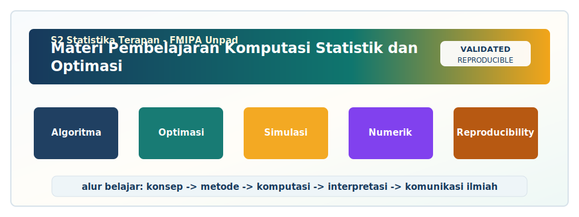

<!-- BEGIN UNPAD MATERIAL STYLE -->
<style>
:root {
  --unpad-navy: #17395c;
  --unpad-gold: #f2a51a;
  --unpad-teal: #0f766e;
  --unpad-ink: #172033;
  --unpad-paper: #fffdf8;
  --unpad-soft: #eef5f8;
  --unpad-line: #d7e2ea;
}
html, body {
  background: linear-gradient(135deg, #f8fbfd 0%, #fffdf8 48%, #f3f6ee 100%) !important;
  color: var(--unpad-ink) !important;
}
body {
  font-family: "Segoe UI", Arial, sans-serif !important;
  line-height: 1.72 !important;
}
.main-container {
  max-width: 1180px !important;
  background: rgba(255, 253, 248, 0.98) !important;
  border: 1px solid var(--unpad-line) !important;
  border-radius: 8px !important;
  box-shadow: 0 18px 42px rgba(23, 57, 92, 0.12) !important;
}
h1, h2, h3, h4 {
  letter-spacing: 0 !important;
}
h1.title {
  color: var(--unpad-navy) !important;
  -webkit-text-fill-color: var(--unpad-navy) !important;
  background: none !important;
}
h2 {
  border-left-color: var(--unpad-gold) !important;
}
a {
  color: #0b5c86 !important;
}
pre, code {
  border-radius: 8px !important;
}
.unpad-cover {
  margin: 18px 0 26px;
  padding: 24px;
  border-radius: 8px;
  background: linear-gradient(135deg, #17395c 0%, #0f766e 58%, #f2a51a 100%);
  color: #ffffff;
  box-shadow: 0 18px 36px rgba(23, 57, 92, 0.22);
}
.unpad-cover__brand {
  display: grid;
  grid-template-columns: 92px 1fr;
  gap: 20px;
  align-items: center;
}
.unpad-cover img {
  width: 92px;
  height: 92px;
  object-fit: contain;
  background: #ffffff;
  border-radius: 8px;
  padding: 8px;
  box-shadow: 0 8px 22px rgba(0,0,0,0.18);
}
.unpad-kicker {
  text-transform: uppercase;
  font-size: 0.82rem;
  font-weight: 800;
  letter-spacing: 0;
  color: #fff8dc;
}
.unpad-cover h2 {
  margin: 6px 0 8px;
  padding: 0;
  border: 0;
  background: transparent;
  color: #ffffff !important;
  font-size: 1.65rem;
}
.unpad-meta {
  margin: 0;
  color: #f7fbff;
  font-weight: 600;
}
.materi-illustration {
  margin: 20px 0 24px;
  padding: 14px;
  background: #ffffff;
  border: 1px solid var(--unpad-line);
  border-radius: 8px;
  box-shadow: 0 12px 28px rgba(23, 57, 92, 0.10);
}
.materi-illustration img {
  width: 100%;
  height: auto;
  display: block;
  border-radius: 6px;
}
.validasi-akademik {
  margin: 18px 0 28px;
  padding: 16px 18px;
  background: linear-gradient(135deg, #eef8f6, #fff8e7);
  border-left: 8px solid var(--unpad-teal);
  border-radius: 8px;
  color: var(--unpad-ink);
}
.validasi-akademik strong {
  color: var(--unpad-navy);
}
table {
  border-radius: 8px !important;
}
@media (max-width: 760px) {
  .unpad-cover__brand {
    grid-template-columns: 1fr;
  }
  .unpad-cover img {
    width: 76px;
    height: 76px;
  }
}
</style>
<!-- END UNPAD MATERIAL STYLE -->


<!-- BEGIN UNPAD MATERIAL ENHANCEMENT -->

```{r setup-unpad-render, include=FALSE}
execute_code <- FALSE
knitr::opts_chunk$set(
  echo = TRUE,
  eval = FALSE,
  message = FALSE,
  warning = FALSE,
  fig.align = "center",
  fig.width = 8,
  fig.height = 4.8,
  dpi = 120
)
set.seed(2025)
```


<div class="unpad-cover">
<div class="unpad-cover__brand">

<div>
<div class="unpad-kicker">S2 Statistika Terapan | FMIPA Universitas Padjadjaran</div>
<h2>Materi Pembelajaran Komputasi Statistik dan Optimasi</h2>
<p class="unpad-meta">Program Studi S2 Statistika Terapan FMIPA Universitas Padjadjaran<br>Penulis: Dr. Bertho Tantular, M.Si | Januari 2025</p>
</div>
</div>
</div>

<div class="materi-illustration">

</div>

<div class="validasi-akademik">
<strong>Catatan validasi akademik.</strong> Materi ini diseragamkan dengan rujukan ADWTL Januari 2025: rumus dibaca bersama asumsi, contoh kode diposisikan sebagai template reproducible, dan interpretasi diarahkan pada validitas data, diagnosis model, evaluasi ketidakpastian, serta komunikasi hasil secara ilmiah.
</div>

<!-- END UNPAD MATERIAL ENHANCEMENT -->

<style>
:root{
  --coklat-tua:#4b2e1b;
  --coklat:#7a4f2a;
  --coklat-muda:#f3dfc3;
  --krem:#fff8ec;
  --emas:#d9a441;
  --hitam:#20160f;
  --biru-unpad:#1f3c66;
}
body{
  color:var(--hitam);
  background:linear-gradient(120deg,#fffaf0 0%,#f8ead2 45%,#edcfaa 100%);
  font-size:17px;
  line-height:1.68;
}
.main-container{max-width:1180px !important; background:rgba(255,252,246,.96); padding:30px 44px; border-radius:28px; box-shadow:0 18px 45px rgba(75,46,27,.18);}
#header, .hero{
  background:linear-gradient(135deg,#4b2e1b,#8a5a2b,#d7a850);
  color:white; padding:34px 38px; border-radius:28px; box-shadow:0 20px 48px rgba(75,46,27,.28); margin-bottom:28px;
}
#header h1, #header h2, #header h3{color:white;}
h1,h2,h3,h4{color:#4b2e1b; font-weight:800;}
h1{border-bottom:4px solid #d9a441; padding-bottom:10px;}
h2{margin-top:42px; padding-top:8px;}
h2::before{content:"✦ "; color:#d9a441;}
h3::before{content:"▸ "; color:#8a5a2b;}
a{color:#7a3f16; font-weight:600;}
blockquote{background:#fff3df; border-left:7px solid #b7793b; border-radius:16px; padding:16px 20px; color:#2c1b10;}
.learning-box,.case-box,.practice-box,.warning-box,.formula-box,.rps-box{
  border-radius:22px; padding:20px 24px; margin:22px 0; box-shadow:0 8px 25px rgba(75,46,27,.12);
}
.learning-box{background:linear-gradient(120deg,#fff6e7,#f0d5af); border-left:8px solid #8a5a2b;}
.case-box{background:linear-gradient(120deg,#fffaf2,#e8d0ac); border-left:8px solid #d9a441;}
.practice-box{background:linear-gradient(120deg,#fdf4e4,#f4ddbd); border-left:8px solid #9c6a36;}
.warning-box{background:#fff1dc; border-left:8px solid #ad5d22;}
.formula-box{background:#f7e4c6; color:#111; border:1px solid #d2ad78; border-left:8px solid #a97142;}
.rps-box{background:linear-gradient(120deg,#fbefe0,#ecd0ab); border-left:8px solid #6c3d1e;}
pre, code{background-color:#f7e4c6 !important; color:#111 !important; border-radius:10px;}
pre{padding:16px !important; border:1px solid #d1a56a; box-shadow:inset 0 0 0 1px rgba(255,255,255,.4);}
div.sourceCode{background:#f7e4c6 !important; color:#111 !important; border-radius:16px; border-left:8px solid #a97142;}
.sourceCode pre{background:#f7e4c6 !important; color:#111 !important;}
.math, .MathJax, .katex{color:#111 !important;}
table{background:white; border-radius:16px; overflow:hidden; box-shadow:0 6px 18px rgba(75,46,27,.1);}
thead{background:#70451f; color:white;}
tr:nth-child(even){background:#fff5e8;}
.caption{color:#6f4729; font-style:italic;}
hr{border-top:2px solid #d9a441;}
#TOC, .tocify{
  background:#fff6e8 !important; border:1px solid #d3ad77; border-radius:18px; box-shadow:0 8px 24px rgba(75,46,27,.14); padding:12px;
}
.tocify .tocify-item a, #TOC a{color:#4b2e1b !important;}
@media (min-width: 1200px){
  body{padding-left:12px;}
  #TOC{position:fixed; left:18px; top:18px; bottom:18px; width:300px; overflow:auto;}
  body .main-container{margin-left:340px;}
}
.small-note{font-size:.92em; color:#5f4635;}
.badge{display:inline-block; background:#7a4f2a; color:#fff; padding:4px 10px; border-radius:999px; font-size:.85em; margin-right:6px;}
.diagram{display:flex; flex-wrap:wrap; gap:12px; margin:20px 0;}
.node{background:#fff0d9; border:2px solid #bb8241; color:#2c1b10; border-radius:18px; padding:14px 18px; min-width:170px; text-align:center; font-weight:700; box-shadow:0 8px 18px rgba(75,46,27,.12);}
.arrow{align-self:center; font-size:28px; color:#8a5a2b; font-weight:900;}
.footer-note{background:#4b2e1b; color:#fff7eb; padding:18px; border-radius:18px; margin-top:36px;}
</style>


<div class="hero">
<h1>Komputasi Statistik dan Optimasi</h1>
<p><strong>Author:</strong> Dr. Bertho Tantular, M.Si<br/>
<strong>Program:</strong> S2 Statistika Terapan, FMIPA Universitas Padjadjaran<br/>
<strong>Tahun Pembuatan:</strong> Januari 2025<br/>
<strong>Karakter materi:</strong> e-book kuliah, praktikum, studi kasus, algoritma, R/Python, dan proyek komputasi.</p>
</div>

```{r setup, include=FALSE, eval=FALSE}
knitr::opts_chunk$set(
  echo = TRUE,
  eval = FALSE,
  message = FALSE,
  warning = FALSE,
  fig.align = "center",
  fig.width = 7.2,
  fig.height = 4.8
)
set.seed(2025)
```

# Identitas Mata Kuliah

<div class="rps-box">
Materi ini disusun sebagai bahan pembelajaran komprehensif untuk mata kuliah <strong>Komputasi Statistik dan Optimasi</strong> pada Program Studi <strong>S2 Statistika Terapan FMIPA Universitas Padjadjaran</strong>. Secara substansi, materi mengikuti alur RPS: strategi pengumpulan data berbasis komputasi, simulasi sampling, Monte Carlo, bootstrap, resampling, optimasi numerik, genetic algorithm, pengembangan algoritma, EM Algorithm, MCMC, Gibbs Sampling, komputasi Bayesian, serta pelaporan ilmiah dan etika publikasi.
</div>

Mata kuliah ini menghubungkan statistika sebagai ilmu inferensi dengan komputasi sebagai mesin kerja analisis modern. Dalam praktik kontemporer, statistika tidak lagi cukup diajarkan sebagai kumpulan rumus yang selesai di papan tulis. Banyak masalah penelitian nyata memerlukan rancangan algoritma, validasi numerik, simulasi, pemilihan metode yang efisien, dan kemampuan menjelaskan hasil kepada pemangku kepentingan. Karena itu, orientasi utama materi ini adalah membentuk mahasiswa magister yang mampu berpikir sebagai statistikawan komputasional: memahami teori, menerjemahkan teori menjadi algoritma, mengimplementasikan algoritma ke dalam perangkat lunak statistik, mengevaluasi performa, lalu menyampaikan hasil secara ilmiah, reproducible, dan dapat dipertanggungjawabkan.

Pada tingkat S2 Statistika Terapan, kompetensi komputasi harus ditempatkan sebagai kompetensi metodologis, bukan sekadar keterampilan teknis menjalankan kode. Mahasiswa perlu memahami mengapa suatu algoritma bekerja, kapan algoritma bisa gagal, bagaimana menentukan parameter tuning, bagaimana mengevaluasi stabilitas hasil, dan bagaimana mengomunikasikan ketidakpastian. Satu baris kode bisa menghasilkan angka, tetapi angka yang bermakna memerlukan desain, asumsi, validasi, dan interpretasi. Di sinilah mata kuliah ini menjadi penting: ia mempertemukan sampling, simulasi, optimasi, Bayesian computation, dan penulisan ilmiah dalam satu alur pembelajaran yang utuh.

## Informasi Program Studi

Program Studi S2 Statistika Terapan FMIPA Universitas Padjadjaran diarahkan untuk menghasilkan lulusan yang mampu menerapkan, mengembangkan, dan mengomunikasikan metode statistika dalam berbagai bidang terapan seperti bisnis, industri, sosial, aktuaria, biostatistik, dan sains data. Dalam konteks mata kuliah ini, mahasiswa dilatih agar mampu menggunakan R atau Python bukan hanya untuk menjalankan fungsi yang sudah tersedia, tetapi juga untuk membangun fungsi sendiri, melakukan simulasi, mengembangkan algoritma, dan menyusun output analisis yang dapat direplikasi. Materi ini juga mendukung atmosfer akademik M.Stat Unpad yang menekankan pembelajaran aplikatif, kolaborasi, dan kontribusi nyata pada penyelesaian masalah berbasis data.

## Kaitan dengan CPL, CPMK, dan Sub-CPMK

Mata kuliah ini memuat empat capaian pembelajaran mata kuliah utama. Pertama, mahasiswa mampu merancang strategi pengumpulan data berbasis komputasi dan optimasi. Kedua, mahasiswa mampu mengelola, menganalisis, dan menyelesaikan masalah nyata dengan metode komputasi statistik dan optimasi. Ketiga, mahasiswa mampu mengembangkan algoritma komputasi dan menerapkannya melalui perangkat lunak statistik. Keempat, mahasiswa mampu berpikir kritis, inovatif, dan sistematis dalam riset serta mempresentasikan hasil riset pada forum ilmiah.

|Blok|Pertemuan|Fokus|Output Pembelajaran|
|---|---|---|---|
|Blok 1|1-4|Sampling, simulasi sampling, desain sampling optimal|Mahasiswa mampu mengevaluasi efisiensi SRS, stratified sampling, dan cluster sampling|
|Blok 2|5-8|Monte Carlo, bootstrap, resampling, optimasi numerik|Mahasiswa mampu menerapkan metode komputasi statistik dan optimasi pada kasus nyata|
|Blok 3|9-12|Pengembangan algoritma, EM Algorithm, MCMC, optimasi non-linear|Mahasiswa mampu merancang algoritma dan mengimplementasikannya dalam R/Python|
|Blok 4|13-16|Komputasi Bayesian, Gibbs Sampling, laporan ilmiah, etika publikasi|Mahasiswa mampu menyusun dan mempresentasikan riset komputasi statistik secara sistematis|


## Cara Membaca Materi Ini

Setiap bab disusun dengan pola yang sama agar pembelajaran lebih mudah diikuti. Bagian pertama memuat konsep inti dan intuisi statistik. Bagian kedua menjelaskan formulasi matematis atau algoritmik. Bagian ketiga memberikan contoh implementasi R dan Python. Bagian keempat memuat studi kasus terapan. Bagian kelima memuat refleksi, kesalahan umum, latihan, dan tugas kecil. Dengan pola ini, mahasiswa tidak hanya membaca teori, tetapi juga melihat bagaimana teori berubah menjadi prosedur kerja analisis.

Kode dalam dokumen ini sengaja dibuat dengan `eval = FALSE` pada pengaturan awal agar dokumen dapat dirender sebagai HTML tanpa bergantung pada paket tertentu di komputer pembaca. Jika mahasiswa ingin menjalankan kode, ubah opsi chunk dari `eval = FALSE` menjadi `eval = TRUE` atau jalankan potongan kode secara langsung di RStudio, Posit Cloud, Jupyter, atau lingkungan komputasi lain. Ini seperti kompor induksi akademik: aman saat dipajang, panas saat dinyalakan. 🔥

## Pustaka Pengarah

Pustaka utama untuk materi Monte Carlo dan komputasi statistik mengikuti karya Robert dan Casella serta rujukan statistik komputasional lain [@robert2004monte; @robert2010introducing; @gentle2009computational]. Untuk pembelajaran statistik modern, optimasi, dan machine learning, materi merujuk pada Hastie, Tibshirani, dan Friedman, Bishop, Murphy, serta Nocedal dan Wright [@hastie2009elements; @bishop2006pattern; @murphy2012machine; @nocedal2006numerical]. Untuk sampling, bootstrap, EM, dan Bayesian computation, rujukan meliputi Cochran, Lohr, Efron dan Tibshirani, Dempster dkk., Gelman dkk., dan Brooks dkk. [@cochran1977sampling; @lohr2021sampling; @efron1993bootstrap; @dempster1977em; @gelman2013bayesian; @brooks2011handbook].

# Peta Kompetensi dan Strategi Pembelajaran

Mata kuliah Komputasi Statistik dan Optimasi tidak dapat dipahami sebagai kumpulan topik yang berdiri sendiri. Sampling, Monte Carlo, bootstrap, optimasi, EM, MCMC, dan Bayesian computation sebenarnya bergerak dalam satu garis besar: bagaimana statistikawan mengambil keputusan ketika solusi analitik sulit, data tidak ideal, model kompleks, dan ketidakpastian harus dihitung secara eksplisit. Pada era data modern, masalah yang tampak sederhana sering berubah menjadi masalah komputasi. Estimator yang dalam buku teks tampak bersih bisa menjadi rumit ketika data hilang, ukuran sampel terbatas, distribusi tidak normal, model hierarkis, atau parameter berdimensi tinggi.

<div class="diagram">
<div class="node">Data & Desain Sampling</div><div class="arrow">→</div>
<div class="node">Simulasi & Resampling</div><div class="arrow">→</div>
<div class="node">Optimasi</div><div class="arrow">→</div>
<div class="node">Algoritma Statistik</div><div class="arrow">→</div>
<div class="node">Bayesian Computation</div><div class="arrow">→</div>
<div class="node">Laporan Ilmiah</div>
</div>

Strategi pembelajaran dalam materi ini menekankan tiga lapis kompetensi. Lapis pertama adalah literasi konseptual: mahasiswa mampu menjelaskan ide dasar metode, asumsi, keunggulan, keterbatasan, dan konteks aplikasinya. Lapis kedua adalah literasi algoritmik: mahasiswa mampu mengurai metode ke dalam langkah kerja yang dapat diimplementasikan. Lapis ketiga adalah literasi evaluatif: mahasiswa mampu menilai apakah hasil komputasi masuk akal, stabil, efisien, dan relevan dengan masalah nyata. Ketiga lapis ini harus dibangun bersama. Kode tanpa konsep mudah tersesat; konsep tanpa kode mudah menjadi hiasan; evaluasi tanpa keduanya mudah berubah menjadi opini.

## Prinsip Reproducible Computational Statistics

Reproducibility adalah tulang punggung statistik komputasional. Analisis statistik modern sering melibatkan data cleaning, transformasi variabel, pembangkitan bilangan acak, tuning algoritma, pemilihan model, visualisasi, dan pelaporan. Tanpa dokumentasi yang baik, hasil bisa sulit diperiksa ulang. Karena itu, setiap praktikum dalam materi ini dianjurkan mencantumkan tujuan analisis, struktur data, versi paket, seed bilangan acak, kode inti, output penting, interpretasi, dan catatan keterbatasan. Prinsip ini sejalan dengan gagasan reproducible research dalam computational science [@peng2011reproducible].

Dalam konteks R Markdown, reproducibility lebih mudah dibangun karena narasi, kode, output, tabel, dan gambar dapat ditempatkan dalam satu dokumen. Mahasiswa sebaiknya menghindari kebiasaan memindahkan output secara manual dari console ke laporan. Jika output dapat dihasilkan otomatis, laporan menjadi lebih transparan. Jika ada revisi data atau metode, dokumen dapat dirender ulang. Inilah alasan mengapa materi ini menggunakan format Rmd output HTML: mudah dibaca, mudah dibagikan, dan relatif ringan untuk pembelajaran interaktif.

## Skema Evaluasi Pembelajaran

Penilaian dalam mata kuliah ini dapat diarahkan pada kemampuan memahami konsep, mengimplementasikan metode, mengembangkan algoritma, menyusun laporan, dan mempresentasikan hasil. Komponen seperti quiz, tugas review, praktikum, UTS, proyek, dan UAS sebaiknya dilihat sebagai rangkaian asesmen yang saling menguatkan. Quiz menguji penguasaan dasar; tugas review melatih literasi ilmiah; praktikum menguji implementasi; proyek menguji integrasi; presentasi menguji komunikasi ilmiah.

<div class="practice-box">
<strong>Rekomendasi portofolio mahasiswa:</strong> setiap mahasiswa membuat repositori atau folder kerja berisi 4 mini project: simulasi sampling, Monte Carlo/bootstrap, pengembangan algoritma EM/MCMC/optimasi, dan komputasi Bayesian atau dashboard mini. Portofolio ini dapat menjadi bukti kompetensi yang lebih kuat dibandingkan hanya nilai ujian.
</div>


## Pertemuan 1. Orientasi Komputasi Statistik dan Desain Sampling

<div class="learning-box">
<strong>Fokus pembelajaran:</strong> orientasi komputasi statistik, desain sampling, dan hubungan antara data, algoritma, serta inferensi.<br/>
<strong>Keterkaitan RPS:</strong> SubCPMK1.<br/>
<strong>Metode kunci:</strong> Simple Random Sampling, stratified sampling, cluster sampling.<br/>
<strong>Contoh konteks:</strong> survei kepuasan layanan akademik mahasiswa S2 Statistika Terapan.
</div>

### Tujuan Pembelajaran Khusus

Setelah menyelesaikan pertemuan ini, mahasiswa diharapkan mampu menjelaskan konsep dasar orientasi komputasi statistik, desain sampling, dan hubungan antara data, algoritma, serta inferensi, merumuskan langkah algoritmik yang diperlukan, mengimplementasikan prosedur dalam R atau Python, mengevaluasi hasil dengan ukuran yang sesuai, dan menyusun interpretasi ilmiah yang dapat dipahami oleh pembaca non-teknis. Dalam pembelajaran magister, targetnya bukan sekadar “bisa menjalankan fungsi”, melainkan mampu menjawab mengapa fungsi tersebut digunakan, apa asumsi di baliknya, dan bagaimana menilai apakah outputnya layak dipercaya. [@cochran1977sampling; @lohr2021sampling]

### Intuisi Konseptual

Komputasi statistik berangkat dari kenyataan bahwa banyak masalah statistik tidak selesai dengan satu rumus tertutup. Ketika ukuran data besar, struktur data kompleks, model mengandung variabel laten, atau distribusi estimator sulit diturunkan secara analitik, statistikawan membutuhkan pendekatan komputasional. Dalam konteks orientasi komputasi statistik, desain sampling, dan hubungan antara data, algoritma, serta inferensi, komputasi dipakai untuk membangun simulasi, menguji sensitivitas, mengukur ketidakpastian, dan mencari solusi numerik yang stabil. Cara berpikir ini menggeser pembelajaran dari sekadar menghitung ke arah merancang eksperimen komputasi.

Dalam praktik, Simple Random Sampling, stratified sampling, cluster sampling tidak berdiri sebagai teknik mekanis. Ia harus dikaitkan dengan pertanyaan penelitian, struktur data, keterbatasan sumber daya, dan konsekuensi inferensial. Sebagai contoh, pada survei kepuasan layanan akademik mahasiswa S2 Statistika Terapan, keputusan analisis dapat memengaruhi kesimpulan substantif. Bila desain sampling tidak efisien, estimasi menjadi terlalu bising. Bila simulasi terlalu sedikit, hasil Monte Carlo tidak stabil. Bila optimasi berhenti pada local optimum, parameter yang diperoleh bisa menyesatkan. Bila MCMC belum konvergen, ringkasan posterior dapat terlihat rapi tetapi sebenarnya rapuh. Karena itu, setiap keputusan komputasional perlu ditulis, diuji, dan dijelaskan.

Salah satu prinsip penting adalah memisahkan antara model statistik, algoritma komputasi, dan implementasi perangkat lunak. Model statistik menjelaskan hubungan antarvariabel dan sumber ketidakpastian. Algoritma menjelaskan langkah untuk memperoleh estimator atau sampel dari distribusi target. Implementasi perangkat lunak adalah penerjemahan algoritma ke kode. Kesalahan sering terjadi ketika tiga lapis ini dicampur. Mahasiswa mungkin menyangka bahwa hasil dari fungsi R selalu benar, padahal fungsi hanya menjalankan instruksi. Jika model keliru, data buruk, atau parameter tuning tidak tepat, output tetap bisa keluar dengan tampilan meyakinkan. Komputer memang cepat, tetapi tidak otomatis bijak; ia sangat rajin mengikuti perintah, termasuk perintah yang salah.

### Formulasi Matematis Inti

<div class="formula-box">
\[
\bar{y}_{SRS}=\frac{1}{n}\sum_{i\in s}y_i,\quad Var(\bar{y}_{SRS})=\left(1-\frac{n}{N}\right)\frac{S^2}{n}
\]
</div>

Formula di atas berperan sebagai jangkar konseptual. Dalam statistik komputasional, formula tidak selalu digunakan untuk menghitung secara manual sampai selesai. Sering kali formula digunakan untuk menentukan apa yang harus dihitung oleh algoritma, apa yang harus disimulasikan, atau apa yang harus diminimalkan dalam optimasi. Dengan cara ini, rumus menjadi peta jalan, sedangkan algoritma menjadi kendaraan. Jika peta salah, kendaraan secanggih apa pun tetap berpotensi menuju tempat yang keliru.

### Algoritma Kerja Umum

<div class="diagram">
<div class="node">Definisikan masalah</div><div class="arrow">→</div>
<div class="node">Tentukan model/metode</div><div class="arrow">→</div>
<div class="node">Bangun algoritma</div><div class="arrow">→</div>
<div class="node">Implementasi R/Python</div><div class="arrow">→</div>
<div class="node">Evaluasi hasil</div><div class="arrow">→</div>
<div class="node">Interpretasi</div>
</div>

Langkah pertama adalah mendefinisikan masalah secara statistik. Pertanyaan seperti “berapa rata-rata populasi?”, “bagaimana ketidakpastian estimator?”, “parameter apa yang meminimalkan loss?”, atau “bagaimana distribusi posterior parameter?” harus ditulis sebelum kode dibuat. Langkah kedua adalah memilih metode yang sesuai. Pemilihan metode tidak boleh hanya berdasarkan popularitas, tetapi harus mempertimbangkan asumsi, tujuan inferensi, ukuran data, biaya komputasi, dan kemampuan interpretasi. Langkah ketiga adalah menuliskan algoritma dalam bentuk pseudocode agar struktur kerja jelas. Langkah keempat adalah implementasi. Langkah kelima adalah evaluasi melalui bias, varians, MSE, konvergensi, diagnostic plot, atau ukuran lain yang relevan. Langkah terakhir adalah menyusun interpretasi dengan bahasa ilmiah.

### Implementasi R Dasar

```{r pertemuan-1-r, eval=FALSE}
# Pertemuan 1: contoh kerangka R untuk Orientasi Komputasi Statistik dan Desain Sampling
set.seed(2025)

# 1. Definisikan data simulasi sederhana
n <- 200
x <- rnorm(n)
y <- 2 + 1.5 * x + rnorm(n, sd = 1)
dat <- data.frame(x = x, y = y)

# 2. Definisikan fungsi objektif atau fungsi ringkasan
loss_mse <- function(beta, data) {
  y_hat <- beta[1] + beta[2] * data$x
  mean((data$y - y_hat)^2)
}

# 3. Jalankan optimasi numerik sebagai contoh umum
hasil <- optim(par = c(0, 0), fn = loss_mse, data = dat)
hasil$par
hasil$value

# 4. Visualisasi hasil sederhana
plot(dat$x, dat$y, pch = 19, col = "gray40",
     main = "Ilustrasi komputasi statistik",
     xlab = "x", ylab = "y")
abline(a = hasil$par[1], b = hasil$par[2], lwd = 2)
```

Kode R di atas berfungsi sebagai kerangka berpikir. Untuk topik orientasi komputasi statistik, desain sampling, dan hubungan antara data, algoritma, serta inferensi, mahasiswa dapat mengganti fungsi `loss_mse`, struktur data, prosedur sampling, atau algoritma iteratif sesuai kebutuhan. Perhatikan bahwa fungsi dibuat eksplisit. Kebiasaan membuat fungsi sendiri sangat penting karena membantu mahasiswa memahami input, proses, dan output. Selain itu, fungsi yang eksplisit lebih mudah diuji, direvisi, dan digunakan ulang dalam proyek akhir.

### Implementasi Python Dasar

```{python pertemuan-1-python}
# Pertemuan 1: contoh kerangka Python untuk Orientasi Komputasi Statistik dan Desain Sampling
import numpy as np
from scipy.optimize import minimize

np.random.seed(2025)
n = 200
x = np.random.normal(size=n)
y = 2 + 1.5*x + np.random.normal(scale=1, size=n)

def loss_mse(beta):
    y_hat = beta[0] + beta[1]*x
    return np.mean((y - y_hat)**2)

res = minimize(loss_mse, x0=np.array([0.0, 0.0]))
print(res.x)
print(res.fun)
```

Python digunakan sebagai pembanding agar mahasiswa memahami bahwa ide statistik tidak melekat pada satu perangkat lunak. R sangat kuat untuk statistik, visualisasi, dan R Markdown; Python sangat kuat untuk integrasi machine learning, pipeline data, dan ekosistem komputasi luas. Pada level konsep, prosedur statistiknya sama. Yang berubah adalah sintaks, struktur paket, dan kebiasaan pemrograman. Mahasiswa S2 Statistika Terapan sebaiknya fleksibel: mampu membaca kode R, memahami kode Python, dan menjelaskan substansi statistik di balik keduanya.

### Studi Kasus Terapan

<div class="case-box">
<strong>Kasus:</strong> survei kepuasan layanan akademik mahasiswa S2 Statistika Terapan. Mahasiswa diminta membangun analisis kecil yang memuat definisi tujuan, struktur data, metode Simple Random Sampling, stratified sampling, cluster sampling, implementasi, evaluasi, dan interpretasi. Studi kasus boleh menggunakan data simulasi ketika data nyata belum tersedia, tetapi skenario simulasi harus dibuat realistis.
</div>

Dalam kasus survei kepuasan layanan akademik mahasiswa S2 Statistika Terapan, langkah awal adalah menentukan populasi target atau proses data yang hendak dianalisis. Jika kasusnya survei, definisikan unit observasi, kerangka sampel, strata, klaster, dan variabel utama. Jika kasusnya optimasi, definisikan fungsi objektif, parameter, constraint, dan kriteria berhenti. Jika kasusnya Bayesian, definisikan likelihood, prior, posterior, dan strategi sampling. Kejelasan definisi ini membuat analisis lebih mudah dievaluasi oleh pembaca.

Langkah berikutnya adalah membangun baseline. Baseline dapat berupa estimator sederhana, model standar, atau simulasi awal. Baseline penting karena tanpa pembanding, sulit menilai apakah metode yang lebih kompleks benar-benar memberi nilai tambah. Misalnya, bootstrap dapat dibandingkan dengan standard error analitik. Gradient descent dapat dibandingkan dengan fungsi optimasi bawaan. MCMC dapat dibandingkan dengan posterior analitik pada kasus conjugate sederhana. Baseline tidak membuat analisis menjadi kuno; justru baseline membuat klaim metode menjadi lebih kuat.

Setelah baseline tersedia, mahasiswa dapat melakukan eksperimen komputasi. Eksperimen harus dirancang dengan parameter yang jelas: jumlah replikasi, ukuran sampel, nilai seed, skenario distribusi, ukuran error, dan ukuran evaluasi. Dalam laporan, mahasiswa perlu menuliskan mengapa jumlah replikasi dipilih. Jumlah replikasi yang terlalu kecil dapat menghasilkan kesimpulan yang berubah-ubah. Jumlah replikasi yang terlalu besar mungkin memboroskan waktu tanpa peningkatan substansial. Komputasi statistik adalah seni mencari keseimbangan antara ketelitian, stabilitas, dan efisiensi.

### Evaluasi Hasil

Evaluasi hasil tidak cukup dilakukan dengan melihat apakah kode berjalan tanpa error. Kode yang berjalan hanya berarti sintaks diterima komputer. Evaluasi statistik harus mencakup paling tidak empat aspek. Pertama, validitas: apakah output sesuai dengan teori atau baseline? Kedua, stabilitas: apakah hasil relatif konsisten ketika seed, ukuran sampel, atau parameter tuning berubah? Ketiga, efisiensi: apakah waktu komputasi dan penggunaan memori masuk akal? Keempat, interpretabilitas: apakah hasil dapat dijelaskan kepada pembaca sesuai konteks masalah?

Pada orientasi komputasi statistik, desain sampling, dan hubungan antara data, algoritma, serta inferensi, evaluasi juga harus memperhatikan sumber ketidakpastian. Ketidakpastian dapat berasal dari sampling, noise pengukuran, simulasi Monte Carlo, inisialisasi algoritma, pilihan prior, atau local optimum. Laporan yang baik tidak menyembunyikan ketidakpastian. Justru kekuatan analisis statistik terletak pada kemampuannya menyatakan ketidakpastian secara jujur. Hasil yang terlalu pasti sering kali mencurigakan, terutama jika datanya terbatas atau modelnya kompleks.

### Kesalahan Umum

<div class="warning-box">
<strong>Kesalahan yang perlu dihindari:</strong> menjalankan kode tanpa tujuan inferensial, tidak menetapkan seed, tidak memeriksa struktur data, tidak membandingkan dengan baseline, terlalu percaya pada output default, tidak menjelaskan parameter tuning, dan tidak menulis keterbatasan metode.
</div>

Kesalahan lain yang sering muncul adalah menyamakan hasil komputasi dengan kebenaran substantif. Misalnya, algoritma optimasi dapat menemukan minimum numerik, tetapi minimum tersebut mungkin tidak bermakna jika fungsi objektif tidak sesuai. Bootstrap dapat menghasilkan interval, tetapi interval tersebut tidak selalu valid jika struktur dependensi data diabaikan. MCMC dapat menghasilkan ribuan sampel, tetapi sampel tersebut tidak berguna jika rantai belum konvergen. Karena itu, interpretasi harus selalu kembali pada desain penelitian, asumsi model, dan diagnostik hasil.

### Mini Quiz

1. Jelaskan perbedaan antara model statistik, algoritma komputasi, dan implementasi perangkat lunak dalam konteks orientasi komputasi statistik, desain sampling, dan hubungan antara data, algoritma, serta inferensi.
2. Mengapa baseline penting sebelum menggunakan metode yang lebih kompleks seperti Simple Random Sampling, stratified sampling, cluster sampling?
3. Sebutkan dua ukuran evaluasi yang relevan untuk menilai stabilitas hasil pada kasus survei kepuasan layanan akademik mahasiswa S2 Statistika Terapan.
4. Apa risiko utama jika parameter tuning dipilih tanpa dokumentasi?
5. Bagaimana cara menjelaskan hasil komputasi kepada pembaca non-teknis tanpa menghilangkan ketidakpastian?

### Latihan Praktikum

<div class="practice-box">
<strong>Latihan:</strong> Buat simulasi kecil dengan minimal 100 replikasi untuk mengevaluasi metode dalam pertemuan ini. Simpan seed, tulis fungsi utama, hasilkan satu tabel ringkasan, satu grafik diagnostik, dan satu paragraf interpretasi. Gunakan R Markdown agar kode dan narasi menyatu.
</div>

### Catatan Reflektif untuk Mahasiswa

Pertemuan ini harus dibaca sebagai bagian dari perjalanan panjang membangun intuisi komputasional. Jangan khawatir jika pada awalnya algoritma terasa lebih rumit daripada rumus. Dalam praktik, algoritma hanyalah rumus yang diajak berjalan langkah demi langkah. Setelah beberapa kali latihan, pola yang sama akan muncul: definisikan target, buat prosedur, ulangi, evaluasi, lalu interpretasikan. Bagian tersulit biasanya bukan menulis kode, tetapi merumuskan pertanyaan statistik yang jelas. Kode bisa diperbaiki, tetapi pertanyaan yang kabur akan membuat seluruh analisis berjalan seperti naik angkot tanpa tahu tujuan; bisa sampai, tetapi entah ke mana.


### Pembahasan Lanjutan: Dari Teori ke Keputusan Analitik

Pada level lanjutan, mahasiswa perlu menyadari bahwa setiap pilihan dalam orientasi komputasi statistik, desain sampling, dan hubungan antara data, algoritma, serta inferensi memiliki konsekuensi inferensial. Misalnya, pilihan rancangan sampling memengaruhi bobot estimasi dan varians. Pilihan jumlah replikasi Monte Carlo memengaruhi error simulasi. Pilihan learning rate pada gradient descent memengaruhi kecepatan dan stabilitas konvergensi. Pilihan proposal distribution pada MCMC memengaruhi mixing rantai. Pilihan prior dalam Bayesian inference memengaruhi posterior, terutama ketika data terbatas. Dengan demikian, komputasi statistik bukan pekerjaan administratif, melainkan proses pengambilan keputusan metodologis.

Kriteria keputusan harus dinyatakan sejak awal. Dalam survei kepuasan layanan akademik mahasiswa S2 Statistika Terapan, kriteria dapat berupa MSE terkecil, coverage interval terbaik, waktu komputasi paling efisien, interpretasi paling jelas, atau keseimbangan antara akurasi dan biaya. Banyak mahasiswa tergoda memilih metode karena hasilnya terlihat “bagus”, padahal definisi bagus belum dijelaskan. Dalam penulisan ilmiah, klaim seperti “metode A lebih baik” harus diikuti oleh “lebih baik dalam ukuran apa, pada skenario apa, dan dibandingkan dengan apa”. Kalimat sederhana ini sering menjadi pembeda antara laporan praktikum biasa dan artikel ilmiah yang matang.

Ketika menerapkan Simple Random Sampling, stratified sampling, cluster sampling, mahasiswa juga perlu mencatat batasan komputasi. Komputer memiliki keterbatasan memori, waktu, precision floating point, dan dependensi paket. Hasil numerik dapat berubah karena perbedaan versi perangkat lunak atau sistem operasi. Karena itu, laporan sebaiknya mencantumkan informasi minimal seperti versi R/Python, paket utama, seed, dan tanggal analisis. Informasi ini tampak kecil, tetapi sangat membantu ketika hasil harus diperiksa ulang. Reproducibility bukan aksesori; ia adalah sabuk pengaman analisis statistik.

### Contoh Struktur Laporan Singkat

Laporan praktikum untuk topik ini dapat disusun dalam enam bagian. Pertama, pendahuluan yang menjelaskan masalah dan tujuan. Kedua, data dan skenario simulasi. Ketiga, metode dan algoritma. Keempat, implementasi komputasi. Kelima, hasil dan pembahasan. Keenam, simpulan dan keterbatasan. Setiap bagian sebaiknya ringkas tetapi informatif. Hindari menumpuk output mentah terlalu banyak. Output yang terlalu ramai membuat pembaca bekerja keras; pembaca bukan mesin fotokopi akademik.

Pada bagian metode, tuliskan formula inti dan pseudocode. Pada bagian implementasi, tampilkan potongan kode yang paling penting, bukan seluruh kode jika terlalu panjang. Pada bagian hasil, gunakan tabel ringkasan dan grafik diagnostik. Pada bagian pembahasan, jelaskan apakah hasil sesuai teori, apa yang mengejutkan, dan apa implikasinya. Pada bagian keterbatasan, tuliskan asumsi yang belum diuji, ukuran sampel yang terbatas, kemungkinan bias, dan rencana pengembangan. Dengan struktur ini, laporan akan terlihat profesional dan mudah dievaluasi.

### Pengayaan Literatur

Literatur statistik komputasional berkembang dari beberapa tradisi: survei sampling, simulasi stokastik, optimasi numerik, statistik Bayesian, machine learning, dan reproducible research. Topik orientasi komputasi statistik, desain sampling, dan hubungan antara data, algoritma, serta inferensi sebaiknya dibaca dengan mengaitkan minimal dua tradisi tersebut. Sebagai contoh, bootstrap berasal dari gagasan resampling tetapi dapat dikaitkan dengan evaluasi model machine learning. Gradient descent berasal dari optimasi numerik tetapi menjadi tulang punggung pembelajaran mesin modern. MCMC berasal dari fisika statistik dan komputasi Bayesian tetapi kini digunakan luas pada model hierarkis, ekonometrika, epidemiologi, dan spatial statistics. Kekuatan mahasiswa magister terletak pada kemampuan membuat koneksi lintas tradisi seperti ini. [@cochran1977sampling; @lohr2021sampling]

### Rubrik Mandiri

Gunakan rubrik mandiri berikut sebelum mengumpulkan tugas:

|Aspek|Pertanyaan Pemeriksaan|Status|
|---|---|---|
|Tujuan|Apakah tujuan analisis dinyatakan dalam kalimat statistik yang jelas?|Belum / Cukup / Baik|
|Metode|Apakah alasan memilih Simple Random Sampling, stratified sampling, cluster sampling dijelaskan?|Belum / Cukup / Baik|
|Kode|Apakah kode modular, diberi komentar, dan dapat dijalankan ulang?|Belum / Cukup / Baik|
|Evaluasi|Apakah hasil dievaluasi dengan ukuran yang sesuai?|Belum / Cukup / Baik|
|Interpretasi|Apakah interpretasi menghubungkan output dengan konteks kasus?|Belum / Cukup / Baik|
|Keterbatasan|Apakah asumsi dan kelemahan metode ditulis dengan jujur?|Belum / Cukup / Baik|


## Pertemuan 2. Simple Random Sampling dan Simulasi Estimator

<div class="learning-box">
<strong>Fokus pembelajaran:</strong> SRS sebagai rancangan sampling dasar dan simulasi untuk menilai bias serta varians estimator.<br/>
<strong>Keterkaitan RPS:</strong> SubCPMK1.<br/>
<strong>Metode kunci:</strong> SRS without replacement, finite population correction, simulation-based evaluation.<br/>
<strong>Contoh konteks:</strong> estimasi rata-rata indeks literasi digital kabupaten/kota.
</div>

### Tujuan Pembelajaran Khusus

Setelah menyelesaikan pertemuan ini, mahasiswa diharapkan mampu menjelaskan konsep dasar SRS sebagai rancangan sampling dasar dan simulasi untuk menilai bias serta varians estimator, merumuskan langkah algoritmik yang diperlukan, mengimplementasikan prosedur dalam R atau Python, mengevaluasi hasil dengan ukuran yang sesuai, dan menyusun interpretasi ilmiah yang dapat dipahami oleh pembaca non-teknis. Dalam pembelajaran magister, targetnya bukan sekadar “bisa menjalankan fungsi”, melainkan mampu menjawab mengapa fungsi tersebut digunakan, apa asumsi di baliknya, dan bagaimana menilai apakah outputnya layak dipercaya. [@cochran1977sampling; @lohr2021sampling]

### Intuisi Konseptual

Komputasi statistik berangkat dari kenyataan bahwa banyak masalah statistik tidak selesai dengan satu rumus tertutup. Ketika ukuran data besar, struktur data kompleks, model mengandung variabel laten, atau distribusi estimator sulit diturunkan secara analitik, statistikawan membutuhkan pendekatan komputasional. Dalam konteks SRS sebagai rancangan sampling dasar dan simulasi untuk menilai bias serta varians estimator, komputasi dipakai untuk membangun simulasi, menguji sensitivitas, mengukur ketidakpastian, dan mencari solusi numerik yang stabil. Cara berpikir ini menggeser pembelajaran dari sekadar menghitung ke arah merancang eksperimen komputasi.

Dalam praktik, SRS without replacement, finite population correction, simulation-based evaluation tidak berdiri sebagai teknik mekanis. Ia harus dikaitkan dengan pertanyaan penelitian, struktur data, keterbatasan sumber daya, dan konsekuensi inferensial. Sebagai contoh, pada estimasi rata-rata indeks literasi digital kabupaten/kota, keputusan analisis dapat memengaruhi kesimpulan substantif. Bila desain sampling tidak efisien, estimasi menjadi terlalu bising. Bila simulasi terlalu sedikit, hasil Monte Carlo tidak stabil. Bila optimasi berhenti pada local optimum, parameter yang diperoleh bisa menyesatkan. Bila MCMC belum konvergen, ringkasan posterior dapat terlihat rapi tetapi sebenarnya rapuh. Karena itu, setiap keputusan komputasional perlu ditulis, diuji, dan dijelaskan.

Salah satu prinsip penting adalah memisahkan antara model statistik, algoritma komputasi, dan implementasi perangkat lunak. Model statistik menjelaskan hubungan antarvariabel dan sumber ketidakpastian. Algoritma menjelaskan langkah untuk memperoleh estimator atau sampel dari distribusi target. Implementasi perangkat lunak adalah penerjemahan algoritma ke kode. Kesalahan sering terjadi ketika tiga lapis ini dicampur. Mahasiswa mungkin menyangka bahwa hasil dari fungsi R selalu benar, padahal fungsi hanya menjalankan instruksi. Jika model keliru, data buruk, atau parameter tuning tidak tepat, output tetap bisa keluar dengan tampilan meyakinkan. Komputer memang cepat, tetapi tidak otomatis bijak; ia sangat rajin mengikuti perintah, termasuk perintah yang salah.

### Formulasi Matematis Inti

<div class="formula-box">
\[
E(\bar{y}_{s})=\bar{Y},\quad Bias(\bar{y}_{s})=E(\bar{y}_{s})-\bar{Y}=0
\]
</div>

Formula di atas berperan sebagai jangkar konseptual. Dalam statistik komputasional, formula tidak selalu digunakan untuk menghitung secara manual sampai selesai. Sering kali formula digunakan untuk menentukan apa yang harus dihitung oleh algoritma, apa yang harus disimulasikan, atau apa yang harus diminimalkan dalam optimasi. Dengan cara ini, rumus menjadi peta jalan, sedangkan algoritma menjadi kendaraan. Jika peta salah, kendaraan secanggih apa pun tetap berpotensi menuju tempat yang keliru.

### Algoritma Kerja Umum

<div class="diagram">
<div class="node">Definisikan masalah</div><div class="arrow">→</div>
<div class="node">Tentukan model/metode</div><div class="arrow">→</div>
<div class="node">Bangun algoritma</div><div class="arrow">→</div>
<div class="node">Implementasi R/Python</div><div class="arrow">→</div>
<div class="node">Evaluasi hasil</div><div class="arrow">→</div>
<div class="node">Interpretasi</div>
</div>

Langkah pertama adalah mendefinisikan masalah secara statistik. Pertanyaan seperti “berapa rata-rata populasi?”, “bagaimana ketidakpastian estimator?”, “parameter apa yang meminimalkan loss?”, atau “bagaimana distribusi posterior parameter?” harus ditulis sebelum kode dibuat. Langkah kedua adalah memilih metode yang sesuai. Pemilihan metode tidak boleh hanya berdasarkan popularitas, tetapi harus mempertimbangkan asumsi, tujuan inferensi, ukuran data, biaya komputasi, dan kemampuan interpretasi. Langkah ketiga adalah menuliskan algoritma dalam bentuk pseudocode agar struktur kerja jelas. Langkah keempat adalah implementasi. Langkah kelima adalah evaluasi melalui bias, varians, MSE, konvergensi, diagnostic plot, atau ukuran lain yang relevan. Langkah terakhir adalah menyusun interpretasi dengan bahasa ilmiah.

### Implementasi R Dasar

```{r pertemuan-2-r, eval=FALSE}
# Pertemuan 2: contoh kerangka R untuk Simple Random Sampling dan Simulasi Estimator
set.seed(2025)

# 1. Definisikan data simulasi sederhana
n <- 200
x <- rnorm(n)
y <- 2 + 1.5 * x + rnorm(n, sd = 1)
dat <- data.frame(x = x, y = y)

# 2. Definisikan fungsi objektif atau fungsi ringkasan
loss_mse <- function(beta, data) {
  y_hat <- beta[1] + beta[2] * data$x
  mean((data$y - y_hat)^2)
}

# 3. Jalankan optimasi numerik sebagai contoh umum
hasil <- optim(par = c(0, 0), fn = loss_mse, data = dat)
hasil$par
hasil$value

# 4. Visualisasi hasil sederhana
plot(dat$x, dat$y, pch = 19, col = "gray40",
     main = "Ilustrasi komputasi statistik",
     xlab = "x", ylab = "y")
abline(a = hasil$par[1], b = hasil$par[2], lwd = 2)
```

Kode R di atas berfungsi sebagai kerangka berpikir. Untuk topik SRS sebagai rancangan sampling dasar dan simulasi untuk menilai bias serta varians estimator, mahasiswa dapat mengganti fungsi `loss_mse`, struktur data, prosedur sampling, atau algoritma iteratif sesuai kebutuhan. Perhatikan bahwa fungsi dibuat eksplisit. Kebiasaan membuat fungsi sendiri sangat penting karena membantu mahasiswa memahami input, proses, dan output. Selain itu, fungsi yang eksplisit lebih mudah diuji, direvisi, dan digunakan ulang dalam proyek akhir.

### Implementasi Python Dasar

```{python pertemuan-2-python}
# Pertemuan 2: contoh kerangka Python untuk Simple Random Sampling dan Simulasi Estimator
import numpy as np
from scipy.optimize import minimize

np.random.seed(2025)
n = 200
x = np.random.normal(size=n)
y = 2 + 1.5*x + np.random.normal(scale=1, size=n)

def loss_mse(beta):
    y_hat = beta[0] + beta[1]*x
    return np.mean((y - y_hat)**2)

res = minimize(loss_mse, x0=np.array([0.0, 0.0]))
print(res.x)
print(res.fun)
```

Python digunakan sebagai pembanding agar mahasiswa memahami bahwa ide statistik tidak melekat pada satu perangkat lunak. R sangat kuat untuk statistik, visualisasi, dan R Markdown; Python sangat kuat untuk integrasi machine learning, pipeline data, dan ekosistem komputasi luas. Pada level konsep, prosedur statistiknya sama. Yang berubah adalah sintaks, struktur paket, dan kebiasaan pemrograman. Mahasiswa S2 Statistika Terapan sebaiknya fleksibel: mampu membaca kode R, memahami kode Python, dan menjelaskan substansi statistik di balik keduanya.

### Studi Kasus Terapan

<div class="case-box">
<strong>Kasus:</strong> estimasi rata-rata indeks literasi digital kabupaten/kota. Mahasiswa diminta membangun analisis kecil yang memuat definisi tujuan, struktur data, metode SRS without replacement, finite population correction, simulation-based evaluation, implementasi, evaluasi, dan interpretasi. Studi kasus boleh menggunakan data simulasi ketika data nyata belum tersedia, tetapi skenario simulasi harus dibuat realistis.
</div>

Dalam kasus estimasi rata-rata indeks literasi digital kabupaten/kota, langkah awal adalah menentukan populasi target atau proses data yang hendak dianalisis. Jika kasusnya survei, definisikan unit observasi, kerangka sampel, strata, klaster, dan variabel utama. Jika kasusnya optimasi, definisikan fungsi objektif, parameter, constraint, dan kriteria berhenti. Jika kasusnya Bayesian, definisikan likelihood, prior, posterior, dan strategi sampling. Kejelasan definisi ini membuat analisis lebih mudah dievaluasi oleh pembaca.

Langkah berikutnya adalah membangun baseline. Baseline dapat berupa estimator sederhana, model standar, atau simulasi awal. Baseline penting karena tanpa pembanding, sulit menilai apakah metode yang lebih kompleks benar-benar memberi nilai tambah. Misalnya, bootstrap dapat dibandingkan dengan standard error analitik. Gradient descent dapat dibandingkan dengan fungsi optimasi bawaan. MCMC dapat dibandingkan dengan posterior analitik pada kasus conjugate sederhana. Baseline tidak membuat analisis menjadi kuno; justru baseline membuat klaim metode menjadi lebih kuat.

Setelah baseline tersedia, mahasiswa dapat melakukan eksperimen komputasi. Eksperimen harus dirancang dengan parameter yang jelas: jumlah replikasi, ukuran sampel, nilai seed, skenario distribusi, ukuran error, dan ukuran evaluasi. Dalam laporan, mahasiswa perlu menuliskan mengapa jumlah replikasi dipilih. Jumlah replikasi yang terlalu kecil dapat menghasilkan kesimpulan yang berubah-ubah. Jumlah replikasi yang terlalu besar mungkin memboroskan waktu tanpa peningkatan substansial. Komputasi statistik adalah seni mencari keseimbangan antara ketelitian, stabilitas, dan efisiensi.

### Evaluasi Hasil

Evaluasi hasil tidak cukup dilakukan dengan melihat apakah kode berjalan tanpa error. Kode yang berjalan hanya berarti sintaks diterima komputer. Evaluasi statistik harus mencakup paling tidak empat aspek. Pertama, validitas: apakah output sesuai dengan teori atau baseline? Kedua, stabilitas: apakah hasil relatif konsisten ketika seed, ukuran sampel, atau parameter tuning berubah? Ketiga, efisiensi: apakah waktu komputasi dan penggunaan memori masuk akal? Keempat, interpretabilitas: apakah hasil dapat dijelaskan kepada pembaca sesuai konteks masalah?

Pada SRS sebagai rancangan sampling dasar dan simulasi untuk menilai bias serta varians estimator, evaluasi juga harus memperhatikan sumber ketidakpastian. Ketidakpastian dapat berasal dari sampling, noise pengukuran, simulasi Monte Carlo, inisialisasi algoritma, pilihan prior, atau local optimum. Laporan yang baik tidak menyembunyikan ketidakpastian. Justru kekuatan analisis statistik terletak pada kemampuannya menyatakan ketidakpastian secara jujur. Hasil yang terlalu pasti sering kali mencurigakan, terutama jika datanya terbatas atau modelnya kompleks.

### Kesalahan Umum

<div class="warning-box">
<strong>Kesalahan yang perlu dihindari:</strong> menjalankan kode tanpa tujuan inferensial, tidak menetapkan seed, tidak memeriksa struktur data, tidak membandingkan dengan baseline, terlalu percaya pada output default, tidak menjelaskan parameter tuning, dan tidak menulis keterbatasan metode.
</div>

Kesalahan lain yang sering muncul adalah menyamakan hasil komputasi dengan kebenaran substantif. Misalnya, algoritma optimasi dapat menemukan minimum numerik, tetapi minimum tersebut mungkin tidak bermakna jika fungsi objektif tidak sesuai. Bootstrap dapat menghasilkan interval, tetapi interval tersebut tidak selalu valid jika struktur dependensi data diabaikan. MCMC dapat menghasilkan ribuan sampel, tetapi sampel tersebut tidak berguna jika rantai belum konvergen. Karena itu, interpretasi harus selalu kembali pada desain penelitian, asumsi model, dan diagnostik hasil.

### Mini Quiz

1. Jelaskan perbedaan antara model statistik, algoritma komputasi, dan implementasi perangkat lunak dalam konteks SRS sebagai rancangan sampling dasar dan simulasi untuk menilai bias serta varians estimator.
2. Mengapa baseline penting sebelum menggunakan metode yang lebih kompleks seperti SRS without replacement, finite population correction, simulation-based evaluation?
3. Sebutkan dua ukuran evaluasi yang relevan untuk menilai stabilitas hasil pada kasus estimasi rata-rata indeks literasi digital kabupaten/kota.
4. Apa risiko utama jika parameter tuning dipilih tanpa dokumentasi?
5. Bagaimana cara menjelaskan hasil komputasi kepada pembaca non-teknis tanpa menghilangkan ketidakpastian?

### Latihan Praktikum

<div class="practice-box">
<strong>Latihan:</strong> Buat simulasi kecil dengan minimal 100 replikasi untuk mengevaluasi metode dalam pertemuan ini. Simpan seed, tulis fungsi utama, hasilkan satu tabel ringkasan, satu grafik diagnostik, dan satu paragraf interpretasi. Gunakan R Markdown agar kode dan narasi menyatu.
</div>

### Catatan Reflektif untuk Mahasiswa

Pertemuan ini harus dibaca sebagai bagian dari perjalanan panjang membangun intuisi komputasional. Jangan khawatir jika pada awalnya algoritma terasa lebih rumit daripada rumus. Dalam praktik, algoritma hanyalah rumus yang diajak berjalan langkah demi langkah. Setelah beberapa kali latihan, pola yang sama akan muncul: definisikan target, buat prosedur, ulangi, evaluasi, lalu interpretasikan. Bagian tersulit biasanya bukan menulis kode, tetapi merumuskan pertanyaan statistik yang jelas. Kode bisa diperbaiki, tetapi pertanyaan yang kabur akan membuat seluruh analisis berjalan seperti naik angkot tanpa tahu tujuan; bisa sampai, tetapi entah ke mana.


### Pembahasan Lanjutan: Dari Teori ke Keputusan Analitik

Pada level lanjutan, mahasiswa perlu menyadari bahwa setiap pilihan dalam SRS sebagai rancangan sampling dasar dan simulasi untuk menilai bias serta varians estimator memiliki konsekuensi inferensial. Misalnya, pilihan rancangan sampling memengaruhi bobot estimasi dan varians. Pilihan jumlah replikasi Monte Carlo memengaruhi error simulasi. Pilihan learning rate pada gradient descent memengaruhi kecepatan dan stabilitas konvergensi. Pilihan proposal distribution pada MCMC memengaruhi mixing rantai. Pilihan prior dalam Bayesian inference memengaruhi posterior, terutama ketika data terbatas. Dengan demikian, komputasi statistik bukan pekerjaan administratif, melainkan proses pengambilan keputusan metodologis.

Kriteria keputusan harus dinyatakan sejak awal. Dalam estimasi rata-rata indeks literasi digital kabupaten/kota, kriteria dapat berupa MSE terkecil, coverage interval terbaik, waktu komputasi paling efisien, interpretasi paling jelas, atau keseimbangan antara akurasi dan biaya. Banyak mahasiswa tergoda memilih metode karena hasilnya terlihat “bagus”, padahal definisi bagus belum dijelaskan. Dalam penulisan ilmiah, klaim seperti “metode A lebih baik” harus diikuti oleh “lebih baik dalam ukuran apa, pada skenario apa, dan dibandingkan dengan apa”. Kalimat sederhana ini sering menjadi pembeda antara laporan praktikum biasa dan artikel ilmiah yang matang.

Ketika menerapkan SRS without replacement, finite population correction, simulation-based evaluation, mahasiswa juga perlu mencatat batasan komputasi. Komputer memiliki keterbatasan memori, waktu, precision floating point, dan dependensi paket. Hasil numerik dapat berubah karena perbedaan versi perangkat lunak atau sistem operasi. Karena itu, laporan sebaiknya mencantumkan informasi minimal seperti versi R/Python, paket utama, seed, dan tanggal analisis. Informasi ini tampak kecil, tetapi sangat membantu ketika hasil harus diperiksa ulang. Reproducibility bukan aksesori; ia adalah sabuk pengaman analisis statistik.

### Contoh Struktur Laporan Singkat

Laporan praktikum untuk topik ini dapat disusun dalam enam bagian. Pertama, pendahuluan yang menjelaskan masalah dan tujuan. Kedua, data dan skenario simulasi. Ketiga, metode dan algoritma. Keempat, implementasi komputasi. Kelima, hasil dan pembahasan. Keenam, simpulan dan keterbatasan. Setiap bagian sebaiknya ringkas tetapi informatif. Hindari menumpuk output mentah terlalu banyak. Output yang terlalu ramai membuat pembaca bekerja keras; pembaca bukan mesin fotokopi akademik.

Pada bagian metode, tuliskan formula inti dan pseudocode. Pada bagian implementasi, tampilkan potongan kode yang paling penting, bukan seluruh kode jika terlalu panjang. Pada bagian hasil, gunakan tabel ringkasan dan grafik diagnostik. Pada bagian pembahasan, jelaskan apakah hasil sesuai teori, apa yang mengejutkan, dan apa implikasinya. Pada bagian keterbatasan, tuliskan asumsi yang belum diuji, ukuran sampel yang terbatas, kemungkinan bias, dan rencana pengembangan. Dengan struktur ini, laporan akan terlihat profesional dan mudah dievaluasi.

### Pengayaan Literatur

Literatur statistik komputasional berkembang dari beberapa tradisi: survei sampling, simulasi stokastik, optimasi numerik, statistik Bayesian, machine learning, dan reproducible research. Topik SRS sebagai rancangan sampling dasar dan simulasi untuk menilai bias serta varians estimator sebaiknya dibaca dengan mengaitkan minimal dua tradisi tersebut. Sebagai contoh, bootstrap berasal dari gagasan resampling tetapi dapat dikaitkan dengan evaluasi model machine learning. Gradient descent berasal dari optimasi numerik tetapi menjadi tulang punggung pembelajaran mesin modern. MCMC berasal dari fisika statistik dan komputasi Bayesian tetapi kini digunakan luas pada model hierarkis, ekonometrika, epidemiologi, dan spatial statistics. Kekuatan mahasiswa magister terletak pada kemampuan membuat koneksi lintas tradisi seperti ini. [@cochran1977sampling; @lohr2021sampling]

### Rubrik Mandiri

Gunakan rubrik mandiri berikut sebelum mengumpulkan tugas:

|Aspek|Pertanyaan Pemeriksaan|Status|
|---|---|---|
|Tujuan|Apakah tujuan analisis dinyatakan dalam kalimat statistik yang jelas?|Belum / Cukup / Baik|
|Metode|Apakah alasan memilih SRS without replacement, finite population correction, simulation-based evaluation dijelaskan?|Belum / Cukup / Baik|
|Kode|Apakah kode modular, diberi komentar, dan dapat dijalankan ulang?|Belum / Cukup / Baik|
|Evaluasi|Apakah hasil dievaluasi dengan ukuran yang sesuai?|Belum / Cukup / Baik|
|Interpretasi|Apakah interpretasi menghubungkan output dengan konteks kasus?|Belum / Cukup / Baik|
|Keterbatasan|Apakah asumsi dan kelemahan metode ditulis dengan jujur?|Belum / Cukup / Baik|


## Pertemuan 3. Stratified Sampling dan Alokasi Optimal

<div class="learning-box">
<strong>Fokus pembelajaran:</strong> stratified sampling, alokasi proporsional, alokasi Neyman, dan optimasi ukuran sampel antar strata.<br/>
<strong>Keterkaitan RPS:</strong> SubCPMK1.<br/>
<strong>Metode kunci:</strong> proportional allocation, Neyman allocation, cost-aware allocation.<br/>
<strong>Contoh konteks:</strong> survei rumah tangga berdasarkan strata perkotaan dan perdesaan.
</div>

### Tujuan Pembelajaran Khusus

Setelah menyelesaikan pertemuan ini, mahasiswa diharapkan mampu menjelaskan konsep dasar stratified sampling, alokasi proporsional, alokasi Neyman, dan optimasi ukuran sampel antar strata, merumuskan langkah algoritmik yang diperlukan, mengimplementasikan prosedur dalam R atau Python, mengevaluasi hasil dengan ukuran yang sesuai, dan menyusun interpretasi ilmiah yang dapat dipahami oleh pembaca non-teknis. Dalam pembelajaran magister, targetnya bukan sekadar “bisa menjalankan fungsi”, melainkan mampu menjawab mengapa fungsi tersebut digunakan, apa asumsi di baliknya, dan bagaimana menilai apakah outputnya layak dipercaya. [@cochran1977sampling; @lohr2021sampling; @nocedal2006numerical]

### Intuisi Konseptual

Komputasi statistik berangkat dari kenyataan bahwa banyak masalah statistik tidak selesai dengan satu rumus tertutup. Ketika ukuran data besar, struktur data kompleks, model mengandung variabel laten, atau distribusi estimator sulit diturunkan secara analitik, statistikawan membutuhkan pendekatan komputasional. Dalam konteks stratified sampling, alokasi proporsional, alokasi Neyman, dan optimasi ukuran sampel antar strata, komputasi dipakai untuk membangun simulasi, menguji sensitivitas, mengukur ketidakpastian, dan mencari solusi numerik yang stabil. Cara berpikir ini menggeser pembelajaran dari sekadar menghitung ke arah merancang eksperimen komputasi.

Dalam praktik, proportional allocation, Neyman allocation, cost-aware allocation tidak berdiri sebagai teknik mekanis. Ia harus dikaitkan dengan pertanyaan penelitian, struktur data, keterbatasan sumber daya, dan konsekuensi inferensial. Sebagai contoh, pada survei rumah tangga berdasarkan strata perkotaan dan perdesaan, keputusan analisis dapat memengaruhi kesimpulan substantif. Bila desain sampling tidak efisien, estimasi menjadi terlalu bising. Bila simulasi terlalu sedikit, hasil Monte Carlo tidak stabil. Bila optimasi berhenti pada local optimum, parameter yang diperoleh bisa menyesatkan. Bila MCMC belum konvergen, ringkasan posterior dapat terlihat rapi tetapi sebenarnya rapuh. Karena itu, setiap keputusan komputasional perlu ditulis, diuji, dan dijelaskan.

Salah satu prinsip penting adalah memisahkan antara model statistik, algoritma komputasi, dan implementasi perangkat lunak. Model statistik menjelaskan hubungan antarvariabel dan sumber ketidakpastian. Algoritma menjelaskan langkah untuk memperoleh estimator atau sampel dari distribusi target. Implementasi perangkat lunak adalah penerjemahan algoritma ke kode. Kesalahan sering terjadi ketika tiga lapis ini dicampur. Mahasiswa mungkin menyangka bahwa hasil dari fungsi R selalu benar, padahal fungsi hanya menjalankan instruksi. Jika model keliru, data buruk, atau parameter tuning tidak tepat, output tetap bisa keluar dengan tampilan meyakinkan. Komputer memang cepat, tetapi tidak otomatis bijak; ia sangat rajin mengikuti perintah, termasuk perintah yang salah.

### Formulasi Matematis Inti

<div class="formula-box">
\[
n_h=n\frac{N_hS_h}{\sum_{k=1}^{H}N_kS_k}
\]
</div>

Formula di atas berperan sebagai jangkar konseptual. Dalam statistik komputasional, formula tidak selalu digunakan untuk menghitung secara manual sampai selesai. Sering kali formula digunakan untuk menentukan apa yang harus dihitung oleh algoritma, apa yang harus disimulasikan, atau apa yang harus diminimalkan dalam optimasi. Dengan cara ini, rumus menjadi peta jalan, sedangkan algoritma menjadi kendaraan. Jika peta salah, kendaraan secanggih apa pun tetap berpotensi menuju tempat yang keliru.

### Algoritma Kerja Umum

<div class="diagram">
<div class="node">Definisikan masalah</div><div class="arrow">→</div>
<div class="node">Tentukan model/metode</div><div class="arrow">→</div>
<div class="node">Bangun algoritma</div><div class="arrow">→</div>
<div class="node">Implementasi R/Python</div><div class="arrow">→</div>
<div class="node">Evaluasi hasil</div><div class="arrow">→</div>
<div class="node">Interpretasi</div>
</div>

Langkah pertama adalah mendefinisikan masalah secara statistik. Pertanyaan seperti “berapa rata-rata populasi?”, “bagaimana ketidakpastian estimator?”, “parameter apa yang meminimalkan loss?”, atau “bagaimana distribusi posterior parameter?” harus ditulis sebelum kode dibuat. Langkah kedua adalah memilih metode yang sesuai. Pemilihan metode tidak boleh hanya berdasarkan popularitas, tetapi harus mempertimbangkan asumsi, tujuan inferensi, ukuran data, biaya komputasi, dan kemampuan interpretasi. Langkah ketiga adalah menuliskan algoritma dalam bentuk pseudocode agar struktur kerja jelas. Langkah keempat adalah implementasi. Langkah kelima adalah evaluasi melalui bias, varians, MSE, konvergensi, diagnostic plot, atau ukuran lain yang relevan. Langkah terakhir adalah menyusun interpretasi dengan bahasa ilmiah.

### Implementasi R Dasar

```{r pertemuan-3-r, eval=FALSE}
# Pertemuan 3: contoh kerangka R untuk Stratified Sampling dan Alokasi Optimal
set.seed(2025)

# 1. Definisikan data simulasi sederhana
n <- 200
x <- rnorm(n)
y <- 2 + 1.5 * x + rnorm(n, sd = 1)
dat <- data.frame(x = x, y = y)

# 2. Definisikan fungsi objektif atau fungsi ringkasan
loss_mse <- function(beta, data) {
  y_hat <- beta[1] + beta[2] * data$x
  mean((data$y - y_hat)^2)
}

# 3. Jalankan optimasi numerik sebagai contoh umum
hasil <- optim(par = c(0, 0), fn = loss_mse, data = dat)
hasil$par
hasil$value

# 4. Visualisasi hasil sederhana
plot(dat$x, dat$y, pch = 19, col = "gray40",
     main = "Ilustrasi komputasi statistik",
     xlab = "x", ylab = "y")
abline(a = hasil$par[1], b = hasil$par[2], lwd = 2)
```

Kode R di atas berfungsi sebagai kerangka berpikir. Untuk topik stratified sampling, alokasi proporsional, alokasi Neyman, dan optimasi ukuran sampel antar strata, mahasiswa dapat mengganti fungsi `loss_mse`, struktur data, prosedur sampling, atau algoritma iteratif sesuai kebutuhan. Perhatikan bahwa fungsi dibuat eksplisit. Kebiasaan membuat fungsi sendiri sangat penting karena membantu mahasiswa memahami input, proses, dan output. Selain itu, fungsi yang eksplisit lebih mudah diuji, direvisi, dan digunakan ulang dalam proyek akhir.

### Implementasi Python Dasar

```{python pertemuan-3-python}
# Pertemuan 3: contoh kerangka Python untuk Stratified Sampling dan Alokasi Optimal
import numpy as np
from scipy.optimize import minimize

np.random.seed(2025)
n = 200
x = np.random.normal(size=n)
y = 2 + 1.5*x + np.random.normal(scale=1, size=n)

def loss_mse(beta):
    y_hat = beta[0] + beta[1]*x
    return np.mean((y - y_hat)**2)

res = minimize(loss_mse, x0=np.array([0.0, 0.0]))
print(res.x)
print(res.fun)
```

Python digunakan sebagai pembanding agar mahasiswa memahami bahwa ide statistik tidak melekat pada satu perangkat lunak. R sangat kuat untuk statistik, visualisasi, dan R Markdown; Python sangat kuat untuk integrasi machine learning, pipeline data, dan ekosistem komputasi luas. Pada level konsep, prosedur statistiknya sama. Yang berubah adalah sintaks, struktur paket, dan kebiasaan pemrograman. Mahasiswa S2 Statistika Terapan sebaiknya fleksibel: mampu membaca kode R, memahami kode Python, dan menjelaskan substansi statistik di balik keduanya.

### Studi Kasus Terapan

<div class="case-box">
<strong>Kasus:</strong> survei rumah tangga berdasarkan strata perkotaan dan perdesaan. Mahasiswa diminta membangun analisis kecil yang memuat definisi tujuan, struktur data, metode proportional allocation, Neyman allocation, cost-aware allocation, implementasi, evaluasi, dan interpretasi. Studi kasus boleh menggunakan data simulasi ketika data nyata belum tersedia, tetapi skenario simulasi harus dibuat realistis.
</div>

Dalam kasus survei rumah tangga berdasarkan strata perkotaan dan perdesaan, langkah awal adalah menentukan populasi target atau proses data yang hendak dianalisis. Jika kasusnya survei, definisikan unit observasi, kerangka sampel, strata, klaster, dan variabel utama. Jika kasusnya optimasi, definisikan fungsi objektif, parameter, constraint, dan kriteria berhenti. Jika kasusnya Bayesian, definisikan likelihood, prior, posterior, dan strategi sampling. Kejelasan definisi ini membuat analisis lebih mudah dievaluasi oleh pembaca.

Langkah berikutnya adalah membangun baseline. Baseline dapat berupa estimator sederhana, model standar, atau simulasi awal. Baseline penting karena tanpa pembanding, sulit menilai apakah metode yang lebih kompleks benar-benar memberi nilai tambah. Misalnya, bootstrap dapat dibandingkan dengan standard error analitik. Gradient descent dapat dibandingkan dengan fungsi optimasi bawaan. MCMC dapat dibandingkan dengan posterior analitik pada kasus conjugate sederhana. Baseline tidak membuat analisis menjadi kuno; justru baseline membuat klaim metode menjadi lebih kuat.

Setelah baseline tersedia, mahasiswa dapat melakukan eksperimen komputasi. Eksperimen harus dirancang dengan parameter yang jelas: jumlah replikasi, ukuran sampel, nilai seed, skenario distribusi, ukuran error, dan ukuran evaluasi. Dalam laporan, mahasiswa perlu menuliskan mengapa jumlah replikasi dipilih. Jumlah replikasi yang terlalu kecil dapat menghasilkan kesimpulan yang berubah-ubah. Jumlah replikasi yang terlalu besar mungkin memboroskan waktu tanpa peningkatan substansial. Komputasi statistik adalah seni mencari keseimbangan antara ketelitian, stabilitas, dan efisiensi.

### Evaluasi Hasil

Evaluasi hasil tidak cukup dilakukan dengan melihat apakah kode berjalan tanpa error. Kode yang berjalan hanya berarti sintaks diterima komputer. Evaluasi statistik harus mencakup paling tidak empat aspek. Pertama, validitas: apakah output sesuai dengan teori atau baseline? Kedua, stabilitas: apakah hasil relatif konsisten ketika seed, ukuran sampel, atau parameter tuning berubah? Ketiga, efisiensi: apakah waktu komputasi dan penggunaan memori masuk akal? Keempat, interpretabilitas: apakah hasil dapat dijelaskan kepada pembaca sesuai konteks masalah?

Pada stratified sampling, alokasi proporsional, alokasi Neyman, dan optimasi ukuran sampel antar strata, evaluasi juga harus memperhatikan sumber ketidakpastian. Ketidakpastian dapat berasal dari sampling, noise pengukuran, simulasi Monte Carlo, inisialisasi algoritma, pilihan prior, atau local optimum. Laporan yang baik tidak menyembunyikan ketidakpastian. Justru kekuatan analisis statistik terletak pada kemampuannya menyatakan ketidakpastian secara jujur. Hasil yang terlalu pasti sering kali mencurigakan, terutama jika datanya terbatas atau modelnya kompleks.

### Kesalahan Umum

<div class="warning-box">
<strong>Kesalahan yang perlu dihindari:</strong> menjalankan kode tanpa tujuan inferensial, tidak menetapkan seed, tidak memeriksa struktur data, tidak membandingkan dengan baseline, terlalu percaya pada output default, tidak menjelaskan parameter tuning, dan tidak menulis keterbatasan metode.
</div>

Kesalahan lain yang sering muncul adalah menyamakan hasil komputasi dengan kebenaran substantif. Misalnya, algoritma optimasi dapat menemukan minimum numerik, tetapi minimum tersebut mungkin tidak bermakna jika fungsi objektif tidak sesuai. Bootstrap dapat menghasilkan interval, tetapi interval tersebut tidak selalu valid jika struktur dependensi data diabaikan. MCMC dapat menghasilkan ribuan sampel, tetapi sampel tersebut tidak berguna jika rantai belum konvergen. Karena itu, interpretasi harus selalu kembali pada desain penelitian, asumsi model, dan diagnostik hasil.

### Mini Quiz

1. Jelaskan perbedaan antara model statistik, algoritma komputasi, dan implementasi perangkat lunak dalam konteks stratified sampling, alokasi proporsional, alokasi Neyman, dan optimasi ukuran sampel antar strata.
2. Mengapa baseline penting sebelum menggunakan metode yang lebih kompleks seperti proportional allocation, Neyman allocation, cost-aware allocation?
3. Sebutkan dua ukuran evaluasi yang relevan untuk menilai stabilitas hasil pada kasus survei rumah tangga berdasarkan strata perkotaan dan perdesaan.
4. Apa risiko utama jika parameter tuning dipilih tanpa dokumentasi?
5. Bagaimana cara menjelaskan hasil komputasi kepada pembaca non-teknis tanpa menghilangkan ketidakpastian?

### Latihan Praktikum

<div class="practice-box">
<strong>Latihan:</strong> Buat simulasi kecil dengan minimal 100 replikasi untuk mengevaluasi metode dalam pertemuan ini. Simpan seed, tulis fungsi utama, hasilkan satu tabel ringkasan, satu grafik diagnostik, dan satu paragraf interpretasi. Gunakan R Markdown agar kode dan narasi menyatu.
</div>

### Catatan Reflektif untuk Mahasiswa

Pertemuan ini harus dibaca sebagai bagian dari perjalanan panjang membangun intuisi komputasional. Jangan khawatir jika pada awalnya algoritma terasa lebih rumit daripada rumus. Dalam praktik, algoritma hanyalah rumus yang diajak berjalan langkah demi langkah. Setelah beberapa kali latihan, pola yang sama akan muncul: definisikan target, buat prosedur, ulangi, evaluasi, lalu interpretasikan. Bagian tersulit biasanya bukan menulis kode, tetapi merumuskan pertanyaan statistik yang jelas. Kode bisa diperbaiki, tetapi pertanyaan yang kabur akan membuat seluruh analisis berjalan seperti naik angkot tanpa tahu tujuan; bisa sampai, tetapi entah ke mana.


### Pembahasan Lanjutan: Dari Teori ke Keputusan Analitik

Pada level lanjutan, mahasiswa perlu menyadari bahwa setiap pilihan dalam stratified sampling, alokasi proporsional, alokasi Neyman, dan optimasi ukuran sampel antar strata memiliki konsekuensi inferensial. Misalnya, pilihan rancangan sampling memengaruhi bobot estimasi dan varians. Pilihan jumlah replikasi Monte Carlo memengaruhi error simulasi. Pilihan learning rate pada gradient descent memengaruhi kecepatan dan stabilitas konvergensi. Pilihan proposal distribution pada MCMC memengaruhi mixing rantai. Pilihan prior dalam Bayesian inference memengaruhi posterior, terutama ketika data terbatas. Dengan demikian, komputasi statistik bukan pekerjaan administratif, melainkan proses pengambilan keputusan metodologis.

Kriteria keputusan harus dinyatakan sejak awal. Dalam survei rumah tangga berdasarkan strata perkotaan dan perdesaan, kriteria dapat berupa MSE terkecil, coverage interval terbaik, waktu komputasi paling efisien, interpretasi paling jelas, atau keseimbangan antara akurasi dan biaya. Banyak mahasiswa tergoda memilih metode karena hasilnya terlihat “bagus”, padahal definisi bagus belum dijelaskan. Dalam penulisan ilmiah, klaim seperti “metode A lebih baik” harus diikuti oleh “lebih baik dalam ukuran apa, pada skenario apa, dan dibandingkan dengan apa”. Kalimat sederhana ini sering menjadi pembeda antara laporan praktikum biasa dan artikel ilmiah yang matang.

Ketika menerapkan proportional allocation, Neyman allocation, cost-aware allocation, mahasiswa juga perlu mencatat batasan komputasi. Komputer memiliki keterbatasan memori, waktu, precision floating point, dan dependensi paket. Hasil numerik dapat berubah karena perbedaan versi perangkat lunak atau sistem operasi. Karena itu, laporan sebaiknya mencantumkan informasi minimal seperti versi R/Python, paket utama, seed, dan tanggal analisis. Informasi ini tampak kecil, tetapi sangat membantu ketika hasil harus diperiksa ulang. Reproducibility bukan aksesori; ia adalah sabuk pengaman analisis statistik.

### Contoh Struktur Laporan Singkat

Laporan praktikum untuk topik ini dapat disusun dalam enam bagian. Pertama, pendahuluan yang menjelaskan masalah dan tujuan. Kedua, data dan skenario simulasi. Ketiga, metode dan algoritma. Keempat, implementasi komputasi. Kelima, hasil dan pembahasan. Keenam, simpulan dan keterbatasan. Setiap bagian sebaiknya ringkas tetapi informatif. Hindari menumpuk output mentah terlalu banyak. Output yang terlalu ramai membuat pembaca bekerja keras; pembaca bukan mesin fotokopi akademik.

Pada bagian metode, tuliskan formula inti dan pseudocode. Pada bagian implementasi, tampilkan potongan kode yang paling penting, bukan seluruh kode jika terlalu panjang. Pada bagian hasil, gunakan tabel ringkasan dan grafik diagnostik. Pada bagian pembahasan, jelaskan apakah hasil sesuai teori, apa yang mengejutkan, dan apa implikasinya. Pada bagian keterbatasan, tuliskan asumsi yang belum diuji, ukuran sampel yang terbatas, kemungkinan bias, dan rencana pengembangan. Dengan struktur ini, laporan akan terlihat profesional dan mudah dievaluasi.

### Pengayaan Literatur

Literatur statistik komputasional berkembang dari beberapa tradisi: survei sampling, simulasi stokastik, optimasi numerik, statistik Bayesian, machine learning, dan reproducible research. Topik stratified sampling, alokasi proporsional, alokasi Neyman, dan optimasi ukuran sampel antar strata sebaiknya dibaca dengan mengaitkan minimal dua tradisi tersebut. Sebagai contoh, bootstrap berasal dari gagasan resampling tetapi dapat dikaitkan dengan evaluasi model machine learning. Gradient descent berasal dari optimasi numerik tetapi menjadi tulang punggung pembelajaran mesin modern. MCMC berasal dari fisika statistik dan komputasi Bayesian tetapi kini digunakan luas pada model hierarkis, ekonometrika, epidemiologi, dan spatial statistics. Kekuatan mahasiswa magister terletak pada kemampuan membuat koneksi lintas tradisi seperti ini. [@cochran1977sampling; @lohr2021sampling; @nocedal2006numerical]

### Rubrik Mandiri

Gunakan rubrik mandiri berikut sebelum mengumpulkan tugas:

|Aspek|Pertanyaan Pemeriksaan|Status|
|---|---|---|
|Tujuan|Apakah tujuan analisis dinyatakan dalam kalimat statistik yang jelas?|Belum / Cukup / Baik|
|Metode|Apakah alasan memilih proportional allocation, Neyman allocation, cost-aware allocation dijelaskan?|Belum / Cukup / Baik|
|Kode|Apakah kode modular, diberi komentar, dan dapat dijalankan ulang?|Belum / Cukup / Baik|
|Evaluasi|Apakah hasil dievaluasi dengan ukuran yang sesuai?|Belum / Cukup / Baik|
|Interpretasi|Apakah interpretasi menghubungkan output dengan konteks kasus?|Belum / Cukup / Baik|
|Keterbatasan|Apakah asumsi dan kelemahan metode ditulis dengan jujur?|Belum / Cukup / Baik|


## Pertemuan 4. Cluster Sampling dan Evaluasi Efisiensi Desain

<div class="learning-box">
<strong>Fokus pembelajaran:</strong> cluster sampling, intraclass correlation, design effect, dan simulasi efisiensi rancangan.<br/>
<strong>Keterkaitan RPS:</strong> SubCPMK1.<br/>
<strong>Metode kunci:</strong> one-stage cluster sampling, two-stage cluster sampling, design effect.<br/>
<strong>Contoh konteks:</strong> survei sekolah atau fasilitas kesehatan dengan unit klaster.
</div>

### Tujuan Pembelajaran Khusus

Setelah menyelesaikan pertemuan ini, mahasiswa diharapkan mampu menjelaskan konsep dasar cluster sampling, intraclass correlation, design effect, dan simulasi efisiensi rancangan, merumuskan langkah algoritmik yang diperlukan, mengimplementasikan prosedur dalam R atau Python, mengevaluasi hasil dengan ukuran yang sesuai, dan menyusun interpretasi ilmiah yang dapat dipahami oleh pembaca non-teknis. Dalam pembelajaran magister, targetnya bukan sekadar “bisa menjalankan fungsi”, melainkan mampu menjawab mengapa fungsi tersebut digunakan, apa asumsi di baliknya, dan bagaimana menilai apakah outputnya layak dipercaya. [@cochran1977sampling; @lohr2021sampling]

### Intuisi Konseptual

Komputasi statistik berangkat dari kenyataan bahwa banyak masalah statistik tidak selesai dengan satu rumus tertutup. Ketika ukuran data besar, struktur data kompleks, model mengandung variabel laten, atau distribusi estimator sulit diturunkan secara analitik, statistikawan membutuhkan pendekatan komputasional. Dalam konteks cluster sampling, intraclass correlation, design effect, dan simulasi efisiensi rancangan, komputasi dipakai untuk membangun simulasi, menguji sensitivitas, mengukur ketidakpastian, dan mencari solusi numerik yang stabil. Cara berpikir ini menggeser pembelajaran dari sekadar menghitung ke arah merancang eksperimen komputasi.

Dalam praktik, one-stage cluster sampling, two-stage cluster sampling, design effect tidak berdiri sebagai teknik mekanis. Ia harus dikaitkan dengan pertanyaan penelitian, struktur data, keterbatasan sumber daya, dan konsekuensi inferensial. Sebagai contoh, pada survei sekolah atau fasilitas kesehatan dengan unit klaster, keputusan analisis dapat memengaruhi kesimpulan substantif. Bila desain sampling tidak efisien, estimasi menjadi terlalu bising. Bila simulasi terlalu sedikit, hasil Monte Carlo tidak stabil. Bila optimasi berhenti pada local optimum, parameter yang diperoleh bisa menyesatkan. Bila MCMC belum konvergen, ringkasan posterior dapat terlihat rapi tetapi sebenarnya rapuh. Karena itu, setiap keputusan komputasional perlu ditulis, diuji, dan dijelaskan.

Salah satu prinsip penting adalah memisahkan antara model statistik, algoritma komputasi, dan implementasi perangkat lunak. Model statistik menjelaskan hubungan antarvariabel dan sumber ketidakpastian. Algoritma menjelaskan langkah untuk memperoleh estimator atau sampel dari distribusi target. Implementasi perangkat lunak adalah penerjemahan algoritma ke kode. Kesalahan sering terjadi ketika tiga lapis ini dicampur. Mahasiswa mungkin menyangka bahwa hasil dari fungsi R selalu benar, padahal fungsi hanya menjalankan instruksi. Jika model keliru, data buruk, atau parameter tuning tidak tepat, output tetap bisa keluar dengan tampilan meyakinkan. Komputer memang cepat, tetapi tidak otomatis bijak; ia sangat rajin mengikuti perintah, termasuk perintah yang salah.

### Formulasi Matematis Inti

<div class="formula-box">
\[
DEFF=1+(m-1)\rho
\]
</div>

Formula di atas berperan sebagai jangkar konseptual. Dalam statistik komputasional, formula tidak selalu digunakan untuk menghitung secara manual sampai selesai. Sering kali formula digunakan untuk menentukan apa yang harus dihitung oleh algoritma, apa yang harus disimulasikan, atau apa yang harus diminimalkan dalam optimasi. Dengan cara ini, rumus menjadi peta jalan, sedangkan algoritma menjadi kendaraan. Jika peta salah, kendaraan secanggih apa pun tetap berpotensi menuju tempat yang keliru.

### Algoritma Kerja Umum

<div class="diagram">
<div class="node">Definisikan masalah</div><div class="arrow">→</div>
<div class="node">Tentukan model/metode</div><div class="arrow">→</div>
<div class="node">Bangun algoritma</div><div class="arrow">→</div>
<div class="node">Implementasi R/Python</div><div class="arrow">→</div>
<div class="node">Evaluasi hasil</div><div class="arrow">→</div>
<div class="node">Interpretasi</div>
</div>

Langkah pertama adalah mendefinisikan masalah secara statistik. Pertanyaan seperti “berapa rata-rata populasi?”, “bagaimana ketidakpastian estimator?”, “parameter apa yang meminimalkan loss?”, atau “bagaimana distribusi posterior parameter?” harus ditulis sebelum kode dibuat. Langkah kedua adalah memilih metode yang sesuai. Pemilihan metode tidak boleh hanya berdasarkan popularitas, tetapi harus mempertimbangkan asumsi, tujuan inferensi, ukuran data, biaya komputasi, dan kemampuan interpretasi. Langkah ketiga adalah menuliskan algoritma dalam bentuk pseudocode agar struktur kerja jelas. Langkah keempat adalah implementasi. Langkah kelima adalah evaluasi melalui bias, varians, MSE, konvergensi, diagnostic plot, atau ukuran lain yang relevan. Langkah terakhir adalah menyusun interpretasi dengan bahasa ilmiah.

### Implementasi R Dasar

```{r pertemuan-4-r, eval=FALSE}
# Pertemuan 4: contoh kerangka R untuk Cluster Sampling dan Evaluasi Efisiensi Desain
set.seed(2025)

# 1. Definisikan data simulasi sederhana
n <- 200
x <- rnorm(n)
y <- 2 + 1.5 * x + rnorm(n, sd = 1)
dat <- data.frame(x = x, y = y)

# 2. Definisikan fungsi objektif atau fungsi ringkasan
loss_mse <- function(beta, data) {
  y_hat <- beta[1] + beta[2] * data$x
  mean((data$y - y_hat)^2)
}

# 3. Jalankan optimasi numerik sebagai contoh umum
hasil <- optim(par = c(0, 0), fn = loss_mse, data = dat)
hasil$par
hasil$value

# 4. Visualisasi hasil sederhana
plot(dat$x, dat$y, pch = 19, col = "gray40",
     main = "Ilustrasi komputasi statistik",
     xlab = "x", ylab = "y")
abline(a = hasil$par[1], b = hasil$par[2], lwd = 2)
```

Kode R di atas berfungsi sebagai kerangka berpikir. Untuk topik cluster sampling, intraclass correlation, design effect, dan simulasi efisiensi rancangan, mahasiswa dapat mengganti fungsi `loss_mse`, struktur data, prosedur sampling, atau algoritma iteratif sesuai kebutuhan. Perhatikan bahwa fungsi dibuat eksplisit. Kebiasaan membuat fungsi sendiri sangat penting karena membantu mahasiswa memahami input, proses, dan output. Selain itu, fungsi yang eksplisit lebih mudah diuji, direvisi, dan digunakan ulang dalam proyek akhir.

### Implementasi Python Dasar

```{python pertemuan-4-python}
# Pertemuan 4: contoh kerangka Python untuk Cluster Sampling dan Evaluasi Efisiensi Desain
import numpy as np
from scipy.optimize import minimize

np.random.seed(2025)
n = 200
x = np.random.normal(size=n)
y = 2 + 1.5*x + np.random.normal(scale=1, size=n)

def loss_mse(beta):
    y_hat = beta[0] + beta[1]*x
    return np.mean((y - y_hat)**2)

res = minimize(loss_mse, x0=np.array([0.0, 0.0]))
print(res.x)
print(res.fun)
```

Python digunakan sebagai pembanding agar mahasiswa memahami bahwa ide statistik tidak melekat pada satu perangkat lunak. R sangat kuat untuk statistik, visualisasi, dan R Markdown; Python sangat kuat untuk integrasi machine learning, pipeline data, dan ekosistem komputasi luas. Pada level konsep, prosedur statistiknya sama. Yang berubah adalah sintaks, struktur paket, dan kebiasaan pemrograman. Mahasiswa S2 Statistika Terapan sebaiknya fleksibel: mampu membaca kode R, memahami kode Python, dan menjelaskan substansi statistik di balik keduanya.

### Studi Kasus Terapan

<div class="case-box">
<strong>Kasus:</strong> survei sekolah atau fasilitas kesehatan dengan unit klaster. Mahasiswa diminta membangun analisis kecil yang memuat definisi tujuan, struktur data, metode one-stage cluster sampling, two-stage cluster sampling, design effect, implementasi, evaluasi, dan interpretasi. Studi kasus boleh menggunakan data simulasi ketika data nyata belum tersedia, tetapi skenario simulasi harus dibuat realistis.
</div>

Dalam kasus survei sekolah atau fasilitas kesehatan dengan unit klaster, langkah awal adalah menentukan populasi target atau proses data yang hendak dianalisis. Jika kasusnya survei, definisikan unit observasi, kerangka sampel, strata, klaster, dan variabel utama. Jika kasusnya optimasi, definisikan fungsi objektif, parameter, constraint, dan kriteria berhenti. Jika kasusnya Bayesian, definisikan likelihood, prior, posterior, dan strategi sampling. Kejelasan definisi ini membuat analisis lebih mudah dievaluasi oleh pembaca.

Langkah berikutnya adalah membangun baseline. Baseline dapat berupa estimator sederhana, model standar, atau simulasi awal. Baseline penting karena tanpa pembanding, sulit menilai apakah metode yang lebih kompleks benar-benar memberi nilai tambah. Misalnya, bootstrap dapat dibandingkan dengan standard error analitik. Gradient descent dapat dibandingkan dengan fungsi optimasi bawaan. MCMC dapat dibandingkan dengan posterior analitik pada kasus conjugate sederhana. Baseline tidak membuat analisis menjadi kuno; justru baseline membuat klaim metode menjadi lebih kuat.

Setelah baseline tersedia, mahasiswa dapat melakukan eksperimen komputasi. Eksperimen harus dirancang dengan parameter yang jelas: jumlah replikasi, ukuran sampel, nilai seed, skenario distribusi, ukuran error, dan ukuran evaluasi. Dalam laporan, mahasiswa perlu menuliskan mengapa jumlah replikasi dipilih. Jumlah replikasi yang terlalu kecil dapat menghasilkan kesimpulan yang berubah-ubah. Jumlah replikasi yang terlalu besar mungkin memboroskan waktu tanpa peningkatan substansial. Komputasi statistik adalah seni mencari keseimbangan antara ketelitian, stabilitas, dan efisiensi.

### Evaluasi Hasil

Evaluasi hasil tidak cukup dilakukan dengan melihat apakah kode berjalan tanpa error. Kode yang berjalan hanya berarti sintaks diterima komputer. Evaluasi statistik harus mencakup paling tidak empat aspek. Pertama, validitas: apakah output sesuai dengan teori atau baseline? Kedua, stabilitas: apakah hasil relatif konsisten ketika seed, ukuran sampel, atau parameter tuning berubah? Ketiga, efisiensi: apakah waktu komputasi dan penggunaan memori masuk akal? Keempat, interpretabilitas: apakah hasil dapat dijelaskan kepada pembaca sesuai konteks masalah?

Pada cluster sampling, intraclass correlation, design effect, dan simulasi efisiensi rancangan, evaluasi juga harus memperhatikan sumber ketidakpastian. Ketidakpastian dapat berasal dari sampling, noise pengukuran, simulasi Monte Carlo, inisialisasi algoritma, pilihan prior, atau local optimum. Laporan yang baik tidak menyembunyikan ketidakpastian. Justru kekuatan analisis statistik terletak pada kemampuannya menyatakan ketidakpastian secara jujur. Hasil yang terlalu pasti sering kali mencurigakan, terutama jika datanya terbatas atau modelnya kompleks.

### Kesalahan Umum

<div class="warning-box">
<strong>Kesalahan yang perlu dihindari:</strong> menjalankan kode tanpa tujuan inferensial, tidak menetapkan seed, tidak memeriksa struktur data, tidak membandingkan dengan baseline, terlalu percaya pada output default, tidak menjelaskan parameter tuning, dan tidak menulis keterbatasan metode.
</div>

Kesalahan lain yang sering muncul adalah menyamakan hasil komputasi dengan kebenaran substantif. Misalnya, algoritma optimasi dapat menemukan minimum numerik, tetapi minimum tersebut mungkin tidak bermakna jika fungsi objektif tidak sesuai. Bootstrap dapat menghasilkan interval, tetapi interval tersebut tidak selalu valid jika struktur dependensi data diabaikan. MCMC dapat menghasilkan ribuan sampel, tetapi sampel tersebut tidak berguna jika rantai belum konvergen. Karena itu, interpretasi harus selalu kembali pada desain penelitian, asumsi model, dan diagnostik hasil.

### Mini Quiz

1. Jelaskan perbedaan antara model statistik, algoritma komputasi, dan implementasi perangkat lunak dalam konteks cluster sampling, intraclass correlation, design effect, dan simulasi efisiensi rancangan.
2. Mengapa baseline penting sebelum menggunakan metode yang lebih kompleks seperti one-stage cluster sampling, two-stage cluster sampling, design effect?
3. Sebutkan dua ukuran evaluasi yang relevan untuk menilai stabilitas hasil pada kasus survei sekolah atau fasilitas kesehatan dengan unit klaster.
4. Apa risiko utama jika parameter tuning dipilih tanpa dokumentasi?
5. Bagaimana cara menjelaskan hasil komputasi kepada pembaca non-teknis tanpa menghilangkan ketidakpastian?

### Latihan Praktikum

<div class="practice-box">
<strong>Latihan:</strong> Buat simulasi kecil dengan minimal 100 replikasi untuk mengevaluasi metode dalam pertemuan ini. Simpan seed, tulis fungsi utama, hasilkan satu tabel ringkasan, satu grafik diagnostik, dan satu paragraf interpretasi. Gunakan R Markdown agar kode dan narasi menyatu.
</div>

### Catatan Reflektif untuk Mahasiswa

Pertemuan ini harus dibaca sebagai bagian dari perjalanan panjang membangun intuisi komputasional. Jangan khawatir jika pada awalnya algoritma terasa lebih rumit daripada rumus. Dalam praktik, algoritma hanyalah rumus yang diajak berjalan langkah demi langkah. Setelah beberapa kali latihan, pola yang sama akan muncul: definisikan target, buat prosedur, ulangi, evaluasi, lalu interpretasikan. Bagian tersulit biasanya bukan menulis kode, tetapi merumuskan pertanyaan statistik yang jelas. Kode bisa diperbaiki, tetapi pertanyaan yang kabur akan membuat seluruh analisis berjalan seperti naik angkot tanpa tahu tujuan; bisa sampai, tetapi entah ke mana.


### Pembahasan Lanjutan: Dari Teori ke Keputusan Analitik

Pada level lanjutan, mahasiswa perlu menyadari bahwa setiap pilihan dalam cluster sampling, intraclass correlation, design effect, dan simulasi efisiensi rancangan memiliki konsekuensi inferensial. Misalnya, pilihan rancangan sampling memengaruhi bobot estimasi dan varians. Pilihan jumlah replikasi Monte Carlo memengaruhi error simulasi. Pilihan learning rate pada gradient descent memengaruhi kecepatan dan stabilitas konvergensi. Pilihan proposal distribution pada MCMC memengaruhi mixing rantai. Pilihan prior dalam Bayesian inference memengaruhi posterior, terutama ketika data terbatas. Dengan demikian, komputasi statistik bukan pekerjaan administratif, melainkan proses pengambilan keputusan metodologis.

Kriteria keputusan harus dinyatakan sejak awal. Dalam survei sekolah atau fasilitas kesehatan dengan unit klaster, kriteria dapat berupa MSE terkecil, coverage interval terbaik, waktu komputasi paling efisien, interpretasi paling jelas, atau keseimbangan antara akurasi dan biaya. Banyak mahasiswa tergoda memilih metode karena hasilnya terlihat “bagus”, padahal definisi bagus belum dijelaskan. Dalam penulisan ilmiah, klaim seperti “metode A lebih baik” harus diikuti oleh “lebih baik dalam ukuran apa, pada skenario apa, dan dibandingkan dengan apa”. Kalimat sederhana ini sering menjadi pembeda antara laporan praktikum biasa dan artikel ilmiah yang matang.

Ketika menerapkan one-stage cluster sampling, two-stage cluster sampling, design effect, mahasiswa juga perlu mencatat batasan komputasi. Komputer memiliki keterbatasan memori, waktu, precision floating point, dan dependensi paket. Hasil numerik dapat berubah karena perbedaan versi perangkat lunak atau sistem operasi. Karena itu, laporan sebaiknya mencantumkan informasi minimal seperti versi R/Python, paket utama, seed, dan tanggal analisis. Informasi ini tampak kecil, tetapi sangat membantu ketika hasil harus diperiksa ulang. Reproducibility bukan aksesori; ia adalah sabuk pengaman analisis statistik.

### Contoh Struktur Laporan Singkat

Laporan praktikum untuk topik ini dapat disusun dalam enam bagian. Pertama, pendahuluan yang menjelaskan masalah dan tujuan. Kedua, data dan skenario simulasi. Ketiga, metode dan algoritma. Keempat, implementasi komputasi. Kelima, hasil dan pembahasan. Keenam, simpulan dan keterbatasan. Setiap bagian sebaiknya ringkas tetapi informatif. Hindari menumpuk output mentah terlalu banyak. Output yang terlalu ramai membuat pembaca bekerja keras; pembaca bukan mesin fotokopi akademik.

Pada bagian metode, tuliskan formula inti dan pseudocode. Pada bagian implementasi, tampilkan potongan kode yang paling penting, bukan seluruh kode jika terlalu panjang. Pada bagian hasil, gunakan tabel ringkasan dan grafik diagnostik. Pada bagian pembahasan, jelaskan apakah hasil sesuai teori, apa yang mengejutkan, dan apa implikasinya. Pada bagian keterbatasan, tuliskan asumsi yang belum diuji, ukuran sampel yang terbatas, kemungkinan bias, dan rencana pengembangan. Dengan struktur ini, laporan akan terlihat profesional dan mudah dievaluasi.

### Pengayaan Literatur

Literatur statistik komputasional berkembang dari beberapa tradisi: survei sampling, simulasi stokastik, optimasi numerik, statistik Bayesian, machine learning, dan reproducible research. Topik cluster sampling, intraclass correlation, design effect, dan simulasi efisiensi rancangan sebaiknya dibaca dengan mengaitkan minimal dua tradisi tersebut. Sebagai contoh, bootstrap berasal dari gagasan resampling tetapi dapat dikaitkan dengan evaluasi model machine learning. Gradient descent berasal dari optimasi numerik tetapi menjadi tulang punggung pembelajaran mesin modern. MCMC berasal dari fisika statistik dan komputasi Bayesian tetapi kini digunakan luas pada model hierarkis, ekonometrika, epidemiologi, dan spatial statistics. Kekuatan mahasiswa magister terletak pada kemampuan membuat koneksi lintas tradisi seperti ini. [@cochran1977sampling; @lohr2021sampling]

### Rubrik Mandiri

Gunakan rubrik mandiri berikut sebelum mengumpulkan tugas:

|Aspek|Pertanyaan Pemeriksaan|Status|
|---|---|---|
|Tujuan|Apakah tujuan analisis dinyatakan dalam kalimat statistik yang jelas?|Belum / Cukup / Baik|
|Metode|Apakah alasan memilih one-stage cluster sampling, two-stage cluster sampling, design effect dijelaskan?|Belum / Cukup / Baik|
|Kode|Apakah kode modular, diberi komentar, dan dapat dijalankan ulang?|Belum / Cukup / Baik|
|Evaluasi|Apakah hasil dievaluasi dengan ukuran yang sesuai?|Belum / Cukup / Baik|
|Interpretasi|Apakah interpretasi menghubungkan output dengan konteks kasus?|Belum / Cukup / Baik|
|Keterbatasan|Apakah asumsi dan kelemahan metode ditulis dengan jujur?|Belum / Cukup / Baik|


## Pertemuan 5. Monte Carlo Simulation untuk Integrasi dan Estimasi

<div class="learning-box">
<strong>Fokus pembelajaran:</strong> Monte Carlo simulation untuk menghitung kuantitas statistik ketika solusi analitik sulit diperoleh.<br/>
<strong>Keterkaitan RPS:</strong> SubCPMK2.<br/>
<strong>Metode kunci:</strong> random number generation, Monte Carlo estimator, law of large numbers.<br/>
<strong>Contoh konteks:</strong> estimasi probabilitas risiko klaim aktuaria melebihi ambang tertentu.
</div>

### Tujuan Pembelajaran Khusus

Setelah menyelesaikan pertemuan ini, mahasiswa diharapkan mampu menjelaskan konsep dasar Monte Carlo simulation untuk menghitung kuantitas statistik ketika solusi analitik sulit diperoleh, merumuskan langkah algoritmik yang diperlukan, mengimplementasikan prosedur dalam R atau Python, mengevaluasi hasil dengan ukuran yang sesuai, dan menyusun interpretasi ilmiah yang dapat dipahami oleh pembaca non-teknis. Dalam pembelajaran magister, targetnya bukan sekadar “bisa menjalankan fungsi”, melainkan mampu menjawab mengapa fungsi tersebut digunakan, apa asumsi di baliknya, dan bagaimana menilai apakah outputnya layak dipercaya. [@robert2004monte; @rubinstein2017simulation; @ripley1987stochastic]

### Intuisi Konseptual

Komputasi statistik berangkat dari kenyataan bahwa banyak masalah statistik tidak selesai dengan satu rumus tertutup. Ketika ukuran data besar, struktur data kompleks, model mengandung variabel laten, atau distribusi estimator sulit diturunkan secara analitik, statistikawan membutuhkan pendekatan komputasional. Dalam konteks Monte Carlo simulation untuk menghitung kuantitas statistik ketika solusi analitik sulit diperoleh, komputasi dipakai untuk membangun simulasi, menguji sensitivitas, mengukur ketidakpastian, dan mencari solusi numerik yang stabil. Cara berpikir ini menggeser pembelajaran dari sekadar menghitung ke arah merancang eksperimen komputasi.

Dalam praktik, random number generation, Monte Carlo estimator, law of large numbers tidak berdiri sebagai teknik mekanis. Ia harus dikaitkan dengan pertanyaan penelitian, struktur data, keterbatasan sumber daya, dan konsekuensi inferensial. Sebagai contoh, pada estimasi probabilitas risiko klaim aktuaria melebihi ambang tertentu, keputusan analisis dapat memengaruhi kesimpulan substantif. Bila desain sampling tidak efisien, estimasi menjadi terlalu bising. Bila simulasi terlalu sedikit, hasil Monte Carlo tidak stabil. Bila optimasi berhenti pada local optimum, parameter yang diperoleh bisa menyesatkan. Bila MCMC belum konvergen, ringkasan posterior dapat terlihat rapi tetapi sebenarnya rapuh. Karena itu, setiap keputusan komputasional perlu ditulis, diuji, dan dijelaskan.

Salah satu prinsip penting adalah memisahkan antara model statistik, algoritma komputasi, dan implementasi perangkat lunak. Model statistik menjelaskan hubungan antarvariabel dan sumber ketidakpastian. Algoritma menjelaskan langkah untuk memperoleh estimator atau sampel dari distribusi target. Implementasi perangkat lunak adalah penerjemahan algoritma ke kode. Kesalahan sering terjadi ketika tiga lapis ini dicampur. Mahasiswa mungkin menyangka bahwa hasil dari fungsi R selalu benar, padahal fungsi hanya menjalankan instruksi. Jika model keliru, data buruk, atau parameter tuning tidak tepat, output tetap bisa keluar dengan tampilan meyakinkan. Komputer memang cepat, tetapi tidak otomatis bijak; ia sangat rajin mengikuti perintah, termasuk perintah yang salah.

### Formulasi Matematis Inti

<div class="formula-box">
\[
\hat{\theta}_{MC}=\frac{1}{B}\sum_{b=1}^{B}g(X_b)
\]
</div>

Formula di atas berperan sebagai jangkar konseptual. Dalam statistik komputasional, formula tidak selalu digunakan untuk menghitung secara manual sampai selesai. Sering kali formula digunakan untuk menentukan apa yang harus dihitung oleh algoritma, apa yang harus disimulasikan, atau apa yang harus diminimalkan dalam optimasi. Dengan cara ini, rumus menjadi peta jalan, sedangkan algoritma menjadi kendaraan. Jika peta salah, kendaraan secanggih apa pun tetap berpotensi menuju tempat yang keliru.

### Algoritma Kerja Umum

<div class="diagram">
<div class="node">Definisikan masalah</div><div class="arrow">→</div>
<div class="node">Tentukan model/metode</div><div class="arrow">→</div>
<div class="node">Bangun algoritma</div><div class="arrow">→</div>
<div class="node">Implementasi R/Python</div><div class="arrow">→</div>
<div class="node">Evaluasi hasil</div><div class="arrow">→</div>
<div class="node">Interpretasi</div>
</div>

Langkah pertama adalah mendefinisikan masalah secara statistik. Pertanyaan seperti “berapa rata-rata populasi?”, “bagaimana ketidakpastian estimator?”, “parameter apa yang meminimalkan loss?”, atau “bagaimana distribusi posterior parameter?” harus ditulis sebelum kode dibuat. Langkah kedua adalah memilih metode yang sesuai. Pemilihan metode tidak boleh hanya berdasarkan popularitas, tetapi harus mempertimbangkan asumsi, tujuan inferensi, ukuran data, biaya komputasi, dan kemampuan interpretasi. Langkah ketiga adalah menuliskan algoritma dalam bentuk pseudocode agar struktur kerja jelas. Langkah keempat adalah implementasi. Langkah kelima adalah evaluasi melalui bias, varians, MSE, konvergensi, diagnostic plot, atau ukuran lain yang relevan. Langkah terakhir adalah menyusun interpretasi dengan bahasa ilmiah.

### Implementasi R Dasar

```{r pertemuan-5-r, eval=FALSE}
# Pertemuan 5: contoh kerangka R untuk Monte Carlo Simulation untuk Integrasi dan Estimasi
set.seed(2025)

# 1. Definisikan data simulasi sederhana
n <- 200
x <- rnorm(n)
y <- 2 + 1.5 * x + rnorm(n, sd = 1)
dat <- data.frame(x = x, y = y)

# 2. Definisikan fungsi objektif atau fungsi ringkasan
loss_mse <- function(beta, data) {
  y_hat <- beta[1] + beta[2] * data$x
  mean((data$y - y_hat)^2)
}

# 3. Jalankan optimasi numerik sebagai contoh umum
hasil <- optim(par = c(0, 0), fn = loss_mse, data = dat)
hasil$par
hasil$value

# 4. Visualisasi hasil sederhana
plot(dat$x, dat$y, pch = 19, col = "gray40",
     main = "Ilustrasi komputasi statistik",
     xlab = "x", ylab = "y")
abline(a = hasil$par[1], b = hasil$par[2], lwd = 2)
```

Kode R di atas berfungsi sebagai kerangka berpikir. Untuk topik Monte Carlo simulation untuk menghitung kuantitas statistik ketika solusi analitik sulit diperoleh, mahasiswa dapat mengganti fungsi `loss_mse`, struktur data, prosedur sampling, atau algoritma iteratif sesuai kebutuhan. Perhatikan bahwa fungsi dibuat eksplisit. Kebiasaan membuat fungsi sendiri sangat penting karena membantu mahasiswa memahami input, proses, dan output. Selain itu, fungsi yang eksplisit lebih mudah diuji, direvisi, dan digunakan ulang dalam proyek akhir.

### Implementasi Python Dasar

```{python pertemuan-5-python}
# Pertemuan 5: contoh kerangka Python untuk Monte Carlo Simulation untuk Integrasi dan Estimasi
import numpy as np
from scipy.optimize import minimize

np.random.seed(2025)
n = 200
x = np.random.normal(size=n)
y = 2 + 1.5*x + np.random.normal(scale=1, size=n)

def loss_mse(beta):
    y_hat = beta[0] + beta[1]*x
    return np.mean((y - y_hat)**2)

res = minimize(loss_mse, x0=np.array([0.0, 0.0]))
print(res.x)
print(res.fun)
```

Python digunakan sebagai pembanding agar mahasiswa memahami bahwa ide statistik tidak melekat pada satu perangkat lunak. R sangat kuat untuk statistik, visualisasi, dan R Markdown; Python sangat kuat untuk integrasi machine learning, pipeline data, dan ekosistem komputasi luas. Pada level konsep, prosedur statistiknya sama. Yang berubah adalah sintaks, struktur paket, dan kebiasaan pemrograman. Mahasiswa S2 Statistika Terapan sebaiknya fleksibel: mampu membaca kode R, memahami kode Python, dan menjelaskan substansi statistik di balik keduanya.

### Studi Kasus Terapan

<div class="case-box">
<strong>Kasus:</strong> estimasi probabilitas risiko klaim aktuaria melebihi ambang tertentu. Mahasiswa diminta membangun analisis kecil yang memuat definisi tujuan, struktur data, metode random number generation, Monte Carlo estimator, law of large numbers, implementasi, evaluasi, dan interpretasi. Studi kasus boleh menggunakan data simulasi ketika data nyata belum tersedia, tetapi skenario simulasi harus dibuat realistis.
</div>

Dalam kasus estimasi probabilitas risiko klaim aktuaria melebihi ambang tertentu, langkah awal adalah menentukan populasi target atau proses data yang hendak dianalisis. Jika kasusnya survei, definisikan unit observasi, kerangka sampel, strata, klaster, dan variabel utama. Jika kasusnya optimasi, definisikan fungsi objektif, parameter, constraint, dan kriteria berhenti. Jika kasusnya Bayesian, definisikan likelihood, prior, posterior, dan strategi sampling. Kejelasan definisi ini membuat analisis lebih mudah dievaluasi oleh pembaca.

Langkah berikutnya adalah membangun baseline. Baseline dapat berupa estimator sederhana, model standar, atau simulasi awal. Baseline penting karena tanpa pembanding, sulit menilai apakah metode yang lebih kompleks benar-benar memberi nilai tambah. Misalnya, bootstrap dapat dibandingkan dengan standard error analitik. Gradient descent dapat dibandingkan dengan fungsi optimasi bawaan. MCMC dapat dibandingkan dengan posterior analitik pada kasus conjugate sederhana. Baseline tidak membuat analisis menjadi kuno; justru baseline membuat klaim metode menjadi lebih kuat.

Setelah baseline tersedia, mahasiswa dapat melakukan eksperimen komputasi. Eksperimen harus dirancang dengan parameter yang jelas: jumlah replikasi, ukuran sampel, nilai seed, skenario distribusi, ukuran error, dan ukuran evaluasi. Dalam laporan, mahasiswa perlu menuliskan mengapa jumlah replikasi dipilih. Jumlah replikasi yang terlalu kecil dapat menghasilkan kesimpulan yang berubah-ubah. Jumlah replikasi yang terlalu besar mungkin memboroskan waktu tanpa peningkatan substansial. Komputasi statistik adalah seni mencari keseimbangan antara ketelitian, stabilitas, dan efisiensi.

### Evaluasi Hasil

Evaluasi hasil tidak cukup dilakukan dengan melihat apakah kode berjalan tanpa error. Kode yang berjalan hanya berarti sintaks diterima komputer. Evaluasi statistik harus mencakup paling tidak empat aspek. Pertama, validitas: apakah output sesuai dengan teori atau baseline? Kedua, stabilitas: apakah hasil relatif konsisten ketika seed, ukuran sampel, atau parameter tuning berubah? Ketiga, efisiensi: apakah waktu komputasi dan penggunaan memori masuk akal? Keempat, interpretabilitas: apakah hasil dapat dijelaskan kepada pembaca sesuai konteks masalah?

Pada Monte Carlo simulation untuk menghitung kuantitas statistik ketika solusi analitik sulit diperoleh, evaluasi juga harus memperhatikan sumber ketidakpastian. Ketidakpastian dapat berasal dari sampling, noise pengukuran, simulasi Monte Carlo, inisialisasi algoritma, pilihan prior, atau local optimum. Laporan yang baik tidak menyembunyikan ketidakpastian. Justru kekuatan analisis statistik terletak pada kemampuannya menyatakan ketidakpastian secara jujur. Hasil yang terlalu pasti sering kali mencurigakan, terutama jika datanya terbatas atau modelnya kompleks.

### Kesalahan Umum

<div class="warning-box">
<strong>Kesalahan yang perlu dihindari:</strong> menjalankan kode tanpa tujuan inferensial, tidak menetapkan seed, tidak memeriksa struktur data, tidak membandingkan dengan baseline, terlalu percaya pada output default, tidak menjelaskan parameter tuning, dan tidak menulis keterbatasan metode.
</div>

Kesalahan lain yang sering muncul adalah menyamakan hasil komputasi dengan kebenaran substantif. Misalnya, algoritma optimasi dapat menemukan minimum numerik, tetapi minimum tersebut mungkin tidak bermakna jika fungsi objektif tidak sesuai. Bootstrap dapat menghasilkan interval, tetapi interval tersebut tidak selalu valid jika struktur dependensi data diabaikan. MCMC dapat menghasilkan ribuan sampel, tetapi sampel tersebut tidak berguna jika rantai belum konvergen. Karena itu, interpretasi harus selalu kembali pada desain penelitian, asumsi model, dan diagnostik hasil.

### Mini Quiz

1. Jelaskan perbedaan antara model statistik, algoritma komputasi, dan implementasi perangkat lunak dalam konteks Monte Carlo simulation untuk menghitung kuantitas statistik ketika solusi analitik sulit diperoleh.
2. Mengapa baseline penting sebelum menggunakan metode yang lebih kompleks seperti random number generation, Monte Carlo estimator, law of large numbers?
3. Sebutkan dua ukuran evaluasi yang relevan untuk menilai stabilitas hasil pada kasus estimasi probabilitas risiko klaim aktuaria melebihi ambang tertentu.
4. Apa risiko utama jika parameter tuning dipilih tanpa dokumentasi?
5. Bagaimana cara menjelaskan hasil komputasi kepada pembaca non-teknis tanpa menghilangkan ketidakpastian?

### Latihan Praktikum

<div class="practice-box">
<strong>Latihan:</strong> Buat simulasi kecil dengan minimal 100 replikasi untuk mengevaluasi metode dalam pertemuan ini. Simpan seed, tulis fungsi utama, hasilkan satu tabel ringkasan, satu grafik diagnostik, dan satu paragraf interpretasi. Gunakan R Markdown agar kode dan narasi menyatu.
</div>

### Catatan Reflektif untuk Mahasiswa

Pertemuan ini harus dibaca sebagai bagian dari perjalanan panjang membangun intuisi komputasional. Jangan khawatir jika pada awalnya algoritma terasa lebih rumit daripada rumus. Dalam praktik, algoritma hanyalah rumus yang diajak berjalan langkah demi langkah. Setelah beberapa kali latihan, pola yang sama akan muncul: definisikan target, buat prosedur, ulangi, evaluasi, lalu interpretasikan. Bagian tersulit biasanya bukan menulis kode, tetapi merumuskan pertanyaan statistik yang jelas. Kode bisa diperbaiki, tetapi pertanyaan yang kabur akan membuat seluruh analisis berjalan seperti naik angkot tanpa tahu tujuan; bisa sampai, tetapi entah ke mana.


### Pembahasan Lanjutan: Dari Teori ke Keputusan Analitik

Pada level lanjutan, mahasiswa perlu menyadari bahwa setiap pilihan dalam Monte Carlo simulation untuk menghitung kuantitas statistik ketika solusi analitik sulit diperoleh memiliki konsekuensi inferensial. Misalnya, pilihan rancangan sampling memengaruhi bobot estimasi dan varians. Pilihan jumlah replikasi Monte Carlo memengaruhi error simulasi. Pilihan learning rate pada gradient descent memengaruhi kecepatan dan stabilitas konvergensi. Pilihan proposal distribution pada MCMC memengaruhi mixing rantai. Pilihan prior dalam Bayesian inference memengaruhi posterior, terutama ketika data terbatas. Dengan demikian, komputasi statistik bukan pekerjaan administratif, melainkan proses pengambilan keputusan metodologis.

Kriteria keputusan harus dinyatakan sejak awal. Dalam estimasi probabilitas risiko klaim aktuaria melebihi ambang tertentu, kriteria dapat berupa MSE terkecil, coverage interval terbaik, waktu komputasi paling efisien, interpretasi paling jelas, atau keseimbangan antara akurasi dan biaya. Banyak mahasiswa tergoda memilih metode karena hasilnya terlihat “bagus”, padahal definisi bagus belum dijelaskan. Dalam penulisan ilmiah, klaim seperti “metode A lebih baik” harus diikuti oleh “lebih baik dalam ukuran apa, pada skenario apa, dan dibandingkan dengan apa”. Kalimat sederhana ini sering menjadi pembeda antara laporan praktikum biasa dan artikel ilmiah yang matang.

Ketika menerapkan random number generation, Monte Carlo estimator, law of large numbers, mahasiswa juga perlu mencatat batasan komputasi. Komputer memiliki keterbatasan memori, waktu, precision floating point, dan dependensi paket. Hasil numerik dapat berubah karena perbedaan versi perangkat lunak atau sistem operasi. Karena itu, laporan sebaiknya mencantumkan informasi minimal seperti versi R/Python, paket utama, seed, dan tanggal analisis. Informasi ini tampak kecil, tetapi sangat membantu ketika hasil harus diperiksa ulang. Reproducibility bukan aksesori; ia adalah sabuk pengaman analisis statistik.

### Contoh Struktur Laporan Singkat

Laporan praktikum untuk topik ini dapat disusun dalam enam bagian. Pertama, pendahuluan yang menjelaskan masalah dan tujuan. Kedua, data dan skenario simulasi. Ketiga, metode dan algoritma. Keempat, implementasi komputasi. Kelima, hasil dan pembahasan. Keenam, simpulan dan keterbatasan. Setiap bagian sebaiknya ringkas tetapi informatif. Hindari menumpuk output mentah terlalu banyak. Output yang terlalu ramai membuat pembaca bekerja keras; pembaca bukan mesin fotokopi akademik.

Pada bagian metode, tuliskan formula inti dan pseudocode. Pada bagian implementasi, tampilkan potongan kode yang paling penting, bukan seluruh kode jika terlalu panjang. Pada bagian hasil, gunakan tabel ringkasan dan grafik diagnostik. Pada bagian pembahasan, jelaskan apakah hasil sesuai teori, apa yang mengejutkan, dan apa implikasinya. Pada bagian keterbatasan, tuliskan asumsi yang belum diuji, ukuran sampel yang terbatas, kemungkinan bias, dan rencana pengembangan. Dengan struktur ini, laporan akan terlihat profesional dan mudah dievaluasi.

### Pengayaan Literatur

Literatur statistik komputasional berkembang dari beberapa tradisi: survei sampling, simulasi stokastik, optimasi numerik, statistik Bayesian, machine learning, dan reproducible research. Topik Monte Carlo simulation untuk menghitung kuantitas statistik ketika solusi analitik sulit diperoleh sebaiknya dibaca dengan mengaitkan minimal dua tradisi tersebut. Sebagai contoh, bootstrap berasal dari gagasan resampling tetapi dapat dikaitkan dengan evaluasi model machine learning. Gradient descent berasal dari optimasi numerik tetapi menjadi tulang punggung pembelajaran mesin modern. MCMC berasal dari fisika statistik dan komputasi Bayesian tetapi kini digunakan luas pada model hierarkis, ekonometrika, epidemiologi, dan spatial statistics. Kekuatan mahasiswa magister terletak pada kemampuan membuat koneksi lintas tradisi seperti ini. [@robert2004monte; @rubinstein2017simulation; @ripley1987stochastic]

### Rubrik Mandiri

Gunakan rubrik mandiri berikut sebelum mengumpulkan tugas:

|Aspek|Pertanyaan Pemeriksaan|Status|
|---|---|---|
|Tujuan|Apakah tujuan analisis dinyatakan dalam kalimat statistik yang jelas?|Belum / Cukup / Baik|
|Metode|Apakah alasan memilih random number generation, Monte Carlo estimator, law of large numbers dijelaskan?|Belum / Cukup / Baik|
|Kode|Apakah kode modular, diberi komentar, dan dapat dijalankan ulang?|Belum / Cukup / Baik|
|Evaluasi|Apakah hasil dievaluasi dengan ukuran yang sesuai?|Belum / Cukup / Baik|
|Interpretasi|Apakah interpretasi menghubungkan output dengan konteks kasus?|Belum / Cukup / Baik|
|Keterbatasan|Apakah asumsi dan kelemahan metode ditulis dengan jujur?|Belum / Cukup / Baik|


## Pertemuan 6. Bootstrap, Resampling, dan Ketidakpastian Estimator

<div class="learning-box">
<strong>Fokus pembelajaran:</strong> bootstrap dan resampling sebagai pendekatan komputasional untuk menduga standard error, bias, dan interval kepercayaan.<br/>
<strong>Keterkaitan RPS:</strong> SubCPMK2.<br/>
<strong>Metode kunci:</strong> nonparametric bootstrap, percentile interval, bootstrap standard error.<br/>
<strong>Contoh konteks:</strong> estimasi ketidakpastian median lama studi mahasiswa.
</div>

### Tujuan Pembelajaran Khusus

Setelah menyelesaikan pertemuan ini, mahasiswa diharapkan mampu menjelaskan konsep dasar bootstrap dan resampling sebagai pendekatan komputasional untuk menduga standard error, bias, dan interval kepercayaan, merumuskan langkah algoritmik yang diperlukan, mengimplementasikan prosedur dalam R atau Python, mengevaluasi hasil dengan ukuran yang sesuai, dan menyusun interpretasi ilmiah yang dapat dipahami oleh pembaca non-teknis. Dalam pembelajaran magister, targetnya bukan sekadar “bisa menjalankan fungsi”, melainkan mampu menjawab mengapa fungsi tersebut digunakan, apa asumsi di baliknya, dan bagaimana menilai apakah outputnya layak dipercaya. [@efron1993bootstrap; @davison1997bootstrap]

### Intuisi Konseptual

Komputasi statistik berangkat dari kenyataan bahwa banyak masalah statistik tidak selesai dengan satu rumus tertutup. Ketika ukuran data besar, struktur data kompleks, model mengandung variabel laten, atau distribusi estimator sulit diturunkan secara analitik, statistikawan membutuhkan pendekatan komputasional. Dalam konteks bootstrap dan resampling sebagai pendekatan komputasional untuk menduga standard error, bias, dan interval kepercayaan, komputasi dipakai untuk membangun simulasi, menguji sensitivitas, mengukur ketidakpastian, dan mencari solusi numerik yang stabil. Cara berpikir ini menggeser pembelajaran dari sekadar menghitung ke arah merancang eksperimen komputasi.

Dalam praktik, nonparametric bootstrap, percentile interval, bootstrap standard error tidak berdiri sebagai teknik mekanis. Ia harus dikaitkan dengan pertanyaan penelitian, struktur data, keterbatasan sumber daya, dan konsekuensi inferensial. Sebagai contoh, pada estimasi ketidakpastian median lama studi mahasiswa, keputusan analisis dapat memengaruhi kesimpulan substantif. Bila desain sampling tidak efisien, estimasi menjadi terlalu bising. Bila simulasi terlalu sedikit, hasil Monte Carlo tidak stabil. Bila optimasi berhenti pada local optimum, parameter yang diperoleh bisa menyesatkan. Bila MCMC belum konvergen, ringkasan posterior dapat terlihat rapi tetapi sebenarnya rapuh. Karena itu, setiap keputusan komputasional perlu ditulis, diuji, dan dijelaskan.

Salah satu prinsip penting adalah memisahkan antara model statistik, algoritma komputasi, dan implementasi perangkat lunak. Model statistik menjelaskan hubungan antarvariabel dan sumber ketidakpastian. Algoritma menjelaskan langkah untuk memperoleh estimator atau sampel dari distribusi target. Implementasi perangkat lunak adalah penerjemahan algoritma ke kode. Kesalahan sering terjadi ketika tiga lapis ini dicampur. Mahasiswa mungkin menyangka bahwa hasil dari fungsi R selalu benar, padahal fungsi hanya menjalankan instruksi. Jika model keliru, data buruk, atau parameter tuning tidak tepat, output tetap bisa keluar dengan tampilan meyakinkan. Komputer memang cepat, tetapi tidak otomatis bijak; ia sangat rajin mengikuti perintah, termasuk perintah yang salah.

### Formulasi Matematis Inti

<div class="formula-box">
\[
\widehat{SE}_{boot}(\hat{\theta})=\sqrt{\frac{1}{B-1}\sum_{b=1}^{B}(\hat{\theta}^{*(b)}-\bar{\theta}^{*})^2}
\]
</div>

Formula di atas berperan sebagai jangkar konseptual. Dalam statistik komputasional, formula tidak selalu digunakan untuk menghitung secara manual sampai selesai. Sering kali formula digunakan untuk menentukan apa yang harus dihitung oleh algoritma, apa yang harus disimulasikan, atau apa yang harus diminimalkan dalam optimasi. Dengan cara ini, rumus menjadi peta jalan, sedangkan algoritma menjadi kendaraan. Jika peta salah, kendaraan secanggih apa pun tetap berpotensi menuju tempat yang keliru.

### Algoritma Kerja Umum

<div class="diagram">
<div class="node">Definisikan masalah</div><div class="arrow">→</div>
<div class="node">Tentukan model/metode</div><div class="arrow">→</div>
<div class="node">Bangun algoritma</div><div class="arrow">→</div>
<div class="node">Implementasi R/Python</div><div class="arrow">→</div>
<div class="node">Evaluasi hasil</div><div class="arrow">→</div>
<div class="node">Interpretasi</div>
</div>

Langkah pertama adalah mendefinisikan masalah secara statistik. Pertanyaan seperti “berapa rata-rata populasi?”, “bagaimana ketidakpastian estimator?”, “parameter apa yang meminimalkan loss?”, atau “bagaimana distribusi posterior parameter?” harus ditulis sebelum kode dibuat. Langkah kedua adalah memilih metode yang sesuai. Pemilihan metode tidak boleh hanya berdasarkan popularitas, tetapi harus mempertimbangkan asumsi, tujuan inferensi, ukuran data, biaya komputasi, dan kemampuan interpretasi. Langkah ketiga adalah menuliskan algoritma dalam bentuk pseudocode agar struktur kerja jelas. Langkah keempat adalah implementasi. Langkah kelima adalah evaluasi melalui bias, varians, MSE, konvergensi, diagnostic plot, atau ukuran lain yang relevan. Langkah terakhir adalah menyusun interpretasi dengan bahasa ilmiah.

### Implementasi R Dasar

```{r pertemuan-6-r, eval=FALSE}
# Pertemuan 6: contoh kerangka R untuk Bootstrap, Resampling, dan Ketidakpastian Estimator
set.seed(2025)

# 1. Definisikan data simulasi sederhana
n <- 200
x <- rnorm(n)
y <- 2 + 1.5 * x + rnorm(n, sd = 1)
dat <- data.frame(x = x, y = y)

# 2. Definisikan fungsi objektif atau fungsi ringkasan
loss_mse <- function(beta, data) {
  y_hat <- beta[1] + beta[2] * data$x
  mean((data$y - y_hat)^2)
}

# 3. Jalankan optimasi numerik sebagai contoh umum
hasil <- optim(par = c(0, 0), fn = loss_mse, data = dat)
hasil$par
hasil$value

# 4. Visualisasi hasil sederhana
plot(dat$x, dat$y, pch = 19, col = "gray40",
     main = "Ilustrasi komputasi statistik",
     xlab = "x", ylab = "y")
abline(a = hasil$par[1], b = hasil$par[2], lwd = 2)
```

Kode R di atas berfungsi sebagai kerangka berpikir. Untuk topik bootstrap dan resampling sebagai pendekatan komputasional untuk menduga standard error, bias, dan interval kepercayaan, mahasiswa dapat mengganti fungsi `loss_mse`, struktur data, prosedur sampling, atau algoritma iteratif sesuai kebutuhan. Perhatikan bahwa fungsi dibuat eksplisit. Kebiasaan membuat fungsi sendiri sangat penting karena membantu mahasiswa memahami input, proses, dan output. Selain itu, fungsi yang eksplisit lebih mudah diuji, direvisi, dan digunakan ulang dalam proyek akhir.

### Implementasi Python Dasar

```{python pertemuan-6-python}
# Pertemuan 6: contoh kerangka Python untuk Bootstrap, Resampling, dan Ketidakpastian Estimator
import numpy as np
from scipy.optimize import minimize

np.random.seed(2025)
n = 200
x = np.random.normal(size=n)
y = 2 + 1.5*x + np.random.normal(scale=1, size=n)

def loss_mse(beta):
    y_hat = beta[0] + beta[1]*x
    return np.mean((y - y_hat)**2)

res = minimize(loss_mse, x0=np.array([0.0, 0.0]))
print(res.x)
print(res.fun)
```

Python digunakan sebagai pembanding agar mahasiswa memahami bahwa ide statistik tidak melekat pada satu perangkat lunak. R sangat kuat untuk statistik, visualisasi, dan R Markdown; Python sangat kuat untuk integrasi machine learning, pipeline data, dan ekosistem komputasi luas. Pada level konsep, prosedur statistiknya sama. Yang berubah adalah sintaks, struktur paket, dan kebiasaan pemrograman. Mahasiswa S2 Statistika Terapan sebaiknya fleksibel: mampu membaca kode R, memahami kode Python, dan menjelaskan substansi statistik di balik keduanya.

### Studi Kasus Terapan

<div class="case-box">
<strong>Kasus:</strong> estimasi ketidakpastian median lama studi mahasiswa. Mahasiswa diminta membangun analisis kecil yang memuat definisi tujuan, struktur data, metode nonparametric bootstrap, percentile interval, bootstrap standard error, implementasi, evaluasi, dan interpretasi. Studi kasus boleh menggunakan data simulasi ketika data nyata belum tersedia, tetapi skenario simulasi harus dibuat realistis.
</div>

Dalam kasus estimasi ketidakpastian median lama studi mahasiswa, langkah awal adalah menentukan populasi target atau proses data yang hendak dianalisis. Jika kasusnya survei, definisikan unit observasi, kerangka sampel, strata, klaster, dan variabel utama. Jika kasusnya optimasi, definisikan fungsi objektif, parameter, constraint, dan kriteria berhenti. Jika kasusnya Bayesian, definisikan likelihood, prior, posterior, dan strategi sampling. Kejelasan definisi ini membuat analisis lebih mudah dievaluasi oleh pembaca.

Langkah berikutnya adalah membangun baseline. Baseline dapat berupa estimator sederhana, model standar, atau simulasi awal. Baseline penting karena tanpa pembanding, sulit menilai apakah metode yang lebih kompleks benar-benar memberi nilai tambah. Misalnya, bootstrap dapat dibandingkan dengan standard error analitik. Gradient descent dapat dibandingkan dengan fungsi optimasi bawaan. MCMC dapat dibandingkan dengan posterior analitik pada kasus conjugate sederhana. Baseline tidak membuat analisis menjadi kuno; justru baseline membuat klaim metode menjadi lebih kuat.

Setelah baseline tersedia, mahasiswa dapat melakukan eksperimen komputasi. Eksperimen harus dirancang dengan parameter yang jelas: jumlah replikasi, ukuran sampel, nilai seed, skenario distribusi, ukuran error, dan ukuran evaluasi. Dalam laporan, mahasiswa perlu menuliskan mengapa jumlah replikasi dipilih. Jumlah replikasi yang terlalu kecil dapat menghasilkan kesimpulan yang berubah-ubah. Jumlah replikasi yang terlalu besar mungkin memboroskan waktu tanpa peningkatan substansial. Komputasi statistik adalah seni mencari keseimbangan antara ketelitian, stabilitas, dan efisiensi.

### Evaluasi Hasil

Evaluasi hasil tidak cukup dilakukan dengan melihat apakah kode berjalan tanpa error. Kode yang berjalan hanya berarti sintaks diterima komputer. Evaluasi statistik harus mencakup paling tidak empat aspek. Pertama, validitas: apakah output sesuai dengan teori atau baseline? Kedua, stabilitas: apakah hasil relatif konsisten ketika seed, ukuran sampel, atau parameter tuning berubah? Ketiga, efisiensi: apakah waktu komputasi dan penggunaan memori masuk akal? Keempat, interpretabilitas: apakah hasil dapat dijelaskan kepada pembaca sesuai konteks masalah?

Pada bootstrap dan resampling sebagai pendekatan komputasional untuk menduga standard error, bias, dan interval kepercayaan, evaluasi juga harus memperhatikan sumber ketidakpastian. Ketidakpastian dapat berasal dari sampling, noise pengukuran, simulasi Monte Carlo, inisialisasi algoritma, pilihan prior, atau local optimum. Laporan yang baik tidak menyembunyikan ketidakpastian. Justru kekuatan analisis statistik terletak pada kemampuannya menyatakan ketidakpastian secara jujur. Hasil yang terlalu pasti sering kali mencurigakan, terutama jika datanya terbatas atau modelnya kompleks.

### Kesalahan Umum

<div class="warning-box">
<strong>Kesalahan yang perlu dihindari:</strong> menjalankan kode tanpa tujuan inferensial, tidak menetapkan seed, tidak memeriksa struktur data, tidak membandingkan dengan baseline, terlalu percaya pada output default, tidak menjelaskan parameter tuning, dan tidak menulis keterbatasan metode.
</div>

Kesalahan lain yang sering muncul adalah menyamakan hasil komputasi dengan kebenaran substantif. Misalnya, algoritma optimasi dapat menemukan minimum numerik, tetapi minimum tersebut mungkin tidak bermakna jika fungsi objektif tidak sesuai. Bootstrap dapat menghasilkan interval, tetapi interval tersebut tidak selalu valid jika struktur dependensi data diabaikan. MCMC dapat menghasilkan ribuan sampel, tetapi sampel tersebut tidak berguna jika rantai belum konvergen. Karena itu, interpretasi harus selalu kembali pada desain penelitian, asumsi model, dan diagnostik hasil.

### Mini Quiz

1. Jelaskan perbedaan antara model statistik, algoritma komputasi, dan implementasi perangkat lunak dalam konteks bootstrap dan resampling sebagai pendekatan komputasional untuk menduga standard error, bias, dan interval kepercayaan.
2. Mengapa baseline penting sebelum menggunakan metode yang lebih kompleks seperti nonparametric bootstrap, percentile interval, bootstrap standard error?
3. Sebutkan dua ukuran evaluasi yang relevan untuk menilai stabilitas hasil pada kasus estimasi ketidakpastian median lama studi mahasiswa.
4. Apa risiko utama jika parameter tuning dipilih tanpa dokumentasi?
5. Bagaimana cara menjelaskan hasil komputasi kepada pembaca non-teknis tanpa menghilangkan ketidakpastian?

### Latihan Praktikum

<div class="practice-box">
<strong>Latihan:</strong> Buat simulasi kecil dengan minimal 100 replikasi untuk mengevaluasi metode dalam pertemuan ini. Simpan seed, tulis fungsi utama, hasilkan satu tabel ringkasan, satu grafik diagnostik, dan satu paragraf interpretasi. Gunakan R Markdown agar kode dan narasi menyatu.
</div>

### Catatan Reflektif untuk Mahasiswa

Pertemuan ini harus dibaca sebagai bagian dari perjalanan panjang membangun intuisi komputasional. Jangan khawatir jika pada awalnya algoritma terasa lebih rumit daripada rumus. Dalam praktik, algoritma hanyalah rumus yang diajak berjalan langkah demi langkah. Setelah beberapa kali latihan, pola yang sama akan muncul: definisikan target, buat prosedur, ulangi, evaluasi, lalu interpretasikan. Bagian tersulit biasanya bukan menulis kode, tetapi merumuskan pertanyaan statistik yang jelas. Kode bisa diperbaiki, tetapi pertanyaan yang kabur akan membuat seluruh analisis berjalan seperti naik angkot tanpa tahu tujuan; bisa sampai, tetapi entah ke mana.


### Pembahasan Lanjutan: Dari Teori ke Keputusan Analitik

Pada level lanjutan, mahasiswa perlu menyadari bahwa setiap pilihan dalam bootstrap dan resampling sebagai pendekatan komputasional untuk menduga standard error, bias, dan interval kepercayaan memiliki konsekuensi inferensial. Misalnya, pilihan rancangan sampling memengaruhi bobot estimasi dan varians. Pilihan jumlah replikasi Monte Carlo memengaruhi error simulasi. Pilihan learning rate pada gradient descent memengaruhi kecepatan dan stabilitas konvergensi. Pilihan proposal distribution pada MCMC memengaruhi mixing rantai. Pilihan prior dalam Bayesian inference memengaruhi posterior, terutama ketika data terbatas. Dengan demikian, komputasi statistik bukan pekerjaan administratif, melainkan proses pengambilan keputusan metodologis.

Kriteria keputusan harus dinyatakan sejak awal. Dalam estimasi ketidakpastian median lama studi mahasiswa, kriteria dapat berupa MSE terkecil, coverage interval terbaik, waktu komputasi paling efisien, interpretasi paling jelas, atau keseimbangan antara akurasi dan biaya. Banyak mahasiswa tergoda memilih metode karena hasilnya terlihat “bagus”, padahal definisi bagus belum dijelaskan. Dalam penulisan ilmiah, klaim seperti “metode A lebih baik” harus diikuti oleh “lebih baik dalam ukuran apa, pada skenario apa, dan dibandingkan dengan apa”. Kalimat sederhana ini sering menjadi pembeda antara laporan praktikum biasa dan artikel ilmiah yang matang.

Ketika menerapkan nonparametric bootstrap, percentile interval, bootstrap standard error, mahasiswa juga perlu mencatat batasan komputasi. Komputer memiliki keterbatasan memori, waktu, precision floating point, dan dependensi paket. Hasil numerik dapat berubah karena perbedaan versi perangkat lunak atau sistem operasi. Karena itu, laporan sebaiknya mencantumkan informasi minimal seperti versi R/Python, paket utama, seed, dan tanggal analisis. Informasi ini tampak kecil, tetapi sangat membantu ketika hasil harus diperiksa ulang. Reproducibility bukan aksesori; ia adalah sabuk pengaman analisis statistik.

### Contoh Struktur Laporan Singkat

Laporan praktikum untuk topik ini dapat disusun dalam enam bagian. Pertama, pendahuluan yang menjelaskan masalah dan tujuan. Kedua, data dan skenario simulasi. Ketiga, metode dan algoritma. Keempat, implementasi komputasi. Kelima, hasil dan pembahasan. Keenam, simpulan dan keterbatasan. Setiap bagian sebaiknya ringkas tetapi informatif. Hindari menumpuk output mentah terlalu banyak. Output yang terlalu ramai membuat pembaca bekerja keras; pembaca bukan mesin fotokopi akademik.

Pada bagian metode, tuliskan formula inti dan pseudocode. Pada bagian implementasi, tampilkan potongan kode yang paling penting, bukan seluruh kode jika terlalu panjang. Pada bagian hasil, gunakan tabel ringkasan dan grafik diagnostik. Pada bagian pembahasan, jelaskan apakah hasil sesuai teori, apa yang mengejutkan, dan apa implikasinya. Pada bagian keterbatasan, tuliskan asumsi yang belum diuji, ukuran sampel yang terbatas, kemungkinan bias, dan rencana pengembangan. Dengan struktur ini, laporan akan terlihat profesional dan mudah dievaluasi.

### Pengayaan Literatur

Literatur statistik komputasional berkembang dari beberapa tradisi: survei sampling, simulasi stokastik, optimasi numerik, statistik Bayesian, machine learning, dan reproducible research. Topik bootstrap dan resampling sebagai pendekatan komputasional untuk menduga standard error, bias, dan interval kepercayaan sebaiknya dibaca dengan mengaitkan minimal dua tradisi tersebut. Sebagai contoh, bootstrap berasal dari gagasan resampling tetapi dapat dikaitkan dengan evaluasi model machine learning. Gradient descent berasal dari optimasi numerik tetapi menjadi tulang punggung pembelajaran mesin modern. MCMC berasal dari fisika statistik dan komputasi Bayesian tetapi kini digunakan luas pada model hierarkis, ekonometrika, epidemiologi, dan spatial statistics. Kekuatan mahasiswa magister terletak pada kemampuan membuat koneksi lintas tradisi seperti ini. [@efron1993bootstrap; @davison1997bootstrap]

### Rubrik Mandiri

Gunakan rubrik mandiri berikut sebelum mengumpulkan tugas:

|Aspek|Pertanyaan Pemeriksaan|Status|
|---|---|---|
|Tujuan|Apakah tujuan analisis dinyatakan dalam kalimat statistik yang jelas?|Belum / Cukup / Baik|
|Metode|Apakah alasan memilih nonparametric bootstrap, percentile interval, bootstrap standard error dijelaskan?|Belum / Cukup / Baik|
|Kode|Apakah kode modular, diberi komentar, dan dapat dijalankan ulang?|Belum / Cukup / Baik|
|Evaluasi|Apakah hasil dievaluasi dengan ukuran yang sesuai?|Belum / Cukup / Baik|
|Interpretasi|Apakah interpretasi menghubungkan output dengan konteks kasus?|Belum / Cukup / Baik|
|Keterbatasan|Apakah asumsi dan kelemahan metode ditulis dengan jujur?|Belum / Cukup / Baik|


## Pertemuan 7. Gradient Descent dan Optimasi Numerik

<div class="learning-box">
<strong>Fokus pembelajaran:</strong> gradient descent, stochastic gradient descent, learning rate, konvergensi, dan fungsi objektif statistik.<br/>
<strong>Keterkaitan RPS:</strong> SubCPMK2.<br/>
<strong>Metode kunci:</strong> gradient descent, stochastic gradient descent, line search.<br/>
<strong>Contoh konteks:</strong> estimasi parameter regresi logistik melalui minimisasi negative log-likelihood.
</div>

### Tujuan Pembelajaran Khusus

Setelah menyelesaikan pertemuan ini, mahasiswa diharapkan mampu menjelaskan konsep dasar gradient descent, stochastic gradient descent, learning rate, konvergensi, dan fungsi objektif statistik, merumuskan langkah algoritmik yang diperlukan, mengimplementasikan prosedur dalam R atau Python, mengevaluasi hasil dengan ukuran yang sesuai, dan menyusun interpretasi ilmiah yang dapat dipahami oleh pembaca non-teknis. Dalam pembelajaran magister, targetnya bukan sekadar “bisa menjalankan fungsi”, melainkan mampu menjawab mengapa fungsi tersebut digunakan, apa asumsi di baliknya, dan bagaimana menilai apakah outputnya layak dipercaya. [@nocedal2006numerical; @boyd2004convex; @lange2010numerical]

### Intuisi Konseptual

Komputasi statistik berangkat dari kenyataan bahwa banyak masalah statistik tidak selesai dengan satu rumus tertutup. Ketika ukuran data besar, struktur data kompleks, model mengandung variabel laten, atau distribusi estimator sulit diturunkan secara analitik, statistikawan membutuhkan pendekatan komputasional. Dalam konteks gradient descent, stochastic gradient descent, learning rate, konvergensi, dan fungsi objektif statistik, komputasi dipakai untuk membangun simulasi, menguji sensitivitas, mengukur ketidakpastian, dan mencari solusi numerik yang stabil. Cara berpikir ini menggeser pembelajaran dari sekadar menghitung ke arah merancang eksperimen komputasi.

Dalam praktik, gradient descent, stochastic gradient descent, line search tidak berdiri sebagai teknik mekanis. Ia harus dikaitkan dengan pertanyaan penelitian, struktur data, keterbatasan sumber daya, dan konsekuensi inferensial. Sebagai contoh, pada estimasi parameter regresi logistik melalui minimisasi negative log-likelihood, keputusan analisis dapat memengaruhi kesimpulan substantif. Bila desain sampling tidak efisien, estimasi menjadi terlalu bising. Bila simulasi terlalu sedikit, hasil Monte Carlo tidak stabil. Bila optimasi berhenti pada local optimum, parameter yang diperoleh bisa menyesatkan. Bila MCMC belum konvergen, ringkasan posterior dapat terlihat rapi tetapi sebenarnya rapuh. Karena itu, setiap keputusan komputasional perlu ditulis, diuji, dan dijelaskan.

Salah satu prinsip penting adalah memisahkan antara model statistik, algoritma komputasi, dan implementasi perangkat lunak. Model statistik menjelaskan hubungan antarvariabel dan sumber ketidakpastian. Algoritma menjelaskan langkah untuk memperoleh estimator atau sampel dari distribusi target. Implementasi perangkat lunak adalah penerjemahan algoritma ke kode. Kesalahan sering terjadi ketika tiga lapis ini dicampur. Mahasiswa mungkin menyangka bahwa hasil dari fungsi R selalu benar, padahal fungsi hanya menjalankan instruksi. Jika model keliru, data buruk, atau parameter tuning tidak tepat, output tetap bisa keluar dengan tampilan meyakinkan. Komputer memang cepat, tetapi tidak otomatis bijak; ia sangat rajin mengikuti perintah, termasuk perintah yang salah.

### Formulasi Matematis Inti

<div class="formula-box">
\[
\theta^{(t+1)}=\theta^{(t)}-\eta \nabla L(\theta^{(t)})
\]
</div>

Formula di atas berperan sebagai jangkar konseptual. Dalam statistik komputasional, formula tidak selalu digunakan untuk menghitung secara manual sampai selesai. Sering kali formula digunakan untuk menentukan apa yang harus dihitung oleh algoritma, apa yang harus disimulasikan, atau apa yang harus diminimalkan dalam optimasi. Dengan cara ini, rumus menjadi peta jalan, sedangkan algoritma menjadi kendaraan. Jika peta salah, kendaraan secanggih apa pun tetap berpotensi menuju tempat yang keliru.

### Algoritma Kerja Umum

<div class="diagram">
<div class="node">Definisikan masalah</div><div class="arrow">→</div>
<div class="node">Tentukan model/metode</div><div class="arrow">→</div>
<div class="node">Bangun algoritma</div><div class="arrow">→</div>
<div class="node">Implementasi R/Python</div><div class="arrow">→</div>
<div class="node">Evaluasi hasil</div><div class="arrow">→</div>
<div class="node">Interpretasi</div>
</div>

Langkah pertama adalah mendefinisikan masalah secara statistik. Pertanyaan seperti “berapa rata-rata populasi?”, “bagaimana ketidakpastian estimator?”, “parameter apa yang meminimalkan loss?”, atau “bagaimana distribusi posterior parameter?” harus ditulis sebelum kode dibuat. Langkah kedua adalah memilih metode yang sesuai. Pemilihan metode tidak boleh hanya berdasarkan popularitas, tetapi harus mempertimbangkan asumsi, tujuan inferensi, ukuran data, biaya komputasi, dan kemampuan interpretasi. Langkah ketiga adalah menuliskan algoritma dalam bentuk pseudocode agar struktur kerja jelas. Langkah keempat adalah implementasi. Langkah kelima adalah evaluasi melalui bias, varians, MSE, konvergensi, diagnostic plot, atau ukuran lain yang relevan. Langkah terakhir adalah menyusun interpretasi dengan bahasa ilmiah.

### Implementasi R Dasar

```{r pertemuan-7-r, eval=FALSE}
# Pertemuan 7: contoh kerangka R untuk Gradient Descent dan Optimasi Numerik
set.seed(2025)

# 1. Definisikan data simulasi sederhana
n <- 200
x <- rnorm(n)
y <- 2 + 1.5 * x + rnorm(n, sd = 1)
dat <- data.frame(x = x, y = y)

# 2. Definisikan fungsi objektif atau fungsi ringkasan
loss_mse <- function(beta, data) {
  y_hat <- beta[1] + beta[2] * data$x
  mean((data$y - y_hat)^2)
}

# 3. Jalankan optimasi numerik sebagai contoh umum
hasil <- optim(par = c(0, 0), fn = loss_mse, data = dat)
hasil$par
hasil$value

# 4. Visualisasi hasil sederhana
plot(dat$x, dat$y, pch = 19, col = "gray40",
     main = "Ilustrasi komputasi statistik",
     xlab = "x", ylab = "y")
abline(a = hasil$par[1], b = hasil$par[2], lwd = 2)
```

Kode R di atas berfungsi sebagai kerangka berpikir. Untuk topik gradient descent, stochastic gradient descent, learning rate, konvergensi, dan fungsi objektif statistik, mahasiswa dapat mengganti fungsi `loss_mse`, struktur data, prosedur sampling, atau algoritma iteratif sesuai kebutuhan. Perhatikan bahwa fungsi dibuat eksplisit. Kebiasaan membuat fungsi sendiri sangat penting karena membantu mahasiswa memahami input, proses, dan output. Selain itu, fungsi yang eksplisit lebih mudah diuji, direvisi, dan digunakan ulang dalam proyek akhir.

### Implementasi Python Dasar

```{python pertemuan-7-python}
# Pertemuan 7: contoh kerangka Python untuk Gradient Descent dan Optimasi Numerik
import numpy as np
from scipy.optimize import minimize

np.random.seed(2025)
n = 200
x = np.random.normal(size=n)
y = 2 + 1.5*x + np.random.normal(scale=1, size=n)

def loss_mse(beta):
    y_hat = beta[0] + beta[1]*x
    return np.mean((y - y_hat)**2)

res = minimize(loss_mse, x0=np.array([0.0, 0.0]))
print(res.x)
print(res.fun)
```

Python digunakan sebagai pembanding agar mahasiswa memahami bahwa ide statistik tidak melekat pada satu perangkat lunak. R sangat kuat untuk statistik, visualisasi, dan R Markdown; Python sangat kuat untuk integrasi machine learning, pipeline data, dan ekosistem komputasi luas. Pada level konsep, prosedur statistiknya sama. Yang berubah adalah sintaks, struktur paket, dan kebiasaan pemrograman. Mahasiswa S2 Statistika Terapan sebaiknya fleksibel: mampu membaca kode R, memahami kode Python, dan menjelaskan substansi statistik di balik keduanya.

### Studi Kasus Terapan

<div class="case-box">
<strong>Kasus:</strong> estimasi parameter regresi logistik melalui minimisasi negative log-likelihood. Mahasiswa diminta membangun analisis kecil yang memuat definisi tujuan, struktur data, metode gradient descent, stochastic gradient descent, line search, implementasi, evaluasi, dan interpretasi. Studi kasus boleh menggunakan data simulasi ketika data nyata belum tersedia, tetapi skenario simulasi harus dibuat realistis.
</div>

Dalam kasus estimasi parameter regresi logistik melalui minimisasi negative log-likelihood, langkah awal adalah menentukan populasi target atau proses data yang hendak dianalisis. Jika kasusnya survei, definisikan unit observasi, kerangka sampel, strata, klaster, dan variabel utama. Jika kasusnya optimasi, definisikan fungsi objektif, parameter, constraint, dan kriteria berhenti. Jika kasusnya Bayesian, definisikan likelihood, prior, posterior, dan strategi sampling. Kejelasan definisi ini membuat analisis lebih mudah dievaluasi oleh pembaca.

Langkah berikutnya adalah membangun baseline. Baseline dapat berupa estimator sederhana, model standar, atau simulasi awal. Baseline penting karena tanpa pembanding, sulit menilai apakah metode yang lebih kompleks benar-benar memberi nilai tambah. Misalnya, bootstrap dapat dibandingkan dengan standard error analitik. Gradient descent dapat dibandingkan dengan fungsi optimasi bawaan. MCMC dapat dibandingkan dengan posterior analitik pada kasus conjugate sederhana. Baseline tidak membuat analisis menjadi kuno; justru baseline membuat klaim metode menjadi lebih kuat.

Setelah baseline tersedia, mahasiswa dapat melakukan eksperimen komputasi. Eksperimen harus dirancang dengan parameter yang jelas: jumlah replikasi, ukuran sampel, nilai seed, skenario distribusi, ukuran error, dan ukuran evaluasi. Dalam laporan, mahasiswa perlu menuliskan mengapa jumlah replikasi dipilih. Jumlah replikasi yang terlalu kecil dapat menghasilkan kesimpulan yang berubah-ubah. Jumlah replikasi yang terlalu besar mungkin memboroskan waktu tanpa peningkatan substansial. Komputasi statistik adalah seni mencari keseimbangan antara ketelitian, stabilitas, dan efisiensi.

### Evaluasi Hasil

Evaluasi hasil tidak cukup dilakukan dengan melihat apakah kode berjalan tanpa error. Kode yang berjalan hanya berarti sintaks diterima komputer. Evaluasi statistik harus mencakup paling tidak empat aspek. Pertama, validitas: apakah output sesuai dengan teori atau baseline? Kedua, stabilitas: apakah hasil relatif konsisten ketika seed, ukuran sampel, atau parameter tuning berubah? Ketiga, efisiensi: apakah waktu komputasi dan penggunaan memori masuk akal? Keempat, interpretabilitas: apakah hasil dapat dijelaskan kepada pembaca sesuai konteks masalah?

Pada gradient descent, stochastic gradient descent, learning rate, konvergensi, dan fungsi objektif statistik, evaluasi juga harus memperhatikan sumber ketidakpastian. Ketidakpastian dapat berasal dari sampling, noise pengukuran, simulasi Monte Carlo, inisialisasi algoritma, pilihan prior, atau local optimum. Laporan yang baik tidak menyembunyikan ketidakpastian. Justru kekuatan analisis statistik terletak pada kemampuannya menyatakan ketidakpastian secara jujur. Hasil yang terlalu pasti sering kali mencurigakan, terutama jika datanya terbatas atau modelnya kompleks.

### Kesalahan Umum

<div class="warning-box">
<strong>Kesalahan yang perlu dihindari:</strong> menjalankan kode tanpa tujuan inferensial, tidak menetapkan seed, tidak memeriksa struktur data, tidak membandingkan dengan baseline, terlalu percaya pada output default, tidak menjelaskan parameter tuning, dan tidak menulis keterbatasan metode.
</div>

Kesalahan lain yang sering muncul adalah menyamakan hasil komputasi dengan kebenaran substantif. Misalnya, algoritma optimasi dapat menemukan minimum numerik, tetapi minimum tersebut mungkin tidak bermakna jika fungsi objektif tidak sesuai. Bootstrap dapat menghasilkan interval, tetapi interval tersebut tidak selalu valid jika struktur dependensi data diabaikan. MCMC dapat menghasilkan ribuan sampel, tetapi sampel tersebut tidak berguna jika rantai belum konvergen. Karena itu, interpretasi harus selalu kembali pada desain penelitian, asumsi model, dan diagnostik hasil.

### Mini Quiz

1. Jelaskan perbedaan antara model statistik, algoritma komputasi, dan implementasi perangkat lunak dalam konteks gradient descent, stochastic gradient descent, learning rate, konvergensi, dan fungsi objektif statistik.
2. Mengapa baseline penting sebelum menggunakan metode yang lebih kompleks seperti gradient descent, stochastic gradient descent, line search?
3. Sebutkan dua ukuran evaluasi yang relevan untuk menilai stabilitas hasil pada kasus estimasi parameter regresi logistik melalui minimisasi negative log-likelihood.
4. Apa risiko utama jika parameter tuning dipilih tanpa dokumentasi?
5. Bagaimana cara menjelaskan hasil komputasi kepada pembaca non-teknis tanpa menghilangkan ketidakpastian?

### Latihan Praktikum

<div class="practice-box">
<strong>Latihan:</strong> Buat simulasi kecil dengan minimal 100 replikasi untuk mengevaluasi metode dalam pertemuan ini. Simpan seed, tulis fungsi utama, hasilkan satu tabel ringkasan, satu grafik diagnostik, dan satu paragraf interpretasi. Gunakan R Markdown agar kode dan narasi menyatu.
</div>

### Catatan Reflektif untuk Mahasiswa

Pertemuan ini harus dibaca sebagai bagian dari perjalanan panjang membangun intuisi komputasional. Jangan khawatir jika pada awalnya algoritma terasa lebih rumit daripada rumus. Dalam praktik, algoritma hanyalah rumus yang diajak berjalan langkah demi langkah. Setelah beberapa kali latihan, pola yang sama akan muncul: definisikan target, buat prosedur, ulangi, evaluasi, lalu interpretasikan. Bagian tersulit biasanya bukan menulis kode, tetapi merumuskan pertanyaan statistik yang jelas. Kode bisa diperbaiki, tetapi pertanyaan yang kabur akan membuat seluruh analisis berjalan seperti naik angkot tanpa tahu tujuan; bisa sampai, tetapi entah ke mana.


### Pembahasan Lanjutan: Dari Teori ke Keputusan Analitik

Pada level lanjutan, mahasiswa perlu menyadari bahwa setiap pilihan dalam gradient descent, stochastic gradient descent, learning rate, konvergensi, dan fungsi objektif statistik memiliki konsekuensi inferensial. Misalnya, pilihan rancangan sampling memengaruhi bobot estimasi dan varians. Pilihan jumlah replikasi Monte Carlo memengaruhi error simulasi. Pilihan learning rate pada gradient descent memengaruhi kecepatan dan stabilitas konvergensi. Pilihan proposal distribution pada MCMC memengaruhi mixing rantai. Pilihan prior dalam Bayesian inference memengaruhi posterior, terutama ketika data terbatas. Dengan demikian, komputasi statistik bukan pekerjaan administratif, melainkan proses pengambilan keputusan metodologis.

Kriteria keputusan harus dinyatakan sejak awal. Dalam estimasi parameter regresi logistik melalui minimisasi negative log-likelihood, kriteria dapat berupa MSE terkecil, coverage interval terbaik, waktu komputasi paling efisien, interpretasi paling jelas, atau keseimbangan antara akurasi dan biaya. Banyak mahasiswa tergoda memilih metode karena hasilnya terlihat “bagus”, padahal definisi bagus belum dijelaskan. Dalam penulisan ilmiah, klaim seperti “metode A lebih baik” harus diikuti oleh “lebih baik dalam ukuran apa, pada skenario apa, dan dibandingkan dengan apa”. Kalimat sederhana ini sering menjadi pembeda antara laporan praktikum biasa dan artikel ilmiah yang matang.

Ketika menerapkan gradient descent, stochastic gradient descent, line search, mahasiswa juga perlu mencatat batasan komputasi. Komputer memiliki keterbatasan memori, waktu, precision floating point, dan dependensi paket. Hasil numerik dapat berubah karena perbedaan versi perangkat lunak atau sistem operasi. Karena itu, laporan sebaiknya mencantumkan informasi minimal seperti versi R/Python, paket utama, seed, dan tanggal analisis. Informasi ini tampak kecil, tetapi sangat membantu ketika hasil harus diperiksa ulang. Reproducibility bukan aksesori; ia adalah sabuk pengaman analisis statistik.

### Contoh Struktur Laporan Singkat

Laporan praktikum untuk topik ini dapat disusun dalam enam bagian. Pertama, pendahuluan yang menjelaskan masalah dan tujuan. Kedua, data dan skenario simulasi. Ketiga, metode dan algoritma. Keempat, implementasi komputasi. Kelima, hasil dan pembahasan. Keenam, simpulan dan keterbatasan. Setiap bagian sebaiknya ringkas tetapi informatif. Hindari menumpuk output mentah terlalu banyak. Output yang terlalu ramai membuat pembaca bekerja keras; pembaca bukan mesin fotokopi akademik.

Pada bagian metode, tuliskan formula inti dan pseudocode. Pada bagian implementasi, tampilkan potongan kode yang paling penting, bukan seluruh kode jika terlalu panjang. Pada bagian hasil, gunakan tabel ringkasan dan grafik diagnostik. Pada bagian pembahasan, jelaskan apakah hasil sesuai teori, apa yang mengejutkan, dan apa implikasinya. Pada bagian keterbatasan, tuliskan asumsi yang belum diuji, ukuran sampel yang terbatas, kemungkinan bias, dan rencana pengembangan. Dengan struktur ini, laporan akan terlihat profesional dan mudah dievaluasi.

### Pengayaan Literatur

Literatur statistik komputasional berkembang dari beberapa tradisi: survei sampling, simulasi stokastik, optimasi numerik, statistik Bayesian, machine learning, dan reproducible research. Topik gradient descent, stochastic gradient descent, learning rate, konvergensi, dan fungsi objektif statistik sebaiknya dibaca dengan mengaitkan minimal dua tradisi tersebut. Sebagai contoh, bootstrap berasal dari gagasan resampling tetapi dapat dikaitkan dengan evaluasi model machine learning. Gradient descent berasal dari optimasi numerik tetapi menjadi tulang punggung pembelajaran mesin modern. MCMC berasal dari fisika statistik dan komputasi Bayesian tetapi kini digunakan luas pada model hierarkis, ekonometrika, epidemiologi, dan spatial statistics. Kekuatan mahasiswa magister terletak pada kemampuan membuat koneksi lintas tradisi seperti ini. [@nocedal2006numerical; @boyd2004convex; @lange2010numerical]

### Rubrik Mandiri

Gunakan rubrik mandiri berikut sebelum mengumpulkan tugas:

|Aspek|Pertanyaan Pemeriksaan|Status|
|---|---|---|
|Tujuan|Apakah tujuan analisis dinyatakan dalam kalimat statistik yang jelas?|Belum / Cukup / Baik|
|Metode|Apakah alasan memilih gradient descent, stochastic gradient descent, line search dijelaskan?|Belum / Cukup / Baik|
|Kode|Apakah kode modular, diberi komentar, dan dapat dijalankan ulang?|Belum / Cukup / Baik|
|Evaluasi|Apakah hasil dievaluasi dengan ukuran yang sesuai?|Belum / Cukup / Baik|
|Interpretasi|Apakah interpretasi menghubungkan output dengan konteks kasus?|Belum / Cukup / Baik|
|Keterbatasan|Apakah asumsi dan kelemahan metode ditulis dengan jujur?|Belum / Cukup / Baik|


## Pertemuan 8. UTS dan Integrasi Blok 1-2

<div class="learning-box">
<strong>Fokus pembelajaran:</strong> integrasi sampling, Monte Carlo, bootstrap, dan optimasi dalam satu studi kasus komputasi statistik.<br/>
<strong>Keterkaitan RPS:</strong> UTS.<br/>
<strong>Metode kunci:</strong> diagnosis desain, simulasi komparatif, validasi hasil.<br/>
<strong>Contoh konteks:</strong> evaluasi desain survei dan estimasi ketidakpastian indikator kesehatan masyarakat.
</div>

### Tujuan Pembelajaran Khusus

Setelah menyelesaikan pertemuan ini, mahasiswa diharapkan mampu menjelaskan konsep dasar integrasi sampling, Monte Carlo, bootstrap, dan optimasi dalam satu studi kasus komputasi statistik, merumuskan langkah algoritmik yang diperlukan, mengimplementasikan prosedur dalam R atau Python, mengevaluasi hasil dengan ukuran yang sesuai, dan menyusun interpretasi ilmiah yang dapat dipahami oleh pembaca non-teknis. Dalam pembelajaran magister, targetnya bukan sekadar “bisa menjalankan fungsi”, melainkan mampu menjawab mengapa fungsi tersebut digunakan, apa asumsi di baliknya, dan bagaimana menilai apakah outputnya layak dipercaya. [@cochran1977sampling; @robert2004monte; @efron1993bootstrap]

### Intuisi Konseptual

Komputasi statistik berangkat dari kenyataan bahwa banyak masalah statistik tidak selesai dengan satu rumus tertutup. Ketika ukuran data besar, struktur data kompleks, model mengandung variabel laten, atau distribusi estimator sulit diturunkan secara analitik, statistikawan membutuhkan pendekatan komputasional. Dalam konteks integrasi sampling, Monte Carlo, bootstrap, dan optimasi dalam satu studi kasus komputasi statistik, komputasi dipakai untuk membangun simulasi, menguji sensitivitas, mengukur ketidakpastian, dan mencari solusi numerik yang stabil. Cara berpikir ini menggeser pembelajaran dari sekadar menghitung ke arah merancang eksperimen komputasi.

Dalam praktik, diagnosis desain, simulasi komparatif, validasi hasil tidak berdiri sebagai teknik mekanis. Ia harus dikaitkan dengan pertanyaan penelitian, struktur data, keterbatasan sumber daya, dan konsekuensi inferensial. Sebagai contoh, pada evaluasi desain survei dan estimasi ketidakpastian indikator kesehatan masyarakat, keputusan analisis dapat memengaruhi kesimpulan substantif. Bila desain sampling tidak efisien, estimasi menjadi terlalu bising. Bila simulasi terlalu sedikit, hasil Monte Carlo tidak stabil. Bila optimasi berhenti pada local optimum, parameter yang diperoleh bisa menyesatkan. Bila MCMC belum konvergen, ringkasan posterior dapat terlihat rapi tetapi sebenarnya rapuh. Karena itu, setiap keputusan komputasional perlu ditulis, diuji, dan dijelaskan.

Salah satu prinsip penting adalah memisahkan antara model statistik, algoritma komputasi, dan implementasi perangkat lunak. Model statistik menjelaskan hubungan antarvariabel dan sumber ketidakpastian. Algoritma menjelaskan langkah untuk memperoleh estimator atau sampel dari distribusi target. Implementasi perangkat lunak adalah penerjemahan algoritma ke kode. Kesalahan sering terjadi ketika tiga lapis ini dicampur. Mahasiswa mungkin menyangka bahwa hasil dari fungsi R selalu benar, padahal fungsi hanya menjalankan instruksi. Jika model keliru, data buruk, atau parameter tuning tidak tepat, output tetap bisa keluar dengan tampilan meyakinkan. Komputer memang cepat, tetapi tidak otomatis bijak; ia sangat rajin mengikuti perintah, termasuk perintah yang salah.

### Formulasi Matematis Inti

<div class="formula-box">
\[
\text{Validasi}=\{\text{bias},\ \text{varians},\ \text{MSE},\ \text{stabilitas}\}
\]
</div>

Formula di atas berperan sebagai jangkar konseptual. Dalam statistik komputasional, formula tidak selalu digunakan untuk menghitung secara manual sampai selesai. Sering kali formula digunakan untuk menentukan apa yang harus dihitung oleh algoritma, apa yang harus disimulasikan, atau apa yang harus diminimalkan dalam optimasi. Dengan cara ini, rumus menjadi peta jalan, sedangkan algoritma menjadi kendaraan. Jika peta salah, kendaraan secanggih apa pun tetap berpotensi menuju tempat yang keliru.

### Algoritma Kerja Umum

<div class="diagram">
<div class="node">Definisikan masalah</div><div class="arrow">→</div>
<div class="node">Tentukan model/metode</div><div class="arrow">→</div>
<div class="node">Bangun algoritma</div><div class="arrow">→</div>
<div class="node">Implementasi R/Python</div><div class="arrow">→</div>
<div class="node">Evaluasi hasil</div><div class="arrow">→</div>
<div class="node">Interpretasi</div>
</div>

Langkah pertama adalah mendefinisikan masalah secara statistik. Pertanyaan seperti “berapa rata-rata populasi?”, “bagaimana ketidakpastian estimator?”, “parameter apa yang meminimalkan loss?”, atau “bagaimana distribusi posterior parameter?” harus ditulis sebelum kode dibuat. Langkah kedua adalah memilih metode yang sesuai. Pemilihan metode tidak boleh hanya berdasarkan popularitas, tetapi harus mempertimbangkan asumsi, tujuan inferensi, ukuran data, biaya komputasi, dan kemampuan interpretasi. Langkah ketiga adalah menuliskan algoritma dalam bentuk pseudocode agar struktur kerja jelas. Langkah keempat adalah implementasi. Langkah kelima adalah evaluasi melalui bias, varians, MSE, konvergensi, diagnostic plot, atau ukuran lain yang relevan. Langkah terakhir adalah menyusun interpretasi dengan bahasa ilmiah.

### Implementasi R Dasar

```{r pertemuan-8-r, eval=FALSE}
# Pertemuan 8: contoh kerangka R untuk UTS dan Integrasi Blok 1-2
set.seed(2025)

# 1. Definisikan data simulasi sederhana
n <- 200
x <- rnorm(n)
y <- 2 + 1.5 * x + rnorm(n, sd = 1)
dat <- data.frame(x = x, y = y)

# 2. Definisikan fungsi objektif atau fungsi ringkasan
loss_mse <- function(beta, data) {
  y_hat <- beta[1] + beta[2] * data$x
  mean((data$y - y_hat)^2)
}

# 3. Jalankan optimasi numerik sebagai contoh umum
hasil <- optim(par = c(0, 0), fn = loss_mse, data = dat)
hasil$par
hasil$value

# 4. Visualisasi hasil sederhana
plot(dat$x, dat$y, pch = 19, col = "gray40",
     main = "Ilustrasi komputasi statistik",
     xlab = "x", ylab = "y")
abline(a = hasil$par[1], b = hasil$par[2], lwd = 2)
```

Kode R di atas berfungsi sebagai kerangka berpikir. Untuk topik integrasi sampling, Monte Carlo, bootstrap, dan optimasi dalam satu studi kasus komputasi statistik, mahasiswa dapat mengganti fungsi `loss_mse`, struktur data, prosedur sampling, atau algoritma iteratif sesuai kebutuhan. Perhatikan bahwa fungsi dibuat eksplisit. Kebiasaan membuat fungsi sendiri sangat penting karena membantu mahasiswa memahami input, proses, dan output. Selain itu, fungsi yang eksplisit lebih mudah diuji, direvisi, dan digunakan ulang dalam proyek akhir.

### Implementasi Python Dasar

```{python pertemuan-8-python}
# Pertemuan 8: contoh kerangka Python untuk UTS dan Integrasi Blok 1-2
import numpy as np
from scipy.optimize import minimize

np.random.seed(2025)
n = 200
x = np.random.normal(size=n)
y = 2 + 1.5*x + np.random.normal(scale=1, size=n)

def loss_mse(beta):
    y_hat = beta[0] + beta[1]*x
    return np.mean((y - y_hat)**2)

res = minimize(loss_mse, x0=np.array([0.0, 0.0]))
print(res.x)
print(res.fun)
```

Python digunakan sebagai pembanding agar mahasiswa memahami bahwa ide statistik tidak melekat pada satu perangkat lunak. R sangat kuat untuk statistik, visualisasi, dan R Markdown; Python sangat kuat untuk integrasi machine learning, pipeline data, dan ekosistem komputasi luas. Pada level konsep, prosedur statistiknya sama. Yang berubah adalah sintaks, struktur paket, dan kebiasaan pemrograman. Mahasiswa S2 Statistika Terapan sebaiknya fleksibel: mampu membaca kode R, memahami kode Python, dan menjelaskan substansi statistik di balik keduanya.

### Studi Kasus Terapan

<div class="case-box">
<strong>Kasus:</strong> evaluasi desain survei dan estimasi ketidakpastian indikator kesehatan masyarakat. Mahasiswa diminta membangun analisis kecil yang memuat definisi tujuan, struktur data, metode diagnosis desain, simulasi komparatif, validasi hasil, implementasi, evaluasi, dan interpretasi. Studi kasus boleh menggunakan data simulasi ketika data nyata belum tersedia, tetapi skenario simulasi harus dibuat realistis.
</div>

Dalam kasus evaluasi desain survei dan estimasi ketidakpastian indikator kesehatan masyarakat, langkah awal adalah menentukan populasi target atau proses data yang hendak dianalisis. Jika kasusnya survei, definisikan unit observasi, kerangka sampel, strata, klaster, dan variabel utama. Jika kasusnya optimasi, definisikan fungsi objektif, parameter, constraint, dan kriteria berhenti. Jika kasusnya Bayesian, definisikan likelihood, prior, posterior, dan strategi sampling. Kejelasan definisi ini membuat analisis lebih mudah dievaluasi oleh pembaca.

Langkah berikutnya adalah membangun baseline. Baseline dapat berupa estimator sederhana, model standar, atau simulasi awal. Baseline penting karena tanpa pembanding, sulit menilai apakah metode yang lebih kompleks benar-benar memberi nilai tambah. Misalnya, bootstrap dapat dibandingkan dengan standard error analitik. Gradient descent dapat dibandingkan dengan fungsi optimasi bawaan. MCMC dapat dibandingkan dengan posterior analitik pada kasus conjugate sederhana. Baseline tidak membuat analisis menjadi kuno; justru baseline membuat klaim metode menjadi lebih kuat.

Setelah baseline tersedia, mahasiswa dapat melakukan eksperimen komputasi. Eksperimen harus dirancang dengan parameter yang jelas: jumlah replikasi, ukuran sampel, nilai seed, skenario distribusi, ukuran error, dan ukuran evaluasi. Dalam laporan, mahasiswa perlu menuliskan mengapa jumlah replikasi dipilih. Jumlah replikasi yang terlalu kecil dapat menghasilkan kesimpulan yang berubah-ubah. Jumlah replikasi yang terlalu besar mungkin memboroskan waktu tanpa peningkatan substansial. Komputasi statistik adalah seni mencari keseimbangan antara ketelitian, stabilitas, dan efisiensi.

### Evaluasi Hasil

Evaluasi hasil tidak cukup dilakukan dengan melihat apakah kode berjalan tanpa error. Kode yang berjalan hanya berarti sintaks diterima komputer. Evaluasi statistik harus mencakup paling tidak empat aspek. Pertama, validitas: apakah output sesuai dengan teori atau baseline? Kedua, stabilitas: apakah hasil relatif konsisten ketika seed, ukuran sampel, atau parameter tuning berubah? Ketiga, efisiensi: apakah waktu komputasi dan penggunaan memori masuk akal? Keempat, interpretabilitas: apakah hasil dapat dijelaskan kepada pembaca sesuai konteks masalah?

Pada integrasi sampling, Monte Carlo, bootstrap, dan optimasi dalam satu studi kasus komputasi statistik, evaluasi juga harus memperhatikan sumber ketidakpastian. Ketidakpastian dapat berasal dari sampling, noise pengukuran, simulasi Monte Carlo, inisialisasi algoritma, pilihan prior, atau local optimum. Laporan yang baik tidak menyembunyikan ketidakpastian. Justru kekuatan analisis statistik terletak pada kemampuannya menyatakan ketidakpastian secara jujur. Hasil yang terlalu pasti sering kali mencurigakan, terutama jika datanya terbatas atau modelnya kompleks.

### Kesalahan Umum

<div class="warning-box">
<strong>Kesalahan yang perlu dihindari:</strong> menjalankan kode tanpa tujuan inferensial, tidak menetapkan seed, tidak memeriksa struktur data, tidak membandingkan dengan baseline, terlalu percaya pada output default, tidak menjelaskan parameter tuning, dan tidak menulis keterbatasan metode.
</div>

Kesalahan lain yang sering muncul adalah menyamakan hasil komputasi dengan kebenaran substantif. Misalnya, algoritma optimasi dapat menemukan minimum numerik, tetapi minimum tersebut mungkin tidak bermakna jika fungsi objektif tidak sesuai. Bootstrap dapat menghasilkan interval, tetapi interval tersebut tidak selalu valid jika struktur dependensi data diabaikan. MCMC dapat menghasilkan ribuan sampel, tetapi sampel tersebut tidak berguna jika rantai belum konvergen. Karena itu, interpretasi harus selalu kembali pada desain penelitian, asumsi model, dan diagnostik hasil.

### Mini Quiz

1. Jelaskan perbedaan antara model statistik, algoritma komputasi, dan implementasi perangkat lunak dalam konteks integrasi sampling, Monte Carlo, bootstrap, dan optimasi dalam satu studi kasus komputasi statistik.
2. Mengapa baseline penting sebelum menggunakan metode yang lebih kompleks seperti diagnosis desain, simulasi komparatif, validasi hasil?
3. Sebutkan dua ukuran evaluasi yang relevan untuk menilai stabilitas hasil pada kasus evaluasi desain survei dan estimasi ketidakpastian indikator kesehatan masyarakat.
4. Apa risiko utama jika parameter tuning dipilih tanpa dokumentasi?
5. Bagaimana cara menjelaskan hasil komputasi kepada pembaca non-teknis tanpa menghilangkan ketidakpastian?

### Latihan Praktikum

<div class="practice-box">
<strong>Latihan:</strong> Buat simulasi kecil dengan minimal 100 replikasi untuk mengevaluasi metode dalam pertemuan ini. Simpan seed, tulis fungsi utama, hasilkan satu tabel ringkasan, satu grafik diagnostik, dan satu paragraf interpretasi. Gunakan R Markdown agar kode dan narasi menyatu.
</div>

### Catatan Reflektif untuk Mahasiswa

Pertemuan ini harus dibaca sebagai bagian dari perjalanan panjang membangun intuisi komputasional. Jangan khawatir jika pada awalnya algoritma terasa lebih rumit daripada rumus. Dalam praktik, algoritma hanyalah rumus yang diajak berjalan langkah demi langkah. Setelah beberapa kali latihan, pola yang sama akan muncul: definisikan target, buat prosedur, ulangi, evaluasi, lalu interpretasikan. Bagian tersulit biasanya bukan menulis kode, tetapi merumuskan pertanyaan statistik yang jelas. Kode bisa diperbaiki, tetapi pertanyaan yang kabur akan membuat seluruh analisis berjalan seperti naik angkot tanpa tahu tujuan; bisa sampai, tetapi entah ke mana.


### Pembahasan Lanjutan: Dari Teori ke Keputusan Analitik

Pada level lanjutan, mahasiswa perlu menyadari bahwa setiap pilihan dalam integrasi sampling, Monte Carlo, bootstrap, dan optimasi dalam satu studi kasus komputasi statistik memiliki konsekuensi inferensial. Misalnya, pilihan rancangan sampling memengaruhi bobot estimasi dan varians. Pilihan jumlah replikasi Monte Carlo memengaruhi error simulasi. Pilihan learning rate pada gradient descent memengaruhi kecepatan dan stabilitas konvergensi. Pilihan proposal distribution pada MCMC memengaruhi mixing rantai. Pilihan prior dalam Bayesian inference memengaruhi posterior, terutama ketika data terbatas. Dengan demikian, komputasi statistik bukan pekerjaan administratif, melainkan proses pengambilan keputusan metodologis.

Kriteria keputusan harus dinyatakan sejak awal. Dalam evaluasi desain survei dan estimasi ketidakpastian indikator kesehatan masyarakat, kriteria dapat berupa MSE terkecil, coverage interval terbaik, waktu komputasi paling efisien, interpretasi paling jelas, atau keseimbangan antara akurasi dan biaya. Banyak mahasiswa tergoda memilih metode karena hasilnya terlihat “bagus”, padahal definisi bagus belum dijelaskan. Dalam penulisan ilmiah, klaim seperti “metode A lebih baik” harus diikuti oleh “lebih baik dalam ukuran apa, pada skenario apa, dan dibandingkan dengan apa”. Kalimat sederhana ini sering menjadi pembeda antara laporan praktikum biasa dan artikel ilmiah yang matang.

Ketika menerapkan diagnosis desain, simulasi komparatif, validasi hasil, mahasiswa juga perlu mencatat batasan komputasi. Komputer memiliki keterbatasan memori, waktu, precision floating point, dan dependensi paket. Hasil numerik dapat berubah karena perbedaan versi perangkat lunak atau sistem operasi. Karena itu, laporan sebaiknya mencantumkan informasi minimal seperti versi R/Python, paket utama, seed, dan tanggal analisis. Informasi ini tampak kecil, tetapi sangat membantu ketika hasil harus diperiksa ulang. Reproducibility bukan aksesori; ia adalah sabuk pengaman analisis statistik.

### Contoh Struktur Laporan Singkat

Laporan praktikum untuk topik ini dapat disusun dalam enam bagian. Pertama, pendahuluan yang menjelaskan masalah dan tujuan. Kedua, data dan skenario simulasi. Ketiga, metode dan algoritma. Keempat, implementasi komputasi. Kelima, hasil dan pembahasan. Keenam, simpulan dan keterbatasan. Setiap bagian sebaiknya ringkas tetapi informatif. Hindari menumpuk output mentah terlalu banyak. Output yang terlalu ramai membuat pembaca bekerja keras; pembaca bukan mesin fotokopi akademik.

Pada bagian metode, tuliskan formula inti dan pseudocode. Pada bagian implementasi, tampilkan potongan kode yang paling penting, bukan seluruh kode jika terlalu panjang. Pada bagian hasil, gunakan tabel ringkasan dan grafik diagnostik. Pada bagian pembahasan, jelaskan apakah hasil sesuai teori, apa yang mengejutkan, dan apa implikasinya. Pada bagian keterbatasan, tuliskan asumsi yang belum diuji, ukuran sampel yang terbatas, kemungkinan bias, dan rencana pengembangan. Dengan struktur ini, laporan akan terlihat profesional dan mudah dievaluasi.

### Pengayaan Literatur

Literatur statistik komputasional berkembang dari beberapa tradisi: survei sampling, simulasi stokastik, optimasi numerik, statistik Bayesian, machine learning, dan reproducible research. Topik integrasi sampling, Monte Carlo, bootstrap, dan optimasi dalam satu studi kasus komputasi statistik sebaiknya dibaca dengan mengaitkan minimal dua tradisi tersebut. Sebagai contoh, bootstrap berasal dari gagasan resampling tetapi dapat dikaitkan dengan evaluasi model machine learning. Gradient descent berasal dari optimasi numerik tetapi menjadi tulang punggung pembelajaran mesin modern. MCMC berasal dari fisika statistik dan komputasi Bayesian tetapi kini digunakan luas pada model hierarkis, ekonometrika, epidemiologi, dan spatial statistics. Kekuatan mahasiswa magister terletak pada kemampuan membuat koneksi lintas tradisi seperti ini. [@cochran1977sampling; @robert2004monte; @efron1993bootstrap]

### Rubrik Mandiri

Gunakan rubrik mandiri berikut sebelum mengumpulkan tugas:

|Aspek|Pertanyaan Pemeriksaan|Status|
|---|---|---|
|Tujuan|Apakah tujuan analisis dinyatakan dalam kalimat statistik yang jelas?|Belum / Cukup / Baik|
|Metode|Apakah alasan memilih diagnosis desain, simulasi komparatif, validasi hasil dijelaskan?|Belum / Cukup / Baik|
|Kode|Apakah kode modular, diberi komentar, dan dapat dijalankan ulang?|Belum / Cukup / Baik|
|Evaluasi|Apakah hasil dievaluasi dengan ukuran yang sesuai?|Belum / Cukup / Baik|
|Interpretasi|Apakah interpretasi menghubungkan output dengan konteks kasus?|Belum / Cukup / Baik|
|Keterbatasan|Apakah asumsi dan kelemahan metode ditulis dengan jujur?|Belum / Cukup / Baik|


## Pertemuan 9. Pengembangan Algoritma Statistik Berbasis Simulasi

<div class="learning-box">
<strong>Fokus pembelajaran:</strong> cara menerjemahkan persoalan statistik menjadi algoritma yang modular, teruji, dan terdokumentasi.<br/>
<strong>Keterkaitan RPS:</strong> SubCPMK3.<br/>
<strong>Metode kunci:</strong> modular functions, simulation loop, unit testing idea.<br/>
<strong>Contoh konteks:</strong> membangun fungsi simulasi untuk membandingkan estimator pada data skewed.
</div>

### Tujuan Pembelajaran Khusus

Setelah menyelesaikan pertemuan ini, mahasiswa diharapkan mampu menjelaskan konsep dasar cara menerjemahkan persoalan statistik menjadi algoritma yang modular, teruji, dan terdokumentasi, merumuskan langkah algoritmik yang diperlukan, mengimplementasikan prosedur dalam R atau Python, mengevaluasi hasil dengan ukuran yang sesuai, dan menyusun interpretasi ilmiah yang dapat dipahami oleh pembaca non-teknis. Dalam pembelajaran magister, targetnya bukan sekadar “bisa menjalankan fungsi”, melainkan mampu menjawab mengapa fungsi tersebut digunakan, apa asumsi di baliknya, dan bagaimana menilai apakah outputnya layak dipercaya. [@gentle2009computational; @robert2010introducing; @wickham2016r]

### Intuisi Konseptual

Komputasi statistik berangkat dari kenyataan bahwa banyak masalah statistik tidak selesai dengan satu rumus tertutup. Ketika ukuran data besar, struktur data kompleks, model mengandung variabel laten, atau distribusi estimator sulit diturunkan secara analitik, statistikawan membutuhkan pendekatan komputasional. Dalam konteks cara menerjemahkan persoalan statistik menjadi algoritma yang modular, teruji, dan terdokumentasi, komputasi dipakai untuk membangun simulasi, menguji sensitivitas, mengukur ketidakpastian, dan mencari solusi numerik yang stabil. Cara berpikir ini menggeser pembelajaran dari sekadar menghitung ke arah merancang eksperimen komputasi.

Dalam praktik, modular functions, simulation loop, unit testing idea tidak berdiri sebagai teknik mekanis. Ia harus dikaitkan dengan pertanyaan penelitian, struktur data, keterbatasan sumber daya, dan konsekuensi inferensial. Sebagai contoh, pada membangun fungsi simulasi untuk membandingkan estimator pada data skewed, keputusan analisis dapat memengaruhi kesimpulan substantif. Bila desain sampling tidak efisien, estimasi menjadi terlalu bising. Bila simulasi terlalu sedikit, hasil Monte Carlo tidak stabil. Bila optimasi berhenti pada local optimum, parameter yang diperoleh bisa menyesatkan. Bila MCMC belum konvergen, ringkasan posterior dapat terlihat rapi tetapi sebenarnya rapuh. Karena itu, setiap keputusan komputasional perlu ditulis, diuji, dan dijelaskan.

Salah satu prinsip penting adalah memisahkan antara model statistik, algoritma komputasi, dan implementasi perangkat lunak. Model statistik menjelaskan hubungan antarvariabel dan sumber ketidakpastian. Algoritma menjelaskan langkah untuk memperoleh estimator atau sampel dari distribusi target. Implementasi perangkat lunak adalah penerjemahan algoritma ke kode. Kesalahan sering terjadi ketika tiga lapis ini dicampur. Mahasiswa mungkin menyangka bahwa hasil dari fungsi R selalu benar, padahal fungsi hanya menjalankan instruksi. Jika model keliru, data buruk, atau parameter tuning tidak tepat, output tetap bisa keluar dengan tampilan meyakinkan. Komputer memang cepat, tetapi tidak otomatis bijak; ia sangat rajin mengikuti perintah, termasuk perintah yang salah.

### Formulasi Matematis Inti

<div class="formula-box">
\[
MSE(\hat{\theta})=Var(\hat{\theta})+Bias(\hat{\theta})^2
\]
</div>

Formula di atas berperan sebagai jangkar konseptual. Dalam statistik komputasional, formula tidak selalu digunakan untuk menghitung secara manual sampai selesai. Sering kali formula digunakan untuk menentukan apa yang harus dihitung oleh algoritma, apa yang harus disimulasikan, atau apa yang harus diminimalkan dalam optimasi. Dengan cara ini, rumus menjadi peta jalan, sedangkan algoritma menjadi kendaraan. Jika peta salah, kendaraan secanggih apa pun tetap berpotensi menuju tempat yang keliru.

### Algoritma Kerja Umum

<div class="diagram">
<div class="node">Definisikan masalah</div><div class="arrow">→</div>
<div class="node">Tentukan model/metode</div><div class="arrow">→</div>
<div class="node">Bangun algoritma</div><div class="arrow">→</div>
<div class="node">Implementasi R/Python</div><div class="arrow">→</div>
<div class="node">Evaluasi hasil</div><div class="arrow">→</div>
<div class="node">Interpretasi</div>
</div>

Langkah pertama adalah mendefinisikan masalah secara statistik. Pertanyaan seperti “berapa rata-rata populasi?”, “bagaimana ketidakpastian estimator?”, “parameter apa yang meminimalkan loss?”, atau “bagaimana distribusi posterior parameter?” harus ditulis sebelum kode dibuat. Langkah kedua adalah memilih metode yang sesuai. Pemilihan metode tidak boleh hanya berdasarkan popularitas, tetapi harus mempertimbangkan asumsi, tujuan inferensi, ukuran data, biaya komputasi, dan kemampuan interpretasi. Langkah ketiga adalah menuliskan algoritma dalam bentuk pseudocode agar struktur kerja jelas. Langkah keempat adalah implementasi. Langkah kelima adalah evaluasi melalui bias, varians, MSE, konvergensi, diagnostic plot, atau ukuran lain yang relevan. Langkah terakhir adalah menyusun interpretasi dengan bahasa ilmiah.

### Implementasi R Dasar

```{r pertemuan-9-r, eval=FALSE}
# Pertemuan 9: contoh kerangka R untuk Pengembangan Algoritma Statistik Berbasis Simulasi
set.seed(2025)

# 1. Definisikan data simulasi sederhana
n <- 200
x <- rnorm(n)
y <- 2 + 1.5 * x + rnorm(n, sd = 1)
dat <- data.frame(x = x, y = y)

# 2. Definisikan fungsi objektif atau fungsi ringkasan
loss_mse <- function(beta, data) {
  y_hat <- beta[1] + beta[2] * data$x
  mean((data$y - y_hat)^2)
}

# 3. Jalankan optimasi numerik sebagai contoh umum
hasil <- optim(par = c(0, 0), fn = loss_mse, data = dat)
hasil$par
hasil$value

# 4. Visualisasi hasil sederhana
plot(dat$x, dat$y, pch = 19, col = "gray40",
     main = "Ilustrasi komputasi statistik",
     xlab = "x", ylab = "y")
abline(a = hasil$par[1], b = hasil$par[2], lwd = 2)
```

Kode R di atas berfungsi sebagai kerangka berpikir. Untuk topik cara menerjemahkan persoalan statistik menjadi algoritma yang modular, teruji, dan terdokumentasi, mahasiswa dapat mengganti fungsi `loss_mse`, struktur data, prosedur sampling, atau algoritma iteratif sesuai kebutuhan. Perhatikan bahwa fungsi dibuat eksplisit. Kebiasaan membuat fungsi sendiri sangat penting karena membantu mahasiswa memahami input, proses, dan output. Selain itu, fungsi yang eksplisit lebih mudah diuji, direvisi, dan digunakan ulang dalam proyek akhir.

### Implementasi Python Dasar

```{python pertemuan-9-python}
# Pertemuan 9: contoh kerangka Python untuk Pengembangan Algoritma Statistik Berbasis Simulasi
import numpy as np
from scipy.optimize import minimize

np.random.seed(2025)
n = 200
x = np.random.normal(size=n)
y = 2 + 1.5*x + np.random.normal(scale=1, size=n)

def loss_mse(beta):
    y_hat = beta[0] + beta[1]*x
    return np.mean((y - y_hat)**2)

res = minimize(loss_mse, x0=np.array([0.0, 0.0]))
print(res.x)
print(res.fun)
```

Python digunakan sebagai pembanding agar mahasiswa memahami bahwa ide statistik tidak melekat pada satu perangkat lunak. R sangat kuat untuk statistik, visualisasi, dan R Markdown; Python sangat kuat untuk integrasi machine learning, pipeline data, dan ekosistem komputasi luas. Pada level konsep, prosedur statistiknya sama. Yang berubah adalah sintaks, struktur paket, dan kebiasaan pemrograman. Mahasiswa S2 Statistika Terapan sebaiknya fleksibel: mampu membaca kode R, memahami kode Python, dan menjelaskan substansi statistik di balik keduanya.

### Studi Kasus Terapan

<div class="case-box">
<strong>Kasus:</strong> membangun fungsi simulasi untuk membandingkan estimator pada data skewed. Mahasiswa diminta membangun analisis kecil yang memuat definisi tujuan, struktur data, metode modular functions, simulation loop, unit testing idea, implementasi, evaluasi, dan interpretasi. Studi kasus boleh menggunakan data simulasi ketika data nyata belum tersedia, tetapi skenario simulasi harus dibuat realistis.
</div>

Dalam kasus membangun fungsi simulasi untuk membandingkan estimator pada data skewed, langkah awal adalah menentukan populasi target atau proses data yang hendak dianalisis. Jika kasusnya survei, definisikan unit observasi, kerangka sampel, strata, klaster, dan variabel utama. Jika kasusnya optimasi, definisikan fungsi objektif, parameter, constraint, dan kriteria berhenti. Jika kasusnya Bayesian, definisikan likelihood, prior, posterior, dan strategi sampling. Kejelasan definisi ini membuat analisis lebih mudah dievaluasi oleh pembaca.

Langkah berikutnya adalah membangun baseline. Baseline dapat berupa estimator sederhana, model standar, atau simulasi awal. Baseline penting karena tanpa pembanding, sulit menilai apakah metode yang lebih kompleks benar-benar memberi nilai tambah. Misalnya, bootstrap dapat dibandingkan dengan standard error analitik. Gradient descent dapat dibandingkan dengan fungsi optimasi bawaan. MCMC dapat dibandingkan dengan posterior analitik pada kasus conjugate sederhana. Baseline tidak membuat analisis menjadi kuno; justru baseline membuat klaim metode menjadi lebih kuat.

Setelah baseline tersedia, mahasiswa dapat melakukan eksperimen komputasi. Eksperimen harus dirancang dengan parameter yang jelas: jumlah replikasi, ukuran sampel, nilai seed, skenario distribusi, ukuran error, dan ukuran evaluasi. Dalam laporan, mahasiswa perlu menuliskan mengapa jumlah replikasi dipilih. Jumlah replikasi yang terlalu kecil dapat menghasilkan kesimpulan yang berubah-ubah. Jumlah replikasi yang terlalu besar mungkin memboroskan waktu tanpa peningkatan substansial. Komputasi statistik adalah seni mencari keseimbangan antara ketelitian, stabilitas, dan efisiensi.

### Evaluasi Hasil

Evaluasi hasil tidak cukup dilakukan dengan melihat apakah kode berjalan tanpa error. Kode yang berjalan hanya berarti sintaks diterima komputer. Evaluasi statistik harus mencakup paling tidak empat aspek. Pertama, validitas: apakah output sesuai dengan teori atau baseline? Kedua, stabilitas: apakah hasil relatif konsisten ketika seed, ukuran sampel, atau parameter tuning berubah? Ketiga, efisiensi: apakah waktu komputasi dan penggunaan memori masuk akal? Keempat, interpretabilitas: apakah hasil dapat dijelaskan kepada pembaca sesuai konteks masalah?

Pada cara menerjemahkan persoalan statistik menjadi algoritma yang modular, teruji, dan terdokumentasi, evaluasi juga harus memperhatikan sumber ketidakpastian. Ketidakpastian dapat berasal dari sampling, noise pengukuran, simulasi Monte Carlo, inisialisasi algoritma, pilihan prior, atau local optimum. Laporan yang baik tidak menyembunyikan ketidakpastian. Justru kekuatan analisis statistik terletak pada kemampuannya menyatakan ketidakpastian secara jujur. Hasil yang terlalu pasti sering kali mencurigakan, terutama jika datanya terbatas atau modelnya kompleks.

### Kesalahan Umum

<div class="warning-box">
<strong>Kesalahan yang perlu dihindari:</strong> menjalankan kode tanpa tujuan inferensial, tidak menetapkan seed, tidak memeriksa struktur data, tidak membandingkan dengan baseline, terlalu percaya pada output default, tidak menjelaskan parameter tuning, dan tidak menulis keterbatasan metode.
</div>

Kesalahan lain yang sering muncul adalah menyamakan hasil komputasi dengan kebenaran substantif. Misalnya, algoritma optimasi dapat menemukan minimum numerik, tetapi minimum tersebut mungkin tidak bermakna jika fungsi objektif tidak sesuai. Bootstrap dapat menghasilkan interval, tetapi interval tersebut tidak selalu valid jika struktur dependensi data diabaikan. MCMC dapat menghasilkan ribuan sampel, tetapi sampel tersebut tidak berguna jika rantai belum konvergen. Karena itu, interpretasi harus selalu kembali pada desain penelitian, asumsi model, dan diagnostik hasil.

### Mini Quiz

1. Jelaskan perbedaan antara model statistik, algoritma komputasi, dan implementasi perangkat lunak dalam konteks cara menerjemahkan persoalan statistik menjadi algoritma yang modular, teruji, dan terdokumentasi.
2. Mengapa baseline penting sebelum menggunakan metode yang lebih kompleks seperti modular functions, simulation loop, unit testing idea?
3. Sebutkan dua ukuran evaluasi yang relevan untuk menilai stabilitas hasil pada kasus membangun fungsi simulasi untuk membandingkan estimator pada data skewed.
4. Apa risiko utama jika parameter tuning dipilih tanpa dokumentasi?
5. Bagaimana cara menjelaskan hasil komputasi kepada pembaca non-teknis tanpa menghilangkan ketidakpastian?

### Latihan Praktikum

<div class="practice-box">
<strong>Latihan:</strong> Buat simulasi kecil dengan minimal 100 replikasi untuk mengevaluasi metode dalam pertemuan ini. Simpan seed, tulis fungsi utama, hasilkan satu tabel ringkasan, satu grafik diagnostik, dan satu paragraf interpretasi. Gunakan R Markdown agar kode dan narasi menyatu.
</div>

### Catatan Reflektif untuk Mahasiswa

Pertemuan ini harus dibaca sebagai bagian dari perjalanan panjang membangun intuisi komputasional. Jangan khawatir jika pada awalnya algoritma terasa lebih rumit daripada rumus. Dalam praktik, algoritma hanyalah rumus yang diajak berjalan langkah demi langkah. Setelah beberapa kali latihan, pola yang sama akan muncul: definisikan target, buat prosedur, ulangi, evaluasi, lalu interpretasikan. Bagian tersulit biasanya bukan menulis kode, tetapi merumuskan pertanyaan statistik yang jelas. Kode bisa diperbaiki, tetapi pertanyaan yang kabur akan membuat seluruh analisis berjalan seperti naik angkot tanpa tahu tujuan; bisa sampai, tetapi entah ke mana.


### Pembahasan Lanjutan: Dari Teori ke Keputusan Analitik

Pada level lanjutan, mahasiswa perlu menyadari bahwa setiap pilihan dalam cara menerjemahkan persoalan statistik menjadi algoritma yang modular, teruji, dan terdokumentasi memiliki konsekuensi inferensial. Misalnya, pilihan rancangan sampling memengaruhi bobot estimasi dan varians. Pilihan jumlah replikasi Monte Carlo memengaruhi error simulasi. Pilihan learning rate pada gradient descent memengaruhi kecepatan dan stabilitas konvergensi. Pilihan proposal distribution pada MCMC memengaruhi mixing rantai. Pilihan prior dalam Bayesian inference memengaruhi posterior, terutama ketika data terbatas. Dengan demikian, komputasi statistik bukan pekerjaan administratif, melainkan proses pengambilan keputusan metodologis.

Kriteria keputusan harus dinyatakan sejak awal. Dalam membangun fungsi simulasi untuk membandingkan estimator pada data skewed, kriteria dapat berupa MSE terkecil, coverage interval terbaik, waktu komputasi paling efisien, interpretasi paling jelas, atau keseimbangan antara akurasi dan biaya. Banyak mahasiswa tergoda memilih metode karena hasilnya terlihat “bagus”, padahal definisi bagus belum dijelaskan. Dalam penulisan ilmiah, klaim seperti “metode A lebih baik” harus diikuti oleh “lebih baik dalam ukuran apa, pada skenario apa, dan dibandingkan dengan apa”. Kalimat sederhana ini sering menjadi pembeda antara laporan praktikum biasa dan artikel ilmiah yang matang.

Ketika menerapkan modular functions, simulation loop, unit testing idea, mahasiswa juga perlu mencatat batasan komputasi. Komputer memiliki keterbatasan memori, waktu, precision floating point, dan dependensi paket. Hasil numerik dapat berubah karena perbedaan versi perangkat lunak atau sistem operasi. Karena itu, laporan sebaiknya mencantumkan informasi minimal seperti versi R/Python, paket utama, seed, dan tanggal analisis. Informasi ini tampak kecil, tetapi sangat membantu ketika hasil harus diperiksa ulang. Reproducibility bukan aksesori; ia adalah sabuk pengaman analisis statistik.

### Contoh Struktur Laporan Singkat

Laporan praktikum untuk topik ini dapat disusun dalam enam bagian. Pertama, pendahuluan yang menjelaskan masalah dan tujuan. Kedua, data dan skenario simulasi. Ketiga, metode dan algoritma. Keempat, implementasi komputasi. Kelima, hasil dan pembahasan. Keenam, simpulan dan keterbatasan. Setiap bagian sebaiknya ringkas tetapi informatif. Hindari menumpuk output mentah terlalu banyak. Output yang terlalu ramai membuat pembaca bekerja keras; pembaca bukan mesin fotokopi akademik.

Pada bagian metode, tuliskan formula inti dan pseudocode. Pada bagian implementasi, tampilkan potongan kode yang paling penting, bukan seluruh kode jika terlalu panjang. Pada bagian hasil, gunakan tabel ringkasan dan grafik diagnostik. Pada bagian pembahasan, jelaskan apakah hasil sesuai teori, apa yang mengejutkan, dan apa implikasinya. Pada bagian keterbatasan, tuliskan asumsi yang belum diuji, ukuran sampel yang terbatas, kemungkinan bias, dan rencana pengembangan. Dengan struktur ini, laporan akan terlihat profesional dan mudah dievaluasi.

### Pengayaan Literatur

Literatur statistik komputasional berkembang dari beberapa tradisi: survei sampling, simulasi stokastik, optimasi numerik, statistik Bayesian, machine learning, dan reproducible research. Topik cara menerjemahkan persoalan statistik menjadi algoritma yang modular, teruji, dan terdokumentasi sebaiknya dibaca dengan mengaitkan minimal dua tradisi tersebut. Sebagai contoh, bootstrap berasal dari gagasan resampling tetapi dapat dikaitkan dengan evaluasi model machine learning. Gradient descent berasal dari optimasi numerik tetapi menjadi tulang punggung pembelajaran mesin modern. MCMC berasal dari fisika statistik dan komputasi Bayesian tetapi kini digunakan luas pada model hierarkis, ekonometrika, epidemiologi, dan spatial statistics. Kekuatan mahasiswa magister terletak pada kemampuan membuat koneksi lintas tradisi seperti ini. [@gentle2009computational; @robert2010introducing; @wickham2016r]

### Rubrik Mandiri

Gunakan rubrik mandiri berikut sebelum mengumpulkan tugas:

|Aspek|Pertanyaan Pemeriksaan|Status|
|---|---|---|
|Tujuan|Apakah tujuan analisis dinyatakan dalam kalimat statistik yang jelas?|Belum / Cukup / Baik|
|Metode|Apakah alasan memilih modular functions, simulation loop, unit testing idea dijelaskan?|Belum / Cukup / Baik|
|Kode|Apakah kode modular, diberi komentar, dan dapat dijalankan ulang?|Belum / Cukup / Baik|
|Evaluasi|Apakah hasil dievaluasi dengan ukuran yang sesuai?|Belum / Cukup / Baik|
|Interpretasi|Apakah interpretasi menghubungkan output dengan konteks kasus?|Belum / Cukup / Baik|
|Keterbatasan|Apakah asumsi dan kelemahan metode ditulis dengan jujur?|Belum / Cukup / Baik|


## Pertemuan 10. EM Algorithm untuk Missing Data dan Mixture Model

<div class="learning-box">
<strong>Fokus pembelajaran:</strong> Expectation-Maximization algorithm untuk estimasi maksimum likelihood pada data tidak lengkap atau model laten.<br/>
<strong>Keterkaitan RPS:</strong> SubCPMK3.<br/>
<strong>Metode kunci:</strong> E-step, M-step, mixture normal, monotonic likelihood.<br/>
<strong>Contoh konteks:</strong> segmentasi pelanggan atau kelompok risiko dengan Gaussian mixture model.
</div>

### Tujuan Pembelajaran Khusus

Setelah menyelesaikan pertemuan ini, mahasiswa diharapkan mampu menjelaskan konsep dasar Expectation-Maximization algorithm untuk estimasi maksimum likelihood pada data tidak lengkap atau model laten, merumuskan langkah algoritmik yang diperlukan, mengimplementasikan prosedur dalam R atau Python, mengevaluasi hasil dengan ukuran yang sesuai, dan menyusun interpretasi ilmiah yang dapat dipahami oleh pembaca non-teknis. Dalam pembelajaran magister, targetnya bukan sekadar “bisa menjalankan fungsi”, melainkan mampu menjawab mengapa fungsi tersebut digunakan, apa asumsi di baliknya, dan bagaimana menilai apakah outputnya layak dipercaya. [@dempster1977em; @mclachlan2007em; @bishop2006pattern]

### Intuisi Konseptual

Komputasi statistik berangkat dari kenyataan bahwa banyak masalah statistik tidak selesai dengan satu rumus tertutup. Ketika ukuran data besar, struktur data kompleks, model mengandung variabel laten, atau distribusi estimator sulit diturunkan secara analitik, statistikawan membutuhkan pendekatan komputasional. Dalam konteks Expectation-Maximization algorithm untuk estimasi maksimum likelihood pada data tidak lengkap atau model laten, komputasi dipakai untuk membangun simulasi, menguji sensitivitas, mengukur ketidakpastian, dan mencari solusi numerik yang stabil. Cara berpikir ini menggeser pembelajaran dari sekadar menghitung ke arah merancang eksperimen komputasi.

Dalam praktik, E-step, M-step, mixture normal, monotonic likelihood tidak berdiri sebagai teknik mekanis. Ia harus dikaitkan dengan pertanyaan penelitian, struktur data, keterbatasan sumber daya, dan konsekuensi inferensial. Sebagai contoh, pada segmentasi pelanggan atau kelompok risiko dengan Gaussian mixture model, keputusan analisis dapat memengaruhi kesimpulan substantif. Bila desain sampling tidak efisien, estimasi menjadi terlalu bising. Bila simulasi terlalu sedikit, hasil Monte Carlo tidak stabil. Bila optimasi berhenti pada local optimum, parameter yang diperoleh bisa menyesatkan. Bila MCMC belum konvergen, ringkasan posterior dapat terlihat rapi tetapi sebenarnya rapuh. Karena itu, setiap keputusan komputasional perlu ditulis, diuji, dan dijelaskan.

Salah satu prinsip penting adalah memisahkan antara model statistik, algoritma komputasi, dan implementasi perangkat lunak. Model statistik menjelaskan hubungan antarvariabel dan sumber ketidakpastian. Algoritma menjelaskan langkah untuk memperoleh estimator atau sampel dari distribusi target. Implementasi perangkat lunak adalah penerjemahan algoritma ke kode. Kesalahan sering terjadi ketika tiga lapis ini dicampur. Mahasiswa mungkin menyangka bahwa hasil dari fungsi R selalu benar, padahal fungsi hanya menjalankan instruksi. Jika model keliru, data buruk, atau parameter tuning tidak tepat, output tetap bisa keluar dengan tampilan meyakinkan. Komputer memang cepat, tetapi tidak otomatis bijak; ia sangat rajin mengikuti perintah, termasuk perintah yang salah.

### Formulasi Matematis Inti

<div class="formula-box">
\[
Q(\theta\mid\theta^{(t)})=E_{Z\mid Y,\theta^{(t)}}[\log L_c(\theta;Y,Z)]
\]
</div>

Formula di atas berperan sebagai jangkar konseptual. Dalam statistik komputasional, formula tidak selalu digunakan untuk menghitung secara manual sampai selesai. Sering kali formula digunakan untuk menentukan apa yang harus dihitung oleh algoritma, apa yang harus disimulasikan, atau apa yang harus diminimalkan dalam optimasi. Dengan cara ini, rumus menjadi peta jalan, sedangkan algoritma menjadi kendaraan. Jika peta salah, kendaraan secanggih apa pun tetap berpotensi menuju tempat yang keliru.

### Algoritma Kerja Umum

<div class="diagram">
<div class="node">Definisikan masalah</div><div class="arrow">→</div>
<div class="node">Tentukan model/metode</div><div class="arrow">→</div>
<div class="node">Bangun algoritma</div><div class="arrow">→</div>
<div class="node">Implementasi R/Python</div><div class="arrow">→</div>
<div class="node">Evaluasi hasil</div><div class="arrow">→</div>
<div class="node">Interpretasi</div>
</div>

Langkah pertama adalah mendefinisikan masalah secara statistik. Pertanyaan seperti “berapa rata-rata populasi?”, “bagaimana ketidakpastian estimator?”, “parameter apa yang meminimalkan loss?”, atau “bagaimana distribusi posterior parameter?” harus ditulis sebelum kode dibuat. Langkah kedua adalah memilih metode yang sesuai. Pemilihan metode tidak boleh hanya berdasarkan popularitas, tetapi harus mempertimbangkan asumsi, tujuan inferensi, ukuran data, biaya komputasi, dan kemampuan interpretasi. Langkah ketiga adalah menuliskan algoritma dalam bentuk pseudocode agar struktur kerja jelas. Langkah keempat adalah implementasi. Langkah kelima adalah evaluasi melalui bias, varians, MSE, konvergensi, diagnostic plot, atau ukuran lain yang relevan. Langkah terakhir adalah menyusun interpretasi dengan bahasa ilmiah.

### Implementasi R Dasar

```{r pertemuan-10-r, eval=FALSE}
# Pertemuan 10: contoh kerangka R untuk EM Algorithm untuk Missing Data dan Mixture Model
set.seed(2025)

# 1. Definisikan data simulasi sederhana
n <- 200
x <- rnorm(n)
y <- 2 + 1.5 * x + rnorm(n, sd = 1)
dat <- data.frame(x = x, y = y)

# 2. Definisikan fungsi objektif atau fungsi ringkasan
loss_mse <- function(beta, data) {
  y_hat <- beta[1] + beta[2] * data$x
  mean((data$y - y_hat)^2)
}

# 3. Jalankan optimasi numerik sebagai contoh umum
hasil <- optim(par = c(0, 0), fn = loss_mse, data = dat)
hasil$par
hasil$value

# 4. Visualisasi hasil sederhana
plot(dat$x, dat$y, pch = 19, col = "gray40",
     main = "Ilustrasi komputasi statistik",
     xlab = "x", ylab = "y")
abline(a = hasil$par[1], b = hasil$par[2], lwd = 2)
```

Kode R di atas berfungsi sebagai kerangka berpikir. Untuk topik Expectation-Maximization algorithm untuk estimasi maksimum likelihood pada data tidak lengkap atau model laten, mahasiswa dapat mengganti fungsi `loss_mse`, struktur data, prosedur sampling, atau algoritma iteratif sesuai kebutuhan. Perhatikan bahwa fungsi dibuat eksplisit. Kebiasaan membuat fungsi sendiri sangat penting karena membantu mahasiswa memahami input, proses, dan output. Selain itu, fungsi yang eksplisit lebih mudah diuji, direvisi, dan digunakan ulang dalam proyek akhir.

### Implementasi Python Dasar

```{python pertemuan-10-python}
# Pertemuan 10: contoh kerangka Python untuk EM Algorithm untuk Missing Data dan Mixture Model
import numpy as np
from scipy.optimize import minimize

np.random.seed(2025)
n = 200
x = np.random.normal(size=n)
y = 2 + 1.5*x + np.random.normal(scale=1, size=n)

def loss_mse(beta):
    y_hat = beta[0] + beta[1]*x
    return np.mean((y - y_hat)**2)

res = minimize(loss_mse, x0=np.array([0.0, 0.0]))
print(res.x)
print(res.fun)
```

Python digunakan sebagai pembanding agar mahasiswa memahami bahwa ide statistik tidak melekat pada satu perangkat lunak. R sangat kuat untuk statistik, visualisasi, dan R Markdown; Python sangat kuat untuk integrasi machine learning, pipeline data, dan ekosistem komputasi luas. Pada level konsep, prosedur statistiknya sama. Yang berubah adalah sintaks, struktur paket, dan kebiasaan pemrograman. Mahasiswa S2 Statistika Terapan sebaiknya fleksibel: mampu membaca kode R, memahami kode Python, dan menjelaskan substansi statistik di balik keduanya.

### Studi Kasus Terapan

<div class="case-box">
<strong>Kasus:</strong> segmentasi pelanggan atau kelompok risiko dengan Gaussian mixture model. Mahasiswa diminta membangun analisis kecil yang memuat definisi tujuan, struktur data, metode E-step, M-step, mixture normal, monotonic likelihood, implementasi, evaluasi, dan interpretasi. Studi kasus boleh menggunakan data simulasi ketika data nyata belum tersedia, tetapi skenario simulasi harus dibuat realistis.
</div>

Dalam kasus segmentasi pelanggan atau kelompok risiko dengan Gaussian mixture model, langkah awal adalah menentukan populasi target atau proses data yang hendak dianalisis. Jika kasusnya survei, definisikan unit observasi, kerangka sampel, strata, klaster, dan variabel utama. Jika kasusnya optimasi, definisikan fungsi objektif, parameter, constraint, dan kriteria berhenti. Jika kasusnya Bayesian, definisikan likelihood, prior, posterior, dan strategi sampling. Kejelasan definisi ini membuat analisis lebih mudah dievaluasi oleh pembaca.

Langkah berikutnya adalah membangun baseline. Baseline dapat berupa estimator sederhana, model standar, atau simulasi awal. Baseline penting karena tanpa pembanding, sulit menilai apakah metode yang lebih kompleks benar-benar memberi nilai tambah. Misalnya, bootstrap dapat dibandingkan dengan standard error analitik. Gradient descent dapat dibandingkan dengan fungsi optimasi bawaan. MCMC dapat dibandingkan dengan posterior analitik pada kasus conjugate sederhana. Baseline tidak membuat analisis menjadi kuno; justru baseline membuat klaim metode menjadi lebih kuat.

Setelah baseline tersedia, mahasiswa dapat melakukan eksperimen komputasi. Eksperimen harus dirancang dengan parameter yang jelas: jumlah replikasi, ukuran sampel, nilai seed, skenario distribusi, ukuran error, dan ukuran evaluasi. Dalam laporan, mahasiswa perlu menuliskan mengapa jumlah replikasi dipilih. Jumlah replikasi yang terlalu kecil dapat menghasilkan kesimpulan yang berubah-ubah. Jumlah replikasi yang terlalu besar mungkin memboroskan waktu tanpa peningkatan substansial. Komputasi statistik adalah seni mencari keseimbangan antara ketelitian, stabilitas, dan efisiensi.

### Evaluasi Hasil

Evaluasi hasil tidak cukup dilakukan dengan melihat apakah kode berjalan tanpa error. Kode yang berjalan hanya berarti sintaks diterima komputer. Evaluasi statistik harus mencakup paling tidak empat aspek. Pertama, validitas: apakah output sesuai dengan teori atau baseline? Kedua, stabilitas: apakah hasil relatif konsisten ketika seed, ukuran sampel, atau parameter tuning berubah? Ketiga, efisiensi: apakah waktu komputasi dan penggunaan memori masuk akal? Keempat, interpretabilitas: apakah hasil dapat dijelaskan kepada pembaca sesuai konteks masalah?

Pada Expectation-Maximization algorithm untuk estimasi maksimum likelihood pada data tidak lengkap atau model laten, evaluasi juga harus memperhatikan sumber ketidakpastian. Ketidakpastian dapat berasal dari sampling, noise pengukuran, simulasi Monte Carlo, inisialisasi algoritma, pilihan prior, atau local optimum. Laporan yang baik tidak menyembunyikan ketidakpastian. Justru kekuatan analisis statistik terletak pada kemampuannya menyatakan ketidakpastian secara jujur. Hasil yang terlalu pasti sering kali mencurigakan, terutama jika datanya terbatas atau modelnya kompleks.

### Kesalahan Umum

<div class="warning-box">
<strong>Kesalahan yang perlu dihindari:</strong> menjalankan kode tanpa tujuan inferensial, tidak menetapkan seed, tidak memeriksa struktur data, tidak membandingkan dengan baseline, terlalu percaya pada output default, tidak menjelaskan parameter tuning, dan tidak menulis keterbatasan metode.
</div>

Kesalahan lain yang sering muncul adalah menyamakan hasil komputasi dengan kebenaran substantif. Misalnya, algoritma optimasi dapat menemukan minimum numerik, tetapi minimum tersebut mungkin tidak bermakna jika fungsi objektif tidak sesuai. Bootstrap dapat menghasilkan interval, tetapi interval tersebut tidak selalu valid jika struktur dependensi data diabaikan. MCMC dapat menghasilkan ribuan sampel, tetapi sampel tersebut tidak berguna jika rantai belum konvergen. Karena itu, interpretasi harus selalu kembali pada desain penelitian, asumsi model, dan diagnostik hasil.

### Mini Quiz

1. Jelaskan perbedaan antara model statistik, algoritma komputasi, dan implementasi perangkat lunak dalam konteks Expectation-Maximization algorithm untuk estimasi maksimum likelihood pada data tidak lengkap atau model laten.
2. Mengapa baseline penting sebelum menggunakan metode yang lebih kompleks seperti E-step, M-step, mixture normal, monotonic likelihood?
3. Sebutkan dua ukuran evaluasi yang relevan untuk menilai stabilitas hasil pada kasus segmentasi pelanggan atau kelompok risiko dengan Gaussian mixture model.
4. Apa risiko utama jika parameter tuning dipilih tanpa dokumentasi?
5. Bagaimana cara menjelaskan hasil komputasi kepada pembaca non-teknis tanpa menghilangkan ketidakpastian?

### Latihan Praktikum

<div class="practice-box">
<strong>Latihan:</strong> Buat simulasi kecil dengan minimal 100 replikasi untuk mengevaluasi metode dalam pertemuan ini. Simpan seed, tulis fungsi utama, hasilkan satu tabel ringkasan, satu grafik diagnostik, dan satu paragraf interpretasi. Gunakan R Markdown agar kode dan narasi menyatu.
</div>

### Catatan Reflektif untuk Mahasiswa

Pertemuan ini harus dibaca sebagai bagian dari perjalanan panjang membangun intuisi komputasional. Jangan khawatir jika pada awalnya algoritma terasa lebih rumit daripada rumus. Dalam praktik, algoritma hanyalah rumus yang diajak berjalan langkah demi langkah. Setelah beberapa kali latihan, pola yang sama akan muncul: definisikan target, buat prosedur, ulangi, evaluasi, lalu interpretasikan. Bagian tersulit biasanya bukan menulis kode, tetapi merumuskan pertanyaan statistik yang jelas. Kode bisa diperbaiki, tetapi pertanyaan yang kabur akan membuat seluruh analisis berjalan seperti naik angkot tanpa tahu tujuan; bisa sampai, tetapi entah ke mana.


### Pembahasan Lanjutan: Dari Teori ke Keputusan Analitik

Pada level lanjutan, mahasiswa perlu menyadari bahwa setiap pilihan dalam Expectation-Maximization algorithm untuk estimasi maksimum likelihood pada data tidak lengkap atau model laten memiliki konsekuensi inferensial. Misalnya, pilihan rancangan sampling memengaruhi bobot estimasi dan varians. Pilihan jumlah replikasi Monte Carlo memengaruhi error simulasi. Pilihan learning rate pada gradient descent memengaruhi kecepatan dan stabilitas konvergensi. Pilihan proposal distribution pada MCMC memengaruhi mixing rantai. Pilihan prior dalam Bayesian inference memengaruhi posterior, terutama ketika data terbatas. Dengan demikian, komputasi statistik bukan pekerjaan administratif, melainkan proses pengambilan keputusan metodologis.

Kriteria keputusan harus dinyatakan sejak awal. Dalam segmentasi pelanggan atau kelompok risiko dengan Gaussian mixture model, kriteria dapat berupa MSE terkecil, coverage interval terbaik, waktu komputasi paling efisien, interpretasi paling jelas, atau keseimbangan antara akurasi dan biaya. Banyak mahasiswa tergoda memilih metode karena hasilnya terlihat “bagus”, padahal definisi bagus belum dijelaskan. Dalam penulisan ilmiah, klaim seperti “metode A lebih baik” harus diikuti oleh “lebih baik dalam ukuran apa, pada skenario apa, dan dibandingkan dengan apa”. Kalimat sederhana ini sering menjadi pembeda antara laporan praktikum biasa dan artikel ilmiah yang matang.

Ketika menerapkan E-step, M-step, mixture normal, monotonic likelihood, mahasiswa juga perlu mencatat batasan komputasi. Komputer memiliki keterbatasan memori, waktu, precision floating point, dan dependensi paket. Hasil numerik dapat berubah karena perbedaan versi perangkat lunak atau sistem operasi. Karena itu, laporan sebaiknya mencantumkan informasi minimal seperti versi R/Python, paket utama, seed, dan tanggal analisis. Informasi ini tampak kecil, tetapi sangat membantu ketika hasil harus diperiksa ulang. Reproducibility bukan aksesori; ia adalah sabuk pengaman analisis statistik.

### Contoh Struktur Laporan Singkat

Laporan praktikum untuk topik ini dapat disusun dalam enam bagian. Pertama, pendahuluan yang menjelaskan masalah dan tujuan. Kedua, data dan skenario simulasi. Ketiga, metode dan algoritma. Keempat, implementasi komputasi. Kelima, hasil dan pembahasan. Keenam, simpulan dan keterbatasan. Setiap bagian sebaiknya ringkas tetapi informatif. Hindari menumpuk output mentah terlalu banyak. Output yang terlalu ramai membuat pembaca bekerja keras; pembaca bukan mesin fotokopi akademik.

Pada bagian metode, tuliskan formula inti dan pseudocode. Pada bagian implementasi, tampilkan potongan kode yang paling penting, bukan seluruh kode jika terlalu panjang. Pada bagian hasil, gunakan tabel ringkasan dan grafik diagnostik. Pada bagian pembahasan, jelaskan apakah hasil sesuai teori, apa yang mengejutkan, dan apa implikasinya. Pada bagian keterbatasan, tuliskan asumsi yang belum diuji, ukuran sampel yang terbatas, kemungkinan bias, dan rencana pengembangan. Dengan struktur ini, laporan akan terlihat profesional dan mudah dievaluasi.

### Pengayaan Literatur

Literatur statistik komputasional berkembang dari beberapa tradisi: survei sampling, simulasi stokastik, optimasi numerik, statistik Bayesian, machine learning, dan reproducible research. Topik Expectation-Maximization algorithm untuk estimasi maksimum likelihood pada data tidak lengkap atau model laten sebaiknya dibaca dengan mengaitkan minimal dua tradisi tersebut. Sebagai contoh, bootstrap berasal dari gagasan resampling tetapi dapat dikaitkan dengan evaluasi model machine learning. Gradient descent berasal dari optimasi numerik tetapi menjadi tulang punggung pembelajaran mesin modern. MCMC berasal dari fisika statistik dan komputasi Bayesian tetapi kini digunakan luas pada model hierarkis, ekonometrika, epidemiologi, dan spatial statistics. Kekuatan mahasiswa magister terletak pada kemampuan membuat koneksi lintas tradisi seperti ini. [@dempster1977em; @mclachlan2007em; @bishop2006pattern]

### Rubrik Mandiri

Gunakan rubrik mandiri berikut sebelum mengumpulkan tugas:

|Aspek|Pertanyaan Pemeriksaan|Status|
|---|---|---|
|Tujuan|Apakah tujuan analisis dinyatakan dalam kalimat statistik yang jelas?|Belum / Cukup / Baik|
|Metode|Apakah alasan memilih E-step, M-step, mixture normal, monotonic likelihood dijelaskan?|Belum / Cukup / Baik|
|Kode|Apakah kode modular, diberi komentar, dan dapat dijalankan ulang?|Belum / Cukup / Baik|
|Evaluasi|Apakah hasil dievaluasi dengan ukuran yang sesuai?|Belum / Cukup / Baik|
|Interpretasi|Apakah interpretasi menghubungkan output dengan konteks kasus?|Belum / Cukup / Baik|
|Keterbatasan|Apakah asumsi dan kelemahan metode ditulis dengan jujur?|Belum / Cukup / Baik|


## Pertemuan 11. MCMC dan Metropolis-Hastings

<div class="learning-box">
<strong>Fokus pembelajaran:</strong> Markov Chain Monte Carlo dan Metropolis-Hastings untuk sampling dari distribusi target kompleks.<br/>
<strong>Keterkaitan RPS:</strong> SubCPMK3.<br/>
<strong>Metode kunci:</strong> Markov chain, proposal distribution, acceptance probability.<br/>
<strong>Contoh konteks:</strong> inferensi parameter model binomial dengan prior beta ketika posterior sulit diringkas analitik.
</div>

### Tujuan Pembelajaran Khusus

Setelah menyelesaikan pertemuan ini, mahasiswa diharapkan mampu menjelaskan konsep dasar Markov Chain Monte Carlo dan Metropolis-Hastings untuk sampling dari distribusi target kompleks, merumuskan langkah algoritmik yang diperlukan, mengimplementasikan prosedur dalam R atau Python, mengevaluasi hasil dengan ukuran yang sesuai, dan menyusun interpretasi ilmiah yang dapat dipahami oleh pembaca non-teknis. Dalam pembelajaran magister, targetnya bukan sekadar “bisa menjalankan fungsi”, melainkan mampu menjawab mengapa fungsi tersebut digunakan, apa asumsi di baliknya, dan bagaimana menilai apakah outputnya layak dipercaya. [@metropolis1953equation; @hastings1970monte; @robert2004monte]

### Intuisi Konseptual

Komputasi statistik berangkat dari kenyataan bahwa banyak masalah statistik tidak selesai dengan satu rumus tertutup. Ketika ukuran data besar, struktur data kompleks, model mengandung variabel laten, atau distribusi estimator sulit diturunkan secara analitik, statistikawan membutuhkan pendekatan komputasional. Dalam konteks Markov Chain Monte Carlo dan Metropolis-Hastings untuk sampling dari distribusi target kompleks, komputasi dipakai untuk membangun simulasi, menguji sensitivitas, mengukur ketidakpastian, dan mencari solusi numerik yang stabil. Cara berpikir ini menggeser pembelajaran dari sekadar menghitung ke arah merancang eksperimen komputasi.

Dalam praktik, Markov chain, proposal distribution, acceptance probability tidak berdiri sebagai teknik mekanis. Ia harus dikaitkan dengan pertanyaan penelitian, struktur data, keterbatasan sumber daya, dan konsekuensi inferensial. Sebagai contoh, pada inferensi parameter model binomial dengan prior beta ketika posterior sulit diringkas analitik, keputusan analisis dapat memengaruhi kesimpulan substantif. Bila desain sampling tidak efisien, estimasi menjadi terlalu bising. Bila simulasi terlalu sedikit, hasil Monte Carlo tidak stabil. Bila optimasi berhenti pada local optimum, parameter yang diperoleh bisa menyesatkan. Bila MCMC belum konvergen, ringkasan posterior dapat terlihat rapi tetapi sebenarnya rapuh. Karena itu, setiap keputusan komputasional perlu ditulis, diuji, dan dijelaskan.

Salah satu prinsip penting adalah memisahkan antara model statistik, algoritma komputasi, dan implementasi perangkat lunak. Model statistik menjelaskan hubungan antarvariabel dan sumber ketidakpastian. Algoritma menjelaskan langkah untuk memperoleh estimator atau sampel dari distribusi target. Implementasi perangkat lunak adalah penerjemahan algoritma ke kode. Kesalahan sering terjadi ketika tiga lapis ini dicampur. Mahasiswa mungkin menyangka bahwa hasil dari fungsi R selalu benar, padahal fungsi hanya menjalankan instruksi. Jika model keliru, data buruk, atau parameter tuning tidak tepat, output tetap bisa keluar dengan tampilan meyakinkan. Komputer memang cepat, tetapi tidak otomatis bijak; ia sangat rajin mengikuti perintah, termasuk perintah yang salah.

### Formulasi Matematis Inti

<div class="formula-box">
\[
\alpha(x,y)=\min\left\{1,\frac{\pi(y)q(x\mid y)}{\pi(x)q(y\mid x)}\right\}
\]
</div>

Formula di atas berperan sebagai jangkar konseptual. Dalam statistik komputasional, formula tidak selalu digunakan untuk menghitung secara manual sampai selesai. Sering kali formula digunakan untuk menentukan apa yang harus dihitung oleh algoritma, apa yang harus disimulasikan, atau apa yang harus diminimalkan dalam optimasi. Dengan cara ini, rumus menjadi peta jalan, sedangkan algoritma menjadi kendaraan. Jika peta salah, kendaraan secanggih apa pun tetap berpotensi menuju tempat yang keliru.

### Algoritma Kerja Umum

<div class="diagram">
<div class="node">Definisikan masalah</div><div class="arrow">→</div>
<div class="node">Tentukan model/metode</div><div class="arrow">→</div>
<div class="node">Bangun algoritma</div><div class="arrow">→</div>
<div class="node">Implementasi R/Python</div><div class="arrow">→</div>
<div class="node">Evaluasi hasil</div><div class="arrow">→</div>
<div class="node">Interpretasi</div>
</div>

Langkah pertama adalah mendefinisikan masalah secara statistik. Pertanyaan seperti “berapa rata-rata populasi?”, “bagaimana ketidakpastian estimator?”, “parameter apa yang meminimalkan loss?”, atau “bagaimana distribusi posterior parameter?” harus ditulis sebelum kode dibuat. Langkah kedua adalah memilih metode yang sesuai. Pemilihan metode tidak boleh hanya berdasarkan popularitas, tetapi harus mempertimbangkan asumsi, tujuan inferensi, ukuran data, biaya komputasi, dan kemampuan interpretasi. Langkah ketiga adalah menuliskan algoritma dalam bentuk pseudocode agar struktur kerja jelas. Langkah keempat adalah implementasi. Langkah kelima adalah evaluasi melalui bias, varians, MSE, konvergensi, diagnostic plot, atau ukuran lain yang relevan. Langkah terakhir adalah menyusun interpretasi dengan bahasa ilmiah.

### Implementasi R Dasar

```{r pertemuan-11-r, eval=FALSE}
# Pertemuan 11: contoh kerangka R untuk MCMC dan Metropolis-Hastings
set.seed(2025)

# 1. Definisikan data simulasi sederhana
n <- 200
x <- rnorm(n)
y <- 2 + 1.5 * x + rnorm(n, sd = 1)
dat <- data.frame(x = x, y = y)

# 2. Definisikan fungsi objektif atau fungsi ringkasan
loss_mse <- function(beta, data) {
  y_hat <- beta[1] + beta[2] * data$x
  mean((data$y - y_hat)^2)
}

# 3. Jalankan optimasi numerik sebagai contoh umum
hasil <- optim(par = c(0, 0), fn = loss_mse, data = dat)
hasil$par
hasil$value

# 4. Visualisasi hasil sederhana
plot(dat$x, dat$y, pch = 19, col = "gray40",
     main = "Ilustrasi komputasi statistik",
     xlab = "x", ylab = "y")
abline(a = hasil$par[1], b = hasil$par[2], lwd = 2)
```

Kode R di atas berfungsi sebagai kerangka berpikir. Untuk topik Markov Chain Monte Carlo dan Metropolis-Hastings untuk sampling dari distribusi target kompleks, mahasiswa dapat mengganti fungsi `loss_mse`, struktur data, prosedur sampling, atau algoritma iteratif sesuai kebutuhan. Perhatikan bahwa fungsi dibuat eksplisit. Kebiasaan membuat fungsi sendiri sangat penting karena membantu mahasiswa memahami input, proses, dan output. Selain itu, fungsi yang eksplisit lebih mudah diuji, direvisi, dan digunakan ulang dalam proyek akhir.

### Implementasi Python Dasar

```{python pertemuan-11-python}
# Pertemuan 11: contoh kerangka Python untuk MCMC dan Metropolis-Hastings
import numpy as np
from scipy.optimize import minimize

np.random.seed(2025)
n = 200
x = np.random.normal(size=n)
y = 2 + 1.5*x + np.random.normal(scale=1, size=n)

def loss_mse(beta):
    y_hat = beta[0] + beta[1]*x
    return np.mean((y - y_hat)**2)

res = minimize(loss_mse, x0=np.array([0.0, 0.0]))
print(res.x)
print(res.fun)
```

Python digunakan sebagai pembanding agar mahasiswa memahami bahwa ide statistik tidak melekat pada satu perangkat lunak. R sangat kuat untuk statistik, visualisasi, dan R Markdown; Python sangat kuat untuk integrasi machine learning, pipeline data, dan ekosistem komputasi luas. Pada level konsep, prosedur statistiknya sama. Yang berubah adalah sintaks, struktur paket, dan kebiasaan pemrograman. Mahasiswa S2 Statistika Terapan sebaiknya fleksibel: mampu membaca kode R, memahami kode Python, dan menjelaskan substansi statistik di balik keduanya.

### Studi Kasus Terapan

<div class="case-box">
<strong>Kasus:</strong> inferensi parameter model binomial dengan prior beta ketika posterior sulit diringkas analitik. Mahasiswa diminta membangun analisis kecil yang memuat definisi tujuan, struktur data, metode Markov chain, proposal distribution, acceptance probability, implementasi, evaluasi, dan interpretasi. Studi kasus boleh menggunakan data simulasi ketika data nyata belum tersedia, tetapi skenario simulasi harus dibuat realistis.
</div>

Dalam kasus inferensi parameter model binomial dengan prior beta ketika posterior sulit diringkas analitik, langkah awal adalah menentukan populasi target atau proses data yang hendak dianalisis. Jika kasusnya survei, definisikan unit observasi, kerangka sampel, strata, klaster, dan variabel utama. Jika kasusnya optimasi, definisikan fungsi objektif, parameter, constraint, dan kriteria berhenti. Jika kasusnya Bayesian, definisikan likelihood, prior, posterior, dan strategi sampling. Kejelasan definisi ini membuat analisis lebih mudah dievaluasi oleh pembaca.

Langkah berikutnya adalah membangun baseline. Baseline dapat berupa estimator sederhana, model standar, atau simulasi awal. Baseline penting karena tanpa pembanding, sulit menilai apakah metode yang lebih kompleks benar-benar memberi nilai tambah. Misalnya, bootstrap dapat dibandingkan dengan standard error analitik. Gradient descent dapat dibandingkan dengan fungsi optimasi bawaan. MCMC dapat dibandingkan dengan posterior analitik pada kasus conjugate sederhana. Baseline tidak membuat analisis menjadi kuno; justru baseline membuat klaim metode menjadi lebih kuat.

Setelah baseline tersedia, mahasiswa dapat melakukan eksperimen komputasi. Eksperimen harus dirancang dengan parameter yang jelas: jumlah replikasi, ukuran sampel, nilai seed, skenario distribusi, ukuran error, dan ukuran evaluasi. Dalam laporan, mahasiswa perlu menuliskan mengapa jumlah replikasi dipilih. Jumlah replikasi yang terlalu kecil dapat menghasilkan kesimpulan yang berubah-ubah. Jumlah replikasi yang terlalu besar mungkin memboroskan waktu tanpa peningkatan substansial. Komputasi statistik adalah seni mencari keseimbangan antara ketelitian, stabilitas, dan efisiensi.

### Evaluasi Hasil

Evaluasi hasil tidak cukup dilakukan dengan melihat apakah kode berjalan tanpa error. Kode yang berjalan hanya berarti sintaks diterima komputer. Evaluasi statistik harus mencakup paling tidak empat aspek. Pertama, validitas: apakah output sesuai dengan teori atau baseline? Kedua, stabilitas: apakah hasil relatif konsisten ketika seed, ukuran sampel, atau parameter tuning berubah? Ketiga, efisiensi: apakah waktu komputasi dan penggunaan memori masuk akal? Keempat, interpretabilitas: apakah hasil dapat dijelaskan kepada pembaca sesuai konteks masalah?

Pada Markov Chain Monte Carlo dan Metropolis-Hastings untuk sampling dari distribusi target kompleks, evaluasi juga harus memperhatikan sumber ketidakpastian. Ketidakpastian dapat berasal dari sampling, noise pengukuran, simulasi Monte Carlo, inisialisasi algoritma, pilihan prior, atau local optimum. Laporan yang baik tidak menyembunyikan ketidakpastian. Justru kekuatan analisis statistik terletak pada kemampuannya menyatakan ketidakpastian secara jujur. Hasil yang terlalu pasti sering kali mencurigakan, terutama jika datanya terbatas atau modelnya kompleks.

### Kesalahan Umum

<div class="warning-box">
<strong>Kesalahan yang perlu dihindari:</strong> menjalankan kode tanpa tujuan inferensial, tidak menetapkan seed, tidak memeriksa struktur data, tidak membandingkan dengan baseline, terlalu percaya pada output default, tidak menjelaskan parameter tuning, dan tidak menulis keterbatasan metode.
</div>

Kesalahan lain yang sering muncul adalah menyamakan hasil komputasi dengan kebenaran substantif. Misalnya, algoritma optimasi dapat menemukan minimum numerik, tetapi minimum tersebut mungkin tidak bermakna jika fungsi objektif tidak sesuai. Bootstrap dapat menghasilkan interval, tetapi interval tersebut tidak selalu valid jika struktur dependensi data diabaikan. MCMC dapat menghasilkan ribuan sampel, tetapi sampel tersebut tidak berguna jika rantai belum konvergen. Karena itu, interpretasi harus selalu kembali pada desain penelitian, asumsi model, dan diagnostik hasil.

### Mini Quiz

1. Jelaskan perbedaan antara model statistik, algoritma komputasi, dan implementasi perangkat lunak dalam konteks Markov Chain Monte Carlo dan Metropolis-Hastings untuk sampling dari distribusi target kompleks.
2. Mengapa baseline penting sebelum menggunakan metode yang lebih kompleks seperti Markov chain, proposal distribution, acceptance probability?
3. Sebutkan dua ukuran evaluasi yang relevan untuk menilai stabilitas hasil pada kasus inferensi parameter model binomial dengan prior beta ketika posterior sulit diringkas analitik.
4. Apa risiko utama jika parameter tuning dipilih tanpa dokumentasi?
5. Bagaimana cara menjelaskan hasil komputasi kepada pembaca non-teknis tanpa menghilangkan ketidakpastian?

### Latihan Praktikum

<div class="practice-box">
<strong>Latihan:</strong> Buat simulasi kecil dengan minimal 100 replikasi untuk mengevaluasi metode dalam pertemuan ini. Simpan seed, tulis fungsi utama, hasilkan satu tabel ringkasan, satu grafik diagnostik, dan satu paragraf interpretasi. Gunakan R Markdown agar kode dan narasi menyatu.
</div>

### Catatan Reflektif untuk Mahasiswa

Pertemuan ini harus dibaca sebagai bagian dari perjalanan panjang membangun intuisi komputasional. Jangan khawatir jika pada awalnya algoritma terasa lebih rumit daripada rumus. Dalam praktik, algoritma hanyalah rumus yang diajak berjalan langkah demi langkah. Setelah beberapa kali latihan, pola yang sama akan muncul: definisikan target, buat prosedur, ulangi, evaluasi, lalu interpretasikan. Bagian tersulit biasanya bukan menulis kode, tetapi merumuskan pertanyaan statistik yang jelas. Kode bisa diperbaiki, tetapi pertanyaan yang kabur akan membuat seluruh analisis berjalan seperti naik angkot tanpa tahu tujuan; bisa sampai, tetapi entah ke mana.


### Pembahasan Lanjutan: Dari Teori ke Keputusan Analitik

Pada level lanjutan, mahasiswa perlu menyadari bahwa setiap pilihan dalam Markov Chain Monte Carlo dan Metropolis-Hastings untuk sampling dari distribusi target kompleks memiliki konsekuensi inferensial. Misalnya, pilihan rancangan sampling memengaruhi bobot estimasi dan varians. Pilihan jumlah replikasi Monte Carlo memengaruhi error simulasi. Pilihan learning rate pada gradient descent memengaruhi kecepatan dan stabilitas konvergensi. Pilihan proposal distribution pada MCMC memengaruhi mixing rantai. Pilihan prior dalam Bayesian inference memengaruhi posterior, terutama ketika data terbatas. Dengan demikian, komputasi statistik bukan pekerjaan administratif, melainkan proses pengambilan keputusan metodologis.

Kriteria keputusan harus dinyatakan sejak awal. Dalam inferensi parameter model binomial dengan prior beta ketika posterior sulit diringkas analitik, kriteria dapat berupa MSE terkecil, coverage interval terbaik, waktu komputasi paling efisien, interpretasi paling jelas, atau keseimbangan antara akurasi dan biaya. Banyak mahasiswa tergoda memilih metode karena hasilnya terlihat “bagus”, padahal definisi bagus belum dijelaskan. Dalam penulisan ilmiah, klaim seperti “metode A lebih baik” harus diikuti oleh “lebih baik dalam ukuran apa, pada skenario apa, dan dibandingkan dengan apa”. Kalimat sederhana ini sering menjadi pembeda antara laporan praktikum biasa dan artikel ilmiah yang matang.

Ketika menerapkan Markov chain, proposal distribution, acceptance probability, mahasiswa juga perlu mencatat batasan komputasi. Komputer memiliki keterbatasan memori, waktu, precision floating point, dan dependensi paket. Hasil numerik dapat berubah karena perbedaan versi perangkat lunak atau sistem operasi. Karena itu, laporan sebaiknya mencantumkan informasi minimal seperti versi R/Python, paket utama, seed, dan tanggal analisis. Informasi ini tampak kecil, tetapi sangat membantu ketika hasil harus diperiksa ulang. Reproducibility bukan aksesori; ia adalah sabuk pengaman analisis statistik.

### Contoh Struktur Laporan Singkat

Laporan praktikum untuk topik ini dapat disusun dalam enam bagian. Pertama, pendahuluan yang menjelaskan masalah dan tujuan. Kedua, data dan skenario simulasi. Ketiga, metode dan algoritma. Keempat, implementasi komputasi. Kelima, hasil dan pembahasan. Keenam, simpulan dan keterbatasan. Setiap bagian sebaiknya ringkas tetapi informatif. Hindari menumpuk output mentah terlalu banyak. Output yang terlalu ramai membuat pembaca bekerja keras; pembaca bukan mesin fotokopi akademik.

Pada bagian metode, tuliskan formula inti dan pseudocode. Pada bagian implementasi, tampilkan potongan kode yang paling penting, bukan seluruh kode jika terlalu panjang. Pada bagian hasil, gunakan tabel ringkasan dan grafik diagnostik. Pada bagian pembahasan, jelaskan apakah hasil sesuai teori, apa yang mengejutkan, dan apa implikasinya. Pada bagian keterbatasan, tuliskan asumsi yang belum diuji, ukuran sampel yang terbatas, kemungkinan bias, dan rencana pengembangan. Dengan struktur ini, laporan akan terlihat profesional dan mudah dievaluasi.

### Pengayaan Literatur

Literatur statistik komputasional berkembang dari beberapa tradisi: survei sampling, simulasi stokastik, optimasi numerik, statistik Bayesian, machine learning, dan reproducible research. Topik Markov Chain Monte Carlo dan Metropolis-Hastings untuk sampling dari distribusi target kompleks sebaiknya dibaca dengan mengaitkan minimal dua tradisi tersebut. Sebagai contoh, bootstrap berasal dari gagasan resampling tetapi dapat dikaitkan dengan evaluasi model machine learning. Gradient descent berasal dari optimasi numerik tetapi menjadi tulang punggung pembelajaran mesin modern. MCMC berasal dari fisika statistik dan komputasi Bayesian tetapi kini digunakan luas pada model hierarkis, ekonometrika, epidemiologi, dan spatial statistics. Kekuatan mahasiswa magister terletak pada kemampuan membuat koneksi lintas tradisi seperti ini. [@metropolis1953equation; @hastings1970monte; @robert2004monte]

### Rubrik Mandiri

Gunakan rubrik mandiri berikut sebelum mengumpulkan tugas:

|Aspek|Pertanyaan Pemeriksaan|Status|
|---|---|---|
|Tujuan|Apakah tujuan analisis dinyatakan dalam kalimat statistik yang jelas?|Belum / Cukup / Baik|
|Metode|Apakah alasan memilih Markov chain, proposal distribution, acceptance probability dijelaskan?|Belum / Cukup / Baik|
|Kode|Apakah kode modular, diberi komentar, dan dapat dijalankan ulang?|Belum / Cukup / Baik|
|Evaluasi|Apakah hasil dievaluasi dengan ukuran yang sesuai?|Belum / Cukup / Baik|
|Interpretasi|Apakah interpretasi menghubungkan output dengan konteks kasus?|Belum / Cukup / Baik|
|Keterbatasan|Apakah asumsi dan kelemahan metode ditulis dengan jujur?|Belum / Cukup / Baik|


## Pertemuan 12. Optimasi Non-linear dan Metaheuristik

<div class="learning-box">
<strong>Fokus pembelajaran:</strong> optimasi non-linear, genetic algorithm, particle swarm optimization, dan evaluasi solusi numerik.<br/>
<strong>Keterkaitan RPS:</strong> SubCPMK3.<br/>
<strong>Metode kunci:</strong> genetic algorithm, particle swarm optimization, constraint handling.<br/>
<strong>Contoh konteks:</strong> pemilihan parameter model prediksi dengan fungsi objektif non-konveks.
</div>

### Tujuan Pembelajaran Khusus

Setelah menyelesaikan pertemuan ini, mahasiswa diharapkan mampu menjelaskan konsep dasar optimasi non-linear, genetic algorithm, particle swarm optimization, dan evaluasi solusi numerik, merumuskan langkah algoritmik yang diperlukan, mengimplementasikan prosedur dalam R atau Python, mengevaluasi hasil dengan ukuran yang sesuai, dan menyusun interpretasi ilmiah yang dapat dipahami oleh pembaca non-teknis. Dalam pembelajaran magister, targetnya bukan sekadar “bisa menjalankan fungsi”, melainkan mampu menjawab mengapa fungsi tersebut digunakan, apa asumsi di baliknya, dan bagaimana menilai apakah outputnya layak dipercaya. [@goldberg1989genetic; @kennedy1995particle; @luke2013essentials]

### Intuisi Konseptual

Komputasi statistik berangkat dari kenyataan bahwa banyak masalah statistik tidak selesai dengan satu rumus tertutup. Ketika ukuran data besar, struktur data kompleks, model mengandung variabel laten, atau distribusi estimator sulit diturunkan secara analitik, statistikawan membutuhkan pendekatan komputasional. Dalam konteks optimasi non-linear, genetic algorithm, particle swarm optimization, dan evaluasi solusi numerik, komputasi dipakai untuk membangun simulasi, menguji sensitivitas, mengukur ketidakpastian, dan mencari solusi numerik yang stabil. Cara berpikir ini menggeser pembelajaran dari sekadar menghitung ke arah merancang eksperimen komputasi.

Dalam praktik, genetic algorithm, particle swarm optimization, constraint handling tidak berdiri sebagai teknik mekanis. Ia harus dikaitkan dengan pertanyaan penelitian, struktur data, keterbatasan sumber daya, dan konsekuensi inferensial. Sebagai contoh, pada pemilihan parameter model prediksi dengan fungsi objektif non-konveks, keputusan analisis dapat memengaruhi kesimpulan substantif. Bila desain sampling tidak efisien, estimasi menjadi terlalu bising. Bila simulasi terlalu sedikit, hasil Monte Carlo tidak stabil. Bila optimasi berhenti pada local optimum, parameter yang diperoleh bisa menyesatkan. Bila MCMC belum konvergen, ringkasan posterior dapat terlihat rapi tetapi sebenarnya rapuh. Karena itu, setiap keputusan komputasional perlu ditulis, diuji, dan dijelaskan.

Salah satu prinsip penting adalah memisahkan antara model statistik, algoritma komputasi, dan implementasi perangkat lunak. Model statistik menjelaskan hubungan antarvariabel dan sumber ketidakpastian. Algoritma menjelaskan langkah untuk memperoleh estimator atau sampel dari distribusi target. Implementasi perangkat lunak adalah penerjemahan algoritma ke kode. Kesalahan sering terjadi ketika tiga lapis ini dicampur. Mahasiswa mungkin menyangka bahwa hasil dari fungsi R selalu benar, padahal fungsi hanya menjalankan instruksi. Jika model keliru, data buruk, atau parameter tuning tidak tepat, output tetap bisa keluar dengan tampilan meyakinkan. Komputer memang cepat, tetapi tidak otomatis bijak; ia sangat rajin mengikuti perintah, termasuk perintah yang salah.

### Formulasi Matematis Inti

<div class="formula-box">
\[
\theta^*=\arg\min_{\theta\in\Theta} f(\theta)
\]
</div>

Formula di atas berperan sebagai jangkar konseptual. Dalam statistik komputasional, formula tidak selalu digunakan untuk menghitung secara manual sampai selesai. Sering kali formula digunakan untuk menentukan apa yang harus dihitung oleh algoritma, apa yang harus disimulasikan, atau apa yang harus diminimalkan dalam optimasi. Dengan cara ini, rumus menjadi peta jalan, sedangkan algoritma menjadi kendaraan. Jika peta salah, kendaraan secanggih apa pun tetap berpotensi menuju tempat yang keliru.

### Algoritma Kerja Umum

<div class="diagram">
<div class="node">Definisikan masalah</div><div class="arrow">→</div>
<div class="node">Tentukan model/metode</div><div class="arrow">→</div>
<div class="node">Bangun algoritma</div><div class="arrow">→</div>
<div class="node">Implementasi R/Python</div><div class="arrow">→</div>
<div class="node">Evaluasi hasil</div><div class="arrow">→</div>
<div class="node">Interpretasi</div>
</div>

Langkah pertama adalah mendefinisikan masalah secara statistik. Pertanyaan seperti “berapa rata-rata populasi?”, “bagaimana ketidakpastian estimator?”, “parameter apa yang meminimalkan loss?”, atau “bagaimana distribusi posterior parameter?” harus ditulis sebelum kode dibuat. Langkah kedua adalah memilih metode yang sesuai. Pemilihan metode tidak boleh hanya berdasarkan popularitas, tetapi harus mempertimbangkan asumsi, tujuan inferensi, ukuran data, biaya komputasi, dan kemampuan interpretasi. Langkah ketiga adalah menuliskan algoritma dalam bentuk pseudocode agar struktur kerja jelas. Langkah keempat adalah implementasi. Langkah kelima adalah evaluasi melalui bias, varians, MSE, konvergensi, diagnostic plot, atau ukuran lain yang relevan. Langkah terakhir adalah menyusun interpretasi dengan bahasa ilmiah.

### Implementasi R Dasar

```{r pertemuan-12-r, eval=FALSE}
# Pertemuan 12: contoh kerangka R untuk Optimasi Non-linear dan Metaheuristik
set.seed(2025)

# 1. Definisikan data simulasi sederhana
n <- 200
x <- rnorm(n)
y <- 2 + 1.5 * x + rnorm(n, sd = 1)
dat <- data.frame(x = x, y = y)

# 2. Definisikan fungsi objektif atau fungsi ringkasan
loss_mse <- function(beta, data) {
  y_hat <- beta[1] + beta[2] * data$x
  mean((data$y - y_hat)^2)
}

# 3. Jalankan optimasi numerik sebagai contoh umum
hasil <- optim(par = c(0, 0), fn = loss_mse, data = dat)
hasil$par
hasil$value

# 4. Visualisasi hasil sederhana
plot(dat$x, dat$y, pch = 19, col = "gray40",
     main = "Ilustrasi komputasi statistik",
     xlab = "x", ylab = "y")
abline(a = hasil$par[1], b = hasil$par[2], lwd = 2)
```

Kode R di atas berfungsi sebagai kerangka berpikir. Untuk topik optimasi non-linear, genetic algorithm, particle swarm optimization, dan evaluasi solusi numerik, mahasiswa dapat mengganti fungsi `loss_mse`, struktur data, prosedur sampling, atau algoritma iteratif sesuai kebutuhan. Perhatikan bahwa fungsi dibuat eksplisit. Kebiasaan membuat fungsi sendiri sangat penting karena membantu mahasiswa memahami input, proses, dan output. Selain itu, fungsi yang eksplisit lebih mudah diuji, direvisi, dan digunakan ulang dalam proyek akhir.

### Implementasi Python Dasar

```{python pertemuan-12-python}
# Pertemuan 12: contoh kerangka Python untuk Optimasi Non-linear dan Metaheuristik
import numpy as np
from scipy.optimize import minimize

np.random.seed(2025)
n = 200
x = np.random.normal(size=n)
y = 2 + 1.5*x + np.random.normal(scale=1, size=n)

def loss_mse(beta):
    y_hat = beta[0] + beta[1]*x
    return np.mean((y - y_hat)**2)

res = minimize(loss_mse, x0=np.array([0.0, 0.0]))
print(res.x)
print(res.fun)
```

Python digunakan sebagai pembanding agar mahasiswa memahami bahwa ide statistik tidak melekat pada satu perangkat lunak. R sangat kuat untuk statistik, visualisasi, dan R Markdown; Python sangat kuat untuk integrasi machine learning, pipeline data, dan ekosistem komputasi luas. Pada level konsep, prosedur statistiknya sama. Yang berubah adalah sintaks, struktur paket, dan kebiasaan pemrograman. Mahasiswa S2 Statistika Terapan sebaiknya fleksibel: mampu membaca kode R, memahami kode Python, dan menjelaskan substansi statistik di balik keduanya.

### Studi Kasus Terapan

<div class="case-box">
<strong>Kasus:</strong> pemilihan parameter model prediksi dengan fungsi objektif non-konveks. Mahasiswa diminta membangun analisis kecil yang memuat definisi tujuan, struktur data, metode genetic algorithm, particle swarm optimization, constraint handling, implementasi, evaluasi, dan interpretasi. Studi kasus boleh menggunakan data simulasi ketika data nyata belum tersedia, tetapi skenario simulasi harus dibuat realistis.
</div>

Dalam kasus pemilihan parameter model prediksi dengan fungsi objektif non-konveks, langkah awal adalah menentukan populasi target atau proses data yang hendak dianalisis. Jika kasusnya survei, definisikan unit observasi, kerangka sampel, strata, klaster, dan variabel utama. Jika kasusnya optimasi, definisikan fungsi objektif, parameter, constraint, dan kriteria berhenti. Jika kasusnya Bayesian, definisikan likelihood, prior, posterior, dan strategi sampling. Kejelasan definisi ini membuat analisis lebih mudah dievaluasi oleh pembaca.

Langkah berikutnya adalah membangun baseline. Baseline dapat berupa estimator sederhana, model standar, atau simulasi awal. Baseline penting karena tanpa pembanding, sulit menilai apakah metode yang lebih kompleks benar-benar memberi nilai tambah. Misalnya, bootstrap dapat dibandingkan dengan standard error analitik. Gradient descent dapat dibandingkan dengan fungsi optimasi bawaan. MCMC dapat dibandingkan dengan posterior analitik pada kasus conjugate sederhana. Baseline tidak membuat analisis menjadi kuno; justru baseline membuat klaim metode menjadi lebih kuat.

Setelah baseline tersedia, mahasiswa dapat melakukan eksperimen komputasi. Eksperimen harus dirancang dengan parameter yang jelas: jumlah replikasi, ukuran sampel, nilai seed, skenario distribusi, ukuran error, dan ukuran evaluasi. Dalam laporan, mahasiswa perlu menuliskan mengapa jumlah replikasi dipilih. Jumlah replikasi yang terlalu kecil dapat menghasilkan kesimpulan yang berubah-ubah. Jumlah replikasi yang terlalu besar mungkin memboroskan waktu tanpa peningkatan substansial. Komputasi statistik adalah seni mencari keseimbangan antara ketelitian, stabilitas, dan efisiensi.

### Evaluasi Hasil

Evaluasi hasil tidak cukup dilakukan dengan melihat apakah kode berjalan tanpa error. Kode yang berjalan hanya berarti sintaks diterima komputer. Evaluasi statistik harus mencakup paling tidak empat aspek. Pertama, validitas: apakah output sesuai dengan teori atau baseline? Kedua, stabilitas: apakah hasil relatif konsisten ketika seed, ukuran sampel, atau parameter tuning berubah? Ketiga, efisiensi: apakah waktu komputasi dan penggunaan memori masuk akal? Keempat, interpretabilitas: apakah hasil dapat dijelaskan kepada pembaca sesuai konteks masalah?

Pada optimasi non-linear, genetic algorithm, particle swarm optimization, dan evaluasi solusi numerik, evaluasi juga harus memperhatikan sumber ketidakpastian. Ketidakpastian dapat berasal dari sampling, noise pengukuran, simulasi Monte Carlo, inisialisasi algoritma, pilihan prior, atau local optimum. Laporan yang baik tidak menyembunyikan ketidakpastian. Justru kekuatan analisis statistik terletak pada kemampuannya menyatakan ketidakpastian secara jujur. Hasil yang terlalu pasti sering kali mencurigakan, terutama jika datanya terbatas atau modelnya kompleks.

### Kesalahan Umum

<div class="warning-box">
<strong>Kesalahan yang perlu dihindari:</strong> menjalankan kode tanpa tujuan inferensial, tidak menetapkan seed, tidak memeriksa struktur data, tidak membandingkan dengan baseline, terlalu percaya pada output default, tidak menjelaskan parameter tuning, dan tidak menulis keterbatasan metode.
</div>

Kesalahan lain yang sering muncul adalah menyamakan hasil komputasi dengan kebenaran substantif. Misalnya, algoritma optimasi dapat menemukan minimum numerik, tetapi minimum tersebut mungkin tidak bermakna jika fungsi objektif tidak sesuai. Bootstrap dapat menghasilkan interval, tetapi interval tersebut tidak selalu valid jika struktur dependensi data diabaikan. MCMC dapat menghasilkan ribuan sampel, tetapi sampel tersebut tidak berguna jika rantai belum konvergen. Karena itu, interpretasi harus selalu kembali pada desain penelitian, asumsi model, dan diagnostik hasil.

### Mini Quiz

1. Jelaskan perbedaan antara model statistik, algoritma komputasi, dan implementasi perangkat lunak dalam konteks optimasi non-linear, genetic algorithm, particle swarm optimization, dan evaluasi solusi numerik.
2. Mengapa baseline penting sebelum menggunakan metode yang lebih kompleks seperti genetic algorithm, particle swarm optimization, constraint handling?
3. Sebutkan dua ukuran evaluasi yang relevan untuk menilai stabilitas hasil pada kasus pemilihan parameter model prediksi dengan fungsi objektif non-konveks.
4. Apa risiko utama jika parameter tuning dipilih tanpa dokumentasi?
5. Bagaimana cara menjelaskan hasil komputasi kepada pembaca non-teknis tanpa menghilangkan ketidakpastian?

### Latihan Praktikum

<div class="practice-box">
<strong>Latihan:</strong> Buat simulasi kecil dengan minimal 100 replikasi untuk mengevaluasi metode dalam pertemuan ini. Simpan seed, tulis fungsi utama, hasilkan satu tabel ringkasan, satu grafik diagnostik, dan satu paragraf interpretasi. Gunakan R Markdown agar kode dan narasi menyatu.
</div>

### Catatan Reflektif untuk Mahasiswa

Pertemuan ini harus dibaca sebagai bagian dari perjalanan panjang membangun intuisi komputasional. Jangan khawatir jika pada awalnya algoritma terasa lebih rumit daripada rumus. Dalam praktik, algoritma hanyalah rumus yang diajak berjalan langkah demi langkah. Setelah beberapa kali latihan, pola yang sama akan muncul: definisikan target, buat prosedur, ulangi, evaluasi, lalu interpretasikan. Bagian tersulit biasanya bukan menulis kode, tetapi merumuskan pertanyaan statistik yang jelas. Kode bisa diperbaiki, tetapi pertanyaan yang kabur akan membuat seluruh analisis berjalan seperti naik angkot tanpa tahu tujuan; bisa sampai, tetapi entah ke mana.


### Pembahasan Lanjutan: Dari Teori ke Keputusan Analitik

Pada level lanjutan, mahasiswa perlu menyadari bahwa setiap pilihan dalam optimasi non-linear, genetic algorithm, particle swarm optimization, dan evaluasi solusi numerik memiliki konsekuensi inferensial. Misalnya, pilihan rancangan sampling memengaruhi bobot estimasi dan varians. Pilihan jumlah replikasi Monte Carlo memengaruhi error simulasi. Pilihan learning rate pada gradient descent memengaruhi kecepatan dan stabilitas konvergensi. Pilihan proposal distribution pada MCMC memengaruhi mixing rantai. Pilihan prior dalam Bayesian inference memengaruhi posterior, terutama ketika data terbatas. Dengan demikian, komputasi statistik bukan pekerjaan administratif, melainkan proses pengambilan keputusan metodologis.

Kriteria keputusan harus dinyatakan sejak awal. Dalam pemilihan parameter model prediksi dengan fungsi objektif non-konveks, kriteria dapat berupa MSE terkecil, coverage interval terbaik, waktu komputasi paling efisien, interpretasi paling jelas, atau keseimbangan antara akurasi dan biaya. Banyak mahasiswa tergoda memilih metode karena hasilnya terlihat “bagus”, padahal definisi bagus belum dijelaskan. Dalam penulisan ilmiah, klaim seperti “metode A lebih baik” harus diikuti oleh “lebih baik dalam ukuran apa, pada skenario apa, dan dibandingkan dengan apa”. Kalimat sederhana ini sering menjadi pembeda antara laporan praktikum biasa dan artikel ilmiah yang matang.

Ketika menerapkan genetic algorithm, particle swarm optimization, constraint handling, mahasiswa juga perlu mencatat batasan komputasi. Komputer memiliki keterbatasan memori, waktu, precision floating point, dan dependensi paket. Hasil numerik dapat berubah karena perbedaan versi perangkat lunak atau sistem operasi. Karena itu, laporan sebaiknya mencantumkan informasi minimal seperti versi R/Python, paket utama, seed, dan tanggal analisis. Informasi ini tampak kecil, tetapi sangat membantu ketika hasil harus diperiksa ulang. Reproducibility bukan aksesori; ia adalah sabuk pengaman analisis statistik.

### Contoh Struktur Laporan Singkat

Laporan praktikum untuk topik ini dapat disusun dalam enam bagian. Pertama, pendahuluan yang menjelaskan masalah dan tujuan. Kedua, data dan skenario simulasi. Ketiga, metode dan algoritma. Keempat, implementasi komputasi. Kelima, hasil dan pembahasan. Keenam, simpulan dan keterbatasan. Setiap bagian sebaiknya ringkas tetapi informatif. Hindari menumpuk output mentah terlalu banyak. Output yang terlalu ramai membuat pembaca bekerja keras; pembaca bukan mesin fotokopi akademik.

Pada bagian metode, tuliskan formula inti dan pseudocode. Pada bagian implementasi, tampilkan potongan kode yang paling penting, bukan seluruh kode jika terlalu panjang. Pada bagian hasil, gunakan tabel ringkasan dan grafik diagnostik. Pada bagian pembahasan, jelaskan apakah hasil sesuai teori, apa yang mengejutkan, dan apa implikasinya. Pada bagian keterbatasan, tuliskan asumsi yang belum diuji, ukuran sampel yang terbatas, kemungkinan bias, dan rencana pengembangan. Dengan struktur ini, laporan akan terlihat profesional dan mudah dievaluasi.

### Pengayaan Literatur

Literatur statistik komputasional berkembang dari beberapa tradisi: survei sampling, simulasi stokastik, optimasi numerik, statistik Bayesian, machine learning, dan reproducible research. Topik optimasi non-linear, genetic algorithm, particle swarm optimization, dan evaluasi solusi numerik sebaiknya dibaca dengan mengaitkan minimal dua tradisi tersebut. Sebagai contoh, bootstrap berasal dari gagasan resampling tetapi dapat dikaitkan dengan evaluasi model machine learning. Gradient descent berasal dari optimasi numerik tetapi menjadi tulang punggung pembelajaran mesin modern. MCMC berasal dari fisika statistik dan komputasi Bayesian tetapi kini digunakan luas pada model hierarkis, ekonometrika, epidemiologi, dan spatial statistics. Kekuatan mahasiswa magister terletak pada kemampuan membuat koneksi lintas tradisi seperti ini. [@goldberg1989genetic; @kennedy1995particle; @luke2013essentials]

### Rubrik Mandiri

Gunakan rubrik mandiri berikut sebelum mengumpulkan tugas:

|Aspek|Pertanyaan Pemeriksaan|Status|
|---|---|---|
|Tujuan|Apakah tujuan analisis dinyatakan dalam kalimat statistik yang jelas?|Belum / Cukup / Baik|
|Metode|Apakah alasan memilih genetic algorithm, particle swarm optimization, constraint handling dijelaskan?|Belum / Cukup / Baik|
|Kode|Apakah kode modular, diberi komentar, dan dapat dijalankan ulang?|Belum / Cukup / Baik|
|Evaluasi|Apakah hasil dievaluasi dengan ukuran yang sesuai?|Belum / Cukup / Baik|
|Interpretasi|Apakah interpretasi menghubungkan output dengan konteks kasus?|Belum / Cukup / Baik|
|Keterbatasan|Apakah asumsi dan kelemahan metode ditulis dengan jujur?|Belum / Cukup / Baik|


## Pertemuan 13. Dasar Komputasi Bayesian

<div class="learning-box">
<strong>Fokus pembelajaran:</strong> Bayesian inference, prior, likelihood, posterior, posterior predictive distribution, dan interpretasi probabilistik.<br/>
<strong>Keterkaitan RPS:</strong> SubCPMK4.<br/>
<strong>Metode kunci:</strong> Bayes theorem, prior-likelihood-posterior, posterior predictive.<br/>
<strong>Contoh konteks:</strong> estimasi prevalensi penyakit dengan prior informatif dari studi sebelumnya.
</div>

### Tujuan Pembelajaran Khusus

Setelah menyelesaikan pertemuan ini, mahasiswa diharapkan mampu menjelaskan konsep dasar Bayesian inference, prior, likelihood, posterior, posterior predictive distribution, dan interpretasi probabilistik, merumuskan langkah algoritmik yang diperlukan, mengimplementasikan prosedur dalam R atau Python, mengevaluasi hasil dengan ukuran yang sesuai, dan menyusun interpretasi ilmiah yang dapat dipahami oleh pembaca non-teknis. Dalam pembelajaran magister, targetnya bukan sekadar “bisa menjalankan fungsi”, melainkan mampu menjawab mengapa fungsi tersebut digunakan, apa asumsi di baliknya, dan bagaimana menilai apakah outputnya layak dipercaya. [@gelman2013bayesian; @robert2004monte; @brooks2011handbook]

### Intuisi Konseptual

Komputasi statistik berangkat dari kenyataan bahwa banyak masalah statistik tidak selesai dengan satu rumus tertutup. Ketika ukuran data besar, struktur data kompleks, model mengandung variabel laten, atau distribusi estimator sulit diturunkan secara analitik, statistikawan membutuhkan pendekatan komputasional. Dalam konteks Bayesian inference, prior, likelihood, posterior, posterior predictive distribution, dan interpretasi probabilistik, komputasi dipakai untuk membangun simulasi, menguji sensitivitas, mengukur ketidakpastian, dan mencari solusi numerik yang stabil. Cara berpikir ini menggeser pembelajaran dari sekadar menghitung ke arah merancang eksperimen komputasi.

Dalam praktik, Bayes theorem, prior-likelihood-posterior, posterior predictive tidak berdiri sebagai teknik mekanis. Ia harus dikaitkan dengan pertanyaan penelitian, struktur data, keterbatasan sumber daya, dan konsekuensi inferensial. Sebagai contoh, pada estimasi prevalensi penyakit dengan prior informatif dari studi sebelumnya, keputusan analisis dapat memengaruhi kesimpulan substantif. Bila desain sampling tidak efisien, estimasi menjadi terlalu bising. Bila simulasi terlalu sedikit, hasil Monte Carlo tidak stabil. Bila optimasi berhenti pada local optimum, parameter yang diperoleh bisa menyesatkan. Bila MCMC belum konvergen, ringkasan posterior dapat terlihat rapi tetapi sebenarnya rapuh. Karena itu, setiap keputusan komputasional perlu ditulis, diuji, dan dijelaskan.

Salah satu prinsip penting adalah memisahkan antara model statistik, algoritma komputasi, dan implementasi perangkat lunak. Model statistik menjelaskan hubungan antarvariabel dan sumber ketidakpastian. Algoritma menjelaskan langkah untuk memperoleh estimator atau sampel dari distribusi target. Implementasi perangkat lunak adalah penerjemahan algoritma ke kode. Kesalahan sering terjadi ketika tiga lapis ini dicampur. Mahasiswa mungkin menyangka bahwa hasil dari fungsi R selalu benar, padahal fungsi hanya menjalankan instruksi. Jika model keliru, data buruk, atau parameter tuning tidak tepat, output tetap bisa keluar dengan tampilan meyakinkan. Komputer memang cepat, tetapi tidak otomatis bijak; ia sangat rajin mengikuti perintah, termasuk perintah yang salah.

### Formulasi Matematis Inti

<div class="formula-box">
\[
p(\theta\mid y)=\frac{p(y\mid\theta)p(\theta)}{p(y)}
\]
</div>

Formula di atas berperan sebagai jangkar konseptual. Dalam statistik komputasional, formula tidak selalu digunakan untuk menghitung secara manual sampai selesai. Sering kali formula digunakan untuk menentukan apa yang harus dihitung oleh algoritma, apa yang harus disimulasikan, atau apa yang harus diminimalkan dalam optimasi. Dengan cara ini, rumus menjadi peta jalan, sedangkan algoritma menjadi kendaraan. Jika peta salah, kendaraan secanggih apa pun tetap berpotensi menuju tempat yang keliru.

### Algoritma Kerja Umum

<div class="diagram">
<div class="node">Definisikan masalah</div><div class="arrow">→</div>
<div class="node">Tentukan model/metode</div><div class="arrow">→</div>
<div class="node">Bangun algoritma</div><div class="arrow">→</div>
<div class="node">Implementasi R/Python</div><div class="arrow">→</div>
<div class="node">Evaluasi hasil</div><div class="arrow">→</div>
<div class="node">Interpretasi</div>
</div>

Langkah pertama adalah mendefinisikan masalah secara statistik. Pertanyaan seperti “berapa rata-rata populasi?”, “bagaimana ketidakpastian estimator?”, “parameter apa yang meminimalkan loss?”, atau “bagaimana distribusi posterior parameter?” harus ditulis sebelum kode dibuat. Langkah kedua adalah memilih metode yang sesuai. Pemilihan metode tidak boleh hanya berdasarkan popularitas, tetapi harus mempertimbangkan asumsi, tujuan inferensi, ukuran data, biaya komputasi, dan kemampuan interpretasi. Langkah ketiga adalah menuliskan algoritma dalam bentuk pseudocode agar struktur kerja jelas. Langkah keempat adalah implementasi. Langkah kelima adalah evaluasi melalui bias, varians, MSE, konvergensi, diagnostic plot, atau ukuran lain yang relevan. Langkah terakhir adalah menyusun interpretasi dengan bahasa ilmiah.

### Implementasi R Dasar

```{r pertemuan-13-r, eval=FALSE}
# Pertemuan 13: contoh kerangka R untuk Dasar Komputasi Bayesian
set.seed(2025)

# 1. Definisikan data simulasi sederhana
n <- 200
x <- rnorm(n)
y <- 2 + 1.5 * x + rnorm(n, sd = 1)
dat <- data.frame(x = x, y = y)

# 2. Definisikan fungsi objektif atau fungsi ringkasan
loss_mse <- function(beta, data) {
  y_hat <- beta[1] + beta[2] * data$x
  mean((data$y - y_hat)^2)
}

# 3. Jalankan optimasi numerik sebagai contoh umum
hasil <- optim(par = c(0, 0), fn = loss_mse, data = dat)
hasil$par
hasil$value

# 4. Visualisasi hasil sederhana
plot(dat$x, dat$y, pch = 19, col = "gray40",
     main = "Ilustrasi komputasi statistik",
     xlab = "x", ylab = "y")
abline(a = hasil$par[1], b = hasil$par[2], lwd = 2)
```

Kode R di atas berfungsi sebagai kerangka berpikir. Untuk topik Bayesian inference, prior, likelihood, posterior, posterior predictive distribution, dan interpretasi probabilistik, mahasiswa dapat mengganti fungsi `loss_mse`, struktur data, prosedur sampling, atau algoritma iteratif sesuai kebutuhan. Perhatikan bahwa fungsi dibuat eksplisit. Kebiasaan membuat fungsi sendiri sangat penting karena membantu mahasiswa memahami input, proses, dan output. Selain itu, fungsi yang eksplisit lebih mudah diuji, direvisi, dan digunakan ulang dalam proyek akhir.

### Implementasi Python Dasar

```{python pertemuan-13-python}
# Pertemuan 13: contoh kerangka Python untuk Dasar Komputasi Bayesian
import numpy as np
from scipy.optimize import minimize

np.random.seed(2025)
n = 200
x = np.random.normal(size=n)
y = 2 + 1.5*x + np.random.normal(scale=1, size=n)

def loss_mse(beta):
    y_hat = beta[0] + beta[1]*x
    return np.mean((y - y_hat)**2)

res = minimize(loss_mse, x0=np.array([0.0, 0.0]))
print(res.x)
print(res.fun)
```

Python digunakan sebagai pembanding agar mahasiswa memahami bahwa ide statistik tidak melekat pada satu perangkat lunak. R sangat kuat untuk statistik, visualisasi, dan R Markdown; Python sangat kuat untuk integrasi machine learning, pipeline data, dan ekosistem komputasi luas. Pada level konsep, prosedur statistiknya sama. Yang berubah adalah sintaks, struktur paket, dan kebiasaan pemrograman. Mahasiswa S2 Statistika Terapan sebaiknya fleksibel: mampu membaca kode R, memahami kode Python, dan menjelaskan substansi statistik di balik keduanya.

### Studi Kasus Terapan

<div class="case-box">
<strong>Kasus:</strong> estimasi prevalensi penyakit dengan prior informatif dari studi sebelumnya. Mahasiswa diminta membangun analisis kecil yang memuat definisi tujuan, struktur data, metode Bayes theorem, prior-likelihood-posterior, posterior predictive, implementasi, evaluasi, dan interpretasi. Studi kasus boleh menggunakan data simulasi ketika data nyata belum tersedia, tetapi skenario simulasi harus dibuat realistis.
</div>

Dalam kasus estimasi prevalensi penyakit dengan prior informatif dari studi sebelumnya, langkah awal adalah menentukan populasi target atau proses data yang hendak dianalisis. Jika kasusnya survei, definisikan unit observasi, kerangka sampel, strata, klaster, dan variabel utama. Jika kasusnya optimasi, definisikan fungsi objektif, parameter, constraint, dan kriteria berhenti. Jika kasusnya Bayesian, definisikan likelihood, prior, posterior, dan strategi sampling. Kejelasan definisi ini membuat analisis lebih mudah dievaluasi oleh pembaca.

Langkah berikutnya adalah membangun baseline. Baseline dapat berupa estimator sederhana, model standar, atau simulasi awal. Baseline penting karena tanpa pembanding, sulit menilai apakah metode yang lebih kompleks benar-benar memberi nilai tambah. Misalnya, bootstrap dapat dibandingkan dengan standard error analitik. Gradient descent dapat dibandingkan dengan fungsi optimasi bawaan. MCMC dapat dibandingkan dengan posterior analitik pada kasus conjugate sederhana. Baseline tidak membuat analisis menjadi kuno; justru baseline membuat klaim metode menjadi lebih kuat.

Setelah baseline tersedia, mahasiswa dapat melakukan eksperimen komputasi. Eksperimen harus dirancang dengan parameter yang jelas: jumlah replikasi, ukuran sampel, nilai seed, skenario distribusi, ukuran error, dan ukuran evaluasi. Dalam laporan, mahasiswa perlu menuliskan mengapa jumlah replikasi dipilih. Jumlah replikasi yang terlalu kecil dapat menghasilkan kesimpulan yang berubah-ubah. Jumlah replikasi yang terlalu besar mungkin memboroskan waktu tanpa peningkatan substansial. Komputasi statistik adalah seni mencari keseimbangan antara ketelitian, stabilitas, dan efisiensi.

### Evaluasi Hasil

Evaluasi hasil tidak cukup dilakukan dengan melihat apakah kode berjalan tanpa error. Kode yang berjalan hanya berarti sintaks diterima komputer. Evaluasi statistik harus mencakup paling tidak empat aspek. Pertama, validitas: apakah output sesuai dengan teori atau baseline? Kedua, stabilitas: apakah hasil relatif konsisten ketika seed, ukuran sampel, atau parameter tuning berubah? Ketiga, efisiensi: apakah waktu komputasi dan penggunaan memori masuk akal? Keempat, interpretabilitas: apakah hasil dapat dijelaskan kepada pembaca sesuai konteks masalah?

Pada Bayesian inference, prior, likelihood, posterior, posterior predictive distribution, dan interpretasi probabilistik, evaluasi juga harus memperhatikan sumber ketidakpastian. Ketidakpastian dapat berasal dari sampling, noise pengukuran, simulasi Monte Carlo, inisialisasi algoritma, pilihan prior, atau local optimum. Laporan yang baik tidak menyembunyikan ketidakpastian. Justru kekuatan analisis statistik terletak pada kemampuannya menyatakan ketidakpastian secara jujur. Hasil yang terlalu pasti sering kali mencurigakan, terutama jika datanya terbatas atau modelnya kompleks.

### Kesalahan Umum

<div class="warning-box">
<strong>Kesalahan yang perlu dihindari:</strong> menjalankan kode tanpa tujuan inferensial, tidak menetapkan seed, tidak memeriksa struktur data, tidak membandingkan dengan baseline, terlalu percaya pada output default, tidak menjelaskan parameter tuning, dan tidak menulis keterbatasan metode.
</div>

Kesalahan lain yang sering muncul adalah menyamakan hasil komputasi dengan kebenaran substantif. Misalnya, algoritma optimasi dapat menemukan minimum numerik, tetapi minimum tersebut mungkin tidak bermakna jika fungsi objektif tidak sesuai. Bootstrap dapat menghasilkan interval, tetapi interval tersebut tidak selalu valid jika struktur dependensi data diabaikan. MCMC dapat menghasilkan ribuan sampel, tetapi sampel tersebut tidak berguna jika rantai belum konvergen. Karena itu, interpretasi harus selalu kembali pada desain penelitian, asumsi model, dan diagnostik hasil.

### Mini Quiz

1. Jelaskan perbedaan antara model statistik, algoritma komputasi, dan implementasi perangkat lunak dalam konteks Bayesian inference, prior, likelihood, posterior, posterior predictive distribution, dan interpretasi probabilistik.
2. Mengapa baseline penting sebelum menggunakan metode yang lebih kompleks seperti Bayes theorem, prior-likelihood-posterior, posterior predictive?
3. Sebutkan dua ukuran evaluasi yang relevan untuk menilai stabilitas hasil pada kasus estimasi prevalensi penyakit dengan prior informatif dari studi sebelumnya.
4. Apa risiko utama jika parameter tuning dipilih tanpa dokumentasi?
5. Bagaimana cara menjelaskan hasil komputasi kepada pembaca non-teknis tanpa menghilangkan ketidakpastian?

### Latihan Praktikum

<div class="practice-box">
<strong>Latihan:</strong> Buat simulasi kecil dengan minimal 100 replikasi untuk mengevaluasi metode dalam pertemuan ini. Simpan seed, tulis fungsi utama, hasilkan satu tabel ringkasan, satu grafik diagnostik, dan satu paragraf interpretasi. Gunakan R Markdown agar kode dan narasi menyatu.
</div>

### Catatan Reflektif untuk Mahasiswa

Pertemuan ini harus dibaca sebagai bagian dari perjalanan panjang membangun intuisi komputasional. Jangan khawatir jika pada awalnya algoritma terasa lebih rumit daripada rumus. Dalam praktik, algoritma hanyalah rumus yang diajak berjalan langkah demi langkah. Setelah beberapa kali latihan, pola yang sama akan muncul: definisikan target, buat prosedur, ulangi, evaluasi, lalu interpretasikan. Bagian tersulit biasanya bukan menulis kode, tetapi merumuskan pertanyaan statistik yang jelas. Kode bisa diperbaiki, tetapi pertanyaan yang kabur akan membuat seluruh analisis berjalan seperti naik angkot tanpa tahu tujuan; bisa sampai, tetapi entah ke mana.


### Pembahasan Lanjutan: Dari Teori ke Keputusan Analitik

Pada level lanjutan, mahasiswa perlu menyadari bahwa setiap pilihan dalam Bayesian inference, prior, likelihood, posterior, posterior predictive distribution, dan interpretasi probabilistik memiliki konsekuensi inferensial. Misalnya, pilihan rancangan sampling memengaruhi bobot estimasi dan varians. Pilihan jumlah replikasi Monte Carlo memengaruhi error simulasi. Pilihan learning rate pada gradient descent memengaruhi kecepatan dan stabilitas konvergensi. Pilihan proposal distribution pada MCMC memengaruhi mixing rantai. Pilihan prior dalam Bayesian inference memengaruhi posterior, terutama ketika data terbatas. Dengan demikian, komputasi statistik bukan pekerjaan administratif, melainkan proses pengambilan keputusan metodologis.

Kriteria keputusan harus dinyatakan sejak awal. Dalam estimasi prevalensi penyakit dengan prior informatif dari studi sebelumnya, kriteria dapat berupa MSE terkecil, coverage interval terbaik, waktu komputasi paling efisien, interpretasi paling jelas, atau keseimbangan antara akurasi dan biaya. Banyak mahasiswa tergoda memilih metode karena hasilnya terlihat “bagus”, padahal definisi bagus belum dijelaskan. Dalam penulisan ilmiah, klaim seperti “metode A lebih baik” harus diikuti oleh “lebih baik dalam ukuran apa, pada skenario apa, dan dibandingkan dengan apa”. Kalimat sederhana ini sering menjadi pembeda antara laporan praktikum biasa dan artikel ilmiah yang matang.

Ketika menerapkan Bayes theorem, prior-likelihood-posterior, posterior predictive, mahasiswa juga perlu mencatat batasan komputasi. Komputer memiliki keterbatasan memori, waktu, precision floating point, dan dependensi paket. Hasil numerik dapat berubah karena perbedaan versi perangkat lunak atau sistem operasi. Karena itu, laporan sebaiknya mencantumkan informasi minimal seperti versi R/Python, paket utama, seed, dan tanggal analisis. Informasi ini tampak kecil, tetapi sangat membantu ketika hasil harus diperiksa ulang. Reproducibility bukan aksesori; ia adalah sabuk pengaman analisis statistik.

### Contoh Struktur Laporan Singkat

Laporan praktikum untuk topik ini dapat disusun dalam enam bagian. Pertama, pendahuluan yang menjelaskan masalah dan tujuan. Kedua, data dan skenario simulasi. Ketiga, metode dan algoritma. Keempat, implementasi komputasi. Kelima, hasil dan pembahasan. Keenam, simpulan dan keterbatasan. Setiap bagian sebaiknya ringkas tetapi informatif. Hindari menumpuk output mentah terlalu banyak. Output yang terlalu ramai membuat pembaca bekerja keras; pembaca bukan mesin fotokopi akademik.

Pada bagian metode, tuliskan formula inti dan pseudocode. Pada bagian implementasi, tampilkan potongan kode yang paling penting, bukan seluruh kode jika terlalu panjang. Pada bagian hasil, gunakan tabel ringkasan dan grafik diagnostik. Pada bagian pembahasan, jelaskan apakah hasil sesuai teori, apa yang mengejutkan, dan apa implikasinya. Pada bagian keterbatasan, tuliskan asumsi yang belum diuji, ukuran sampel yang terbatas, kemungkinan bias, dan rencana pengembangan. Dengan struktur ini, laporan akan terlihat profesional dan mudah dievaluasi.

### Pengayaan Literatur

Literatur statistik komputasional berkembang dari beberapa tradisi: survei sampling, simulasi stokastik, optimasi numerik, statistik Bayesian, machine learning, dan reproducible research. Topik Bayesian inference, prior, likelihood, posterior, posterior predictive distribution, dan interpretasi probabilistik sebaiknya dibaca dengan mengaitkan minimal dua tradisi tersebut. Sebagai contoh, bootstrap berasal dari gagasan resampling tetapi dapat dikaitkan dengan evaluasi model machine learning. Gradient descent berasal dari optimasi numerik tetapi menjadi tulang punggung pembelajaran mesin modern. MCMC berasal dari fisika statistik dan komputasi Bayesian tetapi kini digunakan luas pada model hierarkis, ekonometrika, epidemiologi, dan spatial statistics. Kekuatan mahasiswa magister terletak pada kemampuan membuat koneksi lintas tradisi seperti ini. [@gelman2013bayesian; @robert2004monte; @brooks2011handbook]

### Rubrik Mandiri

Gunakan rubrik mandiri berikut sebelum mengumpulkan tugas:

|Aspek|Pertanyaan Pemeriksaan|Status|
|---|---|---|
|Tujuan|Apakah tujuan analisis dinyatakan dalam kalimat statistik yang jelas?|Belum / Cukup / Baik|
|Metode|Apakah alasan memilih Bayes theorem, prior-likelihood-posterior, posterior predictive dijelaskan?|Belum / Cukup / Baik|
|Kode|Apakah kode modular, diberi komentar, dan dapat dijalankan ulang?|Belum / Cukup / Baik|
|Evaluasi|Apakah hasil dievaluasi dengan ukuran yang sesuai?|Belum / Cukup / Baik|
|Interpretasi|Apakah interpretasi menghubungkan output dengan konteks kasus?|Belum / Cukup / Baik|
|Keterbatasan|Apakah asumsi dan kelemahan metode ditulis dengan jujur?|Belum / Cukup / Baik|


## Pertemuan 14. Gibbs Sampling dan Model Hierarkis Sederhana

<div class="learning-box">
<strong>Fokus pembelajaran:</strong> Gibbs Sampling, full conditional distribution, dan model Bayesian hierarkis.<br/>
<strong>Keterkaitan RPS:</strong> SubCPMK4.<br/>
<strong>Metode kunci:</strong> full conditional, Gibbs sampler, hierarchical normal model.<br/>
<strong>Contoh konteks:</strong> estimasi efek wilayah pada data indikator kabupaten/kota.
</div>

### Tujuan Pembelajaran Khusus

Setelah menyelesaikan pertemuan ini, mahasiswa diharapkan mampu menjelaskan konsep dasar Gibbs Sampling, full conditional distribution, dan model Bayesian hierarkis, merumuskan langkah algoritmik yang diperlukan, mengimplementasikan prosedur dalam R atau Python, mengevaluasi hasil dengan ukuran yang sesuai, dan menyusun interpretasi ilmiah yang dapat dipahami oleh pembaca non-teknis. Dalam pembelajaran magister, targetnya bukan sekadar “bisa menjalankan fungsi”, melainkan mampu menjawab mengapa fungsi tersebut digunakan, apa asumsi di baliknya, dan bagaimana menilai apakah outputnya layak dipercaya. [@geman1984stochastic; @gelman2013bayesian; @brooks2011handbook]

### Intuisi Konseptual

Komputasi statistik berangkat dari kenyataan bahwa banyak masalah statistik tidak selesai dengan satu rumus tertutup. Ketika ukuran data besar, struktur data kompleks, model mengandung variabel laten, atau distribusi estimator sulit diturunkan secara analitik, statistikawan membutuhkan pendekatan komputasional. Dalam konteks Gibbs Sampling, full conditional distribution, dan model Bayesian hierarkis, komputasi dipakai untuk membangun simulasi, menguji sensitivitas, mengukur ketidakpastian, dan mencari solusi numerik yang stabil. Cara berpikir ini menggeser pembelajaran dari sekadar menghitung ke arah merancang eksperimen komputasi.

Dalam praktik, full conditional, Gibbs sampler, hierarchical normal model tidak berdiri sebagai teknik mekanis. Ia harus dikaitkan dengan pertanyaan penelitian, struktur data, keterbatasan sumber daya, dan konsekuensi inferensial. Sebagai contoh, pada estimasi efek wilayah pada data indikator kabupaten/kota, keputusan analisis dapat memengaruhi kesimpulan substantif. Bila desain sampling tidak efisien, estimasi menjadi terlalu bising. Bila simulasi terlalu sedikit, hasil Monte Carlo tidak stabil. Bila optimasi berhenti pada local optimum, parameter yang diperoleh bisa menyesatkan. Bila MCMC belum konvergen, ringkasan posterior dapat terlihat rapi tetapi sebenarnya rapuh. Karena itu, setiap keputusan komputasional perlu ditulis, diuji, dan dijelaskan.

Salah satu prinsip penting adalah memisahkan antara model statistik, algoritma komputasi, dan implementasi perangkat lunak. Model statistik menjelaskan hubungan antarvariabel dan sumber ketidakpastian. Algoritma menjelaskan langkah untuk memperoleh estimator atau sampel dari distribusi target. Implementasi perangkat lunak adalah penerjemahan algoritma ke kode. Kesalahan sering terjadi ketika tiga lapis ini dicampur. Mahasiswa mungkin menyangka bahwa hasil dari fungsi R selalu benar, padahal fungsi hanya menjalankan instruksi. Jika model keliru, data buruk, atau parameter tuning tidak tepat, output tetap bisa keluar dengan tampilan meyakinkan. Komputer memang cepat, tetapi tidak otomatis bijak; ia sangat rajin mengikuti perintah, termasuk perintah yang salah.

### Formulasi Matematis Inti

<div class="formula-box">
\[
\theta_j^{(t+1)}\sim p(\theta_j\mid\theta_{-j}^{(t)},y)
\]
</div>

Formula di atas berperan sebagai jangkar konseptual. Dalam statistik komputasional, formula tidak selalu digunakan untuk menghitung secara manual sampai selesai. Sering kali formula digunakan untuk menentukan apa yang harus dihitung oleh algoritma, apa yang harus disimulasikan, atau apa yang harus diminimalkan dalam optimasi. Dengan cara ini, rumus menjadi peta jalan, sedangkan algoritma menjadi kendaraan. Jika peta salah, kendaraan secanggih apa pun tetap berpotensi menuju tempat yang keliru.

### Algoritma Kerja Umum

<div class="diagram">
<div class="node">Definisikan masalah</div><div class="arrow">→</div>
<div class="node">Tentukan model/metode</div><div class="arrow">→</div>
<div class="node">Bangun algoritma</div><div class="arrow">→</div>
<div class="node">Implementasi R/Python</div><div class="arrow">→</div>
<div class="node">Evaluasi hasil</div><div class="arrow">→</div>
<div class="node">Interpretasi</div>
</div>

Langkah pertama adalah mendefinisikan masalah secara statistik. Pertanyaan seperti “berapa rata-rata populasi?”, “bagaimana ketidakpastian estimator?”, “parameter apa yang meminimalkan loss?”, atau “bagaimana distribusi posterior parameter?” harus ditulis sebelum kode dibuat. Langkah kedua adalah memilih metode yang sesuai. Pemilihan metode tidak boleh hanya berdasarkan popularitas, tetapi harus mempertimbangkan asumsi, tujuan inferensi, ukuran data, biaya komputasi, dan kemampuan interpretasi. Langkah ketiga adalah menuliskan algoritma dalam bentuk pseudocode agar struktur kerja jelas. Langkah keempat adalah implementasi. Langkah kelima adalah evaluasi melalui bias, varians, MSE, konvergensi, diagnostic plot, atau ukuran lain yang relevan. Langkah terakhir adalah menyusun interpretasi dengan bahasa ilmiah.

### Implementasi R Dasar

```{r pertemuan-14-r, eval=FALSE}
# Pertemuan 14: contoh kerangka R untuk Gibbs Sampling dan Model Hierarkis Sederhana
set.seed(2025)

# 1. Definisikan data simulasi sederhana
n <- 200
x <- rnorm(n)
y <- 2 + 1.5 * x + rnorm(n, sd = 1)
dat <- data.frame(x = x, y = y)

# 2. Definisikan fungsi objektif atau fungsi ringkasan
loss_mse <- function(beta, data) {
  y_hat <- beta[1] + beta[2] * data$x
  mean((data$y - y_hat)^2)
}

# 3. Jalankan optimasi numerik sebagai contoh umum
hasil <- optim(par = c(0, 0), fn = loss_mse, data = dat)
hasil$par
hasil$value

# 4. Visualisasi hasil sederhana
plot(dat$x, dat$y, pch = 19, col = "gray40",
     main = "Ilustrasi komputasi statistik",
     xlab = "x", ylab = "y")
abline(a = hasil$par[1], b = hasil$par[2], lwd = 2)
```

Kode R di atas berfungsi sebagai kerangka berpikir. Untuk topik Gibbs Sampling, full conditional distribution, dan model Bayesian hierarkis, mahasiswa dapat mengganti fungsi `loss_mse`, struktur data, prosedur sampling, atau algoritma iteratif sesuai kebutuhan. Perhatikan bahwa fungsi dibuat eksplisit. Kebiasaan membuat fungsi sendiri sangat penting karena membantu mahasiswa memahami input, proses, dan output. Selain itu, fungsi yang eksplisit lebih mudah diuji, direvisi, dan digunakan ulang dalam proyek akhir.

### Implementasi Python Dasar

```{python pertemuan-14-python}
# Pertemuan 14: contoh kerangka Python untuk Gibbs Sampling dan Model Hierarkis Sederhana
import numpy as np
from scipy.optimize import minimize

np.random.seed(2025)
n = 200
x = np.random.normal(size=n)
y = 2 + 1.5*x + np.random.normal(scale=1, size=n)

def loss_mse(beta):
    y_hat = beta[0] + beta[1]*x
    return np.mean((y - y_hat)**2)

res = minimize(loss_mse, x0=np.array([0.0, 0.0]))
print(res.x)
print(res.fun)
```

Python digunakan sebagai pembanding agar mahasiswa memahami bahwa ide statistik tidak melekat pada satu perangkat lunak. R sangat kuat untuk statistik, visualisasi, dan R Markdown; Python sangat kuat untuk integrasi machine learning, pipeline data, dan ekosistem komputasi luas. Pada level konsep, prosedur statistiknya sama. Yang berubah adalah sintaks, struktur paket, dan kebiasaan pemrograman. Mahasiswa S2 Statistika Terapan sebaiknya fleksibel: mampu membaca kode R, memahami kode Python, dan menjelaskan substansi statistik di balik keduanya.

### Studi Kasus Terapan

<div class="case-box">
<strong>Kasus:</strong> estimasi efek wilayah pada data indikator kabupaten/kota. Mahasiswa diminta membangun analisis kecil yang memuat definisi tujuan, struktur data, metode full conditional, Gibbs sampler, hierarchical normal model, implementasi, evaluasi, dan interpretasi. Studi kasus boleh menggunakan data simulasi ketika data nyata belum tersedia, tetapi skenario simulasi harus dibuat realistis.
</div>

Dalam kasus estimasi efek wilayah pada data indikator kabupaten/kota, langkah awal adalah menentukan populasi target atau proses data yang hendak dianalisis. Jika kasusnya survei, definisikan unit observasi, kerangka sampel, strata, klaster, dan variabel utama. Jika kasusnya optimasi, definisikan fungsi objektif, parameter, constraint, dan kriteria berhenti. Jika kasusnya Bayesian, definisikan likelihood, prior, posterior, dan strategi sampling. Kejelasan definisi ini membuat analisis lebih mudah dievaluasi oleh pembaca.

Langkah berikutnya adalah membangun baseline. Baseline dapat berupa estimator sederhana, model standar, atau simulasi awal. Baseline penting karena tanpa pembanding, sulit menilai apakah metode yang lebih kompleks benar-benar memberi nilai tambah. Misalnya, bootstrap dapat dibandingkan dengan standard error analitik. Gradient descent dapat dibandingkan dengan fungsi optimasi bawaan. MCMC dapat dibandingkan dengan posterior analitik pada kasus conjugate sederhana. Baseline tidak membuat analisis menjadi kuno; justru baseline membuat klaim metode menjadi lebih kuat.

Setelah baseline tersedia, mahasiswa dapat melakukan eksperimen komputasi. Eksperimen harus dirancang dengan parameter yang jelas: jumlah replikasi, ukuran sampel, nilai seed, skenario distribusi, ukuran error, dan ukuran evaluasi. Dalam laporan, mahasiswa perlu menuliskan mengapa jumlah replikasi dipilih. Jumlah replikasi yang terlalu kecil dapat menghasilkan kesimpulan yang berubah-ubah. Jumlah replikasi yang terlalu besar mungkin memboroskan waktu tanpa peningkatan substansial. Komputasi statistik adalah seni mencari keseimbangan antara ketelitian, stabilitas, dan efisiensi.

### Evaluasi Hasil

Evaluasi hasil tidak cukup dilakukan dengan melihat apakah kode berjalan tanpa error. Kode yang berjalan hanya berarti sintaks diterima komputer. Evaluasi statistik harus mencakup paling tidak empat aspek. Pertama, validitas: apakah output sesuai dengan teori atau baseline? Kedua, stabilitas: apakah hasil relatif konsisten ketika seed, ukuran sampel, atau parameter tuning berubah? Ketiga, efisiensi: apakah waktu komputasi dan penggunaan memori masuk akal? Keempat, interpretabilitas: apakah hasil dapat dijelaskan kepada pembaca sesuai konteks masalah?

Pada Gibbs Sampling, full conditional distribution, dan model Bayesian hierarkis, evaluasi juga harus memperhatikan sumber ketidakpastian. Ketidakpastian dapat berasal dari sampling, noise pengukuran, simulasi Monte Carlo, inisialisasi algoritma, pilihan prior, atau local optimum. Laporan yang baik tidak menyembunyikan ketidakpastian. Justru kekuatan analisis statistik terletak pada kemampuannya menyatakan ketidakpastian secara jujur. Hasil yang terlalu pasti sering kali mencurigakan, terutama jika datanya terbatas atau modelnya kompleks.

### Kesalahan Umum

<div class="warning-box">
<strong>Kesalahan yang perlu dihindari:</strong> menjalankan kode tanpa tujuan inferensial, tidak menetapkan seed, tidak memeriksa struktur data, tidak membandingkan dengan baseline, terlalu percaya pada output default, tidak menjelaskan parameter tuning, dan tidak menulis keterbatasan metode.
</div>

Kesalahan lain yang sering muncul adalah menyamakan hasil komputasi dengan kebenaran substantif. Misalnya, algoritma optimasi dapat menemukan minimum numerik, tetapi minimum tersebut mungkin tidak bermakna jika fungsi objektif tidak sesuai. Bootstrap dapat menghasilkan interval, tetapi interval tersebut tidak selalu valid jika struktur dependensi data diabaikan. MCMC dapat menghasilkan ribuan sampel, tetapi sampel tersebut tidak berguna jika rantai belum konvergen. Karena itu, interpretasi harus selalu kembali pada desain penelitian, asumsi model, dan diagnostik hasil.

### Mini Quiz

1. Jelaskan perbedaan antara model statistik, algoritma komputasi, dan implementasi perangkat lunak dalam konteks Gibbs Sampling, full conditional distribution, dan model Bayesian hierarkis.
2. Mengapa baseline penting sebelum menggunakan metode yang lebih kompleks seperti full conditional, Gibbs sampler, hierarchical normal model?
3. Sebutkan dua ukuran evaluasi yang relevan untuk menilai stabilitas hasil pada kasus estimasi efek wilayah pada data indikator kabupaten/kota.
4. Apa risiko utama jika parameter tuning dipilih tanpa dokumentasi?
5. Bagaimana cara menjelaskan hasil komputasi kepada pembaca non-teknis tanpa menghilangkan ketidakpastian?

### Latihan Praktikum

<div class="practice-box">
<strong>Latihan:</strong> Buat simulasi kecil dengan minimal 100 replikasi untuk mengevaluasi metode dalam pertemuan ini. Simpan seed, tulis fungsi utama, hasilkan satu tabel ringkasan, satu grafik diagnostik, dan satu paragraf interpretasi. Gunakan R Markdown agar kode dan narasi menyatu.
</div>

### Catatan Reflektif untuk Mahasiswa

Pertemuan ini harus dibaca sebagai bagian dari perjalanan panjang membangun intuisi komputasional. Jangan khawatir jika pada awalnya algoritma terasa lebih rumit daripada rumus. Dalam praktik, algoritma hanyalah rumus yang diajak berjalan langkah demi langkah. Setelah beberapa kali latihan, pola yang sama akan muncul: definisikan target, buat prosedur, ulangi, evaluasi, lalu interpretasikan. Bagian tersulit biasanya bukan menulis kode, tetapi merumuskan pertanyaan statistik yang jelas. Kode bisa diperbaiki, tetapi pertanyaan yang kabur akan membuat seluruh analisis berjalan seperti naik angkot tanpa tahu tujuan; bisa sampai, tetapi entah ke mana.


### Pembahasan Lanjutan: Dari Teori ke Keputusan Analitik

Pada level lanjutan, mahasiswa perlu menyadari bahwa setiap pilihan dalam Gibbs Sampling, full conditional distribution, dan model Bayesian hierarkis memiliki konsekuensi inferensial. Misalnya, pilihan rancangan sampling memengaruhi bobot estimasi dan varians. Pilihan jumlah replikasi Monte Carlo memengaruhi error simulasi. Pilihan learning rate pada gradient descent memengaruhi kecepatan dan stabilitas konvergensi. Pilihan proposal distribution pada MCMC memengaruhi mixing rantai. Pilihan prior dalam Bayesian inference memengaruhi posterior, terutama ketika data terbatas. Dengan demikian, komputasi statistik bukan pekerjaan administratif, melainkan proses pengambilan keputusan metodologis.

Kriteria keputusan harus dinyatakan sejak awal. Dalam estimasi efek wilayah pada data indikator kabupaten/kota, kriteria dapat berupa MSE terkecil, coverage interval terbaik, waktu komputasi paling efisien, interpretasi paling jelas, atau keseimbangan antara akurasi dan biaya. Banyak mahasiswa tergoda memilih metode karena hasilnya terlihat “bagus”, padahal definisi bagus belum dijelaskan. Dalam penulisan ilmiah, klaim seperti “metode A lebih baik” harus diikuti oleh “lebih baik dalam ukuran apa, pada skenario apa, dan dibandingkan dengan apa”. Kalimat sederhana ini sering menjadi pembeda antara laporan praktikum biasa dan artikel ilmiah yang matang.

Ketika menerapkan full conditional, Gibbs sampler, hierarchical normal model, mahasiswa juga perlu mencatat batasan komputasi. Komputer memiliki keterbatasan memori, waktu, precision floating point, dan dependensi paket. Hasil numerik dapat berubah karena perbedaan versi perangkat lunak atau sistem operasi. Karena itu, laporan sebaiknya mencantumkan informasi minimal seperti versi R/Python, paket utama, seed, dan tanggal analisis. Informasi ini tampak kecil, tetapi sangat membantu ketika hasil harus diperiksa ulang. Reproducibility bukan aksesori; ia adalah sabuk pengaman analisis statistik.

### Contoh Struktur Laporan Singkat

Laporan praktikum untuk topik ini dapat disusun dalam enam bagian. Pertama, pendahuluan yang menjelaskan masalah dan tujuan. Kedua, data dan skenario simulasi. Ketiga, metode dan algoritma. Keempat, implementasi komputasi. Kelima, hasil dan pembahasan. Keenam, simpulan dan keterbatasan. Setiap bagian sebaiknya ringkas tetapi informatif. Hindari menumpuk output mentah terlalu banyak. Output yang terlalu ramai membuat pembaca bekerja keras; pembaca bukan mesin fotokopi akademik.

Pada bagian metode, tuliskan formula inti dan pseudocode. Pada bagian implementasi, tampilkan potongan kode yang paling penting, bukan seluruh kode jika terlalu panjang. Pada bagian hasil, gunakan tabel ringkasan dan grafik diagnostik. Pada bagian pembahasan, jelaskan apakah hasil sesuai teori, apa yang mengejutkan, dan apa implikasinya. Pada bagian keterbatasan, tuliskan asumsi yang belum diuji, ukuran sampel yang terbatas, kemungkinan bias, dan rencana pengembangan. Dengan struktur ini, laporan akan terlihat profesional dan mudah dievaluasi.

### Pengayaan Literatur

Literatur statistik komputasional berkembang dari beberapa tradisi: survei sampling, simulasi stokastik, optimasi numerik, statistik Bayesian, machine learning, dan reproducible research. Topik Gibbs Sampling, full conditional distribution, dan model Bayesian hierarkis sebaiknya dibaca dengan mengaitkan minimal dua tradisi tersebut. Sebagai contoh, bootstrap berasal dari gagasan resampling tetapi dapat dikaitkan dengan evaluasi model machine learning. Gradient descent berasal dari optimasi numerik tetapi menjadi tulang punggung pembelajaran mesin modern. MCMC berasal dari fisika statistik dan komputasi Bayesian tetapi kini digunakan luas pada model hierarkis, ekonometrika, epidemiologi, dan spatial statistics. Kekuatan mahasiswa magister terletak pada kemampuan membuat koneksi lintas tradisi seperti ini. [@geman1984stochastic; @gelman2013bayesian; @brooks2011handbook]

### Rubrik Mandiri

Gunakan rubrik mandiri berikut sebelum mengumpulkan tugas:

|Aspek|Pertanyaan Pemeriksaan|Status|
|---|---|---|
|Tujuan|Apakah tujuan analisis dinyatakan dalam kalimat statistik yang jelas?|Belum / Cukup / Baik|
|Metode|Apakah alasan memilih full conditional, Gibbs sampler, hierarchical normal model dijelaskan?|Belum / Cukup / Baik|
|Kode|Apakah kode modular, diberi komentar, dan dapat dijalankan ulang?|Belum / Cukup / Baik|
|Evaluasi|Apakah hasil dievaluasi dengan ukuran yang sesuai?|Belum / Cukup / Baik|
|Interpretasi|Apakah interpretasi menghubungkan output dengan konteks kasus?|Belum / Cukup / Baik|
|Keterbatasan|Apakah asumsi dan kelemahan metode ditulis dengan jujur?|Belum / Cukup / Baik|


## Pertemuan 15. Pelaporan Ilmiah, Etika Publikasi, dan Presentasi Riset

<div class="learning-box">
<strong>Fokus pembelajaran:</strong> struktur laporan ilmiah, etika publikasi, reproducibility, visualisasi, dan komunikasi hasil komputasi statistik.<br/>
<strong>Keterkaitan RPS:</strong> SubCPMK4.<br/>
<strong>Metode kunci:</strong> IMRaD, reproducible report, ethics and transparency.<br/>
<strong>Contoh konteks:</strong> penyusunan laporan mini-journal dari proyek komputasi Bayesian atau optimasi.
</div>

### Tujuan Pembelajaran Khusus

Setelah menyelesaikan pertemuan ini, mahasiswa diharapkan mampu menjelaskan konsep dasar struktur laporan ilmiah, etika publikasi, reproducibility, visualisasi, dan komunikasi hasil komputasi statistik, merumuskan langkah algoritmik yang diperlukan, mengimplementasikan prosedur dalam R atau Python, mengevaluasi hasil dengan ukuran yang sesuai, dan menyusun interpretasi ilmiah yang dapat dipahami oleh pembaca non-teknis. Dalam pembelajaran magister, targetnya bukan sekadar “bisa menjalankan fungsi”, melainkan mampu menjawab mengapa fungsi tersebut digunakan, apa asumsi di baliknya, dan bagaimana menilai apakah outputnya layak dipercaya. [@peng2011reproducible; @wickham2014tidy; @wickham2016r]

### Intuisi Konseptual

Komputasi statistik berangkat dari kenyataan bahwa banyak masalah statistik tidak selesai dengan satu rumus tertutup. Ketika ukuran data besar, struktur data kompleks, model mengandung variabel laten, atau distribusi estimator sulit diturunkan secara analitik, statistikawan membutuhkan pendekatan komputasional. Dalam konteks struktur laporan ilmiah, etika publikasi, reproducibility, visualisasi, dan komunikasi hasil komputasi statistik, komputasi dipakai untuk membangun simulasi, menguji sensitivitas, mengukur ketidakpastian, dan mencari solusi numerik yang stabil. Cara berpikir ini menggeser pembelajaran dari sekadar menghitung ke arah merancang eksperimen komputasi.

Dalam praktik, IMRaD, reproducible report, ethics and transparency tidak berdiri sebagai teknik mekanis. Ia harus dikaitkan dengan pertanyaan penelitian, struktur data, keterbatasan sumber daya, dan konsekuensi inferensial. Sebagai contoh, pada penyusunan laporan mini-journal dari proyek komputasi Bayesian atau optimasi, keputusan analisis dapat memengaruhi kesimpulan substantif. Bila desain sampling tidak efisien, estimasi menjadi terlalu bising. Bila simulasi terlalu sedikit, hasil Monte Carlo tidak stabil. Bila optimasi berhenti pada local optimum, parameter yang diperoleh bisa menyesatkan. Bila MCMC belum konvergen, ringkasan posterior dapat terlihat rapi tetapi sebenarnya rapuh. Karena itu, setiap keputusan komputasional perlu ditulis, diuji, dan dijelaskan.

Salah satu prinsip penting adalah memisahkan antara model statistik, algoritma komputasi, dan implementasi perangkat lunak. Model statistik menjelaskan hubungan antarvariabel dan sumber ketidakpastian. Algoritma menjelaskan langkah untuk memperoleh estimator atau sampel dari distribusi target. Implementasi perangkat lunak adalah penerjemahan algoritma ke kode. Kesalahan sering terjadi ketika tiga lapis ini dicampur. Mahasiswa mungkin menyangka bahwa hasil dari fungsi R selalu benar, padahal fungsi hanya menjalankan instruksi. Jika model keliru, data buruk, atau parameter tuning tidak tepat, output tetap bisa keluar dengan tampilan meyakinkan. Komputer memang cepat, tetapi tidak otomatis bijak; ia sangat rajin mengikuti perintah, termasuk perintah yang salah.

### Formulasi Matematis Inti

<div class="formula-box">
\[
\text{Laporan baik}=\text{metode jelas}+\text{kode rapi}+\text{hasil tervalidasi}+\text{interpretasi jujur}
\]
</div>

Formula di atas berperan sebagai jangkar konseptual. Dalam statistik komputasional, formula tidak selalu digunakan untuk menghitung secara manual sampai selesai. Sering kali formula digunakan untuk menentukan apa yang harus dihitung oleh algoritma, apa yang harus disimulasikan, atau apa yang harus diminimalkan dalam optimasi. Dengan cara ini, rumus menjadi peta jalan, sedangkan algoritma menjadi kendaraan. Jika peta salah, kendaraan secanggih apa pun tetap berpotensi menuju tempat yang keliru.

### Algoritma Kerja Umum

<div class="diagram">
<div class="node">Definisikan masalah</div><div class="arrow">→</div>
<div class="node">Tentukan model/metode</div><div class="arrow">→</div>
<div class="node">Bangun algoritma</div><div class="arrow">→</div>
<div class="node">Implementasi R/Python</div><div class="arrow">→</div>
<div class="node">Evaluasi hasil</div><div class="arrow">→</div>
<div class="node">Interpretasi</div>
</div>

Langkah pertama adalah mendefinisikan masalah secara statistik. Pertanyaan seperti “berapa rata-rata populasi?”, “bagaimana ketidakpastian estimator?”, “parameter apa yang meminimalkan loss?”, atau “bagaimana distribusi posterior parameter?” harus ditulis sebelum kode dibuat. Langkah kedua adalah memilih metode yang sesuai. Pemilihan metode tidak boleh hanya berdasarkan popularitas, tetapi harus mempertimbangkan asumsi, tujuan inferensi, ukuran data, biaya komputasi, dan kemampuan interpretasi. Langkah ketiga adalah menuliskan algoritma dalam bentuk pseudocode agar struktur kerja jelas. Langkah keempat adalah implementasi. Langkah kelima adalah evaluasi melalui bias, varians, MSE, konvergensi, diagnostic plot, atau ukuran lain yang relevan. Langkah terakhir adalah menyusun interpretasi dengan bahasa ilmiah.

### Implementasi R Dasar

```{r pertemuan-15-r, eval=FALSE}
# Pertemuan 15: contoh kerangka R untuk Pelaporan Ilmiah, Etika Publikasi, dan Presentasi Riset
set.seed(2025)

# 1. Definisikan data simulasi sederhana
n <- 200
x <- rnorm(n)
y <- 2 + 1.5 * x + rnorm(n, sd = 1)
dat <- data.frame(x = x, y = y)

# 2. Definisikan fungsi objektif atau fungsi ringkasan
loss_mse <- function(beta, data) {
  y_hat <- beta[1] + beta[2] * data$x
  mean((data$y - y_hat)^2)
}

# 3. Jalankan optimasi numerik sebagai contoh umum
hasil <- optim(par = c(0, 0), fn = loss_mse, data = dat)
hasil$par
hasil$value

# 4. Visualisasi hasil sederhana
plot(dat$x, dat$y, pch = 19, col = "gray40",
     main = "Ilustrasi komputasi statistik",
     xlab = "x", ylab = "y")
abline(a = hasil$par[1], b = hasil$par[2], lwd = 2)
```

Kode R di atas berfungsi sebagai kerangka berpikir. Untuk topik struktur laporan ilmiah, etika publikasi, reproducibility, visualisasi, dan komunikasi hasil komputasi statistik, mahasiswa dapat mengganti fungsi `loss_mse`, struktur data, prosedur sampling, atau algoritma iteratif sesuai kebutuhan. Perhatikan bahwa fungsi dibuat eksplisit. Kebiasaan membuat fungsi sendiri sangat penting karena membantu mahasiswa memahami input, proses, dan output. Selain itu, fungsi yang eksplisit lebih mudah diuji, direvisi, dan digunakan ulang dalam proyek akhir.

### Implementasi Python Dasar

```{python pertemuan-15-python}
# Pertemuan 15: contoh kerangka Python untuk Pelaporan Ilmiah, Etika Publikasi, dan Presentasi Riset
import numpy as np
from scipy.optimize import minimize

np.random.seed(2025)
n = 200
x = np.random.normal(size=n)
y = 2 + 1.5*x + np.random.normal(scale=1, size=n)

def loss_mse(beta):
    y_hat = beta[0] + beta[1]*x
    return np.mean((y - y_hat)**2)

res = minimize(loss_mse, x0=np.array([0.0, 0.0]))
print(res.x)
print(res.fun)
```

Python digunakan sebagai pembanding agar mahasiswa memahami bahwa ide statistik tidak melekat pada satu perangkat lunak. R sangat kuat untuk statistik, visualisasi, dan R Markdown; Python sangat kuat untuk integrasi machine learning, pipeline data, dan ekosistem komputasi luas. Pada level konsep, prosedur statistiknya sama. Yang berubah adalah sintaks, struktur paket, dan kebiasaan pemrograman. Mahasiswa S2 Statistika Terapan sebaiknya fleksibel: mampu membaca kode R, memahami kode Python, dan menjelaskan substansi statistik di balik keduanya.

### Studi Kasus Terapan

<div class="case-box">
<strong>Kasus:</strong> penyusunan laporan mini-journal dari proyek komputasi Bayesian atau optimasi. Mahasiswa diminta membangun analisis kecil yang memuat definisi tujuan, struktur data, metode IMRaD, reproducible report, ethics and transparency, implementasi, evaluasi, dan interpretasi. Studi kasus boleh menggunakan data simulasi ketika data nyata belum tersedia, tetapi skenario simulasi harus dibuat realistis.
</div>

Dalam kasus penyusunan laporan mini-journal dari proyek komputasi Bayesian atau optimasi, langkah awal adalah menentukan populasi target atau proses data yang hendak dianalisis. Jika kasusnya survei, definisikan unit observasi, kerangka sampel, strata, klaster, dan variabel utama. Jika kasusnya optimasi, definisikan fungsi objektif, parameter, constraint, dan kriteria berhenti. Jika kasusnya Bayesian, definisikan likelihood, prior, posterior, dan strategi sampling. Kejelasan definisi ini membuat analisis lebih mudah dievaluasi oleh pembaca.

Langkah berikutnya adalah membangun baseline. Baseline dapat berupa estimator sederhana, model standar, atau simulasi awal. Baseline penting karena tanpa pembanding, sulit menilai apakah metode yang lebih kompleks benar-benar memberi nilai tambah. Misalnya, bootstrap dapat dibandingkan dengan standard error analitik. Gradient descent dapat dibandingkan dengan fungsi optimasi bawaan. MCMC dapat dibandingkan dengan posterior analitik pada kasus conjugate sederhana. Baseline tidak membuat analisis menjadi kuno; justru baseline membuat klaim metode menjadi lebih kuat.

Setelah baseline tersedia, mahasiswa dapat melakukan eksperimen komputasi. Eksperimen harus dirancang dengan parameter yang jelas: jumlah replikasi, ukuran sampel, nilai seed, skenario distribusi, ukuran error, dan ukuran evaluasi. Dalam laporan, mahasiswa perlu menuliskan mengapa jumlah replikasi dipilih. Jumlah replikasi yang terlalu kecil dapat menghasilkan kesimpulan yang berubah-ubah. Jumlah replikasi yang terlalu besar mungkin memboroskan waktu tanpa peningkatan substansial. Komputasi statistik adalah seni mencari keseimbangan antara ketelitian, stabilitas, dan efisiensi.

### Evaluasi Hasil

Evaluasi hasil tidak cukup dilakukan dengan melihat apakah kode berjalan tanpa error. Kode yang berjalan hanya berarti sintaks diterima komputer. Evaluasi statistik harus mencakup paling tidak empat aspek. Pertama, validitas: apakah output sesuai dengan teori atau baseline? Kedua, stabilitas: apakah hasil relatif konsisten ketika seed, ukuran sampel, atau parameter tuning berubah? Ketiga, efisiensi: apakah waktu komputasi dan penggunaan memori masuk akal? Keempat, interpretabilitas: apakah hasil dapat dijelaskan kepada pembaca sesuai konteks masalah?

Pada struktur laporan ilmiah, etika publikasi, reproducibility, visualisasi, dan komunikasi hasil komputasi statistik, evaluasi juga harus memperhatikan sumber ketidakpastian. Ketidakpastian dapat berasal dari sampling, noise pengukuran, simulasi Monte Carlo, inisialisasi algoritma, pilihan prior, atau local optimum. Laporan yang baik tidak menyembunyikan ketidakpastian. Justru kekuatan analisis statistik terletak pada kemampuannya menyatakan ketidakpastian secara jujur. Hasil yang terlalu pasti sering kali mencurigakan, terutama jika datanya terbatas atau modelnya kompleks.

### Kesalahan Umum

<div class="warning-box">
<strong>Kesalahan yang perlu dihindari:</strong> menjalankan kode tanpa tujuan inferensial, tidak menetapkan seed, tidak memeriksa struktur data, tidak membandingkan dengan baseline, terlalu percaya pada output default, tidak menjelaskan parameter tuning, dan tidak menulis keterbatasan metode.
</div>

Kesalahan lain yang sering muncul adalah menyamakan hasil komputasi dengan kebenaran substantif. Misalnya, algoritma optimasi dapat menemukan minimum numerik, tetapi minimum tersebut mungkin tidak bermakna jika fungsi objektif tidak sesuai. Bootstrap dapat menghasilkan interval, tetapi interval tersebut tidak selalu valid jika struktur dependensi data diabaikan. MCMC dapat menghasilkan ribuan sampel, tetapi sampel tersebut tidak berguna jika rantai belum konvergen. Karena itu, interpretasi harus selalu kembali pada desain penelitian, asumsi model, dan diagnostik hasil.

### Mini Quiz

1. Jelaskan perbedaan antara model statistik, algoritma komputasi, dan implementasi perangkat lunak dalam konteks struktur laporan ilmiah, etika publikasi, reproducibility, visualisasi, dan komunikasi hasil komputasi statistik.
2. Mengapa baseline penting sebelum menggunakan metode yang lebih kompleks seperti IMRaD, reproducible report, ethics and transparency?
3. Sebutkan dua ukuran evaluasi yang relevan untuk menilai stabilitas hasil pada kasus penyusunan laporan mini-journal dari proyek komputasi Bayesian atau optimasi.
4. Apa risiko utama jika parameter tuning dipilih tanpa dokumentasi?
5. Bagaimana cara menjelaskan hasil komputasi kepada pembaca non-teknis tanpa menghilangkan ketidakpastian?

### Latihan Praktikum

<div class="practice-box">
<strong>Latihan:</strong> Buat simulasi kecil dengan minimal 100 replikasi untuk mengevaluasi metode dalam pertemuan ini. Simpan seed, tulis fungsi utama, hasilkan satu tabel ringkasan, satu grafik diagnostik, dan satu paragraf interpretasi. Gunakan R Markdown agar kode dan narasi menyatu.
</div>

### Catatan Reflektif untuk Mahasiswa

Pertemuan ini harus dibaca sebagai bagian dari perjalanan panjang membangun intuisi komputasional. Jangan khawatir jika pada awalnya algoritma terasa lebih rumit daripada rumus. Dalam praktik, algoritma hanyalah rumus yang diajak berjalan langkah demi langkah. Setelah beberapa kali latihan, pola yang sama akan muncul: definisikan target, buat prosedur, ulangi, evaluasi, lalu interpretasikan. Bagian tersulit biasanya bukan menulis kode, tetapi merumuskan pertanyaan statistik yang jelas. Kode bisa diperbaiki, tetapi pertanyaan yang kabur akan membuat seluruh analisis berjalan seperti naik angkot tanpa tahu tujuan; bisa sampai, tetapi entah ke mana.


### Pembahasan Lanjutan: Dari Teori ke Keputusan Analitik

Pada level lanjutan, mahasiswa perlu menyadari bahwa setiap pilihan dalam struktur laporan ilmiah, etika publikasi, reproducibility, visualisasi, dan komunikasi hasil komputasi statistik memiliki konsekuensi inferensial. Misalnya, pilihan rancangan sampling memengaruhi bobot estimasi dan varians. Pilihan jumlah replikasi Monte Carlo memengaruhi error simulasi. Pilihan learning rate pada gradient descent memengaruhi kecepatan dan stabilitas konvergensi. Pilihan proposal distribution pada MCMC memengaruhi mixing rantai. Pilihan prior dalam Bayesian inference memengaruhi posterior, terutama ketika data terbatas. Dengan demikian, komputasi statistik bukan pekerjaan administratif, melainkan proses pengambilan keputusan metodologis.

Kriteria keputusan harus dinyatakan sejak awal. Dalam penyusunan laporan mini-journal dari proyek komputasi Bayesian atau optimasi, kriteria dapat berupa MSE terkecil, coverage interval terbaik, waktu komputasi paling efisien, interpretasi paling jelas, atau keseimbangan antara akurasi dan biaya. Banyak mahasiswa tergoda memilih metode karena hasilnya terlihat “bagus”, padahal definisi bagus belum dijelaskan. Dalam penulisan ilmiah, klaim seperti “metode A lebih baik” harus diikuti oleh “lebih baik dalam ukuran apa, pada skenario apa, dan dibandingkan dengan apa”. Kalimat sederhana ini sering menjadi pembeda antara laporan praktikum biasa dan artikel ilmiah yang matang.

Ketika menerapkan IMRaD, reproducible report, ethics and transparency, mahasiswa juga perlu mencatat batasan komputasi. Komputer memiliki keterbatasan memori, waktu, precision floating point, dan dependensi paket. Hasil numerik dapat berubah karena perbedaan versi perangkat lunak atau sistem operasi. Karena itu, laporan sebaiknya mencantumkan informasi minimal seperti versi R/Python, paket utama, seed, dan tanggal analisis. Informasi ini tampak kecil, tetapi sangat membantu ketika hasil harus diperiksa ulang. Reproducibility bukan aksesori; ia adalah sabuk pengaman analisis statistik.

### Contoh Struktur Laporan Singkat

Laporan praktikum untuk topik ini dapat disusun dalam enam bagian. Pertama, pendahuluan yang menjelaskan masalah dan tujuan. Kedua, data dan skenario simulasi. Ketiga, metode dan algoritma. Keempat, implementasi komputasi. Kelima, hasil dan pembahasan. Keenam, simpulan dan keterbatasan. Setiap bagian sebaiknya ringkas tetapi informatif. Hindari menumpuk output mentah terlalu banyak. Output yang terlalu ramai membuat pembaca bekerja keras; pembaca bukan mesin fotokopi akademik.

Pada bagian metode, tuliskan formula inti dan pseudocode. Pada bagian implementasi, tampilkan potongan kode yang paling penting, bukan seluruh kode jika terlalu panjang. Pada bagian hasil, gunakan tabel ringkasan dan grafik diagnostik. Pada bagian pembahasan, jelaskan apakah hasil sesuai teori, apa yang mengejutkan, dan apa implikasinya. Pada bagian keterbatasan, tuliskan asumsi yang belum diuji, ukuran sampel yang terbatas, kemungkinan bias, dan rencana pengembangan. Dengan struktur ini, laporan akan terlihat profesional dan mudah dievaluasi.

### Pengayaan Literatur

Literatur statistik komputasional berkembang dari beberapa tradisi: survei sampling, simulasi stokastik, optimasi numerik, statistik Bayesian, machine learning, dan reproducible research. Topik struktur laporan ilmiah, etika publikasi, reproducibility, visualisasi, dan komunikasi hasil komputasi statistik sebaiknya dibaca dengan mengaitkan minimal dua tradisi tersebut. Sebagai contoh, bootstrap berasal dari gagasan resampling tetapi dapat dikaitkan dengan evaluasi model machine learning. Gradient descent berasal dari optimasi numerik tetapi menjadi tulang punggung pembelajaran mesin modern. MCMC berasal dari fisika statistik dan komputasi Bayesian tetapi kini digunakan luas pada model hierarkis, ekonometrika, epidemiologi, dan spatial statistics. Kekuatan mahasiswa magister terletak pada kemampuan membuat koneksi lintas tradisi seperti ini. [@peng2011reproducible; @wickham2014tidy; @wickham2016r]

### Rubrik Mandiri

Gunakan rubrik mandiri berikut sebelum mengumpulkan tugas:

|Aspek|Pertanyaan Pemeriksaan|Status|
|---|---|---|
|Tujuan|Apakah tujuan analisis dinyatakan dalam kalimat statistik yang jelas?|Belum / Cukup / Baik|
|Metode|Apakah alasan memilih IMRaD, reproducible report, ethics and transparency dijelaskan?|Belum / Cukup / Baik|
|Kode|Apakah kode modular, diberi komentar, dan dapat dijalankan ulang?|Belum / Cukup / Baik|
|Evaluasi|Apakah hasil dievaluasi dengan ukuran yang sesuai?|Belum / Cukup / Baik|
|Interpretasi|Apakah interpretasi menghubungkan output dengan konteks kasus?|Belum / Cukup / Baik|
|Keterbatasan|Apakah asumsi dan kelemahan metode ditulis dengan jujur?|Belum / Cukup / Baik|


## Pertemuan 16. UAS, Proyek Akhir, dan Portofolio Komputasi Statistik

<div class="learning-box">
<strong>Fokus pembelajaran:</strong> integrasi seluruh materi menjadi proyek akhir berupa e-book, dashboard, aplikasi mini, atau studi kasus terapan.<br/>
<strong>Keterkaitan RPS:</strong> UAS.<br/>
<strong>Metode kunci:</strong> project-based assessment, dashboard, mini research article.<br/>
<strong>Contoh konteks:</strong> proyek akhir analisis data nyata dengan sampling, simulasi, optimasi, dan inferensi Bayesian.
</div>

### Tujuan Pembelajaran Khusus

Setelah menyelesaikan pertemuan ini, mahasiswa diharapkan mampu menjelaskan konsep dasar integrasi seluruh materi menjadi proyek akhir berupa e-book, dashboard, aplikasi mini, atau studi kasus terapan, merumuskan langkah algoritmik yang diperlukan, mengimplementasikan prosedur dalam R atau Python, mengevaluasi hasil dengan ukuran yang sesuai, dan menyusun interpretasi ilmiah yang dapat dipahami oleh pembaca non-teknis. Dalam pembelajaran magister, targetnya bukan sekadar “bisa menjalankan fungsi”, melainkan mampu menjawab mengapa fungsi tersebut digunakan, apa asumsi di baliknya, dan bagaimana menilai apakah outputnya layak dipercaya. [@peng2011reproducible; @hastie2009elements; @gelman2013bayesian]

### Intuisi Konseptual

Komputasi statistik berangkat dari kenyataan bahwa banyak masalah statistik tidak selesai dengan satu rumus tertutup. Ketika ukuran data besar, struktur data kompleks, model mengandung variabel laten, atau distribusi estimator sulit diturunkan secara analitik, statistikawan membutuhkan pendekatan komputasional. Dalam konteks integrasi seluruh materi menjadi proyek akhir berupa e-book, dashboard, aplikasi mini, atau studi kasus terapan, komputasi dipakai untuk membangun simulasi, menguji sensitivitas, mengukur ketidakpastian, dan mencari solusi numerik yang stabil. Cara berpikir ini menggeser pembelajaran dari sekadar menghitung ke arah merancang eksperimen komputasi.

Dalam praktik, project-based assessment, dashboard, mini research article tidak berdiri sebagai teknik mekanis. Ia harus dikaitkan dengan pertanyaan penelitian, struktur data, keterbatasan sumber daya, dan konsekuensi inferensial. Sebagai contoh, pada proyek akhir analisis data nyata dengan sampling, simulasi, optimasi, dan inferensi Bayesian, keputusan analisis dapat memengaruhi kesimpulan substantif. Bila desain sampling tidak efisien, estimasi menjadi terlalu bising. Bila simulasi terlalu sedikit, hasil Monte Carlo tidak stabil. Bila optimasi berhenti pada local optimum, parameter yang diperoleh bisa menyesatkan. Bila MCMC belum konvergen, ringkasan posterior dapat terlihat rapi tetapi sebenarnya rapuh. Karena itu, setiap keputusan komputasional perlu ditulis, diuji, dan dijelaskan.

Salah satu prinsip penting adalah memisahkan antara model statistik, algoritma komputasi, dan implementasi perangkat lunak. Model statistik menjelaskan hubungan antarvariabel dan sumber ketidakpastian. Algoritma menjelaskan langkah untuk memperoleh estimator atau sampel dari distribusi target. Implementasi perangkat lunak adalah penerjemahan algoritma ke kode. Kesalahan sering terjadi ketika tiga lapis ini dicampur. Mahasiswa mungkin menyangka bahwa hasil dari fungsi R selalu benar, padahal fungsi hanya menjalankan instruksi. Jika model keliru, data buruk, atau parameter tuning tidak tepat, output tetap bisa keluar dengan tampilan meyakinkan. Komputer memang cepat, tetapi tidak otomatis bijak; ia sangat rajin mengikuti perintah, termasuk perintah yang salah.

### Formulasi Matematis Inti

<div class="formula-box">
\[
\text{Portofolio}=\{\text{data},\text{kode},\text{narasi},\text{validasi},\text{presentasi}\}
\]
</div>

Formula di atas berperan sebagai jangkar konseptual. Dalam statistik komputasional, formula tidak selalu digunakan untuk menghitung secara manual sampai selesai. Sering kali formula digunakan untuk menentukan apa yang harus dihitung oleh algoritma, apa yang harus disimulasikan, atau apa yang harus diminimalkan dalam optimasi. Dengan cara ini, rumus menjadi peta jalan, sedangkan algoritma menjadi kendaraan. Jika peta salah, kendaraan secanggih apa pun tetap berpotensi menuju tempat yang keliru.

### Algoritma Kerja Umum

<div class="diagram">
<div class="node">Definisikan masalah</div><div class="arrow">→</div>
<div class="node">Tentukan model/metode</div><div class="arrow">→</div>
<div class="node">Bangun algoritma</div><div class="arrow">→</div>
<div class="node">Implementasi R/Python</div><div class="arrow">→</div>
<div class="node">Evaluasi hasil</div><div class="arrow">→</div>
<div class="node">Interpretasi</div>
</div>

Langkah pertama adalah mendefinisikan masalah secara statistik. Pertanyaan seperti “berapa rata-rata populasi?”, “bagaimana ketidakpastian estimator?”, “parameter apa yang meminimalkan loss?”, atau “bagaimana distribusi posterior parameter?” harus ditulis sebelum kode dibuat. Langkah kedua adalah memilih metode yang sesuai. Pemilihan metode tidak boleh hanya berdasarkan popularitas, tetapi harus mempertimbangkan asumsi, tujuan inferensi, ukuran data, biaya komputasi, dan kemampuan interpretasi. Langkah ketiga adalah menuliskan algoritma dalam bentuk pseudocode agar struktur kerja jelas. Langkah keempat adalah implementasi. Langkah kelima adalah evaluasi melalui bias, varians, MSE, konvergensi, diagnostic plot, atau ukuran lain yang relevan. Langkah terakhir adalah menyusun interpretasi dengan bahasa ilmiah.

### Implementasi R Dasar

```{r pertemuan-16-r, eval=FALSE}
# Pertemuan 16: contoh kerangka R untuk UAS, Proyek Akhir, dan Portofolio Komputasi Statistik
set.seed(2025)

# 1. Definisikan data simulasi sederhana
n <- 200
x <- rnorm(n)
y <- 2 + 1.5 * x + rnorm(n, sd = 1)
dat <- data.frame(x = x, y = y)

# 2. Definisikan fungsi objektif atau fungsi ringkasan
loss_mse <- function(beta, data) {
  y_hat <- beta[1] + beta[2] * data$x
  mean((data$y - y_hat)^2)
}

# 3. Jalankan optimasi numerik sebagai contoh umum
hasil <- optim(par = c(0, 0), fn = loss_mse, data = dat)
hasil$par
hasil$value

# 4. Visualisasi hasil sederhana
plot(dat$x, dat$y, pch = 19, col = "gray40",
     main = "Ilustrasi komputasi statistik",
     xlab = "x", ylab = "y")
abline(a = hasil$par[1], b = hasil$par[2], lwd = 2)
```

Kode R di atas berfungsi sebagai kerangka berpikir. Untuk topik integrasi seluruh materi menjadi proyek akhir berupa e-book, dashboard, aplikasi mini, atau studi kasus terapan, mahasiswa dapat mengganti fungsi `loss_mse`, struktur data, prosedur sampling, atau algoritma iteratif sesuai kebutuhan. Perhatikan bahwa fungsi dibuat eksplisit. Kebiasaan membuat fungsi sendiri sangat penting karena membantu mahasiswa memahami input, proses, dan output. Selain itu, fungsi yang eksplisit lebih mudah diuji, direvisi, dan digunakan ulang dalam proyek akhir.

### Implementasi Python Dasar

```{python pertemuan-16-python}
# Pertemuan 16: contoh kerangka Python untuk UAS, Proyek Akhir, dan Portofolio Komputasi Statistik
import numpy as np
from scipy.optimize import minimize

np.random.seed(2025)
n = 200
x = np.random.normal(size=n)
y = 2 + 1.5*x + np.random.normal(scale=1, size=n)

def loss_mse(beta):
    y_hat = beta[0] + beta[1]*x
    return np.mean((y - y_hat)**2)

res = minimize(loss_mse, x0=np.array([0.0, 0.0]))
print(res.x)
print(res.fun)
```

Python digunakan sebagai pembanding agar mahasiswa memahami bahwa ide statistik tidak melekat pada satu perangkat lunak. R sangat kuat untuk statistik, visualisasi, dan R Markdown; Python sangat kuat untuk integrasi machine learning, pipeline data, dan ekosistem komputasi luas. Pada level konsep, prosedur statistiknya sama. Yang berubah adalah sintaks, struktur paket, dan kebiasaan pemrograman. Mahasiswa S2 Statistika Terapan sebaiknya fleksibel: mampu membaca kode R, memahami kode Python, dan menjelaskan substansi statistik di balik keduanya.

### Studi Kasus Terapan

<div class="case-box">
<strong>Kasus:</strong> proyek akhir analisis data nyata dengan sampling, simulasi, optimasi, dan inferensi Bayesian. Mahasiswa diminta membangun analisis kecil yang memuat definisi tujuan, struktur data, metode project-based assessment, dashboard, mini research article, implementasi, evaluasi, dan interpretasi. Studi kasus boleh menggunakan data simulasi ketika data nyata belum tersedia, tetapi skenario simulasi harus dibuat realistis.
</div>

Dalam kasus proyek akhir analisis data nyata dengan sampling, simulasi, optimasi, dan inferensi Bayesian, langkah awal adalah menentukan populasi target atau proses data yang hendak dianalisis. Jika kasusnya survei, definisikan unit observasi, kerangka sampel, strata, klaster, dan variabel utama. Jika kasusnya optimasi, definisikan fungsi objektif, parameter, constraint, dan kriteria berhenti. Jika kasusnya Bayesian, definisikan likelihood, prior, posterior, dan strategi sampling. Kejelasan definisi ini membuat analisis lebih mudah dievaluasi oleh pembaca.

Langkah berikutnya adalah membangun baseline. Baseline dapat berupa estimator sederhana, model standar, atau simulasi awal. Baseline penting karena tanpa pembanding, sulit menilai apakah metode yang lebih kompleks benar-benar memberi nilai tambah. Misalnya, bootstrap dapat dibandingkan dengan standard error analitik. Gradient descent dapat dibandingkan dengan fungsi optimasi bawaan. MCMC dapat dibandingkan dengan posterior analitik pada kasus conjugate sederhana. Baseline tidak membuat analisis menjadi kuno; justru baseline membuat klaim metode menjadi lebih kuat.

Setelah baseline tersedia, mahasiswa dapat melakukan eksperimen komputasi. Eksperimen harus dirancang dengan parameter yang jelas: jumlah replikasi, ukuran sampel, nilai seed, skenario distribusi, ukuran error, dan ukuran evaluasi. Dalam laporan, mahasiswa perlu menuliskan mengapa jumlah replikasi dipilih. Jumlah replikasi yang terlalu kecil dapat menghasilkan kesimpulan yang berubah-ubah. Jumlah replikasi yang terlalu besar mungkin memboroskan waktu tanpa peningkatan substansial. Komputasi statistik adalah seni mencari keseimbangan antara ketelitian, stabilitas, dan efisiensi.

### Evaluasi Hasil

Evaluasi hasil tidak cukup dilakukan dengan melihat apakah kode berjalan tanpa error. Kode yang berjalan hanya berarti sintaks diterima komputer. Evaluasi statistik harus mencakup paling tidak empat aspek. Pertama, validitas: apakah output sesuai dengan teori atau baseline? Kedua, stabilitas: apakah hasil relatif konsisten ketika seed, ukuran sampel, atau parameter tuning berubah? Ketiga, efisiensi: apakah waktu komputasi dan penggunaan memori masuk akal? Keempat, interpretabilitas: apakah hasil dapat dijelaskan kepada pembaca sesuai konteks masalah?

Pada integrasi seluruh materi menjadi proyek akhir berupa e-book, dashboard, aplikasi mini, atau studi kasus terapan, evaluasi juga harus memperhatikan sumber ketidakpastian. Ketidakpastian dapat berasal dari sampling, noise pengukuran, simulasi Monte Carlo, inisialisasi algoritma, pilihan prior, atau local optimum. Laporan yang baik tidak menyembunyikan ketidakpastian. Justru kekuatan analisis statistik terletak pada kemampuannya menyatakan ketidakpastian secara jujur. Hasil yang terlalu pasti sering kali mencurigakan, terutama jika datanya terbatas atau modelnya kompleks.

### Kesalahan Umum

<div class="warning-box">
<strong>Kesalahan yang perlu dihindari:</strong> menjalankan kode tanpa tujuan inferensial, tidak menetapkan seed, tidak memeriksa struktur data, tidak membandingkan dengan baseline, terlalu percaya pada output default, tidak menjelaskan parameter tuning, dan tidak menulis keterbatasan metode.
</div>

Kesalahan lain yang sering muncul adalah menyamakan hasil komputasi dengan kebenaran substantif. Misalnya, algoritma optimasi dapat menemukan minimum numerik, tetapi minimum tersebut mungkin tidak bermakna jika fungsi objektif tidak sesuai. Bootstrap dapat menghasilkan interval, tetapi interval tersebut tidak selalu valid jika struktur dependensi data diabaikan. MCMC dapat menghasilkan ribuan sampel, tetapi sampel tersebut tidak berguna jika rantai belum konvergen. Karena itu, interpretasi harus selalu kembali pada desain penelitian, asumsi model, dan diagnostik hasil.

### Mini Quiz

1. Jelaskan perbedaan antara model statistik, algoritma komputasi, dan implementasi perangkat lunak dalam konteks integrasi seluruh materi menjadi proyek akhir berupa e-book, dashboard, aplikasi mini, atau studi kasus terapan.
2. Mengapa baseline penting sebelum menggunakan metode yang lebih kompleks seperti project-based assessment, dashboard, mini research article?
3. Sebutkan dua ukuran evaluasi yang relevan untuk menilai stabilitas hasil pada kasus proyek akhir analisis data nyata dengan sampling, simulasi, optimasi, dan inferensi Bayesian.
4. Apa risiko utama jika parameter tuning dipilih tanpa dokumentasi?
5. Bagaimana cara menjelaskan hasil komputasi kepada pembaca non-teknis tanpa menghilangkan ketidakpastian?

### Latihan Praktikum

<div class="practice-box">
<strong>Latihan:</strong> Buat simulasi kecil dengan minimal 100 replikasi untuk mengevaluasi metode dalam pertemuan ini. Simpan seed, tulis fungsi utama, hasilkan satu tabel ringkasan, satu grafik diagnostik, dan satu paragraf interpretasi. Gunakan R Markdown agar kode dan narasi menyatu.
</div>

### Catatan Reflektif untuk Mahasiswa

Pertemuan ini harus dibaca sebagai bagian dari perjalanan panjang membangun intuisi komputasional. Jangan khawatir jika pada awalnya algoritma terasa lebih rumit daripada rumus. Dalam praktik, algoritma hanyalah rumus yang diajak berjalan langkah demi langkah. Setelah beberapa kali latihan, pola yang sama akan muncul: definisikan target, buat prosedur, ulangi, evaluasi, lalu interpretasikan. Bagian tersulit biasanya bukan menulis kode, tetapi merumuskan pertanyaan statistik yang jelas. Kode bisa diperbaiki, tetapi pertanyaan yang kabur akan membuat seluruh analisis berjalan seperti naik angkot tanpa tahu tujuan; bisa sampai, tetapi entah ke mana.


### Pembahasan Lanjutan: Dari Teori ke Keputusan Analitik

Pada level lanjutan, mahasiswa perlu menyadari bahwa setiap pilihan dalam integrasi seluruh materi menjadi proyek akhir berupa e-book, dashboard, aplikasi mini, atau studi kasus terapan memiliki konsekuensi inferensial. Misalnya, pilihan rancangan sampling memengaruhi bobot estimasi dan varians. Pilihan jumlah replikasi Monte Carlo memengaruhi error simulasi. Pilihan learning rate pada gradient descent memengaruhi kecepatan dan stabilitas konvergensi. Pilihan proposal distribution pada MCMC memengaruhi mixing rantai. Pilihan prior dalam Bayesian inference memengaruhi posterior, terutama ketika data terbatas. Dengan demikian, komputasi statistik bukan pekerjaan administratif, melainkan proses pengambilan keputusan metodologis.

Kriteria keputusan harus dinyatakan sejak awal. Dalam proyek akhir analisis data nyata dengan sampling, simulasi, optimasi, dan inferensi Bayesian, kriteria dapat berupa MSE terkecil, coverage interval terbaik, waktu komputasi paling efisien, interpretasi paling jelas, atau keseimbangan antara akurasi dan biaya. Banyak mahasiswa tergoda memilih metode karena hasilnya terlihat “bagus”, padahal definisi bagus belum dijelaskan. Dalam penulisan ilmiah, klaim seperti “metode A lebih baik” harus diikuti oleh “lebih baik dalam ukuran apa, pada skenario apa, dan dibandingkan dengan apa”. Kalimat sederhana ini sering menjadi pembeda antara laporan praktikum biasa dan artikel ilmiah yang matang.

Ketika menerapkan project-based assessment, dashboard, mini research article, mahasiswa juga perlu mencatat batasan komputasi. Komputer memiliki keterbatasan memori, waktu, precision floating point, dan dependensi paket. Hasil numerik dapat berubah karena perbedaan versi perangkat lunak atau sistem operasi. Karena itu, laporan sebaiknya mencantumkan informasi minimal seperti versi R/Python, paket utama, seed, dan tanggal analisis. Informasi ini tampak kecil, tetapi sangat membantu ketika hasil harus diperiksa ulang. Reproducibility bukan aksesori; ia adalah sabuk pengaman analisis statistik.

### Contoh Struktur Laporan Singkat

Laporan praktikum untuk topik ini dapat disusun dalam enam bagian. Pertama, pendahuluan yang menjelaskan masalah dan tujuan. Kedua, data dan skenario simulasi. Ketiga, metode dan algoritma. Keempat, implementasi komputasi. Kelima, hasil dan pembahasan. Keenam, simpulan dan keterbatasan. Setiap bagian sebaiknya ringkas tetapi informatif. Hindari menumpuk output mentah terlalu banyak. Output yang terlalu ramai membuat pembaca bekerja keras; pembaca bukan mesin fotokopi akademik.

Pada bagian metode, tuliskan formula inti dan pseudocode. Pada bagian implementasi, tampilkan potongan kode yang paling penting, bukan seluruh kode jika terlalu panjang. Pada bagian hasil, gunakan tabel ringkasan dan grafik diagnostik. Pada bagian pembahasan, jelaskan apakah hasil sesuai teori, apa yang mengejutkan, dan apa implikasinya. Pada bagian keterbatasan, tuliskan asumsi yang belum diuji, ukuran sampel yang terbatas, kemungkinan bias, dan rencana pengembangan. Dengan struktur ini, laporan akan terlihat profesional dan mudah dievaluasi.

### Pengayaan Literatur

Literatur statistik komputasional berkembang dari beberapa tradisi: survei sampling, simulasi stokastik, optimasi numerik, statistik Bayesian, machine learning, dan reproducible research. Topik integrasi seluruh materi menjadi proyek akhir berupa e-book, dashboard, aplikasi mini, atau studi kasus terapan sebaiknya dibaca dengan mengaitkan minimal dua tradisi tersebut. Sebagai contoh, bootstrap berasal dari gagasan resampling tetapi dapat dikaitkan dengan evaluasi model machine learning. Gradient descent berasal dari optimasi numerik tetapi menjadi tulang punggung pembelajaran mesin modern. MCMC berasal dari fisika statistik dan komputasi Bayesian tetapi kini digunakan luas pada model hierarkis, ekonometrika, epidemiologi, dan spatial statistics. Kekuatan mahasiswa magister terletak pada kemampuan membuat koneksi lintas tradisi seperti ini. [@peng2011reproducible; @hastie2009elements; @gelman2013bayesian]

### Rubrik Mandiri

Gunakan rubrik mandiri berikut sebelum mengumpulkan tugas:

|Aspek|Pertanyaan Pemeriksaan|Status|
|---|---|---|
|Tujuan|Apakah tujuan analisis dinyatakan dalam kalimat statistik yang jelas?|Belum / Cukup / Baik|
|Metode|Apakah alasan memilih project-based assessment, dashboard, mini research article dijelaskan?|Belum / Cukup / Baik|
|Kode|Apakah kode modular, diberi komentar, dan dapat dijalankan ulang?|Belum / Cukup / Baik|
|Evaluasi|Apakah hasil dievaluasi dengan ukuran yang sesuai?|Belum / Cukup / Baik|
|Interpretasi|Apakah interpretasi menghubungkan output dengan konteks kasus?|Belum / Cukup / Baik|
|Keterbatasan|Apakah asumsi dan kelemahan metode ditulis dengan jujur?|Belum / Cukup / Baik|


# Paket Praktikum Terpadu

Bab ini menyatukan beberapa potongan praktikum agar mahasiswa memiliki template kerja yang dapat dikembangkan. Template dibuat generik sehingga bisa disesuaikan dengan topik proyek masing-masing. Prinsip utamanya adalah modular: fungsi untuk membangkitkan data, fungsi untuk menjalankan metode, fungsi untuk mengevaluasi output, dan fungsi untuk membuat ringkasan hasil. Struktur modular membuat analisis mudah diperiksa dan diperluas.

## Template Simulasi Umum

```{r template-simulasi-umum, eval=FALSE}
set.seed(2025)

sim_once <- function(n = 100, beta = c(1, 2), sigma = 1) {
  x <- rnorm(n)
  y <- beta[1] + beta[2] * x + rnorm(n, sd = sigma)
  fit <- lm(y ~ x)
  coef(fit)
}

B <- 500
res <- replicate(B, sim_once(n = 100))
res <- t(res)
colMeans(res)
apply(res, 2, sd)
```

Template di atas dapat digunakan untuk mengevaluasi sifat estimator melalui simulasi berulang. Mahasiswa dapat mengganti model linear dengan estimator median, regresi logistik, estimator sampling, bootstrap, atau MCMC. Intinya, simulasi berulang membantu melihat distribusi hasil, bukan hanya satu output. Dalam pembelajaran statistik, melihat distribusi hasil sering lebih mendidik daripada melihat satu angka final.

## Template Bootstrap

```{r template-bootstrap, eval=FALSE}
set.seed(2025)
y <- rgamma(150, shape = 2, rate = 0.5)
stat_fun <- function(z) median(z)
B <- 1000
boot_stat <- replicate(B, stat_fun(sample(y, replace = TRUE)))
quantile(boot_stat, c(0.025, 0.975))
sd(boot_stat)
hist(boot_stat, main = "Distribusi bootstrap", xlab = "Median bootstrap")
```

Interpretasi bootstrap harus hati-hati. Bootstrap memperkirakan variasi estimator berdasarkan distribusi empiris sampel. Jika sampel tidak representatif, bootstrap tidak secara ajaib memperbaiki bias desain. Bootstrap kuat untuk banyak situasi, tetapi bukan tongkat sihir. Ia lebih mirip kaca pembesar: membantu melihat ketidakpastian dari data yang ada, tetapi tidak menciptakan informasi yang tidak pernah dikumpulkan.

## Template Gradient Descent Manual

```{r template-gradient-descent, eval=FALSE}
set.seed(2025)
n <- 200
x <- rnorm(n)
y <- 3 + 2*x + rnorm(n, sd = 1)
X <- cbind(1, x)

loss <- function(beta) mean((y - X %*% beta)^2)
grad <- function(beta) as.vector(-2 * t(X) %*% (y - X %*% beta) / n)

gd <- function(beta0, eta = 0.05, iter = 500) {
  beta <- beta0
  trace <- numeric(iter)
  for (t in seq_len(iter)) {
    beta <- beta - eta * grad(beta)
    trace[t] <- loss(beta)
  }
  list(beta = beta, trace = trace)
}

fit_gd <- gd(c(0, 0), eta = 0.05, iter = 300)
fit_gd$beta
plot(fit_gd$trace, type = "l", main = "Jejak loss gradient descent",
     xlab = "Iterasi", ylab = "Loss")
```

Gradient descent manual membantu mahasiswa memahami bahwa optimasi adalah proses iteratif. Pada setiap iterasi, parameter diperbarui berdasarkan arah gradien. Jika learning rate terlalu besar, loss dapat berosilasi atau divergen. Jika terlalu kecil, konvergensi lambat. Tidak ada angka ajaib yang selalu benar. Tuning adalah proses empiris yang harus dikaitkan dengan skala data, bentuk fungsi objektif, dan tujuan analisis.

## Template EM untuk Gaussian Mixture Sederhana

```{r template-em-mixture, eval=FALSE}
set.seed(2025)
y <- c(rnorm(120, mean = -2, sd = 0.8), rnorm(180, mean = 2, sd = 1.0))

em_gmm_2 <- function(y, iter = 100) {
  n <- length(y)
  pi1 <- 0.5
  mu1 <- quantile(y, 0.25)
  mu2 <- quantile(y, 0.75)
  s1 <- sd(y)
  s2 <- sd(y)
  loglik <- numeric(iter)
  
  for (t in seq_len(iter)) {
    # E-step
    f1 <- pi1 * dnorm(y, mu1, s1)
    f2 <- (1 - pi1) * dnorm(y, mu2, s2)
    tau1 <- f1 / (f1 + f2)
    
    # M-step
    pi1 <- mean(tau1)
    mu1 <- sum(tau1 * y) / sum(tau1)
    mu2 <- sum((1 - tau1) * y) / sum(1 - tau1)
    s1 <- sqrt(sum(tau1 * (y - mu1)^2) / sum(tau1))
    s2 <- sqrt(sum((1 - tau1) * (y - mu2)^2) / sum(1 - tau1))
    loglik[t] <- sum(log(f1 + f2))
  }
  list(pi1 = pi1, mu1 = mu1, mu2 = mu2, s1 = s1, s2 = s2, loglik = loglik)
}

fit_em <- em_gmm_2(y)
fit_em[c("pi1", "mu1", "mu2", "s1", "s2")]
plot(fit_em$loglik, type = "l", main = "Log-likelihood EM",
     xlab = "Iterasi", ylab = "Log-likelihood")
```

EM memperlihatkan cara elegan menangani data tidak lengkap atau struktur laten. E-step menghitung ekspektasi variabel laten berdasarkan parameter saat ini. M-step memperbarui parameter berdasarkan ekspektasi tersebut. Secara teori, EM memiliki sifat monotonic increase pada likelihood, tetapi dalam praktik ia dapat konvergen lambat dan sensitif terhadap inisialisasi. Karena itu, mahasiswa harus mencoba beberapa nilai awal dan memeriksa jejak log-likelihood.

## Template Metropolis-Hastings Sederhana

```{r template-mh, eval=FALSE}
set.seed(2025)
log_target <- function(theta) {
  # target proporsional terhadap Normal(2, 1)
  dnorm(theta, mean = 2, sd = 1, log = TRUE)
}

mh <- function(iter = 5000, start = 0, proposal_sd = 1) {
  chain <- numeric(iter)
  chain[1] <- start
  accept <- 0
  for (t in 2:iter) {
    cand <- rnorm(1, mean = chain[t-1], sd = proposal_sd)
    log_alpha <- log_target(cand) - log_target(chain[t-1])
    if (log(runif(1)) < log_alpha) {
      chain[t] <- cand
      accept <- accept + 1
    } else {
      chain[t] <- chain[t-1]
    }
  }
  list(chain = chain, accept_rate = accept/(iter-1))
}

fit_mh <- mh(iter = 10000, proposal_sd = 0.8)
fit_mh$accept_rate
plot(fit_mh$chain, type = "l", main = "Trace plot MH", xlab = "Iterasi", ylab = "theta")
hist(fit_mh$chain[2001:10000], breaks = 40, main = "Posterior sample", xlab = "theta")
```

Metropolis-Hastings memperkenalkan gagasan bahwa kita dapat memperoleh sampel dari distribusi target meskipun konstanta normalisasi tidak diketahui. Kunci utamanya adalah rasio target antara kandidat dan posisi saat ini. Namun algoritma ini membutuhkan tuning proposal. Proposal terlalu kecil menghasilkan rantai yang bergerak lambat; proposal terlalu besar menghasilkan banyak penolakan. Diagnostik seperti trace plot, acceptance rate, autocorrelation, dan effective sample size sangat penting.

# Panduan Proyek Akhir

Proyek akhir mata kuliah dapat berupa dashboard, aplikasi mini, e-book, atau studi kasus terapan. Agar proyek tidak melebar terlalu jauh, mahasiswa disarankan memilih satu masalah nyata, satu dataset utama, satu metode utama, dan satu metode pembanding. Struktur yang terlalu ambisius sering mengorbankan kedalaman. Lebih baik proyek kecil tetapi rapi, tervalidasi, dan dapat direplikasi daripada proyek besar yang berantakan. Dalam riset komputasi, elegansi bukan berarti mewah; elegansi berarti jelas, efisien, dan tepat sasaran.

## Format Minimum Proyek

|Komponen|Isi Minimum|Catatan Penilaian|
|---|---|---|
|Judul dan abstrak|Masalah, metode, data, hasil utama|Singkat, spesifik, tidak bombastis|
|Pendahuluan|Latar belakang dan tujuan|Tunjukkan relevansi masalah nyata|
|Data|Sumber, variabel, preprocessing|Cantumkan keterbatasan data|
|Metode|Formula, algoritma, dan alasan pemilihan|Hubungkan dengan literatur|
|Implementasi|Kode inti dan reproducibility|Seed, paket, struktur folder|
|Hasil|Tabel, grafik, diagnostik, evaluasi|Jangan hanya menampilkan output mentah|
|Pembahasan|Interpretasi dan implikasi|Hubungkan dengan konteks bidang|
|Kesimpulan|Temuan utama dan saran|Tulis secara proporsional|
|Lampiran|Kode lengkap atau tautan repositori|Mendukung replikasi|


## Contoh Ide Proyek

1. Simulasi efisiensi desain sampling untuk survei kepuasan mahasiswa.
2. Bootstrap interval untuk median pengeluaran rumah tangga.
3. Monte Carlo risk simulation untuk klaim asuransi sederhana.
4. Gradient descent manual untuk regresi logistik.
5. Genetic algorithm untuk pemilihan subset variabel.
6. EM Algorithm untuk mixture model pada segmentasi konsumen.
7. Metropolis-Hastings untuk model Bayesian sederhana.
8. Gibbs Sampling untuk model normal hierarkis.
9. Dashboard mini hasil simulasi bootstrap dan Monte Carlo.
10. E-book mini tentang satu metode komputasi statistik dengan contoh R/Python.

# Bank Soal Singkat

## Soal Konseptual

1. Jelaskan mengapa simulasi penting dalam komputasi statistik.
2. Bandingkan SRS, stratified sampling, dan cluster sampling dari sisi efisiensi dan biaya.
3. Mengapa bootstrap dapat digunakan untuk menduga standard error estimator yang rumit?
4. Jelaskan perbedaan Monte Carlo error dan sampling error.
5. Apa peran learning rate dalam gradient descent?
6. Mengapa EM Algorithm cocok untuk data dengan variabel laten?
7. Apa perbedaan Metropolis-Hastings dan Gibbs Sampling?
8. Mengapa prior penting dalam Bayesian inference?
9. Apa yang dimaksud dengan reproducible research?
10. Bagaimana menilai kualitas proyek komputasi statistik?

## Soal Praktik

1. Buat simulasi SRS untuk menduga rata-rata populasi dan hitung bias empiris.
2. Bandingkan alokasi proporsional dan alokasi Neyman pada data strata simulasi.
3. Gunakan bootstrap untuk membuat interval 95% bagi median sampel.
4. Implementasikan gradient descent untuk regresi linear satu prediktor.
5. Buat fungsi EM sederhana untuk data mixture dua normal.
6. Implementasikan Metropolis-Hastings untuk target distribusi normal campuran.
7. Susun laporan R Markdown dari salah satu praktik di atas.

# Glosarium

**Algoritma** adalah urutan instruksi logis untuk menyelesaikan masalah komputasi. **Bootstrap** adalah metode resampling dari sampel untuk menduga ketidakpastian estimator. **Cluster sampling** adalah desain sampling ketika unit dipilih dalam kelompok atau klaster. **Convergence** adalah kondisi ketika iterasi algoritma mendekati solusi stabil. **Design effect** adalah ukuran inflasi varians akibat desain sampling kompleks. **EM Algorithm** adalah algoritma iteratif untuk maksimum likelihood pada data tidak lengkap. **Gradient descent** adalah algoritma optimasi yang memperbarui parameter mengikuti arah negatif gradien. **MCMC** adalah keluarga metode sampling berbasis rantai Markov untuk mendekati distribusi target. **Monte Carlo** adalah metode komputasional berbasis simulasi acak. **Posterior** adalah distribusi parameter setelah menggabungkan prior dan likelihood. **Prior** adalah distribusi keyakinan awal terhadap parameter sebelum melihat data. **Reproducibility** adalah kemampuan menghasilkan ulang analisis dari data, kode, dan prosedur yang sama. **Stratified sampling** adalah desain sampling yang membagi populasi ke strata homogen sebelum pemilihan sampel.

# Daftar Pustaka

<div class="footer-note">
Materi ini disusun untuk mendukung pembelajaran Komputasi Statistik dan Optimasi pada S2 Statistika Terapan FMIPA Universitas Padjadjaran. Silakan jalankan ulang kode, ubah skenario, dan kembangkan menjadi portofolio akademik. Statistik komputasional itu seperti kopi: makin sering diseduh, makin terasa struktur rasanya. ☕
</div>


# Pengayaan Tambahan untuk Pendalaman Mandiri

Bagian pengayaan ini disediakan agar mahasiswa dapat membaca ulang konsep inti dari sudut pandang yang lebih reflektif. Dalam pengalaman pembelajaran komputasi statistik, kesulitan terbesar sering muncul bukan karena rumus terlalu panjang, melainkan karena mahasiswa belum terbiasa menghubungkan rumus dengan eksperimen komputasi. Rumus memberi definisi target. Algoritma memberi cara mencapai target. Kode memberi alat menjalankan algoritma. Diagnostik memberi bukti apakah proses berjalan baik. Interpretasi memberi makna pada hasil. Jika salah satu mata rantai ini hilang, analisis menjadi kurang utuh.

Sebuah analisis komputasi yang baik selalu memiliki cerita yang jelas. Cerita dimulai dari masalah nyata, kemudian berpindah ke pertanyaan statistik, dilanjutkan dengan metode, implementasi, evaluasi, dan simpulan. Cerita ini tidak boleh meloncat langsung dari data ke kesimpulan. Pembaca perlu melihat jembatan metodologis. Dalam laporan ilmiah, jembatan tersebut berupa penjelasan asumsi, formula, algoritma, kode, output, dan argumentasi. Semakin kompleks metodenya, semakin penting penjelasan yang sederhana. Kesederhanaan bukan berarti dangkal. Kesederhanaan berarti pembaca dapat mengikuti logika tanpa merasa tersesat di hutan simbol.

Pada penelitian nyata, hasil komputasi jarang sempurna. Ada data hilang, outlier, variabel tidak seimbang, ukuran sampel kecil, asumsi distribusi lemah, atau keterbatasan waktu. Mahasiswa harus belajar menulis keterbatasan secara dewasa. Keterbatasan bukan kelemahan moral, melainkan bagian normal dari penelitian. Yang bermasalah bukan adanya keterbatasan, tetapi menyembunyikannya. Dalam statistik, kejujuran terhadap ketidakpastian adalah bentuk profesionalisme.

Kebiasaan baik lainnya adalah membuat catatan eksperimen. Catatan ini dapat berupa tabel yang memuat tanggal, seed, skenario, parameter tuning, hasil utama, dan catatan masalah. Dalam proyek optimasi atau MCMC, catatan eksperimen sangat membantu karena hasil dapat berubah akibat inisialisasi atau tuning. Tanpa catatan, mahasiswa mudah mengulang kesalahan yang sama. Dengan catatan, proses riset menjadi lebih sistematis dan efisien.

Mahasiswa juga dianjurkan membaca kode orang lain. Membaca kode adalah latihan berpikir algoritmik. Dari kode yang baik, kita belajar struktur. Dari kode yang buruk, kita belajar apa yang harus dihindari. Kode penelitian sebaiknya tidak hanya benar, tetapi juga dapat dibaca. Nama variabel harus informatif, fungsi harus memiliki tujuan jelas, komentar harus membantu, dan output harus disimpan secara rapi. Kode yang rapi adalah bentuk sopan santun akademik kepada diri sendiri dan kolaborator masa depan.

## Pengayaan Studi Kasus Lintas Bidang

Dalam bidang biostatistik, komputasi statistik dapat digunakan untuk mensimulasikan ukuran sampel, mengevaluasi interval kepercayaan, memodelkan prevalensi penyakit, atau membangun model Bayesian hierarkis. Dalam bidang aktuaria, Monte Carlo digunakan untuk memodelkan risiko klaim dan distribusi kerugian. Dalam bidang sosial, sampling dan bootstrap membantu menilai ketidakpastian indikator survei. Dalam bidang industri, optimasi dipakai untuk parameter proses, kontrol kualitas, dan prediksi permintaan. Dalam sains data, gradient descent, regularization, dan resampling menjadi fondasi banyak model prediktif. Dengan demikian, mata kuliah ini memiliki jangkauan luas dan langsung terhubung dengan kebutuhan dunia kerja maupun riset.

Namun luasnya aplikasi tidak berarti mahasiswa harus menguasai semua bidang sekaligus. Strategi terbaik adalah memilih satu domain yang dekat dengan minat riset, lalu menggunakan metode komputasi sebagai alat untuk menjawab pertanyaan di domain tersebut. Mahasiswa yang tertarik pada kesehatan dapat memilih data stunting, penyakit menular, atau layanan kesehatan. Mahasiswa yang tertarik pada ekonomi dapat memilih data inflasi, konsumsi, atau risiko keuangan. Mahasiswa yang tertarik pada pendidikan dapat memilih data kinerja akademik atau survei kepuasan. Fokus domain membuat interpretasi lebih kuat.

## Pengayaan Interpretasi Output

Interpretasi output harus menjawab tiga pertanyaan. Pertama, apa yang ditemukan? Kedua, seberapa kuat bukti komputasionalnya? Ketiga, apa implikasi praktisnya? Misalnya, jika bootstrap interval untuk median cukup lebar, maka simpulan harus menyatakan ketidakpastian yang besar. Jika gradient descent konvergen lambat, maka pembahasan harus menyebutkan kemungkinan masalah skala atau learning rate. Jika MCMC menunjukkan autocorrelation tinggi, maka posterior summary perlu dibaca hati-hati. Output bukan sekadar angka; output adalah bukti yang harus ditimbang.

Bahasa interpretasi harus proporsional. Hindari klaim absolut seperti “metode ini paling baik” tanpa batasan. Gunakan klaim bersyarat seperti “pada skenario simulasi ini, dengan ukuran sampel ini, metode A menghasilkan MSE lebih kecil dibandingkan metode B”. Kalimat semacam itu lebih ilmiah karena menyebut konteks dan ukuran pembanding. Dalam penulisan akademik, kehati-hatian bukan tanda lemah; justru tanda bahwa penulis memahami kompleksitas masalah.

## Pengayaan Visualisasi

Visualisasi dalam komputasi statistik bukan hiasan, melainkan alat diagnostik. Histogram bootstrap membantu melihat bentuk distribusi estimator. Trace plot MCMC membantu melihat mixing. Plot loss terhadap iterasi membantu menilai konvergensi optimasi. Boxplot hasil simulasi membantu membandingkan estimator. Peta atau dashboard membantu menyampaikan hasil kepada pemangku kepentingan. Visualisasi yang baik harus memiliki judul jelas, label sumbu, legenda, dan narasi interpretasi.

Mahasiswa sebaiknya tidak menampilkan terlalu banyak grafik tanpa penjelasan. Setiap grafik harus memiliki fungsi. Jika grafik tidak membantu argumen, lebih baik tidak dimasukkan. Dalam laporan ilmiah, visualisasi terbaik adalah visualisasi yang membuat pembaca lebih cepat memahami pola penting. Warna boleh menarik, tetapi jangan mengorbankan keterbacaan. Ingat, visualisasi akademik bukan lomba kembang api; yang penting terang, bukan meledak-ledak.

## Pengayaan Etika dan Transparansi

Etika dalam komputasi statistik mencakup penggunaan data secara bertanggung jawab, pelaporan metode secara jujur, penghindaran manipulasi hasil, dan penghargaan terhadap sumber pustaka. Jika data mengandung informasi sensitif, privasi harus dijaga. Jika metode memiliki asumsi kuat, asumsi harus ditulis. Jika hasil tidak sesuai harapan, hasil tetap perlu dilaporkan secara proporsional. Integritas ilmiah lebih penting daripada hasil yang tampak spektakuler.

Transparansi juga mencakup cara menggunakan perangkat lunak. Paket statistik sering memiliki default setting. Default bukan berarti optimal. Mahasiswa perlu membaca dokumentasi fungsi, memahami argumen penting, dan menuliskan pilihan yang digunakan. Ketika menggunakan algoritma seperti genetic algorithm atau MCMC, parameter tuning dapat sangat memengaruhi hasil. Menyembunyikan tuning sama dengan menyembunyikan bagian penting dari eksperimen.


# Pengayaan Tambahan untuk Pendalaman Mandiri

Bagian pengayaan ini disediakan agar mahasiswa dapat membaca ulang konsep inti dari sudut pandang yang lebih reflektif. Dalam pengalaman pembelajaran komputasi statistik, kesulitan terbesar sering muncul bukan karena rumus terlalu panjang, melainkan karena mahasiswa belum terbiasa menghubungkan rumus dengan eksperimen komputasi. Rumus memberi definisi target. Algoritma memberi cara mencapai target. Kode memberi alat menjalankan algoritma. Diagnostik memberi bukti apakah proses berjalan baik. Interpretasi memberi makna pada hasil. Jika salah satu mata rantai ini hilang, analisis menjadi kurang utuh.

Sebuah analisis komputasi yang baik selalu memiliki cerita yang jelas. Cerita dimulai dari masalah nyata, kemudian berpindah ke pertanyaan statistik, dilanjutkan dengan metode, implementasi, evaluasi, dan simpulan. Cerita ini tidak boleh meloncat langsung dari data ke kesimpulan. Pembaca perlu melihat jembatan metodologis. Dalam laporan ilmiah, jembatan tersebut berupa penjelasan asumsi, formula, algoritma, kode, output, dan argumentasi. Semakin kompleks metodenya, semakin penting penjelasan yang sederhana. Kesederhanaan bukan berarti dangkal. Kesederhanaan berarti pembaca dapat mengikuti logika tanpa merasa tersesat di hutan simbol.

Pada penelitian nyata, hasil komputasi jarang sempurna. Ada data hilang, outlier, variabel tidak seimbang, ukuran sampel kecil, asumsi distribusi lemah, atau keterbatasan waktu. Mahasiswa harus belajar menulis keterbatasan secara dewasa. Keterbatasan bukan kelemahan moral, melainkan bagian normal dari penelitian. Yang bermasalah bukan adanya keterbatasan, tetapi menyembunyikannya. Dalam statistik, kejujuran terhadap ketidakpastian adalah bentuk profesionalisme.

Kebiasaan baik lainnya adalah membuat catatan eksperimen. Catatan ini dapat berupa tabel yang memuat tanggal, seed, skenario, parameter tuning, hasil utama, dan catatan masalah. Dalam proyek optimasi atau MCMC, catatan eksperimen sangat membantu karena hasil dapat berubah akibat inisialisasi atau tuning. Tanpa catatan, mahasiswa mudah mengulang kesalahan yang sama. Dengan catatan, proses riset menjadi lebih sistematis dan efisien.

Mahasiswa juga dianjurkan membaca kode orang lain. Membaca kode adalah latihan berpikir algoritmik. Dari kode yang baik, kita belajar struktur. Dari kode yang buruk, kita belajar apa yang harus dihindari. Kode penelitian sebaiknya tidak hanya benar, tetapi juga dapat dibaca. Nama variabel harus informatif, fungsi harus memiliki tujuan jelas, komentar harus membantu, dan output harus disimpan secara rapi. Kode yang rapi adalah bentuk sopan santun akademik kepada diri sendiri dan kolaborator masa depan.

## Pengayaan Studi Kasus Lintas Bidang

Dalam bidang biostatistik, komputasi statistik dapat digunakan untuk mensimulasikan ukuran sampel, mengevaluasi interval kepercayaan, memodelkan prevalensi penyakit, atau membangun model Bayesian hierarkis. Dalam bidang aktuaria, Monte Carlo digunakan untuk memodelkan risiko klaim dan distribusi kerugian. Dalam bidang sosial, sampling dan bootstrap membantu menilai ketidakpastian indikator survei. Dalam bidang industri, optimasi dipakai untuk parameter proses, kontrol kualitas, dan prediksi permintaan. Dalam sains data, gradient descent, regularization, dan resampling menjadi fondasi banyak model prediktif. Dengan demikian, mata kuliah ini memiliki jangkauan luas dan langsung terhubung dengan kebutuhan dunia kerja maupun riset.

Namun luasnya aplikasi tidak berarti mahasiswa harus menguasai semua bidang sekaligus. Strategi terbaik adalah memilih satu domain yang dekat dengan minat riset, lalu menggunakan metode komputasi sebagai alat untuk menjawab pertanyaan di domain tersebut. Mahasiswa yang tertarik pada kesehatan dapat memilih data stunting, penyakit menular, atau layanan kesehatan. Mahasiswa yang tertarik pada ekonomi dapat memilih data inflasi, konsumsi, atau risiko keuangan. Mahasiswa yang tertarik pada pendidikan dapat memilih data kinerja akademik atau survei kepuasan. Fokus domain membuat interpretasi lebih kuat.

## Pengayaan Interpretasi Output

Interpretasi output harus menjawab tiga pertanyaan. Pertama, apa yang ditemukan? Kedua, seberapa kuat bukti komputasionalnya? Ketiga, apa implikasi praktisnya? Misalnya, jika bootstrap interval untuk median cukup lebar, maka simpulan harus menyatakan ketidakpastian yang besar. Jika gradient descent konvergen lambat, maka pembahasan harus menyebutkan kemungkinan masalah skala atau learning rate. Jika MCMC menunjukkan autocorrelation tinggi, maka posterior summary perlu dibaca hati-hati. Output bukan sekadar angka; output adalah bukti yang harus ditimbang.

Bahasa interpretasi harus proporsional. Hindari klaim absolut seperti “metode ini paling baik” tanpa batasan. Gunakan klaim bersyarat seperti “pada skenario simulasi ini, dengan ukuran sampel ini, metode A menghasilkan MSE lebih kecil dibandingkan metode B”. Kalimat semacam itu lebih ilmiah karena menyebut konteks dan ukuran pembanding. Dalam penulisan akademik, kehati-hatian bukan tanda lemah; justru tanda bahwa penulis memahami kompleksitas masalah.

## Pengayaan Visualisasi

Visualisasi dalam komputasi statistik bukan hiasan, melainkan alat diagnostik. Histogram bootstrap membantu melihat bentuk distribusi estimator. Trace plot MCMC membantu melihat mixing. Plot loss terhadap iterasi membantu menilai konvergensi optimasi. Boxplot hasil simulasi membantu membandingkan estimator. Peta atau dashboard membantu menyampaikan hasil kepada pemangku kepentingan. Visualisasi yang baik harus memiliki judul jelas, label sumbu, legenda, dan narasi interpretasi.

Mahasiswa sebaiknya tidak menampilkan terlalu banyak grafik tanpa penjelasan. Setiap grafik harus memiliki fungsi. Jika grafik tidak membantu argumen, lebih baik tidak dimasukkan. Dalam laporan ilmiah, visualisasi terbaik adalah visualisasi yang membuat pembaca lebih cepat memahami pola penting. Warna boleh menarik, tetapi jangan mengorbankan keterbacaan. Ingat, visualisasi akademik bukan lomba kembang api; yang penting terang, bukan meledak-ledak.

## Pengayaan Etika dan Transparansi

Etika dalam komputasi statistik mencakup penggunaan data secara bertanggung jawab, pelaporan metode secara jujur, penghindaran manipulasi hasil, dan penghargaan terhadap sumber pustaka. Jika data mengandung informasi sensitif, privasi harus dijaga. Jika metode memiliki asumsi kuat, asumsi harus ditulis. Jika hasil tidak sesuai harapan, hasil tetap perlu dilaporkan secara proporsional. Integritas ilmiah lebih penting daripada hasil yang tampak spektakuler.

Transparansi juga mencakup cara menggunakan perangkat lunak. Paket statistik sering memiliki default setting. Default bukan berarti optimal. Mahasiswa perlu membaca dokumentasi fungsi, memahami argumen penting, dan menuliskan pilihan yang digunakan. Ketika menggunakan algoritma seperti genetic algorithm atau MCMC, parameter tuning dapat sangat memengaruhi hasil. Menyembunyikan tuning sama dengan menyembunyikan bagian penting dari eksperimen.


# Pengayaan Tambahan untuk Pendalaman Mandiri

Bagian pengayaan ini disediakan agar mahasiswa dapat membaca ulang konsep inti dari sudut pandang yang lebih reflektif. Dalam pengalaman pembelajaran komputasi statistik, kesulitan terbesar sering muncul bukan karena rumus terlalu panjang, melainkan karena mahasiswa belum terbiasa menghubungkan rumus dengan eksperimen komputasi. Rumus memberi definisi target. Algoritma memberi cara mencapai target. Kode memberi alat menjalankan algoritma. Diagnostik memberi bukti apakah proses berjalan baik. Interpretasi memberi makna pada hasil. Jika salah satu mata rantai ini hilang, analisis menjadi kurang utuh.

Sebuah analisis komputasi yang baik selalu memiliki cerita yang jelas. Cerita dimulai dari masalah nyata, kemudian berpindah ke pertanyaan statistik, dilanjutkan dengan metode, implementasi, evaluasi, dan simpulan. Cerita ini tidak boleh meloncat langsung dari data ke kesimpulan. Pembaca perlu melihat jembatan metodologis. Dalam laporan ilmiah, jembatan tersebut berupa penjelasan asumsi, formula, algoritma, kode, output, dan argumentasi. Semakin kompleks metodenya, semakin penting penjelasan yang sederhana. Kesederhanaan bukan berarti dangkal. Kesederhanaan berarti pembaca dapat mengikuti logika tanpa merasa tersesat di hutan simbol.

Pada penelitian nyata, hasil komputasi jarang sempurna. Ada data hilang, outlier, variabel tidak seimbang, ukuran sampel kecil, asumsi distribusi lemah, atau keterbatasan waktu. Mahasiswa harus belajar menulis keterbatasan secara dewasa. Keterbatasan bukan kelemahan moral, melainkan bagian normal dari penelitian. Yang bermasalah bukan adanya keterbatasan, tetapi menyembunyikannya. Dalam statistik, kejujuran terhadap ketidakpastian adalah bentuk profesionalisme.

Kebiasaan baik lainnya adalah membuat catatan eksperimen. Catatan ini dapat berupa tabel yang memuat tanggal, seed, skenario, parameter tuning, hasil utama, dan catatan masalah. Dalam proyek optimasi atau MCMC, catatan eksperimen sangat membantu karena hasil dapat berubah akibat inisialisasi atau tuning. Tanpa catatan, mahasiswa mudah mengulang kesalahan yang sama. Dengan catatan, proses riset menjadi lebih sistematis dan efisien.

Mahasiswa juga dianjurkan membaca kode orang lain. Membaca kode adalah latihan berpikir algoritmik. Dari kode yang baik, kita belajar struktur. Dari kode yang buruk, kita belajar apa yang harus dihindari. Kode penelitian sebaiknya tidak hanya benar, tetapi juga dapat dibaca. Nama variabel harus informatif, fungsi harus memiliki tujuan jelas, komentar harus membantu, dan output harus disimpan secara rapi. Kode yang rapi adalah bentuk sopan santun akademik kepada diri sendiri dan kolaborator masa depan.

## Pengayaan Studi Kasus Lintas Bidang

Dalam bidang biostatistik, komputasi statistik dapat digunakan untuk mensimulasikan ukuran sampel, mengevaluasi interval kepercayaan, memodelkan prevalensi penyakit, atau membangun model Bayesian hierarkis. Dalam bidang aktuaria, Monte Carlo digunakan untuk memodelkan risiko klaim dan distribusi kerugian. Dalam bidang sosial, sampling dan bootstrap membantu menilai ketidakpastian indikator survei. Dalam bidang industri, optimasi dipakai untuk parameter proses, kontrol kualitas, dan prediksi permintaan. Dalam sains data, gradient descent, regularization, dan resampling menjadi fondasi banyak model prediktif. Dengan demikian, mata kuliah ini memiliki jangkauan luas dan langsung terhubung dengan kebutuhan dunia kerja maupun riset.

Namun luasnya aplikasi tidak berarti mahasiswa harus menguasai semua bidang sekaligus. Strategi terbaik adalah memilih satu domain yang dekat dengan minat riset, lalu menggunakan metode komputasi sebagai alat untuk menjawab pertanyaan di domain tersebut. Mahasiswa yang tertarik pada kesehatan dapat memilih data stunting, penyakit menular, atau layanan kesehatan. Mahasiswa yang tertarik pada ekonomi dapat memilih data inflasi, konsumsi, atau risiko keuangan. Mahasiswa yang tertarik pada pendidikan dapat memilih data kinerja akademik atau survei kepuasan. Fokus domain membuat interpretasi lebih kuat.

## Pengayaan Interpretasi Output

Interpretasi output harus menjawab tiga pertanyaan. Pertama, apa yang ditemukan? Kedua, seberapa kuat bukti komputasionalnya? Ketiga, apa implikasi praktisnya? Misalnya, jika bootstrap interval untuk median cukup lebar, maka simpulan harus menyatakan ketidakpastian yang besar. Jika gradient descent konvergen lambat, maka pembahasan harus menyebutkan kemungkinan masalah skala atau learning rate. Jika MCMC menunjukkan autocorrelation tinggi, maka posterior summary perlu dibaca hati-hati. Output bukan sekadar angka; output adalah bukti yang harus ditimbang.

Bahasa interpretasi harus proporsional. Hindari klaim absolut seperti “metode ini paling baik” tanpa batasan. Gunakan klaim bersyarat seperti “pada skenario simulasi ini, dengan ukuran sampel ini, metode A menghasilkan MSE lebih kecil dibandingkan metode B”. Kalimat semacam itu lebih ilmiah karena menyebut konteks dan ukuran pembanding. Dalam penulisan akademik, kehati-hatian bukan tanda lemah; justru tanda bahwa penulis memahami kompleksitas masalah.

## Pengayaan Visualisasi

Visualisasi dalam komputasi statistik bukan hiasan, melainkan alat diagnostik. Histogram bootstrap membantu melihat bentuk distribusi estimator. Trace plot MCMC membantu melihat mixing. Plot loss terhadap iterasi membantu menilai konvergensi optimasi. Boxplot hasil simulasi membantu membandingkan estimator. Peta atau dashboard membantu menyampaikan hasil kepada pemangku kepentingan. Visualisasi yang baik harus memiliki judul jelas, label sumbu, legenda, dan narasi interpretasi.

Mahasiswa sebaiknya tidak menampilkan terlalu banyak grafik tanpa penjelasan. Setiap grafik harus memiliki fungsi. Jika grafik tidak membantu argumen, lebih baik tidak dimasukkan. Dalam laporan ilmiah, visualisasi terbaik adalah visualisasi yang membuat pembaca lebih cepat memahami pola penting. Warna boleh menarik, tetapi jangan mengorbankan keterbacaan. Ingat, visualisasi akademik bukan lomba kembang api; yang penting terang, bukan meledak-ledak.

## Pengayaan Etika dan Transparansi

Etika dalam komputasi statistik mencakup penggunaan data secara bertanggung jawab, pelaporan metode secara jujur, penghindaran manipulasi hasil, dan penghargaan terhadap sumber pustaka. Jika data mengandung informasi sensitif, privasi harus dijaga. Jika metode memiliki asumsi kuat, asumsi harus ditulis. Jika hasil tidak sesuai harapan, hasil tetap perlu dilaporkan secara proporsional. Integritas ilmiah lebih penting daripada hasil yang tampak spektakuler.

Transparansi juga mencakup cara menggunakan perangkat lunak. Paket statistik sering memiliki default setting. Default bukan berarti optimal. Mahasiswa perlu membaca dokumentasi fungsi, memahami argumen penting, dan menuliskan pilihan yang digunakan. Ketika menggunakan algoritma seperti genetic algorithm atau MCMC, parameter tuning dapat sangat memengaruhi hasil. Menyembunyikan tuning sama dengan menyembunyikan bagian penting dari eksperimen.


# Pengayaan Tambahan untuk Pendalaman Mandiri

Bagian pengayaan ini disediakan agar mahasiswa dapat membaca ulang konsep inti dari sudut pandang yang lebih reflektif. Dalam pengalaman pembelajaran komputasi statistik, kesulitan terbesar sering muncul bukan karena rumus terlalu panjang, melainkan karena mahasiswa belum terbiasa menghubungkan rumus dengan eksperimen komputasi. Rumus memberi definisi target. Algoritma memberi cara mencapai target. Kode memberi alat menjalankan algoritma. Diagnostik memberi bukti apakah proses berjalan baik. Interpretasi memberi makna pada hasil. Jika salah satu mata rantai ini hilang, analisis menjadi kurang utuh.

Sebuah analisis komputasi yang baik selalu memiliki cerita yang jelas. Cerita dimulai dari masalah nyata, kemudian berpindah ke pertanyaan statistik, dilanjutkan dengan metode, implementasi, evaluasi, dan simpulan. Cerita ini tidak boleh meloncat langsung dari data ke kesimpulan. Pembaca perlu melihat jembatan metodologis. Dalam laporan ilmiah, jembatan tersebut berupa penjelasan asumsi, formula, algoritma, kode, output, dan argumentasi. Semakin kompleks metodenya, semakin penting penjelasan yang sederhana. Kesederhanaan bukan berarti dangkal. Kesederhanaan berarti pembaca dapat mengikuti logika tanpa merasa tersesat di hutan simbol.

Pada penelitian nyata, hasil komputasi jarang sempurna. Ada data hilang, outlier, variabel tidak seimbang, ukuran sampel kecil, asumsi distribusi lemah, atau keterbatasan waktu. Mahasiswa harus belajar menulis keterbatasan secara dewasa. Keterbatasan bukan kelemahan moral, melainkan bagian normal dari penelitian. Yang bermasalah bukan adanya keterbatasan, tetapi menyembunyikannya. Dalam statistik, kejujuran terhadap ketidakpastian adalah bentuk profesionalisme.

Kebiasaan baik lainnya adalah membuat catatan eksperimen. Catatan ini dapat berupa tabel yang memuat tanggal, seed, skenario, parameter tuning, hasil utama, dan catatan masalah. Dalam proyek optimasi atau MCMC, catatan eksperimen sangat membantu karena hasil dapat berubah akibat inisialisasi atau tuning. Tanpa catatan, mahasiswa mudah mengulang kesalahan yang sama. Dengan catatan, proses riset menjadi lebih sistematis dan efisien.

Mahasiswa juga dianjurkan membaca kode orang lain. Membaca kode adalah latihan berpikir algoritmik. Dari kode yang baik, kita belajar struktur. Dari kode yang buruk, kita belajar apa yang harus dihindari. Kode penelitian sebaiknya tidak hanya benar, tetapi juga dapat dibaca. Nama variabel harus informatif, fungsi harus memiliki tujuan jelas, komentar harus membantu, dan output harus disimpan secara rapi. Kode yang rapi adalah bentuk sopan santun akademik kepada diri sendiri dan kolaborator masa depan.

## Pengayaan Studi Kasus Lintas Bidang

Dalam bidang biostatistik, komputasi statistik dapat digunakan untuk mensimulasikan ukuran sampel, mengevaluasi interval kepercayaan, memodelkan prevalensi penyakit, atau membangun model Bayesian hierarkis. Dalam bidang aktuaria, Monte Carlo digunakan untuk memodelkan risiko klaim dan distribusi kerugian. Dalam bidang sosial, sampling dan bootstrap membantu menilai ketidakpastian indikator survei. Dalam bidang industri, optimasi dipakai untuk parameter proses, kontrol kualitas, dan prediksi permintaan. Dalam sains data, gradient descent, regularization, dan resampling menjadi fondasi banyak model prediktif. Dengan demikian, mata kuliah ini memiliki jangkauan luas dan langsung terhubung dengan kebutuhan dunia kerja maupun riset.

Namun luasnya aplikasi tidak berarti mahasiswa harus menguasai semua bidang sekaligus. Strategi terbaik adalah memilih satu domain yang dekat dengan minat riset, lalu menggunakan metode komputasi sebagai alat untuk menjawab pertanyaan di domain tersebut. Mahasiswa yang tertarik pada kesehatan dapat memilih data stunting, penyakit menular, atau layanan kesehatan. Mahasiswa yang tertarik pada ekonomi dapat memilih data inflasi, konsumsi, atau risiko keuangan. Mahasiswa yang tertarik pada pendidikan dapat memilih data kinerja akademik atau survei kepuasan. Fokus domain membuat interpretasi lebih kuat.

## Pengayaan Interpretasi Output

Interpretasi output harus menjawab tiga pertanyaan. Pertama, apa yang ditemukan? Kedua, seberapa kuat bukti komputasionalnya? Ketiga, apa implikasi praktisnya? Misalnya, jika bootstrap interval untuk median cukup lebar, maka simpulan harus menyatakan ketidakpastian yang besar. Jika gradient descent konvergen lambat, maka pembahasan harus menyebutkan kemungkinan masalah skala atau learning rate. Jika MCMC menunjukkan autocorrelation tinggi, maka posterior summary perlu dibaca hati-hati. Output bukan sekadar angka; output adalah bukti yang harus ditimbang.

Bahasa interpretasi harus proporsional. Hindari klaim absolut seperti “metode ini paling baik” tanpa batasan. Gunakan klaim bersyarat seperti “pada skenario simulasi ini, dengan ukuran sampel ini, metode A menghasilkan MSE lebih kecil dibandingkan metode B”. Kalimat semacam itu lebih ilmiah karena menyebut konteks dan ukuran pembanding. Dalam penulisan akademik, kehati-hatian bukan tanda lemah; justru tanda bahwa penulis memahami kompleksitas masalah.

## Pengayaan Visualisasi

Visualisasi dalam komputasi statistik bukan hiasan, melainkan alat diagnostik. Histogram bootstrap membantu melihat bentuk distribusi estimator. Trace plot MCMC membantu melihat mixing. Plot loss terhadap iterasi membantu menilai konvergensi optimasi. Boxplot hasil simulasi membantu membandingkan estimator. Peta atau dashboard membantu menyampaikan hasil kepada pemangku kepentingan. Visualisasi yang baik harus memiliki judul jelas, label sumbu, legenda, dan narasi interpretasi.

Mahasiswa sebaiknya tidak menampilkan terlalu banyak grafik tanpa penjelasan. Setiap grafik harus memiliki fungsi. Jika grafik tidak membantu argumen, lebih baik tidak dimasukkan. Dalam laporan ilmiah, visualisasi terbaik adalah visualisasi yang membuat pembaca lebih cepat memahami pola penting. Warna boleh menarik, tetapi jangan mengorbankan keterbacaan. Ingat, visualisasi akademik bukan lomba kembang api; yang penting terang, bukan meledak-ledak.

## Pengayaan Etika dan Transparansi

Etika dalam komputasi statistik mencakup penggunaan data secara bertanggung jawab, pelaporan metode secara jujur, penghindaran manipulasi hasil, dan penghargaan terhadap sumber pustaka. Jika data mengandung informasi sensitif, privasi harus dijaga. Jika metode memiliki asumsi kuat, asumsi harus ditulis. Jika hasil tidak sesuai harapan, hasil tetap perlu dilaporkan secara proporsional. Integritas ilmiah lebih penting daripada hasil yang tampak spektakuler.

Transparansi juga mencakup cara menggunakan perangkat lunak. Paket statistik sering memiliki default setting. Default bukan berarti optimal. Mahasiswa perlu membaca dokumentasi fungsi, memahami argumen penting, dan menuliskan pilihan yang digunakan. Ketika menggunakan algoritma seperti genetic algorithm atau MCMC, parameter tuning dapat sangat memengaruhi hasil. Menyembunyikan tuning sama dengan menyembunyikan bagian penting dari eksperimen.


# Pengayaan Tambahan untuk Pendalaman Mandiri

Bagian pengayaan ini disediakan agar mahasiswa dapat membaca ulang konsep inti dari sudut pandang yang lebih reflektif. Dalam pengalaman pembelajaran komputasi statistik, kesulitan terbesar sering muncul bukan karena rumus terlalu panjang, melainkan karena mahasiswa belum terbiasa menghubungkan rumus dengan eksperimen komputasi. Rumus memberi definisi target. Algoritma memberi cara mencapai target. Kode memberi alat menjalankan algoritma. Diagnostik memberi bukti apakah proses berjalan baik. Interpretasi memberi makna pada hasil. Jika salah satu mata rantai ini hilang, analisis menjadi kurang utuh.

Sebuah analisis komputasi yang baik selalu memiliki cerita yang jelas. Cerita dimulai dari masalah nyata, kemudian berpindah ke pertanyaan statistik, dilanjutkan dengan metode, implementasi, evaluasi, dan simpulan. Cerita ini tidak boleh meloncat langsung dari data ke kesimpulan. Pembaca perlu melihat jembatan metodologis. Dalam laporan ilmiah, jembatan tersebut berupa penjelasan asumsi, formula, algoritma, kode, output, dan argumentasi. Semakin kompleks metodenya, semakin penting penjelasan yang sederhana. Kesederhanaan bukan berarti dangkal. Kesederhanaan berarti pembaca dapat mengikuti logika tanpa merasa tersesat di hutan simbol.

Pada penelitian nyata, hasil komputasi jarang sempurna. Ada data hilang, outlier, variabel tidak seimbang, ukuran sampel kecil, asumsi distribusi lemah, atau keterbatasan waktu. Mahasiswa harus belajar menulis keterbatasan secara dewasa. Keterbatasan bukan kelemahan moral, melainkan bagian normal dari penelitian. Yang bermasalah bukan adanya keterbatasan, tetapi menyembunyikannya. Dalam statistik, kejujuran terhadap ketidakpastian adalah bentuk profesionalisme.

Kebiasaan baik lainnya adalah membuat catatan eksperimen. Catatan ini dapat berupa tabel yang memuat tanggal, seed, skenario, parameter tuning, hasil utama, dan catatan masalah. Dalam proyek optimasi atau MCMC, catatan eksperimen sangat membantu karena hasil dapat berubah akibat inisialisasi atau tuning. Tanpa catatan, mahasiswa mudah mengulang kesalahan yang sama. Dengan catatan, proses riset menjadi lebih sistematis dan efisien.

Mahasiswa juga dianjurkan membaca kode orang lain. Membaca kode adalah latihan berpikir algoritmik. Dari kode yang baik, kita belajar struktur. Dari kode yang buruk, kita belajar apa yang harus dihindari. Kode penelitian sebaiknya tidak hanya benar, tetapi juga dapat dibaca. Nama variabel harus informatif, fungsi harus memiliki tujuan jelas, komentar harus membantu, dan output harus disimpan secara rapi. Kode yang rapi adalah bentuk sopan santun akademik kepada diri sendiri dan kolaborator masa depan.

## Pengayaan Studi Kasus Lintas Bidang

Dalam bidang biostatistik, komputasi statistik dapat digunakan untuk mensimulasikan ukuran sampel, mengevaluasi interval kepercayaan, memodelkan prevalensi penyakit, atau membangun model Bayesian hierarkis. Dalam bidang aktuaria, Monte Carlo digunakan untuk memodelkan risiko klaim dan distribusi kerugian. Dalam bidang sosial, sampling dan bootstrap membantu menilai ketidakpastian indikator survei. Dalam bidang industri, optimasi dipakai untuk parameter proses, kontrol kualitas, dan prediksi permintaan. Dalam sains data, gradient descent, regularization, dan resampling menjadi fondasi banyak model prediktif. Dengan demikian, mata kuliah ini memiliki jangkauan luas dan langsung terhubung dengan kebutuhan dunia kerja maupun riset.

Namun luasnya aplikasi tidak berarti mahasiswa harus menguasai semua bidang sekaligus. Strategi terbaik adalah memilih satu domain yang dekat dengan minat riset, lalu menggunakan metode komputasi sebagai alat untuk menjawab pertanyaan di domain tersebut. Mahasiswa yang tertarik pada kesehatan dapat memilih data stunting, penyakit menular, atau layanan kesehatan. Mahasiswa yang tertarik pada ekonomi dapat memilih data inflasi, konsumsi, atau risiko keuangan. Mahasiswa yang tertarik pada pendidikan dapat memilih data kinerja akademik atau survei kepuasan. Fokus domain membuat interpretasi lebih kuat.

## Pengayaan Interpretasi Output

Interpretasi output harus menjawab tiga pertanyaan. Pertama, apa yang ditemukan? Kedua, seberapa kuat bukti komputasionalnya? Ketiga, apa implikasi praktisnya? Misalnya, jika bootstrap interval untuk median cukup lebar, maka simpulan harus menyatakan ketidakpastian yang besar. Jika gradient descent konvergen lambat, maka pembahasan harus menyebutkan kemungkinan masalah skala atau learning rate. Jika MCMC menunjukkan autocorrelation tinggi, maka posterior summary perlu dibaca hati-hati. Output bukan sekadar angka; output adalah bukti yang harus ditimbang.

Bahasa interpretasi harus proporsional. Hindari klaim absolut seperti “metode ini paling baik” tanpa batasan. Gunakan klaim bersyarat seperti “pada skenario simulasi ini, dengan ukuran sampel ini, metode A menghasilkan MSE lebih kecil dibandingkan metode B”. Kalimat semacam itu lebih ilmiah karena menyebut konteks dan ukuran pembanding. Dalam penulisan akademik, kehati-hatian bukan tanda lemah; justru tanda bahwa penulis memahami kompleksitas masalah.

## Pengayaan Visualisasi

Visualisasi dalam komputasi statistik bukan hiasan, melainkan alat diagnostik. Histogram bootstrap membantu melihat bentuk distribusi estimator. Trace plot MCMC membantu melihat mixing. Plot loss terhadap iterasi membantu menilai konvergensi optimasi. Boxplot hasil simulasi membantu membandingkan estimator. Peta atau dashboard membantu menyampaikan hasil kepada pemangku kepentingan. Visualisasi yang baik harus memiliki judul jelas, label sumbu, legenda, dan narasi interpretasi.

Mahasiswa sebaiknya tidak menampilkan terlalu banyak grafik tanpa penjelasan. Setiap grafik harus memiliki fungsi. Jika grafik tidak membantu argumen, lebih baik tidak dimasukkan. Dalam laporan ilmiah, visualisasi terbaik adalah visualisasi yang membuat pembaca lebih cepat memahami pola penting. Warna boleh menarik, tetapi jangan mengorbankan keterbacaan. Ingat, visualisasi akademik bukan lomba kembang api; yang penting terang, bukan meledak-ledak.

## Pengayaan Etika dan Transparansi

Etika dalam komputasi statistik mencakup penggunaan data secara bertanggung jawab, pelaporan metode secara jujur, penghindaran manipulasi hasil, dan penghargaan terhadap sumber pustaka. Jika data mengandung informasi sensitif, privasi harus dijaga. Jika metode memiliki asumsi kuat, asumsi harus ditulis. Jika hasil tidak sesuai harapan, hasil tetap perlu dilaporkan secara proporsional. Integritas ilmiah lebih penting daripada hasil yang tampak spektakuler.

Transparansi juga mencakup cara menggunakan perangkat lunak. Paket statistik sering memiliki default setting. Default bukan berarti optimal. Mahasiswa perlu membaca dokumentasi fungsi, memahami argumen penting, dan menuliskan pilihan yang digunakan. Ketika menggunakan algoritma seperti genetic algorithm atau MCMC, parameter tuning dapat sangat memengaruhi hasil. Menyembunyikan tuning sama dengan menyembunyikan bagian penting dari eksperimen.


# Pengayaan Tambahan untuk Pendalaman Mandiri

Bagian pengayaan ini disediakan agar mahasiswa dapat membaca ulang konsep inti dari sudut pandang yang lebih reflektif. Dalam pengalaman pembelajaran komputasi statistik, kesulitan terbesar sering muncul bukan karena rumus terlalu panjang, melainkan karena mahasiswa belum terbiasa menghubungkan rumus dengan eksperimen komputasi. Rumus memberi definisi target. Algoritma memberi cara mencapai target. Kode memberi alat menjalankan algoritma. Diagnostik memberi bukti apakah proses berjalan baik. Interpretasi memberi makna pada hasil. Jika salah satu mata rantai ini hilang, analisis menjadi kurang utuh.

Sebuah analisis komputasi yang baik selalu memiliki cerita yang jelas. Cerita dimulai dari masalah nyata, kemudian berpindah ke pertanyaan statistik, dilanjutkan dengan metode, implementasi, evaluasi, dan simpulan. Cerita ini tidak boleh meloncat langsung dari data ke kesimpulan. Pembaca perlu melihat jembatan metodologis. Dalam laporan ilmiah, jembatan tersebut berupa penjelasan asumsi, formula, algoritma, kode, output, dan argumentasi. Semakin kompleks metodenya, semakin penting penjelasan yang sederhana. Kesederhanaan bukan berarti dangkal. Kesederhanaan berarti pembaca dapat mengikuti logika tanpa merasa tersesat di hutan simbol.

Pada penelitian nyata, hasil komputasi jarang sempurna. Ada data hilang, outlier, variabel tidak seimbang, ukuran sampel kecil, asumsi distribusi lemah, atau keterbatasan waktu. Mahasiswa harus belajar menulis keterbatasan secara dewasa. Keterbatasan bukan kelemahan moral, melainkan bagian normal dari penelitian. Yang bermasalah bukan adanya keterbatasan, tetapi menyembunyikannya. Dalam statistik, kejujuran terhadap ketidakpastian adalah bentuk profesionalisme.

Kebiasaan baik lainnya adalah membuat catatan eksperimen. Catatan ini dapat berupa tabel yang memuat tanggal, seed, skenario, parameter tuning, hasil utama, dan catatan masalah. Dalam proyek optimasi atau MCMC, catatan eksperimen sangat membantu karena hasil dapat berubah akibat inisialisasi atau tuning. Tanpa catatan, mahasiswa mudah mengulang kesalahan yang sama. Dengan catatan, proses riset menjadi lebih sistematis dan efisien.

Mahasiswa juga dianjurkan membaca kode orang lain. Membaca kode adalah latihan berpikir algoritmik. Dari kode yang baik, kita belajar struktur. Dari kode yang buruk, kita belajar apa yang harus dihindari. Kode penelitian sebaiknya tidak hanya benar, tetapi juga dapat dibaca. Nama variabel harus informatif, fungsi harus memiliki tujuan jelas, komentar harus membantu, dan output harus disimpan secara rapi. Kode yang rapi adalah bentuk sopan santun akademik kepada diri sendiri dan kolaborator masa depan.

## Pengayaan Studi Kasus Lintas Bidang

Dalam bidang biostatistik, komputasi statistik dapat digunakan untuk mensimulasikan ukuran sampel, mengevaluasi interval kepercayaan, memodelkan prevalensi penyakit, atau membangun model Bayesian hierarkis. Dalam bidang aktuaria, Monte Carlo digunakan untuk memodelkan risiko klaim dan distribusi kerugian. Dalam bidang sosial, sampling dan bootstrap membantu menilai ketidakpastian indikator survei. Dalam bidang industri, optimasi dipakai untuk parameter proses, kontrol kualitas, dan prediksi permintaan. Dalam sains data, gradient descent, regularization, dan resampling menjadi fondasi banyak model prediktif. Dengan demikian, mata kuliah ini memiliki jangkauan luas dan langsung terhubung dengan kebutuhan dunia kerja maupun riset.

Namun luasnya aplikasi tidak berarti mahasiswa harus menguasai semua bidang sekaligus. Strategi terbaik adalah memilih satu domain yang dekat dengan minat riset, lalu menggunakan metode komputasi sebagai alat untuk menjawab pertanyaan di domain tersebut. Mahasiswa yang tertarik pada kesehatan dapat memilih data stunting, penyakit menular, atau layanan kesehatan. Mahasiswa yang tertarik pada ekonomi dapat memilih data inflasi, konsumsi, atau risiko keuangan. Mahasiswa yang tertarik pada pendidikan dapat memilih data kinerja akademik atau survei kepuasan. Fokus domain membuat interpretasi lebih kuat.

## Pengayaan Interpretasi Output

Interpretasi output harus menjawab tiga pertanyaan. Pertama, apa yang ditemukan? Kedua, seberapa kuat bukti komputasionalnya? Ketiga, apa implikasi praktisnya? Misalnya, jika bootstrap interval untuk median cukup lebar, maka simpulan harus menyatakan ketidakpastian yang besar. Jika gradient descent konvergen lambat, maka pembahasan harus menyebutkan kemungkinan masalah skala atau learning rate. Jika MCMC menunjukkan autocorrelation tinggi, maka posterior summary perlu dibaca hati-hati. Output bukan sekadar angka; output adalah bukti yang harus ditimbang.

Bahasa interpretasi harus proporsional. Hindari klaim absolut seperti “metode ini paling baik” tanpa batasan. Gunakan klaim bersyarat seperti “pada skenario simulasi ini, dengan ukuran sampel ini, metode A menghasilkan MSE lebih kecil dibandingkan metode B”. Kalimat semacam itu lebih ilmiah karena menyebut konteks dan ukuran pembanding. Dalam penulisan akademik, kehati-hatian bukan tanda lemah; justru tanda bahwa penulis memahami kompleksitas masalah.

## Pengayaan Visualisasi

Visualisasi dalam komputasi statistik bukan hiasan, melainkan alat diagnostik. Histogram bootstrap membantu melihat bentuk distribusi estimator. Trace plot MCMC membantu melihat mixing. Plot loss terhadap iterasi membantu menilai konvergensi optimasi. Boxplot hasil simulasi membantu membandingkan estimator. Peta atau dashboard membantu menyampaikan hasil kepada pemangku kepentingan. Visualisasi yang baik harus memiliki judul jelas, label sumbu, legenda, dan narasi interpretasi.

Mahasiswa sebaiknya tidak menampilkan terlalu banyak grafik tanpa penjelasan. Setiap grafik harus memiliki fungsi. Jika grafik tidak membantu argumen, lebih baik tidak dimasukkan. Dalam laporan ilmiah, visualisasi terbaik adalah visualisasi yang membuat pembaca lebih cepat memahami pola penting. Warna boleh menarik, tetapi jangan mengorbankan keterbacaan. Ingat, visualisasi akademik bukan lomba kembang api; yang penting terang, bukan meledak-ledak.

## Pengayaan Etika dan Transparansi

Etika dalam komputasi statistik mencakup penggunaan data secara bertanggung jawab, pelaporan metode secara jujur, penghindaran manipulasi hasil, dan penghargaan terhadap sumber pustaka. Jika data mengandung informasi sensitif, privasi harus dijaga. Jika metode memiliki asumsi kuat, asumsi harus ditulis. Jika hasil tidak sesuai harapan, hasil tetap perlu dilaporkan secara proporsional. Integritas ilmiah lebih penting daripada hasil yang tampak spektakuler.

Transparansi juga mencakup cara menggunakan perangkat lunak. Paket statistik sering memiliki default setting. Default bukan berarti optimal. Mahasiswa perlu membaca dokumentasi fungsi, memahami argumen penting, dan menuliskan pilihan yang digunakan. Ketika menggunakan algoritma seperti genetic algorithm atau MCMC, parameter tuning dapat sangat memengaruhi hasil. Menyembunyikan tuning sama dengan menyembunyikan bagian penting dari eksperimen.


# Pengayaan Tambahan untuk Pendalaman Mandiri

Bagian pengayaan ini disediakan agar mahasiswa dapat membaca ulang konsep inti dari sudut pandang yang lebih reflektif. Dalam pengalaman pembelajaran komputasi statistik, kesulitan terbesar sering muncul bukan karena rumus terlalu panjang, melainkan karena mahasiswa belum terbiasa menghubungkan rumus dengan eksperimen komputasi. Rumus memberi definisi target. Algoritma memberi cara mencapai target. Kode memberi alat menjalankan algoritma. Diagnostik memberi bukti apakah proses berjalan baik. Interpretasi memberi makna pada hasil. Jika salah satu mata rantai ini hilang, analisis menjadi kurang utuh.

Sebuah analisis komputasi yang baik selalu memiliki cerita yang jelas. Cerita dimulai dari masalah nyata, kemudian berpindah ke pertanyaan statistik, dilanjutkan dengan metode, implementasi, evaluasi, dan simpulan. Cerita ini tidak boleh meloncat langsung dari data ke kesimpulan. Pembaca perlu melihat jembatan metodologis. Dalam laporan ilmiah, jembatan tersebut berupa penjelasan asumsi, formula, algoritma, kode, output, dan argumentasi. Semakin kompleks metodenya, semakin penting penjelasan yang sederhana. Kesederhanaan bukan berarti dangkal. Kesederhanaan berarti pembaca dapat mengikuti logika tanpa merasa tersesat di hutan simbol.

Pada penelitian nyata, hasil komputasi jarang sempurna. Ada data hilang, outlier, variabel tidak seimbang, ukuran sampel kecil, asumsi distribusi lemah, atau keterbatasan waktu. Mahasiswa harus belajar menulis keterbatasan secara dewasa. Keterbatasan bukan kelemahan moral, melainkan bagian normal dari penelitian. Yang bermasalah bukan adanya keterbatasan, tetapi menyembunyikannya. Dalam statistik, kejujuran terhadap ketidakpastian adalah bentuk profesionalisme.

Kebiasaan baik lainnya adalah membuat catatan eksperimen. Catatan ini dapat berupa tabel yang memuat tanggal, seed, skenario, parameter tuning, hasil utama, dan catatan masalah. Dalam proyek optimasi atau MCMC, catatan eksperimen sangat membantu karena hasil dapat berubah akibat inisialisasi atau tuning. Tanpa catatan, mahasiswa mudah mengulang kesalahan yang sama. Dengan catatan, proses riset menjadi lebih sistematis dan efisien.

Mahasiswa juga dianjurkan membaca kode orang lain. Membaca kode adalah latihan berpikir algoritmik. Dari kode yang baik, kita belajar struktur. Dari kode yang buruk, kita belajar apa yang harus dihindari. Kode penelitian sebaiknya tidak hanya benar, tetapi juga dapat dibaca. Nama variabel harus informatif, fungsi harus memiliki tujuan jelas, komentar harus membantu, dan output harus disimpan secara rapi. Kode yang rapi adalah bentuk sopan santun akademik kepada diri sendiri dan kolaborator masa depan.

## Pengayaan Studi Kasus Lintas Bidang

Dalam bidang biostatistik, komputasi statistik dapat digunakan untuk mensimulasikan ukuran sampel, mengevaluasi interval kepercayaan, memodelkan prevalensi penyakit, atau membangun model Bayesian hierarkis. Dalam bidang aktuaria, Monte Carlo digunakan untuk memodelkan risiko klaim dan distribusi kerugian. Dalam bidang sosial, sampling dan bootstrap membantu menilai ketidakpastian indikator survei. Dalam bidang industri, optimasi dipakai untuk parameter proses, kontrol kualitas, dan prediksi permintaan. Dalam sains data, gradient descent, regularization, dan resampling menjadi fondasi banyak model prediktif. Dengan demikian, mata kuliah ini memiliki jangkauan luas dan langsung terhubung dengan kebutuhan dunia kerja maupun riset.

Namun luasnya aplikasi tidak berarti mahasiswa harus menguasai semua bidang sekaligus. Strategi terbaik adalah memilih satu domain yang dekat dengan minat riset, lalu menggunakan metode komputasi sebagai alat untuk menjawab pertanyaan di domain tersebut. Mahasiswa yang tertarik pada kesehatan dapat memilih data stunting, penyakit menular, atau layanan kesehatan. Mahasiswa yang tertarik pada ekonomi dapat memilih data inflasi, konsumsi, atau risiko keuangan. Mahasiswa yang tertarik pada pendidikan dapat memilih data kinerja akademik atau survei kepuasan. Fokus domain membuat interpretasi lebih kuat.

## Pengayaan Interpretasi Output

Interpretasi output harus menjawab tiga pertanyaan. Pertama, apa yang ditemukan? Kedua, seberapa kuat bukti komputasionalnya? Ketiga, apa implikasi praktisnya? Misalnya, jika bootstrap interval untuk median cukup lebar, maka simpulan harus menyatakan ketidakpastian yang besar. Jika gradient descent konvergen lambat, maka pembahasan harus menyebutkan kemungkinan masalah skala atau learning rate. Jika MCMC menunjukkan autocorrelation tinggi, maka posterior summary perlu dibaca hati-hati. Output bukan sekadar angka; output adalah bukti yang harus ditimbang.

Bahasa interpretasi harus proporsional. Hindari klaim absolut seperti “metode ini paling baik” tanpa batasan. Gunakan klaim bersyarat seperti “pada skenario simulasi ini, dengan ukuran sampel ini, metode A menghasilkan MSE lebih kecil dibandingkan metode B”. Kalimat semacam itu lebih ilmiah karena menyebut konteks dan ukuran pembanding. Dalam penulisan akademik, kehati-hatian bukan tanda lemah; justru tanda bahwa penulis memahami kompleksitas masalah.

## Pengayaan Visualisasi

Visualisasi dalam komputasi statistik bukan hiasan, melainkan alat diagnostik. Histogram bootstrap membantu melihat bentuk distribusi estimator. Trace plot MCMC membantu melihat mixing. Plot loss terhadap iterasi membantu menilai konvergensi optimasi. Boxplot hasil simulasi membantu membandingkan estimator. Peta atau dashboard membantu menyampaikan hasil kepada pemangku kepentingan. Visualisasi yang baik harus memiliki judul jelas, label sumbu, legenda, dan narasi interpretasi.

Mahasiswa sebaiknya tidak menampilkan terlalu banyak grafik tanpa penjelasan. Setiap grafik harus memiliki fungsi. Jika grafik tidak membantu argumen, lebih baik tidak dimasukkan. Dalam laporan ilmiah, visualisasi terbaik adalah visualisasi yang membuat pembaca lebih cepat memahami pola penting. Warna boleh menarik, tetapi jangan mengorbankan keterbacaan. Ingat, visualisasi akademik bukan lomba kembang api; yang penting terang, bukan meledak-ledak.

## Pengayaan Etika dan Transparansi

Etika dalam komputasi statistik mencakup penggunaan data secara bertanggung jawab, pelaporan metode secara jujur, penghindaran manipulasi hasil, dan penghargaan terhadap sumber pustaka. Jika data mengandung informasi sensitif, privasi harus dijaga. Jika metode memiliki asumsi kuat, asumsi harus ditulis. Jika hasil tidak sesuai harapan, hasil tetap perlu dilaporkan secara proporsional. Integritas ilmiah lebih penting daripada hasil yang tampak spektakuler.

Transparansi juga mencakup cara menggunakan perangkat lunak. Paket statistik sering memiliki default setting. Default bukan berarti optimal. Mahasiswa perlu membaca dokumentasi fungsi, memahami argumen penting, dan menuliskan pilihan yang digunakan. Ketika menggunakan algoritma seperti genetic algorithm atau MCMC, parameter tuning dapat sangat memengaruhi hasil. Menyembunyikan tuning sama dengan menyembunyikan bagian penting dari eksperimen.


# Pengayaan Tambahan untuk Pendalaman Mandiri

Bagian pengayaan ini disediakan agar mahasiswa dapat membaca ulang konsep inti dari sudut pandang yang lebih reflektif. Dalam pengalaman pembelajaran komputasi statistik, kesulitan terbesar sering muncul bukan karena rumus terlalu panjang, melainkan karena mahasiswa belum terbiasa menghubungkan rumus dengan eksperimen komputasi. Rumus memberi definisi target. Algoritma memberi cara mencapai target. Kode memberi alat menjalankan algoritma. Diagnostik memberi bukti apakah proses berjalan baik. Interpretasi memberi makna pada hasil. Jika salah satu mata rantai ini hilang, analisis menjadi kurang utuh.

Sebuah analisis komputasi yang baik selalu memiliki cerita yang jelas. Cerita dimulai dari masalah nyata, kemudian berpindah ke pertanyaan statistik, dilanjutkan dengan metode, implementasi, evaluasi, dan simpulan. Cerita ini tidak boleh meloncat langsung dari data ke kesimpulan. Pembaca perlu melihat jembatan metodologis. Dalam laporan ilmiah, jembatan tersebut berupa penjelasan asumsi, formula, algoritma, kode, output, dan argumentasi. Semakin kompleks metodenya, semakin penting penjelasan yang sederhana. Kesederhanaan bukan berarti dangkal. Kesederhanaan berarti pembaca dapat mengikuti logika tanpa merasa tersesat di hutan simbol.

Pada penelitian nyata, hasil komputasi jarang sempurna. Ada data hilang, outlier, variabel tidak seimbang, ukuran sampel kecil, asumsi distribusi lemah, atau keterbatasan waktu. Mahasiswa harus belajar menulis keterbatasan secara dewasa. Keterbatasan bukan kelemahan moral, melainkan bagian normal dari penelitian. Yang bermasalah bukan adanya keterbatasan, tetapi menyembunyikannya. Dalam statistik, kejujuran terhadap ketidakpastian adalah bentuk profesionalisme.

Kebiasaan baik lainnya adalah membuat catatan eksperimen. Catatan ini dapat berupa tabel yang memuat tanggal, seed, skenario, parameter tuning, hasil utama, dan catatan masalah. Dalam proyek optimasi atau MCMC, catatan eksperimen sangat membantu karena hasil dapat berubah akibat inisialisasi atau tuning. Tanpa catatan, mahasiswa mudah mengulang kesalahan yang sama. Dengan catatan, proses riset menjadi lebih sistematis dan efisien.

Mahasiswa juga dianjurkan membaca kode orang lain. Membaca kode adalah latihan berpikir algoritmik. Dari kode yang baik, kita belajar struktur. Dari kode yang buruk, kita belajar apa yang harus dihindari. Kode penelitian sebaiknya tidak hanya benar, tetapi juga dapat dibaca. Nama variabel harus informatif, fungsi harus memiliki tujuan jelas, komentar harus membantu, dan output harus disimpan secara rapi. Kode yang rapi adalah bentuk sopan santun akademik kepada diri sendiri dan kolaborator masa depan.

## Pengayaan Studi Kasus Lintas Bidang

Dalam bidang biostatistik, komputasi statistik dapat digunakan untuk mensimulasikan ukuran sampel, mengevaluasi interval kepercayaan, memodelkan prevalensi penyakit, atau membangun model Bayesian hierarkis. Dalam bidang aktuaria, Monte Carlo digunakan untuk memodelkan risiko klaim dan distribusi kerugian. Dalam bidang sosial, sampling dan bootstrap membantu menilai ketidakpastian indikator survei. Dalam bidang industri, optimasi dipakai untuk parameter proses, kontrol kualitas, dan prediksi permintaan. Dalam sains data, gradient descent, regularization, dan resampling menjadi fondasi banyak model prediktif. Dengan demikian, mata kuliah ini memiliki jangkauan luas dan langsung terhubung dengan kebutuhan dunia kerja maupun riset.

Namun luasnya aplikasi tidak berarti mahasiswa harus menguasai semua bidang sekaligus. Strategi terbaik adalah memilih satu domain yang dekat dengan minat riset, lalu menggunakan metode komputasi sebagai alat untuk menjawab pertanyaan di domain tersebut. Mahasiswa yang tertarik pada kesehatan dapat memilih data stunting, penyakit menular, atau layanan kesehatan. Mahasiswa yang tertarik pada ekonomi dapat memilih data inflasi, konsumsi, atau risiko keuangan. Mahasiswa yang tertarik pada pendidikan dapat memilih data kinerja akademik atau survei kepuasan. Fokus domain membuat interpretasi lebih kuat.

## Pengayaan Interpretasi Output

Interpretasi output harus menjawab tiga pertanyaan. Pertama, apa yang ditemukan? Kedua, seberapa kuat bukti komputasionalnya? Ketiga, apa implikasi praktisnya? Misalnya, jika bootstrap interval untuk median cukup lebar, maka simpulan harus menyatakan ketidakpastian yang besar. Jika gradient descent konvergen lambat, maka pembahasan harus menyebutkan kemungkinan masalah skala atau learning rate. Jika MCMC menunjukkan autocorrelation tinggi, maka posterior summary perlu dibaca hati-hati. Output bukan sekadar angka; output adalah bukti yang harus ditimbang.

Bahasa interpretasi harus proporsional. Hindari klaim absolut seperti “metode ini paling baik” tanpa batasan. Gunakan klaim bersyarat seperti “pada skenario simulasi ini, dengan ukuran sampel ini, metode A menghasilkan MSE lebih kecil dibandingkan metode B”. Kalimat semacam itu lebih ilmiah karena menyebut konteks dan ukuran pembanding. Dalam penulisan akademik, kehati-hatian bukan tanda lemah; justru tanda bahwa penulis memahami kompleksitas masalah.

## Pengayaan Visualisasi

Visualisasi dalam komputasi statistik bukan hiasan, melainkan alat diagnostik. Histogram bootstrap membantu melihat bentuk distribusi estimator. Trace plot MCMC membantu melihat mixing. Plot loss terhadap iterasi membantu menilai konvergensi optimasi. Boxplot hasil simulasi membantu membandingkan estimator. Peta atau dashboard membantu menyampaikan hasil kepada pemangku kepentingan. Visualisasi yang baik harus memiliki judul jelas, label sumbu, legenda, dan narasi interpretasi.

Mahasiswa sebaiknya tidak menampilkan terlalu banyak grafik tanpa penjelasan. Setiap grafik harus memiliki fungsi. Jika grafik tidak membantu argumen, lebih baik tidak dimasukkan. Dalam laporan ilmiah, visualisasi terbaik adalah visualisasi yang membuat pembaca lebih cepat memahami pola penting. Warna boleh menarik, tetapi jangan mengorbankan keterbacaan. Ingat, visualisasi akademik bukan lomba kembang api; yang penting terang, bukan meledak-ledak.

## Pengayaan Etika dan Transparansi

Etika dalam komputasi statistik mencakup penggunaan data secara bertanggung jawab, pelaporan metode secara jujur, penghindaran manipulasi hasil, dan penghargaan terhadap sumber pustaka. Jika data mengandung informasi sensitif, privasi harus dijaga. Jika metode memiliki asumsi kuat, asumsi harus ditulis. Jika hasil tidak sesuai harapan, hasil tetap perlu dilaporkan secara proporsional. Integritas ilmiah lebih penting daripada hasil yang tampak spektakuler.

Transparansi juga mencakup cara menggunakan perangkat lunak. Paket statistik sering memiliki default setting. Default bukan berarti optimal. Mahasiswa perlu membaca dokumentasi fungsi, memahami argumen penting, dan menuliskan pilihan yang digunakan. Ketika menggunakan algoritma seperti genetic algorithm atau MCMC, parameter tuning dapat sangat memengaruhi hasil. Menyembunyikan tuning sama dengan menyembunyikan bagian penting dari eksperimen.


# Pengayaan Tambahan untuk Pendalaman Mandiri

Bagian pengayaan ini disediakan agar mahasiswa dapat membaca ulang konsep inti dari sudut pandang yang lebih reflektif. Dalam pengalaman pembelajaran komputasi statistik, kesulitan terbesar sering muncul bukan karena rumus terlalu panjang, melainkan karena mahasiswa belum terbiasa menghubungkan rumus dengan eksperimen komputasi. Rumus memberi definisi target. Algoritma memberi cara mencapai target. Kode memberi alat menjalankan algoritma. Diagnostik memberi bukti apakah proses berjalan baik. Interpretasi memberi makna pada hasil. Jika salah satu mata rantai ini hilang, analisis menjadi kurang utuh.

Sebuah analisis komputasi yang baik selalu memiliki cerita yang jelas. Cerita dimulai dari masalah nyata, kemudian berpindah ke pertanyaan statistik, dilanjutkan dengan metode, implementasi, evaluasi, dan simpulan. Cerita ini tidak boleh meloncat langsung dari data ke kesimpulan. Pembaca perlu melihat jembatan metodologis. Dalam laporan ilmiah, jembatan tersebut berupa penjelasan asumsi, formula, algoritma, kode, output, dan argumentasi. Semakin kompleks metodenya, semakin penting penjelasan yang sederhana. Kesederhanaan bukan berarti dangkal. Kesederhanaan berarti pembaca dapat mengikuti logika tanpa merasa tersesat di hutan simbol.

Pada penelitian nyata, hasil komputasi jarang sempurna. Ada data hilang, outlier, variabel tidak seimbang, ukuran sampel kecil, asumsi distribusi lemah, atau keterbatasan waktu. Mahasiswa harus belajar menulis keterbatasan secara dewasa. Keterbatasan bukan kelemahan moral, melainkan bagian normal dari penelitian. Yang bermasalah bukan adanya keterbatasan, tetapi menyembunyikannya. Dalam statistik, kejujuran terhadap ketidakpastian adalah bentuk profesionalisme.

Kebiasaan baik lainnya adalah membuat catatan eksperimen. Catatan ini dapat berupa tabel yang memuat tanggal, seed, skenario, parameter tuning, hasil utama, dan catatan masalah. Dalam proyek optimasi atau MCMC, catatan eksperimen sangat membantu karena hasil dapat berubah akibat inisialisasi atau tuning. Tanpa catatan, mahasiswa mudah mengulang kesalahan yang sama. Dengan catatan, proses riset menjadi lebih sistematis dan efisien.

Mahasiswa juga dianjurkan membaca kode orang lain. Membaca kode adalah latihan berpikir algoritmik. Dari kode yang baik, kita belajar struktur. Dari kode yang buruk, kita belajar apa yang harus dihindari. Kode penelitian sebaiknya tidak hanya benar, tetapi juga dapat dibaca. Nama variabel harus informatif, fungsi harus memiliki tujuan jelas, komentar harus membantu, dan output harus disimpan secara rapi. Kode yang rapi adalah bentuk sopan santun akademik kepada diri sendiri dan kolaborator masa depan.

## Pengayaan Studi Kasus Lintas Bidang

Dalam bidang biostatistik, komputasi statistik dapat digunakan untuk mensimulasikan ukuran sampel, mengevaluasi interval kepercayaan, memodelkan prevalensi penyakit, atau membangun model Bayesian hierarkis. Dalam bidang aktuaria, Monte Carlo digunakan untuk memodelkan risiko klaim dan distribusi kerugian. Dalam bidang sosial, sampling dan bootstrap membantu menilai ketidakpastian indikator survei. Dalam bidang industri, optimasi dipakai untuk parameter proses, kontrol kualitas, dan prediksi permintaan. Dalam sains data, gradient descent, regularization, dan resampling menjadi fondasi banyak model prediktif. Dengan demikian, mata kuliah ini memiliki jangkauan luas dan langsung terhubung dengan kebutuhan dunia kerja maupun riset.

Namun luasnya aplikasi tidak berarti mahasiswa harus menguasai semua bidang sekaligus. Strategi terbaik adalah memilih satu domain yang dekat dengan minat riset, lalu menggunakan metode komputasi sebagai alat untuk menjawab pertanyaan di domain tersebut. Mahasiswa yang tertarik pada kesehatan dapat memilih data stunting, penyakit menular, atau layanan kesehatan. Mahasiswa yang tertarik pada ekonomi dapat memilih data inflasi, konsumsi, atau risiko keuangan. Mahasiswa yang tertarik pada pendidikan dapat memilih data kinerja akademik atau survei kepuasan. Fokus domain membuat interpretasi lebih kuat.

## Pengayaan Interpretasi Output

Interpretasi output harus menjawab tiga pertanyaan. Pertama, apa yang ditemukan? Kedua, seberapa kuat bukti komputasionalnya? Ketiga, apa implikasi praktisnya? Misalnya, jika bootstrap interval untuk median cukup lebar, maka simpulan harus menyatakan ketidakpastian yang besar. Jika gradient descent konvergen lambat, maka pembahasan harus menyebutkan kemungkinan masalah skala atau learning rate. Jika MCMC menunjukkan autocorrelation tinggi, maka posterior summary perlu dibaca hati-hati. Output bukan sekadar angka; output adalah bukti yang harus ditimbang.

Bahasa interpretasi harus proporsional. Hindari klaim absolut seperti “metode ini paling baik” tanpa batasan. Gunakan klaim bersyarat seperti “pada skenario simulasi ini, dengan ukuran sampel ini, metode A menghasilkan MSE lebih kecil dibandingkan metode B”. Kalimat semacam itu lebih ilmiah karena menyebut konteks dan ukuran pembanding. Dalam penulisan akademik, kehati-hatian bukan tanda lemah; justru tanda bahwa penulis memahami kompleksitas masalah.

## Pengayaan Visualisasi

Visualisasi dalam komputasi statistik bukan hiasan, melainkan alat diagnostik. Histogram bootstrap membantu melihat bentuk distribusi estimator. Trace plot MCMC membantu melihat mixing. Plot loss terhadap iterasi membantu menilai konvergensi optimasi. Boxplot hasil simulasi membantu membandingkan estimator. Peta atau dashboard membantu menyampaikan hasil kepada pemangku kepentingan. Visualisasi yang baik harus memiliki judul jelas, label sumbu, legenda, dan narasi interpretasi.

Mahasiswa sebaiknya tidak menampilkan terlalu banyak grafik tanpa penjelasan. Setiap grafik harus memiliki fungsi. Jika grafik tidak membantu argumen, lebih baik tidak dimasukkan. Dalam laporan ilmiah, visualisasi terbaik adalah visualisasi yang membuat pembaca lebih cepat memahami pola penting. Warna boleh menarik, tetapi jangan mengorbankan keterbacaan. Ingat, visualisasi akademik bukan lomba kembang api; yang penting terang, bukan meledak-ledak.

## Pengayaan Etika dan Transparansi

Etika dalam komputasi statistik mencakup penggunaan data secara bertanggung jawab, pelaporan metode secara jujur, penghindaran manipulasi hasil, dan penghargaan terhadap sumber pustaka. Jika data mengandung informasi sensitif, privasi harus dijaga. Jika metode memiliki asumsi kuat, asumsi harus ditulis. Jika hasil tidak sesuai harapan, hasil tetap perlu dilaporkan secara proporsional. Integritas ilmiah lebih penting daripada hasil yang tampak spektakuler.

Transparansi juga mencakup cara menggunakan perangkat lunak. Paket statistik sering memiliki default setting. Default bukan berarti optimal. Mahasiswa perlu membaca dokumentasi fungsi, memahami argumen penting, dan menuliskan pilihan yang digunakan. Ketika menggunakan algoritma seperti genetic algorithm atau MCMC, parameter tuning dapat sangat memengaruhi hasil. Menyembunyikan tuning sama dengan menyembunyikan bagian penting dari eksperimen.


# Pengayaan Tambahan untuk Pendalaman Mandiri

Bagian pengayaan ini disediakan agar mahasiswa dapat membaca ulang konsep inti dari sudut pandang yang lebih reflektif. Dalam pengalaman pembelajaran komputasi statistik, kesulitan terbesar sering muncul bukan karena rumus terlalu panjang, melainkan karena mahasiswa belum terbiasa menghubungkan rumus dengan eksperimen komputasi. Rumus memberi definisi target. Algoritma memberi cara mencapai target. Kode memberi alat menjalankan algoritma. Diagnostik memberi bukti apakah proses berjalan baik. Interpretasi memberi makna pada hasil. Jika salah satu mata rantai ini hilang, analisis menjadi kurang utuh.

Sebuah analisis komputasi yang baik selalu memiliki cerita yang jelas. Cerita dimulai dari masalah nyata, kemudian berpindah ke pertanyaan statistik, dilanjutkan dengan metode, implementasi, evaluasi, dan simpulan. Cerita ini tidak boleh meloncat langsung dari data ke kesimpulan. Pembaca perlu melihat jembatan metodologis. Dalam laporan ilmiah, jembatan tersebut berupa penjelasan asumsi, formula, algoritma, kode, output, dan argumentasi. Semakin kompleks metodenya, semakin penting penjelasan yang sederhana. Kesederhanaan bukan berarti dangkal. Kesederhanaan berarti pembaca dapat mengikuti logika tanpa merasa tersesat di hutan simbol.

Pada penelitian nyata, hasil komputasi jarang sempurna. Ada data hilang, outlier, variabel tidak seimbang, ukuran sampel kecil, asumsi distribusi lemah, atau keterbatasan waktu. Mahasiswa harus belajar menulis keterbatasan secara dewasa. Keterbatasan bukan kelemahan moral, melainkan bagian normal dari penelitian. Yang bermasalah bukan adanya keterbatasan, tetapi menyembunyikannya. Dalam statistik, kejujuran terhadap ketidakpastian adalah bentuk profesionalisme.

Kebiasaan baik lainnya adalah membuat catatan eksperimen. Catatan ini dapat berupa tabel yang memuat tanggal, seed, skenario, parameter tuning, hasil utama, dan catatan masalah. Dalam proyek optimasi atau MCMC, catatan eksperimen sangat membantu karena hasil dapat berubah akibat inisialisasi atau tuning. Tanpa catatan, mahasiswa mudah mengulang kesalahan yang sama. Dengan catatan, proses riset menjadi lebih sistematis dan efisien.

Mahasiswa juga dianjurkan membaca kode orang lain. Membaca kode adalah latihan berpikir algoritmik. Dari kode yang baik, kita belajar struktur. Dari kode yang buruk, kita belajar apa yang harus dihindari. Kode penelitian sebaiknya tidak hanya benar, tetapi juga dapat dibaca. Nama variabel harus informatif, fungsi harus memiliki tujuan jelas, komentar harus membantu, dan output harus disimpan secara rapi. Kode yang rapi adalah bentuk sopan santun akademik kepada diri sendiri dan kolaborator masa depan.

## Pengayaan Studi Kasus Lintas Bidang

Dalam bidang biostatistik, komputasi statistik dapat digunakan untuk mensimulasikan ukuran sampel, mengevaluasi interval kepercayaan, memodelkan prevalensi penyakit, atau membangun model Bayesian hierarkis. Dalam bidang aktuaria, Monte Carlo digunakan untuk memodelkan risiko klaim dan distribusi kerugian. Dalam bidang sosial, sampling dan bootstrap membantu menilai ketidakpastian indikator survei. Dalam bidang industri, optimasi dipakai untuk parameter proses, kontrol kualitas, dan prediksi permintaan. Dalam sains data, gradient descent, regularization, dan resampling menjadi fondasi banyak model prediktif. Dengan demikian, mata kuliah ini memiliki jangkauan luas dan langsung terhubung dengan kebutuhan dunia kerja maupun riset.

Namun luasnya aplikasi tidak berarti mahasiswa harus menguasai semua bidang sekaligus. Strategi terbaik adalah memilih satu domain yang dekat dengan minat riset, lalu menggunakan metode komputasi sebagai alat untuk menjawab pertanyaan di domain tersebut. Mahasiswa yang tertarik pada kesehatan dapat memilih data stunting, penyakit menular, atau layanan kesehatan. Mahasiswa yang tertarik pada ekonomi dapat memilih data inflasi, konsumsi, atau risiko keuangan. Mahasiswa yang tertarik pada pendidikan dapat memilih data kinerja akademik atau survei kepuasan. Fokus domain membuat interpretasi lebih kuat.

## Pengayaan Interpretasi Output

Interpretasi output harus menjawab tiga pertanyaan. Pertama, apa yang ditemukan? Kedua, seberapa kuat bukti komputasionalnya? Ketiga, apa implikasi praktisnya? Misalnya, jika bootstrap interval untuk median cukup lebar, maka simpulan harus menyatakan ketidakpastian yang besar. Jika gradient descent konvergen lambat, maka pembahasan harus menyebutkan kemungkinan masalah skala atau learning rate. Jika MCMC menunjukkan autocorrelation tinggi, maka posterior summary perlu dibaca hati-hati. Output bukan sekadar angka; output adalah bukti yang harus ditimbang.

Bahasa interpretasi harus proporsional. Hindari klaim absolut seperti “metode ini paling baik” tanpa batasan. Gunakan klaim bersyarat seperti “pada skenario simulasi ini, dengan ukuran sampel ini, metode A menghasilkan MSE lebih kecil dibandingkan metode B”. Kalimat semacam itu lebih ilmiah karena menyebut konteks dan ukuran pembanding. Dalam penulisan akademik, kehati-hatian bukan tanda lemah; justru tanda bahwa penulis memahami kompleksitas masalah.

## Pengayaan Visualisasi

Visualisasi dalam komputasi statistik bukan hiasan, melainkan alat diagnostik. Histogram bootstrap membantu melihat bentuk distribusi estimator. Trace plot MCMC membantu melihat mixing. Plot loss terhadap iterasi membantu menilai konvergensi optimasi. Boxplot hasil simulasi membantu membandingkan estimator. Peta atau dashboard membantu menyampaikan hasil kepada pemangku kepentingan. Visualisasi yang baik harus memiliki judul jelas, label sumbu, legenda, dan narasi interpretasi.

Mahasiswa sebaiknya tidak menampilkan terlalu banyak grafik tanpa penjelasan. Setiap grafik harus memiliki fungsi. Jika grafik tidak membantu argumen, lebih baik tidak dimasukkan. Dalam laporan ilmiah, visualisasi terbaik adalah visualisasi yang membuat pembaca lebih cepat memahami pola penting. Warna boleh menarik, tetapi jangan mengorbankan keterbacaan. Ingat, visualisasi akademik bukan lomba kembang api; yang penting terang, bukan meledak-ledak.

## Pengayaan Etika dan Transparansi

Etika dalam komputasi statistik mencakup penggunaan data secara bertanggung jawab, pelaporan metode secara jujur, penghindaran manipulasi hasil, dan penghargaan terhadap sumber pustaka. Jika data mengandung informasi sensitif, privasi harus dijaga. Jika metode memiliki asumsi kuat, asumsi harus ditulis. Jika hasil tidak sesuai harapan, hasil tetap perlu dilaporkan secara proporsional. Integritas ilmiah lebih penting daripada hasil yang tampak spektakuler.

Transparansi juga mencakup cara menggunakan perangkat lunak. Paket statistik sering memiliki default setting. Default bukan berarti optimal. Mahasiswa perlu membaca dokumentasi fungsi, memahami argumen penting, dan menuliskan pilihan yang digunakan. Ketika menggunakan algoritma seperti genetic algorithm atau MCMC, parameter tuning dapat sangat memengaruhi hasil. Menyembunyikan tuning sama dengan menyembunyikan bagian penting dari eksperimen.


# Pengayaan Tambahan untuk Pendalaman Mandiri

Bagian pengayaan ini disediakan agar mahasiswa dapat membaca ulang konsep inti dari sudut pandang yang lebih reflektif. Dalam pengalaman pembelajaran komputasi statistik, kesulitan terbesar sering muncul bukan karena rumus terlalu panjang, melainkan karena mahasiswa belum terbiasa menghubungkan rumus dengan eksperimen komputasi. Rumus memberi definisi target. Algoritma memberi cara mencapai target. Kode memberi alat menjalankan algoritma. Diagnostik memberi bukti apakah proses berjalan baik. Interpretasi memberi makna pada hasil. Jika salah satu mata rantai ini hilang, analisis menjadi kurang utuh.

Sebuah analisis komputasi yang baik selalu memiliki cerita yang jelas. Cerita dimulai dari masalah nyata, kemudian berpindah ke pertanyaan statistik, dilanjutkan dengan metode, implementasi, evaluasi, dan simpulan. Cerita ini tidak boleh meloncat langsung dari data ke kesimpulan. Pembaca perlu melihat jembatan metodologis. Dalam laporan ilmiah, jembatan tersebut berupa penjelasan asumsi, formula, algoritma, kode, output, dan argumentasi. Semakin kompleks metodenya, semakin penting penjelasan yang sederhana. Kesederhanaan bukan berarti dangkal. Kesederhanaan berarti pembaca dapat mengikuti logika tanpa merasa tersesat di hutan simbol.

Pada penelitian nyata, hasil komputasi jarang sempurna. Ada data hilang, outlier, variabel tidak seimbang, ukuran sampel kecil, asumsi distribusi lemah, atau keterbatasan waktu. Mahasiswa harus belajar menulis keterbatasan secara dewasa. Keterbatasan bukan kelemahan moral, melainkan bagian normal dari penelitian. Yang bermasalah bukan adanya keterbatasan, tetapi menyembunyikannya. Dalam statistik, kejujuran terhadap ketidakpastian adalah bentuk profesionalisme.

Kebiasaan baik lainnya adalah membuat catatan eksperimen. Catatan ini dapat berupa tabel yang memuat tanggal, seed, skenario, parameter tuning, hasil utama, dan catatan masalah. Dalam proyek optimasi atau MCMC, catatan eksperimen sangat membantu karena hasil dapat berubah akibat inisialisasi atau tuning. Tanpa catatan, mahasiswa mudah mengulang kesalahan yang sama. Dengan catatan, proses riset menjadi lebih sistematis dan efisien.

Mahasiswa juga dianjurkan membaca kode orang lain. Membaca kode adalah latihan berpikir algoritmik. Dari kode yang baik, kita belajar struktur. Dari kode yang buruk, kita belajar apa yang harus dihindari. Kode penelitian sebaiknya tidak hanya benar, tetapi juga dapat dibaca. Nama variabel harus informatif, fungsi harus memiliki tujuan jelas, komentar harus membantu, dan output harus disimpan secara rapi. Kode yang rapi adalah bentuk sopan santun akademik kepada diri sendiri dan kolaborator masa depan.

## Pengayaan Studi Kasus Lintas Bidang

Dalam bidang biostatistik, komputasi statistik dapat digunakan untuk mensimulasikan ukuran sampel, mengevaluasi interval kepercayaan, memodelkan prevalensi penyakit, atau membangun model Bayesian hierarkis. Dalam bidang aktuaria, Monte Carlo digunakan untuk memodelkan risiko klaim dan distribusi kerugian. Dalam bidang sosial, sampling dan bootstrap membantu menilai ketidakpastian indikator survei. Dalam bidang industri, optimasi dipakai untuk parameter proses, kontrol kualitas, dan prediksi permintaan. Dalam sains data, gradient descent, regularization, dan resampling menjadi fondasi banyak model prediktif. Dengan demikian, mata kuliah ini memiliki jangkauan luas dan langsung terhubung dengan kebutuhan dunia kerja maupun riset.

Namun luasnya aplikasi tidak berarti mahasiswa harus menguasai semua bidang sekaligus. Strategi terbaik adalah memilih satu domain yang dekat dengan minat riset, lalu menggunakan metode komputasi sebagai alat untuk menjawab pertanyaan di domain tersebut. Mahasiswa yang tertarik pada kesehatan dapat memilih data stunting, penyakit menular, atau layanan kesehatan. Mahasiswa yang tertarik pada ekonomi dapat memilih data inflasi, konsumsi, atau risiko keuangan. Mahasiswa yang tertarik pada pendidikan dapat memilih data kinerja akademik atau survei kepuasan. Fokus domain membuat interpretasi lebih kuat.

## Pengayaan Interpretasi Output

Interpretasi output harus menjawab tiga pertanyaan. Pertama, apa yang ditemukan? Kedua, seberapa kuat bukti komputasionalnya? Ketiga, apa implikasi praktisnya? Misalnya, jika bootstrap interval untuk median cukup lebar, maka simpulan harus menyatakan ketidakpastian yang besar. Jika gradient descent konvergen lambat, maka pembahasan harus menyebutkan kemungkinan masalah skala atau learning rate. Jika MCMC menunjukkan autocorrelation tinggi, maka posterior summary perlu dibaca hati-hati. Output bukan sekadar angka; output adalah bukti yang harus ditimbang.

Bahasa interpretasi harus proporsional. Hindari klaim absolut seperti “metode ini paling baik” tanpa batasan. Gunakan klaim bersyarat seperti “pada skenario simulasi ini, dengan ukuran sampel ini, metode A menghasilkan MSE lebih kecil dibandingkan metode B”. Kalimat semacam itu lebih ilmiah karena menyebut konteks dan ukuran pembanding. Dalam penulisan akademik, kehati-hatian bukan tanda lemah; justru tanda bahwa penulis memahami kompleksitas masalah.

## Pengayaan Visualisasi

Visualisasi dalam komputasi statistik bukan hiasan, melainkan alat diagnostik. Histogram bootstrap membantu melihat bentuk distribusi estimator. Trace plot MCMC membantu melihat mixing. Plot loss terhadap iterasi membantu menilai konvergensi optimasi. Boxplot hasil simulasi membantu membandingkan estimator. Peta atau dashboard membantu menyampaikan hasil kepada pemangku kepentingan. Visualisasi yang baik harus memiliki judul jelas, label sumbu, legenda, dan narasi interpretasi.

Mahasiswa sebaiknya tidak menampilkan terlalu banyak grafik tanpa penjelasan. Setiap grafik harus memiliki fungsi. Jika grafik tidak membantu argumen, lebih baik tidak dimasukkan. Dalam laporan ilmiah, visualisasi terbaik adalah visualisasi yang membuat pembaca lebih cepat memahami pola penting. Warna boleh menarik, tetapi jangan mengorbankan keterbacaan. Ingat, visualisasi akademik bukan lomba kembang api; yang penting terang, bukan meledak-ledak.

## Pengayaan Etika dan Transparansi

Etika dalam komputasi statistik mencakup penggunaan data secara bertanggung jawab, pelaporan metode secara jujur, penghindaran manipulasi hasil, dan penghargaan terhadap sumber pustaka. Jika data mengandung informasi sensitif, privasi harus dijaga. Jika metode memiliki asumsi kuat, asumsi harus ditulis. Jika hasil tidak sesuai harapan, hasil tetap perlu dilaporkan secara proporsional. Integritas ilmiah lebih penting daripada hasil yang tampak spektakuler.

Transparansi juga mencakup cara menggunakan perangkat lunak. Paket statistik sering memiliki default setting. Default bukan berarti optimal. Mahasiswa perlu membaca dokumentasi fungsi, memahami argumen penting, dan menuliskan pilihan yang digunakan. Ketika menggunakan algoritma seperti genetic algorithm atau MCMC, parameter tuning dapat sangat memengaruhi hasil. Menyembunyikan tuning sama dengan menyembunyikan bagian penting dari eksperimen.


# Pengayaan Tambahan untuk Pendalaman Mandiri

Bagian pengayaan ini disediakan agar mahasiswa dapat membaca ulang konsep inti dari sudut pandang yang lebih reflektif. Dalam pengalaman pembelajaran komputasi statistik, kesulitan terbesar sering muncul bukan karena rumus terlalu panjang, melainkan karena mahasiswa belum terbiasa menghubungkan rumus dengan eksperimen komputasi. Rumus memberi definisi target. Algoritma memberi cara mencapai target. Kode memberi alat menjalankan algoritma. Diagnostik memberi bukti apakah proses berjalan baik. Interpretasi memberi makna pada hasil. Jika salah satu mata rantai ini hilang, analisis menjadi kurang utuh.

Sebuah analisis komputasi yang baik selalu memiliki cerita yang jelas. Cerita dimulai dari masalah nyata, kemudian berpindah ke pertanyaan statistik, dilanjutkan dengan metode, implementasi, evaluasi, dan simpulan. Cerita ini tidak boleh meloncat langsung dari data ke kesimpulan. Pembaca perlu melihat jembatan metodologis. Dalam laporan ilmiah, jembatan tersebut berupa penjelasan asumsi, formula, algoritma, kode, output, dan argumentasi. Semakin kompleks metodenya, semakin penting penjelasan yang sederhana. Kesederhanaan bukan berarti dangkal. Kesederhanaan berarti pembaca dapat mengikuti logika tanpa merasa tersesat di hutan simbol.

Pada penelitian nyata, hasil komputasi jarang sempurna. Ada data hilang, outlier, variabel tidak seimbang, ukuran sampel kecil, asumsi distribusi lemah, atau keterbatasan waktu. Mahasiswa harus belajar menulis keterbatasan secara dewasa. Keterbatasan bukan kelemahan moral, melainkan bagian normal dari penelitian. Yang bermasalah bukan adanya keterbatasan, tetapi menyembunyikannya. Dalam statistik, kejujuran terhadap ketidakpastian adalah bentuk profesionalisme.

Kebiasaan baik lainnya adalah membuat catatan eksperimen. Catatan ini dapat berupa tabel yang memuat tanggal, seed, skenario, parameter tuning, hasil utama, dan catatan masalah. Dalam proyek optimasi atau MCMC, catatan eksperimen sangat membantu karena hasil dapat berubah akibat inisialisasi atau tuning. Tanpa catatan, mahasiswa mudah mengulang kesalahan yang sama. Dengan catatan, proses riset menjadi lebih sistematis dan efisien.

Mahasiswa juga dianjurkan membaca kode orang lain. Membaca kode adalah latihan berpikir algoritmik. Dari kode yang baik, kita belajar struktur. Dari kode yang buruk, kita belajar apa yang harus dihindari. Kode penelitian sebaiknya tidak hanya benar, tetapi juga dapat dibaca. Nama variabel harus informatif, fungsi harus memiliki tujuan jelas, komentar harus membantu, dan output harus disimpan secara rapi. Kode yang rapi adalah bentuk sopan santun akademik kepada diri sendiri dan kolaborator masa depan.

## Pengayaan Studi Kasus Lintas Bidang

Dalam bidang biostatistik, komputasi statistik dapat digunakan untuk mensimulasikan ukuran sampel, mengevaluasi interval kepercayaan, memodelkan prevalensi penyakit, atau membangun model Bayesian hierarkis. Dalam bidang aktuaria, Monte Carlo digunakan untuk memodelkan risiko klaim dan distribusi kerugian. Dalam bidang sosial, sampling dan bootstrap membantu menilai ketidakpastian indikator survei. Dalam bidang industri, optimasi dipakai untuk parameter proses, kontrol kualitas, dan prediksi permintaan. Dalam sains data, gradient descent, regularization, dan resampling menjadi fondasi banyak model prediktif. Dengan demikian, mata kuliah ini memiliki jangkauan luas dan langsung terhubung dengan kebutuhan dunia kerja maupun riset.

Namun luasnya aplikasi tidak berarti mahasiswa harus menguasai semua bidang sekaligus. Strategi terbaik adalah memilih satu domain yang dekat dengan minat riset, lalu menggunakan metode komputasi sebagai alat untuk menjawab pertanyaan di domain tersebut. Mahasiswa yang tertarik pada kesehatan dapat memilih data stunting, penyakit menular, atau layanan kesehatan. Mahasiswa yang tertarik pada ekonomi dapat memilih data inflasi, konsumsi, atau risiko keuangan. Mahasiswa yang tertarik pada pendidikan dapat memilih data kinerja akademik atau survei kepuasan. Fokus domain membuat interpretasi lebih kuat.

## Pengayaan Interpretasi Output

Interpretasi output harus menjawab tiga pertanyaan. Pertama, apa yang ditemukan? Kedua, seberapa kuat bukti komputasionalnya? Ketiga, apa implikasi praktisnya? Misalnya, jika bootstrap interval untuk median cukup lebar, maka simpulan harus menyatakan ketidakpastian yang besar. Jika gradient descent konvergen lambat, maka pembahasan harus menyebutkan kemungkinan masalah skala atau learning rate. Jika MCMC menunjukkan autocorrelation tinggi, maka posterior summary perlu dibaca hati-hati. Output bukan sekadar angka; output adalah bukti yang harus ditimbang.

Bahasa interpretasi harus proporsional. Hindari klaim absolut seperti “metode ini paling baik” tanpa batasan. Gunakan klaim bersyarat seperti “pada skenario simulasi ini, dengan ukuran sampel ini, metode A menghasilkan MSE lebih kecil dibandingkan metode B”. Kalimat semacam itu lebih ilmiah karena menyebut konteks dan ukuran pembanding. Dalam penulisan akademik, kehati-hatian bukan tanda lemah; justru tanda bahwa penulis memahami kompleksitas masalah.

## Pengayaan Visualisasi

Visualisasi dalam komputasi statistik bukan hiasan, melainkan alat diagnostik. Histogram bootstrap membantu melihat bentuk distribusi estimator. Trace plot MCMC membantu melihat mixing. Plot loss terhadap iterasi membantu menilai konvergensi optimasi. Boxplot hasil simulasi membantu membandingkan estimator. Peta atau dashboard membantu menyampaikan hasil kepada pemangku kepentingan. Visualisasi yang baik harus memiliki judul jelas, label sumbu, legenda, dan narasi interpretasi.

Mahasiswa sebaiknya tidak menampilkan terlalu banyak grafik tanpa penjelasan. Setiap grafik harus memiliki fungsi. Jika grafik tidak membantu argumen, lebih baik tidak dimasukkan. Dalam laporan ilmiah, visualisasi terbaik adalah visualisasi yang membuat pembaca lebih cepat memahami pola penting. Warna boleh menarik, tetapi jangan mengorbankan keterbacaan. Ingat, visualisasi akademik bukan lomba kembang api; yang penting terang, bukan meledak-ledak.

## Pengayaan Etika dan Transparansi

Etika dalam komputasi statistik mencakup penggunaan data secara bertanggung jawab, pelaporan metode secara jujur, penghindaran manipulasi hasil, dan penghargaan terhadap sumber pustaka. Jika data mengandung informasi sensitif, privasi harus dijaga. Jika metode memiliki asumsi kuat, asumsi harus ditulis. Jika hasil tidak sesuai harapan, hasil tetap perlu dilaporkan secara proporsional. Integritas ilmiah lebih penting daripada hasil yang tampak spektakuler.

Transparansi juga mencakup cara menggunakan perangkat lunak. Paket statistik sering memiliki default setting. Default bukan berarti optimal. Mahasiswa perlu membaca dokumentasi fungsi, memahami argumen penting, dan menuliskan pilihan yang digunakan. Ketika menggunakan algoritma seperti genetic algorithm atau MCMC, parameter tuning dapat sangat memengaruhi hasil. Menyembunyikan tuning sama dengan menyembunyikan bagian penting dari eksperimen.


# Pengayaan Tambahan untuk Pendalaman Mandiri

Bagian pengayaan ini disediakan agar mahasiswa dapat membaca ulang konsep inti dari sudut pandang yang lebih reflektif. Dalam pengalaman pembelajaran komputasi statistik, kesulitan terbesar sering muncul bukan karena rumus terlalu panjang, melainkan karena mahasiswa belum terbiasa menghubungkan rumus dengan eksperimen komputasi. Rumus memberi definisi target. Algoritma memberi cara mencapai target. Kode memberi alat menjalankan algoritma. Diagnostik memberi bukti apakah proses berjalan baik. Interpretasi memberi makna pada hasil. Jika salah satu mata rantai ini hilang, analisis menjadi kurang utuh.

Sebuah analisis komputasi yang baik selalu memiliki cerita yang jelas. Cerita dimulai dari masalah nyata, kemudian berpindah ke pertanyaan statistik, dilanjutkan dengan metode, implementasi, evaluasi, dan simpulan. Cerita ini tidak boleh meloncat langsung dari data ke kesimpulan. Pembaca perlu melihat jembatan metodologis. Dalam laporan ilmiah, jembatan tersebut berupa penjelasan asumsi, formula, algoritma, kode, output, dan argumentasi. Semakin kompleks metodenya, semakin penting penjelasan yang sederhana. Kesederhanaan bukan berarti dangkal. Kesederhanaan berarti pembaca dapat mengikuti logika tanpa merasa tersesat di hutan simbol.

Pada penelitian nyata, hasil komputasi jarang sempurna. Ada data hilang, outlier, variabel tidak seimbang, ukuran sampel kecil, asumsi distribusi lemah, atau keterbatasan waktu. Mahasiswa harus belajar menulis keterbatasan secara dewasa. Keterbatasan bukan kelemahan moral, melainkan bagian normal dari penelitian. Yang bermasalah bukan adanya keterbatasan, tetapi menyembunyikannya. Dalam statistik, kejujuran terhadap ketidakpastian adalah bentuk profesionalisme.

Kebiasaan baik lainnya adalah membuat catatan eksperimen. Catatan ini dapat berupa tabel yang memuat tanggal, seed, skenario, parameter tuning, hasil utama, dan catatan masalah. Dalam proyek optimasi atau MCMC, catatan eksperimen sangat membantu karena hasil dapat berubah akibat inisialisasi atau tuning. Tanpa catatan, mahasiswa mudah mengulang kesalahan yang sama. Dengan catatan, proses riset menjadi lebih sistematis dan efisien.

Mahasiswa juga dianjurkan membaca kode orang lain. Membaca kode adalah latihan berpikir algoritmik. Dari kode yang baik, kita belajar struktur. Dari kode yang buruk, kita belajar apa yang harus dihindari. Kode penelitian sebaiknya tidak hanya benar, tetapi juga dapat dibaca. Nama variabel harus informatif, fungsi harus memiliki tujuan jelas, komentar harus membantu, dan output harus disimpan secara rapi. Kode yang rapi adalah bentuk sopan santun akademik kepada diri sendiri dan kolaborator masa depan.

## Pengayaan Studi Kasus Lintas Bidang

Dalam bidang biostatistik, komputasi statistik dapat digunakan untuk mensimulasikan ukuran sampel, mengevaluasi interval kepercayaan, memodelkan prevalensi penyakit, atau membangun model Bayesian hierarkis. Dalam bidang aktuaria, Monte Carlo digunakan untuk memodelkan risiko klaim dan distribusi kerugian. Dalam bidang sosial, sampling dan bootstrap membantu menilai ketidakpastian indikator survei. Dalam bidang industri, optimasi dipakai untuk parameter proses, kontrol kualitas, dan prediksi permintaan. Dalam sains data, gradient descent, regularization, dan resampling menjadi fondasi banyak model prediktif. Dengan demikian, mata kuliah ini memiliki jangkauan luas dan langsung terhubung dengan kebutuhan dunia kerja maupun riset.

Namun luasnya aplikasi tidak berarti mahasiswa harus menguasai semua bidang sekaligus. Strategi terbaik adalah memilih satu domain yang dekat dengan minat riset, lalu menggunakan metode komputasi sebagai alat untuk menjawab pertanyaan di domain tersebut. Mahasiswa yang tertarik pada kesehatan dapat memilih data stunting, penyakit menular, atau layanan kesehatan. Mahasiswa yang tertarik pada ekonomi dapat memilih data inflasi, konsumsi, atau risiko keuangan. Mahasiswa yang tertarik pada pendidikan dapat memilih data kinerja akademik atau survei kepuasan. Fokus domain membuat interpretasi lebih kuat.

## Pengayaan Interpretasi Output

Interpretasi output harus menjawab tiga pertanyaan. Pertama, apa yang ditemukan? Kedua, seberapa kuat bukti komputasionalnya? Ketiga, apa implikasi praktisnya? Misalnya, jika bootstrap interval untuk median cukup lebar, maka simpulan harus menyatakan ketidakpastian yang besar. Jika gradient descent konvergen lambat, maka pembahasan harus menyebutkan kemungkinan masalah skala atau learning rate. Jika MCMC menunjukkan autocorrelation tinggi, maka posterior summary perlu dibaca hati-hati. Output bukan sekadar angka; output adalah bukti yang harus ditimbang.

Bahasa interpretasi harus proporsional. Hindari klaim absolut seperti “metode ini paling baik” tanpa batasan. Gunakan klaim bersyarat seperti “pada skenario simulasi ini, dengan ukuran sampel ini, metode A menghasilkan MSE lebih kecil dibandingkan metode B”. Kalimat semacam itu lebih ilmiah karena menyebut konteks dan ukuran pembanding. Dalam penulisan akademik, kehati-hatian bukan tanda lemah; justru tanda bahwa penulis memahami kompleksitas masalah.

## Pengayaan Visualisasi

Visualisasi dalam komputasi statistik bukan hiasan, melainkan alat diagnostik. Histogram bootstrap membantu melihat bentuk distribusi estimator. Trace plot MCMC membantu melihat mixing. Plot loss terhadap iterasi membantu menilai konvergensi optimasi. Boxplot hasil simulasi membantu membandingkan estimator. Peta atau dashboard membantu menyampaikan hasil kepada pemangku kepentingan. Visualisasi yang baik harus memiliki judul jelas, label sumbu, legenda, dan narasi interpretasi.

Mahasiswa sebaiknya tidak menampilkan terlalu banyak grafik tanpa penjelasan. Setiap grafik harus memiliki fungsi. Jika grafik tidak membantu argumen, lebih baik tidak dimasukkan. Dalam laporan ilmiah, visualisasi terbaik adalah visualisasi yang membuat pembaca lebih cepat memahami pola penting. Warna boleh menarik, tetapi jangan mengorbankan keterbacaan. Ingat, visualisasi akademik bukan lomba kembang api; yang penting terang, bukan meledak-ledak.

## Pengayaan Etika dan Transparansi

Etika dalam komputasi statistik mencakup penggunaan data secara bertanggung jawab, pelaporan metode secara jujur, penghindaran manipulasi hasil, dan penghargaan terhadap sumber pustaka. Jika data mengandung informasi sensitif, privasi harus dijaga. Jika metode memiliki asumsi kuat, asumsi harus ditulis. Jika hasil tidak sesuai harapan, hasil tetap perlu dilaporkan secara proporsional. Integritas ilmiah lebih penting daripada hasil yang tampak spektakuler.

Transparansi juga mencakup cara menggunakan perangkat lunak. Paket statistik sering memiliki default setting. Default bukan berarti optimal. Mahasiswa perlu membaca dokumentasi fungsi, memahami argumen penting, dan menuliskan pilihan yang digunakan. Ketika menggunakan algoritma seperti genetic algorithm atau MCMC, parameter tuning dapat sangat memengaruhi hasil. Menyembunyikan tuning sama dengan menyembunyikan bagian penting dari eksperimen.


# Pengayaan Tambahan untuk Pendalaman Mandiri

Bagian pengayaan ini disediakan agar mahasiswa dapat membaca ulang konsep inti dari sudut pandang yang lebih reflektif. Dalam pengalaman pembelajaran komputasi statistik, kesulitan terbesar sering muncul bukan karena rumus terlalu panjang, melainkan karena mahasiswa belum terbiasa menghubungkan rumus dengan eksperimen komputasi. Rumus memberi definisi target. Algoritma memberi cara mencapai target. Kode memberi alat menjalankan algoritma. Diagnostik memberi bukti apakah proses berjalan baik. Interpretasi memberi makna pada hasil. Jika salah satu mata rantai ini hilang, analisis menjadi kurang utuh.

Sebuah analisis komputasi yang baik selalu memiliki cerita yang jelas. Cerita dimulai dari masalah nyata, kemudian berpindah ke pertanyaan statistik, dilanjutkan dengan metode, implementasi, evaluasi, dan simpulan. Cerita ini tidak boleh meloncat langsung dari data ke kesimpulan. Pembaca perlu melihat jembatan metodologis. Dalam laporan ilmiah, jembatan tersebut berupa penjelasan asumsi, formula, algoritma, kode, output, dan argumentasi. Semakin kompleks metodenya, semakin penting penjelasan yang sederhana. Kesederhanaan bukan berarti dangkal. Kesederhanaan berarti pembaca dapat mengikuti logika tanpa merasa tersesat di hutan simbol.

Pada penelitian nyata, hasil komputasi jarang sempurna. Ada data hilang, outlier, variabel tidak seimbang, ukuran sampel kecil, asumsi distribusi lemah, atau keterbatasan waktu. Mahasiswa harus belajar menulis keterbatasan secara dewasa. Keterbatasan bukan kelemahan moral, melainkan bagian normal dari penelitian. Yang bermasalah bukan adanya keterbatasan, tetapi menyembunyikannya. Dalam statistik, kejujuran terhadap ketidakpastian adalah bentuk profesionalisme.

Kebiasaan baik lainnya adalah membuat catatan eksperimen. Catatan ini dapat berupa tabel yang memuat tanggal, seed, skenario, parameter tuning, hasil utama, dan catatan masalah. Dalam proyek optimasi atau MCMC, catatan eksperimen sangat membantu karena hasil dapat berubah akibat inisialisasi atau tuning. Tanpa catatan, mahasiswa mudah mengulang kesalahan yang sama. Dengan catatan, proses riset menjadi lebih sistematis dan efisien.

Mahasiswa juga dianjurkan membaca kode orang lain. Membaca kode adalah latihan berpikir algoritmik. Dari kode yang baik, kita belajar struktur. Dari kode yang buruk, kita belajar apa yang harus dihindari. Kode penelitian sebaiknya tidak hanya benar, tetapi juga dapat dibaca. Nama variabel harus informatif, fungsi harus memiliki tujuan jelas, komentar harus membantu, dan output harus disimpan secara rapi. Kode yang rapi adalah bentuk sopan santun akademik kepada diri sendiri dan kolaborator masa depan.

## Pengayaan Studi Kasus Lintas Bidang

Dalam bidang biostatistik, komputasi statistik dapat digunakan untuk mensimulasikan ukuran sampel, mengevaluasi interval kepercayaan, memodelkan prevalensi penyakit, atau membangun model Bayesian hierarkis. Dalam bidang aktuaria, Monte Carlo digunakan untuk memodelkan risiko klaim dan distribusi kerugian. Dalam bidang sosial, sampling dan bootstrap membantu menilai ketidakpastian indikator survei. Dalam bidang industri, optimasi dipakai untuk parameter proses, kontrol kualitas, dan prediksi permintaan. Dalam sains data, gradient descent, regularization, dan resampling menjadi fondasi banyak model prediktif. Dengan demikian, mata kuliah ini memiliki jangkauan luas dan langsung terhubung dengan kebutuhan dunia kerja maupun riset.

Namun luasnya aplikasi tidak berarti mahasiswa harus menguasai semua bidang sekaligus. Strategi terbaik adalah memilih satu domain yang dekat dengan minat riset, lalu menggunakan metode komputasi sebagai alat untuk menjawab pertanyaan di domain tersebut. Mahasiswa yang tertarik pada kesehatan dapat memilih data stunting, penyakit menular, atau layanan kesehatan. Mahasiswa yang tertarik pada ekonomi dapat memilih data inflasi, konsumsi, atau risiko keuangan. Mahasiswa yang tertarik pada pendidikan dapat memilih data kinerja akademik atau survei kepuasan. Fokus domain membuat interpretasi lebih kuat.

## Pengayaan Interpretasi Output

Interpretasi output harus menjawab tiga pertanyaan. Pertama, apa yang ditemukan? Kedua, seberapa kuat bukti komputasionalnya? Ketiga, apa implikasi praktisnya? Misalnya, jika bootstrap interval untuk median cukup lebar, maka simpulan harus menyatakan ketidakpastian yang besar. Jika gradient descent konvergen lambat, maka pembahasan harus menyebutkan kemungkinan masalah skala atau learning rate. Jika MCMC menunjukkan autocorrelation tinggi, maka posterior summary perlu dibaca hati-hati. Output bukan sekadar angka; output adalah bukti yang harus ditimbang.

Bahasa interpretasi harus proporsional. Hindari klaim absolut seperti “metode ini paling baik” tanpa batasan. Gunakan klaim bersyarat seperti “pada skenario simulasi ini, dengan ukuran sampel ini, metode A menghasilkan MSE lebih kecil dibandingkan metode B”. Kalimat semacam itu lebih ilmiah karena menyebut konteks dan ukuran pembanding. Dalam penulisan akademik, kehati-hatian bukan tanda lemah; justru tanda bahwa penulis memahami kompleksitas masalah.

## Pengayaan Visualisasi

Visualisasi dalam komputasi statistik bukan hiasan, melainkan alat diagnostik. Histogram bootstrap membantu melihat bentuk distribusi estimator. Trace plot MCMC membantu melihat mixing. Plot loss terhadap iterasi membantu menilai konvergensi optimasi. Boxplot hasil simulasi membantu membandingkan estimator. Peta atau dashboard membantu menyampaikan hasil kepada pemangku kepentingan. Visualisasi yang baik harus memiliki judul jelas, label sumbu, legenda, dan narasi interpretasi.

Mahasiswa sebaiknya tidak menampilkan terlalu banyak grafik tanpa penjelasan. Setiap grafik harus memiliki fungsi. Jika grafik tidak membantu argumen, lebih baik tidak dimasukkan. Dalam laporan ilmiah, visualisasi terbaik adalah visualisasi yang membuat pembaca lebih cepat memahami pola penting. Warna boleh menarik, tetapi jangan mengorbankan keterbacaan. Ingat, visualisasi akademik bukan lomba kembang api; yang penting terang, bukan meledak-ledak.

## Pengayaan Etika dan Transparansi

Etika dalam komputasi statistik mencakup penggunaan data secara bertanggung jawab, pelaporan metode secara jujur, penghindaran manipulasi hasil, dan penghargaan terhadap sumber pustaka. Jika data mengandung informasi sensitif, privasi harus dijaga. Jika metode memiliki asumsi kuat, asumsi harus ditulis. Jika hasil tidak sesuai harapan, hasil tetap perlu dilaporkan secara proporsional. Integritas ilmiah lebih penting daripada hasil yang tampak spektakuler.

Transparansi juga mencakup cara menggunakan perangkat lunak. Paket statistik sering memiliki default setting. Default bukan berarti optimal. Mahasiswa perlu membaca dokumentasi fungsi, memahami argumen penting, dan menuliskan pilihan yang digunakan. Ketika menggunakan algoritma seperti genetic algorithm atau MCMC, parameter tuning dapat sangat memengaruhi hasil. Menyembunyikan tuning sama dengan menyembunyikan bagian penting dari eksperimen.


# Pengayaan Tambahan untuk Pendalaman Mandiri

Bagian pengayaan ini disediakan agar mahasiswa dapat membaca ulang konsep inti dari sudut pandang yang lebih reflektif. Dalam pengalaman pembelajaran komputasi statistik, kesulitan terbesar sering muncul bukan karena rumus terlalu panjang, melainkan karena mahasiswa belum terbiasa menghubungkan rumus dengan eksperimen komputasi. Rumus memberi definisi target. Algoritma memberi cara mencapai target. Kode memberi alat menjalankan algoritma. Diagnostik memberi bukti apakah proses berjalan baik. Interpretasi memberi makna pada hasil. Jika salah satu mata rantai ini hilang, analisis menjadi kurang utuh.

Sebuah analisis komputasi yang baik selalu memiliki cerita yang jelas. Cerita dimulai dari masalah nyata, kemudian berpindah ke pertanyaan statistik, dilanjutkan dengan metode, implementasi, evaluasi, dan simpulan. Cerita ini tidak boleh meloncat langsung dari data ke kesimpulan. Pembaca perlu melihat jembatan metodologis. Dalam laporan ilmiah, jembatan tersebut berupa penjelasan asumsi, formula, algoritma, kode, output, dan argumentasi. Semakin kompleks metodenya, semakin penting penjelasan yang sederhana. Kesederhanaan bukan berarti dangkal. Kesederhanaan berarti pembaca dapat mengikuti logika tanpa merasa tersesat di hutan simbol.

Pada penelitian nyata, hasil komputasi jarang sempurna. Ada data hilang, outlier, variabel tidak seimbang, ukuran sampel kecil, asumsi distribusi lemah, atau keterbatasan waktu. Mahasiswa harus belajar menulis keterbatasan secara dewasa. Keterbatasan bukan kelemahan moral, melainkan bagian normal dari penelitian. Yang bermasalah bukan adanya keterbatasan, tetapi menyembunyikannya. Dalam statistik, kejujuran terhadap ketidakpastian adalah bentuk profesionalisme.

Kebiasaan baik lainnya adalah membuat catatan eksperimen. Catatan ini dapat berupa tabel yang memuat tanggal, seed, skenario, parameter tuning, hasil utama, dan catatan masalah. Dalam proyek optimasi atau MCMC, catatan eksperimen sangat membantu karena hasil dapat berubah akibat inisialisasi atau tuning. Tanpa catatan, mahasiswa mudah mengulang kesalahan yang sama. Dengan catatan, proses riset menjadi lebih sistematis dan efisien.

Mahasiswa juga dianjurkan membaca kode orang lain. Membaca kode adalah latihan berpikir algoritmik. Dari kode yang baik, kita belajar struktur. Dari kode yang buruk, kita belajar apa yang harus dihindari. Kode penelitian sebaiknya tidak hanya benar, tetapi juga dapat dibaca. Nama variabel harus informatif, fungsi harus memiliki tujuan jelas, komentar harus membantu, dan output harus disimpan secara rapi. Kode yang rapi adalah bentuk sopan santun akademik kepada diri sendiri dan kolaborator masa depan.

## Pengayaan Studi Kasus Lintas Bidang

Dalam bidang biostatistik, komputasi statistik dapat digunakan untuk mensimulasikan ukuran sampel, mengevaluasi interval kepercayaan, memodelkan prevalensi penyakit, atau membangun model Bayesian hierarkis. Dalam bidang aktuaria, Monte Carlo digunakan untuk memodelkan risiko klaim dan distribusi kerugian. Dalam bidang sosial, sampling dan bootstrap membantu menilai ketidakpastian indikator survei. Dalam bidang industri, optimasi dipakai untuk parameter proses, kontrol kualitas, dan prediksi permintaan. Dalam sains data, gradient descent, regularization, dan resampling menjadi fondasi banyak model prediktif. Dengan demikian, mata kuliah ini memiliki jangkauan luas dan langsung terhubung dengan kebutuhan dunia kerja maupun riset.

Namun luasnya aplikasi tidak berarti mahasiswa harus menguasai semua bidang sekaligus. Strategi terbaik adalah memilih satu domain yang dekat dengan minat riset, lalu menggunakan metode komputasi sebagai alat untuk menjawab pertanyaan di domain tersebut. Mahasiswa yang tertarik pada kesehatan dapat memilih data stunting, penyakit menular, atau layanan kesehatan. Mahasiswa yang tertarik pada ekonomi dapat memilih data inflasi, konsumsi, atau risiko keuangan. Mahasiswa yang tertarik pada pendidikan dapat memilih data kinerja akademik atau survei kepuasan. Fokus domain membuat interpretasi lebih kuat.

## Pengayaan Interpretasi Output

Interpretasi output harus menjawab tiga pertanyaan. Pertama, apa yang ditemukan? Kedua, seberapa kuat bukti komputasionalnya? Ketiga, apa implikasi praktisnya? Misalnya, jika bootstrap interval untuk median cukup lebar, maka simpulan harus menyatakan ketidakpastian yang besar. Jika gradient descent konvergen lambat, maka pembahasan harus menyebutkan kemungkinan masalah skala atau learning rate. Jika MCMC menunjukkan autocorrelation tinggi, maka posterior summary perlu dibaca hati-hati. Output bukan sekadar angka; output adalah bukti yang harus ditimbang.

Bahasa interpretasi harus proporsional. Hindari klaim absolut seperti “metode ini paling baik” tanpa batasan. Gunakan klaim bersyarat seperti “pada skenario simulasi ini, dengan ukuran sampel ini, metode A menghasilkan MSE lebih kecil dibandingkan metode B”. Kalimat semacam itu lebih ilmiah karena menyebut konteks dan ukuran pembanding. Dalam penulisan akademik, kehati-hatian bukan tanda lemah; justru tanda bahwa penulis memahami kompleksitas masalah.

## Pengayaan Visualisasi

Visualisasi dalam komputasi statistik bukan hiasan, melainkan alat diagnostik. Histogram bootstrap membantu melihat bentuk distribusi estimator. Trace plot MCMC membantu melihat mixing. Plot loss terhadap iterasi membantu menilai konvergensi optimasi. Boxplot hasil simulasi membantu membandingkan estimator. Peta atau dashboard membantu menyampaikan hasil kepada pemangku kepentingan. Visualisasi yang baik harus memiliki judul jelas, label sumbu, legenda, dan narasi interpretasi.

Mahasiswa sebaiknya tidak menampilkan terlalu banyak grafik tanpa penjelasan. Setiap grafik harus memiliki fungsi. Jika grafik tidak membantu argumen, lebih baik tidak dimasukkan. Dalam laporan ilmiah, visualisasi terbaik adalah visualisasi yang membuat pembaca lebih cepat memahami pola penting. Warna boleh menarik, tetapi jangan mengorbankan keterbacaan. Ingat, visualisasi akademik bukan lomba kembang api; yang penting terang, bukan meledak-ledak.

## Pengayaan Etika dan Transparansi

Etika dalam komputasi statistik mencakup penggunaan data secara bertanggung jawab, pelaporan metode secara jujur, penghindaran manipulasi hasil, dan penghargaan terhadap sumber pustaka. Jika data mengandung informasi sensitif, privasi harus dijaga. Jika metode memiliki asumsi kuat, asumsi harus ditulis. Jika hasil tidak sesuai harapan, hasil tetap perlu dilaporkan secara proporsional. Integritas ilmiah lebih penting daripada hasil yang tampak spektakuler.

Transparansi juga mencakup cara menggunakan perangkat lunak. Paket statistik sering memiliki default setting. Default bukan berarti optimal. Mahasiswa perlu membaca dokumentasi fungsi, memahami argumen penting, dan menuliskan pilihan yang digunakan. Ketika menggunakan algoritma seperti genetic algorithm atau MCMC, parameter tuning dapat sangat memengaruhi hasil. Menyembunyikan tuning sama dengan menyembunyikan bagian penting dari eksperimen.

