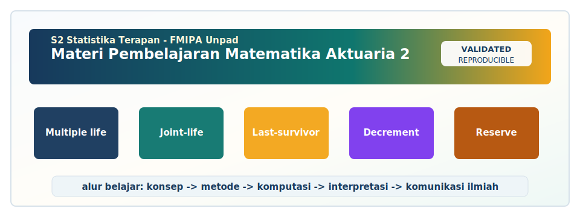

<!-- BEGIN UNPAD MATERIAL STYLE -->
<style>
:root {
  --unpad-navy: #17395c;
  --unpad-gold: #f2a51a;
  --unpad-teal: #0f766e;
  --unpad-ink: #172033;
  --unpad-paper: #fffdf8;
  --unpad-soft: #eef5f8;
  --unpad-line: #d7e2ea;
}
html, body {
  background: linear-gradient(135deg, #f8fbfd 0%, #fffdf8 48%, #f3f6ee 100%) !important;
  color: var(--unpad-ink) !important;
}
body {
  font-family: "Segoe UI", Arial, sans-serif !important;
  line-height: 1.72 !important;
}
.main-container {
  max-width: 1180px !important;
  background: rgba(255, 253, 248, 0.98) !important;
  border: 1px solid var(--unpad-line) !important;
  border-radius: 8px !important;
  box-shadow: 0 18px 42px rgba(23, 57, 92, 0.12) !important;
}
h1, h2, h3, h4 {
  letter-spacing: 0 !important;
}
h1.title {
  color: var(--unpad-navy) !important;
  -webkit-text-fill-color: var(--unpad-navy) !important;
  background: none !important;
}
h2 {
  border-left-color: var(--unpad-gold) !important;
}
a {
  color: #0b5c86 !important;
}
pre, code {
  border-radius: 8px !important;
}
.unpad-cover {
  margin: 18px 0 26px;
  padding: 24px;
  border-radius: 8px;
  background: linear-gradient(135deg, #17395c 0%, #0f766e 58%, #f2a51a 100%);
  color: #ffffff;
  box-shadow: 0 18px 36px rgba(23, 57, 92, 0.22);
}
.unpad-cover__brand {
  display: grid;
  grid-template-columns: 92px 1fr;
  gap: 20px;
  align-items: center;
}
.unpad-cover img {
  width: 92px;
  height: 92px;
  object-fit: contain;
  background: #ffffff;
  border-radius: 8px;
  padding: 8px;
  box-shadow: 0 8px 22px rgba(0,0,0,0.18);
}
.unpad-kicker {
  text-transform: uppercase;
  font-size: 0.82rem;
  font-weight: 800;
  letter-spacing: 0;
  color: #fff8dc;
}
.unpad-cover h2 {
  margin: 6px 0 8px;
  padding: 0;
  border: 0;
  background: transparent;
  color: #ffffff !important;
  font-size: 1.65rem;
}
.unpad-meta {
  margin: 0;
  color: #f7fbff;
  font-weight: 600;
}
.materi-illustration {
  margin: 20px 0 24px;
  padding: 14px;
  background: #ffffff;
  border: 1px solid var(--unpad-line);
  border-radius: 8px;
  box-shadow: 0 12px 28px rgba(23, 57, 92, 0.10);
}
.materi-illustration img {
  width: 100%;
  height: auto;
  display: block;
  border-radius: 6px;
}
.validasi-akademik {
  margin: 18px 0 28px;
  padding: 16px 18px;
  background: linear-gradient(135deg, #eef8f6, #fff8e7);
  border-left: 8px solid var(--unpad-teal);
  border-radius: 8px;
  color: var(--unpad-ink);
}
.validasi-akademik strong {
  color: var(--unpad-navy);
}
table {
  border-radius: 8px !important;
}
@media (max-width: 760px) {
  .unpad-cover__brand {
    grid-template-columns: 1fr;
  }
  .unpad-cover img {
    width: 76px;
    height: 76px;
  }
}
</style>
<!-- END UNPAD MATERIAL STYLE -->


<!-- BEGIN UNPAD MATERIAL ENHANCEMENT -->

```{r setup-unpad-render, include=FALSE}
execute_code <- FALSE
knitr::opts_chunk$set(
  echo = TRUE,
  eval = FALSE,
  message = FALSE,
  warning = FALSE,
  fig.align = "center",
  fig.width = 8,
  fig.height = 4.8,
  dpi = 120
)
set.seed(2025)
```


<div class="unpad-cover">
<div class="unpad-cover__brand">

<div>
<div class="unpad-kicker">S2 Statistika Terapan | FMIPA Universitas Padjadjaran</div>
<h2>Materi Pembelajaran Matematika Aktuaria 2</h2>
<p class="unpad-meta">Multiple Life Functions, Asuransi dan Anuitas Dua Kehidupan, Multiple Decrement, Benefit Premium, dan Benefit Reserve<br>Penulis: Dr. Lienda Noviyanti, M.Si | Januari 2025</p>
</div>
</div>
</div>

<div class="materi-illustration">

</div>

<div class="validasi-akademik">
<strong>Catatan validasi akademik.</strong> Materi ini diseragamkan dengan rujukan ADWTL Januari 2025: rumus dibaca bersama asumsi, contoh kode diposisikan sebagai template reproducible, dan interpretasi diarahkan pada validitas data, diagnosis model, evaluasi ketidakpastian, serta komunikasi hasil secara ilmiah.
</div>

<!-- END UNPAD MATERIAL ENHANCEMENT -->

<style>
:root{
  --brown-900:#3a1f0f; --brown-800:#5b351a; --brown-700:#7b4b26; --brown-600:#9c6b3d;
  --brown-500:#b98452; --brown-300:#e1c39b; --brown-200:#f0ddc2; --brown-100:#fbf3e8;
  --cream:#fffaf2; --gold:#d6a246; --ink:#1f1a17; --muted:#665246;
}
body{
  color:var(--ink);
  font-family: "Segoe UI", Roboto, "Helvetica Neue", Arial, sans-serif;
  background: linear-gradient(135deg, #fff8ed 0%, #f7e6cf 35%, #ead0aa 70%, #d8b17b 100%);
  line-height:1.68;
}
.main-container{max-width:1120px;margin-left:320px;margin-right:auto;background:rgba(255,250,242,.92);padding:38px 46px;border-radius:24px;box-shadow:0 18px 55px rgba(58,31,15,.20);}
h1,h2,h3,h4{font-weight:800;letter-spacing:.2px;color:var(--brown-900);} 
h1.title{font-size:2.3rem;text-align:left;padding:30px 34px;border-radius:26px;color:#fff;background:linear-gradient(135deg,#3a1f0f,#8c5a2e,#d6a246);box-shadow:0 14px 34px rgba(58,31,15,.26);} 
h2{border-left:9px solid var(--gold);padding-left:14px;margin-top:46px;background:linear-gradient(90deg,#f0ddc2,transparent);padding-top:10px;padding-bottom:10px;border-radius:12px;}
h3{margin-top:30px;color:var(--brown-800);} 
a{color:#7a3e05;font-weight:700;} a:hover{color:#b26714;}
#TOC{position:fixed;left:18px;top:18px;width:275px;max-height:94vh;overflow:auto;background:linear-gradient(180deg,#fff8ed,#edd5b2);border:1px solid #d8b17b;border-radius:22px;padding:18px;box-shadow:0 12px 35px rgba(58,31,15,.22);font-size:.91rem;}
#TOC::before{content:"📚 Daftar Isi";display:block;font-weight:900;color:#4c2d17;font-size:1.15rem;margin-bottom:10px;}
#TOC ul{padding-left:17px;} #TOC li{margin:5px 0;}
pre, .sourceCode, pre.sourceCode{background:#f7ead8 !important;color:#111 !important;border:1px solid #dfc39f;border-radius:16px;padding:16px;box-shadow:inset 0 0 0 1px rgba(255,255,255,.65);} 
code{background:#f7ead8;color:#111;border-radius:6px;padding:2px 5px;}
.mathbox{background:#fff0d9;border-left:7px solid #c4863b;color:#111;border-radius:18px;padding:16px 20px;margin:20px 0;box-shadow:0 8px 18px rgba(83,48,22,.12);} 
.callout, .examplebox, .casebox, .rpsbox{border-radius:20px;padding:18px 22px;margin:21px 0;box-shadow:0 9px 28px rgba(58,31,15,.13);} 
.callout{background:linear-gradient(135deg,#fffaf2,#f3dfc1);border-left:8px solid #a86a2f;}
.examplebox{background:linear-gradient(135deg,#fff3dd,#f7d7a8);border-left:8px solid #d28b32;}
.casebox{background:linear-gradient(135deg,#f5e4cc,#ead0aa);border-left:8px solid #7b4b26;}
.rpsbox{background:linear-gradient(135deg,#fdf7ed,#ecd0a7);border:1px solid #c59a62;}
table{border-collapse:collapse;width:100%;margin:20px 0;background:#fffaf2;border-radius:15px;overflow:hidden;box-shadow:0 5px 18px rgba(58,31,15,.08);} th{background:#70411f;color:#fff;padding:10px;}td{padding:10px;border-bottom:1px solid #ead4b7;}tr:nth-child(even){background:#fbefdF;}
blockquote{background:#fff0d9;border-left:8px solid #b98452;padding:14px 22px;border-radius:14px;color:#3a1f0f;}
hr{border:none;border-top:2px dashed #caa272;margin:35px 0;}
.figure-note{font-size:.92rem;color:var(--muted);font-style:italic;}
@media(max-width:980px){.main-container{margin-left:auto;padding:25px;} #TOC{position:relative;width:auto;max-height:none;left:auto;top:auto;margin-bottom:18px;}}
</style>


<div class="rpsbox">
**Identitas Mata Kuliah.** Materi ini disusun untuk **Matematika Aktuaria 2** pada **Program Studi S2 Statistika Terapan, Fakultas Matematika dan Ilmu Pengetahuan Alam, Universitas Padjadjaran**. Dokumen mengikuti arah RPS-OBE 2025: mata kuliah wajib semester 2, kode **D20B.211**, bobot **T = 2 SKS** dan **P = 1 SKS**, dengan dosen pengampu sekaligus pengembang RPS **Dr. Lienda Noviyanti, M.Si**. Fokus pembelajaran mengikuti CPMK dalam RPS: analisis *multiple life functions*, evaluasi produk asuransi dan anuitas dua kehidupan, konstruksi model komputasi *multiple decrement*, serta perancangan solusi *benefit premium* dan *benefit reserve* untuk produk aktuaria lanjut.
</div>

# Prakata

Materi pembelajaran ini dibuat sebagai e-book kuliah berbasis **R Markdown** dengan keluaran **HTML**. Format HTML dipilih agar mahasiswa dapat membaca materi secara interaktif, menelusuri daftar isi di sisi kiri, menjalankan ulang potongan kode R, dan memodifikasi simulasi sesuai kebutuhan studi kasus. Nuansa visual coklat degradasi digunakan untuk menjaga keterbacaan sekaligus memberi identitas desain yang hangat, akademik, dan profesional. Warna latar rumus serta kode sengaja dibuat coklat muda dengan tulisan hitam agar notasi tetap nyaman dibaca; rumus aktuaria sudah cukup serius, jadi tidak perlu dibuat seperti kopi tubruk terlalu pekat ☕.

Mata kuliah Matematika Aktuaria 2 berada pada jembatan antara teori probabilitas, statistika kelangsungan hidup, komputasi aktuaria, dan penilaian produk asuransi. Di satu sisi, mahasiswa perlu menguasai notasi dan formulasi matematis seperti $T_x$, $_tp_x$, $q_x$, *joint-life status*, *last-survivor status*, anuitas, asuransi, dan cadangan. Di sisi lain, mahasiswa juga perlu mampu menerjemahkan notasi tersebut ke dalam algoritma komputasi yang dapat diuji, direplikasi, dan diterapkan pada kasus nyata. Karena itu, setiap bab di dalam materi ini disusun dengan pola yang konsisten: konsep, notasi, rumus, interpretasi, contoh manual, implementasi R, latihan, serta refleksi aktuarial.

Rujukan utama mengikuti pustaka RPS, terutama @Dickson2013 dan @Bowers1997. Materi juga diperkuat oleh rujukan pendukung mengenai analisis mortalitas, model kelangsungan hidup, risiko dependen, dan pemodelan aktuaria modern [@Benjamin2012; @Gerber1997; @Promislow2015; @Pitacco2009; @Denuit2005]. Dengan cara ini, mahasiswa tidak hanya memperoleh formula, tetapi juga memahami mengapa formula tersebut muncul, kapan formula tersebut valid, serta bagaimana dampaknya ketika asumsi berubah. Dalam aktuaria, rumus tanpa asumsi ibarat payung tanpa gagang: kelihatannya lengkap, tetapi begitu hujan risiko datang, langsung repot.

## Capaian Pembelajaran yang Dioperasionalkan

Berdasarkan struktur RPS, materi ini mengoperasionalkan empat capaian pembelajaran mata kuliah. Pertama, mahasiswa mampu menganalisis dan membedakan fungsi *multiple life* dalam aktuaria serta aplikasinya. Kedua, mahasiswa mampu mengevaluasi produk asuransi dan anuitas dua kehidupan beserta asumsi mortalitas khusus. Ketiga, mahasiswa mampu membangun model komputasi untuk *multiple decrement* dan tabel dua penyusutan. Keempat, mahasiswa mampu merancang solusi inovatif *benefit premium* dan *benefit reserve* untuk produk asuransi lanjut berbasis riset atau studi kasus nyata.

Keempat CPMK tersebut saling berurutan. Materi *multiple life* membangun fondasi probabilitas dua kehidupan. Materi anuitas dan asuransi dua kehidupan memanfaatkan probabilitas tersebut untuk menghitung nilai kini aktuaria. Materi *multiple decrement* memperluas model ketika terdapat lebih dari satu penyebab keluar dari suatu kelompok risiko. Akhirnya, materi premi dan cadangan menyatukan seluruh struktur probabilitas dan nilai kini ke dalam keputusan aktuaria yang dapat dipertanggungjawabkan. Urutan ini penting karena mahasiswa tidak dapat merancang cadangan yang baik apabila masih keliru membaca status hidup gabungan; cadangan yang salah bukan sekadar angka berbeda, tetapi dapat menjadi sinyal salah dalam manajemen solvabilitas.

## Cara Menggunakan Materi

Mahasiswa disarankan membaca setiap bab sebelum pertemuan sinkron. Pada saat kuliah, dosen dapat menggunakan bagian konsep dan contoh manual sebagai bahan diskusi. Pada sesi praktikum, mahasiswa menjalankan kode R, mengganti parameter, dan menafsirkan perubahan output. Pada pembelajaran mandiri, mahasiswa mengerjakan latihan, mini project, serta membaca kembali daftar pustaka. Struktur ini mengikuti pendekatan *constructive alignment*: tujuan belajar, aktivitas belajar, dan penilaian dirancang agar saling menguatkan.

Bagian kode R bersifat edukatif. Data yang digunakan sebagian besar berupa data sintetik agar mahasiswa dapat memahami mekanisme model tanpa terhambat akses data asuransi yang sering bersifat sensitif. Namun, kerangka yang sama dapat diterapkan pada tabel mortalitas riil, data portofolio asuransi, data pensiun, data keluar-karyawan, atau data risiko kesehatan. Di dalam tugas akhir mata kuliah, mahasiswa dapat memperluas contoh sintetik menjadi studi kasus nyata sepanjang asumsi, sumber data, dan keterbatasannya dijelaskan secara transparan.

## Peta Modul Perkuliahan

| Blok | Pertemuan | Fokus Materi | Produk Belajar |
|---|---:|---|---|
| I | 1--4 | *Joint distributions*, *joint-life status*, *last-survivor status*, probabilitas dan ekspektasi dua kehidupan | Tugas analisis *multiple life functions* dan kuis reflektif |
| II | 5--8 | Asuransi dan anuitas dua kehidupan, *special two-life annuities*, *simple contingent function*, asumsi mortalitas khusus | Evaluasi produk, mini project, UTS |
| III | 9--12 | *Multiple decrement*, *random survivorship group*, *associated single decrement table*, *central rates*, konstruksi MD table | Proyek pemodelan komputasi dan laporan MD table |
| IV | 13--16 | Asuransi/anuitas kontinu-diskrit, *benefit premium*, *benefit reserve*, inovasi produk | Proyek akhir, presentasi, UAS |

## Pertemuan 1: Pendahuluan Multiple Life Functions

<div class="callout">
**Capaian Bab (SubCPMK1).** Setelah mempelajari bab ini, mahasiswa diharapkan mampu menghubungkan konsep teoritis, formulasi matematis, dan implementasi komputasi untuk topik-topik berikut:

- Menjelaskan dan menggunakan konsep **ruang lingkup multiple life** dalam konteks Matematika Aktuaria 2.
- Menjelaskan dan menggunakan konsep **notasi future lifetime** dalam konteks Matematika Aktuaria 2.
- Menjelaskan dan menggunakan konsep **status joint-life** dalam konteks Matematika Aktuaria 2.
- Menjelaskan dan menggunakan konsep **status last-survivor** dalam konteks Matematika Aktuaria 2.
- Menjelaskan dan menggunakan konsep **hubungan dengan produk asuransi keluarga** dalam konteks Matematika Aktuaria 2.
</div>

### Konsep Inti


Dalam membaca bab ini, mahasiswa perlu membedakan tiga lapis pemahaman. Lapis pertama adalah lapis notasi, yaitu kemampuan mengenali simbol, indeks umur, periode proyeksi, status hidup, status meninggal, dan hubungan antar variabel acak. Lapis kedua adalah lapis probabilitas, yaitu kemampuan mengubah cerita kontrak asuransi menjadi peluang, fungsi distribusi, atau nilai harapan. Lapis ketiga adalah lapis aktuaria terapan, yaitu kemampuan menerjemahkan hasil probabilitas ke dalam nilai kini manfaat, premi, cadangan, atau rekomendasi desain produk. Ketiga lapis ini tidak berdiri sendiri. Kesalahan kecil pada lapis notasi dapat menjalar menjadi kesalahan besar pada lapis premi dan cadangan.

Pendekatan yang digunakan adalah kombinasi antara penurunan matematis dan pemodelan komputasi. Penurunan matematis melatih mahasiswa memahami struktur formula secara konseptual. Pemodelan komputasi melatih mahasiswa memeriksa formula melalui simulasi, membangun fungsi, dan melakukan analisis sensitivitas. Dalam praktik aktuaria modern, keduanya harus berjalan bersama. Komputasi tanpa teori mudah menghasilkan angka yang tampak meyakinkan tetapi salah konteks. Teori tanpa komputasi sulit digunakan untuk mengevaluasi portofolio yang besar, asumsi yang berlapis, dan skenario risiko yang berubah.


Pada pertemuan ini, titik tekan pembelajaran adalah **pendahuluan multiple life functions**. Topik ini mencakup ruang lingkup multiple life, notasi future lifetime, status joint-life, status last-survivor, hubungan dengan produk asuransi keluarga. Dalam literatur aktuaria klasik, nilai kini manfaat asuransi dan anuitas selalu dibangun dari tiga komponen utama: fungsi survival, fungsi diskonto, dan struktur manfaat [@Dickson2013; @Bowers1997]. Ketika kontrak melibatkan dua kehidupan atau lebih, komponen survival tidak lagi cukup dibaca dari satu orang saja. Status kontrak harus didefinisikan dengan jelas: apakah manfaat bergantung pada keduanya masih hidup, salah satu masih hidup, kematian pertama, kematian kedua, atau kematian individu tertentu.

Kejelasan status adalah fondasi penilaian aktuaria. Misalnya, status *joint-life* berhenti ketika kematian pertama terjadi. Status *last-survivor* berhenti ketika seluruh individu dalam kelompok telah meninggal. Dua status ini sering menghasilkan nilai aktuaria yang sangat berbeda meskipun menggunakan umur dan tabel mortalitas yang sama. Perbedaan tersebut muncul karena waktu pembayaran manfaat berbeda. Pada status *joint-life*, klaim terkait kematian pertama cenderung terjadi lebih awal. Pada status *last-survivor*, pembayaran yang bergantung pada kematian terakhir cenderung terjadi lebih lambat, sehingga nilai diskontonya lebih besar atau kecil bergantung pada jenis manfaat dan pola pembayaran.

Dalam implementasi komputasi, topik ruang lingkup multiple life, notasi future lifetime, status joint-life, status last-survivor, hubungan dengan produk asuransi keluarga perlu diterjemahkan ke dalam algoritma yang eksplisit. Setiap algoritma minimal harus menjawab empat pertanyaan: siapa individu yang dimodelkan, apa status yang diamati, kapan pembayaran dilakukan, dan berapa besar manfaat atau premi yang dibayarkan. Jika empat pertanyaan ini sudah jelas, formula dapat dibangun secara sistematis. Jika belum jelas, rumus apa pun dapat tampak benar tetapi menjawab kontrak yang berbeda.

### Notasi dan Formulasi Dasar

Sebelum melakukan perhitungan, tetapkan notasi secara konsisten. Gunakan $x$ dan $y$ untuk umur dua individu pada waktu kontrak dimulai. Gunakan $T_x$ dan $T_y$ untuk *future lifetime* kontinu, serta $K_x$ dan $K_y$ untuk *curtate future lifetime*. Nilai $i$ menyatakan tingkat bunga efektif tahunan, sedangkan $v=(1+i)^{-1}$ menyatakan faktor diskonto satu tahun. Dalam banyak contoh awal, asumsi independensi digunakan agar struktur formula mudah dipahami. Setelah itu, mahasiswa dapat memperluas model melalui dependensi, skenario stres, atau faktor risiko bersama.


::: {.mathbox}
Untuk dua individu berumur $x$ dan $y$ dengan future lifetimes $T_x$ dan $T_y$, status joint-life bertahan sampai waktu $t$ jika keduanya masih hidup:
$$
{}_tp_{xy}=P(T_x>t, T_y>t).
$$
Jika $T_x$ dan $T_y$ independen, maka
$$
{}_tp_{xy}={}_tp_x\,{}_tp_y.
$$
:::


::: {.mathbox}
Status last survivor bertahan sampai waktu $t$ jika minimal satu dari dua individu masih hidup:
$$
{}_tp_{\overline{xy}}=P(\max(T_x,T_y)>t)=1-P(T_x\le t,T_y\le t).
$$
Untuk mortalitas independen:
$$
{}_tp_{\overline{xy}}={}_tp_x+{}_tp_y-{}_tp_x{}_tp_y.
$$
:::


Formula di atas harus dipahami sebagai representasi dari cerita kontrak. Pada laporan akademik, mahasiswa sebaiknya tidak hanya menuliskan rumus, tetapi juga menjelaskan arti setiap simbol. Penjelasan simbol membuat pembaca memahami apakah peluang yang dihitung adalah peluang hidup bersama, peluang minimal satu hidup, peluang kematian pertama, atau peluang kematian terakhir. Di dunia aktuaria, satu garis notasi yang ambigu bisa berubah menjadi satu halaman klarifikasi; lebih baik jelas sejak awal daripada rapat produk menjadi sidang tebak-tebakan.

### Contoh Konseptual dan Interpretasi

<div class="examplebox">
**Contoh.** Misalkan terdapat pasangan berumur 45 dan 43 tahun yang hendak membeli produk asuransi keluarga. Produk pertama membayar manfaat ketika kematian pertama terjadi, sedangkan produk kedua membayar manfaat ketika kematian kedua terjadi. Walaupun kedua produk menggunakan dua orang yang sama, status aktuaria produk berbeda. Produk pertama berhubungan erat dengan status *joint-life* karena status berhenti pada kematian pertama. Produk kedua berhubungan dengan status *last-survivor* karena pembayaran menunggu sampai keduanya meninggal.
</div>

Untuk produk pertama, perusahaan asuransi lebih cepat menghadapi kemungkinan klaim karena klaim muncul segera setelah salah satu tertanggung meninggal. Akibatnya, nilai kini manfaat dapat relatif tinggi, terutama jika salah satu tertanggung memiliki usia tinggi atau mortalitas lebih besar. Untuk produk kedua, klaim cenderung tertunda karena harus menunggu kematian terakhir. Pembayaran yang lebih jauh di masa depan mendapat diskonto lebih besar, tetapi peluang eventual claim tetap dapat tinggi untuk kontrak seumur hidup. Karena itu, arah perbandingan tidak boleh ditebak secara kasar; perlu dihitung menggunakan tabel mortalitas, tingkat bunga, dan struktur manfaat yang tepat.

Interpretasi hasil harus selalu dikaitkan dengan pertanyaan bisnis. Jika nilai kini manfaat naik ketika suku bunga turun, hal tersebut berarti perusahaan harus menyiapkan premi lebih besar atau margin cadangan lebih kuat. Jika nilai kini berubah drastis akibat perbedaan asumsi mortalitas, maka underwriting, segmentasi risiko, dan validasi tabel mortalitas menjadi penting. Jika nilai aktuaria sangat sensitif terhadap korelasi hidup dua individu, maka asumsi independensi perlu dievaluasi. Inilah perbedaan antara sekadar menghitung angka dan melakukan analisis aktuaria.

### Implementasi R

Potongan kode berikut dapat dijalankan setelah mahasiswa membuka file R Markdown ini di RStudio atau Posit. Kode sengaja dibuat modular agar mahasiswa dapat mengganti umur, tingkat bunga, horizon, atau asumsi mortalitas. Perhatikan bahwa tabel mortalitas yang digunakan adalah tabel sintetik untuk pembelajaran. Untuk analisis profesional, gunakan tabel mortalitas yang sesuai, terdokumentasi, dan relevan dengan populasi risiko.


```{r setup-actuarial, message=FALSE, warning=FALSE, eval=FALSE}
# Paket dasar yang digunakan dalam materi.
# Jalankan install.packages("ggplot2") jika belum tersedia.
library(ggplot2)

# Fungsi mortalitas sintetis berbasis Gompertz-Makeham sederhana.
# Fungsi ini hanya untuk pembelajaran, bukan tabel mortalitas resmi.
qx_gm <- function(age, A = 0.0005, B = 0.00003, c = 1.09) {
  q <- 1 - exp(-(A + B * c^age))
  pmin(pmax(q, 0), 0.999)
}

px_gm <- function(age, ...) 1 - qx_gm(age, ...)

tpx <- function(x, t, ...) {
  if (t == 0) return(1)
  ages <- x + 0:(t - 1)
  prod(px_gm(ages, ...))
}

v <- function(i, k) (1 + i)^(-k)
```

```{r two-life-probability-example, message=FALSE, warning=FALSE, eval=FALSE}
x <- 45; y <- 43
horizon <- 0:40
prob <- data.frame(
  t = horizon,
  px = sapply(horizon, function(k) tpx(x, k)),
  py = sapply(horizon, function(k) tpx(y, k))
)
prob$p_joint <- prob$px * prob$py
prob$p_last <- prob$px + prob$py - prob$px * prob$py

head(prob, 10)

ggplot(prob, aes(x = t)) +
  geom_line(aes(y = p_joint, linetype = "Joint-life"), linewidth = 1) +
  geom_line(aes(y = p_last, linetype = "Last-survivor"), linewidth = 1) +
  labs(x = "t (tahun)", y = "Probabilitas survival status", linetype = "Status") +
  theme_minimal()
```


Setelah menjalankan kode, mahasiswa perlu membaca output secara substantif. Untuk grafik probabilitas dua kehidupan, kurva *joint-life* biasanya berada di bawah kurva *last-survivor* karena peluang keduanya hidup sampai waktu tertentu lebih kecil daripada peluang minimal satu masih hidup. Untuk tabel *multiple decrement*, jumlah decrement per penyebab harus konsisten dengan total keluar dari kelompok risiko. Untuk premi dan cadangan, nilai cadangan pada awal kontrak biasanya mendekati nol dalam model premi bersih, lalu berubah mengikuti waktu, probabilitas klaim, dan sisa kewajiban.

### Studi Kasus Mini

<div class="casebox">
**Skenario.** Sebuah perusahaan asuransi sedang mengevaluasi produk dua kehidupan untuk keluarga muda dan keluarga menjelang pensiun. Tim aktuaria diminta menghitung nilai manfaat, menguji sensitivitas terhadap suku bunga, serta menjelaskan risiko asumsi mortalitas. Pada pertemuan 1, fokus analisis diarahkan pada ruang lingkup multiple life, notasi future lifetime, status joint-life.
</div>

Langkah pertama adalah mendefinisikan kontrak. Apakah manfaat dibayarkan ketika kematian pertama terjadi, ketika kematian kedua terjadi, selama keduanya hidup, atau selama salah satu masih hidup? Langkah kedua adalah memilih basis mortalitas. Jika data riil belum tersedia, mahasiswa dapat menggunakan tabel sintetik untuk memahami mekanisme. Langkah ketiga adalah menentukan tingkat bunga atau kurva diskonto. Langkah keempat adalah menghitung nilai kini aktuaria dan melakukan analisis sensitivitas. Langkah kelima adalah menyusun rekomendasi dengan bahasa yang mudah dipahami.

Dalam studi kasus ini, mahasiswa sebaiknya membuat minimal tiga skenario. Skenario dasar menggunakan parameter yang dianggap paling realistis. Skenario optimistis menggunakan mortalitas lebih rendah atau suku bunga lebih tinggi. Skenario stres menggunakan mortalitas lebih tinggi, suku bunga lebih rendah, atau dependensi lebih kuat antar kehidupan. Perbandingan skenario membantu mahasiswa memahami bahwa aktuaria adalah disiplin pengelolaan ketidakpastian, bukan sekadar kalkulator manfaat.

Hasil studi kasus harus disajikan dalam tabel dan grafik. Tabel digunakan untuk menampilkan nilai numerik seperti nilai anuitas, nilai asuransi, premi bersih, atau cadangan. Grafik digunakan untuk menunjukkan pola terhadap umur, waktu, dan skenario. Pada bagian interpretasi, mahasiswa perlu menulis konsekuensi praktis: apakah produk terlalu mahal, apakah cadangan perlu diperkuat, apakah asumsi terlalu optimistis, dan apakah desain manfaat perlu disederhanakan.

### Latihan, Refleksi, dan Penilaian Formatif

1. Jelaskan dengan kata-kata sendiri apa perbedaan status yang relevan dalam topik **Pendahuluan Multiple Life Functions**.
2. Turunkan satu formula utama dari bab ini mulai dari definisi probabilitasnya.
3. Buat contoh numerik kecil dengan dua umur berbeda dan horizon maksimal lima tahun.
4. Jalankan kode R, lalu ubah minimal dua parameter. Jelaskan perubahan hasilnya.
5. Tulis satu paragraf rekomendasi aktuaria untuk manajer produk berdasarkan hasil perhitungan.

Rubrik refleksi singkat menggunakan empat aspek. Pertama, ketepatan konsep dan notasi. Kedua, ketepatan perhitungan manual atau komputasi. Ketiga, kedalaman interpretasi hasil. Keempat, kualitas komunikasi dalam tabel, grafik, dan narasi. Mahasiswa yang memperoleh hasil numerik benar tetapi tidak mampu menafsirkan angka masih perlu memperkuat aspek komunikasi. Sebaliknya, narasi yang menarik tetapi tidak didukung perhitungan yang benar juga belum memenuhi standar aktuaria.

Kesalahan umum pada bab ini biasanya terjadi pada indeks waktu dan definisi status. Mahasiswa kadang menggunakan notasi survival single-life ketika seharusnya menggunakan survival joint-life, atau menggunakan pembayaran awal tahun ketika kontrak menyatakan pembayaran akhir tahun. Kesalahan lain adalah mencampur peluang tahunan dengan peluang kumulatif. Untuk menghindari hal ini, selalu tuliskan garis waktu kontrak sebelum menghitung. Garis waktu sederhana sering menyelamatkan analisis dari kesalahan perhitungan yang tidak perlu.

### Catatan Pengayaan untuk Pembelajaran Mandiri

Topik pendahuluan multiple life functions dapat diperdalam dengan membaca kembali bagian pustaka utama dan membandingkannya dengan contoh komputasi. Pada tahap awal, mahasiswa dapat menggunakan asumsi sederhana. Pada tahap lanjutan, mahasiswa dapat menambahkan variasi seperti perbedaan gender, seleksi underwriting, perubahan tingkat bunga, atau dependensi antar kehidupan. Pengayaan ini penting karena ruang lingkup multiple life, notasi future lifetime, status joint-life, status last-survivor, hubungan dengan produk asuransi keluarga tidak hanya bersifat matematis, tetapi juga berkaitan dengan desain produk, kecukupan premi, dan keberlanjutan kewajiban perusahaan asuransi.

Dalam konteks S2 Statistika Terapan, mahasiswa diharapkan tidak berhenti pada hafalan rumus. Mahasiswa perlu mampu menjelaskan mengapa suatu rumus berlaku, bagaimana rumus berubah ketika pembayaran dilakukan diskrit atau kontinu, dan bagaimana sensitivitas nilai aktuaria terhadap suku bunga, mortalitas, umur tertanggung, serta struktur manfaat. Kemampuan ini menjadi pembeda antara pengguna formula dan analis aktuaria yang matang.

Salah satu strategi belajar yang efektif adalah membuat tabel kecil secara manual sebelum menulis kode. Tabel manual membantu mahasiswa melihat alur indeks waktu, nilai diskonto, probabilitas hidup, probabilitas meninggal, serta manfaat pada tiap periode. Setelah struktur manual jelas, kode R menjadi representasi algoritmik dari pola yang sama. Dengan cara ini, kode bukan kotak hitam, melainkan alat bantu berpikir.

Dalam diskusi kelas, mahasiswa dapat membandingkan hasil antar kelompok dengan parameter yang berbeda. Misalnya satu kelompok menggunakan suku bunga rendah, kelompok lain menggunakan suku bunga tinggi, dan kelompok lain mengubah asumsi mortalitas. Perbedaan hasil tidak hanya menunjukkan perubahan angka, tetapi juga memperlihatkan logika risiko: semakin tinggi peluang klaim awal, semakin besar nilai kini manfaat asuransi; semakin tinggi diskonto, semakin kecil bobot pembayaran jauh di masa depan.

Penilaian aktuaria yang baik selalu memperhatikan dimensi komunikasi. Hasil perhitungan harus dapat dijelaskan kepada pembuat kebijakan, manajer produk, regulator, atau pihak non-teknis. Karena itu, setiap bab menyertakan interpretasi praktis. Mahasiswa didorong menulis kesimpulan dengan bahasa yang jelas: apa arti angka tersebut, asumsi apa yang menopangnya, risiko apa yang tersisa, dan keputusan apa yang dapat dipertimbangkan.

Model sederhana dalam bab ini harus dipahami sebagai titik awal. Dalam praktik, perusahaan asuransi dapat menggunakan tabel mortalitas yang lebih rinci, seleksi risiko, pembagian gender, status merokok, underwriting medis, biaya akuisisi, biaya administrasi, margin risiko, lapse, surrender, serta ketentuan regulasi. Namun, kerangka dasar nilai kini aktuaria tetap menjadi fondasi untuk membangun model yang lebih kompleks.

Kualitas implementasi komputasi dapat diperiksa melalui tiga cara. Pertama, bandingkan hasil kode dengan contoh manual untuk ukuran kecil. Kedua, uji batas ekstrem, misalnya suku bunga nol atau mortalitas sangat rendah. Ketiga, lakukan visualisasi agar pola hasil mudah dilihat. Ketika angka berubah secara tidak masuk akal, biasanya terdapat masalah pada indeks, definisi probabilitas, atau urutan diskonto.

Aktuaria tidak hanya menghitung ekspektasi. Aktuaria juga menilai ketidakpastian. Dua produk dengan nilai harapan sama dapat memiliki profil risiko yang berbeda karena variansi, waktu pembayaran klaim, atau korelasi antar kehidupan. Karena itu, mahasiswa perlu membiasakan diri melihat distribusi hasil, bukan hanya rata-rata. Simulasi Monte Carlo menjadi salah satu alat penting untuk membangun intuisi tersebut.

Dalam tugas dan proyek, pemilihan studi kasus harus disertai alasan. Kasus pasangan suami-istri, kontrak keluarga, anuitas pensiun pasangan, asuransi pendidikan keluarga, atau manfaat survivor memiliki struktur aktuaria yang berbeda. Semakin jelas konteks produk, semakin mudah menentukan status yang relevan, apakah pembayaran dilakukan selama keduanya hidup, selama salah satu masih hidup, setelah kematian pertama, atau setelah kematian kedua.

Dalam pembelajaran mandiri, mahasiswa dianjurkan membuat jurnal kecil berisi tiga hal: formula yang dipelajari, contoh kontrak yang cocok dengan formula tersebut, dan satu pertanyaan kritis tentang asumsi. Kebiasaan ini membantu mahasiswa bergerak dari hafalan ke pemahaman. Jika setiap pertemuan menghasilkan satu jurnal reflektif yang baik, pada akhir semester mahasiswa sudah memiliki peta konsep personal yang kuat untuk menyusun proyek akhir.


---


## Pertemuan 2: Joint Distributions of Future Lifetimes

<div class="callout">
**Capaian Bab (SubCPMK1).** Setelah mempelajari bab ini, mahasiswa diharapkan mampu menghubungkan konsep teoritis, formulasi matematis, dan implementasi komputasi untuk topik-topik berikut:

- Menjelaskan dan menggunakan konsep **distribusi gabungan** dalam konteks Matematika Aktuaria 2.
- Menjelaskan dan menggunakan konsep **fungsi survival gabungan** dalam konteks Matematika Aktuaria 2.
- Menjelaskan dan menggunakan konsep **independensi dan dependensi** dalam konteks Matematika Aktuaria 2.
- Menjelaskan dan menggunakan konsep **interpretasi tabel mortalitas** dalam konteks Matematika Aktuaria 2.
- Menjelaskan dan menggunakan konsep **ekspektasi dua kehidupan** dalam konteks Matematika Aktuaria 2.
</div>

### Konsep Inti


Dalam membaca bab ini, mahasiswa perlu membedakan tiga lapis pemahaman. Lapis pertama adalah lapis notasi, yaitu kemampuan mengenali simbol, indeks umur, periode proyeksi, status hidup, status meninggal, dan hubungan antar variabel acak. Lapis kedua adalah lapis probabilitas, yaitu kemampuan mengubah cerita kontrak asuransi menjadi peluang, fungsi distribusi, atau nilai harapan. Lapis ketiga adalah lapis aktuaria terapan, yaitu kemampuan menerjemahkan hasil probabilitas ke dalam nilai kini manfaat, premi, cadangan, atau rekomendasi desain produk. Ketiga lapis ini tidak berdiri sendiri. Kesalahan kecil pada lapis notasi dapat menjalar menjadi kesalahan besar pada lapis premi dan cadangan.

Pendekatan yang digunakan adalah kombinasi antara penurunan matematis dan pemodelan komputasi. Penurunan matematis melatih mahasiswa memahami struktur formula secara konseptual. Pemodelan komputasi melatih mahasiswa memeriksa formula melalui simulasi, membangun fungsi, dan melakukan analisis sensitivitas. Dalam praktik aktuaria modern, keduanya harus berjalan bersama. Komputasi tanpa teori mudah menghasilkan angka yang tampak meyakinkan tetapi salah konteks. Teori tanpa komputasi sulit digunakan untuk mengevaluasi portofolio yang besar, asumsi yang berlapis, dan skenario risiko yang berubah.


Pada pertemuan ini, titik tekan pembelajaran adalah **joint distributions of future lifetimes**. Topik ini mencakup distribusi gabungan, fungsi survival gabungan, independensi dan dependensi, interpretasi tabel mortalitas, ekspektasi dua kehidupan. Dalam literatur aktuaria klasik, nilai kini manfaat asuransi dan anuitas selalu dibangun dari tiga komponen utama: fungsi survival, fungsi diskonto, dan struktur manfaat [@Dickson2013; @Bowers1997]. Ketika kontrak melibatkan dua kehidupan atau lebih, komponen survival tidak lagi cukup dibaca dari satu orang saja. Status kontrak harus didefinisikan dengan jelas: apakah manfaat bergantung pada keduanya masih hidup, salah satu masih hidup, kematian pertama, kematian kedua, atau kematian individu tertentu.

Kejelasan status adalah fondasi penilaian aktuaria. Misalnya, status *joint-life* berhenti ketika kematian pertama terjadi. Status *last-survivor* berhenti ketika seluruh individu dalam kelompok telah meninggal. Dua status ini sering menghasilkan nilai aktuaria yang sangat berbeda meskipun menggunakan umur dan tabel mortalitas yang sama. Perbedaan tersebut muncul karena waktu pembayaran manfaat berbeda. Pada status *joint-life*, klaim terkait kematian pertama cenderung terjadi lebih awal. Pada status *last-survivor*, pembayaran yang bergantung pada kematian terakhir cenderung terjadi lebih lambat, sehingga nilai diskontonya lebih besar atau kecil bergantung pada jenis manfaat dan pola pembayaran.

Dalam implementasi komputasi, topik distribusi gabungan, fungsi survival gabungan, independensi dan dependensi, interpretasi tabel mortalitas, ekspektasi dua kehidupan perlu diterjemahkan ke dalam algoritma yang eksplisit. Setiap algoritma minimal harus menjawab empat pertanyaan: siapa individu yang dimodelkan, apa status yang diamati, kapan pembayaran dilakukan, dan berapa besar manfaat atau premi yang dibayarkan. Jika empat pertanyaan ini sudah jelas, formula dapat dibangun secara sistematis. Jika belum jelas, rumus apa pun dapat tampak benar tetapi menjawab kontrak yang berbeda.

### Notasi dan Formulasi Dasar

Sebelum melakukan perhitungan, tetapkan notasi secara konsisten. Gunakan $x$ dan $y$ untuk umur dua individu pada waktu kontrak dimulai. Gunakan $T_x$ dan $T_y$ untuk *future lifetime* kontinu, serta $K_x$ dan $K_y$ untuk *curtate future lifetime*. Nilai $i$ menyatakan tingkat bunga efektif tahunan, sedangkan $v=(1+i)^{-1}$ menyatakan faktor diskonto satu tahun. Dalam banyak contoh awal, asumsi independensi digunakan agar struktur formula mudah dipahami. Setelah itu, mahasiswa dapat memperluas model melalui dependensi, skenario stres, atau faktor risiko bersama.


::: {.mathbox}
Untuk dua individu berumur $x$ dan $y$ dengan future lifetimes $T_x$ dan $T_y$, status joint-life bertahan sampai waktu $t$ jika keduanya masih hidup:
$$
{}_tp_{xy}=P(T_x>t, T_y>t).
$$
Jika $T_x$ dan $T_y$ independen, maka
$$
{}_tp_{xy}={}_tp_x\,{}_tp_y.
$$
:::


::: {.mathbox}
Status last survivor bertahan sampai waktu $t$ jika minimal satu dari dua individu masih hidup:
$$
{}_tp_{\overline{xy}}=P(\max(T_x,T_y)>t)=1-P(T_x\le t,T_y\le t).
$$
Untuk mortalitas independen:
$$
{}_tp_{\overline{xy}}={}_tp_x+{}_tp_y-{}_tp_x{}_tp_y.
$$
:::


Formula di atas harus dipahami sebagai representasi dari cerita kontrak. Pada laporan akademik, mahasiswa sebaiknya tidak hanya menuliskan rumus, tetapi juga menjelaskan arti setiap simbol. Penjelasan simbol membuat pembaca memahami apakah peluang yang dihitung adalah peluang hidup bersama, peluang minimal satu hidup, peluang kematian pertama, atau peluang kematian terakhir. Di dunia aktuaria, satu garis notasi yang ambigu bisa berubah menjadi satu halaman klarifikasi; lebih baik jelas sejak awal daripada rapat produk menjadi sidang tebak-tebakan.

### Contoh Konseptual dan Interpretasi

<div class="examplebox">
**Contoh.** Misalkan terdapat pasangan berumur 45 dan 43 tahun yang hendak membeli produk asuransi keluarga. Produk pertama membayar manfaat ketika kematian pertama terjadi, sedangkan produk kedua membayar manfaat ketika kematian kedua terjadi. Walaupun kedua produk menggunakan dua orang yang sama, status aktuaria produk berbeda. Produk pertama berhubungan erat dengan status *joint-life* karena status berhenti pada kematian pertama. Produk kedua berhubungan dengan status *last-survivor* karena pembayaran menunggu sampai keduanya meninggal.
</div>

Untuk produk pertama, perusahaan asuransi lebih cepat menghadapi kemungkinan klaim karena klaim muncul segera setelah salah satu tertanggung meninggal. Akibatnya, nilai kini manfaat dapat relatif tinggi, terutama jika salah satu tertanggung memiliki usia tinggi atau mortalitas lebih besar. Untuk produk kedua, klaim cenderung tertunda karena harus menunggu kematian terakhir. Pembayaran yang lebih jauh di masa depan mendapat diskonto lebih besar, tetapi peluang eventual claim tetap dapat tinggi untuk kontrak seumur hidup. Karena itu, arah perbandingan tidak boleh ditebak secara kasar; perlu dihitung menggunakan tabel mortalitas, tingkat bunga, dan struktur manfaat yang tepat.

Interpretasi hasil harus selalu dikaitkan dengan pertanyaan bisnis. Jika nilai kini manfaat naik ketika suku bunga turun, hal tersebut berarti perusahaan harus menyiapkan premi lebih besar atau margin cadangan lebih kuat. Jika nilai kini berubah drastis akibat perbedaan asumsi mortalitas, maka underwriting, segmentasi risiko, dan validasi tabel mortalitas menjadi penting. Jika nilai aktuaria sangat sensitif terhadap korelasi hidup dua individu, maka asumsi independensi perlu dievaluasi. Inilah perbedaan antara sekadar menghitung angka dan melakukan analisis aktuaria.

### Implementasi R

Potongan kode berikut dapat dijalankan setelah mahasiswa membuka file R Markdown ini di RStudio atau Posit. Kode sengaja dibuat modular agar mahasiswa dapat mengganti umur, tingkat bunga, horizon, atau asumsi mortalitas. Perhatikan bahwa tabel mortalitas yang digunakan adalah tabel sintetik untuk pembelajaran. Untuk analisis profesional, gunakan tabel mortalitas yang sesuai, terdokumentasi, dan relevan dengan populasi risiko.


```{r two-life-probability-example-2, message=FALSE, warning=FALSE, eval=FALSE}
x <- 45; y <- 43
horizon <- 0:40
prob <- data.frame(
  t = horizon,
  px = sapply(horizon, function(k) tpx(x, k)),
  py = sapply(horizon, function(k) tpx(y, k))
)
prob$p_joint <- prob$px * prob$py
prob$p_last <- prob$px + prob$py - prob$px * prob$py

head(prob, 10)

ggplot(prob, aes(x = t)) +
  geom_line(aes(y = p_joint, linetype = "Joint-life"), linewidth = 1) +
  geom_line(aes(y = p_last, linetype = "Last-survivor"), linewidth = 1) +
  labs(x = "t (tahun)", y = "Probabilitas survival status", linetype = "Status") +
  theme_minimal()
```


Setelah menjalankan kode, mahasiswa perlu membaca output secara substantif. Untuk grafik probabilitas dua kehidupan, kurva *joint-life* biasanya berada di bawah kurva *last-survivor* karena peluang keduanya hidup sampai waktu tertentu lebih kecil daripada peluang minimal satu masih hidup. Untuk tabel *multiple decrement*, jumlah decrement per penyebab harus konsisten dengan total keluar dari kelompok risiko. Untuk premi dan cadangan, nilai cadangan pada awal kontrak biasanya mendekati nol dalam model premi bersih, lalu berubah mengikuti waktu, probabilitas klaim, dan sisa kewajiban.

### Studi Kasus Mini

<div class="casebox">
**Skenario.** Sebuah perusahaan asuransi sedang mengevaluasi produk dua kehidupan untuk keluarga muda dan keluarga menjelang pensiun. Tim aktuaria diminta menghitung nilai manfaat, menguji sensitivitas terhadap suku bunga, serta menjelaskan risiko asumsi mortalitas. Pada pertemuan 2, fokus analisis diarahkan pada distribusi gabungan, fungsi survival gabungan, independensi dan dependensi.
</div>

Langkah pertama adalah mendefinisikan kontrak. Apakah manfaat dibayarkan ketika kematian pertama terjadi, ketika kematian kedua terjadi, selama keduanya hidup, atau selama salah satu masih hidup? Langkah kedua adalah memilih basis mortalitas. Jika data riil belum tersedia, mahasiswa dapat menggunakan tabel sintetik untuk memahami mekanisme. Langkah ketiga adalah menentukan tingkat bunga atau kurva diskonto. Langkah keempat adalah menghitung nilai kini aktuaria dan melakukan analisis sensitivitas. Langkah kelima adalah menyusun rekomendasi dengan bahasa yang mudah dipahami.

Dalam studi kasus ini, mahasiswa sebaiknya membuat minimal tiga skenario. Skenario dasar menggunakan parameter yang dianggap paling realistis. Skenario optimistis menggunakan mortalitas lebih rendah atau suku bunga lebih tinggi. Skenario stres menggunakan mortalitas lebih tinggi, suku bunga lebih rendah, atau dependensi lebih kuat antar kehidupan. Perbandingan skenario membantu mahasiswa memahami bahwa aktuaria adalah disiplin pengelolaan ketidakpastian, bukan sekadar kalkulator manfaat.

Hasil studi kasus harus disajikan dalam tabel dan grafik. Tabel digunakan untuk menampilkan nilai numerik seperti nilai anuitas, nilai asuransi, premi bersih, atau cadangan. Grafik digunakan untuk menunjukkan pola terhadap umur, waktu, dan skenario. Pada bagian interpretasi, mahasiswa perlu menulis konsekuensi praktis: apakah produk terlalu mahal, apakah cadangan perlu diperkuat, apakah asumsi terlalu optimistis, dan apakah desain manfaat perlu disederhanakan.

### Latihan, Refleksi, dan Penilaian Formatif

1. Jelaskan dengan kata-kata sendiri apa perbedaan status yang relevan dalam topik **Joint Distributions of Future Lifetimes**.
2. Turunkan satu formula utama dari bab ini mulai dari definisi probabilitasnya.
3. Buat contoh numerik kecil dengan dua umur berbeda dan horizon maksimal lima tahun.
4. Jalankan kode R, lalu ubah minimal dua parameter. Jelaskan perubahan hasilnya.
5. Tulis satu paragraf rekomendasi aktuaria untuk manajer produk berdasarkan hasil perhitungan.

Rubrik refleksi singkat menggunakan empat aspek. Pertama, ketepatan konsep dan notasi. Kedua, ketepatan perhitungan manual atau komputasi. Ketiga, kedalaman interpretasi hasil. Keempat, kualitas komunikasi dalam tabel, grafik, dan narasi. Mahasiswa yang memperoleh hasil numerik benar tetapi tidak mampu menafsirkan angka masih perlu memperkuat aspek komunikasi. Sebaliknya, narasi yang menarik tetapi tidak didukung perhitungan yang benar juga belum memenuhi standar aktuaria.

Kesalahan umum pada bab ini biasanya terjadi pada indeks waktu dan definisi status. Mahasiswa kadang menggunakan notasi survival single-life ketika seharusnya menggunakan survival joint-life, atau menggunakan pembayaran awal tahun ketika kontrak menyatakan pembayaran akhir tahun. Kesalahan lain adalah mencampur peluang tahunan dengan peluang kumulatif. Untuk menghindari hal ini, selalu tuliskan garis waktu kontrak sebelum menghitung. Garis waktu sederhana sering menyelamatkan analisis dari kesalahan perhitungan yang tidak perlu.

### Catatan Pengayaan untuk Pembelajaran Mandiri

Topik joint distributions of future lifetimes dapat diperdalam dengan membaca kembali bagian pustaka utama dan membandingkannya dengan contoh komputasi. Pada tahap awal, mahasiswa dapat menggunakan asumsi sederhana. Pada tahap lanjutan, mahasiswa dapat menambahkan variasi seperti perbedaan gender, seleksi underwriting, perubahan tingkat bunga, atau dependensi antar kehidupan. Pengayaan ini penting karena distribusi gabungan, fungsi survival gabungan, independensi dan dependensi, interpretasi tabel mortalitas, ekspektasi dua kehidupan tidak hanya bersifat matematis, tetapi juga berkaitan dengan desain produk, kecukupan premi, dan keberlanjutan kewajiban perusahaan asuransi.

Salah satu strategi belajar yang efektif adalah membuat tabel kecil secara manual sebelum menulis kode. Tabel manual membantu mahasiswa melihat alur indeks waktu, nilai diskonto, probabilitas hidup, probabilitas meninggal, serta manfaat pada tiap periode. Setelah struktur manual jelas, kode R menjadi representasi algoritmik dari pola yang sama. Dengan cara ini, kode bukan kotak hitam, melainkan alat bantu berpikir.

Dalam diskusi kelas, mahasiswa dapat membandingkan hasil antar kelompok dengan parameter yang berbeda. Misalnya satu kelompok menggunakan suku bunga rendah, kelompok lain menggunakan suku bunga tinggi, dan kelompok lain mengubah asumsi mortalitas. Perbedaan hasil tidak hanya menunjukkan perubahan angka, tetapi juga memperlihatkan logika risiko: semakin tinggi peluang klaim awal, semakin besar nilai kini manfaat asuransi; semakin tinggi diskonto, semakin kecil bobot pembayaran jauh di masa depan.

Penilaian aktuaria yang baik selalu memperhatikan dimensi komunikasi. Hasil perhitungan harus dapat dijelaskan kepada pembuat kebijakan, manajer produk, regulator, atau pihak non-teknis. Karena itu, setiap bab menyertakan interpretasi praktis. Mahasiswa didorong menulis kesimpulan dengan bahasa yang jelas: apa arti angka tersebut, asumsi apa yang menopangnya, risiko apa yang tersisa, dan keputusan apa yang dapat dipertimbangkan.

Model sederhana dalam bab ini harus dipahami sebagai titik awal. Dalam praktik, perusahaan asuransi dapat menggunakan tabel mortalitas yang lebih rinci, seleksi risiko, pembagian gender, status merokok, underwriting medis, biaya akuisisi, biaya administrasi, margin risiko, lapse, surrender, serta ketentuan regulasi. Namun, kerangka dasar nilai kini aktuaria tetap menjadi fondasi untuk membangun model yang lebih kompleks.

Kualitas implementasi komputasi dapat diperiksa melalui tiga cara. Pertama, bandingkan hasil kode dengan contoh manual untuk ukuran kecil. Kedua, uji batas ekstrem, misalnya suku bunga nol atau mortalitas sangat rendah. Ketiga, lakukan visualisasi agar pola hasil mudah dilihat. Ketika angka berubah secara tidak masuk akal, biasanya terdapat masalah pada indeks, definisi probabilitas, atau urutan diskonto.

Aktuaria tidak hanya menghitung ekspektasi. Aktuaria juga menilai ketidakpastian. Dua produk dengan nilai harapan sama dapat memiliki profil risiko yang berbeda karena variansi, waktu pembayaran klaim, atau korelasi antar kehidupan. Karena itu, mahasiswa perlu membiasakan diri melihat distribusi hasil, bukan hanya rata-rata. Simulasi Monte Carlo menjadi salah satu alat penting untuk membangun intuisi tersebut.

Dalam tugas dan proyek, pemilihan studi kasus harus disertai alasan. Kasus pasangan suami-istri, kontrak keluarga, anuitas pensiun pasangan, asuransi pendidikan keluarga, atau manfaat survivor memiliki struktur aktuaria yang berbeda. Semakin jelas konteks produk, semakin mudah menentukan status yang relevan, apakah pembayaran dilakukan selama keduanya hidup, selama salah satu masih hidup, setelah kematian pertama, atau setelah kematian kedua.

Mahasiswa juga perlu memperhatikan keterbatasan data. Data mortalitas atau decrement yang kecil dapat menghasilkan estimasi yang tidak stabil. Jika data terbatas, pendekatan smoothing, borrowing information, atau analisis sensitivitas menjadi penting. Dalam laporan akademik, keterbatasan ini bukan kelemahan yang harus disembunyikan, melainkan bagian dari transparansi ilmiah yang membuat rekomendasi lebih kredibel.

Dalam pembelajaran mandiri, mahasiswa dianjurkan membuat jurnal kecil berisi tiga hal: formula yang dipelajari, contoh kontrak yang cocok dengan formula tersebut, dan satu pertanyaan kritis tentang asumsi. Kebiasaan ini membantu mahasiswa bergerak dari hafalan ke pemahaman. Jika setiap pertemuan menghasilkan satu jurnal reflektif yang baik, pada akhir semester mahasiswa sudah memiliki peta konsep personal yang kuat untuk menyusun proyek akhir.


---


## Pertemuan 3: Probabilitas dan Ekspektasi Dua Kehidupan

<div class="callout">
**Capaian Bab (SubCPMK1).** Setelah mempelajari bab ini, mahasiswa diharapkan mampu menghubungkan konsep teoritis, formulasi matematis, dan implementasi komputasi untuk topik-topik berikut:

- Menjelaskan dan menggunakan konsep **peluang hidup bersama** dalam konteks Matematika Aktuaria 2.
- Menjelaskan dan menggunakan konsep **peluang kematian pertama** dalam konteks Matematika Aktuaria 2.
- Menjelaskan dan menggunakan konsep **peluang kematian kedua** dalam konteks Matematika Aktuaria 2.
- Menjelaskan dan menggunakan konsep **ekspektasi curtate lifetime** dalam konteks Matematika Aktuaria 2.
- Menjelaskan dan menggunakan konsep **variansi sederhana** dalam konteks Matematika Aktuaria 2.
</div>

### Konsep Inti


Dalam membaca bab ini, mahasiswa perlu membedakan tiga lapis pemahaman. Lapis pertama adalah lapis notasi, yaitu kemampuan mengenali simbol, indeks umur, periode proyeksi, status hidup, status meninggal, dan hubungan antar variabel acak. Lapis kedua adalah lapis probabilitas, yaitu kemampuan mengubah cerita kontrak asuransi menjadi peluang, fungsi distribusi, atau nilai harapan. Lapis ketiga adalah lapis aktuaria terapan, yaitu kemampuan menerjemahkan hasil probabilitas ke dalam nilai kini manfaat, premi, cadangan, atau rekomendasi desain produk. Ketiga lapis ini tidak berdiri sendiri. Kesalahan kecil pada lapis notasi dapat menjalar menjadi kesalahan besar pada lapis premi dan cadangan.

Pendekatan yang digunakan adalah kombinasi antara penurunan matematis dan pemodelan komputasi. Penurunan matematis melatih mahasiswa memahami struktur formula secara konseptual. Pemodelan komputasi melatih mahasiswa memeriksa formula melalui simulasi, membangun fungsi, dan melakukan analisis sensitivitas. Dalam praktik aktuaria modern, keduanya harus berjalan bersama. Komputasi tanpa teori mudah menghasilkan angka yang tampak meyakinkan tetapi salah konteks. Teori tanpa komputasi sulit digunakan untuk mengevaluasi portofolio yang besar, asumsi yang berlapis, dan skenario risiko yang berubah.


Pada pertemuan ini, titik tekan pembelajaran adalah **probabilitas dan ekspektasi dua kehidupan**. Topik ini mencakup peluang hidup bersama, peluang kematian pertama, peluang kematian kedua, ekspektasi curtate lifetime, variansi sederhana. Dalam literatur aktuaria klasik, nilai kini manfaat asuransi dan anuitas selalu dibangun dari tiga komponen utama: fungsi survival, fungsi diskonto, dan struktur manfaat [@Dickson2013; @Bowers1997]. Ketika kontrak melibatkan dua kehidupan atau lebih, komponen survival tidak lagi cukup dibaca dari satu orang saja. Status kontrak harus didefinisikan dengan jelas: apakah manfaat bergantung pada keduanya masih hidup, salah satu masih hidup, kematian pertama, kematian kedua, atau kematian individu tertentu.

Kejelasan status adalah fondasi penilaian aktuaria. Misalnya, status *joint-life* berhenti ketika kematian pertama terjadi. Status *last-survivor* berhenti ketika seluruh individu dalam kelompok telah meninggal. Dua status ini sering menghasilkan nilai aktuaria yang sangat berbeda meskipun menggunakan umur dan tabel mortalitas yang sama. Perbedaan tersebut muncul karena waktu pembayaran manfaat berbeda. Pada status *joint-life*, klaim terkait kematian pertama cenderung terjadi lebih awal. Pada status *last-survivor*, pembayaran yang bergantung pada kematian terakhir cenderung terjadi lebih lambat, sehingga nilai diskontonya lebih besar atau kecil bergantung pada jenis manfaat dan pola pembayaran.

Dalam implementasi komputasi, topik peluang hidup bersama, peluang kematian pertama, peluang kematian kedua, ekspektasi curtate lifetime, variansi sederhana perlu diterjemahkan ke dalam algoritma yang eksplisit. Setiap algoritma minimal harus menjawab empat pertanyaan: siapa individu yang dimodelkan, apa status yang diamati, kapan pembayaran dilakukan, dan berapa besar manfaat atau premi yang dibayarkan. Jika empat pertanyaan ini sudah jelas, formula dapat dibangun secara sistematis. Jika belum jelas, rumus apa pun dapat tampak benar tetapi menjawab kontrak yang berbeda.

### Notasi dan Formulasi Dasar

Sebelum melakukan perhitungan, tetapkan notasi secara konsisten. Gunakan $x$ dan $y$ untuk umur dua individu pada waktu kontrak dimulai. Gunakan $T_x$ dan $T_y$ untuk *future lifetime* kontinu, serta $K_x$ dan $K_y$ untuk *curtate future lifetime*. Nilai $i$ menyatakan tingkat bunga efektif tahunan, sedangkan $v=(1+i)^{-1}$ menyatakan faktor diskonto satu tahun. Dalam banyak contoh awal, asumsi independensi digunakan agar struktur formula mudah dipahami. Setelah itu, mahasiswa dapat memperluas model melalui dependensi, skenario stres, atau faktor risiko bersama.


::: {.mathbox}
Untuk dua individu berumur $x$ dan $y$ dengan future lifetimes $T_x$ dan $T_y$, status joint-life bertahan sampai waktu $t$ jika keduanya masih hidup:
$$
{}_tp_{xy}=P(T_x>t, T_y>t).
$$
Jika $T_x$ dan $T_y$ independen, maka
$$
{}_tp_{xy}={}_tp_x\,{}_tp_y.
$$
:::


::: {.mathbox}
Status last survivor bertahan sampai waktu $t$ jika minimal satu dari dua individu masih hidup:
$$
{}_tp_{\overline{xy}}=P(\max(T_x,T_y)>t)=1-P(T_x\le t,T_y\le t).
$$
Untuk mortalitas independen:
$$
{}_tp_{\overline{xy}}={}_tp_x+{}_tp_y-{}_tp_x{}_tp_y.
$$
:::


Formula di atas harus dipahami sebagai representasi dari cerita kontrak. Pada laporan akademik, mahasiswa sebaiknya tidak hanya menuliskan rumus, tetapi juga menjelaskan arti setiap simbol. Penjelasan simbol membuat pembaca memahami apakah peluang yang dihitung adalah peluang hidup bersama, peluang minimal satu hidup, peluang kematian pertama, atau peluang kematian terakhir. Di dunia aktuaria, satu garis notasi yang ambigu bisa berubah menjadi satu halaman klarifikasi; lebih baik jelas sejak awal daripada rapat produk menjadi sidang tebak-tebakan.

### Contoh Konseptual dan Interpretasi

<div class="examplebox">
**Contoh.** Misalkan terdapat pasangan berumur 45 dan 43 tahun yang hendak membeli produk asuransi keluarga. Produk pertama membayar manfaat ketika kematian pertama terjadi, sedangkan produk kedua membayar manfaat ketika kematian kedua terjadi. Walaupun kedua produk menggunakan dua orang yang sama, status aktuaria produk berbeda. Produk pertama berhubungan erat dengan status *joint-life* karena status berhenti pada kematian pertama. Produk kedua berhubungan dengan status *last-survivor* karena pembayaran menunggu sampai keduanya meninggal.
</div>

Untuk produk pertama, perusahaan asuransi lebih cepat menghadapi kemungkinan klaim karena klaim muncul segera setelah salah satu tertanggung meninggal. Akibatnya, nilai kini manfaat dapat relatif tinggi, terutama jika salah satu tertanggung memiliki usia tinggi atau mortalitas lebih besar. Untuk produk kedua, klaim cenderung tertunda karena harus menunggu kematian terakhir. Pembayaran yang lebih jauh di masa depan mendapat diskonto lebih besar, tetapi peluang eventual claim tetap dapat tinggi untuk kontrak seumur hidup. Karena itu, arah perbandingan tidak boleh ditebak secara kasar; perlu dihitung menggunakan tabel mortalitas, tingkat bunga, dan struktur manfaat yang tepat.

Interpretasi hasil harus selalu dikaitkan dengan pertanyaan bisnis. Jika nilai kini manfaat naik ketika suku bunga turun, hal tersebut berarti perusahaan harus menyiapkan premi lebih besar atau margin cadangan lebih kuat. Jika nilai kini berubah drastis akibat perbedaan asumsi mortalitas, maka underwriting, segmentasi risiko, dan validasi tabel mortalitas menjadi penting. Jika nilai aktuaria sangat sensitif terhadap korelasi hidup dua individu, maka asumsi independensi perlu dievaluasi. Inilah perbedaan antara sekadar menghitung angka dan melakukan analisis aktuaria.

### Implementasi R

Potongan kode berikut dapat dijalankan setelah mahasiswa membuka file R Markdown ini di RStudio atau Posit. Kode sengaja dibuat modular agar mahasiswa dapat mengganti umur, tingkat bunga, horizon, atau asumsi mortalitas. Perhatikan bahwa tabel mortalitas yang digunakan adalah tabel sintetik untuk pembelajaran. Untuk analisis profesional, gunakan tabel mortalitas yang sesuai, terdokumentasi, dan relevan dengan populasi risiko.


```{r two-life-probability-example-3, message=FALSE, warning=FALSE, eval=FALSE}
x <- 45; y <- 43
horizon <- 0:40
prob <- data.frame(
  t = horizon,
  px = sapply(horizon, function(k) tpx(x, k)),
  py = sapply(horizon, function(k) tpx(y, k))
)
prob$p_joint <- prob$px * prob$py
prob$p_last <- prob$px + prob$py - prob$px * prob$py

head(prob, 10)

ggplot(prob, aes(x = t)) +
  geom_line(aes(y = p_joint, linetype = "Joint-life"), linewidth = 1) +
  geom_line(aes(y = p_last, linetype = "Last-survivor"), linewidth = 1) +
  labs(x = "t (tahun)", y = "Probabilitas survival status", linetype = "Status") +
  theme_minimal()
```


Setelah menjalankan kode, mahasiswa perlu membaca output secara substantif. Untuk grafik probabilitas dua kehidupan, kurva *joint-life* biasanya berada di bawah kurva *last-survivor* karena peluang keduanya hidup sampai waktu tertentu lebih kecil daripada peluang minimal satu masih hidup. Untuk tabel *multiple decrement*, jumlah decrement per penyebab harus konsisten dengan total keluar dari kelompok risiko. Untuk premi dan cadangan, nilai cadangan pada awal kontrak biasanya mendekati nol dalam model premi bersih, lalu berubah mengikuti waktu, probabilitas klaim, dan sisa kewajiban.

### Studi Kasus Mini

<div class="casebox">
**Skenario.** Sebuah perusahaan asuransi sedang mengevaluasi produk dua kehidupan untuk keluarga muda dan keluarga menjelang pensiun. Tim aktuaria diminta menghitung nilai manfaat, menguji sensitivitas terhadap suku bunga, serta menjelaskan risiko asumsi mortalitas. Pada pertemuan 3, fokus analisis diarahkan pada peluang hidup bersama, peluang kematian pertama, peluang kematian kedua.
</div>

Langkah pertama adalah mendefinisikan kontrak. Apakah manfaat dibayarkan ketika kematian pertama terjadi, ketika kematian kedua terjadi, selama keduanya hidup, atau selama salah satu masih hidup? Langkah kedua adalah memilih basis mortalitas. Jika data riil belum tersedia, mahasiswa dapat menggunakan tabel sintetik untuk memahami mekanisme. Langkah ketiga adalah menentukan tingkat bunga atau kurva diskonto. Langkah keempat adalah menghitung nilai kini aktuaria dan melakukan analisis sensitivitas. Langkah kelima adalah menyusun rekomendasi dengan bahasa yang mudah dipahami.

Dalam studi kasus ini, mahasiswa sebaiknya membuat minimal tiga skenario. Skenario dasar menggunakan parameter yang dianggap paling realistis. Skenario optimistis menggunakan mortalitas lebih rendah atau suku bunga lebih tinggi. Skenario stres menggunakan mortalitas lebih tinggi, suku bunga lebih rendah, atau dependensi lebih kuat antar kehidupan. Perbandingan skenario membantu mahasiswa memahami bahwa aktuaria adalah disiplin pengelolaan ketidakpastian, bukan sekadar kalkulator manfaat.

Hasil studi kasus harus disajikan dalam tabel dan grafik. Tabel digunakan untuk menampilkan nilai numerik seperti nilai anuitas, nilai asuransi, premi bersih, atau cadangan. Grafik digunakan untuk menunjukkan pola terhadap umur, waktu, dan skenario. Pada bagian interpretasi, mahasiswa perlu menulis konsekuensi praktis: apakah produk terlalu mahal, apakah cadangan perlu diperkuat, apakah asumsi terlalu optimistis, dan apakah desain manfaat perlu disederhanakan.

### Latihan, Refleksi, dan Penilaian Formatif

1. Jelaskan dengan kata-kata sendiri apa perbedaan status yang relevan dalam topik **Probabilitas dan Ekspektasi Dua Kehidupan**.
2. Turunkan satu formula utama dari bab ini mulai dari definisi probabilitasnya.
3. Buat contoh numerik kecil dengan dua umur berbeda dan horizon maksimal lima tahun.
4. Jalankan kode R, lalu ubah minimal dua parameter. Jelaskan perubahan hasilnya.
5. Tulis satu paragraf rekomendasi aktuaria untuk manajer produk berdasarkan hasil perhitungan.

Rubrik refleksi singkat menggunakan empat aspek. Pertama, ketepatan konsep dan notasi. Kedua, ketepatan perhitungan manual atau komputasi. Ketiga, kedalaman interpretasi hasil. Keempat, kualitas komunikasi dalam tabel, grafik, dan narasi. Mahasiswa yang memperoleh hasil numerik benar tetapi tidak mampu menafsirkan angka masih perlu memperkuat aspek komunikasi. Sebaliknya, narasi yang menarik tetapi tidak didukung perhitungan yang benar juga belum memenuhi standar aktuaria.

Kesalahan umum pada bab ini biasanya terjadi pada indeks waktu dan definisi status. Mahasiswa kadang menggunakan notasi survival single-life ketika seharusnya menggunakan survival joint-life, atau menggunakan pembayaran awal tahun ketika kontrak menyatakan pembayaran akhir tahun. Kesalahan lain adalah mencampur peluang tahunan dengan peluang kumulatif. Untuk menghindari hal ini, selalu tuliskan garis waktu kontrak sebelum menghitung. Garis waktu sederhana sering menyelamatkan analisis dari kesalahan perhitungan yang tidak perlu.

### Catatan Pengayaan untuk Pembelajaran Mandiri

Topik probabilitas dan ekspektasi dua kehidupan dapat diperdalam dengan membaca kembali bagian pustaka utama dan membandingkannya dengan contoh komputasi. Pada tahap awal, mahasiswa dapat menggunakan asumsi sederhana. Pada tahap lanjutan, mahasiswa dapat menambahkan variasi seperti perbedaan gender, seleksi underwriting, perubahan tingkat bunga, atau dependensi antar kehidupan. Pengayaan ini penting karena peluang hidup bersama, peluang kematian pertama, peluang kematian kedua, ekspektasi curtate lifetime, variansi sederhana tidak hanya bersifat matematis, tetapi juga berkaitan dengan desain produk, kecukupan premi, dan keberlanjutan kewajiban perusahaan asuransi.

Dalam diskusi kelas, mahasiswa dapat membandingkan hasil antar kelompok dengan parameter yang berbeda. Misalnya satu kelompok menggunakan suku bunga rendah, kelompok lain menggunakan suku bunga tinggi, dan kelompok lain mengubah asumsi mortalitas. Perbedaan hasil tidak hanya menunjukkan perubahan angka, tetapi juga memperlihatkan logika risiko: semakin tinggi peluang klaim awal, semakin besar nilai kini manfaat asuransi; semakin tinggi diskonto, semakin kecil bobot pembayaran jauh di masa depan.

Penilaian aktuaria yang baik selalu memperhatikan dimensi komunikasi. Hasil perhitungan harus dapat dijelaskan kepada pembuat kebijakan, manajer produk, regulator, atau pihak non-teknis. Karena itu, setiap bab menyertakan interpretasi praktis. Mahasiswa didorong menulis kesimpulan dengan bahasa yang jelas: apa arti angka tersebut, asumsi apa yang menopangnya, risiko apa yang tersisa, dan keputusan apa yang dapat dipertimbangkan.

Model sederhana dalam bab ini harus dipahami sebagai titik awal. Dalam praktik, perusahaan asuransi dapat menggunakan tabel mortalitas yang lebih rinci, seleksi risiko, pembagian gender, status merokok, underwriting medis, biaya akuisisi, biaya administrasi, margin risiko, lapse, surrender, serta ketentuan regulasi. Namun, kerangka dasar nilai kini aktuaria tetap menjadi fondasi untuk membangun model yang lebih kompleks.

Kualitas implementasi komputasi dapat diperiksa melalui tiga cara. Pertama, bandingkan hasil kode dengan contoh manual untuk ukuran kecil. Kedua, uji batas ekstrem, misalnya suku bunga nol atau mortalitas sangat rendah. Ketiga, lakukan visualisasi agar pola hasil mudah dilihat. Ketika angka berubah secara tidak masuk akal, biasanya terdapat masalah pada indeks, definisi probabilitas, atau urutan diskonto.

Aktuaria tidak hanya menghitung ekspektasi. Aktuaria juga menilai ketidakpastian. Dua produk dengan nilai harapan sama dapat memiliki profil risiko yang berbeda karena variansi, waktu pembayaran klaim, atau korelasi antar kehidupan. Karena itu, mahasiswa perlu membiasakan diri melihat distribusi hasil, bukan hanya rata-rata. Simulasi Monte Carlo menjadi salah satu alat penting untuk membangun intuisi tersebut.

Dalam tugas dan proyek, pemilihan studi kasus harus disertai alasan. Kasus pasangan suami-istri, kontrak keluarga, anuitas pensiun pasangan, asuransi pendidikan keluarga, atau manfaat survivor memiliki struktur aktuaria yang berbeda. Semakin jelas konteks produk, semakin mudah menentukan status yang relevan, apakah pembayaran dilakukan selama keduanya hidup, selama salah satu masih hidup, setelah kematian pertama, atau setelah kematian kedua.

Mahasiswa juga perlu memperhatikan keterbatasan data. Data mortalitas atau decrement yang kecil dapat menghasilkan estimasi yang tidak stabil. Jika data terbatas, pendekatan smoothing, borrowing information, atau analisis sensitivitas menjadi penting. Dalam laporan akademik, keterbatasan ini bukan kelemahan yang harus disembunyikan, melainkan bagian dari transparansi ilmiah yang membuat rekomendasi lebih kredibel.

Setiap hasil numerik perlu ditafsirkan sebagai konsekuensi dari asumsi. Jika diasumsikan independensi antar kehidupan, maka probabilitas gabungan dapat diuraikan menjadi hasil kali probabilitas marginal. Jika asumsi dependensi dipertimbangkan, struktur perhitungan harus diperluas, misalnya melalui model bersama, kopula, faktor risiko bersama, atau pendekatan skenario. Dalam laporan mahasiswa, bagian asumsi harus ditulis eksplisit agar pembaca dapat menilai apakah hasil analisis layak digunakan untuk keputusan aktuaria.

Dalam pembelajaran mandiri, mahasiswa dianjurkan membuat jurnal kecil berisi tiga hal: formula yang dipelajari, contoh kontrak yang cocok dengan formula tersebut, dan satu pertanyaan kritis tentang asumsi. Kebiasaan ini membantu mahasiswa bergerak dari hafalan ke pemahaman. Jika setiap pertemuan menghasilkan satu jurnal reflektif yang baik, pada akhir semester mahasiswa sudah memiliki peta konsep personal yang kuat untuk menyusun proyek akhir.


---


## Pertemuan 4: Aplikasi Multiple Life pada Asuransi Pasangan dan Keluarga

<div class="callout">
**Capaian Bab (SubCPMK1).** Setelah mempelajari bab ini, mahasiswa diharapkan mampu menghubungkan konsep teoritis, formulasi matematis, dan implementasi komputasi untuk topik-topik berikut:

- Menjelaskan dan menggunakan konsep **narasi kontrak** dalam konteks Matematika Aktuaria 2.
- Menjelaskan dan menggunakan konsep **pemilihan status yang tepat** dalam konteks Matematika Aktuaria 2.
- Menjelaskan dan menggunakan konsep **nilai harapan manfaat** dalam konteks Matematika Aktuaria 2.
- Menjelaskan dan menggunakan konsep **komunikasi hasil** dalam konteks Matematika Aktuaria 2.
- Menjelaskan dan menggunakan konsep **analisis sensitivitas** dalam konteks Matematika Aktuaria 2.
</div>

### Konsep Inti


Dalam membaca bab ini, mahasiswa perlu membedakan tiga lapis pemahaman. Lapis pertama adalah lapis notasi, yaitu kemampuan mengenali simbol, indeks umur, periode proyeksi, status hidup, status meninggal, dan hubungan antar variabel acak. Lapis kedua adalah lapis probabilitas, yaitu kemampuan mengubah cerita kontrak asuransi menjadi peluang, fungsi distribusi, atau nilai harapan. Lapis ketiga adalah lapis aktuaria terapan, yaitu kemampuan menerjemahkan hasil probabilitas ke dalam nilai kini manfaat, premi, cadangan, atau rekomendasi desain produk. Ketiga lapis ini tidak berdiri sendiri. Kesalahan kecil pada lapis notasi dapat menjalar menjadi kesalahan besar pada lapis premi dan cadangan.

Pendekatan yang digunakan adalah kombinasi antara penurunan matematis dan pemodelan komputasi. Penurunan matematis melatih mahasiswa memahami struktur formula secara konseptual. Pemodelan komputasi melatih mahasiswa memeriksa formula melalui simulasi, membangun fungsi, dan melakukan analisis sensitivitas. Dalam praktik aktuaria modern, keduanya harus berjalan bersama. Komputasi tanpa teori mudah menghasilkan angka yang tampak meyakinkan tetapi salah konteks. Teori tanpa komputasi sulit digunakan untuk mengevaluasi portofolio yang besar, asumsi yang berlapis, dan skenario risiko yang berubah.


Pada pertemuan ini, titik tekan pembelajaran adalah **aplikasi multiple life pada asuransi pasangan dan keluarga**. Topik ini mencakup narasi kontrak, pemilihan status yang tepat, nilai harapan manfaat, komunikasi hasil, analisis sensitivitas. Dalam literatur aktuaria klasik, nilai kini manfaat asuransi dan anuitas selalu dibangun dari tiga komponen utama: fungsi survival, fungsi diskonto, dan struktur manfaat [@Dickson2013; @Bowers1997]. Ketika kontrak melibatkan dua kehidupan atau lebih, komponen survival tidak lagi cukup dibaca dari satu orang saja. Status kontrak harus didefinisikan dengan jelas: apakah manfaat bergantung pada keduanya masih hidup, salah satu masih hidup, kematian pertama, kematian kedua, atau kematian individu tertentu.

Kejelasan status adalah fondasi penilaian aktuaria. Misalnya, status *joint-life* berhenti ketika kematian pertama terjadi. Status *last-survivor* berhenti ketika seluruh individu dalam kelompok telah meninggal. Dua status ini sering menghasilkan nilai aktuaria yang sangat berbeda meskipun menggunakan umur dan tabel mortalitas yang sama. Perbedaan tersebut muncul karena waktu pembayaran manfaat berbeda. Pada status *joint-life*, klaim terkait kematian pertama cenderung terjadi lebih awal. Pada status *last-survivor*, pembayaran yang bergantung pada kematian terakhir cenderung terjadi lebih lambat, sehingga nilai diskontonya lebih besar atau kecil bergantung pada jenis manfaat dan pola pembayaran.

Dalam implementasi komputasi, topik narasi kontrak, pemilihan status yang tepat, nilai harapan manfaat, komunikasi hasil, analisis sensitivitas perlu diterjemahkan ke dalam algoritma yang eksplisit. Setiap algoritma minimal harus menjawab empat pertanyaan: siapa individu yang dimodelkan, apa status yang diamati, kapan pembayaran dilakukan, dan berapa besar manfaat atau premi yang dibayarkan. Jika empat pertanyaan ini sudah jelas, formula dapat dibangun secara sistematis. Jika belum jelas, rumus apa pun dapat tampak benar tetapi menjawab kontrak yang berbeda.

### Notasi dan Formulasi Dasar

Sebelum melakukan perhitungan, tetapkan notasi secara konsisten. Gunakan $x$ dan $y$ untuk umur dua individu pada waktu kontrak dimulai. Gunakan $T_x$ dan $T_y$ untuk *future lifetime* kontinu, serta $K_x$ dan $K_y$ untuk *curtate future lifetime*. Nilai $i$ menyatakan tingkat bunga efektif tahunan, sedangkan $v=(1+i)^{-1}$ menyatakan faktor diskonto satu tahun. Dalam banyak contoh awal, asumsi independensi digunakan agar struktur formula mudah dipahami. Setelah itu, mahasiswa dapat memperluas model melalui dependensi, skenario stres, atau faktor risiko bersama.


::: {.mathbox}
Untuk dua individu berumur $x$ dan $y$ dengan future lifetimes $T_x$ dan $T_y$, status joint-life bertahan sampai waktu $t$ jika keduanya masih hidup:
$$
{}_tp_{xy}=P(T_x>t, T_y>t).
$$
Jika $T_x$ dan $T_y$ independen, maka
$$
{}_tp_{xy}={}_tp_x\,{}_tp_y.
$$
:::


::: {.mathbox}
Nilai kini aktuaria asuransi diskrit yang membayar 1 pada akhir tahun kematian pertama status joint-life dapat ditulis
$$
A_{xy}=\sum_{k=0}^{\omega} v^{k+1}\,{}_kp_{xy}\,q_{xy+k},
$$
di mana $q_{xy+k}=1-p_{x+k}p_{y+k}$ untuk asumsi independen tahunan.
:::


Formula di atas harus dipahami sebagai representasi dari cerita kontrak. Pada laporan akademik, mahasiswa sebaiknya tidak hanya menuliskan rumus, tetapi juga menjelaskan arti setiap simbol. Penjelasan simbol membuat pembaca memahami apakah peluang yang dihitung adalah peluang hidup bersama, peluang minimal satu hidup, peluang kematian pertama, atau peluang kematian terakhir. Di dunia aktuaria, satu garis notasi yang ambigu bisa berubah menjadi satu halaman klarifikasi; lebih baik jelas sejak awal daripada rapat produk menjadi sidang tebak-tebakan.

### Contoh Konseptual dan Interpretasi

<div class="examplebox">
**Contoh.** Misalkan terdapat pasangan berumur 45 dan 43 tahun yang hendak membeli produk asuransi keluarga. Produk pertama membayar manfaat ketika kematian pertama terjadi, sedangkan produk kedua membayar manfaat ketika kematian kedua terjadi. Walaupun kedua produk menggunakan dua orang yang sama, status aktuaria produk berbeda. Produk pertama berhubungan erat dengan status *joint-life* karena status berhenti pada kematian pertama. Produk kedua berhubungan dengan status *last-survivor* karena pembayaran menunggu sampai keduanya meninggal.
</div>

Untuk produk pertama, perusahaan asuransi lebih cepat menghadapi kemungkinan klaim karena klaim muncul segera setelah salah satu tertanggung meninggal. Akibatnya, nilai kini manfaat dapat relatif tinggi, terutama jika salah satu tertanggung memiliki usia tinggi atau mortalitas lebih besar. Untuk produk kedua, klaim cenderung tertunda karena harus menunggu kematian terakhir. Pembayaran yang lebih jauh di masa depan mendapat diskonto lebih besar, tetapi peluang eventual claim tetap dapat tinggi untuk kontrak seumur hidup. Karena itu, arah perbandingan tidak boleh ditebak secara kasar; perlu dihitung menggunakan tabel mortalitas, tingkat bunga, dan struktur manfaat yang tepat.

Interpretasi hasil harus selalu dikaitkan dengan pertanyaan bisnis. Jika nilai kini manfaat naik ketika suku bunga turun, hal tersebut berarti perusahaan harus menyiapkan premi lebih besar atau margin cadangan lebih kuat. Jika nilai kini berubah drastis akibat perbedaan asumsi mortalitas, maka underwriting, segmentasi risiko, dan validasi tabel mortalitas menjadi penting. Jika nilai aktuaria sangat sensitif terhadap korelasi hidup dua individu, maka asumsi independensi perlu dievaluasi. Inilah perbedaan antara sekadar menghitung angka dan melakukan analisis aktuaria.

### Implementasi R

Potongan kode berikut dapat dijalankan setelah mahasiswa membuka file R Markdown ini di RStudio atau Posit. Kode sengaja dibuat modular agar mahasiswa dapat mengganti umur, tingkat bunga, horizon, atau asumsi mortalitas. Perhatikan bahwa tabel mortalitas yang digunakan adalah tabel sintetik untuk pembelajaran. Untuk analisis profesional, gunakan tabel mortalitas yang sesuai, terdokumentasi, dan relevan dengan populasi risiko.


```{r two-life-probability-example-4, message=FALSE, warning=FALSE, eval=FALSE}
x <- 45; y <- 43
horizon <- 0:40
prob <- data.frame(
  t = horizon,
  px = sapply(horizon, function(k) tpx(x, k)),
  py = sapply(horizon, function(k) tpx(y, k))
)
prob$p_joint <- prob$px * prob$py
prob$p_last <- prob$px + prob$py - prob$px * prob$py

head(prob, 10)

ggplot(prob, aes(x = t)) +
  geom_line(aes(y = p_joint, linetype = "Joint-life"), linewidth = 1) +
  geom_line(aes(y = p_last, linetype = "Last-survivor"), linewidth = 1) +
  labs(x = "t (tahun)", y = "Probabilitas survival status", linetype = "Status") +
  theme_minimal()
```


Setelah menjalankan kode, mahasiswa perlu membaca output secara substantif. Untuk grafik probabilitas dua kehidupan, kurva *joint-life* biasanya berada di bawah kurva *last-survivor* karena peluang keduanya hidup sampai waktu tertentu lebih kecil daripada peluang minimal satu masih hidup. Untuk tabel *multiple decrement*, jumlah decrement per penyebab harus konsisten dengan total keluar dari kelompok risiko. Untuk premi dan cadangan, nilai cadangan pada awal kontrak biasanya mendekati nol dalam model premi bersih, lalu berubah mengikuti waktu, probabilitas klaim, dan sisa kewajiban.

### Studi Kasus Mini

<div class="casebox">
**Skenario.** Sebuah perusahaan asuransi sedang mengevaluasi produk dua kehidupan untuk keluarga muda dan keluarga menjelang pensiun. Tim aktuaria diminta menghitung nilai manfaat, menguji sensitivitas terhadap suku bunga, serta menjelaskan risiko asumsi mortalitas. Pada pertemuan 4, fokus analisis diarahkan pada narasi kontrak, pemilihan status yang tepat, nilai harapan manfaat.
</div>

Langkah pertama adalah mendefinisikan kontrak. Apakah manfaat dibayarkan ketika kematian pertama terjadi, ketika kematian kedua terjadi, selama keduanya hidup, atau selama salah satu masih hidup? Langkah kedua adalah memilih basis mortalitas. Jika data riil belum tersedia, mahasiswa dapat menggunakan tabel sintetik untuk memahami mekanisme. Langkah ketiga adalah menentukan tingkat bunga atau kurva diskonto. Langkah keempat adalah menghitung nilai kini aktuaria dan melakukan analisis sensitivitas. Langkah kelima adalah menyusun rekomendasi dengan bahasa yang mudah dipahami.

Dalam studi kasus ini, mahasiswa sebaiknya membuat minimal tiga skenario. Skenario dasar menggunakan parameter yang dianggap paling realistis. Skenario optimistis menggunakan mortalitas lebih rendah atau suku bunga lebih tinggi. Skenario stres menggunakan mortalitas lebih tinggi, suku bunga lebih rendah, atau dependensi lebih kuat antar kehidupan. Perbandingan skenario membantu mahasiswa memahami bahwa aktuaria adalah disiplin pengelolaan ketidakpastian, bukan sekadar kalkulator manfaat.

Hasil studi kasus harus disajikan dalam tabel dan grafik. Tabel digunakan untuk menampilkan nilai numerik seperti nilai anuitas, nilai asuransi, premi bersih, atau cadangan. Grafik digunakan untuk menunjukkan pola terhadap umur, waktu, dan skenario. Pada bagian interpretasi, mahasiswa perlu menulis konsekuensi praktis: apakah produk terlalu mahal, apakah cadangan perlu diperkuat, apakah asumsi terlalu optimistis, dan apakah desain manfaat perlu disederhanakan.

### Latihan, Refleksi, dan Penilaian Formatif

1. Jelaskan dengan kata-kata sendiri apa perbedaan status yang relevan dalam topik **Aplikasi Multiple Life pada Asuransi Pasangan dan Keluarga**.
2. Turunkan satu formula utama dari bab ini mulai dari definisi probabilitasnya.
3. Buat contoh numerik kecil dengan dua umur berbeda dan horizon maksimal lima tahun.
4. Jalankan kode R, lalu ubah minimal dua parameter. Jelaskan perubahan hasilnya.
5. Tulis satu paragraf rekomendasi aktuaria untuk manajer produk berdasarkan hasil perhitungan.

Rubrik refleksi singkat menggunakan empat aspek. Pertama, ketepatan konsep dan notasi. Kedua, ketepatan perhitungan manual atau komputasi. Ketiga, kedalaman interpretasi hasil. Keempat, kualitas komunikasi dalam tabel, grafik, dan narasi. Mahasiswa yang memperoleh hasil numerik benar tetapi tidak mampu menafsirkan angka masih perlu memperkuat aspek komunikasi. Sebaliknya, narasi yang menarik tetapi tidak didukung perhitungan yang benar juga belum memenuhi standar aktuaria.

Kesalahan umum pada bab ini biasanya terjadi pada indeks waktu dan definisi status. Mahasiswa kadang menggunakan notasi survival single-life ketika seharusnya menggunakan survival joint-life, atau menggunakan pembayaran awal tahun ketika kontrak menyatakan pembayaran akhir tahun. Kesalahan lain adalah mencampur peluang tahunan dengan peluang kumulatif. Untuk menghindari hal ini, selalu tuliskan garis waktu kontrak sebelum menghitung. Garis waktu sederhana sering menyelamatkan analisis dari kesalahan perhitungan yang tidak perlu.

### Catatan Pengayaan untuk Pembelajaran Mandiri

Topik aplikasi multiple life pada asuransi pasangan dan keluarga dapat diperdalam dengan membaca kembali bagian pustaka utama dan membandingkannya dengan contoh komputasi. Pada tahap awal, mahasiswa dapat menggunakan asumsi sederhana. Pada tahap lanjutan, mahasiswa dapat menambahkan variasi seperti perbedaan gender, seleksi underwriting, perubahan tingkat bunga, atau dependensi antar kehidupan. Pengayaan ini penting karena narasi kontrak, pemilihan status yang tepat, nilai harapan manfaat, komunikasi hasil, analisis sensitivitas tidak hanya bersifat matematis, tetapi juga berkaitan dengan desain produk, kecukupan premi, dan keberlanjutan kewajiban perusahaan asuransi.

Penilaian aktuaria yang baik selalu memperhatikan dimensi komunikasi. Hasil perhitungan harus dapat dijelaskan kepada pembuat kebijakan, manajer produk, regulator, atau pihak non-teknis. Karena itu, setiap bab menyertakan interpretasi praktis. Mahasiswa didorong menulis kesimpulan dengan bahasa yang jelas: apa arti angka tersebut, asumsi apa yang menopangnya, risiko apa yang tersisa, dan keputusan apa yang dapat dipertimbangkan.

Model sederhana dalam bab ini harus dipahami sebagai titik awal. Dalam praktik, perusahaan asuransi dapat menggunakan tabel mortalitas yang lebih rinci, seleksi risiko, pembagian gender, status merokok, underwriting medis, biaya akuisisi, biaya administrasi, margin risiko, lapse, surrender, serta ketentuan regulasi. Namun, kerangka dasar nilai kini aktuaria tetap menjadi fondasi untuk membangun model yang lebih kompleks.

Kualitas implementasi komputasi dapat diperiksa melalui tiga cara. Pertama, bandingkan hasil kode dengan contoh manual untuk ukuran kecil. Kedua, uji batas ekstrem, misalnya suku bunga nol atau mortalitas sangat rendah. Ketiga, lakukan visualisasi agar pola hasil mudah dilihat. Ketika angka berubah secara tidak masuk akal, biasanya terdapat masalah pada indeks, definisi probabilitas, atau urutan diskonto.

Aktuaria tidak hanya menghitung ekspektasi. Aktuaria juga menilai ketidakpastian. Dua produk dengan nilai harapan sama dapat memiliki profil risiko yang berbeda karena variansi, waktu pembayaran klaim, atau korelasi antar kehidupan. Karena itu, mahasiswa perlu membiasakan diri melihat distribusi hasil, bukan hanya rata-rata. Simulasi Monte Carlo menjadi salah satu alat penting untuk membangun intuisi tersebut.

Dalam tugas dan proyek, pemilihan studi kasus harus disertai alasan. Kasus pasangan suami-istri, kontrak keluarga, anuitas pensiun pasangan, asuransi pendidikan keluarga, atau manfaat survivor memiliki struktur aktuaria yang berbeda. Semakin jelas konteks produk, semakin mudah menentukan status yang relevan, apakah pembayaran dilakukan selama keduanya hidup, selama salah satu masih hidup, setelah kematian pertama, atau setelah kematian kedua.

Mahasiswa juga perlu memperhatikan keterbatasan data. Data mortalitas atau decrement yang kecil dapat menghasilkan estimasi yang tidak stabil. Jika data terbatas, pendekatan smoothing, borrowing information, atau analisis sensitivitas menjadi penting. Dalam laporan akademik, keterbatasan ini bukan kelemahan yang harus disembunyikan, melainkan bagian dari transparansi ilmiah yang membuat rekomendasi lebih kredibel.

Setiap hasil numerik perlu ditafsirkan sebagai konsekuensi dari asumsi. Jika diasumsikan independensi antar kehidupan, maka probabilitas gabungan dapat diuraikan menjadi hasil kali probabilitas marginal. Jika asumsi dependensi dipertimbangkan, struktur perhitungan harus diperluas, misalnya melalui model bersama, kopula, faktor risiko bersama, atau pendekatan skenario. Dalam laporan mahasiswa, bagian asumsi harus ditulis eksplisit agar pembaca dapat menilai apakah hasil analisis layak digunakan untuk keputusan aktuaria.

Dalam konteks S2 Statistika Terapan, mahasiswa diharapkan tidak berhenti pada hafalan rumus. Mahasiswa perlu mampu menjelaskan mengapa suatu rumus berlaku, bagaimana rumus berubah ketika pembayaran dilakukan diskrit atau kontinu, dan bagaimana sensitivitas nilai aktuaria terhadap suku bunga, mortalitas, umur tertanggung, serta struktur manfaat. Kemampuan ini menjadi pembeda antara pengguna formula dan analis aktuaria yang matang.

Dalam pembelajaran mandiri, mahasiswa dianjurkan membuat jurnal kecil berisi tiga hal: formula yang dipelajari, contoh kontrak yang cocok dengan formula tersebut, dan satu pertanyaan kritis tentang asumsi. Kebiasaan ini membantu mahasiswa bergerak dari hafalan ke pemahaman. Jika setiap pertemuan menghasilkan satu jurnal reflektif yang baik, pada akhir semester mahasiswa sudah memiliki peta konsep personal yang kuat untuk menyusun proyek akhir.


---


## Pertemuan 5: Produk Asuransi Dua Kehidupan

<div class="callout">
**Capaian Bab (SubCPMK2).** Setelah mempelajari bab ini, mahasiswa diharapkan mampu menghubungkan konsep teoritis, formulasi matematis, dan implementasi komputasi untuk topik-topik berikut:

- Menjelaskan dan menggunakan konsep **joint-life insurance** dalam konteks Matematika Aktuaria 2.
- Menjelaskan dan menggunakan konsep **last-survivor insurance** dalam konteks Matematika Aktuaria 2.
- Menjelaskan dan menggunakan konsep **term insurance** dalam konteks Matematika Aktuaria 2.
- Menjelaskan dan menggunakan konsep **whole life insurance** dalam konteks Matematika Aktuaria 2.
- Menjelaskan dan menggunakan konsep **pengaruh umur pasangan** dalam konteks Matematika Aktuaria 2.
</div>

### Konsep Inti


Dalam membaca bab ini, mahasiswa perlu membedakan tiga lapis pemahaman. Lapis pertama adalah lapis notasi, yaitu kemampuan mengenali simbol, indeks umur, periode proyeksi, status hidup, status meninggal, dan hubungan antar variabel acak. Lapis kedua adalah lapis probabilitas, yaitu kemampuan mengubah cerita kontrak asuransi menjadi peluang, fungsi distribusi, atau nilai harapan. Lapis ketiga adalah lapis aktuaria terapan, yaitu kemampuan menerjemahkan hasil probabilitas ke dalam nilai kini manfaat, premi, cadangan, atau rekomendasi desain produk. Ketiga lapis ini tidak berdiri sendiri. Kesalahan kecil pada lapis notasi dapat menjalar menjadi kesalahan besar pada lapis premi dan cadangan.

Pendekatan yang digunakan adalah kombinasi antara penurunan matematis dan pemodelan komputasi. Penurunan matematis melatih mahasiswa memahami struktur formula secara konseptual. Pemodelan komputasi melatih mahasiswa memeriksa formula melalui simulasi, membangun fungsi, dan melakukan analisis sensitivitas. Dalam praktik aktuaria modern, keduanya harus berjalan bersama. Komputasi tanpa teori mudah menghasilkan angka yang tampak meyakinkan tetapi salah konteks. Teori tanpa komputasi sulit digunakan untuk mengevaluasi portofolio yang besar, asumsi yang berlapis, dan skenario risiko yang berubah.


Pada pertemuan ini, titik tekan pembelajaran adalah **produk asuransi dua kehidupan**. Topik ini mencakup joint-life insurance, last-survivor insurance, term insurance, whole life insurance, pengaruh umur pasangan. Dalam literatur aktuaria klasik, nilai kini manfaat asuransi dan anuitas selalu dibangun dari tiga komponen utama: fungsi survival, fungsi diskonto, dan struktur manfaat [@Dickson2013; @Bowers1997]. Ketika kontrak melibatkan dua kehidupan atau lebih, komponen survival tidak lagi cukup dibaca dari satu orang saja. Status kontrak harus didefinisikan dengan jelas: apakah manfaat bergantung pada keduanya masih hidup, salah satu masih hidup, kematian pertama, kematian kedua, atau kematian individu tertentu.

Kejelasan status adalah fondasi penilaian aktuaria. Misalnya, status *joint-life* berhenti ketika kematian pertama terjadi. Status *last-survivor* berhenti ketika seluruh individu dalam kelompok telah meninggal. Dua status ini sering menghasilkan nilai aktuaria yang sangat berbeda meskipun menggunakan umur dan tabel mortalitas yang sama. Perbedaan tersebut muncul karena waktu pembayaran manfaat berbeda. Pada status *joint-life*, klaim terkait kematian pertama cenderung terjadi lebih awal. Pada status *last-survivor*, pembayaran yang bergantung pada kematian terakhir cenderung terjadi lebih lambat, sehingga nilai diskontonya lebih besar atau kecil bergantung pada jenis manfaat dan pola pembayaran.

Dalam implementasi komputasi, topik joint-life insurance, last-survivor insurance, term insurance, whole life insurance, pengaruh umur pasangan perlu diterjemahkan ke dalam algoritma yang eksplisit. Setiap algoritma minimal harus menjawab empat pertanyaan: siapa individu yang dimodelkan, apa status yang diamati, kapan pembayaran dilakukan, dan berapa besar manfaat atau premi yang dibayarkan. Jika empat pertanyaan ini sudah jelas, formula dapat dibangun secara sistematis. Jika belum jelas, rumus apa pun dapat tampak benar tetapi menjawab kontrak yang berbeda.

### Notasi dan Formulasi Dasar

Sebelum melakukan perhitungan, tetapkan notasi secara konsisten. Gunakan $x$ dan $y$ untuk umur dua individu pada waktu kontrak dimulai. Gunakan $T_x$ dan $T_y$ untuk *future lifetime* kontinu, serta $K_x$ dan $K_y$ untuk *curtate future lifetime*. Nilai $i$ menyatakan tingkat bunga efektif tahunan, sedangkan $v=(1+i)^{-1}$ menyatakan faktor diskonto satu tahun. Dalam banyak contoh awal, asumsi independensi digunakan agar struktur formula mudah dipahami. Setelah itu, mahasiswa dapat memperluas model melalui dependensi, skenario stres, atau faktor risiko bersama.


::: {.mathbox}
Nilai kini aktuaria asuransi diskrit yang membayar 1 pada akhir tahun kematian pertama status joint-life dapat ditulis
$$
A_{xy}=\sum_{k=0}^{\omega} v^{k+1}\,{}_kp_{xy}\,q_{xy+k},
$$
di mana $q_{xy+k}=1-p_{x+k}p_{y+k}$ untuk asumsi independen tahunan.
:::


::: {.mathbox}
Untuk dua individu berumur $x$ dan $y$ dengan future lifetimes $T_x$ dan $T_y$, status joint-life bertahan sampai waktu $t$ jika keduanya masih hidup:
$$
{}_tp_{xy}=P(T_x>t, T_y>t).
$$
Jika $T_x$ dan $T_y$ independen, maka
$$
{}_tp_{xy}={}_tp_x\,{}_tp_y.
$$
:::


::: {.mathbox}
Status last survivor bertahan sampai waktu $t$ jika minimal satu dari dua individu masih hidup:
$$
{}_tp_{\overline{xy}}=P(\max(T_x,T_y)>t)=1-P(T_x\le t,T_y\le t).
$$
Untuk mortalitas independen:
$$
{}_tp_{\overline{xy}}={}_tp_x+{}_tp_y-{}_tp_x{}_tp_y.
$$
:::


Formula di atas harus dipahami sebagai representasi dari cerita kontrak. Pada laporan akademik, mahasiswa sebaiknya tidak hanya menuliskan rumus, tetapi juga menjelaskan arti setiap simbol. Penjelasan simbol membuat pembaca memahami apakah peluang yang dihitung adalah peluang hidup bersama, peluang minimal satu hidup, peluang kematian pertama, atau peluang kematian terakhir. Di dunia aktuaria, satu garis notasi yang ambigu bisa berubah menjadi satu halaman klarifikasi; lebih baik jelas sejak awal daripada rapat produk menjadi sidang tebak-tebakan.

### Contoh Konseptual dan Interpretasi

<div class="examplebox">
**Contoh.** Misalkan terdapat pasangan berumur 45 dan 43 tahun yang hendak membeli produk asuransi keluarga. Produk pertama membayar manfaat ketika kematian pertama terjadi, sedangkan produk kedua membayar manfaat ketika kematian kedua terjadi. Walaupun kedua produk menggunakan dua orang yang sama, status aktuaria produk berbeda. Produk pertama berhubungan erat dengan status *joint-life* karena status berhenti pada kematian pertama. Produk kedua berhubungan dengan status *last-survivor* karena pembayaran menunggu sampai keduanya meninggal.
</div>

Untuk produk pertama, perusahaan asuransi lebih cepat menghadapi kemungkinan klaim karena klaim muncul segera setelah salah satu tertanggung meninggal. Akibatnya, nilai kini manfaat dapat relatif tinggi, terutama jika salah satu tertanggung memiliki usia tinggi atau mortalitas lebih besar. Untuk produk kedua, klaim cenderung tertunda karena harus menunggu kematian terakhir. Pembayaran yang lebih jauh di masa depan mendapat diskonto lebih besar, tetapi peluang eventual claim tetap dapat tinggi untuk kontrak seumur hidup. Karena itu, arah perbandingan tidak boleh ditebak secara kasar; perlu dihitung menggunakan tabel mortalitas, tingkat bunga, dan struktur manfaat yang tepat.

Interpretasi hasil harus selalu dikaitkan dengan pertanyaan bisnis. Jika nilai kini manfaat naik ketika suku bunga turun, hal tersebut berarti perusahaan harus menyiapkan premi lebih besar atau margin cadangan lebih kuat. Jika nilai kini berubah drastis akibat perbedaan asumsi mortalitas, maka underwriting, segmentasi risiko, dan validasi tabel mortalitas menjadi penting. Jika nilai aktuaria sangat sensitif terhadap korelasi hidup dua individu, maka asumsi independensi perlu dievaluasi. Inilah perbedaan antara sekadar menghitung angka dan melakukan analisis aktuaria.

### Implementasi R

Potongan kode berikut dapat dijalankan setelah mahasiswa membuka file R Markdown ini di RStudio atau Posit. Kode sengaja dibuat modular agar mahasiswa dapat mengganti umur, tingkat bunga, horizon, atau asumsi mortalitas. Perhatikan bahwa tabel mortalitas yang digunakan adalah tabel sintetik untuk pembelajaran. Untuk analisis profesional, gunakan tabel mortalitas yang sesuai, terdokumentasi, dan relevan dengan populasi risiko.


```{r two-life-probability-example-5, message=FALSE, warning=FALSE, eval=FALSE}
x <- 45; y <- 43
horizon <- 0:40
prob <- data.frame(
  t = horizon,
  px = sapply(horizon, function(k) tpx(x, k)),
  py = sapply(horizon, function(k) tpx(y, k))
)
prob$p_joint <- prob$px * prob$py
prob$p_last <- prob$px + prob$py - prob$px * prob$py

head(prob, 10)

ggplot(prob, aes(x = t)) +
  geom_line(aes(y = p_joint, linetype = "Joint-life"), linewidth = 1) +
  geom_line(aes(y = p_last, linetype = "Last-survivor"), linewidth = 1) +
  labs(x = "t (tahun)", y = "Probabilitas survival status", linetype = "Status") +
  theme_minimal()
```


Setelah menjalankan kode, mahasiswa perlu membaca output secara substantif. Untuk grafik probabilitas dua kehidupan, kurva *joint-life* biasanya berada di bawah kurva *last-survivor* karena peluang keduanya hidup sampai waktu tertentu lebih kecil daripada peluang minimal satu masih hidup. Untuk tabel *multiple decrement*, jumlah decrement per penyebab harus konsisten dengan total keluar dari kelompok risiko. Untuk premi dan cadangan, nilai cadangan pada awal kontrak biasanya mendekati nol dalam model premi bersih, lalu berubah mengikuti waktu, probabilitas klaim, dan sisa kewajiban.

### Studi Kasus Mini

<div class="casebox">
**Skenario.** Sebuah perusahaan asuransi sedang mengevaluasi produk dua kehidupan untuk keluarga muda dan keluarga menjelang pensiun. Tim aktuaria diminta menghitung nilai manfaat, menguji sensitivitas terhadap suku bunga, serta menjelaskan risiko asumsi mortalitas. Pada pertemuan 5, fokus analisis diarahkan pada joint-life insurance, last-survivor insurance, term insurance.
</div>

Langkah pertama adalah mendefinisikan kontrak. Apakah manfaat dibayarkan ketika kematian pertama terjadi, ketika kematian kedua terjadi, selama keduanya hidup, atau selama salah satu masih hidup? Langkah kedua adalah memilih basis mortalitas. Jika data riil belum tersedia, mahasiswa dapat menggunakan tabel sintetik untuk memahami mekanisme. Langkah ketiga adalah menentukan tingkat bunga atau kurva diskonto. Langkah keempat adalah menghitung nilai kini aktuaria dan melakukan analisis sensitivitas. Langkah kelima adalah menyusun rekomendasi dengan bahasa yang mudah dipahami.

Dalam studi kasus ini, mahasiswa sebaiknya membuat minimal tiga skenario. Skenario dasar menggunakan parameter yang dianggap paling realistis. Skenario optimistis menggunakan mortalitas lebih rendah atau suku bunga lebih tinggi. Skenario stres menggunakan mortalitas lebih tinggi, suku bunga lebih rendah, atau dependensi lebih kuat antar kehidupan. Perbandingan skenario membantu mahasiswa memahami bahwa aktuaria adalah disiplin pengelolaan ketidakpastian, bukan sekadar kalkulator manfaat.

Hasil studi kasus harus disajikan dalam tabel dan grafik. Tabel digunakan untuk menampilkan nilai numerik seperti nilai anuitas, nilai asuransi, premi bersih, atau cadangan. Grafik digunakan untuk menunjukkan pola terhadap umur, waktu, dan skenario. Pada bagian interpretasi, mahasiswa perlu menulis konsekuensi praktis: apakah produk terlalu mahal, apakah cadangan perlu diperkuat, apakah asumsi terlalu optimistis, dan apakah desain manfaat perlu disederhanakan.

### Latihan, Refleksi, dan Penilaian Formatif

1. Jelaskan dengan kata-kata sendiri apa perbedaan status yang relevan dalam topik **Produk Asuransi Dua Kehidupan**.
2. Turunkan satu formula utama dari bab ini mulai dari definisi probabilitasnya.
3. Buat contoh numerik kecil dengan dua umur berbeda dan horizon maksimal lima tahun.
4. Jalankan kode R, lalu ubah minimal dua parameter. Jelaskan perubahan hasilnya.
5. Tulis satu paragraf rekomendasi aktuaria untuk manajer produk berdasarkan hasil perhitungan.

Rubrik refleksi singkat menggunakan empat aspek. Pertama, ketepatan konsep dan notasi. Kedua, ketepatan perhitungan manual atau komputasi. Ketiga, kedalaman interpretasi hasil. Keempat, kualitas komunikasi dalam tabel, grafik, dan narasi. Mahasiswa yang memperoleh hasil numerik benar tetapi tidak mampu menafsirkan angka masih perlu memperkuat aspek komunikasi. Sebaliknya, narasi yang menarik tetapi tidak didukung perhitungan yang benar juga belum memenuhi standar aktuaria.

Kesalahan umum pada bab ini biasanya terjadi pada indeks waktu dan definisi status. Mahasiswa kadang menggunakan notasi survival single-life ketika seharusnya menggunakan survival joint-life, atau menggunakan pembayaran awal tahun ketika kontrak menyatakan pembayaran akhir tahun. Kesalahan lain adalah mencampur peluang tahunan dengan peluang kumulatif. Untuk menghindari hal ini, selalu tuliskan garis waktu kontrak sebelum menghitung. Garis waktu sederhana sering menyelamatkan analisis dari kesalahan perhitungan yang tidak perlu.

### Catatan Pengayaan untuk Pembelajaran Mandiri

Topik produk asuransi dua kehidupan dapat diperdalam dengan membaca kembali bagian pustaka utama dan membandingkannya dengan contoh komputasi. Pada tahap awal, mahasiswa dapat menggunakan asumsi sederhana. Pada tahap lanjutan, mahasiswa dapat menambahkan variasi seperti perbedaan gender, seleksi underwriting, perubahan tingkat bunga, atau dependensi antar kehidupan. Pengayaan ini penting karena joint-life insurance, last-survivor insurance, term insurance, whole life insurance, pengaruh umur pasangan tidak hanya bersifat matematis, tetapi juga berkaitan dengan desain produk, kecukupan premi, dan keberlanjutan kewajiban perusahaan asuransi.

Model sederhana dalam bab ini harus dipahami sebagai titik awal. Dalam praktik, perusahaan asuransi dapat menggunakan tabel mortalitas yang lebih rinci, seleksi risiko, pembagian gender, status merokok, underwriting medis, biaya akuisisi, biaya administrasi, margin risiko, lapse, surrender, serta ketentuan regulasi. Namun, kerangka dasar nilai kini aktuaria tetap menjadi fondasi untuk membangun model yang lebih kompleks.

Kualitas implementasi komputasi dapat diperiksa melalui tiga cara. Pertama, bandingkan hasil kode dengan contoh manual untuk ukuran kecil. Kedua, uji batas ekstrem, misalnya suku bunga nol atau mortalitas sangat rendah. Ketiga, lakukan visualisasi agar pola hasil mudah dilihat. Ketika angka berubah secara tidak masuk akal, biasanya terdapat masalah pada indeks, definisi probabilitas, atau urutan diskonto.

Aktuaria tidak hanya menghitung ekspektasi. Aktuaria juga menilai ketidakpastian. Dua produk dengan nilai harapan sama dapat memiliki profil risiko yang berbeda karena variansi, waktu pembayaran klaim, atau korelasi antar kehidupan. Karena itu, mahasiswa perlu membiasakan diri melihat distribusi hasil, bukan hanya rata-rata. Simulasi Monte Carlo menjadi salah satu alat penting untuk membangun intuisi tersebut.

Dalam tugas dan proyek, pemilihan studi kasus harus disertai alasan. Kasus pasangan suami-istri, kontrak keluarga, anuitas pensiun pasangan, asuransi pendidikan keluarga, atau manfaat survivor memiliki struktur aktuaria yang berbeda. Semakin jelas konteks produk, semakin mudah menentukan status yang relevan, apakah pembayaran dilakukan selama keduanya hidup, selama salah satu masih hidup, setelah kematian pertama, atau setelah kematian kedua.

Mahasiswa juga perlu memperhatikan keterbatasan data. Data mortalitas atau decrement yang kecil dapat menghasilkan estimasi yang tidak stabil. Jika data terbatas, pendekatan smoothing, borrowing information, atau analisis sensitivitas menjadi penting. Dalam laporan akademik, keterbatasan ini bukan kelemahan yang harus disembunyikan, melainkan bagian dari transparansi ilmiah yang membuat rekomendasi lebih kredibel.

Setiap hasil numerik perlu ditafsirkan sebagai konsekuensi dari asumsi. Jika diasumsikan independensi antar kehidupan, maka probabilitas gabungan dapat diuraikan menjadi hasil kali probabilitas marginal. Jika asumsi dependensi dipertimbangkan, struktur perhitungan harus diperluas, misalnya melalui model bersama, kopula, faktor risiko bersama, atau pendekatan skenario. Dalam laporan mahasiswa, bagian asumsi harus ditulis eksplisit agar pembaca dapat menilai apakah hasil analisis layak digunakan untuk keputusan aktuaria.

Dalam konteks S2 Statistika Terapan, mahasiswa diharapkan tidak berhenti pada hafalan rumus. Mahasiswa perlu mampu menjelaskan mengapa suatu rumus berlaku, bagaimana rumus berubah ketika pembayaran dilakukan diskrit atau kontinu, dan bagaimana sensitivitas nilai aktuaria terhadap suku bunga, mortalitas, umur tertanggung, serta struktur manfaat. Kemampuan ini menjadi pembeda antara pengguna formula dan analis aktuaria yang matang.

Salah satu strategi belajar yang efektif adalah membuat tabel kecil secara manual sebelum menulis kode. Tabel manual membantu mahasiswa melihat alur indeks waktu, nilai diskonto, probabilitas hidup, probabilitas meninggal, serta manfaat pada tiap periode. Setelah struktur manual jelas, kode R menjadi representasi algoritmik dari pola yang sama. Dengan cara ini, kode bukan kotak hitam, melainkan alat bantu berpikir.

Dalam pembelajaran mandiri, mahasiswa dianjurkan membuat jurnal kecil berisi tiga hal: formula yang dipelajari, contoh kontrak yang cocok dengan formula tersebut, dan satu pertanyaan kritis tentang asumsi. Kebiasaan ini membantu mahasiswa bergerak dari hafalan ke pemahaman. Jika setiap pertemuan menghasilkan satu jurnal reflektif yang baik, pada akhir semester mahasiswa sudah memiliki peta konsep personal yang kuat untuk menyusun proyek akhir.


---


## Pertemuan 6: Anuitas Dua Kehidupan dan Special Two-Life Annuities

<div class="callout">
**Capaian Bab (SubCPMK2).** Setelah mempelajari bab ini, mahasiswa diharapkan mampu menghubungkan konsep teoritis, formulasi matematis, dan implementasi komputasi untuk topik-topik berikut:

- Menjelaskan dan menggunakan konsep **annuity-due** dalam konteks Matematika Aktuaria 2.
- Menjelaskan dan menggunakan konsep **immediate annuity** dalam konteks Matematika Aktuaria 2.
- Menjelaskan dan menggunakan konsep **reversionary annuity** dalam konteks Matematika Aktuaria 2.
- Menjelaskan dan menggunakan konsep **continuation benefit** dalam konteks Matematika Aktuaria 2.
- Menjelaskan dan menggunakan konsep **pembayaran selama minimal satu hidup** dalam konteks Matematika Aktuaria 2.
</div>

### Konsep Inti


Dalam membaca bab ini, mahasiswa perlu membedakan tiga lapis pemahaman. Lapis pertama adalah lapis notasi, yaitu kemampuan mengenali simbol, indeks umur, periode proyeksi, status hidup, status meninggal, dan hubungan antar variabel acak. Lapis kedua adalah lapis probabilitas, yaitu kemampuan mengubah cerita kontrak asuransi menjadi peluang, fungsi distribusi, atau nilai harapan. Lapis ketiga adalah lapis aktuaria terapan, yaitu kemampuan menerjemahkan hasil probabilitas ke dalam nilai kini manfaat, premi, cadangan, atau rekomendasi desain produk. Ketiga lapis ini tidak berdiri sendiri. Kesalahan kecil pada lapis notasi dapat menjalar menjadi kesalahan besar pada lapis premi dan cadangan.

Pendekatan yang digunakan adalah kombinasi antara penurunan matematis dan pemodelan komputasi. Penurunan matematis melatih mahasiswa memahami struktur formula secara konseptual. Pemodelan komputasi melatih mahasiswa memeriksa formula melalui simulasi, membangun fungsi, dan melakukan analisis sensitivitas. Dalam praktik aktuaria modern, keduanya harus berjalan bersama. Komputasi tanpa teori mudah menghasilkan angka yang tampak meyakinkan tetapi salah konteks. Teori tanpa komputasi sulit digunakan untuk mengevaluasi portofolio yang besar, asumsi yang berlapis, dan skenario risiko yang berubah.


Pada pertemuan ini, titik tekan pembelajaran adalah **anuitas dua kehidupan dan special two-life annuities**. Topik ini mencakup annuity-due, immediate annuity, reversionary annuity, continuation benefit, pembayaran selama minimal satu hidup. Dalam literatur aktuaria klasik, nilai kini manfaat asuransi dan anuitas selalu dibangun dari tiga komponen utama: fungsi survival, fungsi diskonto, dan struktur manfaat [@Dickson2013; @Bowers1997]. Ketika kontrak melibatkan dua kehidupan atau lebih, komponen survival tidak lagi cukup dibaca dari satu orang saja. Status kontrak harus didefinisikan dengan jelas: apakah manfaat bergantung pada keduanya masih hidup, salah satu masih hidup, kematian pertama, kematian kedua, atau kematian individu tertentu.

Kejelasan status adalah fondasi penilaian aktuaria. Misalnya, status *joint-life* berhenti ketika kematian pertama terjadi. Status *last-survivor* berhenti ketika seluruh individu dalam kelompok telah meninggal. Dua status ini sering menghasilkan nilai aktuaria yang sangat berbeda meskipun menggunakan umur dan tabel mortalitas yang sama. Perbedaan tersebut muncul karena waktu pembayaran manfaat berbeda. Pada status *joint-life*, klaim terkait kematian pertama cenderung terjadi lebih awal. Pada status *last-survivor*, pembayaran yang bergantung pada kematian terakhir cenderung terjadi lebih lambat, sehingga nilai diskontonya lebih besar atau kecil bergantung pada jenis manfaat dan pola pembayaran.

Dalam implementasi komputasi, topik annuity-due, immediate annuity, reversionary annuity, continuation benefit, pembayaran selama minimal satu hidup perlu diterjemahkan ke dalam algoritma yang eksplisit. Setiap algoritma minimal harus menjawab empat pertanyaan: siapa individu yang dimodelkan, apa status yang diamati, kapan pembayaran dilakukan, dan berapa besar manfaat atau premi yang dibayarkan. Jika empat pertanyaan ini sudah jelas, formula dapat dibangun secara sistematis. Jika belum jelas, rumus apa pun dapat tampak benar tetapi menjawab kontrak yang berbeda.

### Notasi dan Formulasi Dasar

Sebelum melakukan perhitungan, tetapkan notasi secara konsisten. Gunakan $x$ dan $y$ untuk umur dua individu pada waktu kontrak dimulai. Gunakan $T_x$ dan $T_y$ untuk *future lifetime* kontinu, serta $K_x$ dan $K_y$ untuk *curtate future lifetime*. Nilai $i$ menyatakan tingkat bunga efektif tahunan, sedangkan $v=(1+i)^{-1}$ menyatakan faktor diskonto satu tahun. Dalam banyak contoh awal, asumsi independensi digunakan agar struktur formula mudah dipahami. Setelah itu, mahasiswa dapat memperluas model melalui dependensi, skenario stres, atau faktor risiko bersama.


::: {.mathbox}
Nilai kini aktuaria anuitas diskrit-due untuk status $s$ adalah
$$
\ddot{a}_s=\sum_{k=0}^{\omega} v^k\,{}_kp_s,
$$
dengan $v=(1+i)^{-1}$. Untuk status joint-life, gunakan ${}_kp_{xy}$; untuk last-survivor, gunakan ${}_kp_{\overline{xy}}$.
:::


::: {.mathbox}
Status last survivor bertahan sampai waktu $t$ jika minimal satu dari dua individu masih hidup:
$$
{}_tp_{\overline{xy}}=P(\max(T_x,T_y)>t)=1-P(T_x\le t,T_y\le t).
$$
Untuk mortalitas independen:
$$
{}_tp_{\overline{xy}}={}_tp_x+{}_tp_y-{}_tp_x{}_tp_y.
$$
:::


::: {.mathbox}
Untuk dua individu berumur $x$ dan $y$ dengan future lifetimes $T_x$ dan $T_y$, status joint-life bertahan sampai waktu $t$ jika keduanya masih hidup:
$$
{}_tp_{xy}=P(T_x>t, T_y>t).
$$
Jika $T_x$ dan $T_y$ independen, maka
$$
{}_tp_{xy}={}_tp_x\,{}_tp_y.
$$
:::


Formula di atas harus dipahami sebagai representasi dari cerita kontrak. Pada laporan akademik, mahasiswa sebaiknya tidak hanya menuliskan rumus, tetapi juga menjelaskan arti setiap simbol. Penjelasan simbol membuat pembaca memahami apakah peluang yang dihitung adalah peluang hidup bersama, peluang minimal satu hidup, peluang kematian pertama, atau peluang kematian terakhir. Di dunia aktuaria, satu garis notasi yang ambigu bisa berubah menjadi satu halaman klarifikasi; lebih baik jelas sejak awal daripada rapat produk menjadi sidang tebak-tebakan.

### Contoh Konseptual dan Interpretasi

<div class="examplebox">
**Contoh.** Misalkan terdapat pasangan berumur 45 dan 43 tahun yang hendak membeli produk asuransi keluarga. Produk pertama membayar manfaat ketika kematian pertama terjadi, sedangkan produk kedua membayar manfaat ketika kematian kedua terjadi. Walaupun kedua produk menggunakan dua orang yang sama, status aktuaria produk berbeda. Produk pertama berhubungan erat dengan status *joint-life* karena status berhenti pada kematian pertama. Produk kedua berhubungan dengan status *last-survivor* karena pembayaran menunggu sampai keduanya meninggal.
</div>

Untuk produk pertama, perusahaan asuransi lebih cepat menghadapi kemungkinan klaim karena klaim muncul segera setelah salah satu tertanggung meninggal. Akibatnya, nilai kini manfaat dapat relatif tinggi, terutama jika salah satu tertanggung memiliki usia tinggi atau mortalitas lebih besar. Untuk produk kedua, klaim cenderung tertunda karena harus menunggu kematian terakhir. Pembayaran yang lebih jauh di masa depan mendapat diskonto lebih besar, tetapi peluang eventual claim tetap dapat tinggi untuk kontrak seumur hidup. Karena itu, arah perbandingan tidak boleh ditebak secara kasar; perlu dihitung menggunakan tabel mortalitas, tingkat bunga, dan struktur manfaat yang tepat.

Interpretasi hasil harus selalu dikaitkan dengan pertanyaan bisnis. Jika nilai kini manfaat naik ketika suku bunga turun, hal tersebut berarti perusahaan harus menyiapkan premi lebih besar atau margin cadangan lebih kuat. Jika nilai kini berubah drastis akibat perbedaan asumsi mortalitas, maka underwriting, segmentasi risiko, dan validasi tabel mortalitas menjadi penting. Jika nilai aktuaria sangat sensitif terhadap korelasi hidup dua individu, maka asumsi independensi perlu dievaluasi. Inilah perbedaan antara sekadar menghitung angka dan melakukan analisis aktuaria.

### Implementasi R

Potongan kode berikut dapat dijalankan setelah mahasiswa membuka file R Markdown ini di RStudio atau Posit. Kode sengaja dibuat modular agar mahasiswa dapat mengganti umur, tingkat bunga, horizon, atau asumsi mortalitas. Perhatikan bahwa tabel mortalitas yang digunakan adalah tabel sintetik untuk pembelajaran. Untuk analisis profesional, gunakan tabel mortalitas yang sesuai, terdokumentasi, dan relevan dengan populasi risiko.


```{r annuity-two-life-example, message=FALSE, warning=FALSE, eval=FALSE}
x <- 60; y <- 57; i <- 0.045; n <- 30

p_joint <- function(k) tpx(x, k) * tpx(y, k)
p_last <- function(k) tpx(x, k) + tpx(y, k) - tpx(x, k) * tpx(y, k)

ann_joint <- sum(sapply(0:n, function(k) v(i, k) * p_joint(k)))
ann_last  <- sum(sapply(0:n, function(k) v(i, k) * p_last(k)))

hasil <- data.frame(
  status = c("Joint-life", "Last-survivor"),
  nilai_anuitas = round(c(ann_joint, ann_last), 4)
)
hasil
```


Setelah menjalankan kode, mahasiswa perlu membaca output secara substantif. Untuk grafik probabilitas dua kehidupan, kurva *joint-life* biasanya berada di bawah kurva *last-survivor* karena peluang keduanya hidup sampai waktu tertentu lebih kecil daripada peluang minimal satu masih hidup. Untuk tabel *multiple decrement*, jumlah decrement per penyebab harus konsisten dengan total keluar dari kelompok risiko. Untuk premi dan cadangan, nilai cadangan pada awal kontrak biasanya mendekati nol dalam model premi bersih, lalu berubah mengikuti waktu, probabilitas klaim, dan sisa kewajiban.

### Studi Kasus Mini

<div class="casebox">
**Skenario.** Sebuah perusahaan asuransi sedang mengevaluasi produk dua kehidupan untuk keluarga muda dan keluarga menjelang pensiun. Tim aktuaria diminta menghitung nilai manfaat, menguji sensitivitas terhadap suku bunga, serta menjelaskan risiko asumsi mortalitas. Pada pertemuan 6, fokus analisis diarahkan pada annuity-due, immediate annuity, reversionary annuity.
</div>

Langkah pertama adalah mendefinisikan kontrak. Apakah manfaat dibayarkan ketika kematian pertama terjadi, ketika kematian kedua terjadi, selama keduanya hidup, atau selama salah satu masih hidup? Langkah kedua adalah memilih basis mortalitas. Jika data riil belum tersedia, mahasiswa dapat menggunakan tabel sintetik untuk memahami mekanisme. Langkah ketiga adalah menentukan tingkat bunga atau kurva diskonto. Langkah keempat adalah menghitung nilai kini aktuaria dan melakukan analisis sensitivitas. Langkah kelima adalah menyusun rekomendasi dengan bahasa yang mudah dipahami.

Dalam studi kasus ini, mahasiswa sebaiknya membuat minimal tiga skenario. Skenario dasar menggunakan parameter yang dianggap paling realistis. Skenario optimistis menggunakan mortalitas lebih rendah atau suku bunga lebih tinggi. Skenario stres menggunakan mortalitas lebih tinggi, suku bunga lebih rendah, atau dependensi lebih kuat antar kehidupan. Perbandingan skenario membantu mahasiswa memahami bahwa aktuaria adalah disiplin pengelolaan ketidakpastian, bukan sekadar kalkulator manfaat.

Hasil studi kasus harus disajikan dalam tabel dan grafik. Tabel digunakan untuk menampilkan nilai numerik seperti nilai anuitas, nilai asuransi, premi bersih, atau cadangan. Grafik digunakan untuk menunjukkan pola terhadap umur, waktu, dan skenario. Pada bagian interpretasi, mahasiswa perlu menulis konsekuensi praktis: apakah produk terlalu mahal, apakah cadangan perlu diperkuat, apakah asumsi terlalu optimistis, dan apakah desain manfaat perlu disederhanakan.

### Latihan, Refleksi, dan Penilaian Formatif

1. Jelaskan dengan kata-kata sendiri apa perbedaan status yang relevan dalam topik **Anuitas Dua Kehidupan dan Special Two-Life Annuities**.
2. Turunkan satu formula utama dari bab ini mulai dari definisi probabilitasnya.
3. Buat contoh numerik kecil dengan dua umur berbeda dan horizon maksimal lima tahun.
4. Jalankan kode R, lalu ubah minimal dua parameter. Jelaskan perubahan hasilnya.
5. Tulis satu paragraf rekomendasi aktuaria untuk manajer produk berdasarkan hasil perhitungan.

Rubrik refleksi singkat menggunakan empat aspek. Pertama, ketepatan konsep dan notasi. Kedua, ketepatan perhitungan manual atau komputasi. Ketiga, kedalaman interpretasi hasil. Keempat, kualitas komunikasi dalam tabel, grafik, dan narasi. Mahasiswa yang memperoleh hasil numerik benar tetapi tidak mampu menafsirkan angka masih perlu memperkuat aspek komunikasi. Sebaliknya, narasi yang menarik tetapi tidak didukung perhitungan yang benar juga belum memenuhi standar aktuaria.

Kesalahan umum pada bab ini biasanya terjadi pada indeks waktu dan definisi status. Mahasiswa kadang menggunakan notasi survival single-life ketika seharusnya menggunakan survival joint-life, atau menggunakan pembayaran awal tahun ketika kontrak menyatakan pembayaran akhir tahun. Kesalahan lain adalah mencampur peluang tahunan dengan peluang kumulatif. Untuk menghindari hal ini, selalu tuliskan garis waktu kontrak sebelum menghitung. Garis waktu sederhana sering menyelamatkan analisis dari kesalahan perhitungan yang tidak perlu.

### Catatan Pengayaan untuk Pembelajaran Mandiri

Topik anuitas dua kehidupan dan special two-life annuities dapat diperdalam dengan membaca kembali bagian pustaka utama dan membandingkannya dengan contoh komputasi. Pada tahap awal, mahasiswa dapat menggunakan asumsi sederhana. Pada tahap lanjutan, mahasiswa dapat menambahkan variasi seperti perbedaan gender, seleksi underwriting, perubahan tingkat bunga, atau dependensi antar kehidupan. Pengayaan ini penting karena annuity-due, immediate annuity, reversionary annuity, continuation benefit, pembayaran selama minimal satu hidup tidak hanya bersifat matematis, tetapi juga berkaitan dengan desain produk, kecukupan premi, dan keberlanjutan kewajiban perusahaan asuransi.

Kualitas implementasi komputasi dapat diperiksa melalui tiga cara. Pertama, bandingkan hasil kode dengan contoh manual untuk ukuran kecil. Kedua, uji batas ekstrem, misalnya suku bunga nol atau mortalitas sangat rendah. Ketiga, lakukan visualisasi agar pola hasil mudah dilihat. Ketika angka berubah secara tidak masuk akal, biasanya terdapat masalah pada indeks, definisi probabilitas, atau urutan diskonto.

Aktuaria tidak hanya menghitung ekspektasi. Aktuaria juga menilai ketidakpastian. Dua produk dengan nilai harapan sama dapat memiliki profil risiko yang berbeda karena variansi, waktu pembayaran klaim, atau korelasi antar kehidupan. Karena itu, mahasiswa perlu membiasakan diri melihat distribusi hasil, bukan hanya rata-rata. Simulasi Monte Carlo menjadi salah satu alat penting untuk membangun intuisi tersebut.

Dalam tugas dan proyek, pemilihan studi kasus harus disertai alasan. Kasus pasangan suami-istri, kontrak keluarga, anuitas pensiun pasangan, asuransi pendidikan keluarga, atau manfaat survivor memiliki struktur aktuaria yang berbeda. Semakin jelas konteks produk, semakin mudah menentukan status yang relevan, apakah pembayaran dilakukan selama keduanya hidup, selama salah satu masih hidup, setelah kematian pertama, atau setelah kematian kedua.

Mahasiswa juga perlu memperhatikan keterbatasan data. Data mortalitas atau decrement yang kecil dapat menghasilkan estimasi yang tidak stabil. Jika data terbatas, pendekatan smoothing, borrowing information, atau analisis sensitivitas menjadi penting. Dalam laporan akademik, keterbatasan ini bukan kelemahan yang harus disembunyikan, melainkan bagian dari transparansi ilmiah yang membuat rekomendasi lebih kredibel.

Setiap hasil numerik perlu ditafsirkan sebagai konsekuensi dari asumsi. Jika diasumsikan independensi antar kehidupan, maka probabilitas gabungan dapat diuraikan menjadi hasil kali probabilitas marginal. Jika asumsi dependensi dipertimbangkan, struktur perhitungan harus diperluas, misalnya melalui model bersama, kopula, faktor risiko bersama, atau pendekatan skenario. Dalam laporan mahasiswa, bagian asumsi harus ditulis eksplisit agar pembaca dapat menilai apakah hasil analisis layak digunakan untuk keputusan aktuaria.

Dalam konteks S2 Statistika Terapan, mahasiswa diharapkan tidak berhenti pada hafalan rumus. Mahasiswa perlu mampu menjelaskan mengapa suatu rumus berlaku, bagaimana rumus berubah ketika pembayaran dilakukan diskrit atau kontinu, dan bagaimana sensitivitas nilai aktuaria terhadap suku bunga, mortalitas, umur tertanggung, serta struktur manfaat. Kemampuan ini menjadi pembeda antara pengguna formula dan analis aktuaria yang matang.

Salah satu strategi belajar yang efektif adalah membuat tabel kecil secara manual sebelum menulis kode. Tabel manual membantu mahasiswa melihat alur indeks waktu, nilai diskonto, probabilitas hidup, probabilitas meninggal, serta manfaat pada tiap periode. Setelah struktur manual jelas, kode R menjadi representasi algoritmik dari pola yang sama. Dengan cara ini, kode bukan kotak hitam, melainkan alat bantu berpikir.

Dalam diskusi kelas, mahasiswa dapat membandingkan hasil antar kelompok dengan parameter yang berbeda. Misalnya satu kelompok menggunakan suku bunga rendah, kelompok lain menggunakan suku bunga tinggi, dan kelompok lain mengubah asumsi mortalitas. Perbedaan hasil tidak hanya menunjukkan perubahan angka, tetapi juga memperlihatkan logika risiko: semakin tinggi peluang klaim awal, semakin besar nilai kini manfaat asuransi; semakin tinggi diskonto, semakin kecil bobot pembayaran jauh di masa depan.

Dalam pembelajaran mandiri, mahasiswa dianjurkan membuat jurnal kecil berisi tiga hal: formula yang dipelajari, contoh kontrak yang cocok dengan formula tersebut, dan satu pertanyaan kritis tentang asumsi. Kebiasaan ini membantu mahasiswa bergerak dari hafalan ke pemahaman. Jika setiap pertemuan menghasilkan satu jurnal reflektif yang baik, pada akhir semester mahasiswa sudah memiliki peta konsep personal yang kuat untuk menyusun proyek akhir.


---


## Pertemuan 7: Simple Contingent Function dan Asumsi Mortalitas Khusus

<div class="callout">
**Capaian Bab (SubCPMK2).** Setelah mempelajari bab ini, mahasiswa diharapkan mampu menghubungkan konsep teoritis, formulasi matematis, dan implementasi komputasi untuk topik-topik berikut:

- Menjelaskan dan menggunakan konsep **contingent benefit** dalam konteks Matematika Aktuaria 2.
- Menjelaskan dan menggunakan konsep **pembayaran pada kematian tertentu** dalam konteks Matematika Aktuaria 2.
- Menjelaskan dan menggunakan konsep **common shock** dalam konteks Matematika Aktuaria 2.
- Menjelaskan dan menggunakan konsep **dependent lifetimes** dalam konteks Matematika Aktuaria 2.
- Menjelaskan dan menggunakan konsep **evaluasi asumsi** dalam konteks Matematika Aktuaria 2.
</div>

### Konsep Inti


Dalam membaca bab ini, mahasiswa perlu membedakan tiga lapis pemahaman. Lapis pertama adalah lapis notasi, yaitu kemampuan mengenali simbol, indeks umur, periode proyeksi, status hidup, status meninggal, dan hubungan antar variabel acak. Lapis kedua adalah lapis probabilitas, yaitu kemampuan mengubah cerita kontrak asuransi menjadi peluang, fungsi distribusi, atau nilai harapan. Lapis ketiga adalah lapis aktuaria terapan, yaitu kemampuan menerjemahkan hasil probabilitas ke dalam nilai kini manfaat, premi, cadangan, atau rekomendasi desain produk. Ketiga lapis ini tidak berdiri sendiri. Kesalahan kecil pada lapis notasi dapat menjalar menjadi kesalahan besar pada lapis premi dan cadangan.

Pendekatan yang digunakan adalah kombinasi antara penurunan matematis dan pemodelan komputasi. Penurunan matematis melatih mahasiswa memahami struktur formula secara konseptual. Pemodelan komputasi melatih mahasiswa memeriksa formula melalui simulasi, membangun fungsi, dan melakukan analisis sensitivitas. Dalam praktik aktuaria modern, keduanya harus berjalan bersama. Komputasi tanpa teori mudah menghasilkan angka yang tampak meyakinkan tetapi salah konteks. Teori tanpa komputasi sulit digunakan untuk mengevaluasi portofolio yang besar, asumsi yang berlapis, dan skenario risiko yang berubah.


Pada pertemuan ini, titik tekan pembelajaran adalah **simple contingent function dan asumsi mortalitas khusus**. Topik ini mencakup contingent benefit, pembayaran pada kematian tertentu, common shock, dependent lifetimes, evaluasi asumsi. Dalam literatur aktuaria klasik, nilai kini manfaat asuransi dan anuitas selalu dibangun dari tiga komponen utama: fungsi survival, fungsi diskonto, dan struktur manfaat [@Dickson2013; @Bowers1997]. Ketika kontrak melibatkan dua kehidupan atau lebih, komponen survival tidak lagi cukup dibaca dari satu orang saja. Status kontrak harus didefinisikan dengan jelas: apakah manfaat bergantung pada keduanya masih hidup, salah satu masih hidup, kematian pertama, kematian kedua, atau kematian individu tertentu.

Kejelasan status adalah fondasi penilaian aktuaria. Misalnya, status *joint-life* berhenti ketika kematian pertama terjadi. Status *last-survivor* berhenti ketika seluruh individu dalam kelompok telah meninggal. Dua status ini sering menghasilkan nilai aktuaria yang sangat berbeda meskipun menggunakan umur dan tabel mortalitas yang sama. Perbedaan tersebut muncul karena waktu pembayaran manfaat berbeda. Pada status *joint-life*, klaim terkait kematian pertama cenderung terjadi lebih awal. Pada status *last-survivor*, pembayaran yang bergantung pada kematian terakhir cenderung terjadi lebih lambat, sehingga nilai diskontonya lebih besar atau kecil bergantung pada jenis manfaat dan pola pembayaran.

Dalam implementasi komputasi, topik contingent benefit, pembayaran pada kematian tertentu, common shock, dependent lifetimes, evaluasi asumsi perlu diterjemahkan ke dalam algoritma yang eksplisit. Setiap algoritma minimal harus menjawab empat pertanyaan: siapa individu yang dimodelkan, apa status yang diamati, kapan pembayaran dilakukan, dan berapa besar manfaat atau premi yang dibayarkan. Jika empat pertanyaan ini sudah jelas, formula dapat dibangun secara sistematis. Jika belum jelas, rumus apa pun dapat tampak benar tetapi menjawab kontrak yang berbeda.

### Notasi dan Formulasi Dasar

Sebelum melakukan perhitungan, tetapkan notasi secara konsisten. Gunakan $x$ dan $y$ untuk umur dua individu pada waktu kontrak dimulai. Gunakan $T_x$ dan $T_y$ untuk *future lifetime* kontinu, serta $K_x$ dan $K_y$ untuk *curtate future lifetime*. Nilai $i$ menyatakan tingkat bunga efektif tahunan, sedangkan $v=(1+i)^{-1}$ menyatakan faktor diskonto satu tahun. Dalam banyak contoh awal, asumsi independensi digunakan agar struktur formula mudah dipahami. Setelah itu, mahasiswa dapat memperluas model melalui dependensi, skenario stres, atau faktor risiko bersama.


::: {.mathbox}
Nilai kini aktuaria asuransi diskrit yang membayar 1 pada akhir tahun kematian pertama status joint-life dapat ditulis
$$
A_{xy}=\sum_{k=0}^{\omega} v^{k+1}\,{}_kp_{xy}\,q_{xy+k},
$$
di mana $q_{xy+k}=1-p_{x+k}p_{y+k}$ untuk asumsi independen tahunan.
:::


::: {.mathbox}
Untuk dua individu berumur $x$ dan $y$ dengan future lifetimes $T_x$ dan $T_y$, status joint-life bertahan sampai waktu $t$ jika keduanya masih hidup:
$$
{}_tp_{xy}=P(T_x>t, T_y>t).
$$
Jika $T_x$ dan $T_y$ independen, maka
$$
{}_tp_{xy}={}_tp_x\,{}_tp_y.
$$
:::


::: {.mathbox}
Status last survivor bertahan sampai waktu $t$ jika minimal satu dari dua individu masih hidup:
$$
{}_tp_{\overline{xy}}=P(\max(T_x,T_y)>t)=1-P(T_x\le t,T_y\le t).
$$
Untuk mortalitas independen:
$$
{}_tp_{\overline{xy}}={}_tp_x+{}_tp_y-{}_tp_x{}_tp_y.
$$
:::


Formula di atas harus dipahami sebagai representasi dari cerita kontrak. Pada laporan akademik, mahasiswa sebaiknya tidak hanya menuliskan rumus, tetapi juga menjelaskan arti setiap simbol. Penjelasan simbol membuat pembaca memahami apakah peluang yang dihitung adalah peluang hidup bersama, peluang minimal satu hidup, peluang kematian pertama, atau peluang kematian terakhir. Di dunia aktuaria, satu garis notasi yang ambigu bisa berubah menjadi satu halaman klarifikasi; lebih baik jelas sejak awal daripada rapat produk menjadi sidang tebak-tebakan.

### Contoh Konseptual dan Interpretasi

<div class="examplebox">
**Contoh.** Misalkan terdapat pasangan berumur 45 dan 43 tahun yang hendak membeli produk asuransi keluarga. Produk pertama membayar manfaat ketika kematian pertama terjadi, sedangkan produk kedua membayar manfaat ketika kematian kedua terjadi. Walaupun kedua produk menggunakan dua orang yang sama, status aktuaria produk berbeda. Produk pertama berhubungan erat dengan status *joint-life* karena status berhenti pada kematian pertama. Produk kedua berhubungan dengan status *last-survivor* karena pembayaran menunggu sampai keduanya meninggal.
</div>

Untuk produk pertama, perusahaan asuransi lebih cepat menghadapi kemungkinan klaim karena klaim muncul segera setelah salah satu tertanggung meninggal. Akibatnya, nilai kini manfaat dapat relatif tinggi, terutama jika salah satu tertanggung memiliki usia tinggi atau mortalitas lebih besar. Untuk produk kedua, klaim cenderung tertunda karena harus menunggu kematian terakhir. Pembayaran yang lebih jauh di masa depan mendapat diskonto lebih besar, tetapi peluang eventual claim tetap dapat tinggi untuk kontrak seumur hidup. Karena itu, arah perbandingan tidak boleh ditebak secara kasar; perlu dihitung menggunakan tabel mortalitas, tingkat bunga, dan struktur manfaat yang tepat.

Interpretasi hasil harus selalu dikaitkan dengan pertanyaan bisnis. Jika nilai kini manfaat naik ketika suku bunga turun, hal tersebut berarti perusahaan harus menyiapkan premi lebih besar atau margin cadangan lebih kuat. Jika nilai kini berubah drastis akibat perbedaan asumsi mortalitas, maka underwriting, segmentasi risiko, dan validasi tabel mortalitas menjadi penting. Jika nilai aktuaria sangat sensitif terhadap korelasi hidup dua individu, maka asumsi independensi perlu dievaluasi. Inilah perbedaan antara sekadar menghitung angka dan melakukan analisis aktuaria.

### Implementasi R

Potongan kode berikut dapat dijalankan setelah mahasiswa membuka file R Markdown ini di RStudio atau Posit. Kode sengaja dibuat modular agar mahasiswa dapat mengganti umur, tingkat bunga, horizon, atau asumsi mortalitas. Perhatikan bahwa tabel mortalitas yang digunakan adalah tabel sintetik untuk pembelajaran. Untuk analisis profesional, gunakan tabel mortalitas yang sesuai, terdokumentasi, dan relevan dengan populasi risiko.


```{r two-life-probability-example-6, message=FALSE, warning=FALSE, eval=FALSE}
x <- 45; y <- 43
horizon <- 0:40
prob <- data.frame(
  t = horizon,
  px = sapply(horizon, function(k) tpx(x, k)),
  py = sapply(horizon, function(k) tpx(y, k))
)
prob$p_joint <- prob$px * prob$py
prob$p_last <- prob$px + prob$py - prob$px * prob$py

head(prob, 10)

ggplot(prob, aes(x = t)) +
  geom_line(aes(y = p_joint, linetype = "Joint-life"), linewidth = 1) +
  geom_line(aes(y = p_last, linetype = "Last-survivor"), linewidth = 1) +
  labs(x = "t (tahun)", y = "Probabilitas survival status", linetype = "Status") +
  theme_minimal()
```


Setelah menjalankan kode, mahasiswa perlu membaca output secara substantif. Untuk grafik probabilitas dua kehidupan, kurva *joint-life* biasanya berada di bawah kurva *last-survivor* karena peluang keduanya hidup sampai waktu tertentu lebih kecil daripada peluang minimal satu masih hidup. Untuk tabel *multiple decrement*, jumlah decrement per penyebab harus konsisten dengan total keluar dari kelompok risiko. Untuk premi dan cadangan, nilai cadangan pada awal kontrak biasanya mendekati nol dalam model premi bersih, lalu berubah mengikuti waktu, probabilitas klaim, dan sisa kewajiban.

### Studi Kasus Mini

<div class="casebox">
**Skenario.** Sebuah perusahaan asuransi sedang mengevaluasi produk dua kehidupan untuk keluarga muda dan keluarga menjelang pensiun. Tim aktuaria diminta menghitung nilai manfaat, menguji sensitivitas terhadap suku bunga, serta menjelaskan risiko asumsi mortalitas. Pada pertemuan 7, fokus analisis diarahkan pada contingent benefit, pembayaran pada kematian tertentu, common shock.
</div>

Langkah pertama adalah mendefinisikan kontrak. Apakah manfaat dibayarkan ketika kematian pertama terjadi, ketika kematian kedua terjadi, selama keduanya hidup, atau selama salah satu masih hidup? Langkah kedua adalah memilih basis mortalitas. Jika data riil belum tersedia, mahasiswa dapat menggunakan tabel sintetik untuk memahami mekanisme. Langkah ketiga adalah menentukan tingkat bunga atau kurva diskonto. Langkah keempat adalah menghitung nilai kini aktuaria dan melakukan analisis sensitivitas. Langkah kelima adalah menyusun rekomendasi dengan bahasa yang mudah dipahami.

Dalam studi kasus ini, mahasiswa sebaiknya membuat minimal tiga skenario. Skenario dasar menggunakan parameter yang dianggap paling realistis. Skenario optimistis menggunakan mortalitas lebih rendah atau suku bunga lebih tinggi. Skenario stres menggunakan mortalitas lebih tinggi, suku bunga lebih rendah, atau dependensi lebih kuat antar kehidupan. Perbandingan skenario membantu mahasiswa memahami bahwa aktuaria adalah disiplin pengelolaan ketidakpastian, bukan sekadar kalkulator manfaat.

Hasil studi kasus harus disajikan dalam tabel dan grafik. Tabel digunakan untuk menampilkan nilai numerik seperti nilai anuitas, nilai asuransi, premi bersih, atau cadangan. Grafik digunakan untuk menunjukkan pola terhadap umur, waktu, dan skenario. Pada bagian interpretasi, mahasiswa perlu menulis konsekuensi praktis: apakah produk terlalu mahal, apakah cadangan perlu diperkuat, apakah asumsi terlalu optimistis, dan apakah desain manfaat perlu disederhanakan.

### Latihan, Refleksi, dan Penilaian Formatif

1. Jelaskan dengan kata-kata sendiri apa perbedaan status yang relevan dalam topik **Simple Contingent Function dan Asumsi Mortalitas Khusus**.
2. Turunkan satu formula utama dari bab ini mulai dari definisi probabilitasnya.
3. Buat contoh numerik kecil dengan dua umur berbeda dan horizon maksimal lima tahun.
4. Jalankan kode R, lalu ubah minimal dua parameter. Jelaskan perubahan hasilnya.
5. Tulis satu paragraf rekomendasi aktuaria untuk manajer produk berdasarkan hasil perhitungan.

Rubrik refleksi singkat menggunakan empat aspek. Pertama, ketepatan konsep dan notasi. Kedua, ketepatan perhitungan manual atau komputasi. Ketiga, kedalaman interpretasi hasil. Keempat, kualitas komunikasi dalam tabel, grafik, dan narasi. Mahasiswa yang memperoleh hasil numerik benar tetapi tidak mampu menafsirkan angka masih perlu memperkuat aspek komunikasi. Sebaliknya, narasi yang menarik tetapi tidak didukung perhitungan yang benar juga belum memenuhi standar aktuaria.

Kesalahan umum pada bab ini biasanya terjadi pada indeks waktu dan definisi status. Mahasiswa kadang menggunakan notasi survival single-life ketika seharusnya menggunakan survival joint-life, atau menggunakan pembayaran awal tahun ketika kontrak menyatakan pembayaran akhir tahun. Kesalahan lain adalah mencampur peluang tahunan dengan peluang kumulatif. Untuk menghindari hal ini, selalu tuliskan garis waktu kontrak sebelum menghitung. Garis waktu sederhana sering menyelamatkan analisis dari kesalahan perhitungan yang tidak perlu.

### Catatan Pengayaan untuk Pembelajaran Mandiri

Topik simple contingent function dan asumsi mortalitas khusus dapat diperdalam dengan membaca kembali bagian pustaka utama dan membandingkannya dengan contoh komputasi. Pada tahap awal, mahasiswa dapat menggunakan asumsi sederhana. Pada tahap lanjutan, mahasiswa dapat menambahkan variasi seperti perbedaan gender, seleksi underwriting, perubahan tingkat bunga, atau dependensi antar kehidupan. Pengayaan ini penting karena contingent benefit, pembayaran pada kematian tertentu, common shock, dependent lifetimes, evaluasi asumsi tidak hanya bersifat matematis, tetapi juga berkaitan dengan desain produk, kecukupan premi, dan keberlanjutan kewajiban perusahaan asuransi.

Aktuaria tidak hanya menghitung ekspektasi. Aktuaria juga menilai ketidakpastian. Dua produk dengan nilai harapan sama dapat memiliki profil risiko yang berbeda karena variansi, waktu pembayaran klaim, atau korelasi antar kehidupan. Karena itu, mahasiswa perlu membiasakan diri melihat distribusi hasil, bukan hanya rata-rata. Simulasi Monte Carlo menjadi salah satu alat penting untuk membangun intuisi tersebut.

Dalam tugas dan proyek, pemilihan studi kasus harus disertai alasan. Kasus pasangan suami-istri, kontrak keluarga, anuitas pensiun pasangan, asuransi pendidikan keluarga, atau manfaat survivor memiliki struktur aktuaria yang berbeda. Semakin jelas konteks produk, semakin mudah menentukan status yang relevan, apakah pembayaran dilakukan selama keduanya hidup, selama salah satu masih hidup, setelah kematian pertama, atau setelah kematian kedua.

Mahasiswa juga perlu memperhatikan keterbatasan data. Data mortalitas atau decrement yang kecil dapat menghasilkan estimasi yang tidak stabil. Jika data terbatas, pendekatan smoothing, borrowing information, atau analisis sensitivitas menjadi penting. Dalam laporan akademik, keterbatasan ini bukan kelemahan yang harus disembunyikan, melainkan bagian dari transparansi ilmiah yang membuat rekomendasi lebih kredibel.

Setiap hasil numerik perlu ditafsirkan sebagai konsekuensi dari asumsi. Jika diasumsikan independensi antar kehidupan, maka probabilitas gabungan dapat diuraikan menjadi hasil kali probabilitas marginal. Jika asumsi dependensi dipertimbangkan, struktur perhitungan harus diperluas, misalnya melalui model bersama, kopula, faktor risiko bersama, atau pendekatan skenario. Dalam laporan mahasiswa, bagian asumsi harus ditulis eksplisit agar pembaca dapat menilai apakah hasil analisis layak digunakan untuk keputusan aktuaria.

Dalam konteks S2 Statistika Terapan, mahasiswa diharapkan tidak berhenti pada hafalan rumus. Mahasiswa perlu mampu menjelaskan mengapa suatu rumus berlaku, bagaimana rumus berubah ketika pembayaran dilakukan diskrit atau kontinu, dan bagaimana sensitivitas nilai aktuaria terhadap suku bunga, mortalitas, umur tertanggung, serta struktur manfaat. Kemampuan ini menjadi pembeda antara pengguna formula dan analis aktuaria yang matang.

Salah satu strategi belajar yang efektif adalah membuat tabel kecil secara manual sebelum menulis kode. Tabel manual membantu mahasiswa melihat alur indeks waktu, nilai diskonto, probabilitas hidup, probabilitas meninggal, serta manfaat pada tiap periode. Setelah struktur manual jelas, kode R menjadi representasi algoritmik dari pola yang sama. Dengan cara ini, kode bukan kotak hitam, melainkan alat bantu berpikir.

Dalam diskusi kelas, mahasiswa dapat membandingkan hasil antar kelompok dengan parameter yang berbeda. Misalnya satu kelompok menggunakan suku bunga rendah, kelompok lain menggunakan suku bunga tinggi, dan kelompok lain mengubah asumsi mortalitas. Perbedaan hasil tidak hanya menunjukkan perubahan angka, tetapi juga memperlihatkan logika risiko: semakin tinggi peluang klaim awal, semakin besar nilai kini manfaat asuransi; semakin tinggi diskonto, semakin kecil bobot pembayaran jauh di masa depan.

Penilaian aktuaria yang baik selalu memperhatikan dimensi komunikasi. Hasil perhitungan harus dapat dijelaskan kepada pembuat kebijakan, manajer produk, regulator, atau pihak non-teknis. Karena itu, setiap bab menyertakan interpretasi praktis. Mahasiswa didorong menulis kesimpulan dengan bahasa yang jelas: apa arti angka tersebut, asumsi apa yang menopangnya, risiko apa yang tersisa, dan keputusan apa yang dapat dipertimbangkan.

Dalam pembelajaran mandiri, mahasiswa dianjurkan membuat jurnal kecil berisi tiga hal: formula yang dipelajari, contoh kontrak yang cocok dengan formula tersebut, dan satu pertanyaan kritis tentang asumsi. Kebiasaan ini membantu mahasiswa bergerak dari hafalan ke pemahaman. Jika setiap pertemuan menghasilkan satu jurnal reflektif yang baik, pada akhir semester mahasiswa sudah memiliki peta konsep personal yang kuat untuk menyusun proyek akhir.


---


## Pertemuan 8: UTS: Evaluasi Produk dan Presentasi Proyek Pendahuluan

<div class="callout">
**Capaian Bab (SubCPMK2).** Setelah mempelajari bab ini, mahasiswa diharapkan mampu menghubungkan konsep teoritis, formulasi matematis, dan implementasi komputasi untuk topik-topik berikut:

- Menjelaskan dan menggunakan konsep **desain proyek** dalam konteks Matematika Aktuaria 2.
- Menjelaskan dan menggunakan konsep **rubrik evaluasi** dalam konteks Matematika Aktuaria 2.
- Menjelaskan dan menggunakan konsep **validasi asumsi** dalam konteks Matematika Aktuaria 2.
- Menjelaskan dan menggunakan konsep **pelaporan** dalam konteks Matematika Aktuaria 2.
- Menjelaskan dan menggunakan konsep **presentasi aktuaria** dalam konteks Matematika Aktuaria 2.
</div>

### Konsep Inti


Dalam membaca bab ini, mahasiswa perlu membedakan tiga lapis pemahaman. Lapis pertama adalah lapis notasi, yaitu kemampuan mengenali simbol, indeks umur, periode proyeksi, status hidup, status meninggal, dan hubungan antar variabel acak. Lapis kedua adalah lapis probabilitas, yaitu kemampuan mengubah cerita kontrak asuransi menjadi peluang, fungsi distribusi, atau nilai harapan. Lapis ketiga adalah lapis aktuaria terapan, yaitu kemampuan menerjemahkan hasil probabilitas ke dalam nilai kini manfaat, premi, cadangan, atau rekomendasi desain produk. Ketiga lapis ini tidak berdiri sendiri. Kesalahan kecil pada lapis notasi dapat menjalar menjadi kesalahan besar pada lapis premi dan cadangan.

Pendekatan yang digunakan adalah kombinasi antara penurunan matematis dan pemodelan komputasi. Penurunan matematis melatih mahasiswa memahami struktur formula secara konseptual. Pemodelan komputasi melatih mahasiswa memeriksa formula melalui simulasi, membangun fungsi, dan melakukan analisis sensitivitas. Dalam praktik aktuaria modern, keduanya harus berjalan bersama. Komputasi tanpa teori mudah menghasilkan angka yang tampak meyakinkan tetapi salah konteks. Teori tanpa komputasi sulit digunakan untuk mengevaluasi portofolio yang besar, asumsi yang berlapis, dan skenario risiko yang berubah.


Pada pertemuan ini, titik tekan pembelajaran adalah **uts: evaluasi produk dan presentasi proyek pendahuluan**. Topik ini mencakup desain proyek, rubrik evaluasi, validasi asumsi, pelaporan, presentasi aktuaria. Dalam literatur aktuaria klasik, nilai kini manfaat asuransi dan anuitas selalu dibangun dari tiga komponen utama: fungsi survival, fungsi diskonto, dan struktur manfaat [@Dickson2013; @Bowers1997]. Ketika kontrak melibatkan dua kehidupan atau lebih, komponen survival tidak lagi cukup dibaca dari satu orang saja. Status kontrak harus didefinisikan dengan jelas: apakah manfaat bergantung pada keduanya masih hidup, salah satu masih hidup, kematian pertama, kematian kedua, atau kematian individu tertentu.

Kejelasan status adalah fondasi penilaian aktuaria. Misalnya, status *joint-life* berhenti ketika kematian pertama terjadi. Status *last-survivor* berhenti ketika seluruh individu dalam kelompok telah meninggal. Dua status ini sering menghasilkan nilai aktuaria yang sangat berbeda meskipun menggunakan umur dan tabel mortalitas yang sama. Perbedaan tersebut muncul karena waktu pembayaran manfaat berbeda. Pada status *joint-life*, klaim terkait kematian pertama cenderung terjadi lebih awal. Pada status *last-survivor*, pembayaran yang bergantung pada kematian terakhir cenderung terjadi lebih lambat, sehingga nilai diskontonya lebih besar atau kecil bergantung pada jenis manfaat dan pola pembayaran.

Dalam implementasi komputasi, topik desain proyek, rubrik evaluasi, validasi asumsi, pelaporan, presentasi aktuaria perlu diterjemahkan ke dalam algoritma yang eksplisit. Setiap algoritma minimal harus menjawab empat pertanyaan: siapa individu yang dimodelkan, apa status yang diamati, kapan pembayaran dilakukan, dan berapa besar manfaat atau premi yang dibayarkan. Jika empat pertanyaan ini sudah jelas, formula dapat dibangun secara sistematis. Jika belum jelas, rumus apa pun dapat tampak benar tetapi menjawab kontrak yang berbeda.

### Notasi dan Formulasi Dasar

Sebelum melakukan perhitungan, tetapkan notasi secara konsisten. Gunakan $x$ dan $y$ untuk umur dua individu pada waktu kontrak dimulai. Gunakan $T_x$ dan $T_y$ untuk *future lifetime* kontinu, serta $K_x$ dan $K_y$ untuk *curtate future lifetime*. Nilai $i$ menyatakan tingkat bunga efektif tahunan, sedangkan $v=(1+i)^{-1}$ menyatakan faktor diskonto satu tahun. Dalam banyak contoh awal, asumsi independensi digunakan agar struktur formula mudah dipahami. Setelah itu, mahasiswa dapat memperluas model melalui dependensi, skenario stres, atau faktor risiko bersama.


::: {.mathbox}
Nilai kini aktuaria anuitas diskrit-due untuk status $s$ adalah
$$
\ddot{a}_s=\sum_{k=0}^{\omega} v^k\,{}_kp_s,
$$
dengan $v=(1+i)^{-1}$. Untuk status joint-life, gunakan ${}_kp_{xy}$; untuk last-survivor, gunakan ${}_kp_{\overline{xy}}$.
:::


::: {.mathbox}
Nilai kini aktuaria asuransi diskrit yang membayar 1 pada akhir tahun kematian pertama status joint-life dapat ditulis
$$
A_{xy}=\sum_{k=0}^{\omega} v^{k+1}\,{}_kp_{xy}\,q_{xy+k},
$$
di mana $q_{xy+k}=1-p_{x+k}p_{y+k}$ untuk asumsi independen tahunan.
:::


Formula di atas harus dipahami sebagai representasi dari cerita kontrak. Pada laporan akademik, mahasiswa sebaiknya tidak hanya menuliskan rumus, tetapi juga menjelaskan arti setiap simbol. Penjelasan simbol membuat pembaca memahami apakah peluang yang dihitung adalah peluang hidup bersama, peluang minimal satu hidup, peluang kematian pertama, atau peluang kematian terakhir. Di dunia aktuaria, satu garis notasi yang ambigu bisa berubah menjadi satu halaman klarifikasi; lebih baik jelas sejak awal daripada rapat produk menjadi sidang tebak-tebakan.

### Contoh Konseptual dan Interpretasi

<div class="examplebox">
**Contoh.** Misalkan terdapat pasangan berumur 45 dan 43 tahun yang hendak membeli produk asuransi keluarga. Produk pertama membayar manfaat ketika kematian pertama terjadi, sedangkan produk kedua membayar manfaat ketika kematian kedua terjadi. Walaupun kedua produk menggunakan dua orang yang sama, status aktuaria produk berbeda. Produk pertama berhubungan erat dengan status *joint-life* karena status berhenti pada kematian pertama. Produk kedua berhubungan dengan status *last-survivor* karena pembayaran menunggu sampai keduanya meninggal.
</div>

Untuk produk pertama, perusahaan asuransi lebih cepat menghadapi kemungkinan klaim karena klaim muncul segera setelah salah satu tertanggung meninggal. Akibatnya, nilai kini manfaat dapat relatif tinggi, terutama jika salah satu tertanggung memiliki usia tinggi atau mortalitas lebih besar. Untuk produk kedua, klaim cenderung tertunda karena harus menunggu kematian terakhir. Pembayaran yang lebih jauh di masa depan mendapat diskonto lebih besar, tetapi peluang eventual claim tetap dapat tinggi untuk kontrak seumur hidup. Karena itu, arah perbandingan tidak boleh ditebak secara kasar; perlu dihitung menggunakan tabel mortalitas, tingkat bunga, dan struktur manfaat yang tepat.

Interpretasi hasil harus selalu dikaitkan dengan pertanyaan bisnis. Jika nilai kini manfaat naik ketika suku bunga turun, hal tersebut berarti perusahaan harus menyiapkan premi lebih besar atau margin cadangan lebih kuat. Jika nilai kini berubah drastis akibat perbedaan asumsi mortalitas, maka underwriting, segmentasi risiko, dan validasi tabel mortalitas menjadi penting. Jika nilai aktuaria sangat sensitif terhadap korelasi hidup dua individu, maka asumsi independensi perlu dievaluasi. Inilah perbedaan antara sekadar menghitung angka dan melakukan analisis aktuaria.

### Implementasi R

Potongan kode berikut dapat dijalankan setelah mahasiswa membuka file R Markdown ini di RStudio atau Posit. Kode sengaja dibuat modular agar mahasiswa dapat mengganti umur, tingkat bunga, horizon, atau asumsi mortalitas. Perhatikan bahwa tabel mortalitas yang digunakan adalah tabel sintetik untuk pembelajaran. Untuk analisis profesional, gunakan tabel mortalitas yang sesuai, terdokumentasi, dan relevan dengan populasi risiko.


```{r annuity-two-life-example-2, message=FALSE, warning=FALSE, eval=FALSE}
x <- 60; y <- 57; i <- 0.045; n <- 30

p_joint <- function(k) tpx(x, k) * tpx(y, k)
p_last <- function(k) tpx(x, k) + tpx(y, k) - tpx(x, k) * tpx(y, k)

ann_joint <- sum(sapply(0:n, function(k) v(i, k) * p_joint(k)))
ann_last  <- sum(sapply(0:n, function(k) v(i, k) * p_last(k)))

hasil <- data.frame(
  status = c("Joint-life", "Last-survivor"),
  nilai_anuitas = round(c(ann_joint, ann_last), 4)
)
hasil
```


Setelah menjalankan kode, mahasiswa perlu membaca output secara substantif. Untuk grafik probabilitas dua kehidupan, kurva *joint-life* biasanya berada di bawah kurva *last-survivor* karena peluang keduanya hidup sampai waktu tertentu lebih kecil daripada peluang minimal satu masih hidup. Untuk tabel *multiple decrement*, jumlah decrement per penyebab harus konsisten dengan total keluar dari kelompok risiko. Untuk premi dan cadangan, nilai cadangan pada awal kontrak biasanya mendekati nol dalam model premi bersih, lalu berubah mengikuti waktu, probabilitas klaim, dan sisa kewajiban.

### Studi Kasus Mini

<div class="casebox">
**Skenario.** Sebuah perusahaan asuransi sedang mengevaluasi produk dua kehidupan untuk keluarga muda dan keluarga menjelang pensiun. Tim aktuaria diminta menghitung nilai manfaat, menguji sensitivitas terhadap suku bunga, serta menjelaskan risiko asumsi mortalitas. Pada pertemuan 8, fokus analisis diarahkan pada desain proyek, rubrik evaluasi, validasi asumsi.
</div>

Langkah pertama adalah mendefinisikan kontrak. Apakah manfaat dibayarkan ketika kematian pertama terjadi, ketika kematian kedua terjadi, selama keduanya hidup, atau selama salah satu masih hidup? Langkah kedua adalah memilih basis mortalitas. Jika data riil belum tersedia, mahasiswa dapat menggunakan tabel sintetik untuk memahami mekanisme. Langkah ketiga adalah menentukan tingkat bunga atau kurva diskonto. Langkah keempat adalah menghitung nilai kini aktuaria dan melakukan analisis sensitivitas. Langkah kelima adalah menyusun rekomendasi dengan bahasa yang mudah dipahami.

Dalam studi kasus ini, mahasiswa sebaiknya membuat minimal tiga skenario. Skenario dasar menggunakan parameter yang dianggap paling realistis. Skenario optimistis menggunakan mortalitas lebih rendah atau suku bunga lebih tinggi. Skenario stres menggunakan mortalitas lebih tinggi, suku bunga lebih rendah, atau dependensi lebih kuat antar kehidupan. Perbandingan skenario membantu mahasiswa memahami bahwa aktuaria adalah disiplin pengelolaan ketidakpastian, bukan sekadar kalkulator manfaat.

Hasil studi kasus harus disajikan dalam tabel dan grafik. Tabel digunakan untuk menampilkan nilai numerik seperti nilai anuitas, nilai asuransi, premi bersih, atau cadangan. Grafik digunakan untuk menunjukkan pola terhadap umur, waktu, dan skenario. Pada bagian interpretasi, mahasiswa perlu menulis konsekuensi praktis: apakah produk terlalu mahal, apakah cadangan perlu diperkuat, apakah asumsi terlalu optimistis, dan apakah desain manfaat perlu disederhanakan.

### Latihan, Refleksi, dan Penilaian Formatif

1. Jelaskan dengan kata-kata sendiri apa perbedaan status yang relevan dalam topik **UTS: Evaluasi Produk dan Presentasi Proyek Pendahuluan**.
2. Turunkan satu formula utama dari bab ini mulai dari definisi probabilitasnya.
3. Buat contoh numerik kecil dengan dua umur berbeda dan horizon maksimal lima tahun.
4. Jalankan kode R, lalu ubah minimal dua parameter. Jelaskan perubahan hasilnya.
5. Tulis satu paragraf rekomendasi aktuaria untuk manajer produk berdasarkan hasil perhitungan.

Rubrik refleksi singkat menggunakan empat aspek. Pertama, ketepatan konsep dan notasi. Kedua, ketepatan perhitungan manual atau komputasi. Ketiga, kedalaman interpretasi hasil. Keempat, kualitas komunikasi dalam tabel, grafik, dan narasi. Mahasiswa yang memperoleh hasil numerik benar tetapi tidak mampu menafsirkan angka masih perlu memperkuat aspek komunikasi. Sebaliknya, narasi yang menarik tetapi tidak didukung perhitungan yang benar juga belum memenuhi standar aktuaria.

Kesalahan umum pada bab ini biasanya terjadi pada indeks waktu dan definisi status. Mahasiswa kadang menggunakan notasi survival single-life ketika seharusnya menggunakan survival joint-life, atau menggunakan pembayaran awal tahun ketika kontrak menyatakan pembayaran akhir tahun. Kesalahan lain adalah mencampur peluang tahunan dengan peluang kumulatif. Untuk menghindari hal ini, selalu tuliskan garis waktu kontrak sebelum menghitung. Garis waktu sederhana sering menyelamatkan analisis dari kesalahan perhitungan yang tidak perlu.

### Catatan Pengayaan untuk Pembelajaran Mandiri

Topik uts: evaluasi produk dan presentasi proyek pendahuluan dapat diperdalam dengan membaca kembali bagian pustaka utama dan membandingkannya dengan contoh komputasi. Pada tahap awal, mahasiswa dapat menggunakan asumsi sederhana. Pada tahap lanjutan, mahasiswa dapat menambahkan variasi seperti perbedaan gender, seleksi underwriting, perubahan tingkat bunga, atau dependensi antar kehidupan. Pengayaan ini penting karena desain proyek, rubrik evaluasi, validasi asumsi, pelaporan, presentasi aktuaria tidak hanya bersifat matematis, tetapi juga berkaitan dengan desain produk, kecukupan premi, dan keberlanjutan kewajiban perusahaan asuransi.

Dalam tugas dan proyek, pemilihan studi kasus harus disertai alasan. Kasus pasangan suami-istri, kontrak keluarga, anuitas pensiun pasangan, asuransi pendidikan keluarga, atau manfaat survivor memiliki struktur aktuaria yang berbeda. Semakin jelas konteks produk, semakin mudah menentukan status yang relevan, apakah pembayaran dilakukan selama keduanya hidup, selama salah satu masih hidup, setelah kematian pertama, atau setelah kematian kedua.

Mahasiswa juga perlu memperhatikan keterbatasan data. Data mortalitas atau decrement yang kecil dapat menghasilkan estimasi yang tidak stabil. Jika data terbatas, pendekatan smoothing, borrowing information, atau analisis sensitivitas menjadi penting. Dalam laporan akademik, keterbatasan ini bukan kelemahan yang harus disembunyikan, melainkan bagian dari transparansi ilmiah yang membuat rekomendasi lebih kredibel.

Setiap hasil numerik perlu ditafsirkan sebagai konsekuensi dari asumsi. Jika diasumsikan independensi antar kehidupan, maka probabilitas gabungan dapat diuraikan menjadi hasil kali probabilitas marginal. Jika asumsi dependensi dipertimbangkan, struktur perhitungan harus diperluas, misalnya melalui model bersama, kopula, faktor risiko bersama, atau pendekatan skenario. Dalam laporan mahasiswa, bagian asumsi harus ditulis eksplisit agar pembaca dapat menilai apakah hasil analisis layak digunakan untuk keputusan aktuaria.

Dalam konteks S2 Statistika Terapan, mahasiswa diharapkan tidak berhenti pada hafalan rumus. Mahasiswa perlu mampu menjelaskan mengapa suatu rumus berlaku, bagaimana rumus berubah ketika pembayaran dilakukan diskrit atau kontinu, dan bagaimana sensitivitas nilai aktuaria terhadap suku bunga, mortalitas, umur tertanggung, serta struktur manfaat. Kemampuan ini menjadi pembeda antara pengguna formula dan analis aktuaria yang matang.

Salah satu strategi belajar yang efektif adalah membuat tabel kecil secara manual sebelum menulis kode. Tabel manual membantu mahasiswa melihat alur indeks waktu, nilai diskonto, probabilitas hidup, probabilitas meninggal, serta manfaat pada tiap periode. Setelah struktur manual jelas, kode R menjadi representasi algoritmik dari pola yang sama. Dengan cara ini, kode bukan kotak hitam, melainkan alat bantu berpikir.

Dalam diskusi kelas, mahasiswa dapat membandingkan hasil antar kelompok dengan parameter yang berbeda. Misalnya satu kelompok menggunakan suku bunga rendah, kelompok lain menggunakan suku bunga tinggi, dan kelompok lain mengubah asumsi mortalitas. Perbedaan hasil tidak hanya menunjukkan perubahan angka, tetapi juga memperlihatkan logika risiko: semakin tinggi peluang klaim awal, semakin besar nilai kini manfaat asuransi; semakin tinggi diskonto, semakin kecil bobot pembayaran jauh di masa depan.

Penilaian aktuaria yang baik selalu memperhatikan dimensi komunikasi. Hasil perhitungan harus dapat dijelaskan kepada pembuat kebijakan, manajer produk, regulator, atau pihak non-teknis. Karena itu, setiap bab menyertakan interpretasi praktis. Mahasiswa didorong menulis kesimpulan dengan bahasa yang jelas: apa arti angka tersebut, asumsi apa yang menopangnya, risiko apa yang tersisa, dan keputusan apa yang dapat dipertimbangkan.

Model sederhana dalam bab ini harus dipahami sebagai titik awal. Dalam praktik, perusahaan asuransi dapat menggunakan tabel mortalitas yang lebih rinci, seleksi risiko, pembagian gender, status merokok, underwriting medis, biaya akuisisi, biaya administrasi, margin risiko, lapse, surrender, serta ketentuan regulasi. Namun, kerangka dasar nilai kini aktuaria tetap menjadi fondasi untuk membangun model yang lebih kompleks.

Dalam pembelajaran mandiri, mahasiswa dianjurkan membuat jurnal kecil berisi tiga hal: formula yang dipelajari, contoh kontrak yang cocok dengan formula tersebut, dan satu pertanyaan kritis tentang asumsi. Kebiasaan ini membantu mahasiswa bergerak dari hafalan ke pemahaman. Jika setiap pertemuan menghasilkan satu jurnal reflektif yang baik, pada akhir semester mahasiswa sudah memiliki peta konsep personal yang kuat untuk menyusun proyek akhir.


---


## Pertemuan 9: Multiple Decrement Theory

<div class="callout">
**Capaian Bab (SubCPMK3).** Setelah mempelajari bab ini, mahasiswa diharapkan mampu menghubungkan konsep teoritis, formulasi matematis, dan implementasi komputasi untuk topik-topik berikut:

- Menjelaskan dan menggunakan konsep **dua variabel acak** dalam konteks Matematika Aktuaria 2.
- Menjelaskan dan menggunakan konsep **time to decrement** dalam konteks Matematika Aktuaria 2.
- Menjelaskan dan menggunakan konsep **cause of decrement** dalam konteks Matematika Aktuaria 2.
- Menjelaskan dan menggunakan konsep **survivorship group** dalam konteks Matematika Aktuaria 2.
- Menjelaskan dan menggunakan konsep **total decrement** dalam konteks Matematika Aktuaria 2.
</div>

### Konsep Inti


Dalam membaca bab ini, mahasiswa perlu membedakan tiga lapis pemahaman. Lapis pertama adalah lapis notasi, yaitu kemampuan mengenali simbol, indeks umur, periode proyeksi, status hidup, status meninggal, dan hubungan antar variabel acak. Lapis kedua adalah lapis probabilitas, yaitu kemampuan mengubah cerita kontrak asuransi menjadi peluang, fungsi distribusi, atau nilai harapan. Lapis ketiga adalah lapis aktuaria terapan, yaitu kemampuan menerjemahkan hasil probabilitas ke dalam nilai kini manfaat, premi, cadangan, atau rekomendasi desain produk. Ketiga lapis ini tidak berdiri sendiri. Kesalahan kecil pada lapis notasi dapat menjalar menjadi kesalahan besar pada lapis premi dan cadangan.

Pendekatan yang digunakan adalah kombinasi antara penurunan matematis dan pemodelan komputasi. Penurunan matematis melatih mahasiswa memahami struktur formula secara konseptual. Pemodelan komputasi melatih mahasiswa memeriksa formula melalui simulasi, membangun fungsi, dan melakukan analisis sensitivitas. Dalam praktik aktuaria modern, keduanya harus berjalan bersama. Komputasi tanpa teori mudah menghasilkan angka yang tampak meyakinkan tetapi salah konteks. Teori tanpa komputasi sulit digunakan untuk mengevaluasi portofolio yang besar, asumsi yang berlapis, dan skenario risiko yang berubah.


Pada pertemuan ini, titik tekan pembelajaran adalah **multiple decrement theory**. Topik ini mencakup dua variabel acak, time to decrement, cause of decrement, survivorship group, total decrement. Dalam literatur aktuaria klasik, nilai kini manfaat asuransi dan anuitas selalu dibangun dari tiga komponen utama: fungsi survival, fungsi diskonto, dan struktur manfaat [@Bowers1997; @Benjamin2012; @Gerber1997]. Ketika kontrak melibatkan dua kehidupan atau lebih, komponen survival tidak lagi cukup dibaca dari satu orang saja. Status kontrak harus didefinisikan dengan jelas: apakah manfaat bergantung pada keduanya masih hidup, salah satu masih hidup, kematian pertama, kematian kedua, atau kematian individu tertentu.

Kejelasan status adalah fondasi penilaian aktuaria. Misalnya, status *joint-life* berhenti ketika kematian pertama terjadi. Status *last-survivor* berhenti ketika seluruh individu dalam kelompok telah meninggal. Dua status ini sering menghasilkan nilai aktuaria yang sangat berbeda meskipun menggunakan umur dan tabel mortalitas yang sama. Perbedaan tersebut muncul karena waktu pembayaran manfaat berbeda. Pada status *joint-life*, klaim terkait kematian pertama cenderung terjadi lebih awal. Pada status *last-survivor*, pembayaran yang bergantung pada kematian terakhir cenderung terjadi lebih lambat, sehingga nilai diskontonya lebih besar atau kecil bergantung pada jenis manfaat dan pola pembayaran.

Dalam implementasi komputasi, topik dua variabel acak, time to decrement, cause of decrement, survivorship group, total decrement perlu diterjemahkan ke dalam algoritma yang eksplisit. Setiap algoritma minimal harus menjawab empat pertanyaan: siapa individu yang dimodelkan, apa status yang diamati, kapan pembayaran dilakukan, dan berapa besar manfaat atau premi yang dibayarkan. Jika empat pertanyaan ini sudah jelas, formula dapat dibangun secara sistematis. Jika belum jelas, rumus apa pun dapat tampak benar tetapi menjawab kontrak yang berbeda.

### Notasi dan Formulasi Dasar

Sebelum melakukan perhitungan, tetapkan notasi secara konsisten. Gunakan $x$ dan $y$ untuk umur dua individu pada waktu kontrak dimulai. Gunakan $T_x$ dan $T_y$ untuk *future lifetime* kontinu, serta $K_x$ dan $K_y$ untuk *curtate future lifetime*. Nilai $i$ menyatakan tingkat bunga efektif tahunan, sedangkan $v=(1+i)^{-1}$ menyatakan faktor diskonto satu tahun. Dalam banyak contoh awal, asumsi independensi digunakan agar struktur formula mudah dipahami. Setelah itu, mahasiswa dapat memperluas model melalui dependensi, skenario stres, atau faktor risiko bersama.


::: {.mathbox}
Pada model multiple decrement, peluang keluar karena penyebab $j$ selama interval $[x,x+1)$ ditulis
$$
q_x^{(j)}=P(T\le 1, J=j\mid T>0),
$$
dan peluang total decrement adalah
$$
q_x^{(\tau)}=\sum_j q_x^{(j)},\qquad p_x^{(\tau)}=1-q_x^{(\tau)}.
$$
:::


Formula di atas harus dipahami sebagai representasi dari cerita kontrak. Pada laporan akademik, mahasiswa sebaiknya tidak hanya menuliskan rumus, tetapi juga menjelaskan arti setiap simbol. Penjelasan simbol membuat pembaca memahami apakah peluang yang dihitung adalah peluang hidup bersama, peluang minimal satu hidup, peluang kematian pertama, atau peluang kematian terakhir. Di dunia aktuaria, satu garis notasi yang ambigu bisa berubah menjadi satu halaman klarifikasi; lebih baik jelas sejak awal daripada rapat produk menjadi sidang tebak-tebakan.

### Contoh Konseptual dan Interpretasi

<div class="examplebox">
**Contoh.** Misalkan terdapat pasangan berumur 45 dan 43 tahun yang hendak membeli produk asuransi keluarga. Produk pertama membayar manfaat ketika kematian pertama terjadi, sedangkan produk kedua membayar manfaat ketika kematian kedua terjadi. Walaupun kedua produk menggunakan dua orang yang sama, status aktuaria produk berbeda. Produk pertama berhubungan erat dengan status *joint-life* karena status berhenti pada kematian pertama. Produk kedua berhubungan dengan status *last-survivor* karena pembayaran menunggu sampai keduanya meninggal.
</div>

Untuk produk pertama, perusahaan asuransi lebih cepat menghadapi kemungkinan klaim karena klaim muncul segera setelah salah satu tertanggung meninggal. Akibatnya, nilai kini manfaat dapat relatif tinggi, terutama jika salah satu tertanggung memiliki usia tinggi atau mortalitas lebih besar. Untuk produk kedua, klaim cenderung tertunda karena harus menunggu kematian terakhir. Pembayaran yang lebih jauh di masa depan mendapat diskonto lebih besar, tetapi peluang eventual claim tetap dapat tinggi untuk kontrak seumur hidup. Karena itu, arah perbandingan tidak boleh ditebak secara kasar; perlu dihitung menggunakan tabel mortalitas, tingkat bunga, dan struktur manfaat yang tepat.

Interpretasi hasil harus selalu dikaitkan dengan pertanyaan bisnis. Jika nilai kini manfaat naik ketika suku bunga turun, hal tersebut berarti perusahaan harus menyiapkan premi lebih besar atau margin cadangan lebih kuat. Jika nilai kini berubah drastis akibat perbedaan asumsi mortalitas, maka underwriting, segmentasi risiko, dan validasi tabel mortalitas menjadi penting. Jika nilai aktuaria sangat sensitif terhadap korelasi hidup dua individu, maka asumsi independensi perlu dievaluasi. Inilah perbedaan antara sekadar menghitung angka dan melakukan analisis aktuaria.

### Implementasi R

Potongan kode berikut dapat dijalankan setelah mahasiswa membuka file R Markdown ini di RStudio atau Posit. Kode sengaja dibuat modular agar mahasiswa dapat mengganti umur, tingkat bunga, horizon, atau asumsi mortalitas. Perhatikan bahwa tabel mortalitas yang digunakan adalah tabel sintetik untuk pembelajaran. Untuk analisis profesional, gunakan tabel mortalitas yang sesuai, terdokumentasi, dan relevan dengan populasi risiko.


```{r md-table-example, message=FALSE, warning=FALSE, eval=FALSE}
ages <- 50:60
lx <- numeric(length(ages)); lx[1] <- 100000
q_death <- pmin(0.004 + 0.0005 * (ages - 50), 0.25)
q_disability <- pmin(0.002 + 0.0002 * (ages - 50), 0.20)
q_withdrawal <- pmin(0.010 * exp(-0.04 * (ages - 50)), 0.20)

for (k in 1:(length(ages)-1)) {
  q_total <- q_death[k] + q_disability[k] + q_withdrawal[k]
  lx[k+1] <- lx[k] * (1 - q_total)
}

md <- data.frame(
  age = ages,
  lx = round(lx, 2),
  q_death = q_death,
  q_disability = q_disability,
  q_withdrawal = q_withdrawal
)
md$q_total <- md$q_death + md$q_disability + md$q_withdrawal
md$d_death <- round(md$lx * md$q_death, 2)
md$d_disability <- round(md$lx * md$q_disability, 2)
md$d_withdrawal <- round(md$lx * md$q_withdrawal, 2)
md
```


Setelah menjalankan kode, mahasiswa perlu membaca output secara substantif. Untuk grafik probabilitas dua kehidupan, kurva *joint-life* biasanya berada di bawah kurva *last-survivor* karena peluang keduanya hidup sampai waktu tertentu lebih kecil daripada peluang minimal satu masih hidup. Untuk tabel *multiple decrement*, jumlah decrement per penyebab harus konsisten dengan total keluar dari kelompok risiko. Untuk premi dan cadangan, nilai cadangan pada awal kontrak biasanya mendekati nol dalam model premi bersih, lalu berubah mengikuti waktu, probabilitas klaim, dan sisa kewajiban.

### Studi Kasus Mini

<div class="casebox">
**Skenario.** Sebuah perusahaan asuransi sedang mengevaluasi produk dua kehidupan untuk keluarga muda dan keluarga menjelang pensiun. Tim aktuaria diminta menghitung nilai manfaat, menguji sensitivitas terhadap suku bunga, serta menjelaskan risiko asumsi mortalitas. Pada pertemuan 9, fokus analisis diarahkan pada dua variabel acak, time to decrement, cause of decrement.
</div>

Langkah pertama adalah mendefinisikan kontrak. Apakah manfaat dibayarkan ketika kematian pertama terjadi, ketika kematian kedua terjadi, selama keduanya hidup, atau selama salah satu masih hidup? Langkah kedua adalah memilih basis mortalitas. Jika data riil belum tersedia, mahasiswa dapat menggunakan tabel sintetik untuk memahami mekanisme. Langkah ketiga adalah menentukan tingkat bunga atau kurva diskonto. Langkah keempat adalah menghitung nilai kini aktuaria dan melakukan analisis sensitivitas. Langkah kelima adalah menyusun rekomendasi dengan bahasa yang mudah dipahami.

Dalam studi kasus ini, mahasiswa sebaiknya membuat minimal tiga skenario. Skenario dasar menggunakan parameter yang dianggap paling realistis. Skenario optimistis menggunakan mortalitas lebih rendah atau suku bunga lebih tinggi. Skenario stres menggunakan mortalitas lebih tinggi, suku bunga lebih rendah, atau dependensi lebih kuat antar kehidupan. Perbandingan skenario membantu mahasiswa memahami bahwa aktuaria adalah disiplin pengelolaan ketidakpastian, bukan sekadar kalkulator manfaat.

Hasil studi kasus harus disajikan dalam tabel dan grafik. Tabel digunakan untuk menampilkan nilai numerik seperti nilai anuitas, nilai asuransi, premi bersih, atau cadangan. Grafik digunakan untuk menunjukkan pola terhadap umur, waktu, dan skenario. Pada bagian interpretasi, mahasiswa perlu menulis konsekuensi praktis: apakah produk terlalu mahal, apakah cadangan perlu diperkuat, apakah asumsi terlalu optimistis, dan apakah desain manfaat perlu disederhanakan.

### Latihan, Refleksi, dan Penilaian Formatif

1. Jelaskan dengan kata-kata sendiri apa perbedaan status yang relevan dalam topik **Multiple Decrement Theory**.
2. Turunkan satu formula utama dari bab ini mulai dari definisi probabilitasnya.
3. Buat contoh numerik kecil dengan dua umur berbeda dan horizon maksimal lima tahun.
4. Jalankan kode R, lalu ubah minimal dua parameter. Jelaskan perubahan hasilnya.
5. Tulis satu paragraf rekomendasi aktuaria untuk manajer produk berdasarkan hasil perhitungan.

Rubrik refleksi singkat menggunakan empat aspek. Pertama, ketepatan konsep dan notasi. Kedua, ketepatan perhitungan manual atau komputasi. Ketiga, kedalaman interpretasi hasil. Keempat, kualitas komunikasi dalam tabel, grafik, dan narasi. Mahasiswa yang memperoleh hasil numerik benar tetapi tidak mampu menafsirkan angka masih perlu memperkuat aspek komunikasi. Sebaliknya, narasi yang menarik tetapi tidak didukung perhitungan yang benar juga belum memenuhi standar aktuaria.

Kesalahan umum pada bab ini biasanya terjadi pada indeks waktu dan definisi status. Mahasiswa kadang menggunakan notasi survival single-life ketika seharusnya menggunakan survival joint-life, atau menggunakan pembayaran awal tahun ketika kontrak menyatakan pembayaran akhir tahun. Kesalahan lain adalah mencampur peluang tahunan dengan peluang kumulatif. Untuk menghindari hal ini, selalu tuliskan garis waktu kontrak sebelum menghitung. Garis waktu sederhana sering menyelamatkan analisis dari kesalahan perhitungan yang tidak perlu.

### Catatan Pengayaan untuk Pembelajaran Mandiri

Topik multiple decrement theory dapat diperdalam dengan membaca kembali bagian pustaka utama dan membandingkannya dengan contoh komputasi. Pada tahap awal, mahasiswa dapat menggunakan asumsi sederhana. Pada tahap lanjutan, mahasiswa dapat menambahkan variasi seperti perbedaan gender, seleksi underwriting, perubahan tingkat bunga, atau dependensi antar kehidupan. Pengayaan ini penting karena dua variabel acak, time to decrement, cause of decrement, survivorship group, total decrement tidak hanya bersifat matematis, tetapi juga berkaitan dengan desain produk, kecukupan premi, dan keberlanjutan kewajiban perusahaan asuransi.

Mahasiswa juga perlu memperhatikan keterbatasan data. Data mortalitas atau decrement yang kecil dapat menghasilkan estimasi yang tidak stabil. Jika data terbatas, pendekatan smoothing, borrowing information, atau analisis sensitivitas menjadi penting. Dalam laporan akademik, keterbatasan ini bukan kelemahan yang harus disembunyikan, melainkan bagian dari transparansi ilmiah yang membuat rekomendasi lebih kredibel.

Setiap hasil numerik perlu ditafsirkan sebagai konsekuensi dari asumsi. Jika diasumsikan independensi antar kehidupan, maka probabilitas gabungan dapat diuraikan menjadi hasil kali probabilitas marginal. Jika asumsi dependensi dipertimbangkan, struktur perhitungan harus diperluas, misalnya melalui model bersama, kopula, faktor risiko bersama, atau pendekatan skenario. Dalam laporan mahasiswa, bagian asumsi harus ditulis eksplisit agar pembaca dapat menilai apakah hasil analisis layak digunakan untuk keputusan aktuaria.

Dalam konteks S2 Statistika Terapan, mahasiswa diharapkan tidak berhenti pada hafalan rumus. Mahasiswa perlu mampu menjelaskan mengapa suatu rumus berlaku, bagaimana rumus berubah ketika pembayaran dilakukan diskrit atau kontinu, dan bagaimana sensitivitas nilai aktuaria terhadap suku bunga, mortalitas, umur tertanggung, serta struktur manfaat. Kemampuan ini menjadi pembeda antara pengguna formula dan analis aktuaria yang matang.

Salah satu strategi belajar yang efektif adalah membuat tabel kecil secara manual sebelum menulis kode. Tabel manual membantu mahasiswa melihat alur indeks waktu, nilai diskonto, probabilitas hidup, probabilitas meninggal, serta manfaat pada tiap periode. Setelah struktur manual jelas, kode R menjadi representasi algoritmik dari pola yang sama. Dengan cara ini, kode bukan kotak hitam, melainkan alat bantu berpikir.

Dalam diskusi kelas, mahasiswa dapat membandingkan hasil antar kelompok dengan parameter yang berbeda. Misalnya satu kelompok menggunakan suku bunga rendah, kelompok lain menggunakan suku bunga tinggi, dan kelompok lain mengubah asumsi mortalitas. Perbedaan hasil tidak hanya menunjukkan perubahan angka, tetapi juga memperlihatkan logika risiko: semakin tinggi peluang klaim awal, semakin besar nilai kini manfaat asuransi; semakin tinggi diskonto, semakin kecil bobot pembayaran jauh di masa depan.

Penilaian aktuaria yang baik selalu memperhatikan dimensi komunikasi. Hasil perhitungan harus dapat dijelaskan kepada pembuat kebijakan, manajer produk, regulator, atau pihak non-teknis. Karena itu, setiap bab menyertakan interpretasi praktis. Mahasiswa didorong menulis kesimpulan dengan bahasa yang jelas: apa arti angka tersebut, asumsi apa yang menopangnya, risiko apa yang tersisa, dan keputusan apa yang dapat dipertimbangkan.

Model sederhana dalam bab ini harus dipahami sebagai titik awal. Dalam praktik, perusahaan asuransi dapat menggunakan tabel mortalitas yang lebih rinci, seleksi risiko, pembagian gender, status merokok, underwriting medis, biaya akuisisi, biaya administrasi, margin risiko, lapse, surrender, serta ketentuan regulasi. Namun, kerangka dasar nilai kini aktuaria tetap menjadi fondasi untuk membangun model yang lebih kompleks.

Kualitas implementasi komputasi dapat diperiksa melalui tiga cara. Pertama, bandingkan hasil kode dengan contoh manual untuk ukuran kecil. Kedua, uji batas ekstrem, misalnya suku bunga nol atau mortalitas sangat rendah. Ketiga, lakukan visualisasi agar pola hasil mudah dilihat. Ketika angka berubah secara tidak masuk akal, biasanya terdapat masalah pada indeks, definisi probabilitas, atau urutan diskonto.

Dalam pembelajaran mandiri, mahasiswa dianjurkan membuat jurnal kecil berisi tiga hal: formula yang dipelajari, contoh kontrak yang cocok dengan formula tersebut, dan satu pertanyaan kritis tentang asumsi. Kebiasaan ini membantu mahasiswa bergerak dari hafalan ke pemahaman. Jika setiap pertemuan menghasilkan satu jurnal reflektif yang baik, pada akhir semester mahasiswa sudah memiliki peta konsep personal yang kuat untuk menyusun proyek akhir.


---


## Pertemuan 10: Associated Single Decrement Table dan Relasi Dasar

<div class="callout">
**Capaian Bab (SubCPMK3).** Setelah mempelajari bab ini, mahasiswa diharapkan mampu menghubungkan konsep teoritis, formulasi matematis, dan implementasi komputasi untuk topik-topik berikut:

- Menjelaskan dan menggunakan konsep **associated single decrement** dalam konteks Matematika Aktuaria 2.
- Menjelaskan dan menggunakan konsep **net probability** dalam konteks Matematika Aktuaria 2.
- Menjelaskan dan menggunakan konsep **crude probability** dalam konteks Matematika Aktuaria 2.
- Menjelaskan dan menggunakan konsep **relasi antar tabel** dalam konteks Matematika Aktuaria 2.
- Menjelaskan dan menggunakan konsep **interpretasi aktuarial** dalam konteks Matematika Aktuaria 2.
</div>

### Konsep Inti


Dalam membaca bab ini, mahasiswa perlu membedakan tiga lapis pemahaman. Lapis pertama adalah lapis notasi, yaitu kemampuan mengenali simbol, indeks umur, periode proyeksi, status hidup, status meninggal, dan hubungan antar variabel acak. Lapis kedua adalah lapis probabilitas, yaitu kemampuan mengubah cerita kontrak asuransi menjadi peluang, fungsi distribusi, atau nilai harapan. Lapis ketiga adalah lapis aktuaria terapan, yaitu kemampuan menerjemahkan hasil probabilitas ke dalam nilai kini manfaat, premi, cadangan, atau rekomendasi desain produk. Ketiga lapis ini tidak berdiri sendiri. Kesalahan kecil pada lapis notasi dapat menjalar menjadi kesalahan besar pada lapis premi dan cadangan.

Pendekatan yang digunakan adalah kombinasi antara penurunan matematis dan pemodelan komputasi. Penurunan matematis melatih mahasiswa memahami struktur formula secara konseptual. Pemodelan komputasi melatih mahasiswa memeriksa formula melalui simulasi, membangun fungsi, dan melakukan analisis sensitivitas. Dalam praktik aktuaria modern, keduanya harus berjalan bersama. Komputasi tanpa teori mudah menghasilkan angka yang tampak meyakinkan tetapi salah konteks. Teori tanpa komputasi sulit digunakan untuk mengevaluasi portofolio yang besar, asumsi yang berlapis, dan skenario risiko yang berubah.


Pada pertemuan ini, titik tekan pembelajaran adalah **associated single decrement table dan relasi dasar**. Topik ini mencakup associated single decrement, net probability, crude probability, relasi antar tabel, interpretasi aktuarial. Dalam literatur aktuaria klasik, nilai kini manfaat asuransi dan anuitas selalu dibangun dari tiga komponen utama: fungsi survival, fungsi diskonto, dan struktur manfaat [@Bowers1997; @Benjamin2012; @Gerber1997]. Ketika kontrak melibatkan dua kehidupan atau lebih, komponen survival tidak lagi cukup dibaca dari satu orang saja. Status kontrak harus didefinisikan dengan jelas: apakah manfaat bergantung pada keduanya masih hidup, salah satu masih hidup, kematian pertama, kematian kedua, atau kematian individu tertentu.

Kejelasan status adalah fondasi penilaian aktuaria. Misalnya, status *joint-life* berhenti ketika kematian pertama terjadi. Status *last-survivor* berhenti ketika seluruh individu dalam kelompok telah meninggal. Dua status ini sering menghasilkan nilai aktuaria yang sangat berbeda meskipun menggunakan umur dan tabel mortalitas yang sama. Perbedaan tersebut muncul karena waktu pembayaran manfaat berbeda. Pada status *joint-life*, klaim terkait kematian pertama cenderung terjadi lebih awal. Pada status *last-survivor*, pembayaran yang bergantung pada kematian terakhir cenderung terjadi lebih lambat, sehingga nilai diskontonya lebih besar atau kecil bergantung pada jenis manfaat dan pola pembayaran.

Dalam implementasi komputasi, topik associated single decrement, net probability, crude probability, relasi antar tabel, interpretasi aktuarial perlu diterjemahkan ke dalam algoritma yang eksplisit. Setiap algoritma minimal harus menjawab empat pertanyaan: siapa individu yang dimodelkan, apa status yang diamati, kapan pembayaran dilakukan, dan berapa besar manfaat atau premi yang dibayarkan. Jika empat pertanyaan ini sudah jelas, formula dapat dibangun secara sistematis. Jika belum jelas, rumus apa pun dapat tampak benar tetapi menjawab kontrak yang berbeda.

### Notasi dan Formulasi Dasar

Sebelum melakukan perhitungan, tetapkan notasi secara konsisten. Gunakan $x$ dan $y$ untuk umur dua individu pada waktu kontrak dimulai. Gunakan $T_x$ dan $T_y$ untuk *future lifetime* kontinu, serta $K_x$ dan $K_y$ untuk *curtate future lifetime*. Nilai $i$ menyatakan tingkat bunga efektif tahunan, sedangkan $v=(1+i)^{-1}$ menyatakan faktor diskonto satu tahun. Dalam banyak contoh awal, asumsi independensi digunakan agar struktur formula mudah dipahami. Setelah itu, mahasiswa dapat memperluas model melalui dependensi, skenario stres, atau faktor risiko bersama.


::: {.mathbox}
Pada model multiple decrement, peluang keluar karena penyebab $j$ selama interval $[x,x+1)$ ditulis
$$
q_x^{(j)}=P(T\le 1, J=j\mid T>0),
$$
dan peluang total decrement adalah
$$
q_x^{(\tau)}=\sum_j q_x^{(j)},\qquad p_x^{(\tau)}=1-q_x^{(\tau)}.
$$
:::


Formula di atas harus dipahami sebagai representasi dari cerita kontrak. Pada laporan akademik, mahasiswa sebaiknya tidak hanya menuliskan rumus, tetapi juga menjelaskan arti setiap simbol. Penjelasan simbol membuat pembaca memahami apakah peluang yang dihitung adalah peluang hidup bersama, peluang minimal satu hidup, peluang kematian pertama, atau peluang kematian terakhir. Di dunia aktuaria, satu garis notasi yang ambigu bisa berubah menjadi satu halaman klarifikasi; lebih baik jelas sejak awal daripada rapat produk menjadi sidang tebak-tebakan.

### Contoh Konseptual dan Interpretasi

<div class="examplebox">
**Contoh.** Misalkan terdapat pasangan berumur 45 dan 43 tahun yang hendak membeli produk asuransi keluarga. Produk pertama membayar manfaat ketika kematian pertama terjadi, sedangkan produk kedua membayar manfaat ketika kematian kedua terjadi. Walaupun kedua produk menggunakan dua orang yang sama, status aktuaria produk berbeda. Produk pertama berhubungan erat dengan status *joint-life* karena status berhenti pada kematian pertama. Produk kedua berhubungan dengan status *last-survivor* karena pembayaran menunggu sampai keduanya meninggal.
</div>

Untuk produk pertama, perusahaan asuransi lebih cepat menghadapi kemungkinan klaim karena klaim muncul segera setelah salah satu tertanggung meninggal. Akibatnya, nilai kini manfaat dapat relatif tinggi, terutama jika salah satu tertanggung memiliki usia tinggi atau mortalitas lebih besar. Untuk produk kedua, klaim cenderung tertunda karena harus menunggu kematian terakhir. Pembayaran yang lebih jauh di masa depan mendapat diskonto lebih besar, tetapi peluang eventual claim tetap dapat tinggi untuk kontrak seumur hidup. Karena itu, arah perbandingan tidak boleh ditebak secara kasar; perlu dihitung menggunakan tabel mortalitas, tingkat bunga, dan struktur manfaat yang tepat.

Interpretasi hasil harus selalu dikaitkan dengan pertanyaan bisnis. Jika nilai kini manfaat naik ketika suku bunga turun, hal tersebut berarti perusahaan harus menyiapkan premi lebih besar atau margin cadangan lebih kuat. Jika nilai kini berubah drastis akibat perbedaan asumsi mortalitas, maka underwriting, segmentasi risiko, dan validasi tabel mortalitas menjadi penting. Jika nilai aktuaria sangat sensitif terhadap korelasi hidup dua individu, maka asumsi independensi perlu dievaluasi. Inilah perbedaan antara sekadar menghitung angka dan melakukan analisis aktuaria.

### Implementasi R

Potongan kode berikut dapat dijalankan setelah mahasiswa membuka file R Markdown ini di RStudio atau Posit. Kode sengaja dibuat modular agar mahasiswa dapat mengganti umur, tingkat bunga, horizon, atau asumsi mortalitas. Perhatikan bahwa tabel mortalitas yang digunakan adalah tabel sintetik untuk pembelajaran. Untuk analisis profesional, gunakan tabel mortalitas yang sesuai, terdokumentasi, dan relevan dengan populasi risiko.


```{r md-table-example-2, message=FALSE, warning=FALSE, eval=FALSE}
ages <- 50:60
lx <- numeric(length(ages)); lx[1] <- 100000
q_death <- pmin(0.004 + 0.0005 * (ages - 50), 0.25)
q_disability <- pmin(0.002 + 0.0002 * (ages - 50), 0.20)
q_withdrawal <- pmin(0.010 * exp(-0.04 * (ages - 50)), 0.20)

for (k in 1:(length(ages)-1)) {
  q_total <- q_death[k] + q_disability[k] + q_withdrawal[k]
  lx[k+1] <- lx[k] * (1 - q_total)
}

md <- data.frame(
  age = ages,
  lx = round(lx, 2),
  q_death = q_death,
  q_disability = q_disability,
  q_withdrawal = q_withdrawal
)
md$q_total <- md$q_death + md$q_disability + md$q_withdrawal
md$d_death <- round(md$lx * md$q_death, 2)
md$d_disability <- round(md$lx * md$q_disability, 2)
md$d_withdrawal <- round(md$lx * md$q_withdrawal, 2)
md
```


Setelah menjalankan kode, mahasiswa perlu membaca output secara substantif. Untuk grafik probabilitas dua kehidupan, kurva *joint-life* biasanya berada di bawah kurva *last-survivor* karena peluang keduanya hidup sampai waktu tertentu lebih kecil daripada peluang minimal satu masih hidup. Untuk tabel *multiple decrement*, jumlah decrement per penyebab harus konsisten dengan total keluar dari kelompok risiko. Untuk premi dan cadangan, nilai cadangan pada awal kontrak biasanya mendekati nol dalam model premi bersih, lalu berubah mengikuti waktu, probabilitas klaim, dan sisa kewajiban.

### Studi Kasus Mini

<div class="casebox">
**Skenario.** Sebuah perusahaan asuransi sedang mengevaluasi produk dua kehidupan untuk keluarga muda dan keluarga menjelang pensiun. Tim aktuaria diminta menghitung nilai manfaat, menguji sensitivitas terhadap suku bunga, serta menjelaskan risiko asumsi mortalitas. Pada pertemuan 10, fokus analisis diarahkan pada associated single decrement, net probability, crude probability.
</div>

Langkah pertama adalah mendefinisikan kontrak. Apakah manfaat dibayarkan ketika kematian pertama terjadi, ketika kematian kedua terjadi, selama keduanya hidup, atau selama salah satu masih hidup? Langkah kedua adalah memilih basis mortalitas. Jika data riil belum tersedia, mahasiswa dapat menggunakan tabel sintetik untuk memahami mekanisme. Langkah ketiga adalah menentukan tingkat bunga atau kurva diskonto. Langkah keempat adalah menghitung nilai kini aktuaria dan melakukan analisis sensitivitas. Langkah kelima adalah menyusun rekomendasi dengan bahasa yang mudah dipahami.

Dalam studi kasus ini, mahasiswa sebaiknya membuat minimal tiga skenario. Skenario dasar menggunakan parameter yang dianggap paling realistis. Skenario optimistis menggunakan mortalitas lebih rendah atau suku bunga lebih tinggi. Skenario stres menggunakan mortalitas lebih tinggi, suku bunga lebih rendah, atau dependensi lebih kuat antar kehidupan. Perbandingan skenario membantu mahasiswa memahami bahwa aktuaria adalah disiplin pengelolaan ketidakpastian, bukan sekadar kalkulator manfaat.

Hasil studi kasus harus disajikan dalam tabel dan grafik. Tabel digunakan untuk menampilkan nilai numerik seperti nilai anuitas, nilai asuransi, premi bersih, atau cadangan. Grafik digunakan untuk menunjukkan pola terhadap umur, waktu, dan skenario. Pada bagian interpretasi, mahasiswa perlu menulis konsekuensi praktis: apakah produk terlalu mahal, apakah cadangan perlu diperkuat, apakah asumsi terlalu optimistis, dan apakah desain manfaat perlu disederhanakan.

### Latihan, Refleksi, dan Penilaian Formatif

1. Jelaskan dengan kata-kata sendiri apa perbedaan status yang relevan dalam topik **Associated Single Decrement Table dan Relasi Dasar**.
2. Turunkan satu formula utama dari bab ini mulai dari definisi probabilitasnya.
3. Buat contoh numerik kecil dengan dua umur berbeda dan horizon maksimal lima tahun.
4. Jalankan kode R, lalu ubah minimal dua parameter. Jelaskan perubahan hasilnya.
5. Tulis satu paragraf rekomendasi aktuaria untuk manajer produk berdasarkan hasil perhitungan.

Rubrik refleksi singkat menggunakan empat aspek. Pertama, ketepatan konsep dan notasi. Kedua, ketepatan perhitungan manual atau komputasi. Ketiga, kedalaman interpretasi hasil. Keempat, kualitas komunikasi dalam tabel, grafik, dan narasi. Mahasiswa yang memperoleh hasil numerik benar tetapi tidak mampu menafsirkan angka masih perlu memperkuat aspek komunikasi. Sebaliknya, narasi yang menarik tetapi tidak didukung perhitungan yang benar juga belum memenuhi standar aktuaria.

Kesalahan umum pada bab ini biasanya terjadi pada indeks waktu dan definisi status. Mahasiswa kadang menggunakan notasi survival single-life ketika seharusnya menggunakan survival joint-life, atau menggunakan pembayaran awal tahun ketika kontrak menyatakan pembayaran akhir tahun. Kesalahan lain adalah mencampur peluang tahunan dengan peluang kumulatif. Untuk menghindari hal ini, selalu tuliskan garis waktu kontrak sebelum menghitung. Garis waktu sederhana sering menyelamatkan analisis dari kesalahan perhitungan yang tidak perlu.

### Catatan Pengayaan untuk Pembelajaran Mandiri

Topik associated single decrement table dan relasi dasar dapat diperdalam dengan membaca kembali bagian pustaka utama dan membandingkannya dengan contoh komputasi. Pada tahap awal, mahasiswa dapat menggunakan asumsi sederhana. Pada tahap lanjutan, mahasiswa dapat menambahkan variasi seperti perbedaan gender, seleksi underwriting, perubahan tingkat bunga, atau dependensi antar kehidupan. Pengayaan ini penting karena associated single decrement, net probability, crude probability, relasi antar tabel, interpretasi aktuarial tidak hanya bersifat matematis, tetapi juga berkaitan dengan desain produk, kecukupan premi, dan keberlanjutan kewajiban perusahaan asuransi.

Setiap hasil numerik perlu ditafsirkan sebagai konsekuensi dari asumsi. Jika diasumsikan independensi antar kehidupan, maka probabilitas gabungan dapat diuraikan menjadi hasil kali probabilitas marginal. Jika asumsi dependensi dipertimbangkan, struktur perhitungan harus diperluas, misalnya melalui model bersama, kopula, faktor risiko bersama, atau pendekatan skenario. Dalam laporan mahasiswa, bagian asumsi harus ditulis eksplisit agar pembaca dapat menilai apakah hasil analisis layak digunakan untuk keputusan aktuaria.

Dalam konteks S2 Statistika Terapan, mahasiswa diharapkan tidak berhenti pada hafalan rumus. Mahasiswa perlu mampu menjelaskan mengapa suatu rumus berlaku, bagaimana rumus berubah ketika pembayaran dilakukan diskrit atau kontinu, dan bagaimana sensitivitas nilai aktuaria terhadap suku bunga, mortalitas, umur tertanggung, serta struktur manfaat. Kemampuan ini menjadi pembeda antara pengguna formula dan analis aktuaria yang matang.

Salah satu strategi belajar yang efektif adalah membuat tabel kecil secara manual sebelum menulis kode. Tabel manual membantu mahasiswa melihat alur indeks waktu, nilai diskonto, probabilitas hidup, probabilitas meninggal, serta manfaat pada tiap periode. Setelah struktur manual jelas, kode R menjadi representasi algoritmik dari pola yang sama. Dengan cara ini, kode bukan kotak hitam, melainkan alat bantu berpikir.

Dalam diskusi kelas, mahasiswa dapat membandingkan hasil antar kelompok dengan parameter yang berbeda. Misalnya satu kelompok menggunakan suku bunga rendah, kelompok lain menggunakan suku bunga tinggi, dan kelompok lain mengubah asumsi mortalitas. Perbedaan hasil tidak hanya menunjukkan perubahan angka, tetapi juga memperlihatkan logika risiko: semakin tinggi peluang klaim awal, semakin besar nilai kini manfaat asuransi; semakin tinggi diskonto, semakin kecil bobot pembayaran jauh di masa depan.

Penilaian aktuaria yang baik selalu memperhatikan dimensi komunikasi. Hasil perhitungan harus dapat dijelaskan kepada pembuat kebijakan, manajer produk, regulator, atau pihak non-teknis. Karena itu, setiap bab menyertakan interpretasi praktis. Mahasiswa didorong menulis kesimpulan dengan bahasa yang jelas: apa arti angka tersebut, asumsi apa yang menopangnya, risiko apa yang tersisa, dan keputusan apa yang dapat dipertimbangkan.

Model sederhana dalam bab ini harus dipahami sebagai titik awal. Dalam praktik, perusahaan asuransi dapat menggunakan tabel mortalitas yang lebih rinci, seleksi risiko, pembagian gender, status merokok, underwriting medis, biaya akuisisi, biaya administrasi, margin risiko, lapse, surrender, serta ketentuan regulasi. Namun, kerangka dasar nilai kini aktuaria tetap menjadi fondasi untuk membangun model yang lebih kompleks.

Kualitas implementasi komputasi dapat diperiksa melalui tiga cara. Pertama, bandingkan hasil kode dengan contoh manual untuk ukuran kecil. Kedua, uji batas ekstrem, misalnya suku bunga nol atau mortalitas sangat rendah. Ketiga, lakukan visualisasi agar pola hasil mudah dilihat. Ketika angka berubah secara tidak masuk akal, biasanya terdapat masalah pada indeks, definisi probabilitas, atau urutan diskonto.

Aktuaria tidak hanya menghitung ekspektasi. Aktuaria juga menilai ketidakpastian. Dua produk dengan nilai harapan sama dapat memiliki profil risiko yang berbeda karena variansi, waktu pembayaran klaim, atau korelasi antar kehidupan. Karena itu, mahasiswa perlu membiasakan diri melihat distribusi hasil, bukan hanya rata-rata. Simulasi Monte Carlo menjadi salah satu alat penting untuk membangun intuisi tersebut.

Dalam pembelajaran mandiri, mahasiswa dianjurkan membuat jurnal kecil berisi tiga hal: formula yang dipelajari, contoh kontrak yang cocok dengan formula tersebut, dan satu pertanyaan kritis tentang asumsi. Kebiasaan ini membantu mahasiswa bergerak dari hafalan ke pemahaman. Jika setiap pertemuan menghasilkan satu jurnal reflektif yang baik, pada akhir semester mahasiswa sudah memiliki peta konsep personal yang kuat untuk menyusun proyek akhir.


---


## Pertemuan 11: Central Rates of Multiple Decrement

<div class="callout">
**Capaian Bab (SubCPMK3).** Setelah mempelajari bab ini, mahasiswa diharapkan mampu menghubungkan konsep teoritis, formulasi matematis, dan implementasi komputasi untuk topik-topik berikut:

- Menjelaskan dan menggunakan konsep **central rate** dalam konteks Matematika Aktuaria 2.
- Menjelaskan dan menggunakan konsep **constant force assumption** dalam konteks Matematika Aktuaria 2.
- Menjelaskan dan menggunakan konsep **uniform distribution assumption** dalam konteks Matematika Aktuaria 2.
- Menjelaskan dan menggunakan konsep **konversi rate ke probability** dalam konteks Matematika Aktuaria 2.
- Menjelaskan dan menggunakan konsep **simulasi asumsi** dalam konteks Matematika Aktuaria 2.
</div>

### Konsep Inti


Dalam membaca bab ini, mahasiswa perlu membedakan tiga lapis pemahaman. Lapis pertama adalah lapis notasi, yaitu kemampuan mengenali simbol, indeks umur, periode proyeksi, status hidup, status meninggal, dan hubungan antar variabel acak. Lapis kedua adalah lapis probabilitas, yaitu kemampuan mengubah cerita kontrak asuransi menjadi peluang, fungsi distribusi, atau nilai harapan. Lapis ketiga adalah lapis aktuaria terapan, yaitu kemampuan menerjemahkan hasil probabilitas ke dalam nilai kini manfaat, premi, cadangan, atau rekomendasi desain produk. Ketiga lapis ini tidak berdiri sendiri. Kesalahan kecil pada lapis notasi dapat menjalar menjadi kesalahan besar pada lapis premi dan cadangan.

Pendekatan yang digunakan adalah kombinasi antara penurunan matematis dan pemodelan komputasi. Penurunan matematis melatih mahasiswa memahami struktur formula secara konseptual. Pemodelan komputasi melatih mahasiswa memeriksa formula melalui simulasi, membangun fungsi, dan melakukan analisis sensitivitas. Dalam praktik aktuaria modern, keduanya harus berjalan bersama. Komputasi tanpa teori mudah menghasilkan angka yang tampak meyakinkan tetapi salah konteks. Teori tanpa komputasi sulit digunakan untuk mengevaluasi portofolio yang besar, asumsi yang berlapis, dan skenario risiko yang berubah.


Pada pertemuan ini, titik tekan pembelajaran adalah **central rates of multiple decrement**. Topik ini mencakup central rate, constant force assumption, uniform distribution assumption, konversi rate ke probability, simulasi asumsi. Dalam literatur aktuaria klasik, nilai kini manfaat asuransi dan anuitas selalu dibangun dari tiga komponen utama: fungsi survival, fungsi diskonto, dan struktur manfaat [@Bowers1997; @Benjamin2012; @Gerber1997]. Ketika kontrak melibatkan dua kehidupan atau lebih, komponen survival tidak lagi cukup dibaca dari satu orang saja. Status kontrak harus didefinisikan dengan jelas: apakah manfaat bergantung pada keduanya masih hidup, salah satu masih hidup, kematian pertama, kematian kedua, atau kematian individu tertentu.

Kejelasan status adalah fondasi penilaian aktuaria. Misalnya, status *joint-life* berhenti ketika kematian pertama terjadi. Status *last-survivor* berhenti ketika seluruh individu dalam kelompok telah meninggal. Dua status ini sering menghasilkan nilai aktuaria yang sangat berbeda meskipun menggunakan umur dan tabel mortalitas yang sama. Perbedaan tersebut muncul karena waktu pembayaran manfaat berbeda. Pada status *joint-life*, klaim terkait kematian pertama cenderung terjadi lebih awal. Pada status *last-survivor*, pembayaran yang bergantung pada kematian terakhir cenderung terjadi lebih lambat, sehingga nilai diskontonya lebih besar atau kecil bergantung pada jenis manfaat dan pola pembayaran.

Dalam implementasi komputasi, topik central rate, constant force assumption, uniform distribution assumption, konversi rate ke probability, simulasi asumsi perlu diterjemahkan ke dalam algoritma yang eksplisit. Setiap algoritma minimal harus menjawab empat pertanyaan: siapa individu yang dimodelkan, apa status yang diamati, kapan pembayaran dilakukan, dan berapa besar manfaat atau premi yang dibayarkan. Jika empat pertanyaan ini sudah jelas, formula dapat dibangun secara sistematis. Jika belum jelas, rumus apa pun dapat tampak benar tetapi menjawab kontrak yang berbeda.

### Notasi dan Formulasi Dasar

Sebelum melakukan perhitungan, tetapkan notasi secara konsisten. Gunakan $x$ dan $y$ untuk umur dua individu pada waktu kontrak dimulai. Gunakan $T_x$ dan $T_y$ untuk *future lifetime* kontinu, serta $K_x$ dan $K_y$ untuk *curtate future lifetime*. Nilai $i$ menyatakan tingkat bunga efektif tahunan, sedangkan $v=(1+i)^{-1}$ menyatakan faktor diskonto satu tahun. Dalam banyak contoh awal, asumsi independensi digunakan agar struktur formula mudah dipahami. Setelah itu, mahasiswa dapat memperluas model melalui dependensi, skenario stres, atau faktor risiko bersama.


::: {.mathbox}
Pada model multiple decrement, peluang keluar karena penyebab $j$ selama interval $[x,x+1)$ ditulis
$$
q_x^{(j)}=P(T\le 1, J=j\mid T>0),
$$
dan peluang total decrement adalah
$$
q_x^{(\tau)}=\sum_j q_x^{(j)},\qquad p_x^{(\tau)}=1-q_x^{(\tau)}.
$$
:::


Formula di atas harus dipahami sebagai representasi dari cerita kontrak. Pada laporan akademik, mahasiswa sebaiknya tidak hanya menuliskan rumus, tetapi juga menjelaskan arti setiap simbol. Penjelasan simbol membuat pembaca memahami apakah peluang yang dihitung adalah peluang hidup bersama, peluang minimal satu hidup, peluang kematian pertama, atau peluang kematian terakhir. Di dunia aktuaria, satu garis notasi yang ambigu bisa berubah menjadi satu halaman klarifikasi; lebih baik jelas sejak awal daripada rapat produk menjadi sidang tebak-tebakan.

### Contoh Konseptual dan Interpretasi

<div class="examplebox">
**Contoh.** Misalkan terdapat pasangan berumur 45 dan 43 tahun yang hendak membeli produk asuransi keluarga. Produk pertama membayar manfaat ketika kematian pertama terjadi, sedangkan produk kedua membayar manfaat ketika kematian kedua terjadi. Walaupun kedua produk menggunakan dua orang yang sama, status aktuaria produk berbeda. Produk pertama berhubungan erat dengan status *joint-life* karena status berhenti pada kematian pertama. Produk kedua berhubungan dengan status *last-survivor* karena pembayaran menunggu sampai keduanya meninggal.
</div>

Untuk produk pertama, perusahaan asuransi lebih cepat menghadapi kemungkinan klaim karena klaim muncul segera setelah salah satu tertanggung meninggal. Akibatnya, nilai kini manfaat dapat relatif tinggi, terutama jika salah satu tertanggung memiliki usia tinggi atau mortalitas lebih besar. Untuk produk kedua, klaim cenderung tertunda karena harus menunggu kematian terakhir. Pembayaran yang lebih jauh di masa depan mendapat diskonto lebih besar, tetapi peluang eventual claim tetap dapat tinggi untuk kontrak seumur hidup. Karena itu, arah perbandingan tidak boleh ditebak secara kasar; perlu dihitung menggunakan tabel mortalitas, tingkat bunga, dan struktur manfaat yang tepat.

Interpretasi hasil harus selalu dikaitkan dengan pertanyaan bisnis. Jika nilai kini manfaat naik ketika suku bunga turun, hal tersebut berarti perusahaan harus menyiapkan premi lebih besar atau margin cadangan lebih kuat. Jika nilai kini berubah drastis akibat perbedaan asumsi mortalitas, maka underwriting, segmentasi risiko, dan validasi tabel mortalitas menjadi penting. Jika nilai aktuaria sangat sensitif terhadap korelasi hidup dua individu, maka asumsi independensi perlu dievaluasi. Inilah perbedaan antara sekadar menghitung angka dan melakukan analisis aktuaria.

### Implementasi R

Potongan kode berikut dapat dijalankan setelah mahasiswa membuka file R Markdown ini di RStudio atau Posit. Kode sengaja dibuat modular agar mahasiswa dapat mengganti umur, tingkat bunga, horizon, atau asumsi mortalitas. Perhatikan bahwa tabel mortalitas yang digunakan adalah tabel sintetik untuk pembelajaran. Untuk analisis profesional, gunakan tabel mortalitas yang sesuai, terdokumentasi, dan relevan dengan populasi risiko.


```{r md-table-example-3, message=FALSE, warning=FALSE, eval=FALSE}
ages <- 50:60
lx <- numeric(length(ages)); lx[1] <- 100000
q_death <- pmin(0.004 + 0.0005 * (ages - 50), 0.25)
q_disability <- pmin(0.002 + 0.0002 * (ages - 50), 0.20)
q_withdrawal <- pmin(0.010 * exp(-0.04 * (ages - 50)), 0.20)

for (k in 1:(length(ages)-1)) {
  q_total <- q_death[k] + q_disability[k] + q_withdrawal[k]
  lx[k+1] <- lx[k] * (1 - q_total)
}

md <- data.frame(
  age = ages,
  lx = round(lx, 2),
  q_death = q_death,
  q_disability = q_disability,
  q_withdrawal = q_withdrawal
)
md$q_total <- md$q_death + md$q_disability + md$q_withdrawal
md$d_death <- round(md$lx * md$q_death, 2)
md$d_disability <- round(md$lx * md$q_disability, 2)
md$d_withdrawal <- round(md$lx * md$q_withdrawal, 2)
md
```


Setelah menjalankan kode, mahasiswa perlu membaca output secara substantif. Untuk grafik probabilitas dua kehidupan, kurva *joint-life* biasanya berada di bawah kurva *last-survivor* karena peluang keduanya hidup sampai waktu tertentu lebih kecil daripada peluang minimal satu masih hidup. Untuk tabel *multiple decrement*, jumlah decrement per penyebab harus konsisten dengan total keluar dari kelompok risiko. Untuk premi dan cadangan, nilai cadangan pada awal kontrak biasanya mendekati nol dalam model premi bersih, lalu berubah mengikuti waktu, probabilitas klaim, dan sisa kewajiban.

### Studi Kasus Mini

<div class="casebox">
**Skenario.** Sebuah perusahaan asuransi sedang mengevaluasi produk dua kehidupan untuk keluarga muda dan keluarga menjelang pensiun. Tim aktuaria diminta menghitung nilai manfaat, menguji sensitivitas terhadap suku bunga, serta menjelaskan risiko asumsi mortalitas. Pada pertemuan 11, fokus analisis diarahkan pada central rate, constant force assumption, uniform distribution assumption.
</div>

Langkah pertama adalah mendefinisikan kontrak. Apakah manfaat dibayarkan ketika kematian pertama terjadi, ketika kematian kedua terjadi, selama keduanya hidup, atau selama salah satu masih hidup? Langkah kedua adalah memilih basis mortalitas. Jika data riil belum tersedia, mahasiswa dapat menggunakan tabel sintetik untuk memahami mekanisme. Langkah ketiga adalah menentukan tingkat bunga atau kurva diskonto. Langkah keempat adalah menghitung nilai kini aktuaria dan melakukan analisis sensitivitas. Langkah kelima adalah menyusun rekomendasi dengan bahasa yang mudah dipahami.

Dalam studi kasus ini, mahasiswa sebaiknya membuat minimal tiga skenario. Skenario dasar menggunakan parameter yang dianggap paling realistis. Skenario optimistis menggunakan mortalitas lebih rendah atau suku bunga lebih tinggi. Skenario stres menggunakan mortalitas lebih tinggi, suku bunga lebih rendah, atau dependensi lebih kuat antar kehidupan. Perbandingan skenario membantu mahasiswa memahami bahwa aktuaria adalah disiplin pengelolaan ketidakpastian, bukan sekadar kalkulator manfaat.

Hasil studi kasus harus disajikan dalam tabel dan grafik. Tabel digunakan untuk menampilkan nilai numerik seperti nilai anuitas, nilai asuransi, premi bersih, atau cadangan. Grafik digunakan untuk menunjukkan pola terhadap umur, waktu, dan skenario. Pada bagian interpretasi, mahasiswa perlu menulis konsekuensi praktis: apakah produk terlalu mahal, apakah cadangan perlu diperkuat, apakah asumsi terlalu optimistis, dan apakah desain manfaat perlu disederhanakan.

### Latihan, Refleksi, dan Penilaian Formatif

1. Jelaskan dengan kata-kata sendiri apa perbedaan status yang relevan dalam topik **Central Rates of Multiple Decrement**.
2. Turunkan satu formula utama dari bab ini mulai dari definisi probabilitasnya.
3. Buat contoh numerik kecil dengan dua umur berbeda dan horizon maksimal lima tahun.
4. Jalankan kode R, lalu ubah minimal dua parameter. Jelaskan perubahan hasilnya.
5. Tulis satu paragraf rekomendasi aktuaria untuk manajer produk berdasarkan hasil perhitungan.

Rubrik refleksi singkat menggunakan empat aspek. Pertama, ketepatan konsep dan notasi. Kedua, ketepatan perhitungan manual atau komputasi. Ketiga, kedalaman interpretasi hasil. Keempat, kualitas komunikasi dalam tabel, grafik, dan narasi. Mahasiswa yang memperoleh hasil numerik benar tetapi tidak mampu menafsirkan angka masih perlu memperkuat aspek komunikasi. Sebaliknya, narasi yang menarik tetapi tidak didukung perhitungan yang benar juga belum memenuhi standar aktuaria.

Kesalahan umum pada bab ini biasanya terjadi pada indeks waktu dan definisi status. Mahasiswa kadang menggunakan notasi survival single-life ketika seharusnya menggunakan survival joint-life, atau menggunakan pembayaran awal tahun ketika kontrak menyatakan pembayaran akhir tahun. Kesalahan lain adalah mencampur peluang tahunan dengan peluang kumulatif. Untuk menghindari hal ini, selalu tuliskan garis waktu kontrak sebelum menghitung. Garis waktu sederhana sering menyelamatkan analisis dari kesalahan perhitungan yang tidak perlu.

### Catatan Pengayaan untuk Pembelajaran Mandiri

Topik central rates of multiple decrement dapat diperdalam dengan membaca kembali bagian pustaka utama dan membandingkannya dengan contoh komputasi. Pada tahap awal, mahasiswa dapat menggunakan asumsi sederhana. Pada tahap lanjutan, mahasiswa dapat menambahkan variasi seperti perbedaan gender, seleksi underwriting, perubahan tingkat bunga, atau dependensi antar kehidupan. Pengayaan ini penting karena central rate, constant force assumption, uniform distribution assumption, konversi rate ke probability, simulasi asumsi tidak hanya bersifat matematis, tetapi juga berkaitan dengan desain produk, kecukupan premi, dan keberlanjutan kewajiban perusahaan asuransi.

Dalam konteks S2 Statistika Terapan, mahasiswa diharapkan tidak berhenti pada hafalan rumus. Mahasiswa perlu mampu menjelaskan mengapa suatu rumus berlaku, bagaimana rumus berubah ketika pembayaran dilakukan diskrit atau kontinu, dan bagaimana sensitivitas nilai aktuaria terhadap suku bunga, mortalitas, umur tertanggung, serta struktur manfaat. Kemampuan ini menjadi pembeda antara pengguna formula dan analis aktuaria yang matang.

Salah satu strategi belajar yang efektif adalah membuat tabel kecil secara manual sebelum menulis kode. Tabel manual membantu mahasiswa melihat alur indeks waktu, nilai diskonto, probabilitas hidup, probabilitas meninggal, serta manfaat pada tiap periode. Setelah struktur manual jelas, kode R menjadi representasi algoritmik dari pola yang sama. Dengan cara ini, kode bukan kotak hitam, melainkan alat bantu berpikir.

Dalam diskusi kelas, mahasiswa dapat membandingkan hasil antar kelompok dengan parameter yang berbeda. Misalnya satu kelompok menggunakan suku bunga rendah, kelompok lain menggunakan suku bunga tinggi, dan kelompok lain mengubah asumsi mortalitas. Perbedaan hasil tidak hanya menunjukkan perubahan angka, tetapi juga memperlihatkan logika risiko: semakin tinggi peluang klaim awal, semakin besar nilai kini manfaat asuransi; semakin tinggi diskonto, semakin kecil bobot pembayaran jauh di masa depan.

Penilaian aktuaria yang baik selalu memperhatikan dimensi komunikasi. Hasil perhitungan harus dapat dijelaskan kepada pembuat kebijakan, manajer produk, regulator, atau pihak non-teknis. Karena itu, setiap bab menyertakan interpretasi praktis. Mahasiswa didorong menulis kesimpulan dengan bahasa yang jelas: apa arti angka tersebut, asumsi apa yang menopangnya, risiko apa yang tersisa, dan keputusan apa yang dapat dipertimbangkan.

Model sederhana dalam bab ini harus dipahami sebagai titik awal. Dalam praktik, perusahaan asuransi dapat menggunakan tabel mortalitas yang lebih rinci, seleksi risiko, pembagian gender, status merokok, underwriting medis, biaya akuisisi, biaya administrasi, margin risiko, lapse, surrender, serta ketentuan regulasi. Namun, kerangka dasar nilai kini aktuaria tetap menjadi fondasi untuk membangun model yang lebih kompleks.

Kualitas implementasi komputasi dapat diperiksa melalui tiga cara. Pertama, bandingkan hasil kode dengan contoh manual untuk ukuran kecil. Kedua, uji batas ekstrem, misalnya suku bunga nol atau mortalitas sangat rendah. Ketiga, lakukan visualisasi agar pola hasil mudah dilihat. Ketika angka berubah secara tidak masuk akal, biasanya terdapat masalah pada indeks, definisi probabilitas, atau urutan diskonto.

Aktuaria tidak hanya menghitung ekspektasi. Aktuaria juga menilai ketidakpastian. Dua produk dengan nilai harapan sama dapat memiliki profil risiko yang berbeda karena variansi, waktu pembayaran klaim, atau korelasi antar kehidupan. Karena itu, mahasiswa perlu membiasakan diri melihat distribusi hasil, bukan hanya rata-rata. Simulasi Monte Carlo menjadi salah satu alat penting untuk membangun intuisi tersebut.

Dalam tugas dan proyek, pemilihan studi kasus harus disertai alasan. Kasus pasangan suami-istri, kontrak keluarga, anuitas pensiun pasangan, asuransi pendidikan keluarga, atau manfaat survivor memiliki struktur aktuaria yang berbeda. Semakin jelas konteks produk, semakin mudah menentukan status yang relevan, apakah pembayaran dilakukan selama keduanya hidup, selama salah satu masih hidup, setelah kematian pertama, atau setelah kematian kedua.

Dalam pembelajaran mandiri, mahasiswa dianjurkan membuat jurnal kecil berisi tiga hal: formula yang dipelajari, contoh kontrak yang cocok dengan formula tersebut, dan satu pertanyaan kritis tentang asumsi. Kebiasaan ini membantu mahasiswa bergerak dari hafalan ke pemahaman. Jika setiap pertemuan menghasilkan satu jurnal reflektif yang baik, pada akhir semester mahasiswa sudah memiliki peta konsep personal yang kuat untuk menyusun proyek akhir.


---


## Pertemuan 12: Konstruksi dan Implementasi MD Table dengan R

<div class="callout">
**Capaian Bab (SubCPMK3).** Setelah mempelajari bab ini, mahasiswa diharapkan mampu menghubungkan konsep teoritis, formulasi matematis, dan implementasi komputasi untuk topik-topik berikut:

- Menjelaskan dan menggunakan konsep **algoritma konstruksi** dalam konteks Matematika Aktuaria 2.
- Menjelaskan dan menggunakan konsep **data sintetik** dalam konteks Matematika Aktuaria 2.
- Menjelaskan dan menggunakan konsep **validasi tabel** dalam konteks Matematika Aktuaria 2.
- Menjelaskan dan menggunakan konsep **visualisasi decrement** dalam konteks Matematika Aktuaria 2.
- Menjelaskan dan menggunakan konsep **aplikasi portofolio** dalam konteks Matematika Aktuaria 2.
</div>

### Konsep Inti


Dalam membaca bab ini, mahasiswa perlu membedakan tiga lapis pemahaman. Lapis pertama adalah lapis notasi, yaitu kemampuan mengenali simbol, indeks umur, periode proyeksi, status hidup, status meninggal, dan hubungan antar variabel acak. Lapis kedua adalah lapis probabilitas, yaitu kemampuan mengubah cerita kontrak asuransi menjadi peluang, fungsi distribusi, atau nilai harapan. Lapis ketiga adalah lapis aktuaria terapan, yaitu kemampuan menerjemahkan hasil probabilitas ke dalam nilai kini manfaat, premi, cadangan, atau rekomendasi desain produk. Ketiga lapis ini tidak berdiri sendiri. Kesalahan kecil pada lapis notasi dapat menjalar menjadi kesalahan besar pada lapis premi dan cadangan.

Pendekatan yang digunakan adalah kombinasi antara penurunan matematis dan pemodelan komputasi. Penurunan matematis melatih mahasiswa memahami struktur formula secara konseptual. Pemodelan komputasi melatih mahasiswa memeriksa formula melalui simulasi, membangun fungsi, dan melakukan analisis sensitivitas. Dalam praktik aktuaria modern, keduanya harus berjalan bersama. Komputasi tanpa teori mudah menghasilkan angka yang tampak meyakinkan tetapi salah konteks. Teori tanpa komputasi sulit digunakan untuk mengevaluasi portofolio yang besar, asumsi yang berlapis, dan skenario risiko yang berubah.


Pada pertemuan ini, titik tekan pembelajaran adalah **konstruksi dan implementasi md table dengan r**. Topik ini mencakup algoritma konstruksi, data sintetik, validasi tabel, visualisasi decrement, aplikasi portofolio. Dalam literatur aktuaria klasik, nilai kini manfaat asuransi dan anuitas selalu dibangun dari tiga komponen utama: fungsi survival, fungsi diskonto, dan struktur manfaat [@Bowers1997; @Benjamin2012; @Gerber1997]. Ketika kontrak melibatkan dua kehidupan atau lebih, komponen survival tidak lagi cukup dibaca dari satu orang saja. Status kontrak harus didefinisikan dengan jelas: apakah manfaat bergantung pada keduanya masih hidup, salah satu masih hidup, kematian pertama, kematian kedua, atau kematian individu tertentu.

Kejelasan status adalah fondasi penilaian aktuaria. Misalnya, status *joint-life* berhenti ketika kematian pertama terjadi. Status *last-survivor* berhenti ketika seluruh individu dalam kelompok telah meninggal. Dua status ini sering menghasilkan nilai aktuaria yang sangat berbeda meskipun menggunakan umur dan tabel mortalitas yang sama. Perbedaan tersebut muncul karena waktu pembayaran manfaat berbeda. Pada status *joint-life*, klaim terkait kematian pertama cenderung terjadi lebih awal. Pada status *last-survivor*, pembayaran yang bergantung pada kematian terakhir cenderung terjadi lebih lambat, sehingga nilai diskontonya lebih besar atau kecil bergantung pada jenis manfaat dan pola pembayaran.

Dalam implementasi komputasi, topik algoritma konstruksi, data sintetik, validasi tabel, visualisasi decrement, aplikasi portofolio perlu diterjemahkan ke dalam algoritma yang eksplisit. Setiap algoritma minimal harus menjawab empat pertanyaan: siapa individu yang dimodelkan, apa status yang diamati, kapan pembayaran dilakukan, dan berapa besar manfaat atau premi yang dibayarkan. Jika empat pertanyaan ini sudah jelas, formula dapat dibangun secara sistematis. Jika belum jelas, rumus apa pun dapat tampak benar tetapi menjawab kontrak yang berbeda.

### Notasi dan Formulasi Dasar

Sebelum melakukan perhitungan, tetapkan notasi secara konsisten. Gunakan $x$ dan $y$ untuk umur dua individu pada waktu kontrak dimulai. Gunakan $T_x$ dan $T_y$ untuk *future lifetime* kontinu, serta $K_x$ dan $K_y$ untuk *curtate future lifetime*. Nilai $i$ menyatakan tingkat bunga efektif tahunan, sedangkan $v=(1+i)^{-1}$ menyatakan faktor diskonto satu tahun. Dalam banyak contoh awal, asumsi independensi digunakan agar struktur formula mudah dipahami. Setelah itu, mahasiswa dapat memperluas model melalui dependensi, skenario stres, atau faktor risiko bersama.


::: {.mathbox}
Pada model multiple decrement, peluang keluar karena penyebab $j$ selama interval $[x,x+1)$ ditulis
$$
q_x^{(j)}=P(T\le 1, J=j\mid T>0),
$$
dan peluang total decrement adalah
$$
q_x^{(\tau)}=\sum_j q_x^{(j)},\qquad p_x^{(\tau)}=1-q_x^{(\tau)}.
$$
:::


Formula di atas harus dipahami sebagai representasi dari cerita kontrak. Pada laporan akademik, mahasiswa sebaiknya tidak hanya menuliskan rumus, tetapi juga menjelaskan arti setiap simbol. Penjelasan simbol membuat pembaca memahami apakah peluang yang dihitung adalah peluang hidup bersama, peluang minimal satu hidup, peluang kematian pertama, atau peluang kematian terakhir. Di dunia aktuaria, satu garis notasi yang ambigu bisa berubah menjadi satu halaman klarifikasi; lebih baik jelas sejak awal daripada rapat produk menjadi sidang tebak-tebakan.

### Contoh Konseptual dan Interpretasi

<div class="examplebox">
**Contoh.** Misalkan terdapat pasangan berumur 45 dan 43 tahun yang hendak membeli produk asuransi keluarga. Produk pertama membayar manfaat ketika kematian pertama terjadi, sedangkan produk kedua membayar manfaat ketika kematian kedua terjadi. Walaupun kedua produk menggunakan dua orang yang sama, status aktuaria produk berbeda. Produk pertama berhubungan erat dengan status *joint-life* karena status berhenti pada kematian pertama. Produk kedua berhubungan dengan status *last-survivor* karena pembayaran menunggu sampai keduanya meninggal.
</div>

Untuk produk pertama, perusahaan asuransi lebih cepat menghadapi kemungkinan klaim karena klaim muncul segera setelah salah satu tertanggung meninggal. Akibatnya, nilai kini manfaat dapat relatif tinggi, terutama jika salah satu tertanggung memiliki usia tinggi atau mortalitas lebih besar. Untuk produk kedua, klaim cenderung tertunda karena harus menunggu kematian terakhir. Pembayaran yang lebih jauh di masa depan mendapat diskonto lebih besar, tetapi peluang eventual claim tetap dapat tinggi untuk kontrak seumur hidup. Karena itu, arah perbandingan tidak boleh ditebak secara kasar; perlu dihitung menggunakan tabel mortalitas, tingkat bunga, dan struktur manfaat yang tepat.

Interpretasi hasil harus selalu dikaitkan dengan pertanyaan bisnis. Jika nilai kini manfaat naik ketika suku bunga turun, hal tersebut berarti perusahaan harus menyiapkan premi lebih besar atau margin cadangan lebih kuat. Jika nilai kini berubah drastis akibat perbedaan asumsi mortalitas, maka underwriting, segmentasi risiko, dan validasi tabel mortalitas menjadi penting. Jika nilai aktuaria sangat sensitif terhadap korelasi hidup dua individu, maka asumsi independensi perlu dievaluasi. Inilah perbedaan antara sekadar menghitung angka dan melakukan analisis aktuaria.

### Implementasi R

Potongan kode berikut dapat dijalankan setelah mahasiswa membuka file R Markdown ini di RStudio atau Posit. Kode sengaja dibuat modular agar mahasiswa dapat mengganti umur, tingkat bunga, horizon, atau asumsi mortalitas. Perhatikan bahwa tabel mortalitas yang digunakan adalah tabel sintetik untuk pembelajaran. Untuk analisis profesional, gunakan tabel mortalitas yang sesuai, terdokumentasi, dan relevan dengan populasi risiko.


```{r md-table-example-4, message=FALSE, warning=FALSE, eval=FALSE}
ages <- 50:60
lx <- numeric(length(ages)); lx[1] <- 100000
q_death <- pmin(0.004 + 0.0005 * (ages - 50), 0.25)
q_disability <- pmin(0.002 + 0.0002 * (ages - 50), 0.20)
q_withdrawal <- pmin(0.010 * exp(-0.04 * (ages - 50)), 0.20)

for (k in 1:(length(ages)-1)) {
  q_total <- q_death[k] + q_disability[k] + q_withdrawal[k]
  lx[k+1] <- lx[k] * (1 - q_total)
}

md <- data.frame(
  age = ages,
  lx = round(lx, 2),
  q_death = q_death,
  q_disability = q_disability,
  q_withdrawal = q_withdrawal
)
md$q_total <- md$q_death + md$q_disability + md$q_withdrawal
md$d_death <- round(md$lx * md$q_death, 2)
md$d_disability <- round(md$lx * md$q_disability, 2)
md$d_withdrawal <- round(md$lx * md$q_withdrawal, 2)
md
```


Setelah menjalankan kode, mahasiswa perlu membaca output secara substantif. Untuk grafik probabilitas dua kehidupan, kurva *joint-life* biasanya berada di bawah kurva *last-survivor* karena peluang keduanya hidup sampai waktu tertentu lebih kecil daripada peluang minimal satu masih hidup. Untuk tabel *multiple decrement*, jumlah decrement per penyebab harus konsisten dengan total keluar dari kelompok risiko. Untuk premi dan cadangan, nilai cadangan pada awal kontrak biasanya mendekati nol dalam model premi bersih, lalu berubah mengikuti waktu, probabilitas klaim, dan sisa kewajiban.

### Studi Kasus Mini

<div class="casebox">
**Skenario.** Sebuah perusahaan asuransi sedang mengevaluasi produk dua kehidupan untuk keluarga muda dan keluarga menjelang pensiun. Tim aktuaria diminta menghitung nilai manfaat, menguji sensitivitas terhadap suku bunga, serta menjelaskan risiko asumsi mortalitas. Pada pertemuan 12, fokus analisis diarahkan pada algoritma konstruksi, data sintetik, validasi tabel.
</div>

Langkah pertama adalah mendefinisikan kontrak. Apakah manfaat dibayarkan ketika kematian pertama terjadi, ketika kematian kedua terjadi, selama keduanya hidup, atau selama salah satu masih hidup? Langkah kedua adalah memilih basis mortalitas. Jika data riil belum tersedia, mahasiswa dapat menggunakan tabel sintetik untuk memahami mekanisme. Langkah ketiga adalah menentukan tingkat bunga atau kurva diskonto. Langkah keempat adalah menghitung nilai kini aktuaria dan melakukan analisis sensitivitas. Langkah kelima adalah menyusun rekomendasi dengan bahasa yang mudah dipahami.

Dalam studi kasus ini, mahasiswa sebaiknya membuat minimal tiga skenario. Skenario dasar menggunakan parameter yang dianggap paling realistis. Skenario optimistis menggunakan mortalitas lebih rendah atau suku bunga lebih tinggi. Skenario stres menggunakan mortalitas lebih tinggi, suku bunga lebih rendah, atau dependensi lebih kuat antar kehidupan. Perbandingan skenario membantu mahasiswa memahami bahwa aktuaria adalah disiplin pengelolaan ketidakpastian, bukan sekadar kalkulator manfaat.

Hasil studi kasus harus disajikan dalam tabel dan grafik. Tabel digunakan untuk menampilkan nilai numerik seperti nilai anuitas, nilai asuransi, premi bersih, atau cadangan. Grafik digunakan untuk menunjukkan pola terhadap umur, waktu, dan skenario. Pada bagian interpretasi, mahasiswa perlu menulis konsekuensi praktis: apakah produk terlalu mahal, apakah cadangan perlu diperkuat, apakah asumsi terlalu optimistis, dan apakah desain manfaat perlu disederhanakan.

### Latihan, Refleksi, dan Penilaian Formatif

1. Jelaskan dengan kata-kata sendiri apa perbedaan status yang relevan dalam topik **Konstruksi dan Implementasi MD Table dengan R**.
2. Turunkan satu formula utama dari bab ini mulai dari definisi probabilitasnya.
3. Buat contoh numerik kecil dengan dua umur berbeda dan horizon maksimal lima tahun.
4. Jalankan kode R, lalu ubah minimal dua parameter. Jelaskan perubahan hasilnya.
5. Tulis satu paragraf rekomendasi aktuaria untuk manajer produk berdasarkan hasil perhitungan.

Rubrik refleksi singkat menggunakan empat aspek. Pertama, ketepatan konsep dan notasi. Kedua, ketepatan perhitungan manual atau komputasi. Ketiga, kedalaman interpretasi hasil. Keempat, kualitas komunikasi dalam tabel, grafik, dan narasi. Mahasiswa yang memperoleh hasil numerik benar tetapi tidak mampu menafsirkan angka masih perlu memperkuat aspek komunikasi. Sebaliknya, narasi yang menarik tetapi tidak didukung perhitungan yang benar juga belum memenuhi standar aktuaria.

Kesalahan umum pada bab ini biasanya terjadi pada indeks waktu dan definisi status. Mahasiswa kadang menggunakan notasi survival single-life ketika seharusnya menggunakan survival joint-life, atau menggunakan pembayaran awal tahun ketika kontrak menyatakan pembayaran akhir tahun. Kesalahan lain adalah mencampur peluang tahunan dengan peluang kumulatif. Untuk menghindari hal ini, selalu tuliskan garis waktu kontrak sebelum menghitung. Garis waktu sederhana sering menyelamatkan analisis dari kesalahan perhitungan yang tidak perlu.

### Catatan Pengayaan untuk Pembelajaran Mandiri

Topik konstruksi dan implementasi md table dengan r dapat diperdalam dengan membaca kembali bagian pustaka utama dan membandingkannya dengan contoh komputasi. Pada tahap awal, mahasiswa dapat menggunakan asumsi sederhana. Pada tahap lanjutan, mahasiswa dapat menambahkan variasi seperti perbedaan gender, seleksi underwriting, perubahan tingkat bunga, atau dependensi antar kehidupan. Pengayaan ini penting karena algoritma konstruksi, data sintetik, validasi tabel, visualisasi decrement, aplikasi portofolio tidak hanya bersifat matematis, tetapi juga berkaitan dengan desain produk, kecukupan premi, dan keberlanjutan kewajiban perusahaan asuransi.

Salah satu strategi belajar yang efektif adalah membuat tabel kecil secara manual sebelum menulis kode. Tabel manual membantu mahasiswa melihat alur indeks waktu, nilai diskonto, probabilitas hidup, probabilitas meninggal, serta manfaat pada tiap periode. Setelah struktur manual jelas, kode R menjadi representasi algoritmik dari pola yang sama. Dengan cara ini, kode bukan kotak hitam, melainkan alat bantu berpikir.

Dalam diskusi kelas, mahasiswa dapat membandingkan hasil antar kelompok dengan parameter yang berbeda. Misalnya satu kelompok menggunakan suku bunga rendah, kelompok lain menggunakan suku bunga tinggi, dan kelompok lain mengubah asumsi mortalitas. Perbedaan hasil tidak hanya menunjukkan perubahan angka, tetapi juga memperlihatkan logika risiko: semakin tinggi peluang klaim awal, semakin besar nilai kini manfaat asuransi; semakin tinggi diskonto, semakin kecil bobot pembayaran jauh di masa depan.

Penilaian aktuaria yang baik selalu memperhatikan dimensi komunikasi. Hasil perhitungan harus dapat dijelaskan kepada pembuat kebijakan, manajer produk, regulator, atau pihak non-teknis. Karena itu, setiap bab menyertakan interpretasi praktis. Mahasiswa didorong menulis kesimpulan dengan bahasa yang jelas: apa arti angka tersebut, asumsi apa yang menopangnya, risiko apa yang tersisa, dan keputusan apa yang dapat dipertimbangkan.

Model sederhana dalam bab ini harus dipahami sebagai titik awal. Dalam praktik, perusahaan asuransi dapat menggunakan tabel mortalitas yang lebih rinci, seleksi risiko, pembagian gender, status merokok, underwriting medis, biaya akuisisi, biaya administrasi, margin risiko, lapse, surrender, serta ketentuan regulasi. Namun, kerangka dasar nilai kini aktuaria tetap menjadi fondasi untuk membangun model yang lebih kompleks.

Kualitas implementasi komputasi dapat diperiksa melalui tiga cara. Pertama, bandingkan hasil kode dengan contoh manual untuk ukuran kecil. Kedua, uji batas ekstrem, misalnya suku bunga nol atau mortalitas sangat rendah. Ketiga, lakukan visualisasi agar pola hasil mudah dilihat. Ketika angka berubah secara tidak masuk akal, biasanya terdapat masalah pada indeks, definisi probabilitas, atau urutan diskonto.

Aktuaria tidak hanya menghitung ekspektasi. Aktuaria juga menilai ketidakpastian. Dua produk dengan nilai harapan sama dapat memiliki profil risiko yang berbeda karena variansi, waktu pembayaran klaim, atau korelasi antar kehidupan. Karena itu, mahasiswa perlu membiasakan diri melihat distribusi hasil, bukan hanya rata-rata. Simulasi Monte Carlo menjadi salah satu alat penting untuk membangun intuisi tersebut.

Dalam tugas dan proyek, pemilihan studi kasus harus disertai alasan. Kasus pasangan suami-istri, kontrak keluarga, anuitas pensiun pasangan, asuransi pendidikan keluarga, atau manfaat survivor memiliki struktur aktuaria yang berbeda. Semakin jelas konteks produk, semakin mudah menentukan status yang relevan, apakah pembayaran dilakukan selama keduanya hidup, selama salah satu masih hidup, setelah kematian pertama, atau setelah kematian kedua.

Mahasiswa juga perlu memperhatikan keterbatasan data. Data mortalitas atau decrement yang kecil dapat menghasilkan estimasi yang tidak stabil. Jika data terbatas, pendekatan smoothing, borrowing information, atau analisis sensitivitas menjadi penting. Dalam laporan akademik, keterbatasan ini bukan kelemahan yang harus disembunyikan, melainkan bagian dari transparansi ilmiah yang membuat rekomendasi lebih kredibel.

Dalam pembelajaran mandiri, mahasiswa dianjurkan membuat jurnal kecil berisi tiga hal: formula yang dipelajari, contoh kontrak yang cocok dengan formula tersebut, dan satu pertanyaan kritis tentang asumsi. Kebiasaan ini membantu mahasiswa bergerak dari hafalan ke pemahaman. Jika setiap pertemuan menghasilkan satu jurnal reflektif yang baik, pada akhir semester mahasiswa sudah memiliki peta konsep personal yang kuat untuk menyusun proyek akhir.


---


## Pertemuan 13: Insurance dan Annuity: Continuous dan Discrete

<div class="callout">
**Capaian Bab (SubCPMK4).** Setelah mempelajari bab ini, mahasiswa diharapkan mampu menghubungkan konsep teoritis, formulasi matematis, dan implementasi komputasi untuk topik-topik berikut:

- Menjelaskan dan menggunakan konsep **pembayaran kontinu** dalam konteks Matematika Aktuaria 2.
- Menjelaskan dan menggunakan konsep **pembayaran diskrit** dalam konteks Matematika Aktuaria 2.
- Menjelaskan dan menggunakan konsep **nilai kini aktuaria** dalam konteks Matematika Aktuaria 2.
- Menjelaskan dan menggunakan konsep **struktur pembayaran** dalam konteks Matematika Aktuaria 2.
- Menjelaskan dan menggunakan konsep **perbandingan model** dalam konteks Matematika Aktuaria 2.
</div>

### Konsep Inti


Dalam membaca bab ini, mahasiswa perlu membedakan tiga lapis pemahaman. Lapis pertama adalah lapis notasi, yaitu kemampuan mengenali simbol, indeks umur, periode proyeksi, status hidup, status meninggal, dan hubungan antar variabel acak. Lapis kedua adalah lapis probabilitas, yaitu kemampuan mengubah cerita kontrak asuransi menjadi peluang, fungsi distribusi, atau nilai harapan. Lapis ketiga adalah lapis aktuaria terapan, yaitu kemampuan menerjemahkan hasil probabilitas ke dalam nilai kini manfaat, premi, cadangan, atau rekomendasi desain produk. Ketiga lapis ini tidak berdiri sendiri. Kesalahan kecil pada lapis notasi dapat menjalar menjadi kesalahan besar pada lapis premi dan cadangan.

Pendekatan yang digunakan adalah kombinasi antara penurunan matematis dan pemodelan komputasi. Penurunan matematis melatih mahasiswa memahami struktur formula secara konseptual. Pemodelan komputasi melatih mahasiswa memeriksa formula melalui simulasi, membangun fungsi, dan melakukan analisis sensitivitas. Dalam praktik aktuaria modern, keduanya harus berjalan bersama. Komputasi tanpa teori mudah menghasilkan angka yang tampak meyakinkan tetapi salah konteks. Teori tanpa komputasi sulit digunakan untuk mengevaluasi portofolio yang besar, asumsi yang berlapis, dan skenario risiko yang berubah.


Pada pertemuan ini, titik tekan pembelajaran adalah **insurance dan annuity: continuous dan discrete**. Topik ini mencakup pembayaran kontinu, pembayaran diskrit, nilai kini aktuaria, struktur pembayaran, perbandingan model. Dalam literatur aktuaria klasik, nilai kini manfaat asuransi dan anuitas selalu dibangun dari tiga komponen utama: fungsi survival, fungsi diskonto, dan struktur manfaat [@Bowers1997; @Benjamin2012; @Gerber1997]. Ketika kontrak melibatkan dua kehidupan atau lebih, komponen survival tidak lagi cukup dibaca dari satu orang saja. Status kontrak harus didefinisikan dengan jelas: apakah manfaat bergantung pada keduanya masih hidup, salah satu masih hidup, kematian pertama, kematian kedua, atau kematian individu tertentu.

Kejelasan status adalah fondasi penilaian aktuaria. Misalnya, status *joint-life* berhenti ketika kematian pertama terjadi. Status *last-survivor* berhenti ketika seluruh individu dalam kelompok telah meninggal. Dua status ini sering menghasilkan nilai aktuaria yang sangat berbeda meskipun menggunakan umur dan tabel mortalitas yang sama. Perbedaan tersebut muncul karena waktu pembayaran manfaat berbeda. Pada status *joint-life*, klaim terkait kematian pertama cenderung terjadi lebih awal. Pada status *last-survivor*, pembayaran yang bergantung pada kematian terakhir cenderung terjadi lebih lambat, sehingga nilai diskontonya lebih besar atau kecil bergantung pada jenis manfaat dan pola pembayaran.

Dalam implementasi komputasi, topik pembayaran kontinu, pembayaran diskrit, nilai kini aktuaria, struktur pembayaran, perbandingan model perlu diterjemahkan ke dalam algoritma yang eksplisit. Setiap algoritma minimal harus menjawab empat pertanyaan: siapa individu yang dimodelkan, apa status yang diamati, kapan pembayaran dilakukan, dan berapa besar manfaat atau premi yang dibayarkan. Jika empat pertanyaan ini sudah jelas, formula dapat dibangun secara sistematis. Jika belum jelas, rumus apa pun dapat tampak benar tetapi menjawab kontrak yang berbeda.

### Notasi dan Formulasi Dasar

Sebelum melakukan perhitungan, tetapkan notasi secara konsisten. Gunakan $x$ dan $y$ untuk umur dua individu pada waktu kontrak dimulai. Gunakan $T_x$ dan $T_y$ untuk *future lifetime* kontinu, serta $K_x$ dan $K_y$ untuk *curtate future lifetime*. Nilai $i$ menyatakan tingkat bunga efektif tahunan, sedangkan $v=(1+i)^{-1}$ menyatakan faktor diskonto satu tahun. Dalam banyak contoh awal, asumsi independensi digunakan agar struktur formula mudah dipahami. Setelah itu, mahasiswa dapat memperluas model melalui dependensi, skenario stres, atau faktor risiko bersama.


::: {.mathbox}
Nilai kini aktuaria anuitas diskrit-due untuk status $s$ adalah
$$
\ddot{a}_s=\sum_{k=0}^{\omega} v^k\,{}_kp_s,
$$
dengan $v=(1+i)^{-1}$. Untuk status joint-life, gunakan ${}_kp_{xy}$; untuk last-survivor, gunakan ${}_kp_{\overline{xy}}$.
:::


::: {.mathbox}
Nilai kini aktuaria asuransi diskrit yang membayar 1 pada akhir tahun kematian pertama status joint-life dapat ditulis
$$
A_{xy}=\sum_{k=0}^{\omega} v^{k+1}\,{}_kp_{xy}\,q_{xy+k},
$$
di mana $q_{xy+k}=1-p_{x+k}p_{y+k}$ untuk asumsi independen tahunan.
:::


Formula di atas harus dipahami sebagai representasi dari cerita kontrak. Pada laporan akademik, mahasiswa sebaiknya tidak hanya menuliskan rumus, tetapi juga menjelaskan arti setiap simbol. Penjelasan simbol membuat pembaca memahami apakah peluang yang dihitung adalah peluang hidup bersama, peluang minimal satu hidup, peluang kematian pertama, atau peluang kematian terakhir. Di dunia aktuaria, satu garis notasi yang ambigu bisa berubah menjadi satu halaman klarifikasi; lebih baik jelas sejak awal daripada rapat produk menjadi sidang tebak-tebakan.

### Contoh Konseptual dan Interpretasi

<div class="examplebox">
**Contoh.** Misalkan terdapat pasangan berumur 45 dan 43 tahun yang hendak membeli produk asuransi keluarga. Produk pertama membayar manfaat ketika kematian pertama terjadi, sedangkan produk kedua membayar manfaat ketika kematian kedua terjadi. Walaupun kedua produk menggunakan dua orang yang sama, status aktuaria produk berbeda. Produk pertama berhubungan erat dengan status *joint-life* karena status berhenti pada kematian pertama. Produk kedua berhubungan dengan status *last-survivor* karena pembayaran menunggu sampai keduanya meninggal.
</div>

Untuk produk pertama, perusahaan asuransi lebih cepat menghadapi kemungkinan klaim karena klaim muncul segera setelah salah satu tertanggung meninggal. Akibatnya, nilai kini manfaat dapat relatif tinggi, terutama jika salah satu tertanggung memiliki usia tinggi atau mortalitas lebih besar. Untuk produk kedua, klaim cenderung tertunda karena harus menunggu kematian terakhir. Pembayaran yang lebih jauh di masa depan mendapat diskonto lebih besar, tetapi peluang eventual claim tetap dapat tinggi untuk kontrak seumur hidup. Karena itu, arah perbandingan tidak boleh ditebak secara kasar; perlu dihitung menggunakan tabel mortalitas, tingkat bunga, dan struktur manfaat yang tepat.

Interpretasi hasil harus selalu dikaitkan dengan pertanyaan bisnis. Jika nilai kini manfaat naik ketika suku bunga turun, hal tersebut berarti perusahaan harus menyiapkan premi lebih besar atau margin cadangan lebih kuat. Jika nilai kini berubah drastis akibat perbedaan asumsi mortalitas, maka underwriting, segmentasi risiko, dan validasi tabel mortalitas menjadi penting. Jika nilai aktuaria sangat sensitif terhadap korelasi hidup dua individu, maka asumsi independensi perlu dievaluasi. Inilah perbedaan antara sekadar menghitung angka dan melakukan analisis aktuaria.

### Implementasi R

Potongan kode berikut dapat dijalankan setelah mahasiswa membuka file R Markdown ini di RStudio atau Posit. Kode sengaja dibuat modular agar mahasiswa dapat mengganti umur, tingkat bunga, horizon, atau asumsi mortalitas. Perhatikan bahwa tabel mortalitas yang digunakan adalah tabel sintetik untuk pembelajaran. Untuk analisis profesional, gunakan tabel mortalitas yang sesuai, terdokumentasi, dan relevan dengan populasi risiko.


```{r annuity-two-life-example-3, message=FALSE, warning=FALSE, eval=FALSE}
x <- 60; y <- 57; i <- 0.045; n <- 30

p_joint <- function(k) tpx(x, k) * tpx(y, k)
p_last <- function(k) tpx(x, k) + tpx(y, k) - tpx(x, k) * tpx(y, k)

ann_joint <- sum(sapply(0:n, function(k) v(i, k) * p_joint(k)))
ann_last  <- sum(sapply(0:n, function(k) v(i, k) * p_last(k)))

hasil <- data.frame(
  status = c("Joint-life", "Last-survivor"),
  nilai_anuitas = round(c(ann_joint, ann_last), 4)
)
hasil
```


Setelah menjalankan kode, mahasiswa perlu membaca output secara substantif. Untuk grafik probabilitas dua kehidupan, kurva *joint-life* biasanya berada di bawah kurva *last-survivor* karena peluang keduanya hidup sampai waktu tertentu lebih kecil daripada peluang minimal satu masih hidup. Untuk tabel *multiple decrement*, jumlah decrement per penyebab harus konsisten dengan total keluar dari kelompok risiko. Untuk premi dan cadangan, nilai cadangan pada awal kontrak biasanya mendekati nol dalam model premi bersih, lalu berubah mengikuti waktu, probabilitas klaim, dan sisa kewajiban.

### Studi Kasus Mini

<div class="casebox">
**Skenario.** Sebuah perusahaan asuransi sedang mengevaluasi produk dua kehidupan untuk keluarga muda dan keluarga menjelang pensiun. Tim aktuaria diminta menghitung nilai manfaat, menguji sensitivitas terhadap suku bunga, serta menjelaskan risiko asumsi mortalitas. Pada pertemuan 13, fokus analisis diarahkan pada pembayaran kontinu, pembayaran diskrit, nilai kini aktuaria.
</div>

Langkah pertama adalah mendefinisikan kontrak. Apakah manfaat dibayarkan ketika kematian pertama terjadi, ketika kematian kedua terjadi, selama keduanya hidup, atau selama salah satu masih hidup? Langkah kedua adalah memilih basis mortalitas. Jika data riil belum tersedia, mahasiswa dapat menggunakan tabel sintetik untuk memahami mekanisme. Langkah ketiga adalah menentukan tingkat bunga atau kurva diskonto. Langkah keempat adalah menghitung nilai kini aktuaria dan melakukan analisis sensitivitas. Langkah kelima adalah menyusun rekomendasi dengan bahasa yang mudah dipahami.

Dalam studi kasus ini, mahasiswa sebaiknya membuat minimal tiga skenario. Skenario dasar menggunakan parameter yang dianggap paling realistis. Skenario optimistis menggunakan mortalitas lebih rendah atau suku bunga lebih tinggi. Skenario stres menggunakan mortalitas lebih tinggi, suku bunga lebih rendah, atau dependensi lebih kuat antar kehidupan. Perbandingan skenario membantu mahasiswa memahami bahwa aktuaria adalah disiplin pengelolaan ketidakpastian, bukan sekadar kalkulator manfaat.

Hasil studi kasus harus disajikan dalam tabel dan grafik. Tabel digunakan untuk menampilkan nilai numerik seperti nilai anuitas, nilai asuransi, premi bersih, atau cadangan. Grafik digunakan untuk menunjukkan pola terhadap umur, waktu, dan skenario. Pada bagian interpretasi, mahasiswa perlu menulis konsekuensi praktis: apakah produk terlalu mahal, apakah cadangan perlu diperkuat, apakah asumsi terlalu optimistis, dan apakah desain manfaat perlu disederhanakan.

### Latihan, Refleksi, dan Penilaian Formatif

1. Jelaskan dengan kata-kata sendiri apa perbedaan status yang relevan dalam topik **Insurance dan Annuity: Continuous dan Discrete**.
2. Turunkan satu formula utama dari bab ini mulai dari definisi probabilitasnya.
3. Buat contoh numerik kecil dengan dua umur berbeda dan horizon maksimal lima tahun.
4. Jalankan kode R, lalu ubah minimal dua parameter. Jelaskan perubahan hasilnya.
5. Tulis satu paragraf rekomendasi aktuaria untuk manajer produk berdasarkan hasil perhitungan.

Rubrik refleksi singkat menggunakan empat aspek. Pertama, ketepatan konsep dan notasi. Kedua, ketepatan perhitungan manual atau komputasi. Ketiga, kedalaman interpretasi hasil. Keempat, kualitas komunikasi dalam tabel, grafik, dan narasi. Mahasiswa yang memperoleh hasil numerik benar tetapi tidak mampu menafsirkan angka masih perlu memperkuat aspek komunikasi. Sebaliknya, narasi yang menarik tetapi tidak didukung perhitungan yang benar juga belum memenuhi standar aktuaria.

Kesalahan umum pada bab ini biasanya terjadi pada indeks waktu dan definisi status. Mahasiswa kadang menggunakan notasi survival single-life ketika seharusnya menggunakan survival joint-life, atau menggunakan pembayaran awal tahun ketika kontrak menyatakan pembayaran akhir tahun. Kesalahan lain adalah mencampur peluang tahunan dengan peluang kumulatif. Untuk menghindari hal ini, selalu tuliskan garis waktu kontrak sebelum menghitung. Garis waktu sederhana sering menyelamatkan analisis dari kesalahan perhitungan yang tidak perlu.

### Catatan Pengayaan untuk Pembelajaran Mandiri

Topik insurance dan annuity: continuous dan discrete dapat diperdalam dengan membaca kembali bagian pustaka utama dan membandingkannya dengan contoh komputasi. Pada tahap awal, mahasiswa dapat menggunakan asumsi sederhana. Pada tahap lanjutan, mahasiswa dapat menambahkan variasi seperti perbedaan gender, seleksi underwriting, perubahan tingkat bunga, atau dependensi antar kehidupan. Pengayaan ini penting karena pembayaran kontinu, pembayaran diskrit, nilai kini aktuaria, struktur pembayaran, perbandingan model tidak hanya bersifat matematis, tetapi juga berkaitan dengan desain produk, kecukupan premi, dan keberlanjutan kewajiban perusahaan asuransi.

Dalam diskusi kelas, mahasiswa dapat membandingkan hasil antar kelompok dengan parameter yang berbeda. Misalnya satu kelompok menggunakan suku bunga rendah, kelompok lain menggunakan suku bunga tinggi, dan kelompok lain mengubah asumsi mortalitas. Perbedaan hasil tidak hanya menunjukkan perubahan angka, tetapi juga memperlihatkan logika risiko: semakin tinggi peluang klaim awal, semakin besar nilai kini manfaat asuransi; semakin tinggi diskonto, semakin kecil bobot pembayaran jauh di masa depan.

Penilaian aktuaria yang baik selalu memperhatikan dimensi komunikasi. Hasil perhitungan harus dapat dijelaskan kepada pembuat kebijakan, manajer produk, regulator, atau pihak non-teknis. Karena itu, setiap bab menyertakan interpretasi praktis. Mahasiswa didorong menulis kesimpulan dengan bahasa yang jelas: apa arti angka tersebut, asumsi apa yang menopangnya, risiko apa yang tersisa, dan keputusan apa yang dapat dipertimbangkan.

Model sederhana dalam bab ini harus dipahami sebagai titik awal. Dalam praktik, perusahaan asuransi dapat menggunakan tabel mortalitas yang lebih rinci, seleksi risiko, pembagian gender, status merokok, underwriting medis, biaya akuisisi, biaya administrasi, margin risiko, lapse, surrender, serta ketentuan regulasi. Namun, kerangka dasar nilai kini aktuaria tetap menjadi fondasi untuk membangun model yang lebih kompleks.

Kualitas implementasi komputasi dapat diperiksa melalui tiga cara. Pertama, bandingkan hasil kode dengan contoh manual untuk ukuran kecil. Kedua, uji batas ekstrem, misalnya suku bunga nol atau mortalitas sangat rendah. Ketiga, lakukan visualisasi agar pola hasil mudah dilihat. Ketika angka berubah secara tidak masuk akal, biasanya terdapat masalah pada indeks, definisi probabilitas, atau urutan diskonto.

Aktuaria tidak hanya menghitung ekspektasi. Aktuaria juga menilai ketidakpastian. Dua produk dengan nilai harapan sama dapat memiliki profil risiko yang berbeda karena variansi, waktu pembayaran klaim, atau korelasi antar kehidupan. Karena itu, mahasiswa perlu membiasakan diri melihat distribusi hasil, bukan hanya rata-rata. Simulasi Monte Carlo menjadi salah satu alat penting untuk membangun intuisi tersebut.

Dalam tugas dan proyek, pemilihan studi kasus harus disertai alasan. Kasus pasangan suami-istri, kontrak keluarga, anuitas pensiun pasangan, asuransi pendidikan keluarga, atau manfaat survivor memiliki struktur aktuaria yang berbeda. Semakin jelas konteks produk, semakin mudah menentukan status yang relevan, apakah pembayaran dilakukan selama keduanya hidup, selama salah satu masih hidup, setelah kematian pertama, atau setelah kematian kedua.

Mahasiswa juga perlu memperhatikan keterbatasan data. Data mortalitas atau decrement yang kecil dapat menghasilkan estimasi yang tidak stabil. Jika data terbatas, pendekatan smoothing, borrowing information, atau analisis sensitivitas menjadi penting. Dalam laporan akademik, keterbatasan ini bukan kelemahan yang harus disembunyikan, melainkan bagian dari transparansi ilmiah yang membuat rekomendasi lebih kredibel.

Setiap hasil numerik perlu ditafsirkan sebagai konsekuensi dari asumsi. Jika diasumsikan independensi antar kehidupan, maka probabilitas gabungan dapat diuraikan menjadi hasil kali probabilitas marginal. Jika asumsi dependensi dipertimbangkan, struktur perhitungan harus diperluas, misalnya melalui model bersama, kopula, faktor risiko bersama, atau pendekatan skenario. Dalam laporan mahasiswa, bagian asumsi harus ditulis eksplisit agar pembaca dapat menilai apakah hasil analisis layak digunakan untuk keputusan aktuaria.

Dalam pembelajaran mandiri, mahasiswa dianjurkan membuat jurnal kecil berisi tiga hal: formula yang dipelajari, contoh kontrak yang cocok dengan formula tersebut, dan satu pertanyaan kritis tentang asumsi. Kebiasaan ini membantu mahasiswa bergerak dari hafalan ke pemahaman. Jika setiap pertemuan menghasilkan satu jurnal reflektif yang baik, pada akhir semester mahasiswa sudah memiliki peta konsep personal yang kuat untuk menyusun proyek akhir.


---


## Pertemuan 14: Perhitungan Benefit Premium

<div class="callout">
**Capaian Bab (SubCPMK4).** Setelah mempelajari bab ini, mahasiswa diharapkan mampu menghubungkan konsep teoritis, formulasi matematis, dan implementasi komputasi untuk topik-topik berikut:

- Menjelaskan dan menggunakan konsep **prinsip ekuivalensi** dalam konteks Matematika Aktuaria 2.
- Menjelaskan dan menggunakan konsep **premi bersih** dalam konteks Matematika Aktuaria 2.
- Menjelaskan dan menggunakan konsep **premi level** dalam konteks Matematika Aktuaria 2.
- Menjelaskan dan menggunakan konsep **basis manfaat** dalam konteks Matematika Aktuaria 2.
- Menjelaskan dan menggunakan konsep **sensitivitas premi** dalam konteks Matematika Aktuaria 2.
</div>

### Konsep Inti


Dalam membaca bab ini, mahasiswa perlu membedakan tiga lapis pemahaman. Lapis pertama adalah lapis notasi, yaitu kemampuan mengenali simbol, indeks umur, periode proyeksi, status hidup, status meninggal, dan hubungan antar variabel acak. Lapis kedua adalah lapis probabilitas, yaitu kemampuan mengubah cerita kontrak asuransi menjadi peluang, fungsi distribusi, atau nilai harapan. Lapis ketiga adalah lapis aktuaria terapan, yaitu kemampuan menerjemahkan hasil probabilitas ke dalam nilai kini manfaat, premi, cadangan, atau rekomendasi desain produk. Ketiga lapis ini tidak berdiri sendiri. Kesalahan kecil pada lapis notasi dapat menjalar menjadi kesalahan besar pada lapis premi dan cadangan.

Pendekatan yang digunakan adalah kombinasi antara penurunan matematis dan pemodelan komputasi. Penurunan matematis melatih mahasiswa memahami struktur formula secara konseptual. Pemodelan komputasi melatih mahasiswa memeriksa formula melalui simulasi, membangun fungsi, dan melakukan analisis sensitivitas. Dalam praktik aktuaria modern, keduanya harus berjalan bersama. Komputasi tanpa teori mudah menghasilkan angka yang tampak meyakinkan tetapi salah konteks. Teori tanpa komputasi sulit digunakan untuk mengevaluasi portofolio yang besar, asumsi yang berlapis, dan skenario risiko yang berubah.


Pada pertemuan ini, titik tekan pembelajaran adalah **perhitungan benefit premium**. Topik ini mencakup prinsip ekuivalensi, premi bersih, premi level, basis manfaat, sensitivitas premi. Dalam literatur aktuaria klasik, nilai kini manfaat asuransi dan anuitas selalu dibangun dari tiga komponen utama: fungsi survival, fungsi diskonto, dan struktur manfaat [@Bowers1997; @Benjamin2012; @Gerber1997]. Ketika kontrak melibatkan dua kehidupan atau lebih, komponen survival tidak lagi cukup dibaca dari satu orang saja. Status kontrak harus didefinisikan dengan jelas: apakah manfaat bergantung pada keduanya masih hidup, salah satu masih hidup, kematian pertama, kematian kedua, atau kematian individu tertentu.

Kejelasan status adalah fondasi penilaian aktuaria. Misalnya, status *joint-life* berhenti ketika kematian pertama terjadi. Status *last-survivor* berhenti ketika seluruh individu dalam kelompok telah meninggal. Dua status ini sering menghasilkan nilai aktuaria yang sangat berbeda meskipun menggunakan umur dan tabel mortalitas yang sama. Perbedaan tersebut muncul karena waktu pembayaran manfaat berbeda. Pada status *joint-life*, klaim terkait kematian pertama cenderung terjadi lebih awal. Pada status *last-survivor*, pembayaran yang bergantung pada kematian terakhir cenderung terjadi lebih lambat, sehingga nilai diskontonya lebih besar atau kecil bergantung pada jenis manfaat dan pola pembayaran.

Dalam implementasi komputasi, topik prinsip ekuivalensi, premi bersih, premi level, basis manfaat, sensitivitas premi perlu diterjemahkan ke dalam algoritma yang eksplisit. Setiap algoritma minimal harus menjawab empat pertanyaan: siapa individu yang dimodelkan, apa status yang diamati, kapan pembayaran dilakukan, dan berapa besar manfaat atau premi yang dibayarkan. Jika empat pertanyaan ini sudah jelas, formula dapat dibangun secara sistematis. Jika belum jelas, rumus apa pun dapat tampak benar tetapi menjawab kontrak yang berbeda.

### Notasi dan Formulasi Dasar

Sebelum melakukan perhitungan, tetapkan notasi secara konsisten. Gunakan $x$ dan $y$ untuk umur dua individu pada waktu kontrak dimulai. Gunakan $T_x$ dan $T_y$ untuk *future lifetime* kontinu, serta $K_x$ dan $K_y$ untuk *curtate future lifetime*. Nilai $i$ menyatakan tingkat bunga efektif tahunan, sedangkan $v=(1+i)^{-1}$ menyatakan faktor diskonto satu tahun. Dalam banyak contoh awal, asumsi independensi digunakan agar struktur formula mudah dipahami. Setelah itu, mahasiswa dapat memperluas model melalui dependensi, skenario stres, atau faktor risiko bersama.


::: {.mathbox}
Prinsip ekuivalensi untuk benefit premium menyatakan bahwa nilai kini harapan premi sama dengan nilai kini harapan manfaat:
$$
P\,\ddot{a}_{\text{premium basis}}=A_{\text{benefit basis}},
$$
sehingga premi bersih dapat dihitung sebagai
$$
P=\frac{A_{\text{benefit basis}}}{\ddot{a}_{\text{premium basis}}}.
$$
:::


::: {.mathbox}
Nilai kini aktuaria anuitas diskrit-due untuk status $s$ adalah
$$
\ddot{a}_s=\sum_{k=0}^{\omega} v^k\,{}_kp_s,
$$
dengan $v=(1+i)^{-1}$. Untuk status joint-life, gunakan ${}_kp_{xy}$; untuk last-survivor, gunakan ${}_kp_{\overline{xy}}$.
:::


::: {.mathbox}
Nilai kini aktuaria asuransi diskrit yang membayar 1 pada akhir tahun kematian pertama status joint-life dapat ditulis
$$
A_{xy}=\sum_{k=0}^{\omega} v^{k+1}\,{}_kp_{xy}\,q_{xy+k},
$$
di mana $q_{xy+k}=1-p_{x+k}p_{y+k}$ untuk asumsi independen tahunan.
:::


Formula di atas harus dipahami sebagai representasi dari cerita kontrak. Pada laporan akademik, mahasiswa sebaiknya tidak hanya menuliskan rumus, tetapi juga menjelaskan arti setiap simbol. Penjelasan simbol membuat pembaca memahami apakah peluang yang dihitung adalah peluang hidup bersama, peluang minimal satu hidup, peluang kematian pertama, atau peluang kematian terakhir. Di dunia aktuaria, satu garis notasi yang ambigu bisa berubah menjadi satu halaman klarifikasi; lebih baik jelas sejak awal daripada rapat produk menjadi sidang tebak-tebakan.

### Contoh Konseptual dan Interpretasi

<div class="examplebox">
**Contoh.** Misalkan terdapat pasangan berumur 45 dan 43 tahun yang hendak membeli produk asuransi keluarga. Produk pertama membayar manfaat ketika kematian pertama terjadi, sedangkan produk kedua membayar manfaat ketika kematian kedua terjadi. Walaupun kedua produk menggunakan dua orang yang sama, status aktuaria produk berbeda. Produk pertama berhubungan erat dengan status *joint-life* karena status berhenti pada kematian pertama. Produk kedua berhubungan dengan status *last-survivor* karena pembayaran menunggu sampai keduanya meninggal.
</div>

Untuk produk pertama, perusahaan asuransi lebih cepat menghadapi kemungkinan klaim karena klaim muncul segera setelah salah satu tertanggung meninggal. Akibatnya, nilai kini manfaat dapat relatif tinggi, terutama jika salah satu tertanggung memiliki usia tinggi atau mortalitas lebih besar. Untuk produk kedua, klaim cenderung tertunda karena harus menunggu kematian terakhir. Pembayaran yang lebih jauh di masa depan mendapat diskonto lebih besar, tetapi peluang eventual claim tetap dapat tinggi untuk kontrak seumur hidup. Karena itu, arah perbandingan tidak boleh ditebak secara kasar; perlu dihitung menggunakan tabel mortalitas, tingkat bunga, dan struktur manfaat yang tepat.

Interpretasi hasil harus selalu dikaitkan dengan pertanyaan bisnis. Jika nilai kini manfaat naik ketika suku bunga turun, hal tersebut berarti perusahaan harus menyiapkan premi lebih besar atau margin cadangan lebih kuat. Jika nilai kini berubah drastis akibat perbedaan asumsi mortalitas, maka underwriting, segmentasi risiko, dan validasi tabel mortalitas menjadi penting. Jika nilai aktuaria sangat sensitif terhadap korelasi hidup dua individu, maka asumsi independensi perlu dievaluasi. Inilah perbedaan antara sekadar menghitung angka dan melakukan analisis aktuaria.

### Implementasi R

Potongan kode berikut dapat dijalankan setelah mahasiswa membuka file R Markdown ini di RStudio atau Posit. Kode sengaja dibuat modular agar mahasiswa dapat mengganti umur, tingkat bunga, horizon, atau asumsi mortalitas. Perhatikan bahwa tabel mortalitas yang digunakan adalah tabel sintetik untuk pembelajaran. Untuk analisis profesional, gunakan tabel mortalitas yang sesuai, terdokumentasi, dan relevan dengan populasi risiko.


```{r premium-reserve-example, message=FALSE, warning=FALSE, eval=FALSE}
# Premi bersih sederhana untuk asuransi joint-life 10 tahun
x <- 45; y <- 43; i <- 0.05; n <- 10

p_joint <- function(k) tpx(x, k) * tpx(y, k)
q_joint_year <- function(k) 1 - px_gm(x + k) * px_gm(y + k)

A_joint_term <- sum(sapply(0:(n-1), function(k) v(i, k + 1) * p_joint(k) * q_joint_year(k)))
a_joint_due <- sum(sapply(0:(n-1), function(k) v(i, k) * p_joint(k)))
P_net <- A_joint_term / a_joint_due

reserve <- sapply(0:n, function(t) {
  if (t == n) return(0)
  A_t <- sum(sapply(t:(n-1), function(k) v(i, k - t + 1) * (p_joint(k)/p_joint(t)) * q_joint_year(k)))
  a_t <- sum(sapply(t:(n-1), function(k) v(i, k - t) * (p_joint(k)/p_joint(t))))
  A_t - P_net * a_t
})

data.frame(t = 0:n, reserve = round(reserve, 6))
```


Setelah menjalankan kode, mahasiswa perlu membaca output secara substantif. Untuk grafik probabilitas dua kehidupan, kurva *joint-life* biasanya berada di bawah kurva *last-survivor* karena peluang keduanya hidup sampai waktu tertentu lebih kecil daripada peluang minimal satu masih hidup. Untuk tabel *multiple decrement*, jumlah decrement per penyebab harus konsisten dengan total keluar dari kelompok risiko. Untuk premi dan cadangan, nilai cadangan pada awal kontrak biasanya mendekati nol dalam model premi bersih, lalu berubah mengikuti waktu, probabilitas klaim, dan sisa kewajiban.

### Studi Kasus Mini

<div class="casebox">
**Skenario.** Sebuah perusahaan asuransi sedang mengevaluasi produk dua kehidupan untuk keluarga muda dan keluarga menjelang pensiun. Tim aktuaria diminta menghitung nilai manfaat, menguji sensitivitas terhadap suku bunga, serta menjelaskan risiko asumsi mortalitas. Pada pertemuan 14, fokus analisis diarahkan pada prinsip ekuivalensi, premi bersih, premi level.
</div>

Langkah pertama adalah mendefinisikan kontrak. Apakah manfaat dibayarkan ketika kematian pertama terjadi, ketika kematian kedua terjadi, selama keduanya hidup, atau selama salah satu masih hidup? Langkah kedua adalah memilih basis mortalitas. Jika data riil belum tersedia, mahasiswa dapat menggunakan tabel sintetik untuk memahami mekanisme. Langkah ketiga adalah menentukan tingkat bunga atau kurva diskonto. Langkah keempat adalah menghitung nilai kini aktuaria dan melakukan analisis sensitivitas. Langkah kelima adalah menyusun rekomendasi dengan bahasa yang mudah dipahami.

Dalam studi kasus ini, mahasiswa sebaiknya membuat minimal tiga skenario. Skenario dasar menggunakan parameter yang dianggap paling realistis. Skenario optimistis menggunakan mortalitas lebih rendah atau suku bunga lebih tinggi. Skenario stres menggunakan mortalitas lebih tinggi, suku bunga lebih rendah, atau dependensi lebih kuat antar kehidupan. Perbandingan skenario membantu mahasiswa memahami bahwa aktuaria adalah disiplin pengelolaan ketidakpastian, bukan sekadar kalkulator manfaat.

Hasil studi kasus harus disajikan dalam tabel dan grafik. Tabel digunakan untuk menampilkan nilai numerik seperti nilai anuitas, nilai asuransi, premi bersih, atau cadangan. Grafik digunakan untuk menunjukkan pola terhadap umur, waktu, dan skenario. Pada bagian interpretasi, mahasiswa perlu menulis konsekuensi praktis: apakah produk terlalu mahal, apakah cadangan perlu diperkuat, apakah asumsi terlalu optimistis, dan apakah desain manfaat perlu disederhanakan.

### Latihan, Refleksi, dan Penilaian Formatif

1. Jelaskan dengan kata-kata sendiri apa perbedaan status yang relevan dalam topik **Perhitungan Benefit Premium**.
2. Turunkan satu formula utama dari bab ini mulai dari definisi probabilitasnya.
3. Buat contoh numerik kecil dengan dua umur berbeda dan horizon maksimal lima tahun.
4. Jalankan kode R, lalu ubah minimal dua parameter. Jelaskan perubahan hasilnya.
5. Tulis satu paragraf rekomendasi aktuaria untuk manajer produk berdasarkan hasil perhitungan.

Rubrik refleksi singkat menggunakan empat aspek. Pertama, ketepatan konsep dan notasi. Kedua, ketepatan perhitungan manual atau komputasi. Ketiga, kedalaman interpretasi hasil. Keempat, kualitas komunikasi dalam tabel, grafik, dan narasi. Mahasiswa yang memperoleh hasil numerik benar tetapi tidak mampu menafsirkan angka masih perlu memperkuat aspek komunikasi. Sebaliknya, narasi yang menarik tetapi tidak didukung perhitungan yang benar juga belum memenuhi standar aktuaria.

Kesalahan umum pada bab ini biasanya terjadi pada indeks waktu dan definisi status. Mahasiswa kadang menggunakan notasi survival single-life ketika seharusnya menggunakan survival joint-life, atau menggunakan pembayaran awal tahun ketika kontrak menyatakan pembayaran akhir tahun. Kesalahan lain adalah mencampur peluang tahunan dengan peluang kumulatif. Untuk menghindari hal ini, selalu tuliskan garis waktu kontrak sebelum menghitung. Garis waktu sederhana sering menyelamatkan analisis dari kesalahan perhitungan yang tidak perlu.

### Catatan Pengayaan untuk Pembelajaran Mandiri

Topik perhitungan benefit premium dapat diperdalam dengan membaca kembali bagian pustaka utama dan membandingkannya dengan contoh komputasi. Pada tahap awal, mahasiswa dapat menggunakan asumsi sederhana. Pada tahap lanjutan, mahasiswa dapat menambahkan variasi seperti perbedaan gender, seleksi underwriting, perubahan tingkat bunga, atau dependensi antar kehidupan. Pengayaan ini penting karena prinsip ekuivalensi, premi bersih, premi level, basis manfaat, sensitivitas premi tidak hanya bersifat matematis, tetapi juga berkaitan dengan desain produk, kecukupan premi, dan keberlanjutan kewajiban perusahaan asuransi.

Penilaian aktuaria yang baik selalu memperhatikan dimensi komunikasi. Hasil perhitungan harus dapat dijelaskan kepada pembuat kebijakan, manajer produk, regulator, atau pihak non-teknis. Karena itu, setiap bab menyertakan interpretasi praktis. Mahasiswa didorong menulis kesimpulan dengan bahasa yang jelas: apa arti angka tersebut, asumsi apa yang menopangnya, risiko apa yang tersisa, dan keputusan apa yang dapat dipertimbangkan.

Model sederhana dalam bab ini harus dipahami sebagai titik awal. Dalam praktik, perusahaan asuransi dapat menggunakan tabel mortalitas yang lebih rinci, seleksi risiko, pembagian gender, status merokok, underwriting medis, biaya akuisisi, biaya administrasi, margin risiko, lapse, surrender, serta ketentuan regulasi. Namun, kerangka dasar nilai kini aktuaria tetap menjadi fondasi untuk membangun model yang lebih kompleks.

Kualitas implementasi komputasi dapat diperiksa melalui tiga cara. Pertama, bandingkan hasil kode dengan contoh manual untuk ukuran kecil. Kedua, uji batas ekstrem, misalnya suku bunga nol atau mortalitas sangat rendah. Ketiga, lakukan visualisasi agar pola hasil mudah dilihat. Ketika angka berubah secara tidak masuk akal, biasanya terdapat masalah pada indeks, definisi probabilitas, atau urutan diskonto.

Aktuaria tidak hanya menghitung ekspektasi. Aktuaria juga menilai ketidakpastian. Dua produk dengan nilai harapan sama dapat memiliki profil risiko yang berbeda karena variansi, waktu pembayaran klaim, atau korelasi antar kehidupan. Karena itu, mahasiswa perlu membiasakan diri melihat distribusi hasil, bukan hanya rata-rata. Simulasi Monte Carlo menjadi salah satu alat penting untuk membangun intuisi tersebut.

Dalam tugas dan proyek, pemilihan studi kasus harus disertai alasan. Kasus pasangan suami-istri, kontrak keluarga, anuitas pensiun pasangan, asuransi pendidikan keluarga, atau manfaat survivor memiliki struktur aktuaria yang berbeda. Semakin jelas konteks produk, semakin mudah menentukan status yang relevan, apakah pembayaran dilakukan selama keduanya hidup, selama salah satu masih hidup, setelah kematian pertama, atau setelah kematian kedua.

Mahasiswa juga perlu memperhatikan keterbatasan data. Data mortalitas atau decrement yang kecil dapat menghasilkan estimasi yang tidak stabil. Jika data terbatas, pendekatan smoothing, borrowing information, atau analisis sensitivitas menjadi penting. Dalam laporan akademik, keterbatasan ini bukan kelemahan yang harus disembunyikan, melainkan bagian dari transparansi ilmiah yang membuat rekomendasi lebih kredibel.

Setiap hasil numerik perlu ditafsirkan sebagai konsekuensi dari asumsi. Jika diasumsikan independensi antar kehidupan, maka probabilitas gabungan dapat diuraikan menjadi hasil kali probabilitas marginal. Jika asumsi dependensi dipertimbangkan, struktur perhitungan harus diperluas, misalnya melalui model bersama, kopula, faktor risiko bersama, atau pendekatan skenario. Dalam laporan mahasiswa, bagian asumsi harus ditulis eksplisit agar pembaca dapat menilai apakah hasil analisis layak digunakan untuk keputusan aktuaria.

Dalam konteks S2 Statistika Terapan, mahasiswa diharapkan tidak berhenti pada hafalan rumus. Mahasiswa perlu mampu menjelaskan mengapa suatu rumus berlaku, bagaimana rumus berubah ketika pembayaran dilakukan diskrit atau kontinu, dan bagaimana sensitivitas nilai aktuaria terhadap suku bunga, mortalitas, umur tertanggung, serta struktur manfaat. Kemampuan ini menjadi pembeda antara pengguna formula dan analis aktuaria yang matang.

Dalam pembelajaran mandiri, mahasiswa dianjurkan membuat jurnal kecil berisi tiga hal: formula yang dipelajari, contoh kontrak yang cocok dengan formula tersebut, dan satu pertanyaan kritis tentang asumsi. Kebiasaan ini membantu mahasiswa bergerak dari hafalan ke pemahaman. Jika setiap pertemuan menghasilkan satu jurnal reflektif yang baik, pada akhir semester mahasiswa sudah memiliki peta konsep personal yang kuat untuk menyusun proyek akhir.


---


## Pertemuan 15: Perhitungan Benefit Reserve

<div class="callout">
**Capaian Bab (SubCPMK4).** Setelah mempelajari bab ini, mahasiswa diharapkan mampu menghubungkan konsep teoritis, formulasi matematis, dan implementasi komputasi untuk topik-topik berikut:

- Menjelaskan dan menggunakan konsep **cadangan prospektif** dalam konteks Matematika Aktuaria 2.
- Menjelaskan dan menggunakan konsep **cadangan retrospektif** dalam konteks Matematika Aktuaria 2.
- Menjelaskan dan menggunakan konsep **rekursi cadangan** dalam konteks Matematika Aktuaria 2.
- Menjelaskan dan menggunakan konsep **reserve trajectory** dalam konteks Matematika Aktuaria 2.
- Menjelaskan dan menggunakan konsep **solvabilitas** dalam konteks Matematika Aktuaria 2.
</div>

### Konsep Inti


Dalam membaca bab ini, mahasiswa perlu membedakan tiga lapis pemahaman. Lapis pertama adalah lapis notasi, yaitu kemampuan mengenali simbol, indeks umur, periode proyeksi, status hidup, status meninggal, dan hubungan antar variabel acak. Lapis kedua adalah lapis probabilitas, yaitu kemampuan mengubah cerita kontrak asuransi menjadi peluang, fungsi distribusi, atau nilai harapan. Lapis ketiga adalah lapis aktuaria terapan, yaitu kemampuan menerjemahkan hasil probabilitas ke dalam nilai kini manfaat, premi, cadangan, atau rekomendasi desain produk. Ketiga lapis ini tidak berdiri sendiri. Kesalahan kecil pada lapis notasi dapat menjalar menjadi kesalahan besar pada lapis premi dan cadangan.

Pendekatan yang digunakan adalah kombinasi antara penurunan matematis dan pemodelan komputasi. Penurunan matematis melatih mahasiswa memahami struktur formula secara konseptual. Pemodelan komputasi melatih mahasiswa memeriksa formula melalui simulasi, membangun fungsi, dan melakukan analisis sensitivitas. Dalam praktik aktuaria modern, keduanya harus berjalan bersama. Komputasi tanpa teori mudah menghasilkan angka yang tampak meyakinkan tetapi salah konteks. Teori tanpa komputasi sulit digunakan untuk mengevaluasi portofolio yang besar, asumsi yang berlapis, dan skenario risiko yang berubah.


Pada pertemuan ini, titik tekan pembelajaran adalah **perhitungan benefit reserve**. Topik ini mencakup cadangan prospektif, cadangan retrospektif, rekursi cadangan, reserve trajectory, solvabilitas. Dalam literatur aktuaria klasik, nilai kini manfaat asuransi dan anuitas selalu dibangun dari tiga komponen utama: fungsi survival, fungsi diskonto, dan struktur manfaat [@Bowers1997; @Benjamin2012; @Gerber1997]. Ketika kontrak melibatkan dua kehidupan atau lebih, komponen survival tidak lagi cukup dibaca dari satu orang saja. Status kontrak harus didefinisikan dengan jelas: apakah manfaat bergantung pada keduanya masih hidup, salah satu masih hidup, kematian pertama, kematian kedua, atau kematian individu tertentu.

Kejelasan status adalah fondasi penilaian aktuaria. Misalnya, status *joint-life* berhenti ketika kematian pertama terjadi. Status *last-survivor* berhenti ketika seluruh individu dalam kelompok telah meninggal. Dua status ini sering menghasilkan nilai aktuaria yang sangat berbeda meskipun menggunakan umur dan tabel mortalitas yang sama. Perbedaan tersebut muncul karena waktu pembayaran manfaat berbeda. Pada status *joint-life*, klaim terkait kematian pertama cenderung terjadi lebih awal. Pada status *last-survivor*, pembayaran yang bergantung pada kematian terakhir cenderung terjadi lebih lambat, sehingga nilai diskontonya lebih besar atau kecil bergantung pada jenis manfaat dan pola pembayaran.

Dalam implementasi komputasi, topik cadangan prospektif, cadangan retrospektif, rekursi cadangan, reserve trajectory, solvabilitas perlu diterjemahkan ke dalam algoritma yang eksplisit. Setiap algoritma minimal harus menjawab empat pertanyaan: siapa individu yang dimodelkan, apa status yang diamati, kapan pembayaran dilakukan, dan berapa besar manfaat atau premi yang dibayarkan. Jika empat pertanyaan ini sudah jelas, formula dapat dibangun secara sistematis. Jika belum jelas, rumus apa pun dapat tampak benar tetapi menjawab kontrak yang berbeda.

### Notasi dan Formulasi Dasar

Sebelum melakukan perhitungan, tetapkan notasi secara konsisten. Gunakan $x$ dan $y$ untuk umur dua individu pada waktu kontrak dimulai. Gunakan $T_x$ dan $T_y$ untuk *future lifetime* kontinu, serta $K_x$ dan $K_y$ untuk *curtate future lifetime*. Nilai $i$ menyatakan tingkat bunga efektif tahunan, sedangkan $v=(1+i)^{-1}$ menyatakan faktor diskonto satu tahun. Dalam banyak contoh awal, asumsi independensi digunakan agar struktur formula mudah dipahami. Setelah itu, mahasiswa dapat memperluas model melalui dependensi, skenario stres, atau faktor risiko bersama.


::: {.mathbox}
Cadangan prospektif pada waktu $t$ adalah selisih nilai kini harapan manfaat masa depan dan nilai kini harapan premi masa depan:
$$
V_t=\text{EPV}_t(\text{future benefits})-\text{EPV}_t(\text{future premiums}).
$$
:::


::: {.mathbox}
Prinsip ekuivalensi untuk benefit premium menyatakan bahwa nilai kini harapan premi sama dengan nilai kini harapan manfaat:
$$
P\,\ddot{a}_{\text{premium basis}}=A_{\text{benefit basis}},
$$
sehingga premi bersih dapat dihitung sebagai
$$
P=\frac{A_{\text{benefit basis}}}{\ddot{a}_{\text{premium basis}}}.
$$
:::


Formula di atas harus dipahami sebagai representasi dari cerita kontrak. Pada laporan akademik, mahasiswa sebaiknya tidak hanya menuliskan rumus, tetapi juga menjelaskan arti setiap simbol. Penjelasan simbol membuat pembaca memahami apakah peluang yang dihitung adalah peluang hidup bersama, peluang minimal satu hidup, peluang kematian pertama, atau peluang kematian terakhir. Di dunia aktuaria, satu garis notasi yang ambigu bisa berubah menjadi satu halaman klarifikasi; lebih baik jelas sejak awal daripada rapat produk menjadi sidang tebak-tebakan.

### Contoh Konseptual dan Interpretasi

<div class="examplebox">
**Contoh.** Misalkan terdapat pasangan berumur 45 dan 43 tahun yang hendak membeli produk asuransi keluarga. Produk pertama membayar manfaat ketika kematian pertama terjadi, sedangkan produk kedua membayar manfaat ketika kematian kedua terjadi. Walaupun kedua produk menggunakan dua orang yang sama, status aktuaria produk berbeda. Produk pertama berhubungan erat dengan status *joint-life* karena status berhenti pada kematian pertama. Produk kedua berhubungan dengan status *last-survivor* karena pembayaran menunggu sampai keduanya meninggal.
</div>

Untuk produk pertama, perusahaan asuransi lebih cepat menghadapi kemungkinan klaim karena klaim muncul segera setelah salah satu tertanggung meninggal. Akibatnya, nilai kini manfaat dapat relatif tinggi, terutama jika salah satu tertanggung memiliki usia tinggi atau mortalitas lebih besar. Untuk produk kedua, klaim cenderung tertunda karena harus menunggu kematian terakhir. Pembayaran yang lebih jauh di masa depan mendapat diskonto lebih besar, tetapi peluang eventual claim tetap dapat tinggi untuk kontrak seumur hidup. Karena itu, arah perbandingan tidak boleh ditebak secara kasar; perlu dihitung menggunakan tabel mortalitas, tingkat bunga, dan struktur manfaat yang tepat.

Interpretasi hasil harus selalu dikaitkan dengan pertanyaan bisnis. Jika nilai kini manfaat naik ketika suku bunga turun, hal tersebut berarti perusahaan harus menyiapkan premi lebih besar atau margin cadangan lebih kuat. Jika nilai kini berubah drastis akibat perbedaan asumsi mortalitas, maka underwriting, segmentasi risiko, dan validasi tabel mortalitas menjadi penting. Jika nilai aktuaria sangat sensitif terhadap korelasi hidup dua individu, maka asumsi independensi perlu dievaluasi. Inilah perbedaan antara sekadar menghitung angka dan melakukan analisis aktuaria.

### Implementasi R

Potongan kode berikut dapat dijalankan setelah mahasiswa membuka file R Markdown ini di RStudio atau Posit. Kode sengaja dibuat modular agar mahasiswa dapat mengganti umur, tingkat bunga, horizon, atau asumsi mortalitas. Perhatikan bahwa tabel mortalitas yang digunakan adalah tabel sintetik untuk pembelajaran. Untuk analisis profesional, gunakan tabel mortalitas yang sesuai, terdokumentasi, dan relevan dengan populasi risiko.


```{r premium-reserve-example-2, message=FALSE, warning=FALSE, eval=FALSE}
# Premi bersih sederhana untuk asuransi joint-life 10 tahun
x <- 45; y <- 43; i <- 0.05; n <- 10

p_joint <- function(k) tpx(x, k) * tpx(y, k)
q_joint_year <- function(k) 1 - px_gm(x + k) * px_gm(y + k)

A_joint_term <- sum(sapply(0:(n-1), function(k) v(i, k + 1) * p_joint(k) * q_joint_year(k)))
a_joint_due <- sum(sapply(0:(n-1), function(k) v(i, k) * p_joint(k)))
P_net <- A_joint_term / a_joint_due

reserve <- sapply(0:n, function(t) {
  if (t == n) return(0)
  A_t <- sum(sapply(t:(n-1), function(k) v(i, k - t + 1) * (p_joint(k)/p_joint(t)) * q_joint_year(k)))
  a_t <- sum(sapply(t:(n-1), function(k) v(i, k - t) * (p_joint(k)/p_joint(t))))
  A_t - P_net * a_t
})

data.frame(t = 0:n, reserve = round(reserve, 6))
```


Setelah menjalankan kode, mahasiswa perlu membaca output secara substantif. Untuk grafik probabilitas dua kehidupan, kurva *joint-life* biasanya berada di bawah kurva *last-survivor* karena peluang keduanya hidup sampai waktu tertentu lebih kecil daripada peluang minimal satu masih hidup. Untuk tabel *multiple decrement*, jumlah decrement per penyebab harus konsisten dengan total keluar dari kelompok risiko. Untuk premi dan cadangan, nilai cadangan pada awal kontrak biasanya mendekati nol dalam model premi bersih, lalu berubah mengikuti waktu, probabilitas klaim, dan sisa kewajiban.

### Studi Kasus Mini

<div class="casebox">
**Skenario.** Sebuah perusahaan asuransi sedang mengevaluasi produk dua kehidupan untuk keluarga muda dan keluarga menjelang pensiun. Tim aktuaria diminta menghitung nilai manfaat, menguji sensitivitas terhadap suku bunga, serta menjelaskan risiko asumsi mortalitas. Pada pertemuan 15, fokus analisis diarahkan pada cadangan prospektif, cadangan retrospektif, rekursi cadangan.
</div>

Langkah pertama adalah mendefinisikan kontrak. Apakah manfaat dibayarkan ketika kematian pertama terjadi, ketika kematian kedua terjadi, selama keduanya hidup, atau selama salah satu masih hidup? Langkah kedua adalah memilih basis mortalitas. Jika data riil belum tersedia, mahasiswa dapat menggunakan tabel sintetik untuk memahami mekanisme. Langkah ketiga adalah menentukan tingkat bunga atau kurva diskonto. Langkah keempat adalah menghitung nilai kini aktuaria dan melakukan analisis sensitivitas. Langkah kelima adalah menyusun rekomendasi dengan bahasa yang mudah dipahami.

Dalam studi kasus ini, mahasiswa sebaiknya membuat minimal tiga skenario. Skenario dasar menggunakan parameter yang dianggap paling realistis. Skenario optimistis menggunakan mortalitas lebih rendah atau suku bunga lebih tinggi. Skenario stres menggunakan mortalitas lebih tinggi, suku bunga lebih rendah, atau dependensi lebih kuat antar kehidupan. Perbandingan skenario membantu mahasiswa memahami bahwa aktuaria adalah disiplin pengelolaan ketidakpastian, bukan sekadar kalkulator manfaat.

Hasil studi kasus harus disajikan dalam tabel dan grafik. Tabel digunakan untuk menampilkan nilai numerik seperti nilai anuitas, nilai asuransi, premi bersih, atau cadangan. Grafik digunakan untuk menunjukkan pola terhadap umur, waktu, dan skenario. Pada bagian interpretasi, mahasiswa perlu menulis konsekuensi praktis: apakah produk terlalu mahal, apakah cadangan perlu diperkuat, apakah asumsi terlalu optimistis, dan apakah desain manfaat perlu disederhanakan.

### Latihan, Refleksi, dan Penilaian Formatif

1. Jelaskan dengan kata-kata sendiri apa perbedaan status yang relevan dalam topik **Perhitungan Benefit Reserve**.
2. Turunkan satu formula utama dari bab ini mulai dari definisi probabilitasnya.
3. Buat contoh numerik kecil dengan dua umur berbeda dan horizon maksimal lima tahun.
4. Jalankan kode R, lalu ubah minimal dua parameter. Jelaskan perubahan hasilnya.
5. Tulis satu paragraf rekomendasi aktuaria untuk manajer produk berdasarkan hasil perhitungan.

Rubrik refleksi singkat menggunakan empat aspek. Pertama, ketepatan konsep dan notasi. Kedua, ketepatan perhitungan manual atau komputasi. Ketiga, kedalaman interpretasi hasil. Keempat, kualitas komunikasi dalam tabel, grafik, dan narasi. Mahasiswa yang memperoleh hasil numerik benar tetapi tidak mampu menafsirkan angka masih perlu memperkuat aspek komunikasi. Sebaliknya, narasi yang menarik tetapi tidak didukung perhitungan yang benar juga belum memenuhi standar aktuaria.

Kesalahan umum pada bab ini biasanya terjadi pada indeks waktu dan definisi status. Mahasiswa kadang menggunakan notasi survival single-life ketika seharusnya menggunakan survival joint-life, atau menggunakan pembayaran awal tahun ketika kontrak menyatakan pembayaran akhir tahun. Kesalahan lain adalah mencampur peluang tahunan dengan peluang kumulatif. Untuk menghindari hal ini, selalu tuliskan garis waktu kontrak sebelum menghitung. Garis waktu sederhana sering menyelamatkan analisis dari kesalahan perhitungan yang tidak perlu.

### Catatan Pengayaan untuk Pembelajaran Mandiri

Topik perhitungan benefit reserve dapat diperdalam dengan membaca kembali bagian pustaka utama dan membandingkannya dengan contoh komputasi. Pada tahap awal, mahasiswa dapat menggunakan asumsi sederhana. Pada tahap lanjutan, mahasiswa dapat menambahkan variasi seperti perbedaan gender, seleksi underwriting, perubahan tingkat bunga, atau dependensi antar kehidupan. Pengayaan ini penting karena cadangan prospektif, cadangan retrospektif, rekursi cadangan, reserve trajectory, solvabilitas tidak hanya bersifat matematis, tetapi juga berkaitan dengan desain produk, kecukupan premi, dan keberlanjutan kewajiban perusahaan asuransi.

Model sederhana dalam bab ini harus dipahami sebagai titik awal. Dalam praktik, perusahaan asuransi dapat menggunakan tabel mortalitas yang lebih rinci, seleksi risiko, pembagian gender, status merokok, underwriting medis, biaya akuisisi, biaya administrasi, margin risiko, lapse, surrender, serta ketentuan regulasi. Namun, kerangka dasar nilai kini aktuaria tetap menjadi fondasi untuk membangun model yang lebih kompleks.

Kualitas implementasi komputasi dapat diperiksa melalui tiga cara. Pertama, bandingkan hasil kode dengan contoh manual untuk ukuran kecil. Kedua, uji batas ekstrem, misalnya suku bunga nol atau mortalitas sangat rendah. Ketiga, lakukan visualisasi agar pola hasil mudah dilihat. Ketika angka berubah secara tidak masuk akal, biasanya terdapat masalah pada indeks, definisi probabilitas, atau urutan diskonto.

Aktuaria tidak hanya menghitung ekspektasi. Aktuaria juga menilai ketidakpastian. Dua produk dengan nilai harapan sama dapat memiliki profil risiko yang berbeda karena variansi, waktu pembayaran klaim, atau korelasi antar kehidupan. Karena itu, mahasiswa perlu membiasakan diri melihat distribusi hasil, bukan hanya rata-rata. Simulasi Monte Carlo menjadi salah satu alat penting untuk membangun intuisi tersebut.

Dalam tugas dan proyek, pemilihan studi kasus harus disertai alasan. Kasus pasangan suami-istri, kontrak keluarga, anuitas pensiun pasangan, asuransi pendidikan keluarga, atau manfaat survivor memiliki struktur aktuaria yang berbeda. Semakin jelas konteks produk, semakin mudah menentukan status yang relevan, apakah pembayaran dilakukan selama keduanya hidup, selama salah satu masih hidup, setelah kematian pertama, atau setelah kematian kedua.

Mahasiswa juga perlu memperhatikan keterbatasan data. Data mortalitas atau decrement yang kecil dapat menghasilkan estimasi yang tidak stabil. Jika data terbatas, pendekatan smoothing, borrowing information, atau analisis sensitivitas menjadi penting. Dalam laporan akademik, keterbatasan ini bukan kelemahan yang harus disembunyikan, melainkan bagian dari transparansi ilmiah yang membuat rekomendasi lebih kredibel.

Setiap hasil numerik perlu ditafsirkan sebagai konsekuensi dari asumsi. Jika diasumsikan independensi antar kehidupan, maka probabilitas gabungan dapat diuraikan menjadi hasil kali probabilitas marginal. Jika asumsi dependensi dipertimbangkan, struktur perhitungan harus diperluas, misalnya melalui model bersama, kopula, faktor risiko bersama, atau pendekatan skenario. Dalam laporan mahasiswa, bagian asumsi harus ditulis eksplisit agar pembaca dapat menilai apakah hasil analisis layak digunakan untuk keputusan aktuaria.

Dalam konteks S2 Statistika Terapan, mahasiswa diharapkan tidak berhenti pada hafalan rumus. Mahasiswa perlu mampu menjelaskan mengapa suatu rumus berlaku, bagaimana rumus berubah ketika pembayaran dilakukan diskrit atau kontinu, dan bagaimana sensitivitas nilai aktuaria terhadap suku bunga, mortalitas, umur tertanggung, serta struktur manfaat. Kemampuan ini menjadi pembeda antara pengguna formula dan analis aktuaria yang matang.

Salah satu strategi belajar yang efektif adalah membuat tabel kecil secara manual sebelum menulis kode. Tabel manual membantu mahasiswa melihat alur indeks waktu, nilai diskonto, probabilitas hidup, probabilitas meninggal, serta manfaat pada tiap periode. Setelah struktur manual jelas, kode R menjadi representasi algoritmik dari pola yang sama. Dengan cara ini, kode bukan kotak hitam, melainkan alat bantu berpikir.

Dalam pembelajaran mandiri, mahasiswa dianjurkan membuat jurnal kecil berisi tiga hal: formula yang dipelajari, contoh kontrak yang cocok dengan formula tersebut, dan satu pertanyaan kritis tentang asumsi. Kebiasaan ini membantu mahasiswa bergerak dari hafalan ke pemahaman. Jika setiap pertemuan menghasilkan satu jurnal reflektif yang baik, pada akhir semester mahasiswa sudah memiliki peta konsep personal yang kuat untuk menyusun proyek akhir.


---


## Pertemuan 16: UAS: Solusi Inovatif Produk Asuransi Tingkat Lanjut

<div class="callout">
**Capaian Bab (SubCPMK4).** Setelah mempelajari bab ini, mahasiswa diharapkan mampu menghubungkan konsep teoritis, formulasi matematis, dan implementasi komputasi untuk topik-topik berikut:

- Menjelaskan dan menggunakan konsep **mini riset** dalam konteks Matematika Aktuaria 2.
- Menjelaskan dan menggunakan konsep **inovasi produk** dalam konteks Matematika Aktuaria 2.
- Menjelaskan dan menggunakan konsep **evaluasi cadangan** dalam konteks Matematika Aktuaria 2.
- Menjelaskan dan menggunakan konsep **komunikasi manajerial** dalam konteks Matematika Aktuaria 2.
- Menjelaskan dan menggunakan konsep **rekomendasi implementasi** dalam konteks Matematika Aktuaria 2.
</div>

### Konsep Inti


Dalam membaca bab ini, mahasiswa perlu membedakan tiga lapis pemahaman. Lapis pertama adalah lapis notasi, yaitu kemampuan mengenali simbol, indeks umur, periode proyeksi, status hidup, status meninggal, dan hubungan antar variabel acak. Lapis kedua adalah lapis probabilitas, yaitu kemampuan mengubah cerita kontrak asuransi menjadi peluang, fungsi distribusi, atau nilai harapan. Lapis ketiga adalah lapis aktuaria terapan, yaitu kemampuan menerjemahkan hasil probabilitas ke dalam nilai kini manfaat, premi, cadangan, atau rekomendasi desain produk. Ketiga lapis ini tidak berdiri sendiri. Kesalahan kecil pada lapis notasi dapat menjalar menjadi kesalahan besar pada lapis premi dan cadangan.

Pendekatan yang digunakan adalah kombinasi antara penurunan matematis dan pemodelan komputasi. Penurunan matematis melatih mahasiswa memahami struktur formula secara konseptual. Pemodelan komputasi melatih mahasiswa memeriksa formula melalui simulasi, membangun fungsi, dan melakukan analisis sensitivitas. Dalam praktik aktuaria modern, keduanya harus berjalan bersama. Komputasi tanpa teori mudah menghasilkan angka yang tampak meyakinkan tetapi salah konteks. Teori tanpa komputasi sulit digunakan untuk mengevaluasi portofolio yang besar, asumsi yang berlapis, dan skenario risiko yang berubah.


Pada pertemuan ini, titik tekan pembelajaran adalah **uas: solusi inovatif produk asuransi tingkat lanjut**. Topik ini mencakup mini riset, inovasi produk, evaluasi cadangan, komunikasi manajerial, rekomendasi implementasi. Dalam literatur aktuaria klasik, nilai kini manfaat asuransi dan anuitas selalu dibangun dari tiga komponen utama: fungsi survival, fungsi diskonto, dan struktur manfaat [@Bowers1997; @Benjamin2012; @Gerber1997]. Ketika kontrak melibatkan dua kehidupan atau lebih, komponen survival tidak lagi cukup dibaca dari satu orang saja. Status kontrak harus didefinisikan dengan jelas: apakah manfaat bergantung pada keduanya masih hidup, salah satu masih hidup, kematian pertama, kematian kedua, atau kematian individu tertentu.

Kejelasan status adalah fondasi penilaian aktuaria. Misalnya, status *joint-life* berhenti ketika kematian pertama terjadi. Status *last-survivor* berhenti ketika seluruh individu dalam kelompok telah meninggal. Dua status ini sering menghasilkan nilai aktuaria yang sangat berbeda meskipun menggunakan umur dan tabel mortalitas yang sama. Perbedaan tersebut muncul karena waktu pembayaran manfaat berbeda. Pada status *joint-life*, klaim terkait kematian pertama cenderung terjadi lebih awal. Pada status *last-survivor*, pembayaran yang bergantung pada kematian terakhir cenderung terjadi lebih lambat, sehingga nilai diskontonya lebih besar atau kecil bergantung pada jenis manfaat dan pola pembayaran.

Dalam implementasi komputasi, topik mini riset, inovasi produk, evaluasi cadangan, komunikasi manajerial, rekomendasi implementasi perlu diterjemahkan ke dalam algoritma yang eksplisit. Setiap algoritma minimal harus menjawab empat pertanyaan: siapa individu yang dimodelkan, apa status yang diamati, kapan pembayaran dilakukan, dan berapa besar manfaat atau premi yang dibayarkan. Jika empat pertanyaan ini sudah jelas, formula dapat dibangun secara sistematis. Jika belum jelas, rumus apa pun dapat tampak benar tetapi menjawab kontrak yang berbeda.

### Notasi dan Formulasi Dasar

Sebelum melakukan perhitungan, tetapkan notasi secara konsisten. Gunakan $x$ dan $y$ untuk umur dua individu pada waktu kontrak dimulai. Gunakan $T_x$ dan $T_y$ untuk *future lifetime* kontinu, serta $K_x$ dan $K_y$ untuk *curtate future lifetime*. Nilai $i$ menyatakan tingkat bunga efektif tahunan, sedangkan $v=(1+i)^{-1}$ menyatakan faktor diskonto satu tahun. Dalam banyak contoh awal, asumsi independensi digunakan agar struktur formula mudah dipahami. Setelah itu, mahasiswa dapat memperluas model melalui dependensi, skenario stres, atau faktor risiko bersama.


::: {.mathbox}
Prinsip ekuivalensi untuk benefit premium menyatakan bahwa nilai kini harapan premi sama dengan nilai kini harapan manfaat:
$$
P\,\ddot{a}_{\text{premium basis}}=A_{\text{benefit basis}},
$$
sehingga premi bersih dapat dihitung sebagai
$$
P=\frac{A_{\text{benefit basis}}}{\ddot{a}_{\text{premium basis}}}.
$$
:::


::: {.mathbox}
Cadangan prospektif pada waktu $t$ adalah selisih nilai kini harapan manfaat masa depan dan nilai kini harapan premi masa depan:
$$
V_t=\text{EPV}_t(\text{future benefits})-\text{EPV}_t(\text{future premiums}).
$$
:::


Formula di atas harus dipahami sebagai representasi dari cerita kontrak. Pada laporan akademik, mahasiswa sebaiknya tidak hanya menuliskan rumus, tetapi juga menjelaskan arti setiap simbol. Penjelasan simbol membuat pembaca memahami apakah peluang yang dihitung adalah peluang hidup bersama, peluang minimal satu hidup, peluang kematian pertama, atau peluang kematian terakhir. Di dunia aktuaria, satu garis notasi yang ambigu bisa berubah menjadi satu halaman klarifikasi; lebih baik jelas sejak awal daripada rapat produk menjadi sidang tebak-tebakan.

### Contoh Konseptual dan Interpretasi

<div class="examplebox">
**Contoh.** Misalkan terdapat pasangan berumur 45 dan 43 tahun yang hendak membeli produk asuransi keluarga. Produk pertama membayar manfaat ketika kematian pertama terjadi, sedangkan produk kedua membayar manfaat ketika kematian kedua terjadi. Walaupun kedua produk menggunakan dua orang yang sama, status aktuaria produk berbeda. Produk pertama berhubungan erat dengan status *joint-life* karena status berhenti pada kematian pertama. Produk kedua berhubungan dengan status *last-survivor* karena pembayaran menunggu sampai keduanya meninggal.
</div>

Untuk produk pertama, perusahaan asuransi lebih cepat menghadapi kemungkinan klaim karena klaim muncul segera setelah salah satu tertanggung meninggal. Akibatnya, nilai kini manfaat dapat relatif tinggi, terutama jika salah satu tertanggung memiliki usia tinggi atau mortalitas lebih besar. Untuk produk kedua, klaim cenderung tertunda karena harus menunggu kematian terakhir. Pembayaran yang lebih jauh di masa depan mendapat diskonto lebih besar, tetapi peluang eventual claim tetap dapat tinggi untuk kontrak seumur hidup. Karena itu, arah perbandingan tidak boleh ditebak secara kasar; perlu dihitung menggunakan tabel mortalitas, tingkat bunga, dan struktur manfaat yang tepat.

Interpretasi hasil harus selalu dikaitkan dengan pertanyaan bisnis. Jika nilai kini manfaat naik ketika suku bunga turun, hal tersebut berarti perusahaan harus menyiapkan premi lebih besar atau margin cadangan lebih kuat. Jika nilai kini berubah drastis akibat perbedaan asumsi mortalitas, maka underwriting, segmentasi risiko, dan validasi tabel mortalitas menjadi penting. Jika nilai aktuaria sangat sensitif terhadap korelasi hidup dua individu, maka asumsi independensi perlu dievaluasi. Inilah perbedaan antara sekadar menghitung angka dan melakukan analisis aktuaria.

### Implementasi R

Potongan kode berikut dapat dijalankan setelah mahasiswa membuka file R Markdown ini di RStudio atau Posit. Kode sengaja dibuat modular agar mahasiswa dapat mengganti umur, tingkat bunga, horizon, atau asumsi mortalitas. Perhatikan bahwa tabel mortalitas yang digunakan adalah tabel sintetik untuk pembelajaran. Untuk analisis profesional, gunakan tabel mortalitas yang sesuai, terdokumentasi, dan relevan dengan populasi risiko.


```{r premium-reserve-example-3, message=FALSE, warning=FALSE, eval=FALSE}
# Premi bersih sederhana untuk asuransi joint-life 10 tahun
x <- 45; y <- 43; i <- 0.05; n <- 10

p_joint <- function(k) tpx(x, k) * tpx(y, k)
q_joint_year <- function(k) 1 - px_gm(x + k) * px_gm(y + k)

A_joint_term <- sum(sapply(0:(n-1), function(k) v(i, k + 1) * p_joint(k) * q_joint_year(k)))
a_joint_due <- sum(sapply(0:(n-1), function(k) v(i, k) * p_joint(k)))
P_net <- A_joint_term / a_joint_due

reserve <- sapply(0:n, function(t) {
  if (t == n) return(0)
  A_t <- sum(sapply(t:(n-1), function(k) v(i, k - t + 1) * (p_joint(k)/p_joint(t)) * q_joint_year(k)))
  a_t <- sum(sapply(t:(n-1), function(k) v(i, k - t) * (p_joint(k)/p_joint(t))))
  A_t - P_net * a_t
})

data.frame(t = 0:n, reserve = round(reserve, 6))
```


Setelah menjalankan kode, mahasiswa perlu membaca output secara substantif. Untuk grafik probabilitas dua kehidupan, kurva *joint-life* biasanya berada di bawah kurva *last-survivor* karena peluang keduanya hidup sampai waktu tertentu lebih kecil daripada peluang minimal satu masih hidup. Untuk tabel *multiple decrement*, jumlah decrement per penyebab harus konsisten dengan total keluar dari kelompok risiko. Untuk premi dan cadangan, nilai cadangan pada awal kontrak biasanya mendekati nol dalam model premi bersih, lalu berubah mengikuti waktu, probabilitas klaim, dan sisa kewajiban.

### Studi Kasus Mini

<div class="casebox">
**Skenario.** Sebuah perusahaan asuransi sedang mengevaluasi produk dua kehidupan untuk keluarga muda dan keluarga menjelang pensiun. Tim aktuaria diminta menghitung nilai manfaat, menguji sensitivitas terhadap suku bunga, serta menjelaskan risiko asumsi mortalitas. Pada pertemuan 16, fokus analisis diarahkan pada mini riset, inovasi produk, evaluasi cadangan.
</div>

Langkah pertama adalah mendefinisikan kontrak. Apakah manfaat dibayarkan ketika kematian pertama terjadi, ketika kematian kedua terjadi, selama keduanya hidup, atau selama salah satu masih hidup? Langkah kedua adalah memilih basis mortalitas. Jika data riil belum tersedia, mahasiswa dapat menggunakan tabel sintetik untuk memahami mekanisme. Langkah ketiga adalah menentukan tingkat bunga atau kurva diskonto. Langkah keempat adalah menghitung nilai kini aktuaria dan melakukan analisis sensitivitas. Langkah kelima adalah menyusun rekomendasi dengan bahasa yang mudah dipahami.

Dalam studi kasus ini, mahasiswa sebaiknya membuat minimal tiga skenario. Skenario dasar menggunakan parameter yang dianggap paling realistis. Skenario optimistis menggunakan mortalitas lebih rendah atau suku bunga lebih tinggi. Skenario stres menggunakan mortalitas lebih tinggi, suku bunga lebih rendah, atau dependensi lebih kuat antar kehidupan. Perbandingan skenario membantu mahasiswa memahami bahwa aktuaria adalah disiplin pengelolaan ketidakpastian, bukan sekadar kalkulator manfaat.

Hasil studi kasus harus disajikan dalam tabel dan grafik. Tabel digunakan untuk menampilkan nilai numerik seperti nilai anuitas, nilai asuransi, premi bersih, atau cadangan. Grafik digunakan untuk menunjukkan pola terhadap umur, waktu, dan skenario. Pada bagian interpretasi, mahasiswa perlu menulis konsekuensi praktis: apakah produk terlalu mahal, apakah cadangan perlu diperkuat, apakah asumsi terlalu optimistis, dan apakah desain manfaat perlu disederhanakan.

### Latihan, Refleksi, dan Penilaian Formatif

1. Jelaskan dengan kata-kata sendiri apa perbedaan status yang relevan dalam topik **UAS: Solusi Inovatif Produk Asuransi Tingkat Lanjut**.
2. Turunkan satu formula utama dari bab ini mulai dari definisi probabilitasnya.
3. Buat contoh numerik kecil dengan dua umur berbeda dan horizon maksimal lima tahun.
4. Jalankan kode R, lalu ubah minimal dua parameter. Jelaskan perubahan hasilnya.
5. Tulis satu paragraf rekomendasi aktuaria untuk manajer produk berdasarkan hasil perhitungan.

Rubrik refleksi singkat menggunakan empat aspek. Pertama, ketepatan konsep dan notasi. Kedua, ketepatan perhitungan manual atau komputasi. Ketiga, kedalaman interpretasi hasil. Keempat, kualitas komunikasi dalam tabel, grafik, dan narasi. Mahasiswa yang memperoleh hasil numerik benar tetapi tidak mampu menafsirkan angka masih perlu memperkuat aspek komunikasi. Sebaliknya, narasi yang menarik tetapi tidak didukung perhitungan yang benar juga belum memenuhi standar aktuaria.

Kesalahan umum pada bab ini biasanya terjadi pada indeks waktu dan definisi status. Mahasiswa kadang menggunakan notasi survival single-life ketika seharusnya menggunakan survival joint-life, atau menggunakan pembayaran awal tahun ketika kontrak menyatakan pembayaran akhir tahun. Kesalahan lain adalah mencampur peluang tahunan dengan peluang kumulatif. Untuk menghindari hal ini, selalu tuliskan garis waktu kontrak sebelum menghitung. Garis waktu sederhana sering menyelamatkan analisis dari kesalahan perhitungan yang tidak perlu.

### Catatan Pengayaan untuk Pembelajaran Mandiri

Topik uas: solusi inovatif produk asuransi tingkat lanjut dapat diperdalam dengan membaca kembali bagian pustaka utama dan membandingkannya dengan contoh komputasi. Pada tahap awal, mahasiswa dapat menggunakan asumsi sederhana. Pada tahap lanjutan, mahasiswa dapat menambahkan variasi seperti perbedaan gender, seleksi underwriting, perubahan tingkat bunga, atau dependensi antar kehidupan. Pengayaan ini penting karena mini riset, inovasi produk, evaluasi cadangan, komunikasi manajerial, rekomendasi implementasi tidak hanya bersifat matematis, tetapi juga berkaitan dengan desain produk, kecukupan premi, dan keberlanjutan kewajiban perusahaan asuransi.

Kualitas implementasi komputasi dapat diperiksa melalui tiga cara. Pertama, bandingkan hasil kode dengan contoh manual untuk ukuran kecil. Kedua, uji batas ekstrem, misalnya suku bunga nol atau mortalitas sangat rendah. Ketiga, lakukan visualisasi agar pola hasil mudah dilihat. Ketika angka berubah secara tidak masuk akal, biasanya terdapat masalah pada indeks, definisi probabilitas, atau urutan diskonto.

Aktuaria tidak hanya menghitung ekspektasi. Aktuaria juga menilai ketidakpastian. Dua produk dengan nilai harapan sama dapat memiliki profil risiko yang berbeda karena variansi, waktu pembayaran klaim, atau korelasi antar kehidupan. Karena itu, mahasiswa perlu membiasakan diri melihat distribusi hasil, bukan hanya rata-rata. Simulasi Monte Carlo menjadi salah satu alat penting untuk membangun intuisi tersebut.

Dalam tugas dan proyek, pemilihan studi kasus harus disertai alasan. Kasus pasangan suami-istri, kontrak keluarga, anuitas pensiun pasangan, asuransi pendidikan keluarga, atau manfaat survivor memiliki struktur aktuaria yang berbeda. Semakin jelas konteks produk, semakin mudah menentukan status yang relevan, apakah pembayaran dilakukan selama keduanya hidup, selama salah satu masih hidup, setelah kematian pertama, atau setelah kematian kedua.

Mahasiswa juga perlu memperhatikan keterbatasan data. Data mortalitas atau decrement yang kecil dapat menghasilkan estimasi yang tidak stabil. Jika data terbatas, pendekatan smoothing, borrowing information, atau analisis sensitivitas menjadi penting. Dalam laporan akademik, keterbatasan ini bukan kelemahan yang harus disembunyikan, melainkan bagian dari transparansi ilmiah yang membuat rekomendasi lebih kredibel.

Setiap hasil numerik perlu ditafsirkan sebagai konsekuensi dari asumsi. Jika diasumsikan independensi antar kehidupan, maka probabilitas gabungan dapat diuraikan menjadi hasil kali probabilitas marginal. Jika asumsi dependensi dipertimbangkan, struktur perhitungan harus diperluas, misalnya melalui model bersama, kopula, faktor risiko bersama, atau pendekatan skenario. Dalam laporan mahasiswa, bagian asumsi harus ditulis eksplisit agar pembaca dapat menilai apakah hasil analisis layak digunakan untuk keputusan aktuaria.

Dalam konteks S2 Statistika Terapan, mahasiswa diharapkan tidak berhenti pada hafalan rumus. Mahasiswa perlu mampu menjelaskan mengapa suatu rumus berlaku, bagaimana rumus berubah ketika pembayaran dilakukan diskrit atau kontinu, dan bagaimana sensitivitas nilai aktuaria terhadap suku bunga, mortalitas, umur tertanggung, serta struktur manfaat. Kemampuan ini menjadi pembeda antara pengguna formula dan analis aktuaria yang matang.

Salah satu strategi belajar yang efektif adalah membuat tabel kecil secara manual sebelum menulis kode. Tabel manual membantu mahasiswa melihat alur indeks waktu, nilai diskonto, probabilitas hidup, probabilitas meninggal, serta manfaat pada tiap periode. Setelah struktur manual jelas, kode R menjadi representasi algoritmik dari pola yang sama. Dengan cara ini, kode bukan kotak hitam, melainkan alat bantu berpikir.

Dalam diskusi kelas, mahasiswa dapat membandingkan hasil antar kelompok dengan parameter yang berbeda. Misalnya satu kelompok menggunakan suku bunga rendah, kelompok lain menggunakan suku bunga tinggi, dan kelompok lain mengubah asumsi mortalitas. Perbedaan hasil tidak hanya menunjukkan perubahan angka, tetapi juga memperlihatkan logika risiko: semakin tinggi peluang klaim awal, semakin besar nilai kini manfaat asuransi; semakin tinggi diskonto, semakin kecil bobot pembayaran jauh di masa depan.

Dalam pembelajaran mandiri, mahasiswa dianjurkan membuat jurnal kecil berisi tiga hal: formula yang dipelajari, contoh kontrak yang cocok dengan formula tersebut, dan satu pertanyaan kritis tentang asumsi. Kebiasaan ini membantu mahasiswa bergerak dari hafalan ke pemahaman. Jika setiap pertemuan menghasilkan satu jurnal reflektif yang baik, pada akhir semester mahasiswa sudah memiliki peta konsep personal yang kuat untuk menyusun proyek akhir.


---


# Panduan Proyek Semester

## Proyek 1: Analisis Multiple Life Functions

Proyek pertama diarahkan untuk mengukur kemampuan mahasiswa pada SubCPMK1. Mahasiswa memilih kasus dua kehidupan, misalnya pasangan suami-istri, orang tua-anak, dua mitra bisnis, atau dua peserta dalam kontrak manfaat keluarga. Analisis minimal mencakup definisi status, perhitungan peluang survival joint-life dan last-survivor, nilai ekspektasi sederhana, visualisasi kurva survival status, serta interpretasi dampaknya terhadap produk asuransi. Laporan maksimal delapan halaman, dilampiri kode R atau Excel.

Struktur laporan disarankan terdiri atas latar belakang kasus, definisi kontrak, asumsi mortalitas, metode perhitungan, hasil, interpretasi, dan rekomendasi. Pada bagian metode, mahasiswa harus menjelaskan apakah asumsi independensi digunakan. Jika menggunakan dependensi, jelaskan mekanismenya secara ringkas. Pada bagian hasil, sajikan tabel dan grafik. Pada bagian rekomendasi, tuliskan implikasi untuk premi, manfaat, atau risiko produk.

## Proyek 2: Evaluasi Produk Asuransi dan Anuitas Dua Kehidupan

Proyek kedua diarahkan untuk SubCPMK2. Mahasiswa membandingkan minimal dua desain produk. Contohnya adalah joint-life term insurance dan last-survivor whole life insurance, atau joint-life annuity dan last-survivor annuity. Evaluasi mencakup nilai kini aktuaria, sensitivitas terhadap suku bunga dan umur, serta dampak asumsi mortalitas khusus. Mahasiswa juga dapat menambahkan diskusi tentang produk modern, misalnya manfaat pasangan, manfaat pendidikan keluarga, atau manfaat pensiun survivor.

Dalam proyek ini, kualitas argumentasi lebih penting daripada banyaknya angka. Angka harus digunakan untuk mendukung kesimpulan. Mahasiswa perlu menjelaskan produk mana yang lebih sensitif terhadap mortalitas, produk mana yang lebih dipengaruhi diskonto, dan produk mana yang memerlukan komunikasi risiko lebih hati-hati kepada calon pemegang polis. Jika rekomendasi hanya berupa “produk A lebih besar dari produk B” tanpa interpretasi, analisis belum cukup matang.

## Proyek 3: Konstruksi Multiple Decrement Table

Proyek ketiga diarahkan untuk SubCPMK3. Mahasiswa membangun tabel multiple decrement dari data sintetik atau data nyata. Penyebab decrement dapat berupa kematian, disabilitas, lapse, pensiun, keluar pekerjaan, atau penyebab lain yang relevan. Mahasiswa menghitung peluang decrement per penyebab, total decrement, jumlah keluar, dan jumlah tersisa. Mahasiswa juga membandingkan hasil di bawah asumsi constant force dan uniform distribution jika memungkinkan.

Validasi tabel menjadi bagian penting. Total peluang decrement tidak boleh melebihi satu. Jumlah decrement per penyebab harus konsisten dengan perubahan jumlah peserta. Jika terdapat pembulatan, jelaskan dampaknya. Jika menggunakan data nyata, jelaskan sumber data dan potensi bias. Tabel multiple decrement tampak sederhana, tetapi kualitasnya sangat menentukan keakuratan penilaian manfaat dan cadangan.

## Proyek 4: Inovasi Benefit Premium dan Benefit Reserve

Proyek akhir diarahkan untuk SubCPMK4. Mahasiswa merancang solusi inovatif terkait premi dan cadangan untuk produk dua kehidupan atau produk dengan multiple decrement. Inovasi dapat berupa desain produk baru, modifikasi manfaat, simulasi skenario, dashboard sederhana, algoritma komputasi, atau evaluasi risiko cadangan. Produk akhir berupa laporan mini riset dan presentasi.

Laporan proyek akhir perlu memuat kajian literatur, identifikasi masalah, formulasi model, hasil komputasi, analisis sensitivitas, keunggulan, keterbatasan, serta rekomendasi implementasi. Presentasi harus menonjolkan pesan utama: masalah apa yang diselesaikan, pendekatan apa yang digunakan, hasil apa yang paling penting, dan bagaimana hasil tersebut dapat dimanfaatkan. Dalam forum profesional, visual yang jelas sering membuat hasil aktuaria lebih cepat dipahami dibanding tabel panjang yang membuat mata kuliah terasa seperti ujian ketahanan retina.

# Template Fungsi R Tambahan

Bagian ini menyediakan kumpulan fungsi R yang dapat digunakan kembali untuk berbagai tugas. Mahasiswa dapat menyalin fungsi ini ke file R terpisah atau tetap menjalankannya di dalam R Markdown.

```{r reusable-functions, message=FALSE, warning=FALSE, eval=FALSE}
make_life_table <- function(age_start = 0, age_end = 110, l0 = 100000,
                            A = 0.0005, B = 0.00003, c = 1.09) {
  ages <- age_start:age_end
  qx <- qx_gm(ages, A = A, B = B, c = c)
  lx <- numeric(length(ages)); lx[1] <- l0
  for (k in 1:(length(ages)-1)) lx[k+1] <- lx[k] * (1 - qx[k])
  data.frame(age = ages, lx = lx, qx = qx, px = 1 - qx)
}

joint_survival <- function(x, y, t) tpx(x, t) * tpx(y, t)
last_survival <- function(x, y, t) tpx(x, t) + tpx(y, t) - tpx(x, t) * tpx(y, t)

annuity_due_status <- function(surv_fun, i, n) {
  sum(sapply(0:n, function(k) (1 + i)^(-k) * surv_fun(k)))
}

term_insurance_first_death <- function(x, y, i, n) {
  sum(sapply(0:(n-1), function(k) {
    pxy <- joint_survival(x, y, k)
    qxy <- 1 - px_gm(x + k) * px_gm(y + k)
    (1 + i)^(-(k + 1)) * pxy * qxy
  }))
}
```

# Glosarium

**Anuitas dua kehidupan** adalah kontrak pembayaran berkala yang nilai pembayarannya bergantung pada status hidup dua individu. Pembayaran dapat dilakukan selama keduanya hidup, selama salah satu masih hidup, atau sesuai ketentuan kontingen lain.

**Benefit premium** adalah premi yang dihitung berdasarkan prinsip ekuivalensi antara nilai kini harapan premi dan nilai kini harapan manfaat. Dalam model bersih, biaya dan margin tidak dimasukkan secara eksplisit.

**Benefit reserve** adalah cadangan yang dihitung sebagai selisih nilai kini harapan manfaat masa depan dan nilai kini harapan premi masa depan pada suatu waktu evaluasi.

**Central rate** adalah laju decrement yang dihitung relatif terhadap eksposur sentral dalam interval waktu tertentu. Konversi central rate ke probabilitas decrement memerlukan asumsi tentang distribusi kejadian dalam interval.

**Future lifetime** adalah variabel acak yang menyatakan sisa waktu hidup seseorang sejak umur tertentu. Notasi umum adalah $T_x$ untuk umur $x$.

**Joint-life status** adalah status gabungan yang tetap aktif selama semua individu dalam kelompok masih hidup. Untuk dua kehidupan, status berhenti pada kematian pertama.

**Last-survivor status** adalah status gabungan yang tetap aktif selama minimal satu individu dalam kelompok masih hidup. Untuk dua kehidupan, status berhenti pada kematian kedua.

**Multiple decrement** adalah model yang memperhitungkan lebih dari satu penyebab keluar dari suatu kelompok risiko. Contohnya kematian, disabilitas, lapse, pensiun, atau pengunduran diri.

**Simple contingent function** adalah fungsi manfaat atau pembayaran yang bergantung pada kejadian tertentu, misalnya kematian individu pertama, kematian individu kedua, atau kondisi hidup tertentu.

# Daftar Pustaka {-}
## Catatan Tambahan 1: Pendalaman Simple Contingent Function dan Asumsi Mortalitas Khusus

Catatan tambahan ini memperkuat pembahasan **Simple Contingent Function dan Asumsi Mortalitas Khusus** dengan menekankan hubungan antara teori dan praktik. Dalam konteks contingent benefit, pembayaran pada kematian tertentu, common shock, dependent lifetimes, evaluasi asumsi, mahasiswa perlu selalu memulai dari pertanyaan kontraktual. Siapa yang menjadi tertanggung? Kapan manfaat dibayarkan? Apakah pembayaran berhenti pada kematian pertama, kematian terakhir, atau sebab decrement tertentu? Apakah premi dibayar selama status tertentu masih aktif? Pertanyaan-pertanyaan ini tampak administratif, tetapi sebenarnya menentukan bentuk formula probabilitas dan nilai kini aktuaria.

Pendalaman lain yang perlu diperhatikan adalah peran asumsi. Asumsi independensi sering digunakan untuk membangun pemahaman awal karena formula menjadi lebih sederhana. Namun, dalam banyak kontrak keluarga atau pasangan, risiko dapat memiliki komponen bersama seperti kondisi sosial ekonomi, gaya hidup, lingkungan tempat tinggal, atau kejadian bencana. Jika faktor bersama kuat, asumsi independensi dapat meremehkan atau melebihkan nilai risiko. Karena itu, analisis sensitivitas terhadap dependensi menjadi latihan penting, terutama untuk mahasiswa pascasarjana yang diharapkan mampu berpikir kritis.

Dari sisi komputasi, setiap formula dapat dipandang sebagai algoritma penjumlahan nilai diskonto berbobot probabilitas. Bobot probabilitas menunjukkan kemungkinan status masih berlaku atau kejadian pembayaran terjadi. Faktor diskonto menunjukkan nilai waktu dari uang. Manfaat menunjukkan besaran kewajiban. Jika mahasiswa memahami tiga blok ini, maka berbagai rumus yang tampak berbeda sebenarnya memiliki struktur yang mirip. Perbedaan hanya terletak pada status, waktu pembayaran, dan jenis probabilitas yang digunakan.

Pada laporan tertulis, gunakan visualisasi untuk memperjelas hasil. Kurva survival membantu pembaca melihat penurunan probabilitas dari waktu ke waktu. Grafik premi terhadap umur membantu menunjukkan efek usia. Grafik cadangan terhadap durasi membantu menunjukkan dinamika kewajiban. Untuk multiple decrement, diagram batang per penyebab dapat memperlihatkan kontribusi masing-masing decrement. Visualisasi yang baik tidak menggantikan rumus, tetapi membuat rumus lebih komunikatif.

Refleksi terakhir adalah etika profesional. Penilaian aktuaria memengaruhi harga produk, kecukupan dana, dan perlindungan pemegang polis. Oleh sebab itu, mahasiswa harus membiasakan diri menulis asumsi secara jujur, menyajikan keterbatasan, dan menghindari klaim yang tidak didukung perhitungan. Aktuaris atau analis risiko yang baik bukan orang yang selalu menghasilkan angka kecil agar produk tampak murah, melainkan orang yang mampu menyeimbangkan daya saing produk dan keberlanjutan kewajiban. Angka boleh elegan, tetapi solvabilitas harus tetap waras.

## Catatan Tambahan 3: Pendalaman UTS: Evaluasi Produk dan Presentasi Proyek Pendahuluan

Catatan tambahan ini memperkuat pembahasan **UTS: Evaluasi Produk dan Presentasi Proyek Pendahuluan** dengan menekankan hubungan antara teori dan praktik. Dalam konteks desain proyek, rubrik evaluasi, validasi asumsi, pelaporan, presentasi aktuaria, mahasiswa perlu selalu memulai dari pertanyaan kontraktual. Siapa yang menjadi tertanggung? Kapan manfaat dibayarkan? Apakah pembayaran berhenti pada kematian pertama, kematian terakhir, atau sebab decrement tertentu? Apakah premi dibayar selama status tertentu masih aktif? Pertanyaan-pertanyaan ini tampak administratif, tetapi sebenarnya menentukan bentuk formula probabilitas dan nilai kini aktuaria.

Pendalaman lain yang perlu diperhatikan adalah peran asumsi. Asumsi independensi sering digunakan untuk membangun pemahaman awal karena formula menjadi lebih sederhana. Namun, dalam banyak kontrak keluarga atau pasangan, risiko dapat memiliki komponen bersama seperti kondisi sosial ekonomi, gaya hidup, lingkungan tempat tinggal, atau kejadian bencana. Jika faktor bersama kuat, asumsi independensi dapat meremehkan atau melebihkan nilai risiko. Karena itu, analisis sensitivitas terhadap dependensi menjadi latihan penting, terutama untuk mahasiswa pascasarjana yang diharapkan mampu berpikir kritis.

Dari sisi komputasi, setiap formula dapat dipandang sebagai algoritma penjumlahan nilai diskonto berbobot probabilitas. Bobot probabilitas menunjukkan kemungkinan status masih berlaku atau kejadian pembayaran terjadi. Faktor diskonto menunjukkan nilai waktu dari uang. Manfaat menunjukkan besaran kewajiban. Jika mahasiswa memahami tiga blok ini, maka berbagai rumus yang tampak berbeda sebenarnya memiliki struktur yang mirip. Perbedaan hanya terletak pada status, waktu pembayaran, dan jenis probabilitas yang digunakan.

Pada laporan tertulis, gunakan visualisasi untuk memperjelas hasil. Kurva survival membantu pembaca melihat penurunan probabilitas dari waktu ke waktu. Grafik premi terhadap umur membantu menunjukkan efek usia. Grafik cadangan terhadap durasi membantu menunjukkan dinamika kewajiban. Untuk multiple decrement, diagram batang per penyebab dapat memperlihatkan kontribusi masing-masing decrement. Visualisasi yang baik tidak menggantikan rumus, tetapi membuat rumus lebih komunikatif.

Refleksi terakhir adalah etika profesional. Penilaian aktuaria memengaruhi harga produk, kecukupan dana, dan perlindungan pemegang polis. Oleh sebab itu, mahasiswa harus membiasakan diri menulis asumsi secara jujur, menyajikan keterbatasan, dan menghindari klaim yang tidak didukung perhitungan. Aktuaris atau analis risiko yang baik bukan orang yang selalu menghasilkan angka kecil agar produk tampak murah, melainkan orang yang mampu menyeimbangkan daya saing produk dan keberlanjutan kewajiban. Angka boleh elegan, tetapi solvabilitas harus tetap waras.

## Catatan Tambahan 6: Pendalaman UTS: Evaluasi Produk dan Presentasi Proyek Pendahuluan

Catatan tambahan ini memperkuat pembahasan **UTS: Evaluasi Produk dan Presentasi Proyek Pendahuluan** dengan menekankan hubungan antara teori dan praktik. Dalam konteks desain proyek, rubrik evaluasi, validasi asumsi, pelaporan, presentasi aktuaria, mahasiswa perlu selalu memulai dari pertanyaan kontraktual. Siapa yang menjadi tertanggung? Kapan manfaat dibayarkan? Apakah pembayaran berhenti pada kematian pertama, kematian terakhir, atau sebab decrement tertentu? Apakah premi dibayar selama status tertentu masih aktif? Pertanyaan-pertanyaan ini tampak administratif, tetapi sebenarnya menentukan bentuk formula probabilitas dan nilai kini aktuaria.

Pendalaman lain yang perlu diperhatikan adalah peran asumsi. Asumsi independensi sering digunakan untuk membangun pemahaman awal karena formula menjadi lebih sederhana. Namun, dalam banyak kontrak keluarga atau pasangan, risiko dapat memiliki komponen bersama seperti kondisi sosial ekonomi, gaya hidup, lingkungan tempat tinggal, atau kejadian bencana. Jika faktor bersama kuat, asumsi independensi dapat meremehkan atau melebihkan nilai risiko. Karena itu, analisis sensitivitas terhadap dependensi menjadi latihan penting, terutama untuk mahasiswa pascasarjana yang diharapkan mampu berpikir kritis.

Dari sisi komputasi, setiap formula dapat dipandang sebagai algoritma penjumlahan nilai diskonto berbobot probabilitas. Bobot probabilitas menunjukkan kemungkinan status masih berlaku atau kejadian pembayaran terjadi. Faktor diskonto menunjukkan nilai waktu dari uang. Manfaat menunjukkan besaran kewajiban. Jika mahasiswa memahami tiga blok ini, maka berbagai rumus yang tampak berbeda sebenarnya memiliki struktur yang mirip. Perbedaan hanya terletak pada status, waktu pembayaran, dan jenis probabilitas yang digunakan.

Pada laporan tertulis, gunakan visualisasi untuk memperjelas hasil. Kurva survival membantu pembaca melihat penurunan probabilitas dari waktu ke waktu. Grafik premi terhadap umur membantu menunjukkan efek usia. Grafik cadangan terhadap durasi membantu menunjukkan dinamika kewajiban. Untuk multiple decrement, diagram batang per penyebab dapat memperlihatkan kontribusi masing-masing decrement. Visualisasi yang baik tidak menggantikan rumus, tetapi membuat rumus lebih komunikatif.

Refleksi terakhir adalah etika profesional. Penilaian aktuaria memengaruhi harga produk, kecukupan dana, dan perlindungan pemegang polis. Oleh sebab itu, mahasiswa harus membiasakan diri menulis asumsi secara jujur, menyajikan keterbatasan, dan menghindari klaim yang tidak didukung perhitungan. Aktuaris atau analis risiko yang baik bukan orang yang selalu menghasilkan angka kecil agar produk tampak murah, melainkan orang yang mampu menyeimbangkan daya saing produk dan keberlanjutan kewajiban. Angka boleh elegan, tetapi solvabilitas harus tetap waras.

## Catatan Tambahan 9: Pendalaman UTS: Evaluasi Produk dan Presentasi Proyek Pendahuluan

Catatan tambahan ini memperkuat pembahasan **UTS: Evaluasi Produk dan Presentasi Proyek Pendahuluan** dengan menekankan hubungan antara teori dan praktik. Dalam konteks desain proyek, rubrik evaluasi, validasi asumsi, pelaporan, presentasi aktuaria, mahasiswa perlu selalu memulai dari pertanyaan kontraktual. Siapa yang menjadi tertanggung? Kapan manfaat dibayarkan? Apakah pembayaran berhenti pada kematian pertama, kematian terakhir, atau sebab decrement tertentu? Apakah premi dibayar selama status tertentu masih aktif? Pertanyaan-pertanyaan ini tampak administratif, tetapi sebenarnya menentukan bentuk formula probabilitas dan nilai kini aktuaria.

Pendalaman lain yang perlu diperhatikan adalah peran asumsi. Asumsi independensi sering digunakan untuk membangun pemahaman awal karena formula menjadi lebih sederhana. Namun, dalam banyak kontrak keluarga atau pasangan, risiko dapat memiliki komponen bersama seperti kondisi sosial ekonomi, gaya hidup, lingkungan tempat tinggal, atau kejadian bencana. Jika faktor bersama kuat, asumsi independensi dapat meremehkan atau melebihkan nilai risiko. Karena itu, analisis sensitivitas terhadap dependensi menjadi latihan penting, terutama untuk mahasiswa pascasarjana yang diharapkan mampu berpikir kritis.

Dari sisi komputasi, setiap formula dapat dipandang sebagai algoritma penjumlahan nilai diskonto berbobot probabilitas. Bobot probabilitas menunjukkan kemungkinan status masih berlaku atau kejadian pembayaran terjadi. Faktor diskonto menunjukkan nilai waktu dari uang. Manfaat menunjukkan besaran kewajiban. Jika mahasiswa memahami tiga blok ini, maka berbagai rumus yang tampak berbeda sebenarnya memiliki struktur yang mirip. Perbedaan hanya terletak pada status, waktu pembayaran, dan jenis probabilitas yang digunakan.

Pada laporan tertulis, gunakan visualisasi untuk memperjelas hasil. Kurva survival membantu pembaca melihat penurunan probabilitas dari waktu ke waktu. Grafik premi terhadap umur membantu menunjukkan efek usia. Grafik cadangan terhadap durasi membantu menunjukkan dinamika kewajiban. Untuk multiple decrement, diagram batang per penyebab dapat memperlihatkan kontribusi masing-masing decrement. Visualisasi yang baik tidak menggantikan rumus, tetapi membuat rumus lebih komunikatif.

Refleksi terakhir adalah etika profesional. Penilaian aktuaria memengaruhi harga produk, kecukupan dana, dan perlindungan pemegang polis. Oleh sebab itu, mahasiswa harus membiasakan diri menulis asumsi secara jujur, menyajikan keterbatasan, dan menghindari klaim yang tidak didukung perhitungan. Aktuaris atau analis risiko yang baik bukan orang yang selalu menghasilkan angka kecil agar produk tampak murah, melainkan orang yang mampu menyeimbangkan daya saing produk dan keberlanjutan kewajiban. Angka boleh elegan, tetapi solvabilitas harus tetap waras.

## Catatan Tambahan 12: Pendalaman Multiple Decrement Theory

Catatan tambahan ini memperkuat pembahasan **Multiple Decrement Theory** dengan menekankan hubungan antara teori dan praktik. Dalam konteks dua variabel acak, time to decrement, cause of decrement, survivorship group, total decrement, mahasiswa perlu selalu memulai dari pertanyaan kontraktual. Siapa yang menjadi tertanggung? Kapan manfaat dibayarkan? Apakah pembayaran berhenti pada kematian pertama, kematian terakhir, atau sebab decrement tertentu? Apakah premi dibayar selama status tertentu masih aktif? Pertanyaan-pertanyaan ini tampak administratif, tetapi sebenarnya menentukan bentuk formula probabilitas dan nilai kini aktuaria.

Pendalaman lain yang perlu diperhatikan adalah peran asumsi. Asumsi independensi sering digunakan untuk membangun pemahaman awal karena formula menjadi lebih sederhana. Namun, dalam banyak kontrak keluarga atau pasangan, risiko dapat memiliki komponen bersama seperti kondisi sosial ekonomi, gaya hidup, lingkungan tempat tinggal, atau kejadian bencana. Jika faktor bersama kuat, asumsi independensi dapat meremehkan atau melebihkan nilai risiko. Karena itu, analisis sensitivitas terhadap dependensi menjadi latihan penting, terutama untuk mahasiswa pascasarjana yang diharapkan mampu berpikir kritis.

Dari sisi komputasi, setiap formula dapat dipandang sebagai algoritma penjumlahan nilai diskonto berbobot probabilitas. Bobot probabilitas menunjukkan kemungkinan status masih berlaku atau kejadian pembayaran terjadi. Faktor diskonto menunjukkan nilai waktu dari uang. Manfaat menunjukkan besaran kewajiban. Jika mahasiswa memahami tiga blok ini, maka berbagai rumus yang tampak berbeda sebenarnya memiliki struktur yang mirip. Perbedaan hanya terletak pada status, waktu pembayaran, dan jenis probabilitas yang digunakan.

Pada laporan tertulis, gunakan visualisasi untuk memperjelas hasil. Kurva survival membantu pembaca melihat penurunan probabilitas dari waktu ke waktu. Grafik premi terhadap umur membantu menunjukkan efek usia. Grafik cadangan terhadap durasi membantu menunjukkan dinamika kewajiban. Untuk multiple decrement, diagram batang per penyebab dapat memperlihatkan kontribusi masing-masing decrement. Visualisasi yang baik tidak menggantikan rumus, tetapi membuat rumus lebih komunikatif.

Refleksi terakhir adalah etika profesional. Penilaian aktuaria memengaruhi harga produk, kecukupan dana, dan perlindungan pemegang polis. Oleh sebab itu, mahasiswa harus membiasakan diri menulis asumsi secara jujur, menyajikan keterbatasan, dan menghindari klaim yang tidak didukung perhitungan. Aktuaris atau analis risiko yang baik bukan orang yang selalu menghasilkan angka kecil agar produk tampak murah, melainkan orang yang mampu menyeimbangkan daya saing produk dan keberlanjutan kewajiban. Angka boleh elegan, tetapi solvabilitas harus tetap waras.

## Catatan Tambahan 15: Pendalaman Multiple Decrement Theory

Catatan tambahan ini memperkuat pembahasan **Multiple Decrement Theory** dengan menekankan hubungan antara teori dan praktik. Dalam konteks dua variabel acak, time to decrement, cause of decrement, survivorship group, total decrement, mahasiswa perlu selalu memulai dari pertanyaan kontraktual. Siapa yang menjadi tertanggung? Kapan manfaat dibayarkan? Apakah pembayaran berhenti pada kematian pertama, kematian terakhir, atau sebab decrement tertentu? Apakah premi dibayar selama status tertentu masih aktif? Pertanyaan-pertanyaan ini tampak administratif, tetapi sebenarnya menentukan bentuk formula probabilitas dan nilai kini aktuaria.

Pendalaman lain yang perlu diperhatikan adalah peran asumsi. Asumsi independensi sering digunakan untuk membangun pemahaman awal karena formula menjadi lebih sederhana. Namun, dalam banyak kontrak keluarga atau pasangan, risiko dapat memiliki komponen bersama seperti kondisi sosial ekonomi, gaya hidup, lingkungan tempat tinggal, atau kejadian bencana. Jika faktor bersama kuat, asumsi independensi dapat meremehkan atau melebihkan nilai risiko. Karena itu, analisis sensitivitas terhadap dependensi menjadi latihan penting, terutama untuk mahasiswa pascasarjana yang diharapkan mampu berpikir kritis.

Dari sisi komputasi, setiap formula dapat dipandang sebagai algoritma penjumlahan nilai diskonto berbobot probabilitas. Bobot probabilitas menunjukkan kemungkinan status masih berlaku atau kejadian pembayaran terjadi. Faktor diskonto menunjukkan nilai waktu dari uang. Manfaat menunjukkan besaran kewajiban. Jika mahasiswa memahami tiga blok ini, maka berbagai rumus yang tampak berbeda sebenarnya memiliki struktur yang mirip. Perbedaan hanya terletak pada status, waktu pembayaran, dan jenis probabilitas yang digunakan.

Pada laporan tertulis, gunakan visualisasi untuk memperjelas hasil. Kurva survival membantu pembaca melihat penurunan probabilitas dari waktu ke waktu. Grafik premi terhadap umur membantu menunjukkan efek usia. Grafik cadangan terhadap durasi membantu menunjukkan dinamika kewajiban. Untuk multiple decrement, diagram batang per penyebab dapat memperlihatkan kontribusi masing-masing decrement. Visualisasi yang baik tidak menggantikan rumus, tetapi membuat rumus lebih komunikatif.

Refleksi terakhir adalah etika profesional. Penilaian aktuaria memengaruhi harga produk, kecukupan dana, dan perlindungan pemegang polis. Oleh sebab itu, mahasiswa harus membiasakan diri menulis asumsi secara jujur, menyajikan keterbatasan, dan menghindari klaim yang tidak didukung perhitungan. Aktuaris atau analis risiko yang baik bukan orang yang selalu menghasilkan angka kecil agar produk tampak murah, melainkan orang yang mampu menyeimbangkan daya saing produk dan keberlanjutan kewajiban. Angka boleh elegan, tetapi solvabilitas harus tetap waras.

## Catatan Tambahan 18: Pendalaman Multiple Decrement Theory

Catatan tambahan ini memperkuat pembahasan **Multiple Decrement Theory** dengan menekankan hubungan antara teori dan praktik. Dalam konteks dua variabel acak, time to decrement, cause of decrement, survivorship group, total decrement, mahasiswa perlu selalu memulai dari pertanyaan kontraktual. Siapa yang menjadi tertanggung? Kapan manfaat dibayarkan? Apakah pembayaran berhenti pada kematian pertama, kematian terakhir, atau sebab decrement tertentu? Apakah premi dibayar selama status tertentu masih aktif? Pertanyaan-pertanyaan ini tampak administratif, tetapi sebenarnya menentukan bentuk formula probabilitas dan nilai kini aktuaria.

Pendalaman lain yang perlu diperhatikan adalah peran asumsi. Asumsi independensi sering digunakan untuk membangun pemahaman awal karena formula menjadi lebih sederhana. Namun, dalam banyak kontrak keluarga atau pasangan, risiko dapat memiliki komponen bersama seperti kondisi sosial ekonomi, gaya hidup, lingkungan tempat tinggal, atau kejadian bencana. Jika faktor bersama kuat, asumsi independensi dapat meremehkan atau melebihkan nilai risiko. Karena itu, analisis sensitivitas terhadap dependensi menjadi latihan penting, terutama untuk mahasiswa pascasarjana yang diharapkan mampu berpikir kritis.

Dari sisi komputasi, setiap formula dapat dipandang sebagai algoritma penjumlahan nilai diskonto berbobot probabilitas. Bobot probabilitas menunjukkan kemungkinan status masih berlaku atau kejadian pembayaran terjadi. Faktor diskonto menunjukkan nilai waktu dari uang. Manfaat menunjukkan besaran kewajiban. Jika mahasiswa memahami tiga blok ini, maka berbagai rumus yang tampak berbeda sebenarnya memiliki struktur yang mirip. Perbedaan hanya terletak pada status, waktu pembayaran, dan jenis probabilitas yang digunakan.

Pada laporan tertulis, gunakan visualisasi untuk memperjelas hasil. Kurva survival membantu pembaca melihat penurunan probabilitas dari waktu ke waktu. Grafik premi terhadap umur membantu menunjukkan efek usia. Grafik cadangan terhadap durasi membantu menunjukkan dinamika kewajiban. Untuk multiple decrement, diagram batang per penyebab dapat memperlihatkan kontribusi masing-masing decrement. Visualisasi yang baik tidak menggantikan rumus, tetapi membuat rumus lebih komunikatif.

Refleksi terakhir adalah etika profesional. Penilaian aktuaria memengaruhi harga produk, kecukupan dana, dan perlindungan pemegang polis. Oleh sebab itu, mahasiswa harus membiasakan diri menulis asumsi secara jujur, menyajikan keterbatasan, dan menghindari klaim yang tidak didukung perhitungan. Aktuaris atau analis risiko yang baik bukan orang yang selalu menghasilkan angka kecil agar produk tampak murah, melainkan orang yang mampu menyeimbangkan daya saing produk dan keberlanjutan kewajiban. Angka boleh elegan, tetapi solvabilitas harus tetap waras.

## Catatan Tambahan 21: Pendalaman Associated Single Decrement Table dan Relasi Dasar

Catatan tambahan ini memperkuat pembahasan **Associated Single Decrement Table dan Relasi Dasar** dengan menekankan hubungan antara teori dan praktik. Dalam konteks associated single decrement, net probability, crude probability, relasi antar tabel, interpretasi aktuarial, mahasiswa perlu selalu memulai dari pertanyaan kontraktual. Siapa yang menjadi tertanggung? Kapan manfaat dibayarkan? Apakah pembayaran berhenti pada kematian pertama, kematian terakhir, atau sebab decrement tertentu? Apakah premi dibayar selama status tertentu masih aktif? Pertanyaan-pertanyaan ini tampak administratif, tetapi sebenarnya menentukan bentuk formula probabilitas dan nilai kini aktuaria.

Pendalaman lain yang perlu diperhatikan adalah peran asumsi. Asumsi independensi sering digunakan untuk membangun pemahaman awal karena formula menjadi lebih sederhana. Namun, dalam banyak kontrak keluarga atau pasangan, risiko dapat memiliki komponen bersama seperti kondisi sosial ekonomi, gaya hidup, lingkungan tempat tinggal, atau kejadian bencana. Jika faktor bersama kuat, asumsi independensi dapat meremehkan atau melebihkan nilai risiko. Karena itu, analisis sensitivitas terhadap dependensi menjadi latihan penting, terutama untuk mahasiswa pascasarjana yang diharapkan mampu berpikir kritis.

Dari sisi komputasi, setiap formula dapat dipandang sebagai algoritma penjumlahan nilai diskonto berbobot probabilitas. Bobot probabilitas menunjukkan kemungkinan status masih berlaku atau kejadian pembayaran terjadi. Faktor diskonto menunjukkan nilai waktu dari uang. Manfaat menunjukkan besaran kewajiban. Jika mahasiswa memahami tiga blok ini, maka berbagai rumus yang tampak berbeda sebenarnya memiliki struktur yang mirip. Perbedaan hanya terletak pada status, waktu pembayaran, dan jenis probabilitas yang digunakan.

Pada laporan tertulis, gunakan visualisasi untuk memperjelas hasil. Kurva survival membantu pembaca melihat penurunan probabilitas dari waktu ke waktu. Grafik premi terhadap umur membantu menunjukkan efek usia. Grafik cadangan terhadap durasi membantu menunjukkan dinamika kewajiban. Untuk multiple decrement, diagram batang per penyebab dapat memperlihatkan kontribusi masing-masing decrement. Visualisasi yang baik tidak menggantikan rumus, tetapi membuat rumus lebih komunikatif.

Refleksi terakhir adalah etika profesional. Penilaian aktuaria memengaruhi harga produk, kecukupan dana, dan perlindungan pemegang polis. Oleh sebab itu, mahasiswa harus membiasakan diri menulis asumsi secara jujur, menyajikan keterbatasan, dan menghindari klaim yang tidak didukung perhitungan. Aktuaris atau analis risiko yang baik bukan orang yang selalu menghasilkan angka kecil agar produk tampak murah, melainkan orang yang mampu menyeimbangkan daya saing produk dan keberlanjutan kewajiban. Angka boleh elegan, tetapi solvabilitas harus tetap waras.

## Catatan Tambahan 24: Pendalaman Associated Single Decrement Table dan Relasi Dasar

Catatan tambahan ini memperkuat pembahasan **Associated Single Decrement Table dan Relasi Dasar** dengan menekankan hubungan antara teori dan praktik. Dalam konteks associated single decrement, net probability, crude probability, relasi antar tabel, interpretasi aktuarial, mahasiswa perlu selalu memulai dari pertanyaan kontraktual. Siapa yang menjadi tertanggung? Kapan manfaat dibayarkan? Apakah pembayaran berhenti pada kematian pertama, kematian terakhir, atau sebab decrement tertentu? Apakah premi dibayar selama status tertentu masih aktif? Pertanyaan-pertanyaan ini tampak administratif, tetapi sebenarnya menentukan bentuk formula probabilitas dan nilai kini aktuaria.

Pendalaman lain yang perlu diperhatikan adalah peran asumsi. Asumsi independensi sering digunakan untuk membangun pemahaman awal karena formula menjadi lebih sederhana. Namun, dalam banyak kontrak keluarga atau pasangan, risiko dapat memiliki komponen bersama seperti kondisi sosial ekonomi, gaya hidup, lingkungan tempat tinggal, atau kejadian bencana. Jika faktor bersama kuat, asumsi independensi dapat meremehkan atau melebihkan nilai risiko. Karena itu, analisis sensitivitas terhadap dependensi menjadi latihan penting, terutama untuk mahasiswa pascasarjana yang diharapkan mampu berpikir kritis.

Dari sisi komputasi, setiap formula dapat dipandang sebagai algoritma penjumlahan nilai diskonto berbobot probabilitas. Bobot probabilitas menunjukkan kemungkinan status masih berlaku atau kejadian pembayaran terjadi. Faktor diskonto menunjukkan nilai waktu dari uang. Manfaat menunjukkan besaran kewajiban. Jika mahasiswa memahami tiga blok ini, maka berbagai rumus yang tampak berbeda sebenarnya memiliki struktur yang mirip. Perbedaan hanya terletak pada status, waktu pembayaran, dan jenis probabilitas yang digunakan.

Pada laporan tertulis, gunakan visualisasi untuk memperjelas hasil. Kurva survival membantu pembaca melihat penurunan probabilitas dari waktu ke waktu. Grafik premi terhadap umur membantu menunjukkan efek usia. Grafik cadangan terhadap durasi membantu menunjukkan dinamika kewajiban. Untuk multiple decrement, diagram batang per penyebab dapat memperlihatkan kontribusi masing-masing decrement. Visualisasi yang baik tidak menggantikan rumus, tetapi membuat rumus lebih komunikatif.

Refleksi terakhir adalah etika profesional. Penilaian aktuaria memengaruhi harga produk, kecukupan dana, dan perlindungan pemegang polis. Oleh sebab itu, mahasiswa harus membiasakan diri menulis asumsi secara jujur, menyajikan keterbatasan, dan menghindari klaim yang tidak didukung perhitungan. Aktuaris atau analis risiko yang baik bukan orang yang selalu menghasilkan angka kecil agar produk tampak murah, melainkan orang yang mampu menyeimbangkan daya saing produk dan keberlanjutan kewajiban. Angka boleh elegan, tetapi solvabilitas harus tetap waras.

## Catatan Tambahan 27: Pendalaman Associated Single Decrement Table dan Relasi Dasar

Catatan tambahan ini memperkuat pembahasan **Associated Single Decrement Table dan Relasi Dasar** dengan menekankan hubungan antara teori dan praktik. Dalam konteks associated single decrement, net probability, crude probability, relasi antar tabel, interpretasi aktuarial, mahasiswa perlu selalu memulai dari pertanyaan kontraktual. Siapa yang menjadi tertanggung? Kapan manfaat dibayarkan? Apakah pembayaran berhenti pada kematian pertama, kematian terakhir, atau sebab decrement tertentu? Apakah premi dibayar selama status tertentu masih aktif? Pertanyaan-pertanyaan ini tampak administratif, tetapi sebenarnya menentukan bentuk formula probabilitas dan nilai kini aktuaria.

Pendalaman lain yang perlu diperhatikan adalah peran asumsi. Asumsi independensi sering digunakan untuk membangun pemahaman awal karena formula menjadi lebih sederhana. Namun, dalam banyak kontrak keluarga atau pasangan, risiko dapat memiliki komponen bersama seperti kondisi sosial ekonomi, gaya hidup, lingkungan tempat tinggal, atau kejadian bencana. Jika faktor bersama kuat, asumsi independensi dapat meremehkan atau melebihkan nilai risiko. Karena itu, analisis sensitivitas terhadap dependensi menjadi latihan penting, terutama untuk mahasiswa pascasarjana yang diharapkan mampu berpikir kritis.

Dari sisi komputasi, setiap formula dapat dipandang sebagai algoritma penjumlahan nilai diskonto berbobot probabilitas. Bobot probabilitas menunjukkan kemungkinan status masih berlaku atau kejadian pembayaran terjadi. Faktor diskonto menunjukkan nilai waktu dari uang. Manfaat menunjukkan besaran kewajiban. Jika mahasiswa memahami tiga blok ini, maka berbagai rumus yang tampak berbeda sebenarnya memiliki struktur yang mirip. Perbedaan hanya terletak pada status, waktu pembayaran, dan jenis probabilitas yang digunakan.

Pada laporan tertulis, gunakan visualisasi untuk memperjelas hasil. Kurva survival membantu pembaca melihat penurunan probabilitas dari waktu ke waktu. Grafik premi terhadap umur membantu menunjukkan efek usia. Grafik cadangan terhadap durasi membantu menunjukkan dinamika kewajiban. Untuk multiple decrement, diagram batang per penyebab dapat memperlihatkan kontribusi masing-masing decrement. Visualisasi yang baik tidak menggantikan rumus, tetapi membuat rumus lebih komunikatif.

Refleksi terakhir adalah etika profesional. Penilaian aktuaria memengaruhi harga produk, kecukupan dana, dan perlindungan pemegang polis. Oleh sebab itu, mahasiswa harus membiasakan diri menulis asumsi secara jujur, menyajikan keterbatasan, dan menghindari klaim yang tidak didukung perhitungan. Aktuaris atau analis risiko yang baik bukan orang yang selalu menghasilkan angka kecil agar produk tampak murah, melainkan orang yang mampu menyeimbangkan daya saing produk dan keberlanjutan kewajiban. Angka boleh elegan, tetapi solvabilitas harus tetap waras.

## Catatan Tambahan 30: Pendalaman Central Rates of Multiple Decrement

Catatan tambahan ini memperkuat pembahasan **Central Rates of Multiple Decrement** dengan menekankan hubungan antara teori dan praktik. Dalam konteks central rate, constant force assumption, uniform distribution assumption, konversi rate ke probability, simulasi asumsi, mahasiswa perlu selalu memulai dari pertanyaan kontraktual. Siapa yang menjadi tertanggung? Kapan manfaat dibayarkan? Apakah pembayaran berhenti pada kematian pertama, kematian terakhir, atau sebab decrement tertentu? Apakah premi dibayar selama status tertentu masih aktif? Pertanyaan-pertanyaan ini tampak administratif, tetapi sebenarnya menentukan bentuk formula probabilitas dan nilai kini aktuaria.

Pendalaman lain yang perlu diperhatikan adalah peran asumsi. Asumsi independensi sering digunakan untuk membangun pemahaman awal karena formula menjadi lebih sederhana. Namun, dalam banyak kontrak keluarga atau pasangan, risiko dapat memiliki komponen bersama seperti kondisi sosial ekonomi, gaya hidup, lingkungan tempat tinggal, atau kejadian bencana. Jika faktor bersama kuat, asumsi independensi dapat meremehkan atau melebihkan nilai risiko. Karena itu, analisis sensitivitas terhadap dependensi menjadi latihan penting, terutama untuk mahasiswa pascasarjana yang diharapkan mampu berpikir kritis.

Dari sisi komputasi, setiap formula dapat dipandang sebagai algoritma penjumlahan nilai diskonto berbobot probabilitas. Bobot probabilitas menunjukkan kemungkinan status masih berlaku atau kejadian pembayaran terjadi. Faktor diskonto menunjukkan nilai waktu dari uang. Manfaat menunjukkan besaran kewajiban. Jika mahasiswa memahami tiga blok ini, maka berbagai rumus yang tampak berbeda sebenarnya memiliki struktur yang mirip. Perbedaan hanya terletak pada status, waktu pembayaran, dan jenis probabilitas yang digunakan.

Pada laporan tertulis, gunakan visualisasi untuk memperjelas hasil. Kurva survival membantu pembaca melihat penurunan probabilitas dari waktu ke waktu. Grafik premi terhadap umur membantu menunjukkan efek usia. Grafik cadangan terhadap durasi membantu menunjukkan dinamika kewajiban. Untuk multiple decrement, diagram batang per penyebab dapat memperlihatkan kontribusi masing-masing decrement. Visualisasi yang baik tidak menggantikan rumus, tetapi membuat rumus lebih komunikatif.

Refleksi terakhir adalah etika profesional. Penilaian aktuaria memengaruhi harga produk, kecukupan dana, dan perlindungan pemegang polis. Oleh sebab itu, mahasiswa harus membiasakan diri menulis asumsi secara jujur, menyajikan keterbatasan, dan menghindari klaim yang tidak didukung perhitungan. Aktuaris atau analis risiko yang baik bukan orang yang selalu menghasilkan angka kecil agar produk tampak murah, melainkan orang yang mampu menyeimbangkan daya saing produk dan keberlanjutan kewajiban. Angka boleh elegan, tetapi solvabilitas harus tetap waras.

## Catatan Tambahan 33: Pendalaman Central Rates of Multiple Decrement

Catatan tambahan ini memperkuat pembahasan **Central Rates of Multiple Decrement** dengan menekankan hubungan antara teori dan praktik. Dalam konteks central rate, constant force assumption, uniform distribution assumption, konversi rate ke probability, simulasi asumsi, mahasiswa perlu selalu memulai dari pertanyaan kontraktual. Siapa yang menjadi tertanggung? Kapan manfaat dibayarkan? Apakah pembayaran berhenti pada kematian pertama, kematian terakhir, atau sebab decrement tertentu? Apakah premi dibayar selama status tertentu masih aktif? Pertanyaan-pertanyaan ini tampak administratif, tetapi sebenarnya menentukan bentuk formula probabilitas dan nilai kini aktuaria.

Pendalaman lain yang perlu diperhatikan adalah peran asumsi. Asumsi independensi sering digunakan untuk membangun pemahaman awal karena formula menjadi lebih sederhana. Namun, dalam banyak kontrak keluarga atau pasangan, risiko dapat memiliki komponen bersama seperti kondisi sosial ekonomi, gaya hidup, lingkungan tempat tinggal, atau kejadian bencana. Jika faktor bersama kuat, asumsi independensi dapat meremehkan atau melebihkan nilai risiko. Karena itu, analisis sensitivitas terhadap dependensi menjadi latihan penting, terutama untuk mahasiswa pascasarjana yang diharapkan mampu berpikir kritis.

Dari sisi komputasi, setiap formula dapat dipandang sebagai algoritma penjumlahan nilai diskonto berbobot probabilitas. Bobot probabilitas menunjukkan kemungkinan status masih berlaku atau kejadian pembayaran terjadi. Faktor diskonto menunjukkan nilai waktu dari uang. Manfaat menunjukkan besaran kewajiban. Jika mahasiswa memahami tiga blok ini, maka berbagai rumus yang tampak berbeda sebenarnya memiliki struktur yang mirip. Perbedaan hanya terletak pada status, waktu pembayaran, dan jenis probabilitas yang digunakan.

Pada laporan tertulis, gunakan visualisasi untuk memperjelas hasil. Kurva survival membantu pembaca melihat penurunan probabilitas dari waktu ke waktu. Grafik premi terhadap umur membantu menunjukkan efek usia. Grafik cadangan terhadap durasi membantu menunjukkan dinamika kewajiban. Untuk multiple decrement, diagram batang per penyebab dapat memperlihatkan kontribusi masing-masing decrement. Visualisasi yang baik tidak menggantikan rumus, tetapi membuat rumus lebih komunikatif.

Refleksi terakhir adalah etika profesional. Penilaian aktuaria memengaruhi harga produk, kecukupan dana, dan perlindungan pemegang polis. Oleh sebab itu, mahasiswa harus membiasakan diri menulis asumsi secara jujur, menyajikan keterbatasan, dan menghindari klaim yang tidak didukung perhitungan. Aktuaris atau analis risiko yang baik bukan orang yang selalu menghasilkan angka kecil agar produk tampak murah, melainkan orang yang mampu menyeimbangkan daya saing produk dan keberlanjutan kewajiban. Angka boleh elegan, tetapi solvabilitas harus tetap waras.

## Catatan Tambahan 35: Pendalaman Central Rates of Multiple Decrement

Catatan tambahan ini memperkuat pembahasan **Central Rates of Multiple Decrement** dengan menekankan hubungan antara teori dan praktik. Dalam konteks central rate, constant force assumption, uniform distribution assumption, konversi rate ke probability, simulasi asumsi, mahasiswa perlu selalu memulai dari pertanyaan kontraktual. Siapa yang menjadi tertanggung? Kapan manfaat dibayarkan? Apakah pembayaran berhenti pada kematian pertama, kematian terakhir, atau sebab decrement tertentu? Apakah premi dibayar selama status tertentu masih aktif? Pertanyaan-pertanyaan ini tampak administratif, tetapi sebenarnya menentukan bentuk formula probabilitas dan nilai kini aktuaria.

Pendalaman lain yang perlu diperhatikan adalah peran asumsi. Asumsi independensi sering digunakan untuk membangun pemahaman awal karena formula menjadi lebih sederhana. Namun, dalam banyak kontrak keluarga atau pasangan, risiko dapat memiliki komponen bersama seperti kondisi sosial ekonomi, gaya hidup, lingkungan tempat tinggal, atau kejadian bencana. Jika faktor bersama kuat, asumsi independensi dapat meremehkan atau melebihkan nilai risiko. Karena itu, analisis sensitivitas terhadap dependensi menjadi latihan penting, terutama untuk mahasiswa pascasarjana yang diharapkan mampu berpikir kritis.

Dari sisi komputasi, setiap formula dapat dipandang sebagai algoritma penjumlahan nilai diskonto berbobot probabilitas. Bobot probabilitas menunjukkan kemungkinan status masih berlaku atau kejadian pembayaran terjadi. Faktor diskonto menunjukkan nilai waktu dari uang. Manfaat menunjukkan besaran kewajiban. Jika mahasiswa memahami tiga blok ini, maka berbagai rumus yang tampak berbeda sebenarnya memiliki struktur yang mirip. Perbedaan hanya terletak pada status, waktu pembayaran, dan jenis probabilitas yang digunakan.

Pada laporan tertulis, gunakan visualisasi untuk memperjelas hasil. Kurva survival membantu pembaca melihat penurunan probabilitas dari waktu ke waktu. Grafik premi terhadap umur membantu menunjukkan efek usia. Grafik cadangan terhadap durasi membantu menunjukkan dinamika kewajiban. Untuk multiple decrement, diagram batang per penyebab dapat memperlihatkan kontribusi masing-masing decrement. Visualisasi yang baik tidak menggantikan rumus, tetapi membuat rumus lebih komunikatif.

Refleksi terakhir adalah etika profesional. Penilaian aktuaria memengaruhi harga produk, kecukupan dana, dan perlindungan pemegang polis. Oleh sebab itu, mahasiswa harus membiasakan diri menulis asumsi secara jujur, menyajikan keterbatasan, dan menghindari klaim yang tidak didukung perhitungan. Aktuaris atau analis risiko yang baik bukan orang yang selalu menghasilkan angka kecil agar produk tampak murah, melainkan orang yang mampu menyeimbangkan daya saing produk dan keberlanjutan kewajiban. Angka boleh elegan, tetapi solvabilitas harus tetap waras.

## Catatan Tambahan 38: Pendalaman Konstruksi dan Implementasi MD Table dengan R

Catatan tambahan ini memperkuat pembahasan **Konstruksi dan Implementasi MD Table dengan R** dengan menekankan hubungan antara teori dan praktik. Dalam konteks algoritma konstruksi, data sintetik, validasi tabel, visualisasi decrement, aplikasi portofolio, mahasiswa perlu selalu memulai dari pertanyaan kontraktual. Siapa yang menjadi tertanggung? Kapan manfaat dibayarkan? Apakah pembayaran berhenti pada kematian pertama, kematian terakhir, atau sebab decrement tertentu? Apakah premi dibayar selama status tertentu masih aktif? Pertanyaan-pertanyaan ini tampak administratif, tetapi sebenarnya menentukan bentuk formula probabilitas dan nilai kini aktuaria.

Pendalaman lain yang perlu diperhatikan adalah peran asumsi. Asumsi independensi sering digunakan untuk membangun pemahaman awal karena formula menjadi lebih sederhana. Namun, dalam banyak kontrak keluarga atau pasangan, risiko dapat memiliki komponen bersama seperti kondisi sosial ekonomi, gaya hidup, lingkungan tempat tinggal, atau kejadian bencana. Jika faktor bersama kuat, asumsi independensi dapat meremehkan atau melebihkan nilai risiko. Karena itu, analisis sensitivitas terhadap dependensi menjadi latihan penting, terutama untuk mahasiswa pascasarjana yang diharapkan mampu berpikir kritis.

Dari sisi komputasi, setiap formula dapat dipandang sebagai algoritma penjumlahan nilai diskonto berbobot probabilitas. Bobot probabilitas menunjukkan kemungkinan status masih berlaku atau kejadian pembayaran terjadi. Faktor diskonto menunjukkan nilai waktu dari uang. Manfaat menunjukkan besaran kewajiban. Jika mahasiswa memahami tiga blok ini, maka berbagai rumus yang tampak berbeda sebenarnya memiliki struktur yang mirip. Perbedaan hanya terletak pada status, waktu pembayaran, dan jenis probabilitas yang digunakan.

Pada laporan tertulis, gunakan visualisasi untuk memperjelas hasil. Kurva survival membantu pembaca melihat penurunan probabilitas dari waktu ke waktu. Grafik premi terhadap umur membantu menunjukkan efek usia. Grafik cadangan terhadap durasi membantu menunjukkan dinamika kewajiban. Untuk multiple decrement, diagram batang per penyebab dapat memperlihatkan kontribusi masing-masing decrement. Visualisasi yang baik tidak menggantikan rumus, tetapi membuat rumus lebih komunikatif.

Refleksi terakhir adalah etika profesional. Penilaian aktuaria memengaruhi harga produk, kecukupan dana, dan perlindungan pemegang polis. Oleh sebab itu, mahasiswa harus membiasakan diri menulis asumsi secara jujur, menyajikan keterbatasan, dan menghindari klaim yang tidak didukung perhitungan. Aktuaris atau analis risiko yang baik bukan orang yang selalu menghasilkan angka kecil agar produk tampak murah, melainkan orang yang mampu menyeimbangkan daya saing produk dan keberlanjutan kewajiban. Angka boleh elegan, tetapi solvabilitas harus tetap waras.

## Catatan Tambahan 41: Pendalaman Konstruksi dan Implementasi MD Table dengan R

Catatan tambahan ini memperkuat pembahasan **Konstruksi dan Implementasi MD Table dengan R** dengan menekankan hubungan antara teori dan praktik. Dalam konteks algoritma konstruksi, data sintetik, validasi tabel, visualisasi decrement, aplikasi portofolio, mahasiswa perlu selalu memulai dari pertanyaan kontraktual. Siapa yang menjadi tertanggung? Kapan manfaat dibayarkan? Apakah pembayaran berhenti pada kematian pertama, kematian terakhir, atau sebab decrement tertentu? Apakah premi dibayar selama status tertentu masih aktif? Pertanyaan-pertanyaan ini tampak administratif, tetapi sebenarnya menentukan bentuk formula probabilitas dan nilai kini aktuaria.

Pendalaman lain yang perlu diperhatikan adalah peran asumsi. Asumsi independensi sering digunakan untuk membangun pemahaman awal karena formula menjadi lebih sederhana. Namun, dalam banyak kontrak keluarga atau pasangan, risiko dapat memiliki komponen bersama seperti kondisi sosial ekonomi, gaya hidup, lingkungan tempat tinggal, atau kejadian bencana. Jika faktor bersama kuat, asumsi independensi dapat meremehkan atau melebihkan nilai risiko. Karena itu, analisis sensitivitas terhadap dependensi menjadi latihan penting, terutama untuk mahasiswa pascasarjana yang diharapkan mampu berpikir kritis.

Dari sisi komputasi, setiap formula dapat dipandang sebagai algoritma penjumlahan nilai diskonto berbobot probabilitas. Bobot probabilitas menunjukkan kemungkinan status masih berlaku atau kejadian pembayaran terjadi. Faktor diskonto menunjukkan nilai waktu dari uang. Manfaat menunjukkan besaran kewajiban. Jika mahasiswa memahami tiga blok ini, maka berbagai rumus yang tampak berbeda sebenarnya memiliki struktur yang mirip. Perbedaan hanya terletak pada status, waktu pembayaran, dan jenis probabilitas yang digunakan.

Pada laporan tertulis, gunakan visualisasi untuk memperjelas hasil. Kurva survival membantu pembaca melihat penurunan probabilitas dari waktu ke waktu. Grafik premi terhadap umur membantu menunjukkan efek usia. Grafik cadangan terhadap durasi membantu menunjukkan dinamika kewajiban. Untuk multiple decrement, diagram batang per penyebab dapat memperlihatkan kontribusi masing-masing decrement. Visualisasi yang baik tidak menggantikan rumus, tetapi membuat rumus lebih komunikatif.

Refleksi terakhir adalah etika profesional. Penilaian aktuaria memengaruhi harga produk, kecukupan dana, dan perlindungan pemegang polis. Oleh sebab itu, mahasiswa harus membiasakan diri menulis asumsi secara jujur, menyajikan keterbatasan, dan menghindari klaim yang tidak didukung perhitungan. Aktuaris atau analis risiko yang baik bukan orang yang selalu menghasilkan angka kecil agar produk tampak murah, melainkan orang yang mampu menyeimbangkan daya saing produk dan keberlanjutan kewajiban. Angka boleh elegan, tetapi solvabilitas harus tetap waras.

## Catatan Tambahan 44: Pendalaman Insurance dan Annuity: Continuous dan Discrete

Catatan tambahan ini memperkuat pembahasan **Insurance dan Annuity: Continuous dan Discrete** dengan menekankan hubungan antara teori dan praktik. Dalam konteks pembayaran kontinu, pembayaran diskrit, nilai kini aktuaria, struktur pembayaran, perbandingan model, mahasiswa perlu selalu memulai dari pertanyaan kontraktual. Siapa yang menjadi tertanggung? Kapan manfaat dibayarkan? Apakah pembayaran berhenti pada kematian pertama, kematian terakhir, atau sebab decrement tertentu? Apakah premi dibayar selama status tertentu masih aktif? Pertanyaan-pertanyaan ini tampak administratif, tetapi sebenarnya menentukan bentuk formula probabilitas dan nilai kini aktuaria.

Pendalaman lain yang perlu diperhatikan adalah peran asumsi. Asumsi independensi sering digunakan untuk membangun pemahaman awal karena formula menjadi lebih sederhana. Namun, dalam banyak kontrak keluarga atau pasangan, risiko dapat memiliki komponen bersama seperti kondisi sosial ekonomi, gaya hidup, lingkungan tempat tinggal, atau kejadian bencana. Jika faktor bersama kuat, asumsi independensi dapat meremehkan atau melebihkan nilai risiko. Karena itu, analisis sensitivitas terhadap dependensi menjadi latihan penting, terutama untuk mahasiswa pascasarjana yang diharapkan mampu berpikir kritis.

Dari sisi komputasi, setiap formula dapat dipandang sebagai algoritma penjumlahan nilai diskonto berbobot probabilitas. Bobot probabilitas menunjukkan kemungkinan status masih berlaku atau kejadian pembayaran terjadi. Faktor diskonto menunjukkan nilai waktu dari uang. Manfaat menunjukkan besaran kewajiban. Jika mahasiswa memahami tiga blok ini, maka berbagai rumus yang tampak berbeda sebenarnya memiliki struktur yang mirip. Perbedaan hanya terletak pada status, waktu pembayaran, dan jenis probabilitas yang digunakan.

Pada laporan tertulis, gunakan visualisasi untuk memperjelas hasil. Kurva survival membantu pembaca melihat penurunan probabilitas dari waktu ke waktu. Grafik premi terhadap umur membantu menunjukkan efek usia. Grafik cadangan terhadap durasi membantu menunjukkan dinamika kewajiban. Untuk multiple decrement, diagram batang per penyebab dapat memperlihatkan kontribusi masing-masing decrement. Visualisasi yang baik tidak menggantikan rumus, tetapi membuat rumus lebih komunikatif.

Refleksi terakhir adalah etika profesional. Penilaian aktuaria memengaruhi harga produk, kecukupan dana, dan perlindungan pemegang polis. Oleh sebab itu, mahasiswa harus membiasakan diri menulis asumsi secara jujur, menyajikan keterbatasan, dan menghindari klaim yang tidak didukung perhitungan. Aktuaris atau analis risiko yang baik bukan orang yang selalu menghasilkan angka kecil agar produk tampak murah, melainkan orang yang mampu menyeimbangkan daya saing produk dan keberlanjutan kewajiban. Angka boleh elegan, tetapi solvabilitas harus tetap waras.

## Catatan Tambahan 47: Pendalaman Insurance dan Annuity: Continuous dan Discrete

Catatan tambahan ini memperkuat pembahasan **Insurance dan Annuity: Continuous dan Discrete** dengan menekankan hubungan antara teori dan praktik. Dalam konteks pembayaran kontinu, pembayaran diskrit, nilai kini aktuaria, struktur pembayaran, perbandingan model, mahasiswa perlu selalu memulai dari pertanyaan kontraktual. Siapa yang menjadi tertanggung? Kapan manfaat dibayarkan? Apakah pembayaran berhenti pada kematian pertama, kematian terakhir, atau sebab decrement tertentu? Apakah premi dibayar selama status tertentu masih aktif? Pertanyaan-pertanyaan ini tampak administratif, tetapi sebenarnya menentukan bentuk formula probabilitas dan nilai kini aktuaria.

Pendalaman lain yang perlu diperhatikan adalah peran asumsi. Asumsi independensi sering digunakan untuk membangun pemahaman awal karena formula menjadi lebih sederhana. Namun, dalam banyak kontrak keluarga atau pasangan, risiko dapat memiliki komponen bersama seperti kondisi sosial ekonomi, gaya hidup, lingkungan tempat tinggal, atau kejadian bencana. Jika faktor bersama kuat, asumsi independensi dapat meremehkan atau melebihkan nilai risiko. Karena itu, analisis sensitivitas terhadap dependensi menjadi latihan penting, terutama untuk mahasiswa pascasarjana yang diharapkan mampu berpikir kritis.

Dari sisi komputasi, setiap formula dapat dipandang sebagai algoritma penjumlahan nilai diskonto berbobot probabilitas. Bobot probabilitas menunjukkan kemungkinan status masih berlaku atau kejadian pembayaran terjadi. Faktor diskonto menunjukkan nilai waktu dari uang. Manfaat menunjukkan besaran kewajiban. Jika mahasiswa memahami tiga blok ini, maka berbagai rumus yang tampak berbeda sebenarnya memiliki struktur yang mirip. Perbedaan hanya terletak pada status, waktu pembayaran, dan jenis probabilitas yang digunakan.

Pada laporan tertulis, gunakan visualisasi untuk memperjelas hasil. Kurva survival membantu pembaca melihat penurunan probabilitas dari waktu ke waktu. Grafik premi terhadap umur membantu menunjukkan efek usia. Grafik cadangan terhadap durasi membantu menunjukkan dinamika kewajiban. Untuk multiple decrement, diagram batang per penyebab dapat memperlihatkan kontribusi masing-masing decrement. Visualisasi yang baik tidak menggantikan rumus, tetapi membuat rumus lebih komunikatif.

Refleksi terakhir adalah etika profesional. Penilaian aktuaria memengaruhi harga produk, kecukupan dana, dan perlindungan pemegang polis. Oleh sebab itu, mahasiswa harus membiasakan diri menulis asumsi secara jujur, menyajikan keterbatasan, dan menghindari klaim yang tidak didukung perhitungan. Aktuaris atau analis risiko yang baik bukan orang yang selalu menghasilkan angka kecil agar produk tampak murah, melainkan orang yang mampu menyeimbangkan daya saing produk dan keberlanjutan kewajiban. Angka boleh elegan, tetapi solvabilitas harus tetap waras.

## Catatan Tambahan 50: Pendalaman Insurance dan Annuity: Continuous dan Discrete

Catatan tambahan ini memperkuat pembahasan **Insurance dan Annuity: Continuous dan Discrete** dengan menekankan hubungan antara teori dan praktik. Dalam konteks pembayaran kontinu, pembayaran diskrit, nilai kini aktuaria, struktur pembayaran, perbandingan model, mahasiswa perlu selalu memulai dari pertanyaan kontraktual. Siapa yang menjadi tertanggung? Kapan manfaat dibayarkan? Apakah pembayaran berhenti pada kematian pertama, kematian terakhir, atau sebab decrement tertentu? Apakah premi dibayar selama status tertentu masih aktif? Pertanyaan-pertanyaan ini tampak administratif, tetapi sebenarnya menentukan bentuk formula probabilitas dan nilai kini aktuaria.

Pendalaman lain yang perlu diperhatikan adalah peran asumsi. Asumsi independensi sering digunakan untuk membangun pemahaman awal karena formula menjadi lebih sederhana. Namun, dalam banyak kontrak keluarga atau pasangan, risiko dapat memiliki komponen bersama seperti kondisi sosial ekonomi, gaya hidup, lingkungan tempat tinggal, atau kejadian bencana. Jika faktor bersama kuat, asumsi independensi dapat meremehkan atau melebihkan nilai risiko. Karena itu, analisis sensitivitas terhadap dependensi menjadi latihan penting, terutama untuk mahasiswa pascasarjana yang diharapkan mampu berpikir kritis.

Dari sisi komputasi, setiap formula dapat dipandang sebagai algoritma penjumlahan nilai diskonto berbobot probabilitas. Bobot probabilitas menunjukkan kemungkinan status masih berlaku atau kejadian pembayaran terjadi. Faktor diskonto menunjukkan nilai waktu dari uang. Manfaat menunjukkan besaran kewajiban. Jika mahasiswa memahami tiga blok ini, maka berbagai rumus yang tampak berbeda sebenarnya memiliki struktur yang mirip. Perbedaan hanya terletak pada status, waktu pembayaran, dan jenis probabilitas yang digunakan.

Pada laporan tertulis, gunakan visualisasi untuk memperjelas hasil. Kurva survival membantu pembaca melihat penurunan probabilitas dari waktu ke waktu. Grafik premi terhadap umur membantu menunjukkan efek usia. Grafik cadangan terhadap durasi membantu menunjukkan dinamika kewajiban. Untuk multiple decrement, diagram batang per penyebab dapat memperlihatkan kontribusi masing-masing decrement. Visualisasi yang baik tidak menggantikan rumus, tetapi membuat rumus lebih komunikatif.

Refleksi terakhir adalah etika profesional. Penilaian aktuaria memengaruhi harga produk, kecukupan dana, dan perlindungan pemegang polis. Oleh sebab itu, mahasiswa harus membiasakan diri menulis asumsi secara jujur, menyajikan keterbatasan, dan menghindari klaim yang tidak didukung perhitungan. Aktuaris atau analis risiko yang baik bukan orang yang selalu menghasilkan angka kecil agar produk tampak murah, melainkan orang yang mampu menyeimbangkan daya saing produk dan keberlanjutan kewajiban. Angka boleh elegan, tetapi solvabilitas harus tetap waras.

## Catatan Tambahan 53: Pendalaman Perhitungan Benefit Premium

Catatan tambahan ini memperkuat pembahasan **Perhitungan Benefit Premium** dengan menekankan hubungan antara teori dan praktik. Dalam konteks prinsip ekuivalensi, premi bersih, premi level, basis manfaat, sensitivitas premi, mahasiswa perlu selalu memulai dari pertanyaan kontraktual. Siapa yang menjadi tertanggung? Kapan manfaat dibayarkan? Apakah pembayaran berhenti pada kematian pertama, kematian terakhir, atau sebab decrement tertentu? Apakah premi dibayar selama status tertentu masih aktif? Pertanyaan-pertanyaan ini tampak administratif, tetapi sebenarnya menentukan bentuk formula probabilitas dan nilai kini aktuaria.

Pendalaman lain yang perlu diperhatikan adalah peran asumsi. Asumsi independensi sering digunakan untuk membangun pemahaman awal karena formula menjadi lebih sederhana. Namun, dalam banyak kontrak keluarga atau pasangan, risiko dapat memiliki komponen bersama seperti kondisi sosial ekonomi, gaya hidup, lingkungan tempat tinggal, atau kejadian bencana. Jika faktor bersama kuat, asumsi independensi dapat meremehkan atau melebihkan nilai risiko. Karena itu, analisis sensitivitas terhadap dependensi menjadi latihan penting, terutama untuk mahasiswa pascasarjana yang diharapkan mampu berpikir kritis.

Dari sisi komputasi, setiap formula dapat dipandang sebagai algoritma penjumlahan nilai diskonto berbobot probabilitas. Bobot probabilitas menunjukkan kemungkinan status masih berlaku atau kejadian pembayaran terjadi. Faktor diskonto menunjukkan nilai waktu dari uang. Manfaat menunjukkan besaran kewajiban. Jika mahasiswa memahami tiga blok ini, maka berbagai rumus yang tampak berbeda sebenarnya memiliki struktur yang mirip. Perbedaan hanya terletak pada status, waktu pembayaran, dan jenis probabilitas yang digunakan.

Pada laporan tertulis, gunakan visualisasi untuk memperjelas hasil. Kurva survival membantu pembaca melihat penurunan probabilitas dari waktu ke waktu. Grafik premi terhadap umur membantu menunjukkan efek usia. Grafik cadangan terhadap durasi membantu menunjukkan dinamika kewajiban. Untuk multiple decrement, diagram batang per penyebab dapat memperlihatkan kontribusi masing-masing decrement. Visualisasi yang baik tidak menggantikan rumus, tetapi membuat rumus lebih komunikatif.

Refleksi terakhir adalah etika profesional. Penilaian aktuaria memengaruhi harga produk, kecukupan dana, dan perlindungan pemegang polis. Oleh sebab itu, mahasiswa harus membiasakan diri menulis asumsi secara jujur, menyajikan keterbatasan, dan menghindari klaim yang tidak didukung perhitungan. Aktuaris atau analis risiko yang baik bukan orang yang selalu menghasilkan angka kecil agar produk tampak murah, melainkan orang yang mampu menyeimbangkan daya saing produk dan keberlanjutan kewajiban. Angka boleh elegan, tetapi solvabilitas harus tetap waras.

## Catatan Tambahan 56: Pendalaman Perhitungan Benefit Premium

Catatan tambahan ini memperkuat pembahasan **Perhitungan Benefit Premium** dengan menekankan hubungan antara teori dan praktik. Dalam konteks prinsip ekuivalensi, premi bersih, premi level, basis manfaat, sensitivitas premi, mahasiswa perlu selalu memulai dari pertanyaan kontraktual. Siapa yang menjadi tertanggung? Kapan manfaat dibayarkan? Apakah pembayaran berhenti pada kematian pertama, kematian terakhir, atau sebab decrement tertentu? Apakah premi dibayar selama status tertentu masih aktif? Pertanyaan-pertanyaan ini tampak administratif, tetapi sebenarnya menentukan bentuk formula probabilitas dan nilai kini aktuaria.

Pendalaman lain yang perlu diperhatikan adalah peran asumsi. Asumsi independensi sering digunakan untuk membangun pemahaman awal karena formula menjadi lebih sederhana. Namun, dalam banyak kontrak keluarga atau pasangan, risiko dapat memiliki komponen bersama seperti kondisi sosial ekonomi, gaya hidup, lingkungan tempat tinggal, atau kejadian bencana. Jika faktor bersama kuat, asumsi independensi dapat meremehkan atau melebihkan nilai risiko. Karena itu, analisis sensitivitas terhadap dependensi menjadi latihan penting, terutama untuk mahasiswa pascasarjana yang diharapkan mampu berpikir kritis.

Dari sisi komputasi, setiap formula dapat dipandang sebagai algoritma penjumlahan nilai diskonto berbobot probabilitas. Bobot probabilitas menunjukkan kemungkinan status masih berlaku atau kejadian pembayaran terjadi. Faktor diskonto menunjukkan nilai waktu dari uang. Manfaat menunjukkan besaran kewajiban. Jika mahasiswa memahami tiga blok ini, maka berbagai rumus yang tampak berbeda sebenarnya memiliki struktur yang mirip. Perbedaan hanya terletak pada status, waktu pembayaran, dan jenis probabilitas yang digunakan.

Pada laporan tertulis, gunakan visualisasi untuk memperjelas hasil. Kurva survival membantu pembaca melihat penurunan probabilitas dari waktu ke waktu. Grafik premi terhadap umur membantu menunjukkan efek usia. Grafik cadangan terhadap durasi membantu menunjukkan dinamika kewajiban. Untuk multiple decrement, diagram batang per penyebab dapat memperlihatkan kontribusi masing-masing decrement. Visualisasi yang baik tidak menggantikan rumus, tetapi membuat rumus lebih komunikatif.

Refleksi terakhir adalah etika profesional. Penilaian aktuaria memengaruhi harga produk, kecukupan dana, dan perlindungan pemegang polis. Oleh sebab itu, mahasiswa harus membiasakan diri menulis asumsi secara jujur, menyajikan keterbatasan, dan menghindari klaim yang tidak didukung perhitungan. Aktuaris atau analis risiko yang baik bukan orang yang selalu menghasilkan angka kecil agar produk tampak murah, melainkan orang yang mampu menyeimbangkan daya saing produk dan keberlanjutan kewajiban. Angka boleh elegan, tetapi solvabilitas harus tetap waras.

## Catatan Tambahan 59: Pendalaman Perhitungan Benefit Premium

Catatan tambahan ini memperkuat pembahasan **Perhitungan Benefit Premium** dengan menekankan hubungan antara teori dan praktik. Dalam konteks prinsip ekuivalensi, premi bersih, premi level, basis manfaat, sensitivitas premi, mahasiswa perlu selalu memulai dari pertanyaan kontraktual. Siapa yang menjadi tertanggung? Kapan manfaat dibayarkan? Apakah pembayaran berhenti pada kematian pertama, kematian terakhir, atau sebab decrement tertentu? Apakah premi dibayar selama status tertentu masih aktif? Pertanyaan-pertanyaan ini tampak administratif, tetapi sebenarnya menentukan bentuk formula probabilitas dan nilai kini aktuaria.

Pendalaman lain yang perlu diperhatikan adalah peran asumsi. Asumsi independensi sering digunakan untuk membangun pemahaman awal karena formula menjadi lebih sederhana. Namun, dalam banyak kontrak keluarga atau pasangan, risiko dapat memiliki komponen bersama seperti kondisi sosial ekonomi, gaya hidup, lingkungan tempat tinggal, atau kejadian bencana. Jika faktor bersama kuat, asumsi independensi dapat meremehkan atau melebihkan nilai risiko. Karena itu, analisis sensitivitas terhadap dependensi menjadi latihan penting, terutama untuk mahasiswa pascasarjana yang diharapkan mampu berpikir kritis.

Dari sisi komputasi, setiap formula dapat dipandang sebagai algoritma penjumlahan nilai diskonto berbobot probabilitas. Bobot probabilitas menunjukkan kemungkinan status masih berlaku atau kejadian pembayaran terjadi. Faktor diskonto menunjukkan nilai waktu dari uang. Manfaat menunjukkan besaran kewajiban. Jika mahasiswa memahami tiga blok ini, maka berbagai rumus yang tampak berbeda sebenarnya memiliki struktur yang mirip. Perbedaan hanya terletak pada status, waktu pembayaran, dan jenis probabilitas yang digunakan.

Pada laporan tertulis, gunakan visualisasi untuk memperjelas hasil. Kurva survival membantu pembaca melihat penurunan probabilitas dari waktu ke waktu. Grafik premi terhadap umur membantu menunjukkan efek usia. Grafik cadangan terhadap durasi membantu menunjukkan dinamika kewajiban. Untuk multiple decrement, diagram batang per penyebab dapat memperlihatkan kontribusi masing-masing decrement. Visualisasi yang baik tidak menggantikan rumus, tetapi membuat rumus lebih komunikatif.

Refleksi terakhir adalah etika profesional. Penilaian aktuaria memengaruhi harga produk, kecukupan dana, dan perlindungan pemegang polis. Oleh sebab itu, mahasiswa harus membiasakan diri menulis asumsi secara jujur, menyajikan keterbatasan, dan menghindari klaim yang tidak didukung perhitungan. Aktuaris atau analis risiko yang baik bukan orang yang selalu menghasilkan angka kecil agar produk tampak murah, melainkan orang yang mampu menyeimbangkan daya saing produk dan keberlanjutan kewajiban. Angka boleh elegan, tetapi solvabilitas harus tetap waras.

## Catatan Tambahan 62: Pendalaman Perhitungan Benefit Reserve

Catatan tambahan ini memperkuat pembahasan **Perhitungan Benefit Reserve** dengan menekankan hubungan antara teori dan praktik. Dalam konteks cadangan prospektif, cadangan retrospektif, rekursi cadangan, reserve trajectory, solvabilitas, mahasiswa perlu selalu memulai dari pertanyaan kontraktual. Siapa yang menjadi tertanggung? Kapan manfaat dibayarkan? Apakah pembayaran berhenti pada kematian pertama, kematian terakhir, atau sebab decrement tertentu? Apakah premi dibayar selama status tertentu masih aktif? Pertanyaan-pertanyaan ini tampak administratif, tetapi sebenarnya menentukan bentuk formula probabilitas dan nilai kini aktuaria.

Pendalaman lain yang perlu diperhatikan adalah peran asumsi. Asumsi independensi sering digunakan untuk membangun pemahaman awal karena formula menjadi lebih sederhana. Namun, dalam banyak kontrak keluarga atau pasangan, risiko dapat memiliki komponen bersama seperti kondisi sosial ekonomi, gaya hidup, lingkungan tempat tinggal, atau kejadian bencana. Jika faktor bersama kuat, asumsi independensi dapat meremehkan atau melebihkan nilai risiko. Karena itu, analisis sensitivitas terhadap dependensi menjadi latihan penting, terutama untuk mahasiswa pascasarjana yang diharapkan mampu berpikir kritis.

Dari sisi komputasi, setiap formula dapat dipandang sebagai algoritma penjumlahan nilai diskonto berbobot probabilitas. Bobot probabilitas menunjukkan kemungkinan status masih berlaku atau kejadian pembayaran terjadi. Faktor diskonto menunjukkan nilai waktu dari uang. Manfaat menunjukkan besaran kewajiban. Jika mahasiswa memahami tiga blok ini, maka berbagai rumus yang tampak berbeda sebenarnya memiliki struktur yang mirip. Perbedaan hanya terletak pada status, waktu pembayaran, dan jenis probabilitas yang digunakan.

Pada laporan tertulis, gunakan visualisasi untuk memperjelas hasil. Kurva survival membantu pembaca melihat penurunan probabilitas dari waktu ke waktu. Grafik premi terhadap umur membantu menunjukkan efek usia. Grafik cadangan terhadap durasi membantu menunjukkan dinamika kewajiban. Untuk multiple decrement, diagram batang per penyebab dapat memperlihatkan kontribusi masing-masing decrement. Visualisasi yang baik tidak menggantikan rumus, tetapi membuat rumus lebih komunikatif.

Refleksi terakhir adalah etika profesional. Penilaian aktuaria memengaruhi harga produk, kecukupan dana, dan perlindungan pemegang polis. Oleh sebab itu, mahasiswa harus membiasakan diri menulis asumsi secara jujur, menyajikan keterbatasan, dan menghindari klaim yang tidak didukung perhitungan. Aktuaris atau analis risiko yang baik bukan orang yang selalu menghasilkan angka kecil agar produk tampak murah, melainkan orang yang mampu menyeimbangkan daya saing produk dan keberlanjutan kewajiban. Angka boleh elegan, tetapi solvabilitas harus tetap waras.

## Catatan Tambahan 64: Pendalaman Perhitungan Benefit Reserve

Catatan tambahan ini memperkuat pembahasan **Perhitungan Benefit Reserve** dengan menekankan hubungan antara teori dan praktik. Dalam konteks cadangan prospektif, cadangan retrospektif, rekursi cadangan, reserve trajectory, solvabilitas, mahasiswa perlu selalu memulai dari pertanyaan kontraktual. Siapa yang menjadi tertanggung? Kapan manfaat dibayarkan? Apakah pembayaran berhenti pada kematian pertama, kematian terakhir, atau sebab decrement tertentu? Apakah premi dibayar selama status tertentu masih aktif? Pertanyaan-pertanyaan ini tampak administratif, tetapi sebenarnya menentukan bentuk formula probabilitas dan nilai kini aktuaria.

Pendalaman lain yang perlu diperhatikan adalah peran asumsi. Asumsi independensi sering digunakan untuk membangun pemahaman awal karena formula menjadi lebih sederhana. Namun, dalam banyak kontrak keluarga atau pasangan, risiko dapat memiliki komponen bersama seperti kondisi sosial ekonomi, gaya hidup, lingkungan tempat tinggal, atau kejadian bencana. Jika faktor bersama kuat, asumsi independensi dapat meremehkan atau melebihkan nilai risiko. Karena itu, analisis sensitivitas terhadap dependensi menjadi latihan penting, terutama untuk mahasiswa pascasarjana yang diharapkan mampu berpikir kritis.

Dari sisi komputasi, setiap formula dapat dipandang sebagai algoritma penjumlahan nilai diskonto berbobot probabilitas. Bobot probabilitas menunjukkan kemungkinan status masih berlaku atau kejadian pembayaran terjadi. Faktor diskonto menunjukkan nilai waktu dari uang. Manfaat menunjukkan besaran kewajiban. Jika mahasiswa memahami tiga blok ini, maka berbagai rumus yang tampak berbeda sebenarnya memiliki struktur yang mirip. Perbedaan hanya terletak pada status, waktu pembayaran, dan jenis probabilitas yang digunakan.

Pada laporan tertulis, gunakan visualisasi untuk memperjelas hasil. Kurva survival membantu pembaca melihat penurunan probabilitas dari waktu ke waktu. Grafik premi terhadap umur membantu menunjukkan efek usia. Grafik cadangan terhadap durasi membantu menunjukkan dinamika kewajiban. Untuk multiple decrement, diagram batang per penyebab dapat memperlihatkan kontribusi masing-masing decrement. Visualisasi yang baik tidak menggantikan rumus, tetapi membuat rumus lebih komunikatif.

Refleksi terakhir adalah etika profesional. Penilaian aktuaria memengaruhi harga produk, kecukupan dana, dan perlindungan pemegang polis. Oleh sebab itu, mahasiswa harus membiasakan diri menulis asumsi secara jujur, menyajikan keterbatasan, dan menghindari klaim yang tidak didukung perhitungan. Aktuaris atau analis risiko yang baik bukan orang yang selalu menghasilkan angka kecil agar produk tampak murah, melainkan orang yang mampu menyeimbangkan daya saing produk dan keberlanjutan kewajiban. Angka boleh elegan, tetapi solvabilitas harus tetap waras.

## Catatan Tambahan 67: Pendalaman Perhitungan Benefit Reserve

Catatan tambahan ini memperkuat pembahasan **Perhitungan Benefit Reserve** dengan menekankan hubungan antara teori dan praktik. Dalam konteks cadangan prospektif, cadangan retrospektif, rekursi cadangan, reserve trajectory, solvabilitas, mahasiswa perlu selalu memulai dari pertanyaan kontraktual. Siapa yang menjadi tertanggung? Kapan manfaat dibayarkan? Apakah pembayaran berhenti pada kematian pertama, kematian terakhir, atau sebab decrement tertentu? Apakah premi dibayar selama status tertentu masih aktif? Pertanyaan-pertanyaan ini tampak administratif, tetapi sebenarnya menentukan bentuk formula probabilitas dan nilai kini aktuaria.

Pendalaman lain yang perlu diperhatikan adalah peran asumsi. Asumsi independensi sering digunakan untuk membangun pemahaman awal karena formula menjadi lebih sederhana. Namun, dalam banyak kontrak keluarga atau pasangan, risiko dapat memiliki komponen bersama seperti kondisi sosial ekonomi, gaya hidup, lingkungan tempat tinggal, atau kejadian bencana. Jika faktor bersama kuat, asumsi independensi dapat meremehkan atau melebihkan nilai risiko. Karena itu, analisis sensitivitas terhadap dependensi menjadi latihan penting, terutama untuk mahasiswa pascasarjana yang diharapkan mampu berpikir kritis.

Dari sisi komputasi, setiap formula dapat dipandang sebagai algoritma penjumlahan nilai diskonto berbobot probabilitas. Bobot probabilitas menunjukkan kemungkinan status masih berlaku atau kejadian pembayaran terjadi. Faktor diskonto menunjukkan nilai waktu dari uang. Manfaat menunjukkan besaran kewajiban. Jika mahasiswa memahami tiga blok ini, maka berbagai rumus yang tampak berbeda sebenarnya memiliki struktur yang mirip. Perbedaan hanya terletak pada status, waktu pembayaran, dan jenis probabilitas yang digunakan.

Pada laporan tertulis, gunakan visualisasi untuk memperjelas hasil. Kurva survival membantu pembaca melihat penurunan probabilitas dari waktu ke waktu. Grafik premi terhadap umur membantu menunjukkan efek usia. Grafik cadangan terhadap durasi membantu menunjukkan dinamika kewajiban. Untuk multiple decrement, diagram batang per penyebab dapat memperlihatkan kontribusi masing-masing decrement. Visualisasi yang baik tidak menggantikan rumus, tetapi membuat rumus lebih komunikatif.

Refleksi terakhir adalah etika profesional. Penilaian aktuaria memengaruhi harga produk, kecukupan dana, dan perlindungan pemegang polis. Oleh sebab itu, mahasiswa harus membiasakan diri menulis asumsi secara jujur, menyajikan keterbatasan, dan menghindari klaim yang tidak didukung perhitungan. Aktuaris atau analis risiko yang baik bukan orang yang selalu menghasilkan angka kecil agar produk tampak murah, melainkan orang yang mampu menyeimbangkan daya saing produk dan keberlanjutan kewajiban. Angka boleh elegan, tetapi solvabilitas harus tetap waras.

## Catatan Tambahan 70: Pendalaman UAS: Solusi Inovatif Produk Asuransi Tingkat Lanjut

Catatan tambahan ini memperkuat pembahasan **UAS: Solusi Inovatif Produk Asuransi Tingkat Lanjut** dengan menekankan hubungan antara teori dan praktik. Dalam konteks mini riset, inovasi produk, evaluasi cadangan, komunikasi manajerial, rekomendasi implementasi, mahasiswa perlu selalu memulai dari pertanyaan kontraktual. Siapa yang menjadi tertanggung? Kapan manfaat dibayarkan? Apakah pembayaran berhenti pada kematian pertama, kematian terakhir, atau sebab decrement tertentu? Apakah premi dibayar selama status tertentu masih aktif? Pertanyaan-pertanyaan ini tampak administratif, tetapi sebenarnya menentukan bentuk formula probabilitas dan nilai kini aktuaria.

Pendalaman lain yang perlu diperhatikan adalah peran asumsi. Asumsi independensi sering digunakan untuk membangun pemahaman awal karena formula menjadi lebih sederhana. Namun, dalam banyak kontrak keluarga atau pasangan, risiko dapat memiliki komponen bersama seperti kondisi sosial ekonomi, gaya hidup, lingkungan tempat tinggal, atau kejadian bencana. Jika faktor bersama kuat, asumsi independensi dapat meremehkan atau melebihkan nilai risiko. Karena itu, analisis sensitivitas terhadap dependensi menjadi latihan penting, terutama untuk mahasiswa pascasarjana yang diharapkan mampu berpikir kritis.

Dari sisi komputasi, setiap formula dapat dipandang sebagai algoritma penjumlahan nilai diskonto berbobot probabilitas. Bobot probabilitas menunjukkan kemungkinan status masih berlaku atau kejadian pembayaran terjadi. Faktor diskonto menunjukkan nilai waktu dari uang. Manfaat menunjukkan besaran kewajiban. Jika mahasiswa memahami tiga blok ini, maka berbagai rumus yang tampak berbeda sebenarnya memiliki struktur yang mirip. Perbedaan hanya terletak pada status, waktu pembayaran, dan jenis probabilitas yang digunakan.

Pada laporan tertulis, gunakan visualisasi untuk memperjelas hasil. Kurva survival membantu pembaca melihat penurunan probabilitas dari waktu ke waktu. Grafik premi terhadap umur membantu menunjukkan efek usia. Grafik cadangan terhadap durasi membantu menunjukkan dinamika kewajiban. Untuk multiple decrement, diagram batang per penyebab dapat memperlihatkan kontribusi masing-masing decrement. Visualisasi yang baik tidak menggantikan rumus, tetapi membuat rumus lebih komunikatif.

Refleksi terakhir adalah etika profesional. Penilaian aktuaria memengaruhi harga produk, kecukupan dana, dan perlindungan pemegang polis. Oleh sebab itu, mahasiswa harus membiasakan diri menulis asumsi secara jujur, menyajikan keterbatasan, dan menghindari klaim yang tidak didukung perhitungan. Aktuaris atau analis risiko yang baik bukan orang yang selalu menghasilkan angka kecil agar produk tampak murah, melainkan orang yang mampu menyeimbangkan daya saing produk dan keberlanjutan kewajiban. Angka boleh elegan, tetapi solvabilitas harus tetap waras.

## Catatan Tambahan 73: Pendalaman UAS: Solusi Inovatif Produk Asuransi Tingkat Lanjut

Catatan tambahan ini memperkuat pembahasan **UAS: Solusi Inovatif Produk Asuransi Tingkat Lanjut** dengan menekankan hubungan antara teori dan praktik. Dalam konteks mini riset, inovasi produk, evaluasi cadangan, komunikasi manajerial, rekomendasi implementasi, mahasiswa perlu selalu memulai dari pertanyaan kontraktual. Siapa yang menjadi tertanggung? Kapan manfaat dibayarkan? Apakah pembayaran berhenti pada kematian pertama, kematian terakhir, atau sebab decrement tertentu? Apakah premi dibayar selama status tertentu masih aktif? Pertanyaan-pertanyaan ini tampak administratif, tetapi sebenarnya menentukan bentuk formula probabilitas dan nilai kini aktuaria.

Pendalaman lain yang perlu diperhatikan adalah peran asumsi. Asumsi independensi sering digunakan untuk membangun pemahaman awal karena formula menjadi lebih sederhana. Namun, dalam banyak kontrak keluarga atau pasangan, risiko dapat memiliki komponen bersama seperti kondisi sosial ekonomi, gaya hidup, lingkungan tempat tinggal, atau kejadian bencana. Jika faktor bersama kuat, asumsi independensi dapat meremehkan atau melebihkan nilai risiko. Karena itu, analisis sensitivitas terhadap dependensi menjadi latihan penting, terutama untuk mahasiswa pascasarjana yang diharapkan mampu berpikir kritis.

Dari sisi komputasi, setiap formula dapat dipandang sebagai algoritma penjumlahan nilai diskonto berbobot probabilitas. Bobot probabilitas menunjukkan kemungkinan status masih berlaku atau kejadian pembayaran terjadi. Faktor diskonto menunjukkan nilai waktu dari uang. Manfaat menunjukkan besaran kewajiban. Jika mahasiswa memahami tiga blok ini, maka berbagai rumus yang tampak berbeda sebenarnya memiliki struktur yang mirip. Perbedaan hanya terletak pada status, waktu pembayaran, dan jenis probabilitas yang digunakan.

Pada laporan tertulis, gunakan visualisasi untuk memperjelas hasil. Kurva survival membantu pembaca melihat penurunan probabilitas dari waktu ke waktu. Grafik premi terhadap umur membantu menunjukkan efek usia. Grafik cadangan terhadap durasi membantu menunjukkan dinamika kewajiban. Untuk multiple decrement, diagram batang per penyebab dapat memperlihatkan kontribusi masing-masing decrement. Visualisasi yang baik tidak menggantikan rumus, tetapi membuat rumus lebih komunikatif.

Refleksi terakhir adalah etika profesional. Penilaian aktuaria memengaruhi harga produk, kecukupan dana, dan perlindungan pemegang polis. Oleh sebab itu, mahasiswa harus membiasakan diri menulis asumsi secara jujur, menyajikan keterbatasan, dan menghindari klaim yang tidak didukung perhitungan. Aktuaris atau analis risiko yang baik bukan orang yang selalu menghasilkan angka kecil agar produk tampak murah, melainkan orang yang mampu menyeimbangkan daya saing produk dan keberlanjutan kewajiban. Angka boleh elegan, tetapi solvabilitas harus tetap waras.

## Catatan Tambahan 76: Pendalaman UAS: Solusi Inovatif Produk Asuransi Tingkat Lanjut

Catatan tambahan ini memperkuat pembahasan **UAS: Solusi Inovatif Produk Asuransi Tingkat Lanjut** dengan menekankan hubungan antara teori dan praktik. Dalam konteks mini riset, inovasi produk, evaluasi cadangan, komunikasi manajerial, rekomendasi implementasi, mahasiswa perlu selalu memulai dari pertanyaan kontraktual. Siapa yang menjadi tertanggung? Kapan manfaat dibayarkan? Apakah pembayaran berhenti pada kematian pertama, kematian terakhir, atau sebab decrement tertentu? Apakah premi dibayar selama status tertentu masih aktif? Pertanyaan-pertanyaan ini tampak administratif, tetapi sebenarnya menentukan bentuk formula probabilitas dan nilai kini aktuaria.

Pendalaman lain yang perlu diperhatikan adalah peran asumsi. Asumsi independensi sering digunakan untuk membangun pemahaman awal karena formula menjadi lebih sederhana. Namun, dalam banyak kontrak keluarga atau pasangan, risiko dapat memiliki komponen bersama seperti kondisi sosial ekonomi, gaya hidup, lingkungan tempat tinggal, atau kejadian bencana. Jika faktor bersama kuat, asumsi independensi dapat meremehkan atau melebihkan nilai risiko. Karena itu, analisis sensitivitas terhadap dependensi menjadi latihan penting, terutama untuk mahasiswa pascasarjana yang diharapkan mampu berpikir kritis.

Dari sisi komputasi, setiap formula dapat dipandang sebagai algoritma penjumlahan nilai diskonto berbobot probabilitas. Bobot probabilitas menunjukkan kemungkinan status masih berlaku atau kejadian pembayaran terjadi. Faktor diskonto menunjukkan nilai waktu dari uang. Manfaat menunjukkan besaran kewajiban. Jika mahasiswa memahami tiga blok ini, maka berbagai rumus yang tampak berbeda sebenarnya memiliki struktur yang mirip. Perbedaan hanya terletak pada status, waktu pembayaran, dan jenis probabilitas yang digunakan.

Pada laporan tertulis, gunakan visualisasi untuk memperjelas hasil. Kurva survival membantu pembaca melihat penurunan probabilitas dari waktu ke waktu. Grafik premi terhadap umur membantu menunjukkan efek usia. Grafik cadangan terhadap durasi membantu menunjukkan dinamika kewajiban. Untuk multiple decrement, diagram batang per penyebab dapat memperlihatkan kontribusi masing-masing decrement. Visualisasi yang baik tidak menggantikan rumus, tetapi membuat rumus lebih komunikatif.

Refleksi terakhir adalah etika profesional. Penilaian aktuaria memengaruhi harga produk, kecukupan dana, dan perlindungan pemegang polis. Oleh sebab itu, mahasiswa harus membiasakan diri menulis asumsi secara jujur, menyajikan keterbatasan, dan menghindari klaim yang tidak didukung perhitungan. Aktuaris atau analis risiko yang baik bukan orang yang selalu menghasilkan angka kecil agar produk tampak murah, melainkan orang yang mampu menyeimbangkan daya saing produk dan keberlanjutan kewajiban. Angka boleh elegan, tetapi solvabilitas harus tetap waras.

## Catatan Tambahan 79: Pendalaman Pendahuluan Multiple Life Functions

Catatan tambahan ini memperkuat pembahasan **Pendahuluan Multiple Life Functions** dengan menekankan hubungan antara teori dan praktik. Dalam konteks ruang lingkup multiple life, notasi future lifetime, status joint-life, status last-survivor, hubungan dengan produk asuransi keluarga, mahasiswa perlu selalu memulai dari pertanyaan kontraktual. Siapa yang menjadi tertanggung? Kapan manfaat dibayarkan? Apakah pembayaran berhenti pada kematian pertama, kematian terakhir, atau sebab decrement tertentu? Apakah premi dibayar selama status tertentu masih aktif? Pertanyaan-pertanyaan ini tampak administratif, tetapi sebenarnya menentukan bentuk formula probabilitas dan nilai kini aktuaria.

Pendalaman lain yang perlu diperhatikan adalah peran asumsi. Asumsi independensi sering digunakan untuk membangun pemahaman awal karena formula menjadi lebih sederhana. Namun, dalam banyak kontrak keluarga atau pasangan, risiko dapat memiliki komponen bersama seperti kondisi sosial ekonomi, gaya hidup, lingkungan tempat tinggal, atau kejadian bencana. Jika faktor bersama kuat, asumsi independensi dapat meremehkan atau melebihkan nilai risiko. Karena itu, analisis sensitivitas terhadap dependensi menjadi latihan penting, terutama untuk mahasiswa pascasarjana yang diharapkan mampu berpikir kritis.

Dari sisi komputasi, setiap formula dapat dipandang sebagai algoritma penjumlahan nilai diskonto berbobot probabilitas. Bobot probabilitas menunjukkan kemungkinan status masih berlaku atau kejadian pembayaran terjadi. Faktor diskonto menunjukkan nilai waktu dari uang. Manfaat menunjukkan besaran kewajiban. Jika mahasiswa memahami tiga blok ini, maka berbagai rumus yang tampak berbeda sebenarnya memiliki struktur yang mirip. Perbedaan hanya terletak pada status, waktu pembayaran, dan jenis probabilitas yang digunakan.

Pada laporan tertulis, gunakan visualisasi untuk memperjelas hasil. Kurva survival membantu pembaca melihat penurunan probabilitas dari waktu ke waktu. Grafik premi terhadap umur membantu menunjukkan efek usia. Grafik cadangan terhadap durasi membantu menunjukkan dinamika kewajiban. Untuk multiple decrement, diagram batang per penyebab dapat memperlihatkan kontribusi masing-masing decrement. Visualisasi yang baik tidak menggantikan rumus, tetapi membuat rumus lebih komunikatif.

Refleksi terakhir adalah etika profesional. Penilaian aktuaria memengaruhi harga produk, kecukupan dana, dan perlindungan pemegang polis. Oleh sebab itu, mahasiswa harus membiasakan diri menulis asumsi secara jujur, menyajikan keterbatasan, dan menghindari klaim yang tidak didukung perhitungan. Aktuaris atau analis risiko yang baik bukan orang yang selalu menghasilkan angka kecil agar produk tampak murah, melainkan orang yang mampu menyeimbangkan daya saing produk dan keberlanjutan kewajiban. Angka boleh elegan, tetapi solvabilitas harus tetap waras.

## Catatan Tambahan 82: Pendalaman Pendahuluan Multiple Life Functions

Catatan tambahan ini memperkuat pembahasan **Pendahuluan Multiple Life Functions** dengan menekankan hubungan antara teori dan praktik. Dalam konteks ruang lingkup multiple life, notasi future lifetime, status joint-life, status last-survivor, hubungan dengan produk asuransi keluarga, mahasiswa perlu selalu memulai dari pertanyaan kontraktual. Siapa yang menjadi tertanggung? Kapan manfaat dibayarkan? Apakah pembayaran berhenti pada kematian pertama, kematian terakhir, atau sebab decrement tertentu? Apakah premi dibayar selama status tertentu masih aktif? Pertanyaan-pertanyaan ini tampak administratif, tetapi sebenarnya menentukan bentuk formula probabilitas dan nilai kini aktuaria.

Pendalaman lain yang perlu diperhatikan adalah peran asumsi. Asumsi independensi sering digunakan untuk membangun pemahaman awal karena formula menjadi lebih sederhana. Namun, dalam banyak kontrak keluarga atau pasangan, risiko dapat memiliki komponen bersama seperti kondisi sosial ekonomi, gaya hidup, lingkungan tempat tinggal, atau kejadian bencana. Jika faktor bersama kuat, asumsi independensi dapat meremehkan atau melebihkan nilai risiko. Karena itu, analisis sensitivitas terhadap dependensi menjadi latihan penting, terutama untuk mahasiswa pascasarjana yang diharapkan mampu berpikir kritis.

Dari sisi komputasi, setiap formula dapat dipandang sebagai algoritma penjumlahan nilai diskonto berbobot probabilitas. Bobot probabilitas menunjukkan kemungkinan status masih berlaku atau kejadian pembayaran terjadi. Faktor diskonto menunjukkan nilai waktu dari uang. Manfaat menunjukkan besaran kewajiban. Jika mahasiswa memahami tiga blok ini, maka berbagai rumus yang tampak berbeda sebenarnya memiliki struktur yang mirip. Perbedaan hanya terletak pada status, waktu pembayaran, dan jenis probabilitas yang digunakan.

Pada laporan tertulis, gunakan visualisasi untuk memperjelas hasil. Kurva survival membantu pembaca melihat penurunan probabilitas dari waktu ke waktu. Grafik premi terhadap umur membantu menunjukkan efek usia. Grafik cadangan terhadap durasi membantu menunjukkan dinamika kewajiban. Untuk multiple decrement, diagram batang per penyebab dapat memperlihatkan kontribusi masing-masing decrement. Visualisasi yang baik tidak menggantikan rumus, tetapi membuat rumus lebih komunikatif.

Refleksi terakhir adalah etika profesional. Penilaian aktuaria memengaruhi harga produk, kecukupan dana, dan perlindungan pemegang polis. Oleh sebab itu, mahasiswa harus membiasakan diri menulis asumsi secara jujur, menyajikan keterbatasan, dan menghindari klaim yang tidak didukung perhitungan. Aktuaris atau analis risiko yang baik bukan orang yang selalu menghasilkan angka kecil agar produk tampak murah, melainkan orang yang mampu menyeimbangkan daya saing produk dan keberlanjutan kewajiban. Angka boleh elegan, tetapi solvabilitas harus tetap waras.

## Catatan Tambahan 85: Pendalaman Joint Distributions of Future Lifetimes

Catatan tambahan ini memperkuat pembahasan **Joint Distributions of Future Lifetimes** dengan menekankan hubungan antara teori dan praktik. Dalam konteks distribusi gabungan, fungsi survival gabungan, independensi dan dependensi, interpretasi tabel mortalitas, ekspektasi dua kehidupan, mahasiswa perlu selalu memulai dari pertanyaan kontraktual. Siapa yang menjadi tertanggung? Kapan manfaat dibayarkan? Apakah pembayaran berhenti pada kematian pertama, kematian terakhir, atau sebab decrement tertentu? Apakah premi dibayar selama status tertentu masih aktif? Pertanyaan-pertanyaan ini tampak administratif, tetapi sebenarnya menentukan bentuk formula probabilitas dan nilai kini aktuaria.

Pendalaman lain yang perlu diperhatikan adalah peran asumsi. Asumsi independensi sering digunakan untuk membangun pemahaman awal karena formula menjadi lebih sederhana. Namun, dalam banyak kontrak keluarga atau pasangan, risiko dapat memiliki komponen bersama seperti kondisi sosial ekonomi, gaya hidup, lingkungan tempat tinggal, atau kejadian bencana. Jika faktor bersama kuat, asumsi independensi dapat meremehkan atau melebihkan nilai risiko. Karena itu, analisis sensitivitas terhadap dependensi menjadi latihan penting, terutama untuk mahasiswa pascasarjana yang diharapkan mampu berpikir kritis.

Dari sisi komputasi, setiap formula dapat dipandang sebagai algoritma penjumlahan nilai diskonto berbobot probabilitas. Bobot probabilitas menunjukkan kemungkinan status masih berlaku atau kejadian pembayaran terjadi. Faktor diskonto menunjukkan nilai waktu dari uang. Manfaat menunjukkan besaran kewajiban. Jika mahasiswa memahami tiga blok ini, maka berbagai rumus yang tampak berbeda sebenarnya memiliki struktur yang mirip. Perbedaan hanya terletak pada status, waktu pembayaran, dan jenis probabilitas yang digunakan.

Pada laporan tertulis, gunakan visualisasi untuk memperjelas hasil. Kurva survival membantu pembaca melihat penurunan probabilitas dari waktu ke waktu. Grafik premi terhadap umur membantu menunjukkan efek usia. Grafik cadangan terhadap durasi membantu menunjukkan dinamika kewajiban. Untuk multiple decrement, diagram batang per penyebab dapat memperlihatkan kontribusi masing-masing decrement. Visualisasi yang baik tidak menggantikan rumus, tetapi membuat rumus lebih komunikatif.

Refleksi terakhir adalah etika profesional. Penilaian aktuaria memengaruhi harga produk, kecukupan dana, dan perlindungan pemegang polis. Oleh sebab itu, mahasiswa harus membiasakan diri menulis asumsi secara jujur, menyajikan keterbatasan, dan menghindari klaim yang tidak didukung perhitungan. Aktuaris atau analis risiko yang baik bukan orang yang selalu menghasilkan angka kecil agar produk tampak murah, melainkan orang yang mampu menyeimbangkan daya saing produk dan keberlanjutan kewajiban. Angka boleh elegan, tetapi solvabilitas harus tetap waras.

## Catatan Tambahan 88: Pendalaman Joint Distributions of Future Lifetimes

Catatan tambahan ini memperkuat pembahasan **Joint Distributions of Future Lifetimes** dengan menekankan hubungan antara teori dan praktik. Dalam konteks distribusi gabungan, fungsi survival gabungan, independensi dan dependensi, interpretasi tabel mortalitas, ekspektasi dua kehidupan, mahasiswa perlu selalu memulai dari pertanyaan kontraktual. Siapa yang menjadi tertanggung? Kapan manfaat dibayarkan? Apakah pembayaran berhenti pada kematian pertama, kematian terakhir, atau sebab decrement tertentu? Apakah premi dibayar selama status tertentu masih aktif? Pertanyaan-pertanyaan ini tampak administratif, tetapi sebenarnya menentukan bentuk formula probabilitas dan nilai kini aktuaria.

Pendalaman lain yang perlu diperhatikan adalah peran asumsi. Asumsi independensi sering digunakan untuk membangun pemahaman awal karena formula menjadi lebih sederhana. Namun, dalam banyak kontrak keluarga atau pasangan, risiko dapat memiliki komponen bersama seperti kondisi sosial ekonomi, gaya hidup, lingkungan tempat tinggal, atau kejadian bencana. Jika faktor bersama kuat, asumsi independensi dapat meremehkan atau melebihkan nilai risiko. Karena itu, analisis sensitivitas terhadap dependensi menjadi latihan penting, terutama untuk mahasiswa pascasarjana yang diharapkan mampu berpikir kritis.

Dari sisi komputasi, setiap formula dapat dipandang sebagai algoritma penjumlahan nilai diskonto berbobot probabilitas. Bobot probabilitas menunjukkan kemungkinan status masih berlaku atau kejadian pembayaran terjadi. Faktor diskonto menunjukkan nilai waktu dari uang. Manfaat menunjukkan besaran kewajiban. Jika mahasiswa memahami tiga blok ini, maka berbagai rumus yang tampak berbeda sebenarnya memiliki struktur yang mirip. Perbedaan hanya terletak pada status, waktu pembayaran, dan jenis probabilitas yang digunakan.

Pada laporan tertulis, gunakan visualisasi untuk memperjelas hasil. Kurva survival membantu pembaca melihat penurunan probabilitas dari waktu ke waktu. Grafik premi terhadap umur membantu menunjukkan efek usia. Grafik cadangan terhadap durasi membantu menunjukkan dinamika kewajiban. Untuk multiple decrement, diagram batang per penyebab dapat memperlihatkan kontribusi masing-masing decrement. Visualisasi yang baik tidak menggantikan rumus, tetapi membuat rumus lebih komunikatif.

Refleksi terakhir adalah etika profesional. Penilaian aktuaria memengaruhi harga produk, kecukupan dana, dan perlindungan pemegang polis. Oleh sebab itu, mahasiswa harus membiasakan diri menulis asumsi secara jujur, menyajikan keterbatasan, dan menghindari klaim yang tidak didukung perhitungan. Aktuaris atau analis risiko yang baik bukan orang yang selalu menghasilkan angka kecil agar produk tampak murah, melainkan orang yang mampu menyeimbangkan daya saing produk dan keberlanjutan kewajiban. Angka boleh elegan, tetapi solvabilitas harus tetap waras.

## Catatan Tambahan 91: Pendalaman Joint Distributions of Future Lifetimes

Catatan tambahan ini memperkuat pembahasan **Joint Distributions of Future Lifetimes** dengan menekankan hubungan antara teori dan praktik. Dalam konteks distribusi gabungan, fungsi survival gabungan, independensi dan dependensi, interpretasi tabel mortalitas, ekspektasi dua kehidupan, mahasiswa perlu selalu memulai dari pertanyaan kontraktual. Siapa yang menjadi tertanggung? Kapan manfaat dibayarkan? Apakah pembayaran berhenti pada kematian pertama, kematian terakhir, atau sebab decrement tertentu? Apakah premi dibayar selama status tertentu masih aktif? Pertanyaan-pertanyaan ini tampak administratif, tetapi sebenarnya menentukan bentuk formula probabilitas dan nilai kini aktuaria.

Pendalaman lain yang perlu diperhatikan adalah peran asumsi. Asumsi independensi sering digunakan untuk membangun pemahaman awal karena formula menjadi lebih sederhana. Namun, dalam banyak kontrak keluarga atau pasangan, risiko dapat memiliki komponen bersama seperti kondisi sosial ekonomi, gaya hidup, lingkungan tempat tinggal, atau kejadian bencana. Jika faktor bersama kuat, asumsi independensi dapat meremehkan atau melebihkan nilai risiko. Karena itu, analisis sensitivitas terhadap dependensi menjadi latihan penting, terutama untuk mahasiswa pascasarjana yang diharapkan mampu berpikir kritis.

Dari sisi komputasi, setiap formula dapat dipandang sebagai algoritma penjumlahan nilai diskonto berbobot probabilitas. Bobot probabilitas menunjukkan kemungkinan status masih berlaku atau kejadian pembayaran terjadi. Faktor diskonto menunjukkan nilai waktu dari uang. Manfaat menunjukkan besaran kewajiban. Jika mahasiswa memahami tiga blok ini, maka berbagai rumus yang tampak berbeda sebenarnya memiliki struktur yang mirip. Perbedaan hanya terletak pada status, waktu pembayaran, dan jenis probabilitas yang digunakan.

Pada laporan tertulis, gunakan visualisasi untuk memperjelas hasil. Kurva survival membantu pembaca melihat penurunan probabilitas dari waktu ke waktu. Grafik premi terhadap umur membantu menunjukkan efek usia. Grafik cadangan terhadap durasi membantu menunjukkan dinamika kewajiban. Untuk multiple decrement, diagram batang per penyebab dapat memperlihatkan kontribusi masing-masing decrement. Visualisasi yang baik tidak menggantikan rumus, tetapi membuat rumus lebih komunikatif.

Refleksi terakhir adalah etika profesional. Penilaian aktuaria memengaruhi harga produk, kecukupan dana, dan perlindungan pemegang polis. Oleh sebab itu, mahasiswa harus membiasakan diri menulis asumsi secara jujur, menyajikan keterbatasan, dan menghindari klaim yang tidak didukung perhitungan. Aktuaris atau analis risiko yang baik bukan orang yang selalu menghasilkan angka kecil agar produk tampak murah, melainkan orang yang mampu menyeimbangkan daya saing produk dan keberlanjutan kewajiban. Angka boleh elegan, tetapi solvabilitas harus tetap waras.

## Catatan Tambahan 94: Pendalaman Probabilitas dan Ekspektasi Dua Kehidupan

Catatan tambahan ini memperkuat pembahasan **Probabilitas dan Ekspektasi Dua Kehidupan** dengan menekankan hubungan antara teori dan praktik. Dalam konteks peluang hidup bersama, peluang kematian pertama, peluang kematian kedua, ekspektasi curtate lifetime, variansi sederhana, mahasiswa perlu selalu memulai dari pertanyaan kontraktual. Siapa yang menjadi tertanggung? Kapan manfaat dibayarkan? Apakah pembayaran berhenti pada kematian pertama, kematian terakhir, atau sebab decrement tertentu? Apakah premi dibayar selama status tertentu masih aktif? Pertanyaan-pertanyaan ini tampak administratif, tetapi sebenarnya menentukan bentuk formula probabilitas dan nilai kini aktuaria.

Pendalaman lain yang perlu diperhatikan adalah peran asumsi. Asumsi independensi sering digunakan untuk membangun pemahaman awal karena formula menjadi lebih sederhana. Namun, dalam banyak kontrak keluarga atau pasangan, risiko dapat memiliki komponen bersama seperti kondisi sosial ekonomi, gaya hidup, lingkungan tempat tinggal, atau kejadian bencana. Jika faktor bersama kuat, asumsi independensi dapat meremehkan atau melebihkan nilai risiko. Karena itu, analisis sensitivitas terhadap dependensi menjadi latihan penting, terutama untuk mahasiswa pascasarjana yang diharapkan mampu berpikir kritis.

Dari sisi komputasi, setiap formula dapat dipandang sebagai algoritma penjumlahan nilai diskonto berbobot probabilitas. Bobot probabilitas menunjukkan kemungkinan status masih berlaku atau kejadian pembayaran terjadi. Faktor diskonto menunjukkan nilai waktu dari uang. Manfaat menunjukkan besaran kewajiban. Jika mahasiswa memahami tiga blok ini, maka berbagai rumus yang tampak berbeda sebenarnya memiliki struktur yang mirip. Perbedaan hanya terletak pada status, waktu pembayaran, dan jenis probabilitas yang digunakan.

Pada laporan tertulis, gunakan visualisasi untuk memperjelas hasil. Kurva survival membantu pembaca melihat penurunan probabilitas dari waktu ke waktu. Grafik premi terhadap umur membantu menunjukkan efek usia. Grafik cadangan terhadap durasi membantu menunjukkan dinamika kewajiban. Untuk multiple decrement, diagram batang per penyebab dapat memperlihatkan kontribusi masing-masing decrement. Visualisasi yang baik tidak menggantikan rumus, tetapi membuat rumus lebih komunikatif.

Refleksi terakhir adalah etika profesional. Penilaian aktuaria memengaruhi harga produk, kecukupan dana, dan perlindungan pemegang polis. Oleh sebab itu, mahasiswa harus membiasakan diri menulis asumsi secara jujur, menyajikan keterbatasan, dan menghindari klaim yang tidak didukung perhitungan. Aktuaris atau analis risiko yang baik bukan orang yang selalu menghasilkan angka kecil agar produk tampak murah, melainkan orang yang mampu menyeimbangkan daya saing produk dan keberlanjutan kewajiban. Angka boleh elegan, tetapi solvabilitas harus tetap waras.

