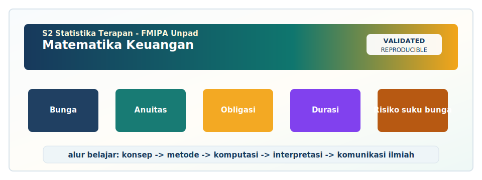
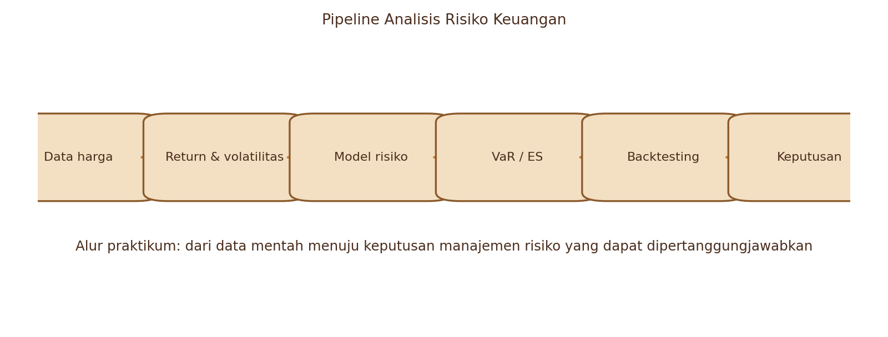
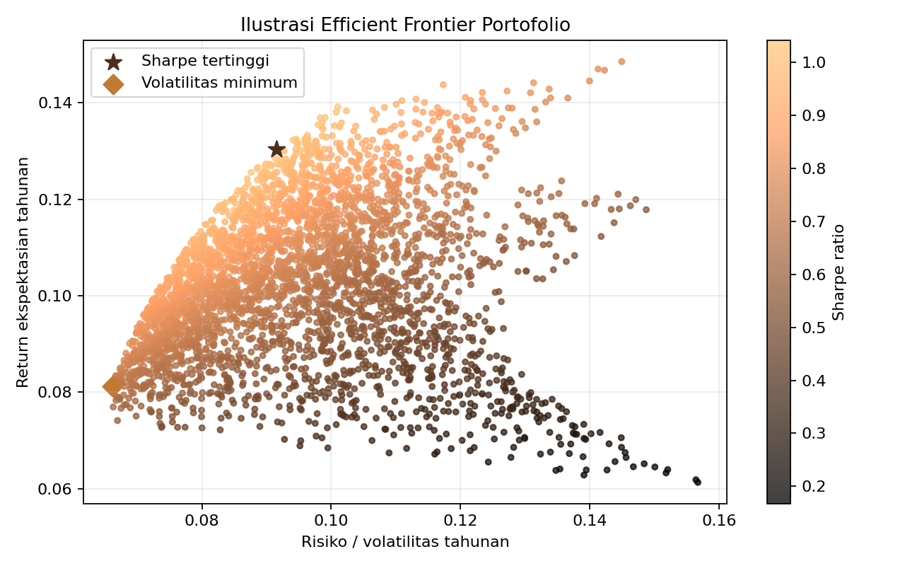
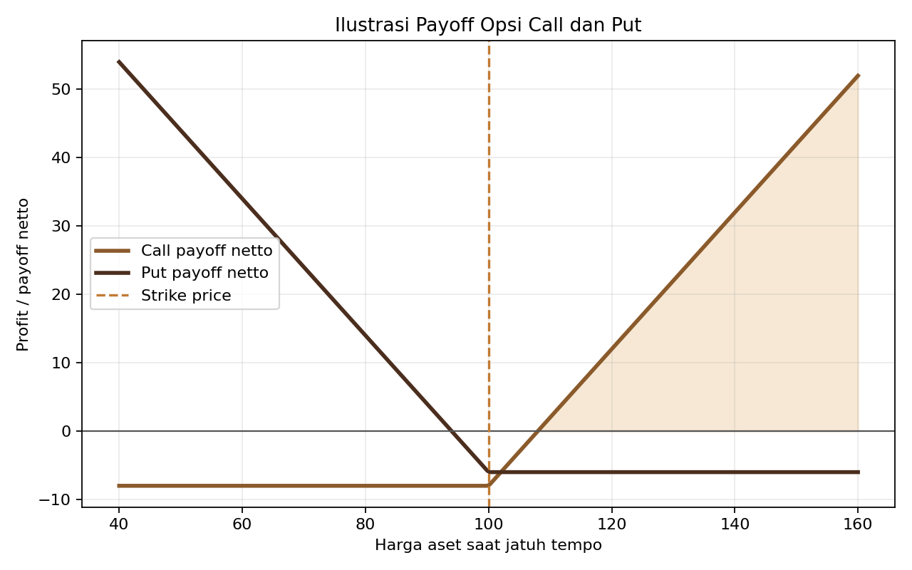
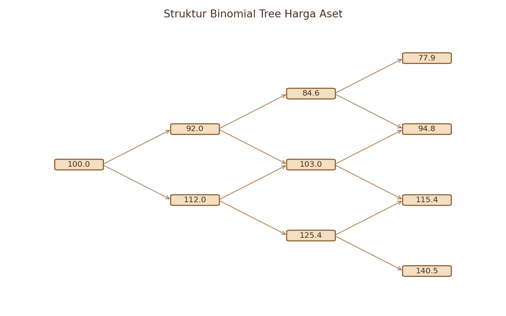
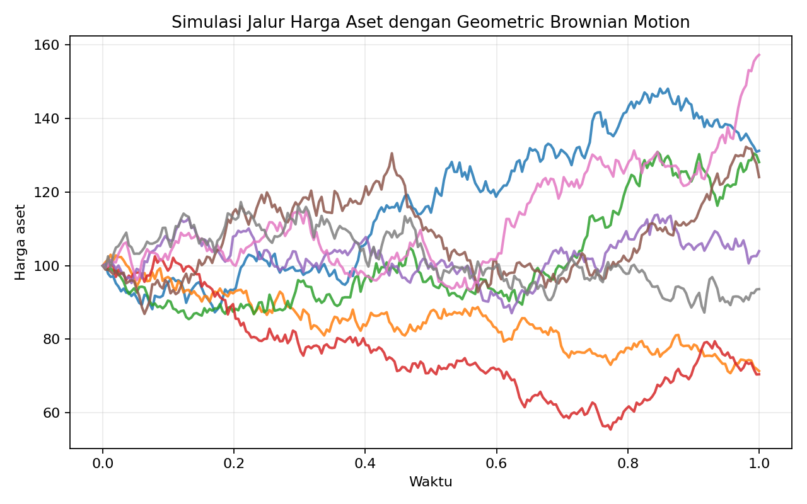
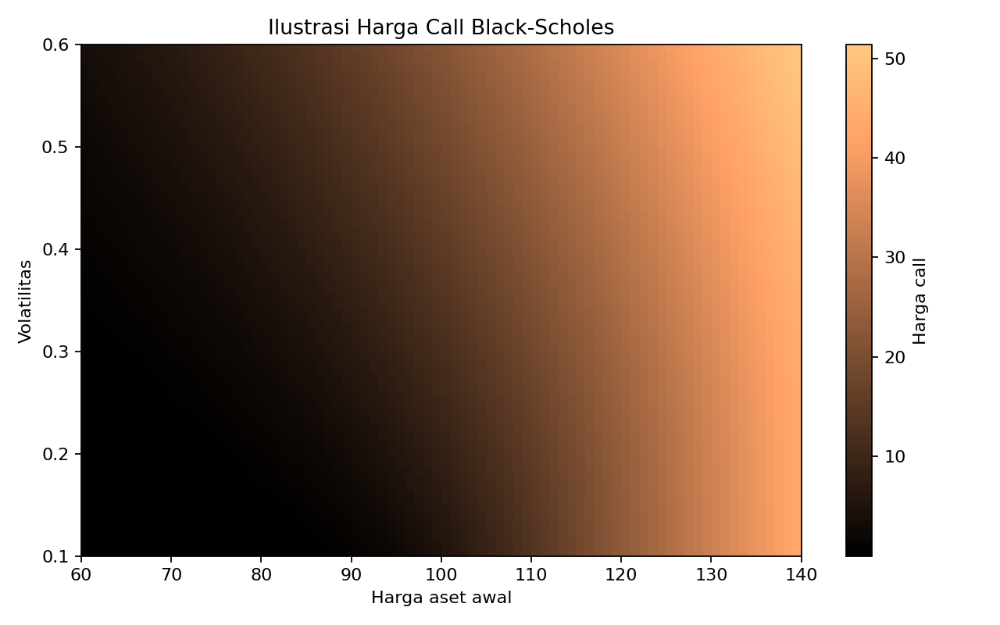

<!-- BEGIN UNPAD MATERIAL STYLE -->
<style>
:root {
  --unpad-navy: #17395c;
  --unpad-gold: #f2a51a;
  --unpad-teal: #0f766e;
  --unpad-ink: #172033;
  --unpad-paper: #fffdf8;
  --unpad-soft: #eef5f8;
  --unpad-line: #d7e2ea;
}
html, body {
  background: linear-gradient(135deg, #f8fbfd 0%, #fffdf8 48%, #f3f6ee 100%) !important;
  color: var(--unpad-ink) !important;
}
body {
  font-family: "Segoe UI", Arial, sans-serif !important;
  line-height: 1.72 !important;
}
.main-container {
  max-width: 1180px !important;
  background: rgba(255, 253, 248, 0.98) !important;
  border: 1px solid var(--unpad-line) !important;
  border-radius: 8px !important;
  box-shadow: 0 18px 42px rgba(23, 57, 92, 0.12) !important;
}
h1, h2, h3, h4 {
  letter-spacing: 0 !important;
}
h1.title {
  color: var(--unpad-navy) !important;
  -webkit-text-fill-color: var(--unpad-navy) !important;
  background: none !important;
}
h2 {
  border-left-color: var(--unpad-gold) !important;
}
a {
  color: #0b5c86 !important;
}
pre, code {
  border-radius: 8px !important;
}
.unpad-cover {
  margin: 18px 0 26px;
  padding: 24px;
  border-radius: 8px;
  background: linear-gradient(135deg, #17395c 0%, #0f766e 58%, #f2a51a 100%);
  color: #ffffff;
  box-shadow: 0 18px 36px rgba(23, 57, 92, 0.22);
}
.unpad-cover__brand {
  display: grid;
  grid-template-columns: 92px 1fr;
  gap: 20px;
  align-items: center;
}
.unpad-cover img {
  width: 92px;
  height: 92px;
  object-fit: contain;
  background: #ffffff;
  border-radius: 8px;
  padding: 8px;
  box-shadow: 0 8px 22px rgba(0,0,0,0.18);
}
.unpad-kicker {
  text-transform: uppercase;
  font-size: 0.82rem;
  font-weight: 800;
  letter-spacing: 0;
  color: #fff8dc;
}
.unpad-cover h2 {
  margin: 6px 0 8px;
  padding: 0;
  border: 0;
  background: transparent;
  color: #ffffff !important;
  font-size: 1.65rem;
}
.unpad-meta {
  margin: 0;
  color: #f7fbff;
  font-weight: 600;
}
.materi-illustration {
  margin: 20px 0 24px;
  padding: 14px;
  background: #ffffff;
  border: 1px solid var(--unpad-line);
  border-radius: 8px;
  box-shadow: 0 12px 28px rgba(23, 57, 92, 0.10);
}
.materi-illustration img {
  width: 100%;
  height: auto;
  display: block;
  border-radius: 6px;
}
.validasi-akademik {
  margin: 18px 0 28px;
  padding: 16px 18px;
  background: linear-gradient(135deg, #eef8f6, #fff8e7);
  border-left: 8px solid var(--unpad-teal);
  border-radius: 8px;
  color: var(--unpad-ink);
}
.validasi-akademik strong {
  color: var(--unpad-navy);
}
table {
  border-radius: 8px !important;
}
@media (max-width: 760px) {
  .unpad-cover__brand {
    grid-template-columns: 1fr;
  }
  .unpad-cover img {
    width: 76px;
    height: 76px;
  }
}
</style>
<!-- END UNPAD MATERIAL STYLE -->


<!-- BEGIN UNPAD MATERIAL ENHANCEMENT -->

```{r setup-unpad-render, include=FALSE}
execute_code <- FALSE
knitr::opts_chunk$set(
  echo = TRUE,
  eval = FALSE,
  message = FALSE,
  warning = FALSE,
  fig.align = "center",
  fig.width = 8,
  fig.height = 4.8,
  dpi = 120
)
set.seed(2025)
```


<div class="unpad-cover">
<div class="unpad-cover__brand">

<div>
<div class="unpad-kicker">S2 Statistika Terapan | FMIPA Universitas Padjadjaran</div>
<h2>Matematika Keuangan</h2>
<p class="unpad-meta">Materi Pembelajaran Lengkap Berbasis RPS-OBE | S2 Statistika Terapan FMIPA Universitas Padjadjaran<br>Penulis: Dr. Lienda Noviyanti, M.Si | Januari 2025</p>
</div>
</div>
</div>

<div class="materi-illustration">

</div>

<div class="validasi-akademik">
<strong>Catatan validasi akademik.</strong> Materi ini diseragamkan dengan rujukan ADWTL Januari 2025: rumus dibaca bersama asumsi, contoh kode diposisikan sebagai template reproducible, dan interpretasi diarahkan pada validitas data, diagnosis model, evaluasi ketidakpastian, serta komunikasi hasil secara ilmiah.
</div>

<!-- END UNPAD MATERIAL ENHANCEMENT -->

```{r setup, include=FALSE, eval=FALSE}
knitr::opts_chunk$set(
  echo = TRUE,
  message = FALSE,
  warning = FALSE,
  fig.align = "center",
  out.width = "92%",
  comment = "#>"
)
```

<div class="callout-goal">
<span class="badge">S2 Statistika Terapan</span>
<span class="badge">FMIPA UNPAD</span>
<span class="badge">Semester 2</span>
<span class="badge">3 SKS: T=2, P=1</span>

Materi ini disusun sebagai bahan ajar komprehensif untuk mata kuliah **Matematika Keuangan** pada Program Studi **S2 Statistika Terapan, Fakultas Matematika dan Ilmu Pengetahuan Alam, Universitas Padjadjaran**. Penyusunan mengikuti struktur RPS-OBE 2025 yang memuat capaian pembelajaran tentang analisis instrumen dan risiko investasi, portofolio Markowitz, algoritma harga opsi Binomial Tree, Brownian motion, proses Ito, dan model Black-Scholes [@RPS2025].
</div>



# Prakata dan Orientasi Mata Kuliah

## Identitas mata kuliah

| Komponen | Keterangan |
|---|---|
| Nama mata kuliah | Matematika Keuangan |
| Program studi | S2 Statistika Terapan, FMIPA Universitas Padjadjaran |
| Semester | 2 |
| Bobot | 3 SKS: Teori 2 SKS dan Praktikum 1 SKS |
| Dosen penulis RPS / author | Dr. Lienda Noviyanti, M.Si |
| Tahun materi | Januari 2025 |
| Perangkat lunak | R dan Python |
| Perangkat keras | TV dan laptop |

## Posisi mata kuliah dalam kurikulum S2 Statistika Terapan

Matematika Keuangan dalam konteks S2 Statistika Terapan tidak hanya mengajarkan rumus bunga, harga saham, atau kontrak opsi. Mata kuliah ini menempatkan masalah keuangan sebagai **laboratorium statistika terapan**: mahasiswa belajar menghubungkan data historis, model probabilistik, risiko, keputusan investasi, komputasi, dan interpretasi bisnis. Dengan demikian, mahasiswa tidak berhenti pada jawaban numerik, tetapi mampu menjelaskan mengapa model tertentu digunakan, asumsi apa yang menopang model tersebut, bagaimana data diproses, bagaimana hasil diuji kewajarannya, dan bagaimana hasil akhirnya dikomunikasikan kepada pengambil keputusan.

RPS memetakan mata kuliah ini ke empat capaian pembelajaran utama. Pertama, mahasiswa menganalisis instrumen dan risiko investasi di pasar keuangan dengan pendekatan statistika interdisipliner. Kedua, mahasiswa membangun model diversifikasi portofolio dan strategi alokasi aset berbasis metode Markowitz. Ketiga, mahasiswa merancang algoritma penentuan harga opsi Eropa dan Amerika berbasis Binomial Tree dan simulasi komputer. Keempat, mahasiswa mengelola riset penerapan model stokastik untuk penentuan harga opsi berbasis Brownian motion dan Black-Scholes serta melakukan inovasi pengembangan model. Keempat capaian ini bergerak dari analisis menuju konstruksi model dan akhirnya inovasi, sehingga kelas tidak hanya bersifat teoretis, tetapi juga sangat aplikatif.

Secara pedagogis, materi ini disusun dalam bentuk modul yang dapat dipakai untuk perkuliahan, praktikum, tugas, mini project, UTS, dan UAS. Setiap bagian memuat konsep, definisi, formula, contoh kasus, interpretasi statistik, kode R yang dapat dikembangkan, serta latihan. Nuansa visual dibuat dengan warna coklat degradasi agar konsisten dengan permintaan dan tetap nyaman dibaca. Dalam setiap kotak rumus, warna latar dibuat coklat muda dengan tulisan gelap agar formula tidak berubah menjadi “kopi pekat tanpa gula”: harum, tetapi sulit dibaca.

## Peta capaian pembelajaran

| CPMK | Fokus kemampuan | Area materi |
|---|---|---|
| CPMK1 | Menganalisis instrumen dan risiko investasi | Instrumen pasar keuangan, return, risiko, Value at Risk, simulasi historis, Monte Carlo |
| CPMK2 | Membangun model portofolio optimal | Diversifikasi, utility, risk aversion, mean-variance, efficient frontier, CML |
| CPMK3 | Merancang algoritma harga opsi | Opsi call/put, opsi Eropa/Amerika, put-call parity, risk-neutral pricing, Binomial Tree |
| CPMK4 | Mengelola riset model stokastik harga opsi | Brownian motion, proses Ito, Ito Lemma, Black-Scholes, inovasi model |

## Cara menggunakan bahan ajar ini

Bahan ajar ini dapat dibaca secara linear dari awal sampai akhir, tetapi juga dapat dipakai secara modular. Mahasiswa yang sedang mengerjakan tugas VaR dapat langsung masuk ke bagian risiko dan simulasi. Mahasiswa yang sedang mengembangkan project Markowitz dapat menggunakan bab portofolio sebagai rujukan konseptual dan kode. Mahasiswa yang sedang mengerjakan algoritma opsi dapat memulai dari bab opsi, Binomial Tree, kemudian melanjutkan ke Black-Scholes. Dalam pembelajaran kelas, dosen dapat memilih bagian teori untuk sesi sinkron, sedangkan bagian kode, latihan, dan studi kasus dapat ditempatkan sebagai praktikum atau belajar mandiri.

<div class="callout-note">
**Catatan akademik.** Materi ini menggunakan referensi utama RPS: Bodie, Kane, dan Marcus untuk investasi [@Bodie2021], Hull untuk derivatif [@Hull2022], Campbell, Lo, dan MacKinlay untuk ekonometrika pasar keuangan [@Campbell1997], serta Shreve untuk kalkulus stokastik keuangan [@Shreve2004]. Referensi tambahan digunakan untuk memperkuat bagian portofolio, VaR, simulasi Monte Carlo, dan model opsi klasik.
</div>

# Kontrak Pembelajaran, Aktivitas, dan Penilaian

## Prinsip pembelajaran

Pembelajaran Matematika Keuangan dirancang sebagai kombinasi antara teori, praktikum, diskusi, penugasan mandiri, dan project. Pada pertemuan teori, dosen menekankan konsep, derivasi formula, logika model, dan interpretasi. Pada pertemuan praktikum, mahasiswa menerjemahkan konsep ke dalam kode R atau Python. Pada tugas dan project, mahasiswa mengolah data riil, membangun model, menyajikan hasil, dan mempertahankan keputusan analitiknya.

Dalam RPS, penilaian mencakup partisipasi, tugas, kuis, UTS, UAS, dan proyek. SubCPMK1 menekankan identifikasi instrumen dan perhitungan Value at Risk. SubCPMK2 menekankan portofolio Markowitz dan alokasi aset. SubCPMK3 menekankan algoritma harga opsi dengan Binomial Tree. SubCPMK4 menekankan simulasi Brownian motion, penerapan Black-Scholes, dan pengembangan model inovatif. Dengan struktur seperti ini, penilaian tidak sekadar menguji hafalan rumus, tetapi menguji kemampuan berpikir statistik, kemampuan komputasi, dan kemampuan menyampaikan analisis secara profesional.

## Format minimal laporan praktikum dan project

Setiap laporan praktikum atau project sebaiknya memuat komponen berikut. Pertama, latar belakang kasus dan rumusan masalah. Kedua, deskripsi data, sumber data, periode observasi, dan penjelasan variabel. Ketiga, metode yang digunakan, termasuk asumsi dan alasan pemilihan metode. Keempat, hasil analisis dalam bentuk tabel, grafik, dan ringkasan numerik. Kelima, interpretasi hasil dari sudut pandang statistik dan keuangan. Keenam, kesimpulan, rekomendasi, keterbatasan, dan saran pengembangan. Ketujuh, lampiran kode program yang dapat direproduksi.

<div class="callout-warning">
**Prinsip reproducibility.** Project yang baik bukan hanya project yang menghasilkan angka bagus, tetapi project yang dapat dijalankan ulang oleh orang lain. Gunakan struktur folder yang rapi, tulis sumber data, simpan seed simulasi, beri komentar kode secukupnya, dan pastikan grafik serta tabel berasal dari data yang sama dengan yang dijelaskan di laporan.
</div>


# Pengantar Matematika Keuangan, Investasi, dan Pasar Keuangan

<div class="callout-goal">
**Tujuan bab.** Mahasiswa memahami ruang lingkup matematika keuangan, definisi investasi, fungsi pasar keuangan, serta hubungan antara tingkat bunga, premi risiko, dan keputusan investasi.
</div>

## Konteks dan ide utama

Matematika keuangan mempelajari bagaimana nilai uang, risiko, dan waktu dihubungkan dalam suatu kerangka kuantitatif. Di pasar keuangan, keputusan membeli, menjual, menahan, atau melakukan lindung nilai selalu berhubungan dengan ekspektasi masa depan dan ketidakpastian. Dalam matematika keuangan, topik ini penting karena menghubungkan konsep abstrak dengan keputusan yang benar-benar dihadapi investor, analis risiko, manajer portofolio, dan pengembang produk derivatif. Mahasiswa S2 Statistika Terapan perlu memandang investasi dan pasar keuangan bukan sekadar sebagai istilah keuangan, tetapi sebagai objek analisis statistik: ada data, ada ketidakpastian, ada model, ada parameter, ada estimasi, dan ada keputusan.

Literatur investasi modern menekankan bahwa keputusan keuangan selalu melibatkan trade-off antara return dan risiko [@Bodie2021]. Pada saat yang sama, pemodelan derivatif dan risiko pasar membutuhkan pemahaman probabilitas, simulasi, dan proses stokastik [@Hull2022; @Shreve2004]. Karena itu, bagian ini selalu dibaca dengan dua kacamata: kacamata ekonomi-keuangan untuk memahami makna keputusan, dan kacamata statistika-komputasi untuk memahami bagaimana angka dihasilkan. Rujukan utama bagian ini antara lain [@Bodie2021]; [@Luenberger1998].

Dalam analisis keuangan, nilai numerik sebaiknya tidak diperlakukan sebagai jawaban final, melainkan sebagai titik awal interpretasi. Return tinggi dapat menarik, tetapi tanpa pemahaman volatilitas, korelasi, drawdown, likuiditas, dan horizon investasi, keputusan akan menjadi rapuh. Inilah alasan pendekatan statistika sangat penting: statistika membantu membedakan sinyal dari kebisingan, pola dari kebetulan, dan risiko terukur dari ketidakpastian yang belum dipahami.

Setiap model membawa asumsi. Pada tahap pembelajaran, asumsi sering tampak sebagai syarat teknis; pada praktik profesional, asumsi berubah menjadi sumber risiko model. Asumsi normalitas return, kestasioneran volatilitas, independensi residual, atau tidak adanya biaya transaksi dapat memudahkan perhitungan, tetapi hasilnya perlu diuji dengan data dan dibaca secara kritis.

Kekuatan mata kuliah ini terletak pada integrasi teori, komputasi, dan komunikasi. Mahasiswa diharapkan mampu menulis kode yang benar, tetapi juga mampu menjelaskan keluaran kode tersebut. Grafik, tabel, dan angka ringkasan perlu diterjemahkan menjadi narasi keputusan: apakah portofolio terlalu terkonsentrasi, apakah VaR terlalu optimistis, apakah opsi terlihat mahal atau murah, dan apakah model masih sesuai dengan kondisi pasar.

Dalam kelas S2, pembahasan tidak cukup berhenti pada contoh sederhana. Contoh sederhana tetap penting untuk membangun intuisi, tetapi setelah itu mahasiswa perlu bertanya: bagaimana jika data tidak normal, bagaimana jika return memiliki ekor tebal, bagaimana jika korelasi berubah saat krisis, bagaimana jika volatilitas naik tiba-tiba, dan bagaimana jika pembatasan investasi membuat solusi optimal secara matematis tidak realistis secara kebijakan.

Secara praktis, investasi dan pasar keuangan sering menuntut keputusan yang tidak sepenuhnya pasti. Misalnya, ketika analis memilih instrumen investasi, ia tidak mengetahui harga masa depan; ketika menghitung VaR, ia tidak mengetahui kerugian esok hari; ketika memilih bobot portofolio, ia tidak mengetahui return aktual; dan ketika menentukan harga opsi, ia tidak mengetahui lintasan harga aset hingga jatuh tempo. Model berperan sebagai peta, bukan wilayah itu sendiri. Peta yang baik membantu perjalanan, tetapi peta tetap perlu dibandingkan dengan medan sebenarnya. Dalam bahasa keuangan: model harus berguna, tetapi pengguna model tidak boleh jatuh cinta terlalu dalam pada modelnya. Model itu partner kerja, bukan jodoh abadi.

Dalam pembelajaran, kita memisahkan tiga lapis pemahaman. Lapis pertama adalah definisi dan formula. Lapis kedua adalah algoritma komputasi. Lapis ketiga adalah interpretasi dan evaluasi model. Banyak kesalahan mahasiswa terjadi ketika hanya menguasai lapis pertama, tetapi tidak memahami lapis kedua dan ketiga. Sebaliknya, banyak kesalahan praktisi terjadi ketika kode berjalan lancar, tetapi asumsi model tidak dibaca. Oleh karena itu, setiap pembahasan dalam bab ini akan diarahkan pada pemahaman konseptual, prosedural, dan kritis.

## Definisi, notasi, dan formula inti

### Formula yang perlu dikuasai

$$
FV = PV(1+i)^n
$$

$$
PV = \frac{FV}{(1+i)^n}
$$

$$
1+i_{\text{nominal}} \approx (1+r_{\text{real}})(1+\pi)
$$

Formula di atas harus dibaca bersama konteksnya. Simbol yang sama dapat memiliki arti berbeda dalam topik berbeda. Misalnya, \(r\) dapat berarti tingkat bunga bebas risiko, return diskrit, atau log-return tergantung model. Demikian pula \(\sigma\) dapat berarti volatilitas historis, volatilitas implisit, atau parameter difusi pada proses stokastik. Dalam laporan akademik, notasi harus ditulis konsisten sejak awal. Ketidakkonsistenan notasi sering membuat pembaca merasa seperti membaca peta harta karun, tetapi petanya digambar oleh tiga bajak laut yang tidak saling bicara.

Pada level komputasi, formula harus diterjemahkan menjadi langkah yang dapat diuji. Setiap variabel harus berasal dari data atau asumsi yang eksplisit. Jika menggunakan data harga, jelaskan apakah return yang dihitung adalah return sederhana atau log-return. Jika menggunakan volatilitas, jelaskan apakah volatilitas diannualisasi. Jika menggunakan tingkat bunga, jelaskan apakah bunga dinyatakan dalam compounding diskrit atau kontinu. Detail seperti ini terlihat kecil, tetapi dapat mengubah hasil secara substansial.

## Contoh kasus terarah: pemilihan instrumen antara deposito, obligasi, saham, dan reksa dana untuk horizon investasi satu tahun

Bayangkan seorang analis pada institusi keuangan ingin menggunakan investasi dan pasar keuangan untuk membantu keputusan alokasi dana. Data yang tersedia berupa harga historis beberapa instrumen, informasi tingkat bunga bebas risiko, dan batasan kebijakan investasi. Tujuan analis bukan hanya menghitung angka, melainkan menyusun argumen yang dapat dipertanggungjawabkan: instrumen mana yang dipilih, risiko mana yang dominan, asumsi mana yang digunakan, hasil mana yang stabil, dan rekomendasi apa yang masuk akal.

Langkah pertama adalah melakukan pemeriksaan data. Periksa missing value, outlier, perubahan denominasi, corporate action, serta konsistensi frekuensi data. Dalam data keuangan, kesalahan kecil pada data harga dapat menghasilkan return ekstrem yang bukan risiko pasar, melainkan risiko spreadsheet. Langkah kedua adalah menghitung ringkasan statistik: mean, median, standar deviasi, quantile, skewness, kurtosis, korelasi, dan grafik time series. Langkah ketiga adalah menerapkan model sesuai tujuan analisis. Langkah keempat adalah mengevaluasi kewajaran output model dan menulis interpretasi.

Pada laporan mahasiswa, contoh kasus sebaiknya tidak berhenti pada angka final. Misalnya, jika hasil menunjukkan bahwa suatu aset memiliki volatilitas tinggi, jelaskan apakah volatilitas itu konsisten dengan karakter aset tersebut. Jika hasil menunjukkan korelasi negatif antara dua aset, jelaskan implikasinya untuk diversifikasi. Jika hasil opsi menunjukkan harga model lebih rendah dari harga pasar, diskusikan kemungkinan adanya perbedaan volatilitas implisit, biaya transaksi, likuiditas, atau asumsi model.

## Implementasi awal di R

```{r bab01-investasi-dan-pasar-, eval=FALSE}
# Kerangka sederhana nilai masa depan dan nilai sekarang
pv <- 100000000
rate <- 0.06
n <- 3
fv <- pv * (1 + rate)^n
pv_back <- fv / (1 + rate)^n
c(PV = pv, FV = fv, PV_ulang = pv_back)
```

Kode di atas bersifat kerangka awal. Dalam praktikum, mahasiswa perlu menyesuaikan kode dengan data riil, nama kolom, frekuensi data, dan tujuan analisis. Dosen dapat meminta mahasiswa menjalankan kode secara bertahap: mulai dari import data, pembersihan, transformasi return, estimasi parameter, visualisasi, hingga penyusunan output. Pendekatan bertahap ini membantu menghindari kesalahan umum ketika mahasiswa langsung menyalin kode panjang tanpa memahami fungsi setiap baris.

## Interpretasi, validasi, dan jebakan umum

Validasi dalam investasi dan pasar keuangan mencakup validasi matematis dan validasi empiris. Validasi matematis berarti memeriksa apakah formula, batasan, dan algoritma sudah benar. Validasi empiris berarti memeriksa apakah output masuk akal terhadap data dan konteks pasar. Dalam kasus VaR, validasi empiris dapat berupa backtesting jumlah pelanggaran. Dalam kasus portofolio, validasi dapat berupa uji sensitivitas terhadap estimasi mean dan kovarians. Dalam kasus opsi, validasi dapat berupa pembandingan harga model dengan harga pasar atau dengan model lain.

Jebakan pertama adalah memperlakukan data historis sebagai masa depan yang pasti. Data historis penting, tetapi pasar bisa berubah. Jebakan kedua adalah mengabaikan horizon waktu. Risiko satu hari tidak sama dengan risiko satu bulan, dan volatilitas harian tidak boleh dicampur dengan return bulanan tanpa annualization yang benar. Jebakan ketiga adalah menganggap optimasi selalu menghasilkan jawaban yang stabil. Pada portofolio mean-variance, bobot optimal dapat berubah drastis ketika estimasi mean sedikit berubah. Jebakan keempat adalah menafsirkan hasil model tanpa mempertimbangkan biaya transaksi, likuiditas, pajak, dan batasan institusional.

Dari sisi penulisan akademik, interpretasi yang baik memiliki tiga komponen: angka, makna, dan konsekuensi. Angka menunjukkan hasil. Makna menjelaskan apa arti hasil itu dalam bahasa statistik dan keuangan. Konsekuensi menjelaskan implikasi keputusan. Contoh interpretasi yang lemah adalah: “VaR sebesar 2%.” Contoh yang lebih kuat adalah: “Pada tingkat keyakinan 95%, estimasi VaR harian portofolio sebesar 2% menunjukkan bahwa dalam kondisi historis yang digunakan, kerugian harian diperkirakan tidak melebihi 2% pada sekitar 95 dari 100 hari; namun hasil ini sensitif terhadap periode data dan tidak menangkap risiko ekor ekstrem secara sempurna.”

## Latihan dan diskusi

1. Jelaskan perbedaan investasi dan spekulasi dari perspektif risiko, horizon, dan informasi.
2. Hitung nilai masa depan Rp100 juta dengan bunga 6% selama 1, 3, dan 5 tahun.
3. Diskusikan mengapa premi risiko dibutuhkan dalam pasar keuangan.

Untuk diskusi kelas, mahasiswa dapat diminta membandingkan jawaban antar-kelompok. Perbedaan hasil bukan selalu berarti ada kelompok yang salah. Dalam analisis keuangan, hasil dapat berbeda karena pilihan periode data, frekuensi return, metode estimasi volatilitas, asumsi risk-free rate, atau batasan optimasi. Yang penting adalah setiap pilihan metodologis dijelaskan secara transparan dan konsisten.


# Return, Risiko, Tingkat Bunga, dan Premi Risiko

<div class="callout-goal">
**Tujuan bab.** Mahasiswa mampu menghitung return sederhana, log-return, volatilitas, annualization, dan premi risiko sebagai dasar analisis investasi.
</div>

## Konteks dan ide utama

Return adalah ukuran perubahan nilai investasi, sedangkan risiko menggambarkan ketidakpastian return. Dalam praktik, return dan risiko tidak dapat dipisahkan: aset yang menawarkan return lebih tinggi biasanya membawa risiko lebih besar, walaupun hubungan ini tidak selalu linear pada semua horizon. Dalam matematika keuangan, topik ini penting karena menghubungkan konsep abstrak dengan keputusan yang benar-benar dihadapi investor, analis risiko, manajer portofolio, dan pengembang produk derivatif. Mahasiswa S2 Statistika Terapan perlu memandang return dan risiko bukan sekadar sebagai istilah keuangan, tetapi sebagai objek analisis statistik: ada data, ada ketidakpastian, ada model, ada parameter, ada estimasi, dan ada keputusan.

Literatur investasi modern menekankan bahwa keputusan keuangan selalu melibatkan trade-off antara return dan risiko [@Bodie2021]. Pada saat yang sama, pemodelan derivatif dan risiko pasar membutuhkan pemahaman probabilitas, simulasi, dan proses stokastik [@Hull2022; @Shreve2004]. Karena itu, bagian ini selalu dibaca dengan dua kacamata: kacamata ekonomi-keuangan untuk memahami makna keputusan, dan kacamata statistika-komputasi untuk memahami bagaimana angka dihasilkan. Rujukan utama bagian ini antara lain [@Campbell1997]; [@Tsay2010].

Dalam analisis keuangan, nilai numerik sebaiknya tidak diperlakukan sebagai jawaban final, melainkan sebagai titik awal interpretasi. Return tinggi dapat menarik, tetapi tanpa pemahaman volatilitas, korelasi, drawdown, likuiditas, dan horizon investasi, keputusan akan menjadi rapuh. Inilah alasan pendekatan statistika sangat penting: statistika membantu membedakan sinyal dari kebisingan, pola dari kebetulan, dan risiko terukur dari ketidakpastian yang belum dipahami.

Setiap model membawa asumsi. Pada tahap pembelajaran, asumsi sering tampak sebagai syarat teknis; pada praktik profesional, asumsi berubah menjadi sumber risiko model. Asumsi normalitas return, kestasioneran volatilitas, independensi residual, atau tidak adanya biaya transaksi dapat memudahkan perhitungan, tetapi hasilnya perlu diuji dengan data dan dibaca secara kritis.

Kekuatan mata kuliah ini terletak pada integrasi teori, komputasi, dan komunikasi. Mahasiswa diharapkan mampu menulis kode yang benar, tetapi juga mampu menjelaskan keluaran kode tersebut. Grafik, tabel, dan angka ringkasan perlu diterjemahkan menjadi narasi keputusan: apakah portofolio terlalu terkonsentrasi, apakah VaR terlalu optimistis, apakah opsi terlihat mahal atau murah, dan apakah model masih sesuai dengan kondisi pasar.

Dalam kelas S2, pembahasan tidak cukup berhenti pada contoh sederhana. Contoh sederhana tetap penting untuk membangun intuisi, tetapi setelah itu mahasiswa perlu bertanya: bagaimana jika data tidak normal, bagaimana jika return memiliki ekor tebal, bagaimana jika korelasi berubah saat krisis, bagaimana jika volatilitas naik tiba-tiba, dan bagaimana jika pembatasan investasi membuat solusi optimal secara matematis tidak realistis secara kebijakan.

Secara praktis, return dan risiko sering menuntut keputusan yang tidak sepenuhnya pasti. Misalnya, ketika analis memilih instrumen investasi, ia tidak mengetahui harga masa depan; ketika menghitung VaR, ia tidak mengetahui kerugian esok hari; ketika memilih bobot portofolio, ia tidak mengetahui return aktual; dan ketika menentukan harga opsi, ia tidak mengetahui lintasan harga aset hingga jatuh tempo. Model berperan sebagai peta, bukan wilayah itu sendiri. Peta yang baik membantu perjalanan, tetapi peta tetap perlu dibandingkan dengan medan sebenarnya. Dalam bahasa keuangan: model harus berguna, tetapi pengguna model tidak boleh jatuh cinta terlalu dalam pada modelnya. Model itu partner kerja, bukan jodoh abadi.

Dalam pembelajaran, kita memisahkan tiga lapis pemahaman. Lapis pertama adalah definisi dan formula. Lapis kedua adalah algoritma komputasi. Lapis ketiga adalah interpretasi dan evaluasi model. Banyak kesalahan mahasiswa terjadi ketika hanya menguasai lapis pertama, tetapi tidak memahami lapis kedua dan ketiga. Sebaliknya, banyak kesalahan praktisi terjadi ketika kode berjalan lancar, tetapi asumsi model tidak dibaca. Oleh karena itu, setiap pembahasan dalam bab ini akan diarahkan pada pemahaman konseptual, prosedural, dan kritis.

## Definisi, notasi, dan formula inti

### Formula yang perlu dikuasai

$$
R_t = \frac{P_t - P_{t-1} + D_t}{P_{t-1}}
$$

$$
r_t = \ln\left(\frac{P_t}{P_{t-1}}\right)
$$

$$
\sigma_{\text{annual}} = \sigma_{\text{period}}\sqrt{m}
$$

$$
\text{Risk Premium} = E(R_i) - R_f
$$

Formula di atas harus dibaca bersama konteksnya. Simbol yang sama dapat memiliki arti berbeda dalam topik berbeda. Misalnya, \(r\) dapat berarti tingkat bunga bebas risiko, return diskrit, atau log-return tergantung model. Demikian pula \(\sigma\) dapat berarti volatilitas historis, volatilitas implisit, atau parameter difusi pada proses stokastik. Dalam laporan akademik, notasi harus ditulis konsisten sejak awal. Ketidakkonsistenan notasi sering membuat pembaca merasa seperti membaca peta harta karun, tetapi petanya digambar oleh tiga bajak laut yang tidak saling bicara.

Pada level komputasi, formula harus diterjemahkan menjadi langkah yang dapat diuji. Setiap variabel harus berasal dari data atau asumsi yang eksplisit. Jika menggunakan data harga, jelaskan apakah return yang dihitung adalah return sederhana atau log-return. Jika menggunakan volatilitas, jelaskan apakah volatilitas diannualisasi. Jika menggunakan tingkat bunga, jelaskan apakah bunga dinyatakan dalam compounding diskrit atau kontinu. Detail seperti ini terlihat kecil, tetapi dapat mengubah hasil secara substansial.

## Contoh kasus terarah: analisis return harian saham dan pembandingan dengan tingkat bunga bebas risiko

Bayangkan seorang analis pada institusi keuangan ingin menggunakan return dan risiko untuk membantu keputusan alokasi dana. Data yang tersedia berupa harga historis beberapa instrumen, informasi tingkat bunga bebas risiko, dan batasan kebijakan investasi. Tujuan analis bukan hanya menghitung angka, melainkan menyusun argumen yang dapat dipertanggungjawabkan: instrumen mana yang dipilih, risiko mana yang dominan, asumsi mana yang digunakan, hasil mana yang stabil, dan rekomendasi apa yang masuk akal.

Langkah pertama adalah melakukan pemeriksaan data. Periksa missing value, outlier, perubahan denominasi, corporate action, serta konsistensi frekuensi data. Dalam data keuangan, kesalahan kecil pada data harga dapat menghasilkan return ekstrem yang bukan risiko pasar, melainkan risiko spreadsheet. Langkah kedua adalah menghitung ringkasan statistik: mean, median, standar deviasi, quantile, skewness, kurtosis, korelasi, dan grafik time series. Langkah ketiga adalah menerapkan model sesuai tujuan analisis. Langkah keempat adalah mengevaluasi kewajaran output model dan menulis interpretasi.

Pada laporan mahasiswa, contoh kasus sebaiknya tidak berhenti pada angka final. Misalnya, jika hasil menunjukkan bahwa suatu aset memiliki volatilitas tinggi, jelaskan apakah volatilitas itu konsisten dengan karakter aset tersebut. Jika hasil menunjukkan korelasi negatif antara dua aset, jelaskan implikasinya untuk diversifikasi. Jika hasil opsi menunjukkan harga model lebih rendah dari harga pasar, diskusikan kemungkinan adanya perbedaan volatilitas implisit, biaya transaksi, likuiditas, atau asumsi model.

## Implementasi awal di R

```{r bab02-return-dan-risiko, eval=FALSE}
# Simulasi data harga dan perhitungan return
set.seed(2025)
price <- cumprod(1 + rnorm(260, mean = 0.0004, sd = 0.015)) * 100
ret_simple <- price[-1] / price[-length(price)] - 1
ret_log <- diff(log(price))
summary(ret_simple)
sd_daily <- sd(ret_log)
sd_annual <- sd_daily * sqrt(252)
c(sd_harian = sd_daily, sd_tahunan = sd_annual)
```

Kode di atas bersifat kerangka awal. Dalam praktikum, mahasiswa perlu menyesuaikan kode dengan data riil, nama kolom, frekuensi data, dan tujuan analisis. Dosen dapat meminta mahasiswa menjalankan kode secara bertahap: mulai dari import data, pembersihan, transformasi return, estimasi parameter, visualisasi, hingga penyusunan output. Pendekatan bertahap ini membantu menghindari kesalahan umum ketika mahasiswa langsung menyalin kode panjang tanpa memahami fungsi setiap baris.

## Interpretasi, validasi, dan jebakan umum

Validasi dalam return dan risiko mencakup validasi matematis dan validasi empiris. Validasi matematis berarti memeriksa apakah formula, batasan, dan algoritma sudah benar. Validasi empiris berarti memeriksa apakah output masuk akal terhadap data dan konteks pasar. Dalam kasus VaR, validasi empiris dapat berupa backtesting jumlah pelanggaran. Dalam kasus portofolio, validasi dapat berupa uji sensitivitas terhadap estimasi mean dan kovarians. Dalam kasus opsi, validasi dapat berupa pembandingan harga model dengan harga pasar atau dengan model lain.

Jebakan pertama adalah memperlakukan data historis sebagai masa depan yang pasti. Data historis penting, tetapi pasar bisa berubah. Jebakan kedua adalah mengabaikan horizon waktu. Risiko satu hari tidak sama dengan risiko satu bulan, dan volatilitas harian tidak boleh dicampur dengan return bulanan tanpa annualization yang benar. Jebakan ketiga adalah menganggap optimasi selalu menghasilkan jawaban yang stabil. Pada portofolio mean-variance, bobot optimal dapat berubah drastis ketika estimasi mean sedikit berubah. Jebakan keempat adalah menafsirkan hasil model tanpa mempertimbangkan biaya transaksi, likuiditas, pajak, dan batasan institusional.

Dari sisi penulisan akademik, interpretasi yang baik memiliki tiga komponen: angka, makna, dan konsekuensi. Angka menunjukkan hasil. Makna menjelaskan apa arti hasil itu dalam bahasa statistik dan keuangan. Konsekuensi menjelaskan implikasi keputusan. Contoh interpretasi yang lemah adalah: “VaR sebesar 2%.” Contoh yang lebih kuat adalah: “Pada tingkat keyakinan 95%, estimasi VaR harian portofolio sebesar 2% menunjukkan bahwa dalam kondisi historis yang digunakan, kerugian harian diperkirakan tidak melebihi 2% pada sekitar 95 dari 100 hari; namun hasil ini sensitif terhadap periode data dan tidak menangkap risiko ekor ekstrem secara sempurna.”

## Latihan dan diskusi

1. Ambil data harga satu saham selama minimal satu tahun dan hitung return sederhana serta log-return.
2. Jelaskan kapan log-return lebih nyaman digunakan dibanding return sederhana.
3. Hitung volatilitas tahunan dari volatilitas harian dan jelaskan asumsi yang melekat.

Untuk diskusi kelas, mahasiswa dapat diminta membandingkan jawaban antar-kelompok. Perbedaan hasil bukan selalu berarti ada kelompok yang salah. Dalam analisis keuangan, hasil dapat berbeda karena pilihan periode data, frekuensi return, metode estimasi volatilitas, asumsi risk-free rate, atau batasan optimasi. Yang penting adalah setiap pilihan metodologis dijelaskan secara transparan dan konsisten.


# Instrumen Investasi: Saham, Obligasi, SBI, Reksa Dana, dan Derivatif

<div class="callout-goal">
**Tujuan bab.** Mahasiswa mampu mengidentifikasi jenis instrumen keuangan, karakteristik risiko-return, likuiditas, horizon investasi, dan peran setiap instrumen dalam portofolio.
</div>

## Konteks dan ide utama

Instrumen investasi memiliki struktur arus kas, risiko, dan tujuan yang berbeda. Saham memberikan klaim kepemilikan, obligasi memberikan klaim arus kas tetap atau kupon, SBI atau instrumen bebas risiko relatif digunakan sebagai acuan, reksa dana memberi diversifikasi terkelola, dan derivatif memberikan hak atau kewajiban terkait aset dasar. Dalam matematika keuangan, topik ini penting karena menghubungkan konsep abstrak dengan keputusan yang benar-benar dihadapi investor, analis risiko, manajer portofolio, dan pengembang produk derivatif. Mahasiswa S2 Statistika Terapan perlu memandang instrumen investasi bukan sekadar sebagai istilah keuangan, tetapi sebagai objek analisis statistik: ada data, ada ketidakpastian, ada model, ada parameter, ada estimasi, dan ada keputusan.

Literatur investasi modern menekankan bahwa keputusan keuangan selalu melibatkan trade-off antara return dan risiko [@Bodie2021]. Pada saat yang sama, pemodelan derivatif dan risiko pasar membutuhkan pemahaman probabilitas, simulasi, dan proses stokastik [@Hull2022; @Shreve2004]. Karena itu, bagian ini selalu dibaca dengan dua kacamata: kacamata ekonomi-keuangan untuk memahami makna keputusan, dan kacamata statistika-komputasi untuk memahami bagaimana angka dihasilkan. Rujukan utama bagian ini antara lain [@Bodie2021]; [@Hull2022].

Dalam analisis keuangan, nilai numerik sebaiknya tidak diperlakukan sebagai jawaban final, melainkan sebagai titik awal interpretasi. Return tinggi dapat menarik, tetapi tanpa pemahaman volatilitas, korelasi, drawdown, likuiditas, dan horizon investasi, keputusan akan menjadi rapuh. Inilah alasan pendekatan statistika sangat penting: statistika membantu membedakan sinyal dari kebisingan, pola dari kebetulan, dan risiko terukur dari ketidakpastian yang belum dipahami.

Setiap model membawa asumsi. Pada tahap pembelajaran, asumsi sering tampak sebagai syarat teknis; pada praktik profesional, asumsi berubah menjadi sumber risiko model. Asumsi normalitas return, kestasioneran volatilitas, independensi residual, atau tidak adanya biaya transaksi dapat memudahkan perhitungan, tetapi hasilnya perlu diuji dengan data dan dibaca secara kritis.

Kekuatan mata kuliah ini terletak pada integrasi teori, komputasi, dan komunikasi. Mahasiswa diharapkan mampu menulis kode yang benar, tetapi juga mampu menjelaskan keluaran kode tersebut. Grafik, tabel, dan angka ringkasan perlu diterjemahkan menjadi narasi keputusan: apakah portofolio terlalu terkonsentrasi, apakah VaR terlalu optimistis, apakah opsi terlihat mahal atau murah, dan apakah model masih sesuai dengan kondisi pasar.

Dalam kelas S2, pembahasan tidak cukup berhenti pada contoh sederhana. Contoh sederhana tetap penting untuk membangun intuisi, tetapi setelah itu mahasiswa perlu bertanya: bagaimana jika data tidak normal, bagaimana jika return memiliki ekor tebal, bagaimana jika korelasi berubah saat krisis, bagaimana jika volatilitas naik tiba-tiba, dan bagaimana jika pembatasan investasi membuat solusi optimal secara matematis tidak realistis secara kebijakan.

Secara praktis, instrumen investasi sering menuntut keputusan yang tidak sepenuhnya pasti. Misalnya, ketika analis memilih instrumen investasi, ia tidak mengetahui harga masa depan; ketika menghitung VaR, ia tidak mengetahui kerugian esok hari; ketika memilih bobot portofolio, ia tidak mengetahui return aktual; dan ketika menentukan harga opsi, ia tidak mengetahui lintasan harga aset hingga jatuh tempo. Model berperan sebagai peta, bukan wilayah itu sendiri. Peta yang baik membantu perjalanan, tetapi peta tetap perlu dibandingkan dengan medan sebenarnya. Dalam bahasa keuangan: model harus berguna, tetapi pengguna model tidak boleh jatuh cinta terlalu dalam pada modelnya. Model itu partner kerja, bukan jodoh abadi.

Dalam pembelajaran, kita memisahkan tiga lapis pemahaman. Lapis pertama adalah definisi dan formula. Lapis kedua adalah algoritma komputasi. Lapis ketiga adalah interpretasi dan evaluasi model. Banyak kesalahan mahasiswa terjadi ketika hanya menguasai lapis pertama, tetapi tidak memahami lapis kedua dan ketiga. Sebaliknya, banyak kesalahan praktisi terjadi ketika kode berjalan lancar, tetapi asumsi model tidak dibaca. Oleh karena itu, setiap pembahasan dalam bab ini akan diarahkan pada pemahaman konseptual, prosedural, dan kritis.

## Definisi, notasi, dan formula inti

### Formula yang perlu dikuasai

$$
P_{\text{obligasi}} = \sum_{t=1}^{T}\frac{C}{(1+y)^t}+\frac{F}{(1+y)^T}
$$

$$
YTM: \quad P_0 = \sum_{t=1}^{T}\frac{C_t}{(1+y)^t}
$$

$$
\text{Total Return} = \frac{P_1-P_0+\text{Income}}{P_0}
$$

Formula di atas harus dibaca bersama konteksnya. Simbol yang sama dapat memiliki arti berbeda dalam topik berbeda. Misalnya, \(r\) dapat berarti tingkat bunga bebas risiko, return diskrit, atau log-return tergantung model. Demikian pula \(\sigma\) dapat berarti volatilitas historis, volatilitas implisit, atau parameter difusi pada proses stokastik. Dalam laporan akademik, notasi harus ditulis konsisten sejak awal. Ketidakkonsistenan notasi sering membuat pembaca merasa seperti membaca peta harta karun, tetapi petanya digambar oleh tiga bajak laut yang tidak saling bicara.

Pada level komputasi, formula harus diterjemahkan menjadi langkah yang dapat diuji. Setiap variabel harus berasal dari data atau asumsi yang eksplisit. Jika menggunakan data harga, jelaskan apakah return yang dihitung adalah return sederhana atau log-return. Jika menggunakan volatilitas, jelaskan apakah volatilitas diannualisasi. Jika menggunakan tingkat bunga, jelaskan apakah bunga dinyatakan dalam compounding diskrit atau kontinu. Detail seperti ini terlihat kecil, tetapi dapat mengubah hasil secara substansial.

## Contoh kasus terarah: karakterisasi empat instrumen untuk tugas analisis risiko investasi SubCPMK1

Bayangkan seorang analis pada institusi keuangan ingin menggunakan instrumen investasi untuk membantu keputusan alokasi dana. Data yang tersedia berupa harga historis beberapa instrumen, informasi tingkat bunga bebas risiko, dan batasan kebijakan investasi. Tujuan analis bukan hanya menghitung angka, melainkan menyusun argumen yang dapat dipertanggungjawabkan: instrumen mana yang dipilih, risiko mana yang dominan, asumsi mana yang digunakan, hasil mana yang stabil, dan rekomendasi apa yang masuk akal.

Langkah pertama adalah melakukan pemeriksaan data. Periksa missing value, outlier, perubahan denominasi, corporate action, serta konsistensi frekuensi data. Dalam data keuangan, kesalahan kecil pada data harga dapat menghasilkan return ekstrem yang bukan risiko pasar, melainkan risiko spreadsheet. Langkah kedua adalah menghitung ringkasan statistik: mean, median, standar deviasi, quantile, skewness, kurtosis, korelasi, dan grafik time series. Langkah ketiga adalah menerapkan model sesuai tujuan analisis. Langkah keempat adalah mengevaluasi kewajaran output model dan menulis interpretasi.

Pada laporan mahasiswa, contoh kasus sebaiknya tidak berhenti pada angka final. Misalnya, jika hasil menunjukkan bahwa suatu aset memiliki volatilitas tinggi, jelaskan apakah volatilitas itu konsisten dengan karakter aset tersebut. Jika hasil menunjukkan korelasi negatif antara dua aset, jelaskan implikasinya untuk diversifikasi. Jika hasil opsi menunjukkan harga model lebih rendah dari harga pasar, diskusikan kemungkinan adanya perbedaan volatilitas implisit, biaya transaksi, likuiditas, atau asumsi model.

## Implementasi awal di R

```{r bab03-instrumen-investasi, eval=FALSE}
# Contoh harga obligasi sederhana
bond_price <- function(face = 1000, coupon_rate = 0.07, y = 0.06, T = 5) {
  coupon <- face * coupon_rate
  t <- 1:T
  sum(coupon / (1 + y)^t) + face / (1 + y)^T
}
bond_price(face = 1000, coupon_rate = 0.07, y = 0.06, T = 5)
```

Kode di atas bersifat kerangka awal. Dalam praktikum, mahasiswa perlu menyesuaikan kode dengan data riil, nama kolom, frekuensi data, dan tujuan analisis. Dosen dapat meminta mahasiswa menjalankan kode secara bertahap: mulai dari import data, pembersihan, transformasi return, estimasi parameter, visualisasi, hingga penyusunan output. Pendekatan bertahap ini membantu menghindari kesalahan umum ketika mahasiswa langsung menyalin kode panjang tanpa memahami fungsi setiap baris.

## Interpretasi, validasi, dan jebakan umum

Validasi dalam instrumen investasi mencakup validasi matematis dan validasi empiris. Validasi matematis berarti memeriksa apakah formula, batasan, dan algoritma sudah benar. Validasi empiris berarti memeriksa apakah output masuk akal terhadap data dan konteks pasar. Dalam kasus VaR, validasi empiris dapat berupa backtesting jumlah pelanggaran. Dalam kasus portofolio, validasi dapat berupa uji sensitivitas terhadap estimasi mean dan kovarians. Dalam kasus opsi, validasi dapat berupa pembandingan harga model dengan harga pasar atau dengan model lain.

Jebakan pertama adalah memperlakukan data historis sebagai masa depan yang pasti. Data historis penting, tetapi pasar bisa berubah. Jebakan kedua adalah mengabaikan horizon waktu. Risiko satu hari tidak sama dengan risiko satu bulan, dan volatilitas harian tidak boleh dicampur dengan return bulanan tanpa annualization yang benar. Jebakan ketiga adalah menganggap optimasi selalu menghasilkan jawaban yang stabil. Pada portofolio mean-variance, bobot optimal dapat berubah drastis ketika estimasi mean sedikit berubah. Jebakan keempat adalah menafsirkan hasil model tanpa mempertimbangkan biaya transaksi, likuiditas, pajak, dan batasan institusional.

Dari sisi penulisan akademik, interpretasi yang baik memiliki tiga komponen: angka, makna, dan konsekuensi. Angka menunjukkan hasil. Makna menjelaskan apa arti hasil itu dalam bahasa statistik dan keuangan. Konsekuensi menjelaskan implikasi keputusan. Contoh interpretasi yang lemah adalah: “VaR sebesar 2%.” Contoh yang lebih kuat adalah: “Pada tingkat keyakinan 95%, estimasi VaR harian portofolio sebesar 2% menunjukkan bahwa dalam kondisi historis yang digunakan, kerugian harian diperkirakan tidak melebihi 2% pada sekitar 95 dari 100 hari; namun hasil ini sensitif terhadap periode data dan tidak menangkap risiko ekor ekstrem secara sempurna.”

## Latihan dan diskusi

1. Buat tabel perbandingan saham, obligasi, SBI, reksa dana, dan opsi.
2. Jelaskan mengapa obligasi tetap memiliki risiko meskipun kuponnya tetap.
3. Diskusikan peran derivatif sebagai alat hedging dan spekulasi.

Untuk diskusi kelas, mahasiswa dapat diminta membandingkan jawaban antar-kelompok. Perbedaan hasil bukan selalu berarti ada kelompok yang salah. Dalam analisis keuangan, hasil dapat berbeda karena pilihan periode data, frekuensi return, metode estimasi volatilitas, asumsi risk-free rate, atau batasan optimasi. Yang penting adalah setiap pilihan metodologis dijelaskan secara transparan dan konsisten.


# Manajemen Risiko Investasi dan Value at Risk

<div class="callout-goal">
**Tujuan bab.** Mahasiswa mampu memahami konsep kerugian portofolio, quantile loss, Value at Risk, tingkat keyakinan, horizon risiko, dan interpretasi hasil VaR.
</div>

## Konteks dan ide utama

Manajemen risiko keuangan memerlukan ukuran yang ringkas tetapi informatif. Value at Risk menjadi populer karena memberikan pernyataan kuantitatif tentang potensi kerugian maksimum pada tingkat keyakinan dan horizon tertentu. Namun VaR harus dipahami sebagai ukuran quantile, bukan sebagai batas kerugian absolut. Dalam matematika keuangan, topik ini penting karena menghubungkan konsep abstrak dengan keputusan yang benar-benar dihadapi investor, analis risiko, manajer portofolio, dan pengembang produk derivatif. Mahasiswa S2 Statistika Terapan perlu memandang Value at Risk bukan sekadar sebagai istilah keuangan, tetapi sebagai objek analisis statistik: ada data, ada ketidakpastian, ada model, ada parameter, ada estimasi, dan ada keputusan.

Literatur investasi modern menekankan bahwa keputusan keuangan selalu melibatkan trade-off antara return dan risiko [@Bodie2021]. Pada saat yang sama, pemodelan derivatif dan risiko pasar membutuhkan pemahaman probabilitas, simulasi, dan proses stokastik [@Hull2022; @Shreve2004]. Karena itu, bagian ini selalu dibaca dengan dua kacamata: kacamata ekonomi-keuangan untuk memahami makna keputusan, dan kacamata statistika-komputasi untuk memahami bagaimana angka dihasilkan. Rujukan utama bagian ini antara lain [@Jorion2007]; [@McNeil2015].

Dalam analisis keuangan, nilai numerik sebaiknya tidak diperlakukan sebagai jawaban final, melainkan sebagai titik awal interpretasi. Return tinggi dapat menarik, tetapi tanpa pemahaman volatilitas, korelasi, drawdown, likuiditas, dan horizon investasi, keputusan akan menjadi rapuh. Inilah alasan pendekatan statistika sangat penting: statistika membantu membedakan sinyal dari kebisingan, pola dari kebetulan, dan risiko terukur dari ketidakpastian yang belum dipahami.

Setiap model membawa asumsi. Pada tahap pembelajaran, asumsi sering tampak sebagai syarat teknis; pada praktik profesional, asumsi berubah menjadi sumber risiko model. Asumsi normalitas return, kestasioneran volatilitas, independensi residual, atau tidak adanya biaya transaksi dapat memudahkan perhitungan, tetapi hasilnya perlu diuji dengan data dan dibaca secara kritis.

Kekuatan mata kuliah ini terletak pada integrasi teori, komputasi, dan komunikasi. Mahasiswa diharapkan mampu menulis kode yang benar, tetapi juga mampu menjelaskan keluaran kode tersebut. Grafik, tabel, dan angka ringkasan perlu diterjemahkan menjadi narasi keputusan: apakah portofolio terlalu terkonsentrasi, apakah VaR terlalu optimistis, apakah opsi terlihat mahal atau murah, dan apakah model masih sesuai dengan kondisi pasar.

Dalam kelas S2, pembahasan tidak cukup berhenti pada contoh sederhana. Contoh sederhana tetap penting untuk membangun intuisi, tetapi setelah itu mahasiswa perlu bertanya: bagaimana jika data tidak normal, bagaimana jika return memiliki ekor tebal, bagaimana jika korelasi berubah saat krisis, bagaimana jika volatilitas naik tiba-tiba, dan bagaimana jika pembatasan investasi membuat solusi optimal secara matematis tidak realistis secara kebijakan.

Secara praktis, Value at Risk sering menuntut keputusan yang tidak sepenuhnya pasti. Misalnya, ketika analis memilih instrumen investasi, ia tidak mengetahui harga masa depan; ketika menghitung VaR, ia tidak mengetahui kerugian esok hari; ketika memilih bobot portofolio, ia tidak mengetahui return aktual; dan ketika menentukan harga opsi, ia tidak mengetahui lintasan harga aset hingga jatuh tempo. Model berperan sebagai peta, bukan wilayah itu sendiri. Peta yang baik membantu perjalanan, tetapi peta tetap perlu dibandingkan dengan medan sebenarnya. Dalam bahasa keuangan: model harus berguna, tetapi pengguna model tidak boleh jatuh cinta terlalu dalam pada modelnya. Model itu partner kerja, bukan jodoh abadi.

Dalam pembelajaran, kita memisahkan tiga lapis pemahaman. Lapis pertama adalah definisi dan formula. Lapis kedua adalah algoritma komputasi. Lapis ketiga adalah interpretasi dan evaluasi model. Banyak kesalahan mahasiswa terjadi ketika hanya menguasai lapis pertama, tetapi tidak memahami lapis kedua dan ketiga. Sebaliknya, banyak kesalahan praktisi terjadi ketika kode berjalan lancar, tetapi asumsi model tidak dibaca. Oleh karena itu, setiap pembahasan dalam bab ini akan diarahkan pada pemahaman konseptual, prosedural, dan kritis.

## Definisi, notasi, dan formula inti

### Formula yang perlu dikuasai

$$
L_t = -R_{p,t}
$$

$$
VaR_{\alpha}(L) = \inf\{l: P(L \le l) \ge \alpha\}
$$

$$
VaR_{\alpha}^{\text{normal}} = -\left(\mu_p + z_{1-\alpha}\sigma_p\right) W_0
$$

Formula di atas harus dibaca bersama konteksnya. Simbol yang sama dapat memiliki arti berbeda dalam topik berbeda. Misalnya, \(r\) dapat berarti tingkat bunga bebas risiko, return diskrit, atau log-return tergantung model. Demikian pula \(\sigma\) dapat berarti volatilitas historis, volatilitas implisit, atau parameter difusi pada proses stokastik. Dalam laporan akademik, notasi harus ditulis konsisten sejak awal. Ketidakkonsistenan notasi sering membuat pembaca merasa seperti membaca peta harta karun, tetapi petanya digambar oleh tiga bajak laut yang tidak saling bicara.

Pada level komputasi, formula harus diterjemahkan menjadi langkah yang dapat diuji. Setiap variabel harus berasal dari data atau asumsi yang eksplisit. Jika menggunakan data harga, jelaskan apakah return yang dihitung adalah return sederhana atau log-return. Jika menggunakan volatilitas, jelaskan apakah volatilitas diannualisasi. Jika menggunakan tingkat bunga, jelaskan apakah bunga dinyatakan dalam compounding diskrit atau kontinu. Detail seperti ini terlihat kecil, tetapi dapat mengubah hasil secara substansial.

## Contoh kasus terarah: perhitungan VaR portofolio saham dengan tingkat keyakinan 95% dan 99%

Bayangkan seorang analis pada institusi keuangan ingin menggunakan Value at Risk untuk membantu keputusan alokasi dana. Data yang tersedia berupa harga historis beberapa instrumen, informasi tingkat bunga bebas risiko, dan batasan kebijakan investasi. Tujuan analis bukan hanya menghitung angka, melainkan menyusun argumen yang dapat dipertanggungjawabkan: instrumen mana yang dipilih, risiko mana yang dominan, asumsi mana yang digunakan, hasil mana yang stabil, dan rekomendasi apa yang masuk akal.

Langkah pertama adalah melakukan pemeriksaan data. Periksa missing value, outlier, perubahan denominasi, corporate action, serta konsistensi frekuensi data. Dalam data keuangan, kesalahan kecil pada data harga dapat menghasilkan return ekstrem yang bukan risiko pasar, melainkan risiko spreadsheet. Langkah kedua adalah menghitung ringkasan statistik: mean, median, standar deviasi, quantile, skewness, kurtosis, korelasi, dan grafik time series. Langkah ketiga adalah menerapkan model sesuai tujuan analisis. Langkah keempat adalah mengevaluasi kewajaran output model dan menulis interpretasi.

Pada laporan mahasiswa, contoh kasus sebaiknya tidak berhenti pada angka final. Misalnya, jika hasil menunjukkan bahwa suatu aset memiliki volatilitas tinggi, jelaskan apakah volatilitas itu konsisten dengan karakter aset tersebut. Jika hasil menunjukkan korelasi negatif antara dua aset, jelaskan implikasinya untuk diversifikasi. Jika hasil opsi menunjukkan harga model lebih rendah dari harga pasar, diskusikan kemungkinan adanya perbedaan volatilitas implisit, biaya transaksi, likuiditas, atau asumsi model.

## Implementasi awal di R

```{r bab04-value-at-risk, eval=FALSE}
# VaR simulasi historis sederhana
set.seed(1)
ret <- rnorm(1000, mean = 0.0005, sd = 0.015)
wealth <- 100000000
loss <- -ret * wealth
VaR_95 <- quantile(loss, probs = 0.95)
VaR_99 <- quantile(loss, probs = 0.99)
c(VaR_95 = VaR_95, VaR_99 = VaR_99)
```

Kode di atas bersifat kerangka awal. Dalam praktikum, mahasiswa perlu menyesuaikan kode dengan data riil, nama kolom, frekuensi data, dan tujuan analisis. Dosen dapat meminta mahasiswa menjalankan kode secara bertahap: mulai dari import data, pembersihan, transformasi return, estimasi parameter, visualisasi, hingga penyusunan output. Pendekatan bertahap ini membantu menghindari kesalahan umum ketika mahasiswa langsung menyalin kode panjang tanpa memahami fungsi setiap baris.

## Interpretasi, validasi, dan jebakan umum

Validasi dalam Value at Risk mencakup validasi matematis dan validasi empiris. Validasi matematis berarti memeriksa apakah formula, batasan, dan algoritma sudah benar. Validasi empiris berarti memeriksa apakah output masuk akal terhadap data dan konteks pasar. Dalam kasus VaR, validasi empiris dapat berupa backtesting jumlah pelanggaran. Dalam kasus portofolio, validasi dapat berupa uji sensitivitas terhadap estimasi mean dan kovarians. Dalam kasus opsi, validasi dapat berupa pembandingan harga model dengan harga pasar atau dengan model lain.

Jebakan pertama adalah memperlakukan data historis sebagai masa depan yang pasti. Data historis penting, tetapi pasar bisa berubah. Jebakan kedua adalah mengabaikan horizon waktu. Risiko satu hari tidak sama dengan risiko satu bulan, dan volatilitas harian tidak boleh dicampur dengan return bulanan tanpa annualization yang benar. Jebakan ketiga adalah menganggap optimasi selalu menghasilkan jawaban yang stabil. Pada portofolio mean-variance, bobot optimal dapat berubah drastis ketika estimasi mean sedikit berubah. Jebakan keempat adalah menafsirkan hasil model tanpa mempertimbangkan biaya transaksi, likuiditas, pajak, dan batasan institusional.

Dari sisi penulisan akademik, interpretasi yang baik memiliki tiga komponen: angka, makna, dan konsekuensi. Angka menunjukkan hasil. Makna menjelaskan apa arti hasil itu dalam bahasa statistik dan keuangan. Konsekuensi menjelaskan implikasi keputusan. Contoh interpretasi yang lemah adalah: “VaR sebesar 2%.” Contoh yang lebih kuat adalah: “Pada tingkat keyakinan 95%, estimasi VaR harian portofolio sebesar 2% menunjukkan bahwa dalam kondisi historis yang digunakan, kerugian harian diperkirakan tidak melebihi 2% pada sekitar 95 dari 100 hari; namun hasil ini sensitif terhadap periode data dan tidak menangkap risiko ekor ekstrem secara sempurna.”

## Latihan dan diskusi

1. Jelaskan mengapa VaR 99% biasanya lebih besar daripada VaR 95%.
2. Hitung VaR historis dari data return harian satu aset.
3. Tuliskan interpretasi VaR dalam bahasa yang dapat dipahami manajer non-statistik.

Untuk diskusi kelas, mahasiswa dapat diminta membandingkan jawaban antar-kelompok. Perbedaan hasil bukan selalu berarti ada kelompok yang salah. Dalam analisis keuangan, hasil dapat berbeda karena pilihan periode data, frekuensi return, metode estimasi volatilitas, asumsi risk-free rate, atau batasan optimasi. Yang penting adalah setiap pilihan metodologis dijelaskan secara transparan dan konsisten.


# Simulasi Historis dan Monte Carlo untuk Risiko Keuangan

<div class="callout-goal">
**Tujuan bab.** Mahasiswa mampu membedakan simulasi historis dan Monte Carlo, menyusun skenario return, serta menghitung VaR dan ukuran risiko berbasis simulasi.
</div>

## Konteks dan ide utama

Simulasi memberi cara untuk mengevaluasi distribusi kemungkinan hasil ketika solusi analitik sulit atau ketika analis ingin menilai skenario. Simulasi historis memakai data masa lalu sebagai skenario empiris, sedangkan Monte Carlo membangkitkan skenario dari model probabilistik yang dipilih. Dalam matematika keuangan, topik ini penting karena menghubungkan konsep abstrak dengan keputusan yang benar-benar dihadapi investor, analis risiko, manajer portofolio, dan pengembang produk derivatif. Mahasiswa S2 Statistika Terapan perlu memandang simulasi risiko bukan sekadar sebagai istilah keuangan, tetapi sebagai objek analisis statistik: ada data, ada ketidakpastian, ada model, ada parameter, ada estimasi, dan ada keputusan.

Literatur investasi modern menekankan bahwa keputusan keuangan selalu melibatkan trade-off antara return dan risiko [@Bodie2021]. Pada saat yang sama, pemodelan derivatif dan risiko pasar membutuhkan pemahaman probabilitas, simulasi, dan proses stokastik [@Hull2022; @Shreve2004]. Karena itu, bagian ini selalu dibaca dengan dua kacamata: kacamata ekonomi-keuangan untuk memahami makna keputusan, dan kacamata statistika-komputasi untuk memahami bagaimana angka dihasilkan. Rujukan utama bagian ini antara lain [@Glasserman2004]; [@Boyle1977]; [@McNeil2015].

Dalam analisis keuangan, nilai numerik sebaiknya tidak diperlakukan sebagai jawaban final, melainkan sebagai titik awal interpretasi. Return tinggi dapat menarik, tetapi tanpa pemahaman volatilitas, korelasi, drawdown, likuiditas, dan horizon investasi, keputusan akan menjadi rapuh. Inilah alasan pendekatan statistika sangat penting: statistika membantu membedakan sinyal dari kebisingan, pola dari kebetulan, dan risiko terukur dari ketidakpastian yang belum dipahami.

Setiap model membawa asumsi. Pada tahap pembelajaran, asumsi sering tampak sebagai syarat teknis; pada praktik profesional, asumsi berubah menjadi sumber risiko model. Asumsi normalitas return, kestasioneran volatilitas, independensi residual, atau tidak adanya biaya transaksi dapat memudahkan perhitungan, tetapi hasilnya perlu diuji dengan data dan dibaca secara kritis.

Kekuatan mata kuliah ini terletak pada integrasi teori, komputasi, dan komunikasi. Mahasiswa diharapkan mampu menulis kode yang benar, tetapi juga mampu menjelaskan keluaran kode tersebut. Grafik, tabel, dan angka ringkasan perlu diterjemahkan menjadi narasi keputusan: apakah portofolio terlalu terkonsentrasi, apakah VaR terlalu optimistis, apakah opsi terlihat mahal atau murah, dan apakah model masih sesuai dengan kondisi pasar.

Dalam kelas S2, pembahasan tidak cukup berhenti pada contoh sederhana. Contoh sederhana tetap penting untuk membangun intuisi, tetapi setelah itu mahasiswa perlu bertanya: bagaimana jika data tidak normal, bagaimana jika return memiliki ekor tebal, bagaimana jika korelasi berubah saat krisis, bagaimana jika volatilitas naik tiba-tiba, dan bagaimana jika pembatasan investasi membuat solusi optimal secara matematis tidak realistis secara kebijakan.

Secara praktis, simulasi risiko sering menuntut keputusan yang tidak sepenuhnya pasti. Misalnya, ketika analis memilih instrumen investasi, ia tidak mengetahui harga masa depan; ketika menghitung VaR, ia tidak mengetahui kerugian esok hari; ketika memilih bobot portofolio, ia tidak mengetahui return aktual; dan ketika menentukan harga opsi, ia tidak mengetahui lintasan harga aset hingga jatuh tempo. Model berperan sebagai peta, bukan wilayah itu sendiri. Peta yang baik membantu perjalanan, tetapi peta tetap perlu dibandingkan dengan medan sebenarnya. Dalam bahasa keuangan: model harus berguna, tetapi pengguna model tidak boleh jatuh cinta terlalu dalam pada modelnya. Model itu partner kerja, bukan jodoh abadi.

Dalam pembelajaran, kita memisahkan tiga lapis pemahaman. Lapis pertama adalah definisi dan formula. Lapis kedua adalah algoritma komputasi. Lapis ketiga adalah interpretasi dan evaluasi model. Banyak kesalahan mahasiswa terjadi ketika hanya menguasai lapis pertama, tetapi tidak memahami lapis kedua dan ketiga. Sebaliknya, banyak kesalahan praktisi terjadi ketika kode berjalan lancar, tetapi asumsi model tidak dibaca. Oleh karena itu, setiap pembahasan dalam bab ini akan diarahkan pada pemahaman konseptual, prosedural, dan kritis.

## Definisi, notasi, dan formula inti

### Formula yang perlu dikuasai

$$
R^{(b)} \sim F_{\widehat{\theta}}
$$

$$
\widehat{VaR}_{\alpha} = \text{quantile}_{\alpha}\left(L^{(1)},\ldots,L^{(B)}\right)
$$

$$
ES_{\alpha} = E[L \mid L \ge VaR_{\alpha}]
$$

Formula di atas harus dibaca bersama konteksnya. Simbol yang sama dapat memiliki arti berbeda dalam topik berbeda. Misalnya, \(r\) dapat berarti tingkat bunga bebas risiko, return diskrit, atau log-return tergantung model. Demikian pula \(\sigma\) dapat berarti volatilitas historis, volatilitas implisit, atau parameter difusi pada proses stokastik. Dalam laporan akademik, notasi harus ditulis konsisten sejak awal. Ketidakkonsistenan notasi sering membuat pembaca merasa seperti membaca peta harta karun, tetapi petanya digambar oleh tiga bajak laut yang tidak saling bicara.

Pada level komputasi, formula harus diterjemahkan menjadi langkah yang dapat diuji. Setiap variabel harus berasal dari data atau asumsi yang eksplisit. Jika menggunakan data harga, jelaskan apakah return yang dihitung adalah return sederhana atau log-return. Jika menggunakan volatilitas, jelaskan apakah volatilitas diannualisasi. Jika menggunakan tingkat bunga, jelaskan apakah bunga dinyatakan dalam compounding diskrit atau kontinu. Detail seperti ini terlihat kecil, tetapi dapat mengubah hasil secara substansial.

## Contoh kasus terarah: estimasi risiko portofolio menggunakan 10.000 skenario Monte Carlo

Bayangkan seorang analis pada institusi keuangan ingin menggunakan simulasi risiko untuk membantu keputusan alokasi dana. Data yang tersedia berupa harga historis beberapa instrumen, informasi tingkat bunga bebas risiko, dan batasan kebijakan investasi. Tujuan analis bukan hanya menghitung angka, melainkan menyusun argumen yang dapat dipertanggungjawabkan: instrumen mana yang dipilih, risiko mana yang dominan, asumsi mana yang digunakan, hasil mana yang stabil, dan rekomendasi apa yang masuk akal.

Langkah pertama adalah melakukan pemeriksaan data. Periksa missing value, outlier, perubahan denominasi, corporate action, serta konsistensi frekuensi data. Dalam data keuangan, kesalahan kecil pada data harga dapat menghasilkan return ekstrem yang bukan risiko pasar, melainkan risiko spreadsheet. Langkah kedua adalah menghitung ringkasan statistik: mean, median, standar deviasi, quantile, skewness, kurtosis, korelasi, dan grafik time series. Langkah ketiga adalah menerapkan model sesuai tujuan analisis. Langkah keempat adalah mengevaluasi kewajaran output model dan menulis interpretasi.

Pada laporan mahasiswa, contoh kasus sebaiknya tidak berhenti pada angka final. Misalnya, jika hasil menunjukkan bahwa suatu aset memiliki volatilitas tinggi, jelaskan apakah volatilitas itu konsisten dengan karakter aset tersebut. Jika hasil menunjukkan korelasi negatif antara dua aset, jelaskan implikasinya untuk diversifikasi. Jika hasil opsi menunjukkan harga model lebih rendah dari harga pasar, diskusikan kemungkinan adanya perbedaan volatilitas implisit, biaya transaksi, likuiditas, atau asumsi model.

## Implementasi awal di R

```{r bab05-simulasi-risiko, eval=FALSE}
# Monte Carlo VaR untuk portofolio dua aset
set.seed(2025)
B <- 10000
mu <- c(0.0004, 0.0002)
Sigma <- matrix(c(0.00025, 0.00008, 0.00008, 0.00016), 2, 2)
L <- chol(Sigma)
z <- matrix(rnorm(B * 2), ncol = 2)
ret_sim <- sweep(z %*% L, 2, mu, "+")
w <- c(0.6, 0.4)
port_ret <- as.numeric(ret_sim %*% w)
loss <- -port_ret * 100000000
quantile(loss, c(0.95, 0.99))
mean(loss[loss >= quantile(loss, 0.95)]) # Expected Shortfall 95%
```

Kode di atas bersifat kerangka awal. Dalam praktikum, mahasiswa perlu menyesuaikan kode dengan data riil, nama kolom, frekuensi data, dan tujuan analisis. Dosen dapat meminta mahasiswa menjalankan kode secara bertahap: mulai dari import data, pembersihan, transformasi return, estimasi parameter, visualisasi, hingga penyusunan output. Pendekatan bertahap ini membantu menghindari kesalahan umum ketika mahasiswa langsung menyalin kode panjang tanpa memahami fungsi setiap baris.

## Interpretasi, validasi, dan jebakan umum

Validasi dalam simulasi risiko mencakup validasi matematis dan validasi empiris. Validasi matematis berarti memeriksa apakah formula, batasan, dan algoritma sudah benar. Validasi empiris berarti memeriksa apakah output masuk akal terhadap data dan konteks pasar. Dalam kasus VaR, validasi empiris dapat berupa backtesting jumlah pelanggaran. Dalam kasus portofolio, validasi dapat berupa uji sensitivitas terhadap estimasi mean dan kovarians. Dalam kasus opsi, validasi dapat berupa pembandingan harga model dengan harga pasar atau dengan model lain.

Jebakan pertama adalah memperlakukan data historis sebagai masa depan yang pasti. Data historis penting, tetapi pasar bisa berubah. Jebakan kedua adalah mengabaikan horizon waktu. Risiko satu hari tidak sama dengan risiko satu bulan, dan volatilitas harian tidak boleh dicampur dengan return bulanan tanpa annualization yang benar. Jebakan ketiga adalah menganggap optimasi selalu menghasilkan jawaban yang stabil. Pada portofolio mean-variance, bobot optimal dapat berubah drastis ketika estimasi mean sedikit berubah. Jebakan keempat adalah menafsirkan hasil model tanpa mempertimbangkan biaya transaksi, likuiditas, pajak, dan batasan institusional.

Dari sisi penulisan akademik, interpretasi yang baik memiliki tiga komponen: angka, makna, dan konsekuensi. Angka menunjukkan hasil. Makna menjelaskan apa arti hasil itu dalam bahasa statistik dan keuangan. Konsekuensi menjelaskan implikasi keputusan. Contoh interpretasi yang lemah adalah: “VaR sebesar 2%.” Contoh yang lebih kuat adalah: “Pada tingkat keyakinan 95%, estimasi VaR harian portofolio sebesar 2% menunjukkan bahwa dalam kondisi historis yang digunakan, kerugian harian diperkirakan tidak melebihi 2% pada sekitar 95 dari 100 hari; namun hasil ini sensitif terhadap periode data dan tidak menangkap risiko ekor ekstrem secara sempurna.”

## Latihan dan diskusi

1. Bandingkan VaR historis dan VaR Monte Carlo pada data yang sama.
2. Jelaskan perbedaan VaR dan Expected Shortfall.
3. Lakukan simulasi dengan volatilitas dua kali lebih besar dan diskusikan dampaknya.

Untuk diskusi kelas, mahasiswa dapat diminta membandingkan jawaban antar-kelompok. Perbedaan hasil bukan selalu berarti ada kelompok yang salah. Dalam analisis keuangan, hasil dapat berbeda karena pilihan periode data, frekuensi return, metode estimasi volatilitas, asumsi risk-free rate, atau batasan optimasi. Yang penting adalah setiap pilihan metodologis dijelaskan secara transparan dan konsisten.


# Utility Function, Risk Aversion, dan Toleransi Risiko

<div class="callout-goal">
**Tujuan bab.** Mahasiswa memahami mengapa investor dengan data yang sama dapat memilih portofolio berbeda karena fungsi utilitas dan toleransi risiko yang berbeda.
</div>

## Konteks dan ide utama

Keputusan investasi bukan hanya masalah return dan volatilitas, tetapi juga preferensi. Dua investor dapat melihat portofolio yang sama, tetapi mengambil keputusan berbeda karena perbedaan risk aversion, horizon, kebutuhan likuiditas, dan batasan institusional. Dalam matematika keuangan, topik ini penting karena menghubungkan konsep abstrak dengan keputusan yang benar-benar dihadapi investor, analis risiko, manajer portofolio, dan pengembang produk derivatif. Mahasiswa S2 Statistika Terapan perlu memandang preferensi risiko bukan sekadar sebagai istilah keuangan, tetapi sebagai objek analisis statistik: ada data, ada ketidakpastian, ada model, ada parameter, ada estimasi, dan ada keputusan.

Literatur investasi modern menekankan bahwa keputusan keuangan selalu melibatkan trade-off antara return dan risiko [@Bodie2021]. Pada saat yang sama, pemodelan derivatif dan risiko pasar membutuhkan pemahaman probabilitas, simulasi, dan proses stokastik [@Hull2022; @Shreve2004]. Karena itu, bagian ini selalu dibaca dengan dua kacamata: kacamata ekonomi-keuangan untuk memahami makna keputusan, dan kacamata statistika-komputasi untuk memahami bagaimana angka dihasilkan. Rujukan utama bagian ini antara lain [@Bodie2021]; [@Meucci2005].

Dalam analisis keuangan, nilai numerik sebaiknya tidak diperlakukan sebagai jawaban final, melainkan sebagai titik awal interpretasi. Return tinggi dapat menarik, tetapi tanpa pemahaman volatilitas, korelasi, drawdown, likuiditas, dan horizon investasi, keputusan akan menjadi rapuh. Inilah alasan pendekatan statistika sangat penting: statistika membantu membedakan sinyal dari kebisingan, pola dari kebetulan, dan risiko terukur dari ketidakpastian yang belum dipahami.

Setiap model membawa asumsi. Pada tahap pembelajaran, asumsi sering tampak sebagai syarat teknis; pada praktik profesional, asumsi berubah menjadi sumber risiko model. Asumsi normalitas return, kestasioneran volatilitas, independensi residual, atau tidak adanya biaya transaksi dapat memudahkan perhitungan, tetapi hasilnya perlu diuji dengan data dan dibaca secara kritis.

Kekuatan mata kuliah ini terletak pada integrasi teori, komputasi, dan komunikasi. Mahasiswa diharapkan mampu menulis kode yang benar, tetapi juga mampu menjelaskan keluaran kode tersebut. Grafik, tabel, dan angka ringkasan perlu diterjemahkan menjadi narasi keputusan: apakah portofolio terlalu terkonsentrasi, apakah VaR terlalu optimistis, apakah opsi terlihat mahal atau murah, dan apakah model masih sesuai dengan kondisi pasar.

Dalam kelas S2, pembahasan tidak cukup berhenti pada contoh sederhana. Contoh sederhana tetap penting untuk membangun intuisi, tetapi setelah itu mahasiswa perlu bertanya: bagaimana jika data tidak normal, bagaimana jika return memiliki ekor tebal, bagaimana jika korelasi berubah saat krisis, bagaimana jika volatilitas naik tiba-tiba, dan bagaimana jika pembatasan investasi membuat solusi optimal secara matematis tidak realistis secara kebijakan.

Secara praktis, preferensi risiko sering menuntut keputusan yang tidak sepenuhnya pasti. Misalnya, ketika analis memilih instrumen investasi, ia tidak mengetahui harga masa depan; ketika menghitung VaR, ia tidak mengetahui kerugian esok hari; ketika memilih bobot portofolio, ia tidak mengetahui return aktual; dan ketika menentukan harga opsi, ia tidak mengetahui lintasan harga aset hingga jatuh tempo. Model berperan sebagai peta, bukan wilayah itu sendiri. Peta yang baik membantu perjalanan, tetapi peta tetap perlu dibandingkan dengan medan sebenarnya. Dalam bahasa keuangan: model harus berguna, tetapi pengguna model tidak boleh jatuh cinta terlalu dalam pada modelnya. Model itu partner kerja, bukan jodoh abadi.

Dalam pembelajaran, kita memisahkan tiga lapis pemahaman. Lapis pertama adalah definisi dan formula. Lapis kedua adalah algoritma komputasi. Lapis ketiga adalah interpretasi dan evaluasi model. Banyak kesalahan mahasiswa terjadi ketika hanya menguasai lapis pertama, tetapi tidak memahami lapis kedua dan ketiga. Sebaliknya, banyak kesalahan praktisi terjadi ketika kode berjalan lancar, tetapi asumsi model tidak dibaca. Oleh karena itu, setiap pembahasan dalam bab ini akan diarahkan pada pemahaman konseptual, prosedural, dan kritis.

## Definisi, notasi, dan formula inti

### Formula yang perlu dikuasai

$$
U(W) = E(W) - \frac{A}{2}\operatorname{Var}(W)
$$

$$
A(W) = -\frac{U^{\prime\prime}(W)}{U^{\prime}(W)}
$$

$$
CE = E(R) - \frac{A}{2}\sigma^2
$$

Formula di atas harus dibaca bersama konteksnya. Simbol yang sama dapat memiliki arti berbeda dalam topik berbeda. Misalnya, \(r\) dapat berarti tingkat bunga bebas risiko, return diskrit, atau log-return tergantung model. Demikian pula \(\sigma\) dapat berarti volatilitas historis, volatilitas implisit, atau parameter difusi pada proses stokastik. Dalam laporan akademik, notasi harus ditulis konsisten sejak awal. Ketidakkonsistenan notasi sering membuat pembaca merasa seperti membaca peta harta karun, tetapi petanya digambar oleh tiga bajak laut yang tidak saling bicara.

Pada level komputasi, formula harus diterjemahkan menjadi langkah yang dapat diuji. Setiap variabel harus berasal dari data atau asumsi yang eksplisit. Jika menggunakan data harga, jelaskan apakah return yang dihitung adalah return sederhana atau log-return. Jika menggunakan volatilitas, jelaskan apakah volatilitas diannualisasi. Jika menggunakan tingkat bunga, jelaskan apakah bunga dinyatakan dalam compounding diskrit atau kontinu. Detail seperti ini terlihat kecil, tetapi dapat mengubah hasil secara substansial.

## Contoh kasus terarah: pemilihan portofolio oleh investor konservatif, moderat, dan agresif

Bayangkan seorang analis pada institusi keuangan ingin menggunakan preferensi risiko untuk membantu keputusan alokasi dana. Data yang tersedia berupa harga historis beberapa instrumen, informasi tingkat bunga bebas risiko, dan batasan kebijakan investasi. Tujuan analis bukan hanya menghitung angka, melainkan menyusun argumen yang dapat dipertanggungjawabkan: instrumen mana yang dipilih, risiko mana yang dominan, asumsi mana yang digunakan, hasil mana yang stabil, dan rekomendasi apa yang masuk akal.

Langkah pertama adalah melakukan pemeriksaan data. Periksa missing value, outlier, perubahan denominasi, corporate action, serta konsistensi frekuensi data. Dalam data keuangan, kesalahan kecil pada data harga dapat menghasilkan return ekstrem yang bukan risiko pasar, melainkan risiko spreadsheet. Langkah kedua adalah menghitung ringkasan statistik: mean, median, standar deviasi, quantile, skewness, kurtosis, korelasi, dan grafik time series. Langkah ketiga adalah menerapkan model sesuai tujuan analisis. Langkah keempat adalah mengevaluasi kewajaran output model dan menulis interpretasi.

Pada laporan mahasiswa, contoh kasus sebaiknya tidak berhenti pada angka final. Misalnya, jika hasil menunjukkan bahwa suatu aset memiliki volatilitas tinggi, jelaskan apakah volatilitas itu konsisten dengan karakter aset tersebut. Jika hasil menunjukkan korelasi negatif antara dua aset, jelaskan implikasinya untuk diversifikasi. Jika hasil opsi menunjukkan harga model lebih rendah dari harga pasar, diskusikan kemungkinan adanya perbedaan volatilitas implisit, biaya transaksi, likuiditas, atau asumsi model.

## Implementasi awal di R

```{r bab06-preferensi-risiko, eval=FALSE}
# Certainty equivalent untuk beberapa tingkat risk aversion
mu <- seq(0.04, 0.16, by = 0.01)
sigma <- 0.18
A_values <- c(2, 4, 8)
CE <- sapply(A_values, function(A) mu - 0.5 * A * sigma^2)
colnames(CE) <- paste0("A=", A_values)
head(CE)
```

Kode di atas bersifat kerangka awal. Dalam praktikum, mahasiswa perlu menyesuaikan kode dengan data riil, nama kolom, frekuensi data, dan tujuan analisis. Dosen dapat meminta mahasiswa menjalankan kode secara bertahap: mulai dari import data, pembersihan, transformasi return, estimasi parameter, visualisasi, hingga penyusunan output. Pendekatan bertahap ini membantu menghindari kesalahan umum ketika mahasiswa langsung menyalin kode panjang tanpa memahami fungsi setiap baris.

## Interpretasi, validasi, dan jebakan umum

Validasi dalam preferensi risiko mencakup validasi matematis dan validasi empiris. Validasi matematis berarti memeriksa apakah formula, batasan, dan algoritma sudah benar. Validasi empiris berarti memeriksa apakah output masuk akal terhadap data dan konteks pasar. Dalam kasus VaR, validasi empiris dapat berupa backtesting jumlah pelanggaran. Dalam kasus portofolio, validasi dapat berupa uji sensitivitas terhadap estimasi mean dan kovarians. Dalam kasus opsi, validasi dapat berupa pembandingan harga model dengan harga pasar atau dengan model lain.

Jebakan pertama adalah memperlakukan data historis sebagai masa depan yang pasti. Data historis penting, tetapi pasar bisa berubah. Jebakan kedua adalah mengabaikan horizon waktu. Risiko satu hari tidak sama dengan risiko satu bulan, dan volatilitas harian tidak boleh dicampur dengan return bulanan tanpa annualization yang benar. Jebakan ketiga adalah menganggap optimasi selalu menghasilkan jawaban yang stabil. Pada portofolio mean-variance, bobot optimal dapat berubah drastis ketika estimasi mean sedikit berubah. Jebakan keempat adalah menafsirkan hasil model tanpa mempertimbangkan biaya transaksi, likuiditas, pajak, dan batasan institusional.

Dari sisi penulisan akademik, interpretasi yang baik memiliki tiga komponen: angka, makna, dan konsekuensi. Angka menunjukkan hasil. Makna menjelaskan apa arti hasil itu dalam bahasa statistik dan keuangan. Konsekuensi menjelaskan implikasi keputusan. Contoh interpretasi yang lemah adalah: “VaR sebesar 2%.” Contoh yang lebih kuat adalah: “Pada tingkat keyakinan 95%, estimasi VaR harian portofolio sebesar 2% menunjukkan bahwa dalam kondisi historis yang digunakan, kerugian harian diperkirakan tidak melebihi 2% pada sekitar 95 dari 100 hari; namun hasil ini sensitif terhadap periode data dan tidak menangkap risiko ekor ekstrem secara sempurna.”

## Latihan dan diskusi

1. Jelaskan mengapa risk aversion tinggi menurunkan certainty equivalent.
2. Buat grafik utility untuk tiga nilai A.
3. Diskusikan apakah risk aversion dapat berubah sepanjang waktu.

Untuk diskusi kelas, mahasiswa dapat diminta membandingkan jawaban antar-kelompok. Perbedaan hasil bukan selalu berarti ada kelompok yang salah. Dalam analisis keuangan, hasil dapat berbeda karena pilihan periode data, frekuensi return, metode estimasi volatilitas, asumsi risk-free rate, atau batasan optimasi. Yang penting adalah setiap pilihan metodologis dijelaskan secara transparan dan konsisten.


# Diversifikasi dan Portofolio Dua Aset Berisiko

<div class="callout-goal">
**Tujuan bab.** Mahasiswa mampu menghitung return dan risiko portofolio dua aset serta menjelaskan peran korelasi dalam menurunkan risiko.
</div>

## Konteks dan ide utama

Diversifikasi adalah gagasan bahwa risiko portofolio dapat dikurangi dengan menggabungkan aset yang tidak bergerak sempurna bersama-sama. Gagasan ini tampak sederhana, tetapi menjadi fondasi teori portofolio modern. Dalam matematika keuangan, topik ini penting karena menghubungkan konsep abstrak dengan keputusan yang benar-benar dihadapi investor, analis risiko, manajer portofolio, dan pengembang produk derivatif. Mahasiswa S2 Statistika Terapan perlu memandang diversifikasi portofolio bukan sekadar sebagai istilah keuangan, tetapi sebagai objek analisis statistik: ada data, ada ketidakpastian, ada model, ada parameter, ada estimasi, dan ada keputusan.

Literatur investasi modern menekankan bahwa keputusan keuangan selalu melibatkan trade-off antara return dan risiko [@Bodie2021]. Pada saat yang sama, pemodelan derivatif dan risiko pasar membutuhkan pemahaman probabilitas, simulasi, dan proses stokastik [@Hull2022; @Shreve2004]. Karena itu, bagian ini selalu dibaca dengan dua kacamata: kacamata ekonomi-keuangan untuk memahami makna keputusan, dan kacamata statistika-komputasi untuk memahami bagaimana angka dihasilkan. Rujukan utama bagian ini antara lain [@Markowitz1952]; [@Bodie2021].

Dalam analisis keuangan, nilai numerik sebaiknya tidak diperlakukan sebagai jawaban final, melainkan sebagai titik awal interpretasi. Return tinggi dapat menarik, tetapi tanpa pemahaman volatilitas, korelasi, drawdown, likuiditas, dan horizon investasi, keputusan akan menjadi rapuh. Inilah alasan pendekatan statistika sangat penting: statistika membantu membedakan sinyal dari kebisingan, pola dari kebetulan, dan risiko terukur dari ketidakpastian yang belum dipahami.

Setiap model membawa asumsi. Pada tahap pembelajaran, asumsi sering tampak sebagai syarat teknis; pada praktik profesional, asumsi berubah menjadi sumber risiko model. Asumsi normalitas return, kestasioneran volatilitas, independensi residual, atau tidak adanya biaya transaksi dapat memudahkan perhitungan, tetapi hasilnya perlu diuji dengan data dan dibaca secara kritis.

Kekuatan mata kuliah ini terletak pada integrasi teori, komputasi, dan komunikasi. Mahasiswa diharapkan mampu menulis kode yang benar, tetapi juga mampu menjelaskan keluaran kode tersebut. Grafik, tabel, dan angka ringkasan perlu diterjemahkan menjadi narasi keputusan: apakah portofolio terlalu terkonsentrasi, apakah VaR terlalu optimistis, apakah opsi terlihat mahal atau murah, dan apakah model masih sesuai dengan kondisi pasar.

Dalam kelas S2, pembahasan tidak cukup berhenti pada contoh sederhana. Contoh sederhana tetap penting untuk membangun intuisi, tetapi setelah itu mahasiswa perlu bertanya: bagaimana jika data tidak normal, bagaimana jika return memiliki ekor tebal, bagaimana jika korelasi berubah saat krisis, bagaimana jika volatilitas naik tiba-tiba, dan bagaimana jika pembatasan investasi membuat solusi optimal secara matematis tidak realistis secara kebijakan.

Secara praktis, diversifikasi portofolio sering menuntut keputusan yang tidak sepenuhnya pasti. Misalnya, ketika analis memilih instrumen investasi, ia tidak mengetahui harga masa depan; ketika menghitung VaR, ia tidak mengetahui kerugian esok hari; ketika memilih bobot portofolio, ia tidak mengetahui return aktual; dan ketika menentukan harga opsi, ia tidak mengetahui lintasan harga aset hingga jatuh tempo. Model berperan sebagai peta, bukan wilayah itu sendiri. Peta yang baik membantu perjalanan, tetapi peta tetap perlu dibandingkan dengan medan sebenarnya. Dalam bahasa keuangan: model harus berguna, tetapi pengguna model tidak boleh jatuh cinta terlalu dalam pada modelnya. Model itu partner kerja, bukan jodoh abadi.

Dalam pembelajaran, kita memisahkan tiga lapis pemahaman. Lapis pertama adalah definisi dan formula. Lapis kedua adalah algoritma komputasi. Lapis ketiga adalah interpretasi dan evaluasi model. Banyak kesalahan mahasiswa terjadi ketika hanya menguasai lapis pertama, tetapi tidak memahami lapis kedua dan ketiga. Sebaliknya, banyak kesalahan praktisi terjadi ketika kode berjalan lancar, tetapi asumsi model tidak dibaca. Oleh karena itu, setiap pembahasan dalam bab ini akan diarahkan pada pemahaman konseptual, prosedural, dan kritis.

## Definisi, notasi, dan formula inti

### Formula yang perlu dikuasai

$$
E(R_p)=w_1E(R_1)+w_2E(R_2)
$$

$$
\sigma_p^2=w_1^2\sigma_1^2+w_2^2\sigma_2^2+2w_1w_2\rho_{12}\sigma_1\sigma_2
$$

$$
w_1+w_2=1
$$

Formula di atas harus dibaca bersama konteksnya. Simbol yang sama dapat memiliki arti berbeda dalam topik berbeda. Misalnya, \(r\) dapat berarti tingkat bunga bebas risiko, return diskrit, atau log-return tergantung model. Demikian pula \(\sigma\) dapat berarti volatilitas historis, volatilitas implisit, atau parameter difusi pada proses stokastik. Dalam laporan akademik, notasi harus ditulis konsisten sejak awal. Ketidakkonsistenan notasi sering membuat pembaca merasa seperti membaca peta harta karun, tetapi petanya digambar oleh tiga bajak laut yang tidak saling bicara.

Pada level komputasi, formula harus diterjemahkan menjadi langkah yang dapat diuji. Setiap variabel harus berasal dari data atau asumsi yang eksplisit. Jika menggunakan data harga, jelaskan apakah return yang dihitung adalah return sederhana atau log-return. Jika menggunakan volatilitas, jelaskan apakah volatilitas diannualisasi. Jika menggunakan tingkat bunga, jelaskan apakah bunga dinyatakan dalam compounding diskrit atau kontinu. Detail seperti ini terlihat kecil, tetapi dapat mengubah hasil secara substansial.

## Contoh kasus terarah: kombinasi saham defensif dan saham siklikal dengan korelasi rendah

Bayangkan seorang analis pada institusi keuangan ingin menggunakan diversifikasi portofolio untuk membantu keputusan alokasi dana. Data yang tersedia berupa harga historis beberapa instrumen, informasi tingkat bunga bebas risiko, dan batasan kebijakan investasi. Tujuan analis bukan hanya menghitung angka, melainkan menyusun argumen yang dapat dipertanggungjawabkan: instrumen mana yang dipilih, risiko mana yang dominan, asumsi mana yang digunakan, hasil mana yang stabil, dan rekomendasi apa yang masuk akal.

Langkah pertama adalah melakukan pemeriksaan data. Periksa missing value, outlier, perubahan denominasi, corporate action, serta konsistensi frekuensi data. Dalam data keuangan, kesalahan kecil pada data harga dapat menghasilkan return ekstrem yang bukan risiko pasar, melainkan risiko spreadsheet. Langkah kedua adalah menghitung ringkasan statistik: mean, median, standar deviasi, quantile, skewness, kurtosis, korelasi, dan grafik time series. Langkah ketiga adalah menerapkan model sesuai tujuan analisis. Langkah keempat adalah mengevaluasi kewajaran output model dan menulis interpretasi.

Pada laporan mahasiswa, contoh kasus sebaiknya tidak berhenti pada angka final. Misalnya, jika hasil menunjukkan bahwa suatu aset memiliki volatilitas tinggi, jelaskan apakah volatilitas itu konsisten dengan karakter aset tersebut. Jika hasil menunjukkan korelasi negatif antara dua aset, jelaskan implikasinya untuk diversifikasi. Jika hasil opsi menunjukkan harga model lebih rendah dari harga pasar, diskusikan kemungkinan adanya perbedaan volatilitas implisit, biaya transaksi, likuiditas, atau asumsi model.

## Implementasi awal di R

```{r bab07-diversifikasi-portof, eval=FALSE}
# Portofolio dua aset
w1 <- seq(0, 1, length.out = 101)
w2 <- 1 - w1
mu1 <- 0.12; mu2 <- 0.08
s1 <- 0.25; s2 <- 0.15; rho <- 0.25
mu_p <- w1 * mu1 + w2 * mu2
sd_p <- sqrt(w1^2 * s1^2 + w2^2 * s2^2 + 2 * w1 * w2 * rho * s1 * s2)
plot(sd_p, mu_p, type = "l", xlab = "Risiko", ylab = "Return ekspektasian")
```

Kode di atas bersifat kerangka awal. Dalam praktikum, mahasiswa perlu menyesuaikan kode dengan data riil, nama kolom, frekuensi data, dan tujuan analisis. Dosen dapat meminta mahasiswa menjalankan kode secara bertahap: mulai dari import data, pembersihan, transformasi return, estimasi parameter, visualisasi, hingga penyusunan output. Pendekatan bertahap ini membantu menghindari kesalahan umum ketika mahasiswa langsung menyalin kode panjang tanpa memahami fungsi setiap baris.

## Interpretasi, validasi, dan jebakan umum

Validasi dalam diversifikasi portofolio mencakup validasi matematis dan validasi empiris. Validasi matematis berarti memeriksa apakah formula, batasan, dan algoritma sudah benar. Validasi empiris berarti memeriksa apakah output masuk akal terhadap data dan konteks pasar. Dalam kasus VaR, validasi empiris dapat berupa backtesting jumlah pelanggaran. Dalam kasus portofolio, validasi dapat berupa uji sensitivitas terhadap estimasi mean dan kovarians. Dalam kasus opsi, validasi dapat berupa pembandingan harga model dengan harga pasar atau dengan model lain.

Jebakan pertama adalah memperlakukan data historis sebagai masa depan yang pasti. Data historis penting, tetapi pasar bisa berubah. Jebakan kedua adalah mengabaikan horizon waktu. Risiko satu hari tidak sama dengan risiko satu bulan, dan volatilitas harian tidak boleh dicampur dengan return bulanan tanpa annualization yang benar. Jebakan ketiga adalah menganggap optimasi selalu menghasilkan jawaban yang stabil. Pada portofolio mean-variance, bobot optimal dapat berubah drastis ketika estimasi mean sedikit berubah. Jebakan keempat adalah menafsirkan hasil model tanpa mempertimbangkan biaya transaksi, likuiditas, pajak, dan batasan institusional.

Dari sisi penulisan akademik, interpretasi yang baik memiliki tiga komponen: angka, makna, dan konsekuensi. Angka menunjukkan hasil. Makna menjelaskan apa arti hasil itu dalam bahasa statistik dan keuangan. Konsekuensi menjelaskan implikasi keputusan. Contoh interpretasi yang lemah adalah: “VaR sebesar 2%.” Contoh yang lebih kuat adalah: “Pada tingkat keyakinan 95%, estimasi VaR harian portofolio sebesar 2% menunjukkan bahwa dalam kondisi historis yang digunakan, kerugian harian diperkirakan tidak melebihi 2% pada sekitar 95 dari 100 hari; namun hasil ini sensitif terhadap periode data dan tidak menangkap risiko ekor ekstrem secara sempurna.”

## Latihan dan diskusi

1. Hitung risiko portofolio dua aset untuk korelasi -0.5, 0, 0.5, dan 1.
2. Jelaskan mengapa korelasi satu membuat diversifikasi tidak efektif.
3. Cari kombinasi bobot yang meminimalkan volatilitas portofolio dua aset.

Untuk diskusi kelas, mahasiswa dapat diminta membandingkan jawaban antar-kelompok. Perbedaan hasil bukan selalu berarti ada kelompok yang salah. Dalam analisis keuangan, hasil dapat berbeda karena pilihan periode data, frekuensi return, metode estimasi volatilitas, asumsi risk-free rate, atau batasan optimasi. Yang penting adalah setiap pilihan metodologis dijelaskan secara transparan dan konsisten.


# Model Portofolio Markowitz dan Efficient Frontier

<div class="callout-goal">
**Tujuan bab.** Mahasiswa mampu membangun model mean-variance, menentukan portofolio minimum variance, efficient frontier, dan portofolio optimal berdasarkan preferensi risiko.
</div>

## Konteks dan ide utama

Model Markowitz memformalkan trade-off return-risiko dalam bentuk optimasi mean-variance. Ide besarnya adalah investor tidak memilih aset satu per satu, tetapi memilih kombinasi aset yang menghasilkan return tertentu dengan risiko minimum atau return maksimum untuk risiko tertentu. Dalam matematika keuangan, topik ini penting karena menghubungkan konsep abstrak dengan keputusan yang benar-benar dihadapi investor, analis risiko, manajer portofolio, dan pengembang produk derivatif. Mahasiswa S2 Statistika Terapan perlu memandang model Markowitz bukan sekadar sebagai istilah keuangan, tetapi sebagai objek analisis statistik: ada data, ada ketidakpastian, ada model, ada parameter, ada estimasi, dan ada keputusan.

Literatur investasi modern menekankan bahwa keputusan keuangan selalu melibatkan trade-off antara return dan risiko [@Bodie2021]. Pada saat yang sama, pemodelan derivatif dan risiko pasar membutuhkan pemahaman probabilitas, simulasi, dan proses stokastik [@Hull2022; @Shreve2004]. Karena itu, bagian ini selalu dibaca dengan dua kacamata: kacamata ekonomi-keuangan untuk memahami makna keputusan, dan kacamata statistika-komputasi untuk memahami bagaimana angka dihasilkan. Rujukan utama bagian ini antara lain [@Markowitz1952]; [@Meucci2005].

Dalam analisis keuangan, nilai numerik sebaiknya tidak diperlakukan sebagai jawaban final, melainkan sebagai titik awal interpretasi. Return tinggi dapat menarik, tetapi tanpa pemahaman volatilitas, korelasi, drawdown, likuiditas, dan horizon investasi, keputusan akan menjadi rapuh. Inilah alasan pendekatan statistika sangat penting: statistika membantu membedakan sinyal dari kebisingan, pola dari kebetulan, dan risiko terukur dari ketidakpastian yang belum dipahami.

Setiap model membawa asumsi. Pada tahap pembelajaran, asumsi sering tampak sebagai syarat teknis; pada praktik profesional, asumsi berubah menjadi sumber risiko model. Asumsi normalitas return, kestasioneran volatilitas, independensi residual, atau tidak adanya biaya transaksi dapat memudahkan perhitungan, tetapi hasilnya perlu diuji dengan data dan dibaca secara kritis.

Kekuatan mata kuliah ini terletak pada integrasi teori, komputasi, dan komunikasi. Mahasiswa diharapkan mampu menulis kode yang benar, tetapi juga mampu menjelaskan keluaran kode tersebut. Grafik, tabel, dan angka ringkasan perlu diterjemahkan menjadi narasi keputusan: apakah portofolio terlalu terkonsentrasi, apakah VaR terlalu optimistis, apakah opsi terlihat mahal atau murah, dan apakah model masih sesuai dengan kondisi pasar.

Dalam kelas S2, pembahasan tidak cukup berhenti pada contoh sederhana. Contoh sederhana tetap penting untuk membangun intuisi, tetapi setelah itu mahasiswa perlu bertanya: bagaimana jika data tidak normal, bagaimana jika return memiliki ekor tebal, bagaimana jika korelasi berubah saat krisis, bagaimana jika volatilitas naik tiba-tiba, dan bagaimana jika pembatasan investasi membuat solusi optimal secara matematis tidak realistis secara kebijakan.

Secara praktis, model Markowitz sering menuntut keputusan yang tidak sepenuhnya pasti. Misalnya, ketika analis memilih instrumen investasi, ia tidak mengetahui harga masa depan; ketika menghitung VaR, ia tidak mengetahui kerugian esok hari; ketika memilih bobot portofolio, ia tidak mengetahui return aktual; dan ketika menentukan harga opsi, ia tidak mengetahui lintasan harga aset hingga jatuh tempo. Model berperan sebagai peta, bukan wilayah itu sendiri. Peta yang baik membantu perjalanan, tetapi peta tetap perlu dibandingkan dengan medan sebenarnya. Dalam bahasa keuangan: model harus berguna, tetapi pengguna model tidak boleh jatuh cinta terlalu dalam pada modelnya. Model itu partner kerja, bukan jodoh abadi.

Dalam pembelajaran, kita memisahkan tiga lapis pemahaman. Lapis pertama adalah definisi dan formula. Lapis kedua adalah algoritma komputasi. Lapis ketiga adalah interpretasi dan evaluasi model. Banyak kesalahan mahasiswa terjadi ketika hanya menguasai lapis pertama, tetapi tidak memahami lapis kedua dan ketiga. Sebaliknya, banyak kesalahan praktisi terjadi ketika kode berjalan lancar, tetapi asumsi model tidak dibaca. Oleh karena itu, setiap pembahasan dalam bab ini akan diarahkan pada pemahaman konseptual, prosedural, dan kritis.

## Definisi, notasi, dan formula inti

### Formula yang perlu dikuasai

$$
\min_{w}\; w^{\top}\Sigma w \quad \text{s.t.}\quad \mathbf{1}^{\top}w=1,\; w^{\top}\mu=\mu_p
$$

$$
\sigma_p^2=w^{\top}\Sigma w
$$

$$
E(R_p)=w^{\top}\mu
$$

Formula di atas harus dibaca bersama konteksnya. Simbol yang sama dapat memiliki arti berbeda dalam topik berbeda. Misalnya, \(r\) dapat berarti tingkat bunga bebas risiko, return diskrit, atau log-return tergantung model. Demikian pula \(\sigma\) dapat berarti volatilitas historis, volatilitas implisit, atau parameter difusi pada proses stokastik. Dalam laporan akademik, notasi harus ditulis konsisten sejak awal. Ketidakkonsistenan notasi sering membuat pembaca merasa seperti membaca peta harta karun, tetapi petanya digambar oleh tiga bajak laut yang tidak saling bicara.

Pada level komputasi, formula harus diterjemahkan menjadi langkah yang dapat diuji. Setiap variabel harus berasal dari data atau asumsi yang eksplisit. Jika menggunakan data harga, jelaskan apakah return yang dihitung adalah return sederhana atau log-return. Jika menggunakan volatilitas, jelaskan apakah volatilitas diannualisasi. Jika menggunakan tingkat bunga, jelaskan apakah bunga dinyatakan dalam compounding diskrit atau kontinu. Detail seperti ini terlihat kecil, tetapi dapat mengubah hasil secara substansial.

## Contoh kasus terarah: mini project portofolio optimal empat instrumen investasi sesuai SubCPMK2

Bayangkan seorang analis pada institusi keuangan ingin menggunakan model Markowitz untuk membantu keputusan alokasi dana. Data yang tersedia berupa harga historis beberapa instrumen, informasi tingkat bunga bebas risiko, dan batasan kebijakan investasi. Tujuan analis bukan hanya menghitung angka, melainkan menyusun argumen yang dapat dipertanggungjawabkan: instrumen mana yang dipilih, risiko mana yang dominan, asumsi mana yang digunakan, hasil mana yang stabil, dan rekomendasi apa yang masuk akal.

Langkah pertama adalah melakukan pemeriksaan data. Periksa missing value, outlier, perubahan denominasi, corporate action, serta konsistensi frekuensi data. Dalam data keuangan, kesalahan kecil pada data harga dapat menghasilkan return ekstrem yang bukan risiko pasar, melainkan risiko spreadsheet. Langkah kedua adalah menghitung ringkasan statistik: mean, median, standar deviasi, quantile, skewness, kurtosis, korelasi, dan grafik time series. Langkah ketiga adalah menerapkan model sesuai tujuan analisis. Langkah keempat adalah mengevaluasi kewajaran output model dan menulis interpretasi.

Pada laporan mahasiswa, contoh kasus sebaiknya tidak berhenti pada angka final. Misalnya, jika hasil menunjukkan bahwa suatu aset memiliki volatilitas tinggi, jelaskan apakah volatilitas itu konsisten dengan karakter aset tersebut. Jika hasil menunjukkan korelasi negatif antara dua aset, jelaskan implikasinya untuk diversifikasi. Jika hasil opsi menunjukkan harga model lebih rendah dari harga pasar, diskusikan kemungkinan adanya perbedaan volatilitas implisit, biaya transaksi, likuiditas, atau asumsi model.

## Implementasi awal di R

```{r bab08-model-markowitz, eval=FALSE}
# Simulasi portofolio acak untuk efficient frontier
set.seed(2025)
mu <- c(0.08, 0.11, 0.06, 0.14)
Sigma <- matrix(c(
  0.030, 0.010, 0.004, 0.012,
  0.010, 0.050, 0.006, 0.018,
  0.004, 0.006, 0.015, 0.005,
  0.012, 0.018, 0.005, 0.070), 4, 4, byrow = TRUE)
B <- 5000
W <- matrix(rexp(B * 4), ncol = 4)
W <- W / rowSums(W)
ret <- as.numeric(W %*% mu)
risk <- sqrt(rowSums((W %*% Sigma) * W))
plot(risk, ret, pch = 16, col = rgb(0.45,0.25,0.08,0.25),
     xlab = "Risiko", ylab = "Return ekspektasian")
```

Kode di atas bersifat kerangka awal. Dalam praktikum, mahasiswa perlu menyesuaikan kode dengan data riil, nama kolom, frekuensi data, dan tujuan analisis. Dosen dapat meminta mahasiswa menjalankan kode secara bertahap: mulai dari import data, pembersihan, transformasi return, estimasi parameter, visualisasi, hingga penyusunan output. Pendekatan bertahap ini membantu menghindari kesalahan umum ketika mahasiswa langsung menyalin kode panjang tanpa memahami fungsi setiap baris.

## Interpretasi, validasi, dan jebakan umum

Validasi dalam model Markowitz mencakup validasi matematis dan validasi empiris. Validasi matematis berarti memeriksa apakah formula, batasan, dan algoritma sudah benar. Validasi empiris berarti memeriksa apakah output masuk akal terhadap data dan konteks pasar. Dalam kasus VaR, validasi empiris dapat berupa backtesting jumlah pelanggaran. Dalam kasus portofolio, validasi dapat berupa uji sensitivitas terhadap estimasi mean dan kovarians. Dalam kasus opsi, validasi dapat berupa pembandingan harga model dengan harga pasar atau dengan model lain.

Jebakan pertama adalah memperlakukan data historis sebagai masa depan yang pasti. Data historis penting, tetapi pasar bisa berubah. Jebakan kedua adalah mengabaikan horizon waktu. Risiko satu hari tidak sama dengan risiko satu bulan, dan volatilitas harian tidak boleh dicampur dengan return bulanan tanpa annualization yang benar. Jebakan ketiga adalah menganggap optimasi selalu menghasilkan jawaban yang stabil. Pada portofolio mean-variance, bobot optimal dapat berubah drastis ketika estimasi mean sedikit berubah. Jebakan keempat adalah menafsirkan hasil model tanpa mempertimbangkan biaya transaksi, likuiditas, pajak, dan batasan institusional.

Dari sisi penulisan akademik, interpretasi yang baik memiliki tiga komponen: angka, makna, dan konsekuensi. Angka menunjukkan hasil. Makna menjelaskan apa arti hasil itu dalam bahasa statistik dan keuangan. Konsekuensi menjelaskan implikasi keputusan. Contoh interpretasi yang lemah adalah: “VaR sebesar 2%.” Contoh yang lebih kuat adalah: “Pada tingkat keyakinan 95%, estimasi VaR harian portofolio sebesar 2% menunjukkan bahwa dalam kondisi historis yang digunakan, kerugian harian diperkirakan tidak melebihi 2% pada sekitar 95 dari 100 hari; namun hasil ini sensitif terhadap periode data dan tidak menangkap risiko ekor ekstrem secara sempurna.”

## Latihan dan diskusi

1. Bangun efficient frontier dari minimal empat aset.
2. Bandingkan solusi tanpa short selling dan dengan short selling.
3. Diskusikan sensitivitas bobot optimal terhadap estimasi mean return.

Untuk diskusi kelas, mahasiswa dapat diminta membandingkan jawaban antar-kelompok. Perbedaan hasil bukan selalu berarti ada kelompok yang salah. Dalam analisis keuangan, hasil dapat berbeda karena pilihan periode data, frekuensi return, metode estimasi volatilitas, asumsi risk-free rate, atau batasan optimasi. Yang penting adalah setiap pilihan metodologis dijelaskan secara transparan dan konsisten.


# Aset Bebas Risiko, Capital Allocation Line, dan Capital Market Line

<div class="callout-goal">
**Tujuan bab.** Mahasiswa mampu menjelaskan kombinasi aset bebas risiko dengan portofolio berisiko, garis alokasi modal, dan makna portofolio tangency.
</div>

## Konteks dan ide utama

Ketika aset bebas risiko tersedia, investor tidak hanya memilih kombinasi aset berisiko, tetapi juga memutuskan berapa proporsi dana yang ditempatkan pada aset bebas risiko dan portofolio berisiko. Struktur ini menghasilkan garis alokasi modal dan konsep portofolio tangency. Dalam matematika keuangan, topik ini penting karena menghubungkan konsep abstrak dengan keputusan yang benar-benar dihadapi investor, analis risiko, manajer portofolio, dan pengembang produk derivatif. Mahasiswa S2 Statistika Terapan perlu memandang alokasi aset berisiko dan bebas risiko bukan sekadar sebagai istilah keuangan, tetapi sebagai objek analisis statistik: ada data, ada ketidakpastian, ada model, ada parameter, ada estimasi, dan ada keputusan.

Literatur investasi modern menekankan bahwa keputusan keuangan selalu melibatkan trade-off antara return dan risiko [@Bodie2021]. Pada saat yang sama, pemodelan derivatif dan risiko pasar membutuhkan pemahaman probabilitas, simulasi, dan proses stokastik [@Hull2022; @Shreve2004]. Karena itu, bagian ini selalu dibaca dengan dua kacamata: kacamata ekonomi-keuangan untuk memahami makna keputusan, dan kacamata statistika-komputasi untuk memahami bagaimana angka dihasilkan. Rujukan utama bagian ini antara lain [@Tobin1958]; [@Sharpe1964]; [@Bodie2021].

Dalam analisis keuangan, nilai numerik sebaiknya tidak diperlakukan sebagai jawaban final, melainkan sebagai titik awal interpretasi. Return tinggi dapat menarik, tetapi tanpa pemahaman volatilitas, korelasi, drawdown, likuiditas, dan horizon investasi, keputusan akan menjadi rapuh. Inilah alasan pendekatan statistika sangat penting: statistika membantu membedakan sinyal dari kebisingan, pola dari kebetulan, dan risiko terukur dari ketidakpastian yang belum dipahami.

Setiap model membawa asumsi. Pada tahap pembelajaran, asumsi sering tampak sebagai syarat teknis; pada praktik profesional, asumsi berubah menjadi sumber risiko model. Asumsi normalitas return, kestasioneran volatilitas, independensi residual, atau tidak adanya biaya transaksi dapat memudahkan perhitungan, tetapi hasilnya perlu diuji dengan data dan dibaca secara kritis.

Kekuatan mata kuliah ini terletak pada integrasi teori, komputasi, dan komunikasi. Mahasiswa diharapkan mampu menulis kode yang benar, tetapi juga mampu menjelaskan keluaran kode tersebut. Grafik, tabel, dan angka ringkasan perlu diterjemahkan menjadi narasi keputusan: apakah portofolio terlalu terkonsentrasi, apakah VaR terlalu optimistis, apakah opsi terlihat mahal atau murah, dan apakah model masih sesuai dengan kondisi pasar.

Dalam kelas S2, pembahasan tidak cukup berhenti pada contoh sederhana. Contoh sederhana tetap penting untuk membangun intuisi, tetapi setelah itu mahasiswa perlu bertanya: bagaimana jika data tidak normal, bagaimana jika return memiliki ekor tebal, bagaimana jika korelasi berubah saat krisis, bagaimana jika volatilitas naik tiba-tiba, dan bagaimana jika pembatasan investasi membuat solusi optimal secara matematis tidak realistis secara kebijakan.

Secara praktis, alokasi aset berisiko dan bebas risiko sering menuntut keputusan yang tidak sepenuhnya pasti. Misalnya, ketika analis memilih instrumen investasi, ia tidak mengetahui harga masa depan; ketika menghitung VaR, ia tidak mengetahui kerugian esok hari; ketika memilih bobot portofolio, ia tidak mengetahui return aktual; dan ketika menentukan harga opsi, ia tidak mengetahui lintasan harga aset hingga jatuh tempo. Model berperan sebagai peta, bukan wilayah itu sendiri. Peta yang baik membantu perjalanan, tetapi peta tetap perlu dibandingkan dengan medan sebenarnya. Dalam bahasa keuangan: model harus berguna, tetapi pengguna model tidak boleh jatuh cinta terlalu dalam pada modelnya. Model itu partner kerja, bukan jodoh abadi.

Dalam pembelajaran, kita memisahkan tiga lapis pemahaman. Lapis pertama adalah definisi dan formula. Lapis kedua adalah algoritma komputasi. Lapis ketiga adalah interpretasi dan evaluasi model. Banyak kesalahan mahasiswa terjadi ketika hanya menguasai lapis pertama, tetapi tidak memahami lapis kedua dan ketiga. Sebaliknya, banyak kesalahan praktisi terjadi ketika kode berjalan lancar, tetapi asumsi model tidak dibaca. Oleh karena itu, setiap pembahasan dalam bab ini akan diarahkan pada pemahaman konseptual, prosedural, dan kritis.

## Definisi, notasi, dan formula inti

### Formula yang perlu dikuasai

$$
E(R_C)=R_f+y\left(E(R_P)-R_f\right)
$$

$$
\sigma_C=y\sigma_P
$$

$$
\text{Sharpe Ratio}=\frac{E(R_P)-R_f}{\sigma_P}
$$

Formula di atas harus dibaca bersama konteksnya. Simbol yang sama dapat memiliki arti berbeda dalam topik berbeda. Misalnya, \(r\) dapat berarti tingkat bunga bebas risiko, return diskrit, atau log-return tergantung model. Demikian pula \(\sigma\) dapat berarti volatilitas historis, volatilitas implisit, atau parameter difusi pada proses stokastik. Dalam laporan akademik, notasi harus ditulis konsisten sejak awal. Ketidakkonsistenan notasi sering membuat pembaca merasa seperti membaca peta harta karun, tetapi petanya digambar oleh tiga bajak laut yang tidak saling bicara.

Pada level komputasi, formula harus diterjemahkan menjadi langkah yang dapat diuji. Setiap variabel harus berasal dari data atau asumsi yang eksplisit. Jika menggunakan data harga, jelaskan apakah return yang dihitung adalah return sederhana atau log-return. Jika menggunakan volatilitas, jelaskan apakah volatilitas diannualisasi. Jika menggunakan tingkat bunga, jelaskan apakah bunga dinyatakan dalam compounding diskrit atau kontinu. Detail seperti ini terlihat kecil, tetapi dapat mengubah hasil secara substansial.

## Contoh kasus terarah: alokasi antara SBI sebagai proxy aset bebas risiko dan portofolio saham-obligasi

Bayangkan seorang analis pada institusi keuangan ingin menggunakan alokasi aset berisiko dan bebas risiko untuk membantu keputusan alokasi dana. Data yang tersedia berupa harga historis beberapa instrumen, informasi tingkat bunga bebas risiko, dan batasan kebijakan investasi. Tujuan analis bukan hanya menghitung angka, melainkan menyusun argumen yang dapat dipertanggungjawabkan: instrumen mana yang dipilih, risiko mana yang dominan, asumsi mana yang digunakan, hasil mana yang stabil, dan rekomendasi apa yang masuk akal.

Langkah pertama adalah melakukan pemeriksaan data. Periksa missing value, outlier, perubahan denominasi, corporate action, serta konsistensi frekuensi data. Dalam data keuangan, kesalahan kecil pada data harga dapat menghasilkan return ekstrem yang bukan risiko pasar, melainkan risiko spreadsheet. Langkah kedua adalah menghitung ringkasan statistik: mean, median, standar deviasi, quantile, skewness, kurtosis, korelasi, dan grafik time series. Langkah ketiga adalah menerapkan model sesuai tujuan analisis. Langkah keempat adalah mengevaluasi kewajaran output model dan menulis interpretasi.

Pada laporan mahasiswa, contoh kasus sebaiknya tidak berhenti pada angka final. Misalnya, jika hasil menunjukkan bahwa suatu aset memiliki volatilitas tinggi, jelaskan apakah volatilitas itu konsisten dengan karakter aset tersebut. Jika hasil menunjukkan korelasi negatif antara dua aset, jelaskan implikasinya untuk diversifikasi. Jika hasil opsi menunjukkan harga model lebih rendah dari harga pasar, diskusikan kemungkinan adanya perbedaan volatilitas implisit, biaya transaksi, likuiditas, atau asumsi model.

## Implementasi awal di R

```{r bab09-alokasi-aset-berisik, eval=FALSE}
# Capital Allocation Line
rf <- 0.04
mu_p <- 0.12
sd_p <- 0.20
y <- seq(0, 1.5, length.out = 100)
ret_c <- rf + y * (mu_p - rf)
sd_c <- y * sd_p
plot(sd_c, ret_c, type = "l", lwd = 2,
     xlab = "Risiko portofolio lengkap", ylab = "Return ekspektasian")
abline(h = rf, lty = 2)
```

Kode di atas bersifat kerangka awal. Dalam praktikum, mahasiswa perlu menyesuaikan kode dengan data riil, nama kolom, frekuensi data, dan tujuan analisis. Dosen dapat meminta mahasiswa menjalankan kode secara bertahap: mulai dari import data, pembersihan, transformasi return, estimasi parameter, visualisasi, hingga penyusunan output. Pendekatan bertahap ini membantu menghindari kesalahan umum ketika mahasiswa langsung menyalin kode panjang tanpa memahami fungsi setiap baris.

## Interpretasi, validasi, dan jebakan umum

Validasi dalam alokasi aset berisiko dan bebas risiko mencakup validasi matematis dan validasi empiris. Validasi matematis berarti memeriksa apakah formula, batasan, dan algoritma sudah benar. Validasi empiris berarti memeriksa apakah output masuk akal terhadap data dan konteks pasar. Dalam kasus VaR, validasi empiris dapat berupa backtesting jumlah pelanggaran. Dalam kasus portofolio, validasi dapat berupa uji sensitivitas terhadap estimasi mean dan kovarians. Dalam kasus opsi, validasi dapat berupa pembandingan harga model dengan harga pasar atau dengan model lain.

Jebakan pertama adalah memperlakukan data historis sebagai masa depan yang pasti. Data historis penting, tetapi pasar bisa berubah. Jebakan kedua adalah mengabaikan horizon waktu. Risiko satu hari tidak sama dengan risiko satu bulan, dan volatilitas harian tidak boleh dicampur dengan return bulanan tanpa annualization yang benar. Jebakan ketiga adalah menganggap optimasi selalu menghasilkan jawaban yang stabil. Pada portofolio mean-variance, bobot optimal dapat berubah drastis ketika estimasi mean sedikit berubah. Jebakan keempat adalah menafsirkan hasil model tanpa mempertimbangkan biaya transaksi, likuiditas, pajak, dan batasan institusional.

Dari sisi penulisan akademik, interpretasi yang baik memiliki tiga komponen: angka, makna, dan konsekuensi. Angka menunjukkan hasil. Makna menjelaskan apa arti hasil itu dalam bahasa statistik dan keuangan. Konsekuensi menjelaskan implikasi keputusan. Contoh interpretasi yang lemah adalah: “VaR sebesar 2%.” Contoh yang lebih kuat adalah: “Pada tingkat keyakinan 95%, estimasi VaR harian portofolio sebesar 2% menunjukkan bahwa dalam kondisi historis yang digunakan, kerugian harian diperkirakan tidak melebihi 2% pada sekitar 95 dari 100 hari; namun hasil ini sensitif terhadap periode data dan tidak menangkap risiko ekor ekstrem secara sempurna.”

## Latihan dan diskusi

1. Jelaskan arti y lebih besar dari 1 dalam capital allocation line.
2. Hitung Sharpe ratio beberapa portofolio dan pilih yang tertinggi.
3. Diskusikan kapan aset yang dianggap bebas risiko tetap memiliki risiko praktis.

Untuk diskusi kelas, mahasiswa dapat diminta membandingkan jawaban antar-kelompok. Perbedaan hasil bukan selalu berarti ada kelompok yang salah. Dalam analisis keuangan, hasil dapat berbeda karena pilihan periode data, frekuensi return, metode estimasi volatilitas, asumsi risk-free rate, atau batasan optimasi. Yang penting adalah setiap pilihan metodologis dijelaskan secara transparan dan konsisten.


# Galeri Ilustrasi Konsep

## Efficient frontier



Gambar efficient frontier membantu mahasiswa memahami bahwa portofolio bukan sekadar daftar aset, melainkan kombinasi bobot yang menghasilkan pasangan return-risiko tertentu. Titik dengan Sharpe ratio tinggi belum tentu cocok untuk semua investor, tetapi menjadi kandidat penting ketika aset bebas risiko digunakan sebagai pembanding.

## Payoff opsi



Payoff opsi menunjukkan sifat asimetris kontrak derivatif. Pembeli call memperoleh keuntungan ketika harga aset melampaui strike plus premi, sedangkan pembeli put memperoleh perlindungan ketika harga aset turun di bawah strike dikurangi biaya premi. Bentuk asimetris ini menjelaskan mengapa opsi digunakan untuk hedging dan spekulasi.

## Binomial Tree



Binomial Tree mengajarkan prinsip backward induction: mulai dari payoff pada jatuh tempo, kemudian bergerak mundur menuju harga awal. Struktur ini sangat baik untuk pembelajaran karena setiap node memiliki makna ekonomi dan komputasi yang eksplisit.

## Brownian motion dan jalur harga aset



Simulasi jalur harga aset menunjukkan bahwa model stokastik tidak menghasilkan satu masa depan, tetapi distribusi kemungkinan masa depan. Dalam riset harga opsi, cara berpikir distribusional ini jauh lebih penting daripada prediksi titik tunggal.

## Sensitivitas harga Black-Scholes



Heatmap Black-Scholes memperlihatkan bagaimana harga call berubah terhadap harga aset awal dan volatilitas. Semakin tinggi harga aset awal dan volatilitas, semakin tinggi nilai call, dengan catatan parameter lain tetap.


# Evaluasi Kinerja Portofolio dan Komunikasi Keputusan Investasi

<div class="callout-goal">
**Tujuan bab.** Mahasiswa mampu mengevaluasi performa portofolio menggunakan return, volatilitas, Sharpe ratio, drawdown, serta narasi rekomendasi alokasi aset.
</div>

## Konteks dan ide utama

Portofolio yang optimal secara teori belum tentu optimal secara praktik. Evaluasi kinerja diperlukan untuk melihat stabilitas hasil, risiko penurunan nilai, dan konsistensi kinerja terhadap benchmark. Dalam matematika keuangan, topik ini penting karena menghubungkan konsep abstrak dengan keputusan yang benar-benar dihadapi investor, analis risiko, manajer portofolio, dan pengembang produk derivatif. Mahasiswa S2 Statistika Terapan perlu memandang evaluasi portofolio bukan sekadar sebagai istilah keuangan, tetapi sebagai objek analisis statistik: ada data, ada ketidakpastian, ada model, ada parameter, ada estimasi, dan ada keputusan.

Literatur investasi modern menekankan bahwa keputusan keuangan selalu melibatkan trade-off antara return dan risiko [@Bodie2021]. Pada saat yang sama, pemodelan derivatif dan risiko pasar membutuhkan pemahaman probabilitas, simulasi, dan proses stokastik [@Hull2022; @Shreve2004]. Karena itu, bagian ini selalu dibaca dengan dua kacamata: kacamata ekonomi-keuangan untuk memahami makna keputusan, dan kacamata statistika-komputasi untuk memahami bagaimana angka dihasilkan. Rujukan utama bagian ini antara lain [@Bodie2021]; [@Meucci2005].

Dalam analisis keuangan, nilai numerik sebaiknya tidak diperlakukan sebagai jawaban final, melainkan sebagai titik awal interpretasi. Return tinggi dapat menarik, tetapi tanpa pemahaman volatilitas, korelasi, drawdown, likuiditas, dan horizon investasi, keputusan akan menjadi rapuh. Inilah alasan pendekatan statistika sangat penting: statistika membantu membedakan sinyal dari kebisingan, pola dari kebetulan, dan risiko terukur dari ketidakpastian yang belum dipahami.

Setiap model membawa asumsi. Pada tahap pembelajaran, asumsi sering tampak sebagai syarat teknis; pada praktik profesional, asumsi berubah menjadi sumber risiko model. Asumsi normalitas return, kestasioneran volatilitas, independensi residual, atau tidak adanya biaya transaksi dapat memudahkan perhitungan, tetapi hasilnya perlu diuji dengan data dan dibaca secara kritis.

Kekuatan mata kuliah ini terletak pada integrasi teori, komputasi, dan komunikasi. Mahasiswa diharapkan mampu menulis kode yang benar, tetapi juga mampu menjelaskan keluaran kode tersebut. Grafik, tabel, dan angka ringkasan perlu diterjemahkan menjadi narasi keputusan: apakah portofolio terlalu terkonsentrasi, apakah VaR terlalu optimistis, apakah opsi terlihat mahal atau murah, dan apakah model masih sesuai dengan kondisi pasar.

Dalam kelas S2, pembahasan tidak cukup berhenti pada contoh sederhana. Contoh sederhana tetap penting untuk membangun intuisi, tetapi setelah itu mahasiswa perlu bertanya: bagaimana jika data tidak normal, bagaimana jika return memiliki ekor tebal, bagaimana jika korelasi berubah saat krisis, bagaimana jika volatilitas naik tiba-tiba, dan bagaimana jika pembatasan investasi membuat solusi optimal secara matematis tidak realistis secara kebijakan.

Secara praktis, evaluasi portofolio sering menuntut keputusan yang tidak sepenuhnya pasti. Misalnya, ketika analis memilih instrumen investasi, ia tidak mengetahui harga masa depan; ketika menghitung VaR, ia tidak mengetahui kerugian esok hari; ketika memilih bobot portofolio, ia tidak mengetahui return aktual; dan ketika menentukan harga opsi, ia tidak mengetahui lintasan harga aset hingga jatuh tempo. Model berperan sebagai peta, bukan wilayah itu sendiri. Peta yang baik membantu perjalanan, tetapi peta tetap perlu dibandingkan dengan medan sebenarnya. Dalam bahasa keuangan: model harus berguna, tetapi pengguna model tidak boleh jatuh cinta terlalu dalam pada modelnya. Model itu partner kerja, bukan jodoh abadi.

Dalam pembelajaran, kita memisahkan tiga lapis pemahaman. Lapis pertama adalah definisi dan formula. Lapis kedua adalah algoritma komputasi. Lapis ketiga adalah interpretasi dan evaluasi model. Banyak kesalahan mahasiswa terjadi ketika hanya menguasai lapis pertama, tetapi tidak memahami lapis kedua dan ketiga. Sebaliknya, banyak kesalahan praktisi terjadi ketika kode berjalan lancar, tetapi asumsi model tidak dibaca. Oleh karena itu, setiap pembahasan dalam bab ini akan diarahkan pada pemahaman konseptual, prosedural, dan kritis.

## Definisi, notasi, dan formula inti

### Formula yang perlu dikuasai

$$
\text{Sharpe} = \frac{\bar{R}_p - R_f}{\sigma_p}
$$

$$
\text{Maximum Drawdown}=\max_{t}\left(\frac{\max_{s\le t}V_s - V_t}{\max_{s\le t}V_s}\right)
$$

$$
\text{Information Ratio}=\frac{\bar{R}_p-\bar{R}_b}{\sigma(R_p-R_b)}
$$

Formula di atas harus dibaca bersama konteksnya. Simbol yang sama dapat memiliki arti berbeda dalam topik berbeda. Misalnya, \(r\) dapat berarti tingkat bunga bebas risiko, return diskrit, atau log-return tergantung model. Demikian pula \(\sigma\) dapat berarti volatilitas historis, volatilitas implisit, atau parameter difusi pada proses stokastik. Dalam laporan akademik, notasi harus ditulis konsisten sejak awal. Ketidakkonsistenan notasi sering membuat pembaca merasa seperti membaca peta harta karun, tetapi petanya digambar oleh tiga bajak laut yang tidak saling bicara.

Pada level komputasi, formula harus diterjemahkan menjadi langkah yang dapat diuji. Setiap variabel harus berasal dari data atau asumsi yang eksplisit. Jika menggunakan data harga, jelaskan apakah return yang dihitung adalah return sederhana atau log-return. Jika menggunakan volatilitas, jelaskan apakah volatilitas diannualisasi. Jika menggunakan tingkat bunga, jelaskan apakah bunga dinyatakan dalam compounding diskrit atau kontinu. Detail seperti ini terlihat kecil, tetapi dapat mengubah hasil secara substansial.

## Contoh kasus terarah: presentasi portofolio dan alokasi aset pada pertemuan UTS

Bayangkan seorang analis pada institusi keuangan ingin menggunakan evaluasi portofolio untuk membantu keputusan alokasi dana. Data yang tersedia berupa harga historis beberapa instrumen, informasi tingkat bunga bebas risiko, dan batasan kebijakan investasi. Tujuan analis bukan hanya menghitung angka, melainkan menyusun argumen yang dapat dipertanggungjawabkan: instrumen mana yang dipilih, risiko mana yang dominan, asumsi mana yang digunakan, hasil mana yang stabil, dan rekomendasi apa yang masuk akal.

Langkah pertama adalah melakukan pemeriksaan data. Periksa missing value, outlier, perubahan denominasi, corporate action, serta konsistensi frekuensi data. Dalam data keuangan, kesalahan kecil pada data harga dapat menghasilkan return ekstrem yang bukan risiko pasar, melainkan risiko spreadsheet. Langkah kedua adalah menghitung ringkasan statistik: mean, median, standar deviasi, quantile, skewness, kurtosis, korelasi, dan grafik time series. Langkah ketiga adalah menerapkan model sesuai tujuan analisis. Langkah keempat adalah mengevaluasi kewajaran output model dan menulis interpretasi.

Pada laporan mahasiswa, contoh kasus sebaiknya tidak berhenti pada angka final. Misalnya, jika hasil menunjukkan bahwa suatu aset memiliki volatilitas tinggi, jelaskan apakah volatilitas itu konsisten dengan karakter aset tersebut. Jika hasil menunjukkan korelasi negatif antara dua aset, jelaskan implikasinya untuk diversifikasi. Jika hasil opsi menunjukkan harga model lebih rendah dari harga pasar, diskusikan kemungkinan adanya perbedaan volatilitas implisit, biaya transaksi, likuiditas, atau asumsi model.

## Implementasi awal di R

```{r bab10-evaluasi-portofolio, eval=FALSE}
# Fungsi maximum drawdown sederhana
max_drawdown <- function(returns) {
  value <- cumprod(1 + returns)
  peak <- cummax(value)
  drawdown <- (peak - value) / peak
  max(drawdown)
}
set.seed(77)
rp <- rnorm(252, 0.0005, 0.012)
c(mean_return = mean(rp), volatility = sd(rp), max_drawdown = max_drawdown(rp))
```

Kode di atas bersifat kerangka awal. Dalam praktikum, mahasiswa perlu menyesuaikan kode dengan data riil, nama kolom, frekuensi data, dan tujuan analisis. Dosen dapat meminta mahasiswa menjalankan kode secara bertahap: mulai dari import data, pembersihan, transformasi return, estimasi parameter, visualisasi, hingga penyusunan output. Pendekatan bertahap ini membantu menghindari kesalahan umum ketika mahasiswa langsung menyalin kode panjang tanpa memahami fungsi setiap baris.

## Interpretasi, validasi, dan jebakan umum

Validasi dalam evaluasi portofolio mencakup validasi matematis dan validasi empiris. Validasi matematis berarti memeriksa apakah formula, batasan, dan algoritma sudah benar. Validasi empiris berarti memeriksa apakah output masuk akal terhadap data dan konteks pasar. Dalam kasus VaR, validasi empiris dapat berupa backtesting jumlah pelanggaran. Dalam kasus portofolio, validasi dapat berupa uji sensitivitas terhadap estimasi mean dan kovarians. Dalam kasus opsi, validasi dapat berupa pembandingan harga model dengan harga pasar atau dengan model lain.

Jebakan pertama adalah memperlakukan data historis sebagai masa depan yang pasti. Data historis penting, tetapi pasar bisa berubah. Jebakan kedua adalah mengabaikan horizon waktu. Risiko satu hari tidak sama dengan risiko satu bulan, dan volatilitas harian tidak boleh dicampur dengan return bulanan tanpa annualization yang benar. Jebakan ketiga adalah menganggap optimasi selalu menghasilkan jawaban yang stabil. Pada portofolio mean-variance, bobot optimal dapat berubah drastis ketika estimasi mean sedikit berubah. Jebakan keempat adalah menafsirkan hasil model tanpa mempertimbangkan biaya transaksi, likuiditas, pajak, dan batasan institusional.

Dari sisi penulisan akademik, interpretasi yang baik memiliki tiga komponen: angka, makna, dan konsekuensi. Angka menunjukkan hasil. Makna menjelaskan apa arti hasil itu dalam bahasa statistik dan keuangan. Konsekuensi menjelaskan implikasi keputusan. Contoh interpretasi yang lemah adalah: “VaR sebesar 2%.” Contoh yang lebih kuat adalah: “Pada tingkat keyakinan 95%, estimasi VaR harian portofolio sebesar 2% menunjukkan bahwa dalam kondisi historis yang digunakan, kerugian harian diperkirakan tidak melebihi 2% pada sekitar 95 dari 100 hari; namun hasil ini sensitif terhadap periode data dan tidak menangkap risiko ekor ekstrem secara sempurna.”

## Latihan dan diskusi

1. Hitung Sharpe ratio, volatilitas, dan maximum drawdown untuk satu portofolio.
2. Buat dashboard ringkas evaluasi portofolio.
3. Tuliskan rekomendasi investasi maksimal 250 kata berdasarkan hasil analisis.

Untuk diskusi kelas, mahasiswa dapat diminta membandingkan jawaban antar-kelompok. Perbedaan hasil bukan selalu berarti ada kelompok yang salah. Dalam analisis keuangan, hasil dapat berbeda karena pilihan periode data, frekuensi return, metode estimasi volatilitas, asumsi risk-free rate, atau batasan optimasi. Yang penting adalah setiap pilihan metodologis dijelaskan secara transparan dan konsisten.


# Teori Opsi: Call, Put, Eropa, Amerika, Nilai Intrinsik, dan Payoff

<div class="callout-goal">
**Tujuan bab.** Mahasiswa mampu menjelaskan definisi opsi call dan put, perbedaan opsi Eropa dan Amerika, nilai intrinsik, nilai waktu, serta bentuk payoff.
</div>

## Konteks dan ide utama

Opsi adalah kontrak derivatif yang memberikan hak, bukan kewajiban, kepada pemegangnya. Opsi call memberi hak membeli aset dasar pada harga strike, sedangkan opsi put memberi hak menjual aset dasar pada harga strike. Dalam matematika keuangan, topik ini penting karena menghubungkan konsep abstrak dengan keputusan yang benar-benar dihadapi investor, analis risiko, manajer portofolio, dan pengembang produk derivatif. Mahasiswa S2 Statistika Terapan perlu memandang teori opsi bukan sekadar sebagai istilah keuangan, tetapi sebagai objek analisis statistik: ada data, ada ketidakpastian, ada model, ada parameter, ada estimasi, dan ada keputusan.

Literatur investasi modern menekankan bahwa keputusan keuangan selalu melibatkan trade-off antara return dan risiko [@Bodie2021]. Pada saat yang sama, pemodelan derivatif dan risiko pasar membutuhkan pemahaman probabilitas, simulasi, dan proses stokastik [@Hull2022; @Shreve2004]. Karena itu, bagian ini selalu dibaca dengan dua kacamata: kacamata ekonomi-keuangan untuk memahami makna keputusan, dan kacamata statistika-komputasi untuk memahami bagaimana angka dihasilkan. Rujukan utama bagian ini antara lain [@Hull2022]; [@Cox1979].

Dalam analisis keuangan, nilai numerik sebaiknya tidak diperlakukan sebagai jawaban final, melainkan sebagai titik awal interpretasi. Return tinggi dapat menarik, tetapi tanpa pemahaman volatilitas, korelasi, drawdown, likuiditas, dan horizon investasi, keputusan akan menjadi rapuh. Inilah alasan pendekatan statistika sangat penting: statistika membantu membedakan sinyal dari kebisingan, pola dari kebetulan, dan risiko terukur dari ketidakpastian yang belum dipahami.

Setiap model membawa asumsi. Pada tahap pembelajaran, asumsi sering tampak sebagai syarat teknis; pada praktik profesional, asumsi berubah menjadi sumber risiko model. Asumsi normalitas return, kestasioneran volatilitas, independensi residual, atau tidak adanya biaya transaksi dapat memudahkan perhitungan, tetapi hasilnya perlu diuji dengan data dan dibaca secara kritis.

Kekuatan mata kuliah ini terletak pada integrasi teori, komputasi, dan komunikasi. Mahasiswa diharapkan mampu menulis kode yang benar, tetapi juga mampu menjelaskan keluaran kode tersebut. Grafik, tabel, dan angka ringkasan perlu diterjemahkan menjadi narasi keputusan: apakah portofolio terlalu terkonsentrasi, apakah VaR terlalu optimistis, apakah opsi terlihat mahal atau murah, dan apakah model masih sesuai dengan kondisi pasar.

Dalam kelas S2, pembahasan tidak cukup berhenti pada contoh sederhana. Contoh sederhana tetap penting untuk membangun intuisi, tetapi setelah itu mahasiswa perlu bertanya: bagaimana jika data tidak normal, bagaimana jika return memiliki ekor tebal, bagaimana jika korelasi berubah saat krisis, bagaimana jika volatilitas naik tiba-tiba, dan bagaimana jika pembatasan investasi membuat solusi optimal secara matematis tidak realistis secara kebijakan.

Secara praktis, teori opsi sering menuntut keputusan yang tidak sepenuhnya pasti. Misalnya, ketika analis memilih instrumen investasi, ia tidak mengetahui harga masa depan; ketika menghitung VaR, ia tidak mengetahui kerugian esok hari; ketika memilih bobot portofolio, ia tidak mengetahui return aktual; dan ketika menentukan harga opsi, ia tidak mengetahui lintasan harga aset hingga jatuh tempo. Model berperan sebagai peta, bukan wilayah itu sendiri. Peta yang baik membantu perjalanan, tetapi peta tetap perlu dibandingkan dengan medan sebenarnya. Dalam bahasa keuangan: model harus berguna, tetapi pengguna model tidak boleh jatuh cinta terlalu dalam pada modelnya. Model itu partner kerja, bukan jodoh abadi.

Dalam pembelajaran, kita memisahkan tiga lapis pemahaman. Lapis pertama adalah definisi dan formula. Lapis kedua adalah algoritma komputasi. Lapis ketiga adalah interpretasi dan evaluasi model. Banyak kesalahan mahasiswa terjadi ketika hanya menguasai lapis pertama, tetapi tidak memahami lapis kedua dan ketiga. Sebaliknya, banyak kesalahan praktisi terjadi ketika kode berjalan lancar, tetapi asumsi model tidak dibaca. Oleh karena itu, setiap pembahasan dalam bab ini akan diarahkan pada pemahaman konseptual, prosedural, dan kritis.

## Definisi, notasi, dan formula inti

### Formula yang perlu dikuasai

$$
C_T=\max(S_T-K,0)
$$

$$
P_T=\max(K-S_T,0)
$$

$$
\text{Nilai opsi}=\text{nilai intrinsik}+\text{nilai waktu}
$$

Formula di atas harus dibaca bersama konteksnya. Simbol yang sama dapat memiliki arti berbeda dalam topik berbeda. Misalnya, \(r\) dapat berarti tingkat bunga bebas risiko, return diskrit, atau log-return tergantung model. Demikian pula \(\sigma\) dapat berarti volatilitas historis, volatilitas implisit, atau parameter difusi pada proses stokastik. Dalam laporan akademik, notasi harus ditulis konsisten sejak awal. Ketidakkonsistenan notasi sering membuat pembaca merasa seperti membaca peta harta karun, tetapi petanya digambar oleh tiga bajak laut yang tidak saling bicara.

Pada level komputasi, formula harus diterjemahkan menjadi langkah yang dapat diuji. Setiap variabel harus berasal dari data atau asumsi yang eksplisit. Jika menggunakan data harga, jelaskan apakah return yang dihitung adalah return sederhana atau log-return. Jika menggunakan volatilitas, jelaskan apakah volatilitas diannualisasi. Jika menggunakan tingkat bunga, jelaskan apakah bunga dinyatakan dalam compounding diskrit atau kontinu. Detail seperti ini terlihat kecil, tetapi dapat mengubah hasil secara substansial.

## Contoh kasus terarah: analisis payoff opsi pada saham dengan beberapa skenario harga jatuh tempo

Bayangkan seorang analis pada institusi keuangan ingin menggunakan teori opsi untuk membantu keputusan alokasi dana. Data yang tersedia berupa harga historis beberapa instrumen, informasi tingkat bunga bebas risiko, dan batasan kebijakan investasi. Tujuan analis bukan hanya menghitung angka, melainkan menyusun argumen yang dapat dipertanggungjawabkan: instrumen mana yang dipilih, risiko mana yang dominan, asumsi mana yang digunakan, hasil mana yang stabil, dan rekomendasi apa yang masuk akal.

Langkah pertama adalah melakukan pemeriksaan data. Periksa missing value, outlier, perubahan denominasi, corporate action, serta konsistensi frekuensi data. Dalam data keuangan, kesalahan kecil pada data harga dapat menghasilkan return ekstrem yang bukan risiko pasar, melainkan risiko spreadsheet. Langkah kedua adalah menghitung ringkasan statistik: mean, median, standar deviasi, quantile, skewness, kurtosis, korelasi, dan grafik time series. Langkah ketiga adalah menerapkan model sesuai tujuan analisis. Langkah keempat adalah mengevaluasi kewajaran output model dan menulis interpretasi.

Pada laporan mahasiswa, contoh kasus sebaiknya tidak berhenti pada angka final. Misalnya, jika hasil menunjukkan bahwa suatu aset memiliki volatilitas tinggi, jelaskan apakah volatilitas itu konsisten dengan karakter aset tersebut. Jika hasil menunjukkan korelasi negatif antara dua aset, jelaskan implikasinya untuk diversifikasi. Jika hasil opsi menunjukkan harga model lebih rendah dari harga pasar, diskusikan kemungkinan adanya perbedaan volatilitas implisit, biaya transaksi, likuiditas, atau asumsi model.

## Implementasi awal di R

```{r bab11-teori-opsi, eval=FALSE}
# Payoff opsi call dan put
S <- seq(50, 150, by = 1)
K <- 100
call_payoff <- pmax(S - K, 0)
put_payoff <- pmax(K - S, 0)
plot(S, call_payoff, type = "l", lwd = 2, col = "brown",
     xlab = "Harga aset saat jatuh tempo", ylab = "Payoff")
lines(S, put_payoff, lwd = 2, col = "darkorange")
legend("topleft", legend = c("Call", "Put"), lwd = 2,
       col = c("brown", "darkorange"))
```

Kode di atas bersifat kerangka awal. Dalam praktikum, mahasiswa perlu menyesuaikan kode dengan data riil, nama kolom, frekuensi data, dan tujuan analisis. Dosen dapat meminta mahasiswa menjalankan kode secara bertahap: mulai dari import data, pembersihan, transformasi return, estimasi parameter, visualisasi, hingga penyusunan output. Pendekatan bertahap ini membantu menghindari kesalahan umum ketika mahasiswa langsung menyalin kode panjang tanpa memahami fungsi setiap baris.

## Interpretasi, validasi, dan jebakan umum

Validasi dalam teori opsi mencakup validasi matematis dan validasi empiris. Validasi matematis berarti memeriksa apakah formula, batasan, dan algoritma sudah benar. Validasi empiris berarti memeriksa apakah output masuk akal terhadap data dan konteks pasar. Dalam kasus VaR, validasi empiris dapat berupa backtesting jumlah pelanggaran. Dalam kasus portofolio, validasi dapat berupa uji sensitivitas terhadap estimasi mean dan kovarians. Dalam kasus opsi, validasi dapat berupa pembandingan harga model dengan harga pasar atau dengan model lain.

Jebakan pertama adalah memperlakukan data historis sebagai masa depan yang pasti. Data historis penting, tetapi pasar bisa berubah. Jebakan kedua adalah mengabaikan horizon waktu. Risiko satu hari tidak sama dengan risiko satu bulan, dan volatilitas harian tidak boleh dicampur dengan return bulanan tanpa annualization yang benar. Jebakan ketiga adalah menganggap optimasi selalu menghasilkan jawaban yang stabil. Pada portofolio mean-variance, bobot optimal dapat berubah drastis ketika estimasi mean sedikit berubah. Jebakan keempat adalah menafsirkan hasil model tanpa mempertimbangkan biaya transaksi, likuiditas, pajak, dan batasan institusional.

Dari sisi penulisan akademik, interpretasi yang baik memiliki tiga komponen: angka, makna, dan konsekuensi. Angka menunjukkan hasil. Makna menjelaskan apa arti hasil itu dalam bahasa statistik dan keuangan. Konsekuensi menjelaskan implikasi keputusan. Contoh interpretasi yang lemah adalah: “VaR sebesar 2%.” Contoh yang lebih kuat adalah: “Pada tingkat keyakinan 95%, estimasi VaR harian portofolio sebesar 2% menunjukkan bahwa dalam kondisi historis yang digunakan, kerugian harian diperkirakan tidak melebihi 2% pada sekitar 95 dari 100 hari; namun hasil ini sensitif terhadap periode data dan tidak menangkap risiko ekor ekstrem secara sempurna.”

## Latihan dan diskusi

1. Gambarkan payoff call dan put untuk tiga nilai strike berbeda.
2. Jelaskan perbedaan hak dan kewajiban pembeli opsi dan penjual opsi.
3. Diskusikan mengapa opsi Amerika tidak lebih murah dari opsi Eropa yang sebanding.

Untuk diskusi kelas, mahasiswa dapat diminta membandingkan jawaban antar-kelompok. Perbedaan hasil bukan selalu berarti ada kelompok yang salah. Dalam analisis keuangan, hasil dapat berbeda karena pilihan periode data, frekuensi return, metode estimasi volatilitas, asumsi risk-free rate, atau batasan optimasi. Yang penting adalah setiap pilihan metodologis dijelaskan secara transparan dan konsisten.


# Put-Call Parity dan Strategi Defensif serta Spekulatif

<div class="callout-goal">
**Tujuan bab.** Mahasiswa mampu menggunakan put-call parity untuk memeriksa konsistensi harga opsi dan memahami strategi protective put, covered call, straddle, dan spread.
</div>

## Konteks dan ide utama

Put-call parity adalah relasi fundamental antara harga call, put, aset dasar, dan obligasi bebas risiko untuk opsi Eropa tanpa dividen. Relasi ini penting karena menunjukkan bagaimana kombinasi instrumen dapat mereplikasi payoff instrumen lain. Dalam matematika keuangan, topik ini penting karena menghubungkan konsep abstrak dengan keputusan yang benar-benar dihadapi investor, analis risiko, manajer portofolio, dan pengembang produk derivatif. Mahasiswa S2 Statistika Terapan perlu memandang put-call parity dan strategi opsi bukan sekadar sebagai istilah keuangan, tetapi sebagai objek analisis statistik: ada data, ada ketidakpastian, ada model, ada parameter, ada estimasi, dan ada keputusan.

Literatur investasi modern menekankan bahwa keputusan keuangan selalu melibatkan trade-off antara return dan risiko [@Bodie2021]. Pada saat yang sama, pemodelan derivatif dan risiko pasar membutuhkan pemahaman probabilitas, simulasi, dan proses stokastik [@Hull2022; @Shreve2004]. Karena itu, bagian ini selalu dibaca dengan dua kacamata: kacamata ekonomi-keuangan untuk memahami makna keputusan, dan kacamata statistika-komputasi untuk memahami bagaimana angka dihasilkan. Rujukan utama bagian ini antara lain [@Hull2022]; [@Black1973].

Dalam analisis keuangan, nilai numerik sebaiknya tidak diperlakukan sebagai jawaban final, melainkan sebagai titik awal interpretasi. Return tinggi dapat menarik, tetapi tanpa pemahaman volatilitas, korelasi, drawdown, likuiditas, dan horizon investasi, keputusan akan menjadi rapuh. Inilah alasan pendekatan statistika sangat penting: statistika membantu membedakan sinyal dari kebisingan, pola dari kebetulan, dan risiko terukur dari ketidakpastian yang belum dipahami.

Setiap model membawa asumsi. Pada tahap pembelajaran, asumsi sering tampak sebagai syarat teknis; pada praktik profesional, asumsi berubah menjadi sumber risiko model. Asumsi normalitas return, kestasioneran volatilitas, independensi residual, atau tidak adanya biaya transaksi dapat memudahkan perhitungan, tetapi hasilnya perlu diuji dengan data dan dibaca secara kritis.

Kekuatan mata kuliah ini terletak pada integrasi teori, komputasi, dan komunikasi. Mahasiswa diharapkan mampu menulis kode yang benar, tetapi juga mampu menjelaskan keluaran kode tersebut. Grafik, tabel, dan angka ringkasan perlu diterjemahkan menjadi narasi keputusan: apakah portofolio terlalu terkonsentrasi, apakah VaR terlalu optimistis, apakah opsi terlihat mahal atau murah, dan apakah model masih sesuai dengan kondisi pasar.

Dalam kelas S2, pembahasan tidak cukup berhenti pada contoh sederhana. Contoh sederhana tetap penting untuk membangun intuisi, tetapi setelah itu mahasiswa perlu bertanya: bagaimana jika data tidak normal, bagaimana jika return memiliki ekor tebal, bagaimana jika korelasi berubah saat krisis, bagaimana jika volatilitas naik tiba-tiba, dan bagaimana jika pembatasan investasi membuat solusi optimal secara matematis tidak realistis secara kebijakan.

Secara praktis, put-call parity dan strategi opsi sering menuntut keputusan yang tidak sepenuhnya pasti. Misalnya, ketika analis memilih instrumen investasi, ia tidak mengetahui harga masa depan; ketika menghitung VaR, ia tidak mengetahui kerugian esok hari; ketika memilih bobot portofolio, ia tidak mengetahui return aktual; dan ketika menentukan harga opsi, ia tidak mengetahui lintasan harga aset hingga jatuh tempo. Model berperan sebagai peta, bukan wilayah itu sendiri. Peta yang baik membantu perjalanan, tetapi peta tetap perlu dibandingkan dengan medan sebenarnya. Dalam bahasa keuangan: model harus berguna, tetapi pengguna model tidak boleh jatuh cinta terlalu dalam pada modelnya. Model itu partner kerja, bukan jodoh abadi.

Dalam pembelajaran, kita memisahkan tiga lapis pemahaman. Lapis pertama adalah definisi dan formula. Lapis kedua adalah algoritma komputasi. Lapis ketiga adalah interpretasi dan evaluasi model. Banyak kesalahan mahasiswa terjadi ketika hanya menguasai lapis pertama, tetapi tidak memahami lapis kedua dan ketiga. Sebaliknya, banyak kesalahan praktisi terjadi ketika kode berjalan lancar, tetapi asumsi model tidak dibaca. Oleh karena itu, setiap pembahasan dalam bab ini akan diarahkan pada pemahaman konseptual, prosedural, dan kritis.

## Definisi, notasi, dan formula inti

### Formula yang perlu dikuasai

$$
C + K e^{-rT} = P + S_0
$$

$$
P = C + K e^{-rT} - S_0
$$

$$
\Pi_{\text{protective put}} = S_T + \max(K-S_T,0)
$$

Formula di atas harus dibaca bersama konteksnya. Simbol yang sama dapat memiliki arti berbeda dalam topik berbeda. Misalnya, \(r\) dapat berarti tingkat bunga bebas risiko, return diskrit, atau log-return tergantung model. Demikian pula \(\sigma\) dapat berarti volatilitas historis, volatilitas implisit, atau parameter difusi pada proses stokastik. Dalam laporan akademik, notasi harus ditulis konsisten sejak awal. Ketidakkonsistenan notasi sering membuat pembaca merasa seperti membaca peta harta karun, tetapi petanya digambar oleh tiga bajak laut yang tidak saling bicara.

Pada level komputasi, formula harus diterjemahkan menjadi langkah yang dapat diuji. Setiap variabel harus berasal dari data atau asumsi yang eksplisit. Jika menggunakan data harga, jelaskan apakah return yang dihitung adalah return sederhana atau log-return. Jika menggunakan volatilitas, jelaskan apakah volatilitas diannualisasi. Jika menggunakan tingkat bunga, jelaskan apakah bunga dinyatakan dalam compounding diskrit atau kontinu. Detail seperti ini terlihat kecil, tetapi dapat mengubah hasil secara substansial.

## Contoh kasus terarah: menguji kemungkinan arbitrase dari harga call dan put yang diamati di pasar

Bayangkan seorang analis pada institusi keuangan ingin menggunakan put-call parity dan strategi opsi untuk membantu keputusan alokasi dana. Data yang tersedia berupa harga historis beberapa instrumen, informasi tingkat bunga bebas risiko, dan batasan kebijakan investasi. Tujuan analis bukan hanya menghitung angka, melainkan menyusun argumen yang dapat dipertanggungjawabkan: instrumen mana yang dipilih, risiko mana yang dominan, asumsi mana yang digunakan, hasil mana yang stabil, dan rekomendasi apa yang masuk akal.

Langkah pertama adalah melakukan pemeriksaan data. Periksa missing value, outlier, perubahan denominasi, corporate action, serta konsistensi frekuensi data. Dalam data keuangan, kesalahan kecil pada data harga dapat menghasilkan return ekstrem yang bukan risiko pasar, melainkan risiko spreadsheet. Langkah kedua adalah menghitung ringkasan statistik: mean, median, standar deviasi, quantile, skewness, kurtosis, korelasi, dan grafik time series. Langkah ketiga adalah menerapkan model sesuai tujuan analisis. Langkah keempat adalah mengevaluasi kewajaran output model dan menulis interpretasi.

Pada laporan mahasiswa, contoh kasus sebaiknya tidak berhenti pada angka final. Misalnya, jika hasil menunjukkan bahwa suatu aset memiliki volatilitas tinggi, jelaskan apakah volatilitas itu konsisten dengan karakter aset tersebut. Jika hasil menunjukkan korelasi negatif antara dua aset, jelaskan implikasinya untuk diversifikasi. Jika hasil opsi menunjukkan harga model lebih rendah dari harga pasar, diskusikan kemungkinan adanya perbedaan volatilitas implisit, biaya transaksi, likuiditas, atau asumsi model.

## Implementasi awal di R

```{r bab12-put-call-parity-dan-, eval=FALSE}
# Put-call parity check
S0 <- 100; K <- 100; r <- 0.05; T <- 0.5
C_market <- 8.2
P_implied <- C_market + K * exp(-r * T) - S0
P_implied
```

Kode di atas bersifat kerangka awal. Dalam praktikum, mahasiswa perlu menyesuaikan kode dengan data riil, nama kolom, frekuensi data, dan tujuan analisis. Dosen dapat meminta mahasiswa menjalankan kode secara bertahap: mulai dari import data, pembersihan, transformasi return, estimasi parameter, visualisasi, hingga penyusunan output. Pendekatan bertahap ini membantu menghindari kesalahan umum ketika mahasiswa langsung menyalin kode panjang tanpa memahami fungsi setiap baris.

## Interpretasi, validasi, dan jebakan umum

Validasi dalam put-call parity dan strategi opsi mencakup validasi matematis dan validasi empiris. Validasi matematis berarti memeriksa apakah formula, batasan, dan algoritma sudah benar. Validasi empiris berarti memeriksa apakah output masuk akal terhadap data dan konteks pasar. Dalam kasus VaR, validasi empiris dapat berupa backtesting jumlah pelanggaran. Dalam kasus portofolio, validasi dapat berupa uji sensitivitas terhadap estimasi mean dan kovarians. Dalam kasus opsi, validasi dapat berupa pembandingan harga model dengan harga pasar atau dengan model lain.

Jebakan pertama adalah memperlakukan data historis sebagai masa depan yang pasti. Data historis penting, tetapi pasar bisa berubah. Jebakan kedua adalah mengabaikan horizon waktu. Risiko satu hari tidak sama dengan risiko satu bulan, dan volatilitas harian tidak boleh dicampur dengan return bulanan tanpa annualization yang benar. Jebakan ketiga adalah menganggap optimasi selalu menghasilkan jawaban yang stabil. Pada portofolio mean-variance, bobot optimal dapat berubah drastis ketika estimasi mean sedikit berubah. Jebakan keempat adalah menafsirkan hasil model tanpa mempertimbangkan biaya transaksi, likuiditas, pajak, dan batasan institusional.

Dari sisi penulisan akademik, interpretasi yang baik memiliki tiga komponen: angka, makna, dan konsekuensi. Angka menunjukkan hasil. Makna menjelaskan apa arti hasil itu dalam bahasa statistik dan keuangan. Konsekuensi menjelaskan implikasi keputusan. Contoh interpretasi yang lemah adalah: “VaR sebesar 2%.” Contoh yang lebih kuat adalah: “Pada tingkat keyakinan 95%, estimasi VaR harian portofolio sebesar 2% menunjukkan bahwa dalam kondisi historis yang digunakan, kerugian harian diperkirakan tidak melebihi 2% pada sekitar 95 dari 100 hari; namun hasil ini sensitif terhadap periode data dan tidak menangkap risiko ekor ekstrem secara sempurna.”

## Latihan dan diskusi

1. Gunakan put-call parity untuk menghitung harga put implisit.
2. Jelaskan protective put sebagai asuransi portofolio.
3. Buat payoff diagram untuk straddle dan bull spread.

Untuk diskusi kelas, mahasiswa dapat diminta membandingkan jawaban antar-kelompok. Perbedaan hasil bukan selalu berarti ada kelompok yang salah. Dalam analisis keuangan, hasil dapat berbeda karena pilihan periode data, frekuensi return, metode estimasi volatilitas, asumsi risk-free rate, atau batasan optimasi. Yang penting adalah setiap pilihan metodologis dijelaskan secara transparan dan konsisten.


# Risk-Neutral Pricing dan Model Binomial Satu Periode

<div class="callout-goal">
**Tujuan bab.** Mahasiswa mampu menurunkan harga opsi satu periode menggunakan portofolio replikasi dan probabilitas risk-neutral.
</div>

## Konteks dan ide utama

Risk-neutral pricing adalah salah satu gagasan paling elegan dalam matematika keuangan. Dalam dunia risk-neutral, harga derivatif diperoleh sebagai nilai sekarang dari ekspektasi payoff di bawah probabilitas yang telah disesuaikan sehingga aset tumbuh pada tingkat bebas risiko. Dalam matematika keuangan, topik ini penting karena menghubungkan konsep abstrak dengan keputusan yang benar-benar dihadapi investor, analis risiko, manajer portofolio, dan pengembang produk derivatif. Mahasiswa S2 Statistika Terapan perlu memandang risk-neutral pricing bukan sekadar sebagai istilah keuangan, tetapi sebagai objek analisis statistik: ada data, ada ketidakpastian, ada model, ada parameter, ada estimasi, dan ada keputusan.

Literatur investasi modern menekankan bahwa keputusan keuangan selalu melibatkan trade-off antara return dan risiko [@Bodie2021]. Pada saat yang sama, pemodelan derivatif dan risiko pasar membutuhkan pemahaman probabilitas, simulasi, dan proses stokastik [@Hull2022; @Shreve2004]. Karena itu, bagian ini selalu dibaca dengan dua kacamata: kacamata ekonomi-keuangan untuk memahami makna keputusan, dan kacamata statistika-komputasi untuk memahami bagaimana angka dihasilkan. Rujukan utama bagian ini antara lain [@Cox1979]; [@Hull2022].

Dalam analisis keuangan, nilai numerik sebaiknya tidak diperlakukan sebagai jawaban final, melainkan sebagai titik awal interpretasi. Return tinggi dapat menarik, tetapi tanpa pemahaman volatilitas, korelasi, drawdown, likuiditas, dan horizon investasi, keputusan akan menjadi rapuh. Inilah alasan pendekatan statistika sangat penting: statistika membantu membedakan sinyal dari kebisingan, pola dari kebetulan, dan risiko terukur dari ketidakpastian yang belum dipahami.

Setiap model membawa asumsi. Pada tahap pembelajaran, asumsi sering tampak sebagai syarat teknis; pada praktik profesional, asumsi berubah menjadi sumber risiko model. Asumsi normalitas return, kestasioneran volatilitas, independensi residual, atau tidak adanya biaya transaksi dapat memudahkan perhitungan, tetapi hasilnya perlu diuji dengan data dan dibaca secara kritis.

Kekuatan mata kuliah ini terletak pada integrasi teori, komputasi, dan komunikasi. Mahasiswa diharapkan mampu menulis kode yang benar, tetapi juga mampu menjelaskan keluaran kode tersebut. Grafik, tabel, dan angka ringkasan perlu diterjemahkan menjadi narasi keputusan: apakah portofolio terlalu terkonsentrasi, apakah VaR terlalu optimistis, apakah opsi terlihat mahal atau murah, dan apakah model masih sesuai dengan kondisi pasar.

Dalam kelas S2, pembahasan tidak cukup berhenti pada contoh sederhana. Contoh sederhana tetap penting untuk membangun intuisi, tetapi setelah itu mahasiswa perlu bertanya: bagaimana jika data tidak normal, bagaimana jika return memiliki ekor tebal, bagaimana jika korelasi berubah saat krisis, bagaimana jika volatilitas naik tiba-tiba, dan bagaimana jika pembatasan investasi membuat solusi optimal secara matematis tidak realistis secara kebijakan.

Secara praktis, risk-neutral pricing sering menuntut keputusan yang tidak sepenuhnya pasti. Misalnya, ketika analis memilih instrumen investasi, ia tidak mengetahui harga masa depan; ketika menghitung VaR, ia tidak mengetahui kerugian esok hari; ketika memilih bobot portofolio, ia tidak mengetahui return aktual; dan ketika menentukan harga opsi, ia tidak mengetahui lintasan harga aset hingga jatuh tempo. Model berperan sebagai peta, bukan wilayah itu sendiri. Peta yang baik membantu perjalanan, tetapi peta tetap perlu dibandingkan dengan medan sebenarnya. Dalam bahasa keuangan: model harus berguna, tetapi pengguna model tidak boleh jatuh cinta terlalu dalam pada modelnya. Model itu partner kerja, bukan jodoh abadi.

Dalam pembelajaran, kita memisahkan tiga lapis pemahaman. Lapis pertama adalah definisi dan formula. Lapis kedua adalah algoritma komputasi. Lapis ketiga adalah interpretasi dan evaluasi model. Banyak kesalahan mahasiswa terjadi ketika hanya menguasai lapis pertama, tetapi tidak memahami lapis kedua dan ketiga. Sebaliknya, banyak kesalahan praktisi terjadi ketika kode berjalan lancar, tetapi asumsi model tidak dibaca. Oleh karena itu, setiap pembahasan dalam bab ini akan diarahkan pada pemahaman konseptual, prosedural, dan kritis.

## Definisi, notasi, dan formula inti

### Formula yang perlu dikuasai

$$
p^* = \frac{e^{r\Delta t}-d}{u-d}
$$

$$
f_0 = e^{-r\Delta t}\left[p^* f_u + (1-p^*)f_d\right]
$$

$$
\Delta = \frac{f_u-f_d}{S_0u-S_0d}
$$

Formula di atas harus dibaca bersama konteksnya. Simbol yang sama dapat memiliki arti berbeda dalam topik berbeda. Misalnya, \(r\) dapat berarti tingkat bunga bebas risiko, return diskrit, atau log-return tergantung model. Demikian pula \(\sigma\) dapat berarti volatilitas historis, volatilitas implisit, atau parameter difusi pada proses stokastik. Dalam laporan akademik, notasi harus ditulis konsisten sejak awal. Ketidakkonsistenan notasi sering membuat pembaca merasa seperti membaca peta harta karun, tetapi petanya digambar oleh tiga bajak laut yang tidak saling bicara.

Pada level komputasi, formula harus diterjemahkan menjadi langkah yang dapat diuji. Setiap variabel harus berasal dari data atau asumsi yang eksplisit. Jika menggunakan data harga, jelaskan apakah return yang dihitung adalah return sederhana atau log-return. Jika menggunakan volatilitas, jelaskan apakah volatilitas diannualisasi. Jika menggunakan tingkat bunga, jelaskan apakah bunga dinyatakan dalam compounding diskrit atau kontinu. Detail seperti ini terlihat kecil, tetapi dapat mengubah hasil secara substansial.

## Contoh kasus terarah: penentuan harga call satu periode dengan dua kemungkinan harga naik dan turun

Bayangkan seorang analis pada institusi keuangan ingin menggunakan risk-neutral pricing untuk membantu keputusan alokasi dana. Data yang tersedia berupa harga historis beberapa instrumen, informasi tingkat bunga bebas risiko, dan batasan kebijakan investasi. Tujuan analis bukan hanya menghitung angka, melainkan menyusun argumen yang dapat dipertanggungjawabkan: instrumen mana yang dipilih, risiko mana yang dominan, asumsi mana yang digunakan, hasil mana yang stabil, dan rekomendasi apa yang masuk akal.

Langkah pertama adalah melakukan pemeriksaan data. Periksa missing value, outlier, perubahan denominasi, corporate action, serta konsistensi frekuensi data. Dalam data keuangan, kesalahan kecil pada data harga dapat menghasilkan return ekstrem yang bukan risiko pasar, melainkan risiko spreadsheet. Langkah kedua adalah menghitung ringkasan statistik: mean, median, standar deviasi, quantile, skewness, kurtosis, korelasi, dan grafik time series. Langkah ketiga adalah menerapkan model sesuai tujuan analisis. Langkah keempat adalah mengevaluasi kewajaran output model dan menulis interpretasi.

Pada laporan mahasiswa, contoh kasus sebaiknya tidak berhenti pada angka final. Misalnya, jika hasil menunjukkan bahwa suatu aset memiliki volatilitas tinggi, jelaskan apakah volatilitas itu konsisten dengan karakter aset tersebut. Jika hasil menunjukkan korelasi negatif antara dua aset, jelaskan implikasinya untuk diversifikasi. Jika hasil opsi menunjukkan harga model lebih rendah dari harga pasar, diskusikan kemungkinan adanya perbedaan volatilitas implisit, biaya transaksi, likuiditas, atau asumsi model.

## Implementasi awal di R

```{r bab13-risk-neutral-pricing, eval=FALSE}
# Binomial satu periode
S0 <- 100; K <- 100; u <- 1.2; d <- 0.85; r <- 0.04; dt <- 1
p_star <- (exp(r * dt) - d) / (u - d)
fu <- max(S0 * u - K, 0)
fd <- max(S0 * d - K, 0)
f0 <- exp(-r * dt) * (p_star * fu + (1 - p_star) * fd)
c(p_star = p_star, harga_call = f0)
```

Kode di atas bersifat kerangka awal. Dalam praktikum, mahasiswa perlu menyesuaikan kode dengan data riil, nama kolom, frekuensi data, dan tujuan analisis. Dosen dapat meminta mahasiswa menjalankan kode secara bertahap: mulai dari import data, pembersihan, transformasi return, estimasi parameter, visualisasi, hingga penyusunan output. Pendekatan bertahap ini membantu menghindari kesalahan umum ketika mahasiswa langsung menyalin kode panjang tanpa memahami fungsi setiap baris.

## Interpretasi, validasi, dan jebakan umum

Validasi dalam risk-neutral pricing mencakup validasi matematis dan validasi empiris. Validasi matematis berarti memeriksa apakah formula, batasan, dan algoritma sudah benar. Validasi empiris berarti memeriksa apakah output masuk akal terhadap data dan konteks pasar. Dalam kasus VaR, validasi empiris dapat berupa backtesting jumlah pelanggaran. Dalam kasus portofolio, validasi dapat berupa uji sensitivitas terhadap estimasi mean dan kovarians. Dalam kasus opsi, validasi dapat berupa pembandingan harga model dengan harga pasar atau dengan model lain.

Jebakan pertama adalah memperlakukan data historis sebagai masa depan yang pasti. Data historis penting, tetapi pasar bisa berubah. Jebakan kedua adalah mengabaikan horizon waktu. Risiko satu hari tidak sama dengan risiko satu bulan, dan volatilitas harian tidak boleh dicampur dengan return bulanan tanpa annualization yang benar. Jebakan ketiga adalah menganggap optimasi selalu menghasilkan jawaban yang stabil. Pada portofolio mean-variance, bobot optimal dapat berubah drastis ketika estimasi mean sedikit berubah. Jebakan keempat adalah menafsirkan hasil model tanpa mempertimbangkan biaya transaksi, likuiditas, pajak, dan batasan institusional.

Dari sisi penulisan akademik, interpretasi yang baik memiliki tiga komponen: angka, makna, dan konsekuensi. Angka menunjukkan hasil. Makna menjelaskan apa arti hasil itu dalam bahasa statistik dan keuangan. Konsekuensi menjelaskan implikasi keputusan. Contoh interpretasi yang lemah adalah: “VaR sebesar 2%.” Contoh yang lebih kuat adalah: “Pada tingkat keyakinan 95%, estimasi VaR harian portofolio sebesar 2% menunjukkan bahwa dalam kondisi historis yang digunakan, kerugian harian diperkirakan tidak melebihi 2% pada sekitar 95 dari 100 hari; namun hasil ini sensitif terhadap periode data dan tidak menangkap risiko ekor ekstrem secara sempurna.”

## Latihan dan diskusi

1. Turunkan harga call satu periode dengan portofolio replikasi.
2. Jelaskan mengapa probabilitas risk-neutral bukan probabilitas prediksi nyata.
3. Periksa syarat tidak arbitrase untuk u, d, dan r.

Untuk diskusi kelas, mahasiswa dapat diminta membandingkan jawaban antar-kelompok. Perbedaan hasil bukan selalu berarti ada kelompok yang salah. Dalam analisis keuangan, hasil dapat berbeda karena pilihan periode data, frekuensi return, metode estimasi volatilitas, asumsi risk-free rate, atau batasan optimasi. Yang penting adalah setiap pilihan metodologis dijelaskan secara transparan dan konsisten.


# Algoritma Binomial Tree untuk Opsi Eropa

<div class="callout-goal">
**Tujuan bab.** Mahasiswa mampu merancang algoritma multi-periode untuk menghitung harga opsi Eropa call dan put dengan backward induction.
</div>

## Konteks dan ide utama

Model Binomial Tree memperluas logika satu periode menjadi banyak langkah. Harga aset bergerak naik atau turun pada setiap node, payoff dihitung pada jatuh tempo, kemudian didiskonto mundur hingga waktu awal. Dalam matematika keuangan, topik ini penting karena menghubungkan konsep abstrak dengan keputusan yang benar-benar dihadapi investor, analis risiko, manajer portofolio, dan pengembang produk derivatif. Mahasiswa S2 Statistika Terapan perlu memandang Binomial Tree opsi Eropa bukan sekadar sebagai istilah keuangan, tetapi sebagai objek analisis statistik: ada data, ada ketidakpastian, ada model, ada parameter, ada estimasi, dan ada keputusan.

Literatur investasi modern menekankan bahwa keputusan keuangan selalu melibatkan trade-off antara return dan risiko [@Bodie2021]. Pada saat yang sama, pemodelan derivatif dan risiko pasar membutuhkan pemahaman probabilitas, simulasi, dan proses stokastik [@Hull2022; @Shreve2004]. Karena itu, bagian ini selalu dibaca dengan dua kacamata: kacamata ekonomi-keuangan untuk memahami makna keputusan, dan kacamata statistika-komputasi untuk memahami bagaimana angka dihasilkan. Rujukan utama bagian ini antara lain [@Cox1979]; [@Hull2022].

Dalam analisis keuangan, nilai numerik sebaiknya tidak diperlakukan sebagai jawaban final, melainkan sebagai titik awal interpretasi. Return tinggi dapat menarik, tetapi tanpa pemahaman volatilitas, korelasi, drawdown, likuiditas, dan horizon investasi, keputusan akan menjadi rapuh. Inilah alasan pendekatan statistika sangat penting: statistika membantu membedakan sinyal dari kebisingan, pola dari kebetulan, dan risiko terukur dari ketidakpastian yang belum dipahami.

Setiap model membawa asumsi. Pada tahap pembelajaran, asumsi sering tampak sebagai syarat teknis; pada praktik profesional, asumsi berubah menjadi sumber risiko model. Asumsi normalitas return, kestasioneran volatilitas, independensi residual, atau tidak adanya biaya transaksi dapat memudahkan perhitungan, tetapi hasilnya perlu diuji dengan data dan dibaca secara kritis.

Kekuatan mata kuliah ini terletak pada integrasi teori, komputasi, dan komunikasi. Mahasiswa diharapkan mampu menulis kode yang benar, tetapi juga mampu menjelaskan keluaran kode tersebut. Grafik, tabel, dan angka ringkasan perlu diterjemahkan menjadi narasi keputusan: apakah portofolio terlalu terkonsentrasi, apakah VaR terlalu optimistis, apakah opsi terlihat mahal atau murah, dan apakah model masih sesuai dengan kondisi pasar.

Dalam kelas S2, pembahasan tidak cukup berhenti pada contoh sederhana. Contoh sederhana tetap penting untuk membangun intuisi, tetapi setelah itu mahasiswa perlu bertanya: bagaimana jika data tidak normal, bagaimana jika return memiliki ekor tebal, bagaimana jika korelasi berubah saat krisis, bagaimana jika volatilitas naik tiba-tiba, dan bagaimana jika pembatasan investasi membuat solusi optimal secara matematis tidak realistis secara kebijakan.

Secara praktis, Binomial Tree opsi Eropa sering menuntut keputusan yang tidak sepenuhnya pasti. Misalnya, ketika analis memilih instrumen investasi, ia tidak mengetahui harga masa depan; ketika menghitung VaR, ia tidak mengetahui kerugian esok hari; ketika memilih bobot portofolio, ia tidak mengetahui return aktual; dan ketika menentukan harga opsi, ia tidak mengetahui lintasan harga aset hingga jatuh tempo. Model berperan sebagai peta, bukan wilayah itu sendiri. Peta yang baik membantu perjalanan, tetapi peta tetap perlu dibandingkan dengan medan sebenarnya. Dalam bahasa keuangan: model harus berguna, tetapi pengguna model tidak boleh jatuh cinta terlalu dalam pada modelnya. Model itu partner kerja, bukan jodoh abadi.

Dalam pembelajaran, kita memisahkan tiga lapis pemahaman. Lapis pertama adalah definisi dan formula. Lapis kedua adalah algoritma komputasi. Lapis ketiga adalah interpretasi dan evaluasi model. Banyak kesalahan mahasiswa terjadi ketika hanya menguasai lapis pertama, tetapi tidak memahami lapis kedua dan ketiga. Sebaliknya, banyak kesalahan praktisi terjadi ketika kode berjalan lancar, tetapi asumsi model tidak dibaca. Oleh karena itu, setiap pembahasan dalam bab ini akan diarahkan pada pemahaman konseptual, prosedural, dan kritis.

## Definisi, notasi, dan formula inti

### Formula yang perlu dikuasai

$$
u=e^{\sigma\sqrt{\Delta t}}, \quad d=e^{-\sigma\sqrt{\Delta t}}
$$

$$
p^*=\frac{e^{r\Delta t}-d}{u-d}
$$

$$
f_{i,j}=e^{-r\Delta t}\left[p^* f_{i+1,j}+(1-p^*)f_{i+1,j+1}\right]
$$

Formula di atas harus dibaca bersama konteksnya. Simbol yang sama dapat memiliki arti berbeda dalam topik berbeda. Misalnya, \(r\) dapat berarti tingkat bunga bebas risiko, return diskrit, atau log-return tergantung model. Demikian pula \(\sigma\) dapat berarti volatilitas historis, volatilitas implisit, atau parameter difusi pada proses stokastik. Dalam laporan akademik, notasi harus ditulis konsisten sejak awal. Ketidakkonsistenan notasi sering membuat pembaca merasa seperti membaca peta harta karun, tetapi petanya digambar oleh tiga bajak laut yang tidak saling bicara.

Pada level komputasi, formula harus diterjemahkan menjadi langkah yang dapat diuji. Setiap variabel harus berasal dari data atau asumsi yang eksplisit. Jika menggunakan data harga, jelaskan apakah return yang dihitung adalah return sederhana atau log-return. Jika menggunakan volatilitas, jelaskan apakah volatilitas diannualisasi. Jika menggunakan tingkat bunga, jelaskan apakah bunga dinyatakan dalam compounding diskrit atau kontinu. Detail seperti ini terlihat kecil, tetapi dapat mengubah hasil secara substansial.

## Contoh kasus terarah: project algoritma harga opsi Eropa menggunakan R/Python sesuai SubCPMK3

Bayangkan seorang analis pada institusi keuangan ingin menggunakan Binomial Tree opsi Eropa untuk membantu keputusan alokasi dana. Data yang tersedia berupa harga historis beberapa instrumen, informasi tingkat bunga bebas risiko, dan batasan kebijakan investasi. Tujuan analis bukan hanya menghitung angka, melainkan menyusun argumen yang dapat dipertanggungjawabkan: instrumen mana yang dipilih, risiko mana yang dominan, asumsi mana yang digunakan, hasil mana yang stabil, dan rekomendasi apa yang masuk akal.

Langkah pertama adalah melakukan pemeriksaan data. Periksa missing value, outlier, perubahan denominasi, corporate action, serta konsistensi frekuensi data. Dalam data keuangan, kesalahan kecil pada data harga dapat menghasilkan return ekstrem yang bukan risiko pasar, melainkan risiko spreadsheet. Langkah kedua adalah menghitung ringkasan statistik: mean, median, standar deviasi, quantile, skewness, kurtosis, korelasi, dan grafik time series. Langkah ketiga adalah menerapkan model sesuai tujuan analisis. Langkah keempat adalah mengevaluasi kewajaran output model dan menulis interpretasi.

Pada laporan mahasiswa, contoh kasus sebaiknya tidak berhenti pada angka final. Misalnya, jika hasil menunjukkan bahwa suatu aset memiliki volatilitas tinggi, jelaskan apakah volatilitas itu konsisten dengan karakter aset tersebut. Jika hasil menunjukkan korelasi negatif antara dua aset, jelaskan implikasinya untuk diversifikasi. Jika hasil opsi menunjukkan harga model lebih rendah dari harga pasar, diskusikan kemungkinan adanya perbedaan volatilitas implisit, biaya transaksi, likuiditas, atau asumsi model.

## Implementasi awal di R

```{r bab14-binomial-tree-opsi-e, eval=FALSE}
# Fungsi harga opsi Eropa dengan Binomial Tree
binom_euro <- function(S0, K, r, sigma, T, N, type = "call") {
  dt <- T / N
  u <- exp(sigma * sqrt(dt))
  d <- 1 / u
  p <- (exp(r * dt) - d) / (u - d)
  j <- 0:N
  ST <- S0 * u^(N - j) * d^j
  payoff <- if (type == "call") pmax(ST - K, 0) else pmax(K - ST, 0)
  value <- payoff
  for (i in N:1) {
    value <- exp(-r * dt) * (p * value[-length(value)] + (1 - p) * value[-1])
  }
  value[1]
}
binom_euro(100, 100, 0.05, 0.2, 1, 100, "call")
```

Kode di atas bersifat kerangka awal. Dalam praktikum, mahasiswa perlu menyesuaikan kode dengan data riil, nama kolom, frekuensi data, dan tujuan analisis. Dosen dapat meminta mahasiswa menjalankan kode secara bertahap: mulai dari import data, pembersihan, transformasi return, estimasi parameter, visualisasi, hingga penyusunan output. Pendekatan bertahap ini membantu menghindari kesalahan umum ketika mahasiswa langsung menyalin kode panjang tanpa memahami fungsi setiap baris.

## Interpretasi, validasi, dan jebakan umum

Validasi dalam Binomial Tree opsi Eropa mencakup validasi matematis dan validasi empiris. Validasi matematis berarti memeriksa apakah formula, batasan, dan algoritma sudah benar. Validasi empiris berarti memeriksa apakah output masuk akal terhadap data dan konteks pasar. Dalam kasus VaR, validasi empiris dapat berupa backtesting jumlah pelanggaran. Dalam kasus portofolio, validasi dapat berupa uji sensitivitas terhadap estimasi mean dan kovarians. Dalam kasus opsi, validasi dapat berupa pembandingan harga model dengan harga pasar atau dengan model lain.

Jebakan pertama adalah memperlakukan data historis sebagai masa depan yang pasti. Data historis penting, tetapi pasar bisa berubah. Jebakan kedua adalah mengabaikan horizon waktu. Risiko satu hari tidak sama dengan risiko satu bulan, dan volatilitas harian tidak boleh dicampur dengan return bulanan tanpa annualization yang benar. Jebakan ketiga adalah menganggap optimasi selalu menghasilkan jawaban yang stabil. Pada portofolio mean-variance, bobot optimal dapat berubah drastis ketika estimasi mean sedikit berubah. Jebakan keempat adalah menafsirkan hasil model tanpa mempertimbangkan biaya transaksi, likuiditas, pajak, dan batasan institusional.

Dari sisi penulisan akademik, interpretasi yang baik memiliki tiga komponen: angka, makna, dan konsekuensi. Angka menunjukkan hasil. Makna menjelaskan apa arti hasil itu dalam bahasa statistik dan keuangan. Konsekuensi menjelaskan implikasi keputusan. Contoh interpretasi yang lemah adalah: “VaR sebesar 2%.” Contoh yang lebih kuat adalah: “Pada tingkat keyakinan 95%, estimasi VaR harian portofolio sebesar 2% menunjukkan bahwa dalam kondisi historis yang digunakan, kerugian harian diperkirakan tidak melebihi 2% pada sekitar 95 dari 100 hari; namun hasil ini sensitif terhadap periode data dan tidak menangkap risiko ekor ekstrem secara sempurna.”

## Latihan dan diskusi

1. Implementasikan fungsi Binomial Tree untuk call dan put Eropa.
2. Bandingkan harga untuk N = 5, 25, 100, dan 500.
3. Jelaskan mengapa harga cenderung konvergen ketika N bertambah.

Untuk diskusi kelas, mahasiswa dapat diminta membandingkan jawaban antar-kelompok. Perbedaan hasil bukan selalu berarti ada kelompok yang salah. Dalam analisis keuangan, hasil dapat berbeda karena pilihan periode data, frekuensi return, metode estimasi volatilitas, asumsi risk-free rate, atau batasan optimasi. Yang penting adalah setiap pilihan metodologis dijelaskan secara transparan dan konsisten.


# Opsi Amerika dan Keputusan Early Exercise

<div class="callout-goal">
**Tujuan bab.** Mahasiswa mampu membedakan algoritma opsi Eropa dan Amerika serta mengimplementasikan keputusan exercise dini pada setiap node.
</div>

## Konteks dan ide utama

Opsi Amerika dapat dieksekusi kapan saja hingga jatuh tempo. Fitur ini membuat penilaian lebih kompleks karena pada setiap node harus dibandingkan nilai melanjutkan opsi dengan nilai exercise segera. Dalam matematika keuangan, topik ini penting karena menghubungkan konsep abstrak dengan keputusan yang benar-benar dihadapi investor, analis risiko, manajer portofolio, dan pengembang produk derivatif. Mahasiswa S2 Statistika Terapan perlu memandang opsi Amerika bukan sekadar sebagai istilah keuangan, tetapi sebagai objek analisis statistik: ada data, ada ketidakpastian, ada model, ada parameter, ada estimasi, dan ada keputusan.

Literatur investasi modern menekankan bahwa keputusan keuangan selalu melibatkan trade-off antara return dan risiko [@Bodie2021]. Pada saat yang sama, pemodelan derivatif dan risiko pasar membutuhkan pemahaman probabilitas, simulasi, dan proses stokastik [@Hull2022; @Shreve2004]. Karena itu, bagian ini selalu dibaca dengan dua kacamata: kacamata ekonomi-keuangan untuk memahami makna keputusan, dan kacamata statistika-komputasi untuk memahami bagaimana angka dihasilkan. Rujukan utama bagian ini antara lain [@Hull2022]; [@Cox1979].

Dalam analisis keuangan, nilai numerik sebaiknya tidak diperlakukan sebagai jawaban final, melainkan sebagai titik awal interpretasi. Return tinggi dapat menarik, tetapi tanpa pemahaman volatilitas, korelasi, drawdown, likuiditas, dan horizon investasi, keputusan akan menjadi rapuh. Inilah alasan pendekatan statistika sangat penting: statistika membantu membedakan sinyal dari kebisingan, pola dari kebetulan, dan risiko terukur dari ketidakpastian yang belum dipahami.

Setiap model membawa asumsi. Pada tahap pembelajaran, asumsi sering tampak sebagai syarat teknis; pada praktik profesional, asumsi berubah menjadi sumber risiko model. Asumsi normalitas return, kestasioneran volatilitas, independensi residual, atau tidak adanya biaya transaksi dapat memudahkan perhitungan, tetapi hasilnya perlu diuji dengan data dan dibaca secara kritis.

Kekuatan mata kuliah ini terletak pada integrasi teori, komputasi, dan komunikasi. Mahasiswa diharapkan mampu menulis kode yang benar, tetapi juga mampu menjelaskan keluaran kode tersebut. Grafik, tabel, dan angka ringkasan perlu diterjemahkan menjadi narasi keputusan: apakah portofolio terlalu terkonsentrasi, apakah VaR terlalu optimistis, apakah opsi terlihat mahal atau murah, dan apakah model masih sesuai dengan kondisi pasar.

Dalam kelas S2, pembahasan tidak cukup berhenti pada contoh sederhana. Contoh sederhana tetap penting untuk membangun intuisi, tetapi setelah itu mahasiswa perlu bertanya: bagaimana jika data tidak normal, bagaimana jika return memiliki ekor tebal, bagaimana jika korelasi berubah saat krisis, bagaimana jika volatilitas naik tiba-tiba, dan bagaimana jika pembatasan investasi membuat solusi optimal secara matematis tidak realistis secara kebijakan.

Secara praktis, opsi Amerika sering menuntut keputusan yang tidak sepenuhnya pasti. Misalnya, ketika analis memilih instrumen investasi, ia tidak mengetahui harga masa depan; ketika menghitung VaR, ia tidak mengetahui kerugian esok hari; ketika memilih bobot portofolio, ia tidak mengetahui return aktual; dan ketika menentukan harga opsi, ia tidak mengetahui lintasan harga aset hingga jatuh tempo. Model berperan sebagai peta, bukan wilayah itu sendiri. Peta yang baik membantu perjalanan, tetapi peta tetap perlu dibandingkan dengan medan sebenarnya. Dalam bahasa keuangan: model harus berguna, tetapi pengguna model tidak boleh jatuh cinta terlalu dalam pada modelnya. Model itu partner kerja, bukan jodoh abadi.

Dalam pembelajaran, kita memisahkan tiga lapis pemahaman. Lapis pertama adalah definisi dan formula. Lapis kedua adalah algoritma komputasi. Lapis ketiga adalah interpretasi dan evaluasi model. Banyak kesalahan mahasiswa terjadi ketika hanya menguasai lapis pertama, tetapi tidak memahami lapis kedua dan ketiga. Sebaliknya, banyak kesalahan praktisi terjadi ketika kode berjalan lancar, tetapi asumsi model tidak dibaca. Oleh karena itu, setiap pembahasan dalam bab ini akan diarahkan pada pemahaman konseptual, prosedural, dan kritis.

## Definisi, notasi, dan formula inti

### Formula yang perlu dikuasai

$$
f_{i,j}^{A}=\max\left(\text{exercise}_{i,j},\; e^{-r\Delta t}\left[p^* f_{i+1,j}^A+(1-p^*)f_{i+1,j+1}^A\right]\right)
$$

$$
\text{exercise call}=\max(S_{i,j}-K,0)
$$

$$
\text{exercise put}=\max(K-S_{i,j},0)
$$

Formula di atas harus dibaca bersama konteksnya. Simbol yang sama dapat memiliki arti berbeda dalam topik berbeda. Misalnya, \(r\) dapat berarti tingkat bunga bebas risiko, return diskrit, atau log-return tergantung model. Demikian pula \(\sigma\) dapat berarti volatilitas historis, volatilitas implisit, atau parameter difusi pada proses stokastik. Dalam laporan akademik, notasi harus ditulis konsisten sejak awal. Ketidakkonsistenan notasi sering membuat pembaca merasa seperti membaca peta harta karun, tetapi petanya digambar oleh tiga bajak laut yang tidak saling bicara.

Pada level komputasi, formula harus diterjemahkan menjadi langkah yang dapat diuji. Setiap variabel harus berasal dari data atau asumsi yang eksplisit. Jika menggunakan data harga, jelaskan apakah return yang dihitung adalah return sederhana atau log-return. Jika menggunakan volatilitas, jelaskan apakah volatilitas diannualisasi. Jika menggunakan tingkat bunga, jelaskan apakah bunga dinyatakan dalam compounding diskrit atau kontinu. Detail seperti ini terlihat kecil, tetapi dapat mengubah hasil secara substansial.

## Contoh kasus terarah: membandingkan harga opsi put Amerika dan put Eropa

Bayangkan seorang analis pada institusi keuangan ingin menggunakan opsi Amerika untuk membantu keputusan alokasi dana. Data yang tersedia berupa harga historis beberapa instrumen, informasi tingkat bunga bebas risiko, dan batasan kebijakan investasi. Tujuan analis bukan hanya menghitung angka, melainkan menyusun argumen yang dapat dipertanggungjawabkan: instrumen mana yang dipilih, risiko mana yang dominan, asumsi mana yang digunakan, hasil mana yang stabil, dan rekomendasi apa yang masuk akal.

Langkah pertama adalah melakukan pemeriksaan data. Periksa missing value, outlier, perubahan denominasi, corporate action, serta konsistensi frekuensi data. Dalam data keuangan, kesalahan kecil pada data harga dapat menghasilkan return ekstrem yang bukan risiko pasar, melainkan risiko spreadsheet. Langkah kedua adalah menghitung ringkasan statistik: mean, median, standar deviasi, quantile, skewness, kurtosis, korelasi, dan grafik time series. Langkah ketiga adalah menerapkan model sesuai tujuan analisis. Langkah keempat adalah mengevaluasi kewajaran output model dan menulis interpretasi.

Pada laporan mahasiswa, contoh kasus sebaiknya tidak berhenti pada angka final. Misalnya, jika hasil menunjukkan bahwa suatu aset memiliki volatilitas tinggi, jelaskan apakah volatilitas itu konsisten dengan karakter aset tersebut. Jika hasil menunjukkan korelasi negatif antara dua aset, jelaskan implikasinya untuk diversifikasi. Jika hasil opsi menunjukkan harga model lebih rendah dari harga pasar, diskusikan kemungkinan adanya perbedaan volatilitas implisit, biaya transaksi, likuiditas, atau asumsi model.

## Implementasi awal di R

```{r bab15-opsi-amerika, eval=FALSE}
# Fungsi opsi Amerika dengan Binomial Tree
binom_american <- function(S0, K, r, sigma, T, N, type = "put") {
  dt <- T / N
  u <- exp(sigma * sqrt(dt)); d <- 1 / u
  p <- (exp(r * dt) - d) / (u - d)
  j <- 0:N
  ST <- S0 * u^(N - j) * d^j
  value <- if (type == "call") pmax(ST - K, 0) else pmax(K - ST, 0)
  for (i in (N - 1):0) {
    j <- 0:i
    Sij <- S0 * u^(i - j) * d^j
    continuation <- exp(-r * dt) * (p * value[-length(value)] + (1 - p) * value[-1])
    exercise <- if (type == "call") pmax(Sij - K, 0) else pmax(K - Sij, 0)
    value <- pmax(exercise, continuation)
  }
  value[1]
}
binom_american(100, 100, 0.05, 0.2, 1, 200, "put")
```

Kode di atas bersifat kerangka awal. Dalam praktikum, mahasiswa perlu menyesuaikan kode dengan data riil, nama kolom, frekuensi data, dan tujuan analisis. Dosen dapat meminta mahasiswa menjalankan kode secara bertahap: mulai dari import data, pembersihan, transformasi return, estimasi parameter, visualisasi, hingga penyusunan output. Pendekatan bertahap ini membantu menghindari kesalahan umum ketika mahasiswa langsung menyalin kode panjang tanpa memahami fungsi setiap baris.

## Interpretasi, validasi, dan jebakan umum

Validasi dalam opsi Amerika mencakup validasi matematis dan validasi empiris. Validasi matematis berarti memeriksa apakah formula, batasan, dan algoritma sudah benar. Validasi empiris berarti memeriksa apakah output masuk akal terhadap data dan konteks pasar. Dalam kasus VaR, validasi empiris dapat berupa backtesting jumlah pelanggaran. Dalam kasus portofolio, validasi dapat berupa uji sensitivitas terhadap estimasi mean dan kovarians. Dalam kasus opsi, validasi dapat berupa pembandingan harga model dengan harga pasar atau dengan model lain.

Jebakan pertama adalah memperlakukan data historis sebagai masa depan yang pasti. Data historis penting, tetapi pasar bisa berubah. Jebakan kedua adalah mengabaikan horizon waktu. Risiko satu hari tidak sama dengan risiko satu bulan, dan volatilitas harian tidak boleh dicampur dengan return bulanan tanpa annualization yang benar. Jebakan ketiga adalah menganggap optimasi selalu menghasilkan jawaban yang stabil. Pada portofolio mean-variance, bobot optimal dapat berubah drastis ketika estimasi mean sedikit berubah. Jebakan keempat adalah menafsirkan hasil model tanpa mempertimbangkan biaya transaksi, likuiditas, pajak, dan batasan institusional.

Dari sisi penulisan akademik, interpretasi yang baik memiliki tiga komponen: angka, makna, dan konsekuensi. Angka menunjukkan hasil. Makna menjelaskan apa arti hasil itu dalam bahasa statistik dan keuangan. Konsekuensi menjelaskan implikasi keputusan. Contoh interpretasi yang lemah adalah: “VaR sebesar 2%.” Contoh yang lebih kuat adalah: “Pada tingkat keyakinan 95%, estimasi VaR harian portofolio sebesar 2% menunjukkan bahwa dalam kondisi historis yang digunakan, kerugian harian diperkirakan tidak melebihi 2% pada sekitar 95 dari 100 hari; namun hasil ini sensitif terhadap periode data dan tidak menangkap risiko ekor ekstrem secara sempurna.”

## Latihan dan diskusi

1. Bandingkan harga put Amerika dan put Eropa untuk parameter yang sama.
2. Jelaskan kondisi ekonomi yang membuat early exercise masuk akal.
3. Tambahkan output berupa node exercise pada algoritma Anda.

Untuk diskusi kelas, mahasiswa dapat diminta membandingkan jawaban antar-kelompok. Perbedaan hasil bukan selalu berarti ada kelompok yang salah. Dalam analisis keuangan, hasil dapat berbeda karena pilihan periode data, frekuensi return, metode estimasi volatilitas, asumsi risk-free rate, atau batasan optimasi. Yang penting adalah setiap pilihan metodologis dijelaskan secara transparan dan konsisten.


# Random Walk, Brownian Motion, dan Brownian Motion dengan Drift

<div class="callout-goal">
**Tujuan bab.** Mahasiswa mampu memahami random walk sebagai pendekatan diskrit, Brownian motion sebagai limit kontinu, serta peran drift dan volatilitas dalam model harga aset.
</div>

## Konteks dan ide utama

Proses stokastik memberikan bahasa matematis untuk menggambarkan dinamika harga aset dari waktu ke waktu. Brownian motion menjadi blok bangunan utama dalam model kontinu karena memiliki increment independen, distribusi normal, dan jalur kontinu namun tidak terdiferensiasi secara klasik. Dalam matematika keuangan, topik ini penting karena menghubungkan konsep abstrak dengan keputusan yang benar-benar dihadapi investor, analis risiko, manajer portofolio, dan pengembang produk derivatif. Mahasiswa S2 Statistika Terapan perlu memandang Brownian motion bukan sekadar sebagai istilah keuangan, tetapi sebagai objek analisis statistik: ada data, ada ketidakpastian, ada model, ada parameter, ada estimasi, dan ada keputusan.

Literatur investasi modern menekankan bahwa keputusan keuangan selalu melibatkan trade-off antara return dan risiko [@Bodie2021]. Pada saat yang sama, pemodelan derivatif dan risiko pasar membutuhkan pemahaman probabilitas, simulasi, dan proses stokastik [@Hull2022; @Shreve2004]. Karena itu, bagian ini selalu dibaca dengan dua kacamata: kacamata ekonomi-keuangan untuk memahami makna keputusan, dan kacamata statistika-komputasi untuk memahami bagaimana angka dihasilkan. Rujukan utama bagian ini antara lain [@Shreve2004]; [@Hull2022].

Dalam analisis keuangan, nilai numerik sebaiknya tidak diperlakukan sebagai jawaban final, melainkan sebagai titik awal interpretasi. Return tinggi dapat menarik, tetapi tanpa pemahaman volatilitas, korelasi, drawdown, likuiditas, dan horizon investasi, keputusan akan menjadi rapuh. Inilah alasan pendekatan statistika sangat penting: statistika membantu membedakan sinyal dari kebisingan, pola dari kebetulan, dan risiko terukur dari ketidakpastian yang belum dipahami.

Setiap model membawa asumsi. Pada tahap pembelajaran, asumsi sering tampak sebagai syarat teknis; pada praktik profesional, asumsi berubah menjadi sumber risiko model. Asumsi normalitas return, kestasioneran volatilitas, independensi residual, atau tidak adanya biaya transaksi dapat memudahkan perhitungan, tetapi hasilnya perlu diuji dengan data dan dibaca secara kritis.

Kekuatan mata kuliah ini terletak pada integrasi teori, komputasi, dan komunikasi. Mahasiswa diharapkan mampu menulis kode yang benar, tetapi juga mampu menjelaskan keluaran kode tersebut. Grafik, tabel, dan angka ringkasan perlu diterjemahkan menjadi narasi keputusan: apakah portofolio terlalu terkonsentrasi, apakah VaR terlalu optimistis, apakah opsi terlihat mahal atau murah, dan apakah model masih sesuai dengan kondisi pasar.

Dalam kelas S2, pembahasan tidak cukup berhenti pada contoh sederhana. Contoh sederhana tetap penting untuk membangun intuisi, tetapi setelah itu mahasiswa perlu bertanya: bagaimana jika data tidak normal, bagaimana jika return memiliki ekor tebal, bagaimana jika korelasi berubah saat krisis, bagaimana jika volatilitas naik tiba-tiba, dan bagaimana jika pembatasan investasi membuat solusi optimal secara matematis tidak realistis secara kebijakan.

Secara praktis, Brownian motion sering menuntut keputusan yang tidak sepenuhnya pasti. Misalnya, ketika analis memilih instrumen investasi, ia tidak mengetahui harga masa depan; ketika menghitung VaR, ia tidak mengetahui kerugian esok hari; ketika memilih bobot portofolio, ia tidak mengetahui return aktual; dan ketika menentukan harga opsi, ia tidak mengetahui lintasan harga aset hingga jatuh tempo. Model berperan sebagai peta, bukan wilayah itu sendiri. Peta yang baik membantu perjalanan, tetapi peta tetap perlu dibandingkan dengan medan sebenarnya. Dalam bahasa keuangan: model harus berguna, tetapi pengguna model tidak boleh jatuh cinta terlalu dalam pada modelnya. Model itu partner kerja, bukan jodoh abadi.

Dalam pembelajaran, kita memisahkan tiga lapis pemahaman. Lapis pertama adalah definisi dan formula. Lapis kedua adalah algoritma komputasi. Lapis ketiga adalah interpretasi dan evaluasi model. Banyak kesalahan mahasiswa terjadi ketika hanya menguasai lapis pertama, tetapi tidak memahami lapis kedua dan ketiga. Sebaliknya, banyak kesalahan praktisi terjadi ketika kode berjalan lancar, tetapi asumsi model tidak dibaca. Oleh karena itu, setiap pembahasan dalam bab ini akan diarahkan pada pemahaman konseptual, prosedural, dan kritis.

## Definisi, notasi, dan formula inti

### Formula yang perlu dikuasai

$$
W_0=0, \quad W_t-W_s \sim N(0,t-s)
$$

$$
X_t=\mu t + \sigma W_t
$$

$$
S_t=S_0\exp\left((\mu-\tfrac{1}{2}\sigma^2)t+\sigma W_t\right)
$$

Formula di atas harus dibaca bersama konteksnya. Simbol yang sama dapat memiliki arti berbeda dalam topik berbeda. Misalnya, \(r\) dapat berarti tingkat bunga bebas risiko, return diskrit, atau log-return tergantung model. Demikian pula \(\sigma\) dapat berarti volatilitas historis, volatilitas implisit, atau parameter difusi pada proses stokastik. Dalam laporan akademik, notasi harus ditulis konsisten sejak awal. Ketidakkonsistenan notasi sering membuat pembaca merasa seperti membaca peta harta karun, tetapi petanya digambar oleh tiga bajak laut yang tidak saling bicara.

Pada level komputasi, formula harus diterjemahkan menjadi langkah yang dapat diuji. Setiap variabel harus berasal dari data atau asumsi yang eksplisit. Jika menggunakan data harga, jelaskan apakah return yang dihitung adalah return sederhana atau log-return. Jika menggunakan volatilitas, jelaskan apakah volatilitas diannualisasi. Jika menggunakan tingkat bunga, jelaskan apakah bunga dinyatakan dalam compounding diskrit atau kontinu. Detail seperti ini terlihat kecil, tetapi dapat mengubah hasil secara substansial.

## Contoh kasus terarah: simulasi jalur harga aset berbasis geometric Brownian motion untuk project riset opsi

Bayangkan seorang analis pada institusi keuangan ingin menggunakan Brownian motion untuk membantu keputusan alokasi dana. Data yang tersedia berupa harga historis beberapa instrumen, informasi tingkat bunga bebas risiko, dan batasan kebijakan investasi. Tujuan analis bukan hanya menghitung angka, melainkan menyusun argumen yang dapat dipertanggungjawabkan: instrumen mana yang dipilih, risiko mana yang dominan, asumsi mana yang digunakan, hasil mana yang stabil, dan rekomendasi apa yang masuk akal.

Langkah pertama adalah melakukan pemeriksaan data. Periksa missing value, outlier, perubahan denominasi, corporate action, serta konsistensi frekuensi data. Dalam data keuangan, kesalahan kecil pada data harga dapat menghasilkan return ekstrem yang bukan risiko pasar, melainkan risiko spreadsheet. Langkah kedua adalah menghitung ringkasan statistik: mean, median, standar deviasi, quantile, skewness, kurtosis, korelasi, dan grafik time series. Langkah ketiga adalah menerapkan model sesuai tujuan analisis. Langkah keempat adalah mengevaluasi kewajaran output model dan menulis interpretasi.

Pada laporan mahasiswa, contoh kasus sebaiknya tidak berhenti pada angka final. Misalnya, jika hasil menunjukkan bahwa suatu aset memiliki volatilitas tinggi, jelaskan apakah volatilitas itu konsisten dengan karakter aset tersebut. Jika hasil menunjukkan korelasi negatif antara dua aset, jelaskan implikasinya untuk diversifikasi. Jika hasil opsi menunjukkan harga model lebih rendah dari harga pasar, diskusikan kemungkinan adanya perbedaan volatilitas implisit, biaya transaksi, likuiditas, atau asumsi model.

## Implementasi awal di R

```{r bab16-brownian-motion, eval=FALSE}
# Simulasi Geometric Brownian Motion
set.seed(2025)
S0 <- 100; mu <- 0.08; sigma <- 0.25; T <- 1; N <- 252
dt <- T / N
eps <- rnorm(N)
log_return <- (mu - 0.5 * sigma^2) * dt + sigma * sqrt(dt) * eps
S <- S0 * exp(c(0, cumsum(log_return)))
plot(seq(0, T, length.out = N + 1), S, type = "l",
     xlab = "Waktu", ylab = "Harga aset")
```

Kode di atas bersifat kerangka awal. Dalam praktikum, mahasiswa perlu menyesuaikan kode dengan data riil, nama kolom, frekuensi data, dan tujuan analisis. Dosen dapat meminta mahasiswa menjalankan kode secara bertahap: mulai dari import data, pembersihan, transformasi return, estimasi parameter, visualisasi, hingga penyusunan output. Pendekatan bertahap ini membantu menghindari kesalahan umum ketika mahasiswa langsung menyalin kode panjang tanpa memahami fungsi setiap baris.

## Interpretasi, validasi, dan jebakan umum

Validasi dalam Brownian motion mencakup validasi matematis dan validasi empiris. Validasi matematis berarti memeriksa apakah formula, batasan, dan algoritma sudah benar. Validasi empiris berarti memeriksa apakah output masuk akal terhadap data dan konteks pasar. Dalam kasus VaR, validasi empiris dapat berupa backtesting jumlah pelanggaran. Dalam kasus portofolio, validasi dapat berupa uji sensitivitas terhadap estimasi mean dan kovarians. Dalam kasus opsi, validasi dapat berupa pembandingan harga model dengan harga pasar atau dengan model lain.

Jebakan pertama adalah memperlakukan data historis sebagai masa depan yang pasti. Data historis penting, tetapi pasar bisa berubah. Jebakan kedua adalah mengabaikan horizon waktu. Risiko satu hari tidak sama dengan risiko satu bulan, dan volatilitas harian tidak boleh dicampur dengan return bulanan tanpa annualization yang benar. Jebakan ketiga adalah menganggap optimasi selalu menghasilkan jawaban yang stabil. Pada portofolio mean-variance, bobot optimal dapat berubah drastis ketika estimasi mean sedikit berubah. Jebakan keempat adalah menafsirkan hasil model tanpa mempertimbangkan biaya transaksi, likuiditas, pajak, dan batasan institusional.

Dari sisi penulisan akademik, interpretasi yang baik memiliki tiga komponen: angka, makna, dan konsekuensi. Angka menunjukkan hasil. Makna menjelaskan apa arti hasil itu dalam bahasa statistik dan keuangan. Konsekuensi menjelaskan implikasi keputusan. Contoh interpretasi yang lemah adalah: “VaR sebesar 2%.” Contoh yang lebih kuat adalah: “Pada tingkat keyakinan 95%, estimasi VaR harian portofolio sebesar 2% menunjukkan bahwa dalam kondisi historis yang digunakan, kerugian harian diperkirakan tidak melebihi 2% pada sekitar 95 dari 100 hari; namun hasil ini sensitif terhadap periode data dan tidak menangkap risiko ekor ekstrem secara sempurna.”

## Latihan dan diskusi

1. Simulasikan 100 jalur GBM dan tampilkan ringkasan harga akhir.
2. Jelaskan perbedaan drift dan volatilitas.
3. Diskusikan keterbatasan GBM untuk data keuangan riil.

Untuk diskusi kelas, mahasiswa dapat diminta membandingkan jawaban antar-kelompok. Perbedaan hasil bukan selalu berarti ada kelompok yang salah. Dalam analisis keuangan, hasil dapat berbeda karena pilihan periode data, frekuensi return, metode estimasi volatilitas, asumsi risk-free rate, atau batasan optimasi. Yang penting adalah setiap pilihan metodologis dijelaskan secara transparan dan konsisten.


# Proses Ito dan Ito Lemma dalam Keuangan

<div class="callout-goal">
**Tujuan bab.** Mahasiswa memahami bentuk umum proses Ito, makna diferensial stokastik, dan penggunaan Ito Lemma untuk fungsi harga aset.
</div>

## Konteks dan ide utama

Ito Lemma adalah alat kalkulus stokastik yang memungkinkan kita menurunkan dinamika fungsi dari proses stokastik. Dalam keuangan, alat ini menjadi jembatan menuju derivasi persamaan Black-Scholes. Dalam matematika keuangan, topik ini penting karena menghubungkan konsep abstrak dengan keputusan yang benar-benar dihadapi investor, analis risiko, manajer portofolio, dan pengembang produk derivatif. Mahasiswa S2 Statistika Terapan perlu memandang proses Ito bukan sekadar sebagai istilah keuangan, tetapi sebagai objek analisis statistik: ada data, ada ketidakpastian, ada model, ada parameter, ada estimasi, dan ada keputusan.

Literatur investasi modern menekankan bahwa keputusan keuangan selalu melibatkan trade-off antara return dan risiko [@Bodie2021]. Pada saat yang sama, pemodelan derivatif dan risiko pasar membutuhkan pemahaman probabilitas, simulasi, dan proses stokastik [@Hull2022; @Shreve2004]. Karena itu, bagian ini selalu dibaca dengan dua kacamata: kacamata ekonomi-keuangan untuk memahami makna keputusan, dan kacamata statistika-komputasi untuk memahami bagaimana angka dihasilkan. Rujukan utama bagian ini antara lain [@Shreve2004]; [@Merton1973].

Dalam analisis keuangan, nilai numerik sebaiknya tidak diperlakukan sebagai jawaban final, melainkan sebagai titik awal interpretasi. Return tinggi dapat menarik, tetapi tanpa pemahaman volatilitas, korelasi, drawdown, likuiditas, dan horizon investasi, keputusan akan menjadi rapuh. Inilah alasan pendekatan statistika sangat penting: statistika membantu membedakan sinyal dari kebisingan, pola dari kebetulan, dan risiko terukur dari ketidakpastian yang belum dipahami.

Setiap model membawa asumsi. Pada tahap pembelajaran, asumsi sering tampak sebagai syarat teknis; pada praktik profesional, asumsi berubah menjadi sumber risiko model. Asumsi normalitas return, kestasioneran volatilitas, independensi residual, atau tidak adanya biaya transaksi dapat memudahkan perhitungan, tetapi hasilnya perlu diuji dengan data dan dibaca secara kritis.

Kekuatan mata kuliah ini terletak pada integrasi teori, komputasi, dan komunikasi. Mahasiswa diharapkan mampu menulis kode yang benar, tetapi juga mampu menjelaskan keluaran kode tersebut. Grafik, tabel, dan angka ringkasan perlu diterjemahkan menjadi narasi keputusan: apakah portofolio terlalu terkonsentrasi, apakah VaR terlalu optimistis, apakah opsi terlihat mahal atau murah, dan apakah model masih sesuai dengan kondisi pasar.

Dalam kelas S2, pembahasan tidak cukup berhenti pada contoh sederhana. Contoh sederhana tetap penting untuk membangun intuisi, tetapi setelah itu mahasiswa perlu bertanya: bagaimana jika data tidak normal, bagaimana jika return memiliki ekor tebal, bagaimana jika korelasi berubah saat krisis, bagaimana jika volatilitas naik tiba-tiba, dan bagaimana jika pembatasan investasi membuat solusi optimal secara matematis tidak realistis secara kebijakan.

Secara praktis, proses Ito sering menuntut keputusan yang tidak sepenuhnya pasti. Misalnya, ketika analis memilih instrumen investasi, ia tidak mengetahui harga masa depan; ketika menghitung VaR, ia tidak mengetahui kerugian esok hari; ketika memilih bobot portofolio, ia tidak mengetahui return aktual; dan ketika menentukan harga opsi, ia tidak mengetahui lintasan harga aset hingga jatuh tempo. Model berperan sebagai peta, bukan wilayah itu sendiri. Peta yang baik membantu perjalanan, tetapi peta tetap perlu dibandingkan dengan medan sebenarnya. Dalam bahasa keuangan: model harus berguna, tetapi pengguna model tidak boleh jatuh cinta terlalu dalam pada modelnya. Model itu partner kerja, bukan jodoh abadi.

Dalam pembelajaran, kita memisahkan tiga lapis pemahaman. Lapis pertama adalah definisi dan formula. Lapis kedua adalah algoritma komputasi. Lapis ketiga adalah interpretasi dan evaluasi model. Banyak kesalahan mahasiswa terjadi ketika hanya menguasai lapis pertama, tetapi tidak memahami lapis kedua dan ketiga. Sebaliknya, banyak kesalahan praktisi terjadi ketika kode berjalan lancar, tetapi asumsi model tidak dibaca. Oleh karena itu, setiap pembahasan dalam bab ini akan diarahkan pada pemahaman konseptual, prosedural, dan kritis.

## Definisi, notasi, dan formula inti

### Formula yang perlu dikuasai

$$
dX_t=a(X_t,t)dt+b(X_t,t)dW_t
$$

$$
df=\left(f_t+a f_x+\frac{1}{2}b^2 f_{xx}\right)dt+b f_x dW_t
$$

$$
dS_t=\mu S_t dt+\sigma S_t dW_t
$$

Formula di atas harus dibaca bersama konteksnya. Simbol yang sama dapat memiliki arti berbeda dalam topik berbeda. Misalnya, \(r\) dapat berarti tingkat bunga bebas risiko, return diskrit, atau log-return tergantung model. Demikian pula \(\sigma\) dapat berarti volatilitas historis, volatilitas implisit, atau parameter difusi pada proses stokastik. Dalam laporan akademik, notasi harus ditulis konsisten sejak awal. Ketidakkonsistenan notasi sering membuat pembaca merasa seperti membaca peta harta karun, tetapi petanya digambar oleh tiga bajak laut yang tidak saling bicara.

Pada level komputasi, formula harus diterjemahkan menjadi langkah yang dapat diuji. Setiap variabel harus berasal dari data atau asumsi yang eksplisit. Jika menggunakan data harga, jelaskan apakah return yang dihitung adalah return sederhana atau log-return. Jika menggunakan volatilitas, jelaskan apakah volatilitas diannualisasi. Jika menggunakan tingkat bunga, jelaskan apakah bunga dinyatakan dalam compounding diskrit atau kontinu. Detail seperti ini terlihat kecil, tetapi dapat mengubah hasil secara substansial.

## Contoh kasus terarah: menurunkan dinamika log harga aset dari GBM menggunakan Ito Lemma

Bayangkan seorang analis pada institusi keuangan ingin menggunakan proses Ito untuk membantu keputusan alokasi dana. Data yang tersedia berupa harga historis beberapa instrumen, informasi tingkat bunga bebas risiko, dan batasan kebijakan investasi. Tujuan analis bukan hanya menghitung angka, melainkan menyusun argumen yang dapat dipertanggungjawabkan: instrumen mana yang dipilih, risiko mana yang dominan, asumsi mana yang digunakan, hasil mana yang stabil, dan rekomendasi apa yang masuk akal.

Langkah pertama adalah melakukan pemeriksaan data. Periksa missing value, outlier, perubahan denominasi, corporate action, serta konsistensi frekuensi data. Dalam data keuangan, kesalahan kecil pada data harga dapat menghasilkan return ekstrem yang bukan risiko pasar, melainkan risiko spreadsheet. Langkah kedua adalah menghitung ringkasan statistik: mean, median, standar deviasi, quantile, skewness, kurtosis, korelasi, dan grafik time series. Langkah ketiga adalah menerapkan model sesuai tujuan analisis. Langkah keempat adalah mengevaluasi kewajaran output model dan menulis interpretasi.

Pada laporan mahasiswa, contoh kasus sebaiknya tidak berhenti pada angka final. Misalnya, jika hasil menunjukkan bahwa suatu aset memiliki volatilitas tinggi, jelaskan apakah volatilitas itu konsisten dengan karakter aset tersebut. Jika hasil menunjukkan korelasi negatif antara dua aset, jelaskan implikasinya untuk diversifikasi. Jika hasil opsi menunjukkan harga model lebih rendah dari harga pasar, diskusikan kemungkinan adanya perbedaan volatilitas implisit, biaya transaksi, likuiditas, atau asumsi model.

## Implementasi awal di R

```{r bab17-proses-ito, eval=FALSE}
# Verifikasi numerik konsep log-return GBM melalui simulasi
set.seed(12)
S0 <- 100; mu <- 0.1; sigma <- 0.3; T <- 1; N <- 10000
dt <- T/N
W <- cumsum(rnorm(N, 0, sqrt(dt)))
S_T <- S0 * exp((mu - 0.5*sigma^2)*T + sigma*W[N])
log(S_T/S0)
```

Kode di atas bersifat kerangka awal. Dalam praktikum, mahasiswa perlu menyesuaikan kode dengan data riil, nama kolom, frekuensi data, dan tujuan analisis. Dosen dapat meminta mahasiswa menjalankan kode secara bertahap: mulai dari import data, pembersihan, transformasi return, estimasi parameter, visualisasi, hingga penyusunan output. Pendekatan bertahap ini membantu menghindari kesalahan umum ketika mahasiswa langsung menyalin kode panjang tanpa memahami fungsi setiap baris.

## Interpretasi, validasi, dan jebakan umum

Validasi dalam proses Ito mencakup validasi matematis dan validasi empiris. Validasi matematis berarti memeriksa apakah formula, batasan, dan algoritma sudah benar. Validasi empiris berarti memeriksa apakah output masuk akal terhadap data dan konteks pasar. Dalam kasus VaR, validasi empiris dapat berupa backtesting jumlah pelanggaran. Dalam kasus portofolio, validasi dapat berupa uji sensitivitas terhadap estimasi mean dan kovarians. Dalam kasus opsi, validasi dapat berupa pembandingan harga model dengan harga pasar atau dengan model lain.

Jebakan pertama adalah memperlakukan data historis sebagai masa depan yang pasti. Data historis penting, tetapi pasar bisa berubah. Jebakan kedua adalah mengabaikan horizon waktu. Risiko satu hari tidak sama dengan risiko satu bulan, dan volatilitas harian tidak boleh dicampur dengan return bulanan tanpa annualization yang benar. Jebakan ketiga adalah menganggap optimasi selalu menghasilkan jawaban yang stabil. Pada portofolio mean-variance, bobot optimal dapat berubah drastis ketika estimasi mean sedikit berubah. Jebakan keempat adalah menafsirkan hasil model tanpa mempertimbangkan biaya transaksi, likuiditas, pajak, dan batasan institusional.

Dari sisi penulisan akademik, interpretasi yang baik memiliki tiga komponen: angka, makna, dan konsekuensi. Angka menunjukkan hasil. Makna menjelaskan apa arti hasil itu dalam bahasa statistik dan keuangan. Konsekuensi menjelaskan implikasi keputusan. Contoh interpretasi yang lemah adalah: “VaR sebesar 2%.” Contoh yang lebih kuat adalah: “Pada tingkat keyakinan 95%, estimasi VaR harian portofolio sebesar 2% menunjukkan bahwa dalam kondisi historis yang digunakan, kerugian harian diperkirakan tidak melebihi 2% pada sekitar 95 dari 100 hari; namun hasil ini sensitif terhadap periode data dan tidak menangkap risiko ekor ekstrem secara sempurna.”

## Latihan dan diskusi

1. Gunakan Ito Lemma untuk f(S)=log(S).
2. Jelaskan mengapa term setengah varians muncul pada log harga GBM.
3. Tuliskan perbedaan kalkulus biasa dan kalkulus Ito secara intuitif.

Untuk diskusi kelas, mahasiswa dapat diminta membandingkan jawaban antar-kelompok. Perbedaan hasil bukan selalu berarti ada kelompok yang salah. Dalam analisis keuangan, hasil dapat berbeda karena pilihan periode data, frekuensi return, metode estimasi volatilitas, asumsi risk-free rate, atau batasan optimasi. Yang penting adalah setiap pilihan metodologis dijelaskan secara transparan dan konsisten.


# Model Black-Scholes untuk Opsi Eropa

<div class="callout-goal">
**Tujuan bab.** Mahasiswa mampu menerapkan rumus Black-Scholes untuk opsi Eropa call dan put, memahami parameter model, serta mengevaluasi kewajaran hasil.
</div>

## Konteks dan ide utama

Model Black-Scholes menyediakan formula tertutup untuk harga opsi Eropa di bawah asumsi tertentu, termasuk harga aset mengikuti geometric Brownian motion, volatilitas konstan, pasar tanpa arbitrase, dan perdagangan kontinu. Dalam matematika keuangan, topik ini penting karena menghubungkan konsep abstrak dengan keputusan yang benar-benar dihadapi investor, analis risiko, manajer portofolio, dan pengembang produk derivatif. Mahasiswa S2 Statistika Terapan perlu memandang model Black-Scholes bukan sekadar sebagai istilah keuangan, tetapi sebagai objek analisis statistik: ada data, ada ketidakpastian, ada model, ada parameter, ada estimasi, dan ada keputusan.

Literatur investasi modern menekankan bahwa keputusan keuangan selalu melibatkan trade-off antara return dan risiko [@Bodie2021]. Pada saat yang sama, pemodelan derivatif dan risiko pasar membutuhkan pemahaman probabilitas, simulasi, dan proses stokastik [@Hull2022; @Shreve2004]. Karena itu, bagian ini selalu dibaca dengan dua kacamata: kacamata ekonomi-keuangan untuk memahami makna keputusan, dan kacamata statistika-komputasi untuk memahami bagaimana angka dihasilkan. Rujukan utama bagian ini antara lain [@Black1973]; [@Merton1973]; [@Hull2022].

Dalam analisis keuangan, nilai numerik sebaiknya tidak diperlakukan sebagai jawaban final, melainkan sebagai titik awal interpretasi. Return tinggi dapat menarik, tetapi tanpa pemahaman volatilitas, korelasi, drawdown, likuiditas, dan horizon investasi, keputusan akan menjadi rapuh. Inilah alasan pendekatan statistika sangat penting: statistika membantu membedakan sinyal dari kebisingan, pola dari kebetulan, dan risiko terukur dari ketidakpastian yang belum dipahami.

Setiap model membawa asumsi. Pada tahap pembelajaran, asumsi sering tampak sebagai syarat teknis; pada praktik profesional, asumsi berubah menjadi sumber risiko model. Asumsi normalitas return, kestasioneran volatilitas, independensi residual, atau tidak adanya biaya transaksi dapat memudahkan perhitungan, tetapi hasilnya perlu diuji dengan data dan dibaca secara kritis.

Kekuatan mata kuliah ini terletak pada integrasi teori, komputasi, dan komunikasi. Mahasiswa diharapkan mampu menulis kode yang benar, tetapi juga mampu menjelaskan keluaran kode tersebut. Grafik, tabel, dan angka ringkasan perlu diterjemahkan menjadi narasi keputusan: apakah portofolio terlalu terkonsentrasi, apakah VaR terlalu optimistis, apakah opsi terlihat mahal atau murah, dan apakah model masih sesuai dengan kondisi pasar.

Dalam kelas S2, pembahasan tidak cukup berhenti pada contoh sederhana. Contoh sederhana tetap penting untuk membangun intuisi, tetapi setelah itu mahasiswa perlu bertanya: bagaimana jika data tidak normal, bagaimana jika return memiliki ekor tebal, bagaimana jika korelasi berubah saat krisis, bagaimana jika volatilitas naik tiba-tiba, dan bagaimana jika pembatasan investasi membuat solusi optimal secara matematis tidak realistis secara kebijakan.

Secara praktis, model Black-Scholes sering menuntut keputusan yang tidak sepenuhnya pasti. Misalnya, ketika analis memilih instrumen investasi, ia tidak mengetahui harga masa depan; ketika menghitung VaR, ia tidak mengetahui kerugian esok hari; ketika memilih bobot portofolio, ia tidak mengetahui return aktual; dan ketika menentukan harga opsi, ia tidak mengetahui lintasan harga aset hingga jatuh tempo. Model berperan sebagai peta, bukan wilayah itu sendiri. Peta yang baik membantu perjalanan, tetapi peta tetap perlu dibandingkan dengan medan sebenarnya. Dalam bahasa keuangan: model harus berguna, tetapi pengguna model tidak boleh jatuh cinta terlalu dalam pada modelnya. Model itu partner kerja, bukan jodoh abadi.

Dalam pembelajaran, kita memisahkan tiga lapis pemahaman. Lapis pertama adalah definisi dan formula. Lapis kedua adalah algoritma komputasi. Lapis ketiga adalah interpretasi dan evaluasi model. Banyak kesalahan mahasiswa terjadi ketika hanya menguasai lapis pertama, tetapi tidak memahami lapis kedua dan ketiga. Sebaliknya, banyak kesalahan praktisi terjadi ketika kode berjalan lancar, tetapi asumsi model tidak dibaca. Oleh karena itu, setiap pembahasan dalam bab ini akan diarahkan pada pemahaman konseptual, prosedural, dan kritis.

## Definisi, notasi, dan formula inti

### Formula yang perlu dikuasai

$$
C=S_0N(d_1)-Ke^{-rT}N(d_2)
$$

$$
P=Ke^{-rT}N(-d_2)-S_0N(-d_1)
$$

$$
d_1=\frac{\ln(S_0/K)+(r+\frac{1}{2}\sigma^2)T}{\sigma\sqrt{T}},\quad d_2=d_1-\sigma\sqrt{T}
$$

Formula di atas harus dibaca bersama konteksnya. Simbol yang sama dapat memiliki arti berbeda dalam topik berbeda. Misalnya, \(r\) dapat berarti tingkat bunga bebas risiko, return diskrit, atau log-return tergantung model. Demikian pula \(\sigma\) dapat berarti volatilitas historis, volatilitas implisit, atau parameter difusi pada proses stokastik. Dalam laporan akademik, notasi harus ditulis konsisten sejak awal. Ketidakkonsistenan notasi sering membuat pembaca merasa seperti membaca peta harta karun, tetapi petanya digambar oleh tiga bajak laut yang tidak saling bicara.

Pada level komputasi, formula harus diterjemahkan menjadi langkah yang dapat diuji. Setiap variabel harus berasal dari data atau asumsi yang eksplisit. Jika menggunakan data harga, jelaskan apakah return yang dihitung adalah return sederhana atau log-return. Jika menggunakan volatilitas, jelaskan apakah volatilitas diannualisasi. Jika menggunakan tingkat bunga, jelaskan apakah bunga dinyatakan dalam compounding diskrit atau kontinu. Detail seperti ini terlihat kecil, tetapi dapat mengubah hasil secara substansial.

## Contoh kasus terarah: implementasi harga opsi Eropa call dan put berbasis data historis volatilitas

Bayangkan seorang analis pada institusi keuangan ingin menggunakan model Black-Scholes untuk membantu keputusan alokasi dana. Data yang tersedia berupa harga historis beberapa instrumen, informasi tingkat bunga bebas risiko, dan batasan kebijakan investasi. Tujuan analis bukan hanya menghitung angka, melainkan menyusun argumen yang dapat dipertanggungjawabkan: instrumen mana yang dipilih, risiko mana yang dominan, asumsi mana yang digunakan, hasil mana yang stabil, dan rekomendasi apa yang masuk akal.

Langkah pertama adalah melakukan pemeriksaan data. Periksa missing value, outlier, perubahan denominasi, corporate action, serta konsistensi frekuensi data. Dalam data keuangan, kesalahan kecil pada data harga dapat menghasilkan return ekstrem yang bukan risiko pasar, melainkan risiko spreadsheet. Langkah kedua adalah menghitung ringkasan statistik: mean, median, standar deviasi, quantile, skewness, kurtosis, korelasi, dan grafik time series. Langkah ketiga adalah menerapkan model sesuai tujuan analisis. Langkah keempat adalah mengevaluasi kewajaran output model dan menulis interpretasi.

Pada laporan mahasiswa, contoh kasus sebaiknya tidak berhenti pada angka final. Misalnya, jika hasil menunjukkan bahwa suatu aset memiliki volatilitas tinggi, jelaskan apakah volatilitas itu konsisten dengan karakter aset tersebut. Jika hasil menunjukkan korelasi negatif antara dua aset, jelaskan implikasinya untuk diversifikasi. Jika hasil opsi menunjukkan harga model lebih rendah dari harga pasar, diskusikan kemungkinan adanya perbedaan volatilitas implisit, biaya transaksi, likuiditas, atau asumsi model.

## Implementasi awal di R

```{r bab18-model-black-scholes, eval=FALSE}
# Rumus Black-Scholes untuk opsi Eropa
bs_price <- function(S0, K, r, sigma, T, type = "call") {
  d1 <- (log(S0/K) + (r + 0.5*sigma^2)*T) / (sigma*sqrt(T))
  d2 <- d1 - sigma*sqrt(T)
  if (type == "call") {
    S0 * pnorm(d1) - K * exp(-r*T) * pnorm(d2)
  } else {
    K * exp(-r*T) * pnorm(-d2) - S0 * pnorm(-d1)
  }
}
bs_price(100, 100, 0.05, 0.2, 1, "call")
bs_price(100, 100, 0.05, 0.2, 1, "put")
```

Kode di atas bersifat kerangka awal. Dalam praktikum, mahasiswa perlu menyesuaikan kode dengan data riil, nama kolom, frekuensi data, dan tujuan analisis. Dosen dapat meminta mahasiswa menjalankan kode secara bertahap: mulai dari import data, pembersihan, transformasi return, estimasi parameter, visualisasi, hingga penyusunan output. Pendekatan bertahap ini membantu menghindari kesalahan umum ketika mahasiswa langsung menyalin kode panjang tanpa memahami fungsi setiap baris.

## Interpretasi, validasi, dan jebakan umum

Validasi dalam model Black-Scholes mencakup validasi matematis dan validasi empiris. Validasi matematis berarti memeriksa apakah formula, batasan, dan algoritma sudah benar. Validasi empiris berarti memeriksa apakah output masuk akal terhadap data dan konteks pasar. Dalam kasus VaR, validasi empiris dapat berupa backtesting jumlah pelanggaran. Dalam kasus portofolio, validasi dapat berupa uji sensitivitas terhadap estimasi mean dan kovarians. Dalam kasus opsi, validasi dapat berupa pembandingan harga model dengan harga pasar atau dengan model lain.

Jebakan pertama adalah memperlakukan data historis sebagai masa depan yang pasti. Data historis penting, tetapi pasar bisa berubah. Jebakan kedua adalah mengabaikan horizon waktu. Risiko satu hari tidak sama dengan risiko satu bulan, dan volatilitas harian tidak boleh dicampur dengan return bulanan tanpa annualization yang benar. Jebakan ketiga adalah menganggap optimasi selalu menghasilkan jawaban yang stabil. Pada portofolio mean-variance, bobot optimal dapat berubah drastis ketika estimasi mean sedikit berubah. Jebakan keempat adalah menafsirkan hasil model tanpa mempertimbangkan biaya transaksi, likuiditas, pajak, dan batasan institusional.

Dari sisi penulisan akademik, interpretasi yang baik memiliki tiga komponen: angka, makna, dan konsekuensi. Angka menunjukkan hasil. Makna menjelaskan apa arti hasil itu dalam bahasa statistik dan keuangan. Konsekuensi menjelaskan implikasi keputusan. Contoh interpretasi yang lemah adalah: “VaR sebesar 2%.” Contoh yang lebih kuat adalah: “Pada tingkat keyakinan 95%, estimasi VaR harian portofolio sebesar 2% menunjukkan bahwa dalam kondisi historis yang digunakan, kerugian harian diperkirakan tidak melebihi 2% pada sekitar 95 dari 100 hari; namun hasil ini sensitif terhadap periode data dan tidak menangkap risiko ekor ekstrem secara sempurna.”

## Latihan dan diskusi

1. Hitung harga call dan put Black-Scholes untuk beberapa nilai volatilitas.
2. Bandingkan harga Black-Scholes dengan Binomial Tree N besar.
3. Diskusikan asumsi volatilitas konstan.

Untuk diskusi kelas, mahasiswa dapat diminta membandingkan jawaban antar-kelompok. Perbedaan hasil bukan selalu berarti ada kelompok yang salah. Dalam analisis keuangan, hasil dapat berbeda karena pilihan periode data, frekuensi return, metode estimasi volatilitas, asumsi risk-free rate, atau batasan optimasi. Yang penting adalah setiap pilihan metodologis dijelaskan secara transparan dan konsisten.


# Greeks, Sensitivitas Harga Opsi, dan Evaluasi Model

<div class="callout-goal">
**Tujuan bab.** Mahasiswa mampu memahami delta, gamma, vega, theta, dan rho sebagai ukuran sensitivitas harga opsi terhadap parameter utama.
</div>

## Konteks dan ide utama

Harga opsi tidak cukup dipahami dari satu angka. Greeks membantu analis memahami bagaimana harga opsi berubah ketika harga aset, volatilitas, waktu, atau tingkat bunga berubah. Dalam praktik, Greeks menjadi alat penting untuk hedging dan manajemen risiko derivatif. Dalam matematika keuangan, topik ini penting karena menghubungkan konsep abstrak dengan keputusan yang benar-benar dihadapi investor, analis risiko, manajer portofolio, dan pengembang produk derivatif. Mahasiswa S2 Statistika Terapan perlu memandang Greeks opsi bukan sekadar sebagai istilah keuangan, tetapi sebagai objek analisis statistik: ada data, ada ketidakpastian, ada model, ada parameter, ada estimasi, dan ada keputusan.

Literatur investasi modern menekankan bahwa keputusan keuangan selalu melibatkan trade-off antara return dan risiko [@Bodie2021]. Pada saat yang sama, pemodelan derivatif dan risiko pasar membutuhkan pemahaman probabilitas, simulasi, dan proses stokastik [@Hull2022; @Shreve2004]. Karena itu, bagian ini selalu dibaca dengan dua kacamata: kacamata ekonomi-keuangan untuk memahami makna keputusan, dan kacamata statistika-komputasi untuk memahami bagaimana angka dihasilkan. Rujukan utama bagian ini antara lain [@Hull2022]; [@Black1973].

Dalam analisis keuangan, nilai numerik sebaiknya tidak diperlakukan sebagai jawaban final, melainkan sebagai titik awal interpretasi. Return tinggi dapat menarik, tetapi tanpa pemahaman volatilitas, korelasi, drawdown, likuiditas, dan horizon investasi, keputusan akan menjadi rapuh. Inilah alasan pendekatan statistika sangat penting: statistika membantu membedakan sinyal dari kebisingan, pola dari kebetulan, dan risiko terukur dari ketidakpastian yang belum dipahami.

Setiap model membawa asumsi. Pada tahap pembelajaran, asumsi sering tampak sebagai syarat teknis; pada praktik profesional, asumsi berubah menjadi sumber risiko model. Asumsi normalitas return, kestasioneran volatilitas, independensi residual, atau tidak adanya biaya transaksi dapat memudahkan perhitungan, tetapi hasilnya perlu diuji dengan data dan dibaca secara kritis.

Kekuatan mata kuliah ini terletak pada integrasi teori, komputasi, dan komunikasi. Mahasiswa diharapkan mampu menulis kode yang benar, tetapi juga mampu menjelaskan keluaran kode tersebut. Grafik, tabel, dan angka ringkasan perlu diterjemahkan menjadi narasi keputusan: apakah portofolio terlalu terkonsentrasi, apakah VaR terlalu optimistis, apakah opsi terlihat mahal atau murah, dan apakah model masih sesuai dengan kondisi pasar.

Dalam kelas S2, pembahasan tidak cukup berhenti pada contoh sederhana. Contoh sederhana tetap penting untuk membangun intuisi, tetapi setelah itu mahasiswa perlu bertanya: bagaimana jika data tidak normal, bagaimana jika return memiliki ekor tebal, bagaimana jika korelasi berubah saat krisis, bagaimana jika volatilitas naik tiba-tiba, dan bagaimana jika pembatasan investasi membuat solusi optimal secara matematis tidak realistis secara kebijakan.

Secara praktis, Greeks opsi sering menuntut keputusan yang tidak sepenuhnya pasti. Misalnya, ketika analis memilih instrumen investasi, ia tidak mengetahui harga masa depan; ketika menghitung VaR, ia tidak mengetahui kerugian esok hari; ketika memilih bobot portofolio, ia tidak mengetahui return aktual; dan ketika menentukan harga opsi, ia tidak mengetahui lintasan harga aset hingga jatuh tempo. Model berperan sebagai peta, bukan wilayah itu sendiri. Peta yang baik membantu perjalanan, tetapi peta tetap perlu dibandingkan dengan medan sebenarnya. Dalam bahasa keuangan: model harus berguna, tetapi pengguna model tidak boleh jatuh cinta terlalu dalam pada modelnya. Model itu partner kerja, bukan jodoh abadi.

Dalam pembelajaran, kita memisahkan tiga lapis pemahaman. Lapis pertama adalah definisi dan formula. Lapis kedua adalah algoritma komputasi. Lapis ketiga adalah interpretasi dan evaluasi model. Banyak kesalahan mahasiswa terjadi ketika hanya menguasai lapis pertama, tetapi tidak memahami lapis kedua dan ketiga. Sebaliknya, banyak kesalahan praktisi terjadi ketika kode berjalan lancar, tetapi asumsi model tidak dibaca. Oleh karena itu, setiap pembahasan dalam bab ini akan diarahkan pada pemahaman konseptual, prosedural, dan kritis.

## Definisi, notasi, dan formula inti

### Formula yang perlu dikuasai

$$
\Delta_{call}=N(d_1)
$$

$$
\Gamma=\frac{\phi(d_1)}{S_0\sigma\sqrt{T}}
$$

$$
\text{Vega}=S_0\phi(d_1)\sqrt{T}
$$

Formula di atas harus dibaca bersama konteksnya. Simbol yang sama dapat memiliki arti berbeda dalam topik berbeda. Misalnya, \(r\) dapat berarti tingkat bunga bebas risiko, return diskrit, atau log-return tergantung model. Demikian pula \(\sigma\) dapat berarti volatilitas historis, volatilitas implisit, atau parameter difusi pada proses stokastik. Dalam laporan akademik, notasi harus ditulis konsisten sejak awal. Ketidakkonsistenan notasi sering membuat pembaca merasa seperti membaca peta harta karun, tetapi petanya digambar oleh tiga bajak laut yang tidak saling bicara.

Pada level komputasi, formula harus diterjemahkan menjadi langkah yang dapat diuji. Setiap variabel harus berasal dari data atau asumsi yang eksplisit. Jika menggunakan data harga, jelaskan apakah return yang dihitung adalah return sederhana atau log-return. Jika menggunakan volatilitas, jelaskan apakah volatilitas diannualisasi. Jika menggunakan tingkat bunga, jelaskan apakah bunga dinyatakan dalam compounding diskrit atau kontinu. Detail seperti ini terlihat kecil, tetapi dapat mengubah hasil secara substansial.

## Contoh kasus terarah: menganalisis sensitivitas harga call terhadap perubahan volatilitas dan harga aset

Bayangkan seorang analis pada institusi keuangan ingin menggunakan Greeks opsi untuk membantu keputusan alokasi dana. Data yang tersedia berupa harga historis beberapa instrumen, informasi tingkat bunga bebas risiko, dan batasan kebijakan investasi. Tujuan analis bukan hanya menghitung angka, melainkan menyusun argumen yang dapat dipertanggungjawabkan: instrumen mana yang dipilih, risiko mana yang dominan, asumsi mana yang digunakan, hasil mana yang stabil, dan rekomendasi apa yang masuk akal.

Langkah pertama adalah melakukan pemeriksaan data. Periksa missing value, outlier, perubahan denominasi, corporate action, serta konsistensi frekuensi data. Dalam data keuangan, kesalahan kecil pada data harga dapat menghasilkan return ekstrem yang bukan risiko pasar, melainkan risiko spreadsheet. Langkah kedua adalah menghitung ringkasan statistik: mean, median, standar deviasi, quantile, skewness, kurtosis, korelasi, dan grafik time series. Langkah ketiga adalah menerapkan model sesuai tujuan analisis. Langkah keempat adalah mengevaluasi kewajaran output model dan menulis interpretasi.

Pada laporan mahasiswa, contoh kasus sebaiknya tidak berhenti pada angka final. Misalnya, jika hasil menunjukkan bahwa suatu aset memiliki volatilitas tinggi, jelaskan apakah volatilitas itu konsisten dengan karakter aset tersebut. Jika hasil menunjukkan korelasi negatif antara dua aset, jelaskan implikasinya untuk diversifikasi. Jika hasil opsi menunjukkan harga model lebih rendah dari harga pasar, diskusikan kemungkinan adanya perbedaan volatilitas implisit, biaya transaksi, likuiditas, atau asumsi model.

## Implementasi awal di R

```{r bab19-greeks-opsi, eval=FALSE}
# Delta, gamma, vega sederhana untuk call Eropa
bs_greeks_call <- function(S0, K, r, sigma, T) {
  d1 <- (log(S0/K) + (r + 0.5*sigma^2)*T) / (sigma*sqrt(T))
  d2 <- d1 - sigma*sqrt(T)
  delta <- pnorm(d1)
  gamma <- dnorm(d1) / (S0 * sigma * sqrt(T))
  vega <- S0 * dnorm(d1) * sqrt(T)
  c(delta = delta, gamma = gamma, vega = vega, d1 = d1, d2 = d2)
}
bs_greeks_call(100, 100, 0.05, 0.2, 1)
```

Kode di atas bersifat kerangka awal. Dalam praktikum, mahasiswa perlu menyesuaikan kode dengan data riil, nama kolom, frekuensi data, dan tujuan analisis. Dosen dapat meminta mahasiswa menjalankan kode secara bertahap: mulai dari import data, pembersihan, transformasi return, estimasi parameter, visualisasi, hingga penyusunan output. Pendekatan bertahap ini membantu menghindari kesalahan umum ketika mahasiswa langsung menyalin kode panjang tanpa memahami fungsi setiap baris.

## Interpretasi, validasi, dan jebakan umum

Validasi dalam Greeks opsi mencakup validasi matematis dan validasi empiris. Validasi matematis berarti memeriksa apakah formula, batasan, dan algoritma sudah benar. Validasi empiris berarti memeriksa apakah output masuk akal terhadap data dan konteks pasar. Dalam kasus VaR, validasi empiris dapat berupa backtesting jumlah pelanggaran. Dalam kasus portofolio, validasi dapat berupa uji sensitivitas terhadap estimasi mean dan kovarians. Dalam kasus opsi, validasi dapat berupa pembandingan harga model dengan harga pasar atau dengan model lain.

Jebakan pertama adalah memperlakukan data historis sebagai masa depan yang pasti. Data historis penting, tetapi pasar bisa berubah. Jebakan kedua adalah mengabaikan horizon waktu. Risiko satu hari tidak sama dengan risiko satu bulan, dan volatilitas harian tidak boleh dicampur dengan return bulanan tanpa annualization yang benar. Jebakan ketiga adalah menganggap optimasi selalu menghasilkan jawaban yang stabil. Pada portofolio mean-variance, bobot optimal dapat berubah drastis ketika estimasi mean sedikit berubah. Jebakan keempat adalah menafsirkan hasil model tanpa mempertimbangkan biaya transaksi, likuiditas, pajak, dan batasan institusional.

Dari sisi penulisan akademik, interpretasi yang baik memiliki tiga komponen: angka, makna, dan konsekuensi. Angka menunjukkan hasil. Makna menjelaskan apa arti hasil itu dalam bahasa statistik dan keuangan. Konsekuensi menjelaskan implikasi keputusan. Contoh interpretasi yang lemah adalah: “VaR sebesar 2%.” Contoh yang lebih kuat adalah: “Pada tingkat keyakinan 95%, estimasi VaR harian portofolio sebesar 2% menunjukkan bahwa dalam kondisi historis yang digunakan, kerugian harian diperkirakan tidak melebihi 2% pada sekitar 95 dari 100 hari; namun hasil ini sensitif terhadap periode data dan tidak menangkap risiko ekor ekstrem secara sempurna.”

## Latihan dan diskusi

1. Hitung delta call untuk S0 di bawah, sama, dan di atas K.
2. Jelaskan mengapa vega tinggi ketika opsi at-the-money.
3. Buat tabel sensitivitas harga opsi terhadap volatilitas.

Untuk diskusi kelas, mahasiswa dapat diminta membandingkan jawaban antar-kelompok. Perbedaan hasil bukan selalu berarti ada kelompok yang salah. Dalam analisis keuangan, hasil dapat berbeda karena pilihan periode data, frekuensi return, metode estimasi volatilitas, asumsi risk-free rate, atau batasan optimasi. Yang penting adalah setiap pilihan metodologis dijelaskan secara transparan dan konsisten.


# Studi Kasus Terintegrasi dan Inovasi Model Matematika Keuangan

<div class="callout-goal">
**Tujuan bab.** Mahasiswa mampu menyusun mini project riset, mengintegrasikan data, model, simulasi, evaluasi, dan rekomendasi inovatif dalam konteks keuangan nyata.
</div>

## Konteks dan ide utama

Tahap akhir pembelajaran menuntut mahasiswa menghubungkan semua materi: instrumen, risiko, portofolio, opsi, proses stokastik, dan komputasi. Project tidak harus sangat kompleks, tetapi harus jelas masalahnya, masuk akal metodenya, reproducible kodenya, dan tajam interpretasinya. Dalam matematika keuangan, topik ini penting karena menghubungkan konsep abstrak dengan keputusan yang benar-benar dihadapi investor, analis risiko, manajer portofolio, dan pengembang produk derivatif. Mahasiswa S2 Statistika Terapan perlu memandang inovasi model keuangan bukan sekadar sebagai istilah keuangan, tetapi sebagai objek analisis statistik: ada data, ada ketidakpastian, ada model, ada parameter, ada estimasi, dan ada keputusan.

Literatur investasi modern menekankan bahwa keputusan keuangan selalu melibatkan trade-off antara return dan risiko [@Bodie2021]. Pada saat yang sama, pemodelan derivatif dan risiko pasar membutuhkan pemahaman probabilitas, simulasi, dan proses stokastik [@Hull2022; @Shreve2004]. Karena itu, bagian ini selalu dibaca dengan dua kacamata: kacamata ekonomi-keuangan untuk memahami makna keputusan, dan kacamata statistika-komputasi untuk memahami bagaimana angka dihasilkan. Rujukan utama bagian ini antara lain [@Glasserman2004]; [@McNeil2015]; [@Meucci2005].

Dalam analisis keuangan, nilai numerik sebaiknya tidak diperlakukan sebagai jawaban final, melainkan sebagai titik awal interpretasi. Return tinggi dapat menarik, tetapi tanpa pemahaman volatilitas, korelasi, drawdown, likuiditas, dan horizon investasi, keputusan akan menjadi rapuh. Inilah alasan pendekatan statistika sangat penting: statistika membantu membedakan sinyal dari kebisingan, pola dari kebetulan, dan risiko terukur dari ketidakpastian yang belum dipahami.

Setiap model membawa asumsi. Pada tahap pembelajaran, asumsi sering tampak sebagai syarat teknis; pada praktik profesional, asumsi berubah menjadi sumber risiko model. Asumsi normalitas return, kestasioneran volatilitas, independensi residual, atau tidak adanya biaya transaksi dapat memudahkan perhitungan, tetapi hasilnya perlu diuji dengan data dan dibaca secara kritis.

Kekuatan mata kuliah ini terletak pada integrasi teori, komputasi, dan komunikasi. Mahasiswa diharapkan mampu menulis kode yang benar, tetapi juga mampu menjelaskan keluaran kode tersebut. Grafik, tabel, dan angka ringkasan perlu diterjemahkan menjadi narasi keputusan: apakah portofolio terlalu terkonsentrasi, apakah VaR terlalu optimistis, apakah opsi terlihat mahal atau murah, dan apakah model masih sesuai dengan kondisi pasar.

Dalam kelas S2, pembahasan tidak cukup berhenti pada contoh sederhana. Contoh sederhana tetap penting untuk membangun intuisi, tetapi setelah itu mahasiswa perlu bertanya: bagaimana jika data tidak normal, bagaimana jika return memiliki ekor tebal, bagaimana jika korelasi berubah saat krisis, bagaimana jika volatilitas naik tiba-tiba, dan bagaimana jika pembatasan investasi membuat solusi optimal secara matematis tidak realistis secara kebijakan.

Secara praktis, inovasi model keuangan sering menuntut keputusan yang tidak sepenuhnya pasti. Misalnya, ketika analis memilih instrumen investasi, ia tidak mengetahui harga masa depan; ketika menghitung VaR, ia tidak mengetahui kerugian esok hari; ketika memilih bobot portofolio, ia tidak mengetahui return aktual; dan ketika menentukan harga opsi, ia tidak mengetahui lintasan harga aset hingga jatuh tempo. Model berperan sebagai peta, bukan wilayah itu sendiri. Peta yang baik membantu perjalanan, tetapi peta tetap perlu dibandingkan dengan medan sebenarnya. Dalam bahasa keuangan: model harus berguna, tetapi pengguna model tidak boleh jatuh cinta terlalu dalam pada modelnya. Model itu partner kerja, bukan jodoh abadi.

Dalam pembelajaran, kita memisahkan tiga lapis pemahaman. Lapis pertama adalah definisi dan formula. Lapis kedua adalah algoritma komputasi. Lapis ketiga adalah interpretasi dan evaluasi model. Banyak kesalahan mahasiswa terjadi ketika hanya menguasai lapis pertama, tetapi tidak memahami lapis kedua dan ketiga. Sebaliknya, banyak kesalahan praktisi terjadi ketika kode berjalan lancar, tetapi asumsi model tidak dibaca. Oleh karena itu, setiap pembahasan dalam bab ini akan diarahkan pada pemahaman konseptual, prosedural, dan kritis.

## Definisi, notasi, dan formula inti

### Formula yang perlu dikuasai

$$
\text{Model risk}=\text{ketidakpastian akibat spesifikasi, estimasi, dan implementasi model}
$$

$$
\text{Decision}=g(\text{data},\text{model},\text{constraint},\text{risk appetite})
$$

$$
\text{Reproducible analysis}=\text{data}+\text{code}+\text{documentation}+\text{validation}
$$

Formula di atas harus dibaca bersama konteksnya. Simbol yang sama dapat memiliki arti berbeda dalam topik berbeda. Misalnya, \(r\) dapat berarti tingkat bunga bebas risiko, return diskrit, atau log-return tergantung model. Demikian pula \(\sigma\) dapat berarti volatilitas historis, volatilitas implisit, atau parameter difusi pada proses stokastik. Dalam laporan akademik, notasi harus ditulis konsisten sejak awal. Ketidakkonsistenan notasi sering membuat pembaca merasa seperti membaca peta harta karun, tetapi petanya digambar oleh tiga bajak laut yang tidak saling bicara.

Pada level komputasi, formula harus diterjemahkan menjadi langkah yang dapat diuji. Setiap variabel harus berasal dari data atau asumsi yang eksplisit. Jika menggunakan data harga, jelaskan apakah return yang dihitung adalah return sederhana atau log-return. Jika menggunakan volatilitas, jelaskan apakah volatilitas diannualisasi. Jika menggunakan tingkat bunga, jelaskan apakah bunga dinyatakan dalam compounding diskrit atau kontinu. Detail seperti ini terlihat kecil, tetapi dapat mengubah hasil secara substansial.

## Contoh kasus terarah: UAS project akhir berupa aplikasi/simulasi matematika keuangan dan presentasi inovasi model

Bayangkan seorang analis pada institusi keuangan ingin menggunakan inovasi model keuangan untuk membantu keputusan alokasi dana. Data yang tersedia berupa harga historis beberapa instrumen, informasi tingkat bunga bebas risiko, dan batasan kebijakan investasi. Tujuan analis bukan hanya menghitung angka, melainkan menyusun argumen yang dapat dipertanggungjawabkan: instrumen mana yang dipilih, risiko mana yang dominan, asumsi mana yang digunakan, hasil mana yang stabil, dan rekomendasi apa yang masuk akal.

Langkah pertama adalah melakukan pemeriksaan data. Periksa missing value, outlier, perubahan denominasi, corporate action, serta konsistensi frekuensi data. Dalam data keuangan, kesalahan kecil pada data harga dapat menghasilkan return ekstrem yang bukan risiko pasar, melainkan risiko spreadsheet. Langkah kedua adalah menghitung ringkasan statistik: mean, median, standar deviasi, quantile, skewness, kurtosis, korelasi, dan grafik time series. Langkah ketiga adalah menerapkan model sesuai tujuan analisis. Langkah keempat adalah mengevaluasi kewajaran output model dan menulis interpretasi.

Pada laporan mahasiswa, contoh kasus sebaiknya tidak berhenti pada angka final. Misalnya, jika hasil menunjukkan bahwa suatu aset memiliki volatilitas tinggi, jelaskan apakah volatilitas itu konsisten dengan karakter aset tersebut. Jika hasil menunjukkan korelasi negatif antara dua aset, jelaskan implikasinya untuk diversifikasi. Jika hasil opsi menunjukkan harga model lebih rendah dari harga pasar, diskusikan kemungkinan adanya perbedaan volatilitas implisit, biaya transaksi, likuiditas, atau asumsi model.

## Implementasi awal di R

```{r bab20-inovasi-model-keuang, eval=FALSE}
# Template struktur project: simpan sebagai R script atau R Markdown
project_info <- list(
  title = "Analisis Portofolio dan Harga Opsi",
  data_source = "Tulis sumber data",
  methods = c("VaR", "Markowitz", "Binomial Tree", "Black-Scholes"),
  outputs = c("tabel risiko", "efficient frontier", "harga opsi", "rekomendasi")
)
str(project_info)
```

Kode di atas bersifat kerangka awal. Dalam praktikum, mahasiswa perlu menyesuaikan kode dengan data riil, nama kolom, frekuensi data, dan tujuan analisis. Dosen dapat meminta mahasiswa menjalankan kode secara bertahap: mulai dari import data, pembersihan, transformasi return, estimasi parameter, visualisasi, hingga penyusunan output. Pendekatan bertahap ini membantu menghindari kesalahan umum ketika mahasiswa langsung menyalin kode panjang tanpa memahami fungsi setiap baris.

## Interpretasi, validasi, dan jebakan umum

Validasi dalam inovasi model keuangan mencakup validasi matematis dan validasi empiris. Validasi matematis berarti memeriksa apakah formula, batasan, dan algoritma sudah benar. Validasi empiris berarti memeriksa apakah output masuk akal terhadap data dan konteks pasar. Dalam kasus VaR, validasi empiris dapat berupa backtesting jumlah pelanggaran. Dalam kasus portofolio, validasi dapat berupa uji sensitivitas terhadap estimasi mean dan kovarians. Dalam kasus opsi, validasi dapat berupa pembandingan harga model dengan harga pasar atau dengan model lain.

Jebakan pertama adalah memperlakukan data historis sebagai masa depan yang pasti. Data historis penting, tetapi pasar bisa berubah. Jebakan kedua adalah mengabaikan horizon waktu. Risiko satu hari tidak sama dengan risiko satu bulan, dan volatilitas harian tidak boleh dicampur dengan return bulanan tanpa annualization yang benar. Jebakan ketiga adalah menganggap optimasi selalu menghasilkan jawaban yang stabil. Pada portofolio mean-variance, bobot optimal dapat berubah drastis ketika estimasi mean sedikit berubah. Jebakan keempat adalah menafsirkan hasil model tanpa mempertimbangkan biaya transaksi, likuiditas, pajak, dan batasan institusional.

Dari sisi penulisan akademik, interpretasi yang baik memiliki tiga komponen: angka, makna, dan konsekuensi. Angka menunjukkan hasil. Makna menjelaskan apa arti hasil itu dalam bahasa statistik dan keuangan. Konsekuensi menjelaskan implikasi keputusan. Contoh interpretasi yang lemah adalah: “VaR sebesar 2%.” Contoh yang lebih kuat adalah: “Pada tingkat keyakinan 95%, estimasi VaR harian portofolio sebesar 2% menunjukkan bahwa dalam kondisi historis yang digunakan, kerugian harian diperkirakan tidak melebihi 2% pada sekitar 95 dari 100 hari; namun hasil ini sensitif terhadap periode data dan tidak menangkap risiko ekor ekstrem secara sempurna.”

## Latihan dan diskusi

1. Rancang satu project UAS dengan data riil dan jelaskan novelty sederhananya.
2. Buat diagram alur reproducible analysis untuk project Anda.
3. Tuliskan keterbatasan model dan rencana pengembangan lanjut.

Untuk diskusi kelas, mahasiswa dapat diminta membandingkan jawaban antar-kelompok. Perbedaan hasil bukan selalu berarti ada kelompok yang salah. Dalam analisis keuangan, hasil dapat berbeda karena pilihan periode data, frekuensi return, metode estimasi volatilitas, asumsi risk-free rate, atau batasan optimasi. Yang penting adalah setiap pilihan metodologis dijelaskan secara transparan dan konsisten.


# Rencana Pembelajaran 16 Pertemuan

Bagian ini menerjemahkan RPS menjadi alur pembelajaran mingguan. Setiap pertemuan memiliki fokus konsep, kegiatan sinkron, kegiatan asinkron, output praktikum, dan indikator keberhasilan. Rencana ini dapat langsung diadaptasi untuk LMS Live Unpad, modul praktikum, atau bahan briefing mahasiswa.

## Pertemuan 1: Orientasi Matematika Keuangan dan Instrumen Pasar

**Fokus materi:** pengantar investasi, pasar keuangan, tingkat bunga, premi risiko. Pertemuan ini diarahkan untuk memastikan mahasiswa tidak hanya mengenali istilah, tetapi dapat menjelaskan hubungan antara konsep, data, model, dan keputusan. Dosen dapat membuka kelas dengan pertanyaan pemantik yang dekat dengan praktik, misalnya bagaimana seorang analis memilih instrumen investasi, bagaimana manajer risiko membatasi kerugian, atau bagaimana harga opsi dapat dihitung tanpa mengetahui harga masa depan secara pasti.

**Kegiatan sinkron:** kuliah interaktif, diskusi singkat, demonstrasi perhitungan manual, dan pembacaan output komputasi. Pada sesi ini dosen sebaiknya menghindari pola ceramah penuh selama seluruh waktu. Setiap konsep utama dapat diikuti dengan pertanyaan kecil agar mahasiswa menjelaskan kembali makna formula. Bila kelas menggunakan data riil, dosen dapat memperlihatkan potongan data dan meminta mahasiswa mengidentifikasi variabel, satuan, frekuensi, serta risiko salah tafsir.

**Kegiatan praktikum:** mahasiswa menjalankan kode pendek, mengubah parameter, membandingkan output, dan menulis interpretasi satu paragraf. Praktikum sebaiknya tidak hanya menilai apakah kode berjalan, tetapi apakah mahasiswa memahami mengapa output berubah. Misalnya, ketika volatilitas dinaikkan, mahasiswa perlu menjelaskan dampaknya pada VaR, efficient frontier, atau harga opsi.

**Belajar mandiri:** mahasiswa membaca bagian terkait pada bahan ajar ini dan referensi utama, kemudian menyiapkan catatan ringkas. Catatan ringkas berisi definisi, formula inti, contoh data, interpretasi, serta satu pertanyaan kritis. Pertanyaan kritis sangat penting karena kelas S2 perlu menumbuhkan sikap riset, bukan hanya keterampilan menghitung.

**Indikator keberhasilan:** mahasiswa mampu menjelaskan konsep utama pengantar investasi, pasar keuangan, tingkat bunga, premi risiko, menjalankan contoh komputasi sederhana, menginterpretasikan hasil numerik, dan menyebutkan minimal satu keterbatasan model atau data. Bila indikator ini tercapai, pertemuan berikutnya dapat bergerak ke level konstruksi model yang lebih kompleks.

## Pertemuan 2: Return, Risiko, dan Data Keuangan

**Fokus materi:** return sederhana, log-return, volatilitas, annualization. Pertemuan ini diarahkan untuk memastikan mahasiswa tidak hanya mengenali istilah, tetapi dapat menjelaskan hubungan antara konsep, data, model, dan keputusan. Dosen dapat membuka kelas dengan pertanyaan pemantik yang dekat dengan praktik, misalnya bagaimana seorang analis memilih instrumen investasi, bagaimana manajer risiko membatasi kerugian, atau bagaimana harga opsi dapat dihitung tanpa mengetahui harga masa depan secara pasti.

**Kegiatan sinkron:** kuliah interaktif, diskusi singkat, demonstrasi perhitungan manual, dan pembacaan output komputasi. Pada sesi ini dosen sebaiknya menghindari pola ceramah penuh selama seluruh waktu. Setiap konsep utama dapat diikuti dengan pertanyaan kecil agar mahasiswa menjelaskan kembali makna formula. Bila kelas menggunakan data riil, dosen dapat memperlihatkan potongan data dan meminta mahasiswa mengidentifikasi variabel, satuan, frekuensi, serta risiko salah tafsir.

**Kegiatan praktikum:** mahasiswa menjalankan kode pendek, mengubah parameter, membandingkan output, dan menulis interpretasi satu paragraf. Praktikum sebaiknya tidak hanya menilai apakah kode berjalan, tetapi apakah mahasiswa memahami mengapa output berubah. Misalnya, ketika volatilitas dinaikkan, mahasiswa perlu menjelaskan dampaknya pada VaR, efficient frontier, atau harga opsi.

**Belajar mandiri:** mahasiswa membaca bagian terkait pada bahan ajar ini dan referensi utama, kemudian menyiapkan catatan ringkas. Catatan ringkas berisi definisi, formula inti, contoh data, interpretasi, serta satu pertanyaan kritis. Pertanyaan kritis sangat penting karena kelas S2 perlu menumbuhkan sikap riset, bukan hanya keterampilan menghitung.

**Indikator keberhasilan:** mahasiswa mampu menjelaskan konsep utama return sederhana, log-return, volatilitas, annualization, menjalankan contoh komputasi sederhana, menginterpretasikan hasil numerik, dan menyebutkan minimal satu keterbatasan model atau data. Bila indikator ini tercapai, pertemuan berikutnya dapat bergerak ke level konstruksi model yang lebih kompleks.

## Pertemuan 3: Value at Risk dan Simulasi Historis

**Fokus materi:** kerugian portofolio, quantile loss, VaR historis. Pertemuan ini diarahkan untuk memastikan mahasiswa tidak hanya mengenali istilah, tetapi dapat menjelaskan hubungan antara konsep, data, model, dan keputusan. Dosen dapat membuka kelas dengan pertanyaan pemantik yang dekat dengan praktik, misalnya bagaimana seorang analis memilih instrumen investasi, bagaimana manajer risiko membatasi kerugian, atau bagaimana harga opsi dapat dihitung tanpa mengetahui harga masa depan secara pasti.

**Kegiatan sinkron:** kuliah interaktif, diskusi singkat, demonstrasi perhitungan manual, dan pembacaan output komputasi. Pada sesi ini dosen sebaiknya menghindari pola ceramah penuh selama seluruh waktu. Setiap konsep utama dapat diikuti dengan pertanyaan kecil agar mahasiswa menjelaskan kembali makna formula. Bila kelas menggunakan data riil, dosen dapat memperlihatkan potongan data dan meminta mahasiswa mengidentifikasi variabel, satuan, frekuensi, serta risiko salah tafsir.

**Kegiatan praktikum:** mahasiswa menjalankan kode pendek, mengubah parameter, membandingkan output, dan menulis interpretasi satu paragraf. Praktikum sebaiknya tidak hanya menilai apakah kode berjalan, tetapi apakah mahasiswa memahami mengapa output berubah. Misalnya, ketika volatilitas dinaikkan, mahasiswa perlu menjelaskan dampaknya pada VaR, efficient frontier, atau harga opsi.

**Belajar mandiri:** mahasiswa membaca bagian terkait pada bahan ajar ini dan referensi utama, kemudian menyiapkan catatan ringkas. Catatan ringkas berisi definisi, formula inti, contoh data, interpretasi, serta satu pertanyaan kritis. Pertanyaan kritis sangat penting karena kelas S2 perlu menumbuhkan sikap riset, bukan hanya keterampilan menghitung.

**Indikator keberhasilan:** mahasiswa mampu menjelaskan konsep utama kerugian portofolio, quantile loss, VaR historis, menjalankan contoh komputasi sederhana, menginterpretasikan hasil numerik, dan menyebutkan minimal satu keterbatasan model atau data. Bila indikator ini tercapai, pertemuan berikutnya dapat bergerak ke level konstruksi model yang lebih kompleks.

## Pertemuan 4: Monte Carlo untuk Risiko Investasi

**Fokus materi:** skenario return, VaR Monte Carlo, Expected Shortfall. Pertemuan ini diarahkan untuk memastikan mahasiswa tidak hanya mengenali istilah, tetapi dapat menjelaskan hubungan antara konsep, data, model, dan keputusan. Dosen dapat membuka kelas dengan pertanyaan pemantik yang dekat dengan praktik, misalnya bagaimana seorang analis memilih instrumen investasi, bagaimana manajer risiko membatasi kerugian, atau bagaimana harga opsi dapat dihitung tanpa mengetahui harga masa depan secara pasti.

**Kegiatan sinkron:** kuliah interaktif, diskusi singkat, demonstrasi perhitungan manual, dan pembacaan output komputasi. Pada sesi ini dosen sebaiknya menghindari pola ceramah penuh selama seluruh waktu. Setiap konsep utama dapat diikuti dengan pertanyaan kecil agar mahasiswa menjelaskan kembali makna formula. Bila kelas menggunakan data riil, dosen dapat memperlihatkan potongan data dan meminta mahasiswa mengidentifikasi variabel, satuan, frekuensi, serta risiko salah tafsir.

**Kegiatan praktikum:** mahasiswa menjalankan kode pendek, mengubah parameter, membandingkan output, dan menulis interpretasi satu paragraf. Praktikum sebaiknya tidak hanya menilai apakah kode berjalan, tetapi apakah mahasiswa memahami mengapa output berubah. Misalnya, ketika volatilitas dinaikkan, mahasiswa perlu menjelaskan dampaknya pada VaR, efficient frontier, atau harga opsi.

**Belajar mandiri:** mahasiswa membaca bagian terkait pada bahan ajar ini dan referensi utama, kemudian menyiapkan catatan ringkas. Catatan ringkas berisi definisi, formula inti, contoh data, interpretasi, serta satu pertanyaan kritis. Pertanyaan kritis sangat penting karena kelas S2 perlu menumbuhkan sikap riset, bukan hanya keterampilan menghitung.

**Indikator keberhasilan:** mahasiswa mampu menjelaskan konsep utama skenario return, VaR Monte Carlo, Expected Shortfall, menjalankan contoh komputasi sederhana, menginterpretasikan hasil numerik, dan menyebutkan minimal satu keterbatasan model atau data. Bila indikator ini tercapai, pertemuan berikutnya dapat bergerak ke level konstruksi model yang lebih kompleks.

## Pertemuan 5: Risk Aversion dan Utility Function

**Fokus materi:** fungsi utilitas, certainty equivalent, toleransi risiko. Pertemuan ini diarahkan untuk memastikan mahasiswa tidak hanya mengenali istilah, tetapi dapat menjelaskan hubungan antara konsep, data, model, dan keputusan. Dosen dapat membuka kelas dengan pertanyaan pemantik yang dekat dengan praktik, misalnya bagaimana seorang analis memilih instrumen investasi, bagaimana manajer risiko membatasi kerugian, atau bagaimana harga opsi dapat dihitung tanpa mengetahui harga masa depan secara pasti.

**Kegiatan sinkron:** kuliah interaktif, diskusi singkat, demonstrasi perhitungan manual, dan pembacaan output komputasi. Pada sesi ini dosen sebaiknya menghindari pola ceramah penuh selama seluruh waktu. Setiap konsep utama dapat diikuti dengan pertanyaan kecil agar mahasiswa menjelaskan kembali makna formula. Bila kelas menggunakan data riil, dosen dapat memperlihatkan potongan data dan meminta mahasiswa mengidentifikasi variabel, satuan, frekuensi, serta risiko salah tafsir.

**Kegiatan praktikum:** mahasiswa menjalankan kode pendek, mengubah parameter, membandingkan output, dan menulis interpretasi satu paragraf. Praktikum sebaiknya tidak hanya menilai apakah kode berjalan, tetapi apakah mahasiswa memahami mengapa output berubah. Misalnya, ketika volatilitas dinaikkan, mahasiswa perlu menjelaskan dampaknya pada VaR, efficient frontier, atau harga opsi.

**Belajar mandiri:** mahasiswa membaca bagian terkait pada bahan ajar ini dan referensi utama, kemudian menyiapkan catatan ringkas. Catatan ringkas berisi definisi, formula inti, contoh data, interpretasi, serta satu pertanyaan kritis. Pertanyaan kritis sangat penting karena kelas S2 perlu menumbuhkan sikap riset, bukan hanya keterampilan menghitung.

**Indikator keberhasilan:** mahasiswa mampu menjelaskan konsep utama fungsi utilitas, certainty equivalent, toleransi risiko, menjalankan contoh komputasi sederhana, menginterpretasikan hasil numerik, dan menyebutkan minimal satu keterbatasan model atau data. Bila indikator ini tercapai, pertemuan berikutnya dapat bergerak ke level konstruksi model yang lebih kompleks.

## Pertemuan 6: Diversifikasi dan Portofolio Dua Aset

**Fokus materi:** korelasi, kovarians, risiko portofolio. Pertemuan ini diarahkan untuk memastikan mahasiswa tidak hanya mengenali istilah, tetapi dapat menjelaskan hubungan antara konsep, data, model, dan keputusan. Dosen dapat membuka kelas dengan pertanyaan pemantik yang dekat dengan praktik, misalnya bagaimana seorang analis memilih instrumen investasi, bagaimana manajer risiko membatasi kerugian, atau bagaimana harga opsi dapat dihitung tanpa mengetahui harga masa depan secara pasti.

**Kegiatan sinkron:** kuliah interaktif, diskusi singkat, demonstrasi perhitungan manual, dan pembacaan output komputasi. Pada sesi ini dosen sebaiknya menghindari pola ceramah penuh selama seluruh waktu. Setiap konsep utama dapat diikuti dengan pertanyaan kecil agar mahasiswa menjelaskan kembali makna formula. Bila kelas menggunakan data riil, dosen dapat memperlihatkan potongan data dan meminta mahasiswa mengidentifikasi variabel, satuan, frekuensi, serta risiko salah tafsir.

**Kegiatan praktikum:** mahasiswa menjalankan kode pendek, mengubah parameter, membandingkan output, dan menulis interpretasi satu paragraf. Praktikum sebaiknya tidak hanya menilai apakah kode berjalan, tetapi apakah mahasiswa memahami mengapa output berubah. Misalnya, ketika volatilitas dinaikkan, mahasiswa perlu menjelaskan dampaknya pada VaR, efficient frontier, atau harga opsi.

**Belajar mandiri:** mahasiswa membaca bagian terkait pada bahan ajar ini dan referensi utama, kemudian menyiapkan catatan ringkas. Catatan ringkas berisi definisi, formula inti, contoh data, interpretasi, serta satu pertanyaan kritis. Pertanyaan kritis sangat penting karena kelas S2 perlu menumbuhkan sikap riset, bukan hanya keterampilan menghitung.

**Indikator keberhasilan:** mahasiswa mampu menjelaskan konsep utama korelasi, kovarians, risiko portofolio, menjalankan contoh komputasi sederhana, menginterpretasikan hasil numerik, dan menyebutkan minimal satu keterbatasan model atau data. Bila indikator ini tercapai, pertemuan berikutnya dapat bergerak ke level konstruksi model yang lebih kompleks.

## Pertemuan 7: Markowitz dan Efficient Frontier

**Fokus materi:** mean-variance, optimasi, visualisasi frontier. Pertemuan ini diarahkan untuk memastikan mahasiswa tidak hanya mengenali istilah, tetapi dapat menjelaskan hubungan antara konsep, data, model, dan keputusan. Dosen dapat membuka kelas dengan pertanyaan pemantik yang dekat dengan praktik, misalnya bagaimana seorang analis memilih instrumen investasi, bagaimana manajer risiko membatasi kerugian, atau bagaimana harga opsi dapat dihitung tanpa mengetahui harga masa depan secara pasti.

**Kegiatan sinkron:** kuliah interaktif, diskusi singkat, demonstrasi perhitungan manual, dan pembacaan output komputasi. Pada sesi ini dosen sebaiknya menghindari pola ceramah penuh selama seluruh waktu. Setiap konsep utama dapat diikuti dengan pertanyaan kecil agar mahasiswa menjelaskan kembali makna formula. Bila kelas menggunakan data riil, dosen dapat memperlihatkan potongan data dan meminta mahasiswa mengidentifikasi variabel, satuan, frekuensi, serta risiko salah tafsir.

**Kegiatan praktikum:** mahasiswa menjalankan kode pendek, mengubah parameter, membandingkan output, dan menulis interpretasi satu paragraf. Praktikum sebaiknya tidak hanya menilai apakah kode berjalan, tetapi apakah mahasiswa memahami mengapa output berubah. Misalnya, ketika volatilitas dinaikkan, mahasiswa perlu menjelaskan dampaknya pada VaR, efficient frontier, atau harga opsi.

**Belajar mandiri:** mahasiswa membaca bagian terkait pada bahan ajar ini dan referensi utama, kemudian menyiapkan catatan ringkas. Catatan ringkas berisi definisi, formula inti, contoh data, interpretasi, serta satu pertanyaan kritis. Pertanyaan kritis sangat penting karena kelas S2 perlu menumbuhkan sikap riset, bukan hanya keterampilan menghitung.

**Indikator keberhasilan:** mahasiswa mampu menjelaskan konsep utama mean-variance, optimasi, visualisasi frontier, menjalankan contoh komputasi sederhana, menginterpretasikan hasil numerik, dan menyebutkan minimal satu keterbatasan model atau data. Bila indikator ini tercapai, pertemuan berikutnya dapat bergerak ke level konstruksi model yang lebih kompleks.

## Pertemuan 8: UTS Project Pendahuluan

**Fokus materi:** presentasi portofolio, laporan awal, feedback. Pertemuan ini diarahkan untuk memastikan mahasiswa tidak hanya mengenali istilah, tetapi dapat menjelaskan hubungan antara konsep, data, model, dan keputusan. Dosen dapat membuka kelas dengan pertanyaan pemantik yang dekat dengan praktik, misalnya bagaimana seorang analis memilih instrumen investasi, bagaimana manajer risiko membatasi kerugian, atau bagaimana harga opsi dapat dihitung tanpa mengetahui harga masa depan secara pasti.

**Kegiatan sinkron:** kuliah interaktif, diskusi singkat, demonstrasi perhitungan manual, dan pembacaan output komputasi. Pada sesi ini dosen sebaiknya menghindari pola ceramah penuh selama seluruh waktu. Setiap konsep utama dapat diikuti dengan pertanyaan kecil agar mahasiswa menjelaskan kembali makna formula. Bila kelas menggunakan data riil, dosen dapat memperlihatkan potongan data dan meminta mahasiswa mengidentifikasi variabel, satuan, frekuensi, serta risiko salah tafsir.

**Kegiatan praktikum:** mahasiswa menjalankan kode pendek, mengubah parameter, membandingkan output, dan menulis interpretasi satu paragraf. Praktikum sebaiknya tidak hanya menilai apakah kode berjalan, tetapi apakah mahasiswa memahami mengapa output berubah. Misalnya, ketika volatilitas dinaikkan, mahasiswa perlu menjelaskan dampaknya pada VaR, efficient frontier, atau harga opsi.

**Belajar mandiri:** mahasiswa membaca bagian terkait pada bahan ajar ini dan referensi utama, kemudian menyiapkan catatan ringkas. Catatan ringkas berisi definisi, formula inti, contoh data, interpretasi, serta satu pertanyaan kritis. Pertanyaan kritis sangat penting karena kelas S2 perlu menumbuhkan sikap riset, bukan hanya keterampilan menghitung.

**Indikator keberhasilan:** mahasiswa mampu menjelaskan konsep utama presentasi portofolio, laporan awal, feedback, menjalankan contoh komputasi sederhana, menginterpretasikan hasil numerik, dan menyebutkan minimal satu keterbatasan model atau data. Bila indikator ini tercapai, pertemuan berikutnya dapat bergerak ke level konstruksi model yang lebih kompleks.

## Pertemuan 9: Teori Opsi dan Payoff

**Fokus materi:** call, put, opsi Eropa, opsi Amerika, nilai intrinsik. Pertemuan ini diarahkan untuk memastikan mahasiswa tidak hanya mengenali istilah, tetapi dapat menjelaskan hubungan antara konsep, data, model, dan keputusan. Dosen dapat membuka kelas dengan pertanyaan pemantik yang dekat dengan praktik, misalnya bagaimana seorang analis memilih instrumen investasi, bagaimana manajer risiko membatasi kerugian, atau bagaimana harga opsi dapat dihitung tanpa mengetahui harga masa depan secara pasti.

**Kegiatan sinkron:** kuliah interaktif, diskusi singkat, demonstrasi perhitungan manual, dan pembacaan output komputasi. Pada sesi ini dosen sebaiknya menghindari pola ceramah penuh selama seluruh waktu. Setiap konsep utama dapat diikuti dengan pertanyaan kecil agar mahasiswa menjelaskan kembali makna formula. Bila kelas menggunakan data riil, dosen dapat memperlihatkan potongan data dan meminta mahasiswa mengidentifikasi variabel, satuan, frekuensi, serta risiko salah tafsir.

**Kegiatan praktikum:** mahasiswa menjalankan kode pendek, mengubah parameter, membandingkan output, dan menulis interpretasi satu paragraf. Praktikum sebaiknya tidak hanya menilai apakah kode berjalan, tetapi apakah mahasiswa memahami mengapa output berubah. Misalnya, ketika volatilitas dinaikkan, mahasiswa perlu menjelaskan dampaknya pada VaR, efficient frontier, atau harga opsi.

**Belajar mandiri:** mahasiswa membaca bagian terkait pada bahan ajar ini dan referensi utama, kemudian menyiapkan catatan ringkas. Catatan ringkas berisi definisi, formula inti, contoh data, interpretasi, serta satu pertanyaan kritis. Pertanyaan kritis sangat penting karena kelas S2 perlu menumbuhkan sikap riset, bukan hanya keterampilan menghitung.

**Indikator keberhasilan:** mahasiswa mampu menjelaskan konsep utama call, put, opsi Eropa, opsi Amerika, nilai intrinsik, menjalankan contoh komputasi sederhana, menginterpretasikan hasil numerik, dan menyebutkan minimal satu keterbatasan model atau data. Bila indikator ini tercapai, pertemuan berikutnya dapat bergerak ke level konstruksi model yang lebih kompleks.

## Pertemuan 10: Put-Call Parity dan Risk-Neutral Pricing

**Fokus materi:** replikasi, arbitrase, probabilitas risk-neutral. Pertemuan ini diarahkan untuk memastikan mahasiswa tidak hanya mengenali istilah, tetapi dapat menjelaskan hubungan antara konsep, data, model, dan keputusan. Dosen dapat membuka kelas dengan pertanyaan pemantik yang dekat dengan praktik, misalnya bagaimana seorang analis memilih instrumen investasi, bagaimana manajer risiko membatasi kerugian, atau bagaimana harga opsi dapat dihitung tanpa mengetahui harga masa depan secara pasti.

**Kegiatan sinkron:** kuliah interaktif, diskusi singkat, demonstrasi perhitungan manual, dan pembacaan output komputasi. Pada sesi ini dosen sebaiknya menghindari pola ceramah penuh selama seluruh waktu. Setiap konsep utama dapat diikuti dengan pertanyaan kecil agar mahasiswa menjelaskan kembali makna formula. Bila kelas menggunakan data riil, dosen dapat memperlihatkan potongan data dan meminta mahasiswa mengidentifikasi variabel, satuan, frekuensi, serta risiko salah tafsir.

**Kegiatan praktikum:** mahasiswa menjalankan kode pendek, mengubah parameter, membandingkan output, dan menulis interpretasi satu paragraf. Praktikum sebaiknya tidak hanya menilai apakah kode berjalan, tetapi apakah mahasiswa memahami mengapa output berubah. Misalnya, ketika volatilitas dinaikkan, mahasiswa perlu menjelaskan dampaknya pada VaR, efficient frontier, atau harga opsi.

**Belajar mandiri:** mahasiswa membaca bagian terkait pada bahan ajar ini dan referensi utama, kemudian menyiapkan catatan ringkas. Catatan ringkas berisi definisi, formula inti, contoh data, interpretasi, serta satu pertanyaan kritis. Pertanyaan kritis sangat penting karena kelas S2 perlu menumbuhkan sikap riset, bukan hanya keterampilan menghitung.

**Indikator keberhasilan:** mahasiswa mampu menjelaskan konsep utama replikasi, arbitrase, probabilitas risk-neutral, menjalankan contoh komputasi sederhana, menginterpretasikan hasil numerik, dan menyebutkan minimal satu keterbatasan model atau data. Bila indikator ini tercapai, pertemuan berikutnya dapat bergerak ke level konstruksi model yang lebih kompleks.

## Pertemuan 11: Binomial Tree untuk Opsi Eropa

**Fokus materi:** algoritma backward induction, coding R/Python. Pertemuan ini diarahkan untuk memastikan mahasiswa tidak hanya mengenali istilah, tetapi dapat menjelaskan hubungan antara konsep, data, model, dan keputusan. Dosen dapat membuka kelas dengan pertanyaan pemantik yang dekat dengan praktik, misalnya bagaimana seorang analis memilih instrumen investasi, bagaimana manajer risiko membatasi kerugian, atau bagaimana harga opsi dapat dihitung tanpa mengetahui harga masa depan secara pasti.

**Kegiatan sinkron:** kuliah interaktif, diskusi singkat, demonstrasi perhitungan manual, dan pembacaan output komputasi. Pada sesi ini dosen sebaiknya menghindari pola ceramah penuh selama seluruh waktu. Setiap konsep utama dapat diikuti dengan pertanyaan kecil agar mahasiswa menjelaskan kembali makna formula. Bila kelas menggunakan data riil, dosen dapat memperlihatkan potongan data dan meminta mahasiswa mengidentifikasi variabel, satuan, frekuensi, serta risiko salah tafsir.

**Kegiatan praktikum:** mahasiswa menjalankan kode pendek, mengubah parameter, membandingkan output, dan menulis interpretasi satu paragraf. Praktikum sebaiknya tidak hanya menilai apakah kode berjalan, tetapi apakah mahasiswa memahami mengapa output berubah. Misalnya, ketika volatilitas dinaikkan, mahasiswa perlu menjelaskan dampaknya pada VaR, efficient frontier, atau harga opsi.

**Belajar mandiri:** mahasiswa membaca bagian terkait pada bahan ajar ini dan referensi utama, kemudian menyiapkan catatan ringkas. Catatan ringkas berisi definisi, formula inti, contoh data, interpretasi, serta satu pertanyaan kritis. Pertanyaan kritis sangat penting karena kelas S2 perlu menumbuhkan sikap riset, bukan hanya keterampilan menghitung.

**Indikator keberhasilan:** mahasiswa mampu menjelaskan konsep utama algoritma backward induction, coding R/Python, menjalankan contoh komputasi sederhana, menginterpretasikan hasil numerik, dan menyebutkan minimal satu keterbatasan model atau data. Bila indikator ini tercapai, pertemuan berikutnya dapat bergerak ke level konstruksi model yang lebih kompleks.

## Pertemuan 12: Binomial Tree untuk Opsi Amerika

**Fokus materi:** early exercise, perbandingan Eropa-Amerika. Pertemuan ini diarahkan untuk memastikan mahasiswa tidak hanya mengenali istilah, tetapi dapat menjelaskan hubungan antara konsep, data, model, dan keputusan. Dosen dapat membuka kelas dengan pertanyaan pemantik yang dekat dengan praktik, misalnya bagaimana seorang analis memilih instrumen investasi, bagaimana manajer risiko membatasi kerugian, atau bagaimana harga opsi dapat dihitung tanpa mengetahui harga masa depan secara pasti.

**Kegiatan sinkron:** kuliah interaktif, diskusi singkat, demonstrasi perhitungan manual, dan pembacaan output komputasi. Pada sesi ini dosen sebaiknya menghindari pola ceramah penuh selama seluruh waktu. Setiap konsep utama dapat diikuti dengan pertanyaan kecil agar mahasiswa menjelaskan kembali makna formula. Bila kelas menggunakan data riil, dosen dapat memperlihatkan potongan data dan meminta mahasiswa mengidentifikasi variabel, satuan, frekuensi, serta risiko salah tafsir.

**Kegiatan praktikum:** mahasiswa menjalankan kode pendek, mengubah parameter, membandingkan output, dan menulis interpretasi satu paragraf. Praktikum sebaiknya tidak hanya menilai apakah kode berjalan, tetapi apakah mahasiswa memahami mengapa output berubah. Misalnya, ketika volatilitas dinaikkan, mahasiswa perlu menjelaskan dampaknya pada VaR, efficient frontier, atau harga opsi.

**Belajar mandiri:** mahasiswa membaca bagian terkait pada bahan ajar ini dan referensi utama, kemudian menyiapkan catatan ringkas. Catatan ringkas berisi definisi, formula inti, contoh data, interpretasi, serta satu pertanyaan kritis. Pertanyaan kritis sangat penting karena kelas S2 perlu menumbuhkan sikap riset, bukan hanya keterampilan menghitung.

**Indikator keberhasilan:** mahasiswa mampu menjelaskan konsep utama early exercise, perbandingan Eropa-Amerika, menjalankan contoh komputasi sederhana, menginterpretasikan hasil numerik, dan menyebutkan minimal satu keterbatasan model atau data. Bila indikator ini tercapai, pertemuan berikutnya dapat bergerak ke level konstruksi model yang lebih kompleks.

## Pertemuan 13: Brownian Motion dan Random Walk

**Fokus materi:** jalur stokastik, drift, volatilitas. Pertemuan ini diarahkan untuk memastikan mahasiswa tidak hanya mengenali istilah, tetapi dapat menjelaskan hubungan antara konsep, data, model, dan keputusan. Dosen dapat membuka kelas dengan pertanyaan pemantik yang dekat dengan praktik, misalnya bagaimana seorang analis memilih instrumen investasi, bagaimana manajer risiko membatasi kerugian, atau bagaimana harga opsi dapat dihitung tanpa mengetahui harga masa depan secara pasti.

**Kegiatan sinkron:** kuliah interaktif, diskusi singkat, demonstrasi perhitungan manual, dan pembacaan output komputasi. Pada sesi ini dosen sebaiknya menghindari pola ceramah penuh selama seluruh waktu. Setiap konsep utama dapat diikuti dengan pertanyaan kecil agar mahasiswa menjelaskan kembali makna formula. Bila kelas menggunakan data riil, dosen dapat memperlihatkan potongan data dan meminta mahasiswa mengidentifikasi variabel, satuan, frekuensi, serta risiko salah tafsir.

**Kegiatan praktikum:** mahasiswa menjalankan kode pendek, mengubah parameter, membandingkan output, dan menulis interpretasi satu paragraf. Praktikum sebaiknya tidak hanya menilai apakah kode berjalan, tetapi apakah mahasiswa memahami mengapa output berubah. Misalnya, ketika volatilitas dinaikkan, mahasiswa perlu menjelaskan dampaknya pada VaR, efficient frontier, atau harga opsi.

**Belajar mandiri:** mahasiswa membaca bagian terkait pada bahan ajar ini dan referensi utama, kemudian menyiapkan catatan ringkas. Catatan ringkas berisi definisi, formula inti, contoh data, interpretasi, serta satu pertanyaan kritis. Pertanyaan kritis sangat penting karena kelas S2 perlu menumbuhkan sikap riset, bukan hanya keterampilan menghitung.

**Indikator keberhasilan:** mahasiswa mampu menjelaskan konsep utama jalur stokastik, drift, volatilitas, menjalankan contoh komputasi sederhana, menginterpretasikan hasil numerik, dan menyebutkan minimal satu keterbatasan model atau data. Bila indikator ini tercapai, pertemuan berikutnya dapat bergerak ke level konstruksi model yang lebih kompleks.

## Pertemuan 14: Proses Ito dan Black-Scholes

**Fokus materi:** Ito Lemma, asumsi Black-Scholes, formula call-put. Pertemuan ini diarahkan untuk memastikan mahasiswa tidak hanya mengenali istilah, tetapi dapat menjelaskan hubungan antara konsep, data, model, dan keputusan. Dosen dapat membuka kelas dengan pertanyaan pemantik yang dekat dengan praktik, misalnya bagaimana seorang analis memilih instrumen investasi, bagaimana manajer risiko membatasi kerugian, atau bagaimana harga opsi dapat dihitung tanpa mengetahui harga masa depan secara pasti.

**Kegiatan sinkron:** kuliah interaktif, diskusi singkat, demonstrasi perhitungan manual, dan pembacaan output komputasi. Pada sesi ini dosen sebaiknya menghindari pola ceramah penuh selama seluruh waktu. Setiap konsep utama dapat diikuti dengan pertanyaan kecil agar mahasiswa menjelaskan kembali makna formula. Bila kelas menggunakan data riil, dosen dapat memperlihatkan potongan data dan meminta mahasiswa mengidentifikasi variabel, satuan, frekuensi, serta risiko salah tafsir.

**Kegiatan praktikum:** mahasiswa menjalankan kode pendek, mengubah parameter, membandingkan output, dan menulis interpretasi satu paragraf. Praktikum sebaiknya tidak hanya menilai apakah kode berjalan, tetapi apakah mahasiswa memahami mengapa output berubah. Misalnya, ketika volatilitas dinaikkan, mahasiswa perlu menjelaskan dampaknya pada VaR, efficient frontier, atau harga opsi.

**Belajar mandiri:** mahasiswa membaca bagian terkait pada bahan ajar ini dan referensi utama, kemudian menyiapkan catatan ringkas. Catatan ringkas berisi definisi, formula inti, contoh data, interpretasi, serta satu pertanyaan kritis. Pertanyaan kritis sangat penting karena kelas S2 perlu menumbuhkan sikap riset, bukan hanya keterampilan menghitung.

**Indikator keberhasilan:** mahasiswa mampu menjelaskan konsep utama Ito Lemma, asumsi Black-Scholes, formula call-put, menjalankan contoh komputasi sederhana, menginterpretasikan hasil numerik, dan menyebutkan minimal satu keterbatasan model atau data. Bila indikator ini tercapai, pertemuan berikutnya dapat bergerak ke level konstruksi model yang lebih kompleks.

## Pertemuan 15: Evaluasi dan Inovasi Model Opsi

**Fokus materi:** Greeks, validasi, volatilitas, keterbatasan model. Pertemuan ini diarahkan untuk memastikan mahasiswa tidak hanya mengenali istilah, tetapi dapat menjelaskan hubungan antara konsep, data, model, dan keputusan. Dosen dapat membuka kelas dengan pertanyaan pemantik yang dekat dengan praktik, misalnya bagaimana seorang analis memilih instrumen investasi, bagaimana manajer risiko membatasi kerugian, atau bagaimana harga opsi dapat dihitung tanpa mengetahui harga masa depan secara pasti.

**Kegiatan sinkron:** kuliah interaktif, diskusi singkat, demonstrasi perhitungan manual, dan pembacaan output komputasi. Pada sesi ini dosen sebaiknya menghindari pola ceramah penuh selama seluruh waktu. Setiap konsep utama dapat diikuti dengan pertanyaan kecil agar mahasiswa menjelaskan kembali makna formula. Bila kelas menggunakan data riil, dosen dapat memperlihatkan potongan data dan meminta mahasiswa mengidentifikasi variabel, satuan, frekuensi, serta risiko salah tafsir.

**Kegiatan praktikum:** mahasiswa menjalankan kode pendek, mengubah parameter, membandingkan output, dan menulis interpretasi satu paragraf. Praktikum sebaiknya tidak hanya menilai apakah kode berjalan, tetapi apakah mahasiswa memahami mengapa output berubah. Misalnya, ketika volatilitas dinaikkan, mahasiswa perlu menjelaskan dampaknya pada VaR, efficient frontier, atau harga opsi.

**Belajar mandiri:** mahasiswa membaca bagian terkait pada bahan ajar ini dan referensi utama, kemudian menyiapkan catatan ringkas. Catatan ringkas berisi definisi, formula inti, contoh data, interpretasi, serta satu pertanyaan kritis. Pertanyaan kritis sangat penting karena kelas S2 perlu menumbuhkan sikap riset, bukan hanya keterampilan menghitung.

**Indikator keberhasilan:** mahasiswa mampu menjelaskan konsep utama Greeks, validasi, volatilitas, keterbatasan model, menjalankan contoh komputasi sederhana, menginterpretasikan hasil numerik, dan menyebutkan minimal satu keterbatasan model atau data. Bila indikator ini tercapai, pertemuan berikutnya dapat bergerak ke level konstruksi model yang lebih kompleks.

## Pertemuan 16: UAS Project Akhir

**Fokus materi:** laporan akhir, presentasi, diskusi inovasi. Pertemuan ini diarahkan untuk memastikan mahasiswa tidak hanya mengenali istilah, tetapi dapat menjelaskan hubungan antara konsep, data, model, dan keputusan. Dosen dapat membuka kelas dengan pertanyaan pemantik yang dekat dengan praktik, misalnya bagaimana seorang analis memilih instrumen investasi, bagaimana manajer risiko membatasi kerugian, atau bagaimana harga opsi dapat dihitung tanpa mengetahui harga masa depan secara pasti.

**Kegiatan sinkron:** kuliah interaktif, diskusi singkat, demonstrasi perhitungan manual, dan pembacaan output komputasi. Pada sesi ini dosen sebaiknya menghindari pola ceramah penuh selama seluruh waktu. Setiap konsep utama dapat diikuti dengan pertanyaan kecil agar mahasiswa menjelaskan kembali makna formula. Bila kelas menggunakan data riil, dosen dapat memperlihatkan potongan data dan meminta mahasiswa mengidentifikasi variabel, satuan, frekuensi, serta risiko salah tafsir.

**Kegiatan praktikum:** mahasiswa menjalankan kode pendek, mengubah parameter, membandingkan output, dan menulis interpretasi satu paragraf. Praktikum sebaiknya tidak hanya menilai apakah kode berjalan, tetapi apakah mahasiswa memahami mengapa output berubah. Misalnya, ketika volatilitas dinaikkan, mahasiswa perlu menjelaskan dampaknya pada VaR, efficient frontier, atau harga opsi.

**Belajar mandiri:** mahasiswa membaca bagian terkait pada bahan ajar ini dan referensi utama, kemudian menyiapkan catatan ringkas. Catatan ringkas berisi definisi, formula inti, contoh data, interpretasi, serta satu pertanyaan kritis. Pertanyaan kritis sangat penting karena kelas S2 perlu menumbuhkan sikap riset, bukan hanya keterampilan menghitung.

**Indikator keberhasilan:** mahasiswa mampu menjelaskan konsep utama laporan akhir, presentasi, diskusi inovasi, menjalankan contoh komputasi sederhana, menginterpretasikan hasil numerik, dan menyebutkan minimal satu keterbatasan model atau data. Bila indikator ini tercapai, pertemuan berikutnya dapat bergerak ke level konstruksi model yang lebih kompleks.


# Rencana Tugas Mahasiswa dan Rubrik Penilaian

## Tugas SubCPMK1: Analisis instrumen dan risiko investasi

Mahasiswa diminta melakukan analisis instrumen keuangan dan pengukuran risiko portofolio berbasis data riil. Minimal terdapat empat komponen. Pertama, mahasiswa memilih instrumen investasi, misalnya saham, obligasi, reksa dana, atau proxy aset bebas risiko. Kedua, mahasiswa mengumpulkan data historis minimal satu tahun dan menjelaskan sumber data. Ketiga, mahasiswa menghitung Value at Risk dengan simulasi historis dan Monte Carlo. Keempat, mahasiswa menyusun laporan yang memuat metodologi, hasil, interpretasi, dan saran diversifikasi.

| Dimensi | Sangat memuaskan | Perlu perbaikan | Bobot |
|---|---|---|---|
| Identifikasi instrumen dan data | Instrumen relevan, data lengkap, sumber jelas, periode memadai | Instrumen kurang relevan, data tidak lengkap, sumber tidak jelas | 25% |
| Analisis dan VaR | Perhitungan tepat, dua pendekatan, interpretasi sistematis | Metode tidak lengkap atau interpretasi lemah | 35% |
| Rekomendasi | Rekomendasi berbasis data dan aplikatif | Rekomendasi terlalu umum | 25% |
| Laporan dan presentasi | Struktur rapi, visualisasi jelas, komunikasi profesional | Struktur kurang rapi, visualisasi minim | 15% |

## Tugas SubCPMK2: Model portofolio Markowitz

Mahasiswa membangun model portofolio optimal berbasis data return historis. Minimal empat instrumen digunakan agar kovarians dan diversifikasi dapat dianalisis dengan baik. Output utama adalah efficient frontier, portofolio minimum variance, portofolio dengan Sharpe ratio tinggi, serta rekomendasi bobot investasi. Mahasiswa juga harus menjelaskan bagaimana batasan bobot, aset bebas risiko, dan pembatasan short selling memengaruhi hasil.

| Dimensi | Sangat memuaskan | Perlu perbaikan | Bobot |
|---|---|---|---|
| Data dan instrumen | Data lengkap, instrumen relevan, periode memadai | Data minim atau instrumen kurang sesuai | 20% |
| Implementasi Markowitz | Model benar, optimasi berjalan, hasil efisien | Model atau kode bermasalah | 35% |
| Visualisasi dan interpretasi | Frontier jelas, rekomendasi logis | Visualisasi kurang jelas atau interpretasi umum | 25% |
| Laporan dan presentasi | Rapi, menarik, komunikatif | Kurang terstruktur | 20% |

## Tugas SubCPMK3: Algoritma harga opsi Binomial Tree

Mahasiswa merancang dan mengimplementasikan algoritma penentuan harga opsi call dan put, baik untuk opsi Eropa maupun Amerika. Laporan harus menjelaskan parameter input, struktur tree, prosedur backward induction, perbandingan opsi Eropa dan Amerika, serta interpretasi hasil. Kode harus dapat dijalankan ulang dan diberi komentar secukupnya.

| Dimensi | Sangat memuaskan | Perlu perbaikan | Bobot |
|---|---|---|---|
| Kasus dan parameter | Kasus jelas, parameter lengkap, data valid | Kasus tidak jelas atau parameter kurang lengkap | 20% |
| Algoritma dan coding | Algoritma benar, kode berjalan, hasil sesuai teori | Algoritma tidak berjalan atau hasil tidak konsisten | 35% |
| Analisis hasil | Membandingkan Eropa-Amerika dengan interpretasi kuat | Analisis dangkal | 25% |
| Laporan dan presentasi | Terstruktur dan visual | Tidak terstruktur | 20% |

## Tugas SubCPMK4: Riset model stokastik dan Black-Scholes

Mahasiswa menyusun riset terapan tentang simulasi Brownian motion, implementasi Black-Scholes, evaluasi model, dan inovasi sederhana. Inovasi dapat berupa pembandingan volatilitas historis dan volatilitas skenario, penerapan pada aset lokal, analisis sensitivitas Greeks, atau evaluasi kelemahan model pada periode volatilitas tinggi. Yang dinilai bukan “kerumitan kosmetik”, tetapi ketepatan konsep, kejernihan argumentasi, dan keterhubungan antara data, model, dan rekomendasi.

| Dimensi | Sangat memuaskan | Perlu perbaikan | Bobot |
|---|---|---|---|
| Literatur dan teori | Literatur relevan, pemahaman mendalam | Literatur terbatas atau teori dangkal | 20% |
| Simulasi dan implementasi | Simulasi akurat, kode berjalan, validasi jelas | Simulasi kurang tepat atau kode bermasalah | 30% |
| Inovasi model | Orisinal, kritis, aplikatif | Inovasi umum atau tidak jelas | 30% |
| Laporan dan presentasi | Argumentatif, rapi, visual menarik | Kurang rapi dan kurang komunikatif | 20% |


# Lampiran Praktikum R: Template Analisis Lengkap

## Template 1: Import data dan menghitung return

```{r template-return, eval=FALSE}
# Paket yang umum dipakai
# install.packages(c("tidyverse", "lubridate", "PerformanceAnalytics"))
library(tidyverse)
library(lubridate)

# Contoh struktur data: date, asset, price
data <- read.csv("data_harga.csv")
data$date <- as.Date(data$date)

return_data <- data %>%
  arrange(asset, date) %>%
  group_by(asset) %>%
  mutate(
    ret_simple = price / lag(price) - 1,
    ret_log = log(price / lag(price))
  ) %>%
  ungroup() %>%
  filter(!is.na(ret_log))

summary(return_data$ret_log)
```

## Template 2: VaR historis dan Monte Carlo

```{r template-var, eval=FALSE}
wealth <- 100000000
ret <- return_data$ret_log
loss <- -ret * wealth
VaR_hist_95 <- quantile(loss, 0.95, na.rm = TRUE)
VaR_hist_99 <- quantile(loss, 0.99, na.rm = TRUE)

set.seed(2025)
B <- 10000
mu_hat <- mean(ret, na.rm = TRUE)
sigma_hat <- sd(ret, na.rm = TRUE)
ret_mc <- rnorm(B, mean = mu_hat, sd = sigma_hat)
loss_mc <- -ret_mc * wealth
VaR_mc_95 <- quantile(loss_mc, 0.95)
VaR_mc_99 <- quantile(loss_mc, 0.99)

rbind(
  historical = c(VaR95 = VaR_hist_95, VaR99 = VaR_hist_99),
  monte_carlo = c(VaR95 = VaR_mc_95, VaR99 = VaR_mc_99)
)
```

## Template 3: Simulasi portofolio Markowitz sederhana

```{r template-markowitz, eval=FALSE}
# Misalkan returns_matrix adalah matriks return: baris = waktu, kolom = aset
mu <- colMeans(returns_matrix, na.rm = TRUE)
Sigma <- cov(returns_matrix, use = "pairwise.complete.obs")

set.seed(2025)
B <- 20000
n <- length(mu)
W <- matrix(rexp(B * n), ncol = n)
W <- W / rowSums(W)

port_ret <- as.numeric(W %*% mu)
port_sd <- sqrt(rowSums((W %*% Sigma) * W))
rf <- 0.0001
sharpe <- (port_ret - rf) / port_sd
best <- which.max(sharpe)
W[best, ]
```

## Template 4: Harga opsi dengan Binomial Tree

```{r template-binom, eval=FALSE}
binom_option <- function(S0, K, r, sigma, T, N, type = "call", american = FALSE) {
  dt <- T / N
  u <- exp(sigma * sqrt(dt))
  d <- 1 / u
  p <- (exp(r * dt) - d) / (u - d)
  j <- 0:N
  ST <- S0 * u^(N - j) * d^j
  value <- if (type == "call") pmax(ST - K, 0) else pmax(K - ST, 0)
  for (i in (N - 1):0) {
    j <- 0:i
    Sij <- S0 * u^(i - j) * d^j
    continuation <- exp(-r * dt) * (p * value[-length(value)] + (1 - p) * value[-1])
    if (american) {
      exercise <- if (type == "call") pmax(Sij - K, 0) else pmax(K - Sij, 0)
      value <- pmax(exercise, continuation)
    } else {
      value <- continuation
    }
  }
  value[1]
}

binom_option(100, 100, 0.05, 0.2, 1, 200, "call", FALSE)
binom_option(100, 100, 0.05, 0.2, 1, 200, "put", TRUE)
```

## Template 5: Black-Scholes dan Greeks

```{r template-bs-greeks, eval=FALSE}
bs_all <- function(S0, K, r, sigma, T) {
  d1 <- (log(S0/K) + (r + 0.5*sigma^2)*T) / (sigma*sqrt(T))
  d2 <- d1 - sigma*sqrt(T)
  call <- S0 * pnorm(d1) - K * exp(-r*T) * pnorm(d2)
  put <- K * exp(-r*T) * pnorm(-d2) - S0 * pnorm(-d1)
  delta_call <- pnorm(d1)
  delta_put <- pnorm(d1) - 1
  gamma <- dnorm(d1) / (S0 * sigma * sqrt(T))
  vega <- S0 * dnorm(d1) * sqrt(T)
  theta_call <- -(S0 * dnorm(d1) * sigma) / (2 * sqrt(T)) - r * K * exp(-r*T) * pnorm(d2)
  rho_call <- K * T * exp(-r*T) * pnorm(d2)
  c(call = call, put = put, delta_call = delta_call, delta_put = delta_put,
    gamma = gamma, vega = vega, theta_call = theta_call, rho_call = rho_call)
}
bs_all(100, 100, 0.05, 0.2, 1)
```


# Bank Soal, Kuis, UTS, dan UAS

## Contoh kuis sebelum UTS

1. Jelaskan perbedaan return sederhana dan log-return. Berikan contoh situasi ketika log-return lebih nyaman digunakan.
2. Sebuah portofolio memiliki return harian historis. Jelaskan langkah menghitung VaR 95% dengan simulasi historis.
3. Mengapa volatilitas tahunan tidak diperoleh dengan mengalikan volatilitas harian dengan 252, tetapi dengan akar 252?
4. Jelaskan hubungan korelasi antar-aset dengan manfaat diversifikasi.
5. Apa perbedaan risiko sistematis dan risiko tidak sistematis?
6. Mengapa VaR tidak memberi informasi tentang rata-rata kerugian setelah melewati quantile VaR?
7. Jelaskan perbedaan antara risk aversion dan risk tolerance.
8. Dalam model Markowitz, mengapa matriks kovarians memiliki peran sentral?
9. Apa yang dimaksud efficient frontier?
10. Apa makna Sharpe ratio dan apa keterbatasannya?

## Contoh UTS berbasis project

Mahasiswa diminta membangun portofolio dari minimal empat instrumen. Data yang digunakan harus memiliki periode minimal satu tahun. Mahasiswa menghitung return, risiko, VaR, korelasi, efficient frontier, portofolio minimum variance, dan portofolio dengan Sharpe ratio tinggi. Laporan harus menjelaskan hasil dalam bahasa statistik dan investasi. Presentasi maksimal sepuluh slide dan harus memuat grafik yang jelas.

Pertanyaan diskusi UTS:

1. Apakah aset dengan return historis tertinggi selalu masuk bobot terbesar dalam portofolio optimal?
2. Bagaimana hasil berubah jika short selling tidak diperbolehkan?
3. Bagaimana hasil berubah jika data periode krisis dimasukkan?
4. Apakah portofolio optimal stabil terhadap perubahan kecil pada mean return?
5. Apa rekomendasi alokasi aset untuk investor konservatif, moderat, dan agresif?

## Contoh kuis sebelum UAS

1. Jelaskan perbedaan opsi call dan put.
2. Jelaskan perbedaan opsi Eropa dan Amerika.
3. Tuliskan payoff call dan put pada saat jatuh tempo.
4. Apa yang dimaksud nilai intrinsik dan nilai waktu opsi?
5. Jelaskan put-call parity dan asumsi dasarnya.
6. Jelaskan risk-neutral probability pada model binomial.
7. Mengapa Binomial Tree dihitung dengan backward induction?
8. Apa perbedaan algoritma opsi Eropa dan Amerika?
9. Jelaskan Brownian motion dengan drift.
10. Tuliskan formula Black-Scholes untuk call Eropa dan jelaskan parameter-parameternya.

## Contoh UAS berbasis riset terapan

Mahasiswa diminta menyusun project akhir tentang model stokastik harga opsi. Project minimal memuat simulasi Brownian motion atau geometric Brownian motion, implementasi Black-Scholes, perbandingan dengan Binomial Tree, dan diskusi inovasi model. Inovasi tidak harus berupa teori baru yang rumit. Inovasi dapat berupa analisis sensitivitas, evaluasi model pada data lokal, pembandingan beberapa estimasi volatilitas, atau pembuatan dashboard sederhana. Laporan harus menonjolkan keterhubungan antara teori, data, model, hasil, dan rekomendasi.

## Rubrik umum presentasi

Presentasi yang baik memiliki alur yang jelas: masalah, data, metode, hasil, interpretasi, keterbatasan, dan rekomendasi. Slide tidak boleh penuh teks. Grafik harus diberi judul dan satuan. Tabel harus disederhanakan. Kode tidak perlu ditampilkan panjang-panjang, kecuali ada bagian algoritma yang sangat penting. Mahasiswa harus siap menjawab pertanyaan tentang asumsi model, sumber data, alasan memilih metode, dan makna hasil.


# Glosarium Matematika Keuangan

## Aset bebas risiko

Aset yang secara teoretis memberikan return pasti pada horizon tertentu. Dalam praktik, proxy yang digunakan dapat berupa instrumen pemerintah jangka pendek, tetapi tetap perlu dicermati likuiditas, inflasi, dan risiko reinvestasi. Dalam laporan mahasiswa, istilah ini sebaiknya tidak hanya didefinisikan, tetapi juga dikaitkan dengan contoh data, formula, dan keputusan analitik. Pemahaman istilah yang baik akan membuat interpretasi model lebih tajam dan mengurangi risiko penggunaan jargon tanpa makna.

## Annualization

Proses mengubah ukuran return atau volatilitas dari frekuensi tertentu menjadi ukuran tahunan. Volatilitas biasanya dikalikan akar jumlah periode, sedangkan return perlu disesuaikan dengan cara compounding yang benar. Dalam laporan mahasiswa, istilah ini sebaiknya tidak hanya didefinisikan, tetapi juga dikaitkan dengan contoh data, formula, dan keputusan analitik. Pemahaman istilah yang baik akan membuat interpretasi model lebih tajam dan mengurangi risiko penggunaan jargon tanpa makna.

## Arbitrase

Peluang memperoleh keuntungan tanpa risiko dan tanpa modal bersih positif. Model harga derivatif modern sering dibangun dengan prinsip tidak adanya arbitrase. Dalam laporan mahasiswa, istilah ini sebaiknya tidak hanya didefinisikan, tetapi juga dikaitkan dengan contoh data, formula, dan keputusan analitik. Pemahaman istilah yang baik akan membuat interpretasi model lebih tajam dan mengurangi risiko penggunaan jargon tanpa makna.

## Backward induction

Prosedur menghitung nilai opsi dari node terminal menuju node awal pada tree. Payoff dihitung di akhir, lalu nilai didiskonto mundur. Dalam laporan mahasiswa, istilah ini sebaiknya tidak hanya didefinisikan, tetapi juga dikaitkan dengan contoh data, formula, dan keputusan analitik. Pemahaman istilah yang baik akan membuat interpretasi model lebih tajam dan mengurangi risiko penggunaan jargon tanpa makna.

## Black-Scholes

Model harga opsi Eropa yang mengasumsikan harga aset mengikuti geometric Brownian motion dengan volatilitas konstan dan pasar tanpa arbitrase. Dalam laporan mahasiswa, istilah ini sebaiknya tidak hanya didefinisikan, tetapi juga dikaitkan dengan contoh data, formula, dan keputusan analitik. Pemahaman istilah yang baik akan membuat interpretasi model lebih tajam dan mengurangi risiko penggunaan jargon tanpa makna.

## Brownian motion

Proses stokastik kontinu dengan increment independen dan berdistribusi normal. Menjadi dasar banyak model harga aset kontinu. Dalam laporan mahasiswa, istilah ini sebaiknya tidak hanya didefinisikan, tetapi juga dikaitkan dengan contoh data, formula, dan keputusan analitik. Pemahaman istilah yang baik akan membuat interpretasi model lebih tajam dan mengurangi risiko penggunaan jargon tanpa makna.

## Call option

Opsi yang memberikan hak untuk membeli aset dasar pada harga strike. Dalam laporan mahasiswa, istilah ini sebaiknya tidak hanya didefinisikan, tetapi juga dikaitkan dengan contoh data, formula, dan keputusan analitik. Pemahaman istilah yang baik akan membuat interpretasi model lebih tajam dan mengurangi risiko penggunaan jargon tanpa makna.

## Capital Market Line

Garis yang menggambarkan kombinasi aset bebas risiko dan portofolio pasar atau portofolio tangency. Dalam laporan mahasiswa, istilah ini sebaiknya tidak hanya didefinisikan, tetapi juga dikaitkan dengan contoh data, formula, dan keputusan analitik. Pemahaman istilah yang baik akan membuat interpretasi model lebih tajam dan mengurangi risiko penggunaan jargon tanpa makna.

## Delta

Sensitivitas harga opsi terhadap perubahan harga aset dasar. Dalam laporan mahasiswa, istilah ini sebaiknya tidak hanya didefinisikan, tetapi juga dikaitkan dengan contoh data, formula, dan keputusan analitik. Pemahaman istilah yang baik akan membuat interpretasi model lebih tajam dan mengurangi risiko penggunaan jargon tanpa makna.

## Diversifikasi

Pengurangan risiko portofolio melalui kombinasi aset yang tidak berkorelasi sempurna positif. Dalam laporan mahasiswa, istilah ini sebaiknya tidak hanya didefinisikan, tetapi juga dikaitkan dengan contoh data, formula, dan keputusan analitik. Pemahaman istilah yang baik akan membuat interpretasi model lebih tajam dan mengurangi risiko penggunaan jargon tanpa makna.

## Efficient frontier

Kumpulan portofolio yang memberikan return maksimum untuk tingkat risiko tertentu atau risiko minimum untuk return tertentu. Dalam laporan mahasiswa, istilah ini sebaiknya tidak hanya didefinisikan, tetapi juga dikaitkan dengan contoh data, formula, dan keputusan analitik. Pemahaman istilah yang baik akan membuat interpretasi model lebih tajam dan mengurangi risiko penggunaan jargon tanpa makna.

## Expected Shortfall

Rata-rata kerugian pada kondisi kerugian melampaui VaR. Ukuran ini lebih informatif tentang risiko ekor dibanding VaR. Dalam laporan mahasiswa, istilah ini sebaiknya tidak hanya didefinisikan, tetapi juga dikaitkan dengan contoh data, formula, dan keputusan analitik. Pemahaman istilah yang baik akan membuat interpretasi model lebih tajam dan mengurangi risiko penggunaan jargon tanpa makna.

## Gamma

Sensitivitas delta terhadap perubahan harga aset dasar. Dalam laporan mahasiswa, istilah ini sebaiknya tidak hanya didefinisikan, tetapi juga dikaitkan dengan contoh data, formula, dan keputusan analitik. Pemahaman istilah yang baik akan membuat interpretasi model lebih tajam dan mengurangi risiko penggunaan jargon tanpa makna.

## Geometric Brownian Motion

Model proses stokastik harga aset yang menjaga harga tetap positif dan menghasilkan log-return normal. Dalam laporan mahasiswa, istilah ini sebaiknya tidak hanya didefinisikan, tetapi juga dikaitkan dengan contoh data, formula, dan keputusan analitik. Pemahaman istilah yang baik akan membuat interpretasi model lebih tajam dan mengurangi risiko penggunaan jargon tanpa makna.

## Ito Lemma

Aturan perubahan fungsi dari proses Ito yang memasukkan term turunan kedua karena variasi kuadratik Brownian motion. Dalam laporan mahasiswa, istilah ini sebaiknya tidak hanya didefinisikan, tetapi juga dikaitkan dengan contoh data, formula, dan keputusan analitik. Pemahaman istilah yang baik akan membuat interpretasi model lebih tajam dan mengurangi risiko penggunaan jargon tanpa makna.

## Korelasi

Ukuran hubungan linear antara dua return aset. Korelasi rendah atau negatif dapat meningkatkan manfaat diversifikasi. Dalam laporan mahasiswa, istilah ini sebaiknya tidak hanya didefinisikan, tetapi juga dikaitkan dengan contoh data, formula, dan keputusan analitik. Pemahaman istilah yang baik akan membuat interpretasi model lebih tajam dan mengurangi risiko penggunaan jargon tanpa makna.

## Log-return

Return berbasis logaritma rasio harga. Log-return aditif antar-periode dan sering digunakan dalam pemodelan kontinu. Dalam laporan mahasiswa, istilah ini sebaiknya tidak hanya didefinisikan, tetapi juga dikaitkan dengan contoh data, formula, dan keputusan analitik. Pemahaman istilah yang baik akan membuat interpretasi model lebih tajam dan mengurangi risiko penggunaan jargon tanpa makna.

## Markowitz

Kerangka portofolio mean-variance yang memilih bobot aset berdasarkan ekspektasi return dan matriks kovarians. Dalam laporan mahasiswa, istilah ini sebaiknya tidak hanya didefinisikan, tetapi juga dikaitkan dengan contoh data, formula, dan keputusan analitik. Pemahaman istilah yang baik akan membuat interpretasi model lebih tajam dan mengurangi risiko penggunaan jargon tanpa makna.

## Monte Carlo

Metode simulasi berbasis bilangan acak untuk mengestimasi distribusi hasil, harga derivatif, atau ukuran risiko. Dalam laporan mahasiswa, istilah ini sebaiknya tidak hanya didefinisikan, tetapi juga dikaitkan dengan contoh data, formula, dan keputusan analitik. Pemahaman istilah yang baik akan membuat interpretasi model lebih tajam dan mengurangi risiko penggunaan jargon tanpa makna.

## Put option

Opsi yang memberikan hak untuk menjual aset dasar pada harga strike. Dalam laporan mahasiswa, istilah ini sebaiknya tidak hanya didefinisikan, tetapi juga dikaitkan dengan contoh data, formula, dan keputusan analitik. Pemahaman istilah yang baik akan membuat interpretasi model lebih tajam dan mengurangi risiko penggunaan jargon tanpa makna.

## Put-call parity

Relasi no-arbitrage antara harga call, put, aset dasar, dan obligasi bebas risiko untuk opsi Eropa. Dalam laporan mahasiswa, istilah ini sebaiknya tidak hanya didefinisikan, tetapi juga dikaitkan dengan contoh data, formula, dan keputusan analitik. Pemahaman istilah yang baik akan membuat interpretasi model lebih tajam dan mengurangi risiko penggunaan jargon tanpa makna.

## Risk-neutral probability

Probabilitas buatan yang membuat nilai ekspektasian aset tumbuh pada tingkat bebas risiko dalam penentuan harga derivatif. Dalam laporan mahasiswa, istilah ini sebaiknya tidak hanya didefinisikan, tetapi juga dikaitkan dengan contoh data, formula, dan keputusan analitik. Pemahaman istilah yang baik akan membuat interpretasi model lebih tajam dan mengurangi risiko penggunaan jargon tanpa makna.

## Sharpe ratio

Rasio excess return terhadap volatilitas. Digunakan untuk mengevaluasi kompensasi return per unit risiko total. Dalam laporan mahasiswa, istilah ini sebaiknya tidak hanya didefinisikan, tetapi juga dikaitkan dengan contoh data, formula, dan keputusan analitik. Pemahaman istilah yang baik akan membuat interpretasi model lebih tajam dan mengurangi risiko penggunaan jargon tanpa makna.

## Strike price

Harga pelaksanaan opsi yang digunakan untuk menentukan payoff. Dalam laporan mahasiswa, istilah ini sebaiknya tidak hanya didefinisikan, tetapi juga dikaitkan dengan contoh data, formula, dan keputusan analitik. Pemahaman istilah yang baik akan membuat interpretasi model lebih tajam dan mengurangi risiko penggunaan jargon tanpa makna.

## Value at Risk

Ukuran quantile kerugian pada tingkat keyakinan dan horizon tertentu. Dalam laporan mahasiswa, istilah ini sebaiknya tidak hanya didefinisikan, tetapi juga dikaitkan dengan contoh data, formula, dan keputusan analitik. Pemahaman istilah yang baik akan membuat interpretasi model lebih tajam dan mengurangi risiko penggunaan jargon tanpa makna.

## Vega

Sensitivitas harga opsi terhadap perubahan volatilitas. Dalam laporan mahasiswa, istilah ini sebaiknya tidak hanya didefinisikan, tetapi juga dikaitkan dengan contoh data, formula, dan keputusan analitik. Pemahaman istilah yang baik akan membuat interpretasi model lebih tajam dan mengurangi risiko penggunaan jargon tanpa makna.

## Volatilitas

Ukuran penyebaran return yang sering dipakai sebagai proksi risiko pasar. Dalam laporan mahasiswa, istilah ini sebaiknya tidak hanya didefinisikan, tetapi juga dikaitkan dengan contoh data, formula, dan keputusan analitik. Pemahaman istilah yang baik akan membuat interpretasi model lebih tajam dan mengurangi risiko penggunaan jargon tanpa makna.


# Penutup: Dari Rumus ke Keputusan

Matematika Keuangan pada level magister bukan kumpulan rumus yang berdiri sendiri. Ia adalah bahasa kuantitatif untuk memahami keputusan di bawah ketidakpastian. Mahasiswa yang menguasai mata kuliah ini diharapkan mampu membaca data pasar, menghitung return dan risiko, membangun portofolio optimal, merancang algoritma harga opsi, mensimulasikan proses stokastik, menerapkan Black-Scholes, dan menulis laporan yang dapat dipertanggungjawabkan secara akademik maupun praktis.

Pada akhirnya, kualitas analis keuangan tidak diukur dari seberapa banyak formula yang dihafal, tetapi dari seberapa baik ia menggunakan formula secara tepat. Formula yang benar tetapi digunakan pada data yang salah tetap menghasilkan rekomendasi yang lemah. Model yang elegan tetapi asumsi dasarnya tidak dibaca dapat menyesatkan. Sebaliknya, model sederhana yang dipahami dengan baik, diuji, dan dikomunikasikan secara jujur sering lebih bermanfaat daripada model kompleks yang hanya terlihat canggih.

Bagi mahasiswa S2 Statistika Terapan, mata kuliah ini juga membuka ruang riset. Banyak topik dapat dikembangkan: estimasi volatilitas yang lebih adaptif, VaR dengan distribusi ekor tebal, Expected Shortfall, optimasi portofolio robust, harga opsi dengan volatilitas stokastik, simulasi Monte Carlo yang lebih efisien, penggunaan machine learning untuk volatilitas implisit, dan dashboard risiko yang dapat diakses pengambil keputusan. Dengan kata lain, materi ini bukan garis akhir, melainkan pintu masuk. Pintunya coklat degradasi, tentu saja, agar tetap konsisten dan estetik.

# Referensi


# Pengayaan 1: Kedalaman Interpretasi VaR

VaR sering disalahpahami sebagai kerugian maksimum absolut, padahal VaR adalah quantile distribusi kerugian. Interpretasi yang benar harus menyebut horizon, tingkat keyakinan, nilai portofolio, metode estimasi, dan periode data. Pada pengayaan ke-1.1, perhatian diarahkan pada hubungan antara konsep, asumsi, dan konsekuensi keputusan. Dalam praktik, analis tidak cukup mengatakan bahwa metode telah dijalankan. Analis perlu menjelaskan mengapa metode itu relevan, apa yang diasumsikan, apa yang dapat disimpulkan, dan apa yang tidak boleh disimpulkan. Kematangan analisis terlihat dari kemampuan membedakan hasil yang kuat dari hasil yang sensitif terhadap pilihan data atau parameter.

Sebagai contoh, ketika mahasiswa menggunakan data historis, periode data harus dinyatakan secara eksplisit. Periode yang tenang dapat menghasilkan estimasi risiko yang terlalu rendah, sedangkan periode krisis dapat menghasilkan estimasi yang terlalu konservatif jika dipakai tanpa konteks. Dalam portofolio, korelasi historis dapat berubah pada saat pasar stres. Dalam harga opsi, volatilitas historis tidak selalu sama dengan volatilitas yang diharapkan pasar. Oleh karena itu, setiap hasil perlu disertai interpretasi yang mengakui keterbatasan data.

Untuk laporan akademik, paragraf interpretasi sebaiknya menggunakan pola: temuan numerik, penjelasan statistik, makna keuangan, dan implikasi keputusan. Pola ini membuat laporan lebih mudah dinilai dan lebih mudah digunakan. Tanpa pola ini, laporan cenderung menjadi kumpulan output software. Output software memang penting, tetapi output software tidak bisa menggantikan nalar analis. Software menghitung, manusia menimbang; semoga manusia juga tidak lupa menyimpan file sebelum laptop minta restart.

VaR sering disalahpahami sebagai kerugian maksimum absolut, padahal VaR adalah quantile distribusi kerugian. Interpretasi yang benar harus menyebut horizon, tingkat keyakinan, nilai portofolio, metode estimasi, dan periode data. Pada pengayaan ke-1.2, perhatian diarahkan pada hubungan antara konsep, asumsi, dan konsekuensi keputusan. Dalam praktik, analis tidak cukup mengatakan bahwa metode telah dijalankan. Analis perlu menjelaskan mengapa metode itu relevan, apa yang diasumsikan, apa yang dapat disimpulkan, dan apa yang tidak boleh disimpulkan. Kematangan analisis terlihat dari kemampuan membedakan hasil yang kuat dari hasil yang sensitif terhadap pilihan data atau parameter.

Sebagai contoh, ketika mahasiswa menggunakan data historis, periode data harus dinyatakan secara eksplisit. Periode yang tenang dapat menghasilkan estimasi risiko yang terlalu rendah, sedangkan periode krisis dapat menghasilkan estimasi yang terlalu konservatif jika dipakai tanpa konteks. Dalam portofolio, korelasi historis dapat berubah pada saat pasar stres. Dalam harga opsi, volatilitas historis tidak selalu sama dengan volatilitas yang diharapkan pasar. Oleh karena itu, setiap hasil perlu disertai interpretasi yang mengakui keterbatasan data.

Untuk laporan akademik, paragraf interpretasi sebaiknya menggunakan pola: temuan numerik, penjelasan statistik, makna keuangan, dan implikasi keputusan. Pola ini membuat laporan lebih mudah dinilai dan lebih mudah digunakan. Tanpa pola ini, laporan cenderung menjadi kumpulan output software. Output software memang penting, tetapi output software tidak bisa menggantikan nalar analis. Software menghitung, manusia menimbang; semoga manusia juga tidak lupa menyimpan file sebelum laptop minta restart.

VaR sering disalahpahami sebagai kerugian maksimum absolut, padahal VaR adalah quantile distribusi kerugian. Interpretasi yang benar harus menyebut horizon, tingkat keyakinan, nilai portofolio, metode estimasi, dan periode data. Pada pengayaan ke-1.3, perhatian diarahkan pada hubungan antara konsep, asumsi, dan konsekuensi keputusan. Dalam praktik, analis tidak cukup mengatakan bahwa metode telah dijalankan. Analis perlu menjelaskan mengapa metode itu relevan, apa yang diasumsikan, apa yang dapat disimpulkan, dan apa yang tidak boleh disimpulkan. Kematangan analisis terlihat dari kemampuan membedakan hasil yang kuat dari hasil yang sensitif terhadap pilihan data atau parameter.

Sebagai contoh, ketika mahasiswa menggunakan data historis, periode data harus dinyatakan secara eksplisit. Periode yang tenang dapat menghasilkan estimasi risiko yang terlalu rendah, sedangkan periode krisis dapat menghasilkan estimasi yang terlalu konservatif jika dipakai tanpa konteks. Dalam portofolio, korelasi historis dapat berubah pada saat pasar stres. Dalam harga opsi, volatilitas historis tidak selalu sama dengan volatilitas yang diharapkan pasar. Oleh karena itu, setiap hasil perlu disertai interpretasi yang mengakui keterbatasan data.

Untuk laporan akademik, paragraf interpretasi sebaiknya menggunakan pola: temuan numerik, penjelasan statistik, makna keuangan, dan implikasi keputusan. Pola ini membuat laporan lebih mudah dinilai dan lebih mudah digunakan. Tanpa pola ini, laporan cenderung menjadi kumpulan output software. Output software memang penting, tetapi output software tidak bisa menggantikan nalar analis. Software menghitung, manusia menimbang; semoga manusia juga tidak lupa menyimpan file sebelum laptop minta restart.

VaR sering disalahpahami sebagai kerugian maksimum absolut, padahal VaR adalah quantile distribusi kerugian. Interpretasi yang benar harus menyebut horizon, tingkat keyakinan, nilai portofolio, metode estimasi, dan periode data. Pada pengayaan ke-1.4, perhatian diarahkan pada hubungan antara konsep, asumsi, dan konsekuensi keputusan. Dalam praktik, analis tidak cukup mengatakan bahwa metode telah dijalankan. Analis perlu menjelaskan mengapa metode itu relevan, apa yang diasumsikan, apa yang dapat disimpulkan, dan apa yang tidak boleh disimpulkan. Kematangan analisis terlihat dari kemampuan membedakan hasil yang kuat dari hasil yang sensitif terhadap pilihan data atau parameter.

Sebagai contoh, ketika mahasiswa menggunakan data historis, periode data harus dinyatakan secara eksplisit. Periode yang tenang dapat menghasilkan estimasi risiko yang terlalu rendah, sedangkan periode krisis dapat menghasilkan estimasi yang terlalu konservatif jika dipakai tanpa konteks. Dalam portofolio, korelasi historis dapat berubah pada saat pasar stres. Dalam harga opsi, volatilitas historis tidak selalu sama dengan volatilitas yang diharapkan pasar. Oleh karena itu, setiap hasil perlu disertai interpretasi yang mengakui keterbatasan data.

Untuk laporan akademik, paragraf interpretasi sebaiknya menggunakan pola: temuan numerik, penjelasan statistik, makna keuangan, dan implikasi keputusan. Pola ini membuat laporan lebih mudah dinilai dan lebih mudah digunakan. Tanpa pola ini, laporan cenderung menjadi kumpulan output software. Output software memang penting, tetapi output software tidak bisa menggantikan nalar analis. Software menghitung, manusia menimbang; semoga manusia juga tidak lupa menyimpan file sebelum laptop minta restart.

VaR sering disalahpahami sebagai kerugian maksimum absolut, padahal VaR adalah quantile distribusi kerugian. Interpretasi yang benar harus menyebut horizon, tingkat keyakinan, nilai portofolio, metode estimasi, dan periode data. Pada pengayaan ke-1.5, perhatian diarahkan pada hubungan antara konsep, asumsi, dan konsekuensi keputusan. Dalam praktik, analis tidak cukup mengatakan bahwa metode telah dijalankan. Analis perlu menjelaskan mengapa metode itu relevan, apa yang diasumsikan, apa yang dapat disimpulkan, dan apa yang tidak boleh disimpulkan. Kematangan analisis terlihat dari kemampuan membedakan hasil yang kuat dari hasil yang sensitif terhadap pilihan data atau parameter.

Sebagai contoh, ketika mahasiswa menggunakan data historis, periode data harus dinyatakan secara eksplisit. Periode yang tenang dapat menghasilkan estimasi risiko yang terlalu rendah, sedangkan periode krisis dapat menghasilkan estimasi yang terlalu konservatif jika dipakai tanpa konteks. Dalam portofolio, korelasi historis dapat berubah pada saat pasar stres. Dalam harga opsi, volatilitas historis tidak selalu sama dengan volatilitas yang diharapkan pasar. Oleh karena itu, setiap hasil perlu disertai interpretasi yang mengakui keterbatasan data.

Untuk laporan akademik, paragraf interpretasi sebaiknya menggunakan pola: temuan numerik, penjelasan statistik, makna keuangan, dan implikasi keputusan. Pola ini membuat laporan lebih mudah dinilai dan lebih mudah digunakan. Tanpa pola ini, laporan cenderung menjadi kumpulan output software. Output software memang penting, tetapi output software tidak bisa menggantikan nalar analis. Software menghitung, manusia menimbang; semoga manusia juga tidak lupa menyimpan file sebelum laptop minta restart.

VaR sering disalahpahami sebagai kerugian maksimum absolut, padahal VaR adalah quantile distribusi kerugian. Interpretasi yang benar harus menyebut horizon, tingkat keyakinan, nilai portofolio, metode estimasi, dan periode data. Pada pengayaan ke-1.6, perhatian diarahkan pada hubungan antara konsep, asumsi, dan konsekuensi keputusan. Dalam praktik, analis tidak cukup mengatakan bahwa metode telah dijalankan. Analis perlu menjelaskan mengapa metode itu relevan, apa yang diasumsikan, apa yang dapat disimpulkan, dan apa yang tidak boleh disimpulkan. Kematangan analisis terlihat dari kemampuan membedakan hasil yang kuat dari hasil yang sensitif terhadap pilihan data atau parameter.

Sebagai contoh, ketika mahasiswa menggunakan data historis, periode data harus dinyatakan secara eksplisit. Periode yang tenang dapat menghasilkan estimasi risiko yang terlalu rendah, sedangkan periode krisis dapat menghasilkan estimasi yang terlalu konservatif jika dipakai tanpa konteks. Dalam portofolio, korelasi historis dapat berubah pada saat pasar stres. Dalam harga opsi, volatilitas historis tidak selalu sama dengan volatilitas yang diharapkan pasar. Oleh karena itu, setiap hasil perlu disertai interpretasi yang mengakui keterbatasan data.

Untuk laporan akademik, paragraf interpretasi sebaiknya menggunakan pola: temuan numerik, penjelasan statistik, makna keuangan, dan implikasi keputusan. Pola ini membuat laporan lebih mudah dinilai dan lebih mudah digunakan. Tanpa pola ini, laporan cenderung menjadi kumpulan output software. Output software memang penting, tetapi output software tidak bisa menggantikan nalar analis. Software menghitung, manusia menimbang; semoga manusia juga tidak lupa menyimpan file sebelum laptop minta restart.

VaR sering disalahpahami sebagai kerugian maksimum absolut, padahal VaR adalah quantile distribusi kerugian. Interpretasi yang benar harus menyebut horizon, tingkat keyakinan, nilai portofolio, metode estimasi, dan periode data. Pada pengayaan ke-1.7, perhatian diarahkan pada hubungan antara konsep, asumsi, dan konsekuensi keputusan. Dalam praktik, analis tidak cukup mengatakan bahwa metode telah dijalankan. Analis perlu menjelaskan mengapa metode itu relevan, apa yang diasumsikan, apa yang dapat disimpulkan, dan apa yang tidak boleh disimpulkan. Kematangan analisis terlihat dari kemampuan membedakan hasil yang kuat dari hasil yang sensitif terhadap pilihan data atau parameter.

Sebagai contoh, ketika mahasiswa menggunakan data historis, periode data harus dinyatakan secara eksplisit. Periode yang tenang dapat menghasilkan estimasi risiko yang terlalu rendah, sedangkan periode krisis dapat menghasilkan estimasi yang terlalu konservatif jika dipakai tanpa konteks. Dalam portofolio, korelasi historis dapat berubah pada saat pasar stres. Dalam harga opsi, volatilitas historis tidak selalu sama dengan volatilitas yang diharapkan pasar. Oleh karena itu, setiap hasil perlu disertai interpretasi yang mengakui keterbatasan data.

Untuk laporan akademik, paragraf interpretasi sebaiknya menggunakan pola: temuan numerik, penjelasan statistik, makna keuangan, dan implikasi keputusan. Pola ini membuat laporan lebih mudah dinilai dan lebih mudah digunakan. Tanpa pola ini, laporan cenderung menjadi kumpulan output software. Output software memang penting, tetapi output software tidak bisa menggantikan nalar analis. Software menghitung, manusia menimbang; semoga manusia juga tidak lupa menyimpan file sebelum laptop minta restart.

VaR sering disalahpahami sebagai kerugian maksimum absolut, padahal VaR adalah quantile distribusi kerugian. Interpretasi yang benar harus menyebut horizon, tingkat keyakinan, nilai portofolio, metode estimasi, dan periode data. Pada pengayaan ke-1.8, perhatian diarahkan pada hubungan antara konsep, asumsi, dan konsekuensi keputusan. Dalam praktik, analis tidak cukup mengatakan bahwa metode telah dijalankan. Analis perlu menjelaskan mengapa metode itu relevan, apa yang diasumsikan, apa yang dapat disimpulkan, dan apa yang tidak boleh disimpulkan. Kematangan analisis terlihat dari kemampuan membedakan hasil yang kuat dari hasil yang sensitif terhadap pilihan data atau parameter.

Sebagai contoh, ketika mahasiswa menggunakan data historis, periode data harus dinyatakan secara eksplisit. Periode yang tenang dapat menghasilkan estimasi risiko yang terlalu rendah, sedangkan periode krisis dapat menghasilkan estimasi yang terlalu konservatif jika dipakai tanpa konteks. Dalam portofolio, korelasi historis dapat berubah pada saat pasar stres. Dalam harga opsi, volatilitas historis tidak selalu sama dengan volatilitas yang diharapkan pasar. Oleh karena itu, setiap hasil perlu disertai interpretasi yang mengakui keterbatasan data.

Untuk laporan akademik, paragraf interpretasi sebaiknya menggunakan pola: temuan numerik, penjelasan statistik, makna keuangan, dan implikasi keputusan. Pola ini membuat laporan lebih mudah dinilai dan lebih mudah digunakan. Tanpa pola ini, laporan cenderung menjadi kumpulan output software. Output software memang penting, tetapi output software tidak bisa menggantikan nalar analis. Software menghitung, manusia menimbang; semoga manusia juga tidak lupa menyimpan file sebelum laptop minta restart.

VaR sering disalahpahami sebagai kerugian maksimum absolut, padahal VaR adalah quantile distribusi kerugian. Interpretasi yang benar harus menyebut horizon, tingkat keyakinan, nilai portofolio, metode estimasi, dan periode data. Pada pengayaan ke-1.9, perhatian diarahkan pada hubungan antara konsep, asumsi, dan konsekuensi keputusan. Dalam praktik, analis tidak cukup mengatakan bahwa metode telah dijalankan. Analis perlu menjelaskan mengapa metode itu relevan, apa yang diasumsikan, apa yang dapat disimpulkan, dan apa yang tidak boleh disimpulkan. Kematangan analisis terlihat dari kemampuan membedakan hasil yang kuat dari hasil yang sensitif terhadap pilihan data atau parameter.

Sebagai contoh, ketika mahasiswa menggunakan data historis, periode data harus dinyatakan secara eksplisit. Periode yang tenang dapat menghasilkan estimasi risiko yang terlalu rendah, sedangkan periode krisis dapat menghasilkan estimasi yang terlalu konservatif jika dipakai tanpa konteks. Dalam portofolio, korelasi historis dapat berubah pada saat pasar stres. Dalam harga opsi, volatilitas historis tidak selalu sama dengan volatilitas yang diharapkan pasar. Oleh karena itu, setiap hasil perlu disertai interpretasi yang mengakui keterbatasan data.

Untuk laporan akademik, paragraf interpretasi sebaiknya menggunakan pola: temuan numerik, penjelasan statistik, makna keuangan, dan implikasi keputusan. Pola ini membuat laporan lebih mudah dinilai dan lebih mudah digunakan. Tanpa pola ini, laporan cenderung menjadi kumpulan output software. Output software memang penting, tetapi output software tidak bisa menggantikan nalar analis. Software menghitung, manusia menimbang; semoga manusia juga tidak lupa menyimpan file sebelum laptop minta restart.

VaR sering disalahpahami sebagai kerugian maksimum absolut, padahal VaR adalah quantile distribusi kerugian. Interpretasi yang benar harus menyebut horizon, tingkat keyakinan, nilai portofolio, metode estimasi, dan periode data. Pada pengayaan ke-1.10, perhatian diarahkan pada hubungan antara konsep, asumsi, dan konsekuensi keputusan. Dalam praktik, analis tidak cukup mengatakan bahwa metode telah dijalankan. Analis perlu menjelaskan mengapa metode itu relevan, apa yang diasumsikan, apa yang dapat disimpulkan, dan apa yang tidak boleh disimpulkan. Kematangan analisis terlihat dari kemampuan membedakan hasil yang kuat dari hasil yang sensitif terhadap pilihan data atau parameter.

Sebagai contoh, ketika mahasiswa menggunakan data historis, periode data harus dinyatakan secara eksplisit. Periode yang tenang dapat menghasilkan estimasi risiko yang terlalu rendah, sedangkan periode krisis dapat menghasilkan estimasi yang terlalu konservatif jika dipakai tanpa konteks. Dalam portofolio, korelasi historis dapat berubah pada saat pasar stres. Dalam harga opsi, volatilitas historis tidak selalu sama dengan volatilitas yang diharapkan pasar. Oleh karena itu, setiap hasil perlu disertai interpretasi yang mengakui keterbatasan data.

Untuk laporan akademik, paragraf interpretasi sebaiknya menggunakan pola: temuan numerik, penjelasan statistik, makna keuangan, dan implikasi keputusan. Pola ini membuat laporan lebih mudah dinilai dan lebih mudah digunakan. Tanpa pola ini, laporan cenderung menjadi kumpulan output software. Output software memang penting, tetapi output software tidak bisa menggantikan nalar analis. Software menghitung, manusia menimbang; semoga manusia juga tidak lupa menyimpan file sebelum laptop minta restart.

VaR sering disalahpahami sebagai kerugian maksimum absolut, padahal VaR adalah quantile distribusi kerugian. Interpretasi yang benar harus menyebut horizon, tingkat keyakinan, nilai portofolio, metode estimasi, dan periode data. Pada pengayaan ke-1.11, perhatian diarahkan pada hubungan antara konsep, asumsi, dan konsekuensi keputusan. Dalam praktik, analis tidak cukup mengatakan bahwa metode telah dijalankan. Analis perlu menjelaskan mengapa metode itu relevan, apa yang diasumsikan, apa yang dapat disimpulkan, dan apa yang tidak boleh disimpulkan. Kematangan analisis terlihat dari kemampuan membedakan hasil yang kuat dari hasil yang sensitif terhadap pilihan data atau parameter.

Sebagai contoh, ketika mahasiswa menggunakan data historis, periode data harus dinyatakan secara eksplisit. Periode yang tenang dapat menghasilkan estimasi risiko yang terlalu rendah, sedangkan periode krisis dapat menghasilkan estimasi yang terlalu konservatif jika dipakai tanpa konteks. Dalam portofolio, korelasi historis dapat berubah pada saat pasar stres. Dalam harga opsi, volatilitas historis tidak selalu sama dengan volatilitas yang diharapkan pasar. Oleh karena itu, setiap hasil perlu disertai interpretasi yang mengakui keterbatasan data.

Untuk laporan akademik, paragraf interpretasi sebaiknya menggunakan pola: temuan numerik, penjelasan statistik, makna keuangan, dan implikasi keputusan. Pola ini membuat laporan lebih mudah dinilai dan lebih mudah digunakan. Tanpa pola ini, laporan cenderung menjadi kumpulan output software. Output software memang penting, tetapi output software tidak bisa menggantikan nalar analis. Software menghitung, manusia menimbang; semoga manusia juga tidak lupa menyimpan file sebelum laptop minta restart.

VaR sering disalahpahami sebagai kerugian maksimum absolut, padahal VaR adalah quantile distribusi kerugian. Interpretasi yang benar harus menyebut horizon, tingkat keyakinan, nilai portofolio, metode estimasi, dan periode data. Pada pengayaan ke-1.12, perhatian diarahkan pada hubungan antara konsep, asumsi, dan konsekuensi keputusan. Dalam praktik, analis tidak cukup mengatakan bahwa metode telah dijalankan. Analis perlu menjelaskan mengapa metode itu relevan, apa yang diasumsikan, apa yang dapat disimpulkan, dan apa yang tidak boleh disimpulkan. Kematangan analisis terlihat dari kemampuan membedakan hasil yang kuat dari hasil yang sensitif terhadap pilihan data atau parameter.

Sebagai contoh, ketika mahasiswa menggunakan data historis, periode data harus dinyatakan secara eksplisit. Periode yang tenang dapat menghasilkan estimasi risiko yang terlalu rendah, sedangkan periode krisis dapat menghasilkan estimasi yang terlalu konservatif jika dipakai tanpa konteks. Dalam portofolio, korelasi historis dapat berubah pada saat pasar stres. Dalam harga opsi, volatilitas historis tidak selalu sama dengan volatilitas yang diharapkan pasar. Oleh karena itu, setiap hasil perlu disertai interpretasi yang mengakui keterbatasan data.

Untuk laporan akademik, paragraf interpretasi sebaiknya menggunakan pola: temuan numerik, penjelasan statistik, makna keuangan, dan implikasi keputusan. Pola ini membuat laporan lebih mudah dinilai dan lebih mudah digunakan. Tanpa pola ini, laporan cenderung menjadi kumpulan output software. Output software memang penting, tetapi output software tidak bisa menggantikan nalar analis. Software menghitung, manusia menimbang; semoga manusia juga tidak lupa menyimpan file sebelum laptop minta restart.


# Pengayaan 2: Sensitivitas Portofolio terhadap Estimasi Mean

Model Markowitz sangat sensitif terhadap estimasi mean return. Kesalahan kecil dalam mean dapat mengubah bobot optimal secara besar, sehingga analisis sensitivitas dan regularisasi menjadi penting. Pada pengayaan ke-2.1, perhatian diarahkan pada hubungan antara konsep, asumsi, dan konsekuensi keputusan. Dalam praktik, analis tidak cukup mengatakan bahwa metode telah dijalankan. Analis perlu menjelaskan mengapa metode itu relevan, apa yang diasumsikan, apa yang dapat disimpulkan, dan apa yang tidak boleh disimpulkan. Kematangan analisis terlihat dari kemampuan membedakan hasil yang kuat dari hasil yang sensitif terhadap pilihan data atau parameter.

Sebagai contoh, ketika mahasiswa menggunakan data historis, periode data harus dinyatakan secara eksplisit. Periode yang tenang dapat menghasilkan estimasi risiko yang terlalu rendah, sedangkan periode krisis dapat menghasilkan estimasi yang terlalu konservatif jika dipakai tanpa konteks. Dalam portofolio, korelasi historis dapat berubah pada saat pasar stres. Dalam harga opsi, volatilitas historis tidak selalu sama dengan volatilitas yang diharapkan pasar. Oleh karena itu, setiap hasil perlu disertai interpretasi yang mengakui keterbatasan data.

Untuk laporan akademik, paragraf interpretasi sebaiknya menggunakan pola: temuan numerik, penjelasan statistik, makna keuangan, dan implikasi keputusan. Pola ini membuat laporan lebih mudah dinilai dan lebih mudah digunakan. Tanpa pola ini, laporan cenderung menjadi kumpulan output software. Output software memang penting, tetapi output software tidak bisa menggantikan nalar analis. Software menghitung, manusia menimbang; semoga manusia juga tidak lupa menyimpan file sebelum laptop minta restart.

Model Markowitz sangat sensitif terhadap estimasi mean return. Kesalahan kecil dalam mean dapat mengubah bobot optimal secara besar, sehingga analisis sensitivitas dan regularisasi menjadi penting. Pada pengayaan ke-2.2, perhatian diarahkan pada hubungan antara konsep, asumsi, dan konsekuensi keputusan. Dalam praktik, analis tidak cukup mengatakan bahwa metode telah dijalankan. Analis perlu menjelaskan mengapa metode itu relevan, apa yang diasumsikan, apa yang dapat disimpulkan, dan apa yang tidak boleh disimpulkan. Kematangan analisis terlihat dari kemampuan membedakan hasil yang kuat dari hasil yang sensitif terhadap pilihan data atau parameter.

Sebagai contoh, ketika mahasiswa menggunakan data historis, periode data harus dinyatakan secara eksplisit. Periode yang tenang dapat menghasilkan estimasi risiko yang terlalu rendah, sedangkan periode krisis dapat menghasilkan estimasi yang terlalu konservatif jika dipakai tanpa konteks. Dalam portofolio, korelasi historis dapat berubah pada saat pasar stres. Dalam harga opsi, volatilitas historis tidak selalu sama dengan volatilitas yang diharapkan pasar. Oleh karena itu, setiap hasil perlu disertai interpretasi yang mengakui keterbatasan data.

Untuk laporan akademik, paragraf interpretasi sebaiknya menggunakan pola: temuan numerik, penjelasan statistik, makna keuangan, dan implikasi keputusan. Pola ini membuat laporan lebih mudah dinilai dan lebih mudah digunakan. Tanpa pola ini, laporan cenderung menjadi kumpulan output software. Output software memang penting, tetapi output software tidak bisa menggantikan nalar analis. Software menghitung, manusia menimbang; semoga manusia juga tidak lupa menyimpan file sebelum laptop minta restart.

Model Markowitz sangat sensitif terhadap estimasi mean return. Kesalahan kecil dalam mean dapat mengubah bobot optimal secara besar, sehingga analisis sensitivitas dan regularisasi menjadi penting. Pada pengayaan ke-2.3, perhatian diarahkan pada hubungan antara konsep, asumsi, dan konsekuensi keputusan. Dalam praktik, analis tidak cukup mengatakan bahwa metode telah dijalankan. Analis perlu menjelaskan mengapa metode itu relevan, apa yang diasumsikan, apa yang dapat disimpulkan, dan apa yang tidak boleh disimpulkan. Kematangan analisis terlihat dari kemampuan membedakan hasil yang kuat dari hasil yang sensitif terhadap pilihan data atau parameter.

Sebagai contoh, ketika mahasiswa menggunakan data historis, periode data harus dinyatakan secara eksplisit. Periode yang tenang dapat menghasilkan estimasi risiko yang terlalu rendah, sedangkan periode krisis dapat menghasilkan estimasi yang terlalu konservatif jika dipakai tanpa konteks. Dalam portofolio, korelasi historis dapat berubah pada saat pasar stres. Dalam harga opsi, volatilitas historis tidak selalu sama dengan volatilitas yang diharapkan pasar. Oleh karena itu, setiap hasil perlu disertai interpretasi yang mengakui keterbatasan data.

Untuk laporan akademik, paragraf interpretasi sebaiknya menggunakan pola: temuan numerik, penjelasan statistik, makna keuangan, dan implikasi keputusan. Pola ini membuat laporan lebih mudah dinilai dan lebih mudah digunakan. Tanpa pola ini, laporan cenderung menjadi kumpulan output software. Output software memang penting, tetapi output software tidak bisa menggantikan nalar analis. Software menghitung, manusia menimbang; semoga manusia juga tidak lupa menyimpan file sebelum laptop minta restart.

Model Markowitz sangat sensitif terhadap estimasi mean return. Kesalahan kecil dalam mean dapat mengubah bobot optimal secara besar, sehingga analisis sensitivitas dan regularisasi menjadi penting. Pada pengayaan ke-2.4, perhatian diarahkan pada hubungan antara konsep, asumsi, dan konsekuensi keputusan. Dalam praktik, analis tidak cukup mengatakan bahwa metode telah dijalankan. Analis perlu menjelaskan mengapa metode itu relevan, apa yang diasumsikan, apa yang dapat disimpulkan, dan apa yang tidak boleh disimpulkan. Kematangan analisis terlihat dari kemampuan membedakan hasil yang kuat dari hasil yang sensitif terhadap pilihan data atau parameter.

Sebagai contoh, ketika mahasiswa menggunakan data historis, periode data harus dinyatakan secara eksplisit. Periode yang tenang dapat menghasilkan estimasi risiko yang terlalu rendah, sedangkan periode krisis dapat menghasilkan estimasi yang terlalu konservatif jika dipakai tanpa konteks. Dalam portofolio, korelasi historis dapat berubah pada saat pasar stres. Dalam harga opsi, volatilitas historis tidak selalu sama dengan volatilitas yang diharapkan pasar. Oleh karena itu, setiap hasil perlu disertai interpretasi yang mengakui keterbatasan data.

Untuk laporan akademik, paragraf interpretasi sebaiknya menggunakan pola: temuan numerik, penjelasan statistik, makna keuangan, dan implikasi keputusan. Pola ini membuat laporan lebih mudah dinilai dan lebih mudah digunakan. Tanpa pola ini, laporan cenderung menjadi kumpulan output software. Output software memang penting, tetapi output software tidak bisa menggantikan nalar analis. Software menghitung, manusia menimbang; semoga manusia juga tidak lupa menyimpan file sebelum laptop minta restart.

Model Markowitz sangat sensitif terhadap estimasi mean return. Kesalahan kecil dalam mean dapat mengubah bobot optimal secara besar, sehingga analisis sensitivitas dan regularisasi menjadi penting. Pada pengayaan ke-2.5, perhatian diarahkan pada hubungan antara konsep, asumsi, dan konsekuensi keputusan. Dalam praktik, analis tidak cukup mengatakan bahwa metode telah dijalankan. Analis perlu menjelaskan mengapa metode itu relevan, apa yang diasumsikan, apa yang dapat disimpulkan, dan apa yang tidak boleh disimpulkan. Kematangan analisis terlihat dari kemampuan membedakan hasil yang kuat dari hasil yang sensitif terhadap pilihan data atau parameter.

Sebagai contoh, ketika mahasiswa menggunakan data historis, periode data harus dinyatakan secara eksplisit. Periode yang tenang dapat menghasilkan estimasi risiko yang terlalu rendah, sedangkan periode krisis dapat menghasilkan estimasi yang terlalu konservatif jika dipakai tanpa konteks. Dalam portofolio, korelasi historis dapat berubah pada saat pasar stres. Dalam harga opsi, volatilitas historis tidak selalu sama dengan volatilitas yang diharapkan pasar. Oleh karena itu, setiap hasil perlu disertai interpretasi yang mengakui keterbatasan data.

Untuk laporan akademik, paragraf interpretasi sebaiknya menggunakan pola: temuan numerik, penjelasan statistik, makna keuangan, dan implikasi keputusan. Pola ini membuat laporan lebih mudah dinilai dan lebih mudah digunakan. Tanpa pola ini, laporan cenderung menjadi kumpulan output software. Output software memang penting, tetapi output software tidak bisa menggantikan nalar analis. Software menghitung, manusia menimbang; semoga manusia juga tidak lupa menyimpan file sebelum laptop minta restart.

Model Markowitz sangat sensitif terhadap estimasi mean return. Kesalahan kecil dalam mean dapat mengubah bobot optimal secara besar, sehingga analisis sensitivitas dan regularisasi menjadi penting. Pada pengayaan ke-2.6, perhatian diarahkan pada hubungan antara konsep, asumsi, dan konsekuensi keputusan. Dalam praktik, analis tidak cukup mengatakan bahwa metode telah dijalankan. Analis perlu menjelaskan mengapa metode itu relevan, apa yang diasumsikan, apa yang dapat disimpulkan, dan apa yang tidak boleh disimpulkan. Kematangan analisis terlihat dari kemampuan membedakan hasil yang kuat dari hasil yang sensitif terhadap pilihan data atau parameter.

Sebagai contoh, ketika mahasiswa menggunakan data historis, periode data harus dinyatakan secara eksplisit. Periode yang tenang dapat menghasilkan estimasi risiko yang terlalu rendah, sedangkan periode krisis dapat menghasilkan estimasi yang terlalu konservatif jika dipakai tanpa konteks. Dalam portofolio, korelasi historis dapat berubah pada saat pasar stres. Dalam harga opsi, volatilitas historis tidak selalu sama dengan volatilitas yang diharapkan pasar. Oleh karena itu, setiap hasil perlu disertai interpretasi yang mengakui keterbatasan data.

Untuk laporan akademik, paragraf interpretasi sebaiknya menggunakan pola: temuan numerik, penjelasan statistik, makna keuangan, dan implikasi keputusan. Pola ini membuat laporan lebih mudah dinilai dan lebih mudah digunakan. Tanpa pola ini, laporan cenderung menjadi kumpulan output software. Output software memang penting, tetapi output software tidak bisa menggantikan nalar analis. Software menghitung, manusia menimbang; semoga manusia juga tidak lupa menyimpan file sebelum laptop minta restart.

Model Markowitz sangat sensitif terhadap estimasi mean return. Kesalahan kecil dalam mean dapat mengubah bobot optimal secara besar, sehingga analisis sensitivitas dan regularisasi menjadi penting. Pada pengayaan ke-2.7, perhatian diarahkan pada hubungan antara konsep, asumsi, dan konsekuensi keputusan. Dalam praktik, analis tidak cukup mengatakan bahwa metode telah dijalankan. Analis perlu menjelaskan mengapa metode itu relevan, apa yang diasumsikan, apa yang dapat disimpulkan, dan apa yang tidak boleh disimpulkan. Kematangan analisis terlihat dari kemampuan membedakan hasil yang kuat dari hasil yang sensitif terhadap pilihan data atau parameter.

Sebagai contoh, ketika mahasiswa menggunakan data historis, periode data harus dinyatakan secara eksplisit. Periode yang tenang dapat menghasilkan estimasi risiko yang terlalu rendah, sedangkan periode krisis dapat menghasilkan estimasi yang terlalu konservatif jika dipakai tanpa konteks. Dalam portofolio, korelasi historis dapat berubah pada saat pasar stres. Dalam harga opsi, volatilitas historis tidak selalu sama dengan volatilitas yang diharapkan pasar. Oleh karena itu, setiap hasil perlu disertai interpretasi yang mengakui keterbatasan data.

Untuk laporan akademik, paragraf interpretasi sebaiknya menggunakan pola: temuan numerik, penjelasan statistik, makna keuangan, dan implikasi keputusan. Pola ini membuat laporan lebih mudah dinilai dan lebih mudah digunakan. Tanpa pola ini, laporan cenderung menjadi kumpulan output software. Output software memang penting, tetapi output software tidak bisa menggantikan nalar analis. Software menghitung, manusia menimbang; semoga manusia juga tidak lupa menyimpan file sebelum laptop minta restart.

Model Markowitz sangat sensitif terhadap estimasi mean return. Kesalahan kecil dalam mean dapat mengubah bobot optimal secara besar, sehingga analisis sensitivitas dan regularisasi menjadi penting. Pada pengayaan ke-2.8, perhatian diarahkan pada hubungan antara konsep, asumsi, dan konsekuensi keputusan. Dalam praktik, analis tidak cukup mengatakan bahwa metode telah dijalankan. Analis perlu menjelaskan mengapa metode itu relevan, apa yang diasumsikan, apa yang dapat disimpulkan, dan apa yang tidak boleh disimpulkan. Kematangan analisis terlihat dari kemampuan membedakan hasil yang kuat dari hasil yang sensitif terhadap pilihan data atau parameter.

Sebagai contoh, ketika mahasiswa menggunakan data historis, periode data harus dinyatakan secara eksplisit. Periode yang tenang dapat menghasilkan estimasi risiko yang terlalu rendah, sedangkan periode krisis dapat menghasilkan estimasi yang terlalu konservatif jika dipakai tanpa konteks. Dalam portofolio, korelasi historis dapat berubah pada saat pasar stres. Dalam harga opsi, volatilitas historis tidak selalu sama dengan volatilitas yang diharapkan pasar. Oleh karena itu, setiap hasil perlu disertai interpretasi yang mengakui keterbatasan data.

Untuk laporan akademik, paragraf interpretasi sebaiknya menggunakan pola: temuan numerik, penjelasan statistik, makna keuangan, dan implikasi keputusan. Pola ini membuat laporan lebih mudah dinilai dan lebih mudah digunakan. Tanpa pola ini, laporan cenderung menjadi kumpulan output software. Output software memang penting, tetapi output software tidak bisa menggantikan nalar analis. Software menghitung, manusia menimbang; semoga manusia juga tidak lupa menyimpan file sebelum laptop minta restart.

Model Markowitz sangat sensitif terhadap estimasi mean return. Kesalahan kecil dalam mean dapat mengubah bobot optimal secara besar, sehingga analisis sensitivitas dan regularisasi menjadi penting. Pada pengayaan ke-2.9, perhatian diarahkan pada hubungan antara konsep, asumsi, dan konsekuensi keputusan. Dalam praktik, analis tidak cukup mengatakan bahwa metode telah dijalankan. Analis perlu menjelaskan mengapa metode itu relevan, apa yang diasumsikan, apa yang dapat disimpulkan, dan apa yang tidak boleh disimpulkan. Kematangan analisis terlihat dari kemampuan membedakan hasil yang kuat dari hasil yang sensitif terhadap pilihan data atau parameter.

Sebagai contoh, ketika mahasiswa menggunakan data historis, periode data harus dinyatakan secara eksplisit. Periode yang tenang dapat menghasilkan estimasi risiko yang terlalu rendah, sedangkan periode krisis dapat menghasilkan estimasi yang terlalu konservatif jika dipakai tanpa konteks. Dalam portofolio, korelasi historis dapat berubah pada saat pasar stres. Dalam harga opsi, volatilitas historis tidak selalu sama dengan volatilitas yang diharapkan pasar. Oleh karena itu, setiap hasil perlu disertai interpretasi yang mengakui keterbatasan data.

Untuk laporan akademik, paragraf interpretasi sebaiknya menggunakan pola: temuan numerik, penjelasan statistik, makna keuangan, dan implikasi keputusan. Pola ini membuat laporan lebih mudah dinilai dan lebih mudah digunakan. Tanpa pola ini, laporan cenderung menjadi kumpulan output software. Output software memang penting, tetapi output software tidak bisa menggantikan nalar analis. Software menghitung, manusia menimbang; semoga manusia juga tidak lupa menyimpan file sebelum laptop minta restart.

Model Markowitz sangat sensitif terhadap estimasi mean return. Kesalahan kecil dalam mean dapat mengubah bobot optimal secara besar, sehingga analisis sensitivitas dan regularisasi menjadi penting. Pada pengayaan ke-2.10, perhatian diarahkan pada hubungan antara konsep, asumsi, dan konsekuensi keputusan. Dalam praktik, analis tidak cukup mengatakan bahwa metode telah dijalankan. Analis perlu menjelaskan mengapa metode itu relevan, apa yang diasumsikan, apa yang dapat disimpulkan, dan apa yang tidak boleh disimpulkan. Kematangan analisis terlihat dari kemampuan membedakan hasil yang kuat dari hasil yang sensitif terhadap pilihan data atau parameter.

Sebagai contoh, ketika mahasiswa menggunakan data historis, periode data harus dinyatakan secara eksplisit. Periode yang tenang dapat menghasilkan estimasi risiko yang terlalu rendah, sedangkan periode krisis dapat menghasilkan estimasi yang terlalu konservatif jika dipakai tanpa konteks. Dalam portofolio, korelasi historis dapat berubah pada saat pasar stres. Dalam harga opsi, volatilitas historis tidak selalu sama dengan volatilitas yang diharapkan pasar. Oleh karena itu, setiap hasil perlu disertai interpretasi yang mengakui keterbatasan data.

Untuk laporan akademik, paragraf interpretasi sebaiknya menggunakan pola: temuan numerik, penjelasan statistik, makna keuangan, dan implikasi keputusan. Pola ini membuat laporan lebih mudah dinilai dan lebih mudah digunakan. Tanpa pola ini, laporan cenderung menjadi kumpulan output software. Output software memang penting, tetapi output software tidak bisa menggantikan nalar analis. Software menghitung, manusia menimbang; semoga manusia juga tidak lupa menyimpan file sebelum laptop minta restart.

Model Markowitz sangat sensitif terhadap estimasi mean return. Kesalahan kecil dalam mean dapat mengubah bobot optimal secara besar, sehingga analisis sensitivitas dan regularisasi menjadi penting. Pada pengayaan ke-2.11, perhatian diarahkan pada hubungan antara konsep, asumsi, dan konsekuensi keputusan. Dalam praktik, analis tidak cukup mengatakan bahwa metode telah dijalankan. Analis perlu menjelaskan mengapa metode itu relevan, apa yang diasumsikan, apa yang dapat disimpulkan, dan apa yang tidak boleh disimpulkan. Kematangan analisis terlihat dari kemampuan membedakan hasil yang kuat dari hasil yang sensitif terhadap pilihan data atau parameter.

Sebagai contoh, ketika mahasiswa menggunakan data historis, periode data harus dinyatakan secara eksplisit. Periode yang tenang dapat menghasilkan estimasi risiko yang terlalu rendah, sedangkan periode krisis dapat menghasilkan estimasi yang terlalu konservatif jika dipakai tanpa konteks. Dalam portofolio, korelasi historis dapat berubah pada saat pasar stres. Dalam harga opsi, volatilitas historis tidak selalu sama dengan volatilitas yang diharapkan pasar. Oleh karena itu, setiap hasil perlu disertai interpretasi yang mengakui keterbatasan data.

Untuk laporan akademik, paragraf interpretasi sebaiknya menggunakan pola: temuan numerik, penjelasan statistik, makna keuangan, dan implikasi keputusan. Pola ini membuat laporan lebih mudah dinilai dan lebih mudah digunakan. Tanpa pola ini, laporan cenderung menjadi kumpulan output software. Output software memang penting, tetapi output software tidak bisa menggantikan nalar analis. Software menghitung, manusia menimbang; semoga manusia juga tidak lupa menyimpan file sebelum laptop minta restart.

Model Markowitz sangat sensitif terhadap estimasi mean return. Kesalahan kecil dalam mean dapat mengubah bobot optimal secara besar, sehingga analisis sensitivitas dan regularisasi menjadi penting. Pada pengayaan ke-2.12, perhatian diarahkan pada hubungan antara konsep, asumsi, dan konsekuensi keputusan. Dalam praktik, analis tidak cukup mengatakan bahwa metode telah dijalankan. Analis perlu menjelaskan mengapa metode itu relevan, apa yang diasumsikan, apa yang dapat disimpulkan, dan apa yang tidak boleh disimpulkan. Kematangan analisis terlihat dari kemampuan membedakan hasil yang kuat dari hasil yang sensitif terhadap pilihan data atau parameter.

Sebagai contoh, ketika mahasiswa menggunakan data historis, periode data harus dinyatakan secara eksplisit. Periode yang tenang dapat menghasilkan estimasi risiko yang terlalu rendah, sedangkan periode krisis dapat menghasilkan estimasi yang terlalu konservatif jika dipakai tanpa konteks. Dalam portofolio, korelasi historis dapat berubah pada saat pasar stres. Dalam harga opsi, volatilitas historis tidak selalu sama dengan volatilitas yang diharapkan pasar. Oleh karena itu, setiap hasil perlu disertai interpretasi yang mengakui keterbatasan data.

Untuk laporan akademik, paragraf interpretasi sebaiknya menggunakan pola: temuan numerik, penjelasan statistik, makna keuangan, dan implikasi keputusan. Pola ini membuat laporan lebih mudah dinilai dan lebih mudah digunakan. Tanpa pola ini, laporan cenderung menjadi kumpulan output software. Output software memang penting, tetapi output software tidak bisa menggantikan nalar analis. Software menghitung, manusia menimbang; semoga manusia juga tidak lupa menyimpan file sebelum laptop minta restart.


# Pengayaan 3: Perbandingan Binomial Tree dan Black-Scholes

Binomial Tree bersifat diskrit dan fleksibel untuk opsi Amerika, sedangkan Black-Scholes memberikan formula tertutup untuk opsi Eropa dengan asumsi kontinu. Keduanya saling melengkapi dalam pembelajaran. Pada pengayaan ke-3.1, perhatian diarahkan pada hubungan antara konsep, asumsi, dan konsekuensi keputusan. Dalam praktik, analis tidak cukup mengatakan bahwa metode telah dijalankan. Analis perlu menjelaskan mengapa metode itu relevan, apa yang diasumsikan, apa yang dapat disimpulkan, dan apa yang tidak boleh disimpulkan. Kematangan analisis terlihat dari kemampuan membedakan hasil yang kuat dari hasil yang sensitif terhadap pilihan data atau parameter.

Sebagai contoh, ketika mahasiswa menggunakan data historis, periode data harus dinyatakan secara eksplisit. Periode yang tenang dapat menghasilkan estimasi risiko yang terlalu rendah, sedangkan periode krisis dapat menghasilkan estimasi yang terlalu konservatif jika dipakai tanpa konteks. Dalam portofolio, korelasi historis dapat berubah pada saat pasar stres. Dalam harga opsi, volatilitas historis tidak selalu sama dengan volatilitas yang diharapkan pasar. Oleh karena itu, setiap hasil perlu disertai interpretasi yang mengakui keterbatasan data.

Untuk laporan akademik, paragraf interpretasi sebaiknya menggunakan pola: temuan numerik, penjelasan statistik, makna keuangan, dan implikasi keputusan. Pola ini membuat laporan lebih mudah dinilai dan lebih mudah digunakan. Tanpa pola ini, laporan cenderung menjadi kumpulan output software. Output software memang penting, tetapi output software tidak bisa menggantikan nalar analis. Software menghitung, manusia menimbang; semoga manusia juga tidak lupa menyimpan file sebelum laptop minta restart.

Binomial Tree bersifat diskrit dan fleksibel untuk opsi Amerika, sedangkan Black-Scholes memberikan formula tertutup untuk opsi Eropa dengan asumsi kontinu. Keduanya saling melengkapi dalam pembelajaran. Pada pengayaan ke-3.2, perhatian diarahkan pada hubungan antara konsep, asumsi, dan konsekuensi keputusan. Dalam praktik, analis tidak cukup mengatakan bahwa metode telah dijalankan. Analis perlu menjelaskan mengapa metode itu relevan, apa yang diasumsikan, apa yang dapat disimpulkan, dan apa yang tidak boleh disimpulkan. Kematangan analisis terlihat dari kemampuan membedakan hasil yang kuat dari hasil yang sensitif terhadap pilihan data atau parameter.

Sebagai contoh, ketika mahasiswa menggunakan data historis, periode data harus dinyatakan secara eksplisit. Periode yang tenang dapat menghasilkan estimasi risiko yang terlalu rendah, sedangkan periode krisis dapat menghasilkan estimasi yang terlalu konservatif jika dipakai tanpa konteks. Dalam portofolio, korelasi historis dapat berubah pada saat pasar stres. Dalam harga opsi, volatilitas historis tidak selalu sama dengan volatilitas yang diharapkan pasar. Oleh karena itu, setiap hasil perlu disertai interpretasi yang mengakui keterbatasan data.

Untuk laporan akademik, paragraf interpretasi sebaiknya menggunakan pola: temuan numerik, penjelasan statistik, makna keuangan, dan implikasi keputusan. Pola ini membuat laporan lebih mudah dinilai dan lebih mudah digunakan. Tanpa pola ini, laporan cenderung menjadi kumpulan output software. Output software memang penting, tetapi output software tidak bisa menggantikan nalar analis. Software menghitung, manusia menimbang; semoga manusia juga tidak lupa menyimpan file sebelum laptop minta restart.

Binomial Tree bersifat diskrit dan fleksibel untuk opsi Amerika, sedangkan Black-Scholes memberikan formula tertutup untuk opsi Eropa dengan asumsi kontinu. Keduanya saling melengkapi dalam pembelajaran. Pada pengayaan ke-3.3, perhatian diarahkan pada hubungan antara konsep, asumsi, dan konsekuensi keputusan. Dalam praktik, analis tidak cukup mengatakan bahwa metode telah dijalankan. Analis perlu menjelaskan mengapa metode itu relevan, apa yang diasumsikan, apa yang dapat disimpulkan, dan apa yang tidak boleh disimpulkan. Kematangan analisis terlihat dari kemampuan membedakan hasil yang kuat dari hasil yang sensitif terhadap pilihan data atau parameter.

Sebagai contoh, ketika mahasiswa menggunakan data historis, periode data harus dinyatakan secara eksplisit. Periode yang tenang dapat menghasilkan estimasi risiko yang terlalu rendah, sedangkan periode krisis dapat menghasilkan estimasi yang terlalu konservatif jika dipakai tanpa konteks. Dalam portofolio, korelasi historis dapat berubah pada saat pasar stres. Dalam harga opsi, volatilitas historis tidak selalu sama dengan volatilitas yang diharapkan pasar. Oleh karena itu, setiap hasil perlu disertai interpretasi yang mengakui keterbatasan data.

Untuk laporan akademik, paragraf interpretasi sebaiknya menggunakan pola: temuan numerik, penjelasan statistik, makna keuangan, dan implikasi keputusan. Pola ini membuat laporan lebih mudah dinilai dan lebih mudah digunakan. Tanpa pola ini, laporan cenderung menjadi kumpulan output software. Output software memang penting, tetapi output software tidak bisa menggantikan nalar analis. Software menghitung, manusia menimbang; semoga manusia juga tidak lupa menyimpan file sebelum laptop minta restart.

Binomial Tree bersifat diskrit dan fleksibel untuk opsi Amerika, sedangkan Black-Scholes memberikan formula tertutup untuk opsi Eropa dengan asumsi kontinu. Keduanya saling melengkapi dalam pembelajaran. Pada pengayaan ke-3.4, perhatian diarahkan pada hubungan antara konsep, asumsi, dan konsekuensi keputusan. Dalam praktik, analis tidak cukup mengatakan bahwa metode telah dijalankan. Analis perlu menjelaskan mengapa metode itu relevan, apa yang diasumsikan, apa yang dapat disimpulkan, dan apa yang tidak boleh disimpulkan. Kematangan analisis terlihat dari kemampuan membedakan hasil yang kuat dari hasil yang sensitif terhadap pilihan data atau parameter.

Sebagai contoh, ketika mahasiswa menggunakan data historis, periode data harus dinyatakan secara eksplisit. Periode yang tenang dapat menghasilkan estimasi risiko yang terlalu rendah, sedangkan periode krisis dapat menghasilkan estimasi yang terlalu konservatif jika dipakai tanpa konteks. Dalam portofolio, korelasi historis dapat berubah pada saat pasar stres. Dalam harga opsi, volatilitas historis tidak selalu sama dengan volatilitas yang diharapkan pasar. Oleh karena itu, setiap hasil perlu disertai interpretasi yang mengakui keterbatasan data.

Untuk laporan akademik, paragraf interpretasi sebaiknya menggunakan pola: temuan numerik, penjelasan statistik, makna keuangan, dan implikasi keputusan. Pola ini membuat laporan lebih mudah dinilai dan lebih mudah digunakan. Tanpa pola ini, laporan cenderung menjadi kumpulan output software. Output software memang penting, tetapi output software tidak bisa menggantikan nalar analis. Software menghitung, manusia menimbang; semoga manusia juga tidak lupa menyimpan file sebelum laptop minta restart.

Binomial Tree bersifat diskrit dan fleksibel untuk opsi Amerika, sedangkan Black-Scholes memberikan formula tertutup untuk opsi Eropa dengan asumsi kontinu. Keduanya saling melengkapi dalam pembelajaran. Pada pengayaan ke-3.5, perhatian diarahkan pada hubungan antara konsep, asumsi, dan konsekuensi keputusan. Dalam praktik, analis tidak cukup mengatakan bahwa metode telah dijalankan. Analis perlu menjelaskan mengapa metode itu relevan, apa yang diasumsikan, apa yang dapat disimpulkan, dan apa yang tidak boleh disimpulkan. Kematangan analisis terlihat dari kemampuan membedakan hasil yang kuat dari hasil yang sensitif terhadap pilihan data atau parameter.

Sebagai contoh, ketika mahasiswa menggunakan data historis, periode data harus dinyatakan secara eksplisit. Periode yang tenang dapat menghasilkan estimasi risiko yang terlalu rendah, sedangkan periode krisis dapat menghasilkan estimasi yang terlalu konservatif jika dipakai tanpa konteks. Dalam portofolio, korelasi historis dapat berubah pada saat pasar stres. Dalam harga opsi, volatilitas historis tidak selalu sama dengan volatilitas yang diharapkan pasar. Oleh karena itu, setiap hasil perlu disertai interpretasi yang mengakui keterbatasan data.

Untuk laporan akademik, paragraf interpretasi sebaiknya menggunakan pola: temuan numerik, penjelasan statistik, makna keuangan, dan implikasi keputusan. Pola ini membuat laporan lebih mudah dinilai dan lebih mudah digunakan. Tanpa pola ini, laporan cenderung menjadi kumpulan output software. Output software memang penting, tetapi output software tidak bisa menggantikan nalar analis. Software menghitung, manusia menimbang; semoga manusia juga tidak lupa menyimpan file sebelum laptop minta restart.

Binomial Tree bersifat diskrit dan fleksibel untuk opsi Amerika, sedangkan Black-Scholes memberikan formula tertutup untuk opsi Eropa dengan asumsi kontinu. Keduanya saling melengkapi dalam pembelajaran. Pada pengayaan ke-3.6, perhatian diarahkan pada hubungan antara konsep, asumsi, dan konsekuensi keputusan. Dalam praktik, analis tidak cukup mengatakan bahwa metode telah dijalankan. Analis perlu menjelaskan mengapa metode itu relevan, apa yang diasumsikan, apa yang dapat disimpulkan, dan apa yang tidak boleh disimpulkan. Kematangan analisis terlihat dari kemampuan membedakan hasil yang kuat dari hasil yang sensitif terhadap pilihan data atau parameter.

Sebagai contoh, ketika mahasiswa menggunakan data historis, periode data harus dinyatakan secara eksplisit. Periode yang tenang dapat menghasilkan estimasi risiko yang terlalu rendah, sedangkan periode krisis dapat menghasilkan estimasi yang terlalu konservatif jika dipakai tanpa konteks. Dalam portofolio, korelasi historis dapat berubah pada saat pasar stres. Dalam harga opsi, volatilitas historis tidak selalu sama dengan volatilitas yang diharapkan pasar. Oleh karena itu, setiap hasil perlu disertai interpretasi yang mengakui keterbatasan data.

Untuk laporan akademik, paragraf interpretasi sebaiknya menggunakan pola: temuan numerik, penjelasan statistik, makna keuangan, dan implikasi keputusan. Pola ini membuat laporan lebih mudah dinilai dan lebih mudah digunakan. Tanpa pola ini, laporan cenderung menjadi kumpulan output software. Output software memang penting, tetapi output software tidak bisa menggantikan nalar analis. Software menghitung, manusia menimbang; semoga manusia juga tidak lupa menyimpan file sebelum laptop minta restart.

Binomial Tree bersifat diskrit dan fleksibel untuk opsi Amerika, sedangkan Black-Scholes memberikan formula tertutup untuk opsi Eropa dengan asumsi kontinu. Keduanya saling melengkapi dalam pembelajaran. Pada pengayaan ke-3.7, perhatian diarahkan pada hubungan antara konsep, asumsi, dan konsekuensi keputusan. Dalam praktik, analis tidak cukup mengatakan bahwa metode telah dijalankan. Analis perlu menjelaskan mengapa metode itu relevan, apa yang diasumsikan, apa yang dapat disimpulkan, dan apa yang tidak boleh disimpulkan. Kematangan analisis terlihat dari kemampuan membedakan hasil yang kuat dari hasil yang sensitif terhadap pilihan data atau parameter.

Sebagai contoh, ketika mahasiswa menggunakan data historis, periode data harus dinyatakan secara eksplisit. Periode yang tenang dapat menghasilkan estimasi risiko yang terlalu rendah, sedangkan periode krisis dapat menghasilkan estimasi yang terlalu konservatif jika dipakai tanpa konteks. Dalam portofolio, korelasi historis dapat berubah pada saat pasar stres. Dalam harga opsi, volatilitas historis tidak selalu sama dengan volatilitas yang diharapkan pasar. Oleh karena itu, setiap hasil perlu disertai interpretasi yang mengakui keterbatasan data.

Untuk laporan akademik, paragraf interpretasi sebaiknya menggunakan pola: temuan numerik, penjelasan statistik, makna keuangan, dan implikasi keputusan. Pola ini membuat laporan lebih mudah dinilai dan lebih mudah digunakan. Tanpa pola ini, laporan cenderung menjadi kumpulan output software. Output software memang penting, tetapi output software tidak bisa menggantikan nalar analis. Software menghitung, manusia menimbang; semoga manusia juga tidak lupa menyimpan file sebelum laptop minta restart.

Binomial Tree bersifat diskrit dan fleksibel untuk opsi Amerika, sedangkan Black-Scholes memberikan formula tertutup untuk opsi Eropa dengan asumsi kontinu. Keduanya saling melengkapi dalam pembelajaran. Pada pengayaan ke-3.8, perhatian diarahkan pada hubungan antara konsep, asumsi, dan konsekuensi keputusan. Dalam praktik, analis tidak cukup mengatakan bahwa metode telah dijalankan. Analis perlu menjelaskan mengapa metode itu relevan, apa yang diasumsikan, apa yang dapat disimpulkan, dan apa yang tidak boleh disimpulkan. Kematangan analisis terlihat dari kemampuan membedakan hasil yang kuat dari hasil yang sensitif terhadap pilihan data atau parameter.

Sebagai contoh, ketika mahasiswa menggunakan data historis, periode data harus dinyatakan secara eksplisit. Periode yang tenang dapat menghasilkan estimasi risiko yang terlalu rendah, sedangkan periode krisis dapat menghasilkan estimasi yang terlalu konservatif jika dipakai tanpa konteks. Dalam portofolio, korelasi historis dapat berubah pada saat pasar stres. Dalam harga opsi, volatilitas historis tidak selalu sama dengan volatilitas yang diharapkan pasar. Oleh karena itu, setiap hasil perlu disertai interpretasi yang mengakui keterbatasan data.

Untuk laporan akademik, paragraf interpretasi sebaiknya menggunakan pola: temuan numerik, penjelasan statistik, makna keuangan, dan implikasi keputusan. Pola ini membuat laporan lebih mudah dinilai dan lebih mudah digunakan. Tanpa pola ini, laporan cenderung menjadi kumpulan output software. Output software memang penting, tetapi output software tidak bisa menggantikan nalar analis. Software menghitung, manusia menimbang; semoga manusia juga tidak lupa menyimpan file sebelum laptop minta restart.

Binomial Tree bersifat diskrit dan fleksibel untuk opsi Amerika, sedangkan Black-Scholes memberikan formula tertutup untuk opsi Eropa dengan asumsi kontinu. Keduanya saling melengkapi dalam pembelajaran. Pada pengayaan ke-3.9, perhatian diarahkan pada hubungan antara konsep, asumsi, dan konsekuensi keputusan. Dalam praktik, analis tidak cukup mengatakan bahwa metode telah dijalankan. Analis perlu menjelaskan mengapa metode itu relevan, apa yang diasumsikan, apa yang dapat disimpulkan, dan apa yang tidak boleh disimpulkan. Kematangan analisis terlihat dari kemampuan membedakan hasil yang kuat dari hasil yang sensitif terhadap pilihan data atau parameter.

Sebagai contoh, ketika mahasiswa menggunakan data historis, periode data harus dinyatakan secara eksplisit. Periode yang tenang dapat menghasilkan estimasi risiko yang terlalu rendah, sedangkan periode krisis dapat menghasilkan estimasi yang terlalu konservatif jika dipakai tanpa konteks. Dalam portofolio, korelasi historis dapat berubah pada saat pasar stres. Dalam harga opsi, volatilitas historis tidak selalu sama dengan volatilitas yang diharapkan pasar. Oleh karena itu, setiap hasil perlu disertai interpretasi yang mengakui keterbatasan data.

Untuk laporan akademik, paragraf interpretasi sebaiknya menggunakan pola: temuan numerik, penjelasan statistik, makna keuangan, dan implikasi keputusan. Pola ini membuat laporan lebih mudah dinilai dan lebih mudah digunakan. Tanpa pola ini, laporan cenderung menjadi kumpulan output software. Output software memang penting, tetapi output software tidak bisa menggantikan nalar analis. Software menghitung, manusia menimbang; semoga manusia juga tidak lupa menyimpan file sebelum laptop minta restart.

Binomial Tree bersifat diskrit dan fleksibel untuk opsi Amerika, sedangkan Black-Scholes memberikan formula tertutup untuk opsi Eropa dengan asumsi kontinu. Keduanya saling melengkapi dalam pembelajaran. Pada pengayaan ke-3.10, perhatian diarahkan pada hubungan antara konsep, asumsi, dan konsekuensi keputusan. Dalam praktik, analis tidak cukup mengatakan bahwa metode telah dijalankan. Analis perlu menjelaskan mengapa metode itu relevan, apa yang diasumsikan, apa yang dapat disimpulkan, dan apa yang tidak boleh disimpulkan. Kematangan analisis terlihat dari kemampuan membedakan hasil yang kuat dari hasil yang sensitif terhadap pilihan data atau parameter.

Sebagai contoh, ketika mahasiswa menggunakan data historis, periode data harus dinyatakan secara eksplisit. Periode yang tenang dapat menghasilkan estimasi risiko yang terlalu rendah, sedangkan periode krisis dapat menghasilkan estimasi yang terlalu konservatif jika dipakai tanpa konteks. Dalam portofolio, korelasi historis dapat berubah pada saat pasar stres. Dalam harga opsi, volatilitas historis tidak selalu sama dengan volatilitas yang diharapkan pasar. Oleh karena itu, setiap hasil perlu disertai interpretasi yang mengakui keterbatasan data.

Untuk laporan akademik, paragraf interpretasi sebaiknya menggunakan pola: temuan numerik, penjelasan statistik, makna keuangan, dan implikasi keputusan. Pola ini membuat laporan lebih mudah dinilai dan lebih mudah digunakan. Tanpa pola ini, laporan cenderung menjadi kumpulan output software. Output software memang penting, tetapi output software tidak bisa menggantikan nalar analis. Software menghitung, manusia menimbang; semoga manusia juga tidak lupa menyimpan file sebelum laptop minta restart.

Binomial Tree bersifat diskrit dan fleksibel untuk opsi Amerika, sedangkan Black-Scholes memberikan formula tertutup untuk opsi Eropa dengan asumsi kontinu. Keduanya saling melengkapi dalam pembelajaran. Pada pengayaan ke-3.11, perhatian diarahkan pada hubungan antara konsep, asumsi, dan konsekuensi keputusan. Dalam praktik, analis tidak cukup mengatakan bahwa metode telah dijalankan. Analis perlu menjelaskan mengapa metode itu relevan, apa yang diasumsikan, apa yang dapat disimpulkan, dan apa yang tidak boleh disimpulkan. Kematangan analisis terlihat dari kemampuan membedakan hasil yang kuat dari hasil yang sensitif terhadap pilihan data atau parameter.

Sebagai contoh, ketika mahasiswa menggunakan data historis, periode data harus dinyatakan secara eksplisit. Periode yang tenang dapat menghasilkan estimasi risiko yang terlalu rendah, sedangkan periode krisis dapat menghasilkan estimasi yang terlalu konservatif jika dipakai tanpa konteks. Dalam portofolio, korelasi historis dapat berubah pada saat pasar stres. Dalam harga opsi, volatilitas historis tidak selalu sama dengan volatilitas yang diharapkan pasar. Oleh karena itu, setiap hasil perlu disertai interpretasi yang mengakui keterbatasan data.

Untuk laporan akademik, paragraf interpretasi sebaiknya menggunakan pola: temuan numerik, penjelasan statistik, makna keuangan, dan implikasi keputusan. Pola ini membuat laporan lebih mudah dinilai dan lebih mudah digunakan. Tanpa pola ini, laporan cenderung menjadi kumpulan output software. Output software memang penting, tetapi output software tidak bisa menggantikan nalar analis. Software menghitung, manusia menimbang; semoga manusia juga tidak lupa menyimpan file sebelum laptop minta restart.

Binomial Tree bersifat diskrit dan fleksibel untuk opsi Amerika, sedangkan Black-Scholes memberikan formula tertutup untuk opsi Eropa dengan asumsi kontinu. Keduanya saling melengkapi dalam pembelajaran. Pada pengayaan ke-3.12, perhatian diarahkan pada hubungan antara konsep, asumsi, dan konsekuensi keputusan. Dalam praktik, analis tidak cukup mengatakan bahwa metode telah dijalankan. Analis perlu menjelaskan mengapa metode itu relevan, apa yang diasumsikan, apa yang dapat disimpulkan, dan apa yang tidak boleh disimpulkan. Kematangan analisis terlihat dari kemampuan membedakan hasil yang kuat dari hasil yang sensitif terhadap pilihan data atau parameter.

Sebagai contoh, ketika mahasiswa menggunakan data historis, periode data harus dinyatakan secara eksplisit. Periode yang tenang dapat menghasilkan estimasi risiko yang terlalu rendah, sedangkan periode krisis dapat menghasilkan estimasi yang terlalu konservatif jika dipakai tanpa konteks. Dalam portofolio, korelasi historis dapat berubah pada saat pasar stres. Dalam harga opsi, volatilitas historis tidak selalu sama dengan volatilitas yang diharapkan pasar. Oleh karena itu, setiap hasil perlu disertai interpretasi yang mengakui keterbatasan data.

Untuk laporan akademik, paragraf interpretasi sebaiknya menggunakan pola: temuan numerik, penjelasan statistik, makna keuangan, dan implikasi keputusan. Pola ini membuat laporan lebih mudah dinilai dan lebih mudah digunakan. Tanpa pola ini, laporan cenderung menjadi kumpulan output software. Output software memang penting, tetapi output software tidak bisa menggantikan nalar analis. Software menghitung, manusia menimbang; semoga manusia juga tidak lupa menyimpan file sebelum laptop minta restart.


# Pengayaan 4: Keterbatasan Volatilitas Konstan

Asumsi volatilitas konstan memudahkan derivasi, tetapi data pasar sering menunjukkan volatility clustering. Hal ini perlu dibahas saat mahasiswa mengevaluasi model harga opsi. Pada pengayaan ke-4.1, perhatian diarahkan pada hubungan antara konsep, asumsi, dan konsekuensi keputusan. Dalam praktik, analis tidak cukup mengatakan bahwa metode telah dijalankan. Analis perlu menjelaskan mengapa metode itu relevan, apa yang diasumsikan, apa yang dapat disimpulkan, dan apa yang tidak boleh disimpulkan. Kematangan analisis terlihat dari kemampuan membedakan hasil yang kuat dari hasil yang sensitif terhadap pilihan data atau parameter.

Sebagai contoh, ketika mahasiswa menggunakan data historis, periode data harus dinyatakan secara eksplisit. Periode yang tenang dapat menghasilkan estimasi risiko yang terlalu rendah, sedangkan periode krisis dapat menghasilkan estimasi yang terlalu konservatif jika dipakai tanpa konteks. Dalam portofolio, korelasi historis dapat berubah pada saat pasar stres. Dalam harga opsi, volatilitas historis tidak selalu sama dengan volatilitas yang diharapkan pasar. Oleh karena itu, setiap hasil perlu disertai interpretasi yang mengakui keterbatasan data.

Untuk laporan akademik, paragraf interpretasi sebaiknya menggunakan pola: temuan numerik, penjelasan statistik, makna keuangan, dan implikasi keputusan. Pola ini membuat laporan lebih mudah dinilai dan lebih mudah digunakan. Tanpa pola ini, laporan cenderung menjadi kumpulan output software. Output software memang penting, tetapi output software tidak bisa menggantikan nalar analis. Software menghitung, manusia menimbang; semoga manusia juga tidak lupa menyimpan file sebelum laptop minta restart.

Asumsi volatilitas konstan memudahkan derivasi, tetapi data pasar sering menunjukkan volatility clustering. Hal ini perlu dibahas saat mahasiswa mengevaluasi model harga opsi. Pada pengayaan ke-4.2, perhatian diarahkan pada hubungan antara konsep, asumsi, dan konsekuensi keputusan. Dalam praktik, analis tidak cukup mengatakan bahwa metode telah dijalankan. Analis perlu menjelaskan mengapa metode itu relevan, apa yang diasumsikan, apa yang dapat disimpulkan, dan apa yang tidak boleh disimpulkan. Kematangan analisis terlihat dari kemampuan membedakan hasil yang kuat dari hasil yang sensitif terhadap pilihan data atau parameter.

Sebagai contoh, ketika mahasiswa menggunakan data historis, periode data harus dinyatakan secara eksplisit. Periode yang tenang dapat menghasilkan estimasi risiko yang terlalu rendah, sedangkan periode krisis dapat menghasilkan estimasi yang terlalu konservatif jika dipakai tanpa konteks. Dalam portofolio, korelasi historis dapat berubah pada saat pasar stres. Dalam harga opsi, volatilitas historis tidak selalu sama dengan volatilitas yang diharapkan pasar. Oleh karena itu, setiap hasil perlu disertai interpretasi yang mengakui keterbatasan data.

Untuk laporan akademik, paragraf interpretasi sebaiknya menggunakan pola: temuan numerik, penjelasan statistik, makna keuangan, dan implikasi keputusan. Pola ini membuat laporan lebih mudah dinilai dan lebih mudah digunakan. Tanpa pola ini, laporan cenderung menjadi kumpulan output software. Output software memang penting, tetapi output software tidak bisa menggantikan nalar analis. Software menghitung, manusia menimbang; semoga manusia juga tidak lupa menyimpan file sebelum laptop minta restart.

Asumsi volatilitas konstan memudahkan derivasi, tetapi data pasar sering menunjukkan volatility clustering. Hal ini perlu dibahas saat mahasiswa mengevaluasi model harga opsi. Pada pengayaan ke-4.3, perhatian diarahkan pada hubungan antara konsep, asumsi, dan konsekuensi keputusan. Dalam praktik, analis tidak cukup mengatakan bahwa metode telah dijalankan. Analis perlu menjelaskan mengapa metode itu relevan, apa yang diasumsikan, apa yang dapat disimpulkan, dan apa yang tidak boleh disimpulkan. Kematangan analisis terlihat dari kemampuan membedakan hasil yang kuat dari hasil yang sensitif terhadap pilihan data atau parameter.

Sebagai contoh, ketika mahasiswa menggunakan data historis, periode data harus dinyatakan secara eksplisit. Periode yang tenang dapat menghasilkan estimasi risiko yang terlalu rendah, sedangkan periode krisis dapat menghasilkan estimasi yang terlalu konservatif jika dipakai tanpa konteks. Dalam portofolio, korelasi historis dapat berubah pada saat pasar stres. Dalam harga opsi, volatilitas historis tidak selalu sama dengan volatilitas yang diharapkan pasar. Oleh karena itu, setiap hasil perlu disertai interpretasi yang mengakui keterbatasan data.

Untuk laporan akademik, paragraf interpretasi sebaiknya menggunakan pola: temuan numerik, penjelasan statistik, makna keuangan, dan implikasi keputusan. Pola ini membuat laporan lebih mudah dinilai dan lebih mudah digunakan. Tanpa pola ini, laporan cenderung menjadi kumpulan output software. Output software memang penting, tetapi output software tidak bisa menggantikan nalar analis. Software menghitung, manusia menimbang; semoga manusia juga tidak lupa menyimpan file sebelum laptop minta restart.

Asumsi volatilitas konstan memudahkan derivasi, tetapi data pasar sering menunjukkan volatility clustering. Hal ini perlu dibahas saat mahasiswa mengevaluasi model harga opsi. Pada pengayaan ke-4.4, perhatian diarahkan pada hubungan antara konsep, asumsi, dan konsekuensi keputusan. Dalam praktik, analis tidak cukup mengatakan bahwa metode telah dijalankan. Analis perlu menjelaskan mengapa metode itu relevan, apa yang diasumsikan, apa yang dapat disimpulkan, dan apa yang tidak boleh disimpulkan. Kematangan analisis terlihat dari kemampuan membedakan hasil yang kuat dari hasil yang sensitif terhadap pilihan data atau parameter.

Sebagai contoh, ketika mahasiswa menggunakan data historis, periode data harus dinyatakan secara eksplisit. Periode yang tenang dapat menghasilkan estimasi risiko yang terlalu rendah, sedangkan periode krisis dapat menghasilkan estimasi yang terlalu konservatif jika dipakai tanpa konteks. Dalam portofolio, korelasi historis dapat berubah pada saat pasar stres. Dalam harga opsi, volatilitas historis tidak selalu sama dengan volatilitas yang diharapkan pasar. Oleh karena itu, setiap hasil perlu disertai interpretasi yang mengakui keterbatasan data.

Untuk laporan akademik, paragraf interpretasi sebaiknya menggunakan pola: temuan numerik, penjelasan statistik, makna keuangan, dan implikasi keputusan. Pola ini membuat laporan lebih mudah dinilai dan lebih mudah digunakan. Tanpa pola ini, laporan cenderung menjadi kumpulan output software. Output software memang penting, tetapi output software tidak bisa menggantikan nalar analis. Software menghitung, manusia menimbang; semoga manusia juga tidak lupa menyimpan file sebelum laptop minta restart.

Asumsi volatilitas konstan memudahkan derivasi, tetapi data pasar sering menunjukkan volatility clustering. Hal ini perlu dibahas saat mahasiswa mengevaluasi model harga opsi. Pada pengayaan ke-4.5, perhatian diarahkan pada hubungan antara konsep, asumsi, dan konsekuensi keputusan. Dalam praktik, analis tidak cukup mengatakan bahwa metode telah dijalankan. Analis perlu menjelaskan mengapa metode itu relevan, apa yang diasumsikan, apa yang dapat disimpulkan, dan apa yang tidak boleh disimpulkan. Kematangan analisis terlihat dari kemampuan membedakan hasil yang kuat dari hasil yang sensitif terhadap pilihan data atau parameter.

Sebagai contoh, ketika mahasiswa menggunakan data historis, periode data harus dinyatakan secara eksplisit. Periode yang tenang dapat menghasilkan estimasi risiko yang terlalu rendah, sedangkan periode krisis dapat menghasilkan estimasi yang terlalu konservatif jika dipakai tanpa konteks. Dalam portofolio, korelasi historis dapat berubah pada saat pasar stres. Dalam harga opsi, volatilitas historis tidak selalu sama dengan volatilitas yang diharapkan pasar. Oleh karena itu, setiap hasil perlu disertai interpretasi yang mengakui keterbatasan data.

Untuk laporan akademik, paragraf interpretasi sebaiknya menggunakan pola: temuan numerik, penjelasan statistik, makna keuangan, dan implikasi keputusan. Pola ini membuat laporan lebih mudah dinilai dan lebih mudah digunakan. Tanpa pola ini, laporan cenderung menjadi kumpulan output software. Output software memang penting, tetapi output software tidak bisa menggantikan nalar analis. Software menghitung, manusia menimbang; semoga manusia juga tidak lupa menyimpan file sebelum laptop minta restart.

Asumsi volatilitas konstan memudahkan derivasi, tetapi data pasar sering menunjukkan volatility clustering. Hal ini perlu dibahas saat mahasiswa mengevaluasi model harga opsi. Pada pengayaan ke-4.6, perhatian diarahkan pada hubungan antara konsep, asumsi, dan konsekuensi keputusan. Dalam praktik, analis tidak cukup mengatakan bahwa metode telah dijalankan. Analis perlu menjelaskan mengapa metode itu relevan, apa yang diasumsikan, apa yang dapat disimpulkan, dan apa yang tidak boleh disimpulkan. Kematangan analisis terlihat dari kemampuan membedakan hasil yang kuat dari hasil yang sensitif terhadap pilihan data atau parameter.

Sebagai contoh, ketika mahasiswa menggunakan data historis, periode data harus dinyatakan secara eksplisit. Periode yang tenang dapat menghasilkan estimasi risiko yang terlalu rendah, sedangkan periode krisis dapat menghasilkan estimasi yang terlalu konservatif jika dipakai tanpa konteks. Dalam portofolio, korelasi historis dapat berubah pada saat pasar stres. Dalam harga opsi, volatilitas historis tidak selalu sama dengan volatilitas yang diharapkan pasar. Oleh karena itu, setiap hasil perlu disertai interpretasi yang mengakui keterbatasan data.

Untuk laporan akademik, paragraf interpretasi sebaiknya menggunakan pola: temuan numerik, penjelasan statistik, makna keuangan, dan implikasi keputusan. Pola ini membuat laporan lebih mudah dinilai dan lebih mudah digunakan. Tanpa pola ini, laporan cenderung menjadi kumpulan output software. Output software memang penting, tetapi output software tidak bisa menggantikan nalar analis. Software menghitung, manusia menimbang; semoga manusia juga tidak lupa menyimpan file sebelum laptop minta restart.

Asumsi volatilitas konstan memudahkan derivasi, tetapi data pasar sering menunjukkan volatility clustering. Hal ini perlu dibahas saat mahasiswa mengevaluasi model harga opsi. Pada pengayaan ke-4.7, perhatian diarahkan pada hubungan antara konsep, asumsi, dan konsekuensi keputusan. Dalam praktik, analis tidak cukup mengatakan bahwa metode telah dijalankan. Analis perlu menjelaskan mengapa metode itu relevan, apa yang diasumsikan, apa yang dapat disimpulkan, dan apa yang tidak boleh disimpulkan. Kematangan analisis terlihat dari kemampuan membedakan hasil yang kuat dari hasil yang sensitif terhadap pilihan data atau parameter.

Sebagai contoh, ketika mahasiswa menggunakan data historis, periode data harus dinyatakan secara eksplisit. Periode yang tenang dapat menghasilkan estimasi risiko yang terlalu rendah, sedangkan periode krisis dapat menghasilkan estimasi yang terlalu konservatif jika dipakai tanpa konteks. Dalam portofolio, korelasi historis dapat berubah pada saat pasar stres. Dalam harga opsi, volatilitas historis tidak selalu sama dengan volatilitas yang diharapkan pasar. Oleh karena itu, setiap hasil perlu disertai interpretasi yang mengakui keterbatasan data.

Untuk laporan akademik, paragraf interpretasi sebaiknya menggunakan pola: temuan numerik, penjelasan statistik, makna keuangan, dan implikasi keputusan. Pola ini membuat laporan lebih mudah dinilai dan lebih mudah digunakan. Tanpa pola ini, laporan cenderung menjadi kumpulan output software. Output software memang penting, tetapi output software tidak bisa menggantikan nalar analis. Software menghitung, manusia menimbang; semoga manusia juga tidak lupa menyimpan file sebelum laptop minta restart.

Asumsi volatilitas konstan memudahkan derivasi, tetapi data pasar sering menunjukkan volatility clustering. Hal ini perlu dibahas saat mahasiswa mengevaluasi model harga opsi. Pada pengayaan ke-4.8, perhatian diarahkan pada hubungan antara konsep, asumsi, dan konsekuensi keputusan. Dalam praktik, analis tidak cukup mengatakan bahwa metode telah dijalankan. Analis perlu menjelaskan mengapa metode itu relevan, apa yang diasumsikan, apa yang dapat disimpulkan, dan apa yang tidak boleh disimpulkan. Kematangan analisis terlihat dari kemampuan membedakan hasil yang kuat dari hasil yang sensitif terhadap pilihan data atau parameter.

Sebagai contoh, ketika mahasiswa menggunakan data historis, periode data harus dinyatakan secara eksplisit. Periode yang tenang dapat menghasilkan estimasi risiko yang terlalu rendah, sedangkan periode krisis dapat menghasilkan estimasi yang terlalu konservatif jika dipakai tanpa konteks. Dalam portofolio, korelasi historis dapat berubah pada saat pasar stres. Dalam harga opsi, volatilitas historis tidak selalu sama dengan volatilitas yang diharapkan pasar. Oleh karena itu, setiap hasil perlu disertai interpretasi yang mengakui keterbatasan data.

Untuk laporan akademik, paragraf interpretasi sebaiknya menggunakan pola: temuan numerik, penjelasan statistik, makna keuangan, dan implikasi keputusan. Pola ini membuat laporan lebih mudah dinilai dan lebih mudah digunakan. Tanpa pola ini, laporan cenderung menjadi kumpulan output software. Output software memang penting, tetapi output software tidak bisa menggantikan nalar analis. Software menghitung, manusia menimbang; semoga manusia juga tidak lupa menyimpan file sebelum laptop minta restart.

Asumsi volatilitas konstan memudahkan derivasi, tetapi data pasar sering menunjukkan volatility clustering. Hal ini perlu dibahas saat mahasiswa mengevaluasi model harga opsi. Pada pengayaan ke-4.9, perhatian diarahkan pada hubungan antara konsep, asumsi, dan konsekuensi keputusan. Dalam praktik, analis tidak cukup mengatakan bahwa metode telah dijalankan. Analis perlu menjelaskan mengapa metode itu relevan, apa yang diasumsikan, apa yang dapat disimpulkan, dan apa yang tidak boleh disimpulkan. Kematangan analisis terlihat dari kemampuan membedakan hasil yang kuat dari hasil yang sensitif terhadap pilihan data atau parameter.

Sebagai contoh, ketika mahasiswa menggunakan data historis, periode data harus dinyatakan secara eksplisit. Periode yang tenang dapat menghasilkan estimasi risiko yang terlalu rendah, sedangkan periode krisis dapat menghasilkan estimasi yang terlalu konservatif jika dipakai tanpa konteks. Dalam portofolio, korelasi historis dapat berubah pada saat pasar stres. Dalam harga opsi, volatilitas historis tidak selalu sama dengan volatilitas yang diharapkan pasar. Oleh karena itu, setiap hasil perlu disertai interpretasi yang mengakui keterbatasan data.

Untuk laporan akademik, paragraf interpretasi sebaiknya menggunakan pola: temuan numerik, penjelasan statistik, makna keuangan, dan implikasi keputusan. Pola ini membuat laporan lebih mudah dinilai dan lebih mudah digunakan. Tanpa pola ini, laporan cenderung menjadi kumpulan output software. Output software memang penting, tetapi output software tidak bisa menggantikan nalar analis. Software menghitung, manusia menimbang; semoga manusia juga tidak lupa menyimpan file sebelum laptop minta restart.

Asumsi volatilitas konstan memudahkan derivasi, tetapi data pasar sering menunjukkan volatility clustering. Hal ini perlu dibahas saat mahasiswa mengevaluasi model harga opsi. Pada pengayaan ke-4.10, perhatian diarahkan pada hubungan antara konsep, asumsi, dan konsekuensi keputusan. Dalam praktik, analis tidak cukup mengatakan bahwa metode telah dijalankan. Analis perlu menjelaskan mengapa metode itu relevan, apa yang diasumsikan, apa yang dapat disimpulkan, dan apa yang tidak boleh disimpulkan. Kematangan analisis terlihat dari kemampuan membedakan hasil yang kuat dari hasil yang sensitif terhadap pilihan data atau parameter.

Sebagai contoh, ketika mahasiswa menggunakan data historis, periode data harus dinyatakan secara eksplisit. Periode yang tenang dapat menghasilkan estimasi risiko yang terlalu rendah, sedangkan periode krisis dapat menghasilkan estimasi yang terlalu konservatif jika dipakai tanpa konteks. Dalam portofolio, korelasi historis dapat berubah pada saat pasar stres. Dalam harga opsi, volatilitas historis tidak selalu sama dengan volatilitas yang diharapkan pasar. Oleh karena itu, setiap hasil perlu disertai interpretasi yang mengakui keterbatasan data.

Untuk laporan akademik, paragraf interpretasi sebaiknya menggunakan pola: temuan numerik, penjelasan statistik, makna keuangan, dan implikasi keputusan. Pola ini membuat laporan lebih mudah dinilai dan lebih mudah digunakan. Tanpa pola ini, laporan cenderung menjadi kumpulan output software. Output software memang penting, tetapi output software tidak bisa menggantikan nalar analis. Software menghitung, manusia menimbang; semoga manusia juga tidak lupa menyimpan file sebelum laptop minta restart.

Asumsi volatilitas konstan memudahkan derivasi, tetapi data pasar sering menunjukkan volatility clustering. Hal ini perlu dibahas saat mahasiswa mengevaluasi model harga opsi. Pada pengayaan ke-4.11, perhatian diarahkan pada hubungan antara konsep, asumsi, dan konsekuensi keputusan. Dalam praktik, analis tidak cukup mengatakan bahwa metode telah dijalankan. Analis perlu menjelaskan mengapa metode itu relevan, apa yang diasumsikan, apa yang dapat disimpulkan, dan apa yang tidak boleh disimpulkan. Kematangan analisis terlihat dari kemampuan membedakan hasil yang kuat dari hasil yang sensitif terhadap pilihan data atau parameter.

Sebagai contoh, ketika mahasiswa menggunakan data historis, periode data harus dinyatakan secara eksplisit. Periode yang tenang dapat menghasilkan estimasi risiko yang terlalu rendah, sedangkan periode krisis dapat menghasilkan estimasi yang terlalu konservatif jika dipakai tanpa konteks. Dalam portofolio, korelasi historis dapat berubah pada saat pasar stres. Dalam harga opsi, volatilitas historis tidak selalu sama dengan volatilitas yang diharapkan pasar. Oleh karena itu, setiap hasil perlu disertai interpretasi yang mengakui keterbatasan data.

Untuk laporan akademik, paragraf interpretasi sebaiknya menggunakan pola: temuan numerik, penjelasan statistik, makna keuangan, dan implikasi keputusan. Pola ini membuat laporan lebih mudah dinilai dan lebih mudah digunakan. Tanpa pola ini, laporan cenderung menjadi kumpulan output software. Output software memang penting, tetapi output software tidak bisa menggantikan nalar analis. Software menghitung, manusia menimbang; semoga manusia juga tidak lupa menyimpan file sebelum laptop minta restart.

Asumsi volatilitas konstan memudahkan derivasi, tetapi data pasar sering menunjukkan volatility clustering. Hal ini perlu dibahas saat mahasiswa mengevaluasi model harga opsi. Pada pengayaan ke-4.12, perhatian diarahkan pada hubungan antara konsep, asumsi, dan konsekuensi keputusan. Dalam praktik, analis tidak cukup mengatakan bahwa metode telah dijalankan. Analis perlu menjelaskan mengapa metode itu relevan, apa yang diasumsikan, apa yang dapat disimpulkan, dan apa yang tidak boleh disimpulkan. Kematangan analisis terlihat dari kemampuan membedakan hasil yang kuat dari hasil yang sensitif terhadap pilihan data atau parameter.

Sebagai contoh, ketika mahasiswa menggunakan data historis, periode data harus dinyatakan secara eksplisit. Periode yang tenang dapat menghasilkan estimasi risiko yang terlalu rendah, sedangkan periode krisis dapat menghasilkan estimasi yang terlalu konservatif jika dipakai tanpa konteks. Dalam portofolio, korelasi historis dapat berubah pada saat pasar stres. Dalam harga opsi, volatilitas historis tidak selalu sama dengan volatilitas yang diharapkan pasar. Oleh karena itu, setiap hasil perlu disertai interpretasi yang mengakui keterbatasan data.

Untuk laporan akademik, paragraf interpretasi sebaiknya menggunakan pola: temuan numerik, penjelasan statistik, makna keuangan, dan implikasi keputusan. Pola ini membuat laporan lebih mudah dinilai dan lebih mudah digunakan. Tanpa pola ini, laporan cenderung menjadi kumpulan output software. Output software memang penting, tetapi output software tidak bisa menggantikan nalar analis. Software menghitung, manusia menimbang; semoga manusia juga tidak lupa menyimpan file sebelum laptop minta restart.


# Pengayaan 5: Reproducible Finance

Analisis keuangan modern perlu dapat direproduksi. File data, kode, parameter, seed simulasi, dan output harus dikelola secara konsisten agar hasil dapat diperiksa ulang. Pada pengayaan ke-5.1, perhatian diarahkan pada hubungan antara konsep, asumsi, dan konsekuensi keputusan. Dalam praktik, analis tidak cukup mengatakan bahwa metode telah dijalankan. Analis perlu menjelaskan mengapa metode itu relevan, apa yang diasumsikan, apa yang dapat disimpulkan, dan apa yang tidak boleh disimpulkan. Kematangan analisis terlihat dari kemampuan membedakan hasil yang kuat dari hasil yang sensitif terhadap pilihan data atau parameter.

Sebagai contoh, ketika mahasiswa menggunakan data historis, periode data harus dinyatakan secara eksplisit. Periode yang tenang dapat menghasilkan estimasi risiko yang terlalu rendah, sedangkan periode krisis dapat menghasilkan estimasi yang terlalu konservatif jika dipakai tanpa konteks. Dalam portofolio, korelasi historis dapat berubah pada saat pasar stres. Dalam harga opsi, volatilitas historis tidak selalu sama dengan volatilitas yang diharapkan pasar. Oleh karena itu, setiap hasil perlu disertai interpretasi yang mengakui keterbatasan data.

Untuk laporan akademik, paragraf interpretasi sebaiknya menggunakan pola: temuan numerik, penjelasan statistik, makna keuangan, dan implikasi keputusan. Pola ini membuat laporan lebih mudah dinilai dan lebih mudah digunakan. Tanpa pola ini, laporan cenderung menjadi kumpulan output software. Output software memang penting, tetapi output software tidak bisa menggantikan nalar analis. Software menghitung, manusia menimbang; semoga manusia juga tidak lupa menyimpan file sebelum laptop minta restart.

Analisis keuangan modern perlu dapat direproduksi. File data, kode, parameter, seed simulasi, dan output harus dikelola secara konsisten agar hasil dapat diperiksa ulang. Pada pengayaan ke-5.2, perhatian diarahkan pada hubungan antara konsep, asumsi, dan konsekuensi keputusan. Dalam praktik, analis tidak cukup mengatakan bahwa metode telah dijalankan. Analis perlu menjelaskan mengapa metode itu relevan, apa yang diasumsikan, apa yang dapat disimpulkan, dan apa yang tidak boleh disimpulkan. Kematangan analisis terlihat dari kemampuan membedakan hasil yang kuat dari hasil yang sensitif terhadap pilihan data atau parameter.

Sebagai contoh, ketika mahasiswa menggunakan data historis, periode data harus dinyatakan secara eksplisit. Periode yang tenang dapat menghasilkan estimasi risiko yang terlalu rendah, sedangkan periode krisis dapat menghasilkan estimasi yang terlalu konservatif jika dipakai tanpa konteks. Dalam portofolio, korelasi historis dapat berubah pada saat pasar stres. Dalam harga opsi, volatilitas historis tidak selalu sama dengan volatilitas yang diharapkan pasar. Oleh karena itu, setiap hasil perlu disertai interpretasi yang mengakui keterbatasan data.

Untuk laporan akademik, paragraf interpretasi sebaiknya menggunakan pola: temuan numerik, penjelasan statistik, makna keuangan, dan implikasi keputusan. Pola ini membuat laporan lebih mudah dinilai dan lebih mudah digunakan. Tanpa pola ini, laporan cenderung menjadi kumpulan output software. Output software memang penting, tetapi output software tidak bisa menggantikan nalar analis. Software menghitung, manusia menimbang; semoga manusia juga tidak lupa menyimpan file sebelum laptop minta restart.

Analisis keuangan modern perlu dapat direproduksi. File data, kode, parameter, seed simulasi, dan output harus dikelola secara konsisten agar hasil dapat diperiksa ulang. Pada pengayaan ke-5.3, perhatian diarahkan pada hubungan antara konsep, asumsi, dan konsekuensi keputusan. Dalam praktik, analis tidak cukup mengatakan bahwa metode telah dijalankan. Analis perlu menjelaskan mengapa metode itu relevan, apa yang diasumsikan, apa yang dapat disimpulkan, dan apa yang tidak boleh disimpulkan. Kematangan analisis terlihat dari kemampuan membedakan hasil yang kuat dari hasil yang sensitif terhadap pilihan data atau parameter.

Sebagai contoh, ketika mahasiswa menggunakan data historis, periode data harus dinyatakan secara eksplisit. Periode yang tenang dapat menghasilkan estimasi risiko yang terlalu rendah, sedangkan periode krisis dapat menghasilkan estimasi yang terlalu konservatif jika dipakai tanpa konteks. Dalam portofolio, korelasi historis dapat berubah pada saat pasar stres. Dalam harga opsi, volatilitas historis tidak selalu sama dengan volatilitas yang diharapkan pasar. Oleh karena itu, setiap hasil perlu disertai interpretasi yang mengakui keterbatasan data.

Untuk laporan akademik, paragraf interpretasi sebaiknya menggunakan pola: temuan numerik, penjelasan statistik, makna keuangan, dan implikasi keputusan. Pola ini membuat laporan lebih mudah dinilai dan lebih mudah digunakan. Tanpa pola ini, laporan cenderung menjadi kumpulan output software. Output software memang penting, tetapi output software tidak bisa menggantikan nalar analis. Software menghitung, manusia menimbang; semoga manusia juga tidak lupa menyimpan file sebelum laptop minta restart.

Analisis keuangan modern perlu dapat direproduksi. File data, kode, parameter, seed simulasi, dan output harus dikelola secara konsisten agar hasil dapat diperiksa ulang. Pada pengayaan ke-5.4, perhatian diarahkan pada hubungan antara konsep, asumsi, dan konsekuensi keputusan. Dalam praktik, analis tidak cukup mengatakan bahwa metode telah dijalankan. Analis perlu menjelaskan mengapa metode itu relevan, apa yang diasumsikan, apa yang dapat disimpulkan, dan apa yang tidak boleh disimpulkan. Kematangan analisis terlihat dari kemampuan membedakan hasil yang kuat dari hasil yang sensitif terhadap pilihan data atau parameter.

Sebagai contoh, ketika mahasiswa menggunakan data historis, periode data harus dinyatakan secara eksplisit. Periode yang tenang dapat menghasilkan estimasi risiko yang terlalu rendah, sedangkan periode krisis dapat menghasilkan estimasi yang terlalu konservatif jika dipakai tanpa konteks. Dalam portofolio, korelasi historis dapat berubah pada saat pasar stres. Dalam harga opsi, volatilitas historis tidak selalu sama dengan volatilitas yang diharapkan pasar. Oleh karena itu, setiap hasil perlu disertai interpretasi yang mengakui keterbatasan data.

Untuk laporan akademik, paragraf interpretasi sebaiknya menggunakan pola: temuan numerik, penjelasan statistik, makna keuangan, dan implikasi keputusan. Pola ini membuat laporan lebih mudah dinilai dan lebih mudah digunakan. Tanpa pola ini, laporan cenderung menjadi kumpulan output software. Output software memang penting, tetapi output software tidak bisa menggantikan nalar analis. Software menghitung, manusia menimbang; semoga manusia juga tidak lupa menyimpan file sebelum laptop minta restart.

Analisis keuangan modern perlu dapat direproduksi. File data, kode, parameter, seed simulasi, dan output harus dikelola secara konsisten agar hasil dapat diperiksa ulang. Pada pengayaan ke-5.5, perhatian diarahkan pada hubungan antara konsep, asumsi, dan konsekuensi keputusan. Dalam praktik, analis tidak cukup mengatakan bahwa metode telah dijalankan. Analis perlu menjelaskan mengapa metode itu relevan, apa yang diasumsikan, apa yang dapat disimpulkan, dan apa yang tidak boleh disimpulkan. Kematangan analisis terlihat dari kemampuan membedakan hasil yang kuat dari hasil yang sensitif terhadap pilihan data atau parameter.

Sebagai contoh, ketika mahasiswa menggunakan data historis, periode data harus dinyatakan secara eksplisit. Periode yang tenang dapat menghasilkan estimasi risiko yang terlalu rendah, sedangkan periode krisis dapat menghasilkan estimasi yang terlalu konservatif jika dipakai tanpa konteks. Dalam portofolio, korelasi historis dapat berubah pada saat pasar stres. Dalam harga opsi, volatilitas historis tidak selalu sama dengan volatilitas yang diharapkan pasar. Oleh karena itu, setiap hasil perlu disertai interpretasi yang mengakui keterbatasan data.

Untuk laporan akademik, paragraf interpretasi sebaiknya menggunakan pola: temuan numerik, penjelasan statistik, makna keuangan, dan implikasi keputusan. Pola ini membuat laporan lebih mudah dinilai dan lebih mudah digunakan. Tanpa pola ini, laporan cenderung menjadi kumpulan output software. Output software memang penting, tetapi output software tidak bisa menggantikan nalar analis. Software menghitung, manusia menimbang; semoga manusia juga tidak lupa menyimpan file sebelum laptop minta restart.

Analisis keuangan modern perlu dapat direproduksi. File data, kode, parameter, seed simulasi, dan output harus dikelola secara konsisten agar hasil dapat diperiksa ulang. Pada pengayaan ke-5.6, perhatian diarahkan pada hubungan antara konsep, asumsi, dan konsekuensi keputusan. Dalam praktik, analis tidak cukup mengatakan bahwa metode telah dijalankan. Analis perlu menjelaskan mengapa metode itu relevan, apa yang diasumsikan, apa yang dapat disimpulkan, dan apa yang tidak boleh disimpulkan. Kematangan analisis terlihat dari kemampuan membedakan hasil yang kuat dari hasil yang sensitif terhadap pilihan data atau parameter.

Sebagai contoh, ketika mahasiswa menggunakan data historis, periode data harus dinyatakan secara eksplisit. Periode yang tenang dapat menghasilkan estimasi risiko yang terlalu rendah, sedangkan periode krisis dapat menghasilkan estimasi yang terlalu konservatif jika dipakai tanpa konteks. Dalam portofolio, korelasi historis dapat berubah pada saat pasar stres. Dalam harga opsi, volatilitas historis tidak selalu sama dengan volatilitas yang diharapkan pasar. Oleh karena itu, setiap hasil perlu disertai interpretasi yang mengakui keterbatasan data.

Untuk laporan akademik, paragraf interpretasi sebaiknya menggunakan pola: temuan numerik, penjelasan statistik, makna keuangan, dan implikasi keputusan. Pola ini membuat laporan lebih mudah dinilai dan lebih mudah digunakan. Tanpa pola ini, laporan cenderung menjadi kumpulan output software. Output software memang penting, tetapi output software tidak bisa menggantikan nalar analis. Software menghitung, manusia menimbang; semoga manusia juga tidak lupa menyimpan file sebelum laptop minta restart.

Analisis keuangan modern perlu dapat direproduksi. File data, kode, parameter, seed simulasi, dan output harus dikelola secara konsisten agar hasil dapat diperiksa ulang. Pada pengayaan ke-5.7, perhatian diarahkan pada hubungan antara konsep, asumsi, dan konsekuensi keputusan. Dalam praktik, analis tidak cukup mengatakan bahwa metode telah dijalankan. Analis perlu menjelaskan mengapa metode itu relevan, apa yang diasumsikan, apa yang dapat disimpulkan, dan apa yang tidak boleh disimpulkan. Kematangan analisis terlihat dari kemampuan membedakan hasil yang kuat dari hasil yang sensitif terhadap pilihan data atau parameter.

Sebagai contoh, ketika mahasiswa menggunakan data historis, periode data harus dinyatakan secara eksplisit. Periode yang tenang dapat menghasilkan estimasi risiko yang terlalu rendah, sedangkan periode krisis dapat menghasilkan estimasi yang terlalu konservatif jika dipakai tanpa konteks. Dalam portofolio, korelasi historis dapat berubah pada saat pasar stres. Dalam harga opsi, volatilitas historis tidak selalu sama dengan volatilitas yang diharapkan pasar. Oleh karena itu, setiap hasil perlu disertai interpretasi yang mengakui keterbatasan data.

Untuk laporan akademik, paragraf interpretasi sebaiknya menggunakan pola: temuan numerik, penjelasan statistik, makna keuangan, dan implikasi keputusan. Pola ini membuat laporan lebih mudah dinilai dan lebih mudah digunakan. Tanpa pola ini, laporan cenderung menjadi kumpulan output software. Output software memang penting, tetapi output software tidak bisa menggantikan nalar analis. Software menghitung, manusia menimbang; semoga manusia juga tidak lupa menyimpan file sebelum laptop minta restart.

Analisis keuangan modern perlu dapat direproduksi. File data, kode, parameter, seed simulasi, dan output harus dikelola secara konsisten agar hasil dapat diperiksa ulang. Pada pengayaan ke-5.8, perhatian diarahkan pada hubungan antara konsep, asumsi, dan konsekuensi keputusan. Dalam praktik, analis tidak cukup mengatakan bahwa metode telah dijalankan. Analis perlu menjelaskan mengapa metode itu relevan, apa yang diasumsikan, apa yang dapat disimpulkan, dan apa yang tidak boleh disimpulkan. Kematangan analisis terlihat dari kemampuan membedakan hasil yang kuat dari hasil yang sensitif terhadap pilihan data atau parameter.

Sebagai contoh, ketika mahasiswa menggunakan data historis, periode data harus dinyatakan secara eksplisit. Periode yang tenang dapat menghasilkan estimasi risiko yang terlalu rendah, sedangkan periode krisis dapat menghasilkan estimasi yang terlalu konservatif jika dipakai tanpa konteks. Dalam portofolio, korelasi historis dapat berubah pada saat pasar stres. Dalam harga opsi, volatilitas historis tidak selalu sama dengan volatilitas yang diharapkan pasar. Oleh karena itu, setiap hasil perlu disertai interpretasi yang mengakui keterbatasan data.

Untuk laporan akademik, paragraf interpretasi sebaiknya menggunakan pola: temuan numerik, penjelasan statistik, makna keuangan, dan implikasi keputusan. Pola ini membuat laporan lebih mudah dinilai dan lebih mudah digunakan. Tanpa pola ini, laporan cenderung menjadi kumpulan output software. Output software memang penting, tetapi output software tidak bisa menggantikan nalar analis. Software menghitung, manusia menimbang; semoga manusia juga tidak lupa menyimpan file sebelum laptop minta restart.

Analisis keuangan modern perlu dapat direproduksi. File data, kode, parameter, seed simulasi, dan output harus dikelola secara konsisten agar hasil dapat diperiksa ulang. Pada pengayaan ke-5.9, perhatian diarahkan pada hubungan antara konsep, asumsi, dan konsekuensi keputusan. Dalam praktik, analis tidak cukup mengatakan bahwa metode telah dijalankan. Analis perlu menjelaskan mengapa metode itu relevan, apa yang diasumsikan, apa yang dapat disimpulkan, dan apa yang tidak boleh disimpulkan. Kematangan analisis terlihat dari kemampuan membedakan hasil yang kuat dari hasil yang sensitif terhadap pilihan data atau parameter.

Sebagai contoh, ketika mahasiswa menggunakan data historis, periode data harus dinyatakan secara eksplisit. Periode yang tenang dapat menghasilkan estimasi risiko yang terlalu rendah, sedangkan periode krisis dapat menghasilkan estimasi yang terlalu konservatif jika dipakai tanpa konteks. Dalam portofolio, korelasi historis dapat berubah pada saat pasar stres. Dalam harga opsi, volatilitas historis tidak selalu sama dengan volatilitas yang diharapkan pasar. Oleh karena itu, setiap hasil perlu disertai interpretasi yang mengakui keterbatasan data.

Untuk laporan akademik, paragraf interpretasi sebaiknya menggunakan pola: temuan numerik, penjelasan statistik, makna keuangan, dan implikasi keputusan. Pola ini membuat laporan lebih mudah dinilai dan lebih mudah digunakan. Tanpa pola ini, laporan cenderung menjadi kumpulan output software. Output software memang penting, tetapi output software tidak bisa menggantikan nalar analis. Software menghitung, manusia menimbang; semoga manusia juga tidak lupa menyimpan file sebelum laptop minta restart.

Analisis keuangan modern perlu dapat direproduksi. File data, kode, parameter, seed simulasi, dan output harus dikelola secara konsisten agar hasil dapat diperiksa ulang. Pada pengayaan ke-5.10, perhatian diarahkan pada hubungan antara konsep, asumsi, dan konsekuensi keputusan. Dalam praktik, analis tidak cukup mengatakan bahwa metode telah dijalankan. Analis perlu menjelaskan mengapa metode itu relevan, apa yang diasumsikan, apa yang dapat disimpulkan, dan apa yang tidak boleh disimpulkan. Kematangan analisis terlihat dari kemampuan membedakan hasil yang kuat dari hasil yang sensitif terhadap pilihan data atau parameter.

Sebagai contoh, ketika mahasiswa menggunakan data historis, periode data harus dinyatakan secara eksplisit. Periode yang tenang dapat menghasilkan estimasi risiko yang terlalu rendah, sedangkan periode krisis dapat menghasilkan estimasi yang terlalu konservatif jika dipakai tanpa konteks. Dalam portofolio, korelasi historis dapat berubah pada saat pasar stres. Dalam harga opsi, volatilitas historis tidak selalu sama dengan volatilitas yang diharapkan pasar. Oleh karena itu, setiap hasil perlu disertai interpretasi yang mengakui keterbatasan data.

Untuk laporan akademik, paragraf interpretasi sebaiknya menggunakan pola: temuan numerik, penjelasan statistik, makna keuangan, dan implikasi keputusan. Pola ini membuat laporan lebih mudah dinilai dan lebih mudah digunakan. Tanpa pola ini, laporan cenderung menjadi kumpulan output software. Output software memang penting, tetapi output software tidak bisa menggantikan nalar analis. Software menghitung, manusia menimbang; semoga manusia juga tidak lupa menyimpan file sebelum laptop minta restart.

Analisis keuangan modern perlu dapat direproduksi. File data, kode, parameter, seed simulasi, dan output harus dikelola secara konsisten agar hasil dapat diperiksa ulang. Pada pengayaan ke-5.11, perhatian diarahkan pada hubungan antara konsep, asumsi, dan konsekuensi keputusan. Dalam praktik, analis tidak cukup mengatakan bahwa metode telah dijalankan. Analis perlu menjelaskan mengapa metode itu relevan, apa yang diasumsikan, apa yang dapat disimpulkan, dan apa yang tidak boleh disimpulkan. Kematangan analisis terlihat dari kemampuan membedakan hasil yang kuat dari hasil yang sensitif terhadap pilihan data atau parameter.

Sebagai contoh, ketika mahasiswa menggunakan data historis, periode data harus dinyatakan secara eksplisit. Periode yang tenang dapat menghasilkan estimasi risiko yang terlalu rendah, sedangkan periode krisis dapat menghasilkan estimasi yang terlalu konservatif jika dipakai tanpa konteks. Dalam portofolio, korelasi historis dapat berubah pada saat pasar stres. Dalam harga opsi, volatilitas historis tidak selalu sama dengan volatilitas yang diharapkan pasar. Oleh karena itu, setiap hasil perlu disertai interpretasi yang mengakui keterbatasan data.

Untuk laporan akademik, paragraf interpretasi sebaiknya menggunakan pola: temuan numerik, penjelasan statistik, makna keuangan, dan implikasi keputusan. Pola ini membuat laporan lebih mudah dinilai dan lebih mudah digunakan. Tanpa pola ini, laporan cenderung menjadi kumpulan output software. Output software memang penting, tetapi output software tidak bisa menggantikan nalar analis. Software menghitung, manusia menimbang; semoga manusia juga tidak lupa menyimpan file sebelum laptop minta restart.

Analisis keuangan modern perlu dapat direproduksi. File data, kode, parameter, seed simulasi, dan output harus dikelola secara konsisten agar hasil dapat diperiksa ulang. Pada pengayaan ke-5.12, perhatian diarahkan pada hubungan antara konsep, asumsi, dan konsekuensi keputusan. Dalam praktik, analis tidak cukup mengatakan bahwa metode telah dijalankan. Analis perlu menjelaskan mengapa metode itu relevan, apa yang diasumsikan, apa yang dapat disimpulkan, dan apa yang tidak boleh disimpulkan. Kematangan analisis terlihat dari kemampuan membedakan hasil yang kuat dari hasil yang sensitif terhadap pilihan data atau parameter.

Sebagai contoh, ketika mahasiswa menggunakan data historis, periode data harus dinyatakan secara eksplisit. Periode yang tenang dapat menghasilkan estimasi risiko yang terlalu rendah, sedangkan periode krisis dapat menghasilkan estimasi yang terlalu konservatif jika dipakai tanpa konteks. Dalam portofolio, korelasi historis dapat berubah pada saat pasar stres. Dalam harga opsi, volatilitas historis tidak selalu sama dengan volatilitas yang diharapkan pasar. Oleh karena itu, setiap hasil perlu disertai interpretasi yang mengakui keterbatasan data.

Untuk laporan akademik, paragraf interpretasi sebaiknya menggunakan pola: temuan numerik, penjelasan statistik, makna keuangan, dan implikasi keputusan. Pola ini membuat laporan lebih mudah dinilai dan lebih mudah digunakan. Tanpa pola ini, laporan cenderung menjadi kumpulan output software. Output software memang penting, tetapi output software tidak bisa menggantikan nalar analis. Software menghitung, manusia menimbang; semoga manusia juga tidak lupa menyimpan file sebelum laptop minta restart.


# Pengayaan 6: Komunikasi Hasil kepada Pengambil Keputusan

Hasil kuantitatif perlu diterjemahkan ke dalam rekomendasi yang jelas. Bahasa yang terlalu teknis tanpa interpretasi bisnis akan sulit digunakan oleh pengambil keputusan. Pada pengayaan ke-6.1, perhatian diarahkan pada hubungan antara konsep, asumsi, dan konsekuensi keputusan. Dalam praktik, analis tidak cukup mengatakan bahwa metode telah dijalankan. Analis perlu menjelaskan mengapa metode itu relevan, apa yang diasumsikan, apa yang dapat disimpulkan, dan apa yang tidak boleh disimpulkan. Kematangan analisis terlihat dari kemampuan membedakan hasil yang kuat dari hasil yang sensitif terhadap pilihan data atau parameter.

Sebagai contoh, ketika mahasiswa menggunakan data historis, periode data harus dinyatakan secara eksplisit. Periode yang tenang dapat menghasilkan estimasi risiko yang terlalu rendah, sedangkan periode krisis dapat menghasilkan estimasi yang terlalu konservatif jika dipakai tanpa konteks. Dalam portofolio, korelasi historis dapat berubah pada saat pasar stres. Dalam harga opsi, volatilitas historis tidak selalu sama dengan volatilitas yang diharapkan pasar. Oleh karena itu, setiap hasil perlu disertai interpretasi yang mengakui keterbatasan data.

Untuk laporan akademik, paragraf interpretasi sebaiknya menggunakan pola: temuan numerik, penjelasan statistik, makna keuangan, dan implikasi keputusan. Pola ini membuat laporan lebih mudah dinilai dan lebih mudah digunakan. Tanpa pola ini, laporan cenderung menjadi kumpulan output software. Output software memang penting, tetapi output software tidak bisa menggantikan nalar analis. Software menghitung, manusia menimbang; semoga manusia juga tidak lupa menyimpan file sebelum laptop minta restart.

Hasil kuantitatif perlu diterjemahkan ke dalam rekomendasi yang jelas. Bahasa yang terlalu teknis tanpa interpretasi bisnis akan sulit digunakan oleh pengambil keputusan. Pada pengayaan ke-6.2, perhatian diarahkan pada hubungan antara konsep, asumsi, dan konsekuensi keputusan. Dalam praktik, analis tidak cukup mengatakan bahwa metode telah dijalankan. Analis perlu menjelaskan mengapa metode itu relevan, apa yang diasumsikan, apa yang dapat disimpulkan, dan apa yang tidak boleh disimpulkan. Kematangan analisis terlihat dari kemampuan membedakan hasil yang kuat dari hasil yang sensitif terhadap pilihan data atau parameter.

Sebagai contoh, ketika mahasiswa menggunakan data historis, periode data harus dinyatakan secara eksplisit. Periode yang tenang dapat menghasilkan estimasi risiko yang terlalu rendah, sedangkan periode krisis dapat menghasilkan estimasi yang terlalu konservatif jika dipakai tanpa konteks. Dalam portofolio, korelasi historis dapat berubah pada saat pasar stres. Dalam harga opsi, volatilitas historis tidak selalu sama dengan volatilitas yang diharapkan pasar. Oleh karena itu, setiap hasil perlu disertai interpretasi yang mengakui keterbatasan data.

Untuk laporan akademik, paragraf interpretasi sebaiknya menggunakan pola: temuan numerik, penjelasan statistik, makna keuangan, dan implikasi keputusan. Pola ini membuat laporan lebih mudah dinilai dan lebih mudah digunakan. Tanpa pola ini, laporan cenderung menjadi kumpulan output software. Output software memang penting, tetapi output software tidak bisa menggantikan nalar analis. Software menghitung, manusia menimbang; semoga manusia juga tidak lupa menyimpan file sebelum laptop minta restart.

Hasil kuantitatif perlu diterjemahkan ke dalam rekomendasi yang jelas. Bahasa yang terlalu teknis tanpa interpretasi bisnis akan sulit digunakan oleh pengambil keputusan. Pada pengayaan ke-6.3, perhatian diarahkan pada hubungan antara konsep, asumsi, dan konsekuensi keputusan. Dalam praktik, analis tidak cukup mengatakan bahwa metode telah dijalankan. Analis perlu menjelaskan mengapa metode itu relevan, apa yang diasumsikan, apa yang dapat disimpulkan, dan apa yang tidak boleh disimpulkan. Kematangan analisis terlihat dari kemampuan membedakan hasil yang kuat dari hasil yang sensitif terhadap pilihan data atau parameter.

Sebagai contoh, ketika mahasiswa menggunakan data historis, periode data harus dinyatakan secara eksplisit. Periode yang tenang dapat menghasilkan estimasi risiko yang terlalu rendah, sedangkan periode krisis dapat menghasilkan estimasi yang terlalu konservatif jika dipakai tanpa konteks. Dalam portofolio, korelasi historis dapat berubah pada saat pasar stres. Dalam harga opsi, volatilitas historis tidak selalu sama dengan volatilitas yang diharapkan pasar. Oleh karena itu, setiap hasil perlu disertai interpretasi yang mengakui keterbatasan data.

Untuk laporan akademik, paragraf interpretasi sebaiknya menggunakan pola: temuan numerik, penjelasan statistik, makna keuangan, dan implikasi keputusan. Pola ini membuat laporan lebih mudah dinilai dan lebih mudah digunakan. Tanpa pola ini, laporan cenderung menjadi kumpulan output software. Output software memang penting, tetapi output software tidak bisa menggantikan nalar analis. Software menghitung, manusia menimbang; semoga manusia juga tidak lupa menyimpan file sebelum laptop minta restart.

Hasil kuantitatif perlu diterjemahkan ke dalam rekomendasi yang jelas. Bahasa yang terlalu teknis tanpa interpretasi bisnis akan sulit digunakan oleh pengambil keputusan. Pada pengayaan ke-6.4, perhatian diarahkan pada hubungan antara konsep, asumsi, dan konsekuensi keputusan. Dalam praktik, analis tidak cukup mengatakan bahwa metode telah dijalankan. Analis perlu menjelaskan mengapa metode itu relevan, apa yang diasumsikan, apa yang dapat disimpulkan, dan apa yang tidak boleh disimpulkan. Kematangan analisis terlihat dari kemampuan membedakan hasil yang kuat dari hasil yang sensitif terhadap pilihan data atau parameter.

Sebagai contoh, ketika mahasiswa menggunakan data historis, periode data harus dinyatakan secara eksplisit. Periode yang tenang dapat menghasilkan estimasi risiko yang terlalu rendah, sedangkan periode krisis dapat menghasilkan estimasi yang terlalu konservatif jika dipakai tanpa konteks. Dalam portofolio, korelasi historis dapat berubah pada saat pasar stres. Dalam harga opsi, volatilitas historis tidak selalu sama dengan volatilitas yang diharapkan pasar. Oleh karena itu, setiap hasil perlu disertai interpretasi yang mengakui keterbatasan data.

Untuk laporan akademik, paragraf interpretasi sebaiknya menggunakan pola: temuan numerik, penjelasan statistik, makna keuangan, dan implikasi keputusan. Pola ini membuat laporan lebih mudah dinilai dan lebih mudah digunakan. Tanpa pola ini, laporan cenderung menjadi kumpulan output software. Output software memang penting, tetapi output software tidak bisa menggantikan nalar analis. Software menghitung, manusia menimbang; semoga manusia juga tidak lupa menyimpan file sebelum laptop minta restart.

Hasil kuantitatif perlu diterjemahkan ke dalam rekomendasi yang jelas. Bahasa yang terlalu teknis tanpa interpretasi bisnis akan sulit digunakan oleh pengambil keputusan. Pada pengayaan ke-6.5, perhatian diarahkan pada hubungan antara konsep, asumsi, dan konsekuensi keputusan. Dalam praktik, analis tidak cukup mengatakan bahwa metode telah dijalankan. Analis perlu menjelaskan mengapa metode itu relevan, apa yang diasumsikan, apa yang dapat disimpulkan, dan apa yang tidak boleh disimpulkan. Kematangan analisis terlihat dari kemampuan membedakan hasil yang kuat dari hasil yang sensitif terhadap pilihan data atau parameter.

Sebagai contoh, ketika mahasiswa menggunakan data historis, periode data harus dinyatakan secara eksplisit. Periode yang tenang dapat menghasilkan estimasi risiko yang terlalu rendah, sedangkan periode krisis dapat menghasilkan estimasi yang terlalu konservatif jika dipakai tanpa konteks. Dalam portofolio, korelasi historis dapat berubah pada saat pasar stres. Dalam harga opsi, volatilitas historis tidak selalu sama dengan volatilitas yang diharapkan pasar. Oleh karena itu, setiap hasil perlu disertai interpretasi yang mengakui keterbatasan data.

Untuk laporan akademik, paragraf interpretasi sebaiknya menggunakan pola: temuan numerik, penjelasan statistik, makna keuangan, dan implikasi keputusan. Pola ini membuat laporan lebih mudah dinilai dan lebih mudah digunakan. Tanpa pola ini, laporan cenderung menjadi kumpulan output software. Output software memang penting, tetapi output software tidak bisa menggantikan nalar analis. Software menghitung, manusia menimbang; semoga manusia juga tidak lupa menyimpan file sebelum laptop minta restart.

Hasil kuantitatif perlu diterjemahkan ke dalam rekomendasi yang jelas. Bahasa yang terlalu teknis tanpa interpretasi bisnis akan sulit digunakan oleh pengambil keputusan. Pada pengayaan ke-6.6, perhatian diarahkan pada hubungan antara konsep, asumsi, dan konsekuensi keputusan. Dalam praktik, analis tidak cukup mengatakan bahwa metode telah dijalankan. Analis perlu menjelaskan mengapa metode itu relevan, apa yang diasumsikan, apa yang dapat disimpulkan, dan apa yang tidak boleh disimpulkan. Kematangan analisis terlihat dari kemampuan membedakan hasil yang kuat dari hasil yang sensitif terhadap pilihan data atau parameter.

Sebagai contoh, ketika mahasiswa menggunakan data historis, periode data harus dinyatakan secara eksplisit. Periode yang tenang dapat menghasilkan estimasi risiko yang terlalu rendah, sedangkan periode krisis dapat menghasilkan estimasi yang terlalu konservatif jika dipakai tanpa konteks. Dalam portofolio, korelasi historis dapat berubah pada saat pasar stres. Dalam harga opsi, volatilitas historis tidak selalu sama dengan volatilitas yang diharapkan pasar. Oleh karena itu, setiap hasil perlu disertai interpretasi yang mengakui keterbatasan data.

Untuk laporan akademik, paragraf interpretasi sebaiknya menggunakan pola: temuan numerik, penjelasan statistik, makna keuangan, dan implikasi keputusan. Pola ini membuat laporan lebih mudah dinilai dan lebih mudah digunakan. Tanpa pola ini, laporan cenderung menjadi kumpulan output software. Output software memang penting, tetapi output software tidak bisa menggantikan nalar analis. Software menghitung, manusia menimbang; semoga manusia juga tidak lupa menyimpan file sebelum laptop minta restart.

Hasil kuantitatif perlu diterjemahkan ke dalam rekomendasi yang jelas. Bahasa yang terlalu teknis tanpa interpretasi bisnis akan sulit digunakan oleh pengambil keputusan. Pada pengayaan ke-6.7, perhatian diarahkan pada hubungan antara konsep, asumsi, dan konsekuensi keputusan. Dalam praktik, analis tidak cukup mengatakan bahwa metode telah dijalankan. Analis perlu menjelaskan mengapa metode itu relevan, apa yang diasumsikan, apa yang dapat disimpulkan, dan apa yang tidak boleh disimpulkan. Kematangan analisis terlihat dari kemampuan membedakan hasil yang kuat dari hasil yang sensitif terhadap pilihan data atau parameter.

Sebagai contoh, ketika mahasiswa menggunakan data historis, periode data harus dinyatakan secara eksplisit. Periode yang tenang dapat menghasilkan estimasi risiko yang terlalu rendah, sedangkan periode krisis dapat menghasilkan estimasi yang terlalu konservatif jika dipakai tanpa konteks. Dalam portofolio, korelasi historis dapat berubah pada saat pasar stres. Dalam harga opsi, volatilitas historis tidak selalu sama dengan volatilitas yang diharapkan pasar. Oleh karena itu, setiap hasil perlu disertai interpretasi yang mengakui keterbatasan data.

Untuk laporan akademik, paragraf interpretasi sebaiknya menggunakan pola: temuan numerik, penjelasan statistik, makna keuangan, dan implikasi keputusan. Pola ini membuat laporan lebih mudah dinilai dan lebih mudah digunakan. Tanpa pola ini, laporan cenderung menjadi kumpulan output software. Output software memang penting, tetapi output software tidak bisa menggantikan nalar analis. Software menghitung, manusia menimbang; semoga manusia juga tidak lupa menyimpan file sebelum laptop minta restart.

Hasil kuantitatif perlu diterjemahkan ke dalam rekomendasi yang jelas. Bahasa yang terlalu teknis tanpa interpretasi bisnis akan sulit digunakan oleh pengambil keputusan. Pada pengayaan ke-6.8, perhatian diarahkan pada hubungan antara konsep, asumsi, dan konsekuensi keputusan. Dalam praktik, analis tidak cukup mengatakan bahwa metode telah dijalankan. Analis perlu menjelaskan mengapa metode itu relevan, apa yang diasumsikan, apa yang dapat disimpulkan, dan apa yang tidak boleh disimpulkan. Kematangan analisis terlihat dari kemampuan membedakan hasil yang kuat dari hasil yang sensitif terhadap pilihan data atau parameter.

Sebagai contoh, ketika mahasiswa menggunakan data historis, periode data harus dinyatakan secara eksplisit. Periode yang tenang dapat menghasilkan estimasi risiko yang terlalu rendah, sedangkan periode krisis dapat menghasilkan estimasi yang terlalu konservatif jika dipakai tanpa konteks. Dalam portofolio, korelasi historis dapat berubah pada saat pasar stres. Dalam harga opsi, volatilitas historis tidak selalu sama dengan volatilitas yang diharapkan pasar. Oleh karena itu, setiap hasil perlu disertai interpretasi yang mengakui keterbatasan data.

Untuk laporan akademik, paragraf interpretasi sebaiknya menggunakan pola: temuan numerik, penjelasan statistik, makna keuangan, dan implikasi keputusan. Pola ini membuat laporan lebih mudah dinilai dan lebih mudah digunakan. Tanpa pola ini, laporan cenderung menjadi kumpulan output software. Output software memang penting, tetapi output software tidak bisa menggantikan nalar analis. Software menghitung, manusia menimbang; semoga manusia juga tidak lupa menyimpan file sebelum laptop minta restart.

Hasil kuantitatif perlu diterjemahkan ke dalam rekomendasi yang jelas. Bahasa yang terlalu teknis tanpa interpretasi bisnis akan sulit digunakan oleh pengambil keputusan. Pada pengayaan ke-6.9, perhatian diarahkan pada hubungan antara konsep, asumsi, dan konsekuensi keputusan. Dalam praktik, analis tidak cukup mengatakan bahwa metode telah dijalankan. Analis perlu menjelaskan mengapa metode itu relevan, apa yang diasumsikan, apa yang dapat disimpulkan, dan apa yang tidak boleh disimpulkan. Kematangan analisis terlihat dari kemampuan membedakan hasil yang kuat dari hasil yang sensitif terhadap pilihan data atau parameter.

Sebagai contoh, ketika mahasiswa menggunakan data historis, periode data harus dinyatakan secara eksplisit. Periode yang tenang dapat menghasilkan estimasi risiko yang terlalu rendah, sedangkan periode krisis dapat menghasilkan estimasi yang terlalu konservatif jika dipakai tanpa konteks. Dalam portofolio, korelasi historis dapat berubah pada saat pasar stres. Dalam harga opsi, volatilitas historis tidak selalu sama dengan volatilitas yang diharapkan pasar. Oleh karena itu, setiap hasil perlu disertai interpretasi yang mengakui keterbatasan data.

Untuk laporan akademik, paragraf interpretasi sebaiknya menggunakan pola: temuan numerik, penjelasan statistik, makna keuangan, dan implikasi keputusan. Pola ini membuat laporan lebih mudah dinilai dan lebih mudah digunakan. Tanpa pola ini, laporan cenderung menjadi kumpulan output software. Output software memang penting, tetapi output software tidak bisa menggantikan nalar analis. Software menghitung, manusia menimbang; semoga manusia juga tidak lupa menyimpan file sebelum laptop minta restart.

Hasil kuantitatif perlu diterjemahkan ke dalam rekomendasi yang jelas. Bahasa yang terlalu teknis tanpa interpretasi bisnis akan sulit digunakan oleh pengambil keputusan. Pada pengayaan ke-6.10, perhatian diarahkan pada hubungan antara konsep, asumsi, dan konsekuensi keputusan. Dalam praktik, analis tidak cukup mengatakan bahwa metode telah dijalankan. Analis perlu menjelaskan mengapa metode itu relevan, apa yang diasumsikan, apa yang dapat disimpulkan, dan apa yang tidak boleh disimpulkan. Kematangan analisis terlihat dari kemampuan membedakan hasil yang kuat dari hasil yang sensitif terhadap pilihan data atau parameter.

Sebagai contoh, ketika mahasiswa menggunakan data historis, periode data harus dinyatakan secara eksplisit. Periode yang tenang dapat menghasilkan estimasi risiko yang terlalu rendah, sedangkan periode krisis dapat menghasilkan estimasi yang terlalu konservatif jika dipakai tanpa konteks. Dalam portofolio, korelasi historis dapat berubah pada saat pasar stres. Dalam harga opsi, volatilitas historis tidak selalu sama dengan volatilitas yang diharapkan pasar. Oleh karena itu, setiap hasil perlu disertai interpretasi yang mengakui keterbatasan data.

Untuk laporan akademik, paragraf interpretasi sebaiknya menggunakan pola: temuan numerik, penjelasan statistik, makna keuangan, dan implikasi keputusan. Pola ini membuat laporan lebih mudah dinilai dan lebih mudah digunakan. Tanpa pola ini, laporan cenderung menjadi kumpulan output software. Output software memang penting, tetapi output software tidak bisa menggantikan nalar analis. Software menghitung, manusia menimbang; semoga manusia juga tidak lupa menyimpan file sebelum laptop minta restart.

Hasil kuantitatif perlu diterjemahkan ke dalam rekomendasi yang jelas. Bahasa yang terlalu teknis tanpa interpretasi bisnis akan sulit digunakan oleh pengambil keputusan. Pada pengayaan ke-6.11, perhatian diarahkan pada hubungan antara konsep, asumsi, dan konsekuensi keputusan. Dalam praktik, analis tidak cukup mengatakan bahwa metode telah dijalankan. Analis perlu menjelaskan mengapa metode itu relevan, apa yang diasumsikan, apa yang dapat disimpulkan, dan apa yang tidak boleh disimpulkan. Kematangan analisis terlihat dari kemampuan membedakan hasil yang kuat dari hasil yang sensitif terhadap pilihan data atau parameter.

Sebagai contoh, ketika mahasiswa menggunakan data historis, periode data harus dinyatakan secara eksplisit. Periode yang tenang dapat menghasilkan estimasi risiko yang terlalu rendah, sedangkan periode krisis dapat menghasilkan estimasi yang terlalu konservatif jika dipakai tanpa konteks. Dalam portofolio, korelasi historis dapat berubah pada saat pasar stres. Dalam harga opsi, volatilitas historis tidak selalu sama dengan volatilitas yang diharapkan pasar. Oleh karena itu, setiap hasil perlu disertai interpretasi yang mengakui keterbatasan data.

Untuk laporan akademik, paragraf interpretasi sebaiknya menggunakan pola: temuan numerik, penjelasan statistik, makna keuangan, dan implikasi keputusan. Pola ini membuat laporan lebih mudah dinilai dan lebih mudah digunakan. Tanpa pola ini, laporan cenderung menjadi kumpulan output software. Output software memang penting, tetapi output software tidak bisa menggantikan nalar analis. Software menghitung, manusia menimbang; semoga manusia juga tidak lupa menyimpan file sebelum laptop minta restart.

Hasil kuantitatif perlu diterjemahkan ke dalam rekomendasi yang jelas. Bahasa yang terlalu teknis tanpa interpretasi bisnis akan sulit digunakan oleh pengambil keputusan. Pada pengayaan ke-6.12, perhatian diarahkan pada hubungan antara konsep, asumsi, dan konsekuensi keputusan. Dalam praktik, analis tidak cukup mengatakan bahwa metode telah dijalankan. Analis perlu menjelaskan mengapa metode itu relevan, apa yang diasumsikan, apa yang dapat disimpulkan, dan apa yang tidak boleh disimpulkan. Kematangan analisis terlihat dari kemampuan membedakan hasil yang kuat dari hasil yang sensitif terhadap pilihan data atau parameter.

Sebagai contoh, ketika mahasiswa menggunakan data historis, periode data harus dinyatakan secara eksplisit. Periode yang tenang dapat menghasilkan estimasi risiko yang terlalu rendah, sedangkan periode krisis dapat menghasilkan estimasi yang terlalu konservatif jika dipakai tanpa konteks. Dalam portofolio, korelasi historis dapat berubah pada saat pasar stres. Dalam harga opsi, volatilitas historis tidak selalu sama dengan volatilitas yang diharapkan pasar. Oleh karena itu, setiap hasil perlu disertai interpretasi yang mengakui keterbatasan data.

Untuk laporan akademik, paragraf interpretasi sebaiknya menggunakan pola: temuan numerik, penjelasan statistik, makna keuangan, dan implikasi keputusan. Pola ini membuat laporan lebih mudah dinilai dan lebih mudah digunakan. Tanpa pola ini, laporan cenderung menjadi kumpulan output software. Output software memang penting, tetapi output software tidak bisa menggantikan nalar analis. Software menghitung, manusia menimbang; semoga manusia juga tidak lupa menyimpan file sebelum laptop minta restart.

