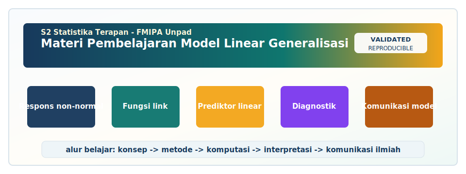

<!-- BEGIN UNPAD MATERIAL STYLE -->
<style>
:root {
  --unpad-navy: #17395c;
  --unpad-gold: #f2a51a;
  --unpad-teal: #0f766e;
  --unpad-ink: #172033;
  --unpad-paper: #fffdf8;
  --unpad-soft: #eef5f8;
  --unpad-line: #d7e2ea;
}
html, body {
  background: linear-gradient(135deg, #f8fbfd 0%, #fffdf8 48%, #f3f6ee 100%) !important;
  color: var(--unpad-ink) !important;
}
body {
  font-family: "Segoe UI", Arial, sans-serif !important;
  line-height: 1.72 !important;
}
.main-container {
  max-width: 1180px !important;
  background: rgba(255, 253, 248, 0.98) !important;
  border: 1px solid var(--unpad-line) !important;
  border-radius: 8px !important;
  box-shadow: 0 18px 42px rgba(23, 57, 92, 0.12) !important;
}
h1, h2, h3, h4 {
  letter-spacing: 0 !important;
}
h1.title {
  color: var(--unpad-navy) !important;
  -webkit-text-fill-color: var(--unpad-navy) !important;
  background: none !important;
}
h2 {
  border-left-color: var(--unpad-gold) !important;
}
a {
  color: #0b5c86 !important;
}
pre, code {
  border-radius: 8px !important;
}
.unpad-cover {
  margin: 18px 0 26px;
  padding: 24px;
  border-radius: 8px;
  background: linear-gradient(135deg, #17395c 0%, #0f766e 58%, #f2a51a 100%);
  color: #ffffff;
  box-shadow: 0 18px 36px rgba(23, 57, 92, 0.22);
}
.unpad-cover__brand {
  display: grid;
  grid-template-columns: 92px 1fr;
  gap: 20px;
  align-items: center;
}
.unpad-cover img {
  width: 92px;
  height: 92px;
  object-fit: contain;
  background: #ffffff;
  border-radius: 8px;
  padding: 8px;
  box-shadow: 0 8px 22px rgba(0,0,0,0.18);
}
.unpad-kicker {
  text-transform: uppercase;
  font-size: 0.82rem;
  font-weight: 800;
  letter-spacing: 0;
  color: #fff8dc;
}
.unpad-cover h2 {
  margin: 6px 0 8px;
  padding: 0;
  border: 0;
  background: transparent;
  color: #ffffff !important;
  font-size: 1.65rem;
}
.unpad-meta {
  margin: 0;
  color: #f7fbff;
  font-weight: 600;
}
.materi-illustration {
  margin: 20px 0 24px;
  padding: 14px;
  background: #ffffff;
  border: 1px solid var(--unpad-line);
  border-radius: 8px;
  box-shadow: 0 12px 28px rgba(23, 57, 92, 0.10);
}
.materi-illustration img {
  width: 100%;
  height: auto;
  display: block;
  border-radius: 6px;
}
.validasi-akademik {
  margin: 18px 0 28px;
  padding: 16px 18px;
  background: linear-gradient(135deg, #eef8f6, #fff8e7);
  border-left: 8px solid var(--unpad-teal);
  border-radius: 8px;
  color: var(--unpad-ink);
}
.validasi-akademik strong {
  color: var(--unpad-navy);
}
table {
  border-radius: 8px !important;
}
@media (max-width: 760px) {
  .unpad-cover__brand {
    grid-template-columns: 1fr;
  }
  .unpad-cover img {
    width: 76px;
    height: 76px;
  }
}
</style>
<!-- END UNPAD MATERIAL STYLE -->


<!-- BEGIN UNPAD MATERIAL ENHANCEMENT -->

```{r setup-unpad-render, include=FALSE}
execute_code <- FALSE
knitr::opts_chunk$set(
  echo = TRUE,
  eval = FALSE,
  message = FALSE,
  warning = FALSE,
  fig.align = "center",
  fig.width = 8,
  fig.height = 4.8,
  dpi = 120
)
set.seed(2025)
```


<div class="unpad-cover">
<div class="unpad-cover__brand">

<div>
<div class="unpad-kicker">S2 Statistika Terapan | FMIPA Universitas Padjadjaran</div>
<h2>Materi Pembelajaran Model Linear Generalisasi</h2>
<p class="unpad-meta">Program Studi S2 Statistika Terapan FMIPA Universitas Padjadjaran<br>Penulis: Dr. Bertho Tantular, M.Si | Januari 2025</p>
</div>
</div>
</div>

<div class="materi-illustration">

</div>

<div class="validasi-akademik">
<strong>Catatan validasi akademik.</strong> Materi ini diseragamkan dengan rujukan ADWTL Januari 2025: rumus dibaca bersama asumsi, contoh kode diposisikan sebagai template reproducible, dan interpretasi diarahkan pada validitas data, diagnosis model, evaluasi ketidakpastian, serta komunikasi hasil secara ilmiah.
</div>

<!-- END UNPAD MATERIAL ENHANCEMENT -->

<style>
:root{
  --brown-900:#3b2416; --brown-800:#4e2f1d; --brown-700:#6b3f22;
  --brown-600:#8b5a2b; --brown-500:#a46a36; --brown-300:#d7b98f;
  --brown-200:#ead6bd; --brown-100:#f7eadc; --cream:#fff8ef;
  --gold:#f6b73c; --teal:#3d7b76; --ink:#20140d;
}
html, body { background: linear-gradient(135deg, #fff8ef 0%, #f1ddc8 38%, #dfc0a0 100%); color: var(--ink); }
body { font-family: "Segoe UI", Roboto, Helvetica, Arial, sans-serif; line-height: 1.72; font-size: 16px; }
.main-container { max-width: 1180px !important; margin-left: 320px !important; margin-right: 42px !important; background: rgba(255, 248, 239, 0.97); padding: 34px 48px; border-radius: 26px; box-shadow: 0 22px 70px rgba(59,36,22,0.18); }
#TOC { position: fixed; left: 18px; top: 18px; width: 270px; max-height: 94vh; overflow-y: auto; background: linear-gradient(180deg, #4e2f1d 0%, #7a4a26 58%, #b78044 100%); color: #fffdf8; padding: 20px; border-radius: 22px; box-shadow: 0 20px 48px rgba(59,36,22,.38); border: 1px solid rgba(255,255,255,.16); }
#TOC a { color: #fff5df !important; text-decoration: none; font-weight: 600; }
#TOC a:hover { color: #ffd77a !important; text-decoration: underline; }
h1, h2, h3, h4 { color: var(--brown-900); font-weight: 800; letter-spacing: .2px; }
h1.title { font-size: 2.6rem; background: linear-gradient(90deg, #3b2416, #9f652f, #cfa569); -webkit-background-clip: text; -webkit-text-fill-color: transparent; }
h1 { border-bottom: 4px solid var(--brown-300); padding-bottom: .35rem; margin-top: 2.4rem; }
h2 { margin-top: 2rem; border-left: 9px solid var(--brown-500); padding: .62rem .9rem; background: linear-gradient(90deg, #f2ddc5, rgba(255,248,239,0)); border-radius: 12px; }
h3 { color: var(--brown-800); margin-top: 1.65rem; }
a { color: #79512b; font-weight: 650; }
blockquote { border-left: 8px solid var(--brown-500); background: #fff2de; padding: 15px 20px; border-radius: 12px; color: #3c2718; }
pre { background: #f6e4d0 !important; border: 1px solid #d3aa7d; border-left: 8px solid #a46a36; color: #111 !important; border-radius: 16px; padding: 18px; }
code { background: #f8e6d2; color: #24140a; padding: .12rem .32rem; border-radius: 6px; }
table { border-collapse: collapse; width: 100%; background: #fffaf1; margin: 1rem 0 1.25rem 0; border-radius: 16px; overflow: hidden; box-shadow: 0 6px 22px rgba(76,46,28,.08); }
th { background: linear-gradient(90deg, #5b3520, #9b6531); color: white; padding: 11px; }
td { padding: 10px 12px; border-bottom: 1px solid #ead6bd; vertical-align: top; }
tr:nth-child(even) td { background: #fff3e3; }
.formula-box { background: #f5dfc6; color: #111; border: 2px solid #d4ac7b; border-left: 9px solid #8b5a2b; border-radius: 18px; padding: 16px 20px; margin: 18px 0; box-shadow: 0 10px 26px rgba(76,46,28,.10); }
.formula-box .math { color: #111 !important; }
.learning-card, .case-card, .warning-card, .assessment-card, .rps-card { border-radius: 20px; padding: 20px 23px; margin: 18px 0; box-shadow: 0 12px 30px rgba(76,46,28,.12); }
.learning-card { background: linear-gradient(135deg, #fff4e5, #f0d0ab); border: 1px solid #d4ad83; }
.case-card { background: linear-gradient(135deg, #fef9f0, #ecd6bd); border-left: 10px solid #6b3f22; }
.warning-card { background: linear-gradient(135deg, #fff4cf, #f8d09a); border-left: 10px solid #b76e21; }
.assessment-card { background: linear-gradient(135deg, #f3efe9, #dfc0a0); border-left: 10px solid #3d7b76; }
.rps-card { background: linear-gradient(135deg, #4e2f1d, #8b5a2b); color: #fff8ef; }
.rps-card h2, .rps-card h3, .rps-card strong { color: #fff8ef; }
.badge { display:inline-block; background:#5b3520; color:#fff7e8; border-radius:999px; padding:.26rem .72rem; margin:.15rem; font-weight:700; font-size:.86rem; }
.figure-panel { background: #fff8ef; border: 1px solid #dfc0a0; border-radius: 22px; padding: 18px; margin: 18px 0 24px 0; box-shadow: 0 10px 30px rgba(59,36,22,.10); }
.caption { color:#6b3f22; font-size:.92rem; text-align:center; margin-top: .4rem; font-weight: 650; }
.small-note { font-size:.93rem; color:#5c422e; }
hr { border:0; height:2px; background:linear-gradient(90deg, transparent, #a46a36, transparent); margin: 2rem 0; }
@media print { #TOC { position: static; width:auto; max-height:none; } .main-container { margin:0 !important; box-shadow:none; } }
@media (max-width: 1050px) { #TOC { position: static; width:auto; max-height:none; margin: 12px; } .main-container { margin: 14px !important; padding: 24px; } }
</style>


<div class="rps-card">
<h2>📘 Materi Pembelajaran S2 Statistika Terapan</h2>
<p><strong>Mata kuliah:</strong> Model Linear Generalisasi</p>
<p><strong>Kode:</strong> D20B.206 &nbsp; | &nbsp; <strong>Bobot:</strong> 3 SKS (T = 2, P = 1) &nbsp; | &nbsp; <strong>Semester:</strong> 2</p>
<p><strong>Dosen penulis/pengampu RPS:</strong> Dr. Bertho Tantular, M.Si</p>
<p><strong>Program studi:</strong> S2 Statistika Terapan, Fakultas Matematika dan Ilmu Pengetahuan Alam, Universitas Padjadjaran</p>
<p><strong>Tahun pembuatan materi:</strong> Januari 2025</p>
</div>

> Materi ini disusun mengikuti RPS OBE mata kuliah **Model Linear Generalisasi** untuk S2 Statistika Terapan FMIPA Universitas Padjadjaran. Fokus pembelajaran mengikuti rangkaian CPMK dan SubCPMK dalam RPS: analisis data kategori, evaluasi tabel kontingensi dua dan tiga arah, pengembangan model GLM untuk berbagai tipe respons, serta komunikasi ilmiah solusi GLM berbasis riset mutakhir.


<div class="figure-panel">
<svg viewBox="0 0 960 360" width="100%" role="img" aria-label="Arsitektur Generalized Linear Model">
  <defs>
    <linearGradient id="g1" x1="0" x2="1"><stop offset="0%" stop-color="#5b3520"/><stop offset="100%" stop-color="#b78044"/></linearGradient>
    <linearGradient id="g2" x1="0" x2="1"><stop offset="0%" stop-color="#f7eadc"/><stop offset="100%" stop-color="#d7b98f"/></linearGradient>
    <filter id="shadow" x="-10%" y="-10%" width="120%" height="120%"><feDropShadow dx="0" dy="8" stdDeviation="8" flood-color="#4e2f1d" flood-opacity=".23"/></filter>
  </defs>
  <rect x="20" y="30" width="920" height="300" rx="28" fill="#fff8ef" stroke="#d7b98f" stroke-width="3"/>
  <rect x="70" y="105" width="180" height="100" rx="22" fill="url(#g2)" filter="url(#shadow)"/>
  <text x="160" y="142" text-anchor="middle" font-size="21" font-weight="800" fill="#3b2416">Data respons</text>
  <text x="160" y="173" text-anchor="middle" font-size="16" fill="#4e2f1d">Y | distribusi</text>
  <text x="160" y="196" text-anchor="middle" font-size="16" fill="#4e2f1d">binomial, Poisson, ...</text>
  <rect x="390" y="105" width="180" height="100" rx="22" fill="url(#g1)" filter="url(#shadow)"/>
  <text x="480" y="140" text-anchor="middle" font-size="21" font-weight="800" fill="#fff8ef">Prediktor linear</text>
  <text x="480" y="173" text-anchor="middle" font-size="17" fill="#fff8ef">η = Xβ</text>
  <text x="480" y="196" text-anchor="middle" font-size="15" fill="#fff8ef">struktur kovariat</text>
  <rect x="710" y="105" width="180" height="100" rx="22" fill="url(#g2)" filter="url(#shadow)"/>
  <text x="800" y="142" text-anchor="middle" font-size="21" font-weight="800" fill="#3b2416">Mean respons</text>
  <text x="800" y="173" text-anchor="middle" font-size="17" fill="#4e2f1d">μ = E(Y|X)</text>
  <text x="800" y="196" text-anchor="middle" font-size="16" fill="#4e2f1d">g(μ)=η</text>
  <path d="M252 155 C305 155, 330 155, 386 155" stroke="#8b5a2b" stroke-width="6" fill="none" marker-end="url(#arrow)"/>
  <path d="M572 155 C625 155, 650 155, 706 155" stroke="#8b5a2b" stroke-width="6" fill="none" marker-end="url(#arrow)"/>
  <defs><marker id="arrow" markerWidth="10" markerHeight="10" refX="8" refY="3" orient="auto" markerUnits="strokeWidth"><path d="M0,0 L0,6 L9,3 z" fill="#8b5a2b" /></marker></defs>
  <text x="320" y="132" font-size="16" fill="#3b2416" font-weight="700">model peluang</text>
  <text x="635" y="132" font-size="16" fill="#3b2416" font-weight="700">fungsi link</text>
  <text x="480" y="275" text-anchor="middle" font-size="18" fill="#3b2416" font-weight="700">GLM = keluarga distribusi + prediktor linear + fungsi link</text>
</svg>
<div class="caption">Gambar 1. Arsitektur konseptual GLM: respons non-normal dihubungkan dengan prediktor linear melalui fungsi link.</div>
</div>


<div class="figure-panel">
<svg viewBox="0 0 960 420" width="100%" role="img" aria-label="Peta keputusan pemilihan GLM">
  <defs>
    <linearGradient id="node" x1="0" x2="1"><stop offset="0%" stop-color="#f6e4d0"/><stop offset="100%" stop-color="#d7b98f"/></linearGradient>
    <linearGradient id="root" x1="0" x2="1"><stop offset="0%" stop-color="#4e2f1d"/><stop offset="100%" stop-color="#9a6232"/></linearGradient>
  </defs>
  <rect x="20" y="25" width="920" height="370" rx="26" fill="#fff8ef" stroke="#d7b98f" stroke-width="3"/>
  <rect x="370" y="55" width="220" height="58" rx="18" fill="url(#root)"/><text x="480" y="91" text-anchor="middle" fill="#fff8ef" font-size="20" font-weight="800">Jenis respons Y?</text>
  <line x1="480" y1="113" x2="180" y2="165" stroke="#8b5a2b" stroke-width="4"/>
  <line x1="480" y1="113" x2="380" y2="165" stroke="#8b5a2b" stroke-width="4"/>
  <line x1="480" y1="113" x2="585" y2="165" stroke="#8b5a2b" stroke-width="4"/>
  <line x1="480" y1="113" x2="780" y2="165" stroke="#8b5a2b" stroke-width="4"/>
  <rect x="85" y="165" width="190" height="70" rx="18" fill="url(#node)"/><text x="180" y="195" text-anchor="middle" font-weight="800" fill="#3b2416">Biner</text><text x="180" y="220" text-anchor="middle" fill="#4e2f1d">logit/probit</text>
  <rect x="285" y="165" width="190" height="70" rx="18" fill="url(#node)"/><text x="380" y="195" text-anchor="middle" font-weight="800" fill="#3b2416">Nominal</text><text x="380" y="220" text-anchor="middle" fill="#4e2f1d">multinomial logit</text>
  <rect x="490" y="165" width="190" height="70" rx="18" fill="url(#node)"/><text x="585" y="195" text-anchor="middle" font-weight="800" fill="#3b2416">Ordinal</text><text x="585" y="220" text-anchor="middle" fill="#4e2f1d">cumulative logit</text>
  <rect x="685" y="165" width="190" height="70" rx="18" fill="url(#node)"/><text x="780" y="195" text-anchor="middle" font-weight="800" fill="#3b2416">Cacah</text><text x="780" y="220" text-anchor="middle" fill="#4e2f1d">Poisson/NB</text>
  <rect x="85" y="285" width="790" height="72" rx="18" fill="#f7eadc" stroke="#d7b98f" stroke-width="2"/>
  <text x="480" y="315" text-anchor="middle" fill="#3b2416" font-size="18" font-weight="800">Pemeriksaan wajib</text>
  <text x="480" y="343" text-anchor="middle" fill="#4e2f1d" font-size="15">struktur data, asumsi, interpretasi parameter, residual, overdispersion, validasi, dan komunikasi substantif</text>
</svg>
<div class="caption">Gambar 2. Peta keputusan praktis untuk memilih model GLM berdasarkan tipe respons.</div>
</div>


# Petunjuk Penggunaan Materi

Materi ini dirancang sebagai **bahan ajar HTML berbasis R Markdown**. Mahasiswa dapat membaca bagian konseptual, menjalankan kode R, mengadaptasi studi kasus, dan menggunakan pertanyaan reflektif sebagai bahan diskusi kelas. Dosen dapat mengembangkan materi ini menjadi handout, modul praktikum, atau kerangka proyek akhir. Struktur narasinya sengaja dibuat bertahap: mulai dari logika data kategori dan cacah, bergerak ke tabel kontingensi dan model log-linear, lalu masuk ke inti Generalized Linear Models (GLM), diagnostik, workflow komputasi, dan komunikasi ilmiah.

Agar file ini dapat dirender menjadi HTML, simpan file `references_glm.bib` pada folder yang sama dengan file Rmd, lalu jalankan perintah berikut di R:

```{r eval=FALSE}
install.packages(c("rmarkdown", "knitr"))
rmarkdown::render("Model_Linear_Generalisasi_Materi.Rmd")
```

Sebagian kode lanjutan menggunakan paket tambahan seperti `MASS`, `nnet`, `ordinal`, `pscl`, `broom`, `ggplot2`, dan `dplyr`. Kode-kode tersebut dapat dijalankan setelah paket terkait dipasang. Namun inti pemodelan GLM dasar tetap dapat dilakukan dengan fungsi `glm()` bawaan R.

# Ringkasan RPS dan Orientasi OBE

RPS menempatkan mata kuliah ini sebagai mata kuliah wajib semester 2 dengan bobot 3 SKS. Kompetensi yang dibebankan pada mata kuliah meliputi kemampuan mengelola dan menganalisis data untuk permasalahan nyata, kemampuan mengembangkan algoritma komputasi dengan perangkat lunak statistika, serta kemampuan berpikir logis, kritis, sistematis, dan inovatif dalam riset yang berdampak bagi masyarakat. Oleh karena itu, materi tidak hanya menjelaskan rumus, tetapi juga memperlihatkan cara memilih model, mengevaluasi keterbatasan, dan mengomunikasikan hasil secara profesional.

<div class="assessment-card">
<strong>CPMK utama:</strong> (1) menganalisis struktur dan karakteristik data kategori; (2) mengevaluasi model tabel kontingensi dua dan tiga arah; (3) mengkreasi solusi pemodelan GLM pada berbagai respons; dan (4) mengkreasi serta mengkomunikasikan inovasi solusi statistika berbasis GLM pada masalah riset mutakhir.
</div>

## Peta Pembelajaran 16 Pertemuan

| Pertemuan | Fokus RPS | Produk Belajar |
|---:|---|---|
| 1-4 | Data kategori, data cacah, distribusi, link function | Laporan analisis data kategori dan kuis reflektif |
| 5-7 | Tabel kontingensi dua/tiga arah dan model log-linear | Laporan coding, mini project, interpretasi model |
| 8 | UTS | Proyek pendahuluan, laporan, presentasi |
| 9-12 | GLM untuk biner, multinomial, ordinal, cacah, dan respons non-normal | Proyek aplikasi GLM dengan script R/Python |
| 13-15 | Diagnostik, workflow, inovasi, komunikasi ilmiah | Laporan riset aplikasi GLM inovatif |
| 16 | UAS | Proyek akhir, laporan final, presentasi ilmiah |

## Filosofi Pembelajaran

Model Linear Generalisasi adalah jembatan antara teori probabilitas, desain data, inferensi statistik, dan aplikasi nyata. Dalam model linear klasik, kita sering mengasumsikan bahwa respons bersifat kontinu, normal, dan memiliki ragam konstan. Dalam praktik riset terapan, asumsi tersebut tidak selalu layak: respons bisa berupa status penyakit, pilihan kategori, tingkat kepuasan, jumlah kejadian, banyaknya klaim, atau frekuensi sel dalam tabel kontingensi. GLM menyediakan kerangka yang rapi untuk menangani keragaman respons tersebut dengan tetap mempertahankan ide sentral regresi, yaitu menjelaskan perubahan nilai harapan respons melalui kombinasi linear kovariat [@nelder1972; @mccullagh1989].

Dalam konteks S2 Statistika Terapan, penguasaan GLM tidak cukup berhenti pada kemampuan menjalankan `glm()` dan membaca nilai p. Mahasiswa perlu memahami mengapa distribusi tertentu dipilih, apa arti fungsi link, bagaimana interpretasi parameter berubah dari skala linear ke skala respons, kapan model gagal, bagaimana mendeteksi overdispersion atau outlier, dan bagaimana menyampaikan hasil kepada pengguna non-statistik. Dengan kata lain, GLM adalah latihan menyatukan tiga hal: ketepatan matematis, kecermatan komputasi, dan kepekaan terhadap konteks masalah. Tanpa tiga hal ini, analisis bisa tampak meyakinkan secara teknis, tetapi keliru secara substantif. Statistik seperti pisau bedah: tajam itu bagus, tetapi tetap harus tahu bagian mana yang boleh dipotong. 🙂

# Notasi Umum GLM

Bagian ini merangkum notasi yang digunakan secara konsisten di seluruh materi. Misalkan terdapat $n$ observasi independen atau diasumsikan independen bersyarat pada kovariat. Respons ke-$i$ ditulis sebagai $Y_i$, vektor kovariat sebagai $x_i=(1,x_{i1},\ldots,x_{ip})^T$, dan vektor parameter regresi sebagai $\beta=(\beta_0,\beta_1,\ldots,\beta_p)^T$. Nilai harapan kondisional ditulis $\mu_i=E(Y_i\mid x_i)$, sedangkan prediktor linear ditulis $\eta_i=x_i^T\beta$. Fungsi link $g(\cdot)$ menghubungkan $\mu_i$ dan $\eta_i$ melalui $g(\mu_i)=\eta_i$.

<div class="formula-box">
$$
Y_i \sim \text{keluarga eksponensial}, \qquad g(\mu_i)=x_i^T\beta, \qquad Var(Y_i)=\phi V(\mu_i)
$$
</div>

Fungsi $V(\mu_i)$ disebut fungsi ragam. Pada distribusi normal, fungsi ragam konstan. Pada Bernoulli/binomial, ragam bergantung pada $\mu_i(1-\mu_i)$. Pada Poisson, ragam sama dengan rata-rata. Pada negative binomial, ragam lebih besar daripada rata-rata sehingga cocok untuk overdispersion. Hubungan antara mean dan ragam inilah yang membuat GLM berbeda secara mendasar dari regresi linear biasa.

Notasi likelihood ditulis sebagai $L(\beta)$ atau log-likelihood $\ell(\beta)$. Estimasi parameter biasanya dilakukan dengan maximum likelihood, sering melalui iteratively reweighted least squares (IRLS). Dalam praktik, perangkat lunak seperti R menyembunyikan detail iterasi tersebut, tetapi mahasiswa tetap perlu memahami ide dasarnya: parameter diperbarui berulang kali sampai perubahan likelihood atau parameter menjadi cukup kecil. Ketika algoritma gagal konvergen, analis harus meninjau separasi, multikolinearitas, kategori jarang, atau spesifikasi model.


# Pertemuan 1: Pendahuluan Model Linear Generalisasi

<span class="badge">SubCPMK1</span> <span class="badge">Fokus: perbedaan model linear klasik dan GLM</span>

<div class="learning-card">
<strong>Tujuan pembelajaran:</strong> setelah mempelajari bagian ini, mahasiswa diharapkan mampu menjelaskan konsep utama terkait perbedaan model linear klasik dan GLM, memilih struktur distribusi yang sesuai, menghubungkan masalah nyata dengan formulasi model, menjalankan analisis awal dengan R, serta menyusun interpretasi yang tidak hanya mekanis tetapi juga substantif.
</div>

## Orientasi Konseptual

Bagian ini membahas perbedaan model linear klasik dan GLM sebagai elemen penting dalam mata kuliah Model Linear Generalisasi. Dalam GLM, pertanyaan pertama bukan "pakai regresi apa?" melainkan "bagaimana respons dihasilkan?". Pertanyaan ini mengarahkan analis untuk memeriksa dukungan data, struktur peluang, kemungkinan nilai nol, batas bawah dan batas atas respons, serta hubungan antara rata-rata dan ragam. Kerangka Gaussian, binomial, Poisson, Gamma, dan inverse Gaussian menunjukkan bahwa distribusi respons bukan pelengkap teknis, tetapi inti dari model. Jika distribusi salah dipilih, interpretasi koefisien, standard error, interval kepercayaan, dan keputusan berbasis model dapat ikut bergeser.

Dalam konteks pendahuluan model linear generalisasi, fungsi link seperti identity, logit, probit, log, dan inverse bekerja sebagai jembatan antara skala rata-rata respons dan skala prediktor linear. Pada skala prediktor linear, efek kovariat dapat ditulis sebagai kombinasi linear yang mudah diestimasi. Pada skala respons, hasil harus kembali ke domain yang masuk akal: peluang berada antara 0 dan 1, jumlah kejadian tidak negatif, dan rerata biaya atau durasi juga tidak negatif. Inilah alasan GLM lebih alami daripada memaksa regresi linear klasik untuk semua jenis data. Pembahasan ini sejalan dengan fondasi GLM yang dikembangkan oleh Nelder dan Wedderburn serta dirumuskan lebih luas dalam literatur GLM modern [@nelder1972; @mccullagh1989; @agresti2015].

Sebuah model yang baik selalu lahir dari dialog antara teori statistik dan konteks aplikasi. Untuk kasus seperti risiko kelulusan mahasiswa berdasarkan latar belakang akademik, jumlah klaim asuransi, dan banyaknya kasus penyakit, analis harus mendefinisikan unit observasi, respons, kovariat, populasi sasaran, dan mekanisme pengukuran. Kesalahan pada tahap ini sering lebih berbahaya daripada kesalahan sintaks R. Sintaks bisa diperbaiki dalam dua menit; definisi respons yang keliru bisa membuat seluruh proyek terlihat rapi tetapi menjawab pertanyaan yang salah. Karena itu, setiap pertemuan dalam materi ini menekankan proses berpikir: dari data, ke model, ke diagnostik, ke interpretasi, dan akhirnya ke rekomendasi.

## Rumus Inti

<div class="formula-box">
$$

g(\mu_i)=\eta_i=\beta_0+\beta_1x_{i1}+\cdots+\beta_px_{ip}

$$
</div>

Rumus di atas perlu dibaca dengan hati-hati. Simbol dalam GLM bukan sekadar dekorasi matematika. Komponen $Y_i$ mewakili respons, $\mu_i=E(Y_i\mid X_i)$ mewakili nilai harapan kondisional, $\eta_i$ adalah prediktor linear, dan $g(\cdot)$ adalah fungsi link. Dalam beberapa model, parameter dispersi $\phi$ juga berperan penting untuk menghubungkan ragam dengan rata-rata. Pada model binomial dan Poisson standar, struktur ragam biasanya ditentukan oleh mean. Pada model quasi-likelihood atau negative binomial, ragam dapat diperluas untuk mengakomodasi variasi yang lebih besar dari asumsi dasar.

Interpretasi parameter harus selalu mengikuti skala model. Koefisien pada skala logit tidak langsung berarti perubahan peluang absolut. Koefisien pada skala log tidak langsung berarti tambahan jumlah kejadian secara aditif. Oleh karena itu, interpretasi sering lebih komunikatif ketika diubah ke ukuran seperti odds ratio, rate ratio, predicted probability, expected count, marginal effect, atau perubahan prediksi pada skenario kovariat tertentu. Transformasi ini bukan trik presentasi, tetapi bagian penting dari komunikasi ilmiah.

## Penjelasan Mendalam

Pada level teoretis, pendahuluan model linear generalisasi memperlihatkan bahwa model statistik bukan hanya hubungan antara variabel dependen dan independen. Model adalah representasi asumsi tentang proses pembangkitan data. Jika respons bersifat biner, proses pembangkitan datanya adalah keberhasilan/kegagalan, hadir/tidak hadir, sakit/tidak sakit, atau memilih/tidak memilih. Jika respons berupa cacah, prosesnya terkait jumlah kejadian dalam ruang, waktu, atau eksposur tertentu. Jika respons ordinal, prosesnya berkaitan dengan kategori yang memiliki urutan, tetapi jarak antar kategori belum tentu sama. Perbedaan ini menuntut model yang berbeda.

Dalam pembelajaran GLM, mahasiswa perlu membedakan tiga lapisan inferensi. Lapisan pertama adalah lapisan probabilistik: distribusi apa yang menjelaskan respons? Lapisan kedua adalah lapisan struktural: kovariat mana yang masuk ke prediktor linear dan apakah ada interaksi? Lapisan ketiga adalah lapisan interpretatif: apa arti perubahan kovariat terhadap peluang, odds, laju, atau rerata respons? Tiga lapisan ini saling terkait. Mengubah distribusi dapat mengubah ragam; mengubah link dapat mengubah skala interpretasi; mengubah struktur kovariat dapat mengubah makna efek utama dan interaksi.

Kekuatan GLM adalah fleksibilitasnya. Namun fleksibilitas ini juga mengandung risiko. Analis dapat mencoba banyak model, memilih yang tampak paling bagus, lalu lupa bahwa model harus tetap menjawab pertanyaan substantif. Dalam riset terapan, model yang paling bermanfaat sering bukan yang paling kompleks, melainkan yang paling dapat dipertanggungjawabkan. Model yang sedikit lebih sederhana tetapi stabil, transparan, dan mudah dikomunikasikan sering lebih bernilai daripada model yang sangat kompleks tetapi rapuh. Prinsip ini penting ketika mahasiswa mengerjakan proyek akhir, karena produk belajar bukan hanya angka AIC, melainkan argumen ilmiah yang lengkap.

Konteks S2 Statistika Terapan menuntut mahasiswa untuk menguasai teori dan praktik secara bersamaan. Teori memberi alasan mengapa sebuah prosedur sah digunakan. Praktik memberi pengalaman tentang apa yang terjadi ketika data tidak rapi, ukuran sampel terbatas, kategori jarang, overdispersion muncul, atau hasil berlawanan dengan intuisi awal. Dengan latihan seperti ini, mahasiswa tidak hanya menjadi operator perangkat lunak, tetapi menjadi analis statistik yang mampu mempertahankan keputusan model secara akademik dan profesional.

## Studi Kasus Terapan

<div class="case-card">
<strong>Kasus:</strong> risiko kelulusan mahasiswa berdasarkan latar belakang akademik, jumlah klaim asuransi, dan banyaknya kasus penyakit. Misalkan seorang peneliti ingin membangun model yang mampu menjelaskan respons tersebut berdasarkan beberapa kovariat. Langkah pertama adalah menyusun definisi operasional: apa unit observasinya, bagaimana respons diukur, apakah respons memiliki batas alami, apakah ada eksposur, apakah kategori memiliki urutan, dan apakah pengamatan saling bebas secara masuk akal.
</div>

Dalam kasus ini, prosedur analisis dapat dimulai dari pemeriksaan struktur data. Untuk respons kategori, buat tabel frekuensi, proporsi baris, proporsi kolom, dan visualisasi komposisi. Untuk respons cacah, periksa proporsi nol, nilai maksimum, mean, varians, dan apakah terdapat eksposur. Untuk respons ordinal, periksa apakah distribusi kategori sangat timpang dan apakah penggabungan kategori diperlukan. Untuk respons biaya atau waktu tunggu positif, periksa skewness dan apakah model Gamma lebih masuk akal daripada normal.

Setelah eksplorasi awal, analis menyusun kandidat model. Kandidat pertama biasanya model dasar yang sesuai dengan tipe respons. Kandidat kedua dapat memasukkan kovariat tambahan atau interaksi yang memiliki alasan substantif. Kandidat ketiga dapat menjadi model alternatif jika asumsi dasar tidak memadai, misalnya negative binomial ketika Poisson mengalami overdispersion atau model ordinal non-proportional ketika asumsi proportional odds tidak masuk akal. Perbandingan model dilakukan dengan kombinasi ukuran statistik, diagnostik, interpretasi, dan kegunaan praktis.

Laporan hasil tidak cukup berisi tabel koefisien. Laporan perlu menjelaskan mengapa model dipilih, bagaimana ketidakpastian dihitung, apa arti efek dalam konteks, siapa yang terdampak oleh rekomendasi, dan apa batasan model. Dalam banyak proyek mahasiswa, bagian batasan sering ditulis singkat. Padahal batasan adalah tanda kedewasaan analitik: peneliti memahami apa yang dapat dan tidak dapat diklaim dari data. Model yang kuat bukan model yang pura-pura tahu segalanya, melainkan model yang tahu wilayah kompetensinya sendiri.

## Implementasi Awal dengan R

Kode berikut menunjukkan bentuk dasar analisis yang dapat dikembangkan sesuai konteks data. Kode sengaja dibuat ringkas agar mahasiswa melihat alur utamanya. Pada proyek nyata, setiap langkah harus dilengkapi pemeriksaan kualitas data, dokumentasi transformasi variabel, dan validasi hasil.

```{r eval=FALSE}
# Struktur dasar kode untuk topik: Pendahuluan Model Linear Generalisasi
# 1. Baca data
# dat <- read.csv("data_glm.csv")

# 2. Eksplorasi respons dan kovariat
# str(dat)
# summary(dat)
# table(dat$y)

# 3. Bangun model awal
glm(y ~ x1 + x2, family = binomial(link = 'logit'), data = dat)

# 4. Ringkas hasil
# summary(fit)
# confint(fit)
# fitted_values <- fitted(fit)
# residual_dev <- residuals(fit, type = "deviance")

# 5. Diagnostik sederhana
# plot(fitted_values, residual_dev,
#      xlab = "Fitted values", ylab = "Deviance residuals")
# abline(h = 0, lty = 2)
```

Saat menjalankan kode, jangan langsung percaya pada output. Periksa apakah model konvergen, apakah ada peringatan, apakah koefisien sangat besar, apakah standard error tidak masuk akal, dan apakah hasil sensitif terhadap kategori referensi atau spesifikasi kovariat. Dalam GLM, peringatan kecil sering merupakan pesan besar yang sedang malu-malu muncul di console. Console itu kadang seperti mahasiswa pendiam: sekali bicara, biasanya penting. 😄

## Diagnostik dan Evaluasi

Evaluasi model pada bagian ini sebaiknya dilakukan melalui beberapa indikator. Pertama, nilai deviance residual membantu melihat observasi yang tidak dijelaskan dengan baik oleh model. Kedua, leverage dan ukuran pengaruh membantu mengidentifikasi observasi yang sangat menentukan estimasi parameter. Ketiga, perbandingan model dengan AIC atau BIC dapat membantu seleksi, tetapi tidak boleh menggantikan pertimbangan substantif. Keempat, pemeriksaan overdispersion penting untuk data cacah dan tabel kontingensi. Kelima, interpretasi hasil harus diperiksa pada skala respons agar pembaca memahami besar efek secara nyata.

Kesalahan umum pada topik ini adalah memaksakan regresi linear biasa pada respons biner atau cacah sehingga prediksi keluar dari ruang parameter yang masuk akal. Kesalahan tersebut dapat dicegah dengan membuat daftar pemeriksaan sebelum menyimpulkan hasil: apakah distribusi respons sesuai, apakah fungsi link masuk akal, apakah model konvergen, apakah interpretasi koefisien dilakukan pada skala yang tepat, apakah residual menunjukkan pola sistematis, apakah ada observasi berpengaruh, dan apakah kesimpulan sejalan dengan pertanyaan riset. Daftar pemeriksaan ini tampak sederhana, tetapi sangat efektif untuk menjaga kualitas analisis.

Dalam laporan akademik, diagnosa model sebaiknya tidak ditempatkan sebagai lampiran kosmetik. Diagnostik adalah argumen bahwa model layak dipercaya dalam batas tertentu. Jika ditemukan masalah, mahasiswa dapat menyampaikan tindakan perbaikan: mengubah distribusi, menggunakan model alternatif, melakukan transformasi kovariat, meninjau outlier, atau menambahkan interaksi yang memiliki dasar teori. Respons terhadap masalah diagnostik menunjukkan kualitas analitik mahasiswa. Model yang bermasalah tidak selalu berarti gagal; yang gagal adalah mengabaikan masalah tersebut.

## Latihan Terstruktur

1. Pilih satu dataset nyata yang memiliki respons sesuai dengan topik pendahuluan model linear generalisasi.
2. Jelaskan unit observasi, definisi respons, kovariat utama, dan alasan pemilihan model.
3. Bangun model awal dan minimal satu model pembanding.
4. Laporkan estimasi parameter, interval kepercayaan, dan ukuran efek pada skala yang mudah dipahami.
5. Lakukan diagnostik sederhana dan jelaskan apakah model memadai.
6. Tulis satu paragraf rekomendasi substantif serta satu paragraf batasan analisis.

## Pertanyaan Reflektif

- Apa konsekuensi substantif jika model yang digunakan tidak sesuai dengan dukungan respons?
- Apakah koefisien model dapat langsung disampaikan kepada pengguna non-statistik, atau perlu ditransformasikan?
- Bagaimana cara membedakan model yang "signifikan" dengan model yang benar-benar berguna?
- Apakah data memiliki struktur yang dapat melanggar asumsi independensi, misalnya pengelompokan wilayah, waktu, kelas, rumah sakit, atau perusahaan?
- Apakah kesimpulan tetap stabil jika kategori referensi, kovariat, atau model pembanding diubah?


# Pertemuan 2: Karakteristik Data Kategori: Biner, Multinomial, dan Ordinal

<span class="badge">SubCPMK1</span> <span class="badge">Fokus: struktur level kategori dan konsekuensi inferensinya</span>

<div class="learning-card">
<strong>Tujuan pembelajaran:</strong> setelah mempelajari bagian ini, mahasiswa diharapkan mampu menjelaskan konsep utama terkait struktur level kategori dan konsekuensi inferensinya, memilih struktur distribusi yang sesuai, menghubungkan masalah nyata dengan formulasi model, menjalankan analisis awal dengan R, serta menyusun interpretasi yang tidak hanya mekanis tetapi juga substantif.
</div>

## Orientasi Konseptual

Bagian ini membahas struktur level kategori dan konsekuensi inferensinya sebagai elemen penting dalam mata kuliah Model Linear Generalisasi. Dalam GLM, pertanyaan pertama bukan "pakai regresi apa?" melainkan "bagaimana respons dihasilkan?". Pertanyaan ini mengarahkan analis untuk memeriksa dukungan data, struktur peluang, kemungkinan nilai nol, batas bawah dan batas atas respons, serta hubungan antara rata-rata dan ragam. Kerangka Bernoulli, binomial, multinomial, dan ordinal response models menunjukkan bahwa distribusi respons bukan pelengkap teknis, tetapi inti dari model. Jika distribusi salah dipilih, interpretasi koefisien, standard error, interval kepercayaan, dan keputusan berbasis model dapat ikut bergeser.

Dalam konteks karakteristik data kategori: biner, multinomial, dan ordinal, fungsi link seperti logit, probit, complementary log-log, baseline-category logit, dan cumulative logit bekerja sebagai jembatan antara skala rata-rata respons dan skala prediktor linear. Pada skala prediktor linear, efek kovariat dapat ditulis sebagai kombinasi linear yang mudah diestimasi. Pada skala respons, hasil harus kembali ke domain yang masuk akal: peluang berada antara 0 dan 1, jumlah kejadian tidak negatif, dan rerata biaya atau durasi juga tidak negatif. Inilah alasan GLM lebih alami daripada memaksa regresi linear klasik untuk semua jenis data. Pembahasan ini sejalan dengan fondasi GLM yang dikembangkan oleh Nelder dan Wedderburn serta dirumuskan lebih luas dalam literatur GLM modern [@agresti2013; @long1997; @hosmer2013].

Sebuah model yang baik selalu lahir dari dialog antara teori statistik dan konteks aplikasi. Untuk kasus seperti kepuasan layanan publik, status penyakit, pilihan moda transportasi, dan tingkat keparahan gejala, analis harus mendefinisikan unit observasi, respons, kovariat, populasi sasaran, dan mekanisme pengukuran. Kesalahan pada tahap ini sering lebih berbahaya daripada kesalahan sintaks R. Sintaks bisa diperbaiki dalam dua menit; definisi respons yang keliru bisa membuat seluruh proyek terlihat rapi tetapi menjawab pertanyaan yang salah. Karena itu, setiap pertemuan dalam materi ini menekankan proses berpikir: dari data, ke model, ke diagnostik, ke interpretasi, dan akhirnya ke rekomendasi.

## Rumus Inti

<div class="formula-box">
$$

\pi_i=P(Y_i=1\mid X_i),\quad \pi_{ij}=P(Y_i=j\mid X_i)

$$
</div>

Rumus di atas perlu dibaca dengan hati-hati. Simbol dalam GLM bukan sekadar dekorasi matematika. Komponen $Y_i$ mewakili respons, $\mu_i=E(Y_i\mid X_i)$ mewakili nilai harapan kondisional, $\eta_i$ adalah prediktor linear, dan $g(\cdot)$ adalah fungsi link. Dalam beberapa model, parameter dispersi $\phi$ juga berperan penting untuk menghubungkan ragam dengan rata-rata. Pada model binomial dan Poisson standar, struktur ragam biasanya ditentukan oleh mean. Pada model quasi-likelihood atau negative binomial, ragam dapat diperluas untuk mengakomodasi variasi yang lebih besar dari asumsi dasar.

Interpretasi parameter harus selalu mengikuti skala model. Koefisien pada skala logit tidak langsung berarti perubahan peluang absolut. Koefisien pada skala log tidak langsung berarti tambahan jumlah kejadian secara aditif. Oleh karena itu, interpretasi sering lebih komunikatif ketika diubah ke ukuran seperti odds ratio, rate ratio, predicted probability, expected count, marginal effect, atau perubahan prediksi pada skenario kovariat tertentu. Transformasi ini bukan trik presentasi, tetapi bagian penting dari komunikasi ilmiah.

## Penjelasan Mendalam

Pada level teoretis, karakteristik data kategori: biner, multinomial, dan ordinal memperlihatkan bahwa model statistik bukan hanya hubungan antara variabel dependen dan independen. Model adalah representasi asumsi tentang proses pembangkitan data. Jika respons bersifat biner, proses pembangkitan datanya adalah keberhasilan/kegagalan, hadir/tidak hadir, sakit/tidak sakit, atau memilih/tidak memilih. Jika respons berupa cacah, prosesnya terkait jumlah kejadian dalam ruang, waktu, atau eksposur tertentu. Jika respons ordinal, prosesnya berkaitan dengan kategori yang memiliki urutan, tetapi jarak antar kategori belum tentu sama. Perbedaan ini menuntut model yang berbeda.

Dalam pembelajaran GLM, mahasiswa perlu membedakan tiga lapisan inferensi. Lapisan pertama adalah lapisan probabilistik: distribusi apa yang menjelaskan respons? Lapisan kedua adalah lapisan struktural: kovariat mana yang masuk ke prediktor linear dan apakah ada interaksi? Lapisan ketiga adalah lapisan interpretatif: apa arti perubahan kovariat terhadap peluang, odds, laju, atau rerata respons? Tiga lapisan ini saling terkait. Mengubah distribusi dapat mengubah ragam; mengubah link dapat mengubah skala interpretasi; mengubah struktur kovariat dapat mengubah makna efek utama dan interaksi.

Kekuatan GLM adalah fleksibilitasnya. Namun fleksibilitas ini juga mengandung risiko. Analis dapat mencoba banyak model, memilih yang tampak paling bagus, lalu lupa bahwa model harus tetap menjawab pertanyaan substantif. Dalam riset terapan, model yang paling bermanfaat sering bukan yang paling kompleks, melainkan yang paling dapat dipertanggungjawabkan. Model yang sedikit lebih sederhana tetapi stabil, transparan, dan mudah dikomunikasikan sering lebih bernilai daripada model yang sangat kompleks tetapi rapuh. Prinsip ini penting ketika mahasiswa mengerjakan proyek akhir, karena produk belajar bukan hanya angka AIC, melainkan argumen ilmiah yang lengkap.

Konteks S2 Statistika Terapan menuntut mahasiswa untuk menguasai teori dan praktik secara bersamaan. Teori memberi alasan mengapa sebuah prosedur sah digunakan. Praktik memberi pengalaman tentang apa yang terjadi ketika data tidak rapi, ukuran sampel terbatas, kategori jarang, overdispersion muncul, atau hasil berlawanan dengan intuisi awal. Dengan latihan seperti ini, mahasiswa tidak hanya menjadi operator perangkat lunak, tetapi menjadi analis statistik yang mampu mempertahankan keputusan model secara akademik dan profesional.

## Studi Kasus Terapan

<div class="case-card">
<strong>Kasus:</strong> kepuasan layanan publik, status penyakit, pilihan moda transportasi, dan tingkat keparahan gejala. Misalkan seorang peneliti ingin membangun model yang mampu menjelaskan respons tersebut berdasarkan beberapa kovariat. Langkah pertama adalah menyusun definisi operasional: apa unit observasinya, bagaimana respons diukur, apakah respons memiliki batas alami, apakah ada eksposur, apakah kategori memiliki urutan, dan apakah pengamatan saling bebas secara masuk akal.
</div>

Dalam kasus ini, prosedur analisis dapat dimulai dari pemeriksaan struktur data. Untuk respons kategori, buat tabel frekuensi, proporsi baris, proporsi kolom, dan visualisasi komposisi. Untuk respons cacah, periksa proporsi nol, nilai maksimum, mean, varians, dan apakah terdapat eksposur. Untuk respons ordinal, periksa apakah distribusi kategori sangat timpang dan apakah penggabungan kategori diperlukan. Untuk respons biaya atau waktu tunggu positif, periksa skewness dan apakah model Gamma lebih masuk akal daripada normal.

Setelah eksplorasi awal, analis menyusun kandidat model. Kandidat pertama biasanya model dasar yang sesuai dengan tipe respons. Kandidat kedua dapat memasukkan kovariat tambahan atau interaksi yang memiliki alasan substantif. Kandidat ketiga dapat menjadi model alternatif jika asumsi dasar tidak memadai, misalnya negative binomial ketika Poisson mengalami overdispersion atau model ordinal non-proportional ketika asumsi proportional odds tidak masuk akal. Perbandingan model dilakukan dengan kombinasi ukuran statistik, diagnostik, interpretasi, dan kegunaan praktis.

Laporan hasil tidak cukup berisi tabel koefisien. Laporan perlu menjelaskan mengapa model dipilih, bagaimana ketidakpastian dihitung, apa arti efek dalam konteks, siapa yang terdampak oleh rekomendasi, dan apa batasan model. Dalam banyak proyek mahasiswa, bagian batasan sering ditulis singkat. Padahal batasan adalah tanda kedewasaan analitik: peneliti memahami apa yang dapat dan tidak dapat diklaim dari data. Model yang kuat bukan model yang pura-pura tahu segalanya, melainkan model yang tahu wilayah kompetensinya sendiri.

## Implementasi Awal dengan R

Kode berikut menunjukkan bentuk dasar analisis yang dapat dikembangkan sesuai konteks data. Kode sengaja dibuat ringkas agar mahasiswa melihat alur utamanya. Pada proyek nyata, setiap langkah harus dilengkapi pemeriksaan kualitas data, dokumentasi transformasi variabel, dan validasi hasil.

```{r eval=FALSE}
# Struktur dasar kode untuk topik: Karakteristik Data Kategori: Biner, Multinomial, dan Ordinal
# 1. Baca data
# dat <- read.csv("data_glm.csv")

# 2. Eksplorasi respons dan kovariat
# str(dat)
# summary(dat)
# table(dat$y)

# 3. Bangun model awal
table(dat$status); prop.table(table(dat$status, dat$group), margin = 2)

# 4. Ringkas hasil
# summary(fit)
# confint(fit)
# fitted_values <- fitted(fit)
# residual_dev <- residuals(fit, type = "deviance")

# 5. Diagnostik sederhana
# plot(fitted_values, residual_dev,
#      xlab = "Fitted values", ylab = "Deviance residuals")
# abline(h = 0, lty = 2)
```

Saat menjalankan kode, jangan langsung percaya pada output. Periksa apakah model konvergen, apakah ada peringatan, apakah koefisien sangat besar, apakah standard error tidak masuk akal, dan apakah hasil sensitif terhadap kategori referensi atau spesifikasi kovariat. Dalam GLM, peringatan kecil sering merupakan pesan besar yang sedang malu-malu muncul di console. Console itu kadang seperti mahasiswa pendiam: sekali bicara, biasanya penting. 😄

## Diagnostik dan Evaluasi

Evaluasi model pada bagian ini sebaiknya dilakukan melalui beberapa indikator. Pertama, nilai deviance residual membantu melihat observasi yang tidak dijelaskan dengan baik oleh model. Kedua, leverage dan ukuran pengaruh membantu mengidentifikasi observasi yang sangat menentukan estimasi parameter. Ketiga, perbandingan model dengan AIC atau BIC dapat membantu seleksi, tetapi tidak boleh menggantikan pertimbangan substantif. Keempat, pemeriksaan overdispersion penting untuk data cacah dan tabel kontingensi. Kelima, interpretasi hasil harus diperiksa pada skala respons agar pembaca memahami besar efek secara nyata.

Kesalahan umum pada topik ini adalah menganggap kategori ordinal sebagai angka interval tanpa pembenaran substantif dan statistik. Kesalahan tersebut dapat dicegah dengan membuat daftar pemeriksaan sebelum menyimpulkan hasil: apakah distribusi respons sesuai, apakah fungsi link masuk akal, apakah model konvergen, apakah interpretasi koefisien dilakukan pada skala yang tepat, apakah residual menunjukkan pola sistematis, apakah ada observasi berpengaruh, dan apakah kesimpulan sejalan dengan pertanyaan riset. Daftar pemeriksaan ini tampak sederhana, tetapi sangat efektif untuk menjaga kualitas analisis.

Dalam laporan akademik, diagnosa model sebaiknya tidak ditempatkan sebagai lampiran kosmetik. Diagnostik adalah argumen bahwa model layak dipercaya dalam batas tertentu. Jika ditemukan masalah, mahasiswa dapat menyampaikan tindakan perbaikan: mengubah distribusi, menggunakan model alternatif, melakukan transformasi kovariat, meninjau outlier, atau menambahkan interaksi yang memiliki dasar teori. Respons terhadap masalah diagnostik menunjukkan kualitas analitik mahasiswa. Model yang bermasalah tidak selalu berarti gagal; yang gagal adalah mengabaikan masalah tersebut.

## Latihan Terstruktur

1. Pilih satu dataset nyata yang memiliki respons sesuai dengan topik karakteristik data kategori: biner, multinomial, dan ordinal.
2. Jelaskan unit observasi, definisi respons, kovariat utama, dan alasan pemilihan model.
3. Bangun model awal dan minimal satu model pembanding.
4. Laporkan estimasi parameter, interval kepercayaan, dan ukuran efek pada skala yang mudah dipahami.
5. Lakukan diagnostik sederhana dan jelaskan apakah model memadai.
6. Tulis satu paragraf rekomendasi substantif serta satu paragraf batasan analisis.

## Pertanyaan Reflektif

- Apa konsekuensi substantif jika model yang digunakan tidak sesuai dengan dukungan respons?
- Apakah koefisien model dapat langsung disampaikan kepada pengguna non-statistik, atau perlu ditransformasikan?
- Bagaimana cara membedakan model yang "signifikan" dengan model yang benar-benar berguna?
- Apakah data memiliki struktur yang dapat melanggar asumsi independensi, misalnya pengelompokan wilayah, waktu, kelas, rumah sakit, atau perusahaan?
- Apakah kesimpulan tetap stabil jika kategori referensi, kovariat, atau model pembanding diubah?


# Pertemuan 3: Data Cacah, Laju, dan Eksposur

<span class="badge">SubCPMK1</span> <span class="badge">Fokus: perbedaan count, rate, exposure, dan intensitas kejadian</span>

<div class="learning-card">
<strong>Tujuan pembelajaran:</strong> setelah mempelajari bagian ini, mahasiswa diharapkan mampu menjelaskan konsep utama terkait perbedaan count, rate, exposure, dan intensitas kejadian, memilih struktur distribusi yang sesuai, menghubungkan masalah nyata dengan formulasi model, menjalankan analisis awal dengan R, serta menyusun interpretasi yang tidak hanya mekanis tetapi juga substantif.
</div>

## Orientasi Konseptual

Bagian ini membahas perbedaan count, rate, exposure, dan intensitas kejadian sebagai elemen penting dalam mata kuliah Model Linear Generalisasi. Dalam GLM, pertanyaan pertama bukan "pakai regresi apa?" melainkan "bagaimana respons dihasilkan?". Pertanyaan ini mengarahkan analis untuk memeriksa dukungan data, struktur peluang, kemungkinan nilai nol, batas bawah dan batas atas respons, serta hubungan antara rata-rata dan ragam. Kerangka Poisson, quasi-Poisson, negative binomial, hurdle, dan zero-inflated menunjukkan bahwa distribusi respons bukan pelengkap teknis, tetapi inti dari model. Jika distribusi salah dipilih, interpretasi koefisien, standard error, interval kepercayaan, dan keputusan berbasis model dapat ikut bergeser.

Dalam konteks data cacah, laju, dan eksposur, fungsi link seperti log link dengan offset log-eksposur bekerja sebagai jembatan antara skala rata-rata respons dan skala prediktor linear. Pada skala prediktor linear, efek kovariat dapat ditulis sebagai kombinasi linear yang mudah diestimasi. Pada skala respons, hasil harus kembali ke domain yang masuk akal: peluang berada antara 0 dan 1, jumlah kejadian tidak negatif, dan rerata biaya atau durasi juga tidak negatif. Inilah alasan GLM lebih alami daripada memaksa regresi linear klasik untuk semua jenis data. Pembahasan ini sejalan dengan fondasi GLM yang dikembangkan oleh Nelder dan Wedderburn serta dirumuskan lebih luas dalam literatur GLM modern [@hilbe2014; @zeileis2008; @hardin2007].

Sebuah model yang baik selalu lahir dari dialog antara teori statistik dan konteks aplikasi. Untuk kasus seperti jumlah klaim asuransi, kasus DBD per kabupaten, cacat produksi, kunjungan pasien, dan jumlah publikasi, analis harus mendefinisikan unit observasi, respons, kovariat, populasi sasaran, dan mekanisme pengukuran. Kesalahan pada tahap ini sering lebih berbahaya daripada kesalahan sintaks R. Sintaks bisa diperbaiki dalam dua menit; definisi respons yang keliru bisa membuat seluruh proyek terlihat rapi tetapi menjawab pertanyaan yang salah. Karena itu, setiap pertemuan dalam materi ini menekankan proses berpikir: dari data, ke model, ke diagnostik, ke interpretasi, dan akhirnya ke rekomendasi.

## Rumus Inti

<div class="formula-box">
$$

\log(\mu_i)=\eta_i+\log(E_i)

$$
</div>

Rumus di atas perlu dibaca dengan hati-hati. Simbol dalam GLM bukan sekadar dekorasi matematika. Komponen $Y_i$ mewakili respons, $\mu_i=E(Y_i\mid X_i)$ mewakili nilai harapan kondisional, $\eta_i$ adalah prediktor linear, dan $g(\cdot)$ adalah fungsi link. Dalam beberapa model, parameter dispersi $\phi$ juga berperan penting untuk menghubungkan ragam dengan rata-rata. Pada model binomial dan Poisson standar, struktur ragam biasanya ditentukan oleh mean. Pada model quasi-likelihood atau negative binomial, ragam dapat diperluas untuk mengakomodasi variasi yang lebih besar dari asumsi dasar.

Interpretasi parameter harus selalu mengikuti skala model. Koefisien pada skala logit tidak langsung berarti perubahan peluang absolut. Koefisien pada skala log tidak langsung berarti tambahan jumlah kejadian secara aditif. Oleh karena itu, interpretasi sering lebih komunikatif ketika diubah ke ukuran seperti odds ratio, rate ratio, predicted probability, expected count, marginal effect, atau perubahan prediksi pada skenario kovariat tertentu. Transformasi ini bukan trik presentasi, tetapi bagian penting dari komunikasi ilmiah.

## Penjelasan Mendalam

Pada level teoretis, data cacah, laju, dan eksposur memperlihatkan bahwa model statistik bukan hanya hubungan antara variabel dependen dan independen. Model adalah representasi asumsi tentang proses pembangkitan data. Jika respons bersifat biner, proses pembangkitan datanya adalah keberhasilan/kegagalan, hadir/tidak hadir, sakit/tidak sakit, atau memilih/tidak memilih. Jika respons berupa cacah, prosesnya terkait jumlah kejadian dalam ruang, waktu, atau eksposur tertentu. Jika respons ordinal, prosesnya berkaitan dengan kategori yang memiliki urutan, tetapi jarak antar kategori belum tentu sama. Perbedaan ini menuntut model yang berbeda.

Dalam pembelajaran GLM, mahasiswa perlu membedakan tiga lapisan inferensi. Lapisan pertama adalah lapisan probabilistik: distribusi apa yang menjelaskan respons? Lapisan kedua adalah lapisan struktural: kovariat mana yang masuk ke prediktor linear dan apakah ada interaksi? Lapisan ketiga adalah lapisan interpretatif: apa arti perubahan kovariat terhadap peluang, odds, laju, atau rerata respons? Tiga lapisan ini saling terkait. Mengubah distribusi dapat mengubah ragam; mengubah link dapat mengubah skala interpretasi; mengubah struktur kovariat dapat mengubah makna efek utama dan interaksi.

Kekuatan GLM adalah fleksibilitasnya. Namun fleksibilitas ini juga mengandung risiko. Analis dapat mencoba banyak model, memilih yang tampak paling bagus, lalu lupa bahwa model harus tetap menjawab pertanyaan substantif. Dalam riset terapan, model yang paling bermanfaat sering bukan yang paling kompleks, melainkan yang paling dapat dipertanggungjawabkan. Model yang sedikit lebih sederhana tetapi stabil, transparan, dan mudah dikomunikasikan sering lebih bernilai daripada model yang sangat kompleks tetapi rapuh. Prinsip ini penting ketika mahasiswa mengerjakan proyek akhir, karena produk belajar bukan hanya angka AIC, melainkan argumen ilmiah yang lengkap.

Konteks S2 Statistika Terapan menuntut mahasiswa untuk menguasai teori dan praktik secara bersamaan. Teori memberi alasan mengapa sebuah prosedur sah digunakan. Praktik memberi pengalaman tentang apa yang terjadi ketika data tidak rapi, ukuran sampel terbatas, kategori jarang, overdispersion muncul, atau hasil berlawanan dengan intuisi awal. Dengan latihan seperti ini, mahasiswa tidak hanya menjadi operator perangkat lunak, tetapi menjadi analis statistik yang mampu mempertahankan keputusan model secara akademik dan profesional.

## Studi Kasus Terapan

<div class="case-card">
<strong>Kasus:</strong> jumlah klaim asuransi, kasus DBD per kabupaten, cacat produksi, kunjungan pasien, dan jumlah publikasi. Misalkan seorang peneliti ingin membangun model yang mampu menjelaskan respons tersebut berdasarkan beberapa kovariat. Langkah pertama adalah menyusun definisi operasional: apa unit observasinya, bagaimana respons diukur, apakah respons memiliki batas alami, apakah ada eksposur, apakah kategori memiliki urutan, dan apakah pengamatan saling bebas secara masuk akal.
</div>

Dalam kasus ini, prosedur analisis dapat dimulai dari pemeriksaan struktur data. Untuk respons kategori, buat tabel frekuensi, proporsi baris, proporsi kolom, dan visualisasi komposisi. Untuk respons cacah, periksa proporsi nol, nilai maksimum, mean, varians, dan apakah terdapat eksposur. Untuk respons ordinal, periksa apakah distribusi kategori sangat timpang dan apakah penggabungan kategori diperlukan. Untuk respons biaya atau waktu tunggu positif, periksa skewness dan apakah model Gamma lebih masuk akal daripada normal.

Setelah eksplorasi awal, analis menyusun kandidat model. Kandidat pertama biasanya model dasar yang sesuai dengan tipe respons. Kandidat kedua dapat memasukkan kovariat tambahan atau interaksi yang memiliki alasan substantif. Kandidat ketiga dapat menjadi model alternatif jika asumsi dasar tidak memadai, misalnya negative binomial ketika Poisson mengalami overdispersion atau model ordinal non-proportional ketika asumsi proportional odds tidak masuk akal. Perbandingan model dilakukan dengan kombinasi ukuran statistik, diagnostik, interpretasi, dan kegunaan praktis.

Laporan hasil tidak cukup berisi tabel koefisien. Laporan perlu menjelaskan mengapa model dipilih, bagaimana ketidakpastian dihitung, apa arti efek dalam konteks, siapa yang terdampak oleh rekomendasi, dan apa batasan model. Dalam banyak proyek mahasiswa, bagian batasan sering ditulis singkat. Padahal batasan adalah tanda kedewasaan analitik: peneliti memahami apa yang dapat dan tidak dapat diklaim dari data. Model yang kuat bukan model yang pura-pura tahu segalanya, melainkan model yang tahu wilayah kompetensinya sendiri.

## Implementasi Awal dengan R

Kode berikut menunjukkan bentuk dasar analisis yang dapat dikembangkan sesuai konteks data. Kode sengaja dibuat ringkas agar mahasiswa melihat alur utamanya. Pada proyek nyata, setiap langkah harus dilengkapi pemeriksaan kualitas data, dokumentasi transformasi variabel, dan validasi hasil.

```{r eval=FALSE}
# Struktur dasar kode untuk topik: Data Cacah, Laju, dan Eksposur
# 1. Baca data
# dat <- read.csv("data_glm.csv")

# 2. Eksplorasi respons dan kovariat
# str(dat)
# summary(dat)
# table(dat$y)

# 3. Bangun model awal
glm(count ~ x1 + x2 + offset(log(exposure)), family = poisson, data = dat)

# 4. Ringkas hasil
# summary(fit)
# confint(fit)
# fitted_values <- fitted(fit)
# residual_dev <- residuals(fit, type = "deviance")

# 5. Diagnostik sederhana
# plot(fitted_values, residual_dev,
#      xlab = "Fitted values", ylab = "Deviance residuals")
# abline(h = 0, lty = 2)
```

Saat menjalankan kode, jangan langsung percaya pada output. Periksa apakah model konvergen, apakah ada peringatan, apakah koefisien sangat besar, apakah standard error tidak masuk akal, dan apakah hasil sensitif terhadap kategori referensi atau spesifikasi kovariat. Dalam GLM, peringatan kecil sering merupakan pesan besar yang sedang malu-malu muncul di console. Console itu kadang seperti mahasiswa pendiam: sekali bicara, biasanya penting. 😄

## Diagnostik dan Evaluasi

Evaluasi model pada bagian ini sebaiknya dilakukan melalui beberapa indikator. Pertama, nilai deviance residual membantu melihat observasi yang tidak dijelaskan dengan baik oleh model. Kedua, leverage dan ukuran pengaruh membantu mengidentifikasi observasi yang sangat menentukan estimasi parameter. Ketiga, perbandingan model dengan AIC atau BIC dapat membantu seleksi, tetapi tidak boleh menggantikan pertimbangan substantif. Keempat, pemeriksaan overdispersion penting untuk data cacah dan tabel kontingensi. Kelima, interpretasi hasil harus diperiksa pada skala respons agar pembaca memahami besar efek secara nyata.

Kesalahan umum pada topik ini adalah melupakan offset sehingga model jumlah murni disalahartikan sebagai model risiko atau laju. Kesalahan tersebut dapat dicegah dengan membuat daftar pemeriksaan sebelum menyimpulkan hasil: apakah distribusi respons sesuai, apakah fungsi link masuk akal, apakah model konvergen, apakah interpretasi koefisien dilakukan pada skala yang tepat, apakah residual menunjukkan pola sistematis, apakah ada observasi berpengaruh, dan apakah kesimpulan sejalan dengan pertanyaan riset. Daftar pemeriksaan ini tampak sederhana, tetapi sangat efektif untuk menjaga kualitas analisis.

Dalam laporan akademik, diagnosa model sebaiknya tidak ditempatkan sebagai lampiran kosmetik. Diagnostik adalah argumen bahwa model layak dipercaya dalam batas tertentu. Jika ditemukan masalah, mahasiswa dapat menyampaikan tindakan perbaikan: mengubah distribusi, menggunakan model alternatif, melakukan transformasi kovariat, meninjau outlier, atau menambahkan interaksi yang memiliki dasar teori. Respons terhadap masalah diagnostik menunjukkan kualitas analitik mahasiswa. Model yang bermasalah tidak selalu berarti gagal; yang gagal adalah mengabaikan masalah tersebut.

## Latihan Terstruktur

1. Pilih satu dataset nyata yang memiliki respons sesuai dengan topik data cacah, laju, dan eksposur.
2. Jelaskan unit observasi, definisi respons, kovariat utama, dan alasan pemilihan model.
3. Bangun model awal dan minimal satu model pembanding.
4. Laporkan estimasi parameter, interval kepercayaan, dan ukuran efek pada skala yang mudah dipahami.
5. Lakukan diagnostik sederhana dan jelaskan apakah model memadai.
6. Tulis satu paragraf rekomendasi substantif serta satu paragraf batasan analisis.

## Pertanyaan Reflektif

- Apa konsekuensi substantif jika model yang digunakan tidak sesuai dengan dukungan respons?
- Apakah koefisien model dapat langsung disampaikan kepada pengguna non-statistik, atau perlu ditransformasikan?
- Bagaimana cara membedakan model yang "signifikan" dengan model yang benar-benar berguna?
- Apakah data memiliki struktur yang dapat melanggar asumsi independensi, misalnya pengelompokan wilayah, waktu, kelas, rumah sakit, atau perusahaan?
- Apakah kesimpulan tetap stabil jika kategori referensi, kovariat, atau model pembanding diubah?


# Pertemuan 4: Keluarga Distribusi Eksponensial dan Fungsi Link

<span class="badge">SubCPMK1</span> <span class="badge">Fokus: struktur teoretis yang menyatukan GLM</span>

<div class="learning-card">
<strong>Tujuan pembelajaran:</strong> setelah mempelajari bagian ini, mahasiswa diharapkan mampu menjelaskan konsep utama terkait struktur teoretis yang menyatukan GLM, memilih struktur distribusi yang sesuai, menghubungkan masalah nyata dengan formulasi model, menjalankan analisis awal dengan R, serta menyusun interpretasi yang tidak hanya mekanis tetapi juga substantif.
</div>

## Orientasi Konseptual

Bagian ini membahas struktur teoretis yang menyatukan GLM sebagai elemen penting dalam mata kuliah Model Linear Generalisasi. Dalam GLM, pertanyaan pertama bukan "pakai regresi apa?" melainkan "bagaimana respons dihasilkan?". Pertanyaan ini mengarahkan analis untuk memeriksa dukungan data, struktur peluang, kemungkinan nilai nol, batas bawah dan batas atas respons, serta hubungan antara rata-rata dan ragam. Kerangka bentuk eksponensial kanonik untuk normal, binomial, Poisson, Gamma, dan inverse Gaussian menunjukkan bahwa distribusi respons bukan pelengkap teknis, tetapi inti dari model. Jika distribusi salah dipilih, interpretasi koefisien, standard error, interval kepercayaan, dan keputusan berbasis model dapat ikut bergeser.

Dalam konteks keluarga distribusi eksponensial dan fungsi link, fungsi link seperti canonical link dan non-canonical link bekerja sebagai jembatan antara skala rata-rata respons dan skala prediktor linear. Pada skala prediktor linear, efek kovariat dapat ditulis sebagai kombinasi linear yang mudah diestimasi. Pada skala respons, hasil harus kembali ke domain yang masuk akal: peluang berada antara 0 dan 1, jumlah kejadian tidak negatif, dan rerata biaya atau durasi juga tidak negatif. Inilah alasan GLM lebih alami daripada memaksa regresi linear klasik untuk semua jenis data. Pembahasan ini sejalan dengan fondasi GLM yang dikembangkan oleh Nelder dan Wedderburn serta dirumuskan lebih luas dalam literatur GLM modern [@mccullagh1989; @dobson2018; @agresti2015].

Sebuah model yang baik selalu lahir dari dialog antara teori statistik dan konteks aplikasi. Untuk kasus seperti pemilihan link untuk peluang gagal bayar, laju kecelakaan, biaya klaim, dan waktu tunggu, analis harus mendefinisikan unit observasi, respons, kovariat, populasi sasaran, dan mekanisme pengukuran. Kesalahan pada tahap ini sering lebih berbahaya daripada kesalahan sintaks R. Sintaks bisa diperbaiki dalam dua menit; definisi respons yang keliru bisa membuat seluruh proyek terlihat rapi tetapi menjawab pertanyaan yang salah. Karena itu, setiap pertemuan dalam materi ini menekankan proses berpikir: dari data, ke model, ke diagnostik, ke interpretasi, dan akhirnya ke rekomendasi.

## Rumus Inti

<div class="formula-box">
$$

f(y;\theta,\phi)=\exp\left\{\frac{y\theta-b(\theta)}{a(\phi)}+c(y,\phi)\right\}

$$
</div>

Rumus di atas perlu dibaca dengan hati-hati. Simbol dalam GLM bukan sekadar dekorasi matematika. Komponen $Y_i$ mewakili respons, $\mu_i=E(Y_i\mid X_i)$ mewakili nilai harapan kondisional, $\eta_i$ adalah prediktor linear, dan $g(\cdot)$ adalah fungsi link. Dalam beberapa model, parameter dispersi $\phi$ juga berperan penting untuk menghubungkan ragam dengan rata-rata. Pada model binomial dan Poisson standar, struktur ragam biasanya ditentukan oleh mean. Pada model quasi-likelihood atau negative binomial, ragam dapat diperluas untuk mengakomodasi variasi yang lebih besar dari asumsi dasar.

Interpretasi parameter harus selalu mengikuti skala model. Koefisien pada skala logit tidak langsung berarti perubahan peluang absolut. Koefisien pada skala log tidak langsung berarti tambahan jumlah kejadian secara aditif. Oleh karena itu, interpretasi sering lebih komunikatif ketika diubah ke ukuran seperti odds ratio, rate ratio, predicted probability, expected count, marginal effect, atau perubahan prediksi pada skenario kovariat tertentu. Transformasi ini bukan trik presentasi, tetapi bagian penting dari komunikasi ilmiah.

## Penjelasan Mendalam

Pada level teoretis, keluarga distribusi eksponensial dan fungsi link memperlihatkan bahwa model statistik bukan hanya hubungan antara variabel dependen dan independen. Model adalah representasi asumsi tentang proses pembangkitan data. Jika respons bersifat biner, proses pembangkitan datanya adalah keberhasilan/kegagalan, hadir/tidak hadir, sakit/tidak sakit, atau memilih/tidak memilih. Jika respons berupa cacah, prosesnya terkait jumlah kejadian dalam ruang, waktu, atau eksposur tertentu. Jika respons ordinal, prosesnya berkaitan dengan kategori yang memiliki urutan, tetapi jarak antar kategori belum tentu sama. Perbedaan ini menuntut model yang berbeda.

Dalam pembelajaran GLM, mahasiswa perlu membedakan tiga lapisan inferensi. Lapisan pertama adalah lapisan probabilistik: distribusi apa yang menjelaskan respons? Lapisan kedua adalah lapisan struktural: kovariat mana yang masuk ke prediktor linear dan apakah ada interaksi? Lapisan ketiga adalah lapisan interpretatif: apa arti perubahan kovariat terhadap peluang, odds, laju, atau rerata respons? Tiga lapisan ini saling terkait. Mengubah distribusi dapat mengubah ragam; mengubah link dapat mengubah skala interpretasi; mengubah struktur kovariat dapat mengubah makna efek utama dan interaksi.

Kekuatan GLM adalah fleksibilitasnya. Namun fleksibilitas ini juga mengandung risiko. Analis dapat mencoba banyak model, memilih yang tampak paling bagus, lalu lupa bahwa model harus tetap menjawab pertanyaan substantif. Dalam riset terapan, model yang paling bermanfaat sering bukan yang paling kompleks, melainkan yang paling dapat dipertanggungjawabkan. Model yang sedikit lebih sederhana tetapi stabil, transparan, dan mudah dikomunikasikan sering lebih bernilai daripada model yang sangat kompleks tetapi rapuh. Prinsip ini penting ketika mahasiswa mengerjakan proyek akhir, karena produk belajar bukan hanya angka AIC, melainkan argumen ilmiah yang lengkap.

Konteks S2 Statistika Terapan menuntut mahasiswa untuk menguasai teori dan praktik secara bersamaan. Teori memberi alasan mengapa sebuah prosedur sah digunakan. Praktik memberi pengalaman tentang apa yang terjadi ketika data tidak rapi, ukuran sampel terbatas, kategori jarang, overdispersion muncul, atau hasil berlawanan dengan intuisi awal. Dengan latihan seperti ini, mahasiswa tidak hanya menjadi operator perangkat lunak, tetapi menjadi analis statistik yang mampu mempertahankan keputusan model secara akademik dan profesional.

## Studi Kasus Terapan

<div class="case-card">
<strong>Kasus:</strong> pemilihan link untuk peluang gagal bayar, laju kecelakaan, biaya klaim, dan waktu tunggu. Misalkan seorang peneliti ingin membangun model yang mampu menjelaskan respons tersebut berdasarkan beberapa kovariat. Langkah pertama adalah menyusun definisi operasional: apa unit observasinya, bagaimana respons diukur, apakah respons memiliki batas alami, apakah ada eksposur, apakah kategori memiliki urutan, dan apakah pengamatan saling bebas secara masuk akal.
</div>

Dalam kasus ini, prosedur analisis dapat dimulai dari pemeriksaan struktur data. Untuk respons kategori, buat tabel frekuensi, proporsi baris, proporsi kolom, dan visualisasi komposisi. Untuk respons cacah, periksa proporsi nol, nilai maksimum, mean, varians, dan apakah terdapat eksposur. Untuk respons ordinal, periksa apakah distribusi kategori sangat timpang dan apakah penggabungan kategori diperlukan. Untuk respons biaya atau waktu tunggu positif, periksa skewness dan apakah model Gamma lebih masuk akal daripada normal.

Setelah eksplorasi awal, analis menyusun kandidat model. Kandidat pertama biasanya model dasar yang sesuai dengan tipe respons. Kandidat kedua dapat memasukkan kovariat tambahan atau interaksi yang memiliki alasan substantif. Kandidat ketiga dapat menjadi model alternatif jika asumsi dasar tidak memadai, misalnya negative binomial ketika Poisson mengalami overdispersion atau model ordinal non-proportional ketika asumsi proportional odds tidak masuk akal. Perbandingan model dilakukan dengan kombinasi ukuran statistik, diagnostik, interpretasi, dan kegunaan praktis.

Laporan hasil tidak cukup berisi tabel koefisien. Laporan perlu menjelaskan mengapa model dipilih, bagaimana ketidakpastian dihitung, apa arti efek dalam konteks, siapa yang terdampak oleh rekomendasi, dan apa batasan model. Dalam banyak proyek mahasiswa, bagian batasan sering ditulis singkat. Padahal batasan adalah tanda kedewasaan analitik: peneliti memahami apa yang dapat dan tidak dapat diklaim dari data. Model yang kuat bukan model yang pura-pura tahu segalanya, melainkan model yang tahu wilayah kompetensinya sendiri.

## Implementasi Awal dengan R

Kode berikut menunjukkan bentuk dasar analisis yang dapat dikembangkan sesuai konteks data. Kode sengaja dibuat ringkas agar mahasiswa melihat alur utamanya. Pada proyek nyata, setiap langkah harus dilengkapi pemeriksaan kualitas data, dokumentasi transformasi variabel, dan validasi hasil.

```{r eval=FALSE}
# Struktur dasar kode untuk topik: Keluarga Distribusi Eksponensial dan Fungsi Link
# 1. Baca data
# dat <- read.csv("data_glm.csv")

# 2. Eksplorasi respons dan kovariat
# str(dat)
# summary(dat)
# table(dat$y)

# 3. Bangun model awal
family(binomial(link = 'logit')); family(poisson(link = 'log'))

# 4. Ringkas hasil
# summary(fit)
# confint(fit)
# fitted_values <- fitted(fit)
# residual_dev <- residuals(fit, type = "deviance")

# 5. Diagnostik sederhana
# plot(fitted_values, residual_dev,
#      xlab = "Fitted values", ylab = "Deviance residuals")
# abline(h = 0, lty = 2)
```

Saat menjalankan kode, jangan langsung percaya pada output. Periksa apakah model konvergen, apakah ada peringatan, apakah koefisien sangat besar, apakah standard error tidak masuk akal, dan apakah hasil sensitif terhadap kategori referensi atau spesifikasi kovariat. Dalam GLM, peringatan kecil sering merupakan pesan besar yang sedang malu-malu muncul di console. Console itu kadang seperti mahasiswa pendiam: sekali bicara, biasanya penting. 😄

## Diagnostik dan Evaluasi

Evaluasi model pada bagian ini sebaiknya dilakukan melalui beberapa indikator. Pertama, nilai deviance residual membantu melihat observasi yang tidak dijelaskan dengan baik oleh model. Kedua, leverage dan ukuran pengaruh membantu mengidentifikasi observasi yang sangat menentukan estimasi parameter. Ketiga, perbandingan model dengan AIC atau BIC dapat membantu seleksi, tetapi tidak boleh menggantikan pertimbangan substantif. Keempat, pemeriksaan overdispersion penting untuk data cacah dan tabel kontingensi. Kelima, interpretasi hasil harus diperiksa pada skala respons agar pembaca memahami besar efek secara nyata.

Kesalahan umum pada topik ini adalah menganggap fungsi link hanya pilihan kosmetik padahal ia menentukan skala linearitas dan interpretasi koefisien. Kesalahan tersebut dapat dicegah dengan membuat daftar pemeriksaan sebelum menyimpulkan hasil: apakah distribusi respons sesuai, apakah fungsi link masuk akal, apakah model konvergen, apakah interpretasi koefisien dilakukan pada skala yang tepat, apakah residual menunjukkan pola sistematis, apakah ada observasi berpengaruh, dan apakah kesimpulan sejalan dengan pertanyaan riset. Daftar pemeriksaan ini tampak sederhana, tetapi sangat efektif untuk menjaga kualitas analisis.

Dalam laporan akademik, diagnosa model sebaiknya tidak ditempatkan sebagai lampiran kosmetik. Diagnostik adalah argumen bahwa model layak dipercaya dalam batas tertentu. Jika ditemukan masalah, mahasiswa dapat menyampaikan tindakan perbaikan: mengubah distribusi, menggunakan model alternatif, melakukan transformasi kovariat, meninjau outlier, atau menambahkan interaksi yang memiliki dasar teori. Respons terhadap masalah diagnostik menunjukkan kualitas analitik mahasiswa. Model yang bermasalah tidak selalu berarti gagal; yang gagal adalah mengabaikan masalah tersebut.

## Latihan Terstruktur

1. Pilih satu dataset nyata yang memiliki respons sesuai dengan topik keluarga distribusi eksponensial dan fungsi link.
2. Jelaskan unit observasi, definisi respons, kovariat utama, dan alasan pemilihan model.
3. Bangun model awal dan minimal satu model pembanding.
4. Laporkan estimasi parameter, interval kepercayaan, dan ukuran efek pada skala yang mudah dipahami.
5. Lakukan diagnostik sederhana dan jelaskan apakah model memadai.
6. Tulis satu paragraf rekomendasi substantif serta satu paragraf batasan analisis.

## Pertanyaan Reflektif

- Apa konsekuensi substantif jika model yang digunakan tidak sesuai dengan dukungan respons?
- Apakah koefisien model dapat langsung disampaikan kepada pengguna non-statistik, atau perlu ditransformasikan?
- Bagaimana cara membedakan model yang "signifikan" dengan model yang benar-benar berguna?
- Apakah data memiliki struktur yang dapat melanggar asumsi independensi, misalnya pengelompokan wilayah, waktu, kelas, rumah sakit, atau perusahaan?
- Apakah kesimpulan tetap stabil jika kategori referensi, kovariat, atau model pembanding diubah?


# Pertemuan 5: Analisis Tabel Kontingensi Dua Arah

<span class="badge">SubCPMK2</span> <span class="badge">Fokus: asosiasi antar dua variabel kategori dan ukuran efeknya</span>

<div class="learning-card">
<strong>Tujuan pembelajaran:</strong> setelah mempelajari bagian ini, mahasiswa diharapkan mampu menjelaskan konsep utama terkait asosiasi antar dua variabel kategori dan ukuran efeknya, memilih struktur distribusi yang sesuai, menghubungkan masalah nyata dengan formulasi model, menjalankan analisis awal dengan R, serta menyusun interpretasi yang tidak hanya mekanis tetapi juga substantif.
</div>

## Orientasi Konseptual

Bagian ini membahas asosiasi antar dua variabel kategori dan ukuran efeknya sebagai elemen penting dalam mata kuliah Model Linear Generalisasi. Dalam GLM, pertanyaan pertama bukan "pakai regresi apa?" melainkan "bagaimana respons dihasilkan?". Pertanyaan ini mengarahkan analis untuk memeriksa dukungan data, struktur peluang, kemungkinan nilai nol, batas bawah dan batas atas respons, serta hubungan antara rata-rata dan ragam. Kerangka multinomial sampling, product-multinomial sampling, dan Poisson sampling untuk sel tabel menunjukkan bahwa distribusi respons bukan pelengkap teknis, tetapi inti dari model. Jika distribusi salah dipilih, interpretasi koefisien, standard error, interval kepercayaan, dan keputusan berbasis model dapat ikut bergeser.

Dalam konteks analisis tabel kontingensi dua arah, fungsi link seperti log-linear representation dan odds ratio bekerja sebagai jembatan antara skala rata-rata respons dan skala prediktor linear. Pada skala prediktor linear, efek kovariat dapat ditulis sebagai kombinasi linear yang mudah diestimasi. Pada skala respons, hasil harus kembali ke domain yang masuk akal: peluang berada antara 0 dan 1, jumlah kejadian tidak negatif, dan rerata biaya atau durasi juga tidak negatif. Inilah alasan GLM lebih alami daripada memaksa regresi linear klasik untuk semua jenis data. Pembahasan ini sejalan dengan fondasi GLM yang dikembangkan oleh Nelder dan Wedderburn serta dirumuskan lebih luas dalam literatur GLM modern [@agresti2013; @agresti2015].

Sebuah model yang baik selalu lahir dari dialog antara teori statistik dan konteks aplikasi. Untuk kasus seperti hubungan paparan dan penyakit, jenis layanan dan kepuasan, atau status kerja dan pendidikan, analis harus mendefinisikan unit observasi, respons, kovariat, populasi sasaran, dan mekanisme pengukuran. Kesalahan pada tahap ini sering lebih berbahaya daripada kesalahan sintaks R. Sintaks bisa diperbaiki dalam dua menit; definisi respons yang keliru bisa membuat seluruh proyek terlihat rapi tetapi menjawab pertanyaan yang salah. Karena itu, setiap pertemuan dalam materi ini menekankan proses berpikir: dari data, ke model, ke diagnostik, ke interpretasi, dan akhirnya ke rekomendasi.

## Rumus Inti

<div class="formula-box">
$$

\log(m_{ij})=\lambda+\lambda_i^X+\lambda_j^Y+\lambda_{ij}^{XY}

$$
</div>

Rumus di atas perlu dibaca dengan hati-hati. Simbol dalam GLM bukan sekadar dekorasi matematika. Komponen $Y_i$ mewakili respons, $\mu_i=E(Y_i\mid X_i)$ mewakili nilai harapan kondisional, $\eta_i$ adalah prediktor linear, dan $g(\cdot)$ adalah fungsi link. Dalam beberapa model, parameter dispersi $\phi$ juga berperan penting untuk menghubungkan ragam dengan rata-rata. Pada model binomial dan Poisson standar, struktur ragam biasanya ditentukan oleh mean. Pada model quasi-likelihood atau negative binomial, ragam dapat diperluas untuk mengakomodasi variasi yang lebih besar dari asumsi dasar.

Interpretasi parameter harus selalu mengikuti skala model. Koefisien pada skala logit tidak langsung berarti perubahan peluang absolut. Koefisien pada skala log tidak langsung berarti tambahan jumlah kejadian secara aditif. Oleh karena itu, interpretasi sering lebih komunikatif ketika diubah ke ukuran seperti odds ratio, rate ratio, predicted probability, expected count, marginal effect, atau perubahan prediksi pada skenario kovariat tertentu. Transformasi ini bukan trik presentasi, tetapi bagian penting dari komunikasi ilmiah.

## Penjelasan Mendalam

Pada level teoretis, analisis tabel kontingensi dua arah memperlihatkan bahwa model statistik bukan hanya hubungan antara variabel dependen dan independen. Model adalah representasi asumsi tentang proses pembangkitan data. Jika respons bersifat biner, proses pembangkitan datanya adalah keberhasilan/kegagalan, hadir/tidak hadir, sakit/tidak sakit, atau memilih/tidak memilih. Jika respons berupa cacah, prosesnya terkait jumlah kejadian dalam ruang, waktu, atau eksposur tertentu. Jika respons ordinal, prosesnya berkaitan dengan kategori yang memiliki urutan, tetapi jarak antar kategori belum tentu sama. Perbedaan ini menuntut model yang berbeda.

Dalam pembelajaran GLM, mahasiswa perlu membedakan tiga lapisan inferensi. Lapisan pertama adalah lapisan probabilistik: distribusi apa yang menjelaskan respons? Lapisan kedua adalah lapisan struktural: kovariat mana yang masuk ke prediktor linear dan apakah ada interaksi? Lapisan ketiga adalah lapisan interpretatif: apa arti perubahan kovariat terhadap peluang, odds, laju, atau rerata respons? Tiga lapisan ini saling terkait. Mengubah distribusi dapat mengubah ragam; mengubah link dapat mengubah skala interpretasi; mengubah struktur kovariat dapat mengubah makna efek utama dan interaksi.

Kekuatan GLM adalah fleksibilitasnya. Namun fleksibilitas ini juga mengandung risiko. Analis dapat mencoba banyak model, memilih yang tampak paling bagus, lalu lupa bahwa model harus tetap menjawab pertanyaan substantif. Dalam riset terapan, model yang paling bermanfaat sering bukan yang paling kompleks, melainkan yang paling dapat dipertanggungjawabkan. Model yang sedikit lebih sederhana tetapi stabil, transparan, dan mudah dikomunikasikan sering lebih bernilai daripada model yang sangat kompleks tetapi rapuh. Prinsip ini penting ketika mahasiswa mengerjakan proyek akhir, karena produk belajar bukan hanya angka AIC, melainkan argumen ilmiah yang lengkap.

Konteks S2 Statistika Terapan menuntut mahasiswa untuk menguasai teori dan praktik secara bersamaan. Teori memberi alasan mengapa sebuah prosedur sah digunakan. Praktik memberi pengalaman tentang apa yang terjadi ketika data tidak rapi, ukuran sampel terbatas, kategori jarang, overdispersion muncul, atau hasil berlawanan dengan intuisi awal. Dengan latihan seperti ini, mahasiswa tidak hanya menjadi operator perangkat lunak, tetapi menjadi analis statistik yang mampu mempertahankan keputusan model secara akademik dan profesional.

## Studi Kasus Terapan

<div class="case-card">
<strong>Kasus:</strong> hubungan paparan dan penyakit, jenis layanan dan kepuasan, atau status kerja dan pendidikan. Misalkan seorang peneliti ingin membangun model yang mampu menjelaskan respons tersebut berdasarkan beberapa kovariat. Langkah pertama adalah menyusun definisi operasional: apa unit observasinya, bagaimana respons diukur, apakah respons memiliki batas alami, apakah ada eksposur, apakah kategori memiliki urutan, dan apakah pengamatan saling bebas secara masuk akal.
</div>

Dalam kasus ini, prosedur analisis dapat dimulai dari pemeriksaan struktur data. Untuk respons kategori, buat tabel frekuensi, proporsi baris, proporsi kolom, dan visualisasi komposisi. Untuk respons cacah, periksa proporsi nol, nilai maksimum, mean, varians, dan apakah terdapat eksposur. Untuk respons ordinal, periksa apakah distribusi kategori sangat timpang dan apakah penggabungan kategori diperlukan. Untuk respons biaya atau waktu tunggu positif, periksa skewness dan apakah model Gamma lebih masuk akal daripada normal.

Setelah eksplorasi awal, analis menyusun kandidat model. Kandidat pertama biasanya model dasar yang sesuai dengan tipe respons. Kandidat kedua dapat memasukkan kovariat tambahan atau interaksi yang memiliki alasan substantif. Kandidat ketiga dapat menjadi model alternatif jika asumsi dasar tidak memadai, misalnya negative binomial ketika Poisson mengalami overdispersion atau model ordinal non-proportional ketika asumsi proportional odds tidak masuk akal. Perbandingan model dilakukan dengan kombinasi ukuran statistik, diagnostik, interpretasi, dan kegunaan praktis.

Laporan hasil tidak cukup berisi tabel koefisien. Laporan perlu menjelaskan mengapa model dipilih, bagaimana ketidakpastian dihitung, apa arti efek dalam konteks, siapa yang terdampak oleh rekomendasi, dan apa batasan model. Dalam banyak proyek mahasiswa, bagian batasan sering ditulis singkat. Padahal batasan adalah tanda kedewasaan analitik: peneliti memahami apa yang dapat dan tidak dapat diklaim dari data. Model yang kuat bukan model yang pura-pura tahu segalanya, melainkan model yang tahu wilayah kompetensinya sendiri.

## Implementasi Awal dengan R

Kode berikut menunjukkan bentuk dasar analisis yang dapat dikembangkan sesuai konteks data. Kode sengaja dibuat ringkas agar mahasiswa melihat alur utamanya. Pada proyek nyata, setiap langkah harus dilengkapi pemeriksaan kualitas data, dokumentasi transformasi variabel, dan validasi hasil.

```{r eval=FALSE}
# Struktur dasar kode untuk topik: Analisis Tabel Kontingensi Dua Arah
# 1. Baca data
# dat <- read.csv("data_glm.csv")

# 2. Eksplorasi respons dan kovariat
# str(dat)
# summary(dat)
# table(dat$y)

# 3. Bangun model awal
tab <- xtabs(~ exposure + disease, data = dat); chisq.test(tab); fisher.test(tab)

# 4. Ringkas hasil
# summary(fit)
# confint(fit)
# fitted_values <- fitted(fit)
# residual_dev <- residuals(fit, type = "deviance")

# 5. Diagnostik sederhana
# plot(fitted_values, residual_dev,
#      xlab = "Fitted values", ylab = "Deviance residuals")
# abline(h = 0, lty = 2)
```

Saat menjalankan kode, jangan langsung percaya pada output. Periksa apakah model konvergen, apakah ada peringatan, apakah koefisien sangat besar, apakah standard error tidak masuk akal, dan apakah hasil sensitif terhadap kategori referensi atau spesifikasi kovariat. Dalam GLM, peringatan kecil sering merupakan pesan besar yang sedang malu-malu muncul di console. Console itu kadang seperti mahasiswa pendiam: sekali bicara, biasanya penting. 😄

## Diagnostik dan Evaluasi

Evaluasi model pada bagian ini sebaiknya dilakukan melalui beberapa indikator. Pertama, nilai deviance residual membantu melihat observasi yang tidak dijelaskan dengan baik oleh model. Kedua, leverage dan ukuran pengaruh membantu mengidentifikasi observasi yang sangat menentukan estimasi parameter. Ketiga, perbandingan model dengan AIC atau BIC dapat membantu seleksi, tetapi tidak boleh menggantikan pertimbangan substantif. Keempat, pemeriksaan overdispersion penting untuk data cacah dan tabel kontingensi. Kelima, interpretasi hasil harus diperiksa pada skala respons agar pembaca memahami besar efek secara nyata.

Kesalahan umum pada topik ini adalah berhenti pada nilai p chi-square tanpa menjelaskan arah, besar, dan relevansi asosiasi. Kesalahan tersebut dapat dicegah dengan membuat daftar pemeriksaan sebelum menyimpulkan hasil: apakah distribusi respons sesuai, apakah fungsi link masuk akal, apakah model konvergen, apakah interpretasi koefisien dilakukan pada skala yang tepat, apakah residual menunjukkan pola sistematis, apakah ada observasi berpengaruh, dan apakah kesimpulan sejalan dengan pertanyaan riset. Daftar pemeriksaan ini tampak sederhana, tetapi sangat efektif untuk menjaga kualitas analisis.

Dalam laporan akademik, diagnosa model sebaiknya tidak ditempatkan sebagai lampiran kosmetik. Diagnostik adalah argumen bahwa model layak dipercaya dalam batas tertentu. Jika ditemukan masalah, mahasiswa dapat menyampaikan tindakan perbaikan: mengubah distribusi, menggunakan model alternatif, melakukan transformasi kovariat, meninjau outlier, atau menambahkan interaksi yang memiliki dasar teori. Respons terhadap masalah diagnostik menunjukkan kualitas analitik mahasiswa. Model yang bermasalah tidak selalu berarti gagal; yang gagal adalah mengabaikan masalah tersebut.

## Latihan Terstruktur

1. Pilih satu dataset nyata yang memiliki respons sesuai dengan topik analisis tabel kontingensi dua arah.
2. Jelaskan unit observasi, definisi respons, kovariat utama, dan alasan pemilihan model.
3. Bangun model awal dan minimal satu model pembanding.
4. Laporkan estimasi parameter, interval kepercayaan, dan ukuran efek pada skala yang mudah dipahami.
5. Lakukan diagnostik sederhana dan jelaskan apakah model memadai.
6. Tulis satu paragraf rekomendasi substantif serta satu paragraf batasan analisis.

## Pertanyaan Reflektif

- Apa konsekuensi substantif jika model yang digunakan tidak sesuai dengan dukungan respons?
- Apakah koefisien model dapat langsung disampaikan kepada pengguna non-statistik, atau perlu ditransformasikan?
- Bagaimana cara membedakan model yang "signifikan" dengan model yang benar-benar berguna?
- Apakah data memiliki struktur yang dapat melanggar asumsi independensi, misalnya pengelompokan wilayah, waktu, kelas, rumah sakit, atau perusahaan?
- Apakah kesimpulan tetap stabil jika kategori referensi, kovariat, atau model pembanding diubah?


# Pertemuan 6: Tabel Kontingensi Tiga Arah dan Interaksi

<span class="badge">SubCPMK2</span> <span class="badge">Fokus: struktur asosiasi bersyarat, confounding, dan effect modification</span>

<div class="learning-card">
<strong>Tujuan pembelajaran:</strong> setelah mempelajari bagian ini, mahasiswa diharapkan mampu menjelaskan konsep utama terkait struktur asosiasi bersyarat, confounding, dan effect modification, memilih struktur distribusi yang sesuai, menghubungkan masalah nyata dengan formulasi model, menjalankan analisis awal dengan R, serta menyusun interpretasi yang tidak hanya mekanis tetapi juga substantif.
</div>

## Orientasi Konseptual

Bagian ini membahas struktur asosiasi bersyarat, confounding, dan effect modification sebagai elemen penting dalam mata kuliah Model Linear Generalisasi. Dalam GLM, pertanyaan pertama bukan "pakai regresi apa?" melainkan "bagaimana respons dihasilkan?". Pertanyaan ini mengarahkan analis untuk memeriksa dukungan data, struktur peluang, kemungkinan nilai nol, batas bawah dan batas atas respons, serta hubungan antara rata-rata dan ragam. Kerangka log-linear model hierarkis untuk tabel tiga arah menunjukkan bahwa distribusi respons bukan pelengkap teknis, tetapi inti dari model. Jika distribusi salah dipilih, interpretasi koefisien, standard error, interval kepercayaan, dan keputusan berbasis model dapat ikut bergeser.

Dalam konteks tabel kontingensi tiga arah dan interaksi, fungsi link seperti log link pada expected cell counts bekerja sebagai jembatan antara skala rata-rata respons dan skala prediktor linear. Pada skala prediktor linear, efek kovariat dapat ditulis sebagai kombinasi linear yang mudah diestimasi. Pada skala respons, hasil harus kembali ke domain yang masuk akal: peluang berada antara 0 dan 1, jumlah kejadian tidak negatif, dan rerata biaya atau durasi juga tidak negatif. Inilah alasan GLM lebih alami daripada memaksa regresi linear klasik untuk semua jenis data. Pembahasan ini sejalan dengan fondasi GLM yang dikembangkan oleh Nelder dan Wedderburn serta dirumuskan lebih luas dalam literatur GLM modern [@agresti2013; @dobson2018].

Sebuah model yang baik selalu lahir dari dialog antara teori statistik dan konteks aplikasi. Untuk kasus seperti asosiasi merokok dan penyakit yang dikondisikan oleh kelompok umur atau jenis kelamin, analis harus mendefinisikan unit observasi, respons, kovariat, populasi sasaran, dan mekanisme pengukuran. Kesalahan pada tahap ini sering lebih berbahaya daripada kesalahan sintaks R. Sintaks bisa diperbaiki dalam dua menit; definisi respons yang keliru bisa membuat seluruh proyek terlihat rapi tetapi menjawab pertanyaan yang salah. Karena itu, setiap pertemuan dalam materi ini menekankan proses berpikir: dari data, ke model, ke diagnostik, ke interpretasi, dan akhirnya ke rekomendasi.

## Rumus Inti

<div class="formula-box">
$$

\log(m_{ijk})=\lambda+\lambda_i^A+\lambda_j^B+\lambda_k^C+\lambda_{ij}^{AB}+\lambda_{ik}^{AC}+\lambda_{jk}^{BC}+\lambda_{ijk}^{ABC}

$$
</div>

Rumus di atas perlu dibaca dengan hati-hati. Simbol dalam GLM bukan sekadar dekorasi matematika. Komponen $Y_i$ mewakili respons, $\mu_i=E(Y_i\mid X_i)$ mewakili nilai harapan kondisional, $\eta_i$ adalah prediktor linear, dan $g(\cdot)$ adalah fungsi link. Dalam beberapa model, parameter dispersi $\phi$ juga berperan penting untuk menghubungkan ragam dengan rata-rata. Pada model binomial dan Poisson standar, struktur ragam biasanya ditentukan oleh mean. Pada model quasi-likelihood atau negative binomial, ragam dapat diperluas untuk mengakomodasi variasi yang lebih besar dari asumsi dasar.

Interpretasi parameter harus selalu mengikuti skala model. Koefisien pada skala logit tidak langsung berarti perubahan peluang absolut. Koefisien pada skala log tidak langsung berarti tambahan jumlah kejadian secara aditif. Oleh karena itu, interpretasi sering lebih komunikatif ketika diubah ke ukuran seperti odds ratio, rate ratio, predicted probability, expected count, marginal effect, atau perubahan prediksi pada skenario kovariat tertentu. Transformasi ini bukan trik presentasi, tetapi bagian penting dari komunikasi ilmiah.

## Penjelasan Mendalam

Pada level teoretis, tabel kontingensi tiga arah dan interaksi memperlihatkan bahwa model statistik bukan hanya hubungan antara variabel dependen dan independen. Model adalah representasi asumsi tentang proses pembangkitan data. Jika respons bersifat biner, proses pembangkitan datanya adalah keberhasilan/kegagalan, hadir/tidak hadir, sakit/tidak sakit, atau memilih/tidak memilih. Jika respons berupa cacah, prosesnya terkait jumlah kejadian dalam ruang, waktu, atau eksposur tertentu. Jika respons ordinal, prosesnya berkaitan dengan kategori yang memiliki urutan, tetapi jarak antar kategori belum tentu sama. Perbedaan ini menuntut model yang berbeda.

Dalam pembelajaran GLM, mahasiswa perlu membedakan tiga lapisan inferensi. Lapisan pertama adalah lapisan probabilistik: distribusi apa yang menjelaskan respons? Lapisan kedua adalah lapisan struktural: kovariat mana yang masuk ke prediktor linear dan apakah ada interaksi? Lapisan ketiga adalah lapisan interpretatif: apa arti perubahan kovariat terhadap peluang, odds, laju, atau rerata respons? Tiga lapisan ini saling terkait. Mengubah distribusi dapat mengubah ragam; mengubah link dapat mengubah skala interpretasi; mengubah struktur kovariat dapat mengubah makna efek utama dan interaksi.

Kekuatan GLM adalah fleksibilitasnya. Namun fleksibilitas ini juga mengandung risiko. Analis dapat mencoba banyak model, memilih yang tampak paling bagus, lalu lupa bahwa model harus tetap menjawab pertanyaan substantif. Dalam riset terapan, model yang paling bermanfaat sering bukan yang paling kompleks, melainkan yang paling dapat dipertanggungjawabkan. Model yang sedikit lebih sederhana tetapi stabil, transparan, dan mudah dikomunikasikan sering lebih bernilai daripada model yang sangat kompleks tetapi rapuh. Prinsip ini penting ketika mahasiswa mengerjakan proyek akhir, karena produk belajar bukan hanya angka AIC, melainkan argumen ilmiah yang lengkap.

Konteks S2 Statistika Terapan menuntut mahasiswa untuk menguasai teori dan praktik secara bersamaan. Teori memberi alasan mengapa sebuah prosedur sah digunakan. Praktik memberi pengalaman tentang apa yang terjadi ketika data tidak rapi, ukuran sampel terbatas, kategori jarang, overdispersion muncul, atau hasil berlawanan dengan intuisi awal. Dengan latihan seperti ini, mahasiswa tidak hanya menjadi operator perangkat lunak, tetapi menjadi analis statistik yang mampu mempertahankan keputusan model secara akademik dan profesional.

## Studi Kasus Terapan

<div class="case-card">
<strong>Kasus:</strong> asosiasi merokok dan penyakit yang dikondisikan oleh kelompok umur atau jenis kelamin. Misalkan seorang peneliti ingin membangun model yang mampu menjelaskan respons tersebut berdasarkan beberapa kovariat. Langkah pertama adalah menyusun definisi operasional: apa unit observasinya, bagaimana respons diukur, apakah respons memiliki batas alami, apakah ada eksposur, apakah kategori memiliki urutan, dan apakah pengamatan saling bebas secara masuk akal.
</div>

Dalam kasus ini, prosedur analisis dapat dimulai dari pemeriksaan struktur data. Untuk respons kategori, buat tabel frekuensi, proporsi baris, proporsi kolom, dan visualisasi komposisi. Untuk respons cacah, periksa proporsi nol, nilai maksimum, mean, varians, dan apakah terdapat eksposur. Untuk respons ordinal, periksa apakah distribusi kategori sangat timpang dan apakah penggabungan kategori diperlukan. Untuk respons biaya atau waktu tunggu positif, periksa skewness dan apakah model Gamma lebih masuk akal daripada normal.

Setelah eksplorasi awal, analis menyusun kandidat model. Kandidat pertama biasanya model dasar yang sesuai dengan tipe respons. Kandidat kedua dapat memasukkan kovariat tambahan atau interaksi yang memiliki alasan substantif. Kandidat ketiga dapat menjadi model alternatif jika asumsi dasar tidak memadai, misalnya negative binomial ketika Poisson mengalami overdispersion atau model ordinal non-proportional ketika asumsi proportional odds tidak masuk akal. Perbandingan model dilakukan dengan kombinasi ukuran statistik, diagnostik, interpretasi, dan kegunaan praktis.

Laporan hasil tidak cukup berisi tabel koefisien. Laporan perlu menjelaskan mengapa model dipilih, bagaimana ketidakpastian dihitung, apa arti efek dalam konteks, siapa yang terdampak oleh rekomendasi, dan apa batasan model. Dalam banyak proyek mahasiswa, bagian batasan sering ditulis singkat. Padahal batasan adalah tanda kedewasaan analitik: peneliti memahami apa yang dapat dan tidak dapat diklaim dari data. Model yang kuat bukan model yang pura-pura tahu segalanya, melainkan model yang tahu wilayah kompetensinya sendiri.

## Implementasi Awal dengan R

Kode berikut menunjukkan bentuk dasar analisis yang dapat dikembangkan sesuai konteks data. Kode sengaja dibuat ringkas agar mahasiswa melihat alur utamanya. Pada proyek nyata, setiap langkah harus dilengkapi pemeriksaan kualitas data, dokumentasi transformasi variabel, dan validasi hasil.

```{r eval=FALSE}
# Struktur dasar kode untuk topik: Tabel Kontingensi Tiga Arah dan Interaksi
# 1. Baca data
# dat <- read.csv("data_glm.csv")

# 2. Eksplorasi respons dan kovariat
# str(dat)
# summary(dat)
# table(dat$y)

# 3. Bangun model awal
glm(Freq ~ A * B * C, family = poisson, data = as.data.frame(tab3))

# 4. Ringkas hasil
# summary(fit)
# confint(fit)
# fitted_values <- fitted(fit)
# residual_dev <- residuals(fit, type = "deviance")

# 5. Diagnostik sederhana
# plot(fitted_values, residual_dev,
#      xlab = "Fitted values", ylab = "Deviance residuals")
# abline(h = 0, lty = 2)
```

Saat menjalankan kode, jangan langsung percaya pada output. Periksa apakah model konvergen, apakah ada peringatan, apakah koefisien sangat besar, apakah standard error tidak masuk akal, dan apakah hasil sensitif terhadap kategori referensi atau spesifikasi kovariat. Dalam GLM, peringatan kecil sering merupakan pesan besar yang sedang malu-malu muncul di console. Console itu kadang seperti mahasiswa pendiam: sekali bicara, biasanya penting. 😄

## Diagnostik dan Evaluasi

Evaluasi model pada bagian ini sebaiknya dilakukan melalui beberapa indikator. Pertama, nilai deviance residual membantu melihat observasi yang tidak dijelaskan dengan baik oleh model. Kedua, leverage dan ukuran pengaruh membantu mengidentifikasi observasi yang sangat menentukan estimasi parameter. Ketiga, perbandingan model dengan AIC atau BIC dapat membantu seleksi, tetapi tidak boleh menggantikan pertimbangan substantif. Keempat, pemeriksaan overdispersion penting untuk data cacah dan tabel kontingensi. Kelima, interpretasi hasil harus diperiksa pada skala respons agar pembaca memahami besar efek secara nyata.

Kesalahan umum pada topik ini adalah menafsirkan asosiasi marginal seolah-olah sama dengan asosiasi bersyarat. Kesalahan tersebut dapat dicegah dengan membuat daftar pemeriksaan sebelum menyimpulkan hasil: apakah distribusi respons sesuai, apakah fungsi link masuk akal, apakah model konvergen, apakah interpretasi koefisien dilakukan pada skala yang tepat, apakah residual menunjukkan pola sistematis, apakah ada observasi berpengaruh, dan apakah kesimpulan sejalan dengan pertanyaan riset. Daftar pemeriksaan ini tampak sederhana, tetapi sangat efektif untuk menjaga kualitas analisis.

Dalam laporan akademik, diagnosa model sebaiknya tidak ditempatkan sebagai lampiran kosmetik. Diagnostik adalah argumen bahwa model layak dipercaya dalam batas tertentu. Jika ditemukan masalah, mahasiswa dapat menyampaikan tindakan perbaikan: mengubah distribusi, menggunakan model alternatif, melakukan transformasi kovariat, meninjau outlier, atau menambahkan interaksi yang memiliki dasar teori. Respons terhadap masalah diagnostik menunjukkan kualitas analitik mahasiswa. Model yang bermasalah tidak selalu berarti gagal; yang gagal adalah mengabaikan masalah tersebut.

## Latihan Terstruktur

1. Pilih satu dataset nyata yang memiliki respons sesuai dengan topik tabel kontingensi tiga arah dan interaksi.
2. Jelaskan unit observasi, definisi respons, kovariat utama, dan alasan pemilihan model.
3. Bangun model awal dan minimal satu model pembanding.
4. Laporkan estimasi parameter, interval kepercayaan, dan ukuran efek pada skala yang mudah dipahami.
5. Lakukan diagnostik sederhana dan jelaskan apakah model memadai.
6. Tulis satu paragraf rekomendasi substantif serta satu paragraf batasan analisis.

## Pertanyaan Reflektif

- Apa konsekuensi substantif jika model yang digunakan tidak sesuai dengan dukungan respons?
- Apakah koefisien model dapat langsung disampaikan kepada pengguna non-statistik, atau perlu ditransformasikan?
- Bagaimana cara membedakan model yang "signifikan" dengan model yang benar-benar berguna?
- Apakah data memiliki struktur yang dapat melanggar asumsi independensi, misalnya pengelompokan wilayah, waktu, kelas, rumah sakit, atau perusahaan?
- Apakah kesimpulan tetap stabil jika kategori referensi, kovariat, atau model pembanding diubah?


# Pertemuan 7: Model Log-Linear: Konstruksi, Seleksi, dan Interpretasi

<span class="badge">SubCPMK2</span> <span class="badge">Fokus: evaluasi model kontingensi dua dan tiga arah secara sistematis</span>

<div class="learning-card">
<strong>Tujuan pembelajaran:</strong> setelah mempelajari bagian ini, mahasiswa diharapkan mampu menjelaskan konsep utama terkait evaluasi model kontingensi dua dan tiga arah secara sistematis, memilih struktur distribusi yang sesuai, menghubungkan masalah nyata dengan formulasi model, menjalankan analisis awal dengan R, serta menyusun interpretasi yang tidak hanya mekanis tetapi juga substantif.
</div>

## Orientasi Konseptual

Bagian ini membahas evaluasi model kontingensi dua dan tiga arah secara sistematis sebagai elemen penting dalam mata kuliah Model Linear Generalisasi. Dalam GLM, pertanyaan pertama bukan "pakai regresi apa?" melainkan "bagaimana respons dihasilkan?". Pertanyaan ini mengarahkan analis untuk memeriksa dukungan data, struktur peluang, kemungkinan nilai nol, batas bawah dan batas atas respons, serta hubungan antara rata-rata dan ragam. Kerangka Poisson log-linear model untuk frekuensi sel menunjukkan bahwa distribusi respons bukan pelengkap teknis, tetapi inti dari model. Jika distribusi salah dipilih, interpretasi koefisien, standard error, interval kepercayaan, dan keputusan berbasis model dapat ikut bergeser.

Dalam konteks model log-linear: konstruksi, seleksi, dan interpretasi, fungsi link seperti log link dan parameterisasi efek utama/interaksi bekerja sebagai jembatan antara skala rata-rata respons dan skala prediktor linear. Pada skala prediktor linear, efek kovariat dapat ditulis sebagai kombinasi linear yang mudah diestimasi. Pada skala respons, hasil harus kembali ke domain yang masuk akal: peluang berada antara 0 dan 1, jumlah kejadian tidak negatif, dan rerata biaya atau durasi juga tidak negatif. Inilah alasan GLM lebih alami daripada memaksa regresi linear klasik untuk semua jenis data. Pembahasan ini sejalan dengan fondasi GLM yang dikembangkan oleh Nelder dan Wedderburn serta dirumuskan lebih luas dalam literatur GLM modern [@agresti2013; @mccullagh1989].

Sebuah model yang baik selalu lahir dari dialog antara teori statistik dan konteks aplikasi. Untuk kasus seperti model segmentasi pelanggan berdasarkan wilayah, jenis produk, dan preferensi pembelian, analis harus mendefinisikan unit observasi, respons, kovariat, populasi sasaran, dan mekanisme pengukuran. Kesalahan pada tahap ini sering lebih berbahaya daripada kesalahan sintaks R. Sintaks bisa diperbaiki dalam dua menit; definisi respons yang keliru bisa membuat seluruh proyek terlihat rapi tetapi menjawab pertanyaan yang salah. Karena itu, setiap pertemuan dalam materi ini menekankan proses berpikir: dari data, ke model, ke diagnostik, ke interpretasi, dan akhirnya ke rekomendasi.

## Rumus Inti

<div class="formula-box">
$$

G^2=2\sum_{cells} O\log(O/E)

$$
</div>

Rumus di atas perlu dibaca dengan hati-hati. Simbol dalam GLM bukan sekadar dekorasi matematika. Komponen $Y_i$ mewakili respons, $\mu_i=E(Y_i\mid X_i)$ mewakili nilai harapan kondisional, $\eta_i$ adalah prediktor linear, dan $g(\cdot)$ adalah fungsi link. Dalam beberapa model, parameter dispersi $\phi$ juga berperan penting untuk menghubungkan ragam dengan rata-rata. Pada model binomial dan Poisson standar, struktur ragam biasanya ditentukan oleh mean. Pada model quasi-likelihood atau negative binomial, ragam dapat diperluas untuk mengakomodasi variasi yang lebih besar dari asumsi dasar.

Interpretasi parameter harus selalu mengikuti skala model. Koefisien pada skala logit tidak langsung berarti perubahan peluang absolut. Koefisien pada skala log tidak langsung berarti tambahan jumlah kejadian secara aditif. Oleh karena itu, interpretasi sering lebih komunikatif ketika diubah ke ukuran seperti odds ratio, rate ratio, predicted probability, expected count, marginal effect, atau perubahan prediksi pada skenario kovariat tertentu. Transformasi ini bukan trik presentasi, tetapi bagian penting dari komunikasi ilmiah.

## Penjelasan Mendalam

Pada level teoretis, model log-linear: konstruksi, seleksi, dan interpretasi memperlihatkan bahwa model statistik bukan hanya hubungan antara variabel dependen dan independen. Model adalah representasi asumsi tentang proses pembangkitan data. Jika respons bersifat biner, proses pembangkitan datanya adalah keberhasilan/kegagalan, hadir/tidak hadir, sakit/tidak sakit, atau memilih/tidak memilih. Jika respons berupa cacah, prosesnya terkait jumlah kejadian dalam ruang, waktu, atau eksposur tertentu. Jika respons ordinal, prosesnya berkaitan dengan kategori yang memiliki urutan, tetapi jarak antar kategori belum tentu sama. Perbedaan ini menuntut model yang berbeda.

Dalam pembelajaran GLM, mahasiswa perlu membedakan tiga lapisan inferensi. Lapisan pertama adalah lapisan probabilistik: distribusi apa yang menjelaskan respons? Lapisan kedua adalah lapisan struktural: kovariat mana yang masuk ke prediktor linear dan apakah ada interaksi? Lapisan ketiga adalah lapisan interpretatif: apa arti perubahan kovariat terhadap peluang, odds, laju, atau rerata respons? Tiga lapisan ini saling terkait. Mengubah distribusi dapat mengubah ragam; mengubah link dapat mengubah skala interpretasi; mengubah struktur kovariat dapat mengubah makna efek utama dan interaksi.

Kekuatan GLM adalah fleksibilitasnya. Namun fleksibilitas ini juga mengandung risiko. Analis dapat mencoba banyak model, memilih yang tampak paling bagus, lalu lupa bahwa model harus tetap menjawab pertanyaan substantif. Dalam riset terapan, model yang paling bermanfaat sering bukan yang paling kompleks, melainkan yang paling dapat dipertanggungjawabkan. Model yang sedikit lebih sederhana tetapi stabil, transparan, dan mudah dikomunikasikan sering lebih bernilai daripada model yang sangat kompleks tetapi rapuh. Prinsip ini penting ketika mahasiswa mengerjakan proyek akhir, karena produk belajar bukan hanya angka AIC, melainkan argumen ilmiah yang lengkap.

Konteks S2 Statistika Terapan menuntut mahasiswa untuk menguasai teori dan praktik secara bersamaan. Teori memberi alasan mengapa sebuah prosedur sah digunakan. Praktik memberi pengalaman tentang apa yang terjadi ketika data tidak rapi, ukuran sampel terbatas, kategori jarang, overdispersion muncul, atau hasil berlawanan dengan intuisi awal. Dengan latihan seperti ini, mahasiswa tidak hanya menjadi operator perangkat lunak, tetapi menjadi analis statistik yang mampu mempertahankan keputusan model secara akademik dan profesional.

## Studi Kasus Terapan

<div class="case-card">
<strong>Kasus:</strong> model segmentasi pelanggan berdasarkan wilayah, jenis produk, dan preferensi pembelian. Misalkan seorang peneliti ingin membangun model yang mampu menjelaskan respons tersebut berdasarkan beberapa kovariat. Langkah pertama adalah menyusun definisi operasional: apa unit observasinya, bagaimana respons diukur, apakah respons memiliki batas alami, apakah ada eksposur, apakah kategori memiliki urutan, dan apakah pengamatan saling bebas secara masuk akal.
</div>

Dalam kasus ini, prosedur analisis dapat dimulai dari pemeriksaan struktur data. Untuk respons kategori, buat tabel frekuensi, proporsi baris, proporsi kolom, dan visualisasi komposisi. Untuk respons cacah, periksa proporsi nol, nilai maksimum, mean, varians, dan apakah terdapat eksposur. Untuk respons ordinal, periksa apakah distribusi kategori sangat timpang dan apakah penggabungan kategori diperlukan. Untuk respons biaya atau waktu tunggu positif, periksa skewness dan apakah model Gamma lebih masuk akal daripada normal.

Setelah eksplorasi awal, analis menyusun kandidat model. Kandidat pertama biasanya model dasar yang sesuai dengan tipe respons. Kandidat kedua dapat memasukkan kovariat tambahan atau interaksi yang memiliki alasan substantif. Kandidat ketiga dapat menjadi model alternatif jika asumsi dasar tidak memadai, misalnya negative binomial ketika Poisson mengalami overdispersion atau model ordinal non-proportional ketika asumsi proportional odds tidak masuk akal. Perbandingan model dilakukan dengan kombinasi ukuran statistik, diagnostik, interpretasi, dan kegunaan praktis.

Laporan hasil tidak cukup berisi tabel koefisien. Laporan perlu menjelaskan mengapa model dipilih, bagaimana ketidakpastian dihitung, apa arti efek dalam konteks, siapa yang terdampak oleh rekomendasi, dan apa batasan model. Dalam banyak proyek mahasiswa, bagian batasan sering ditulis singkat. Padahal batasan adalah tanda kedewasaan analitik: peneliti memahami apa yang dapat dan tidak dapat diklaim dari data. Model yang kuat bukan model yang pura-pura tahu segalanya, melainkan model yang tahu wilayah kompetensinya sendiri.

## Implementasi Awal dengan R

Kode berikut menunjukkan bentuk dasar analisis yang dapat dikembangkan sesuai konteks data. Kode sengaja dibuat ringkas agar mahasiswa melihat alur utamanya. Pada proyek nyata, setiap langkah harus dilengkapi pemeriksaan kualitas data, dokumentasi transformasi variabel, dan validasi hasil.

```{r eval=FALSE}
# Struktur dasar kode untuk topik: Model Log-Linear: Konstruksi, Seleksi, dan Interpretasi
# 1. Baca data
# dat <- read.csv("data_glm.csv")

# 2. Eksplorasi respons dan kovariat
# str(dat)
# summary(dat)
# table(dat$y)

# 3. Bangun model awal
fit <- glm(Freq ~ A + B + C + A:B + A:C, family = poisson, data = dtab); anova(fit, test='Chisq')

# 4. Ringkas hasil
# summary(fit)
# confint(fit)
# fitted_values <- fitted(fit)
# residual_dev <- residuals(fit, type = "deviance")

# 5. Diagnostik sederhana
# plot(fitted_values, residual_dev,
#      xlab = "Fitted values", ylab = "Deviance residuals")
# abline(h = 0, lty = 2)
```

Saat menjalankan kode, jangan langsung percaya pada output. Periksa apakah model konvergen, apakah ada peringatan, apakah koefisien sangat besar, apakah standard error tidak masuk akal, dan apakah hasil sensitif terhadap kategori referensi atau spesifikasi kovariat. Dalam GLM, peringatan kecil sering merupakan pesan besar yang sedang malu-malu muncul di console. Console itu kadang seperti mahasiswa pendiam: sekali bicara, biasanya penting. 😄

## Diagnostik dan Evaluasi

Evaluasi model pada bagian ini sebaiknya dilakukan melalui beberapa indikator. Pertama, nilai deviance residual membantu melihat observasi yang tidak dijelaskan dengan baik oleh model. Kedua, leverage dan ukuran pengaruh membantu mengidentifikasi observasi yang sangat menentukan estimasi parameter. Ketiga, perbandingan model dengan AIC atau BIC dapat membantu seleksi, tetapi tidak boleh menggantikan pertimbangan substantif. Keempat, pemeriksaan overdispersion penting untuk data cacah dan tabel kontingensi. Kelima, interpretasi hasil harus diperiksa pada skala respons agar pembaca memahami besar efek secara nyata.

Kesalahan umum pada topik ini adalah memilih model semata-mata dari AIC tanpa memastikan hierarki model dan makna substantif interaksi. Kesalahan tersebut dapat dicegah dengan membuat daftar pemeriksaan sebelum menyimpulkan hasil: apakah distribusi respons sesuai, apakah fungsi link masuk akal, apakah model konvergen, apakah interpretasi koefisien dilakukan pada skala yang tepat, apakah residual menunjukkan pola sistematis, apakah ada observasi berpengaruh, dan apakah kesimpulan sejalan dengan pertanyaan riset. Daftar pemeriksaan ini tampak sederhana, tetapi sangat efektif untuk menjaga kualitas analisis.

Dalam laporan akademik, diagnosa model sebaiknya tidak ditempatkan sebagai lampiran kosmetik. Diagnostik adalah argumen bahwa model layak dipercaya dalam batas tertentu. Jika ditemukan masalah, mahasiswa dapat menyampaikan tindakan perbaikan: mengubah distribusi, menggunakan model alternatif, melakukan transformasi kovariat, meninjau outlier, atau menambahkan interaksi yang memiliki dasar teori. Respons terhadap masalah diagnostik menunjukkan kualitas analitik mahasiswa. Model yang bermasalah tidak selalu berarti gagal; yang gagal adalah mengabaikan masalah tersebut.

## Latihan Terstruktur

1. Pilih satu dataset nyata yang memiliki respons sesuai dengan topik model log-linear: konstruksi, seleksi, dan interpretasi.
2. Jelaskan unit observasi, definisi respons, kovariat utama, dan alasan pemilihan model.
3. Bangun model awal dan minimal satu model pembanding.
4. Laporkan estimasi parameter, interval kepercayaan, dan ukuran efek pada skala yang mudah dipahami.
5. Lakukan diagnostik sederhana dan jelaskan apakah model memadai.
6. Tulis satu paragraf rekomendasi substantif serta satu paragraf batasan analisis.

## Pertanyaan Reflektif

- Apa konsekuensi substantif jika model yang digunakan tidak sesuai dengan dukungan respons?
- Apakah koefisien model dapat langsung disampaikan kepada pengguna non-statistik, atau perlu ditransformasikan?
- Bagaimana cara membedakan model yang "signifikan" dengan model yang benar-benar berguna?
- Apakah data memiliki struktur yang dapat melanggar asumsi independensi, misalnya pengelompokan wilayah, waktu, kelas, rumah sakit, atau perusahaan?
- Apakah kesimpulan tetap stabil jika kategori referensi, kovariat, atau model pembanding diubah?


# Pertemuan 8: UTS: Proyek Pendahuluan Model Kontingensi dan GLM

<span class="badge">UTS</span> <span class="badge">Fokus: sintesis awal antara desain data, pertanyaan riset, dan strategi pemodelan</span>

<div class="learning-card">
<strong>Tujuan pembelajaran:</strong> setelah mempelajari bagian ini, mahasiswa diharapkan mampu menjelaskan konsep utama terkait sintesis awal antara desain data, pertanyaan riset, dan strategi pemodelan, memilih struktur distribusi yang sesuai, menghubungkan masalah nyata dengan formulasi model, menjalankan analisis awal dengan R, serta menyusun interpretasi yang tidak hanya mekanis tetapi juga substantif.
</div>

## Orientasi Konseptual

Bagian ini membahas sintesis awal antara desain data, pertanyaan riset, dan strategi pemodelan sebagai elemen penting dalam mata kuliah Model Linear Generalisasi. Dalam GLM, pertanyaan pertama bukan "pakai regresi apa?" melainkan "bagaimana respons dihasilkan?". Pertanyaan ini mengarahkan analis untuk memeriksa dukungan data, struktur peluang, kemungkinan nilai nol, batas bawah dan batas atas respons, serta hubungan antara rata-rata dan ragam. Kerangka keluarga distribusi dipilih sesuai respons proyek menunjukkan bahwa distribusi respons bukan pelengkap teknis, tetapi inti dari model. Jika distribusi salah dipilih, interpretasi koefisien, standard error, interval kepercayaan, dan keputusan berbasis model dapat ikut bergeser.

Dalam konteks uts: proyek pendahuluan model kontingensi dan glm, fungsi link seperti link dipertanggungjawabkan secara statistik dan substantif bekerja sebagai jembatan antara skala rata-rata respons dan skala prediktor linear. Pada skala prediktor linear, efek kovariat dapat ditulis sebagai kombinasi linear yang mudah diestimasi. Pada skala respons, hasil harus kembali ke domain yang masuk akal: peluang berada antara 0 dan 1, jumlah kejadian tidak negatif, dan rerata biaya atau durasi juga tidak negatif. Inilah alasan GLM lebih alami daripada memaksa regresi linear klasik untuk semua jenis data. Pembahasan ini sejalan dengan fondasi GLM yang dikembangkan oleh Nelder dan Wedderburn serta dirumuskan lebih luas dalam literatur GLM modern [@agresti2015; @dobson2018; @faraway2016].

Sebuah model yang baik selalu lahir dari dialog antara teori statistik dan konteks aplikasi. Untuk kasus seperti mini proyek pada data nyata dari kesehatan, bisnis, industri, sosial, aktuaria, atau sains data, analis harus mendefinisikan unit observasi, respons, kovariat, populasi sasaran, dan mekanisme pengukuran. Kesalahan pada tahap ini sering lebih berbahaya daripada kesalahan sintaks R. Sintaks bisa diperbaiki dalam dua menit; definisi respons yang keliru bisa membuat seluruh proyek terlihat rapi tetapi menjawab pertanyaan yang salah. Karena itu, setiap pertemuan dalam materi ini menekankan proses berpikir: dari data, ke model, ke diagnostik, ke interpretasi, dan akhirnya ke rekomendasi.

## Rumus Inti

<div class="formula-box">
$$

\ell(\beta)=\sum_i \log f(y_i;\theta_i,\phi)

$$
</div>

Rumus di atas perlu dibaca dengan hati-hati. Simbol dalam GLM bukan sekadar dekorasi matematika. Komponen $Y_i$ mewakili respons, $\mu_i=E(Y_i\mid X_i)$ mewakili nilai harapan kondisional, $\eta_i$ adalah prediktor linear, dan $g(\cdot)$ adalah fungsi link. Dalam beberapa model, parameter dispersi $\phi$ juga berperan penting untuk menghubungkan ragam dengan rata-rata. Pada model binomial dan Poisson standar, struktur ragam biasanya ditentukan oleh mean. Pada model quasi-likelihood atau negative binomial, ragam dapat diperluas untuk mengakomodasi variasi yang lebih besar dari asumsi dasar.

Interpretasi parameter harus selalu mengikuti skala model. Koefisien pada skala logit tidak langsung berarti perubahan peluang absolut. Koefisien pada skala log tidak langsung berarti tambahan jumlah kejadian secara aditif. Oleh karena itu, interpretasi sering lebih komunikatif ketika diubah ke ukuran seperti odds ratio, rate ratio, predicted probability, expected count, marginal effect, atau perubahan prediksi pada skenario kovariat tertentu. Transformasi ini bukan trik presentasi, tetapi bagian penting dari komunikasi ilmiah.

## Penjelasan Mendalam

Pada level teoretis, uts: proyek pendahuluan model kontingensi dan glm memperlihatkan bahwa model statistik bukan hanya hubungan antara variabel dependen dan independen. Model adalah representasi asumsi tentang proses pembangkitan data. Jika respons bersifat biner, proses pembangkitan datanya adalah keberhasilan/kegagalan, hadir/tidak hadir, sakit/tidak sakit, atau memilih/tidak memilih. Jika respons berupa cacah, prosesnya terkait jumlah kejadian dalam ruang, waktu, atau eksposur tertentu. Jika respons ordinal, prosesnya berkaitan dengan kategori yang memiliki urutan, tetapi jarak antar kategori belum tentu sama. Perbedaan ini menuntut model yang berbeda.

Dalam pembelajaran GLM, mahasiswa perlu membedakan tiga lapisan inferensi. Lapisan pertama adalah lapisan probabilistik: distribusi apa yang menjelaskan respons? Lapisan kedua adalah lapisan struktural: kovariat mana yang masuk ke prediktor linear dan apakah ada interaksi? Lapisan ketiga adalah lapisan interpretatif: apa arti perubahan kovariat terhadap peluang, odds, laju, atau rerata respons? Tiga lapisan ini saling terkait. Mengubah distribusi dapat mengubah ragam; mengubah link dapat mengubah skala interpretasi; mengubah struktur kovariat dapat mengubah makna efek utama dan interaksi.

Kekuatan GLM adalah fleksibilitasnya. Namun fleksibilitas ini juga mengandung risiko. Analis dapat mencoba banyak model, memilih yang tampak paling bagus, lalu lupa bahwa model harus tetap menjawab pertanyaan substantif. Dalam riset terapan, model yang paling bermanfaat sering bukan yang paling kompleks, melainkan yang paling dapat dipertanggungjawabkan. Model yang sedikit lebih sederhana tetapi stabil, transparan, dan mudah dikomunikasikan sering lebih bernilai daripada model yang sangat kompleks tetapi rapuh. Prinsip ini penting ketika mahasiswa mengerjakan proyek akhir, karena produk belajar bukan hanya angka AIC, melainkan argumen ilmiah yang lengkap.

Konteks S2 Statistika Terapan menuntut mahasiswa untuk menguasai teori dan praktik secara bersamaan. Teori memberi alasan mengapa sebuah prosedur sah digunakan. Praktik memberi pengalaman tentang apa yang terjadi ketika data tidak rapi, ukuran sampel terbatas, kategori jarang, overdispersion muncul, atau hasil berlawanan dengan intuisi awal. Dengan latihan seperti ini, mahasiswa tidak hanya menjadi operator perangkat lunak, tetapi menjadi analis statistik yang mampu mempertahankan keputusan model secara akademik dan profesional.

## Studi Kasus Terapan

<div class="case-card">
<strong>Kasus:</strong> mini proyek pada data nyata dari kesehatan, bisnis, industri, sosial, aktuaria, atau sains data. Misalkan seorang peneliti ingin membangun model yang mampu menjelaskan respons tersebut berdasarkan beberapa kovariat. Langkah pertama adalah menyusun definisi operasional: apa unit observasinya, bagaimana respons diukur, apakah respons memiliki batas alami, apakah ada eksposur, apakah kategori memiliki urutan, dan apakah pengamatan saling bebas secara masuk akal.
</div>

Dalam kasus ini, prosedur analisis dapat dimulai dari pemeriksaan struktur data. Untuk respons kategori, buat tabel frekuensi, proporsi baris, proporsi kolom, dan visualisasi komposisi. Untuk respons cacah, periksa proporsi nol, nilai maksimum, mean, varians, dan apakah terdapat eksposur. Untuk respons ordinal, periksa apakah distribusi kategori sangat timpang dan apakah penggabungan kategori diperlukan. Untuk respons biaya atau waktu tunggu positif, periksa skewness dan apakah model Gamma lebih masuk akal daripada normal.

Setelah eksplorasi awal, analis menyusun kandidat model. Kandidat pertama biasanya model dasar yang sesuai dengan tipe respons. Kandidat kedua dapat memasukkan kovariat tambahan atau interaksi yang memiliki alasan substantif. Kandidat ketiga dapat menjadi model alternatif jika asumsi dasar tidak memadai, misalnya negative binomial ketika Poisson mengalami overdispersion atau model ordinal non-proportional ketika asumsi proportional odds tidak masuk akal. Perbandingan model dilakukan dengan kombinasi ukuran statistik, diagnostik, interpretasi, dan kegunaan praktis.

Laporan hasil tidak cukup berisi tabel koefisien. Laporan perlu menjelaskan mengapa model dipilih, bagaimana ketidakpastian dihitung, apa arti efek dalam konteks, siapa yang terdampak oleh rekomendasi, dan apa batasan model. Dalam banyak proyek mahasiswa, bagian batasan sering ditulis singkat. Padahal batasan adalah tanda kedewasaan analitik: peneliti memahami apa yang dapat dan tidak dapat diklaim dari data. Model yang kuat bukan model yang pura-pura tahu segalanya, melainkan model yang tahu wilayah kompetensinya sendiri.

## Implementasi Awal dengan R

Kode berikut menunjukkan bentuk dasar analisis yang dapat dikembangkan sesuai konteks data. Kode sengaja dibuat ringkas agar mahasiswa melihat alur utamanya. Pada proyek nyata, setiap langkah harus dilengkapi pemeriksaan kualitas data, dokumentasi transformasi variabel, dan validasi hasil.

```{r eval=FALSE}
# Struktur dasar kode untuk topik: UTS: Proyek Pendahuluan Model Kontingensi dan GLM
# 1. Baca data
# dat <- read.csv("data_glm.csv")

# 2. Eksplorasi respons dan kovariat
# str(dat)
# summary(dat)
# table(dat$y)

# 3. Bangun model awal
# Rangka kerja: import data, eksplorasi, fit model, diagnostik, simpulkan

# 4. Ringkas hasil
# summary(fit)
# confint(fit)
# fitted_values <- fitted(fit)
# residual_dev <- residuals(fit, type = "deviance")

# 5. Diagnostik sederhana
# plot(fitted_values, residual_dev,
#      xlab = "Fitted values", ylab = "Deviance residuals")
# abline(h = 0, lty = 2)
```

Saat menjalankan kode, jangan langsung percaya pada output. Periksa apakah model konvergen, apakah ada peringatan, apakah koefisien sangat besar, apakah standard error tidak masuk akal, dan apakah hasil sensitif terhadap kategori referensi atau spesifikasi kovariat. Dalam GLM, peringatan kecil sering merupakan pesan besar yang sedang malu-malu muncul di console. Console itu kadang seperti mahasiswa pendiam: sekali bicara, biasanya penting. 😄

## Diagnostik dan Evaluasi

Evaluasi model pada bagian ini sebaiknya dilakukan melalui beberapa indikator. Pertama, nilai deviance residual membantu melihat observasi yang tidak dijelaskan dengan baik oleh model. Kedua, leverage dan ukuran pengaruh membantu mengidentifikasi observasi yang sangat menentukan estimasi parameter. Ketiga, perbandingan model dengan AIC atau BIC dapat membantu seleksi, tetapi tidak boleh menggantikan pertimbangan substantif. Keempat, pemeriksaan overdispersion penting untuk data cacah dan tabel kontingensi. Kelima, interpretasi hasil harus diperiksa pada skala respons agar pembaca memahami besar efek secara nyata.

Kesalahan umum pada topik ini adalah membawa dataset ke kelas tanpa pertanyaan riset yang tajam dan tanpa definisi respons yang jelas. Kesalahan tersebut dapat dicegah dengan membuat daftar pemeriksaan sebelum menyimpulkan hasil: apakah distribusi respons sesuai, apakah fungsi link masuk akal, apakah model konvergen, apakah interpretasi koefisien dilakukan pada skala yang tepat, apakah residual menunjukkan pola sistematis, apakah ada observasi berpengaruh, dan apakah kesimpulan sejalan dengan pertanyaan riset. Daftar pemeriksaan ini tampak sederhana, tetapi sangat efektif untuk menjaga kualitas analisis.

Dalam laporan akademik, diagnosa model sebaiknya tidak ditempatkan sebagai lampiran kosmetik. Diagnostik adalah argumen bahwa model layak dipercaya dalam batas tertentu. Jika ditemukan masalah, mahasiswa dapat menyampaikan tindakan perbaikan: mengubah distribusi, menggunakan model alternatif, melakukan transformasi kovariat, meninjau outlier, atau menambahkan interaksi yang memiliki dasar teori. Respons terhadap masalah diagnostik menunjukkan kualitas analitik mahasiswa. Model yang bermasalah tidak selalu berarti gagal; yang gagal adalah mengabaikan masalah tersebut.

## Latihan Terstruktur

1. Pilih satu dataset nyata yang memiliki respons sesuai dengan topik uts: proyek pendahuluan model kontingensi dan glm.
2. Jelaskan unit observasi, definisi respons, kovariat utama, dan alasan pemilihan model.
3. Bangun model awal dan minimal satu model pembanding.
4. Laporkan estimasi parameter, interval kepercayaan, dan ukuran efek pada skala yang mudah dipahami.
5. Lakukan diagnostik sederhana dan jelaskan apakah model memadai.
6. Tulis satu paragraf rekomendasi substantif serta satu paragraf batasan analisis.

## Pertanyaan Reflektif

- Apa konsekuensi substantif jika model yang digunakan tidak sesuai dengan dukungan respons?
- Apakah koefisien model dapat langsung disampaikan kepada pengguna non-statistik, atau perlu ditransformasikan?
- Bagaimana cara membedakan model yang "signifikan" dengan model yang benar-benar berguna?
- Apakah data memiliki struktur yang dapat melanggar asumsi independensi, misalnya pengelompokan wilayah, waktu, kelas, rumah sakit, atau perusahaan?
- Apakah kesimpulan tetap stabil jika kategori referensi, kovariat, atau model pembanding diubah?


# Pertemuan 9: Regresi Logistik Biner dan Odds Ratio

<span class="badge">SubCPMK3</span> <span class="badge">Fokus: pemodelan probabilitas respons biner</span>

<div class="learning-card">
<strong>Tujuan pembelajaran:</strong> setelah mempelajari bagian ini, mahasiswa diharapkan mampu menjelaskan konsep utama terkait pemodelan probabilitas respons biner, memilih struktur distribusi yang sesuai, menghubungkan masalah nyata dengan formulasi model, menjalankan analisis awal dengan R, serta menyusun interpretasi yang tidak hanya mekanis tetapi juga substantif.
</div>

## Orientasi Konseptual

Bagian ini membahas pemodelan probabilitas respons biner sebagai elemen penting dalam mata kuliah Model Linear Generalisasi. Dalam GLM, pertanyaan pertama bukan "pakai regresi apa?" melainkan "bagaimana respons dihasilkan?". Pertanyaan ini mengarahkan analis untuk memeriksa dukungan data, struktur peluang, kemungkinan nilai nol, batas bawah dan batas atas respons, serta hubungan antara rata-rata dan ragam. Kerangka Bernoulli dan binomial menunjukkan bahwa distribusi respons bukan pelengkap teknis, tetapi inti dari model. Jika distribusi salah dipilih, interpretasi koefisien, standard error, interval kepercayaan, dan keputusan berbasis model dapat ikut bergeser.

Dalam konteks regresi logistik biner dan odds ratio, fungsi link seperti logit sebagai link utama, probit dan cloglog sebagai alternatif bekerja sebagai jembatan antara skala rata-rata respons dan skala prediktor linear. Pada skala prediktor linear, efek kovariat dapat ditulis sebagai kombinasi linear yang mudah diestimasi. Pada skala respons, hasil harus kembali ke domain yang masuk akal: peluang berada antara 0 dan 1, jumlah kejadian tidak negatif, dan rerata biaya atau durasi juga tidak negatif. Inilah alasan GLM lebih alami daripada memaksa regresi linear klasik untuk semua jenis data. Pembahasan ini sejalan dengan fondasi GLM yang dikembangkan oleh Nelder dan Wedderburn serta dirumuskan lebih luas dalam literatur GLM modern [@hosmer2013; @agresti2015; @harrell2015].

Sebuah model yang baik selalu lahir dari dialog antara teori statistik dan konteks aplikasi. Untuk kasus seperti status penyakit, keberhasilan terapi, gagal bayar kredit, churn pelanggan, dan kelulusan mahasiswa, analis harus mendefinisikan unit observasi, respons, kovariat, populasi sasaran, dan mekanisme pengukuran. Kesalahan pada tahap ini sering lebih berbahaya daripada kesalahan sintaks R. Sintaks bisa diperbaiki dalam dua menit; definisi respons yang keliru bisa membuat seluruh proyek terlihat rapi tetapi menjawab pertanyaan yang salah. Karena itu, setiap pertemuan dalam materi ini menekankan proses berpikir: dari data, ke model, ke diagnostik, ke interpretasi, dan akhirnya ke rekomendasi.

## Rumus Inti

<div class="formula-box">
$$

\log\left(\frac{\pi_i}{1-\pi_i}\right)=\beta_0+\beta_1x_{i1}+\cdots+\beta_px_{ip}

$$
</div>

Rumus di atas perlu dibaca dengan hati-hati. Simbol dalam GLM bukan sekadar dekorasi matematika. Komponen $Y_i$ mewakili respons, $\mu_i=E(Y_i\mid X_i)$ mewakili nilai harapan kondisional, $\eta_i$ adalah prediktor linear, dan $g(\cdot)$ adalah fungsi link. Dalam beberapa model, parameter dispersi $\phi$ juga berperan penting untuk menghubungkan ragam dengan rata-rata. Pada model binomial dan Poisson standar, struktur ragam biasanya ditentukan oleh mean. Pada model quasi-likelihood atau negative binomial, ragam dapat diperluas untuk mengakomodasi variasi yang lebih besar dari asumsi dasar.

Interpretasi parameter harus selalu mengikuti skala model. Koefisien pada skala logit tidak langsung berarti perubahan peluang absolut. Koefisien pada skala log tidak langsung berarti tambahan jumlah kejadian secara aditif. Oleh karena itu, interpretasi sering lebih komunikatif ketika diubah ke ukuran seperti odds ratio, rate ratio, predicted probability, expected count, marginal effect, atau perubahan prediksi pada skenario kovariat tertentu. Transformasi ini bukan trik presentasi, tetapi bagian penting dari komunikasi ilmiah.

## Penjelasan Mendalam

Pada level teoretis, regresi logistik biner dan odds ratio memperlihatkan bahwa model statistik bukan hanya hubungan antara variabel dependen dan independen. Model adalah representasi asumsi tentang proses pembangkitan data. Jika respons bersifat biner, proses pembangkitan datanya adalah keberhasilan/kegagalan, hadir/tidak hadir, sakit/tidak sakit, atau memilih/tidak memilih. Jika respons berupa cacah, prosesnya terkait jumlah kejadian dalam ruang, waktu, atau eksposur tertentu. Jika respons ordinal, prosesnya berkaitan dengan kategori yang memiliki urutan, tetapi jarak antar kategori belum tentu sama. Perbedaan ini menuntut model yang berbeda.

Dalam pembelajaran GLM, mahasiswa perlu membedakan tiga lapisan inferensi. Lapisan pertama adalah lapisan probabilistik: distribusi apa yang menjelaskan respons? Lapisan kedua adalah lapisan struktural: kovariat mana yang masuk ke prediktor linear dan apakah ada interaksi? Lapisan ketiga adalah lapisan interpretatif: apa arti perubahan kovariat terhadap peluang, odds, laju, atau rerata respons? Tiga lapisan ini saling terkait. Mengubah distribusi dapat mengubah ragam; mengubah link dapat mengubah skala interpretasi; mengubah struktur kovariat dapat mengubah makna efek utama dan interaksi.

Kekuatan GLM adalah fleksibilitasnya. Namun fleksibilitas ini juga mengandung risiko. Analis dapat mencoba banyak model, memilih yang tampak paling bagus, lalu lupa bahwa model harus tetap menjawab pertanyaan substantif. Dalam riset terapan, model yang paling bermanfaat sering bukan yang paling kompleks, melainkan yang paling dapat dipertanggungjawabkan. Model yang sedikit lebih sederhana tetapi stabil, transparan, dan mudah dikomunikasikan sering lebih bernilai daripada model yang sangat kompleks tetapi rapuh. Prinsip ini penting ketika mahasiswa mengerjakan proyek akhir, karena produk belajar bukan hanya angka AIC, melainkan argumen ilmiah yang lengkap.

Konteks S2 Statistika Terapan menuntut mahasiswa untuk menguasai teori dan praktik secara bersamaan. Teori memberi alasan mengapa sebuah prosedur sah digunakan. Praktik memberi pengalaman tentang apa yang terjadi ketika data tidak rapi, ukuran sampel terbatas, kategori jarang, overdispersion muncul, atau hasil berlawanan dengan intuisi awal. Dengan latihan seperti ini, mahasiswa tidak hanya menjadi operator perangkat lunak, tetapi menjadi analis statistik yang mampu mempertahankan keputusan model secara akademik dan profesional.

## Studi Kasus Terapan

<div class="case-card">
<strong>Kasus:</strong> status penyakit, keberhasilan terapi, gagal bayar kredit, churn pelanggan, dan kelulusan mahasiswa. Misalkan seorang peneliti ingin membangun model yang mampu menjelaskan respons tersebut berdasarkan beberapa kovariat. Langkah pertama adalah menyusun definisi operasional: apa unit observasinya, bagaimana respons diukur, apakah respons memiliki batas alami, apakah ada eksposur, apakah kategori memiliki urutan, dan apakah pengamatan saling bebas secara masuk akal.
</div>

Dalam kasus ini, prosedur analisis dapat dimulai dari pemeriksaan struktur data. Untuk respons kategori, buat tabel frekuensi, proporsi baris, proporsi kolom, dan visualisasi komposisi. Untuk respons cacah, periksa proporsi nol, nilai maksimum, mean, varians, dan apakah terdapat eksposur. Untuk respons ordinal, periksa apakah distribusi kategori sangat timpang dan apakah penggabungan kategori diperlukan. Untuk respons biaya atau waktu tunggu positif, periksa skewness dan apakah model Gamma lebih masuk akal daripada normal.

Setelah eksplorasi awal, analis menyusun kandidat model. Kandidat pertama biasanya model dasar yang sesuai dengan tipe respons. Kandidat kedua dapat memasukkan kovariat tambahan atau interaksi yang memiliki alasan substantif. Kandidat ketiga dapat menjadi model alternatif jika asumsi dasar tidak memadai, misalnya negative binomial ketika Poisson mengalami overdispersion atau model ordinal non-proportional ketika asumsi proportional odds tidak masuk akal. Perbandingan model dilakukan dengan kombinasi ukuran statistik, diagnostik, interpretasi, dan kegunaan praktis.

Laporan hasil tidak cukup berisi tabel koefisien. Laporan perlu menjelaskan mengapa model dipilih, bagaimana ketidakpastian dihitung, apa arti efek dalam konteks, siapa yang terdampak oleh rekomendasi, dan apa batasan model. Dalam banyak proyek mahasiswa, bagian batasan sering ditulis singkat. Padahal batasan adalah tanda kedewasaan analitik: peneliti memahami apa yang dapat dan tidak dapat diklaim dari data. Model yang kuat bukan model yang pura-pura tahu segalanya, melainkan model yang tahu wilayah kompetensinya sendiri.

## Implementasi Awal dengan R

Kode berikut menunjukkan bentuk dasar analisis yang dapat dikembangkan sesuai konteks data. Kode sengaja dibuat ringkas agar mahasiswa melihat alur utamanya. Pada proyek nyata, setiap langkah harus dilengkapi pemeriksaan kualitas data, dokumentasi transformasi variabel, dan validasi hasil.

```{r eval=FALSE}
# Struktur dasar kode untuk topik: Regresi Logistik Biner dan Odds Ratio
# 1. Baca data
# dat <- read.csv("data_glm.csv")

# 2. Eksplorasi respons dan kovariat
# str(dat)
# summary(dat)
# table(dat$y)

# 3. Bangun model awal
fit_logit <- glm(y ~ age + sex + exposure, family = binomial, data = dat); exp(coef(fit_logit))

# 4. Ringkas hasil
# summary(fit)
# confint(fit)
# fitted_values <- fitted(fit)
# residual_dev <- residuals(fit, type = "deviance")

# 5. Diagnostik sederhana
# plot(fitted_values, residual_dev,
#      xlab = "Fitted values", ylab = "Deviance residuals")
# abline(h = 0, lty = 2)
```

Saat menjalankan kode, jangan langsung percaya pada output. Periksa apakah model konvergen, apakah ada peringatan, apakah koefisien sangat besar, apakah standard error tidak masuk akal, dan apakah hasil sensitif terhadap kategori referensi atau spesifikasi kovariat. Dalam GLM, peringatan kecil sering merupakan pesan besar yang sedang malu-malu muncul di console. Console itu kadang seperti mahasiswa pendiam: sekali bicara, biasanya penting. 😄

## Diagnostik dan Evaluasi

Evaluasi model pada bagian ini sebaiknya dilakukan melalui beberapa indikator. Pertama, nilai deviance residual membantu melihat observasi yang tidak dijelaskan dengan baik oleh model. Kedua, leverage dan ukuran pengaruh membantu mengidentifikasi observasi yang sangat menentukan estimasi parameter. Ketiga, perbandingan model dengan AIC atau BIC dapat membantu seleksi, tetapi tidak boleh menggantikan pertimbangan substantif. Keempat, pemeriksaan overdispersion penting untuk data cacah dan tabel kontingensi. Kelima, interpretasi hasil harus diperiksa pada skala respons agar pembaca memahami besar efek secara nyata.

Kesalahan umum pada topik ini adalah menafsirkan odds ratio sebagai risk ratio tanpa memperhatikan prevalensi kejadian. Kesalahan tersebut dapat dicegah dengan membuat daftar pemeriksaan sebelum menyimpulkan hasil: apakah distribusi respons sesuai, apakah fungsi link masuk akal, apakah model konvergen, apakah interpretasi koefisien dilakukan pada skala yang tepat, apakah residual menunjukkan pola sistematis, apakah ada observasi berpengaruh, dan apakah kesimpulan sejalan dengan pertanyaan riset. Daftar pemeriksaan ini tampak sederhana, tetapi sangat efektif untuk menjaga kualitas analisis.

Dalam laporan akademik, diagnosa model sebaiknya tidak ditempatkan sebagai lampiran kosmetik. Diagnostik adalah argumen bahwa model layak dipercaya dalam batas tertentu. Jika ditemukan masalah, mahasiswa dapat menyampaikan tindakan perbaikan: mengubah distribusi, menggunakan model alternatif, melakukan transformasi kovariat, meninjau outlier, atau menambahkan interaksi yang memiliki dasar teori. Respons terhadap masalah diagnostik menunjukkan kualitas analitik mahasiswa. Model yang bermasalah tidak selalu berarti gagal; yang gagal adalah mengabaikan masalah tersebut.

## Latihan Terstruktur

1. Pilih satu dataset nyata yang memiliki respons sesuai dengan topik regresi logistik biner dan odds ratio.
2. Jelaskan unit observasi, definisi respons, kovariat utama, dan alasan pemilihan model.
3. Bangun model awal dan minimal satu model pembanding.
4. Laporkan estimasi parameter, interval kepercayaan, dan ukuran efek pada skala yang mudah dipahami.
5. Lakukan diagnostik sederhana dan jelaskan apakah model memadai.
6. Tulis satu paragraf rekomendasi substantif serta satu paragraf batasan analisis.

## Pertanyaan Reflektif

- Apa konsekuensi substantif jika model yang digunakan tidak sesuai dengan dukungan respons?
- Apakah koefisien model dapat langsung disampaikan kepada pengguna non-statistik, atau perlu ditransformasikan?
- Bagaimana cara membedakan model yang "signifikan" dengan model yang benar-benar berguna?
- Apakah data memiliki struktur yang dapat melanggar asumsi independensi, misalnya pengelompokan wilayah, waktu, kelas, rumah sakit, atau perusahaan?
- Apakah kesimpulan tetap stabil jika kategori referensi, kovariat, atau model pembanding diubah?


# Pertemuan 10: Regresi Multinomial dan Ordinal

<span class="badge">SubCPMK3</span> <span class="badge">Fokus: respons kategorik dengan lebih dari dua kelas</span>

<div class="learning-card">
<strong>Tujuan pembelajaran:</strong> setelah mempelajari bagian ini, mahasiswa diharapkan mampu menjelaskan konsep utama terkait respons kategorik dengan lebih dari dua kelas, memilih struktur distribusi yang sesuai, menghubungkan masalah nyata dengan formulasi model, menjalankan analisis awal dengan R, serta menyusun interpretasi yang tidak hanya mekanis tetapi juga substantif.
</div>

## Orientasi Konseptual

Bagian ini membahas respons kategorik dengan lebih dari dua kelas sebagai elemen penting dalam mata kuliah Model Linear Generalisasi. Dalam GLM, pertanyaan pertama bukan "pakai regresi apa?" melainkan "bagaimana respons dihasilkan?". Pertanyaan ini mengarahkan analis untuk memeriksa dukungan data, struktur peluang, kemungkinan nilai nol, batas bawah dan batas atas respons, serta hubungan antara rata-rata dan ragam. Kerangka multinomial, cumulative link, adjacent-category, continuation-ratio menunjukkan bahwa distribusi respons bukan pelengkap teknis, tetapi inti dari model. Jika distribusi salah dipilih, interpretasi koefisien, standard error, interval kepercayaan, dan keputusan berbasis model dapat ikut bergeser.

Dalam konteks regresi multinomial dan ordinal, fungsi link seperti baseline-category logit dan cumulative logit bekerja sebagai jembatan antara skala rata-rata respons dan skala prediktor linear. Pada skala prediktor linear, efek kovariat dapat ditulis sebagai kombinasi linear yang mudah diestimasi. Pada skala respons, hasil harus kembali ke domain yang masuk akal: peluang berada antara 0 dan 1, jumlah kejadian tidak negatif, dan rerata biaya atau durasi juga tidak negatif. Inilah alasan GLM lebih alami daripada memaksa regresi linear klasik untuk semua jenis data. Pembahasan ini sejalan dengan fondasi GLM yang dikembangkan oleh Nelder dan Wedderburn serta dirumuskan lebih luas dalam literatur GLM modern [@agresti2013; @long1997; @fahrmeir2013].

Sebuah model yang baik selalu lahir dari dialog antara teori statistik dan konteks aplikasi. Untuk kasus seperti pilihan program studi, tingkat kepuasan, status nutrisi, tingkat risiko, dan klasifikasi mutu layanan, analis harus mendefinisikan unit observasi, respons, kovariat, populasi sasaran, dan mekanisme pengukuran. Kesalahan pada tahap ini sering lebih berbahaya daripada kesalahan sintaks R. Sintaks bisa diperbaiki dalam dua menit; definisi respons yang keliru bisa membuat seluruh proyek terlihat rapi tetapi menjawab pertanyaan yang salah. Karena itu, setiap pertemuan dalam materi ini menekankan proses berpikir: dari data, ke model, ke diagnostik, ke interpretasi, dan akhirnya ke rekomendasi.

## Rumus Inti

<div class="formula-box">
$$

\log\left(\frac{P(Y_i=j)}{P(Y_i=J)}\right)=\alpha_j+x_i^T\beta_j

$$
</div>

Rumus di atas perlu dibaca dengan hati-hati. Simbol dalam GLM bukan sekadar dekorasi matematika. Komponen $Y_i$ mewakili respons, $\mu_i=E(Y_i\mid X_i)$ mewakili nilai harapan kondisional, $\eta_i$ adalah prediktor linear, dan $g(\cdot)$ adalah fungsi link. Dalam beberapa model, parameter dispersi $\phi$ juga berperan penting untuk menghubungkan ragam dengan rata-rata. Pada model binomial dan Poisson standar, struktur ragam biasanya ditentukan oleh mean. Pada model quasi-likelihood atau negative binomial, ragam dapat diperluas untuk mengakomodasi variasi yang lebih besar dari asumsi dasar.

Interpretasi parameter harus selalu mengikuti skala model. Koefisien pada skala logit tidak langsung berarti perubahan peluang absolut. Koefisien pada skala log tidak langsung berarti tambahan jumlah kejadian secara aditif. Oleh karena itu, interpretasi sering lebih komunikatif ketika diubah ke ukuran seperti odds ratio, rate ratio, predicted probability, expected count, marginal effect, atau perubahan prediksi pada skenario kovariat tertentu. Transformasi ini bukan trik presentasi, tetapi bagian penting dari komunikasi ilmiah.

## Penjelasan Mendalam

Pada level teoretis, regresi multinomial dan ordinal memperlihatkan bahwa model statistik bukan hanya hubungan antara variabel dependen dan independen. Model adalah representasi asumsi tentang proses pembangkitan data. Jika respons bersifat biner, proses pembangkitan datanya adalah keberhasilan/kegagalan, hadir/tidak hadir, sakit/tidak sakit, atau memilih/tidak memilih. Jika respons berupa cacah, prosesnya terkait jumlah kejadian dalam ruang, waktu, atau eksposur tertentu. Jika respons ordinal, prosesnya berkaitan dengan kategori yang memiliki urutan, tetapi jarak antar kategori belum tentu sama. Perbedaan ini menuntut model yang berbeda.

Dalam pembelajaran GLM, mahasiswa perlu membedakan tiga lapisan inferensi. Lapisan pertama adalah lapisan probabilistik: distribusi apa yang menjelaskan respons? Lapisan kedua adalah lapisan struktural: kovariat mana yang masuk ke prediktor linear dan apakah ada interaksi? Lapisan ketiga adalah lapisan interpretatif: apa arti perubahan kovariat terhadap peluang, odds, laju, atau rerata respons? Tiga lapisan ini saling terkait. Mengubah distribusi dapat mengubah ragam; mengubah link dapat mengubah skala interpretasi; mengubah struktur kovariat dapat mengubah makna efek utama dan interaksi.

Kekuatan GLM adalah fleksibilitasnya. Namun fleksibilitas ini juga mengandung risiko. Analis dapat mencoba banyak model, memilih yang tampak paling bagus, lalu lupa bahwa model harus tetap menjawab pertanyaan substantif. Dalam riset terapan, model yang paling bermanfaat sering bukan yang paling kompleks, melainkan yang paling dapat dipertanggungjawabkan. Model yang sedikit lebih sederhana tetapi stabil, transparan, dan mudah dikomunikasikan sering lebih bernilai daripada model yang sangat kompleks tetapi rapuh. Prinsip ini penting ketika mahasiswa mengerjakan proyek akhir, karena produk belajar bukan hanya angka AIC, melainkan argumen ilmiah yang lengkap.

Konteks S2 Statistika Terapan menuntut mahasiswa untuk menguasai teori dan praktik secara bersamaan. Teori memberi alasan mengapa sebuah prosedur sah digunakan. Praktik memberi pengalaman tentang apa yang terjadi ketika data tidak rapi, ukuran sampel terbatas, kategori jarang, overdispersion muncul, atau hasil berlawanan dengan intuisi awal. Dengan latihan seperti ini, mahasiswa tidak hanya menjadi operator perangkat lunak, tetapi menjadi analis statistik yang mampu mempertahankan keputusan model secara akademik dan profesional.

## Studi Kasus Terapan

<div class="case-card">
<strong>Kasus:</strong> pilihan program studi, tingkat kepuasan, status nutrisi, tingkat risiko, dan klasifikasi mutu layanan. Misalkan seorang peneliti ingin membangun model yang mampu menjelaskan respons tersebut berdasarkan beberapa kovariat. Langkah pertama adalah menyusun definisi operasional: apa unit observasinya, bagaimana respons diukur, apakah respons memiliki batas alami, apakah ada eksposur, apakah kategori memiliki urutan, dan apakah pengamatan saling bebas secara masuk akal.
</div>

Dalam kasus ini, prosedur analisis dapat dimulai dari pemeriksaan struktur data. Untuk respons kategori, buat tabel frekuensi, proporsi baris, proporsi kolom, dan visualisasi komposisi. Untuk respons cacah, periksa proporsi nol, nilai maksimum, mean, varians, dan apakah terdapat eksposur. Untuk respons ordinal, periksa apakah distribusi kategori sangat timpang dan apakah penggabungan kategori diperlukan. Untuk respons biaya atau waktu tunggu positif, periksa skewness dan apakah model Gamma lebih masuk akal daripada normal.

Setelah eksplorasi awal, analis menyusun kandidat model. Kandidat pertama biasanya model dasar yang sesuai dengan tipe respons. Kandidat kedua dapat memasukkan kovariat tambahan atau interaksi yang memiliki alasan substantif. Kandidat ketiga dapat menjadi model alternatif jika asumsi dasar tidak memadai, misalnya negative binomial ketika Poisson mengalami overdispersion atau model ordinal non-proportional ketika asumsi proportional odds tidak masuk akal. Perbandingan model dilakukan dengan kombinasi ukuran statistik, diagnostik, interpretasi, dan kegunaan praktis.

Laporan hasil tidak cukup berisi tabel koefisien. Laporan perlu menjelaskan mengapa model dipilih, bagaimana ketidakpastian dihitung, apa arti efek dalam konteks, siapa yang terdampak oleh rekomendasi, dan apa batasan model. Dalam banyak proyek mahasiswa, bagian batasan sering ditulis singkat. Padahal batasan adalah tanda kedewasaan analitik: peneliti memahami apa yang dapat dan tidak dapat diklaim dari data. Model yang kuat bukan model yang pura-pura tahu segalanya, melainkan model yang tahu wilayah kompetensinya sendiri.

## Implementasi Awal dengan R

Kode berikut menunjukkan bentuk dasar analisis yang dapat dikembangkan sesuai konteks data. Kode sengaja dibuat ringkas agar mahasiswa melihat alur utamanya. Pada proyek nyata, setiap langkah harus dilengkapi pemeriksaan kualitas data, dokumentasi transformasi variabel, dan validasi hasil.

```{r eval=FALSE}
# Struktur dasar kode untuk topik: Regresi Multinomial dan Ordinal
# 1. Baca data
# dat <- read.csv("data_glm.csv")

# 2. Eksplorasi respons dan kovariat
# str(dat)
# summary(dat)
# table(dat$y)

# 3. Bangun model awal
# nnet::multinom(y ~ x1 + x2, data = dat)
# ordinal::clm(ordered_y ~ x1 + x2, data = dat)

# 4. Ringkas hasil
# summary(fit)
# confint(fit)
# fitted_values <- fitted(fit)
# residual_dev <- residuals(fit, type = "deviance")

# 5. Diagnostik sederhana
# plot(fitted_values, residual_dev,
#      xlab = "Fitted values", ylab = "Deviance residuals")
# abline(h = 0, lty = 2)
```

Saat menjalankan kode, jangan langsung percaya pada output. Periksa apakah model konvergen, apakah ada peringatan, apakah koefisien sangat besar, apakah standard error tidak masuk akal, dan apakah hasil sensitif terhadap kategori referensi atau spesifikasi kovariat. Dalam GLM, peringatan kecil sering merupakan pesan besar yang sedang malu-malu muncul di console. Console itu kadang seperti mahasiswa pendiam: sekali bicara, biasanya penting. 😄

## Diagnostik dan Evaluasi

Evaluasi model pada bagian ini sebaiknya dilakukan melalui beberapa indikator. Pertama, nilai deviance residual membantu melihat observasi yang tidak dijelaskan dengan baik oleh model. Kedua, leverage dan ukuran pengaruh membantu mengidentifikasi observasi yang sangat menentukan estimasi parameter. Ketiga, perbandingan model dengan AIC atau BIC dapat membantu seleksi, tetapi tidak boleh menggantikan pertimbangan substantif. Keempat, pemeriksaan overdispersion penting untuk data cacah dan tabel kontingensi. Kelima, interpretasi hasil harus diperiksa pada skala respons agar pembaca memahami besar efek secara nyata.

Kesalahan umum pada topik ini adalah mengabaikan asumsi proportional odds pada model ordinal dan tetap melaporkan satu koefisien bersama tanpa pemeriksaan. Kesalahan tersebut dapat dicegah dengan membuat daftar pemeriksaan sebelum menyimpulkan hasil: apakah distribusi respons sesuai, apakah fungsi link masuk akal, apakah model konvergen, apakah interpretasi koefisien dilakukan pada skala yang tepat, apakah residual menunjukkan pola sistematis, apakah ada observasi berpengaruh, dan apakah kesimpulan sejalan dengan pertanyaan riset. Daftar pemeriksaan ini tampak sederhana, tetapi sangat efektif untuk menjaga kualitas analisis.

Dalam laporan akademik, diagnosa model sebaiknya tidak ditempatkan sebagai lampiran kosmetik. Diagnostik adalah argumen bahwa model layak dipercaya dalam batas tertentu. Jika ditemukan masalah, mahasiswa dapat menyampaikan tindakan perbaikan: mengubah distribusi, menggunakan model alternatif, melakukan transformasi kovariat, meninjau outlier, atau menambahkan interaksi yang memiliki dasar teori. Respons terhadap masalah diagnostik menunjukkan kualitas analitik mahasiswa. Model yang bermasalah tidak selalu berarti gagal; yang gagal adalah mengabaikan masalah tersebut.

## Latihan Terstruktur

1. Pilih satu dataset nyata yang memiliki respons sesuai dengan topik regresi multinomial dan ordinal.
2. Jelaskan unit observasi, definisi respons, kovariat utama, dan alasan pemilihan model.
3. Bangun model awal dan minimal satu model pembanding.
4. Laporkan estimasi parameter, interval kepercayaan, dan ukuran efek pada skala yang mudah dipahami.
5. Lakukan diagnostik sederhana dan jelaskan apakah model memadai.
6. Tulis satu paragraf rekomendasi substantif serta satu paragraf batasan analisis.

## Pertanyaan Reflektif

- Apa konsekuensi substantif jika model yang digunakan tidak sesuai dengan dukungan respons?
- Apakah koefisien model dapat langsung disampaikan kepada pengguna non-statistik, atau perlu ditransformasikan?
- Bagaimana cara membedakan model yang "signifikan" dengan model yang benar-benar berguna?
- Apakah data memiliki struktur yang dapat melanggar asumsi independensi, misalnya pengelompokan wilayah, waktu, kelas, rumah sakit, atau perusahaan?
- Apakah kesimpulan tetap stabil jika kategori referensi, kovariat, atau model pembanding diubah?


# Pertemuan 11: Model Poisson dan Negative Binomial untuk Data Cacah

<span class="badge">SubCPMK3</span> <span class="badge">Fokus: kejadian diskret, laju, eksposur, dan overdispersion</span>

<div class="learning-card">
<strong>Tujuan pembelajaran:</strong> setelah mempelajari bagian ini, mahasiswa diharapkan mampu menjelaskan konsep utama terkait kejadian diskret, laju, eksposur, dan overdispersion, memilih struktur distribusi yang sesuai, menghubungkan masalah nyata dengan formulasi model, menjalankan analisis awal dengan R, serta menyusun interpretasi yang tidak hanya mekanis tetapi juga substantif.
</div>

## Orientasi Konseptual

Bagian ini membahas kejadian diskret, laju, eksposur, dan overdispersion sebagai elemen penting dalam mata kuliah Model Linear Generalisasi. Dalam GLM, pertanyaan pertama bukan "pakai regresi apa?" melainkan "bagaimana respons dihasilkan?". Pertanyaan ini mengarahkan analis untuk memeriksa dukungan data, struktur peluang, kemungkinan nilai nol, batas bawah dan batas atas respons, serta hubungan antara rata-rata dan ragam. Kerangka Poisson, quasi-Poisson, dan negative binomial menunjukkan bahwa distribusi respons bukan pelengkap teknis, tetapi inti dari model. Jika distribusi salah dipilih, interpretasi koefisien, standard error, interval kepercayaan, dan keputusan berbasis model dapat ikut bergeser.

Dalam konteks model poisson dan negative binomial untuk data cacah, fungsi link seperti log link dan offset bekerja sebagai jembatan antara skala rata-rata respons dan skala prediktor linear. Pada skala prediktor linear, efek kovariat dapat ditulis sebagai kombinasi linear yang mudah diestimasi. Pada skala respons, hasil harus kembali ke domain yang masuk akal: peluang berada antara 0 dan 1, jumlah kejadian tidak negatif, dan rerata biaya atau durasi juga tidak negatif. Inilah alasan GLM lebih alami daripada memaksa regresi linear klasik untuk semua jenis data. Pembahasan ini sejalan dengan fondasi GLM yang dikembangkan oleh Nelder dan Wedderburn serta dirumuskan lebih luas dalam literatur GLM modern [@hilbe2011; @hilbe2014; @zeileis2008].

Sebuah model yang baik selalu lahir dari dialog antara teori statistik dan konteks aplikasi. Untuk kasus seperti jumlah kecelakaan lalu lintas, jumlah klaim, kasus penyakit, cacat produksi, dan kunjungan layanan, analis harus mendefinisikan unit observasi, respons, kovariat, populasi sasaran, dan mekanisme pengukuran. Kesalahan pada tahap ini sering lebih berbahaya daripada kesalahan sintaks R. Sintaks bisa diperbaiki dalam dua menit; definisi respons yang keliru bisa membuat seluruh proyek terlihat rapi tetapi menjawab pertanyaan yang salah. Karena itu, setiap pertemuan dalam materi ini menekankan proses berpikir: dari data, ke model, ke diagnostik, ke interpretasi, dan akhirnya ke rekomendasi.

## Rumus Inti

<div class="formula-box">
$$

Y_i\sim Poisson(\mu_i),\quad Var(Y_i)=\mu_i;\quad Var_{NB}(Y_i)=\mu_i+\alpha\mu_i^2

$$
</div>

Rumus di atas perlu dibaca dengan hati-hati. Simbol dalam GLM bukan sekadar dekorasi matematika. Komponen $Y_i$ mewakili respons, $\mu_i=E(Y_i\mid X_i)$ mewakili nilai harapan kondisional, $\eta_i$ adalah prediktor linear, dan $g(\cdot)$ adalah fungsi link. Dalam beberapa model, parameter dispersi $\phi$ juga berperan penting untuk menghubungkan ragam dengan rata-rata. Pada model binomial dan Poisson standar, struktur ragam biasanya ditentukan oleh mean. Pada model quasi-likelihood atau negative binomial, ragam dapat diperluas untuk mengakomodasi variasi yang lebih besar dari asumsi dasar.

Interpretasi parameter harus selalu mengikuti skala model. Koefisien pada skala logit tidak langsung berarti perubahan peluang absolut. Koefisien pada skala log tidak langsung berarti tambahan jumlah kejadian secara aditif. Oleh karena itu, interpretasi sering lebih komunikatif ketika diubah ke ukuran seperti odds ratio, rate ratio, predicted probability, expected count, marginal effect, atau perubahan prediksi pada skenario kovariat tertentu. Transformasi ini bukan trik presentasi, tetapi bagian penting dari komunikasi ilmiah.

## Penjelasan Mendalam

Pada level teoretis, model poisson dan negative binomial untuk data cacah memperlihatkan bahwa model statistik bukan hanya hubungan antara variabel dependen dan independen. Model adalah representasi asumsi tentang proses pembangkitan data. Jika respons bersifat biner, proses pembangkitan datanya adalah keberhasilan/kegagalan, hadir/tidak hadir, sakit/tidak sakit, atau memilih/tidak memilih. Jika respons berupa cacah, prosesnya terkait jumlah kejadian dalam ruang, waktu, atau eksposur tertentu. Jika respons ordinal, prosesnya berkaitan dengan kategori yang memiliki urutan, tetapi jarak antar kategori belum tentu sama. Perbedaan ini menuntut model yang berbeda.

Dalam pembelajaran GLM, mahasiswa perlu membedakan tiga lapisan inferensi. Lapisan pertama adalah lapisan probabilistik: distribusi apa yang menjelaskan respons? Lapisan kedua adalah lapisan struktural: kovariat mana yang masuk ke prediktor linear dan apakah ada interaksi? Lapisan ketiga adalah lapisan interpretatif: apa arti perubahan kovariat terhadap peluang, odds, laju, atau rerata respons? Tiga lapisan ini saling terkait. Mengubah distribusi dapat mengubah ragam; mengubah link dapat mengubah skala interpretasi; mengubah struktur kovariat dapat mengubah makna efek utama dan interaksi.

Kekuatan GLM adalah fleksibilitasnya. Namun fleksibilitas ini juga mengandung risiko. Analis dapat mencoba banyak model, memilih yang tampak paling bagus, lalu lupa bahwa model harus tetap menjawab pertanyaan substantif. Dalam riset terapan, model yang paling bermanfaat sering bukan yang paling kompleks, melainkan yang paling dapat dipertanggungjawabkan. Model yang sedikit lebih sederhana tetapi stabil, transparan, dan mudah dikomunikasikan sering lebih bernilai daripada model yang sangat kompleks tetapi rapuh. Prinsip ini penting ketika mahasiswa mengerjakan proyek akhir, karena produk belajar bukan hanya angka AIC, melainkan argumen ilmiah yang lengkap.

Konteks S2 Statistika Terapan menuntut mahasiswa untuk menguasai teori dan praktik secara bersamaan. Teori memberi alasan mengapa sebuah prosedur sah digunakan. Praktik memberi pengalaman tentang apa yang terjadi ketika data tidak rapi, ukuran sampel terbatas, kategori jarang, overdispersion muncul, atau hasil berlawanan dengan intuisi awal. Dengan latihan seperti ini, mahasiswa tidak hanya menjadi operator perangkat lunak, tetapi menjadi analis statistik yang mampu mempertahankan keputusan model secara akademik dan profesional.

## Studi Kasus Terapan

<div class="case-card">
<strong>Kasus:</strong> jumlah kecelakaan lalu lintas, jumlah klaim, kasus penyakit, cacat produksi, dan kunjungan layanan. Misalkan seorang peneliti ingin membangun model yang mampu menjelaskan respons tersebut berdasarkan beberapa kovariat. Langkah pertama adalah menyusun definisi operasional: apa unit observasinya, bagaimana respons diukur, apakah respons memiliki batas alami, apakah ada eksposur, apakah kategori memiliki urutan, dan apakah pengamatan saling bebas secara masuk akal.
</div>

Dalam kasus ini, prosedur analisis dapat dimulai dari pemeriksaan struktur data. Untuk respons kategori, buat tabel frekuensi, proporsi baris, proporsi kolom, dan visualisasi komposisi. Untuk respons cacah, periksa proporsi nol, nilai maksimum, mean, varians, dan apakah terdapat eksposur. Untuk respons ordinal, periksa apakah distribusi kategori sangat timpang dan apakah penggabungan kategori diperlukan. Untuk respons biaya atau waktu tunggu positif, periksa skewness dan apakah model Gamma lebih masuk akal daripada normal.

Setelah eksplorasi awal, analis menyusun kandidat model. Kandidat pertama biasanya model dasar yang sesuai dengan tipe respons. Kandidat kedua dapat memasukkan kovariat tambahan atau interaksi yang memiliki alasan substantif. Kandidat ketiga dapat menjadi model alternatif jika asumsi dasar tidak memadai, misalnya negative binomial ketika Poisson mengalami overdispersion atau model ordinal non-proportional ketika asumsi proportional odds tidak masuk akal. Perbandingan model dilakukan dengan kombinasi ukuran statistik, diagnostik, interpretasi, dan kegunaan praktis.

Laporan hasil tidak cukup berisi tabel koefisien. Laporan perlu menjelaskan mengapa model dipilih, bagaimana ketidakpastian dihitung, apa arti efek dalam konteks, siapa yang terdampak oleh rekomendasi, dan apa batasan model. Dalam banyak proyek mahasiswa, bagian batasan sering ditulis singkat. Padahal batasan adalah tanda kedewasaan analitik: peneliti memahami apa yang dapat dan tidak dapat diklaim dari data. Model yang kuat bukan model yang pura-pura tahu segalanya, melainkan model yang tahu wilayah kompetensinya sendiri.

## Implementasi Awal dengan R

Kode berikut menunjukkan bentuk dasar analisis yang dapat dikembangkan sesuai konteks data. Kode sengaja dibuat ringkas agar mahasiswa melihat alur utamanya. Pada proyek nyata, setiap langkah harus dilengkapi pemeriksaan kualitas data, dokumentasi transformasi variabel, dan validasi hasil.

```{r eval=FALSE}
# Struktur dasar kode untuk topik: Model Poisson dan Negative Binomial untuk Data Cacah
# 1. Baca data
# dat <- read.csv("data_glm.csv")

# 2. Eksplorasi respons dan kovariat
# str(dat)
# summary(dat)
# table(dat$y)

# 3. Bangun model awal
fit_pois <- glm(count ~ x1 + offset(log(exposure)), family = poisson, data = dat)
# MASS::glm.nb(count ~ x1 + offset(log(exposure)), data = dat)

# 4. Ringkas hasil
# summary(fit)
# confint(fit)
# fitted_values <- fitted(fit)
# residual_dev <- residuals(fit, type = "deviance")

# 5. Diagnostik sederhana
# plot(fitted_values, residual_dev,
#      xlab = "Fitted values", ylab = "Deviance residuals")
# abline(h = 0, lty = 2)
```

Saat menjalankan kode, jangan langsung percaya pada output. Periksa apakah model konvergen, apakah ada peringatan, apakah koefisien sangat besar, apakah standard error tidak masuk akal, dan apakah hasil sensitif terhadap kategori referensi atau spesifikasi kovariat. Dalam GLM, peringatan kecil sering merupakan pesan besar yang sedang malu-malu muncul di console. Console itu kadang seperti mahasiswa pendiam: sekali bicara, biasanya penting. 😄

## Diagnostik dan Evaluasi

Evaluasi model pada bagian ini sebaiknya dilakukan melalui beberapa indikator. Pertama, nilai deviance residual membantu melihat observasi yang tidak dijelaskan dengan baik oleh model. Kedua, leverage dan ukuran pengaruh membantu mengidentifikasi observasi yang sangat menentukan estimasi parameter. Ketiga, perbandingan model dengan AIC atau BIC dapat membantu seleksi, tetapi tidak boleh menggantikan pertimbangan substantif. Keempat, pemeriksaan overdispersion penting untuk data cacah dan tabel kontingensi. Kelima, interpretasi hasil harus diperiksa pada skala respons agar pembaca memahami besar efek secara nyata.

Kesalahan umum pada topik ini adalah mengabaikan overdispersion sehingga standar error terlalu kecil dan kesimpulan terlalu optimistis. Kesalahan tersebut dapat dicegah dengan membuat daftar pemeriksaan sebelum menyimpulkan hasil: apakah distribusi respons sesuai, apakah fungsi link masuk akal, apakah model konvergen, apakah interpretasi koefisien dilakukan pada skala yang tepat, apakah residual menunjukkan pola sistematis, apakah ada observasi berpengaruh, dan apakah kesimpulan sejalan dengan pertanyaan riset. Daftar pemeriksaan ini tampak sederhana, tetapi sangat efektif untuk menjaga kualitas analisis.

Dalam laporan akademik, diagnosa model sebaiknya tidak ditempatkan sebagai lampiran kosmetik. Diagnostik adalah argumen bahwa model layak dipercaya dalam batas tertentu. Jika ditemukan masalah, mahasiswa dapat menyampaikan tindakan perbaikan: mengubah distribusi, menggunakan model alternatif, melakukan transformasi kovariat, meninjau outlier, atau menambahkan interaksi yang memiliki dasar teori. Respons terhadap masalah diagnostik menunjukkan kualitas analitik mahasiswa. Model yang bermasalah tidak selalu berarti gagal; yang gagal adalah mengabaikan masalah tersebut.

## Latihan Terstruktur

1. Pilih satu dataset nyata yang memiliki respons sesuai dengan topik model poisson dan negative binomial untuk data cacah.
2. Jelaskan unit observasi, definisi respons, kovariat utama, dan alasan pemilihan model.
3. Bangun model awal dan minimal satu model pembanding.
4. Laporkan estimasi parameter, interval kepercayaan, dan ukuran efek pada skala yang mudah dipahami.
5. Lakukan diagnostik sederhana dan jelaskan apakah model memadai.
6. Tulis satu paragraf rekomendasi substantif serta satu paragraf batasan analisis.

## Pertanyaan Reflektif

- Apa konsekuensi substantif jika model yang digunakan tidak sesuai dengan dukungan respons?
- Apakah koefisien model dapat langsung disampaikan kepada pengguna non-statistik, atau perlu ditransformasikan?
- Bagaimana cara membedakan model yang "signifikan" dengan model yang benar-benar berguna?
- Apakah data memiliki struktur yang dapat melanggar asumsi independensi, misalnya pengelompokan wilayah, waktu, kelas, rumah sakit, atau perusahaan?
- Apakah kesimpulan tetap stabil jika kategori referensi, kovariat, atau model pembanding diubah?


# Pertemuan 12: Zero-Inflated, Hurdle, dan Model Respons Non-Normal Lain

<span class="badge">SubCPMK3</span> <span class="badge">Fokus: situasi ketika data memiliki terlalu banyak nol atau variasi berlebih</span>

<div class="learning-card">
<strong>Tujuan pembelajaran:</strong> setelah mempelajari bagian ini, mahasiswa diharapkan mampu menjelaskan konsep utama terkait situasi ketika data memiliki terlalu banyak nol atau variasi berlebih, memilih struktur distribusi yang sesuai, menghubungkan masalah nyata dengan formulasi model, menjalankan analisis awal dengan R, serta menyusun interpretasi yang tidak hanya mekanis tetapi juga substantif.
</div>

## Orientasi Konseptual

Bagian ini membahas situasi ketika data memiliki terlalu banyak nol atau variasi berlebih sebagai elemen penting dalam mata kuliah Model Linear Generalisasi. Dalam GLM, pertanyaan pertama bukan "pakai regresi apa?" melainkan "bagaimana respons dihasilkan?". Pertanyaan ini mengarahkan analis untuk memeriksa dukungan data, struktur peluang, kemungkinan nilai nol, batas bawah dan batas atas respons, serta hubungan antara rata-rata dan ragam. Kerangka zero-inflated Poisson, zero-inflated negative binomial, hurdle, Gamma, dan inverse Gaussian menunjukkan bahwa distribusi respons bukan pelengkap teknis, tetapi inti dari model. Jika distribusi salah dipilih, interpretasi koefisien, standard error, interval kepercayaan, dan keputusan berbasis model dapat ikut bergeser.

Dalam konteks zero-inflated, hurdle, dan model respons non-normal lain, fungsi link seperti logit untuk proses nol dan log untuk proses count atau mean positif bekerja sebagai jembatan antara skala rata-rata respons dan skala prediktor linear. Pada skala prediktor linear, efek kovariat dapat ditulis sebagai kombinasi linear yang mudah diestimasi. Pada skala respons, hasil harus kembali ke domain yang masuk akal: peluang berada antara 0 dan 1, jumlah kejadian tidak negatif, dan rerata biaya atau durasi juga tidak negatif. Inilah alasan GLM lebih alami daripada memaksa regresi linear klasik untuk semua jenis data. Pembahasan ini sejalan dengan fondasi GLM yang dikembangkan oleh Nelder dan Wedderburn serta dirumuskan lebih luas dalam literatur GLM modern [@hilbe2014; @zeileis2008; @hardin2007].

Sebuah model yang baik selalu lahir dari dialog antara teori statistik dan konteks aplikasi. Untuk kasus seperti jumlah klaim dengan banyak nasabah tanpa klaim, kunjungan dokter, jumlah publikasi, biaya kesehatan, dan durasi klaim, analis harus mendefinisikan unit observasi, respons, kovariat, populasi sasaran, dan mekanisme pengukuran. Kesalahan pada tahap ini sering lebih berbahaya daripada kesalahan sintaks R. Sintaks bisa diperbaiki dalam dua menit; definisi respons yang keliru bisa membuat seluruh proyek terlihat rapi tetapi menjawab pertanyaan yang salah. Karena itu, setiap pertemuan dalam materi ini menekankan proses berpikir: dari data, ke model, ke diagnostik, ke interpretasi, dan akhirnya ke rekomendasi.

## Rumus Inti

<div class="formula-box">
$$

P(Y_i=0)=\omega_i+(1-\omega_i)f(0;\mu_i),\quad P(Y_i=y>0)=(1-\omega_i)f(y;\mu_i)

$$
</div>

Rumus di atas perlu dibaca dengan hati-hati. Simbol dalam GLM bukan sekadar dekorasi matematika. Komponen $Y_i$ mewakili respons, $\mu_i=E(Y_i\mid X_i)$ mewakili nilai harapan kondisional, $\eta_i$ adalah prediktor linear, dan $g(\cdot)$ adalah fungsi link. Dalam beberapa model, parameter dispersi $\phi$ juga berperan penting untuk menghubungkan ragam dengan rata-rata. Pada model binomial dan Poisson standar, struktur ragam biasanya ditentukan oleh mean. Pada model quasi-likelihood atau negative binomial, ragam dapat diperluas untuk mengakomodasi variasi yang lebih besar dari asumsi dasar.

Interpretasi parameter harus selalu mengikuti skala model. Koefisien pada skala logit tidak langsung berarti perubahan peluang absolut. Koefisien pada skala log tidak langsung berarti tambahan jumlah kejadian secara aditif. Oleh karena itu, interpretasi sering lebih komunikatif ketika diubah ke ukuran seperti odds ratio, rate ratio, predicted probability, expected count, marginal effect, atau perubahan prediksi pada skenario kovariat tertentu. Transformasi ini bukan trik presentasi, tetapi bagian penting dari komunikasi ilmiah.

## Penjelasan Mendalam

Pada level teoretis, zero-inflated, hurdle, dan model respons non-normal lain memperlihatkan bahwa model statistik bukan hanya hubungan antara variabel dependen dan independen. Model adalah representasi asumsi tentang proses pembangkitan data. Jika respons bersifat biner, proses pembangkitan datanya adalah keberhasilan/kegagalan, hadir/tidak hadir, sakit/tidak sakit, atau memilih/tidak memilih. Jika respons berupa cacah, prosesnya terkait jumlah kejadian dalam ruang, waktu, atau eksposur tertentu. Jika respons ordinal, prosesnya berkaitan dengan kategori yang memiliki urutan, tetapi jarak antar kategori belum tentu sama. Perbedaan ini menuntut model yang berbeda.

Dalam pembelajaran GLM, mahasiswa perlu membedakan tiga lapisan inferensi. Lapisan pertama adalah lapisan probabilistik: distribusi apa yang menjelaskan respons? Lapisan kedua adalah lapisan struktural: kovariat mana yang masuk ke prediktor linear dan apakah ada interaksi? Lapisan ketiga adalah lapisan interpretatif: apa arti perubahan kovariat terhadap peluang, odds, laju, atau rerata respons? Tiga lapisan ini saling terkait. Mengubah distribusi dapat mengubah ragam; mengubah link dapat mengubah skala interpretasi; mengubah struktur kovariat dapat mengubah makna efek utama dan interaksi.

Kekuatan GLM adalah fleksibilitasnya. Namun fleksibilitas ini juga mengandung risiko. Analis dapat mencoba banyak model, memilih yang tampak paling bagus, lalu lupa bahwa model harus tetap menjawab pertanyaan substantif. Dalam riset terapan, model yang paling bermanfaat sering bukan yang paling kompleks, melainkan yang paling dapat dipertanggungjawabkan. Model yang sedikit lebih sederhana tetapi stabil, transparan, dan mudah dikomunikasikan sering lebih bernilai daripada model yang sangat kompleks tetapi rapuh. Prinsip ini penting ketika mahasiswa mengerjakan proyek akhir, karena produk belajar bukan hanya angka AIC, melainkan argumen ilmiah yang lengkap.

Konteks S2 Statistika Terapan menuntut mahasiswa untuk menguasai teori dan praktik secara bersamaan. Teori memberi alasan mengapa sebuah prosedur sah digunakan. Praktik memberi pengalaman tentang apa yang terjadi ketika data tidak rapi, ukuran sampel terbatas, kategori jarang, overdispersion muncul, atau hasil berlawanan dengan intuisi awal. Dengan latihan seperti ini, mahasiswa tidak hanya menjadi operator perangkat lunak, tetapi menjadi analis statistik yang mampu mempertahankan keputusan model secara akademik dan profesional.

## Studi Kasus Terapan

<div class="case-card">
<strong>Kasus:</strong> jumlah klaim dengan banyak nasabah tanpa klaim, kunjungan dokter, jumlah publikasi, biaya kesehatan, dan durasi klaim. Misalkan seorang peneliti ingin membangun model yang mampu menjelaskan respons tersebut berdasarkan beberapa kovariat. Langkah pertama adalah menyusun definisi operasional: apa unit observasinya, bagaimana respons diukur, apakah respons memiliki batas alami, apakah ada eksposur, apakah kategori memiliki urutan, dan apakah pengamatan saling bebas secara masuk akal.
</div>

Dalam kasus ini, prosedur analisis dapat dimulai dari pemeriksaan struktur data. Untuk respons kategori, buat tabel frekuensi, proporsi baris, proporsi kolom, dan visualisasi komposisi. Untuk respons cacah, periksa proporsi nol, nilai maksimum, mean, varians, dan apakah terdapat eksposur. Untuk respons ordinal, periksa apakah distribusi kategori sangat timpang dan apakah penggabungan kategori diperlukan. Untuk respons biaya atau waktu tunggu positif, periksa skewness dan apakah model Gamma lebih masuk akal daripada normal.

Setelah eksplorasi awal, analis menyusun kandidat model. Kandidat pertama biasanya model dasar yang sesuai dengan tipe respons. Kandidat kedua dapat memasukkan kovariat tambahan atau interaksi yang memiliki alasan substantif. Kandidat ketiga dapat menjadi model alternatif jika asumsi dasar tidak memadai, misalnya negative binomial ketika Poisson mengalami overdispersion atau model ordinal non-proportional ketika asumsi proportional odds tidak masuk akal. Perbandingan model dilakukan dengan kombinasi ukuran statistik, diagnostik, interpretasi, dan kegunaan praktis.

Laporan hasil tidak cukup berisi tabel koefisien. Laporan perlu menjelaskan mengapa model dipilih, bagaimana ketidakpastian dihitung, apa arti efek dalam konteks, siapa yang terdampak oleh rekomendasi, dan apa batasan model. Dalam banyak proyek mahasiswa, bagian batasan sering ditulis singkat. Padahal batasan adalah tanda kedewasaan analitik: peneliti memahami apa yang dapat dan tidak dapat diklaim dari data. Model yang kuat bukan model yang pura-pura tahu segalanya, melainkan model yang tahu wilayah kompetensinya sendiri.

## Implementasi Awal dengan R

Kode berikut menunjukkan bentuk dasar analisis yang dapat dikembangkan sesuai konteks data. Kode sengaja dibuat ringkas agar mahasiswa melihat alur utamanya. Pada proyek nyata, setiap langkah harus dilengkapi pemeriksaan kualitas data, dokumentasi transformasi variabel, dan validasi hasil.

```{r eval=FALSE}
# Struktur dasar kode untuk topik: Zero-Inflated, Hurdle, dan Model Respons Non-Normal Lain
# 1. Baca data
# dat <- read.csv("data_glm.csv")

# 2. Eksplorasi respons dan kovariat
# str(dat)
# summary(dat)
# table(dat$y)

# 3. Bangun model awal
# pscl::zeroinfl(count ~ x1 + x2 | z1 + z2, dist = 'negbin', data = dat)

# 4. Ringkas hasil
# summary(fit)
# confint(fit)
# fitted_values <- fitted(fit)
# residual_dev <- residuals(fit, type = "deviance")

# 5. Diagnostik sederhana
# plot(fitted_values, residual_dev,
#      xlab = "Fitted values", ylab = "Deviance residuals")
# abline(h = 0, lty = 2)
```

Saat menjalankan kode, jangan langsung percaya pada output. Periksa apakah model konvergen, apakah ada peringatan, apakah koefisien sangat besar, apakah standard error tidak masuk akal, dan apakah hasil sensitif terhadap kategori referensi atau spesifikasi kovariat. Dalam GLM, peringatan kecil sering merupakan pesan besar yang sedang malu-malu muncul di console. Console itu kadang seperti mahasiswa pendiam: sekali bicara, biasanya penting. 😄

## Diagnostik dan Evaluasi

Evaluasi model pada bagian ini sebaiknya dilakukan melalui beberapa indikator. Pertama, nilai deviance residual membantu melihat observasi yang tidak dijelaskan dengan baik oleh model. Kedua, leverage dan ukuran pengaruh membantu mengidentifikasi observasi yang sangat menentukan estimasi parameter. Ketiga, perbandingan model dengan AIC atau BIC dapat membantu seleksi, tetapi tidak boleh menggantikan pertimbangan substantif. Keempat, pemeriksaan overdispersion penting untuk data cacah dan tabel kontingensi. Kelima, interpretasi hasil harus diperiksa pada skala respons agar pembaca memahami besar efek secara nyata.

Kesalahan umum pada topik ini adalah langsung memakai zero-inflated model tanpa membedakan nol struktural dan nol sampling. Kesalahan tersebut dapat dicegah dengan membuat daftar pemeriksaan sebelum menyimpulkan hasil: apakah distribusi respons sesuai, apakah fungsi link masuk akal, apakah model konvergen, apakah interpretasi koefisien dilakukan pada skala yang tepat, apakah residual menunjukkan pola sistematis, apakah ada observasi berpengaruh, dan apakah kesimpulan sejalan dengan pertanyaan riset. Daftar pemeriksaan ini tampak sederhana, tetapi sangat efektif untuk menjaga kualitas analisis.

Dalam laporan akademik, diagnosa model sebaiknya tidak ditempatkan sebagai lampiran kosmetik. Diagnostik adalah argumen bahwa model layak dipercaya dalam batas tertentu. Jika ditemukan masalah, mahasiswa dapat menyampaikan tindakan perbaikan: mengubah distribusi, menggunakan model alternatif, melakukan transformasi kovariat, meninjau outlier, atau menambahkan interaksi yang memiliki dasar teori. Respons terhadap masalah diagnostik menunjukkan kualitas analitik mahasiswa. Model yang bermasalah tidak selalu berarti gagal; yang gagal adalah mengabaikan masalah tersebut.

## Latihan Terstruktur

1. Pilih satu dataset nyata yang memiliki respons sesuai dengan topik zero-inflated, hurdle, dan model respons non-normal lain.
2. Jelaskan unit observasi, definisi respons, kovariat utama, dan alasan pemilihan model.
3. Bangun model awal dan minimal satu model pembanding.
4. Laporkan estimasi parameter, interval kepercayaan, dan ukuran efek pada skala yang mudah dipahami.
5. Lakukan diagnostik sederhana dan jelaskan apakah model memadai.
6. Tulis satu paragraf rekomendasi substantif serta satu paragraf batasan analisis.

## Pertanyaan Reflektif

- Apa konsekuensi substantif jika model yang digunakan tidak sesuai dengan dukungan respons?
- Apakah koefisien model dapat langsung disampaikan kepada pengguna non-statistik, atau perlu ditransformasikan?
- Bagaimana cara membedakan model yang "signifikan" dengan model yang benar-benar berguna?
- Apakah data memiliki struktur yang dapat melanggar asumsi independensi, misalnya pengelompokan wilayah, waktu, kelas, rumah sakit, atau perusahaan?
- Apakah kesimpulan tetap stabil jika kategori referensi, kovariat, atau model pembanding diubah?


# Pertemuan 13: Evaluasi, Diagnostik, dan Seleksi Model GLM

<span class="badge">SubCPMK4</span> <span class="badge">Fokus: goodness-of-fit, residual, leverage, influential observation, dan kriteria informasi</span>

<div class="learning-card">
<strong>Tujuan pembelajaran:</strong> setelah mempelajari bagian ini, mahasiswa diharapkan mampu menjelaskan konsep utama terkait goodness-of-fit, residual, leverage, influential observation, dan kriteria informasi, memilih struktur distribusi yang sesuai, menghubungkan masalah nyata dengan formulasi model, menjalankan analisis awal dengan R, serta menyusun interpretasi yang tidak hanya mekanis tetapi juga substantif.
</div>

## Orientasi Konseptual

Bagian ini membahas goodness-of-fit, residual, leverage, influential observation, dan kriteria informasi sebagai elemen penting dalam mata kuliah Model Linear Generalisasi. Dalam GLM, pertanyaan pertama bukan "pakai regresi apa?" melainkan "bagaimana respons dihasilkan?". Pertanyaan ini mengarahkan analis untuk memeriksa dukungan data, struktur peluang, kemungkinan nilai nol, batas bawah dan batas atas respons, serta hubungan antara rata-rata dan ragam. Kerangka berbagai GLM yang sudah dibangun pada pertemuan sebelumnya menunjukkan bahwa distribusi respons bukan pelengkap teknis, tetapi inti dari model. Jika distribusi salah dipilih, interpretasi koefisien, standard error, interval kepercayaan, dan keputusan berbasis model dapat ikut bergeser.

Dalam konteks evaluasi, diagnostik, dan seleksi model glm, fungsi link seperti diagnostik dilakukan pada skala respons, skala link, dan skala deviance bekerja sebagai jembatan antara skala rata-rata respons dan skala prediktor linear. Pada skala prediktor linear, efek kovariat dapat ditulis sebagai kombinasi linear yang mudah diestimasi. Pada skala respons, hasil harus kembali ke domain yang masuk akal: peluang berada antara 0 dan 1, jumlah kejadian tidak negatif, dan rerata biaya atau durasi juga tidak negatif. Inilah alasan GLM lebih alami daripada memaksa regresi linear klasik untuk semua jenis data. Pembahasan ini sejalan dengan fondasi GLM yang dikembangkan oleh Nelder dan Wedderburn serta dirumuskan lebih luas dalam literatur GLM modern [@akaike1974; @schwarz1978; @faraway2016; @harrell2015].

Sebuah model yang baik selalu lahir dari dialog antara teori statistik dan konteks aplikasi. Untuk kasus seperti membandingkan model logistik, Poisson, negative binomial, dan model ordinal untuk laporan riset, analis harus mendefinisikan unit observasi, respons, kovariat, populasi sasaran, dan mekanisme pengukuran. Kesalahan pada tahap ini sering lebih berbahaya daripada kesalahan sintaks R. Sintaks bisa diperbaiki dalam dua menit; definisi respons yang keliru bisa membuat seluruh proyek terlihat rapi tetapi menjawab pertanyaan yang salah. Karena itu, setiap pertemuan dalam materi ini menekankan proses berpikir: dari data, ke model, ke diagnostik, ke interpretasi, dan akhirnya ke rekomendasi.

## Rumus Inti

<div class="formula-box">
$$

AIC=-2\ell(\hat\theta)+2k,\quad BIC=-2\ell(\hat\theta)+k\log(n)

$$
</div>

Rumus di atas perlu dibaca dengan hati-hati. Simbol dalam GLM bukan sekadar dekorasi matematika. Komponen $Y_i$ mewakili respons, $\mu_i=E(Y_i\mid X_i)$ mewakili nilai harapan kondisional, $\eta_i$ adalah prediktor linear, dan $g(\cdot)$ adalah fungsi link. Dalam beberapa model, parameter dispersi $\phi$ juga berperan penting untuk menghubungkan ragam dengan rata-rata. Pada model binomial dan Poisson standar, struktur ragam biasanya ditentukan oleh mean. Pada model quasi-likelihood atau negative binomial, ragam dapat diperluas untuk mengakomodasi variasi yang lebih besar dari asumsi dasar.

Interpretasi parameter harus selalu mengikuti skala model. Koefisien pada skala logit tidak langsung berarti perubahan peluang absolut. Koefisien pada skala log tidak langsung berarti tambahan jumlah kejadian secara aditif. Oleh karena itu, interpretasi sering lebih komunikatif ketika diubah ke ukuran seperti odds ratio, rate ratio, predicted probability, expected count, marginal effect, atau perubahan prediksi pada skenario kovariat tertentu. Transformasi ini bukan trik presentasi, tetapi bagian penting dari komunikasi ilmiah.

## Penjelasan Mendalam

Pada level teoretis, evaluasi, diagnostik, dan seleksi model glm memperlihatkan bahwa model statistik bukan hanya hubungan antara variabel dependen dan independen. Model adalah representasi asumsi tentang proses pembangkitan data. Jika respons bersifat biner, proses pembangkitan datanya adalah keberhasilan/kegagalan, hadir/tidak hadir, sakit/tidak sakit, atau memilih/tidak memilih. Jika respons berupa cacah, prosesnya terkait jumlah kejadian dalam ruang, waktu, atau eksposur tertentu. Jika respons ordinal, prosesnya berkaitan dengan kategori yang memiliki urutan, tetapi jarak antar kategori belum tentu sama. Perbedaan ini menuntut model yang berbeda.

Dalam pembelajaran GLM, mahasiswa perlu membedakan tiga lapisan inferensi. Lapisan pertama adalah lapisan probabilistik: distribusi apa yang menjelaskan respons? Lapisan kedua adalah lapisan struktural: kovariat mana yang masuk ke prediktor linear dan apakah ada interaksi? Lapisan ketiga adalah lapisan interpretatif: apa arti perubahan kovariat terhadap peluang, odds, laju, atau rerata respons? Tiga lapisan ini saling terkait. Mengubah distribusi dapat mengubah ragam; mengubah link dapat mengubah skala interpretasi; mengubah struktur kovariat dapat mengubah makna efek utama dan interaksi.

Kekuatan GLM adalah fleksibilitasnya. Namun fleksibilitas ini juga mengandung risiko. Analis dapat mencoba banyak model, memilih yang tampak paling bagus, lalu lupa bahwa model harus tetap menjawab pertanyaan substantif. Dalam riset terapan, model yang paling bermanfaat sering bukan yang paling kompleks, melainkan yang paling dapat dipertanggungjawabkan. Model yang sedikit lebih sederhana tetapi stabil, transparan, dan mudah dikomunikasikan sering lebih bernilai daripada model yang sangat kompleks tetapi rapuh. Prinsip ini penting ketika mahasiswa mengerjakan proyek akhir, karena produk belajar bukan hanya angka AIC, melainkan argumen ilmiah yang lengkap.

Konteks S2 Statistika Terapan menuntut mahasiswa untuk menguasai teori dan praktik secara bersamaan. Teori memberi alasan mengapa sebuah prosedur sah digunakan. Praktik memberi pengalaman tentang apa yang terjadi ketika data tidak rapi, ukuran sampel terbatas, kategori jarang, overdispersion muncul, atau hasil berlawanan dengan intuisi awal. Dengan latihan seperti ini, mahasiswa tidak hanya menjadi operator perangkat lunak, tetapi menjadi analis statistik yang mampu mempertahankan keputusan model secara akademik dan profesional.

## Studi Kasus Terapan

<div class="case-card">
<strong>Kasus:</strong> membandingkan model logistik, Poisson, negative binomial, dan model ordinal untuk laporan riset. Misalkan seorang peneliti ingin membangun model yang mampu menjelaskan respons tersebut berdasarkan beberapa kovariat. Langkah pertama adalah menyusun definisi operasional: apa unit observasinya, bagaimana respons diukur, apakah respons memiliki batas alami, apakah ada eksposur, apakah kategori memiliki urutan, dan apakah pengamatan saling bebas secara masuk akal.
</div>

Dalam kasus ini, prosedur analisis dapat dimulai dari pemeriksaan struktur data. Untuk respons kategori, buat tabel frekuensi, proporsi baris, proporsi kolom, dan visualisasi komposisi. Untuk respons cacah, periksa proporsi nol, nilai maksimum, mean, varians, dan apakah terdapat eksposur. Untuk respons ordinal, periksa apakah distribusi kategori sangat timpang dan apakah penggabungan kategori diperlukan. Untuk respons biaya atau waktu tunggu positif, periksa skewness dan apakah model Gamma lebih masuk akal daripada normal.

Setelah eksplorasi awal, analis menyusun kandidat model. Kandidat pertama biasanya model dasar yang sesuai dengan tipe respons. Kandidat kedua dapat memasukkan kovariat tambahan atau interaksi yang memiliki alasan substantif. Kandidat ketiga dapat menjadi model alternatif jika asumsi dasar tidak memadai, misalnya negative binomial ketika Poisson mengalami overdispersion atau model ordinal non-proportional ketika asumsi proportional odds tidak masuk akal. Perbandingan model dilakukan dengan kombinasi ukuran statistik, diagnostik, interpretasi, dan kegunaan praktis.

Laporan hasil tidak cukup berisi tabel koefisien. Laporan perlu menjelaskan mengapa model dipilih, bagaimana ketidakpastian dihitung, apa arti efek dalam konteks, siapa yang terdampak oleh rekomendasi, dan apa batasan model. Dalam banyak proyek mahasiswa, bagian batasan sering ditulis singkat. Padahal batasan adalah tanda kedewasaan analitik: peneliti memahami apa yang dapat dan tidak dapat diklaim dari data. Model yang kuat bukan model yang pura-pura tahu segalanya, melainkan model yang tahu wilayah kompetensinya sendiri.

## Implementasi Awal dengan R

Kode berikut menunjukkan bentuk dasar analisis yang dapat dikembangkan sesuai konteks data. Kode sengaja dibuat ringkas agar mahasiswa melihat alur utamanya. Pada proyek nyata, setiap langkah harus dilengkapi pemeriksaan kualitas data, dokumentasi transformasi variabel, dan validasi hasil.

```{r eval=FALSE}
# Struktur dasar kode untuk topik: Evaluasi, Diagnostik, dan Seleksi Model GLM
# 1. Baca data
# dat <- read.csv("data_glm.csv")

# 2. Eksplorasi respons dan kovariat
# str(dat)
# summary(dat)
# table(dat$y)

# 3. Bangun model awal
AIC(fit1, fit2); BIC(fit1, fit2); plot(fitted(fit1), residuals(fit1, type='deviance'))

# 4. Ringkas hasil
# summary(fit)
# confint(fit)
# fitted_values <- fitted(fit)
# residual_dev <- residuals(fit, type = "deviance")

# 5. Diagnostik sederhana
# plot(fitted_values, residual_dev,
#      xlab = "Fitted values", ylab = "Deviance residuals")
# abline(h = 0, lty = 2)
```

Saat menjalankan kode, jangan langsung percaya pada output. Periksa apakah model konvergen, apakah ada peringatan, apakah koefisien sangat besar, apakah standard error tidak masuk akal, dan apakah hasil sensitif terhadap kategori referensi atau spesifikasi kovariat. Dalam GLM, peringatan kecil sering merupakan pesan besar yang sedang malu-malu muncul di console. Console itu kadang seperti mahasiswa pendiam: sekali bicara, biasanya penting. 😄

## Diagnostik dan Evaluasi

Evaluasi model pada bagian ini sebaiknya dilakukan melalui beberapa indikator. Pertama, nilai deviance residual membantu melihat observasi yang tidak dijelaskan dengan baik oleh model. Kedua, leverage dan ukuran pengaruh membantu mengidentifikasi observasi yang sangat menentukan estimasi parameter. Ketiga, perbandingan model dengan AIC atau BIC dapat membantu seleksi, tetapi tidak boleh menggantikan pertimbangan substantif. Keempat, pemeriksaan overdispersion penting untuk data cacah dan tabel kontingensi. Kelima, interpretasi hasil harus diperiksa pada skala respons agar pembaca memahami besar efek secara nyata.

Kesalahan umum pada topik ini adalah menganggap model terbaik adalah model dengan AIC terkecil tanpa pemeriksaan residual, interpretasi, dan validasi substantif. Kesalahan tersebut dapat dicegah dengan membuat daftar pemeriksaan sebelum menyimpulkan hasil: apakah distribusi respons sesuai, apakah fungsi link masuk akal, apakah model konvergen, apakah interpretasi koefisien dilakukan pada skala yang tepat, apakah residual menunjukkan pola sistematis, apakah ada observasi berpengaruh, dan apakah kesimpulan sejalan dengan pertanyaan riset. Daftar pemeriksaan ini tampak sederhana, tetapi sangat efektif untuk menjaga kualitas analisis.

Dalam laporan akademik, diagnosa model sebaiknya tidak ditempatkan sebagai lampiran kosmetik. Diagnostik adalah argumen bahwa model layak dipercaya dalam batas tertentu. Jika ditemukan masalah, mahasiswa dapat menyampaikan tindakan perbaikan: mengubah distribusi, menggunakan model alternatif, melakukan transformasi kovariat, meninjau outlier, atau menambahkan interaksi yang memiliki dasar teori. Respons terhadap masalah diagnostik menunjukkan kualitas analitik mahasiswa. Model yang bermasalah tidak selalu berarti gagal; yang gagal adalah mengabaikan masalah tersebut.

## Latihan Terstruktur

1. Pilih satu dataset nyata yang memiliki respons sesuai dengan topik evaluasi, diagnostik, dan seleksi model glm.
2. Jelaskan unit observasi, definisi respons, kovariat utama, dan alasan pemilihan model.
3. Bangun model awal dan minimal satu model pembanding.
4. Laporkan estimasi parameter, interval kepercayaan, dan ukuran efek pada skala yang mudah dipahami.
5. Lakukan diagnostik sederhana dan jelaskan apakah model memadai.
6. Tulis satu paragraf rekomendasi substantif serta satu paragraf batasan analisis.

## Pertanyaan Reflektif

- Apa konsekuensi substantif jika model yang digunakan tidak sesuai dengan dukungan respons?
- Apakah koefisien model dapat langsung disampaikan kepada pengguna non-statistik, atau perlu ditransformasikan?
- Bagaimana cara membedakan model yang "signifikan" dengan model yang benar-benar berguna?
- Apakah data memiliki struktur yang dapat melanggar asumsi independensi, misalnya pengelompokan wilayah, waktu, kelas, rumah sakit, atau perusahaan?
- Apakah kesimpulan tetap stabil jika kategori referensi, kovariat, atau model pembanding diubah?


# Pertemuan 14: Workflow Implementasi GLM dengan R dan Python

<span class="badge">SubCPMK4</span> <span class="badge">Fokus: reproducible research dari data mentah hingga laporan ilmiah</span>

<div class="learning-card">
<strong>Tujuan pembelajaran:</strong> setelah mempelajari bagian ini, mahasiswa diharapkan mampu menjelaskan konsep utama terkait reproducible research dari data mentah hingga laporan ilmiah, memilih struktur distribusi yang sesuai, menghubungkan masalah nyata dengan formulasi model, menjalankan analisis awal dengan R, serta menyusun interpretasi yang tidak hanya mekanis tetapi juga substantif.
</div>

## Orientasi Konseptual

Bagian ini membahas reproducible research dari data mentah hingga laporan ilmiah sebagai elemen penting dalam mata kuliah Model Linear Generalisasi. Dalam GLM, pertanyaan pertama bukan "pakai regresi apa?" melainkan "bagaimana respons dihasilkan?". Pertanyaan ini mengarahkan analis untuk memeriksa dukungan data, struktur peluang, kemungkinan nilai nol, batas bawah dan batas atas respons, serta hubungan antara rata-rata dan ragam. Kerangka GLM dalam R, statsmodels Python, dan paket pendukung menunjukkan bahwa distribusi respons bukan pelengkap teknis, tetapi inti dari model. Jika distribusi salah dipilih, interpretasi koefisien, standard error, interval kepercayaan, dan keputusan berbasis model dapat ikut bergeser.

Dalam konteks workflow implementasi glm dengan r dan python, fungsi link seperti dipilih dalam workflow eksplorasi-modeling-diagnostik-pelaporan bekerja sebagai jembatan antara skala rata-rata respons dan skala prediktor linear. Pada skala prediktor linear, efek kovariat dapat ditulis sebagai kombinasi linear yang mudah diestimasi. Pada skala respons, hasil harus kembali ke domain yang masuk akal: peluang berada antara 0 dan 1, jumlah kejadian tidak negatif, dan rerata biaya atau durasi juga tidak negatif. Inilah alasan GLM lebih alami daripada memaksa regresi linear klasik untuk semua jenis data. Pembahasan ini sejalan dengan fondasi GLM yang dikembangkan oleh Nelder dan Wedderburn serta dirumuskan lebih luas dalam literatur GLM modern [@r2024; @venables2002; @faraway2016].

Sebuah model yang baik selalu lahir dari dialog antara teori statistik dan konteks aplikasi. Untuk kasus seperti template analisis untuk proyek mahasiswa S2 Statistika Terapan, analis harus mendefinisikan unit observasi, respons, kovariat, populasi sasaran, dan mekanisme pengukuran. Kesalahan pada tahap ini sering lebih berbahaya daripada kesalahan sintaks R. Sintaks bisa diperbaiki dalam dua menit; definisi respons yang keliru bisa membuat seluruh proyek terlihat rapi tetapi menjawab pertanyaan yang salah. Karena itu, setiap pertemuan dalam materi ini menekankan proses berpikir: dari data, ke model, ke diagnostik, ke interpretasi, dan akhirnya ke rekomendasi.

## Rumus Inti

<div class="formula-box">
$$
  
\text{data}\rightarrow \text{EDA}\rightarrow \text{model}\rightarrow \text{diagnostik}\rightarrow \text{komunikasi}

$$
</div>

Rumus di atas perlu dibaca dengan hati-hati. Simbol dalam GLM bukan sekadar dekorasi matematika. Komponen $Y_i$ mewakili respons, $\mu_i=E(Y_i\mid X_i)$ mewakili nilai harapan kondisional, $\eta_i$ adalah prediktor linear, dan $g(\cdot)$ adalah fungsi link. Dalam beberapa model, parameter dispersi $\phi$ juga berperan penting untuk menghubungkan ragam dengan rata-rata. Pada model binomial dan Poisson standar, struktur ragam biasanya ditentukan oleh mean. Pada model quasi-likelihood atau negative binomial, ragam dapat diperluas untuk mengakomodasi variasi yang lebih besar dari asumsi dasar.

Interpretasi parameter harus selalu mengikuti skala model. Koefisien pada skala logit tidak langsung berarti perubahan peluang absolut. Koefisien pada skala log tidak langsung berarti tambahan jumlah kejadian secara aditif. Oleh karena itu, interpretasi sering lebih komunikatif ketika diubah ke ukuran seperti odds ratio, rate ratio, predicted probability, expected count, marginal effect, atau perubahan prediksi pada skenario kovariat tertentu. Transformasi ini bukan trik presentasi, tetapi bagian penting dari komunikasi ilmiah.

## Penjelasan Mendalam

Pada level teoretis, workflow implementasi glm dengan r dan python memperlihatkan bahwa model statistik bukan hanya hubungan antara variabel dependen dan independen. Model adalah representasi asumsi tentang proses pembangkitan data. Jika respons bersifat biner, proses pembangkitan datanya adalah keberhasilan/kegagalan, hadir/tidak hadir, sakit/tidak sakit, atau memilih/tidak memilih. Jika respons berupa cacah, prosesnya terkait jumlah kejadian dalam ruang, waktu, atau eksposur tertentu. Jika respons ordinal, prosesnya berkaitan dengan kategori yang memiliki urutan, tetapi jarak antar kategori belum tentu sama. Perbedaan ini menuntut model yang berbeda.

Dalam pembelajaran GLM, mahasiswa perlu membedakan tiga lapisan inferensi. Lapisan pertama adalah lapisan probabilistik: distribusi apa yang menjelaskan respons? Lapisan kedua adalah lapisan struktural: kovariat mana yang masuk ke prediktor linear dan apakah ada interaksi? Lapisan ketiga adalah lapisan interpretatif: apa arti perubahan kovariat terhadap peluang, odds, laju, atau rerata respons? Tiga lapisan ini saling terkait. Mengubah distribusi dapat mengubah ragam; mengubah link dapat mengubah skala interpretasi; mengubah struktur kovariat dapat mengubah makna efek utama dan interaksi.

Kekuatan GLM adalah fleksibilitasnya. Namun fleksibilitas ini juga mengandung risiko. Analis dapat mencoba banyak model, memilih yang tampak paling bagus, lalu lupa bahwa model harus tetap menjawab pertanyaan substantif. Dalam riset terapan, model yang paling bermanfaat sering bukan yang paling kompleks, melainkan yang paling dapat dipertanggungjawabkan. Model yang sedikit lebih sederhana tetapi stabil, transparan, dan mudah dikomunikasikan sering lebih bernilai daripada model yang sangat kompleks tetapi rapuh. Prinsip ini penting ketika mahasiswa mengerjakan proyek akhir, karena produk belajar bukan hanya angka AIC, melainkan argumen ilmiah yang lengkap.

Konteks S2 Statistika Terapan menuntut mahasiswa untuk menguasai teori dan praktik secara bersamaan. Teori memberi alasan mengapa sebuah prosedur sah digunakan. Praktik memberi pengalaman tentang apa yang terjadi ketika data tidak rapi, ukuran sampel terbatas, kategori jarang, overdispersion muncul, atau hasil berlawanan dengan intuisi awal. Dengan latihan seperti ini, mahasiswa tidak hanya menjadi operator perangkat lunak, tetapi menjadi analis statistik yang mampu mempertahankan keputusan model secara akademik dan profesional.

## Studi Kasus Terapan

<div class="case-card">
<strong>Kasus:</strong> template analisis untuk proyek mahasiswa S2 Statistika Terapan. Misalkan seorang peneliti ingin membangun model yang mampu menjelaskan respons tersebut berdasarkan beberapa kovariat. Langkah pertama adalah menyusun definisi operasional: apa unit observasinya, bagaimana respons diukur, apakah respons memiliki batas alami, apakah ada eksposur, apakah kategori memiliki urutan, dan apakah pengamatan saling bebas secara masuk akal.
</div>

Dalam kasus ini, prosedur analisis dapat dimulai dari pemeriksaan struktur data. Untuk respons kategori, buat tabel frekuensi, proporsi baris, proporsi kolom, dan visualisasi komposisi. Untuk respons cacah, periksa proporsi nol, nilai maksimum, mean, varians, dan apakah terdapat eksposur. Untuk respons ordinal, periksa apakah distribusi kategori sangat timpang dan apakah penggabungan kategori diperlukan. Untuk respons biaya atau waktu tunggu positif, periksa skewness dan apakah model Gamma lebih masuk akal daripada normal.

Setelah eksplorasi awal, analis menyusun kandidat model. Kandidat pertama biasanya model dasar yang sesuai dengan tipe respons. Kandidat kedua dapat memasukkan kovariat tambahan atau interaksi yang memiliki alasan substantif. Kandidat ketiga dapat menjadi model alternatif jika asumsi dasar tidak memadai, misalnya negative binomial ketika Poisson mengalami overdispersion atau model ordinal non-proportional ketika asumsi proportional odds tidak masuk akal. Perbandingan model dilakukan dengan kombinasi ukuran statistik, diagnostik, interpretasi, dan kegunaan praktis.

Laporan hasil tidak cukup berisi tabel koefisien. Laporan perlu menjelaskan mengapa model dipilih, bagaimana ketidakpastian dihitung, apa arti efek dalam konteks, siapa yang terdampak oleh rekomendasi, dan apa batasan model. Dalam banyak proyek mahasiswa, bagian batasan sering ditulis singkat. Padahal batasan adalah tanda kedewasaan analitik: peneliti memahami apa yang dapat dan tidak dapat diklaim dari data. Model yang kuat bukan model yang pura-pura tahu segalanya, melainkan model yang tahu wilayah kompetensinya sendiri.

## Implementasi Awal dengan R

Kode berikut menunjukkan bentuk dasar analisis yang dapat dikembangkan sesuai konteks data. Kode sengaja dibuat ringkas agar mahasiswa melihat alur utamanya. Pada proyek nyata, setiap langkah harus dilengkapi pemeriksaan kualitas data, dokumentasi transformasi variabel, dan validasi hasil.

```{r eval=FALSE}
# Struktur dasar kode untuk topik: Workflow Implementasi GLM dengan R dan Python
# 1. Baca data
# dat <- read.csv("data_glm.csv")

# 2. Eksplorasi respons dan kovariat
# str(dat)
# summary(dat)
# table(dat$y)

# 3. Bangun model awal
set.seed(123); fit <- glm(y ~ ., family = poisson, data = dat); summary(fit)

# 4. Ringkas hasil
# summary(fit)
# confint(fit)
# fitted_values <- fitted(fit)
# residual_dev <- residuals(fit, type = "deviance")

# 5. Diagnostik sederhana
# plot(fitted_values, residual_dev,
#      xlab = "Fitted values", ylab = "Deviance residuals")
# abline(h = 0, lty = 2)
```

Saat menjalankan kode, jangan langsung percaya pada output. Periksa apakah model konvergen, apakah ada peringatan, apakah koefisien sangat besar, apakah standard error tidak masuk akal, dan apakah hasil sensitif terhadap kategori referensi atau spesifikasi kovariat. Dalam GLM, peringatan kecil sering merupakan pesan besar yang sedang malu-malu muncul di console. Console itu kadang seperti mahasiswa pendiam: sekali bicara, biasanya penting. 😄

## Diagnostik dan Evaluasi

Evaluasi model pada bagian ini sebaiknya dilakukan melalui beberapa indikator. Pertama, nilai deviance residual membantu melihat observasi yang tidak dijelaskan dengan baik oleh model. Kedua, leverage dan ukuran pengaruh membantu mengidentifikasi observasi yang sangat menentukan estimasi parameter. Ketiga, perbandingan model dengan AIC atau BIC dapat membantu seleksi, tetapi tidak boleh menggantikan pertimbangan substantif. Keempat, pemeriksaan overdispersion penting untuk data cacah dan tabel kontingensi. Kelima, interpretasi hasil harus diperiksa pada skala respons agar pembaca memahami besar efek secara nyata.

Kesalahan umum pada topik ini adalah membuat kode yang berjalan hanya di laptop sendiri dan tidak dapat direplikasi oleh dosen atau reviewer. Kesalahan tersebut dapat dicegah dengan membuat daftar pemeriksaan sebelum menyimpulkan hasil: apakah distribusi respons sesuai, apakah fungsi link masuk akal, apakah model konvergen, apakah interpretasi koefisien dilakukan pada skala yang tepat, apakah residual menunjukkan pola sistematis, apakah ada observasi berpengaruh, dan apakah kesimpulan sejalan dengan pertanyaan riset. Daftar pemeriksaan ini tampak sederhana, tetapi sangat efektif untuk menjaga kualitas analisis.

Dalam laporan akademik, diagnosa model sebaiknya tidak ditempatkan sebagai lampiran kosmetik. Diagnostik adalah argumen bahwa model layak dipercaya dalam batas tertentu. Jika ditemukan masalah, mahasiswa dapat menyampaikan tindakan perbaikan: mengubah distribusi, menggunakan model alternatif, melakukan transformasi kovariat, meninjau outlier, atau menambahkan interaksi yang memiliki dasar teori. Respons terhadap masalah diagnostik menunjukkan kualitas analitik mahasiswa. Model yang bermasalah tidak selalu berarti gagal; yang gagal adalah mengabaikan masalah tersebut.

## Latihan Terstruktur

1. Pilih satu dataset nyata yang memiliki respons sesuai dengan topik workflow implementasi glm dengan r dan python.
2. Jelaskan unit observasi, definisi respons, kovariat utama, dan alasan pemilihan model.
3. Bangun model awal dan minimal satu model pembanding.
4. Laporkan estimasi parameter, interval kepercayaan, dan ukuran efek pada skala yang mudah dipahami.
5. Lakukan diagnostik sederhana dan jelaskan apakah model memadai.
6. Tulis satu paragraf rekomendasi substantif serta satu paragraf batasan analisis.

## Pertanyaan Reflektif

- Apa konsekuensi substantif jika model yang digunakan tidak sesuai dengan dukungan respons?
- Apakah koefisien model dapat langsung disampaikan kepada pengguna non-statistik, atau perlu ditransformasikan?
- Bagaimana cara membedakan model yang "signifikan" dengan model yang benar-benar berguna?
- Apakah data memiliki struktur yang dapat melanggar asumsi independensi, misalnya pengelompokan wilayah, waktu, kelas, rumah sakit, atau perusahaan?
- Apakah kesimpulan tetap stabil jika kategori referensi, kovariat, atau model pembanding diubah?


# Pertemuan 15: Pengembangan Solusi Inovatif Berbasis GLM

<span class="badge">SubCPMK4</span> <span class="badge">Fokus: menerjemahkan masalah riil menjadi solusi statistik yang dapat dijelaskan</span>

<div class="learning-card">
<strong>Tujuan pembelajaran:</strong> setelah mempelajari bagian ini, mahasiswa diharapkan mampu menjelaskan konsep utama terkait menerjemahkan masalah riil menjadi solusi statistik yang dapat dijelaskan, memilih struktur distribusi yang sesuai, menghubungkan masalah nyata dengan formulasi model, menjalankan analisis awal dengan R, serta menyusun interpretasi yang tidak hanya mekanis tetapi juga substantif.
</div>

## Orientasi Konseptual

Bagian ini membahas menerjemahkan masalah riil menjadi solusi statistik yang dapat dijelaskan sebagai elemen penting dalam mata kuliah Model Linear Generalisasi. Dalam GLM, pertanyaan pertama bukan "pakai regresi apa?" melainkan "bagaimana respons dihasilkan?". Pertanyaan ini mengarahkan analis untuk memeriksa dukungan data, struktur peluang, kemungkinan nilai nol, batas bawah dan batas atas respons, serta hubungan antara rata-rata dan ragam. Kerangka kombinasi GLM klasik, model alternatif, dan pengayaan fitur kontekstual menunjukkan bahwa distribusi respons bukan pelengkap teknis, tetapi inti dari model. Jika distribusi salah dipilih, interpretasi koefisien, standard error, interval kepercayaan, dan keputusan berbasis model dapat ikut bergeser.

Dalam konteks pengembangan solusi inovatif berbasis glm, fungsi link seperti link sebagai jembatan antara pertanyaan kebijakan dan parameter model bekerja sebagai jembatan antara skala rata-rata respons dan skala prediktor linear. Pada skala prediktor linear, efek kovariat dapat ditulis sebagai kombinasi linear yang mudah diestimasi. Pada skala respons, hasil harus kembali ke domain yang masuk akal: peluang berada antara 0 dan 1, jumlah kejadian tidak negatif, dan rerata biaya atau durasi juga tidak negatif. Inilah alasan GLM lebih alami daripada memaksa regresi linear klasik untuk semua jenis data. Pembahasan ini sejalan dengan fondasi GLM yang dikembangkan oleh Nelder dan Wedderburn serta dirumuskan lebih luas dalam literatur GLM modern [@agresti2015; @harrell2015; @seo2016].

Sebuah model yang baik selalu lahir dari dialog antara teori statistik dan konteks aplikasi. Untuk kasus seperti dashboard risiko kesehatan, model klaim aktuaria, segmentasi layanan, dan sistem peringatan dini kejadian cacah, analis harus mendefinisikan unit observasi, respons, kovariat, populasi sasaran, dan mekanisme pengukuran. Kesalahan pada tahap ini sering lebih berbahaya daripada kesalahan sintaks R. Sintaks bisa diperbaiki dalam dua menit; definisi respons yang keliru bisa membuat seluruh proyek terlihat rapi tetapi menjawab pertanyaan yang salah. Karena itu, setiap pertemuan dalam materi ini menekankan proses berpikir: dari data, ke model, ke diagnostik, ke interpretasi, dan akhirnya ke rekomendasi.

## Rumus Inti

<div class="formula-box">
$$

\hat{\mu}(x)=g^{-1}(x^T\hat\beta)

$$
</div>

Rumus di atas perlu dibaca dengan hati-hati. Simbol dalam GLM bukan sekadar dekorasi matematika. Komponen $Y_i$ mewakili respons, $\mu_i=E(Y_i\mid X_i)$ mewakili nilai harapan kondisional, $\eta_i$ adalah prediktor linear, dan $g(\cdot)$ adalah fungsi link. Dalam beberapa model, parameter dispersi $\phi$ juga berperan penting untuk menghubungkan ragam dengan rata-rata. Pada model binomial dan Poisson standar, struktur ragam biasanya ditentukan oleh mean. Pada model quasi-likelihood atau negative binomial, ragam dapat diperluas untuk mengakomodasi variasi yang lebih besar dari asumsi dasar.

Interpretasi parameter harus selalu mengikuti skala model. Koefisien pada skala logit tidak langsung berarti perubahan peluang absolut. Koefisien pada skala log tidak langsung berarti tambahan jumlah kejadian secara aditif. Oleh karena itu, interpretasi sering lebih komunikatif ketika diubah ke ukuran seperti odds ratio, rate ratio, predicted probability, expected count, marginal effect, atau perubahan prediksi pada skenario kovariat tertentu. Transformasi ini bukan trik presentasi, tetapi bagian penting dari komunikasi ilmiah.

## Penjelasan Mendalam

Pada level teoretis, pengembangan solusi inovatif berbasis glm memperlihatkan bahwa model statistik bukan hanya hubungan antara variabel dependen dan independen. Model adalah representasi asumsi tentang proses pembangkitan data. Jika respons bersifat biner, proses pembangkitan datanya adalah keberhasilan/kegagalan, hadir/tidak hadir, sakit/tidak sakit, atau memilih/tidak memilih. Jika respons berupa cacah, prosesnya terkait jumlah kejadian dalam ruang, waktu, atau eksposur tertentu. Jika respons ordinal, prosesnya berkaitan dengan kategori yang memiliki urutan, tetapi jarak antar kategori belum tentu sama. Perbedaan ini menuntut model yang berbeda.

Dalam pembelajaran GLM, mahasiswa perlu membedakan tiga lapisan inferensi. Lapisan pertama adalah lapisan probabilistik: distribusi apa yang menjelaskan respons? Lapisan kedua adalah lapisan struktural: kovariat mana yang masuk ke prediktor linear dan apakah ada interaksi? Lapisan ketiga adalah lapisan interpretatif: apa arti perubahan kovariat terhadap peluang, odds, laju, atau rerata respons? Tiga lapisan ini saling terkait. Mengubah distribusi dapat mengubah ragam; mengubah link dapat mengubah skala interpretasi; mengubah struktur kovariat dapat mengubah makna efek utama dan interaksi.

Kekuatan GLM adalah fleksibilitasnya. Namun fleksibilitas ini juga mengandung risiko. Analis dapat mencoba banyak model, memilih yang tampak paling bagus, lalu lupa bahwa model harus tetap menjawab pertanyaan substantif. Dalam riset terapan, model yang paling bermanfaat sering bukan yang paling kompleks, melainkan yang paling dapat dipertanggungjawabkan. Model yang sedikit lebih sederhana tetapi stabil, transparan, dan mudah dikomunikasikan sering lebih bernilai daripada model yang sangat kompleks tetapi rapuh. Prinsip ini penting ketika mahasiswa mengerjakan proyek akhir, karena produk belajar bukan hanya angka AIC, melainkan argumen ilmiah yang lengkap.

Konteks S2 Statistika Terapan menuntut mahasiswa untuk menguasai teori dan praktik secara bersamaan. Teori memberi alasan mengapa sebuah prosedur sah digunakan. Praktik memberi pengalaman tentang apa yang terjadi ketika data tidak rapi, ukuran sampel terbatas, kategori jarang, overdispersion muncul, atau hasil berlawanan dengan intuisi awal. Dengan latihan seperti ini, mahasiswa tidak hanya menjadi operator perangkat lunak, tetapi menjadi analis statistik yang mampu mempertahankan keputusan model secara akademik dan profesional.

## Studi Kasus Terapan

<div class="case-card">
<strong>Kasus:</strong> dashboard risiko kesehatan, model klaim aktuaria, segmentasi layanan, dan sistem peringatan dini kejadian cacah. Misalkan seorang peneliti ingin membangun model yang mampu menjelaskan respons tersebut berdasarkan beberapa kovariat. Langkah pertama adalah menyusun definisi operasional: apa unit observasinya, bagaimana respons diukur, apakah respons memiliki batas alami, apakah ada eksposur, apakah kategori memiliki urutan, dan apakah pengamatan saling bebas secara masuk akal.
</div>

Dalam kasus ini, prosedur analisis dapat dimulai dari pemeriksaan struktur data. Untuk respons kategori, buat tabel frekuensi, proporsi baris, proporsi kolom, dan visualisasi komposisi. Untuk respons cacah, periksa proporsi nol, nilai maksimum, mean, varians, dan apakah terdapat eksposur. Untuk respons ordinal, periksa apakah distribusi kategori sangat timpang dan apakah penggabungan kategori diperlukan. Untuk respons biaya atau waktu tunggu positif, periksa skewness dan apakah model Gamma lebih masuk akal daripada normal.

Setelah eksplorasi awal, analis menyusun kandidat model. Kandidat pertama biasanya model dasar yang sesuai dengan tipe respons. Kandidat kedua dapat memasukkan kovariat tambahan atau interaksi yang memiliki alasan substantif. Kandidat ketiga dapat menjadi model alternatif jika asumsi dasar tidak memadai, misalnya negative binomial ketika Poisson mengalami overdispersion atau model ordinal non-proportional ketika asumsi proportional odds tidak masuk akal. Perbandingan model dilakukan dengan kombinasi ukuran statistik, diagnostik, interpretasi, dan kegunaan praktis.

Laporan hasil tidak cukup berisi tabel koefisien. Laporan perlu menjelaskan mengapa model dipilih, bagaimana ketidakpastian dihitung, apa arti efek dalam konteks, siapa yang terdampak oleh rekomendasi, dan apa batasan model. Dalam banyak proyek mahasiswa, bagian batasan sering ditulis singkat. Padahal batasan adalah tanda kedewasaan analitik: peneliti memahami apa yang dapat dan tidak dapat diklaim dari data. Model yang kuat bukan model yang pura-pura tahu segalanya, melainkan model yang tahu wilayah kompetensinya sendiri.

## Implementasi Awal dengan R

Kode berikut menunjukkan bentuk dasar analisis yang dapat dikembangkan sesuai konteks data. Kode sengaja dibuat ringkas agar mahasiswa melihat alur utamanya. Pada proyek nyata, setiap langkah harus dilengkapi pemeriksaan kualitas data, dokumentasi transformasi variabel, dan validasi hasil.

```{r eval=FALSE}
# Struktur dasar kode untuk topik: Pengembangan Solusi Inovatif Berbasis GLM
# 1. Baca data
# dat <- read.csv("data_glm.csv")

# 2. Eksplorasi respons dan kovariat
# str(dat)
# summary(dat)
# table(dat$y)

# 3. Bangun model awal
predict(fit, newdata = new_dat, type = 'response', se.fit = TRUE)

# 4. Ringkas hasil
# summary(fit)
# confint(fit)
# fitted_values <- fitted(fit)
# residual_dev <- residuals(fit, type = "deviance")

# 5. Diagnostik sederhana
# plot(fitted_values, residual_dev,
#      xlab = "Fitted values", ylab = "Deviance residuals")
# abline(h = 0, lty = 2)
```

Saat menjalankan kode, jangan langsung percaya pada output. Periksa apakah model konvergen, apakah ada peringatan, apakah koefisien sangat besar, apakah standard error tidak masuk akal, dan apakah hasil sensitif terhadap kategori referensi atau spesifikasi kovariat. Dalam GLM, peringatan kecil sering merupakan pesan besar yang sedang malu-malu muncul di console. Console itu kadang seperti mahasiswa pendiam: sekali bicara, biasanya penting. 😄

## Diagnostik dan Evaluasi

Evaluasi model pada bagian ini sebaiknya dilakukan melalui beberapa indikator. Pertama, nilai deviance residual membantu melihat observasi yang tidak dijelaskan dengan baik oleh model. Kedua, leverage dan ukuran pengaruh membantu mengidentifikasi observasi yang sangat menentukan estimasi parameter. Ketiga, perbandingan model dengan AIC atau BIC dapat membantu seleksi, tetapi tidak boleh menggantikan pertimbangan substantif. Keempat, pemeriksaan overdispersion penting untuk data cacah dan tabel kontingensi. Kelima, interpretasi hasil harus diperiksa pada skala respons agar pembaca memahami besar efek secara nyata.

Kesalahan umum pada topik ini adalah menganggap inovasi selalu berarti model paling rumit, padahal inovasi sering lahir dari desain solusi yang tepat guna dan dapat dioperasionalkan. Kesalahan tersebut dapat dicegah dengan membuat daftar pemeriksaan sebelum menyimpulkan hasil: apakah distribusi respons sesuai, apakah fungsi link masuk akal, apakah model konvergen, apakah interpretasi koefisien dilakukan pada skala yang tepat, apakah residual menunjukkan pola sistematis, apakah ada observasi berpengaruh, dan apakah kesimpulan sejalan dengan pertanyaan riset. Daftar pemeriksaan ini tampak sederhana, tetapi sangat efektif untuk menjaga kualitas analisis.

Dalam laporan akademik, diagnosa model sebaiknya tidak ditempatkan sebagai lampiran kosmetik. Diagnostik adalah argumen bahwa model layak dipercaya dalam batas tertentu. Jika ditemukan masalah, mahasiswa dapat menyampaikan tindakan perbaikan: mengubah distribusi, menggunakan model alternatif, melakukan transformasi kovariat, meninjau outlier, atau menambahkan interaksi yang memiliki dasar teori. Respons terhadap masalah diagnostik menunjukkan kualitas analitik mahasiswa. Model yang bermasalah tidak selalu berarti gagal; yang gagal adalah mengabaikan masalah tersebut.

## Latihan Terstruktur

1. Pilih satu dataset nyata yang memiliki respons sesuai dengan topik pengembangan solusi inovatif berbasis glm.
2. Jelaskan unit observasi, definisi respons, kovariat utama, dan alasan pemilihan model.
3. Bangun model awal dan minimal satu model pembanding.
4. Laporkan estimasi parameter, interval kepercayaan, dan ukuran efek pada skala yang mudah dipahami.
5. Lakukan diagnostik sederhana dan jelaskan apakah model memadai.
6. Tulis satu paragraf rekomendasi substantif serta satu paragraf batasan analisis.

## Pertanyaan Reflektif

- Apa konsekuensi substantif jika model yang digunakan tidak sesuai dengan dukungan respons?
- Apakah koefisien model dapat langsung disampaikan kepada pengguna non-statistik, atau perlu ditransformasikan?
- Bagaimana cara membedakan model yang "signifikan" dengan model yang benar-benar berguna?
- Apakah data memiliki struktur yang dapat melanggar asumsi independensi, misalnya pengelompokan wilayah, waktu, kelas, rumah sakit, atau perusahaan?
- Apakah kesimpulan tetap stabil jika kategori referensi, kovariat, atau model pembanding diubah?


# Pertemuan 16: UAS: Komunikasi Ilmiah dan Presentasi Proyek Akhir GLM

<span class="badge">UAS</span> <span class="badge">Fokus: penyusunan narasi ilmiah, visualisasi hasil, argumentasi, dan rekomendasi</span>

<div class="learning-card">
<strong>Tujuan pembelajaran:</strong> setelah mempelajari bagian ini, mahasiswa diharapkan mampu menjelaskan konsep utama terkait penyusunan narasi ilmiah, visualisasi hasil, argumentasi, dan rekomendasi, memilih struktur distribusi yang sesuai, menghubungkan masalah nyata dengan formulasi model, menjalankan analisis awal dengan R, serta menyusun interpretasi yang tidak hanya mekanis tetapi juga substantif.
</div>

## Orientasi Konseptual

Bagian ini membahas penyusunan narasi ilmiah, visualisasi hasil, argumentasi, dan rekomendasi sebagai elemen penting dalam mata kuliah Model Linear Generalisasi. Dalam GLM, pertanyaan pertama bukan "pakai regresi apa?" melainkan "bagaimana respons dihasilkan?". Pertanyaan ini mengarahkan analis untuk memeriksa dukungan data, struktur peluang, kemungkinan nilai nol, batas bawah dan batas atas respons, serta hubungan antara rata-rata dan ragam. Kerangka model akhir dipilih berdasarkan bukti, bukan selera peneliti menunjukkan bahwa distribusi respons bukan pelengkap teknis, tetapi inti dari model. Jika distribusi salah dipilih, interpretasi koefisien, standard error, interval kepercayaan, dan keputusan berbasis model dapat ikut bergeser.

Dalam konteks uas: komunikasi ilmiah dan presentasi proyek akhir glm, fungsi link seperti hasil dipresentasikan pada skala yang dipahami audiens pengguna bekerja sebagai jembatan antara skala rata-rata respons dan skala prediktor linear. Pada skala prediktor linear, efek kovariat dapat ditulis sebagai kombinasi linear yang mudah diestimasi. Pada skala respons, hasil harus kembali ke domain yang masuk akal: peluang berada antara 0 dan 1, jumlah kejadian tidak negatif, dan rerata biaya atau durasi juga tidak negatif. Inilah alasan GLM lebih alami daripada memaksa regresi linear klasik untuk semua jenis data. Pembahasan ini sejalan dengan fondasi GLM yang dikembangkan oleh Nelder dan Wedderburn serta dirumuskan lebih luas dalam literatur GLM modern [@agresti2015; @harrell2015; @dobson2018].

Sebuah model yang baik selalu lahir dari dialog antara teori statistik dan konteks aplikasi. Untuk kasus seperti presentasi riset akhir mahasiswa dengan laporan, kode, visualisasi, dan refleksi dampak, analis harus mendefinisikan unit observasi, respons, kovariat, populasi sasaran, dan mekanisme pengukuran. Kesalahan pada tahap ini sering lebih berbahaya daripada kesalahan sintaks R. Sintaks bisa diperbaiki dalam dua menit; definisi respons yang keliru bisa membuat seluruh proyek terlihat rapi tetapi menjawab pertanyaan yang salah. Karena itu, setiap pertemuan dalam materi ini menekankan proses berpikir: dari data, ke model, ke diagnostik, ke interpretasi, dan akhirnya ke rekomendasi.

## Rumus Inti

<div class="formula-box">
$$
  
\text{kesimpulan}=\text{estimasi}+\text{ketidakpastian}+\text{konteks}+\text{batasan}

$$
</div>

Rumus di atas perlu dibaca dengan hati-hati. Simbol dalam GLM bukan sekadar dekorasi matematika. Komponen $Y_i$ mewakili respons, $\mu_i=E(Y_i\mid X_i)$ mewakili nilai harapan kondisional, $\eta_i$ adalah prediktor linear, dan $g(\cdot)$ adalah fungsi link. Dalam beberapa model, parameter dispersi $\phi$ juga berperan penting untuk menghubungkan ragam dengan rata-rata. Pada model binomial dan Poisson standar, struktur ragam biasanya ditentukan oleh mean. Pada model quasi-likelihood atau negative binomial, ragam dapat diperluas untuk mengakomodasi variasi yang lebih besar dari asumsi dasar.

Interpretasi parameter harus selalu mengikuti skala model. Koefisien pada skala logit tidak langsung berarti perubahan peluang absolut. Koefisien pada skala log tidak langsung berarti tambahan jumlah kejadian secara aditif. Oleh karena itu, interpretasi sering lebih komunikatif ketika diubah ke ukuran seperti odds ratio, rate ratio, predicted probability, expected count, marginal effect, atau perubahan prediksi pada skenario kovariat tertentu. Transformasi ini bukan trik presentasi, tetapi bagian penting dari komunikasi ilmiah.

## Penjelasan Mendalam

Pada level teoretis, uas: komunikasi ilmiah dan presentasi proyek akhir glm memperlihatkan bahwa model statistik bukan hanya hubungan antara variabel dependen dan independen. Model adalah representasi asumsi tentang proses pembangkitan data. Jika respons bersifat biner, proses pembangkitan datanya adalah keberhasilan/kegagalan, hadir/tidak hadir, sakit/tidak sakit, atau memilih/tidak memilih. Jika respons berupa cacah, prosesnya terkait jumlah kejadian dalam ruang, waktu, atau eksposur tertentu. Jika respons ordinal, prosesnya berkaitan dengan kategori yang memiliki urutan, tetapi jarak antar kategori belum tentu sama. Perbedaan ini menuntut model yang berbeda.

Dalam pembelajaran GLM, mahasiswa perlu membedakan tiga lapisan inferensi. Lapisan pertama adalah lapisan probabilistik: distribusi apa yang menjelaskan respons? Lapisan kedua adalah lapisan struktural: kovariat mana yang masuk ke prediktor linear dan apakah ada interaksi? Lapisan ketiga adalah lapisan interpretatif: apa arti perubahan kovariat terhadap peluang, odds, laju, atau rerata respons? Tiga lapisan ini saling terkait. Mengubah distribusi dapat mengubah ragam; mengubah link dapat mengubah skala interpretasi; mengubah struktur kovariat dapat mengubah makna efek utama dan interaksi.

Kekuatan GLM adalah fleksibilitasnya. Namun fleksibilitas ini juga mengandung risiko. Analis dapat mencoba banyak model, memilih yang tampak paling bagus, lalu lupa bahwa model harus tetap menjawab pertanyaan substantif. Dalam riset terapan, model yang paling bermanfaat sering bukan yang paling kompleks, melainkan yang paling dapat dipertanggungjawabkan. Model yang sedikit lebih sederhana tetapi stabil, transparan, dan mudah dikomunikasikan sering lebih bernilai daripada model yang sangat kompleks tetapi rapuh. Prinsip ini penting ketika mahasiswa mengerjakan proyek akhir, karena produk belajar bukan hanya angka AIC, melainkan argumen ilmiah yang lengkap.

Konteks S2 Statistika Terapan menuntut mahasiswa untuk menguasai teori dan praktik secara bersamaan. Teori memberi alasan mengapa sebuah prosedur sah digunakan. Praktik memberi pengalaman tentang apa yang terjadi ketika data tidak rapi, ukuran sampel terbatas, kategori jarang, overdispersion muncul, atau hasil berlawanan dengan intuisi awal. Dengan latihan seperti ini, mahasiswa tidak hanya menjadi operator perangkat lunak, tetapi menjadi analis statistik yang mampu mempertahankan keputusan model secara akademik dan profesional.

## Studi Kasus Terapan

<div class="case-card">
<strong>Kasus:</strong> presentasi riset akhir mahasiswa dengan laporan, kode, visualisasi, dan refleksi dampak. Misalkan seorang peneliti ingin membangun model yang mampu menjelaskan respons tersebut berdasarkan beberapa kovariat. Langkah pertama adalah menyusun definisi operasional: apa unit observasinya, bagaimana respons diukur, apakah respons memiliki batas alami, apakah ada eksposur, apakah kategori memiliki urutan, dan apakah pengamatan saling bebas secara masuk akal.
</div>

Dalam kasus ini, prosedur analisis dapat dimulai dari pemeriksaan struktur data. Untuk respons kategori, buat tabel frekuensi, proporsi baris, proporsi kolom, dan visualisasi komposisi. Untuk respons cacah, periksa proporsi nol, nilai maksimum, mean, varians, dan apakah terdapat eksposur. Untuk respons ordinal, periksa apakah distribusi kategori sangat timpang dan apakah penggabungan kategori diperlukan. Untuk respons biaya atau waktu tunggu positif, periksa skewness dan apakah model Gamma lebih masuk akal daripada normal.

Setelah eksplorasi awal, analis menyusun kandidat model. Kandidat pertama biasanya model dasar yang sesuai dengan tipe respons. Kandidat kedua dapat memasukkan kovariat tambahan atau interaksi yang memiliki alasan substantif. Kandidat ketiga dapat menjadi model alternatif jika asumsi dasar tidak memadai, misalnya negative binomial ketika Poisson mengalami overdispersion atau model ordinal non-proportional ketika asumsi proportional odds tidak masuk akal. Perbandingan model dilakukan dengan kombinasi ukuran statistik, diagnostik, interpretasi, dan kegunaan praktis.

Laporan hasil tidak cukup berisi tabel koefisien. Laporan perlu menjelaskan mengapa model dipilih, bagaimana ketidakpastian dihitung, apa arti efek dalam konteks, siapa yang terdampak oleh rekomendasi, dan apa batasan model. Dalam banyak proyek mahasiswa, bagian batasan sering ditulis singkat. Padahal batasan adalah tanda kedewasaan analitik: peneliti memahami apa yang dapat dan tidak dapat diklaim dari data. Model yang kuat bukan model yang pura-pura tahu segalanya, melainkan model yang tahu wilayah kompetensinya sendiri.

## Implementasi Awal dengan R

Kode berikut menunjukkan bentuk dasar analisis yang dapat dikembangkan sesuai konteks data. Kode sengaja dibuat ringkas agar mahasiswa melihat alur utamanya. Pada proyek nyata, setiap langkah harus dilengkapi pemeriksaan kualitas data, dokumentasi transformasi variabel, dan validasi hasil.

```{r eval=FALSE}
# Struktur dasar kode untuk topik: UAS: Komunikasi Ilmiah dan Presentasi Proyek Akhir GLM
# 1. Baca data
# dat <- read.csv("data_glm.csv")

# 2. Eksplorasi respons dan kovariat
# str(dat)
# summary(dat)
# table(dat$y)

# 3. Bangun model awal
# simpan output, tabel, grafik, dan sessionInfo() untuk replikasi

# 4. Ringkas hasil
# summary(fit)
# confint(fit)
# fitted_values <- fitted(fit)
# residual_dev <- residuals(fit, type = "deviance")

# 5. Diagnostik sederhana
# plot(fitted_values, residual_dev,
#      xlab = "Fitted values", ylab = "Deviance residuals")
# abline(h = 0, lty = 2)
```

Saat menjalankan kode, jangan langsung percaya pada output. Periksa apakah model konvergen, apakah ada peringatan, apakah koefisien sangat besar, apakah standard error tidak masuk akal, dan apakah hasil sensitif terhadap kategori referensi atau spesifikasi kovariat. Dalam GLM, peringatan kecil sering merupakan pesan besar yang sedang malu-malu muncul di console. Console itu kadang seperti mahasiswa pendiam: sekali bicara, biasanya penting. 😄

## Diagnostik dan Evaluasi

Evaluasi model pada bagian ini sebaiknya dilakukan melalui beberapa indikator. Pertama, nilai deviance residual membantu melihat observasi yang tidak dijelaskan dengan baik oleh model. Kedua, leverage dan ukuran pengaruh membantu mengidentifikasi observasi yang sangat menentukan estimasi parameter. Ketiga, perbandingan model dengan AIC atau BIC dapat membantu seleksi, tetapi tidak boleh menggantikan pertimbangan substantif. Keempat, pemeriksaan overdispersion penting untuk data cacah dan tabel kontingensi. Kelima, interpretasi hasil harus diperiksa pada skala respons agar pembaca memahami besar efek secara nyata.

Kesalahan umum pada topik ini adalah menutup presentasi dengan statistik teknis tanpa pesan substantif yang jelas bagi pengambil keputusan. Kesalahan tersebut dapat dicegah dengan membuat daftar pemeriksaan sebelum menyimpulkan hasil: apakah distribusi respons sesuai, apakah fungsi link masuk akal, apakah model konvergen, apakah interpretasi koefisien dilakukan pada skala yang tepat, apakah residual menunjukkan pola sistematis, apakah ada observasi berpengaruh, dan apakah kesimpulan sejalan dengan pertanyaan riset. Daftar pemeriksaan ini tampak sederhana, tetapi sangat efektif untuk menjaga kualitas analisis.

Dalam laporan akademik, diagnosa model sebaiknya tidak ditempatkan sebagai lampiran kosmetik. Diagnostik adalah argumen bahwa model layak dipercaya dalam batas tertentu. Jika ditemukan masalah, mahasiswa dapat menyampaikan tindakan perbaikan: mengubah distribusi, menggunakan model alternatif, melakukan transformasi kovariat, meninjau outlier, atau menambahkan interaksi yang memiliki dasar teori. Respons terhadap masalah diagnostik menunjukkan kualitas analitik mahasiswa. Model yang bermasalah tidak selalu berarti gagal; yang gagal adalah mengabaikan masalah tersebut.

## Latihan Terstruktur

1. Pilih satu dataset nyata yang memiliki respons sesuai dengan topik uas: komunikasi ilmiah dan presentasi proyek akhir glm.
2. Jelaskan unit observasi, definisi respons, kovariat utama, dan alasan pemilihan model.
3. Bangun model awal dan minimal satu model pembanding.
4. Laporkan estimasi parameter, interval kepercayaan, dan ukuran efek pada skala yang mudah dipahami.
5. Lakukan diagnostik sederhana dan jelaskan apakah model memadai.
6. Tulis satu paragraf rekomendasi substantif serta satu paragraf batasan analisis.

## Pertanyaan Reflektif

- Apa konsekuensi substantif jika model yang digunakan tidak sesuai dengan dukungan respons?
- Apakah koefisien model dapat langsung disampaikan kepada pengguna non-statistik, atau perlu ditransformasikan?
- Bagaimana cara membedakan model yang "signifikan" dengan model yang benar-benar berguna?
- Apakah data memiliki struktur yang dapat melanggar asumsi independensi, misalnya pengelompokan wilayah, waktu, kelas, rumah sakit, atau perusahaan?
- Apakah kesimpulan tetap stabil jika kategori referensi, kovariat, atau model pembanding diubah?

# Integrasi Materi dengan Penilaian RPS

Penilaian dalam RPS mencakup partisipasi, proyek, tugas, kuis, UTS, dan UAS. Struktur penilaian tersebut mendorong mahasiswa untuk belajar secara bertahap. Tugas awal menekankan kemampuan membaca struktur data. Tugas tengah menekankan evaluasi model kontingensi dan log-linear. Proyek GLM mengharuskan mahasiswa memilih model sesuai tipe respons. Proyek akhir menekankan inovasi, komunikasi ilmiah, dan replikasi kode.

## Rubrik Praktis untuk Laporan GLM

| Komponen | Pertanyaan kunci | Indikator kuat |
|---|---|---|
| Latar belakang | Masalah nyata apa yang dijawab? | Pertanyaan riset jelas, respons terdefinisi, konteks kuat |
| Data | Bagaimana data diperoleh dan disiapkan? | Unit observasi, missing value, kategori, eksposur, dan kode terdokumentasi |
| Model | Mengapa memilih distribusi dan link tertentu? | Alasan statistik dan substantif dijelaskan |
| Estimasi | Bagaimana parameter ditaksir? | Output disertai estimasi, SE, CI, dan ukuran efek |
| Diagnostik | Apakah model memadai? | Residual, overdispersion, influence, dan pembanding model diperiksa |
| Interpretasi | Apa arti hasil bagi konteks? | Predicted probability/rate/mean dilaporkan pada skala respons |
| Komunikasi | Apakah rekomendasi dapat digunakan? | Visualisasi jelas, batasan jujur, rekomendasi operasional |

## Template Narasi Hasil

Contoh narasi hasil yang baik tidak hanya menyebutkan nilai p. Misalnya: "Model logistik menunjukkan bahwa setelah mengendalikan usia dan jenis kelamin, peningkatan satu unit paparan berasosiasi dengan peningkatan odds kejadian sebesar 1,35 kali. Ketika hasil ditransformasikan ke skala peluang, perubahan ini setara dengan kenaikan probabilitas dari 0,21 menjadi 0,27 pada profil kovariat rata-rata. Pemeriksaan residual tidak menunjukkan pola ekstrem, tetapi terdapat dua observasi berpengaruh yang perlu dievaluasi lebih lanjut." Narasi ini lebih informatif daripada sekadar "variabel paparan signifikan pada taraf 5%".

Narasi untuk model Poisson juga harus hati-hati. Jika koefisien pada skala log sebesar 0,18, maka exponentiated coefficient sekitar 1,20 dan dapat dibaca sebagai rate ratio, bukan tambahan 0,18 kejadian. Jika model menggunakan offset, interpretasi terkait laju per unit eksposur. Jika tidak ada offset, interpretasi terkait expected count. Perbedaan ini sangat penting dalam aplikasi kesehatan masyarakat, aktuaria, industri, dan bisnis.

# Contoh Mini Project Lengkap

## Latar Belakang

Misalkan mahasiswa ingin menganalisis jumlah kunjungan pasien ke fasilitas kesehatan berdasarkan wilayah, umur, status kepesertaan, dan eksposur jumlah penduduk. Respons berupa jumlah kunjungan per wilayah per bulan. Karena respons adalah cacah dan terdapat eksposur, model awal yang sesuai adalah Poisson regression dengan offset log jumlah penduduk. Jika terdapat overdispersion, model negative binomial atau quasi-Poisson dapat dibandingkan.

## Formulasi Model

<div class="formula-box">
$$
Y_i\sim Poisson(\mu_i),\qquad \log(\mu_i)=\beta_0+\beta_1\text{umur}_i+\beta_2\text{kepesertaan}_i+\beta_3\text{wilayah}_i+\log(E_i)
$$
</div>

Di sini $E_i$ adalah eksposur jumlah penduduk. Dengan offset, model menjelaskan laju kunjungan, bukan sekadar jumlah kunjungan. Jika sebuah wilayah memiliki penduduk dua kali lebih besar, jumlah kunjungan wajar lebih tinggi. Offset membantu membedakan peningkatan yang wajar karena eksposur dari peningkatan risiko/laju yang benar-benar berbeda.

```{r eval=FALSE}
# Contoh simulasi data kunjungan pasien
set.seed(2025)
n <- 200
dat <- data.frame(
  pop = runif(n, 5000, 50000),
  umur_lansia = runif(n, 0.05, 0.35),
  peserta = rbinom(n, 1, 0.55),
  urban = rbinom(n, 1, 0.45)
)
eta <- -7.5 + 2.1 * dat$umur_lansia + 0.25 * dat$peserta + 0.18 * dat$urban + log(dat$pop)
dat$kunjungan <- rpois(n, exp(eta))

fit_pois <- glm(kunjungan ~ umur_lansia + peserta + urban + offset(log(pop)),
                family = poisson(link = "log"), data = dat)
summary(fit_pois)
exp(coef(fit_pois))

# Pemeriksaan overdispersion kasar
phi_hat <- sum(residuals(fit_pois, type = "pearson")^2) / df.residual(fit_pois)
phi_hat
```

## Interpretasi

Jika `exp(coef)` untuk `peserta` bernilai 1,28, maka wilayah dengan indikator kepesertaan tertentu memiliki laju kunjungan sekitar 28% lebih tinggi dibanding wilayah referensi, dengan kovariat lain tetap. Interpretasi harus menyebutkan skala laju karena model menggunakan offset. Jika overdispersion tinggi, standar error Poisson mungkin terlalu kecil. Dalam kondisi tersebut, mahasiswa dapat memakai quasi-Poisson atau negative binomial dan membandingkan stabilitas kesimpulan.

# Checklist Replikasi Analisis

Sebelum mengumpulkan proyek akhir, mahasiswa sebaiknya memastikan beberapa hal berikut. Dataset mentah tersedia atau sumber data dijelaskan. Script dimulai dari membaca data, bukan dari objek yang sudah ada di environment. Semua transformasi variabel terdokumentasi. Kategori referensi dinyatakan eksplisit. Model yang dibandingkan diberi nama yang jelas. Output tabel dan grafik dapat dibuat ulang. Session info atau daftar paket dicantumkan. File laporan, file data, dan script disusun dalam folder yang rapi. Tanpa hal-hal ini, proyek bisa tampak hebat di layar penulis tetapi menjadi misteri bagi pembaca. Misteri bagus untuk novel detektif, bukan untuk analisis statistik. 😊

```{r eval=FALSE}
# Template penutup untuk replikasi
sessionInfo()
```

# Glosarium Singkat

| Istilah | Makna praktis |
|---|---|
| GLM | Kerangka regresi untuk respons non-normal dengan distribusi keluarga eksponensial dan fungsi link |
| Link function | Fungsi yang menghubungkan mean respons dengan prediktor linear |
| Deviance | Ukuran ketidaksesuaian model berbasis log-likelihood relatif terhadap saturated model |
| Offset | Komponen dengan koefisien tetap 1, lazim untuk memasukkan eksposur pada model count |
| Overdispersion | Kondisi ragam empiris lebih besar dari ragam yang diasumsikan model |
| Odds ratio | Rasio odds antar kelompok atau akibat perubahan kovariat pada model logistik |
| Rate ratio | Rasio laju kejadian pada model count dengan log link dan offset |
| Log-linear model | Model untuk frekuensi sel tabel kontingensi, biasanya dengan Poisson dan log link |
| AIC/BIC | Kriteria informasi untuk membandingkan model dengan penalti kompleksitas |
| Residual deviance | Residual berbasis kontribusi deviance, berguna untuk diagnostik GLM |

# Penutup

Model Linear Generalisasi merupakan salah satu pilar penting dalam statistika terapan modern. Ia memungkinkan peneliti memodelkan probabilitas, frekuensi, laju, kategori, dan respons positif skewed dalam satu kerangka konseptual yang konsisten. Bagi mahasiswa S2 Statistika Terapan, penguasaan GLM memberi fondasi kuat untuk riset kesehatan, aktuaria, bisnis, industri, sosial, dan sains data. Lebih dari itu, GLM melatih cara berpikir yang sangat penting: data harus dipahami dari struktur probabilistiknya, model harus dipilih dengan alasan, dan hasil harus dikomunikasikan pada skala yang bermakna.

Kunci keberhasilan dalam mata kuliah ini adalah latihan. Baca teori, jalankan kode, ubah model, periksa residual, bandingkan hasil, lalu tulis interpretasi. Ulangi proses tersebut sampai mahasiswa mampu melihat hubungan antara rumus, output software, dan cerita substantif di balik data. Pada titik itulah GLM tidak lagi terasa sebagai kumpulan formula, tetapi sebagai bahasa ilmiah untuk memahami fenomena yang tidak selalu normal, tidak selalu linear, dan tidak selalu sederhana.


# Lampiran E: Bank Latihan Mandiri dan Pembahasan Konseptual


## Latihan Mandiri 1: Logistik Biner pada Masalah Prediksi Kejadian Penyakit

**Deskripsi masalah.** Bayangkan sebuah dataset terapan yang digunakan untuk menganalisis prediksi kejadian penyakit. Respons dalam dataset tersebut perlu dipetakan ke model yang sesuai, bukan diperlakukan otomatis sebagai variabel kontinu. Tugas mahasiswa adalah menentukan apakah logistik biner merupakan pilihan yang tepat, menjelaskan alasan pemilihan distribusi, menuliskan fungsi link, dan merancang strategi evaluasi model. Latihan ini sengaja dibuat konseptual agar mahasiswa tidak hanya mengejar output software, tetapi juga mampu mempertahankan keputusan model secara ilmiah.

**Pertanyaan analitik.** Pertama, jelaskan unit observasi dan populasi sasaran. Kedua, definisikan respons dan kovariat utama. Ketiga, jelaskan apakah terdapat eksposur, struktur kategori, potensi pengelompokan, atau pengukuran berulang. Keempat, tuliskan kandidat model dasar dan minimal satu model pembanding. Kelima, tentukan ukuran efek yang paling komunikatif, misalnya odds ratio dan predicted probability. Keenam, jelaskan potensi masalah diagnostik, terutama separasi data dan kategori jarang, dan bagaimana masalah tersebut dapat diperiksa melalui output model, residual, atau analisis sensitivitas.

**Pembahasan konseptual.** Jawaban yang baik selalu dimulai dari struktur data. Jika respons berupa peluang kejadian, model dengan link logit atau probit menjaga prediksi tetap berada antara nol dan satu. Jika respons berupa jumlah kejadian, model dengan log link menjaga prediksi tidak negatif. Jika respons memiliki urutan kategori, model ordinal menghormati urutan tersebut tanpa mengasumsikan jarak numerik yang sama antar kategori. Jika terdapat banyak nol, analis perlu bertanya apakah nol tersebut muncul karena proses sampling biasa atau karena sebagian unit memang tidak berisiko mengalami kejadian. Pertanyaan sederhana ini sering menentukan model yang benar.

**Pembahasan inferensial.** Setelah model dibangun, mahasiswa perlu membaca estimasi parameter pada skala yang tepat. Pada logistik biner, koefisien mentah sering berada pada skala link, sehingga interpretasi langsung dapat menyesatkan. Transformasi ke skala respons atau ukuran efek seperti odds ratio dan predicted probability akan membantu pembaca memahami dampak kovariat. Selain itu, interval kepercayaan harus dilaporkan agar ketidakpastian terlihat. Kesimpulan yang hanya menyebutkan "signifikan" tidak cukup untuk level magister; perlu ada ukuran efek, arah efek, ketidakpastian, dan relevansi substantif.

**Pembahasan diagnostik.** Diagnostik tidak boleh menjadi formalitas. Pada latihan ini, fokuskan pemeriksaan pada separasi data dan kategori jarang. Jika masalah tersebut muncul, mahasiswa harus menjelaskan konsekuensinya terhadap standard error, nilai p, interval kepercayaan, dan rekomendasi. Misalnya, overdispersion pada model Poisson dapat membuat standard error terlalu kecil; separasi pada model logistik dapat membuat estimasi koefisien ekstrem; pelanggaran proportional odds dapat membuat satu koefisien bersama tidak memadai untuk seluruh cutpoint ordinal. Respons analitik yang matang adalah menyebutkan masalah, menunjukkan bukti, dan menawarkan perbaikan.

**Pembahasan komunikasi.** Hasil akhir perlu ditulis untuk pembaca yang tidak selalu memahami detail GLM. Gunakan visualisasi prediksi, skenario kovariat, dan bahasa substantif. Alih-alih mengatakan "koefisien logit sebesar 0,42", jelaskan bahwa perubahan kovariat tertentu meningkatkan odds atau mengubah peluang prediksi pada profil tertentu. Alih-alih mengatakan "koefisien Poisson 0,18", jelaskan bahwa laju kejadian diperkirakan meningkat sekitar 20% jika kovariat naik satu unit, dengan asumsi kovariat lain tetap. Komunikasi seperti ini membuat model statistik menjadi alat pengambilan keputusan, bukan hanya latihan algebra.

**Tugas pengayaan.** Buat satu tabel ringkas yang berisi variabel, definisi, tipe data, peran dalam model, dugaan arah efek, dan alasan teoretis. Setelah itu, buat satu paragraf yang menjelaskan batasan data. Batasan dapat mencakup ukuran sampel kecil, kategori jarang, missing value, bias pengukuran, potensi confounding, dependensi spasial/waktu, atau keterbatasan generalisasi. Mahasiswa yang mampu menulis batasan dengan jujur biasanya juga mampu membuat rekomendasi yang lebih bertanggung jawab.


## Latihan Mandiri 2: Model Poisson pada Masalah Jumlah Kecelakaan Per Ruas Jalan

**Deskripsi masalah.** Bayangkan sebuah dataset terapan yang digunakan untuk menganalisis jumlah kecelakaan per ruas jalan. Respons dalam dataset tersebut perlu dipetakan ke model yang sesuai, bukan diperlakukan otomatis sebagai variabel kontinu. Tugas mahasiswa adalah menentukan apakah model Poisson merupakan pilihan yang tepat, menjelaskan alasan pemilihan distribusi, menuliskan fungsi link, dan merancang strategi evaluasi model. Latihan ini sengaja dibuat konseptual agar mahasiswa tidak hanya mengejar output software, tetapi juga mampu mempertahankan keputusan model secara ilmiah.

**Pertanyaan analitik.** Pertama, jelaskan unit observasi dan populasi sasaran. Kedua, definisikan respons dan kovariat utama. Ketiga, jelaskan apakah terdapat eksposur, struktur kategori, potensi pengelompokan, atau pengukuran berulang. Keempat, tuliskan kandidat model dasar dan minimal satu model pembanding. Kelima, tentukan ukuran efek yang paling komunikatif, misalnya rate ratio dan offset eksposur. Keenam, jelaskan potensi masalah diagnostik, terutama overdispersion, dan bagaimana masalah tersebut dapat diperiksa melalui output model, residual, atau analisis sensitivitas.

**Pembahasan konseptual.** Jawaban yang baik selalu dimulai dari struktur data. Jika respons berupa peluang kejadian, model dengan link logit atau probit menjaga prediksi tetap berada antara nol dan satu. Jika respons berupa jumlah kejadian, model dengan log link menjaga prediksi tidak negatif. Jika respons memiliki urutan kategori, model ordinal menghormati urutan tersebut tanpa mengasumsikan jarak numerik yang sama antar kategori. Jika terdapat banyak nol, analis perlu bertanya apakah nol tersebut muncul karena proses sampling biasa atau karena sebagian unit memang tidak berisiko mengalami kejadian. Pertanyaan sederhana ini sering menentukan model yang benar.

**Pembahasan inferensial.** Setelah model dibangun, mahasiswa perlu membaca estimasi parameter pada skala yang tepat. Pada model Poisson, koefisien mentah sering berada pada skala link, sehingga interpretasi langsung dapat menyesatkan. Transformasi ke skala respons atau ukuran efek seperti rate ratio dan offset eksposur akan membantu pembaca memahami dampak kovariat. Selain itu, interval kepercayaan harus dilaporkan agar ketidakpastian terlihat. Kesimpulan yang hanya menyebutkan "signifikan" tidak cukup untuk level magister; perlu ada ukuran efek, arah efek, ketidakpastian, dan relevansi substantif.

**Pembahasan diagnostik.** Diagnostik tidak boleh menjadi formalitas. Pada latihan ini, fokuskan pemeriksaan pada overdispersion. Jika masalah tersebut muncul, mahasiswa harus menjelaskan konsekuensinya terhadap standard error, nilai p, interval kepercayaan, dan rekomendasi. Misalnya, overdispersion pada model Poisson dapat membuat standard error terlalu kecil; separasi pada model logistik dapat membuat estimasi koefisien ekstrem; pelanggaran proportional odds dapat membuat satu koefisien bersama tidak memadai untuk seluruh cutpoint ordinal. Respons analitik yang matang adalah menyebutkan masalah, menunjukkan bukti, dan menawarkan perbaikan.

**Pembahasan komunikasi.** Hasil akhir perlu ditulis untuk pembaca yang tidak selalu memahami detail GLM. Gunakan visualisasi prediksi, skenario kovariat, dan bahasa substantif. Alih-alih mengatakan "koefisien logit sebesar 0,42", jelaskan bahwa perubahan kovariat tertentu meningkatkan odds atau mengubah peluang prediksi pada profil tertentu. Alih-alih mengatakan "koefisien Poisson 0,18", jelaskan bahwa laju kejadian diperkirakan meningkat sekitar 20% jika kovariat naik satu unit, dengan asumsi kovariat lain tetap. Komunikasi seperti ini membuat model statistik menjadi alat pengambilan keputusan, bukan hanya latihan algebra.

**Tugas pengayaan.** Buat satu tabel ringkas yang berisi variabel, definisi, tipe data, peran dalam model, dugaan arah efek, dan alasan teoretis. Setelah itu, buat satu paragraf yang menjelaskan batasan data. Batasan dapat mencakup ukuran sampel kecil, kategori jarang, missing value, bias pengukuran, potensi confounding, dependensi spasial/waktu, atau keterbatasan generalisasi. Mahasiswa yang mampu menulis batasan dengan jujur biasanya juga mampu membuat rekomendasi yang lebih bertanggung jawab.


## Latihan Mandiri 3: Negative Binomial pada Masalah Jumlah Klaim Asuransi

**Deskripsi masalah.** Bayangkan sebuah dataset terapan yang digunakan untuk menganalisis jumlah klaim asuransi. Respons dalam dataset tersebut perlu dipetakan ke model yang sesuai, bukan diperlakukan otomatis sebagai variabel kontinu. Tugas mahasiswa adalah menentukan apakah negative binomial merupakan pilihan yang tepat, menjelaskan alasan pemilihan distribusi, menuliskan fungsi link, dan merancang strategi evaluasi model. Latihan ini sengaja dibuat konseptual agar mahasiswa tidak hanya mengejar output software, tetapi juga mampu mempertahankan keputusan model secara ilmiah.

**Pertanyaan analitik.** Pertama, jelaskan unit observasi dan populasi sasaran. Kedua, definisikan respons dan kovariat utama. Ketiga, jelaskan apakah terdapat eksposur, struktur kategori, potensi pengelompokan, atau pengukuran berulang. Keempat, tuliskan kandidat model dasar dan minimal satu model pembanding. Kelima, tentukan ukuran efek yang paling komunikatif, misalnya mean-variance relationship. Keenam, jelaskan potensi masalah diagnostik, terutama heterogenitas tidak teramati, dan bagaimana masalah tersebut dapat diperiksa melalui output model, residual, atau analisis sensitivitas.

**Pembahasan konseptual.** Jawaban yang baik selalu dimulai dari struktur data. Jika respons berupa peluang kejadian, model dengan link logit atau probit menjaga prediksi tetap berada antara nol dan satu. Jika respons berupa jumlah kejadian, model dengan log link menjaga prediksi tidak negatif. Jika respons memiliki urutan kategori, model ordinal menghormati urutan tersebut tanpa mengasumsikan jarak numerik yang sama antar kategori. Jika terdapat banyak nol, analis perlu bertanya apakah nol tersebut muncul karena proses sampling biasa atau karena sebagian unit memang tidak berisiko mengalami kejadian. Pertanyaan sederhana ini sering menentukan model yang benar.

**Pembahasan inferensial.** Setelah model dibangun, mahasiswa perlu membaca estimasi parameter pada skala yang tepat. Pada negative binomial, koefisien mentah sering berada pada skala link, sehingga interpretasi langsung dapat menyesatkan. Transformasi ke skala respons atau ukuran efek seperti mean-variance relationship akan membantu pembaca memahami dampak kovariat. Selain itu, interval kepercayaan harus dilaporkan agar ketidakpastian terlihat. Kesimpulan yang hanya menyebutkan "signifikan" tidak cukup untuk level magister; perlu ada ukuran efek, arah efek, ketidakpastian, dan relevansi substantif.

**Pembahasan diagnostik.** Diagnostik tidak boleh menjadi formalitas. Pada latihan ini, fokuskan pemeriksaan pada heterogenitas tidak teramati. Jika masalah tersebut muncul, mahasiswa harus menjelaskan konsekuensinya terhadap standard error, nilai p, interval kepercayaan, dan rekomendasi. Misalnya, overdispersion pada model Poisson dapat membuat standard error terlalu kecil; separasi pada model logistik dapat membuat estimasi koefisien ekstrem; pelanggaran proportional odds dapat membuat satu koefisien bersama tidak memadai untuk seluruh cutpoint ordinal. Respons analitik yang matang adalah menyebutkan masalah, menunjukkan bukti, dan menawarkan perbaikan.

**Pembahasan komunikasi.** Hasil akhir perlu ditulis untuk pembaca yang tidak selalu memahami detail GLM. Gunakan visualisasi prediksi, skenario kovariat, dan bahasa substantif. Alih-alih mengatakan "koefisien logit sebesar 0,42", jelaskan bahwa perubahan kovariat tertentu meningkatkan odds atau mengubah peluang prediksi pada profil tertentu. Alih-alih mengatakan "koefisien Poisson 0,18", jelaskan bahwa laju kejadian diperkirakan meningkat sekitar 20% jika kovariat naik satu unit, dengan asumsi kovariat lain tetap. Komunikasi seperti ini membuat model statistik menjadi alat pengambilan keputusan, bukan hanya latihan algebra.

**Tugas pengayaan.** Buat satu tabel ringkas yang berisi variabel, definisi, tipe data, peran dalam model, dugaan arah efek, dan alasan teoretis. Setelah itu, buat satu paragraf yang menjelaskan batasan data. Batasan dapat mencakup ukuran sampel kecil, kategori jarang, missing value, bias pengukuran, potensi confounding, dependensi spasial/waktu, atau keterbatasan generalisasi. Mahasiswa yang mampu menulis batasan dengan jujur biasanya juga mampu membuat rekomendasi yang lebih bertanggung jawab.


## Latihan Mandiri 4: Model Ordinal pada Masalah Tingkat Kepuasan Layanan

**Deskripsi masalah.** Bayangkan sebuah dataset terapan yang digunakan untuk menganalisis tingkat kepuasan layanan. Respons dalam dataset tersebut perlu dipetakan ke model yang sesuai, bukan diperlakukan otomatis sebagai variabel kontinu. Tugas mahasiswa adalah menentukan apakah model ordinal merupakan pilihan yang tepat, menjelaskan alasan pemilihan distribusi, menuliskan fungsi link, dan merancang strategi evaluasi model. Latihan ini sengaja dibuat konseptual agar mahasiswa tidak hanya mengejar output software, tetapi juga mampu mempertahankan keputusan model secara ilmiah.

**Pertanyaan analitik.** Pertama, jelaskan unit observasi dan populasi sasaran. Kedua, definisikan respons dan kovariat utama. Ketiga, jelaskan apakah terdapat eksposur, struktur kategori, potensi pengelompokan, atau pengukuran berulang. Keempat, tuliskan kandidat model dasar dan minimal satu model pembanding. Kelima, tentukan ukuran efek yang paling komunikatif, misalnya cumulative odds ratio. Keenam, jelaskan potensi masalah diagnostik, terutama asumsi proportional odds, dan bagaimana masalah tersebut dapat diperiksa melalui output model, residual, atau analisis sensitivitas.

**Pembahasan konseptual.** Jawaban yang baik selalu dimulai dari struktur data. Jika respons berupa peluang kejadian, model dengan link logit atau probit menjaga prediksi tetap berada antara nol dan satu. Jika respons berupa jumlah kejadian, model dengan log link menjaga prediksi tidak negatif. Jika respons memiliki urutan kategori, model ordinal menghormati urutan tersebut tanpa mengasumsikan jarak numerik yang sama antar kategori. Jika terdapat banyak nol, analis perlu bertanya apakah nol tersebut muncul karena proses sampling biasa atau karena sebagian unit memang tidak berisiko mengalami kejadian. Pertanyaan sederhana ini sering menentukan model yang benar.

**Pembahasan inferensial.** Setelah model dibangun, mahasiswa perlu membaca estimasi parameter pada skala yang tepat. Pada model ordinal, koefisien mentah sering berada pada skala link, sehingga interpretasi langsung dapat menyesatkan. Transformasi ke skala respons atau ukuran efek seperti cumulative odds ratio akan membantu pembaca memahami dampak kovariat. Selain itu, interval kepercayaan harus dilaporkan agar ketidakpastian terlihat. Kesimpulan yang hanya menyebutkan "signifikan" tidak cukup untuk level magister; perlu ada ukuran efek, arah efek, ketidakpastian, dan relevansi substantif.

**Pembahasan diagnostik.** Diagnostik tidak boleh menjadi formalitas. Pada latihan ini, fokuskan pemeriksaan pada asumsi proportional odds. Jika masalah tersebut muncul, mahasiswa harus menjelaskan konsekuensinya terhadap standard error, nilai p, interval kepercayaan, dan rekomendasi. Misalnya, overdispersion pada model Poisson dapat membuat standard error terlalu kecil; separasi pada model logistik dapat membuat estimasi koefisien ekstrem; pelanggaran proportional odds dapat membuat satu koefisien bersama tidak memadai untuk seluruh cutpoint ordinal. Respons analitik yang matang adalah menyebutkan masalah, menunjukkan bukti, dan menawarkan perbaikan.

**Pembahasan komunikasi.** Hasil akhir perlu ditulis untuk pembaca yang tidak selalu memahami detail GLM. Gunakan visualisasi prediksi, skenario kovariat, dan bahasa substantif. Alih-alih mengatakan "koefisien logit sebesar 0,42", jelaskan bahwa perubahan kovariat tertentu meningkatkan odds atau mengubah peluang prediksi pada profil tertentu. Alih-alih mengatakan "koefisien Poisson 0,18", jelaskan bahwa laju kejadian diperkirakan meningkat sekitar 20% jika kovariat naik satu unit, dengan asumsi kovariat lain tetap. Komunikasi seperti ini membuat model statistik menjadi alat pengambilan keputusan, bukan hanya latihan algebra.

**Tugas pengayaan.** Buat satu tabel ringkas yang berisi variabel, definisi, tipe data, peran dalam model, dugaan arah efek, dan alasan teoretis. Setelah itu, buat satu paragraf yang menjelaskan batasan data. Batasan dapat mencakup ukuran sampel kecil, kategori jarang, missing value, bias pengukuran, potensi confounding, dependensi spasial/waktu, atau keterbatasan generalisasi. Mahasiswa yang mampu menulis batasan dengan jujur biasanya juga mampu membuat rekomendasi yang lebih bertanggung jawab.


## Latihan Mandiri 5: Model Multinomial pada Masalah Pilihan Moda Transportasi

**Deskripsi masalah.** Bayangkan sebuah dataset terapan yang digunakan untuk menganalisis pilihan moda transportasi. Respons dalam dataset tersebut perlu dipetakan ke model yang sesuai, bukan diperlakukan otomatis sebagai variabel kontinu. Tugas mahasiswa adalah menentukan apakah model multinomial merupakan pilihan yang tepat, menjelaskan alasan pemilihan distribusi, menuliskan fungsi link, dan merancang strategi evaluasi model. Latihan ini sengaja dibuat konseptual agar mahasiswa tidak hanya mengejar output software, tetapi juga mampu mempertahankan keputusan model secara ilmiah.

**Pertanyaan analitik.** Pertama, jelaskan unit observasi dan populasi sasaran. Kedua, definisikan respons dan kovariat utama. Ketiga, jelaskan apakah terdapat eksposur, struktur kategori, potensi pengelompokan, atau pengukuran berulang. Keempat, tuliskan kandidat model dasar dan minimal satu model pembanding. Kelima, tentukan ukuran efek yang paling komunikatif, misalnya relative risk ratio. Keenam, jelaskan potensi masalah diagnostik, terutama kategori referensi, dan bagaimana masalah tersebut dapat diperiksa melalui output model, residual, atau analisis sensitivitas.

**Pembahasan konseptual.** Jawaban yang baik selalu dimulai dari struktur data. Jika respons berupa peluang kejadian, model dengan link logit atau probit menjaga prediksi tetap berada antara nol dan satu. Jika respons berupa jumlah kejadian, model dengan log link menjaga prediksi tidak negatif. Jika respons memiliki urutan kategori, model ordinal menghormati urutan tersebut tanpa mengasumsikan jarak numerik yang sama antar kategori. Jika terdapat banyak nol, analis perlu bertanya apakah nol tersebut muncul karena proses sampling biasa atau karena sebagian unit memang tidak berisiko mengalami kejadian. Pertanyaan sederhana ini sering menentukan model yang benar.

**Pembahasan inferensial.** Setelah model dibangun, mahasiswa perlu membaca estimasi parameter pada skala yang tepat. Pada model multinomial, koefisien mentah sering berada pada skala link, sehingga interpretasi langsung dapat menyesatkan. Transformasi ke skala respons atau ukuran efek seperti relative risk ratio akan membantu pembaca memahami dampak kovariat. Selain itu, interval kepercayaan harus dilaporkan agar ketidakpastian terlihat. Kesimpulan yang hanya menyebutkan "signifikan" tidak cukup untuk level magister; perlu ada ukuran efek, arah efek, ketidakpastian, dan relevansi substantif.

**Pembahasan diagnostik.** Diagnostik tidak boleh menjadi formalitas. Pada latihan ini, fokuskan pemeriksaan pada kategori referensi. Jika masalah tersebut muncul, mahasiswa harus menjelaskan konsekuensinya terhadap standard error, nilai p, interval kepercayaan, dan rekomendasi. Misalnya, overdispersion pada model Poisson dapat membuat standard error terlalu kecil; separasi pada model logistik dapat membuat estimasi koefisien ekstrem; pelanggaran proportional odds dapat membuat satu koefisien bersama tidak memadai untuk seluruh cutpoint ordinal. Respons analitik yang matang adalah menyebutkan masalah, menunjukkan bukti, dan menawarkan perbaikan.

**Pembahasan komunikasi.** Hasil akhir perlu ditulis untuk pembaca yang tidak selalu memahami detail GLM. Gunakan visualisasi prediksi, skenario kovariat, dan bahasa substantif. Alih-alih mengatakan "koefisien logit sebesar 0,42", jelaskan bahwa perubahan kovariat tertentu meningkatkan odds atau mengubah peluang prediksi pada profil tertentu. Alih-alih mengatakan "koefisien Poisson 0,18", jelaskan bahwa laju kejadian diperkirakan meningkat sekitar 20% jika kovariat naik satu unit, dengan asumsi kovariat lain tetap. Komunikasi seperti ini membuat model statistik menjadi alat pengambilan keputusan, bukan hanya latihan algebra.

**Tugas pengayaan.** Buat satu tabel ringkas yang berisi variabel, definisi, tipe data, peran dalam model, dugaan arah efek, dan alasan teoretis. Setelah itu, buat satu paragraf yang menjelaskan batasan data. Batasan dapat mencakup ukuran sampel kecil, kategori jarang, missing value, bias pengukuran, potensi confounding, dependensi spasial/waktu, atau keterbatasan generalisasi. Mahasiswa yang mampu menulis batasan dengan jujur biasanya juga mampu membuat rekomendasi yang lebih bertanggung jawab.


## Latihan Mandiri 6: Model Log-Linear pada Masalah Frekuensi Sel Tabel Tiga Arah

**Deskripsi masalah.** Bayangkan sebuah dataset terapan yang digunakan untuk menganalisis frekuensi sel tabel tiga arah. Respons dalam dataset tersebut perlu dipetakan ke model yang sesuai, bukan diperlakukan otomatis sebagai variabel kontinu. Tugas mahasiswa adalah menentukan apakah model log-linear merupakan pilihan yang tepat, menjelaskan alasan pemilihan distribusi, menuliskan fungsi link, dan merancang strategi evaluasi model. Latihan ini sengaja dibuat konseptual agar mahasiswa tidak hanya mengejar output software, tetapi juga mampu mempertahankan keputusan model secara ilmiah.

**Pertanyaan analitik.** Pertama, jelaskan unit observasi dan populasi sasaran. Kedua, definisikan respons dan kovariat utama. Ketiga, jelaskan apakah terdapat eksposur, struktur kategori, potensi pengelompokan, atau pengukuran berulang. Keempat, tuliskan kandidat model dasar dan minimal satu model pembanding. Kelima, tentukan ukuran efek yang paling komunikatif, misalnya interaksi antar faktor. Keenam, jelaskan potensi masalah diagnostik, terutama hierarki model, dan bagaimana masalah tersebut dapat diperiksa melalui output model, residual, atau analisis sensitivitas.

**Pembahasan konseptual.** Jawaban yang baik selalu dimulai dari struktur data. Jika respons berupa peluang kejadian, model dengan link logit atau probit menjaga prediksi tetap berada antara nol dan satu. Jika respons berupa jumlah kejadian, model dengan log link menjaga prediksi tidak negatif. Jika respons memiliki urutan kategori, model ordinal menghormati urutan tersebut tanpa mengasumsikan jarak numerik yang sama antar kategori. Jika terdapat banyak nol, analis perlu bertanya apakah nol tersebut muncul karena proses sampling biasa atau karena sebagian unit memang tidak berisiko mengalami kejadian. Pertanyaan sederhana ini sering menentukan model yang benar.

**Pembahasan inferensial.** Setelah model dibangun, mahasiswa perlu membaca estimasi parameter pada skala yang tepat. Pada model log-linear, koefisien mentah sering berada pada skala link, sehingga interpretasi langsung dapat menyesatkan. Transformasi ke skala respons atau ukuran efek seperti interaksi antar faktor akan membantu pembaca memahami dampak kovariat. Selain itu, interval kepercayaan harus dilaporkan agar ketidakpastian terlihat. Kesimpulan yang hanya menyebutkan "signifikan" tidak cukup untuk level magister; perlu ada ukuran efek, arah efek, ketidakpastian, dan relevansi substantif.

**Pembahasan diagnostik.** Diagnostik tidak boleh menjadi formalitas. Pada latihan ini, fokuskan pemeriksaan pada hierarki model. Jika masalah tersebut muncul, mahasiswa harus menjelaskan konsekuensinya terhadap standard error, nilai p, interval kepercayaan, dan rekomendasi. Misalnya, overdispersion pada model Poisson dapat membuat standard error terlalu kecil; separasi pada model logistik dapat membuat estimasi koefisien ekstrem; pelanggaran proportional odds dapat membuat satu koefisien bersama tidak memadai untuk seluruh cutpoint ordinal. Respons analitik yang matang adalah menyebutkan masalah, menunjukkan bukti, dan menawarkan perbaikan.

**Pembahasan komunikasi.** Hasil akhir perlu ditulis untuk pembaca yang tidak selalu memahami detail GLM. Gunakan visualisasi prediksi, skenario kovariat, dan bahasa substantif. Alih-alih mengatakan "koefisien logit sebesar 0,42", jelaskan bahwa perubahan kovariat tertentu meningkatkan odds atau mengubah peluang prediksi pada profil tertentu. Alih-alih mengatakan "koefisien Poisson 0,18", jelaskan bahwa laju kejadian diperkirakan meningkat sekitar 20% jika kovariat naik satu unit, dengan asumsi kovariat lain tetap. Komunikasi seperti ini membuat model statistik menjadi alat pengambilan keputusan, bukan hanya latihan algebra.

**Tugas pengayaan.** Buat satu tabel ringkas yang berisi variabel, definisi, tipe data, peran dalam model, dugaan arah efek, dan alasan teoretis. Setelah itu, buat satu paragraf yang menjelaskan batasan data. Batasan dapat mencakup ukuran sampel kecil, kategori jarang, missing value, bias pengukuran, potensi confounding, dependensi spasial/waktu, atau keterbatasan generalisasi. Mahasiswa yang mampu menulis batasan dengan jujur biasanya juga mampu membuat rekomendasi yang lebih bertanggung jawab.


## Latihan Mandiri 7: Gamma Glm pada Masalah Biaya Perawatan Kesehatan

**Deskripsi masalah.** Bayangkan sebuah dataset terapan yang digunakan untuk menganalisis biaya perawatan kesehatan. Respons dalam dataset tersebut perlu dipetakan ke model yang sesuai, bukan diperlakukan otomatis sebagai variabel kontinu. Tugas mahasiswa adalah menentukan apakah Gamma GLM merupakan pilihan yang tepat, menjelaskan alasan pemilihan distribusi, menuliskan fungsi link, dan merancang strategi evaluasi model. Latihan ini sengaja dibuat konseptual agar mahasiswa tidak hanya mengejar output software, tetapi juga mampu mempertahankan keputusan model secara ilmiah.

**Pertanyaan analitik.** Pertama, jelaskan unit observasi dan populasi sasaran. Kedua, definisikan respons dan kovariat utama. Ketiga, jelaskan apakah terdapat eksposur, struktur kategori, potensi pengelompokan, atau pengukuran berulang. Keempat, tuliskan kandidat model dasar dan minimal satu model pembanding. Kelima, tentukan ukuran efek yang paling komunikatif, misalnya mean ratio. Keenam, jelaskan potensi masalah diagnostik, terutama skewness dan nilai ekstrem, dan bagaimana masalah tersebut dapat diperiksa melalui output model, residual, atau analisis sensitivitas.

**Pembahasan konseptual.** Jawaban yang baik selalu dimulai dari struktur data. Jika respons berupa peluang kejadian, model dengan link logit atau probit menjaga prediksi tetap berada antara nol dan satu. Jika respons berupa jumlah kejadian, model dengan log link menjaga prediksi tidak negatif. Jika respons memiliki urutan kategori, model ordinal menghormati urutan tersebut tanpa mengasumsikan jarak numerik yang sama antar kategori. Jika terdapat banyak nol, analis perlu bertanya apakah nol tersebut muncul karena proses sampling biasa atau karena sebagian unit memang tidak berisiko mengalami kejadian. Pertanyaan sederhana ini sering menentukan model yang benar.

**Pembahasan inferensial.** Setelah model dibangun, mahasiswa perlu membaca estimasi parameter pada skala yang tepat. Pada Gamma GLM, koefisien mentah sering berada pada skala link, sehingga interpretasi langsung dapat menyesatkan. Transformasi ke skala respons atau ukuran efek seperti mean ratio akan membantu pembaca memahami dampak kovariat. Selain itu, interval kepercayaan harus dilaporkan agar ketidakpastian terlihat. Kesimpulan yang hanya menyebutkan "signifikan" tidak cukup untuk level magister; perlu ada ukuran efek, arah efek, ketidakpastian, dan relevansi substantif.

**Pembahasan diagnostik.** Diagnostik tidak boleh menjadi formalitas. Pada latihan ini, fokuskan pemeriksaan pada skewness dan nilai ekstrem. Jika masalah tersebut muncul, mahasiswa harus menjelaskan konsekuensinya terhadap standard error, nilai p, interval kepercayaan, dan rekomendasi. Misalnya, overdispersion pada model Poisson dapat membuat standard error terlalu kecil; separasi pada model logistik dapat membuat estimasi koefisien ekstrem; pelanggaran proportional odds dapat membuat satu koefisien bersama tidak memadai untuk seluruh cutpoint ordinal. Respons analitik yang matang adalah menyebutkan masalah, menunjukkan bukti, dan menawarkan perbaikan.

**Pembahasan komunikasi.** Hasil akhir perlu ditulis untuk pembaca yang tidak selalu memahami detail GLM. Gunakan visualisasi prediksi, skenario kovariat, dan bahasa substantif. Alih-alih mengatakan "koefisien logit sebesar 0,42", jelaskan bahwa perubahan kovariat tertentu meningkatkan odds atau mengubah peluang prediksi pada profil tertentu. Alih-alih mengatakan "koefisien Poisson 0,18", jelaskan bahwa laju kejadian diperkirakan meningkat sekitar 20% jika kovariat naik satu unit, dengan asumsi kovariat lain tetap. Komunikasi seperti ini membuat model statistik menjadi alat pengambilan keputusan, bukan hanya latihan algebra.

**Tugas pengayaan.** Buat satu tabel ringkas yang berisi variabel, definisi, tipe data, peran dalam model, dugaan arah efek, dan alasan teoretis. Setelah itu, buat satu paragraf yang menjelaskan batasan data. Batasan dapat mencakup ukuran sampel kecil, kategori jarang, missing value, bias pengukuran, potensi confounding, dependensi spasial/waktu, atau keterbatasan generalisasi. Mahasiswa yang mampu menulis batasan dengan jujur biasanya juga mampu membuat rekomendasi yang lebih bertanggung jawab.


## Latihan Mandiri 8: Zero-Inflated Model pada Masalah Kunjungan Fasilitas Dengan Banyak Nol

**Deskripsi masalah.** Bayangkan sebuah dataset terapan yang digunakan untuk menganalisis kunjungan fasilitas dengan banyak nol. Respons dalam dataset tersebut perlu dipetakan ke model yang sesuai, bukan diperlakukan otomatis sebagai variabel kontinu. Tugas mahasiswa adalah menentukan apakah zero-inflated model merupakan pilihan yang tepat, menjelaskan alasan pemilihan distribusi, menuliskan fungsi link, dan merancang strategi evaluasi model. Latihan ini sengaja dibuat konseptual agar mahasiswa tidak hanya mengejar output software, tetapi juga mampu mempertahankan keputusan model secara ilmiah.

**Pertanyaan analitik.** Pertama, jelaskan unit observasi dan populasi sasaran. Kedua, definisikan respons dan kovariat utama. Ketiga, jelaskan apakah terdapat eksposur, struktur kategori, potensi pengelompokan, atau pengukuran berulang. Keempat, tuliskan kandidat model dasar dan minimal satu model pembanding. Kelima, tentukan ukuran efek yang paling komunikatif, misalnya dua proses pembangkitan data. Keenam, jelaskan potensi masalah diagnostik, terutama nol struktural vs nol sampling, dan bagaimana masalah tersebut dapat diperiksa melalui output model, residual, atau analisis sensitivitas.

**Pembahasan konseptual.** Jawaban yang baik selalu dimulai dari struktur data. Jika respons berupa peluang kejadian, model dengan link logit atau probit menjaga prediksi tetap berada antara nol dan satu. Jika respons berupa jumlah kejadian, model dengan log link menjaga prediksi tidak negatif. Jika respons memiliki urutan kategori, model ordinal menghormati urutan tersebut tanpa mengasumsikan jarak numerik yang sama antar kategori. Jika terdapat banyak nol, analis perlu bertanya apakah nol tersebut muncul karena proses sampling biasa atau karena sebagian unit memang tidak berisiko mengalami kejadian. Pertanyaan sederhana ini sering menentukan model yang benar.

**Pembahasan inferensial.** Setelah model dibangun, mahasiswa perlu membaca estimasi parameter pada skala yang tepat. Pada zero-inflated model, koefisien mentah sering berada pada skala link, sehingga interpretasi langsung dapat menyesatkan. Transformasi ke skala respons atau ukuran efek seperti dua proses pembangkitan data akan membantu pembaca memahami dampak kovariat. Selain itu, interval kepercayaan harus dilaporkan agar ketidakpastian terlihat. Kesimpulan yang hanya menyebutkan "signifikan" tidak cukup untuk level magister; perlu ada ukuran efek, arah efek, ketidakpastian, dan relevansi substantif.

**Pembahasan diagnostik.** Diagnostik tidak boleh menjadi formalitas. Pada latihan ini, fokuskan pemeriksaan pada nol struktural vs nol sampling. Jika masalah tersebut muncul, mahasiswa harus menjelaskan konsekuensinya terhadap standard error, nilai p, interval kepercayaan, dan rekomendasi. Misalnya, overdispersion pada model Poisson dapat membuat standard error terlalu kecil; separasi pada model logistik dapat membuat estimasi koefisien ekstrem; pelanggaran proportional odds dapat membuat satu koefisien bersama tidak memadai untuk seluruh cutpoint ordinal. Respons analitik yang matang adalah menyebutkan masalah, menunjukkan bukti, dan menawarkan perbaikan.

**Pembahasan komunikasi.** Hasil akhir perlu ditulis untuk pembaca yang tidak selalu memahami detail GLM. Gunakan visualisasi prediksi, skenario kovariat, dan bahasa substantif. Alih-alih mengatakan "koefisien logit sebesar 0,42", jelaskan bahwa perubahan kovariat tertentu meningkatkan odds atau mengubah peluang prediksi pada profil tertentu. Alih-alih mengatakan "koefisien Poisson 0,18", jelaskan bahwa laju kejadian diperkirakan meningkat sekitar 20% jika kovariat naik satu unit, dengan asumsi kovariat lain tetap. Komunikasi seperti ini membuat model statistik menjadi alat pengambilan keputusan, bukan hanya latihan algebra.

**Tugas pengayaan.** Buat satu tabel ringkas yang berisi variabel, definisi, tipe data, peran dalam model, dugaan arah efek, dan alasan teoretis. Setelah itu, buat satu paragraf yang menjelaskan batasan data. Batasan dapat mencakup ukuran sampel kecil, kategori jarang, missing value, bias pengukuran, potensi confounding, dependensi spasial/waktu, atau keterbatasan generalisasi. Mahasiswa yang mampu menulis batasan dengan jujur biasanya juga mampu membuat rekomendasi yang lebih bertanggung jawab.


## Latihan Mandiri 9: Diagnostik Glm pada Masalah Validasi Laporan Proyek

**Deskripsi masalah.** Bayangkan sebuah dataset terapan yang digunakan untuk menganalisis validasi laporan proyek. Respons dalam dataset tersebut perlu dipetakan ke model yang sesuai, bukan diperlakukan otomatis sebagai variabel kontinu. Tugas mahasiswa adalah menentukan apakah diagnostik GLM merupakan pilihan yang tepat, menjelaskan alasan pemilihan distribusi, menuliskan fungsi link, dan merancang strategi evaluasi model. Latihan ini sengaja dibuat konseptual agar mahasiswa tidak hanya mengejar output software, tetapi juga mampu mempertahankan keputusan model secara ilmiah.

**Pertanyaan analitik.** Pertama, jelaskan unit observasi dan populasi sasaran. Kedua, definisikan respons dan kovariat utama. Ketiga, jelaskan apakah terdapat eksposur, struktur kategori, potensi pengelompokan, atau pengukuran berulang. Keempat, tuliskan kandidat model dasar dan minimal satu model pembanding. Kelima, tentukan ukuran efek yang paling komunikatif, misalnya deviance residual dan leverage. Keenam, jelaskan potensi masalah diagnostik, terutama observasi berpengaruh, dan bagaimana masalah tersebut dapat diperiksa melalui output model, residual, atau analisis sensitivitas.

**Pembahasan konseptual.** Jawaban yang baik selalu dimulai dari struktur data. Jika respons berupa peluang kejadian, model dengan link logit atau probit menjaga prediksi tetap berada antara nol dan satu. Jika respons berupa jumlah kejadian, model dengan log link menjaga prediksi tidak negatif. Jika respons memiliki urutan kategori, model ordinal menghormati urutan tersebut tanpa mengasumsikan jarak numerik yang sama antar kategori. Jika terdapat banyak nol, analis perlu bertanya apakah nol tersebut muncul karena proses sampling biasa atau karena sebagian unit memang tidak berisiko mengalami kejadian. Pertanyaan sederhana ini sering menentukan model yang benar.

**Pembahasan inferensial.** Setelah model dibangun, mahasiswa perlu membaca estimasi parameter pada skala yang tepat. Pada diagnostik GLM, koefisien mentah sering berada pada skala link, sehingga interpretasi langsung dapat menyesatkan. Transformasi ke skala respons atau ukuran efek seperti deviance residual dan leverage akan membantu pembaca memahami dampak kovariat. Selain itu, interval kepercayaan harus dilaporkan agar ketidakpastian terlihat. Kesimpulan yang hanya menyebutkan "signifikan" tidak cukup untuk level magister; perlu ada ukuran efek, arah efek, ketidakpastian, dan relevansi substantif.

**Pembahasan diagnostik.** Diagnostik tidak boleh menjadi formalitas. Pada latihan ini, fokuskan pemeriksaan pada observasi berpengaruh. Jika masalah tersebut muncul, mahasiswa harus menjelaskan konsekuensinya terhadap standard error, nilai p, interval kepercayaan, dan rekomendasi. Misalnya, overdispersion pada model Poisson dapat membuat standard error terlalu kecil; separasi pada model logistik dapat membuat estimasi koefisien ekstrem; pelanggaran proportional odds dapat membuat satu koefisien bersama tidak memadai untuk seluruh cutpoint ordinal. Respons analitik yang matang adalah menyebutkan masalah, menunjukkan bukti, dan menawarkan perbaikan.

**Pembahasan komunikasi.** Hasil akhir perlu ditulis untuk pembaca yang tidak selalu memahami detail GLM. Gunakan visualisasi prediksi, skenario kovariat, dan bahasa substantif. Alih-alih mengatakan "koefisien logit sebesar 0,42", jelaskan bahwa perubahan kovariat tertentu meningkatkan odds atau mengubah peluang prediksi pada profil tertentu. Alih-alih mengatakan "koefisien Poisson 0,18", jelaskan bahwa laju kejadian diperkirakan meningkat sekitar 20% jika kovariat naik satu unit, dengan asumsi kovariat lain tetap. Komunikasi seperti ini membuat model statistik menjadi alat pengambilan keputusan, bukan hanya latihan algebra.

**Tugas pengayaan.** Buat satu tabel ringkas yang berisi variabel, definisi, tipe data, peran dalam model, dugaan arah efek, dan alasan teoretis. Setelah itu, buat satu paragraf yang menjelaskan batasan data. Batasan dapat mencakup ukuran sampel kecil, kategori jarang, missing value, bias pengukuran, potensi confounding, dependensi spasial/waktu, atau keterbatasan generalisasi. Mahasiswa yang mampu menulis batasan dengan jujur biasanya juga mampu membuat rekomendasi yang lebih bertanggung jawab.


## Latihan Mandiri 10: Logistik Biner pada Masalah Prediksi Kejadian Penyakit

**Deskripsi masalah.** Bayangkan sebuah dataset terapan yang digunakan untuk menganalisis prediksi kejadian penyakit. Respons dalam dataset tersebut perlu dipetakan ke model yang sesuai, bukan diperlakukan otomatis sebagai variabel kontinu. Tugas mahasiswa adalah menentukan apakah logistik biner merupakan pilihan yang tepat, menjelaskan alasan pemilihan distribusi, menuliskan fungsi link, dan merancang strategi evaluasi model. Latihan ini sengaja dibuat konseptual agar mahasiswa tidak hanya mengejar output software, tetapi juga mampu mempertahankan keputusan model secara ilmiah.

**Pertanyaan analitik.** Pertama, jelaskan unit observasi dan populasi sasaran. Kedua, definisikan respons dan kovariat utama. Ketiga, jelaskan apakah terdapat eksposur, struktur kategori, potensi pengelompokan, atau pengukuran berulang. Keempat, tuliskan kandidat model dasar dan minimal satu model pembanding. Kelima, tentukan ukuran efek yang paling komunikatif, misalnya odds ratio dan predicted probability. Keenam, jelaskan potensi masalah diagnostik, terutama separasi data dan kategori jarang, dan bagaimana masalah tersebut dapat diperiksa melalui output model, residual, atau analisis sensitivitas.

**Pembahasan konseptual.** Jawaban yang baik selalu dimulai dari struktur data. Jika respons berupa peluang kejadian, model dengan link logit atau probit menjaga prediksi tetap berada antara nol dan satu. Jika respons berupa jumlah kejadian, model dengan log link menjaga prediksi tidak negatif. Jika respons memiliki urutan kategori, model ordinal menghormati urutan tersebut tanpa mengasumsikan jarak numerik yang sama antar kategori. Jika terdapat banyak nol, analis perlu bertanya apakah nol tersebut muncul karena proses sampling biasa atau karena sebagian unit memang tidak berisiko mengalami kejadian. Pertanyaan sederhana ini sering menentukan model yang benar.

**Pembahasan inferensial.** Setelah model dibangun, mahasiswa perlu membaca estimasi parameter pada skala yang tepat. Pada logistik biner, koefisien mentah sering berada pada skala link, sehingga interpretasi langsung dapat menyesatkan. Transformasi ke skala respons atau ukuran efek seperti odds ratio dan predicted probability akan membantu pembaca memahami dampak kovariat. Selain itu, interval kepercayaan harus dilaporkan agar ketidakpastian terlihat. Kesimpulan yang hanya menyebutkan "signifikan" tidak cukup untuk level magister; perlu ada ukuran efek, arah efek, ketidakpastian, dan relevansi substantif.

**Pembahasan diagnostik.** Diagnostik tidak boleh menjadi formalitas. Pada latihan ini, fokuskan pemeriksaan pada separasi data dan kategori jarang. Jika masalah tersebut muncul, mahasiswa harus menjelaskan konsekuensinya terhadap standard error, nilai p, interval kepercayaan, dan rekomendasi. Misalnya, overdispersion pada model Poisson dapat membuat standard error terlalu kecil; separasi pada model logistik dapat membuat estimasi koefisien ekstrem; pelanggaran proportional odds dapat membuat satu koefisien bersama tidak memadai untuk seluruh cutpoint ordinal. Respons analitik yang matang adalah menyebutkan masalah, menunjukkan bukti, dan menawarkan perbaikan.

**Pembahasan komunikasi.** Hasil akhir perlu ditulis untuk pembaca yang tidak selalu memahami detail GLM. Gunakan visualisasi prediksi, skenario kovariat, dan bahasa substantif. Alih-alih mengatakan "koefisien logit sebesar 0,42", jelaskan bahwa perubahan kovariat tertentu meningkatkan odds atau mengubah peluang prediksi pada profil tertentu. Alih-alih mengatakan "koefisien Poisson 0,18", jelaskan bahwa laju kejadian diperkirakan meningkat sekitar 20% jika kovariat naik satu unit, dengan asumsi kovariat lain tetap. Komunikasi seperti ini membuat model statistik menjadi alat pengambilan keputusan, bukan hanya latihan algebra.

**Tugas pengayaan.** Buat satu tabel ringkas yang berisi variabel, definisi, tipe data, peran dalam model, dugaan arah efek, dan alasan teoretis. Setelah itu, buat satu paragraf yang menjelaskan batasan data. Batasan dapat mencakup ukuran sampel kecil, kategori jarang, missing value, bias pengukuran, potensi confounding, dependensi spasial/waktu, atau keterbatasan generalisasi. Mahasiswa yang mampu menulis batasan dengan jujur biasanya juga mampu membuat rekomendasi yang lebih bertanggung jawab.


## Latihan Mandiri 11: Model Poisson pada Masalah Jumlah Kecelakaan Per Ruas Jalan

**Deskripsi masalah.** Bayangkan sebuah dataset terapan yang digunakan untuk menganalisis jumlah kecelakaan per ruas jalan. Respons dalam dataset tersebut perlu dipetakan ke model yang sesuai, bukan diperlakukan otomatis sebagai variabel kontinu. Tugas mahasiswa adalah menentukan apakah model Poisson merupakan pilihan yang tepat, menjelaskan alasan pemilihan distribusi, menuliskan fungsi link, dan merancang strategi evaluasi model. Latihan ini sengaja dibuat konseptual agar mahasiswa tidak hanya mengejar output software, tetapi juga mampu mempertahankan keputusan model secara ilmiah.

**Pertanyaan analitik.** Pertama, jelaskan unit observasi dan populasi sasaran. Kedua, definisikan respons dan kovariat utama. Ketiga, jelaskan apakah terdapat eksposur, struktur kategori, potensi pengelompokan, atau pengukuran berulang. Keempat, tuliskan kandidat model dasar dan minimal satu model pembanding. Kelima, tentukan ukuran efek yang paling komunikatif, misalnya rate ratio dan offset eksposur. Keenam, jelaskan potensi masalah diagnostik, terutama overdispersion, dan bagaimana masalah tersebut dapat diperiksa melalui output model, residual, atau analisis sensitivitas.

**Pembahasan konseptual.** Jawaban yang baik selalu dimulai dari struktur data. Jika respons berupa peluang kejadian, model dengan link logit atau probit menjaga prediksi tetap berada antara nol dan satu. Jika respons berupa jumlah kejadian, model dengan log link menjaga prediksi tidak negatif. Jika respons memiliki urutan kategori, model ordinal menghormati urutan tersebut tanpa mengasumsikan jarak numerik yang sama antar kategori. Jika terdapat banyak nol, analis perlu bertanya apakah nol tersebut muncul karena proses sampling biasa atau karena sebagian unit memang tidak berisiko mengalami kejadian. Pertanyaan sederhana ini sering menentukan model yang benar.

**Pembahasan inferensial.** Setelah model dibangun, mahasiswa perlu membaca estimasi parameter pada skala yang tepat. Pada model Poisson, koefisien mentah sering berada pada skala link, sehingga interpretasi langsung dapat menyesatkan. Transformasi ke skala respons atau ukuran efek seperti rate ratio dan offset eksposur akan membantu pembaca memahami dampak kovariat. Selain itu, interval kepercayaan harus dilaporkan agar ketidakpastian terlihat. Kesimpulan yang hanya menyebutkan "signifikan" tidak cukup untuk level magister; perlu ada ukuran efek, arah efek, ketidakpastian, dan relevansi substantif.

**Pembahasan diagnostik.** Diagnostik tidak boleh menjadi formalitas. Pada latihan ini, fokuskan pemeriksaan pada overdispersion. Jika masalah tersebut muncul, mahasiswa harus menjelaskan konsekuensinya terhadap standard error, nilai p, interval kepercayaan, dan rekomendasi. Misalnya, overdispersion pada model Poisson dapat membuat standard error terlalu kecil; separasi pada model logistik dapat membuat estimasi koefisien ekstrem; pelanggaran proportional odds dapat membuat satu koefisien bersama tidak memadai untuk seluruh cutpoint ordinal. Respons analitik yang matang adalah menyebutkan masalah, menunjukkan bukti, dan menawarkan perbaikan.

**Pembahasan komunikasi.** Hasil akhir perlu ditulis untuk pembaca yang tidak selalu memahami detail GLM. Gunakan visualisasi prediksi, skenario kovariat, dan bahasa substantif. Alih-alih mengatakan "koefisien logit sebesar 0,42", jelaskan bahwa perubahan kovariat tertentu meningkatkan odds atau mengubah peluang prediksi pada profil tertentu. Alih-alih mengatakan "koefisien Poisson 0,18", jelaskan bahwa laju kejadian diperkirakan meningkat sekitar 20% jika kovariat naik satu unit, dengan asumsi kovariat lain tetap. Komunikasi seperti ini membuat model statistik menjadi alat pengambilan keputusan, bukan hanya latihan algebra.

**Tugas pengayaan.** Buat satu tabel ringkas yang berisi variabel, definisi, tipe data, peran dalam model, dugaan arah efek, dan alasan teoretis. Setelah itu, buat satu paragraf yang menjelaskan batasan data. Batasan dapat mencakup ukuran sampel kecil, kategori jarang, missing value, bias pengukuran, potensi confounding, dependensi spasial/waktu, atau keterbatasan generalisasi. Mahasiswa yang mampu menulis batasan dengan jujur biasanya juga mampu membuat rekomendasi yang lebih bertanggung jawab.


## Latihan Mandiri 12: Negative Binomial pada Masalah Jumlah Klaim Asuransi

**Deskripsi masalah.** Bayangkan sebuah dataset terapan yang digunakan untuk menganalisis jumlah klaim asuransi. Respons dalam dataset tersebut perlu dipetakan ke model yang sesuai, bukan diperlakukan otomatis sebagai variabel kontinu. Tugas mahasiswa adalah menentukan apakah negative binomial merupakan pilihan yang tepat, menjelaskan alasan pemilihan distribusi, menuliskan fungsi link, dan merancang strategi evaluasi model. Latihan ini sengaja dibuat konseptual agar mahasiswa tidak hanya mengejar output software, tetapi juga mampu mempertahankan keputusan model secara ilmiah.

**Pertanyaan analitik.** Pertama, jelaskan unit observasi dan populasi sasaran. Kedua, definisikan respons dan kovariat utama. Ketiga, jelaskan apakah terdapat eksposur, struktur kategori, potensi pengelompokan, atau pengukuran berulang. Keempat, tuliskan kandidat model dasar dan minimal satu model pembanding. Kelima, tentukan ukuran efek yang paling komunikatif, misalnya mean-variance relationship. Keenam, jelaskan potensi masalah diagnostik, terutama heterogenitas tidak teramati, dan bagaimana masalah tersebut dapat diperiksa melalui output model, residual, atau analisis sensitivitas.

**Pembahasan konseptual.** Jawaban yang baik selalu dimulai dari struktur data. Jika respons berupa peluang kejadian, model dengan link logit atau probit menjaga prediksi tetap berada antara nol dan satu. Jika respons berupa jumlah kejadian, model dengan log link menjaga prediksi tidak negatif. Jika respons memiliki urutan kategori, model ordinal menghormati urutan tersebut tanpa mengasumsikan jarak numerik yang sama antar kategori. Jika terdapat banyak nol, analis perlu bertanya apakah nol tersebut muncul karena proses sampling biasa atau karena sebagian unit memang tidak berisiko mengalami kejadian. Pertanyaan sederhana ini sering menentukan model yang benar.

**Pembahasan inferensial.** Setelah model dibangun, mahasiswa perlu membaca estimasi parameter pada skala yang tepat. Pada negative binomial, koefisien mentah sering berada pada skala link, sehingga interpretasi langsung dapat menyesatkan. Transformasi ke skala respons atau ukuran efek seperti mean-variance relationship akan membantu pembaca memahami dampak kovariat. Selain itu, interval kepercayaan harus dilaporkan agar ketidakpastian terlihat. Kesimpulan yang hanya menyebutkan "signifikan" tidak cukup untuk level magister; perlu ada ukuran efek, arah efek, ketidakpastian, dan relevansi substantif.

**Pembahasan diagnostik.** Diagnostik tidak boleh menjadi formalitas. Pada latihan ini, fokuskan pemeriksaan pada heterogenitas tidak teramati. Jika masalah tersebut muncul, mahasiswa harus menjelaskan konsekuensinya terhadap standard error, nilai p, interval kepercayaan, dan rekomendasi. Misalnya, overdispersion pada model Poisson dapat membuat standard error terlalu kecil; separasi pada model logistik dapat membuat estimasi koefisien ekstrem; pelanggaran proportional odds dapat membuat satu koefisien bersama tidak memadai untuk seluruh cutpoint ordinal. Respons analitik yang matang adalah menyebutkan masalah, menunjukkan bukti, dan menawarkan perbaikan.

**Pembahasan komunikasi.** Hasil akhir perlu ditulis untuk pembaca yang tidak selalu memahami detail GLM. Gunakan visualisasi prediksi, skenario kovariat, dan bahasa substantif. Alih-alih mengatakan "koefisien logit sebesar 0,42", jelaskan bahwa perubahan kovariat tertentu meningkatkan odds atau mengubah peluang prediksi pada profil tertentu. Alih-alih mengatakan "koefisien Poisson 0,18", jelaskan bahwa laju kejadian diperkirakan meningkat sekitar 20% jika kovariat naik satu unit, dengan asumsi kovariat lain tetap. Komunikasi seperti ini membuat model statistik menjadi alat pengambilan keputusan, bukan hanya latihan algebra.

**Tugas pengayaan.** Buat satu tabel ringkas yang berisi variabel, definisi, tipe data, peran dalam model, dugaan arah efek, dan alasan teoretis. Setelah itu, buat satu paragraf yang menjelaskan batasan data. Batasan dapat mencakup ukuran sampel kecil, kategori jarang, missing value, bias pengukuran, potensi confounding, dependensi spasial/waktu, atau keterbatasan generalisasi. Mahasiswa yang mampu menulis batasan dengan jujur biasanya juga mampu membuat rekomendasi yang lebih bertanggung jawab.


## Latihan Mandiri 13: Model Ordinal pada Masalah Tingkat Kepuasan Layanan

**Deskripsi masalah.** Bayangkan sebuah dataset terapan yang digunakan untuk menganalisis tingkat kepuasan layanan. Respons dalam dataset tersebut perlu dipetakan ke model yang sesuai, bukan diperlakukan otomatis sebagai variabel kontinu. Tugas mahasiswa adalah menentukan apakah model ordinal merupakan pilihan yang tepat, menjelaskan alasan pemilihan distribusi, menuliskan fungsi link, dan merancang strategi evaluasi model. Latihan ini sengaja dibuat konseptual agar mahasiswa tidak hanya mengejar output software, tetapi juga mampu mempertahankan keputusan model secara ilmiah.

**Pertanyaan analitik.** Pertama, jelaskan unit observasi dan populasi sasaran. Kedua, definisikan respons dan kovariat utama. Ketiga, jelaskan apakah terdapat eksposur, struktur kategori, potensi pengelompokan, atau pengukuran berulang. Keempat, tuliskan kandidat model dasar dan minimal satu model pembanding. Kelima, tentukan ukuran efek yang paling komunikatif, misalnya cumulative odds ratio. Keenam, jelaskan potensi masalah diagnostik, terutama asumsi proportional odds, dan bagaimana masalah tersebut dapat diperiksa melalui output model, residual, atau analisis sensitivitas.

**Pembahasan konseptual.** Jawaban yang baik selalu dimulai dari struktur data. Jika respons berupa peluang kejadian, model dengan link logit atau probit menjaga prediksi tetap berada antara nol dan satu. Jika respons berupa jumlah kejadian, model dengan log link menjaga prediksi tidak negatif. Jika respons memiliki urutan kategori, model ordinal menghormati urutan tersebut tanpa mengasumsikan jarak numerik yang sama antar kategori. Jika terdapat banyak nol, analis perlu bertanya apakah nol tersebut muncul karena proses sampling biasa atau karena sebagian unit memang tidak berisiko mengalami kejadian. Pertanyaan sederhana ini sering menentukan model yang benar.

**Pembahasan inferensial.** Setelah model dibangun, mahasiswa perlu membaca estimasi parameter pada skala yang tepat. Pada model ordinal, koefisien mentah sering berada pada skala link, sehingga interpretasi langsung dapat menyesatkan. Transformasi ke skala respons atau ukuran efek seperti cumulative odds ratio akan membantu pembaca memahami dampak kovariat. Selain itu, interval kepercayaan harus dilaporkan agar ketidakpastian terlihat. Kesimpulan yang hanya menyebutkan "signifikan" tidak cukup untuk level magister; perlu ada ukuran efek, arah efek, ketidakpastian, dan relevansi substantif.

**Pembahasan diagnostik.** Diagnostik tidak boleh menjadi formalitas. Pada latihan ini, fokuskan pemeriksaan pada asumsi proportional odds. Jika masalah tersebut muncul, mahasiswa harus menjelaskan konsekuensinya terhadap standard error, nilai p, interval kepercayaan, dan rekomendasi. Misalnya, overdispersion pada model Poisson dapat membuat standard error terlalu kecil; separasi pada model logistik dapat membuat estimasi koefisien ekstrem; pelanggaran proportional odds dapat membuat satu koefisien bersama tidak memadai untuk seluruh cutpoint ordinal. Respons analitik yang matang adalah menyebutkan masalah, menunjukkan bukti, dan menawarkan perbaikan.

**Pembahasan komunikasi.** Hasil akhir perlu ditulis untuk pembaca yang tidak selalu memahami detail GLM. Gunakan visualisasi prediksi, skenario kovariat, dan bahasa substantif. Alih-alih mengatakan "koefisien logit sebesar 0,42", jelaskan bahwa perubahan kovariat tertentu meningkatkan odds atau mengubah peluang prediksi pada profil tertentu. Alih-alih mengatakan "koefisien Poisson 0,18", jelaskan bahwa laju kejadian diperkirakan meningkat sekitar 20% jika kovariat naik satu unit, dengan asumsi kovariat lain tetap. Komunikasi seperti ini membuat model statistik menjadi alat pengambilan keputusan, bukan hanya latihan algebra.

**Tugas pengayaan.** Buat satu tabel ringkas yang berisi variabel, definisi, tipe data, peran dalam model, dugaan arah efek, dan alasan teoretis. Setelah itu, buat satu paragraf yang menjelaskan batasan data. Batasan dapat mencakup ukuran sampel kecil, kategori jarang, missing value, bias pengukuran, potensi confounding, dependensi spasial/waktu, atau keterbatasan generalisasi. Mahasiswa yang mampu menulis batasan dengan jujur biasanya juga mampu membuat rekomendasi yang lebih bertanggung jawab.


## Latihan Mandiri 14: Model Multinomial pada Masalah Pilihan Moda Transportasi

**Deskripsi masalah.** Bayangkan sebuah dataset terapan yang digunakan untuk menganalisis pilihan moda transportasi. Respons dalam dataset tersebut perlu dipetakan ke model yang sesuai, bukan diperlakukan otomatis sebagai variabel kontinu. Tugas mahasiswa adalah menentukan apakah model multinomial merupakan pilihan yang tepat, menjelaskan alasan pemilihan distribusi, menuliskan fungsi link, dan merancang strategi evaluasi model. Latihan ini sengaja dibuat konseptual agar mahasiswa tidak hanya mengejar output software, tetapi juga mampu mempertahankan keputusan model secara ilmiah.

**Pertanyaan analitik.** Pertama, jelaskan unit observasi dan populasi sasaran. Kedua, definisikan respons dan kovariat utama. Ketiga, jelaskan apakah terdapat eksposur, struktur kategori, potensi pengelompokan, atau pengukuran berulang. Keempat, tuliskan kandidat model dasar dan minimal satu model pembanding. Kelima, tentukan ukuran efek yang paling komunikatif, misalnya relative risk ratio. Keenam, jelaskan potensi masalah diagnostik, terutama kategori referensi, dan bagaimana masalah tersebut dapat diperiksa melalui output model, residual, atau analisis sensitivitas.

**Pembahasan konseptual.** Jawaban yang baik selalu dimulai dari struktur data. Jika respons berupa peluang kejadian, model dengan link logit atau probit menjaga prediksi tetap berada antara nol dan satu. Jika respons berupa jumlah kejadian, model dengan log link menjaga prediksi tidak negatif. Jika respons memiliki urutan kategori, model ordinal menghormati urutan tersebut tanpa mengasumsikan jarak numerik yang sama antar kategori. Jika terdapat banyak nol, analis perlu bertanya apakah nol tersebut muncul karena proses sampling biasa atau karena sebagian unit memang tidak berisiko mengalami kejadian. Pertanyaan sederhana ini sering menentukan model yang benar.

**Pembahasan inferensial.** Setelah model dibangun, mahasiswa perlu membaca estimasi parameter pada skala yang tepat. Pada model multinomial, koefisien mentah sering berada pada skala link, sehingga interpretasi langsung dapat menyesatkan. Transformasi ke skala respons atau ukuran efek seperti relative risk ratio akan membantu pembaca memahami dampak kovariat. Selain itu, interval kepercayaan harus dilaporkan agar ketidakpastian terlihat. Kesimpulan yang hanya menyebutkan "signifikan" tidak cukup untuk level magister; perlu ada ukuran efek, arah efek, ketidakpastian, dan relevansi substantif.

**Pembahasan diagnostik.** Diagnostik tidak boleh menjadi formalitas. Pada latihan ini, fokuskan pemeriksaan pada kategori referensi. Jika masalah tersebut muncul, mahasiswa harus menjelaskan konsekuensinya terhadap standard error, nilai p, interval kepercayaan, dan rekomendasi. Misalnya, overdispersion pada model Poisson dapat membuat standard error terlalu kecil; separasi pada model logistik dapat membuat estimasi koefisien ekstrem; pelanggaran proportional odds dapat membuat satu koefisien bersama tidak memadai untuk seluruh cutpoint ordinal. Respons analitik yang matang adalah menyebutkan masalah, menunjukkan bukti, dan menawarkan perbaikan.

**Pembahasan komunikasi.** Hasil akhir perlu ditulis untuk pembaca yang tidak selalu memahami detail GLM. Gunakan visualisasi prediksi, skenario kovariat, dan bahasa substantif. Alih-alih mengatakan "koefisien logit sebesar 0,42", jelaskan bahwa perubahan kovariat tertentu meningkatkan odds atau mengubah peluang prediksi pada profil tertentu. Alih-alih mengatakan "koefisien Poisson 0,18", jelaskan bahwa laju kejadian diperkirakan meningkat sekitar 20% jika kovariat naik satu unit, dengan asumsi kovariat lain tetap. Komunikasi seperti ini membuat model statistik menjadi alat pengambilan keputusan, bukan hanya latihan algebra.

**Tugas pengayaan.** Buat satu tabel ringkas yang berisi variabel, definisi, tipe data, peran dalam model, dugaan arah efek, dan alasan teoretis. Setelah itu, buat satu paragraf yang menjelaskan batasan data. Batasan dapat mencakup ukuran sampel kecil, kategori jarang, missing value, bias pengukuran, potensi confounding, dependensi spasial/waktu, atau keterbatasan generalisasi. Mahasiswa yang mampu menulis batasan dengan jujur biasanya juga mampu membuat rekomendasi yang lebih bertanggung jawab.


## Latihan Mandiri 15: Model Log-Linear pada Masalah Frekuensi Sel Tabel Tiga Arah

**Deskripsi masalah.** Bayangkan sebuah dataset terapan yang digunakan untuk menganalisis frekuensi sel tabel tiga arah. Respons dalam dataset tersebut perlu dipetakan ke model yang sesuai, bukan diperlakukan otomatis sebagai variabel kontinu. Tugas mahasiswa adalah menentukan apakah model log-linear merupakan pilihan yang tepat, menjelaskan alasan pemilihan distribusi, menuliskan fungsi link, dan merancang strategi evaluasi model. Latihan ini sengaja dibuat konseptual agar mahasiswa tidak hanya mengejar output software, tetapi juga mampu mempertahankan keputusan model secara ilmiah.

**Pertanyaan analitik.** Pertama, jelaskan unit observasi dan populasi sasaran. Kedua, definisikan respons dan kovariat utama. Ketiga, jelaskan apakah terdapat eksposur, struktur kategori, potensi pengelompokan, atau pengukuran berulang. Keempat, tuliskan kandidat model dasar dan minimal satu model pembanding. Kelima, tentukan ukuran efek yang paling komunikatif, misalnya interaksi antar faktor. Keenam, jelaskan potensi masalah diagnostik, terutama hierarki model, dan bagaimana masalah tersebut dapat diperiksa melalui output model, residual, atau analisis sensitivitas.

**Pembahasan konseptual.** Jawaban yang baik selalu dimulai dari struktur data. Jika respons berupa peluang kejadian, model dengan link logit atau probit menjaga prediksi tetap berada antara nol dan satu. Jika respons berupa jumlah kejadian, model dengan log link menjaga prediksi tidak negatif. Jika respons memiliki urutan kategori, model ordinal menghormati urutan tersebut tanpa mengasumsikan jarak numerik yang sama antar kategori. Jika terdapat banyak nol, analis perlu bertanya apakah nol tersebut muncul karena proses sampling biasa atau karena sebagian unit memang tidak berisiko mengalami kejadian. Pertanyaan sederhana ini sering menentukan model yang benar.

**Pembahasan inferensial.** Setelah model dibangun, mahasiswa perlu membaca estimasi parameter pada skala yang tepat. Pada model log-linear, koefisien mentah sering berada pada skala link, sehingga interpretasi langsung dapat menyesatkan. Transformasi ke skala respons atau ukuran efek seperti interaksi antar faktor akan membantu pembaca memahami dampak kovariat. Selain itu, interval kepercayaan harus dilaporkan agar ketidakpastian terlihat. Kesimpulan yang hanya menyebutkan "signifikan" tidak cukup untuk level magister; perlu ada ukuran efek, arah efek, ketidakpastian, dan relevansi substantif.

**Pembahasan diagnostik.** Diagnostik tidak boleh menjadi formalitas. Pada latihan ini, fokuskan pemeriksaan pada hierarki model. Jika masalah tersebut muncul, mahasiswa harus menjelaskan konsekuensinya terhadap standard error, nilai p, interval kepercayaan, dan rekomendasi. Misalnya, overdispersion pada model Poisson dapat membuat standard error terlalu kecil; separasi pada model logistik dapat membuat estimasi koefisien ekstrem; pelanggaran proportional odds dapat membuat satu koefisien bersama tidak memadai untuk seluruh cutpoint ordinal. Respons analitik yang matang adalah menyebutkan masalah, menunjukkan bukti, dan menawarkan perbaikan.

**Pembahasan komunikasi.** Hasil akhir perlu ditulis untuk pembaca yang tidak selalu memahami detail GLM. Gunakan visualisasi prediksi, skenario kovariat, dan bahasa substantif. Alih-alih mengatakan "koefisien logit sebesar 0,42", jelaskan bahwa perubahan kovariat tertentu meningkatkan odds atau mengubah peluang prediksi pada profil tertentu. Alih-alih mengatakan "koefisien Poisson 0,18", jelaskan bahwa laju kejadian diperkirakan meningkat sekitar 20% jika kovariat naik satu unit, dengan asumsi kovariat lain tetap. Komunikasi seperti ini membuat model statistik menjadi alat pengambilan keputusan, bukan hanya latihan algebra.

**Tugas pengayaan.** Buat satu tabel ringkas yang berisi variabel, definisi, tipe data, peran dalam model, dugaan arah efek, dan alasan teoretis. Setelah itu, buat satu paragraf yang menjelaskan batasan data. Batasan dapat mencakup ukuran sampel kecil, kategori jarang, missing value, bias pengukuran, potensi confounding, dependensi spasial/waktu, atau keterbatasan generalisasi. Mahasiswa yang mampu menulis batasan dengan jujur biasanya juga mampu membuat rekomendasi yang lebih bertanggung jawab.


## Latihan Mandiri 16: Gamma Glm pada Masalah Biaya Perawatan Kesehatan

**Deskripsi masalah.** Bayangkan sebuah dataset terapan yang digunakan untuk menganalisis biaya perawatan kesehatan. Respons dalam dataset tersebut perlu dipetakan ke model yang sesuai, bukan diperlakukan otomatis sebagai variabel kontinu. Tugas mahasiswa adalah menentukan apakah Gamma GLM merupakan pilihan yang tepat, menjelaskan alasan pemilihan distribusi, menuliskan fungsi link, dan merancang strategi evaluasi model. Latihan ini sengaja dibuat konseptual agar mahasiswa tidak hanya mengejar output software, tetapi juga mampu mempertahankan keputusan model secara ilmiah.

**Pertanyaan analitik.** Pertama, jelaskan unit observasi dan populasi sasaran. Kedua, definisikan respons dan kovariat utama. Ketiga, jelaskan apakah terdapat eksposur, struktur kategori, potensi pengelompokan, atau pengukuran berulang. Keempat, tuliskan kandidat model dasar dan minimal satu model pembanding. Kelima, tentukan ukuran efek yang paling komunikatif, misalnya mean ratio. Keenam, jelaskan potensi masalah diagnostik, terutama skewness dan nilai ekstrem, dan bagaimana masalah tersebut dapat diperiksa melalui output model, residual, atau analisis sensitivitas.

**Pembahasan konseptual.** Jawaban yang baik selalu dimulai dari struktur data. Jika respons berupa peluang kejadian, model dengan link logit atau probit menjaga prediksi tetap berada antara nol dan satu. Jika respons berupa jumlah kejadian, model dengan log link menjaga prediksi tidak negatif. Jika respons memiliki urutan kategori, model ordinal menghormati urutan tersebut tanpa mengasumsikan jarak numerik yang sama antar kategori. Jika terdapat banyak nol, analis perlu bertanya apakah nol tersebut muncul karena proses sampling biasa atau karena sebagian unit memang tidak berisiko mengalami kejadian. Pertanyaan sederhana ini sering menentukan model yang benar.

**Pembahasan inferensial.** Setelah model dibangun, mahasiswa perlu membaca estimasi parameter pada skala yang tepat. Pada Gamma GLM, koefisien mentah sering berada pada skala link, sehingga interpretasi langsung dapat menyesatkan. Transformasi ke skala respons atau ukuran efek seperti mean ratio akan membantu pembaca memahami dampak kovariat. Selain itu, interval kepercayaan harus dilaporkan agar ketidakpastian terlihat. Kesimpulan yang hanya menyebutkan "signifikan" tidak cukup untuk level magister; perlu ada ukuran efek, arah efek, ketidakpastian, dan relevansi substantif.

**Pembahasan diagnostik.** Diagnostik tidak boleh menjadi formalitas. Pada latihan ini, fokuskan pemeriksaan pada skewness dan nilai ekstrem. Jika masalah tersebut muncul, mahasiswa harus menjelaskan konsekuensinya terhadap standard error, nilai p, interval kepercayaan, dan rekomendasi. Misalnya, overdispersion pada model Poisson dapat membuat standard error terlalu kecil; separasi pada model logistik dapat membuat estimasi koefisien ekstrem; pelanggaran proportional odds dapat membuat satu koefisien bersama tidak memadai untuk seluruh cutpoint ordinal. Respons analitik yang matang adalah menyebutkan masalah, menunjukkan bukti, dan menawarkan perbaikan.

**Pembahasan komunikasi.** Hasil akhir perlu ditulis untuk pembaca yang tidak selalu memahami detail GLM. Gunakan visualisasi prediksi, skenario kovariat, dan bahasa substantif. Alih-alih mengatakan "koefisien logit sebesar 0,42", jelaskan bahwa perubahan kovariat tertentu meningkatkan odds atau mengubah peluang prediksi pada profil tertentu. Alih-alih mengatakan "koefisien Poisson 0,18", jelaskan bahwa laju kejadian diperkirakan meningkat sekitar 20% jika kovariat naik satu unit, dengan asumsi kovariat lain tetap. Komunikasi seperti ini membuat model statistik menjadi alat pengambilan keputusan, bukan hanya latihan algebra.

**Tugas pengayaan.** Buat satu tabel ringkas yang berisi variabel, definisi, tipe data, peran dalam model, dugaan arah efek, dan alasan teoretis. Setelah itu, buat satu paragraf yang menjelaskan batasan data. Batasan dapat mencakup ukuran sampel kecil, kategori jarang, missing value, bias pengukuran, potensi confounding, dependensi spasial/waktu, atau keterbatasan generalisasi. Mahasiswa yang mampu menulis batasan dengan jujur biasanya juga mampu membuat rekomendasi yang lebih bertanggung jawab.


## Latihan Mandiri 17: Zero-Inflated Model pada Masalah Kunjungan Fasilitas Dengan Banyak Nol

**Deskripsi masalah.** Bayangkan sebuah dataset terapan yang digunakan untuk menganalisis kunjungan fasilitas dengan banyak nol. Respons dalam dataset tersebut perlu dipetakan ke model yang sesuai, bukan diperlakukan otomatis sebagai variabel kontinu. Tugas mahasiswa adalah menentukan apakah zero-inflated model merupakan pilihan yang tepat, menjelaskan alasan pemilihan distribusi, menuliskan fungsi link, dan merancang strategi evaluasi model. Latihan ini sengaja dibuat konseptual agar mahasiswa tidak hanya mengejar output software, tetapi juga mampu mempertahankan keputusan model secara ilmiah.

**Pertanyaan analitik.** Pertama, jelaskan unit observasi dan populasi sasaran. Kedua, definisikan respons dan kovariat utama. Ketiga, jelaskan apakah terdapat eksposur, struktur kategori, potensi pengelompokan, atau pengukuran berulang. Keempat, tuliskan kandidat model dasar dan minimal satu model pembanding. Kelima, tentukan ukuran efek yang paling komunikatif, misalnya dua proses pembangkitan data. Keenam, jelaskan potensi masalah diagnostik, terutama nol struktural vs nol sampling, dan bagaimana masalah tersebut dapat diperiksa melalui output model, residual, atau analisis sensitivitas.

**Pembahasan konseptual.** Jawaban yang baik selalu dimulai dari struktur data. Jika respons berupa peluang kejadian, model dengan link logit atau probit menjaga prediksi tetap berada antara nol dan satu. Jika respons berupa jumlah kejadian, model dengan log link menjaga prediksi tidak negatif. Jika respons memiliki urutan kategori, model ordinal menghormati urutan tersebut tanpa mengasumsikan jarak numerik yang sama antar kategori. Jika terdapat banyak nol, analis perlu bertanya apakah nol tersebut muncul karena proses sampling biasa atau karena sebagian unit memang tidak berisiko mengalami kejadian. Pertanyaan sederhana ini sering menentukan model yang benar.

**Pembahasan inferensial.** Setelah model dibangun, mahasiswa perlu membaca estimasi parameter pada skala yang tepat. Pada zero-inflated model, koefisien mentah sering berada pada skala link, sehingga interpretasi langsung dapat menyesatkan. Transformasi ke skala respons atau ukuran efek seperti dua proses pembangkitan data akan membantu pembaca memahami dampak kovariat. Selain itu, interval kepercayaan harus dilaporkan agar ketidakpastian terlihat. Kesimpulan yang hanya menyebutkan "signifikan" tidak cukup untuk level magister; perlu ada ukuran efek, arah efek, ketidakpastian, dan relevansi substantif.

**Pembahasan diagnostik.** Diagnostik tidak boleh menjadi formalitas. Pada latihan ini, fokuskan pemeriksaan pada nol struktural vs nol sampling. Jika masalah tersebut muncul, mahasiswa harus menjelaskan konsekuensinya terhadap standard error, nilai p, interval kepercayaan, dan rekomendasi. Misalnya, overdispersion pada model Poisson dapat membuat standard error terlalu kecil; separasi pada model logistik dapat membuat estimasi koefisien ekstrem; pelanggaran proportional odds dapat membuat satu koefisien bersama tidak memadai untuk seluruh cutpoint ordinal. Respons analitik yang matang adalah menyebutkan masalah, menunjukkan bukti, dan menawarkan perbaikan.

**Pembahasan komunikasi.** Hasil akhir perlu ditulis untuk pembaca yang tidak selalu memahami detail GLM. Gunakan visualisasi prediksi, skenario kovariat, dan bahasa substantif. Alih-alih mengatakan "koefisien logit sebesar 0,42", jelaskan bahwa perubahan kovariat tertentu meningkatkan odds atau mengubah peluang prediksi pada profil tertentu. Alih-alih mengatakan "koefisien Poisson 0,18", jelaskan bahwa laju kejadian diperkirakan meningkat sekitar 20% jika kovariat naik satu unit, dengan asumsi kovariat lain tetap. Komunikasi seperti ini membuat model statistik menjadi alat pengambilan keputusan, bukan hanya latihan algebra.

**Tugas pengayaan.** Buat satu tabel ringkas yang berisi variabel, definisi, tipe data, peran dalam model, dugaan arah efek, dan alasan teoretis. Setelah itu, buat satu paragraf yang menjelaskan batasan data. Batasan dapat mencakup ukuran sampel kecil, kategori jarang, missing value, bias pengukuran, potensi confounding, dependensi spasial/waktu, atau keterbatasan generalisasi. Mahasiswa yang mampu menulis batasan dengan jujur biasanya juga mampu membuat rekomendasi yang lebih bertanggung jawab.


## Latihan Mandiri 18: Diagnostik Glm pada Masalah Validasi Laporan Proyek

**Deskripsi masalah.** Bayangkan sebuah dataset terapan yang digunakan untuk menganalisis validasi laporan proyek. Respons dalam dataset tersebut perlu dipetakan ke model yang sesuai, bukan diperlakukan otomatis sebagai variabel kontinu. Tugas mahasiswa adalah menentukan apakah diagnostik GLM merupakan pilihan yang tepat, menjelaskan alasan pemilihan distribusi, menuliskan fungsi link, dan merancang strategi evaluasi model. Latihan ini sengaja dibuat konseptual agar mahasiswa tidak hanya mengejar output software, tetapi juga mampu mempertahankan keputusan model secara ilmiah.

**Pertanyaan analitik.** Pertama, jelaskan unit observasi dan populasi sasaran. Kedua, definisikan respons dan kovariat utama. Ketiga, jelaskan apakah terdapat eksposur, struktur kategori, potensi pengelompokan, atau pengukuran berulang. Keempat, tuliskan kandidat model dasar dan minimal satu model pembanding. Kelima, tentukan ukuran efek yang paling komunikatif, misalnya deviance residual dan leverage. Keenam, jelaskan potensi masalah diagnostik, terutama observasi berpengaruh, dan bagaimana masalah tersebut dapat diperiksa melalui output model, residual, atau analisis sensitivitas.

**Pembahasan konseptual.** Jawaban yang baik selalu dimulai dari struktur data. Jika respons berupa peluang kejadian, model dengan link logit atau probit menjaga prediksi tetap berada antara nol dan satu. Jika respons berupa jumlah kejadian, model dengan log link menjaga prediksi tidak negatif. Jika respons memiliki urutan kategori, model ordinal menghormati urutan tersebut tanpa mengasumsikan jarak numerik yang sama antar kategori. Jika terdapat banyak nol, analis perlu bertanya apakah nol tersebut muncul karena proses sampling biasa atau karena sebagian unit memang tidak berisiko mengalami kejadian. Pertanyaan sederhana ini sering menentukan model yang benar.

**Pembahasan inferensial.** Setelah model dibangun, mahasiswa perlu membaca estimasi parameter pada skala yang tepat. Pada diagnostik GLM, koefisien mentah sering berada pada skala link, sehingga interpretasi langsung dapat menyesatkan. Transformasi ke skala respons atau ukuran efek seperti deviance residual dan leverage akan membantu pembaca memahami dampak kovariat. Selain itu, interval kepercayaan harus dilaporkan agar ketidakpastian terlihat. Kesimpulan yang hanya menyebutkan "signifikan" tidak cukup untuk level magister; perlu ada ukuran efek, arah efek, ketidakpastian, dan relevansi substantif.

**Pembahasan diagnostik.** Diagnostik tidak boleh menjadi formalitas. Pada latihan ini, fokuskan pemeriksaan pada observasi berpengaruh. Jika masalah tersebut muncul, mahasiswa harus menjelaskan konsekuensinya terhadap standard error, nilai p, interval kepercayaan, dan rekomendasi. Misalnya, overdispersion pada model Poisson dapat membuat standard error terlalu kecil; separasi pada model logistik dapat membuat estimasi koefisien ekstrem; pelanggaran proportional odds dapat membuat satu koefisien bersama tidak memadai untuk seluruh cutpoint ordinal. Respons analitik yang matang adalah menyebutkan masalah, menunjukkan bukti, dan menawarkan perbaikan.

**Pembahasan komunikasi.** Hasil akhir perlu ditulis untuk pembaca yang tidak selalu memahami detail GLM. Gunakan visualisasi prediksi, skenario kovariat, dan bahasa substantif. Alih-alih mengatakan "koefisien logit sebesar 0,42", jelaskan bahwa perubahan kovariat tertentu meningkatkan odds atau mengubah peluang prediksi pada profil tertentu. Alih-alih mengatakan "koefisien Poisson 0,18", jelaskan bahwa laju kejadian diperkirakan meningkat sekitar 20% jika kovariat naik satu unit, dengan asumsi kovariat lain tetap. Komunikasi seperti ini membuat model statistik menjadi alat pengambilan keputusan, bukan hanya latihan algebra.

**Tugas pengayaan.** Buat satu tabel ringkas yang berisi variabel, definisi, tipe data, peran dalam model, dugaan arah efek, dan alasan teoretis. Setelah itu, buat satu paragraf yang menjelaskan batasan data. Batasan dapat mencakup ukuran sampel kecil, kategori jarang, missing value, bias pengukuran, potensi confounding, dependensi spasial/waktu, atau keterbatasan generalisasi. Mahasiswa yang mampu menulis batasan dengan jujur biasanya juga mampu membuat rekomendasi yang lebih bertanggung jawab.

# Daftar Pustaka

<div class="small-note">
Daftar pustaka akan diproses otomatis oleh Pandoc/R Markdown dari file `references_glm.bib`. Jika HTML dirender dengan `rmarkdown::render()`, sitasi dalam teks seperti [@agresti2015] akan terhubung langsung dengan entri pustaka di bawah ini.
</div>


# Lampiran A: Panduan Memilih Model Berdasarkan Respons

## Panduan Memilih Model Berdasarkan Respons - Catatan 1

Dalam konteks pemilihan model, mahasiswa perlu memperlakukan respons biner, multinomial, ordinal, cacah, dan positif kontinu sebagai objek analisis yang memiliki struktur data berbeda. Perbedaan struktur ini memengaruhi cara menyusun hipotesis, cara memilih likelihood, cara membaca output, dan cara menulis rekomendasi. Sebagai contoh, model untuk respons biner harus menjaga prediksi peluang tetap berada pada interval nol sampai satu. Model untuk data cacah harus menjaga prediksi tidak negatif dan perlu memperhatikan hubungan antara mean dan ragam. Model untuk respons ordinal harus menghormati urutan kategori tanpa memaksakan jarak antar kategori menjadi sama. Model untuk respons positif kontinu seperti biaya klaim atau waktu tunggu harus mempertimbangkan skewness dan batas bawah nol.

Prinsip praktis yang dapat digunakan adalah memulai dari pertanyaan substantif. Jika pertanyaan riset berbunyi "faktor apa yang meningkatkan peluang kejadian?", maka model logistik sering menjadi kandidat awal. Jika pertanyaan berbunyi "faktor apa yang meningkatkan laju kejadian per penduduk?", model Poisson dengan offset atau negative binomial lebih relevan. Jika pertanyaan berbunyi "faktor apa yang memengaruhi tingkat kepuasan dari rendah ke tinggi?", model ordinal perlu dipertimbangkan. Dengan cara ini, pemilihan model tidak dilakukan setelah melihat software, tetapi sejak desain riset.

Setelah model dipilih, mahasiswa perlu memeriksa apakah ukuran efek yang dilaporkan cocok dengan audiens. Dosen statistik mungkin nyaman membaca koefisien logit, tetapi pengambil kebijakan biasanya lebih membutuhkan perubahan peluang atau prediksi risiko. Manajer industri mungkin lebih memahami expected count atau rate ratio. Peneliti kesehatan mungkin membutuhkan absolute risk difference untuk menggambarkan dampak intervensi. Oleh karena itu, kemampuan mengubah koefisien menjadi bahasa substantif adalah bagian penting dari kompetensi GLM.

Dalam praktik kelas, setiap mahasiswa sebaiknya menulis satu paragraf alasan pemilihan distribusi, satu paragraf alasan pemilihan fungsi link, satu paragraf interpretasi parameter utama, satu paragraf diagnostik, dan satu paragraf batasan. Lima paragraf ini sering cukup untuk membedakan laporan yang matang dari laporan yang sekadar menempelkan output. Jika kelima paragraf tersebut jelas, pembaca akan melihat bahwa mahasiswa memahami proses analisis, bukan hanya hasil akhirnya.

Catatan terakhir adalah pentingnya sensitivitas model. Satu model tidak boleh diperlakukan sebagai satu-satunya kebenaran. Bandingkan model dengan dan tanpa kovariat tertentu, periksa alternatif link jika relevan, evaluasi pengaruh observasi ekstrem, dan laporkan apakah kesimpulan utama stabil. Stabilitas kesimpulan memberi kepercayaan bahwa temuan tidak hanya artefak dari satu spesifikasi. Dalam statistik terapan, kesimpulan yang stabil dan dapat dijelaskan sering lebih bernilai daripada model yang tampak paling canggih tetapi sulit dipertanggungjawabkan.

## Panduan Memilih Model Berdasarkan Respons - Catatan 2

Dalam konteks pemilihan model, mahasiswa perlu memperlakukan respons biner, multinomial, ordinal, cacah, dan positif kontinu sebagai objek analisis yang memiliki struktur data berbeda. Perbedaan struktur ini memengaruhi cara menyusun hipotesis, cara memilih likelihood, cara membaca output, dan cara menulis rekomendasi. Sebagai contoh, model untuk respons biner harus menjaga prediksi peluang tetap berada pada interval nol sampai satu. Model untuk data cacah harus menjaga prediksi tidak negatif dan perlu memperhatikan hubungan antara mean dan ragam. Model untuk respons ordinal harus menghormati urutan kategori tanpa memaksakan jarak antar kategori menjadi sama. Model untuk respons positif kontinu seperti biaya klaim atau waktu tunggu harus mempertimbangkan skewness dan batas bawah nol.

Prinsip praktis yang dapat digunakan adalah memulai dari pertanyaan substantif. Jika pertanyaan riset berbunyi "faktor apa yang meningkatkan peluang kejadian?", maka model logistik sering menjadi kandidat awal. Jika pertanyaan berbunyi "faktor apa yang meningkatkan laju kejadian per penduduk?", model Poisson dengan offset atau negative binomial lebih relevan. Jika pertanyaan berbunyi "faktor apa yang memengaruhi tingkat kepuasan dari rendah ke tinggi?", model ordinal perlu dipertimbangkan. Dengan cara ini, pemilihan model tidak dilakukan setelah melihat software, tetapi sejak desain riset.

Setelah model dipilih, mahasiswa perlu memeriksa apakah ukuran efek yang dilaporkan cocok dengan audiens. Dosen statistik mungkin nyaman membaca koefisien logit, tetapi pengambil kebijakan biasanya lebih membutuhkan perubahan peluang atau prediksi risiko. Manajer industri mungkin lebih memahami expected count atau rate ratio. Peneliti kesehatan mungkin membutuhkan absolute risk difference untuk menggambarkan dampak intervensi. Oleh karena itu, kemampuan mengubah koefisien menjadi bahasa substantif adalah bagian penting dari kompetensi GLM.

Dalam praktik kelas, setiap mahasiswa sebaiknya menulis satu paragraf alasan pemilihan distribusi, satu paragraf alasan pemilihan fungsi link, satu paragraf interpretasi parameter utama, satu paragraf diagnostik, dan satu paragraf batasan. Lima paragraf ini sering cukup untuk membedakan laporan yang matang dari laporan yang sekadar menempelkan output. Jika kelima paragraf tersebut jelas, pembaca akan melihat bahwa mahasiswa memahami proses analisis, bukan hanya hasil akhirnya.

Catatan terakhir adalah pentingnya sensitivitas model. Satu model tidak boleh diperlakukan sebagai satu-satunya kebenaran. Bandingkan model dengan dan tanpa kovariat tertentu, periksa alternatif link jika relevan, evaluasi pengaruh observasi ekstrem, dan laporkan apakah kesimpulan utama stabil. Stabilitas kesimpulan memberi kepercayaan bahwa temuan tidak hanya artefak dari satu spesifikasi. Dalam statistik terapan, kesimpulan yang stabil dan dapat dijelaskan sering lebih bernilai daripada model yang tampak paling canggih tetapi sulit dipertanggungjawabkan.

## Panduan Memilih Model Berdasarkan Respons - Catatan 3

Dalam konteks pemilihan model, mahasiswa perlu memperlakukan respons biner, multinomial, ordinal, cacah, dan positif kontinu sebagai objek analisis yang memiliki struktur data berbeda. Perbedaan struktur ini memengaruhi cara menyusun hipotesis, cara memilih likelihood, cara membaca output, dan cara menulis rekomendasi. Sebagai contoh, model untuk respons biner harus menjaga prediksi peluang tetap berada pada interval nol sampai satu. Model untuk data cacah harus menjaga prediksi tidak negatif dan perlu memperhatikan hubungan antara mean dan ragam. Model untuk respons ordinal harus menghormati urutan kategori tanpa memaksakan jarak antar kategori menjadi sama. Model untuk respons positif kontinu seperti biaya klaim atau waktu tunggu harus mempertimbangkan skewness dan batas bawah nol.

Prinsip praktis yang dapat digunakan adalah memulai dari pertanyaan substantif. Jika pertanyaan riset berbunyi "faktor apa yang meningkatkan peluang kejadian?", maka model logistik sering menjadi kandidat awal. Jika pertanyaan berbunyi "faktor apa yang meningkatkan laju kejadian per penduduk?", model Poisson dengan offset atau negative binomial lebih relevan. Jika pertanyaan berbunyi "faktor apa yang memengaruhi tingkat kepuasan dari rendah ke tinggi?", model ordinal perlu dipertimbangkan. Dengan cara ini, pemilihan model tidak dilakukan setelah melihat software, tetapi sejak desain riset.

Setelah model dipilih, mahasiswa perlu memeriksa apakah ukuran efek yang dilaporkan cocok dengan audiens. Dosen statistik mungkin nyaman membaca koefisien logit, tetapi pengambil kebijakan biasanya lebih membutuhkan perubahan peluang atau prediksi risiko. Manajer industri mungkin lebih memahami expected count atau rate ratio. Peneliti kesehatan mungkin membutuhkan absolute risk difference untuk menggambarkan dampak intervensi. Oleh karena itu, kemampuan mengubah koefisien menjadi bahasa substantif adalah bagian penting dari kompetensi GLM.

Dalam praktik kelas, setiap mahasiswa sebaiknya menulis satu paragraf alasan pemilihan distribusi, satu paragraf alasan pemilihan fungsi link, satu paragraf interpretasi parameter utama, satu paragraf diagnostik, dan satu paragraf batasan. Lima paragraf ini sering cukup untuk membedakan laporan yang matang dari laporan yang sekadar menempelkan output. Jika kelima paragraf tersebut jelas, pembaca akan melihat bahwa mahasiswa memahami proses analisis, bukan hanya hasil akhirnya.

Catatan terakhir adalah pentingnya sensitivitas model. Satu model tidak boleh diperlakukan sebagai satu-satunya kebenaran. Bandingkan model dengan dan tanpa kovariat tertentu, periksa alternatif link jika relevan, evaluasi pengaruh observasi ekstrem, dan laporkan apakah kesimpulan utama stabil. Stabilitas kesimpulan memberi kepercayaan bahwa temuan tidak hanya artefak dari satu spesifikasi. Dalam statistik terapan, kesimpulan yang stabil dan dapat dijelaskan sering lebih bernilai daripada model yang tampak paling canggih tetapi sulit dipertanggungjawabkan.

## Panduan Memilih Model Berdasarkan Respons - Catatan 4

Dalam konteks pemilihan model, mahasiswa perlu memperlakukan respons biner, multinomial, ordinal, cacah, dan positif kontinu sebagai objek analisis yang memiliki struktur data berbeda. Perbedaan struktur ini memengaruhi cara menyusun hipotesis, cara memilih likelihood, cara membaca output, dan cara menulis rekomendasi. Sebagai contoh, model untuk respons biner harus menjaga prediksi peluang tetap berada pada interval nol sampai satu. Model untuk data cacah harus menjaga prediksi tidak negatif dan perlu memperhatikan hubungan antara mean dan ragam. Model untuk respons ordinal harus menghormati urutan kategori tanpa memaksakan jarak antar kategori menjadi sama. Model untuk respons positif kontinu seperti biaya klaim atau waktu tunggu harus mempertimbangkan skewness dan batas bawah nol.

Prinsip praktis yang dapat digunakan adalah memulai dari pertanyaan substantif. Jika pertanyaan riset berbunyi "faktor apa yang meningkatkan peluang kejadian?", maka model logistik sering menjadi kandidat awal. Jika pertanyaan berbunyi "faktor apa yang meningkatkan laju kejadian per penduduk?", model Poisson dengan offset atau negative binomial lebih relevan. Jika pertanyaan berbunyi "faktor apa yang memengaruhi tingkat kepuasan dari rendah ke tinggi?", model ordinal perlu dipertimbangkan. Dengan cara ini, pemilihan model tidak dilakukan setelah melihat software, tetapi sejak desain riset.

Setelah model dipilih, mahasiswa perlu memeriksa apakah ukuran efek yang dilaporkan cocok dengan audiens. Dosen statistik mungkin nyaman membaca koefisien logit, tetapi pengambil kebijakan biasanya lebih membutuhkan perubahan peluang atau prediksi risiko. Manajer industri mungkin lebih memahami expected count atau rate ratio. Peneliti kesehatan mungkin membutuhkan absolute risk difference untuk menggambarkan dampak intervensi. Oleh karena itu, kemampuan mengubah koefisien menjadi bahasa substantif adalah bagian penting dari kompetensi GLM.

Dalam praktik kelas, setiap mahasiswa sebaiknya menulis satu paragraf alasan pemilihan distribusi, satu paragraf alasan pemilihan fungsi link, satu paragraf interpretasi parameter utama, satu paragraf diagnostik, dan satu paragraf batasan. Lima paragraf ini sering cukup untuk membedakan laporan yang matang dari laporan yang sekadar menempelkan output. Jika kelima paragraf tersebut jelas, pembaca akan melihat bahwa mahasiswa memahami proses analisis, bukan hanya hasil akhirnya.

Catatan terakhir adalah pentingnya sensitivitas model. Satu model tidak boleh diperlakukan sebagai satu-satunya kebenaran. Bandingkan model dengan dan tanpa kovariat tertentu, periksa alternatif link jika relevan, evaluasi pengaruh observasi ekstrem, dan laporkan apakah kesimpulan utama stabil. Stabilitas kesimpulan memberi kepercayaan bahwa temuan tidak hanya artefak dari satu spesifikasi. Dalam statistik terapan, kesimpulan yang stabil dan dapat dijelaskan sering lebih bernilai daripada model yang tampak paling canggih tetapi sulit dipertanggungjawabkan.

## Panduan Memilih Model Berdasarkan Respons - Catatan 5

Dalam konteks pemilihan model, mahasiswa perlu memperlakukan respons biner, multinomial, ordinal, cacah, dan positif kontinu sebagai objek analisis yang memiliki struktur data berbeda. Perbedaan struktur ini memengaruhi cara menyusun hipotesis, cara memilih likelihood, cara membaca output, dan cara menulis rekomendasi. Sebagai contoh, model untuk respons biner harus menjaga prediksi peluang tetap berada pada interval nol sampai satu. Model untuk data cacah harus menjaga prediksi tidak negatif dan perlu memperhatikan hubungan antara mean dan ragam. Model untuk respons ordinal harus menghormati urutan kategori tanpa memaksakan jarak antar kategori menjadi sama. Model untuk respons positif kontinu seperti biaya klaim atau waktu tunggu harus mempertimbangkan skewness dan batas bawah nol.

Prinsip praktis yang dapat digunakan adalah memulai dari pertanyaan substantif. Jika pertanyaan riset berbunyi "faktor apa yang meningkatkan peluang kejadian?", maka model logistik sering menjadi kandidat awal. Jika pertanyaan berbunyi "faktor apa yang meningkatkan laju kejadian per penduduk?", model Poisson dengan offset atau negative binomial lebih relevan. Jika pertanyaan berbunyi "faktor apa yang memengaruhi tingkat kepuasan dari rendah ke tinggi?", model ordinal perlu dipertimbangkan. Dengan cara ini, pemilihan model tidak dilakukan setelah melihat software, tetapi sejak desain riset.

Setelah model dipilih, mahasiswa perlu memeriksa apakah ukuran efek yang dilaporkan cocok dengan audiens. Dosen statistik mungkin nyaman membaca koefisien logit, tetapi pengambil kebijakan biasanya lebih membutuhkan perubahan peluang atau prediksi risiko. Manajer industri mungkin lebih memahami expected count atau rate ratio. Peneliti kesehatan mungkin membutuhkan absolute risk difference untuk menggambarkan dampak intervensi. Oleh karena itu, kemampuan mengubah koefisien menjadi bahasa substantif adalah bagian penting dari kompetensi GLM.

Dalam praktik kelas, setiap mahasiswa sebaiknya menulis satu paragraf alasan pemilihan distribusi, satu paragraf alasan pemilihan fungsi link, satu paragraf interpretasi parameter utama, satu paragraf diagnostik, dan satu paragraf batasan. Lima paragraf ini sering cukup untuk membedakan laporan yang matang dari laporan yang sekadar menempelkan output. Jika kelima paragraf tersebut jelas, pembaca akan melihat bahwa mahasiswa memahami proses analisis, bukan hanya hasil akhirnya.

Catatan terakhir adalah pentingnya sensitivitas model. Satu model tidak boleh diperlakukan sebagai satu-satunya kebenaran. Bandingkan model dengan dan tanpa kovariat tertentu, periksa alternatif link jika relevan, evaluasi pengaruh observasi ekstrem, dan laporkan apakah kesimpulan utama stabil. Stabilitas kesimpulan memberi kepercayaan bahwa temuan tidak hanya artefak dari satu spesifikasi. Dalam statistik terapan, kesimpulan yang stabil dan dapat dijelaskan sering lebih bernilai daripada model yang tampak paling canggih tetapi sulit dipertanggungjawabkan.

## Panduan Memilih Model Berdasarkan Respons - Catatan 6

Dalam konteks pemilihan model, mahasiswa perlu memperlakukan respons biner, multinomial, ordinal, cacah, dan positif kontinu sebagai objek analisis yang memiliki struktur data berbeda. Perbedaan struktur ini memengaruhi cara menyusun hipotesis, cara memilih likelihood, cara membaca output, dan cara menulis rekomendasi. Sebagai contoh, model untuk respons biner harus menjaga prediksi peluang tetap berada pada interval nol sampai satu. Model untuk data cacah harus menjaga prediksi tidak negatif dan perlu memperhatikan hubungan antara mean dan ragam. Model untuk respons ordinal harus menghormati urutan kategori tanpa memaksakan jarak antar kategori menjadi sama. Model untuk respons positif kontinu seperti biaya klaim atau waktu tunggu harus mempertimbangkan skewness dan batas bawah nol.

Prinsip praktis yang dapat digunakan adalah memulai dari pertanyaan substantif. Jika pertanyaan riset berbunyi "faktor apa yang meningkatkan peluang kejadian?", maka model logistik sering menjadi kandidat awal. Jika pertanyaan berbunyi "faktor apa yang meningkatkan laju kejadian per penduduk?", model Poisson dengan offset atau negative binomial lebih relevan. Jika pertanyaan berbunyi "faktor apa yang memengaruhi tingkat kepuasan dari rendah ke tinggi?", model ordinal perlu dipertimbangkan. Dengan cara ini, pemilihan model tidak dilakukan setelah melihat software, tetapi sejak desain riset.

Setelah model dipilih, mahasiswa perlu memeriksa apakah ukuran efek yang dilaporkan cocok dengan audiens. Dosen statistik mungkin nyaman membaca koefisien logit, tetapi pengambil kebijakan biasanya lebih membutuhkan perubahan peluang atau prediksi risiko. Manajer industri mungkin lebih memahami expected count atau rate ratio. Peneliti kesehatan mungkin membutuhkan absolute risk difference untuk menggambarkan dampak intervensi. Oleh karena itu, kemampuan mengubah koefisien menjadi bahasa substantif adalah bagian penting dari kompetensi GLM.

Dalam praktik kelas, setiap mahasiswa sebaiknya menulis satu paragraf alasan pemilihan distribusi, satu paragraf alasan pemilihan fungsi link, satu paragraf interpretasi parameter utama, satu paragraf diagnostik, dan satu paragraf batasan. Lima paragraf ini sering cukup untuk membedakan laporan yang matang dari laporan yang sekadar menempelkan output. Jika kelima paragraf tersebut jelas, pembaca akan melihat bahwa mahasiswa memahami proses analisis, bukan hanya hasil akhirnya.

Catatan terakhir adalah pentingnya sensitivitas model. Satu model tidak boleh diperlakukan sebagai satu-satunya kebenaran. Bandingkan model dengan dan tanpa kovariat tertentu, periksa alternatif link jika relevan, evaluasi pengaruh observasi ekstrem, dan laporkan apakah kesimpulan utama stabil. Stabilitas kesimpulan memberi kepercayaan bahwa temuan tidak hanya artefak dari satu spesifikasi. Dalam statistik terapan, kesimpulan yang stabil dan dapat dijelaskan sering lebih bernilai daripada model yang tampak paling canggih tetapi sulit dipertanggungjawabkan.

## Panduan Memilih Model Berdasarkan Respons - Catatan 7

Dalam konteks pemilihan model, mahasiswa perlu memperlakukan respons biner, multinomial, ordinal, cacah, dan positif kontinu sebagai objek analisis yang memiliki struktur data berbeda. Perbedaan struktur ini memengaruhi cara menyusun hipotesis, cara memilih likelihood, cara membaca output, dan cara menulis rekomendasi. Sebagai contoh, model untuk respons biner harus menjaga prediksi peluang tetap berada pada interval nol sampai satu. Model untuk data cacah harus menjaga prediksi tidak negatif dan perlu memperhatikan hubungan antara mean dan ragam. Model untuk respons ordinal harus menghormati urutan kategori tanpa memaksakan jarak antar kategori menjadi sama. Model untuk respons positif kontinu seperti biaya klaim atau waktu tunggu harus mempertimbangkan skewness dan batas bawah nol.

Prinsip praktis yang dapat digunakan adalah memulai dari pertanyaan substantif. Jika pertanyaan riset berbunyi "faktor apa yang meningkatkan peluang kejadian?", maka model logistik sering menjadi kandidat awal. Jika pertanyaan berbunyi "faktor apa yang meningkatkan laju kejadian per penduduk?", model Poisson dengan offset atau negative binomial lebih relevan. Jika pertanyaan berbunyi "faktor apa yang memengaruhi tingkat kepuasan dari rendah ke tinggi?", model ordinal perlu dipertimbangkan. Dengan cara ini, pemilihan model tidak dilakukan setelah melihat software, tetapi sejak desain riset.

Setelah model dipilih, mahasiswa perlu memeriksa apakah ukuran efek yang dilaporkan cocok dengan audiens. Dosen statistik mungkin nyaman membaca koefisien logit, tetapi pengambil kebijakan biasanya lebih membutuhkan perubahan peluang atau prediksi risiko. Manajer industri mungkin lebih memahami expected count atau rate ratio. Peneliti kesehatan mungkin membutuhkan absolute risk difference untuk menggambarkan dampak intervensi. Oleh karena itu, kemampuan mengubah koefisien menjadi bahasa substantif adalah bagian penting dari kompetensi GLM.

Dalam praktik kelas, setiap mahasiswa sebaiknya menulis satu paragraf alasan pemilihan distribusi, satu paragraf alasan pemilihan fungsi link, satu paragraf interpretasi parameter utama, satu paragraf diagnostik, dan satu paragraf batasan. Lima paragraf ini sering cukup untuk membedakan laporan yang matang dari laporan yang sekadar menempelkan output. Jika kelima paragraf tersebut jelas, pembaca akan melihat bahwa mahasiswa memahami proses analisis, bukan hanya hasil akhirnya.

Catatan terakhir adalah pentingnya sensitivitas model. Satu model tidak boleh diperlakukan sebagai satu-satunya kebenaran. Bandingkan model dengan dan tanpa kovariat tertentu, periksa alternatif link jika relevan, evaluasi pengaruh observasi ekstrem, dan laporkan apakah kesimpulan utama stabil. Stabilitas kesimpulan memberi kepercayaan bahwa temuan tidak hanya artefak dari satu spesifikasi. Dalam statistik terapan, kesimpulan yang stabil dan dapat dijelaskan sering lebih bernilai daripada model yang tampak paling canggih tetapi sulit dipertanggungjawabkan.


# Lampiran B: Catatan Interpretasi Koefisien

## Catatan Interpretasi Koefisien - Catatan 1

Dalam konteks interpretasi koefisien, mahasiswa perlu memperlakukan odds ratio, rate ratio, mean ratio, predicted probability, dan marginal effect sebagai objek analisis yang memiliki struktur data berbeda. Perbedaan struktur ini memengaruhi cara menyusun hipotesis, cara memilih likelihood, cara membaca output, dan cara menulis rekomendasi. Sebagai contoh, model untuk respons biner harus menjaga prediksi peluang tetap berada pada interval nol sampai satu. Model untuk data cacah harus menjaga prediksi tidak negatif dan perlu memperhatikan hubungan antara mean dan ragam. Model untuk respons ordinal harus menghormati urutan kategori tanpa memaksakan jarak antar kategori menjadi sama. Model untuk respons positif kontinu seperti biaya klaim atau waktu tunggu harus mempertimbangkan skewness dan batas bawah nol.

Prinsip praktis yang dapat digunakan adalah memulai dari pertanyaan substantif. Jika pertanyaan riset berbunyi "faktor apa yang meningkatkan peluang kejadian?", maka model logistik sering menjadi kandidat awal. Jika pertanyaan berbunyi "faktor apa yang meningkatkan laju kejadian per penduduk?", model Poisson dengan offset atau negative binomial lebih relevan. Jika pertanyaan berbunyi "faktor apa yang memengaruhi tingkat kepuasan dari rendah ke tinggi?", model ordinal perlu dipertimbangkan. Dengan cara ini, pemilihan model tidak dilakukan setelah melihat software, tetapi sejak desain riset.

Setelah model dipilih, mahasiswa perlu memeriksa apakah ukuran efek yang dilaporkan cocok dengan audiens. Dosen statistik mungkin nyaman membaca koefisien logit, tetapi pengambil kebijakan biasanya lebih membutuhkan perubahan peluang atau prediksi risiko. Manajer industri mungkin lebih memahami expected count atau rate ratio. Peneliti kesehatan mungkin membutuhkan absolute risk difference untuk menggambarkan dampak intervensi. Oleh karena itu, kemampuan mengubah koefisien menjadi bahasa substantif adalah bagian penting dari kompetensi GLM.

Dalam praktik kelas, setiap mahasiswa sebaiknya menulis satu paragraf alasan pemilihan distribusi, satu paragraf alasan pemilihan fungsi link, satu paragraf interpretasi parameter utama, satu paragraf diagnostik, dan satu paragraf batasan. Lima paragraf ini sering cukup untuk membedakan laporan yang matang dari laporan yang sekadar menempelkan output. Jika kelima paragraf tersebut jelas, pembaca akan melihat bahwa mahasiswa memahami proses analisis, bukan hanya hasil akhirnya.

Catatan terakhir adalah pentingnya sensitivitas model. Satu model tidak boleh diperlakukan sebagai satu-satunya kebenaran. Bandingkan model dengan dan tanpa kovariat tertentu, periksa alternatif link jika relevan, evaluasi pengaruh observasi ekstrem, dan laporkan apakah kesimpulan utama stabil. Stabilitas kesimpulan memberi kepercayaan bahwa temuan tidak hanya artefak dari satu spesifikasi. Dalam statistik terapan, kesimpulan yang stabil dan dapat dijelaskan sering lebih bernilai daripada model yang tampak paling canggih tetapi sulit dipertanggungjawabkan.

## Catatan Interpretasi Koefisien - Catatan 2

Dalam konteks interpretasi koefisien, mahasiswa perlu memperlakukan odds ratio, rate ratio, mean ratio, predicted probability, dan marginal effect sebagai objek analisis yang memiliki struktur data berbeda. Perbedaan struktur ini memengaruhi cara menyusun hipotesis, cara memilih likelihood, cara membaca output, dan cara menulis rekomendasi. Sebagai contoh, model untuk respons biner harus menjaga prediksi peluang tetap berada pada interval nol sampai satu. Model untuk data cacah harus menjaga prediksi tidak negatif dan perlu memperhatikan hubungan antara mean dan ragam. Model untuk respons ordinal harus menghormati urutan kategori tanpa memaksakan jarak antar kategori menjadi sama. Model untuk respons positif kontinu seperti biaya klaim atau waktu tunggu harus mempertimbangkan skewness dan batas bawah nol.

Prinsip praktis yang dapat digunakan adalah memulai dari pertanyaan substantif. Jika pertanyaan riset berbunyi "faktor apa yang meningkatkan peluang kejadian?", maka model logistik sering menjadi kandidat awal. Jika pertanyaan berbunyi "faktor apa yang meningkatkan laju kejadian per penduduk?", model Poisson dengan offset atau negative binomial lebih relevan. Jika pertanyaan berbunyi "faktor apa yang memengaruhi tingkat kepuasan dari rendah ke tinggi?", model ordinal perlu dipertimbangkan. Dengan cara ini, pemilihan model tidak dilakukan setelah melihat software, tetapi sejak desain riset.

Setelah model dipilih, mahasiswa perlu memeriksa apakah ukuran efek yang dilaporkan cocok dengan audiens. Dosen statistik mungkin nyaman membaca koefisien logit, tetapi pengambil kebijakan biasanya lebih membutuhkan perubahan peluang atau prediksi risiko. Manajer industri mungkin lebih memahami expected count atau rate ratio. Peneliti kesehatan mungkin membutuhkan absolute risk difference untuk menggambarkan dampak intervensi. Oleh karena itu, kemampuan mengubah koefisien menjadi bahasa substantif adalah bagian penting dari kompetensi GLM.

Dalam praktik kelas, setiap mahasiswa sebaiknya menulis satu paragraf alasan pemilihan distribusi, satu paragraf alasan pemilihan fungsi link, satu paragraf interpretasi parameter utama, satu paragraf diagnostik, dan satu paragraf batasan. Lima paragraf ini sering cukup untuk membedakan laporan yang matang dari laporan yang sekadar menempelkan output. Jika kelima paragraf tersebut jelas, pembaca akan melihat bahwa mahasiswa memahami proses analisis, bukan hanya hasil akhirnya.

Catatan terakhir adalah pentingnya sensitivitas model. Satu model tidak boleh diperlakukan sebagai satu-satunya kebenaran. Bandingkan model dengan dan tanpa kovariat tertentu, periksa alternatif link jika relevan, evaluasi pengaruh observasi ekstrem, dan laporkan apakah kesimpulan utama stabil. Stabilitas kesimpulan memberi kepercayaan bahwa temuan tidak hanya artefak dari satu spesifikasi. Dalam statistik terapan, kesimpulan yang stabil dan dapat dijelaskan sering lebih bernilai daripada model yang tampak paling canggih tetapi sulit dipertanggungjawabkan.

## Catatan Interpretasi Koefisien - Catatan 3

Dalam konteks interpretasi koefisien, mahasiswa perlu memperlakukan odds ratio, rate ratio, mean ratio, predicted probability, dan marginal effect sebagai objek analisis yang memiliki struktur data berbeda. Perbedaan struktur ini memengaruhi cara menyusun hipotesis, cara memilih likelihood, cara membaca output, dan cara menulis rekomendasi. Sebagai contoh, model untuk respons biner harus menjaga prediksi peluang tetap berada pada interval nol sampai satu. Model untuk data cacah harus menjaga prediksi tidak negatif dan perlu memperhatikan hubungan antara mean dan ragam. Model untuk respons ordinal harus menghormati urutan kategori tanpa memaksakan jarak antar kategori menjadi sama. Model untuk respons positif kontinu seperti biaya klaim atau waktu tunggu harus mempertimbangkan skewness dan batas bawah nol.

Prinsip praktis yang dapat digunakan adalah memulai dari pertanyaan substantif. Jika pertanyaan riset berbunyi "faktor apa yang meningkatkan peluang kejadian?", maka model logistik sering menjadi kandidat awal. Jika pertanyaan berbunyi "faktor apa yang meningkatkan laju kejadian per penduduk?", model Poisson dengan offset atau negative binomial lebih relevan. Jika pertanyaan berbunyi "faktor apa yang memengaruhi tingkat kepuasan dari rendah ke tinggi?", model ordinal perlu dipertimbangkan. Dengan cara ini, pemilihan model tidak dilakukan setelah melihat software, tetapi sejak desain riset.

Setelah model dipilih, mahasiswa perlu memeriksa apakah ukuran efek yang dilaporkan cocok dengan audiens. Dosen statistik mungkin nyaman membaca koefisien logit, tetapi pengambil kebijakan biasanya lebih membutuhkan perubahan peluang atau prediksi risiko. Manajer industri mungkin lebih memahami expected count atau rate ratio. Peneliti kesehatan mungkin membutuhkan absolute risk difference untuk menggambarkan dampak intervensi. Oleh karena itu, kemampuan mengubah koefisien menjadi bahasa substantif adalah bagian penting dari kompetensi GLM.

Dalam praktik kelas, setiap mahasiswa sebaiknya menulis satu paragraf alasan pemilihan distribusi, satu paragraf alasan pemilihan fungsi link, satu paragraf interpretasi parameter utama, satu paragraf diagnostik, dan satu paragraf batasan. Lima paragraf ini sering cukup untuk membedakan laporan yang matang dari laporan yang sekadar menempelkan output. Jika kelima paragraf tersebut jelas, pembaca akan melihat bahwa mahasiswa memahami proses analisis, bukan hanya hasil akhirnya.

Catatan terakhir adalah pentingnya sensitivitas model. Satu model tidak boleh diperlakukan sebagai satu-satunya kebenaran. Bandingkan model dengan dan tanpa kovariat tertentu, periksa alternatif link jika relevan, evaluasi pengaruh observasi ekstrem, dan laporkan apakah kesimpulan utama stabil. Stabilitas kesimpulan memberi kepercayaan bahwa temuan tidak hanya artefak dari satu spesifikasi. Dalam statistik terapan, kesimpulan yang stabil dan dapat dijelaskan sering lebih bernilai daripada model yang tampak paling canggih tetapi sulit dipertanggungjawabkan.

## Catatan Interpretasi Koefisien - Catatan 4

Dalam konteks interpretasi koefisien, mahasiswa perlu memperlakukan odds ratio, rate ratio, mean ratio, predicted probability, dan marginal effect sebagai objek analisis yang memiliki struktur data berbeda. Perbedaan struktur ini memengaruhi cara menyusun hipotesis, cara memilih likelihood, cara membaca output, dan cara menulis rekomendasi. Sebagai contoh, model untuk respons biner harus menjaga prediksi peluang tetap berada pada interval nol sampai satu. Model untuk data cacah harus menjaga prediksi tidak negatif dan perlu memperhatikan hubungan antara mean dan ragam. Model untuk respons ordinal harus menghormati urutan kategori tanpa memaksakan jarak antar kategori menjadi sama. Model untuk respons positif kontinu seperti biaya klaim atau waktu tunggu harus mempertimbangkan skewness dan batas bawah nol.

Prinsip praktis yang dapat digunakan adalah memulai dari pertanyaan substantif. Jika pertanyaan riset berbunyi "faktor apa yang meningkatkan peluang kejadian?", maka model logistik sering menjadi kandidat awal. Jika pertanyaan berbunyi "faktor apa yang meningkatkan laju kejadian per penduduk?", model Poisson dengan offset atau negative binomial lebih relevan. Jika pertanyaan berbunyi "faktor apa yang memengaruhi tingkat kepuasan dari rendah ke tinggi?", model ordinal perlu dipertimbangkan. Dengan cara ini, pemilihan model tidak dilakukan setelah melihat software, tetapi sejak desain riset.

Setelah model dipilih, mahasiswa perlu memeriksa apakah ukuran efek yang dilaporkan cocok dengan audiens. Dosen statistik mungkin nyaman membaca koefisien logit, tetapi pengambil kebijakan biasanya lebih membutuhkan perubahan peluang atau prediksi risiko. Manajer industri mungkin lebih memahami expected count atau rate ratio. Peneliti kesehatan mungkin membutuhkan absolute risk difference untuk menggambarkan dampak intervensi. Oleh karena itu, kemampuan mengubah koefisien menjadi bahasa substantif adalah bagian penting dari kompetensi GLM.

Dalam praktik kelas, setiap mahasiswa sebaiknya menulis satu paragraf alasan pemilihan distribusi, satu paragraf alasan pemilihan fungsi link, satu paragraf interpretasi parameter utama, satu paragraf diagnostik, dan satu paragraf batasan. Lima paragraf ini sering cukup untuk membedakan laporan yang matang dari laporan yang sekadar menempelkan output. Jika kelima paragraf tersebut jelas, pembaca akan melihat bahwa mahasiswa memahami proses analisis, bukan hanya hasil akhirnya.

Catatan terakhir adalah pentingnya sensitivitas model. Satu model tidak boleh diperlakukan sebagai satu-satunya kebenaran. Bandingkan model dengan dan tanpa kovariat tertentu, periksa alternatif link jika relevan, evaluasi pengaruh observasi ekstrem, dan laporkan apakah kesimpulan utama stabil. Stabilitas kesimpulan memberi kepercayaan bahwa temuan tidak hanya artefak dari satu spesifikasi. Dalam statistik terapan, kesimpulan yang stabil dan dapat dijelaskan sering lebih bernilai daripada model yang tampak paling canggih tetapi sulit dipertanggungjawabkan.

## Catatan Interpretasi Koefisien - Catatan 5

Dalam konteks interpretasi koefisien, mahasiswa perlu memperlakukan odds ratio, rate ratio, mean ratio, predicted probability, dan marginal effect sebagai objek analisis yang memiliki struktur data berbeda. Perbedaan struktur ini memengaruhi cara menyusun hipotesis, cara memilih likelihood, cara membaca output, dan cara menulis rekomendasi. Sebagai contoh, model untuk respons biner harus menjaga prediksi peluang tetap berada pada interval nol sampai satu. Model untuk data cacah harus menjaga prediksi tidak negatif dan perlu memperhatikan hubungan antara mean dan ragam. Model untuk respons ordinal harus menghormati urutan kategori tanpa memaksakan jarak antar kategori menjadi sama. Model untuk respons positif kontinu seperti biaya klaim atau waktu tunggu harus mempertimbangkan skewness dan batas bawah nol.

Prinsip praktis yang dapat digunakan adalah memulai dari pertanyaan substantif. Jika pertanyaan riset berbunyi "faktor apa yang meningkatkan peluang kejadian?", maka model logistik sering menjadi kandidat awal. Jika pertanyaan berbunyi "faktor apa yang meningkatkan laju kejadian per penduduk?", model Poisson dengan offset atau negative binomial lebih relevan. Jika pertanyaan berbunyi "faktor apa yang memengaruhi tingkat kepuasan dari rendah ke tinggi?", model ordinal perlu dipertimbangkan. Dengan cara ini, pemilihan model tidak dilakukan setelah melihat software, tetapi sejak desain riset.

Setelah model dipilih, mahasiswa perlu memeriksa apakah ukuran efek yang dilaporkan cocok dengan audiens. Dosen statistik mungkin nyaman membaca koefisien logit, tetapi pengambil kebijakan biasanya lebih membutuhkan perubahan peluang atau prediksi risiko. Manajer industri mungkin lebih memahami expected count atau rate ratio. Peneliti kesehatan mungkin membutuhkan absolute risk difference untuk menggambarkan dampak intervensi. Oleh karena itu, kemampuan mengubah koefisien menjadi bahasa substantif adalah bagian penting dari kompetensi GLM.

Dalam praktik kelas, setiap mahasiswa sebaiknya menulis satu paragraf alasan pemilihan distribusi, satu paragraf alasan pemilihan fungsi link, satu paragraf interpretasi parameter utama, satu paragraf diagnostik, dan satu paragraf batasan. Lima paragraf ini sering cukup untuk membedakan laporan yang matang dari laporan yang sekadar menempelkan output. Jika kelima paragraf tersebut jelas, pembaca akan melihat bahwa mahasiswa memahami proses analisis, bukan hanya hasil akhirnya.

Catatan terakhir adalah pentingnya sensitivitas model. Satu model tidak boleh diperlakukan sebagai satu-satunya kebenaran. Bandingkan model dengan dan tanpa kovariat tertentu, periksa alternatif link jika relevan, evaluasi pengaruh observasi ekstrem, dan laporkan apakah kesimpulan utama stabil. Stabilitas kesimpulan memberi kepercayaan bahwa temuan tidak hanya artefak dari satu spesifikasi. Dalam statistik terapan, kesimpulan yang stabil dan dapat dijelaskan sering lebih bernilai daripada model yang tampak paling canggih tetapi sulit dipertanggungjawabkan.

## Catatan Interpretasi Koefisien - Catatan 6

Dalam konteks interpretasi koefisien, mahasiswa perlu memperlakukan odds ratio, rate ratio, mean ratio, predicted probability, dan marginal effect sebagai objek analisis yang memiliki struktur data berbeda. Perbedaan struktur ini memengaruhi cara menyusun hipotesis, cara memilih likelihood, cara membaca output, dan cara menulis rekomendasi. Sebagai contoh, model untuk respons biner harus menjaga prediksi peluang tetap berada pada interval nol sampai satu. Model untuk data cacah harus menjaga prediksi tidak negatif dan perlu memperhatikan hubungan antara mean dan ragam. Model untuk respons ordinal harus menghormati urutan kategori tanpa memaksakan jarak antar kategori menjadi sama. Model untuk respons positif kontinu seperti biaya klaim atau waktu tunggu harus mempertimbangkan skewness dan batas bawah nol.

Prinsip praktis yang dapat digunakan adalah memulai dari pertanyaan substantif. Jika pertanyaan riset berbunyi "faktor apa yang meningkatkan peluang kejadian?", maka model logistik sering menjadi kandidat awal. Jika pertanyaan berbunyi "faktor apa yang meningkatkan laju kejadian per penduduk?", model Poisson dengan offset atau negative binomial lebih relevan. Jika pertanyaan berbunyi "faktor apa yang memengaruhi tingkat kepuasan dari rendah ke tinggi?", model ordinal perlu dipertimbangkan. Dengan cara ini, pemilihan model tidak dilakukan setelah melihat software, tetapi sejak desain riset.

Setelah model dipilih, mahasiswa perlu memeriksa apakah ukuran efek yang dilaporkan cocok dengan audiens. Dosen statistik mungkin nyaman membaca koefisien logit, tetapi pengambil kebijakan biasanya lebih membutuhkan perubahan peluang atau prediksi risiko. Manajer industri mungkin lebih memahami expected count atau rate ratio. Peneliti kesehatan mungkin membutuhkan absolute risk difference untuk menggambarkan dampak intervensi. Oleh karena itu, kemampuan mengubah koefisien menjadi bahasa substantif adalah bagian penting dari kompetensi GLM.

Dalam praktik kelas, setiap mahasiswa sebaiknya menulis satu paragraf alasan pemilihan distribusi, satu paragraf alasan pemilihan fungsi link, satu paragraf interpretasi parameter utama, satu paragraf diagnostik, dan satu paragraf batasan. Lima paragraf ini sering cukup untuk membedakan laporan yang matang dari laporan yang sekadar menempelkan output. Jika kelima paragraf tersebut jelas, pembaca akan melihat bahwa mahasiswa memahami proses analisis, bukan hanya hasil akhirnya.

Catatan terakhir adalah pentingnya sensitivitas model. Satu model tidak boleh diperlakukan sebagai satu-satunya kebenaran. Bandingkan model dengan dan tanpa kovariat tertentu, periksa alternatif link jika relevan, evaluasi pengaruh observasi ekstrem, dan laporkan apakah kesimpulan utama stabil. Stabilitas kesimpulan memberi kepercayaan bahwa temuan tidak hanya artefak dari satu spesifikasi. Dalam statistik terapan, kesimpulan yang stabil dan dapat dijelaskan sering lebih bernilai daripada model yang tampak paling canggih tetapi sulit dipertanggungjawabkan.

## Catatan Interpretasi Koefisien - Catatan 7

Dalam konteks interpretasi koefisien, mahasiswa perlu memperlakukan odds ratio, rate ratio, mean ratio, predicted probability, dan marginal effect sebagai objek analisis yang memiliki struktur data berbeda. Perbedaan struktur ini memengaruhi cara menyusun hipotesis, cara memilih likelihood, cara membaca output, dan cara menulis rekomendasi. Sebagai contoh, model untuk respons biner harus menjaga prediksi peluang tetap berada pada interval nol sampai satu. Model untuk data cacah harus menjaga prediksi tidak negatif dan perlu memperhatikan hubungan antara mean dan ragam. Model untuk respons ordinal harus menghormati urutan kategori tanpa memaksakan jarak antar kategori menjadi sama. Model untuk respons positif kontinu seperti biaya klaim atau waktu tunggu harus mempertimbangkan skewness dan batas bawah nol.

Prinsip praktis yang dapat digunakan adalah memulai dari pertanyaan substantif. Jika pertanyaan riset berbunyi "faktor apa yang meningkatkan peluang kejadian?", maka model logistik sering menjadi kandidat awal. Jika pertanyaan berbunyi "faktor apa yang meningkatkan laju kejadian per penduduk?", model Poisson dengan offset atau negative binomial lebih relevan. Jika pertanyaan berbunyi "faktor apa yang memengaruhi tingkat kepuasan dari rendah ke tinggi?", model ordinal perlu dipertimbangkan. Dengan cara ini, pemilihan model tidak dilakukan setelah melihat software, tetapi sejak desain riset.

Setelah model dipilih, mahasiswa perlu memeriksa apakah ukuran efek yang dilaporkan cocok dengan audiens. Dosen statistik mungkin nyaman membaca koefisien logit, tetapi pengambil kebijakan biasanya lebih membutuhkan perubahan peluang atau prediksi risiko. Manajer industri mungkin lebih memahami expected count atau rate ratio. Peneliti kesehatan mungkin membutuhkan absolute risk difference untuk menggambarkan dampak intervensi. Oleh karena itu, kemampuan mengubah koefisien menjadi bahasa substantif adalah bagian penting dari kompetensi GLM.

Dalam praktik kelas, setiap mahasiswa sebaiknya menulis satu paragraf alasan pemilihan distribusi, satu paragraf alasan pemilihan fungsi link, satu paragraf interpretasi parameter utama, satu paragraf diagnostik, dan satu paragraf batasan. Lima paragraf ini sering cukup untuk membedakan laporan yang matang dari laporan yang sekadar menempelkan output. Jika kelima paragraf tersebut jelas, pembaca akan melihat bahwa mahasiswa memahami proses analisis, bukan hanya hasil akhirnya.

Catatan terakhir adalah pentingnya sensitivitas model. Satu model tidak boleh diperlakukan sebagai satu-satunya kebenaran. Bandingkan model dengan dan tanpa kovariat tertentu, periksa alternatif link jika relevan, evaluasi pengaruh observasi ekstrem, dan laporkan apakah kesimpulan utama stabil. Stabilitas kesimpulan memberi kepercayaan bahwa temuan tidak hanya artefak dari satu spesifikasi. Dalam statistik terapan, kesimpulan yang stabil dan dapat dijelaskan sering lebih bernilai daripada model yang tampak paling canggih tetapi sulit dipertanggungjawabkan.


# Lampiran C: Panduan Diagnostik Cepat

## Panduan Diagnostik Cepat - Catatan 1

Dalam konteks diagnostik model, mahasiswa perlu memperlakukan residual deviance, Pearson residual, leverage, Cook distance, overdispersion, dan validasi sebagai objek analisis yang memiliki struktur data berbeda. Perbedaan struktur ini memengaruhi cara menyusun hipotesis, cara memilih likelihood, cara membaca output, dan cara menulis rekomendasi. Sebagai contoh, model untuk respons biner harus menjaga prediksi peluang tetap berada pada interval nol sampai satu. Model untuk data cacah harus menjaga prediksi tidak negatif dan perlu memperhatikan hubungan antara mean dan ragam. Model untuk respons ordinal harus menghormati urutan kategori tanpa memaksakan jarak antar kategori menjadi sama. Model untuk respons positif kontinu seperti biaya klaim atau waktu tunggu harus mempertimbangkan skewness dan batas bawah nol.

Prinsip praktis yang dapat digunakan adalah memulai dari pertanyaan substantif. Jika pertanyaan riset berbunyi "faktor apa yang meningkatkan peluang kejadian?", maka model logistik sering menjadi kandidat awal. Jika pertanyaan berbunyi "faktor apa yang meningkatkan laju kejadian per penduduk?", model Poisson dengan offset atau negative binomial lebih relevan. Jika pertanyaan berbunyi "faktor apa yang memengaruhi tingkat kepuasan dari rendah ke tinggi?", model ordinal perlu dipertimbangkan. Dengan cara ini, pemilihan model tidak dilakukan setelah melihat software, tetapi sejak desain riset.

Setelah model dipilih, mahasiswa perlu memeriksa apakah ukuran efek yang dilaporkan cocok dengan audiens. Dosen statistik mungkin nyaman membaca koefisien logit, tetapi pengambil kebijakan biasanya lebih membutuhkan perubahan peluang atau prediksi risiko. Manajer industri mungkin lebih memahami expected count atau rate ratio. Peneliti kesehatan mungkin membutuhkan absolute risk difference untuk menggambarkan dampak intervensi. Oleh karena itu, kemampuan mengubah koefisien menjadi bahasa substantif adalah bagian penting dari kompetensi GLM.

Dalam praktik kelas, setiap mahasiswa sebaiknya menulis satu paragraf alasan pemilihan distribusi, satu paragraf alasan pemilihan fungsi link, satu paragraf interpretasi parameter utama, satu paragraf diagnostik, dan satu paragraf batasan. Lima paragraf ini sering cukup untuk membedakan laporan yang matang dari laporan yang sekadar menempelkan output. Jika kelima paragraf tersebut jelas, pembaca akan melihat bahwa mahasiswa memahami proses analisis, bukan hanya hasil akhirnya.

Catatan terakhir adalah pentingnya sensitivitas model. Satu model tidak boleh diperlakukan sebagai satu-satunya kebenaran. Bandingkan model dengan dan tanpa kovariat tertentu, periksa alternatif link jika relevan, evaluasi pengaruh observasi ekstrem, dan laporkan apakah kesimpulan utama stabil. Stabilitas kesimpulan memberi kepercayaan bahwa temuan tidak hanya artefak dari satu spesifikasi. Dalam statistik terapan, kesimpulan yang stabil dan dapat dijelaskan sering lebih bernilai daripada model yang tampak paling canggih tetapi sulit dipertanggungjawabkan.

## Panduan Diagnostik Cepat - Catatan 2

Dalam konteks diagnostik model, mahasiswa perlu memperlakukan residual deviance, Pearson residual, leverage, Cook distance, overdispersion, dan validasi sebagai objek analisis yang memiliki struktur data berbeda. Perbedaan struktur ini memengaruhi cara menyusun hipotesis, cara memilih likelihood, cara membaca output, dan cara menulis rekomendasi. Sebagai contoh, model untuk respons biner harus menjaga prediksi peluang tetap berada pada interval nol sampai satu. Model untuk data cacah harus menjaga prediksi tidak negatif dan perlu memperhatikan hubungan antara mean dan ragam. Model untuk respons ordinal harus menghormati urutan kategori tanpa memaksakan jarak antar kategori menjadi sama. Model untuk respons positif kontinu seperti biaya klaim atau waktu tunggu harus mempertimbangkan skewness dan batas bawah nol.

Prinsip praktis yang dapat digunakan adalah memulai dari pertanyaan substantif. Jika pertanyaan riset berbunyi "faktor apa yang meningkatkan peluang kejadian?", maka model logistik sering menjadi kandidat awal. Jika pertanyaan berbunyi "faktor apa yang meningkatkan laju kejadian per penduduk?", model Poisson dengan offset atau negative binomial lebih relevan. Jika pertanyaan berbunyi "faktor apa yang memengaruhi tingkat kepuasan dari rendah ke tinggi?", model ordinal perlu dipertimbangkan. Dengan cara ini, pemilihan model tidak dilakukan setelah melihat software, tetapi sejak desain riset.

Setelah model dipilih, mahasiswa perlu memeriksa apakah ukuran efek yang dilaporkan cocok dengan audiens. Dosen statistik mungkin nyaman membaca koefisien logit, tetapi pengambil kebijakan biasanya lebih membutuhkan perubahan peluang atau prediksi risiko. Manajer industri mungkin lebih memahami expected count atau rate ratio. Peneliti kesehatan mungkin membutuhkan absolute risk difference untuk menggambarkan dampak intervensi. Oleh karena itu, kemampuan mengubah koefisien menjadi bahasa substantif adalah bagian penting dari kompetensi GLM.

Dalam praktik kelas, setiap mahasiswa sebaiknya menulis satu paragraf alasan pemilihan distribusi, satu paragraf alasan pemilihan fungsi link, satu paragraf interpretasi parameter utama, satu paragraf diagnostik, dan satu paragraf batasan. Lima paragraf ini sering cukup untuk membedakan laporan yang matang dari laporan yang sekadar menempelkan output. Jika kelima paragraf tersebut jelas, pembaca akan melihat bahwa mahasiswa memahami proses analisis, bukan hanya hasil akhirnya.

Catatan terakhir adalah pentingnya sensitivitas model. Satu model tidak boleh diperlakukan sebagai satu-satunya kebenaran. Bandingkan model dengan dan tanpa kovariat tertentu, periksa alternatif link jika relevan, evaluasi pengaruh observasi ekstrem, dan laporkan apakah kesimpulan utama stabil. Stabilitas kesimpulan memberi kepercayaan bahwa temuan tidak hanya artefak dari satu spesifikasi. Dalam statistik terapan, kesimpulan yang stabil dan dapat dijelaskan sering lebih bernilai daripada model yang tampak paling canggih tetapi sulit dipertanggungjawabkan.

## Panduan Diagnostik Cepat - Catatan 3

Dalam konteks diagnostik model, mahasiswa perlu memperlakukan residual deviance, Pearson residual, leverage, Cook distance, overdispersion, dan validasi sebagai objek analisis yang memiliki struktur data berbeda. Perbedaan struktur ini memengaruhi cara menyusun hipotesis, cara memilih likelihood, cara membaca output, dan cara menulis rekomendasi. Sebagai contoh, model untuk respons biner harus menjaga prediksi peluang tetap berada pada interval nol sampai satu. Model untuk data cacah harus menjaga prediksi tidak negatif dan perlu memperhatikan hubungan antara mean dan ragam. Model untuk respons ordinal harus menghormati urutan kategori tanpa memaksakan jarak antar kategori menjadi sama. Model untuk respons positif kontinu seperti biaya klaim atau waktu tunggu harus mempertimbangkan skewness dan batas bawah nol.

Prinsip praktis yang dapat digunakan adalah memulai dari pertanyaan substantif. Jika pertanyaan riset berbunyi "faktor apa yang meningkatkan peluang kejadian?", maka model logistik sering menjadi kandidat awal. Jika pertanyaan berbunyi "faktor apa yang meningkatkan laju kejadian per penduduk?", model Poisson dengan offset atau negative binomial lebih relevan. Jika pertanyaan berbunyi "faktor apa yang memengaruhi tingkat kepuasan dari rendah ke tinggi?", model ordinal perlu dipertimbangkan. Dengan cara ini, pemilihan model tidak dilakukan setelah melihat software, tetapi sejak desain riset.

Setelah model dipilih, mahasiswa perlu memeriksa apakah ukuran efek yang dilaporkan cocok dengan audiens. Dosen statistik mungkin nyaman membaca koefisien logit, tetapi pengambil kebijakan biasanya lebih membutuhkan perubahan peluang atau prediksi risiko. Manajer industri mungkin lebih memahami expected count atau rate ratio. Peneliti kesehatan mungkin membutuhkan absolute risk difference untuk menggambarkan dampak intervensi. Oleh karena itu, kemampuan mengubah koefisien menjadi bahasa substantif adalah bagian penting dari kompetensi GLM.

Dalam praktik kelas, setiap mahasiswa sebaiknya menulis satu paragraf alasan pemilihan distribusi, satu paragraf alasan pemilihan fungsi link, satu paragraf interpretasi parameter utama, satu paragraf diagnostik, dan satu paragraf batasan. Lima paragraf ini sering cukup untuk membedakan laporan yang matang dari laporan yang sekadar menempelkan output. Jika kelima paragraf tersebut jelas, pembaca akan melihat bahwa mahasiswa memahami proses analisis, bukan hanya hasil akhirnya.

Catatan terakhir adalah pentingnya sensitivitas model. Satu model tidak boleh diperlakukan sebagai satu-satunya kebenaran. Bandingkan model dengan dan tanpa kovariat tertentu, periksa alternatif link jika relevan, evaluasi pengaruh observasi ekstrem, dan laporkan apakah kesimpulan utama stabil. Stabilitas kesimpulan memberi kepercayaan bahwa temuan tidak hanya artefak dari satu spesifikasi. Dalam statistik terapan, kesimpulan yang stabil dan dapat dijelaskan sering lebih bernilai daripada model yang tampak paling canggih tetapi sulit dipertanggungjawabkan.

## Panduan Diagnostik Cepat - Catatan 4

Dalam konteks diagnostik model, mahasiswa perlu memperlakukan residual deviance, Pearson residual, leverage, Cook distance, overdispersion, dan validasi sebagai objek analisis yang memiliki struktur data berbeda. Perbedaan struktur ini memengaruhi cara menyusun hipotesis, cara memilih likelihood, cara membaca output, dan cara menulis rekomendasi. Sebagai contoh, model untuk respons biner harus menjaga prediksi peluang tetap berada pada interval nol sampai satu. Model untuk data cacah harus menjaga prediksi tidak negatif dan perlu memperhatikan hubungan antara mean dan ragam. Model untuk respons ordinal harus menghormati urutan kategori tanpa memaksakan jarak antar kategori menjadi sama. Model untuk respons positif kontinu seperti biaya klaim atau waktu tunggu harus mempertimbangkan skewness dan batas bawah nol.

Prinsip praktis yang dapat digunakan adalah memulai dari pertanyaan substantif. Jika pertanyaan riset berbunyi "faktor apa yang meningkatkan peluang kejadian?", maka model logistik sering menjadi kandidat awal. Jika pertanyaan berbunyi "faktor apa yang meningkatkan laju kejadian per penduduk?", model Poisson dengan offset atau negative binomial lebih relevan. Jika pertanyaan berbunyi "faktor apa yang memengaruhi tingkat kepuasan dari rendah ke tinggi?", model ordinal perlu dipertimbangkan. Dengan cara ini, pemilihan model tidak dilakukan setelah melihat software, tetapi sejak desain riset.

Setelah model dipilih, mahasiswa perlu memeriksa apakah ukuran efek yang dilaporkan cocok dengan audiens. Dosen statistik mungkin nyaman membaca koefisien logit, tetapi pengambil kebijakan biasanya lebih membutuhkan perubahan peluang atau prediksi risiko. Manajer industri mungkin lebih memahami expected count atau rate ratio. Peneliti kesehatan mungkin membutuhkan absolute risk difference untuk menggambarkan dampak intervensi. Oleh karena itu, kemampuan mengubah koefisien menjadi bahasa substantif adalah bagian penting dari kompetensi GLM.

Dalam praktik kelas, setiap mahasiswa sebaiknya menulis satu paragraf alasan pemilihan distribusi, satu paragraf alasan pemilihan fungsi link, satu paragraf interpretasi parameter utama, satu paragraf diagnostik, dan satu paragraf batasan. Lima paragraf ini sering cukup untuk membedakan laporan yang matang dari laporan yang sekadar menempelkan output. Jika kelima paragraf tersebut jelas, pembaca akan melihat bahwa mahasiswa memahami proses analisis, bukan hanya hasil akhirnya.

Catatan terakhir adalah pentingnya sensitivitas model. Satu model tidak boleh diperlakukan sebagai satu-satunya kebenaran. Bandingkan model dengan dan tanpa kovariat tertentu, periksa alternatif link jika relevan, evaluasi pengaruh observasi ekstrem, dan laporkan apakah kesimpulan utama stabil. Stabilitas kesimpulan memberi kepercayaan bahwa temuan tidak hanya artefak dari satu spesifikasi. Dalam statistik terapan, kesimpulan yang stabil dan dapat dijelaskan sering lebih bernilai daripada model yang tampak paling canggih tetapi sulit dipertanggungjawabkan.

## Panduan Diagnostik Cepat - Catatan 5

Dalam konteks diagnostik model, mahasiswa perlu memperlakukan residual deviance, Pearson residual, leverage, Cook distance, overdispersion, dan validasi sebagai objek analisis yang memiliki struktur data berbeda. Perbedaan struktur ini memengaruhi cara menyusun hipotesis, cara memilih likelihood, cara membaca output, dan cara menulis rekomendasi. Sebagai contoh, model untuk respons biner harus menjaga prediksi peluang tetap berada pada interval nol sampai satu. Model untuk data cacah harus menjaga prediksi tidak negatif dan perlu memperhatikan hubungan antara mean dan ragam. Model untuk respons ordinal harus menghormati urutan kategori tanpa memaksakan jarak antar kategori menjadi sama. Model untuk respons positif kontinu seperti biaya klaim atau waktu tunggu harus mempertimbangkan skewness dan batas bawah nol.

Prinsip praktis yang dapat digunakan adalah memulai dari pertanyaan substantif. Jika pertanyaan riset berbunyi "faktor apa yang meningkatkan peluang kejadian?", maka model logistik sering menjadi kandidat awal. Jika pertanyaan berbunyi "faktor apa yang meningkatkan laju kejadian per penduduk?", model Poisson dengan offset atau negative binomial lebih relevan. Jika pertanyaan berbunyi "faktor apa yang memengaruhi tingkat kepuasan dari rendah ke tinggi?", model ordinal perlu dipertimbangkan. Dengan cara ini, pemilihan model tidak dilakukan setelah melihat software, tetapi sejak desain riset.

Setelah model dipilih, mahasiswa perlu memeriksa apakah ukuran efek yang dilaporkan cocok dengan audiens. Dosen statistik mungkin nyaman membaca koefisien logit, tetapi pengambil kebijakan biasanya lebih membutuhkan perubahan peluang atau prediksi risiko. Manajer industri mungkin lebih memahami expected count atau rate ratio. Peneliti kesehatan mungkin membutuhkan absolute risk difference untuk menggambarkan dampak intervensi. Oleh karena itu, kemampuan mengubah koefisien menjadi bahasa substantif adalah bagian penting dari kompetensi GLM.

Dalam praktik kelas, setiap mahasiswa sebaiknya menulis satu paragraf alasan pemilihan distribusi, satu paragraf alasan pemilihan fungsi link, satu paragraf interpretasi parameter utama, satu paragraf diagnostik, dan satu paragraf batasan. Lima paragraf ini sering cukup untuk membedakan laporan yang matang dari laporan yang sekadar menempelkan output. Jika kelima paragraf tersebut jelas, pembaca akan melihat bahwa mahasiswa memahami proses analisis, bukan hanya hasil akhirnya.

Catatan terakhir adalah pentingnya sensitivitas model. Satu model tidak boleh diperlakukan sebagai satu-satunya kebenaran. Bandingkan model dengan dan tanpa kovariat tertentu, periksa alternatif link jika relevan, evaluasi pengaruh observasi ekstrem, dan laporkan apakah kesimpulan utama stabil. Stabilitas kesimpulan memberi kepercayaan bahwa temuan tidak hanya artefak dari satu spesifikasi. Dalam statistik terapan, kesimpulan yang stabil dan dapat dijelaskan sering lebih bernilai daripada model yang tampak paling canggih tetapi sulit dipertanggungjawabkan.

## Panduan Diagnostik Cepat - Catatan 6

Dalam konteks diagnostik model, mahasiswa perlu memperlakukan residual deviance, Pearson residual, leverage, Cook distance, overdispersion, dan validasi sebagai objek analisis yang memiliki struktur data berbeda. Perbedaan struktur ini memengaruhi cara menyusun hipotesis, cara memilih likelihood, cara membaca output, dan cara menulis rekomendasi. Sebagai contoh, model untuk respons biner harus menjaga prediksi peluang tetap berada pada interval nol sampai satu. Model untuk data cacah harus menjaga prediksi tidak negatif dan perlu memperhatikan hubungan antara mean dan ragam. Model untuk respons ordinal harus menghormati urutan kategori tanpa memaksakan jarak antar kategori menjadi sama. Model untuk respons positif kontinu seperti biaya klaim atau waktu tunggu harus mempertimbangkan skewness dan batas bawah nol.

Prinsip praktis yang dapat digunakan adalah memulai dari pertanyaan substantif. Jika pertanyaan riset berbunyi "faktor apa yang meningkatkan peluang kejadian?", maka model logistik sering menjadi kandidat awal. Jika pertanyaan berbunyi "faktor apa yang meningkatkan laju kejadian per penduduk?", model Poisson dengan offset atau negative binomial lebih relevan. Jika pertanyaan berbunyi "faktor apa yang memengaruhi tingkat kepuasan dari rendah ke tinggi?", model ordinal perlu dipertimbangkan. Dengan cara ini, pemilihan model tidak dilakukan setelah melihat software, tetapi sejak desain riset.

Setelah model dipilih, mahasiswa perlu memeriksa apakah ukuran efek yang dilaporkan cocok dengan audiens. Dosen statistik mungkin nyaman membaca koefisien logit, tetapi pengambil kebijakan biasanya lebih membutuhkan perubahan peluang atau prediksi risiko. Manajer industri mungkin lebih memahami expected count atau rate ratio. Peneliti kesehatan mungkin membutuhkan absolute risk difference untuk menggambarkan dampak intervensi. Oleh karena itu, kemampuan mengubah koefisien menjadi bahasa substantif adalah bagian penting dari kompetensi GLM.

Dalam praktik kelas, setiap mahasiswa sebaiknya menulis satu paragraf alasan pemilihan distribusi, satu paragraf alasan pemilihan fungsi link, satu paragraf interpretasi parameter utama, satu paragraf diagnostik, dan satu paragraf batasan. Lima paragraf ini sering cukup untuk membedakan laporan yang matang dari laporan yang sekadar menempelkan output. Jika kelima paragraf tersebut jelas, pembaca akan melihat bahwa mahasiswa memahami proses analisis, bukan hanya hasil akhirnya.

Catatan terakhir adalah pentingnya sensitivitas model. Satu model tidak boleh diperlakukan sebagai satu-satunya kebenaran. Bandingkan model dengan dan tanpa kovariat tertentu, periksa alternatif link jika relevan, evaluasi pengaruh observasi ekstrem, dan laporkan apakah kesimpulan utama stabil. Stabilitas kesimpulan memberi kepercayaan bahwa temuan tidak hanya artefak dari satu spesifikasi. Dalam statistik terapan, kesimpulan yang stabil dan dapat dijelaskan sering lebih bernilai daripada model yang tampak paling canggih tetapi sulit dipertanggungjawabkan.

## Panduan Diagnostik Cepat - Catatan 7

Dalam konteks diagnostik model, mahasiswa perlu memperlakukan residual deviance, Pearson residual, leverage, Cook distance, overdispersion, dan validasi sebagai objek analisis yang memiliki struktur data berbeda. Perbedaan struktur ini memengaruhi cara menyusun hipotesis, cara memilih likelihood, cara membaca output, dan cara menulis rekomendasi. Sebagai contoh, model untuk respons biner harus menjaga prediksi peluang tetap berada pada interval nol sampai satu. Model untuk data cacah harus menjaga prediksi tidak negatif dan perlu memperhatikan hubungan antara mean dan ragam. Model untuk respons ordinal harus menghormati urutan kategori tanpa memaksakan jarak antar kategori menjadi sama. Model untuk respons positif kontinu seperti biaya klaim atau waktu tunggu harus mempertimbangkan skewness dan batas bawah nol.

Prinsip praktis yang dapat digunakan adalah memulai dari pertanyaan substantif. Jika pertanyaan riset berbunyi "faktor apa yang meningkatkan peluang kejadian?", maka model logistik sering menjadi kandidat awal. Jika pertanyaan berbunyi "faktor apa yang meningkatkan laju kejadian per penduduk?", model Poisson dengan offset atau negative binomial lebih relevan. Jika pertanyaan berbunyi "faktor apa yang memengaruhi tingkat kepuasan dari rendah ke tinggi?", model ordinal perlu dipertimbangkan. Dengan cara ini, pemilihan model tidak dilakukan setelah melihat software, tetapi sejak desain riset.

Setelah model dipilih, mahasiswa perlu memeriksa apakah ukuran efek yang dilaporkan cocok dengan audiens. Dosen statistik mungkin nyaman membaca koefisien logit, tetapi pengambil kebijakan biasanya lebih membutuhkan perubahan peluang atau prediksi risiko. Manajer industri mungkin lebih memahami expected count atau rate ratio. Peneliti kesehatan mungkin membutuhkan absolute risk difference untuk menggambarkan dampak intervensi. Oleh karena itu, kemampuan mengubah koefisien menjadi bahasa substantif adalah bagian penting dari kompetensi GLM.

Dalam praktik kelas, setiap mahasiswa sebaiknya menulis satu paragraf alasan pemilihan distribusi, satu paragraf alasan pemilihan fungsi link, satu paragraf interpretasi parameter utama, satu paragraf diagnostik, dan satu paragraf batasan. Lima paragraf ini sering cukup untuk membedakan laporan yang matang dari laporan yang sekadar menempelkan output. Jika kelima paragraf tersebut jelas, pembaca akan melihat bahwa mahasiswa memahami proses analisis, bukan hanya hasil akhirnya.

Catatan terakhir adalah pentingnya sensitivitas model. Satu model tidak boleh diperlakukan sebagai satu-satunya kebenaran. Bandingkan model dengan dan tanpa kovariat tertentu, periksa alternatif link jika relevan, evaluasi pengaruh observasi ekstrem, dan laporkan apakah kesimpulan utama stabil. Stabilitas kesimpulan memberi kepercayaan bahwa temuan tidak hanya artefak dari satu spesifikasi. Dalam statistik terapan, kesimpulan yang stabil dan dapat dijelaskan sering lebih bernilai daripada model yang tampak paling canggih tetapi sulit dipertanggungjawabkan.


# Lampiran D: Bank Ide Proyek Mahasiswa

## Bank Ide Proyek Mahasiswa - Catatan 1

Dalam konteks pengembangan proyek, mahasiswa perlu memperlakukan kesehatan, aktuaria, sosial, industri, bisnis, pendidikan, dan sains data sebagai objek analisis yang memiliki struktur data berbeda. Perbedaan struktur ini memengaruhi cara menyusun hipotesis, cara memilih likelihood, cara membaca output, dan cara menulis rekomendasi. Sebagai contoh, model untuk respons biner harus menjaga prediksi peluang tetap berada pada interval nol sampai satu. Model untuk data cacah harus menjaga prediksi tidak negatif dan perlu memperhatikan hubungan antara mean dan ragam. Model untuk respons ordinal harus menghormati urutan kategori tanpa memaksakan jarak antar kategori menjadi sama. Model untuk respons positif kontinu seperti biaya klaim atau waktu tunggu harus mempertimbangkan skewness dan batas bawah nol.

Prinsip praktis yang dapat digunakan adalah memulai dari pertanyaan substantif. Jika pertanyaan riset berbunyi "faktor apa yang meningkatkan peluang kejadian?", maka model logistik sering menjadi kandidat awal. Jika pertanyaan berbunyi "faktor apa yang meningkatkan laju kejadian per penduduk?", model Poisson dengan offset atau negative binomial lebih relevan. Jika pertanyaan berbunyi "faktor apa yang memengaruhi tingkat kepuasan dari rendah ke tinggi?", model ordinal perlu dipertimbangkan. Dengan cara ini, pemilihan model tidak dilakukan setelah melihat software, tetapi sejak desain riset.

Setelah model dipilih, mahasiswa perlu memeriksa apakah ukuran efek yang dilaporkan cocok dengan audiens. Dosen statistik mungkin nyaman membaca koefisien logit, tetapi pengambil kebijakan biasanya lebih membutuhkan perubahan peluang atau prediksi risiko. Manajer industri mungkin lebih memahami expected count atau rate ratio. Peneliti kesehatan mungkin membutuhkan absolute risk difference untuk menggambarkan dampak intervensi. Oleh karena itu, kemampuan mengubah koefisien menjadi bahasa substantif adalah bagian penting dari kompetensi GLM.

Dalam praktik kelas, setiap mahasiswa sebaiknya menulis satu paragraf alasan pemilihan distribusi, satu paragraf alasan pemilihan fungsi link, satu paragraf interpretasi parameter utama, satu paragraf diagnostik, dan satu paragraf batasan. Lima paragraf ini sering cukup untuk membedakan laporan yang matang dari laporan yang sekadar menempelkan output. Jika kelima paragraf tersebut jelas, pembaca akan melihat bahwa mahasiswa memahami proses analisis, bukan hanya hasil akhirnya.

Catatan terakhir adalah pentingnya sensitivitas model. Satu model tidak boleh diperlakukan sebagai satu-satunya kebenaran. Bandingkan model dengan dan tanpa kovariat tertentu, periksa alternatif link jika relevan, evaluasi pengaruh observasi ekstrem, dan laporkan apakah kesimpulan utama stabil. Stabilitas kesimpulan memberi kepercayaan bahwa temuan tidak hanya artefak dari satu spesifikasi. Dalam statistik terapan, kesimpulan yang stabil dan dapat dijelaskan sering lebih bernilai daripada model yang tampak paling canggih tetapi sulit dipertanggungjawabkan.

## Bank Ide Proyek Mahasiswa - Catatan 2

Dalam konteks pengembangan proyek, mahasiswa perlu memperlakukan kesehatan, aktuaria, sosial, industri, bisnis, pendidikan, dan sains data sebagai objek analisis yang memiliki struktur data berbeda. Perbedaan struktur ini memengaruhi cara menyusun hipotesis, cara memilih likelihood, cara membaca output, dan cara menulis rekomendasi. Sebagai contoh, model untuk respons biner harus menjaga prediksi peluang tetap berada pada interval nol sampai satu. Model untuk data cacah harus menjaga prediksi tidak negatif dan perlu memperhatikan hubungan antara mean dan ragam. Model untuk respons ordinal harus menghormati urutan kategori tanpa memaksakan jarak antar kategori menjadi sama. Model untuk respons positif kontinu seperti biaya klaim atau waktu tunggu harus mempertimbangkan skewness dan batas bawah nol.

Prinsip praktis yang dapat digunakan adalah memulai dari pertanyaan substantif. Jika pertanyaan riset berbunyi "faktor apa yang meningkatkan peluang kejadian?", maka model logistik sering menjadi kandidat awal. Jika pertanyaan berbunyi "faktor apa yang meningkatkan laju kejadian per penduduk?", model Poisson dengan offset atau negative binomial lebih relevan. Jika pertanyaan berbunyi "faktor apa yang memengaruhi tingkat kepuasan dari rendah ke tinggi?", model ordinal perlu dipertimbangkan. Dengan cara ini, pemilihan model tidak dilakukan setelah melihat software, tetapi sejak desain riset.

Setelah model dipilih, mahasiswa perlu memeriksa apakah ukuran efek yang dilaporkan cocok dengan audiens. Dosen statistik mungkin nyaman membaca koefisien logit, tetapi pengambil kebijakan biasanya lebih membutuhkan perubahan peluang atau prediksi risiko. Manajer industri mungkin lebih memahami expected count atau rate ratio. Peneliti kesehatan mungkin membutuhkan absolute risk difference untuk menggambarkan dampak intervensi. Oleh karena itu, kemampuan mengubah koefisien menjadi bahasa substantif adalah bagian penting dari kompetensi GLM.

Dalam praktik kelas, setiap mahasiswa sebaiknya menulis satu paragraf alasan pemilihan distribusi, satu paragraf alasan pemilihan fungsi link, satu paragraf interpretasi parameter utama, satu paragraf diagnostik, dan satu paragraf batasan. Lima paragraf ini sering cukup untuk membedakan laporan yang matang dari laporan yang sekadar menempelkan output. Jika kelima paragraf tersebut jelas, pembaca akan melihat bahwa mahasiswa memahami proses analisis, bukan hanya hasil akhirnya.

Catatan terakhir adalah pentingnya sensitivitas model. Satu model tidak boleh diperlakukan sebagai satu-satunya kebenaran. Bandingkan model dengan dan tanpa kovariat tertentu, periksa alternatif link jika relevan, evaluasi pengaruh observasi ekstrem, dan laporkan apakah kesimpulan utama stabil. Stabilitas kesimpulan memberi kepercayaan bahwa temuan tidak hanya artefak dari satu spesifikasi. Dalam statistik terapan, kesimpulan yang stabil dan dapat dijelaskan sering lebih bernilai daripada model yang tampak paling canggih tetapi sulit dipertanggungjawabkan.

## Bank Ide Proyek Mahasiswa - Catatan 3

Dalam konteks pengembangan proyek, mahasiswa perlu memperlakukan kesehatan, aktuaria, sosial, industri, bisnis, pendidikan, dan sains data sebagai objek analisis yang memiliki struktur data berbeda. Perbedaan struktur ini memengaruhi cara menyusun hipotesis, cara memilih likelihood, cara membaca output, dan cara menulis rekomendasi. Sebagai contoh, model untuk respons biner harus menjaga prediksi peluang tetap berada pada interval nol sampai satu. Model untuk data cacah harus menjaga prediksi tidak negatif dan perlu memperhatikan hubungan antara mean dan ragam. Model untuk respons ordinal harus menghormati urutan kategori tanpa memaksakan jarak antar kategori menjadi sama. Model untuk respons positif kontinu seperti biaya klaim atau waktu tunggu harus mempertimbangkan skewness dan batas bawah nol.

Prinsip praktis yang dapat digunakan adalah memulai dari pertanyaan substantif. Jika pertanyaan riset berbunyi "faktor apa yang meningkatkan peluang kejadian?", maka model logistik sering menjadi kandidat awal. Jika pertanyaan berbunyi "faktor apa yang meningkatkan laju kejadian per penduduk?", model Poisson dengan offset atau negative binomial lebih relevan. Jika pertanyaan berbunyi "faktor apa yang memengaruhi tingkat kepuasan dari rendah ke tinggi?", model ordinal perlu dipertimbangkan. Dengan cara ini, pemilihan model tidak dilakukan setelah melihat software, tetapi sejak desain riset.

Setelah model dipilih, mahasiswa perlu memeriksa apakah ukuran efek yang dilaporkan cocok dengan audiens. Dosen statistik mungkin nyaman membaca koefisien logit, tetapi pengambil kebijakan biasanya lebih membutuhkan perubahan peluang atau prediksi risiko. Manajer industri mungkin lebih memahami expected count atau rate ratio. Peneliti kesehatan mungkin membutuhkan absolute risk difference untuk menggambarkan dampak intervensi. Oleh karena itu, kemampuan mengubah koefisien menjadi bahasa substantif adalah bagian penting dari kompetensi GLM.

Dalam praktik kelas, setiap mahasiswa sebaiknya menulis satu paragraf alasan pemilihan distribusi, satu paragraf alasan pemilihan fungsi link, satu paragraf interpretasi parameter utama, satu paragraf diagnostik, dan satu paragraf batasan. Lima paragraf ini sering cukup untuk membedakan laporan yang matang dari laporan yang sekadar menempelkan output. Jika kelima paragraf tersebut jelas, pembaca akan melihat bahwa mahasiswa memahami proses analisis, bukan hanya hasil akhirnya.

Catatan terakhir adalah pentingnya sensitivitas model. Satu model tidak boleh diperlakukan sebagai satu-satunya kebenaran. Bandingkan model dengan dan tanpa kovariat tertentu, periksa alternatif link jika relevan, evaluasi pengaruh observasi ekstrem, dan laporkan apakah kesimpulan utama stabil. Stabilitas kesimpulan memberi kepercayaan bahwa temuan tidak hanya artefak dari satu spesifikasi. Dalam statistik terapan, kesimpulan yang stabil dan dapat dijelaskan sering lebih bernilai daripada model yang tampak paling canggih tetapi sulit dipertanggungjawabkan.

## Bank Ide Proyek Mahasiswa - Catatan 4

Dalam konteks pengembangan proyek, mahasiswa perlu memperlakukan kesehatan, aktuaria, sosial, industri, bisnis, pendidikan, dan sains data sebagai objek analisis yang memiliki struktur data berbeda. Perbedaan struktur ini memengaruhi cara menyusun hipotesis, cara memilih likelihood, cara membaca output, dan cara menulis rekomendasi. Sebagai contoh, model untuk respons biner harus menjaga prediksi peluang tetap berada pada interval nol sampai satu. Model untuk data cacah harus menjaga prediksi tidak negatif dan perlu memperhatikan hubungan antara mean dan ragam. Model untuk respons ordinal harus menghormati urutan kategori tanpa memaksakan jarak antar kategori menjadi sama. Model untuk respons positif kontinu seperti biaya klaim atau waktu tunggu harus mempertimbangkan skewness dan batas bawah nol.

Prinsip praktis yang dapat digunakan adalah memulai dari pertanyaan substantif. Jika pertanyaan riset berbunyi "faktor apa yang meningkatkan peluang kejadian?", maka model logistik sering menjadi kandidat awal. Jika pertanyaan berbunyi "faktor apa yang meningkatkan laju kejadian per penduduk?", model Poisson dengan offset atau negative binomial lebih relevan. Jika pertanyaan berbunyi "faktor apa yang memengaruhi tingkat kepuasan dari rendah ke tinggi?", model ordinal perlu dipertimbangkan. Dengan cara ini, pemilihan model tidak dilakukan setelah melihat software, tetapi sejak desain riset.

Setelah model dipilih, mahasiswa perlu memeriksa apakah ukuran efek yang dilaporkan cocok dengan audiens. Dosen statistik mungkin nyaman membaca koefisien logit, tetapi pengambil kebijakan biasanya lebih membutuhkan perubahan peluang atau prediksi risiko. Manajer industri mungkin lebih memahami expected count atau rate ratio. Peneliti kesehatan mungkin membutuhkan absolute risk difference untuk menggambarkan dampak intervensi. Oleh karena itu, kemampuan mengubah koefisien menjadi bahasa substantif adalah bagian penting dari kompetensi GLM.

Dalam praktik kelas, setiap mahasiswa sebaiknya menulis satu paragraf alasan pemilihan distribusi, satu paragraf alasan pemilihan fungsi link, satu paragraf interpretasi parameter utama, satu paragraf diagnostik, dan satu paragraf batasan. Lima paragraf ini sering cukup untuk membedakan laporan yang matang dari laporan yang sekadar menempelkan output. Jika kelima paragraf tersebut jelas, pembaca akan melihat bahwa mahasiswa memahami proses analisis, bukan hanya hasil akhirnya.

Catatan terakhir adalah pentingnya sensitivitas model. Satu model tidak boleh diperlakukan sebagai satu-satunya kebenaran. Bandingkan model dengan dan tanpa kovariat tertentu, periksa alternatif link jika relevan, evaluasi pengaruh observasi ekstrem, dan laporkan apakah kesimpulan utama stabil. Stabilitas kesimpulan memberi kepercayaan bahwa temuan tidak hanya artefak dari satu spesifikasi. Dalam statistik terapan, kesimpulan yang stabil dan dapat dijelaskan sering lebih bernilai daripada model yang tampak paling canggih tetapi sulit dipertanggungjawabkan.

## Bank Ide Proyek Mahasiswa - Catatan 5

Dalam konteks pengembangan proyek, mahasiswa perlu memperlakukan kesehatan, aktuaria, sosial, industri, bisnis, pendidikan, dan sains data sebagai objek analisis yang memiliki struktur data berbeda. Perbedaan struktur ini memengaruhi cara menyusun hipotesis, cara memilih likelihood, cara membaca output, dan cara menulis rekomendasi. Sebagai contoh, model untuk respons biner harus menjaga prediksi peluang tetap berada pada interval nol sampai satu. Model untuk data cacah harus menjaga prediksi tidak negatif dan perlu memperhatikan hubungan antara mean dan ragam. Model untuk respons ordinal harus menghormati urutan kategori tanpa memaksakan jarak antar kategori menjadi sama. Model untuk respons positif kontinu seperti biaya klaim atau waktu tunggu harus mempertimbangkan skewness dan batas bawah nol.

Prinsip praktis yang dapat digunakan adalah memulai dari pertanyaan substantif. Jika pertanyaan riset berbunyi "faktor apa yang meningkatkan peluang kejadian?", maka model logistik sering menjadi kandidat awal. Jika pertanyaan berbunyi "faktor apa yang meningkatkan laju kejadian per penduduk?", model Poisson dengan offset atau negative binomial lebih relevan. Jika pertanyaan berbunyi "faktor apa yang memengaruhi tingkat kepuasan dari rendah ke tinggi?", model ordinal perlu dipertimbangkan. Dengan cara ini, pemilihan model tidak dilakukan setelah melihat software, tetapi sejak desain riset.

Setelah model dipilih, mahasiswa perlu memeriksa apakah ukuran efek yang dilaporkan cocok dengan audiens. Dosen statistik mungkin nyaman membaca koefisien logit, tetapi pengambil kebijakan biasanya lebih membutuhkan perubahan peluang atau prediksi risiko. Manajer industri mungkin lebih memahami expected count atau rate ratio. Peneliti kesehatan mungkin membutuhkan absolute risk difference untuk menggambarkan dampak intervensi. Oleh karena itu, kemampuan mengubah koefisien menjadi bahasa substantif adalah bagian penting dari kompetensi GLM.

Dalam praktik kelas, setiap mahasiswa sebaiknya menulis satu paragraf alasan pemilihan distribusi, satu paragraf alasan pemilihan fungsi link, satu paragraf interpretasi parameter utama, satu paragraf diagnostik, dan satu paragraf batasan. Lima paragraf ini sering cukup untuk membedakan laporan yang matang dari laporan yang sekadar menempelkan output. Jika kelima paragraf tersebut jelas, pembaca akan melihat bahwa mahasiswa memahami proses analisis, bukan hanya hasil akhirnya.

Catatan terakhir adalah pentingnya sensitivitas model. Satu model tidak boleh diperlakukan sebagai satu-satunya kebenaran. Bandingkan model dengan dan tanpa kovariat tertentu, periksa alternatif link jika relevan, evaluasi pengaruh observasi ekstrem, dan laporkan apakah kesimpulan utama stabil. Stabilitas kesimpulan memberi kepercayaan bahwa temuan tidak hanya artefak dari satu spesifikasi. Dalam statistik terapan, kesimpulan yang stabil dan dapat dijelaskan sering lebih bernilai daripada model yang tampak paling canggih tetapi sulit dipertanggungjawabkan.

## Bank Ide Proyek Mahasiswa - Catatan 6

Dalam konteks pengembangan proyek, mahasiswa perlu memperlakukan kesehatan, aktuaria, sosial, industri, bisnis, pendidikan, dan sains data sebagai objek analisis yang memiliki struktur data berbeda. Perbedaan struktur ini memengaruhi cara menyusun hipotesis, cara memilih likelihood, cara membaca output, dan cara menulis rekomendasi. Sebagai contoh, model untuk respons biner harus menjaga prediksi peluang tetap berada pada interval nol sampai satu. Model untuk data cacah harus menjaga prediksi tidak negatif dan perlu memperhatikan hubungan antara mean dan ragam. Model untuk respons ordinal harus menghormati urutan kategori tanpa memaksakan jarak antar kategori menjadi sama. Model untuk respons positif kontinu seperti biaya klaim atau waktu tunggu harus mempertimbangkan skewness dan batas bawah nol.

Prinsip praktis yang dapat digunakan adalah memulai dari pertanyaan substantif. Jika pertanyaan riset berbunyi "faktor apa yang meningkatkan peluang kejadian?", maka model logistik sering menjadi kandidat awal. Jika pertanyaan berbunyi "faktor apa yang meningkatkan laju kejadian per penduduk?", model Poisson dengan offset atau negative binomial lebih relevan. Jika pertanyaan berbunyi "faktor apa yang memengaruhi tingkat kepuasan dari rendah ke tinggi?", model ordinal perlu dipertimbangkan. Dengan cara ini, pemilihan model tidak dilakukan setelah melihat software, tetapi sejak desain riset.

Setelah model dipilih, mahasiswa perlu memeriksa apakah ukuran efek yang dilaporkan cocok dengan audiens. Dosen statistik mungkin nyaman membaca koefisien logit, tetapi pengambil kebijakan biasanya lebih membutuhkan perubahan peluang atau prediksi risiko. Manajer industri mungkin lebih memahami expected count atau rate ratio. Peneliti kesehatan mungkin membutuhkan absolute risk difference untuk menggambarkan dampak intervensi. Oleh karena itu, kemampuan mengubah koefisien menjadi bahasa substantif adalah bagian penting dari kompetensi GLM.

Dalam praktik kelas, setiap mahasiswa sebaiknya menulis satu paragraf alasan pemilihan distribusi, satu paragraf alasan pemilihan fungsi link, satu paragraf interpretasi parameter utama, satu paragraf diagnostik, dan satu paragraf batasan. Lima paragraf ini sering cukup untuk membedakan laporan yang matang dari laporan yang sekadar menempelkan output. Jika kelima paragraf tersebut jelas, pembaca akan melihat bahwa mahasiswa memahami proses analisis, bukan hanya hasil akhirnya.

Catatan terakhir adalah pentingnya sensitivitas model. Satu model tidak boleh diperlakukan sebagai satu-satunya kebenaran. Bandingkan model dengan dan tanpa kovariat tertentu, periksa alternatif link jika relevan, evaluasi pengaruh observasi ekstrem, dan laporkan apakah kesimpulan utama stabil. Stabilitas kesimpulan memberi kepercayaan bahwa temuan tidak hanya artefak dari satu spesifikasi. Dalam statistik terapan, kesimpulan yang stabil dan dapat dijelaskan sering lebih bernilai daripada model yang tampak paling canggih tetapi sulit dipertanggungjawabkan.

## Bank Ide Proyek Mahasiswa - Catatan 7

Dalam konteks pengembangan proyek, mahasiswa perlu memperlakukan kesehatan, aktuaria, sosial, industri, bisnis, pendidikan, dan sains data sebagai objek analisis yang memiliki struktur data berbeda. Perbedaan struktur ini memengaruhi cara menyusun hipotesis, cara memilih likelihood, cara membaca output, dan cara menulis rekomendasi. Sebagai contoh, model untuk respons biner harus menjaga prediksi peluang tetap berada pada interval nol sampai satu. Model untuk data cacah harus menjaga prediksi tidak negatif dan perlu memperhatikan hubungan antara mean dan ragam. Model untuk respons ordinal harus menghormati urutan kategori tanpa memaksakan jarak antar kategori menjadi sama. Model untuk respons positif kontinu seperti biaya klaim atau waktu tunggu harus mempertimbangkan skewness dan batas bawah nol.

Prinsip praktis yang dapat digunakan adalah memulai dari pertanyaan substantif. Jika pertanyaan riset berbunyi "faktor apa yang meningkatkan peluang kejadian?", maka model logistik sering menjadi kandidat awal. Jika pertanyaan berbunyi "faktor apa yang meningkatkan laju kejadian per penduduk?", model Poisson dengan offset atau negative binomial lebih relevan. Jika pertanyaan berbunyi "faktor apa yang memengaruhi tingkat kepuasan dari rendah ke tinggi?", model ordinal perlu dipertimbangkan. Dengan cara ini, pemilihan model tidak dilakukan setelah melihat software, tetapi sejak desain riset.

Setelah model dipilih, mahasiswa perlu memeriksa apakah ukuran efek yang dilaporkan cocok dengan audiens. Dosen statistik mungkin nyaman membaca koefisien logit, tetapi pengambil kebijakan biasanya lebih membutuhkan perubahan peluang atau prediksi risiko. Manajer industri mungkin lebih memahami expected count atau rate ratio. Peneliti kesehatan mungkin membutuhkan absolute risk difference untuk menggambarkan dampak intervensi. Oleh karena itu, kemampuan mengubah koefisien menjadi bahasa substantif adalah bagian penting dari kompetensi GLM.

Dalam praktik kelas, setiap mahasiswa sebaiknya menulis satu paragraf alasan pemilihan distribusi, satu paragraf alasan pemilihan fungsi link, satu paragraf interpretasi parameter utama, satu paragraf diagnostik, dan satu paragraf batasan. Lima paragraf ini sering cukup untuk membedakan laporan yang matang dari laporan yang sekadar menempelkan output. Jika kelima paragraf tersebut jelas, pembaca akan melihat bahwa mahasiswa memahami proses analisis, bukan hanya hasil akhirnya.

Catatan terakhir adalah pentingnya sensitivitas model. Satu model tidak boleh diperlakukan sebagai satu-satunya kebenaran. Bandingkan model dengan dan tanpa kovariat tertentu, periksa alternatif link jika relevan, evaluasi pengaruh observasi ekstrem, dan laporkan apakah kesimpulan utama stabil. Stabilitas kesimpulan memberi kepercayaan bahwa temuan tidak hanya artefak dari satu spesifikasi. Dalam statistik terapan, kesimpulan yang stabil dan dapat dijelaskan sering lebih bernilai daripada model yang tampak paling canggih tetapi sulit dipertanggungjawabkan.

