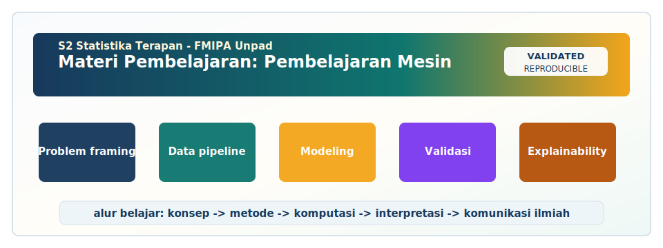

<!-- BEGIN UNPAD MATERIAL STYLE -->
<style>
:root {
  --unpad-navy: #17395c;
  --unpad-gold: #f2a51a;
  --unpad-teal: #0f766e;
  --unpad-ink: #172033;
  --unpad-paper: #fffdf8;
  --unpad-soft: #eef5f8;
  --unpad-line: #d7e2ea;
}
html, body {
  background: linear-gradient(135deg, #f8fbfd 0%, #fffdf8 48%, #f3f6ee 100%) !important;
  color: var(--unpad-ink) !important;
}
body {
  font-family: "Segoe UI", Arial, sans-serif !important;
  line-height: 1.72 !important;
}
.main-container {
  max-width: 1180px !important;
  background: rgba(255, 253, 248, 0.98) !important;
  border: 1px solid var(--unpad-line) !important;
  border-radius: 8px !important;
  box-shadow: 0 18px 42px rgba(23, 57, 92, 0.12) !important;
}
h1, h2, h3, h4 {
  letter-spacing: 0 !important;
}
h1.title {
  color: var(--unpad-navy) !important;
  -webkit-text-fill-color: var(--unpad-navy) !important;
  background: none !important;
}
h2 {
  border-left-color: var(--unpad-gold) !important;
}
a {
  color: #0b5c86 !important;
}
pre, code {
  border-radius: 8px !important;
}
.unpad-cover {
  margin: 18px 0 26px;
  padding: 24px;
  border-radius: 8px;
  background: linear-gradient(135deg, #17395c 0%, #0f766e 58%, #f2a51a 100%);
  color: #ffffff;
  box-shadow: 0 18px 36px rgba(23, 57, 92, 0.22);
}
.unpad-cover__brand {
  display: grid;
  grid-template-columns: 92px 1fr;
  gap: 20px;
  align-items: center;
}
.unpad-cover img {
  width: 92px;
  height: 92px;
  object-fit: contain;
  background: #ffffff;
  border-radius: 8px;
  padding: 8px;
  box-shadow: 0 8px 22px rgba(0,0,0,0.18);
}
.unpad-kicker {
  text-transform: uppercase;
  font-size: 0.82rem;
  font-weight: 800;
  letter-spacing: 0;
  color: #fff8dc;
}
.unpad-cover h2 {
  margin: 6px 0 8px;
  padding: 0;
  border: 0;
  background: transparent;
  color: #ffffff !important;
  font-size: 1.65rem;
}
.unpad-meta {
  margin: 0;
  color: #f7fbff;
  font-weight: 600;
}
.materi-illustration {
  margin: 20px 0 24px;
  padding: 14px;
  background: #ffffff;
  border: 1px solid var(--unpad-line);
  border-radius: 8px;
  box-shadow: 0 12px 28px rgba(23, 57, 92, 0.10);
}
.materi-illustration img {
  width: 100%;
  height: auto;
  display: block;
  border-radius: 6px;
}
.validasi-akademik {
  margin: 18px 0 28px;
  padding: 16px 18px;
  background: linear-gradient(135deg, #eef8f6, #fff8e7);
  border-left: 8px solid var(--unpad-teal);
  border-radius: 8px;
  color: var(--unpad-ink);
}
.validasi-akademik strong {
  color: var(--unpad-navy);
}
table {
  border-radius: 8px !important;
}
@media (max-width: 760px) {
  .unpad-cover__brand {
    grid-template-columns: 1fr;
  }
  .unpad-cover img {
    width: 76px;
    height: 76px;
  }
}
</style>
<!-- END UNPAD MATERIAL STYLE -->


<!-- BEGIN UNPAD MATERIAL ENHANCEMENT -->

```{r setup-unpad-render, include=FALSE}
execute_code <- FALSE
knitr::opts_chunk$set(
  echo = TRUE,
  eval = FALSE,
  message = FALSE,
  warning = FALSE,
  fig.align = "center",
  fig.width = 8,
  fig.height = 4.8,
  dpi = 120
)
set.seed(2025)
```


<div class="unpad-cover">
<div class="unpad-cover__brand">

<div>
<div class="unpad-kicker">S2 Statistika Terapan | FMIPA Universitas Padjadjaran</div>
<h2>Materi Pembelajaran: Pembelajaran Mesin</h2>
<p class="unpad-meta">Program Studi S2 Statistika Terapan, FMIPA Universitas Padjadjaran<br>Penulis: Dr. Irlandia Ginanjar, M.Si | Januari 2025</p>
</div>
</div>
</div>

<div class="materi-illustration">

</div>

<div class="validasi-akademik">
<strong>Catatan validasi akademik.</strong> Materi ini diseragamkan dengan rujukan ADWTL Januari 2025: rumus dibaca bersama asumsi, contoh kode diposisikan sebagai template reproducible, dan interpretasi diarahkan pada validitas data, diagnosis model, evaluasi ketidakpastian, serta komunikasi hasil secara ilmiah.
</div>

<!-- END UNPAD MATERIAL ENHANCEMENT -->

```{r setup, include=FALSE, eval=FALSE}
knitr::opts_chunk$set(
  echo = TRUE,
  message = FALSE,
  warning = FALSE,
  fig.align = "center",
  fig.width = 8,
  fig.height = 5,
  out.width = "95%"
)
```


<style>
:root{
  --cocoa:#5b341f;
  --cocoa-2:#7a4a2b;
  --caramel:#b8793b;
  --latte:#f7eadb;
  --cream:#fffaf3;
  --milk:#fff2df;
  --ink:#24160e;
  --muted:#6b5141;
}
html, body { scroll-behavior: smooth; }
body {
  color: var(--ink);
  background: linear-gradient(135deg, #fff9f0 0%, #f7eadb 32%, #efd0ad 66%, #c89056 100%);
  font-family: "Segoe UI", "Helvetica Neue", Arial, sans-serif;
  line-height: 1.72;
  font-size: 16px;
  margin-left: 330px;
  padding: 0 38px 60px 38px;
}
#TOC {
  position: fixed;
  left: 0;
  top: 0;
  width: 285px;
  height: 100vh;
  overflow-y: auto;
  padding: 28px 22px 48px 22px;
  background: linear-gradient(180deg, #3b2115 0%, #6d3d22 50%, #b8793b 100%);
  color: #fff8ed;
  box-shadow: 8px 0 24px rgba(72,38,18,.25);
  z-index: 1000;
}
#TOC::before {
  content: "Daftar Isi";
  display: block;
  font-size: 1.42rem;
  font-weight: 800;
  letter-spacing: .04em;
  margin-bottom: 18px;
  color: #fff3cf;
}
#TOC a { color: #fff8ed; text-decoration: none; }
#TOC a:hover { color: #ffe0a3; text-decoration: underline; }
#TOC ul { padding-left: 18px; }
#TOC li { margin: 6px 0; font-size: .92rem; }
.main-container, .container-fluid, main, .document {
  max-width: 1120px;
  margin: 0 auto;
  background: rgba(255,250,243,.94);
  padding: 34px 46px 70px 46px;
  border-radius: 0 0 26px 26px;
  box-shadow: 0 20px 50px rgba(67,35,14,.20);
}
h1.title, h1:first-child {
  background: linear-gradient(135deg, #4a2818 0%, #8b522b 42%, #d19955 100%);
  color: #fff8ed;
  padding: 38px 36px;
  border-radius: 24px;
  box-shadow: 0 16px 30px rgba(92,47,22,.25);
  margin-top: 18px;
}
h1, h2, h3, h4 { color: var(--cocoa); font-weight: 800; }
h2 {
  border-left: 10px solid var(--caramel);
  padding-left: 16px;
  background: linear-gradient(90deg, #fff0da, rgba(255,240,218,0));
  border-radius: 12px;
  padding-top: 9px;
  padding-bottom: 9px;
}
h3 { color: #6b3a21; }
a { color: #7e3f17; font-weight: 650; }
hr { border: 0; height: 3px; background: linear-gradient(90deg, #7a4a2b, #d9a760, transparent); }
blockquote {
  background: #fff5e8;
  border-left: 8px solid #b8793b;
  border-radius: 14px;
  padding: 14px 20px;
  color: #352017;
}
table { width: 100%; border-collapse: collapse; margin: 18px 0; background: #fffaf3; border-radius: 14px; overflow: hidden; }
th { background: #6d3d22; color: #fff8ed; padding: 11px; }
td { border: 1px solid #e0bf9c; padding: 10px; vertical-align: top; }
tr:nth-child(even) td { background: #fff3e4; }
pre, code {
  background-color: #f7e4ce !important;
  color: #1d1712 !important;
  border-radius: 10px;
}
pre {
  padding: 18px !important;
  border: 1px solid #e4bd90;
  border-left: 8px solid #a76332;
  overflow-x: auto;
  box-shadow: inset 0 0 0 1px rgba(255,255,255,.4);
}
pre code { background: transparent !important; }
.math, span.math, .MathJax, mjx-container { color: #1d1712 !important; }
.formula-box {
  background: #fff1dd;
  color: #1d1712;
  border: 1.5px solid #dfb780;
  border-left: 8px solid #b8793b;
  border-radius: 15px;
  padding: 18px 20px;
  margin: 18px 0;
  box-shadow: 0 10px 22px rgba(111,62,28,.09);
}
.concept-box, .case-box, .practice-box, .warning-box, .quote-box {
  border-radius: 18px;
  padding: 18px 22px;
  margin: 18px 0;
  box-shadow: 0 10px 24px rgba(92,47,22,.10);
}
.concept-box { background: linear-gradient(135deg, #fff6ea 0%, #f2d2ad 100%); border-left: 8px solid #7f4b2b; }
.case-box { background: linear-gradient(135deg, #fff9f1 0%, #ffe0b8 100%); border-left: 8px solid #ce8846; }
.practice-box { background: linear-gradient(135deg, #fff7e9 0%, #f9dcb9 100%); border-left: 8px solid #9b5b2e; }
.warning-box { background: #fff0df; border-left: 8px solid #a54b21; }
.badge {
  display:inline-block; padding:5px 10px; border-radius:999px; background:#704021; color:#fff7e7; font-size:.82rem; font-weight:700; margin:2px 4px 2px 0;
}
.callout-title { font-weight:800; color:#5b341f; margin-bottom:6px; }
.svg-wrap { background:#fff8ef; border-radius:20px; padding:16px; border:1px solid #e3bd92; margin:18px 0; text-align:center; }
.caption { font-size: .92rem; color: #6b5141; text-align:center; margin-top: -5px; }
.small { font-size: .92rem; color: #6b5141; }
@media (max-width: 980px){
  body { margin-left: 0; padding: 0 14px 40px 14px; }
  #TOC { position: relative; width: auto; height: auto; border-radius: 0 0 20px 20px; }
  .main-container, .container-fluid, main, .document { padding: 22px; border-radius: 18px; }
}
</style>


# Identitas Mata Kuliah dan Orientasi E-Book

<div class="concept-box">
<div class="callout-title">Identitas mata kuliah</div>

Materi ini disusun sebagai e-book pembelajaran untuk mata kuliah **Pembelajaran Mesin** pada **Program Studi S2 Statistika Terapan, Fakultas Matematika dan Ilmu Pengetahuan Alam, Universitas Padjadjaran**. E-book ini mengikuti kerangka RPS-OBE 2025 yang memuat mata kuliah wajib semester 2 dengan bobot **3 SKS**: teori 2 SKS dan praktikum 1 SKS. Dosen pengembang RPS, koordinator mata kuliah, dan dosen pengampu adalah **Dr. Irlandia Ginanjar, M.Si**. Ketua Program Studi yang tercantum pada RPS adalah **I Gede Nyoman Mindra Jaya, Ph.D** [@rps2025machinelearning].

<span class="badge">S2 Statistika Terapan</span>
<span class="badge">FMIPA UNPAD</span>
<span class="badge">Pembelajaran Mesin</span>
<span class="badge">Januari 2025</span>

</div>

## Tujuan Penyusunan Materi

E-book ini dirancang sebagai materi kuliah, praktikum, dan panduan proyek. Struktur utamanya mengikuti RPS: mahasiswa diarahkan untuk memahami kebutuhan data, mengevaluasi metode supervised dan unsupervised learning, merancang pipeline end-to-end, serta mengkomunikasikan hasil analisis machine learning secara profesional. Dalam konteks S2 Statistika Terapan, machine learning tidak cukup dipahami sebagai kumpulan algoritma. Machine learning harus ditempatkan sebagai kerangka kerja ilmiah untuk menyelesaikan masalah nyata, mulai dari perumusan pertanyaan, audit data, pemilihan model, validasi, interpretasi, hingga komunikasi keputusan kepada pemangku kepentingan.

Materi ini menggunakan pendekatan statistik terapan. Artinya, setiap algoritma dibahas bukan hanya dari sisi formula, tetapi juga dari sisi asumsi, bias, varians, interpretasi, risiko kesalahan, dan konsekuensi penggunaan model pada data nyata. Pendekatan ini penting karena model yang memiliki akurasi tinggi di satu dataset belum tentu layak digunakan ketika struktur data berubah, ketika kelas target tidak seimbang, ketika variabel prediktor mengalami pergeseran distribusi, atau ketika pemangku kepentingan membutuhkan penjelasan yang dapat dipertanggungjawabkan.

## Capaian Pembelajaran Mata Kuliah

Berdasarkan RPS, capaian pembelajaran mata kuliah diringkas sebagai berikut [@rps2025machinelearning]:

| Kode | Capaian Pembelajaran Mata Kuliah |
|---|---|
| CPMK1 | Menganalisis kebutuhan, karakteristik, dan tantangan data untuk pemecahan masalah nyata menggunakan machine learning. |
| CPMK2 | Mengevaluasi dan mengimplementasikan metode supervised dan unsupervised machine learning pada kasus nyata secara interdisipliner. |
| CPMK3 | Merancang dan mengembangkan solusi statistik berbasis algoritma komputasi dengan software untuk permasalahan kompleks. |
| CPMK4 | Mengkomunikasikan dan mempertahankan hasil analisis serta evaluasi model machine learning secara logis, kritis, dan inovatif. |

## Peta Pembelajaran 16 Pertemuan

| Pertemuan | Fokus Pembelajaran | Produk Belajar |
|---:|---|---|
| 1 | Pengantar machine learning, statistik klasik, dan problem framing | Peta konsep dan contoh kasus |
| 2 | Analisis karakteristik data dan tipe masalah | Audit data dan identifikasi target |
| 3 | Pemilihan metode berdasarkan tujuan analisis | Argumentasi pemilihan metode |
| 4 | Regresi, regularisasi, dan model supervised dasar | Praktikum regresi dan evaluasi |
| 5 | Klasifikasi dan unsupervised learning | Praktikum klasifikasi, clustering, PCA |
| 6 | Feature engineering dan feature selection | Pipeline preprocessing |
| 7 | Hyperparameter tuning dan validasi model | Mini project pipeline |
| 8 | UTS berbasis proyek | Laporan dan presentasi sementara |
| 9 | Gradient boosting dan ensemble learning | Model lanjutan dan perbandingan |
| 10 | Neural network dan deep learning | Implementasi model modern |
| 11 | Model comparison dan interpretasi | Tabel performa dan argumentasi model |
| 12 | Visualisasi hasil model | Dashboard/visualisasi ringkas |
| 13 | Pelaporan ilmiah machine learning | Draft laporan riset |
| 14 | Presentasi dan komunikasi hasil | Slide ilmiah dan peer review |
| 15 | Revisi, validasi argumen, dan refleksi | Laporan final revisi |
| 16 | UAS proyek akhir | Presentasi, laporan, dan kode |

<div class="svg-wrap">
<svg width="850" height="230" viewBox="0 0 850 230" xmlns="http://www.w3.org/2000/svg">
  <defs>
    <linearGradient id="g1" x1="0" x2="1"><stop stop-color="#5b341f"/><stop offset="1" stop-color="#d19955"/></linearGradient>
  </defs>
  <rect x="10" y="20" width="830" height="180" rx="24" fill="#fff1dd" stroke="#c08a54" stroke-width="2"/>
  <path d="M80 110 L750 110" stroke="url(#g1)" stroke-width="8" stroke-linecap="round"/>
  <g font-family="Segoe UI, Arial" text-anchor="middle">
    <circle cx="100" cy="110" r="38" fill="#6d3d22"/><text x="100" y="105" fill="#fff" font-size="14" font-weight="700">Data</text><text x="100" y="124" fill="#fff" font-size="12">Audit</text>
    <circle cx="250" cy="110" r="38" fill="#8b522b"/><text x="250" y="105" fill="#fff" font-size="14" font-weight="700">Model</text><text x="250" y="124" fill="#fff" font-size="12">Training</text>
    <circle cx="400" cy="110" r="38" fill="#a76332"/><text x="400" y="105" fill="#fff" font-size="14" font-weight="700">Validasi</text><text x="400" y="124" fill="#fff" font-size="12">CV</text>
    <circle cx="550" cy="110" r="38" fill="#bf793b"/><text x="550" y="105" fill="#fff" font-size="14" font-weight="700">Interpretasi</text><text x="550" y="124" fill="#fff" font-size="12">SHAP/PDP</text>
    <circle cx="700" cy="110" r="38" fill="#d19955"/><text x="700" y="105" fill="#3b2115" font-size="14" font-weight="700">Komunikasi</text><text x="700" y="124" fill="#3b2115" font-size="12">Keputusan</text>
  </g>
</svg>
</div>
<div class="caption">Gambar konseptual: pipeline pembelajaran mesin untuk statistika terapan.</div>

## Cara Menggunakan E-Book Ini

Setiap bab dirancang sebagai modul pertemuan. Bagian awal bab memuat konsep kunci dan tujuan belajar, bagian tengah memuat formulasi, contoh kasus, dan praktikum R, sedangkan bagian akhir memuat refleksi, kesalahan umum, dan tugas. Kode R ditulis agar dapat dijalankan setelah mahasiswa memasang paket yang diperlukan. Sebagian kode diberi opsi `eval=FALSE` agar aman ketika e-book dikompilasi pada komputer yang belum memiliki paket lengkap. Filosofinya sederhana: kode jangan sampai lebih galak daripada dosen pengampu. 😄

## Paket R yang Disarankan

```{r packages, eval=FALSE}
install.packages(c(
  "tidyverse", "tidymodels", "caret", "glmnet", "ranger", "e1071",
  "xgboost", "kernlab", "factoextra", "cluster", "vip", "DALEX",
  "pROC", "yardstick", "themis", "keras", "tensorflow"
))
```


# Pertemuan 1: Pendahuluan Machine Learning dan Problem Framing

<div class="concept-box"><div class="callout-title">Fokus RPS: SubCPMK1</div>Topik utama: definisi machine learning, statistik klasik, supervised learning, unsupervised learning, reinforcement learning, problem framing. Contoh konteks: prediksi risiko stunting kabupaten/kota, churn pelanggan, dan klasifikasi status kredit. Referensi utama: [@james2021islr; @hastie2009elements; @murphy2012machine].</div>


<div class="svg-wrap">
<svg width="820" height="190" viewBox="0 0 820 190" xmlns="http://www.w3.org/2000/svg">
  <defs><linearGradient id="g1" x1="0" x2="1"><stop stop-color="#5b341f"/><stop offset="1" stop-color="#d19955"/></linearGradient></defs>
  <rect x="15" y="18" width="790" height="150" rx="22" fill="#fff6ea" stroke="#d6a06c" stroke-width="2"/>
  <text x="410" y="45" font-family="Segoe UI, Arial" text-anchor="middle" font-size="18" font-weight="800" fill="#5b341f">Pendahuluan Machine Learning dan Problem Fra</text>
  <g font-family="Segoe UI, Arial" font-size="13" text-anchor="middle">
    <rect x="60" y="78" width="120" height="48" rx="14" fill="#6d3d22"/><text x="120" y="107" fill="#fff">Data</text>
    <path d="M185 102 H245" stroke="url(#g1)" stroke-width="5" stroke-linecap="round"/>
    <rect x="250" y="78" width="120" height="48" rx="14" fill="#8b522b"/><text x="310" y="107" fill="#fff">Preprocess</text>
    <path d="M375 102 H435" stroke="url(#g1)" stroke-width="5" stroke-linecap="round"/>
    <rect x="440" y="78" width="120" height="48" rx="14" fill="#a76332"/><text x="500" y="107" fill="#fff">Model</text>
    <path d="M565 102 H625" stroke="url(#g1)" stroke-width="5" stroke-linecap="round"/>
    <rect x="630" y="78" width="120" height="48" rx="14" fill="#d19955"/><text x="690" y="107" fill="#3b2115">Evaluasi</text>
  </g>
</svg>
</div>


## Tujuan Pembelajaran

Setelah mengikuti pertemuan ini, mahasiswa diharapkan mampu menjelaskan konsep definisi machine learning, statistik klasik, supervised learning, unsupervised learning, reinforcement learning, problem framing, mengaitkan konsep tersebut dengan kebutuhan data nyata, memilih prosedur validasi yang sesuai, dan menyusun argumen analitis yang dapat dipertanggungjawabkan dalam konteks prediksi risiko stunting kabupaten/kota, churn pelanggan, dan klasifikasi status kredit. Kompetensi ini mendukung SubCPMK1 dalam RPS Pembelajaran Mesin.


## Narasi Konseptual dan Landasan Teoretis

Machine learning berbeda dari statistik klasik terutama pada penekanan prediksi, validasi empiris, dan fleksibilitas fungsi. Statistik klasik sering memulai dari model probabilistik yang eksplisit dan parameter yang diinterpretasikan, sedangkan machine learning sering memulai dari kinerja generalisasi dan prosedur optimasi. Pembeda ini bukan tembok pemisah. Dalam statistika terapan modern, keduanya saling memperkaya: inferensi statistik membantu menjelaskan ketidakpastian, sementara machine learning memperluas kemampuan pemodelan pola kompleks.

Problem framing mengubah masalah substantif menjadi objek analitik. Pertanyaan 'apa faktor yang memengaruhi stunting' berbeda dari 'kabupaten mana yang berisiko tinggi tahun depan'. Pertanyaan pertama cenderung membutuhkan inferensi dan interpretasi, sedangkan pertanyaan kedua menuntut sistem prediksi yang tervalidasi. Mahasiswa perlu menulis perbedaan ini secara eksplisit karena pemilihan model, metrik, dan data uji akan berubah mengikuti tujuan.

Dalam pertemuan ini, fokus utama adalah definisi machine learning, statistik klasik, supervised learning, unsupervised learning, reinforcement learning, problem framing. Pokok bahasan tersebut ditempatkan dalam kerangka statistika terapan, sehingga mahasiswa tidak hanya mengenal nama algoritma, tetapi juga memahami alasan mengapa algoritma tersebut digunakan, kapan algoritma tersebut perlu dihindari, dan bagaimana hasilnya dipertanggungjawabkan. Pada tingkat magister, kemampuan memilih metode sama pentingnya dengan kemampuan menjalankan kode. Sebuah model yang tampak canggih dapat menjadi lemah apabila target tidak didefinisikan dengan benar, unit analisis tidak konsisten, atau proses validasi tidak mencerminkan situasi penggunaan model di dunia nyata. Oleh karena itu, setiap bagian materi selalu mengaitkan konsep, data, model, validasi, dan komunikasi hasil.

Secara konseptual, definisi machine learning, statistik klasik, supervised learning, unsupervised learning, reinforcement learning, problem framing perlu dibaca sebagai bagian dari rantai keputusan analitik. Rantai ini dimulai dari pertanyaan substantif, berlanjut ke struktur data, kemudian ke representasi matematis, dan akhirnya ke pemilihan prosedur komputasi. Kesalahan umum mahasiswa adalah meloncat langsung ke model karena paket perangkat lunak menyediakan fungsi yang mudah dijalankan. Pendekatan seperti itu berisiko menghasilkan analisis yang mekanis. Dalam proyek machine learning, pertanyaan pertama bukan 'model apa yang paling keren', melainkan 'keputusan apa yang ingin dibuat, informasi apa yang tersedia sebelum keputusan, dan bagaimana kinerja model akan diukur secara adil'.

Contoh kasus yang digunakan untuk memahami materi ini adalah prediksi risiko stunting kabupaten/kota, churn pelanggan, dan klasifikasi status kredit. Kasus-kasus tersebut sengaja dipilih karena dekat dengan bidang bisnis, industri, sosial, aktuaria, biostatistik, dan sains data. Pada kasus kesehatan masyarakat, misalnya, model harus memperhatikan konsekuensi salah klasifikasi karena kesalahan memprediksi wilayah risiko tinggi dapat berdampak pada prioritas intervensi. Pada kasus bisnis, model yang terlalu kompleks mungkin tidak diterima manajemen apabila tidak dapat dijelaskan. Pada kasus aktuaria, model yang akurat tetapi tidak stabil terhadap data baru dapat menimbulkan risiko finansial. Dengan demikian, konteks domain selalu menjadi bagian dari evaluasi model.

Landasan statistik dari definisi machine learning, statistik klasik, supervised learning, unsupervised learning, reinforcement learning, problem framing adalah gagasan bahwa data observasi merupakan realisasi terbatas dari proses yang lebih besar. Model machine learning berusaha menangkap pola dari data latihan, tetapi pola yang ditangkap tidak otomatis berlaku pada populasi, waktu, atau lokasi lain. Karena itu, istilah generalisasi menjadi kata kunci. Generalisasi bukan sekadar akurasi pada data yang sudah dilihat, melainkan kemampuan bekerja pada data yang belum digunakan dalam pelatihan. Prinsip ini selaras dengan diskusi bias-variance trade-off dalam literatur pembelajaran statistik [@james2021islr; @hastie2009elements; @murphy2012machine].

Pada praktiknya, mahasiswa perlu membedakan antara performa in-sample dan out-of-sample. Performa in-sample sering tampak sangat baik karena model dievaluasi pada data yang sama dengan data latihan. Namun, performa semacam itu dapat menipu, terutama ketika model memiliki fleksibilitas tinggi. Evaluasi out-of-sample melalui holdout, cross-validation, atau skema validasi berbasis waktu lebih relevan untuk menilai kemampuan prediksi. Perbedaan sederhana ini sering menjadi pembatas antara analisis yang terlihat meyakinkan dan analisis yang benar-benar dapat dipercaya.

Dari sisi komputasi, definisi machine learning, statistik klasik, supervised learning, unsupervised learning, reinforcement learning, problem framing menuntut dokumentasi langkah kerja yang rapi. Setiap transformasi data harus dicatat: variabel mana yang dihapus, bagaimana missing value ditangani, apakah standardisasi dilakukan sebelum atau sesudah split data, dan apakah informasi dari data uji pernah bocor ke proses pelatihan. Data leakage adalah masalah serius dalam machine learning karena membuat model terlihat lebih baik daripada kinerja sebenarnya. Dalam laporan ilmiah, mahasiswa perlu menjelaskan alur preprocessing dengan cukup rinci agar pembaca dapat mereplikasi analisis.

Aspek etika dan tanggung jawab juga tidak boleh dipisahkan dari materi ini. Model dapat memperkuat bias historis apabila data latihan mencerminkan ketimpangan masa lalu. Pada kasus klasifikasi risiko kredit, misalnya, variabel proksi dapat membawa informasi sensitif meskipun variabel sensitif tidak digunakan secara eksplisit. Pada kasus kesehatan, model yang tidak dikalibrasi dapat mendorong keputusan klinis yang berlebihan atau kurang responsif. Oleh sebab itu, interpretasi model harus disertai analisis kesalahan, diskusi keterbatasan, dan kehati-hatian dalam menyusun rekomendasi.

Salah satu kemampuan penting yang dikembangkan pada pertemuan ini adalah kemampuan membuat baseline. Baseline dapat berupa model sederhana, aturan mayoritas, rata-rata historis, atau regresi sederhana. Baseline berguna sebagai titik pembanding. Apabila model kompleks tidak mampu mengalahkan baseline secara bermakna, maka kompleksitas model tidak memberikan nilai tambah. Dalam kelas S2 Statistika Terapan, baseline juga membantu mahasiswa mempertahankan argumen ilmiah: peningkatan performa harus dibuktikan, bukan diasumsikan.

Untuk membangun intuisi, mahasiswa dianjurkan membuat visualisasi sederhana sebelum melakukan pemodelan. Distribusi target, korelasi antarvariabel, hubungan nonlinear, imbalance kelas, dan pola outlier sering terlihat lebih cepat melalui grafik daripada melalui tabel ringkasan. Visualisasi bukan hiasan laporan; visualisasi adalah alat diagnostik. Grafik yang baik dapat mengungkap masalah data yang tidak langsung terlihat dari hasil model. Namun, visualisasi juga harus jujur: skala sumbu, pilihan warna, dan agregasi data tidak boleh mengarahkan pembaca pada kesimpulan yang berlebihan.

Secara matematis, bagian ini dapat diringkas melalui formulasi berikut. Formulasi tersebut tidak dimaksudkan untuk membuat materi tampak rumit, tetapi untuk menegaskan bahwa machine learning adalah optimasi berbasis data dengan fungsi kerugian, ruang model, dan penalti kompleksitas. Ketika mahasiswa memahami komponen ini, mereka dapat membaca berbagai algoritma sebagai variasi dari pertanyaan yang sama: fungsi apa yang diminimalkan, parameter apa yang dipelajari, dan bagaimana kompleksitas dikendalikan agar model tidak overfit.

Dalam praktikum, mahasiswa sebaiknya mulai dari dataset kecil agar setiap langkah dapat diperiksa secara manual. Dataset besar memang menarik, tetapi dataset kecil lebih baik untuk memahami alur kerja. Setelah mahasiswa memahami split data, preprocessing, fitting model, prediksi, dan evaluasi, barulah dataset nyata yang lebih kompleks digunakan. Prinsip bertahap ini penting karena banyak kegagalan proyek machine learning bukan karena algoritmanya tidak kuat, melainkan karena mahasiswa tidak mengetahui pada tahap mana kesalahan terjadi.

Interpretasi hasil harus dibedakan dari sekadar membaca output software. Output model dapat berisi koefisien, importance score, confusion matrix, loss, atau grafik training history. Nilai-nilai tersebut baru menjadi informasi ketika diterjemahkan ke dalam bahasa substantif. Misalnya, peningkatan recall mungkin berarti lebih banyak kasus risiko tinggi terdeteksi, tetapi juga dapat meningkatkan false positive. Peningkatan RMSE yang kecil mungkin tidak penting secara praktis apabila biaya implementasi model jauh lebih besar. Karena itu, interpretasi harus selalu dikaitkan dengan tujuan keputusan.

Kriteria keberhasilan pada pertemuan ini tidak hanya dilihat dari kemampuan menjalankan fungsi R atau Python. Mahasiswa diharapkan mampu menjelaskan alur berpikir secara runtut: mengapa data diproses dengan cara tertentu, mengapa model dipilih, mengapa metrik tertentu digunakan, dan bagaimana hasil dapat dipertahankan dalam diskusi kelas. Kompetensi seperti ini sesuai dengan orientasi RPS yang menekankan analisis kritis, implementasi, pipeline, dan komunikasi profesional [@rps2025machinelearning].

Kesalahan umum yang perlu dihindari adalah memperlakukan semua masalah sebagai masalah prediksi. Tidak semua pertanyaan membutuhkan supervised learning. Jika tidak ada target, pendekatan yang lebih sesuai mungkin clustering atau reduksi dimensi. Jika tujuan utama adalah menjelaskan hubungan kausal, machine learning prediktif perlu digunakan dengan sangat hati-hati karena akurasi prediksi tidak otomatis menunjukkan sebab-akibat. Jika data memiliki struktur waktu, validasi acak dapat menciptakan kebocoran temporal. Pemilihan metode harus selalu tunduk pada pertanyaan ilmiah dan struktur data.

Dalam diskusi kelas, mahasiswa dapat diminta membandingkan dua strategi analisis yang sama-sama masuk akal. Misalnya, pada prediksi risiko stunting kabupaten/kota, churn pelanggan, dan klasifikasi status kredit, satu kelompok dapat mengusulkan model interpretable seperti regresi regularisasi, sedangkan kelompok lain dapat mengusulkan model ensemble. Perdebatan tidak diarahkan untuk mencari model paling populer, tetapi untuk menilai trade-off antara akurasi, stabilitas, interpretabilitas, kebutuhan komputasi, dan kemudahan komunikasi. Diskusi seperti ini melatih kemampuan mempertahankan hasil analisis secara ilmiah.

Keluaran minimal dari pertemuan ini adalah catatan analisis yang dapat dibaca ulang. Catatan tersebut idealnya memuat tujuan analisis, unit observasi, target, fitur, risiko data, rancangan validasi, pilihan model awal, metrik evaluasi, dan rencana visualisasi. Apabila catatan ini dibuat sejak awal, proyek akhir akan lebih mudah disusun karena mahasiswa tidak perlu mengingat keputusan analitik yang sudah dibuat beberapa minggu sebelumnya. Reproducibility dimulai dari kebiasaan mencatat, bukan dari alat yang rumit.

Hubungan materi ini dengan capaian pembelajaran adalah langsung. SubCPMK1 menuntut mahasiswa untuk bergerak dari pemahaman konseptual menuju penilaian dan perancangan. Artinya, mahasiswa tidak cukup mampu menjawab definisi, tetapi juga harus mampu menggunakan definisi tersebut untuk membuat keputusan analitik. Dalam level C4 sampai C6, proses berpikir melibatkan analisis, evaluasi, dan kreasi. Oleh karena itu, tugas yang diberikan menekankan argumentasi, implementasi, dan komunikasi, bukan hafalan algoritma.

Untuk memperdalam materi, mahasiswa dianjurkan membaca literatur utama dan pendukung. Buku James, Witten, Hastie, dan Tibshirani memberikan pengantar yang kuat dengan contoh R; buku Hastie, Tibshirani, dan Friedman memberi fondasi pembelajaran statistik yang lebih teoretis; buku Kuhn dan Johnson berorientasi pada predictive modeling terapan; buku Murphy dan Bishop membantu mahasiswa memahami perspektif probabilistik; sedangkan buku Goodfellow, Bengio, dan Courville relevan untuk topik neural network dan deep learning [@james2021islr; @hastie2009elements; @murphy2012machine].

Akhirnya, keberhasilan pembelajaran machine learning dapat dilihat dari kemampuan mahasiswa menghubungkan angka dengan keputusan. Nilai akurasi, RMSE, ROC-AUC, atau silhouette score tidak berdiri sendiri. Setiap angka harus dijelaskan: apa artinya, bagaimana dihitung, apakah validasinya tepat, apakah ada ketidakpastian, apa konsekuensi praktisnya, dan apakah model dapat dipercaya untuk konteks yang dituju. Ketika mahasiswa mampu menjawab pertanyaan tersebut, mereka telah bergerak dari pengguna software menjadi analis statistik terapan yang matang.


## Pendalaman Terapan dan Catatan Dosen

Dalam pengalaman pembelajaran statistika terapan, satu kesulitan utama pada topik definisi machine learning, statistik klasik, supervised learning, unsupervised learning, reinforcement learning, problem framing adalah menjaga keseimbangan antara ketelitian metodologis dan kegunaan praktis. Mahasiswa sering merasa bahwa semakin banyak model dicoba, semakin kuat analisisnya. Anggapan ini tidak selalu benar. Analisis yang kuat bukan analisis yang memuat model paling banyak, melainkan analisis yang memiliki alasan jelas untuk setiap model yang dipilih. Pada kasus prediksi risiko stunting kabupaten/kota, churn pelanggan, dan klasifikasi status kredit, model harus diuji melalui pertanyaan sederhana: apakah model membantu menjawab masalah utama, apakah hasilnya stabil, dan apakah keputusan yang diambil dari model dapat dipertanggungjawabkan.

Topik Pendahuluan Machine Learning dan Problem Framing juga perlu dikaitkan dengan kemampuan membaca data sebagai produk proses sosial, administratif, atau eksperimen. Data tidak muncul secara netral. Data kesehatan dipengaruhi sistem pelaporan, data bisnis dipengaruhi perilaku pelanggan, data industri dipengaruhi sensor dan proses produksi, sedangkan data sosial dipengaruhi desain survei dan responden. Karena itu, sebelum menggunakan definisi machine learning, statistik klasik, supervised learning, unsupervised learning, reinforcement learning, problem framing, mahasiswa perlu bertanya dari mana data berasal, siapa yang tercakup, siapa yang tidak tercakup, dan bagaimana proses pengumpulan data dapat membentuk pola yang terlihat oleh model.

Dalam pengajaran, dosen dapat meminta mahasiswa membuat dua versi analisis: versi minimal dan versi lengkap. Versi minimal hanya menggunakan baseline, preprocessing dasar, dan metrik utama. Versi lengkap menambahkan model yang lebih fleksibel, tuning, interpretasi, dan visualisasi. Perbandingan dua versi ini sangat efektif untuk memperlihatkan nilai tambah setiap komponen. Jika versi lengkap tidak memperbaiki hasil atau justru membuat interpretasi kabur, mahasiswa belajar bahwa kompleksitas bukan tujuan akhir. Kompleksitas harus dibayar dengan peningkatan validitas, akurasi, atau kegunaan.

Aspek lain yang penting adalah pemisahan peran data training, validation, dan testing. Pada definisi machine learning, statistik klasik, supervised learning, unsupervised learning, reinforcement learning, problem framing, pemilihan parameter, fitur, dan model sebaiknya tidak menggunakan informasi dari data uji akhir. Data uji akhir berfungsi sebagai simulasi dunia luar. Jika data uji digunakan berulang kali untuk memilih model, maka data tersebut tidak lagi independen secara analitik. Inilah alasan mengapa laporan proyek harus menuliskan alur pembagian data dengan sangat jelas. Diagram sederhana sering lebih membantu daripada deskripsi panjang yang kabur.

Dalam konteks prediksi risiko stunting kabupaten/kota, churn pelanggan, dan klasifikasi status kredit, hasil model sebaiknya tidak langsung diterjemahkan menjadi rekomendasi tanpa analisis kesalahan. Error analysis dapat dilakukan dengan memeriksa observasi yang salah prediksi, kelompok data yang memiliki performa buruk, wilayah dengan residual ekstrem, atau kelas minoritas yang sering terabaikan. Analisis ini membuat model lebih transparan dan membantu mahasiswa memahami bahwa rata-rata performa dapat menyembunyikan kegagalan pada subkelompok penting. Model yang baik harus dinilai bukan hanya dari angka global, tetapi juga dari pola kesalahannya.

Ketika mahasiswa menggunakan software, penting untuk memahami bahwa setiap paket memiliki default settings. Default tersebut tidak selalu cocok untuk semua data. Misalnya, jumlah fold cross-validation, metode imputasi, skala variabel, jumlah pohon, kernel, atau learning rate dapat memengaruhi hasil. Kebiasaan menjalankan fungsi tanpa membaca dokumentasi adalah jalan cepat menuju hasil yang sulit dijelaskan. Dalam laporan, mahasiswa tidak perlu menuliskan seluruh dokumentasi paket, tetapi perlu menyebutkan pilihan penting yang memengaruhi analisis.

Pembahasan Pendahuluan Machine Learning dan Problem Framing sebaiknya juga menekankan perbedaan antara interpretasi statistik dan interpretasi substantif. Interpretasi statistik menjelaskan nilai metrik, arah hubungan, atau kontribusi fitur. Interpretasi substantif menjelaskan makna hasil terhadap masalah nyata. Misalnya, variabel yang penting dalam model belum tentu menjadi penyebab. Variabel tersebut mungkin hanya proxy, berkorelasi dengan variabel lain, atau menangkap pola administratif. Mahasiswa perlu menahan diri dari klaim kausal jika desain analisis tidak mendukung kausalitas.

Dalam proyek kelompok, pembagian tugas perlu dibuat eksplisit. Satu mahasiswa dapat bertanggung jawab pada audit data, satu pada preprocessing, satu pada model baseline, satu pada model lanjutan, dan satu pada interpretasi serta penulisan. Namun, semua anggota tetap harus memahami keseluruhan pipeline. Ketika presentasi, pertanyaan dosen dapat menyentuh bagian mana saja. Pembagian kerja yang baik bukan berarti setiap orang hanya menguasai potongan kecil, melainkan setiap orang memiliki kontribusi utama dan pemahaman lintas bagian.

Dari perspektif pembelajaran OBE, bukti capaian belajar pada Pendahuluan Machine Learning dan Problem Framing harus tampak dalam artefak yang dihasilkan. Artefak tersebut dapat berupa notebook R, tabel evaluasi, grafik diagnostik, laporan singkat, slide, atau repositori kode. Artefak yang baik memiliki jejak keputusan analitik. Pembaca dapat melihat apa yang dicoba, apa yang dipilih, apa yang ditolak, dan mengapa. Jejak ini membuat proses belajar dapat dievaluasi secara lebih adil dibanding hanya menilai hasil akhir.

Mahasiswa juga perlu mengenal konsep model risk. Model risk adalah risiko bahwa model menghasilkan keputusan buruk karena data tidak representatif, asumsi tidak sesuai, validasi lemah, implementasi keliru, atau interpretasi berlebihan. Pada definisi machine learning, statistik klasik, supervised learning, unsupervised learning, reinforcement learning, problem framing, model risk dapat dikurangi melalui dokumentasi, validasi silang, pemeriksaan stabilitas, interpretasi, dan review sejawat. Dalam dunia profesional, model yang tidak terdokumentasi dapat menjadi sumber masalah besar meskipun pada awalnya terlihat akurat.

Sebuah latihan reflektif yang berguna adalah meminta mahasiswa menuliskan tiga keputusan analitik yang paling berpengaruh pada hasil. Keputusan tersebut bisa berupa pemilihan target, metode imputasi, teknik balancing, metrik utama, algoritma, atau parameter tuning. Setelah itu, mahasiswa diminta menjelaskan apa yang mungkin terjadi jika keputusan tersebut diganti. Latihan ini melatih sensitivitas metodologis. Mereka belajar bahwa hasil machine learning bukan keluaran otomatis, tetapi produk dari rangkaian keputusan yang harus dipertanggungjawabkan.

Pada akhir sesi Pendahuluan Machine Learning dan Problem Framing, mahasiswa sebaiknya mampu menyampaikan ringkasan satu menit. Ringkasan ini memuat masalah, data, metode, hasil utama, dan keterbatasan. Keterampilan menyampaikan ringkasan singkat sangat penting karena banyak forum akademik dan profesional memberi waktu terbatas. Jika mahasiswa tidak dapat menjelaskan pekerjaannya secara ringkas, biasanya struktur berpikirnya belum solid. Ringkasan singkat bukan berarti menyederhanakan secara berlebihan, melainkan memilih pesan paling penting dengan tetap menjaga akurasi ilmiah.


## Formulasi Kunci

<div class="formula-box">

$$
\hat{f}=\arg\min_{f\in\mathcal{F}}\frac{1}{n}\sum_{i=1}^{n}L(y_i,f(x_i))+\lambda\Omega(f)
$$

</div>

Formulasi di atas perlu dibaca sebagai ringkasan matematis dari proses belajar model. Simbol, fungsi kerugian, parameter, dan penalti dapat berubah antaralgoritma, tetapi prinsip dasarnya tetap sama: model dipilih melalui proses optimasi dan dievaluasi melalui kemampuan generalisasi pada data yang belum dilihat.


## Algoritma Kerja Praktikum

<div class="practice-box"><div class="callout-title">Algoritma kerja praktikum</div>
<ol>
<li>Definisikan tujuan analisis dan unit observasi.</li>
<li>Lakukan audit kualitas data, tipe variabel, missing value, outlier, dan potensi leakage.</li>
<li>Pilih pendekatan yang sesuai dengan fokus definisi machine learning, statistik klasik, supervised learning, unsupervised learning, reinforcement learning, problem framing.</li>
<li>Buat baseline dan skema validasi yang adil.</li>
<li>Latih model, evaluasi metrik, dan lakukan interpretasi substantif.</li>
<li>Dokumentasikan kode, keputusan analitik, serta keterbatasan hasil.</li>
</ol></div>


## Contoh Implementasi R


```{r intro-ml-template, eval=FALSE}
library(tidyverse)

# Template awal problem framing
problem <- tibble::tribble(
  ~komponen, ~pertanyaan,
  "Tujuan", "Apa keputusan yang ingin didukung oleh model?",
  "Unit analisis", "Individu, rumah tangga, kabupaten, transaksi, atau waktu?",
  "Target", "Kontinu, biner, multikelas, tidak tersedia, atau deret waktu?",
  "Fitur", "Variabel apa yang tersedia sebelum keputusan dibuat?",
  "Risiko", "Apa konsekuensi false positive dan false negative?",
  "Validasi", "Bagaimana model diuji agar tidak hanya hafal data latihan?"
)
problem
```


## Pertanyaan Diskusi

1. Apa risiko metodologis terbesar ketika menerapkan definisi machine learning, statistik klasik, supervised learning, unsupervised learning, reinforcement learning, problem framing pada prediksi risiko stunting kabupaten/kota, churn pelanggan, dan klasifikasi status kredit?
2. Metrik apa yang paling sesuai untuk mengevaluasi keberhasilan model, dan mengapa?
3. Bagaimana cara menjelaskan hasil kepada audiens yang tidak memiliki latar belakang statistika?
4. Keputusan preprocessing mana yang paling mungkin menimbulkan data leakage?
5. Apa baseline yang adil untuk membuktikan bahwa model yang lebih kompleks benar-benar memberi nilai tambah?


## Mini Tugas

Susun ringkasan dua sampai tiga halaman yang menjelaskan bagaimana definisi machine learning, statistik klasik, supervised learning, unsupervised learning, reinforcement learning, problem framing dapat digunakan pada satu kasus nyata pilihan Anda. Ringkasan wajib memuat tujuan analisis, unit observasi, target atau struktur unsupervised, fitur utama, rancangan validasi, metrik evaluasi, serta risiko interpretasi. Sertakan minimal tiga sitasi dari daftar pustaka.


# Pertemuan 2: Analisis Kebutuhan dan Karakteristik Data

<div class="concept-box"><div class="callout-title">Fokus RPS: SubCPMK1</div>Topik utama: tipe data numerik, kategorik, ordinal, teks, citra, deret waktu, data spasial, missing value, outlier, data leakage. Contoh konteks: audit data survei sosial, klaim asuransi, dan rekam medis. Referensi utama: [@kuhn2013applied; @bishop2006pattern; @wickham2019welcome].</div>


<div class="svg-wrap">
<svg width="820" height="190" viewBox="0 0 820 190" xmlns="http://www.w3.org/2000/svg">
  <defs><linearGradient id="g2" x1="0" x2="1"><stop stop-color="#5b341f"/><stop offset="1" stop-color="#d19955"/></linearGradient></defs>
  <rect x="15" y="18" width="790" height="150" rx="22" fill="#fff6ea" stroke="#d6a06c" stroke-width="2"/>
  <text x="410" y="45" font-family="Segoe UI, Arial" text-anchor="middle" font-size="18" font-weight="800" fill="#5b341f">Analisis Kebutuhan dan Karakteristik Data</text>
  <g font-family="Segoe UI, Arial" font-size="13" text-anchor="middle">
    <rect x="60" y="78" width="120" height="48" rx="14" fill="#6d3d22"/><text x="120" y="107" fill="#fff">Data</text>
    <path d="M185 102 H245" stroke="url(#g2)" stroke-width="5" stroke-linecap="round"/>
    <rect x="250" y="78" width="120" height="48" rx="14" fill="#8b522b"/><text x="310" y="107" fill="#fff">Preprocess</text>
    <path d="M375 102 H435" stroke="url(#g2)" stroke-width="5" stroke-linecap="round"/>
    <rect x="440" y="78" width="120" height="48" rx="14" fill="#a76332"/><text x="500" y="107" fill="#fff">Model</text>
    <path d="M565 102 H625" stroke="url(#g2)" stroke-width="5" stroke-linecap="round"/>
    <rect x="630" y="78" width="120" height="48" rx="14" fill="#d19955"/><text x="690" y="107" fill="#3b2115">Evaluasi</text>
  </g>
</svg>
</div>


## Tujuan Pembelajaran

Setelah mengikuti pertemuan ini, mahasiswa diharapkan mampu menjelaskan konsep tipe data numerik, kategorik, ordinal, teks, citra, deret waktu, data spasial, missing value, outlier, data leakage, mengaitkan konsep tersebut dengan kebutuhan data nyata, memilih prosedur validasi yang sesuai, dan menyusun argumen analitis yang dapat dipertanggungjawabkan dalam konteks audit data survei sosial, klaim asuransi, dan rekam medis. Kompetensi ini mendukung SubCPMK1 dalam RPS Pembelajaran Mesin.


## Narasi Konseptual dan Landasan Teoretis

Audit data mencakup pemeriksaan tipe variabel, cakupan observasi, definisi operasional, missingness, duplikasi, anomali, dan konsistensi waktu. Data yang tampak rapi dalam spreadsheet belum tentu siap dimodelkan. Variabel persentase, rasio, skor indeks, kategori ordinal, dan kode wilayah memiliki makna berbeda. Kesalahan membaca tipe data dapat menghasilkan preprocessing keliru, misalnya menstandarkan kode wilayah seolah-olah angka kontinu.

Missing value perlu dibedakan antara hilang acak, hilang karena mekanisme administrasi, dan hilang karena fenomena substantif. Menghapus baris secara otomatis dapat mengubah populasi analisis. Imputasi juga tidak netral karena menghasilkan nilai buatan berdasarkan asumsi tertentu. Laporan yang baik menjelaskan proporsi missing, pola missing, metode penanganan, dan sensitivitas hasil terhadap keputusan tersebut.

Dalam pertemuan ini, fokus utama adalah tipe data numerik, kategorik, ordinal, teks, citra, deret waktu, data spasial, missing value, outlier, data leakage. Pokok bahasan tersebut ditempatkan dalam kerangka statistika terapan, sehingga mahasiswa tidak hanya mengenal nama algoritma, tetapi juga memahami alasan mengapa algoritma tersebut digunakan, kapan algoritma tersebut perlu dihindari, dan bagaimana hasilnya dipertanggungjawabkan. Pada tingkat magister, kemampuan memilih metode sama pentingnya dengan kemampuan menjalankan kode. Sebuah model yang tampak canggih dapat menjadi lemah apabila target tidak didefinisikan dengan benar, unit analisis tidak konsisten, atau proses validasi tidak mencerminkan situasi penggunaan model di dunia nyata. Oleh karena itu, setiap bagian materi selalu mengaitkan konsep, data, model, validasi, dan komunikasi hasil.

Secara konseptual, tipe data numerik, kategorik, ordinal, teks, citra, deret waktu, data spasial, missing value, outlier, data leakage perlu dibaca sebagai bagian dari rantai keputusan analitik. Rantai ini dimulai dari pertanyaan substantif, berlanjut ke struktur data, kemudian ke representasi matematis, dan akhirnya ke pemilihan prosedur komputasi. Kesalahan umum mahasiswa adalah meloncat langsung ke model karena paket perangkat lunak menyediakan fungsi yang mudah dijalankan. Pendekatan seperti itu berisiko menghasilkan analisis yang mekanis. Dalam proyek machine learning, pertanyaan pertama bukan 'model apa yang paling keren', melainkan 'keputusan apa yang ingin dibuat, informasi apa yang tersedia sebelum keputusan, dan bagaimana kinerja model akan diukur secara adil'.

Contoh kasus yang digunakan untuk memahami materi ini adalah audit data survei sosial, klaim asuransi, dan rekam medis. Kasus-kasus tersebut sengaja dipilih karena dekat dengan bidang bisnis, industri, sosial, aktuaria, biostatistik, dan sains data. Pada kasus kesehatan masyarakat, misalnya, model harus memperhatikan konsekuensi salah klasifikasi karena kesalahan memprediksi wilayah risiko tinggi dapat berdampak pada prioritas intervensi. Pada kasus bisnis, model yang terlalu kompleks mungkin tidak diterima manajemen apabila tidak dapat dijelaskan. Pada kasus aktuaria, model yang akurat tetapi tidak stabil terhadap data baru dapat menimbulkan risiko finansial. Dengan demikian, konteks domain selalu menjadi bagian dari evaluasi model.

Landasan statistik dari tipe data numerik, kategorik, ordinal, teks, citra, deret waktu, data spasial, missing value, outlier, data leakage adalah gagasan bahwa data observasi merupakan realisasi terbatas dari proses yang lebih besar. Model machine learning berusaha menangkap pola dari data latihan, tetapi pola yang ditangkap tidak otomatis berlaku pada populasi, waktu, atau lokasi lain. Karena itu, istilah generalisasi menjadi kata kunci. Generalisasi bukan sekadar akurasi pada data yang sudah dilihat, melainkan kemampuan bekerja pada data yang belum digunakan dalam pelatihan. Prinsip ini selaras dengan diskusi bias-variance trade-off dalam literatur pembelajaran statistik [@kuhn2013applied; @bishop2006pattern; @wickham2019welcome].

Pada praktiknya, mahasiswa perlu membedakan antara performa in-sample dan out-of-sample. Performa in-sample sering tampak sangat baik karena model dievaluasi pada data yang sama dengan data latihan. Namun, performa semacam itu dapat menipu, terutama ketika model memiliki fleksibilitas tinggi. Evaluasi out-of-sample melalui holdout, cross-validation, atau skema validasi berbasis waktu lebih relevan untuk menilai kemampuan prediksi. Perbedaan sederhana ini sering menjadi pembatas antara analisis yang terlihat meyakinkan dan analisis yang benar-benar dapat dipercaya.

Dari sisi komputasi, tipe data numerik, kategorik, ordinal, teks, citra, deret waktu, data spasial, missing value, outlier, data leakage menuntut dokumentasi langkah kerja yang rapi. Setiap transformasi data harus dicatat: variabel mana yang dihapus, bagaimana missing value ditangani, apakah standardisasi dilakukan sebelum atau sesudah split data, dan apakah informasi dari data uji pernah bocor ke proses pelatihan. Data leakage adalah masalah serius dalam machine learning karena membuat model terlihat lebih baik daripada kinerja sebenarnya. Dalam laporan ilmiah, mahasiswa perlu menjelaskan alur preprocessing dengan cukup rinci agar pembaca dapat mereplikasi analisis.

Aspek etika dan tanggung jawab juga tidak boleh dipisahkan dari materi ini. Model dapat memperkuat bias historis apabila data latihan mencerminkan ketimpangan masa lalu. Pada kasus klasifikasi risiko kredit, misalnya, variabel proksi dapat membawa informasi sensitif meskipun variabel sensitif tidak digunakan secara eksplisit. Pada kasus kesehatan, model yang tidak dikalibrasi dapat mendorong keputusan klinis yang berlebihan atau kurang responsif. Oleh sebab itu, interpretasi model harus disertai analisis kesalahan, diskusi keterbatasan, dan kehati-hatian dalam menyusun rekomendasi.

Salah satu kemampuan penting yang dikembangkan pada pertemuan ini adalah kemampuan membuat baseline. Baseline dapat berupa model sederhana, aturan mayoritas, rata-rata historis, atau regresi sederhana. Baseline berguna sebagai titik pembanding. Apabila model kompleks tidak mampu mengalahkan baseline secara bermakna, maka kompleksitas model tidak memberikan nilai tambah. Dalam kelas S2 Statistika Terapan, baseline juga membantu mahasiswa mempertahankan argumen ilmiah: peningkatan performa harus dibuktikan, bukan diasumsikan.

Untuk membangun intuisi, mahasiswa dianjurkan membuat visualisasi sederhana sebelum melakukan pemodelan. Distribusi target, korelasi antarvariabel, hubungan nonlinear, imbalance kelas, dan pola outlier sering terlihat lebih cepat melalui grafik daripada melalui tabel ringkasan. Visualisasi bukan hiasan laporan; visualisasi adalah alat diagnostik. Grafik yang baik dapat mengungkap masalah data yang tidak langsung terlihat dari hasil model. Namun, visualisasi juga harus jujur: skala sumbu, pilihan warna, dan agregasi data tidak boleh mengarahkan pembaca pada kesimpulan yang berlebihan.

Secara matematis, bagian ini dapat diringkas melalui formulasi berikut. Formulasi tersebut tidak dimaksudkan untuk membuat materi tampak rumit, tetapi untuk menegaskan bahwa machine learning adalah optimasi berbasis data dengan fungsi kerugian, ruang model, dan penalti kompleksitas. Ketika mahasiswa memahami komponen ini, mereka dapat membaca berbagai algoritma sebagai variasi dari pertanyaan yang sama: fungsi apa yang diminimalkan, parameter apa yang dipelajari, dan bagaimana kompleksitas dikendalikan agar model tidak overfit.

Dalam praktikum, mahasiswa sebaiknya mulai dari dataset kecil agar setiap langkah dapat diperiksa secara manual. Dataset besar memang menarik, tetapi dataset kecil lebih baik untuk memahami alur kerja. Setelah mahasiswa memahami split data, preprocessing, fitting model, prediksi, dan evaluasi, barulah dataset nyata yang lebih kompleks digunakan. Prinsip bertahap ini penting karena banyak kegagalan proyek machine learning bukan karena algoritmanya tidak kuat, melainkan karena mahasiswa tidak mengetahui pada tahap mana kesalahan terjadi.

Interpretasi hasil harus dibedakan dari sekadar membaca output software. Output model dapat berisi koefisien, importance score, confusion matrix, loss, atau grafik training history. Nilai-nilai tersebut baru menjadi informasi ketika diterjemahkan ke dalam bahasa substantif. Misalnya, peningkatan recall mungkin berarti lebih banyak kasus risiko tinggi terdeteksi, tetapi juga dapat meningkatkan false positive. Peningkatan RMSE yang kecil mungkin tidak penting secara praktis apabila biaya implementasi model jauh lebih besar. Karena itu, interpretasi harus selalu dikaitkan dengan tujuan keputusan.

Kriteria keberhasilan pada pertemuan ini tidak hanya dilihat dari kemampuan menjalankan fungsi R atau Python. Mahasiswa diharapkan mampu menjelaskan alur berpikir secara runtut: mengapa data diproses dengan cara tertentu, mengapa model dipilih, mengapa metrik tertentu digunakan, dan bagaimana hasil dapat dipertahankan dalam diskusi kelas. Kompetensi seperti ini sesuai dengan orientasi RPS yang menekankan analisis kritis, implementasi, pipeline, dan komunikasi profesional [@rps2025machinelearning].

Kesalahan umum yang perlu dihindari adalah memperlakukan semua masalah sebagai masalah prediksi. Tidak semua pertanyaan membutuhkan supervised learning. Jika tidak ada target, pendekatan yang lebih sesuai mungkin clustering atau reduksi dimensi. Jika tujuan utama adalah menjelaskan hubungan kausal, machine learning prediktif perlu digunakan dengan sangat hati-hati karena akurasi prediksi tidak otomatis menunjukkan sebab-akibat. Jika data memiliki struktur waktu, validasi acak dapat menciptakan kebocoran temporal. Pemilihan metode harus selalu tunduk pada pertanyaan ilmiah dan struktur data.

Dalam diskusi kelas, mahasiswa dapat diminta membandingkan dua strategi analisis yang sama-sama masuk akal. Misalnya, pada audit data survei sosial, klaim asuransi, dan rekam medis, satu kelompok dapat mengusulkan model interpretable seperti regresi regularisasi, sedangkan kelompok lain dapat mengusulkan model ensemble. Perdebatan tidak diarahkan untuk mencari model paling populer, tetapi untuk menilai trade-off antara akurasi, stabilitas, interpretabilitas, kebutuhan komputasi, dan kemudahan komunikasi. Diskusi seperti ini melatih kemampuan mempertahankan hasil analisis secara ilmiah.

Keluaran minimal dari pertemuan ini adalah catatan analisis yang dapat dibaca ulang. Catatan tersebut idealnya memuat tujuan analisis, unit observasi, target, fitur, risiko data, rancangan validasi, pilihan model awal, metrik evaluasi, dan rencana visualisasi. Apabila catatan ini dibuat sejak awal, proyek akhir akan lebih mudah disusun karena mahasiswa tidak perlu mengingat keputusan analitik yang sudah dibuat beberapa minggu sebelumnya. Reproducibility dimulai dari kebiasaan mencatat, bukan dari alat yang rumit.

Hubungan materi ini dengan capaian pembelajaran adalah langsung. SubCPMK1 menuntut mahasiswa untuk bergerak dari pemahaman konseptual menuju penilaian dan perancangan. Artinya, mahasiswa tidak cukup mampu menjawab definisi, tetapi juga harus mampu menggunakan definisi tersebut untuk membuat keputusan analitik. Dalam level C4 sampai C6, proses berpikir melibatkan analisis, evaluasi, dan kreasi. Oleh karena itu, tugas yang diberikan menekankan argumentasi, implementasi, dan komunikasi, bukan hafalan algoritma.

Untuk memperdalam materi, mahasiswa dianjurkan membaca literatur utama dan pendukung. Buku James, Witten, Hastie, dan Tibshirani memberikan pengantar yang kuat dengan contoh R; buku Hastie, Tibshirani, dan Friedman memberi fondasi pembelajaran statistik yang lebih teoretis; buku Kuhn dan Johnson berorientasi pada predictive modeling terapan; buku Murphy dan Bishop membantu mahasiswa memahami perspektif probabilistik; sedangkan buku Goodfellow, Bengio, dan Courville relevan untuk topik neural network dan deep learning [@kuhn2013applied; @bishop2006pattern; @wickham2019welcome].

Akhirnya, keberhasilan pembelajaran machine learning dapat dilihat dari kemampuan mahasiswa menghubungkan angka dengan keputusan. Nilai akurasi, RMSE, ROC-AUC, atau silhouette score tidak berdiri sendiri. Setiap angka harus dijelaskan: apa artinya, bagaimana dihitung, apakah validasinya tepat, apakah ada ketidakpastian, apa konsekuensi praktisnya, dan apakah model dapat dipercaya untuk konteks yang dituju. Ketika mahasiswa mampu menjawab pertanyaan tersebut, mereka telah bergerak dari pengguna software menjadi analis statistik terapan yang matang.


## Pendalaman Terapan dan Catatan Dosen

Dalam pengalaman pembelajaran statistika terapan, satu kesulitan utama pada topik tipe data numerik, kategorik, ordinal, teks, citra, deret waktu, data spasial, missing value, outlier, data leakage adalah menjaga keseimbangan antara ketelitian metodologis dan kegunaan praktis. Mahasiswa sering merasa bahwa semakin banyak model dicoba, semakin kuat analisisnya. Anggapan ini tidak selalu benar. Analisis yang kuat bukan analisis yang memuat model paling banyak, melainkan analisis yang memiliki alasan jelas untuk setiap model yang dipilih. Pada kasus audit data survei sosial, klaim asuransi, dan rekam medis, model harus diuji melalui pertanyaan sederhana: apakah model membantu menjawab masalah utama, apakah hasilnya stabil, dan apakah keputusan yang diambil dari model dapat dipertanggungjawabkan.

Topik Analisis Kebutuhan dan Karakteristik Data juga perlu dikaitkan dengan kemampuan membaca data sebagai produk proses sosial, administratif, atau eksperimen. Data tidak muncul secara netral. Data kesehatan dipengaruhi sistem pelaporan, data bisnis dipengaruhi perilaku pelanggan, data industri dipengaruhi sensor dan proses produksi, sedangkan data sosial dipengaruhi desain survei dan responden. Karena itu, sebelum menggunakan tipe data numerik, kategorik, ordinal, teks, citra, deret waktu, data spasial, missing value, outlier, data leakage, mahasiswa perlu bertanya dari mana data berasal, siapa yang tercakup, siapa yang tidak tercakup, dan bagaimana proses pengumpulan data dapat membentuk pola yang terlihat oleh model.

Dalam pengajaran, dosen dapat meminta mahasiswa membuat dua versi analisis: versi minimal dan versi lengkap. Versi minimal hanya menggunakan baseline, preprocessing dasar, dan metrik utama. Versi lengkap menambahkan model yang lebih fleksibel, tuning, interpretasi, dan visualisasi. Perbandingan dua versi ini sangat efektif untuk memperlihatkan nilai tambah setiap komponen. Jika versi lengkap tidak memperbaiki hasil atau justru membuat interpretasi kabur, mahasiswa belajar bahwa kompleksitas bukan tujuan akhir. Kompleksitas harus dibayar dengan peningkatan validitas, akurasi, atau kegunaan.

Aspek lain yang penting adalah pemisahan peran data training, validation, dan testing. Pada tipe data numerik, kategorik, ordinal, teks, citra, deret waktu, data spasial, missing value, outlier, data leakage, pemilihan parameter, fitur, dan model sebaiknya tidak menggunakan informasi dari data uji akhir. Data uji akhir berfungsi sebagai simulasi dunia luar. Jika data uji digunakan berulang kali untuk memilih model, maka data tersebut tidak lagi independen secara analitik. Inilah alasan mengapa laporan proyek harus menuliskan alur pembagian data dengan sangat jelas. Diagram sederhana sering lebih membantu daripada deskripsi panjang yang kabur.

Dalam konteks audit data survei sosial, klaim asuransi, dan rekam medis, hasil model sebaiknya tidak langsung diterjemahkan menjadi rekomendasi tanpa analisis kesalahan. Error analysis dapat dilakukan dengan memeriksa observasi yang salah prediksi, kelompok data yang memiliki performa buruk, wilayah dengan residual ekstrem, atau kelas minoritas yang sering terabaikan. Analisis ini membuat model lebih transparan dan membantu mahasiswa memahami bahwa rata-rata performa dapat menyembunyikan kegagalan pada subkelompok penting. Model yang baik harus dinilai bukan hanya dari angka global, tetapi juga dari pola kesalahannya.

Ketika mahasiswa menggunakan software, penting untuk memahami bahwa setiap paket memiliki default settings. Default tersebut tidak selalu cocok untuk semua data. Misalnya, jumlah fold cross-validation, metode imputasi, skala variabel, jumlah pohon, kernel, atau learning rate dapat memengaruhi hasil. Kebiasaan menjalankan fungsi tanpa membaca dokumentasi adalah jalan cepat menuju hasil yang sulit dijelaskan. Dalam laporan, mahasiswa tidak perlu menuliskan seluruh dokumentasi paket, tetapi perlu menyebutkan pilihan penting yang memengaruhi analisis.

Pembahasan Analisis Kebutuhan dan Karakteristik Data sebaiknya juga menekankan perbedaan antara interpretasi statistik dan interpretasi substantif. Interpretasi statistik menjelaskan nilai metrik, arah hubungan, atau kontribusi fitur. Interpretasi substantif menjelaskan makna hasil terhadap masalah nyata. Misalnya, variabel yang penting dalam model belum tentu menjadi penyebab. Variabel tersebut mungkin hanya proxy, berkorelasi dengan variabel lain, atau menangkap pola administratif. Mahasiswa perlu menahan diri dari klaim kausal jika desain analisis tidak mendukung kausalitas.

Dalam proyek kelompok, pembagian tugas perlu dibuat eksplisit. Satu mahasiswa dapat bertanggung jawab pada audit data, satu pada preprocessing, satu pada model baseline, satu pada model lanjutan, dan satu pada interpretasi serta penulisan. Namun, semua anggota tetap harus memahami keseluruhan pipeline. Ketika presentasi, pertanyaan dosen dapat menyentuh bagian mana saja. Pembagian kerja yang baik bukan berarti setiap orang hanya menguasai potongan kecil, melainkan setiap orang memiliki kontribusi utama dan pemahaman lintas bagian.

Dari perspektif pembelajaran OBE, bukti capaian belajar pada Analisis Kebutuhan dan Karakteristik Data harus tampak dalam artefak yang dihasilkan. Artefak tersebut dapat berupa notebook R, tabel evaluasi, grafik diagnostik, laporan singkat, slide, atau repositori kode. Artefak yang baik memiliki jejak keputusan analitik. Pembaca dapat melihat apa yang dicoba, apa yang dipilih, apa yang ditolak, dan mengapa. Jejak ini membuat proses belajar dapat dievaluasi secara lebih adil dibanding hanya menilai hasil akhir.

Mahasiswa juga perlu mengenal konsep model risk. Model risk adalah risiko bahwa model menghasilkan keputusan buruk karena data tidak representatif, asumsi tidak sesuai, validasi lemah, implementasi keliru, atau interpretasi berlebihan. Pada tipe data numerik, kategorik, ordinal, teks, citra, deret waktu, data spasial, missing value, outlier, data leakage, model risk dapat dikurangi melalui dokumentasi, validasi silang, pemeriksaan stabilitas, interpretasi, dan review sejawat. Dalam dunia profesional, model yang tidak terdokumentasi dapat menjadi sumber masalah besar meskipun pada awalnya terlihat akurat.

Sebuah latihan reflektif yang berguna adalah meminta mahasiswa menuliskan tiga keputusan analitik yang paling berpengaruh pada hasil. Keputusan tersebut bisa berupa pemilihan target, metode imputasi, teknik balancing, metrik utama, algoritma, atau parameter tuning. Setelah itu, mahasiswa diminta menjelaskan apa yang mungkin terjadi jika keputusan tersebut diganti. Latihan ini melatih sensitivitas metodologis. Mereka belajar bahwa hasil machine learning bukan keluaran otomatis, tetapi produk dari rangkaian keputusan yang harus dipertanggungjawabkan.

Pada akhir sesi Analisis Kebutuhan dan Karakteristik Data, mahasiswa sebaiknya mampu menyampaikan ringkasan satu menit. Ringkasan ini memuat masalah, data, metode, hasil utama, dan keterbatasan. Keterampilan menyampaikan ringkasan singkat sangat penting karena banyak forum akademik dan profesional memberi waktu terbatas. Jika mahasiswa tidak dapat menjelaskan pekerjaannya secara ringkas, biasanya struktur berpikirnya belum solid. Ringkasan singkat bukan berarti menyederhanakan secara berlebihan, melainkan memilih pesan paling penting dengan tetap menjaga akurasi ilmiah.


## Formulasi Kunci

<div class="formula-box">

$$
\mathcal{D}=\{(x_i,y_i)\}_{i=1}^{n},\quad x_i=(x_{i1},\ldots,x_{ip})
$$

</div>

Formulasi di atas perlu dibaca sebagai ringkasan matematis dari proses belajar model. Simbol, fungsi kerugian, parameter, dan penalti dapat berubah antaralgoritma, tetapi prinsip dasarnya tetap sama: model dipilih melalui proses optimasi dan dievaluasi melalui kemampuan generalisasi pada data yang belum dilihat.


## Algoritma Kerja Praktikum

<div class="practice-box"><div class="callout-title">Algoritma kerja praktikum</div>
<ol>
<li>Definisikan tujuan analisis dan unit observasi.</li>
<li>Lakukan audit kualitas data, tipe variabel, missing value, outlier, dan potensi leakage.</li>
<li>Pilih pendekatan yang sesuai dengan fokus tipe data numerik, kategorik, ordinal, teks, citra, deret waktu, data spasial, missing value, outlier, data leakage.</li>
<li>Buat baseline dan skema validasi yang adil.</li>
<li>Latih model, evaluasi metrik, dan lakukan interpretasi substantif.</li>
<li>Dokumentasikan kode, keputusan analitik, serta keterbatasan hasil.</li>
</ol></div>


## Contoh Implementasi R


```{r eda-template, eval=FALSE}
library(tidyverse)
library(skimr)

data <- readr::read_csv("data_latihan.csv")

skimr::skim(data)

data %>%
  summarise(across(where(is.numeric), list(
    missing = ~sum(is.na(.x)),
    mean = ~mean(.x, na.rm = TRUE),
    sd = ~sd(.x, na.rm = TRUE)
  )))
```


## Pertanyaan Diskusi

1. Apa risiko metodologis terbesar ketika menerapkan tipe data numerik, kategorik, ordinal, teks, citra, deret waktu, data spasial, missing value, outlier, data leakage pada audit data survei sosial, klaim asuransi, dan rekam medis?
2. Metrik apa yang paling sesuai untuk mengevaluasi keberhasilan model, dan mengapa?
3. Bagaimana cara menjelaskan hasil kepada audiens yang tidak memiliki latar belakang statistika?
4. Keputusan preprocessing mana yang paling mungkin menimbulkan data leakage?
5. Apa baseline yang adil untuk membuktikan bahwa model yang lebih kompleks benar-benar memberi nilai tambah?


## Mini Tugas

Susun ringkasan dua sampai tiga halaman yang menjelaskan bagaimana tipe data numerik, kategorik, ordinal, teks, citra, deret waktu, data spasial, missing value, outlier, data leakage dapat digunakan pada satu kasus nyata pilihan Anda. Ringkasan wajib memuat tujuan analisis, unit observasi, target atau struktur unsupervised, fitur utama, rancangan validasi, metrik evaluasi, serta risiko interpretasi. Sertakan minimal tiga sitasi dari daftar pustaka.


# Pertemuan 3: Pemilihan Metode Berdasarkan Karakteristik Data

<div class="concept-box"><div class="callout-title">Fokus RPS: SubCPMK1</div>Topik utama: pemilihan regresi, klasifikasi, clustering, reduksi dimensi, ranking, forecasting, causal caution, baseline model. Contoh konteks: pemilihan metode untuk harga rumah, status penyakit, segmentasi pelanggan, dan indeks sosial. Referensi utama: [@james2021islr; @kuhn2013applied; @murphy2012machine].</div>


<div class="svg-wrap">
<svg width="820" height="190" viewBox="0 0 820 190" xmlns="http://www.w3.org/2000/svg">
  <defs><linearGradient id="g3" x1="0" x2="1"><stop stop-color="#5b341f"/><stop offset="1" stop-color="#d19955"/></linearGradient></defs>
  <rect x="15" y="18" width="790" height="150" rx="22" fill="#fff6ea" stroke="#d6a06c" stroke-width="2"/>
  <text x="410" y="45" font-family="Segoe UI, Arial" text-anchor="middle" font-size="18" font-weight="800" fill="#5b341f">Pemilihan Metode Berdasarkan Karakteristik D</text>
  <g font-family="Segoe UI, Arial" font-size="13" text-anchor="middle">
    <rect x="60" y="78" width="120" height="48" rx="14" fill="#6d3d22"/><text x="120" y="107" fill="#fff">Data</text>
    <path d="M185 102 H245" stroke="url(#g3)" stroke-width="5" stroke-linecap="round"/>
    <rect x="250" y="78" width="120" height="48" rx="14" fill="#8b522b"/><text x="310" y="107" fill="#fff">Preprocess</text>
    <path d="M375 102 H435" stroke="url(#g3)" stroke-width="5" stroke-linecap="round"/>
    <rect x="440" y="78" width="120" height="48" rx="14" fill="#a76332"/><text x="500" y="107" fill="#fff">Model</text>
    <path d="M565 102 H625" stroke="url(#g3)" stroke-width="5" stroke-linecap="round"/>
    <rect x="630" y="78" width="120" height="48" rx="14" fill="#d19955"/><text x="690" y="107" fill="#3b2115">Evaluasi</text>
  </g>
</svg>
</div>


## Tujuan Pembelajaran

Setelah mengikuti pertemuan ini, mahasiswa diharapkan mampu menjelaskan konsep pemilihan regresi, klasifikasi, clustering, reduksi dimensi, ranking, forecasting, causal caution, baseline model, mengaitkan konsep tersebut dengan kebutuhan data nyata, memilih prosedur validasi yang sesuai, dan menyusun argumen analitis yang dapat dipertanggungjawabkan dalam konteks pemilihan metode untuk harga rumah, status penyakit, segmentasi pelanggan, dan indeks sosial. Kompetensi ini mendukung SubCPMK1 dalam RPS Pembelajaran Mesin.


## Narasi Konseptual dan Landasan Teoretis

Pemilihan metode dapat dimulai dari tipe target. Target kontinu mengarah pada regresi, target biner atau multikelas mengarah pada klasifikasi, ketiadaan target mengarah pada eksplorasi unsupervised, sedangkan banyak indikator yang saling berkorelasi dapat mengarah pada reduksi dimensi. Namun, tipe target saja belum cukup. Jumlah observasi, jumlah fitur, struktur waktu, dependensi spasial, imbalance kelas, dan kebutuhan interpretasi juga memengaruhi pilihan metode.

Baseline wajib hadir sebelum model kompleks. Untuk regresi, baseline dapat berupa rata-rata atau regresi linier. Untuk klasifikasi, baseline dapat berupa kelas mayoritas atau logistic regression. Untuk clustering, baseline dapat berupa segmentasi berbasis variabel kunci. Baseline membuat evaluasi lebih jujur karena model canggih harus menunjukkan nilai tambah di atas pendekatan sederhana.

Dalam pertemuan ini, fokus utama adalah pemilihan regresi, klasifikasi, clustering, reduksi dimensi, ranking, forecasting, causal caution, baseline model. Pokok bahasan tersebut ditempatkan dalam kerangka statistika terapan, sehingga mahasiswa tidak hanya mengenal nama algoritma, tetapi juga memahami alasan mengapa algoritma tersebut digunakan, kapan algoritma tersebut perlu dihindari, dan bagaimana hasilnya dipertanggungjawabkan. Pada tingkat magister, kemampuan memilih metode sama pentingnya dengan kemampuan menjalankan kode. Sebuah model yang tampak canggih dapat menjadi lemah apabila target tidak didefinisikan dengan benar, unit analisis tidak konsisten, atau proses validasi tidak mencerminkan situasi penggunaan model di dunia nyata. Oleh karena itu, setiap bagian materi selalu mengaitkan konsep, data, model, validasi, dan komunikasi hasil.

Secara konseptual, pemilihan regresi, klasifikasi, clustering, reduksi dimensi, ranking, forecasting, causal caution, baseline model perlu dibaca sebagai bagian dari rantai keputusan analitik. Rantai ini dimulai dari pertanyaan substantif, berlanjut ke struktur data, kemudian ke representasi matematis, dan akhirnya ke pemilihan prosedur komputasi. Kesalahan umum mahasiswa adalah meloncat langsung ke model karena paket perangkat lunak menyediakan fungsi yang mudah dijalankan. Pendekatan seperti itu berisiko menghasilkan analisis yang mekanis. Dalam proyek machine learning, pertanyaan pertama bukan 'model apa yang paling keren', melainkan 'keputusan apa yang ingin dibuat, informasi apa yang tersedia sebelum keputusan, dan bagaimana kinerja model akan diukur secara adil'.

Contoh kasus yang digunakan untuk memahami materi ini adalah pemilihan metode untuk harga rumah, status penyakit, segmentasi pelanggan, dan indeks sosial. Kasus-kasus tersebut sengaja dipilih karena dekat dengan bidang bisnis, industri, sosial, aktuaria, biostatistik, dan sains data. Pada kasus kesehatan masyarakat, misalnya, model harus memperhatikan konsekuensi salah klasifikasi karena kesalahan memprediksi wilayah risiko tinggi dapat berdampak pada prioritas intervensi. Pada kasus bisnis, model yang terlalu kompleks mungkin tidak diterima manajemen apabila tidak dapat dijelaskan. Pada kasus aktuaria, model yang akurat tetapi tidak stabil terhadap data baru dapat menimbulkan risiko finansial. Dengan demikian, konteks domain selalu menjadi bagian dari evaluasi model.

Landasan statistik dari pemilihan regresi, klasifikasi, clustering, reduksi dimensi, ranking, forecasting, causal caution, baseline model adalah gagasan bahwa data observasi merupakan realisasi terbatas dari proses yang lebih besar. Model machine learning berusaha menangkap pola dari data latihan, tetapi pola yang ditangkap tidak otomatis berlaku pada populasi, waktu, atau lokasi lain. Karena itu, istilah generalisasi menjadi kata kunci. Generalisasi bukan sekadar akurasi pada data yang sudah dilihat, melainkan kemampuan bekerja pada data yang belum digunakan dalam pelatihan. Prinsip ini selaras dengan diskusi bias-variance trade-off dalam literatur pembelajaran statistik [@james2021islr; @kuhn2013applied; @murphy2012machine].

Pada praktiknya, mahasiswa perlu membedakan antara performa in-sample dan out-of-sample. Performa in-sample sering tampak sangat baik karena model dievaluasi pada data yang sama dengan data latihan. Namun, performa semacam itu dapat menipu, terutama ketika model memiliki fleksibilitas tinggi. Evaluasi out-of-sample melalui holdout, cross-validation, atau skema validasi berbasis waktu lebih relevan untuk menilai kemampuan prediksi. Perbedaan sederhana ini sering menjadi pembatas antara analisis yang terlihat meyakinkan dan analisis yang benar-benar dapat dipercaya.

Dari sisi komputasi, pemilihan regresi, klasifikasi, clustering, reduksi dimensi, ranking, forecasting, causal caution, baseline model menuntut dokumentasi langkah kerja yang rapi. Setiap transformasi data harus dicatat: variabel mana yang dihapus, bagaimana missing value ditangani, apakah standardisasi dilakukan sebelum atau sesudah split data, dan apakah informasi dari data uji pernah bocor ke proses pelatihan. Data leakage adalah masalah serius dalam machine learning karena membuat model terlihat lebih baik daripada kinerja sebenarnya. Dalam laporan ilmiah, mahasiswa perlu menjelaskan alur preprocessing dengan cukup rinci agar pembaca dapat mereplikasi analisis.

Aspek etika dan tanggung jawab juga tidak boleh dipisahkan dari materi ini. Model dapat memperkuat bias historis apabila data latihan mencerminkan ketimpangan masa lalu. Pada kasus klasifikasi risiko kredit, misalnya, variabel proksi dapat membawa informasi sensitif meskipun variabel sensitif tidak digunakan secara eksplisit. Pada kasus kesehatan, model yang tidak dikalibrasi dapat mendorong keputusan klinis yang berlebihan atau kurang responsif. Oleh sebab itu, interpretasi model harus disertai analisis kesalahan, diskusi keterbatasan, dan kehati-hatian dalam menyusun rekomendasi.

Salah satu kemampuan penting yang dikembangkan pada pertemuan ini adalah kemampuan membuat baseline. Baseline dapat berupa model sederhana, aturan mayoritas, rata-rata historis, atau regresi sederhana. Baseline berguna sebagai titik pembanding. Apabila model kompleks tidak mampu mengalahkan baseline secara bermakna, maka kompleksitas model tidak memberikan nilai tambah. Dalam kelas S2 Statistika Terapan, baseline juga membantu mahasiswa mempertahankan argumen ilmiah: peningkatan performa harus dibuktikan, bukan diasumsikan.

Untuk membangun intuisi, mahasiswa dianjurkan membuat visualisasi sederhana sebelum melakukan pemodelan. Distribusi target, korelasi antarvariabel, hubungan nonlinear, imbalance kelas, dan pola outlier sering terlihat lebih cepat melalui grafik daripada melalui tabel ringkasan. Visualisasi bukan hiasan laporan; visualisasi adalah alat diagnostik. Grafik yang baik dapat mengungkap masalah data yang tidak langsung terlihat dari hasil model. Namun, visualisasi juga harus jujur: skala sumbu, pilihan warna, dan agregasi data tidak boleh mengarahkan pembaca pada kesimpulan yang berlebihan.

Secara matematis, bagian ini dapat diringkas melalui formulasi berikut. Formulasi tersebut tidak dimaksudkan untuk membuat materi tampak rumit, tetapi untuk menegaskan bahwa machine learning adalah optimasi berbasis data dengan fungsi kerugian, ruang model, dan penalti kompleksitas. Ketika mahasiswa memahami komponen ini, mereka dapat membaca berbagai algoritma sebagai variasi dari pertanyaan yang sama: fungsi apa yang diminimalkan, parameter apa yang dipelajari, dan bagaimana kompleksitas dikendalikan agar model tidak overfit.

Dalam praktikum, mahasiswa sebaiknya mulai dari dataset kecil agar setiap langkah dapat diperiksa secara manual. Dataset besar memang menarik, tetapi dataset kecil lebih baik untuk memahami alur kerja. Setelah mahasiswa memahami split data, preprocessing, fitting model, prediksi, dan evaluasi, barulah dataset nyata yang lebih kompleks digunakan. Prinsip bertahap ini penting karena banyak kegagalan proyek machine learning bukan karena algoritmanya tidak kuat, melainkan karena mahasiswa tidak mengetahui pada tahap mana kesalahan terjadi.

Interpretasi hasil harus dibedakan dari sekadar membaca output software. Output model dapat berisi koefisien, importance score, confusion matrix, loss, atau grafik training history. Nilai-nilai tersebut baru menjadi informasi ketika diterjemahkan ke dalam bahasa substantif. Misalnya, peningkatan recall mungkin berarti lebih banyak kasus risiko tinggi terdeteksi, tetapi juga dapat meningkatkan false positive. Peningkatan RMSE yang kecil mungkin tidak penting secara praktis apabila biaya implementasi model jauh lebih besar. Karena itu, interpretasi harus selalu dikaitkan dengan tujuan keputusan.

Kriteria keberhasilan pada pertemuan ini tidak hanya dilihat dari kemampuan menjalankan fungsi R atau Python. Mahasiswa diharapkan mampu menjelaskan alur berpikir secara runtut: mengapa data diproses dengan cara tertentu, mengapa model dipilih, mengapa metrik tertentu digunakan, dan bagaimana hasil dapat dipertahankan dalam diskusi kelas. Kompetensi seperti ini sesuai dengan orientasi RPS yang menekankan analisis kritis, implementasi, pipeline, dan komunikasi profesional [@rps2025machinelearning].

Kesalahan umum yang perlu dihindari adalah memperlakukan semua masalah sebagai masalah prediksi. Tidak semua pertanyaan membutuhkan supervised learning. Jika tidak ada target, pendekatan yang lebih sesuai mungkin clustering atau reduksi dimensi. Jika tujuan utama adalah menjelaskan hubungan kausal, machine learning prediktif perlu digunakan dengan sangat hati-hati karena akurasi prediksi tidak otomatis menunjukkan sebab-akibat. Jika data memiliki struktur waktu, validasi acak dapat menciptakan kebocoran temporal. Pemilihan metode harus selalu tunduk pada pertanyaan ilmiah dan struktur data.

Dalam diskusi kelas, mahasiswa dapat diminta membandingkan dua strategi analisis yang sama-sama masuk akal. Misalnya, pada pemilihan metode untuk harga rumah, status penyakit, segmentasi pelanggan, dan indeks sosial, satu kelompok dapat mengusulkan model interpretable seperti regresi regularisasi, sedangkan kelompok lain dapat mengusulkan model ensemble. Perdebatan tidak diarahkan untuk mencari model paling populer, tetapi untuk menilai trade-off antara akurasi, stabilitas, interpretabilitas, kebutuhan komputasi, dan kemudahan komunikasi. Diskusi seperti ini melatih kemampuan mempertahankan hasil analisis secara ilmiah.

Keluaran minimal dari pertemuan ini adalah catatan analisis yang dapat dibaca ulang. Catatan tersebut idealnya memuat tujuan analisis, unit observasi, target, fitur, risiko data, rancangan validasi, pilihan model awal, metrik evaluasi, dan rencana visualisasi. Apabila catatan ini dibuat sejak awal, proyek akhir akan lebih mudah disusun karena mahasiswa tidak perlu mengingat keputusan analitik yang sudah dibuat beberapa minggu sebelumnya. Reproducibility dimulai dari kebiasaan mencatat, bukan dari alat yang rumit.

Hubungan materi ini dengan capaian pembelajaran adalah langsung. SubCPMK1 menuntut mahasiswa untuk bergerak dari pemahaman konseptual menuju penilaian dan perancangan. Artinya, mahasiswa tidak cukup mampu menjawab definisi, tetapi juga harus mampu menggunakan definisi tersebut untuk membuat keputusan analitik. Dalam level C4 sampai C6, proses berpikir melibatkan analisis, evaluasi, dan kreasi. Oleh karena itu, tugas yang diberikan menekankan argumentasi, implementasi, dan komunikasi, bukan hafalan algoritma.

Untuk memperdalam materi, mahasiswa dianjurkan membaca literatur utama dan pendukung. Buku James, Witten, Hastie, dan Tibshirani memberikan pengantar yang kuat dengan contoh R; buku Hastie, Tibshirani, dan Friedman memberi fondasi pembelajaran statistik yang lebih teoretis; buku Kuhn dan Johnson berorientasi pada predictive modeling terapan; buku Murphy dan Bishop membantu mahasiswa memahami perspektif probabilistik; sedangkan buku Goodfellow, Bengio, dan Courville relevan untuk topik neural network dan deep learning [@james2021islr; @kuhn2013applied; @murphy2012machine].

Akhirnya, keberhasilan pembelajaran machine learning dapat dilihat dari kemampuan mahasiswa menghubungkan angka dengan keputusan. Nilai akurasi, RMSE, ROC-AUC, atau silhouette score tidak berdiri sendiri. Setiap angka harus dijelaskan: apa artinya, bagaimana dihitung, apakah validasinya tepat, apakah ada ketidakpastian, apa konsekuensi praktisnya, dan apakah model dapat dipercaya untuk konteks yang dituju. Ketika mahasiswa mampu menjawab pertanyaan tersebut, mereka telah bergerak dari pengguna software menjadi analis statistik terapan yang matang.


## Pendalaman Terapan dan Catatan Dosen

Dalam pengalaman pembelajaran statistika terapan, satu kesulitan utama pada topik pemilihan regresi, klasifikasi, clustering, reduksi dimensi, ranking, forecasting, causal caution, baseline model adalah menjaga keseimbangan antara ketelitian metodologis dan kegunaan praktis. Mahasiswa sering merasa bahwa semakin banyak model dicoba, semakin kuat analisisnya. Anggapan ini tidak selalu benar. Analisis yang kuat bukan analisis yang memuat model paling banyak, melainkan analisis yang memiliki alasan jelas untuk setiap model yang dipilih. Pada kasus pemilihan metode untuk harga rumah, status penyakit, segmentasi pelanggan, dan indeks sosial, model harus diuji melalui pertanyaan sederhana: apakah model membantu menjawab masalah utama, apakah hasilnya stabil, dan apakah keputusan yang diambil dari model dapat dipertanggungjawabkan.

Topik Pemilihan Metode Berdasarkan Karakteristik Data juga perlu dikaitkan dengan kemampuan membaca data sebagai produk proses sosial, administratif, atau eksperimen. Data tidak muncul secara netral. Data kesehatan dipengaruhi sistem pelaporan, data bisnis dipengaruhi perilaku pelanggan, data industri dipengaruhi sensor dan proses produksi, sedangkan data sosial dipengaruhi desain survei dan responden. Karena itu, sebelum menggunakan pemilihan regresi, klasifikasi, clustering, reduksi dimensi, ranking, forecasting, causal caution, baseline model, mahasiswa perlu bertanya dari mana data berasal, siapa yang tercakup, siapa yang tidak tercakup, dan bagaimana proses pengumpulan data dapat membentuk pola yang terlihat oleh model.

Dalam pengajaran, dosen dapat meminta mahasiswa membuat dua versi analisis: versi minimal dan versi lengkap. Versi minimal hanya menggunakan baseline, preprocessing dasar, dan metrik utama. Versi lengkap menambahkan model yang lebih fleksibel, tuning, interpretasi, dan visualisasi. Perbandingan dua versi ini sangat efektif untuk memperlihatkan nilai tambah setiap komponen. Jika versi lengkap tidak memperbaiki hasil atau justru membuat interpretasi kabur, mahasiswa belajar bahwa kompleksitas bukan tujuan akhir. Kompleksitas harus dibayar dengan peningkatan validitas, akurasi, atau kegunaan.

Aspek lain yang penting adalah pemisahan peran data training, validation, dan testing. Pada pemilihan regresi, klasifikasi, clustering, reduksi dimensi, ranking, forecasting, causal caution, baseline model, pemilihan parameter, fitur, dan model sebaiknya tidak menggunakan informasi dari data uji akhir. Data uji akhir berfungsi sebagai simulasi dunia luar. Jika data uji digunakan berulang kali untuk memilih model, maka data tersebut tidak lagi independen secara analitik. Inilah alasan mengapa laporan proyek harus menuliskan alur pembagian data dengan sangat jelas. Diagram sederhana sering lebih membantu daripada deskripsi panjang yang kabur.

Dalam konteks pemilihan metode untuk harga rumah, status penyakit, segmentasi pelanggan, dan indeks sosial, hasil model sebaiknya tidak langsung diterjemahkan menjadi rekomendasi tanpa analisis kesalahan. Error analysis dapat dilakukan dengan memeriksa observasi yang salah prediksi, kelompok data yang memiliki performa buruk, wilayah dengan residual ekstrem, atau kelas minoritas yang sering terabaikan. Analisis ini membuat model lebih transparan dan membantu mahasiswa memahami bahwa rata-rata performa dapat menyembunyikan kegagalan pada subkelompok penting. Model yang baik harus dinilai bukan hanya dari angka global, tetapi juga dari pola kesalahannya.

Ketika mahasiswa menggunakan software, penting untuk memahami bahwa setiap paket memiliki default settings. Default tersebut tidak selalu cocok untuk semua data. Misalnya, jumlah fold cross-validation, metode imputasi, skala variabel, jumlah pohon, kernel, atau learning rate dapat memengaruhi hasil. Kebiasaan menjalankan fungsi tanpa membaca dokumentasi adalah jalan cepat menuju hasil yang sulit dijelaskan. Dalam laporan, mahasiswa tidak perlu menuliskan seluruh dokumentasi paket, tetapi perlu menyebutkan pilihan penting yang memengaruhi analisis.

Pembahasan Pemilihan Metode Berdasarkan Karakteristik Data sebaiknya juga menekankan perbedaan antara interpretasi statistik dan interpretasi substantif. Interpretasi statistik menjelaskan nilai metrik, arah hubungan, atau kontribusi fitur. Interpretasi substantif menjelaskan makna hasil terhadap masalah nyata. Misalnya, variabel yang penting dalam model belum tentu menjadi penyebab. Variabel tersebut mungkin hanya proxy, berkorelasi dengan variabel lain, atau menangkap pola administratif. Mahasiswa perlu menahan diri dari klaim kausal jika desain analisis tidak mendukung kausalitas.

Dalam proyek kelompok, pembagian tugas perlu dibuat eksplisit. Satu mahasiswa dapat bertanggung jawab pada audit data, satu pada preprocessing, satu pada model baseline, satu pada model lanjutan, dan satu pada interpretasi serta penulisan. Namun, semua anggota tetap harus memahami keseluruhan pipeline. Ketika presentasi, pertanyaan dosen dapat menyentuh bagian mana saja. Pembagian kerja yang baik bukan berarti setiap orang hanya menguasai potongan kecil, melainkan setiap orang memiliki kontribusi utama dan pemahaman lintas bagian.

Dari perspektif pembelajaran OBE, bukti capaian belajar pada Pemilihan Metode Berdasarkan Karakteristik Data harus tampak dalam artefak yang dihasilkan. Artefak tersebut dapat berupa notebook R, tabel evaluasi, grafik diagnostik, laporan singkat, slide, atau repositori kode. Artefak yang baik memiliki jejak keputusan analitik. Pembaca dapat melihat apa yang dicoba, apa yang dipilih, apa yang ditolak, dan mengapa. Jejak ini membuat proses belajar dapat dievaluasi secara lebih adil dibanding hanya menilai hasil akhir.

Mahasiswa juga perlu mengenal konsep model risk. Model risk adalah risiko bahwa model menghasilkan keputusan buruk karena data tidak representatif, asumsi tidak sesuai, validasi lemah, implementasi keliru, atau interpretasi berlebihan. Pada pemilihan regresi, klasifikasi, clustering, reduksi dimensi, ranking, forecasting, causal caution, baseline model, model risk dapat dikurangi melalui dokumentasi, validasi silang, pemeriksaan stabilitas, interpretasi, dan review sejawat. Dalam dunia profesional, model yang tidak terdokumentasi dapat menjadi sumber masalah besar meskipun pada awalnya terlihat akurat.

Sebuah latihan reflektif yang berguna adalah meminta mahasiswa menuliskan tiga keputusan analitik yang paling berpengaruh pada hasil. Keputusan tersebut bisa berupa pemilihan target, metode imputasi, teknik balancing, metrik utama, algoritma, atau parameter tuning. Setelah itu, mahasiswa diminta menjelaskan apa yang mungkin terjadi jika keputusan tersebut diganti. Latihan ini melatih sensitivitas metodologis. Mereka belajar bahwa hasil machine learning bukan keluaran otomatis, tetapi produk dari rangkaian keputusan yang harus dipertanggungjawabkan.

Pada akhir sesi Pemilihan Metode Berdasarkan Karakteristik Data, mahasiswa sebaiknya mampu menyampaikan ringkasan satu menit. Ringkasan ini memuat masalah, data, metode, hasil utama, dan keterbatasan. Keterampilan menyampaikan ringkasan singkat sangat penting karena banyak forum akademik dan profesional memberi waktu terbatas. Jika mahasiswa tidak dapat menjelaskan pekerjaannya secara ringkas, biasanya struktur berpikirnya belum solid. Ringkasan singkat bukan berarti menyederhanakan secara berlebihan, melainkan memilih pesan paling penting dengan tetap menjaga akurasi ilmiah.


## Formulasi Kunci

<div class="formula-box">

$$
\text{Tujuan analisis}\rightarrow \text{tipe target}\rightarrow \text{struktur fitur}\rightarrow \text{metode dan metrik}
$$

</div>

Formulasi di atas perlu dibaca sebagai ringkasan matematis dari proses belajar model. Simbol, fungsi kerugian, parameter, dan penalti dapat berubah antaralgoritma, tetapi prinsip dasarnya tetap sama: model dipilih melalui proses optimasi dan dievaluasi melalui kemampuan generalisasi pada data yang belum dilihat.


## Algoritma Kerja Praktikum

<div class="practice-box"><div class="callout-title">Algoritma kerja praktikum</div>
<ol>
<li>Definisikan tujuan analisis dan unit observasi.</li>
<li>Lakukan audit kualitas data, tipe variabel, missing value, outlier, dan potensi leakage.</li>
<li>Pilih pendekatan yang sesuai dengan fokus pemilihan regresi, klasifikasi, clustering, reduksi dimensi, ranking, forecasting, causal caution, baseline model.</li>
<li>Buat baseline dan skema validasi yang adil.</li>
<li>Latih model, evaluasi metrik, dan lakukan interpretasi substantif.</li>
<li>Dokumentasikan kode, keputusan analitik, serta keterbatasan hasil.</li>
</ol></div>


## Contoh Implementasi R


```{r method-selection-template, eval=FALSE}
choose_method <- function(target_type, goal){
  dplyr::case_when(
    target_type == "continuous" & goal == "prediction" ~ "Regression: linear model, random forest, boosting, SVR",
    target_type == "binary" ~ "Classification: logistic regression, tree, random forest, SVM",
    target_type == "multiclass" ~ "Classification: multinomial, random forest, boosting",
    target_type == "none" & goal == "segmentation" ~ "Clustering: K-Means, hierarchical, K-Medoid",
    target_type == "many_features" & goal == "dimension_reduction" ~ "PCA, factor analysis, t-SNE",
    TRUE ~ "Clarify the target, unit, data structure, and decision objective"
  )
}
choose_method("binary", "prediction")
```


## Pertanyaan Diskusi

1. Apa risiko metodologis terbesar ketika menerapkan pemilihan regresi, klasifikasi, clustering, reduksi dimensi, ranking, forecasting, causal caution, baseline model pada pemilihan metode untuk harga rumah, status penyakit, segmentasi pelanggan, dan indeks sosial?
2. Metrik apa yang paling sesuai untuk mengevaluasi keberhasilan model, dan mengapa?
3. Bagaimana cara menjelaskan hasil kepada audiens yang tidak memiliki latar belakang statistika?
4. Keputusan preprocessing mana yang paling mungkin menimbulkan data leakage?
5. Apa baseline yang adil untuk membuktikan bahwa model yang lebih kompleks benar-benar memberi nilai tambah?


## Mini Tugas

Susun ringkasan dua sampai tiga halaman yang menjelaskan bagaimana pemilihan regresi, klasifikasi, clustering, reduksi dimensi, ranking, forecasting, causal caution, baseline model dapat digunakan pada satu kasus nyata pilihan Anda. Ringkasan wajib memuat tujuan analisis, unit observasi, target atau struktur unsupervised, fitur utama, rancangan validasi, metrik evaluasi, serta risiko interpretasi. Sertakan minimal tiga sitasi dari daftar pustaka.


# Pertemuan 4: Supervised Learning untuk Regresi

<div class="concept-box"><div class="callout-title">Fokus RPS: SubCPMK2</div>Topik utama: regresi linier, regresi polinomial, ridge, lasso, elastic net, gradient descent. Contoh konteks: prediksi nilai kontinu seperti harga, prevalensi, indeks, dan jumlah klaim. Referensi utama: [@hoerl1970ridge; @tibshirani1996lasso; @zou2005elastic; @friedman2010regularization].</div>


<div class="svg-wrap">
<svg width="820" height="190" viewBox="0 0 820 190" xmlns="http://www.w3.org/2000/svg">
  <defs><linearGradient id="g4" x1="0" x2="1"><stop stop-color="#5b341f"/><stop offset="1" stop-color="#d19955"/></linearGradient></defs>
  <rect x="15" y="18" width="790" height="150" rx="22" fill="#fff6ea" stroke="#d6a06c" stroke-width="2"/>
  <text x="410" y="45" font-family="Segoe UI, Arial" text-anchor="middle" font-size="18" font-weight="800" fill="#5b341f">Supervised Learning untuk Regresi</text>
  <g font-family="Segoe UI, Arial" font-size="13" text-anchor="middle">
    <rect x="60" y="78" width="120" height="48" rx="14" fill="#6d3d22"/><text x="120" y="107" fill="#fff">Data</text>
    <path d="M185 102 H245" stroke="url(#g4)" stroke-width="5" stroke-linecap="round"/>
    <rect x="250" y="78" width="120" height="48" rx="14" fill="#8b522b"/><text x="310" y="107" fill="#fff">Preprocess</text>
    <path d="M375 102 H435" stroke="url(#g4)" stroke-width="5" stroke-linecap="round"/>
    <rect x="440" y="78" width="120" height="48" rx="14" fill="#a76332"/><text x="500" y="107" fill="#fff">Model</text>
    <path d="M565 102 H625" stroke="url(#g4)" stroke-width="5" stroke-linecap="round"/>
    <rect x="630" y="78" width="120" height="48" rx="14" fill="#d19955"/><text x="690" y="107" fill="#3b2115">Evaluasi</text>
  </g>
</svg>
</div>


## Tujuan Pembelajaran

Setelah mengikuti pertemuan ini, mahasiswa diharapkan mampu menjelaskan konsep regresi linier, regresi polinomial, ridge, lasso, elastic net, gradient descent, mengaitkan konsep tersebut dengan kebutuhan data nyata, memilih prosedur validasi yang sesuai, dan menyusun argumen analitis yang dapat dipertanggungjawabkan dalam konteks prediksi nilai kontinu seperti harga, prevalensi, indeks, dan jumlah klaim. Kompetensi ini mendukung SubCPMK2 dalam RPS Pembelajaran Mesin.


## Narasi Konseptual dan Landasan Teoretis

Regresi linier menjadi titik awal karena interpretasinya jelas dan hubungannya dengan statistik klasik kuat. Namun, ketika jumlah fitur besar atau terjadi multikolinearitas, regularisasi menjadi penting. Ridge mengecilkan koefisien secara halus, lasso dapat menghasilkan koefisien nol, dan elastic net menggabungkan keduanya. Dalam proyek terapan, regularisasi sering lebih berguna daripada sekadar memilih variabel berdasarkan p-value.

Gradient descent memperkenalkan cara berpikir optimasi. Parameter diperbarui secara iteratif berdasarkan gradien fungsi kerugian. Walaupun banyak paket menjalankan optimasi secara otomatis, mahasiswa perlu memahami learning rate, konvergensi, dan skala fitur. Fitur yang tidak dinormalisasi dapat membuat optimasi lambat atau tidak stabil, terutama pada model berbasis jarak dan neural network.

Dalam pertemuan ini, fokus utama adalah regresi linier, regresi polinomial, ridge, lasso, elastic net, gradient descent. Pokok bahasan tersebut ditempatkan dalam kerangka statistika terapan, sehingga mahasiswa tidak hanya mengenal nama algoritma, tetapi juga memahami alasan mengapa algoritma tersebut digunakan, kapan algoritma tersebut perlu dihindari, dan bagaimana hasilnya dipertanggungjawabkan. Pada tingkat magister, kemampuan memilih metode sama pentingnya dengan kemampuan menjalankan kode. Sebuah model yang tampak canggih dapat menjadi lemah apabila target tidak didefinisikan dengan benar, unit analisis tidak konsisten, atau proses validasi tidak mencerminkan situasi penggunaan model di dunia nyata. Oleh karena itu, setiap bagian materi selalu mengaitkan konsep, data, model, validasi, dan komunikasi hasil.

Secara konseptual, regresi linier, regresi polinomial, ridge, lasso, elastic net, gradient descent perlu dibaca sebagai bagian dari rantai keputusan analitik. Rantai ini dimulai dari pertanyaan substantif, berlanjut ke struktur data, kemudian ke representasi matematis, dan akhirnya ke pemilihan prosedur komputasi. Kesalahan umum mahasiswa adalah meloncat langsung ke model karena paket perangkat lunak menyediakan fungsi yang mudah dijalankan. Pendekatan seperti itu berisiko menghasilkan analisis yang mekanis. Dalam proyek machine learning, pertanyaan pertama bukan 'model apa yang paling keren', melainkan 'keputusan apa yang ingin dibuat, informasi apa yang tersedia sebelum keputusan, dan bagaimana kinerja model akan diukur secara adil'.

Contoh kasus yang digunakan untuk memahami materi ini adalah prediksi nilai kontinu seperti harga, prevalensi, indeks, dan jumlah klaim. Kasus-kasus tersebut sengaja dipilih karena dekat dengan bidang bisnis, industri, sosial, aktuaria, biostatistik, dan sains data. Pada kasus kesehatan masyarakat, misalnya, model harus memperhatikan konsekuensi salah klasifikasi karena kesalahan memprediksi wilayah risiko tinggi dapat berdampak pada prioritas intervensi. Pada kasus bisnis, model yang terlalu kompleks mungkin tidak diterima manajemen apabila tidak dapat dijelaskan. Pada kasus aktuaria, model yang akurat tetapi tidak stabil terhadap data baru dapat menimbulkan risiko finansial. Dengan demikian, konteks domain selalu menjadi bagian dari evaluasi model.

Landasan statistik dari regresi linier, regresi polinomial, ridge, lasso, elastic net, gradient descent adalah gagasan bahwa data observasi merupakan realisasi terbatas dari proses yang lebih besar. Model machine learning berusaha menangkap pola dari data latihan, tetapi pola yang ditangkap tidak otomatis berlaku pada populasi, waktu, atau lokasi lain. Karena itu, istilah generalisasi menjadi kata kunci. Generalisasi bukan sekadar akurasi pada data yang sudah dilihat, melainkan kemampuan bekerja pada data yang belum digunakan dalam pelatihan. Prinsip ini selaras dengan diskusi bias-variance trade-off dalam literatur pembelajaran statistik [@hoerl1970ridge; @tibshirani1996lasso; @zou2005elastic; @friedman2010regularization].

Pada praktiknya, mahasiswa perlu membedakan antara performa in-sample dan out-of-sample. Performa in-sample sering tampak sangat baik karena model dievaluasi pada data yang sama dengan data latihan. Namun, performa semacam itu dapat menipu, terutama ketika model memiliki fleksibilitas tinggi. Evaluasi out-of-sample melalui holdout, cross-validation, atau skema validasi berbasis waktu lebih relevan untuk menilai kemampuan prediksi. Perbedaan sederhana ini sering menjadi pembatas antara analisis yang terlihat meyakinkan dan analisis yang benar-benar dapat dipercaya.

Dari sisi komputasi, regresi linier, regresi polinomial, ridge, lasso, elastic net, gradient descent menuntut dokumentasi langkah kerja yang rapi. Setiap transformasi data harus dicatat: variabel mana yang dihapus, bagaimana missing value ditangani, apakah standardisasi dilakukan sebelum atau sesudah split data, dan apakah informasi dari data uji pernah bocor ke proses pelatihan. Data leakage adalah masalah serius dalam machine learning karena membuat model terlihat lebih baik daripada kinerja sebenarnya. Dalam laporan ilmiah, mahasiswa perlu menjelaskan alur preprocessing dengan cukup rinci agar pembaca dapat mereplikasi analisis.

Aspek etika dan tanggung jawab juga tidak boleh dipisahkan dari materi ini. Model dapat memperkuat bias historis apabila data latihan mencerminkan ketimpangan masa lalu. Pada kasus klasifikasi risiko kredit, misalnya, variabel proksi dapat membawa informasi sensitif meskipun variabel sensitif tidak digunakan secara eksplisit. Pada kasus kesehatan, model yang tidak dikalibrasi dapat mendorong keputusan klinis yang berlebihan atau kurang responsif. Oleh sebab itu, interpretasi model harus disertai analisis kesalahan, diskusi keterbatasan, dan kehati-hatian dalam menyusun rekomendasi.

Salah satu kemampuan penting yang dikembangkan pada pertemuan ini adalah kemampuan membuat baseline. Baseline dapat berupa model sederhana, aturan mayoritas, rata-rata historis, atau regresi sederhana. Baseline berguna sebagai titik pembanding. Apabila model kompleks tidak mampu mengalahkan baseline secara bermakna, maka kompleksitas model tidak memberikan nilai tambah. Dalam kelas S2 Statistika Terapan, baseline juga membantu mahasiswa mempertahankan argumen ilmiah: peningkatan performa harus dibuktikan, bukan diasumsikan.

Untuk membangun intuisi, mahasiswa dianjurkan membuat visualisasi sederhana sebelum melakukan pemodelan. Distribusi target, korelasi antarvariabel, hubungan nonlinear, imbalance kelas, dan pola outlier sering terlihat lebih cepat melalui grafik daripada melalui tabel ringkasan. Visualisasi bukan hiasan laporan; visualisasi adalah alat diagnostik. Grafik yang baik dapat mengungkap masalah data yang tidak langsung terlihat dari hasil model. Namun, visualisasi juga harus jujur: skala sumbu, pilihan warna, dan agregasi data tidak boleh mengarahkan pembaca pada kesimpulan yang berlebihan.

Secara matematis, bagian ini dapat diringkas melalui formulasi berikut. Formulasi tersebut tidak dimaksudkan untuk membuat materi tampak rumit, tetapi untuk menegaskan bahwa machine learning adalah optimasi berbasis data dengan fungsi kerugian, ruang model, dan penalti kompleksitas. Ketika mahasiswa memahami komponen ini, mereka dapat membaca berbagai algoritma sebagai variasi dari pertanyaan yang sama: fungsi apa yang diminimalkan, parameter apa yang dipelajari, dan bagaimana kompleksitas dikendalikan agar model tidak overfit.

Dalam praktikum, mahasiswa sebaiknya mulai dari dataset kecil agar setiap langkah dapat diperiksa secara manual. Dataset besar memang menarik, tetapi dataset kecil lebih baik untuk memahami alur kerja. Setelah mahasiswa memahami split data, preprocessing, fitting model, prediksi, dan evaluasi, barulah dataset nyata yang lebih kompleks digunakan. Prinsip bertahap ini penting karena banyak kegagalan proyek machine learning bukan karena algoritmanya tidak kuat, melainkan karena mahasiswa tidak mengetahui pada tahap mana kesalahan terjadi.

Interpretasi hasil harus dibedakan dari sekadar membaca output software. Output model dapat berisi koefisien, importance score, confusion matrix, loss, atau grafik training history. Nilai-nilai tersebut baru menjadi informasi ketika diterjemahkan ke dalam bahasa substantif. Misalnya, peningkatan recall mungkin berarti lebih banyak kasus risiko tinggi terdeteksi, tetapi juga dapat meningkatkan false positive. Peningkatan RMSE yang kecil mungkin tidak penting secara praktis apabila biaya implementasi model jauh lebih besar. Karena itu, interpretasi harus selalu dikaitkan dengan tujuan keputusan.

Kriteria keberhasilan pada pertemuan ini tidak hanya dilihat dari kemampuan menjalankan fungsi R atau Python. Mahasiswa diharapkan mampu menjelaskan alur berpikir secara runtut: mengapa data diproses dengan cara tertentu, mengapa model dipilih, mengapa metrik tertentu digunakan, dan bagaimana hasil dapat dipertahankan dalam diskusi kelas. Kompetensi seperti ini sesuai dengan orientasi RPS yang menekankan analisis kritis, implementasi, pipeline, dan komunikasi profesional [@rps2025machinelearning].

Kesalahan umum yang perlu dihindari adalah memperlakukan semua masalah sebagai masalah prediksi. Tidak semua pertanyaan membutuhkan supervised learning. Jika tidak ada target, pendekatan yang lebih sesuai mungkin clustering atau reduksi dimensi. Jika tujuan utama adalah menjelaskan hubungan kausal, machine learning prediktif perlu digunakan dengan sangat hati-hati karena akurasi prediksi tidak otomatis menunjukkan sebab-akibat. Jika data memiliki struktur waktu, validasi acak dapat menciptakan kebocoran temporal. Pemilihan metode harus selalu tunduk pada pertanyaan ilmiah dan struktur data.

Dalam diskusi kelas, mahasiswa dapat diminta membandingkan dua strategi analisis yang sama-sama masuk akal. Misalnya, pada prediksi nilai kontinu seperti harga, prevalensi, indeks, dan jumlah klaim, satu kelompok dapat mengusulkan model interpretable seperti regresi regularisasi, sedangkan kelompok lain dapat mengusulkan model ensemble. Perdebatan tidak diarahkan untuk mencari model paling populer, tetapi untuk menilai trade-off antara akurasi, stabilitas, interpretabilitas, kebutuhan komputasi, dan kemudahan komunikasi. Diskusi seperti ini melatih kemampuan mempertahankan hasil analisis secara ilmiah.

Keluaran minimal dari pertemuan ini adalah catatan analisis yang dapat dibaca ulang. Catatan tersebut idealnya memuat tujuan analisis, unit observasi, target, fitur, risiko data, rancangan validasi, pilihan model awal, metrik evaluasi, dan rencana visualisasi. Apabila catatan ini dibuat sejak awal, proyek akhir akan lebih mudah disusun karena mahasiswa tidak perlu mengingat keputusan analitik yang sudah dibuat beberapa minggu sebelumnya. Reproducibility dimulai dari kebiasaan mencatat, bukan dari alat yang rumit.

Hubungan materi ini dengan capaian pembelajaran adalah langsung. SubCPMK2 menuntut mahasiswa untuk bergerak dari pemahaman konseptual menuju penilaian dan perancangan. Artinya, mahasiswa tidak cukup mampu menjawab definisi, tetapi juga harus mampu menggunakan definisi tersebut untuk membuat keputusan analitik. Dalam level C4 sampai C6, proses berpikir melibatkan analisis, evaluasi, dan kreasi. Oleh karena itu, tugas yang diberikan menekankan argumentasi, implementasi, dan komunikasi, bukan hafalan algoritma.

Untuk memperdalam materi, mahasiswa dianjurkan membaca literatur utama dan pendukung. Buku James, Witten, Hastie, dan Tibshirani memberikan pengantar yang kuat dengan contoh R; buku Hastie, Tibshirani, dan Friedman memberi fondasi pembelajaran statistik yang lebih teoretis; buku Kuhn dan Johnson berorientasi pada predictive modeling terapan; buku Murphy dan Bishop membantu mahasiswa memahami perspektif probabilistik; sedangkan buku Goodfellow, Bengio, dan Courville relevan untuk topik neural network dan deep learning [@hoerl1970ridge; @tibshirani1996lasso; @zou2005elastic; @friedman2010regularization].

Akhirnya, keberhasilan pembelajaran machine learning dapat dilihat dari kemampuan mahasiswa menghubungkan angka dengan keputusan. Nilai akurasi, RMSE, ROC-AUC, atau silhouette score tidak berdiri sendiri. Setiap angka harus dijelaskan: apa artinya, bagaimana dihitung, apakah validasinya tepat, apakah ada ketidakpastian, apa konsekuensi praktisnya, dan apakah model dapat dipercaya untuk konteks yang dituju. Ketika mahasiswa mampu menjawab pertanyaan tersebut, mereka telah bergerak dari pengguna software menjadi analis statistik terapan yang matang.


## Pendalaman Terapan dan Catatan Dosen

Dalam pengalaman pembelajaran statistika terapan, satu kesulitan utama pada topik regresi linier, regresi polinomial, ridge, lasso, elastic net, gradient descent adalah menjaga keseimbangan antara ketelitian metodologis dan kegunaan praktis. Mahasiswa sering merasa bahwa semakin banyak model dicoba, semakin kuat analisisnya. Anggapan ini tidak selalu benar. Analisis yang kuat bukan analisis yang memuat model paling banyak, melainkan analisis yang memiliki alasan jelas untuk setiap model yang dipilih. Pada kasus prediksi nilai kontinu seperti harga, prevalensi, indeks, dan jumlah klaim, model harus diuji melalui pertanyaan sederhana: apakah model membantu menjawab masalah utama, apakah hasilnya stabil, dan apakah keputusan yang diambil dari model dapat dipertanggungjawabkan.

Topik Supervised Learning untuk Regresi juga perlu dikaitkan dengan kemampuan membaca data sebagai produk proses sosial, administratif, atau eksperimen. Data tidak muncul secara netral. Data kesehatan dipengaruhi sistem pelaporan, data bisnis dipengaruhi perilaku pelanggan, data industri dipengaruhi sensor dan proses produksi, sedangkan data sosial dipengaruhi desain survei dan responden. Karena itu, sebelum menggunakan regresi linier, regresi polinomial, ridge, lasso, elastic net, gradient descent, mahasiswa perlu bertanya dari mana data berasal, siapa yang tercakup, siapa yang tidak tercakup, dan bagaimana proses pengumpulan data dapat membentuk pola yang terlihat oleh model.

Dalam pengajaran, dosen dapat meminta mahasiswa membuat dua versi analisis: versi minimal dan versi lengkap. Versi minimal hanya menggunakan baseline, preprocessing dasar, dan metrik utama. Versi lengkap menambahkan model yang lebih fleksibel, tuning, interpretasi, dan visualisasi. Perbandingan dua versi ini sangat efektif untuk memperlihatkan nilai tambah setiap komponen. Jika versi lengkap tidak memperbaiki hasil atau justru membuat interpretasi kabur, mahasiswa belajar bahwa kompleksitas bukan tujuan akhir. Kompleksitas harus dibayar dengan peningkatan validitas, akurasi, atau kegunaan.

Aspek lain yang penting adalah pemisahan peran data training, validation, dan testing. Pada regresi linier, regresi polinomial, ridge, lasso, elastic net, gradient descent, pemilihan parameter, fitur, dan model sebaiknya tidak menggunakan informasi dari data uji akhir. Data uji akhir berfungsi sebagai simulasi dunia luar. Jika data uji digunakan berulang kali untuk memilih model, maka data tersebut tidak lagi independen secara analitik. Inilah alasan mengapa laporan proyek harus menuliskan alur pembagian data dengan sangat jelas. Diagram sederhana sering lebih membantu daripada deskripsi panjang yang kabur.

Dalam konteks prediksi nilai kontinu seperti harga, prevalensi, indeks, dan jumlah klaim, hasil model sebaiknya tidak langsung diterjemahkan menjadi rekomendasi tanpa analisis kesalahan. Error analysis dapat dilakukan dengan memeriksa observasi yang salah prediksi, kelompok data yang memiliki performa buruk, wilayah dengan residual ekstrem, atau kelas minoritas yang sering terabaikan. Analisis ini membuat model lebih transparan dan membantu mahasiswa memahami bahwa rata-rata performa dapat menyembunyikan kegagalan pada subkelompok penting. Model yang baik harus dinilai bukan hanya dari angka global, tetapi juga dari pola kesalahannya.

Ketika mahasiswa menggunakan software, penting untuk memahami bahwa setiap paket memiliki default settings. Default tersebut tidak selalu cocok untuk semua data. Misalnya, jumlah fold cross-validation, metode imputasi, skala variabel, jumlah pohon, kernel, atau learning rate dapat memengaruhi hasil. Kebiasaan menjalankan fungsi tanpa membaca dokumentasi adalah jalan cepat menuju hasil yang sulit dijelaskan. Dalam laporan, mahasiswa tidak perlu menuliskan seluruh dokumentasi paket, tetapi perlu menyebutkan pilihan penting yang memengaruhi analisis.

Pembahasan Supervised Learning untuk Regresi sebaiknya juga menekankan perbedaan antara interpretasi statistik dan interpretasi substantif. Interpretasi statistik menjelaskan nilai metrik, arah hubungan, atau kontribusi fitur. Interpretasi substantif menjelaskan makna hasil terhadap masalah nyata. Misalnya, variabel yang penting dalam model belum tentu menjadi penyebab. Variabel tersebut mungkin hanya proxy, berkorelasi dengan variabel lain, atau menangkap pola administratif. Mahasiswa perlu menahan diri dari klaim kausal jika desain analisis tidak mendukung kausalitas.

Dalam proyek kelompok, pembagian tugas perlu dibuat eksplisit. Satu mahasiswa dapat bertanggung jawab pada audit data, satu pada preprocessing, satu pada model baseline, satu pada model lanjutan, dan satu pada interpretasi serta penulisan. Namun, semua anggota tetap harus memahami keseluruhan pipeline. Ketika presentasi, pertanyaan dosen dapat menyentuh bagian mana saja. Pembagian kerja yang baik bukan berarti setiap orang hanya menguasai potongan kecil, melainkan setiap orang memiliki kontribusi utama dan pemahaman lintas bagian.

Dari perspektif pembelajaran OBE, bukti capaian belajar pada Supervised Learning untuk Regresi harus tampak dalam artefak yang dihasilkan. Artefak tersebut dapat berupa notebook R, tabel evaluasi, grafik diagnostik, laporan singkat, slide, atau repositori kode. Artefak yang baik memiliki jejak keputusan analitik. Pembaca dapat melihat apa yang dicoba, apa yang dipilih, apa yang ditolak, dan mengapa. Jejak ini membuat proses belajar dapat dievaluasi secara lebih adil dibanding hanya menilai hasil akhir.

Mahasiswa juga perlu mengenal konsep model risk. Model risk adalah risiko bahwa model menghasilkan keputusan buruk karena data tidak representatif, asumsi tidak sesuai, validasi lemah, implementasi keliru, atau interpretasi berlebihan. Pada regresi linier, regresi polinomial, ridge, lasso, elastic net, gradient descent, model risk dapat dikurangi melalui dokumentasi, validasi silang, pemeriksaan stabilitas, interpretasi, dan review sejawat. Dalam dunia profesional, model yang tidak terdokumentasi dapat menjadi sumber masalah besar meskipun pada awalnya terlihat akurat.

Sebuah latihan reflektif yang berguna adalah meminta mahasiswa menuliskan tiga keputusan analitik yang paling berpengaruh pada hasil. Keputusan tersebut bisa berupa pemilihan target, metode imputasi, teknik balancing, metrik utama, algoritma, atau parameter tuning. Setelah itu, mahasiswa diminta menjelaskan apa yang mungkin terjadi jika keputusan tersebut diganti. Latihan ini melatih sensitivitas metodologis. Mereka belajar bahwa hasil machine learning bukan keluaran otomatis, tetapi produk dari rangkaian keputusan yang harus dipertanggungjawabkan.

Pada akhir sesi Supervised Learning untuk Regresi, mahasiswa sebaiknya mampu menyampaikan ringkasan satu menit. Ringkasan ini memuat masalah, data, metode, hasil utama, dan keterbatasan. Keterampilan menyampaikan ringkasan singkat sangat penting karena banyak forum akademik dan profesional memberi waktu terbatas. Jika mahasiswa tidak dapat menjelaskan pekerjaannya secara ringkas, biasanya struktur berpikirnya belum solid. Ringkasan singkat bukan berarti menyederhanakan secara berlebihan, melainkan memilih pesan paling penting dengan tetap menjaga akurasi ilmiah.


## Formulasi Kunci

<div class="formula-box">

$$
\min_{\beta_0,\beta}\sum_{i=1}^{n}(y_i-\beta_0-x_i^T\beta)^2+\lambda\{(1-\alpha)\|\beta\|_2^2/2+\alpha\|\beta\|_1\}
$$

</div>

Formulasi di atas perlu dibaca sebagai ringkasan matematis dari proses belajar model. Simbol, fungsi kerugian, parameter, dan penalti dapat berubah antaralgoritma, tetapi prinsip dasarnya tetap sama: model dipilih melalui proses optimasi dan dievaluasi melalui kemampuan generalisasi pada data yang belum dilihat.


## Algoritma Kerja Praktikum

<div class="practice-box"><div class="callout-title">Algoritma kerja praktikum</div>
<ol>
<li>Definisikan tujuan analisis dan unit observasi.</li>
<li>Lakukan audit kualitas data, tipe variabel, missing value, outlier, dan potensi leakage.</li>
<li>Pilih pendekatan yang sesuai dengan fokus regresi linier, regresi polinomial, ridge, lasso, elastic net, gradient descent.</li>
<li>Buat baseline dan skema validasi yang adil.</li>
<li>Latih model, evaluasi metrik, dan lakukan interpretasi substantif.</li>
<li>Dokumentasikan kode, keputusan analitik, serta keterbatasan hasil.</li>
</ol></div>


## Contoh Implementasi R


```{r regression-template, eval=FALSE}
library(tidymodels)
set.seed(123)

split <- initial_split(data_regresi, prop = 0.8)
train <- training(split)
test  <- testing(split)

rec <- recipe(y ~ ., data = train) %>%
  step_impute_median(all_numeric_predictors()) %>%
  step_dummy(all_nominal_predictors()) %>%
  step_normalize(all_numeric_predictors())

model_lasso <- linear_reg(penalty = tune(), mixture = 1) %>%
  set_engine("glmnet")

wf <- workflow() %>%
  add_recipe(rec) %>%
  add_model(model_lasso)

folds <- vfold_cv(train, v = 5)
grid <- grid_regular(penalty(range = c(-4, 1)), levels = 20)

fit_tuned <- tune_grid(wf, resamples = folds, grid = grid, metrics = metric_set(rmse, rsq, mae))
show_best(fit_tuned, metric = "rmse")
```


## Pertanyaan Diskusi

1. Apa risiko metodologis terbesar ketika menerapkan regresi linier, regresi polinomial, ridge, lasso, elastic net, gradient descent pada prediksi nilai kontinu seperti harga, prevalensi, indeks, dan jumlah klaim?
2. Metrik apa yang paling sesuai untuk mengevaluasi keberhasilan model, dan mengapa?
3. Bagaimana cara menjelaskan hasil kepada audiens yang tidak memiliki latar belakang statistika?
4. Keputusan preprocessing mana yang paling mungkin menimbulkan data leakage?
5. Apa baseline yang adil untuk membuktikan bahwa model yang lebih kompleks benar-benar memberi nilai tambah?


## Mini Tugas

Susun ringkasan dua sampai tiga halaman yang menjelaskan bagaimana regresi linier, regresi polinomial, ridge, lasso, elastic net, gradient descent dapat digunakan pada satu kasus nyata pilihan Anda. Ringkasan wajib memuat tujuan analisis, unit observasi, target atau struktur unsupervised, fitur utama, rancangan validasi, metrik evaluasi, serta risiko interpretasi. Sertakan minimal tiga sitasi dari daftar pustaka.


# Pertemuan 5: Supervised Learning untuk Klasifikasi

<div class="concept-box"><div class="callout-title">Fokus RPS: SubCPMK2</div>Topik utama: logistic regression, decision tree, random forest, SVM, KNN, naive Bayes, confusion matrix. Contoh konteks: klasifikasi status risiko tinggi/rendah, kelayakan kredit, penyakit, dan respons pelanggan. Referensi utama: [@breiman2001random; @cortes1995support; @fix1951discriminatory; @vapnik1998statistical].</div>


<div class="svg-wrap">
<svg width="820" height="190" viewBox="0 0 820 190" xmlns="http://www.w3.org/2000/svg">
  <defs><linearGradient id="g5" x1="0" x2="1"><stop stop-color="#5b341f"/><stop offset="1" stop-color="#d19955"/></linearGradient></defs>
  <rect x="15" y="18" width="790" height="150" rx="22" fill="#fff6ea" stroke="#d6a06c" stroke-width="2"/>
  <text x="410" y="45" font-family="Segoe UI, Arial" text-anchor="middle" font-size="18" font-weight="800" fill="#5b341f">Supervised Learning untuk Klasifikasi</text>
  <g font-family="Segoe UI, Arial" font-size="13" text-anchor="middle">
    <rect x="60" y="78" width="120" height="48" rx="14" fill="#6d3d22"/><text x="120" y="107" fill="#fff">Data</text>
    <path d="M185 102 H245" stroke="url(#g5)" stroke-width="5" stroke-linecap="round"/>
    <rect x="250" y="78" width="120" height="48" rx="14" fill="#8b522b"/><text x="310" y="107" fill="#fff">Preprocess</text>
    <path d="M375 102 H435" stroke="url(#g5)" stroke-width="5" stroke-linecap="round"/>
    <rect x="440" y="78" width="120" height="48" rx="14" fill="#a76332"/><text x="500" y="107" fill="#fff">Model</text>
    <path d="M565 102 H625" stroke="url(#g5)" stroke-width="5" stroke-linecap="round"/>
    <rect x="630" y="78" width="120" height="48" rx="14" fill="#d19955"/><text x="690" y="107" fill="#3b2115">Evaluasi</text>
  </g>
</svg>
</div>


## Tujuan Pembelajaran

Setelah mengikuti pertemuan ini, mahasiswa diharapkan mampu menjelaskan konsep logistic regression, decision tree, random forest, SVM, KNN, naive Bayes, confusion matrix, mengaitkan konsep tersebut dengan kebutuhan data nyata, memilih prosedur validasi yang sesuai, dan menyusun argumen analitis yang dapat dipertanggungjawabkan dalam konteks klasifikasi status risiko tinggi/rendah, kelayakan kredit, penyakit, dan respons pelanggan. Kompetensi ini mendukung SubCPMK2 dalam RPS Pembelajaran Mesin.


## Narasi Konseptual dan Landasan Teoretis

Klasifikasi memerlukan perhatian khusus pada confusion matrix. Accuracy dapat menyesatkan ketika kelas tidak seimbang. Pada data penyakit langka, model yang selalu memprediksi kelas negatif dapat memiliki accuracy tinggi tetapi recall nol untuk kelas positif. Karena itu, precision, recall, F1, ROC-AUC, PR-AUC, dan calibration perlu dipilih sesuai konsekuensi keputusan.

SVM bekerja dengan gagasan margin, KNN bekerja dengan kedekatan lokal, Naive Bayes bekerja dengan asumsi kondisional sederhana, sedangkan decision tree dan random forest bekerja dengan pembagian ruang fitur. Masing-masing membawa bias induktif yang berbeda. Memahami bias induktif membantu mahasiswa menjelaskan mengapa satu model cocok untuk data tertentu dan kurang cocok untuk data lain.

Dalam pertemuan ini, fokus utama adalah logistic regression, decision tree, random forest, SVM, KNN, naive Bayes, confusion matrix. Pokok bahasan tersebut ditempatkan dalam kerangka statistika terapan, sehingga mahasiswa tidak hanya mengenal nama algoritma, tetapi juga memahami alasan mengapa algoritma tersebut digunakan, kapan algoritma tersebut perlu dihindari, dan bagaimana hasilnya dipertanggungjawabkan. Pada tingkat magister, kemampuan memilih metode sama pentingnya dengan kemampuan menjalankan kode. Sebuah model yang tampak canggih dapat menjadi lemah apabila target tidak didefinisikan dengan benar, unit analisis tidak konsisten, atau proses validasi tidak mencerminkan situasi penggunaan model di dunia nyata. Oleh karena itu, setiap bagian materi selalu mengaitkan konsep, data, model, validasi, dan komunikasi hasil.

Secara konseptual, logistic regression, decision tree, random forest, SVM, KNN, naive Bayes, confusion matrix perlu dibaca sebagai bagian dari rantai keputusan analitik. Rantai ini dimulai dari pertanyaan substantif, berlanjut ke struktur data, kemudian ke representasi matematis, dan akhirnya ke pemilihan prosedur komputasi. Kesalahan umum mahasiswa adalah meloncat langsung ke model karena paket perangkat lunak menyediakan fungsi yang mudah dijalankan. Pendekatan seperti itu berisiko menghasilkan analisis yang mekanis. Dalam proyek machine learning, pertanyaan pertama bukan 'model apa yang paling keren', melainkan 'keputusan apa yang ingin dibuat, informasi apa yang tersedia sebelum keputusan, dan bagaimana kinerja model akan diukur secara adil'.

Contoh kasus yang digunakan untuk memahami materi ini adalah klasifikasi status risiko tinggi/rendah, kelayakan kredit, penyakit, dan respons pelanggan. Kasus-kasus tersebut sengaja dipilih karena dekat dengan bidang bisnis, industri, sosial, aktuaria, biostatistik, dan sains data. Pada kasus kesehatan masyarakat, misalnya, model harus memperhatikan konsekuensi salah klasifikasi karena kesalahan memprediksi wilayah risiko tinggi dapat berdampak pada prioritas intervensi. Pada kasus bisnis, model yang terlalu kompleks mungkin tidak diterima manajemen apabila tidak dapat dijelaskan. Pada kasus aktuaria, model yang akurat tetapi tidak stabil terhadap data baru dapat menimbulkan risiko finansial. Dengan demikian, konteks domain selalu menjadi bagian dari evaluasi model.

Landasan statistik dari logistic regression, decision tree, random forest, SVM, KNN, naive Bayes, confusion matrix adalah gagasan bahwa data observasi merupakan realisasi terbatas dari proses yang lebih besar. Model machine learning berusaha menangkap pola dari data latihan, tetapi pola yang ditangkap tidak otomatis berlaku pada populasi, waktu, atau lokasi lain. Karena itu, istilah generalisasi menjadi kata kunci. Generalisasi bukan sekadar akurasi pada data yang sudah dilihat, melainkan kemampuan bekerja pada data yang belum digunakan dalam pelatihan. Prinsip ini selaras dengan diskusi bias-variance trade-off dalam literatur pembelajaran statistik [@breiman2001random; @cortes1995support; @fix1951discriminatory; @vapnik1998statistical].

Pada praktiknya, mahasiswa perlu membedakan antara performa in-sample dan out-of-sample. Performa in-sample sering tampak sangat baik karena model dievaluasi pada data yang sama dengan data latihan. Namun, performa semacam itu dapat menipu, terutama ketika model memiliki fleksibilitas tinggi. Evaluasi out-of-sample melalui holdout, cross-validation, atau skema validasi berbasis waktu lebih relevan untuk menilai kemampuan prediksi. Perbedaan sederhana ini sering menjadi pembatas antara analisis yang terlihat meyakinkan dan analisis yang benar-benar dapat dipercaya.

Dari sisi komputasi, logistic regression, decision tree, random forest, SVM, KNN, naive Bayes, confusion matrix menuntut dokumentasi langkah kerja yang rapi. Setiap transformasi data harus dicatat: variabel mana yang dihapus, bagaimana missing value ditangani, apakah standardisasi dilakukan sebelum atau sesudah split data, dan apakah informasi dari data uji pernah bocor ke proses pelatihan. Data leakage adalah masalah serius dalam machine learning karena membuat model terlihat lebih baik daripada kinerja sebenarnya. Dalam laporan ilmiah, mahasiswa perlu menjelaskan alur preprocessing dengan cukup rinci agar pembaca dapat mereplikasi analisis.

Aspek etika dan tanggung jawab juga tidak boleh dipisahkan dari materi ini. Model dapat memperkuat bias historis apabila data latihan mencerminkan ketimpangan masa lalu. Pada kasus klasifikasi risiko kredit, misalnya, variabel proksi dapat membawa informasi sensitif meskipun variabel sensitif tidak digunakan secara eksplisit. Pada kasus kesehatan, model yang tidak dikalibrasi dapat mendorong keputusan klinis yang berlebihan atau kurang responsif. Oleh sebab itu, interpretasi model harus disertai analisis kesalahan, diskusi keterbatasan, dan kehati-hatian dalam menyusun rekomendasi.

Salah satu kemampuan penting yang dikembangkan pada pertemuan ini adalah kemampuan membuat baseline. Baseline dapat berupa model sederhana, aturan mayoritas, rata-rata historis, atau regresi sederhana. Baseline berguna sebagai titik pembanding. Apabila model kompleks tidak mampu mengalahkan baseline secara bermakna, maka kompleksitas model tidak memberikan nilai tambah. Dalam kelas S2 Statistika Terapan, baseline juga membantu mahasiswa mempertahankan argumen ilmiah: peningkatan performa harus dibuktikan, bukan diasumsikan.

Untuk membangun intuisi, mahasiswa dianjurkan membuat visualisasi sederhana sebelum melakukan pemodelan. Distribusi target, korelasi antarvariabel, hubungan nonlinear, imbalance kelas, dan pola outlier sering terlihat lebih cepat melalui grafik daripada melalui tabel ringkasan. Visualisasi bukan hiasan laporan; visualisasi adalah alat diagnostik. Grafik yang baik dapat mengungkap masalah data yang tidak langsung terlihat dari hasil model. Namun, visualisasi juga harus jujur: skala sumbu, pilihan warna, dan agregasi data tidak boleh mengarahkan pembaca pada kesimpulan yang berlebihan.

Secara matematis, bagian ini dapat diringkas melalui formulasi berikut. Formulasi tersebut tidak dimaksudkan untuk membuat materi tampak rumit, tetapi untuk menegaskan bahwa machine learning adalah optimasi berbasis data dengan fungsi kerugian, ruang model, dan penalti kompleksitas. Ketika mahasiswa memahami komponen ini, mereka dapat membaca berbagai algoritma sebagai variasi dari pertanyaan yang sama: fungsi apa yang diminimalkan, parameter apa yang dipelajari, dan bagaimana kompleksitas dikendalikan agar model tidak overfit.

Dalam praktikum, mahasiswa sebaiknya mulai dari dataset kecil agar setiap langkah dapat diperiksa secara manual. Dataset besar memang menarik, tetapi dataset kecil lebih baik untuk memahami alur kerja. Setelah mahasiswa memahami split data, preprocessing, fitting model, prediksi, dan evaluasi, barulah dataset nyata yang lebih kompleks digunakan. Prinsip bertahap ini penting karena banyak kegagalan proyek machine learning bukan karena algoritmanya tidak kuat, melainkan karena mahasiswa tidak mengetahui pada tahap mana kesalahan terjadi.

Interpretasi hasil harus dibedakan dari sekadar membaca output software. Output model dapat berisi koefisien, importance score, confusion matrix, loss, atau grafik training history. Nilai-nilai tersebut baru menjadi informasi ketika diterjemahkan ke dalam bahasa substantif. Misalnya, peningkatan recall mungkin berarti lebih banyak kasus risiko tinggi terdeteksi, tetapi juga dapat meningkatkan false positive. Peningkatan RMSE yang kecil mungkin tidak penting secara praktis apabila biaya implementasi model jauh lebih besar. Karena itu, interpretasi harus selalu dikaitkan dengan tujuan keputusan.

Kriteria keberhasilan pada pertemuan ini tidak hanya dilihat dari kemampuan menjalankan fungsi R atau Python. Mahasiswa diharapkan mampu menjelaskan alur berpikir secara runtut: mengapa data diproses dengan cara tertentu, mengapa model dipilih, mengapa metrik tertentu digunakan, dan bagaimana hasil dapat dipertahankan dalam diskusi kelas. Kompetensi seperti ini sesuai dengan orientasi RPS yang menekankan analisis kritis, implementasi, pipeline, dan komunikasi profesional [@rps2025machinelearning].

Kesalahan umum yang perlu dihindari adalah memperlakukan semua masalah sebagai masalah prediksi. Tidak semua pertanyaan membutuhkan supervised learning. Jika tidak ada target, pendekatan yang lebih sesuai mungkin clustering atau reduksi dimensi. Jika tujuan utama adalah menjelaskan hubungan kausal, machine learning prediktif perlu digunakan dengan sangat hati-hati karena akurasi prediksi tidak otomatis menunjukkan sebab-akibat. Jika data memiliki struktur waktu, validasi acak dapat menciptakan kebocoran temporal. Pemilihan metode harus selalu tunduk pada pertanyaan ilmiah dan struktur data.

Dalam diskusi kelas, mahasiswa dapat diminta membandingkan dua strategi analisis yang sama-sama masuk akal. Misalnya, pada klasifikasi status risiko tinggi/rendah, kelayakan kredit, penyakit, dan respons pelanggan, satu kelompok dapat mengusulkan model interpretable seperti regresi regularisasi, sedangkan kelompok lain dapat mengusulkan model ensemble. Perdebatan tidak diarahkan untuk mencari model paling populer, tetapi untuk menilai trade-off antara akurasi, stabilitas, interpretabilitas, kebutuhan komputasi, dan kemudahan komunikasi. Diskusi seperti ini melatih kemampuan mempertahankan hasil analisis secara ilmiah.

Keluaran minimal dari pertemuan ini adalah catatan analisis yang dapat dibaca ulang. Catatan tersebut idealnya memuat tujuan analisis, unit observasi, target, fitur, risiko data, rancangan validasi, pilihan model awal, metrik evaluasi, dan rencana visualisasi. Apabila catatan ini dibuat sejak awal, proyek akhir akan lebih mudah disusun karena mahasiswa tidak perlu mengingat keputusan analitik yang sudah dibuat beberapa minggu sebelumnya. Reproducibility dimulai dari kebiasaan mencatat, bukan dari alat yang rumit.

Hubungan materi ini dengan capaian pembelajaran adalah langsung. SubCPMK2 menuntut mahasiswa untuk bergerak dari pemahaman konseptual menuju penilaian dan perancangan. Artinya, mahasiswa tidak cukup mampu menjawab definisi, tetapi juga harus mampu menggunakan definisi tersebut untuk membuat keputusan analitik. Dalam level C4 sampai C6, proses berpikir melibatkan analisis, evaluasi, dan kreasi. Oleh karena itu, tugas yang diberikan menekankan argumentasi, implementasi, dan komunikasi, bukan hafalan algoritma.

Untuk memperdalam materi, mahasiswa dianjurkan membaca literatur utama dan pendukung. Buku James, Witten, Hastie, dan Tibshirani memberikan pengantar yang kuat dengan contoh R; buku Hastie, Tibshirani, dan Friedman memberi fondasi pembelajaran statistik yang lebih teoretis; buku Kuhn dan Johnson berorientasi pada predictive modeling terapan; buku Murphy dan Bishop membantu mahasiswa memahami perspektif probabilistik; sedangkan buku Goodfellow, Bengio, dan Courville relevan untuk topik neural network dan deep learning [@breiman2001random; @cortes1995support; @fix1951discriminatory; @vapnik1998statistical].

Akhirnya, keberhasilan pembelajaran machine learning dapat dilihat dari kemampuan mahasiswa menghubungkan angka dengan keputusan. Nilai akurasi, RMSE, ROC-AUC, atau silhouette score tidak berdiri sendiri. Setiap angka harus dijelaskan: apa artinya, bagaimana dihitung, apakah validasinya tepat, apakah ada ketidakpastian, apa konsekuensi praktisnya, dan apakah model dapat dipercaya untuk konteks yang dituju. Ketika mahasiswa mampu menjawab pertanyaan tersebut, mereka telah bergerak dari pengguna software menjadi analis statistik terapan yang matang.


## Pendalaman Terapan dan Catatan Dosen

Dalam pengalaman pembelajaran statistika terapan, satu kesulitan utama pada topik logistic regression, decision tree, random forest, SVM, KNN, naive Bayes, confusion matrix adalah menjaga keseimbangan antara ketelitian metodologis dan kegunaan praktis. Mahasiswa sering merasa bahwa semakin banyak model dicoba, semakin kuat analisisnya. Anggapan ini tidak selalu benar. Analisis yang kuat bukan analisis yang memuat model paling banyak, melainkan analisis yang memiliki alasan jelas untuk setiap model yang dipilih. Pada kasus klasifikasi status risiko tinggi/rendah, kelayakan kredit, penyakit, dan respons pelanggan, model harus diuji melalui pertanyaan sederhana: apakah model membantu menjawab masalah utama, apakah hasilnya stabil, dan apakah keputusan yang diambil dari model dapat dipertanggungjawabkan.

Topik Supervised Learning untuk Klasifikasi juga perlu dikaitkan dengan kemampuan membaca data sebagai produk proses sosial, administratif, atau eksperimen. Data tidak muncul secara netral. Data kesehatan dipengaruhi sistem pelaporan, data bisnis dipengaruhi perilaku pelanggan, data industri dipengaruhi sensor dan proses produksi, sedangkan data sosial dipengaruhi desain survei dan responden. Karena itu, sebelum menggunakan logistic regression, decision tree, random forest, SVM, KNN, naive Bayes, confusion matrix, mahasiswa perlu bertanya dari mana data berasal, siapa yang tercakup, siapa yang tidak tercakup, dan bagaimana proses pengumpulan data dapat membentuk pola yang terlihat oleh model.

Dalam pengajaran, dosen dapat meminta mahasiswa membuat dua versi analisis: versi minimal dan versi lengkap. Versi minimal hanya menggunakan baseline, preprocessing dasar, dan metrik utama. Versi lengkap menambahkan model yang lebih fleksibel, tuning, interpretasi, dan visualisasi. Perbandingan dua versi ini sangat efektif untuk memperlihatkan nilai tambah setiap komponen. Jika versi lengkap tidak memperbaiki hasil atau justru membuat interpretasi kabur, mahasiswa belajar bahwa kompleksitas bukan tujuan akhir. Kompleksitas harus dibayar dengan peningkatan validitas, akurasi, atau kegunaan.

Aspek lain yang penting adalah pemisahan peran data training, validation, dan testing. Pada logistic regression, decision tree, random forest, SVM, KNN, naive Bayes, confusion matrix, pemilihan parameter, fitur, dan model sebaiknya tidak menggunakan informasi dari data uji akhir. Data uji akhir berfungsi sebagai simulasi dunia luar. Jika data uji digunakan berulang kali untuk memilih model, maka data tersebut tidak lagi independen secara analitik. Inilah alasan mengapa laporan proyek harus menuliskan alur pembagian data dengan sangat jelas. Diagram sederhana sering lebih membantu daripada deskripsi panjang yang kabur.

Dalam konteks klasifikasi status risiko tinggi/rendah, kelayakan kredit, penyakit, dan respons pelanggan, hasil model sebaiknya tidak langsung diterjemahkan menjadi rekomendasi tanpa analisis kesalahan. Error analysis dapat dilakukan dengan memeriksa observasi yang salah prediksi, kelompok data yang memiliki performa buruk, wilayah dengan residual ekstrem, atau kelas minoritas yang sering terabaikan. Analisis ini membuat model lebih transparan dan membantu mahasiswa memahami bahwa rata-rata performa dapat menyembunyikan kegagalan pada subkelompok penting. Model yang baik harus dinilai bukan hanya dari angka global, tetapi juga dari pola kesalahannya.

Ketika mahasiswa menggunakan software, penting untuk memahami bahwa setiap paket memiliki default settings. Default tersebut tidak selalu cocok untuk semua data. Misalnya, jumlah fold cross-validation, metode imputasi, skala variabel, jumlah pohon, kernel, atau learning rate dapat memengaruhi hasil. Kebiasaan menjalankan fungsi tanpa membaca dokumentasi adalah jalan cepat menuju hasil yang sulit dijelaskan. Dalam laporan, mahasiswa tidak perlu menuliskan seluruh dokumentasi paket, tetapi perlu menyebutkan pilihan penting yang memengaruhi analisis.

Pembahasan Supervised Learning untuk Klasifikasi sebaiknya juga menekankan perbedaan antara interpretasi statistik dan interpretasi substantif. Interpretasi statistik menjelaskan nilai metrik, arah hubungan, atau kontribusi fitur. Interpretasi substantif menjelaskan makna hasil terhadap masalah nyata. Misalnya, variabel yang penting dalam model belum tentu menjadi penyebab. Variabel tersebut mungkin hanya proxy, berkorelasi dengan variabel lain, atau menangkap pola administratif. Mahasiswa perlu menahan diri dari klaim kausal jika desain analisis tidak mendukung kausalitas.

Dalam proyek kelompok, pembagian tugas perlu dibuat eksplisit. Satu mahasiswa dapat bertanggung jawab pada audit data, satu pada preprocessing, satu pada model baseline, satu pada model lanjutan, dan satu pada interpretasi serta penulisan. Namun, semua anggota tetap harus memahami keseluruhan pipeline. Ketika presentasi, pertanyaan dosen dapat menyentuh bagian mana saja. Pembagian kerja yang baik bukan berarti setiap orang hanya menguasai potongan kecil, melainkan setiap orang memiliki kontribusi utama dan pemahaman lintas bagian.

Dari perspektif pembelajaran OBE, bukti capaian belajar pada Supervised Learning untuk Klasifikasi harus tampak dalam artefak yang dihasilkan. Artefak tersebut dapat berupa notebook R, tabel evaluasi, grafik diagnostik, laporan singkat, slide, atau repositori kode. Artefak yang baik memiliki jejak keputusan analitik. Pembaca dapat melihat apa yang dicoba, apa yang dipilih, apa yang ditolak, dan mengapa. Jejak ini membuat proses belajar dapat dievaluasi secara lebih adil dibanding hanya menilai hasil akhir.

Mahasiswa juga perlu mengenal konsep model risk. Model risk adalah risiko bahwa model menghasilkan keputusan buruk karena data tidak representatif, asumsi tidak sesuai, validasi lemah, implementasi keliru, atau interpretasi berlebihan. Pada logistic regression, decision tree, random forest, SVM, KNN, naive Bayes, confusion matrix, model risk dapat dikurangi melalui dokumentasi, validasi silang, pemeriksaan stabilitas, interpretasi, dan review sejawat. Dalam dunia profesional, model yang tidak terdokumentasi dapat menjadi sumber masalah besar meskipun pada awalnya terlihat akurat.

Sebuah latihan reflektif yang berguna adalah meminta mahasiswa menuliskan tiga keputusan analitik yang paling berpengaruh pada hasil. Keputusan tersebut bisa berupa pemilihan target, metode imputasi, teknik balancing, metrik utama, algoritma, atau parameter tuning. Setelah itu, mahasiswa diminta menjelaskan apa yang mungkin terjadi jika keputusan tersebut diganti. Latihan ini melatih sensitivitas metodologis. Mereka belajar bahwa hasil machine learning bukan keluaran otomatis, tetapi produk dari rangkaian keputusan yang harus dipertanggungjawabkan.

Pada akhir sesi Supervised Learning untuk Klasifikasi, mahasiswa sebaiknya mampu menyampaikan ringkasan satu menit. Ringkasan ini memuat masalah, data, metode, hasil utama, dan keterbatasan. Keterampilan menyampaikan ringkasan singkat sangat penting karena banyak forum akademik dan profesional memberi waktu terbatas. Jika mahasiswa tidak dapat menjelaskan pekerjaannya secara ringkas, biasanya struktur berpikirnya belum solid. Ringkasan singkat bukan berarti menyederhanakan secara berlebihan, melainkan memilih pesan paling penting dengan tetap menjaga akurasi ilmiah.


## Formulasi Kunci

<div class="formula-box">

$$
P(Y=1\mid X=x)=\frac{1}{1+\exp[-(\beta_0+x^T\beta)]}
$$

</div>

Formulasi di atas perlu dibaca sebagai ringkasan matematis dari proses belajar model. Simbol, fungsi kerugian, parameter, dan penalti dapat berubah antaralgoritma, tetapi prinsip dasarnya tetap sama: model dipilih melalui proses optimasi dan dievaluasi melalui kemampuan generalisasi pada data yang belum dilihat.


## Algoritma Kerja Praktikum

<div class="practice-box"><div class="callout-title">Algoritma kerja praktikum</div>
<ol>
<li>Definisikan tujuan analisis dan unit observasi.</li>
<li>Lakukan audit kualitas data, tipe variabel, missing value, outlier, dan potensi leakage.</li>
<li>Pilih pendekatan yang sesuai dengan fokus logistic regression, decision tree, random forest, SVM, KNN, naive Bayes, confusion matrix.</li>
<li>Buat baseline dan skema validasi yang adil.</li>
<li>Latih model, evaluasi metrik, dan lakukan interpretasi substantif.</li>
<li>Dokumentasikan kode, keputusan analitik, serta keterbatasan hasil.</li>
</ol></div>


## Contoh Implementasi R


```{r classification-template, eval=FALSE}
library(tidymodels)
set.seed(123)

split <- initial_split(data_klasifikasi, strata = target)
train <- training(split)
test  <- testing(split)

rec <- recipe(target ~ ., data = train) %>%
  step_impute_median(all_numeric_predictors()) %>%
  step_dummy(all_nominal_predictors()) %>%
  step_normalize(all_numeric_predictors())

rf_spec <- rand_forest(mtry = tune(), trees = 1000, min_n = tune()) %>%
  set_engine("ranger", importance = "permutation") %>%
  set_mode("classification")

wf <- workflow() %>% add_recipe(rec) %>% add_model(rf_spec)
folds <- vfold_cv(train, v = 5, strata = target)

grid <- grid_regular(mtry(range = c(2, 10)), min_n(range = c(2, 20)), levels = 5)
res <- tune_grid(wf, resamples = folds, grid = grid, metrics = metric_set(accuracy, roc_auc, sens, spec))
collect_metrics(res)
```


## Pertanyaan Diskusi

1. Apa risiko metodologis terbesar ketika menerapkan logistic regression, decision tree, random forest, SVM, KNN, naive Bayes, confusion matrix pada klasifikasi status risiko tinggi/rendah, kelayakan kredit, penyakit, dan respons pelanggan?
2. Metrik apa yang paling sesuai untuk mengevaluasi keberhasilan model, dan mengapa?
3. Bagaimana cara menjelaskan hasil kepada audiens yang tidak memiliki latar belakang statistika?
4. Keputusan preprocessing mana yang paling mungkin menimbulkan data leakage?
5. Apa baseline yang adil untuk membuktikan bahwa model yang lebih kompleks benar-benar memberi nilai tambah?


## Mini Tugas

Susun ringkasan dua sampai tiga halaman yang menjelaskan bagaimana logistic regression, decision tree, random forest, SVM, KNN, naive Bayes, confusion matrix dapat digunakan pada satu kasus nyata pilihan Anda. Ringkasan wajib memuat tujuan analisis, unit observasi, target atau struktur unsupervised, fitur utama, rancangan validasi, metrik evaluasi, serta risiko interpretasi. Sertakan minimal tiga sitasi dari daftar pustaka.


# Pertemuan 6: Unsupervised Learning: Clustering dan Reduksi Dimensi

<div class="concept-box"><div class="callout-title">Fokus RPS: SubCPMK2</div>Topik utama: K-Means, hierarchical clustering, fuzzy C-means, K-Medoid, PCA, analisis faktor, t-SNE. Contoh konteks: segmentasi daerah, segmentasi nasabah, pemetaan profil kesehatan, dan reduksi indikator multidimensi. Referensi utama: [@macqueen1967kmeans; @jolliffe2002pca; @vandermaaten2008tsne; @bishop2006pattern].</div>


<div class="svg-wrap">
<svg width="820" height="190" viewBox="0 0 820 190" xmlns="http://www.w3.org/2000/svg">
  <defs><linearGradient id="g6" x1="0" x2="1"><stop stop-color="#5b341f"/><stop offset="1" stop-color="#d19955"/></linearGradient></defs>
  <rect x="15" y="18" width="790" height="150" rx="22" fill="#fff6ea" stroke="#d6a06c" stroke-width="2"/>
  <text x="410" y="45" font-family="Segoe UI, Arial" text-anchor="middle" font-size="18" font-weight="800" fill="#5b341f">Unsupervised Learning: Clustering dan Reduks</text>
  <g font-family="Segoe UI, Arial" font-size="13" text-anchor="middle">
    <rect x="60" y="78" width="120" height="48" rx="14" fill="#6d3d22"/><text x="120" y="107" fill="#fff">Data</text>
    <path d="M185 102 H245" stroke="url(#g6)" stroke-width="5" stroke-linecap="round"/>
    <rect x="250" y="78" width="120" height="48" rx="14" fill="#8b522b"/><text x="310" y="107" fill="#fff">Preprocess</text>
    <path d="M375 102 H435" stroke="url(#g6)" stroke-width="5" stroke-linecap="round"/>
    <rect x="440" y="78" width="120" height="48" rx="14" fill="#a76332"/><text x="500" y="107" fill="#fff">Model</text>
    <path d="M565 102 H625" stroke="url(#g6)" stroke-width="5" stroke-linecap="round"/>
    <rect x="630" y="78" width="120" height="48" rx="14" fill="#d19955"/><text x="690" y="107" fill="#3b2115">Evaluasi</text>
  </g>
</svg>
</div>


## Tujuan Pembelajaran

Setelah mengikuti pertemuan ini, mahasiswa diharapkan mampu menjelaskan konsep K-Means, hierarchical clustering, fuzzy C-means, K-Medoid, PCA, analisis faktor, t-SNE, mengaitkan konsep tersebut dengan kebutuhan data nyata, memilih prosedur validasi yang sesuai, dan menyusun argumen analitis yang dapat dipertanggungjawabkan dalam konteks segmentasi daerah, segmentasi nasabah, pemetaan profil kesehatan, dan reduksi indikator multidimensi. Kompetensi ini mendukung SubCPMK2 dalam RPS Pembelajaran Mesin.


## Narasi Konseptual dan Landasan Teoretis

Clustering tidak memiliki label benar-salah yang langsung tersedia. Karena itu, validasi clustering lebih bersifat diagnostik: cohesion, separation, stability, interpretability, dan kegunaan substantif. K-Means sensitif terhadap skala dan bentuk cluster, hierarchical clustering berguna untuk melihat struktur bertingkat, K-Medoid lebih robust terhadap outlier, sedangkan fuzzy clustering memberi derajat keanggotaan.

PCA mereduksi dimensi dengan mencari kombinasi linear yang menangkap variasi terbesar. Namun, komponen utama bukan variabel asli. Interpretasi PCA harus dilakukan melalui loading dan konteks variabel. t-SNE sangat baik untuk visualisasi lokal, tetapi tidak boleh dibaca sebagai peta jarak global yang presisi. Analisis faktor lebih dekat dengan model laten dan sering dipakai untuk konstruk psikometrik atau sosial.

Dalam pertemuan ini, fokus utama adalah K-Means, hierarchical clustering, fuzzy C-means, K-Medoid, PCA, analisis faktor, t-SNE. Pokok bahasan tersebut ditempatkan dalam kerangka statistika terapan, sehingga mahasiswa tidak hanya mengenal nama algoritma, tetapi juga memahami alasan mengapa algoritma tersebut digunakan, kapan algoritma tersebut perlu dihindari, dan bagaimana hasilnya dipertanggungjawabkan. Pada tingkat magister, kemampuan memilih metode sama pentingnya dengan kemampuan menjalankan kode. Sebuah model yang tampak canggih dapat menjadi lemah apabila target tidak didefinisikan dengan benar, unit analisis tidak konsisten, atau proses validasi tidak mencerminkan situasi penggunaan model di dunia nyata. Oleh karena itu, setiap bagian materi selalu mengaitkan konsep, data, model, validasi, dan komunikasi hasil.

Secara konseptual, K-Means, hierarchical clustering, fuzzy C-means, K-Medoid, PCA, analisis faktor, t-SNE perlu dibaca sebagai bagian dari rantai keputusan analitik. Rantai ini dimulai dari pertanyaan substantif, berlanjut ke struktur data, kemudian ke representasi matematis, dan akhirnya ke pemilihan prosedur komputasi. Kesalahan umum mahasiswa adalah meloncat langsung ke model karena paket perangkat lunak menyediakan fungsi yang mudah dijalankan. Pendekatan seperti itu berisiko menghasilkan analisis yang mekanis. Dalam proyek machine learning, pertanyaan pertama bukan 'model apa yang paling keren', melainkan 'keputusan apa yang ingin dibuat, informasi apa yang tersedia sebelum keputusan, dan bagaimana kinerja model akan diukur secara adil'.

Contoh kasus yang digunakan untuk memahami materi ini adalah segmentasi daerah, segmentasi nasabah, pemetaan profil kesehatan, dan reduksi indikator multidimensi. Kasus-kasus tersebut sengaja dipilih karena dekat dengan bidang bisnis, industri, sosial, aktuaria, biostatistik, dan sains data. Pada kasus kesehatan masyarakat, misalnya, model harus memperhatikan konsekuensi salah klasifikasi karena kesalahan memprediksi wilayah risiko tinggi dapat berdampak pada prioritas intervensi. Pada kasus bisnis, model yang terlalu kompleks mungkin tidak diterima manajemen apabila tidak dapat dijelaskan. Pada kasus aktuaria, model yang akurat tetapi tidak stabil terhadap data baru dapat menimbulkan risiko finansial. Dengan demikian, konteks domain selalu menjadi bagian dari evaluasi model.

Landasan statistik dari K-Means, hierarchical clustering, fuzzy C-means, K-Medoid, PCA, analisis faktor, t-SNE adalah gagasan bahwa data observasi merupakan realisasi terbatas dari proses yang lebih besar. Model machine learning berusaha menangkap pola dari data latihan, tetapi pola yang ditangkap tidak otomatis berlaku pada populasi, waktu, atau lokasi lain. Karena itu, istilah generalisasi menjadi kata kunci. Generalisasi bukan sekadar akurasi pada data yang sudah dilihat, melainkan kemampuan bekerja pada data yang belum digunakan dalam pelatihan. Prinsip ini selaras dengan diskusi bias-variance trade-off dalam literatur pembelajaran statistik [@macqueen1967kmeans; @jolliffe2002pca; @vandermaaten2008tsne; @bishop2006pattern].

Pada praktiknya, mahasiswa perlu membedakan antara performa in-sample dan out-of-sample. Performa in-sample sering tampak sangat baik karena model dievaluasi pada data yang sama dengan data latihan. Namun, performa semacam itu dapat menipu, terutama ketika model memiliki fleksibilitas tinggi. Evaluasi out-of-sample melalui holdout, cross-validation, atau skema validasi berbasis waktu lebih relevan untuk menilai kemampuan prediksi. Perbedaan sederhana ini sering menjadi pembatas antara analisis yang terlihat meyakinkan dan analisis yang benar-benar dapat dipercaya.

Dari sisi komputasi, K-Means, hierarchical clustering, fuzzy C-means, K-Medoid, PCA, analisis faktor, t-SNE menuntut dokumentasi langkah kerja yang rapi. Setiap transformasi data harus dicatat: variabel mana yang dihapus, bagaimana missing value ditangani, apakah standardisasi dilakukan sebelum atau sesudah split data, dan apakah informasi dari data uji pernah bocor ke proses pelatihan. Data leakage adalah masalah serius dalam machine learning karena membuat model terlihat lebih baik daripada kinerja sebenarnya. Dalam laporan ilmiah, mahasiswa perlu menjelaskan alur preprocessing dengan cukup rinci agar pembaca dapat mereplikasi analisis.

Aspek etika dan tanggung jawab juga tidak boleh dipisahkan dari materi ini. Model dapat memperkuat bias historis apabila data latihan mencerminkan ketimpangan masa lalu. Pada kasus klasifikasi risiko kredit, misalnya, variabel proksi dapat membawa informasi sensitif meskipun variabel sensitif tidak digunakan secara eksplisit. Pada kasus kesehatan, model yang tidak dikalibrasi dapat mendorong keputusan klinis yang berlebihan atau kurang responsif. Oleh sebab itu, interpretasi model harus disertai analisis kesalahan, diskusi keterbatasan, dan kehati-hatian dalam menyusun rekomendasi.

Salah satu kemampuan penting yang dikembangkan pada pertemuan ini adalah kemampuan membuat baseline. Baseline dapat berupa model sederhana, aturan mayoritas, rata-rata historis, atau regresi sederhana. Baseline berguna sebagai titik pembanding. Apabila model kompleks tidak mampu mengalahkan baseline secara bermakna, maka kompleksitas model tidak memberikan nilai tambah. Dalam kelas S2 Statistika Terapan, baseline juga membantu mahasiswa mempertahankan argumen ilmiah: peningkatan performa harus dibuktikan, bukan diasumsikan.

Untuk membangun intuisi, mahasiswa dianjurkan membuat visualisasi sederhana sebelum melakukan pemodelan. Distribusi target, korelasi antarvariabel, hubungan nonlinear, imbalance kelas, dan pola outlier sering terlihat lebih cepat melalui grafik daripada melalui tabel ringkasan. Visualisasi bukan hiasan laporan; visualisasi adalah alat diagnostik. Grafik yang baik dapat mengungkap masalah data yang tidak langsung terlihat dari hasil model. Namun, visualisasi juga harus jujur: skala sumbu, pilihan warna, dan agregasi data tidak boleh mengarahkan pembaca pada kesimpulan yang berlebihan.

Secara matematis, bagian ini dapat diringkas melalui formulasi berikut. Formulasi tersebut tidak dimaksudkan untuk membuat materi tampak rumit, tetapi untuk menegaskan bahwa machine learning adalah optimasi berbasis data dengan fungsi kerugian, ruang model, dan penalti kompleksitas. Ketika mahasiswa memahami komponen ini, mereka dapat membaca berbagai algoritma sebagai variasi dari pertanyaan yang sama: fungsi apa yang diminimalkan, parameter apa yang dipelajari, dan bagaimana kompleksitas dikendalikan agar model tidak overfit.

Dalam praktikum, mahasiswa sebaiknya mulai dari dataset kecil agar setiap langkah dapat diperiksa secara manual. Dataset besar memang menarik, tetapi dataset kecil lebih baik untuk memahami alur kerja. Setelah mahasiswa memahami split data, preprocessing, fitting model, prediksi, dan evaluasi, barulah dataset nyata yang lebih kompleks digunakan. Prinsip bertahap ini penting karena banyak kegagalan proyek machine learning bukan karena algoritmanya tidak kuat, melainkan karena mahasiswa tidak mengetahui pada tahap mana kesalahan terjadi.

Interpretasi hasil harus dibedakan dari sekadar membaca output software. Output model dapat berisi koefisien, importance score, confusion matrix, loss, atau grafik training history. Nilai-nilai tersebut baru menjadi informasi ketika diterjemahkan ke dalam bahasa substantif. Misalnya, peningkatan recall mungkin berarti lebih banyak kasus risiko tinggi terdeteksi, tetapi juga dapat meningkatkan false positive. Peningkatan RMSE yang kecil mungkin tidak penting secara praktis apabila biaya implementasi model jauh lebih besar. Karena itu, interpretasi harus selalu dikaitkan dengan tujuan keputusan.

Kriteria keberhasilan pada pertemuan ini tidak hanya dilihat dari kemampuan menjalankan fungsi R atau Python. Mahasiswa diharapkan mampu menjelaskan alur berpikir secara runtut: mengapa data diproses dengan cara tertentu, mengapa model dipilih, mengapa metrik tertentu digunakan, dan bagaimana hasil dapat dipertahankan dalam diskusi kelas. Kompetensi seperti ini sesuai dengan orientasi RPS yang menekankan analisis kritis, implementasi, pipeline, dan komunikasi profesional [@rps2025machinelearning].

Kesalahan umum yang perlu dihindari adalah memperlakukan semua masalah sebagai masalah prediksi. Tidak semua pertanyaan membutuhkan supervised learning. Jika tidak ada target, pendekatan yang lebih sesuai mungkin clustering atau reduksi dimensi. Jika tujuan utama adalah menjelaskan hubungan kausal, machine learning prediktif perlu digunakan dengan sangat hati-hati karena akurasi prediksi tidak otomatis menunjukkan sebab-akibat. Jika data memiliki struktur waktu, validasi acak dapat menciptakan kebocoran temporal. Pemilihan metode harus selalu tunduk pada pertanyaan ilmiah dan struktur data.

Dalam diskusi kelas, mahasiswa dapat diminta membandingkan dua strategi analisis yang sama-sama masuk akal. Misalnya, pada segmentasi daerah, segmentasi nasabah, pemetaan profil kesehatan, dan reduksi indikator multidimensi, satu kelompok dapat mengusulkan model interpretable seperti regresi regularisasi, sedangkan kelompok lain dapat mengusulkan model ensemble. Perdebatan tidak diarahkan untuk mencari model paling populer, tetapi untuk menilai trade-off antara akurasi, stabilitas, interpretabilitas, kebutuhan komputasi, dan kemudahan komunikasi. Diskusi seperti ini melatih kemampuan mempertahankan hasil analisis secara ilmiah.

Keluaran minimal dari pertemuan ini adalah catatan analisis yang dapat dibaca ulang. Catatan tersebut idealnya memuat tujuan analisis, unit observasi, target, fitur, risiko data, rancangan validasi, pilihan model awal, metrik evaluasi, dan rencana visualisasi. Apabila catatan ini dibuat sejak awal, proyek akhir akan lebih mudah disusun karena mahasiswa tidak perlu mengingat keputusan analitik yang sudah dibuat beberapa minggu sebelumnya. Reproducibility dimulai dari kebiasaan mencatat, bukan dari alat yang rumit.

Hubungan materi ini dengan capaian pembelajaran adalah langsung. SubCPMK2 menuntut mahasiswa untuk bergerak dari pemahaman konseptual menuju penilaian dan perancangan. Artinya, mahasiswa tidak cukup mampu menjawab definisi, tetapi juga harus mampu menggunakan definisi tersebut untuk membuat keputusan analitik. Dalam level C4 sampai C6, proses berpikir melibatkan analisis, evaluasi, dan kreasi. Oleh karena itu, tugas yang diberikan menekankan argumentasi, implementasi, dan komunikasi, bukan hafalan algoritma.

Untuk memperdalam materi, mahasiswa dianjurkan membaca literatur utama dan pendukung. Buku James, Witten, Hastie, dan Tibshirani memberikan pengantar yang kuat dengan contoh R; buku Hastie, Tibshirani, dan Friedman memberi fondasi pembelajaran statistik yang lebih teoretis; buku Kuhn dan Johnson berorientasi pada predictive modeling terapan; buku Murphy dan Bishop membantu mahasiswa memahami perspektif probabilistik; sedangkan buku Goodfellow, Bengio, dan Courville relevan untuk topik neural network dan deep learning [@macqueen1967kmeans; @jolliffe2002pca; @vandermaaten2008tsne; @bishop2006pattern].

Akhirnya, keberhasilan pembelajaran machine learning dapat dilihat dari kemampuan mahasiswa menghubungkan angka dengan keputusan. Nilai akurasi, RMSE, ROC-AUC, atau silhouette score tidak berdiri sendiri. Setiap angka harus dijelaskan: apa artinya, bagaimana dihitung, apakah validasinya tepat, apakah ada ketidakpastian, apa konsekuensi praktisnya, dan apakah model dapat dipercaya untuk konteks yang dituju. Ketika mahasiswa mampu menjawab pertanyaan tersebut, mereka telah bergerak dari pengguna software menjadi analis statistik terapan yang matang.


## Pendalaman Terapan dan Catatan Dosen

Dalam pengalaman pembelajaran statistika terapan, satu kesulitan utama pada topik K-Means, hierarchical clustering, fuzzy C-means, K-Medoid, PCA, analisis faktor, t-SNE adalah menjaga keseimbangan antara ketelitian metodologis dan kegunaan praktis. Mahasiswa sering merasa bahwa semakin banyak model dicoba, semakin kuat analisisnya. Anggapan ini tidak selalu benar. Analisis yang kuat bukan analisis yang memuat model paling banyak, melainkan analisis yang memiliki alasan jelas untuk setiap model yang dipilih. Pada kasus segmentasi daerah, segmentasi nasabah, pemetaan profil kesehatan, dan reduksi indikator multidimensi, model harus diuji melalui pertanyaan sederhana: apakah model membantu menjawab masalah utama, apakah hasilnya stabil, dan apakah keputusan yang diambil dari model dapat dipertanggungjawabkan.

Topik Unsupervised Learning: Clustering dan Reduksi Dimensi juga perlu dikaitkan dengan kemampuan membaca data sebagai produk proses sosial, administratif, atau eksperimen. Data tidak muncul secara netral. Data kesehatan dipengaruhi sistem pelaporan, data bisnis dipengaruhi perilaku pelanggan, data industri dipengaruhi sensor dan proses produksi, sedangkan data sosial dipengaruhi desain survei dan responden. Karena itu, sebelum menggunakan K-Means, hierarchical clustering, fuzzy C-means, K-Medoid, PCA, analisis faktor, t-SNE, mahasiswa perlu bertanya dari mana data berasal, siapa yang tercakup, siapa yang tidak tercakup, dan bagaimana proses pengumpulan data dapat membentuk pola yang terlihat oleh model.

Dalam pengajaran, dosen dapat meminta mahasiswa membuat dua versi analisis: versi minimal dan versi lengkap. Versi minimal hanya menggunakan baseline, preprocessing dasar, dan metrik utama. Versi lengkap menambahkan model yang lebih fleksibel, tuning, interpretasi, dan visualisasi. Perbandingan dua versi ini sangat efektif untuk memperlihatkan nilai tambah setiap komponen. Jika versi lengkap tidak memperbaiki hasil atau justru membuat interpretasi kabur, mahasiswa belajar bahwa kompleksitas bukan tujuan akhir. Kompleksitas harus dibayar dengan peningkatan validitas, akurasi, atau kegunaan.

Aspek lain yang penting adalah pemisahan peran data training, validation, dan testing. Pada K-Means, hierarchical clustering, fuzzy C-means, K-Medoid, PCA, analisis faktor, t-SNE, pemilihan parameter, fitur, dan model sebaiknya tidak menggunakan informasi dari data uji akhir. Data uji akhir berfungsi sebagai simulasi dunia luar. Jika data uji digunakan berulang kali untuk memilih model, maka data tersebut tidak lagi independen secara analitik. Inilah alasan mengapa laporan proyek harus menuliskan alur pembagian data dengan sangat jelas. Diagram sederhana sering lebih membantu daripada deskripsi panjang yang kabur.

Dalam konteks segmentasi daerah, segmentasi nasabah, pemetaan profil kesehatan, dan reduksi indikator multidimensi, hasil model sebaiknya tidak langsung diterjemahkan menjadi rekomendasi tanpa analisis kesalahan. Error analysis dapat dilakukan dengan memeriksa observasi yang salah prediksi, kelompok data yang memiliki performa buruk, wilayah dengan residual ekstrem, atau kelas minoritas yang sering terabaikan. Analisis ini membuat model lebih transparan dan membantu mahasiswa memahami bahwa rata-rata performa dapat menyembunyikan kegagalan pada subkelompok penting. Model yang baik harus dinilai bukan hanya dari angka global, tetapi juga dari pola kesalahannya.

Ketika mahasiswa menggunakan software, penting untuk memahami bahwa setiap paket memiliki default settings. Default tersebut tidak selalu cocok untuk semua data. Misalnya, jumlah fold cross-validation, metode imputasi, skala variabel, jumlah pohon, kernel, atau learning rate dapat memengaruhi hasil. Kebiasaan menjalankan fungsi tanpa membaca dokumentasi adalah jalan cepat menuju hasil yang sulit dijelaskan. Dalam laporan, mahasiswa tidak perlu menuliskan seluruh dokumentasi paket, tetapi perlu menyebutkan pilihan penting yang memengaruhi analisis.

Pembahasan Unsupervised Learning: Clustering dan Reduksi Dimensi sebaiknya juga menekankan perbedaan antara interpretasi statistik dan interpretasi substantif. Interpretasi statistik menjelaskan nilai metrik, arah hubungan, atau kontribusi fitur. Interpretasi substantif menjelaskan makna hasil terhadap masalah nyata. Misalnya, variabel yang penting dalam model belum tentu menjadi penyebab. Variabel tersebut mungkin hanya proxy, berkorelasi dengan variabel lain, atau menangkap pola administratif. Mahasiswa perlu menahan diri dari klaim kausal jika desain analisis tidak mendukung kausalitas.

Dalam proyek kelompok, pembagian tugas perlu dibuat eksplisit. Satu mahasiswa dapat bertanggung jawab pada audit data, satu pada preprocessing, satu pada model baseline, satu pada model lanjutan, dan satu pada interpretasi serta penulisan. Namun, semua anggota tetap harus memahami keseluruhan pipeline. Ketika presentasi, pertanyaan dosen dapat menyentuh bagian mana saja. Pembagian kerja yang baik bukan berarti setiap orang hanya menguasai potongan kecil, melainkan setiap orang memiliki kontribusi utama dan pemahaman lintas bagian.

Dari perspektif pembelajaran OBE, bukti capaian belajar pada Unsupervised Learning: Clustering dan Reduksi Dimensi harus tampak dalam artefak yang dihasilkan. Artefak tersebut dapat berupa notebook R, tabel evaluasi, grafik diagnostik, laporan singkat, slide, atau repositori kode. Artefak yang baik memiliki jejak keputusan analitik. Pembaca dapat melihat apa yang dicoba, apa yang dipilih, apa yang ditolak, dan mengapa. Jejak ini membuat proses belajar dapat dievaluasi secara lebih adil dibanding hanya menilai hasil akhir.

Mahasiswa juga perlu mengenal konsep model risk. Model risk adalah risiko bahwa model menghasilkan keputusan buruk karena data tidak representatif, asumsi tidak sesuai, validasi lemah, implementasi keliru, atau interpretasi berlebihan. Pada K-Means, hierarchical clustering, fuzzy C-means, K-Medoid, PCA, analisis faktor, t-SNE, model risk dapat dikurangi melalui dokumentasi, validasi silang, pemeriksaan stabilitas, interpretasi, dan review sejawat. Dalam dunia profesional, model yang tidak terdokumentasi dapat menjadi sumber masalah besar meskipun pada awalnya terlihat akurat.

Sebuah latihan reflektif yang berguna adalah meminta mahasiswa menuliskan tiga keputusan analitik yang paling berpengaruh pada hasil. Keputusan tersebut bisa berupa pemilihan target, metode imputasi, teknik balancing, metrik utama, algoritma, atau parameter tuning. Setelah itu, mahasiswa diminta menjelaskan apa yang mungkin terjadi jika keputusan tersebut diganti. Latihan ini melatih sensitivitas metodologis. Mereka belajar bahwa hasil machine learning bukan keluaran otomatis, tetapi produk dari rangkaian keputusan yang harus dipertanggungjawabkan.

Pada akhir sesi Unsupervised Learning: Clustering dan Reduksi Dimensi, mahasiswa sebaiknya mampu menyampaikan ringkasan satu menit. Ringkasan ini memuat masalah, data, metode, hasil utama, dan keterbatasan. Keterampilan menyampaikan ringkasan singkat sangat penting karena banyak forum akademik dan profesional memberi waktu terbatas. Jika mahasiswa tidak dapat menjelaskan pekerjaannya secara ringkas, biasanya struktur berpikirnya belum solid. Ringkasan singkat bukan berarti menyederhanakan secara berlebihan, melainkan memilih pesan paling penting dengan tetap menjaga akurasi ilmiah.


## Formulasi Kunci

<div class="formula-box">

$$
\min_{C_1,\ldots,C_K}\sum_{k=1}^{K}\sum_{i\in C_k}\|x_i-\mu_k\|^2
$$

</div>

Formulasi di atas perlu dibaca sebagai ringkasan matematis dari proses belajar model. Simbol, fungsi kerugian, parameter, dan penalti dapat berubah antaralgoritma, tetapi prinsip dasarnya tetap sama: model dipilih melalui proses optimasi dan dievaluasi melalui kemampuan generalisasi pada data yang belum dilihat.


## Algoritma Kerja Praktikum

<div class="practice-box"><div class="callout-title">Algoritma kerja praktikum</div>
<ol>
<li>Definisikan tujuan analisis dan unit observasi.</li>
<li>Lakukan audit kualitas data, tipe variabel, missing value, outlier, dan potensi leakage.</li>
<li>Pilih pendekatan yang sesuai dengan fokus K-Means, hierarchical clustering, fuzzy C-means, K-Medoid, PCA, analisis faktor, t-SNE.</li>
<li>Buat baseline dan skema validasi yang adil.</li>
<li>Latih model, evaluasi metrik, dan lakukan interpretasi substantif.</li>
<li>Dokumentasikan kode, keputusan analitik, serta keterbatasan hasil.</li>
</ol></div>


## Contoh Implementasi R


```{r unsupervised-template, eval=FALSE}
library(tidyverse)
library(factoextra)

X <- data_cluster %>%
  select(where(is.numeric)) %>%
  drop_na() %>%
  scale()

set.seed(123)
km <- kmeans(X, centers = 3, nstart = 50)
factoextra::fviz_cluster(km, data = X)

pca <- prcomp(X, center = TRUE, scale. = TRUE)
summary(pca)
factoextra::fviz_pca_biplot(pca, repel = TRUE)
```


## Pertanyaan Diskusi

1. Apa risiko metodologis terbesar ketika menerapkan K-Means, hierarchical clustering, fuzzy C-means, K-Medoid, PCA, analisis faktor, t-SNE pada segmentasi daerah, segmentasi nasabah, pemetaan profil kesehatan, dan reduksi indikator multidimensi?
2. Metrik apa yang paling sesuai untuk mengevaluasi keberhasilan model, dan mengapa?
3. Bagaimana cara menjelaskan hasil kepada audiens yang tidak memiliki latar belakang statistika?
4. Keputusan preprocessing mana yang paling mungkin menimbulkan data leakage?
5. Apa baseline yang adil untuk membuktikan bahwa model yang lebih kompleks benar-benar memberi nilai tambah?


## Mini Tugas

Susun ringkasan dua sampai tiga halaman yang menjelaskan bagaimana K-Means, hierarchical clustering, fuzzy C-means, K-Medoid, PCA, analisis faktor, t-SNE dapat digunakan pada satu kasus nyata pilihan Anda. Ringkasan wajib memuat tujuan analisis, unit observasi, target atau struktur unsupervised, fitur utama, rancangan validasi, metrik evaluasi, serta risiko interpretasi. Sertakan minimal tiga sitasi dari daftar pustaka.


# Pertemuan 7: Feature Engineering, Feature Selection, dan Pipeline Awal

<div class="concept-box"><div class="callout-title">Fokus RPS: SubCPMK3</div>Topik utama: transformasi fitur, encoding, scaling, imputasi, interaksi, seleksi fitur filter, wrapper, embedded, pipeline. Contoh konteks: pembuatan fitur dari data ekonomi, biostatistik, aktuaria, dan sains data. Referensi utama: [@kuhn2013applied; @james2021islr; @tibshirani1996lasso].</div>


<div class="svg-wrap">
<svg width="820" height="190" viewBox="0 0 820 190" xmlns="http://www.w3.org/2000/svg">
  <defs><linearGradient id="g7" x1="0" x2="1"><stop stop-color="#5b341f"/><stop offset="1" stop-color="#d19955"/></linearGradient></defs>
  <rect x="15" y="18" width="790" height="150" rx="22" fill="#fff6ea" stroke="#d6a06c" stroke-width="2"/>
  <text x="410" y="45" font-family="Segoe UI, Arial" text-anchor="middle" font-size="18" font-weight="800" fill="#5b341f">Feature Engineering, Feature Selection, dan </text>
  <g font-family="Segoe UI, Arial" font-size="13" text-anchor="middle">
    <rect x="60" y="78" width="120" height="48" rx="14" fill="#6d3d22"/><text x="120" y="107" fill="#fff">Data</text>
    <path d="M185 102 H245" stroke="url(#g7)" stroke-width="5" stroke-linecap="round"/>
    <rect x="250" y="78" width="120" height="48" rx="14" fill="#8b522b"/><text x="310" y="107" fill="#fff">Preprocess</text>
    <path d="M375 102 H435" stroke="url(#g7)" stroke-width="5" stroke-linecap="round"/>
    <rect x="440" y="78" width="120" height="48" rx="14" fill="#a76332"/><text x="500" y="107" fill="#fff">Model</text>
    <path d="M565 102 H625" stroke="url(#g7)" stroke-width="5" stroke-linecap="round"/>
    <rect x="630" y="78" width="120" height="48" rx="14" fill="#d19955"/><text x="690" y="107" fill="#3b2115">Evaluasi</text>
  </g>
</svg>
</div>


## Tujuan Pembelajaran

Setelah mengikuti pertemuan ini, mahasiswa diharapkan mampu menjelaskan konsep transformasi fitur, encoding, scaling, imputasi, interaksi, seleksi fitur filter, wrapper, embedded, pipeline, mengaitkan konsep tersebut dengan kebutuhan data nyata, memilih prosedur validasi yang sesuai, dan menyusun argumen analitis yang dapat dipertanggungjawabkan dalam konteks pembuatan fitur dari data ekonomi, biostatistik, aktuaria, dan sains data. Kompetensi ini mendukung SubCPMK3 dalam RPS Pembelajaran Mesin.


## Narasi Konseptual dan Landasan Teoretis

Feature engineering adalah seni yang berpijak pada pengetahuan domain. Transformasi log dapat membantu variabel yang sangat skewed, interaksi dapat menangkap efek gabungan, agregasi temporal dapat menyajikan informasi historis, dan encoding kategori dapat mengubah informasi non-numerik menjadi representasi yang dapat dipelajari model. Namun, setiap fitur harus tersedia pada saat prediksi agar tidak menimbulkan leakage.

Feature selection dapat dilakukan dengan pendekatan filter, wrapper, atau embedded. Filter menggunakan ukuran asosiasi sederhana, wrapper mengevaluasi subset fitur melalui model, sedangkan embedded melakukan seleksi selama proses pelatihan seperti lasso atau tree-based importance. Tujuan seleksi bukan hanya meningkatkan akurasi, tetapi juga mengurangi noise, memperbaiki stabilitas, dan memudahkan komunikasi.

Dalam pertemuan ini, fokus utama adalah transformasi fitur, encoding, scaling, imputasi, interaksi, seleksi fitur filter, wrapper, embedded, pipeline. Pokok bahasan tersebut ditempatkan dalam kerangka statistika terapan, sehingga mahasiswa tidak hanya mengenal nama algoritma, tetapi juga memahami alasan mengapa algoritma tersebut digunakan, kapan algoritma tersebut perlu dihindari, dan bagaimana hasilnya dipertanggungjawabkan. Pada tingkat magister, kemampuan memilih metode sama pentingnya dengan kemampuan menjalankan kode. Sebuah model yang tampak canggih dapat menjadi lemah apabila target tidak didefinisikan dengan benar, unit analisis tidak konsisten, atau proses validasi tidak mencerminkan situasi penggunaan model di dunia nyata. Oleh karena itu, setiap bagian materi selalu mengaitkan konsep, data, model, validasi, dan komunikasi hasil.

Secara konseptual, transformasi fitur, encoding, scaling, imputasi, interaksi, seleksi fitur filter, wrapper, embedded, pipeline perlu dibaca sebagai bagian dari rantai keputusan analitik. Rantai ini dimulai dari pertanyaan substantif, berlanjut ke struktur data, kemudian ke representasi matematis, dan akhirnya ke pemilihan prosedur komputasi. Kesalahan umum mahasiswa adalah meloncat langsung ke model karena paket perangkat lunak menyediakan fungsi yang mudah dijalankan. Pendekatan seperti itu berisiko menghasilkan analisis yang mekanis. Dalam proyek machine learning, pertanyaan pertama bukan 'model apa yang paling keren', melainkan 'keputusan apa yang ingin dibuat, informasi apa yang tersedia sebelum keputusan, dan bagaimana kinerja model akan diukur secara adil'.

Contoh kasus yang digunakan untuk memahami materi ini adalah pembuatan fitur dari data ekonomi, biostatistik, aktuaria, dan sains data. Kasus-kasus tersebut sengaja dipilih karena dekat dengan bidang bisnis, industri, sosial, aktuaria, biostatistik, dan sains data. Pada kasus kesehatan masyarakat, misalnya, model harus memperhatikan konsekuensi salah klasifikasi karena kesalahan memprediksi wilayah risiko tinggi dapat berdampak pada prioritas intervensi. Pada kasus bisnis, model yang terlalu kompleks mungkin tidak diterima manajemen apabila tidak dapat dijelaskan. Pada kasus aktuaria, model yang akurat tetapi tidak stabil terhadap data baru dapat menimbulkan risiko finansial. Dengan demikian, konteks domain selalu menjadi bagian dari evaluasi model.

Landasan statistik dari transformasi fitur, encoding, scaling, imputasi, interaksi, seleksi fitur filter, wrapper, embedded, pipeline adalah gagasan bahwa data observasi merupakan realisasi terbatas dari proses yang lebih besar. Model machine learning berusaha menangkap pola dari data latihan, tetapi pola yang ditangkap tidak otomatis berlaku pada populasi, waktu, atau lokasi lain. Karena itu, istilah generalisasi menjadi kata kunci. Generalisasi bukan sekadar akurasi pada data yang sudah dilihat, melainkan kemampuan bekerja pada data yang belum digunakan dalam pelatihan. Prinsip ini selaras dengan diskusi bias-variance trade-off dalam literatur pembelajaran statistik [@kuhn2013applied; @james2021islr; @tibshirani1996lasso].

Pada praktiknya, mahasiswa perlu membedakan antara performa in-sample dan out-of-sample. Performa in-sample sering tampak sangat baik karena model dievaluasi pada data yang sama dengan data latihan. Namun, performa semacam itu dapat menipu, terutama ketika model memiliki fleksibilitas tinggi. Evaluasi out-of-sample melalui holdout, cross-validation, atau skema validasi berbasis waktu lebih relevan untuk menilai kemampuan prediksi. Perbedaan sederhana ini sering menjadi pembatas antara analisis yang terlihat meyakinkan dan analisis yang benar-benar dapat dipercaya.

Dari sisi komputasi, transformasi fitur, encoding, scaling, imputasi, interaksi, seleksi fitur filter, wrapper, embedded, pipeline menuntut dokumentasi langkah kerja yang rapi. Setiap transformasi data harus dicatat: variabel mana yang dihapus, bagaimana missing value ditangani, apakah standardisasi dilakukan sebelum atau sesudah split data, dan apakah informasi dari data uji pernah bocor ke proses pelatihan. Data leakage adalah masalah serius dalam machine learning karena membuat model terlihat lebih baik daripada kinerja sebenarnya. Dalam laporan ilmiah, mahasiswa perlu menjelaskan alur preprocessing dengan cukup rinci agar pembaca dapat mereplikasi analisis.

Aspek etika dan tanggung jawab juga tidak boleh dipisahkan dari materi ini. Model dapat memperkuat bias historis apabila data latihan mencerminkan ketimpangan masa lalu. Pada kasus klasifikasi risiko kredit, misalnya, variabel proksi dapat membawa informasi sensitif meskipun variabel sensitif tidak digunakan secara eksplisit. Pada kasus kesehatan, model yang tidak dikalibrasi dapat mendorong keputusan klinis yang berlebihan atau kurang responsif. Oleh sebab itu, interpretasi model harus disertai analisis kesalahan, diskusi keterbatasan, dan kehati-hatian dalam menyusun rekomendasi.

Salah satu kemampuan penting yang dikembangkan pada pertemuan ini adalah kemampuan membuat baseline. Baseline dapat berupa model sederhana, aturan mayoritas, rata-rata historis, atau regresi sederhana. Baseline berguna sebagai titik pembanding. Apabila model kompleks tidak mampu mengalahkan baseline secara bermakna, maka kompleksitas model tidak memberikan nilai tambah. Dalam kelas S2 Statistika Terapan, baseline juga membantu mahasiswa mempertahankan argumen ilmiah: peningkatan performa harus dibuktikan, bukan diasumsikan.

Untuk membangun intuisi, mahasiswa dianjurkan membuat visualisasi sederhana sebelum melakukan pemodelan. Distribusi target, korelasi antarvariabel, hubungan nonlinear, imbalance kelas, dan pola outlier sering terlihat lebih cepat melalui grafik daripada melalui tabel ringkasan. Visualisasi bukan hiasan laporan; visualisasi adalah alat diagnostik. Grafik yang baik dapat mengungkap masalah data yang tidak langsung terlihat dari hasil model. Namun, visualisasi juga harus jujur: skala sumbu, pilihan warna, dan agregasi data tidak boleh mengarahkan pembaca pada kesimpulan yang berlebihan.

Secara matematis, bagian ini dapat diringkas melalui formulasi berikut. Formulasi tersebut tidak dimaksudkan untuk membuat materi tampak rumit, tetapi untuk menegaskan bahwa machine learning adalah optimasi berbasis data dengan fungsi kerugian, ruang model, dan penalti kompleksitas. Ketika mahasiswa memahami komponen ini, mereka dapat membaca berbagai algoritma sebagai variasi dari pertanyaan yang sama: fungsi apa yang diminimalkan, parameter apa yang dipelajari, dan bagaimana kompleksitas dikendalikan agar model tidak overfit.

Dalam praktikum, mahasiswa sebaiknya mulai dari dataset kecil agar setiap langkah dapat diperiksa secara manual. Dataset besar memang menarik, tetapi dataset kecil lebih baik untuk memahami alur kerja. Setelah mahasiswa memahami split data, preprocessing, fitting model, prediksi, dan evaluasi, barulah dataset nyata yang lebih kompleks digunakan. Prinsip bertahap ini penting karena banyak kegagalan proyek machine learning bukan karena algoritmanya tidak kuat, melainkan karena mahasiswa tidak mengetahui pada tahap mana kesalahan terjadi.

Interpretasi hasil harus dibedakan dari sekadar membaca output software. Output model dapat berisi koefisien, importance score, confusion matrix, loss, atau grafik training history. Nilai-nilai tersebut baru menjadi informasi ketika diterjemahkan ke dalam bahasa substantif. Misalnya, peningkatan recall mungkin berarti lebih banyak kasus risiko tinggi terdeteksi, tetapi juga dapat meningkatkan false positive. Peningkatan RMSE yang kecil mungkin tidak penting secara praktis apabila biaya implementasi model jauh lebih besar. Karena itu, interpretasi harus selalu dikaitkan dengan tujuan keputusan.

Kriteria keberhasilan pada pertemuan ini tidak hanya dilihat dari kemampuan menjalankan fungsi R atau Python. Mahasiswa diharapkan mampu menjelaskan alur berpikir secara runtut: mengapa data diproses dengan cara tertentu, mengapa model dipilih, mengapa metrik tertentu digunakan, dan bagaimana hasil dapat dipertahankan dalam diskusi kelas. Kompetensi seperti ini sesuai dengan orientasi RPS yang menekankan analisis kritis, implementasi, pipeline, dan komunikasi profesional [@rps2025machinelearning].

Kesalahan umum yang perlu dihindari adalah memperlakukan semua masalah sebagai masalah prediksi. Tidak semua pertanyaan membutuhkan supervised learning. Jika tidak ada target, pendekatan yang lebih sesuai mungkin clustering atau reduksi dimensi. Jika tujuan utama adalah menjelaskan hubungan kausal, machine learning prediktif perlu digunakan dengan sangat hati-hati karena akurasi prediksi tidak otomatis menunjukkan sebab-akibat. Jika data memiliki struktur waktu, validasi acak dapat menciptakan kebocoran temporal. Pemilihan metode harus selalu tunduk pada pertanyaan ilmiah dan struktur data.

Dalam diskusi kelas, mahasiswa dapat diminta membandingkan dua strategi analisis yang sama-sama masuk akal. Misalnya, pada pembuatan fitur dari data ekonomi, biostatistik, aktuaria, dan sains data, satu kelompok dapat mengusulkan model interpretable seperti regresi regularisasi, sedangkan kelompok lain dapat mengusulkan model ensemble. Perdebatan tidak diarahkan untuk mencari model paling populer, tetapi untuk menilai trade-off antara akurasi, stabilitas, interpretabilitas, kebutuhan komputasi, dan kemudahan komunikasi. Diskusi seperti ini melatih kemampuan mempertahankan hasil analisis secara ilmiah.

Keluaran minimal dari pertemuan ini adalah catatan analisis yang dapat dibaca ulang. Catatan tersebut idealnya memuat tujuan analisis, unit observasi, target, fitur, risiko data, rancangan validasi, pilihan model awal, metrik evaluasi, dan rencana visualisasi. Apabila catatan ini dibuat sejak awal, proyek akhir akan lebih mudah disusun karena mahasiswa tidak perlu mengingat keputusan analitik yang sudah dibuat beberapa minggu sebelumnya. Reproducibility dimulai dari kebiasaan mencatat, bukan dari alat yang rumit.

Hubungan materi ini dengan capaian pembelajaran adalah langsung. SubCPMK3 menuntut mahasiswa untuk bergerak dari pemahaman konseptual menuju penilaian dan perancangan. Artinya, mahasiswa tidak cukup mampu menjawab definisi, tetapi juga harus mampu menggunakan definisi tersebut untuk membuat keputusan analitik. Dalam level C4 sampai C6, proses berpikir melibatkan analisis, evaluasi, dan kreasi. Oleh karena itu, tugas yang diberikan menekankan argumentasi, implementasi, dan komunikasi, bukan hafalan algoritma.

Untuk memperdalam materi, mahasiswa dianjurkan membaca literatur utama dan pendukung. Buku James, Witten, Hastie, dan Tibshirani memberikan pengantar yang kuat dengan contoh R; buku Hastie, Tibshirani, dan Friedman memberi fondasi pembelajaran statistik yang lebih teoretis; buku Kuhn dan Johnson berorientasi pada predictive modeling terapan; buku Murphy dan Bishop membantu mahasiswa memahami perspektif probabilistik; sedangkan buku Goodfellow, Bengio, dan Courville relevan untuk topik neural network dan deep learning [@kuhn2013applied; @james2021islr; @tibshirani1996lasso].

Akhirnya, keberhasilan pembelajaran machine learning dapat dilihat dari kemampuan mahasiswa menghubungkan angka dengan keputusan. Nilai akurasi, RMSE, ROC-AUC, atau silhouette score tidak berdiri sendiri. Setiap angka harus dijelaskan: apa artinya, bagaimana dihitung, apakah validasinya tepat, apakah ada ketidakpastian, apa konsekuensi praktisnya, dan apakah model dapat dipercaya untuk konteks yang dituju. Ketika mahasiswa mampu menjawab pertanyaan tersebut, mereka telah bergerak dari pengguna software menjadi analis statistik terapan yang matang.


## Pendalaman Terapan dan Catatan Dosen

Dalam pengalaman pembelajaran statistika terapan, satu kesulitan utama pada topik transformasi fitur, encoding, scaling, imputasi, interaksi, seleksi fitur filter, wrapper, embedded, pipeline adalah menjaga keseimbangan antara ketelitian metodologis dan kegunaan praktis. Mahasiswa sering merasa bahwa semakin banyak model dicoba, semakin kuat analisisnya. Anggapan ini tidak selalu benar. Analisis yang kuat bukan analisis yang memuat model paling banyak, melainkan analisis yang memiliki alasan jelas untuk setiap model yang dipilih. Pada kasus pembuatan fitur dari data ekonomi, biostatistik, aktuaria, dan sains data, model harus diuji melalui pertanyaan sederhana: apakah model membantu menjawab masalah utama, apakah hasilnya stabil, dan apakah keputusan yang diambil dari model dapat dipertanggungjawabkan.

Topik Feature Engineering, Feature Selection, dan Pipeline Awal juga perlu dikaitkan dengan kemampuan membaca data sebagai produk proses sosial, administratif, atau eksperimen. Data tidak muncul secara netral. Data kesehatan dipengaruhi sistem pelaporan, data bisnis dipengaruhi perilaku pelanggan, data industri dipengaruhi sensor dan proses produksi, sedangkan data sosial dipengaruhi desain survei dan responden. Karena itu, sebelum menggunakan transformasi fitur, encoding, scaling, imputasi, interaksi, seleksi fitur filter, wrapper, embedded, pipeline, mahasiswa perlu bertanya dari mana data berasal, siapa yang tercakup, siapa yang tidak tercakup, dan bagaimana proses pengumpulan data dapat membentuk pola yang terlihat oleh model.

Dalam pengajaran, dosen dapat meminta mahasiswa membuat dua versi analisis: versi minimal dan versi lengkap. Versi minimal hanya menggunakan baseline, preprocessing dasar, dan metrik utama. Versi lengkap menambahkan model yang lebih fleksibel, tuning, interpretasi, dan visualisasi. Perbandingan dua versi ini sangat efektif untuk memperlihatkan nilai tambah setiap komponen. Jika versi lengkap tidak memperbaiki hasil atau justru membuat interpretasi kabur, mahasiswa belajar bahwa kompleksitas bukan tujuan akhir. Kompleksitas harus dibayar dengan peningkatan validitas, akurasi, atau kegunaan.

Aspek lain yang penting adalah pemisahan peran data training, validation, dan testing. Pada transformasi fitur, encoding, scaling, imputasi, interaksi, seleksi fitur filter, wrapper, embedded, pipeline, pemilihan parameter, fitur, dan model sebaiknya tidak menggunakan informasi dari data uji akhir. Data uji akhir berfungsi sebagai simulasi dunia luar. Jika data uji digunakan berulang kali untuk memilih model, maka data tersebut tidak lagi independen secara analitik. Inilah alasan mengapa laporan proyek harus menuliskan alur pembagian data dengan sangat jelas. Diagram sederhana sering lebih membantu daripada deskripsi panjang yang kabur.

Dalam konteks pembuatan fitur dari data ekonomi, biostatistik, aktuaria, dan sains data, hasil model sebaiknya tidak langsung diterjemahkan menjadi rekomendasi tanpa analisis kesalahan. Error analysis dapat dilakukan dengan memeriksa observasi yang salah prediksi, kelompok data yang memiliki performa buruk, wilayah dengan residual ekstrem, atau kelas minoritas yang sering terabaikan. Analisis ini membuat model lebih transparan dan membantu mahasiswa memahami bahwa rata-rata performa dapat menyembunyikan kegagalan pada subkelompok penting. Model yang baik harus dinilai bukan hanya dari angka global, tetapi juga dari pola kesalahannya.

Ketika mahasiswa menggunakan software, penting untuk memahami bahwa setiap paket memiliki default settings. Default tersebut tidak selalu cocok untuk semua data. Misalnya, jumlah fold cross-validation, metode imputasi, skala variabel, jumlah pohon, kernel, atau learning rate dapat memengaruhi hasil. Kebiasaan menjalankan fungsi tanpa membaca dokumentasi adalah jalan cepat menuju hasil yang sulit dijelaskan. Dalam laporan, mahasiswa tidak perlu menuliskan seluruh dokumentasi paket, tetapi perlu menyebutkan pilihan penting yang memengaruhi analisis.

Pembahasan Feature Engineering, Feature Selection, dan Pipeline Awal sebaiknya juga menekankan perbedaan antara interpretasi statistik dan interpretasi substantif. Interpretasi statistik menjelaskan nilai metrik, arah hubungan, atau kontribusi fitur. Interpretasi substantif menjelaskan makna hasil terhadap masalah nyata. Misalnya, variabel yang penting dalam model belum tentu menjadi penyebab. Variabel tersebut mungkin hanya proxy, berkorelasi dengan variabel lain, atau menangkap pola administratif. Mahasiswa perlu menahan diri dari klaim kausal jika desain analisis tidak mendukung kausalitas.

Dalam proyek kelompok, pembagian tugas perlu dibuat eksplisit. Satu mahasiswa dapat bertanggung jawab pada audit data, satu pada preprocessing, satu pada model baseline, satu pada model lanjutan, dan satu pada interpretasi serta penulisan. Namun, semua anggota tetap harus memahami keseluruhan pipeline. Ketika presentasi, pertanyaan dosen dapat menyentuh bagian mana saja. Pembagian kerja yang baik bukan berarti setiap orang hanya menguasai potongan kecil, melainkan setiap orang memiliki kontribusi utama dan pemahaman lintas bagian.

Dari perspektif pembelajaran OBE, bukti capaian belajar pada Feature Engineering, Feature Selection, dan Pipeline Awal harus tampak dalam artefak yang dihasilkan. Artefak tersebut dapat berupa notebook R, tabel evaluasi, grafik diagnostik, laporan singkat, slide, atau repositori kode. Artefak yang baik memiliki jejak keputusan analitik. Pembaca dapat melihat apa yang dicoba, apa yang dipilih, apa yang ditolak, dan mengapa. Jejak ini membuat proses belajar dapat dievaluasi secara lebih adil dibanding hanya menilai hasil akhir.

Mahasiswa juga perlu mengenal konsep model risk. Model risk adalah risiko bahwa model menghasilkan keputusan buruk karena data tidak representatif, asumsi tidak sesuai, validasi lemah, implementasi keliru, atau interpretasi berlebihan. Pada transformasi fitur, encoding, scaling, imputasi, interaksi, seleksi fitur filter, wrapper, embedded, pipeline, model risk dapat dikurangi melalui dokumentasi, validasi silang, pemeriksaan stabilitas, interpretasi, dan review sejawat. Dalam dunia profesional, model yang tidak terdokumentasi dapat menjadi sumber masalah besar meskipun pada awalnya terlihat akurat.

Sebuah latihan reflektif yang berguna adalah meminta mahasiswa menuliskan tiga keputusan analitik yang paling berpengaruh pada hasil. Keputusan tersebut bisa berupa pemilihan target, metode imputasi, teknik balancing, metrik utama, algoritma, atau parameter tuning. Setelah itu, mahasiswa diminta menjelaskan apa yang mungkin terjadi jika keputusan tersebut diganti. Latihan ini melatih sensitivitas metodologis. Mereka belajar bahwa hasil machine learning bukan keluaran otomatis, tetapi produk dari rangkaian keputusan yang harus dipertanggungjawabkan.

Pada akhir sesi Feature Engineering, Feature Selection, dan Pipeline Awal, mahasiswa sebaiknya mampu menyampaikan ringkasan satu menit. Ringkasan ini memuat masalah, data, metode, hasil utama, dan keterbatasan. Keterampilan menyampaikan ringkasan singkat sangat penting karena banyak forum akademik dan profesional memberi waktu terbatas. Jika mahasiswa tidak dapat menjelaskan pekerjaannya secara ringkas, biasanya struktur berpikirnya belum solid. Ringkasan singkat bukan berarti menyederhanakan secara berlebihan, melainkan memilih pesan paling penting dengan tetap menjaga akurasi ilmiah.


## Formulasi Kunci

<div class="formula-box">

$$
X^{*}=g(X)=\{\text{scale},\text{encode},\text{impute},\text{interact},\text{select}\}(X)
$$

</div>

Formulasi di atas perlu dibaca sebagai ringkasan matematis dari proses belajar model. Simbol, fungsi kerugian, parameter, dan penalti dapat berubah antaralgoritma, tetapi prinsip dasarnya tetap sama: model dipilih melalui proses optimasi dan dievaluasi melalui kemampuan generalisasi pada data yang belum dilihat.


## Algoritma Kerja Praktikum

<div class="practice-box"><div class="callout-title">Algoritma kerja praktikum</div>
<ol>
<li>Definisikan tujuan analisis dan unit observasi.</li>
<li>Lakukan audit kualitas data, tipe variabel, missing value, outlier, dan potensi leakage.</li>
<li>Pilih pendekatan yang sesuai dengan fokus transformasi fitur, encoding, scaling, imputasi, interaksi, seleksi fitur filter, wrapper, embedded, pipeline.</li>
<li>Buat baseline dan skema validasi yang adil.</li>
<li>Latih model, evaluasi metrik, dan lakukan interpretasi substantif.</li>
<li>Dokumentasikan kode, keputusan analitik, serta keterbatasan hasil.</li>
</ol></div>


## Contoh Implementasi R


```{r feature-pipeline-template, eval=FALSE}
library(tidymodels)

rec <- recipe(target ~ ., data = train) %>%
  step_zv(all_predictors()) %>%
  step_impute_median(all_numeric_predictors()) %>%
  step_impute_mode(all_nominal_predictors()) %>%
  step_dummy(all_nominal_predictors()) %>%
  step_YeoJohnson(all_numeric_predictors()) %>%
  step_normalize(all_numeric_predictors()) %>%
  step_corr(all_numeric_predictors(), threshold = 0.9)

prep_rec <- prep(rec)
train_ready <- bake(prep_rec, new_data = NULL)
```


## Pertanyaan Diskusi

1. Apa risiko metodologis terbesar ketika menerapkan transformasi fitur, encoding, scaling, imputasi, interaksi, seleksi fitur filter, wrapper, embedded, pipeline pada pembuatan fitur dari data ekonomi, biostatistik, aktuaria, dan sains data?
2. Metrik apa yang paling sesuai untuk mengevaluasi keberhasilan model, dan mengapa?
3. Bagaimana cara menjelaskan hasil kepada audiens yang tidak memiliki latar belakang statistika?
4. Keputusan preprocessing mana yang paling mungkin menimbulkan data leakage?
5. Apa baseline yang adil untuk membuktikan bahwa model yang lebih kompleks benar-benar memberi nilai tambah?


## Mini Tugas

Susun ringkasan dua sampai tiga halaman yang menjelaskan bagaimana transformasi fitur, encoding, scaling, imputasi, interaksi, seleksi fitur filter, wrapper, embedded, pipeline dapat digunakan pada satu kasus nyata pilihan Anda. Ringkasan wajib memuat tujuan analisis, unit observasi, target atau struktur unsupervised, fitur utama, rancangan validasi, metrik evaluasi, serta risiko interpretasi. Sertakan minimal tiga sitasi dari daftar pustaka.


# Pertemuan 8: UTS Berbasis Proyek: Audit, Baseline, dan Pipeline Sementara

<div class="concept-box"><div class="callout-title">Fokus RPS: SubCPMK3</div>Topik utama: laporan mini project, presentasi, baseline model, validasi awal, replikasi kode, argumentasi metode. Contoh konteks: proyek kelompok dengan dataset nyata dan tujuan analisis yang eksplisit. Referensi utama: [@rps2025machinelearning; @kuhn2013applied; @kohavi1995cross].</div>


<div class="svg-wrap">
<svg width="820" height="190" viewBox="0 0 820 190" xmlns="http://www.w3.org/2000/svg">
  <defs><linearGradient id="g8" x1="0" x2="1"><stop stop-color="#5b341f"/><stop offset="1" stop-color="#d19955"/></linearGradient></defs>
  <rect x="15" y="18" width="790" height="150" rx="22" fill="#fff6ea" stroke="#d6a06c" stroke-width="2"/>
  <text x="410" y="45" font-family="Segoe UI, Arial" text-anchor="middle" font-size="18" font-weight="800" fill="#5b341f">UTS Berbasis Proyek: Audit, Baseline, dan Pi</text>
  <g font-family="Segoe UI, Arial" font-size="13" text-anchor="middle">
    <rect x="60" y="78" width="120" height="48" rx="14" fill="#6d3d22"/><text x="120" y="107" fill="#fff">Data</text>
    <path d="M185 102 H245" stroke="url(#g8)" stroke-width="5" stroke-linecap="round"/>
    <rect x="250" y="78" width="120" height="48" rx="14" fill="#8b522b"/><text x="310" y="107" fill="#fff">Preprocess</text>
    <path d="M375 102 H435" stroke="url(#g8)" stroke-width="5" stroke-linecap="round"/>
    <rect x="440" y="78" width="120" height="48" rx="14" fill="#a76332"/><text x="500" y="107" fill="#fff">Model</text>
    <path d="M565 102 H625" stroke="url(#g8)" stroke-width="5" stroke-linecap="round"/>
    <rect x="630" y="78" width="120" height="48" rx="14" fill="#d19955"/><text x="690" y="107" fill="#3b2115">Evaluasi</text>
  </g>
</svg>
</div>


## Tujuan Pembelajaran

Setelah mengikuti pertemuan ini, mahasiswa diharapkan mampu menjelaskan konsep laporan mini project, presentasi, baseline model, validasi awal, replikasi kode, argumentasi metode, mengaitkan konsep tersebut dengan kebutuhan data nyata, memilih prosedur validasi yang sesuai, dan menyusun argumen analitis yang dapat dipertanggungjawabkan dalam konteks proyek kelompok dengan dataset nyata dan tujuan analisis yang eksplisit. Kompetensi ini mendukung SubCPMK3 dalam RPS Pembelajaran Mesin.


## Narasi Konseptual dan Landasan Teoretis

UTS berbasis proyek menilai kemampuan menyusun argumen, bukan sekadar menampilkan output. Mahasiswa harus mampu menunjukkan bahwa data telah diaudit, metode dipilih secara rasional, baseline tersedia, validasi dilakukan, dan hasil awal memiliki interpretasi. Presentasi sementara memberi kesempatan untuk memperbaiki arah sebelum proyek akhir.

Laporan UTS idealnya berisi peta keputusan analitik. Pembaca harus dapat mengikuti mengapa dataset dipilih, bagaimana target didefinisikan, bagaimana fitur diproses, model apa yang dicoba, metrik apa yang digunakan, dan apa temuan sementara. Kode perlu disertakan agar penilaian tidak hanya bergantung pada narasi.

Dalam pertemuan ini, fokus utama adalah laporan mini project, presentasi, baseline model, validasi awal, replikasi kode, argumentasi metode. Pokok bahasan tersebut ditempatkan dalam kerangka statistika terapan, sehingga mahasiswa tidak hanya mengenal nama algoritma, tetapi juga memahami alasan mengapa algoritma tersebut digunakan, kapan algoritma tersebut perlu dihindari, dan bagaimana hasilnya dipertanggungjawabkan. Pada tingkat magister, kemampuan memilih metode sama pentingnya dengan kemampuan menjalankan kode. Sebuah model yang tampak canggih dapat menjadi lemah apabila target tidak didefinisikan dengan benar, unit analisis tidak konsisten, atau proses validasi tidak mencerminkan situasi penggunaan model di dunia nyata. Oleh karena itu, setiap bagian materi selalu mengaitkan konsep, data, model, validasi, dan komunikasi hasil.

Secara konseptual, laporan mini project, presentasi, baseline model, validasi awal, replikasi kode, argumentasi metode perlu dibaca sebagai bagian dari rantai keputusan analitik. Rantai ini dimulai dari pertanyaan substantif, berlanjut ke struktur data, kemudian ke representasi matematis, dan akhirnya ke pemilihan prosedur komputasi. Kesalahan umum mahasiswa adalah meloncat langsung ke model karena paket perangkat lunak menyediakan fungsi yang mudah dijalankan. Pendekatan seperti itu berisiko menghasilkan analisis yang mekanis. Dalam proyek machine learning, pertanyaan pertama bukan 'model apa yang paling keren', melainkan 'keputusan apa yang ingin dibuat, informasi apa yang tersedia sebelum keputusan, dan bagaimana kinerja model akan diukur secara adil'.

Contoh kasus yang digunakan untuk memahami materi ini adalah proyek kelompok dengan dataset nyata dan tujuan analisis yang eksplisit. Kasus-kasus tersebut sengaja dipilih karena dekat dengan bidang bisnis, industri, sosial, aktuaria, biostatistik, dan sains data. Pada kasus kesehatan masyarakat, misalnya, model harus memperhatikan konsekuensi salah klasifikasi karena kesalahan memprediksi wilayah risiko tinggi dapat berdampak pada prioritas intervensi. Pada kasus bisnis, model yang terlalu kompleks mungkin tidak diterima manajemen apabila tidak dapat dijelaskan. Pada kasus aktuaria, model yang akurat tetapi tidak stabil terhadap data baru dapat menimbulkan risiko finansial. Dengan demikian, konteks domain selalu menjadi bagian dari evaluasi model.

Landasan statistik dari laporan mini project, presentasi, baseline model, validasi awal, replikasi kode, argumentasi metode adalah gagasan bahwa data observasi merupakan realisasi terbatas dari proses yang lebih besar. Model machine learning berusaha menangkap pola dari data latihan, tetapi pola yang ditangkap tidak otomatis berlaku pada populasi, waktu, atau lokasi lain. Karena itu, istilah generalisasi menjadi kata kunci. Generalisasi bukan sekadar akurasi pada data yang sudah dilihat, melainkan kemampuan bekerja pada data yang belum digunakan dalam pelatihan. Prinsip ini selaras dengan diskusi bias-variance trade-off dalam literatur pembelajaran statistik [@rps2025machinelearning; @kuhn2013applied; @kohavi1995cross].

Pada praktiknya, mahasiswa perlu membedakan antara performa in-sample dan out-of-sample. Performa in-sample sering tampak sangat baik karena model dievaluasi pada data yang sama dengan data latihan. Namun, performa semacam itu dapat menipu, terutama ketika model memiliki fleksibilitas tinggi. Evaluasi out-of-sample melalui holdout, cross-validation, atau skema validasi berbasis waktu lebih relevan untuk menilai kemampuan prediksi. Perbedaan sederhana ini sering menjadi pembatas antara analisis yang terlihat meyakinkan dan analisis yang benar-benar dapat dipercaya.

Dari sisi komputasi, laporan mini project, presentasi, baseline model, validasi awal, replikasi kode, argumentasi metode menuntut dokumentasi langkah kerja yang rapi. Setiap transformasi data harus dicatat: variabel mana yang dihapus, bagaimana missing value ditangani, apakah standardisasi dilakukan sebelum atau sesudah split data, dan apakah informasi dari data uji pernah bocor ke proses pelatihan. Data leakage adalah masalah serius dalam machine learning karena membuat model terlihat lebih baik daripada kinerja sebenarnya. Dalam laporan ilmiah, mahasiswa perlu menjelaskan alur preprocessing dengan cukup rinci agar pembaca dapat mereplikasi analisis.

Aspek etika dan tanggung jawab juga tidak boleh dipisahkan dari materi ini. Model dapat memperkuat bias historis apabila data latihan mencerminkan ketimpangan masa lalu. Pada kasus klasifikasi risiko kredit, misalnya, variabel proksi dapat membawa informasi sensitif meskipun variabel sensitif tidak digunakan secara eksplisit. Pada kasus kesehatan, model yang tidak dikalibrasi dapat mendorong keputusan klinis yang berlebihan atau kurang responsif. Oleh sebab itu, interpretasi model harus disertai analisis kesalahan, diskusi keterbatasan, dan kehati-hatian dalam menyusun rekomendasi.

Salah satu kemampuan penting yang dikembangkan pada pertemuan ini adalah kemampuan membuat baseline. Baseline dapat berupa model sederhana, aturan mayoritas, rata-rata historis, atau regresi sederhana. Baseline berguna sebagai titik pembanding. Apabila model kompleks tidak mampu mengalahkan baseline secara bermakna, maka kompleksitas model tidak memberikan nilai tambah. Dalam kelas S2 Statistika Terapan, baseline juga membantu mahasiswa mempertahankan argumen ilmiah: peningkatan performa harus dibuktikan, bukan diasumsikan.

Untuk membangun intuisi, mahasiswa dianjurkan membuat visualisasi sederhana sebelum melakukan pemodelan. Distribusi target, korelasi antarvariabel, hubungan nonlinear, imbalance kelas, dan pola outlier sering terlihat lebih cepat melalui grafik daripada melalui tabel ringkasan. Visualisasi bukan hiasan laporan; visualisasi adalah alat diagnostik. Grafik yang baik dapat mengungkap masalah data yang tidak langsung terlihat dari hasil model. Namun, visualisasi juga harus jujur: skala sumbu, pilihan warna, dan agregasi data tidak boleh mengarahkan pembaca pada kesimpulan yang berlebihan.

Secara matematis, bagian ini dapat diringkas melalui formulasi berikut. Formulasi tersebut tidak dimaksudkan untuk membuat materi tampak rumit, tetapi untuk menegaskan bahwa machine learning adalah optimasi berbasis data dengan fungsi kerugian, ruang model, dan penalti kompleksitas. Ketika mahasiswa memahami komponen ini, mereka dapat membaca berbagai algoritma sebagai variasi dari pertanyaan yang sama: fungsi apa yang diminimalkan, parameter apa yang dipelajari, dan bagaimana kompleksitas dikendalikan agar model tidak overfit.

Dalam praktikum, mahasiswa sebaiknya mulai dari dataset kecil agar setiap langkah dapat diperiksa secara manual. Dataset besar memang menarik, tetapi dataset kecil lebih baik untuk memahami alur kerja. Setelah mahasiswa memahami split data, preprocessing, fitting model, prediksi, dan evaluasi, barulah dataset nyata yang lebih kompleks digunakan. Prinsip bertahap ini penting karena banyak kegagalan proyek machine learning bukan karena algoritmanya tidak kuat, melainkan karena mahasiswa tidak mengetahui pada tahap mana kesalahan terjadi.

Interpretasi hasil harus dibedakan dari sekadar membaca output software. Output model dapat berisi koefisien, importance score, confusion matrix, loss, atau grafik training history. Nilai-nilai tersebut baru menjadi informasi ketika diterjemahkan ke dalam bahasa substantif. Misalnya, peningkatan recall mungkin berarti lebih banyak kasus risiko tinggi terdeteksi, tetapi juga dapat meningkatkan false positive. Peningkatan RMSE yang kecil mungkin tidak penting secara praktis apabila biaya implementasi model jauh lebih besar. Karena itu, interpretasi harus selalu dikaitkan dengan tujuan keputusan.

Kriteria keberhasilan pada pertemuan ini tidak hanya dilihat dari kemampuan menjalankan fungsi R atau Python. Mahasiswa diharapkan mampu menjelaskan alur berpikir secara runtut: mengapa data diproses dengan cara tertentu, mengapa model dipilih, mengapa metrik tertentu digunakan, dan bagaimana hasil dapat dipertahankan dalam diskusi kelas. Kompetensi seperti ini sesuai dengan orientasi RPS yang menekankan analisis kritis, implementasi, pipeline, dan komunikasi profesional [@rps2025machinelearning].

Kesalahan umum yang perlu dihindari adalah memperlakukan semua masalah sebagai masalah prediksi. Tidak semua pertanyaan membutuhkan supervised learning. Jika tidak ada target, pendekatan yang lebih sesuai mungkin clustering atau reduksi dimensi. Jika tujuan utama adalah menjelaskan hubungan kausal, machine learning prediktif perlu digunakan dengan sangat hati-hati karena akurasi prediksi tidak otomatis menunjukkan sebab-akibat. Jika data memiliki struktur waktu, validasi acak dapat menciptakan kebocoran temporal. Pemilihan metode harus selalu tunduk pada pertanyaan ilmiah dan struktur data.

Dalam diskusi kelas, mahasiswa dapat diminta membandingkan dua strategi analisis yang sama-sama masuk akal. Misalnya, pada proyek kelompok dengan dataset nyata dan tujuan analisis yang eksplisit, satu kelompok dapat mengusulkan model interpretable seperti regresi regularisasi, sedangkan kelompok lain dapat mengusulkan model ensemble. Perdebatan tidak diarahkan untuk mencari model paling populer, tetapi untuk menilai trade-off antara akurasi, stabilitas, interpretabilitas, kebutuhan komputasi, dan kemudahan komunikasi. Diskusi seperti ini melatih kemampuan mempertahankan hasil analisis secara ilmiah.

Keluaran minimal dari pertemuan ini adalah catatan analisis yang dapat dibaca ulang. Catatan tersebut idealnya memuat tujuan analisis, unit observasi, target, fitur, risiko data, rancangan validasi, pilihan model awal, metrik evaluasi, dan rencana visualisasi. Apabila catatan ini dibuat sejak awal, proyek akhir akan lebih mudah disusun karena mahasiswa tidak perlu mengingat keputusan analitik yang sudah dibuat beberapa minggu sebelumnya. Reproducibility dimulai dari kebiasaan mencatat, bukan dari alat yang rumit.

Hubungan materi ini dengan capaian pembelajaran adalah langsung. SubCPMK3 menuntut mahasiswa untuk bergerak dari pemahaman konseptual menuju penilaian dan perancangan. Artinya, mahasiswa tidak cukup mampu menjawab definisi, tetapi juga harus mampu menggunakan definisi tersebut untuk membuat keputusan analitik. Dalam level C4 sampai C6, proses berpikir melibatkan analisis, evaluasi, dan kreasi. Oleh karena itu, tugas yang diberikan menekankan argumentasi, implementasi, dan komunikasi, bukan hafalan algoritma.

Untuk memperdalam materi, mahasiswa dianjurkan membaca literatur utama dan pendukung. Buku James, Witten, Hastie, dan Tibshirani memberikan pengantar yang kuat dengan contoh R; buku Hastie, Tibshirani, dan Friedman memberi fondasi pembelajaran statistik yang lebih teoretis; buku Kuhn dan Johnson berorientasi pada predictive modeling terapan; buku Murphy dan Bishop membantu mahasiswa memahami perspektif probabilistik; sedangkan buku Goodfellow, Bengio, dan Courville relevan untuk topik neural network dan deep learning [@rps2025machinelearning; @kuhn2013applied; @kohavi1995cross].

Akhirnya, keberhasilan pembelajaran machine learning dapat dilihat dari kemampuan mahasiswa menghubungkan angka dengan keputusan. Nilai akurasi, RMSE, ROC-AUC, atau silhouette score tidak berdiri sendiri. Setiap angka harus dijelaskan: apa artinya, bagaimana dihitung, apakah validasinya tepat, apakah ada ketidakpastian, apa konsekuensi praktisnya, dan apakah model dapat dipercaya untuk konteks yang dituju. Ketika mahasiswa mampu menjawab pertanyaan tersebut, mereka telah bergerak dari pengguna software menjadi analis statistik terapan yang matang.


## Pendalaman Terapan dan Catatan Dosen

Dalam pengalaman pembelajaran statistika terapan, satu kesulitan utama pada topik laporan mini project, presentasi, baseline model, validasi awal, replikasi kode, argumentasi metode adalah menjaga keseimbangan antara ketelitian metodologis dan kegunaan praktis. Mahasiswa sering merasa bahwa semakin banyak model dicoba, semakin kuat analisisnya. Anggapan ini tidak selalu benar. Analisis yang kuat bukan analisis yang memuat model paling banyak, melainkan analisis yang memiliki alasan jelas untuk setiap model yang dipilih. Pada kasus proyek kelompok dengan dataset nyata dan tujuan analisis yang eksplisit, model harus diuji melalui pertanyaan sederhana: apakah model membantu menjawab masalah utama, apakah hasilnya stabil, dan apakah keputusan yang diambil dari model dapat dipertanggungjawabkan.

Topik UTS Berbasis Proyek: Audit, Baseline, dan Pipeline Sementara juga perlu dikaitkan dengan kemampuan membaca data sebagai produk proses sosial, administratif, atau eksperimen. Data tidak muncul secara netral. Data kesehatan dipengaruhi sistem pelaporan, data bisnis dipengaruhi perilaku pelanggan, data industri dipengaruhi sensor dan proses produksi, sedangkan data sosial dipengaruhi desain survei dan responden. Karena itu, sebelum menggunakan laporan mini project, presentasi, baseline model, validasi awal, replikasi kode, argumentasi metode, mahasiswa perlu bertanya dari mana data berasal, siapa yang tercakup, siapa yang tidak tercakup, dan bagaimana proses pengumpulan data dapat membentuk pola yang terlihat oleh model.

Dalam pengajaran, dosen dapat meminta mahasiswa membuat dua versi analisis: versi minimal dan versi lengkap. Versi minimal hanya menggunakan baseline, preprocessing dasar, dan metrik utama. Versi lengkap menambahkan model yang lebih fleksibel, tuning, interpretasi, dan visualisasi. Perbandingan dua versi ini sangat efektif untuk memperlihatkan nilai tambah setiap komponen. Jika versi lengkap tidak memperbaiki hasil atau justru membuat interpretasi kabur, mahasiswa belajar bahwa kompleksitas bukan tujuan akhir. Kompleksitas harus dibayar dengan peningkatan validitas, akurasi, atau kegunaan.

Aspek lain yang penting adalah pemisahan peran data training, validation, dan testing. Pada laporan mini project, presentasi, baseline model, validasi awal, replikasi kode, argumentasi metode, pemilihan parameter, fitur, dan model sebaiknya tidak menggunakan informasi dari data uji akhir. Data uji akhir berfungsi sebagai simulasi dunia luar. Jika data uji digunakan berulang kali untuk memilih model, maka data tersebut tidak lagi independen secara analitik. Inilah alasan mengapa laporan proyek harus menuliskan alur pembagian data dengan sangat jelas. Diagram sederhana sering lebih membantu daripada deskripsi panjang yang kabur.

Dalam konteks proyek kelompok dengan dataset nyata dan tujuan analisis yang eksplisit, hasil model sebaiknya tidak langsung diterjemahkan menjadi rekomendasi tanpa analisis kesalahan. Error analysis dapat dilakukan dengan memeriksa observasi yang salah prediksi, kelompok data yang memiliki performa buruk, wilayah dengan residual ekstrem, atau kelas minoritas yang sering terabaikan. Analisis ini membuat model lebih transparan dan membantu mahasiswa memahami bahwa rata-rata performa dapat menyembunyikan kegagalan pada subkelompok penting. Model yang baik harus dinilai bukan hanya dari angka global, tetapi juga dari pola kesalahannya.

Ketika mahasiswa menggunakan software, penting untuk memahami bahwa setiap paket memiliki default settings. Default tersebut tidak selalu cocok untuk semua data. Misalnya, jumlah fold cross-validation, metode imputasi, skala variabel, jumlah pohon, kernel, atau learning rate dapat memengaruhi hasil. Kebiasaan menjalankan fungsi tanpa membaca dokumentasi adalah jalan cepat menuju hasil yang sulit dijelaskan. Dalam laporan, mahasiswa tidak perlu menuliskan seluruh dokumentasi paket, tetapi perlu menyebutkan pilihan penting yang memengaruhi analisis.

Pembahasan UTS Berbasis Proyek: Audit, Baseline, dan Pipeline Sementara sebaiknya juga menekankan perbedaan antara interpretasi statistik dan interpretasi substantif. Interpretasi statistik menjelaskan nilai metrik, arah hubungan, atau kontribusi fitur. Interpretasi substantif menjelaskan makna hasil terhadap masalah nyata. Misalnya, variabel yang penting dalam model belum tentu menjadi penyebab. Variabel tersebut mungkin hanya proxy, berkorelasi dengan variabel lain, atau menangkap pola administratif. Mahasiswa perlu menahan diri dari klaim kausal jika desain analisis tidak mendukung kausalitas.

Dalam proyek kelompok, pembagian tugas perlu dibuat eksplisit. Satu mahasiswa dapat bertanggung jawab pada audit data, satu pada preprocessing, satu pada model baseline, satu pada model lanjutan, dan satu pada interpretasi serta penulisan. Namun, semua anggota tetap harus memahami keseluruhan pipeline. Ketika presentasi, pertanyaan dosen dapat menyentuh bagian mana saja. Pembagian kerja yang baik bukan berarti setiap orang hanya menguasai potongan kecil, melainkan setiap orang memiliki kontribusi utama dan pemahaman lintas bagian.

Dari perspektif pembelajaran OBE, bukti capaian belajar pada UTS Berbasis Proyek: Audit, Baseline, dan Pipeline Sementara harus tampak dalam artefak yang dihasilkan. Artefak tersebut dapat berupa notebook R, tabel evaluasi, grafik diagnostik, laporan singkat, slide, atau repositori kode. Artefak yang baik memiliki jejak keputusan analitik. Pembaca dapat melihat apa yang dicoba, apa yang dipilih, apa yang ditolak, dan mengapa. Jejak ini membuat proses belajar dapat dievaluasi secara lebih adil dibanding hanya menilai hasil akhir.

Mahasiswa juga perlu mengenal konsep model risk. Model risk adalah risiko bahwa model menghasilkan keputusan buruk karena data tidak representatif, asumsi tidak sesuai, validasi lemah, implementasi keliru, atau interpretasi berlebihan. Pada laporan mini project, presentasi, baseline model, validasi awal, replikasi kode, argumentasi metode, model risk dapat dikurangi melalui dokumentasi, validasi silang, pemeriksaan stabilitas, interpretasi, dan review sejawat. Dalam dunia profesional, model yang tidak terdokumentasi dapat menjadi sumber masalah besar meskipun pada awalnya terlihat akurat.

Sebuah latihan reflektif yang berguna adalah meminta mahasiswa menuliskan tiga keputusan analitik yang paling berpengaruh pada hasil. Keputusan tersebut bisa berupa pemilihan target, metode imputasi, teknik balancing, metrik utama, algoritma, atau parameter tuning. Setelah itu, mahasiswa diminta menjelaskan apa yang mungkin terjadi jika keputusan tersebut diganti. Latihan ini melatih sensitivitas metodologis. Mereka belajar bahwa hasil machine learning bukan keluaran otomatis, tetapi produk dari rangkaian keputusan yang harus dipertanggungjawabkan.

Pada akhir sesi UTS Berbasis Proyek: Audit, Baseline, dan Pipeline Sementara, mahasiswa sebaiknya mampu menyampaikan ringkasan satu menit. Ringkasan ini memuat masalah, data, metode, hasil utama, dan keterbatasan. Keterampilan menyampaikan ringkasan singkat sangat penting karena banyak forum akademik dan profesional memberi waktu terbatas. Jika mahasiswa tidak dapat menjelaskan pekerjaannya secara ringkas, biasanya struktur berpikirnya belum solid. Ringkasan singkat bukan berarti menyederhanakan secara berlebihan, melainkan memilih pesan paling penting dengan tetap menjaga akurasi ilmiah.


## Formulasi Kunci

<div class="formula-box">

$$
\widehat{\text{Err}}_{CV}=\frac{1}{K}\sum_{k=1}^{K}\frac{1}{|V_k|}\sum_{i\in V_k}L(y_i,\hat{f}^{(-k)}(x_i))
$$

</div>

Formulasi di atas perlu dibaca sebagai ringkasan matematis dari proses belajar model. Simbol, fungsi kerugian, parameter, dan penalti dapat berubah antaralgoritma, tetapi prinsip dasarnya tetap sama: model dipilih melalui proses optimasi dan dievaluasi melalui kemampuan generalisasi pada data yang belum dilihat.


## Algoritma Kerja Praktikum

<div class="practice-box"><div class="callout-title">Algoritma kerja praktikum</div>
<ol>
<li>Definisikan tujuan analisis dan unit observasi.</li>
<li>Lakukan audit kualitas data, tipe variabel, missing value, outlier, dan potensi leakage.</li>
<li>Pilih pendekatan yang sesuai dengan fokus laporan mini project, presentasi, baseline model, validasi awal, replikasi kode, argumentasi metode.</li>
<li>Buat baseline dan skema validasi yang adil.</li>
<li>Latih model, evaluasi metrik, dan lakukan interpretasi substantif.</li>
<li>Dokumentasikan kode, keputusan analitik, serta keterbatasan hasil.</li>
</ol></div>


## Contoh Implementasi R


```{r uts-checklist-template, eval=FALSE}
checklist_uts <- tibble::tribble(
  ~aspek, ~status,
  "Pertanyaan riset jelas", "belum/sudah",
  "Target dan unit analisis jelas", "belum/sudah",
  "EDA dan kualitas data dilaporkan", "belum/sudah",
  "Baseline model tersedia", "belum/sudah",
  "Validasi model dilakukan", "belum/sudah",
  "Kode dapat dijalankan ulang", "belum/sudah",
  "Interpretasi awal disusun", "belum/sudah"
)
checklist_uts
```


## Pertanyaan Diskusi

1. Apa risiko metodologis terbesar ketika menerapkan laporan mini project, presentasi, baseline model, validasi awal, replikasi kode, argumentasi metode pada proyek kelompok dengan dataset nyata dan tujuan analisis yang eksplisit?
2. Metrik apa yang paling sesuai untuk mengevaluasi keberhasilan model, dan mengapa?
3. Bagaimana cara menjelaskan hasil kepada audiens yang tidak memiliki latar belakang statistika?
4. Keputusan preprocessing mana yang paling mungkin menimbulkan data leakage?
5. Apa baseline yang adil untuk membuktikan bahwa model yang lebih kompleks benar-benar memberi nilai tambah?


## Mini Tugas

Susun ringkasan dua sampai tiga halaman yang menjelaskan bagaimana laporan mini project, presentasi, baseline model, validasi awal, replikasi kode, argumentasi metode dapat digunakan pada satu kasus nyata pilihan Anda. Ringkasan wajib memuat tujuan analisis, unit observasi, target atau struktur unsupervised, fitur utama, rancangan validasi, metrik evaluasi, serta risiko interpretasi. Sertakan minimal tiga sitasi dari daftar pustaka.


# Pertemuan 9: Ensemble Learning dan Gradient Boosting

<div class="concept-box"><div class="callout-title">Fokus RPS: SubCPMK3</div>Topik utama: bagging, random forest, boosting, gradient boosting, XGBoost, LightGBM/CatBoost secara konseptual. Contoh konteks: prediksi risiko dan ranking prioritas intervensi berbasis data kompleks. Referensi utama: [@breiman2001random; @friedman2001greedy; @chen2016xgboost].</div>


<div class="svg-wrap">
<svg width="820" height="190" viewBox="0 0 820 190" xmlns="http://www.w3.org/2000/svg">
  <defs><linearGradient id="g9" x1="0" x2="1"><stop stop-color="#5b341f"/><stop offset="1" stop-color="#d19955"/></linearGradient></defs>
  <rect x="15" y="18" width="790" height="150" rx="22" fill="#fff6ea" stroke="#d6a06c" stroke-width="2"/>
  <text x="410" y="45" font-family="Segoe UI, Arial" text-anchor="middle" font-size="18" font-weight="800" fill="#5b341f">Ensemble Learning dan Gradient Boosting</text>
  <g font-family="Segoe UI, Arial" font-size="13" text-anchor="middle">
    <rect x="60" y="78" width="120" height="48" rx="14" fill="#6d3d22"/><text x="120" y="107" fill="#fff">Data</text>
    <path d="M185 102 H245" stroke="url(#g9)" stroke-width="5" stroke-linecap="round"/>
    <rect x="250" y="78" width="120" height="48" rx="14" fill="#8b522b"/><text x="310" y="107" fill="#fff">Preprocess</text>
    <path d="M375 102 H435" stroke="url(#g9)" stroke-width="5" stroke-linecap="round"/>
    <rect x="440" y="78" width="120" height="48" rx="14" fill="#a76332"/><text x="500" y="107" fill="#fff">Model</text>
    <path d="M565 102 H625" stroke="url(#g9)" stroke-width="5" stroke-linecap="round"/>
    <rect x="630" y="78" width="120" height="48" rx="14" fill="#d19955"/><text x="690" y="107" fill="#3b2115">Evaluasi</text>
  </g>
</svg>
</div>


## Tujuan Pembelajaran

Setelah mengikuti pertemuan ini, mahasiswa diharapkan mampu menjelaskan konsep bagging, random forest, boosting, gradient boosting, XGBoost, LightGBM/CatBoost secara konseptual, mengaitkan konsep tersebut dengan kebutuhan data nyata, memilih prosedur validasi yang sesuai, dan menyusun argumen analitis yang dapat dipertanggungjawabkan dalam konteks prediksi risiko dan ranking prioritas intervensi berbasis data kompleks. Kompetensi ini mendukung SubCPMK3 dalam RPS Pembelajaran Mesin.


## Narasi Konseptual dan Landasan Teoretis

Ensemble learning menggabungkan banyak model agar prediksi lebih stabil atau lebih kuat. Bagging mengurangi varians dengan membangun model pada sampel bootstrap. Random forest menambahkan pemilihan fitur acak untuk menurunkan korelasi antar pohon. Boosting membangun model secara berurutan sehingga model baru memperbaiki kesalahan model sebelumnya.

Gradient boosting sangat kuat, tetapi rentan overfitting jika jumlah pohon, kedalaman, dan learning rate tidak dikendalikan. Model boosting juga membutuhkan evaluasi yang adil karena peningkatan performa kecil dapat berasal dari tuning yang lebih intensif. Dalam laporan, mahasiswa perlu menjelaskan ruang tuning dan anggaran eksperimen agar perbandingan model transparan.

Dalam pertemuan ini, fokus utama adalah bagging, random forest, boosting, gradient boosting, XGBoost, LightGBM/CatBoost secara konseptual. Pokok bahasan tersebut ditempatkan dalam kerangka statistika terapan, sehingga mahasiswa tidak hanya mengenal nama algoritma, tetapi juga memahami alasan mengapa algoritma tersebut digunakan, kapan algoritma tersebut perlu dihindari, dan bagaimana hasilnya dipertanggungjawabkan. Pada tingkat magister, kemampuan memilih metode sama pentingnya dengan kemampuan menjalankan kode. Sebuah model yang tampak canggih dapat menjadi lemah apabila target tidak didefinisikan dengan benar, unit analisis tidak konsisten, atau proses validasi tidak mencerminkan situasi penggunaan model di dunia nyata. Oleh karena itu, setiap bagian materi selalu mengaitkan konsep, data, model, validasi, dan komunikasi hasil.

Secara konseptual, bagging, random forest, boosting, gradient boosting, XGBoost, LightGBM/CatBoost secara konseptual perlu dibaca sebagai bagian dari rantai keputusan analitik. Rantai ini dimulai dari pertanyaan substantif, berlanjut ke struktur data, kemudian ke representasi matematis, dan akhirnya ke pemilihan prosedur komputasi. Kesalahan umum mahasiswa adalah meloncat langsung ke model karena paket perangkat lunak menyediakan fungsi yang mudah dijalankan. Pendekatan seperti itu berisiko menghasilkan analisis yang mekanis. Dalam proyek machine learning, pertanyaan pertama bukan 'model apa yang paling keren', melainkan 'keputusan apa yang ingin dibuat, informasi apa yang tersedia sebelum keputusan, dan bagaimana kinerja model akan diukur secara adil'.

Contoh kasus yang digunakan untuk memahami materi ini adalah prediksi risiko dan ranking prioritas intervensi berbasis data kompleks. Kasus-kasus tersebut sengaja dipilih karena dekat dengan bidang bisnis, industri, sosial, aktuaria, biostatistik, dan sains data. Pada kasus kesehatan masyarakat, misalnya, model harus memperhatikan konsekuensi salah klasifikasi karena kesalahan memprediksi wilayah risiko tinggi dapat berdampak pada prioritas intervensi. Pada kasus bisnis, model yang terlalu kompleks mungkin tidak diterima manajemen apabila tidak dapat dijelaskan. Pada kasus aktuaria, model yang akurat tetapi tidak stabil terhadap data baru dapat menimbulkan risiko finansial. Dengan demikian, konteks domain selalu menjadi bagian dari evaluasi model.

Landasan statistik dari bagging, random forest, boosting, gradient boosting, XGBoost, LightGBM/CatBoost secara konseptual adalah gagasan bahwa data observasi merupakan realisasi terbatas dari proses yang lebih besar. Model machine learning berusaha menangkap pola dari data latihan, tetapi pola yang ditangkap tidak otomatis berlaku pada populasi, waktu, atau lokasi lain. Karena itu, istilah generalisasi menjadi kata kunci. Generalisasi bukan sekadar akurasi pada data yang sudah dilihat, melainkan kemampuan bekerja pada data yang belum digunakan dalam pelatihan. Prinsip ini selaras dengan diskusi bias-variance trade-off dalam literatur pembelajaran statistik [@breiman2001random; @friedman2001greedy; @chen2016xgboost].

Pada praktiknya, mahasiswa perlu membedakan antara performa in-sample dan out-of-sample. Performa in-sample sering tampak sangat baik karena model dievaluasi pada data yang sama dengan data latihan. Namun, performa semacam itu dapat menipu, terutama ketika model memiliki fleksibilitas tinggi. Evaluasi out-of-sample melalui holdout, cross-validation, atau skema validasi berbasis waktu lebih relevan untuk menilai kemampuan prediksi. Perbedaan sederhana ini sering menjadi pembatas antara analisis yang terlihat meyakinkan dan analisis yang benar-benar dapat dipercaya.

Dari sisi komputasi, bagging, random forest, boosting, gradient boosting, XGBoost, LightGBM/CatBoost secara konseptual menuntut dokumentasi langkah kerja yang rapi. Setiap transformasi data harus dicatat: variabel mana yang dihapus, bagaimana missing value ditangani, apakah standardisasi dilakukan sebelum atau sesudah split data, dan apakah informasi dari data uji pernah bocor ke proses pelatihan. Data leakage adalah masalah serius dalam machine learning karena membuat model terlihat lebih baik daripada kinerja sebenarnya. Dalam laporan ilmiah, mahasiswa perlu menjelaskan alur preprocessing dengan cukup rinci agar pembaca dapat mereplikasi analisis.

Aspek etika dan tanggung jawab juga tidak boleh dipisahkan dari materi ini. Model dapat memperkuat bias historis apabila data latihan mencerminkan ketimpangan masa lalu. Pada kasus klasifikasi risiko kredit, misalnya, variabel proksi dapat membawa informasi sensitif meskipun variabel sensitif tidak digunakan secara eksplisit. Pada kasus kesehatan, model yang tidak dikalibrasi dapat mendorong keputusan klinis yang berlebihan atau kurang responsif. Oleh sebab itu, interpretasi model harus disertai analisis kesalahan, diskusi keterbatasan, dan kehati-hatian dalam menyusun rekomendasi.

Salah satu kemampuan penting yang dikembangkan pada pertemuan ini adalah kemampuan membuat baseline. Baseline dapat berupa model sederhana, aturan mayoritas, rata-rata historis, atau regresi sederhana. Baseline berguna sebagai titik pembanding. Apabila model kompleks tidak mampu mengalahkan baseline secara bermakna, maka kompleksitas model tidak memberikan nilai tambah. Dalam kelas S2 Statistika Terapan, baseline juga membantu mahasiswa mempertahankan argumen ilmiah: peningkatan performa harus dibuktikan, bukan diasumsikan.

Untuk membangun intuisi, mahasiswa dianjurkan membuat visualisasi sederhana sebelum melakukan pemodelan. Distribusi target, korelasi antarvariabel, hubungan nonlinear, imbalance kelas, dan pola outlier sering terlihat lebih cepat melalui grafik daripada melalui tabel ringkasan. Visualisasi bukan hiasan laporan; visualisasi adalah alat diagnostik. Grafik yang baik dapat mengungkap masalah data yang tidak langsung terlihat dari hasil model. Namun, visualisasi juga harus jujur: skala sumbu, pilihan warna, dan agregasi data tidak boleh mengarahkan pembaca pada kesimpulan yang berlebihan.

Secara matematis, bagian ini dapat diringkas melalui formulasi berikut. Formulasi tersebut tidak dimaksudkan untuk membuat materi tampak rumit, tetapi untuk menegaskan bahwa machine learning adalah optimasi berbasis data dengan fungsi kerugian, ruang model, dan penalti kompleksitas. Ketika mahasiswa memahami komponen ini, mereka dapat membaca berbagai algoritma sebagai variasi dari pertanyaan yang sama: fungsi apa yang diminimalkan, parameter apa yang dipelajari, dan bagaimana kompleksitas dikendalikan agar model tidak overfit.

Dalam praktikum, mahasiswa sebaiknya mulai dari dataset kecil agar setiap langkah dapat diperiksa secara manual. Dataset besar memang menarik, tetapi dataset kecil lebih baik untuk memahami alur kerja. Setelah mahasiswa memahami split data, preprocessing, fitting model, prediksi, dan evaluasi, barulah dataset nyata yang lebih kompleks digunakan. Prinsip bertahap ini penting karena banyak kegagalan proyek machine learning bukan karena algoritmanya tidak kuat, melainkan karena mahasiswa tidak mengetahui pada tahap mana kesalahan terjadi.

Interpretasi hasil harus dibedakan dari sekadar membaca output software. Output model dapat berisi koefisien, importance score, confusion matrix, loss, atau grafik training history. Nilai-nilai tersebut baru menjadi informasi ketika diterjemahkan ke dalam bahasa substantif. Misalnya, peningkatan recall mungkin berarti lebih banyak kasus risiko tinggi terdeteksi, tetapi juga dapat meningkatkan false positive. Peningkatan RMSE yang kecil mungkin tidak penting secara praktis apabila biaya implementasi model jauh lebih besar. Karena itu, interpretasi harus selalu dikaitkan dengan tujuan keputusan.

Kriteria keberhasilan pada pertemuan ini tidak hanya dilihat dari kemampuan menjalankan fungsi R atau Python. Mahasiswa diharapkan mampu menjelaskan alur berpikir secara runtut: mengapa data diproses dengan cara tertentu, mengapa model dipilih, mengapa metrik tertentu digunakan, dan bagaimana hasil dapat dipertahankan dalam diskusi kelas. Kompetensi seperti ini sesuai dengan orientasi RPS yang menekankan analisis kritis, implementasi, pipeline, dan komunikasi profesional [@rps2025machinelearning].

Kesalahan umum yang perlu dihindari adalah memperlakukan semua masalah sebagai masalah prediksi. Tidak semua pertanyaan membutuhkan supervised learning. Jika tidak ada target, pendekatan yang lebih sesuai mungkin clustering atau reduksi dimensi. Jika tujuan utama adalah menjelaskan hubungan kausal, machine learning prediktif perlu digunakan dengan sangat hati-hati karena akurasi prediksi tidak otomatis menunjukkan sebab-akibat. Jika data memiliki struktur waktu, validasi acak dapat menciptakan kebocoran temporal. Pemilihan metode harus selalu tunduk pada pertanyaan ilmiah dan struktur data.

Dalam diskusi kelas, mahasiswa dapat diminta membandingkan dua strategi analisis yang sama-sama masuk akal. Misalnya, pada prediksi risiko dan ranking prioritas intervensi berbasis data kompleks, satu kelompok dapat mengusulkan model interpretable seperti regresi regularisasi, sedangkan kelompok lain dapat mengusulkan model ensemble. Perdebatan tidak diarahkan untuk mencari model paling populer, tetapi untuk menilai trade-off antara akurasi, stabilitas, interpretabilitas, kebutuhan komputasi, dan kemudahan komunikasi. Diskusi seperti ini melatih kemampuan mempertahankan hasil analisis secara ilmiah.

Keluaran minimal dari pertemuan ini adalah catatan analisis yang dapat dibaca ulang. Catatan tersebut idealnya memuat tujuan analisis, unit observasi, target, fitur, risiko data, rancangan validasi, pilihan model awal, metrik evaluasi, dan rencana visualisasi. Apabila catatan ini dibuat sejak awal, proyek akhir akan lebih mudah disusun karena mahasiswa tidak perlu mengingat keputusan analitik yang sudah dibuat beberapa minggu sebelumnya. Reproducibility dimulai dari kebiasaan mencatat, bukan dari alat yang rumit.

Hubungan materi ini dengan capaian pembelajaran adalah langsung. SubCPMK3 menuntut mahasiswa untuk bergerak dari pemahaman konseptual menuju penilaian dan perancangan. Artinya, mahasiswa tidak cukup mampu menjawab definisi, tetapi juga harus mampu menggunakan definisi tersebut untuk membuat keputusan analitik. Dalam level C4 sampai C6, proses berpikir melibatkan analisis, evaluasi, dan kreasi. Oleh karena itu, tugas yang diberikan menekankan argumentasi, implementasi, dan komunikasi, bukan hafalan algoritma.

Untuk memperdalam materi, mahasiswa dianjurkan membaca literatur utama dan pendukung. Buku James, Witten, Hastie, dan Tibshirani memberikan pengantar yang kuat dengan contoh R; buku Hastie, Tibshirani, dan Friedman memberi fondasi pembelajaran statistik yang lebih teoretis; buku Kuhn dan Johnson berorientasi pada predictive modeling terapan; buku Murphy dan Bishop membantu mahasiswa memahami perspektif probabilistik; sedangkan buku Goodfellow, Bengio, dan Courville relevan untuk topik neural network dan deep learning [@breiman2001random; @friedman2001greedy; @chen2016xgboost].

Akhirnya, keberhasilan pembelajaran machine learning dapat dilihat dari kemampuan mahasiswa menghubungkan angka dengan keputusan. Nilai akurasi, RMSE, ROC-AUC, atau silhouette score tidak berdiri sendiri. Setiap angka harus dijelaskan: apa artinya, bagaimana dihitung, apakah validasinya tepat, apakah ada ketidakpastian, apa konsekuensi praktisnya, dan apakah model dapat dipercaya untuk konteks yang dituju. Ketika mahasiswa mampu menjawab pertanyaan tersebut, mereka telah bergerak dari pengguna software menjadi analis statistik terapan yang matang.


## Pendalaman Terapan dan Catatan Dosen

Dalam pengalaman pembelajaran statistika terapan, satu kesulitan utama pada topik bagging, random forest, boosting, gradient boosting, XGBoost, LightGBM/CatBoost secara konseptual adalah menjaga keseimbangan antara ketelitian metodologis dan kegunaan praktis. Mahasiswa sering merasa bahwa semakin banyak model dicoba, semakin kuat analisisnya. Anggapan ini tidak selalu benar. Analisis yang kuat bukan analisis yang memuat model paling banyak, melainkan analisis yang memiliki alasan jelas untuk setiap model yang dipilih. Pada kasus prediksi risiko dan ranking prioritas intervensi berbasis data kompleks, model harus diuji melalui pertanyaan sederhana: apakah model membantu menjawab masalah utama, apakah hasilnya stabil, dan apakah keputusan yang diambil dari model dapat dipertanggungjawabkan.

Topik Ensemble Learning dan Gradient Boosting juga perlu dikaitkan dengan kemampuan membaca data sebagai produk proses sosial, administratif, atau eksperimen. Data tidak muncul secara netral. Data kesehatan dipengaruhi sistem pelaporan, data bisnis dipengaruhi perilaku pelanggan, data industri dipengaruhi sensor dan proses produksi, sedangkan data sosial dipengaruhi desain survei dan responden. Karena itu, sebelum menggunakan bagging, random forest, boosting, gradient boosting, XGBoost, LightGBM/CatBoost secara konseptual, mahasiswa perlu bertanya dari mana data berasal, siapa yang tercakup, siapa yang tidak tercakup, dan bagaimana proses pengumpulan data dapat membentuk pola yang terlihat oleh model.

Dalam pengajaran, dosen dapat meminta mahasiswa membuat dua versi analisis: versi minimal dan versi lengkap. Versi minimal hanya menggunakan baseline, preprocessing dasar, dan metrik utama. Versi lengkap menambahkan model yang lebih fleksibel, tuning, interpretasi, dan visualisasi. Perbandingan dua versi ini sangat efektif untuk memperlihatkan nilai tambah setiap komponen. Jika versi lengkap tidak memperbaiki hasil atau justru membuat interpretasi kabur, mahasiswa belajar bahwa kompleksitas bukan tujuan akhir. Kompleksitas harus dibayar dengan peningkatan validitas, akurasi, atau kegunaan.

Aspek lain yang penting adalah pemisahan peran data training, validation, dan testing. Pada bagging, random forest, boosting, gradient boosting, XGBoost, LightGBM/CatBoost secara konseptual, pemilihan parameter, fitur, dan model sebaiknya tidak menggunakan informasi dari data uji akhir. Data uji akhir berfungsi sebagai simulasi dunia luar. Jika data uji digunakan berulang kali untuk memilih model, maka data tersebut tidak lagi independen secara analitik. Inilah alasan mengapa laporan proyek harus menuliskan alur pembagian data dengan sangat jelas. Diagram sederhana sering lebih membantu daripada deskripsi panjang yang kabur.

Dalam konteks prediksi risiko dan ranking prioritas intervensi berbasis data kompleks, hasil model sebaiknya tidak langsung diterjemahkan menjadi rekomendasi tanpa analisis kesalahan. Error analysis dapat dilakukan dengan memeriksa observasi yang salah prediksi, kelompok data yang memiliki performa buruk, wilayah dengan residual ekstrem, atau kelas minoritas yang sering terabaikan. Analisis ini membuat model lebih transparan dan membantu mahasiswa memahami bahwa rata-rata performa dapat menyembunyikan kegagalan pada subkelompok penting. Model yang baik harus dinilai bukan hanya dari angka global, tetapi juga dari pola kesalahannya.

Ketika mahasiswa menggunakan software, penting untuk memahami bahwa setiap paket memiliki default settings. Default tersebut tidak selalu cocok untuk semua data. Misalnya, jumlah fold cross-validation, metode imputasi, skala variabel, jumlah pohon, kernel, atau learning rate dapat memengaruhi hasil. Kebiasaan menjalankan fungsi tanpa membaca dokumentasi adalah jalan cepat menuju hasil yang sulit dijelaskan. Dalam laporan, mahasiswa tidak perlu menuliskan seluruh dokumentasi paket, tetapi perlu menyebutkan pilihan penting yang memengaruhi analisis.

Pembahasan Ensemble Learning dan Gradient Boosting sebaiknya juga menekankan perbedaan antara interpretasi statistik dan interpretasi substantif. Interpretasi statistik menjelaskan nilai metrik, arah hubungan, atau kontribusi fitur. Interpretasi substantif menjelaskan makna hasil terhadap masalah nyata. Misalnya, variabel yang penting dalam model belum tentu menjadi penyebab. Variabel tersebut mungkin hanya proxy, berkorelasi dengan variabel lain, atau menangkap pola administratif. Mahasiswa perlu menahan diri dari klaim kausal jika desain analisis tidak mendukung kausalitas.

Dalam proyek kelompok, pembagian tugas perlu dibuat eksplisit. Satu mahasiswa dapat bertanggung jawab pada audit data, satu pada preprocessing, satu pada model baseline, satu pada model lanjutan, dan satu pada interpretasi serta penulisan. Namun, semua anggota tetap harus memahami keseluruhan pipeline. Ketika presentasi, pertanyaan dosen dapat menyentuh bagian mana saja. Pembagian kerja yang baik bukan berarti setiap orang hanya menguasai potongan kecil, melainkan setiap orang memiliki kontribusi utama dan pemahaman lintas bagian.

Dari perspektif pembelajaran OBE, bukti capaian belajar pada Ensemble Learning dan Gradient Boosting harus tampak dalam artefak yang dihasilkan. Artefak tersebut dapat berupa notebook R, tabel evaluasi, grafik diagnostik, laporan singkat, slide, atau repositori kode. Artefak yang baik memiliki jejak keputusan analitik. Pembaca dapat melihat apa yang dicoba, apa yang dipilih, apa yang ditolak, dan mengapa. Jejak ini membuat proses belajar dapat dievaluasi secara lebih adil dibanding hanya menilai hasil akhir.

Mahasiswa juga perlu mengenal konsep model risk. Model risk adalah risiko bahwa model menghasilkan keputusan buruk karena data tidak representatif, asumsi tidak sesuai, validasi lemah, implementasi keliru, atau interpretasi berlebihan. Pada bagging, random forest, boosting, gradient boosting, XGBoost, LightGBM/CatBoost secara konseptual, model risk dapat dikurangi melalui dokumentasi, validasi silang, pemeriksaan stabilitas, interpretasi, dan review sejawat. Dalam dunia profesional, model yang tidak terdokumentasi dapat menjadi sumber masalah besar meskipun pada awalnya terlihat akurat.

Sebuah latihan reflektif yang berguna adalah meminta mahasiswa menuliskan tiga keputusan analitik yang paling berpengaruh pada hasil. Keputusan tersebut bisa berupa pemilihan target, metode imputasi, teknik balancing, metrik utama, algoritma, atau parameter tuning. Setelah itu, mahasiswa diminta menjelaskan apa yang mungkin terjadi jika keputusan tersebut diganti. Latihan ini melatih sensitivitas metodologis. Mereka belajar bahwa hasil machine learning bukan keluaran otomatis, tetapi produk dari rangkaian keputusan yang harus dipertanggungjawabkan.

Pada akhir sesi Ensemble Learning dan Gradient Boosting, mahasiswa sebaiknya mampu menyampaikan ringkasan satu menit. Ringkasan ini memuat masalah, data, metode, hasil utama, dan keterbatasan. Keterampilan menyampaikan ringkasan singkat sangat penting karena banyak forum akademik dan profesional memberi waktu terbatas. Jika mahasiswa tidak dapat menjelaskan pekerjaannya secara ringkas, biasanya struktur berpikirnya belum solid. Ringkasan singkat bukan berarti menyederhanakan secara berlebihan, melainkan memilih pesan paling penting dengan tetap menjaga akurasi ilmiah.


## Formulasi Kunci

<div class="formula-box">

$$
F_m(x)=F_{m-1}(x)+\nu\gamma_m h_m(x)
$$

</div>

Formulasi di atas perlu dibaca sebagai ringkasan matematis dari proses belajar model. Simbol, fungsi kerugian, parameter, dan penalti dapat berubah antaralgoritma, tetapi prinsip dasarnya tetap sama: model dipilih melalui proses optimasi dan dievaluasi melalui kemampuan generalisasi pada data yang belum dilihat.


## Algoritma Kerja Praktikum

<div class="practice-box"><div class="callout-title">Algoritma kerja praktikum</div>
<ol>
<li>Definisikan tujuan analisis dan unit observasi.</li>
<li>Lakukan audit kualitas data, tipe variabel, missing value, outlier, dan potensi leakage.</li>
<li>Pilih pendekatan yang sesuai dengan fokus bagging, random forest, boosting, gradient boosting, XGBoost, LightGBM/CatBoost secara konseptual.</li>
<li>Buat baseline dan skema validasi yang adil.</li>
<li>Latih model, evaluasi metrik, dan lakukan interpretasi substantif.</li>
<li>Dokumentasikan kode, keputusan analitik, serta keterbatasan hasil.</li>
</ol></div>


## Contoh Implementasi R


```{r boosting-template, eval=FALSE}
library(tidymodels)

xgb_spec <- boost_tree(
  trees = tune(),
  tree_depth = tune(),
  learn_rate = tune(),
  loss_reduction = tune(),
  sample_size = tune(),
  mtry = tune()
) %>%
  set_engine("xgboost") %>%
  set_mode("classification")

wf_xgb <- workflow() %>% add_recipe(rec) %>% add_model(xgb_spec)

set.seed(123)
res_xgb <- tune_random(
  wf_xgb,
  resamples = folds,
  metrics = metric_set(roc_auc, accuracy, sens, spec),
  control = control_grid(save_pred = TRUE),
  iter = 30
)
show_best(res_xgb, metric = "roc_auc")
```


## Pertanyaan Diskusi

1. Apa risiko metodologis terbesar ketika menerapkan bagging, random forest, boosting, gradient boosting, XGBoost, LightGBM/CatBoost secara konseptual pada prediksi risiko dan ranking prioritas intervensi berbasis data kompleks?
2. Metrik apa yang paling sesuai untuk mengevaluasi keberhasilan model, dan mengapa?
3. Bagaimana cara menjelaskan hasil kepada audiens yang tidak memiliki latar belakang statistika?
4. Keputusan preprocessing mana yang paling mungkin menimbulkan data leakage?
5. Apa baseline yang adil untuk membuktikan bahwa model yang lebih kompleks benar-benar memberi nilai tambah?


## Mini Tugas

Susun ringkasan dua sampai tiga halaman yang menjelaskan bagaimana bagging, random forest, boosting, gradient boosting, XGBoost, LightGBM/CatBoost secara konseptual dapat digunakan pada satu kasus nyata pilihan Anda. Ringkasan wajib memuat tujuan analisis, unit observasi, target atau struktur unsupervised, fitur utama, rancangan validasi, metrik evaluasi, serta risiko interpretasi. Sertakan minimal tiga sitasi dari daftar pustaka.


# Pertemuan 10: Neural Network dan Deep Learning

<div class="concept-box"><div class="callout-title">Fokus RPS: SubCPMK3</div>Topik utama: perceptron, multilayer neural network, aktivasi, backpropagation, regularisasi, dropout, deep learning. Contoh konteks: klasifikasi citra, teks, sinyal, dan pola nonlinear berdimensi tinggi. Referensi utama: [@goodfellow2016deep; @bishop2006pattern; @murphy2012machine].</div>


<div class="svg-wrap">
<svg width="820" height="190" viewBox="0 0 820 190" xmlns="http://www.w3.org/2000/svg">
  <defs><linearGradient id="g10" x1="0" x2="1"><stop stop-color="#5b341f"/><stop offset="1" stop-color="#d19955"/></linearGradient></defs>
  <rect x="15" y="18" width="790" height="150" rx="22" fill="#fff6ea" stroke="#d6a06c" stroke-width="2"/>
  <text x="410" y="45" font-family="Segoe UI, Arial" text-anchor="middle" font-size="18" font-weight="800" fill="#5b341f">Neural Network dan Deep Learning</text>
  <g font-family="Segoe UI, Arial" font-size="13" text-anchor="middle">
    <rect x="60" y="78" width="120" height="48" rx="14" fill="#6d3d22"/><text x="120" y="107" fill="#fff">Data</text>
    <path d="M185 102 H245" stroke="url(#g10)" stroke-width="5" stroke-linecap="round"/>
    <rect x="250" y="78" width="120" height="48" rx="14" fill="#8b522b"/><text x="310" y="107" fill="#fff">Preprocess</text>
    <path d="M375 102 H435" stroke="url(#g10)" stroke-width="5" stroke-linecap="round"/>
    <rect x="440" y="78" width="120" height="48" rx="14" fill="#a76332"/><text x="500" y="107" fill="#fff">Model</text>
    <path d="M565 102 H625" stroke="url(#g10)" stroke-width="5" stroke-linecap="round"/>
    <rect x="630" y="78" width="120" height="48" rx="14" fill="#d19955"/><text x="690" y="107" fill="#3b2115">Evaluasi</text>
  </g>
</svg>
</div>


## Tujuan Pembelajaran

Setelah mengikuti pertemuan ini, mahasiswa diharapkan mampu menjelaskan konsep perceptron, multilayer neural network, aktivasi, backpropagation, regularisasi, dropout, deep learning, mengaitkan konsep tersebut dengan kebutuhan data nyata, memilih prosedur validasi yang sesuai, dan menyusun argumen analitis yang dapat dipertanggungjawabkan dalam konteks klasifikasi citra, teks, sinyal, dan pola nonlinear berdimensi tinggi. Kompetensi ini mendukung SubCPMK3 dalam RPS Pembelajaran Mesin.


## Narasi Konseptual dan Landasan Teoretis

Neural network mempelajari representasi melalui lapisan transformasi nonlinear. Setiap lapisan mengubah input menjadi representasi baru, dan backpropagation menghitung gradien untuk memperbarui bobot. Kekuatan neural network terletak pada fleksibilitas, tetapi fleksibilitas ini menuntut data yang cukup, regularisasi, dan kontrol overfitting.

Deep learning sangat relevan untuk citra, teks, audio, dan data berdimensi tinggi. Namun, pada data tabular kecil, model tree ensemble sering menjadi pesaing yang sangat kuat. Mahasiswa perlu menghindari asumsi bahwa deep learning selalu lebih baik. Pemilihan model tetap harus mengikuti data, tujuan, sumber daya, dan kebutuhan interpretasi.

Dalam pertemuan ini, fokus utama adalah perceptron, multilayer neural network, aktivasi, backpropagation, regularisasi, dropout, deep learning. Pokok bahasan tersebut ditempatkan dalam kerangka statistika terapan, sehingga mahasiswa tidak hanya mengenal nama algoritma, tetapi juga memahami alasan mengapa algoritma tersebut digunakan, kapan algoritma tersebut perlu dihindari, dan bagaimana hasilnya dipertanggungjawabkan. Pada tingkat magister, kemampuan memilih metode sama pentingnya dengan kemampuan menjalankan kode. Sebuah model yang tampak canggih dapat menjadi lemah apabila target tidak didefinisikan dengan benar, unit analisis tidak konsisten, atau proses validasi tidak mencerminkan situasi penggunaan model di dunia nyata. Oleh karena itu, setiap bagian materi selalu mengaitkan konsep, data, model, validasi, dan komunikasi hasil.

Secara konseptual, perceptron, multilayer neural network, aktivasi, backpropagation, regularisasi, dropout, deep learning perlu dibaca sebagai bagian dari rantai keputusan analitik. Rantai ini dimulai dari pertanyaan substantif, berlanjut ke struktur data, kemudian ke representasi matematis, dan akhirnya ke pemilihan prosedur komputasi. Kesalahan umum mahasiswa adalah meloncat langsung ke model karena paket perangkat lunak menyediakan fungsi yang mudah dijalankan. Pendekatan seperti itu berisiko menghasilkan analisis yang mekanis. Dalam proyek machine learning, pertanyaan pertama bukan 'model apa yang paling keren', melainkan 'keputusan apa yang ingin dibuat, informasi apa yang tersedia sebelum keputusan, dan bagaimana kinerja model akan diukur secara adil'.

Contoh kasus yang digunakan untuk memahami materi ini adalah klasifikasi citra, teks, sinyal, dan pola nonlinear berdimensi tinggi. Kasus-kasus tersebut sengaja dipilih karena dekat dengan bidang bisnis, industri, sosial, aktuaria, biostatistik, dan sains data. Pada kasus kesehatan masyarakat, misalnya, model harus memperhatikan konsekuensi salah klasifikasi karena kesalahan memprediksi wilayah risiko tinggi dapat berdampak pada prioritas intervensi. Pada kasus bisnis, model yang terlalu kompleks mungkin tidak diterima manajemen apabila tidak dapat dijelaskan. Pada kasus aktuaria, model yang akurat tetapi tidak stabil terhadap data baru dapat menimbulkan risiko finansial. Dengan demikian, konteks domain selalu menjadi bagian dari evaluasi model.

Landasan statistik dari perceptron, multilayer neural network, aktivasi, backpropagation, regularisasi, dropout, deep learning adalah gagasan bahwa data observasi merupakan realisasi terbatas dari proses yang lebih besar. Model machine learning berusaha menangkap pola dari data latihan, tetapi pola yang ditangkap tidak otomatis berlaku pada populasi, waktu, atau lokasi lain. Karena itu, istilah generalisasi menjadi kata kunci. Generalisasi bukan sekadar akurasi pada data yang sudah dilihat, melainkan kemampuan bekerja pada data yang belum digunakan dalam pelatihan. Prinsip ini selaras dengan diskusi bias-variance trade-off dalam literatur pembelajaran statistik [@goodfellow2016deep; @bishop2006pattern; @murphy2012machine].

Pada praktiknya, mahasiswa perlu membedakan antara performa in-sample dan out-of-sample. Performa in-sample sering tampak sangat baik karena model dievaluasi pada data yang sama dengan data latihan. Namun, performa semacam itu dapat menipu, terutama ketika model memiliki fleksibilitas tinggi. Evaluasi out-of-sample melalui holdout, cross-validation, atau skema validasi berbasis waktu lebih relevan untuk menilai kemampuan prediksi. Perbedaan sederhana ini sering menjadi pembatas antara analisis yang terlihat meyakinkan dan analisis yang benar-benar dapat dipercaya.

Dari sisi komputasi, perceptron, multilayer neural network, aktivasi, backpropagation, regularisasi, dropout, deep learning menuntut dokumentasi langkah kerja yang rapi. Setiap transformasi data harus dicatat: variabel mana yang dihapus, bagaimana missing value ditangani, apakah standardisasi dilakukan sebelum atau sesudah split data, dan apakah informasi dari data uji pernah bocor ke proses pelatihan. Data leakage adalah masalah serius dalam machine learning karena membuat model terlihat lebih baik daripada kinerja sebenarnya. Dalam laporan ilmiah, mahasiswa perlu menjelaskan alur preprocessing dengan cukup rinci agar pembaca dapat mereplikasi analisis.

Aspek etika dan tanggung jawab juga tidak boleh dipisahkan dari materi ini. Model dapat memperkuat bias historis apabila data latihan mencerminkan ketimpangan masa lalu. Pada kasus klasifikasi risiko kredit, misalnya, variabel proksi dapat membawa informasi sensitif meskipun variabel sensitif tidak digunakan secara eksplisit. Pada kasus kesehatan, model yang tidak dikalibrasi dapat mendorong keputusan klinis yang berlebihan atau kurang responsif. Oleh sebab itu, interpretasi model harus disertai analisis kesalahan, diskusi keterbatasan, dan kehati-hatian dalam menyusun rekomendasi.

Salah satu kemampuan penting yang dikembangkan pada pertemuan ini adalah kemampuan membuat baseline. Baseline dapat berupa model sederhana, aturan mayoritas, rata-rata historis, atau regresi sederhana. Baseline berguna sebagai titik pembanding. Apabila model kompleks tidak mampu mengalahkan baseline secara bermakna, maka kompleksitas model tidak memberikan nilai tambah. Dalam kelas S2 Statistika Terapan, baseline juga membantu mahasiswa mempertahankan argumen ilmiah: peningkatan performa harus dibuktikan, bukan diasumsikan.

Untuk membangun intuisi, mahasiswa dianjurkan membuat visualisasi sederhana sebelum melakukan pemodelan. Distribusi target, korelasi antarvariabel, hubungan nonlinear, imbalance kelas, dan pola outlier sering terlihat lebih cepat melalui grafik daripada melalui tabel ringkasan. Visualisasi bukan hiasan laporan; visualisasi adalah alat diagnostik. Grafik yang baik dapat mengungkap masalah data yang tidak langsung terlihat dari hasil model. Namun, visualisasi juga harus jujur: skala sumbu, pilihan warna, dan agregasi data tidak boleh mengarahkan pembaca pada kesimpulan yang berlebihan.

Secara matematis, bagian ini dapat diringkas melalui formulasi berikut. Formulasi tersebut tidak dimaksudkan untuk membuat materi tampak rumit, tetapi untuk menegaskan bahwa machine learning adalah optimasi berbasis data dengan fungsi kerugian, ruang model, dan penalti kompleksitas. Ketika mahasiswa memahami komponen ini, mereka dapat membaca berbagai algoritma sebagai variasi dari pertanyaan yang sama: fungsi apa yang diminimalkan, parameter apa yang dipelajari, dan bagaimana kompleksitas dikendalikan agar model tidak overfit.

Dalam praktikum, mahasiswa sebaiknya mulai dari dataset kecil agar setiap langkah dapat diperiksa secara manual. Dataset besar memang menarik, tetapi dataset kecil lebih baik untuk memahami alur kerja. Setelah mahasiswa memahami split data, preprocessing, fitting model, prediksi, dan evaluasi, barulah dataset nyata yang lebih kompleks digunakan. Prinsip bertahap ini penting karena banyak kegagalan proyek machine learning bukan karena algoritmanya tidak kuat, melainkan karena mahasiswa tidak mengetahui pada tahap mana kesalahan terjadi.

Interpretasi hasil harus dibedakan dari sekadar membaca output software. Output model dapat berisi koefisien, importance score, confusion matrix, loss, atau grafik training history. Nilai-nilai tersebut baru menjadi informasi ketika diterjemahkan ke dalam bahasa substantif. Misalnya, peningkatan recall mungkin berarti lebih banyak kasus risiko tinggi terdeteksi, tetapi juga dapat meningkatkan false positive. Peningkatan RMSE yang kecil mungkin tidak penting secara praktis apabila biaya implementasi model jauh lebih besar. Karena itu, interpretasi harus selalu dikaitkan dengan tujuan keputusan.

Kriteria keberhasilan pada pertemuan ini tidak hanya dilihat dari kemampuan menjalankan fungsi R atau Python. Mahasiswa diharapkan mampu menjelaskan alur berpikir secara runtut: mengapa data diproses dengan cara tertentu, mengapa model dipilih, mengapa metrik tertentu digunakan, dan bagaimana hasil dapat dipertahankan dalam diskusi kelas. Kompetensi seperti ini sesuai dengan orientasi RPS yang menekankan analisis kritis, implementasi, pipeline, dan komunikasi profesional [@rps2025machinelearning].

Kesalahan umum yang perlu dihindari adalah memperlakukan semua masalah sebagai masalah prediksi. Tidak semua pertanyaan membutuhkan supervised learning. Jika tidak ada target, pendekatan yang lebih sesuai mungkin clustering atau reduksi dimensi. Jika tujuan utama adalah menjelaskan hubungan kausal, machine learning prediktif perlu digunakan dengan sangat hati-hati karena akurasi prediksi tidak otomatis menunjukkan sebab-akibat. Jika data memiliki struktur waktu, validasi acak dapat menciptakan kebocoran temporal. Pemilihan metode harus selalu tunduk pada pertanyaan ilmiah dan struktur data.

Dalam diskusi kelas, mahasiswa dapat diminta membandingkan dua strategi analisis yang sama-sama masuk akal. Misalnya, pada klasifikasi citra, teks, sinyal, dan pola nonlinear berdimensi tinggi, satu kelompok dapat mengusulkan model interpretable seperti regresi regularisasi, sedangkan kelompok lain dapat mengusulkan model ensemble. Perdebatan tidak diarahkan untuk mencari model paling populer, tetapi untuk menilai trade-off antara akurasi, stabilitas, interpretabilitas, kebutuhan komputasi, dan kemudahan komunikasi. Diskusi seperti ini melatih kemampuan mempertahankan hasil analisis secara ilmiah.

Keluaran minimal dari pertemuan ini adalah catatan analisis yang dapat dibaca ulang. Catatan tersebut idealnya memuat tujuan analisis, unit observasi, target, fitur, risiko data, rancangan validasi, pilihan model awal, metrik evaluasi, dan rencana visualisasi. Apabila catatan ini dibuat sejak awal, proyek akhir akan lebih mudah disusun karena mahasiswa tidak perlu mengingat keputusan analitik yang sudah dibuat beberapa minggu sebelumnya. Reproducibility dimulai dari kebiasaan mencatat, bukan dari alat yang rumit.

Hubungan materi ini dengan capaian pembelajaran adalah langsung. SubCPMK3 menuntut mahasiswa untuk bergerak dari pemahaman konseptual menuju penilaian dan perancangan. Artinya, mahasiswa tidak cukup mampu menjawab definisi, tetapi juga harus mampu menggunakan definisi tersebut untuk membuat keputusan analitik. Dalam level C4 sampai C6, proses berpikir melibatkan analisis, evaluasi, dan kreasi. Oleh karena itu, tugas yang diberikan menekankan argumentasi, implementasi, dan komunikasi, bukan hafalan algoritma.

Untuk memperdalam materi, mahasiswa dianjurkan membaca literatur utama dan pendukung. Buku James, Witten, Hastie, dan Tibshirani memberikan pengantar yang kuat dengan contoh R; buku Hastie, Tibshirani, dan Friedman memberi fondasi pembelajaran statistik yang lebih teoretis; buku Kuhn dan Johnson berorientasi pada predictive modeling terapan; buku Murphy dan Bishop membantu mahasiswa memahami perspektif probabilistik; sedangkan buku Goodfellow, Bengio, dan Courville relevan untuk topik neural network dan deep learning [@goodfellow2016deep; @bishop2006pattern; @murphy2012machine].

Akhirnya, keberhasilan pembelajaran machine learning dapat dilihat dari kemampuan mahasiswa menghubungkan angka dengan keputusan. Nilai akurasi, RMSE, ROC-AUC, atau silhouette score tidak berdiri sendiri. Setiap angka harus dijelaskan: apa artinya, bagaimana dihitung, apakah validasinya tepat, apakah ada ketidakpastian, apa konsekuensi praktisnya, dan apakah model dapat dipercaya untuk konteks yang dituju. Ketika mahasiswa mampu menjawab pertanyaan tersebut, mereka telah bergerak dari pengguna software menjadi analis statistik terapan yang matang.


## Pendalaman Terapan dan Catatan Dosen

Dalam pengalaman pembelajaran statistika terapan, satu kesulitan utama pada topik perceptron, multilayer neural network, aktivasi, backpropagation, regularisasi, dropout, deep learning adalah menjaga keseimbangan antara ketelitian metodologis dan kegunaan praktis. Mahasiswa sering merasa bahwa semakin banyak model dicoba, semakin kuat analisisnya. Anggapan ini tidak selalu benar. Analisis yang kuat bukan analisis yang memuat model paling banyak, melainkan analisis yang memiliki alasan jelas untuk setiap model yang dipilih. Pada kasus klasifikasi citra, teks, sinyal, dan pola nonlinear berdimensi tinggi, model harus diuji melalui pertanyaan sederhana: apakah model membantu menjawab masalah utama, apakah hasilnya stabil, dan apakah keputusan yang diambil dari model dapat dipertanggungjawabkan.

Topik Neural Network dan Deep Learning juga perlu dikaitkan dengan kemampuan membaca data sebagai produk proses sosial, administratif, atau eksperimen. Data tidak muncul secara netral. Data kesehatan dipengaruhi sistem pelaporan, data bisnis dipengaruhi perilaku pelanggan, data industri dipengaruhi sensor dan proses produksi, sedangkan data sosial dipengaruhi desain survei dan responden. Karena itu, sebelum menggunakan perceptron, multilayer neural network, aktivasi, backpropagation, regularisasi, dropout, deep learning, mahasiswa perlu bertanya dari mana data berasal, siapa yang tercakup, siapa yang tidak tercakup, dan bagaimana proses pengumpulan data dapat membentuk pola yang terlihat oleh model.

Dalam pengajaran, dosen dapat meminta mahasiswa membuat dua versi analisis: versi minimal dan versi lengkap. Versi minimal hanya menggunakan baseline, preprocessing dasar, dan metrik utama. Versi lengkap menambahkan model yang lebih fleksibel, tuning, interpretasi, dan visualisasi. Perbandingan dua versi ini sangat efektif untuk memperlihatkan nilai tambah setiap komponen. Jika versi lengkap tidak memperbaiki hasil atau justru membuat interpretasi kabur, mahasiswa belajar bahwa kompleksitas bukan tujuan akhir. Kompleksitas harus dibayar dengan peningkatan validitas, akurasi, atau kegunaan.

Aspek lain yang penting adalah pemisahan peran data training, validation, dan testing. Pada perceptron, multilayer neural network, aktivasi, backpropagation, regularisasi, dropout, deep learning, pemilihan parameter, fitur, dan model sebaiknya tidak menggunakan informasi dari data uji akhir. Data uji akhir berfungsi sebagai simulasi dunia luar. Jika data uji digunakan berulang kali untuk memilih model, maka data tersebut tidak lagi independen secara analitik. Inilah alasan mengapa laporan proyek harus menuliskan alur pembagian data dengan sangat jelas. Diagram sederhana sering lebih membantu daripada deskripsi panjang yang kabur.

Dalam konteks klasifikasi citra, teks, sinyal, dan pola nonlinear berdimensi tinggi, hasil model sebaiknya tidak langsung diterjemahkan menjadi rekomendasi tanpa analisis kesalahan. Error analysis dapat dilakukan dengan memeriksa observasi yang salah prediksi, kelompok data yang memiliki performa buruk, wilayah dengan residual ekstrem, atau kelas minoritas yang sering terabaikan. Analisis ini membuat model lebih transparan dan membantu mahasiswa memahami bahwa rata-rata performa dapat menyembunyikan kegagalan pada subkelompok penting. Model yang baik harus dinilai bukan hanya dari angka global, tetapi juga dari pola kesalahannya.

Ketika mahasiswa menggunakan software, penting untuk memahami bahwa setiap paket memiliki default settings. Default tersebut tidak selalu cocok untuk semua data. Misalnya, jumlah fold cross-validation, metode imputasi, skala variabel, jumlah pohon, kernel, atau learning rate dapat memengaruhi hasil. Kebiasaan menjalankan fungsi tanpa membaca dokumentasi adalah jalan cepat menuju hasil yang sulit dijelaskan. Dalam laporan, mahasiswa tidak perlu menuliskan seluruh dokumentasi paket, tetapi perlu menyebutkan pilihan penting yang memengaruhi analisis.

Pembahasan Neural Network dan Deep Learning sebaiknya juga menekankan perbedaan antara interpretasi statistik dan interpretasi substantif. Interpretasi statistik menjelaskan nilai metrik, arah hubungan, atau kontribusi fitur. Interpretasi substantif menjelaskan makna hasil terhadap masalah nyata. Misalnya, variabel yang penting dalam model belum tentu menjadi penyebab. Variabel tersebut mungkin hanya proxy, berkorelasi dengan variabel lain, atau menangkap pola administratif. Mahasiswa perlu menahan diri dari klaim kausal jika desain analisis tidak mendukung kausalitas.

Dalam proyek kelompok, pembagian tugas perlu dibuat eksplisit. Satu mahasiswa dapat bertanggung jawab pada audit data, satu pada preprocessing, satu pada model baseline, satu pada model lanjutan, dan satu pada interpretasi serta penulisan. Namun, semua anggota tetap harus memahami keseluruhan pipeline. Ketika presentasi, pertanyaan dosen dapat menyentuh bagian mana saja. Pembagian kerja yang baik bukan berarti setiap orang hanya menguasai potongan kecil, melainkan setiap orang memiliki kontribusi utama dan pemahaman lintas bagian.

Dari perspektif pembelajaran OBE, bukti capaian belajar pada Neural Network dan Deep Learning harus tampak dalam artefak yang dihasilkan. Artefak tersebut dapat berupa notebook R, tabel evaluasi, grafik diagnostik, laporan singkat, slide, atau repositori kode. Artefak yang baik memiliki jejak keputusan analitik. Pembaca dapat melihat apa yang dicoba, apa yang dipilih, apa yang ditolak, dan mengapa. Jejak ini membuat proses belajar dapat dievaluasi secara lebih adil dibanding hanya menilai hasil akhir.

Mahasiswa juga perlu mengenal konsep model risk. Model risk adalah risiko bahwa model menghasilkan keputusan buruk karena data tidak representatif, asumsi tidak sesuai, validasi lemah, implementasi keliru, atau interpretasi berlebihan. Pada perceptron, multilayer neural network, aktivasi, backpropagation, regularisasi, dropout, deep learning, model risk dapat dikurangi melalui dokumentasi, validasi silang, pemeriksaan stabilitas, interpretasi, dan review sejawat. Dalam dunia profesional, model yang tidak terdokumentasi dapat menjadi sumber masalah besar meskipun pada awalnya terlihat akurat.

Sebuah latihan reflektif yang berguna adalah meminta mahasiswa menuliskan tiga keputusan analitik yang paling berpengaruh pada hasil. Keputusan tersebut bisa berupa pemilihan target, metode imputasi, teknik balancing, metrik utama, algoritma, atau parameter tuning. Setelah itu, mahasiswa diminta menjelaskan apa yang mungkin terjadi jika keputusan tersebut diganti. Latihan ini melatih sensitivitas metodologis. Mereka belajar bahwa hasil machine learning bukan keluaran otomatis, tetapi produk dari rangkaian keputusan yang harus dipertanggungjawabkan.

Pada akhir sesi Neural Network dan Deep Learning, mahasiswa sebaiknya mampu menyampaikan ringkasan satu menit. Ringkasan ini memuat masalah, data, metode, hasil utama, dan keterbatasan. Keterampilan menyampaikan ringkasan singkat sangat penting karena banyak forum akademik dan profesional memberi waktu terbatas. Jika mahasiswa tidak dapat menjelaskan pekerjaannya secara ringkas, biasanya struktur berpikirnya belum solid. Ringkasan singkat bukan berarti menyederhanakan secara berlebihan, melainkan memilih pesan paling penting dengan tetap menjaga akurasi ilmiah.


## Formulasi Kunci

<div class="formula-box">

$$
h^{(\ell)}=\sigma\left(W^{(\ell)}h^{(\ell-1)}+b^{(\ell)}\right)
$$

</div>

Formulasi di atas perlu dibaca sebagai ringkasan matematis dari proses belajar model. Simbol, fungsi kerugian, parameter, dan penalti dapat berubah antaralgoritma, tetapi prinsip dasarnya tetap sama: model dipilih melalui proses optimasi dan dievaluasi melalui kemampuan generalisasi pada data yang belum dilihat.


## Algoritma Kerja Praktikum

<div class="practice-box"><div class="callout-title">Algoritma kerja praktikum</div>
<ol>
<li>Definisikan tujuan analisis dan unit observasi.</li>
<li>Lakukan audit kualitas data, tipe variabel, missing value, outlier, dan potensi leakage.</li>
<li>Pilih pendekatan yang sesuai dengan fokus perceptron, multilayer neural network, aktivasi, backpropagation, regularisasi, dropout, deep learning.</li>
<li>Buat baseline dan skema validasi yang adil.</li>
<li>Latih model, evaluasi metrik, dan lakukan interpretasi substantif.</li>
<li>Dokumentasikan kode, keputusan analitik, serta keterbatasan hasil.</li>
</ol></div>


## Contoh Implementasi R


```{r neural-network-template, eval=FALSE}
library(keras)

model <- keras_model_sequential() %>%
  layer_dense(units = 64, activation = "relu", input_shape = ncol(x_train)) %>%
  layer_dropout(rate = 0.25) %>%
  layer_dense(units = 32, activation = "relu") %>%
  layer_dense(units = 1, activation = "sigmoid")

model %>% compile(
  optimizer = optimizer_adam(learning_rate = 0.001),
  loss = "binary_crossentropy",
  metrics = c("accuracy")
)

history <- model %>% fit(
  x_train, y_train,
  epochs = 50,
  batch_size = 32,
  validation_split = 0.2
)
plot(history)
```


## Pertanyaan Diskusi

1. Apa risiko metodologis terbesar ketika menerapkan perceptron, multilayer neural network, aktivasi, backpropagation, regularisasi, dropout, deep learning pada klasifikasi citra, teks, sinyal, dan pola nonlinear berdimensi tinggi?
2. Metrik apa yang paling sesuai untuk mengevaluasi keberhasilan model, dan mengapa?
3. Bagaimana cara menjelaskan hasil kepada audiens yang tidak memiliki latar belakang statistika?
4. Keputusan preprocessing mana yang paling mungkin menimbulkan data leakage?
5. Apa baseline yang adil untuk membuktikan bahwa model yang lebih kompleks benar-benar memberi nilai tambah?


## Mini Tugas

Susun ringkasan dua sampai tiga halaman yang menjelaskan bagaimana perceptron, multilayer neural network, aktivasi, backpropagation, regularisasi, dropout, deep learning dapat digunakan pada satu kasus nyata pilihan Anda. Ringkasan wajib memuat tujuan analisis, unit observasi, target atau struktur unsupervised, fitur utama, rancangan validasi, metrik evaluasi, serta risiko interpretasi. Sertakan minimal tiga sitasi dari daftar pustaka.


# Pertemuan 11: Model Evaluation, Validation, dan Model Comparison

<div class="concept-box"><div class="callout-title">Fokus RPS: SubCPMK3</div>Topik utama: holdout, k-fold cross-validation, bootstrap, RMSE, MAE, accuracy, precision, recall, F1, ROC-AUC, calibration. Contoh konteks: perbandingan model baseline, model regularisasi, random forest, boosting, dan neural network. Referensi utama: [@kohavi1995cross; @luque2019impact; @james2021islr].</div>


<div class="svg-wrap">
<svg width="820" height="190" viewBox="0 0 820 190" xmlns="http://www.w3.org/2000/svg">
  <defs><linearGradient id="g11" x1="0" x2="1"><stop stop-color="#5b341f"/><stop offset="1" stop-color="#d19955"/></linearGradient></defs>
  <rect x="15" y="18" width="790" height="150" rx="22" fill="#fff6ea" stroke="#d6a06c" stroke-width="2"/>
  <text x="410" y="45" font-family="Segoe UI, Arial" text-anchor="middle" font-size="18" font-weight="800" fill="#5b341f">Model Evaluation, Validation, dan Model Comp</text>
  <g font-family="Segoe UI, Arial" font-size="13" text-anchor="middle">
    <rect x="60" y="78" width="120" height="48" rx="14" fill="#6d3d22"/><text x="120" y="107" fill="#fff">Data</text>
    <path d="M185 102 H245" stroke="url(#g11)" stroke-width="5" stroke-linecap="round"/>
    <rect x="250" y="78" width="120" height="48" rx="14" fill="#8b522b"/><text x="310" y="107" fill="#fff">Preprocess</text>
    <path d="M375 102 H435" stroke="url(#g11)" stroke-width="5" stroke-linecap="round"/>
    <rect x="440" y="78" width="120" height="48" rx="14" fill="#a76332"/><text x="500" y="107" fill="#fff">Model</text>
    <path d="M565 102 H625" stroke="url(#g11)" stroke-width="5" stroke-linecap="round"/>
    <rect x="630" y="78" width="120" height="48" rx="14" fill="#d19955"/><text x="690" y="107" fill="#3b2115">Evaluasi</text>
  </g>
</svg>
</div>


## Tujuan Pembelajaran

Setelah mengikuti pertemuan ini, mahasiswa diharapkan mampu menjelaskan konsep holdout, k-fold cross-validation, bootstrap, RMSE, MAE, accuracy, precision, recall, F1, ROC-AUC, calibration, mengaitkan konsep tersebut dengan kebutuhan data nyata, memilih prosedur validasi yang sesuai, dan menyusun argumen analitis yang dapat dipertanggungjawabkan dalam konteks perbandingan model baseline, model regularisasi, random forest, boosting, dan neural network. Kompetensi ini mendukung SubCPMK3 dalam RPS Pembelajaran Mesin.


## Narasi Konseptual dan Landasan Teoretis

Evaluasi model adalah jantung pembelajaran mesin. Untuk regresi, RMSE memberi penalti lebih besar pada kesalahan ekstrem, MAE lebih robust dan mudah diinterpretasikan, sedangkan R-squared memberi ukuran proporsi variasi yang dijelaskan. Untuk klasifikasi, metrik harus dipilih berdasarkan biaya kesalahan. Tidak ada metrik yang universal.

Model comparison harus dilakukan pada skema validasi yang sama. Membandingkan model A pada holdout dan model B pada cross-validation bukan perbandingan yang adil. Selain itu, hasil tuning harus dipisahkan dari evaluasi akhir. Jika data uji digunakan berulang kali untuk memilih model, data uji berubah fungsi menjadi data validasi dan estimasi performa menjadi optimistis.

Dalam pertemuan ini, fokus utama adalah holdout, k-fold cross-validation, bootstrap, RMSE, MAE, accuracy, precision, recall, F1, ROC-AUC, calibration. Pokok bahasan tersebut ditempatkan dalam kerangka statistika terapan, sehingga mahasiswa tidak hanya mengenal nama algoritma, tetapi juga memahami alasan mengapa algoritma tersebut digunakan, kapan algoritma tersebut perlu dihindari, dan bagaimana hasilnya dipertanggungjawabkan. Pada tingkat magister, kemampuan memilih metode sama pentingnya dengan kemampuan menjalankan kode. Sebuah model yang tampak canggih dapat menjadi lemah apabila target tidak didefinisikan dengan benar, unit analisis tidak konsisten, atau proses validasi tidak mencerminkan situasi penggunaan model di dunia nyata. Oleh karena itu, setiap bagian materi selalu mengaitkan konsep, data, model, validasi, dan komunikasi hasil.

Secara konseptual, holdout, k-fold cross-validation, bootstrap, RMSE, MAE, accuracy, precision, recall, F1, ROC-AUC, calibration perlu dibaca sebagai bagian dari rantai keputusan analitik. Rantai ini dimulai dari pertanyaan substantif, berlanjut ke struktur data, kemudian ke representasi matematis, dan akhirnya ke pemilihan prosedur komputasi. Kesalahan umum mahasiswa adalah meloncat langsung ke model karena paket perangkat lunak menyediakan fungsi yang mudah dijalankan. Pendekatan seperti itu berisiko menghasilkan analisis yang mekanis. Dalam proyek machine learning, pertanyaan pertama bukan 'model apa yang paling keren', melainkan 'keputusan apa yang ingin dibuat, informasi apa yang tersedia sebelum keputusan, dan bagaimana kinerja model akan diukur secara adil'.

Contoh kasus yang digunakan untuk memahami materi ini adalah perbandingan model baseline, model regularisasi, random forest, boosting, dan neural network. Kasus-kasus tersebut sengaja dipilih karena dekat dengan bidang bisnis, industri, sosial, aktuaria, biostatistik, dan sains data. Pada kasus kesehatan masyarakat, misalnya, model harus memperhatikan konsekuensi salah klasifikasi karena kesalahan memprediksi wilayah risiko tinggi dapat berdampak pada prioritas intervensi. Pada kasus bisnis, model yang terlalu kompleks mungkin tidak diterima manajemen apabila tidak dapat dijelaskan. Pada kasus aktuaria, model yang akurat tetapi tidak stabil terhadap data baru dapat menimbulkan risiko finansial. Dengan demikian, konteks domain selalu menjadi bagian dari evaluasi model.

Landasan statistik dari holdout, k-fold cross-validation, bootstrap, RMSE, MAE, accuracy, precision, recall, F1, ROC-AUC, calibration adalah gagasan bahwa data observasi merupakan realisasi terbatas dari proses yang lebih besar. Model machine learning berusaha menangkap pola dari data latihan, tetapi pola yang ditangkap tidak otomatis berlaku pada populasi, waktu, atau lokasi lain. Karena itu, istilah generalisasi menjadi kata kunci. Generalisasi bukan sekadar akurasi pada data yang sudah dilihat, melainkan kemampuan bekerja pada data yang belum digunakan dalam pelatihan. Prinsip ini selaras dengan diskusi bias-variance trade-off dalam literatur pembelajaran statistik [@kohavi1995cross; @luque2019impact; @james2021islr].

Pada praktiknya, mahasiswa perlu membedakan antara performa in-sample dan out-of-sample. Performa in-sample sering tampak sangat baik karena model dievaluasi pada data yang sama dengan data latihan. Namun, performa semacam itu dapat menipu, terutama ketika model memiliki fleksibilitas tinggi. Evaluasi out-of-sample melalui holdout, cross-validation, atau skema validasi berbasis waktu lebih relevan untuk menilai kemampuan prediksi. Perbedaan sederhana ini sering menjadi pembatas antara analisis yang terlihat meyakinkan dan analisis yang benar-benar dapat dipercaya.

Dari sisi komputasi, holdout, k-fold cross-validation, bootstrap, RMSE, MAE, accuracy, precision, recall, F1, ROC-AUC, calibration menuntut dokumentasi langkah kerja yang rapi. Setiap transformasi data harus dicatat: variabel mana yang dihapus, bagaimana missing value ditangani, apakah standardisasi dilakukan sebelum atau sesudah split data, dan apakah informasi dari data uji pernah bocor ke proses pelatihan. Data leakage adalah masalah serius dalam machine learning karena membuat model terlihat lebih baik daripada kinerja sebenarnya. Dalam laporan ilmiah, mahasiswa perlu menjelaskan alur preprocessing dengan cukup rinci agar pembaca dapat mereplikasi analisis.

Aspek etika dan tanggung jawab juga tidak boleh dipisahkan dari materi ini. Model dapat memperkuat bias historis apabila data latihan mencerminkan ketimpangan masa lalu. Pada kasus klasifikasi risiko kredit, misalnya, variabel proksi dapat membawa informasi sensitif meskipun variabel sensitif tidak digunakan secara eksplisit. Pada kasus kesehatan, model yang tidak dikalibrasi dapat mendorong keputusan klinis yang berlebihan atau kurang responsif. Oleh sebab itu, interpretasi model harus disertai analisis kesalahan, diskusi keterbatasan, dan kehati-hatian dalam menyusun rekomendasi.

Salah satu kemampuan penting yang dikembangkan pada pertemuan ini adalah kemampuan membuat baseline. Baseline dapat berupa model sederhana, aturan mayoritas, rata-rata historis, atau regresi sederhana. Baseline berguna sebagai titik pembanding. Apabila model kompleks tidak mampu mengalahkan baseline secara bermakna, maka kompleksitas model tidak memberikan nilai tambah. Dalam kelas S2 Statistika Terapan, baseline juga membantu mahasiswa mempertahankan argumen ilmiah: peningkatan performa harus dibuktikan, bukan diasumsikan.

Untuk membangun intuisi, mahasiswa dianjurkan membuat visualisasi sederhana sebelum melakukan pemodelan. Distribusi target, korelasi antarvariabel, hubungan nonlinear, imbalance kelas, dan pola outlier sering terlihat lebih cepat melalui grafik daripada melalui tabel ringkasan. Visualisasi bukan hiasan laporan; visualisasi adalah alat diagnostik. Grafik yang baik dapat mengungkap masalah data yang tidak langsung terlihat dari hasil model. Namun, visualisasi juga harus jujur: skala sumbu, pilihan warna, dan agregasi data tidak boleh mengarahkan pembaca pada kesimpulan yang berlebihan.

Secara matematis, bagian ini dapat diringkas melalui formulasi berikut. Formulasi tersebut tidak dimaksudkan untuk membuat materi tampak rumit, tetapi untuk menegaskan bahwa machine learning adalah optimasi berbasis data dengan fungsi kerugian, ruang model, dan penalti kompleksitas. Ketika mahasiswa memahami komponen ini, mereka dapat membaca berbagai algoritma sebagai variasi dari pertanyaan yang sama: fungsi apa yang diminimalkan, parameter apa yang dipelajari, dan bagaimana kompleksitas dikendalikan agar model tidak overfit.

Dalam praktikum, mahasiswa sebaiknya mulai dari dataset kecil agar setiap langkah dapat diperiksa secara manual. Dataset besar memang menarik, tetapi dataset kecil lebih baik untuk memahami alur kerja. Setelah mahasiswa memahami split data, preprocessing, fitting model, prediksi, dan evaluasi, barulah dataset nyata yang lebih kompleks digunakan. Prinsip bertahap ini penting karena banyak kegagalan proyek machine learning bukan karena algoritmanya tidak kuat, melainkan karena mahasiswa tidak mengetahui pada tahap mana kesalahan terjadi.

Interpretasi hasil harus dibedakan dari sekadar membaca output software. Output model dapat berisi koefisien, importance score, confusion matrix, loss, atau grafik training history. Nilai-nilai tersebut baru menjadi informasi ketika diterjemahkan ke dalam bahasa substantif. Misalnya, peningkatan recall mungkin berarti lebih banyak kasus risiko tinggi terdeteksi, tetapi juga dapat meningkatkan false positive. Peningkatan RMSE yang kecil mungkin tidak penting secara praktis apabila biaya implementasi model jauh lebih besar. Karena itu, interpretasi harus selalu dikaitkan dengan tujuan keputusan.

Kriteria keberhasilan pada pertemuan ini tidak hanya dilihat dari kemampuan menjalankan fungsi R atau Python. Mahasiswa diharapkan mampu menjelaskan alur berpikir secara runtut: mengapa data diproses dengan cara tertentu, mengapa model dipilih, mengapa metrik tertentu digunakan, dan bagaimana hasil dapat dipertahankan dalam diskusi kelas. Kompetensi seperti ini sesuai dengan orientasi RPS yang menekankan analisis kritis, implementasi, pipeline, dan komunikasi profesional [@rps2025machinelearning].

Kesalahan umum yang perlu dihindari adalah memperlakukan semua masalah sebagai masalah prediksi. Tidak semua pertanyaan membutuhkan supervised learning. Jika tidak ada target, pendekatan yang lebih sesuai mungkin clustering atau reduksi dimensi. Jika tujuan utama adalah menjelaskan hubungan kausal, machine learning prediktif perlu digunakan dengan sangat hati-hati karena akurasi prediksi tidak otomatis menunjukkan sebab-akibat. Jika data memiliki struktur waktu, validasi acak dapat menciptakan kebocoran temporal. Pemilihan metode harus selalu tunduk pada pertanyaan ilmiah dan struktur data.

Dalam diskusi kelas, mahasiswa dapat diminta membandingkan dua strategi analisis yang sama-sama masuk akal. Misalnya, pada perbandingan model baseline, model regularisasi, random forest, boosting, dan neural network, satu kelompok dapat mengusulkan model interpretable seperti regresi regularisasi, sedangkan kelompok lain dapat mengusulkan model ensemble. Perdebatan tidak diarahkan untuk mencari model paling populer, tetapi untuk menilai trade-off antara akurasi, stabilitas, interpretabilitas, kebutuhan komputasi, dan kemudahan komunikasi. Diskusi seperti ini melatih kemampuan mempertahankan hasil analisis secara ilmiah.

Keluaran minimal dari pertemuan ini adalah catatan analisis yang dapat dibaca ulang. Catatan tersebut idealnya memuat tujuan analisis, unit observasi, target, fitur, risiko data, rancangan validasi, pilihan model awal, metrik evaluasi, dan rencana visualisasi. Apabila catatan ini dibuat sejak awal, proyek akhir akan lebih mudah disusun karena mahasiswa tidak perlu mengingat keputusan analitik yang sudah dibuat beberapa minggu sebelumnya. Reproducibility dimulai dari kebiasaan mencatat, bukan dari alat yang rumit.

Hubungan materi ini dengan capaian pembelajaran adalah langsung. SubCPMK3 menuntut mahasiswa untuk bergerak dari pemahaman konseptual menuju penilaian dan perancangan. Artinya, mahasiswa tidak cukup mampu menjawab definisi, tetapi juga harus mampu menggunakan definisi tersebut untuk membuat keputusan analitik. Dalam level C4 sampai C6, proses berpikir melibatkan analisis, evaluasi, dan kreasi. Oleh karena itu, tugas yang diberikan menekankan argumentasi, implementasi, dan komunikasi, bukan hafalan algoritma.

Untuk memperdalam materi, mahasiswa dianjurkan membaca literatur utama dan pendukung. Buku James, Witten, Hastie, dan Tibshirani memberikan pengantar yang kuat dengan contoh R; buku Hastie, Tibshirani, dan Friedman memberi fondasi pembelajaran statistik yang lebih teoretis; buku Kuhn dan Johnson berorientasi pada predictive modeling terapan; buku Murphy dan Bishop membantu mahasiswa memahami perspektif probabilistik; sedangkan buku Goodfellow, Bengio, dan Courville relevan untuk topik neural network dan deep learning [@kohavi1995cross; @luque2019impact; @james2021islr].

Akhirnya, keberhasilan pembelajaran machine learning dapat dilihat dari kemampuan mahasiswa menghubungkan angka dengan keputusan. Nilai akurasi, RMSE, ROC-AUC, atau silhouette score tidak berdiri sendiri. Setiap angka harus dijelaskan: apa artinya, bagaimana dihitung, apakah validasinya tepat, apakah ada ketidakpastian, apa konsekuensi praktisnya, dan apakah model dapat dipercaya untuk konteks yang dituju. Ketika mahasiswa mampu menjawab pertanyaan tersebut, mereka telah bergerak dari pengguna software menjadi analis statistik terapan yang matang.


## Pendalaman Terapan dan Catatan Dosen

Dalam pengalaman pembelajaran statistika terapan, satu kesulitan utama pada topik holdout, k-fold cross-validation, bootstrap, RMSE, MAE, accuracy, precision, recall, F1, ROC-AUC, calibration adalah menjaga keseimbangan antara ketelitian metodologis dan kegunaan praktis. Mahasiswa sering merasa bahwa semakin banyak model dicoba, semakin kuat analisisnya. Anggapan ini tidak selalu benar. Analisis yang kuat bukan analisis yang memuat model paling banyak, melainkan analisis yang memiliki alasan jelas untuk setiap model yang dipilih. Pada kasus perbandingan model baseline, model regularisasi, random forest, boosting, dan neural network, model harus diuji melalui pertanyaan sederhana: apakah model membantu menjawab masalah utama, apakah hasilnya stabil, dan apakah keputusan yang diambil dari model dapat dipertanggungjawabkan.

Topik Model Evaluation, Validation, dan Model Comparison juga perlu dikaitkan dengan kemampuan membaca data sebagai produk proses sosial, administratif, atau eksperimen. Data tidak muncul secara netral. Data kesehatan dipengaruhi sistem pelaporan, data bisnis dipengaruhi perilaku pelanggan, data industri dipengaruhi sensor dan proses produksi, sedangkan data sosial dipengaruhi desain survei dan responden. Karena itu, sebelum menggunakan holdout, k-fold cross-validation, bootstrap, RMSE, MAE, accuracy, precision, recall, F1, ROC-AUC, calibration, mahasiswa perlu bertanya dari mana data berasal, siapa yang tercakup, siapa yang tidak tercakup, dan bagaimana proses pengumpulan data dapat membentuk pola yang terlihat oleh model.

Dalam pengajaran, dosen dapat meminta mahasiswa membuat dua versi analisis: versi minimal dan versi lengkap. Versi minimal hanya menggunakan baseline, preprocessing dasar, dan metrik utama. Versi lengkap menambahkan model yang lebih fleksibel, tuning, interpretasi, dan visualisasi. Perbandingan dua versi ini sangat efektif untuk memperlihatkan nilai tambah setiap komponen. Jika versi lengkap tidak memperbaiki hasil atau justru membuat interpretasi kabur, mahasiswa belajar bahwa kompleksitas bukan tujuan akhir. Kompleksitas harus dibayar dengan peningkatan validitas, akurasi, atau kegunaan.

Aspek lain yang penting adalah pemisahan peran data training, validation, dan testing. Pada holdout, k-fold cross-validation, bootstrap, RMSE, MAE, accuracy, precision, recall, F1, ROC-AUC, calibration, pemilihan parameter, fitur, dan model sebaiknya tidak menggunakan informasi dari data uji akhir. Data uji akhir berfungsi sebagai simulasi dunia luar. Jika data uji digunakan berulang kali untuk memilih model, maka data tersebut tidak lagi independen secara analitik. Inilah alasan mengapa laporan proyek harus menuliskan alur pembagian data dengan sangat jelas. Diagram sederhana sering lebih membantu daripada deskripsi panjang yang kabur.

Dalam konteks perbandingan model baseline, model regularisasi, random forest, boosting, dan neural network, hasil model sebaiknya tidak langsung diterjemahkan menjadi rekomendasi tanpa analisis kesalahan. Error analysis dapat dilakukan dengan memeriksa observasi yang salah prediksi, kelompok data yang memiliki performa buruk, wilayah dengan residual ekstrem, atau kelas minoritas yang sering terabaikan. Analisis ini membuat model lebih transparan dan membantu mahasiswa memahami bahwa rata-rata performa dapat menyembunyikan kegagalan pada subkelompok penting. Model yang baik harus dinilai bukan hanya dari angka global, tetapi juga dari pola kesalahannya.

Ketika mahasiswa menggunakan software, penting untuk memahami bahwa setiap paket memiliki default settings. Default tersebut tidak selalu cocok untuk semua data. Misalnya, jumlah fold cross-validation, metode imputasi, skala variabel, jumlah pohon, kernel, atau learning rate dapat memengaruhi hasil. Kebiasaan menjalankan fungsi tanpa membaca dokumentasi adalah jalan cepat menuju hasil yang sulit dijelaskan. Dalam laporan, mahasiswa tidak perlu menuliskan seluruh dokumentasi paket, tetapi perlu menyebutkan pilihan penting yang memengaruhi analisis.

Pembahasan Model Evaluation, Validation, dan Model Comparison sebaiknya juga menekankan perbedaan antara interpretasi statistik dan interpretasi substantif. Interpretasi statistik menjelaskan nilai metrik, arah hubungan, atau kontribusi fitur. Interpretasi substantif menjelaskan makna hasil terhadap masalah nyata. Misalnya, variabel yang penting dalam model belum tentu menjadi penyebab. Variabel tersebut mungkin hanya proxy, berkorelasi dengan variabel lain, atau menangkap pola administratif. Mahasiswa perlu menahan diri dari klaim kausal jika desain analisis tidak mendukung kausalitas.

Dalam proyek kelompok, pembagian tugas perlu dibuat eksplisit. Satu mahasiswa dapat bertanggung jawab pada audit data, satu pada preprocessing, satu pada model baseline, satu pada model lanjutan, dan satu pada interpretasi serta penulisan. Namun, semua anggota tetap harus memahami keseluruhan pipeline. Ketika presentasi, pertanyaan dosen dapat menyentuh bagian mana saja. Pembagian kerja yang baik bukan berarti setiap orang hanya menguasai potongan kecil, melainkan setiap orang memiliki kontribusi utama dan pemahaman lintas bagian.

Dari perspektif pembelajaran OBE, bukti capaian belajar pada Model Evaluation, Validation, dan Model Comparison harus tampak dalam artefak yang dihasilkan. Artefak tersebut dapat berupa notebook R, tabel evaluasi, grafik diagnostik, laporan singkat, slide, atau repositori kode. Artefak yang baik memiliki jejak keputusan analitik. Pembaca dapat melihat apa yang dicoba, apa yang dipilih, apa yang ditolak, dan mengapa. Jejak ini membuat proses belajar dapat dievaluasi secara lebih adil dibanding hanya menilai hasil akhir.

Mahasiswa juga perlu mengenal konsep model risk. Model risk adalah risiko bahwa model menghasilkan keputusan buruk karena data tidak representatif, asumsi tidak sesuai, validasi lemah, implementasi keliru, atau interpretasi berlebihan. Pada holdout, k-fold cross-validation, bootstrap, RMSE, MAE, accuracy, precision, recall, F1, ROC-AUC, calibration, model risk dapat dikurangi melalui dokumentasi, validasi silang, pemeriksaan stabilitas, interpretasi, dan review sejawat. Dalam dunia profesional, model yang tidak terdokumentasi dapat menjadi sumber masalah besar meskipun pada awalnya terlihat akurat.

Sebuah latihan reflektif yang berguna adalah meminta mahasiswa menuliskan tiga keputusan analitik yang paling berpengaruh pada hasil. Keputusan tersebut bisa berupa pemilihan target, metode imputasi, teknik balancing, metrik utama, algoritma, atau parameter tuning. Setelah itu, mahasiswa diminta menjelaskan apa yang mungkin terjadi jika keputusan tersebut diganti. Latihan ini melatih sensitivitas metodologis. Mereka belajar bahwa hasil machine learning bukan keluaran otomatis, tetapi produk dari rangkaian keputusan yang harus dipertanggungjawabkan.

Pada akhir sesi Model Evaluation, Validation, dan Model Comparison, mahasiswa sebaiknya mampu menyampaikan ringkasan satu menit. Ringkasan ini memuat masalah, data, metode, hasil utama, dan keterbatasan. Keterampilan menyampaikan ringkasan singkat sangat penting karena banyak forum akademik dan profesional memberi waktu terbatas. Jika mahasiswa tidak dapat menjelaskan pekerjaannya secara ringkas, biasanya struktur berpikirnya belum solid. Ringkasan singkat bukan berarti menyederhanakan secara berlebihan, melainkan memilih pesan paling penting dengan tetap menjaga akurasi ilmiah.


## Formulasi Kunci

<div class="formula-box">

$$
F_1=2\cdot\frac{\text{Precision}\cdot\text{Recall}}{\text{Precision}+\text{Recall}}
$$

</div>

Formulasi di atas perlu dibaca sebagai ringkasan matematis dari proses belajar model. Simbol, fungsi kerugian, parameter, dan penalti dapat berubah antaralgoritma, tetapi prinsip dasarnya tetap sama: model dipilih melalui proses optimasi dan dievaluasi melalui kemampuan generalisasi pada data yang belum dilihat.


## Algoritma Kerja Praktikum

<div class="practice-box"><div class="callout-title">Algoritma kerja praktikum</div>
<ol>
<li>Definisikan tujuan analisis dan unit observasi.</li>
<li>Lakukan audit kualitas data, tipe variabel, missing value, outlier, dan potensi leakage.</li>
<li>Pilih pendekatan yang sesuai dengan fokus holdout, k-fold cross-validation, bootstrap, RMSE, MAE, accuracy, precision, recall, F1, ROC-AUC, calibration.</li>
<li>Buat baseline dan skema validasi yang adil.</li>
<li>Latih model, evaluasi metrik, dan lakukan interpretasi substantif.</li>
<li>Dokumentasikan kode, keputusan analitik, serta keterbatasan hasil.</li>
</ol></div>


## Contoh Implementasi R


```{r evaluation-template, eval=FALSE}
library(yardstick)

# Untuk regresi
metrics_reg <- test_pred %>%
  metrics(truth = y, estimate = .pred)

# Untuk klasifikasi biner
metrics_cls <- test_pred %>%
  metric_set(accuracy, precision, recall, f_meas, roc_auc)(
    truth = target,
    estimate = .pred_class,
    .pred_yes
  )

metrics_reg
metrics_cls
```


## Pertanyaan Diskusi

1. Apa risiko metodologis terbesar ketika menerapkan holdout, k-fold cross-validation, bootstrap, RMSE, MAE, accuracy, precision, recall, F1, ROC-AUC, calibration pada perbandingan model baseline, model regularisasi, random forest, boosting, dan neural network?
2. Metrik apa yang paling sesuai untuk mengevaluasi keberhasilan model, dan mengapa?
3. Bagaimana cara menjelaskan hasil kepada audiens yang tidak memiliki latar belakang statistika?
4. Keputusan preprocessing mana yang paling mungkin menimbulkan data leakage?
5. Apa baseline yang adil untuk membuktikan bahwa model yang lebih kompleks benar-benar memberi nilai tambah?


## Mini Tugas

Susun ringkasan dua sampai tiga halaman yang menjelaskan bagaimana holdout, k-fold cross-validation, bootstrap, RMSE, MAE, accuracy, precision, recall, F1, ROC-AUC, calibration dapat digunakan pada satu kasus nyata pilihan Anda. Ringkasan wajib memuat tujuan analisis, unit observasi, target atau struktur unsupervised, fitur utama, rancangan validasi, metrik evaluasi, serta risiko interpretasi. Sertakan minimal tiga sitasi dari daftar pustaka.


# Pertemuan 12: Hyperparameter Tuning dan Eksperimen Reproducible

<div class="concept-box"><div class="callout-title">Fokus RPS: SubCPMK3</div>Topik utama: grid search, random search, Bayesian intuition, nested resampling, seed, experiment log, tuning budget. Contoh konteks: tuning model SVM, random forest, XGBoost, dan neural network pada data nyata. Referensi utama: [@bergstra2012random; @kuhn2013applied; @kohavi1995cross].</div>


<div class="svg-wrap">
<svg width="820" height="190" viewBox="0 0 820 190" xmlns="http://www.w3.org/2000/svg">
  <defs><linearGradient id="g12" x1="0" x2="1"><stop stop-color="#5b341f"/><stop offset="1" stop-color="#d19955"/></linearGradient></defs>
  <rect x="15" y="18" width="790" height="150" rx="22" fill="#fff6ea" stroke="#d6a06c" stroke-width="2"/>
  <text x="410" y="45" font-family="Segoe UI, Arial" text-anchor="middle" font-size="18" font-weight="800" fill="#5b341f">Hyperparameter Tuning dan Eksperimen Reprodu</text>
  <g font-family="Segoe UI, Arial" font-size="13" text-anchor="middle">
    <rect x="60" y="78" width="120" height="48" rx="14" fill="#6d3d22"/><text x="120" y="107" fill="#fff">Data</text>
    <path d="M185 102 H245" stroke="url(#g12)" stroke-width="5" stroke-linecap="round"/>
    <rect x="250" y="78" width="120" height="48" rx="14" fill="#8b522b"/><text x="310" y="107" fill="#fff">Preprocess</text>
    <path d="M375 102 H435" stroke="url(#g12)" stroke-width="5" stroke-linecap="round"/>
    <rect x="440" y="78" width="120" height="48" rx="14" fill="#a76332"/><text x="500" y="107" fill="#fff">Model</text>
    <path d="M565 102 H625" stroke="url(#g12)" stroke-width="5" stroke-linecap="round"/>
    <rect x="630" y="78" width="120" height="48" rx="14" fill="#d19955"/><text x="690" y="107" fill="#3b2115">Evaluasi</text>
  </g>
</svg>
</div>


## Tujuan Pembelajaran

Setelah mengikuti pertemuan ini, mahasiswa diharapkan mampu menjelaskan konsep grid search, random search, Bayesian intuition, nested resampling, seed, experiment log, tuning budget, mengaitkan konsep tersebut dengan kebutuhan data nyata, memilih prosedur validasi yang sesuai, dan menyusun argumen analitis yang dapat dipertanggungjawabkan dalam konteks tuning model SVM, random forest, XGBoost, dan neural network pada data nyata. Kompetensi ini mendukung SubCPMK3 dalam RPS Pembelajaran Mesin.


## Narasi Konseptual dan Landasan Teoretis

Hyperparameter bukan parameter yang dipelajari langsung dari data, melainkan pilihan yang mengatur proses pembelajaran. Contohnya adalah jumlah pohon, kedalaman pohon, nilai cost SVM, sigma kernel, learning rate, jumlah neuron, dan dropout. Tuning hyperparameter mencari kombinasi yang menghasilkan generalisasi terbaik pada validasi.

Random search sering lebih efisien daripada grid search ketika hanya sebagian hyperparameter yang sangat berpengaruh. Namun, tuning bukan aktivitas tanpa batas. Mahasiswa perlu menentukan anggaran iterasi, ruang pencarian yang masuk akal, dan kriteria penghentian. Eksperimen yang tidak terdokumentasi sulit direplikasi dan sulit dipertahankan.

Dalam pertemuan ini, fokus utama adalah grid search, random search, Bayesian intuition, nested resampling, seed, experiment log, tuning budget. Pokok bahasan tersebut ditempatkan dalam kerangka statistika terapan, sehingga mahasiswa tidak hanya mengenal nama algoritma, tetapi juga memahami alasan mengapa algoritma tersebut digunakan, kapan algoritma tersebut perlu dihindari, dan bagaimana hasilnya dipertanggungjawabkan. Pada tingkat magister, kemampuan memilih metode sama pentingnya dengan kemampuan menjalankan kode. Sebuah model yang tampak canggih dapat menjadi lemah apabila target tidak didefinisikan dengan benar, unit analisis tidak konsisten, atau proses validasi tidak mencerminkan situasi penggunaan model di dunia nyata. Oleh karena itu, setiap bagian materi selalu mengaitkan konsep, data, model, validasi, dan komunikasi hasil.

Secara konseptual, grid search, random search, Bayesian intuition, nested resampling, seed, experiment log, tuning budget perlu dibaca sebagai bagian dari rantai keputusan analitik. Rantai ini dimulai dari pertanyaan substantif, berlanjut ke struktur data, kemudian ke representasi matematis, dan akhirnya ke pemilihan prosedur komputasi. Kesalahan umum mahasiswa adalah meloncat langsung ke model karena paket perangkat lunak menyediakan fungsi yang mudah dijalankan. Pendekatan seperti itu berisiko menghasilkan analisis yang mekanis. Dalam proyek machine learning, pertanyaan pertama bukan 'model apa yang paling keren', melainkan 'keputusan apa yang ingin dibuat, informasi apa yang tersedia sebelum keputusan, dan bagaimana kinerja model akan diukur secara adil'.

Contoh kasus yang digunakan untuk memahami materi ini adalah tuning model SVM, random forest, XGBoost, dan neural network pada data nyata. Kasus-kasus tersebut sengaja dipilih karena dekat dengan bidang bisnis, industri, sosial, aktuaria, biostatistik, dan sains data. Pada kasus kesehatan masyarakat, misalnya, model harus memperhatikan konsekuensi salah klasifikasi karena kesalahan memprediksi wilayah risiko tinggi dapat berdampak pada prioritas intervensi. Pada kasus bisnis, model yang terlalu kompleks mungkin tidak diterima manajemen apabila tidak dapat dijelaskan. Pada kasus aktuaria, model yang akurat tetapi tidak stabil terhadap data baru dapat menimbulkan risiko finansial. Dengan demikian, konteks domain selalu menjadi bagian dari evaluasi model.

Landasan statistik dari grid search, random search, Bayesian intuition, nested resampling, seed, experiment log, tuning budget adalah gagasan bahwa data observasi merupakan realisasi terbatas dari proses yang lebih besar. Model machine learning berusaha menangkap pola dari data latihan, tetapi pola yang ditangkap tidak otomatis berlaku pada populasi, waktu, atau lokasi lain. Karena itu, istilah generalisasi menjadi kata kunci. Generalisasi bukan sekadar akurasi pada data yang sudah dilihat, melainkan kemampuan bekerja pada data yang belum digunakan dalam pelatihan. Prinsip ini selaras dengan diskusi bias-variance trade-off dalam literatur pembelajaran statistik [@bergstra2012random; @kuhn2013applied; @kohavi1995cross].

Pada praktiknya, mahasiswa perlu membedakan antara performa in-sample dan out-of-sample. Performa in-sample sering tampak sangat baik karena model dievaluasi pada data yang sama dengan data latihan. Namun, performa semacam itu dapat menipu, terutama ketika model memiliki fleksibilitas tinggi. Evaluasi out-of-sample melalui holdout, cross-validation, atau skema validasi berbasis waktu lebih relevan untuk menilai kemampuan prediksi. Perbedaan sederhana ini sering menjadi pembatas antara analisis yang terlihat meyakinkan dan analisis yang benar-benar dapat dipercaya.

Dari sisi komputasi, grid search, random search, Bayesian intuition, nested resampling, seed, experiment log, tuning budget menuntut dokumentasi langkah kerja yang rapi. Setiap transformasi data harus dicatat: variabel mana yang dihapus, bagaimana missing value ditangani, apakah standardisasi dilakukan sebelum atau sesudah split data, dan apakah informasi dari data uji pernah bocor ke proses pelatihan. Data leakage adalah masalah serius dalam machine learning karena membuat model terlihat lebih baik daripada kinerja sebenarnya. Dalam laporan ilmiah, mahasiswa perlu menjelaskan alur preprocessing dengan cukup rinci agar pembaca dapat mereplikasi analisis.

Aspek etika dan tanggung jawab juga tidak boleh dipisahkan dari materi ini. Model dapat memperkuat bias historis apabila data latihan mencerminkan ketimpangan masa lalu. Pada kasus klasifikasi risiko kredit, misalnya, variabel proksi dapat membawa informasi sensitif meskipun variabel sensitif tidak digunakan secara eksplisit. Pada kasus kesehatan, model yang tidak dikalibrasi dapat mendorong keputusan klinis yang berlebihan atau kurang responsif. Oleh sebab itu, interpretasi model harus disertai analisis kesalahan, diskusi keterbatasan, dan kehati-hatian dalam menyusun rekomendasi.

Salah satu kemampuan penting yang dikembangkan pada pertemuan ini adalah kemampuan membuat baseline. Baseline dapat berupa model sederhana, aturan mayoritas, rata-rata historis, atau regresi sederhana. Baseline berguna sebagai titik pembanding. Apabila model kompleks tidak mampu mengalahkan baseline secara bermakna, maka kompleksitas model tidak memberikan nilai tambah. Dalam kelas S2 Statistika Terapan, baseline juga membantu mahasiswa mempertahankan argumen ilmiah: peningkatan performa harus dibuktikan, bukan diasumsikan.

Untuk membangun intuisi, mahasiswa dianjurkan membuat visualisasi sederhana sebelum melakukan pemodelan. Distribusi target, korelasi antarvariabel, hubungan nonlinear, imbalance kelas, dan pola outlier sering terlihat lebih cepat melalui grafik daripada melalui tabel ringkasan. Visualisasi bukan hiasan laporan; visualisasi adalah alat diagnostik. Grafik yang baik dapat mengungkap masalah data yang tidak langsung terlihat dari hasil model. Namun, visualisasi juga harus jujur: skala sumbu, pilihan warna, dan agregasi data tidak boleh mengarahkan pembaca pada kesimpulan yang berlebihan.

Secara matematis, bagian ini dapat diringkas melalui formulasi berikut. Formulasi tersebut tidak dimaksudkan untuk membuat materi tampak rumit, tetapi untuk menegaskan bahwa machine learning adalah optimasi berbasis data dengan fungsi kerugian, ruang model, dan penalti kompleksitas. Ketika mahasiswa memahami komponen ini, mereka dapat membaca berbagai algoritma sebagai variasi dari pertanyaan yang sama: fungsi apa yang diminimalkan, parameter apa yang dipelajari, dan bagaimana kompleksitas dikendalikan agar model tidak overfit.

Dalam praktikum, mahasiswa sebaiknya mulai dari dataset kecil agar setiap langkah dapat diperiksa secara manual. Dataset besar memang menarik, tetapi dataset kecil lebih baik untuk memahami alur kerja. Setelah mahasiswa memahami split data, preprocessing, fitting model, prediksi, dan evaluasi, barulah dataset nyata yang lebih kompleks digunakan. Prinsip bertahap ini penting karena banyak kegagalan proyek machine learning bukan karena algoritmanya tidak kuat, melainkan karena mahasiswa tidak mengetahui pada tahap mana kesalahan terjadi.

Interpretasi hasil harus dibedakan dari sekadar membaca output software. Output model dapat berisi koefisien, importance score, confusion matrix, loss, atau grafik training history. Nilai-nilai tersebut baru menjadi informasi ketika diterjemahkan ke dalam bahasa substantif. Misalnya, peningkatan recall mungkin berarti lebih banyak kasus risiko tinggi terdeteksi, tetapi juga dapat meningkatkan false positive. Peningkatan RMSE yang kecil mungkin tidak penting secara praktis apabila biaya implementasi model jauh lebih besar. Karena itu, interpretasi harus selalu dikaitkan dengan tujuan keputusan.

Kriteria keberhasilan pada pertemuan ini tidak hanya dilihat dari kemampuan menjalankan fungsi R atau Python. Mahasiswa diharapkan mampu menjelaskan alur berpikir secara runtut: mengapa data diproses dengan cara tertentu, mengapa model dipilih, mengapa metrik tertentu digunakan, dan bagaimana hasil dapat dipertahankan dalam diskusi kelas. Kompetensi seperti ini sesuai dengan orientasi RPS yang menekankan analisis kritis, implementasi, pipeline, dan komunikasi profesional [@rps2025machinelearning].

Kesalahan umum yang perlu dihindari adalah memperlakukan semua masalah sebagai masalah prediksi. Tidak semua pertanyaan membutuhkan supervised learning. Jika tidak ada target, pendekatan yang lebih sesuai mungkin clustering atau reduksi dimensi. Jika tujuan utama adalah menjelaskan hubungan kausal, machine learning prediktif perlu digunakan dengan sangat hati-hati karena akurasi prediksi tidak otomatis menunjukkan sebab-akibat. Jika data memiliki struktur waktu, validasi acak dapat menciptakan kebocoran temporal. Pemilihan metode harus selalu tunduk pada pertanyaan ilmiah dan struktur data.

Dalam diskusi kelas, mahasiswa dapat diminta membandingkan dua strategi analisis yang sama-sama masuk akal. Misalnya, pada tuning model SVM, random forest, XGBoost, dan neural network pada data nyata, satu kelompok dapat mengusulkan model interpretable seperti regresi regularisasi, sedangkan kelompok lain dapat mengusulkan model ensemble. Perdebatan tidak diarahkan untuk mencari model paling populer, tetapi untuk menilai trade-off antara akurasi, stabilitas, interpretabilitas, kebutuhan komputasi, dan kemudahan komunikasi. Diskusi seperti ini melatih kemampuan mempertahankan hasil analisis secara ilmiah.

Keluaran minimal dari pertemuan ini adalah catatan analisis yang dapat dibaca ulang. Catatan tersebut idealnya memuat tujuan analisis, unit observasi, target, fitur, risiko data, rancangan validasi, pilihan model awal, metrik evaluasi, dan rencana visualisasi. Apabila catatan ini dibuat sejak awal, proyek akhir akan lebih mudah disusun karena mahasiswa tidak perlu mengingat keputusan analitik yang sudah dibuat beberapa minggu sebelumnya. Reproducibility dimulai dari kebiasaan mencatat, bukan dari alat yang rumit.

Hubungan materi ini dengan capaian pembelajaran adalah langsung. SubCPMK3 menuntut mahasiswa untuk bergerak dari pemahaman konseptual menuju penilaian dan perancangan. Artinya, mahasiswa tidak cukup mampu menjawab definisi, tetapi juga harus mampu menggunakan definisi tersebut untuk membuat keputusan analitik. Dalam level C4 sampai C6, proses berpikir melibatkan analisis, evaluasi, dan kreasi. Oleh karena itu, tugas yang diberikan menekankan argumentasi, implementasi, dan komunikasi, bukan hafalan algoritma.

Untuk memperdalam materi, mahasiswa dianjurkan membaca literatur utama dan pendukung. Buku James, Witten, Hastie, dan Tibshirani memberikan pengantar yang kuat dengan contoh R; buku Hastie, Tibshirani, dan Friedman memberi fondasi pembelajaran statistik yang lebih teoretis; buku Kuhn dan Johnson berorientasi pada predictive modeling terapan; buku Murphy dan Bishop membantu mahasiswa memahami perspektif probabilistik; sedangkan buku Goodfellow, Bengio, dan Courville relevan untuk topik neural network dan deep learning [@bergstra2012random; @kuhn2013applied; @kohavi1995cross].

Akhirnya, keberhasilan pembelajaran machine learning dapat dilihat dari kemampuan mahasiswa menghubungkan angka dengan keputusan. Nilai akurasi, RMSE, ROC-AUC, atau silhouette score tidak berdiri sendiri. Setiap angka harus dijelaskan: apa artinya, bagaimana dihitung, apakah validasinya tepat, apakah ada ketidakpastian, apa konsekuensi praktisnya, dan apakah model dapat dipercaya untuk konteks yang dituju. Ketika mahasiswa mampu menjawab pertanyaan tersebut, mereka telah bergerak dari pengguna software menjadi analis statistik terapan yang matang.


## Pendalaman Terapan dan Catatan Dosen

Dalam pengalaman pembelajaran statistika terapan, satu kesulitan utama pada topik grid search, random search, Bayesian intuition, nested resampling, seed, experiment log, tuning budget adalah menjaga keseimbangan antara ketelitian metodologis dan kegunaan praktis. Mahasiswa sering merasa bahwa semakin banyak model dicoba, semakin kuat analisisnya. Anggapan ini tidak selalu benar. Analisis yang kuat bukan analisis yang memuat model paling banyak, melainkan analisis yang memiliki alasan jelas untuk setiap model yang dipilih. Pada kasus tuning model SVM, random forest, XGBoost, dan neural network pada data nyata, model harus diuji melalui pertanyaan sederhana: apakah model membantu menjawab masalah utama, apakah hasilnya stabil, dan apakah keputusan yang diambil dari model dapat dipertanggungjawabkan.

Topik Hyperparameter Tuning dan Eksperimen Reproducible juga perlu dikaitkan dengan kemampuan membaca data sebagai produk proses sosial, administratif, atau eksperimen. Data tidak muncul secara netral. Data kesehatan dipengaruhi sistem pelaporan, data bisnis dipengaruhi perilaku pelanggan, data industri dipengaruhi sensor dan proses produksi, sedangkan data sosial dipengaruhi desain survei dan responden. Karena itu, sebelum menggunakan grid search, random search, Bayesian intuition, nested resampling, seed, experiment log, tuning budget, mahasiswa perlu bertanya dari mana data berasal, siapa yang tercakup, siapa yang tidak tercakup, dan bagaimana proses pengumpulan data dapat membentuk pola yang terlihat oleh model.

Dalam pengajaran, dosen dapat meminta mahasiswa membuat dua versi analisis: versi minimal dan versi lengkap. Versi minimal hanya menggunakan baseline, preprocessing dasar, dan metrik utama. Versi lengkap menambahkan model yang lebih fleksibel, tuning, interpretasi, dan visualisasi. Perbandingan dua versi ini sangat efektif untuk memperlihatkan nilai tambah setiap komponen. Jika versi lengkap tidak memperbaiki hasil atau justru membuat interpretasi kabur, mahasiswa belajar bahwa kompleksitas bukan tujuan akhir. Kompleksitas harus dibayar dengan peningkatan validitas, akurasi, atau kegunaan.

Aspek lain yang penting adalah pemisahan peran data training, validation, dan testing. Pada grid search, random search, Bayesian intuition, nested resampling, seed, experiment log, tuning budget, pemilihan parameter, fitur, dan model sebaiknya tidak menggunakan informasi dari data uji akhir. Data uji akhir berfungsi sebagai simulasi dunia luar. Jika data uji digunakan berulang kali untuk memilih model, maka data tersebut tidak lagi independen secara analitik. Inilah alasan mengapa laporan proyek harus menuliskan alur pembagian data dengan sangat jelas. Diagram sederhana sering lebih membantu daripada deskripsi panjang yang kabur.

Dalam konteks tuning model SVM, random forest, XGBoost, dan neural network pada data nyata, hasil model sebaiknya tidak langsung diterjemahkan menjadi rekomendasi tanpa analisis kesalahan. Error analysis dapat dilakukan dengan memeriksa observasi yang salah prediksi, kelompok data yang memiliki performa buruk, wilayah dengan residual ekstrem, atau kelas minoritas yang sering terabaikan. Analisis ini membuat model lebih transparan dan membantu mahasiswa memahami bahwa rata-rata performa dapat menyembunyikan kegagalan pada subkelompok penting. Model yang baik harus dinilai bukan hanya dari angka global, tetapi juga dari pola kesalahannya.

Ketika mahasiswa menggunakan software, penting untuk memahami bahwa setiap paket memiliki default settings. Default tersebut tidak selalu cocok untuk semua data. Misalnya, jumlah fold cross-validation, metode imputasi, skala variabel, jumlah pohon, kernel, atau learning rate dapat memengaruhi hasil. Kebiasaan menjalankan fungsi tanpa membaca dokumentasi adalah jalan cepat menuju hasil yang sulit dijelaskan. Dalam laporan, mahasiswa tidak perlu menuliskan seluruh dokumentasi paket, tetapi perlu menyebutkan pilihan penting yang memengaruhi analisis.

Pembahasan Hyperparameter Tuning dan Eksperimen Reproducible sebaiknya juga menekankan perbedaan antara interpretasi statistik dan interpretasi substantif. Interpretasi statistik menjelaskan nilai metrik, arah hubungan, atau kontribusi fitur. Interpretasi substantif menjelaskan makna hasil terhadap masalah nyata. Misalnya, variabel yang penting dalam model belum tentu menjadi penyebab. Variabel tersebut mungkin hanya proxy, berkorelasi dengan variabel lain, atau menangkap pola administratif. Mahasiswa perlu menahan diri dari klaim kausal jika desain analisis tidak mendukung kausalitas.

Dalam proyek kelompok, pembagian tugas perlu dibuat eksplisit. Satu mahasiswa dapat bertanggung jawab pada audit data, satu pada preprocessing, satu pada model baseline, satu pada model lanjutan, dan satu pada interpretasi serta penulisan. Namun, semua anggota tetap harus memahami keseluruhan pipeline. Ketika presentasi, pertanyaan dosen dapat menyentuh bagian mana saja. Pembagian kerja yang baik bukan berarti setiap orang hanya menguasai potongan kecil, melainkan setiap orang memiliki kontribusi utama dan pemahaman lintas bagian.

Dari perspektif pembelajaran OBE, bukti capaian belajar pada Hyperparameter Tuning dan Eksperimen Reproducible harus tampak dalam artefak yang dihasilkan. Artefak tersebut dapat berupa notebook R, tabel evaluasi, grafik diagnostik, laporan singkat, slide, atau repositori kode. Artefak yang baik memiliki jejak keputusan analitik. Pembaca dapat melihat apa yang dicoba, apa yang dipilih, apa yang ditolak, dan mengapa. Jejak ini membuat proses belajar dapat dievaluasi secara lebih adil dibanding hanya menilai hasil akhir.

Mahasiswa juga perlu mengenal konsep model risk. Model risk adalah risiko bahwa model menghasilkan keputusan buruk karena data tidak representatif, asumsi tidak sesuai, validasi lemah, implementasi keliru, atau interpretasi berlebihan. Pada grid search, random search, Bayesian intuition, nested resampling, seed, experiment log, tuning budget, model risk dapat dikurangi melalui dokumentasi, validasi silang, pemeriksaan stabilitas, interpretasi, dan review sejawat. Dalam dunia profesional, model yang tidak terdokumentasi dapat menjadi sumber masalah besar meskipun pada awalnya terlihat akurat.

Sebuah latihan reflektif yang berguna adalah meminta mahasiswa menuliskan tiga keputusan analitik yang paling berpengaruh pada hasil. Keputusan tersebut bisa berupa pemilihan target, metode imputasi, teknik balancing, metrik utama, algoritma, atau parameter tuning. Setelah itu, mahasiswa diminta menjelaskan apa yang mungkin terjadi jika keputusan tersebut diganti. Latihan ini melatih sensitivitas metodologis. Mereka belajar bahwa hasil machine learning bukan keluaran otomatis, tetapi produk dari rangkaian keputusan yang harus dipertanggungjawabkan.

Pada akhir sesi Hyperparameter Tuning dan Eksperimen Reproducible, mahasiswa sebaiknya mampu menyampaikan ringkasan satu menit. Ringkasan ini memuat masalah, data, metode, hasil utama, dan keterbatasan. Keterampilan menyampaikan ringkasan singkat sangat penting karena banyak forum akademik dan profesional memberi waktu terbatas. Jika mahasiswa tidak dapat menjelaskan pekerjaannya secara ringkas, biasanya struktur berpikirnya belum solid. Ringkasan singkat bukan berarti menyederhanakan secara berlebihan, melainkan memilih pesan paling penting dengan tetap menjaga akurasi ilmiah.


## Formulasi Kunci

<div class="formula-box">

$$
\theta^{*}=\arg\min_{\theta\in\Theta}\widehat{\text{Err}}_{CV}(\theta)
$$

</div>

Formulasi di atas perlu dibaca sebagai ringkasan matematis dari proses belajar model. Simbol, fungsi kerugian, parameter, dan penalti dapat berubah antaralgoritma, tetapi prinsip dasarnya tetap sama: model dipilih melalui proses optimasi dan dievaluasi melalui kemampuan generalisasi pada data yang belum dilihat.


## Algoritma Kerja Praktikum

<div class="practice-box"><div class="callout-title">Algoritma kerja praktikum</div>
<ol>
<li>Definisikan tujuan analisis dan unit observasi.</li>
<li>Lakukan audit kualitas data, tipe variabel, missing value, outlier, dan potensi leakage.</li>
<li>Pilih pendekatan yang sesuai dengan fokus grid search, random search, Bayesian intuition, nested resampling, seed, experiment log, tuning budget.</li>
<li>Buat baseline dan skema validasi yang adil.</li>
<li>Latih model, evaluasi metrik, dan lakukan interpretasi substantif.</li>
<li>Dokumentasikan kode, keputusan analitik, serta keterbatasan hasil.</li>
</ol></div>


## Contoh Implementasi R


```{r tuning-template, eval=FALSE}
library(tidymodels)
set.seed(123)

ctrl <- control_grid(save_pred = TRUE, verbose = TRUE)

svm_spec <- svm_rbf(cost = tune(), rbf_sigma = tune()) %>%
  set_engine("kernlab") %>%
  set_mode("classification")

wf_svm <- workflow() %>% add_recipe(rec) %>% add_model(svm_spec)

svm_grid <- grid_latin_hypercube(
  cost(range = c(-5, 8)),
  rbf_sigma(range = c(-8, 1)),
  size = 30
)

res_svm <- tune_grid(wf_svm, resamples = folds, grid = svm_grid, control = ctrl)
select_best(res_svm, metric = "roc_auc")
```


## Pertanyaan Diskusi

1. Apa risiko metodologis terbesar ketika menerapkan grid search, random search, Bayesian intuition, nested resampling, seed, experiment log, tuning budget pada tuning model SVM, random forest, XGBoost, dan neural network pada data nyata?
2. Metrik apa yang paling sesuai untuk mengevaluasi keberhasilan model, dan mengapa?
3. Bagaimana cara menjelaskan hasil kepada audiens yang tidak memiliki latar belakang statistika?
4. Keputusan preprocessing mana yang paling mungkin menimbulkan data leakage?
5. Apa baseline yang adil untuk membuktikan bahwa model yang lebih kompleks benar-benar memberi nilai tambah?


## Mini Tugas

Susun ringkasan dua sampai tiga halaman yang menjelaskan bagaimana grid search, random search, Bayesian intuition, nested resampling, seed, experiment log, tuning budget dapat digunakan pada satu kasus nyata pilihan Anda. Ringkasan wajib memuat tujuan analisis, unit observasi, target atau struktur unsupervised, fitur utama, rancangan validasi, metrik evaluasi, serta risiko interpretasi. Sertakan minimal tiga sitasi dari daftar pustaka.


# Pertemuan 13: Interpretasi Model dan Explainable Machine Learning

<div class="concept-box"><div class="callout-title">Fokus RPS: SubCPMK4</div>Topik utama: interpretabilitas, variable importance, partial dependence plot, ICE, LIME, SHAP, fairness, model risk. Contoh konteks: menjelaskan model kepada pengambil kebijakan, klinisi, analis bisnis, dan masyarakat. Referensi utama: [@lundberg2017shap; @ribeiro2016lime; @caruana2015intelligible].</div>


<div class="svg-wrap">
<svg width="820" height="190" viewBox="0 0 820 190" xmlns="http://www.w3.org/2000/svg">
  <defs><linearGradient id="g13" x1="0" x2="1"><stop stop-color="#5b341f"/><stop offset="1" stop-color="#d19955"/></linearGradient></defs>
  <rect x="15" y="18" width="790" height="150" rx="22" fill="#fff6ea" stroke="#d6a06c" stroke-width="2"/>
  <text x="410" y="45" font-family="Segoe UI, Arial" text-anchor="middle" font-size="18" font-weight="800" fill="#5b341f">Interpretasi Model dan Explainable Machine L</text>
  <g font-family="Segoe UI, Arial" font-size="13" text-anchor="middle">
    <rect x="60" y="78" width="120" height="48" rx="14" fill="#6d3d22"/><text x="120" y="107" fill="#fff">Data</text>
    <path d="M185 102 H245" stroke="url(#g13)" stroke-width="5" stroke-linecap="round"/>
    <rect x="250" y="78" width="120" height="48" rx="14" fill="#8b522b"/><text x="310" y="107" fill="#fff">Preprocess</text>
    <path d="M375 102 H435" stroke="url(#g13)" stroke-width="5" stroke-linecap="round"/>
    <rect x="440" y="78" width="120" height="48" rx="14" fill="#a76332"/><text x="500" y="107" fill="#fff">Model</text>
    <path d="M565 102 H625" stroke="url(#g13)" stroke-width="5" stroke-linecap="round"/>
    <rect x="630" y="78" width="120" height="48" rx="14" fill="#d19955"/><text x="690" y="107" fill="#3b2115">Evaluasi</text>
  </g>
</svg>
</div>


## Tujuan Pembelajaran

Setelah mengikuti pertemuan ini, mahasiswa diharapkan mampu menjelaskan konsep interpretabilitas, variable importance, partial dependence plot, ICE, LIME, SHAP, fairness, model risk, mengaitkan konsep tersebut dengan kebutuhan data nyata, memilih prosedur validasi yang sesuai, dan menyusun argumen analitis yang dapat dipertanggungjawabkan dalam konteks menjelaskan model kepada pengambil kebijakan, klinisi, analis bisnis, dan masyarakat. Kompetensi ini mendukung SubCPMK4 dalam RPS Pembelajaran Mesin.


## Narasi Konseptual dan Landasan Teoretis

Interpretasi model bertujuan menjawab mengapa model menghasilkan prediksi tertentu atau variabel apa yang paling berkontribusi terhadap prediksi. Interpretasi global menjelaskan perilaku model secara keseluruhan, sedangkan interpretasi lokal menjelaskan prediksi untuk satu observasi. Keduanya diperlukan karena model dapat memiliki performa tinggi tetapi perilaku lokal yang tidak masuk akal.

SHAP memberikan kerangka atribusi berdasarkan nilai Shapley, sedangkan LIME membangun model lokal sederhana di sekitar observasi tertentu. PDP menunjukkan rata-rata pengaruh satu fitur terhadap prediksi, tetapi dapat menyesatkan jika fitur berkorelasi kuat. Karena itu, interpretasi model harus dibaca bersama pengetahuan domain dan analisis sensitivitas.

Dalam pertemuan ini, fokus utama adalah interpretabilitas, variable importance, partial dependence plot, ICE, LIME, SHAP, fairness, model risk. Pokok bahasan tersebut ditempatkan dalam kerangka statistika terapan, sehingga mahasiswa tidak hanya mengenal nama algoritma, tetapi juga memahami alasan mengapa algoritma tersebut digunakan, kapan algoritma tersebut perlu dihindari, dan bagaimana hasilnya dipertanggungjawabkan. Pada tingkat magister, kemampuan memilih metode sama pentingnya dengan kemampuan menjalankan kode. Sebuah model yang tampak canggih dapat menjadi lemah apabila target tidak didefinisikan dengan benar, unit analisis tidak konsisten, atau proses validasi tidak mencerminkan situasi penggunaan model di dunia nyata. Oleh karena itu, setiap bagian materi selalu mengaitkan konsep, data, model, validasi, dan komunikasi hasil.

Secara konseptual, interpretabilitas, variable importance, partial dependence plot, ICE, LIME, SHAP, fairness, model risk perlu dibaca sebagai bagian dari rantai keputusan analitik. Rantai ini dimulai dari pertanyaan substantif, berlanjut ke struktur data, kemudian ke representasi matematis, dan akhirnya ke pemilihan prosedur komputasi. Kesalahan umum mahasiswa adalah meloncat langsung ke model karena paket perangkat lunak menyediakan fungsi yang mudah dijalankan. Pendekatan seperti itu berisiko menghasilkan analisis yang mekanis. Dalam proyek machine learning, pertanyaan pertama bukan 'model apa yang paling keren', melainkan 'keputusan apa yang ingin dibuat, informasi apa yang tersedia sebelum keputusan, dan bagaimana kinerja model akan diukur secara adil'.

Contoh kasus yang digunakan untuk memahami materi ini adalah menjelaskan model kepada pengambil kebijakan, klinisi, analis bisnis, dan masyarakat. Kasus-kasus tersebut sengaja dipilih karena dekat dengan bidang bisnis, industri, sosial, aktuaria, biostatistik, dan sains data. Pada kasus kesehatan masyarakat, misalnya, model harus memperhatikan konsekuensi salah klasifikasi karena kesalahan memprediksi wilayah risiko tinggi dapat berdampak pada prioritas intervensi. Pada kasus bisnis, model yang terlalu kompleks mungkin tidak diterima manajemen apabila tidak dapat dijelaskan. Pada kasus aktuaria, model yang akurat tetapi tidak stabil terhadap data baru dapat menimbulkan risiko finansial. Dengan demikian, konteks domain selalu menjadi bagian dari evaluasi model.

Landasan statistik dari interpretabilitas, variable importance, partial dependence plot, ICE, LIME, SHAP, fairness, model risk adalah gagasan bahwa data observasi merupakan realisasi terbatas dari proses yang lebih besar. Model machine learning berusaha menangkap pola dari data latihan, tetapi pola yang ditangkap tidak otomatis berlaku pada populasi, waktu, atau lokasi lain. Karena itu, istilah generalisasi menjadi kata kunci. Generalisasi bukan sekadar akurasi pada data yang sudah dilihat, melainkan kemampuan bekerja pada data yang belum digunakan dalam pelatihan. Prinsip ini selaras dengan diskusi bias-variance trade-off dalam literatur pembelajaran statistik [@lundberg2017shap; @ribeiro2016lime; @caruana2015intelligible].

Pada praktiknya, mahasiswa perlu membedakan antara performa in-sample dan out-of-sample. Performa in-sample sering tampak sangat baik karena model dievaluasi pada data yang sama dengan data latihan. Namun, performa semacam itu dapat menipu, terutama ketika model memiliki fleksibilitas tinggi. Evaluasi out-of-sample melalui holdout, cross-validation, atau skema validasi berbasis waktu lebih relevan untuk menilai kemampuan prediksi. Perbedaan sederhana ini sering menjadi pembatas antara analisis yang terlihat meyakinkan dan analisis yang benar-benar dapat dipercaya.

Dari sisi komputasi, interpretabilitas, variable importance, partial dependence plot, ICE, LIME, SHAP, fairness, model risk menuntut dokumentasi langkah kerja yang rapi. Setiap transformasi data harus dicatat: variabel mana yang dihapus, bagaimana missing value ditangani, apakah standardisasi dilakukan sebelum atau sesudah split data, dan apakah informasi dari data uji pernah bocor ke proses pelatihan. Data leakage adalah masalah serius dalam machine learning karena membuat model terlihat lebih baik daripada kinerja sebenarnya. Dalam laporan ilmiah, mahasiswa perlu menjelaskan alur preprocessing dengan cukup rinci agar pembaca dapat mereplikasi analisis.

Aspek etika dan tanggung jawab juga tidak boleh dipisahkan dari materi ini. Model dapat memperkuat bias historis apabila data latihan mencerminkan ketimpangan masa lalu. Pada kasus klasifikasi risiko kredit, misalnya, variabel proksi dapat membawa informasi sensitif meskipun variabel sensitif tidak digunakan secara eksplisit. Pada kasus kesehatan, model yang tidak dikalibrasi dapat mendorong keputusan klinis yang berlebihan atau kurang responsif. Oleh sebab itu, interpretasi model harus disertai analisis kesalahan, diskusi keterbatasan, dan kehati-hatian dalam menyusun rekomendasi.

Salah satu kemampuan penting yang dikembangkan pada pertemuan ini adalah kemampuan membuat baseline. Baseline dapat berupa model sederhana, aturan mayoritas, rata-rata historis, atau regresi sederhana. Baseline berguna sebagai titik pembanding. Apabila model kompleks tidak mampu mengalahkan baseline secara bermakna, maka kompleksitas model tidak memberikan nilai tambah. Dalam kelas S2 Statistika Terapan, baseline juga membantu mahasiswa mempertahankan argumen ilmiah: peningkatan performa harus dibuktikan, bukan diasumsikan.

Untuk membangun intuisi, mahasiswa dianjurkan membuat visualisasi sederhana sebelum melakukan pemodelan. Distribusi target, korelasi antarvariabel, hubungan nonlinear, imbalance kelas, dan pola outlier sering terlihat lebih cepat melalui grafik daripada melalui tabel ringkasan. Visualisasi bukan hiasan laporan; visualisasi adalah alat diagnostik. Grafik yang baik dapat mengungkap masalah data yang tidak langsung terlihat dari hasil model. Namun, visualisasi juga harus jujur: skala sumbu, pilihan warna, dan agregasi data tidak boleh mengarahkan pembaca pada kesimpulan yang berlebihan.

Secara matematis, bagian ini dapat diringkas melalui formulasi berikut. Formulasi tersebut tidak dimaksudkan untuk membuat materi tampak rumit, tetapi untuk menegaskan bahwa machine learning adalah optimasi berbasis data dengan fungsi kerugian, ruang model, dan penalti kompleksitas. Ketika mahasiswa memahami komponen ini, mereka dapat membaca berbagai algoritma sebagai variasi dari pertanyaan yang sama: fungsi apa yang diminimalkan, parameter apa yang dipelajari, dan bagaimana kompleksitas dikendalikan agar model tidak overfit.

Dalam praktikum, mahasiswa sebaiknya mulai dari dataset kecil agar setiap langkah dapat diperiksa secara manual. Dataset besar memang menarik, tetapi dataset kecil lebih baik untuk memahami alur kerja. Setelah mahasiswa memahami split data, preprocessing, fitting model, prediksi, dan evaluasi, barulah dataset nyata yang lebih kompleks digunakan. Prinsip bertahap ini penting karena banyak kegagalan proyek machine learning bukan karena algoritmanya tidak kuat, melainkan karena mahasiswa tidak mengetahui pada tahap mana kesalahan terjadi.

Interpretasi hasil harus dibedakan dari sekadar membaca output software. Output model dapat berisi koefisien, importance score, confusion matrix, loss, atau grafik training history. Nilai-nilai tersebut baru menjadi informasi ketika diterjemahkan ke dalam bahasa substantif. Misalnya, peningkatan recall mungkin berarti lebih banyak kasus risiko tinggi terdeteksi, tetapi juga dapat meningkatkan false positive. Peningkatan RMSE yang kecil mungkin tidak penting secara praktis apabila biaya implementasi model jauh lebih besar. Karena itu, interpretasi harus selalu dikaitkan dengan tujuan keputusan.

Kriteria keberhasilan pada pertemuan ini tidak hanya dilihat dari kemampuan menjalankan fungsi R atau Python. Mahasiswa diharapkan mampu menjelaskan alur berpikir secara runtut: mengapa data diproses dengan cara tertentu, mengapa model dipilih, mengapa metrik tertentu digunakan, dan bagaimana hasil dapat dipertahankan dalam diskusi kelas. Kompetensi seperti ini sesuai dengan orientasi RPS yang menekankan analisis kritis, implementasi, pipeline, dan komunikasi profesional [@rps2025machinelearning].

Kesalahan umum yang perlu dihindari adalah memperlakukan semua masalah sebagai masalah prediksi. Tidak semua pertanyaan membutuhkan supervised learning. Jika tidak ada target, pendekatan yang lebih sesuai mungkin clustering atau reduksi dimensi. Jika tujuan utama adalah menjelaskan hubungan kausal, machine learning prediktif perlu digunakan dengan sangat hati-hati karena akurasi prediksi tidak otomatis menunjukkan sebab-akibat. Jika data memiliki struktur waktu, validasi acak dapat menciptakan kebocoran temporal. Pemilihan metode harus selalu tunduk pada pertanyaan ilmiah dan struktur data.

Dalam diskusi kelas, mahasiswa dapat diminta membandingkan dua strategi analisis yang sama-sama masuk akal. Misalnya, pada menjelaskan model kepada pengambil kebijakan, klinisi, analis bisnis, dan masyarakat, satu kelompok dapat mengusulkan model interpretable seperti regresi regularisasi, sedangkan kelompok lain dapat mengusulkan model ensemble. Perdebatan tidak diarahkan untuk mencari model paling populer, tetapi untuk menilai trade-off antara akurasi, stabilitas, interpretabilitas, kebutuhan komputasi, dan kemudahan komunikasi. Diskusi seperti ini melatih kemampuan mempertahankan hasil analisis secara ilmiah.

Keluaran minimal dari pertemuan ini adalah catatan analisis yang dapat dibaca ulang. Catatan tersebut idealnya memuat tujuan analisis, unit observasi, target, fitur, risiko data, rancangan validasi, pilihan model awal, metrik evaluasi, dan rencana visualisasi. Apabila catatan ini dibuat sejak awal, proyek akhir akan lebih mudah disusun karena mahasiswa tidak perlu mengingat keputusan analitik yang sudah dibuat beberapa minggu sebelumnya. Reproducibility dimulai dari kebiasaan mencatat, bukan dari alat yang rumit.

Hubungan materi ini dengan capaian pembelajaran adalah langsung. SubCPMK4 menuntut mahasiswa untuk bergerak dari pemahaman konseptual menuju penilaian dan perancangan. Artinya, mahasiswa tidak cukup mampu menjawab definisi, tetapi juga harus mampu menggunakan definisi tersebut untuk membuat keputusan analitik. Dalam level C4 sampai C6, proses berpikir melibatkan analisis, evaluasi, dan kreasi. Oleh karena itu, tugas yang diberikan menekankan argumentasi, implementasi, dan komunikasi, bukan hafalan algoritma.

Untuk memperdalam materi, mahasiswa dianjurkan membaca literatur utama dan pendukung. Buku James, Witten, Hastie, dan Tibshirani memberikan pengantar yang kuat dengan contoh R; buku Hastie, Tibshirani, dan Friedman memberi fondasi pembelajaran statistik yang lebih teoretis; buku Kuhn dan Johnson berorientasi pada predictive modeling terapan; buku Murphy dan Bishop membantu mahasiswa memahami perspektif probabilistik; sedangkan buku Goodfellow, Bengio, dan Courville relevan untuk topik neural network dan deep learning [@lundberg2017shap; @ribeiro2016lime; @caruana2015intelligible].

Akhirnya, keberhasilan pembelajaran machine learning dapat dilihat dari kemampuan mahasiswa menghubungkan angka dengan keputusan. Nilai akurasi, RMSE, ROC-AUC, atau silhouette score tidak berdiri sendiri. Setiap angka harus dijelaskan: apa artinya, bagaimana dihitung, apakah validasinya tepat, apakah ada ketidakpastian, apa konsekuensi praktisnya, dan apakah model dapat dipercaya untuk konteks yang dituju. Ketika mahasiswa mampu menjawab pertanyaan tersebut, mereka telah bergerak dari pengguna software menjadi analis statistik terapan yang matang.


## Pendalaman Terapan dan Catatan Dosen

Dalam pengalaman pembelajaran statistika terapan, satu kesulitan utama pada topik interpretabilitas, variable importance, partial dependence plot, ICE, LIME, SHAP, fairness, model risk adalah menjaga keseimbangan antara ketelitian metodologis dan kegunaan praktis. Mahasiswa sering merasa bahwa semakin banyak model dicoba, semakin kuat analisisnya. Anggapan ini tidak selalu benar. Analisis yang kuat bukan analisis yang memuat model paling banyak, melainkan analisis yang memiliki alasan jelas untuk setiap model yang dipilih. Pada kasus menjelaskan model kepada pengambil kebijakan, klinisi, analis bisnis, dan masyarakat, model harus diuji melalui pertanyaan sederhana: apakah model membantu menjawab masalah utama, apakah hasilnya stabil, dan apakah keputusan yang diambil dari model dapat dipertanggungjawabkan.

Topik Interpretasi Model dan Explainable Machine Learning juga perlu dikaitkan dengan kemampuan membaca data sebagai produk proses sosial, administratif, atau eksperimen. Data tidak muncul secara netral. Data kesehatan dipengaruhi sistem pelaporan, data bisnis dipengaruhi perilaku pelanggan, data industri dipengaruhi sensor dan proses produksi, sedangkan data sosial dipengaruhi desain survei dan responden. Karena itu, sebelum menggunakan interpretabilitas, variable importance, partial dependence plot, ICE, LIME, SHAP, fairness, model risk, mahasiswa perlu bertanya dari mana data berasal, siapa yang tercakup, siapa yang tidak tercakup, dan bagaimana proses pengumpulan data dapat membentuk pola yang terlihat oleh model.

Dalam pengajaran, dosen dapat meminta mahasiswa membuat dua versi analisis: versi minimal dan versi lengkap. Versi minimal hanya menggunakan baseline, preprocessing dasar, dan metrik utama. Versi lengkap menambahkan model yang lebih fleksibel, tuning, interpretasi, dan visualisasi. Perbandingan dua versi ini sangat efektif untuk memperlihatkan nilai tambah setiap komponen. Jika versi lengkap tidak memperbaiki hasil atau justru membuat interpretasi kabur, mahasiswa belajar bahwa kompleksitas bukan tujuan akhir. Kompleksitas harus dibayar dengan peningkatan validitas, akurasi, atau kegunaan.

Aspek lain yang penting adalah pemisahan peran data training, validation, dan testing. Pada interpretabilitas, variable importance, partial dependence plot, ICE, LIME, SHAP, fairness, model risk, pemilihan parameter, fitur, dan model sebaiknya tidak menggunakan informasi dari data uji akhir. Data uji akhir berfungsi sebagai simulasi dunia luar. Jika data uji digunakan berulang kali untuk memilih model, maka data tersebut tidak lagi independen secara analitik. Inilah alasan mengapa laporan proyek harus menuliskan alur pembagian data dengan sangat jelas. Diagram sederhana sering lebih membantu daripada deskripsi panjang yang kabur.

Dalam konteks menjelaskan model kepada pengambil kebijakan, klinisi, analis bisnis, dan masyarakat, hasil model sebaiknya tidak langsung diterjemahkan menjadi rekomendasi tanpa analisis kesalahan. Error analysis dapat dilakukan dengan memeriksa observasi yang salah prediksi, kelompok data yang memiliki performa buruk, wilayah dengan residual ekstrem, atau kelas minoritas yang sering terabaikan. Analisis ini membuat model lebih transparan dan membantu mahasiswa memahami bahwa rata-rata performa dapat menyembunyikan kegagalan pada subkelompok penting. Model yang baik harus dinilai bukan hanya dari angka global, tetapi juga dari pola kesalahannya.

Ketika mahasiswa menggunakan software, penting untuk memahami bahwa setiap paket memiliki default settings. Default tersebut tidak selalu cocok untuk semua data. Misalnya, jumlah fold cross-validation, metode imputasi, skala variabel, jumlah pohon, kernel, atau learning rate dapat memengaruhi hasil. Kebiasaan menjalankan fungsi tanpa membaca dokumentasi adalah jalan cepat menuju hasil yang sulit dijelaskan. Dalam laporan, mahasiswa tidak perlu menuliskan seluruh dokumentasi paket, tetapi perlu menyebutkan pilihan penting yang memengaruhi analisis.

Pembahasan Interpretasi Model dan Explainable Machine Learning sebaiknya juga menekankan perbedaan antara interpretasi statistik dan interpretasi substantif. Interpretasi statistik menjelaskan nilai metrik, arah hubungan, atau kontribusi fitur. Interpretasi substantif menjelaskan makna hasil terhadap masalah nyata. Misalnya, variabel yang penting dalam model belum tentu menjadi penyebab. Variabel tersebut mungkin hanya proxy, berkorelasi dengan variabel lain, atau menangkap pola administratif. Mahasiswa perlu menahan diri dari klaim kausal jika desain analisis tidak mendukung kausalitas.

Dalam proyek kelompok, pembagian tugas perlu dibuat eksplisit. Satu mahasiswa dapat bertanggung jawab pada audit data, satu pada preprocessing, satu pada model baseline, satu pada model lanjutan, dan satu pada interpretasi serta penulisan. Namun, semua anggota tetap harus memahami keseluruhan pipeline. Ketika presentasi, pertanyaan dosen dapat menyentuh bagian mana saja. Pembagian kerja yang baik bukan berarti setiap orang hanya menguasai potongan kecil, melainkan setiap orang memiliki kontribusi utama dan pemahaman lintas bagian.

Dari perspektif pembelajaran OBE, bukti capaian belajar pada Interpretasi Model dan Explainable Machine Learning harus tampak dalam artefak yang dihasilkan. Artefak tersebut dapat berupa notebook R, tabel evaluasi, grafik diagnostik, laporan singkat, slide, atau repositori kode. Artefak yang baik memiliki jejak keputusan analitik. Pembaca dapat melihat apa yang dicoba, apa yang dipilih, apa yang ditolak, dan mengapa. Jejak ini membuat proses belajar dapat dievaluasi secara lebih adil dibanding hanya menilai hasil akhir.

Mahasiswa juga perlu mengenal konsep model risk. Model risk adalah risiko bahwa model menghasilkan keputusan buruk karena data tidak representatif, asumsi tidak sesuai, validasi lemah, implementasi keliru, atau interpretasi berlebihan. Pada interpretabilitas, variable importance, partial dependence plot, ICE, LIME, SHAP, fairness, model risk, model risk dapat dikurangi melalui dokumentasi, validasi silang, pemeriksaan stabilitas, interpretasi, dan review sejawat. Dalam dunia profesional, model yang tidak terdokumentasi dapat menjadi sumber masalah besar meskipun pada awalnya terlihat akurat.

Sebuah latihan reflektif yang berguna adalah meminta mahasiswa menuliskan tiga keputusan analitik yang paling berpengaruh pada hasil. Keputusan tersebut bisa berupa pemilihan target, metode imputasi, teknik balancing, metrik utama, algoritma, atau parameter tuning. Setelah itu, mahasiswa diminta menjelaskan apa yang mungkin terjadi jika keputusan tersebut diganti. Latihan ini melatih sensitivitas metodologis. Mereka belajar bahwa hasil machine learning bukan keluaran otomatis, tetapi produk dari rangkaian keputusan yang harus dipertanggungjawabkan.

Pada akhir sesi Interpretasi Model dan Explainable Machine Learning, mahasiswa sebaiknya mampu menyampaikan ringkasan satu menit. Ringkasan ini memuat masalah, data, metode, hasil utama, dan keterbatasan. Keterampilan menyampaikan ringkasan singkat sangat penting karena banyak forum akademik dan profesional memberi waktu terbatas. Jika mahasiswa tidak dapat menjelaskan pekerjaannya secara ringkas, biasanya struktur berpikirnya belum solid. Ringkasan singkat bukan berarti menyederhanakan secara berlebihan, melainkan memilih pesan paling penting dengan tetap menjaga akurasi ilmiah.


## Formulasi Kunci

<div class="formula-box">

$$
\hat{f}(x)=\phi_0+\sum_{j=1}^{p}\phi_j
$$

</div>

Formulasi di atas perlu dibaca sebagai ringkasan matematis dari proses belajar model. Simbol, fungsi kerugian, parameter, dan penalti dapat berubah antaralgoritma, tetapi prinsip dasarnya tetap sama: model dipilih melalui proses optimasi dan dievaluasi melalui kemampuan generalisasi pada data yang belum dilihat.


## Algoritma Kerja Praktikum

<div class="practice-box"><div class="callout-title">Algoritma kerja praktikum</div>
<ol>
<li>Definisikan tujuan analisis dan unit observasi.</li>
<li>Lakukan audit kualitas data, tipe variabel, missing value, outlier, dan potensi leakage.</li>
<li>Pilih pendekatan yang sesuai dengan fokus interpretabilitas, variable importance, partial dependence plot, ICE, LIME, SHAP, fairness, model risk.</li>
<li>Buat baseline dan skema validasi yang adil.</li>
<li>Latih model, evaluasi metrik, dan lakukan interpretasi substantif.</li>
<li>Dokumentasikan kode, keputusan analitik, serta keterbatasan hasil.</li>
</ol></div>


## Contoh Implementasi R


```{r interpretability-template, eval=FALSE}
library(vip)
library(DALEX)

final_fit <- fit(final_workflow, data = train)

# Variable importance untuk model yang mendukung
vip::vip(extract_fit_parsnip(final_fit)$fit)

explainer <- DALEX::explain(
  model = extract_fit_parsnip(final_fit)$fit,
  data = x_test,
  y = y_test,
  label = "final_model"
)

mp <- model_profile(explainer)
plot(mp)
```


## Pertanyaan Diskusi

1. Apa risiko metodologis terbesar ketika menerapkan interpretabilitas, variable importance, partial dependence plot, ICE, LIME, SHAP, fairness, model risk pada menjelaskan model kepada pengambil kebijakan, klinisi, analis bisnis, dan masyarakat?
2. Metrik apa yang paling sesuai untuk mengevaluasi keberhasilan model, dan mengapa?
3. Bagaimana cara menjelaskan hasil kepada audiens yang tidak memiliki latar belakang statistika?
4. Keputusan preprocessing mana yang paling mungkin menimbulkan data leakage?
5. Apa baseline yang adil untuk membuktikan bahwa model yang lebih kompleks benar-benar memberi nilai tambah?


## Mini Tugas

Susun ringkasan dua sampai tiga halaman yang menjelaskan bagaimana interpretabilitas, variable importance, partial dependence plot, ICE, LIME, SHAP, fairness, model risk dapat digunakan pada satu kasus nyata pilihan Anda. Ringkasan wajib memuat tujuan analisis, unit observasi, target atau struktur unsupervised, fitur utama, rancangan validasi, metrik evaluasi, serta risiko interpretasi. Sertakan minimal tiga sitasi dari daftar pustaka.


# Pertemuan 14: Visualisasi dan Komunikasi Hasil Analisis

<div class="concept-box"><div class="callout-title">Fokus RPS: SubCPMK4</div>Topik utama: visualisasi performa, visualisasi residual, ROC, calibration plot, peta risiko, dashboard, storytelling ilmiah. Contoh konteks: laporan visual untuk forum akademik dan pemangku kepentingan non-teknis. Referensi utama: [@wickham2019welcome; @kuhn2013applied; @james2021islr].</div>


<div class="svg-wrap">
<svg width="820" height="190" viewBox="0 0 820 190" xmlns="http://www.w3.org/2000/svg">
  <defs><linearGradient id="g14" x1="0" x2="1"><stop stop-color="#5b341f"/><stop offset="1" stop-color="#d19955"/></linearGradient></defs>
  <rect x="15" y="18" width="790" height="150" rx="22" fill="#fff6ea" stroke="#d6a06c" stroke-width="2"/>
  <text x="410" y="45" font-family="Segoe UI, Arial" text-anchor="middle" font-size="18" font-weight="800" fill="#5b341f">Visualisasi dan Komunikasi Hasil Analisis</text>
  <g font-family="Segoe UI, Arial" font-size="13" text-anchor="middle">
    <rect x="60" y="78" width="120" height="48" rx="14" fill="#6d3d22"/><text x="120" y="107" fill="#fff">Data</text>
    <path d="M185 102 H245" stroke="url(#g14)" stroke-width="5" stroke-linecap="round"/>
    <rect x="250" y="78" width="120" height="48" rx="14" fill="#8b522b"/><text x="310" y="107" fill="#fff">Preprocess</text>
    <path d="M375 102 H435" stroke="url(#g14)" stroke-width="5" stroke-linecap="round"/>
    <rect x="440" y="78" width="120" height="48" rx="14" fill="#a76332"/><text x="500" y="107" fill="#fff">Model</text>
    <path d="M565 102 H625" stroke="url(#g14)" stroke-width="5" stroke-linecap="round"/>
    <rect x="630" y="78" width="120" height="48" rx="14" fill="#d19955"/><text x="690" y="107" fill="#3b2115">Evaluasi</text>
  </g>
</svg>
</div>


## Tujuan Pembelajaran

Setelah mengikuti pertemuan ini, mahasiswa diharapkan mampu menjelaskan konsep visualisasi performa, visualisasi residual, ROC, calibration plot, peta risiko, dashboard, storytelling ilmiah, mengaitkan konsep tersebut dengan kebutuhan data nyata, memilih prosedur validasi yang sesuai, dan menyusun argumen analitis yang dapat dipertanggungjawabkan dalam konteks laporan visual untuk forum akademik dan pemangku kepentingan non-teknis. Kompetensi ini mendukung SubCPMK4 dalam RPS Pembelajaran Mesin.


## Narasi Konseptual dan Landasan Teoretis

Komunikasi hasil machine learning harus disesuaikan dengan audiens. Audiens teknis membutuhkan detail validasi, parameter, dan diagnostik. Audiens kebijakan membutuhkan implikasi, prioritas, dan batasan. Audiens umum membutuhkan pesan yang jelas tanpa kehilangan akurasi. Kemampuan menerjemahkan hasil teknis menjadi keputusan adalah kompetensi penting lulusan statistika terapan.

Visualisasi performa harus menjawab pertanyaan tertentu. ROC curve menjelaskan trade-off sensitivity-specificity, calibration plot menjelaskan kesesuaian probabilitas, residual plot menunjukkan pola kesalahan, dan variable importance menunjukkan kontribusi relatif fitur. Grafik yang terlalu banyak tanpa narasi dapat membingungkan. Pilih grafik yang mendukung argumen utama.

Dalam pertemuan ini, fokus utama adalah visualisasi performa, visualisasi residual, ROC, calibration plot, peta risiko, dashboard, storytelling ilmiah. Pokok bahasan tersebut ditempatkan dalam kerangka statistika terapan, sehingga mahasiswa tidak hanya mengenal nama algoritma, tetapi juga memahami alasan mengapa algoritma tersebut digunakan, kapan algoritma tersebut perlu dihindari, dan bagaimana hasilnya dipertanggungjawabkan. Pada tingkat magister, kemampuan memilih metode sama pentingnya dengan kemampuan menjalankan kode. Sebuah model yang tampak canggih dapat menjadi lemah apabila target tidak didefinisikan dengan benar, unit analisis tidak konsisten, atau proses validasi tidak mencerminkan situasi penggunaan model di dunia nyata. Oleh karena itu, setiap bagian materi selalu mengaitkan konsep, data, model, validasi, dan komunikasi hasil.

Secara konseptual, visualisasi performa, visualisasi residual, ROC, calibration plot, peta risiko, dashboard, storytelling ilmiah perlu dibaca sebagai bagian dari rantai keputusan analitik. Rantai ini dimulai dari pertanyaan substantif, berlanjut ke struktur data, kemudian ke representasi matematis, dan akhirnya ke pemilihan prosedur komputasi. Kesalahan umum mahasiswa adalah meloncat langsung ke model karena paket perangkat lunak menyediakan fungsi yang mudah dijalankan. Pendekatan seperti itu berisiko menghasilkan analisis yang mekanis. Dalam proyek machine learning, pertanyaan pertama bukan 'model apa yang paling keren', melainkan 'keputusan apa yang ingin dibuat, informasi apa yang tersedia sebelum keputusan, dan bagaimana kinerja model akan diukur secara adil'.

Contoh kasus yang digunakan untuk memahami materi ini adalah laporan visual untuk forum akademik dan pemangku kepentingan non-teknis. Kasus-kasus tersebut sengaja dipilih karena dekat dengan bidang bisnis, industri, sosial, aktuaria, biostatistik, dan sains data. Pada kasus kesehatan masyarakat, misalnya, model harus memperhatikan konsekuensi salah klasifikasi karena kesalahan memprediksi wilayah risiko tinggi dapat berdampak pada prioritas intervensi. Pada kasus bisnis, model yang terlalu kompleks mungkin tidak diterima manajemen apabila tidak dapat dijelaskan. Pada kasus aktuaria, model yang akurat tetapi tidak stabil terhadap data baru dapat menimbulkan risiko finansial. Dengan demikian, konteks domain selalu menjadi bagian dari evaluasi model.

Landasan statistik dari visualisasi performa, visualisasi residual, ROC, calibration plot, peta risiko, dashboard, storytelling ilmiah adalah gagasan bahwa data observasi merupakan realisasi terbatas dari proses yang lebih besar. Model machine learning berusaha menangkap pola dari data latihan, tetapi pola yang ditangkap tidak otomatis berlaku pada populasi, waktu, atau lokasi lain. Karena itu, istilah generalisasi menjadi kata kunci. Generalisasi bukan sekadar akurasi pada data yang sudah dilihat, melainkan kemampuan bekerja pada data yang belum digunakan dalam pelatihan. Prinsip ini selaras dengan diskusi bias-variance trade-off dalam literatur pembelajaran statistik [@wickham2019welcome; @kuhn2013applied; @james2021islr].

Pada praktiknya, mahasiswa perlu membedakan antara performa in-sample dan out-of-sample. Performa in-sample sering tampak sangat baik karena model dievaluasi pada data yang sama dengan data latihan. Namun, performa semacam itu dapat menipu, terutama ketika model memiliki fleksibilitas tinggi. Evaluasi out-of-sample melalui holdout, cross-validation, atau skema validasi berbasis waktu lebih relevan untuk menilai kemampuan prediksi. Perbedaan sederhana ini sering menjadi pembatas antara analisis yang terlihat meyakinkan dan analisis yang benar-benar dapat dipercaya.

Dari sisi komputasi, visualisasi performa, visualisasi residual, ROC, calibration plot, peta risiko, dashboard, storytelling ilmiah menuntut dokumentasi langkah kerja yang rapi. Setiap transformasi data harus dicatat: variabel mana yang dihapus, bagaimana missing value ditangani, apakah standardisasi dilakukan sebelum atau sesudah split data, dan apakah informasi dari data uji pernah bocor ke proses pelatihan. Data leakage adalah masalah serius dalam machine learning karena membuat model terlihat lebih baik daripada kinerja sebenarnya. Dalam laporan ilmiah, mahasiswa perlu menjelaskan alur preprocessing dengan cukup rinci agar pembaca dapat mereplikasi analisis.

Aspek etika dan tanggung jawab juga tidak boleh dipisahkan dari materi ini. Model dapat memperkuat bias historis apabila data latihan mencerminkan ketimpangan masa lalu. Pada kasus klasifikasi risiko kredit, misalnya, variabel proksi dapat membawa informasi sensitif meskipun variabel sensitif tidak digunakan secara eksplisit. Pada kasus kesehatan, model yang tidak dikalibrasi dapat mendorong keputusan klinis yang berlebihan atau kurang responsif. Oleh sebab itu, interpretasi model harus disertai analisis kesalahan, diskusi keterbatasan, dan kehati-hatian dalam menyusun rekomendasi.

Salah satu kemampuan penting yang dikembangkan pada pertemuan ini adalah kemampuan membuat baseline. Baseline dapat berupa model sederhana, aturan mayoritas, rata-rata historis, atau regresi sederhana. Baseline berguna sebagai titik pembanding. Apabila model kompleks tidak mampu mengalahkan baseline secara bermakna, maka kompleksitas model tidak memberikan nilai tambah. Dalam kelas S2 Statistika Terapan, baseline juga membantu mahasiswa mempertahankan argumen ilmiah: peningkatan performa harus dibuktikan, bukan diasumsikan.

Untuk membangun intuisi, mahasiswa dianjurkan membuat visualisasi sederhana sebelum melakukan pemodelan. Distribusi target, korelasi antarvariabel, hubungan nonlinear, imbalance kelas, dan pola outlier sering terlihat lebih cepat melalui grafik daripada melalui tabel ringkasan. Visualisasi bukan hiasan laporan; visualisasi adalah alat diagnostik. Grafik yang baik dapat mengungkap masalah data yang tidak langsung terlihat dari hasil model. Namun, visualisasi juga harus jujur: skala sumbu, pilihan warna, dan agregasi data tidak boleh mengarahkan pembaca pada kesimpulan yang berlebihan.

Secara matematis, bagian ini dapat diringkas melalui formulasi berikut. Formulasi tersebut tidak dimaksudkan untuk membuat materi tampak rumit, tetapi untuk menegaskan bahwa machine learning adalah optimasi berbasis data dengan fungsi kerugian, ruang model, dan penalti kompleksitas. Ketika mahasiswa memahami komponen ini, mereka dapat membaca berbagai algoritma sebagai variasi dari pertanyaan yang sama: fungsi apa yang diminimalkan, parameter apa yang dipelajari, dan bagaimana kompleksitas dikendalikan agar model tidak overfit.

Dalam praktikum, mahasiswa sebaiknya mulai dari dataset kecil agar setiap langkah dapat diperiksa secara manual. Dataset besar memang menarik, tetapi dataset kecil lebih baik untuk memahami alur kerja. Setelah mahasiswa memahami split data, preprocessing, fitting model, prediksi, dan evaluasi, barulah dataset nyata yang lebih kompleks digunakan. Prinsip bertahap ini penting karena banyak kegagalan proyek machine learning bukan karena algoritmanya tidak kuat, melainkan karena mahasiswa tidak mengetahui pada tahap mana kesalahan terjadi.

Interpretasi hasil harus dibedakan dari sekadar membaca output software. Output model dapat berisi koefisien, importance score, confusion matrix, loss, atau grafik training history. Nilai-nilai tersebut baru menjadi informasi ketika diterjemahkan ke dalam bahasa substantif. Misalnya, peningkatan recall mungkin berarti lebih banyak kasus risiko tinggi terdeteksi, tetapi juga dapat meningkatkan false positive. Peningkatan RMSE yang kecil mungkin tidak penting secara praktis apabila biaya implementasi model jauh lebih besar. Karena itu, interpretasi harus selalu dikaitkan dengan tujuan keputusan.

Kriteria keberhasilan pada pertemuan ini tidak hanya dilihat dari kemampuan menjalankan fungsi R atau Python. Mahasiswa diharapkan mampu menjelaskan alur berpikir secara runtut: mengapa data diproses dengan cara tertentu, mengapa model dipilih, mengapa metrik tertentu digunakan, dan bagaimana hasil dapat dipertahankan dalam diskusi kelas. Kompetensi seperti ini sesuai dengan orientasi RPS yang menekankan analisis kritis, implementasi, pipeline, dan komunikasi profesional [@rps2025machinelearning].

Kesalahan umum yang perlu dihindari adalah memperlakukan semua masalah sebagai masalah prediksi. Tidak semua pertanyaan membutuhkan supervised learning. Jika tidak ada target, pendekatan yang lebih sesuai mungkin clustering atau reduksi dimensi. Jika tujuan utama adalah menjelaskan hubungan kausal, machine learning prediktif perlu digunakan dengan sangat hati-hati karena akurasi prediksi tidak otomatis menunjukkan sebab-akibat. Jika data memiliki struktur waktu, validasi acak dapat menciptakan kebocoran temporal. Pemilihan metode harus selalu tunduk pada pertanyaan ilmiah dan struktur data.

Dalam diskusi kelas, mahasiswa dapat diminta membandingkan dua strategi analisis yang sama-sama masuk akal. Misalnya, pada laporan visual untuk forum akademik dan pemangku kepentingan non-teknis, satu kelompok dapat mengusulkan model interpretable seperti regresi regularisasi, sedangkan kelompok lain dapat mengusulkan model ensemble. Perdebatan tidak diarahkan untuk mencari model paling populer, tetapi untuk menilai trade-off antara akurasi, stabilitas, interpretabilitas, kebutuhan komputasi, dan kemudahan komunikasi. Diskusi seperti ini melatih kemampuan mempertahankan hasil analisis secara ilmiah.

Keluaran minimal dari pertemuan ini adalah catatan analisis yang dapat dibaca ulang. Catatan tersebut idealnya memuat tujuan analisis, unit observasi, target, fitur, risiko data, rancangan validasi, pilihan model awal, metrik evaluasi, dan rencana visualisasi. Apabila catatan ini dibuat sejak awal, proyek akhir akan lebih mudah disusun karena mahasiswa tidak perlu mengingat keputusan analitik yang sudah dibuat beberapa minggu sebelumnya. Reproducibility dimulai dari kebiasaan mencatat, bukan dari alat yang rumit.

Hubungan materi ini dengan capaian pembelajaran adalah langsung. SubCPMK4 menuntut mahasiswa untuk bergerak dari pemahaman konseptual menuju penilaian dan perancangan. Artinya, mahasiswa tidak cukup mampu menjawab definisi, tetapi juga harus mampu menggunakan definisi tersebut untuk membuat keputusan analitik. Dalam level C4 sampai C6, proses berpikir melibatkan analisis, evaluasi, dan kreasi. Oleh karena itu, tugas yang diberikan menekankan argumentasi, implementasi, dan komunikasi, bukan hafalan algoritma.

Untuk memperdalam materi, mahasiswa dianjurkan membaca literatur utama dan pendukung. Buku James, Witten, Hastie, dan Tibshirani memberikan pengantar yang kuat dengan contoh R; buku Hastie, Tibshirani, dan Friedman memberi fondasi pembelajaran statistik yang lebih teoretis; buku Kuhn dan Johnson berorientasi pada predictive modeling terapan; buku Murphy dan Bishop membantu mahasiswa memahami perspektif probabilistik; sedangkan buku Goodfellow, Bengio, dan Courville relevan untuk topik neural network dan deep learning [@wickham2019welcome; @kuhn2013applied; @james2021islr].

Akhirnya, keberhasilan pembelajaran machine learning dapat dilihat dari kemampuan mahasiswa menghubungkan angka dengan keputusan. Nilai akurasi, RMSE, ROC-AUC, atau silhouette score tidak berdiri sendiri. Setiap angka harus dijelaskan: apa artinya, bagaimana dihitung, apakah validasinya tepat, apakah ada ketidakpastian, apa konsekuensi praktisnya, dan apakah model dapat dipercaya untuk konteks yang dituju. Ketika mahasiswa mampu menjawab pertanyaan tersebut, mereka telah bergerak dari pengguna software menjadi analis statistik terapan yang matang.


## Pendalaman Terapan dan Catatan Dosen

Dalam pengalaman pembelajaran statistika terapan, satu kesulitan utama pada topik visualisasi performa, visualisasi residual, ROC, calibration plot, peta risiko, dashboard, storytelling ilmiah adalah menjaga keseimbangan antara ketelitian metodologis dan kegunaan praktis. Mahasiswa sering merasa bahwa semakin banyak model dicoba, semakin kuat analisisnya. Anggapan ini tidak selalu benar. Analisis yang kuat bukan analisis yang memuat model paling banyak, melainkan analisis yang memiliki alasan jelas untuk setiap model yang dipilih. Pada kasus laporan visual untuk forum akademik dan pemangku kepentingan non-teknis, model harus diuji melalui pertanyaan sederhana: apakah model membantu menjawab masalah utama, apakah hasilnya stabil, dan apakah keputusan yang diambil dari model dapat dipertanggungjawabkan.

Topik Visualisasi dan Komunikasi Hasil Analisis juga perlu dikaitkan dengan kemampuan membaca data sebagai produk proses sosial, administratif, atau eksperimen. Data tidak muncul secara netral. Data kesehatan dipengaruhi sistem pelaporan, data bisnis dipengaruhi perilaku pelanggan, data industri dipengaruhi sensor dan proses produksi, sedangkan data sosial dipengaruhi desain survei dan responden. Karena itu, sebelum menggunakan visualisasi performa, visualisasi residual, ROC, calibration plot, peta risiko, dashboard, storytelling ilmiah, mahasiswa perlu bertanya dari mana data berasal, siapa yang tercakup, siapa yang tidak tercakup, dan bagaimana proses pengumpulan data dapat membentuk pola yang terlihat oleh model.

Dalam pengajaran, dosen dapat meminta mahasiswa membuat dua versi analisis: versi minimal dan versi lengkap. Versi minimal hanya menggunakan baseline, preprocessing dasar, dan metrik utama. Versi lengkap menambahkan model yang lebih fleksibel, tuning, interpretasi, dan visualisasi. Perbandingan dua versi ini sangat efektif untuk memperlihatkan nilai tambah setiap komponen. Jika versi lengkap tidak memperbaiki hasil atau justru membuat interpretasi kabur, mahasiswa belajar bahwa kompleksitas bukan tujuan akhir. Kompleksitas harus dibayar dengan peningkatan validitas, akurasi, atau kegunaan.

Aspek lain yang penting adalah pemisahan peran data training, validation, dan testing. Pada visualisasi performa, visualisasi residual, ROC, calibration plot, peta risiko, dashboard, storytelling ilmiah, pemilihan parameter, fitur, dan model sebaiknya tidak menggunakan informasi dari data uji akhir. Data uji akhir berfungsi sebagai simulasi dunia luar. Jika data uji digunakan berulang kali untuk memilih model, maka data tersebut tidak lagi independen secara analitik. Inilah alasan mengapa laporan proyek harus menuliskan alur pembagian data dengan sangat jelas. Diagram sederhana sering lebih membantu daripada deskripsi panjang yang kabur.

Dalam konteks laporan visual untuk forum akademik dan pemangku kepentingan non-teknis, hasil model sebaiknya tidak langsung diterjemahkan menjadi rekomendasi tanpa analisis kesalahan. Error analysis dapat dilakukan dengan memeriksa observasi yang salah prediksi, kelompok data yang memiliki performa buruk, wilayah dengan residual ekstrem, atau kelas minoritas yang sering terabaikan. Analisis ini membuat model lebih transparan dan membantu mahasiswa memahami bahwa rata-rata performa dapat menyembunyikan kegagalan pada subkelompok penting. Model yang baik harus dinilai bukan hanya dari angka global, tetapi juga dari pola kesalahannya.

Ketika mahasiswa menggunakan software, penting untuk memahami bahwa setiap paket memiliki default settings. Default tersebut tidak selalu cocok untuk semua data. Misalnya, jumlah fold cross-validation, metode imputasi, skala variabel, jumlah pohon, kernel, atau learning rate dapat memengaruhi hasil. Kebiasaan menjalankan fungsi tanpa membaca dokumentasi adalah jalan cepat menuju hasil yang sulit dijelaskan. Dalam laporan, mahasiswa tidak perlu menuliskan seluruh dokumentasi paket, tetapi perlu menyebutkan pilihan penting yang memengaruhi analisis.

Pembahasan Visualisasi dan Komunikasi Hasil Analisis sebaiknya juga menekankan perbedaan antara interpretasi statistik dan interpretasi substantif. Interpretasi statistik menjelaskan nilai metrik, arah hubungan, atau kontribusi fitur. Interpretasi substantif menjelaskan makna hasil terhadap masalah nyata. Misalnya, variabel yang penting dalam model belum tentu menjadi penyebab. Variabel tersebut mungkin hanya proxy, berkorelasi dengan variabel lain, atau menangkap pola administratif. Mahasiswa perlu menahan diri dari klaim kausal jika desain analisis tidak mendukung kausalitas.

Dalam proyek kelompok, pembagian tugas perlu dibuat eksplisit. Satu mahasiswa dapat bertanggung jawab pada audit data, satu pada preprocessing, satu pada model baseline, satu pada model lanjutan, dan satu pada interpretasi serta penulisan. Namun, semua anggota tetap harus memahami keseluruhan pipeline. Ketika presentasi, pertanyaan dosen dapat menyentuh bagian mana saja. Pembagian kerja yang baik bukan berarti setiap orang hanya menguasai potongan kecil, melainkan setiap orang memiliki kontribusi utama dan pemahaman lintas bagian.

Dari perspektif pembelajaran OBE, bukti capaian belajar pada Visualisasi dan Komunikasi Hasil Analisis harus tampak dalam artefak yang dihasilkan. Artefak tersebut dapat berupa notebook R, tabel evaluasi, grafik diagnostik, laporan singkat, slide, atau repositori kode. Artefak yang baik memiliki jejak keputusan analitik. Pembaca dapat melihat apa yang dicoba, apa yang dipilih, apa yang ditolak, dan mengapa. Jejak ini membuat proses belajar dapat dievaluasi secara lebih adil dibanding hanya menilai hasil akhir.

Mahasiswa juga perlu mengenal konsep model risk. Model risk adalah risiko bahwa model menghasilkan keputusan buruk karena data tidak representatif, asumsi tidak sesuai, validasi lemah, implementasi keliru, atau interpretasi berlebihan. Pada visualisasi performa, visualisasi residual, ROC, calibration plot, peta risiko, dashboard, storytelling ilmiah, model risk dapat dikurangi melalui dokumentasi, validasi silang, pemeriksaan stabilitas, interpretasi, dan review sejawat. Dalam dunia profesional, model yang tidak terdokumentasi dapat menjadi sumber masalah besar meskipun pada awalnya terlihat akurat.

Sebuah latihan reflektif yang berguna adalah meminta mahasiswa menuliskan tiga keputusan analitik yang paling berpengaruh pada hasil. Keputusan tersebut bisa berupa pemilihan target, metode imputasi, teknik balancing, metrik utama, algoritma, atau parameter tuning. Setelah itu, mahasiswa diminta menjelaskan apa yang mungkin terjadi jika keputusan tersebut diganti. Latihan ini melatih sensitivitas metodologis. Mereka belajar bahwa hasil machine learning bukan keluaran otomatis, tetapi produk dari rangkaian keputusan yang harus dipertanggungjawabkan.

Pada akhir sesi Visualisasi dan Komunikasi Hasil Analisis, mahasiswa sebaiknya mampu menyampaikan ringkasan satu menit. Ringkasan ini memuat masalah, data, metode, hasil utama, dan keterbatasan. Keterampilan menyampaikan ringkasan singkat sangat penting karena banyak forum akademik dan profesional memberi waktu terbatas. Jika mahasiswa tidak dapat menjelaskan pekerjaannya secara ringkas, biasanya struktur berpikirnya belum solid. Ringkasan singkat bukan berarti menyederhanakan secara berlebihan, melainkan memilih pesan paling penting dengan tetap menjaga akurasi ilmiah.


## Formulasi Kunci

<div class="formula-box">

$$
\text{Narasi hasil}=\text{pertanyaan}+\text{data}+\text{model}+\text{validasi}+\text{implikasi}
$$

</div>

Formulasi di atas perlu dibaca sebagai ringkasan matematis dari proses belajar model. Simbol, fungsi kerugian, parameter, dan penalti dapat berubah antaralgoritma, tetapi prinsip dasarnya tetap sama: model dipilih melalui proses optimasi dan dievaluasi melalui kemampuan generalisasi pada data yang belum dilihat.


## Algoritma Kerja Praktikum

<div class="practice-box"><div class="callout-title">Algoritma kerja praktikum</div>
<ol>
<li>Definisikan tujuan analisis dan unit observasi.</li>
<li>Lakukan audit kualitas data, tipe variabel, missing value, outlier, dan potensi leakage.</li>
<li>Pilih pendekatan yang sesuai dengan fokus visualisasi performa, visualisasi residual, ROC, calibration plot, peta risiko, dashboard, storytelling ilmiah.</li>
<li>Buat baseline dan skema validasi yang adil.</li>
<li>Latih model, evaluasi metrik, dan lakukan interpretasi substantif.</li>
<li>Dokumentasikan kode, keputusan analitik, serta keterbatasan hasil.</li>
</ol></div>


## Contoh Implementasi R


```{r communication-template, eval=FALSE}
library(ggplot2)

perf_table <- tibble::tribble(
  ~model, ~rmse, ~mae, ~r2,
  "Baseline", 4.80, 3.70, 0.35,
  "Random Forest", 3.40, 2.60, 0.62,
  "Gradient Boosting", 3.10, 2.35, 0.68
)

ggplot(perf_table, aes(x = reorder(model, rmse), y = rmse)) +
  geom_col() +
  coord_flip() +
  labs(x = NULL, y = "RMSE", title = "Perbandingan Performa Model") +
  theme_minimal()
```


## Pertanyaan Diskusi

1. Apa risiko metodologis terbesar ketika menerapkan visualisasi performa, visualisasi residual, ROC, calibration plot, peta risiko, dashboard, storytelling ilmiah pada laporan visual untuk forum akademik dan pemangku kepentingan non-teknis?
2. Metrik apa yang paling sesuai untuk mengevaluasi keberhasilan model, dan mengapa?
3. Bagaimana cara menjelaskan hasil kepada audiens yang tidak memiliki latar belakang statistika?
4. Keputusan preprocessing mana yang paling mungkin menimbulkan data leakage?
5. Apa baseline yang adil untuk membuktikan bahwa model yang lebih kompleks benar-benar memberi nilai tambah?


## Mini Tugas

Susun ringkasan dua sampai tiga halaman yang menjelaskan bagaimana visualisasi performa, visualisasi residual, ROC, calibration plot, peta risiko, dashboard, storytelling ilmiah dapat digunakan pada satu kasus nyata pilihan Anda. Ringkasan wajib memuat tujuan analisis, unit observasi, target atau struktur unsupervised, fitur utama, rancangan validasi, metrik evaluasi, serta risiko interpretasi. Sertakan minimal tiga sitasi dari daftar pustaka.


# Pertemuan 15: Pelaporan Ilmiah, Peer Review, dan Revisi Proyek

<div class="concept-box"><div class="callout-title">Fokus RPS: SubCPMK4</div>Topik utama: struktur laporan, abstrak, metode, hasil, diskusi, keterbatasan, reproducibility appendix, etika pelaporan. Contoh konteks: penulisan laporan akhir machine learning untuk S2 Statistika Terapan. Referensi utama: [@rps2025machinelearning; @kuhn2013applied; @james2021islr].</div>


<div class="svg-wrap">
<svg width="820" height="190" viewBox="0 0 820 190" xmlns="http://www.w3.org/2000/svg">
  <defs><linearGradient id="g15" x1="0" x2="1"><stop stop-color="#5b341f"/><stop offset="1" stop-color="#d19955"/></linearGradient></defs>
  <rect x="15" y="18" width="790" height="150" rx="22" fill="#fff6ea" stroke="#d6a06c" stroke-width="2"/>
  <text x="410" y="45" font-family="Segoe UI, Arial" text-anchor="middle" font-size="18" font-weight="800" fill="#5b341f">Pelaporan Ilmiah, Peer Review, dan Revisi Pr</text>
  <g font-family="Segoe UI, Arial" font-size="13" text-anchor="middle">
    <rect x="60" y="78" width="120" height="48" rx="14" fill="#6d3d22"/><text x="120" y="107" fill="#fff">Data</text>
    <path d="M185 102 H245" stroke="url(#g15)" stroke-width="5" stroke-linecap="round"/>
    <rect x="250" y="78" width="120" height="48" rx="14" fill="#8b522b"/><text x="310" y="107" fill="#fff">Preprocess</text>
    <path d="M375 102 H435" stroke="url(#g15)" stroke-width="5" stroke-linecap="round"/>
    <rect x="440" y="78" width="120" height="48" rx="14" fill="#a76332"/><text x="500" y="107" fill="#fff">Model</text>
    <path d="M565 102 H625" stroke="url(#g15)" stroke-width="5" stroke-linecap="round"/>
    <rect x="630" y="78" width="120" height="48" rx="14" fill="#d19955"/><text x="690" y="107" fill="#3b2115">Evaluasi</text>
  </g>
</svg>
</div>


## Tujuan Pembelajaran

Setelah mengikuti pertemuan ini, mahasiswa diharapkan mampu menjelaskan konsep struktur laporan, abstrak, metode, hasil, diskusi, keterbatasan, reproducibility appendix, etika pelaporan, mengaitkan konsep tersebut dengan kebutuhan data nyata, memilih prosedur validasi yang sesuai, dan menyusun argumen analitis yang dapat dipertanggungjawabkan dalam konteks penulisan laporan akhir machine learning untuk S2 Statistika Terapan. Kompetensi ini mendukung SubCPMK4 dalam RPS Pembelajaran Mesin.


## Narasi Konseptual dan Landasan Teoretis

Laporan ilmiah machine learning perlu menempatkan metode secara transparan. Pembaca harus tahu data apa yang digunakan, preprocessing apa yang dilakukan, bagaimana split data dibuat, model apa yang dibandingkan, bagaimana hyperparameter dipilih, metrik apa yang dipakai, dan bagaimana hasil diinterpretasikan. Tanpa transparansi, hasil yang baik sulit dipercaya.

Peer review bukan serangan pribadi, melainkan mekanisme perbaikan kualitas ilmiah. Komentar reviewer atau teman kelas dapat menunjukkan kelemahan definisi target, data leakage, validasi yang kurang tepat, atau interpretasi yang terlalu jauh. Mahasiswa yang mampu merevisi berdasarkan masukan menunjukkan sikap ilmiah yang matang.

Dalam pertemuan ini, fokus utama adalah struktur laporan, abstrak, metode, hasil, diskusi, keterbatasan, reproducibility appendix, etika pelaporan. Pokok bahasan tersebut ditempatkan dalam kerangka statistika terapan, sehingga mahasiswa tidak hanya mengenal nama algoritma, tetapi juga memahami alasan mengapa algoritma tersebut digunakan, kapan algoritma tersebut perlu dihindari, dan bagaimana hasilnya dipertanggungjawabkan. Pada tingkat magister, kemampuan memilih metode sama pentingnya dengan kemampuan menjalankan kode. Sebuah model yang tampak canggih dapat menjadi lemah apabila target tidak didefinisikan dengan benar, unit analisis tidak konsisten, atau proses validasi tidak mencerminkan situasi penggunaan model di dunia nyata. Oleh karena itu, setiap bagian materi selalu mengaitkan konsep, data, model, validasi, dan komunikasi hasil.

Secara konseptual, struktur laporan, abstrak, metode, hasil, diskusi, keterbatasan, reproducibility appendix, etika pelaporan perlu dibaca sebagai bagian dari rantai keputusan analitik. Rantai ini dimulai dari pertanyaan substantif, berlanjut ke struktur data, kemudian ke representasi matematis, dan akhirnya ke pemilihan prosedur komputasi. Kesalahan umum mahasiswa adalah meloncat langsung ke model karena paket perangkat lunak menyediakan fungsi yang mudah dijalankan. Pendekatan seperti itu berisiko menghasilkan analisis yang mekanis. Dalam proyek machine learning, pertanyaan pertama bukan 'model apa yang paling keren', melainkan 'keputusan apa yang ingin dibuat, informasi apa yang tersedia sebelum keputusan, dan bagaimana kinerja model akan diukur secara adil'.

Contoh kasus yang digunakan untuk memahami materi ini adalah penulisan laporan akhir machine learning untuk S2 Statistika Terapan. Kasus-kasus tersebut sengaja dipilih karena dekat dengan bidang bisnis, industri, sosial, aktuaria, biostatistik, dan sains data. Pada kasus kesehatan masyarakat, misalnya, model harus memperhatikan konsekuensi salah klasifikasi karena kesalahan memprediksi wilayah risiko tinggi dapat berdampak pada prioritas intervensi. Pada kasus bisnis, model yang terlalu kompleks mungkin tidak diterima manajemen apabila tidak dapat dijelaskan. Pada kasus aktuaria, model yang akurat tetapi tidak stabil terhadap data baru dapat menimbulkan risiko finansial. Dengan demikian, konteks domain selalu menjadi bagian dari evaluasi model.

Landasan statistik dari struktur laporan, abstrak, metode, hasil, diskusi, keterbatasan, reproducibility appendix, etika pelaporan adalah gagasan bahwa data observasi merupakan realisasi terbatas dari proses yang lebih besar. Model machine learning berusaha menangkap pola dari data latihan, tetapi pola yang ditangkap tidak otomatis berlaku pada populasi, waktu, atau lokasi lain. Karena itu, istilah generalisasi menjadi kata kunci. Generalisasi bukan sekadar akurasi pada data yang sudah dilihat, melainkan kemampuan bekerja pada data yang belum digunakan dalam pelatihan. Prinsip ini selaras dengan diskusi bias-variance trade-off dalam literatur pembelajaran statistik [@rps2025machinelearning; @kuhn2013applied; @james2021islr].

Pada praktiknya, mahasiswa perlu membedakan antara performa in-sample dan out-of-sample. Performa in-sample sering tampak sangat baik karena model dievaluasi pada data yang sama dengan data latihan. Namun, performa semacam itu dapat menipu, terutama ketika model memiliki fleksibilitas tinggi. Evaluasi out-of-sample melalui holdout, cross-validation, atau skema validasi berbasis waktu lebih relevan untuk menilai kemampuan prediksi. Perbedaan sederhana ini sering menjadi pembatas antara analisis yang terlihat meyakinkan dan analisis yang benar-benar dapat dipercaya.

Dari sisi komputasi, struktur laporan, abstrak, metode, hasil, diskusi, keterbatasan, reproducibility appendix, etika pelaporan menuntut dokumentasi langkah kerja yang rapi. Setiap transformasi data harus dicatat: variabel mana yang dihapus, bagaimana missing value ditangani, apakah standardisasi dilakukan sebelum atau sesudah split data, dan apakah informasi dari data uji pernah bocor ke proses pelatihan. Data leakage adalah masalah serius dalam machine learning karena membuat model terlihat lebih baik daripada kinerja sebenarnya. Dalam laporan ilmiah, mahasiswa perlu menjelaskan alur preprocessing dengan cukup rinci agar pembaca dapat mereplikasi analisis.

Aspek etika dan tanggung jawab juga tidak boleh dipisahkan dari materi ini. Model dapat memperkuat bias historis apabila data latihan mencerminkan ketimpangan masa lalu. Pada kasus klasifikasi risiko kredit, misalnya, variabel proksi dapat membawa informasi sensitif meskipun variabel sensitif tidak digunakan secara eksplisit. Pada kasus kesehatan, model yang tidak dikalibrasi dapat mendorong keputusan klinis yang berlebihan atau kurang responsif. Oleh sebab itu, interpretasi model harus disertai analisis kesalahan, diskusi keterbatasan, dan kehati-hatian dalam menyusun rekomendasi.

Salah satu kemampuan penting yang dikembangkan pada pertemuan ini adalah kemampuan membuat baseline. Baseline dapat berupa model sederhana, aturan mayoritas, rata-rata historis, atau regresi sederhana. Baseline berguna sebagai titik pembanding. Apabila model kompleks tidak mampu mengalahkan baseline secara bermakna, maka kompleksitas model tidak memberikan nilai tambah. Dalam kelas S2 Statistika Terapan, baseline juga membantu mahasiswa mempertahankan argumen ilmiah: peningkatan performa harus dibuktikan, bukan diasumsikan.

Untuk membangun intuisi, mahasiswa dianjurkan membuat visualisasi sederhana sebelum melakukan pemodelan. Distribusi target, korelasi antarvariabel, hubungan nonlinear, imbalance kelas, dan pola outlier sering terlihat lebih cepat melalui grafik daripada melalui tabel ringkasan. Visualisasi bukan hiasan laporan; visualisasi adalah alat diagnostik. Grafik yang baik dapat mengungkap masalah data yang tidak langsung terlihat dari hasil model. Namun, visualisasi juga harus jujur: skala sumbu, pilihan warna, dan agregasi data tidak boleh mengarahkan pembaca pada kesimpulan yang berlebihan.

Secara matematis, bagian ini dapat diringkas melalui formulasi berikut. Formulasi tersebut tidak dimaksudkan untuk membuat materi tampak rumit, tetapi untuk menegaskan bahwa machine learning adalah optimasi berbasis data dengan fungsi kerugian, ruang model, dan penalti kompleksitas. Ketika mahasiswa memahami komponen ini, mereka dapat membaca berbagai algoritma sebagai variasi dari pertanyaan yang sama: fungsi apa yang diminimalkan, parameter apa yang dipelajari, dan bagaimana kompleksitas dikendalikan agar model tidak overfit.

Dalam praktikum, mahasiswa sebaiknya mulai dari dataset kecil agar setiap langkah dapat diperiksa secara manual. Dataset besar memang menarik, tetapi dataset kecil lebih baik untuk memahami alur kerja. Setelah mahasiswa memahami split data, preprocessing, fitting model, prediksi, dan evaluasi, barulah dataset nyata yang lebih kompleks digunakan. Prinsip bertahap ini penting karena banyak kegagalan proyek machine learning bukan karena algoritmanya tidak kuat, melainkan karena mahasiswa tidak mengetahui pada tahap mana kesalahan terjadi.

Interpretasi hasil harus dibedakan dari sekadar membaca output software. Output model dapat berisi koefisien, importance score, confusion matrix, loss, atau grafik training history. Nilai-nilai tersebut baru menjadi informasi ketika diterjemahkan ke dalam bahasa substantif. Misalnya, peningkatan recall mungkin berarti lebih banyak kasus risiko tinggi terdeteksi, tetapi juga dapat meningkatkan false positive. Peningkatan RMSE yang kecil mungkin tidak penting secara praktis apabila biaya implementasi model jauh lebih besar. Karena itu, interpretasi harus selalu dikaitkan dengan tujuan keputusan.

Kriteria keberhasilan pada pertemuan ini tidak hanya dilihat dari kemampuan menjalankan fungsi R atau Python. Mahasiswa diharapkan mampu menjelaskan alur berpikir secara runtut: mengapa data diproses dengan cara tertentu, mengapa model dipilih, mengapa metrik tertentu digunakan, dan bagaimana hasil dapat dipertahankan dalam diskusi kelas. Kompetensi seperti ini sesuai dengan orientasi RPS yang menekankan analisis kritis, implementasi, pipeline, dan komunikasi profesional [@rps2025machinelearning].

Kesalahan umum yang perlu dihindari adalah memperlakukan semua masalah sebagai masalah prediksi. Tidak semua pertanyaan membutuhkan supervised learning. Jika tidak ada target, pendekatan yang lebih sesuai mungkin clustering atau reduksi dimensi. Jika tujuan utama adalah menjelaskan hubungan kausal, machine learning prediktif perlu digunakan dengan sangat hati-hati karena akurasi prediksi tidak otomatis menunjukkan sebab-akibat. Jika data memiliki struktur waktu, validasi acak dapat menciptakan kebocoran temporal. Pemilihan metode harus selalu tunduk pada pertanyaan ilmiah dan struktur data.

Dalam diskusi kelas, mahasiswa dapat diminta membandingkan dua strategi analisis yang sama-sama masuk akal. Misalnya, pada penulisan laporan akhir machine learning untuk S2 Statistika Terapan, satu kelompok dapat mengusulkan model interpretable seperti regresi regularisasi, sedangkan kelompok lain dapat mengusulkan model ensemble. Perdebatan tidak diarahkan untuk mencari model paling populer, tetapi untuk menilai trade-off antara akurasi, stabilitas, interpretabilitas, kebutuhan komputasi, dan kemudahan komunikasi. Diskusi seperti ini melatih kemampuan mempertahankan hasil analisis secara ilmiah.

Keluaran minimal dari pertemuan ini adalah catatan analisis yang dapat dibaca ulang. Catatan tersebut idealnya memuat tujuan analisis, unit observasi, target, fitur, risiko data, rancangan validasi, pilihan model awal, metrik evaluasi, dan rencana visualisasi. Apabila catatan ini dibuat sejak awal, proyek akhir akan lebih mudah disusun karena mahasiswa tidak perlu mengingat keputusan analitik yang sudah dibuat beberapa minggu sebelumnya. Reproducibility dimulai dari kebiasaan mencatat, bukan dari alat yang rumit.

Hubungan materi ini dengan capaian pembelajaran adalah langsung. SubCPMK4 menuntut mahasiswa untuk bergerak dari pemahaman konseptual menuju penilaian dan perancangan. Artinya, mahasiswa tidak cukup mampu menjawab definisi, tetapi juga harus mampu menggunakan definisi tersebut untuk membuat keputusan analitik. Dalam level C4 sampai C6, proses berpikir melibatkan analisis, evaluasi, dan kreasi. Oleh karena itu, tugas yang diberikan menekankan argumentasi, implementasi, dan komunikasi, bukan hafalan algoritma.

Untuk memperdalam materi, mahasiswa dianjurkan membaca literatur utama dan pendukung. Buku James, Witten, Hastie, dan Tibshirani memberikan pengantar yang kuat dengan contoh R; buku Hastie, Tibshirani, dan Friedman memberi fondasi pembelajaran statistik yang lebih teoretis; buku Kuhn dan Johnson berorientasi pada predictive modeling terapan; buku Murphy dan Bishop membantu mahasiswa memahami perspektif probabilistik; sedangkan buku Goodfellow, Bengio, dan Courville relevan untuk topik neural network dan deep learning [@rps2025machinelearning; @kuhn2013applied; @james2021islr].

Akhirnya, keberhasilan pembelajaran machine learning dapat dilihat dari kemampuan mahasiswa menghubungkan angka dengan keputusan. Nilai akurasi, RMSE, ROC-AUC, atau silhouette score tidak berdiri sendiri. Setiap angka harus dijelaskan: apa artinya, bagaimana dihitung, apakah validasinya tepat, apakah ada ketidakpastian, apa konsekuensi praktisnya, dan apakah model dapat dipercaya untuk konteks yang dituju. Ketika mahasiswa mampu menjawab pertanyaan tersebut, mereka telah bergerak dari pengguna software menjadi analis statistik terapan yang matang.


## Pendalaman Terapan dan Catatan Dosen

Dalam pengalaman pembelajaran statistika terapan, satu kesulitan utama pada topik struktur laporan, abstrak, metode, hasil, diskusi, keterbatasan, reproducibility appendix, etika pelaporan adalah menjaga keseimbangan antara ketelitian metodologis dan kegunaan praktis. Mahasiswa sering merasa bahwa semakin banyak model dicoba, semakin kuat analisisnya. Anggapan ini tidak selalu benar. Analisis yang kuat bukan analisis yang memuat model paling banyak, melainkan analisis yang memiliki alasan jelas untuk setiap model yang dipilih. Pada kasus penulisan laporan akhir machine learning untuk S2 Statistika Terapan, model harus diuji melalui pertanyaan sederhana: apakah model membantu menjawab masalah utama, apakah hasilnya stabil, dan apakah keputusan yang diambil dari model dapat dipertanggungjawabkan.

Topik Pelaporan Ilmiah, Peer Review, dan Revisi Proyek juga perlu dikaitkan dengan kemampuan membaca data sebagai produk proses sosial, administratif, atau eksperimen. Data tidak muncul secara netral. Data kesehatan dipengaruhi sistem pelaporan, data bisnis dipengaruhi perilaku pelanggan, data industri dipengaruhi sensor dan proses produksi, sedangkan data sosial dipengaruhi desain survei dan responden. Karena itu, sebelum menggunakan struktur laporan, abstrak, metode, hasil, diskusi, keterbatasan, reproducibility appendix, etika pelaporan, mahasiswa perlu bertanya dari mana data berasal, siapa yang tercakup, siapa yang tidak tercakup, dan bagaimana proses pengumpulan data dapat membentuk pola yang terlihat oleh model.

Dalam pengajaran, dosen dapat meminta mahasiswa membuat dua versi analisis: versi minimal dan versi lengkap. Versi minimal hanya menggunakan baseline, preprocessing dasar, dan metrik utama. Versi lengkap menambahkan model yang lebih fleksibel, tuning, interpretasi, dan visualisasi. Perbandingan dua versi ini sangat efektif untuk memperlihatkan nilai tambah setiap komponen. Jika versi lengkap tidak memperbaiki hasil atau justru membuat interpretasi kabur, mahasiswa belajar bahwa kompleksitas bukan tujuan akhir. Kompleksitas harus dibayar dengan peningkatan validitas, akurasi, atau kegunaan.

Aspek lain yang penting adalah pemisahan peran data training, validation, dan testing. Pada struktur laporan, abstrak, metode, hasil, diskusi, keterbatasan, reproducibility appendix, etika pelaporan, pemilihan parameter, fitur, dan model sebaiknya tidak menggunakan informasi dari data uji akhir. Data uji akhir berfungsi sebagai simulasi dunia luar. Jika data uji digunakan berulang kali untuk memilih model, maka data tersebut tidak lagi independen secara analitik. Inilah alasan mengapa laporan proyek harus menuliskan alur pembagian data dengan sangat jelas. Diagram sederhana sering lebih membantu daripada deskripsi panjang yang kabur.

Dalam konteks penulisan laporan akhir machine learning untuk S2 Statistika Terapan, hasil model sebaiknya tidak langsung diterjemahkan menjadi rekomendasi tanpa analisis kesalahan. Error analysis dapat dilakukan dengan memeriksa observasi yang salah prediksi, kelompok data yang memiliki performa buruk, wilayah dengan residual ekstrem, atau kelas minoritas yang sering terabaikan. Analisis ini membuat model lebih transparan dan membantu mahasiswa memahami bahwa rata-rata performa dapat menyembunyikan kegagalan pada subkelompok penting. Model yang baik harus dinilai bukan hanya dari angka global, tetapi juga dari pola kesalahannya.

Ketika mahasiswa menggunakan software, penting untuk memahami bahwa setiap paket memiliki default settings. Default tersebut tidak selalu cocok untuk semua data. Misalnya, jumlah fold cross-validation, metode imputasi, skala variabel, jumlah pohon, kernel, atau learning rate dapat memengaruhi hasil. Kebiasaan menjalankan fungsi tanpa membaca dokumentasi adalah jalan cepat menuju hasil yang sulit dijelaskan. Dalam laporan, mahasiswa tidak perlu menuliskan seluruh dokumentasi paket, tetapi perlu menyebutkan pilihan penting yang memengaruhi analisis.

Pembahasan Pelaporan Ilmiah, Peer Review, dan Revisi Proyek sebaiknya juga menekankan perbedaan antara interpretasi statistik dan interpretasi substantif. Interpretasi statistik menjelaskan nilai metrik, arah hubungan, atau kontribusi fitur. Interpretasi substantif menjelaskan makna hasil terhadap masalah nyata. Misalnya, variabel yang penting dalam model belum tentu menjadi penyebab. Variabel tersebut mungkin hanya proxy, berkorelasi dengan variabel lain, atau menangkap pola administratif. Mahasiswa perlu menahan diri dari klaim kausal jika desain analisis tidak mendukung kausalitas.

Dalam proyek kelompok, pembagian tugas perlu dibuat eksplisit. Satu mahasiswa dapat bertanggung jawab pada audit data, satu pada preprocessing, satu pada model baseline, satu pada model lanjutan, dan satu pada interpretasi serta penulisan. Namun, semua anggota tetap harus memahami keseluruhan pipeline. Ketika presentasi, pertanyaan dosen dapat menyentuh bagian mana saja. Pembagian kerja yang baik bukan berarti setiap orang hanya menguasai potongan kecil, melainkan setiap orang memiliki kontribusi utama dan pemahaman lintas bagian.

Dari perspektif pembelajaran OBE, bukti capaian belajar pada Pelaporan Ilmiah, Peer Review, dan Revisi Proyek harus tampak dalam artefak yang dihasilkan. Artefak tersebut dapat berupa notebook R, tabel evaluasi, grafik diagnostik, laporan singkat, slide, atau repositori kode. Artefak yang baik memiliki jejak keputusan analitik. Pembaca dapat melihat apa yang dicoba, apa yang dipilih, apa yang ditolak, dan mengapa. Jejak ini membuat proses belajar dapat dievaluasi secara lebih adil dibanding hanya menilai hasil akhir.

Mahasiswa juga perlu mengenal konsep model risk. Model risk adalah risiko bahwa model menghasilkan keputusan buruk karena data tidak representatif, asumsi tidak sesuai, validasi lemah, implementasi keliru, atau interpretasi berlebihan. Pada struktur laporan, abstrak, metode, hasil, diskusi, keterbatasan, reproducibility appendix, etika pelaporan, model risk dapat dikurangi melalui dokumentasi, validasi silang, pemeriksaan stabilitas, interpretasi, dan review sejawat. Dalam dunia profesional, model yang tidak terdokumentasi dapat menjadi sumber masalah besar meskipun pada awalnya terlihat akurat.

Sebuah latihan reflektif yang berguna adalah meminta mahasiswa menuliskan tiga keputusan analitik yang paling berpengaruh pada hasil. Keputusan tersebut bisa berupa pemilihan target, metode imputasi, teknik balancing, metrik utama, algoritma, atau parameter tuning. Setelah itu, mahasiswa diminta menjelaskan apa yang mungkin terjadi jika keputusan tersebut diganti. Latihan ini melatih sensitivitas metodologis. Mereka belajar bahwa hasil machine learning bukan keluaran otomatis, tetapi produk dari rangkaian keputusan yang harus dipertanggungjawabkan.

Pada akhir sesi Pelaporan Ilmiah, Peer Review, dan Revisi Proyek, mahasiswa sebaiknya mampu menyampaikan ringkasan satu menit. Ringkasan ini memuat masalah, data, metode, hasil utama, dan keterbatasan. Keterampilan menyampaikan ringkasan singkat sangat penting karena banyak forum akademik dan profesional memberi waktu terbatas. Jika mahasiswa tidak dapat menjelaskan pekerjaannya secara ringkas, biasanya struktur berpikirnya belum solid. Ringkasan singkat bukan berarti menyederhanakan secara berlebihan, melainkan memilih pesan paling penting dengan tetap menjaga akurasi ilmiah.


## Formulasi Kunci

<div class="formula-box">

$$
\text{Klaim ilmiah}\leq \text{bukti empiris}+\text{validasi}+\text{konteks}
$$

</div>

Formulasi di atas perlu dibaca sebagai ringkasan matematis dari proses belajar model. Simbol, fungsi kerugian, parameter, dan penalti dapat berubah antaralgoritma, tetapi prinsip dasarnya tetap sama: model dipilih melalui proses optimasi dan dievaluasi melalui kemampuan generalisasi pada data yang belum dilihat.


## Algoritma Kerja Praktikum

<div class="practice-box"><div class="callout-title">Algoritma kerja praktikum</div>
<ol>
<li>Definisikan tujuan analisis dan unit observasi.</li>
<li>Lakukan audit kualitas data, tipe variabel, missing value, outlier, dan potensi leakage.</li>
<li>Pilih pendekatan yang sesuai dengan fokus struktur laporan, abstrak, metode, hasil, diskusi, keterbatasan, reproducibility appendix, etika pelaporan.</li>
<li>Buat baseline dan skema validasi yang adil.</li>
<li>Latih model, evaluasi metrik, dan lakukan interpretasi substantif.</li>
<li>Dokumentasikan kode, keputusan analitik, serta keterbatasan hasil.</li>
</ol></div>


## Contoh Implementasi R


```{r reporting-template, eval=FALSE}
struktur_laporan <- tibble::tribble(
  ~bagian, ~isi_minimum,
  "Pendahuluan", "konteks, masalah, tujuan, kontribusi",
  "Data", "sumber, unit analisis, target, fitur, kualitas data",
  "Metode", "preprocessing, model, validasi, metrik, tuning",
  "Hasil", "performa, interpretasi, visualisasi, analisis kesalahan",
  "Diskusi", "implikasi, keterbatasan, risiko, rekomendasi",
  "Lampiran", "kode, parameter, session info, tabel tambahan"
)
struktur_laporan
```


## Pertanyaan Diskusi

1. Apa risiko metodologis terbesar ketika menerapkan struktur laporan, abstrak, metode, hasil, diskusi, keterbatasan, reproducibility appendix, etika pelaporan pada penulisan laporan akhir machine learning untuk S2 Statistika Terapan?
2. Metrik apa yang paling sesuai untuk mengevaluasi keberhasilan model, dan mengapa?
3. Bagaimana cara menjelaskan hasil kepada audiens yang tidak memiliki latar belakang statistika?
4. Keputusan preprocessing mana yang paling mungkin menimbulkan data leakage?
5. Apa baseline yang adil untuk membuktikan bahwa model yang lebih kompleks benar-benar memberi nilai tambah?


## Mini Tugas

Susun ringkasan dua sampai tiga halaman yang menjelaskan bagaimana struktur laporan, abstrak, metode, hasil, diskusi, keterbatasan, reproducibility appendix, etika pelaporan dapat digunakan pada satu kasus nyata pilihan Anda. Ringkasan wajib memuat tujuan analisis, unit observasi, target atau struktur unsupervised, fitur utama, rancangan validasi, metrik evaluasi, serta risiko interpretasi. Sertakan minimal tiga sitasi dari daftar pustaka.


# Pertemuan 16: UAS Proyek Akhir dan Pertahanan Hasil Analisis

<div class="concept-box"><div class="callout-title">Fokus RPS: SubCPMK4</div>Topik utama: presentasi akhir, pertahanan model, rubrik, refleksi, tindak lanjut riset, deployment konseptual. Contoh konteks: proyek akhir yang dapat dikembangkan menjadi artikel, dashboard, atau policy brief. Referensi utama: [@rps2025machinelearning; @hastie2009elements; @kuhn2013applied].</div>


<div class="svg-wrap">
<svg width="820" height="190" viewBox="0 0 820 190" xmlns="http://www.w3.org/2000/svg">
  <defs><linearGradient id="g16" x1="0" x2="1"><stop stop-color="#5b341f"/><stop offset="1" stop-color="#d19955"/></linearGradient></defs>
  <rect x="15" y="18" width="790" height="150" rx="22" fill="#fff6ea" stroke="#d6a06c" stroke-width="2"/>
  <text x="410" y="45" font-family="Segoe UI, Arial" text-anchor="middle" font-size="18" font-weight="800" fill="#5b341f">UAS Proyek Akhir dan Pertahanan Hasil Analis</text>
  <g font-family="Segoe UI, Arial" font-size="13" text-anchor="middle">
    <rect x="60" y="78" width="120" height="48" rx="14" fill="#6d3d22"/><text x="120" y="107" fill="#fff">Data</text>
    <path d="M185 102 H245" stroke="url(#g16)" stroke-width="5" stroke-linecap="round"/>
    <rect x="250" y="78" width="120" height="48" rx="14" fill="#8b522b"/><text x="310" y="107" fill="#fff">Preprocess</text>
    <path d="M375 102 H435" stroke="url(#g16)" stroke-width="5" stroke-linecap="round"/>
    <rect x="440" y="78" width="120" height="48" rx="14" fill="#a76332"/><text x="500" y="107" fill="#fff">Model</text>
    <path d="M565 102 H625" stroke="url(#g16)" stroke-width="5" stroke-linecap="round"/>
    <rect x="630" y="78" width="120" height="48" rx="14" fill="#d19955"/><text x="690" y="107" fill="#3b2115">Evaluasi</text>
  </g>
</svg>
</div>


## Tujuan Pembelajaran

Setelah mengikuti pertemuan ini, mahasiswa diharapkan mampu menjelaskan konsep presentasi akhir, pertahanan model, rubrik, refleksi, tindak lanjut riset, deployment konseptual, mengaitkan konsep tersebut dengan kebutuhan data nyata, memilih prosedur validasi yang sesuai, dan menyusun argumen analitis yang dapat dipertanggungjawabkan dalam konteks proyek akhir yang dapat dikembangkan menjadi artikel, dashboard, atau policy brief. Kompetensi ini mendukung SubCPMK4 dalam RPS Pembelajaran Mesin.


## Narasi Konseptual dan Landasan Teoretis

UAS proyek akhir menilai keseluruhan kompetensi: analisis data, implementasi model, evaluasi, interpretasi, komunikasi, dan pertahanan argumen. Presentasi akhir harus menunjukkan alur cerita yang kuat dari masalah ke rekomendasi. Audiens harus memahami mengapa model diperlukan, bagaimana model diuji, apa hasil utama, dan apa keterbatasannya.

Pertahanan hasil analisis menuntut mahasiswa siap menjawab pertanyaan kritis. Mengapa memilih metrik tersebut? Apakah data uji benar-benar independen? Apakah model robust terhadap outlier? Apa konsekuensi false positive? Bagaimana jika data baru memiliki distribusi berbeda? Jawaban yang baik tidak harus sempurna, tetapi harus jujur, logis, dan didukung bukti.

Dalam pertemuan ini, fokus utama adalah presentasi akhir, pertahanan model, rubrik, refleksi, tindak lanjut riset, deployment konseptual. Pokok bahasan tersebut ditempatkan dalam kerangka statistika terapan, sehingga mahasiswa tidak hanya mengenal nama algoritma, tetapi juga memahami alasan mengapa algoritma tersebut digunakan, kapan algoritma tersebut perlu dihindari, dan bagaimana hasilnya dipertanggungjawabkan. Pada tingkat magister, kemampuan memilih metode sama pentingnya dengan kemampuan menjalankan kode. Sebuah model yang tampak canggih dapat menjadi lemah apabila target tidak didefinisikan dengan benar, unit analisis tidak konsisten, atau proses validasi tidak mencerminkan situasi penggunaan model di dunia nyata. Oleh karena itu, setiap bagian materi selalu mengaitkan konsep, data, model, validasi, dan komunikasi hasil.

Secara konseptual, presentasi akhir, pertahanan model, rubrik, refleksi, tindak lanjut riset, deployment konseptual perlu dibaca sebagai bagian dari rantai keputusan analitik. Rantai ini dimulai dari pertanyaan substantif, berlanjut ke struktur data, kemudian ke representasi matematis, dan akhirnya ke pemilihan prosedur komputasi. Kesalahan umum mahasiswa adalah meloncat langsung ke model karena paket perangkat lunak menyediakan fungsi yang mudah dijalankan. Pendekatan seperti itu berisiko menghasilkan analisis yang mekanis. Dalam proyek machine learning, pertanyaan pertama bukan 'model apa yang paling keren', melainkan 'keputusan apa yang ingin dibuat, informasi apa yang tersedia sebelum keputusan, dan bagaimana kinerja model akan diukur secara adil'.

Contoh kasus yang digunakan untuk memahami materi ini adalah proyek akhir yang dapat dikembangkan menjadi artikel, dashboard, atau policy brief. Kasus-kasus tersebut sengaja dipilih karena dekat dengan bidang bisnis, industri, sosial, aktuaria, biostatistik, dan sains data. Pada kasus kesehatan masyarakat, misalnya, model harus memperhatikan konsekuensi salah klasifikasi karena kesalahan memprediksi wilayah risiko tinggi dapat berdampak pada prioritas intervensi. Pada kasus bisnis, model yang terlalu kompleks mungkin tidak diterima manajemen apabila tidak dapat dijelaskan. Pada kasus aktuaria, model yang akurat tetapi tidak stabil terhadap data baru dapat menimbulkan risiko finansial. Dengan demikian, konteks domain selalu menjadi bagian dari evaluasi model.

Landasan statistik dari presentasi akhir, pertahanan model, rubrik, refleksi, tindak lanjut riset, deployment konseptual adalah gagasan bahwa data observasi merupakan realisasi terbatas dari proses yang lebih besar. Model machine learning berusaha menangkap pola dari data latihan, tetapi pola yang ditangkap tidak otomatis berlaku pada populasi, waktu, atau lokasi lain. Karena itu, istilah generalisasi menjadi kata kunci. Generalisasi bukan sekadar akurasi pada data yang sudah dilihat, melainkan kemampuan bekerja pada data yang belum digunakan dalam pelatihan. Prinsip ini selaras dengan diskusi bias-variance trade-off dalam literatur pembelajaran statistik [@rps2025machinelearning; @hastie2009elements; @kuhn2013applied].

Pada praktiknya, mahasiswa perlu membedakan antara performa in-sample dan out-of-sample. Performa in-sample sering tampak sangat baik karena model dievaluasi pada data yang sama dengan data latihan. Namun, performa semacam itu dapat menipu, terutama ketika model memiliki fleksibilitas tinggi. Evaluasi out-of-sample melalui holdout, cross-validation, atau skema validasi berbasis waktu lebih relevan untuk menilai kemampuan prediksi. Perbedaan sederhana ini sering menjadi pembatas antara analisis yang terlihat meyakinkan dan analisis yang benar-benar dapat dipercaya.

Dari sisi komputasi, presentasi akhir, pertahanan model, rubrik, refleksi, tindak lanjut riset, deployment konseptual menuntut dokumentasi langkah kerja yang rapi. Setiap transformasi data harus dicatat: variabel mana yang dihapus, bagaimana missing value ditangani, apakah standardisasi dilakukan sebelum atau sesudah split data, dan apakah informasi dari data uji pernah bocor ke proses pelatihan. Data leakage adalah masalah serius dalam machine learning karena membuat model terlihat lebih baik daripada kinerja sebenarnya. Dalam laporan ilmiah, mahasiswa perlu menjelaskan alur preprocessing dengan cukup rinci agar pembaca dapat mereplikasi analisis.

Aspek etika dan tanggung jawab juga tidak boleh dipisahkan dari materi ini. Model dapat memperkuat bias historis apabila data latihan mencerminkan ketimpangan masa lalu. Pada kasus klasifikasi risiko kredit, misalnya, variabel proksi dapat membawa informasi sensitif meskipun variabel sensitif tidak digunakan secara eksplisit. Pada kasus kesehatan, model yang tidak dikalibrasi dapat mendorong keputusan klinis yang berlebihan atau kurang responsif. Oleh sebab itu, interpretasi model harus disertai analisis kesalahan, diskusi keterbatasan, dan kehati-hatian dalam menyusun rekomendasi.

Salah satu kemampuan penting yang dikembangkan pada pertemuan ini adalah kemampuan membuat baseline. Baseline dapat berupa model sederhana, aturan mayoritas, rata-rata historis, atau regresi sederhana. Baseline berguna sebagai titik pembanding. Apabila model kompleks tidak mampu mengalahkan baseline secara bermakna, maka kompleksitas model tidak memberikan nilai tambah. Dalam kelas S2 Statistika Terapan, baseline juga membantu mahasiswa mempertahankan argumen ilmiah: peningkatan performa harus dibuktikan, bukan diasumsikan.

Untuk membangun intuisi, mahasiswa dianjurkan membuat visualisasi sederhana sebelum melakukan pemodelan. Distribusi target, korelasi antarvariabel, hubungan nonlinear, imbalance kelas, dan pola outlier sering terlihat lebih cepat melalui grafik daripada melalui tabel ringkasan. Visualisasi bukan hiasan laporan; visualisasi adalah alat diagnostik. Grafik yang baik dapat mengungkap masalah data yang tidak langsung terlihat dari hasil model. Namun, visualisasi juga harus jujur: skala sumbu, pilihan warna, dan agregasi data tidak boleh mengarahkan pembaca pada kesimpulan yang berlebihan.

Secara matematis, bagian ini dapat diringkas melalui formulasi berikut. Formulasi tersebut tidak dimaksudkan untuk membuat materi tampak rumit, tetapi untuk menegaskan bahwa machine learning adalah optimasi berbasis data dengan fungsi kerugian, ruang model, dan penalti kompleksitas. Ketika mahasiswa memahami komponen ini, mereka dapat membaca berbagai algoritma sebagai variasi dari pertanyaan yang sama: fungsi apa yang diminimalkan, parameter apa yang dipelajari, dan bagaimana kompleksitas dikendalikan agar model tidak overfit.

Dalam praktikum, mahasiswa sebaiknya mulai dari dataset kecil agar setiap langkah dapat diperiksa secara manual. Dataset besar memang menarik, tetapi dataset kecil lebih baik untuk memahami alur kerja. Setelah mahasiswa memahami split data, preprocessing, fitting model, prediksi, dan evaluasi, barulah dataset nyata yang lebih kompleks digunakan. Prinsip bertahap ini penting karena banyak kegagalan proyek machine learning bukan karena algoritmanya tidak kuat, melainkan karena mahasiswa tidak mengetahui pada tahap mana kesalahan terjadi.

Interpretasi hasil harus dibedakan dari sekadar membaca output software. Output model dapat berisi koefisien, importance score, confusion matrix, loss, atau grafik training history. Nilai-nilai tersebut baru menjadi informasi ketika diterjemahkan ke dalam bahasa substantif. Misalnya, peningkatan recall mungkin berarti lebih banyak kasus risiko tinggi terdeteksi, tetapi juga dapat meningkatkan false positive. Peningkatan RMSE yang kecil mungkin tidak penting secara praktis apabila biaya implementasi model jauh lebih besar. Karena itu, interpretasi harus selalu dikaitkan dengan tujuan keputusan.

Kriteria keberhasilan pada pertemuan ini tidak hanya dilihat dari kemampuan menjalankan fungsi R atau Python. Mahasiswa diharapkan mampu menjelaskan alur berpikir secara runtut: mengapa data diproses dengan cara tertentu, mengapa model dipilih, mengapa metrik tertentu digunakan, dan bagaimana hasil dapat dipertahankan dalam diskusi kelas. Kompetensi seperti ini sesuai dengan orientasi RPS yang menekankan analisis kritis, implementasi, pipeline, dan komunikasi profesional [@rps2025machinelearning].

Kesalahan umum yang perlu dihindari adalah memperlakukan semua masalah sebagai masalah prediksi. Tidak semua pertanyaan membutuhkan supervised learning. Jika tidak ada target, pendekatan yang lebih sesuai mungkin clustering atau reduksi dimensi. Jika tujuan utama adalah menjelaskan hubungan kausal, machine learning prediktif perlu digunakan dengan sangat hati-hati karena akurasi prediksi tidak otomatis menunjukkan sebab-akibat. Jika data memiliki struktur waktu, validasi acak dapat menciptakan kebocoran temporal. Pemilihan metode harus selalu tunduk pada pertanyaan ilmiah dan struktur data.

Dalam diskusi kelas, mahasiswa dapat diminta membandingkan dua strategi analisis yang sama-sama masuk akal. Misalnya, pada proyek akhir yang dapat dikembangkan menjadi artikel, dashboard, atau policy brief, satu kelompok dapat mengusulkan model interpretable seperti regresi regularisasi, sedangkan kelompok lain dapat mengusulkan model ensemble. Perdebatan tidak diarahkan untuk mencari model paling populer, tetapi untuk menilai trade-off antara akurasi, stabilitas, interpretabilitas, kebutuhan komputasi, dan kemudahan komunikasi. Diskusi seperti ini melatih kemampuan mempertahankan hasil analisis secara ilmiah.

Keluaran minimal dari pertemuan ini adalah catatan analisis yang dapat dibaca ulang. Catatan tersebut idealnya memuat tujuan analisis, unit observasi, target, fitur, risiko data, rancangan validasi, pilihan model awal, metrik evaluasi, dan rencana visualisasi. Apabila catatan ini dibuat sejak awal, proyek akhir akan lebih mudah disusun karena mahasiswa tidak perlu mengingat keputusan analitik yang sudah dibuat beberapa minggu sebelumnya. Reproducibility dimulai dari kebiasaan mencatat, bukan dari alat yang rumit.

Hubungan materi ini dengan capaian pembelajaran adalah langsung. SubCPMK4 menuntut mahasiswa untuk bergerak dari pemahaman konseptual menuju penilaian dan perancangan. Artinya, mahasiswa tidak cukup mampu menjawab definisi, tetapi juga harus mampu menggunakan definisi tersebut untuk membuat keputusan analitik. Dalam level C4 sampai C6, proses berpikir melibatkan analisis, evaluasi, dan kreasi. Oleh karena itu, tugas yang diberikan menekankan argumentasi, implementasi, dan komunikasi, bukan hafalan algoritma.

Untuk memperdalam materi, mahasiswa dianjurkan membaca literatur utama dan pendukung. Buku James, Witten, Hastie, dan Tibshirani memberikan pengantar yang kuat dengan contoh R; buku Hastie, Tibshirani, dan Friedman memberi fondasi pembelajaran statistik yang lebih teoretis; buku Kuhn dan Johnson berorientasi pada predictive modeling terapan; buku Murphy dan Bishop membantu mahasiswa memahami perspektif probabilistik; sedangkan buku Goodfellow, Bengio, dan Courville relevan untuk topik neural network dan deep learning [@rps2025machinelearning; @hastie2009elements; @kuhn2013applied].

Akhirnya, keberhasilan pembelajaran machine learning dapat dilihat dari kemampuan mahasiswa menghubungkan angka dengan keputusan. Nilai akurasi, RMSE, ROC-AUC, atau silhouette score tidak berdiri sendiri. Setiap angka harus dijelaskan: apa artinya, bagaimana dihitung, apakah validasinya tepat, apakah ada ketidakpastian, apa konsekuensi praktisnya, dan apakah model dapat dipercaya untuk konteks yang dituju. Ketika mahasiswa mampu menjawab pertanyaan tersebut, mereka telah bergerak dari pengguna software menjadi analis statistik terapan yang matang.


## Pendalaman Terapan dan Catatan Dosen

Dalam pengalaman pembelajaran statistika terapan, satu kesulitan utama pada topik presentasi akhir, pertahanan model, rubrik, refleksi, tindak lanjut riset, deployment konseptual adalah menjaga keseimbangan antara ketelitian metodologis dan kegunaan praktis. Mahasiswa sering merasa bahwa semakin banyak model dicoba, semakin kuat analisisnya. Anggapan ini tidak selalu benar. Analisis yang kuat bukan analisis yang memuat model paling banyak, melainkan analisis yang memiliki alasan jelas untuk setiap model yang dipilih. Pada kasus proyek akhir yang dapat dikembangkan menjadi artikel, dashboard, atau policy brief, model harus diuji melalui pertanyaan sederhana: apakah model membantu menjawab masalah utama, apakah hasilnya stabil, dan apakah keputusan yang diambil dari model dapat dipertanggungjawabkan.

Topik UAS Proyek Akhir dan Pertahanan Hasil Analisis juga perlu dikaitkan dengan kemampuan membaca data sebagai produk proses sosial, administratif, atau eksperimen. Data tidak muncul secara netral. Data kesehatan dipengaruhi sistem pelaporan, data bisnis dipengaruhi perilaku pelanggan, data industri dipengaruhi sensor dan proses produksi, sedangkan data sosial dipengaruhi desain survei dan responden. Karena itu, sebelum menggunakan presentasi akhir, pertahanan model, rubrik, refleksi, tindak lanjut riset, deployment konseptual, mahasiswa perlu bertanya dari mana data berasal, siapa yang tercakup, siapa yang tidak tercakup, dan bagaimana proses pengumpulan data dapat membentuk pola yang terlihat oleh model.

Dalam pengajaran, dosen dapat meminta mahasiswa membuat dua versi analisis: versi minimal dan versi lengkap. Versi minimal hanya menggunakan baseline, preprocessing dasar, dan metrik utama. Versi lengkap menambahkan model yang lebih fleksibel, tuning, interpretasi, dan visualisasi. Perbandingan dua versi ini sangat efektif untuk memperlihatkan nilai tambah setiap komponen. Jika versi lengkap tidak memperbaiki hasil atau justru membuat interpretasi kabur, mahasiswa belajar bahwa kompleksitas bukan tujuan akhir. Kompleksitas harus dibayar dengan peningkatan validitas, akurasi, atau kegunaan.

Aspek lain yang penting adalah pemisahan peran data training, validation, dan testing. Pada presentasi akhir, pertahanan model, rubrik, refleksi, tindak lanjut riset, deployment konseptual, pemilihan parameter, fitur, dan model sebaiknya tidak menggunakan informasi dari data uji akhir. Data uji akhir berfungsi sebagai simulasi dunia luar. Jika data uji digunakan berulang kali untuk memilih model, maka data tersebut tidak lagi independen secara analitik. Inilah alasan mengapa laporan proyek harus menuliskan alur pembagian data dengan sangat jelas. Diagram sederhana sering lebih membantu daripada deskripsi panjang yang kabur.

Dalam konteks proyek akhir yang dapat dikembangkan menjadi artikel, dashboard, atau policy brief, hasil model sebaiknya tidak langsung diterjemahkan menjadi rekomendasi tanpa analisis kesalahan. Error analysis dapat dilakukan dengan memeriksa observasi yang salah prediksi, kelompok data yang memiliki performa buruk, wilayah dengan residual ekstrem, atau kelas minoritas yang sering terabaikan. Analisis ini membuat model lebih transparan dan membantu mahasiswa memahami bahwa rata-rata performa dapat menyembunyikan kegagalan pada subkelompok penting. Model yang baik harus dinilai bukan hanya dari angka global, tetapi juga dari pola kesalahannya.

Ketika mahasiswa menggunakan software, penting untuk memahami bahwa setiap paket memiliki default settings. Default tersebut tidak selalu cocok untuk semua data. Misalnya, jumlah fold cross-validation, metode imputasi, skala variabel, jumlah pohon, kernel, atau learning rate dapat memengaruhi hasil. Kebiasaan menjalankan fungsi tanpa membaca dokumentasi adalah jalan cepat menuju hasil yang sulit dijelaskan. Dalam laporan, mahasiswa tidak perlu menuliskan seluruh dokumentasi paket, tetapi perlu menyebutkan pilihan penting yang memengaruhi analisis.

Pembahasan UAS Proyek Akhir dan Pertahanan Hasil Analisis sebaiknya juga menekankan perbedaan antara interpretasi statistik dan interpretasi substantif. Interpretasi statistik menjelaskan nilai metrik, arah hubungan, atau kontribusi fitur. Interpretasi substantif menjelaskan makna hasil terhadap masalah nyata. Misalnya, variabel yang penting dalam model belum tentu menjadi penyebab. Variabel tersebut mungkin hanya proxy, berkorelasi dengan variabel lain, atau menangkap pola administratif. Mahasiswa perlu menahan diri dari klaim kausal jika desain analisis tidak mendukung kausalitas.

Dalam proyek kelompok, pembagian tugas perlu dibuat eksplisit. Satu mahasiswa dapat bertanggung jawab pada audit data, satu pada preprocessing, satu pada model baseline, satu pada model lanjutan, dan satu pada interpretasi serta penulisan. Namun, semua anggota tetap harus memahami keseluruhan pipeline. Ketika presentasi, pertanyaan dosen dapat menyentuh bagian mana saja. Pembagian kerja yang baik bukan berarti setiap orang hanya menguasai potongan kecil, melainkan setiap orang memiliki kontribusi utama dan pemahaman lintas bagian.

Dari perspektif pembelajaran OBE, bukti capaian belajar pada UAS Proyek Akhir dan Pertahanan Hasil Analisis harus tampak dalam artefak yang dihasilkan. Artefak tersebut dapat berupa notebook R, tabel evaluasi, grafik diagnostik, laporan singkat, slide, atau repositori kode. Artefak yang baik memiliki jejak keputusan analitik. Pembaca dapat melihat apa yang dicoba, apa yang dipilih, apa yang ditolak, dan mengapa. Jejak ini membuat proses belajar dapat dievaluasi secara lebih adil dibanding hanya menilai hasil akhir.

Mahasiswa juga perlu mengenal konsep model risk. Model risk adalah risiko bahwa model menghasilkan keputusan buruk karena data tidak representatif, asumsi tidak sesuai, validasi lemah, implementasi keliru, atau interpretasi berlebihan. Pada presentasi akhir, pertahanan model, rubrik, refleksi, tindak lanjut riset, deployment konseptual, model risk dapat dikurangi melalui dokumentasi, validasi silang, pemeriksaan stabilitas, interpretasi, dan review sejawat. Dalam dunia profesional, model yang tidak terdokumentasi dapat menjadi sumber masalah besar meskipun pada awalnya terlihat akurat.

Sebuah latihan reflektif yang berguna adalah meminta mahasiswa menuliskan tiga keputusan analitik yang paling berpengaruh pada hasil. Keputusan tersebut bisa berupa pemilihan target, metode imputasi, teknik balancing, metrik utama, algoritma, atau parameter tuning. Setelah itu, mahasiswa diminta menjelaskan apa yang mungkin terjadi jika keputusan tersebut diganti. Latihan ini melatih sensitivitas metodologis. Mereka belajar bahwa hasil machine learning bukan keluaran otomatis, tetapi produk dari rangkaian keputusan yang harus dipertanggungjawabkan.

Pada akhir sesi UAS Proyek Akhir dan Pertahanan Hasil Analisis, mahasiswa sebaiknya mampu menyampaikan ringkasan satu menit. Ringkasan ini memuat masalah, data, metode, hasil utama, dan keterbatasan. Keterampilan menyampaikan ringkasan singkat sangat penting karena banyak forum akademik dan profesional memberi waktu terbatas. Jika mahasiswa tidak dapat menjelaskan pekerjaannya secara ringkas, biasanya struktur berpikirnya belum solid. Ringkasan singkat bukan berarti menyederhanakan secara berlebihan, melainkan memilih pesan paling penting dengan tetap menjaga akurasi ilmiah.


## Formulasi Kunci

<div class="formula-box">

$$
\text{Model layak}=\text{valid}+\text{berguna}+\text{reproducible}+\text{dapat dijelaskan}
$$

</div>

Formulasi di atas perlu dibaca sebagai ringkasan matematis dari proses belajar model. Simbol, fungsi kerugian, parameter, dan penalti dapat berubah antaralgoritma, tetapi prinsip dasarnya tetap sama: model dipilih melalui proses optimasi dan dievaluasi melalui kemampuan generalisasi pada data yang belum dilihat.


## Algoritma Kerja Praktikum

<div class="practice-box"><div class="callout-title">Algoritma kerja praktikum</div>
<ol>
<li>Definisikan tujuan analisis dan unit observasi.</li>
<li>Lakukan audit kualitas data, tipe variabel, missing value, outlier, dan potensi leakage.</li>
<li>Pilih pendekatan yang sesuai dengan fokus presentasi akhir, pertahanan model, rubrik, refleksi, tindak lanjut riset, deployment konseptual.</li>
<li>Buat baseline dan skema validasi yang adil.</li>
<li>Latih model, evaluasi metrik, dan lakukan interpretasi substantif.</li>
<li>Dokumentasikan kode, keputusan analitik, serta keterbatasan hasil.</li>
</ol></div>


## Contoh Implementasi R


```{r uas-template, eval=FALSE}
rubrik_uas <- tibble::tribble(
  ~dimensi, ~bobot, ~pertanyaan_penilai,
  "Validitas analisis", 0.30, "Apakah desain validasi sesuai dengan tujuan dan data?",
  "Kualitas model", 0.20, "Apakah model dibandingkan secara adil dan metriknya tepat?",
  "Interpretasi", 0.20, "Apakah hasil dijelaskan secara substantif, bukan hanya angka?",
  "Komunikasi", 0.20, "Apakah presentasi sistematis dan argumentatif?",
  "Reproducibility", 0.10, "Apakah kode, data, dan langkah analisis dapat ditelusuri?"
)
rubrik_uas
```


## Pertanyaan Diskusi

1. Apa risiko metodologis terbesar ketika menerapkan presentasi akhir, pertahanan model, rubrik, refleksi, tindak lanjut riset, deployment konseptual pada proyek akhir yang dapat dikembangkan menjadi artikel, dashboard, atau policy brief?
2. Metrik apa yang paling sesuai untuk mengevaluasi keberhasilan model, dan mengapa?
3. Bagaimana cara menjelaskan hasil kepada audiens yang tidak memiliki latar belakang statistika?
4. Keputusan preprocessing mana yang paling mungkin menimbulkan data leakage?
5. Apa baseline yang adil untuk membuktikan bahwa model yang lebih kompleks benar-benar memberi nilai tambah?


## Mini Tugas

Susun ringkasan dua sampai tiga halaman yang menjelaskan bagaimana presentasi akhir, pertahanan model, rubrik, refleksi, tindak lanjut riset, deployment konseptual dapat digunakan pada satu kasus nyata pilihan Anda. Ringkasan wajib memuat tujuan analisis, unit observasi, target atau struktur unsupervised, fitur utama, rancangan validasi, metrik evaluasi, serta risiko interpretasi. Sertakan minimal tiga sitasi dari daftar pustaka.


# Rubrik Penilaian Terintegrasi

Rubrik berikut menyesuaikan komponen penilaian dalam RPS: tugas analisis konsep, quiz/tes formatif, proyek visualisasi, proyek modelling/software, laporan tertulis, proyek riset inovatif, presentasi riset, UTS, dan UAS [@rps2025machinelearning]. Rubrik dapat digunakan sebagai instrumen praktis untuk menilai proses dan produk belajar mahasiswa.

| Dimensi | Indikator Sangat Baik | Indikator Perlu Perbaikan | Bobot Umum |
|---|---|---|---:|
| Problem framing | Tujuan, target, unit analisis, dan keputusan pengguna sangat jelas | Tujuan kabur atau tidak sesuai dengan struktur data | 15% |
| Kualitas data dan preprocessing | Audit data lengkap, preprocessing terdokumentasi, bebas leakage | Banyak keputusan preprocessing tidak dijelaskan | 15% |
| Implementasi model | Model relevan, kode rapi, baseline dan model pembanding tersedia | Model dipilih tanpa argumentasi dan kode sulit direplikasi | 20% |
| Validasi dan evaluasi | Skema validasi adil, metrik sesuai, interpretasi metrik tepat | Evaluasi hanya in-sample atau metrik tidak sesuai | 20% |
| Interpretasi dan visualisasi | Hasil dijelaskan secara substantif, grafik informatif | Hasil hanya berupa angka tanpa makna domain | 15% |
| Komunikasi dan sikap ilmiah | Presentasi logis, responsif terhadap kritik, revisi jelas | Presentasi tidak sistematis dan tidak menjawab pertanyaan | 15% |

# Template Laporan Proyek Akhir

## Judul
Tuliskan judul yang spesifik. Hindari judul terlalu umum seperti "Analisis Machine Learning". Judul yang baik memuat objek, tujuan, dan pendekatan, misalnya: "Prediksi Risiko Stunting Kabupaten/Kota Menggunakan Random Forest dan Gradient Boosting dengan Validasi Cross-Validation".

## Abstrak
Abstrak memuat latar belakang, tujuan, data, metode, hasil utama, dan implikasi. Abstrak tidak perlu terlalu panjang, tetapi harus cukup informatif. Dalam konteks pembelajaran mesin, abstrak sebaiknya menyebutkan metrik utama dan hasil pembanding baseline.

## Pendahuluan
Bagian pendahuluan menjelaskan masalah nyata, urgensi analisis, gap analitik, dan tujuan. Hindari memulai dengan algoritma. Mulailah dari masalah. Algoritma adalah alat, bukan tokoh utama yang harus mendapat karpet merah sejak paragraf pertama.

## Data dan Preprocessing
Jelaskan sumber data, unit analisis, periode, jumlah observasi, jumlah fitur, target, missing value, outlier, encoding, scaling, imputasi, dan pembagian data. Sertakan tabel ringkasan variabel.

## Metode
Jelaskan baseline, model kandidat, skema validasi, hyperparameter tuning, dan metrik evaluasi. Apabila menggunakan model kompleks, jelaskan alasan substantif dan teknis.

## Hasil
Sajikan performa model, interpretasi, visualisasi, error analysis, dan perbandingan model. Gunakan tabel ringkas dan grafik yang mendukung narasi.

## Diskusi
Bahas implikasi hasil, keterbatasan, risiko bias, kemungkinan data shift, dan rekomendasi. Jangan membuat klaim yang lebih besar daripada bukti.

## Kesimpulan
Kesimpulan menjawab tujuan penelitian secara langsung. Sertakan rekomendasi tindak lanjut, misalnya perbaikan data, model tambahan, dashboard, atau validasi eksternal.

# Checklist Reproducibility

1. Data mentah dan data hasil preprocessing memiliki nama file berbeda.
2. Script menjalankan analisis dari awal sampai akhir tanpa langkah manual tersembunyi.
3. Seed random dicatat.
4. Versi paket dan session info disimpan.
5. Split data dilakukan sebelum preprocessing yang belajar dari data.
6. Tuning hyperparameter tidak menggunakan data uji akhir.
7. Semua grafik dan tabel dapat diregenerasi dari kode.
8. Laporan menyebutkan keterbatasan dan potensi bias.

```{r session-info, eval=FALSE}
sessionInfo()
```

# Glosarium Singkat

| Istilah | Makna Praktis |
|---|---|
| Supervised learning | Pembelajaran dengan target/label yang diketahui. |
| Unsupervised learning | Pembelajaran tanpa target, biasanya untuk struktur laten atau segmentasi. |
| Feature engineering | Proses membangun representasi fitur yang lebih informatif. |
| Overfitting | Model terlalu menyesuaikan data latihan sehingga gagal pada data baru. |
| Underfitting | Model terlalu sederhana sehingga gagal menangkap pola utama. |
| Cross-validation | Teknik validasi dengan membagi data menjadi beberapa lipatan pelatihan dan validasi. |
| Hyperparameter | Pengaturan model yang dipilih sebelum/selama training dan tidak dipelajari langsung sebagai parameter biasa. |
| Data leakage | Kebocoran informasi dari data validasi/uji ke proses training. |
| Interpretability | Kemampuan menjelaskan perilaku model secara global atau lokal. |
| Calibration | Kesesuaian probabilitas prediksi dengan frekuensi kejadian aktual. |

# Catatan Penutup

Machine learning dalam pendidikan statistika terapan sebaiknya tidak diajarkan sebagai daftar algoritma yang terpisah-pisah. Mata kuliah ini lebih kuat apabila dipahami sebagai ekosistem pengambilan keputusan berbasis data. Algoritma adalah bagian penting, tetapi kualitas analisis ditentukan oleh kejelasan masalah, kualitas data, validasi yang adil, interpretasi yang bertanggung jawab, dan komunikasi yang efektif. Mahasiswa yang berhasil dalam mata kuliah ini bukan hanya mahasiswa yang dapat memperoleh skor akurasi tinggi, tetapi mahasiswa yang dapat menjelaskan mengapa skor tersebut layak dipercaya, apa batasannya, dan bagaimana hasilnya dapat digunakan secara etis dan bermanfaat.

# Bank Latihan Mandiri Tambahan

Bagian ini disediakan sebagai bank latihan untuk memperkaya pembelajaran mandiri. Mahasiswa dapat memilih latihan sesuai kebutuhan proyek. Setiap latihan tidak hanya meminta output model, tetapi juga meminta alasan metodologis. Pola ini penting karena kemampuan yang dinilai dalam mata kuliah Pembelajaran Mesin bukan sekadar kemampuan menjalankan fungsi, melainkan kemampuan membangun argumen statistik terapan yang dapat dipertahankan. Dalam setiap latihan, mahasiswa dianjurkan menuliskan jawaban dalam bentuk notebook R Markdown agar seluruh langkah analisis terdokumentasi dari awal sampai akhir. Notebook harus memuat narasi, kode, output, grafik, interpretasi, dan refleksi singkat.

Latihan pertama adalah membuat peta masalah machine learning. Pilih satu masalah nyata dari bidang bisnis, industri, sosial, aktuaria, biostatistik, atau sains data. Tuliskan unit observasi, target, fitur yang tersedia, pengguna hasil analisis, dan keputusan yang ingin didukung. Setelah itu, tentukan apakah masalah tersebut lebih tepat diperlakukan sebagai regresi, klasifikasi, clustering, reduksi dimensi, atau kombinasi beberapa pendekatan. Jelaskan juga risiko apabila masalah tersebut salah diformulasikan. Misalnya, masalah yang sebenarnya membutuhkan klasifikasi risiko mungkin keliru diperlakukan sebagai regresi nilai kontinu, atau masalah eksplorasi segmentasi dipaksa menjadi supervised learning padahal label target tidak tersedia.

Latihan kedua adalah audit kualitas data. Gunakan dataset nyata atau dataset terbuka. Buat ringkasan jumlah observasi, jumlah variabel, tipe variabel, proporsi missing value, distribusi target, duplikasi, outlier, dan ketidakseimbangan kelas. Untuk setiap masalah yang ditemukan, tuliskan konsekuensi terhadap pemodelan. Missing value pada prediktor penting dapat memengaruhi interpretasi. Outlier dapat memengaruhi model berbasis jarak dan regresi. Kelas minoritas yang sangat kecil dapat membuat accuracy menjadi metrik yang menyesatkan. Audit data yang baik harus menghasilkan rekomendasi preprocessing yang jelas, bukan sekadar tabel deskriptif.

Latihan ketiga adalah membangun baseline model. Untuk regresi, gunakan rata-rata target dan regresi linier sederhana. Untuk klasifikasi, gunakan kelas mayoritas dan logistic regression. Untuk clustering, gunakan segmentasi sederhana berdasarkan satu atau dua variabel utama. Setelah baseline dibuat, latih satu model yang lebih kompleks. Bandingkan performanya menggunakan metrik yang sesuai. Jelaskan apakah model kompleks benar-benar memberikan nilai tambah. Jika peningkatan performa sangat kecil, diskusikan apakah peningkatan tersebut layak dibandingkan tambahan kompleksitas, waktu komputasi, dan kesulitan interpretasi.

Latihan keempat adalah validasi model. Buat tiga skema evaluasi: holdout tunggal, k-fold cross-validation, dan repeated cross-validation. Bandingkan variasi hasil antar skema. Jelaskan mengapa nilai metrik dapat berubah tergantung pembagian data. Jika data memiliki struktur waktu, buat skema validasi berbasis waktu dan bandingkan dengan validasi acak. Diskusikan potensi leakage apabila data masa depan masuk ke proses pelatihan. Latihan ini membantu mahasiswa memahami bahwa validasi bukan formalitas, melainkan inti dari klaim generalisasi.

Latihan kelima adalah feature engineering. Pilih minimal lima fitur baru yang dibangun dari fitur asli. Contohnya adalah transformasi log, rasio, interaksi, agregasi waktu, indikator kategori, atau pengelompokan nilai ekstrem. Jelaskan alasan substantif setiap fitur. Setelah itu, latih model dengan fitur asli dan model dengan fitur tambahan. Bandingkan performa dan interpretasi. Jika fitur baru memperbaiki performa, jelaskan kemungkinan mekanismenya. Jika tidak memperbaiki performa, jelaskan apakah fitur tersebut redundant, noisy, atau tidak relevan dengan target.

Latihan keenam adalah regularisasi. Gunakan ridge, lasso, dan elastic net pada masalah regresi atau klasifikasi. Tampilkan jalur koefisien atau ringkasan variabel yang dipilih. Jelaskan perbedaan perilaku ridge dan lasso. Ridge cenderung mengecilkan koefisien tanpa membuatnya nol, sedangkan lasso dapat melakukan seleksi variabel. Elastic net berguna ketika terdapat kelompok variabel yang saling berkorelasi. Diskusikan apakah regularisasi meningkatkan performa, mengurangi overfitting, atau memudahkan interpretasi.

Latihan ketujuh adalah klasifikasi dengan data tidak seimbang. Buat confusion matrix dan hitung accuracy, precision, recall, specificity, F1, ROC-AUC, dan bila memungkinkan PR-AUC. Tunjukkan bagaimana accuracy dapat terlihat tinggi walaupun model buruk dalam mendeteksi kelas minoritas. Cobalah threshold yang berbeda dan jelaskan trade-off antara precision dan recall. Jika relevan, coba teknik resampling seperti downsampling, upsampling, atau SMOTE. Diskusikan risiko penggunaan teknik balancing tanpa validasi yang tepat.

Latihan kedelapan adalah clustering. Gunakan K-Means, hierarchical clustering, dan K-Medoid pada dataset numerik. Lakukan scaling sebelum clustering. Bandingkan hasil menggunakan silhouette, interpretasi profil cluster, dan stabilitas hasil terhadap jumlah cluster. Jangan hanya memilih jumlah cluster berdasarkan angka; jelaskan apakah cluster memiliki makna substantif. Misalnya, dalam segmentasi wilayah, cluster harus dapat dijelaskan melalui karakteristik sosial, ekonomi, kesehatan, atau infrastruktur. Cluster yang tidak dapat ditafsirkan sering kurang berguna untuk rekomendasi.

Latihan kesembilan adalah PCA dan visualisasi dimensi rendah. Gunakan PCA untuk mereduksi fitur numerik. Tampilkan proporsi varians yang dijelaskan, scree plot, loading, dan biplot. Jelaskan variabel mana yang paling berkontribusi pada komponen utama pertama dan kedua. Setelah itu, bandingkan hasil PCA dengan t-SNE untuk visualisasi. Tekankan bahwa t-SNE berguna untuk melihat struktur lokal, tetapi tidak selalu dapat ditafsirkan sebagai jarak global yang presisi. Latihan ini melatih kehati-hatian dalam membaca visualisasi reduksi dimensi.

Latihan kesepuluh adalah tuning hyperparameter. Pilih satu model yang memiliki beberapa hyperparameter penting, misalnya SVM, random forest, XGBoost, atau neural network. Lakukan grid search dan random search dengan anggaran eksperimen yang sama. Bandingkan hasil terbaik, waktu komputasi, dan stabilitas performa. Jelaskan ruang pencarian hyperparameter yang digunakan. Jangan memilih rentang parameter secara sembarangan; gunakan literatur, dokumentasi, atau eksperimen awal sebagai dasar. Tuning yang baik adalah tuning yang terencana, bukan perburuan angka terbaik tanpa catatan.

Latihan kesebelas adalah interpretasi model. Gunakan variable importance, partial dependence plot, dan interpretasi lokal untuk beberapa observasi. Jelaskan apakah fitur yang penting menurut model masuk akal secara domain. Periksa apakah ada fitur yang mungkin hanya proxy dari informasi lain. Jika menggunakan SHAP atau LIME, bandingkan interpretasi global dan lokal. Diskusikan apakah interpretasi model cukup kuat untuk mendukung rekomendasi. Ingat bahwa interpretasi machine learning bukan bukti kausal otomatis. Interpretasi harus dibatasi oleh desain data dan tujuan analisis.

Latihan kedua belas adalah komunikasi hasil. Buat satu halaman policy brief atau executive summary dari proyek machine learning. Halaman tersebut harus memuat masalah, data, metode, performa utama, insight terpenting, keterbatasan, dan rekomendasi. Hindari istilah teknis yang tidak diperlukan. Jika istilah teknis harus digunakan, berikan penjelasan singkat. Tantangannya adalah menyampaikan hasil secara ringkas tanpa mengorbankan akurasi. Ini adalah keterampilan penting karena lulusan statistika terapan sering menjadi jembatan antara model teknis dan keputusan organisasi.

Latihan ketiga belas adalah review sejawat. Tukarkan laporan dengan kelompok lain. Gunakan rubrik yang tersedia untuk menilai problem framing, data, metode, validasi, interpretasi, dan komunikasi. Berikan komentar yang spesifik dan dapat ditindaklanjuti. Komentar seperti "bagus" atau "kurang jelas" tidak cukup. Komentar yang baik menjelaskan bagian mana yang perlu diperbaiki dan mengapa. Setelah menerima komentar, buat tabel respons yang menunjukkan revisi yang dilakukan. Proses ini meniru alur peer review ilmiah dan melatih sikap terbuka terhadap kritik.

Latihan terakhir adalah refleksi etika dan keberlanjutan model. Jelaskan potensi bias, risiko salah penggunaan, kebutuhan pembaruan model, dan mekanisme monitoring setelah model digunakan. Model yang dilatih hari ini dapat menurun performanya ketika distribusi data berubah. Dalam konteks kebijakan, bisnis, atau kesehatan, penurunan performa dapat menimbulkan konsekuensi serius. Oleh karena itu, proyek akhir sebaiknya tidak berhenti pada model terbaik, tetapi juga menyertakan rencana pemantauan, evaluasi berkala, dan batasan penggunaan model.

## Catatan Tambahan untuk Pengayaan Kelas

Pengayaan kelas dapat dilakukan melalui diskusi singkat pada awal atau akhir pertemuan. Dosen dapat meminta mahasiswa membawa satu contoh penggunaan machine learning dari artikel ilmiah, berita, laporan industri, atau pengalaman pekerjaan. Contoh tersebut kemudian dibedah menggunakan lima pertanyaan: apa masalahnya, apa datanya, apa modelnya, bagaimana validasinya, dan apa risiko interpretasinya. Latihan sederhana ini membuat mahasiswa terbiasa membaca klaim machine learning secara kritis. Mereka tidak mudah terpukau oleh istilah canggih, tetapi juga tidak menolak teknologi baru secara apriori. Sikap yang diharapkan adalah kritis, terbuka, dan berbasis bukti.

Pengayaan lain adalah klinik kode. Dalam klinik kode, mahasiswa membawa potongan script yang bermasalah, lalu kelas bersama-sama menelusuri sumber kesalahan. Kesalahan dapat berupa paket yang belum terpasang, objek yang tidak ditemukan, faktor yang levelnya tidak sama antara data latih dan data uji, variabel target yang ikut masuk sebagai prediktor, atau proses scaling yang dilakukan sebelum split data. Klinik kode sangat efektif karena mahasiswa melihat bahwa error komputasi adalah bagian normal dari proses belajar. Yang penting bukan tidak pernah error, tetapi mampu membaca pesan error, mengisolasi sumber masalah, dan memperbaikinya secara sistematis.

Dosen juga dapat menggunakan studi kasus mini berbasis data lokal. Misalnya, data indikator kabupaten/kota, data survei mahasiswa, data transaksi sederhana, atau data publik yang relevan dengan Jawa Barat. Data lokal membuat pembelajaran lebih hidup karena mahasiswa dapat menghubungkan hasil model dengan konteks yang mereka kenal. Namun, penggunaan data lokal tetap harus memperhatikan privasi, etika, dan izin penggunaan. Jika data mengandung informasi sensitif, lakukan anonimisasi dan gunakan hanya variabel yang diperlukan untuk tujuan pembelajaran.

Dalam setiap sesi, mahasiswa dapat diminta menuliskan satu kalimat kesimpulan dan satu kalimat keterbatasan. Kebiasaan ini tampak kecil tetapi sangat bermanfaat. Banyak laporan machine learning hanya menonjolkan hasil terbaik tanpa menyebutkan batasannya. Padahal, batasan adalah bagian penting dari kejujuran ilmiah. Kesimpulan menjawab apa yang ditemukan, sedangkan keterbatasan menjawab seberapa jauh temuan itu boleh dipercaya. Dua kalimat ini membantu mahasiswa mengendalikan klaim agar tetap proporsional.

Untuk memperkuat komunikasi, mahasiswa dapat berlatih membuat tiga versi penjelasan hasil: versi teknis untuk analis, versi manajerial untuk pengambil keputusan, dan versi publik untuk masyarakat umum. Versi teknis boleh memuat metrik, validasi, dan parameter. Versi manajerial menekankan implikasi, biaya kesalahan, dan rekomendasi. Versi publik menggunakan bahasa yang lebih sederhana tanpa menghilangkan kehati-hatian. Latihan ini membantu mahasiswa menyadari bahwa kualitas analisis tidak selesai pada model, tetapi juga pada kemampuan menyampaikan makna model kepada audiens yang berbeda.

Akhirnya, materi Pembelajaran Mesin sebaiknya dipandang sebagai fondasi untuk riset lanjutan. Mahasiswa yang tertarik pada topik metodologis dapat mengembangkan riset tentang interpretabilitas, data imbalance, validasi spasial, model fairness, transfer learning, atau integrasi machine learning dengan model statistik klasik. Mahasiswa yang tertarik pada aplikasi dapat mengembangkan proyek pada kesehatan masyarakat, keuangan, aktuaria, pendidikan, lingkungan, industri, dan kebijakan publik. Dengan demikian, mata kuliah ini bukan hanya menghasilkan kemampuan teknis, tetapi juga membuka jalan menuju kontribusi ilmiah dan praktis yang lebih luas.

## Penutup Penguatan Kompetensi

Sebagai penguatan akhir, mahasiswa perlu memahami bahwa machine learning dalam kerangka statistika terapan bukan sekadar teknologi prediksi, tetapi cara berpikir sistematis tentang data, ketidakpastian, keputusan, dan dampak. Setiap pilihan analitik memiliki konsekuensi. Memilih target menentukan apa yang dianggap penting. Memilih fitur menentukan informasi apa yang diperbolehkan masuk ke model. Memilih metrik menentukan jenis kesalahan yang diberi perhatian. Memilih model menentukan keseimbangan antara fleksibilitas dan keterjelasan. Memilih cara komunikasi menentukan bagaimana hasil dipahami dan digunakan. Oleh karena itu, kompetensi utama yang diharapkan adalah kemampuan menyusun keputusan analitik secara sadar, bukan hanya mengikuti alur otomatis perangkat lunak.

Dalam pembelajaran tingkat magister, mahasiswa sebaiknya diarahkan untuk terus bertanya: apakah data cukup baik, apakah model sesuai, apakah validasi adil, apakah interpretasi masuk akal, apakah rekomendasi proporsional, dan apakah hasil dapat direplikasi. Pertanyaan-pertanyaan ini adalah pagar ilmiah agar penggunaan machine learning tetap bertanggung jawab. Jika pagar ini diabaikan, model dapat menjadi sangat meyakinkan secara visual tetapi rapuh secara metodologis. Sebaliknya, jika pagar ini dijaga, bahkan model sederhana dapat menghasilkan kontribusi yang kuat karena klaimnya jelas, buktinya transparan, dan keterbatasannya diakui.

E-book ini dapat dikembangkan lebih lanjut sesuai kebutuhan kelas. Dosen dapat menambahkan dataset lokal, studi kasus riset mahasiswa, contoh artikel jurnal, atau demonstrasi dashboard. Mahasiswa dapat menggunakan struktur materi ini sebagai kerangka proyek akhir, proposal tesis, atau artikel terapan. Yang terpenting, setiap pengembangan tetap menjaga prinsip dasar: mulai dari masalah nyata, pahami data, bangun model secara bertahap, validasi secara jujur, interpretasikan secara hati-hati, dan komunikasikan hasil secara profesional. Dengan prinsip tersebut, mata kuliah Pembelajaran Mesin dapat menjadi jembatan yang kuat antara teori statistik, komputasi modern, dan kontribusi nyata bagi masyarakat.

Tambahan terakhir, proses pembelajaran idealnya selalu ditutup dengan refleksi singkat mengenai apa yang berubah dalam cara mahasiswa memandang data. Pada awal kuliah, sebagian mahasiswa mungkin melihat machine learning sebagai kumpulan paket, fungsi, dan algoritma. Setelah melalui seluruh rangkaian materi, perspektif tersebut diharapkan bergeser. Machine learning menjadi proses ilmiah yang menuntut ketelitian, kreativitas, etika, dan komunikasi. Mahasiswa yang matang tidak hanya bertanya model mana yang paling akurat, tetapi juga bertanya apakah data mewakili realitas, apakah kesalahan model dapat diterima, apakah hasil stabil, apakah model dapat dijelaskan, dan apakah rekomendasi benar-benar membantu pengguna. Dengan cara pandang ini, Pembelajaran Mesin menjadi kompetensi inti yang memperkuat identitas lulusan S2 Statistika Terapan sebagai analis, peneliti, dan problem solver yang mampu bekerja lintas bidang secara bertanggung jawab.

Secara praktis, dosen dapat menggunakan materi ini secara fleksibel: sebagian bab untuk kuliah teori, sebagian untuk praktikum, dan sebagian untuk tugas proyek. Jika waktu kelas terbatas, prioritas dapat diberikan pada problem framing, validasi, evaluasi, interpretasi, dan komunikasi hasil, karena lima aspek tersebut menentukan kualitas analisis lintas algoritma. Algoritma dapat berganti mengikuti perkembangan teknologi, tetapi prinsip metodologis yang kuat akan tetap relevan.

Dengan demikian, materi ini tidak dimaksudkan sebagai teks final yang kaku, melainkan fondasi pembelajaran yang dapat terus diperbarui melalui dataset, kasus, paket, dan perkembangan riset terbaru. Semangat utamanya tetap sama: model harus berguna, valid, dapat dijelaskan, dan dapat dipertanggungjawabkan.

Selamat mengajar, menguji, memperbaiki, dan mengembangkan analisis machine learning.
Selesai.

# Daftar Pustaka
