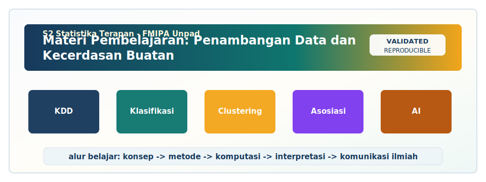

<!-- BEGIN UNPAD MATERIAL STYLE -->
<style>
:root {
  --unpad-navy: #17395c;
  --unpad-gold: #f2a51a;
  --unpad-teal: #0f766e;
  --unpad-ink: #172033;
  --unpad-paper: #fffdf8;
  --unpad-soft: #eef5f8;
  --unpad-line: #d7e2ea;
}
html, body {
  background: linear-gradient(135deg, #f8fbfd 0%, #fffdf8 48%, #f3f6ee 100%) !important;
  color: var(--unpad-ink) !important;
}
body {
  font-family: "Segoe UI", Arial, sans-serif !important;
  line-height: 1.72 !important;
}
.main-container {
  max-width: 1180px !important;
  background: rgba(255, 253, 248, 0.98) !important;
  border: 1px solid var(--unpad-line) !important;
  border-radius: 8px !important;
  box-shadow: 0 18px 42px rgba(23, 57, 92, 0.12) !important;
}
h1, h2, h3, h4 {
  letter-spacing: 0 !important;
}
h1.title {
  color: var(--unpad-navy) !important;
  -webkit-text-fill-color: var(--unpad-navy) !important;
  background: none !important;
}
h2 {
  border-left-color: var(--unpad-gold) !important;
}
a {
  color: #0b5c86 !important;
}
pre, code {
  border-radius: 8px !important;
}
.unpad-cover {
  margin: 18px 0 26px;
  padding: 24px;
  border-radius: 8px;
  background: linear-gradient(135deg, #17395c 0%, #0f766e 58%, #f2a51a 100%);
  color: #ffffff;
  box-shadow: 0 18px 36px rgba(23, 57, 92, 0.22);
}
.unpad-cover__brand {
  display: grid;
  grid-template-columns: 92px 1fr;
  gap: 20px;
  align-items: center;
}
.unpad-cover img {
  width: 92px;
  height: 92px;
  object-fit: contain;
  background: #ffffff;
  border-radius: 8px;
  padding: 8px;
  box-shadow: 0 8px 22px rgba(0,0,0,0.18);
}
.unpad-kicker {
  text-transform: uppercase;
  font-size: 0.82rem;
  font-weight: 800;
  letter-spacing: 0;
  color: #fff8dc;
}
.unpad-cover h2 {
  margin: 6px 0 8px;
  padding: 0;
  border: 0;
  background: transparent;
  color: #ffffff !important;
  font-size: 1.65rem;
}
.unpad-meta {
  margin: 0;
  color: #f7fbff;
  font-weight: 600;
}
.materi-illustration {
  margin: 20px 0 24px;
  padding: 14px;
  background: #ffffff;
  border: 1px solid var(--unpad-line);
  border-radius: 8px;
  box-shadow: 0 12px 28px rgba(23, 57, 92, 0.10);
}
.materi-illustration img {
  width: 100%;
  height: auto;
  display: block;
  border-radius: 6px;
}
.validasi-akademik {
  margin: 18px 0 28px;
  padding: 16px 18px;
  background: linear-gradient(135deg, #eef8f6, #fff8e7);
  border-left: 8px solid var(--unpad-teal);
  border-radius: 8px;
  color: var(--unpad-ink);
}
.validasi-akademik strong {
  color: var(--unpad-navy);
}
table {
  border-radius: 8px !important;
}
@media (max-width: 760px) {
  .unpad-cover__brand {
    grid-template-columns: 1fr;
  }
  .unpad-cover img {
    width: 76px;
    height: 76px;
  }
}
</style>
<!-- END UNPAD MATERIAL STYLE -->


<!-- BEGIN UNPAD MATERIAL ENHANCEMENT -->

```{r setup-unpad-render, include=FALSE}
execute_code <- FALSE
knitr::opts_chunk$set(
  echo = TRUE,
  eval = FALSE,
  message = FALSE,
  warning = FALSE,
  fig.align = "center",
  fig.width = 8,
  fig.height = 4.8,
  dpi = 120
)
set.seed(2025)
```


<div class="unpad-cover">
<div class="unpad-cover__brand">

<div>
<div class="unpad-kicker">S2 Statistika Terapan | FMIPA Universitas Padjadjaran</div>
<h2>Materi Pembelajaran: Penambangan Data dan Kecerdasan Buatan</h2>
<p class="unpad-meta">S2 Statistika Terapan, FMIPA Universitas Padjadjaran<br>Penulis: Dr. Anindya Apriliyanti Pravitasari, M.Si. | Januari 2025</p>
</div>
</div>
</div>

<div class="materi-illustration">

</div>

<div class="validasi-akademik">
<strong>Catatan validasi akademik.</strong> Materi ini diseragamkan dengan rujukan ADWTL Januari 2025: rumus dibaca bersama asumsi, contoh kode diposisikan sebagai template reproducible, dan interpretasi diarahkan pada validitas data, diagnosis model, evaluasi ketidakpastian, serta komunikasi hasil secara ilmiah.
</div>

<!-- END UNPAD MATERIAL ENHANCEMENT -->

<style>
:root{
  --espresso:#3b2414;
  --coffee:#5b371c;
  --caramel:#b7793e;
  --latte:#f8ead5;
  --cream:#fff8ef;
  --cocoa:#7a4b25;
  --gold:#e2b45f;
  --ink:#17110b;
}
*{box-sizing:border-box;}
body{
  font-family:"Aptos","Segoe UI",Roboto,Arial,sans-serif;
  color:var(--ink);
  line-height:1.72;
  font-size:16.5px;
  background:linear-gradient(135deg,#fff8ef 0%,#f4dfc5 40%,#d7a66d 100%);
  margin-left:330px;
  padding:28px 52px 90px 32px;
  max-width:1220px;
}
main, .main-container, body > div:not(#TOC){
  background:rgba(255,252,247,0.94);
  border-radius:28px;
  padding:28px 42px;
  box-shadow:0 18px 50px rgba(59,36,20,.16);
}
#TOC, nav#TOC{
  position:fixed;
  left:0;
  top:0;
  bottom:0;
  width:306px;
  padding:24px 18px 44px 22px;
  overflow-y:auto;
  background:linear-gradient(180deg,#3b2414 0%,#6e4321 45%,#b7793e 100%);
  color:#fff8ef;
  box-shadow:12px 0 34px rgba(59,36,20,.25);
  z-index:999;
}
#TOC:before{
  content:"☕ Daftar Isi";
  display:block;
  font-weight:900;
  font-size:1.35rem;
  letter-spacing:.3px;
  margin-bottom:18px;
  color:#fff7de;
}
#TOC a{color:#fff8ef;text-decoration:none;display:block;padding:5px 0;border-bottom:1px solid rgba(255,255,255,.08);}
#TOC a:hover{color:#ffe6a9;padding-left:4px;transition:.2s ease;}
#TOC ul{list-style:none;margin-left:0;padding-left:0;}
#TOC ul ul{padding-left:14px;font-size:.92em;}
h1,h2,h3,h4{font-weight:850;color:var(--espresso);line-height:1.22;margin-top:1.6em;}
h1{font-size:2.15rem;border-bottom:4px solid var(--caramel);padding-bottom:.25em;}
h2{font-size:1.65rem;border-left:10px solid var(--caramel);padding-left:14px;background:linear-gradient(90deg,#f8ead5,rgba(248,234,213,0));border-radius:14px;}
h3{font-size:1.28rem;color:var(--cocoa);}
a{color:#8a4e1f;font-weight:650;}
hr{border:none;border-top:2px dashed #d0a06e;margin:2em 0;}
pre, pre.sourceCode{
  background:#f8ead5 !important;
  color:#111 !important;
  border-left:7px solid #8b5e34;
  border-radius:18px;
  padding:18px 20px;
  box-shadow:0 9px 24px rgba(111,67,33,.12);
  white-space:pre-wrap;
}
code{background:#fff1dc;color:#241306;padding:2px 5px;border-radius:6px;}
blockquote{
  background:linear-gradient(90deg,#fff1dc,#fffaf3);
  border-left:8px solid #b7793e;
  color:#241306;
  padding:14px 22px;
  border-radius:16px;
  box-shadow:0 10px 24px rgba(111,67,33,.10);
}
table{border-collapse:collapse;width:100%;margin:1.2em 0;background:#fffaf3;border-radius:14px;overflow:hidden;box-shadow:0 8px 20px rgba(59,36,20,.08);}
th{background:linear-gradient(90deg,#6e4321,#b7793e);color:#fff8ef;padding:10px;text-align:left;}
td{border:1px solid #ead3b6;padding:9px;vertical-align:top;}
tr:nth-child(even){background:#fff4e7;}
.title-box{
  background:linear-gradient(135deg,#3b2414 0%,#6e4321 50%,#d39b53 100%);
  color:#fff8ef;
  padding:34px 38px;
  border-radius:30px;
  box-shadow:0 22px 50px rgba(59,36,20,.28);
  margin-bottom:28px;
}
.title-box h1,.title-box h2,.title-box h3{color:#fff8ef;border:none;background:none;padding-left:0;margin:.15em 0;}
.badge{display:inline-block;background:#fff1dc;color:#4a2b13;border:1px solid #e7c28f;border-radius:999px;padding:5px 12px;margin:4px;font-weight:700;}
.callout,.study-box,.case-box,.formula-box,.exercise-box,.rubric-box{
  background:#fff8ef;
  border:1px solid #e8cda7;
  border-left:8px solid #b7793e;
  border-radius:20px;
  padding:16px 22px;
  margin:18px 0;
  box-shadow:0 12px 30px rgba(80,45,20,.10);
}
.formula-box{background:#f8ead5;color:#111;border-left-color:#7a4b25;}
.case-box{background:linear-gradient(135deg,#fff8ef,#f7dfbb);}
.exercise-box{background:linear-gradient(135deg,#fffdf8,#fbe7c7);}
.rubric-box{background:#fffaf3;}
.small-note{font-size:.92em;color:#5b371c;}
svg{max-width:100%;height:auto;display:block;margin:18px auto;border-radius:18px;box-shadow:0 10px 30px rgba(59,36,20,.10);}
.math.display{background:#f8ead5;color:#111;padding:12px;border-radius:15px;display:block;}
@media print{
  body{margin-left:0;padding:18px;background:white;}
  #TOC, nav#TOC{position:relative;width:auto;box-shadow:none;}
}
@media(max-width:900px){
  body{margin-left:0;padding:18px;}
  #TOC,nav#TOC{position:relative;width:auto;max-height:360px;}
}
</style>


<div class="title-box">
<h1>Materi Pembelajaran Penambangan Data dan Kecerdasan Buatan</h1>
<h2>Program Studi S2 Statistika Terapan FMIPA Universitas Padjadjaran</h2>
<p><strong>Dosen Penulis RPS / Author:</strong> Dr. Anindya Apriliyanti Pravitasari, M.Si.</p>
<p><strong>Tahun pembuatan bahan ajar:</strong> Januari 2025</p>
<p><span class="badge">Semester 2</span><span class="badge">Bobot 3 SKS: 2 SKS teori + 1 SKS praktikum</span><span class="badge">Nuansa coklat degradasi</span><span class="badge">R Markdown HTML</span></p>
</div>

```{r setup, include=FALSE, eval=FALSE}
knitr::opts_chunk$set(
  echo = TRUE,
  eval = FALSE,
  warning = FALSE,
  message = FALSE,
  fig.align = "center",
  fig.width = 8,
  fig.height = 5
)
```


# Prakata

Bahan ajar ini disusun sebagai modul pembelajaran komprehensif untuk mata kuliah **Penambangan Data dan Kecerdasan Buatan** pada **Program Studi S2 Statistika Terapan, FMIPA Universitas Padjadjaran**. Struktur modul mengikuti rancangan semester pada RPS: mulai dari konsep dasar data mining, competitive intelligence, metodologi pengumpulan data, fungsi utama data mining, pemilihan dan evaluasi algoritma, machine learning, Artificial Neural Network, Support Vector Machine, implementasi perangkat lunak statistik, text mining, hingga data mining patent dan inovasi riset. Karena mata kuliah ini berada pada jenjang magister terapan, penekanan tidak hanya diberikan pada definisi, tetapi juga pada kemampuan memilih pendekatan, mempertahankan argumen metodologis, menerapkan komputasi, mengevaluasi hasil, dan mengubah temuan analitis menjadi rekomendasi yang dapat digunakan.

Dalam konteks statistika terapan, data mining sebaiknya tidak dipahami sebagai sekadar kumpulan algoritma. Ia merupakan proses ilmiah dan komputasional untuk mengekstraksi pola, struktur, hubungan, dan prediksi dari data dengan tetap memperhatikan tujuan analisis, kualitas data, bias, validitas, interpretabilitas, serta konsekuensi keputusan. Literatur klasik membedakan antara proses *knowledge discovery in databases* dan teknik data mining, yaitu data mining merupakan inti analitis dari proses yang lebih luas yang mencakup pemahaman domain, seleksi data, pembersihan, transformasi, pemodelan, evaluasi, dan implementasi pengetahuan [@fayyad1996kdd; @han2012data]. Dengan demikian, mahasiswa perlu terbiasa memandang setiap algoritma sebagai bagian dari rantai keputusan ilmiah, bukan tombol otomatis yang “sekali klik langsung sakti”. Dalam praktiknya, tombol otomatis sering lebih mirip mesin kopi kampus: kadang keluar kopi, kadang keluar misteri.

Mata kuliah ini juga memosisikan kecerdasan buatan sebagai perluasan dari statistika komputasional modern. Artificial Intelligence tidak hanya berhubungan dengan model yang kompleks seperti neural network, tetapi juga dengan rancangan sistem yang mampu melakukan pembelajaran dari data, membuat prediksi, menyesuaikan representasi, dan mendukung pengambilan keputusan. Di sisi lain, statistika memberikan fondasi inferensial: pemisahan data latih dan data uji, validasi silang, estimasi galat, ketidakpastian, prinsip generalisasi, dan evaluasi. Pertemuan antara AI dan statistika inilah yang membuat bidang data mining relevan untuk bisnis, industri, kesehatan, sosial, aktuaria, biostatistik, dan sains data sebagaimana ditekankan dalam capaian pembelajaran program studi.

Modul ini dirancang agar dapat dibaca secara bertahap selama satu semester. Setiap bab memuat tujuan pembelajaran, konsep inti, formulasi atau algoritma, ilustrasi kasus, contoh kode R, latihan, pertanyaan reflektif, dan catatan interpretasi. Kode R pada modul disiapkan sebagai contoh yang dapat dijalankan atau dimodifikasi ketika mahasiswa memiliki data yang sesuai. Dalam dokumen R Markdown ini, banyak potongan kode sengaja disajikan sebagai bahan pembelajaran, bukan sebagai satu proyek tunggal yang harus berjalan dari awal sampai akhir. Pendekatan tersebut lebih aman untuk pembelajaran karena mahasiswa dapat menguji potongan kode per topik, memahami output, lalu menyesuaikannya dengan dataset tugas masing-masing.

# Peta RPS dan Strategi Pembelajaran

RPS mata kuliah ini membagi pembelajaran ke dalam empat kelompok SubCPMK. **SubCPMK1** menekankan analisis konsep dasar data mining, competitive intelligence, dan metodologi pengumpulan data. **SubCPMK2** menekankan evaluasi dan implementasi fungsi utama data mining serta pemilihan algoritma yang sesuai untuk kasus nyata. **SubCPMK3** menuntut mahasiswa mengaplikasikan ANN dan SVM untuk permasalahan data mining. **SubCPMK4** mendorong mahasiswa merancang dan mengembangkan metode text mining serta competitive intelligence berbasis data mining patent untuk riset inovatif. Kerangka ini sejalan dengan logika pembelajaran bertingkat: mahasiswa pertama-tama memahami proses, kemudian menilai fungsi dan algoritma, lalu melakukan komputasi model yang lebih kuat, dan akhirnya mengembangkan proyek riset yang lebih kreatif.

| Blok Pembelajaran | Pertemuan | Fokus Materi | Keterampilan Utama | Luaran Pembelajaran |
|---|---:|---|---|---|
| Dasar dan metodologi | 1--3 | Konsep data mining, competitive intelligence, metodologi pengumpulan data | Analisis domain, eksplorasi data, identifikasi kualitas data | Laporan analisis kasus dan eksplorasi data |
| Fungsi dan algoritma | 4--8 | Klasifikasi, klastering, asosiasi, evaluasi algoritma | Evaluasi, perbandingan, argumentasi pemilihan metode | Laporan evaluasi algoritma dan UTS |
| Machine learning lanjutan | 9--12 | ANN, SVM, workflow komputasi, evaluasi model | Implementasi, validasi, interpretasi performa | Proyek mini ANN vs SVM |
| Text mining dan inovasi | 13--16 | Text mining, patent mining, competitive intelligence | Rancangan riset, visualisasi insight, presentasi | Laporan akhir dan presentasi UAS |

<div class="callout">
<strong>Prinsip penggunaan modul.</strong> Bacalah bab secara berurutan, tetapi jangan memperlakukan modul ini seperti kamus algoritma. Setiap metode harus selalu dikaitkan dengan pertanyaan substantif: keputusan apa yang ingin dibuat, siapa pengguna hasil analisis, data apa yang tersedia, apa risiko bias, bagaimana validasi dilakukan, dan bagaimana hasil dikomunikasikan. Pada jenjang S2, jawaban “karena akurasinya paling tinggi” belum cukup. Mahasiswa harus mampu menjelaskan mengapa akurasi itu layak dipercaya dan apakah model tersebut masih masuk akal secara substantif.
</div>

# Diagram Alur Pembelajaran

<svg viewBox="0 0 1000 380" xmlns="http://www.w3.org/2000/svg">
  <defs>
    <linearGradient id="g1" x1="0" x2="1" y1="0" y2="1">
      <stop offset="0%" stop-color="#3b2414"/>
      <stop offset="50%" stop-color="#8b5e34"/>
      <stop offset="100%" stop-color="#d9a15f"/>
    </linearGradient>
    <filter id="shadow" x="-20%" y="-20%" width="140%" height="140%">
      <feDropShadow dx="0" dy="8" stdDeviation="8" flood-color="#3b2414" flood-opacity="0.25"/>
    </filter>
  </defs>
  <rect width="1000" height="380" rx="28" fill="#fff7ec"/>
  <text x="500" y="50" text-anchor="middle" font-size="30" font-weight="800" fill="#3b2414">Alur Belajar Data Mining dan Kecerdasan Buatan</text>
  <g filter="url(#shadow)">
    <rect x="60" y="110" width="190" height="95" rx="22" fill="url(#g1)"/>
    <rect x="295" y="110" width="190" height="95" rx="22" fill="url(#g1)"/>
    <rect x="530" y="110" width="190" height="95" rx="22" fill="url(#g1)"/>
    <rect x="765" y="110" width="190" height="95" rx="22" fill="url(#g1)"/>
  </g>
  <text x="155" y="145" text-anchor="middle" font-size="18" font-weight="700" fill="#fff8ef">1. Memahami Data</text>
  <text x="155" y="175" text-anchor="middle" font-size="14" fill="#fff8ef">domain, kualitas, tujuan</text>
  <text x="390" y="145" text-anchor="middle" font-size="18" font-weight="700" fill="#fff8ef">2. Menambang Pola</text>
  <text x="390" y="175" text-anchor="middle" font-size="14" fill="#fff8ef">klasifikasi, klastering, asosiasi</text>
  <text x="625" y="145" text-anchor="middle" font-size="18" font-weight="700" fill="#fff8ef">3. Belajar dari Data</text>
  <text x="625" y="175" text-anchor="middle" font-size="14" fill="#fff8ef">ANN, SVM, validasi</text>
  <text x="860" y="145" text-anchor="middle" font-size="18" font-weight="700" fill="#fff8ef">4. Mencipta Insight</text>
  <text x="860" y="175" text-anchor="middle" font-size="14" fill="#fff8ef">text, patent, intelligence</text>
  <path d="M250 158 L295 158" stroke="#7a4b25" stroke-width="6" marker-end="url(#arrow)"/>
  <path d="M485 158 L530 158" stroke="#7a4b25" stroke-width="6"/>
  <path d="M720 158 L765 158" stroke="#7a4b25" stroke-width="6"/>
  <rect x="95" y="255" width="810" height="70" rx="18" fill="#f8ead5" stroke="#b7793e" stroke-width="2"/>
  <text x="500" y="285" text-anchor="middle" font-size="18" font-weight="700" fill="#3b2414">Output akhir: ebook + dashboard + laporan analisis + presentasi berbasis data nyata</text>
  <text x="500" y="313" text-anchor="middle" font-size="14" fill="#5b371c">Validasi, interpretabilitas, etika, dan komunikasi hasil menjadi benang merah seluruh pertemuan.</text>
</svg>

# Perangkat Kerja yang Disarankan

Modul ini dapat digunakan dengan R dan RStudio, tetapi mahasiswa juga dapat menggunakan Python, Orange, RapidMiner, atau platform komputasi lain selama prinsip analitik dan evaluasi modelnya dipertahankan. Untuk konsistensi, contoh utama diberikan dalam R karena R menyediakan ekosistem statistik yang kuat, dokumentasi yang matang, dan integrasi yang baik dengan R Markdown. Paket yang sering dipakai meliputi `tidyverse` untuk manipulasi data, `tidymodels` atau `caret` untuk pemodelan, `rpart` untuk pohon keputusan, `e1071` untuk SVM dan naive Bayes, `nnet` untuk neural network sederhana, `cluster` dan `factoextra` untuk klastering, serta `tidytext` untuk text mining. Di kelas, dosen dapat memilih sebagian paket sesuai kesiapan lingkungan komputasi mahasiswa.

```{r paket-awal, eval=FALSE}
# Paket yang sering digunakan dalam modul
# Jalankan hanya jika paket belum terpasang.
# install.packages(c("tidyverse", "tidymodels", "caret", "rpart", "rpart.plot",
#                    "e1071", "nnet", "cluster", "factoextra", "tidytext",
#                    "textdata", "topicmodels", "arules", "vip", "pROC"))

library(tidyverse)
library(tidymodels)
library(caret)
library(e1071)
library(nnet)
library(tidytext)
```

# Pertemuan 1: Konsep Dasar Data Mining dalam Statistika Terapan

<div class="study-box"><strong>Kaitan RPS:</strong> SubCPMK1 — topik ini mendukung capaian pembelajaran pada blok pertemuan 1. Fokusnya adalah knowledge discovery, data mining, pola, prediksi, dan validasi. Rujukan utama: [@fayyad1996kdd; @chapman2000crisp; @han2012data].</div>

## Tujuan Pembelajaran

Setelah mempelajari bab ini, mahasiswa diharapkan mampu: (1) menjelaskan konsep knowledge discovery dalam konteks penambangan data dan kecerdasan buatan; (2) menghubungkan data mining dengan kebutuhan analisis statistika terapan; (3) menerapkan prinsip pola pada studi kasus nyata; (4) mengevaluasi keterbatasan metode berdasarkan data, tujuan, dan konsekuensi keputusan; serta (5) menyusun argumen metodologis yang jelas dalam laporan atau presentasi.

## Konsep Inti

Pada level magister, pembelajaran Konsep Dasar Data Mining dalam Statistika Terapan harus bergerak dari pengenalan istilah menuju kemampuan membuat keputusan metodologis. Mahasiswa tidak cukup hanya menyebutkan definisi knowledge discovery; mahasiswa perlu menjelaskan mengapa konsep tersebut relevan untuk masalah nyata, bagaimana konsep itu memengaruhi desain analisis, dan apa konsekuensi apabila konsep tersebut diabaikan. Dalam proyek data mining, keputusan kecil seperti cara mendefinisikan target, cara memilih unit observasi, atau cara membagi data latih dan data uji dapat mengubah kesimpulan. Oleh karena itu, setiap bab dalam modul ini menekankan hubungan antara tujuan analisis, struktur data, asumsi metode, dan bentuk rekomendasi yang dihasilkan.

Topik Konsep Dasar Data Mining dalam Statistika Terapan berkaitan erat dengan prinsip ekstraksi pengetahuan dari data. Pengetahuan tidak muncul hanya karena dataset berukuran besar; pengetahuan muncul ketika data diproses dengan pertanyaan yang jelas, metode yang sesuai, dan evaluasi yang memadai. Dataset besar yang tidak bersih dapat menghasilkan pola palsu, sedangkan dataset kecil yang dipahami dengan baik dapat menghasilkan insight yang tajam. Prinsip ini penting dalam S2 Statistika Terapan karena mahasiswa sering bekerja dengan data institusional, data survei, data kesehatan, data sosial, data industri, atau data publik yang tidak selalu disiapkan khusus untuk pemodelan.

Dalam penerapan Konsep Dasar Data Mining dalam Statistika Terapan, konteks domain perlu diperlakukan sebagai bagian dari model berpikir. Model komputasional dapat menghitung pola, tetapi domain membantu menentukan apakah pola tersebut masuk akal. Sebagai contoh, hubungan antarvariabel yang tampak kuat secara numerik perlu ditanya kembali: apakah hubungan itu konsisten dengan teori, apakah ada variabel pengganggu, apakah pengukuran valid, dan apakah ada kebocoran informasi dari masa depan. Tanpa pertanyaan seperti ini, data mining mudah berubah menjadi aktivitas mencari angka terbaik, bukan aktivitas menemukan pengetahuan yang dapat dipertanggungjawabkan.

Literatur data mining menekankan bahwa proses analitik biasanya bersifat iteratif [@fayyad1996kdd; @chapman2000crisp; @han2012data]. Analis mungkin memulai dari eksplorasi data, menemukan masalah kualitas, kembali ke tahap pembersihan, mencoba algoritma awal, mengevaluasi hasil, lalu merevisi fitur. Siklus ini bukan tanda kegagalan, melainkan karakter alami pekerjaan data. Dalam kelas, mahasiswa dianjurkan mendokumentasikan setiap keputusan: data apa yang dibuang, fitur apa yang ditransformasi, alasan memilih algoritma, dan metrik apa yang digunakan. Dokumentasi ini memudahkan reproduksi dan membuat laporan lebih kuat.

Aspek penting lain dalam Konsep Dasar Data Mining dalam Statistika Terapan adalah keseimbangan antara akurasi dan interpretabilitas. Model yang sangat kompleks mungkin menghasilkan prediksi tinggi, tetapi sulit dijelaskan kepada pengambil keputusan. Sebaliknya, model sederhana mungkin lebih mudah dikomunikasikan, tetapi kurang mampu menangkap pola nonlinier. Tidak ada jawaban tunggal untuk semua kasus. Pilihan terbaik bergantung pada tujuan: apakah analisis digunakan untuk eksplorasi, prediksi operasional, penjelasan kebijakan, deteksi dini, atau pengembangan riset metodologis.

Mahasiswa juga perlu memahami bahwa data mining dapat menghasilkan konsekuensi sosial. Prediksi risiko, segmentasi populasi, dan rekomendasi otomatis dapat memengaruhi akses layanan, reputasi kelompok, atau keputusan organisasi. Karena itu, setiap penerapan Konsep Dasar Data Mining dalam Statistika Terapan harus memperhatikan privasi, keadilan, potensi diskriminasi, transparansi, dan keamanan data. Dalam tugas kelas, bagian etika tidak boleh menjadi formalitas satu paragraf. Ia harus dikaitkan dengan sumber data, variabel sensitif, cara interpretasi, dan potensi penggunaan hasil.

Dari sisi komputasi, Konsep Dasar Data Mining dalam Statistika Terapan mengharuskan mahasiswa membangun kebiasaan kerja yang rapi. Dataset mentah sebaiknya dipisahkan dari dataset hasil pembersihan. Script analisis diberi nama jelas. Output model disimpan bersama parameter yang digunakan. Versi paket dan fungsi penting dicatat. Kebiasaan sederhana ini mengurangi risiko kesalahan yang sulit dilacak. Ketika proyek dikerjakan berkelompok, struktur folder dan komentar kode menjadi bagian dari kualitas ilmiah, bukan sekadar urusan teknis.

Untuk menguji pemahaman Konsep Dasar Data Mining dalam Statistika Terapan, mahasiswa dianjurkan selalu membuat pertanyaan reflektif sebelum menjalankan algoritma. Apa unit analisisnya? Apa target atau keluaran yang ingin diprediksi? Apakah variabel tersedia sebelum keputusan dibuat? Apakah distribusi kelas seimbang? Apakah model akan digunakan untuk individu atau agregat wilayah? Pertanyaan ini membantu mencegah kesalahan desain. Komputer bisa menjalankan perintah dengan sangat cepat, tetapi ia tidak tahu apakah pertanyaannya keliru. Di sinilah statistisi tetap menjadi kapten kapal, bukan penumpang yang pasrah pada ombak output.

Data mining dapat dipahami sebagai proses menemukan pola yang berguna dari data besar atau kompleks. Kata 'berguna' sangat penting. Pola yang secara matematis ada belum tentu bermanfaat untuk keputusan. Misalnya, model mungkin menemukan bahwa kode pos tertentu berkaitan dengan risiko kesehatan, tetapi interpretasinya harus hati-hati karena kode pos bisa mewakili status sosial ekonomi, akses layanan, kepadatan, atau faktor lingkungan. Oleh karena itu, data mining harus dipadukan dengan kerangka statistik dan domain agar tidak jatuh pada korelasi dangkal. [@fayyad1996kdd; @chapman2000crisp; @han2012data]

KDD menempatkan data mining sebagai salah satu tahap dari proses yang lebih luas. Tahap awal mencakup pemahaman masalah, seleksi data, pembersihan, reduksi, dan transformasi. Tahap akhir mencakup evaluasi pola dan penyajian pengetahuan. CRISP-DM memberi kerangka praktis: business understanding, data understanding, data preparation, modeling, evaluation, dan deployment. Dalam mata kuliah ini, kedua kerangka tersebut digunakan sebagai bahasa kerja agar mahasiswa dapat menjelaskan proyek secara sistematis. [@fayyad1996kdd; @chapman2000crisp; @han2012data]

Dalam statistika terapan, data mining berbeda dari analisis statistik klasik terutama pada orientasi proses dan skala pencarian pola. Analisis statistik klasik sering dimulai dari hipotesis atau model yang lebih jelas, sedangkan data mining sering dimulai dari kebutuhan menemukan pola yang belum sepenuhnya diketahui. Namun, keduanya tidak bertentangan. Data mining membutuhkan validasi statistik, sedangkan statistika modern memanfaatkan algoritma komputasional untuk mengolah data yang kompleks. [@fayyad1996kdd; @chapman2000crisp; @han2012data]

## Formulasi Kunci

<div class="formula-box">

$$
D = (X, y),\quad f: X \rightarrow y,\quad \widehat{y}=f(x)
$$

Formula di atas bukan sekadar notasi. Ia mewakili cara berpikir dalam bab ini: tentukan objek yang dianalisis, definisikan hubungan atau ukuran yang ingin dievaluasi, lalu hubungkan hasil numerik dengan keputusan substantif.
</div>

## Ilustrasi Kasus

<div class="case-box">
Bayangkan sebuah proyek pemanfaatan data layanan kesehatan kabupaten/kota untuk menemukan kelompok wilayah dengan risiko penyakit tinggi dan faktor pelayanan yang berkaitan dengan risiko tersebut. Pada tahap awal, analis harus menentukan tujuan, unit analisis, sumber data, dan pihak yang akan menggunakan hasil. Selanjutnya analis memilih metode seperti KDD, CRISP-DM, analisis eksploratif, validasi awal. Output yang diharapkan bukan hanya tabel angka, melainkan narasi keputusan: apa pola terpenting, seberapa kuat bukti komputasionalnya, apakah hasilnya stabil, dan tindakan apa yang disarankan.
</div>

Dalam kasus tersebut, mahasiswa perlu memisahkan antara *hasil model* dan *interpretasi*. Hasil model dapat berupa akurasi, cluster, skor probabilitas, koefisien, atau bobot fitur. Interpretasi menjawab mengapa hasil tersebut relevan untuk masalah yang sedang dikaji. Misalnya, jika model menemukan kelompok wilayah dengan risiko tinggi, laporan perlu menjelaskan karakteristik kelompok tersebut, kemungkinan faktor penyebab, batasan data, dan implikasi kebijakan. Tanpa jembatan interpretasi, hasil komputasi akan terlihat seperti angka yang berjalan sendirian memakai jas laboratorium.

## Langkah Praktikum

Praktikum pada bab ini dapat dilakukan dengan pola berikut. Pertama, pilih dataset kecil yang mudah dipahami tetapi memiliki masalah nyata. Kedua, buat deskripsi variabel dan definisi outcome atau tujuan analisis. Ketiga, lakukan eksplorasi sederhana: dimensi data, distribusi variabel, missing value, korelasi, dan visualisasi awal. Keempat, jalankan metode yang relevan dengan topik bab. Kelima, interpretasikan output dalam bahasa yang dapat dipahami pengguna nonteknis. Keenam, tulis catatan batasan dan rencana pengembangan.


```{r contoh-kdd, eval=FALSE}
# Kerangka sederhana proyek data mining
project <- list(
  business_understanding = "Menentukan keputusan yang ingin didukung",
  data_understanding     = "Mengenali sumber data, variabel, kualitas, dan batasan",
  data_preparation       = "Membersihkan dan mentransformasi data",
  modeling               = "Mencoba model yang sesuai dengan tujuan",
  evaluation             = "Mengevaluasi performa dan kewajaran hasil",
  deployment             = "Mengomunikasikan hasil untuk keputusan"
)
project
```


## Pedoman Interpretasi Output

- Periksa apakah output benar-benar menjawab tujuan analisis pada topik Konsep Dasar Data Mining dalam Statistika Terapan.
- Bandingkan hasil numerik dengan pemahaman domain; jangan menerima output hanya karena tampak rapi.
- Catat asumsi, parameter, dan keputusan praproses yang memengaruhi hasil.
- Gunakan visualisasi untuk menjelaskan pola, bukan untuk menutupi kelemahan analisis.
- Susun rekomendasi dengan menyebutkan tingkat keyakinan, batasan, dan kebutuhan validasi lanjutan.

## Kesalahan Umum dan Cara Menghindarinya

1. Menggunakan knowledge discovery sebagai istilah umum tanpa mendefinisikan perannya dalam studi kasus.
1. Mencampur data latih dan data uji sehingga hasil evaluasi menjadi terlalu optimistis.
1. Mengabaikan kualitas data karena terlalu cepat ingin menjalankan algoritma.
1. Menggunakan metrik tunggal padahal tujuan keputusan memerlukan beberapa ukuran evaluasi.
1. Menyajikan grafik tanpa interpretasi substantif dan tanpa menyebutkan batasan.

## Latihan Terstruktur


<div class="exercise-box">
<strong>Latihan 1.</strong> Pilih satu dataset publik yang berkaitan dengan data mining. Jelaskan unit observasi, variabel utama, dan potensi masalah kualitas data.  
<strong>Latihan 2.</strong> Buat diagram alur analisis yang menunjukkan tahap data understanding, preparation, modeling, evaluation, dan communication.  
<strong>Latihan 3.</strong> Terapkan minimal satu metode yang relevan dengan Konsep Dasar Data Mining dalam Statistika Terapan. Laporkan output utama dan interpretasinya.  
<strong>Latihan 4.</strong> Tulis satu paragraf rekomendasi untuk pengambil keputusan. Hindari bahasa yang terlalu teknis, tetapi tetap pertahankan ketepatan ilmiah.  
<strong>Latihan 5.</strong> Identifikasi potensi bias atau risiko etika dalam penggunaan hasil analisis.
</div>

## Catatan untuk Laporan

Laporan pada topik Konsep Dasar Data Mining dalam Statistika Terapan sebaiknya terdiri atas pendahuluan, deskripsi data, metode, hasil, evaluasi, interpretasi, keterbatasan, dan referensi. Pada bagian metode, mahasiswa perlu menjelaskan mengapa pendekatan seperti KDD, CRISP-DM, analisis eksploratif, validasi awal dipilih. Pada bagian hasil, tampilkan tabel atau grafik yang ringkas. Pada bagian diskusi, kaitkan hasil dengan literatur dan konteks kasus. Gunakan sitasi yang relevan seperti [@fayyad1996kdd; @chapman2000crisp; @han2012data].

## Pertanyaan Reflektif

- Apa tujuan keputusan yang ingin didukung oleh analisis ini?
- Apakah data yang digunakan cukup representatif untuk tujuan tersebut?
- Bagaimana hasil berubah jika praproses atau parameter metode diganti?
- Apakah model lebih berguna sebagai alat prediksi, alat eksplorasi, atau alat komunikasi?
- Apa bentuk validasi tambahan yang diperlukan sebelum hasil digunakan secara nyata?

## Pendalaman: Dari Output Menuju Keputusan

Dalam praktik, tantangan terbesar pada Konsep Dasar Data Mining dalam Statistika Terapan bukan hanya menjalankan fungsi perangkat lunak, melainkan mengubah output menjadi keputusan yang bertanggung jawab. Output komputasi biasanya bersifat teknis: skor, koefisien, jarak, cluster, bobot, probabilitas, atau ranking fitur. Pengguna hasil analisis membutuhkan pesan yang berbeda: apa yang perlu dilakukan, siapa yang terdampak, seberapa besar risiko, dan sumber ketidakpastian apa yang perlu diperhatikan. Karena itu, mahasiswa perlu membangun kemampuan menerjemahkan bahasa algoritma menjadi bahasa kebijakan, bisnis, atau riset. Terjemahan ini bukan penyederhanaan berlebihan; justru di situlah kedewasaan analitik terlihat.

Pada topik Konsep Dasar Data Mining dalam Statistika Terapan, rekomendasi yang baik harus memiliki tiga unsur. Pertama, rekomendasi berbasis bukti, yaitu merujuk pada hasil evaluasi dan pola data. Kedua, rekomendasi realistis, yaitu mempertimbangkan sumber daya, kualitas data, dan kapasitas implementasi. Ketiga, rekomendasi transparan, yaitu menyebutkan batasan dan kondisi penggunaan. Jika salah satu unsur hilang, rekomendasi dapat menjadi terlalu lemah, terlalu ambisius, atau terlalu berisiko. Dalam kelas, mahasiswa dapat melatihnya dengan membuat memo satu halaman setelah setiap praktikum.

Perlu juga ditekankan bahwa Konsep Dasar Data Mining dalam Statistika Terapan tidak harus selalu berakhir pada model paling rumit. Dalam banyak organisasi, model yang cukup baik, dapat dijelaskan, mudah dipelihara, dan konsisten dipakai sering lebih bernilai daripada model sangat kompleks yang hanya dipahami oleh satu orang. Prinsip ini sangat relevan untuk proyek mahasiswa yang memiliki batas waktu satu semester. Target realistisnya adalah menghasilkan analisis yang benar, jelas, dapat direproduksi, dan menyampaikan insight yang bermakna.


# Pertemuan 2: Competitive Intelligence dan Pengumpulan Data

<div class="study-box"><strong>Kaitan RPS:</strong> SubCPMK1 — topik ini mendukung capaian pembelajaran pada blok pertemuan 2. Fokusnya adalah competitive intelligence, sumber data, etika, kebutuhan pengguna, dan data governance. Rujukan utama: [@provost2013data; @han2012data].</div>

## Tujuan Pembelajaran

Setelah mempelajari bab ini, mahasiswa diharapkan mampu: (1) menjelaskan konsep competitive intelligence dalam konteks penambangan data dan kecerdasan buatan; (2) menghubungkan sumber data dengan kebutuhan analisis statistika terapan; (3) menerapkan prinsip etika pada studi kasus nyata; (4) mengevaluasi keterbatasan metode berdasarkan data, tujuan, dan konsekuensi keputusan; serta (5) menyusun argumen metodologis yang jelas dalam laporan atau presentasi.

## Konsep Inti

Pada level magister, pembelajaran Competitive Intelligence dan Pengumpulan Data harus bergerak dari pengenalan istilah menuju kemampuan membuat keputusan metodologis. Mahasiswa tidak cukup hanya menyebutkan definisi competitive intelligence; mahasiswa perlu menjelaskan mengapa konsep tersebut relevan untuk masalah nyata, bagaimana konsep itu memengaruhi desain analisis, dan apa konsekuensi apabila konsep tersebut diabaikan. Dalam proyek data mining, keputusan kecil seperti cara mendefinisikan target, cara memilih unit observasi, atau cara membagi data latih dan data uji dapat mengubah kesimpulan. Oleh karena itu, setiap bab dalam modul ini menekankan hubungan antara tujuan analisis, struktur data, asumsi metode, dan bentuk rekomendasi yang dihasilkan.

Topik Competitive Intelligence dan Pengumpulan Data berkaitan erat dengan prinsip ekstraksi pengetahuan dari data. Pengetahuan tidak muncul hanya karena dataset berukuran besar; pengetahuan muncul ketika data diproses dengan pertanyaan yang jelas, metode yang sesuai, dan evaluasi yang memadai. Dataset besar yang tidak bersih dapat menghasilkan pola palsu, sedangkan dataset kecil yang dipahami dengan baik dapat menghasilkan insight yang tajam. Prinsip ini penting dalam S2 Statistika Terapan karena mahasiswa sering bekerja dengan data institusional, data survei, data kesehatan, data sosial, data industri, atau data publik yang tidak selalu disiapkan khusus untuk pemodelan.

Dalam penerapan Competitive Intelligence dan Pengumpulan Data, konteks domain perlu diperlakukan sebagai bagian dari model berpikir. Model komputasional dapat menghitung pola, tetapi domain membantu menentukan apakah pola tersebut masuk akal. Sebagai contoh, hubungan antarvariabel yang tampak kuat secara numerik perlu ditanya kembali: apakah hubungan itu konsisten dengan teori, apakah ada variabel pengganggu, apakah pengukuran valid, dan apakah ada kebocoran informasi dari masa depan. Tanpa pertanyaan seperti ini, data mining mudah berubah menjadi aktivitas mencari angka terbaik, bukan aktivitas menemukan pengetahuan yang dapat dipertanggungjawabkan.

Literatur data mining menekankan bahwa proses analitik biasanya bersifat iteratif [@provost2013data; @han2012data]. Analis mungkin memulai dari eksplorasi data, menemukan masalah kualitas, kembali ke tahap pembersihan, mencoba algoritma awal, mengevaluasi hasil, lalu merevisi fitur. Siklus ini bukan tanda kegagalan, melainkan karakter alami pekerjaan data. Dalam kelas, mahasiswa dianjurkan mendokumentasikan setiap keputusan: data apa yang dibuang, fitur apa yang ditransformasi, alasan memilih algoritma, dan metrik apa yang digunakan. Dokumentasi ini memudahkan reproduksi dan membuat laporan lebih kuat.

Aspek penting lain dalam Competitive Intelligence dan Pengumpulan Data adalah keseimbangan antara akurasi dan interpretabilitas. Model yang sangat kompleks mungkin menghasilkan prediksi tinggi, tetapi sulit dijelaskan kepada pengambil keputusan. Sebaliknya, model sederhana mungkin lebih mudah dikomunikasikan, tetapi kurang mampu menangkap pola nonlinier. Tidak ada jawaban tunggal untuk semua kasus. Pilihan terbaik bergantung pada tujuan: apakah analisis digunakan untuk eksplorasi, prediksi operasional, penjelasan kebijakan, deteksi dini, atau pengembangan riset metodologis.

Mahasiswa juga perlu memahami bahwa data mining dapat menghasilkan konsekuensi sosial. Prediksi risiko, segmentasi populasi, dan rekomendasi otomatis dapat memengaruhi akses layanan, reputasi kelompok, atau keputusan organisasi. Karena itu, setiap penerapan Competitive Intelligence dan Pengumpulan Data harus memperhatikan privasi, keadilan, potensi diskriminasi, transparansi, dan keamanan data. Dalam tugas kelas, bagian etika tidak boleh menjadi formalitas satu paragraf. Ia harus dikaitkan dengan sumber data, variabel sensitif, cara interpretasi, dan potensi penggunaan hasil.

Dari sisi komputasi, Competitive Intelligence dan Pengumpulan Data mengharuskan mahasiswa membangun kebiasaan kerja yang rapi. Dataset mentah sebaiknya dipisahkan dari dataset hasil pembersihan. Script analisis diberi nama jelas. Output model disimpan bersama parameter yang digunakan. Versi paket dan fungsi penting dicatat. Kebiasaan sederhana ini mengurangi risiko kesalahan yang sulit dilacak. Ketika proyek dikerjakan berkelompok, struktur folder dan komentar kode menjadi bagian dari kualitas ilmiah, bukan sekadar urusan teknis.

Untuk menguji pemahaman Competitive Intelligence dan Pengumpulan Data, mahasiswa dianjurkan selalu membuat pertanyaan reflektif sebelum menjalankan algoritma. Apa unit analisisnya? Apa target atau keluaran yang ingin diprediksi? Apakah variabel tersedia sebelum keputusan dibuat? Apakah distribusi kelas seimbang? Apakah model akan digunakan untuk individu atau agregat wilayah? Pertanyaan ini membantu mencegah kesalahan desain. Komputer bisa menjalankan perintah dengan sangat cepat, tetapi ia tidak tahu apakah pertanyaannya keliru. Di sinilah statistisi tetap menjadi kapten kapal, bukan penumpang yang pasrah pada ombak output.

Competitive intelligence adalah proses mengumpulkan, mengorganisasi, dan menganalisis informasi tentang lingkungan kompetitif untuk mendukung keputusan strategis. Dalam konteks akademik, istilah ini dapat mencakup pemetaan tren riset, posisi program studi, kebutuhan calon mahasiswa, reputasi publikasi, kolaborasi, dan teknologi analitik yang sedang berkembang. Data mining membantu karena informasi kompetitif sering tersebar di banyak sumber dan berbentuk tidak terstruktur. [@provost2013data; @han2012data]

Pengumpulan data untuk competitive intelligence harus mematuhi prinsip legal dan etis. Data yang tersedia di web tidak otomatis bebas digunakan tanpa batas. Analis perlu memperhatikan syarat penggunaan situs, privasi, hak cipta, dan potensi identifikasi individu. Pada proyek mahasiswa, penggunaan data publik tetap perlu disertai catatan sumber, tanggal pengambilan, variabel yang dikumpulkan, serta batasan interpretasi. [@provost2013data; @han2012data]

Kualitas sumber data sangat menentukan kualitas insight. Data resmi biasanya lebih dapat dipercaya tetapi mungkin lambat diperbarui. Data media sosial cepat tetapi bias terhadap kelompok pengguna tertentu. Data berita kaya konteks tetapi dipengaruhi framing media. Data publikasi ilmiah kuat untuk riset tetapi tidak selalu mewakili kebutuhan praktis masyarakat. Competitive intelligence yang baik menggabungkan beberapa sumber agar kesimpulan tidak bergantung pada satu lensa sempit. [@provost2013data; @han2012data]

## Formulasi Kunci

<div class="formula-box">

$$
Nilai\;Informasi = Relevansi \times Keandalan \times Ketepatan\;Waktu
$$

Formula di atas bukan sekadar notasi. Ia mewakili cara berpikir dalam bab ini: tentukan objek yang dianalisis, definisikan hubungan atau ukuran yang ingin dievaluasi, lalu hubungkan hasil numerik dengan keputusan substantif.
</div>

## Ilustrasi Kasus

<div class="case-box">
Bayangkan sebuah proyek analisis informasi pesaing program studi atau layanan publik dengan menggabungkan data web, publikasi, media sosial, dan data administrasi resmi. Pada tahap awal, analis harus menentukan tujuan, unit analisis, sumber data, dan pihak yang akan menggunakan hasil. Selanjutnya analis memilih metode seperti pemetaan sumber data, data inventory, data dictionary, validasi sumber. Output yang diharapkan bukan hanya tabel angka, melainkan narasi keputusan: apa pola terpenting, seberapa kuat bukti komputasionalnya, apakah hasilnya stabil, dan tindakan apa yang disarankan.
</div>

Dalam kasus tersebut, mahasiswa perlu memisahkan antara *hasil model* dan *interpretasi*. Hasil model dapat berupa akurasi, cluster, skor probabilitas, koefisien, atau bobot fitur. Interpretasi menjawab mengapa hasil tersebut relevan untuk masalah yang sedang dikaji. Misalnya, jika model menemukan kelompok wilayah dengan risiko tinggi, laporan perlu menjelaskan karakteristik kelompok tersebut, kemungkinan faktor penyebab, batasan data, dan implikasi kebijakan. Tanpa jembatan interpretasi, hasil komputasi akan terlihat seperti angka yang berjalan sendirian memakai jas laboratorium.

## Langkah Praktikum

Praktikum pada bab ini dapat dilakukan dengan pola berikut. Pertama, pilih dataset kecil yang mudah dipahami tetapi memiliki masalah nyata. Kedua, buat deskripsi variabel dan definisi outcome atau tujuan analisis. Ketiga, lakukan eksplorasi sederhana: dimensi data, distribusi variabel, missing value, korelasi, dan visualisasi awal. Keempat, jalankan metode yang relevan dengan topik bab. Kelima, interpretasikan output dalam bahasa yang dapat dipahami pengguna nonteknis. Keenam, tulis catatan batasan dan rencana pengembangan.


```{r data-inventory, eval=FALSE}
# Contoh data inventory untuk competitive intelligence
inventory <- tibble::tribble(
  ~sumber, ~jenis_data, ~frekuensi, ~risiko_bias, ~catatan,
  "Website resmi", "teks terstruktur", "bulanan", "rendah-sedang", "perlu cek tanggal pembaruan",
  "Media sosial", "teks tidak terstruktur", "harian", "tinggi", "bias pengguna aktif",
  "Publikasi ilmiah", "metadata dan abstrak", "tahunan", "sedang", "baik untuk tren riset"
)
inventory
```


## Pedoman Interpretasi Output

- Periksa apakah output benar-benar menjawab tujuan analisis pada topik Competitive Intelligence dan Pengumpulan Data.
- Bandingkan hasil numerik dengan pemahaman domain; jangan menerima output hanya karena tampak rapi.
- Catat asumsi, parameter, dan keputusan praproses yang memengaruhi hasil.
- Gunakan visualisasi untuk menjelaskan pola, bukan untuk menutupi kelemahan analisis.
- Susun rekomendasi dengan menyebutkan tingkat keyakinan, batasan, dan kebutuhan validasi lanjutan.

## Kesalahan Umum dan Cara Menghindarinya

1. Menggunakan competitive intelligence sebagai istilah umum tanpa mendefinisikan perannya dalam studi kasus.
1. Mencampur data latih dan data uji sehingga hasil evaluasi menjadi terlalu optimistis.
1. Mengabaikan kualitas data karena terlalu cepat ingin menjalankan algoritma.
1. Menggunakan metrik tunggal padahal tujuan keputusan memerlukan beberapa ukuran evaluasi.
1. Menyajikan grafik tanpa interpretasi substantif dan tanpa menyebutkan batasan.

## Latihan Terstruktur


<div class="exercise-box">
<strong>Latihan 1.</strong> Pilih satu dataset publik yang berkaitan dengan sumber data. Jelaskan unit observasi, variabel utama, dan potensi masalah kualitas data.  
<strong>Latihan 2.</strong> Buat diagram alur analisis yang menunjukkan tahap data understanding, preparation, modeling, evaluation, dan communication.  
<strong>Latihan 3.</strong> Terapkan minimal satu metode yang relevan dengan Competitive Intelligence dan Pengumpulan Data. Laporkan output utama dan interpretasinya.  
<strong>Latihan 4.</strong> Tulis satu paragraf rekomendasi untuk pengambil keputusan. Hindari bahasa yang terlalu teknis, tetapi tetap pertahankan ketepatan ilmiah.  
<strong>Latihan 5.</strong> Identifikasi potensi bias atau risiko etika dalam penggunaan hasil analisis.
</div>

## Catatan untuk Laporan

Laporan pada topik Competitive Intelligence dan Pengumpulan Data sebaiknya terdiri atas pendahuluan, deskripsi data, metode, hasil, evaluasi, interpretasi, keterbatasan, dan referensi. Pada bagian metode, mahasiswa perlu menjelaskan mengapa pendekatan seperti pemetaan sumber data, data inventory, data dictionary, validasi sumber dipilih. Pada bagian hasil, tampilkan tabel atau grafik yang ringkas. Pada bagian diskusi, kaitkan hasil dengan literatur dan konteks kasus. Gunakan sitasi yang relevan seperti [@provost2013data; @han2012data].

## Pertanyaan Reflektif

- Apa tujuan keputusan yang ingin didukung oleh analisis ini?
- Apakah data yang digunakan cukup representatif untuk tujuan tersebut?
- Bagaimana hasil berubah jika praproses atau parameter metode diganti?
- Apakah model lebih berguna sebagai alat prediksi, alat eksplorasi, atau alat komunikasi?
- Apa bentuk validasi tambahan yang diperlukan sebelum hasil digunakan secara nyata?

## Pendalaman: Dari Output Menuju Keputusan

Dalam praktik, tantangan terbesar pada Competitive Intelligence dan Pengumpulan Data bukan hanya menjalankan fungsi perangkat lunak, melainkan mengubah output menjadi keputusan yang bertanggung jawab. Output komputasi biasanya bersifat teknis: skor, koefisien, jarak, cluster, bobot, probabilitas, atau ranking fitur. Pengguna hasil analisis membutuhkan pesan yang berbeda: apa yang perlu dilakukan, siapa yang terdampak, seberapa besar risiko, dan sumber ketidakpastian apa yang perlu diperhatikan. Karena itu, mahasiswa perlu membangun kemampuan menerjemahkan bahasa algoritma menjadi bahasa kebijakan, bisnis, atau riset. Terjemahan ini bukan penyederhanaan berlebihan; justru di situlah kedewasaan analitik terlihat.

Pada topik Competitive Intelligence dan Pengumpulan Data, rekomendasi yang baik harus memiliki tiga unsur. Pertama, rekomendasi berbasis bukti, yaitu merujuk pada hasil evaluasi dan pola data. Kedua, rekomendasi realistis, yaitu mempertimbangkan sumber daya, kualitas data, dan kapasitas implementasi. Ketiga, rekomendasi transparan, yaitu menyebutkan batasan dan kondisi penggunaan. Jika salah satu unsur hilang, rekomendasi dapat menjadi terlalu lemah, terlalu ambisius, atau terlalu berisiko. Dalam kelas, mahasiswa dapat melatihnya dengan membuat memo satu halaman setelah setiap praktikum.

Perlu juga ditekankan bahwa Competitive Intelligence dan Pengumpulan Data tidak harus selalu berakhir pada model paling rumit. Dalam banyak organisasi, model yang cukup baik, dapat dijelaskan, mudah dipelihara, dan konsisten dipakai sering lebih bernilai daripada model sangat kompleks yang hanya dipahami oleh satu orang. Prinsip ini sangat relevan untuk proyek mahasiswa yang memiliki batas waktu satu semester. Target realistisnya adalah menghasilkan analisis yang benar, jelas, dapat direproduksi, dan menyampaikan insight yang bermakna.


# Pertemuan 3: Metodologi Penambangan Data dan Kualitas Data

<div class="study-box"><strong>Kaitan RPS:</strong> SubCPMK1 — topik ini mendukung capaian pembelajaran pada blok pertemuan 3. Fokusnya adalah kualitas data, missing value, outlier, bias, dan representativitas. Rujukan utama: [@witten2016data; @tan2018introduction].</div>

## Tujuan Pembelajaran

Setelah mempelajari bab ini, mahasiswa diharapkan mampu: (1) menjelaskan konsep kualitas data dalam konteks penambangan data dan kecerdasan buatan; (2) menghubungkan missing value dengan kebutuhan analisis statistika terapan; (3) menerapkan prinsip outlier pada studi kasus nyata; (4) mengevaluasi keterbatasan metode berdasarkan data, tujuan, dan konsekuensi keputusan; serta (5) menyusun argumen metodologis yang jelas dalam laporan atau presentasi.

## Konsep Inti

Pada level magister, pembelajaran Metodologi Penambangan Data dan Kualitas Data harus bergerak dari pengenalan istilah menuju kemampuan membuat keputusan metodologis. Mahasiswa tidak cukup hanya menyebutkan definisi kualitas data; mahasiswa perlu menjelaskan mengapa konsep tersebut relevan untuk masalah nyata, bagaimana konsep itu memengaruhi desain analisis, dan apa konsekuensi apabila konsep tersebut diabaikan. Dalam proyek data mining, keputusan kecil seperti cara mendefinisikan target, cara memilih unit observasi, atau cara membagi data latih dan data uji dapat mengubah kesimpulan. Oleh karena itu, setiap bab dalam modul ini menekankan hubungan antara tujuan analisis, struktur data, asumsi metode, dan bentuk rekomendasi yang dihasilkan.

Topik Metodologi Penambangan Data dan Kualitas Data berkaitan erat dengan prinsip ekstraksi pengetahuan dari data. Pengetahuan tidak muncul hanya karena dataset berukuran besar; pengetahuan muncul ketika data diproses dengan pertanyaan yang jelas, metode yang sesuai, dan evaluasi yang memadai. Dataset besar yang tidak bersih dapat menghasilkan pola palsu, sedangkan dataset kecil yang dipahami dengan baik dapat menghasilkan insight yang tajam. Prinsip ini penting dalam S2 Statistika Terapan karena mahasiswa sering bekerja dengan data institusional, data survei, data kesehatan, data sosial, data industri, atau data publik yang tidak selalu disiapkan khusus untuk pemodelan.

Dalam penerapan Metodologi Penambangan Data dan Kualitas Data, konteks domain perlu diperlakukan sebagai bagian dari model berpikir. Model komputasional dapat menghitung pola, tetapi domain membantu menentukan apakah pola tersebut masuk akal. Sebagai contoh, hubungan antarvariabel yang tampak kuat secara numerik perlu ditanya kembali: apakah hubungan itu konsisten dengan teori, apakah ada variabel pengganggu, apakah pengukuran valid, dan apakah ada kebocoran informasi dari masa depan. Tanpa pertanyaan seperti ini, data mining mudah berubah menjadi aktivitas mencari angka terbaik, bukan aktivitas menemukan pengetahuan yang dapat dipertanggungjawabkan.

Literatur data mining menekankan bahwa proses analitik biasanya bersifat iteratif [@witten2016data; @tan2018introduction]. Analis mungkin memulai dari eksplorasi data, menemukan masalah kualitas, kembali ke tahap pembersihan, mencoba algoritma awal, mengevaluasi hasil, lalu merevisi fitur. Siklus ini bukan tanda kegagalan, melainkan karakter alami pekerjaan data. Dalam kelas, mahasiswa dianjurkan mendokumentasikan setiap keputusan: data apa yang dibuang, fitur apa yang ditransformasi, alasan memilih algoritma, dan metrik apa yang digunakan. Dokumentasi ini memudahkan reproduksi dan membuat laporan lebih kuat.

Aspek penting lain dalam Metodologi Penambangan Data dan Kualitas Data adalah keseimbangan antara akurasi dan interpretabilitas. Model yang sangat kompleks mungkin menghasilkan prediksi tinggi, tetapi sulit dijelaskan kepada pengambil keputusan. Sebaliknya, model sederhana mungkin lebih mudah dikomunikasikan, tetapi kurang mampu menangkap pola nonlinier. Tidak ada jawaban tunggal untuk semua kasus. Pilihan terbaik bergantung pada tujuan: apakah analisis digunakan untuk eksplorasi, prediksi operasional, penjelasan kebijakan, deteksi dini, atau pengembangan riset metodologis.

Mahasiswa juga perlu memahami bahwa data mining dapat menghasilkan konsekuensi sosial. Prediksi risiko, segmentasi populasi, dan rekomendasi otomatis dapat memengaruhi akses layanan, reputasi kelompok, atau keputusan organisasi. Karena itu, setiap penerapan Metodologi Penambangan Data dan Kualitas Data harus memperhatikan privasi, keadilan, potensi diskriminasi, transparansi, dan keamanan data. Dalam tugas kelas, bagian etika tidak boleh menjadi formalitas satu paragraf. Ia harus dikaitkan dengan sumber data, variabel sensitif, cara interpretasi, dan potensi penggunaan hasil.

Dari sisi komputasi, Metodologi Penambangan Data dan Kualitas Data mengharuskan mahasiswa membangun kebiasaan kerja yang rapi. Dataset mentah sebaiknya dipisahkan dari dataset hasil pembersihan. Script analisis diberi nama jelas. Output model disimpan bersama parameter yang digunakan. Versi paket dan fungsi penting dicatat. Kebiasaan sederhana ini mengurangi risiko kesalahan yang sulit dilacak. Ketika proyek dikerjakan berkelompok, struktur folder dan komentar kode menjadi bagian dari kualitas ilmiah, bukan sekadar urusan teknis.

Untuk menguji pemahaman Metodologi Penambangan Data dan Kualitas Data, mahasiswa dianjurkan selalu membuat pertanyaan reflektif sebelum menjalankan algoritma. Apa unit analisisnya? Apa target atau keluaran yang ingin diprediksi? Apakah variabel tersedia sebelum keputusan dibuat? Apakah distribusi kelas seimbang? Apakah model akan digunakan untuk individu atau agregat wilayah? Pertanyaan ini membantu mencegah kesalahan desain. Komputer bisa menjalankan perintah dengan sangat cepat, tetapi ia tidak tahu apakah pertanyaannya keliru. Di sinilah statistisi tetap menjadi kapten kapal, bukan penumpang yang pasrah pada ombak output.

Masalah kualitas data sering menjadi bagian paling menentukan dalam proyek data mining. Nilai hilang, duplikasi, kesalahan entri, outlier, perubahan definisi variabel, dan format tidak konsisten dapat mengganggu model. Mahasiswa perlu membedakan antara kesalahan data dan fenomena substantif. Outlier pada pendapatan bisa merupakan salah ketik, tetapi bisa juga mencerminkan ketimpangan yang memang penting untuk dianalisis. [@witten2016data; @tan2018introduction]

Praproses data bukan kegiatan kosmetik. Standardisasi, transformasi log, pengkodean variabel kategorik, penanganan data hilang, dan deteksi inkonsistensi dapat mengubah geometri data. Pada model berbasis jarak seperti K-Means dan SVM dengan kernel tertentu, skala variabel sangat memengaruhi hasil. Karena itu, keputusan praproses harus dijelaskan dalam laporan, bukan disembunyikan sebagai langkah teknis. [@witten2016data; @tan2018introduction]

Audit kualitas data sebaiknya dilakukan sebelum model dibangun. Audit meliputi pemeriksaan dimensi data, tipe variabel, distribusi, nilai ekstrem, pola missing, korelasi, dan logika antarvariabel. Misalnya, usia responden tidak boleh negatif, tanggal layanan tidak boleh mendahului tanggal lahir, dan variabel outcome tidak boleh digunakan sebagai prediktor terselubung. Hal-hal sederhana ini sering menyelamatkan proyek dari kesimpulan yang salah. [@witten2016data; @tan2018introduction]

## Formulasi Kunci

<div class="formula-box">

$$
Completeness = 1 - \frac{\#Missing}{n\times p}
$$

Formula di atas bukan sekadar notasi. Ia mewakili cara berpikir dalam bab ini: tentukan objek yang dianalisis, definisikan hubungan atau ukuran yang ingin dievaluasi, lalu hubungkan hasil numerik dengan keputusan substantif.
</div>

## Ilustrasi Kasus

<div class="case-box">
Bayangkan sebuah proyek pengolahan dataset survei sosial ekonomi yang memiliki nilai hilang, variabel kategorik tidak konsisten, dan kemungkinan bias responden. Pada tahap awal, analis harus menentukan tujuan, unit analisis, sumber data, dan pihak yang akan menggunakan hasil. Selanjutnya analis memilih metode seperti profiling data, cleaning, transformasi, audit kualitas. Output yang diharapkan bukan hanya tabel angka, melainkan narasi keputusan: apa pola terpenting, seberapa kuat bukti komputasionalnya, apakah hasilnya stabil, dan tindakan apa yang disarankan.
</div>

Dalam kasus tersebut, mahasiswa perlu memisahkan antara *hasil model* dan *interpretasi*. Hasil model dapat berupa akurasi, cluster, skor probabilitas, koefisien, atau bobot fitur. Interpretasi menjawab mengapa hasil tersebut relevan untuk masalah yang sedang dikaji. Misalnya, jika model menemukan kelompok wilayah dengan risiko tinggi, laporan perlu menjelaskan karakteristik kelompok tersebut, kemungkinan faktor penyebab, batasan data, dan implikasi kebijakan. Tanpa jembatan interpretasi, hasil komputasi akan terlihat seperti angka yang berjalan sendirian memakai jas laboratorium.

## Langkah Praktikum

Praktikum pada bab ini dapat dilakukan dengan pola berikut. Pertama, pilih dataset kecil yang mudah dipahami tetapi memiliki masalah nyata. Kedua, buat deskripsi variabel dan definisi outcome atau tujuan analisis. Ketiga, lakukan eksplorasi sederhana: dimensi data, distribusi variabel, missing value, korelasi, dan visualisasi awal. Keempat, jalankan metode yang relevan dengan topik bab. Kelima, interpretasikan output dalam bahasa yang dapat dipahami pengguna nonteknis. Keenam, tulis catatan batasan dan rencana pengembangan.


```{r audit-kualitas, eval=FALSE}
# Audit kualitas data dasar
library(dplyr)

audit_data <- function(data){
  tibble(
    variabel = names(data),
    tipe = purrr::map_chr(data, ~ class(.x)[1]),
    prop_missing = purrr::map_dbl(data, ~ mean(is.na(.x))),
    n_unique = purrr::map_int(data, ~ dplyr::n_distinct(.x, na.rm = TRUE))
  )
}

audit_data(mtcars)
```


## Pedoman Interpretasi Output

- Periksa apakah output benar-benar menjawab tujuan analisis pada topik Metodologi Penambangan Data dan Kualitas Data.
- Bandingkan hasil numerik dengan pemahaman domain; jangan menerima output hanya karena tampak rapi.
- Catat asumsi, parameter, dan keputusan praproses yang memengaruhi hasil.
- Gunakan visualisasi untuk menjelaskan pola, bukan untuk menutupi kelemahan analisis.
- Susun rekomendasi dengan menyebutkan tingkat keyakinan, batasan, dan kebutuhan validasi lanjutan.

## Kesalahan Umum dan Cara Menghindarinya

1. Menggunakan kualitas data sebagai istilah umum tanpa mendefinisikan perannya dalam studi kasus.
1. Mencampur data latih dan data uji sehingga hasil evaluasi menjadi terlalu optimistis.
1. Mengabaikan kualitas data karena terlalu cepat ingin menjalankan algoritma.
1. Menggunakan metrik tunggal padahal tujuan keputusan memerlukan beberapa ukuran evaluasi.
1. Menyajikan grafik tanpa interpretasi substantif dan tanpa menyebutkan batasan.

## Latihan Terstruktur


<div class="exercise-box">
<strong>Latihan 1.</strong> Pilih satu dataset publik yang berkaitan dengan missing value. Jelaskan unit observasi, variabel utama, dan potensi masalah kualitas data.  
<strong>Latihan 2.</strong> Buat diagram alur analisis yang menunjukkan tahap data understanding, preparation, modeling, evaluation, dan communication.  
<strong>Latihan 3.</strong> Terapkan minimal satu metode yang relevan dengan Metodologi Penambangan Data dan Kualitas Data. Laporkan output utama dan interpretasinya.  
<strong>Latihan 4.</strong> Tulis satu paragraf rekomendasi untuk pengambil keputusan. Hindari bahasa yang terlalu teknis, tetapi tetap pertahankan ketepatan ilmiah.  
<strong>Latihan 5.</strong> Identifikasi potensi bias atau risiko etika dalam penggunaan hasil analisis.
</div>

## Catatan untuk Laporan

Laporan pada topik Metodologi Penambangan Data dan Kualitas Data sebaiknya terdiri atas pendahuluan, deskripsi data, metode, hasil, evaluasi, interpretasi, keterbatasan, dan referensi. Pada bagian metode, mahasiswa perlu menjelaskan mengapa pendekatan seperti profiling data, cleaning, transformasi, audit kualitas dipilih. Pada bagian hasil, tampilkan tabel atau grafik yang ringkas. Pada bagian diskusi, kaitkan hasil dengan literatur dan konteks kasus. Gunakan sitasi yang relevan seperti [@witten2016data; @tan2018introduction].

## Pertanyaan Reflektif

- Apa tujuan keputusan yang ingin didukung oleh analisis ini?
- Apakah data yang digunakan cukup representatif untuk tujuan tersebut?
- Bagaimana hasil berubah jika praproses atau parameter metode diganti?
- Apakah model lebih berguna sebagai alat prediksi, alat eksplorasi, atau alat komunikasi?
- Apa bentuk validasi tambahan yang diperlukan sebelum hasil digunakan secara nyata?

## Pendalaman: Dari Output Menuju Keputusan

Dalam praktik, tantangan terbesar pada Metodologi Penambangan Data dan Kualitas Data bukan hanya menjalankan fungsi perangkat lunak, melainkan mengubah output menjadi keputusan yang bertanggung jawab. Output komputasi biasanya bersifat teknis: skor, koefisien, jarak, cluster, bobot, probabilitas, atau ranking fitur. Pengguna hasil analisis membutuhkan pesan yang berbeda: apa yang perlu dilakukan, siapa yang terdampak, seberapa besar risiko, dan sumber ketidakpastian apa yang perlu diperhatikan. Karena itu, mahasiswa perlu membangun kemampuan menerjemahkan bahasa algoritma menjadi bahasa kebijakan, bisnis, atau riset. Terjemahan ini bukan penyederhanaan berlebihan; justru di situlah kedewasaan analitik terlihat.

Pada topik Metodologi Penambangan Data dan Kualitas Data, rekomendasi yang baik harus memiliki tiga unsur. Pertama, rekomendasi berbasis bukti, yaitu merujuk pada hasil evaluasi dan pola data. Kedua, rekomendasi realistis, yaitu mempertimbangkan sumber daya, kualitas data, dan kapasitas implementasi. Ketiga, rekomendasi transparan, yaitu menyebutkan batasan dan kondisi penggunaan. Jika salah satu unsur hilang, rekomendasi dapat menjadi terlalu lemah, terlalu ambisius, atau terlalu berisiko. Dalam kelas, mahasiswa dapat melatihnya dengan membuat memo satu halaman setelah setiap praktikum.

Perlu juga ditekankan bahwa Metodologi Penambangan Data dan Kualitas Data tidak harus selalu berakhir pada model paling rumit. Dalam banyak organisasi, model yang cukup baik, dapat dijelaskan, mudah dipelihara, dan konsisten dipakai sering lebih bernilai daripada model sangat kompleks yang hanya dipahami oleh satu orang. Prinsip ini sangat relevan untuk proyek mahasiswa yang memiliki batas waktu satu semester. Target realistisnya adalah menghasilkan analisis yang benar, jelas, dapat direproduksi, dan menyampaikan insight yang bermakna.


# Pertemuan 4: Fungsi Utama Data Mining: Klasifikasi, Regresi, Asosiasi, Klastering, dan Anomali

<div class="study-box"><strong>Kaitan RPS:</strong> SubCPMK2 — topik ini mendukung capaian pembelajaran pada blok pertemuan 4. Fokusnya adalah klasifikasi, regresi, asosiasi, klastering, dan anomali. Rujukan utama: [@han2012data; @tan2018introduction; @witten2016data].</div>

## Tujuan Pembelajaran

Setelah mempelajari bab ini, mahasiswa diharapkan mampu: (1) menjelaskan konsep klasifikasi dalam konteks penambangan data dan kecerdasan buatan; (2) menghubungkan regresi dengan kebutuhan analisis statistika terapan; (3) menerapkan prinsip asosiasi pada studi kasus nyata; (4) mengevaluasi keterbatasan metode berdasarkan data, tujuan, dan konsekuensi keputusan; serta (5) menyusun argumen metodologis yang jelas dalam laporan atau presentasi.

## Konsep Inti

Pada level magister, pembelajaran Fungsi Utama Data Mining: Klasifikasi, Regresi, Asosiasi, Klastering, dan Anomali harus bergerak dari pengenalan istilah menuju kemampuan membuat keputusan metodologis. Mahasiswa tidak cukup hanya menyebutkan definisi klasifikasi; mahasiswa perlu menjelaskan mengapa konsep tersebut relevan untuk masalah nyata, bagaimana konsep itu memengaruhi desain analisis, dan apa konsekuensi apabila konsep tersebut diabaikan. Dalam proyek data mining, keputusan kecil seperti cara mendefinisikan target, cara memilih unit observasi, atau cara membagi data latih dan data uji dapat mengubah kesimpulan. Oleh karena itu, setiap bab dalam modul ini menekankan hubungan antara tujuan analisis, struktur data, asumsi metode, dan bentuk rekomendasi yang dihasilkan.

Topik Fungsi Utama Data Mining: Klasifikasi, Regresi, Asosiasi, Klastering, dan Anomali berkaitan erat dengan prinsip ekstraksi pengetahuan dari data. Pengetahuan tidak muncul hanya karena dataset berukuran besar; pengetahuan muncul ketika data diproses dengan pertanyaan yang jelas, metode yang sesuai, dan evaluasi yang memadai. Dataset besar yang tidak bersih dapat menghasilkan pola palsu, sedangkan dataset kecil yang dipahami dengan baik dapat menghasilkan insight yang tajam. Prinsip ini penting dalam S2 Statistika Terapan karena mahasiswa sering bekerja dengan data institusional, data survei, data kesehatan, data sosial, data industri, atau data publik yang tidak selalu disiapkan khusus untuk pemodelan.

Dalam penerapan Fungsi Utama Data Mining: Klasifikasi, Regresi, Asosiasi, Klastering, dan Anomali, konteks domain perlu diperlakukan sebagai bagian dari model berpikir. Model komputasional dapat menghitung pola, tetapi domain membantu menentukan apakah pola tersebut masuk akal. Sebagai contoh, hubungan antarvariabel yang tampak kuat secara numerik perlu ditanya kembali: apakah hubungan itu konsisten dengan teori, apakah ada variabel pengganggu, apakah pengukuran valid, dan apakah ada kebocoran informasi dari masa depan. Tanpa pertanyaan seperti ini, data mining mudah berubah menjadi aktivitas mencari angka terbaik, bukan aktivitas menemukan pengetahuan yang dapat dipertanggungjawabkan.

Literatur data mining menekankan bahwa proses analitik biasanya bersifat iteratif [@han2012data; @tan2018introduction; @witten2016data]. Analis mungkin memulai dari eksplorasi data, menemukan masalah kualitas, kembali ke tahap pembersihan, mencoba algoritma awal, mengevaluasi hasil, lalu merevisi fitur. Siklus ini bukan tanda kegagalan, melainkan karakter alami pekerjaan data. Dalam kelas, mahasiswa dianjurkan mendokumentasikan setiap keputusan: data apa yang dibuang, fitur apa yang ditransformasi, alasan memilih algoritma, dan metrik apa yang digunakan. Dokumentasi ini memudahkan reproduksi dan membuat laporan lebih kuat.

Aspek penting lain dalam Fungsi Utama Data Mining: Klasifikasi, Regresi, Asosiasi, Klastering, dan Anomali adalah keseimbangan antara akurasi dan interpretabilitas. Model yang sangat kompleks mungkin menghasilkan prediksi tinggi, tetapi sulit dijelaskan kepada pengambil keputusan. Sebaliknya, model sederhana mungkin lebih mudah dikomunikasikan, tetapi kurang mampu menangkap pola nonlinier. Tidak ada jawaban tunggal untuk semua kasus. Pilihan terbaik bergantung pada tujuan: apakah analisis digunakan untuk eksplorasi, prediksi operasional, penjelasan kebijakan, deteksi dini, atau pengembangan riset metodologis.

Mahasiswa juga perlu memahami bahwa data mining dapat menghasilkan konsekuensi sosial. Prediksi risiko, segmentasi populasi, dan rekomendasi otomatis dapat memengaruhi akses layanan, reputasi kelompok, atau keputusan organisasi. Karena itu, setiap penerapan Fungsi Utama Data Mining: Klasifikasi, Regresi, Asosiasi, Klastering, dan Anomali harus memperhatikan privasi, keadilan, potensi diskriminasi, transparansi, dan keamanan data. Dalam tugas kelas, bagian etika tidak boleh menjadi formalitas satu paragraf. Ia harus dikaitkan dengan sumber data, variabel sensitif, cara interpretasi, dan potensi penggunaan hasil.

Dari sisi komputasi, Fungsi Utama Data Mining: Klasifikasi, Regresi, Asosiasi, Klastering, dan Anomali mengharuskan mahasiswa membangun kebiasaan kerja yang rapi. Dataset mentah sebaiknya dipisahkan dari dataset hasil pembersihan. Script analisis diberi nama jelas. Output model disimpan bersama parameter yang digunakan. Versi paket dan fungsi penting dicatat. Kebiasaan sederhana ini mengurangi risiko kesalahan yang sulit dilacak. Ketika proyek dikerjakan berkelompok, struktur folder dan komentar kode menjadi bagian dari kualitas ilmiah, bukan sekadar urusan teknis.

Untuk menguji pemahaman Fungsi Utama Data Mining: Klasifikasi, Regresi, Asosiasi, Klastering, dan Anomali, mahasiswa dianjurkan selalu membuat pertanyaan reflektif sebelum menjalankan algoritma. Apa unit analisisnya? Apa target atau keluaran yang ingin diprediksi? Apakah variabel tersedia sebelum keputusan dibuat? Apakah distribusi kelas seimbang? Apakah model akan digunakan untuk individu atau agregat wilayah? Pertanyaan ini membantu mencegah kesalahan desain. Komputer bisa menjalankan perintah dengan sangat cepat, tetapi ia tidak tahu apakah pertanyaannya keliru. Di sinilah statistisi tetap menjadi kapten kapal, bukan penumpang yang pasrah pada ombak output.

Fungsi utama data mining dapat dikelompokkan berdasarkan tujuan analitik. Klasifikasi memprediksi kategori, regresi memprediksi nilai kontinu, klastering mencari kelompok alami tanpa label, asosiasi menemukan aturan kemunculan bersama, dan deteksi anomali mencari observasi yang tidak lazim. Kesalahan umum mahasiswa adalah langsung memilih algoritma sebelum menetapkan fungsi analitik. Padahal fungsi menentukan desain evaluasi dan bentuk interpretasi. [@han2012data; @tan2018introduction; @witten2016data]

Klasifikasi cocok ketika outcome berupa kelas yang telah diketahui, misalnya status lulus/tidak lulus, risiko tinggi/rendah, atau pelanggan churn/tidak churn. Regresi cocok untuk nilai kontinu seperti pendapatan, skor indeks, suhu, atau jumlah kasus. Klastering cocok untuk segmentasi ketika label belum tersedia. Aturan asosiasi cocok untuk data transaksi atau kejadian bersama. Deteksi anomali cocok ketika kasus langka justru paling penting, seperti fraud atau kegagalan sistem. [@han2012data; @tan2018introduction; @witten2016data]

Setiap fungsi memiliki metrik evaluasi yang berbeda. Model klasifikasi dinilai dengan confusion matrix, ROC-AUC, precision, recall, F1, atau balanced accuracy. Regresi dinilai dengan RMSE, MAE, MAPE, atau R-squared prediktif. Klastering dinilai dengan silhouette, within-cluster sum of squares, stabilitas cluster, dan interpretabilitas profil kelompok. Aturan asosiasi dinilai dengan support, confidence, lift, dan kegunaan bisnis. [@han2012data; @tan2018introduction; @witten2016data]

## Formulasi Kunci

<div class="formula-box">

$$
Task = \{classification, regression, clustering, association, anomaly\}
$$

Formula di atas bukan sekadar notasi. Ia mewakili cara berpikir dalam bab ini: tentukan objek yang dianalisis, definisikan hubungan atau ukuran yang ingin dievaluasi, lalu hubungkan hasil numerik dengan keputusan substantif.
</div>

## Ilustrasi Kasus

<div class="case-box">
Bayangkan sebuah proyek pemilihan fungsi data mining untuk kasus churn pelanggan, segmentasi penerima bantuan, deteksi transaksi tidak wajar, dan prediksi risiko kesehatan. Pada tahap awal, analis harus menentukan tujuan, unit analisis, sumber data, dan pihak yang akan menggunakan hasil. Selanjutnya analis memilih metode seperti task framing, supervised learning, unsupervised learning, pattern discovery. Output yang diharapkan bukan hanya tabel angka, melainkan narasi keputusan: apa pola terpenting, seberapa kuat bukti komputasionalnya, apakah hasilnya stabil, dan tindakan apa yang disarankan.
</div>

Dalam kasus tersebut, mahasiswa perlu memisahkan antara *hasil model* dan *interpretasi*. Hasil model dapat berupa akurasi, cluster, skor probabilitas, koefisien, atau bobot fitur. Interpretasi menjawab mengapa hasil tersebut relevan untuk masalah yang sedang dikaji. Misalnya, jika model menemukan kelompok wilayah dengan risiko tinggi, laporan perlu menjelaskan karakteristik kelompok tersebut, kemungkinan faktor penyebab, batasan data, dan implikasi kebijakan. Tanpa jembatan interpretasi, hasil komputasi akan terlihat seperti angka yang berjalan sendirian memakai jas laboratorium.

## Langkah Praktikum

Praktikum pada bab ini dapat dilakukan dengan pola berikut. Pertama, pilih dataset kecil yang mudah dipahami tetapi memiliki masalah nyata. Kedua, buat deskripsi variabel dan definisi outcome atau tujuan analisis. Ketiga, lakukan eksplorasi sederhana: dimensi data, distribusi variabel, missing value, korelasi, dan visualisasi awal. Keempat, jalankan metode yang relevan dengan topik bab. Kelima, interpretasikan output dalam bahasa yang dapat dipahami pengguna nonteknis. Keenam, tulis catatan batasan dan rencana pengembangan.


```{r pilih-fungsi, eval=FALSE}
# Contoh logika sederhana pemilihan fungsi data mining
pilih_fungsi <- function(target_tersedia, target_tipe){
  if(!target_tersedia) return("Klastering atau asosiasi")
  if(target_tipe == "kategori") return("Klasifikasi")
  if(target_tipe == "numerik") return("Regresi")
  return("Periksa kembali definisi target")
}

pilih_fungsi(TRUE, "kategori")
pilih_fungsi(FALSE, NA)
```


## Pedoman Interpretasi Output

- Periksa apakah output benar-benar menjawab tujuan analisis pada topik Fungsi Utama Data Mining: Klasifikasi, Regresi, Asosiasi, Klastering, dan Anomali.
- Bandingkan hasil numerik dengan pemahaman domain; jangan menerima output hanya karena tampak rapi.
- Catat asumsi, parameter, dan keputusan praproses yang memengaruhi hasil.
- Gunakan visualisasi untuk menjelaskan pola, bukan untuk menutupi kelemahan analisis.
- Susun rekomendasi dengan menyebutkan tingkat keyakinan, batasan, dan kebutuhan validasi lanjutan.

## Kesalahan Umum dan Cara Menghindarinya

1. Menggunakan klasifikasi sebagai istilah umum tanpa mendefinisikan perannya dalam studi kasus.
1. Mencampur data latih dan data uji sehingga hasil evaluasi menjadi terlalu optimistis.
1. Mengabaikan kualitas data karena terlalu cepat ingin menjalankan algoritma.
1. Menggunakan metrik tunggal padahal tujuan keputusan memerlukan beberapa ukuran evaluasi.
1. Menyajikan grafik tanpa interpretasi substantif dan tanpa menyebutkan batasan.

## Latihan Terstruktur


<div class="exercise-box">
<strong>Latihan 1.</strong> Pilih satu dataset publik yang berkaitan dengan regresi. Jelaskan unit observasi, variabel utama, dan potensi masalah kualitas data.  
<strong>Latihan 2.</strong> Buat diagram alur analisis yang menunjukkan tahap data understanding, preparation, modeling, evaluation, dan communication.  
<strong>Latihan 3.</strong> Terapkan minimal satu metode yang relevan dengan Fungsi Utama Data Mining: Klasifikasi, Regresi, Asosiasi, Klastering, dan Anomali. Laporkan output utama dan interpretasinya.  
<strong>Latihan 4.</strong> Tulis satu paragraf rekomendasi untuk pengambil keputusan. Hindari bahasa yang terlalu teknis, tetapi tetap pertahankan ketepatan ilmiah.  
<strong>Latihan 5.</strong> Identifikasi potensi bias atau risiko etika dalam penggunaan hasil analisis.
</div>

## Catatan untuk Laporan

Laporan pada topik Fungsi Utama Data Mining: Klasifikasi, Regresi, Asosiasi, Klastering, dan Anomali sebaiknya terdiri atas pendahuluan, deskripsi data, metode, hasil, evaluasi, interpretasi, keterbatasan, dan referensi. Pada bagian metode, mahasiswa perlu menjelaskan mengapa pendekatan seperti task framing, supervised learning, unsupervised learning, pattern discovery dipilih. Pada bagian hasil, tampilkan tabel atau grafik yang ringkas. Pada bagian diskusi, kaitkan hasil dengan literatur dan konteks kasus. Gunakan sitasi yang relevan seperti [@han2012data; @tan2018introduction; @witten2016data].

## Pertanyaan Reflektif

- Apa tujuan keputusan yang ingin didukung oleh analisis ini?
- Apakah data yang digunakan cukup representatif untuk tujuan tersebut?
- Bagaimana hasil berubah jika praproses atau parameter metode diganti?
- Apakah model lebih berguna sebagai alat prediksi, alat eksplorasi, atau alat komunikasi?
- Apa bentuk validasi tambahan yang diperlukan sebelum hasil digunakan secara nyata?

## Pendalaman: Dari Output Menuju Keputusan

Dalam praktik, tantangan terbesar pada Fungsi Utama Data Mining: Klasifikasi, Regresi, Asosiasi, Klastering, dan Anomali bukan hanya menjalankan fungsi perangkat lunak, melainkan mengubah output menjadi keputusan yang bertanggung jawab. Output komputasi biasanya bersifat teknis: skor, koefisien, jarak, cluster, bobot, probabilitas, atau ranking fitur. Pengguna hasil analisis membutuhkan pesan yang berbeda: apa yang perlu dilakukan, siapa yang terdampak, seberapa besar risiko, dan sumber ketidakpastian apa yang perlu diperhatikan. Karena itu, mahasiswa perlu membangun kemampuan menerjemahkan bahasa algoritma menjadi bahasa kebijakan, bisnis, atau riset. Terjemahan ini bukan penyederhanaan berlebihan; justru di situlah kedewasaan analitik terlihat.

Pada topik Fungsi Utama Data Mining: Klasifikasi, Regresi, Asosiasi, Klastering, dan Anomali, rekomendasi yang baik harus memiliki tiga unsur. Pertama, rekomendasi berbasis bukti, yaitu merujuk pada hasil evaluasi dan pola data. Kedua, rekomendasi realistis, yaitu mempertimbangkan sumber daya, kualitas data, dan kapasitas implementasi. Ketiga, rekomendasi transparan, yaitu menyebutkan batasan dan kondisi penggunaan. Jika salah satu unsur hilang, rekomendasi dapat menjadi terlalu lemah, terlalu ambisius, atau terlalu berisiko. Dalam kelas, mahasiswa dapat melatihnya dengan membuat memo satu halaman setelah setiap praktikum.

Perlu juga ditekankan bahwa Fungsi Utama Data Mining: Klasifikasi, Regresi, Asosiasi, Klastering, dan Anomali tidak harus selalu berakhir pada model paling rumit. Dalam banyak organisasi, model yang cukup baik, dapat dijelaskan, mudah dipelihara, dan konsisten dipakai sering lebih bernilai daripada model sangat kompleks yang hanya dipahami oleh satu orang. Prinsip ini sangat relevan untuk proyek mahasiswa yang memiliki batas waktu satu semester. Target realistisnya adalah menghasilkan analisis yang benar, jelas, dapat direproduksi, dan menyampaikan insight yang bermakna.


# Pertemuan 5: Evaluasi Model dan Validasi Silang

<div class="study-box"><strong>Kaitan RPS:</strong> SubCPMK2 — topik ini mendukung capaian pembelajaran pada blok pertemuan 5. Fokusnya adalah confusion matrix, akurasi, precision, recall, F1, dan cross-validation. Rujukan utama: [@james2021statistical; @kuhn2013applied; @hastie2009elements].</div>

## Tujuan Pembelajaran

Setelah mempelajari bab ini, mahasiswa diharapkan mampu: (1) menjelaskan konsep confusion matrix dalam konteks penambangan data dan kecerdasan buatan; (2) menghubungkan akurasi dengan kebutuhan analisis statistika terapan; (3) menerapkan prinsip precision pada studi kasus nyata; (4) mengevaluasi keterbatasan metode berdasarkan data, tujuan, dan konsekuensi keputusan; serta (5) menyusun argumen metodologis yang jelas dalam laporan atau presentasi.

## Konsep Inti

Pada level magister, pembelajaran Evaluasi Model dan Validasi Silang harus bergerak dari pengenalan istilah menuju kemampuan membuat keputusan metodologis. Mahasiswa tidak cukup hanya menyebutkan definisi confusion matrix; mahasiswa perlu menjelaskan mengapa konsep tersebut relevan untuk masalah nyata, bagaimana konsep itu memengaruhi desain analisis, dan apa konsekuensi apabila konsep tersebut diabaikan. Dalam proyek data mining, keputusan kecil seperti cara mendefinisikan target, cara memilih unit observasi, atau cara membagi data latih dan data uji dapat mengubah kesimpulan. Oleh karena itu, setiap bab dalam modul ini menekankan hubungan antara tujuan analisis, struktur data, asumsi metode, dan bentuk rekomendasi yang dihasilkan.

Topik Evaluasi Model dan Validasi Silang berkaitan erat dengan prinsip ekstraksi pengetahuan dari data. Pengetahuan tidak muncul hanya karena dataset berukuran besar; pengetahuan muncul ketika data diproses dengan pertanyaan yang jelas, metode yang sesuai, dan evaluasi yang memadai. Dataset besar yang tidak bersih dapat menghasilkan pola palsu, sedangkan dataset kecil yang dipahami dengan baik dapat menghasilkan insight yang tajam. Prinsip ini penting dalam S2 Statistika Terapan karena mahasiswa sering bekerja dengan data institusional, data survei, data kesehatan, data sosial, data industri, atau data publik yang tidak selalu disiapkan khusus untuk pemodelan.

Dalam penerapan Evaluasi Model dan Validasi Silang, konteks domain perlu diperlakukan sebagai bagian dari model berpikir. Model komputasional dapat menghitung pola, tetapi domain membantu menentukan apakah pola tersebut masuk akal. Sebagai contoh, hubungan antarvariabel yang tampak kuat secara numerik perlu ditanya kembali: apakah hubungan itu konsisten dengan teori, apakah ada variabel pengganggu, apakah pengukuran valid, dan apakah ada kebocoran informasi dari masa depan. Tanpa pertanyaan seperti ini, data mining mudah berubah menjadi aktivitas mencari angka terbaik, bukan aktivitas menemukan pengetahuan yang dapat dipertanggungjawabkan.

Literatur data mining menekankan bahwa proses analitik biasanya bersifat iteratif [@james2021statistical; @kuhn2013applied; @hastie2009elements]. Analis mungkin memulai dari eksplorasi data, menemukan masalah kualitas, kembali ke tahap pembersihan, mencoba algoritma awal, mengevaluasi hasil, lalu merevisi fitur. Siklus ini bukan tanda kegagalan, melainkan karakter alami pekerjaan data. Dalam kelas, mahasiswa dianjurkan mendokumentasikan setiap keputusan: data apa yang dibuang, fitur apa yang ditransformasi, alasan memilih algoritma, dan metrik apa yang digunakan. Dokumentasi ini memudahkan reproduksi dan membuat laporan lebih kuat.

Aspek penting lain dalam Evaluasi Model dan Validasi Silang adalah keseimbangan antara akurasi dan interpretabilitas. Model yang sangat kompleks mungkin menghasilkan prediksi tinggi, tetapi sulit dijelaskan kepada pengambil keputusan. Sebaliknya, model sederhana mungkin lebih mudah dikomunikasikan, tetapi kurang mampu menangkap pola nonlinier. Tidak ada jawaban tunggal untuk semua kasus. Pilihan terbaik bergantung pada tujuan: apakah analisis digunakan untuk eksplorasi, prediksi operasional, penjelasan kebijakan, deteksi dini, atau pengembangan riset metodologis.

Mahasiswa juga perlu memahami bahwa data mining dapat menghasilkan konsekuensi sosial. Prediksi risiko, segmentasi populasi, dan rekomendasi otomatis dapat memengaruhi akses layanan, reputasi kelompok, atau keputusan organisasi. Karena itu, setiap penerapan Evaluasi Model dan Validasi Silang harus memperhatikan privasi, keadilan, potensi diskriminasi, transparansi, dan keamanan data. Dalam tugas kelas, bagian etika tidak boleh menjadi formalitas satu paragraf. Ia harus dikaitkan dengan sumber data, variabel sensitif, cara interpretasi, dan potensi penggunaan hasil.

Dari sisi komputasi, Evaluasi Model dan Validasi Silang mengharuskan mahasiswa membangun kebiasaan kerja yang rapi. Dataset mentah sebaiknya dipisahkan dari dataset hasil pembersihan. Script analisis diberi nama jelas. Output model disimpan bersama parameter yang digunakan. Versi paket dan fungsi penting dicatat. Kebiasaan sederhana ini mengurangi risiko kesalahan yang sulit dilacak. Ketika proyek dikerjakan berkelompok, struktur folder dan komentar kode menjadi bagian dari kualitas ilmiah, bukan sekadar urusan teknis.

Untuk menguji pemahaman Evaluasi Model dan Validasi Silang, mahasiswa dianjurkan selalu membuat pertanyaan reflektif sebelum menjalankan algoritma. Apa unit analisisnya? Apa target atau keluaran yang ingin diprediksi? Apakah variabel tersedia sebelum keputusan dibuat? Apakah distribusi kelas seimbang? Apakah model akan digunakan untuk individu atau agregat wilayah? Pertanyaan ini membantu mencegah kesalahan desain. Komputer bisa menjalankan perintah dengan sangat cepat, tetapi ia tidak tahu apakah pertanyaannya keliru. Di sinilah statistisi tetap menjadi kapten kapal, bukan penumpang yang pasrah pada ombak output.

Evaluasi model merupakan jantung pembelajaran mesin. Model yang tampak baik pada data latih belum tentu baik pada data baru. Overfitting terjadi ketika model terlalu menyesuaikan diri dengan noise atau pola kebetulan pada data latih. Underfitting terjadi ketika model terlalu sederhana untuk menangkap struktur data. Validasi silang membantu memperkirakan kinerja generalisasi dengan membagi data ke beberapa lipatan pelatihan dan pengujian. [@james2021statistical; @kuhn2013applied; @hastie2009elements]

Confusion matrix memberi informasi lebih kaya daripada akurasi tunggal. Pada kasus kelas tidak seimbang, model yang selalu menebak kelas mayoritas dapat memiliki akurasi tinggi tetapi tidak berguna. Precision menjawab: dari semua yang diprediksi positif, berapa yang benar? Recall menjawab: dari semua yang benar-benar positif, berapa yang berhasil ditemukan? F1 menggabungkan precision dan recall, terutama berguna ketika false positive dan false negative sama-sama penting. [@james2021statistical; @kuhn2013applied; @hastie2009elements]

Pemilihan metrik harus mengikuti konsekuensi keputusan. Dalam skrining penyakit, false negative mungkin lebih berbahaya karena pasien berisiko tidak terdeteksi. Dalam deteksi spam, false positive dapat mengganggu karena email penting masuk folder spam. Dalam seleksi bantuan sosial, kedua jenis kesalahan memiliki konsekuensi etis. Oleh karena itu, metrik evaluasi bukan hanya rumus, tetapi representasi dari prioritas kebijakan atau organisasi. [@james2021statistical; @kuhn2013applied; @hastie2009elements]

## Formulasi Kunci

<div class="formula-box">

$$
F_1 = 2\times\frac{Precision\times Recall}{Precision+Recall}
$$

Formula di atas bukan sekadar notasi. Ia mewakili cara berpikir dalam bab ini: tentukan objek yang dianalisis, definisikan hubungan atau ukuran yang ingin dievaluasi, lalu hubungkan hasil numerik dengan keputusan substantif.
</div>

## Ilustrasi Kasus

<div class="case-box">
Bayangkan sebuah proyek evaluasi model klasifikasi status risiko mahasiswa atau pasien dengan kelas tidak seimbang sehingga akurasi saja dapat menyesatkan. Pada tahap awal, analis harus menentukan tujuan, unit analisis, sumber data, dan pihak yang akan menggunakan hasil. Selanjutnya analis memilih metode seperti holdout, k-fold cross-validation, bootstrap, ROC-AUC. Output yang diharapkan bukan hanya tabel angka, melainkan narasi keputusan: apa pola terpenting, seberapa kuat bukti komputasionalnya, apakah hasilnya stabil, dan tindakan apa yang disarankan.
</div>

Dalam kasus tersebut, mahasiswa perlu memisahkan antara *hasil model* dan *interpretasi*. Hasil model dapat berupa akurasi, cluster, skor probabilitas, koefisien, atau bobot fitur. Interpretasi menjawab mengapa hasil tersebut relevan untuk masalah yang sedang dikaji. Misalnya, jika model menemukan kelompok wilayah dengan risiko tinggi, laporan perlu menjelaskan karakteristik kelompok tersebut, kemungkinan faktor penyebab, batasan data, dan implikasi kebijakan. Tanpa jembatan interpretasi, hasil komputasi akan terlihat seperti angka yang berjalan sendirian memakai jas laboratorium.

## Langkah Praktikum

Praktikum pada bab ini dapat dilakukan dengan pola berikut. Pertama, pilih dataset kecil yang mudah dipahami tetapi memiliki masalah nyata. Kedua, buat deskripsi variabel dan definisi outcome atau tujuan analisis. Ketiga, lakukan eksplorasi sederhana: dimensi data, distribusi variabel, missing value, korelasi, dan visualisasi awal. Keempat, jalankan metode yang relevan dengan topik bab. Kelima, interpretasikan output dalam bahasa yang dapat dipahami pengguna nonteknis. Keenam, tulis catatan batasan dan rencana pengembangan.


```{r confusion-matrix, eval=FALSE}
# Confusion matrix dan metrik klasifikasi
aktual  <- factor(c("positif", "positif", "negatif", "negatif", "positif"))
prediksi <- factor(c("positif", "negatif", "negatif", "negatif", "positif"))

caret::confusionMatrix(prediksi, aktual, positive = "positif")
```


## Pedoman Interpretasi Output

- Periksa apakah output benar-benar menjawab tujuan analisis pada topik Evaluasi Model dan Validasi Silang.
- Bandingkan hasil numerik dengan pemahaman domain; jangan menerima output hanya karena tampak rapi.
- Catat asumsi, parameter, dan keputusan praproses yang memengaruhi hasil.
- Gunakan visualisasi untuk menjelaskan pola, bukan untuk menutupi kelemahan analisis.
- Susun rekomendasi dengan menyebutkan tingkat keyakinan, batasan, dan kebutuhan validasi lanjutan.

## Kesalahan Umum dan Cara Menghindarinya

1. Menggunakan confusion matrix sebagai istilah umum tanpa mendefinisikan perannya dalam studi kasus.
1. Mencampur data latih dan data uji sehingga hasil evaluasi menjadi terlalu optimistis.
1. Mengabaikan kualitas data karena terlalu cepat ingin menjalankan algoritma.
1. Menggunakan metrik tunggal padahal tujuan keputusan memerlukan beberapa ukuran evaluasi.
1. Menyajikan grafik tanpa interpretasi substantif dan tanpa menyebutkan batasan.

## Latihan Terstruktur


<div class="exercise-box">
<strong>Latihan 1.</strong> Pilih satu dataset publik yang berkaitan dengan akurasi. Jelaskan unit observasi, variabel utama, dan potensi masalah kualitas data.  
<strong>Latihan 2.</strong> Buat diagram alur analisis yang menunjukkan tahap data understanding, preparation, modeling, evaluation, dan communication.  
<strong>Latihan 3.</strong> Terapkan minimal satu metode yang relevan dengan Evaluasi Model dan Validasi Silang. Laporkan output utama dan interpretasinya.  
<strong>Latihan 4.</strong> Tulis satu paragraf rekomendasi untuk pengambil keputusan. Hindari bahasa yang terlalu teknis, tetapi tetap pertahankan ketepatan ilmiah.  
<strong>Latihan 5.</strong> Identifikasi potensi bias atau risiko etika dalam penggunaan hasil analisis.
</div>

## Catatan untuk Laporan

Laporan pada topik Evaluasi Model dan Validasi Silang sebaiknya terdiri atas pendahuluan, deskripsi data, metode, hasil, evaluasi, interpretasi, keterbatasan, dan referensi. Pada bagian metode, mahasiswa perlu menjelaskan mengapa pendekatan seperti holdout, k-fold cross-validation, bootstrap, ROC-AUC dipilih. Pada bagian hasil, tampilkan tabel atau grafik yang ringkas. Pada bagian diskusi, kaitkan hasil dengan literatur dan konteks kasus. Gunakan sitasi yang relevan seperti [@james2021statistical; @kuhn2013applied; @hastie2009elements].

## Pertanyaan Reflektif

- Apa tujuan keputusan yang ingin didukung oleh analisis ini?
- Apakah data yang digunakan cukup representatif untuk tujuan tersebut?
- Bagaimana hasil berubah jika praproses atau parameter metode diganti?
- Apakah model lebih berguna sebagai alat prediksi, alat eksplorasi, atau alat komunikasi?
- Apa bentuk validasi tambahan yang diperlukan sebelum hasil digunakan secara nyata?

## Pendalaman: Dari Output Menuju Keputusan

Dalam praktik, tantangan terbesar pada Evaluasi Model dan Validasi Silang bukan hanya menjalankan fungsi perangkat lunak, melainkan mengubah output menjadi keputusan yang bertanggung jawab. Output komputasi biasanya bersifat teknis: skor, koefisien, jarak, cluster, bobot, probabilitas, atau ranking fitur. Pengguna hasil analisis membutuhkan pesan yang berbeda: apa yang perlu dilakukan, siapa yang terdampak, seberapa besar risiko, dan sumber ketidakpastian apa yang perlu diperhatikan. Karena itu, mahasiswa perlu membangun kemampuan menerjemahkan bahasa algoritma menjadi bahasa kebijakan, bisnis, atau riset. Terjemahan ini bukan penyederhanaan berlebihan; justru di situlah kedewasaan analitik terlihat.

Pada topik Evaluasi Model dan Validasi Silang, rekomendasi yang baik harus memiliki tiga unsur. Pertama, rekomendasi berbasis bukti, yaitu merujuk pada hasil evaluasi dan pola data. Kedua, rekomendasi realistis, yaitu mempertimbangkan sumber daya, kualitas data, dan kapasitas implementasi. Ketiga, rekomendasi transparan, yaitu menyebutkan batasan dan kondisi penggunaan. Jika salah satu unsur hilang, rekomendasi dapat menjadi terlalu lemah, terlalu ambisius, atau terlalu berisiko. Dalam kelas, mahasiswa dapat melatihnya dengan membuat memo satu halaman setelah setiap praktikum.

Perlu juga ditekankan bahwa Evaluasi Model dan Validasi Silang tidak harus selalu berakhir pada model paling rumit. Dalam banyak organisasi, model yang cukup baik, dapat dijelaskan, mudah dipelihara, dan konsisten dipakai sering lebih bernilai daripada model sangat kompleks yang hanya dipahami oleh satu orang. Prinsip ini sangat relevan untuk proyek mahasiswa yang memiliki batas waktu satu semester. Target realistisnya adalah menghasilkan analisis yang benar, jelas, dapat direproduksi, dan menyampaikan insight yang bermakna.


# Pertemuan 6: Decision Tree, Naive Bayes, dan Aturan Asosiasi

<div class="study-box"><strong>Kaitan RPS:</strong> SubCPMK2 — topik ini mendukung capaian pembelajaran pada blok pertemuan 6. Fokusnya adalah decision tree, entropy, gini, naive bayes, dan association rules. Rujukan utama: [@han2012data; @tan2018introduction].</div>

## Tujuan Pembelajaran

Setelah mempelajari bab ini, mahasiswa diharapkan mampu: (1) menjelaskan konsep decision tree dalam konteks penambangan data dan kecerdasan buatan; (2) menghubungkan entropy dengan kebutuhan analisis statistika terapan; (3) menerapkan prinsip gini pada studi kasus nyata; (4) mengevaluasi keterbatasan metode berdasarkan data, tujuan, dan konsekuensi keputusan; serta (5) menyusun argumen metodologis yang jelas dalam laporan atau presentasi.

## Konsep Inti

Pada level magister, pembelajaran Decision Tree, Naive Bayes, dan Aturan Asosiasi harus bergerak dari pengenalan istilah menuju kemampuan membuat keputusan metodologis. Mahasiswa tidak cukup hanya menyebutkan definisi decision tree; mahasiswa perlu menjelaskan mengapa konsep tersebut relevan untuk masalah nyata, bagaimana konsep itu memengaruhi desain analisis, dan apa konsekuensi apabila konsep tersebut diabaikan. Dalam proyek data mining, keputusan kecil seperti cara mendefinisikan target, cara memilih unit observasi, atau cara membagi data latih dan data uji dapat mengubah kesimpulan. Oleh karena itu, setiap bab dalam modul ini menekankan hubungan antara tujuan analisis, struktur data, asumsi metode, dan bentuk rekomendasi yang dihasilkan.

Topik Decision Tree, Naive Bayes, dan Aturan Asosiasi berkaitan erat dengan prinsip ekstraksi pengetahuan dari data. Pengetahuan tidak muncul hanya karena dataset berukuran besar; pengetahuan muncul ketika data diproses dengan pertanyaan yang jelas, metode yang sesuai, dan evaluasi yang memadai. Dataset besar yang tidak bersih dapat menghasilkan pola palsu, sedangkan dataset kecil yang dipahami dengan baik dapat menghasilkan insight yang tajam. Prinsip ini penting dalam S2 Statistika Terapan karena mahasiswa sering bekerja dengan data institusional, data survei, data kesehatan, data sosial, data industri, atau data publik yang tidak selalu disiapkan khusus untuk pemodelan.

Dalam penerapan Decision Tree, Naive Bayes, dan Aturan Asosiasi, konteks domain perlu diperlakukan sebagai bagian dari model berpikir. Model komputasional dapat menghitung pola, tetapi domain membantu menentukan apakah pola tersebut masuk akal. Sebagai contoh, hubungan antarvariabel yang tampak kuat secara numerik perlu ditanya kembali: apakah hubungan itu konsisten dengan teori, apakah ada variabel pengganggu, apakah pengukuran valid, dan apakah ada kebocoran informasi dari masa depan. Tanpa pertanyaan seperti ini, data mining mudah berubah menjadi aktivitas mencari angka terbaik, bukan aktivitas menemukan pengetahuan yang dapat dipertanggungjawabkan.

Literatur data mining menekankan bahwa proses analitik biasanya bersifat iteratif [@han2012data; @tan2018introduction]. Analis mungkin memulai dari eksplorasi data, menemukan masalah kualitas, kembali ke tahap pembersihan, mencoba algoritma awal, mengevaluasi hasil, lalu merevisi fitur. Siklus ini bukan tanda kegagalan, melainkan karakter alami pekerjaan data. Dalam kelas, mahasiswa dianjurkan mendokumentasikan setiap keputusan: data apa yang dibuang, fitur apa yang ditransformasi, alasan memilih algoritma, dan metrik apa yang digunakan. Dokumentasi ini memudahkan reproduksi dan membuat laporan lebih kuat.

Aspek penting lain dalam Decision Tree, Naive Bayes, dan Aturan Asosiasi adalah keseimbangan antara akurasi dan interpretabilitas. Model yang sangat kompleks mungkin menghasilkan prediksi tinggi, tetapi sulit dijelaskan kepada pengambil keputusan. Sebaliknya, model sederhana mungkin lebih mudah dikomunikasikan, tetapi kurang mampu menangkap pola nonlinier. Tidak ada jawaban tunggal untuk semua kasus. Pilihan terbaik bergantung pada tujuan: apakah analisis digunakan untuk eksplorasi, prediksi operasional, penjelasan kebijakan, deteksi dini, atau pengembangan riset metodologis.

Mahasiswa juga perlu memahami bahwa data mining dapat menghasilkan konsekuensi sosial. Prediksi risiko, segmentasi populasi, dan rekomendasi otomatis dapat memengaruhi akses layanan, reputasi kelompok, atau keputusan organisasi. Karena itu, setiap penerapan Decision Tree, Naive Bayes, dan Aturan Asosiasi harus memperhatikan privasi, keadilan, potensi diskriminasi, transparansi, dan keamanan data. Dalam tugas kelas, bagian etika tidak boleh menjadi formalitas satu paragraf. Ia harus dikaitkan dengan sumber data, variabel sensitif, cara interpretasi, dan potensi penggunaan hasil.

Dari sisi komputasi, Decision Tree, Naive Bayes, dan Aturan Asosiasi mengharuskan mahasiswa membangun kebiasaan kerja yang rapi. Dataset mentah sebaiknya dipisahkan dari dataset hasil pembersihan. Script analisis diberi nama jelas. Output model disimpan bersama parameter yang digunakan. Versi paket dan fungsi penting dicatat. Kebiasaan sederhana ini mengurangi risiko kesalahan yang sulit dilacak. Ketika proyek dikerjakan berkelompok, struktur folder dan komentar kode menjadi bagian dari kualitas ilmiah, bukan sekadar urusan teknis.

Untuk menguji pemahaman Decision Tree, Naive Bayes, dan Aturan Asosiasi, mahasiswa dianjurkan selalu membuat pertanyaan reflektif sebelum menjalankan algoritma. Apa unit analisisnya? Apa target atau keluaran yang ingin diprediksi? Apakah variabel tersedia sebelum keputusan dibuat? Apakah distribusi kelas seimbang? Apakah model akan digunakan untuk individu atau agregat wilayah? Pertanyaan ini membantu mencegah kesalahan desain. Komputer bisa menjalankan perintah dengan sangat cepat, tetapi ia tidak tahu apakah pertanyaannya keliru. Di sinilah statistisi tetap menjadi kapten kapal, bukan penumpang yang pasrah pada ombak output.

Decision tree populer karena mudah divisualisasikan dan dijelaskan. Pohon keputusan memecah data berdasarkan variabel yang paling mampu memisahkan kelas atau mengurangi impurity. Ukuran impurity yang umum adalah entropy dan Gini index. Keunggulan pohon adalah interpretabilitas, penanganan interaksi, dan fleksibilitas terhadap variabel campuran. Kelemahannya adalah mudah overfit jika tidak dipangkas atau tidak dibatasi kedalamannya. [@han2012data; @tan2018introduction]

Naive Bayes menggunakan teorema Bayes dengan asumsi kondisional independen antarfitur setelah kelas diketahui. Asumsi ini sering tidak sepenuhnya benar, tetapi model tetap dapat bekerja baik terutama untuk teks dan data berdimensi tinggi. Kata 'naive' bukan hinaan akademik; ia hanya mengingatkan bahwa asumsi model dibuat sederhana. Kadang yang sederhana justru tangguh, seperti payung lipat yang selalu ada saat rapat mendadak hujan. [@han2012data; @tan2018introduction]

Aturan asosiasi mencari pola berbentuk jika-maka, misalnya jika item A dan B muncul maka item C cenderung muncul. Dalam konteks akademik atau sosial, asosiasi dapat digunakan untuk menemukan kombinasi layanan, mata kuliah, gejala, atau perilaku yang sering muncul bersama. Namun aturan asosiasi tidak otomatis berarti sebab-akibat. Lift yang tinggi menunjukkan keterkaitan kemunculan, bukan bukti bahwa satu item menyebabkan item lain. [@han2012data; @tan2018introduction]

## Formulasi Kunci

<div class="formula-box">

$$
H(S)=-\sum_{k=1}^{K}p_k\log_2(p_k)
$$

Formula di atas bukan sekadar notasi. Ia mewakili cara berpikir dalam bab ini: tentukan objek yang dianalisis, definisikan hubungan atau ukuran yang ingin dievaluasi, lalu hubungkan hasil numerik dengan keputusan substantif.
</div>

## Ilustrasi Kasus

<div class="case-box">
Bayangkan sebuah proyek membangun pohon keputusan untuk prediksi kelulusan tepat waktu dan menemukan aturan asosiasi pada pola pemilihan mata kuliah atau transaksi layanan. Pada tahap awal, analis harus menentukan tujuan, unit analisis, sumber data, dan pihak yang akan menggunakan hasil. Selanjutnya analis memilih metode seperti CART, information gain, Bayes theorem, apriori. Output yang diharapkan bukan hanya tabel angka, melainkan narasi keputusan: apa pola terpenting, seberapa kuat bukti komputasionalnya, apakah hasilnya stabil, dan tindakan apa yang disarankan.
</div>

Dalam kasus tersebut, mahasiswa perlu memisahkan antara *hasil model* dan *interpretasi*. Hasil model dapat berupa akurasi, cluster, skor probabilitas, koefisien, atau bobot fitur. Interpretasi menjawab mengapa hasil tersebut relevan untuk masalah yang sedang dikaji. Misalnya, jika model menemukan kelompok wilayah dengan risiko tinggi, laporan perlu menjelaskan karakteristik kelompok tersebut, kemungkinan faktor penyebab, batasan data, dan implikasi kebijakan. Tanpa jembatan interpretasi, hasil komputasi akan terlihat seperti angka yang berjalan sendirian memakai jas laboratorium.

## Langkah Praktikum

Praktikum pada bab ini dapat dilakukan dengan pola berikut. Pertama, pilih dataset kecil yang mudah dipahami tetapi memiliki masalah nyata. Kedua, buat deskripsi variabel dan definisi outcome atau tujuan analisis. Ketiga, lakukan eksplorasi sederhana: dimensi data, distribusi variabel, missing value, korelasi, dan visualisasi awal. Keempat, jalankan metode yang relevan dengan topik bab. Kelima, interpretasikan output dalam bahasa yang dapat dipahami pengguna nonteknis. Keenam, tulis catatan batasan dan rencana pengembangan.


```{r decision-tree, eval=FALSE}
library(rpart)
library(rpart.plot)

data(iris)
set.seed(123)
model_tree <- rpart(Species ~ ., data = iris, method = "class")
rpart.plot(model_tree)
```


## Pedoman Interpretasi Output

- Periksa apakah output benar-benar menjawab tujuan analisis pada topik Decision Tree, Naive Bayes, dan Aturan Asosiasi.
- Bandingkan hasil numerik dengan pemahaman domain; jangan menerima output hanya karena tampak rapi.
- Catat asumsi, parameter, dan keputusan praproses yang memengaruhi hasil.
- Gunakan visualisasi untuk menjelaskan pola, bukan untuk menutupi kelemahan analisis.
- Susun rekomendasi dengan menyebutkan tingkat keyakinan, batasan, dan kebutuhan validasi lanjutan.

## Kesalahan Umum dan Cara Menghindarinya

1. Menggunakan decision tree sebagai istilah umum tanpa mendefinisikan perannya dalam studi kasus.
1. Mencampur data latih dan data uji sehingga hasil evaluasi menjadi terlalu optimistis.
1. Mengabaikan kualitas data karena terlalu cepat ingin menjalankan algoritma.
1. Menggunakan metrik tunggal padahal tujuan keputusan memerlukan beberapa ukuran evaluasi.
1. Menyajikan grafik tanpa interpretasi substantif dan tanpa menyebutkan batasan.

## Latihan Terstruktur


<div class="exercise-box">
<strong>Latihan 1.</strong> Pilih satu dataset publik yang berkaitan dengan entropy. Jelaskan unit observasi, variabel utama, dan potensi masalah kualitas data.  
<strong>Latihan 2.</strong> Buat diagram alur analisis yang menunjukkan tahap data understanding, preparation, modeling, evaluation, dan communication.  
<strong>Latihan 3.</strong> Terapkan minimal satu metode yang relevan dengan Decision Tree, Naive Bayes, dan Aturan Asosiasi. Laporkan output utama dan interpretasinya.  
<strong>Latihan 4.</strong> Tulis satu paragraf rekomendasi untuk pengambil keputusan. Hindari bahasa yang terlalu teknis, tetapi tetap pertahankan ketepatan ilmiah.  
<strong>Latihan 5.</strong> Identifikasi potensi bias atau risiko etika dalam penggunaan hasil analisis.
</div>

## Catatan untuk Laporan

Laporan pada topik Decision Tree, Naive Bayes, dan Aturan Asosiasi sebaiknya terdiri atas pendahuluan, deskripsi data, metode, hasil, evaluasi, interpretasi, keterbatasan, dan referensi. Pada bagian metode, mahasiswa perlu menjelaskan mengapa pendekatan seperti CART, information gain, Bayes theorem, apriori dipilih. Pada bagian hasil, tampilkan tabel atau grafik yang ringkas. Pada bagian diskusi, kaitkan hasil dengan literatur dan konteks kasus. Gunakan sitasi yang relevan seperti [@han2012data; @tan2018introduction].

## Pertanyaan Reflektif

- Apa tujuan keputusan yang ingin didukung oleh analisis ini?
- Apakah data yang digunakan cukup representatif untuk tujuan tersebut?
- Bagaimana hasil berubah jika praproses atau parameter metode diganti?
- Apakah model lebih berguna sebagai alat prediksi, alat eksplorasi, atau alat komunikasi?
- Apa bentuk validasi tambahan yang diperlukan sebelum hasil digunakan secara nyata?

## Pendalaman: Dari Output Menuju Keputusan

Dalam praktik, tantangan terbesar pada Decision Tree, Naive Bayes, dan Aturan Asosiasi bukan hanya menjalankan fungsi perangkat lunak, melainkan mengubah output menjadi keputusan yang bertanggung jawab. Output komputasi biasanya bersifat teknis: skor, koefisien, jarak, cluster, bobot, probabilitas, atau ranking fitur. Pengguna hasil analisis membutuhkan pesan yang berbeda: apa yang perlu dilakukan, siapa yang terdampak, seberapa besar risiko, dan sumber ketidakpastian apa yang perlu diperhatikan. Karena itu, mahasiswa perlu membangun kemampuan menerjemahkan bahasa algoritma menjadi bahasa kebijakan, bisnis, atau riset. Terjemahan ini bukan penyederhanaan berlebihan; justru di situlah kedewasaan analitik terlihat.

Pada topik Decision Tree, Naive Bayes, dan Aturan Asosiasi, rekomendasi yang baik harus memiliki tiga unsur. Pertama, rekomendasi berbasis bukti, yaitu merujuk pada hasil evaluasi dan pola data. Kedua, rekomendasi realistis, yaitu mempertimbangkan sumber daya, kualitas data, dan kapasitas implementasi. Ketiga, rekomendasi transparan, yaitu menyebutkan batasan dan kondisi penggunaan. Jika salah satu unsur hilang, rekomendasi dapat menjadi terlalu lemah, terlalu ambisius, atau terlalu berisiko. Dalam kelas, mahasiswa dapat melatihnya dengan membuat memo satu halaman setelah setiap praktikum.

Perlu juga ditekankan bahwa Decision Tree, Naive Bayes, dan Aturan Asosiasi tidak harus selalu berakhir pada model paling rumit. Dalam banyak organisasi, model yang cukup baik, dapat dijelaskan, mudah dipelihara, dan konsisten dipakai sering lebih bernilai daripada model sangat kompleks yang hanya dipahami oleh satu orang. Prinsip ini sangat relevan untuk proyek mahasiswa yang memiliki batas waktu satu semester. Target realistisnya adalah menghasilkan analisis yang benar, jelas, dapat direproduksi, dan menyampaikan insight yang bermakna.


# Pertemuan 7: Klastering dan Segmentasi Data

<div class="study-box"><strong>Kaitan RPS:</strong> SubCPMK2 — topik ini mendukung capaian pembelajaran pada blok pertemuan 7. Fokusnya adalah K-Means, hierarchical clustering, distance, silhouette, dan segmentasi. Rujukan utama: [@tan2018introduction; @james2021statistical].</div>

## Tujuan Pembelajaran

Setelah mempelajari bab ini, mahasiswa diharapkan mampu: (1) menjelaskan konsep K-Means dalam konteks penambangan data dan kecerdasan buatan; (2) menghubungkan hierarchical clustering dengan kebutuhan analisis statistika terapan; (3) menerapkan prinsip distance pada studi kasus nyata; (4) mengevaluasi keterbatasan metode berdasarkan data, tujuan, dan konsekuensi keputusan; serta (5) menyusun argumen metodologis yang jelas dalam laporan atau presentasi.

## Konsep Inti

Pada level magister, pembelajaran Klastering dan Segmentasi Data harus bergerak dari pengenalan istilah menuju kemampuan membuat keputusan metodologis. Mahasiswa tidak cukup hanya menyebutkan definisi K-Means; mahasiswa perlu menjelaskan mengapa konsep tersebut relevan untuk masalah nyata, bagaimana konsep itu memengaruhi desain analisis, dan apa konsekuensi apabila konsep tersebut diabaikan. Dalam proyek data mining, keputusan kecil seperti cara mendefinisikan target, cara memilih unit observasi, atau cara membagi data latih dan data uji dapat mengubah kesimpulan. Oleh karena itu, setiap bab dalam modul ini menekankan hubungan antara tujuan analisis, struktur data, asumsi metode, dan bentuk rekomendasi yang dihasilkan.

Topik Klastering dan Segmentasi Data berkaitan erat dengan prinsip ekstraksi pengetahuan dari data. Pengetahuan tidak muncul hanya karena dataset berukuran besar; pengetahuan muncul ketika data diproses dengan pertanyaan yang jelas, metode yang sesuai, dan evaluasi yang memadai. Dataset besar yang tidak bersih dapat menghasilkan pola palsu, sedangkan dataset kecil yang dipahami dengan baik dapat menghasilkan insight yang tajam. Prinsip ini penting dalam S2 Statistika Terapan karena mahasiswa sering bekerja dengan data institusional, data survei, data kesehatan, data sosial, data industri, atau data publik yang tidak selalu disiapkan khusus untuk pemodelan.

Dalam penerapan Klastering dan Segmentasi Data, konteks domain perlu diperlakukan sebagai bagian dari model berpikir. Model komputasional dapat menghitung pola, tetapi domain membantu menentukan apakah pola tersebut masuk akal. Sebagai contoh, hubungan antarvariabel yang tampak kuat secara numerik perlu ditanya kembali: apakah hubungan itu konsisten dengan teori, apakah ada variabel pengganggu, apakah pengukuran valid, dan apakah ada kebocoran informasi dari masa depan. Tanpa pertanyaan seperti ini, data mining mudah berubah menjadi aktivitas mencari angka terbaik, bukan aktivitas menemukan pengetahuan yang dapat dipertanggungjawabkan.

Literatur data mining menekankan bahwa proses analitik biasanya bersifat iteratif [@tan2018introduction; @james2021statistical]. Analis mungkin memulai dari eksplorasi data, menemukan masalah kualitas, kembali ke tahap pembersihan, mencoba algoritma awal, mengevaluasi hasil, lalu merevisi fitur. Siklus ini bukan tanda kegagalan, melainkan karakter alami pekerjaan data. Dalam kelas, mahasiswa dianjurkan mendokumentasikan setiap keputusan: data apa yang dibuang, fitur apa yang ditransformasi, alasan memilih algoritma, dan metrik apa yang digunakan. Dokumentasi ini memudahkan reproduksi dan membuat laporan lebih kuat.

Aspek penting lain dalam Klastering dan Segmentasi Data adalah keseimbangan antara akurasi dan interpretabilitas. Model yang sangat kompleks mungkin menghasilkan prediksi tinggi, tetapi sulit dijelaskan kepada pengambil keputusan. Sebaliknya, model sederhana mungkin lebih mudah dikomunikasikan, tetapi kurang mampu menangkap pola nonlinier. Tidak ada jawaban tunggal untuk semua kasus. Pilihan terbaik bergantung pada tujuan: apakah analisis digunakan untuk eksplorasi, prediksi operasional, penjelasan kebijakan, deteksi dini, atau pengembangan riset metodologis.

Mahasiswa juga perlu memahami bahwa data mining dapat menghasilkan konsekuensi sosial. Prediksi risiko, segmentasi populasi, dan rekomendasi otomatis dapat memengaruhi akses layanan, reputasi kelompok, atau keputusan organisasi. Karena itu, setiap penerapan Klastering dan Segmentasi Data harus memperhatikan privasi, keadilan, potensi diskriminasi, transparansi, dan keamanan data. Dalam tugas kelas, bagian etika tidak boleh menjadi formalitas satu paragraf. Ia harus dikaitkan dengan sumber data, variabel sensitif, cara interpretasi, dan potensi penggunaan hasil.

Dari sisi komputasi, Klastering dan Segmentasi Data mengharuskan mahasiswa membangun kebiasaan kerja yang rapi. Dataset mentah sebaiknya dipisahkan dari dataset hasil pembersihan. Script analisis diberi nama jelas. Output model disimpan bersama parameter yang digunakan. Versi paket dan fungsi penting dicatat. Kebiasaan sederhana ini mengurangi risiko kesalahan yang sulit dilacak. Ketika proyek dikerjakan berkelompok, struktur folder dan komentar kode menjadi bagian dari kualitas ilmiah, bukan sekadar urusan teknis.

Untuk menguji pemahaman Klastering dan Segmentasi Data, mahasiswa dianjurkan selalu membuat pertanyaan reflektif sebelum menjalankan algoritma. Apa unit analisisnya? Apa target atau keluaran yang ingin diprediksi? Apakah variabel tersedia sebelum keputusan dibuat? Apakah distribusi kelas seimbang? Apakah model akan digunakan untuk individu atau agregat wilayah? Pertanyaan ini membantu mencegah kesalahan desain. Komputer bisa menjalankan perintah dengan sangat cepat, tetapi ia tidak tahu apakah pertanyaannya keliru. Di sinilah statistisi tetap menjadi kapten kapal, bukan penumpang yang pasrah pada ombak output.

Klastering bertujuan menemukan struktur kelompok tanpa label. Karena tidak ada jawaban benar tunggal, evaluasinya lebih menantang dibanding klasifikasi. Hasil klastering harus dinilai dari sisi matematis dan substantif: apakah observasi dalam cluster cukup mirip, apakah antarcluster cukup berbeda, apakah jumlah cluster masuk akal, dan apakah profil cluster dapat ditafsirkan untuk keputusan. [@tan2018introduction; @james2021statistical]

K-Means mengelompokkan data dengan meminimalkan variasi dalam cluster. Algoritma ini cepat dan intuitif, tetapi sensitif terhadap skala variabel, titik awal centroid, outlier, dan bentuk cluster. Jika cluster berbentuk tidak bulat atau ukuran cluster sangat berbeda, K-Means dapat memberi hasil yang kurang sesuai. Standardisasi variabel hampir selalu diperlukan ketika variabel memiliki satuan berbeda. [@tan2018introduction; @james2021statistical]

Hierarchical clustering menghasilkan dendrogram yang memperlihatkan proses penggabungan atau pemisahan cluster. Metode ini bermanfaat ketika peneliti ingin melihat struktur bertingkat, misalnya kabupaten yang sangat mirip bergabung dulu, lalu membentuk kelompok lebih besar. Namun interpretasi dendrogram memerlukan kehati-hatian karena jarak dan linkage yang berbeda dapat menghasilkan struktur berbeda. [@tan2018introduction; @james2021statistical]

## Formulasi Kunci

<div class="formula-box">

$$
\min_{C_1,\ldots,C_K}\sum_{k=1}^{K}\sum_{x_i\in C_k}\|x_i-\mu_k\|^2
$$

Formula di atas bukan sekadar notasi. Ia mewakili cara berpikir dalam bab ini: tentukan objek yang dianalisis, definisikan hubungan atau ukuran yang ingin dievaluasi, lalu hubungkan hasil numerik dengan keputusan substantif.
</div>

## Ilustrasi Kasus

<div class="case-box">
Bayangkan sebuah proyek segmentasi kabupaten/kota berdasarkan indikator kesehatan, pendidikan, ekonomi, dan akses layanan untuk merancang intervensi berbasis kelompok wilayah. Pada tahap awal, analis harus menentukan tujuan, unit analisis, sumber data, dan pihak yang akan menggunakan hasil. Selanjutnya analis memilih metode seperti standardisasi, Euclidean distance, K-Means, silhouette. Output yang diharapkan bukan hanya tabel angka, melainkan narasi keputusan: apa pola terpenting, seberapa kuat bukti komputasionalnya, apakah hasilnya stabil, dan tindakan apa yang disarankan.
</div>

Dalam kasus tersebut, mahasiswa perlu memisahkan antara *hasil model* dan *interpretasi*. Hasil model dapat berupa akurasi, cluster, skor probabilitas, koefisien, atau bobot fitur. Interpretasi menjawab mengapa hasil tersebut relevan untuk masalah yang sedang dikaji. Misalnya, jika model menemukan kelompok wilayah dengan risiko tinggi, laporan perlu menjelaskan karakteristik kelompok tersebut, kemungkinan faktor penyebab, batasan data, dan implikasi kebijakan. Tanpa jembatan interpretasi, hasil komputasi akan terlihat seperti angka yang berjalan sendirian memakai jas laboratorium.

## Langkah Praktikum

Praktikum pada bab ini dapat dilakukan dengan pola berikut. Pertama, pilih dataset kecil yang mudah dipahami tetapi memiliki masalah nyata. Kedua, buat deskripsi variabel dan definisi outcome atau tujuan analisis. Ketiga, lakukan eksplorasi sederhana: dimensi data, distribusi variabel, missing value, korelasi, dan visualisasi awal. Keempat, jalankan metode yang relevan dengan topik bab. Kelima, interpretasikan output dalam bahasa yang dapat dipahami pengguna nonteknis. Keenam, tulis catatan batasan dan rencana pengembangan.


```{r kmeans, eval=FALSE}
# K-Means pada data numerik iris
x <- scale(iris[, 1:4])
set.seed(123)
km <- kmeans(x, centers = 3, nstart = 25)

table(km$cluster, iris$Species)
plot(x[,1], x[,2], col = km$cluster, pch = 19,
     xlab = "Sepal Length (scaled)", ylab = "Sepal Width (scaled)")
```


## Pedoman Interpretasi Output

- Periksa apakah output benar-benar menjawab tujuan analisis pada topik Klastering dan Segmentasi Data.
- Bandingkan hasil numerik dengan pemahaman domain; jangan menerima output hanya karena tampak rapi.
- Catat asumsi, parameter, dan keputusan praproses yang memengaruhi hasil.
- Gunakan visualisasi untuk menjelaskan pola, bukan untuk menutupi kelemahan analisis.
- Susun rekomendasi dengan menyebutkan tingkat keyakinan, batasan, dan kebutuhan validasi lanjutan.

## Kesalahan Umum dan Cara Menghindarinya

1. Menggunakan K-Means sebagai istilah umum tanpa mendefinisikan perannya dalam studi kasus.
1. Mencampur data latih dan data uji sehingga hasil evaluasi menjadi terlalu optimistis.
1. Mengabaikan kualitas data karena terlalu cepat ingin menjalankan algoritma.
1. Menggunakan metrik tunggal padahal tujuan keputusan memerlukan beberapa ukuran evaluasi.
1. Menyajikan grafik tanpa interpretasi substantif dan tanpa menyebutkan batasan.

## Latihan Terstruktur


<div class="exercise-box">
<strong>Latihan 1.</strong> Pilih satu dataset publik yang berkaitan dengan hierarchical clustering. Jelaskan unit observasi, variabel utama, dan potensi masalah kualitas data.  
<strong>Latihan 2.</strong> Buat diagram alur analisis yang menunjukkan tahap data understanding, preparation, modeling, evaluation, dan communication.  
<strong>Latihan 3.</strong> Terapkan minimal satu metode yang relevan dengan Klastering dan Segmentasi Data. Laporkan output utama dan interpretasinya.  
<strong>Latihan 4.</strong> Tulis satu paragraf rekomendasi untuk pengambil keputusan. Hindari bahasa yang terlalu teknis, tetapi tetap pertahankan ketepatan ilmiah.  
<strong>Latihan 5.</strong> Identifikasi potensi bias atau risiko etika dalam penggunaan hasil analisis.
</div>

## Catatan untuk Laporan

Laporan pada topik Klastering dan Segmentasi Data sebaiknya terdiri atas pendahuluan, deskripsi data, metode, hasil, evaluasi, interpretasi, keterbatasan, dan referensi. Pada bagian metode, mahasiswa perlu menjelaskan mengapa pendekatan seperti standardisasi, Euclidean distance, K-Means, silhouette dipilih. Pada bagian hasil, tampilkan tabel atau grafik yang ringkas. Pada bagian diskusi, kaitkan hasil dengan literatur dan konteks kasus. Gunakan sitasi yang relevan seperti [@tan2018introduction; @james2021statistical].

## Pertanyaan Reflektif

- Apa tujuan keputusan yang ingin didukung oleh analisis ini?
- Apakah data yang digunakan cukup representatif untuk tujuan tersebut?
- Bagaimana hasil berubah jika praproses atau parameter metode diganti?
- Apakah model lebih berguna sebagai alat prediksi, alat eksplorasi, atau alat komunikasi?
- Apa bentuk validasi tambahan yang diperlukan sebelum hasil digunakan secara nyata?

## Pendalaman: Dari Output Menuju Keputusan

Dalam praktik, tantangan terbesar pada Klastering dan Segmentasi Data bukan hanya menjalankan fungsi perangkat lunak, melainkan mengubah output menjadi keputusan yang bertanggung jawab. Output komputasi biasanya bersifat teknis: skor, koefisien, jarak, cluster, bobot, probabilitas, atau ranking fitur. Pengguna hasil analisis membutuhkan pesan yang berbeda: apa yang perlu dilakukan, siapa yang terdampak, seberapa besar risiko, dan sumber ketidakpastian apa yang perlu diperhatikan. Karena itu, mahasiswa perlu membangun kemampuan menerjemahkan bahasa algoritma menjadi bahasa kebijakan, bisnis, atau riset. Terjemahan ini bukan penyederhanaan berlebihan; justru di situlah kedewasaan analitik terlihat.

Pada topik Klastering dan Segmentasi Data, rekomendasi yang baik harus memiliki tiga unsur. Pertama, rekomendasi berbasis bukti, yaitu merujuk pada hasil evaluasi dan pola data. Kedua, rekomendasi realistis, yaitu mempertimbangkan sumber daya, kualitas data, dan kapasitas implementasi. Ketiga, rekomendasi transparan, yaitu menyebutkan batasan dan kondisi penggunaan. Jika salah satu unsur hilang, rekomendasi dapat menjadi terlalu lemah, terlalu ambisius, atau terlalu berisiko. Dalam kelas, mahasiswa dapat melatihnya dengan membuat memo satu halaman setelah setiap praktikum.

Perlu juga ditekankan bahwa Klastering dan Segmentasi Data tidak harus selalu berakhir pada model paling rumit. Dalam banyak organisasi, model yang cukup baik, dapat dijelaskan, mudah dipelihara, dan konsisten dipakai sering lebih bernilai daripada model sangat kompleks yang hanya dipahami oleh satu orang. Prinsip ini sangat relevan untuk proyek mahasiswa yang memiliki batas waktu satu semester. Target realistisnya adalah menghasilkan analisis yang benar, jelas, dapat direproduksi, dan menyampaikan insight yang bermakna.


# Pertemuan 8: Sintesis Pra-UTS: Pemilihan Algoritma untuk Kasus Nyata

<div class="study-box"><strong>Kaitan RPS:</strong> SubCPMK2 — topik ini mendukung capaian pembelajaran pada blok pertemuan 8. Fokusnya adalah pemilihan algoritma, trade-off, interpretabilitas, validasi, dan rekomendasi. Rujukan utama: [@kuhn2013applied; @provost2013data].</div>

## Tujuan Pembelajaran

Setelah mempelajari bab ini, mahasiswa diharapkan mampu: (1) menjelaskan konsep pemilihan algoritma dalam konteks penambangan data dan kecerdasan buatan; (2) menghubungkan trade-off dengan kebutuhan analisis statistika terapan; (3) menerapkan prinsip interpretabilitas pada studi kasus nyata; (4) mengevaluasi keterbatasan metode berdasarkan data, tujuan, dan konsekuensi keputusan; serta (5) menyusun argumen metodologis yang jelas dalam laporan atau presentasi.

## Konsep Inti

Pada level magister, pembelajaran Sintesis Pra-UTS: Pemilihan Algoritma untuk Kasus Nyata harus bergerak dari pengenalan istilah menuju kemampuan membuat keputusan metodologis. Mahasiswa tidak cukup hanya menyebutkan definisi pemilihan algoritma; mahasiswa perlu menjelaskan mengapa konsep tersebut relevan untuk masalah nyata, bagaimana konsep itu memengaruhi desain analisis, dan apa konsekuensi apabila konsep tersebut diabaikan. Dalam proyek data mining, keputusan kecil seperti cara mendefinisikan target, cara memilih unit observasi, atau cara membagi data latih dan data uji dapat mengubah kesimpulan. Oleh karena itu, setiap bab dalam modul ini menekankan hubungan antara tujuan analisis, struktur data, asumsi metode, dan bentuk rekomendasi yang dihasilkan.

Topik Sintesis Pra-UTS: Pemilihan Algoritma untuk Kasus Nyata berkaitan erat dengan prinsip ekstraksi pengetahuan dari data. Pengetahuan tidak muncul hanya karena dataset berukuran besar; pengetahuan muncul ketika data diproses dengan pertanyaan yang jelas, metode yang sesuai, dan evaluasi yang memadai. Dataset besar yang tidak bersih dapat menghasilkan pola palsu, sedangkan dataset kecil yang dipahami dengan baik dapat menghasilkan insight yang tajam. Prinsip ini penting dalam S2 Statistika Terapan karena mahasiswa sering bekerja dengan data institusional, data survei, data kesehatan, data sosial, data industri, atau data publik yang tidak selalu disiapkan khusus untuk pemodelan.

Dalam penerapan Sintesis Pra-UTS: Pemilihan Algoritma untuk Kasus Nyata, konteks domain perlu diperlakukan sebagai bagian dari model berpikir. Model komputasional dapat menghitung pola, tetapi domain membantu menentukan apakah pola tersebut masuk akal. Sebagai contoh, hubungan antarvariabel yang tampak kuat secara numerik perlu ditanya kembali: apakah hubungan itu konsisten dengan teori, apakah ada variabel pengganggu, apakah pengukuran valid, dan apakah ada kebocoran informasi dari masa depan. Tanpa pertanyaan seperti ini, data mining mudah berubah menjadi aktivitas mencari angka terbaik, bukan aktivitas menemukan pengetahuan yang dapat dipertanggungjawabkan.

Literatur data mining menekankan bahwa proses analitik biasanya bersifat iteratif [@kuhn2013applied; @provost2013data]. Analis mungkin memulai dari eksplorasi data, menemukan masalah kualitas, kembali ke tahap pembersihan, mencoba algoritma awal, mengevaluasi hasil, lalu merevisi fitur. Siklus ini bukan tanda kegagalan, melainkan karakter alami pekerjaan data. Dalam kelas, mahasiswa dianjurkan mendokumentasikan setiap keputusan: data apa yang dibuang, fitur apa yang ditransformasi, alasan memilih algoritma, dan metrik apa yang digunakan. Dokumentasi ini memudahkan reproduksi dan membuat laporan lebih kuat.

Aspek penting lain dalam Sintesis Pra-UTS: Pemilihan Algoritma untuk Kasus Nyata adalah keseimbangan antara akurasi dan interpretabilitas. Model yang sangat kompleks mungkin menghasilkan prediksi tinggi, tetapi sulit dijelaskan kepada pengambil keputusan. Sebaliknya, model sederhana mungkin lebih mudah dikomunikasikan, tetapi kurang mampu menangkap pola nonlinier. Tidak ada jawaban tunggal untuk semua kasus. Pilihan terbaik bergantung pada tujuan: apakah analisis digunakan untuk eksplorasi, prediksi operasional, penjelasan kebijakan, deteksi dini, atau pengembangan riset metodologis.

Mahasiswa juga perlu memahami bahwa data mining dapat menghasilkan konsekuensi sosial. Prediksi risiko, segmentasi populasi, dan rekomendasi otomatis dapat memengaruhi akses layanan, reputasi kelompok, atau keputusan organisasi. Karena itu, setiap penerapan Sintesis Pra-UTS: Pemilihan Algoritma untuk Kasus Nyata harus memperhatikan privasi, keadilan, potensi diskriminasi, transparansi, dan keamanan data. Dalam tugas kelas, bagian etika tidak boleh menjadi formalitas satu paragraf. Ia harus dikaitkan dengan sumber data, variabel sensitif, cara interpretasi, dan potensi penggunaan hasil.

Dari sisi komputasi, Sintesis Pra-UTS: Pemilihan Algoritma untuk Kasus Nyata mengharuskan mahasiswa membangun kebiasaan kerja yang rapi. Dataset mentah sebaiknya dipisahkan dari dataset hasil pembersihan. Script analisis diberi nama jelas. Output model disimpan bersama parameter yang digunakan. Versi paket dan fungsi penting dicatat. Kebiasaan sederhana ini mengurangi risiko kesalahan yang sulit dilacak. Ketika proyek dikerjakan berkelompok, struktur folder dan komentar kode menjadi bagian dari kualitas ilmiah, bukan sekadar urusan teknis.

Untuk menguji pemahaman Sintesis Pra-UTS: Pemilihan Algoritma untuk Kasus Nyata, mahasiswa dianjurkan selalu membuat pertanyaan reflektif sebelum menjalankan algoritma. Apa unit analisisnya? Apa target atau keluaran yang ingin diprediksi? Apakah variabel tersedia sebelum keputusan dibuat? Apakah distribusi kelas seimbang? Apakah model akan digunakan untuk individu atau agregat wilayah? Pertanyaan ini membantu mencegah kesalahan desain. Komputer bisa menjalankan perintah dengan sangat cepat, tetapi ia tidak tahu apakah pertanyaannya keliru. Di sinilah statistisi tetap menjadi kapten kapal, bukan penumpang yang pasrah pada ombak output.

Pertemuan pra-UTS sebaiknya dipakai untuk menghubungkan semua materi awal. Mahasiswa perlu menunjukkan bahwa mereka dapat memilih fungsi data mining, menyiapkan data, memilih algoritma, menjalankan model, mengevaluasi hasil, dan menyusun rekomendasi. Fokusnya bukan menghafal definisi, tetapi kemampuan argumentasi: mengapa metode A lebih tepat daripada metode B untuk data dan tujuan tertentu. [@kuhn2013applied; @provost2013data]

Dalam laporan evaluasi algoritma, mahasiswa perlu menampilkan proses yang transparan. Dataset dijelaskan, target ditentukan, fitur dibersihkan, skema validasi dipilih, metrik dihitung, dan hasil dibandingkan. Rekomendasi tidak boleh hanya berbunyi 'model terbaik adalah X'. Rekomendasi perlu menjawab: terbaik untuk apa, berdasarkan metrik apa, dengan risiko apa, dan bagaimana model digunakan secara praktis. [@kuhn2013applied; @provost2013data]

Sintesis materi awal juga perlu menekankan batasan. Setiap model memiliki keterbatasan: data mungkin kecil, label mungkin tidak sempurna, variabel penting mungkin tidak tersedia, atau hasil validasi mungkin tidak stabil. Menyebutkan keterbatasan bukan melemahkan laporan. Justru itu menunjukkan kematangan ilmiah. Laporan tanpa batasan biasanya terdengar terlalu percaya diri, mirip iklan skincare yang menjanjikan semua masalah selesai dalam tiga hari. [@kuhn2013applied; @provost2013data]

## Formulasi Kunci

<div class="formula-box">

$$
Skor\;Akhir = w_1\,Performa + w_2\,Interpretabilitas + w_3\,Kelayakan
$$

Formula di atas bukan sekadar notasi. Ia mewakili cara berpikir dalam bab ini: tentukan objek yang dianalisis, definisikan hubungan atau ukuran yang ingin dievaluasi, lalu hubungkan hasil numerik dengan keputusan substantif.
</div>

## Ilustrasi Kasus

<div class="case-box">
Bayangkan sebuah proyek membandingkan dua algoritma pada kasus yang sama dan menyusun rekomendasi metodologis yang dapat dipertanggungjawabkan. Pada tahap awal, analis harus menentukan tujuan, unit analisis, sumber data, dan pihak yang akan menggunakan hasil. Selanjutnya analis memilih metode seperti algorithm selection, model comparison, error analysis, decision memo. Output yang diharapkan bukan hanya tabel angka, melainkan narasi keputusan: apa pola terpenting, seberapa kuat bukti komputasionalnya, apakah hasilnya stabil, dan tindakan apa yang disarankan.
</div>

Dalam kasus tersebut, mahasiswa perlu memisahkan antara *hasil model* dan *interpretasi*. Hasil model dapat berupa akurasi, cluster, skor probabilitas, koefisien, atau bobot fitur. Interpretasi menjawab mengapa hasil tersebut relevan untuk masalah yang sedang dikaji. Misalnya, jika model menemukan kelompok wilayah dengan risiko tinggi, laporan perlu menjelaskan karakteristik kelompok tersebut, kemungkinan faktor penyebab, batasan data, dan implikasi kebijakan. Tanpa jembatan interpretasi, hasil komputasi akan terlihat seperti angka yang berjalan sendirian memakai jas laboratorium.

## Langkah Praktikum

Praktikum pada bab ini dapat dilakukan dengan pola berikut. Pertama, pilih dataset kecil yang mudah dipahami tetapi memiliki masalah nyata. Kedua, buat deskripsi variabel dan definisi outcome atau tujuan analisis. Ketiga, lakukan eksplorasi sederhana: dimensi data, distribusi variabel, missing value, korelasi, dan visualisasi awal. Keempat, jalankan metode yang relevan dengan topik bab. Kelima, interpretasikan output dalam bahasa yang dapat dipahami pengguna nonteknis. Keenam, tulis catatan batasan dan rencana pengembangan.


```{r ringkasan-evaluasi, eval=FALSE}
# Template ringkasan evaluasi dua model
hasil <- tibble::tribble(
  ~model, ~accuracy, ~f1, ~roc_auc, ~interpretabilitas,
  "Decision Tree", 0.82, 0.79, 0.84, "tinggi",
  "SVM",           0.88, 0.85, 0.90, "sedang-rendah"
)
hasil
```


## Pedoman Interpretasi Output

- Periksa apakah output benar-benar menjawab tujuan analisis pada topik Sintesis Pra-UTS: Pemilihan Algoritma untuk Kasus Nyata.
- Bandingkan hasil numerik dengan pemahaman domain; jangan menerima output hanya karena tampak rapi.
- Catat asumsi, parameter, dan keputusan praproses yang memengaruhi hasil.
- Gunakan visualisasi untuk menjelaskan pola, bukan untuk menutupi kelemahan analisis.
- Susun rekomendasi dengan menyebutkan tingkat keyakinan, batasan, dan kebutuhan validasi lanjutan.

## Kesalahan Umum dan Cara Menghindarinya

1. Menggunakan pemilihan algoritma sebagai istilah umum tanpa mendefinisikan perannya dalam studi kasus.
1. Mencampur data latih dan data uji sehingga hasil evaluasi menjadi terlalu optimistis.
1. Mengabaikan kualitas data karena terlalu cepat ingin menjalankan algoritma.
1. Menggunakan metrik tunggal padahal tujuan keputusan memerlukan beberapa ukuran evaluasi.
1. Menyajikan grafik tanpa interpretasi substantif dan tanpa menyebutkan batasan.

## Latihan Terstruktur


<div class="exercise-box">
<strong>Latihan 1.</strong> Pilih satu dataset publik yang berkaitan dengan trade-off. Jelaskan unit observasi, variabel utama, dan potensi masalah kualitas data.  
<strong>Latihan 2.</strong> Buat diagram alur analisis yang menunjukkan tahap data understanding, preparation, modeling, evaluation, dan communication.  
<strong>Latihan 3.</strong> Terapkan minimal satu metode yang relevan dengan Sintesis Pra-UTS: Pemilihan Algoritma untuk Kasus Nyata. Laporkan output utama dan interpretasinya.  
<strong>Latihan 4.</strong> Tulis satu paragraf rekomendasi untuk pengambil keputusan. Hindari bahasa yang terlalu teknis, tetapi tetap pertahankan ketepatan ilmiah.  
<strong>Latihan 5.</strong> Identifikasi potensi bias atau risiko etika dalam penggunaan hasil analisis.
</div>

## Catatan untuk Laporan

Laporan pada topik Sintesis Pra-UTS: Pemilihan Algoritma untuk Kasus Nyata sebaiknya terdiri atas pendahuluan, deskripsi data, metode, hasil, evaluasi, interpretasi, keterbatasan, dan referensi. Pada bagian metode, mahasiswa perlu menjelaskan mengapa pendekatan seperti algorithm selection, model comparison, error analysis, decision memo dipilih. Pada bagian hasil, tampilkan tabel atau grafik yang ringkas. Pada bagian diskusi, kaitkan hasil dengan literatur dan konteks kasus. Gunakan sitasi yang relevan seperti [@kuhn2013applied; @provost2013data].

## Pertanyaan Reflektif

- Apa tujuan keputusan yang ingin didukung oleh analisis ini?
- Apakah data yang digunakan cukup representatif untuk tujuan tersebut?
- Bagaimana hasil berubah jika praproses atau parameter metode diganti?
- Apakah model lebih berguna sebagai alat prediksi, alat eksplorasi, atau alat komunikasi?
- Apa bentuk validasi tambahan yang diperlukan sebelum hasil digunakan secara nyata?

## Pendalaman: Dari Output Menuju Keputusan

Dalam praktik, tantangan terbesar pada Sintesis Pra-UTS: Pemilihan Algoritma untuk Kasus Nyata bukan hanya menjalankan fungsi perangkat lunak, melainkan mengubah output menjadi keputusan yang bertanggung jawab. Output komputasi biasanya bersifat teknis: skor, koefisien, jarak, cluster, bobot, probabilitas, atau ranking fitur. Pengguna hasil analisis membutuhkan pesan yang berbeda: apa yang perlu dilakukan, siapa yang terdampak, seberapa besar risiko, dan sumber ketidakpastian apa yang perlu diperhatikan. Karena itu, mahasiswa perlu membangun kemampuan menerjemahkan bahasa algoritma menjadi bahasa kebijakan, bisnis, atau riset. Terjemahan ini bukan penyederhanaan berlebihan; justru di situlah kedewasaan analitik terlihat.

Pada topik Sintesis Pra-UTS: Pemilihan Algoritma untuk Kasus Nyata, rekomendasi yang baik harus memiliki tiga unsur. Pertama, rekomendasi berbasis bukti, yaitu merujuk pada hasil evaluasi dan pola data. Kedua, rekomendasi realistis, yaitu mempertimbangkan sumber daya, kualitas data, dan kapasitas implementasi. Ketiga, rekomendasi transparan, yaitu menyebutkan batasan dan kondisi penggunaan. Jika salah satu unsur hilang, rekomendasi dapat menjadi terlalu lemah, terlalu ambisius, atau terlalu berisiko. Dalam kelas, mahasiswa dapat melatihnya dengan membuat memo satu halaman setelah setiap praktikum.

Perlu juga ditekankan bahwa Sintesis Pra-UTS: Pemilihan Algoritma untuk Kasus Nyata tidak harus selalu berakhir pada model paling rumit. Dalam banyak organisasi, model yang cukup baik, dapat dijelaskan, mudah dipelihara, dan konsisten dipakai sering lebih bernilai daripada model sangat kompleks yang hanya dipahami oleh satu orang. Prinsip ini sangat relevan untuk proyek mahasiswa yang memiliki batas waktu satu semester. Target realistisnya adalah menghasilkan analisis yang benar, jelas, dapat direproduksi, dan menyampaikan insight yang bermakna.


# Pertemuan 9: Pengenalan Machine Learning dalam Data Mining

<div class="study-box"><strong>Kaitan RPS:</strong> SubCPMK3 — topik ini mendukung capaian pembelajaran pada blok pertemuan 9. Fokusnya adalah machine learning, training, generalization, bias-variance, dan workflow. Rujukan utama: [@hastie2009elements; @james2021statistical; @kelleher2020fundamentals].</div>

## Tujuan Pembelajaran

Setelah mempelajari bab ini, mahasiswa diharapkan mampu: (1) menjelaskan konsep machine learning dalam konteks penambangan data dan kecerdasan buatan; (2) menghubungkan training dengan kebutuhan analisis statistika terapan; (3) menerapkan prinsip generalization pada studi kasus nyata; (4) mengevaluasi keterbatasan metode berdasarkan data, tujuan, dan konsekuensi keputusan; serta (5) menyusun argumen metodologis yang jelas dalam laporan atau presentasi.

## Konsep Inti

Pada level magister, pembelajaran Pengenalan Machine Learning dalam Data Mining harus bergerak dari pengenalan istilah menuju kemampuan membuat keputusan metodologis. Mahasiswa tidak cukup hanya menyebutkan definisi machine learning; mahasiswa perlu menjelaskan mengapa konsep tersebut relevan untuk masalah nyata, bagaimana konsep itu memengaruhi desain analisis, dan apa konsekuensi apabila konsep tersebut diabaikan. Dalam proyek data mining, keputusan kecil seperti cara mendefinisikan target, cara memilih unit observasi, atau cara membagi data latih dan data uji dapat mengubah kesimpulan. Oleh karena itu, setiap bab dalam modul ini menekankan hubungan antara tujuan analisis, struktur data, asumsi metode, dan bentuk rekomendasi yang dihasilkan.

Topik Pengenalan Machine Learning dalam Data Mining berkaitan erat dengan prinsip ekstraksi pengetahuan dari data. Pengetahuan tidak muncul hanya karena dataset berukuran besar; pengetahuan muncul ketika data diproses dengan pertanyaan yang jelas, metode yang sesuai, dan evaluasi yang memadai. Dataset besar yang tidak bersih dapat menghasilkan pola palsu, sedangkan dataset kecil yang dipahami dengan baik dapat menghasilkan insight yang tajam. Prinsip ini penting dalam S2 Statistika Terapan karena mahasiswa sering bekerja dengan data institusional, data survei, data kesehatan, data sosial, data industri, atau data publik yang tidak selalu disiapkan khusus untuk pemodelan.

Dalam penerapan Pengenalan Machine Learning dalam Data Mining, konteks domain perlu diperlakukan sebagai bagian dari model berpikir. Model komputasional dapat menghitung pola, tetapi domain membantu menentukan apakah pola tersebut masuk akal. Sebagai contoh, hubungan antarvariabel yang tampak kuat secara numerik perlu ditanya kembali: apakah hubungan itu konsisten dengan teori, apakah ada variabel pengganggu, apakah pengukuran valid, dan apakah ada kebocoran informasi dari masa depan. Tanpa pertanyaan seperti ini, data mining mudah berubah menjadi aktivitas mencari angka terbaik, bukan aktivitas menemukan pengetahuan yang dapat dipertanggungjawabkan.

Literatur data mining menekankan bahwa proses analitik biasanya bersifat iteratif [@hastie2009elements; @james2021statistical; @kelleher2020fundamentals]. Analis mungkin memulai dari eksplorasi data, menemukan masalah kualitas, kembali ke tahap pembersihan, mencoba algoritma awal, mengevaluasi hasil, lalu merevisi fitur. Siklus ini bukan tanda kegagalan, melainkan karakter alami pekerjaan data. Dalam kelas, mahasiswa dianjurkan mendokumentasikan setiap keputusan: data apa yang dibuang, fitur apa yang ditransformasi, alasan memilih algoritma, dan metrik apa yang digunakan. Dokumentasi ini memudahkan reproduksi dan membuat laporan lebih kuat.

Aspek penting lain dalam Pengenalan Machine Learning dalam Data Mining adalah keseimbangan antara akurasi dan interpretabilitas. Model yang sangat kompleks mungkin menghasilkan prediksi tinggi, tetapi sulit dijelaskan kepada pengambil keputusan. Sebaliknya, model sederhana mungkin lebih mudah dikomunikasikan, tetapi kurang mampu menangkap pola nonlinier. Tidak ada jawaban tunggal untuk semua kasus. Pilihan terbaik bergantung pada tujuan: apakah analisis digunakan untuk eksplorasi, prediksi operasional, penjelasan kebijakan, deteksi dini, atau pengembangan riset metodologis.

Mahasiswa juga perlu memahami bahwa data mining dapat menghasilkan konsekuensi sosial. Prediksi risiko, segmentasi populasi, dan rekomendasi otomatis dapat memengaruhi akses layanan, reputasi kelompok, atau keputusan organisasi. Karena itu, setiap penerapan Pengenalan Machine Learning dalam Data Mining harus memperhatikan privasi, keadilan, potensi diskriminasi, transparansi, dan keamanan data. Dalam tugas kelas, bagian etika tidak boleh menjadi formalitas satu paragraf. Ia harus dikaitkan dengan sumber data, variabel sensitif, cara interpretasi, dan potensi penggunaan hasil.

Dari sisi komputasi, Pengenalan Machine Learning dalam Data Mining mengharuskan mahasiswa membangun kebiasaan kerja yang rapi. Dataset mentah sebaiknya dipisahkan dari dataset hasil pembersihan. Script analisis diberi nama jelas. Output model disimpan bersama parameter yang digunakan. Versi paket dan fungsi penting dicatat. Kebiasaan sederhana ini mengurangi risiko kesalahan yang sulit dilacak. Ketika proyek dikerjakan berkelompok, struktur folder dan komentar kode menjadi bagian dari kualitas ilmiah, bukan sekadar urusan teknis.

Untuk menguji pemahaman Pengenalan Machine Learning dalam Data Mining, mahasiswa dianjurkan selalu membuat pertanyaan reflektif sebelum menjalankan algoritma. Apa unit analisisnya? Apa target atau keluaran yang ingin diprediksi? Apakah variabel tersedia sebelum keputusan dibuat? Apakah distribusi kelas seimbang? Apakah model akan digunakan untuk individu atau agregat wilayah? Pertanyaan ini membantu mencegah kesalahan desain. Komputer bisa menjalankan perintah dengan sangat cepat, tetapi ia tidak tahu apakah pertanyaannya keliru. Di sinilah statistisi tetap menjadi kapten kapal, bukan penumpang yang pasrah pada ombak output.

Machine learning dalam data mining berfokus pada kemampuan model belajar pola dari data dan melakukan generalisasi pada data baru. Generalisasi adalah konsep kunci. Model yang menghafal data latih tidak dapat diandalkan. Oleh karena itu, workflow machine learning harus mencakup pemisahan data, praproses yang dilakukan hanya pada data latih lalu diterapkan ke data uji, tuning hiperparameter, dan evaluasi akhir yang tidak bocor. [@hastie2009elements; @james2021statistical; @kelleher2020fundamentals]

Feature engineering merupakan jembatan antara domain dan algoritma. Variabel mentah sering perlu diubah menjadi fitur yang lebih informatif, misalnya rasio, laju perubahan, kategori umur, agregasi temporal, indikator wilayah, atau interaksi antarvariabel. Dalam statistika terapan, fitur yang baik sering lebih berharga daripada algoritma yang sangat kompleks. Model tidak bisa membaca pikiran analis; ia hanya membaca fitur yang disediakan. [@hastie2009elements; @james2021statistical; @kelleher2020fundamentals]

Bias-variance trade-off menjelaskan mengapa model kompleks tidak selalu lebih baik. Model dengan bias tinggi terlalu sederhana dan cenderung underfit. Model dengan variance tinggi terlalu peka terhadap data latih dan cenderung overfit. Tuning dan regularisasi berusaha mencari titik seimbang. Penjelasan ini membantu mahasiswa memahami mengapa validasi silang dan pemilihan parameter sangat penting. [@hastie2009elements; @james2021statistical; @kelleher2020fundamentals]

## Formulasi Kunci

<div class="formula-box">

$$
Generalization\;Error = Bias^2 + Variance + Noise
$$

Formula di atas bukan sekadar notasi. Ia mewakili cara berpikir dalam bab ini: tentukan objek yang dianalisis, definisikan hubungan atau ukuran yang ingin dievaluasi, lalu hubungkan hasil numerik dengan keputusan substantif.
</div>

## Ilustrasi Kasus

<div class="case-box">
Bayangkan sebuah proyek membangun pipeline klasifikasi data kesehatan dari praproses sampai evaluasi agar model tidak hanya akurat pada data latihan. Pada tahap awal, analis harus menentukan tujuan, unit analisis, sumber data, dan pihak yang akan menggunakan hasil. Selanjutnya analis memilih metode seperti train-test split, resampling, feature engineering, tuning. Output yang diharapkan bukan hanya tabel angka, melainkan narasi keputusan: apa pola terpenting, seberapa kuat bukti komputasionalnya, apakah hasilnya stabil, dan tindakan apa yang disarankan.
</div>

Dalam kasus tersebut, mahasiswa perlu memisahkan antara *hasil model* dan *interpretasi*. Hasil model dapat berupa akurasi, cluster, skor probabilitas, koefisien, atau bobot fitur. Interpretasi menjawab mengapa hasil tersebut relevan untuk masalah yang sedang dikaji. Misalnya, jika model menemukan kelompok wilayah dengan risiko tinggi, laporan perlu menjelaskan karakteristik kelompok tersebut, kemungkinan faktor penyebab, batasan data, dan implikasi kebijakan. Tanpa jembatan interpretasi, hasil komputasi akan terlihat seperti angka yang berjalan sendirian memakai jas laboratorium.

## Langkah Praktikum

Praktikum pada bab ini dapat dilakukan dengan pola berikut. Pertama, pilih dataset kecil yang mudah dipahami tetapi memiliki masalah nyata. Kedua, buat deskripsi variabel dan definisi outcome atau tujuan analisis. Ketiga, lakukan eksplorasi sederhana: dimensi data, distribusi variabel, missing value, korelasi, dan visualisasi awal. Keempat, jalankan metode yang relevan dengan topik bab. Kelima, interpretasikan output dalam bahasa yang dapat dipahami pengguna nonteknis. Keenam, tulis catatan batasan dan rencana pengembangan.


```{r split-data, eval=FALSE}
library(tidymodels)
set.seed(2025)
split <- initial_split(iris, prop = 0.8, strata = Species)
train_data <- training(split)
test_data  <- testing(split)

folds <- vfold_cv(train_data, v = 5, strata = Species)
folds
```


## Pedoman Interpretasi Output

- Periksa apakah output benar-benar menjawab tujuan analisis pada topik Pengenalan Machine Learning dalam Data Mining.
- Bandingkan hasil numerik dengan pemahaman domain; jangan menerima output hanya karena tampak rapi.
- Catat asumsi, parameter, dan keputusan praproses yang memengaruhi hasil.
- Gunakan visualisasi untuk menjelaskan pola, bukan untuk menutupi kelemahan analisis.
- Susun rekomendasi dengan menyebutkan tingkat keyakinan, batasan, dan kebutuhan validasi lanjutan.

## Kesalahan Umum dan Cara Menghindarinya

1. Menggunakan machine learning sebagai istilah umum tanpa mendefinisikan perannya dalam studi kasus.
1. Mencampur data latih dan data uji sehingga hasil evaluasi menjadi terlalu optimistis.
1. Mengabaikan kualitas data karena terlalu cepat ingin menjalankan algoritma.
1. Menggunakan metrik tunggal padahal tujuan keputusan memerlukan beberapa ukuran evaluasi.
1. Menyajikan grafik tanpa interpretasi substantif dan tanpa menyebutkan batasan.

## Latihan Terstruktur


<div class="exercise-box">
<strong>Latihan 1.</strong> Pilih satu dataset publik yang berkaitan dengan training. Jelaskan unit observasi, variabel utama, dan potensi masalah kualitas data.  
<strong>Latihan 2.</strong> Buat diagram alur analisis yang menunjukkan tahap data understanding, preparation, modeling, evaluation, dan communication.  
<strong>Latihan 3.</strong> Terapkan minimal satu metode yang relevan dengan Pengenalan Machine Learning dalam Data Mining. Laporkan output utama dan interpretasinya.  
<strong>Latihan 4.</strong> Tulis satu paragraf rekomendasi untuk pengambil keputusan. Hindari bahasa yang terlalu teknis, tetapi tetap pertahankan ketepatan ilmiah.  
<strong>Latihan 5.</strong> Identifikasi potensi bias atau risiko etika dalam penggunaan hasil analisis.
</div>

## Catatan untuk Laporan

Laporan pada topik Pengenalan Machine Learning dalam Data Mining sebaiknya terdiri atas pendahuluan, deskripsi data, metode, hasil, evaluasi, interpretasi, keterbatasan, dan referensi. Pada bagian metode, mahasiswa perlu menjelaskan mengapa pendekatan seperti train-test split, resampling, feature engineering, tuning dipilih. Pada bagian hasil, tampilkan tabel atau grafik yang ringkas. Pada bagian diskusi, kaitkan hasil dengan literatur dan konteks kasus. Gunakan sitasi yang relevan seperti [@hastie2009elements; @james2021statistical; @kelleher2020fundamentals].

## Pertanyaan Reflektif

- Apa tujuan keputusan yang ingin didukung oleh analisis ini?
- Apakah data yang digunakan cukup representatif untuk tujuan tersebut?
- Bagaimana hasil berubah jika praproses atau parameter metode diganti?
- Apakah model lebih berguna sebagai alat prediksi, alat eksplorasi, atau alat komunikasi?
- Apa bentuk validasi tambahan yang diperlukan sebelum hasil digunakan secara nyata?

## Pendalaman: Dari Output Menuju Keputusan

Dalam praktik, tantangan terbesar pada Pengenalan Machine Learning dalam Data Mining bukan hanya menjalankan fungsi perangkat lunak, melainkan mengubah output menjadi keputusan yang bertanggung jawab. Output komputasi biasanya bersifat teknis: skor, koefisien, jarak, cluster, bobot, probabilitas, atau ranking fitur. Pengguna hasil analisis membutuhkan pesan yang berbeda: apa yang perlu dilakukan, siapa yang terdampak, seberapa besar risiko, dan sumber ketidakpastian apa yang perlu diperhatikan. Karena itu, mahasiswa perlu membangun kemampuan menerjemahkan bahasa algoritma menjadi bahasa kebijakan, bisnis, atau riset. Terjemahan ini bukan penyederhanaan berlebihan; justru di situlah kedewasaan analitik terlihat.

Pada topik Pengenalan Machine Learning dalam Data Mining, rekomendasi yang baik harus memiliki tiga unsur. Pertama, rekomendasi berbasis bukti, yaitu merujuk pada hasil evaluasi dan pola data. Kedua, rekomendasi realistis, yaitu mempertimbangkan sumber daya, kualitas data, dan kapasitas implementasi. Ketiga, rekomendasi transparan, yaitu menyebutkan batasan dan kondisi penggunaan. Jika salah satu unsur hilang, rekomendasi dapat menjadi terlalu lemah, terlalu ambisius, atau terlalu berisiko. Dalam kelas, mahasiswa dapat melatihnya dengan membuat memo satu halaman setelah setiap praktikum.

Perlu juga ditekankan bahwa Pengenalan Machine Learning dalam Data Mining tidak harus selalu berakhir pada model paling rumit. Dalam banyak organisasi, model yang cukup baik, dapat dijelaskan, mudah dipelihara, dan konsisten dipakai sering lebih bernilai daripada model sangat kompleks yang hanya dipahami oleh satu orang. Prinsip ini sangat relevan untuk proyek mahasiswa yang memiliki batas waktu satu semester. Target realistisnya adalah menghasilkan analisis yang benar, jelas, dapat direproduksi, dan menyampaikan insight yang bermakna.


# Pertemuan 10: Artificial Neural Network: Representasi, Pelatihan, dan Interpretasi

<div class="study-box"><strong>Kaitan RPS:</strong> SubCPMK3 — topik ini mendukung capaian pembelajaran pada blok pertemuan 10. Fokusnya adalah ANN, neuron, activation, backpropagation, dan regularization. Rujukan utama: [@goodfellow2016deep; @rumelhart1986learning; @bishop2006pattern].</div>

## Tujuan Pembelajaran

Setelah mempelajari bab ini, mahasiswa diharapkan mampu: (1) menjelaskan konsep ANN dalam konteks penambangan data dan kecerdasan buatan; (2) menghubungkan neuron dengan kebutuhan analisis statistika terapan; (3) menerapkan prinsip activation pada studi kasus nyata; (4) mengevaluasi keterbatasan metode berdasarkan data, tujuan, dan konsekuensi keputusan; serta (5) menyusun argumen metodologis yang jelas dalam laporan atau presentasi.

## Konsep Inti

Pada level magister, pembelajaran Artificial Neural Network: Representasi, Pelatihan, dan Interpretasi harus bergerak dari pengenalan istilah menuju kemampuan membuat keputusan metodologis. Mahasiswa tidak cukup hanya menyebutkan definisi ANN; mahasiswa perlu menjelaskan mengapa konsep tersebut relevan untuk masalah nyata, bagaimana konsep itu memengaruhi desain analisis, dan apa konsekuensi apabila konsep tersebut diabaikan. Dalam proyek data mining, keputusan kecil seperti cara mendefinisikan target, cara memilih unit observasi, atau cara membagi data latih dan data uji dapat mengubah kesimpulan. Oleh karena itu, setiap bab dalam modul ini menekankan hubungan antara tujuan analisis, struktur data, asumsi metode, dan bentuk rekomendasi yang dihasilkan.

Topik Artificial Neural Network: Representasi, Pelatihan, dan Interpretasi berkaitan erat dengan prinsip ekstraksi pengetahuan dari data. Pengetahuan tidak muncul hanya karena dataset berukuran besar; pengetahuan muncul ketika data diproses dengan pertanyaan yang jelas, metode yang sesuai, dan evaluasi yang memadai. Dataset besar yang tidak bersih dapat menghasilkan pola palsu, sedangkan dataset kecil yang dipahami dengan baik dapat menghasilkan insight yang tajam. Prinsip ini penting dalam S2 Statistika Terapan karena mahasiswa sering bekerja dengan data institusional, data survei, data kesehatan, data sosial, data industri, atau data publik yang tidak selalu disiapkan khusus untuk pemodelan.

Dalam penerapan Artificial Neural Network: Representasi, Pelatihan, dan Interpretasi, konteks domain perlu diperlakukan sebagai bagian dari model berpikir. Model komputasional dapat menghitung pola, tetapi domain membantu menentukan apakah pola tersebut masuk akal. Sebagai contoh, hubungan antarvariabel yang tampak kuat secara numerik perlu ditanya kembali: apakah hubungan itu konsisten dengan teori, apakah ada variabel pengganggu, apakah pengukuran valid, dan apakah ada kebocoran informasi dari masa depan. Tanpa pertanyaan seperti ini, data mining mudah berubah menjadi aktivitas mencari angka terbaik, bukan aktivitas menemukan pengetahuan yang dapat dipertanggungjawabkan.

Literatur data mining menekankan bahwa proses analitik biasanya bersifat iteratif [@goodfellow2016deep; @rumelhart1986learning; @bishop2006pattern]. Analis mungkin memulai dari eksplorasi data, menemukan masalah kualitas, kembali ke tahap pembersihan, mencoba algoritma awal, mengevaluasi hasil, lalu merevisi fitur. Siklus ini bukan tanda kegagalan, melainkan karakter alami pekerjaan data. Dalam kelas, mahasiswa dianjurkan mendokumentasikan setiap keputusan: data apa yang dibuang, fitur apa yang ditransformasi, alasan memilih algoritma, dan metrik apa yang digunakan. Dokumentasi ini memudahkan reproduksi dan membuat laporan lebih kuat.

Aspek penting lain dalam Artificial Neural Network: Representasi, Pelatihan, dan Interpretasi adalah keseimbangan antara akurasi dan interpretabilitas. Model yang sangat kompleks mungkin menghasilkan prediksi tinggi, tetapi sulit dijelaskan kepada pengambil keputusan. Sebaliknya, model sederhana mungkin lebih mudah dikomunikasikan, tetapi kurang mampu menangkap pola nonlinier. Tidak ada jawaban tunggal untuk semua kasus. Pilihan terbaik bergantung pada tujuan: apakah analisis digunakan untuk eksplorasi, prediksi operasional, penjelasan kebijakan, deteksi dini, atau pengembangan riset metodologis.

Mahasiswa juga perlu memahami bahwa data mining dapat menghasilkan konsekuensi sosial. Prediksi risiko, segmentasi populasi, dan rekomendasi otomatis dapat memengaruhi akses layanan, reputasi kelompok, atau keputusan organisasi. Karena itu, setiap penerapan Artificial Neural Network: Representasi, Pelatihan, dan Interpretasi harus memperhatikan privasi, keadilan, potensi diskriminasi, transparansi, dan keamanan data. Dalam tugas kelas, bagian etika tidak boleh menjadi formalitas satu paragraf. Ia harus dikaitkan dengan sumber data, variabel sensitif, cara interpretasi, dan potensi penggunaan hasil.

Dari sisi komputasi, Artificial Neural Network: Representasi, Pelatihan, dan Interpretasi mengharuskan mahasiswa membangun kebiasaan kerja yang rapi. Dataset mentah sebaiknya dipisahkan dari dataset hasil pembersihan. Script analisis diberi nama jelas. Output model disimpan bersama parameter yang digunakan. Versi paket dan fungsi penting dicatat. Kebiasaan sederhana ini mengurangi risiko kesalahan yang sulit dilacak. Ketika proyek dikerjakan berkelompok, struktur folder dan komentar kode menjadi bagian dari kualitas ilmiah, bukan sekadar urusan teknis.

Untuk menguji pemahaman Artificial Neural Network: Representasi, Pelatihan, dan Interpretasi, mahasiswa dianjurkan selalu membuat pertanyaan reflektif sebelum menjalankan algoritma. Apa unit analisisnya? Apa target atau keluaran yang ingin diprediksi? Apakah variabel tersedia sebelum keputusan dibuat? Apakah distribusi kelas seimbang? Apakah model akan digunakan untuk individu atau agregat wilayah? Pertanyaan ini membantu mencegah kesalahan desain. Komputer bisa menjalankan perintah dengan sangat cepat, tetapi ia tidak tahu apakah pertanyaannya keliru. Di sinilah statistisi tetap menjadi kapten kapal, bukan penumpang yang pasrah pada ombak output.

Artificial Neural Network terdiri dari lapisan neuron buatan yang melakukan transformasi linear dan nonlinier. Setiap neuron menerima input, memberi bobot, menambahkan bias, lalu menerapkan fungsi aktivasi. Kombinasi banyak neuron memungkinkan model merepresentasikan pola nonlinier yang kompleks. Namun kompleksitas ini perlu dibayar dengan kebutuhan data, tuning, komputasi, dan kehati-hatian interpretasi. [@goodfellow2016deep; @rumelhart1986learning; @bishop2006pattern]

Backpropagation menghitung gradien fungsi kerugian terhadap bobot jaringan dengan aturan rantai. Gradien ini digunakan untuk memperbarui bobot melalui optimisasi, misalnya gradient descent atau variannya. Secara konseptual, jaringan belajar dengan mengurangi kesalahan prediksi secara bertahap. Pada data kecil, neural network mudah overfit. Karena itu, regularisasi, validasi, pembatasan arsitektur, dan praproses fitur menjadi penting. [@goodfellow2016deep; @rumelhart1986learning; @bishop2006pattern]

Interpretasi ANN tidak selalu mudah karena keputusan tersebar di banyak bobot. Untuk kelas statistika terapan, penggunaan ANN sebaiknya disertai pembandingan dengan model yang lebih sederhana. Jika ANN hanya sedikit lebih baik daripada model sederhana tetapi jauh lebih sulit dijelaskan, analis perlu mempertimbangkan apakah peningkatan itu layak. Dalam situasi kebijakan, transparansi sering sama pentingnya dengan akurasi. [@goodfellow2016deep; @rumelhart1986learning; @bishop2006pattern]

## Formulasi Kunci

<div class="formula-box">

$$
a^{(l)} = g\left(W^{(l)}a^{(l-1)} + b^{(l)}\right)
$$

Formula di atas bukan sekadar notasi. Ia mewakili cara berpikir dalam bab ini: tentukan objek yang dianalisis, definisikan hubungan atau ukuran yang ingin dievaluasi, lalu hubungkan hasil numerik dengan keputusan substantif.
</div>

## Ilustrasi Kasus

<div class="case-box">
Bayangkan sebuah proyek menggunakan neural network sederhana untuk klasifikasi risiko atau prediksi skor dengan fitur numerik dan kategorik yang telah diproses. Pada tahap awal, analis harus menentukan tujuan, unit analisis, sumber data, dan pihak yang akan menggunakan hasil. Selanjutnya analis memilih metode seperti feedforward, activation function, gradient descent, backpropagation. Output yang diharapkan bukan hanya tabel angka, melainkan narasi keputusan: apa pola terpenting, seberapa kuat bukti komputasionalnya, apakah hasilnya stabil, dan tindakan apa yang disarankan.
</div>

Dalam kasus tersebut, mahasiswa perlu memisahkan antara *hasil model* dan *interpretasi*. Hasil model dapat berupa akurasi, cluster, skor probabilitas, koefisien, atau bobot fitur. Interpretasi menjawab mengapa hasil tersebut relevan untuk masalah yang sedang dikaji. Misalnya, jika model menemukan kelompok wilayah dengan risiko tinggi, laporan perlu menjelaskan karakteristik kelompok tersebut, kemungkinan faktor penyebab, batasan data, dan implikasi kebijakan. Tanpa jembatan interpretasi, hasil komputasi akan terlihat seperti angka yang berjalan sendirian memakai jas laboratorium.

## Langkah Praktikum

Praktikum pada bab ini dapat dilakukan dengan pola berikut. Pertama, pilih dataset kecil yang mudah dipahami tetapi memiliki masalah nyata. Kedua, buat deskripsi variabel dan definisi outcome atau tujuan analisis. Ketiga, lakukan eksplorasi sederhana: dimensi data, distribusi variabel, missing value, korelasi, dan visualisasi awal. Keempat, jalankan metode yang relevan dengan topik bab. Kelima, interpretasikan output dalam bahasa yang dapat dipahami pengguna nonteknis. Keenam, tulis catatan batasan dan rencana pengembangan.


```{r ann-nnet, eval=FALSE}
library(nnet)
set.seed(2025)

data(iris)
model_ann <- nnet(Species ~ ., data = iris, size = 5, decay = 0.01, maxit = 300)
pred_ann <- predict(model_ann, iris, type = "class")
caret::confusionMatrix(factor(pred_ann), iris$Species)
```


## Pedoman Interpretasi Output

- Periksa apakah output benar-benar menjawab tujuan analisis pada topik Artificial Neural Network: Representasi, Pelatihan, dan Interpretasi.
- Bandingkan hasil numerik dengan pemahaman domain; jangan menerima output hanya karena tampak rapi.
- Catat asumsi, parameter, dan keputusan praproses yang memengaruhi hasil.
- Gunakan visualisasi untuk menjelaskan pola, bukan untuk menutupi kelemahan analisis.
- Susun rekomendasi dengan menyebutkan tingkat keyakinan, batasan, dan kebutuhan validasi lanjutan.

## Kesalahan Umum dan Cara Menghindarinya

1. Menggunakan ANN sebagai istilah umum tanpa mendefinisikan perannya dalam studi kasus.
1. Mencampur data latih dan data uji sehingga hasil evaluasi menjadi terlalu optimistis.
1. Mengabaikan kualitas data karena terlalu cepat ingin menjalankan algoritma.
1. Menggunakan metrik tunggal padahal tujuan keputusan memerlukan beberapa ukuran evaluasi.
1. Menyajikan grafik tanpa interpretasi substantif dan tanpa menyebutkan batasan.

## Latihan Terstruktur


<div class="exercise-box">
<strong>Latihan 1.</strong> Pilih satu dataset publik yang berkaitan dengan neuron. Jelaskan unit observasi, variabel utama, dan potensi masalah kualitas data.  
<strong>Latihan 2.</strong> Buat diagram alur analisis yang menunjukkan tahap data understanding, preparation, modeling, evaluation, dan communication.  
<strong>Latihan 3.</strong> Terapkan minimal satu metode yang relevan dengan Artificial Neural Network: Representasi, Pelatihan, dan Interpretasi. Laporkan output utama dan interpretasinya.  
<strong>Latihan 4.</strong> Tulis satu paragraf rekomendasi untuk pengambil keputusan. Hindari bahasa yang terlalu teknis, tetapi tetap pertahankan ketepatan ilmiah.  
<strong>Latihan 5.</strong> Identifikasi potensi bias atau risiko etika dalam penggunaan hasil analisis.
</div>

## Catatan untuk Laporan

Laporan pada topik Artificial Neural Network: Representasi, Pelatihan, dan Interpretasi sebaiknya terdiri atas pendahuluan, deskripsi data, metode, hasil, evaluasi, interpretasi, keterbatasan, dan referensi. Pada bagian metode, mahasiswa perlu menjelaskan mengapa pendekatan seperti feedforward, activation function, gradient descent, backpropagation dipilih. Pada bagian hasil, tampilkan tabel atau grafik yang ringkas. Pada bagian diskusi, kaitkan hasil dengan literatur dan konteks kasus. Gunakan sitasi yang relevan seperti [@goodfellow2016deep; @rumelhart1986learning; @bishop2006pattern].

## Pertanyaan Reflektif

- Apa tujuan keputusan yang ingin didukung oleh analisis ini?
- Apakah data yang digunakan cukup representatif untuk tujuan tersebut?
- Bagaimana hasil berubah jika praproses atau parameter metode diganti?
- Apakah model lebih berguna sebagai alat prediksi, alat eksplorasi, atau alat komunikasi?
- Apa bentuk validasi tambahan yang diperlukan sebelum hasil digunakan secara nyata?

## Pendalaman: Dari Output Menuju Keputusan

Dalam praktik, tantangan terbesar pada Artificial Neural Network: Representasi, Pelatihan, dan Interpretasi bukan hanya menjalankan fungsi perangkat lunak, melainkan mengubah output menjadi keputusan yang bertanggung jawab. Output komputasi biasanya bersifat teknis: skor, koefisien, jarak, cluster, bobot, probabilitas, atau ranking fitur. Pengguna hasil analisis membutuhkan pesan yang berbeda: apa yang perlu dilakukan, siapa yang terdampak, seberapa besar risiko, dan sumber ketidakpastian apa yang perlu diperhatikan. Karena itu, mahasiswa perlu membangun kemampuan menerjemahkan bahasa algoritma menjadi bahasa kebijakan, bisnis, atau riset. Terjemahan ini bukan penyederhanaan berlebihan; justru di situlah kedewasaan analitik terlihat.

Pada topik Artificial Neural Network: Representasi, Pelatihan, dan Interpretasi, rekomendasi yang baik harus memiliki tiga unsur. Pertama, rekomendasi berbasis bukti, yaitu merujuk pada hasil evaluasi dan pola data. Kedua, rekomendasi realistis, yaitu mempertimbangkan sumber daya, kualitas data, dan kapasitas implementasi. Ketiga, rekomendasi transparan, yaitu menyebutkan batasan dan kondisi penggunaan. Jika salah satu unsur hilang, rekomendasi dapat menjadi terlalu lemah, terlalu ambisius, atau terlalu berisiko. Dalam kelas, mahasiswa dapat melatihnya dengan membuat memo satu halaman setelah setiap praktikum.

Perlu juga ditekankan bahwa Artificial Neural Network: Representasi, Pelatihan, dan Interpretasi tidak harus selalu berakhir pada model paling rumit. Dalam banyak organisasi, model yang cukup baik, dapat dijelaskan, mudah dipelihara, dan konsisten dipakai sering lebih bernilai daripada model sangat kompleks yang hanya dipahami oleh satu orang. Prinsip ini sangat relevan untuk proyek mahasiswa yang memiliki batas waktu satu semester. Target realistisnya adalah menghasilkan analisis yang benar, jelas, dapat direproduksi, dan menyampaikan insight yang bermakna.


# Pertemuan 11: Support Vector Machine: Margin, Kernel, dan Tuning

<div class="study-box"><strong>Kaitan RPS:</strong> SubCPMK3 — topik ini mendukung capaian pembelajaran pada blok pertemuan 11. Fokusnya adalah SVM, margin, support vector, kernel, dan regularisasi. Rujukan utama: [@cortes1995support; @vapnik1998statistical; @hastie2009elements].</div>

## Tujuan Pembelajaran

Setelah mempelajari bab ini, mahasiswa diharapkan mampu: (1) menjelaskan konsep SVM dalam konteks penambangan data dan kecerdasan buatan; (2) menghubungkan margin dengan kebutuhan analisis statistika terapan; (3) menerapkan prinsip support vector pada studi kasus nyata; (4) mengevaluasi keterbatasan metode berdasarkan data, tujuan, dan konsekuensi keputusan; serta (5) menyusun argumen metodologis yang jelas dalam laporan atau presentasi.

## Konsep Inti

Pada level magister, pembelajaran Support Vector Machine: Margin, Kernel, dan Tuning harus bergerak dari pengenalan istilah menuju kemampuan membuat keputusan metodologis. Mahasiswa tidak cukup hanya menyebutkan definisi SVM; mahasiswa perlu menjelaskan mengapa konsep tersebut relevan untuk masalah nyata, bagaimana konsep itu memengaruhi desain analisis, dan apa konsekuensi apabila konsep tersebut diabaikan. Dalam proyek data mining, keputusan kecil seperti cara mendefinisikan target, cara memilih unit observasi, atau cara membagi data latih dan data uji dapat mengubah kesimpulan. Oleh karena itu, setiap bab dalam modul ini menekankan hubungan antara tujuan analisis, struktur data, asumsi metode, dan bentuk rekomendasi yang dihasilkan.

Topik Support Vector Machine: Margin, Kernel, dan Tuning berkaitan erat dengan prinsip ekstraksi pengetahuan dari data. Pengetahuan tidak muncul hanya karena dataset berukuran besar; pengetahuan muncul ketika data diproses dengan pertanyaan yang jelas, metode yang sesuai, dan evaluasi yang memadai. Dataset besar yang tidak bersih dapat menghasilkan pola palsu, sedangkan dataset kecil yang dipahami dengan baik dapat menghasilkan insight yang tajam. Prinsip ini penting dalam S2 Statistika Terapan karena mahasiswa sering bekerja dengan data institusional, data survei, data kesehatan, data sosial, data industri, atau data publik yang tidak selalu disiapkan khusus untuk pemodelan.

Dalam penerapan Support Vector Machine: Margin, Kernel, dan Tuning, konteks domain perlu diperlakukan sebagai bagian dari model berpikir. Model komputasional dapat menghitung pola, tetapi domain membantu menentukan apakah pola tersebut masuk akal. Sebagai contoh, hubungan antarvariabel yang tampak kuat secara numerik perlu ditanya kembali: apakah hubungan itu konsisten dengan teori, apakah ada variabel pengganggu, apakah pengukuran valid, dan apakah ada kebocoran informasi dari masa depan. Tanpa pertanyaan seperti ini, data mining mudah berubah menjadi aktivitas mencari angka terbaik, bukan aktivitas menemukan pengetahuan yang dapat dipertanggungjawabkan.

Literatur data mining menekankan bahwa proses analitik biasanya bersifat iteratif [@cortes1995support; @vapnik1998statistical; @hastie2009elements]. Analis mungkin memulai dari eksplorasi data, menemukan masalah kualitas, kembali ke tahap pembersihan, mencoba algoritma awal, mengevaluasi hasil, lalu merevisi fitur. Siklus ini bukan tanda kegagalan, melainkan karakter alami pekerjaan data. Dalam kelas, mahasiswa dianjurkan mendokumentasikan setiap keputusan: data apa yang dibuang, fitur apa yang ditransformasi, alasan memilih algoritma, dan metrik apa yang digunakan. Dokumentasi ini memudahkan reproduksi dan membuat laporan lebih kuat.

Aspek penting lain dalam Support Vector Machine: Margin, Kernel, dan Tuning adalah keseimbangan antara akurasi dan interpretabilitas. Model yang sangat kompleks mungkin menghasilkan prediksi tinggi, tetapi sulit dijelaskan kepada pengambil keputusan. Sebaliknya, model sederhana mungkin lebih mudah dikomunikasikan, tetapi kurang mampu menangkap pola nonlinier. Tidak ada jawaban tunggal untuk semua kasus. Pilihan terbaik bergantung pada tujuan: apakah analisis digunakan untuk eksplorasi, prediksi operasional, penjelasan kebijakan, deteksi dini, atau pengembangan riset metodologis.

Mahasiswa juga perlu memahami bahwa data mining dapat menghasilkan konsekuensi sosial. Prediksi risiko, segmentasi populasi, dan rekomendasi otomatis dapat memengaruhi akses layanan, reputasi kelompok, atau keputusan organisasi. Karena itu, setiap penerapan Support Vector Machine: Margin, Kernel, dan Tuning harus memperhatikan privasi, keadilan, potensi diskriminasi, transparansi, dan keamanan data. Dalam tugas kelas, bagian etika tidak boleh menjadi formalitas satu paragraf. Ia harus dikaitkan dengan sumber data, variabel sensitif, cara interpretasi, dan potensi penggunaan hasil.

Dari sisi komputasi, Support Vector Machine: Margin, Kernel, dan Tuning mengharuskan mahasiswa membangun kebiasaan kerja yang rapi. Dataset mentah sebaiknya dipisahkan dari dataset hasil pembersihan. Script analisis diberi nama jelas. Output model disimpan bersama parameter yang digunakan. Versi paket dan fungsi penting dicatat. Kebiasaan sederhana ini mengurangi risiko kesalahan yang sulit dilacak. Ketika proyek dikerjakan berkelompok, struktur folder dan komentar kode menjadi bagian dari kualitas ilmiah, bukan sekadar urusan teknis.

Untuk menguji pemahaman Support Vector Machine: Margin, Kernel, dan Tuning, mahasiswa dianjurkan selalu membuat pertanyaan reflektif sebelum menjalankan algoritma. Apa unit analisisnya? Apa target atau keluaran yang ingin diprediksi? Apakah variabel tersedia sebelum keputusan dibuat? Apakah distribusi kelas seimbang? Apakah model akan digunakan untuk individu atau agregat wilayah? Pertanyaan ini membantu mencegah kesalahan desain. Komputer bisa menjalankan perintah dengan sangat cepat, tetapi ia tidak tahu apakah pertanyaannya keliru. Di sinilah statistisi tetap menjadi kapten kapal, bukan penumpang yang pasrah pada ombak output.

Support Vector Machine mencari hyperplane yang memisahkan kelas dengan margin maksimum. Margin adalah jarak antara batas keputusan dan observasi terdekat dari masing-masing kelas. Observasi terdekat ini disebut support vector karena merekalah yang menentukan posisi batas. Ide margin maksimum membuat SVM memiliki dasar teoretis kuat untuk generalisasi. [@cortes1995support; @vapnik1998statistical; @hastie2009elements]

Ketika data tidak dapat dipisahkan secara linear, SVM menggunakan slack variable dan parameter cost untuk mengizinkan kesalahan tertentu. Parameter cost mengatur kompromi antara margin lebar dan kesalahan klasifikasi. Cost yang terlalu besar dapat membuat model terlalu keras mengejar data latih, sedangkan cost terlalu kecil dapat membuat model terlalu longgar. Tuning cost harus dilakukan dengan validasi, bukan perasaan hati setelah minum kopi. [@cortes1995support; @vapnik1998statistical; @hastie2009elements]

Kernel trick memungkinkan SVM membangun batas keputusan nonlinier tanpa menghitung transformasi fitur secara eksplisit. Kernel radial basis function populer karena fleksibel, tetapi memiliki parameter gamma yang memengaruhi kelengkungan batas keputusan. Gamma terlalu besar dapat menghasilkan batas yang sangat berlekuk dan overfit; gamma terlalu kecil dapat menghasilkan batas terlalu halus. Visualisasi dan validasi membantu memahami efek parameter ini. [@cortes1995support; @vapnik1998statistical; @hastie2009elements]

## Formulasi Kunci

<div class="formula-box">

$$
\min_{w,b,\xi}\;\frac{1}{2}\|w\|^2+C\sum_{i=1}^{n}\xi_i\quad s.t.\quad y_i(w^Tx_i+b)\ge 1-\xi_i
$$

Formula di atas bukan sekadar notasi. Ia mewakili cara berpikir dalam bab ini: tentukan objek yang dianalisis, definisikan hubungan atau ukuran yang ingin dievaluasi, lalu hubungkan hasil numerik dengan keputusan substantif.
</div>

## Ilustrasi Kasus

<div class="case-box">
Bayangkan sebuah proyek membandingkan SVM linear dan radial basis function untuk klasifikasi dua kelas pada data dengan batas keputusan nonlinier. Pada tahap awal, analis harus menentukan tujuan, unit analisis, sumber data, dan pihak yang akan menggunakan hasil. Selanjutnya analis memilih metode seperti maximum margin, kernel trick, cost parameter, gamma tuning. Output yang diharapkan bukan hanya tabel angka, melainkan narasi keputusan: apa pola terpenting, seberapa kuat bukti komputasionalnya, apakah hasilnya stabil, dan tindakan apa yang disarankan.
</div>

Dalam kasus tersebut, mahasiswa perlu memisahkan antara *hasil model* dan *interpretasi*. Hasil model dapat berupa akurasi, cluster, skor probabilitas, koefisien, atau bobot fitur. Interpretasi menjawab mengapa hasil tersebut relevan untuk masalah yang sedang dikaji. Misalnya, jika model menemukan kelompok wilayah dengan risiko tinggi, laporan perlu menjelaskan karakteristik kelompok tersebut, kemungkinan faktor penyebab, batasan data, dan implikasi kebijakan. Tanpa jembatan interpretasi, hasil komputasi akan terlihat seperti angka yang berjalan sendirian memakai jas laboratorium.

## Langkah Praktikum

Praktikum pada bab ini dapat dilakukan dengan pola berikut. Pertama, pilih dataset kecil yang mudah dipahami tetapi memiliki masalah nyata. Kedua, buat deskripsi variabel dan definisi outcome atau tujuan analisis. Ketiga, lakukan eksplorasi sederhana: dimensi data, distribusi variabel, missing value, korelasi, dan visualisasi awal. Keempat, jalankan metode yang relevan dengan topik bab. Kelima, interpretasikan output dalam bahasa yang dapat dipahami pengguna nonteknis. Keenam, tulis catatan batasan dan rencana pengembangan.


```{r svm-e1071, eval=FALSE}
library(e1071)
set.seed(2025)

data(iris)
model_svm <- svm(Species ~ ., data = iris, kernel = "radial", cost = 1, gamma = 0.5)
pred_svm <- predict(model_svm, iris)
caret::confusionMatrix(pred_svm, iris$Species)
```


## Pedoman Interpretasi Output

- Periksa apakah output benar-benar menjawab tujuan analisis pada topik Support Vector Machine: Margin, Kernel, dan Tuning.
- Bandingkan hasil numerik dengan pemahaman domain; jangan menerima output hanya karena tampak rapi.
- Catat asumsi, parameter, dan keputusan praproses yang memengaruhi hasil.
- Gunakan visualisasi untuk menjelaskan pola, bukan untuk menutupi kelemahan analisis.
- Susun rekomendasi dengan menyebutkan tingkat keyakinan, batasan, dan kebutuhan validasi lanjutan.

## Kesalahan Umum dan Cara Menghindarinya

1. Menggunakan SVM sebagai istilah umum tanpa mendefinisikan perannya dalam studi kasus.
1. Mencampur data latih dan data uji sehingga hasil evaluasi menjadi terlalu optimistis.
1. Mengabaikan kualitas data karena terlalu cepat ingin menjalankan algoritma.
1. Menggunakan metrik tunggal padahal tujuan keputusan memerlukan beberapa ukuran evaluasi.
1. Menyajikan grafik tanpa interpretasi substantif dan tanpa menyebutkan batasan.

## Latihan Terstruktur


<div class="exercise-box">
<strong>Latihan 1.</strong> Pilih satu dataset publik yang berkaitan dengan margin. Jelaskan unit observasi, variabel utama, dan potensi masalah kualitas data.  
<strong>Latihan 2.</strong> Buat diagram alur analisis yang menunjukkan tahap data understanding, preparation, modeling, evaluation, dan communication.  
<strong>Latihan 3.</strong> Terapkan minimal satu metode yang relevan dengan Support Vector Machine: Margin, Kernel, dan Tuning. Laporkan output utama dan interpretasinya.  
<strong>Latihan 4.</strong> Tulis satu paragraf rekomendasi untuk pengambil keputusan. Hindari bahasa yang terlalu teknis, tetapi tetap pertahankan ketepatan ilmiah.  
<strong>Latihan 5.</strong> Identifikasi potensi bias atau risiko etika dalam penggunaan hasil analisis.
</div>

## Catatan untuk Laporan

Laporan pada topik Support Vector Machine: Margin, Kernel, dan Tuning sebaiknya terdiri atas pendahuluan, deskripsi data, metode, hasil, evaluasi, interpretasi, keterbatasan, dan referensi. Pada bagian metode, mahasiswa perlu menjelaskan mengapa pendekatan seperti maximum margin, kernel trick, cost parameter, gamma tuning dipilih. Pada bagian hasil, tampilkan tabel atau grafik yang ringkas. Pada bagian diskusi, kaitkan hasil dengan literatur dan konteks kasus. Gunakan sitasi yang relevan seperti [@cortes1995support; @vapnik1998statistical; @hastie2009elements].

## Pertanyaan Reflektif

- Apa tujuan keputusan yang ingin didukung oleh analisis ini?
- Apakah data yang digunakan cukup representatif untuk tujuan tersebut?
- Bagaimana hasil berubah jika praproses atau parameter metode diganti?
- Apakah model lebih berguna sebagai alat prediksi, alat eksplorasi, atau alat komunikasi?
- Apa bentuk validasi tambahan yang diperlukan sebelum hasil digunakan secara nyata?

## Pendalaman: Dari Output Menuju Keputusan

Dalam praktik, tantangan terbesar pada Support Vector Machine: Margin, Kernel, dan Tuning bukan hanya menjalankan fungsi perangkat lunak, melainkan mengubah output menjadi keputusan yang bertanggung jawab. Output komputasi biasanya bersifat teknis: skor, koefisien, jarak, cluster, bobot, probabilitas, atau ranking fitur. Pengguna hasil analisis membutuhkan pesan yang berbeda: apa yang perlu dilakukan, siapa yang terdampak, seberapa besar risiko, dan sumber ketidakpastian apa yang perlu diperhatikan. Karena itu, mahasiswa perlu membangun kemampuan menerjemahkan bahasa algoritma menjadi bahasa kebijakan, bisnis, atau riset. Terjemahan ini bukan penyederhanaan berlebihan; justru di situlah kedewasaan analitik terlihat.

Pada topik Support Vector Machine: Margin, Kernel, dan Tuning, rekomendasi yang baik harus memiliki tiga unsur. Pertama, rekomendasi berbasis bukti, yaitu merujuk pada hasil evaluasi dan pola data. Kedua, rekomendasi realistis, yaitu mempertimbangkan sumber daya, kualitas data, dan kapasitas implementasi. Ketiga, rekomendasi transparan, yaitu menyebutkan batasan dan kondisi penggunaan. Jika salah satu unsur hilang, rekomendasi dapat menjadi terlalu lemah, terlalu ambisius, atau terlalu berisiko. Dalam kelas, mahasiswa dapat melatihnya dengan membuat memo satu halaman setelah setiap praktikum.

Perlu juga ditekankan bahwa Support Vector Machine: Margin, Kernel, dan Tuning tidak harus selalu berakhir pada model paling rumit. Dalam banyak organisasi, model yang cukup baik, dapat dijelaskan, mudah dipelihara, dan konsisten dipakai sering lebih bernilai daripada model sangat kompleks yang hanya dipahami oleh satu orang. Prinsip ini sangat relevan untuk proyek mahasiswa yang memiliki batas waktu satu semester. Target realistisnya adalah menghasilkan analisis yang benar, jelas, dapat direproduksi, dan menyampaikan insight yang bermakna.


# Pertemuan 12: Komparasi ANN dan SVM serta Interpretabilitas Model

<div class="study-box"><strong>Kaitan RPS:</strong> SubCPMK3 — topik ini mendukung capaian pembelajaran pada blok pertemuan 12. Fokusnya adalah model comparison, interpretability, ROC, calibration, dan SHAP. Rujukan utama: [@kuhn2013applied; @lundberg2017unified; @goodfellow2016deep].</div>

## Tujuan Pembelajaran

Setelah mempelajari bab ini, mahasiswa diharapkan mampu: (1) menjelaskan konsep model comparison dalam konteks penambangan data dan kecerdasan buatan; (2) menghubungkan interpretability dengan kebutuhan analisis statistika terapan; (3) menerapkan prinsip ROC pada studi kasus nyata; (4) mengevaluasi keterbatasan metode berdasarkan data, tujuan, dan konsekuensi keputusan; serta (5) menyusun argumen metodologis yang jelas dalam laporan atau presentasi.

## Konsep Inti

Pada level magister, pembelajaran Komparasi ANN dan SVM serta Interpretabilitas Model harus bergerak dari pengenalan istilah menuju kemampuan membuat keputusan metodologis. Mahasiswa tidak cukup hanya menyebutkan definisi model comparison; mahasiswa perlu menjelaskan mengapa konsep tersebut relevan untuk masalah nyata, bagaimana konsep itu memengaruhi desain analisis, dan apa konsekuensi apabila konsep tersebut diabaikan. Dalam proyek data mining, keputusan kecil seperti cara mendefinisikan target, cara memilih unit observasi, atau cara membagi data latih dan data uji dapat mengubah kesimpulan. Oleh karena itu, setiap bab dalam modul ini menekankan hubungan antara tujuan analisis, struktur data, asumsi metode, dan bentuk rekomendasi yang dihasilkan.

Topik Komparasi ANN dan SVM serta Interpretabilitas Model berkaitan erat dengan prinsip ekstraksi pengetahuan dari data. Pengetahuan tidak muncul hanya karena dataset berukuran besar; pengetahuan muncul ketika data diproses dengan pertanyaan yang jelas, metode yang sesuai, dan evaluasi yang memadai. Dataset besar yang tidak bersih dapat menghasilkan pola palsu, sedangkan dataset kecil yang dipahami dengan baik dapat menghasilkan insight yang tajam. Prinsip ini penting dalam S2 Statistika Terapan karena mahasiswa sering bekerja dengan data institusional, data survei, data kesehatan, data sosial, data industri, atau data publik yang tidak selalu disiapkan khusus untuk pemodelan.

Dalam penerapan Komparasi ANN dan SVM serta Interpretabilitas Model, konteks domain perlu diperlakukan sebagai bagian dari model berpikir. Model komputasional dapat menghitung pola, tetapi domain membantu menentukan apakah pola tersebut masuk akal. Sebagai contoh, hubungan antarvariabel yang tampak kuat secara numerik perlu ditanya kembali: apakah hubungan itu konsisten dengan teori, apakah ada variabel pengganggu, apakah pengukuran valid, dan apakah ada kebocoran informasi dari masa depan. Tanpa pertanyaan seperti ini, data mining mudah berubah menjadi aktivitas mencari angka terbaik, bukan aktivitas menemukan pengetahuan yang dapat dipertanggungjawabkan.

Literatur data mining menekankan bahwa proses analitik biasanya bersifat iteratif [@kuhn2013applied; @lundberg2017unified; @goodfellow2016deep]. Analis mungkin memulai dari eksplorasi data, menemukan masalah kualitas, kembali ke tahap pembersihan, mencoba algoritma awal, mengevaluasi hasil, lalu merevisi fitur. Siklus ini bukan tanda kegagalan, melainkan karakter alami pekerjaan data. Dalam kelas, mahasiswa dianjurkan mendokumentasikan setiap keputusan: data apa yang dibuang, fitur apa yang ditransformasi, alasan memilih algoritma, dan metrik apa yang digunakan. Dokumentasi ini memudahkan reproduksi dan membuat laporan lebih kuat.

Aspek penting lain dalam Komparasi ANN dan SVM serta Interpretabilitas Model adalah keseimbangan antara akurasi dan interpretabilitas. Model yang sangat kompleks mungkin menghasilkan prediksi tinggi, tetapi sulit dijelaskan kepada pengambil keputusan. Sebaliknya, model sederhana mungkin lebih mudah dikomunikasikan, tetapi kurang mampu menangkap pola nonlinier. Tidak ada jawaban tunggal untuk semua kasus. Pilihan terbaik bergantung pada tujuan: apakah analisis digunakan untuk eksplorasi, prediksi operasional, penjelasan kebijakan, deteksi dini, atau pengembangan riset metodologis.

Mahasiswa juga perlu memahami bahwa data mining dapat menghasilkan konsekuensi sosial. Prediksi risiko, segmentasi populasi, dan rekomendasi otomatis dapat memengaruhi akses layanan, reputasi kelompok, atau keputusan organisasi. Karena itu, setiap penerapan Komparasi ANN dan SVM serta Interpretabilitas Model harus memperhatikan privasi, keadilan, potensi diskriminasi, transparansi, dan keamanan data. Dalam tugas kelas, bagian etika tidak boleh menjadi formalitas satu paragraf. Ia harus dikaitkan dengan sumber data, variabel sensitif, cara interpretasi, dan potensi penggunaan hasil.

Dari sisi komputasi, Komparasi ANN dan SVM serta Interpretabilitas Model mengharuskan mahasiswa membangun kebiasaan kerja yang rapi. Dataset mentah sebaiknya dipisahkan dari dataset hasil pembersihan. Script analisis diberi nama jelas. Output model disimpan bersama parameter yang digunakan. Versi paket dan fungsi penting dicatat. Kebiasaan sederhana ini mengurangi risiko kesalahan yang sulit dilacak. Ketika proyek dikerjakan berkelompok, struktur folder dan komentar kode menjadi bagian dari kualitas ilmiah, bukan sekadar urusan teknis.

Untuk menguji pemahaman Komparasi ANN dan SVM serta Interpretabilitas Model, mahasiswa dianjurkan selalu membuat pertanyaan reflektif sebelum menjalankan algoritma. Apa unit analisisnya? Apa target atau keluaran yang ingin diprediksi? Apakah variabel tersedia sebelum keputusan dibuat? Apakah distribusi kelas seimbang? Apakah model akan digunakan untuk individu atau agregat wilayah? Pertanyaan ini membantu mencegah kesalahan desain. Komputer bisa menjalankan perintah dengan sangat cepat, tetapi ia tidak tahu apakah pertanyaannya keliru. Di sinilah statistisi tetap menjadi kapten kapal, bukan penumpang yang pasrah pada ombak output.

Komparasi ANN dan SVM harus dilakukan secara adil. Data training, data testing, praproses, metrik, dan prosedur tuning harus konsisten. Jika ANN diberi tuning panjang sementara SVM hanya menggunakan parameter default, perbandingan menjadi tidak seimbang. Laporan proyek perlu menjelaskan ruang hiperparameter, skema validasi, dan alasan memilih konfigurasi final. [@kuhn2013applied; @lundberg2017unified; @goodfellow2016deep]

Interpretabilitas model dapat dibangun dengan beberapa pendekatan. Untuk model sederhana, koefisien atau struktur pohon dapat ditafsirkan langsung. Untuk model kompleks, dapat digunakan variable importance, partial dependence, permutation importance, atau SHAP. Namun interpretasi model kompleks tetap perlu dibatasi: penjelasan lokal tidak selalu menjadi hubungan kausal, dan kontribusi fitur bergantung pada distribusi data serta korelasi antarfitur. [@kuhn2013applied; @lundberg2017unified; @goodfellow2016deep]

Dalam proyek mini, mahasiswa sebaiknya tidak hanya menampilkan tabel metrik. Tunjukkan juga contoh kasus salah klasifikasi, distribusi skor prediksi, ROC curve, dan diskusi substantif. Kesalahan model sering memberi pelajaran lebih menarik daripada keberhasilan model. Dari error analysis, analis dapat menemukan label ambigu, fitur kurang informatif, atau subkelompok yang membutuhkan model berbeda. [@kuhn2013applied; @lundberg2017unified; @goodfellow2016deep]

## Formulasi Kunci

<div class="formula-box">

$$
AUC = P(s(x^+) > s(x^-))
$$

Formula di atas bukan sekadar notasi. Ia mewakili cara berpikir dalam bab ini: tentukan objek yang dianalisis, definisikan hubungan atau ukuran yang ingin dievaluasi, lalu hubungkan hasil numerik dengan keputusan substantif.
</div>

## Ilustrasi Kasus

<div class="case-box">
Bayangkan sebuah proyek menyusun laporan proyek mini yang membandingkan ANN dan SVM berdasarkan performa, stabilitas, interpretabilitas, dan kesesuaian domain. Pada tahap awal, analis harus menentukan tujuan, unit analisis, sumber data, dan pihak yang akan menggunakan hasil. Selanjutnya analis memilih metode seperti ROC curve, calibration, variable importance, error analysis. Output yang diharapkan bukan hanya tabel angka, melainkan narasi keputusan: apa pola terpenting, seberapa kuat bukti komputasionalnya, apakah hasilnya stabil, dan tindakan apa yang disarankan.
</div>

Dalam kasus tersebut, mahasiswa perlu memisahkan antara *hasil model* dan *interpretasi*. Hasil model dapat berupa akurasi, cluster, skor probabilitas, koefisien, atau bobot fitur. Interpretasi menjawab mengapa hasil tersebut relevan untuk masalah yang sedang dikaji. Misalnya, jika model menemukan kelompok wilayah dengan risiko tinggi, laporan perlu menjelaskan karakteristik kelompok tersebut, kemungkinan faktor penyebab, batasan data, dan implikasi kebijakan. Tanpa jembatan interpretasi, hasil komputasi akan terlihat seperti angka yang berjalan sendirian memakai jas laboratorium.

## Langkah Praktikum

Praktikum pada bab ini dapat dilakukan dengan pola berikut. Pertama, pilih dataset kecil yang mudah dipahami tetapi memiliki masalah nyata. Kedua, buat deskripsi variabel dan definisi outcome atau tujuan analisis. Ketiga, lakukan eksplorasi sederhana: dimensi data, distribusi variabel, missing value, korelasi, dan visualisasi awal. Keempat, jalankan metode yang relevan dengan topik bab. Kelima, interpretasikan output dalam bahasa yang dapat dipahami pengguna nonteknis. Keenam, tulis catatan batasan dan rencana pengembangan.


```{r banding-ann-svm, eval=FALSE}
# Tabel perbandingan hasil model mini-project
komparasi <- tibble::tribble(
  ~aspek, ~ANN, ~SVM,
  "Kekuatan", "fleksibel menangkap nonlinier kompleks", "kuat untuk margin dan data berdimensi tinggi",
  "Kelemahan", "butuh tuning dan data cukup", "kernel dan parameter perlu divalidasi",
  "Interpretasi", "relatif sulit", "sedang, bergantung kernel",
  "Saran", "gunakan jika pola sangat nonlinier", "gunakan sebagai baseline kuat untuk klasifikasi"
)
komparasi
```


## Pedoman Interpretasi Output

- Periksa apakah output benar-benar menjawab tujuan analisis pada topik Komparasi ANN dan SVM serta Interpretabilitas Model.
- Bandingkan hasil numerik dengan pemahaman domain; jangan menerima output hanya karena tampak rapi.
- Catat asumsi, parameter, dan keputusan praproses yang memengaruhi hasil.
- Gunakan visualisasi untuk menjelaskan pola, bukan untuk menutupi kelemahan analisis.
- Susun rekomendasi dengan menyebutkan tingkat keyakinan, batasan, dan kebutuhan validasi lanjutan.

## Kesalahan Umum dan Cara Menghindarinya

1. Menggunakan model comparison sebagai istilah umum tanpa mendefinisikan perannya dalam studi kasus.
1. Mencampur data latih dan data uji sehingga hasil evaluasi menjadi terlalu optimistis.
1. Mengabaikan kualitas data karena terlalu cepat ingin menjalankan algoritma.
1. Menggunakan metrik tunggal padahal tujuan keputusan memerlukan beberapa ukuran evaluasi.
1. Menyajikan grafik tanpa interpretasi substantif dan tanpa menyebutkan batasan.

## Latihan Terstruktur


<div class="exercise-box">
<strong>Latihan 1.</strong> Pilih satu dataset publik yang berkaitan dengan interpretability. Jelaskan unit observasi, variabel utama, dan potensi masalah kualitas data.  
<strong>Latihan 2.</strong> Buat diagram alur analisis yang menunjukkan tahap data understanding, preparation, modeling, evaluation, dan communication.  
<strong>Latihan 3.</strong> Terapkan minimal satu metode yang relevan dengan Komparasi ANN dan SVM serta Interpretabilitas Model. Laporkan output utama dan interpretasinya.  
<strong>Latihan 4.</strong> Tulis satu paragraf rekomendasi untuk pengambil keputusan. Hindari bahasa yang terlalu teknis, tetapi tetap pertahankan ketepatan ilmiah.  
<strong>Latihan 5.</strong> Identifikasi potensi bias atau risiko etika dalam penggunaan hasil analisis.
</div>

## Catatan untuk Laporan

Laporan pada topik Komparasi ANN dan SVM serta Interpretabilitas Model sebaiknya terdiri atas pendahuluan, deskripsi data, metode, hasil, evaluasi, interpretasi, keterbatasan, dan referensi. Pada bagian metode, mahasiswa perlu menjelaskan mengapa pendekatan seperti ROC curve, calibration, variable importance, error analysis dipilih. Pada bagian hasil, tampilkan tabel atau grafik yang ringkas. Pada bagian diskusi, kaitkan hasil dengan literatur dan konteks kasus. Gunakan sitasi yang relevan seperti [@kuhn2013applied; @lundberg2017unified; @goodfellow2016deep].

## Pertanyaan Reflektif

- Apa tujuan keputusan yang ingin didukung oleh analisis ini?
- Apakah data yang digunakan cukup representatif untuk tujuan tersebut?
- Bagaimana hasil berubah jika praproses atau parameter metode diganti?
- Apakah model lebih berguna sebagai alat prediksi, alat eksplorasi, atau alat komunikasi?
- Apa bentuk validasi tambahan yang diperlukan sebelum hasil digunakan secara nyata?

## Pendalaman: Dari Output Menuju Keputusan

Dalam praktik, tantangan terbesar pada Komparasi ANN dan SVM serta Interpretabilitas Model bukan hanya menjalankan fungsi perangkat lunak, melainkan mengubah output menjadi keputusan yang bertanggung jawab. Output komputasi biasanya bersifat teknis: skor, koefisien, jarak, cluster, bobot, probabilitas, atau ranking fitur. Pengguna hasil analisis membutuhkan pesan yang berbeda: apa yang perlu dilakukan, siapa yang terdampak, seberapa besar risiko, dan sumber ketidakpastian apa yang perlu diperhatikan. Karena itu, mahasiswa perlu membangun kemampuan menerjemahkan bahasa algoritma menjadi bahasa kebijakan, bisnis, atau riset. Terjemahan ini bukan penyederhanaan berlebihan; justru di situlah kedewasaan analitik terlihat.

Pada topik Komparasi ANN dan SVM serta Interpretabilitas Model, rekomendasi yang baik harus memiliki tiga unsur. Pertama, rekomendasi berbasis bukti, yaitu merujuk pada hasil evaluasi dan pola data. Kedua, rekomendasi realistis, yaitu mempertimbangkan sumber daya, kualitas data, dan kapasitas implementasi. Ketiga, rekomendasi transparan, yaitu menyebutkan batasan dan kondisi penggunaan. Jika salah satu unsur hilang, rekomendasi dapat menjadi terlalu lemah, terlalu ambisius, atau terlalu berisiko. Dalam kelas, mahasiswa dapat melatihnya dengan membuat memo satu halaman setelah setiap praktikum.

Perlu juga ditekankan bahwa Komparasi ANN dan SVM serta Interpretabilitas Model tidak harus selalu berakhir pada model paling rumit. Dalam banyak organisasi, model yang cukup baik, dapat dijelaskan, mudah dipelihara, dan konsisten dipakai sering lebih bernilai daripada model sangat kompleks yang hanya dipahami oleh satu orang. Prinsip ini sangat relevan untuk proyek mahasiswa yang memiliki batas waktu satu semester. Target realistisnya adalah menghasilkan analisis yang benar, jelas, dapat direproduksi, dan menyampaikan insight yang bermakna.


# Pertemuan 13: Dasar Text Mining: Representasi Teks dan Praproses

<div class="study-box"><strong>Kaitan RPS:</strong> SubCPMK4 — topik ini mendukung capaian pembelajaran pada blok pertemuan 13. Fokusnya adalah text mining, tokenisasi, stop words, stemming, dan TF-IDF. Rujukan utama: [@silge2017text; @jurafsky2024speech].</div>

## Tujuan Pembelajaran

Setelah mempelajari bab ini, mahasiswa diharapkan mampu: (1) menjelaskan konsep text mining dalam konteks penambangan data dan kecerdasan buatan; (2) menghubungkan tokenisasi dengan kebutuhan analisis statistika terapan; (3) menerapkan prinsip stop words pada studi kasus nyata; (4) mengevaluasi keterbatasan metode berdasarkan data, tujuan, dan konsekuensi keputusan; serta (5) menyusun argumen metodologis yang jelas dalam laporan atau presentasi.

## Konsep Inti

Pada level magister, pembelajaran Dasar Text Mining: Representasi Teks dan Praproses harus bergerak dari pengenalan istilah menuju kemampuan membuat keputusan metodologis. Mahasiswa tidak cukup hanya menyebutkan definisi text mining; mahasiswa perlu menjelaskan mengapa konsep tersebut relevan untuk masalah nyata, bagaimana konsep itu memengaruhi desain analisis, dan apa konsekuensi apabila konsep tersebut diabaikan. Dalam proyek data mining, keputusan kecil seperti cara mendefinisikan target, cara memilih unit observasi, atau cara membagi data latih dan data uji dapat mengubah kesimpulan. Oleh karena itu, setiap bab dalam modul ini menekankan hubungan antara tujuan analisis, struktur data, asumsi metode, dan bentuk rekomendasi yang dihasilkan.

Topik Dasar Text Mining: Representasi Teks dan Praproses berkaitan erat dengan prinsip ekstraksi pengetahuan dari data. Pengetahuan tidak muncul hanya karena dataset berukuran besar; pengetahuan muncul ketika data diproses dengan pertanyaan yang jelas, metode yang sesuai, dan evaluasi yang memadai. Dataset besar yang tidak bersih dapat menghasilkan pola palsu, sedangkan dataset kecil yang dipahami dengan baik dapat menghasilkan insight yang tajam. Prinsip ini penting dalam S2 Statistika Terapan karena mahasiswa sering bekerja dengan data institusional, data survei, data kesehatan, data sosial, data industri, atau data publik yang tidak selalu disiapkan khusus untuk pemodelan.

Dalam penerapan Dasar Text Mining: Representasi Teks dan Praproses, konteks domain perlu diperlakukan sebagai bagian dari model berpikir. Model komputasional dapat menghitung pola, tetapi domain membantu menentukan apakah pola tersebut masuk akal. Sebagai contoh, hubungan antarvariabel yang tampak kuat secara numerik perlu ditanya kembali: apakah hubungan itu konsisten dengan teori, apakah ada variabel pengganggu, apakah pengukuran valid, dan apakah ada kebocoran informasi dari masa depan. Tanpa pertanyaan seperti ini, data mining mudah berubah menjadi aktivitas mencari angka terbaik, bukan aktivitas menemukan pengetahuan yang dapat dipertanggungjawabkan.

Literatur data mining menekankan bahwa proses analitik biasanya bersifat iteratif [@silge2017text; @jurafsky2024speech]. Analis mungkin memulai dari eksplorasi data, menemukan masalah kualitas, kembali ke tahap pembersihan, mencoba algoritma awal, mengevaluasi hasil, lalu merevisi fitur. Siklus ini bukan tanda kegagalan, melainkan karakter alami pekerjaan data. Dalam kelas, mahasiswa dianjurkan mendokumentasikan setiap keputusan: data apa yang dibuang, fitur apa yang ditransformasi, alasan memilih algoritma, dan metrik apa yang digunakan. Dokumentasi ini memudahkan reproduksi dan membuat laporan lebih kuat.

Aspek penting lain dalam Dasar Text Mining: Representasi Teks dan Praproses adalah keseimbangan antara akurasi dan interpretabilitas. Model yang sangat kompleks mungkin menghasilkan prediksi tinggi, tetapi sulit dijelaskan kepada pengambil keputusan. Sebaliknya, model sederhana mungkin lebih mudah dikomunikasikan, tetapi kurang mampu menangkap pola nonlinier. Tidak ada jawaban tunggal untuk semua kasus. Pilihan terbaik bergantung pada tujuan: apakah analisis digunakan untuk eksplorasi, prediksi operasional, penjelasan kebijakan, deteksi dini, atau pengembangan riset metodologis.

Mahasiswa juga perlu memahami bahwa data mining dapat menghasilkan konsekuensi sosial. Prediksi risiko, segmentasi populasi, dan rekomendasi otomatis dapat memengaruhi akses layanan, reputasi kelompok, atau keputusan organisasi. Karena itu, setiap penerapan Dasar Text Mining: Representasi Teks dan Praproses harus memperhatikan privasi, keadilan, potensi diskriminasi, transparansi, dan keamanan data. Dalam tugas kelas, bagian etika tidak boleh menjadi formalitas satu paragraf. Ia harus dikaitkan dengan sumber data, variabel sensitif, cara interpretasi, dan potensi penggunaan hasil.

Dari sisi komputasi, Dasar Text Mining: Representasi Teks dan Praproses mengharuskan mahasiswa membangun kebiasaan kerja yang rapi. Dataset mentah sebaiknya dipisahkan dari dataset hasil pembersihan. Script analisis diberi nama jelas. Output model disimpan bersama parameter yang digunakan. Versi paket dan fungsi penting dicatat. Kebiasaan sederhana ini mengurangi risiko kesalahan yang sulit dilacak. Ketika proyek dikerjakan berkelompok, struktur folder dan komentar kode menjadi bagian dari kualitas ilmiah, bukan sekadar urusan teknis.

Untuk menguji pemahaman Dasar Text Mining: Representasi Teks dan Praproses, mahasiswa dianjurkan selalu membuat pertanyaan reflektif sebelum menjalankan algoritma. Apa unit analisisnya? Apa target atau keluaran yang ingin diprediksi? Apakah variabel tersedia sebelum keputusan dibuat? Apakah distribusi kelas seimbang? Apakah model akan digunakan untuk individu atau agregat wilayah? Pertanyaan ini membantu mencegah kesalahan desain. Komputer bisa menjalankan perintah dengan sangat cepat, tetapi ia tidak tahu apakah pertanyaannya keliru. Di sinilah statistisi tetap menjadi kapten kapal, bukan penumpang yang pasrah pada ombak output.

Text mining mengubah teks menjadi representasi yang dapat dianalisis secara komputasional. Proses awal meliputi tokenisasi, normalisasi huruf, penghapusan tanda baca, penghapusan stop words, stemming atau lemmatization, dan pembentukan matriks dokumen-kata. Keputusan praproses harus disesuaikan dengan bahasa dan domain. Pada bahasa Indonesia, stemming dan stop words perlu dipilih hati-hati agar makna tidak hilang. [@silge2017text; @jurafsky2024speech]

Representasi bag-of-words mengabaikan urutan kata tetapi sering cukup kuat untuk banyak tugas. TF-IDF memberi bobot lebih besar pada kata yang sering muncul dalam dokumen tertentu tetapi tidak terlalu umum di seluruh korpus. Dengan demikian, kata yang khas untuk dokumen mendapat nilai tinggi. Namun TF-IDF tidak memahami semantik mendalam. Dua kata sinonim tetap dianggap berbeda kecuali dilakukan normalisasi atau representasi lanjutan. [@silge2017text; @jurafsky2024speech]

Text mining sangat berguna untuk competitive intelligence karena banyak informasi strategis berbentuk teks: berita, abstrak artikel, dokumen paten, komentar pengguna, laporan tahunan, dan unggahan media sosial. Tantangannya adalah noise, ironi, bahasa tidak baku, duplikasi, dan bias platform. Oleh karena itu, hasil text mining perlu divalidasi dengan pembacaan sampel dokumen, bukan hanya grafik wordcloud yang cantik. [@silge2017text; @jurafsky2024speech]

## Formulasi Kunci

<div class="formula-box">

$$
TFIDF(t,d)=TF(t,d)\times\log\left(\frac{N}{DF(t)}\right)
$$

Formula di atas bukan sekadar notasi. Ia mewakili cara berpikir dalam bab ini: tentukan objek yang dianalisis, definisikan hubungan atau ukuran yang ingin dievaluasi, lalu hubungkan hasil numerik dengan keputusan substantif.
</div>

## Ilustrasi Kasus

<div class="case-box">
Bayangkan sebuah proyek menganalisis komentar mahasiswa, berita daring, abstrak publikasi, atau unggahan media sosial untuk menemukan tema dan sentimen dominan. Pada tahap awal, analis harus menentukan tujuan, unit analisis, sumber data, dan pihak yang akan menggunakan hasil. Selanjutnya analis memilih metode seperti tokenization, normalization, document-term matrix, TF-IDF. Output yang diharapkan bukan hanya tabel angka, melainkan narasi keputusan: apa pola terpenting, seberapa kuat bukti komputasionalnya, apakah hasilnya stabil, dan tindakan apa yang disarankan.
</div>

Dalam kasus tersebut, mahasiswa perlu memisahkan antara *hasil model* dan *interpretasi*. Hasil model dapat berupa akurasi, cluster, skor probabilitas, koefisien, atau bobot fitur. Interpretasi menjawab mengapa hasil tersebut relevan untuk masalah yang sedang dikaji. Misalnya, jika model menemukan kelompok wilayah dengan risiko tinggi, laporan perlu menjelaskan karakteristik kelompok tersebut, kemungkinan faktor penyebab, batasan data, dan implikasi kebijakan. Tanpa jembatan interpretasi, hasil komputasi akan terlihat seperti angka yang berjalan sendirian memakai jas laboratorium.

## Langkah Praktikum

Praktikum pada bab ini dapat dilakukan dengan pola berikut. Pertama, pilih dataset kecil yang mudah dipahami tetapi memiliki masalah nyata. Kedua, buat deskripsi variabel dan definisi outcome atau tujuan analisis. Ketiga, lakukan eksplorasi sederhana: dimensi data, distribusi variabel, missing value, korelasi, dan visualisasi awal. Keempat, jalankan metode yang relevan dengan topik bab. Kelima, interpretasikan output dalam bahasa yang dapat dipahami pengguna nonteknis. Keenam, tulis catatan batasan dan rencana pengembangan.


```{r tidytext-awal, eval=FALSE}
library(tidytext)
library(dplyr)

dokumen <- tibble::tibble(
  id = 1:3,
  teks = c("data mining membantu menemukan pola dari data",
           "kecerdasan buatan mendukung prediksi dan klasifikasi",
           "text mining mengolah dokumen menjadi insight")
)

token <- dokumen %>%
  unnest_tokens(kata, teks)

token
```


## Pedoman Interpretasi Output

- Periksa apakah output benar-benar menjawab tujuan analisis pada topik Dasar Text Mining: Representasi Teks dan Praproses.
- Bandingkan hasil numerik dengan pemahaman domain; jangan menerima output hanya karena tampak rapi.
- Catat asumsi, parameter, dan keputusan praproses yang memengaruhi hasil.
- Gunakan visualisasi untuk menjelaskan pola, bukan untuk menutupi kelemahan analisis.
- Susun rekomendasi dengan menyebutkan tingkat keyakinan, batasan, dan kebutuhan validasi lanjutan.

## Kesalahan Umum dan Cara Menghindarinya

1. Menggunakan text mining sebagai istilah umum tanpa mendefinisikan perannya dalam studi kasus.
1. Mencampur data latih dan data uji sehingga hasil evaluasi menjadi terlalu optimistis.
1. Mengabaikan kualitas data karena terlalu cepat ingin menjalankan algoritma.
1. Menggunakan metrik tunggal padahal tujuan keputusan memerlukan beberapa ukuran evaluasi.
1. Menyajikan grafik tanpa interpretasi substantif dan tanpa menyebutkan batasan.

## Latihan Terstruktur


<div class="exercise-box">
<strong>Latihan 1.</strong> Pilih satu dataset publik yang berkaitan dengan tokenisasi. Jelaskan unit observasi, variabel utama, dan potensi masalah kualitas data.  
<strong>Latihan 2.</strong> Buat diagram alur analisis yang menunjukkan tahap data understanding, preparation, modeling, evaluation, dan communication.  
<strong>Latihan 3.</strong> Terapkan minimal satu metode yang relevan dengan Dasar Text Mining: Representasi Teks dan Praproses. Laporkan output utama dan interpretasinya.  
<strong>Latihan 4.</strong> Tulis satu paragraf rekomendasi untuk pengambil keputusan. Hindari bahasa yang terlalu teknis, tetapi tetap pertahankan ketepatan ilmiah.  
<strong>Latihan 5.</strong> Identifikasi potensi bias atau risiko etika dalam penggunaan hasil analisis.
</div>

## Catatan untuk Laporan

Laporan pada topik Dasar Text Mining: Representasi Teks dan Praproses sebaiknya terdiri atas pendahuluan, deskripsi data, metode, hasil, evaluasi, interpretasi, keterbatasan, dan referensi. Pada bagian metode, mahasiswa perlu menjelaskan mengapa pendekatan seperti tokenization, normalization, document-term matrix, TF-IDF dipilih. Pada bagian hasil, tampilkan tabel atau grafik yang ringkas. Pada bagian diskusi, kaitkan hasil dengan literatur dan konteks kasus. Gunakan sitasi yang relevan seperti [@silge2017text; @jurafsky2024speech].

## Pertanyaan Reflektif

- Apa tujuan keputusan yang ingin didukung oleh analisis ini?
- Apakah data yang digunakan cukup representatif untuk tujuan tersebut?
- Bagaimana hasil berubah jika praproses atau parameter metode diganti?
- Apakah model lebih berguna sebagai alat prediksi, alat eksplorasi, atau alat komunikasi?
- Apa bentuk validasi tambahan yang diperlukan sebelum hasil digunakan secara nyata?

## Pendalaman: Dari Output Menuju Keputusan

Dalam praktik, tantangan terbesar pada Dasar Text Mining: Representasi Teks dan Praproses bukan hanya menjalankan fungsi perangkat lunak, melainkan mengubah output menjadi keputusan yang bertanggung jawab. Output komputasi biasanya bersifat teknis: skor, koefisien, jarak, cluster, bobot, probabilitas, atau ranking fitur. Pengguna hasil analisis membutuhkan pesan yang berbeda: apa yang perlu dilakukan, siapa yang terdampak, seberapa besar risiko, dan sumber ketidakpastian apa yang perlu diperhatikan. Karena itu, mahasiswa perlu membangun kemampuan menerjemahkan bahasa algoritma menjadi bahasa kebijakan, bisnis, atau riset. Terjemahan ini bukan penyederhanaan berlebihan; justru di situlah kedewasaan analitik terlihat.

Pada topik Dasar Text Mining: Representasi Teks dan Praproses, rekomendasi yang baik harus memiliki tiga unsur. Pertama, rekomendasi berbasis bukti, yaitu merujuk pada hasil evaluasi dan pola data. Kedua, rekomendasi realistis, yaitu mempertimbangkan sumber daya, kualitas data, dan kapasitas implementasi. Ketiga, rekomendasi transparan, yaitu menyebutkan batasan dan kondisi penggunaan. Jika salah satu unsur hilang, rekomendasi dapat menjadi terlalu lemah, terlalu ambisius, atau terlalu berisiko. Dalam kelas, mahasiswa dapat melatihnya dengan membuat memo satu halaman setelah setiap praktikum.

Perlu juga ditekankan bahwa Dasar Text Mining: Representasi Teks dan Praproses tidak harus selalu berakhir pada model paling rumit. Dalam banyak organisasi, model yang cukup baik, dapat dijelaskan, mudah dipelihara, dan konsisten dipakai sering lebih bernilai daripada model sangat kompleks yang hanya dipahami oleh satu orang. Prinsip ini sangat relevan untuk proyek mahasiswa yang memiliki batas waktu satu semester. Target realistisnya adalah menghasilkan analisis yang benar, jelas, dapat direproduksi, dan menyampaikan insight yang bermakna.


# Pertemuan 14: Topic Modeling, Sentiment Analysis, dan Visualisasi Teks

<div class="study-box"><strong>Kaitan RPS:</strong> SubCPMK4 — topik ini mendukung capaian pembelajaran pada blok pertemuan 14. Fokusnya adalah sentiment, topic modeling, LDA, wordcloud, dan entity. Rujukan utama: [@blei2003latent; @silge2017text; @jurafsky2024speech].</div>

## Tujuan Pembelajaran

Setelah mempelajari bab ini, mahasiswa diharapkan mampu: (1) menjelaskan konsep sentiment dalam konteks penambangan data dan kecerdasan buatan; (2) menghubungkan topic modeling dengan kebutuhan analisis statistika terapan; (3) menerapkan prinsip LDA pada studi kasus nyata; (4) mengevaluasi keterbatasan metode berdasarkan data, tujuan, dan konsekuensi keputusan; serta (5) menyusun argumen metodologis yang jelas dalam laporan atau presentasi.

## Konsep Inti

Pada level magister, pembelajaran Topic Modeling, Sentiment Analysis, dan Visualisasi Teks harus bergerak dari pengenalan istilah menuju kemampuan membuat keputusan metodologis. Mahasiswa tidak cukup hanya menyebutkan definisi sentiment; mahasiswa perlu menjelaskan mengapa konsep tersebut relevan untuk masalah nyata, bagaimana konsep itu memengaruhi desain analisis, dan apa konsekuensi apabila konsep tersebut diabaikan. Dalam proyek data mining, keputusan kecil seperti cara mendefinisikan target, cara memilih unit observasi, atau cara membagi data latih dan data uji dapat mengubah kesimpulan. Oleh karena itu, setiap bab dalam modul ini menekankan hubungan antara tujuan analisis, struktur data, asumsi metode, dan bentuk rekomendasi yang dihasilkan.

Topik Topic Modeling, Sentiment Analysis, dan Visualisasi Teks berkaitan erat dengan prinsip ekstraksi pengetahuan dari data. Pengetahuan tidak muncul hanya karena dataset berukuran besar; pengetahuan muncul ketika data diproses dengan pertanyaan yang jelas, metode yang sesuai, dan evaluasi yang memadai. Dataset besar yang tidak bersih dapat menghasilkan pola palsu, sedangkan dataset kecil yang dipahami dengan baik dapat menghasilkan insight yang tajam. Prinsip ini penting dalam S2 Statistika Terapan karena mahasiswa sering bekerja dengan data institusional, data survei, data kesehatan, data sosial, data industri, atau data publik yang tidak selalu disiapkan khusus untuk pemodelan.

Dalam penerapan Topic Modeling, Sentiment Analysis, dan Visualisasi Teks, konteks domain perlu diperlakukan sebagai bagian dari model berpikir. Model komputasional dapat menghitung pola, tetapi domain membantu menentukan apakah pola tersebut masuk akal. Sebagai contoh, hubungan antarvariabel yang tampak kuat secara numerik perlu ditanya kembali: apakah hubungan itu konsisten dengan teori, apakah ada variabel pengganggu, apakah pengukuran valid, dan apakah ada kebocoran informasi dari masa depan. Tanpa pertanyaan seperti ini, data mining mudah berubah menjadi aktivitas mencari angka terbaik, bukan aktivitas menemukan pengetahuan yang dapat dipertanggungjawabkan.

Literatur data mining menekankan bahwa proses analitik biasanya bersifat iteratif [@blei2003latent; @silge2017text; @jurafsky2024speech]. Analis mungkin memulai dari eksplorasi data, menemukan masalah kualitas, kembali ke tahap pembersihan, mencoba algoritma awal, mengevaluasi hasil, lalu merevisi fitur. Siklus ini bukan tanda kegagalan, melainkan karakter alami pekerjaan data. Dalam kelas, mahasiswa dianjurkan mendokumentasikan setiap keputusan: data apa yang dibuang, fitur apa yang ditransformasi, alasan memilih algoritma, dan metrik apa yang digunakan. Dokumentasi ini memudahkan reproduksi dan membuat laporan lebih kuat.

Aspek penting lain dalam Topic Modeling, Sentiment Analysis, dan Visualisasi Teks adalah keseimbangan antara akurasi dan interpretabilitas. Model yang sangat kompleks mungkin menghasilkan prediksi tinggi, tetapi sulit dijelaskan kepada pengambil keputusan. Sebaliknya, model sederhana mungkin lebih mudah dikomunikasikan, tetapi kurang mampu menangkap pola nonlinier. Tidak ada jawaban tunggal untuk semua kasus. Pilihan terbaik bergantung pada tujuan: apakah analisis digunakan untuk eksplorasi, prediksi operasional, penjelasan kebijakan, deteksi dini, atau pengembangan riset metodologis.

Mahasiswa juga perlu memahami bahwa data mining dapat menghasilkan konsekuensi sosial. Prediksi risiko, segmentasi populasi, dan rekomendasi otomatis dapat memengaruhi akses layanan, reputasi kelompok, atau keputusan organisasi. Karena itu, setiap penerapan Topic Modeling, Sentiment Analysis, dan Visualisasi Teks harus memperhatikan privasi, keadilan, potensi diskriminasi, transparansi, dan keamanan data. Dalam tugas kelas, bagian etika tidak boleh menjadi formalitas satu paragraf. Ia harus dikaitkan dengan sumber data, variabel sensitif, cara interpretasi, dan potensi penggunaan hasil.

Dari sisi komputasi, Topic Modeling, Sentiment Analysis, dan Visualisasi Teks mengharuskan mahasiswa membangun kebiasaan kerja yang rapi. Dataset mentah sebaiknya dipisahkan dari dataset hasil pembersihan. Script analisis diberi nama jelas. Output model disimpan bersama parameter yang digunakan. Versi paket dan fungsi penting dicatat. Kebiasaan sederhana ini mengurangi risiko kesalahan yang sulit dilacak. Ketika proyek dikerjakan berkelompok, struktur folder dan komentar kode menjadi bagian dari kualitas ilmiah, bukan sekadar urusan teknis.

Untuk menguji pemahaman Topic Modeling, Sentiment Analysis, dan Visualisasi Teks, mahasiswa dianjurkan selalu membuat pertanyaan reflektif sebelum menjalankan algoritma. Apa unit analisisnya? Apa target atau keluaran yang ingin diprediksi? Apakah variabel tersedia sebelum keputusan dibuat? Apakah distribusi kelas seimbang? Apakah model akan digunakan untuk individu atau agregat wilayah? Pertanyaan ini membantu mencegah kesalahan desain. Komputer bisa menjalankan perintah dengan sangat cepat, tetapi ia tidak tahu apakah pertanyaannya keliru. Di sinilah statistisi tetap menjadi kapten kapal, bukan penumpang yang pasrah pada ombak output.

Sentiment analysis bertujuan mengidentifikasi polaritas atau emosi dalam teks. Pendekatan leksikon menggunakan daftar kata positif dan negatif, sedangkan pendekatan supervised learning melatih model dari data berlabel. Untuk bahasa Indonesia, tantangan muncul dari slang, negasi, sarkasme, dan konteks domain. Kata yang tampak positif dalam satu konteks bisa netral atau bahkan negatif dalam konteks lain. [@blei2003latent; @silge2017text; @jurafsky2024speech]

Topic modeling seperti LDA mengasumsikan bahwa dokumen tersusun dari campuran topik dan setiap topik merupakan distribusi kata. Model ini berguna untuk eksplorasi korpus besar, misalnya kumpulan abstrak publikasi, berita, atau paten. Namun topik yang dihasilkan perlu diberi label oleh analis berdasarkan kata-kata dominan dan contoh dokumen. LDA tidak mengetahui nama topik; ia hanya memberi struktur probabilistik. [@blei2003latent; @silge2017text; @jurafsky2024speech]

Visualisasi teks harus membantu interpretasi, bukan sekadar menghias laporan. Wordcloud mudah dipahami tetapi sering dangkal karena tidak menunjukkan konteks. Grafik frekuensi, jaringan ko-okurensi, peta topik, dan tren waktu biasanya lebih informatif. Untuk presentasi, kombinasikan visualisasi global dengan kutipan contoh dokumen yang singkat agar audiens memahami makna di balik angka. [@blei2003latent; @silge2017text; @jurafsky2024speech]

## Formulasi Kunci

<div class="formula-box">

$$
p(w,z,\theta,\phi)=p(\theta)\prod_{n=1}^{N}p(z_n\mid\theta)p(w_n\mid z_n,\phi)
$$

Formula di atas bukan sekadar notasi. Ia mewakili cara berpikir dalam bab ini: tentukan objek yang dianalisis, definisikan hubungan atau ukuran yang ingin dievaluasi, lalu hubungkan hasil numerik dengan keputusan substantif.
</div>

## Ilustrasi Kasus

<div class="case-box">
Bayangkan sebuah proyek mengidentifikasi topik riset yang muncul pada kumpulan abstrak artikel atau dokumen paten dan membandingkannya dengan agenda riset program studi. Pada tahap awal, analis harus menentukan tujuan, unit analisis, sumber data, dan pihak yang akan menggunakan hasil. Selanjutnya analis memilih metode seperti lexicon sentiment, LDA, n-gram, network visualization. Output yang diharapkan bukan hanya tabel angka, melainkan narasi keputusan: apa pola terpenting, seberapa kuat bukti komputasionalnya, apakah hasilnya stabil, dan tindakan apa yang disarankan.
</div>

Dalam kasus tersebut, mahasiswa perlu memisahkan antara *hasil model* dan *interpretasi*. Hasil model dapat berupa akurasi, cluster, skor probabilitas, koefisien, atau bobot fitur. Interpretasi menjawab mengapa hasil tersebut relevan untuk masalah yang sedang dikaji. Misalnya, jika model menemukan kelompok wilayah dengan risiko tinggi, laporan perlu menjelaskan karakteristik kelompok tersebut, kemungkinan faktor penyebab, batasan data, dan implikasi kebijakan. Tanpa jembatan interpretasi, hasil komputasi akan terlihat seperti angka yang berjalan sendirian memakai jas laboratorium.

## Langkah Praktikum

Praktikum pada bab ini dapat dilakukan dengan pola berikut. Pertama, pilih dataset kecil yang mudah dipahami tetapi memiliki masalah nyata. Kedua, buat deskripsi variabel dan definisi outcome atau tujuan analisis. Ketiga, lakukan eksplorasi sederhana: dimensi data, distribusi variabel, missing value, korelasi, dan visualisasi awal. Keempat, jalankan metode yang relevan dengan topik bab. Kelima, interpretasikan output dalam bahasa yang dapat dipahami pengguna nonteknis. Keenam, tulis catatan batasan dan rencana pengembangan.


```{r tfidf-contoh, eval=FALSE}
library(tidytext)
library(dplyr)

# Menghitung TF-IDF sederhana dari kumpulan dokumen
hasil_tfidf <- dokumen %>%
  unnest_tokens(kata, teks) %>%
  count(id, kata, sort = TRUE) %>%
  bind_tf_idf(kata, id, n) %>%
  arrange(desc(tf_idf))

hasil_tfidf
```


## Pedoman Interpretasi Output

- Periksa apakah output benar-benar menjawab tujuan analisis pada topik Topic Modeling, Sentiment Analysis, dan Visualisasi Teks.
- Bandingkan hasil numerik dengan pemahaman domain; jangan menerima output hanya karena tampak rapi.
- Catat asumsi, parameter, dan keputusan praproses yang memengaruhi hasil.
- Gunakan visualisasi untuk menjelaskan pola, bukan untuk menutupi kelemahan analisis.
- Susun rekomendasi dengan menyebutkan tingkat keyakinan, batasan, dan kebutuhan validasi lanjutan.

## Kesalahan Umum dan Cara Menghindarinya

1. Menggunakan sentiment sebagai istilah umum tanpa mendefinisikan perannya dalam studi kasus.
1. Mencampur data latih dan data uji sehingga hasil evaluasi menjadi terlalu optimistis.
1. Mengabaikan kualitas data karena terlalu cepat ingin menjalankan algoritma.
1. Menggunakan metrik tunggal padahal tujuan keputusan memerlukan beberapa ukuran evaluasi.
1. Menyajikan grafik tanpa interpretasi substantif dan tanpa menyebutkan batasan.

## Latihan Terstruktur


<div class="exercise-box">
<strong>Latihan 1.</strong> Pilih satu dataset publik yang berkaitan dengan topic modeling. Jelaskan unit observasi, variabel utama, dan potensi masalah kualitas data.  
<strong>Latihan 2.</strong> Buat diagram alur analisis yang menunjukkan tahap data understanding, preparation, modeling, evaluation, dan communication.  
<strong>Latihan 3.</strong> Terapkan minimal satu metode yang relevan dengan Topic Modeling, Sentiment Analysis, dan Visualisasi Teks. Laporkan output utama dan interpretasinya.  
<strong>Latihan 4.</strong> Tulis satu paragraf rekomendasi untuk pengambil keputusan. Hindari bahasa yang terlalu teknis, tetapi tetap pertahankan ketepatan ilmiah.  
<strong>Latihan 5.</strong> Identifikasi potensi bias atau risiko etika dalam penggunaan hasil analisis.
</div>

## Catatan untuk Laporan

Laporan pada topik Topic Modeling, Sentiment Analysis, dan Visualisasi Teks sebaiknya terdiri atas pendahuluan, deskripsi data, metode, hasil, evaluasi, interpretasi, keterbatasan, dan referensi. Pada bagian metode, mahasiswa perlu menjelaskan mengapa pendekatan seperti lexicon sentiment, LDA, n-gram, network visualization dipilih. Pada bagian hasil, tampilkan tabel atau grafik yang ringkas. Pada bagian diskusi, kaitkan hasil dengan literatur dan konteks kasus. Gunakan sitasi yang relevan seperti [@blei2003latent; @silge2017text; @jurafsky2024speech].

## Pertanyaan Reflektif

- Apa tujuan keputusan yang ingin didukung oleh analisis ini?
- Apakah data yang digunakan cukup representatif untuk tujuan tersebut?
- Bagaimana hasil berubah jika praproses atau parameter metode diganti?
- Apakah model lebih berguna sebagai alat prediksi, alat eksplorasi, atau alat komunikasi?
- Apa bentuk validasi tambahan yang diperlukan sebelum hasil digunakan secara nyata?

## Pendalaman: Dari Output Menuju Keputusan

Dalam praktik, tantangan terbesar pada Topic Modeling, Sentiment Analysis, dan Visualisasi Teks bukan hanya menjalankan fungsi perangkat lunak, melainkan mengubah output menjadi keputusan yang bertanggung jawab. Output komputasi biasanya bersifat teknis: skor, koefisien, jarak, cluster, bobot, probabilitas, atau ranking fitur. Pengguna hasil analisis membutuhkan pesan yang berbeda: apa yang perlu dilakukan, siapa yang terdampak, seberapa besar risiko, dan sumber ketidakpastian apa yang perlu diperhatikan. Karena itu, mahasiswa perlu membangun kemampuan menerjemahkan bahasa algoritma menjadi bahasa kebijakan, bisnis, atau riset. Terjemahan ini bukan penyederhanaan berlebihan; justru di situlah kedewasaan analitik terlihat.

Pada topik Topic Modeling, Sentiment Analysis, dan Visualisasi Teks, rekomendasi yang baik harus memiliki tiga unsur. Pertama, rekomendasi berbasis bukti, yaitu merujuk pada hasil evaluasi dan pola data. Kedua, rekomendasi realistis, yaitu mempertimbangkan sumber daya, kualitas data, dan kapasitas implementasi. Ketiga, rekomendasi transparan, yaitu menyebutkan batasan dan kondisi penggunaan. Jika salah satu unsur hilang, rekomendasi dapat menjadi terlalu lemah, terlalu ambisius, atau terlalu berisiko. Dalam kelas, mahasiswa dapat melatihnya dengan membuat memo satu halaman setelah setiap praktikum.

Perlu juga ditekankan bahwa Topic Modeling, Sentiment Analysis, dan Visualisasi Teks tidak harus selalu berakhir pada model paling rumit. Dalam banyak organisasi, model yang cukup baik, dapat dijelaskan, mudah dipelihara, dan konsisten dipakai sering lebih bernilai daripada model sangat kompleks yang hanya dipahami oleh satu orang. Prinsip ini sangat relevan untuk proyek mahasiswa yang memiliki batas waktu satu semester. Target realistisnya adalah menghasilkan analisis yang benar, jelas, dapat direproduksi, dan menyampaikan insight yang bermakna.


# Pertemuan 15: Data Mining Patent dan Competitive Intelligence untuk Inovasi Riset

<div class="study-box"><strong>Kaitan RPS:</strong> SubCPMK4 — topik ini mendukung capaian pembelajaran pada blok pertemuan 15. Fokusnya adalah patent mining, trend analysis, technology landscape, competitive intelligence, dan innovation. Rujukan utama: [@provost2013data; @han2012data; @silge2017text].</div>

## Tujuan Pembelajaran

Setelah mempelajari bab ini, mahasiswa diharapkan mampu: (1) menjelaskan konsep patent mining dalam konteks penambangan data dan kecerdasan buatan; (2) menghubungkan trend analysis dengan kebutuhan analisis statistika terapan; (3) menerapkan prinsip technology landscape pada studi kasus nyata; (4) mengevaluasi keterbatasan metode berdasarkan data, tujuan, dan konsekuensi keputusan; serta (5) menyusun argumen metodologis yang jelas dalam laporan atau presentasi.

## Konsep Inti

Pada level magister, pembelajaran Data Mining Patent dan Competitive Intelligence untuk Inovasi Riset harus bergerak dari pengenalan istilah menuju kemampuan membuat keputusan metodologis. Mahasiswa tidak cukup hanya menyebutkan definisi patent mining; mahasiswa perlu menjelaskan mengapa konsep tersebut relevan untuk masalah nyata, bagaimana konsep itu memengaruhi desain analisis, dan apa konsekuensi apabila konsep tersebut diabaikan. Dalam proyek data mining, keputusan kecil seperti cara mendefinisikan target, cara memilih unit observasi, atau cara membagi data latih dan data uji dapat mengubah kesimpulan. Oleh karena itu, setiap bab dalam modul ini menekankan hubungan antara tujuan analisis, struktur data, asumsi metode, dan bentuk rekomendasi yang dihasilkan.

Topik Data Mining Patent dan Competitive Intelligence untuk Inovasi Riset berkaitan erat dengan prinsip ekstraksi pengetahuan dari data. Pengetahuan tidak muncul hanya karena dataset berukuran besar; pengetahuan muncul ketika data diproses dengan pertanyaan yang jelas, metode yang sesuai, dan evaluasi yang memadai. Dataset besar yang tidak bersih dapat menghasilkan pola palsu, sedangkan dataset kecil yang dipahami dengan baik dapat menghasilkan insight yang tajam. Prinsip ini penting dalam S2 Statistika Terapan karena mahasiswa sering bekerja dengan data institusional, data survei, data kesehatan, data sosial, data industri, atau data publik yang tidak selalu disiapkan khusus untuk pemodelan.

Dalam penerapan Data Mining Patent dan Competitive Intelligence untuk Inovasi Riset, konteks domain perlu diperlakukan sebagai bagian dari model berpikir. Model komputasional dapat menghitung pola, tetapi domain membantu menentukan apakah pola tersebut masuk akal. Sebagai contoh, hubungan antarvariabel yang tampak kuat secara numerik perlu ditanya kembali: apakah hubungan itu konsisten dengan teori, apakah ada variabel pengganggu, apakah pengukuran valid, dan apakah ada kebocoran informasi dari masa depan. Tanpa pertanyaan seperti ini, data mining mudah berubah menjadi aktivitas mencari angka terbaik, bukan aktivitas menemukan pengetahuan yang dapat dipertanggungjawabkan.

Literatur data mining menekankan bahwa proses analitik biasanya bersifat iteratif [@provost2013data; @han2012data; @silge2017text]. Analis mungkin memulai dari eksplorasi data, menemukan masalah kualitas, kembali ke tahap pembersihan, mencoba algoritma awal, mengevaluasi hasil, lalu merevisi fitur. Siklus ini bukan tanda kegagalan, melainkan karakter alami pekerjaan data. Dalam kelas, mahasiswa dianjurkan mendokumentasikan setiap keputusan: data apa yang dibuang, fitur apa yang ditransformasi, alasan memilih algoritma, dan metrik apa yang digunakan. Dokumentasi ini memudahkan reproduksi dan membuat laporan lebih kuat.

Aspek penting lain dalam Data Mining Patent dan Competitive Intelligence untuk Inovasi Riset adalah keseimbangan antara akurasi dan interpretabilitas. Model yang sangat kompleks mungkin menghasilkan prediksi tinggi, tetapi sulit dijelaskan kepada pengambil keputusan. Sebaliknya, model sederhana mungkin lebih mudah dikomunikasikan, tetapi kurang mampu menangkap pola nonlinier. Tidak ada jawaban tunggal untuk semua kasus. Pilihan terbaik bergantung pada tujuan: apakah analisis digunakan untuk eksplorasi, prediksi operasional, penjelasan kebijakan, deteksi dini, atau pengembangan riset metodologis.

Mahasiswa juga perlu memahami bahwa data mining dapat menghasilkan konsekuensi sosial. Prediksi risiko, segmentasi populasi, dan rekomendasi otomatis dapat memengaruhi akses layanan, reputasi kelompok, atau keputusan organisasi. Karena itu, setiap penerapan Data Mining Patent dan Competitive Intelligence untuk Inovasi Riset harus memperhatikan privasi, keadilan, potensi diskriminasi, transparansi, dan keamanan data. Dalam tugas kelas, bagian etika tidak boleh menjadi formalitas satu paragraf. Ia harus dikaitkan dengan sumber data, variabel sensitif, cara interpretasi, dan potensi penggunaan hasil.

Dari sisi komputasi, Data Mining Patent dan Competitive Intelligence untuk Inovasi Riset mengharuskan mahasiswa membangun kebiasaan kerja yang rapi. Dataset mentah sebaiknya dipisahkan dari dataset hasil pembersihan. Script analisis diberi nama jelas. Output model disimpan bersama parameter yang digunakan. Versi paket dan fungsi penting dicatat. Kebiasaan sederhana ini mengurangi risiko kesalahan yang sulit dilacak. Ketika proyek dikerjakan berkelompok, struktur folder dan komentar kode menjadi bagian dari kualitas ilmiah, bukan sekadar urusan teknis.

Untuk menguji pemahaman Data Mining Patent dan Competitive Intelligence untuk Inovasi Riset, mahasiswa dianjurkan selalu membuat pertanyaan reflektif sebelum menjalankan algoritma. Apa unit analisisnya? Apa target atau keluaran yang ingin diprediksi? Apakah variabel tersedia sebelum keputusan dibuat? Apakah distribusi kelas seimbang? Apakah model akan digunakan untuk individu atau agregat wilayah? Pertanyaan ini membantu mencegah kesalahan desain. Komputer bisa menjalankan perintah dengan sangat cepat, tetapi ia tidak tahu apakah pertanyaannya keliru. Di sinilah statistisi tetap menjadi kapten kapal, bukan penumpang yang pasrah pada ombak output.

Patent mining menggunakan teknik text mining dan data mining untuk mengekstraksi informasi dari dokumen paten. Paten mengandung judul, abstrak, klaim, nama pemohon, inventor, klasifikasi teknologi, tanggal pengajuan, dan sitasi. Informasi ini dapat digunakan untuk memetakan lanskap teknologi, menemukan tren, mengidentifikasi pemain utama, serta mencari celah inovasi. Bagi mahasiswa statistika terapan, patent mining menarik karena menggabungkan data tekstual, temporal, jaringan, dan klasifikasi. [@provost2013data; @han2012data; @silge2017text]

Competitive intelligence berbasis paten tidak hanya menghitung jumlah paten. Analisis yang lebih bermakna melihat perubahan topik dari waktu ke waktu, hubungan antarorganisasi, teknologi yang mulai tumbuh, wilayah yang dominan, dan kombinasi kata kunci yang menandakan peluang baru. Hasilnya dapat mendukung rancangan riset, proposal hibah, kolaborasi, atau peta jalan inovasi. [@provost2013data; @han2012data; @silge2017text]

Strategi pencarian paten perlu dirancang dengan kata kunci yang luas tetapi terkontrol. Kata kunci terlalu sempit dapat melewatkan dokumen penting, sedangkan kata kunci terlalu luas menghasilkan noise. Analis dapat mulai dari istilah inti, sinonim, istilah teknis, klasifikasi paten, dan nama organisasi. Hasil pencarian kemudian dibersihkan dari duplikasi dan dokumen tidak relevan sebelum dianalisis. [@provost2013data; @han2012data; @silge2017text]

## Formulasi Kunci

<div class="formula-box">

$$
Opportunity\;Score = Novelty \times Relevance \times Feasibility
$$

Formula di atas bukan sekadar notasi. Ia mewakili cara berpikir dalam bab ini: tentukan objek yang dianalisis, definisikan hubungan atau ukuran yang ingin dievaluasi, lalu hubungkan hasil numerik dengan keputusan substantif.
</div>

## Ilustrasi Kasus

<div class="case-box">
Bayangkan sebuah proyek memetakan tren teknologi dari judul, abstrak, klaim, dan klasifikasi paten untuk menemukan peluang riset baru yang relevan dengan statistika terapan. Pada tahap awal, analis harus menentukan tujuan, unit analisis, sumber data, dan pihak yang akan menggunakan hasil. Selanjutnya analis memilih metode seperti patent search strategy, keyword expansion, co-occurrence, trend mapping. Output yang diharapkan bukan hanya tabel angka, melainkan narasi keputusan: apa pola terpenting, seberapa kuat bukti komputasionalnya, apakah hasilnya stabil, dan tindakan apa yang disarankan.
</div>

Dalam kasus tersebut, mahasiswa perlu memisahkan antara *hasil model* dan *interpretasi*. Hasil model dapat berupa akurasi, cluster, skor probabilitas, koefisien, atau bobot fitur. Interpretasi menjawab mengapa hasil tersebut relevan untuk masalah yang sedang dikaji. Misalnya, jika model menemukan kelompok wilayah dengan risiko tinggi, laporan perlu menjelaskan karakteristik kelompok tersebut, kemungkinan faktor penyebab, batasan data, dan implikasi kebijakan. Tanpa jembatan interpretasi, hasil komputasi akan terlihat seperti angka yang berjalan sendirian memakai jas laboratorium.

## Langkah Praktikum

Praktikum pada bab ini dapat dilakukan dengan pola berikut. Pertama, pilih dataset kecil yang mudah dipahami tetapi memiliki masalah nyata. Kedua, buat deskripsi variabel dan definisi outcome atau tujuan analisis. Ketiga, lakukan eksplorasi sederhana: dimensi data, distribusi variabel, missing value, korelasi, dan visualisasi awal. Keempat, jalankan metode yang relevan dengan topik bab. Kelima, interpretasikan output dalam bahasa yang dapat dipahami pengguna nonteknis. Keenam, tulis catatan batasan dan rencana pengembangan.


```{r patent-mining-template, eval=FALSE}
# Template struktur metadata paten untuk dianalisis
patent <- tibble::tribble(
  ~patent_id, ~tahun, ~pemohon, ~judul, ~abstrak, ~ipc,
  "P001", 2021, "A Institute", "AI for health monitoring", "A system for predicting health risk", "G16H",
  "P002", 2023, "B Company", "Text mining for patent search", "A method for semantic retrieval", "G06F"
)

patent %>%
  count(tahun)
```


## Pedoman Interpretasi Output

- Periksa apakah output benar-benar menjawab tujuan analisis pada topik Data Mining Patent dan Competitive Intelligence untuk Inovasi Riset.
- Bandingkan hasil numerik dengan pemahaman domain; jangan menerima output hanya karena tampak rapi.
- Catat asumsi, parameter, dan keputusan praproses yang memengaruhi hasil.
- Gunakan visualisasi untuk menjelaskan pola, bukan untuk menutupi kelemahan analisis.
- Susun rekomendasi dengan menyebutkan tingkat keyakinan, batasan, dan kebutuhan validasi lanjutan.

## Kesalahan Umum dan Cara Menghindarinya

1. Menggunakan patent mining sebagai istilah umum tanpa mendefinisikan perannya dalam studi kasus.
1. Mencampur data latih dan data uji sehingga hasil evaluasi menjadi terlalu optimistis.
1. Mengabaikan kualitas data karena terlalu cepat ingin menjalankan algoritma.
1. Menggunakan metrik tunggal padahal tujuan keputusan memerlukan beberapa ukuran evaluasi.
1. Menyajikan grafik tanpa interpretasi substantif dan tanpa menyebutkan batasan.

## Latihan Terstruktur


<div class="exercise-box">
<strong>Latihan 1.</strong> Pilih satu dataset publik yang berkaitan dengan trend analysis. Jelaskan unit observasi, variabel utama, dan potensi masalah kualitas data.  
<strong>Latihan 2.</strong> Buat diagram alur analisis yang menunjukkan tahap data understanding, preparation, modeling, evaluation, dan communication.  
<strong>Latihan 3.</strong> Terapkan minimal satu metode yang relevan dengan Data Mining Patent dan Competitive Intelligence untuk Inovasi Riset. Laporkan output utama dan interpretasinya.  
<strong>Latihan 4.</strong> Tulis satu paragraf rekomendasi untuk pengambil keputusan. Hindari bahasa yang terlalu teknis, tetapi tetap pertahankan ketepatan ilmiah.  
<strong>Latihan 5.</strong> Identifikasi potensi bias atau risiko etika dalam penggunaan hasil analisis.
</div>

## Catatan untuk Laporan

Laporan pada topik Data Mining Patent dan Competitive Intelligence untuk Inovasi Riset sebaiknya terdiri atas pendahuluan, deskripsi data, metode, hasil, evaluasi, interpretasi, keterbatasan, dan referensi. Pada bagian metode, mahasiswa perlu menjelaskan mengapa pendekatan seperti patent search strategy, keyword expansion, co-occurrence, trend mapping dipilih. Pada bagian hasil, tampilkan tabel atau grafik yang ringkas. Pada bagian diskusi, kaitkan hasil dengan literatur dan konteks kasus. Gunakan sitasi yang relevan seperti [@provost2013data; @han2012data; @silge2017text].

## Pertanyaan Reflektif

- Apa tujuan keputusan yang ingin didukung oleh analisis ini?
- Apakah data yang digunakan cukup representatif untuk tujuan tersebut?
- Bagaimana hasil berubah jika praproses atau parameter metode diganti?
- Apakah model lebih berguna sebagai alat prediksi, alat eksplorasi, atau alat komunikasi?
- Apa bentuk validasi tambahan yang diperlukan sebelum hasil digunakan secara nyata?

## Pendalaman: Dari Output Menuju Keputusan

Dalam praktik, tantangan terbesar pada Data Mining Patent dan Competitive Intelligence untuk Inovasi Riset bukan hanya menjalankan fungsi perangkat lunak, melainkan mengubah output menjadi keputusan yang bertanggung jawab. Output komputasi biasanya bersifat teknis: skor, koefisien, jarak, cluster, bobot, probabilitas, atau ranking fitur. Pengguna hasil analisis membutuhkan pesan yang berbeda: apa yang perlu dilakukan, siapa yang terdampak, seberapa besar risiko, dan sumber ketidakpastian apa yang perlu diperhatikan. Karena itu, mahasiswa perlu membangun kemampuan menerjemahkan bahasa algoritma menjadi bahasa kebijakan, bisnis, atau riset. Terjemahan ini bukan penyederhanaan berlebihan; justru di situlah kedewasaan analitik terlihat.

Pada topik Data Mining Patent dan Competitive Intelligence untuk Inovasi Riset, rekomendasi yang baik harus memiliki tiga unsur. Pertama, rekomendasi berbasis bukti, yaitu merujuk pada hasil evaluasi dan pola data. Kedua, rekomendasi realistis, yaitu mempertimbangkan sumber daya, kualitas data, dan kapasitas implementasi. Ketiga, rekomendasi transparan, yaitu menyebutkan batasan dan kondisi penggunaan. Jika salah satu unsur hilang, rekomendasi dapat menjadi terlalu lemah, terlalu ambisius, atau terlalu berisiko. Dalam kelas, mahasiswa dapat melatihnya dengan membuat memo satu halaman setelah setiap praktikum.

Perlu juga ditekankan bahwa Data Mining Patent dan Competitive Intelligence untuk Inovasi Riset tidak harus selalu berakhir pada model paling rumit. Dalam banyak organisasi, model yang cukup baik, dapat dijelaskan, mudah dipelihara, dan konsisten dipakai sering lebih bernilai daripada model sangat kompleks yang hanya dipahami oleh satu orang. Prinsip ini sangat relevan untuk proyek mahasiswa yang memiliki batas waktu satu semester. Target realistisnya adalah menghasilkan analisis yang benar, jelas, dapat direproduksi, dan menyampaikan insight yang bermakna.


# Pertemuan 16: UAS, Portofolio Proyek, Etika, dan Komunikasi Hasil

<div class="study-box"><strong>Kaitan RPS:</strong> SubCPMK4 — topik ini mendukung capaian pembelajaran pada blok pertemuan 16. Fokusnya adalah portfolio, dashboard, ebook, ethics, dan communication. Rujukan utama: [@provost2013data; @kelleher2020fundamentals; @kuhn2013applied].</div>

## Tujuan Pembelajaran

Setelah mempelajari bab ini, mahasiswa diharapkan mampu: (1) menjelaskan konsep portfolio dalam konteks penambangan data dan kecerdasan buatan; (2) menghubungkan dashboard dengan kebutuhan analisis statistika terapan; (3) menerapkan prinsip ebook pada studi kasus nyata; (4) mengevaluasi keterbatasan metode berdasarkan data, tujuan, dan konsekuensi keputusan; serta (5) menyusun argumen metodologis yang jelas dalam laporan atau presentasi.

## Konsep Inti

Pada level magister, pembelajaran UAS, Portofolio Proyek, Etika, dan Komunikasi Hasil harus bergerak dari pengenalan istilah menuju kemampuan membuat keputusan metodologis. Mahasiswa tidak cukup hanya menyebutkan definisi portfolio; mahasiswa perlu menjelaskan mengapa konsep tersebut relevan untuk masalah nyata, bagaimana konsep itu memengaruhi desain analisis, dan apa konsekuensi apabila konsep tersebut diabaikan. Dalam proyek data mining, keputusan kecil seperti cara mendefinisikan target, cara memilih unit observasi, atau cara membagi data latih dan data uji dapat mengubah kesimpulan. Oleh karena itu, setiap bab dalam modul ini menekankan hubungan antara tujuan analisis, struktur data, asumsi metode, dan bentuk rekomendasi yang dihasilkan.

Topik UAS, Portofolio Proyek, Etika, dan Komunikasi Hasil berkaitan erat dengan prinsip ekstraksi pengetahuan dari data. Pengetahuan tidak muncul hanya karena dataset berukuran besar; pengetahuan muncul ketika data diproses dengan pertanyaan yang jelas, metode yang sesuai, dan evaluasi yang memadai. Dataset besar yang tidak bersih dapat menghasilkan pola palsu, sedangkan dataset kecil yang dipahami dengan baik dapat menghasilkan insight yang tajam. Prinsip ini penting dalam S2 Statistika Terapan karena mahasiswa sering bekerja dengan data institusional, data survei, data kesehatan, data sosial, data industri, atau data publik yang tidak selalu disiapkan khusus untuk pemodelan.

Dalam penerapan UAS, Portofolio Proyek, Etika, dan Komunikasi Hasil, konteks domain perlu diperlakukan sebagai bagian dari model berpikir. Model komputasional dapat menghitung pola, tetapi domain membantu menentukan apakah pola tersebut masuk akal. Sebagai contoh, hubungan antarvariabel yang tampak kuat secara numerik perlu ditanya kembali: apakah hubungan itu konsisten dengan teori, apakah ada variabel pengganggu, apakah pengukuran valid, dan apakah ada kebocoran informasi dari masa depan. Tanpa pertanyaan seperti ini, data mining mudah berubah menjadi aktivitas mencari angka terbaik, bukan aktivitas menemukan pengetahuan yang dapat dipertanggungjawabkan.

Literatur data mining menekankan bahwa proses analitik biasanya bersifat iteratif [@provost2013data; @kelleher2020fundamentals; @kuhn2013applied]. Analis mungkin memulai dari eksplorasi data, menemukan masalah kualitas, kembali ke tahap pembersihan, mencoba algoritma awal, mengevaluasi hasil, lalu merevisi fitur. Siklus ini bukan tanda kegagalan, melainkan karakter alami pekerjaan data. Dalam kelas, mahasiswa dianjurkan mendokumentasikan setiap keputusan: data apa yang dibuang, fitur apa yang ditransformasi, alasan memilih algoritma, dan metrik apa yang digunakan. Dokumentasi ini memudahkan reproduksi dan membuat laporan lebih kuat.

Aspek penting lain dalam UAS, Portofolio Proyek, Etika, dan Komunikasi Hasil adalah keseimbangan antara akurasi dan interpretabilitas. Model yang sangat kompleks mungkin menghasilkan prediksi tinggi, tetapi sulit dijelaskan kepada pengambil keputusan. Sebaliknya, model sederhana mungkin lebih mudah dikomunikasikan, tetapi kurang mampu menangkap pola nonlinier. Tidak ada jawaban tunggal untuk semua kasus. Pilihan terbaik bergantung pada tujuan: apakah analisis digunakan untuk eksplorasi, prediksi operasional, penjelasan kebijakan, deteksi dini, atau pengembangan riset metodologis.

Mahasiswa juga perlu memahami bahwa data mining dapat menghasilkan konsekuensi sosial. Prediksi risiko, segmentasi populasi, dan rekomendasi otomatis dapat memengaruhi akses layanan, reputasi kelompok, atau keputusan organisasi. Karena itu, setiap penerapan UAS, Portofolio Proyek, Etika, dan Komunikasi Hasil harus memperhatikan privasi, keadilan, potensi diskriminasi, transparansi, dan keamanan data. Dalam tugas kelas, bagian etika tidak boleh menjadi formalitas satu paragraf. Ia harus dikaitkan dengan sumber data, variabel sensitif, cara interpretasi, dan potensi penggunaan hasil.

Dari sisi komputasi, UAS, Portofolio Proyek, Etika, dan Komunikasi Hasil mengharuskan mahasiswa membangun kebiasaan kerja yang rapi. Dataset mentah sebaiknya dipisahkan dari dataset hasil pembersihan. Script analisis diberi nama jelas. Output model disimpan bersama parameter yang digunakan. Versi paket dan fungsi penting dicatat. Kebiasaan sederhana ini mengurangi risiko kesalahan yang sulit dilacak. Ketika proyek dikerjakan berkelompok, struktur folder dan komentar kode menjadi bagian dari kualitas ilmiah, bukan sekadar urusan teknis.

Untuk menguji pemahaman UAS, Portofolio Proyek, Etika, dan Komunikasi Hasil, mahasiswa dianjurkan selalu membuat pertanyaan reflektif sebelum menjalankan algoritma. Apa unit analisisnya? Apa target atau keluaran yang ingin diprediksi? Apakah variabel tersedia sebelum keputusan dibuat? Apakah distribusi kelas seimbang? Apakah model akan digunakan untuk individu atau agregat wilayah? Pertanyaan ini membantu mencegah kesalahan desain. Komputer bisa menjalankan perintah dengan sangat cepat, tetapi ia tidak tahu apakah pertanyaannya keliru. Di sinilah statistisi tetap menjadi kapten kapal, bukan penumpang yang pasrah pada ombak output.

Proyek akhir mata kuliah sebaiknya memperlihatkan perjalanan lengkap dari masalah nyata menuju rekomendasi berbasis data. Mahasiswa menyusun ebook atau laporan yang menjelaskan teori, data, metode, implementasi, evaluasi, interpretasi, dan batasan. Dashboard menjadi media komunikasi interaktif, tetapi tidak boleh menggantikan argumentasi metodologis. Dashboard yang indah tanpa validasi model hanya seperti panggung megah tanpa naskah. [@provost2013data; @kelleher2020fundamentals; @kuhn2013applied]

Etika perlu ditempatkan dalam bab akhir proyek. Mahasiswa harus menjelaskan sumber data, izin penggunaan, potensi data sensitif, risiko bias, dampak keputusan, serta cara mengurangi penyalahgunaan hasil. Untuk model prediktif, laporan dapat menyertakan model card sederhana yang menjelaskan tujuan model, data pelatihan, metrik, batasan, dan kondisi penggunaan yang tidak disarankan. [@provost2013data; @kelleher2020fundamentals; @kuhn2013applied]

Presentasi akhir harus menyeimbangkan kedalaman teknis dan keterbacaan. Audiens perlu memahami masalah, alasan memilih metode, hasil utama, serta rekomendasi. Detail rumus dan kode dapat ditempatkan dalam lampiran, sedangkan slide utama menampilkan alur, visualisasi kunci, tabel metrik, dan cerita analitik. Presentasi yang baik membuat audiens merasa diajak berpikir, bukan diserang oleh tabel yang berbaris seperti pasukan upacara. [@provost2013data; @kelleher2020fundamentals; @kuhn2013applied]

## Formulasi Kunci

<div class="formula-box">

$$
Keberhasilan\;Proyek = Validitas + Keterbacaan + Dampak + Reprodusibilitas
$$

Formula di atas bukan sekadar notasi. Ia mewakili cara berpikir dalam bab ini: tentukan objek yang dianalisis, definisikan hubungan atau ukuran yang ingin dievaluasi, lalu hubungkan hasil numerik dengan keputusan substantif.
</div>

## Ilustrasi Kasus

<div class="case-box">
Bayangkan sebuah proyek menyusun ebook dan dashboard proyek akhir yang memuat teori, aplikasi, validasi model, interpretasi, dan rekomendasi berbasis data. Pada tahap awal, analis harus menentukan tujuan, unit analisis, sumber data, dan pihak yang akan menggunakan hasil. Selanjutnya analis memilih metode seperti project reporting, dashboard design, model card, ethical review. Output yang diharapkan bukan hanya tabel angka, melainkan narasi keputusan: apa pola terpenting, seberapa kuat bukti komputasionalnya, apakah hasilnya stabil, dan tindakan apa yang disarankan.
</div>

Dalam kasus tersebut, mahasiswa perlu memisahkan antara *hasil model* dan *interpretasi*. Hasil model dapat berupa akurasi, cluster, skor probabilitas, koefisien, atau bobot fitur. Interpretasi menjawab mengapa hasil tersebut relevan untuk masalah yang sedang dikaji. Misalnya, jika model menemukan kelompok wilayah dengan risiko tinggi, laporan perlu menjelaskan karakteristik kelompok tersebut, kemungkinan faktor penyebab, batasan data, dan implikasi kebijakan. Tanpa jembatan interpretasi, hasil komputasi akan terlihat seperti angka yang berjalan sendirian memakai jas laboratorium.

## Langkah Praktikum

Praktikum pada bab ini dapat dilakukan dengan pola berikut. Pertama, pilih dataset kecil yang mudah dipahami tetapi memiliki masalah nyata. Kedua, buat deskripsi variabel dan definisi outcome atau tujuan analisis. Ketiga, lakukan eksplorasi sederhana: dimensi data, distribusi variabel, missing value, korelasi, dan visualisasi awal. Keempat, jalankan metode yang relevan dengan topik bab. Kelima, interpretasikan output dalam bahasa yang dapat dipahami pengguna nonteknis. Keenam, tulis catatan batasan dan rencana pengembangan.


```{r model-card, eval=FALSE}
# Model card sederhana untuk proyek akhir
model_card <- list(
  nama_model = "SVM radial untuk klasifikasi risiko",
  tujuan = "Mendukung skrining awal, bukan keputusan final",
  data = "Data publik/administratif setelah cleaning",
  metrik = c("ROC-AUC", "F1", "Recall"),
  keterbatasan = "Tidak boleh digunakan di luar populasi data pelatihan tanpa validasi ulang",
  etika = "Periksa bias dan variabel sensitif sebelum deployment"
)
model_card
```


## Pedoman Interpretasi Output

- Periksa apakah output benar-benar menjawab tujuan analisis pada topik UAS, Portofolio Proyek, Etika, dan Komunikasi Hasil.
- Bandingkan hasil numerik dengan pemahaman domain; jangan menerima output hanya karena tampak rapi.
- Catat asumsi, parameter, dan keputusan praproses yang memengaruhi hasil.
- Gunakan visualisasi untuk menjelaskan pola, bukan untuk menutupi kelemahan analisis.
- Susun rekomendasi dengan menyebutkan tingkat keyakinan, batasan, dan kebutuhan validasi lanjutan.

## Kesalahan Umum dan Cara Menghindarinya

1. Menggunakan portfolio sebagai istilah umum tanpa mendefinisikan perannya dalam studi kasus.
1. Mencampur data latih dan data uji sehingga hasil evaluasi menjadi terlalu optimistis.
1. Mengabaikan kualitas data karena terlalu cepat ingin menjalankan algoritma.
1. Menggunakan metrik tunggal padahal tujuan keputusan memerlukan beberapa ukuran evaluasi.
1. Menyajikan grafik tanpa interpretasi substantif dan tanpa menyebutkan batasan.

## Latihan Terstruktur


<div class="exercise-box">
<strong>Latihan 1.</strong> Pilih satu dataset publik yang berkaitan dengan dashboard. Jelaskan unit observasi, variabel utama, dan potensi masalah kualitas data.  
<strong>Latihan 2.</strong> Buat diagram alur analisis yang menunjukkan tahap data understanding, preparation, modeling, evaluation, dan communication.  
<strong>Latihan 3.</strong> Terapkan minimal satu metode yang relevan dengan UAS, Portofolio Proyek, Etika, dan Komunikasi Hasil. Laporkan output utama dan interpretasinya.  
<strong>Latihan 4.</strong> Tulis satu paragraf rekomendasi untuk pengambil keputusan. Hindari bahasa yang terlalu teknis, tetapi tetap pertahankan ketepatan ilmiah.  
<strong>Latihan 5.</strong> Identifikasi potensi bias atau risiko etika dalam penggunaan hasil analisis.
</div>

## Catatan untuk Laporan

Laporan pada topik UAS, Portofolio Proyek, Etika, dan Komunikasi Hasil sebaiknya terdiri atas pendahuluan, deskripsi data, metode, hasil, evaluasi, interpretasi, keterbatasan, dan referensi. Pada bagian metode, mahasiswa perlu menjelaskan mengapa pendekatan seperti project reporting, dashboard design, model card, ethical review dipilih. Pada bagian hasil, tampilkan tabel atau grafik yang ringkas. Pada bagian diskusi, kaitkan hasil dengan literatur dan konteks kasus. Gunakan sitasi yang relevan seperti [@provost2013data; @kelleher2020fundamentals; @kuhn2013applied].

## Pertanyaan Reflektif

- Apa tujuan keputusan yang ingin didukung oleh analisis ini?
- Apakah data yang digunakan cukup representatif untuk tujuan tersebut?
- Bagaimana hasil berubah jika praproses atau parameter metode diganti?
- Apakah model lebih berguna sebagai alat prediksi, alat eksplorasi, atau alat komunikasi?
- Apa bentuk validasi tambahan yang diperlukan sebelum hasil digunakan secara nyata?

## Pendalaman: Dari Output Menuju Keputusan

Dalam praktik, tantangan terbesar pada UAS, Portofolio Proyek, Etika, dan Komunikasi Hasil bukan hanya menjalankan fungsi perangkat lunak, melainkan mengubah output menjadi keputusan yang bertanggung jawab. Output komputasi biasanya bersifat teknis: skor, koefisien, jarak, cluster, bobot, probabilitas, atau ranking fitur. Pengguna hasil analisis membutuhkan pesan yang berbeda: apa yang perlu dilakukan, siapa yang terdampak, seberapa besar risiko, dan sumber ketidakpastian apa yang perlu diperhatikan. Karena itu, mahasiswa perlu membangun kemampuan menerjemahkan bahasa algoritma menjadi bahasa kebijakan, bisnis, atau riset. Terjemahan ini bukan penyederhanaan berlebihan; justru di situlah kedewasaan analitik terlihat.

Pada topik UAS, Portofolio Proyek, Etika, dan Komunikasi Hasil, rekomendasi yang baik harus memiliki tiga unsur. Pertama, rekomendasi berbasis bukti, yaitu merujuk pada hasil evaluasi dan pola data. Kedua, rekomendasi realistis, yaitu mempertimbangkan sumber daya, kualitas data, dan kapasitas implementasi. Ketiga, rekomendasi transparan, yaitu menyebutkan batasan dan kondisi penggunaan. Jika salah satu unsur hilang, rekomendasi dapat menjadi terlalu lemah, terlalu ambisius, atau terlalu berisiko. Dalam kelas, mahasiswa dapat melatihnya dengan membuat memo satu halaman setelah setiap praktikum.

Perlu juga ditekankan bahwa UAS, Portofolio Proyek, Etika, dan Komunikasi Hasil tidak harus selalu berakhir pada model paling rumit. Dalam banyak organisasi, model yang cukup baik, dapat dijelaskan, mudah dipelihara, dan konsisten dipakai sering lebih bernilai daripada model sangat kompleks yang hanya dipahami oleh satu orang. Prinsip ini sangat relevan untuk proyek mahasiswa yang memiliki batas waktu satu semester. Target realistisnya adalah menghasilkan analisis yang benar, jelas, dapat direproduksi, dan menyampaikan insight yang bermakna.


# Template Proyek Semester

Proyek semester mengikuti karakter mata kuliah dalam RPS, yaitu mahasiswa menghasilkan **ebook dan dashboard analisis penambangan data dan kecerdasan buatan** yang berisi teori, aplikasi, studi kasus, dan presentasi akhir. Proyek dapat dikerjakan secara individu atau kelompok sesuai arahan dosen. Tema dapat berasal dari bisnis, industri, kesehatan, pendidikan, sosial, aktuaria, biostatistik, kebencanaan, lingkungan, atau sains data. Yang terpenting, data harus nyata atau memiliki struktur yang masuk akal untuk mensimulasikan masalah nyata.

## Struktur Laporan Proyek

| Bagian | Isi Minimum | Catatan Mutu |
|---|---|---|
| Pendahuluan | Latar belakang, tujuan, pertanyaan analisis | Jelaskan mengapa masalah penting |
| Data | Sumber, unit observasi, variabel, periode, kualitas data | Sertakan data dictionary ringkas |
| Metode | Praproses, algoritma, validasi, metrik | Jelaskan alasan pemilihan metode |
| Hasil | Tabel performa, visualisasi, output model | Hindari tabel terlalu panjang tanpa narasi |
| Diskusi | Interpretasi, implikasi, perbandingan metode | Hubungkan dengan konteks domain |
| Etika dan Batasan | Bias, privasi, penggunaan hasil, keterbatasan data | Jangan dibuat sekadar formalitas |
| Simpulan | Temuan utama dan rekomendasi | Fokus pada pesan yang dapat ditindaklanjuti |
| Lampiran | Kode, output tambahan, dokumentasi | Pastikan reproduksibilitas |

## Rubrik Umum Proyek

<div class="rubric-box">

| Dimensi | Kriteria Sangat Baik | Bobot Disarankan |
|---|---|---:|
| Perumusan masalah | Masalah jelas, relevan, dan memiliki konteks keputusan | 15% |
| Kualitas data dan praproses | Data dijelaskan lengkap, cleaning transparan, fitur logis | 20% |
| Implementasi metode | Algoritma tepat, kode rapi, parameter dijelaskan | 20% |
| Evaluasi dan interpretasi | Metrik sesuai, validasi jelas, interpretasi kritis | 20% |
| Visualisasi dan dashboard | Visualisasi informatif, dashboard mudah dibaca | 10% |
| Etika dan batasan | Bias, privasi, dan keterbatasan dibahas konkret | 10% |
| Komunikasi presentasi | Narasi runtut, waktu efektif, respons diskusi baik | 5% |

</div>

## Contoh Tema Proyek

1. **Kesehatan masyarakat:** klasifikasi risiko penyakit, prediksi kunjungan layanan, atau segmentasi wilayah berdasarkan indikator kesehatan.
2. **Pendidikan:** prediksi kelulusan tepat waktu, analisis sentimen evaluasi pembelajaran, atau segmentasi mahasiswa berdasarkan pola akademik.
3. **Bisnis dan industri:** churn pelanggan, market basket analysis, deteksi anomali transaksi, atau rekomendasi produk.
4. **Sosial dan kebijakan publik:** pemetaan kelompok rentan, analisis teks berita kebijakan, atau segmentasi wilayah berdasarkan indikator pembangunan.
5. **Riset dan inovasi:** patent mining, topic modeling publikasi, peta tren teknologi, atau competitive intelligence berbasis dokumen ilmiah.

## Checklist Sebelum Presentasi

- Apakah pertanyaan analisis sudah jelas?
- Apakah data dan variabel dijelaskan secara memadai?
- Apakah metode sesuai dengan tujuan dan struktur data?
- Apakah pembagian data latih/uji atau validasi silang dijelaskan?
- Apakah metrik evaluasi sesuai dengan konsekuensi keputusan?
- Apakah visualisasi mendukung narasi?
- Apakah batasan dan risiko etika dibahas?
- Apakah kode dan hasil dapat direproduksi?
- Apakah rekomendasi dapat dipahami oleh pengguna nonteknis?

# Lampiran A: Ringkasan Rumus Penting

<div class="formula-box">

**Entropy untuk decision tree**

$$
H(S)=-\sum_{k=1}^{K}p_k\log_2(p_k)
$$

**Gini impurity**

$$
Gini(S)=1-\sum_{k=1}^{K}p_k^2
$$

**Precision, Recall, dan F1**

$$
Precision=\frac{TP}{TP+FP},\quad Recall=\frac{TP}{TP+FN},\quad F_1=2\frac{Precision\times Recall}{Precision+Recall}
$$

**K-Means objective**

$$
\min_{C_1,\ldots,C_K}\sum_{k=1}^{K}\sum_{x_i\in C_k}\|x_i-\mu_k\|^2
$$

**Neural network layer**

$$
a^{(l)}=g\left(W^{(l)}a^{(l-1)}+b^{(l)}\right)
$$

**Soft-margin SVM**

$$
\min_{w,b,\xi}\frac{1}{2}\|w\|^2+C\sum_{i=1}^{n}\xi_i,
\quad y_i(w^Tx_i+b)\ge 1-\xi_i
$$

**TF-IDF**

$$
TFIDF(t,d)=TF(t,d)\log\left(\frac{N}{DF(t)}\right)
$$

</div>

# Lampiran B: Mini Studi Kasus Terpadu

Misalkan Program Studi S2 Statistika Terapan ingin memahami pola minat calon mahasiswa dan memperkuat strategi promosi akademik. Data yang tersedia meliputi pertanyaan calon mahasiswa di Instagram, data pendaftar, asal institusi, status pekerjaan, minat bidang riset, serta interaksi pada konten promosi. Proyek data mining dapat dimulai dengan membersihkan data teks pertanyaan, mengklasifikasikan tema pertanyaan, menganalisis sentimen, dan menghubungkan tema dengan keputusan pendaftar. Di sisi lain, data numerik dan kategorik dapat digunakan untuk segmentasi calon mahasiswa, prediksi probabilitas pendaftaran, atau rekomendasi konten.

Pendekatan yang mungkin digunakan adalah kombinasi text mining dan supervised learning. Text mining mengubah pertanyaan calon mahasiswa menjadi token, TF-IDF, topik, atau label tema. Supervised learning dapat digunakan jika tersedia label seperti 'mendaftar' atau 'tidak mendaftar'. Klastering dapat digunakan untuk membentuk profil minat. Competitive intelligence dapat dilakukan dengan membandingkan konten program studi lain, tren kata kunci pendidikan magister, dan topik riset yang sedang meningkat. Output akhirnya dapat berupa dashboard yang memperlihatkan tema pertanyaan paling sering, tren waktu, profil calon mahasiswa, dan rekomendasi strategi komunikasi.

Dalam laporan, mahasiswa perlu menjelaskan bahwa model tidak boleh digunakan untuk menilai kualitas individu secara sempit. Tujuan yang lebih tepat adalah memahami kebutuhan informasi dan memperbaiki layanan akademik. Jika model menemukan bahwa calon mahasiswa pekerja lebih sering menanyakan jadwal fleksibel, rekomendasinya bukan sekadar menargetkan iklan, tetapi juga memperjelas informasi kurikulum, mode pembelajaran, dan jalur penyelesaian studi. Contoh ini menunjukkan bagaimana data mining dapat mendukung keputusan yang lebih manusiawi, bukan sekadar otomatisasi.

# Lampiran C: Glosarium Ringkas

| Istilah | Makna Praktis |
|---|---|
| Data mining | Proses mengekstraksi pola dan pengetahuan dari data dengan metode komputasional |
| KDD | Proses luas penemuan pengetahuan, mencakup seleksi, cleaning, transformasi, mining, evaluasi |
| Competitive intelligence | Analisis informasi lingkungan kompetitif untuk mendukung keputusan strategis |
| Supervised learning | Pembelajaran dengan label target |
| Unsupervised learning | Pembelajaran tanpa label target eksplisit |
| Klasifikasi | Prediksi kelas atau kategori |
| Regresi | Prediksi nilai kontinu |
| Klastering | Pengelompokan observasi berdasarkan kemiripan |
| Association rules | Aturan kemunculan bersama dalam data transaksi atau kejadian |
| Overfitting | Model terlalu menyesuaikan data latih dan gagal generalisasi |
| Cross-validation | Evaluasi model dengan membagi data menjadi beberapa lipatan latih-uji |
| ANN | Model komputasional berbasis lapisan neuron buatan |
| SVM | Model margin maksimum untuk klasifikasi atau regresi |
| Kernel | Fungsi kemiripan untuk memodelkan batas keputusan nonlinier |
| TF-IDF | Bobot kata berdasarkan frekuensi dalam dokumen dan kelangkaan dalam korpus |
| Topic modeling | Metode menemukan tema laten dalam kumpulan dokumen |
| Patent mining | Analisis dokumen paten untuk memetakan tren teknologi dan peluang inovasi |

# Lampiran D: Catatan Sitasi dan Bacaan Lanjutan

Rujukan utama mata kuliah mencakup buku Han, Kamber, dan Pei tentang konsep dan teknik data mining; Goodfellow, Bengio, dan Courville tentang deep learning; Witten, Frank, Hall, dan Pal tentang practical machine learning; serta Tan, Steinbach, Karpatne, dan Kumar tentang pengantar data mining. Untuk memperkuat fondasi statistik, mahasiswa dapat membaca Hastie, Tibshirani, dan Friedman serta James, Witten, Hastie, dan Tibshirani. Untuk SVM, artikel Cortes dan Vapnik merupakan rujukan klasik. Untuk text mining, pendekatan tidy dapat dipelajari dari Silge dan Robinson, sedangkan topic modeling dapat dipelajari melalui artikel LDA oleh Blei, Ng, dan Jordan. Bacaan tersebut memberi kombinasi yang seimbang antara konsep, algoritma, praktik, dan dasar teoretis.

# Referensi

# Lampiran E: Bank Catatan Pengayaan per Pertemuan

## Pengayaan 1.1: Konsep Dasar Data Mining dalam Statistika Terapan

Catatan pengayaan ini memperluas topik Konsep Dasar Data Mining dalam Statistika Terapan dengan menekankan hubungan antara knowledge discovery, data mining, dan praktik analisis data nyata. Dalam pengalaman pembelajaran, mahasiswa sering memahami algoritma secara mekanis tetapi belum otomatis memahami cara mengaitkannya dengan kebutuhan pengguna. Karena itu, setiap penerapan perlu dimulai dengan pertanyaan: keputusan apa yang ingin dibuat, data apa yang tersedia sebelum keputusan terjadi, serta indikator keberhasilan apa yang paling relevan. Pada konteks pemanfaatan data layanan kesehatan kabupaten/kota untuk menemukan kelompok wilayah dengan risiko penyakit tinggi dan faktor pelayanan yang berkaitan dengan risiko tersebut, analis harus membedakan antara pola yang stabil dan pola yang muncul karena kebetulan data. Validasi, dokumentasi, dan diskusi domain membantu memastikan bahwa hasil analisis tidak hanya menarik secara visual, tetapi juga dapat dipertanggungjawabkan secara ilmiah.

Dari sisi praktikum, pengayaan ini dapat diterjemahkan menjadi latihan kecil. Mahasiswa dapat membuat satu dataset ringkas, melakukan praproses minimal, mencoba pendekatan KDD, CRISP-DM, analisis eksploratif, validasi awal, lalu menulis interpretasi tidak lebih dari dua paragraf. Batasan panjang ini memaksa mahasiswa memilih pesan utama. Kemampuan meringkas sangat penting karena pengguna hasil analisis jarang memiliki waktu membaca seluruh output model. Namun ringkasan tidak boleh menghilangkan detail penting seperti skema validasi, metrik, dan keterbatasan data. Dengan cara ini, mahasiswa belajar bahwa komunikasi data adalah proses seleksi informasi yang bertanggung jawab, bukan sekadar memindahkan semua output ke laporan.

Pada tahap evaluasi, dosen dapat menanyakan tiga hal. Pertama, apakah metode yang dipilih benar-benar sesuai dengan struktur data? Kedua, apakah kesimpulan mahasiswa didukung oleh bukti output yang cukup? Ketiga, apakah mahasiswa mampu menjelaskan risiko jika hasil digunakan di luar konteks data? Pertanyaan ini menjaga agar pembelajaran Konsep Dasar Data Mining dalam Statistika Terapan tetap berada pada level C4 sampai C6, sesuai semangat RPS: menganalisis, mengevaluasi, dan mencipta. Rujukan seperti [@fayyad1996kdd; @chapman2000crisp; @han2012data] dapat digunakan untuk memperkuat argumen konseptual dan metodologis.

## Pengayaan 1.2: Konsep Dasar Data Mining dalam Statistika Terapan

Catatan pengayaan ini memperluas topik Konsep Dasar Data Mining dalam Statistika Terapan dengan menekankan hubungan antara knowledge discovery, data mining, dan praktik analisis data nyata. Dalam pengalaman pembelajaran, mahasiswa sering memahami algoritma secara mekanis tetapi belum otomatis memahami cara mengaitkannya dengan kebutuhan pengguna. Karena itu, setiap penerapan perlu dimulai dengan pertanyaan: keputusan apa yang ingin dibuat, data apa yang tersedia sebelum keputusan terjadi, serta indikator keberhasilan apa yang paling relevan. Pada konteks pemanfaatan data layanan kesehatan kabupaten/kota untuk menemukan kelompok wilayah dengan risiko penyakit tinggi dan faktor pelayanan yang berkaitan dengan risiko tersebut, analis harus membedakan antara pola yang stabil dan pola yang muncul karena kebetulan data. Validasi, dokumentasi, dan diskusi domain membantu memastikan bahwa hasil analisis tidak hanya menarik secara visual, tetapi juga dapat dipertanggungjawabkan secara ilmiah.

Dari sisi praktikum, pengayaan ini dapat diterjemahkan menjadi latihan kecil. Mahasiswa dapat membuat satu dataset ringkas, melakukan praproses minimal, mencoba pendekatan KDD, CRISP-DM, analisis eksploratif, validasi awal, lalu menulis interpretasi tidak lebih dari dua paragraf. Batasan panjang ini memaksa mahasiswa memilih pesan utama. Kemampuan meringkas sangat penting karena pengguna hasil analisis jarang memiliki waktu membaca seluruh output model. Namun ringkasan tidak boleh menghilangkan detail penting seperti skema validasi, metrik, dan keterbatasan data. Dengan cara ini, mahasiswa belajar bahwa komunikasi data adalah proses seleksi informasi yang bertanggung jawab, bukan sekadar memindahkan semua output ke laporan.

Pada tahap evaluasi, dosen dapat menanyakan tiga hal. Pertama, apakah metode yang dipilih benar-benar sesuai dengan struktur data? Kedua, apakah kesimpulan mahasiswa didukung oleh bukti output yang cukup? Ketiga, apakah mahasiswa mampu menjelaskan risiko jika hasil digunakan di luar konteks data? Pertanyaan ini menjaga agar pembelajaran Konsep Dasar Data Mining dalam Statistika Terapan tetap berada pada level C4 sampai C6, sesuai semangat RPS: menganalisis, mengevaluasi, dan mencipta. Rujukan seperti [@fayyad1996kdd; @chapman2000crisp; @han2012data] dapat digunakan untuk memperkuat argumen konseptual dan metodologis.

## Pengayaan 1.3: Konsep Dasar Data Mining dalam Statistika Terapan

Catatan pengayaan ini memperluas topik Konsep Dasar Data Mining dalam Statistika Terapan dengan menekankan hubungan antara knowledge discovery, data mining, dan praktik analisis data nyata. Dalam pengalaman pembelajaran, mahasiswa sering memahami algoritma secara mekanis tetapi belum otomatis memahami cara mengaitkannya dengan kebutuhan pengguna. Karena itu, setiap penerapan perlu dimulai dengan pertanyaan: keputusan apa yang ingin dibuat, data apa yang tersedia sebelum keputusan terjadi, serta indikator keberhasilan apa yang paling relevan. Pada konteks pemanfaatan data layanan kesehatan kabupaten/kota untuk menemukan kelompok wilayah dengan risiko penyakit tinggi dan faktor pelayanan yang berkaitan dengan risiko tersebut, analis harus membedakan antara pola yang stabil dan pola yang muncul karena kebetulan data. Validasi, dokumentasi, dan diskusi domain membantu memastikan bahwa hasil analisis tidak hanya menarik secara visual, tetapi juga dapat dipertanggungjawabkan secara ilmiah.

Dari sisi praktikum, pengayaan ini dapat diterjemahkan menjadi latihan kecil. Mahasiswa dapat membuat satu dataset ringkas, melakukan praproses minimal, mencoba pendekatan KDD, CRISP-DM, analisis eksploratif, validasi awal, lalu menulis interpretasi tidak lebih dari dua paragraf. Batasan panjang ini memaksa mahasiswa memilih pesan utama. Kemampuan meringkas sangat penting karena pengguna hasil analisis jarang memiliki waktu membaca seluruh output model. Namun ringkasan tidak boleh menghilangkan detail penting seperti skema validasi, metrik, dan keterbatasan data. Dengan cara ini, mahasiswa belajar bahwa komunikasi data adalah proses seleksi informasi yang bertanggung jawab, bukan sekadar memindahkan semua output ke laporan.

Pada tahap evaluasi, dosen dapat menanyakan tiga hal. Pertama, apakah metode yang dipilih benar-benar sesuai dengan struktur data? Kedua, apakah kesimpulan mahasiswa didukung oleh bukti output yang cukup? Ketiga, apakah mahasiswa mampu menjelaskan risiko jika hasil digunakan di luar konteks data? Pertanyaan ini menjaga agar pembelajaran Konsep Dasar Data Mining dalam Statistika Terapan tetap berada pada level C4 sampai C6, sesuai semangat RPS: menganalisis, mengevaluasi, dan mencipta. Rujukan seperti [@fayyad1996kdd; @chapman2000crisp; @han2012data] dapat digunakan untuk memperkuat argumen konseptual dan metodologis.

## Pengayaan 1.4: Konsep Dasar Data Mining dalam Statistika Terapan

Catatan pengayaan ini memperluas topik Konsep Dasar Data Mining dalam Statistika Terapan dengan menekankan hubungan antara knowledge discovery, data mining, dan praktik analisis data nyata. Dalam pengalaman pembelajaran, mahasiswa sering memahami algoritma secara mekanis tetapi belum otomatis memahami cara mengaitkannya dengan kebutuhan pengguna. Karena itu, setiap penerapan perlu dimulai dengan pertanyaan: keputusan apa yang ingin dibuat, data apa yang tersedia sebelum keputusan terjadi, serta indikator keberhasilan apa yang paling relevan. Pada konteks pemanfaatan data layanan kesehatan kabupaten/kota untuk menemukan kelompok wilayah dengan risiko penyakit tinggi dan faktor pelayanan yang berkaitan dengan risiko tersebut, analis harus membedakan antara pola yang stabil dan pola yang muncul karena kebetulan data. Validasi, dokumentasi, dan diskusi domain membantu memastikan bahwa hasil analisis tidak hanya menarik secara visual, tetapi juga dapat dipertanggungjawabkan secara ilmiah.

Dari sisi praktikum, pengayaan ini dapat diterjemahkan menjadi latihan kecil. Mahasiswa dapat membuat satu dataset ringkas, melakukan praproses minimal, mencoba pendekatan KDD, CRISP-DM, analisis eksploratif, validasi awal, lalu menulis interpretasi tidak lebih dari dua paragraf. Batasan panjang ini memaksa mahasiswa memilih pesan utama. Kemampuan meringkas sangat penting karena pengguna hasil analisis jarang memiliki waktu membaca seluruh output model. Namun ringkasan tidak boleh menghilangkan detail penting seperti skema validasi, metrik, dan keterbatasan data. Dengan cara ini, mahasiswa belajar bahwa komunikasi data adalah proses seleksi informasi yang bertanggung jawab, bukan sekadar memindahkan semua output ke laporan.

Pada tahap evaluasi, dosen dapat menanyakan tiga hal. Pertama, apakah metode yang dipilih benar-benar sesuai dengan struktur data? Kedua, apakah kesimpulan mahasiswa didukung oleh bukti output yang cukup? Ketiga, apakah mahasiswa mampu menjelaskan risiko jika hasil digunakan di luar konteks data? Pertanyaan ini menjaga agar pembelajaran Konsep Dasar Data Mining dalam Statistika Terapan tetap berada pada level C4 sampai C6, sesuai semangat RPS: menganalisis, mengevaluasi, dan mencipta. Rujukan seperti [@fayyad1996kdd; @chapman2000crisp; @han2012data] dapat digunakan untuk memperkuat argumen konseptual dan metodologis.

## Pengayaan 1.5: Konsep Dasar Data Mining dalam Statistika Terapan

Catatan pengayaan ini memperluas topik Konsep Dasar Data Mining dalam Statistika Terapan dengan menekankan hubungan antara knowledge discovery, data mining, dan praktik analisis data nyata. Dalam pengalaman pembelajaran, mahasiswa sering memahami algoritma secara mekanis tetapi belum otomatis memahami cara mengaitkannya dengan kebutuhan pengguna. Karena itu, setiap penerapan perlu dimulai dengan pertanyaan: keputusan apa yang ingin dibuat, data apa yang tersedia sebelum keputusan terjadi, serta indikator keberhasilan apa yang paling relevan. Pada konteks pemanfaatan data layanan kesehatan kabupaten/kota untuk menemukan kelompok wilayah dengan risiko penyakit tinggi dan faktor pelayanan yang berkaitan dengan risiko tersebut, analis harus membedakan antara pola yang stabil dan pola yang muncul karena kebetulan data. Validasi, dokumentasi, dan diskusi domain membantu memastikan bahwa hasil analisis tidak hanya menarik secara visual, tetapi juga dapat dipertanggungjawabkan secara ilmiah.

Dari sisi praktikum, pengayaan ini dapat diterjemahkan menjadi latihan kecil. Mahasiswa dapat membuat satu dataset ringkas, melakukan praproses minimal, mencoba pendekatan KDD, CRISP-DM, analisis eksploratif, validasi awal, lalu menulis interpretasi tidak lebih dari dua paragraf. Batasan panjang ini memaksa mahasiswa memilih pesan utama. Kemampuan meringkas sangat penting karena pengguna hasil analisis jarang memiliki waktu membaca seluruh output model. Namun ringkasan tidak boleh menghilangkan detail penting seperti skema validasi, metrik, dan keterbatasan data. Dengan cara ini, mahasiswa belajar bahwa komunikasi data adalah proses seleksi informasi yang bertanggung jawab, bukan sekadar memindahkan semua output ke laporan.

Pada tahap evaluasi, dosen dapat menanyakan tiga hal. Pertama, apakah metode yang dipilih benar-benar sesuai dengan struktur data? Kedua, apakah kesimpulan mahasiswa didukung oleh bukti output yang cukup? Ketiga, apakah mahasiswa mampu menjelaskan risiko jika hasil digunakan di luar konteks data? Pertanyaan ini menjaga agar pembelajaran Konsep Dasar Data Mining dalam Statistika Terapan tetap berada pada level C4 sampai C6, sesuai semangat RPS: menganalisis, mengevaluasi, dan mencipta. Rujukan seperti [@fayyad1996kdd; @chapman2000crisp; @han2012data] dapat digunakan untuk memperkuat argumen konseptual dan metodologis.

## Pengayaan 1.6: Konsep Dasar Data Mining dalam Statistika Terapan

Catatan pengayaan ini memperluas topik Konsep Dasar Data Mining dalam Statistika Terapan dengan menekankan hubungan antara knowledge discovery, data mining, dan praktik analisis data nyata. Dalam pengalaman pembelajaran, mahasiswa sering memahami algoritma secara mekanis tetapi belum otomatis memahami cara mengaitkannya dengan kebutuhan pengguna. Karena itu, setiap penerapan perlu dimulai dengan pertanyaan: keputusan apa yang ingin dibuat, data apa yang tersedia sebelum keputusan terjadi, serta indikator keberhasilan apa yang paling relevan. Pada konteks pemanfaatan data layanan kesehatan kabupaten/kota untuk menemukan kelompok wilayah dengan risiko penyakit tinggi dan faktor pelayanan yang berkaitan dengan risiko tersebut, analis harus membedakan antara pola yang stabil dan pola yang muncul karena kebetulan data. Validasi, dokumentasi, dan diskusi domain membantu memastikan bahwa hasil analisis tidak hanya menarik secara visual, tetapi juga dapat dipertanggungjawabkan secara ilmiah.

Dari sisi praktikum, pengayaan ini dapat diterjemahkan menjadi latihan kecil. Mahasiswa dapat membuat satu dataset ringkas, melakukan praproses minimal, mencoba pendekatan KDD, CRISP-DM, analisis eksploratif, validasi awal, lalu menulis interpretasi tidak lebih dari dua paragraf. Batasan panjang ini memaksa mahasiswa memilih pesan utama. Kemampuan meringkas sangat penting karena pengguna hasil analisis jarang memiliki waktu membaca seluruh output model. Namun ringkasan tidak boleh menghilangkan detail penting seperti skema validasi, metrik, dan keterbatasan data. Dengan cara ini, mahasiswa belajar bahwa komunikasi data adalah proses seleksi informasi yang bertanggung jawab, bukan sekadar memindahkan semua output ke laporan.

Pada tahap evaluasi, dosen dapat menanyakan tiga hal. Pertama, apakah metode yang dipilih benar-benar sesuai dengan struktur data? Kedua, apakah kesimpulan mahasiswa didukung oleh bukti output yang cukup? Ketiga, apakah mahasiswa mampu menjelaskan risiko jika hasil digunakan di luar konteks data? Pertanyaan ini menjaga agar pembelajaran Konsep Dasar Data Mining dalam Statistika Terapan tetap berada pada level C4 sampai C6, sesuai semangat RPS: menganalisis, mengevaluasi, dan mencipta. Rujukan seperti [@fayyad1996kdd; @chapman2000crisp; @han2012data] dapat digunakan untuk memperkuat argumen konseptual dan metodologis.

## Pengayaan 2.1: Competitive Intelligence dan Pengumpulan Data

Catatan pengayaan ini memperluas topik Competitive Intelligence dan Pengumpulan Data dengan menekankan hubungan antara competitive intelligence, sumber data, dan praktik analisis data nyata. Dalam pengalaman pembelajaran, mahasiswa sering memahami algoritma secara mekanis tetapi belum otomatis memahami cara mengaitkannya dengan kebutuhan pengguna. Karena itu, setiap penerapan perlu dimulai dengan pertanyaan: keputusan apa yang ingin dibuat, data apa yang tersedia sebelum keputusan terjadi, serta indikator keberhasilan apa yang paling relevan. Pada konteks analisis informasi pesaing program studi atau layanan publik dengan menggabungkan data web, publikasi, media sosial, dan data administrasi resmi, analis harus membedakan antara pola yang stabil dan pola yang muncul karena kebetulan data. Validasi, dokumentasi, dan diskusi domain membantu memastikan bahwa hasil analisis tidak hanya menarik secara visual, tetapi juga dapat dipertanggungjawabkan secara ilmiah.

Dari sisi praktikum, pengayaan ini dapat diterjemahkan menjadi latihan kecil. Mahasiswa dapat membuat satu dataset ringkas, melakukan praproses minimal, mencoba pendekatan pemetaan sumber data, data inventory, data dictionary, validasi sumber, lalu menulis interpretasi tidak lebih dari dua paragraf. Batasan panjang ini memaksa mahasiswa memilih pesan utama. Kemampuan meringkas sangat penting karena pengguna hasil analisis jarang memiliki waktu membaca seluruh output model. Namun ringkasan tidak boleh menghilangkan detail penting seperti skema validasi, metrik, dan keterbatasan data. Dengan cara ini, mahasiswa belajar bahwa komunikasi data adalah proses seleksi informasi yang bertanggung jawab, bukan sekadar memindahkan semua output ke laporan.

Pada tahap evaluasi, dosen dapat menanyakan tiga hal. Pertama, apakah metode yang dipilih benar-benar sesuai dengan struktur data? Kedua, apakah kesimpulan mahasiswa didukung oleh bukti output yang cukup? Ketiga, apakah mahasiswa mampu menjelaskan risiko jika hasil digunakan di luar konteks data? Pertanyaan ini menjaga agar pembelajaran Competitive Intelligence dan Pengumpulan Data tetap berada pada level C4 sampai C6, sesuai semangat RPS: menganalisis, mengevaluasi, dan mencipta. Rujukan seperti [@provost2013data; @han2012data] dapat digunakan untuk memperkuat argumen konseptual dan metodologis.

## Pengayaan 2.2: Competitive Intelligence dan Pengumpulan Data

Catatan pengayaan ini memperluas topik Competitive Intelligence dan Pengumpulan Data dengan menekankan hubungan antara competitive intelligence, sumber data, dan praktik analisis data nyata. Dalam pengalaman pembelajaran, mahasiswa sering memahami algoritma secara mekanis tetapi belum otomatis memahami cara mengaitkannya dengan kebutuhan pengguna. Karena itu, setiap penerapan perlu dimulai dengan pertanyaan: keputusan apa yang ingin dibuat, data apa yang tersedia sebelum keputusan terjadi, serta indikator keberhasilan apa yang paling relevan. Pada konteks analisis informasi pesaing program studi atau layanan publik dengan menggabungkan data web, publikasi, media sosial, dan data administrasi resmi, analis harus membedakan antara pola yang stabil dan pola yang muncul karena kebetulan data. Validasi, dokumentasi, dan diskusi domain membantu memastikan bahwa hasil analisis tidak hanya menarik secara visual, tetapi juga dapat dipertanggungjawabkan secara ilmiah.

Dari sisi praktikum, pengayaan ini dapat diterjemahkan menjadi latihan kecil. Mahasiswa dapat membuat satu dataset ringkas, melakukan praproses minimal, mencoba pendekatan pemetaan sumber data, data inventory, data dictionary, validasi sumber, lalu menulis interpretasi tidak lebih dari dua paragraf. Batasan panjang ini memaksa mahasiswa memilih pesan utama. Kemampuan meringkas sangat penting karena pengguna hasil analisis jarang memiliki waktu membaca seluruh output model. Namun ringkasan tidak boleh menghilangkan detail penting seperti skema validasi, metrik, dan keterbatasan data. Dengan cara ini, mahasiswa belajar bahwa komunikasi data adalah proses seleksi informasi yang bertanggung jawab, bukan sekadar memindahkan semua output ke laporan.

Pada tahap evaluasi, dosen dapat menanyakan tiga hal. Pertama, apakah metode yang dipilih benar-benar sesuai dengan struktur data? Kedua, apakah kesimpulan mahasiswa didukung oleh bukti output yang cukup? Ketiga, apakah mahasiswa mampu menjelaskan risiko jika hasil digunakan di luar konteks data? Pertanyaan ini menjaga agar pembelajaran Competitive Intelligence dan Pengumpulan Data tetap berada pada level C4 sampai C6, sesuai semangat RPS: menganalisis, mengevaluasi, dan mencipta. Rujukan seperti [@provost2013data; @han2012data] dapat digunakan untuk memperkuat argumen konseptual dan metodologis.

## Pengayaan 2.3: Competitive Intelligence dan Pengumpulan Data

Catatan pengayaan ini memperluas topik Competitive Intelligence dan Pengumpulan Data dengan menekankan hubungan antara competitive intelligence, sumber data, dan praktik analisis data nyata. Dalam pengalaman pembelajaran, mahasiswa sering memahami algoritma secara mekanis tetapi belum otomatis memahami cara mengaitkannya dengan kebutuhan pengguna. Karena itu, setiap penerapan perlu dimulai dengan pertanyaan: keputusan apa yang ingin dibuat, data apa yang tersedia sebelum keputusan terjadi, serta indikator keberhasilan apa yang paling relevan. Pada konteks analisis informasi pesaing program studi atau layanan publik dengan menggabungkan data web, publikasi, media sosial, dan data administrasi resmi, analis harus membedakan antara pola yang stabil dan pola yang muncul karena kebetulan data. Validasi, dokumentasi, dan diskusi domain membantu memastikan bahwa hasil analisis tidak hanya menarik secara visual, tetapi juga dapat dipertanggungjawabkan secara ilmiah.

Dari sisi praktikum, pengayaan ini dapat diterjemahkan menjadi latihan kecil. Mahasiswa dapat membuat satu dataset ringkas, melakukan praproses minimal, mencoba pendekatan pemetaan sumber data, data inventory, data dictionary, validasi sumber, lalu menulis interpretasi tidak lebih dari dua paragraf. Batasan panjang ini memaksa mahasiswa memilih pesan utama. Kemampuan meringkas sangat penting karena pengguna hasil analisis jarang memiliki waktu membaca seluruh output model. Namun ringkasan tidak boleh menghilangkan detail penting seperti skema validasi, metrik, dan keterbatasan data. Dengan cara ini, mahasiswa belajar bahwa komunikasi data adalah proses seleksi informasi yang bertanggung jawab, bukan sekadar memindahkan semua output ke laporan.

Pada tahap evaluasi, dosen dapat menanyakan tiga hal. Pertama, apakah metode yang dipilih benar-benar sesuai dengan struktur data? Kedua, apakah kesimpulan mahasiswa didukung oleh bukti output yang cukup? Ketiga, apakah mahasiswa mampu menjelaskan risiko jika hasil digunakan di luar konteks data? Pertanyaan ini menjaga agar pembelajaran Competitive Intelligence dan Pengumpulan Data tetap berada pada level C4 sampai C6, sesuai semangat RPS: menganalisis, mengevaluasi, dan mencipta. Rujukan seperti [@provost2013data; @han2012data] dapat digunakan untuk memperkuat argumen konseptual dan metodologis.

## Pengayaan 2.4: Competitive Intelligence dan Pengumpulan Data

Catatan pengayaan ini memperluas topik Competitive Intelligence dan Pengumpulan Data dengan menekankan hubungan antara competitive intelligence, sumber data, dan praktik analisis data nyata. Dalam pengalaman pembelajaran, mahasiswa sering memahami algoritma secara mekanis tetapi belum otomatis memahami cara mengaitkannya dengan kebutuhan pengguna. Karena itu, setiap penerapan perlu dimulai dengan pertanyaan: keputusan apa yang ingin dibuat, data apa yang tersedia sebelum keputusan terjadi, serta indikator keberhasilan apa yang paling relevan. Pada konteks analisis informasi pesaing program studi atau layanan publik dengan menggabungkan data web, publikasi, media sosial, dan data administrasi resmi, analis harus membedakan antara pola yang stabil dan pola yang muncul karena kebetulan data. Validasi, dokumentasi, dan diskusi domain membantu memastikan bahwa hasil analisis tidak hanya menarik secara visual, tetapi juga dapat dipertanggungjawabkan secara ilmiah.

Dari sisi praktikum, pengayaan ini dapat diterjemahkan menjadi latihan kecil. Mahasiswa dapat membuat satu dataset ringkas, melakukan praproses minimal, mencoba pendekatan pemetaan sumber data, data inventory, data dictionary, validasi sumber, lalu menulis interpretasi tidak lebih dari dua paragraf. Batasan panjang ini memaksa mahasiswa memilih pesan utama. Kemampuan meringkas sangat penting karena pengguna hasil analisis jarang memiliki waktu membaca seluruh output model. Namun ringkasan tidak boleh menghilangkan detail penting seperti skema validasi, metrik, dan keterbatasan data. Dengan cara ini, mahasiswa belajar bahwa komunikasi data adalah proses seleksi informasi yang bertanggung jawab, bukan sekadar memindahkan semua output ke laporan.

Pada tahap evaluasi, dosen dapat menanyakan tiga hal. Pertama, apakah metode yang dipilih benar-benar sesuai dengan struktur data? Kedua, apakah kesimpulan mahasiswa didukung oleh bukti output yang cukup? Ketiga, apakah mahasiswa mampu menjelaskan risiko jika hasil digunakan di luar konteks data? Pertanyaan ini menjaga agar pembelajaran Competitive Intelligence dan Pengumpulan Data tetap berada pada level C4 sampai C6, sesuai semangat RPS: menganalisis, mengevaluasi, dan mencipta. Rujukan seperti [@provost2013data; @han2012data] dapat digunakan untuk memperkuat argumen konseptual dan metodologis.

## Pengayaan 2.5: Competitive Intelligence dan Pengumpulan Data

Catatan pengayaan ini memperluas topik Competitive Intelligence dan Pengumpulan Data dengan menekankan hubungan antara competitive intelligence, sumber data, dan praktik analisis data nyata. Dalam pengalaman pembelajaran, mahasiswa sering memahami algoritma secara mekanis tetapi belum otomatis memahami cara mengaitkannya dengan kebutuhan pengguna. Karena itu, setiap penerapan perlu dimulai dengan pertanyaan: keputusan apa yang ingin dibuat, data apa yang tersedia sebelum keputusan terjadi, serta indikator keberhasilan apa yang paling relevan. Pada konteks analisis informasi pesaing program studi atau layanan publik dengan menggabungkan data web, publikasi, media sosial, dan data administrasi resmi, analis harus membedakan antara pola yang stabil dan pola yang muncul karena kebetulan data. Validasi, dokumentasi, dan diskusi domain membantu memastikan bahwa hasil analisis tidak hanya menarik secara visual, tetapi juga dapat dipertanggungjawabkan secara ilmiah.

Dari sisi praktikum, pengayaan ini dapat diterjemahkan menjadi latihan kecil. Mahasiswa dapat membuat satu dataset ringkas, melakukan praproses minimal, mencoba pendekatan pemetaan sumber data, data inventory, data dictionary, validasi sumber, lalu menulis interpretasi tidak lebih dari dua paragraf. Batasan panjang ini memaksa mahasiswa memilih pesan utama. Kemampuan meringkas sangat penting karena pengguna hasil analisis jarang memiliki waktu membaca seluruh output model. Namun ringkasan tidak boleh menghilangkan detail penting seperti skema validasi, metrik, dan keterbatasan data. Dengan cara ini, mahasiswa belajar bahwa komunikasi data adalah proses seleksi informasi yang bertanggung jawab, bukan sekadar memindahkan semua output ke laporan.

Pada tahap evaluasi, dosen dapat menanyakan tiga hal. Pertama, apakah metode yang dipilih benar-benar sesuai dengan struktur data? Kedua, apakah kesimpulan mahasiswa didukung oleh bukti output yang cukup? Ketiga, apakah mahasiswa mampu menjelaskan risiko jika hasil digunakan di luar konteks data? Pertanyaan ini menjaga agar pembelajaran Competitive Intelligence dan Pengumpulan Data tetap berada pada level C4 sampai C6, sesuai semangat RPS: menganalisis, mengevaluasi, dan mencipta. Rujukan seperti [@provost2013data; @han2012data] dapat digunakan untuk memperkuat argumen konseptual dan metodologis.

## Pengayaan 2.6: Competitive Intelligence dan Pengumpulan Data

Catatan pengayaan ini memperluas topik Competitive Intelligence dan Pengumpulan Data dengan menekankan hubungan antara competitive intelligence, sumber data, dan praktik analisis data nyata. Dalam pengalaman pembelajaran, mahasiswa sering memahami algoritma secara mekanis tetapi belum otomatis memahami cara mengaitkannya dengan kebutuhan pengguna. Karena itu, setiap penerapan perlu dimulai dengan pertanyaan: keputusan apa yang ingin dibuat, data apa yang tersedia sebelum keputusan terjadi, serta indikator keberhasilan apa yang paling relevan. Pada konteks analisis informasi pesaing program studi atau layanan publik dengan menggabungkan data web, publikasi, media sosial, dan data administrasi resmi, analis harus membedakan antara pola yang stabil dan pola yang muncul karena kebetulan data. Validasi, dokumentasi, dan diskusi domain membantu memastikan bahwa hasil analisis tidak hanya menarik secara visual, tetapi juga dapat dipertanggungjawabkan secara ilmiah.

Dari sisi praktikum, pengayaan ini dapat diterjemahkan menjadi latihan kecil. Mahasiswa dapat membuat satu dataset ringkas, melakukan praproses minimal, mencoba pendekatan pemetaan sumber data, data inventory, data dictionary, validasi sumber, lalu menulis interpretasi tidak lebih dari dua paragraf. Batasan panjang ini memaksa mahasiswa memilih pesan utama. Kemampuan meringkas sangat penting karena pengguna hasil analisis jarang memiliki waktu membaca seluruh output model. Namun ringkasan tidak boleh menghilangkan detail penting seperti skema validasi, metrik, dan keterbatasan data. Dengan cara ini, mahasiswa belajar bahwa komunikasi data adalah proses seleksi informasi yang bertanggung jawab, bukan sekadar memindahkan semua output ke laporan.

Pada tahap evaluasi, dosen dapat menanyakan tiga hal. Pertama, apakah metode yang dipilih benar-benar sesuai dengan struktur data? Kedua, apakah kesimpulan mahasiswa didukung oleh bukti output yang cukup? Ketiga, apakah mahasiswa mampu menjelaskan risiko jika hasil digunakan di luar konteks data? Pertanyaan ini menjaga agar pembelajaran Competitive Intelligence dan Pengumpulan Data tetap berada pada level C4 sampai C6, sesuai semangat RPS: menganalisis, mengevaluasi, dan mencipta. Rujukan seperti [@provost2013data; @han2012data] dapat digunakan untuk memperkuat argumen konseptual dan metodologis.

## Pengayaan 3.1: Metodologi Penambangan Data dan Kualitas Data

Catatan pengayaan ini memperluas topik Metodologi Penambangan Data dan Kualitas Data dengan menekankan hubungan antara kualitas data, missing value, dan praktik analisis data nyata. Dalam pengalaman pembelajaran, mahasiswa sering memahami algoritma secara mekanis tetapi belum otomatis memahami cara mengaitkannya dengan kebutuhan pengguna. Karena itu, setiap penerapan perlu dimulai dengan pertanyaan: keputusan apa yang ingin dibuat, data apa yang tersedia sebelum keputusan terjadi, serta indikator keberhasilan apa yang paling relevan. Pada konteks pengolahan dataset survei sosial ekonomi yang memiliki nilai hilang, variabel kategorik tidak konsisten, dan kemungkinan bias responden, analis harus membedakan antara pola yang stabil dan pola yang muncul karena kebetulan data. Validasi, dokumentasi, dan diskusi domain membantu memastikan bahwa hasil analisis tidak hanya menarik secara visual, tetapi juga dapat dipertanggungjawabkan secara ilmiah.

Dari sisi praktikum, pengayaan ini dapat diterjemahkan menjadi latihan kecil. Mahasiswa dapat membuat satu dataset ringkas, melakukan praproses minimal, mencoba pendekatan profiling data, cleaning, transformasi, audit kualitas, lalu menulis interpretasi tidak lebih dari dua paragraf. Batasan panjang ini memaksa mahasiswa memilih pesan utama. Kemampuan meringkas sangat penting karena pengguna hasil analisis jarang memiliki waktu membaca seluruh output model. Namun ringkasan tidak boleh menghilangkan detail penting seperti skema validasi, metrik, dan keterbatasan data. Dengan cara ini, mahasiswa belajar bahwa komunikasi data adalah proses seleksi informasi yang bertanggung jawab, bukan sekadar memindahkan semua output ke laporan.

Pada tahap evaluasi, dosen dapat menanyakan tiga hal. Pertama, apakah metode yang dipilih benar-benar sesuai dengan struktur data? Kedua, apakah kesimpulan mahasiswa didukung oleh bukti output yang cukup? Ketiga, apakah mahasiswa mampu menjelaskan risiko jika hasil digunakan di luar konteks data? Pertanyaan ini menjaga agar pembelajaran Metodologi Penambangan Data dan Kualitas Data tetap berada pada level C4 sampai C6, sesuai semangat RPS: menganalisis, mengevaluasi, dan mencipta. Rujukan seperti [@witten2016data; @tan2018introduction] dapat digunakan untuk memperkuat argumen konseptual dan metodologis.

## Pengayaan 3.2: Metodologi Penambangan Data dan Kualitas Data

Catatan pengayaan ini memperluas topik Metodologi Penambangan Data dan Kualitas Data dengan menekankan hubungan antara kualitas data, missing value, dan praktik analisis data nyata. Dalam pengalaman pembelajaran, mahasiswa sering memahami algoritma secara mekanis tetapi belum otomatis memahami cara mengaitkannya dengan kebutuhan pengguna. Karena itu, setiap penerapan perlu dimulai dengan pertanyaan: keputusan apa yang ingin dibuat, data apa yang tersedia sebelum keputusan terjadi, serta indikator keberhasilan apa yang paling relevan. Pada konteks pengolahan dataset survei sosial ekonomi yang memiliki nilai hilang, variabel kategorik tidak konsisten, dan kemungkinan bias responden, analis harus membedakan antara pola yang stabil dan pola yang muncul karena kebetulan data. Validasi, dokumentasi, dan diskusi domain membantu memastikan bahwa hasil analisis tidak hanya menarik secara visual, tetapi juga dapat dipertanggungjawabkan secara ilmiah.

Dari sisi praktikum, pengayaan ini dapat diterjemahkan menjadi latihan kecil. Mahasiswa dapat membuat satu dataset ringkas, melakukan praproses minimal, mencoba pendekatan profiling data, cleaning, transformasi, audit kualitas, lalu menulis interpretasi tidak lebih dari dua paragraf. Batasan panjang ini memaksa mahasiswa memilih pesan utama. Kemampuan meringkas sangat penting karena pengguna hasil analisis jarang memiliki waktu membaca seluruh output model. Namun ringkasan tidak boleh menghilangkan detail penting seperti skema validasi, metrik, dan keterbatasan data. Dengan cara ini, mahasiswa belajar bahwa komunikasi data adalah proses seleksi informasi yang bertanggung jawab, bukan sekadar memindahkan semua output ke laporan.

Pada tahap evaluasi, dosen dapat menanyakan tiga hal. Pertama, apakah metode yang dipilih benar-benar sesuai dengan struktur data? Kedua, apakah kesimpulan mahasiswa didukung oleh bukti output yang cukup? Ketiga, apakah mahasiswa mampu menjelaskan risiko jika hasil digunakan di luar konteks data? Pertanyaan ini menjaga agar pembelajaran Metodologi Penambangan Data dan Kualitas Data tetap berada pada level C4 sampai C6, sesuai semangat RPS: menganalisis, mengevaluasi, dan mencipta. Rujukan seperti [@witten2016data; @tan2018introduction] dapat digunakan untuk memperkuat argumen konseptual dan metodologis.

## Pengayaan 3.3: Metodologi Penambangan Data dan Kualitas Data

Catatan pengayaan ini memperluas topik Metodologi Penambangan Data dan Kualitas Data dengan menekankan hubungan antara kualitas data, missing value, dan praktik analisis data nyata. Dalam pengalaman pembelajaran, mahasiswa sering memahami algoritma secara mekanis tetapi belum otomatis memahami cara mengaitkannya dengan kebutuhan pengguna. Karena itu, setiap penerapan perlu dimulai dengan pertanyaan: keputusan apa yang ingin dibuat, data apa yang tersedia sebelum keputusan terjadi, serta indikator keberhasilan apa yang paling relevan. Pada konteks pengolahan dataset survei sosial ekonomi yang memiliki nilai hilang, variabel kategorik tidak konsisten, dan kemungkinan bias responden, analis harus membedakan antara pola yang stabil dan pola yang muncul karena kebetulan data. Validasi, dokumentasi, dan diskusi domain membantu memastikan bahwa hasil analisis tidak hanya menarik secara visual, tetapi juga dapat dipertanggungjawabkan secara ilmiah.

Dari sisi praktikum, pengayaan ini dapat diterjemahkan menjadi latihan kecil. Mahasiswa dapat membuat satu dataset ringkas, melakukan praproses minimal, mencoba pendekatan profiling data, cleaning, transformasi, audit kualitas, lalu menulis interpretasi tidak lebih dari dua paragraf. Batasan panjang ini memaksa mahasiswa memilih pesan utama. Kemampuan meringkas sangat penting karena pengguna hasil analisis jarang memiliki waktu membaca seluruh output model. Namun ringkasan tidak boleh menghilangkan detail penting seperti skema validasi, metrik, dan keterbatasan data. Dengan cara ini, mahasiswa belajar bahwa komunikasi data adalah proses seleksi informasi yang bertanggung jawab, bukan sekadar memindahkan semua output ke laporan.

Pada tahap evaluasi, dosen dapat menanyakan tiga hal. Pertama, apakah metode yang dipilih benar-benar sesuai dengan struktur data? Kedua, apakah kesimpulan mahasiswa didukung oleh bukti output yang cukup? Ketiga, apakah mahasiswa mampu menjelaskan risiko jika hasil digunakan di luar konteks data? Pertanyaan ini menjaga agar pembelajaran Metodologi Penambangan Data dan Kualitas Data tetap berada pada level C4 sampai C6, sesuai semangat RPS: menganalisis, mengevaluasi, dan mencipta. Rujukan seperti [@witten2016data; @tan2018introduction] dapat digunakan untuk memperkuat argumen konseptual dan metodologis.

## Pengayaan 3.4: Metodologi Penambangan Data dan Kualitas Data

Catatan pengayaan ini memperluas topik Metodologi Penambangan Data dan Kualitas Data dengan menekankan hubungan antara kualitas data, missing value, dan praktik analisis data nyata. Dalam pengalaman pembelajaran, mahasiswa sering memahami algoritma secara mekanis tetapi belum otomatis memahami cara mengaitkannya dengan kebutuhan pengguna. Karena itu, setiap penerapan perlu dimulai dengan pertanyaan: keputusan apa yang ingin dibuat, data apa yang tersedia sebelum keputusan terjadi, serta indikator keberhasilan apa yang paling relevan. Pada konteks pengolahan dataset survei sosial ekonomi yang memiliki nilai hilang, variabel kategorik tidak konsisten, dan kemungkinan bias responden, analis harus membedakan antara pola yang stabil dan pola yang muncul karena kebetulan data. Validasi, dokumentasi, dan diskusi domain membantu memastikan bahwa hasil analisis tidak hanya menarik secara visual, tetapi juga dapat dipertanggungjawabkan secara ilmiah.

Dari sisi praktikum, pengayaan ini dapat diterjemahkan menjadi latihan kecil. Mahasiswa dapat membuat satu dataset ringkas, melakukan praproses minimal, mencoba pendekatan profiling data, cleaning, transformasi, audit kualitas, lalu menulis interpretasi tidak lebih dari dua paragraf. Batasan panjang ini memaksa mahasiswa memilih pesan utama. Kemampuan meringkas sangat penting karena pengguna hasil analisis jarang memiliki waktu membaca seluruh output model. Namun ringkasan tidak boleh menghilangkan detail penting seperti skema validasi, metrik, dan keterbatasan data. Dengan cara ini, mahasiswa belajar bahwa komunikasi data adalah proses seleksi informasi yang bertanggung jawab, bukan sekadar memindahkan semua output ke laporan.

Pada tahap evaluasi, dosen dapat menanyakan tiga hal. Pertama, apakah metode yang dipilih benar-benar sesuai dengan struktur data? Kedua, apakah kesimpulan mahasiswa didukung oleh bukti output yang cukup? Ketiga, apakah mahasiswa mampu menjelaskan risiko jika hasil digunakan di luar konteks data? Pertanyaan ini menjaga agar pembelajaran Metodologi Penambangan Data dan Kualitas Data tetap berada pada level C4 sampai C6, sesuai semangat RPS: menganalisis, mengevaluasi, dan mencipta. Rujukan seperti [@witten2016data; @tan2018introduction] dapat digunakan untuk memperkuat argumen konseptual dan metodologis.

## Pengayaan 3.5: Metodologi Penambangan Data dan Kualitas Data

Catatan pengayaan ini memperluas topik Metodologi Penambangan Data dan Kualitas Data dengan menekankan hubungan antara kualitas data, missing value, dan praktik analisis data nyata. Dalam pengalaman pembelajaran, mahasiswa sering memahami algoritma secara mekanis tetapi belum otomatis memahami cara mengaitkannya dengan kebutuhan pengguna. Karena itu, setiap penerapan perlu dimulai dengan pertanyaan: keputusan apa yang ingin dibuat, data apa yang tersedia sebelum keputusan terjadi, serta indikator keberhasilan apa yang paling relevan. Pada konteks pengolahan dataset survei sosial ekonomi yang memiliki nilai hilang, variabel kategorik tidak konsisten, dan kemungkinan bias responden, analis harus membedakan antara pola yang stabil dan pola yang muncul karena kebetulan data. Validasi, dokumentasi, dan diskusi domain membantu memastikan bahwa hasil analisis tidak hanya menarik secara visual, tetapi juga dapat dipertanggungjawabkan secara ilmiah.

Dari sisi praktikum, pengayaan ini dapat diterjemahkan menjadi latihan kecil. Mahasiswa dapat membuat satu dataset ringkas, melakukan praproses minimal, mencoba pendekatan profiling data, cleaning, transformasi, audit kualitas, lalu menulis interpretasi tidak lebih dari dua paragraf. Batasan panjang ini memaksa mahasiswa memilih pesan utama. Kemampuan meringkas sangat penting karena pengguna hasil analisis jarang memiliki waktu membaca seluruh output model. Namun ringkasan tidak boleh menghilangkan detail penting seperti skema validasi, metrik, dan keterbatasan data. Dengan cara ini, mahasiswa belajar bahwa komunikasi data adalah proses seleksi informasi yang bertanggung jawab, bukan sekadar memindahkan semua output ke laporan.

Pada tahap evaluasi, dosen dapat menanyakan tiga hal. Pertama, apakah metode yang dipilih benar-benar sesuai dengan struktur data? Kedua, apakah kesimpulan mahasiswa didukung oleh bukti output yang cukup? Ketiga, apakah mahasiswa mampu menjelaskan risiko jika hasil digunakan di luar konteks data? Pertanyaan ini menjaga agar pembelajaran Metodologi Penambangan Data dan Kualitas Data tetap berada pada level C4 sampai C6, sesuai semangat RPS: menganalisis, mengevaluasi, dan mencipta. Rujukan seperti [@witten2016data; @tan2018introduction] dapat digunakan untuk memperkuat argumen konseptual dan metodologis.

## Pengayaan 3.6: Metodologi Penambangan Data dan Kualitas Data

Catatan pengayaan ini memperluas topik Metodologi Penambangan Data dan Kualitas Data dengan menekankan hubungan antara kualitas data, missing value, dan praktik analisis data nyata. Dalam pengalaman pembelajaran, mahasiswa sering memahami algoritma secara mekanis tetapi belum otomatis memahami cara mengaitkannya dengan kebutuhan pengguna. Karena itu, setiap penerapan perlu dimulai dengan pertanyaan: keputusan apa yang ingin dibuat, data apa yang tersedia sebelum keputusan terjadi, serta indikator keberhasilan apa yang paling relevan. Pada konteks pengolahan dataset survei sosial ekonomi yang memiliki nilai hilang, variabel kategorik tidak konsisten, dan kemungkinan bias responden, analis harus membedakan antara pola yang stabil dan pola yang muncul karena kebetulan data. Validasi, dokumentasi, dan diskusi domain membantu memastikan bahwa hasil analisis tidak hanya menarik secara visual, tetapi juga dapat dipertanggungjawabkan secara ilmiah.

Dari sisi praktikum, pengayaan ini dapat diterjemahkan menjadi latihan kecil. Mahasiswa dapat membuat satu dataset ringkas, melakukan praproses minimal, mencoba pendekatan profiling data, cleaning, transformasi, audit kualitas, lalu menulis interpretasi tidak lebih dari dua paragraf. Batasan panjang ini memaksa mahasiswa memilih pesan utama. Kemampuan meringkas sangat penting karena pengguna hasil analisis jarang memiliki waktu membaca seluruh output model. Namun ringkasan tidak boleh menghilangkan detail penting seperti skema validasi, metrik, dan keterbatasan data. Dengan cara ini, mahasiswa belajar bahwa komunikasi data adalah proses seleksi informasi yang bertanggung jawab, bukan sekadar memindahkan semua output ke laporan.

Pada tahap evaluasi, dosen dapat menanyakan tiga hal. Pertama, apakah metode yang dipilih benar-benar sesuai dengan struktur data? Kedua, apakah kesimpulan mahasiswa didukung oleh bukti output yang cukup? Ketiga, apakah mahasiswa mampu menjelaskan risiko jika hasil digunakan di luar konteks data? Pertanyaan ini menjaga agar pembelajaran Metodologi Penambangan Data dan Kualitas Data tetap berada pada level C4 sampai C6, sesuai semangat RPS: menganalisis, mengevaluasi, dan mencipta. Rujukan seperti [@witten2016data; @tan2018introduction] dapat digunakan untuk memperkuat argumen konseptual dan metodologis.

## Pengayaan 4.1: Fungsi Utama Data Mining: Klasifikasi, Regresi, Asosiasi, Klastering, dan Anomali

Catatan pengayaan ini memperluas topik Fungsi Utama Data Mining: Klasifikasi, Regresi, Asosiasi, Klastering, dan Anomali dengan menekankan hubungan antara klasifikasi, regresi, dan praktik analisis data nyata. Dalam pengalaman pembelajaran, mahasiswa sering memahami algoritma secara mekanis tetapi belum otomatis memahami cara mengaitkannya dengan kebutuhan pengguna. Karena itu, setiap penerapan perlu dimulai dengan pertanyaan: keputusan apa yang ingin dibuat, data apa yang tersedia sebelum keputusan terjadi, serta indikator keberhasilan apa yang paling relevan. Pada konteks pemilihan fungsi data mining untuk kasus churn pelanggan, segmentasi penerima bantuan, deteksi transaksi tidak wajar, dan prediksi risiko kesehatan, analis harus membedakan antara pola yang stabil dan pola yang muncul karena kebetulan data. Validasi, dokumentasi, dan diskusi domain membantu memastikan bahwa hasil analisis tidak hanya menarik secara visual, tetapi juga dapat dipertanggungjawabkan secara ilmiah.

Dari sisi praktikum, pengayaan ini dapat diterjemahkan menjadi latihan kecil. Mahasiswa dapat membuat satu dataset ringkas, melakukan praproses minimal, mencoba pendekatan task framing, supervised learning, unsupervised learning, pattern discovery, lalu menulis interpretasi tidak lebih dari dua paragraf. Batasan panjang ini memaksa mahasiswa memilih pesan utama. Kemampuan meringkas sangat penting karena pengguna hasil analisis jarang memiliki waktu membaca seluruh output model. Namun ringkasan tidak boleh menghilangkan detail penting seperti skema validasi, metrik, dan keterbatasan data. Dengan cara ini, mahasiswa belajar bahwa komunikasi data adalah proses seleksi informasi yang bertanggung jawab, bukan sekadar memindahkan semua output ke laporan.

Pada tahap evaluasi, dosen dapat menanyakan tiga hal. Pertama, apakah metode yang dipilih benar-benar sesuai dengan struktur data? Kedua, apakah kesimpulan mahasiswa didukung oleh bukti output yang cukup? Ketiga, apakah mahasiswa mampu menjelaskan risiko jika hasil digunakan di luar konteks data? Pertanyaan ini menjaga agar pembelajaran Fungsi Utama Data Mining: Klasifikasi, Regresi, Asosiasi, Klastering, dan Anomali tetap berada pada level C4 sampai C6, sesuai semangat RPS: menganalisis, mengevaluasi, dan mencipta. Rujukan seperti [@han2012data; @tan2018introduction; @witten2016data] dapat digunakan untuk memperkuat argumen konseptual dan metodologis.

## Pengayaan 4.2: Fungsi Utama Data Mining: Klasifikasi, Regresi, Asosiasi, Klastering, dan Anomali

Catatan pengayaan ini memperluas topik Fungsi Utama Data Mining: Klasifikasi, Regresi, Asosiasi, Klastering, dan Anomali dengan menekankan hubungan antara klasifikasi, regresi, dan praktik analisis data nyata. Dalam pengalaman pembelajaran, mahasiswa sering memahami algoritma secara mekanis tetapi belum otomatis memahami cara mengaitkannya dengan kebutuhan pengguna. Karena itu, setiap penerapan perlu dimulai dengan pertanyaan: keputusan apa yang ingin dibuat, data apa yang tersedia sebelum keputusan terjadi, serta indikator keberhasilan apa yang paling relevan. Pada konteks pemilihan fungsi data mining untuk kasus churn pelanggan, segmentasi penerima bantuan, deteksi transaksi tidak wajar, dan prediksi risiko kesehatan, analis harus membedakan antara pola yang stabil dan pola yang muncul karena kebetulan data. Validasi, dokumentasi, dan diskusi domain membantu memastikan bahwa hasil analisis tidak hanya menarik secara visual, tetapi juga dapat dipertanggungjawabkan secara ilmiah.

Dari sisi praktikum, pengayaan ini dapat diterjemahkan menjadi latihan kecil. Mahasiswa dapat membuat satu dataset ringkas, melakukan praproses minimal, mencoba pendekatan task framing, supervised learning, unsupervised learning, pattern discovery, lalu menulis interpretasi tidak lebih dari dua paragraf. Batasan panjang ini memaksa mahasiswa memilih pesan utama. Kemampuan meringkas sangat penting karena pengguna hasil analisis jarang memiliki waktu membaca seluruh output model. Namun ringkasan tidak boleh menghilangkan detail penting seperti skema validasi, metrik, dan keterbatasan data. Dengan cara ini, mahasiswa belajar bahwa komunikasi data adalah proses seleksi informasi yang bertanggung jawab, bukan sekadar memindahkan semua output ke laporan.

Pada tahap evaluasi, dosen dapat menanyakan tiga hal. Pertama, apakah metode yang dipilih benar-benar sesuai dengan struktur data? Kedua, apakah kesimpulan mahasiswa didukung oleh bukti output yang cukup? Ketiga, apakah mahasiswa mampu menjelaskan risiko jika hasil digunakan di luar konteks data? Pertanyaan ini menjaga agar pembelajaran Fungsi Utama Data Mining: Klasifikasi, Regresi, Asosiasi, Klastering, dan Anomali tetap berada pada level C4 sampai C6, sesuai semangat RPS: menganalisis, mengevaluasi, dan mencipta. Rujukan seperti [@han2012data; @tan2018introduction; @witten2016data] dapat digunakan untuk memperkuat argumen konseptual dan metodologis.

## Pengayaan 4.3: Fungsi Utama Data Mining: Klasifikasi, Regresi, Asosiasi, Klastering, dan Anomali

Catatan pengayaan ini memperluas topik Fungsi Utama Data Mining: Klasifikasi, Regresi, Asosiasi, Klastering, dan Anomali dengan menekankan hubungan antara klasifikasi, regresi, dan praktik analisis data nyata. Dalam pengalaman pembelajaran, mahasiswa sering memahami algoritma secara mekanis tetapi belum otomatis memahami cara mengaitkannya dengan kebutuhan pengguna. Karena itu, setiap penerapan perlu dimulai dengan pertanyaan: keputusan apa yang ingin dibuat, data apa yang tersedia sebelum keputusan terjadi, serta indikator keberhasilan apa yang paling relevan. Pada konteks pemilihan fungsi data mining untuk kasus churn pelanggan, segmentasi penerima bantuan, deteksi transaksi tidak wajar, dan prediksi risiko kesehatan, analis harus membedakan antara pola yang stabil dan pola yang muncul karena kebetulan data. Validasi, dokumentasi, dan diskusi domain membantu memastikan bahwa hasil analisis tidak hanya menarik secara visual, tetapi juga dapat dipertanggungjawabkan secara ilmiah.

Dari sisi praktikum, pengayaan ini dapat diterjemahkan menjadi latihan kecil. Mahasiswa dapat membuat satu dataset ringkas, melakukan praproses minimal, mencoba pendekatan task framing, supervised learning, unsupervised learning, pattern discovery, lalu menulis interpretasi tidak lebih dari dua paragraf. Batasan panjang ini memaksa mahasiswa memilih pesan utama. Kemampuan meringkas sangat penting karena pengguna hasil analisis jarang memiliki waktu membaca seluruh output model. Namun ringkasan tidak boleh menghilangkan detail penting seperti skema validasi, metrik, dan keterbatasan data. Dengan cara ini, mahasiswa belajar bahwa komunikasi data adalah proses seleksi informasi yang bertanggung jawab, bukan sekadar memindahkan semua output ke laporan.

Pada tahap evaluasi, dosen dapat menanyakan tiga hal. Pertama, apakah metode yang dipilih benar-benar sesuai dengan struktur data? Kedua, apakah kesimpulan mahasiswa didukung oleh bukti output yang cukup? Ketiga, apakah mahasiswa mampu menjelaskan risiko jika hasil digunakan di luar konteks data? Pertanyaan ini menjaga agar pembelajaran Fungsi Utama Data Mining: Klasifikasi, Regresi, Asosiasi, Klastering, dan Anomali tetap berada pada level C4 sampai C6, sesuai semangat RPS: menganalisis, mengevaluasi, dan mencipta. Rujukan seperti [@han2012data; @tan2018introduction; @witten2016data] dapat digunakan untuk memperkuat argumen konseptual dan metodologis.

## Pengayaan 4.4: Fungsi Utama Data Mining: Klasifikasi, Regresi, Asosiasi, Klastering, dan Anomali

Catatan pengayaan ini memperluas topik Fungsi Utama Data Mining: Klasifikasi, Regresi, Asosiasi, Klastering, dan Anomali dengan menekankan hubungan antara klasifikasi, regresi, dan praktik analisis data nyata. Dalam pengalaman pembelajaran, mahasiswa sering memahami algoritma secara mekanis tetapi belum otomatis memahami cara mengaitkannya dengan kebutuhan pengguna. Karena itu, setiap penerapan perlu dimulai dengan pertanyaan: keputusan apa yang ingin dibuat, data apa yang tersedia sebelum keputusan terjadi, serta indikator keberhasilan apa yang paling relevan. Pada konteks pemilihan fungsi data mining untuk kasus churn pelanggan, segmentasi penerima bantuan, deteksi transaksi tidak wajar, dan prediksi risiko kesehatan, analis harus membedakan antara pola yang stabil dan pola yang muncul karena kebetulan data. Validasi, dokumentasi, dan diskusi domain membantu memastikan bahwa hasil analisis tidak hanya menarik secara visual, tetapi juga dapat dipertanggungjawabkan secara ilmiah.

Dari sisi praktikum, pengayaan ini dapat diterjemahkan menjadi latihan kecil. Mahasiswa dapat membuat satu dataset ringkas, melakukan praproses minimal, mencoba pendekatan task framing, supervised learning, unsupervised learning, pattern discovery, lalu menulis interpretasi tidak lebih dari dua paragraf. Batasan panjang ini memaksa mahasiswa memilih pesan utama. Kemampuan meringkas sangat penting karena pengguna hasil analisis jarang memiliki waktu membaca seluruh output model. Namun ringkasan tidak boleh menghilangkan detail penting seperti skema validasi, metrik, dan keterbatasan data. Dengan cara ini, mahasiswa belajar bahwa komunikasi data adalah proses seleksi informasi yang bertanggung jawab, bukan sekadar memindahkan semua output ke laporan.

Pada tahap evaluasi, dosen dapat menanyakan tiga hal. Pertama, apakah metode yang dipilih benar-benar sesuai dengan struktur data? Kedua, apakah kesimpulan mahasiswa didukung oleh bukti output yang cukup? Ketiga, apakah mahasiswa mampu menjelaskan risiko jika hasil digunakan di luar konteks data? Pertanyaan ini menjaga agar pembelajaran Fungsi Utama Data Mining: Klasifikasi, Regresi, Asosiasi, Klastering, dan Anomali tetap berada pada level C4 sampai C6, sesuai semangat RPS: menganalisis, mengevaluasi, dan mencipta. Rujukan seperti [@han2012data; @tan2018introduction; @witten2016data] dapat digunakan untuk memperkuat argumen konseptual dan metodologis.

## Pengayaan 4.5: Fungsi Utama Data Mining: Klasifikasi, Regresi, Asosiasi, Klastering, dan Anomali

Catatan pengayaan ini memperluas topik Fungsi Utama Data Mining: Klasifikasi, Regresi, Asosiasi, Klastering, dan Anomali dengan menekankan hubungan antara klasifikasi, regresi, dan praktik analisis data nyata. Dalam pengalaman pembelajaran, mahasiswa sering memahami algoritma secara mekanis tetapi belum otomatis memahami cara mengaitkannya dengan kebutuhan pengguna. Karena itu, setiap penerapan perlu dimulai dengan pertanyaan: keputusan apa yang ingin dibuat, data apa yang tersedia sebelum keputusan terjadi, serta indikator keberhasilan apa yang paling relevan. Pada konteks pemilihan fungsi data mining untuk kasus churn pelanggan, segmentasi penerima bantuan, deteksi transaksi tidak wajar, dan prediksi risiko kesehatan, analis harus membedakan antara pola yang stabil dan pola yang muncul karena kebetulan data. Validasi, dokumentasi, dan diskusi domain membantu memastikan bahwa hasil analisis tidak hanya menarik secara visual, tetapi juga dapat dipertanggungjawabkan secara ilmiah.

Dari sisi praktikum, pengayaan ini dapat diterjemahkan menjadi latihan kecil. Mahasiswa dapat membuat satu dataset ringkas, melakukan praproses minimal, mencoba pendekatan task framing, supervised learning, unsupervised learning, pattern discovery, lalu menulis interpretasi tidak lebih dari dua paragraf. Batasan panjang ini memaksa mahasiswa memilih pesan utama. Kemampuan meringkas sangat penting karena pengguna hasil analisis jarang memiliki waktu membaca seluruh output model. Namun ringkasan tidak boleh menghilangkan detail penting seperti skema validasi, metrik, dan keterbatasan data. Dengan cara ini, mahasiswa belajar bahwa komunikasi data adalah proses seleksi informasi yang bertanggung jawab, bukan sekadar memindahkan semua output ke laporan.

Pada tahap evaluasi, dosen dapat menanyakan tiga hal. Pertama, apakah metode yang dipilih benar-benar sesuai dengan struktur data? Kedua, apakah kesimpulan mahasiswa didukung oleh bukti output yang cukup? Ketiga, apakah mahasiswa mampu menjelaskan risiko jika hasil digunakan di luar konteks data? Pertanyaan ini menjaga agar pembelajaran Fungsi Utama Data Mining: Klasifikasi, Regresi, Asosiasi, Klastering, dan Anomali tetap berada pada level C4 sampai C6, sesuai semangat RPS: menganalisis, mengevaluasi, dan mencipta. Rujukan seperti [@han2012data; @tan2018introduction; @witten2016data] dapat digunakan untuk memperkuat argumen konseptual dan metodologis.

## Pengayaan 4.6: Fungsi Utama Data Mining: Klasifikasi, Regresi, Asosiasi, Klastering, dan Anomali

Catatan pengayaan ini memperluas topik Fungsi Utama Data Mining: Klasifikasi, Regresi, Asosiasi, Klastering, dan Anomali dengan menekankan hubungan antara klasifikasi, regresi, dan praktik analisis data nyata. Dalam pengalaman pembelajaran, mahasiswa sering memahami algoritma secara mekanis tetapi belum otomatis memahami cara mengaitkannya dengan kebutuhan pengguna. Karena itu, setiap penerapan perlu dimulai dengan pertanyaan: keputusan apa yang ingin dibuat, data apa yang tersedia sebelum keputusan terjadi, serta indikator keberhasilan apa yang paling relevan. Pada konteks pemilihan fungsi data mining untuk kasus churn pelanggan, segmentasi penerima bantuan, deteksi transaksi tidak wajar, dan prediksi risiko kesehatan, analis harus membedakan antara pola yang stabil dan pola yang muncul karena kebetulan data. Validasi, dokumentasi, dan diskusi domain membantu memastikan bahwa hasil analisis tidak hanya menarik secara visual, tetapi juga dapat dipertanggungjawabkan secara ilmiah.

Dari sisi praktikum, pengayaan ini dapat diterjemahkan menjadi latihan kecil. Mahasiswa dapat membuat satu dataset ringkas, melakukan praproses minimal, mencoba pendekatan task framing, supervised learning, unsupervised learning, pattern discovery, lalu menulis interpretasi tidak lebih dari dua paragraf. Batasan panjang ini memaksa mahasiswa memilih pesan utama. Kemampuan meringkas sangat penting karena pengguna hasil analisis jarang memiliki waktu membaca seluruh output model. Namun ringkasan tidak boleh menghilangkan detail penting seperti skema validasi, metrik, dan keterbatasan data. Dengan cara ini, mahasiswa belajar bahwa komunikasi data adalah proses seleksi informasi yang bertanggung jawab, bukan sekadar memindahkan semua output ke laporan.

Pada tahap evaluasi, dosen dapat menanyakan tiga hal. Pertama, apakah metode yang dipilih benar-benar sesuai dengan struktur data? Kedua, apakah kesimpulan mahasiswa didukung oleh bukti output yang cukup? Ketiga, apakah mahasiswa mampu menjelaskan risiko jika hasil digunakan di luar konteks data? Pertanyaan ini menjaga agar pembelajaran Fungsi Utama Data Mining: Klasifikasi, Regresi, Asosiasi, Klastering, dan Anomali tetap berada pada level C4 sampai C6, sesuai semangat RPS: menganalisis, mengevaluasi, dan mencipta. Rujukan seperti [@han2012data; @tan2018introduction; @witten2016data] dapat digunakan untuk memperkuat argumen konseptual dan metodologis.

## Pengayaan 5.1: Evaluasi Model dan Validasi Silang

Catatan pengayaan ini memperluas topik Evaluasi Model dan Validasi Silang dengan menekankan hubungan antara confusion matrix, akurasi, dan praktik analisis data nyata. Dalam pengalaman pembelajaran, mahasiswa sering memahami algoritma secara mekanis tetapi belum otomatis memahami cara mengaitkannya dengan kebutuhan pengguna. Karena itu, setiap penerapan perlu dimulai dengan pertanyaan: keputusan apa yang ingin dibuat, data apa yang tersedia sebelum keputusan terjadi, serta indikator keberhasilan apa yang paling relevan. Pada konteks evaluasi model klasifikasi status risiko mahasiswa atau pasien dengan kelas tidak seimbang sehingga akurasi saja dapat menyesatkan, analis harus membedakan antara pola yang stabil dan pola yang muncul karena kebetulan data. Validasi, dokumentasi, dan diskusi domain membantu memastikan bahwa hasil analisis tidak hanya menarik secara visual, tetapi juga dapat dipertanggungjawabkan secara ilmiah.

Dari sisi praktikum, pengayaan ini dapat diterjemahkan menjadi latihan kecil. Mahasiswa dapat membuat satu dataset ringkas, melakukan praproses minimal, mencoba pendekatan holdout, k-fold cross-validation, bootstrap, ROC-AUC, lalu menulis interpretasi tidak lebih dari dua paragraf. Batasan panjang ini memaksa mahasiswa memilih pesan utama. Kemampuan meringkas sangat penting karena pengguna hasil analisis jarang memiliki waktu membaca seluruh output model. Namun ringkasan tidak boleh menghilangkan detail penting seperti skema validasi, metrik, dan keterbatasan data. Dengan cara ini, mahasiswa belajar bahwa komunikasi data adalah proses seleksi informasi yang bertanggung jawab, bukan sekadar memindahkan semua output ke laporan.

Pada tahap evaluasi, dosen dapat menanyakan tiga hal. Pertama, apakah metode yang dipilih benar-benar sesuai dengan struktur data? Kedua, apakah kesimpulan mahasiswa didukung oleh bukti output yang cukup? Ketiga, apakah mahasiswa mampu menjelaskan risiko jika hasil digunakan di luar konteks data? Pertanyaan ini menjaga agar pembelajaran Evaluasi Model dan Validasi Silang tetap berada pada level C4 sampai C6, sesuai semangat RPS: menganalisis, mengevaluasi, dan mencipta. Rujukan seperti [@james2021statistical; @kuhn2013applied; @hastie2009elements] dapat digunakan untuk memperkuat argumen konseptual dan metodologis.

## Pengayaan 5.2: Evaluasi Model dan Validasi Silang

Catatan pengayaan ini memperluas topik Evaluasi Model dan Validasi Silang dengan menekankan hubungan antara confusion matrix, akurasi, dan praktik analisis data nyata. Dalam pengalaman pembelajaran, mahasiswa sering memahami algoritma secara mekanis tetapi belum otomatis memahami cara mengaitkannya dengan kebutuhan pengguna. Karena itu, setiap penerapan perlu dimulai dengan pertanyaan: keputusan apa yang ingin dibuat, data apa yang tersedia sebelum keputusan terjadi, serta indikator keberhasilan apa yang paling relevan. Pada konteks evaluasi model klasifikasi status risiko mahasiswa atau pasien dengan kelas tidak seimbang sehingga akurasi saja dapat menyesatkan, analis harus membedakan antara pola yang stabil dan pola yang muncul karena kebetulan data. Validasi, dokumentasi, dan diskusi domain membantu memastikan bahwa hasil analisis tidak hanya menarik secara visual, tetapi juga dapat dipertanggungjawabkan secara ilmiah.

Dari sisi praktikum, pengayaan ini dapat diterjemahkan menjadi latihan kecil. Mahasiswa dapat membuat satu dataset ringkas, melakukan praproses minimal, mencoba pendekatan holdout, k-fold cross-validation, bootstrap, ROC-AUC, lalu menulis interpretasi tidak lebih dari dua paragraf. Batasan panjang ini memaksa mahasiswa memilih pesan utama. Kemampuan meringkas sangat penting karena pengguna hasil analisis jarang memiliki waktu membaca seluruh output model. Namun ringkasan tidak boleh menghilangkan detail penting seperti skema validasi, metrik, dan keterbatasan data. Dengan cara ini, mahasiswa belajar bahwa komunikasi data adalah proses seleksi informasi yang bertanggung jawab, bukan sekadar memindahkan semua output ke laporan.

Pada tahap evaluasi, dosen dapat menanyakan tiga hal. Pertama, apakah metode yang dipilih benar-benar sesuai dengan struktur data? Kedua, apakah kesimpulan mahasiswa didukung oleh bukti output yang cukup? Ketiga, apakah mahasiswa mampu menjelaskan risiko jika hasil digunakan di luar konteks data? Pertanyaan ini menjaga agar pembelajaran Evaluasi Model dan Validasi Silang tetap berada pada level C4 sampai C6, sesuai semangat RPS: menganalisis, mengevaluasi, dan mencipta. Rujukan seperti [@james2021statistical; @kuhn2013applied; @hastie2009elements] dapat digunakan untuk memperkuat argumen konseptual dan metodologis.

## Pengayaan 5.3: Evaluasi Model dan Validasi Silang

Catatan pengayaan ini memperluas topik Evaluasi Model dan Validasi Silang dengan menekankan hubungan antara confusion matrix, akurasi, dan praktik analisis data nyata. Dalam pengalaman pembelajaran, mahasiswa sering memahami algoritma secara mekanis tetapi belum otomatis memahami cara mengaitkannya dengan kebutuhan pengguna. Karena itu, setiap penerapan perlu dimulai dengan pertanyaan: keputusan apa yang ingin dibuat, data apa yang tersedia sebelum keputusan terjadi, serta indikator keberhasilan apa yang paling relevan. Pada konteks evaluasi model klasifikasi status risiko mahasiswa atau pasien dengan kelas tidak seimbang sehingga akurasi saja dapat menyesatkan, analis harus membedakan antara pola yang stabil dan pola yang muncul karena kebetulan data. Validasi, dokumentasi, dan diskusi domain membantu memastikan bahwa hasil analisis tidak hanya menarik secara visual, tetapi juga dapat dipertanggungjawabkan secara ilmiah.

Dari sisi praktikum, pengayaan ini dapat diterjemahkan menjadi latihan kecil. Mahasiswa dapat membuat satu dataset ringkas, melakukan praproses minimal, mencoba pendekatan holdout, k-fold cross-validation, bootstrap, ROC-AUC, lalu menulis interpretasi tidak lebih dari dua paragraf. Batasan panjang ini memaksa mahasiswa memilih pesan utama. Kemampuan meringkas sangat penting karena pengguna hasil analisis jarang memiliki waktu membaca seluruh output model. Namun ringkasan tidak boleh menghilangkan detail penting seperti skema validasi, metrik, dan keterbatasan data. Dengan cara ini, mahasiswa belajar bahwa komunikasi data adalah proses seleksi informasi yang bertanggung jawab, bukan sekadar memindahkan semua output ke laporan.

Pada tahap evaluasi, dosen dapat menanyakan tiga hal. Pertama, apakah metode yang dipilih benar-benar sesuai dengan struktur data? Kedua, apakah kesimpulan mahasiswa didukung oleh bukti output yang cukup? Ketiga, apakah mahasiswa mampu menjelaskan risiko jika hasil digunakan di luar konteks data? Pertanyaan ini menjaga agar pembelajaran Evaluasi Model dan Validasi Silang tetap berada pada level C4 sampai C6, sesuai semangat RPS: menganalisis, mengevaluasi, dan mencipta. Rujukan seperti [@james2021statistical; @kuhn2013applied; @hastie2009elements] dapat digunakan untuk memperkuat argumen konseptual dan metodologis.

## Pengayaan 5.4: Evaluasi Model dan Validasi Silang

Catatan pengayaan ini memperluas topik Evaluasi Model dan Validasi Silang dengan menekankan hubungan antara confusion matrix, akurasi, dan praktik analisis data nyata. Dalam pengalaman pembelajaran, mahasiswa sering memahami algoritma secara mekanis tetapi belum otomatis memahami cara mengaitkannya dengan kebutuhan pengguna. Karena itu, setiap penerapan perlu dimulai dengan pertanyaan: keputusan apa yang ingin dibuat, data apa yang tersedia sebelum keputusan terjadi, serta indikator keberhasilan apa yang paling relevan. Pada konteks evaluasi model klasifikasi status risiko mahasiswa atau pasien dengan kelas tidak seimbang sehingga akurasi saja dapat menyesatkan, analis harus membedakan antara pola yang stabil dan pola yang muncul karena kebetulan data. Validasi, dokumentasi, dan diskusi domain membantu memastikan bahwa hasil analisis tidak hanya menarik secara visual, tetapi juga dapat dipertanggungjawabkan secara ilmiah.

Dari sisi praktikum, pengayaan ini dapat diterjemahkan menjadi latihan kecil. Mahasiswa dapat membuat satu dataset ringkas, melakukan praproses minimal, mencoba pendekatan holdout, k-fold cross-validation, bootstrap, ROC-AUC, lalu menulis interpretasi tidak lebih dari dua paragraf. Batasan panjang ini memaksa mahasiswa memilih pesan utama. Kemampuan meringkas sangat penting karena pengguna hasil analisis jarang memiliki waktu membaca seluruh output model. Namun ringkasan tidak boleh menghilangkan detail penting seperti skema validasi, metrik, dan keterbatasan data. Dengan cara ini, mahasiswa belajar bahwa komunikasi data adalah proses seleksi informasi yang bertanggung jawab, bukan sekadar memindahkan semua output ke laporan.

Pada tahap evaluasi, dosen dapat menanyakan tiga hal. Pertama, apakah metode yang dipilih benar-benar sesuai dengan struktur data? Kedua, apakah kesimpulan mahasiswa didukung oleh bukti output yang cukup? Ketiga, apakah mahasiswa mampu menjelaskan risiko jika hasil digunakan di luar konteks data? Pertanyaan ini menjaga agar pembelajaran Evaluasi Model dan Validasi Silang tetap berada pada level C4 sampai C6, sesuai semangat RPS: menganalisis, mengevaluasi, dan mencipta. Rujukan seperti [@james2021statistical; @kuhn2013applied; @hastie2009elements] dapat digunakan untuk memperkuat argumen konseptual dan metodologis.

## Pengayaan 5.5: Evaluasi Model dan Validasi Silang

Catatan pengayaan ini memperluas topik Evaluasi Model dan Validasi Silang dengan menekankan hubungan antara confusion matrix, akurasi, dan praktik analisis data nyata. Dalam pengalaman pembelajaran, mahasiswa sering memahami algoritma secara mekanis tetapi belum otomatis memahami cara mengaitkannya dengan kebutuhan pengguna. Karena itu, setiap penerapan perlu dimulai dengan pertanyaan: keputusan apa yang ingin dibuat, data apa yang tersedia sebelum keputusan terjadi, serta indikator keberhasilan apa yang paling relevan. Pada konteks evaluasi model klasifikasi status risiko mahasiswa atau pasien dengan kelas tidak seimbang sehingga akurasi saja dapat menyesatkan, analis harus membedakan antara pola yang stabil dan pola yang muncul karena kebetulan data. Validasi, dokumentasi, dan diskusi domain membantu memastikan bahwa hasil analisis tidak hanya menarik secara visual, tetapi juga dapat dipertanggungjawabkan secara ilmiah.

Dari sisi praktikum, pengayaan ini dapat diterjemahkan menjadi latihan kecil. Mahasiswa dapat membuat satu dataset ringkas, melakukan praproses minimal, mencoba pendekatan holdout, k-fold cross-validation, bootstrap, ROC-AUC, lalu menulis interpretasi tidak lebih dari dua paragraf. Batasan panjang ini memaksa mahasiswa memilih pesan utama. Kemampuan meringkas sangat penting karena pengguna hasil analisis jarang memiliki waktu membaca seluruh output model. Namun ringkasan tidak boleh menghilangkan detail penting seperti skema validasi, metrik, dan keterbatasan data. Dengan cara ini, mahasiswa belajar bahwa komunikasi data adalah proses seleksi informasi yang bertanggung jawab, bukan sekadar memindahkan semua output ke laporan.

Pada tahap evaluasi, dosen dapat menanyakan tiga hal. Pertama, apakah metode yang dipilih benar-benar sesuai dengan struktur data? Kedua, apakah kesimpulan mahasiswa didukung oleh bukti output yang cukup? Ketiga, apakah mahasiswa mampu menjelaskan risiko jika hasil digunakan di luar konteks data? Pertanyaan ini menjaga agar pembelajaran Evaluasi Model dan Validasi Silang tetap berada pada level C4 sampai C6, sesuai semangat RPS: menganalisis, mengevaluasi, dan mencipta. Rujukan seperti [@james2021statistical; @kuhn2013applied; @hastie2009elements] dapat digunakan untuk memperkuat argumen konseptual dan metodologis.

## Pengayaan 5.6: Evaluasi Model dan Validasi Silang

Catatan pengayaan ini memperluas topik Evaluasi Model dan Validasi Silang dengan menekankan hubungan antara confusion matrix, akurasi, dan praktik analisis data nyata. Dalam pengalaman pembelajaran, mahasiswa sering memahami algoritma secara mekanis tetapi belum otomatis memahami cara mengaitkannya dengan kebutuhan pengguna. Karena itu, setiap penerapan perlu dimulai dengan pertanyaan: keputusan apa yang ingin dibuat, data apa yang tersedia sebelum keputusan terjadi, serta indikator keberhasilan apa yang paling relevan. Pada konteks evaluasi model klasifikasi status risiko mahasiswa atau pasien dengan kelas tidak seimbang sehingga akurasi saja dapat menyesatkan, analis harus membedakan antara pola yang stabil dan pola yang muncul karena kebetulan data. Validasi, dokumentasi, dan diskusi domain membantu memastikan bahwa hasil analisis tidak hanya menarik secara visual, tetapi juga dapat dipertanggungjawabkan secara ilmiah.

Dari sisi praktikum, pengayaan ini dapat diterjemahkan menjadi latihan kecil. Mahasiswa dapat membuat satu dataset ringkas, melakukan praproses minimal, mencoba pendekatan holdout, k-fold cross-validation, bootstrap, ROC-AUC, lalu menulis interpretasi tidak lebih dari dua paragraf. Batasan panjang ini memaksa mahasiswa memilih pesan utama. Kemampuan meringkas sangat penting karena pengguna hasil analisis jarang memiliki waktu membaca seluruh output model. Namun ringkasan tidak boleh menghilangkan detail penting seperti skema validasi, metrik, dan keterbatasan data. Dengan cara ini, mahasiswa belajar bahwa komunikasi data adalah proses seleksi informasi yang bertanggung jawab, bukan sekadar memindahkan semua output ke laporan.

Pada tahap evaluasi, dosen dapat menanyakan tiga hal. Pertama, apakah metode yang dipilih benar-benar sesuai dengan struktur data? Kedua, apakah kesimpulan mahasiswa didukung oleh bukti output yang cukup? Ketiga, apakah mahasiswa mampu menjelaskan risiko jika hasil digunakan di luar konteks data? Pertanyaan ini menjaga agar pembelajaran Evaluasi Model dan Validasi Silang tetap berada pada level C4 sampai C6, sesuai semangat RPS: menganalisis, mengevaluasi, dan mencipta. Rujukan seperti [@james2021statistical; @kuhn2013applied; @hastie2009elements] dapat digunakan untuk memperkuat argumen konseptual dan metodologis.

## Pengayaan 6.1: Decision Tree, Naive Bayes, dan Aturan Asosiasi

Catatan pengayaan ini memperluas topik Decision Tree, Naive Bayes, dan Aturan Asosiasi dengan menekankan hubungan antara decision tree, entropy, dan praktik analisis data nyata. Dalam pengalaman pembelajaran, mahasiswa sering memahami algoritma secara mekanis tetapi belum otomatis memahami cara mengaitkannya dengan kebutuhan pengguna. Karena itu, setiap penerapan perlu dimulai dengan pertanyaan: keputusan apa yang ingin dibuat, data apa yang tersedia sebelum keputusan terjadi, serta indikator keberhasilan apa yang paling relevan. Pada konteks membangun pohon keputusan untuk prediksi kelulusan tepat waktu dan menemukan aturan asosiasi pada pola pemilihan mata kuliah atau transaksi layanan, analis harus membedakan antara pola yang stabil dan pola yang muncul karena kebetulan data. Validasi, dokumentasi, dan diskusi domain membantu memastikan bahwa hasil analisis tidak hanya menarik secara visual, tetapi juga dapat dipertanggungjawabkan secara ilmiah.

Dari sisi praktikum, pengayaan ini dapat diterjemahkan menjadi latihan kecil. Mahasiswa dapat membuat satu dataset ringkas, melakukan praproses minimal, mencoba pendekatan CART, information gain, Bayes theorem, apriori, lalu menulis interpretasi tidak lebih dari dua paragraf. Batasan panjang ini memaksa mahasiswa memilih pesan utama. Kemampuan meringkas sangat penting karena pengguna hasil analisis jarang memiliki waktu membaca seluruh output model. Namun ringkasan tidak boleh menghilangkan detail penting seperti skema validasi, metrik, dan keterbatasan data. Dengan cara ini, mahasiswa belajar bahwa komunikasi data adalah proses seleksi informasi yang bertanggung jawab, bukan sekadar memindahkan semua output ke laporan.

Pada tahap evaluasi, dosen dapat menanyakan tiga hal. Pertama, apakah metode yang dipilih benar-benar sesuai dengan struktur data? Kedua, apakah kesimpulan mahasiswa didukung oleh bukti output yang cukup? Ketiga, apakah mahasiswa mampu menjelaskan risiko jika hasil digunakan di luar konteks data? Pertanyaan ini menjaga agar pembelajaran Decision Tree, Naive Bayes, dan Aturan Asosiasi tetap berada pada level C4 sampai C6, sesuai semangat RPS: menganalisis, mengevaluasi, dan mencipta. Rujukan seperti [@han2012data; @tan2018introduction] dapat digunakan untuk memperkuat argumen konseptual dan metodologis.

## Pengayaan 6.2: Decision Tree, Naive Bayes, dan Aturan Asosiasi

Catatan pengayaan ini memperluas topik Decision Tree, Naive Bayes, dan Aturan Asosiasi dengan menekankan hubungan antara decision tree, entropy, dan praktik analisis data nyata. Dalam pengalaman pembelajaran, mahasiswa sering memahami algoritma secara mekanis tetapi belum otomatis memahami cara mengaitkannya dengan kebutuhan pengguna. Karena itu, setiap penerapan perlu dimulai dengan pertanyaan: keputusan apa yang ingin dibuat, data apa yang tersedia sebelum keputusan terjadi, serta indikator keberhasilan apa yang paling relevan. Pada konteks membangun pohon keputusan untuk prediksi kelulusan tepat waktu dan menemukan aturan asosiasi pada pola pemilihan mata kuliah atau transaksi layanan, analis harus membedakan antara pola yang stabil dan pola yang muncul karena kebetulan data. Validasi, dokumentasi, dan diskusi domain membantu memastikan bahwa hasil analisis tidak hanya menarik secara visual, tetapi juga dapat dipertanggungjawabkan secara ilmiah.

Dari sisi praktikum, pengayaan ini dapat diterjemahkan menjadi latihan kecil. Mahasiswa dapat membuat satu dataset ringkas, melakukan praproses minimal, mencoba pendekatan CART, information gain, Bayes theorem, apriori, lalu menulis interpretasi tidak lebih dari dua paragraf. Batasan panjang ini memaksa mahasiswa memilih pesan utama. Kemampuan meringkas sangat penting karena pengguna hasil analisis jarang memiliki waktu membaca seluruh output model. Namun ringkasan tidak boleh menghilangkan detail penting seperti skema validasi, metrik, dan keterbatasan data. Dengan cara ini, mahasiswa belajar bahwa komunikasi data adalah proses seleksi informasi yang bertanggung jawab, bukan sekadar memindahkan semua output ke laporan.

Pada tahap evaluasi, dosen dapat menanyakan tiga hal. Pertama, apakah metode yang dipilih benar-benar sesuai dengan struktur data? Kedua, apakah kesimpulan mahasiswa didukung oleh bukti output yang cukup? Ketiga, apakah mahasiswa mampu menjelaskan risiko jika hasil digunakan di luar konteks data? Pertanyaan ini menjaga agar pembelajaran Decision Tree, Naive Bayes, dan Aturan Asosiasi tetap berada pada level C4 sampai C6, sesuai semangat RPS: menganalisis, mengevaluasi, dan mencipta. Rujukan seperti [@han2012data; @tan2018introduction] dapat digunakan untuk memperkuat argumen konseptual dan metodologis.

## Pengayaan 6.3: Decision Tree, Naive Bayes, dan Aturan Asosiasi

Catatan pengayaan ini memperluas topik Decision Tree, Naive Bayes, dan Aturan Asosiasi dengan menekankan hubungan antara decision tree, entropy, dan praktik analisis data nyata. Dalam pengalaman pembelajaran, mahasiswa sering memahami algoritma secara mekanis tetapi belum otomatis memahami cara mengaitkannya dengan kebutuhan pengguna. Karena itu, setiap penerapan perlu dimulai dengan pertanyaan: keputusan apa yang ingin dibuat, data apa yang tersedia sebelum keputusan terjadi, serta indikator keberhasilan apa yang paling relevan. Pada konteks membangun pohon keputusan untuk prediksi kelulusan tepat waktu dan menemukan aturan asosiasi pada pola pemilihan mata kuliah atau transaksi layanan, analis harus membedakan antara pola yang stabil dan pola yang muncul karena kebetulan data. Validasi, dokumentasi, dan diskusi domain membantu memastikan bahwa hasil analisis tidak hanya menarik secara visual, tetapi juga dapat dipertanggungjawabkan secara ilmiah.

Dari sisi praktikum, pengayaan ini dapat diterjemahkan menjadi latihan kecil. Mahasiswa dapat membuat satu dataset ringkas, melakukan praproses minimal, mencoba pendekatan CART, information gain, Bayes theorem, apriori, lalu menulis interpretasi tidak lebih dari dua paragraf. Batasan panjang ini memaksa mahasiswa memilih pesan utama. Kemampuan meringkas sangat penting karena pengguna hasil analisis jarang memiliki waktu membaca seluruh output model. Namun ringkasan tidak boleh menghilangkan detail penting seperti skema validasi, metrik, dan keterbatasan data. Dengan cara ini, mahasiswa belajar bahwa komunikasi data adalah proses seleksi informasi yang bertanggung jawab, bukan sekadar memindahkan semua output ke laporan.

Pada tahap evaluasi, dosen dapat menanyakan tiga hal. Pertama, apakah metode yang dipilih benar-benar sesuai dengan struktur data? Kedua, apakah kesimpulan mahasiswa didukung oleh bukti output yang cukup? Ketiga, apakah mahasiswa mampu menjelaskan risiko jika hasil digunakan di luar konteks data? Pertanyaan ini menjaga agar pembelajaran Decision Tree, Naive Bayes, dan Aturan Asosiasi tetap berada pada level C4 sampai C6, sesuai semangat RPS: menganalisis, mengevaluasi, dan mencipta. Rujukan seperti [@han2012data; @tan2018introduction] dapat digunakan untuk memperkuat argumen konseptual dan metodologis.

## Pengayaan 6.4: Decision Tree, Naive Bayes, dan Aturan Asosiasi

Catatan pengayaan ini memperluas topik Decision Tree, Naive Bayes, dan Aturan Asosiasi dengan menekankan hubungan antara decision tree, entropy, dan praktik analisis data nyata. Dalam pengalaman pembelajaran, mahasiswa sering memahami algoritma secara mekanis tetapi belum otomatis memahami cara mengaitkannya dengan kebutuhan pengguna. Karena itu, setiap penerapan perlu dimulai dengan pertanyaan: keputusan apa yang ingin dibuat, data apa yang tersedia sebelum keputusan terjadi, serta indikator keberhasilan apa yang paling relevan. Pada konteks membangun pohon keputusan untuk prediksi kelulusan tepat waktu dan menemukan aturan asosiasi pada pola pemilihan mata kuliah atau transaksi layanan, analis harus membedakan antara pola yang stabil dan pola yang muncul karena kebetulan data. Validasi, dokumentasi, dan diskusi domain membantu memastikan bahwa hasil analisis tidak hanya menarik secara visual, tetapi juga dapat dipertanggungjawabkan secara ilmiah.

Dari sisi praktikum, pengayaan ini dapat diterjemahkan menjadi latihan kecil. Mahasiswa dapat membuat satu dataset ringkas, melakukan praproses minimal, mencoba pendekatan CART, information gain, Bayes theorem, apriori, lalu menulis interpretasi tidak lebih dari dua paragraf. Batasan panjang ini memaksa mahasiswa memilih pesan utama. Kemampuan meringkas sangat penting karena pengguna hasil analisis jarang memiliki waktu membaca seluruh output model. Namun ringkasan tidak boleh menghilangkan detail penting seperti skema validasi, metrik, dan keterbatasan data. Dengan cara ini, mahasiswa belajar bahwa komunikasi data adalah proses seleksi informasi yang bertanggung jawab, bukan sekadar memindahkan semua output ke laporan.

Pada tahap evaluasi, dosen dapat menanyakan tiga hal. Pertama, apakah metode yang dipilih benar-benar sesuai dengan struktur data? Kedua, apakah kesimpulan mahasiswa didukung oleh bukti output yang cukup? Ketiga, apakah mahasiswa mampu menjelaskan risiko jika hasil digunakan di luar konteks data? Pertanyaan ini menjaga agar pembelajaran Decision Tree, Naive Bayes, dan Aturan Asosiasi tetap berada pada level C4 sampai C6, sesuai semangat RPS: menganalisis, mengevaluasi, dan mencipta. Rujukan seperti [@han2012data; @tan2018introduction] dapat digunakan untuk memperkuat argumen konseptual dan metodologis.

## Pengayaan 6.5: Decision Tree, Naive Bayes, dan Aturan Asosiasi

Catatan pengayaan ini memperluas topik Decision Tree, Naive Bayes, dan Aturan Asosiasi dengan menekankan hubungan antara decision tree, entropy, dan praktik analisis data nyata. Dalam pengalaman pembelajaran, mahasiswa sering memahami algoritma secara mekanis tetapi belum otomatis memahami cara mengaitkannya dengan kebutuhan pengguna. Karena itu, setiap penerapan perlu dimulai dengan pertanyaan: keputusan apa yang ingin dibuat, data apa yang tersedia sebelum keputusan terjadi, serta indikator keberhasilan apa yang paling relevan. Pada konteks membangun pohon keputusan untuk prediksi kelulusan tepat waktu dan menemukan aturan asosiasi pada pola pemilihan mata kuliah atau transaksi layanan, analis harus membedakan antara pola yang stabil dan pola yang muncul karena kebetulan data. Validasi, dokumentasi, dan diskusi domain membantu memastikan bahwa hasil analisis tidak hanya menarik secara visual, tetapi juga dapat dipertanggungjawabkan secara ilmiah.

Dari sisi praktikum, pengayaan ini dapat diterjemahkan menjadi latihan kecil. Mahasiswa dapat membuat satu dataset ringkas, melakukan praproses minimal, mencoba pendekatan CART, information gain, Bayes theorem, apriori, lalu menulis interpretasi tidak lebih dari dua paragraf. Batasan panjang ini memaksa mahasiswa memilih pesan utama. Kemampuan meringkas sangat penting karena pengguna hasil analisis jarang memiliki waktu membaca seluruh output model. Namun ringkasan tidak boleh menghilangkan detail penting seperti skema validasi, metrik, dan keterbatasan data. Dengan cara ini, mahasiswa belajar bahwa komunikasi data adalah proses seleksi informasi yang bertanggung jawab, bukan sekadar memindahkan semua output ke laporan.

Pada tahap evaluasi, dosen dapat menanyakan tiga hal. Pertama, apakah metode yang dipilih benar-benar sesuai dengan struktur data? Kedua, apakah kesimpulan mahasiswa didukung oleh bukti output yang cukup? Ketiga, apakah mahasiswa mampu menjelaskan risiko jika hasil digunakan di luar konteks data? Pertanyaan ini menjaga agar pembelajaran Decision Tree, Naive Bayes, dan Aturan Asosiasi tetap berada pada level C4 sampai C6, sesuai semangat RPS: menganalisis, mengevaluasi, dan mencipta. Rujukan seperti [@han2012data; @tan2018introduction] dapat digunakan untuk memperkuat argumen konseptual dan metodologis.

## Pengayaan 6.6: Decision Tree, Naive Bayes, dan Aturan Asosiasi

Catatan pengayaan ini memperluas topik Decision Tree, Naive Bayes, dan Aturan Asosiasi dengan menekankan hubungan antara decision tree, entropy, dan praktik analisis data nyata. Dalam pengalaman pembelajaran, mahasiswa sering memahami algoritma secara mekanis tetapi belum otomatis memahami cara mengaitkannya dengan kebutuhan pengguna. Karena itu, setiap penerapan perlu dimulai dengan pertanyaan: keputusan apa yang ingin dibuat, data apa yang tersedia sebelum keputusan terjadi, serta indikator keberhasilan apa yang paling relevan. Pada konteks membangun pohon keputusan untuk prediksi kelulusan tepat waktu dan menemukan aturan asosiasi pada pola pemilihan mata kuliah atau transaksi layanan, analis harus membedakan antara pola yang stabil dan pola yang muncul karena kebetulan data. Validasi, dokumentasi, dan diskusi domain membantu memastikan bahwa hasil analisis tidak hanya menarik secara visual, tetapi juga dapat dipertanggungjawabkan secara ilmiah.

Dari sisi praktikum, pengayaan ini dapat diterjemahkan menjadi latihan kecil. Mahasiswa dapat membuat satu dataset ringkas, melakukan praproses minimal, mencoba pendekatan CART, information gain, Bayes theorem, apriori, lalu menulis interpretasi tidak lebih dari dua paragraf. Batasan panjang ini memaksa mahasiswa memilih pesan utama. Kemampuan meringkas sangat penting karena pengguna hasil analisis jarang memiliki waktu membaca seluruh output model. Namun ringkasan tidak boleh menghilangkan detail penting seperti skema validasi, metrik, dan keterbatasan data. Dengan cara ini, mahasiswa belajar bahwa komunikasi data adalah proses seleksi informasi yang bertanggung jawab, bukan sekadar memindahkan semua output ke laporan.

Pada tahap evaluasi, dosen dapat menanyakan tiga hal. Pertama, apakah metode yang dipilih benar-benar sesuai dengan struktur data? Kedua, apakah kesimpulan mahasiswa didukung oleh bukti output yang cukup? Ketiga, apakah mahasiswa mampu menjelaskan risiko jika hasil digunakan di luar konteks data? Pertanyaan ini menjaga agar pembelajaran Decision Tree, Naive Bayes, dan Aturan Asosiasi tetap berada pada level C4 sampai C6, sesuai semangat RPS: menganalisis, mengevaluasi, dan mencipta. Rujukan seperti [@han2012data; @tan2018introduction] dapat digunakan untuk memperkuat argumen konseptual dan metodologis.

## Pengayaan 7.1: Klastering dan Segmentasi Data

Catatan pengayaan ini memperluas topik Klastering dan Segmentasi Data dengan menekankan hubungan antara K-Means, hierarchical clustering, dan praktik analisis data nyata. Dalam pengalaman pembelajaran, mahasiswa sering memahami algoritma secara mekanis tetapi belum otomatis memahami cara mengaitkannya dengan kebutuhan pengguna. Karena itu, setiap penerapan perlu dimulai dengan pertanyaan: keputusan apa yang ingin dibuat, data apa yang tersedia sebelum keputusan terjadi, serta indikator keberhasilan apa yang paling relevan. Pada konteks segmentasi kabupaten/kota berdasarkan indikator kesehatan, pendidikan, ekonomi, dan akses layanan untuk merancang intervensi berbasis kelompok wilayah, analis harus membedakan antara pola yang stabil dan pola yang muncul karena kebetulan data. Validasi, dokumentasi, dan diskusi domain membantu memastikan bahwa hasil analisis tidak hanya menarik secara visual, tetapi juga dapat dipertanggungjawabkan secara ilmiah.

Dari sisi praktikum, pengayaan ini dapat diterjemahkan menjadi latihan kecil. Mahasiswa dapat membuat satu dataset ringkas, melakukan praproses minimal, mencoba pendekatan standardisasi, Euclidean distance, K-Means, silhouette, lalu menulis interpretasi tidak lebih dari dua paragraf. Batasan panjang ini memaksa mahasiswa memilih pesan utama. Kemampuan meringkas sangat penting karena pengguna hasil analisis jarang memiliki waktu membaca seluruh output model. Namun ringkasan tidak boleh menghilangkan detail penting seperti skema validasi, metrik, dan keterbatasan data. Dengan cara ini, mahasiswa belajar bahwa komunikasi data adalah proses seleksi informasi yang bertanggung jawab, bukan sekadar memindahkan semua output ke laporan.

Pada tahap evaluasi, dosen dapat menanyakan tiga hal. Pertama, apakah metode yang dipilih benar-benar sesuai dengan struktur data? Kedua, apakah kesimpulan mahasiswa didukung oleh bukti output yang cukup? Ketiga, apakah mahasiswa mampu menjelaskan risiko jika hasil digunakan di luar konteks data? Pertanyaan ini menjaga agar pembelajaran Klastering dan Segmentasi Data tetap berada pada level C4 sampai C6, sesuai semangat RPS: menganalisis, mengevaluasi, dan mencipta. Rujukan seperti [@tan2018introduction; @james2021statistical] dapat digunakan untuk memperkuat argumen konseptual dan metodologis.

## Pengayaan 7.2: Klastering dan Segmentasi Data

Catatan pengayaan ini memperluas topik Klastering dan Segmentasi Data dengan menekankan hubungan antara K-Means, hierarchical clustering, dan praktik analisis data nyata. Dalam pengalaman pembelajaran, mahasiswa sering memahami algoritma secara mekanis tetapi belum otomatis memahami cara mengaitkannya dengan kebutuhan pengguna. Karena itu, setiap penerapan perlu dimulai dengan pertanyaan: keputusan apa yang ingin dibuat, data apa yang tersedia sebelum keputusan terjadi, serta indikator keberhasilan apa yang paling relevan. Pada konteks segmentasi kabupaten/kota berdasarkan indikator kesehatan, pendidikan, ekonomi, dan akses layanan untuk merancang intervensi berbasis kelompok wilayah, analis harus membedakan antara pola yang stabil dan pola yang muncul karena kebetulan data. Validasi, dokumentasi, dan diskusi domain membantu memastikan bahwa hasil analisis tidak hanya menarik secara visual, tetapi juga dapat dipertanggungjawabkan secara ilmiah.

Dari sisi praktikum, pengayaan ini dapat diterjemahkan menjadi latihan kecil. Mahasiswa dapat membuat satu dataset ringkas, melakukan praproses minimal, mencoba pendekatan standardisasi, Euclidean distance, K-Means, silhouette, lalu menulis interpretasi tidak lebih dari dua paragraf. Batasan panjang ini memaksa mahasiswa memilih pesan utama. Kemampuan meringkas sangat penting karena pengguna hasil analisis jarang memiliki waktu membaca seluruh output model. Namun ringkasan tidak boleh menghilangkan detail penting seperti skema validasi, metrik, dan keterbatasan data. Dengan cara ini, mahasiswa belajar bahwa komunikasi data adalah proses seleksi informasi yang bertanggung jawab, bukan sekadar memindahkan semua output ke laporan.

Pada tahap evaluasi, dosen dapat menanyakan tiga hal. Pertama, apakah metode yang dipilih benar-benar sesuai dengan struktur data? Kedua, apakah kesimpulan mahasiswa didukung oleh bukti output yang cukup? Ketiga, apakah mahasiswa mampu menjelaskan risiko jika hasil digunakan di luar konteks data? Pertanyaan ini menjaga agar pembelajaran Klastering dan Segmentasi Data tetap berada pada level C4 sampai C6, sesuai semangat RPS: menganalisis, mengevaluasi, dan mencipta. Rujukan seperti [@tan2018introduction; @james2021statistical] dapat digunakan untuk memperkuat argumen konseptual dan metodologis.

## Pengayaan 7.3: Klastering dan Segmentasi Data

Catatan pengayaan ini memperluas topik Klastering dan Segmentasi Data dengan menekankan hubungan antara K-Means, hierarchical clustering, dan praktik analisis data nyata. Dalam pengalaman pembelajaran, mahasiswa sering memahami algoritma secara mekanis tetapi belum otomatis memahami cara mengaitkannya dengan kebutuhan pengguna. Karena itu, setiap penerapan perlu dimulai dengan pertanyaan: keputusan apa yang ingin dibuat, data apa yang tersedia sebelum keputusan terjadi, serta indikator keberhasilan apa yang paling relevan. Pada konteks segmentasi kabupaten/kota berdasarkan indikator kesehatan, pendidikan, ekonomi, dan akses layanan untuk merancang intervensi berbasis kelompok wilayah, analis harus membedakan antara pola yang stabil dan pola yang muncul karena kebetulan data. Validasi, dokumentasi, dan diskusi domain membantu memastikan bahwa hasil analisis tidak hanya menarik secara visual, tetapi juga dapat dipertanggungjawabkan secara ilmiah.

Dari sisi praktikum, pengayaan ini dapat diterjemahkan menjadi latihan kecil. Mahasiswa dapat membuat satu dataset ringkas, melakukan praproses minimal, mencoba pendekatan standardisasi, Euclidean distance, K-Means, silhouette, lalu menulis interpretasi tidak lebih dari dua paragraf. Batasan panjang ini memaksa mahasiswa memilih pesan utama. Kemampuan meringkas sangat penting karena pengguna hasil analisis jarang memiliki waktu membaca seluruh output model. Namun ringkasan tidak boleh menghilangkan detail penting seperti skema validasi, metrik, dan keterbatasan data. Dengan cara ini, mahasiswa belajar bahwa komunikasi data adalah proses seleksi informasi yang bertanggung jawab, bukan sekadar memindahkan semua output ke laporan.

Pada tahap evaluasi, dosen dapat menanyakan tiga hal. Pertama, apakah metode yang dipilih benar-benar sesuai dengan struktur data? Kedua, apakah kesimpulan mahasiswa didukung oleh bukti output yang cukup? Ketiga, apakah mahasiswa mampu menjelaskan risiko jika hasil digunakan di luar konteks data? Pertanyaan ini menjaga agar pembelajaran Klastering dan Segmentasi Data tetap berada pada level C4 sampai C6, sesuai semangat RPS: menganalisis, mengevaluasi, dan mencipta. Rujukan seperti [@tan2018introduction; @james2021statistical] dapat digunakan untuk memperkuat argumen konseptual dan metodologis.

## Pengayaan 7.4: Klastering dan Segmentasi Data

Catatan pengayaan ini memperluas topik Klastering dan Segmentasi Data dengan menekankan hubungan antara K-Means, hierarchical clustering, dan praktik analisis data nyata. Dalam pengalaman pembelajaran, mahasiswa sering memahami algoritma secara mekanis tetapi belum otomatis memahami cara mengaitkannya dengan kebutuhan pengguna. Karena itu, setiap penerapan perlu dimulai dengan pertanyaan: keputusan apa yang ingin dibuat, data apa yang tersedia sebelum keputusan terjadi, serta indikator keberhasilan apa yang paling relevan. Pada konteks segmentasi kabupaten/kota berdasarkan indikator kesehatan, pendidikan, ekonomi, dan akses layanan untuk merancang intervensi berbasis kelompok wilayah, analis harus membedakan antara pola yang stabil dan pola yang muncul karena kebetulan data. Validasi, dokumentasi, dan diskusi domain membantu memastikan bahwa hasil analisis tidak hanya menarik secara visual, tetapi juga dapat dipertanggungjawabkan secara ilmiah.

Dari sisi praktikum, pengayaan ini dapat diterjemahkan menjadi latihan kecil. Mahasiswa dapat membuat satu dataset ringkas, melakukan praproses minimal, mencoba pendekatan standardisasi, Euclidean distance, K-Means, silhouette, lalu menulis interpretasi tidak lebih dari dua paragraf. Batasan panjang ini memaksa mahasiswa memilih pesan utama. Kemampuan meringkas sangat penting karena pengguna hasil analisis jarang memiliki waktu membaca seluruh output model. Namun ringkasan tidak boleh menghilangkan detail penting seperti skema validasi, metrik, dan keterbatasan data. Dengan cara ini, mahasiswa belajar bahwa komunikasi data adalah proses seleksi informasi yang bertanggung jawab, bukan sekadar memindahkan semua output ke laporan.

Pada tahap evaluasi, dosen dapat menanyakan tiga hal. Pertama, apakah metode yang dipilih benar-benar sesuai dengan struktur data? Kedua, apakah kesimpulan mahasiswa didukung oleh bukti output yang cukup? Ketiga, apakah mahasiswa mampu menjelaskan risiko jika hasil digunakan di luar konteks data? Pertanyaan ini menjaga agar pembelajaran Klastering dan Segmentasi Data tetap berada pada level C4 sampai C6, sesuai semangat RPS: menganalisis, mengevaluasi, dan mencipta. Rujukan seperti [@tan2018introduction; @james2021statistical] dapat digunakan untuk memperkuat argumen konseptual dan metodologis.

## Pengayaan 7.5: Klastering dan Segmentasi Data

Catatan pengayaan ini memperluas topik Klastering dan Segmentasi Data dengan menekankan hubungan antara K-Means, hierarchical clustering, dan praktik analisis data nyata. Dalam pengalaman pembelajaran, mahasiswa sering memahami algoritma secara mekanis tetapi belum otomatis memahami cara mengaitkannya dengan kebutuhan pengguna. Karena itu, setiap penerapan perlu dimulai dengan pertanyaan: keputusan apa yang ingin dibuat, data apa yang tersedia sebelum keputusan terjadi, serta indikator keberhasilan apa yang paling relevan. Pada konteks segmentasi kabupaten/kota berdasarkan indikator kesehatan, pendidikan, ekonomi, dan akses layanan untuk merancang intervensi berbasis kelompok wilayah, analis harus membedakan antara pola yang stabil dan pola yang muncul karena kebetulan data. Validasi, dokumentasi, dan diskusi domain membantu memastikan bahwa hasil analisis tidak hanya menarik secara visual, tetapi juga dapat dipertanggungjawabkan secara ilmiah.

Dari sisi praktikum, pengayaan ini dapat diterjemahkan menjadi latihan kecil. Mahasiswa dapat membuat satu dataset ringkas, melakukan praproses minimal, mencoba pendekatan standardisasi, Euclidean distance, K-Means, silhouette, lalu menulis interpretasi tidak lebih dari dua paragraf. Batasan panjang ini memaksa mahasiswa memilih pesan utama. Kemampuan meringkas sangat penting karena pengguna hasil analisis jarang memiliki waktu membaca seluruh output model. Namun ringkasan tidak boleh menghilangkan detail penting seperti skema validasi, metrik, dan keterbatasan data. Dengan cara ini, mahasiswa belajar bahwa komunikasi data adalah proses seleksi informasi yang bertanggung jawab, bukan sekadar memindahkan semua output ke laporan.

Pada tahap evaluasi, dosen dapat menanyakan tiga hal. Pertama, apakah metode yang dipilih benar-benar sesuai dengan struktur data? Kedua, apakah kesimpulan mahasiswa didukung oleh bukti output yang cukup? Ketiga, apakah mahasiswa mampu menjelaskan risiko jika hasil digunakan di luar konteks data? Pertanyaan ini menjaga agar pembelajaran Klastering dan Segmentasi Data tetap berada pada level C4 sampai C6, sesuai semangat RPS: menganalisis, mengevaluasi, dan mencipta. Rujukan seperti [@tan2018introduction; @james2021statistical] dapat digunakan untuk memperkuat argumen konseptual dan metodologis.

## Pengayaan 7.6: Klastering dan Segmentasi Data

Catatan pengayaan ini memperluas topik Klastering dan Segmentasi Data dengan menekankan hubungan antara K-Means, hierarchical clustering, dan praktik analisis data nyata. Dalam pengalaman pembelajaran, mahasiswa sering memahami algoritma secara mekanis tetapi belum otomatis memahami cara mengaitkannya dengan kebutuhan pengguna. Karena itu, setiap penerapan perlu dimulai dengan pertanyaan: keputusan apa yang ingin dibuat, data apa yang tersedia sebelum keputusan terjadi, serta indikator keberhasilan apa yang paling relevan. Pada konteks segmentasi kabupaten/kota berdasarkan indikator kesehatan, pendidikan, ekonomi, dan akses layanan untuk merancang intervensi berbasis kelompok wilayah, analis harus membedakan antara pola yang stabil dan pola yang muncul karena kebetulan data. Validasi, dokumentasi, dan diskusi domain membantu memastikan bahwa hasil analisis tidak hanya menarik secara visual, tetapi juga dapat dipertanggungjawabkan secara ilmiah.

Dari sisi praktikum, pengayaan ini dapat diterjemahkan menjadi latihan kecil. Mahasiswa dapat membuat satu dataset ringkas, melakukan praproses minimal, mencoba pendekatan standardisasi, Euclidean distance, K-Means, silhouette, lalu menulis interpretasi tidak lebih dari dua paragraf. Batasan panjang ini memaksa mahasiswa memilih pesan utama. Kemampuan meringkas sangat penting karena pengguna hasil analisis jarang memiliki waktu membaca seluruh output model. Namun ringkasan tidak boleh menghilangkan detail penting seperti skema validasi, metrik, dan keterbatasan data. Dengan cara ini, mahasiswa belajar bahwa komunikasi data adalah proses seleksi informasi yang bertanggung jawab, bukan sekadar memindahkan semua output ke laporan.

Pada tahap evaluasi, dosen dapat menanyakan tiga hal. Pertama, apakah metode yang dipilih benar-benar sesuai dengan struktur data? Kedua, apakah kesimpulan mahasiswa didukung oleh bukti output yang cukup? Ketiga, apakah mahasiswa mampu menjelaskan risiko jika hasil digunakan di luar konteks data? Pertanyaan ini menjaga agar pembelajaran Klastering dan Segmentasi Data tetap berada pada level C4 sampai C6, sesuai semangat RPS: menganalisis, mengevaluasi, dan mencipta. Rujukan seperti [@tan2018introduction; @james2021statistical] dapat digunakan untuk memperkuat argumen konseptual dan metodologis.

## Pengayaan 8.1: Sintesis Pra-UTS: Pemilihan Algoritma untuk Kasus Nyata

Catatan pengayaan ini memperluas topik Sintesis Pra-UTS: Pemilihan Algoritma untuk Kasus Nyata dengan menekankan hubungan antara pemilihan algoritma, trade-off, dan praktik analisis data nyata. Dalam pengalaman pembelajaran, mahasiswa sering memahami algoritma secara mekanis tetapi belum otomatis memahami cara mengaitkannya dengan kebutuhan pengguna. Karena itu, setiap penerapan perlu dimulai dengan pertanyaan: keputusan apa yang ingin dibuat, data apa yang tersedia sebelum keputusan terjadi, serta indikator keberhasilan apa yang paling relevan. Pada konteks membandingkan dua algoritma pada kasus yang sama dan menyusun rekomendasi metodologis yang dapat dipertanggungjawabkan, analis harus membedakan antara pola yang stabil dan pola yang muncul karena kebetulan data. Validasi, dokumentasi, dan diskusi domain membantu memastikan bahwa hasil analisis tidak hanya menarik secara visual, tetapi juga dapat dipertanggungjawabkan secara ilmiah.

Dari sisi praktikum, pengayaan ini dapat diterjemahkan menjadi latihan kecil. Mahasiswa dapat membuat satu dataset ringkas, melakukan praproses minimal, mencoba pendekatan algorithm selection, model comparison, error analysis, decision memo, lalu menulis interpretasi tidak lebih dari dua paragraf. Batasan panjang ini memaksa mahasiswa memilih pesan utama. Kemampuan meringkas sangat penting karena pengguna hasil analisis jarang memiliki waktu membaca seluruh output model. Namun ringkasan tidak boleh menghilangkan detail penting seperti skema validasi, metrik, dan keterbatasan data. Dengan cara ini, mahasiswa belajar bahwa komunikasi data adalah proses seleksi informasi yang bertanggung jawab, bukan sekadar memindahkan semua output ke laporan.

Pada tahap evaluasi, dosen dapat menanyakan tiga hal. Pertama, apakah metode yang dipilih benar-benar sesuai dengan struktur data? Kedua, apakah kesimpulan mahasiswa didukung oleh bukti output yang cukup? Ketiga, apakah mahasiswa mampu menjelaskan risiko jika hasil digunakan di luar konteks data? Pertanyaan ini menjaga agar pembelajaran Sintesis Pra-UTS: Pemilihan Algoritma untuk Kasus Nyata tetap berada pada level C4 sampai C6, sesuai semangat RPS: menganalisis, mengevaluasi, dan mencipta. Rujukan seperti [@kuhn2013applied; @provost2013data] dapat digunakan untuk memperkuat argumen konseptual dan metodologis.

## Pengayaan 8.2: Sintesis Pra-UTS: Pemilihan Algoritma untuk Kasus Nyata

Catatan pengayaan ini memperluas topik Sintesis Pra-UTS: Pemilihan Algoritma untuk Kasus Nyata dengan menekankan hubungan antara pemilihan algoritma, trade-off, dan praktik analisis data nyata. Dalam pengalaman pembelajaran, mahasiswa sering memahami algoritma secara mekanis tetapi belum otomatis memahami cara mengaitkannya dengan kebutuhan pengguna. Karena itu, setiap penerapan perlu dimulai dengan pertanyaan: keputusan apa yang ingin dibuat, data apa yang tersedia sebelum keputusan terjadi, serta indikator keberhasilan apa yang paling relevan. Pada konteks membandingkan dua algoritma pada kasus yang sama dan menyusun rekomendasi metodologis yang dapat dipertanggungjawabkan, analis harus membedakan antara pola yang stabil dan pola yang muncul karena kebetulan data. Validasi, dokumentasi, dan diskusi domain membantu memastikan bahwa hasil analisis tidak hanya menarik secara visual, tetapi juga dapat dipertanggungjawabkan secara ilmiah.

Dari sisi praktikum, pengayaan ini dapat diterjemahkan menjadi latihan kecil. Mahasiswa dapat membuat satu dataset ringkas, melakukan praproses minimal, mencoba pendekatan algorithm selection, model comparison, error analysis, decision memo, lalu menulis interpretasi tidak lebih dari dua paragraf. Batasan panjang ini memaksa mahasiswa memilih pesan utama. Kemampuan meringkas sangat penting karena pengguna hasil analisis jarang memiliki waktu membaca seluruh output model. Namun ringkasan tidak boleh menghilangkan detail penting seperti skema validasi, metrik, dan keterbatasan data. Dengan cara ini, mahasiswa belajar bahwa komunikasi data adalah proses seleksi informasi yang bertanggung jawab, bukan sekadar memindahkan semua output ke laporan.

Pada tahap evaluasi, dosen dapat menanyakan tiga hal. Pertama, apakah metode yang dipilih benar-benar sesuai dengan struktur data? Kedua, apakah kesimpulan mahasiswa didukung oleh bukti output yang cukup? Ketiga, apakah mahasiswa mampu menjelaskan risiko jika hasil digunakan di luar konteks data? Pertanyaan ini menjaga agar pembelajaran Sintesis Pra-UTS: Pemilihan Algoritma untuk Kasus Nyata tetap berada pada level C4 sampai C6, sesuai semangat RPS: menganalisis, mengevaluasi, dan mencipta. Rujukan seperti [@kuhn2013applied; @provost2013data] dapat digunakan untuk memperkuat argumen konseptual dan metodologis.

## Pengayaan 8.3: Sintesis Pra-UTS: Pemilihan Algoritma untuk Kasus Nyata

Catatan pengayaan ini memperluas topik Sintesis Pra-UTS: Pemilihan Algoritma untuk Kasus Nyata dengan menekankan hubungan antara pemilihan algoritma, trade-off, dan praktik analisis data nyata. Dalam pengalaman pembelajaran, mahasiswa sering memahami algoritma secara mekanis tetapi belum otomatis memahami cara mengaitkannya dengan kebutuhan pengguna. Karena itu, setiap penerapan perlu dimulai dengan pertanyaan: keputusan apa yang ingin dibuat, data apa yang tersedia sebelum keputusan terjadi, serta indikator keberhasilan apa yang paling relevan. Pada konteks membandingkan dua algoritma pada kasus yang sama dan menyusun rekomendasi metodologis yang dapat dipertanggungjawabkan, analis harus membedakan antara pola yang stabil dan pola yang muncul karena kebetulan data. Validasi, dokumentasi, dan diskusi domain membantu memastikan bahwa hasil analisis tidak hanya menarik secara visual, tetapi juga dapat dipertanggungjawabkan secara ilmiah.

Dari sisi praktikum, pengayaan ini dapat diterjemahkan menjadi latihan kecil. Mahasiswa dapat membuat satu dataset ringkas, melakukan praproses minimal, mencoba pendekatan algorithm selection, model comparison, error analysis, decision memo, lalu menulis interpretasi tidak lebih dari dua paragraf. Batasan panjang ini memaksa mahasiswa memilih pesan utama. Kemampuan meringkas sangat penting karena pengguna hasil analisis jarang memiliki waktu membaca seluruh output model. Namun ringkasan tidak boleh menghilangkan detail penting seperti skema validasi, metrik, dan keterbatasan data. Dengan cara ini, mahasiswa belajar bahwa komunikasi data adalah proses seleksi informasi yang bertanggung jawab, bukan sekadar memindahkan semua output ke laporan.

Pada tahap evaluasi, dosen dapat menanyakan tiga hal. Pertama, apakah metode yang dipilih benar-benar sesuai dengan struktur data? Kedua, apakah kesimpulan mahasiswa didukung oleh bukti output yang cukup? Ketiga, apakah mahasiswa mampu menjelaskan risiko jika hasil digunakan di luar konteks data? Pertanyaan ini menjaga agar pembelajaran Sintesis Pra-UTS: Pemilihan Algoritma untuk Kasus Nyata tetap berada pada level C4 sampai C6, sesuai semangat RPS: menganalisis, mengevaluasi, dan mencipta. Rujukan seperti [@kuhn2013applied; @provost2013data] dapat digunakan untuk memperkuat argumen konseptual dan metodologis.

## Pengayaan 8.4: Sintesis Pra-UTS: Pemilihan Algoritma untuk Kasus Nyata

Catatan pengayaan ini memperluas topik Sintesis Pra-UTS: Pemilihan Algoritma untuk Kasus Nyata dengan menekankan hubungan antara pemilihan algoritma, trade-off, dan praktik analisis data nyata. Dalam pengalaman pembelajaran, mahasiswa sering memahami algoritma secara mekanis tetapi belum otomatis memahami cara mengaitkannya dengan kebutuhan pengguna. Karena itu, setiap penerapan perlu dimulai dengan pertanyaan: keputusan apa yang ingin dibuat, data apa yang tersedia sebelum keputusan terjadi, serta indikator keberhasilan apa yang paling relevan. Pada konteks membandingkan dua algoritma pada kasus yang sama dan menyusun rekomendasi metodologis yang dapat dipertanggungjawabkan, analis harus membedakan antara pola yang stabil dan pola yang muncul karena kebetulan data. Validasi, dokumentasi, dan diskusi domain membantu memastikan bahwa hasil analisis tidak hanya menarik secara visual, tetapi juga dapat dipertanggungjawabkan secara ilmiah.

Dari sisi praktikum, pengayaan ini dapat diterjemahkan menjadi latihan kecil. Mahasiswa dapat membuat satu dataset ringkas, melakukan praproses minimal, mencoba pendekatan algorithm selection, model comparison, error analysis, decision memo, lalu menulis interpretasi tidak lebih dari dua paragraf. Batasan panjang ini memaksa mahasiswa memilih pesan utama. Kemampuan meringkas sangat penting karena pengguna hasil analisis jarang memiliki waktu membaca seluruh output model. Namun ringkasan tidak boleh menghilangkan detail penting seperti skema validasi, metrik, dan keterbatasan data. Dengan cara ini, mahasiswa belajar bahwa komunikasi data adalah proses seleksi informasi yang bertanggung jawab, bukan sekadar memindahkan semua output ke laporan.

Pada tahap evaluasi, dosen dapat menanyakan tiga hal. Pertama, apakah metode yang dipilih benar-benar sesuai dengan struktur data? Kedua, apakah kesimpulan mahasiswa didukung oleh bukti output yang cukup? Ketiga, apakah mahasiswa mampu menjelaskan risiko jika hasil digunakan di luar konteks data? Pertanyaan ini menjaga agar pembelajaran Sintesis Pra-UTS: Pemilihan Algoritma untuk Kasus Nyata tetap berada pada level C4 sampai C6, sesuai semangat RPS: menganalisis, mengevaluasi, dan mencipta. Rujukan seperti [@kuhn2013applied; @provost2013data] dapat digunakan untuk memperkuat argumen konseptual dan metodologis.

## Pengayaan 8.5: Sintesis Pra-UTS: Pemilihan Algoritma untuk Kasus Nyata

Catatan pengayaan ini memperluas topik Sintesis Pra-UTS: Pemilihan Algoritma untuk Kasus Nyata dengan menekankan hubungan antara pemilihan algoritma, trade-off, dan praktik analisis data nyata. Dalam pengalaman pembelajaran, mahasiswa sering memahami algoritma secara mekanis tetapi belum otomatis memahami cara mengaitkannya dengan kebutuhan pengguna. Karena itu, setiap penerapan perlu dimulai dengan pertanyaan: keputusan apa yang ingin dibuat, data apa yang tersedia sebelum keputusan terjadi, serta indikator keberhasilan apa yang paling relevan. Pada konteks membandingkan dua algoritma pada kasus yang sama dan menyusun rekomendasi metodologis yang dapat dipertanggungjawabkan, analis harus membedakan antara pola yang stabil dan pola yang muncul karena kebetulan data. Validasi, dokumentasi, dan diskusi domain membantu memastikan bahwa hasil analisis tidak hanya menarik secara visual, tetapi juga dapat dipertanggungjawabkan secara ilmiah.

Dari sisi praktikum, pengayaan ini dapat diterjemahkan menjadi latihan kecil. Mahasiswa dapat membuat satu dataset ringkas, melakukan praproses minimal, mencoba pendekatan algorithm selection, model comparison, error analysis, decision memo, lalu menulis interpretasi tidak lebih dari dua paragraf. Batasan panjang ini memaksa mahasiswa memilih pesan utama. Kemampuan meringkas sangat penting karena pengguna hasil analisis jarang memiliki waktu membaca seluruh output model. Namun ringkasan tidak boleh menghilangkan detail penting seperti skema validasi, metrik, dan keterbatasan data. Dengan cara ini, mahasiswa belajar bahwa komunikasi data adalah proses seleksi informasi yang bertanggung jawab, bukan sekadar memindahkan semua output ke laporan.

Pada tahap evaluasi, dosen dapat menanyakan tiga hal. Pertama, apakah metode yang dipilih benar-benar sesuai dengan struktur data? Kedua, apakah kesimpulan mahasiswa didukung oleh bukti output yang cukup? Ketiga, apakah mahasiswa mampu menjelaskan risiko jika hasil digunakan di luar konteks data? Pertanyaan ini menjaga agar pembelajaran Sintesis Pra-UTS: Pemilihan Algoritma untuk Kasus Nyata tetap berada pada level C4 sampai C6, sesuai semangat RPS: menganalisis, mengevaluasi, dan mencipta. Rujukan seperti [@kuhn2013applied; @provost2013data] dapat digunakan untuk memperkuat argumen konseptual dan metodologis.

## Pengayaan 8.6: Sintesis Pra-UTS: Pemilihan Algoritma untuk Kasus Nyata

Catatan pengayaan ini memperluas topik Sintesis Pra-UTS: Pemilihan Algoritma untuk Kasus Nyata dengan menekankan hubungan antara pemilihan algoritma, trade-off, dan praktik analisis data nyata. Dalam pengalaman pembelajaran, mahasiswa sering memahami algoritma secara mekanis tetapi belum otomatis memahami cara mengaitkannya dengan kebutuhan pengguna. Karena itu, setiap penerapan perlu dimulai dengan pertanyaan: keputusan apa yang ingin dibuat, data apa yang tersedia sebelum keputusan terjadi, serta indikator keberhasilan apa yang paling relevan. Pada konteks membandingkan dua algoritma pada kasus yang sama dan menyusun rekomendasi metodologis yang dapat dipertanggungjawabkan, analis harus membedakan antara pola yang stabil dan pola yang muncul karena kebetulan data. Validasi, dokumentasi, dan diskusi domain membantu memastikan bahwa hasil analisis tidak hanya menarik secara visual, tetapi juga dapat dipertanggungjawabkan secara ilmiah.

Dari sisi praktikum, pengayaan ini dapat diterjemahkan menjadi latihan kecil. Mahasiswa dapat membuat satu dataset ringkas, melakukan praproses minimal, mencoba pendekatan algorithm selection, model comparison, error analysis, decision memo, lalu menulis interpretasi tidak lebih dari dua paragraf. Batasan panjang ini memaksa mahasiswa memilih pesan utama. Kemampuan meringkas sangat penting karena pengguna hasil analisis jarang memiliki waktu membaca seluruh output model. Namun ringkasan tidak boleh menghilangkan detail penting seperti skema validasi, metrik, dan keterbatasan data. Dengan cara ini, mahasiswa belajar bahwa komunikasi data adalah proses seleksi informasi yang bertanggung jawab, bukan sekadar memindahkan semua output ke laporan.

Pada tahap evaluasi, dosen dapat menanyakan tiga hal. Pertama, apakah metode yang dipilih benar-benar sesuai dengan struktur data? Kedua, apakah kesimpulan mahasiswa didukung oleh bukti output yang cukup? Ketiga, apakah mahasiswa mampu menjelaskan risiko jika hasil digunakan di luar konteks data? Pertanyaan ini menjaga agar pembelajaran Sintesis Pra-UTS: Pemilihan Algoritma untuk Kasus Nyata tetap berada pada level C4 sampai C6, sesuai semangat RPS: menganalisis, mengevaluasi, dan mencipta. Rujukan seperti [@kuhn2013applied; @provost2013data] dapat digunakan untuk memperkuat argumen konseptual dan metodologis.

## Pengayaan 9.1: Pengenalan Machine Learning dalam Data Mining

Catatan pengayaan ini memperluas topik Pengenalan Machine Learning dalam Data Mining dengan menekankan hubungan antara machine learning, training, dan praktik analisis data nyata. Dalam pengalaman pembelajaran, mahasiswa sering memahami algoritma secara mekanis tetapi belum otomatis memahami cara mengaitkannya dengan kebutuhan pengguna. Karena itu, setiap penerapan perlu dimulai dengan pertanyaan: keputusan apa yang ingin dibuat, data apa yang tersedia sebelum keputusan terjadi, serta indikator keberhasilan apa yang paling relevan. Pada konteks membangun pipeline klasifikasi data kesehatan dari praproses sampai evaluasi agar model tidak hanya akurat pada data latihan, analis harus membedakan antara pola yang stabil dan pola yang muncul karena kebetulan data. Validasi, dokumentasi, dan diskusi domain membantu memastikan bahwa hasil analisis tidak hanya menarik secara visual, tetapi juga dapat dipertanggungjawabkan secara ilmiah.

Dari sisi praktikum, pengayaan ini dapat diterjemahkan menjadi latihan kecil. Mahasiswa dapat membuat satu dataset ringkas, melakukan praproses minimal, mencoba pendekatan train-test split, resampling, feature engineering, tuning, lalu menulis interpretasi tidak lebih dari dua paragraf. Batasan panjang ini memaksa mahasiswa memilih pesan utama. Kemampuan meringkas sangat penting karena pengguna hasil analisis jarang memiliki waktu membaca seluruh output model. Namun ringkasan tidak boleh menghilangkan detail penting seperti skema validasi, metrik, dan keterbatasan data. Dengan cara ini, mahasiswa belajar bahwa komunikasi data adalah proses seleksi informasi yang bertanggung jawab, bukan sekadar memindahkan semua output ke laporan.

Pada tahap evaluasi, dosen dapat menanyakan tiga hal. Pertama, apakah metode yang dipilih benar-benar sesuai dengan struktur data? Kedua, apakah kesimpulan mahasiswa didukung oleh bukti output yang cukup? Ketiga, apakah mahasiswa mampu menjelaskan risiko jika hasil digunakan di luar konteks data? Pertanyaan ini menjaga agar pembelajaran Pengenalan Machine Learning dalam Data Mining tetap berada pada level C4 sampai C6, sesuai semangat RPS: menganalisis, mengevaluasi, dan mencipta. Rujukan seperti [@hastie2009elements; @james2021statistical; @kelleher2020fundamentals] dapat digunakan untuk memperkuat argumen konseptual dan metodologis.

## Pengayaan 9.2: Pengenalan Machine Learning dalam Data Mining

Catatan pengayaan ini memperluas topik Pengenalan Machine Learning dalam Data Mining dengan menekankan hubungan antara machine learning, training, dan praktik analisis data nyata. Dalam pengalaman pembelajaran, mahasiswa sering memahami algoritma secara mekanis tetapi belum otomatis memahami cara mengaitkannya dengan kebutuhan pengguna. Karena itu, setiap penerapan perlu dimulai dengan pertanyaan: keputusan apa yang ingin dibuat, data apa yang tersedia sebelum keputusan terjadi, serta indikator keberhasilan apa yang paling relevan. Pada konteks membangun pipeline klasifikasi data kesehatan dari praproses sampai evaluasi agar model tidak hanya akurat pada data latihan, analis harus membedakan antara pola yang stabil dan pola yang muncul karena kebetulan data. Validasi, dokumentasi, dan diskusi domain membantu memastikan bahwa hasil analisis tidak hanya menarik secara visual, tetapi juga dapat dipertanggungjawabkan secara ilmiah.

Dari sisi praktikum, pengayaan ini dapat diterjemahkan menjadi latihan kecil. Mahasiswa dapat membuat satu dataset ringkas, melakukan praproses minimal, mencoba pendekatan train-test split, resampling, feature engineering, tuning, lalu menulis interpretasi tidak lebih dari dua paragraf. Batasan panjang ini memaksa mahasiswa memilih pesan utama. Kemampuan meringkas sangat penting karena pengguna hasil analisis jarang memiliki waktu membaca seluruh output model. Namun ringkasan tidak boleh menghilangkan detail penting seperti skema validasi, metrik, dan keterbatasan data. Dengan cara ini, mahasiswa belajar bahwa komunikasi data adalah proses seleksi informasi yang bertanggung jawab, bukan sekadar memindahkan semua output ke laporan.

Pada tahap evaluasi, dosen dapat menanyakan tiga hal. Pertama, apakah metode yang dipilih benar-benar sesuai dengan struktur data? Kedua, apakah kesimpulan mahasiswa didukung oleh bukti output yang cukup? Ketiga, apakah mahasiswa mampu menjelaskan risiko jika hasil digunakan di luar konteks data? Pertanyaan ini menjaga agar pembelajaran Pengenalan Machine Learning dalam Data Mining tetap berada pada level C4 sampai C6, sesuai semangat RPS: menganalisis, mengevaluasi, dan mencipta. Rujukan seperti [@hastie2009elements; @james2021statistical; @kelleher2020fundamentals] dapat digunakan untuk memperkuat argumen konseptual dan metodologis.

## Pengayaan 9.3: Pengenalan Machine Learning dalam Data Mining

Catatan pengayaan ini memperluas topik Pengenalan Machine Learning dalam Data Mining dengan menekankan hubungan antara machine learning, training, dan praktik analisis data nyata. Dalam pengalaman pembelajaran, mahasiswa sering memahami algoritma secara mekanis tetapi belum otomatis memahami cara mengaitkannya dengan kebutuhan pengguna. Karena itu, setiap penerapan perlu dimulai dengan pertanyaan: keputusan apa yang ingin dibuat, data apa yang tersedia sebelum keputusan terjadi, serta indikator keberhasilan apa yang paling relevan. Pada konteks membangun pipeline klasifikasi data kesehatan dari praproses sampai evaluasi agar model tidak hanya akurat pada data latihan, analis harus membedakan antara pola yang stabil dan pola yang muncul karena kebetulan data. Validasi, dokumentasi, dan diskusi domain membantu memastikan bahwa hasil analisis tidak hanya menarik secara visual, tetapi juga dapat dipertanggungjawabkan secara ilmiah.

Dari sisi praktikum, pengayaan ini dapat diterjemahkan menjadi latihan kecil. Mahasiswa dapat membuat satu dataset ringkas, melakukan praproses minimal, mencoba pendekatan train-test split, resampling, feature engineering, tuning, lalu menulis interpretasi tidak lebih dari dua paragraf. Batasan panjang ini memaksa mahasiswa memilih pesan utama. Kemampuan meringkas sangat penting karena pengguna hasil analisis jarang memiliki waktu membaca seluruh output model. Namun ringkasan tidak boleh menghilangkan detail penting seperti skema validasi, metrik, dan keterbatasan data. Dengan cara ini, mahasiswa belajar bahwa komunikasi data adalah proses seleksi informasi yang bertanggung jawab, bukan sekadar memindahkan semua output ke laporan.

Pada tahap evaluasi, dosen dapat menanyakan tiga hal. Pertama, apakah metode yang dipilih benar-benar sesuai dengan struktur data? Kedua, apakah kesimpulan mahasiswa didukung oleh bukti output yang cukup? Ketiga, apakah mahasiswa mampu menjelaskan risiko jika hasil digunakan di luar konteks data? Pertanyaan ini menjaga agar pembelajaran Pengenalan Machine Learning dalam Data Mining tetap berada pada level C4 sampai C6, sesuai semangat RPS: menganalisis, mengevaluasi, dan mencipta. Rujukan seperti [@hastie2009elements; @james2021statistical; @kelleher2020fundamentals] dapat digunakan untuk memperkuat argumen konseptual dan metodologis.

## Pengayaan 9.4: Pengenalan Machine Learning dalam Data Mining

Catatan pengayaan ini memperluas topik Pengenalan Machine Learning dalam Data Mining dengan menekankan hubungan antara machine learning, training, dan praktik analisis data nyata. Dalam pengalaman pembelajaran, mahasiswa sering memahami algoritma secara mekanis tetapi belum otomatis memahami cara mengaitkannya dengan kebutuhan pengguna. Karena itu, setiap penerapan perlu dimulai dengan pertanyaan: keputusan apa yang ingin dibuat, data apa yang tersedia sebelum keputusan terjadi, serta indikator keberhasilan apa yang paling relevan. Pada konteks membangun pipeline klasifikasi data kesehatan dari praproses sampai evaluasi agar model tidak hanya akurat pada data latihan, analis harus membedakan antara pola yang stabil dan pola yang muncul karena kebetulan data. Validasi, dokumentasi, dan diskusi domain membantu memastikan bahwa hasil analisis tidak hanya menarik secara visual, tetapi juga dapat dipertanggungjawabkan secara ilmiah.

Dari sisi praktikum, pengayaan ini dapat diterjemahkan menjadi latihan kecil. Mahasiswa dapat membuat satu dataset ringkas, melakukan praproses minimal, mencoba pendekatan train-test split, resampling, feature engineering, tuning, lalu menulis interpretasi tidak lebih dari dua paragraf. Batasan panjang ini memaksa mahasiswa memilih pesan utama. Kemampuan meringkas sangat penting karena pengguna hasil analisis jarang memiliki waktu membaca seluruh output model. Namun ringkasan tidak boleh menghilangkan detail penting seperti skema validasi, metrik, dan keterbatasan data. Dengan cara ini, mahasiswa belajar bahwa komunikasi data adalah proses seleksi informasi yang bertanggung jawab, bukan sekadar memindahkan semua output ke laporan.

Pada tahap evaluasi, dosen dapat menanyakan tiga hal. Pertama, apakah metode yang dipilih benar-benar sesuai dengan struktur data? Kedua, apakah kesimpulan mahasiswa didukung oleh bukti output yang cukup? Ketiga, apakah mahasiswa mampu menjelaskan risiko jika hasil digunakan di luar konteks data? Pertanyaan ini menjaga agar pembelajaran Pengenalan Machine Learning dalam Data Mining tetap berada pada level C4 sampai C6, sesuai semangat RPS: menganalisis, mengevaluasi, dan mencipta. Rujukan seperti [@hastie2009elements; @james2021statistical; @kelleher2020fundamentals] dapat digunakan untuk memperkuat argumen konseptual dan metodologis.

## Pengayaan 9.5: Pengenalan Machine Learning dalam Data Mining

Catatan pengayaan ini memperluas topik Pengenalan Machine Learning dalam Data Mining dengan menekankan hubungan antara machine learning, training, dan praktik analisis data nyata. Dalam pengalaman pembelajaran, mahasiswa sering memahami algoritma secara mekanis tetapi belum otomatis memahami cara mengaitkannya dengan kebutuhan pengguna. Karena itu, setiap penerapan perlu dimulai dengan pertanyaan: keputusan apa yang ingin dibuat, data apa yang tersedia sebelum keputusan terjadi, serta indikator keberhasilan apa yang paling relevan. Pada konteks membangun pipeline klasifikasi data kesehatan dari praproses sampai evaluasi agar model tidak hanya akurat pada data latihan, analis harus membedakan antara pola yang stabil dan pola yang muncul karena kebetulan data. Validasi, dokumentasi, dan diskusi domain membantu memastikan bahwa hasil analisis tidak hanya menarik secara visual, tetapi juga dapat dipertanggungjawabkan secara ilmiah.

Dari sisi praktikum, pengayaan ini dapat diterjemahkan menjadi latihan kecil. Mahasiswa dapat membuat satu dataset ringkas, melakukan praproses minimal, mencoba pendekatan train-test split, resampling, feature engineering, tuning, lalu menulis interpretasi tidak lebih dari dua paragraf. Batasan panjang ini memaksa mahasiswa memilih pesan utama. Kemampuan meringkas sangat penting karena pengguna hasil analisis jarang memiliki waktu membaca seluruh output model. Namun ringkasan tidak boleh menghilangkan detail penting seperti skema validasi, metrik, dan keterbatasan data. Dengan cara ini, mahasiswa belajar bahwa komunikasi data adalah proses seleksi informasi yang bertanggung jawab, bukan sekadar memindahkan semua output ke laporan.

Pada tahap evaluasi, dosen dapat menanyakan tiga hal. Pertama, apakah metode yang dipilih benar-benar sesuai dengan struktur data? Kedua, apakah kesimpulan mahasiswa didukung oleh bukti output yang cukup? Ketiga, apakah mahasiswa mampu menjelaskan risiko jika hasil digunakan di luar konteks data? Pertanyaan ini menjaga agar pembelajaran Pengenalan Machine Learning dalam Data Mining tetap berada pada level C4 sampai C6, sesuai semangat RPS: menganalisis, mengevaluasi, dan mencipta. Rujukan seperti [@hastie2009elements; @james2021statistical; @kelleher2020fundamentals] dapat digunakan untuk memperkuat argumen konseptual dan metodologis.

## Pengayaan 9.6: Pengenalan Machine Learning dalam Data Mining

Catatan pengayaan ini memperluas topik Pengenalan Machine Learning dalam Data Mining dengan menekankan hubungan antara machine learning, training, dan praktik analisis data nyata. Dalam pengalaman pembelajaran, mahasiswa sering memahami algoritma secara mekanis tetapi belum otomatis memahami cara mengaitkannya dengan kebutuhan pengguna. Karena itu, setiap penerapan perlu dimulai dengan pertanyaan: keputusan apa yang ingin dibuat, data apa yang tersedia sebelum keputusan terjadi, serta indikator keberhasilan apa yang paling relevan. Pada konteks membangun pipeline klasifikasi data kesehatan dari praproses sampai evaluasi agar model tidak hanya akurat pada data latihan, analis harus membedakan antara pola yang stabil dan pola yang muncul karena kebetulan data. Validasi, dokumentasi, dan diskusi domain membantu memastikan bahwa hasil analisis tidak hanya menarik secara visual, tetapi juga dapat dipertanggungjawabkan secara ilmiah.

Dari sisi praktikum, pengayaan ini dapat diterjemahkan menjadi latihan kecil. Mahasiswa dapat membuat satu dataset ringkas, melakukan praproses minimal, mencoba pendekatan train-test split, resampling, feature engineering, tuning, lalu menulis interpretasi tidak lebih dari dua paragraf. Batasan panjang ini memaksa mahasiswa memilih pesan utama. Kemampuan meringkas sangat penting karena pengguna hasil analisis jarang memiliki waktu membaca seluruh output model. Namun ringkasan tidak boleh menghilangkan detail penting seperti skema validasi, metrik, dan keterbatasan data. Dengan cara ini, mahasiswa belajar bahwa komunikasi data adalah proses seleksi informasi yang bertanggung jawab, bukan sekadar memindahkan semua output ke laporan.

Pada tahap evaluasi, dosen dapat menanyakan tiga hal. Pertama, apakah metode yang dipilih benar-benar sesuai dengan struktur data? Kedua, apakah kesimpulan mahasiswa didukung oleh bukti output yang cukup? Ketiga, apakah mahasiswa mampu menjelaskan risiko jika hasil digunakan di luar konteks data? Pertanyaan ini menjaga agar pembelajaran Pengenalan Machine Learning dalam Data Mining tetap berada pada level C4 sampai C6, sesuai semangat RPS: menganalisis, mengevaluasi, dan mencipta. Rujukan seperti [@hastie2009elements; @james2021statistical; @kelleher2020fundamentals] dapat digunakan untuk memperkuat argumen konseptual dan metodologis.

## Pengayaan 10.1: Artificial Neural Network: Representasi, Pelatihan, dan Interpretasi

Catatan pengayaan ini memperluas topik Artificial Neural Network: Representasi, Pelatihan, dan Interpretasi dengan menekankan hubungan antara ANN, neuron, dan praktik analisis data nyata. Dalam pengalaman pembelajaran, mahasiswa sering memahami algoritma secara mekanis tetapi belum otomatis memahami cara mengaitkannya dengan kebutuhan pengguna. Karena itu, setiap penerapan perlu dimulai dengan pertanyaan: keputusan apa yang ingin dibuat, data apa yang tersedia sebelum keputusan terjadi, serta indikator keberhasilan apa yang paling relevan. Pada konteks menggunakan neural network sederhana untuk klasifikasi risiko atau prediksi skor dengan fitur numerik dan kategorik yang telah diproses, analis harus membedakan antara pola yang stabil dan pola yang muncul karena kebetulan data. Validasi, dokumentasi, dan diskusi domain membantu memastikan bahwa hasil analisis tidak hanya menarik secara visual, tetapi juga dapat dipertanggungjawabkan secara ilmiah.

Dari sisi praktikum, pengayaan ini dapat diterjemahkan menjadi latihan kecil. Mahasiswa dapat membuat satu dataset ringkas, melakukan praproses minimal, mencoba pendekatan feedforward, activation function, gradient descent, backpropagation, lalu menulis interpretasi tidak lebih dari dua paragraf. Batasan panjang ini memaksa mahasiswa memilih pesan utama. Kemampuan meringkas sangat penting karena pengguna hasil analisis jarang memiliki waktu membaca seluruh output model. Namun ringkasan tidak boleh menghilangkan detail penting seperti skema validasi, metrik, dan keterbatasan data. Dengan cara ini, mahasiswa belajar bahwa komunikasi data adalah proses seleksi informasi yang bertanggung jawab, bukan sekadar memindahkan semua output ke laporan.

Pada tahap evaluasi, dosen dapat menanyakan tiga hal. Pertama, apakah metode yang dipilih benar-benar sesuai dengan struktur data? Kedua, apakah kesimpulan mahasiswa didukung oleh bukti output yang cukup? Ketiga, apakah mahasiswa mampu menjelaskan risiko jika hasil digunakan di luar konteks data? Pertanyaan ini menjaga agar pembelajaran Artificial Neural Network: Representasi, Pelatihan, dan Interpretasi tetap berada pada level C4 sampai C6, sesuai semangat RPS: menganalisis, mengevaluasi, dan mencipta. Rujukan seperti [@goodfellow2016deep; @rumelhart1986learning; @bishop2006pattern] dapat digunakan untuk memperkuat argumen konseptual dan metodologis.

## Pengayaan 10.2: Artificial Neural Network: Representasi, Pelatihan, dan Interpretasi

Catatan pengayaan ini memperluas topik Artificial Neural Network: Representasi, Pelatihan, dan Interpretasi dengan menekankan hubungan antara ANN, neuron, dan praktik analisis data nyata. Dalam pengalaman pembelajaran, mahasiswa sering memahami algoritma secara mekanis tetapi belum otomatis memahami cara mengaitkannya dengan kebutuhan pengguna. Karena itu, setiap penerapan perlu dimulai dengan pertanyaan: keputusan apa yang ingin dibuat, data apa yang tersedia sebelum keputusan terjadi, serta indikator keberhasilan apa yang paling relevan. Pada konteks menggunakan neural network sederhana untuk klasifikasi risiko atau prediksi skor dengan fitur numerik dan kategorik yang telah diproses, analis harus membedakan antara pola yang stabil dan pola yang muncul karena kebetulan data. Validasi, dokumentasi, dan diskusi domain membantu memastikan bahwa hasil analisis tidak hanya menarik secara visual, tetapi juga dapat dipertanggungjawabkan secara ilmiah.

Dari sisi praktikum, pengayaan ini dapat diterjemahkan menjadi latihan kecil. Mahasiswa dapat membuat satu dataset ringkas, melakukan praproses minimal, mencoba pendekatan feedforward, activation function, gradient descent, backpropagation, lalu menulis interpretasi tidak lebih dari dua paragraf. Batasan panjang ini memaksa mahasiswa memilih pesan utama. Kemampuan meringkas sangat penting karena pengguna hasil analisis jarang memiliki waktu membaca seluruh output model. Namun ringkasan tidak boleh menghilangkan detail penting seperti skema validasi, metrik, dan keterbatasan data. Dengan cara ini, mahasiswa belajar bahwa komunikasi data adalah proses seleksi informasi yang bertanggung jawab, bukan sekadar memindahkan semua output ke laporan.

Pada tahap evaluasi, dosen dapat menanyakan tiga hal. Pertama, apakah metode yang dipilih benar-benar sesuai dengan struktur data? Kedua, apakah kesimpulan mahasiswa didukung oleh bukti output yang cukup? Ketiga, apakah mahasiswa mampu menjelaskan risiko jika hasil digunakan di luar konteks data? Pertanyaan ini menjaga agar pembelajaran Artificial Neural Network: Representasi, Pelatihan, dan Interpretasi tetap berada pada level C4 sampai C6, sesuai semangat RPS: menganalisis, mengevaluasi, dan mencipta. Rujukan seperti [@goodfellow2016deep; @rumelhart1986learning; @bishop2006pattern] dapat digunakan untuk memperkuat argumen konseptual dan metodologis.

## Pengayaan 10.3: Artificial Neural Network: Representasi, Pelatihan, dan Interpretasi

Catatan pengayaan ini memperluas topik Artificial Neural Network: Representasi, Pelatihan, dan Interpretasi dengan menekankan hubungan antara ANN, neuron, dan praktik analisis data nyata. Dalam pengalaman pembelajaran, mahasiswa sering memahami algoritma secara mekanis tetapi belum otomatis memahami cara mengaitkannya dengan kebutuhan pengguna. Karena itu, setiap penerapan perlu dimulai dengan pertanyaan: keputusan apa yang ingin dibuat, data apa yang tersedia sebelum keputusan terjadi, serta indikator keberhasilan apa yang paling relevan. Pada konteks menggunakan neural network sederhana untuk klasifikasi risiko atau prediksi skor dengan fitur numerik dan kategorik yang telah diproses, analis harus membedakan antara pola yang stabil dan pola yang muncul karena kebetulan data. Validasi, dokumentasi, dan diskusi domain membantu memastikan bahwa hasil analisis tidak hanya menarik secara visual, tetapi juga dapat dipertanggungjawabkan secara ilmiah.

Dari sisi praktikum, pengayaan ini dapat diterjemahkan menjadi latihan kecil. Mahasiswa dapat membuat satu dataset ringkas, melakukan praproses minimal, mencoba pendekatan feedforward, activation function, gradient descent, backpropagation, lalu menulis interpretasi tidak lebih dari dua paragraf. Batasan panjang ini memaksa mahasiswa memilih pesan utama. Kemampuan meringkas sangat penting karena pengguna hasil analisis jarang memiliki waktu membaca seluruh output model. Namun ringkasan tidak boleh menghilangkan detail penting seperti skema validasi, metrik, dan keterbatasan data. Dengan cara ini, mahasiswa belajar bahwa komunikasi data adalah proses seleksi informasi yang bertanggung jawab, bukan sekadar memindahkan semua output ke laporan.

Pada tahap evaluasi, dosen dapat menanyakan tiga hal. Pertama, apakah metode yang dipilih benar-benar sesuai dengan struktur data? Kedua, apakah kesimpulan mahasiswa didukung oleh bukti output yang cukup? Ketiga, apakah mahasiswa mampu menjelaskan risiko jika hasil digunakan di luar konteks data? Pertanyaan ini menjaga agar pembelajaran Artificial Neural Network: Representasi, Pelatihan, dan Interpretasi tetap berada pada level C4 sampai C6, sesuai semangat RPS: menganalisis, mengevaluasi, dan mencipta. Rujukan seperti [@goodfellow2016deep; @rumelhart1986learning; @bishop2006pattern] dapat digunakan untuk memperkuat argumen konseptual dan metodologis.

## Pengayaan 10.4: Artificial Neural Network: Representasi, Pelatihan, dan Interpretasi

Catatan pengayaan ini memperluas topik Artificial Neural Network: Representasi, Pelatihan, dan Interpretasi dengan menekankan hubungan antara ANN, neuron, dan praktik analisis data nyata. Dalam pengalaman pembelajaran, mahasiswa sering memahami algoritma secara mekanis tetapi belum otomatis memahami cara mengaitkannya dengan kebutuhan pengguna. Karena itu, setiap penerapan perlu dimulai dengan pertanyaan: keputusan apa yang ingin dibuat, data apa yang tersedia sebelum keputusan terjadi, serta indikator keberhasilan apa yang paling relevan. Pada konteks menggunakan neural network sederhana untuk klasifikasi risiko atau prediksi skor dengan fitur numerik dan kategorik yang telah diproses, analis harus membedakan antara pola yang stabil dan pola yang muncul karena kebetulan data. Validasi, dokumentasi, dan diskusi domain membantu memastikan bahwa hasil analisis tidak hanya menarik secara visual, tetapi juga dapat dipertanggungjawabkan secara ilmiah.

Dari sisi praktikum, pengayaan ini dapat diterjemahkan menjadi latihan kecil. Mahasiswa dapat membuat satu dataset ringkas, melakukan praproses minimal, mencoba pendekatan feedforward, activation function, gradient descent, backpropagation, lalu menulis interpretasi tidak lebih dari dua paragraf. Batasan panjang ini memaksa mahasiswa memilih pesan utama. Kemampuan meringkas sangat penting karena pengguna hasil analisis jarang memiliki waktu membaca seluruh output model. Namun ringkasan tidak boleh menghilangkan detail penting seperti skema validasi, metrik, dan keterbatasan data. Dengan cara ini, mahasiswa belajar bahwa komunikasi data adalah proses seleksi informasi yang bertanggung jawab, bukan sekadar memindahkan semua output ke laporan.

Pada tahap evaluasi, dosen dapat menanyakan tiga hal. Pertama, apakah metode yang dipilih benar-benar sesuai dengan struktur data? Kedua, apakah kesimpulan mahasiswa didukung oleh bukti output yang cukup? Ketiga, apakah mahasiswa mampu menjelaskan risiko jika hasil digunakan di luar konteks data? Pertanyaan ini menjaga agar pembelajaran Artificial Neural Network: Representasi, Pelatihan, dan Interpretasi tetap berada pada level C4 sampai C6, sesuai semangat RPS: menganalisis, mengevaluasi, dan mencipta. Rujukan seperti [@goodfellow2016deep; @rumelhart1986learning; @bishop2006pattern] dapat digunakan untuk memperkuat argumen konseptual dan metodologis.

## Pengayaan 10.5: Artificial Neural Network: Representasi, Pelatihan, dan Interpretasi

Catatan pengayaan ini memperluas topik Artificial Neural Network: Representasi, Pelatihan, dan Interpretasi dengan menekankan hubungan antara ANN, neuron, dan praktik analisis data nyata. Dalam pengalaman pembelajaran, mahasiswa sering memahami algoritma secara mekanis tetapi belum otomatis memahami cara mengaitkannya dengan kebutuhan pengguna. Karena itu, setiap penerapan perlu dimulai dengan pertanyaan: keputusan apa yang ingin dibuat, data apa yang tersedia sebelum keputusan terjadi, serta indikator keberhasilan apa yang paling relevan. Pada konteks menggunakan neural network sederhana untuk klasifikasi risiko atau prediksi skor dengan fitur numerik dan kategorik yang telah diproses, analis harus membedakan antara pola yang stabil dan pola yang muncul karena kebetulan data. Validasi, dokumentasi, dan diskusi domain membantu memastikan bahwa hasil analisis tidak hanya menarik secara visual, tetapi juga dapat dipertanggungjawabkan secara ilmiah.

Dari sisi praktikum, pengayaan ini dapat diterjemahkan menjadi latihan kecil. Mahasiswa dapat membuat satu dataset ringkas, melakukan praproses minimal, mencoba pendekatan feedforward, activation function, gradient descent, backpropagation, lalu menulis interpretasi tidak lebih dari dua paragraf. Batasan panjang ini memaksa mahasiswa memilih pesan utama. Kemampuan meringkas sangat penting karena pengguna hasil analisis jarang memiliki waktu membaca seluruh output model. Namun ringkasan tidak boleh menghilangkan detail penting seperti skema validasi, metrik, dan keterbatasan data. Dengan cara ini, mahasiswa belajar bahwa komunikasi data adalah proses seleksi informasi yang bertanggung jawab, bukan sekadar memindahkan semua output ke laporan.

Pada tahap evaluasi, dosen dapat menanyakan tiga hal. Pertama, apakah metode yang dipilih benar-benar sesuai dengan struktur data? Kedua, apakah kesimpulan mahasiswa didukung oleh bukti output yang cukup? Ketiga, apakah mahasiswa mampu menjelaskan risiko jika hasil digunakan di luar konteks data? Pertanyaan ini menjaga agar pembelajaran Artificial Neural Network: Representasi, Pelatihan, dan Interpretasi tetap berada pada level C4 sampai C6, sesuai semangat RPS: menganalisis, mengevaluasi, dan mencipta. Rujukan seperti [@goodfellow2016deep; @rumelhart1986learning; @bishop2006pattern] dapat digunakan untuk memperkuat argumen konseptual dan metodologis.

## Pengayaan 10.6: Artificial Neural Network: Representasi, Pelatihan, dan Interpretasi

Catatan pengayaan ini memperluas topik Artificial Neural Network: Representasi, Pelatihan, dan Interpretasi dengan menekankan hubungan antara ANN, neuron, dan praktik analisis data nyata. Dalam pengalaman pembelajaran, mahasiswa sering memahami algoritma secara mekanis tetapi belum otomatis memahami cara mengaitkannya dengan kebutuhan pengguna. Karena itu, setiap penerapan perlu dimulai dengan pertanyaan: keputusan apa yang ingin dibuat, data apa yang tersedia sebelum keputusan terjadi, serta indikator keberhasilan apa yang paling relevan. Pada konteks menggunakan neural network sederhana untuk klasifikasi risiko atau prediksi skor dengan fitur numerik dan kategorik yang telah diproses, analis harus membedakan antara pola yang stabil dan pola yang muncul karena kebetulan data. Validasi, dokumentasi, dan diskusi domain membantu memastikan bahwa hasil analisis tidak hanya menarik secara visual, tetapi juga dapat dipertanggungjawabkan secara ilmiah.

Dari sisi praktikum, pengayaan ini dapat diterjemahkan menjadi latihan kecil. Mahasiswa dapat membuat satu dataset ringkas, melakukan praproses minimal, mencoba pendekatan feedforward, activation function, gradient descent, backpropagation, lalu menulis interpretasi tidak lebih dari dua paragraf. Batasan panjang ini memaksa mahasiswa memilih pesan utama. Kemampuan meringkas sangat penting karena pengguna hasil analisis jarang memiliki waktu membaca seluruh output model. Namun ringkasan tidak boleh menghilangkan detail penting seperti skema validasi, metrik, dan keterbatasan data. Dengan cara ini, mahasiswa belajar bahwa komunikasi data adalah proses seleksi informasi yang bertanggung jawab, bukan sekadar memindahkan semua output ke laporan.

Pada tahap evaluasi, dosen dapat menanyakan tiga hal. Pertama, apakah metode yang dipilih benar-benar sesuai dengan struktur data? Kedua, apakah kesimpulan mahasiswa didukung oleh bukti output yang cukup? Ketiga, apakah mahasiswa mampu menjelaskan risiko jika hasil digunakan di luar konteks data? Pertanyaan ini menjaga agar pembelajaran Artificial Neural Network: Representasi, Pelatihan, dan Interpretasi tetap berada pada level C4 sampai C6, sesuai semangat RPS: menganalisis, mengevaluasi, dan mencipta. Rujukan seperti [@goodfellow2016deep; @rumelhart1986learning; @bishop2006pattern] dapat digunakan untuk memperkuat argumen konseptual dan metodologis.

## Pengayaan 11.1: Support Vector Machine: Margin, Kernel, dan Tuning

Catatan pengayaan ini memperluas topik Support Vector Machine: Margin, Kernel, dan Tuning dengan menekankan hubungan antara SVM, margin, dan praktik analisis data nyata. Dalam pengalaman pembelajaran, mahasiswa sering memahami algoritma secara mekanis tetapi belum otomatis memahami cara mengaitkannya dengan kebutuhan pengguna. Karena itu, setiap penerapan perlu dimulai dengan pertanyaan: keputusan apa yang ingin dibuat, data apa yang tersedia sebelum keputusan terjadi, serta indikator keberhasilan apa yang paling relevan. Pada konteks membandingkan SVM linear dan radial basis function untuk klasifikasi dua kelas pada data dengan batas keputusan nonlinier, analis harus membedakan antara pola yang stabil dan pola yang muncul karena kebetulan data. Validasi, dokumentasi, dan diskusi domain membantu memastikan bahwa hasil analisis tidak hanya menarik secara visual, tetapi juga dapat dipertanggungjawabkan secara ilmiah.

Dari sisi praktikum, pengayaan ini dapat diterjemahkan menjadi latihan kecil. Mahasiswa dapat membuat satu dataset ringkas, melakukan praproses minimal, mencoba pendekatan maximum margin, kernel trick, cost parameter, gamma tuning, lalu menulis interpretasi tidak lebih dari dua paragraf. Batasan panjang ini memaksa mahasiswa memilih pesan utama. Kemampuan meringkas sangat penting karena pengguna hasil analisis jarang memiliki waktu membaca seluruh output model. Namun ringkasan tidak boleh menghilangkan detail penting seperti skema validasi, metrik, dan keterbatasan data. Dengan cara ini, mahasiswa belajar bahwa komunikasi data adalah proses seleksi informasi yang bertanggung jawab, bukan sekadar memindahkan semua output ke laporan.

Pada tahap evaluasi, dosen dapat menanyakan tiga hal. Pertama, apakah metode yang dipilih benar-benar sesuai dengan struktur data? Kedua, apakah kesimpulan mahasiswa didukung oleh bukti output yang cukup? Ketiga, apakah mahasiswa mampu menjelaskan risiko jika hasil digunakan di luar konteks data? Pertanyaan ini menjaga agar pembelajaran Support Vector Machine: Margin, Kernel, dan Tuning tetap berada pada level C4 sampai C6, sesuai semangat RPS: menganalisis, mengevaluasi, dan mencipta. Rujukan seperti [@cortes1995support; @vapnik1998statistical; @hastie2009elements] dapat digunakan untuk memperkuat argumen konseptual dan metodologis.

## Pengayaan 11.2: Support Vector Machine: Margin, Kernel, dan Tuning

Catatan pengayaan ini memperluas topik Support Vector Machine: Margin, Kernel, dan Tuning dengan menekankan hubungan antara SVM, margin, dan praktik analisis data nyata. Dalam pengalaman pembelajaran, mahasiswa sering memahami algoritma secara mekanis tetapi belum otomatis memahami cara mengaitkannya dengan kebutuhan pengguna. Karena itu, setiap penerapan perlu dimulai dengan pertanyaan: keputusan apa yang ingin dibuat, data apa yang tersedia sebelum keputusan terjadi, serta indikator keberhasilan apa yang paling relevan. Pada konteks membandingkan SVM linear dan radial basis function untuk klasifikasi dua kelas pada data dengan batas keputusan nonlinier, analis harus membedakan antara pola yang stabil dan pola yang muncul karena kebetulan data. Validasi, dokumentasi, dan diskusi domain membantu memastikan bahwa hasil analisis tidak hanya menarik secara visual, tetapi juga dapat dipertanggungjawabkan secara ilmiah.

Dari sisi praktikum, pengayaan ini dapat diterjemahkan menjadi latihan kecil. Mahasiswa dapat membuat satu dataset ringkas, melakukan praproses minimal, mencoba pendekatan maximum margin, kernel trick, cost parameter, gamma tuning, lalu menulis interpretasi tidak lebih dari dua paragraf. Batasan panjang ini memaksa mahasiswa memilih pesan utama. Kemampuan meringkas sangat penting karena pengguna hasil analisis jarang memiliki waktu membaca seluruh output model. Namun ringkasan tidak boleh menghilangkan detail penting seperti skema validasi, metrik, dan keterbatasan data. Dengan cara ini, mahasiswa belajar bahwa komunikasi data adalah proses seleksi informasi yang bertanggung jawab, bukan sekadar memindahkan semua output ke laporan.

Pada tahap evaluasi, dosen dapat menanyakan tiga hal. Pertama, apakah metode yang dipilih benar-benar sesuai dengan struktur data? Kedua, apakah kesimpulan mahasiswa didukung oleh bukti output yang cukup? Ketiga, apakah mahasiswa mampu menjelaskan risiko jika hasil digunakan di luar konteks data? Pertanyaan ini menjaga agar pembelajaran Support Vector Machine: Margin, Kernel, dan Tuning tetap berada pada level C4 sampai C6, sesuai semangat RPS: menganalisis, mengevaluasi, dan mencipta. Rujukan seperti [@cortes1995support; @vapnik1998statistical; @hastie2009elements] dapat digunakan untuk memperkuat argumen konseptual dan metodologis.

## Pengayaan 11.3: Support Vector Machine: Margin, Kernel, dan Tuning

Catatan pengayaan ini memperluas topik Support Vector Machine: Margin, Kernel, dan Tuning dengan menekankan hubungan antara SVM, margin, dan praktik analisis data nyata. Dalam pengalaman pembelajaran, mahasiswa sering memahami algoritma secara mekanis tetapi belum otomatis memahami cara mengaitkannya dengan kebutuhan pengguna. Karena itu, setiap penerapan perlu dimulai dengan pertanyaan: keputusan apa yang ingin dibuat, data apa yang tersedia sebelum keputusan terjadi, serta indikator keberhasilan apa yang paling relevan. Pada konteks membandingkan SVM linear dan radial basis function untuk klasifikasi dua kelas pada data dengan batas keputusan nonlinier, analis harus membedakan antara pola yang stabil dan pola yang muncul karena kebetulan data. Validasi, dokumentasi, dan diskusi domain membantu memastikan bahwa hasil analisis tidak hanya menarik secara visual, tetapi juga dapat dipertanggungjawabkan secara ilmiah.

Dari sisi praktikum, pengayaan ini dapat diterjemahkan menjadi latihan kecil. Mahasiswa dapat membuat satu dataset ringkas, melakukan praproses minimal, mencoba pendekatan maximum margin, kernel trick, cost parameter, gamma tuning, lalu menulis interpretasi tidak lebih dari dua paragraf. Batasan panjang ini memaksa mahasiswa memilih pesan utama. Kemampuan meringkas sangat penting karena pengguna hasil analisis jarang memiliki waktu membaca seluruh output model. Namun ringkasan tidak boleh menghilangkan detail penting seperti skema validasi, metrik, dan keterbatasan data. Dengan cara ini, mahasiswa belajar bahwa komunikasi data adalah proses seleksi informasi yang bertanggung jawab, bukan sekadar memindahkan semua output ke laporan.

Pada tahap evaluasi, dosen dapat menanyakan tiga hal. Pertama, apakah metode yang dipilih benar-benar sesuai dengan struktur data? Kedua, apakah kesimpulan mahasiswa didukung oleh bukti output yang cukup? Ketiga, apakah mahasiswa mampu menjelaskan risiko jika hasil digunakan di luar konteks data? Pertanyaan ini menjaga agar pembelajaran Support Vector Machine: Margin, Kernel, dan Tuning tetap berada pada level C4 sampai C6, sesuai semangat RPS: menganalisis, mengevaluasi, dan mencipta. Rujukan seperti [@cortes1995support; @vapnik1998statistical; @hastie2009elements] dapat digunakan untuk memperkuat argumen konseptual dan metodologis.

## Pengayaan 11.4: Support Vector Machine: Margin, Kernel, dan Tuning

Catatan pengayaan ini memperluas topik Support Vector Machine: Margin, Kernel, dan Tuning dengan menekankan hubungan antara SVM, margin, dan praktik analisis data nyata. Dalam pengalaman pembelajaran, mahasiswa sering memahami algoritma secara mekanis tetapi belum otomatis memahami cara mengaitkannya dengan kebutuhan pengguna. Karena itu, setiap penerapan perlu dimulai dengan pertanyaan: keputusan apa yang ingin dibuat, data apa yang tersedia sebelum keputusan terjadi, serta indikator keberhasilan apa yang paling relevan. Pada konteks membandingkan SVM linear dan radial basis function untuk klasifikasi dua kelas pada data dengan batas keputusan nonlinier, analis harus membedakan antara pola yang stabil dan pola yang muncul karena kebetulan data. Validasi, dokumentasi, dan diskusi domain membantu memastikan bahwa hasil analisis tidak hanya menarik secara visual, tetapi juga dapat dipertanggungjawabkan secara ilmiah.

Dari sisi praktikum, pengayaan ini dapat diterjemahkan menjadi latihan kecil. Mahasiswa dapat membuat satu dataset ringkas, melakukan praproses minimal, mencoba pendekatan maximum margin, kernel trick, cost parameter, gamma tuning, lalu menulis interpretasi tidak lebih dari dua paragraf. Batasan panjang ini memaksa mahasiswa memilih pesan utama. Kemampuan meringkas sangat penting karena pengguna hasil analisis jarang memiliki waktu membaca seluruh output model. Namun ringkasan tidak boleh menghilangkan detail penting seperti skema validasi, metrik, dan keterbatasan data. Dengan cara ini, mahasiswa belajar bahwa komunikasi data adalah proses seleksi informasi yang bertanggung jawab, bukan sekadar memindahkan semua output ke laporan.

Pada tahap evaluasi, dosen dapat menanyakan tiga hal. Pertama, apakah metode yang dipilih benar-benar sesuai dengan struktur data? Kedua, apakah kesimpulan mahasiswa didukung oleh bukti output yang cukup? Ketiga, apakah mahasiswa mampu menjelaskan risiko jika hasil digunakan di luar konteks data? Pertanyaan ini menjaga agar pembelajaran Support Vector Machine: Margin, Kernel, dan Tuning tetap berada pada level C4 sampai C6, sesuai semangat RPS: menganalisis, mengevaluasi, dan mencipta. Rujukan seperti [@cortes1995support; @vapnik1998statistical; @hastie2009elements] dapat digunakan untuk memperkuat argumen konseptual dan metodologis.

## Pengayaan 11.5: Support Vector Machine: Margin, Kernel, dan Tuning

Catatan pengayaan ini memperluas topik Support Vector Machine: Margin, Kernel, dan Tuning dengan menekankan hubungan antara SVM, margin, dan praktik analisis data nyata. Dalam pengalaman pembelajaran, mahasiswa sering memahami algoritma secara mekanis tetapi belum otomatis memahami cara mengaitkannya dengan kebutuhan pengguna. Karena itu, setiap penerapan perlu dimulai dengan pertanyaan: keputusan apa yang ingin dibuat, data apa yang tersedia sebelum keputusan terjadi, serta indikator keberhasilan apa yang paling relevan. Pada konteks membandingkan SVM linear dan radial basis function untuk klasifikasi dua kelas pada data dengan batas keputusan nonlinier, analis harus membedakan antara pola yang stabil dan pola yang muncul karena kebetulan data. Validasi, dokumentasi, dan diskusi domain membantu memastikan bahwa hasil analisis tidak hanya menarik secara visual, tetapi juga dapat dipertanggungjawabkan secara ilmiah.

Dari sisi praktikum, pengayaan ini dapat diterjemahkan menjadi latihan kecil. Mahasiswa dapat membuat satu dataset ringkas, melakukan praproses minimal, mencoba pendekatan maximum margin, kernel trick, cost parameter, gamma tuning, lalu menulis interpretasi tidak lebih dari dua paragraf. Batasan panjang ini memaksa mahasiswa memilih pesan utama. Kemampuan meringkas sangat penting karena pengguna hasil analisis jarang memiliki waktu membaca seluruh output model. Namun ringkasan tidak boleh menghilangkan detail penting seperti skema validasi, metrik, dan keterbatasan data. Dengan cara ini, mahasiswa belajar bahwa komunikasi data adalah proses seleksi informasi yang bertanggung jawab, bukan sekadar memindahkan semua output ke laporan.

Pada tahap evaluasi, dosen dapat menanyakan tiga hal. Pertama, apakah metode yang dipilih benar-benar sesuai dengan struktur data? Kedua, apakah kesimpulan mahasiswa didukung oleh bukti output yang cukup? Ketiga, apakah mahasiswa mampu menjelaskan risiko jika hasil digunakan di luar konteks data? Pertanyaan ini menjaga agar pembelajaran Support Vector Machine: Margin, Kernel, dan Tuning tetap berada pada level C4 sampai C6, sesuai semangat RPS: menganalisis, mengevaluasi, dan mencipta. Rujukan seperti [@cortes1995support; @vapnik1998statistical; @hastie2009elements] dapat digunakan untuk memperkuat argumen konseptual dan metodologis.

## Pengayaan 11.6: Support Vector Machine: Margin, Kernel, dan Tuning

Catatan pengayaan ini memperluas topik Support Vector Machine: Margin, Kernel, dan Tuning dengan menekankan hubungan antara SVM, margin, dan praktik analisis data nyata. Dalam pengalaman pembelajaran, mahasiswa sering memahami algoritma secara mekanis tetapi belum otomatis memahami cara mengaitkannya dengan kebutuhan pengguna. Karena itu, setiap penerapan perlu dimulai dengan pertanyaan: keputusan apa yang ingin dibuat, data apa yang tersedia sebelum keputusan terjadi, serta indikator keberhasilan apa yang paling relevan. Pada konteks membandingkan SVM linear dan radial basis function untuk klasifikasi dua kelas pada data dengan batas keputusan nonlinier, analis harus membedakan antara pola yang stabil dan pola yang muncul karena kebetulan data. Validasi, dokumentasi, dan diskusi domain membantu memastikan bahwa hasil analisis tidak hanya menarik secara visual, tetapi juga dapat dipertanggungjawabkan secara ilmiah.

Dari sisi praktikum, pengayaan ini dapat diterjemahkan menjadi latihan kecil. Mahasiswa dapat membuat satu dataset ringkas, melakukan praproses minimal, mencoba pendekatan maximum margin, kernel trick, cost parameter, gamma tuning, lalu menulis interpretasi tidak lebih dari dua paragraf. Batasan panjang ini memaksa mahasiswa memilih pesan utama. Kemampuan meringkas sangat penting karena pengguna hasil analisis jarang memiliki waktu membaca seluruh output model. Namun ringkasan tidak boleh menghilangkan detail penting seperti skema validasi, metrik, dan keterbatasan data. Dengan cara ini, mahasiswa belajar bahwa komunikasi data adalah proses seleksi informasi yang bertanggung jawab, bukan sekadar memindahkan semua output ke laporan.

Pada tahap evaluasi, dosen dapat menanyakan tiga hal. Pertama, apakah metode yang dipilih benar-benar sesuai dengan struktur data? Kedua, apakah kesimpulan mahasiswa didukung oleh bukti output yang cukup? Ketiga, apakah mahasiswa mampu menjelaskan risiko jika hasil digunakan di luar konteks data? Pertanyaan ini menjaga agar pembelajaran Support Vector Machine: Margin, Kernel, dan Tuning tetap berada pada level C4 sampai C6, sesuai semangat RPS: menganalisis, mengevaluasi, dan mencipta. Rujukan seperti [@cortes1995support; @vapnik1998statistical; @hastie2009elements] dapat digunakan untuk memperkuat argumen konseptual dan metodologis.

## Pengayaan 12.1: Komparasi ANN dan SVM serta Interpretabilitas Model

Catatan pengayaan ini memperluas topik Komparasi ANN dan SVM serta Interpretabilitas Model dengan menekankan hubungan antara model comparison, interpretability, dan praktik analisis data nyata. Dalam pengalaman pembelajaran, mahasiswa sering memahami algoritma secara mekanis tetapi belum otomatis memahami cara mengaitkannya dengan kebutuhan pengguna. Karena itu, setiap penerapan perlu dimulai dengan pertanyaan: keputusan apa yang ingin dibuat, data apa yang tersedia sebelum keputusan terjadi, serta indikator keberhasilan apa yang paling relevan. Pada konteks menyusun laporan proyek mini yang membandingkan ANN dan SVM berdasarkan performa, stabilitas, interpretabilitas, dan kesesuaian domain, analis harus membedakan antara pola yang stabil dan pola yang muncul karena kebetulan data. Validasi, dokumentasi, dan diskusi domain membantu memastikan bahwa hasil analisis tidak hanya menarik secara visual, tetapi juga dapat dipertanggungjawabkan secara ilmiah.

Dari sisi praktikum, pengayaan ini dapat diterjemahkan menjadi latihan kecil. Mahasiswa dapat membuat satu dataset ringkas, melakukan praproses minimal, mencoba pendekatan ROC curve, calibration, variable importance, error analysis, lalu menulis interpretasi tidak lebih dari dua paragraf. Batasan panjang ini memaksa mahasiswa memilih pesan utama. Kemampuan meringkas sangat penting karena pengguna hasil analisis jarang memiliki waktu membaca seluruh output model. Namun ringkasan tidak boleh menghilangkan detail penting seperti skema validasi, metrik, dan keterbatasan data. Dengan cara ini, mahasiswa belajar bahwa komunikasi data adalah proses seleksi informasi yang bertanggung jawab, bukan sekadar memindahkan semua output ke laporan.

Pada tahap evaluasi, dosen dapat menanyakan tiga hal. Pertama, apakah metode yang dipilih benar-benar sesuai dengan struktur data? Kedua, apakah kesimpulan mahasiswa didukung oleh bukti output yang cukup? Ketiga, apakah mahasiswa mampu menjelaskan risiko jika hasil digunakan di luar konteks data? Pertanyaan ini menjaga agar pembelajaran Komparasi ANN dan SVM serta Interpretabilitas Model tetap berada pada level C4 sampai C6, sesuai semangat RPS: menganalisis, mengevaluasi, dan mencipta. Rujukan seperti [@kuhn2013applied; @lundberg2017unified; @goodfellow2016deep] dapat digunakan untuk memperkuat argumen konseptual dan metodologis.

## Pengayaan 12.2: Komparasi ANN dan SVM serta Interpretabilitas Model

Catatan pengayaan ini memperluas topik Komparasi ANN dan SVM serta Interpretabilitas Model dengan menekankan hubungan antara model comparison, interpretability, dan praktik analisis data nyata. Dalam pengalaman pembelajaran, mahasiswa sering memahami algoritma secara mekanis tetapi belum otomatis memahami cara mengaitkannya dengan kebutuhan pengguna. Karena itu, setiap penerapan perlu dimulai dengan pertanyaan: keputusan apa yang ingin dibuat, data apa yang tersedia sebelum keputusan terjadi, serta indikator keberhasilan apa yang paling relevan. Pada konteks menyusun laporan proyek mini yang membandingkan ANN dan SVM berdasarkan performa, stabilitas, interpretabilitas, dan kesesuaian domain, analis harus membedakan antara pola yang stabil dan pola yang muncul karena kebetulan data. Validasi, dokumentasi, dan diskusi domain membantu memastikan bahwa hasil analisis tidak hanya menarik secara visual, tetapi juga dapat dipertanggungjawabkan secara ilmiah.

Dari sisi praktikum, pengayaan ini dapat diterjemahkan menjadi latihan kecil. Mahasiswa dapat membuat satu dataset ringkas, melakukan praproses minimal, mencoba pendekatan ROC curve, calibration, variable importance, error analysis, lalu menulis interpretasi tidak lebih dari dua paragraf. Batasan panjang ini memaksa mahasiswa memilih pesan utama. Kemampuan meringkas sangat penting karena pengguna hasil analisis jarang memiliki waktu membaca seluruh output model. Namun ringkasan tidak boleh menghilangkan detail penting seperti skema validasi, metrik, dan keterbatasan data. Dengan cara ini, mahasiswa belajar bahwa komunikasi data adalah proses seleksi informasi yang bertanggung jawab, bukan sekadar memindahkan semua output ke laporan.

Pada tahap evaluasi, dosen dapat menanyakan tiga hal. Pertama, apakah metode yang dipilih benar-benar sesuai dengan struktur data? Kedua, apakah kesimpulan mahasiswa didukung oleh bukti output yang cukup? Ketiga, apakah mahasiswa mampu menjelaskan risiko jika hasil digunakan di luar konteks data? Pertanyaan ini menjaga agar pembelajaran Komparasi ANN dan SVM serta Interpretabilitas Model tetap berada pada level C4 sampai C6, sesuai semangat RPS: menganalisis, mengevaluasi, dan mencipta. Rujukan seperti [@kuhn2013applied; @lundberg2017unified; @goodfellow2016deep] dapat digunakan untuk memperkuat argumen konseptual dan metodologis.

## Pengayaan 12.3: Komparasi ANN dan SVM serta Interpretabilitas Model

Catatan pengayaan ini memperluas topik Komparasi ANN dan SVM serta Interpretabilitas Model dengan menekankan hubungan antara model comparison, interpretability, dan praktik analisis data nyata. Dalam pengalaman pembelajaran, mahasiswa sering memahami algoritma secara mekanis tetapi belum otomatis memahami cara mengaitkannya dengan kebutuhan pengguna. Karena itu, setiap penerapan perlu dimulai dengan pertanyaan: keputusan apa yang ingin dibuat, data apa yang tersedia sebelum keputusan terjadi, serta indikator keberhasilan apa yang paling relevan. Pada konteks menyusun laporan proyek mini yang membandingkan ANN dan SVM berdasarkan performa, stabilitas, interpretabilitas, dan kesesuaian domain, analis harus membedakan antara pola yang stabil dan pola yang muncul karena kebetulan data. Validasi, dokumentasi, dan diskusi domain membantu memastikan bahwa hasil analisis tidak hanya menarik secara visual, tetapi juga dapat dipertanggungjawabkan secara ilmiah.

Dari sisi praktikum, pengayaan ini dapat diterjemahkan menjadi latihan kecil. Mahasiswa dapat membuat satu dataset ringkas, melakukan praproses minimal, mencoba pendekatan ROC curve, calibration, variable importance, error analysis, lalu menulis interpretasi tidak lebih dari dua paragraf. Batasan panjang ini memaksa mahasiswa memilih pesan utama. Kemampuan meringkas sangat penting karena pengguna hasil analisis jarang memiliki waktu membaca seluruh output model. Namun ringkasan tidak boleh menghilangkan detail penting seperti skema validasi, metrik, dan keterbatasan data. Dengan cara ini, mahasiswa belajar bahwa komunikasi data adalah proses seleksi informasi yang bertanggung jawab, bukan sekadar memindahkan semua output ke laporan.

Pada tahap evaluasi, dosen dapat menanyakan tiga hal. Pertama, apakah metode yang dipilih benar-benar sesuai dengan struktur data? Kedua, apakah kesimpulan mahasiswa didukung oleh bukti output yang cukup? Ketiga, apakah mahasiswa mampu menjelaskan risiko jika hasil digunakan di luar konteks data? Pertanyaan ini menjaga agar pembelajaran Komparasi ANN dan SVM serta Interpretabilitas Model tetap berada pada level C4 sampai C6, sesuai semangat RPS: menganalisis, mengevaluasi, dan mencipta. Rujukan seperti [@kuhn2013applied; @lundberg2017unified; @goodfellow2016deep] dapat digunakan untuk memperkuat argumen konseptual dan metodologis.

## Pengayaan 12.4: Komparasi ANN dan SVM serta Interpretabilitas Model

Catatan pengayaan ini memperluas topik Komparasi ANN dan SVM serta Interpretabilitas Model dengan menekankan hubungan antara model comparison, interpretability, dan praktik analisis data nyata. Dalam pengalaman pembelajaran, mahasiswa sering memahami algoritma secara mekanis tetapi belum otomatis memahami cara mengaitkannya dengan kebutuhan pengguna. Karena itu, setiap penerapan perlu dimulai dengan pertanyaan: keputusan apa yang ingin dibuat, data apa yang tersedia sebelum keputusan terjadi, serta indikator keberhasilan apa yang paling relevan. Pada konteks menyusun laporan proyek mini yang membandingkan ANN dan SVM berdasarkan performa, stabilitas, interpretabilitas, dan kesesuaian domain, analis harus membedakan antara pola yang stabil dan pola yang muncul karena kebetulan data. Validasi, dokumentasi, dan diskusi domain membantu memastikan bahwa hasil analisis tidak hanya menarik secara visual, tetapi juga dapat dipertanggungjawabkan secara ilmiah.

Dari sisi praktikum, pengayaan ini dapat diterjemahkan menjadi latihan kecil. Mahasiswa dapat membuat satu dataset ringkas, melakukan praproses minimal, mencoba pendekatan ROC curve, calibration, variable importance, error analysis, lalu menulis interpretasi tidak lebih dari dua paragraf. Batasan panjang ini memaksa mahasiswa memilih pesan utama. Kemampuan meringkas sangat penting karena pengguna hasil analisis jarang memiliki waktu membaca seluruh output model. Namun ringkasan tidak boleh menghilangkan detail penting seperti skema validasi, metrik, dan keterbatasan data. Dengan cara ini, mahasiswa belajar bahwa komunikasi data adalah proses seleksi informasi yang bertanggung jawab, bukan sekadar memindahkan semua output ke laporan.

Pada tahap evaluasi, dosen dapat menanyakan tiga hal. Pertama, apakah metode yang dipilih benar-benar sesuai dengan struktur data? Kedua, apakah kesimpulan mahasiswa didukung oleh bukti output yang cukup? Ketiga, apakah mahasiswa mampu menjelaskan risiko jika hasil digunakan di luar konteks data? Pertanyaan ini menjaga agar pembelajaran Komparasi ANN dan SVM serta Interpretabilitas Model tetap berada pada level C4 sampai C6, sesuai semangat RPS: menganalisis, mengevaluasi, dan mencipta. Rujukan seperti [@kuhn2013applied; @lundberg2017unified; @goodfellow2016deep] dapat digunakan untuk memperkuat argumen konseptual dan metodologis.

## Pengayaan 12.5: Komparasi ANN dan SVM serta Interpretabilitas Model

Catatan pengayaan ini memperluas topik Komparasi ANN dan SVM serta Interpretabilitas Model dengan menekankan hubungan antara model comparison, interpretability, dan praktik analisis data nyata. Dalam pengalaman pembelajaran, mahasiswa sering memahami algoritma secara mekanis tetapi belum otomatis memahami cara mengaitkannya dengan kebutuhan pengguna. Karena itu, setiap penerapan perlu dimulai dengan pertanyaan: keputusan apa yang ingin dibuat, data apa yang tersedia sebelum keputusan terjadi, serta indikator keberhasilan apa yang paling relevan. Pada konteks menyusun laporan proyek mini yang membandingkan ANN dan SVM berdasarkan performa, stabilitas, interpretabilitas, dan kesesuaian domain, analis harus membedakan antara pola yang stabil dan pola yang muncul karena kebetulan data. Validasi, dokumentasi, dan diskusi domain membantu memastikan bahwa hasil analisis tidak hanya menarik secara visual, tetapi juga dapat dipertanggungjawabkan secara ilmiah.

Dari sisi praktikum, pengayaan ini dapat diterjemahkan menjadi latihan kecil. Mahasiswa dapat membuat satu dataset ringkas, melakukan praproses minimal, mencoba pendekatan ROC curve, calibration, variable importance, error analysis, lalu menulis interpretasi tidak lebih dari dua paragraf. Batasan panjang ini memaksa mahasiswa memilih pesan utama. Kemampuan meringkas sangat penting karena pengguna hasil analisis jarang memiliki waktu membaca seluruh output model. Namun ringkasan tidak boleh menghilangkan detail penting seperti skema validasi, metrik, dan keterbatasan data. Dengan cara ini, mahasiswa belajar bahwa komunikasi data adalah proses seleksi informasi yang bertanggung jawab, bukan sekadar memindahkan semua output ke laporan.

Pada tahap evaluasi, dosen dapat menanyakan tiga hal. Pertama, apakah metode yang dipilih benar-benar sesuai dengan struktur data? Kedua, apakah kesimpulan mahasiswa didukung oleh bukti output yang cukup? Ketiga, apakah mahasiswa mampu menjelaskan risiko jika hasil digunakan di luar konteks data? Pertanyaan ini menjaga agar pembelajaran Komparasi ANN dan SVM serta Interpretabilitas Model tetap berada pada level C4 sampai C6, sesuai semangat RPS: menganalisis, mengevaluasi, dan mencipta. Rujukan seperti [@kuhn2013applied; @lundberg2017unified; @goodfellow2016deep] dapat digunakan untuk memperkuat argumen konseptual dan metodologis.

## Pengayaan 12.6: Komparasi ANN dan SVM serta Interpretabilitas Model

Catatan pengayaan ini memperluas topik Komparasi ANN dan SVM serta Interpretabilitas Model dengan menekankan hubungan antara model comparison, interpretability, dan praktik analisis data nyata. Dalam pengalaman pembelajaran, mahasiswa sering memahami algoritma secara mekanis tetapi belum otomatis memahami cara mengaitkannya dengan kebutuhan pengguna. Karena itu, setiap penerapan perlu dimulai dengan pertanyaan: keputusan apa yang ingin dibuat, data apa yang tersedia sebelum keputusan terjadi, serta indikator keberhasilan apa yang paling relevan. Pada konteks menyusun laporan proyek mini yang membandingkan ANN dan SVM berdasarkan performa, stabilitas, interpretabilitas, dan kesesuaian domain, analis harus membedakan antara pola yang stabil dan pola yang muncul karena kebetulan data. Validasi, dokumentasi, dan diskusi domain membantu memastikan bahwa hasil analisis tidak hanya menarik secara visual, tetapi juga dapat dipertanggungjawabkan secara ilmiah.

Dari sisi praktikum, pengayaan ini dapat diterjemahkan menjadi latihan kecil. Mahasiswa dapat membuat satu dataset ringkas, melakukan praproses minimal, mencoba pendekatan ROC curve, calibration, variable importance, error analysis, lalu menulis interpretasi tidak lebih dari dua paragraf. Batasan panjang ini memaksa mahasiswa memilih pesan utama. Kemampuan meringkas sangat penting karena pengguna hasil analisis jarang memiliki waktu membaca seluruh output model. Namun ringkasan tidak boleh menghilangkan detail penting seperti skema validasi, metrik, dan keterbatasan data. Dengan cara ini, mahasiswa belajar bahwa komunikasi data adalah proses seleksi informasi yang bertanggung jawab, bukan sekadar memindahkan semua output ke laporan.

Pada tahap evaluasi, dosen dapat menanyakan tiga hal. Pertama, apakah metode yang dipilih benar-benar sesuai dengan struktur data? Kedua, apakah kesimpulan mahasiswa didukung oleh bukti output yang cukup? Ketiga, apakah mahasiswa mampu menjelaskan risiko jika hasil digunakan di luar konteks data? Pertanyaan ini menjaga agar pembelajaran Komparasi ANN dan SVM serta Interpretabilitas Model tetap berada pada level C4 sampai C6, sesuai semangat RPS: menganalisis, mengevaluasi, dan mencipta. Rujukan seperti [@kuhn2013applied; @lundberg2017unified; @goodfellow2016deep] dapat digunakan untuk memperkuat argumen konseptual dan metodologis.

## Pengayaan 13.1: Dasar Text Mining: Representasi Teks dan Praproses

Catatan pengayaan ini memperluas topik Dasar Text Mining: Representasi Teks dan Praproses dengan menekankan hubungan antara text mining, tokenisasi, dan praktik analisis data nyata. Dalam pengalaman pembelajaran, mahasiswa sering memahami algoritma secara mekanis tetapi belum otomatis memahami cara mengaitkannya dengan kebutuhan pengguna. Karena itu, setiap penerapan perlu dimulai dengan pertanyaan: keputusan apa yang ingin dibuat, data apa yang tersedia sebelum keputusan terjadi, serta indikator keberhasilan apa yang paling relevan. Pada konteks menganalisis komentar mahasiswa, berita daring, abstrak publikasi, atau unggahan media sosial untuk menemukan tema dan sentimen dominan, analis harus membedakan antara pola yang stabil dan pola yang muncul karena kebetulan data. Validasi, dokumentasi, dan diskusi domain membantu memastikan bahwa hasil analisis tidak hanya menarik secara visual, tetapi juga dapat dipertanggungjawabkan secara ilmiah.

Dari sisi praktikum, pengayaan ini dapat diterjemahkan menjadi latihan kecil. Mahasiswa dapat membuat satu dataset ringkas, melakukan praproses minimal, mencoba pendekatan tokenization, normalization, document-term matrix, TF-IDF, lalu menulis interpretasi tidak lebih dari dua paragraf. Batasan panjang ini memaksa mahasiswa memilih pesan utama. Kemampuan meringkas sangat penting karena pengguna hasil analisis jarang memiliki waktu membaca seluruh output model. Namun ringkasan tidak boleh menghilangkan detail penting seperti skema validasi, metrik, dan keterbatasan data. Dengan cara ini, mahasiswa belajar bahwa komunikasi data adalah proses seleksi informasi yang bertanggung jawab, bukan sekadar memindahkan semua output ke laporan.

Pada tahap evaluasi, dosen dapat menanyakan tiga hal. Pertama, apakah metode yang dipilih benar-benar sesuai dengan struktur data? Kedua, apakah kesimpulan mahasiswa didukung oleh bukti output yang cukup? Ketiga, apakah mahasiswa mampu menjelaskan risiko jika hasil digunakan di luar konteks data? Pertanyaan ini menjaga agar pembelajaran Dasar Text Mining: Representasi Teks dan Praproses tetap berada pada level C4 sampai C6, sesuai semangat RPS: menganalisis, mengevaluasi, dan mencipta. Rujukan seperti [@silge2017text; @jurafsky2024speech] dapat digunakan untuk memperkuat argumen konseptual dan metodologis.

## Pengayaan 13.2: Dasar Text Mining: Representasi Teks dan Praproses

Catatan pengayaan ini memperluas topik Dasar Text Mining: Representasi Teks dan Praproses dengan menekankan hubungan antara text mining, tokenisasi, dan praktik analisis data nyata. Dalam pengalaman pembelajaran, mahasiswa sering memahami algoritma secara mekanis tetapi belum otomatis memahami cara mengaitkannya dengan kebutuhan pengguna. Karena itu, setiap penerapan perlu dimulai dengan pertanyaan: keputusan apa yang ingin dibuat, data apa yang tersedia sebelum keputusan terjadi, serta indikator keberhasilan apa yang paling relevan. Pada konteks menganalisis komentar mahasiswa, berita daring, abstrak publikasi, atau unggahan media sosial untuk menemukan tema dan sentimen dominan, analis harus membedakan antara pola yang stabil dan pola yang muncul karena kebetulan data. Validasi, dokumentasi, dan diskusi domain membantu memastikan bahwa hasil analisis tidak hanya menarik secara visual, tetapi juga dapat dipertanggungjawabkan secara ilmiah.

Dari sisi praktikum, pengayaan ini dapat diterjemahkan menjadi latihan kecil. Mahasiswa dapat membuat satu dataset ringkas, melakukan praproses minimal, mencoba pendekatan tokenization, normalization, document-term matrix, TF-IDF, lalu menulis interpretasi tidak lebih dari dua paragraf. Batasan panjang ini memaksa mahasiswa memilih pesan utama. Kemampuan meringkas sangat penting karena pengguna hasil analisis jarang memiliki waktu membaca seluruh output model. Namun ringkasan tidak boleh menghilangkan detail penting seperti skema validasi, metrik, dan keterbatasan data. Dengan cara ini, mahasiswa belajar bahwa komunikasi data adalah proses seleksi informasi yang bertanggung jawab, bukan sekadar memindahkan semua output ke laporan.

Pada tahap evaluasi, dosen dapat menanyakan tiga hal. Pertama, apakah metode yang dipilih benar-benar sesuai dengan struktur data? Kedua, apakah kesimpulan mahasiswa didukung oleh bukti output yang cukup? Ketiga, apakah mahasiswa mampu menjelaskan risiko jika hasil digunakan di luar konteks data? Pertanyaan ini menjaga agar pembelajaran Dasar Text Mining: Representasi Teks dan Praproses tetap berada pada level C4 sampai C6, sesuai semangat RPS: menganalisis, mengevaluasi, dan mencipta. Rujukan seperti [@silge2017text; @jurafsky2024speech] dapat digunakan untuk memperkuat argumen konseptual dan metodologis.

## Pengayaan 13.3: Dasar Text Mining: Representasi Teks dan Praproses

Catatan pengayaan ini memperluas topik Dasar Text Mining: Representasi Teks dan Praproses dengan menekankan hubungan antara text mining, tokenisasi, dan praktik analisis data nyata. Dalam pengalaman pembelajaran, mahasiswa sering memahami algoritma secara mekanis tetapi belum otomatis memahami cara mengaitkannya dengan kebutuhan pengguna. Karena itu, setiap penerapan perlu dimulai dengan pertanyaan: keputusan apa yang ingin dibuat, data apa yang tersedia sebelum keputusan terjadi, serta indikator keberhasilan apa yang paling relevan. Pada konteks menganalisis komentar mahasiswa, berita daring, abstrak publikasi, atau unggahan media sosial untuk menemukan tema dan sentimen dominan, analis harus membedakan antara pola yang stabil dan pola yang muncul karena kebetulan data. Validasi, dokumentasi, dan diskusi domain membantu memastikan bahwa hasil analisis tidak hanya menarik secara visual, tetapi juga dapat dipertanggungjawabkan secara ilmiah.

Dari sisi praktikum, pengayaan ini dapat diterjemahkan menjadi latihan kecil. Mahasiswa dapat membuat satu dataset ringkas, melakukan praproses minimal, mencoba pendekatan tokenization, normalization, document-term matrix, TF-IDF, lalu menulis interpretasi tidak lebih dari dua paragraf. Batasan panjang ini memaksa mahasiswa memilih pesan utama. Kemampuan meringkas sangat penting karena pengguna hasil analisis jarang memiliki waktu membaca seluruh output model. Namun ringkasan tidak boleh menghilangkan detail penting seperti skema validasi, metrik, dan keterbatasan data. Dengan cara ini, mahasiswa belajar bahwa komunikasi data adalah proses seleksi informasi yang bertanggung jawab, bukan sekadar memindahkan semua output ke laporan.

Pada tahap evaluasi, dosen dapat menanyakan tiga hal. Pertama, apakah metode yang dipilih benar-benar sesuai dengan struktur data? Kedua, apakah kesimpulan mahasiswa didukung oleh bukti output yang cukup? Ketiga, apakah mahasiswa mampu menjelaskan risiko jika hasil digunakan di luar konteks data? Pertanyaan ini menjaga agar pembelajaran Dasar Text Mining: Representasi Teks dan Praproses tetap berada pada level C4 sampai C6, sesuai semangat RPS: menganalisis, mengevaluasi, dan mencipta. Rujukan seperti [@silge2017text; @jurafsky2024speech] dapat digunakan untuk memperkuat argumen konseptual dan metodologis.

## Pengayaan 13.4: Dasar Text Mining: Representasi Teks dan Praproses

Catatan pengayaan ini memperluas topik Dasar Text Mining: Representasi Teks dan Praproses dengan menekankan hubungan antara text mining, tokenisasi, dan praktik analisis data nyata. Dalam pengalaman pembelajaran, mahasiswa sering memahami algoritma secara mekanis tetapi belum otomatis memahami cara mengaitkannya dengan kebutuhan pengguna. Karena itu, setiap penerapan perlu dimulai dengan pertanyaan: keputusan apa yang ingin dibuat, data apa yang tersedia sebelum keputusan terjadi, serta indikator keberhasilan apa yang paling relevan. Pada konteks menganalisis komentar mahasiswa, berita daring, abstrak publikasi, atau unggahan media sosial untuk menemukan tema dan sentimen dominan, analis harus membedakan antara pola yang stabil dan pola yang muncul karena kebetulan data. Validasi, dokumentasi, dan diskusi domain membantu memastikan bahwa hasil analisis tidak hanya menarik secara visual, tetapi juga dapat dipertanggungjawabkan secara ilmiah.

Dari sisi praktikum, pengayaan ini dapat diterjemahkan menjadi latihan kecil. Mahasiswa dapat membuat satu dataset ringkas, melakukan praproses minimal, mencoba pendekatan tokenization, normalization, document-term matrix, TF-IDF, lalu menulis interpretasi tidak lebih dari dua paragraf. Batasan panjang ini memaksa mahasiswa memilih pesan utama. Kemampuan meringkas sangat penting karena pengguna hasil analisis jarang memiliki waktu membaca seluruh output model. Namun ringkasan tidak boleh menghilangkan detail penting seperti skema validasi, metrik, dan keterbatasan data. Dengan cara ini, mahasiswa belajar bahwa komunikasi data adalah proses seleksi informasi yang bertanggung jawab, bukan sekadar memindahkan semua output ke laporan.

Pada tahap evaluasi, dosen dapat menanyakan tiga hal. Pertama, apakah metode yang dipilih benar-benar sesuai dengan struktur data? Kedua, apakah kesimpulan mahasiswa didukung oleh bukti output yang cukup? Ketiga, apakah mahasiswa mampu menjelaskan risiko jika hasil digunakan di luar konteks data? Pertanyaan ini menjaga agar pembelajaran Dasar Text Mining: Representasi Teks dan Praproses tetap berada pada level C4 sampai C6, sesuai semangat RPS: menganalisis, mengevaluasi, dan mencipta. Rujukan seperti [@silge2017text; @jurafsky2024speech] dapat digunakan untuk memperkuat argumen konseptual dan metodologis.

## Pengayaan 13.5: Dasar Text Mining: Representasi Teks dan Praproses

Catatan pengayaan ini memperluas topik Dasar Text Mining: Representasi Teks dan Praproses dengan menekankan hubungan antara text mining, tokenisasi, dan praktik analisis data nyata. Dalam pengalaman pembelajaran, mahasiswa sering memahami algoritma secara mekanis tetapi belum otomatis memahami cara mengaitkannya dengan kebutuhan pengguna. Karena itu, setiap penerapan perlu dimulai dengan pertanyaan: keputusan apa yang ingin dibuat, data apa yang tersedia sebelum keputusan terjadi, serta indikator keberhasilan apa yang paling relevan. Pada konteks menganalisis komentar mahasiswa, berita daring, abstrak publikasi, atau unggahan media sosial untuk menemukan tema dan sentimen dominan, analis harus membedakan antara pola yang stabil dan pola yang muncul karena kebetulan data. Validasi, dokumentasi, dan diskusi domain membantu memastikan bahwa hasil analisis tidak hanya menarik secara visual, tetapi juga dapat dipertanggungjawabkan secara ilmiah.

Dari sisi praktikum, pengayaan ini dapat diterjemahkan menjadi latihan kecil. Mahasiswa dapat membuat satu dataset ringkas, melakukan praproses minimal, mencoba pendekatan tokenization, normalization, document-term matrix, TF-IDF, lalu menulis interpretasi tidak lebih dari dua paragraf. Batasan panjang ini memaksa mahasiswa memilih pesan utama. Kemampuan meringkas sangat penting karena pengguna hasil analisis jarang memiliki waktu membaca seluruh output model. Namun ringkasan tidak boleh menghilangkan detail penting seperti skema validasi, metrik, dan keterbatasan data. Dengan cara ini, mahasiswa belajar bahwa komunikasi data adalah proses seleksi informasi yang bertanggung jawab, bukan sekadar memindahkan semua output ke laporan.

Pada tahap evaluasi, dosen dapat menanyakan tiga hal. Pertama, apakah metode yang dipilih benar-benar sesuai dengan struktur data? Kedua, apakah kesimpulan mahasiswa didukung oleh bukti output yang cukup? Ketiga, apakah mahasiswa mampu menjelaskan risiko jika hasil digunakan di luar konteks data? Pertanyaan ini menjaga agar pembelajaran Dasar Text Mining: Representasi Teks dan Praproses tetap berada pada level C4 sampai C6, sesuai semangat RPS: menganalisis, mengevaluasi, dan mencipta. Rujukan seperti [@silge2017text; @jurafsky2024speech] dapat digunakan untuk memperkuat argumen konseptual dan metodologis.

## Pengayaan 13.6: Dasar Text Mining: Representasi Teks dan Praproses

Catatan pengayaan ini memperluas topik Dasar Text Mining: Representasi Teks dan Praproses dengan menekankan hubungan antara text mining, tokenisasi, dan praktik analisis data nyata. Dalam pengalaman pembelajaran, mahasiswa sering memahami algoritma secara mekanis tetapi belum otomatis memahami cara mengaitkannya dengan kebutuhan pengguna. Karena itu, setiap penerapan perlu dimulai dengan pertanyaan: keputusan apa yang ingin dibuat, data apa yang tersedia sebelum keputusan terjadi, serta indikator keberhasilan apa yang paling relevan. Pada konteks menganalisis komentar mahasiswa, berita daring, abstrak publikasi, atau unggahan media sosial untuk menemukan tema dan sentimen dominan, analis harus membedakan antara pola yang stabil dan pola yang muncul karena kebetulan data. Validasi, dokumentasi, dan diskusi domain membantu memastikan bahwa hasil analisis tidak hanya menarik secara visual, tetapi juga dapat dipertanggungjawabkan secara ilmiah.

Dari sisi praktikum, pengayaan ini dapat diterjemahkan menjadi latihan kecil. Mahasiswa dapat membuat satu dataset ringkas, melakukan praproses minimal, mencoba pendekatan tokenization, normalization, document-term matrix, TF-IDF, lalu menulis interpretasi tidak lebih dari dua paragraf. Batasan panjang ini memaksa mahasiswa memilih pesan utama. Kemampuan meringkas sangat penting karena pengguna hasil analisis jarang memiliki waktu membaca seluruh output model. Namun ringkasan tidak boleh menghilangkan detail penting seperti skema validasi, metrik, dan keterbatasan data. Dengan cara ini, mahasiswa belajar bahwa komunikasi data adalah proses seleksi informasi yang bertanggung jawab, bukan sekadar memindahkan semua output ke laporan.

Pada tahap evaluasi, dosen dapat menanyakan tiga hal. Pertama, apakah metode yang dipilih benar-benar sesuai dengan struktur data? Kedua, apakah kesimpulan mahasiswa didukung oleh bukti output yang cukup? Ketiga, apakah mahasiswa mampu menjelaskan risiko jika hasil digunakan di luar konteks data? Pertanyaan ini menjaga agar pembelajaran Dasar Text Mining: Representasi Teks dan Praproses tetap berada pada level C4 sampai C6, sesuai semangat RPS: menganalisis, mengevaluasi, dan mencipta. Rujukan seperti [@silge2017text; @jurafsky2024speech] dapat digunakan untuk memperkuat argumen konseptual dan metodologis.

## Pengayaan 14.1: Topic Modeling, Sentiment Analysis, dan Visualisasi Teks

Catatan pengayaan ini memperluas topik Topic Modeling, Sentiment Analysis, dan Visualisasi Teks dengan menekankan hubungan antara sentiment, topic modeling, dan praktik analisis data nyata. Dalam pengalaman pembelajaran, mahasiswa sering memahami algoritma secara mekanis tetapi belum otomatis memahami cara mengaitkannya dengan kebutuhan pengguna. Karena itu, setiap penerapan perlu dimulai dengan pertanyaan: keputusan apa yang ingin dibuat, data apa yang tersedia sebelum keputusan terjadi, serta indikator keberhasilan apa yang paling relevan. Pada konteks mengidentifikasi topik riset yang muncul pada kumpulan abstrak artikel atau dokumen paten dan membandingkannya dengan agenda riset program studi, analis harus membedakan antara pola yang stabil dan pola yang muncul karena kebetulan data. Validasi, dokumentasi, dan diskusi domain membantu memastikan bahwa hasil analisis tidak hanya menarik secara visual, tetapi juga dapat dipertanggungjawabkan secara ilmiah.

Dari sisi praktikum, pengayaan ini dapat diterjemahkan menjadi latihan kecil. Mahasiswa dapat membuat satu dataset ringkas, melakukan praproses minimal, mencoba pendekatan lexicon sentiment, LDA, n-gram, network visualization, lalu menulis interpretasi tidak lebih dari dua paragraf. Batasan panjang ini memaksa mahasiswa memilih pesan utama. Kemampuan meringkas sangat penting karena pengguna hasil analisis jarang memiliki waktu membaca seluruh output model. Namun ringkasan tidak boleh menghilangkan detail penting seperti skema validasi, metrik, dan keterbatasan data. Dengan cara ini, mahasiswa belajar bahwa komunikasi data adalah proses seleksi informasi yang bertanggung jawab, bukan sekadar memindahkan semua output ke laporan.

Pada tahap evaluasi, dosen dapat menanyakan tiga hal. Pertama, apakah metode yang dipilih benar-benar sesuai dengan struktur data? Kedua, apakah kesimpulan mahasiswa didukung oleh bukti output yang cukup? Ketiga, apakah mahasiswa mampu menjelaskan risiko jika hasil digunakan di luar konteks data? Pertanyaan ini menjaga agar pembelajaran Topic Modeling, Sentiment Analysis, dan Visualisasi Teks tetap berada pada level C4 sampai C6, sesuai semangat RPS: menganalisis, mengevaluasi, dan mencipta. Rujukan seperti [@blei2003latent; @silge2017text; @jurafsky2024speech] dapat digunakan untuk memperkuat argumen konseptual dan metodologis.

## Pengayaan 14.2: Topic Modeling, Sentiment Analysis, dan Visualisasi Teks

Catatan pengayaan ini memperluas topik Topic Modeling, Sentiment Analysis, dan Visualisasi Teks dengan menekankan hubungan antara sentiment, topic modeling, dan praktik analisis data nyata. Dalam pengalaman pembelajaran, mahasiswa sering memahami algoritma secara mekanis tetapi belum otomatis memahami cara mengaitkannya dengan kebutuhan pengguna. Karena itu, setiap penerapan perlu dimulai dengan pertanyaan: keputusan apa yang ingin dibuat, data apa yang tersedia sebelum keputusan terjadi, serta indikator keberhasilan apa yang paling relevan. Pada konteks mengidentifikasi topik riset yang muncul pada kumpulan abstrak artikel atau dokumen paten dan membandingkannya dengan agenda riset program studi, analis harus membedakan antara pola yang stabil dan pola yang muncul karena kebetulan data. Validasi, dokumentasi, dan diskusi domain membantu memastikan bahwa hasil analisis tidak hanya menarik secara visual, tetapi juga dapat dipertanggungjawabkan secara ilmiah.

Dari sisi praktikum, pengayaan ini dapat diterjemahkan menjadi latihan kecil. Mahasiswa dapat membuat satu dataset ringkas, melakukan praproses minimal, mencoba pendekatan lexicon sentiment, LDA, n-gram, network visualization, lalu menulis interpretasi tidak lebih dari dua paragraf. Batasan panjang ini memaksa mahasiswa memilih pesan utama. Kemampuan meringkas sangat penting karena pengguna hasil analisis jarang memiliki waktu membaca seluruh output model. Namun ringkasan tidak boleh menghilangkan detail penting seperti skema validasi, metrik, dan keterbatasan data. Dengan cara ini, mahasiswa belajar bahwa komunikasi data adalah proses seleksi informasi yang bertanggung jawab, bukan sekadar memindahkan semua output ke laporan.

Pada tahap evaluasi, dosen dapat menanyakan tiga hal. Pertama, apakah metode yang dipilih benar-benar sesuai dengan struktur data? Kedua, apakah kesimpulan mahasiswa didukung oleh bukti output yang cukup? Ketiga, apakah mahasiswa mampu menjelaskan risiko jika hasil digunakan di luar konteks data? Pertanyaan ini menjaga agar pembelajaran Topic Modeling, Sentiment Analysis, dan Visualisasi Teks tetap berada pada level C4 sampai C6, sesuai semangat RPS: menganalisis, mengevaluasi, dan mencipta. Rujukan seperti [@blei2003latent; @silge2017text; @jurafsky2024speech] dapat digunakan untuk memperkuat argumen konseptual dan metodologis.

## Pengayaan 14.3: Topic Modeling, Sentiment Analysis, dan Visualisasi Teks

Catatan pengayaan ini memperluas topik Topic Modeling, Sentiment Analysis, dan Visualisasi Teks dengan menekankan hubungan antara sentiment, topic modeling, dan praktik analisis data nyata. Dalam pengalaman pembelajaran, mahasiswa sering memahami algoritma secara mekanis tetapi belum otomatis memahami cara mengaitkannya dengan kebutuhan pengguna. Karena itu, setiap penerapan perlu dimulai dengan pertanyaan: keputusan apa yang ingin dibuat, data apa yang tersedia sebelum keputusan terjadi, serta indikator keberhasilan apa yang paling relevan. Pada konteks mengidentifikasi topik riset yang muncul pada kumpulan abstrak artikel atau dokumen paten dan membandingkannya dengan agenda riset program studi, analis harus membedakan antara pola yang stabil dan pola yang muncul karena kebetulan data. Validasi, dokumentasi, dan diskusi domain membantu memastikan bahwa hasil analisis tidak hanya menarik secara visual, tetapi juga dapat dipertanggungjawabkan secara ilmiah.

Dari sisi praktikum, pengayaan ini dapat diterjemahkan menjadi latihan kecil. Mahasiswa dapat membuat satu dataset ringkas, melakukan praproses minimal, mencoba pendekatan lexicon sentiment, LDA, n-gram, network visualization, lalu menulis interpretasi tidak lebih dari dua paragraf. Batasan panjang ini memaksa mahasiswa memilih pesan utama. Kemampuan meringkas sangat penting karena pengguna hasil analisis jarang memiliki waktu membaca seluruh output model. Namun ringkasan tidak boleh menghilangkan detail penting seperti skema validasi, metrik, dan keterbatasan data. Dengan cara ini, mahasiswa belajar bahwa komunikasi data adalah proses seleksi informasi yang bertanggung jawab, bukan sekadar memindahkan semua output ke laporan.

Pada tahap evaluasi, dosen dapat menanyakan tiga hal. Pertama, apakah metode yang dipilih benar-benar sesuai dengan struktur data? Kedua, apakah kesimpulan mahasiswa didukung oleh bukti output yang cukup? Ketiga, apakah mahasiswa mampu menjelaskan risiko jika hasil digunakan di luar konteks data? Pertanyaan ini menjaga agar pembelajaran Topic Modeling, Sentiment Analysis, dan Visualisasi Teks tetap berada pada level C4 sampai C6, sesuai semangat RPS: menganalisis, mengevaluasi, dan mencipta. Rujukan seperti [@blei2003latent; @silge2017text; @jurafsky2024speech] dapat digunakan untuk memperkuat argumen konseptual dan metodologis.

## Pengayaan 14.4: Topic Modeling, Sentiment Analysis, dan Visualisasi Teks

Catatan pengayaan ini memperluas topik Topic Modeling, Sentiment Analysis, dan Visualisasi Teks dengan menekankan hubungan antara sentiment, topic modeling, dan praktik analisis data nyata. Dalam pengalaman pembelajaran, mahasiswa sering memahami algoritma secara mekanis tetapi belum otomatis memahami cara mengaitkannya dengan kebutuhan pengguna. Karena itu, setiap penerapan perlu dimulai dengan pertanyaan: keputusan apa yang ingin dibuat, data apa yang tersedia sebelum keputusan terjadi, serta indikator keberhasilan apa yang paling relevan. Pada konteks mengidentifikasi topik riset yang muncul pada kumpulan abstrak artikel atau dokumen paten dan membandingkannya dengan agenda riset program studi, analis harus membedakan antara pola yang stabil dan pola yang muncul karena kebetulan data. Validasi, dokumentasi, dan diskusi domain membantu memastikan bahwa hasil analisis tidak hanya menarik secara visual, tetapi juga dapat dipertanggungjawabkan secara ilmiah.

Dari sisi praktikum, pengayaan ini dapat diterjemahkan menjadi latihan kecil. Mahasiswa dapat membuat satu dataset ringkas, melakukan praproses minimal, mencoba pendekatan lexicon sentiment, LDA, n-gram, network visualization, lalu menulis interpretasi tidak lebih dari dua paragraf. Batasan panjang ini memaksa mahasiswa memilih pesan utama. Kemampuan meringkas sangat penting karena pengguna hasil analisis jarang memiliki waktu membaca seluruh output model. Namun ringkasan tidak boleh menghilangkan detail penting seperti skema validasi, metrik, dan keterbatasan data. Dengan cara ini, mahasiswa belajar bahwa komunikasi data adalah proses seleksi informasi yang bertanggung jawab, bukan sekadar memindahkan semua output ke laporan.

Pada tahap evaluasi, dosen dapat menanyakan tiga hal. Pertama, apakah metode yang dipilih benar-benar sesuai dengan struktur data? Kedua, apakah kesimpulan mahasiswa didukung oleh bukti output yang cukup? Ketiga, apakah mahasiswa mampu menjelaskan risiko jika hasil digunakan di luar konteks data? Pertanyaan ini menjaga agar pembelajaran Topic Modeling, Sentiment Analysis, dan Visualisasi Teks tetap berada pada level C4 sampai C6, sesuai semangat RPS: menganalisis, mengevaluasi, dan mencipta. Rujukan seperti [@blei2003latent; @silge2017text; @jurafsky2024speech] dapat digunakan untuk memperkuat argumen konseptual dan metodologis.

## Pengayaan 14.5: Topic Modeling, Sentiment Analysis, dan Visualisasi Teks

Catatan pengayaan ini memperluas topik Topic Modeling, Sentiment Analysis, dan Visualisasi Teks dengan menekankan hubungan antara sentiment, topic modeling, dan praktik analisis data nyata. Dalam pengalaman pembelajaran, mahasiswa sering memahami algoritma secara mekanis tetapi belum otomatis memahami cara mengaitkannya dengan kebutuhan pengguna. Karena itu, setiap penerapan perlu dimulai dengan pertanyaan: keputusan apa yang ingin dibuat, data apa yang tersedia sebelum keputusan terjadi, serta indikator keberhasilan apa yang paling relevan. Pada konteks mengidentifikasi topik riset yang muncul pada kumpulan abstrak artikel atau dokumen paten dan membandingkannya dengan agenda riset program studi, analis harus membedakan antara pola yang stabil dan pola yang muncul karena kebetulan data. Validasi, dokumentasi, dan diskusi domain membantu memastikan bahwa hasil analisis tidak hanya menarik secara visual, tetapi juga dapat dipertanggungjawabkan secara ilmiah.

Dari sisi praktikum, pengayaan ini dapat diterjemahkan menjadi latihan kecil. Mahasiswa dapat membuat satu dataset ringkas, melakukan praproses minimal, mencoba pendekatan lexicon sentiment, LDA, n-gram, network visualization, lalu menulis interpretasi tidak lebih dari dua paragraf. Batasan panjang ini memaksa mahasiswa memilih pesan utama. Kemampuan meringkas sangat penting karena pengguna hasil analisis jarang memiliki waktu membaca seluruh output model. Namun ringkasan tidak boleh menghilangkan detail penting seperti skema validasi, metrik, dan keterbatasan data. Dengan cara ini, mahasiswa belajar bahwa komunikasi data adalah proses seleksi informasi yang bertanggung jawab, bukan sekadar memindahkan semua output ke laporan.

Pada tahap evaluasi, dosen dapat menanyakan tiga hal. Pertama, apakah metode yang dipilih benar-benar sesuai dengan struktur data? Kedua, apakah kesimpulan mahasiswa didukung oleh bukti output yang cukup? Ketiga, apakah mahasiswa mampu menjelaskan risiko jika hasil digunakan di luar konteks data? Pertanyaan ini menjaga agar pembelajaran Topic Modeling, Sentiment Analysis, dan Visualisasi Teks tetap berada pada level C4 sampai C6, sesuai semangat RPS: menganalisis, mengevaluasi, dan mencipta. Rujukan seperti [@blei2003latent; @silge2017text; @jurafsky2024speech] dapat digunakan untuk memperkuat argumen konseptual dan metodologis.

## Pengayaan 14.6: Topic Modeling, Sentiment Analysis, dan Visualisasi Teks

Catatan pengayaan ini memperluas topik Topic Modeling, Sentiment Analysis, dan Visualisasi Teks dengan menekankan hubungan antara sentiment, topic modeling, dan praktik analisis data nyata. Dalam pengalaman pembelajaran, mahasiswa sering memahami algoritma secara mekanis tetapi belum otomatis memahami cara mengaitkannya dengan kebutuhan pengguna. Karena itu, setiap penerapan perlu dimulai dengan pertanyaan: keputusan apa yang ingin dibuat, data apa yang tersedia sebelum keputusan terjadi, serta indikator keberhasilan apa yang paling relevan. Pada konteks mengidentifikasi topik riset yang muncul pada kumpulan abstrak artikel atau dokumen paten dan membandingkannya dengan agenda riset program studi, analis harus membedakan antara pola yang stabil dan pola yang muncul karena kebetulan data. Validasi, dokumentasi, dan diskusi domain membantu memastikan bahwa hasil analisis tidak hanya menarik secara visual, tetapi juga dapat dipertanggungjawabkan secara ilmiah.

Dari sisi praktikum, pengayaan ini dapat diterjemahkan menjadi latihan kecil. Mahasiswa dapat membuat satu dataset ringkas, melakukan praproses minimal, mencoba pendekatan lexicon sentiment, LDA, n-gram, network visualization, lalu menulis interpretasi tidak lebih dari dua paragraf. Batasan panjang ini memaksa mahasiswa memilih pesan utama. Kemampuan meringkas sangat penting karena pengguna hasil analisis jarang memiliki waktu membaca seluruh output model. Namun ringkasan tidak boleh menghilangkan detail penting seperti skema validasi, metrik, dan keterbatasan data. Dengan cara ini, mahasiswa belajar bahwa komunikasi data adalah proses seleksi informasi yang bertanggung jawab, bukan sekadar memindahkan semua output ke laporan.

Pada tahap evaluasi, dosen dapat menanyakan tiga hal. Pertama, apakah metode yang dipilih benar-benar sesuai dengan struktur data? Kedua, apakah kesimpulan mahasiswa didukung oleh bukti output yang cukup? Ketiga, apakah mahasiswa mampu menjelaskan risiko jika hasil digunakan di luar konteks data? Pertanyaan ini menjaga agar pembelajaran Topic Modeling, Sentiment Analysis, dan Visualisasi Teks tetap berada pada level C4 sampai C6, sesuai semangat RPS: menganalisis, mengevaluasi, dan mencipta. Rujukan seperti [@blei2003latent; @silge2017text; @jurafsky2024speech] dapat digunakan untuk memperkuat argumen konseptual dan metodologis.

## Pengayaan 15.1: Data Mining Patent dan Competitive Intelligence untuk Inovasi Riset

Catatan pengayaan ini memperluas topik Data Mining Patent dan Competitive Intelligence untuk Inovasi Riset dengan menekankan hubungan antara patent mining, trend analysis, dan praktik analisis data nyata. Dalam pengalaman pembelajaran, mahasiswa sering memahami algoritma secara mekanis tetapi belum otomatis memahami cara mengaitkannya dengan kebutuhan pengguna. Karena itu, setiap penerapan perlu dimulai dengan pertanyaan: keputusan apa yang ingin dibuat, data apa yang tersedia sebelum keputusan terjadi, serta indikator keberhasilan apa yang paling relevan. Pada konteks memetakan tren teknologi dari judul, abstrak, klaim, dan klasifikasi paten untuk menemukan peluang riset baru yang relevan dengan statistika terapan, analis harus membedakan antara pola yang stabil dan pola yang muncul karena kebetulan data. Validasi, dokumentasi, dan diskusi domain membantu memastikan bahwa hasil analisis tidak hanya menarik secara visual, tetapi juga dapat dipertanggungjawabkan secara ilmiah.

Dari sisi praktikum, pengayaan ini dapat diterjemahkan menjadi latihan kecil. Mahasiswa dapat membuat satu dataset ringkas, melakukan praproses minimal, mencoba pendekatan patent search strategy, keyword expansion, co-occurrence, trend mapping, lalu menulis interpretasi tidak lebih dari dua paragraf. Batasan panjang ini memaksa mahasiswa memilih pesan utama. Kemampuan meringkas sangat penting karena pengguna hasil analisis jarang memiliki waktu membaca seluruh output model. Namun ringkasan tidak boleh menghilangkan detail penting seperti skema validasi, metrik, dan keterbatasan data. Dengan cara ini, mahasiswa belajar bahwa komunikasi data adalah proses seleksi informasi yang bertanggung jawab, bukan sekadar memindahkan semua output ke laporan.

Pada tahap evaluasi, dosen dapat menanyakan tiga hal. Pertama, apakah metode yang dipilih benar-benar sesuai dengan struktur data? Kedua, apakah kesimpulan mahasiswa didukung oleh bukti output yang cukup? Ketiga, apakah mahasiswa mampu menjelaskan risiko jika hasil digunakan di luar konteks data? Pertanyaan ini menjaga agar pembelajaran Data Mining Patent dan Competitive Intelligence untuk Inovasi Riset tetap berada pada level C4 sampai C6, sesuai semangat RPS: menganalisis, mengevaluasi, dan mencipta. Rujukan seperti [@provost2013data; @han2012data; @silge2017text] dapat digunakan untuk memperkuat argumen konseptual dan metodologis.

## Pengayaan 15.2: Data Mining Patent dan Competitive Intelligence untuk Inovasi Riset

Catatan pengayaan ini memperluas topik Data Mining Patent dan Competitive Intelligence untuk Inovasi Riset dengan menekankan hubungan antara patent mining, trend analysis, dan praktik analisis data nyata. Dalam pengalaman pembelajaran, mahasiswa sering memahami algoritma secara mekanis tetapi belum otomatis memahami cara mengaitkannya dengan kebutuhan pengguna. Karena itu, setiap penerapan perlu dimulai dengan pertanyaan: keputusan apa yang ingin dibuat, data apa yang tersedia sebelum keputusan terjadi, serta indikator keberhasilan apa yang paling relevan. Pada konteks memetakan tren teknologi dari judul, abstrak, klaim, dan klasifikasi paten untuk menemukan peluang riset baru yang relevan dengan statistika terapan, analis harus membedakan antara pola yang stabil dan pola yang muncul karena kebetulan data. Validasi, dokumentasi, dan diskusi domain membantu memastikan bahwa hasil analisis tidak hanya menarik secara visual, tetapi juga dapat dipertanggungjawabkan secara ilmiah.

Dari sisi praktikum, pengayaan ini dapat diterjemahkan menjadi latihan kecil. Mahasiswa dapat membuat satu dataset ringkas, melakukan praproses minimal, mencoba pendekatan patent search strategy, keyword expansion, co-occurrence, trend mapping, lalu menulis interpretasi tidak lebih dari dua paragraf. Batasan panjang ini memaksa mahasiswa memilih pesan utama. Kemampuan meringkas sangat penting karena pengguna hasil analisis jarang memiliki waktu membaca seluruh output model. Namun ringkasan tidak boleh menghilangkan detail penting seperti skema validasi, metrik, dan keterbatasan data. Dengan cara ini, mahasiswa belajar bahwa komunikasi data adalah proses seleksi informasi yang bertanggung jawab, bukan sekadar memindahkan semua output ke laporan.

Pada tahap evaluasi, dosen dapat menanyakan tiga hal. Pertama, apakah metode yang dipilih benar-benar sesuai dengan struktur data? Kedua, apakah kesimpulan mahasiswa didukung oleh bukti output yang cukup? Ketiga, apakah mahasiswa mampu menjelaskan risiko jika hasil digunakan di luar konteks data? Pertanyaan ini menjaga agar pembelajaran Data Mining Patent dan Competitive Intelligence untuk Inovasi Riset tetap berada pada level C4 sampai C6, sesuai semangat RPS: menganalisis, mengevaluasi, dan mencipta. Rujukan seperti [@provost2013data; @han2012data; @silge2017text] dapat digunakan untuk memperkuat argumen konseptual dan metodologis.

## Pengayaan 15.3: Data Mining Patent dan Competitive Intelligence untuk Inovasi Riset

Catatan pengayaan ini memperluas topik Data Mining Patent dan Competitive Intelligence untuk Inovasi Riset dengan menekankan hubungan antara patent mining, trend analysis, dan praktik analisis data nyata. Dalam pengalaman pembelajaran, mahasiswa sering memahami algoritma secara mekanis tetapi belum otomatis memahami cara mengaitkannya dengan kebutuhan pengguna. Karena itu, setiap penerapan perlu dimulai dengan pertanyaan: keputusan apa yang ingin dibuat, data apa yang tersedia sebelum keputusan terjadi, serta indikator keberhasilan apa yang paling relevan. Pada konteks memetakan tren teknologi dari judul, abstrak, klaim, dan klasifikasi paten untuk menemukan peluang riset baru yang relevan dengan statistika terapan, analis harus membedakan antara pola yang stabil dan pola yang muncul karena kebetulan data. Validasi, dokumentasi, dan diskusi domain membantu memastikan bahwa hasil analisis tidak hanya menarik secara visual, tetapi juga dapat dipertanggungjawabkan secara ilmiah.

Dari sisi praktikum, pengayaan ini dapat diterjemahkan menjadi latihan kecil. Mahasiswa dapat membuat satu dataset ringkas, melakukan praproses minimal, mencoba pendekatan patent search strategy, keyword expansion, co-occurrence, trend mapping, lalu menulis interpretasi tidak lebih dari dua paragraf. Batasan panjang ini memaksa mahasiswa memilih pesan utama. Kemampuan meringkas sangat penting karena pengguna hasil analisis jarang memiliki waktu membaca seluruh output model. Namun ringkasan tidak boleh menghilangkan detail penting seperti skema validasi, metrik, dan keterbatasan data. Dengan cara ini, mahasiswa belajar bahwa komunikasi data adalah proses seleksi informasi yang bertanggung jawab, bukan sekadar memindahkan semua output ke laporan.

Pada tahap evaluasi, dosen dapat menanyakan tiga hal. Pertama, apakah metode yang dipilih benar-benar sesuai dengan struktur data? Kedua, apakah kesimpulan mahasiswa didukung oleh bukti output yang cukup? Ketiga, apakah mahasiswa mampu menjelaskan risiko jika hasil digunakan di luar konteks data? Pertanyaan ini menjaga agar pembelajaran Data Mining Patent dan Competitive Intelligence untuk Inovasi Riset tetap berada pada level C4 sampai C6, sesuai semangat RPS: menganalisis, mengevaluasi, dan mencipta. Rujukan seperti [@provost2013data; @han2012data; @silge2017text] dapat digunakan untuk memperkuat argumen konseptual dan metodologis.

## Pengayaan 15.4: Data Mining Patent dan Competitive Intelligence untuk Inovasi Riset

Catatan pengayaan ini memperluas topik Data Mining Patent dan Competitive Intelligence untuk Inovasi Riset dengan menekankan hubungan antara patent mining, trend analysis, dan praktik analisis data nyata. Dalam pengalaman pembelajaran, mahasiswa sering memahami algoritma secara mekanis tetapi belum otomatis memahami cara mengaitkannya dengan kebutuhan pengguna. Karena itu, setiap penerapan perlu dimulai dengan pertanyaan: keputusan apa yang ingin dibuat, data apa yang tersedia sebelum keputusan terjadi, serta indikator keberhasilan apa yang paling relevan. Pada konteks memetakan tren teknologi dari judul, abstrak, klaim, dan klasifikasi paten untuk menemukan peluang riset baru yang relevan dengan statistika terapan, analis harus membedakan antara pola yang stabil dan pola yang muncul karena kebetulan data. Validasi, dokumentasi, dan diskusi domain membantu memastikan bahwa hasil analisis tidak hanya menarik secara visual, tetapi juga dapat dipertanggungjawabkan secara ilmiah.

Dari sisi praktikum, pengayaan ini dapat diterjemahkan menjadi latihan kecil. Mahasiswa dapat membuat satu dataset ringkas, melakukan praproses minimal, mencoba pendekatan patent search strategy, keyword expansion, co-occurrence, trend mapping, lalu menulis interpretasi tidak lebih dari dua paragraf. Batasan panjang ini memaksa mahasiswa memilih pesan utama. Kemampuan meringkas sangat penting karena pengguna hasil analisis jarang memiliki waktu membaca seluruh output model. Namun ringkasan tidak boleh menghilangkan detail penting seperti skema validasi, metrik, dan keterbatasan data. Dengan cara ini, mahasiswa belajar bahwa komunikasi data adalah proses seleksi informasi yang bertanggung jawab, bukan sekadar memindahkan semua output ke laporan.

Pada tahap evaluasi, dosen dapat menanyakan tiga hal. Pertama, apakah metode yang dipilih benar-benar sesuai dengan struktur data? Kedua, apakah kesimpulan mahasiswa didukung oleh bukti output yang cukup? Ketiga, apakah mahasiswa mampu menjelaskan risiko jika hasil digunakan di luar konteks data? Pertanyaan ini menjaga agar pembelajaran Data Mining Patent dan Competitive Intelligence untuk Inovasi Riset tetap berada pada level C4 sampai C6, sesuai semangat RPS: menganalisis, mengevaluasi, dan mencipta. Rujukan seperti [@provost2013data; @han2012data; @silge2017text] dapat digunakan untuk memperkuat argumen konseptual dan metodologis.

## Pengayaan 15.5: Data Mining Patent dan Competitive Intelligence untuk Inovasi Riset

Catatan pengayaan ini memperluas topik Data Mining Patent dan Competitive Intelligence untuk Inovasi Riset dengan menekankan hubungan antara patent mining, trend analysis, dan praktik analisis data nyata. Dalam pengalaman pembelajaran, mahasiswa sering memahami algoritma secara mekanis tetapi belum otomatis memahami cara mengaitkannya dengan kebutuhan pengguna. Karena itu, setiap penerapan perlu dimulai dengan pertanyaan: keputusan apa yang ingin dibuat, data apa yang tersedia sebelum keputusan terjadi, serta indikator keberhasilan apa yang paling relevan. Pada konteks memetakan tren teknologi dari judul, abstrak, klaim, dan klasifikasi paten untuk menemukan peluang riset baru yang relevan dengan statistika terapan, analis harus membedakan antara pola yang stabil dan pola yang muncul karena kebetulan data. Validasi, dokumentasi, dan diskusi domain membantu memastikan bahwa hasil analisis tidak hanya menarik secara visual, tetapi juga dapat dipertanggungjawabkan secara ilmiah.

Dari sisi praktikum, pengayaan ini dapat diterjemahkan menjadi latihan kecil. Mahasiswa dapat membuat satu dataset ringkas, melakukan praproses minimal, mencoba pendekatan patent search strategy, keyword expansion, co-occurrence, trend mapping, lalu menulis interpretasi tidak lebih dari dua paragraf. Batasan panjang ini memaksa mahasiswa memilih pesan utama. Kemampuan meringkas sangat penting karena pengguna hasil analisis jarang memiliki waktu membaca seluruh output model. Namun ringkasan tidak boleh menghilangkan detail penting seperti skema validasi, metrik, dan keterbatasan data. Dengan cara ini, mahasiswa belajar bahwa komunikasi data adalah proses seleksi informasi yang bertanggung jawab, bukan sekadar memindahkan semua output ke laporan.

Pada tahap evaluasi, dosen dapat menanyakan tiga hal. Pertama, apakah metode yang dipilih benar-benar sesuai dengan struktur data? Kedua, apakah kesimpulan mahasiswa didukung oleh bukti output yang cukup? Ketiga, apakah mahasiswa mampu menjelaskan risiko jika hasil digunakan di luar konteks data? Pertanyaan ini menjaga agar pembelajaran Data Mining Patent dan Competitive Intelligence untuk Inovasi Riset tetap berada pada level C4 sampai C6, sesuai semangat RPS: menganalisis, mengevaluasi, dan mencipta. Rujukan seperti [@provost2013data; @han2012data; @silge2017text] dapat digunakan untuk memperkuat argumen konseptual dan metodologis.

## Pengayaan 15.6: Data Mining Patent dan Competitive Intelligence untuk Inovasi Riset

Catatan pengayaan ini memperluas topik Data Mining Patent dan Competitive Intelligence untuk Inovasi Riset dengan menekankan hubungan antara patent mining, trend analysis, dan praktik analisis data nyata. Dalam pengalaman pembelajaran, mahasiswa sering memahami algoritma secara mekanis tetapi belum otomatis memahami cara mengaitkannya dengan kebutuhan pengguna. Karena itu, setiap penerapan perlu dimulai dengan pertanyaan: keputusan apa yang ingin dibuat, data apa yang tersedia sebelum keputusan terjadi, serta indikator keberhasilan apa yang paling relevan. Pada konteks memetakan tren teknologi dari judul, abstrak, klaim, dan klasifikasi paten untuk menemukan peluang riset baru yang relevan dengan statistika terapan, analis harus membedakan antara pola yang stabil dan pola yang muncul karena kebetulan data. Validasi, dokumentasi, dan diskusi domain membantu memastikan bahwa hasil analisis tidak hanya menarik secara visual, tetapi juga dapat dipertanggungjawabkan secara ilmiah.

Dari sisi praktikum, pengayaan ini dapat diterjemahkan menjadi latihan kecil. Mahasiswa dapat membuat satu dataset ringkas, melakukan praproses minimal, mencoba pendekatan patent search strategy, keyword expansion, co-occurrence, trend mapping, lalu menulis interpretasi tidak lebih dari dua paragraf. Batasan panjang ini memaksa mahasiswa memilih pesan utama. Kemampuan meringkas sangat penting karena pengguna hasil analisis jarang memiliki waktu membaca seluruh output model. Namun ringkasan tidak boleh menghilangkan detail penting seperti skema validasi, metrik, dan keterbatasan data. Dengan cara ini, mahasiswa belajar bahwa komunikasi data adalah proses seleksi informasi yang bertanggung jawab, bukan sekadar memindahkan semua output ke laporan.

Pada tahap evaluasi, dosen dapat menanyakan tiga hal. Pertama, apakah metode yang dipilih benar-benar sesuai dengan struktur data? Kedua, apakah kesimpulan mahasiswa didukung oleh bukti output yang cukup? Ketiga, apakah mahasiswa mampu menjelaskan risiko jika hasil digunakan di luar konteks data? Pertanyaan ini menjaga agar pembelajaran Data Mining Patent dan Competitive Intelligence untuk Inovasi Riset tetap berada pada level C4 sampai C6, sesuai semangat RPS: menganalisis, mengevaluasi, dan mencipta. Rujukan seperti [@provost2013data; @han2012data; @silge2017text] dapat digunakan untuk memperkuat argumen konseptual dan metodologis.

## Pengayaan 16.1: UAS, Portofolio Proyek, Etika, dan Komunikasi Hasil

Catatan pengayaan ini memperluas topik UAS, Portofolio Proyek, Etika, dan Komunikasi Hasil dengan menekankan hubungan antara portfolio, dashboard, dan praktik analisis data nyata. Dalam pengalaman pembelajaran, mahasiswa sering memahami algoritma secara mekanis tetapi belum otomatis memahami cara mengaitkannya dengan kebutuhan pengguna. Karena itu, setiap penerapan perlu dimulai dengan pertanyaan: keputusan apa yang ingin dibuat, data apa yang tersedia sebelum keputusan terjadi, serta indikator keberhasilan apa yang paling relevan. Pada konteks menyusun ebook dan dashboard proyek akhir yang memuat teori, aplikasi, validasi model, interpretasi, dan rekomendasi berbasis data, analis harus membedakan antara pola yang stabil dan pola yang muncul karena kebetulan data. Validasi, dokumentasi, dan diskusi domain membantu memastikan bahwa hasil analisis tidak hanya menarik secara visual, tetapi juga dapat dipertanggungjawabkan secara ilmiah.

Dari sisi praktikum, pengayaan ini dapat diterjemahkan menjadi latihan kecil. Mahasiswa dapat membuat satu dataset ringkas, melakukan praproses minimal, mencoba pendekatan project reporting, dashboard design, model card, ethical review, lalu menulis interpretasi tidak lebih dari dua paragraf. Batasan panjang ini memaksa mahasiswa memilih pesan utama. Kemampuan meringkas sangat penting karena pengguna hasil analisis jarang memiliki waktu membaca seluruh output model. Namun ringkasan tidak boleh menghilangkan detail penting seperti skema validasi, metrik, dan keterbatasan data. Dengan cara ini, mahasiswa belajar bahwa komunikasi data adalah proses seleksi informasi yang bertanggung jawab, bukan sekadar memindahkan semua output ke laporan.

Pada tahap evaluasi, dosen dapat menanyakan tiga hal. Pertama, apakah metode yang dipilih benar-benar sesuai dengan struktur data? Kedua, apakah kesimpulan mahasiswa didukung oleh bukti output yang cukup? Ketiga, apakah mahasiswa mampu menjelaskan risiko jika hasil digunakan di luar konteks data? Pertanyaan ini menjaga agar pembelajaran UAS, Portofolio Proyek, Etika, dan Komunikasi Hasil tetap berada pada level C4 sampai C6, sesuai semangat RPS: menganalisis, mengevaluasi, dan mencipta. Rujukan seperti [@provost2013data; @kelleher2020fundamentals; @kuhn2013applied] dapat digunakan untuk memperkuat argumen konseptual dan metodologis.

## Pengayaan 16.2: UAS, Portofolio Proyek, Etika, dan Komunikasi Hasil

Catatan pengayaan ini memperluas topik UAS, Portofolio Proyek, Etika, dan Komunikasi Hasil dengan menekankan hubungan antara portfolio, dashboard, dan praktik analisis data nyata. Dalam pengalaman pembelajaran, mahasiswa sering memahami algoritma secara mekanis tetapi belum otomatis memahami cara mengaitkannya dengan kebutuhan pengguna. Karena itu, setiap penerapan perlu dimulai dengan pertanyaan: keputusan apa yang ingin dibuat, data apa yang tersedia sebelum keputusan terjadi, serta indikator keberhasilan apa yang paling relevan. Pada konteks menyusun ebook dan dashboard proyek akhir yang memuat teori, aplikasi, validasi model, interpretasi, dan rekomendasi berbasis data, analis harus membedakan antara pola yang stabil dan pola yang muncul karena kebetulan data. Validasi, dokumentasi, dan diskusi domain membantu memastikan bahwa hasil analisis tidak hanya menarik secara visual, tetapi juga dapat dipertanggungjawabkan secara ilmiah.

Dari sisi praktikum, pengayaan ini dapat diterjemahkan menjadi latihan kecil. Mahasiswa dapat membuat satu dataset ringkas, melakukan praproses minimal, mencoba pendekatan project reporting, dashboard design, model card, ethical review, lalu menulis interpretasi tidak lebih dari dua paragraf. Batasan panjang ini memaksa mahasiswa memilih pesan utama. Kemampuan meringkas sangat penting karena pengguna hasil analisis jarang memiliki waktu membaca seluruh output model. Namun ringkasan tidak boleh menghilangkan detail penting seperti skema validasi, metrik, dan keterbatasan data. Dengan cara ini, mahasiswa belajar bahwa komunikasi data adalah proses seleksi informasi yang bertanggung jawab, bukan sekadar memindahkan semua output ke laporan.

Pada tahap evaluasi, dosen dapat menanyakan tiga hal. Pertama, apakah metode yang dipilih benar-benar sesuai dengan struktur data? Kedua, apakah kesimpulan mahasiswa didukung oleh bukti output yang cukup? Ketiga, apakah mahasiswa mampu menjelaskan risiko jika hasil digunakan di luar konteks data? Pertanyaan ini menjaga agar pembelajaran UAS, Portofolio Proyek, Etika, dan Komunikasi Hasil tetap berada pada level C4 sampai C6, sesuai semangat RPS: menganalisis, mengevaluasi, dan mencipta. Rujukan seperti [@provost2013data; @kelleher2020fundamentals; @kuhn2013applied] dapat digunakan untuk memperkuat argumen konseptual dan metodologis.

## Pengayaan 16.3: UAS, Portofolio Proyek, Etika, dan Komunikasi Hasil

Catatan pengayaan ini memperluas topik UAS, Portofolio Proyek, Etika, dan Komunikasi Hasil dengan menekankan hubungan antara portfolio, dashboard, dan praktik analisis data nyata. Dalam pengalaman pembelajaran, mahasiswa sering memahami algoritma secara mekanis tetapi belum otomatis memahami cara mengaitkannya dengan kebutuhan pengguna. Karena itu, setiap penerapan perlu dimulai dengan pertanyaan: keputusan apa yang ingin dibuat, data apa yang tersedia sebelum keputusan terjadi, serta indikator keberhasilan apa yang paling relevan. Pada konteks menyusun ebook dan dashboard proyek akhir yang memuat teori, aplikasi, validasi model, interpretasi, dan rekomendasi berbasis data, analis harus membedakan antara pola yang stabil dan pola yang muncul karena kebetulan data. Validasi, dokumentasi, dan diskusi domain membantu memastikan bahwa hasil analisis tidak hanya menarik secara visual, tetapi juga dapat dipertanggungjawabkan secara ilmiah.

Dari sisi praktikum, pengayaan ini dapat diterjemahkan menjadi latihan kecil. Mahasiswa dapat membuat satu dataset ringkas, melakukan praproses minimal, mencoba pendekatan project reporting, dashboard design, model card, ethical review, lalu menulis interpretasi tidak lebih dari dua paragraf. Batasan panjang ini memaksa mahasiswa memilih pesan utama. Kemampuan meringkas sangat penting karena pengguna hasil analisis jarang memiliki waktu membaca seluruh output model. Namun ringkasan tidak boleh menghilangkan detail penting seperti skema validasi, metrik, dan keterbatasan data. Dengan cara ini, mahasiswa belajar bahwa komunikasi data adalah proses seleksi informasi yang bertanggung jawab, bukan sekadar memindahkan semua output ke laporan.

Pada tahap evaluasi, dosen dapat menanyakan tiga hal. Pertama, apakah metode yang dipilih benar-benar sesuai dengan struktur data? Kedua, apakah kesimpulan mahasiswa didukung oleh bukti output yang cukup? Ketiga, apakah mahasiswa mampu menjelaskan risiko jika hasil digunakan di luar konteks data? Pertanyaan ini menjaga agar pembelajaran UAS, Portofolio Proyek, Etika, dan Komunikasi Hasil tetap berada pada level C4 sampai C6, sesuai semangat RPS: menganalisis, mengevaluasi, dan mencipta. Rujukan seperti [@provost2013data; @kelleher2020fundamentals; @kuhn2013applied] dapat digunakan untuk memperkuat argumen konseptual dan metodologis.

## Pengayaan 16.4: UAS, Portofolio Proyek, Etika, dan Komunikasi Hasil

Catatan pengayaan ini memperluas topik UAS, Portofolio Proyek, Etika, dan Komunikasi Hasil dengan menekankan hubungan antara portfolio, dashboard, dan praktik analisis data nyata. Dalam pengalaman pembelajaran, mahasiswa sering memahami algoritma secara mekanis tetapi belum otomatis memahami cara mengaitkannya dengan kebutuhan pengguna. Karena itu, setiap penerapan perlu dimulai dengan pertanyaan: keputusan apa yang ingin dibuat, data apa yang tersedia sebelum keputusan terjadi, serta indikator keberhasilan apa yang paling relevan. Pada konteks menyusun ebook dan dashboard proyek akhir yang memuat teori, aplikasi, validasi model, interpretasi, dan rekomendasi berbasis data, analis harus membedakan antara pola yang stabil dan pola yang muncul karena kebetulan data. Validasi, dokumentasi, dan diskusi domain membantu memastikan bahwa hasil analisis tidak hanya menarik secara visual, tetapi juga dapat dipertanggungjawabkan secara ilmiah.

Dari sisi praktikum, pengayaan ini dapat diterjemahkan menjadi latihan kecil. Mahasiswa dapat membuat satu dataset ringkas, melakukan praproses minimal, mencoba pendekatan project reporting, dashboard design, model card, ethical review, lalu menulis interpretasi tidak lebih dari dua paragraf. Batasan panjang ini memaksa mahasiswa memilih pesan utama. Kemampuan meringkas sangat penting karena pengguna hasil analisis jarang memiliki waktu membaca seluruh output model. Namun ringkasan tidak boleh menghilangkan detail penting seperti skema validasi, metrik, dan keterbatasan data. Dengan cara ini, mahasiswa belajar bahwa komunikasi data adalah proses seleksi informasi yang bertanggung jawab, bukan sekadar memindahkan semua output ke laporan.

Pada tahap evaluasi, dosen dapat menanyakan tiga hal. Pertama, apakah metode yang dipilih benar-benar sesuai dengan struktur data? Kedua, apakah kesimpulan mahasiswa didukung oleh bukti output yang cukup? Ketiga, apakah mahasiswa mampu menjelaskan risiko jika hasil digunakan di luar konteks data? Pertanyaan ini menjaga agar pembelajaran UAS, Portofolio Proyek, Etika, dan Komunikasi Hasil tetap berada pada level C4 sampai C6, sesuai semangat RPS: menganalisis, mengevaluasi, dan mencipta. Rujukan seperti [@provost2013data; @kelleher2020fundamentals; @kuhn2013applied] dapat digunakan untuk memperkuat argumen konseptual dan metodologis.

## Pengayaan 16.5: UAS, Portofolio Proyek, Etika, dan Komunikasi Hasil

Catatan pengayaan ini memperluas topik UAS, Portofolio Proyek, Etika, dan Komunikasi Hasil dengan menekankan hubungan antara portfolio, dashboard, dan praktik analisis data nyata. Dalam pengalaman pembelajaran, mahasiswa sering memahami algoritma secara mekanis tetapi belum otomatis memahami cara mengaitkannya dengan kebutuhan pengguna. Karena itu, setiap penerapan perlu dimulai dengan pertanyaan: keputusan apa yang ingin dibuat, data apa yang tersedia sebelum keputusan terjadi, serta indikator keberhasilan apa yang paling relevan. Pada konteks menyusun ebook dan dashboard proyek akhir yang memuat teori, aplikasi, validasi model, interpretasi, dan rekomendasi berbasis data, analis harus membedakan antara pola yang stabil dan pola yang muncul karena kebetulan data. Validasi, dokumentasi, dan diskusi domain membantu memastikan bahwa hasil analisis tidak hanya menarik secara visual, tetapi juga dapat dipertanggungjawabkan secara ilmiah.

Dari sisi praktikum, pengayaan ini dapat diterjemahkan menjadi latihan kecil. Mahasiswa dapat membuat satu dataset ringkas, melakukan praproses minimal, mencoba pendekatan project reporting, dashboard design, model card, ethical review, lalu menulis interpretasi tidak lebih dari dua paragraf. Batasan panjang ini memaksa mahasiswa memilih pesan utama. Kemampuan meringkas sangat penting karena pengguna hasil analisis jarang memiliki waktu membaca seluruh output model. Namun ringkasan tidak boleh menghilangkan detail penting seperti skema validasi, metrik, dan keterbatasan data. Dengan cara ini, mahasiswa belajar bahwa komunikasi data adalah proses seleksi informasi yang bertanggung jawab, bukan sekadar memindahkan semua output ke laporan.

Pada tahap evaluasi, dosen dapat menanyakan tiga hal. Pertama, apakah metode yang dipilih benar-benar sesuai dengan struktur data? Kedua, apakah kesimpulan mahasiswa didukung oleh bukti output yang cukup? Ketiga, apakah mahasiswa mampu menjelaskan risiko jika hasil digunakan di luar konteks data? Pertanyaan ini menjaga agar pembelajaran UAS, Portofolio Proyek, Etika, dan Komunikasi Hasil tetap berada pada level C4 sampai C6, sesuai semangat RPS: menganalisis, mengevaluasi, dan mencipta. Rujukan seperti [@provost2013data; @kelleher2020fundamentals; @kuhn2013applied] dapat digunakan untuk memperkuat argumen konseptual dan metodologis.

## Pengayaan 16.6: UAS, Portofolio Proyek, Etika, dan Komunikasi Hasil

Catatan pengayaan ini memperluas topik UAS, Portofolio Proyek, Etika, dan Komunikasi Hasil dengan menekankan hubungan antara portfolio, dashboard, dan praktik analisis data nyata. Dalam pengalaman pembelajaran, mahasiswa sering memahami algoritma secara mekanis tetapi belum otomatis memahami cara mengaitkannya dengan kebutuhan pengguna. Karena itu, setiap penerapan perlu dimulai dengan pertanyaan: keputusan apa yang ingin dibuat, data apa yang tersedia sebelum keputusan terjadi, serta indikator keberhasilan apa yang paling relevan. Pada konteks menyusun ebook dan dashboard proyek akhir yang memuat teori, aplikasi, validasi model, interpretasi, dan rekomendasi berbasis data, analis harus membedakan antara pola yang stabil dan pola yang muncul karena kebetulan data. Validasi, dokumentasi, dan diskusi domain membantu memastikan bahwa hasil analisis tidak hanya menarik secara visual, tetapi juga dapat dipertanggungjawabkan secara ilmiah.

Dari sisi praktikum, pengayaan ini dapat diterjemahkan menjadi latihan kecil. Mahasiswa dapat membuat satu dataset ringkas, melakukan praproses minimal, mencoba pendekatan project reporting, dashboard design, model card, ethical review, lalu menulis interpretasi tidak lebih dari dua paragraf. Batasan panjang ini memaksa mahasiswa memilih pesan utama. Kemampuan meringkas sangat penting karena pengguna hasil analisis jarang memiliki waktu membaca seluruh output model. Namun ringkasan tidak boleh menghilangkan detail penting seperti skema validasi, metrik, dan keterbatasan data. Dengan cara ini, mahasiswa belajar bahwa komunikasi data adalah proses seleksi informasi yang bertanggung jawab, bukan sekadar memindahkan semua output ke laporan.

Pada tahap evaluasi, dosen dapat menanyakan tiga hal. Pertama, apakah metode yang dipilih benar-benar sesuai dengan struktur data? Kedua, apakah kesimpulan mahasiswa didukung oleh bukti output yang cukup? Ketiga, apakah mahasiswa mampu menjelaskan risiko jika hasil digunakan di luar konteks data? Pertanyaan ini menjaga agar pembelajaran UAS, Portofolio Proyek, Etika, dan Komunikasi Hasil tetap berada pada level C4 sampai C6, sesuai semangat RPS: menganalisis, mengevaluasi, dan mencipta. Rujukan seperti [@provost2013data; @kelleher2020fundamentals; @kuhn2013applied] dapat digunakan untuk memperkuat argumen konseptual dan metodologis.
