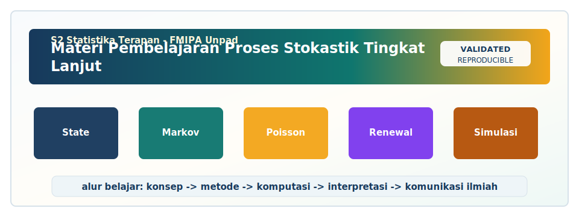

<!-- BEGIN UNPAD MATERIAL STYLE -->
<style>
:root {
  --unpad-navy: #17395c;
  --unpad-gold: #f2a51a;
  --unpad-teal: #0f766e;
  --unpad-ink: #172033;
  --unpad-paper: #fffdf8;
  --unpad-soft: #eef5f8;
  --unpad-line: #d7e2ea;
}
html, body {
  background: linear-gradient(135deg, #f8fbfd 0%, #fffdf8 48%, #f3f6ee 100%) !important;
  color: var(--unpad-ink) !important;
}
body {
  font-family: "Segoe UI", Arial, sans-serif !important;
  line-height: 1.72 !important;
}
.main-container {
  max-width: 1180px !important;
  background: rgba(255, 253, 248, 0.98) !important;
  border: 1px solid var(--unpad-line) !important;
  border-radius: 8px !important;
  box-shadow: 0 18px 42px rgba(23, 57, 92, 0.12) !important;
}
h1, h2, h3, h4 {
  letter-spacing: 0 !important;
}
h1.title {
  color: var(--unpad-navy) !important;
  -webkit-text-fill-color: var(--unpad-navy) !important;
  background: none !important;
}
h2 {
  border-left-color: var(--unpad-gold) !important;
}
a {
  color: #0b5c86 !important;
}
pre, code {
  border-radius: 8px !important;
}
.unpad-cover {
  margin: 18px 0 26px;
  padding: 24px;
  border-radius: 8px;
  background: linear-gradient(135deg, #17395c 0%, #0f766e 58%, #f2a51a 100%);
  color: #ffffff;
  box-shadow: 0 18px 36px rgba(23, 57, 92, 0.22);
}
.unpad-cover__brand {
  display: grid;
  grid-template-columns: 92px 1fr;
  gap: 20px;
  align-items: center;
}
.unpad-cover img {
  width: 92px;
  height: 92px;
  object-fit: contain;
  background: #ffffff;
  border-radius: 8px;
  padding: 8px;
  box-shadow: 0 8px 22px rgba(0,0,0,0.18);
}
.unpad-kicker {
  text-transform: uppercase;
  font-size: 0.82rem;
  font-weight: 800;
  letter-spacing: 0;
  color: #fff8dc;
}
.unpad-cover h2 {
  margin: 6px 0 8px;
  padding: 0;
  border: 0;
  background: transparent;
  color: #ffffff !important;
  font-size: 1.65rem;
}
.unpad-meta {
  margin: 0;
  color: #f7fbff;
  font-weight: 600;
}
.materi-illustration {
  margin: 20px 0 24px;
  padding: 14px;
  background: #ffffff;
  border: 1px solid var(--unpad-line);
  border-radius: 8px;
  box-shadow: 0 12px 28px rgba(23, 57, 92, 0.10);
}
.materi-illustration img {
  width: 100%;
  height: auto;
  display: block;
  border-radius: 6px;
}
.validasi-akademik {
  margin: 18px 0 28px;
  padding: 16px 18px;
  background: linear-gradient(135deg, #eef8f6, #fff8e7);
  border-left: 8px solid var(--unpad-teal);
  border-radius: 8px;
  color: var(--unpad-ink);
}
.validasi-akademik strong {
  color: var(--unpad-navy);
}
table {
  border-radius: 8px !important;
}
@media (max-width: 760px) {
  .unpad-cover__brand {
    grid-template-columns: 1fr;
  }
  .unpad-cover img {
    width: 76px;
    height: 76px;
  }
}
</style>
<!-- END UNPAD MATERIAL STYLE -->


<!-- BEGIN UNPAD MATERIAL ENHANCEMENT -->

```{r setup-unpad-render, include=FALSE}
execute_code <- FALSE
knitr::opts_chunk$set(
  echo = TRUE,
  eval = FALSE,
  message = FALSE,
  warning = FALSE,
  fig.align = "center",
  fig.width = 8,
  fig.height = 4.8,
  dpi = 120
)
set.seed(2025)
```


<div class="unpad-cover">
<div class="unpad-cover__brand">

<div>
<div class="unpad-kicker">S2 Statistika Terapan | FMIPA Universitas Padjadjaran</div>
<h2>Materi Pembelajaran Proses Stokastik Tingkat Lanjut</h2>
<p class="unpad-meta">Program Studi S2 Statistika Terapan FMIPA Universitas Padjadjaran<br>Penulis: Dr. Irlandia Ginanjar, M.Si | Januari 2025</p>
</div>
</div>
</div>

<div class="materi-illustration">

</div>

<div class="validasi-akademik">
<strong>Catatan validasi akademik.</strong> Materi ini diseragamkan dengan rujukan ADWTL Januari 2025: rumus dibaca bersama asumsi, contoh kode diposisikan sebagai template reproducible, dan interpretasi diarahkan pada validitas data, diagnosis model, evaluasi ketidakpastian, serta komunikasi hasil secara ilmiah.
</div>

<!-- END UNPAD MATERIAL ENHANCEMENT -->

```{r setup, include=FALSE, eval=FALSE}
knitr::opts_chunk$set(
  echo = TRUE,
  eval = FALSE,
  message = FALSE,
  warning = FALSE,
  fig.align = "center",
  fig.width = 8,
  fig.height = 5
)
options(scipen = 999)
```


<style>
:root{
  --brown-900:#3b2415; --brown-800:#5a351e; --brown-700:#7a4a2a; --brown-600:#9b6337;
  --brown-500:#b9824a; --brown-300:#e8c49a; --brown-200:#f3ddc3; --brown-100:#fff5ea;
  --cream:#fffaf3; --ink:#1d1714; --muted:#6f5a4b; --gold:#d9a441; --blue:#2b5f75;
}
html, body { scroll-behavior: smooth; }
body{
  color: var(--ink);
  background: linear-gradient(135deg, #fffaf3 0%, #f9ead8 35%, #e6c59b 100%);
  font-size: 16px; line-height: 1.72;
}
.main-container, .container-fluid.main-container{
  max-width: 1180px !important;
  background: rgba(255,250,243,.96);
  border-radius: 24px;
  padding: 34px 48px;
  box-shadow: 0 22px 55px rgba(77,45,21,.18);
  margin-top: 24px; margin-bottom: 50px;
}
h1, h2, h3, h4 { color: var(--brown-900); font-weight: 800; letter-spacing: -.01em; }
h1.title{
  font-size: 2.65rem;
  padding: 34px 32px;
  border-radius: 28px;
  color: #fff;
  background: linear-gradient(115deg, #3b2415 0%, #7a4a2a 48%, #d9a441 100%);
  box-shadow: 0 18px 40px rgba(83,49,22,.28);
}
h2{
  margin-top: 2.4rem; padding: 18px 20px;
  border-radius: 20px;
  color: #fff;
  background: linear-gradient(100deg, var(--brown-800), var(--brown-500));
}
h3{ border-left: 7px solid var(--gold); padding-left: 13px; margin-top: 1.65rem; }
a{ color:#7c3f00; font-weight: 700; }
blockquote{
  border-left: 8px solid var(--brown-500);
  background: #fff0de;
  color:#2a1e16;
  padding: 16px 22px;
  border-radius: 16px;
}
.formula, .rumus{
  background: #f7e7d2;
  color:#111111;
  border: 1px solid #e3c09b;
  border-left: 8px solid #a36a2d;
  border-radius: 18px;
  padding: 18px 22px;
  margin: 18px 0;
  box-shadow: inset 0 1px 0 rgba(255,255,255,.7), 0 8px 20px rgba(91,54,25,.08);
}
.rumus strong, .formula strong { color:#24160d; }
.card, .case-box, .activity, .warning, .output-box{
  border-radius: 20px; padding: 18px 22px; margin: 18px 0;
  box-shadow: 0 10px 22px rgba(71,42,18,.11);
}
.card{ background: linear-gradient(135deg, #fff8ef, #f3dcc1); border:1px solid #ead0b0; }
.case-box{ background: linear-gradient(135deg, #fff4e5, #f2d2a9); border:1px solid #e2b979; }
.activity{ background: linear-gradient(135deg, #f8f1e8, #e6c89e); border:1px dashed #a36a2d; }
.warning{ background: #fff1d6; border:1px solid #d89f4f; }
.output-box{ background: #f8efe2; border:1px solid #d8b083; }
.badge{
  display:inline-block; padding: 4px 10px; border-radius: 999px;
  background: #f0c987; color: #3b2415; font-size:.86em; font-weight:800;
}
.kpi-grid{ display:grid; grid-template-columns: repeat(auto-fit,minmax(220px,1fr)); gap:14px; margin:18px 0; }
.kpi{ background:#fff7ec; border:1px solid #e6c89e; border-radius:18px; padding:16px; }
.kpi b{ color:var(--brown-800); }
table{ width:100%; border-collapse: collapse; margin: 18px 0; background:#fff9ef; }
th{ background:#6f3f1f; color:#fff; }
th, td{ border:1px solid #dcb98f; padding:9px 12px; vertical-align:top; }
tr:nth-child(even){ background:#f8ead8; }
pre, code, pre code{
  background-color:#f8e6d0 !important;
  color:#111111 !important;
  border-radius: 12px;
}
pre{ padding:16px 18px; border:1px solid #e1c09a; box-shadow: 0 6px 18px rgba(90,53,30,.08); }
.eq-note{ font-size:.96em; color:#4e3728; }
.svg-card{ background:#fff7eb; border:1px solid #e6c493; border-radius:22px; padding:18px; margin:20px 0; text-align:center; }
.caption{ font-size:.92em; color:#6f5a4b; margin-top:8px; font-style:italic; }
#TOC, .tocify{
  background: #fff6eb !important;
  border:1px solid #e3c09b !important;
  border-radius: 18px !important;
  box-shadow: 0 12px 28px rgba(77,45,21,.16);
}
#TOC a, .tocify a{ color:#4a2b19 !important; }
@media (min-width: 992px){
  body{ padding-left: 18px; }
  #TOC{ position: fixed; left: 18px; top: 18px; width: 285px; max-height: calc(100vh - 36px); overflow-y: auto; padding: 16px; }
  .main-container, .container-fluid.main-container{ margin-left: 330px !important; }
}
@media print{
  body{ background:#fff; }
  .main-container{ box-shadow:none; margin:0; padding:0; }
  #TOC{ position: static; width:auto; box-shadow:none; }
}
</style>


<div class="card">
<strong>Identitas bahan ajar.</strong> Materi ini disusun untuk mata kuliah <strong>Proses Stokastik Tingkat Lanjut</strong> pada <strong>Program Studi S2 Statistika Terapan, Fakultas Matematika dan Ilmu Pengetahuan Alam, Universitas Padjadjaran</strong>. Struktur pembelajaran mengikuti orientasi RPS-OBE: mahasiswa tidak hanya memahami rumus, tetapi juga mampu menganalisis, mengevaluasi, memodelkan, menyimulasikan, dan mengomunikasikan solusi berbasis proses stokastik untuk masalah nyata. Tahun pembuatan materi: <strong>Januari 2025</strong>.
</div>

<div class="kpi-grid">
<div class="kpi"><b>Mata kuliah</b><br>Proses Stokastik Tingkat Lanjut</div>
<div class="kpi"><b>Program</b><br>S2 Statistika Terapan FMIPA UNPAD</div>
<div class="kpi"><b>Bobot</b><br>3 SKS, Semester 1</div>
<div class="kpi"><b>Penulis RPS / Author</b><br>Dr. Irlandia Ginanjar, M.Si</div>
</div>

# Peta Pembelajaran dan Cara Menggunakan Materi

Materi ini dirancang sebagai e-book kuliah yang dapat langsung dikembangkan menjadi HTML melalui R Markdown. Bagian awal menjelaskan fondasi peluang bersyarat dan ekspektasi bersyarat; bagian tengah mengembangkan rantai Markov, proses Poisson, proses Poisson majemuk, proses kelahiran-kematian, dan proses antrian; bagian akhir memperluas pembahasan ke renewal process, simulasi, desain proyek, dan komunikasi hasil. Dengan demikian, alur materi bergerak dari *probabilistic thinking* menuju *stochastic modeling*, lalu menuju *computational implementation* dan *decision support*. Sitasi utama mengikuti tradisi buku teks proses stokastik dan probabilitas terapan seperti Ross (2014), Cinlar (2011), Norris (1997), Medhi (2002), Taylor dan Karlin (1998), Tijms (2003), serta Asmussen (2003).

<div class="svg-card">
<svg width="780" height="210" viewBox="0 0 780 210" xmlns="http://www.w3.org/2000/svg">
  <defs>
    <linearGradient id="g1" x1="0" x2="1" y1="0" y2="1">
      <stop offset="0%" stop-color="#5a351e"/>
      <stop offset="55%" stop-color="#b9824a"/>
      <stop offset="100%" stop-color="#f0c987"/>
    </linearGradient>
    <marker id="arrow" markerWidth="10" markerHeight="10" refX="8" refY="3" orient="auto" markerUnits="strokeWidth">
      <path d="M0,0 L0,6 L9,3 z" fill="#7a4a2a" />
    </marker>
  </defs>
  <rect x="10" y="20" width="760" height="170" rx="24" fill="#fff4e4" stroke="#d8ad78"/>
  <g font-family="Arial" font-size="14" text-anchor="middle">
    <rect x="40" y="70" width="135" height="62" rx="18" fill="url(#g1)"/><text x="107" y="96" fill="white" font-weight="700">Peluang &</text><text x="107" y="116" fill="white" font-weight="700">Ekspektasi</text>
    <rect x="220" y="70" width="135" height="62" rx="18" fill="url(#g1)"/><text x="287" y="96" fill="white" font-weight="700">Rantai</text><text x="287" y="116" fill="white" font-weight="700">Markov</text>
    <rect x="400" y="70" width="135" height="62" rx="18" fill="url(#g1)"/><text x="467" y="96" fill="white" font-weight="700">Poisson &</text><text x="467" y="116" fill="white" font-weight="700">Birth-Death</text>
    <rect x="580" y="70" width="135" height="62" rx="18" fill="url(#g1)"/><text x="647" y="96" fill="white" font-weight="700">Antrian, Renewal</text><text x="647" y="116" fill="white" font-weight="700">& Proyek</text>
    <line x1="177" y1="101" x2="218" y2="101" stroke="#7a4a2a" stroke-width="4" marker-end="url(#arrow)"/>
    <line x1="357" y1="101" x2="398" y2="101" stroke="#7a4a2a" stroke-width="4" marker-end="url(#arrow)"/>
    <line x1="537" y1="101" x2="578" y2="101" stroke="#7a4a2a" stroke-width="4" marker-end="url(#arrow)"/>
  </g>
</svg>
<div class="caption">Gambar 1. Peta konseptual ringkas mata kuliah: dari fondasi probabilitas menuju model stokastik dan aplikasi.</div>
</div>

## Capaian Pembelajaran yang Diterjemahkan ke Aktivitas Kelas

Capaian pembelajaran mata kuliah dapat dibaca sebagai empat kemampuan operasional. Pertama, mahasiswa perlu menganalisis peluang dan ekspektasi bersyarat sebagai bahasa dasar untuk memeriksa ketidakpastian. Kedua, mahasiswa perlu mengevaluasi desain pengumpulan data dan simulasi karena data stokastik sering muncul sebagai lintasan, deret waktu kejadian, waktu tunggu, atau status yang berubah secara acak. Ketiga, mahasiswa perlu mengembangkan model Markov, Poisson, kelahiran-kematian, antrian, dan renewal sebagai kerangka formal. Keempat, mahasiswa perlu menciptakan solusi inovatif, misalnya laporan analitik, dashboard mini, simulasi keputusan, atau e-book proyek yang memperlihatkan hubungan antara teori dan masalah nyata.

<div class="activity">
<strong>Petunjuk belajar.</strong> Pada setiap bab, mahasiswa disarankan membaca definisi, menulis kembali asumsi model dengan kata sendiri, menjalankan atau memodifikasi kode R, lalu menjawab soal reflektif. Kebiasaan kecil ini penting karena proses stokastik sering tampak “rumus sekali”, padahal kekuatannya justru ada pada pemilihan asumsi. Kalau asumsi salah, model bisa tetap rapi secara aljabar tetapi tersesat secara substansi. Rumusnya percaya diri, aplikasinya bisa nyasar ke gang sempit.
</div>

## Rencana 16 Pertemuan

| Pertemuan | Fokus Materi | Produk Belajar Utama |
|---:|---|---|
| 1--2 | Peluang bersyarat dan ekspektasi bersyarat | Latihan analitik dan studi kasus |
| 3 | Pengumpulan dan sampling data stokastik | Desain simulasi/sampling |
| 4--7 | Rantai Markov diskrit, matriks transisi, status, penyerapan, limit distribusi | Model Markov dan implementasi |
| 8 | UTS | Ujian analitik dan studi kasus |
| 9--12 | Proses Poisson, Poisson majemuk, kelahiran-kematian, antrian | Model dan simulasi proses kontinu |
| 13--16 | Renewal process, aplikasi, simulasi, dan proyek inovatif | Laporan akhir dan presentasi |


## Fondasi Berpikir Stokastik untuk Statistika Terapan

<span class="badge">Pertemuan: Pendahuluan</span> <span class="badge">Rujukan: Ross (2014), Cinlar (2011), dan Grimmett dan Stirzaker (2001)</span>

### Tujuan Pembelajaran

Setelah mempelajari bagian ini, mahasiswa diharapkan mampu menjelaskan makna **proses stokastik sebagai keluarga peubah acak yang diindeks oleh waktu atau ruang**, menyusun formulasi matematis dasar, menghubungkan model dengan data, dan membuat interpretasi yang relevan untuk kasus terapan. Tujuan ini sengaja ditulis dalam bentuk operasional agar mahasiswa tidak hanya membaca konsep, tetapi juga melakukan analisis, evaluasi, dan komunikasi hasil.

### Konsep Kunci

Fondasi Berpikir Stokastik untuk Statistika Terapan membahas proses stokastik sebagai keluarga peubah acak yang diindeks oleh waktu atau ruang. Dalam proses stokastik, objek yang diamati bukan sekadar satu angka, melainkan lintasan, rangkaian status, atau kumpulan kejadian yang berubah menurut indeks tertentu. Indeks ini biasanya waktu diskrit, waktu kontinu, atau urutan kejadian. Karena itu, pembelajaran perlu memadukan notasi, intuisi, dan data. Ross (2014), Cinlar (2011), dan Grimmett dan Stirzaker (2001) menempatkan proses stokastik sebagai kerangka umum untuk memodelkan ketidakpastian dinamis, sehingga mahasiswa perlu terbiasa membaca simbol sebagai cerita probabilistik.

<div class="rumus">
<strong>Rumus/representasi inti:</strong>

$$\{X(t): t \in T\}$$

<div class="eq-note">Notasi di atas harus selalu dibaca bersama definisi unit observasi, indeks waktu, status/kejadian, dan asumsi model.</div>
</div>


### Intuisi Statistik

Intuisi utama dari bagian ini adalah bahwa ketidakpastian tidak selalu muncul sebagai observasi tunggal. Dalam banyak kasus, data datang sebagai proses: pelanggan datang satu per satu, pasien berpindah status, mesin rusak dan diperbaiki, klaim asuransi muncul dalam jumlah dan nilai yang tidak pasti, atau pengguna aplikasi aktif lalu pasif. Proses seperti ini membutuhkan bahasa probabilitas yang mampu menangkap urutan, dependensi, dan perubahan. Ross (2014), Cinlar (2011), dan Grimmett dan Stirzaker (2001) menunjukkan bahwa struktur dependensi dapat sederhana, seperti Markov property, atau lebih kaya, seperti proses pembaharuan dan antrian.

Dalam pembelajaran kelas, dosen dapat memulai dari contoh nyata sebelum masuk ke rumus. Misalnya, untuk kasus **pemantauan jumlah pasien datang ke fasilitas kesehatan dari jam ke jam**, mahasiswa dapat diminta menjawab: apa kejadian acaknya, apa yang dianggap sebagai waktu, apakah masa depan hanya bergantung pada kondisi sekarang, dan bagaimana parameter dapat diestimasi. Pertanyaan semacam ini sederhana, tetapi sangat efektif untuk mencegah mahasiswa memakai model secara otomatis. Model stokastik bukan mesin fotokopi rumus; ia lebih mirip peta. Peta yang baik harus sesuai medan, bukan sekadar indah warnanya.

### Contoh Kasus Terapan

Pertimbangkan kasus berikut: **pemantauan jumlah pasien datang ke fasilitas kesehatan dari jam ke jam**. Data dapat dicatat dalam bentuk waktu kejadian, jumlah kejadian per interval, atau status pada setiap periode. Jika data berupa status berurutan, pendekatan rantai Markov sering relevan. Jika data berupa jumlah kedatangan dalam interval waktu, proses Poisson dapat menjadi titik awal. Jika setiap kejadian membawa ukuran kerugian atau nilai tertentu, proses Poisson majemuk lebih tepat. Jika fokusnya adalah kapasitas layanan dan waktu tunggu, model antrian dapat digunakan. Jika fokusnya adalah siklus penggantian atau kejadian ulang, renewal process menjadi kandidat utama.

Langkah analisis yang disarankan adalah: mendefinisikan satuan observasi, menentukan indeks waktu, merumuskan status atau kejadian, memilih asumsi distribusi, mengestimasi parameter, menyimulasikan proses, lalu mengevaluasi kecocokan terhadap data atau logika substantif. Dengan struktur ini, mahasiswa belajar bahwa proses stokastik bukan sekadar kumpulan bab terpisah. Markov, Poisson, antrian, dan renewal adalah keluarga model yang saling berhubungan dalam upaya menjelaskan dinamika acak.

### Implementasi R Dasar

Kode berikut disediakan sebagai ilustrasi. Pada dokumen ini opsi `eval = FALSE` digunakan agar file aman dirender di berbagai komputer. Mahasiswa dapat mengubahnya menjadi `eval = TRUE` setelah memastikan paket dan data tersedia.

```{r contoh-1, eval=FALSE}
# Representasi sederhana lintasan proses stokastik diskrit
set.seed(123)
time <- 0:30
x <- cumsum(sample(c(-1, 1), size = length(time), replace = TRUE))
plot(time, x, type = "l", lwd = 2,
     xlab = "Waktu", ylab = "X(t)",
     main = "Contoh lintasan random walk")
```

### Pembacaan Output

Output dari kode atau perhitungan harus dibaca sebagai ringkasan perilaku proses, bukan sebagai angka yang berdiri sendiri. Jika hasilnya berupa lintasan, amati pola fluktuasi dan kemungkinan kestabilan. Jika hasilnya berupa peluang, jelaskan kejadian yang dirujuk peluang tersebut. Jika hasilnya berupa rata-rata waktu tunggu atau distribusi jangka panjang, hubungkan dengan implikasi keputusan. Untuk **Fondasi Berpikir Stokastik untuk Statistika Terapan**, kalimat interpretasi yang baik biasanya menyebutkan konteks, parameter, arah perubahan, dan konsekuensi praktis.


### Pengembangan Teori Secara Bertahap

Pada tingkat lanjut, mahasiswa perlu membedakan tiga level pembahasan. Level pertama adalah **definisi matematis**, yaitu bagaimana proses dinyatakan dengan peubah acak, indeks, ruang status, dan distribusi peluang. Level kedua adalah **sifat probabilistik**, misalnya independensi, stasioneritas, homogenitas waktu, irreducibility, recurrence, atau memoryless property. Level ketiga adalah **pemanfaatan model**, yaitu bagaimana definisi dan sifat tersebut dipakai untuk menghitung peluang, membuat prediksi, mengevaluasi performa sistem, atau mendukung keputusan. Ketiga level ini harus hadir secara seimbang. Pembelajaran yang hanya menekankan definisi akan terasa kering; pembelajaran yang hanya menekankan aplikasi dapat kehilangan ketelitian.

Untuk topik **Fondasi Berpikir Stokastik untuk Statistika Terapan**, dosen dapat meminta mahasiswa membangun tabel yang berisi empat kolom: asumsi, konsekuensi matematis, kebutuhan data, dan contoh interpretasi. Misalnya, asumsi independensi kedatangan pada proses Poisson berimplikasi pada distribusi hitungan yang sederhana, tetapi membutuhkan pemeriksaan pola waktu untuk memastikan tidak ada jam puncak yang kuat. Asumsi Markov property memudahkan analisis transisi, tetapi dapat terlalu sederhana jika sejarah panjang memengaruhi status masa depan. Dengan latihan seperti ini, mahasiswa belajar mengevaluasi model, bukan hanya menggunakannya.

### Keterkaitan dengan Statistika Terapan

Dalam statistika terapan, model stokastik dipakai untuk menjembatani fenomena acak dan keputusan. Pada bidang kesehatan, proses stokastik membantu memahami kedatangan pasien, durasi rawat, perkembangan status penyakit, atau antrean layanan. Pada aktuaria, model digunakan untuk frekuensi klaim, ukuran klaim, risiko agregat, dan proses surplus. Pada industri, model digunakan untuk reliabilitas mesin, jadwal perawatan, antrian produksi, dan pengendalian kualitas. Pada sains data, proses stokastik muncul dalam data klik, perilaku pengguna, proses transaksi, sistem rekomendasi, dan pemodelan sekuensial. Karena itu, materi ini sengaja memadukan formula, simulasi, dan narasi kasus.

Salah satu indikator keberhasilan belajar adalah kemampuan mahasiswa mengajukan pertanyaan model. Untuk **pemantauan jumlah pasien datang ke fasilitas kesehatan dari jam ke jam**, pertanyaan model dapat berupa: apakah prosesnya diskrit atau kontinu, apakah laju kejadian konstan, apakah status yang dipakai sudah mencukupi, apakah ada heterogenitas antar unit, dan apakah hasil simulasi masuk akal dibandingkan pengetahuan lapangan. Pertanyaan-pertanyaan ini membuat mahasiswa bergerak dari pengguna rumus menjadi analis statistik yang kritis.

### Catatan Teknis untuk Penugasan

Dalam laporan tugas, mahasiswa disarankan menulis bagian metode dengan urutan: definisi kasus, notasi, asumsi, formulasi model, estimasi parameter, implementasi, hasil, interpretasi, validasi, dan keterbatasan. Urutan ini sederhana tetapi sangat membantu pembaca. Untuk tugas kecil, laporan dapat dibuat 2--5 halaman; untuk proyek akhir, laporan dapat diperluas menjadi e-book mini atau dokumen HTML dengan visualisasi. Mahasiswa perlu mencantumkan rujukan utama, misalnya Ross (2014), Cinlar (2011), dan Grimmett dan Stirzaker (2001), lalu menambahkan artikel terapan sesuai kasus.

Rubrik penilaian dapat diarahkan pada empat aspek: ketepatan model, kedalaman analisis, kualitas implementasi, dan komunikasi. Ketepatan model menilai apakah struktur stokastik sesuai kasus. Kedalaman analisis menilai apakah mahasiswa hanya menghitung atau juga menafsirkan. Kualitas implementasi menilai apakah kode, tabel, dan grafik konsisten. Komunikasi menilai apakah pembaca dapat memahami masalah, pendekatan, dan rekomendasi. Dengan rubrik ini, proses penilaian menjadi lebih transparan dan selaras dengan capaian pembelajaran.

### Elaborasi Materi

**Asumsi.** Dalam topik **Fondasi Berpikir Stokastik untuk Statistika Terapan**, proses stokastik sebagai keluarga peubah acak yang diindeks oleh waktu atau ruang harus dibaca sebagai perangkat untuk memahami variasi acak yang berkembang menurut waktu. Asumsi adalah jantung dari model stokastik. Sebelum menghitung, mahasiswa perlu menulis siapa unit pengamatan, apa status atau kejadian yang dimodelkan, bagaimana waktu diindeks, dan informasi apa yang dianggap tersedia. Pada level magister, kemampuan menilai asumsi sering lebih penting daripada kemampuan menghafal rumus. Rumus yang benar tetapi ditempatkan pada asumsi yang keliru akan menghasilkan kesimpulan yang tampak canggih namun rapuh. Contoh kontekstualnya adalah pemantauan jumlah pasien datang ke fasilitas kesehatan dari jam ke jam. Ketika kasus tersebut dikonstruksi sebagai model, peneliti harus membedakan mana kejadian, mana status, mana parameter, dan mana keluaran yang ingin diprediksi. Prinsip ini sejalan dengan pembahasan proses stokastik dalam Ross (2014), Cinlar (2011), dan Grimmett dan Stirzaker (2001), yang menekankan hubungan erat antara definisi probabilistik, struktur model, dan interpretasi aplikatif. Pada tahap pembelajaran, mahasiswa dapat menuliskan satu paragraf interpretasi untuk setiap hasil numerik; kebiasaan ini membuat analisis tidak berhenti sebagai hitungan, tetapi berubah menjadi argumen statistik yang dapat dipertanggungjawabkan.

**Interpretasi.** Dalam topik **Fondasi Berpikir Stokastik untuk Statistika Terapan**, proses stokastik sebagai keluarga peubah acak yang diindeks oleh waktu atau ruang harus dibaca sebagai perangkat untuk memahami variasi acak yang berkembang menurut waktu. Interpretasi harus menempel pada konteks. Nilai probabilitas, laju, waktu tunggu, peluang penyerapan, atau distribusi stasioner bukan angka dekoratif; angka tersebut harus menjawab pertanyaan substantif. Di kelas, mahasiswa sebaiknya dilatih menerjemahkan setiap simbol menjadi kalimat kebijakan atau kalimat manajerial yang ringkas. Contoh kontekstualnya adalah pemantauan jumlah pasien datang ke fasilitas kesehatan dari jam ke jam. Ketika kasus tersebut dikonstruksi sebagai model, peneliti harus membedakan mana kejadian, mana status, mana parameter, dan mana keluaran yang ingin diprediksi. Prinsip ini sejalan dengan pembahasan proses stokastik dalam Ross (2014), Cinlar (2011), dan Grimmett dan Stirzaker (2001), yang menekankan hubungan erat antara definisi probabilistik, struktur model, dan interpretasi aplikatif. Pada tahap pembelajaran, mahasiswa dapat menuliskan satu paragraf interpretasi untuk setiap hasil numerik; kebiasaan ini membuat analisis tidak berhenti sebagai hitungan, tetapi berubah menjadi argumen statistik yang dapat dipertanggungjawabkan.

**Estimasi.** Dalam topik **Fondasi Berpikir Stokastik untuk Statistika Terapan**, proses stokastik sebagai keluarga peubah acak yang diindeks oleh waktu atau ruang harus dibaca sebagai perangkat untuk memahami variasi acak yang berkembang menurut waktu. Dalam aplikasi, parameter jarang diketahui. Laju kedatangan, probabilitas transisi, rata-rata waktu pelayanan, dan distribusi antar-pembaharuan perlu diestimasi dari data. Estimasi dapat dilakukan secara frekuentis sederhana, likelihood, atau melalui pendekatan simulasi, tergantung kelengkapan data dan struktur observasi. Contoh kontekstualnya adalah pemantauan jumlah pasien datang ke fasilitas kesehatan dari jam ke jam. Ketika kasus tersebut dikonstruksi sebagai model, peneliti harus membedakan mana kejadian, mana status, mana parameter, dan mana keluaran yang ingin diprediksi. Prinsip ini sejalan dengan pembahasan proses stokastik dalam Ross (2014), Cinlar (2011), dan Grimmett dan Stirzaker (2001), yang menekankan hubungan erat antara definisi probabilistik, struktur model, dan interpretasi aplikatif. Pada tahap pembelajaran, mahasiswa dapat menuliskan satu paragraf interpretasi untuk setiap hasil numerik; kebiasaan ini membuat analisis tidak berhenti sebagai hitungan, tetapi berubah menjadi argumen statistik yang dapat dipertanggungjawabkan.

**Validasi.** Dalam topik **Fondasi Berpikir Stokastik untuk Statistika Terapan**, proses stokastik sebagai keluarga peubah acak yang diindeks oleh waktu atau ruang harus dibaca sebagai perangkat untuk memahami variasi acak yang berkembang menurut waktu. Validasi model dilakukan dengan membandingkan pola teoretis dan pola empiris. Untuk data hitungan, periksa rata-rata dan variansi; untuk data waktu antar-kejadian, periksa bentuk distribusi dan kemungkinan heterogenitas; untuk data status, periksa stabilitas matriks transisi dari periode ke periode. Validasi bukan formalitas; ia adalah rem tangan ilmiah. Contoh kontekstualnya adalah pemantauan jumlah pasien datang ke fasilitas kesehatan dari jam ke jam. Ketika kasus tersebut dikonstruksi sebagai model, peneliti harus membedakan mana kejadian, mana status, mana parameter, dan mana keluaran yang ingin diprediksi. Prinsip ini sejalan dengan pembahasan proses stokastik dalam Ross (2014), Cinlar (2011), dan Grimmett dan Stirzaker (2001), yang menekankan hubungan erat antara definisi probabilistik, struktur model, dan interpretasi aplikatif. Pada tahap pembelajaran, mahasiswa dapat menuliskan satu paragraf interpretasi untuk setiap hasil numerik; kebiasaan ini membuat analisis tidak berhenti sebagai hitungan, tetapi berubah menjadi argumen statistik yang dapat dipertanggungjawabkan.

**Komputasi.** Dalam topik **Fondasi Berpikir Stokastik untuk Statistika Terapan**, proses stokastik sebagai keluarga peubah acak yang diindeks oleh waktu atau ruang harus dibaca sebagai perangkat untuk memahami variasi acak yang berkembang menurut waktu. Komputasi memperluas ruang belajar karena mahasiswa dapat melihat lintasan acak, mengulang simulasi, dan mengevaluasi sensitivitas. Kode R yang sederhana sering cukup untuk memperlihatkan intuisi utama. Yang penting bukan membuat kode panjang, tetapi membuat kode yang menjawab pertanyaan model dengan transparan. Contoh kontekstualnya adalah pemantauan jumlah pasien datang ke fasilitas kesehatan dari jam ke jam. Ketika kasus tersebut dikonstruksi sebagai model, peneliti harus membedakan mana kejadian, mana status, mana parameter, dan mana keluaran yang ingin diprediksi. Prinsip ini sejalan dengan pembahasan proses stokastik dalam Ross (2014), Cinlar (2011), dan Grimmett dan Stirzaker (2001), yang menekankan hubungan erat antara definisi probabilistik, struktur model, dan interpretasi aplikatif. Pada tahap pembelajaran, mahasiswa dapat menuliskan satu paragraf interpretasi untuk setiap hasil numerik; kebiasaan ini membuat analisis tidak berhenti sebagai hitungan, tetapi berubah menjadi argumen statistik yang dapat dipertanggungjawabkan.

**Keterbatasan.** Dalam topik **Fondasi Berpikir Stokastik untuk Statistika Terapan**, proses stokastik sebagai keluarga peubah acak yang diindeks oleh waktu atau ruang harus dibaca sebagai perangkat untuk memahami variasi acak yang berkembang menurut waktu. Setiap model stokastik menyederhanakan kenyataan. Homogenitas waktu, independensi antar-kejadian, Markov property, distribusi eksponensial, atau asumsi i.i.d. renewal bisa gagal dalam praktik. Karena itu, laporan yang baik harus memuat batasan dan kemungkinan perluasan model, bukan hanya hasil akhir yang tampak manis. Contoh kontekstualnya adalah pemantauan jumlah pasien datang ke fasilitas kesehatan dari jam ke jam. Ketika kasus tersebut dikonstruksi sebagai model, peneliti harus membedakan mana kejadian, mana status, mana parameter, dan mana keluaran yang ingin diprediksi. Prinsip ini sejalan dengan pembahasan proses stokastik dalam Ross (2014), Cinlar (2011), dan Grimmett dan Stirzaker (2001), yang menekankan hubungan erat antara definisi probabilistik, struktur model, dan interpretasi aplikatif. Pada tahap pembelajaran, mahasiswa dapat menuliskan satu paragraf interpretasi untuk setiap hasil numerik; kebiasaan ini membuat analisis tidak berhenti sebagai hitungan, tetapi berubah menjadi argumen statistik yang dapat dipertanggungjawabkan.

**Koneksi riset.** Dalam topik **Fondasi Berpikir Stokastik untuk Statistika Terapan**, proses stokastik sebagai keluarga peubah acak yang diindeks oleh waktu atau ruang harus dibaca sebagai perangkat untuk memahami variasi acak yang berkembang menurut waktu. Proses stokastik menjadi dasar bagi banyak riset lanjut: epidemiologi, reliabilitas, aktuaria, antrian layanan publik, jaringan komunikasi, rantai pasok, dan pembelajaran mesin sekuensial. Koneksi riset ini penting agar mahasiswa melihat bahwa materi tidak berhenti di papan tulis; ia hidup dalam data dan keputusan. Contoh kontekstualnya adalah pemantauan jumlah pasien datang ke fasilitas kesehatan dari jam ke jam. Ketika kasus tersebut dikonstruksi sebagai model, peneliti harus membedakan mana kejadian, mana status, mana parameter, dan mana keluaran yang ingin diprediksi. Prinsip ini sejalan dengan pembahasan proses stokastik dalam Ross (2014), Cinlar (2011), dan Grimmett dan Stirzaker (2001), yang menekankan hubungan erat antara definisi probabilistik, struktur model, dan interpretasi aplikatif. Pada tahap pembelajaran, mahasiswa dapat menuliskan satu paragraf interpretasi untuk setiap hasil numerik; kebiasaan ini membuat analisis tidak berhenti sebagai hitungan, tetapi berubah menjadi argumen statistik yang dapat dipertanggungjawabkan.

**Komunikasi ilmiah.** Dalam topik **Fondasi Berpikir Stokastik untuk Statistika Terapan**, proses stokastik sebagai keluarga peubah acak yang diindeks oleh waktu atau ruang harus dibaca sebagai perangkat untuk memahami variasi acak yang berkembang menurut waktu. Komunikasi hasil harus menyajikan masalah, asumsi, model, hasil, interpretasi, dan rekomendasi. Hindari menyajikan tabel angka tanpa cerita. Narasi yang kuat biasanya menjawab tiga pertanyaan: apa yang terjadi, mengapa model ini relevan, dan apa konsekuensi keputusan yang dihasilkan. Contoh kontekstualnya adalah pemantauan jumlah pasien datang ke fasilitas kesehatan dari jam ke jam. Ketika kasus tersebut dikonstruksi sebagai model, peneliti harus membedakan mana kejadian, mana status, mana parameter, dan mana keluaran yang ingin diprediksi. Prinsip ini sejalan dengan pembahasan proses stokastik dalam Ross (2014), Cinlar (2011), dan Grimmett dan Stirzaker (2001), yang menekankan hubungan erat antara definisi probabilistik, struktur model, dan interpretasi aplikatif. Pada tahap pembelajaran, mahasiswa dapat menuliskan satu paragraf interpretasi untuk setiap hasil numerik; kebiasaan ini membuat analisis tidak berhenti sebagai hitungan, tetapi berubah menjadi argumen statistik yang dapat dipertanggungjawabkan.

### Mini Latihan

1. Jelaskan dengan bahasa sendiri apa arti **proses stokastik sebagai keluarga peubah acak yang diindeks oleh waktu atau ruang** dalam konteks **pemantauan jumlah pasien datang ke fasilitas kesehatan dari jam ke jam**.  
2. Tuliskan minimal tiga asumsi yang diperlukan agar model pada bagian ini dapat digunakan.  
3. Buat contoh data kecil berisi 10 observasi, lalu tunjukkan bagaimana parameter awal dapat dihitung.  
4. Jalankan atau modifikasi kode R yang diberikan. Ubah satu parameter dan jelaskan dampaknya.  
5. Tulis satu paragraf interpretasi yang menghubungkan hasil perhitungan dengan keputusan praktis.

<div class="warning">
<strong>Kesalahan umum.</strong> Mahasiswa sering langsung memilih model karena nama model terasa cocok. Padahal model harus dipilih berdasarkan struktur data dan asumsi. Untuk Fondasi Berpikir Stokastik untuk Statistika Terapan, pastikan kejadian, status, waktu, dan parameter sudah didefinisikan sebelum melakukan perhitungan.
</div>


## Peluang Bersyarat dan Hukum Probabilitas Total

<span class="badge">Pertemuan: 1</span> <span class="badge">Rujukan: Ross (2014), Feller (1968), dan Cinlar (2011)</span>

### Tujuan Pembelajaran

Setelah mempelajari bagian ini, mahasiswa diharapkan mampu menjelaskan makna **peluang suatu kejadian setelah informasi baru tersedia**, menyusun formulasi matematis dasar, menghubungkan model dengan data, dan membuat interpretasi yang relevan untuk kasus terapan. Tujuan ini sengaja ditulis dalam bentuk operasional agar mahasiswa tidak hanya membaca konsep, tetapi juga melakukan analisis, evaluasi, dan komunikasi hasil.

### Konsep Kunci

Peluang Bersyarat dan Hukum Probabilitas Total membahas peluang suatu kejadian setelah informasi baru tersedia. Dalam proses stokastik, objek yang diamati bukan sekadar satu angka, melainkan lintasan, rangkaian status, atau kumpulan kejadian yang berubah menurut indeks tertentu. Indeks ini biasanya waktu diskrit, waktu kontinu, atau urutan kejadian. Karena itu, pembelajaran perlu memadukan notasi, intuisi, dan data. Ross (2014), Feller (1968), dan Cinlar (2011) menempatkan proses stokastik sebagai kerangka umum untuk memodelkan ketidakpastian dinamis, sehingga mahasiswa perlu terbiasa membaca simbol sebagai cerita probabilistik.

<div class="rumus">
<strong>Rumus/representasi inti:</strong>

$$P(A\mid B)=\frac{P(A\cap B)}{P(B)},\quad P(B)>0$$

<div class="eq-note">Notasi di atas harus selalu dibaca bersama definisi unit observasi, indeks waktu, status/kejadian, dan asumsi model.</div>
</div>


### Intuisi Statistik

Intuisi utama dari bagian ini adalah bahwa ketidakpastian tidak selalu muncul sebagai observasi tunggal. Dalam banyak kasus, data datang sebagai proses: pelanggan datang satu per satu, pasien berpindah status, mesin rusak dan diperbaiki, klaim asuransi muncul dalam jumlah dan nilai yang tidak pasti, atau pengguna aplikasi aktif lalu pasif. Proses seperti ini membutuhkan bahasa probabilitas yang mampu menangkap urutan, dependensi, dan perubahan. Ross (2014), Feller (1968), dan Cinlar (2011) menunjukkan bahwa struktur dependensi dapat sederhana, seperti Markov property, atau lebih kaya, seperti proses pembaharuan dan antrian.

Dalam pembelajaran kelas, dosen dapat memulai dari contoh nyata sebelum masuk ke rumus. Misalnya, untuk kasus **peluang pasien memerlukan layanan lanjutan setelah diketahui status triase awal**, mahasiswa dapat diminta menjawab: apa kejadian acaknya, apa yang dianggap sebagai waktu, apakah masa depan hanya bergantung pada kondisi sekarang, dan bagaimana parameter dapat diestimasi. Pertanyaan semacam ini sederhana, tetapi sangat efektif untuk mencegah mahasiswa memakai model secara otomatis. Model stokastik bukan mesin fotokopi rumus; ia lebih mirip peta. Peta yang baik harus sesuai medan, bukan sekadar indah warnanya.

### Contoh Kasus Terapan

Pertimbangkan kasus berikut: **peluang pasien memerlukan layanan lanjutan setelah diketahui status triase awal**. Data dapat dicatat dalam bentuk waktu kejadian, jumlah kejadian per interval, atau status pada setiap periode. Jika data berupa status berurutan, pendekatan rantai Markov sering relevan. Jika data berupa jumlah kedatangan dalam interval waktu, proses Poisson dapat menjadi titik awal. Jika setiap kejadian membawa ukuran kerugian atau nilai tertentu, proses Poisson majemuk lebih tepat. Jika fokusnya adalah kapasitas layanan dan waktu tunggu, model antrian dapat digunakan. Jika fokusnya adalah siklus penggantian atau kejadian ulang, renewal process menjadi kandidat utama.

Langkah analisis yang disarankan adalah: mendefinisikan satuan observasi, menentukan indeks waktu, merumuskan status atau kejadian, memilih asumsi distribusi, mengestimasi parameter, menyimulasikan proses, lalu mengevaluasi kecocokan terhadap data atau logika substantif. Dengan struktur ini, mahasiswa belajar bahwa proses stokastik bukan sekadar kumpulan bab terpisah. Markov, Poisson, antrian, dan renewal adalah keluarga model yang saling berhubungan dalam upaya menjelaskan dinamika acak.

### Implementasi R Dasar

Kode berikut disediakan sebagai ilustrasi. Pada dokumen ini opsi `eval = FALSE` digunakan agar file aman dirender di berbagai komputer. Mahasiswa dapat mengubahnya menjadi `eval = TRUE` setelah memastikan paket dan data tersedia.

```{r contoh-2, eval=FALSE}
# Simulasi peluang bersyarat
set.seed(1)
n <- 10000
triage <- sample(c("ringan", "sedang", "berat"), n, replace = TRUE, prob = c(.55,.35,.10))
lanjutan <- ifelse(triage == "berat", rbinom(n,1,.80),
                   ifelse(triage == "sedang", rbinom(n,1,.35), rbinom(n,1,.08)))
mean(lanjutan[triage == "berat"] == 1)
```

### Pembacaan Output

Output dari kode atau perhitungan harus dibaca sebagai ringkasan perilaku proses, bukan sebagai angka yang berdiri sendiri. Jika hasilnya berupa lintasan, amati pola fluktuasi dan kemungkinan kestabilan. Jika hasilnya berupa peluang, jelaskan kejadian yang dirujuk peluang tersebut. Jika hasilnya berupa rata-rata waktu tunggu atau distribusi jangka panjang, hubungkan dengan implikasi keputusan. Untuk **Peluang Bersyarat dan Hukum Probabilitas Total**, kalimat interpretasi yang baik biasanya menyebutkan konteks, parameter, arah perubahan, dan konsekuensi praktis.


### Pengembangan Teori Secara Bertahap

Pada tingkat lanjut, mahasiswa perlu membedakan tiga level pembahasan. Level pertama adalah **definisi matematis**, yaitu bagaimana proses dinyatakan dengan peubah acak, indeks, ruang status, dan distribusi peluang. Level kedua adalah **sifat probabilistik**, misalnya independensi, stasioneritas, homogenitas waktu, irreducibility, recurrence, atau memoryless property. Level ketiga adalah **pemanfaatan model**, yaitu bagaimana definisi dan sifat tersebut dipakai untuk menghitung peluang, membuat prediksi, mengevaluasi performa sistem, atau mendukung keputusan. Ketiga level ini harus hadir secara seimbang. Pembelajaran yang hanya menekankan definisi akan terasa kering; pembelajaran yang hanya menekankan aplikasi dapat kehilangan ketelitian.

Untuk topik **Peluang Bersyarat dan Hukum Probabilitas Total**, dosen dapat meminta mahasiswa membangun tabel yang berisi empat kolom: asumsi, konsekuensi matematis, kebutuhan data, dan contoh interpretasi. Misalnya, asumsi independensi kedatangan pada proses Poisson berimplikasi pada distribusi hitungan yang sederhana, tetapi membutuhkan pemeriksaan pola waktu untuk memastikan tidak ada jam puncak yang kuat. Asumsi Markov property memudahkan analisis transisi, tetapi dapat terlalu sederhana jika sejarah panjang memengaruhi status masa depan. Dengan latihan seperti ini, mahasiswa belajar mengevaluasi model, bukan hanya menggunakannya.

### Keterkaitan dengan Statistika Terapan

Dalam statistika terapan, model stokastik dipakai untuk menjembatani fenomena acak dan keputusan. Pada bidang kesehatan, proses stokastik membantu memahami kedatangan pasien, durasi rawat, perkembangan status penyakit, atau antrean layanan. Pada aktuaria, model digunakan untuk frekuensi klaim, ukuran klaim, risiko agregat, dan proses surplus. Pada industri, model digunakan untuk reliabilitas mesin, jadwal perawatan, antrian produksi, dan pengendalian kualitas. Pada sains data, proses stokastik muncul dalam data klik, perilaku pengguna, proses transaksi, sistem rekomendasi, dan pemodelan sekuensial. Karena itu, materi ini sengaja memadukan formula, simulasi, dan narasi kasus.

Salah satu indikator keberhasilan belajar adalah kemampuan mahasiswa mengajukan pertanyaan model. Untuk **peluang pasien memerlukan layanan lanjutan setelah diketahui status triase awal**, pertanyaan model dapat berupa: apakah prosesnya diskrit atau kontinu, apakah laju kejadian konstan, apakah status yang dipakai sudah mencukupi, apakah ada heterogenitas antar unit, dan apakah hasil simulasi masuk akal dibandingkan pengetahuan lapangan. Pertanyaan-pertanyaan ini membuat mahasiswa bergerak dari pengguna rumus menjadi analis statistik yang kritis.

### Catatan Teknis untuk Penugasan

Dalam laporan tugas, mahasiswa disarankan menulis bagian metode dengan urutan: definisi kasus, notasi, asumsi, formulasi model, estimasi parameter, implementasi, hasil, interpretasi, validasi, dan keterbatasan. Urutan ini sederhana tetapi sangat membantu pembaca. Untuk tugas kecil, laporan dapat dibuat 2--5 halaman; untuk proyek akhir, laporan dapat diperluas menjadi e-book mini atau dokumen HTML dengan visualisasi. Mahasiswa perlu mencantumkan rujukan utama, misalnya Ross (2014), Feller (1968), dan Cinlar (2011), lalu menambahkan artikel terapan sesuai kasus.

Rubrik penilaian dapat diarahkan pada empat aspek: ketepatan model, kedalaman analisis, kualitas implementasi, dan komunikasi. Ketepatan model menilai apakah struktur stokastik sesuai kasus. Kedalaman analisis menilai apakah mahasiswa hanya menghitung atau juga menafsirkan. Kualitas implementasi menilai apakah kode, tabel, dan grafik konsisten. Komunikasi menilai apakah pembaca dapat memahami masalah, pendekatan, dan rekomendasi. Dengan rubrik ini, proses penilaian menjadi lebih transparan dan selaras dengan capaian pembelajaran.

### Elaborasi Materi

**Asumsi.** Dalam topik **Peluang Bersyarat dan Hukum Probabilitas Total**, peluang suatu kejadian setelah informasi baru tersedia harus dibaca sebagai perangkat untuk memahami variasi acak yang berkembang menurut waktu. Asumsi adalah jantung dari model stokastik. Sebelum menghitung, mahasiswa perlu menulis siapa unit pengamatan, apa status atau kejadian yang dimodelkan, bagaimana waktu diindeks, dan informasi apa yang dianggap tersedia. Pada level magister, kemampuan menilai asumsi sering lebih penting daripada kemampuan menghafal rumus. Rumus yang benar tetapi ditempatkan pada asumsi yang keliru akan menghasilkan kesimpulan yang tampak canggih namun rapuh. Contoh kontekstualnya adalah peluang pasien memerlukan layanan lanjutan setelah diketahui status triase awal. Ketika kasus tersebut dikonstruksi sebagai model, peneliti harus membedakan mana kejadian, mana status, mana parameter, dan mana keluaran yang ingin diprediksi. Prinsip ini sejalan dengan pembahasan proses stokastik dalam Ross (2014), Feller (1968), dan Cinlar (2011), yang menekankan hubungan erat antara definisi probabilistik, struktur model, dan interpretasi aplikatif. Pada tahap pembelajaran, mahasiswa dapat menuliskan satu paragraf interpretasi untuk setiap hasil numerik; kebiasaan ini membuat analisis tidak berhenti sebagai hitungan, tetapi berubah menjadi argumen statistik yang dapat dipertanggungjawabkan.

**Interpretasi.** Dalam topik **Peluang Bersyarat dan Hukum Probabilitas Total**, peluang suatu kejadian setelah informasi baru tersedia harus dibaca sebagai perangkat untuk memahami variasi acak yang berkembang menurut waktu. Interpretasi harus menempel pada konteks. Nilai probabilitas, laju, waktu tunggu, peluang penyerapan, atau distribusi stasioner bukan angka dekoratif; angka tersebut harus menjawab pertanyaan substantif. Di kelas, mahasiswa sebaiknya dilatih menerjemahkan setiap simbol menjadi kalimat kebijakan atau kalimat manajerial yang ringkas. Contoh kontekstualnya adalah peluang pasien memerlukan layanan lanjutan setelah diketahui status triase awal. Ketika kasus tersebut dikonstruksi sebagai model, peneliti harus membedakan mana kejadian, mana status, mana parameter, dan mana keluaran yang ingin diprediksi. Prinsip ini sejalan dengan pembahasan proses stokastik dalam Ross (2014), Feller (1968), dan Cinlar (2011), yang menekankan hubungan erat antara definisi probabilistik, struktur model, dan interpretasi aplikatif. Pada tahap pembelajaran, mahasiswa dapat menuliskan satu paragraf interpretasi untuk setiap hasil numerik; kebiasaan ini membuat analisis tidak berhenti sebagai hitungan, tetapi berubah menjadi argumen statistik yang dapat dipertanggungjawabkan.

**Estimasi.** Dalam topik **Peluang Bersyarat dan Hukum Probabilitas Total**, peluang suatu kejadian setelah informasi baru tersedia harus dibaca sebagai perangkat untuk memahami variasi acak yang berkembang menurut waktu. Dalam aplikasi, parameter jarang diketahui. Laju kedatangan, probabilitas transisi, rata-rata waktu pelayanan, dan distribusi antar-pembaharuan perlu diestimasi dari data. Estimasi dapat dilakukan secara frekuentis sederhana, likelihood, atau melalui pendekatan simulasi, tergantung kelengkapan data dan struktur observasi. Contoh kontekstualnya adalah peluang pasien memerlukan layanan lanjutan setelah diketahui status triase awal. Ketika kasus tersebut dikonstruksi sebagai model, peneliti harus membedakan mana kejadian, mana status, mana parameter, dan mana keluaran yang ingin diprediksi. Prinsip ini sejalan dengan pembahasan proses stokastik dalam Ross (2014), Feller (1968), dan Cinlar (2011), yang menekankan hubungan erat antara definisi probabilistik, struktur model, dan interpretasi aplikatif. Pada tahap pembelajaran, mahasiswa dapat menuliskan satu paragraf interpretasi untuk setiap hasil numerik; kebiasaan ini membuat analisis tidak berhenti sebagai hitungan, tetapi berubah menjadi argumen statistik yang dapat dipertanggungjawabkan.

**Validasi.** Dalam topik **Peluang Bersyarat dan Hukum Probabilitas Total**, peluang suatu kejadian setelah informasi baru tersedia harus dibaca sebagai perangkat untuk memahami variasi acak yang berkembang menurut waktu. Validasi model dilakukan dengan membandingkan pola teoretis dan pola empiris. Untuk data hitungan, periksa rata-rata dan variansi; untuk data waktu antar-kejadian, periksa bentuk distribusi dan kemungkinan heterogenitas; untuk data status, periksa stabilitas matriks transisi dari periode ke periode. Validasi bukan formalitas; ia adalah rem tangan ilmiah. Contoh kontekstualnya adalah peluang pasien memerlukan layanan lanjutan setelah diketahui status triase awal. Ketika kasus tersebut dikonstruksi sebagai model, peneliti harus membedakan mana kejadian, mana status, mana parameter, dan mana keluaran yang ingin diprediksi. Prinsip ini sejalan dengan pembahasan proses stokastik dalam Ross (2014), Feller (1968), dan Cinlar (2011), yang menekankan hubungan erat antara definisi probabilistik, struktur model, dan interpretasi aplikatif. Pada tahap pembelajaran, mahasiswa dapat menuliskan satu paragraf interpretasi untuk setiap hasil numerik; kebiasaan ini membuat analisis tidak berhenti sebagai hitungan, tetapi berubah menjadi argumen statistik yang dapat dipertanggungjawabkan.

**Komputasi.** Dalam topik **Peluang Bersyarat dan Hukum Probabilitas Total**, peluang suatu kejadian setelah informasi baru tersedia harus dibaca sebagai perangkat untuk memahami variasi acak yang berkembang menurut waktu. Komputasi memperluas ruang belajar karena mahasiswa dapat melihat lintasan acak, mengulang simulasi, dan mengevaluasi sensitivitas. Kode R yang sederhana sering cukup untuk memperlihatkan intuisi utama. Yang penting bukan membuat kode panjang, tetapi membuat kode yang menjawab pertanyaan model dengan transparan. Contoh kontekstualnya adalah peluang pasien memerlukan layanan lanjutan setelah diketahui status triase awal. Ketika kasus tersebut dikonstruksi sebagai model, peneliti harus membedakan mana kejadian, mana status, mana parameter, dan mana keluaran yang ingin diprediksi. Prinsip ini sejalan dengan pembahasan proses stokastik dalam Ross (2014), Feller (1968), dan Cinlar (2011), yang menekankan hubungan erat antara definisi probabilistik, struktur model, dan interpretasi aplikatif. Pada tahap pembelajaran, mahasiswa dapat menuliskan satu paragraf interpretasi untuk setiap hasil numerik; kebiasaan ini membuat analisis tidak berhenti sebagai hitungan, tetapi berubah menjadi argumen statistik yang dapat dipertanggungjawabkan.

**Keterbatasan.** Dalam topik **Peluang Bersyarat dan Hukum Probabilitas Total**, peluang suatu kejadian setelah informasi baru tersedia harus dibaca sebagai perangkat untuk memahami variasi acak yang berkembang menurut waktu. Setiap model stokastik menyederhanakan kenyataan. Homogenitas waktu, independensi antar-kejadian, Markov property, distribusi eksponensial, atau asumsi i.i.d. renewal bisa gagal dalam praktik. Karena itu, laporan yang baik harus memuat batasan dan kemungkinan perluasan model, bukan hanya hasil akhir yang tampak manis. Contoh kontekstualnya adalah peluang pasien memerlukan layanan lanjutan setelah diketahui status triase awal. Ketika kasus tersebut dikonstruksi sebagai model, peneliti harus membedakan mana kejadian, mana status, mana parameter, dan mana keluaran yang ingin diprediksi. Prinsip ini sejalan dengan pembahasan proses stokastik dalam Ross (2014), Feller (1968), dan Cinlar (2011), yang menekankan hubungan erat antara definisi probabilistik, struktur model, dan interpretasi aplikatif. Pada tahap pembelajaran, mahasiswa dapat menuliskan satu paragraf interpretasi untuk setiap hasil numerik; kebiasaan ini membuat analisis tidak berhenti sebagai hitungan, tetapi berubah menjadi argumen statistik yang dapat dipertanggungjawabkan.

**Koneksi riset.** Dalam topik **Peluang Bersyarat dan Hukum Probabilitas Total**, peluang suatu kejadian setelah informasi baru tersedia harus dibaca sebagai perangkat untuk memahami variasi acak yang berkembang menurut waktu. Proses stokastik menjadi dasar bagi banyak riset lanjut: epidemiologi, reliabilitas, aktuaria, antrian layanan publik, jaringan komunikasi, rantai pasok, dan pembelajaran mesin sekuensial. Koneksi riset ini penting agar mahasiswa melihat bahwa materi tidak berhenti di papan tulis; ia hidup dalam data dan keputusan. Contoh kontekstualnya adalah peluang pasien memerlukan layanan lanjutan setelah diketahui status triase awal. Ketika kasus tersebut dikonstruksi sebagai model, peneliti harus membedakan mana kejadian, mana status, mana parameter, dan mana keluaran yang ingin diprediksi. Prinsip ini sejalan dengan pembahasan proses stokastik dalam Ross (2014), Feller (1968), dan Cinlar (2011), yang menekankan hubungan erat antara definisi probabilistik, struktur model, dan interpretasi aplikatif. Pada tahap pembelajaran, mahasiswa dapat menuliskan satu paragraf interpretasi untuk setiap hasil numerik; kebiasaan ini membuat analisis tidak berhenti sebagai hitungan, tetapi berubah menjadi argumen statistik yang dapat dipertanggungjawabkan.

**Komunikasi ilmiah.** Dalam topik **Peluang Bersyarat dan Hukum Probabilitas Total**, peluang suatu kejadian setelah informasi baru tersedia harus dibaca sebagai perangkat untuk memahami variasi acak yang berkembang menurut waktu. Komunikasi hasil harus menyajikan masalah, asumsi, model, hasil, interpretasi, dan rekomendasi. Hindari menyajikan tabel angka tanpa cerita. Narasi yang kuat biasanya menjawab tiga pertanyaan: apa yang terjadi, mengapa model ini relevan, dan apa konsekuensi keputusan yang dihasilkan. Contoh kontekstualnya adalah peluang pasien memerlukan layanan lanjutan setelah diketahui status triase awal. Ketika kasus tersebut dikonstruksi sebagai model, peneliti harus membedakan mana kejadian, mana status, mana parameter, dan mana keluaran yang ingin diprediksi. Prinsip ini sejalan dengan pembahasan proses stokastik dalam Ross (2014), Feller (1968), dan Cinlar (2011), yang menekankan hubungan erat antara definisi probabilistik, struktur model, dan interpretasi aplikatif. Pada tahap pembelajaran, mahasiswa dapat menuliskan satu paragraf interpretasi untuk setiap hasil numerik; kebiasaan ini membuat analisis tidak berhenti sebagai hitungan, tetapi berubah menjadi argumen statistik yang dapat dipertanggungjawabkan.

### Mini Latihan

1. Jelaskan dengan bahasa sendiri apa arti **peluang suatu kejadian setelah informasi baru tersedia** dalam konteks **peluang pasien memerlukan layanan lanjutan setelah diketahui status triase awal**.  
2. Tuliskan minimal tiga asumsi yang diperlukan agar model pada bagian ini dapat digunakan.  
3. Buat contoh data kecil berisi 10 observasi, lalu tunjukkan bagaimana parameter awal dapat dihitung.  
4. Jalankan atau modifikasi kode R yang diberikan. Ubah satu parameter dan jelaskan dampaknya.  
5. Tulis satu paragraf interpretasi yang menghubungkan hasil perhitungan dengan keputusan praktis.

<div class="warning">
<strong>Kesalahan umum.</strong> Mahasiswa sering langsung memilih model karena nama model terasa cocok. Padahal model harus dipilih berdasarkan struktur data dan asumsi. Untuk Peluang Bersyarat dan Hukum Probabilitas Total, pastikan kejadian, status, waktu, dan parameter sudah didefinisikan sebelum melakukan perhitungan.
</div>


## Ekspektasi Bersyarat, Variansi Bersyarat, dan Prediksi

<span class="badge">Pertemuan: 2</span> <span class="badge">Rujukan: Ross (2014), Cinlar (2011), dan Grimmett dan Stirzaker (2001)</span>

### Tujuan Pembelajaran

Setelah mempelajari bagian ini, mahasiswa diharapkan mampu menjelaskan makna **rata-rata teoretis dari peubah acak ketika sebagian informasi telah diketahui**, menyusun formulasi matematis dasar, menghubungkan model dengan data, dan membuat interpretasi yang relevan untuk kasus terapan. Tujuan ini sengaja ditulis dalam bentuk operasional agar mahasiswa tidak hanya membaca konsep, tetapi juga melakukan analisis, evaluasi, dan komunikasi hasil.

### Konsep Kunci

Ekspektasi Bersyarat, Variansi Bersyarat, dan Prediksi membahas rata-rata teoretis dari peubah acak ketika sebagian informasi telah diketahui. Dalam proses stokastik, objek yang diamati bukan sekadar satu angka, melainkan lintasan, rangkaian status, atau kumpulan kejadian yang berubah menurut indeks tertentu. Indeks ini biasanya waktu diskrit, waktu kontinu, atau urutan kejadian. Karena itu, pembelajaran perlu memadukan notasi, intuisi, dan data. Ross (2014), Cinlar (2011), dan Grimmett dan Stirzaker (2001) menempatkan proses stokastik sebagai kerangka umum untuk memodelkan ketidakpastian dinamis, sehingga mahasiswa perlu terbiasa membaca simbol sebagai cerita probabilistik.

<div class="rumus">
<strong>Rumus/representasi inti:</strong>

$$E[X]=E\{E[X\mid Y]\}$$

<div class="eq-note">Notasi di atas harus selalu dibaca bersama definisi unit observasi, indeks waktu, status/kejadian, dan asumsi model.</div>
</div>


### Intuisi Statistik

Intuisi utama dari bagian ini adalah bahwa ketidakpastian tidak selalu muncul sebagai observasi tunggal. Dalam banyak kasus, data datang sebagai proses: pelanggan datang satu per satu, pasien berpindah status, mesin rusak dan diperbaiki, klaim asuransi muncul dalam jumlah dan nilai yang tidak pasti, atau pengguna aplikasi aktif lalu pasif. Proses seperti ini membutuhkan bahasa probabilitas yang mampu menangkap urutan, dependensi, dan perubahan. Ross (2014), Cinlar (2011), dan Grimmett dan Stirzaker (2001) menunjukkan bahwa struktur dependensi dapat sederhana, seperti Markov property, atau lebih kaya, seperti proses pembaharuan dan antrian.

Dalam pembelajaran kelas, dosen dapat memulai dari contoh nyata sebelum masuk ke rumus. Misalnya, untuk kasus **prediksi jumlah klaim asuransi setelah diketahui kelompok risiko pelanggan**, mahasiswa dapat diminta menjawab: apa kejadian acaknya, apa yang dianggap sebagai waktu, apakah masa depan hanya bergantung pada kondisi sekarang, dan bagaimana parameter dapat diestimasi. Pertanyaan semacam ini sederhana, tetapi sangat efektif untuk mencegah mahasiswa memakai model secara otomatis. Model stokastik bukan mesin fotokopi rumus; ia lebih mirip peta. Peta yang baik harus sesuai medan, bukan sekadar indah warnanya.

### Contoh Kasus Terapan

Pertimbangkan kasus berikut: **prediksi jumlah klaim asuransi setelah diketahui kelompok risiko pelanggan**. Data dapat dicatat dalam bentuk waktu kejadian, jumlah kejadian per interval, atau status pada setiap periode. Jika data berupa status berurutan, pendekatan rantai Markov sering relevan. Jika data berupa jumlah kedatangan dalam interval waktu, proses Poisson dapat menjadi titik awal. Jika setiap kejadian membawa ukuran kerugian atau nilai tertentu, proses Poisson majemuk lebih tepat. Jika fokusnya adalah kapasitas layanan dan waktu tunggu, model antrian dapat digunakan. Jika fokusnya adalah siklus penggantian atau kejadian ulang, renewal process menjadi kandidat utama.

Langkah analisis yang disarankan adalah: mendefinisikan satuan observasi, menentukan indeks waktu, merumuskan status atau kejadian, memilih asumsi distribusi, mengestimasi parameter, menyimulasikan proses, lalu mengevaluasi kecocokan terhadap data atau logika substantif. Dengan struktur ini, mahasiswa belajar bahwa proses stokastik bukan sekadar kumpulan bab terpisah. Markov, Poisson, antrian, dan renewal adalah keluarga model yang saling berhubungan dalam upaya menjelaskan dinamika acak.

### Implementasi R Dasar

Kode berikut disediakan sebagai ilustrasi. Pada dokumen ini opsi `eval = FALSE` digunakan agar file aman dirender di berbagai komputer. Mahasiswa dapat mengubahnya menjadi `eval = TRUE` setelah memastikan paket dan data tersedia.

```{r contoh-3, eval=FALSE}
# Ilustrasi hukum ekspektasi total
set.seed(10)
group <- sample(c("rendah","sedang","tinggi"), 5000, replace=TRUE, prob=c(.5,.35,.15))
lambda <- ifelse(group=="rendah", 1, ifelse(group=="sedang", 3, 7))
claim <- rpois(5000, lambda)
tapply(claim, group, mean)
mean(claim)
```

### Pembacaan Output

Output dari kode atau perhitungan harus dibaca sebagai ringkasan perilaku proses, bukan sebagai angka yang berdiri sendiri. Jika hasilnya berupa lintasan, amati pola fluktuasi dan kemungkinan kestabilan. Jika hasilnya berupa peluang, jelaskan kejadian yang dirujuk peluang tersebut. Jika hasilnya berupa rata-rata waktu tunggu atau distribusi jangka panjang, hubungkan dengan implikasi keputusan. Untuk **Ekspektasi Bersyarat, Variansi Bersyarat, dan Prediksi**, kalimat interpretasi yang baik biasanya menyebutkan konteks, parameter, arah perubahan, dan konsekuensi praktis.


### Pengembangan Teori Secara Bertahap

Pada tingkat lanjut, mahasiswa perlu membedakan tiga level pembahasan. Level pertama adalah **definisi matematis**, yaitu bagaimana proses dinyatakan dengan peubah acak, indeks, ruang status, dan distribusi peluang. Level kedua adalah **sifat probabilistik**, misalnya independensi, stasioneritas, homogenitas waktu, irreducibility, recurrence, atau memoryless property. Level ketiga adalah **pemanfaatan model**, yaitu bagaimana definisi dan sifat tersebut dipakai untuk menghitung peluang, membuat prediksi, mengevaluasi performa sistem, atau mendukung keputusan. Ketiga level ini harus hadir secara seimbang. Pembelajaran yang hanya menekankan definisi akan terasa kering; pembelajaran yang hanya menekankan aplikasi dapat kehilangan ketelitian.

Untuk topik **Ekspektasi Bersyarat, Variansi Bersyarat, dan Prediksi**, dosen dapat meminta mahasiswa membangun tabel yang berisi empat kolom: asumsi, konsekuensi matematis, kebutuhan data, dan contoh interpretasi. Misalnya, asumsi independensi kedatangan pada proses Poisson berimplikasi pada distribusi hitungan yang sederhana, tetapi membutuhkan pemeriksaan pola waktu untuk memastikan tidak ada jam puncak yang kuat. Asumsi Markov property memudahkan analisis transisi, tetapi dapat terlalu sederhana jika sejarah panjang memengaruhi status masa depan. Dengan latihan seperti ini, mahasiswa belajar mengevaluasi model, bukan hanya menggunakannya.

### Keterkaitan dengan Statistika Terapan

Dalam statistika terapan, model stokastik dipakai untuk menjembatani fenomena acak dan keputusan. Pada bidang kesehatan, proses stokastik membantu memahami kedatangan pasien, durasi rawat, perkembangan status penyakit, atau antrean layanan. Pada aktuaria, model digunakan untuk frekuensi klaim, ukuran klaim, risiko agregat, dan proses surplus. Pada industri, model digunakan untuk reliabilitas mesin, jadwal perawatan, antrian produksi, dan pengendalian kualitas. Pada sains data, proses stokastik muncul dalam data klik, perilaku pengguna, proses transaksi, sistem rekomendasi, dan pemodelan sekuensial. Karena itu, materi ini sengaja memadukan formula, simulasi, dan narasi kasus.

Salah satu indikator keberhasilan belajar adalah kemampuan mahasiswa mengajukan pertanyaan model. Untuk **prediksi jumlah klaim asuransi setelah diketahui kelompok risiko pelanggan**, pertanyaan model dapat berupa: apakah prosesnya diskrit atau kontinu, apakah laju kejadian konstan, apakah status yang dipakai sudah mencukupi, apakah ada heterogenitas antar unit, dan apakah hasil simulasi masuk akal dibandingkan pengetahuan lapangan. Pertanyaan-pertanyaan ini membuat mahasiswa bergerak dari pengguna rumus menjadi analis statistik yang kritis.

### Catatan Teknis untuk Penugasan

Dalam laporan tugas, mahasiswa disarankan menulis bagian metode dengan urutan: definisi kasus, notasi, asumsi, formulasi model, estimasi parameter, implementasi, hasil, interpretasi, validasi, dan keterbatasan. Urutan ini sederhana tetapi sangat membantu pembaca. Untuk tugas kecil, laporan dapat dibuat 2--5 halaman; untuk proyek akhir, laporan dapat diperluas menjadi e-book mini atau dokumen HTML dengan visualisasi. Mahasiswa perlu mencantumkan rujukan utama, misalnya Ross (2014), Cinlar (2011), dan Grimmett dan Stirzaker (2001), lalu menambahkan artikel terapan sesuai kasus.

Rubrik penilaian dapat diarahkan pada empat aspek: ketepatan model, kedalaman analisis, kualitas implementasi, dan komunikasi. Ketepatan model menilai apakah struktur stokastik sesuai kasus. Kedalaman analisis menilai apakah mahasiswa hanya menghitung atau juga menafsirkan. Kualitas implementasi menilai apakah kode, tabel, dan grafik konsisten. Komunikasi menilai apakah pembaca dapat memahami masalah, pendekatan, dan rekomendasi. Dengan rubrik ini, proses penilaian menjadi lebih transparan dan selaras dengan capaian pembelajaran.

### Elaborasi Materi

**Asumsi.** Dalam topik **Ekspektasi Bersyarat, Variansi Bersyarat, dan Prediksi**, rata-rata teoretis dari peubah acak ketika sebagian informasi telah diketahui harus dibaca sebagai perangkat untuk memahami variasi acak yang berkembang menurut waktu. Asumsi adalah jantung dari model stokastik. Sebelum menghitung, mahasiswa perlu menulis siapa unit pengamatan, apa status atau kejadian yang dimodelkan, bagaimana waktu diindeks, dan informasi apa yang dianggap tersedia. Pada level magister, kemampuan menilai asumsi sering lebih penting daripada kemampuan menghafal rumus. Rumus yang benar tetapi ditempatkan pada asumsi yang keliru akan menghasilkan kesimpulan yang tampak canggih namun rapuh. Contoh kontekstualnya adalah prediksi jumlah klaim asuransi setelah diketahui kelompok risiko pelanggan. Ketika kasus tersebut dikonstruksi sebagai model, peneliti harus membedakan mana kejadian, mana status, mana parameter, dan mana keluaran yang ingin diprediksi. Prinsip ini sejalan dengan pembahasan proses stokastik dalam Ross (2014), Cinlar (2011), dan Grimmett dan Stirzaker (2001), yang menekankan hubungan erat antara definisi probabilistik, struktur model, dan interpretasi aplikatif. Pada tahap pembelajaran, mahasiswa dapat menuliskan satu paragraf interpretasi untuk setiap hasil numerik; kebiasaan ini membuat analisis tidak berhenti sebagai hitungan, tetapi berubah menjadi argumen statistik yang dapat dipertanggungjawabkan.

**Interpretasi.** Dalam topik **Ekspektasi Bersyarat, Variansi Bersyarat, dan Prediksi**, rata-rata teoretis dari peubah acak ketika sebagian informasi telah diketahui harus dibaca sebagai perangkat untuk memahami variasi acak yang berkembang menurut waktu. Interpretasi harus menempel pada konteks. Nilai probabilitas, laju, waktu tunggu, peluang penyerapan, atau distribusi stasioner bukan angka dekoratif; angka tersebut harus menjawab pertanyaan substantif. Di kelas, mahasiswa sebaiknya dilatih menerjemahkan setiap simbol menjadi kalimat kebijakan atau kalimat manajerial yang ringkas. Contoh kontekstualnya adalah prediksi jumlah klaim asuransi setelah diketahui kelompok risiko pelanggan. Ketika kasus tersebut dikonstruksi sebagai model, peneliti harus membedakan mana kejadian, mana status, mana parameter, dan mana keluaran yang ingin diprediksi. Prinsip ini sejalan dengan pembahasan proses stokastik dalam Ross (2014), Cinlar (2011), dan Grimmett dan Stirzaker (2001), yang menekankan hubungan erat antara definisi probabilistik, struktur model, dan interpretasi aplikatif. Pada tahap pembelajaran, mahasiswa dapat menuliskan satu paragraf interpretasi untuk setiap hasil numerik; kebiasaan ini membuat analisis tidak berhenti sebagai hitungan, tetapi berubah menjadi argumen statistik yang dapat dipertanggungjawabkan.

**Estimasi.** Dalam topik **Ekspektasi Bersyarat, Variansi Bersyarat, dan Prediksi**, rata-rata teoretis dari peubah acak ketika sebagian informasi telah diketahui harus dibaca sebagai perangkat untuk memahami variasi acak yang berkembang menurut waktu. Dalam aplikasi, parameter jarang diketahui. Laju kedatangan, probabilitas transisi, rata-rata waktu pelayanan, dan distribusi antar-pembaharuan perlu diestimasi dari data. Estimasi dapat dilakukan secara frekuentis sederhana, likelihood, atau melalui pendekatan simulasi, tergantung kelengkapan data dan struktur observasi. Contoh kontekstualnya adalah prediksi jumlah klaim asuransi setelah diketahui kelompok risiko pelanggan. Ketika kasus tersebut dikonstruksi sebagai model, peneliti harus membedakan mana kejadian, mana status, mana parameter, dan mana keluaran yang ingin diprediksi. Prinsip ini sejalan dengan pembahasan proses stokastik dalam Ross (2014), Cinlar (2011), dan Grimmett dan Stirzaker (2001), yang menekankan hubungan erat antara definisi probabilistik, struktur model, dan interpretasi aplikatif. Pada tahap pembelajaran, mahasiswa dapat menuliskan satu paragraf interpretasi untuk setiap hasil numerik; kebiasaan ini membuat analisis tidak berhenti sebagai hitungan, tetapi berubah menjadi argumen statistik yang dapat dipertanggungjawabkan.

**Validasi.** Dalam topik **Ekspektasi Bersyarat, Variansi Bersyarat, dan Prediksi**, rata-rata teoretis dari peubah acak ketika sebagian informasi telah diketahui harus dibaca sebagai perangkat untuk memahami variasi acak yang berkembang menurut waktu. Validasi model dilakukan dengan membandingkan pola teoretis dan pola empiris. Untuk data hitungan, periksa rata-rata dan variansi; untuk data waktu antar-kejadian, periksa bentuk distribusi dan kemungkinan heterogenitas; untuk data status, periksa stabilitas matriks transisi dari periode ke periode. Validasi bukan formalitas; ia adalah rem tangan ilmiah. Contoh kontekstualnya adalah prediksi jumlah klaim asuransi setelah diketahui kelompok risiko pelanggan. Ketika kasus tersebut dikonstruksi sebagai model, peneliti harus membedakan mana kejadian, mana status, mana parameter, dan mana keluaran yang ingin diprediksi. Prinsip ini sejalan dengan pembahasan proses stokastik dalam Ross (2014), Cinlar (2011), dan Grimmett dan Stirzaker (2001), yang menekankan hubungan erat antara definisi probabilistik, struktur model, dan interpretasi aplikatif. Pada tahap pembelajaran, mahasiswa dapat menuliskan satu paragraf interpretasi untuk setiap hasil numerik; kebiasaan ini membuat analisis tidak berhenti sebagai hitungan, tetapi berubah menjadi argumen statistik yang dapat dipertanggungjawabkan.

**Komputasi.** Dalam topik **Ekspektasi Bersyarat, Variansi Bersyarat, dan Prediksi**, rata-rata teoretis dari peubah acak ketika sebagian informasi telah diketahui harus dibaca sebagai perangkat untuk memahami variasi acak yang berkembang menurut waktu. Komputasi memperluas ruang belajar karena mahasiswa dapat melihat lintasan acak, mengulang simulasi, dan mengevaluasi sensitivitas. Kode R yang sederhana sering cukup untuk memperlihatkan intuisi utama. Yang penting bukan membuat kode panjang, tetapi membuat kode yang menjawab pertanyaan model dengan transparan. Contoh kontekstualnya adalah prediksi jumlah klaim asuransi setelah diketahui kelompok risiko pelanggan. Ketika kasus tersebut dikonstruksi sebagai model, peneliti harus membedakan mana kejadian, mana status, mana parameter, dan mana keluaran yang ingin diprediksi. Prinsip ini sejalan dengan pembahasan proses stokastik dalam Ross (2014), Cinlar (2011), dan Grimmett dan Stirzaker (2001), yang menekankan hubungan erat antara definisi probabilistik, struktur model, dan interpretasi aplikatif. Pada tahap pembelajaran, mahasiswa dapat menuliskan satu paragraf interpretasi untuk setiap hasil numerik; kebiasaan ini membuat analisis tidak berhenti sebagai hitungan, tetapi berubah menjadi argumen statistik yang dapat dipertanggungjawabkan.

**Keterbatasan.** Dalam topik **Ekspektasi Bersyarat, Variansi Bersyarat, dan Prediksi**, rata-rata teoretis dari peubah acak ketika sebagian informasi telah diketahui harus dibaca sebagai perangkat untuk memahami variasi acak yang berkembang menurut waktu. Setiap model stokastik menyederhanakan kenyataan. Homogenitas waktu, independensi antar-kejadian, Markov property, distribusi eksponensial, atau asumsi i.i.d. renewal bisa gagal dalam praktik. Karena itu, laporan yang baik harus memuat batasan dan kemungkinan perluasan model, bukan hanya hasil akhir yang tampak manis. Contoh kontekstualnya adalah prediksi jumlah klaim asuransi setelah diketahui kelompok risiko pelanggan. Ketika kasus tersebut dikonstruksi sebagai model, peneliti harus membedakan mana kejadian, mana status, mana parameter, dan mana keluaran yang ingin diprediksi. Prinsip ini sejalan dengan pembahasan proses stokastik dalam Ross (2014), Cinlar (2011), dan Grimmett dan Stirzaker (2001), yang menekankan hubungan erat antara definisi probabilistik, struktur model, dan interpretasi aplikatif. Pada tahap pembelajaran, mahasiswa dapat menuliskan satu paragraf interpretasi untuk setiap hasil numerik; kebiasaan ini membuat analisis tidak berhenti sebagai hitungan, tetapi berubah menjadi argumen statistik yang dapat dipertanggungjawabkan.

**Koneksi riset.** Dalam topik **Ekspektasi Bersyarat, Variansi Bersyarat, dan Prediksi**, rata-rata teoretis dari peubah acak ketika sebagian informasi telah diketahui harus dibaca sebagai perangkat untuk memahami variasi acak yang berkembang menurut waktu. Proses stokastik menjadi dasar bagi banyak riset lanjut: epidemiologi, reliabilitas, aktuaria, antrian layanan publik, jaringan komunikasi, rantai pasok, dan pembelajaran mesin sekuensial. Koneksi riset ini penting agar mahasiswa melihat bahwa materi tidak berhenti di papan tulis; ia hidup dalam data dan keputusan. Contoh kontekstualnya adalah prediksi jumlah klaim asuransi setelah diketahui kelompok risiko pelanggan. Ketika kasus tersebut dikonstruksi sebagai model, peneliti harus membedakan mana kejadian, mana status, mana parameter, dan mana keluaran yang ingin diprediksi. Prinsip ini sejalan dengan pembahasan proses stokastik dalam Ross (2014), Cinlar (2011), dan Grimmett dan Stirzaker (2001), yang menekankan hubungan erat antara definisi probabilistik, struktur model, dan interpretasi aplikatif. Pada tahap pembelajaran, mahasiswa dapat menuliskan satu paragraf interpretasi untuk setiap hasil numerik; kebiasaan ini membuat analisis tidak berhenti sebagai hitungan, tetapi berubah menjadi argumen statistik yang dapat dipertanggungjawabkan.

**Komunikasi ilmiah.** Dalam topik **Ekspektasi Bersyarat, Variansi Bersyarat, dan Prediksi**, rata-rata teoretis dari peubah acak ketika sebagian informasi telah diketahui harus dibaca sebagai perangkat untuk memahami variasi acak yang berkembang menurut waktu. Komunikasi hasil harus menyajikan masalah, asumsi, model, hasil, interpretasi, dan rekomendasi. Hindari menyajikan tabel angka tanpa cerita. Narasi yang kuat biasanya menjawab tiga pertanyaan: apa yang terjadi, mengapa model ini relevan, dan apa konsekuensi keputusan yang dihasilkan. Contoh kontekstualnya adalah prediksi jumlah klaim asuransi setelah diketahui kelompok risiko pelanggan. Ketika kasus tersebut dikonstruksi sebagai model, peneliti harus membedakan mana kejadian, mana status, mana parameter, dan mana keluaran yang ingin diprediksi. Prinsip ini sejalan dengan pembahasan proses stokastik dalam Ross (2014), Cinlar (2011), dan Grimmett dan Stirzaker (2001), yang menekankan hubungan erat antara definisi probabilistik, struktur model, dan interpretasi aplikatif. Pada tahap pembelajaran, mahasiswa dapat menuliskan satu paragraf interpretasi untuk setiap hasil numerik; kebiasaan ini membuat analisis tidak berhenti sebagai hitungan, tetapi berubah menjadi argumen statistik yang dapat dipertanggungjawabkan.

### Mini Latihan

1. Jelaskan dengan bahasa sendiri apa arti **rata-rata teoretis dari peubah acak ketika sebagian informasi telah diketahui** dalam konteks **prediksi jumlah klaim asuransi setelah diketahui kelompok risiko pelanggan**.  
2. Tuliskan minimal tiga asumsi yang diperlukan agar model pada bagian ini dapat digunakan.  
3. Buat contoh data kecil berisi 10 observasi, lalu tunjukkan bagaimana parameter awal dapat dihitung.  
4. Jalankan atau modifikasi kode R yang diberikan. Ubah satu parameter dan jelaskan dampaknya.  
5. Tulis satu paragraf interpretasi yang menghubungkan hasil perhitungan dengan keputusan praktis.

<div class="warning">
<strong>Kesalahan umum.</strong> Mahasiswa sering langsung memilih model karena nama model terasa cocok. Padahal model harus dipilih berdasarkan struktur data dan asumsi. Untuk Ekspektasi Bersyarat, Variansi Bersyarat, dan Prediksi, pastikan kejadian, status, waktu, dan parameter sudah didefinisikan sebelum melakukan perhitungan.
</div>


## Pengumpulan Data, Sampling, dan Simulasi Proses Stokastik

<span class="badge">Pertemuan: 3</span> <span class="badge">Rujukan: Law (2015), Ross (2014), dan Banks et al. (2010)</span>

### Tujuan Pembelajaran

Setelah mempelajari bagian ini, mahasiswa diharapkan mampu menjelaskan makna **strategi memperoleh lintasan, waktu kejadian, status, dan ukuran performa secara sahih**, menyusun formulasi matematis dasar, menghubungkan model dengan data, dan membuat interpretasi yang relevan untuk kasus terapan. Tujuan ini sengaja ditulis dalam bentuk operasional agar mahasiswa tidak hanya membaca konsep, tetapi juga melakukan analisis, evaluasi, dan komunikasi hasil.

### Konsep Kunci

Pengumpulan Data, Sampling, dan Simulasi Proses Stokastik membahas strategi memperoleh lintasan, waktu kejadian, status, dan ukuran performa secara sahih. Dalam proses stokastik, objek yang diamati bukan sekadar satu angka, melainkan lintasan, rangkaian status, atau kumpulan kejadian yang berubah menurut indeks tertentu. Indeks ini biasanya waktu diskrit, waktu kontinu, atau urutan kejadian. Karena itu, pembelajaran perlu memadukan notasi, intuisi, dan data. Law (2015), Ross (2014), dan Banks et al. (2010) menempatkan proses stokastik sebagai kerangka umum untuk memodelkan ketidakpastian dinamis, sehingga mahasiswa perlu terbiasa membaca simbol sebagai cerita probabilistik.

<div class="rumus">
<strong>Rumus/representasi inti:</strong>

$$\hat{\theta}=\frac{1}{m}\sum_{i=1}^{m} g(X_i)$$

<div class="eq-note">Notasi di atas harus selalu dibaca bersama definisi unit observasi, indeks waktu, status/kejadian, dan asumsi model.</div>
</div>


### Intuisi Statistik

Intuisi utama dari bagian ini adalah bahwa ketidakpastian tidak selalu muncul sebagai observasi tunggal. Dalam banyak kasus, data datang sebagai proses: pelanggan datang satu per satu, pasien berpindah status, mesin rusak dan diperbaiki, klaim asuransi muncul dalam jumlah dan nilai yang tidak pasti, atau pengguna aplikasi aktif lalu pasif. Proses seperti ini membutuhkan bahasa probabilitas yang mampu menangkap urutan, dependensi, dan perubahan. Law (2015), Ross (2014), dan Banks et al. (2010) menunjukkan bahwa struktur dependensi dapat sederhana, seperti Markov property, atau lebih kaya, seperti proses pembaharuan dan antrian.

Dalam pembelajaran kelas, dosen dapat memulai dari contoh nyata sebelum masuk ke rumus. Misalnya, untuk kasus **membandingkan simple random sampling dan stratified sampling untuk estimasi rata-rata waktu tunggu**, mahasiswa dapat diminta menjawab: apa kejadian acaknya, apa yang dianggap sebagai waktu, apakah masa depan hanya bergantung pada kondisi sekarang, dan bagaimana parameter dapat diestimasi. Pertanyaan semacam ini sederhana, tetapi sangat efektif untuk mencegah mahasiswa memakai model secara otomatis. Model stokastik bukan mesin fotokopi rumus; ia lebih mirip peta. Peta yang baik harus sesuai medan, bukan sekadar indah warnanya.

### Contoh Kasus Terapan

Pertimbangkan kasus berikut: **membandingkan simple random sampling dan stratified sampling untuk estimasi rata-rata waktu tunggu**. Data dapat dicatat dalam bentuk waktu kejadian, jumlah kejadian per interval, atau status pada setiap periode. Jika data berupa status berurutan, pendekatan rantai Markov sering relevan. Jika data berupa jumlah kedatangan dalam interval waktu, proses Poisson dapat menjadi titik awal. Jika setiap kejadian membawa ukuran kerugian atau nilai tertentu, proses Poisson majemuk lebih tepat. Jika fokusnya adalah kapasitas layanan dan waktu tunggu, model antrian dapat digunakan. Jika fokusnya adalah siklus penggantian atau kejadian ulang, renewal process menjadi kandidat utama.

Langkah analisis yang disarankan adalah: mendefinisikan satuan observasi, menentukan indeks waktu, merumuskan status atau kejadian, memilih asumsi distribusi, mengestimasi parameter, menyimulasikan proses, lalu mengevaluasi kecocokan terhadap data atau logika substantif. Dengan struktur ini, mahasiswa belajar bahwa proses stokastik bukan sekadar kumpulan bab terpisah. Markov, Poisson, antrian, dan renewal adalah keluarga model yang saling berhubungan dalam upaya menjelaskan dinamika acak.

### Implementasi R Dasar

Kode berikut disediakan sebagai ilustrasi. Pada dokumen ini opsi `eval = FALSE` digunakan agar file aman dirender di berbagai komputer. Mahasiswa dapat mengubahnya menjadi `eval = TRUE` setelah memastikan paket dan data tersedia.

```{r contoh-4, eval=FALSE}
# Sampling dari populasi waktu tunggu simulasi
set.seed(22)
N <- 5000
pop <- rexp(N, rate = 1/8)
srs <- sample(pop, 200)
mean(srs)
quantile(srs, c(.5,.9,.95))
```

### Pembacaan Output

Output dari kode atau perhitungan harus dibaca sebagai ringkasan perilaku proses, bukan sebagai angka yang berdiri sendiri. Jika hasilnya berupa lintasan, amati pola fluktuasi dan kemungkinan kestabilan. Jika hasilnya berupa peluang, jelaskan kejadian yang dirujuk peluang tersebut. Jika hasilnya berupa rata-rata waktu tunggu atau distribusi jangka panjang, hubungkan dengan implikasi keputusan. Untuk **Pengumpulan Data, Sampling, dan Simulasi Proses Stokastik**, kalimat interpretasi yang baik biasanya menyebutkan konteks, parameter, arah perubahan, dan konsekuensi praktis.


### Pengembangan Teori Secara Bertahap

Pada tingkat lanjut, mahasiswa perlu membedakan tiga level pembahasan. Level pertama adalah **definisi matematis**, yaitu bagaimana proses dinyatakan dengan peubah acak, indeks, ruang status, dan distribusi peluang. Level kedua adalah **sifat probabilistik**, misalnya independensi, stasioneritas, homogenitas waktu, irreducibility, recurrence, atau memoryless property. Level ketiga adalah **pemanfaatan model**, yaitu bagaimana definisi dan sifat tersebut dipakai untuk menghitung peluang, membuat prediksi, mengevaluasi performa sistem, atau mendukung keputusan. Ketiga level ini harus hadir secara seimbang. Pembelajaran yang hanya menekankan definisi akan terasa kering; pembelajaran yang hanya menekankan aplikasi dapat kehilangan ketelitian.

Untuk topik **Pengumpulan Data, Sampling, dan Simulasi Proses Stokastik**, dosen dapat meminta mahasiswa membangun tabel yang berisi empat kolom: asumsi, konsekuensi matematis, kebutuhan data, dan contoh interpretasi. Misalnya, asumsi independensi kedatangan pada proses Poisson berimplikasi pada distribusi hitungan yang sederhana, tetapi membutuhkan pemeriksaan pola waktu untuk memastikan tidak ada jam puncak yang kuat. Asumsi Markov property memudahkan analisis transisi, tetapi dapat terlalu sederhana jika sejarah panjang memengaruhi status masa depan. Dengan latihan seperti ini, mahasiswa belajar mengevaluasi model, bukan hanya menggunakannya.

### Keterkaitan dengan Statistika Terapan

Dalam statistika terapan, model stokastik dipakai untuk menjembatani fenomena acak dan keputusan. Pada bidang kesehatan, proses stokastik membantu memahami kedatangan pasien, durasi rawat, perkembangan status penyakit, atau antrean layanan. Pada aktuaria, model digunakan untuk frekuensi klaim, ukuran klaim, risiko agregat, dan proses surplus. Pada industri, model digunakan untuk reliabilitas mesin, jadwal perawatan, antrian produksi, dan pengendalian kualitas. Pada sains data, proses stokastik muncul dalam data klik, perilaku pengguna, proses transaksi, sistem rekomendasi, dan pemodelan sekuensial. Karena itu, materi ini sengaja memadukan formula, simulasi, dan narasi kasus.

Salah satu indikator keberhasilan belajar adalah kemampuan mahasiswa mengajukan pertanyaan model. Untuk **membandingkan simple random sampling dan stratified sampling untuk estimasi rata-rata waktu tunggu**, pertanyaan model dapat berupa: apakah prosesnya diskrit atau kontinu, apakah laju kejadian konstan, apakah status yang dipakai sudah mencukupi, apakah ada heterogenitas antar unit, dan apakah hasil simulasi masuk akal dibandingkan pengetahuan lapangan. Pertanyaan-pertanyaan ini membuat mahasiswa bergerak dari pengguna rumus menjadi analis statistik yang kritis.

### Catatan Teknis untuk Penugasan

Dalam laporan tugas, mahasiswa disarankan menulis bagian metode dengan urutan: definisi kasus, notasi, asumsi, formulasi model, estimasi parameter, implementasi, hasil, interpretasi, validasi, dan keterbatasan. Urutan ini sederhana tetapi sangat membantu pembaca. Untuk tugas kecil, laporan dapat dibuat 2--5 halaman; untuk proyek akhir, laporan dapat diperluas menjadi e-book mini atau dokumen HTML dengan visualisasi. Mahasiswa perlu mencantumkan rujukan utama, misalnya Law (2015), Ross (2014), dan Banks et al. (2010), lalu menambahkan artikel terapan sesuai kasus.

Rubrik penilaian dapat diarahkan pada empat aspek: ketepatan model, kedalaman analisis, kualitas implementasi, dan komunikasi. Ketepatan model menilai apakah struktur stokastik sesuai kasus. Kedalaman analisis menilai apakah mahasiswa hanya menghitung atau juga menafsirkan. Kualitas implementasi menilai apakah kode, tabel, dan grafik konsisten. Komunikasi menilai apakah pembaca dapat memahami masalah, pendekatan, dan rekomendasi. Dengan rubrik ini, proses penilaian menjadi lebih transparan dan selaras dengan capaian pembelajaran.

### Elaborasi Materi

**Asumsi.** Dalam topik **Pengumpulan Data, Sampling, dan Simulasi Proses Stokastik**, strategi memperoleh lintasan, waktu kejadian, status, dan ukuran performa secara sahih harus dibaca sebagai perangkat untuk memahami variasi acak yang berkembang menurut waktu. Asumsi adalah jantung dari model stokastik. Sebelum menghitung, mahasiswa perlu menulis siapa unit pengamatan, apa status atau kejadian yang dimodelkan, bagaimana waktu diindeks, dan informasi apa yang dianggap tersedia. Pada level magister, kemampuan menilai asumsi sering lebih penting daripada kemampuan menghafal rumus. Rumus yang benar tetapi ditempatkan pada asumsi yang keliru akan menghasilkan kesimpulan yang tampak canggih namun rapuh. Contoh kontekstualnya adalah membandingkan simple random sampling dan stratified sampling untuk estimasi rata-rata waktu tunggu. Ketika kasus tersebut dikonstruksi sebagai model, peneliti harus membedakan mana kejadian, mana status, mana parameter, dan mana keluaran yang ingin diprediksi. Prinsip ini sejalan dengan pembahasan proses stokastik dalam Law (2015), Ross (2014), dan Banks et al. (2010), yang menekankan hubungan erat antara definisi probabilistik, struktur model, dan interpretasi aplikatif. Pada tahap pembelajaran, mahasiswa dapat menuliskan satu paragraf interpretasi untuk setiap hasil numerik; kebiasaan ini membuat analisis tidak berhenti sebagai hitungan, tetapi berubah menjadi argumen statistik yang dapat dipertanggungjawabkan.

**Interpretasi.** Dalam topik **Pengumpulan Data, Sampling, dan Simulasi Proses Stokastik**, strategi memperoleh lintasan, waktu kejadian, status, dan ukuran performa secara sahih harus dibaca sebagai perangkat untuk memahami variasi acak yang berkembang menurut waktu. Interpretasi harus menempel pada konteks. Nilai probabilitas, laju, waktu tunggu, peluang penyerapan, atau distribusi stasioner bukan angka dekoratif; angka tersebut harus menjawab pertanyaan substantif. Di kelas, mahasiswa sebaiknya dilatih menerjemahkan setiap simbol menjadi kalimat kebijakan atau kalimat manajerial yang ringkas. Contoh kontekstualnya adalah membandingkan simple random sampling dan stratified sampling untuk estimasi rata-rata waktu tunggu. Ketika kasus tersebut dikonstruksi sebagai model, peneliti harus membedakan mana kejadian, mana status, mana parameter, dan mana keluaran yang ingin diprediksi. Prinsip ini sejalan dengan pembahasan proses stokastik dalam Law (2015), Ross (2014), dan Banks et al. (2010), yang menekankan hubungan erat antara definisi probabilistik, struktur model, dan interpretasi aplikatif. Pada tahap pembelajaran, mahasiswa dapat menuliskan satu paragraf interpretasi untuk setiap hasil numerik; kebiasaan ini membuat analisis tidak berhenti sebagai hitungan, tetapi berubah menjadi argumen statistik yang dapat dipertanggungjawabkan.

**Estimasi.** Dalam topik **Pengumpulan Data, Sampling, dan Simulasi Proses Stokastik**, strategi memperoleh lintasan, waktu kejadian, status, dan ukuran performa secara sahih harus dibaca sebagai perangkat untuk memahami variasi acak yang berkembang menurut waktu. Dalam aplikasi, parameter jarang diketahui. Laju kedatangan, probabilitas transisi, rata-rata waktu pelayanan, dan distribusi antar-pembaharuan perlu diestimasi dari data. Estimasi dapat dilakukan secara frekuentis sederhana, likelihood, atau melalui pendekatan simulasi, tergantung kelengkapan data dan struktur observasi. Contoh kontekstualnya adalah membandingkan simple random sampling dan stratified sampling untuk estimasi rata-rata waktu tunggu. Ketika kasus tersebut dikonstruksi sebagai model, peneliti harus membedakan mana kejadian, mana status, mana parameter, dan mana keluaran yang ingin diprediksi. Prinsip ini sejalan dengan pembahasan proses stokastik dalam Law (2015), Ross (2014), dan Banks et al. (2010), yang menekankan hubungan erat antara definisi probabilistik, struktur model, dan interpretasi aplikatif. Pada tahap pembelajaran, mahasiswa dapat menuliskan satu paragraf interpretasi untuk setiap hasil numerik; kebiasaan ini membuat analisis tidak berhenti sebagai hitungan, tetapi berubah menjadi argumen statistik yang dapat dipertanggungjawabkan.

**Validasi.** Dalam topik **Pengumpulan Data, Sampling, dan Simulasi Proses Stokastik**, strategi memperoleh lintasan, waktu kejadian, status, dan ukuran performa secara sahih harus dibaca sebagai perangkat untuk memahami variasi acak yang berkembang menurut waktu. Validasi model dilakukan dengan membandingkan pola teoretis dan pola empiris. Untuk data hitungan, periksa rata-rata dan variansi; untuk data waktu antar-kejadian, periksa bentuk distribusi dan kemungkinan heterogenitas; untuk data status, periksa stabilitas matriks transisi dari periode ke periode. Validasi bukan formalitas; ia adalah rem tangan ilmiah. Contoh kontekstualnya adalah membandingkan simple random sampling dan stratified sampling untuk estimasi rata-rata waktu tunggu. Ketika kasus tersebut dikonstruksi sebagai model, peneliti harus membedakan mana kejadian, mana status, mana parameter, dan mana keluaran yang ingin diprediksi. Prinsip ini sejalan dengan pembahasan proses stokastik dalam Law (2015), Ross (2014), dan Banks et al. (2010), yang menekankan hubungan erat antara definisi probabilistik, struktur model, dan interpretasi aplikatif. Pada tahap pembelajaran, mahasiswa dapat menuliskan satu paragraf interpretasi untuk setiap hasil numerik; kebiasaan ini membuat analisis tidak berhenti sebagai hitungan, tetapi berubah menjadi argumen statistik yang dapat dipertanggungjawabkan.

**Komputasi.** Dalam topik **Pengumpulan Data, Sampling, dan Simulasi Proses Stokastik**, strategi memperoleh lintasan, waktu kejadian, status, dan ukuran performa secara sahih harus dibaca sebagai perangkat untuk memahami variasi acak yang berkembang menurut waktu. Komputasi memperluas ruang belajar karena mahasiswa dapat melihat lintasan acak, mengulang simulasi, dan mengevaluasi sensitivitas. Kode R yang sederhana sering cukup untuk memperlihatkan intuisi utama. Yang penting bukan membuat kode panjang, tetapi membuat kode yang menjawab pertanyaan model dengan transparan. Contoh kontekstualnya adalah membandingkan simple random sampling dan stratified sampling untuk estimasi rata-rata waktu tunggu. Ketika kasus tersebut dikonstruksi sebagai model, peneliti harus membedakan mana kejadian, mana status, mana parameter, dan mana keluaran yang ingin diprediksi. Prinsip ini sejalan dengan pembahasan proses stokastik dalam Law (2015), Ross (2014), dan Banks et al. (2010), yang menekankan hubungan erat antara definisi probabilistik, struktur model, dan interpretasi aplikatif. Pada tahap pembelajaran, mahasiswa dapat menuliskan satu paragraf interpretasi untuk setiap hasil numerik; kebiasaan ini membuat analisis tidak berhenti sebagai hitungan, tetapi berubah menjadi argumen statistik yang dapat dipertanggungjawabkan.

**Keterbatasan.** Dalam topik **Pengumpulan Data, Sampling, dan Simulasi Proses Stokastik**, strategi memperoleh lintasan, waktu kejadian, status, dan ukuran performa secara sahih harus dibaca sebagai perangkat untuk memahami variasi acak yang berkembang menurut waktu. Setiap model stokastik menyederhanakan kenyataan. Homogenitas waktu, independensi antar-kejadian, Markov property, distribusi eksponensial, atau asumsi i.i.d. renewal bisa gagal dalam praktik. Karena itu, laporan yang baik harus memuat batasan dan kemungkinan perluasan model, bukan hanya hasil akhir yang tampak manis. Contoh kontekstualnya adalah membandingkan simple random sampling dan stratified sampling untuk estimasi rata-rata waktu tunggu. Ketika kasus tersebut dikonstruksi sebagai model, peneliti harus membedakan mana kejadian, mana status, mana parameter, dan mana keluaran yang ingin diprediksi. Prinsip ini sejalan dengan pembahasan proses stokastik dalam Law (2015), Ross (2014), dan Banks et al. (2010), yang menekankan hubungan erat antara definisi probabilistik, struktur model, dan interpretasi aplikatif. Pada tahap pembelajaran, mahasiswa dapat menuliskan satu paragraf interpretasi untuk setiap hasil numerik; kebiasaan ini membuat analisis tidak berhenti sebagai hitungan, tetapi berubah menjadi argumen statistik yang dapat dipertanggungjawabkan.

**Koneksi riset.** Dalam topik **Pengumpulan Data, Sampling, dan Simulasi Proses Stokastik**, strategi memperoleh lintasan, waktu kejadian, status, dan ukuran performa secara sahih harus dibaca sebagai perangkat untuk memahami variasi acak yang berkembang menurut waktu. Proses stokastik menjadi dasar bagi banyak riset lanjut: epidemiologi, reliabilitas, aktuaria, antrian layanan publik, jaringan komunikasi, rantai pasok, dan pembelajaran mesin sekuensial. Koneksi riset ini penting agar mahasiswa melihat bahwa materi tidak berhenti di papan tulis; ia hidup dalam data dan keputusan. Contoh kontekstualnya adalah membandingkan simple random sampling dan stratified sampling untuk estimasi rata-rata waktu tunggu. Ketika kasus tersebut dikonstruksi sebagai model, peneliti harus membedakan mana kejadian, mana status, mana parameter, dan mana keluaran yang ingin diprediksi. Prinsip ini sejalan dengan pembahasan proses stokastik dalam Law (2015), Ross (2014), dan Banks et al. (2010), yang menekankan hubungan erat antara definisi probabilistik, struktur model, dan interpretasi aplikatif. Pada tahap pembelajaran, mahasiswa dapat menuliskan satu paragraf interpretasi untuk setiap hasil numerik; kebiasaan ini membuat analisis tidak berhenti sebagai hitungan, tetapi berubah menjadi argumen statistik yang dapat dipertanggungjawabkan.

**Komunikasi ilmiah.** Dalam topik **Pengumpulan Data, Sampling, dan Simulasi Proses Stokastik**, strategi memperoleh lintasan, waktu kejadian, status, dan ukuran performa secara sahih harus dibaca sebagai perangkat untuk memahami variasi acak yang berkembang menurut waktu. Komunikasi hasil harus menyajikan masalah, asumsi, model, hasil, interpretasi, dan rekomendasi. Hindari menyajikan tabel angka tanpa cerita. Narasi yang kuat biasanya menjawab tiga pertanyaan: apa yang terjadi, mengapa model ini relevan, dan apa konsekuensi keputusan yang dihasilkan. Contoh kontekstualnya adalah membandingkan simple random sampling dan stratified sampling untuk estimasi rata-rata waktu tunggu. Ketika kasus tersebut dikonstruksi sebagai model, peneliti harus membedakan mana kejadian, mana status, mana parameter, dan mana keluaran yang ingin diprediksi. Prinsip ini sejalan dengan pembahasan proses stokastik dalam Law (2015), Ross (2014), dan Banks et al. (2010), yang menekankan hubungan erat antara definisi probabilistik, struktur model, dan interpretasi aplikatif. Pada tahap pembelajaran, mahasiswa dapat menuliskan satu paragraf interpretasi untuk setiap hasil numerik; kebiasaan ini membuat analisis tidak berhenti sebagai hitungan, tetapi berubah menjadi argumen statistik yang dapat dipertanggungjawabkan.

### Mini Latihan

1. Jelaskan dengan bahasa sendiri apa arti **strategi memperoleh lintasan, waktu kejadian, status, dan ukuran performa secara sahih** dalam konteks **membandingkan simple random sampling dan stratified sampling untuk estimasi rata-rata waktu tunggu**.  
2. Tuliskan minimal tiga asumsi yang diperlukan agar model pada bagian ini dapat digunakan.  
3. Buat contoh data kecil berisi 10 observasi, lalu tunjukkan bagaimana parameter awal dapat dihitung.  
4. Jalankan atau modifikasi kode R yang diberikan. Ubah satu parameter dan jelaskan dampaknya.  
5. Tulis satu paragraf interpretasi yang menghubungkan hasil perhitungan dengan keputusan praktis.

<div class="warning">
<strong>Kesalahan umum.</strong> Mahasiswa sering langsung memilih model karena nama model terasa cocok. Padahal model harus dipilih berdasarkan struktur data dan asumsi. Untuk Pengumpulan Data, Sampling, dan Simulasi Proses Stokastik, pastikan kejadian, status, waktu, dan parameter sudah didefinisikan sebelum melakukan perhitungan.
</div>


## Rantai Markov Diskrit: Definisi, Asumsi, dan Representasi

<span class="badge">Pertemuan: 4</span> <span class="badge">Rujukan: Norris (1997), Ross (2014), dan Medhi (2002)</span>

### Tujuan Pembelajaran

Setelah mempelajari bagian ini, mahasiswa diharapkan mampu menjelaskan makna **proses diskrit yang masa depannya bergantung pada status saat ini, bukan seluruh sejarah masa lalu**, menyusun formulasi matematis dasar, menghubungkan model dengan data, dan membuat interpretasi yang relevan untuk kasus terapan. Tujuan ini sengaja ditulis dalam bentuk operasional agar mahasiswa tidak hanya membaca konsep, tetapi juga melakukan analisis, evaluasi, dan komunikasi hasil.

### Konsep Kunci

Rantai Markov Diskrit: Definisi, Asumsi, dan Representasi membahas proses diskrit yang masa depannya bergantung pada status saat ini, bukan seluruh sejarah masa lalu. Dalam proses stokastik, objek yang diamati bukan sekadar satu angka, melainkan lintasan, rangkaian status, atau kumpulan kejadian yang berubah menurut indeks tertentu. Indeks ini biasanya waktu diskrit, waktu kontinu, atau urutan kejadian. Karena itu, pembelajaran perlu memadukan notasi, intuisi, dan data. Norris (1997), Ross (2014), dan Medhi (2002) menempatkan proses stokastik sebagai kerangka umum untuk memodelkan ketidakpastian dinamis, sehingga mahasiswa perlu terbiasa membaca simbol sebagai cerita probabilistik.

<div class="rumus">
<strong>Rumus/representasi inti:</strong>

$$P(X_{n+1}=j\mid X_n=i,X_{n-1},\ldots,X_0)=P(X_{n+1}=j\mid X_n=i)$$

<div class="eq-note">Notasi di atas harus selalu dibaca bersama definisi unit observasi, indeks waktu, status/kejadian, dan asumsi model.</div>
</div>


<div class="svg-card">
<svg width="640" height="230" viewBox="0 0 640 230" xmlns="http://www.w3.org/2000/svg">
<defs><marker id="arr2" markerWidth="10" markerHeight="10" refX="8" refY="3" orient="auto"><path d="M0,0 L0,6 L9,3 z" fill="#6f3f1f"/></marker></defs>
<rect x="8" y="8" width="624" height="214" rx="24" fill="#fff4e4" stroke="#d8ad78"/>
<circle cx="130" cy="110" r="48" fill="#b9824a"/><text x="130" y="116" text-anchor="middle" font-family="Arial" font-size="16" fill="white" font-weight="700">Aktif</text>
<circle cx="320" cy="70" r="48" fill="#7a4a2a"/><text x="320" y="76" text-anchor="middle" font-family="Arial" font-size="16" fill="white" font-weight="700">Pasif</text>
<circle cx="500" cy="130" r="48" fill="#5a351e"/><text x="500" y="136" text-anchor="middle" font-family="Arial" font-size="16" fill="white" font-weight="700">Churn</text>
<path d="M177,100 C220,70 245,65 272,66" stroke="#6f3f1f" stroke-width="4" fill="none" marker-end="url(#arr2)"/>
<path d="M365,84 C410,100 430,113 453,123" stroke="#6f3f1f" stroke-width="4" fill="none" marker-end="url(#arr2)"/>
<path d="M452,146 C330,205 220,175 170,138" stroke="#6f3f1f" stroke-width="4" fill="none" marker-end="url(#arr2)"/>
</svg>
<div class="caption">Gambar. Diagram status sederhana untuk rantai Markov diskrit.</div>
</div>


### Intuisi Statistik

Intuisi utama dari bagian ini adalah bahwa ketidakpastian tidak selalu muncul sebagai observasi tunggal. Dalam banyak kasus, data datang sebagai proses: pelanggan datang satu per satu, pasien berpindah status, mesin rusak dan diperbaiki, klaim asuransi muncul dalam jumlah dan nilai yang tidak pasti, atau pengguna aplikasi aktif lalu pasif. Proses seperti ini membutuhkan bahasa probabilitas yang mampu menangkap urutan, dependensi, dan perubahan. Norris (1997), Ross (2014), dan Medhi (2002) menunjukkan bahwa struktur dependensi dapat sederhana, seperti Markov property, atau lebih kaya, seperti proses pembaharuan dan antrian.

Dalam pembelajaran kelas, dosen dapat memulai dari contoh nyata sebelum masuk ke rumus. Misalnya, untuk kasus **perpindahan status pelanggan dari aktif, pasif, churn, dan kembali aktif**, mahasiswa dapat diminta menjawab: apa kejadian acaknya, apa yang dianggap sebagai waktu, apakah masa depan hanya bergantung pada kondisi sekarang, dan bagaimana parameter dapat diestimasi. Pertanyaan semacam ini sederhana, tetapi sangat efektif untuk mencegah mahasiswa memakai model secara otomatis. Model stokastik bukan mesin fotokopi rumus; ia lebih mirip peta. Peta yang baik harus sesuai medan, bukan sekadar indah warnanya.

### Contoh Kasus Terapan

Pertimbangkan kasus berikut: **perpindahan status pelanggan dari aktif, pasif, churn, dan kembali aktif**. Data dapat dicatat dalam bentuk waktu kejadian, jumlah kejadian per interval, atau status pada setiap periode. Jika data berupa status berurutan, pendekatan rantai Markov sering relevan. Jika data berupa jumlah kedatangan dalam interval waktu, proses Poisson dapat menjadi titik awal. Jika setiap kejadian membawa ukuran kerugian atau nilai tertentu, proses Poisson majemuk lebih tepat. Jika fokusnya adalah kapasitas layanan dan waktu tunggu, model antrian dapat digunakan. Jika fokusnya adalah siklus penggantian atau kejadian ulang, renewal process menjadi kandidat utama.

Langkah analisis yang disarankan adalah: mendefinisikan satuan observasi, menentukan indeks waktu, merumuskan status atau kejadian, memilih asumsi distribusi, mengestimasi parameter, menyimulasikan proses, lalu mengevaluasi kecocokan terhadap data atau logika substantif. Dengan struktur ini, mahasiswa belajar bahwa proses stokastik bukan sekadar kumpulan bab terpisah. Markov, Poisson, antrian, dan renewal adalah keluarga model yang saling berhubungan dalam upaya menjelaskan dinamika acak.

### Implementasi R Dasar

Kode berikut disediakan sebagai ilustrasi. Pada dokumen ini opsi `eval = FALSE` digunakan agar file aman dirender di berbagai komputer. Mahasiswa dapat mengubahnya menjadi `eval = TRUE` setelah memastikan paket dan data tersedia.

```{r contoh-5, eval=FALSE}
# Simulasi rantai Markov diskrit
set.seed(7)
P <- matrix(c(.80,.15,.05,
              .25,.60,.15,
              .10,.20,.70), nrow=3, byrow=TRUE)
states <- c("Aktif", "Pasif", "Churn")
x <- numeric(50); x[1] <- 1
for(t in 2:50) x[t] <- sample(1:3, size=1, prob=P[x[t-1],])
table(states[x])
```

### Pembacaan Output

Output dari kode atau perhitungan harus dibaca sebagai ringkasan perilaku proses, bukan sebagai angka yang berdiri sendiri. Jika hasilnya berupa lintasan, amati pola fluktuasi dan kemungkinan kestabilan. Jika hasilnya berupa peluang, jelaskan kejadian yang dirujuk peluang tersebut. Jika hasilnya berupa rata-rata waktu tunggu atau distribusi jangka panjang, hubungkan dengan implikasi keputusan. Untuk **Rantai Markov Diskrit: Definisi, Asumsi, dan Representasi**, kalimat interpretasi yang baik biasanya menyebutkan konteks, parameter, arah perubahan, dan konsekuensi praktis.


### Pengembangan Teori Secara Bertahap

Pada tingkat lanjut, mahasiswa perlu membedakan tiga level pembahasan. Level pertama adalah **definisi matematis**, yaitu bagaimana proses dinyatakan dengan peubah acak, indeks, ruang status, dan distribusi peluang. Level kedua adalah **sifat probabilistik**, misalnya independensi, stasioneritas, homogenitas waktu, irreducibility, recurrence, atau memoryless property. Level ketiga adalah **pemanfaatan model**, yaitu bagaimana definisi dan sifat tersebut dipakai untuk menghitung peluang, membuat prediksi, mengevaluasi performa sistem, atau mendukung keputusan. Ketiga level ini harus hadir secara seimbang. Pembelajaran yang hanya menekankan definisi akan terasa kering; pembelajaran yang hanya menekankan aplikasi dapat kehilangan ketelitian.

Untuk topik **Rantai Markov Diskrit: Definisi, Asumsi, dan Representasi**, dosen dapat meminta mahasiswa membangun tabel yang berisi empat kolom: asumsi, konsekuensi matematis, kebutuhan data, dan contoh interpretasi. Misalnya, asumsi independensi kedatangan pada proses Poisson berimplikasi pada distribusi hitungan yang sederhana, tetapi membutuhkan pemeriksaan pola waktu untuk memastikan tidak ada jam puncak yang kuat. Asumsi Markov property memudahkan analisis transisi, tetapi dapat terlalu sederhana jika sejarah panjang memengaruhi status masa depan. Dengan latihan seperti ini, mahasiswa belajar mengevaluasi model, bukan hanya menggunakannya.

### Keterkaitan dengan Statistika Terapan

Dalam statistika terapan, model stokastik dipakai untuk menjembatani fenomena acak dan keputusan. Pada bidang kesehatan, proses stokastik membantu memahami kedatangan pasien, durasi rawat, perkembangan status penyakit, atau antrean layanan. Pada aktuaria, model digunakan untuk frekuensi klaim, ukuran klaim, risiko agregat, dan proses surplus. Pada industri, model digunakan untuk reliabilitas mesin, jadwal perawatan, antrian produksi, dan pengendalian kualitas. Pada sains data, proses stokastik muncul dalam data klik, perilaku pengguna, proses transaksi, sistem rekomendasi, dan pemodelan sekuensial. Karena itu, materi ini sengaja memadukan formula, simulasi, dan narasi kasus.

Salah satu indikator keberhasilan belajar adalah kemampuan mahasiswa mengajukan pertanyaan model. Untuk **perpindahan status pelanggan dari aktif, pasif, churn, dan kembali aktif**, pertanyaan model dapat berupa: apakah prosesnya diskrit atau kontinu, apakah laju kejadian konstan, apakah status yang dipakai sudah mencukupi, apakah ada heterogenitas antar unit, dan apakah hasil simulasi masuk akal dibandingkan pengetahuan lapangan. Pertanyaan-pertanyaan ini membuat mahasiswa bergerak dari pengguna rumus menjadi analis statistik yang kritis.

### Catatan Teknis untuk Penugasan

Dalam laporan tugas, mahasiswa disarankan menulis bagian metode dengan urutan: definisi kasus, notasi, asumsi, formulasi model, estimasi parameter, implementasi, hasil, interpretasi, validasi, dan keterbatasan. Urutan ini sederhana tetapi sangat membantu pembaca. Untuk tugas kecil, laporan dapat dibuat 2--5 halaman; untuk proyek akhir, laporan dapat diperluas menjadi e-book mini atau dokumen HTML dengan visualisasi. Mahasiswa perlu mencantumkan rujukan utama, misalnya Norris (1997), Ross (2014), dan Medhi (2002), lalu menambahkan artikel terapan sesuai kasus.

Rubrik penilaian dapat diarahkan pada empat aspek: ketepatan model, kedalaman analisis, kualitas implementasi, dan komunikasi. Ketepatan model menilai apakah struktur stokastik sesuai kasus. Kedalaman analisis menilai apakah mahasiswa hanya menghitung atau juga menafsirkan. Kualitas implementasi menilai apakah kode, tabel, dan grafik konsisten. Komunikasi menilai apakah pembaca dapat memahami masalah, pendekatan, dan rekomendasi. Dengan rubrik ini, proses penilaian menjadi lebih transparan dan selaras dengan capaian pembelajaran.

### Elaborasi Materi

**Asumsi.** Dalam topik **Rantai Markov Diskrit: Definisi, Asumsi, dan Representasi**, proses diskrit yang masa depannya bergantung pada status saat ini, bukan seluruh sejarah masa lalu harus dibaca sebagai perangkat untuk memahami variasi acak yang berkembang menurut waktu. Asumsi adalah jantung dari model stokastik. Sebelum menghitung, mahasiswa perlu menulis siapa unit pengamatan, apa status atau kejadian yang dimodelkan, bagaimana waktu diindeks, dan informasi apa yang dianggap tersedia. Pada level magister, kemampuan menilai asumsi sering lebih penting daripada kemampuan menghafal rumus. Rumus yang benar tetapi ditempatkan pada asumsi yang keliru akan menghasilkan kesimpulan yang tampak canggih namun rapuh. Contoh kontekstualnya adalah perpindahan status pelanggan dari aktif, pasif, churn, dan kembali aktif. Ketika kasus tersebut dikonstruksi sebagai model, peneliti harus membedakan mana kejadian, mana status, mana parameter, dan mana keluaran yang ingin diprediksi. Prinsip ini sejalan dengan pembahasan proses stokastik dalam Norris (1997), Ross (2014), dan Medhi (2002), yang menekankan hubungan erat antara definisi probabilistik, struktur model, dan interpretasi aplikatif. Pada tahap pembelajaran, mahasiswa dapat menuliskan satu paragraf interpretasi untuk setiap hasil numerik; kebiasaan ini membuat analisis tidak berhenti sebagai hitungan, tetapi berubah menjadi argumen statistik yang dapat dipertanggungjawabkan.

**Interpretasi.** Dalam topik **Rantai Markov Diskrit: Definisi, Asumsi, dan Representasi**, proses diskrit yang masa depannya bergantung pada status saat ini, bukan seluruh sejarah masa lalu harus dibaca sebagai perangkat untuk memahami variasi acak yang berkembang menurut waktu. Interpretasi harus menempel pada konteks. Nilai probabilitas, laju, waktu tunggu, peluang penyerapan, atau distribusi stasioner bukan angka dekoratif; angka tersebut harus menjawab pertanyaan substantif. Di kelas, mahasiswa sebaiknya dilatih menerjemahkan setiap simbol menjadi kalimat kebijakan atau kalimat manajerial yang ringkas. Contoh kontekstualnya adalah perpindahan status pelanggan dari aktif, pasif, churn, dan kembali aktif. Ketika kasus tersebut dikonstruksi sebagai model, peneliti harus membedakan mana kejadian, mana status, mana parameter, dan mana keluaran yang ingin diprediksi. Prinsip ini sejalan dengan pembahasan proses stokastik dalam Norris (1997), Ross (2014), dan Medhi (2002), yang menekankan hubungan erat antara definisi probabilistik, struktur model, dan interpretasi aplikatif. Pada tahap pembelajaran, mahasiswa dapat menuliskan satu paragraf interpretasi untuk setiap hasil numerik; kebiasaan ini membuat analisis tidak berhenti sebagai hitungan, tetapi berubah menjadi argumen statistik yang dapat dipertanggungjawabkan.

**Estimasi.** Dalam topik **Rantai Markov Diskrit: Definisi, Asumsi, dan Representasi**, proses diskrit yang masa depannya bergantung pada status saat ini, bukan seluruh sejarah masa lalu harus dibaca sebagai perangkat untuk memahami variasi acak yang berkembang menurut waktu. Dalam aplikasi, parameter jarang diketahui. Laju kedatangan, probabilitas transisi, rata-rata waktu pelayanan, dan distribusi antar-pembaharuan perlu diestimasi dari data. Estimasi dapat dilakukan secara frekuentis sederhana, likelihood, atau melalui pendekatan simulasi, tergantung kelengkapan data dan struktur observasi. Contoh kontekstualnya adalah perpindahan status pelanggan dari aktif, pasif, churn, dan kembali aktif. Ketika kasus tersebut dikonstruksi sebagai model, peneliti harus membedakan mana kejadian, mana status, mana parameter, dan mana keluaran yang ingin diprediksi. Prinsip ini sejalan dengan pembahasan proses stokastik dalam Norris (1997), Ross (2014), dan Medhi (2002), yang menekankan hubungan erat antara definisi probabilistik, struktur model, dan interpretasi aplikatif. Pada tahap pembelajaran, mahasiswa dapat menuliskan satu paragraf interpretasi untuk setiap hasil numerik; kebiasaan ini membuat analisis tidak berhenti sebagai hitungan, tetapi berubah menjadi argumen statistik yang dapat dipertanggungjawabkan.

**Validasi.** Dalam topik **Rantai Markov Diskrit: Definisi, Asumsi, dan Representasi**, proses diskrit yang masa depannya bergantung pada status saat ini, bukan seluruh sejarah masa lalu harus dibaca sebagai perangkat untuk memahami variasi acak yang berkembang menurut waktu. Validasi model dilakukan dengan membandingkan pola teoretis dan pola empiris. Untuk data hitungan, periksa rata-rata dan variansi; untuk data waktu antar-kejadian, periksa bentuk distribusi dan kemungkinan heterogenitas; untuk data status, periksa stabilitas matriks transisi dari periode ke periode. Validasi bukan formalitas; ia adalah rem tangan ilmiah. Contoh kontekstualnya adalah perpindahan status pelanggan dari aktif, pasif, churn, dan kembali aktif. Ketika kasus tersebut dikonstruksi sebagai model, peneliti harus membedakan mana kejadian, mana status, mana parameter, dan mana keluaran yang ingin diprediksi. Prinsip ini sejalan dengan pembahasan proses stokastik dalam Norris (1997), Ross (2014), dan Medhi (2002), yang menekankan hubungan erat antara definisi probabilistik, struktur model, dan interpretasi aplikatif. Pada tahap pembelajaran, mahasiswa dapat menuliskan satu paragraf interpretasi untuk setiap hasil numerik; kebiasaan ini membuat analisis tidak berhenti sebagai hitungan, tetapi berubah menjadi argumen statistik yang dapat dipertanggungjawabkan.

**Komputasi.** Dalam topik **Rantai Markov Diskrit: Definisi, Asumsi, dan Representasi**, proses diskrit yang masa depannya bergantung pada status saat ini, bukan seluruh sejarah masa lalu harus dibaca sebagai perangkat untuk memahami variasi acak yang berkembang menurut waktu. Komputasi memperluas ruang belajar karena mahasiswa dapat melihat lintasan acak, mengulang simulasi, dan mengevaluasi sensitivitas. Kode R yang sederhana sering cukup untuk memperlihatkan intuisi utama. Yang penting bukan membuat kode panjang, tetapi membuat kode yang menjawab pertanyaan model dengan transparan. Contoh kontekstualnya adalah perpindahan status pelanggan dari aktif, pasif, churn, dan kembali aktif. Ketika kasus tersebut dikonstruksi sebagai model, peneliti harus membedakan mana kejadian, mana status, mana parameter, dan mana keluaran yang ingin diprediksi. Prinsip ini sejalan dengan pembahasan proses stokastik dalam Norris (1997), Ross (2014), dan Medhi (2002), yang menekankan hubungan erat antara definisi probabilistik, struktur model, dan interpretasi aplikatif. Pada tahap pembelajaran, mahasiswa dapat menuliskan satu paragraf interpretasi untuk setiap hasil numerik; kebiasaan ini membuat analisis tidak berhenti sebagai hitungan, tetapi berubah menjadi argumen statistik yang dapat dipertanggungjawabkan.

**Keterbatasan.** Dalam topik **Rantai Markov Diskrit: Definisi, Asumsi, dan Representasi**, proses diskrit yang masa depannya bergantung pada status saat ini, bukan seluruh sejarah masa lalu harus dibaca sebagai perangkat untuk memahami variasi acak yang berkembang menurut waktu. Setiap model stokastik menyederhanakan kenyataan. Homogenitas waktu, independensi antar-kejadian, Markov property, distribusi eksponensial, atau asumsi i.i.d. renewal bisa gagal dalam praktik. Karena itu, laporan yang baik harus memuat batasan dan kemungkinan perluasan model, bukan hanya hasil akhir yang tampak manis. Contoh kontekstualnya adalah perpindahan status pelanggan dari aktif, pasif, churn, dan kembali aktif. Ketika kasus tersebut dikonstruksi sebagai model, peneliti harus membedakan mana kejadian, mana status, mana parameter, dan mana keluaran yang ingin diprediksi. Prinsip ini sejalan dengan pembahasan proses stokastik dalam Norris (1997), Ross (2014), dan Medhi (2002), yang menekankan hubungan erat antara definisi probabilistik, struktur model, dan interpretasi aplikatif. Pada tahap pembelajaran, mahasiswa dapat menuliskan satu paragraf interpretasi untuk setiap hasil numerik; kebiasaan ini membuat analisis tidak berhenti sebagai hitungan, tetapi berubah menjadi argumen statistik yang dapat dipertanggungjawabkan.

**Koneksi riset.** Dalam topik **Rantai Markov Diskrit: Definisi, Asumsi, dan Representasi**, proses diskrit yang masa depannya bergantung pada status saat ini, bukan seluruh sejarah masa lalu harus dibaca sebagai perangkat untuk memahami variasi acak yang berkembang menurut waktu. Proses stokastik menjadi dasar bagi banyak riset lanjut: epidemiologi, reliabilitas, aktuaria, antrian layanan publik, jaringan komunikasi, rantai pasok, dan pembelajaran mesin sekuensial. Koneksi riset ini penting agar mahasiswa melihat bahwa materi tidak berhenti di papan tulis; ia hidup dalam data dan keputusan. Contoh kontekstualnya adalah perpindahan status pelanggan dari aktif, pasif, churn, dan kembali aktif. Ketika kasus tersebut dikonstruksi sebagai model, peneliti harus membedakan mana kejadian, mana status, mana parameter, dan mana keluaran yang ingin diprediksi. Prinsip ini sejalan dengan pembahasan proses stokastik dalam Norris (1997), Ross (2014), dan Medhi (2002), yang menekankan hubungan erat antara definisi probabilistik, struktur model, dan interpretasi aplikatif. Pada tahap pembelajaran, mahasiswa dapat menuliskan satu paragraf interpretasi untuk setiap hasil numerik; kebiasaan ini membuat analisis tidak berhenti sebagai hitungan, tetapi berubah menjadi argumen statistik yang dapat dipertanggungjawabkan.

**Komunikasi ilmiah.** Dalam topik **Rantai Markov Diskrit: Definisi, Asumsi, dan Representasi**, proses diskrit yang masa depannya bergantung pada status saat ini, bukan seluruh sejarah masa lalu harus dibaca sebagai perangkat untuk memahami variasi acak yang berkembang menurut waktu. Komunikasi hasil harus menyajikan masalah, asumsi, model, hasil, interpretasi, dan rekomendasi. Hindari menyajikan tabel angka tanpa cerita. Narasi yang kuat biasanya menjawab tiga pertanyaan: apa yang terjadi, mengapa model ini relevan, dan apa konsekuensi keputusan yang dihasilkan. Contoh kontekstualnya adalah perpindahan status pelanggan dari aktif, pasif, churn, dan kembali aktif. Ketika kasus tersebut dikonstruksi sebagai model, peneliti harus membedakan mana kejadian, mana status, mana parameter, dan mana keluaran yang ingin diprediksi. Prinsip ini sejalan dengan pembahasan proses stokastik dalam Norris (1997), Ross (2014), dan Medhi (2002), yang menekankan hubungan erat antara definisi probabilistik, struktur model, dan interpretasi aplikatif. Pada tahap pembelajaran, mahasiswa dapat menuliskan satu paragraf interpretasi untuk setiap hasil numerik; kebiasaan ini membuat analisis tidak berhenti sebagai hitungan, tetapi berubah menjadi argumen statistik yang dapat dipertanggungjawabkan.

### Mini Latihan

1. Jelaskan dengan bahasa sendiri apa arti **proses diskrit yang masa depannya bergantung pada status saat ini, bukan seluruh sejarah masa lalu** dalam konteks **perpindahan status pelanggan dari aktif, pasif, churn, dan kembali aktif**.  
2. Tuliskan minimal tiga asumsi yang diperlukan agar model pada bagian ini dapat digunakan.  
3. Buat contoh data kecil berisi 10 observasi, lalu tunjukkan bagaimana parameter awal dapat dihitung.  
4. Jalankan atau modifikasi kode R yang diberikan. Ubah satu parameter dan jelaskan dampaknya.  
5. Tulis satu paragraf interpretasi yang menghubungkan hasil perhitungan dengan keputusan praktis.

<div class="warning">
<strong>Kesalahan umum.</strong> Mahasiswa sering langsung memilih model karena nama model terasa cocok. Padahal model harus dipilih berdasarkan struktur data dan asumsi. Untuk Rantai Markov Diskrit: Definisi, Asumsi, dan Representasi, pastikan kejadian, status, waktu, dan parameter sudah didefinisikan sebelum melakukan perhitungan.
</div>


## Matriks Transisi, Diagram Status, dan Klasifikasi Kelas

<span class="badge">Pertemuan: 5</span> <span class="badge">Rujukan: Norris (1997), Ross (2014), dan Puterman (1994)</span>

### Tujuan Pembelajaran

Setelah mempelajari bagian ini, mahasiswa diharapkan mampu menjelaskan makna **struktur probabilitas yang menghubungkan status asal dan status tujuan dalam satu langkah**, menyusun formulasi matematis dasar, menghubungkan model dengan data, dan membuat interpretasi yang relevan untuk kasus terapan. Tujuan ini sengaja ditulis dalam bentuk operasional agar mahasiswa tidak hanya membaca konsep, tetapi juga melakukan analisis, evaluasi, dan komunikasi hasil.

### Konsep Kunci

Matriks Transisi, Diagram Status, dan Klasifikasi Kelas membahas struktur probabilitas yang menghubungkan status asal dan status tujuan dalam satu langkah. Dalam proses stokastik, objek yang diamati bukan sekadar satu angka, melainkan lintasan, rangkaian status, atau kumpulan kejadian yang berubah menurut indeks tertentu. Indeks ini biasanya waktu diskrit, waktu kontinu, atau urutan kejadian. Karena itu, pembelajaran perlu memadukan notasi, intuisi, dan data. Norris (1997), Ross (2014), dan Puterman (1994) menempatkan proses stokastik sebagai kerangka umum untuk memodelkan ketidakpastian dinamis, sehingga mahasiswa perlu terbiasa membaca simbol sebagai cerita probabilistik.

<div class="rumus">
<strong>Rumus/representasi inti:</strong>

$$P^{(n)}=P^n,\quad p_{ij}^{(n)}=P(X_n=j\mid X_0=i)$$

<div class="eq-note">Notasi di atas harus selalu dibaca bersama definisi unit observasi, indeks waktu, status/kejadian, dan asumsi model.</div>
</div>


### Intuisi Statistik

Intuisi utama dari bagian ini adalah bahwa ketidakpastian tidak selalu muncul sebagai observasi tunggal. Dalam banyak kasus, data datang sebagai proses: pelanggan datang satu per satu, pasien berpindah status, mesin rusak dan diperbaiki, klaim asuransi muncul dalam jumlah dan nilai yang tidak pasti, atau pengguna aplikasi aktif lalu pasif. Proses seperti ini membutuhkan bahasa probabilitas yang mampu menangkap urutan, dependensi, dan perubahan. Norris (1997), Ross (2014), dan Puterman (1994) menunjukkan bahwa struktur dependensi dapat sederhana, seperti Markov property, atau lebih kaya, seperti proses pembaharuan dan antrian.

Dalam pembelajaran kelas, dosen dapat memulai dari contoh nyata sebelum masuk ke rumus. Misalnya, untuk kasus **analisis transisi status kredit lancar, perhatian khusus, macet, dan selesai**, mahasiswa dapat diminta menjawab: apa kejadian acaknya, apa yang dianggap sebagai waktu, apakah masa depan hanya bergantung pada kondisi sekarang, dan bagaimana parameter dapat diestimasi. Pertanyaan semacam ini sederhana, tetapi sangat efektif untuk mencegah mahasiswa memakai model secara otomatis. Model stokastik bukan mesin fotokopi rumus; ia lebih mirip peta. Peta yang baik harus sesuai medan, bukan sekadar indah warnanya.

### Contoh Kasus Terapan

Pertimbangkan kasus berikut: **analisis transisi status kredit lancar, perhatian khusus, macet, dan selesai**. Data dapat dicatat dalam bentuk waktu kejadian, jumlah kejadian per interval, atau status pada setiap periode. Jika data berupa status berurutan, pendekatan rantai Markov sering relevan. Jika data berupa jumlah kedatangan dalam interval waktu, proses Poisson dapat menjadi titik awal. Jika setiap kejadian membawa ukuran kerugian atau nilai tertentu, proses Poisson majemuk lebih tepat. Jika fokusnya adalah kapasitas layanan dan waktu tunggu, model antrian dapat digunakan. Jika fokusnya adalah siklus penggantian atau kejadian ulang, renewal process menjadi kandidat utama.

Langkah analisis yang disarankan adalah: mendefinisikan satuan observasi, menentukan indeks waktu, merumuskan status atau kejadian, memilih asumsi distribusi, mengestimasi parameter, menyimulasikan proses, lalu mengevaluasi kecocokan terhadap data atau logika substantif. Dengan struktur ini, mahasiswa belajar bahwa proses stokastik bukan sekadar kumpulan bab terpisah. Markov, Poisson, antrian, dan renewal adalah keluarga model yang saling berhubungan dalam upaya menjelaskan dinamika acak.

### Implementasi R Dasar

Kode berikut disediakan sebagai ilustrasi. Pada dokumen ini opsi `eval = FALSE` digunakan agar file aman dirender di berbagai komputer. Mahasiswa dapat mengubahnya menjadi `eval = TRUE` setelah memastikan paket dan data tersedia.

```{r contoh-6, eval=FALSE}
# Matriks transisi n-langkah
P <- matrix(c(.7,.2,.1,
              .3,.4,.3,
              .0,.0,1.0), 3, 3, byrow=TRUE)
P2 <- P %*% P
P5 <- Reduce(`%*%`, replicate(5, P, simplify=FALSE))
P2; P5
```

### Pembacaan Output

Output dari kode atau perhitungan harus dibaca sebagai ringkasan perilaku proses, bukan sebagai angka yang berdiri sendiri. Jika hasilnya berupa lintasan, amati pola fluktuasi dan kemungkinan kestabilan. Jika hasilnya berupa peluang, jelaskan kejadian yang dirujuk peluang tersebut. Jika hasilnya berupa rata-rata waktu tunggu atau distribusi jangka panjang, hubungkan dengan implikasi keputusan. Untuk **Matriks Transisi, Diagram Status, dan Klasifikasi Kelas**, kalimat interpretasi yang baik biasanya menyebutkan konteks, parameter, arah perubahan, dan konsekuensi praktis.


### Pengembangan Teori Secara Bertahap

Pada tingkat lanjut, mahasiswa perlu membedakan tiga level pembahasan. Level pertama adalah **definisi matematis**, yaitu bagaimana proses dinyatakan dengan peubah acak, indeks, ruang status, dan distribusi peluang. Level kedua adalah **sifat probabilistik**, misalnya independensi, stasioneritas, homogenitas waktu, irreducibility, recurrence, atau memoryless property. Level ketiga adalah **pemanfaatan model**, yaitu bagaimana definisi dan sifat tersebut dipakai untuk menghitung peluang, membuat prediksi, mengevaluasi performa sistem, atau mendukung keputusan. Ketiga level ini harus hadir secara seimbang. Pembelajaran yang hanya menekankan definisi akan terasa kering; pembelajaran yang hanya menekankan aplikasi dapat kehilangan ketelitian.

Untuk topik **Matriks Transisi, Diagram Status, dan Klasifikasi Kelas**, dosen dapat meminta mahasiswa membangun tabel yang berisi empat kolom: asumsi, konsekuensi matematis, kebutuhan data, dan contoh interpretasi. Misalnya, asumsi independensi kedatangan pada proses Poisson berimplikasi pada distribusi hitungan yang sederhana, tetapi membutuhkan pemeriksaan pola waktu untuk memastikan tidak ada jam puncak yang kuat. Asumsi Markov property memudahkan analisis transisi, tetapi dapat terlalu sederhana jika sejarah panjang memengaruhi status masa depan. Dengan latihan seperti ini, mahasiswa belajar mengevaluasi model, bukan hanya menggunakannya.

### Keterkaitan dengan Statistika Terapan

Dalam statistika terapan, model stokastik dipakai untuk menjembatani fenomena acak dan keputusan. Pada bidang kesehatan, proses stokastik membantu memahami kedatangan pasien, durasi rawat, perkembangan status penyakit, atau antrean layanan. Pada aktuaria, model digunakan untuk frekuensi klaim, ukuran klaim, risiko agregat, dan proses surplus. Pada industri, model digunakan untuk reliabilitas mesin, jadwal perawatan, antrian produksi, dan pengendalian kualitas. Pada sains data, proses stokastik muncul dalam data klik, perilaku pengguna, proses transaksi, sistem rekomendasi, dan pemodelan sekuensial. Karena itu, materi ini sengaja memadukan formula, simulasi, dan narasi kasus.

Salah satu indikator keberhasilan belajar adalah kemampuan mahasiswa mengajukan pertanyaan model. Untuk **analisis transisi status kredit lancar, perhatian khusus, macet, dan selesai**, pertanyaan model dapat berupa: apakah prosesnya diskrit atau kontinu, apakah laju kejadian konstan, apakah status yang dipakai sudah mencukupi, apakah ada heterogenitas antar unit, dan apakah hasil simulasi masuk akal dibandingkan pengetahuan lapangan. Pertanyaan-pertanyaan ini membuat mahasiswa bergerak dari pengguna rumus menjadi analis statistik yang kritis.

### Catatan Teknis untuk Penugasan

Dalam laporan tugas, mahasiswa disarankan menulis bagian metode dengan urutan: definisi kasus, notasi, asumsi, formulasi model, estimasi parameter, implementasi, hasil, interpretasi, validasi, dan keterbatasan. Urutan ini sederhana tetapi sangat membantu pembaca. Untuk tugas kecil, laporan dapat dibuat 2--5 halaman; untuk proyek akhir, laporan dapat diperluas menjadi e-book mini atau dokumen HTML dengan visualisasi. Mahasiswa perlu mencantumkan rujukan utama, misalnya Norris (1997), Ross (2014), dan Puterman (1994), lalu menambahkan artikel terapan sesuai kasus.

Rubrik penilaian dapat diarahkan pada empat aspek: ketepatan model, kedalaman analisis, kualitas implementasi, dan komunikasi. Ketepatan model menilai apakah struktur stokastik sesuai kasus. Kedalaman analisis menilai apakah mahasiswa hanya menghitung atau juga menafsirkan. Kualitas implementasi menilai apakah kode, tabel, dan grafik konsisten. Komunikasi menilai apakah pembaca dapat memahami masalah, pendekatan, dan rekomendasi. Dengan rubrik ini, proses penilaian menjadi lebih transparan dan selaras dengan capaian pembelajaran.

### Elaborasi Materi

**Asumsi.** Dalam topik **Matriks Transisi, Diagram Status, dan Klasifikasi Kelas**, struktur probabilitas yang menghubungkan status asal dan status tujuan dalam satu langkah harus dibaca sebagai perangkat untuk memahami variasi acak yang berkembang menurut waktu. Asumsi adalah jantung dari model stokastik. Sebelum menghitung, mahasiswa perlu menulis siapa unit pengamatan, apa status atau kejadian yang dimodelkan, bagaimana waktu diindeks, dan informasi apa yang dianggap tersedia. Pada level magister, kemampuan menilai asumsi sering lebih penting daripada kemampuan menghafal rumus. Rumus yang benar tetapi ditempatkan pada asumsi yang keliru akan menghasilkan kesimpulan yang tampak canggih namun rapuh. Contoh kontekstualnya adalah analisis transisi status kredit lancar, perhatian khusus, macet, dan selesai. Ketika kasus tersebut dikonstruksi sebagai model, peneliti harus membedakan mana kejadian, mana status, mana parameter, dan mana keluaran yang ingin diprediksi. Prinsip ini sejalan dengan pembahasan proses stokastik dalam Norris (1997), Ross (2014), dan Puterman (1994), yang menekankan hubungan erat antara definisi probabilistik, struktur model, dan interpretasi aplikatif. Pada tahap pembelajaran, mahasiswa dapat menuliskan satu paragraf interpretasi untuk setiap hasil numerik; kebiasaan ini membuat analisis tidak berhenti sebagai hitungan, tetapi berubah menjadi argumen statistik yang dapat dipertanggungjawabkan.

**Interpretasi.** Dalam topik **Matriks Transisi, Diagram Status, dan Klasifikasi Kelas**, struktur probabilitas yang menghubungkan status asal dan status tujuan dalam satu langkah harus dibaca sebagai perangkat untuk memahami variasi acak yang berkembang menurut waktu. Interpretasi harus menempel pada konteks. Nilai probabilitas, laju, waktu tunggu, peluang penyerapan, atau distribusi stasioner bukan angka dekoratif; angka tersebut harus menjawab pertanyaan substantif. Di kelas, mahasiswa sebaiknya dilatih menerjemahkan setiap simbol menjadi kalimat kebijakan atau kalimat manajerial yang ringkas. Contoh kontekstualnya adalah analisis transisi status kredit lancar, perhatian khusus, macet, dan selesai. Ketika kasus tersebut dikonstruksi sebagai model, peneliti harus membedakan mana kejadian, mana status, mana parameter, dan mana keluaran yang ingin diprediksi. Prinsip ini sejalan dengan pembahasan proses stokastik dalam Norris (1997), Ross (2014), dan Puterman (1994), yang menekankan hubungan erat antara definisi probabilistik, struktur model, dan interpretasi aplikatif. Pada tahap pembelajaran, mahasiswa dapat menuliskan satu paragraf interpretasi untuk setiap hasil numerik; kebiasaan ini membuat analisis tidak berhenti sebagai hitungan, tetapi berubah menjadi argumen statistik yang dapat dipertanggungjawabkan.

**Estimasi.** Dalam topik **Matriks Transisi, Diagram Status, dan Klasifikasi Kelas**, struktur probabilitas yang menghubungkan status asal dan status tujuan dalam satu langkah harus dibaca sebagai perangkat untuk memahami variasi acak yang berkembang menurut waktu. Dalam aplikasi, parameter jarang diketahui. Laju kedatangan, probabilitas transisi, rata-rata waktu pelayanan, dan distribusi antar-pembaharuan perlu diestimasi dari data. Estimasi dapat dilakukan secara frekuentis sederhana, likelihood, atau melalui pendekatan simulasi, tergantung kelengkapan data dan struktur observasi. Contoh kontekstualnya adalah analisis transisi status kredit lancar, perhatian khusus, macet, dan selesai. Ketika kasus tersebut dikonstruksi sebagai model, peneliti harus membedakan mana kejadian, mana status, mana parameter, dan mana keluaran yang ingin diprediksi. Prinsip ini sejalan dengan pembahasan proses stokastik dalam Norris (1997), Ross (2014), dan Puterman (1994), yang menekankan hubungan erat antara definisi probabilistik, struktur model, dan interpretasi aplikatif. Pada tahap pembelajaran, mahasiswa dapat menuliskan satu paragraf interpretasi untuk setiap hasil numerik; kebiasaan ini membuat analisis tidak berhenti sebagai hitungan, tetapi berubah menjadi argumen statistik yang dapat dipertanggungjawabkan.

**Validasi.** Dalam topik **Matriks Transisi, Diagram Status, dan Klasifikasi Kelas**, struktur probabilitas yang menghubungkan status asal dan status tujuan dalam satu langkah harus dibaca sebagai perangkat untuk memahami variasi acak yang berkembang menurut waktu. Validasi model dilakukan dengan membandingkan pola teoretis dan pola empiris. Untuk data hitungan, periksa rata-rata dan variansi; untuk data waktu antar-kejadian, periksa bentuk distribusi dan kemungkinan heterogenitas; untuk data status, periksa stabilitas matriks transisi dari periode ke periode. Validasi bukan formalitas; ia adalah rem tangan ilmiah. Contoh kontekstualnya adalah analisis transisi status kredit lancar, perhatian khusus, macet, dan selesai. Ketika kasus tersebut dikonstruksi sebagai model, peneliti harus membedakan mana kejadian, mana status, mana parameter, dan mana keluaran yang ingin diprediksi. Prinsip ini sejalan dengan pembahasan proses stokastik dalam Norris (1997), Ross (2014), dan Puterman (1994), yang menekankan hubungan erat antara definisi probabilistik, struktur model, dan interpretasi aplikatif. Pada tahap pembelajaran, mahasiswa dapat menuliskan satu paragraf interpretasi untuk setiap hasil numerik; kebiasaan ini membuat analisis tidak berhenti sebagai hitungan, tetapi berubah menjadi argumen statistik yang dapat dipertanggungjawabkan.

**Komputasi.** Dalam topik **Matriks Transisi, Diagram Status, dan Klasifikasi Kelas**, struktur probabilitas yang menghubungkan status asal dan status tujuan dalam satu langkah harus dibaca sebagai perangkat untuk memahami variasi acak yang berkembang menurut waktu. Komputasi memperluas ruang belajar karena mahasiswa dapat melihat lintasan acak, mengulang simulasi, dan mengevaluasi sensitivitas. Kode R yang sederhana sering cukup untuk memperlihatkan intuisi utama. Yang penting bukan membuat kode panjang, tetapi membuat kode yang menjawab pertanyaan model dengan transparan. Contoh kontekstualnya adalah analisis transisi status kredit lancar, perhatian khusus, macet, dan selesai. Ketika kasus tersebut dikonstruksi sebagai model, peneliti harus membedakan mana kejadian, mana status, mana parameter, dan mana keluaran yang ingin diprediksi. Prinsip ini sejalan dengan pembahasan proses stokastik dalam Norris (1997), Ross (2014), dan Puterman (1994), yang menekankan hubungan erat antara definisi probabilistik, struktur model, dan interpretasi aplikatif. Pada tahap pembelajaran, mahasiswa dapat menuliskan satu paragraf interpretasi untuk setiap hasil numerik; kebiasaan ini membuat analisis tidak berhenti sebagai hitungan, tetapi berubah menjadi argumen statistik yang dapat dipertanggungjawabkan.

**Keterbatasan.** Dalam topik **Matriks Transisi, Diagram Status, dan Klasifikasi Kelas**, struktur probabilitas yang menghubungkan status asal dan status tujuan dalam satu langkah harus dibaca sebagai perangkat untuk memahami variasi acak yang berkembang menurut waktu. Setiap model stokastik menyederhanakan kenyataan. Homogenitas waktu, independensi antar-kejadian, Markov property, distribusi eksponensial, atau asumsi i.i.d. renewal bisa gagal dalam praktik. Karena itu, laporan yang baik harus memuat batasan dan kemungkinan perluasan model, bukan hanya hasil akhir yang tampak manis. Contoh kontekstualnya adalah analisis transisi status kredit lancar, perhatian khusus, macet, dan selesai. Ketika kasus tersebut dikonstruksi sebagai model, peneliti harus membedakan mana kejadian, mana status, mana parameter, dan mana keluaran yang ingin diprediksi. Prinsip ini sejalan dengan pembahasan proses stokastik dalam Norris (1997), Ross (2014), dan Puterman (1994), yang menekankan hubungan erat antara definisi probabilistik, struktur model, dan interpretasi aplikatif. Pada tahap pembelajaran, mahasiswa dapat menuliskan satu paragraf interpretasi untuk setiap hasil numerik; kebiasaan ini membuat analisis tidak berhenti sebagai hitungan, tetapi berubah menjadi argumen statistik yang dapat dipertanggungjawabkan.

**Koneksi riset.** Dalam topik **Matriks Transisi, Diagram Status, dan Klasifikasi Kelas**, struktur probabilitas yang menghubungkan status asal dan status tujuan dalam satu langkah harus dibaca sebagai perangkat untuk memahami variasi acak yang berkembang menurut waktu. Proses stokastik menjadi dasar bagi banyak riset lanjut: epidemiologi, reliabilitas, aktuaria, antrian layanan publik, jaringan komunikasi, rantai pasok, dan pembelajaran mesin sekuensial. Koneksi riset ini penting agar mahasiswa melihat bahwa materi tidak berhenti di papan tulis; ia hidup dalam data dan keputusan. Contoh kontekstualnya adalah analisis transisi status kredit lancar, perhatian khusus, macet, dan selesai. Ketika kasus tersebut dikonstruksi sebagai model, peneliti harus membedakan mana kejadian, mana status, mana parameter, dan mana keluaran yang ingin diprediksi. Prinsip ini sejalan dengan pembahasan proses stokastik dalam Norris (1997), Ross (2014), dan Puterman (1994), yang menekankan hubungan erat antara definisi probabilistik, struktur model, dan interpretasi aplikatif. Pada tahap pembelajaran, mahasiswa dapat menuliskan satu paragraf interpretasi untuk setiap hasil numerik; kebiasaan ini membuat analisis tidak berhenti sebagai hitungan, tetapi berubah menjadi argumen statistik yang dapat dipertanggungjawabkan.

**Komunikasi ilmiah.** Dalam topik **Matriks Transisi, Diagram Status, dan Klasifikasi Kelas**, struktur probabilitas yang menghubungkan status asal dan status tujuan dalam satu langkah harus dibaca sebagai perangkat untuk memahami variasi acak yang berkembang menurut waktu. Komunikasi hasil harus menyajikan masalah, asumsi, model, hasil, interpretasi, dan rekomendasi. Hindari menyajikan tabel angka tanpa cerita. Narasi yang kuat biasanya menjawab tiga pertanyaan: apa yang terjadi, mengapa model ini relevan, dan apa konsekuensi keputusan yang dihasilkan. Contoh kontekstualnya adalah analisis transisi status kredit lancar, perhatian khusus, macet, dan selesai. Ketika kasus tersebut dikonstruksi sebagai model, peneliti harus membedakan mana kejadian, mana status, mana parameter, dan mana keluaran yang ingin diprediksi. Prinsip ini sejalan dengan pembahasan proses stokastik dalam Norris (1997), Ross (2014), dan Puterman (1994), yang menekankan hubungan erat antara definisi probabilistik, struktur model, dan interpretasi aplikatif. Pada tahap pembelajaran, mahasiswa dapat menuliskan satu paragraf interpretasi untuk setiap hasil numerik; kebiasaan ini membuat analisis tidak berhenti sebagai hitungan, tetapi berubah menjadi argumen statistik yang dapat dipertanggungjawabkan.

### Mini Latihan

1. Jelaskan dengan bahasa sendiri apa arti **struktur probabilitas yang menghubungkan status asal dan status tujuan dalam satu langkah** dalam konteks **analisis transisi status kredit lancar, perhatian khusus, macet, dan selesai**.  
2. Tuliskan minimal tiga asumsi yang diperlukan agar model pada bagian ini dapat digunakan.  
3. Buat contoh data kecil berisi 10 observasi, lalu tunjukkan bagaimana parameter awal dapat dihitung.  
4. Jalankan atau modifikasi kode R yang diberikan. Ubah satu parameter dan jelaskan dampaknya.  
5. Tulis satu paragraf interpretasi yang menghubungkan hasil perhitungan dengan keputusan praktis.

<div class="warning">
<strong>Kesalahan umum.</strong> Mahasiswa sering langsung memilih model karena nama model terasa cocok. Padahal model harus dipilih berdasarkan struktur data dan asumsi. Untuk Matriks Transisi, Diagram Status, dan Klasifikasi Kelas, pastikan kejadian, status, waktu, dan parameter sudah didefinisikan sebelum melakukan perhitungan.
</div>


## Distribusi Limit, Stasioneritas, dan Waktu Penyerapan

<span class="badge">Pertemuan: 6--7</span> <span class="badge">Rujukan: Norris (1997), Ross (2014), dan Taylor dan Karlin (1998)</span>

### Tujuan Pembelajaran

Setelah mempelajari bagian ini, mahasiswa diharapkan mampu menjelaskan makna **perilaku jangka panjang rantai Markov setelah banyak langkah**, menyusun formulasi matematis dasar, menghubungkan model dengan data, dan membuat interpretasi yang relevan untuk kasus terapan. Tujuan ini sengaja ditulis dalam bentuk operasional agar mahasiswa tidak hanya membaca konsep, tetapi juga melakukan analisis, evaluasi, dan komunikasi hasil.

### Konsep Kunci

Distribusi Limit, Stasioneritas, dan Waktu Penyerapan membahas perilaku jangka panjang rantai Markov setelah banyak langkah. Dalam proses stokastik, objek yang diamati bukan sekadar satu angka, melainkan lintasan, rangkaian status, atau kumpulan kejadian yang berubah menurut indeks tertentu. Indeks ini biasanya waktu diskrit, waktu kontinu, atau urutan kejadian. Karena itu, pembelajaran perlu memadukan notasi, intuisi, dan data. Norris (1997), Ross (2014), dan Taylor dan Karlin (1998) menempatkan proses stokastik sebagai kerangka umum untuk memodelkan ketidakpastian dinamis, sehingga mahasiswa perlu terbiasa membaca simbol sebagai cerita probabilistik.

<div class="rumus">
<strong>Rumus/representasi inti:</strong>

$$\boldsymbol{\pi}=\boldsymbol{\pi}P,\quad \sum_i \pi_i=1$$

<div class="eq-note">Notasi di atas harus selalu dibaca bersama definisi unit observasi, indeks waktu, status/kejadian, dan asumsi model.</div>
</div>


### Intuisi Statistik

Intuisi utama dari bagian ini adalah bahwa ketidakpastian tidak selalu muncul sebagai observasi tunggal. Dalam banyak kasus, data datang sebagai proses: pelanggan datang satu per satu, pasien berpindah status, mesin rusak dan diperbaiki, klaim asuransi muncul dalam jumlah dan nilai yang tidak pasti, atau pengguna aplikasi aktif lalu pasif. Proses seperti ini membutuhkan bahasa probabilitas yang mampu menangkap urutan, dependensi, dan perubahan. Norris (1997), Ross (2014), dan Taylor dan Karlin (1998) menunjukkan bahwa struktur dependensi dapat sederhana, seperti Markov property, atau lebih kaya, seperti proses pembaharuan dan antrian.

Dalam pembelajaran kelas, dosen dapat memulai dari contoh nyata sebelum masuk ke rumus. Misalnya, untuk kasus **estimasi proporsi jangka panjang mesin berada pada kondisi baik, perlu perawatan, atau rusak**, mahasiswa dapat diminta menjawab: apa kejadian acaknya, apa yang dianggap sebagai waktu, apakah masa depan hanya bergantung pada kondisi sekarang, dan bagaimana parameter dapat diestimasi. Pertanyaan semacam ini sederhana, tetapi sangat efektif untuk mencegah mahasiswa memakai model secara otomatis. Model stokastik bukan mesin fotokopi rumus; ia lebih mirip peta. Peta yang baik harus sesuai medan, bukan sekadar indah warnanya.

### Contoh Kasus Terapan

Pertimbangkan kasus berikut: **estimasi proporsi jangka panjang mesin berada pada kondisi baik, perlu perawatan, atau rusak**. Data dapat dicatat dalam bentuk waktu kejadian, jumlah kejadian per interval, atau status pada setiap periode. Jika data berupa status berurutan, pendekatan rantai Markov sering relevan. Jika data berupa jumlah kedatangan dalam interval waktu, proses Poisson dapat menjadi titik awal. Jika setiap kejadian membawa ukuran kerugian atau nilai tertentu, proses Poisson majemuk lebih tepat. Jika fokusnya adalah kapasitas layanan dan waktu tunggu, model antrian dapat digunakan. Jika fokusnya adalah siklus penggantian atau kejadian ulang, renewal process menjadi kandidat utama.

Langkah analisis yang disarankan adalah: mendefinisikan satuan observasi, menentukan indeks waktu, merumuskan status atau kejadian, memilih asumsi distribusi, mengestimasi parameter, menyimulasikan proses, lalu mengevaluasi kecocokan terhadap data atau logika substantif. Dengan struktur ini, mahasiswa belajar bahwa proses stokastik bukan sekadar kumpulan bab terpisah. Markov, Poisson, antrian, dan renewal adalah keluarga model yang saling berhubungan dalam upaya menjelaskan dinamika acak.

### Implementasi R Dasar

Kode berikut disediakan sebagai ilustrasi. Pada dokumen ini opsi `eval = FALSE` digunakan agar file aman dirender di berbagai komputer. Mahasiswa dapat mengubahnya menjadi `eval = TRUE` setelah memastikan paket dan data tersedia.

```{r contoh-7, eval=FALSE}
# Estimasi distribusi stasioner dengan iterasi
P <- matrix(c(.85,.10,.05,
              .30,.55,.15,
              .20,.30,.50), 3, 3, byrow=TRUE)
pi <- c(1,0,0)
for(k in 1:100) pi <- pi %*% P
round(pi, 4)
```

### Pembacaan Output

Output dari kode atau perhitungan harus dibaca sebagai ringkasan perilaku proses, bukan sebagai angka yang berdiri sendiri. Jika hasilnya berupa lintasan, amati pola fluktuasi dan kemungkinan kestabilan. Jika hasilnya berupa peluang, jelaskan kejadian yang dirujuk peluang tersebut. Jika hasilnya berupa rata-rata waktu tunggu atau distribusi jangka panjang, hubungkan dengan implikasi keputusan. Untuk **Distribusi Limit, Stasioneritas, dan Waktu Penyerapan**, kalimat interpretasi yang baik biasanya menyebutkan konteks, parameter, arah perubahan, dan konsekuensi praktis.


### Pengembangan Teori Secara Bertahap

Pada tingkat lanjut, mahasiswa perlu membedakan tiga level pembahasan. Level pertama adalah **definisi matematis**, yaitu bagaimana proses dinyatakan dengan peubah acak, indeks, ruang status, dan distribusi peluang. Level kedua adalah **sifat probabilistik**, misalnya independensi, stasioneritas, homogenitas waktu, irreducibility, recurrence, atau memoryless property. Level ketiga adalah **pemanfaatan model**, yaitu bagaimana definisi dan sifat tersebut dipakai untuk menghitung peluang, membuat prediksi, mengevaluasi performa sistem, atau mendukung keputusan. Ketiga level ini harus hadir secara seimbang. Pembelajaran yang hanya menekankan definisi akan terasa kering; pembelajaran yang hanya menekankan aplikasi dapat kehilangan ketelitian.

Untuk topik **Distribusi Limit, Stasioneritas, dan Waktu Penyerapan**, dosen dapat meminta mahasiswa membangun tabel yang berisi empat kolom: asumsi, konsekuensi matematis, kebutuhan data, dan contoh interpretasi. Misalnya, asumsi independensi kedatangan pada proses Poisson berimplikasi pada distribusi hitungan yang sederhana, tetapi membutuhkan pemeriksaan pola waktu untuk memastikan tidak ada jam puncak yang kuat. Asumsi Markov property memudahkan analisis transisi, tetapi dapat terlalu sederhana jika sejarah panjang memengaruhi status masa depan. Dengan latihan seperti ini, mahasiswa belajar mengevaluasi model, bukan hanya menggunakannya.

### Keterkaitan dengan Statistika Terapan

Dalam statistika terapan, model stokastik dipakai untuk menjembatani fenomena acak dan keputusan. Pada bidang kesehatan, proses stokastik membantu memahami kedatangan pasien, durasi rawat, perkembangan status penyakit, atau antrean layanan. Pada aktuaria, model digunakan untuk frekuensi klaim, ukuran klaim, risiko agregat, dan proses surplus. Pada industri, model digunakan untuk reliabilitas mesin, jadwal perawatan, antrian produksi, dan pengendalian kualitas. Pada sains data, proses stokastik muncul dalam data klik, perilaku pengguna, proses transaksi, sistem rekomendasi, dan pemodelan sekuensial. Karena itu, materi ini sengaja memadukan formula, simulasi, dan narasi kasus.

Salah satu indikator keberhasilan belajar adalah kemampuan mahasiswa mengajukan pertanyaan model. Untuk **estimasi proporsi jangka panjang mesin berada pada kondisi baik, perlu perawatan, atau rusak**, pertanyaan model dapat berupa: apakah prosesnya diskrit atau kontinu, apakah laju kejadian konstan, apakah status yang dipakai sudah mencukupi, apakah ada heterogenitas antar unit, dan apakah hasil simulasi masuk akal dibandingkan pengetahuan lapangan. Pertanyaan-pertanyaan ini membuat mahasiswa bergerak dari pengguna rumus menjadi analis statistik yang kritis.

### Catatan Teknis untuk Penugasan

Dalam laporan tugas, mahasiswa disarankan menulis bagian metode dengan urutan: definisi kasus, notasi, asumsi, formulasi model, estimasi parameter, implementasi, hasil, interpretasi, validasi, dan keterbatasan. Urutan ini sederhana tetapi sangat membantu pembaca. Untuk tugas kecil, laporan dapat dibuat 2--5 halaman; untuk proyek akhir, laporan dapat diperluas menjadi e-book mini atau dokumen HTML dengan visualisasi. Mahasiswa perlu mencantumkan rujukan utama, misalnya Norris (1997), Ross (2014), dan Taylor dan Karlin (1998), lalu menambahkan artikel terapan sesuai kasus.

Rubrik penilaian dapat diarahkan pada empat aspek: ketepatan model, kedalaman analisis, kualitas implementasi, dan komunikasi. Ketepatan model menilai apakah struktur stokastik sesuai kasus. Kedalaman analisis menilai apakah mahasiswa hanya menghitung atau juga menafsirkan. Kualitas implementasi menilai apakah kode, tabel, dan grafik konsisten. Komunikasi menilai apakah pembaca dapat memahami masalah, pendekatan, dan rekomendasi. Dengan rubrik ini, proses penilaian menjadi lebih transparan dan selaras dengan capaian pembelajaran.

### Elaborasi Materi

**Asumsi.** Dalam topik **Distribusi Limit, Stasioneritas, dan Waktu Penyerapan**, perilaku jangka panjang rantai Markov setelah banyak langkah harus dibaca sebagai perangkat untuk memahami variasi acak yang berkembang menurut waktu. Asumsi adalah jantung dari model stokastik. Sebelum menghitung, mahasiswa perlu menulis siapa unit pengamatan, apa status atau kejadian yang dimodelkan, bagaimana waktu diindeks, dan informasi apa yang dianggap tersedia. Pada level magister, kemampuan menilai asumsi sering lebih penting daripada kemampuan menghafal rumus. Rumus yang benar tetapi ditempatkan pada asumsi yang keliru akan menghasilkan kesimpulan yang tampak canggih namun rapuh. Contoh kontekstualnya adalah estimasi proporsi jangka panjang mesin berada pada kondisi baik, perlu perawatan, atau rusak. Ketika kasus tersebut dikonstruksi sebagai model, peneliti harus membedakan mana kejadian, mana status, mana parameter, dan mana keluaran yang ingin diprediksi. Prinsip ini sejalan dengan pembahasan proses stokastik dalam Norris (1997), Ross (2014), dan Taylor dan Karlin (1998), yang menekankan hubungan erat antara definisi probabilistik, struktur model, dan interpretasi aplikatif. Pada tahap pembelajaran, mahasiswa dapat menuliskan satu paragraf interpretasi untuk setiap hasil numerik; kebiasaan ini membuat analisis tidak berhenti sebagai hitungan, tetapi berubah menjadi argumen statistik yang dapat dipertanggungjawabkan.

**Interpretasi.** Dalam topik **Distribusi Limit, Stasioneritas, dan Waktu Penyerapan**, perilaku jangka panjang rantai Markov setelah banyak langkah harus dibaca sebagai perangkat untuk memahami variasi acak yang berkembang menurut waktu. Interpretasi harus menempel pada konteks. Nilai probabilitas, laju, waktu tunggu, peluang penyerapan, atau distribusi stasioner bukan angka dekoratif; angka tersebut harus menjawab pertanyaan substantif. Di kelas, mahasiswa sebaiknya dilatih menerjemahkan setiap simbol menjadi kalimat kebijakan atau kalimat manajerial yang ringkas. Contoh kontekstualnya adalah estimasi proporsi jangka panjang mesin berada pada kondisi baik, perlu perawatan, atau rusak. Ketika kasus tersebut dikonstruksi sebagai model, peneliti harus membedakan mana kejadian, mana status, mana parameter, dan mana keluaran yang ingin diprediksi. Prinsip ini sejalan dengan pembahasan proses stokastik dalam Norris (1997), Ross (2014), dan Taylor dan Karlin (1998), yang menekankan hubungan erat antara definisi probabilistik, struktur model, dan interpretasi aplikatif. Pada tahap pembelajaran, mahasiswa dapat menuliskan satu paragraf interpretasi untuk setiap hasil numerik; kebiasaan ini membuat analisis tidak berhenti sebagai hitungan, tetapi berubah menjadi argumen statistik yang dapat dipertanggungjawabkan.

**Estimasi.** Dalam topik **Distribusi Limit, Stasioneritas, dan Waktu Penyerapan**, perilaku jangka panjang rantai Markov setelah banyak langkah harus dibaca sebagai perangkat untuk memahami variasi acak yang berkembang menurut waktu. Dalam aplikasi, parameter jarang diketahui. Laju kedatangan, probabilitas transisi, rata-rata waktu pelayanan, dan distribusi antar-pembaharuan perlu diestimasi dari data. Estimasi dapat dilakukan secara frekuentis sederhana, likelihood, atau melalui pendekatan simulasi, tergantung kelengkapan data dan struktur observasi. Contoh kontekstualnya adalah estimasi proporsi jangka panjang mesin berada pada kondisi baik, perlu perawatan, atau rusak. Ketika kasus tersebut dikonstruksi sebagai model, peneliti harus membedakan mana kejadian, mana status, mana parameter, dan mana keluaran yang ingin diprediksi. Prinsip ini sejalan dengan pembahasan proses stokastik dalam Norris (1997), Ross (2014), dan Taylor dan Karlin (1998), yang menekankan hubungan erat antara definisi probabilistik, struktur model, dan interpretasi aplikatif. Pada tahap pembelajaran, mahasiswa dapat menuliskan satu paragraf interpretasi untuk setiap hasil numerik; kebiasaan ini membuat analisis tidak berhenti sebagai hitungan, tetapi berubah menjadi argumen statistik yang dapat dipertanggungjawabkan.

**Validasi.** Dalam topik **Distribusi Limit, Stasioneritas, dan Waktu Penyerapan**, perilaku jangka panjang rantai Markov setelah banyak langkah harus dibaca sebagai perangkat untuk memahami variasi acak yang berkembang menurut waktu. Validasi model dilakukan dengan membandingkan pola teoretis dan pola empiris. Untuk data hitungan, periksa rata-rata dan variansi; untuk data waktu antar-kejadian, periksa bentuk distribusi dan kemungkinan heterogenitas; untuk data status, periksa stabilitas matriks transisi dari periode ke periode. Validasi bukan formalitas; ia adalah rem tangan ilmiah. Contoh kontekstualnya adalah estimasi proporsi jangka panjang mesin berada pada kondisi baik, perlu perawatan, atau rusak. Ketika kasus tersebut dikonstruksi sebagai model, peneliti harus membedakan mana kejadian, mana status, mana parameter, dan mana keluaran yang ingin diprediksi. Prinsip ini sejalan dengan pembahasan proses stokastik dalam Norris (1997), Ross (2014), dan Taylor dan Karlin (1998), yang menekankan hubungan erat antara definisi probabilistik, struktur model, dan interpretasi aplikatif. Pada tahap pembelajaran, mahasiswa dapat menuliskan satu paragraf interpretasi untuk setiap hasil numerik; kebiasaan ini membuat analisis tidak berhenti sebagai hitungan, tetapi berubah menjadi argumen statistik yang dapat dipertanggungjawabkan.

**Komputasi.** Dalam topik **Distribusi Limit, Stasioneritas, dan Waktu Penyerapan**, perilaku jangka panjang rantai Markov setelah banyak langkah harus dibaca sebagai perangkat untuk memahami variasi acak yang berkembang menurut waktu. Komputasi memperluas ruang belajar karena mahasiswa dapat melihat lintasan acak, mengulang simulasi, dan mengevaluasi sensitivitas. Kode R yang sederhana sering cukup untuk memperlihatkan intuisi utama. Yang penting bukan membuat kode panjang, tetapi membuat kode yang menjawab pertanyaan model dengan transparan. Contoh kontekstualnya adalah estimasi proporsi jangka panjang mesin berada pada kondisi baik, perlu perawatan, atau rusak. Ketika kasus tersebut dikonstruksi sebagai model, peneliti harus membedakan mana kejadian, mana status, mana parameter, dan mana keluaran yang ingin diprediksi. Prinsip ini sejalan dengan pembahasan proses stokastik dalam Norris (1997), Ross (2014), dan Taylor dan Karlin (1998), yang menekankan hubungan erat antara definisi probabilistik, struktur model, dan interpretasi aplikatif. Pada tahap pembelajaran, mahasiswa dapat menuliskan satu paragraf interpretasi untuk setiap hasil numerik; kebiasaan ini membuat analisis tidak berhenti sebagai hitungan, tetapi berubah menjadi argumen statistik yang dapat dipertanggungjawabkan.

**Keterbatasan.** Dalam topik **Distribusi Limit, Stasioneritas, dan Waktu Penyerapan**, perilaku jangka panjang rantai Markov setelah banyak langkah harus dibaca sebagai perangkat untuk memahami variasi acak yang berkembang menurut waktu. Setiap model stokastik menyederhanakan kenyataan. Homogenitas waktu, independensi antar-kejadian, Markov property, distribusi eksponensial, atau asumsi i.i.d. renewal bisa gagal dalam praktik. Karena itu, laporan yang baik harus memuat batasan dan kemungkinan perluasan model, bukan hanya hasil akhir yang tampak manis. Contoh kontekstualnya adalah estimasi proporsi jangka panjang mesin berada pada kondisi baik, perlu perawatan, atau rusak. Ketika kasus tersebut dikonstruksi sebagai model, peneliti harus membedakan mana kejadian, mana status, mana parameter, dan mana keluaran yang ingin diprediksi. Prinsip ini sejalan dengan pembahasan proses stokastik dalam Norris (1997), Ross (2014), dan Taylor dan Karlin (1998), yang menekankan hubungan erat antara definisi probabilistik, struktur model, dan interpretasi aplikatif. Pada tahap pembelajaran, mahasiswa dapat menuliskan satu paragraf interpretasi untuk setiap hasil numerik; kebiasaan ini membuat analisis tidak berhenti sebagai hitungan, tetapi berubah menjadi argumen statistik yang dapat dipertanggungjawabkan.

**Koneksi riset.** Dalam topik **Distribusi Limit, Stasioneritas, dan Waktu Penyerapan**, perilaku jangka panjang rantai Markov setelah banyak langkah harus dibaca sebagai perangkat untuk memahami variasi acak yang berkembang menurut waktu. Proses stokastik menjadi dasar bagi banyak riset lanjut: epidemiologi, reliabilitas, aktuaria, antrian layanan publik, jaringan komunikasi, rantai pasok, dan pembelajaran mesin sekuensial. Koneksi riset ini penting agar mahasiswa melihat bahwa materi tidak berhenti di papan tulis; ia hidup dalam data dan keputusan. Contoh kontekstualnya adalah estimasi proporsi jangka panjang mesin berada pada kondisi baik, perlu perawatan, atau rusak. Ketika kasus tersebut dikonstruksi sebagai model, peneliti harus membedakan mana kejadian, mana status, mana parameter, dan mana keluaran yang ingin diprediksi. Prinsip ini sejalan dengan pembahasan proses stokastik dalam Norris (1997), Ross (2014), dan Taylor dan Karlin (1998), yang menekankan hubungan erat antara definisi probabilistik, struktur model, dan interpretasi aplikatif. Pada tahap pembelajaran, mahasiswa dapat menuliskan satu paragraf interpretasi untuk setiap hasil numerik; kebiasaan ini membuat analisis tidak berhenti sebagai hitungan, tetapi berubah menjadi argumen statistik yang dapat dipertanggungjawabkan.

**Komunikasi ilmiah.** Dalam topik **Distribusi Limit, Stasioneritas, dan Waktu Penyerapan**, perilaku jangka panjang rantai Markov setelah banyak langkah harus dibaca sebagai perangkat untuk memahami variasi acak yang berkembang menurut waktu. Komunikasi hasil harus menyajikan masalah, asumsi, model, hasil, interpretasi, dan rekomendasi. Hindari menyajikan tabel angka tanpa cerita. Narasi yang kuat biasanya menjawab tiga pertanyaan: apa yang terjadi, mengapa model ini relevan, dan apa konsekuensi keputusan yang dihasilkan. Contoh kontekstualnya adalah estimasi proporsi jangka panjang mesin berada pada kondisi baik, perlu perawatan, atau rusak. Ketika kasus tersebut dikonstruksi sebagai model, peneliti harus membedakan mana kejadian, mana status, mana parameter, dan mana keluaran yang ingin diprediksi. Prinsip ini sejalan dengan pembahasan proses stokastik dalam Norris (1997), Ross (2014), dan Taylor dan Karlin (1998), yang menekankan hubungan erat antara definisi probabilistik, struktur model, dan interpretasi aplikatif. Pada tahap pembelajaran, mahasiswa dapat menuliskan satu paragraf interpretasi untuk setiap hasil numerik; kebiasaan ini membuat analisis tidak berhenti sebagai hitungan, tetapi berubah menjadi argumen statistik yang dapat dipertanggungjawabkan.

### Mini Latihan

1. Jelaskan dengan bahasa sendiri apa arti **perilaku jangka panjang rantai Markov setelah banyak langkah** dalam konteks **estimasi proporsi jangka panjang mesin berada pada kondisi baik, perlu perawatan, atau rusak**.  
2. Tuliskan minimal tiga asumsi yang diperlukan agar model pada bagian ini dapat digunakan.  
3. Buat contoh data kecil berisi 10 observasi, lalu tunjukkan bagaimana parameter awal dapat dihitung.  
4. Jalankan atau modifikasi kode R yang diberikan. Ubah satu parameter dan jelaskan dampaknya.  
5. Tulis satu paragraf interpretasi yang menghubungkan hasil perhitungan dengan keputusan praktis.

<div class="warning">
<strong>Kesalahan umum.</strong> Mahasiswa sering langsung memilih model karena nama model terasa cocok. Padahal model harus dipilih berdasarkan struktur data dan asumsi. Untuk Distribusi Limit, Stasioneritas, dan Waktu Penyerapan, pastikan kejadian, status, waktu, dan parameter sudah didefinisikan sebelum melakukan perhitungan.
</div>


## UTS: Sintesis Peluang Bersyarat dan Rantai Markov

<span class="badge">Pertemuan: 8</span> <span class="badge">Rujukan: Ross (2014), Norris (1997), dan Cinlar (2011)</span>

### Tujuan Pembelajaran

Setelah mempelajari bagian ini, mahasiswa diharapkan mampu menjelaskan makna **kemampuan mengintegrasikan peluang bersyarat, matriks transisi, distribusi n-langkah, dan interpretasi model**, menyusun formulasi matematis dasar, menghubungkan model dengan data, dan membuat interpretasi yang relevan untuk kasus terapan. Tujuan ini sengaja ditulis dalam bentuk operasional agar mahasiswa tidak hanya membaca konsep, tetapi juga melakukan analisis, evaluasi, dan komunikasi hasil.

### Konsep Kunci

UTS: Sintesis Peluang Bersyarat dan Rantai Markov membahas kemampuan mengintegrasikan peluang bersyarat, matriks transisi, distribusi n-langkah, dan interpretasi model. Dalam proses stokastik, objek yang diamati bukan sekadar satu angka, melainkan lintasan, rangkaian status, atau kumpulan kejadian yang berubah menurut indeks tertentu. Indeks ini biasanya waktu diskrit, waktu kontinu, atau urutan kejadian. Karena itu, pembelajaran perlu memadukan notasi, intuisi, dan data. Ross (2014), Norris (1997), dan Cinlar (2011) menempatkan proses stokastik sebagai kerangka umum untuk memodelkan ketidakpastian dinamis, sehingga mahasiswa perlu terbiasa membaca simbol sebagai cerita probabilistik.

<div class="rumus">
<strong>Rumus/representasi inti:</strong>

$$P(X_{n}=j)=\sum_i P(X_0=i)p_{ij}^{(n)}$$

<div class="eq-note">Notasi di atas harus selalu dibaca bersama definisi unit observasi, indeks waktu, status/kejadian, dan asumsi model.</div>
</div>


### Intuisi Statistik

Intuisi utama dari bagian ini adalah bahwa ketidakpastian tidak selalu muncul sebagai observasi tunggal. Dalam banyak kasus, data datang sebagai proses: pelanggan datang satu per satu, pasien berpindah status, mesin rusak dan diperbaiki, klaim asuransi muncul dalam jumlah dan nilai yang tidak pasti, atau pengguna aplikasi aktif lalu pasif. Proses seperti ini membutuhkan bahasa probabilitas yang mampu menangkap urutan, dependensi, dan perubahan. Ross (2014), Norris (1997), dan Cinlar (2011) menunjukkan bahwa struktur dependensi dapat sederhana, seperti Markov property, atau lebih kaya, seperti proses pembaharuan dan antrian.

Dalam pembelajaran kelas, dosen dapat memulai dari contoh nyata sebelum masuk ke rumus. Misalnya, untuk kasus **evaluasi proses perpindahan kategori risiko pada data longitudinal**, mahasiswa dapat diminta menjawab: apa kejadian acaknya, apa yang dianggap sebagai waktu, apakah masa depan hanya bergantung pada kondisi sekarang, dan bagaimana parameter dapat diestimasi. Pertanyaan semacam ini sederhana, tetapi sangat efektif untuk mencegah mahasiswa memakai model secara otomatis. Model stokastik bukan mesin fotokopi rumus; ia lebih mirip peta. Peta yang baik harus sesuai medan, bukan sekadar indah warnanya.

### Contoh Kasus Terapan

Pertimbangkan kasus berikut: **evaluasi proses perpindahan kategori risiko pada data longitudinal**. Data dapat dicatat dalam bentuk waktu kejadian, jumlah kejadian per interval, atau status pada setiap periode. Jika data berupa status berurutan, pendekatan rantai Markov sering relevan. Jika data berupa jumlah kedatangan dalam interval waktu, proses Poisson dapat menjadi titik awal. Jika setiap kejadian membawa ukuran kerugian atau nilai tertentu, proses Poisson majemuk lebih tepat. Jika fokusnya adalah kapasitas layanan dan waktu tunggu, model antrian dapat digunakan. Jika fokusnya adalah siklus penggantian atau kejadian ulang, renewal process menjadi kandidat utama.

Langkah analisis yang disarankan adalah: mendefinisikan satuan observasi, menentukan indeks waktu, merumuskan status atau kejadian, memilih asumsi distribusi, mengestimasi parameter, menyimulasikan proses, lalu mengevaluasi kecocokan terhadap data atau logika substantif. Dengan struktur ini, mahasiswa belajar bahwa proses stokastik bukan sekadar kumpulan bab terpisah. Markov, Poisson, antrian, dan renewal adalah keluarga model yang saling berhubungan dalam upaya menjelaskan dinamika acak.

### Implementasi R Dasar

Kode berikut disediakan sebagai ilustrasi. Pada dokumen ini opsi `eval = FALSE` digunakan agar file aman dirender di berbagai komputer. Mahasiswa dapat mengubahnya menjadi `eval = TRUE` setelah memastikan paket dan data tersedia.

```{r contoh-8, eval=FALSE}
# Template fungsi simulasi Markov untuk latihan UTS
simulate_markov <- function(P, init = 1, n = 30){
  x <- numeric(n); x[1] <- init
  for(t in 2:n) x[t] <- sample(seq_len(nrow(P)), 1, prob=P[x[t-1],])
  x
}
P <- matrix(c(.6,.4, .2,.8), 2, 2, byrow=TRUE)
simulate_markov(P, 1, 10)
```

### Pembacaan Output

Output dari kode atau perhitungan harus dibaca sebagai ringkasan perilaku proses, bukan sebagai angka yang berdiri sendiri. Jika hasilnya berupa lintasan, amati pola fluktuasi dan kemungkinan kestabilan. Jika hasilnya berupa peluang, jelaskan kejadian yang dirujuk peluang tersebut. Jika hasilnya berupa rata-rata waktu tunggu atau distribusi jangka panjang, hubungkan dengan implikasi keputusan. Untuk **UTS: Sintesis Peluang Bersyarat dan Rantai Markov**, kalimat interpretasi yang baik biasanya menyebutkan konteks, parameter, arah perubahan, dan konsekuensi praktis.


### Pengembangan Teori Secara Bertahap

Pada tingkat lanjut, mahasiswa perlu membedakan tiga level pembahasan. Level pertama adalah **definisi matematis**, yaitu bagaimana proses dinyatakan dengan peubah acak, indeks, ruang status, dan distribusi peluang. Level kedua adalah **sifat probabilistik**, misalnya independensi, stasioneritas, homogenitas waktu, irreducibility, recurrence, atau memoryless property. Level ketiga adalah **pemanfaatan model**, yaitu bagaimana definisi dan sifat tersebut dipakai untuk menghitung peluang, membuat prediksi, mengevaluasi performa sistem, atau mendukung keputusan. Ketiga level ini harus hadir secara seimbang. Pembelajaran yang hanya menekankan definisi akan terasa kering; pembelajaran yang hanya menekankan aplikasi dapat kehilangan ketelitian.

Untuk topik **UTS: Sintesis Peluang Bersyarat dan Rantai Markov**, dosen dapat meminta mahasiswa membangun tabel yang berisi empat kolom: asumsi, konsekuensi matematis, kebutuhan data, dan contoh interpretasi. Misalnya, asumsi independensi kedatangan pada proses Poisson berimplikasi pada distribusi hitungan yang sederhana, tetapi membutuhkan pemeriksaan pola waktu untuk memastikan tidak ada jam puncak yang kuat. Asumsi Markov property memudahkan analisis transisi, tetapi dapat terlalu sederhana jika sejarah panjang memengaruhi status masa depan. Dengan latihan seperti ini, mahasiswa belajar mengevaluasi model, bukan hanya menggunakannya.

### Keterkaitan dengan Statistika Terapan

Dalam statistika terapan, model stokastik dipakai untuk menjembatani fenomena acak dan keputusan. Pada bidang kesehatan, proses stokastik membantu memahami kedatangan pasien, durasi rawat, perkembangan status penyakit, atau antrean layanan. Pada aktuaria, model digunakan untuk frekuensi klaim, ukuran klaim, risiko agregat, dan proses surplus. Pada industri, model digunakan untuk reliabilitas mesin, jadwal perawatan, antrian produksi, dan pengendalian kualitas. Pada sains data, proses stokastik muncul dalam data klik, perilaku pengguna, proses transaksi, sistem rekomendasi, dan pemodelan sekuensial. Karena itu, materi ini sengaja memadukan formula, simulasi, dan narasi kasus.

Salah satu indikator keberhasilan belajar adalah kemampuan mahasiswa mengajukan pertanyaan model. Untuk **evaluasi proses perpindahan kategori risiko pada data longitudinal**, pertanyaan model dapat berupa: apakah prosesnya diskrit atau kontinu, apakah laju kejadian konstan, apakah status yang dipakai sudah mencukupi, apakah ada heterogenitas antar unit, dan apakah hasil simulasi masuk akal dibandingkan pengetahuan lapangan. Pertanyaan-pertanyaan ini membuat mahasiswa bergerak dari pengguna rumus menjadi analis statistik yang kritis.

### Catatan Teknis untuk Penugasan

Dalam laporan tugas, mahasiswa disarankan menulis bagian metode dengan urutan: definisi kasus, notasi, asumsi, formulasi model, estimasi parameter, implementasi, hasil, interpretasi, validasi, dan keterbatasan. Urutan ini sederhana tetapi sangat membantu pembaca. Untuk tugas kecil, laporan dapat dibuat 2--5 halaman; untuk proyek akhir, laporan dapat diperluas menjadi e-book mini atau dokumen HTML dengan visualisasi. Mahasiswa perlu mencantumkan rujukan utama, misalnya Ross (2014), Norris (1997), dan Cinlar (2011), lalu menambahkan artikel terapan sesuai kasus.

Rubrik penilaian dapat diarahkan pada empat aspek: ketepatan model, kedalaman analisis, kualitas implementasi, dan komunikasi. Ketepatan model menilai apakah struktur stokastik sesuai kasus. Kedalaman analisis menilai apakah mahasiswa hanya menghitung atau juga menafsirkan. Kualitas implementasi menilai apakah kode, tabel, dan grafik konsisten. Komunikasi menilai apakah pembaca dapat memahami masalah, pendekatan, dan rekomendasi. Dengan rubrik ini, proses penilaian menjadi lebih transparan dan selaras dengan capaian pembelajaran.

### Elaborasi Materi

**Asumsi.** Dalam topik **UTS: Sintesis Peluang Bersyarat dan Rantai Markov**, kemampuan mengintegrasikan peluang bersyarat, matriks transisi, distribusi n-langkah, dan interpretasi model harus dibaca sebagai perangkat untuk memahami variasi acak yang berkembang menurut waktu. Asumsi adalah jantung dari model stokastik. Sebelum menghitung, mahasiswa perlu menulis siapa unit pengamatan, apa status atau kejadian yang dimodelkan, bagaimana waktu diindeks, dan informasi apa yang dianggap tersedia. Pada level magister, kemampuan menilai asumsi sering lebih penting daripada kemampuan menghafal rumus. Rumus yang benar tetapi ditempatkan pada asumsi yang keliru akan menghasilkan kesimpulan yang tampak canggih namun rapuh. Contoh kontekstualnya adalah evaluasi proses perpindahan kategori risiko pada data longitudinal. Ketika kasus tersebut dikonstruksi sebagai model, peneliti harus membedakan mana kejadian, mana status, mana parameter, dan mana keluaran yang ingin diprediksi. Prinsip ini sejalan dengan pembahasan proses stokastik dalam Ross (2014), Norris (1997), dan Cinlar (2011), yang menekankan hubungan erat antara definisi probabilistik, struktur model, dan interpretasi aplikatif. Pada tahap pembelajaran, mahasiswa dapat menuliskan satu paragraf interpretasi untuk setiap hasil numerik; kebiasaan ini membuat analisis tidak berhenti sebagai hitungan, tetapi berubah menjadi argumen statistik yang dapat dipertanggungjawabkan.

**Interpretasi.** Dalam topik **UTS: Sintesis Peluang Bersyarat dan Rantai Markov**, kemampuan mengintegrasikan peluang bersyarat, matriks transisi, distribusi n-langkah, dan interpretasi model harus dibaca sebagai perangkat untuk memahami variasi acak yang berkembang menurut waktu. Interpretasi harus menempel pada konteks. Nilai probabilitas, laju, waktu tunggu, peluang penyerapan, atau distribusi stasioner bukan angka dekoratif; angka tersebut harus menjawab pertanyaan substantif. Di kelas, mahasiswa sebaiknya dilatih menerjemahkan setiap simbol menjadi kalimat kebijakan atau kalimat manajerial yang ringkas. Contoh kontekstualnya adalah evaluasi proses perpindahan kategori risiko pada data longitudinal. Ketika kasus tersebut dikonstruksi sebagai model, peneliti harus membedakan mana kejadian, mana status, mana parameter, dan mana keluaran yang ingin diprediksi. Prinsip ini sejalan dengan pembahasan proses stokastik dalam Ross (2014), Norris (1997), dan Cinlar (2011), yang menekankan hubungan erat antara definisi probabilistik, struktur model, dan interpretasi aplikatif. Pada tahap pembelajaran, mahasiswa dapat menuliskan satu paragraf interpretasi untuk setiap hasil numerik; kebiasaan ini membuat analisis tidak berhenti sebagai hitungan, tetapi berubah menjadi argumen statistik yang dapat dipertanggungjawabkan.

**Estimasi.** Dalam topik **UTS: Sintesis Peluang Bersyarat dan Rantai Markov**, kemampuan mengintegrasikan peluang bersyarat, matriks transisi, distribusi n-langkah, dan interpretasi model harus dibaca sebagai perangkat untuk memahami variasi acak yang berkembang menurut waktu. Dalam aplikasi, parameter jarang diketahui. Laju kedatangan, probabilitas transisi, rata-rata waktu pelayanan, dan distribusi antar-pembaharuan perlu diestimasi dari data. Estimasi dapat dilakukan secara frekuentis sederhana, likelihood, atau melalui pendekatan simulasi, tergantung kelengkapan data dan struktur observasi. Contoh kontekstualnya adalah evaluasi proses perpindahan kategori risiko pada data longitudinal. Ketika kasus tersebut dikonstruksi sebagai model, peneliti harus membedakan mana kejadian, mana status, mana parameter, dan mana keluaran yang ingin diprediksi. Prinsip ini sejalan dengan pembahasan proses stokastik dalam Ross (2014), Norris (1997), dan Cinlar (2011), yang menekankan hubungan erat antara definisi probabilistik, struktur model, dan interpretasi aplikatif. Pada tahap pembelajaran, mahasiswa dapat menuliskan satu paragraf interpretasi untuk setiap hasil numerik; kebiasaan ini membuat analisis tidak berhenti sebagai hitungan, tetapi berubah menjadi argumen statistik yang dapat dipertanggungjawabkan.

**Validasi.** Dalam topik **UTS: Sintesis Peluang Bersyarat dan Rantai Markov**, kemampuan mengintegrasikan peluang bersyarat, matriks transisi, distribusi n-langkah, dan interpretasi model harus dibaca sebagai perangkat untuk memahami variasi acak yang berkembang menurut waktu. Validasi model dilakukan dengan membandingkan pola teoretis dan pola empiris. Untuk data hitungan, periksa rata-rata dan variansi; untuk data waktu antar-kejadian, periksa bentuk distribusi dan kemungkinan heterogenitas; untuk data status, periksa stabilitas matriks transisi dari periode ke periode. Validasi bukan formalitas; ia adalah rem tangan ilmiah. Contoh kontekstualnya adalah evaluasi proses perpindahan kategori risiko pada data longitudinal. Ketika kasus tersebut dikonstruksi sebagai model, peneliti harus membedakan mana kejadian, mana status, mana parameter, dan mana keluaran yang ingin diprediksi. Prinsip ini sejalan dengan pembahasan proses stokastik dalam Ross (2014), Norris (1997), dan Cinlar (2011), yang menekankan hubungan erat antara definisi probabilistik, struktur model, dan interpretasi aplikatif. Pada tahap pembelajaran, mahasiswa dapat menuliskan satu paragraf interpretasi untuk setiap hasil numerik; kebiasaan ini membuat analisis tidak berhenti sebagai hitungan, tetapi berubah menjadi argumen statistik yang dapat dipertanggungjawabkan.

**Komputasi.** Dalam topik **UTS: Sintesis Peluang Bersyarat dan Rantai Markov**, kemampuan mengintegrasikan peluang bersyarat, matriks transisi, distribusi n-langkah, dan interpretasi model harus dibaca sebagai perangkat untuk memahami variasi acak yang berkembang menurut waktu. Komputasi memperluas ruang belajar karena mahasiswa dapat melihat lintasan acak, mengulang simulasi, dan mengevaluasi sensitivitas. Kode R yang sederhana sering cukup untuk memperlihatkan intuisi utama. Yang penting bukan membuat kode panjang, tetapi membuat kode yang menjawab pertanyaan model dengan transparan. Contoh kontekstualnya adalah evaluasi proses perpindahan kategori risiko pada data longitudinal. Ketika kasus tersebut dikonstruksi sebagai model, peneliti harus membedakan mana kejadian, mana status, mana parameter, dan mana keluaran yang ingin diprediksi. Prinsip ini sejalan dengan pembahasan proses stokastik dalam Ross (2014), Norris (1997), dan Cinlar (2011), yang menekankan hubungan erat antara definisi probabilistik, struktur model, dan interpretasi aplikatif. Pada tahap pembelajaran, mahasiswa dapat menuliskan satu paragraf interpretasi untuk setiap hasil numerik; kebiasaan ini membuat analisis tidak berhenti sebagai hitungan, tetapi berubah menjadi argumen statistik yang dapat dipertanggungjawabkan.

**Keterbatasan.** Dalam topik **UTS: Sintesis Peluang Bersyarat dan Rantai Markov**, kemampuan mengintegrasikan peluang bersyarat, matriks transisi, distribusi n-langkah, dan interpretasi model harus dibaca sebagai perangkat untuk memahami variasi acak yang berkembang menurut waktu. Setiap model stokastik menyederhanakan kenyataan. Homogenitas waktu, independensi antar-kejadian, Markov property, distribusi eksponensial, atau asumsi i.i.d. renewal bisa gagal dalam praktik. Karena itu, laporan yang baik harus memuat batasan dan kemungkinan perluasan model, bukan hanya hasil akhir yang tampak manis. Contoh kontekstualnya adalah evaluasi proses perpindahan kategori risiko pada data longitudinal. Ketika kasus tersebut dikonstruksi sebagai model, peneliti harus membedakan mana kejadian, mana status, mana parameter, dan mana keluaran yang ingin diprediksi. Prinsip ini sejalan dengan pembahasan proses stokastik dalam Ross (2014), Norris (1997), dan Cinlar (2011), yang menekankan hubungan erat antara definisi probabilistik, struktur model, dan interpretasi aplikatif. Pada tahap pembelajaran, mahasiswa dapat menuliskan satu paragraf interpretasi untuk setiap hasil numerik; kebiasaan ini membuat analisis tidak berhenti sebagai hitungan, tetapi berubah menjadi argumen statistik yang dapat dipertanggungjawabkan.

**Koneksi riset.** Dalam topik **UTS: Sintesis Peluang Bersyarat dan Rantai Markov**, kemampuan mengintegrasikan peluang bersyarat, matriks transisi, distribusi n-langkah, dan interpretasi model harus dibaca sebagai perangkat untuk memahami variasi acak yang berkembang menurut waktu. Proses stokastik menjadi dasar bagi banyak riset lanjut: epidemiologi, reliabilitas, aktuaria, antrian layanan publik, jaringan komunikasi, rantai pasok, dan pembelajaran mesin sekuensial. Koneksi riset ini penting agar mahasiswa melihat bahwa materi tidak berhenti di papan tulis; ia hidup dalam data dan keputusan. Contoh kontekstualnya adalah evaluasi proses perpindahan kategori risiko pada data longitudinal. Ketika kasus tersebut dikonstruksi sebagai model, peneliti harus membedakan mana kejadian, mana status, mana parameter, dan mana keluaran yang ingin diprediksi. Prinsip ini sejalan dengan pembahasan proses stokastik dalam Ross (2014), Norris (1997), dan Cinlar (2011), yang menekankan hubungan erat antara definisi probabilistik, struktur model, dan interpretasi aplikatif. Pada tahap pembelajaran, mahasiswa dapat menuliskan satu paragraf interpretasi untuk setiap hasil numerik; kebiasaan ini membuat analisis tidak berhenti sebagai hitungan, tetapi berubah menjadi argumen statistik yang dapat dipertanggungjawabkan.

**Komunikasi ilmiah.** Dalam topik **UTS: Sintesis Peluang Bersyarat dan Rantai Markov**, kemampuan mengintegrasikan peluang bersyarat, matriks transisi, distribusi n-langkah, dan interpretasi model harus dibaca sebagai perangkat untuk memahami variasi acak yang berkembang menurut waktu. Komunikasi hasil harus menyajikan masalah, asumsi, model, hasil, interpretasi, dan rekomendasi. Hindari menyajikan tabel angka tanpa cerita. Narasi yang kuat biasanya menjawab tiga pertanyaan: apa yang terjadi, mengapa model ini relevan, dan apa konsekuensi keputusan yang dihasilkan. Contoh kontekstualnya adalah evaluasi proses perpindahan kategori risiko pada data longitudinal. Ketika kasus tersebut dikonstruksi sebagai model, peneliti harus membedakan mana kejadian, mana status, mana parameter, dan mana keluaran yang ingin diprediksi. Prinsip ini sejalan dengan pembahasan proses stokastik dalam Ross (2014), Norris (1997), dan Cinlar (2011), yang menekankan hubungan erat antara definisi probabilistik, struktur model, dan interpretasi aplikatif. Pada tahap pembelajaran, mahasiswa dapat menuliskan satu paragraf interpretasi untuk setiap hasil numerik; kebiasaan ini membuat analisis tidak berhenti sebagai hitungan, tetapi berubah menjadi argumen statistik yang dapat dipertanggungjawabkan.

### Mini Latihan

1. Jelaskan dengan bahasa sendiri apa arti **kemampuan mengintegrasikan peluang bersyarat, matriks transisi, distribusi n-langkah, dan interpretasi model** dalam konteks **evaluasi proses perpindahan kategori risiko pada data longitudinal**.  
2. Tuliskan minimal tiga asumsi yang diperlukan agar model pada bagian ini dapat digunakan.  
3. Buat contoh data kecil berisi 10 observasi, lalu tunjukkan bagaimana parameter awal dapat dihitung.  
4. Jalankan atau modifikasi kode R yang diberikan. Ubah satu parameter dan jelaskan dampaknya.  
5. Tulis satu paragraf interpretasi yang menghubungkan hasil perhitungan dengan keputusan praktis.

<div class="warning">
<strong>Kesalahan umum.</strong> Mahasiswa sering langsung memilih model karena nama model terasa cocok. Padahal model harus dipilih berdasarkan struktur data dan asumsi. Untuk UTS: Sintesis Peluang Bersyarat dan Rantai Markov, pastikan kejadian, status, waktu, dan parameter sudah didefinisikan sebelum melakukan perhitungan.
</div>


## Proses Poisson: Kedatangan Acak dalam Waktu Kontinu

<span class="badge">Pertemuan: 9</span> <span class="badge">Rujukan: Ross (2014), Cinlar (2011), dan Medhi (2002)</span>

### Tujuan Pembelajaran

Setelah mempelajari bagian ini, mahasiswa diharapkan mampu menjelaskan makna **model jumlah kejadian acak dalam interval waktu ketika kedatangan independen dan laju rata-rata konstan**, menyusun formulasi matematis dasar, menghubungkan model dengan data, dan membuat interpretasi yang relevan untuk kasus terapan. Tujuan ini sengaja ditulis dalam bentuk operasional agar mahasiswa tidak hanya membaca konsep, tetapi juga melakukan analisis, evaluasi, dan komunikasi hasil.

### Konsep Kunci

Proses Poisson: Kedatangan Acak dalam Waktu Kontinu membahas model jumlah kejadian acak dalam interval waktu ketika kedatangan independen dan laju rata-rata konstan. Dalam proses stokastik, objek yang diamati bukan sekadar satu angka, melainkan lintasan, rangkaian status, atau kumpulan kejadian yang berubah menurut indeks tertentu. Indeks ini biasanya waktu diskrit, waktu kontinu, atau urutan kejadian. Karena itu, pembelajaran perlu memadukan notasi, intuisi, dan data. Ross (2014), Cinlar (2011), dan Medhi (2002) menempatkan proses stokastik sebagai kerangka umum untuk memodelkan ketidakpastian dinamis, sehingga mahasiswa perlu terbiasa membaca simbol sebagai cerita probabilistik.

<div class="rumus">
<strong>Rumus/representasi inti:</strong>

$$P(N(t)=n)=e^{-\lambda t}\frac{(\lambda t)^n}{n!}$$

<div class="eq-note">Notasi di atas harus selalu dibaca bersama definisi unit observasi, indeks waktu, status/kejadian, dan asumsi model.</div>
</div>


<div class="svg-card">
<svg width="720" height="170" viewBox="0 0 720 170" xmlns="http://www.w3.org/2000/svg">
<rect x="8" y="8" width="704" height="154" rx="22" fill="#fff4e4" stroke="#d8ad78"/>
<line x1="60" y1="92" x2="660" y2="92" stroke="#6f3f1f" stroke-width="5"/>
<g fill="#b9824a" stroke="#5a351e" stroke-width="2">
<circle cx="112" cy="92" r="9"/><circle cx="184" cy="92" r="9"/><circle cx="236" cy="92" r="9"/><circle cx="370" cy="92" r="9"/><circle cx="530" cy="92" r="9"/><circle cx="610" cy="92" r="9"/>
</g>
<g font-family="Arial" font-size="13" fill="#3b2415" text-anchor="middle"><text x="112" y="125">T1</text><text x="184" y="125">T2</text><text x="236" y="125">T3</text><text x="370" y="125">T4</text><text x="530" y="125">T5</text><text x="610" y="125">T6</text></g>
<text x="360" y="50" font-family="Arial" font-size="16" fill="#3b2415" text-anchor="middle" font-weight="700">Titik kejadian acak pada garis waktu</text>
</svg>
<div class="caption">Gambar. Proses Poisson sebagai hitungan kejadian pada interval waktu kontinu.</div>
</div>


### Intuisi Statistik

Intuisi utama dari bagian ini adalah bahwa ketidakpastian tidak selalu muncul sebagai observasi tunggal. Dalam banyak kasus, data datang sebagai proses: pelanggan datang satu per satu, pasien berpindah status, mesin rusak dan diperbaiki, klaim asuransi muncul dalam jumlah dan nilai yang tidak pasti, atau pengguna aplikasi aktif lalu pasif. Proses seperti ini membutuhkan bahasa probabilitas yang mampu menangkap urutan, dependensi, dan perubahan. Ross (2014), Cinlar (2011), dan Medhi (2002) menunjukkan bahwa struktur dependensi dapat sederhana, seperti Markov property, atau lebih kaya, seperti proses pembaharuan dan antrian.

Dalam pembelajaran kelas, dosen dapat memulai dari contoh nyata sebelum masuk ke rumus. Misalnya, untuk kasus **kedatangan pasien, transaksi digital, klaim asuransi, atau panggilan pusat layanan**, mahasiswa dapat diminta menjawab: apa kejadian acaknya, apa yang dianggap sebagai waktu, apakah masa depan hanya bergantung pada kondisi sekarang, dan bagaimana parameter dapat diestimasi. Pertanyaan semacam ini sederhana, tetapi sangat efektif untuk mencegah mahasiswa memakai model secara otomatis. Model stokastik bukan mesin fotokopi rumus; ia lebih mirip peta. Peta yang baik harus sesuai medan, bukan sekadar indah warnanya.

### Contoh Kasus Terapan

Pertimbangkan kasus berikut: **kedatangan pasien, transaksi digital, klaim asuransi, atau panggilan pusat layanan**. Data dapat dicatat dalam bentuk waktu kejadian, jumlah kejadian per interval, atau status pada setiap periode. Jika data berupa status berurutan, pendekatan rantai Markov sering relevan. Jika data berupa jumlah kedatangan dalam interval waktu, proses Poisson dapat menjadi titik awal. Jika setiap kejadian membawa ukuran kerugian atau nilai tertentu, proses Poisson majemuk lebih tepat. Jika fokusnya adalah kapasitas layanan dan waktu tunggu, model antrian dapat digunakan. Jika fokusnya adalah siklus penggantian atau kejadian ulang, renewal process menjadi kandidat utama.

Langkah analisis yang disarankan adalah: mendefinisikan satuan observasi, menentukan indeks waktu, merumuskan status atau kejadian, memilih asumsi distribusi, mengestimasi parameter, menyimulasikan proses, lalu mengevaluasi kecocokan terhadap data atau logika substantif. Dengan struktur ini, mahasiswa belajar bahwa proses stokastik bukan sekadar kumpulan bab terpisah. Markov, Poisson, antrian, dan renewal adalah keluarga model yang saling berhubungan dalam upaya menjelaskan dinamika acak.

### Implementasi R Dasar

Kode berikut disediakan sebagai ilustrasi. Pada dokumen ini opsi `eval = FALSE` digunakan agar file aman dirender di berbagai komputer. Mahasiswa dapat mengubahnya menjadi `eval = TRUE` setelah memastikan paket dan data tersedia.

```{r contoh-9, eval=FALSE}
# Simulasi proses Poisson homogen
set.seed(100)
lambda <- 3
Tmax <- 10
interarrival <- rexp(100, rate=lambda)
arrival <- cumsum(interarrival)
arrival <- arrival[arrival <= Tmax]
plot(stepfun(arrival, 0:length(arrival)), xlab="Waktu", ylab="N(t)",
     main="Lintasan proses Poisson")
```

### Pembacaan Output

Output dari kode atau perhitungan harus dibaca sebagai ringkasan perilaku proses, bukan sebagai angka yang berdiri sendiri. Jika hasilnya berupa lintasan, amati pola fluktuasi dan kemungkinan kestabilan. Jika hasilnya berupa peluang, jelaskan kejadian yang dirujuk peluang tersebut. Jika hasilnya berupa rata-rata waktu tunggu atau distribusi jangka panjang, hubungkan dengan implikasi keputusan. Untuk **Proses Poisson: Kedatangan Acak dalam Waktu Kontinu**, kalimat interpretasi yang baik biasanya menyebutkan konteks, parameter, arah perubahan, dan konsekuensi praktis.


### Pengembangan Teori Secara Bertahap

Pada tingkat lanjut, mahasiswa perlu membedakan tiga level pembahasan. Level pertama adalah **definisi matematis**, yaitu bagaimana proses dinyatakan dengan peubah acak, indeks, ruang status, dan distribusi peluang. Level kedua adalah **sifat probabilistik**, misalnya independensi, stasioneritas, homogenitas waktu, irreducibility, recurrence, atau memoryless property. Level ketiga adalah **pemanfaatan model**, yaitu bagaimana definisi dan sifat tersebut dipakai untuk menghitung peluang, membuat prediksi, mengevaluasi performa sistem, atau mendukung keputusan. Ketiga level ini harus hadir secara seimbang. Pembelajaran yang hanya menekankan definisi akan terasa kering; pembelajaran yang hanya menekankan aplikasi dapat kehilangan ketelitian.

Untuk topik **Proses Poisson: Kedatangan Acak dalam Waktu Kontinu**, dosen dapat meminta mahasiswa membangun tabel yang berisi empat kolom: asumsi, konsekuensi matematis, kebutuhan data, dan contoh interpretasi. Misalnya, asumsi independensi kedatangan pada proses Poisson berimplikasi pada distribusi hitungan yang sederhana, tetapi membutuhkan pemeriksaan pola waktu untuk memastikan tidak ada jam puncak yang kuat. Asumsi Markov property memudahkan analisis transisi, tetapi dapat terlalu sederhana jika sejarah panjang memengaruhi status masa depan. Dengan latihan seperti ini, mahasiswa belajar mengevaluasi model, bukan hanya menggunakannya.

### Keterkaitan dengan Statistika Terapan

Dalam statistika terapan, model stokastik dipakai untuk menjembatani fenomena acak dan keputusan. Pada bidang kesehatan, proses stokastik membantu memahami kedatangan pasien, durasi rawat, perkembangan status penyakit, atau antrean layanan. Pada aktuaria, model digunakan untuk frekuensi klaim, ukuran klaim, risiko agregat, dan proses surplus. Pada industri, model digunakan untuk reliabilitas mesin, jadwal perawatan, antrian produksi, dan pengendalian kualitas. Pada sains data, proses stokastik muncul dalam data klik, perilaku pengguna, proses transaksi, sistem rekomendasi, dan pemodelan sekuensial. Karena itu, materi ini sengaja memadukan formula, simulasi, dan narasi kasus.

Salah satu indikator keberhasilan belajar adalah kemampuan mahasiswa mengajukan pertanyaan model. Untuk **kedatangan pasien, transaksi digital, klaim asuransi, atau panggilan pusat layanan**, pertanyaan model dapat berupa: apakah prosesnya diskrit atau kontinu, apakah laju kejadian konstan, apakah status yang dipakai sudah mencukupi, apakah ada heterogenitas antar unit, dan apakah hasil simulasi masuk akal dibandingkan pengetahuan lapangan. Pertanyaan-pertanyaan ini membuat mahasiswa bergerak dari pengguna rumus menjadi analis statistik yang kritis.

### Catatan Teknis untuk Penugasan

Dalam laporan tugas, mahasiswa disarankan menulis bagian metode dengan urutan: definisi kasus, notasi, asumsi, formulasi model, estimasi parameter, implementasi, hasil, interpretasi, validasi, dan keterbatasan. Urutan ini sederhana tetapi sangat membantu pembaca. Untuk tugas kecil, laporan dapat dibuat 2--5 halaman; untuk proyek akhir, laporan dapat diperluas menjadi e-book mini atau dokumen HTML dengan visualisasi. Mahasiswa perlu mencantumkan rujukan utama, misalnya Ross (2014), Cinlar (2011), dan Medhi (2002), lalu menambahkan artikel terapan sesuai kasus.

Rubrik penilaian dapat diarahkan pada empat aspek: ketepatan model, kedalaman analisis, kualitas implementasi, dan komunikasi. Ketepatan model menilai apakah struktur stokastik sesuai kasus. Kedalaman analisis menilai apakah mahasiswa hanya menghitung atau juga menafsirkan. Kualitas implementasi menilai apakah kode, tabel, dan grafik konsisten. Komunikasi menilai apakah pembaca dapat memahami masalah, pendekatan, dan rekomendasi. Dengan rubrik ini, proses penilaian menjadi lebih transparan dan selaras dengan capaian pembelajaran.

### Elaborasi Materi

**Asumsi.** Dalam topik **Proses Poisson: Kedatangan Acak dalam Waktu Kontinu**, model jumlah kejadian acak dalam interval waktu ketika kedatangan independen dan laju rata-rata konstan harus dibaca sebagai perangkat untuk memahami variasi acak yang berkembang menurut waktu. Asumsi adalah jantung dari model stokastik. Sebelum menghitung, mahasiswa perlu menulis siapa unit pengamatan, apa status atau kejadian yang dimodelkan, bagaimana waktu diindeks, dan informasi apa yang dianggap tersedia. Pada level magister, kemampuan menilai asumsi sering lebih penting daripada kemampuan menghafal rumus. Rumus yang benar tetapi ditempatkan pada asumsi yang keliru akan menghasilkan kesimpulan yang tampak canggih namun rapuh. Contoh kontekstualnya adalah kedatangan pasien, transaksi digital, klaim asuransi, atau panggilan pusat layanan. Ketika kasus tersebut dikonstruksi sebagai model, peneliti harus membedakan mana kejadian, mana status, mana parameter, dan mana keluaran yang ingin diprediksi. Prinsip ini sejalan dengan pembahasan proses stokastik dalam Ross (2014), Cinlar (2011), dan Medhi (2002), yang menekankan hubungan erat antara definisi probabilistik, struktur model, dan interpretasi aplikatif. Pada tahap pembelajaran, mahasiswa dapat menuliskan satu paragraf interpretasi untuk setiap hasil numerik; kebiasaan ini membuat analisis tidak berhenti sebagai hitungan, tetapi berubah menjadi argumen statistik yang dapat dipertanggungjawabkan.

**Interpretasi.** Dalam topik **Proses Poisson: Kedatangan Acak dalam Waktu Kontinu**, model jumlah kejadian acak dalam interval waktu ketika kedatangan independen dan laju rata-rata konstan harus dibaca sebagai perangkat untuk memahami variasi acak yang berkembang menurut waktu. Interpretasi harus menempel pada konteks. Nilai probabilitas, laju, waktu tunggu, peluang penyerapan, atau distribusi stasioner bukan angka dekoratif; angka tersebut harus menjawab pertanyaan substantif. Di kelas, mahasiswa sebaiknya dilatih menerjemahkan setiap simbol menjadi kalimat kebijakan atau kalimat manajerial yang ringkas. Contoh kontekstualnya adalah kedatangan pasien, transaksi digital, klaim asuransi, atau panggilan pusat layanan. Ketika kasus tersebut dikonstruksi sebagai model, peneliti harus membedakan mana kejadian, mana status, mana parameter, dan mana keluaran yang ingin diprediksi. Prinsip ini sejalan dengan pembahasan proses stokastik dalam Ross (2014), Cinlar (2011), dan Medhi (2002), yang menekankan hubungan erat antara definisi probabilistik, struktur model, dan interpretasi aplikatif. Pada tahap pembelajaran, mahasiswa dapat menuliskan satu paragraf interpretasi untuk setiap hasil numerik; kebiasaan ini membuat analisis tidak berhenti sebagai hitungan, tetapi berubah menjadi argumen statistik yang dapat dipertanggungjawabkan.

**Estimasi.** Dalam topik **Proses Poisson: Kedatangan Acak dalam Waktu Kontinu**, model jumlah kejadian acak dalam interval waktu ketika kedatangan independen dan laju rata-rata konstan harus dibaca sebagai perangkat untuk memahami variasi acak yang berkembang menurut waktu. Dalam aplikasi, parameter jarang diketahui. Laju kedatangan, probabilitas transisi, rata-rata waktu pelayanan, dan distribusi antar-pembaharuan perlu diestimasi dari data. Estimasi dapat dilakukan secara frekuentis sederhana, likelihood, atau melalui pendekatan simulasi, tergantung kelengkapan data dan struktur observasi. Contoh kontekstualnya adalah kedatangan pasien, transaksi digital, klaim asuransi, atau panggilan pusat layanan. Ketika kasus tersebut dikonstruksi sebagai model, peneliti harus membedakan mana kejadian, mana status, mana parameter, dan mana keluaran yang ingin diprediksi. Prinsip ini sejalan dengan pembahasan proses stokastik dalam Ross (2014), Cinlar (2011), dan Medhi (2002), yang menekankan hubungan erat antara definisi probabilistik, struktur model, dan interpretasi aplikatif. Pada tahap pembelajaran, mahasiswa dapat menuliskan satu paragraf interpretasi untuk setiap hasil numerik; kebiasaan ini membuat analisis tidak berhenti sebagai hitungan, tetapi berubah menjadi argumen statistik yang dapat dipertanggungjawabkan.

**Validasi.** Dalam topik **Proses Poisson: Kedatangan Acak dalam Waktu Kontinu**, model jumlah kejadian acak dalam interval waktu ketika kedatangan independen dan laju rata-rata konstan harus dibaca sebagai perangkat untuk memahami variasi acak yang berkembang menurut waktu. Validasi model dilakukan dengan membandingkan pola teoretis dan pola empiris. Untuk data hitungan, periksa rata-rata dan variansi; untuk data waktu antar-kejadian, periksa bentuk distribusi dan kemungkinan heterogenitas; untuk data status, periksa stabilitas matriks transisi dari periode ke periode. Validasi bukan formalitas; ia adalah rem tangan ilmiah. Contoh kontekstualnya adalah kedatangan pasien, transaksi digital, klaim asuransi, atau panggilan pusat layanan. Ketika kasus tersebut dikonstruksi sebagai model, peneliti harus membedakan mana kejadian, mana status, mana parameter, dan mana keluaran yang ingin diprediksi. Prinsip ini sejalan dengan pembahasan proses stokastik dalam Ross (2014), Cinlar (2011), dan Medhi (2002), yang menekankan hubungan erat antara definisi probabilistik, struktur model, dan interpretasi aplikatif. Pada tahap pembelajaran, mahasiswa dapat menuliskan satu paragraf interpretasi untuk setiap hasil numerik; kebiasaan ini membuat analisis tidak berhenti sebagai hitungan, tetapi berubah menjadi argumen statistik yang dapat dipertanggungjawabkan.

**Komputasi.** Dalam topik **Proses Poisson: Kedatangan Acak dalam Waktu Kontinu**, model jumlah kejadian acak dalam interval waktu ketika kedatangan independen dan laju rata-rata konstan harus dibaca sebagai perangkat untuk memahami variasi acak yang berkembang menurut waktu. Komputasi memperluas ruang belajar karena mahasiswa dapat melihat lintasan acak, mengulang simulasi, dan mengevaluasi sensitivitas. Kode R yang sederhana sering cukup untuk memperlihatkan intuisi utama. Yang penting bukan membuat kode panjang, tetapi membuat kode yang menjawab pertanyaan model dengan transparan. Contoh kontekstualnya adalah kedatangan pasien, transaksi digital, klaim asuransi, atau panggilan pusat layanan. Ketika kasus tersebut dikonstruksi sebagai model, peneliti harus membedakan mana kejadian, mana status, mana parameter, dan mana keluaran yang ingin diprediksi. Prinsip ini sejalan dengan pembahasan proses stokastik dalam Ross (2014), Cinlar (2011), dan Medhi (2002), yang menekankan hubungan erat antara definisi probabilistik, struktur model, dan interpretasi aplikatif. Pada tahap pembelajaran, mahasiswa dapat menuliskan satu paragraf interpretasi untuk setiap hasil numerik; kebiasaan ini membuat analisis tidak berhenti sebagai hitungan, tetapi berubah menjadi argumen statistik yang dapat dipertanggungjawabkan.

**Keterbatasan.** Dalam topik **Proses Poisson: Kedatangan Acak dalam Waktu Kontinu**, model jumlah kejadian acak dalam interval waktu ketika kedatangan independen dan laju rata-rata konstan harus dibaca sebagai perangkat untuk memahami variasi acak yang berkembang menurut waktu. Setiap model stokastik menyederhanakan kenyataan. Homogenitas waktu, independensi antar-kejadian, Markov property, distribusi eksponensial, atau asumsi i.i.d. renewal bisa gagal dalam praktik. Karena itu, laporan yang baik harus memuat batasan dan kemungkinan perluasan model, bukan hanya hasil akhir yang tampak manis. Contoh kontekstualnya adalah kedatangan pasien, transaksi digital, klaim asuransi, atau panggilan pusat layanan. Ketika kasus tersebut dikonstruksi sebagai model, peneliti harus membedakan mana kejadian, mana status, mana parameter, dan mana keluaran yang ingin diprediksi. Prinsip ini sejalan dengan pembahasan proses stokastik dalam Ross (2014), Cinlar (2011), dan Medhi (2002), yang menekankan hubungan erat antara definisi probabilistik, struktur model, dan interpretasi aplikatif. Pada tahap pembelajaran, mahasiswa dapat menuliskan satu paragraf interpretasi untuk setiap hasil numerik; kebiasaan ini membuat analisis tidak berhenti sebagai hitungan, tetapi berubah menjadi argumen statistik yang dapat dipertanggungjawabkan.

**Koneksi riset.** Dalam topik **Proses Poisson: Kedatangan Acak dalam Waktu Kontinu**, model jumlah kejadian acak dalam interval waktu ketika kedatangan independen dan laju rata-rata konstan harus dibaca sebagai perangkat untuk memahami variasi acak yang berkembang menurut waktu. Proses stokastik menjadi dasar bagi banyak riset lanjut: epidemiologi, reliabilitas, aktuaria, antrian layanan publik, jaringan komunikasi, rantai pasok, dan pembelajaran mesin sekuensial. Koneksi riset ini penting agar mahasiswa melihat bahwa materi tidak berhenti di papan tulis; ia hidup dalam data dan keputusan. Contoh kontekstualnya adalah kedatangan pasien, transaksi digital, klaim asuransi, atau panggilan pusat layanan. Ketika kasus tersebut dikonstruksi sebagai model, peneliti harus membedakan mana kejadian, mana status, mana parameter, dan mana keluaran yang ingin diprediksi. Prinsip ini sejalan dengan pembahasan proses stokastik dalam Ross (2014), Cinlar (2011), dan Medhi (2002), yang menekankan hubungan erat antara definisi probabilistik, struktur model, dan interpretasi aplikatif. Pada tahap pembelajaran, mahasiswa dapat menuliskan satu paragraf interpretasi untuk setiap hasil numerik; kebiasaan ini membuat analisis tidak berhenti sebagai hitungan, tetapi berubah menjadi argumen statistik yang dapat dipertanggungjawabkan.

**Komunikasi ilmiah.** Dalam topik **Proses Poisson: Kedatangan Acak dalam Waktu Kontinu**, model jumlah kejadian acak dalam interval waktu ketika kedatangan independen dan laju rata-rata konstan harus dibaca sebagai perangkat untuk memahami variasi acak yang berkembang menurut waktu. Komunikasi hasil harus menyajikan masalah, asumsi, model, hasil, interpretasi, dan rekomendasi. Hindari menyajikan tabel angka tanpa cerita. Narasi yang kuat biasanya menjawab tiga pertanyaan: apa yang terjadi, mengapa model ini relevan, dan apa konsekuensi keputusan yang dihasilkan. Contoh kontekstualnya adalah kedatangan pasien, transaksi digital, klaim asuransi, atau panggilan pusat layanan. Ketika kasus tersebut dikonstruksi sebagai model, peneliti harus membedakan mana kejadian, mana status, mana parameter, dan mana keluaran yang ingin diprediksi. Prinsip ini sejalan dengan pembahasan proses stokastik dalam Ross (2014), Cinlar (2011), dan Medhi (2002), yang menekankan hubungan erat antara definisi probabilistik, struktur model, dan interpretasi aplikatif. Pada tahap pembelajaran, mahasiswa dapat menuliskan satu paragraf interpretasi untuk setiap hasil numerik; kebiasaan ini membuat analisis tidak berhenti sebagai hitungan, tetapi berubah menjadi argumen statistik yang dapat dipertanggungjawabkan.

### Mini Latihan

1. Jelaskan dengan bahasa sendiri apa arti **model jumlah kejadian acak dalam interval waktu ketika kedatangan independen dan laju rata-rata konstan** dalam konteks **kedatangan pasien, transaksi digital, klaim asuransi, atau panggilan pusat layanan**.  
2. Tuliskan minimal tiga asumsi yang diperlukan agar model pada bagian ini dapat digunakan.  
3. Buat contoh data kecil berisi 10 observasi, lalu tunjukkan bagaimana parameter awal dapat dihitung.  
4. Jalankan atau modifikasi kode R yang diberikan. Ubah satu parameter dan jelaskan dampaknya.  
5. Tulis satu paragraf interpretasi yang menghubungkan hasil perhitungan dengan keputusan praktis.

<div class="warning">
<strong>Kesalahan umum.</strong> Mahasiswa sering langsung memilih model karena nama model terasa cocok. Padahal model harus dipilih berdasarkan struktur data dan asumsi. Untuk Proses Poisson: Kedatangan Acak dalam Waktu Kontinu, pastikan kejadian, status, waktu, dan parameter sudah didefinisikan sebelum melakukan perhitungan.
</div>


## Waktu Antar-Kedatangan, Superposisi, dan Thinning

<span class="badge">Pertemuan: 9--10</span> <span class="badge">Rujukan: Ross (2014), Cinlar (2011), dan Tijms (2003)</span>

### Tujuan Pembelajaran

Setelah mempelajari bagian ini, mahasiswa diharapkan mampu menjelaskan makna **hubungan antara hitungan Poisson dan waktu antar-kedatangan eksponensial**, menyusun formulasi matematis dasar, menghubungkan model dengan data, dan membuat interpretasi yang relevan untuk kasus terapan. Tujuan ini sengaja ditulis dalam bentuk operasional agar mahasiswa tidak hanya membaca konsep, tetapi juga melakukan analisis, evaluasi, dan komunikasi hasil.

### Konsep Kunci

Waktu Antar-Kedatangan, Superposisi, dan Thinning membahas hubungan antara hitungan Poisson dan waktu antar-kedatangan eksponensial. Dalam proses stokastik, objek yang diamati bukan sekadar satu angka, melainkan lintasan, rangkaian status, atau kumpulan kejadian yang berubah menurut indeks tertentu. Indeks ini biasanya waktu diskrit, waktu kontinu, atau urutan kejadian. Karena itu, pembelajaran perlu memadukan notasi, intuisi, dan data. Ross (2014), Cinlar (2011), dan Tijms (2003) menempatkan proses stokastik sebagai kerangka umum untuk memodelkan ketidakpastian dinamis, sehingga mahasiswa perlu terbiasa membaca simbol sebagai cerita probabilistik.

<div class="rumus">
<strong>Rumus/representasi inti:</strong>

$$T_i\sim \text{Exponential}(\lambda),\quad S_n=\sum_{i=1}^{n}T_i$$

<div class="eq-note">Notasi di atas harus selalu dibaca bersama definisi unit observasi, indeks waktu, status/kejadian, dan asumsi model.</div>
</div>


### Intuisi Statistik

Intuisi utama dari bagian ini adalah bahwa ketidakpastian tidak selalu muncul sebagai observasi tunggal. Dalam banyak kasus, data datang sebagai proses: pelanggan datang satu per satu, pasien berpindah status, mesin rusak dan diperbaiki, klaim asuransi muncul dalam jumlah dan nilai yang tidak pasti, atau pengguna aplikasi aktif lalu pasif. Proses seperti ini membutuhkan bahasa probabilitas yang mampu menangkap urutan, dependensi, dan perubahan. Ross (2014), Cinlar (2011), dan Tijms (2003) menunjukkan bahwa struktur dependensi dapat sederhana, seperti Markov property, atau lebih kaya, seperti proses pembaharuan dan antrian.

Dalam pembelajaran kelas, dosen dapat memulai dari contoh nyata sebelum masuk ke rumus. Misalnya, untuk kasus **memilah kedatangan pelanggan menjadi kategori layanan cepat dan layanan kompleks**, mahasiswa dapat diminta menjawab: apa kejadian acaknya, apa yang dianggap sebagai waktu, apakah masa depan hanya bergantung pada kondisi sekarang, dan bagaimana parameter dapat diestimasi. Pertanyaan semacam ini sederhana, tetapi sangat efektif untuk mencegah mahasiswa memakai model secara otomatis. Model stokastik bukan mesin fotokopi rumus; ia lebih mirip peta. Peta yang baik harus sesuai medan, bukan sekadar indah warnanya.

### Contoh Kasus Terapan

Pertimbangkan kasus berikut: **memilah kedatangan pelanggan menjadi kategori layanan cepat dan layanan kompleks**. Data dapat dicatat dalam bentuk waktu kejadian, jumlah kejadian per interval, atau status pada setiap periode. Jika data berupa status berurutan, pendekatan rantai Markov sering relevan. Jika data berupa jumlah kedatangan dalam interval waktu, proses Poisson dapat menjadi titik awal. Jika setiap kejadian membawa ukuran kerugian atau nilai tertentu, proses Poisson majemuk lebih tepat. Jika fokusnya adalah kapasitas layanan dan waktu tunggu, model antrian dapat digunakan. Jika fokusnya adalah siklus penggantian atau kejadian ulang, renewal process menjadi kandidat utama.

Langkah analisis yang disarankan adalah: mendefinisikan satuan observasi, menentukan indeks waktu, merumuskan status atau kejadian, memilih asumsi distribusi, mengestimasi parameter, menyimulasikan proses, lalu mengevaluasi kecocokan terhadap data atau logika substantif. Dengan struktur ini, mahasiswa belajar bahwa proses stokastik bukan sekadar kumpulan bab terpisah. Markov, Poisson, antrian, dan renewal adalah keluarga model yang saling berhubungan dalam upaya menjelaskan dinamika acak.

### Implementasi R Dasar

Kode berikut disediakan sebagai ilustrasi. Pada dokumen ini opsi `eval = FALSE` digunakan agar file aman dirender di berbagai komputer. Mahasiswa dapat mengubahnya menjadi `eval = TRUE` setelah memastikan paket dan data tersedia.

```{r contoh-10, eval=FALSE}
# Thinning proses Poisson menjadi dua tipe kejadian
set.seed(11)
lambda <- 5; Tmax <- 8
arr <- cumsum(rexp(200, lambda)); arr <- arr[arr <= Tmax]
type <- sample(c("A", "B"), length(arr), replace=TRUE, prob=c(.7,.3))
table(type)
length(arr) / Tmax
```

### Pembacaan Output

Output dari kode atau perhitungan harus dibaca sebagai ringkasan perilaku proses, bukan sebagai angka yang berdiri sendiri. Jika hasilnya berupa lintasan, amati pola fluktuasi dan kemungkinan kestabilan. Jika hasilnya berupa peluang, jelaskan kejadian yang dirujuk peluang tersebut. Jika hasilnya berupa rata-rata waktu tunggu atau distribusi jangka panjang, hubungkan dengan implikasi keputusan. Untuk **Waktu Antar-Kedatangan, Superposisi, dan Thinning**, kalimat interpretasi yang baik biasanya menyebutkan konteks, parameter, arah perubahan, dan konsekuensi praktis.


### Pengembangan Teori Secara Bertahap

Pada tingkat lanjut, mahasiswa perlu membedakan tiga level pembahasan. Level pertama adalah **definisi matematis**, yaitu bagaimana proses dinyatakan dengan peubah acak, indeks, ruang status, dan distribusi peluang. Level kedua adalah **sifat probabilistik**, misalnya independensi, stasioneritas, homogenitas waktu, irreducibility, recurrence, atau memoryless property. Level ketiga adalah **pemanfaatan model**, yaitu bagaimana definisi dan sifat tersebut dipakai untuk menghitung peluang, membuat prediksi, mengevaluasi performa sistem, atau mendukung keputusan. Ketiga level ini harus hadir secara seimbang. Pembelajaran yang hanya menekankan definisi akan terasa kering; pembelajaran yang hanya menekankan aplikasi dapat kehilangan ketelitian.

Untuk topik **Waktu Antar-Kedatangan, Superposisi, dan Thinning**, dosen dapat meminta mahasiswa membangun tabel yang berisi empat kolom: asumsi, konsekuensi matematis, kebutuhan data, dan contoh interpretasi. Misalnya, asumsi independensi kedatangan pada proses Poisson berimplikasi pada distribusi hitungan yang sederhana, tetapi membutuhkan pemeriksaan pola waktu untuk memastikan tidak ada jam puncak yang kuat. Asumsi Markov property memudahkan analisis transisi, tetapi dapat terlalu sederhana jika sejarah panjang memengaruhi status masa depan. Dengan latihan seperti ini, mahasiswa belajar mengevaluasi model, bukan hanya menggunakannya.

### Keterkaitan dengan Statistika Terapan

Dalam statistika terapan, model stokastik dipakai untuk menjembatani fenomena acak dan keputusan. Pada bidang kesehatan, proses stokastik membantu memahami kedatangan pasien, durasi rawat, perkembangan status penyakit, atau antrean layanan. Pada aktuaria, model digunakan untuk frekuensi klaim, ukuran klaim, risiko agregat, dan proses surplus. Pada industri, model digunakan untuk reliabilitas mesin, jadwal perawatan, antrian produksi, dan pengendalian kualitas. Pada sains data, proses stokastik muncul dalam data klik, perilaku pengguna, proses transaksi, sistem rekomendasi, dan pemodelan sekuensial. Karena itu, materi ini sengaja memadukan formula, simulasi, dan narasi kasus.

Salah satu indikator keberhasilan belajar adalah kemampuan mahasiswa mengajukan pertanyaan model. Untuk **memilah kedatangan pelanggan menjadi kategori layanan cepat dan layanan kompleks**, pertanyaan model dapat berupa: apakah prosesnya diskrit atau kontinu, apakah laju kejadian konstan, apakah status yang dipakai sudah mencukupi, apakah ada heterogenitas antar unit, dan apakah hasil simulasi masuk akal dibandingkan pengetahuan lapangan. Pertanyaan-pertanyaan ini membuat mahasiswa bergerak dari pengguna rumus menjadi analis statistik yang kritis.

### Catatan Teknis untuk Penugasan

Dalam laporan tugas, mahasiswa disarankan menulis bagian metode dengan urutan: definisi kasus, notasi, asumsi, formulasi model, estimasi parameter, implementasi, hasil, interpretasi, validasi, dan keterbatasan. Urutan ini sederhana tetapi sangat membantu pembaca. Untuk tugas kecil, laporan dapat dibuat 2--5 halaman; untuk proyek akhir, laporan dapat diperluas menjadi e-book mini atau dokumen HTML dengan visualisasi. Mahasiswa perlu mencantumkan rujukan utama, misalnya Ross (2014), Cinlar (2011), dan Tijms (2003), lalu menambahkan artikel terapan sesuai kasus.

Rubrik penilaian dapat diarahkan pada empat aspek: ketepatan model, kedalaman analisis, kualitas implementasi, dan komunikasi. Ketepatan model menilai apakah struktur stokastik sesuai kasus. Kedalaman analisis menilai apakah mahasiswa hanya menghitung atau juga menafsirkan. Kualitas implementasi menilai apakah kode, tabel, dan grafik konsisten. Komunikasi menilai apakah pembaca dapat memahami masalah, pendekatan, dan rekomendasi. Dengan rubrik ini, proses penilaian menjadi lebih transparan dan selaras dengan capaian pembelajaran.

### Elaborasi Materi

**Asumsi.** Dalam topik **Waktu Antar-Kedatangan, Superposisi, dan Thinning**, hubungan antara hitungan Poisson dan waktu antar-kedatangan eksponensial harus dibaca sebagai perangkat untuk memahami variasi acak yang berkembang menurut waktu. Asumsi adalah jantung dari model stokastik. Sebelum menghitung, mahasiswa perlu menulis siapa unit pengamatan, apa status atau kejadian yang dimodelkan, bagaimana waktu diindeks, dan informasi apa yang dianggap tersedia. Pada level magister, kemampuan menilai asumsi sering lebih penting daripada kemampuan menghafal rumus. Rumus yang benar tetapi ditempatkan pada asumsi yang keliru akan menghasilkan kesimpulan yang tampak canggih namun rapuh. Contoh kontekstualnya adalah memilah kedatangan pelanggan menjadi kategori layanan cepat dan layanan kompleks. Ketika kasus tersebut dikonstruksi sebagai model, peneliti harus membedakan mana kejadian, mana status, mana parameter, dan mana keluaran yang ingin diprediksi. Prinsip ini sejalan dengan pembahasan proses stokastik dalam Ross (2014), Cinlar (2011), dan Tijms (2003), yang menekankan hubungan erat antara definisi probabilistik, struktur model, dan interpretasi aplikatif. Pada tahap pembelajaran, mahasiswa dapat menuliskan satu paragraf interpretasi untuk setiap hasil numerik; kebiasaan ini membuat analisis tidak berhenti sebagai hitungan, tetapi berubah menjadi argumen statistik yang dapat dipertanggungjawabkan.

**Interpretasi.** Dalam topik **Waktu Antar-Kedatangan, Superposisi, dan Thinning**, hubungan antara hitungan Poisson dan waktu antar-kedatangan eksponensial harus dibaca sebagai perangkat untuk memahami variasi acak yang berkembang menurut waktu. Interpretasi harus menempel pada konteks. Nilai probabilitas, laju, waktu tunggu, peluang penyerapan, atau distribusi stasioner bukan angka dekoratif; angka tersebut harus menjawab pertanyaan substantif. Di kelas, mahasiswa sebaiknya dilatih menerjemahkan setiap simbol menjadi kalimat kebijakan atau kalimat manajerial yang ringkas. Contoh kontekstualnya adalah memilah kedatangan pelanggan menjadi kategori layanan cepat dan layanan kompleks. Ketika kasus tersebut dikonstruksi sebagai model, peneliti harus membedakan mana kejadian, mana status, mana parameter, dan mana keluaran yang ingin diprediksi. Prinsip ini sejalan dengan pembahasan proses stokastik dalam Ross (2014), Cinlar (2011), dan Tijms (2003), yang menekankan hubungan erat antara definisi probabilistik, struktur model, dan interpretasi aplikatif. Pada tahap pembelajaran, mahasiswa dapat menuliskan satu paragraf interpretasi untuk setiap hasil numerik; kebiasaan ini membuat analisis tidak berhenti sebagai hitungan, tetapi berubah menjadi argumen statistik yang dapat dipertanggungjawabkan.

**Estimasi.** Dalam topik **Waktu Antar-Kedatangan, Superposisi, dan Thinning**, hubungan antara hitungan Poisson dan waktu antar-kedatangan eksponensial harus dibaca sebagai perangkat untuk memahami variasi acak yang berkembang menurut waktu. Dalam aplikasi, parameter jarang diketahui. Laju kedatangan, probabilitas transisi, rata-rata waktu pelayanan, dan distribusi antar-pembaharuan perlu diestimasi dari data. Estimasi dapat dilakukan secara frekuentis sederhana, likelihood, atau melalui pendekatan simulasi, tergantung kelengkapan data dan struktur observasi. Contoh kontekstualnya adalah memilah kedatangan pelanggan menjadi kategori layanan cepat dan layanan kompleks. Ketika kasus tersebut dikonstruksi sebagai model, peneliti harus membedakan mana kejadian, mana status, mana parameter, dan mana keluaran yang ingin diprediksi. Prinsip ini sejalan dengan pembahasan proses stokastik dalam Ross (2014), Cinlar (2011), dan Tijms (2003), yang menekankan hubungan erat antara definisi probabilistik, struktur model, dan interpretasi aplikatif. Pada tahap pembelajaran, mahasiswa dapat menuliskan satu paragraf interpretasi untuk setiap hasil numerik; kebiasaan ini membuat analisis tidak berhenti sebagai hitungan, tetapi berubah menjadi argumen statistik yang dapat dipertanggungjawabkan.

**Validasi.** Dalam topik **Waktu Antar-Kedatangan, Superposisi, dan Thinning**, hubungan antara hitungan Poisson dan waktu antar-kedatangan eksponensial harus dibaca sebagai perangkat untuk memahami variasi acak yang berkembang menurut waktu. Validasi model dilakukan dengan membandingkan pola teoretis dan pola empiris. Untuk data hitungan, periksa rata-rata dan variansi; untuk data waktu antar-kejadian, periksa bentuk distribusi dan kemungkinan heterogenitas; untuk data status, periksa stabilitas matriks transisi dari periode ke periode. Validasi bukan formalitas; ia adalah rem tangan ilmiah. Contoh kontekstualnya adalah memilah kedatangan pelanggan menjadi kategori layanan cepat dan layanan kompleks. Ketika kasus tersebut dikonstruksi sebagai model, peneliti harus membedakan mana kejadian, mana status, mana parameter, dan mana keluaran yang ingin diprediksi. Prinsip ini sejalan dengan pembahasan proses stokastik dalam Ross (2014), Cinlar (2011), dan Tijms (2003), yang menekankan hubungan erat antara definisi probabilistik, struktur model, dan interpretasi aplikatif. Pada tahap pembelajaran, mahasiswa dapat menuliskan satu paragraf interpretasi untuk setiap hasil numerik; kebiasaan ini membuat analisis tidak berhenti sebagai hitungan, tetapi berubah menjadi argumen statistik yang dapat dipertanggungjawabkan.

**Komputasi.** Dalam topik **Waktu Antar-Kedatangan, Superposisi, dan Thinning**, hubungan antara hitungan Poisson dan waktu antar-kedatangan eksponensial harus dibaca sebagai perangkat untuk memahami variasi acak yang berkembang menurut waktu. Komputasi memperluas ruang belajar karena mahasiswa dapat melihat lintasan acak, mengulang simulasi, dan mengevaluasi sensitivitas. Kode R yang sederhana sering cukup untuk memperlihatkan intuisi utama. Yang penting bukan membuat kode panjang, tetapi membuat kode yang menjawab pertanyaan model dengan transparan. Contoh kontekstualnya adalah memilah kedatangan pelanggan menjadi kategori layanan cepat dan layanan kompleks. Ketika kasus tersebut dikonstruksi sebagai model, peneliti harus membedakan mana kejadian, mana status, mana parameter, dan mana keluaran yang ingin diprediksi. Prinsip ini sejalan dengan pembahasan proses stokastik dalam Ross (2014), Cinlar (2011), dan Tijms (2003), yang menekankan hubungan erat antara definisi probabilistik, struktur model, dan interpretasi aplikatif. Pada tahap pembelajaran, mahasiswa dapat menuliskan satu paragraf interpretasi untuk setiap hasil numerik; kebiasaan ini membuat analisis tidak berhenti sebagai hitungan, tetapi berubah menjadi argumen statistik yang dapat dipertanggungjawabkan.

**Keterbatasan.** Dalam topik **Waktu Antar-Kedatangan, Superposisi, dan Thinning**, hubungan antara hitungan Poisson dan waktu antar-kedatangan eksponensial harus dibaca sebagai perangkat untuk memahami variasi acak yang berkembang menurut waktu. Setiap model stokastik menyederhanakan kenyataan. Homogenitas waktu, independensi antar-kejadian, Markov property, distribusi eksponensial, atau asumsi i.i.d. renewal bisa gagal dalam praktik. Karena itu, laporan yang baik harus memuat batasan dan kemungkinan perluasan model, bukan hanya hasil akhir yang tampak manis. Contoh kontekstualnya adalah memilah kedatangan pelanggan menjadi kategori layanan cepat dan layanan kompleks. Ketika kasus tersebut dikonstruksi sebagai model, peneliti harus membedakan mana kejadian, mana status, mana parameter, dan mana keluaran yang ingin diprediksi. Prinsip ini sejalan dengan pembahasan proses stokastik dalam Ross (2014), Cinlar (2011), dan Tijms (2003), yang menekankan hubungan erat antara definisi probabilistik, struktur model, dan interpretasi aplikatif. Pada tahap pembelajaran, mahasiswa dapat menuliskan satu paragraf interpretasi untuk setiap hasil numerik; kebiasaan ini membuat analisis tidak berhenti sebagai hitungan, tetapi berubah menjadi argumen statistik yang dapat dipertanggungjawabkan.

**Koneksi riset.** Dalam topik **Waktu Antar-Kedatangan, Superposisi, dan Thinning**, hubungan antara hitungan Poisson dan waktu antar-kedatangan eksponensial harus dibaca sebagai perangkat untuk memahami variasi acak yang berkembang menurut waktu. Proses stokastik menjadi dasar bagi banyak riset lanjut: epidemiologi, reliabilitas, aktuaria, antrian layanan publik, jaringan komunikasi, rantai pasok, dan pembelajaran mesin sekuensial. Koneksi riset ini penting agar mahasiswa melihat bahwa materi tidak berhenti di papan tulis; ia hidup dalam data dan keputusan. Contoh kontekstualnya adalah memilah kedatangan pelanggan menjadi kategori layanan cepat dan layanan kompleks. Ketika kasus tersebut dikonstruksi sebagai model, peneliti harus membedakan mana kejadian, mana status, mana parameter, dan mana keluaran yang ingin diprediksi. Prinsip ini sejalan dengan pembahasan proses stokastik dalam Ross (2014), Cinlar (2011), dan Tijms (2003), yang menekankan hubungan erat antara definisi probabilistik, struktur model, dan interpretasi aplikatif. Pada tahap pembelajaran, mahasiswa dapat menuliskan satu paragraf interpretasi untuk setiap hasil numerik; kebiasaan ini membuat analisis tidak berhenti sebagai hitungan, tetapi berubah menjadi argumen statistik yang dapat dipertanggungjawabkan.

**Komunikasi ilmiah.** Dalam topik **Waktu Antar-Kedatangan, Superposisi, dan Thinning**, hubungan antara hitungan Poisson dan waktu antar-kedatangan eksponensial harus dibaca sebagai perangkat untuk memahami variasi acak yang berkembang menurut waktu. Komunikasi hasil harus menyajikan masalah, asumsi, model, hasil, interpretasi, dan rekomendasi. Hindari menyajikan tabel angka tanpa cerita. Narasi yang kuat biasanya menjawab tiga pertanyaan: apa yang terjadi, mengapa model ini relevan, dan apa konsekuensi keputusan yang dihasilkan. Contoh kontekstualnya adalah memilah kedatangan pelanggan menjadi kategori layanan cepat dan layanan kompleks. Ketika kasus tersebut dikonstruksi sebagai model, peneliti harus membedakan mana kejadian, mana status, mana parameter, dan mana keluaran yang ingin diprediksi. Prinsip ini sejalan dengan pembahasan proses stokastik dalam Ross (2014), Cinlar (2011), dan Tijms (2003), yang menekankan hubungan erat antara definisi probabilistik, struktur model, dan interpretasi aplikatif. Pada tahap pembelajaran, mahasiswa dapat menuliskan satu paragraf interpretasi untuk setiap hasil numerik; kebiasaan ini membuat analisis tidak berhenti sebagai hitungan, tetapi berubah menjadi argumen statistik yang dapat dipertanggungjawabkan.

### Mini Latihan

1. Jelaskan dengan bahasa sendiri apa arti **hubungan antara hitungan Poisson dan waktu antar-kedatangan eksponensial** dalam konteks **memilah kedatangan pelanggan menjadi kategori layanan cepat dan layanan kompleks**.  
2. Tuliskan minimal tiga asumsi yang diperlukan agar model pada bagian ini dapat digunakan.  
3. Buat contoh data kecil berisi 10 observasi, lalu tunjukkan bagaimana parameter awal dapat dihitung.  
4. Jalankan atau modifikasi kode R yang diberikan. Ubah satu parameter dan jelaskan dampaknya.  
5. Tulis satu paragraf interpretasi yang menghubungkan hasil perhitungan dengan keputusan praktis.

<div class="warning">
<strong>Kesalahan umum.</strong> Mahasiswa sering langsung memilih model karena nama model terasa cocok. Padahal model harus dipilih berdasarkan struktur data dan asumsi. Untuk Waktu Antar-Kedatangan, Superposisi, dan Thinning, pastikan kejadian, status, waktu, dan parameter sudah didefinisikan sebelum melakukan perhitungan.
</div>


## Proses Poisson Majemuk dan Model Risiko Agregat

<span class="badge">Pertemuan: 10</span> <span class="badge">Rujukan: Ross (2014), Cinlar (2011), dan Asmussen (2003)</span>

### Tujuan Pembelajaran

Setelah mempelajari bagian ini, mahasiswa diharapkan mampu menjelaskan makna **jumlah acak kejadian yang masing-masing membawa ukuran kerugian, klaim, atau dampak acak**, menyusun formulasi matematis dasar, menghubungkan model dengan data, dan membuat interpretasi yang relevan untuk kasus terapan. Tujuan ini sengaja ditulis dalam bentuk operasional agar mahasiswa tidak hanya membaca konsep, tetapi juga melakukan analisis, evaluasi, dan komunikasi hasil.

### Konsep Kunci

Proses Poisson Majemuk dan Model Risiko Agregat membahas jumlah acak kejadian yang masing-masing membawa ukuran kerugian, klaim, atau dampak acak. Dalam proses stokastik, objek yang diamati bukan sekadar satu angka, melainkan lintasan, rangkaian status, atau kumpulan kejadian yang berubah menurut indeks tertentu. Indeks ini biasanya waktu diskrit, waktu kontinu, atau urutan kejadian. Karena itu, pembelajaran perlu memadukan notasi, intuisi, dan data. Ross (2014), Cinlar (2011), dan Asmussen (2003) menempatkan proses stokastik sebagai kerangka umum untuk memodelkan ketidakpastian dinamis, sehingga mahasiswa perlu terbiasa membaca simbol sebagai cerita probabilistik.

<div class="rumus">
<strong>Rumus/representasi inti:</strong>

$$S(t)=\sum_{i=1}^{N(t)}Y_i$$

<div class="eq-note">Notasi di atas harus selalu dibaca bersama definisi unit observasi, indeks waktu, status/kejadian, dan asumsi model.</div>
</div>


### Intuisi Statistik

Intuisi utama dari bagian ini adalah bahwa ketidakpastian tidak selalu muncul sebagai observasi tunggal. Dalam banyak kasus, data datang sebagai proses: pelanggan datang satu per satu, pasien berpindah status, mesin rusak dan diperbaiki, klaim asuransi muncul dalam jumlah dan nilai yang tidak pasti, atau pengguna aplikasi aktif lalu pasif. Proses seperti ini membutuhkan bahasa probabilitas yang mampu menangkap urutan, dependensi, dan perubahan. Ross (2014), Cinlar (2011), dan Asmussen (2003) menunjukkan bahwa struktur dependensi dapat sederhana, seperti Markov property, atau lebih kaya, seperti proses pembaharuan dan antrian.

Dalam pembelajaran kelas, dosen dapat memulai dari contoh nyata sebelum masuk ke rumus. Misalnya, untuk kasus **total klaim asuransi dalam satu bulan ketika jumlah klaim dan besar klaim sama-sama acak**, mahasiswa dapat diminta menjawab: apa kejadian acaknya, apa yang dianggap sebagai waktu, apakah masa depan hanya bergantung pada kondisi sekarang, dan bagaimana parameter dapat diestimasi. Pertanyaan semacam ini sederhana, tetapi sangat efektif untuk mencegah mahasiswa memakai model secara otomatis. Model stokastik bukan mesin fotokopi rumus; ia lebih mirip peta. Peta yang baik harus sesuai medan, bukan sekadar indah warnanya.

### Contoh Kasus Terapan

Pertimbangkan kasus berikut: **total klaim asuransi dalam satu bulan ketika jumlah klaim dan besar klaim sama-sama acak**. Data dapat dicatat dalam bentuk waktu kejadian, jumlah kejadian per interval, atau status pada setiap periode. Jika data berupa status berurutan, pendekatan rantai Markov sering relevan. Jika data berupa jumlah kedatangan dalam interval waktu, proses Poisson dapat menjadi titik awal. Jika setiap kejadian membawa ukuran kerugian atau nilai tertentu, proses Poisson majemuk lebih tepat. Jika fokusnya adalah kapasitas layanan dan waktu tunggu, model antrian dapat digunakan. Jika fokusnya adalah siklus penggantian atau kejadian ulang, renewal process menjadi kandidat utama.

Langkah analisis yang disarankan adalah: mendefinisikan satuan observasi, menentukan indeks waktu, merumuskan status atau kejadian, memilih asumsi distribusi, mengestimasi parameter, menyimulasikan proses, lalu mengevaluasi kecocokan terhadap data atau logika substantif. Dengan struktur ini, mahasiswa belajar bahwa proses stokastik bukan sekadar kumpulan bab terpisah. Markov, Poisson, antrian, dan renewal adalah keluarga model yang saling berhubungan dalam upaya menjelaskan dinamika acak.

### Implementasi R Dasar

Kode berikut disediakan sebagai ilustrasi. Pada dokumen ini opsi `eval = FALSE` digunakan agar file aman dirender di berbagai komputer. Mahasiswa dapat mengubahnya menjadi `eval = TRUE` setelah memastikan paket dan data tersedia.

```{r contoh-11, eval=FALSE}
# Simulasi compound Poisson untuk total klaim
set.seed(90)
B <- 5000; lambda <- 12; T <- 1
S <- replicate(B, {
  n <- rpois(1, lambda*T)
  sum(rlnorm(n, meanlog=2, sdlog=.5))
})
mean(S); quantile(S, c(.5,.9,.99))
```

### Pembacaan Output

Output dari kode atau perhitungan harus dibaca sebagai ringkasan perilaku proses, bukan sebagai angka yang berdiri sendiri. Jika hasilnya berupa lintasan, amati pola fluktuasi dan kemungkinan kestabilan. Jika hasilnya berupa peluang, jelaskan kejadian yang dirujuk peluang tersebut. Jika hasilnya berupa rata-rata waktu tunggu atau distribusi jangka panjang, hubungkan dengan implikasi keputusan. Untuk **Proses Poisson Majemuk dan Model Risiko Agregat**, kalimat interpretasi yang baik biasanya menyebutkan konteks, parameter, arah perubahan, dan konsekuensi praktis.


### Pengembangan Teori Secara Bertahap

Pada tingkat lanjut, mahasiswa perlu membedakan tiga level pembahasan. Level pertama adalah **definisi matematis**, yaitu bagaimana proses dinyatakan dengan peubah acak, indeks, ruang status, dan distribusi peluang. Level kedua adalah **sifat probabilistik**, misalnya independensi, stasioneritas, homogenitas waktu, irreducibility, recurrence, atau memoryless property. Level ketiga adalah **pemanfaatan model**, yaitu bagaimana definisi dan sifat tersebut dipakai untuk menghitung peluang, membuat prediksi, mengevaluasi performa sistem, atau mendukung keputusan. Ketiga level ini harus hadir secara seimbang. Pembelajaran yang hanya menekankan definisi akan terasa kering; pembelajaran yang hanya menekankan aplikasi dapat kehilangan ketelitian.

Untuk topik **Proses Poisson Majemuk dan Model Risiko Agregat**, dosen dapat meminta mahasiswa membangun tabel yang berisi empat kolom: asumsi, konsekuensi matematis, kebutuhan data, dan contoh interpretasi. Misalnya, asumsi independensi kedatangan pada proses Poisson berimplikasi pada distribusi hitungan yang sederhana, tetapi membutuhkan pemeriksaan pola waktu untuk memastikan tidak ada jam puncak yang kuat. Asumsi Markov property memudahkan analisis transisi, tetapi dapat terlalu sederhana jika sejarah panjang memengaruhi status masa depan. Dengan latihan seperti ini, mahasiswa belajar mengevaluasi model, bukan hanya menggunakannya.

### Keterkaitan dengan Statistika Terapan

Dalam statistika terapan, model stokastik dipakai untuk menjembatani fenomena acak dan keputusan. Pada bidang kesehatan, proses stokastik membantu memahami kedatangan pasien, durasi rawat, perkembangan status penyakit, atau antrean layanan. Pada aktuaria, model digunakan untuk frekuensi klaim, ukuran klaim, risiko agregat, dan proses surplus. Pada industri, model digunakan untuk reliabilitas mesin, jadwal perawatan, antrian produksi, dan pengendalian kualitas. Pada sains data, proses stokastik muncul dalam data klik, perilaku pengguna, proses transaksi, sistem rekomendasi, dan pemodelan sekuensial. Karena itu, materi ini sengaja memadukan formula, simulasi, dan narasi kasus.

Salah satu indikator keberhasilan belajar adalah kemampuan mahasiswa mengajukan pertanyaan model. Untuk **total klaim asuransi dalam satu bulan ketika jumlah klaim dan besar klaim sama-sama acak**, pertanyaan model dapat berupa: apakah prosesnya diskrit atau kontinu, apakah laju kejadian konstan, apakah status yang dipakai sudah mencukupi, apakah ada heterogenitas antar unit, dan apakah hasil simulasi masuk akal dibandingkan pengetahuan lapangan. Pertanyaan-pertanyaan ini membuat mahasiswa bergerak dari pengguna rumus menjadi analis statistik yang kritis.

### Catatan Teknis untuk Penugasan

Dalam laporan tugas, mahasiswa disarankan menulis bagian metode dengan urutan: definisi kasus, notasi, asumsi, formulasi model, estimasi parameter, implementasi, hasil, interpretasi, validasi, dan keterbatasan. Urutan ini sederhana tetapi sangat membantu pembaca. Untuk tugas kecil, laporan dapat dibuat 2--5 halaman; untuk proyek akhir, laporan dapat diperluas menjadi e-book mini atau dokumen HTML dengan visualisasi. Mahasiswa perlu mencantumkan rujukan utama, misalnya Ross (2014), Cinlar (2011), dan Asmussen (2003), lalu menambahkan artikel terapan sesuai kasus.

Rubrik penilaian dapat diarahkan pada empat aspek: ketepatan model, kedalaman analisis, kualitas implementasi, dan komunikasi. Ketepatan model menilai apakah struktur stokastik sesuai kasus. Kedalaman analisis menilai apakah mahasiswa hanya menghitung atau juga menafsirkan. Kualitas implementasi menilai apakah kode, tabel, dan grafik konsisten. Komunikasi menilai apakah pembaca dapat memahami masalah, pendekatan, dan rekomendasi. Dengan rubrik ini, proses penilaian menjadi lebih transparan dan selaras dengan capaian pembelajaran.

### Elaborasi Materi

**Asumsi.** Dalam topik **Proses Poisson Majemuk dan Model Risiko Agregat**, jumlah acak kejadian yang masing-masing membawa ukuran kerugian, klaim, atau dampak acak harus dibaca sebagai perangkat untuk memahami variasi acak yang berkembang menurut waktu. Asumsi adalah jantung dari model stokastik. Sebelum menghitung, mahasiswa perlu menulis siapa unit pengamatan, apa status atau kejadian yang dimodelkan, bagaimana waktu diindeks, dan informasi apa yang dianggap tersedia. Pada level magister, kemampuan menilai asumsi sering lebih penting daripada kemampuan menghafal rumus. Rumus yang benar tetapi ditempatkan pada asumsi yang keliru akan menghasilkan kesimpulan yang tampak canggih namun rapuh. Contoh kontekstualnya adalah total klaim asuransi dalam satu bulan ketika jumlah klaim dan besar klaim sama-sama acak. Ketika kasus tersebut dikonstruksi sebagai model, peneliti harus membedakan mana kejadian, mana status, mana parameter, dan mana keluaran yang ingin diprediksi. Prinsip ini sejalan dengan pembahasan proses stokastik dalam Ross (2014), Cinlar (2011), dan Asmussen (2003), yang menekankan hubungan erat antara definisi probabilistik, struktur model, dan interpretasi aplikatif. Pada tahap pembelajaran, mahasiswa dapat menuliskan satu paragraf interpretasi untuk setiap hasil numerik; kebiasaan ini membuat analisis tidak berhenti sebagai hitungan, tetapi berubah menjadi argumen statistik yang dapat dipertanggungjawabkan.

**Interpretasi.** Dalam topik **Proses Poisson Majemuk dan Model Risiko Agregat**, jumlah acak kejadian yang masing-masing membawa ukuran kerugian, klaim, atau dampak acak harus dibaca sebagai perangkat untuk memahami variasi acak yang berkembang menurut waktu. Interpretasi harus menempel pada konteks. Nilai probabilitas, laju, waktu tunggu, peluang penyerapan, atau distribusi stasioner bukan angka dekoratif; angka tersebut harus menjawab pertanyaan substantif. Di kelas, mahasiswa sebaiknya dilatih menerjemahkan setiap simbol menjadi kalimat kebijakan atau kalimat manajerial yang ringkas. Contoh kontekstualnya adalah total klaim asuransi dalam satu bulan ketika jumlah klaim dan besar klaim sama-sama acak. Ketika kasus tersebut dikonstruksi sebagai model, peneliti harus membedakan mana kejadian, mana status, mana parameter, dan mana keluaran yang ingin diprediksi. Prinsip ini sejalan dengan pembahasan proses stokastik dalam Ross (2014), Cinlar (2011), dan Asmussen (2003), yang menekankan hubungan erat antara definisi probabilistik, struktur model, dan interpretasi aplikatif. Pada tahap pembelajaran, mahasiswa dapat menuliskan satu paragraf interpretasi untuk setiap hasil numerik; kebiasaan ini membuat analisis tidak berhenti sebagai hitungan, tetapi berubah menjadi argumen statistik yang dapat dipertanggungjawabkan.

**Estimasi.** Dalam topik **Proses Poisson Majemuk dan Model Risiko Agregat**, jumlah acak kejadian yang masing-masing membawa ukuran kerugian, klaim, atau dampak acak harus dibaca sebagai perangkat untuk memahami variasi acak yang berkembang menurut waktu. Dalam aplikasi, parameter jarang diketahui. Laju kedatangan, probabilitas transisi, rata-rata waktu pelayanan, dan distribusi antar-pembaharuan perlu diestimasi dari data. Estimasi dapat dilakukan secara frekuentis sederhana, likelihood, atau melalui pendekatan simulasi, tergantung kelengkapan data dan struktur observasi. Contoh kontekstualnya adalah total klaim asuransi dalam satu bulan ketika jumlah klaim dan besar klaim sama-sama acak. Ketika kasus tersebut dikonstruksi sebagai model, peneliti harus membedakan mana kejadian, mana status, mana parameter, dan mana keluaran yang ingin diprediksi. Prinsip ini sejalan dengan pembahasan proses stokastik dalam Ross (2014), Cinlar (2011), dan Asmussen (2003), yang menekankan hubungan erat antara definisi probabilistik, struktur model, dan interpretasi aplikatif. Pada tahap pembelajaran, mahasiswa dapat menuliskan satu paragraf interpretasi untuk setiap hasil numerik; kebiasaan ini membuat analisis tidak berhenti sebagai hitungan, tetapi berubah menjadi argumen statistik yang dapat dipertanggungjawabkan.

**Validasi.** Dalam topik **Proses Poisson Majemuk dan Model Risiko Agregat**, jumlah acak kejadian yang masing-masing membawa ukuran kerugian, klaim, atau dampak acak harus dibaca sebagai perangkat untuk memahami variasi acak yang berkembang menurut waktu. Validasi model dilakukan dengan membandingkan pola teoretis dan pola empiris. Untuk data hitungan, periksa rata-rata dan variansi; untuk data waktu antar-kejadian, periksa bentuk distribusi dan kemungkinan heterogenitas; untuk data status, periksa stabilitas matriks transisi dari periode ke periode. Validasi bukan formalitas; ia adalah rem tangan ilmiah. Contoh kontekstualnya adalah total klaim asuransi dalam satu bulan ketika jumlah klaim dan besar klaim sama-sama acak. Ketika kasus tersebut dikonstruksi sebagai model, peneliti harus membedakan mana kejadian, mana status, mana parameter, dan mana keluaran yang ingin diprediksi. Prinsip ini sejalan dengan pembahasan proses stokastik dalam Ross (2014), Cinlar (2011), dan Asmussen (2003), yang menekankan hubungan erat antara definisi probabilistik, struktur model, dan interpretasi aplikatif. Pada tahap pembelajaran, mahasiswa dapat menuliskan satu paragraf interpretasi untuk setiap hasil numerik; kebiasaan ini membuat analisis tidak berhenti sebagai hitungan, tetapi berubah menjadi argumen statistik yang dapat dipertanggungjawabkan.

**Komputasi.** Dalam topik **Proses Poisson Majemuk dan Model Risiko Agregat**, jumlah acak kejadian yang masing-masing membawa ukuran kerugian, klaim, atau dampak acak harus dibaca sebagai perangkat untuk memahami variasi acak yang berkembang menurut waktu. Komputasi memperluas ruang belajar karena mahasiswa dapat melihat lintasan acak, mengulang simulasi, dan mengevaluasi sensitivitas. Kode R yang sederhana sering cukup untuk memperlihatkan intuisi utama. Yang penting bukan membuat kode panjang, tetapi membuat kode yang menjawab pertanyaan model dengan transparan. Contoh kontekstualnya adalah total klaim asuransi dalam satu bulan ketika jumlah klaim dan besar klaim sama-sama acak. Ketika kasus tersebut dikonstruksi sebagai model, peneliti harus membedakan mana kejadian, mana status, mana parameter, dan mana keluaran yang ingin diprediksi. Prinsip ini sejalan dengan pembahasan proses stokastik dalam Ross (2014), Cinlar (2011), dan Asmussen (2003), yang menekankan hubungan erat antara definisi probabilistik, struktur model, dan interpretasi aplikatif. Pada tahap pembelajaran, mahasiswa dapat menuliskan satu paragraf interpretasi untuk setiap hasil numerik; kebiasaan ini membuat analisis tidak berhenti sebagai hitungan, tetapi berubah menjadi argumen statistik yang dapat dipertanggungjawabkan.

**Keterbatasan.** Dalam topik **Proses Poisson Majemuk dan Model Risiko Agregat**, jumlah acak kejadian yang masing-masing membawa ukuran kerugian, klaim, atau dampak acak harus dibaca sebagai perangkat untuk memahami variasi acak yang berkembang menurut waktu. Setiap model stokastik menyederhanakan kenyataan. Homogenitas waktu, independensi antar-kejadian, Markov property, distribusi eksponensial, atau asumsi i.i.d. renewal bisa gagal dalam praktik. Karena itu, laporan yang baik harus memuat batasan dan kemungkinan perluasan model, bukan hanya hasil akhir yang tampak manis. Contoh kontekstualnya adalah total klaim asuransi dalam satu bulan ketika jumlah klaim dan besar klaim sama-sama acak. Ketika kasus tersebut dikonstruksi sebagai model, peneliti harus membedakan mana kejadian, mana status, mana parameter, dan mana keluaran yang ingin diprediksi. Prinsip ini sejalan dengan pembahasan proses stokastik dalam Ross (2014), Cinlar (2011), dan Asmussen (2003), yang menekankan hubungan erat antara definisi probabilistik, struktur model, dan interpretasi aplikatif. Pada tahap pembelajaran, mahasiswa dapat menuliskan satu paragraf interpretasi untuk setiap hasil numerik; kebiasaan ini membuat analisis tidak berhenti sebagai hitungan, tetapi berubah menjadi argumen statistik yang dapat dipertanggungjawabkan.

**Koneksi riset.** Dalam topik **Proses Poisson Majemuk dan Model Risiko Agregat**, jumlah acak kejadian yang masing-masing membawa ukuran kerugian, klaim, atau dampak acak harus dibaca sebagai perangkat untuk memahami variasi acak yang berkembang menurut waktu. Proses stokastik menjadi dasar bagi banyak riset lanjut: epidemiologi, reliabilitas, aktuaria, antrian layanan publik, jaringan komunikasi, rantai pasok, dan pembelajaran mesin sekuensial. Koneksi riset ini penting agar mahasiswa melihat bahwa materi tidak berhenti di papan tulis; ia hidup dalam data dan keputusan. Contoh kontekstualnya adalah total klaim asuransi dalam satu bulan ketika jumlah klaim dan besar klaim sama-sama acak. Ketika kasus tersebut dikonstruksi sebagai model, peneliti harus membedakan mana kejadian, mana status, mana parameter, dan mana keluaran yang ingin diprediksi. Prinsip ini sejalan dengan pembahasan proses stokastik dalam Ross (2014), Cinlar (2011), dan Asmussen (2003), yang menekankan hubungan erat antara definisi probabilistik, struktur model, dan interpretasi aplikatif. Pada tahap pembelajaran, mahasiswa dapat menuliskan satu paragraf interpretasi untuk setiap hasil numerik; kebiasaan ini membuat analisis tidak berhenti sebagai hitungan, tetapi berubah menjadi argumen statistik yang dapat dipertanggungjawabkan.

**Komunikasi ilmiah.** Dalam topik **Proses Poisson Majemuk dan Model Risiko Agregat**, jumlah acak kejadian yang masing-masing membawa ukuran kerugian, klaim, atau dampak acak harus dibaca sebagai perangkat untuk memahami variasi acak yang berkembang menurut waktu. Komunikasi hasil harus menyajikan masalah, asumsi, model, hasil, interpretasi, dan rekomendasi. Hindari menyajikan tabel angka tanpa cerita. Narasi yang kuat biasanya menjawab tiga pertanyaan: apa yang terjadi, mengapa model ini relevan, dan apa konsekuensi keputusan yang dihasilkan. Contoh kontekstualnya adalah total klaim asuransi dalam satu bulan ketika jumlah klaim dan besar klaim sama-sama acak. Ketika kasus tersebut dikonstruksi sebagai model, peneliti harus membedakan mana kejadian, mana status, mana parameter, dan mana keluaran yang ingin diprediksi. Prinsip ini sejalan dengan pembahasan proses stokastik dalam Ross (2014), Cinlar (2011), dan Asmussen (2003), yang menekankan hubungan erat antara definisi probabilistik, struktur model, dan interpretasi aplikatif. Pada tahap pembelajaran, mahasiswa dapat menuliskan satu paragraf interpretasi untuk setiap hasil numerik; kebiasaan ini membuat analisis tidak berhenti sebagai hitungan, tetapi berubah menjadi argumen statistik yang dapat dipertanggungjawabkan.

### Mini Latihan

1. Jelaskan dengan bahasa sendiri apa arti **jumlah acak kejadian yang masing-masing membawa ukuran kerugian, klaim, atau dampak acak** dalam konteks **total klaim asuransi dalam satu bulan ketika jumlah klaim dan besar klaim sama-sama acak**.  
2. Tuliskan minimal tiga asumsi yang diperlukan agar model pada bagian ini dapat digunakan.  
3. Buat contoh data kecil berisi 10 observasi, lalu tunjukkan bagaimana parameter awal dapat dihitung.  
4. Jalankan atau modifikasi kode R yang diberikan. Ubah satu parameter dan jelaskan dampaknya.  
5. Tulis satu paragraf interpretasi yang menghubungkan hasil perhitungan dengan keputusan praktis.

<div class="warning">
<strong>Kesalahan umum.</strong> Mahasiswa sering langsung memilih model karena nama model terasa cocok. Padahal model harus dipilih berdasarkan struktur data dan asumsi. Untuk Proses Poisson Majemuk dan Model Risiko Agregat, pastikan kejadian, status, waktu, dan parameter sudah didefinisikan sebelum melakukan perhitungan.
</div>


## Proses Kelahiran-Kematian dan Model Populasi Dinamis

<span class="badge">Pertemuan: 11</span> <span class="badge">Rujukan: Medhi (2002), Ross (2014), dan Taylor dan Karlin (1998)</span>

### Tujuan Pembelajaran

Setelah mempelajari bagian ini, mahasiswa diharapkan mampu menjelaskan makna **proses waktu kontinu dengan transisi naik satu unit atau turun satu unit**, menyusun formulasi matematis dasar, menghubungkan model dengan data, dan membuat interpretasi yang relevan untuk kasus terapan. Tujuan ini sengaja ditulis dalam bentuk operasional agar mahasiswa tidak hanya membaca konsep, tetapi juga melakukan analisis, evaluasi, dan komunikasi hasil.

### Konsep Kunci

Proses Kelahiran-Kematian dan Model Populasi Dinamis membahas proses waktu kontinu dengan transisi naik satu unit atau turun satu unit. Dalam proses stokastik, objek yang diamati bukan sekadar satu angka, melainkan lintasan, rangkaian status, atau kumpulan kejadian yang berubah menurut indeks tertentu. Indeks ini biasanya waktu diskrit, waktu kontinu, atau urutan kejadian. Karena itu, pembelajaran perlu memadukan notasi, intuisi, dan data. Medhi (2002), Ross (2014), dan Taylor dan Karlin (1998) menempatkan proses stokastik sebagai kerangka umum untuk memodelkan ketidakpastian dinamis, sehingga mahasiswa perlu terbiasa membaca simbol sebagai cerita probabilistik.

<div class="rumus">
<strong>Rumus/representasi inti:</strong>

$$q_{i,i+1}=\lambda_i,\quad q_{i,i-1}=\mu_i,\quad q_{ii}=-(\lambda_i+\mu_i)$$

<div class="eq-note">Notasi di atas harus selalu dibaca bersama definisi unit observasi, indeks waktu, status/kejadian, dan asumsi model.</div>
</div>


### Intuisi Statistik

Intuisi utama dari bagian ini adalah bahwa ketidakpastian tidak selalu muncul sebagai observasi tunggal. Dalam banyak kasus, data datang sebagai proses: pelanggan datang satu per satu, pasien berpindah status, mesin rusak dan diperbaiki, klaim asuransi muncul dalam jumlah dan nilai yang tidak pasti, atau pengguna aplikasi aktif lalu pasif. Proses seperti ini membutuhkan bahasa probabilitas yang mampu menangkap urutan, dependensi, dan perubahan. Medhi (2002), Ross (2014), dan Taylor dan Karlin (1998) menunjukkan bahwa struktur dependensi dapat sederhana, seperti Markov property, atau lebih kaya, seperti proses pembaharuan dan antrian.

Dalam pembelajaran kelas, dosen dapat memulai dari contoh nyata sebelum masuk ke rumus. Misalnya, untuk kasus **pertumbuhan jumlah pelanggan aktif, infeksi aktif, atau mesin yang sedang beroperasi**, mahasiswa dapat diminta menjawab: apa kejadian acaknya, apa yang dianggap sebagai waktu, apakah masa depan hanya bergantung pada kondisi sekarang, dan bagaimana parameter dapat diestimasi. Pertanyaan semacam ini sederhana, tetapi sangat efektif untuk mencegah mahasiswa memakai model secara otomatis. Model stokastik bukan mesin fotokopi rumus; ia lebih mirip peta. Peta yang baik harus sesuai medan, bukan sekadar indah warnanya.

### Contoh Kasus Terapan

Pertimbangkan kasus berikut: **pertumbuhan jumlah pelanggan aktif, infeksi aktif, atau mesin yang sedang beroperasi**. Data dapat dicatat dalam bentuk waktu kejadian, jumlah kejadian per interval, atau status pada setiap periode. Jika data berupa status berurutan, pendekatan rantai Markov sering relevan. Jika data berupa jumlah kedatangan dalam interval waktu, proses Poisson dapat menjadi titik awal. Jika setiap kejadian membawa ukuran kerugian atau nilai tertentu, proses Poisson majemuk lebih tepat. Jika fokusnya adalah kapasitas layanan dan waktu tunggu, model antrian dapat digunakan. Jika fokusnya adalah siklus penggantian atau kejadian ulang, renewal process menjadi kandidat utama.

Langkah analisis yang disarankan adalah: mendefinisikan satuan observasi, menentukan indeks waktu, merumuskan status atau kejadian, memilih asumsi distribusi, mengestimasi parameter, menyimulasikan proses, lalu mengevaluasi kecocokan terhadap data atau logika substantif. Dengan struktur ini, mahasiswa belajar bahwa proses stokastik bukan sekadar kumpulan bab terpisah. Markov, Poisson, antrian, dan renewal adalah keluarga model yang saling berhubungan dalam upaya menjelaskan dinamika acak.

### Implementasi R Dasar

Kode berikut disediakan sebagai ilustrasi. Pada dokumen ini opsi `eval = FALSE` digunakan agar file aman dirender di berbagai komputer. Mahasiswa dapat mengubahnya menjadi `eval = TRUE` setelah memastikan paket dan data tersedia.

```{r contoh-12, eval=FALSE}
# Simulasi birth-death sederhana dengan event-driven simulation
set.seed(4)
Tmax <- 30; t <- 0; x <- 10
lambda <- function(x) 0.4*x
mu <- function(x) 0.3*x
time <- c(t); state <- c(x)
while(t < Tmax && x > 0){
  rate <- lambda(x) + mu(x)
  t <- t + rexp(1, rate)
  if(runif(1) < lambda(x)/rate) x <- x + 1 else x <- x - 1
  time <- c(time,t); state <- c(state,x)
}
plot(time, state, type="s", xlab="Waktu", ylab="Ukuran populasi")
```

### Pembacaan Output

Output dari kode atau perhitungan harus dibaca sebagai ringkasan perilaku proses, bukan sebagai angka yang berdiri sendiri. Jika hasilnya berupa lintasan, amati pola fluktuasi dan kemungkinan kestabilan. Jika hasilnya berupa peluang, jelaskan kejadian yang dirujuk peluang tersebut. Jika hasilnya berupa rata-rata waktu tunggu atau distribusi jangka panjang, hubungkan dengan implikasi keputusan. Untuk **Proses Kelahiran-Kematian dan Model Populasi Dinamis**, kalimat interpretasi yang baik biasanya menyebutkan konteks, parameter, arah perubahan, dan konsekuensi praktis.


### Pengembangan Teori Secara Bertahap

Pada tingkat lanjut, mahasiswa perlu membedakan tiga level pembahasan. Level pertama adalah **definisi matematis**, yaitu bagaimana proses dinyatakan dengan peubah acak, indeks, ruang status, dan distribusi peluang. Level kedua adalah **sifat probabilistik**, misalnya independensi, stasioneritas, homogenitas waktu, irreducibility, recurrence, atau memoryless property. Level ketiga adalah **pemanfaatan model**, yaitu bagaimana definisi dan sifat tersebut dipakai untuk menghitung peluang, membuat prediksi, mengevaluasi performa sistem, atau mendukung keputusan. Ketiga level ini harus hadir secara seimbang. Pembelajaran yang hanya menekankan definisi akan terasa kering; pembelajaran yang hanya menekankan aplikasi dapat kehilangan ketelitian.

Untuk topik **Proses Kelahiran-Kematian dan Model Populasi Dinamis**, dosen dapat meminta mahasiswa membangun tabel yang berisi empat kolom: asumsi, konsekuensi matematis, kebutuhan data, dan contoh interpretasi. Misalnya, asumsi independensi kedatangan pada proses Poisson berimplikasi pada distribusi hitungan yang sederhana, tetapi membutuhkan pemeriksaan pola waktu untuk memastikan tidak ada jam puncak yang kuat. Asumsi Markov property memudahkan analisis transisi, tetapi dapat terlalu sederhana jika sejarah panjang memengaruhi status masa depan. Dengan latihan seperti ini, mahasiswa belajar mengevaluasi model, bukan hanya menggunakannya.

### Keterkaitan dengan Statistika Terapan

Dalam statistika terapan, model stokastik dipakai untuk menjembatani fenomena acak dan keputusan. Pada bidang kesehatan, proses stokastik membantu memahami kedatangan pasien, durasi rawat, perkembangan status penyakit, atau antrean layanan. Pada aktuaria, model digunakan untuk frekuensi klaim, ukuran klaim, risiko agregat, dan proses surplus. Pada industri, model digunakan untuk reliabilitas mesin, jadwal perawatan, antrian produksi, dan pengendalian kualitas. Pada sains data, proses stokastik muncul dalam data klik, perilaku pengguna, proses transaksi, sistem rekomendasi, dan pemodelan sekuensial. Karena itu, materi ini sengaja memadukan formula, simulasi, dan narasi kasus.

Salah satu indikator keberhasilan belajar adalah kemampuan mahasiswa mengajukan pertanyaan model. Untuk **pertumbuhan jumlah pelanggan aktif, infeksi aktif, atau mesin yang sedang beroperasi**, pertanyaan model dapat berupa: apakah prosesnya diskrit atau kontinu, apakah laju kejadian konstan, apakah status yang dipakai sudah mencukupi, apakah ada heterogenitas antar unit, dan apakah hasil simulasi masuk akal dibandingkan pengetahuan lapangan. Pertanyaan-pertanyaan ini membuat mahasiswa bergerak dari pengguna rumus menjadi analis statistik yang kritis.

### Catatan Teknis untuk Penugasan

Dalam laporan tugas, mahasiswa disarankan menulis bagian metode dengan urutan: definisi kasus, notasi, asumsi, formulasi model, estimasi parameter, implementasi, hasil, interpretasi, validasi, dan keterbatasan. Urutan ini sederhana tetapi sangat membantu pembaca. Untuk tugas kecil, laporan dapat dibuat 2--5 halaman; untuk proyek akhir, laporan dapat diperluas menjadi e-book mini atau dokumen HTML dengan visualisasi. Mahasiswa perlu mencantumkan rujukan utama, misalnya Medhi (2002), Ross (2014), dan Taylor dan Karlin (1998), lalu menambahkan artikel terapan sesuai kasus.

Rubrik penilaian dapat diarahkan pada empat aspek: ketepatan model, kedalaman analisis, kualitas implementasi, dan komunikasi. Ketepatan model menilai apakah struktur stokastik sesuai kasus. Kedalaman analisis menilai apakah mahasiswa hanya menghitung atau juga menafsirkan. Kualitas implementasi menilai apakah kode, tabel, dan grafik konsisten. Komunikasi menilai apakah pembaca dapat memahami masalah, pendekatan, dan rekomendasi. Dengan rubrik ini, proses penilaian menjadi lebih transparan dan selaras dengan capaian pembelajaran.

### Elaborasi Materi

**Asumsi.** Dalam topik **Proses Kelahiran-Kematian dan Model Populasi Dinamis**, proses waktu kontinu dengan transisi naik satu unit atau turun satu unit harus dibaca sebagai perangkat untuk memahami variasi acak yang berkembang menurut waktu. Asumsi adalah jantung dari model stokastik. Sebelum menghitung, mahasiswa perlu menulis siapa unit pengamatan, apa status atau kejadian yang dimodelkan, bagaimana waktu diindeks, dan informasi apa yang dianggap tersedia. Pada level magister, kemampuan menilai asumsi sering lebih penting daripada kemampuan menghafal rumus. Rumus yang benar tetapi ditempatkan pada asumsi yang keliru akan menghasilkan kesimpulan yang tampak canggih namun rapuh. Contoh kontekstualnya adalah pertumbuhan jumlah pelanggan aktif, infeksi aktif, atau mesin yang sedang beroperasi. Ketika kasus tersebut dikonstruksi sebagai model, peneliti harus membedakan mana kejadian, mana status, mana parameter, dan mana keluaran yang ingin diprediksi. Prinsip ini sejalan dengan pembahasan proses stokastik dalam Medhi (2002), Ross (2014), dan Taylor dan Karlin (1998), yang menekankan hubungan erat antara definisi probabilistik, struktur model, dan interpretasi aplikatif. Pada tahap pembelajaran, mahasiswa dapat menuliskan satu paragraf interpretasi untuk setiap hasil numerik; kebiasaan ini membuat analisis tidak berhenti sebagai hitungan, tetapi berubah menjadi argumen statistik yang dapat dipertanggungjawabkan.

**Interpretasi.** Dalam topik **Proses Kelahiran-Kematian dan Model Populasi Dinamis**, proses waktu kontinu dengan transisi naik satu unit atau turun satu unit harus dibaca sebagai perangkat untuk memahami variasi acak yang berkembang menurut waktu. Interpretasi harus menempel pada konteks. Nilai probabilitas, laju, waktu tunggu, peluang penyerapan, atau distribusi stasioner bukan angka dekoratif; angka tersebut harus menjawab pertanyaan substantif. Di kelas, mahasiswa sebaiknya dilatih menerjemahkan setiap simbol menjadi kalimat kebijakan atau kalimat manajerial yang ringkas. Contoh kontekstualnya adalah pertumbuhan jumlah pelanggan aktif, infeksi aktif, atau mesin yang sedang beroperasi. Ketika kasus tersebut dikonstruksi sebagai model, peneliti harus membedakan mana kejadian, mana status, mana parameter, dan mana keluaran yang ingin diprediksi. Prinsip ini sejalan dengan pembahasan proses stokastik dalam Medhi (2002), Ross (2014), dan Taylor dan Karlin (1998), yang menekankan hubungan erat antara definisi probabilistik, struktur model, dan interpretasi aplikatif. Pada tahap pembelajaran, mahasiswa dapat menuliskan satu paragraf interpretasi untuk setiap hasil numerik; kebiasaan ini membuat analisis tidak berhenti sebagai hitungan, tetapi berubah menjadi argumen statistik yang dapat dipertanggungjawabkan.

**Estimasi.** Dalam topik **Proses Kelahiran-Kematian dan Model Populasi Dinamis**, proses waktu kontinu dengan transisi naik satu unit atau turun satu unit harus dibaca sebagai perangkat untuk memahami variasi acak yang berkembang menurut waktu. Dalam aplikasi, parameter jarang diketahui. Laju kedatangan, probabilitas transisi, rata-rata waktu pelayanan, dan distribusi antar-pembaharuan perlu diestimasi dari data. Estimasi dapat dilakukan secara frekuentis sederhana, likelihood, atau melalui pendekatan simulasi, tergantung kelengkapan data dan struktur observasi. Contoh kontekstualnya adalah pertumbuhan jumlah pelanggan aktif, infeksi aktif, atau mesin yang sedang beroperasi. Ketika kasus tersebut dikonstruksi sebagai model, peneliti harus membedakan mana kejadian, mana status, mana parameter, dan mana keluaran yang ingin diprediksi. Prinsip ini sejalan dengan pembahasan proses stokastik dalam Medhi (2002), Ross (2014), dan Taylor dan Karlin (1998), yang menekankan hubungan erat antara definisi probabilistik, struktur model, dan interpretasi aplikatif. Pada tahap pembelajaran, mahasiswa dapat menuliskan satu paragraf interpretasi untuk setiap hasil numerik; kebiasaan ini membuat analisis tidak berhenti sebagai hitungan, tetapi berubah menjadi argumen statistik yang dapat dipertanggungjawabkan.

**Validasi.** Dalam topik **Proses Kelahiran-Kematian dan Model Populasi Dinamis**, proses waktu kontinu dengan transisi naik satu unit atau turun satu unit harus dibaca sebagai perangkat untuk memahami variasi acak yang berkembang menurut waktu. Validasi model dilakukan dengan membandingkan pola teoretis dan pola empiris. Untuk data hitungan, periksa rata-rata dan variansi; untuk data waktu antar-kejadian, periksa bentuk distribusi dan kemungkinan heterogenitas; untuk data status, periksa stabilitas matriks transisi dari periode ke periode. Validasi bukan formalitas; ia adalah rem tangan ilmiah. Contoh kontekstualnya adalah pertumbuhan jumlah pelanggan aktif, infeksi aktif, atau mesin yang sedang beroperasi. Ketika kasus tersebut dikonstruksi sebagai model, peneliti harus membedakan mana kejadian, mana status, mana parameter, dan mana keluaran yang ingin diprediksi. Prinsip ini sejalan dengan pembahasan proses stokastik dalam Medhi (2002), Ross (2014), dan Taylor dan Karlin (1998), yang menekankan hubungan erat antara definisi probabilistik, struktur model, dan interpretasi aplikatif. Pada tahap pembelajaran, mahasiswa dapat menuliskan satu paragraf interpretasi untuk setiap hasil numerik; kebiasaan ini membuat analisis tidak berhenti sebagai hitungan, tetapi berubah menjadi argumen statistik yang dapat dipertanggungjawabkan.

**Komputasi.** Dalam topik **Proses Kelahiran-Kematian dan Model Populasi Dinamis**, proses waktu kontinu dengan transisi naik satu unit atau turun satu unit harus dibaca sebagai perangkat untuk memahami variasi acak yang berkembang menurut waktu. Komputasi memperluas ruang belajar karena mahasiswa dapat melihat lintasan acak, mengulang simulasi, dan mengevaluasi sensitivitas. Kode R yang sederhana sering cukup untuk memperlihatkan intuisi utama. Yang penting bukan membuat kode panjang, tetapi membuat kode yang menjawab pertanyaan model dengan transparan. Contoh kontekstualnya adalah pertumbuhan jumlah pelanggan aktif, infeksi aktif, atau mesin yang sedang beroperasi. Ketika kasus tersebut dikonstruksi sebagai model, peneliti harus membedakan mana kejadian, mana status, mana parameter, dan mana keluaran yang ingin diprediksi. Prinsip ini sejalan dengan pembahasan proses stokastik dalam Medhi (2002), Ross (2014), dan Taylor dan Karlin (1998), yang menekankan hubungan erat antara definisi probabilistik, struktur model, dan interpretasi aplikatif. Pada tahap pembelajaran, mahasiswa dapat menuliskan satu paragraf interpretasi untuk setiap hasil numerik; kebiasaan ini membuat analisis tidak berhenti sebagai hitungan, tetapi berubah menjadi argumen statistik yang dapat dipertanggungjawabkan.

**Keterbatasan.** Dalam topik **Proses Kelahiran-Kematian dan Model Populasi Dinamis**, proses waktu kontinu dengan transisi naik satu unit atau turun satu unit harus dibaca sebagai perangkat untuk memahami variasi acak yang berkembang menurut waktu. Setiap model stokastik menyederhanakan kenyataan. Homogenitas waktu, independensi antar-kejadian, Markov property, distribusi eksponensial, atau asumsi i.i.d. renewal bisa gagal dalam praktik. Karena itu, laporan yang baik harus memuat batasan dan kemungkinan perluasan model, bukan hanya hasil akhir yang tampak manis. Contoh kontekstualnya adalah pertumbuhan jumlah pelanggan aktif, infeksi aktif, atau mesin yang sedang beroperasi. Ketika kasus tersebut dikonstruksi sebagai model, peneliti harus membedakan mana kejadian, mana status, mana parameter, dan mana keluaran yang ingin diprediksi. Prinsip ini sejalan dengan pembahasan proses stokastik dalam Medhi (2002), Ross (2014), dan Taylor dan Karlin (1998), yang menekankan hubungan erat antara definisi probabilistik, struktur model, dan interpretasi aplikatif. Pada tahap pembelajaran, mahasiswa dapat menuliskan satu paragraf interpretasi untuk setiap hasil numerik; kebiasaan ini membuat analisis tidak berhenti sebagai hitungan, tetapi berubah menjadi argumen statistik yang dapat dipertanggungjawabkan.

**Koneksi riset.** Dalam topik **Proses Kelahiran-Kematian dan Model Populasi Dinamis**, proses waktu kontinu dengan transisi naik satu unit atau turun satu unit harus dibaca sebagai perangkat untuk memahami variasi acak yang berkembang menurut waktu. Proses stokastik menjadi dasar bagi banyak riset lanjut: epidemiologi, reliabilitas, aktuaria, antrian layanan publik, jaringan komunikasi, rantai pasok, dan pembelajaran mesin sekuensial. Koneksi riset ini penting agar mahasiswa melihat bahwa materi tidak berhenti di papan tulis; ia hidup dalam data dan keputusan. Contoh kontekstualnya adalah pertumbuhan jumlah pelanggan aktif, infeksi aktif, atau mesin yang sedang beroperasi. Ketika kasus tersebut dikonstruksi sebagai model, peneliti harus membedakan mana kejadian, mana status, mana parameter, dan mana keluaran yang ingin diprediksi. Prinsip ini sejalan dengan pembahasan proses stokastik dalam Medhi (2002), Ross (2014), dan Taylor dan Karlin (1998), yang menekankan hubungan erat antara definisi probabilistik, struktur model, dan interpretasi aplikatif. Pada tahap pembelajaran, mahasiswa dapat menuliskan satu paragraf interpretasi untuk setiap hasil numerik; kebiasaan ini membuat analisis tidak berhenti sebagai hitungan, tetapi berubah menjadi argumen statistik yang dapat dipertanggungjawabkan.

**Komunikasi ilmiah.** Dalam topik **Proses Kelahiran-Kematian dan Model Populasi Dinamis**, proses waktu kontinu dengan transisi naik satu unit atau turun satu unit harus dibaca sebagai perangkat untuk memahami variasi acak yang berkembang menurut waktu. Komunikasi hasil harus menyajikan masalah, asumsi, model, hasil, interpretasi, dan rekomendasi. Hindari menyajikan tabel angka tanpa cerita. Narasi yang kuat biasanya menjawab tiga pertanyaan: apa yang terjadi, mengapa model ini relevan, dan apa konsekuensi keputusan yang dihasilkan. Contoh kontekstualnya adalah pertumbuhan jumlah pelanggan aktif, infeksi aktif, atau mesin yang sedang beroperasi. Ketika kasus tersebut dikonstruksi sebagai model, peneliti harus membedakan mana kejadian, mana status, mana parameter, dan mana keluaran yang ingin diprediksi. Prinsip ini sejalan dengan pembahasan proses stokastik dalam Medhi (2002), Ross (2014), dan Taylor dan Karlin (1998), yang menekankan hubungan erat antara definisi probabilistik, struktur model, dan interpretasi aplikatif. Pada tahap pembelajaran, mahasiswa dapat menuliskan satu paragraf interpretasi untuk setiap hasil numerik; kebiasaan ini membuat analisis tidak berhenti sebagai hitungan, tetapi berubah menjadi argumen statistik yang dapat dipertanggungjawabkan.

### Mini Latihan

1. Jelaskan dengan bahasa sendiri apa arti **proses waktu kontinu dengan transisi naik satu unit atau turun satu unit** dalam konteks **pertumbuhan jumlah pelanggan aktif, infeksi aktif, atau mesin yang sedang beroperasi**.  
2. Tuliskan minimal tiga asumsi yang diperlukan agar model pada bagian ini dapat digunakan.  
3. Buat contoh data kecil berisi 10 observasi, lalu tunjukkan bagaimana parameter awal dapat dihitung.  
4. Jalankan atau modifikasi kode R yang diberikan. Ubah satu parameter dan jelaskan dampaknya.  
5. Tulis satu paragraf interpretasi yang menghubungkan hasil perhitungan dengan keputusan praktis.

<div class="warning">
<strong>Kesalahan umum.</strong> Mahasiswa sering langsung memilih model karena nama model terasa cocok. Padahal model harus dipilih berdasarkan struktur data dan asumsi. Untuk Proses Kelahiran-Kematian dan Model Populasi Dinamis, pastikan kejadian, status, waktu, dan parameter sudah didefinisikan sebelum melakukan perhitungan.
</div>


## Proses Antrian: M/M/1, M/M/c, dan Ukuran Kinerja

<span class="badge">Pertemuan: 12</span> <span class="badge">Rujukan: Tijms (2003), Wolff (1989), Ross (2014), dan Asmussen (2003)</span>

### Tujuan Pembelajaran

Setelah mempelajari bagian ini, mahasiswa diharapkan mampu menjelaskan makna **model kedatangan, pelayanan, dan disiplin layanan yang menentukan waktu tunggu serta panjang antrian**, menyusun formulasi matematis dasar, menghubungkan model dengan data, dan membuat interpretasi yang relevan untuk kasus terapan. Tujuan ini sengaja ditulis dalam bentuk operasional agar mahasiswa tidak hanya membaca konsep, tetapi juga melakukan analisis, evaluasi, dan komunikasi hasil.

### Konsep Kunci

Proses Antrian: M/M/1, M/M/c, dan Ukuran Kinerja membahas model kedatangan, pelayanan, dan disiplin layanan yang menentukan waktu tunggu serta panjang antrian. Dalam proses stokastik, objek yang diamati bukan sekadar satu angka, melainkan lintasan, rangkaian status, atau kumpulan kejadian yang berubah menurut indeks tertentu. Indeks ini biasanya waktu diskrit, waktu kontinu, atau urutan kejadian. Karena itu, pembelajaran perlu memadukan notasi, intuisi, dan data. Tijms (2003), Wolff (1989), Ross (2014), dan Asmussen (2003) menempatkan proses stokastik sebagai kerangka umum untuk memodelkan ketidakpastian dinamis, sehingga mahasiswa perlu terbiasa membaca simbol sebagai cerita probabilistik.

<div class="rumus">
<strong>Rumus/representasi inti:</strong>

$$\rho=\frac{\lambda}{\mu},\quad L=\frac{\rho}{1-\rho},\quad W=\frac{1}{\mu-\lambda}$$

<div class="eq-note">Notasi di atas harus selalu dibaca bersama definisi unit observasi, indeks waktu, status/kejadian, dan asumsi model.</div>
</div>


<div class="svg-card">
<svg width="720" height="200" viewBox="0 0 720 200" xmlns="http://www.w3.org/2000/svg">
<defs><marker id="arrq" markerWidth="10" markerHeight="10" refX="8" refY="3" orient="auto"><path d="M0,0 L0,6 L9,3 z" fill="#6f3f1f"/></marker></defs>
<rect x="8" y="8" width="704" height="184" rx="22" fill="#fff4e4" stroke="#d8ad78"/>
<text x="360" y="40" font-family="Arial" font-size="17" fill="#3b2415" text-anchor="middle" font-weight="700">Struktur dasar sistem antrian</text>
<line x1="55" y1="100" x2="160" y2="100" stroke="#6f3f1f" stroke-width="4" marker-end="url(#arrq)"/>
<g fill="#e0b16f" stroke="#6f3f1f" stroke-width="2"><circle cx="190" cy="100" r="17"/><circle cx="230" cy="100" r="17"/><circle cx="270" cy="100" r="17"/><circle cx="310" cy="100" r="17"/></g>
<rect x="385" y="70" width="120" height="60" rx="16" fill="#7a4a2a"/><text x="445" y="106" font-family="Arial" font-size="16" fill="white" text-anchor="middle" font-weight="700">Server</text>
<line x1="330" y1="100" x2="380" y2="100" stroke="#6f3f1f" stroke-width="4" marker-end="url(#arrq)"/>
<line x1="510" y1="100" x2="640" y2="100" stroke="#6f3f1f" stroke-width="4" marker-end="url(#arrq)"/>
<text x="88" y="130" font-family="Arial" font-size="13" fill="#3b2415" text-anchor="middle">kedatangan</text><text x="250" y="136" font-family="Arial" font-size="13" fill="#3b2415" text-anchor="middle">antrian</text><text x="585" y="130" font-family="Arial" font-size="13" fill="#3b2415" text-anchor="middle">selesai</text>
</svg>
<div class="caption">Gambar. Komponen proses antrian: kedatangan, baris tunggu, server, dan pelanggan keluar.</div>
</div>


### Intuisi Statistik

Intuisi utama dari bagian ini adalah bahwa ketidakpastian tidak selalu muncul sebagai observasi tunggal. Dalam banyak kasus, data datang sebagai proses: pelanggan datang satu per satu, pasien berpindah status, mesin rusak dan diperbaiki, klaim asuransi muncul dalam jumlah dan nilai yang tidak pasti, atau pengguna aplikasi aktif lalu pasif. Proses seperti ini membutuhkan bahasa probabilitas yang mampu menangkap urutan, dependensi, dan perubahan. Tijms (2003), Wolff (1989), Ross (2014), dan Asmussen (2003) menunjukkan bahwa struktur dependensi dapat sederhana, seperti Markov property, atau lebih kaya, seperti proses pembaharuan dan antrian.

Dalam pembelajaran kelas, dosen dapat memulai dari contoh nyata sebelum masuk ke rumus. Misalnya, untuk kasus **evaluasi loket administrasi akademik, klinik, bank, atau helpdesk digital**, mahasiswa dapat diminta menjawab: apa kejadian acaknya, apa yang dianggap sebagai waktu, apakah masa depan hanya bergantung pada kondisi sekarang, dan bagaimana parameter dapat diestimasi. Pertanyaan semacam ini sederhana, tetapi sangat efektif untuk mencegah mahasiswa memakai model secara otomatis. Model stokastik bukan mesin fotokopi rumus; ia lebih mirip peta. Peta yang baik harus sesuai medan, bukan sekadar indah warnanya.

### Contoh Kasus Terapan

Pertimbangkan kasus berikut: **evaluasi loket administrasi akademik, klinik, bank, atau helpdesk digital**. Data dapat dicatat dalam bentuk waktu kejadian, jumlah kejadian per interval, atau status pada setiap periode. Jika data berupa status berurutan, pendekatan rantai Markov sering relevan. Jika data berupa jumlah kedatangan dalam interval waktu, proses Poisson dapat menjadi titik awal. Jika setiap kejadian membawa ukuran kerugian atau nilai tertentu, proses Poisson majemuk lebih tepat. Jika fokusnya adalah kapasitas layanan dan waktu tunggu, model antrian dapat digunakan. Jika fokusnya adalah siklus penggantian atau kejadian ulang, renewal process menjadi kandidat utama.

Langkah analisis yang disarankan adalah: mendefinisikan satuan observasi, menentukan indeks waktu, merumuskan status atau kejadian, memilih asumsi distribusi, mengestimasi parameter, menyimulasikan proses, lalu mengevaluasi kecocokan terhadap data atau logika substantif. Dengan struktur ini, mahasiswa belajar bahwa proses stokastik bukan sekadar kumpulan bab terpisah. Markov, Poisson, antrian, dan renewal adalah keluarga model yang saling berhubungan dalam upaya menjelaskan dinamika acak.

### Implementasi R Dasar

Kode berikut disediakan sebagai ilustrasi. Pada dokumen ini opsi `eval = FALSE` digunakan agar file aman dirender di berbagai komputer. Mahasiswa dapat mengubahnya menjadi `eval = TRUE` setelah memastikan paket dan data tersedia.

```{r contoh-13, eval=FALSE}
# Rumus performa M/M/1
lambda <- 8   # rata-rata kedatangan per jam
mu <- 10      # rata-rata pelayanan per jam
rho <- lambda / mu
L <- rho / (1 - rho)
W <- 1 / (mu - lambda)
c(rho=rho, L=L, W_hour=W, W_minute=60*W)
```

### Pembacaan Output

Output dari kode atau perhitungan harus dibaca sebagai ringkasan perilaku proses, bukan sebagai angka yang berdiri sendiri. Jika hasilnya berupa lintasan, amati pola fluktuasi dan kemungkinan kestabilan. Jika hasilnya berupa peluang, jelaskan kejadian yang dirujuk peluang tersebut. Jika hasilnya berupa rata-rata waktu tunggu atau distribusi jangka panjang, hubungkan dengan implikasi keputusan. Untuk **Proses Antrian: M/M/1, M/M/c, dan Ukuran Kinerja**, kalimat interpretasi yang baik biasanya menyebutkan konteks, parameter, arah perubahan, dan konsekuensi praktis.


### Pengembangan Teori Secara Bertahap

Pada tingkat lanjut, mahasiswa perlu membedakan tiga level pembahasan. Level pertama adalah **definisi matematis**, yaitu bagaimana proses dinyatakan dengan peubah acak, indeks, ruang status, dan distribusi peluang. Level kedua adalah **sifat probabilistik**, misalnya independensi, stasioneritas, homogenitas waktu, irreducibility, recurrence, atau memoryless property. Level ketiga adalah **pemanfaatan model**, yaitu bagaimana definisi dan sifat tersebut dipakai untuk menghitung peluang, membuat prediksi, mengevaluasi performa sistem, atau mendukung keputusan. Ketiga level ini harus hadir secara seimbang. Pembelajaran yang hanya menekankan definisi akan terasa kering; pembelajaran yang hanya menekankan aplikasi dapat kehilangan ketelitian.

Untuk topik **Proses Antrian: M/M/1, M/M/c, dan Ukuran Kinerja**, dosen dapat meminta mahasiswa membangun tabel yang berisi empat kolom: asumsi, konsekuensi matematis, kebutuhan data, dan contoh interpretasi. Misalnya, asumsi independensi kedatangan pada proses Poisson berimplikasi pada distribusi hitungan yang sederhana, tetapi membutuhkan pemeriksaan pola waktu untuk memastikan tidak ada jam puncak yang kuat. Asumsi Markov property memudahkan analisis transisi, tetapi dapat terlalu sederhana jika sejarah panjang memengaruhi status masa depan. Dengan latihan seperti ini, mahasiswa belajar mengevaluasi model, bukan hanya menggunakannya.

### Keterkaitan dengan Statistika Terapan

Dalam statistika terapan, model stokastik dipakai untuk menjembatani fenomena acak dan keputusan. Pada bidang kesehatan, proses stokastik membantu memahami kedatangan pasien, durasi rawat, perkembangan status penyakit, atau antrean layanan. Pada aktuaria, model digunakan untuk frekuensi klaim, ukuran klaim, risiko agregat, dan proses surplus. Pada industri, model digunakan untuk reliabilitas mesin, jadwal perawatan, antrian produksi, dan pengendalian kualitas. Pada sains data, proses stokastik muncul dalam data klik, perilaku pengguna, proses transaksi, sistem rekomendasi, dan pemodelan sekuensial. Karena itu, materi ini sengaja memadukan formula, simulasi, dan narasi kasus.

Salah satu indikator keberhasilan belajar adalah kemampuan mahasiswa mengajukan pertanyaan model. Untuk **evaluasi loket administrasi akademik, klinik, bank, atau helpdesk digital**, pertanyaan model dapat berupa: apakah prosesnya diskrit atau kontinu, apakah laju kejadian konstan, apakah status yang dipakai sudah mencukupi, apakah ada heterogenitas antar unit, dan apakah hasil simulasi masuk akal dibandingkan pengetahuan lapangan. Pertanyaan-pertanyaan ini membuat mahasiswa bergerak dari pengguna rumus menjadi analis statistik yang kritis.

### Catatan Teknis untuk Penugasan

Dalam laporan tugas, mahasiswa disarankan menulis bagian metode dengan urutan: definisi kasus, notasi, asumsi, formulasi model, estimasi parameter, implementasi, hasil, interpretasi, validasi, dan keterbatasan. Urutan ini sederhana tetapi sangat membantu pembaca. Untuk tugas kecil, laporan dapat dibuat 2--5 halaman; untuk proyek akhir, laporan dapat diperluas menjadi e-book mini atau dokumen HTML dengan visualisasi. Mahasiswa perlu mencantumkan rujukan utama, misalnya Tijms (2003), Wolff (1989), Ross (2014), dan Asmussen (2003), lalu menambahkan artikel terapan sesuai kasus.

Rubrik penilaian dapat diarahkan pada empat aspek: ketepatan model, kedalaman analisis, kualitas implementasi, dan komunikasi. Ketepatan model menilai apakah struktur stokastik sesuai kasus. Kedalaman analisis menilai apakah mahasiswa hanya menghitung atau juga menafsirkan. Kualitas implementasi menilai apakah kode, tabel, dan grafik konsisten. Komunikasi menilai apakah pembaca dapat memahami masalah, pendekatan, dan rekomendasi. Dengan rubrik ini, proses penilaian menjadi lebih transparan dan selaras dengan capaian pembelajaran.

### Elaborasi Materi

**Asumsi.** Dalam topik **Proses Antrian: M/M/1, M/M/c, dan Ukuran Kinerja**, model kedatangan, pelayanan, dan disiplin layanan yang menentukan waktu tunggu serta panjang antrian harus dibaca sebagai perangkat untuk memahami variasi acak yang berkembang menurut waktu. Asumsi adalah jantung dari model stokastik. Sebelum menghitung, mahasiswa perlu menulis siapa unit pengamatan, apa status atau kejadian yang dimodelkan, bagaimana waktu diindeks, dan informasi apa yang dianggap tersedia. Pada level magister, kemampuan menilai asumsi sering lebih penting daripada kemampuan menghafal rumus. Rumus yang benar tetapi ditempatkan pada asumsi yang keliru akan menghasilkan kesimpulan yang tampak canggih namun rapuh. Contoh kontekstualnya adalah evaluasi loket administrasi akademik, klinik, bank, atau helpdesk digital. Ketika kasus tersebut dikonstruksi sebagai model, peneliti harus membedakan mana kejadian, mana status, mana parameter, dan mana keluaran yang ingin diprediksi. Prinsip ini sejalan dengan pembahasan proses stokastik dalam Tijms (2003), Wolff (1989), Ross (2014), dan Asmussen (2003), yang menekankan hubungan erat antara definisi probabilistik, struktur model, dan interpretasi aplikatif. Pada tahap pembelajaran, mahasiswa dapat menuliskan satu paragraf interpretasi untuk setiap hasil numerik; kebiasaan ini membuat analisis tidak berhenti sebagai hitungan, tetapi berubah menjadi argumen statistik yang dapat dipertanggungjawabkan.

**Interpretasi.** Dalam topik **Proses Antrian: M/M/1, M/M/c, dan Ukuran Kinerja**, model kedatangan, pelayanan, dan disiplin layanan yang menentukan waktu tunggu serta panjang antrian harus dibaca sebagai perangkat untuk memahami variasi acak yang berkembang menurut waktu. Interpretasi harus menempel pada konteks. Nilai probabilitas, laju, waktu tunggu, peluang penyerapan, atau distribusi stasioner bukan angka dekoratif; angka tersebut harus menjawab pertanyaan substantif. Di kelas, mahasiswa sebaiknya dilatih menerjemahkan setiap simbol menjadi kalimat kebijakan atau kalimat manajerial yang ringkas. Contoh kontekstualnya adalah evaluasi loket administrasi akademik, klinik, bank, atau helpdesk digital. Ketika kasus tersebut dikonstruksi sebagai model, peneliti harus membedakan mana kejadian, mana status, mana parameter, dan mana keluaran yang ingin diprediksi. Prinsip ini sejalan dengan pembahasan proses stokastik dalam Tijms (2003), Wolff (1989), Ross (2014), dan Asmussen (2003), yang menekankan hubungan erat antara definisi probabilistik, struktur model, dan interpretasi aplikatif. Pada tahap pembelajaran, mahasiswa dapat menuliskan satu paragraf interpretasi untuk setiap hasil numerik; kebiasaan ini membuat analisis tidak berhenti sebagai hitungan, tetapi berubah menjadi argumen statistik yang dapat dipertanggungjawabkan.

**Estimasi.** Dalam topik **Proses Antrian: M/M/1, M/M/c, dan Ukuran Kinerja**, model kedatangan, pelayanan, dan disiplin layanan yang menentukan waktu tunggu serta panjang antrian harus dibaca sebagai perangkat untuk memahami variasi acak yang berkembang menurut waktu. Dalam aplikasi, parameter jarang diketahui. Laju kedatangan, probabilitas transisi, rata-rata waktu pelayanan, dan distribusi antar-pembaharuan perlu diestimasi dari data. Estimasi dapat dilakukan secara frekuentis sederhana, likelihood, atau melalui pendekatan simulasi, tergantung kelengkapan data dan struktur observasi. Contoh kontekstualnya adalah evaluasi loket administrasi akademik, klinik, bank, atau helpdesk digital. Ketika kasus tersebut dikonstruksi sebagai model, peneliti harus membedakan mana kejadian, mana status, mana parameter, dan mana keluaran yang ingin diprediksi. Prinsip ini sejalan dengan pembahasan proses stokastik dalam Tijms (2003), Wolff (1989), Ross (2014), dan Asmussen (2003), yang menekankan hubungan erat antara definisi probabilistik, struktur model, dan interpretasi aplikatif. Pada tahap pembelajaran, mahasiswa dapat menuliskan satu paragraf interpretasi untuk setiap hasil numerik; kebiasaan ini membuat analisis tidak berhenti sebagai hitungan, tetapi berubah menjadi argumen statistik yang dapat dipertanggungjawabkan.

**Validasi.** Dalam topik **Proses Antrian: M/M/1, M/M/c, dan Ukuran Kinerja**, model kedatangan, pelayanan, dan disiplin layanan yang menentukan waktu tunggu serta panjang antrian harus dibaca sebagai perangkat untuk memahami variasi acak yang berkembang menurut waktu. Validasi model dilakukan dengan membandingkan pola teoretis dan pola empiris. Untuk data hitungan, periksa rata-rata dan variansi; untuk data waktu antar-kejadian, periksa bentuk distribusi dan kemungkinan heterogenitas; untuk data status, periksa stabilitas matriks transisi dari periode ke periode. Validasi bukan formalitas; ia adalah rem tangan ilmiah. Contoh kontekstualnya adalah evaluasi loket administrasi akademik, klinik, bank, atau helpdesk digital. Ketika kasus tersebut dikonstruksi sebagai model, peneliti harus membedakan mana kejadian, mana status, mana parameter, dan mana keluaran yang ingin diprediksi. Prinsip ini sejalan dengan pembahasan proses stokastik dalam Tijms (2003), Wolff (1989), Ross (2014), dan Asmussen (2003), yang menekankan hubungan erat antara definisi probabilistik, struktur model, dan interpretasi aplikatif. Pada tahap pembelajaran, mahasiswa dapat menuliskan satu paragraf interpretasi untuk setiap hasil numerik; kebiasaan ini membuat analisis tidak berhenti sebagai hitungan, tetapi berubah menjadi argumen statistik yang dapat dipertanggungjawabkan.

**Komputasi.** Dalam topik **Proses Antrian: M/M/1, M/M/c, dan Ukuran Kinerja**, model kedatangan, pelayanan, dan disiplin layanan yang menentukan waktu tunggu serta panjang antrian harus dibaca sebagai perangkat untuk memahami variasi acak yang berkembang menurut waktu. Komputasi memperluas ruang belajar karena mahasiswa dapat melihat lintasan acak, mengulang simulasi, dan mengevaluasi sensitivitas. Kode R yang sederhana sering cukup untuk memperlihatkan intuisi utama. Yang penting bukan membuat kode panjang, tetapi membuat kode yang menjawab pertanyaan model dengan transparan. Contoh kontekstualnya adalah evaluasi loket administrasi akademik, klinik, bank, atau helpdesk digital. Ketika kasus tersebut dikonstruksi sebagai model, peneliti harus membedakan mana kejadian, mana status, mana parameter, dan mana keluaran yang ingin diprediksi. Prinsip ini sejalan dengan pembahasan proses stokastik dalam Tijms (2003), Wolff (1989), Ross (2014), dan Asmussen (2003), yang menekankan hubungan erat antara definisi probabilistik, struktur model, dan interpretasi aplikatif. Pada tahap pembelajaran, mahasiswa dapat menuliskan satu paragraf interpretasi untuk setiap hasil numerik; kebiasaan ini membuat analisis tidak berhenti sebagai hitungan, tetapi berubah menjadi argumen statistik yang dapat dipertanggungjawabkan.

**Keterbatasan.** Dalam topik **Proses Antrian: M/M/1, M/M/c, dan Ukuran Kinerja**, model kedatangan, pelayanan, dan disiplin layanan yang menentukan waktu tunggu serta panjang antrian harus dibaca sebagai perangkat untuk memahami variasi acak yang berkembang menurut waktu. Setiap model stokastik menyederhanakan kenyataan. Homogenitas waktu, independensi antar-kejadian, Markov property, distribusi eksponensial, atau asumsi i.i.d. renewal bisa gagal dalam praktik. Karena itu, laporan yang baik harus memuat batasan dan kemungkinan perluasan model, bukan hanya hasil akhir yang tampak manis. Contoh kontekstualnya adalah evaluasi loket administrasi akademik, klinik, bank, atau helpdesk digital. Ketika kasus tersebut dikonstruksi sebagai model, peneliti harus membedakan mana kejadian, mana status, mana parameter, dan mana keluaran yang ingin diprediksi. Prinsip ini sejalan dengan pembahasan proses stokastik dalam Tijms (2003), Wolff (1989), Ross (2014), dan Asmussen (2003), yang menekankan hubungan erat antara definisi probabilistik, struktur model, dan interpretasi aplikatif. Pada tahap pembelajaran, mahasiswa dapat menuliskan satu paragraf interpretasi untuk setiap hasil numerik; kebiasaan ini membuat analisis tidak berhenti sebagai hitungan, tetapi berubah menjadi argumen statistik yang dapat dipertanggungjawabkan.

**Koneksi riset.** Dalam topik **Proses Antrian: M/M/1, M/M/c, dan Ukuran Kinerja**, model kedatangan, pelayanan, dan disiplin layanan yang menentukan waktu tunggu serta panjang antrian harus dibaca sebagai perangkat untuk memahami variasi acak yang berkembang menurut waktu. Proses stokastik menjadi dasar bagi banyak riset lanjut: epidemiologi, reliabilitas, aktuaria, antrian layanan publik, jaringan komunikasi, rantai pasok, dan pembelajaran mesin sekuensial. Koneksi riset ini penting agar mahasiswa melihat bahwa materi tidak berhenti di papan tulis; ia hidup dalam data dan keputusan. Contoh kontekstualnya adalah evaluasi loket administrasi akademik, klinik, bank, atau helpdesk digital. Ketika kasus tersebut dikonstruksi sebagai model, peneliti harus membedakan mana kejadian, mana status, mana parameter, dan mana keluaran yang ingin diprediksi. Prinsip ini sejalan dengan pembahasan proses stokastik dalam Tijms (2003), Wolff (1989), Ross (2014), dan Asmussen (2003), yang menekankan hubungan erat antara definisi probabilistik, struktur model, dan interpretasi aplikatif. Pada tahap pembelajaran, mahasiswa dapat menuliskan satu paragraf interpretasi untuk setiap hasil numerik; kebiasaan ini membuat analisis tidak berhenti sebagai hitungan, tetapi berubah menjadi argumen statistik yang dapat dipertanggungjawabkan.

**Komunikasi ilmiah.** Dalam topik **Proses Antrian: M/M/1, M/M/c, dan Ukuran Kinerja**, model kedatangan, pelayanan, dan disiplin layanan yang menentukan waktu tunggu serta panjang antrian harus dibaca sebagai perangkat untuk memahami variasi acak yang berkembang menurut waktu. Komunikasi hasil harus menyajikan masalah, asumsi, model, hasil, interpretasi, dan rekomendasi. Hindari menyajikan tabel angka tanpa cerita. Narasi yang kuat biasanya menjawab tiga pertanyaan: apa yang terjadi, mengapa model ini relevan, dan apa konsekuensi keputusan yang dihasilkan. Contoh kontekstualnya adalah evaluasi loket administrasi akademik, klinik, bank, atau helpdesk digital. Ketika kasus tersebut dikonstruksi sebagai model, peneliti harus membedakan mana kejadian, mana status, mana parameter, dan mana keluaran yang ingin diprediksi. Prinsip ini sejalan dengan pembahasan proses stokastik dalam Tijms (2003), Wolff (1989), Ross (2014), dan Asmussen (2003), yang menekankan hubungan erat antara definisi probabilistik, struktur model, dan interpretasi aplikatif. Pada tahap pembelajaran, mahasiswa dapat menuliskan satu paragraf interpretasi untuk setiap hasil numerik; kebiasaan ini membuat analisis tidak berhenti sebagai hitungan, tetapi berubah menjadi argumen statistik yang dapat dipertanggungjawabkan.

### Mini Latihan

1. Jelaskan dengan bahasa sendiri apa arti **model kedatangan, pelayanan, dan disiplin layanan yang menentukan waktu tunggu serta panjang antrian** dalam konteks **evaluasi loket administrasi akademik, klinik, bank, atau helpdesk digital**.  
2. Tuliskan minimal tiga asumsi yang diperlukan agar model pada bagian ini dapat digunakan.  
3. Buat contoh data kecil berisi 10 observasi, lalu tunjukkan bagaimana parameter awal dapat dihitung.  
4. Jalankan atau modifikasi kode R yang diberikan. Ubah satu parameter dan jelaskan dampaknya.  
5. Tulis satu paragraf interpretasi yang menghubungkan hasil perhitungan dengan keputusan praktis.

<div class="warning">
<strong>Kesalahan umum.</strong> Mahasiswa sering langsung memilih model karena nama model terasa cocok. Padahal model harus dipilih berdasarkan struktur data dan asumsi. Untuk Proses Antrian: M/M/1, M/M/c, dan Ukuran Kinerja, pastikan kejadian, status, waktu, dan parameter sudah didefinisikan sebelum melakukan perhitungan.
</div>


## Renewal Process dan Analisis Waktu Pembaharuan

<span class="badge">Pertemuan: 13</span> <span class="badge">Rujukan: Ross (2014), Cinlar (2011), dan Feller (1968)</span>

### Tujuan Pembelajaran

Setelah mempelajari bagian ini, mahasiswa diharapkan mampu menjelaskan makna **proses peristiwa berulang ketika waktu antar-pembaharuan bersifat i.i.d.**, menyusun formulasi matematis dasar, menghubungkan model dengan data, dan membuat interpretasi yang relevan untuk kasus terapan. Tujuan ini sengaja ditulis dalam bentuk operasional agar mahasiswa tidak hanya membaca konsep, tetapi juga melakukan analisis, evaluasi, dan komunikasi hasil.

### Konsep Kunci

Renewal Process dan Analisis Waktu Pembaharuan membahas proses peristiwa berulang ketika waktu antar-pembaharuan bersifat i.i.d.. Dalam proses stokastik, objek yang diamati bukan sekadar satu angka, melainkan lintasan, rangkaian status, atau kumpulan kejadian yang berubah menurut indeks tertentu. Indeks ini biasanya waktu diskrit, waktu kontinu, atau urutan kejadian. Karena itu, pembelajaran perlu memadukan notasi, intuisi, dan data. Ross (2014), Cinlar (2011), dan Feller (1968) menempatkan proses stokastik sebagai kerangka umum untuk memodelkan ketidakpastian dinamis, sehingga mahasiswa perlu terbiasa membaca simbol sebagai cerita probabilistik.

<div class="rumus">
<strong>Rumus/representasi inti:</strong>

$$N(t)=\max\{n:S_n\leq t\},\quad S_n=X_1+\cdots+X_n$$

<div class="eq-note">Notasi di atas harus selalu dibaca bersama definisi unit observasi, indeks waktu, status/kejadian, dan asumsi model.</div>
</div>


### Intuisi Statistik

Intuisi utama dari bagian ini adalah bahwa ketidakpastian tidak selalu muncul sebagai observasi tunggal. Dalam banyak kasus, data datang sebagai proses: pelanggan datang satu per satu, pasien berpindah status, mesin rusak dan diperbaiki, klaim asuransi muncul dalam jumlah dan nilai yang tidak pasti, atau pengguna aplikasi aktif lalu pasif. Proses seperti ini membutuhkan bahasa probabilitas yang mampu menangkap urutan, dependensi, dan perubahan. Ross (2014), Cinlar (2011), dan Feller (1968) menunjukkan bahwa struktur dependensi dapat sederhana, seperti Markov property, atau lebih kaya, seperti proses pembaharuan dan antrian.

Dalam pembelajaran kelas, dosen dapat memulai dari contoh nyata sebelum masuk ke rumus. Misalnya, untuk kasus **penggantian komponen mesin, kunjungan ulang pasien, atau pembelian ulang pelanggan**, mahasiswa dapat diminta menjawab: apa kejadian acaknya, apa yang dianggap sebagai waktu, apakah masa depan hanya bergantung pada kondisi sekarang, dan bagaimana parameter dapat diestimasi. Pertanyaan semacam ini sederhana, tetapi sangat efektif untuk mencegah mahasiswa memakai model secara otomatis. Model stokastik bukan mesin fotokopi rumus; ia lebih mirip peta. Peta yang baik harus sesuai medan, bukan sekadar indah warnanya.

### Contoh Kasus Terapan

Pertimbangkan kasus berikut: **penggantian komponen mesin, kunjungan ulang pasien, atau pembelian ulang pelanggan**. Data dapat dicatat dalam bentuk waktu kejadian, jumlah kejadian per interval, atau status pada setiap periode. Jika data berupa status berurutan, pendekatan rantai Markov sering relevan. Jika data berupa jumlah kedatangan dalam interval waktu, proses Poisson dapat menjadi titik awal. Jika setiap kejadian membawa ukuran kerugian atau nilai tertentu, proses Poisson majemuk lebih tepat. Jika fokusnya adalah kapasitas layanan dan waktu tunggu, model antrian dapat digunakan. Jika fokusnya adalah siklus penggantian atau kejadian ulang, renewal process menjadi kandidat utama.

Langkah analisis yang disarankan adalah: mendefinisikan satuan observasi, menentukan indeks waktu, merumuskan status atau kejadian, memilih asumsi distribusi, mengestimasi parameter, menyimulasikan proses, lalu mengevaluasi kecocokan terhadap data atau logika substantif. Dengan struktur ini, mahasiswa belajar bahwa proses stokastik bukan sekadar kumpulan bab terpisah. Markov, Poisson, antrian, dan renewal adalah keluarga model yang saling berhubungan dalam upaya menjelaskan dinamika acak.

### Implementasi R Dasar

Kode berikut disediakan sebagai ilustrasi. Pada dokumen ini opsi `eval = FALSE` digunakan agar file aman dirender di berbagai komputer. Mahasiswa dapat mengubahnya menjadi `eval = TRUE` setelah memastikan paket dan data tersedia.

```{r contoh-14, eval=FALSE}
# Simulasi renewal process dengan distribusi Weibull
set.seed(81)
inter <- rweibull(300, shape=1.6, scale=5)
S <- cumsum(inter)
Tmax <- 100
N <- sum(S <= Tmax)
N
plot(stepfun(S[S<=Tmax], 0:N), xlab="Waktu", ylab="N(t)")
```

### Pembacaan Output

Output dari kode atau perhitungan harus dibaca sebagai ringkasan perilaku proses, bukan sebagai angka yang berdiri sendiri. Jika hasilnya berupa lintasan, amati pola fluktuasi dan kemungkinan kestabilan. Jika hasilnya berupa peluang, jelaskan kejadian yang dirujuk peluang tersebut. Jika hasilnya berupa rata-rata waktu tunggu atau distribusi jangka panjang, hubungkan dengan implikasi keputusan. Untuk **Renewal Process dan Analisis Waktu Pembaharuan**, kalimat interpretasi yang baik biasanya menyebutkan konteks, parameter, arah perubahan, dan konsekuensi praktis.


### Pengembangan Teori Secara Bertahap

Pada tingkat lanjut, mahasiswa perlu membedakan tiga level pembahasan. Level pertama adalah **definisi matematis**, yaitu bagaimana proses dinyatakan dengan peubah acak, indeks, ruang status, dan distribusi peluang. Level kedua adalah **sifat probabilistik**, misalnya independensi, stasioneritas, homogenitas waktu, irreducibility, recurrence, atau memoryless property. Level ketiga adalah **pemanfaatan model**, yaitu bagaimana definisi dan sifat tersebut dipakai untuk menghitung peluang, membuat prediksi, mengevaluasi performa sistem, atau mendukung keputusan. Ketiga level ini harus hadir secara seimbang. Pembelajaran yang hanya menekankan definisi akan terasa kering; pembelajaran yang hanya menekankan aplikasi dapat kehilangan ketelitian.

Untuk topik **Renewal Process dan Analisis Waktu Pembaharuan**, dosen dapat meminta mahasiswa membangun tabel yang berisi empat kolom: asumsi, konsekuensi matematis, kebutuhan data, dan contoh interpretasi. Misalnya, asumsi independensi kedatangan pada proses Poisson berimplikasi pada distribusi hitungan yang sederhana, tetapi membutuhkan pemeriksaan pola waktu untuk memastikan tidak ada jam puncak yang kuat. Asumsi Markov property memudahkan analisis transisi, tetapi dapat terlalu sederhana jika sejarah panjang memengaruhi status masa depan. Dengan latihan seperti ini, mahasiswa belajar mengevaluasi model, bukan hanya menggunakannya.

### Keterkaitan dengan Statistika Terapan

Dalam statistika terapan, model stokastik dipakai untuk menjembatani fenomena acak dan keputusan. Pada bidang kesehatan, proses stokastik membantu memahami kedatangan pasien, durasi rawat, perkembangan status penyakit, atau antrean layanan. Pada aktuaria, model digunakan untuk frekuensi klaim, ukuran klaim, risiko agregat, dan proses surplus. Pada industri, model digunakan untuk reliabilitas mesin, jadwal perawatan, antrian produksi, dan pengendalian kualitas. Pada sains data, proses stokastik muncul dalam data klik, perilaku pengguna, proses transaksi, sistem rekomendasi, dan pemodelan sekuensial. Karena itu, materi ini sengaja memadukan formula, simulasi, dan narasi kasus.

Salah satu indikator keberhasilan belajar adalah kemampuan mahasiswa mengajukan pertanyaan model. Untuk **penggantian komponen mesin, kunjungan ulang pasien, atau pembelian ulang pelanggan**, pertanyaan model dapat berupa: apakah prosesnya diskrit atau kontinu, apakah laju kejadian konstan, apakah status yang dipakai sudah mencukupi, apakah ada heterogenitas antar unit, dan apakah hasil simulasi masuk akal dibandingkan pengetahuan lapangan. Pertanyaan-pertanyaan ini membuat mahasiswa bergerak dari pengguna rumus menjadi analis statistik yang kritis.

### Catatan Teknis untuk Penugasan

Dalam laporan tugas, mahasiswa disarankan menulis bagian metode dengan urutan: definisi kasus, notasi, asumsi, formulasi model, estimasi parameter, implementasi, hasil, interpretasi, validasi, dan keterbatasan. Urutan ini sederhana tetapi sangat membantu pembaca. Untuk tugas kecil, laporan dapat dibuat 2--5 halaman; untuk proyek akhir, laporan dapat diperluas menjadi e-book mini atau dokumen HTML dengan visualisasi. Mahasiswa perlu mencantumkan rujukan utama, misalnya Ross (2014), Cinlar (2011), dan Feller (1968), lalu menambahkan artikel terapan sesuai kasus.

Rubrik penilaian dapat diarahkan pada empat aspek: ketepatan model, kedalaman analisis, kualitas implementasi, dan komunikasi. Ketepatan model menilai apakah struktur stokastik sesuai kasus. Kedalaman analisis menilai apakah mahasiswa hanya menghitung atau juga menafsirkan. Kualitas implementasi menilai apakah kode, tabel, dan grafik konsisten. Komunikasi menilai apakah pembaca dapat memahami masalah, pendekatan, dan rekomendasi. Dengan rubrik ini, proses penilaian menjadi lebih transparan dan selaras dengan capaian pembelajaran.

### Elaborasi Materi

**Asumsi.** Dalam topik **Renewal Process dan Analisis Waktu Pembaharuan**, proses peristiwa berulang ketika waktu antar-pembaharuan bersifat i.i.d. harus dibaca sebagai perangkat untuk memahami variasi acak yang berkembang menurut waktu. Asumsi adalah jantung dari model stokastik. Sebelum menghitung, mahasiswa perlu menulis siapa unit pengamatan, apa status atau kejadian yang dimodelkan, bagaimana waktu diindeks, dan informasi apa yang dianggap tersedia. Pada level magister, kemampuan menilai asumsi sering lebih penting daripada kemampuan menghafal rumus. Rumus yang benar tetapi ditempatkan pada asumsi yang keliru akan menghasilkan kesimpulan yang tampak canggih namun rapuh. Contoh kontekstualnya adalah penggantian komponen mesin, kunjungan ulang pasien, atau pembelian ulang pelanggan. Ketika kasus tersebut dikonstruksi sebagai model, peneliti harus membedakan mana kejadian, mana status, mana parameter, dan mana keluaran yang ingin diprediksi. Prinsip ini sejalan dengan pembahasan proses stokastik dalam Ross (2014), Cinlar (2011), dan Feller (1968), yang menekankan hubungan erat antara definisi probabilistik, struktur model, dan interpretasi aplikatif. Pada tahap pembelajaran, mahasiswa dapat menuliskan satu paragraf interpretasi untuk setiap hasil numerik; kebiasaan ini membuat analisis tidak berhenti sebagai hitungan, tetapi berubah menjadi argumen statistik yang dapat dipertanggungjawabkan.

**Interpretasi.** Dalam topik **Renewal Process dan Analisis Waktu Pembaharuan**, proses peristiwa berulang ketika waktu antar-pembaharuan bersifat i.i.d. harus dibaca sebagai perangkat untuk memahami variasi acak yang berkembang menurut waktu. Interpretasi harus menempel pada konteks. Nilai probabilitas, laju, waktu tunggu, peluang penyerapan, atau distribusi stasioner bukan angka dekoratif; angka tersebut harus menjawab pertanyaan substantif. Di kelas, mahasiswa sebaiknya dilatih menerjemahkan setiap simbol menjadi kalimat kebijakan atau kalimat manajerial yang ringkas. Contoh kontekstualnya adalah penggantian komponen mesin, kunjungan ulang pasien, atau pembelian ulang pelanggan. Ketika kasus tersebut dikonstruksi sebagai model, peneliti harus membedakan mana kejadian, mana status, mana parameter, dan mana keluaran yang ingin diprediksi. Prinsip ini sejalan dengan pembahasan proses stokastik dalam Ross (2014), Cinlar (2011), dan Feller (1968), yang menekankan hubungan erat antara definisi probabilistik, struktur model, dan interpretasi aplikatif. Pada tahap pembelajaran, mahasiswa dapat menuliskan satu paragraf interpretasi untuk setiap hasil numerik; kebiasaan ini membuat analisis tidak berhenti sebagai hitungan, tetapi berubah menjadi argumen statistik yang dapat dipertanggungjawabkan.

**Estimasi.** Dalam topik **Renewal Process dan Analisis Waktu Pembaharuan**, proses peristiwa berulang ketika waktu antar-pembaharuan bersifat i.i.d. harus dibaca sebagai perangkat untuk memahami variasi acak yang berkembang menurut waktu. Dalam aplikasi, parameter jarang diketahui. Laju kedatangan, probabilitas transisi, rata-rata waktu pelayanan, dan distribusi antar-pembaharuan perlu diestimasi dari data. Estimasi dapat dilakukan secara frekuentis sederhana, likelihood, atau melalui pendekatan simulasi, tergantung kelengkapan data dan struktur observasi. Contoh kontekstualnya adalah penggantian komponen mesin, kunjungan ulang pasien, atau pembelian ulang pelanggan. Ketika kasus tersebut dikonstruksi sebagai model, peneliti harus membedakan mana kejadian, mana status, mana parameter, dan mana keluaran yang ingin diprediksi. Prinsip ini sejalan dengan pembahasan proses stokastik dalam Ross (2014), Cinlar (2011), dan Feller (1968), yang menekankan hubungan erat antara definisi probabilistik, struktur model, dan interpretasi aplikatif. Pada tahap pembelajaran, mahasiswa dapat menuliskan satu paragraf interpretasi untuk setiap hasil numerik; kebiasaan ini membuat analisis tidak berhenti sebagai hitungan, tetapi berubah menjadi argumen statistik yang dapat dipertanggungjawabkan.

**Validasi.** Dalam topik **Renewal Process dan Analisis Waktu Pembaharuan**, proses peristiwa berulang ketika waktu antar-pembaharuan bersifat i.i.d. harus dibaca sebagai perangkat untuk memahami variasi acak yang berkembang menurut waktu. Validasi model dilakukan dengan membandingkan pola teoretis dan pola empiris. Untuk data hitungan, periksa rata-rata dan variansi; untuk data waktu antar-kejadian, periksa bentuk distribusi dan kemungkinan heterogenitas; untuk data status, periksa stabilitas matriks transisi dari periode ke periode. Validasi bukan formalitas; ia adalah rem tangan ilmiah. Contoh kontekstualnya adalah penggantian komponen mesin, kunjungan ulang pasien, atau pembelian ulang pelanggan. Ketika kasus tersebut dikonstruksi sebagai model, peneliti harus membedakan mana kejadian, mana status, mana parameter, dan mana keluaran yang ingin diprediksi. Prinsip ini sejalan dengan pembahasan proses stokastik dalam Ross (2014), Cinlar (2011), dan Feller (1968), yang menekankan hubungan erat antara definisi probabilistik, struktur model, dan interpretasi aplikatif. Pada tahap pembelajaran, mahasiswa dapat menuliskan satu paragraf interpretasi untuk setiap hasil numerik; kebiasaan ini membuat analisis tidak berhenti sebagai hitungan, tetapi berubah menjadi argumen statistik yang dapat dipertanggungjawabkan.

**Komputasi.** Dalam topik **Renewal Process dan Analisis Waktu Pembaharuan**, proses peristiwa berulang ketika waktu antar-pembaharuan bersifat i.i.d. harus dibaca sebagai perangkat untuk memahami variasi acak yang berkembang menurut waktu. Komputasi memperluas ruang belajar karena mahasiswa dapat melihat lintasan acak, mengulang simulasi, dan mengevaluasi sensitivitas. Kode R yang sederhana sering cukup untuk memperlihatkan intuisi utama. Yang penting bukan membuat kode panjang, tetapi membuat kode yang menjawab pertanyaan model dengan transparan. Contoh kontekstualnya adalah penggantian komponen mesin, kunjungan ulang pasien, atau pembelian ulang pelanggan. Ketika kasus tersebut dikonstruksi sebagai model, peneliti harus membedakan mana kejadian, mana status, mana parameter, dan mana keluaran yang ingin diprediksi. Prinsip ini sejalan dengan pembahasan proses stokastik dalam Ross (2014), Cinlar (2011), dan Feller (1968), yang menekankan hubungan erat antara definisi probabilistik, struktur model, dan interpretasi aplikatif. Pada tahap pembelajaran, mahasiswa dapat menuliskan satu paragraf interpretasi untuk setiap hasil numerik; kebiasaan ini membuat analisis tidak berhenti sebagai hitungan, tetapi berubah menjadi argumen statistik yang dapat dipertanggungjawabkan.

**Keterbatasan.** Dalam topik **Renewal Process dan Analisis Waktu Pembaharuan**, proses peristiwa berulang ketika waktu antar-pembaharuan bersifat i.i.d. harus dibaca sebagai perangkat untuk memahami variasi acak yang berkembang menurut waktu. Setiap model stokastik menyederhanakan kenyataan. Homogenitas waktu, independensi antar-kejadian, Markov property, distribusi eksponensial, atau asumsi i.i.d. renewal bisa gagal dalam praktik. Karena itu, laporan yang baik harus memuat batasan dan kemungkinan perluasan model, bukan hanya hasil akhir yang tampak manis. Contoh kontekstualnya adalah penggantian komponen mesin, kunjungan ulang pasien, atau pembelian ulang pelanggan. Ketika kasus tersebut dikonstruksi sebagai model, peneliti harus membedakan mana kejadian, mana status, mana parameter, dan mana keluaran yang ingin diprediksi. Prinsip ini sejalan dengan pembahasan proses stokastik dalam Ross (2014), Cinlar (2011), dan Feller (1968), yang menekankan hubungan erat antara definisi probabilistik, struktur model, dan interpretasi aplikatif. Pada tahap pembelajaran, mahasiswa dapat menuliskan satu paragraf interpretasi untuk setiap hasil numerik; kebiasaan ini membuat analisis tidak berhenti sebagai hitungan, tetapi berubah menjadi argumen statistik yang dapat dipertanggungjawabkan.

**Koneksi riset.** Dalam topik **Renewal Process dan Analisis Waktu Pembaharuan**, proses peristiwa berulang ketika waktu antar-pembaharuan bersifat i.i.d. harus dibaca sebagai perangkat untuk memahami variasi acak yang berkembang menurut waktu. Proses stokastik menjadi dasar bagi banyak riset lanjut: epidemiologi, reliabilitas, aktuaria, antrian layanan publik, jaringan komunikasi, rantai pasok, dan pembelajaran mesin sekuensial. Koneksi riset ini penting agar mahasiswa melihat bahwa materi tidak berhenti di papan tulis; ia hidup dalam data dan keputusan. Contoh kontekstualnya adalah penggantian komponen mesin, kunjungan ulang pasien, atau pembelian ulang pelanggan. Ketika kasus tersebut dikonstruksi sebagai model, peneliti harus membedakan mana kejadian, mana status, mana parameter, dan mana keluaran yang ingin diprediksi. Prinsip ini sejalan dengan pembahasan proses stokastik dalam Ross (2014), Cinlar (2011), dan Feller (1968), yang menekankan hubungan erat antara definisi probabilistik, struktur model, dan interpretasi aplikatif. Pada tahap pembelajaran, mahasiswa dapat menuliskan satu paragraf interpretasi untuk setiap hasil numerik; kebiasaan ini membuat analisis tidak berhenti sebagai hitungan, tetapi berubah menjadi argumen statistik yang dapat dipertanggungjawabkan.

**Komunikasi ilmiah.** Dalam topik **Renewal Process dan Analisis Waktu Pembaharuan**, proses peristiwa berulang ketika waktu antar-pembaharuan bersifat i.i.d. harus dibaca sebagai perangkat untuk memahami variasi acak yang berkembang menurut waktu. Komunikasi hasil harus menyajikan masalah, asumsi, model, hasil, interpretasi, dan rekomendasi. Hindari menyajikan tabel angka tanpa cerita. Narasi yang kuat biasanya menjawab tiga pertanyaan: apa yang terjadi, mengapa model ini relevan, dan apa konsekuensi keputusan yang dihasilkan. Contoh kontekstualnya adalah penggantian komponen mesin, kunjungan ulang pasien, atau pembelian ulang pelanggan. Ketika kasus tersebut dikonstruksi sebagai model, peneliti harus membedakan mana kejadian, mana status, mana parameter, dan mana keluaran yang ingin diprediksi. Prinsip ini sejalan dengan pembahasan proses stokastik dalam Ross (2014), Cinlar (2011), dan Feller (1968), yang menekankan hubungan erat antara definisi probabilistik, struktur model, dan interpretasi aplikatif. Pada tahap pembelajaran, mahasiswa dapat menuliskan satu paragraf interpretasi untuk setiap hasil numerik; kebiasaan ini membuat analisis tidak berhenti sebagai hitungan, tetapi berubah menjadi argumen statistik yang dapat dipertanggungjawabkan.

### Mini Latihan

1. Jelaskan dengan bahasa sendiri apa arti **proses peristiwa berulang ketika waktu antar-pembaharuan bersifat i.i.d.** dalam konteks **penggantian komponen mesin, kunjungan ulang pasien, atau pembelian ulang pelanggan**.  
2. Tuliskan minimal tiga asumsi yang diperlukan agar model pada bagian ini dapat digunakan.  
3. Buat contoh data kecil berisi 10 observasi, lalu tunjukkan bagaimana parameter awal dapat dihitung.  
4. Jalankan atau modifikasi kode R yang diberikan. Ubah satu parameter dan jelaskan dampaknya.  
5. Tulis satu paragraf interpretasi yang menghubungkan hasil perhitungan dengan keputusan praktis.

<div class="warning">
<strong>Kesalahan umum.</strong> Mahasiswa sering langsung memilih model karena nama model terasa cocok. Padahal model harus dipilih berdasarkan struktur data dan asumsi. Untuk Renewal Process dan Analisis Waktu Pembaharuan, pastikan kejadian, status, waktu, dan parameter sudah didefinisikan sebelum melakukan perhitungan.
</div>


## Simulasi Monte Carlo untuk Model Stokastik

<span class="badge">Pertemuan: 14</span> <span class="badge">Rujukan: Law (2015), Ross (2014), dan Banks et al. (2010)</span>

### Tujuan Pembelajaran

Setelah mempelajari bagian ini, mahasiswa diharapkan mampu menjelaskan makna **eksperimen komputasional untuk memperkirakan distribusi keluaran model yang sulit dihitung analitik**, menyusun formulasi matematis dasar, menghubungkan model dengan data, dan membuat interpretasi yang relevan untuk kasus terapan. Tujuan ini sengaja ditulis dalam bentuk operasional agar mahasiswa tidak hanya membaca konsep, tetapi juga melakukan analisis, evaluasi, dan komunikasi hasil.

### Konsep Kunci

Simulasi Monte Carlo untuk Model Stokastik membahas eksperimen komputasional untuk memperkirakan distribusi keluaran model yang sulit dihitung analitik. Dalam proses stokastik, objek yang diamati bukan sekadar satu angka, melainkan lintasan, rangkaian status, atau kumpulan kejadian yang berubah menurut indeks tertentu. Indeks ini biasanya waktu diskrit, waktu kontinu, atau urutan kejadian. Karena itu, pembelajaran perlu memadukan notasi, intuisi, dan data. Law (2015), Ross (2014), dan Banks et al. (2010) menempatkan proses stokastik sebagai kerangka umum untuk memodelkan ketidakpastian dinamis, sehingga mahasiswa perlu terbiasa membaca simbol sebagai cerita probabilistik.

<div class="rumus">
<strong>Rumus/representasi inti:</strong>

$$\widehat{E[g(X)]}=\frac{1}{B}\sum_{b=1}^{B}g(X^{(b)})$$

<div class="eq-note">Notasi di atas harus selalu dibaca bersama definisi unit observasi, indeks waktu, status/kejadian, dan asumsi model.</div>
</div>


### Intuisi Statistik

Intuisi utama dari bagian ini adalah bahwa ketidakpastian tidak selalu muncul sebagai observasi tunggal. Dalam banyak kasus, data datang sebagai proses: pelanggan datang satu per satu, pasien berpindah status, mesin rusak dan diperbaiki, klaim asuransi muncul dalam jumlah dan nilai yang tidak pasti, atau pengguna aplikasi aktif lalu pasif. Proses seperti ini membutuhkan bahasa probabilitas yang mampu menangkap urutan, dependensi, dan perubahan. Law (2015), Ross (2014), dan Banks et al. (2010) menunjukkan bahwa struktur dependensi dapat sederhana, seperti Markov property, atau lebih kaya, seperti proses pembaharuan dan antrian.

Dalam pembelajaran kelas, dosen dapat memulai dari contoh nyata sebelum masuk ke rumus. Misalnya, untuk kasus **mengestimasi probabilitas waktu tunggu melebihi standar layanan**, mahasiswa dapat diminta menjawab: apa kejadian acaknya, apa yang dianggap sebagai waktu, apakah masa depan hanya bergantung pada kondisi sekarang, dan bagaimana parameter dapat diestimasi. Pertanyaan semacam ini sederhana, tetapi sangat efektif untuk mencegah mahasiswa memakai model secara otomatis. Model stokastik bukan mesin fotokopi rumus; ia lebih mirip peta. Peta yang baik harus sesuai medan, bukan sekadar indah warnanya.

### Contoh Kasus Terapan

Pertimbangkan kasus berikut: **mengestimasi probabilitas waktu tunggu melebihi standar layanan**. Data dapat dicatat dalam bentuk waktu kejadian, jumlah kejadian per interval, atau status pada setiap periode. Jika data berupa status berurutan, pendekatan rantai Markov sering relevan. Jika data berupa jumlah kedatangan dalam interval waktu, proses Poisson dapat menjadi titik awal. Jika setiap kejadian membawa ukuran kerugian atau nilai tertentu, proses Poisson majemuk lebih tepat. Jika fokusnya adalah kapasitas layanan dan waktu tunggu, model antrian dapat digunakan. Jika fokusnya adalah siklus penggantian atau kejadian ulang, renewal process menjadi kandidat utama.

Langkah analisis yang disarankan adalah: mendefinisikan satuan observasi, menentukan indeks waktu, merumuskan status atau kejadian, memilih asumsi distribusi, mengestimasi parameter, menyimulasikan proses, lalu mengevaluasi kecocokan terhadap data atau logika substantif. Dengan struktur ini, mahasiswa belajar bahwa proses stokastik bukan sekadar kumpulan bab terpisah. Markov, Poisson, antrian, dan renewal adalah keluarga model yang saling berhubungan dalam upaya menjelaskan dinamika acak.

### Implementasi R Dasar

Kode berikut disediakan sebagai ilustrasi. Pada dokumen ini opsi `eval = FALSE` digunakan agar file aman dirender di berbagai komputer. Mahasiswa dapat mengubahnya menjadi `eval = TRUE` setelah memastikan paket dan data tersedia.

```{r contoh-15, eval=FALSE}
# Monte Carlo untuk probabilitas waktu tunggu melebihi ambang
set.seed(17)
B <- 10000
wait <- rexp(B, rate=1/6) # rata-rata 6 menit
mean(wait > 10)
sd(wait > 10) / sqrt(B)
```

### Pembacaan Output

Output dari kode atau perhitungan harus dibaca sebagai ringkasan perilaku proses, bukan sebagai angka yang berdiri sendiri. Jika hasilnya berupa lintasan, amati pola fluktuasi dan kemungkinan kestabilan. Jika hasilnya berupa peluang, jelaskan kejadian yang dirujuk peluang tersebut. Jika hasilnya berupa rata-rata waktu tunggu atau distribusi jangka panjang, hubungkan dengan implikasi keputusan. Untuk **Simulasi Monte Carlo untuk Model Stokastik**, kalimat interpretasi yang baik biasanya menyebutkan konteks, parameter, arah perubahan, dan konsekuensi praktis.


### Pengembangan Teori Secara Bertahap

Pada tingkat lanjut, mahasiswa perlu membedakan tiga level pembahasan. Level pertama adalah **definisi matematis**, yaitu bagaimana proses dinyatakan dengan peubah acak, indeks, ruang status, dan distribusi peluang. Level kedua adalah **sifat probabilistik**, misalnya independensi, stasioneritas, homogenitas waktu, irreducibility, recurrence, atau memoryless property. Level ketiga adalah **pemanfaatan model**, yaitu bagaimana definisi dan sifat tersebut dipakai untuk menghitung peluang, membuat prediksi, mengevaluasi performa sistem, atau mendukung keputusan. Ketiga level ini harus hadir secara seimbang. Pembelajaran yang hanya menekankan definisi akan terasa kering; pembelajaran yang hanya menekankan aplikasi dapat kehilangan ketelitian.

Untuk topik **Simulasi Monte Carlo untuk Model Stokastik**, dosen dapat meminta mahasiswa membangun tabel yang berisi empat kolom: asumsi, konsekuensi matematis, kebutuhan data, dan contoh interpretasi. Misalnya, asumsi independensi kedatangan pada proses Poisson berimplikasi pada distribusi hitungan yang sederhana, tetapi membutuhkan pemeriksaan pola waktu untuk memastikan tidak ada jam puncak yang kuat. Asumsi Markov property memudahkan analisis transisi, tetapi dapat terlalu sederhana jika sejarah panjang memengaruhi status masa depan. Dengan latihan seperti ini, mahasiswa belajar mengevaluasi model, bukan hanya menggunakannya.

### Keterkaitan dengan Statistika Terapan

Dalam statistika terapan, model stokastik dipakai untuk menjembatani fenomena acak dan keputusan. Pada bidang kesehatan, proses stokastik membantu memahami kedatangan pasien, durasi rawat, perkembangan status penyakit, atau antrean layanan. Pada aktuaria, model digunakan untuk frekuensi klaim, ukuran klaim, risiko agregat, dan proses surplus. Pada industri, model digunakan untuk reliabilitas mesin, jadwal perawatan, antrian produksi, dan pengendalian kualitas. Pada sains data, proses stokastik muncul dalam data klik, perilaku pengguna, proses transaksi, sistem rekomendasi, dan pemodelan sekuensial. Karena itu, materi ini sengaja memadukan formula, simulasi, dan narasi kasus.

Salah satu indikator keberhasilan belajar adalah kemampuan mahasiswa mengajukan pertanyaan model. Untuk **mengestimasi probabilitas waktu tunggu melebihi standar layanan**, pertanyaan model dapat berupa: apakah prosesnya diskrit atau kontinu, apakah laju kejadian konstan, apakah status yang dipakai sudah mencukupi, apakah ada heterogenitas antar unit, dan apakah hasil simulasi masuk akal dibandingkan pengetahuan lapangan. Pertanyaan-pertanyaan ini membuat mahasiswa bergerak dari pengguna rumus menjadi analis statistik yang kritis.

### Catatan Teknis untuk Penugasan

Dalam laporan tugas, mahasiswa disarankan menulis bagian metode dengan urutan: definisi kasus, notasi, asumsi, formulasi model, estimasi parameter, implementasi, hasil, interpretasi, validasi, dan keterbatasan. Urutan ini sederhana tetapi sangat membantu pembaca. Untuk tugas kecil, laporan dapat dibuat 2--5 halaman; untuk proyek akhir, laporan dapat diperluas menjadi e-book mini atau dokumen HTML dengan visualisasi. Mahasiswa perlu mencantumkan rujukan utama, misalnya Law (2015), Ross (2014), dan Banks et al. (2010), lalu menambahkan artikel terapan sesuai kasus.

Rubrik penilaian dapat diarahkan pada empat aspek: ketepatan model, kedalaman analisis, kualitas implementasi, dan komunikasi. Ketepatan model menilai apakah struktur stokastik sesuai kasus. Kedalaman analisis menilai apakah mahasiswa hanya menghitung atau juga menafsirkan. Kualitas implementasi menilai apakah kode, tabel, dan grafik konsisten. Komunikasi menilai apakah pembaca dapat memahami masalah, pendekatan, dan rekomendasi. Dengan rubrik ini, proses penilaian menjadi lebih transparan dan selaras dengan capaian pembelajaran.

### Elaborasi Materi

**Asumsi.** Dalam topik **Simulasi Monte Carlo untuk Model Stokastik**, eksperimen komputasional untuk memperkirakan distribusi keluaran model yang sulit dihitung analitik harus dibaca sebagai perangkat untuk memahami variasi acak yang berkembang menurut waktu. Asumsi adalah jantung dari model stokastik. Sebelum menghitung, mahasiswa perlu menulis siapa unit pengamatan, apa status atau kejadian yang dimodelkan, bagaimana waktu diindeks, dan informasi apa yang dianggap tersedia. Pada level magister, kemampuan menilai asumsi sering lebih penting daripada kemampuan menghafal rumus. Rumus yang benar tetapi ditempatkan pada asumsi yang keliru akan menghasilkan kesimpulan yang tampak canggih namun rapuh. Contoh kontekstualnya adalah mengestimasi probabilitas waktu tunggu melebihi standar layanan. Ketika kasus tersebut dikonstruksi sebagai model, peneliti harus membedakan mana kejadian, mana status, mana parameter, dan mana keluaran yang ingin diprediksi. Prinsip ini sejalan dengan pembahasan proses stokastik dalam Law (2015), Ross (2014), dan Banks et al. (2010), yang menekankan hubungan erat antara definisi probabilistik, struktur model, dan interpretasi aplikatif. Pada tahap pembelajaran, mahasiswa dapat menuliskan satu paragraf interpretasi untuk setiap hasil numerik; kebiasaan ini membuat analisis tidak berhenti sebagai hitungan, tetapi berubah menjadi argumen statistik yang dapat dipertanggungjawabkan.

**Interpretasi.** Dalam topik **Simulasi Monte Carlo untuk Model Stokastik**, eksperimen komputasional untuk memperkirakan distribusi keluaran model yang sulit dihitung analitik harus dibaca sebagai perangkat untuk memahami variasi acak yang berkembang menurut waktu. Interpretasi harus menempel pada konteks. Nilai probabilitas, laju, waktu tunggu, peluang penyerapan, atau distribusi stasioner bukan angka dekoratif; angka tersebut harus menjawab pertanyaan substantif. Di kelas, mahasiswa sebaiknya dilatih menerjemahkan setiap simbol menjadi kalimat kebijakan atau kalimat manajerial yang ringkas. Contoh kontekstualnya adalah mengestimasi probabilitas waktu tunggu melebihi standar layanan. Ketika kasus tersebut dikonstruksi sebagai model, peneliti harus membedakan mana kejadian, mana status, mana parameter, dan mana keluaran yang ingin diprediksi. Prinsip ini sejalan dengan pembahasan proses stokastik dalam Law (2015), Ross (2014), dan Banks et al. (2010), yang menekankan hubungan erat antara definisi probabilistik, struktur model, dan interpretasi aplikatif. Pada tahap pembelajaran, mahasiswa dapat menuliskan satu paragraf interpretasi untuk setiap hasil numerik; kebiasaan ini membuat analisis tidak berhenti sebagai hitungan, tetapi berubah menjadi argumen statistik yang dapat dipertanggungjawabkan.

**Estimasi.** Dalam topik **Simulasi Monte Carlo untuk Model Stokastik**, eksperimen komputasional untuk memperkirakan distribusi keluaran model yang sulit dihitung analitik harus dibaca sebagai perangkat untuk memahami variasi acak yang berkembang menurut waktu. Dalam aplikasi, parameter jarang diketahui. Laju kedatangan, probabilitas transisi, rata-rata waktu pelayanan, dan distribusi antar-pembaharuan perlu diestimasi dari data. Estimasi dapat dilakukan secara frekuentis sederhana, likelihood, atau melalui pendekatan simulasi, tergantung kelengkapan data dan struktur observasi. Contoh kontekstualnya adalah mengestimasi probabilitas waktu tunggu melebihi standar layanan. Ketika kasus tersebut dikonstruksi sebagai model, peneliti harus membedakan mana kejadian, mana status, mana parameter, dan mana keluaran yang ingin diprediksi. Prinsip ini sejalan dengan pembahasan proses stokastik dalam Law (2015), Ross (2014), dan Banks et al. (2010), yang menekankan hubungan erat antara definisi probabilistik, struktur model, dan interpretasi aplikatif. Pada tahap pembelajaran, mahasiswa dapat menuliskan satu paragraf interpretasi untuk setiap hasil numerik; kebiasaan ini membuat analisis tidak berhenti sebagai hitungan, tetapi berubah menjadi argumen statistik yang dapat dipertanggungjawabkan.

**Validasi.** Dalam topik **Simulasi Monte Carlo untuk Model Stokastik**, eksperimen komputasional untuk memperkirakan distribusi keluaran model yang sulit dihitung analitik harus dibaca sebagai perangkat untuk memahami variasi acak yang berkembang menurut waktu. Validasi model dilakukan dengan membandingkan pola teoretis dan pola empiris. Untuk data hitungan, periksa rata-rata dan variansi; untuk data waktu antar-kejadian, periksa bentuk distribusi dan kemungkinan heterogenitas; untuk data status, periksa stabilitas matriks transisi dari periode ke periode. Validasi bukan formalitas; ia adalah rem tangan ilmiah. Contoh kontekstualnya adalah mengestimasi probabilitas waktu tunggu melebihi standar layanan. Ketika kasus tersebut dikonstruksi sebagai model, peneliti harus membedakan mana kejadian, mana status, mana parameter, dan mana keluaran yang ingin diprediksi. Prinsip ini sejalan dengan pembahasan proses stokastik dalam Law (2015), Ross (2014), dan Banks et al. (2010), yang menekankan hubungan erat antara definisi probabilistik, struktur model, dan interpretasi aplikatif. Pada tahap pembelajaran, mahasiswa dapat menuliskan satu paragraf interpretasi untuk setiap hasil numerik; kebiasaan ini membuat analisis tidak berhenti sebagai hitungan, tetapi berubah menjadi argumen statistik yang dapat dipertanggungjawabkan.

**Komputasi.** Dalam topik **Simulasi Monte Carlo untuk Model Stokastik**, eksperimen komputasional untuk memperkirakan distribusi keluaran model yang sulit dihitung analitik harus dibaca sebagai perangkat untuk memahami variasi acak yang berkembang menurut waktu. Komputasi memperluas ruang belajar karena mahasiswa dapat melihat lintasan acak, mengulang simulasi, dan mengevaluasi sensitivitas. Kode R yang sederhana sering cukup untuk memperlihatkan intuisi utama. Yang penting bukan membuat kode panjang, tetapi membuat kode yang menjawab pertanyaan model dengan transparan. Contoh kontekstualnya adalah mengestimasi probabilitas waktu tunggu melebihi standar layanan. Ketika kasus tersebut dikonstruksi sebagai model, peneliti harus membedakan mana kejadian, mana status, mana parameter, dan mana keluaran yang ingin diprediksi. Prinsip ini sejalan dengan pembahasan proses stokastik dalam Law (2015), Ross (2014), dan Banks et al. (2010), yang menekankan hubungan erat antara definisi probabilistik, struktur model, dan interpretasi aplikatif. Pada tahap pembelajaran, mahasiswa dapat menuliskan satu paragraf interpretasi untuk setiap hasil numerik; kebiasaan ini membuat analisis tidak berhenti sebagai hitungan, tetapi berubah menjadi argumen statistik yang dapat dipertanggungjawabkan.

**Keterbatasan.** Dalam topik **Simulasi Monte Carlo untuk Model Stokastik**, eksperimen komputasional untuk memperkirakan distribusi keluaran model yang sulit dihitung analitik harus dibaca sebagai perangkat untuk memahami variasi acak yang berkembang menurut waktu. Setiap model stokastik menyederhanakan kenyataan. Homogenitas waktu, independensi antar-kejadian, Markov property, distribusi eksponensial, atau asumsi i.i.d. renewal bisa gagal dalam praktik. Karena itu, laporan yang baik harus memuat batasan dan kemungkinan perluasan model, bukan hanya hasil akhir yang tampak manis. Contoh kontekstualnya adalah mengestimasi probabilitas waktu tunggu melebihi standar layanan. Ketika kasus tersebut dikonstruksi sebagai model, peneliti harus membedakan mana kejadian, mana status, mana parameter, dan mana keluaran yang ingin diprediksi. Prinsip ini sejalan dengan pembahasan proses stokastik dalam Law (2015), Ross (2014), dan Banks et al. (2010), yang menekankan hubungan erat antara definisi probabilistik, struktur model, dan interpretasi aplikatif. Pada tahap pembelajaran, mahasiswa dapat menuliskan satu paragraf interpretasi untuk setiap hasil numerik; kebiasaan ini membuat analisis tidak berhenti sebagai hitungan, tetapi berubah menjadi argumen statistik yang dapat dipertanggungjawabkan.

**Koneksi riset.** Dalam topik **Simulasi Monte Carlo untuk Model Stokastik**, eksperimen komputasional untuk memperkirakan distribusi keluaran model yang sulit dihitung analitik harus dibaca sebagai perangkat untuk memahami variasi acak yang berkembang menurut waktu. Proses stokastik menjadi dasar bagi banyak riset lanjut: epidemiologi, reliabilitas, aktuaria, antrian layanan publik, jaringan komunikasi, rantai pasok, dan pembelajaran mesin sekuensial. Koneksi riset ini penting agar mahasiswa melihat bahwa materi tidak berhenti di papan tulis; ia hidup dalam data dan keputusan. Contoh kontekstualnya adalah mengestimasi probabilitas waktu tunggu melebihi standar layanan. Ketika kasus tersebut dikonstruksi sebagai model, peneliti harus membedakan mana kejadian, mana status, mana parameter, dan mana keluaran yang ingin diprediksi. Prinsip ini sejalan dengan pembahasan proses stokastik dalam Law (2015), Ross (2014), dan Banks et al. (2010), yang menekankan hubungan erat antara definisi probabilistik, struktur model, dan interpretasi aplikatif. Pada tahap pembelajaran, mahasiswa dapat menuliskan satu paragraf interpretasi untuk setiap hasil numerik; kebiasaan ini membuat analisis tidak berhenti sebagai hitungan, tetapi berubah menjadi argumen statistik yang dapat dipertanggungjawabkan.

**Komunikasi ilmiah.** Dalam topik **Simulasi Monte Carlo untuk Model Stokastik**, eksperimen komputasional untuk memperkirakan distribusi keluaran model yang sulit dihitung analitik harus dibaca sebagai perangkat untuk memahami variasi acak yang berkembang menurut waktu. Komunikasi hasil harus menyajikan masalah, asumsi, model, hasil, interpretasi, dan rekomendasi. Hindari menyajikan tabel angka tanpa cerita. Narasi yang kuat biasanya menjawab tiga pertanyaan: apa yang terjadi, mengapa model ini relevan, dan apa konsekuensi keputusan yang dihasilkan. Contoh kontekstualnya adalah mengestimasi probabilitas waktu tunggu melebihi standar layanan. Ketika kasus tersebut dikonstruksi sebagai model, peneliti harus membedakan mana kejadian, mana status, mana parameter, dan mana keluaran yang ingin diprediksi. Prinsip ini sejalan dengan pembahasan proses stokastik dalam Law (2015), Ross (2014), dan Banks et al. (2010), yang menekankan hubungan erat antara definisi probabilistik, struktur model, dan interpretasi aplikatif. Pada tahap pembelajaran, mahasiswa dapat menuliskan satu paragraf interpretasi untuk setiap hasil numerik; kebiasaan ini membuat analisis tidak berhenti sebagai hitungan, tetapi berubah menjadi argumen statistik yang dapat dipertanggungjawabkan.

### Mini Latihan

1. Jelaskan dengan bahasa sendiri apa arti **eksperimen komputasional untuk memperkirakan distribusi keluaran model yang sulit dihitung analitik** dalam konteks **mengestimasi probabilitas waktu tunggu melebihi standar layanan**.  
2. Tuliskan minimal tiga asumsi yang diperlukan agar model pada bagian ini dapat digunakan.  
3. Buat contoh data kecil berisi 10 observasi, lalu tunjukkan bagaimana parameter awal dapat dihitung.  
4. Jalankan atau modifikasi kode R yang diberikan. Ubah satu parameter dan jelaskan dampaknya.  
5. Tulis satu paragraf interpretasi yang menghubungkan hasil perhitungan dengan keputusan praktis.

<div class="warning">
<strong>Kesalahan umum.</strong> Mahasiswa sering langsung memilih model karena nama model terasa cocok. Padahal model harus dipilih berdasarkan struktur data dan asumsi. Untuk Simulasi Monte Carlo untuk Model Stokastik, pastikan kejadian, status, waktu, dan parameter sudah didefinisikan sebelum melakukan perhitungan.
</div>


## Aplikasi Industri, Kesehatan, Aktuaria, dan Sains Data

<span class="badge">Pertemuan: 15</span> <span class="badge">Rujukan: Ross (2014), Tijms (2003), Asmussen (2003), dan Law (2015)</span>

### Tujuan Pembelajaran

Setelah mempelajari bagian ini, mahasiswa diharapkan mampu menjelaskan makna **pemetaan masalah nyata ke struktur status, kejadian, waktu tunggu, risiko, dan keputusan**, menyusun formulasi matematis dasar, menghubungkan model dengan data, dan membuat interpretasi yang relevan untuk kasus terapan. Tujuan ini sengaja ditulis dalam bentuk operasional agar mahasiswa tidak hanya membaca konsep, tetapi juga melakukan analisis, evaluasi, dan komunikasi hasil.

### Konsep Kunci

Aplikasi Industri, Kesehatan, Aktuaria, dan Sains Data membahas pemetaan masalah nyata ke struktur status, kejadian, waktu tunggu, risiko, dan keputusan. Dalam proses stokastik, objek yang diamati bukan sekadar satu angka, melainkan lintasan, rangkaian status, atau kumpulan kejadian yang berubah menurut indeks tertentu. Indeks ini biasanya waktu diskrit, waktu kontinu, atau urutan kejadian. Karena itu, pembelajaran perlu memadukan notasi, intuisi, dan data. Ross (2014), Tijms (2003), Asmussen (2003), dan Law (2015) menempatkan proses stokastik sebagai kerangka umum untuk memodelkan ketidakpastian dinamis, sehingga mahasiswa perlu terbiasa membaca simbol sebagai cerita probabilistik.

<div class="rumus">
<strong>Rumus/representasi inti:</strong>

$$\text{Masalah nyata}\rightarrow\text{asumsi}\rightarrow\text{model}\rightarrow\text{validasi}\rightarrow\text{keputusan}$$

<div class="eq-note">Notasi di atas harus selalu dibaca bersama definisi unit observasi, indeks waktu, status/kejadian, dan asumsi model.</div>
</div>


### Intuisi Statistik

Intuisi utama dari bagian ini adalah bahwa ketidakpastian tidak selalu muncul sebagai observasi tunggal. Dalam banyak kasus, data datang sebagai proses: pelanggan datang satu per satu, pasien berpindah status, mesin rusak dan diperbaiki, klaim asuransi muncul dalam jumlah dan nilai yang tidak pasti, atau pengguna aplikasi aktif lalu pasif. Proses seperti ini membutuhkan bahasa probabilitas yang mampu menangkap urutan, dependensi, dan perubahan. Ross (2014), Tijms (2003), Asmussen (2003), dan Law (2015) menunjukkan bahwa struktur dependensi dapat sederhana, seperti Markov property, atau lebih kaya, seperti proses pembaharuan dan antrian.

Dalam pembelajaran kelas, dosen dapat memulai dari contoh nyata sebelum masuk ke rumus. Misalnya, untuk kasus **dashboard mini untuk memantau kepadatan antrian dan kebutuhan sumber daya layanan**, mahasiswa dapat diminta menjawab: apa kejadian acaknya, apa yang dianggap sebagai waktu, apakah masa depan hanya bergantung pada kondisi sekarang, dan bagaimana parameter dapat diestimasi. Pertanyaan semacam ini sederhana, tetapi sangat efektif untuk mencegah mahasiswa memakai model secara otomatis. Model stokastik bukan mesin fotokopi rumus; ia lebih mirip peta. Peta yang baik harus sesuai medan, bukan sekadar indah warnanya.

### Contoh Kasus Terapan

Pertimbangkan kasus berikut: **dashboard mini untuk memantau kepadatan antrian dan kebutuhan sumber daya layanan**. Data dapat dicatat dalam bentuk waktu kejadian, jumlah kejadian per interval, atau status pada setiap periode. Jika data berupa status berurutan, pendekatan rantai Markov sering relevan. Jika data berupa jumlah kedatangan dalam interval waktu, proses Poisson dapat menjadi titik awal. Jika setiap kejadian membawa ukuran kerugian atau nilai tertentu, proses Poisson majemuk lebih tepat. Jika fokusnya adalah kapasitas layanan dan waktu tunggu, model antrian dapat digunakan. Jika fokusnya adalah siklus penggantian atau kejadian ulang, renewal process menjadi kandidat utama.

Langkah analisis yang disarankan adalah: mendefinisikan satuan observasi, menentukan indeks waktu, merumuskan status atau kejadian, memilih asumsi distribusi, mengestimasi parameter, menyimulasikan proses, lalu mengevaluasi kecocokan terhadap data atau logika substantif. Dengan struktur ini, mahasiswa belajar bahwa proses stokastik bukan sekadar kumpulan bab terpisah. Markov, Poisson, antrian, dan renewal adalah keluarga model yang saling berhubungan dalam upaya menjelaskan dinamika acak.

### Implementasi R Dasar

Kode berikut disediakan sebagai ilustrasi. Pada dokumen ini opsi `eval = FALSE` digunakan agar file aman dirender di berbagai komputer. Mahasiswa dapat mengubahnya menjadi `eval = TRUE` setelah memastikan paket dan data tersedia.

```{r contoh-16, eval=FALSE}
# Kerangka data hasil simulasi untuk dashboard sederhana
set.seed(5)
result <- data.frame(
  scenario = rep(c("dasar","tambah_server","ubah_jadwal"), each=1000),
  wait = c(rexp(1000,1/9), rexp(1000,1/5), rexp(1000,1/6))
)
aggregate(wait ~ scenario, result, function(z) c(mean=mean(z), p90=quantile(z,.9)))
```

### Pembacaan Output

Output dari kode atau perhitungan harus dibaca sebagai ringkasan perilaku proses, bukan sebagai angka yang berdiri sendiri. Jika hasilnya berupa lintasan, amati pola fluktuasi dan kemungkinan kestabilan. Jika hasilnya berupa peluang, jelaskan kejadian yang dirujuk peluang tersebut. Jika hasilnya berupa rata-rata waktu tunggu atau distribusi jangka panjang, hubungkan dengan implikasi keputusan. Untuk **Aplikasi Industri, Kesehatan, Aktuaria, dan Sains Data**, kalimat interpretasi yang baik biasanya menyebutkan konteks, parameter, arah perubahan, dan konsekuensi praktis.


### Pengembangan Teori Secara Bertahap

Pada tingkat lanjut, mahasiswa perlu membedakan tiga level pembahasan. Level pertama adalah **definisi matematis**, yaitu bagaimana proses dinyatakan dengan peubah acak, indeks, ruang status, dan distribusi peluang. Level kedua adalah **sifat probabilistik**, misalnya independensi, stasioneritas, homogenitas waktu, irreducibility, recurrence, atau memoryless property. Level ketiga adalah **pemanfaatan model**, yaitu bagaimana definisi dan sifat tersebut dipakai untuk menghitung peluang, membuat prediksi, mengevaluasi performa sistem, atau mendukung keputusan. Ketiga level ini harus hadir secara seimbang. Pembelajaran yang hanya menekankan definisi akan terasa kering; pembelajaran yang hanya menekankan aplikasi dapat kehilangan ketelitian.

Untuk topik **Aplikasi Industri, Kesehatan, Aktuaria, dan Sains Data**, dosen dapat meminta mahasiswa membangun tabel yang berisi empat kolom: asumsi, konsekuensi matematis, kebutuhan data, dan contoh interpretasi. Misalnya, asumsi independensi kedatangan pada proses Poisson berimplikasi pada distribusi hitungan yang sederhana, tetapi membutuhkan pemeriksaan pola waktu untuk memastikan tidak ada jam puncak yang kuat. Asumsi Markov property memudahkan analisis transisi, tetapi dapat terlalu sederhana jika sejarah panjang memengaruhi status masa depan. Dengan latihan seperti ini, mahasiswa belajar mengevaluasi model, bukan hanya menggunakannya.

### Keterkaitan dengan Statistika Terapan

Dalam statistika terapan, model stokastik dipakai untuk menjembatani fenomena acak dan keputusan. Pada bidang kesehatan, proses stokastik membantu memahami kedatangan pasien, durasi rawat, perkembangan status penyakit, atau antrean layanan. Pada aktuaria, model digunakan untuk frekuensi klaim, ukuran klaim, risiko agregat, dan proses surplus. Pada industri, model digunakan untuk reliabilitas mesin, jadwal perawatan, antrian produksi, dan pengendalian kualitas. Pada sains data, proses stokastik muncul dalam data klik, perilaku pengguna, proses transaksi, sistem rekomendasi, dan pemodelan sekuensial. Karena itu, materi ini sengaja memadukan formula, simulasi, dan narasi kasus.

Salah satu indikator keberhasilan belajar adalah kemampuan mahasiswa mengajukan pertanyaan model. Untuk **dashboard mini untuk memantau kepadatan antrian dan kebutuhan sumber daya layanan**, pertanyaan model dapat berupa: apakah prosesnya diskrit atau kontinu, apakah laju kejadian konstan, apakah status yang dipakai sudah mencukupi, apakah ada heterogenitas antar unit, dan apakah hasil simulasi masuk akal dibandingkan pengetahuan lapangan. Pertanyaan-pertanyaan ini membuat mahasiswa bergerak dari pengguna rumus menjadi analis statistik yang kritis.

### Catatan Teknis untuk Penugasan

Dalam laporan tugas, mahasiswa disarankan menulis bagian metode dengan urutan: definisi kasus, notasi, asumsi, formulasi model, estimasi parameter, implementasi, hasil, interpretasi, validasi, dan keterbatasan. Urutan ini sederhana tetapi sangat membantu pembaca. Untuk tugas kecil, laporan dapat dibuat 2--5 halaman; untuk proyek akhir, laporan dapat diperluas menjadi e-book mini atau dokumen HTML dengan visualisasi. Mahasiswa perlu mencantumkan rujukan utama, misalnya Ross (2014), Tijms (2003), Asmussen (2003), dan Law (2015), lalu menambahkan artikel terapan sesuai kasus.

Rubrik penilaian dapat diarahkan pada empat aspek: ketepatan model, kedalaman analisis, kualitas implementasi, dan komunikasi. Ketepatan model menilai apakah struktur stokastik sesuai kasus. Kedalaman analisis menilai apakah mahasiswa hanya menghitung atau juga menafsirkan. Kualitas implementasi menilai apakah kode, tabel, dan grafik konsisten. Komunikasi menilai apakah pembaca dapat memahami masalah, pendekatan, dan rekomendasi. Dengan rubrik ini, proses penilaian menjadi lebih transparan dan selaras dengan capaian pembelajaran.

### Elaborasi Materi

**Asumsi.** Dalam topik **Aplikasi Industri, Kesehatan, Aktuaria, dan Sains Data**, pemetaan masalah nyata ke struktur status, kejadian, waktu tunggu, risiko, dan keputusan harus dibaca sebagai perangkat untuk memahami variasi acak yang berkembang menurut waktu. Asumsi adalah jantung dari model stokastik. Sebelum menghitung, mahasiswa perlu menulis siapa unit pengamatan, apa status atau kejadian yang dimodelkan, bagaimana waktu diindeks, dan informasi apa yang dianggap tersedia. Pada level magister, kemampuan menilai asumsi sering lebih penting daripada kemampuan menghafal rumus. Rumus yang benar tetapi ditempatkan pada asumsi yang keliru akan menghasilkan kesimpulan yang tampak canggih namun rapuh. Contoh kontekstualnya adalah dashboard mini untuk memantau kepadatan antrian dan kebutuhan sumber daya layanan. Ketika kasus tersebut dikonstruksi sebagai model, peneliti harus membedakan mana kejadian, mana status, mana parameter, dan mana keluaran yang ingin diprediksi. Prinsip ini sejalan dengan pembahasan proses stokastik dalam Ross (2014), Tijms (2003), Asmussen (2003), dan Law (2015), yang menekankan hubungan erat antara definisi probabilistik, struktur model, dan interpretasi aplikatif. Pada tahap pembelajaran, mahasiswa dapat menuliskan satu paragraf interpretasi untuk setiap hasil numerik; kebiasaan ini membuat analisis tidak berhenti sebagai hitungan, tetapi berubah menjadi argumen statistik yang dapat dipertanggungjawabkan.

**Interpretasi.** Dalam topik **Aplikasi Industri, Kesehatan, Aktuaria, dan Sains Data**, pemetaan masalah nyata ke struktur status, kejadian, waktu tunggu, risiko, dan keputusan harus dibaca sebagai perangkat untuk memahami variasi acak yang berkembang menurut waktu. Interpretasi harus menempel pada konteks. Nilai probabilitas, laju, waktu tunggu, peluang penyerapan, atau distribusi stasioner bukan angka dekoratif; angka tersebut harus menjawab pertanyaan substantif. Di kelas, mahasiswa sebaiknya dilatih menerjemahkan setiap simbol menjadi kalimat kebijakan atau kalimat manajerial yang ringkas. Contoh kontekstualnya adalah dashboard mini untuk memantau kepadatan antrian dan kebutuhan sumber daya layanan. Ketika kasus tersebut dikonstruksi sebagai model, peneliti harus membedakan mana kejadian, mana status, mana parameter, dan mana keluaran yang ingin diprediksi. Prinsip ini sejalan dengan pembahasan proses stokastik dalam Ross (2014), Tijms (2003), Asmussen (2003), dan Law (2015), yang menekankan hubungan erat antara definisi probabilistik, struktur model, dan interpretasi aplikatif. Pada tahap pembelajaran, mahasiswa dapat menuliskan satu paragraf interpretasi untuk setiap hasil numerik; kebiasaan ini membuat analisis tidak berhenti sebagai hitungan, tetapi berubah menjadi argumen statistik yang dapat dipertanggungjawabkan.

**Estimasi.** Dalam topik **Aplikasi Industri, Kesehatan, Aktuaria, dan Sains Data**, pemetaan masalah nyata ke struktur status, kejadian, waktu tunggu, risiko, dan keputusan harus dibaca sebagai perangkat untuk memahami variasi acak yang berkembang menurut waktu. Dalam aplikasi, parameter jarang diketahui. Laju kedatangan, probabilitas transisi, rata-rata waktu pelayanan, dan distribusi antar-pembaharuan perlu diestimasi dari data. Estimasi dapat dilakukan secara frekuentis sederhana, likelihood, atau melalui pendekatan simulasi, tergantung kelengkapan data dan struktur observasi. Contoh kontekstualnya adalah dashboard mini untuk memantau kepadatan antrian dan kebutuhan sumber daya layanan. Ketika kasus tersebut dikonstruksi sebagai model, peneliti harus membedakan mana kejadian, mana status, mana parameter, dan mana keluaran yang ingin diprediksi. Prinsip ini sejalan dengan pembahasan proses stokastik dalam Ross (2014), Tijms (2003), Asmussen (2003), dan Law (2015), yang menekankan hubungan erat antara definisi probabilistik, struktur model, dan interpretasi aplikatif. Pada tahap pembelajaran, mahasiswa dapat menuliskan satu paragraf interpretasi untuk setiap hasil numerik; kebiasaan ini membuat analisis tidak berhenti sebagai hitungan, tetapi berubah menjadi argumen statistik yang dapat dipertanggungjawabkan.

**Validasi.** Dalam topik **Aplikasi Industri, Kesehatan, Aktuaria, dan Sains Data**, pemetaan masalah nyata ke struktur status, kejadian, waktu tunggu, risiko, dan keputusan harus dibaca sebagai perangkat untuk memahami variasi acak yang berkembang menurut waktu. Validasi model dilakukan dengan membandingkan pola teoretis dan pola empiris. Untuk data hitungan, periksa rata-rata dan variansi; untuk data waktu antar-kejadian, periksa bentuk distribusi dan kemungkinan heterogenitas; untuk data status, periksa stabilitas matriks transisi dari periode ke periode. Validasi bukan formalitas; ia adalah rem tangan ilmiah. Contoh kontekstualnya adalah dashboard mini untuk memantau kepadatan antrian dan kebutuhan sumber daya layanan. Ketika kasus tersebut dikonstruksi sebagai model, peneliti harus membedakan mana kejadian, mana status, mana parameter, dan mana keluaran yang ingin diprediksi. Prinsip ini sejalan dengan pembahasan proses stokastik dalam Ross (2014), Tijms (2003), Asmussen (2003), dan Law (2015), yang menekankan hubungan erat antara definisi probabilistik, struktur model, dan interpretasi aplikatif. Pada tahap pembelajaran, mahasiswa dapat menuliskan satu paragraf interpretasi untuk setiap hasil numerik; kebiasaan ini membuat analisis tidak berhenti sebagai hitungan, tetapi berubah menjadi argumen statistik yang dapat dipertanggungjawabkan.

**Komputasi.** Dalam topik **Aplikasi Industri, Kesehatan, Aktuaria, dan Sains Data**, pemetaan masalah nyata ke struktur status, kejadian, waktu tunggu, risiko, dan keputusan harus dibaca sebagai perangkat untuk memahami variasi acak yang berkembang menurut waktu. Komputasi memperluas ruang belajar karena mahasiswa dapat melihat lintasan acak, mengulang simulasi, dan mengevaluasi sensitivitas. Kode R yang sederhana sering cukup untuk memperlihatkan intuisi utama. Yang penting bukan membuat kode panjang, tetapi membuat kode yang menjawab pertanyaan model dengan transparan. Contoh kontekstualnya adalah dashboard mini untuk memantau kepadatan antrian dan kebutuhan sumber daya layanan. Ketika kasus tersebut dikonstruksi sebagai model, peneliti harus membedakan mana kejadian, mana status, mana parameter, dan mana keluaran yang ingin diprediksi. Prinsip ini sejalan dengan pembahasan proses stokastik dalam Ross (2014), Tijms (2003), Asmussen (2003), dan Law (2015), yang menekankan hubungan erat antara definisi probabilistik, struktur model, dan interpretasi aplikatif. Pada tahap pembelajaran, mahasiswa dapat menuliskan satu paragraf interpretasi untuk setiap hasil numerik; kebiasaan ini membuat analisis tidak berhenti sebagai hitungan, tetapi berubah menjadi argumen statistik yang dapat dipertanggungjawabkan.

**Keterbatasan.** Dalam topik **Aplikasi Industri, Kesehatan, Aktuaria, dan Sains Data**, pemetaan masalah nyata ke struktur status, kejadian, waktu tunggu, risiko, dan keputusan harus dibaca sebagai perangkat untuk memahami variasi acak yang berkembang menurut waktu. Setiap model stokastik menyederhanakan kenyataan. Homogenitas waktu, independensi antar-kejadian, Markov property, distribusi eksponensial, atau asumsi i.i.d. renewal bisa gagal dalam praktik. Karena itu, laporan yang baik harus memuat batasan dan kemungkinan perluasan model, bukan hanya hasil akhir yang tampak manis. Contoh kontekstualnya adalah dashboard mini untuk memantau kepadatan antrian dan kebutuhan sumber daya layanan. Ketika kasus tersebut dikonstruksi sebagai model, peneliti harus membedakan mana kejadian, mana status, mana parameter, dan mana keluaran yang ingin diprediksi. Prinsip ini sejalan dengan pembahasan proses stokastik dalam Ross (2014), Tijms (2003), Asmussen (2003), dan Law (2015), yang menekankan hubungan erat antara definisi probabilistik, struktur model, dan interpretasi aplikatif. Pada tahap pembelajaran, mahasiswa dapat menuliskan satu paragraf interpretasi untuk setiap hasil numerik; kebiasaan ini membuat analisis tidak berhenti sebagai hitungan, tetapi berubah menjadi argumen statistik yang dapat dipertanggungjawabkan.

**Koneksi riset.** Dalam topik **Aplikasi Industri, Kesehatan, Aktuaria, dan Sains Data**, pemetaan masalah nyata ke struktur status, kejadian, waktu tunggu, risiko, dan keputusan harus dibaca sebagai perangkat untuk memahami variasi acak yang berkembang menurut waktu. Proses stokastik menjadi dasar bagi banyak riset lanjut: epidemiologi, reliabilitas, aktuaria, antrian layanan publik, jaringan komunikasi, rantai pasok, dan pembelajaran mesin sekuensial. Koneksi riset ini penting agar mahasiswa melihat bahwa materi tidak berhenti di papan tulis; ia hidup dalam data dan keputusan. Contoh kontekstualnya adalah dashboard mini untuk memantau kepadatan antrian dan kebutuhan sumber daya layanan. Ketika kasus tersebut dikonstruksi sebagai model, peneliti harus membedakan mana kejadian, mana status, mana parameter, dan mana keluaran yang ingin diprediksi. Prinsip ini sejalan dengan pembahasan proses stokastik dalam Ross (2014), Tijms (2003), Asmussen (2003), dan Law (2015), yang menekankan hubungan erat antara definisi probabilistik, struktur model, dan interpretasi aplikatif. Pada tahap pembelajaran, mahasiswa dapat menuliskan satu paragraf interpretasi untuk setiap hasil numerik; kebiasaan ini membuat analisis tidak berhenti sebagai hitungan, tetapi berubah menjadi argumen statistik yang dapat dipertanggungjawabkan.

**Komunikasi ilmiah.** Dalam topik **Aplikasi Industri, Kesehatan, Aktuaria, dan Sains Data**, pemetaan masalah nyata ke struktur status, kejadian, waktu tunggu, risiko, dan keputusan harus dibaca sebagai perangkat untuk memahami variasi acak yang berkembang menurut waktu. Komunikasi hasil harus menyajikan masalah, asumsi, model, hasil, interpretasi, dan rekomendasi. Hindari menyajikan tabel angka tanpa cerita. Narasi yang kuat biasanya menjawab tiga pertanyaan: apa yang terjadi, mengapa model ini relevan, dan apa konsekuensi keputusan yang dihasilkan. Contoh kontekstualnya adalah dashboard mini untuk memantau kepadatan antrian dan kebutuhan sumber daya layanan. Ketika kasus tersebut dikonstruksi sebagai model, peneliti harus membedakan mana kejadian, mana status, mana parameter, dan mana keluaran yang ingin diprediksi. Prinsip ini sejalan dengan pembahasan proses stokastik dalam Ross (2014), Tijms (2003), Asmussen (2003), dan Law (2015), yang menekankan hubungan erat antara definisi probabilistik, struktur model, dan interpretasi aplikatif. Pada tahap pembelajaran, mahasiswa dapat menuliskan satu paragraf interpretasi untuk setiap hasil numerik; kebiasaan ini membuat analisis tidak berhenti sebagai hitungan, tetapi berubah menjadi argumen statistik yang dapat dipertanggungjawabkan.

### Mini Latihan

1. Jelaskan dengan bahasa sendiri apa arti **pemetaan masalah nyata ke struktur status, kejadian, waktu tunggu, risiko, dan keputusan** dalam konteks **dashboard mini untuk memantau kepadatan antrian dan kebutuhan sumber daya layanan**.  
2. Tuliskan minimal tiga asumsi yang diperlukan agar model pada bagian ini dapat digunakan.  
3. Buat contoh data kecil berisi 10 observasi, lalu tunjukkan bagaimana parameter awal dapat dihitung.  
4. Jalankan atau modifikasi kode R yang diberikan. Ubah satu parameter dan jelaskan dampaknya.  
5. Tulis satu paragraf interpretasi yang menghubungkan hasil perhitungan dengan keputusan praktis.

<div class="warning">
<strong>Kesalahan umum.</strong> Mahasiswa sering langsung memilih model karena nama model terasa cocok. Padahal model harus dipilih berdasarkan struktur data dan asumsi. Untuk Aplikasi Industri, Kesehatan, Aktuaria, dan Sains Data, pastikan kejadian, status, waktu, dan parameter sudah didefinisikan sebelum melakukan perhitungan.
</div>


## Proyek Akhir: Dari Model ke Solusi Inovatif

<span class="badge">Pertemuan: 16</span> <span class="badge">Rujukan: Ross (2014), Cinlar (2011), Law (2015), dan Tijms (2003)</span>

### Tujuan Pembelajaran

Setelah mempelajari bagian ini, mahasiswa diharapkan mampu menjelaskan makna **integrasi teori, simulasi, data, interpretasi, dan komunikasi ilmiah dalam produk akhir**, menyusun formulasi matematis dasar, menghubungkan model dengan data, dan membuat interpretasi yang relevan untuk kasus terapan. Tujuan ini sengaja ditulis dalam bentuk operasional agar mahasiswa tidak hanya membaca konsep, tetapi juga melakukan analisis, evaluasi, dan komunikasi hasil.

### Konsep Kunci

Proyek Akhir: Dari Model ke Solusi Inovatif membahas integrasi teori, simulasi, data, interpretasi, dan komunikasi ilmiah dalam produk akhir. Dalam proses stokastik, objek yang diamati bukan sekadar satu angka, melainkan lintasan, rangkaian status, atau kumpulan kejadian yang berubah menurut indeks tertentu. Indeks ini biasanya waktu diskrit, waktu kontinu, atau urutan kejadian. Karena itu, pembelajaran perlu memadukan notasi, intuisi, dan data. Ross (2014), Cinlar (2011), Law (2015), dan Tijms (2003) menempatkan proses stokastik sebagai kerangka umum untuk memodelkan ketidakpastian dinamis, sehingga mahasiswa perlu terbiasa membaca simbol sebagai cerita probabilistik.

<div class="rumus">
<strong>Rumus/representasi inti:</strong>

$$\text{Nilai proyek}=f(\text{relevansi},\text{ketepatan model},\text{validasi},\text{komunikasi})$$

<div class="eq-note">Notasi di atas harus selalu dibaca bersama definisi unit observasi, indeks waktu, status/kejadian, dan asumsi model.</div>
</div>


### Intuisi Statistik

Intuisi utama dari bagian ini adalah bahwa ketidakpastian tidak selalu muncul sebagai observasi tunggal. Dalam banyak kasus, data datang sebagai proses: pelanggan datang satu per satu, pasien berpindah status, mesin rusak dan diperbaiki, klaim asuransi muncul dalam jumlah dan nilai yang tidak pasti, atau pengguna aplikasi aktif lalu pasif. Proses seperti ini membutuhkan bahasa probabilitas yang mampu menangkap urutan, dependensi, dan perubahan. Ross (2014), Cinlar (2011), Law (2015), dan Tijms (2003) menunjukkan bahwa struktur dependensi dapat sederhana, seperti Markov property, atau lebih kaya, seperti proses pembaharuan dan antrian.

Dalam pembelajaran kelas, dosen dapat memulai dari contoh nyata sebelum masuk ke rumus. Misalnya, untuk kasus **e-book atau laporan HTML tentang model proses stokastik untuk satu masalah nyata**, mahasiswa dapat diminta menjawab: apa kejadian acaknya, apa yang dianggap sebagai waktu, apakah masa depan hanya bergantung pada kondisi sekarang, dan bagaimana parameter dapat diestimasi. Pertanyaan semacam ini sederhana, tetapi sangat efektif untuk mencegah mahasiswa memakai model secara otomatis. Model stokastik bukan mesin fotokopi rumus; ia lebih mirip peta. Peta yang baik harus sesuai medan, bukan sekadar indah warnanya.

### Contoh Kasus Terapan

Pertimbangkan kasus berikut: **e-book atau laporan HTML tentang model proses stokastik untuk satu masalah nyata**. Data dapat dicatat dalam bentuk waktu kejadian, jumlah kejadian per interval, atau status pada setiap periode. Jika data berupa status berurutan, pendekatan rantai Markov sering relevan. Jika data berupa jumlah kedatangan dalam interval waktu, proses Poisson dapat menjadi titik awal. Jika setiap kejadian membawa ukuran kerugian atau nilai tertentu, proses Poisson majemuk lebih tepat. Jika fokusnya adalah kapasitas layanan dan waktu tunggu, model antrian dapat digunakan. Jika fokusnya adalah siklus penggantian atau kejadian ulang, renewal process menjadi kandidat utama.

Langkah analisis yang disarankan adalah: mendefinisikan satuan observasi, menentukan indeks waktu, merumuskan status atau kejadian, memilih asumsi distribusi, mengestimasi parameter, menyimulasikan proses, lalu mengevaluasi kecocokan terhadap data atau logika substantif. Dengan struktur ini, mahasiswa belajar bahwa proses stokastik bukan sekadar kumpulan bab terpisah. Markov, Poisson, antrian, dan renewal adalah keluarga model yang saling berhubungan dalam upaya menjelaskan dinamika acak.

### Implementasi R Dasar

Kode berikut disediakan sebagai ilustrasi. Pada dokumen ini opsi `eval = FALSE` digunakan agar file aman dirender di berbagai komputer. Mahasiswa dapat mengubahnya menjadi `eval = TRUE` setelah memastikan paket dan data tersedia.

```{r contoh-17, eval=FALSE}
# Template struktur output proyek akhir
project <- list(
  problem = "antrian layanan akademik",
  model = "M/M/c atau simulasi diskrit",
  metrics = c("rata-rata tunggu", "P(tunggu > 15 menit)", "utilisasi server"),
  recommendation = "menambah server pada jam puncak"
)
str(project)
```

### Pembacaan Output

Output dari kode atau perhitungan harus dibaca sebagai ringkasan perilaku proses, bukan sebagai angka yang berdiri sendiri. Jika hasilnya berupa lintasan, amati pola fluktuasi dan kemungkinan kestabilan. Jika hasilnya berupa peluang, jelaskan kejadian yang dirujuk peluang tersebut. Jika hasilnya berupa rata-rata waktu tunggu atau distribusi jangka panjang, hubungkan dengan implikasi keputusan. Untuk **Proyek Akhir: Dari Model ke Solusi Inovatif**, kalimat interpretasi yang baik biasanya menyebutkan konteks, parameter, arah perubahan, dan konsekuensi praktis.


### Pengembangan Teori Secara Bertahap

Pada tingkat lanjut, mahasiswa perlu membedakan tiga level pembahasan. Level pertama adalah **definisi matematis**, yaitu bagaimana proses dinyatakan dengan peubah acak, indeks, ruang status, dan distribusi peluang. Level kedua adalah **sifat probabilistik**, misalnya independensi, stasioneritas, homogenitas waktu, irreducibility, recurrence, atau memoryless property. Level ketiga adalah **pemanfaatan model**, yaitu bagaimana definisi dan sifat tersebut dipakai untuk menghitung peluang, membuat prediksi, mengevaluasi performa sistem, atau mendukung keputusan. Ketiga level ini harus hadir secara seimbang. Pembelajaran yang hanya menekankan definisi akan terasa kering; pembelajaran yang hanya menekankan aplikasi dapat kehilangan ketelitian.

Untuk topik **Proyek Akhir: Dari Model ke Solusi Inovatif**, dosen dapat meminta mahasiswa membangun tabel yang berisi empat kolom: asumsi, konsekuensi matematis, kebutuhan data, dan contoh interpretasi. Misalnya, asumsi independensi kedatangan pada proses Poisson berimplikasi pada distribusi hitungan yang sederhana, tetapi membutuhkan pemeriksaan pola waktu untuk memastikan tidak ada jam puncak yang kuat. Asumsi Markov property memudahkan analisis transisi, tetapi dapat terlalu sederhana jika sejarah panjang memengaruhi status masa depan. Dengan latihan seperti ini, mahasiswa belajar mengevaluasi model, bukan hanya menggunakannya.

### Keterkaitan dengan Statistika Terapan

Dalam statistika terapan, model stokastik dipakai untuk menjembatani fenomena acak dan keputusan. Pada bidang kesehatan, proses stokastik membantu memahami kedatangan pasien, durasi rawat, perkembangan status penyakit, atau antrean layanan. Pada aktuaria, model digunakan untuk frekuensi klaim, ukuran klaim, risiko agregat, dan proses surplus. Pada industri, model digunakan untuk reliabilitas mesin, jadwal perawatan, antrian produksi, dan pengendalian kualitas. Pada sains data, proses stokastik muncul dalam data klik, perilaku pengguna, proses transaksi, sistem rekomendasi, dan pemodelan sekuensial. Karena itu, materi ini sengaja memadukan formula, simulasi, dan narasi kasus.

Salah satu indikator keberhasilan belajar adalah kemampuan mahasiswa mengajukan pertanyaan model. Untuk **e-book atau laporan HTML tentang model proses stokastik untuk satu masalah nyata**, pertanyaan model dapat berupa: apakah prosesnya diskrit atau kontinu, apakah laju kejadian konstan, apakah status yang dipakai sudah mencukupi, apakah ada heterogenitas antar unit, dan apakah hasil simulasi masuk akal dibandingkan pengetahuan lapangan. Pertanyaan-pertanyaan ini membuat mahasiswa bergerak dari pengguna rumus menjadi analis statistik yang kritis.

### Catatan Teknis untuk Penugasan

Dalam laporan tugas, mahasiswa disarankan menulis bagian metode dengan urutan: definisi kasus, notasi, asumsi, formulasi model, estimasi parameter, implementasi, hasil, interpretasi, validasi, dan keterbatasan. Urutan ini sederhana tetapi sangat membantu pembaca. Untuk tugas kecil, laporan dapat dibuat 2--5 halaman; untuk proyek akhir, laporan dapat diperluas menjadi e-book mini atau dokumen HTML dengan visualisasi. Mahasiswa perlu mencantumkan rujukan utama, misalnya Ross (2014), Cinlar (2011), Law (2015), dan Tijms (2003), lalu menambahkan artikel terapan sesuai kasus.

Rubrik penilaian dapat diarahkan pada empat aspek: ketepatan model, kedalaman analisis, kualitas implementasi, dan komunikasi. Ketepatan model menilai apakah struktur stokastik sesuai kasus. Kedalaman analisis menilai apakah mahasiswa hanya menghitung atau juga menafsirkan. Kualitas implementasi menilai apakah kode, tabel, dan grafik konsisten. Komunikasi menilai apakah pembaca dapat memahami masalah, pendekatan, dan rekomendasi. Dengan rubrik ini, proses penilaian menjadi lebih transparan dan selaras dengan capaian pembelajaran.

### Elaborasi Materi

**Asumsi.** Dalam topik **Proyek Akhir: Dari Model ke Solusi Inovatif**, integrasi teori, simulasi, data, interpretasi, dan komunikasi ilmiah dalam produk akhir harus dibaca sebagai perangkat untuk memahami variasi acak yang berkembang menurut waktu. Asumsi adalah jantung dari model stokastik. Sebelum menghitung, mahasiswa perlu menulis siapa unit pengamatan, apa status atau kejadian yang dimodelkan, bagaimana waktu diindeks, dan informasi apa yang dianggap tersedia. Pada level magister, kemampuan menilai asumsi sering lebih penting daripada kemampuan menghafal rumus. Rumus yang benar tetapi ditempatkan pada asumsi yang keliru akan menghasilkan kesimpulan yang tampak canggih namun rapuh. Contoh kontekstualnya adalah e-book atau laporan HTML tentang model proses stokastik untuk satu masalah nyata. Ketika kasus tersebut dikonstruksi sebagai model, peneliti harus membedakan mana kejadian, mana status, mana parameter, dan mana keluaran yang ingin diprediksi. Prinsip ini sejalan dengan pembahasan proses stokastik dalam Ross (2014), Cinlar (2011), Law (2015), dan Tijms (2003), yang menekankan hubungan erat antara definisi probabilistik, struktur model, dan interpretasi aplikatif. Pada tahap pembelajaran, mahasiswa dapat menuliskan satu paragraf interpretasi untuk setiap hasil numerik; kebiasaan ini membuat analisis tidak berhenti sebagai hitungan, tetapi berubah menjadi argumen statistik yang dapat dipertanggungjawabkan.

**Interpretasi.** Dalam topik **Proyek Akhir: Dari Model ke Solusi Inovatif**, integrasi teori, simulasi, data, interpretasi, dan komunikasi ilmiah dalam produk akhir harus dibaca sebagai perangkat untuk memahami variasi acak yang berkembang menurut waktu. Interpretasi harus menempel pada konteks. Nilai probabilitas, laju, waktu tunggu, peluang penyerapan, atau distribusi stasioner bukan angka dekoratif; angka tersebut harus menjawab pertanyaan substantif. Di kelas, mahasiswa sebaiknya dilatih menerjemahkan setiap simbol menjadi kalimat kebijakan atau kalimat manajerial yang ringkas. Contoh kontekstualnya adalah e-book atau laporan HTML tentang model proses stokastik untuk satu masalah nyata. Ketika kasus tersebut dikonstruksi sebagai model, peneliti harus membedakan mana kejadian, mana status, mana parameter, dan mana keluaran yang ingin diprediksi. Prinsip ini sejalan dengan pembahasan proses stokastik dalam Ross (2014), Cinlar (2011), Law (2015), dan Tijms (2003), yang menekankan hubungan erat antara definisi probabilistik, struktur model, dan interpretasi aplikatif. Pada tahap pembelajaran, mahasiswa dapat menuliskan satu paragraf interpretasi untuk setiap hasil numerik; kebiasaan ini membuat analisis tidak berhenti sebagai hitungan, tetapi berubah menjadi argumen statistik yang dapat dipertanggungjawabkan.

**Estimasi.** Dalam topik **Proyek Akhir: Dari Model ke Solusi Inovatif**, integrasi teori, simulasi, data, interpretasi, dan komunikasi ilmiah dalam produk akhir harus dibaca sebagai perangkat untuk memahami variasi acak yang berkembang menurut waktu. Dalam aplikasi, parameter jarang diketahui. Laju kedatangan, probabilitas transisi, rata-rata waktu pelayanan, dan distribusi antar-pembaharuan perlu diestimasi dari data. Estimasi dapat dilakukan secara frekuentis sederhana, likelihood, atau melalui pendekatan simulasi, tergantung kelengkapan data dan struktur observasi. Contoh kontekstualnya adalah e-book atau laporan HTML tentang model proses stokastik untuk satu masalah nyata. Ketika kasus tersebut dikonstruksi sebagai model, peneliti harus membedakan mana kejadian, mana status, mana parameter, dan mana keluaran yang ingin diprediksi. Prinsip ini sejalan dengan pembahasan proses stokastik dalam Ross (2014), Cinlar (2011), Law (2015), dan Tijms (2003), yang menekankan hubungan erat antara definisi probabilistik, struktur model, dan interpretasi aplikatif. Pada tahap pembelajaran, mahasiswa dapat menuliskan satu paragraf interpretasi untuk setiap hasil numerik; kebiasaan ini membuat analisis tidak berhenti sebagai hitungan, tetapi berubah menjadi argumen statistik yang dapat dipertanggungjawabkan.

**Validasi.** Dalam topik **Proyek Akhir: Dari Model ke Solusi Inovatif**, integrasi teori, simulasi, data, interpretasi, dan komunikasi ilmiah dalam produk akhir harus dibaca sebagai perangkat untuk memahami variasi acak yang berkembang menurut waktu. Validasi model dilakukan dengan membandingkan pola teoretis dan pola empiris. Untuk data hitungan, periksa rata-rata dan variansi; untuk data waktu antar-kejadian, periksa bentuk distribusi dan kemungkinan heterogenitas; untuk data status, periksa stabilitas matriks transisi dari periode ke periode. Validasi bukan formalitas; ia adalah rem tangan ilmiah. Contoh kontekstualnya adalah e-book atau laporan HTML tentang model proses stokastik untuk satu masalah nyata. Ketika kasus tersebut dikonstruksi sebagai model, peneliti harus membedakan mana kejadian, mana status, mana parameter, dan mana keluaran yang ingin diprediksi. Prinsip ini sejalan dengan pembahasan proses stokastik dalam Ross (2014), Cinlar (2011), Law (2015), dan Tijms (2003), yang menekankan hubungan erat antara definisi probabilistik, struktur model, dan interpretasi aplikatif. Pada tahap pembelajaran, mahasiswa dapat menuliskan satu paragraf interpretasi untuk setiap hasil numerik; kebiasaan ini membuat analisis tidak berhenti sebagai hitungan, tetapi berubah menjadi argumen statistik yang dapat dipertanggungjawabkan.

**Komputasi.** Dalam topik **Proyek Akhir: Dari Model ke Solusi Inovatif**, integrasi teori, simulasi, data, interpretasi, dan komunikasi ilmiah dalam produk akhir harus dibaca sebagai perangkat untuk memahami variasi acak yang berkembang menurut waktu. Komputasi memperluas ruang belajar karena mahasiswa dapat melihat lintasan acak, mengulang simulasi, dan mengevaluasi sensitivitas. Kode R yang sederhana sering cukup untuk memperlihatkan intuisi utama. Yang penting bukan membuat kode panjang, tetapi membuat kode yang menjawab pertanyaan model dengan transparan. Contoh kontekstualnya adalah e-book atau laporan HTML tentang model proses stokastik untuk satu masalah nyata. Ketika kasus tersebut dikonstruksi sebagai model, peneliti harus membedakan mana kejadian, mana status, mana parameter, dan mana keluaran yang ingin diprediksi. Prinsip ini sejalan dengan pembahasan proses stokastik dalam Ross (2014), Cinlar (2011), Law (2015), dan Tijms (2003), yang menekankan hubungan erat antara definisi probabilistik, struktur model, dan interpretasi aplikatif. Pada tahap pembelajaran, mahasiswa dapat menuliskan satu paragraf interpretasi untuk setiap hasil numerik; kebiasaan ini membuat analisis tidak berhenti sebagai hitungan, tetapi berubah menjadi argumen statistik yang dapat dipertanggungjawabkan.

**Keterbatasan.** Dalam topik **Proyek Akhir: Dari Model ke Solusi Inovatif**, integrasi teori, simulasi, data, interpretasi, dan komunikasi ilmiah dalam produk akhir harus dibaca sebagai perangkat untuk memahami variasi acak yang berkembang menurut waktu. Setiap model stokastik menyederhanakan kenyataan. Homogenitas waktu, independensi antar-kejadian, Markov property, distribusi eksponensial, atau asumsi i.i.d. renewal bisa gagal dalam praktik. Karena itu, laporan yang baik harus memuat batasan dan kemungkinan perluasan model, bukan hanya hasil akhir yang tampak manis. Contoh kontekstualnya adalah e-book atau laporan HTML tentang model proses stokastik untuk satu masalah nyata. Ketika kasus tersebut dikonstruksi sebagai model, peneliti harus membedakan mana kejadian, mana status, mana parameter, dan mana keluaran yang ingin diprediksi. Prinsip ini sejalan dengan pembahasan proses stokastik dalam Ross (2014), Cinlar (2011), Law (2015), dan Tijms (2003), yang menekankan hubungan erat antara definisi probabilistik, struktur model, dan interpretasi aplikatif. Pada tahap pembelajaran, mahasiswa dapat menuliskan satu paragraf interpretasi untuk setiap hasil numerik; kebiasaan ini membuat analisis tidak berhenti sebagai hitungan, tetapi berubah menjadi argumen statistik yang dapat dipertanggungjawabkan.

**Koneksi riset.** Dalam topik **Proyek Akhir: Dari Model ke Solusi Inovatif**, integrasi teori, simulasi, data, interpretasi, dan komunikasi ilmiah dalam produk akhir harus dibaca sebagai perangkat untuk memahami variasi acak yang berkembang menurut waktu. Proses stokastik menjadi dasar bagi banyak riset lanjut: epidemiologi, reliabilitas, aktuaria, antrian layanan publik, jaringan komunikasi, rantai pasok, dan pembelajaran mesin sekuensial. Koneksi riset ini penting agar mahasiswa melihat bahwa materi tidak berhenti di papan tulis; ia hidup dalam data dan keputusan. Contoh kontekstualnya adalah e-book atau laporan HTML tentang model proses stokastik untuk satu masalah nyata. Ketika kasus tersebut dikonstruksi sebagai model, peneliti harus membedakan mana kejadian, mana status, mana parameter, dan mana keluaran yang ingin diprediksi. Prinsip ini sejalan dengan pembahasan proses stokastik dalam Ross (2014), Cinlar (2011), Law (2015), dan Tijms (2003), yang menekankan hubungan erat antara definisi probabilistik, struktur model, dan interpretasi aplikatif. Pada tahap pembelajaran, mahasiswa dapat menuliskan satu paragraf interpretasi untuk setiap hasil numerik; kebiasaan ini membuat analisis tidak berhenti sebagai hitungan, tetapi berubah menjadi argumen statistik yang dapat dipertanggungjawabkan.

**Komunikasi ilmiah.** Dalam topik **Proyek Akhir: Dari Model ke Solusi Inovatif**, integrasi teori, simulasi, data, interpretasi, dan komunikasi ilmiah dalam produk akhir harus dibaca sebagai perangkat untuk memahami variasi acak yang berkembang menurut waktu. Komunikasi hasil harus menyajikan masalah, asumsi, model, hasil, interpretasi, dan rekomendasi. Hindari menyajikan tabel angka tanpa cerita. Narasi yang kuat biasanya menjawab tiga pertanyaan: apa yang terjadi, mengapa model ini relevan, dan apa konsekuensi keputusan yang dihasilkan. Contoh kontekstualnya adalah e-book atau laporan HTML tentang model proses stokastik untuk satu masalah nyata. Ketika kasus tersebut dikonstruksi sebagai model, peneliti harus membedakan mana kejadian, mana status, mana parameter, dan mana keluaran yang ingin diprediksi. Prinsip ini sejalan dengan pembahasan proses stokastik dalam Ross (2014), Cinlar (2011), Law (2015), dan Tijms (2003), yang menekankan hubungan erat antara definisi probabilistik, struktur model, dan interpretasi aplikatif. Pada tahap pembelajaran, mahasiswa dapat menuliskan satu paragraf interpretasi untuk setiap hasil numerik; kebiasaan ini membuat analisis tidak berhenti sebagai hitungan, tetapi berubah menjadi argumen statistik yang dapat dipertanggungjawabkan.

### Mini Latihan

1. Jelaskan dengan bahasa sendiri apa arti **integrasi teori, simulasi, data, interpretasi, dan komunikasi ilmiah dalam produk akhir** dalam konteks **e-book atau laporan HTML tentang model proses stokastik untuk satu masalah nyata**.  
2. Tuliskan minimal tiga asumsi yang diperlukan agar model pada bagian ini dapat digunakan.  
3. Buat contoh data kecil berisi 10 observasi, lalu tunjukkan bagaimana parameter awal dapat dihitung.  
4. Jalankan atau modifikasi kode R yang diberikan. Ubah satu parameter dan jelaskan dampaknya.  
5. Tulis satu paragraf interpretasi yang menghubungkan hasil perhitungan dengan keputusan praktis.

<div class="warning">
<strong>Kesalahan umum.</strong> Mahasiswa sering langsung memilih model karena nama model terasa cocok. Padahal model harus dipilih berdasarkan struktur data dan asumsi. Untuk Proyek Akhir: Dari Model ke Solusi Inovatif, pastikan kejadian, status, waktu, dan parameter sudah didefinisikan sebelum melakukan perhitungan.
</div>


# Panduan Proyek Akhir Berbasis RPS

Proyek akhir diarahkan untuk menciptakan solusi inovatif berbasis proses stokastik pada kasus nyata. Produk yang disarankan adalah laporan HTML atau e-book mini yang berisi masalah, data atau simulasi, model, analisis, interpretasi, visualisasi, dan rekomendasi. Mahasiswa dapat memilih topik dari industri, bisnis, kesehatan, aktuaria, layanan publik, pendidikan, atau sains data. Pilihan model dapat berupa rantai Markov, proses Poisson, proses Poisson majemuk, proses kelahiran-kematian, proses antrian, renewal process, atau kombinasi beberapa model.

## Struktur Laporan Proyek

| Bagian | Isi yang Diharapkan |
|---|---|
| Latar belakang | Masalah nyata, urgensi, dan alasan mengapa proses stokastik relevan |
| Data/simulasi | Sumber data, struktur observasi, variabel, atau rancangan simulasi |
| Model | Notasi, asumsi, formulasi matematis, dan parameter |
| Implementasi | Kode, algoritma, langkah estimasi, dan visualisasi |
| Hasil | Tabel, grafik, ukuran performa, distribusi, atau simulasi skenario |
| Interpretasi | Makna statistik dan implikasi keputusan |
| Validasi dan keterbatasan | Pemeriksaan kewajaran model, sensitivitas, dan keterbatasan asumsi |
| Rekomendasi | Solusi operasional, kebijakan, atau pengembangan lanjut |

## Contoh Ide Proyek

1. **Antrian layanan akademik.** Mahasiswa dapat memodelkan kedatangan mahasiswa ke loket layanan akademik dengan proses Poisson dan waktu pelayanan eksponensial. Ukuran kinerja yang dianalisis meliputi utilisasi server, rata-rata waktu tunggu, dan peluang waktu tunggu melebihi 15 menit. Model dapat dikembangkan menjadi M/M/1 atau M/M/c.
2. **Risiko klaim asuransi.** Jumlah klaim dapat dimodelkan dengan proses Poisson dan besar klaim dengan distribusi lognormal atau gamma. Total klaim menjadi proses Poisson majemuk. Hasil simulasi dapat dipakai untuk mengevaluasi quantile risiko.
3. **Status pelanggan digital.** Perpindahan pelanggan dari aktif, pasif, dan churn dapat dimodelkan dengan rantai Markov. Analisis dapat mencakup distribusi stasioner, peluang churn jangka panjang, dan skenario intervensi retensi.
4. **Reliabilitas mesin.** Waktu kerusakan dan penggantian komponen dapat dianalisis dengan renewal process. Fokusnya adalah estimasi jumlah pembaharuan dalam periode tertentu dan biaya jangka panjang.
5. **Kapasitas layanan kesehatan.** Kedatangan pasien, proses triase, dan pelayanan dapat dipelajari dengan antrian. Hasil model dapat menjadi dasar rekomendasi jumlah petugas pada jam puncak.

## Template Algoritma Umum

```{r template-algoritma-proyek, eval=FALSE}
# 1. Definisikan masalah
problem <- "antrian layanan"

# 2. Tentukan parameter awal
lambda <- 10  # laju kedatangan
mu <- 12      # laju pelayanan per server
c <- 2        # jumlah server

# 3. Bangun simulasi atau rumus performa
# 4. Hitung ukuran kinerja
# 5. Lakukan sensitivitas parameter
# 6. Tulis interpretasi dan rekomendasi
```

# Rubrik Penilaian yang Disarankan

| Dimensi | Indikator Sangat Baik | Bobot |
|---|---|---:|
| Relevansi masalah | Masalah nyata jelas, penting, dan sesuai proses stokastik | 20% |
| Ketepatan model | Notasi, asumsi, dan formulasi tepat | 25% |
| Implementasi | Kode/simulasi/tabel/grafik rapi dan dapat ditelusuri | 20% |
| Analisis dan interpretasi | Hasil dibahas kritis, bukan hanya dilaporkan | 20% |
| Komunikasi | Laporan/presentasi sistematis, menarik, dan ilmiah | 15% |

# Glosarium Ringkas

| Istilah | Makna Ringkas |
|---|---|
| Proses stokastik | Keluarga peubah acak yang diindeks oleh waktu, ruang, atau urutan kejadian |
| Ruang status | Himpunan nilai/status yang mungkin ditempati proses |
| Markov property | Masa depan bergantung pada kondisi saat ini, bukan seluruh masa lalu |
| Matriks transisi | Matriks probabilitas perpindahan antarstatus |
| Distribusi stasioner | Distribusi yang tidak berubah setelah dikalikan matriks transisi |
| Proses Poisson | Model hitungan kejadian acak dalam waktu kontinu dengan laju tertentu |
| Waktu antar-kedatangan | Selang waktu antara dua kejadian berturut-turut |
| Compound Poisson | Jumlah acak dari dampak/ukuran acak setiap kejadian |
| Birth-death process | Proses kontinu dengan transisi naik atau turun satu unit |
| Antrian | Model kedatangan, layanan, disiplin layanan, dan kapasitas sistem |
| Renewal process | Proses kejadian berulang dengan waktu antar-kejadian i.i.d. |
| Monte Carlo | Estimasi berbasis pengulangan simulasi acak |

# Daftar Pustaka

Asmussen, S. (2003). *Applied Probability and Queues* (2nd ed.). Springer.

Banks, J., Carson, J. S., Nelson, B. L., & Nicol, D. M. (2010). *Discrete-Event System Simulation* (5th ed.). Pearson.

Cinlar, E. (2011). *Probability and Stochastics*. Springer.

Feller, W. (1968). *An Introduction to Probability Theory and Its Applications, Volume I* (3rd ed.). Wiley.

Grimmett, G., & Stirzaker, D. (2001). *Probability and Random Processes* (3rd ed.). Oxford University Press.

Law, A. M. (2015). *Simulation Modeling and Analysis* (5th ed.). McGraw-Hill.

Medhi, J. (2002). *Stochastic Processes* (2nd ed.). New Age International.

Norris, J. R. (1997). *Markov Chains*. Cambridge University Press.

Puterman, M. L. (1994). *Markov Decision Processes: Discrete Stochastic Dynamic Programming*. Wiley.

Ross, S. M. (2014). *Introduction to Probability Models* (11th ed.). Elsevier.

Taylor, H. M., & Karlin, S. (1998). *An Introduction to Stochastic Modeling* (3rd ed.). Academic Press.

Tijms, H. C. (2003). *A First Course in Stochastic Models*. Wiley.

Wolff, R. W. (1989). *Stochastic Modeling and the Theory of Queues*. Prentice Hall.

# Lampiran Pengayaan: Skenario Diskusi dan Umpan Balik Kelas

Lampiran ini disiapkan untuk membantu dosen memperpanjang diskusi kelas tanpa keluar dari cakupan RPS. Setiap skenario dapat digunakan sebagai bahan diskusi kelompok, latihan singkat, atau pertanyaan reflektif pada LMS. Fokus lampiran bukan menambah topik baru, melainkan memperdalam kemampuan mahasiswa membaca proses stokastik sebagai bahasa untuk memahami ketidakpastian dinamis.


## Skenario 1: Antrian klinik sore hari

Pada skenario **Antrian klinik sore hari**, persoalan utama adalah bahwa kedatangan pasien meningkat setelah jam kerja sehingga asumsi laju konstan perlu dipertanyakan. Mahasiswa perlu menuliskan secara eksplisit unit observasi, indeks waktu, kejadian, status, dan parameter yang akan dipakai. Model awal yang relevan adalah **proses Poisson non-homogen atau simulasi diskrit**, tetapi pemilihan akhir harus mempertimbangkan ketersediaan data dan tujuan analisis. Ross (2014) dan Cinlar (2011) dapat digunakan untuk memperkuat definisi probabilistik, sementara Law (2015) membantu ketika mahasiswa memilih pendekatan simulasi.

Pertanyaan diskusi pertama adalah apakah asumsi model masuk akal. Jika laju kejadian berubah menurut jam, maka proses Poisson homogen mungkin terlalu sederhana. Jika status masa depan dipengaruhi oleh sejarah panjang, maka rantai Markov orde satu mungkin perlu diperluas. Jika waktu pelayanan tidak eksponensial, model M/M/1 bisa menjadi baseline tetapi bukan model akhir. Diskusi ini melatih mahasiswa membedakan model sebagai titik awal dan model sebagai representasi final.

Pertanyaan diskusi kedua adalah bagaimana hasil akan dikomunikasikan. Untuk kasus ini, mahasiswa perlu membuat satu tabel ringkasan parameter, satu grafik lintasan atau distribusi, dan satu paragraf rekomendasi. Rekomendasi harus menyebutkan konsekuensi praktis: mengurangi waktu tunggu, menurunkan risiko, mengalokasikan server, atau mengevaluasi kebijakan. Dengan demikian, proses stokastik menjadi alat argumentasi keputusan, bukan sekadar latihan matematis.

## Skenario 2: Perpindahan status pelanggan aplikasi

Pada skenario **Perpindahan status pelanggan aplikasi**, persoalan utama adalah bahwa status aktif, pasif, dan churn dapat berubah karena promosi, pengalaman pengguna, dan riwayat penggunaan. Mahasiswa perlu menuliskan secara eksplisit unit observasi, indeks waktu, kejadian, status, dan parameter yang akan dipakai. Model awal yang relevan adalah **rantai Markov dengan skenario intervensi**, tetapi pemilihan akhir harus mempertimbangkan ketersediaan data dan tujuan analisis. Ross (2014) dan Cinlar (2011) dapat digunakan untuk memperkuat definisi probabilistik, sementara Law (2015) membantu ketika mahasiswa memilih pendekatan simulasi.

Pertanyaan diskusi pertama adalah apakah asumsi model masuk akal. Jika laju kejadian berubah menurut jam, maka proses Poisson homogen mungkin terlalu sederhana. Jika status masa depan dipengaruhi oleh sejarah panjang, maka rantai Markov orde satu mungkin perlu diperluas. Jika waktu pelayanan tidak eksponensial, model M/M/1 bisa menjadi baseline tetapi bukan model akhir. Diskusi ini melatih mahasiswa membedakan model sebagai titik awal dan model sebagai representasi final.

Pertanyaan diskusi kedua adalah bagaimana hasil akan dikomunikasikan. Untuk kasus ini, mahasiswa perlu membuat satu tabel ringkasan parameter, satu grafik lintasan atau distribusi, dan satu paragraf rekomendasi. Rekomendasi harus menyebutkan konsekuensi praktis: mengurangi waktu tunggu, menurunkan risiko, mengalokasikan server, atau mengevaluasi kebijakan. Dengan demikian, proses stokastik menjadi alat argumentasi keputusan, bukan sekadar latihan matematis.

## Skenario 3: Klaim asuransi kendaraan

Pada skenario **Klaim asuransi kendaraan**, persoalan utama adalah bahwa jumlah klaim dan besar klaim sama-sama acak sehingga risiko agregat tidak cukup diwakili rata-rata. Mahasiswa perlu menuliskan secara eksplisit unit observasi, indeks waktu, kejadian, status, dan parameter yang akan dipakai. Model awal yang relevan adalah **compound Poisson dan simulasi quantile**, tetapi pemilihan akhir harus mempertimbangkan ketersediaan data dan tujuan analisis. Ross (2014) dan Cinlar (2011) dapat digunakan untuk memperkuat definisi probabilistik, sementara Law (2015) membantu ketika mahasiswa memilih pendekatan simulasi.

Pertanyaan diskusi pertama adalah apakah asumsi model masuk akal. Jika laju kejadian berubah menurut jam, maka proses Poisson homogen mungkin terlalu sederhana. Jika status masa depan dipengaruhi oleh sejarah panjang, maka rantai Markov orde satu mungkin perlu diperluas. Jika waktu pelayanan tidak eksponensial, model M/M/1 bisa menjadi baseline tetapi bukan model akhir. Diskusi ini melatih mahasiswa membedakan model sebagai titik awal dan model sebagai representasi final.

Pertanyaan diskusi kedua adalah bagaimana hasil akan dikomunikasikan. Untuk kasus ini, mahasiswa perlu membuat satu tabel ringkasan parameter, satu grafik lintasan atau distribusi, dan satu paragraf rekomendasi. Rekomendasi harus menyebutkan konsekuensi praktis: mengurangi waktu tunggu, menurunkan risiko, mengalokasikan server, atau mengevaluasi kebijakan. Dengan demikian, proses stokastik menjadi alat argumentasi keputusan, bukan sekadar latihan matematis.

## Skenario 4: Pemeliharaan mesin produksi

Pada skenario **Pemeliharaan mesin produksi**, persoalan utama adalah bahwa komponen diganti setelah rusak atau setelah umur tertentu sehingga terjadi siklus pembaharuan. Mahasiswa perlu menuliskan secara eksplisit unit observasi, indeks waktu, kejadian, status, dan parameter yang akan dipakai. Model awal yang relevan adalah **renewal process dan biaya jangka panjang**, tetapi pemilihan akhir harus mempertimbangkan ketersediaan data dan tujuan analisis. Ross (2014) dan Cinlar (2011) dapat digunakan untuk memperkuat definisi probabilistik, sementara Law (2015) membantu ketika mahasiswa memilih pendekatan simulasi.

Pertanyaan diskusi pertama adalah apakah asumsi model masuk akal. Jika laju kejadian berubah menurut jam, maka proses Poisson homogen mungkin terlalu sederhana. Jika status masa depan dipengaruhi oleh sejarah panjang, maka rantai Markov orde satu mungkin perlu diperluas. Jika waktu pelayanan tidak eksponensial, model M/M/1 bisa menjadi baseline tetapi bukan model akhir. Diskusi ini melatih mahasiswa membedakan model sebagai titik awal dan model sebagai representasi final.

Pertanyaan diskusi kedua adalah bagaimana hasil akan dikomunikasikan. Untuk kasus ini, mahasiswa perlu membuat satu tabel ringkasan parameter, satu grafik lintasan atau distribusi, dan satu paragraf rekomendasi. Rekomendasi harus menyebutkan konsekuensi praktis: mengurangi waktu tunggu, menurunkan risiko, mengalokasikan server, atau mengevaluasi kebijakan. Dengan demikian, proses stokastik menjadi alat argumentasi keputusan, bukan sekadar latihan matematis.

## Skenario 5: Kapasitas helpdesk digital

Pada skenario **Kapasitas helpdesk digital**, persoalan utama adalah bahwa tiket masuk secara acak dan waktu penyelesaian bervariasi menurut kompleksitas. Mahasiswa perlu menuliskan secara eksplisit unit observasi, indeks waktu, kejadian, status, dan parameter yang akan dipakai. Model awal yang relevan adalah **model antrian multi-server dan analisis sensitivitas**, tetapi pemilihan akhir harus mempertimbangkan ketersediaan data dan tujuan analisis. Ross (2014) dan Cinlar (2011) dapat digunakan untuk memperkuat definisi probabilistik, sementara Law (2015) membantu ketika mahasiswa memilih pendekatan simulasi.

Pertanyaan diskusi pertama adalah apakah asumsi model masuk akal. Jika laju kejadian berubah menurut jam, maka proses Poisson homogen mungkin terlalu sederhana. Jika status masa depan dipengaruhi oleh sejarah panjang, maka rantai Markov orde satu mungkin perlu diperluas. Jika waktu pelayanan tidak eksponensial, model M/M/1 bisa menjadi baseline tetapi bukan model akhir. Diskusi ini melatih mahasiswa membedakan model sebagai titik awal dan model sebagai representasi final.

Pertanyaan diskusi kedua adalah bagaimana hasil akan dikomunikasikan. Untuk kasus ini, mahasiswa perlu membuat satu tabel ringkasan parameter, satu grafik lintasan atau distribusi, dan satu paragraf rekomendasi. Rekomendasi harus menyebutkan konsekuensi praktis: mengurangi waktu tunggu, menurunkan risiko, mengalokasikan server, atau mengevaluasi kebijakan. Dengan demikian, proses stokastik menjadi alat argumentasi keputusan, bukan sekadar latihan matematis.

## Skenario 6: Transisi kategori risiko kredit

Pada skenario **Transisi kategori risiko kredit**, persoalan utama adalah bahwa debitur dapat berpindah dari lancar menuju macet atau kembali membaik setelah intervensi. Mahasiswa perlu menuliskan secara eksplisit unit observasi, indeks waktu, kejadian, status, dan parameter yang akan dipakai. Model awal yang relevan adalah **rantai Markov dengan status absorbing atau non-absorbing**, tetapi pemilihan akhir harus mempertimbangkan ketersediaan data dan tujuan analisis. Ross (2014) dan Cinlar (2011) dapat digunakan untuk memperkuat definisi probabilistik, sementara Law (2015) membantu ketika mahasiswa memilih pendekatan simulasi.

Pertanyaan diskusi pertama adalah apakah asumsi model masuk akal. Jika laju kejadian berubah menurut jam, maka proses Poisson homogen mungkin terlalu sederhana. Jika status masa depan dipengaruhi oleh sejarah panjang, maka rantai Markov orde satu mungkin perlu diperluas. Jika waktu pelayanan tidak eksponensial, model M/M/1 bisa menjadi baseline tetapi bukan model akhir. Diskusi ini melatih mahasiswa membedakan model sebagai titik awal dan model sebagai representasi final.

Pertanyaan diskusi kedua adalah bagaimana hasil akan dikomunikasikan. Untuk kasus ini, mahasiswa perlu membuat satu tabel ringkasan parameter, satu grafik lintasan atau distribusi, dan satu paragraf rekomendasi. Rekomendasi harus menyebutkan konsekuensi praktis: mengurangi waktu tunggu, menurunkan risiko, mengalokasikan server, atau mengevaluasi kebijakan. Dengan demikian, proses stokastik menjadi alat argumentasi keputusan, bukan sekadar latihan matematis.

## Skenario 1: Antrian klinik sore hari

Pada skenario **Antrian klinik sore hari**, persoalan utama adalah bahwa kedatangan pasien meningkat setelah jam kerja sehingga asumsi laju konstan perlu dipertanyakan. Mahasiswa perlu menuliskan secara eksplisit unit observasi, indeks waktu, kejadian, status, dan parameter yang akan dipakai. Model awal yang relevan adalah **proses Poisson non-homogen atau simulasi diskrit**, tetapi pemilihan akhir harus mempertimbangkan ketersediaan data dan tujuan analisis. Ross (2014) dan Cinlar (2011) dapat digunakan untuk memperkuat definisi probabilistik, sementara Law (2015) membantu ketika mahasiswa memilih pendekatan simulasi.

Pertanyaan diskusi pertama adalah apakah asumsi model masuk akal. Jika laju kejadian berubah menurut jam, maka proses Poisson homogen mungkin terlalu sederhana. Jika status masa depan dipengaruhi oleh sejarah panjang, maka rantai Markov orde satu mungkin perlu diperluas. Jika waktu pelayanan tidak eksponensial, model M/M/1 bisa menjadi baseline tetapi bukan model akhir. Diskusi ini melatih mahasiswa membedakan model sebagai titik awal dan model sebagai representasi final.

Pertanyaan diskusi kedua adalah bagaimana hasil akan dikomunikasikan. Untuk kasus ini, mahasiswa perlu membuat satu tabel ringkasan parameter, satu grafik lintasan atau distribusi, dan satu paragraf rekomendasi. Rekomendasi harus menyebutkan konsekuensi praktis: mengurangi waktu tunggu, menurunkan risiko, mengalokasikan server, atau mengevaluasi kebijakan. Dengan demikian, proses stokastik menjadi alat argumentasi keputusan, bukan sekadar latihan matematis.

## Skenario 2: Perpindahan status pelanggan aplikasi

Pada skenario **Perpindahan status pelanggan aplikasi**, persoalan utama adalah bahwa status aktif, pasif, dan churn dapat berubah karena promosi, pengalaman pengguna, dan riwayat penggunaan. Mahasiswa perlu menuliskan secara eksplisit unit observasi, indeks waktu, kejadian, status, dan parameter yang akan dipakai. Model awal yang relevan adalah **rantai Markov dengan skenario intervensi**, tetapi pemilihan akhir harus mempertimbangkan ketersediaan data dan tujuan analisis. Ross (2014) dan Cinlar (2011) dapat digunakan untuk memperkuat definisi probabilistik, sementara Law (2015) membantu ketika mahasiswa memilih pendekatan simulasi.

Pertanyaan diskusi pertama adalah apakah asumsi model masuk akal. Jika laju kejadian berubah menurut jam, maka proses Poisson homogen mungkin terlalu sederhana. Jika status masa depan dipengaruhi oleh sejarah panjang, maka rantai Markov orde satu mungkin perlu diperluas. Jika waktu pelayanan tidak eksponensial, model M/M/1 bisa menjadi baseline tetapi bukan model akhir. Diskusi ini melatih mahasiswa membedakan model sebagai titik awal dan model sebagai representasi final.

Pertanyaan diskusi kedua adalah bagaimana hasil akan dikomunikasikan. Untuk kasus ini, mahasiswa perlu membuat satu tabel ringkasan parameter, satu grafik lintasan atau distribusi, dan satu paragraf rekomendasi. Rekomendasi harus menyebutkan konsekuensi praktis: mengurangi waktu tunggu, menurunkan risiko, mengalokasikan server, atau mengevaluasi kebijakan. Dengan demikian, proses stokastik menjadi alat argumentasi keputusan, bukan sekadar latihan matematis.

## Skenario 3: Klaim asuransi kendaraan

Pada skenario **Klaim asuransi kendaraan**, persoalan utama adalah bahwa jumlah klaim dan besar klaim sama-sama acak sehingga risiko agregat tidak cukup diwakili rata-rata. Mahasiswa perlu menuliskan secara eksplisit unit observasi, indeks waktu, kejadian, status, dan parameter yang akan dipakai. Model awal yang relevan adalah **compound Poisson dan simulasi quantile**, tetapi pemilihan akhir harus mempertimbangkan ketersediaan data dan tujuan analisis. Ross (2014) dan Cinlar (2011) dapat digunakan untuk memperkuat definisi probabilistik, sementara Law (2015) membantu ketika mahasiswa memilih pendekatan simulasi.

Pertanyaan diskusi pertama adalah apakah asumsi model masuk akal. Jika laju kejadian berubah menurut jam, maka proses Poisson homogen mungkin terlalu sederhana. Jika status masa depan dipengaruhi oleh sejarah panjang, maka rantai Markov orde satu mungkin perlu diperluas. Jika waktu pelayanan tidak eksponensial, model M/M/1 bisa menjadi baseline tetapi bukan model akhir. Diskusi ini melatih mahasiswa membedakan model sebagai titik awal dan model sebagai representasi final.

Pertanyaan diskusi kedua adalah bagaimana hasil akan dikomunikasikan. Untuk kasus ini, mahasiswa perlu membuat satu tabel ringkasan parameter, satu grafik lintasan atau distribusi, dan satu paragraf rekomendasi. Rekomendasi harus menyebutkan konsekuensi praktis: mengurangi waktu tunggu, menurunkan risiko, mengalokasikan server, atau mengevaluasi kebijakan. Dengan demikian, proses stokastik menjadi alat argumentasi keputusan, bukan sekadar latihan matematis.

## Skenario 4: Pemeliharaan mesin produksi

Pada skenario **Pemeliharaan mesin produksi**, persoalan utama adalah bahwa komponen diganti setelah rusak atau setelah umur tertentu sehingga terjadi siklus pembaharuan. Mahasiswa perlu menuliskan secara eksplisit unit observasi, indeks waktu, kejadian, status, dan parameter yang akan dipakai. Model awal yang relevan adalah **renewal process dan biaya jangka panjang**, tetapi pemilihan akhir harus mempertimbangkan ketersediaan data dan tujuan analisis. Ross (2014) dan Cinlar (2011) dapat digunakan untuk memperkuat definisi probabilistik, sementara Law (2015) membantu ketika mahasiswa memilih pendekatan simulasi.

Pertanyaan diskusi pertama adalah apakah asumsi model masuk akal. Jika laju kejadian berubah menurut jam, maka proses Poisson homogen mungkin terlalu sederhana. Jika status masa depan dipengaruhi oleh sejarah panjang, maka rantai Markov orde satu mungkin perlu diperluas. Jika waktu pelayanan tidak eksponensial, model M/M/1 bisa menjadi baseline tetapi bukan model akhir. Diskusi ini melatih mahasiswa membedakan model sebagai titik awal dan model sebagai representasi final.

Pertanyaan diskusi kedua adalah bagaimana hasil akan dikomunikasikan. Untuk kasus ini, mahasiswa perlu membuat satu tabel ringkasan parameter, satu grafik lintasan atau distribusi, dan satu paragraf rekomendasi. Rekomendasi harus menyebutkan konsekuensi praktis: mengurangi waktu tunggu, menurunkan risiko, mengalokasikan server, atau mengevaluasi kebijakan. Dengan demikian, proses stokastik menjadi alat argumentasi keputusan, bukan sekadar latihan matematis.

## Skenario 5: Kapasitas helpdesk digital

Pada skenario **Kapasitas helpdesk digital**, persoalan utama adalah bahwa tiket masuk secara acak dan waktu penyelesaian bervariasi menurut kompleksitas. Mahasiswa perlu menuliskan secara eksplisit unit observasi, indeks waktu, kejadian, status, dan parameter yang akan dipakai. Model awal yang relevan adalah **model antrian multi-server dan analisis sensitivitas**, tetapi pemilihan akhir harus mempertimbangkan ketersediaan data dan tujuan analisis. Ross (2014) dan Cinlar (2011) dapat digunakan untuk memperkuat definisi probabilistik, sementara Law (2015) membantu ketika mahasiswa memilih pendekatan simulasi.

Pertanyaan diskusi pertama adalah apakah asumsi model masuk akal. Jika laju kejadian berubah menurut jam, maka proses Poisson homogen mungkin terlalu sederhana. Jika status masa depan dipengaruhi oleh sejarah panjang, maka rantai Markov orde satu mungkin perlu diperluas. Jika waktu pelayanan tidak eksponensial, model M/M/1 bisa menjadi baseline tetapi bukan model akhir. Diskusi ini melatih mahasiswa membedakan model sebagai titik awal dan model sebagai representasi final.

Pertanyaan diskusi kedua adalah bagaimana hasil akan dikomunikasikan. Untuk kasus ini, mahasiswa perlu membuat satu tabel ringkasan parameter, satu grafik lintasan atau distribusi, dan satu paragraf rekomendasi. Rekomendasi harus menyebutkan konsekuensi praktis: mengurangi waktu tunggu, menurunkan risiko, mengalokasikan server, atau mengevaluasi kebijakan. Dengan demikian, proses stokastik menjadi alat argumentasi keputusan, bukan sekadar latihan matematis.

## Skenario 6: Transisi kategori risiko kredit

Pada skenario **Transisi kategori risiko kredit**, persoalan utama adalah bahwa debitur dapat berpindah dari lancar menuju macet atau kembali membaik setelah intervensi. Mahasiswa perlu menuliskan secara eksplisit unit observasi, indeks waktu, kejadian, status, dan parameter yang akan dipakai. Model awal yang relevan adalah **rantai Markov dengan status absorbing atau non-absorbing**, tetapi pemilihan akhir harus mempertimbangkan ketersediaan data dan tujuan analisis. Ross (2014) dan Cinlar (2011) dapat digunakan untuk memperkuat definisi probabilistik, sementara Law (2015) membantu ketika mahasiswa memilih pendekatan simulasi.

Pertanyaan diskusi pertama adalah apakah asumsi model masuk akal. Jika laju kejadian berubah menurut jam, maka proses Poisson homogen mungkin terlalu sederhana. Jika status masa depan dipengaruhi oleh sejarah panjang, maka rantai Markov orde satu mungkin perlu diperluas. Jika waktu pelayanan tidak eksponensial, model M/M/1 bisa menjadi baseline tetapi bukan model akhir. Diskusi ini melatih mahasiswa membedakan model sebagai titik awal dan model sebagai representasi final.

Pertanyaan diskusi kedua adalah bagaimana hasil akan dikomunikasikan. Untuk kasus ini, mahasiswa perlu membuat satu tabel ringkasan parameter, satu grafik lintasan atau distribusi, dan satu paragraf rekomendasi. Rekomendasi harus menyebutkan konsekuensi praktis: mengurangi waktu tunggu, menurunkan risiko, mengalokasikan server, atau mengevaluasi kebijakan. Dengan demikian, proses stokastik menjadi alat argumentasi keputusan, bukan sekadar latihan matematis.

## Skenario 1: Antrian klinik sore hari

Pada skenario **Antrian klinik sore hari**, persoalan utama adalah bahwa kedatangan pasien meningkat setelah jam kerja sehingga asumsi laju konstan perlu dipertanyakan. Mahasiswa perlu menuliskan secara eksplisit unit observasi, indeks waktu, kejadian, status, dan parameter yang akan dipakai. Model awal yang relevan adalah **proses Poisson non-homogen atau simulasi diskrit**, tetapi pemilihan akhir harus mempertimbangkan ketersediaan data dan tujuan analisis. Ross (2014) dan Cinlar (2011) dapat digunakan untuk memperkuat definisi probabilistik, sementara Law (2015) membantu ketika mahasiswa memilih pendekatan simulasi.

Pertanyaan diskusi pertama adalah apakah asumsi model masuk akal. Jika laju kejadian berubah menurut jam, maka proses Poisson homogen mungkin terlalu sederhana. Jika status masa depan dipengaruhi oleh sejarah panjang, maka rantai Markov orde satu mungkin perlu diperluas. Jika waktu pelayanan tidak eksponensial, model M/M/1 bisa menjadi baseline tetapi bukan model akhir. Diskusi ini melatih mahasiswa membedakan model sebagai titik awal dan model sebagai representasi final.

Pertanyaan diskusi kedua adalah bagaimana hasil akan dikomunikasikan. Untuk kasus ini, mahasiswa perlu membuat satu tabel ringkasan parameter, satu grafik lintasan atau distribusi, dan satu paragraf rekomendasi. Rekomendasi harus menyebutkan konsekuensi praktis: mengurangi waktu tunggu, menurunkan risiko, mengalokasikan server, atau mengevaluasi kebijakan. Dengan demikian, proses stokastik menjadi alat argumentasi keputusan, bukan sekadar latihan matematis.

## Skenario 2: Perpindahan status pelanggan aplikasi

Pada skenario **Perpindahan status pelanggan aplikasi**, persoalan utama adalah bahwa status aktif, pasif, dan churn dapat berubah karena promosi, pengalaman pengguna, dan riwayat penggunaan. Mahasiswa perlu menuliskan secara eksplisit unit observasi, indeks waktu, kejadian, status, dan parameter yang akan dipakai. Model awal yang relevan adalah **rantai Markov dengan skenario intervensi**, tetapi pemilihan akhir harus mempertimbangkan ketersediaan data dan tujuan analisis. Ross (2014) dan Cinlar (2011) dapat digunakan untuk memperkuat definisi probabilistik, sementara Law (2015) membantu ketika mahasiswa memilih pendekatan simulasi.

Pertanyaan diskusi pertama adalah apakah asumsi model masuk akal. Jika laju kejadian berubah menurut jam, maka proses Poisson homogen mungkin terlalu sederhana. Jika status masa depan dipengaruhi oleh sejarah panjang, maka rantai Markov orde satu mungkin perlu diperluas. Jika waktu pelayanan tidak eksponensial, model M/M/1 bisa menjadi baseline tetapi bukan model akhir. Diskusi ini melatih mahasiswa membedakan model sebagai titik awal dan model sebagai representasi final.

Pertanyaan diskusi kedua adalah bagaimana hasil akan dikomunikasikan. Untuk kasus ini, mahasiswa perlu membuat satu tabel ringkasan parameter, satu grafik lintasan atau distribusi, dan satu paragraf rekomendasi. Rekomendasi harus menyebutkan konsekuensi praktis: mengurangi waktu tunggu, menurunkan risiko, mengalokasikan server, atau mengevaluasi kebijakan. Dengan demikian, proses stokastik menjadi alat argumentasi keputusan, bukan sekadar latihan matematis.

## Skenario 3: Klaim asuransi kendaraan

Pada skenario **Klaim asuransi kendaraan**, persoalan utama adalah bahwa jumlah klaim dan besar klaim sama-sama acak sehingga risiko agregat tidak cukup diwakili rata-rata. Mahasiswa perlu menuliskan secara eksplisit unit observasi, indeks waktu, kejadian, status, dan parameter yang akan dipakai. Model awal yang relevan adalah **compound Poisson dan simulasi quantile**, tetapi pemilihan akhir harus mempertimbangkan ketersediaan data dan tujuan analisis. Ross (2014) dan Cinlar (2011) dapat digunakan untuk memperkuat definisi probabilistik, sementara Law (2015) membantu ketika mahasiswa memilih pendekatan simulasi.

Pertanyaan diskusi pertama adalah apakah asumsi model masuk akal. Jika laju kejadian berubah menurut jam, maka proses Poisson homogen mungkin terlalu sederhana. Jika status masa depan dipengaruhi oleh sejarah panjang, maka rantai Markov orde satu mungkin perlu diperluas. Jika waktu pelayanan tidak eksponensial, model M/M/1 bisa menjadi baseline tetapi bukan model akhir. Diskusi ini melatih mahasiswa membedakan model sebagai titik awal dan model sebagai representasi final.

Pertanyaan diskusi kedua adalah bagaimana hasil akan dikomunikasikan. Untuk kasus ini, mahasiswa perlu membuat satu tabel ringkasan parameter, satu grafik lintasan atau distribusi, dan satu paragraf rekomendasi. Rekomendasi harus menyebutkan konsekuensi praktis: mengurangi waktu tunggu, menurunkan risiko, mengalokasikan server, atau mengevaluasi kebijakan. Dengan demikian, proses stokastik menjadi alat argumentasi keputusan, bukan sekadar latihan matematis.

## Skenario 4: Pemeliharaan mesin produksi

Pada skenario **Pemeliharaan mesin produksi**, persoalan utama adalah bahwa komponen diganti setelah rusak atau setelah umur tertentu sehingga terjadi siklus pembaharuan. Mahasiswa perlu menuliskan secara eksplisit unit observasi, indeks waktu, kejadian, status, dan parameter yang akan dipakai. Model awal yang relevan adalah **renewal process dan biaya jangka panjang**, tetapi pemilihan akhir harus mempertimbangkan ketersediaan data dan tujuan analisis. Ross (2014) dan Cinlar (2011) dapat digunakan untuk memperkuat definisi probabilistik, sementara Law (2015) membantu ketika mahasiswa memilih pendekatan simulasi.

Pertanyaan diskusi pertama adalah apakah asumsi model masuk akal. Jika laju kejadian berubah menurut jam, maka proses Poisson homogen mungkin terlalu sederhana. Jika status masa depan dipengaruhi oleh sejarah panjang, maka rantai Markov orde satu mungkin perlu diperluas. Jika waktu pelayanan tidak eksponensial, model M/M/1 bisa menjadi baseline tetapi bukan model akhir. Diskusi ini melatih mahasiswa membedakan model sebagai titik awal dan model sebagai representasi final.

Pertanyaan diskusi kedua adalah bagaimana hasil akan dikomunikasikan. Untuk kasus ini, mahasiswa perlu membuat satu tabel ringkasan parameter, satu grafik lintasan atau distribusi, dan satu paragraf rekomendasi. Rekomendasi harus menyebutkan konsekuensi praktis: mengurangi waktu tunggu, menurunkan risiko, mengalokasikan server, atau mengevaluasi kebijakan. Dengan demikian, proses stokastik menjadi alat argumentasi keputusan, bukan sekadar latihan matematis.

## Skenario 5: Kapasitas helpdesk digital

Pada skenario **Kapasitas helpdesk digital**, persoalan utama adalah bahwa tiket masuk secara acak dan waktu penyelesaian bervariasi menurut kompleksitas. Mahasiswa perlu menuliskan secara eksplisit unit observasi, indeks waktu, kejadian, status, dan parameter yang akan dipakai. Model awal yang relevan adalah **model antrian multi-server dan analisis sensitivitas**, tetapi pemilihan akhir harus mempertimbangkan ketersediaan data dan tujuan analisis. Ross (2014) dan Cinlar (2011) dapat digunakan untuk memperkuat definisi probabilistik, sementara Law (2015) membantu ketika mahasiswa memilih pendekatan simulasi.

Pertanyaan diskusi pertama adalah apakah asumsi model masuk akal. Jika laju kejadian berubah menurut jam, maka proses Poisson homogen mungkin terlalu sederhana. Jika status masa depan dipengaruhi oleh sejarah panjang, maka rantai Markov orde satu mungkin perlu diperluas. Jika waktu pelayanan tidak eksponensial, model M/M/1 bisa menjadi baseline tetapi bukan model akhir. Diskusi ini melatih mahasiswa membedakan model sebagai titik awal dan model sebagai representasi final.

Pertanyaan diskusi kedua adalah bagaimana hasil akan dikomunikasikan. Untuk kasus ini, mahasiswa perlu membuat satu tabel ringkasan parameter, satu grafik lintasan atau distribusi, dan satu paragraf rekomendasi. Rekomendasi harus menyebutkan konsekuensi praktis: mengurangi waktu tunggu, menurunkan risiko, mengalokasikan server, atau mengevaluasi kebijakan. Dengan demikian, proses stokastik menjadi alat argumentasi keputusan, bukan sekadar latihan matematis.

## Skenario 6: Transisi kategori risiko kredit

Pada skenario **Transisi kategori risiko kredit**, persoalan utama adalah bahwa debitur dapat berpindah dari lancar menuju macet atau kembali membaik setelah intervensi. Mahasiswa perlu menuliskan secara eksplisit unit observasi, indeks waktu, kejadian, status, dan parameter yang akan dipakai. Model awal yang relevan adalah **rantai Markov dengan status absorbing atau non-absorbing**, tetapi pemilihan akhir harus mempertimbangkan ketersediaan data dan tujuan analisis. Ross (2014) dan Cinlar (2011) dapat digunakan untuk memperkuat definisi probabilistik, sementara Law (2015) membantu ketika mahasiswa memilih pendekatan simulasi.

Pertanyaan diskusi pertama adalah apakah asumsi model masuk akal. Jika laju kejadian berubah menurut jam, maka proses Poisson homogen mungkin terlalu sederhana. Jika status masa depan dipengaruhi oleh sejarah panjang, maka rantai Markov orde satu mungkin perlu diperluas. Jika waktu pelayanan tidak eksponensial, model M/M/1 bisa menjadi baseline tetapi bukan model akhir. Diskusi ini melatih mahasiswa membedakan model sebagai titik awal dan model sebagai representasi final.

Pertanyaan diskusi kedua adalah bagaimana hasil akan dikomunikasikan. Untuk kasus ini, mahasiswa perlu membuat satu tabel ringkasan parameter, satu grafik lintasan atau distribusi, dan satu paragraf rekomendasi. Rekomendasi harus menyebutkan konsekuensi praktis: mengurangi waktu tunggu, menurunkan risiko, mengalokasikan server, atau mengevaluasi kebijakan. Dengan demikian, proses stokastik menjadi alat argumentasi keputusan, bukan sekadar latihan matematis.

## Skenario 1: Antrian klinik sore hari

Pada skenario **Antrian klinik sore hari**, persoalan utama adalah bahwa kedatangan pasien meningkat setelah jam kerja sehingga asumsi laju konstan perlu dipertanyakan. Mahasiswa perlu menuliskan secara eksplisit unit observasi, indeks waktu, kejadian, status, dan parameter yang akan dipakai. Model awal yang relevan adalah **proses Poisson non-homogen atau simulasi diskrit**, tetapi pemilihan akhir harus mempertimbangkan ketersediaan data dan tujuan analisis. Ross (2014) dan Cinlar (2011) dapat digunakan untuk memperkuat definisi probabilistik, sementara Law (2015) membantu ketika mahasiswa memilih pendekatan simulasi.

Pertanyaan diskusi pertama adalah apakah asumsi model masuk akal. Jika laju kejadian berubah menurut jam, maka proses Poisson homogen mungkin terlalu sederhana. Jika status masa depan dipengaruhi oleh sejarah panjang, maka rantai Markov orde satu mungkin perlu diperluas. Jika waktu pelayanan tidak eksponensial, model M/M/1 bisa menjadi baseline tetapi bukan model akhir. Diskusi ini melatih mahasiswa membedakan model sebagai titik awal dan model sebagai representasi final.

Pertanyaan diskusi kedua adalah bagaimana hasil akan dikomunikasikan. Untuk kasus ini, mahasiswa perlu membuat satu tabel ringkasan parameter, satu grafik lintasan atau distribusi, dan satu paragraf rekomendasi. Rekomendasi harus menyebutkan konsekuensi praktis: mengurangi waktu tunggu, menurunkan risiko, mengalokasikan server, atau mengevaluasi kebijakan. Dengan demikian, proses stokastik menjadi alat argumentasi keputusan, bukan sekadar latihan matematis.

## Skenario 2: Perpindahan status pelanggan aplikasi

Pada skenario **Perpindahan status pelanggan aplikasi**, persoalan utama adalah bahwa status aktif, pasif, dan churn dapat berubah karena promosi, pengalaman pengguna, dan riwayat penggunaan. Mahasiswa perlu menuliskan secara eksplisit unit observasi, indeks waktu, kejadian, status, dan parameter yang akan dipakai. Model awal yang relevan adalah **rantai Markov dengan skenario intervensi**, tetapi pemilihan akhir harus mempertimbangkan ketersediaan data dan tujuan analisis. Ross (2014) dan Cinlar (2011) dapat digunakan untuk memperkuat definisi probabilistik, sementara Law (2015) membantu ketika mahasiswa memilih pendekatan simulasi.

Pertanyaan diskusi pertama adalah apakah asumsi model masuk akal. Jika laju kejadian berubah menurut jam, maka proses Poisson homogen mungkin terlalu sederhana. Jika status masa depan dipengaruhi oleh sejarah panjang, maka rantai Markov orde satu mungkin perlu diperluas. Jika waktu pelayanan tidak eksponensial, model M/M/1 bisa menjadi baseline tetapi bukan model akhir. Diskusi ini melatih mahasiswa membedakan model sebagai titik awal dan model sebagai representasi final.

Pertanyaan diskusi kedua adalah bagaimana hasil akan dikomunikasikan. Untuk kasus ini, mahasiswa perlu membuat satu tabel ringkasan parameter, satu grafik lintasan atau distribusi, dan satu paragraf rekomendasi. Rekomendasi harus menyebutkan konsekuensi praktis: mengurangi waktu tunggu, menurunkan risiko, mengalokasikan server, atau mengevaluasi kebijakan. Dengan demikian, proses stokastik menjadi alat argumentasi keputusan, bukan sekadar latihan matematis.

## Skenario 3: Klaim asuransi kendaraan

Pada skenario **Klaim asuransi kendaraan**, persoalan utama adalah bahwa jumlah klaim dan besar klaim sama-sama acak sehingga risiko agregat tidak cukup diwakili rata-rata. Mahasiswa perlu menuliskan secara eksplisit unit observasi, indeks waktu, kejadian, status, dan parameter yang akan dipakai. Model awal yang relevan adalah **compound Poisson dan simulasi quantile**, tetapi pemilihan akhir harus mempertimbangkan ketersediaan data dan tujuan analisis. Ross (2014) dan Cinlar (2011) dapat digunakan untuk memperkuat definisi probabilistik, sementara Law (2015) membantu ketika mahasiswa memilih pendekatan simulasi.

Pertanyaan diskusi pertama adalah apakah asumsi model masuk akal. Jika laju kejadian berubah menurut jam, maka proses Poisson homogen mungkin terlalu sederhana. Jika status masa depan dipengaruhi oleh sejarah panjang, maka rantai Markov orde satu mungkin perlu diperluas. Jika waktu pelayanan tidak eksponensial, model M/M/1 bisa menjadi baseline tetapi bukan model akhir. Diskusi ini melatih mahasiswa membedakan model sebagai titik awal dan model sebagai representasi final.

Pertanyaan diskusi kedua adalah bagaimana hasil akan dikomunikasikan. Untuk kasus ini, mahasiswa perlu membuat satu tabel ringkasan parameter, satu grafik lintasan atau distribusi, dan satu paragraf rekomendasi. Rekomendasi harus menyebutkan konsekuensi praktis: mengurangi waktu tunggu, menurunkan risiko, mengalokasikan server, atau mengevaluasi kebijakan. Dengan demikian, proses stokastik menjadi alat argumentasi keputusan, bukan sekadar latihan matematis.

## Skenario 4: Pemeliharaan mesin produksi

Pada skenario **Pemeliharaan mesin produksi**, persoalan utama adalah bahwa komponen diganti setelah rusak atau setelah umur tertentu sehingga terjadi siklus pembaharuan. Mahasiswa perlu menuliskan secara eksplisit unit observasi, indeks waktu, kejadian, status, dan parameter yang akan dipakai. Model awal yang relevan adalah **renewal process dan biaya jangka panjang**, tetapi pemilihan akhir harus mempertimbangkan ketersediaan data dan tujuan analisis. Ross (2014) dan Cinlar (2011) dapat digunakan untuk memperkuat definisi probabilistik, sementara Law (2015) membantu ketika mahasiswa memilih pendekatan simulasi.

Pertanyaan diskusi pertama adalah apakah asumsi model masuk akal. Jika laju kejadian berubah menurut jam, maka proses Poisson homogen mungkin terlalu sederhana. Jika status masa depan dipengaruhi oleh sejarah panjang, maka rantai Markov orde satu mungkin perlu diperluas. Jika waktu pelayanan tidak eksponensial, model M/M/1 bisa menjadi baseline tetapi bukan model akhir. Diskusi ini melatih mahasiswa membedakan model sebagai titik awal dan model sebagai representasi final.

Pertanyaan diskusi kedua adalah bagaimana hasil akan dikomunikasikan. Untuk kasus ini, mahasiswa perlu membuat satu tabel ringkasan parameter, satu grafik lintasan atau distribusi, dan satu paragraf rekomendasi. Rekomendasi harus menyebutkan konsekuensi praktis: mengurangi waktu tunggu, menurunkan risiko, mengalokasikan server, atau mengevaluasi kebijakan. Dengan demikian, proses stokastik menjadi alat argumentasi keputusan, bukan sekadar latihan matematis.

## Skenario 5: Kapasitas helpdesk digital

Pada skenario **Kapasitas helpdesk digital**, persoalan utama adalah bahwa tiket masuk secara acak dan waktu penyelesaian bervariasi menurut kompleksitas. Mahasiswa perlu menuliskan secara eksplisit unit observasi, indeks waktu, kejadian, status, dan parameter yang akan dipakai. Model awal yang relevan adalah **model antrian multi-server dan analisis sensitivitas**, tetapi pemilihan akhir harus mempertimbangkan ketersediaan data dan tujuan analisis. Ross (2014) dan Cinlar (2011) dapat digunakan untuk memperkuat definisi probabilistik, sementara Law (2015) membantu ketika mahasiswa memilih pendekatan simulasi.

Pertanyaan diskusi pertama adalah apakah asumsi model masuk akal. Jika laju kejadian berubah menurut jam, maka proses Poisson homogen mungkin terlalu sederhana. Jika status masa depan dipengaruhi oleh sejarah panjang, maka rantai Markov orde satu mungkin perlu diperluas. Jika waktu pelayanan tidak eksponensial, model M/M/1 bisa menjadi baseline tetapi bukan model akhir. Diskusi ini melatih mahasiswa membedakan model sebagai titik awal dan model sebagai representasi final.

Pertanyaan diskusi kedua adalah bagaimana hasil akan dikomunikasikan. Untuk kasus ini, mahasiswa perlu membuat satu tabel ringkasan parameter, satu grafik lintasan atau distribusi, dan satu paragraf rekomendasi. Rekomendasi harus menyebutkan konsekuensi praktis: mengurangi waktu tunggu, menurunkan risiko, mengalokasikan server, atau mengevaluasi kebijakan. Dengan demikian, proses stokastik menjadi alat argumentasi keputusan, bukan sekadar latihan matematis.

## Skenario 6: Transisi kategori risiko kredit

Pada skenario **Transisi kategori risiko kredit**, persoalan utama adalah bahwa debitur dapat berpindah dari lancar menuju macet atau kembali membaik setelah intervensi. Mahasiswa perlu menuliskan secara eksplisit unit observasi, indeks waktu, kejadian, status, dan parameter yang akan dipakai. Model awal yang relevan adalah **rantai Markov dengan status absorbing atau non-absorbing**, tetapi pemilihan akhir harus mempertimbangkan ketersediaan data dan tujuan analisis. Ross (2014) dan Cinlar (2011) dapat digunakan untuk memperkuat definisi probabilistik, sementara Law (2015) membantu ketika mahasiswa memilih pendekatan simulasi.

Pertanyaan diskusi pertama adalah apakah asumsi model masuk akal. Jika laju kejadian berubah menurut jam, maka proses Poisson homogen mungkin terlalu sederhana. Jika status masa depan dipengaruhi oleh sejarah panjang, maka rantai Markov orde satu mungkin perlu diperluas. Jika waktu pelayanan tidak eksponensial, model M/M/1 bisa menjadi baseline tetapi bukan model akhir. Diskusi ini melatih mahasiswa membedakan model sebagai titik awal dan model sebagai representasi final.

Pertanyaan diskusi kedua adalah bagaimana hasil akan dikomunikasikan. Untuk kasus ini, mahasiswa perlu membuat satu tabel ringkasan parameter, satu grafik lintasan atau distribusi, dan satu paragraf rekomendasi. Rekomendasi harus menyebutkan konsekuensi praktis: mengurangi waktu tunggu, menurunkan risiko, mengalokasikan server, atau mengevaluasi kebijakan. Dengan demikian, proses stokastik menjadi alat argumentasi keputusan, bukan sekadar latihan matematis.

## Skenario 1: Antrian klinik sore hari

Pada skenario **Antrian klinik sore hari**, persoalan utama adalah bahwa kedatangan pasien meningkat setelah jam kerja sehingga asumsi laju konstan perlu dipertanyakan. Mahasiswa perlu menuliskan secara eksplisit unit observasi, indeks waktu, kejadian, status, dan parameter yang akan dipakai. Model awal yang relevan adalah **proses Poisson non-homogen atau simulasi diskrit**, tetapi pemilihan akhir harus mempertimbangkan ketersediaan data dan tujuan analisis. Ross (2014) dan Cinlar (2011) dapat digunakan untuk memperkuat definisi probabilistik, sementara Law (2015) membantu ketika mahasiswa memilih pendekatan simulasi.

Pertanyaan diskusi pertama adalah apakah asumsi model masuk akal. Jika laju kejadian berubah menurut jam, maka proses Poisson homogen mungkin terlalu sederhana. Jika status masa depan dipengaruhi oleh sejarah panjang, maka rantai Markov orde satu mungkin perlu diperluas. Jika waktu pelayanan tidak eksponensial, model M/M/1 bisa menjadi baseline tetapi bukan model akhir. Diskusi ini melatih mahasiswa membedakan model sebagai titik awal dan model sebagai representasi final.

Pertanyaan diskusi kedua adalah bagaimana hasil akan dikomunikasikan. Untuk kasus ini, mahasiswa perlu membuat satu tabel ringkasan parameter, satu grafik lintasan atau distribusi, dan satu paragraf rekomendasi. Rekomendasi harus menyebutkan konsekuensi praktis: mengurangi waktu tunggu, menurunkan risiko, mengalokasikan server, atau mengevaluasi kebijakan. Dengan demikian, proses stokastik menjadi alat argumentasi keputusan, bukan sekadar latihan matematis.

## Skenario 2: Perpindahan status pelanggan aplikasi

Pada skenario **Perpindahan status pelanggan aplikasi**, persoalan utama adalah bahwa status aktif, pasif, dan churn dapat berubah karena promosi, pengalaman pengguna, dan riwayat penggunaan. Mahasiswa perlu menuliskan secara eksplisit unit observasi, indeks waktu, kejadian, status, dan parameter yang akan dipakai. Model awal yang relevan adalah **rantai Markov dengan skenario intervensi**, tetapi pemilihan akhir harus mempertimbangkan ketersediaan data dan tujuan analisis. Ross (2014) dan Cinlar (2011) dapat digunakan untuk memperkuat definisi probabilistik, sementara Law (2015) membantu ketika mahasiswa memilih pendekatan simulasi.

Pertanyaan diskusi pertama adalah apakah asumsi model masuk akal. Jika laju kejadian berubah menurut jam, maka proses Poisson homogen mungkin terlalu sederhana. Jika status masa depan dipengaruhi oleh sejarah panjang, maka rantai Markov orde satu mungkin perlu diperluas. Jika waktu pelayanan tidak eksponensial, model M/M/1 bisa menjadi baseline tetapi bukan model akhir. Diskusi ini melatih mahasiswa membedakan model sebagai titik awal dan model sebagai representasi final.

Pertanyaan diskusi kedua adalah bagaimana hasil akan dikomunikasikan. Untuk kasus ini, mahasiswa perlu membuat satu tabel ringkasan parameter, satu grafik lintasan atau distribusi, dan satu paragraf rekomendasi. Rekomendasi harus menyebutkan konsekuensi praktis: mengurangi waktu tunggu, menurunkan risiko, mengalokasikan server, atau mengevaluasi kebijakan. Dengan demikian, proses stokastik menjadi alat argumentasi keputusan, bukan sekadar latihan matematis.

## Skenario 3: Klaim asuransi kendaraan

Pada skenario **Klaim asuransi kendaraan**, persoalan utama adalah bahwa jumlah klaim dan besar klaim sama-sama acak sehingga risiko agregat tidak cukup diwakili rata-rata. Mahasiswa perlu menuliskan secara eksplisit unit observasi, indeks waktu, kejadian, status, dan parameter yang akan dipakai. Model awal yang relevan adalah **compound Poisson dan simulasi quantile**, tetapi pemilihan akhir harus mempertimbangkan ketersediaan data dan tujuan analisis. Ross (2014) dan Cinlar (2011) dapat digunakan untuk memperkuat definisi probabilistik, sementara Law (2015) membantu ketika mahasiswa memilih pendekatan simulasi.

Pertanyaan diskusi pertama adalah apakah asumsi model masuk akal. Jika laju kejadian berubah menurut jam, maka proses Poisson homogen mungkin terlalu sederhana. Jika status masa depan dipengaruhi oleh sejarah panjang, maka rantai Markov orde satu mungkin perlu diperluas. Jika waktu pelayanan tidak eksponensial, model M/M/1 bisa menjadi baseline tetapi bukan model akhir. Diskusi ini melatih mahasiswa membedakan model sebagai titik awal dan model sebagai representasi final.

Pertanyaan diskusi kedua adalah bagaimana hasil akan dikomunikasikan. Untuk kasus ini, mahasiswa perlu membuat satu tabel ringkasan parameter, satu grafik lintasan atau distribusi, dan satu paragraf rekomendasi. Rekomendasi harus menyebutkan konsekuensi praktis: mengurangi waktu tunggu, menurunkan risiko, mengalokasikan server, atau mengevaluasi kebijakan. Dengan demikian, proses stokastik menjadi alat argumentasi keputusan, bukan sekadar latihan matematis.

## Skenario 4: Pemeliharaan mesin produksi

Pada skenario **Pemeliharaan mesin produksi**, persoalan utama adalah bahwa komponen diganti setelah rusak atau setelah umur tertentu sehingga terjadi siklus pembaharuan. Mahasiswa perlu menuliskan secara eksplisit unit observasi, indeks waktu, kejadian, status, dan parameter yang akan dipakai. Model awal yang relevan adalah **renewal process dan biaya jangka panjang**, tetapi pemilihan akhir harus mempertimbangkan ketersediaan data dan tujuan analisis. Ross (2014) dan Cinlar (2011) dapat digunakan untuk memperkuat definisi probabilistik, sementara Law (2015) membantu ketika mahasiswa memilih pendekatan simulasi.

Pertanyaan diskusi pertama adalah apakah asumsi model masuk akal. Jika laju kejadian berubah menurut jam, maka proses Poisson homogen mungkin terlalu sederhana. Jika status masa depan dipengaruhi oleh sejarah panjang, maka rantai Markov orde satu mungkin perlu diperluas. Jika waktu pelayanan tidak eksponensial, model M/M/1 bisa menjadi baseline tetapi bukan model akhir. Diskusi ini melatih mahasiswa membedakan model sebagai titik awal dan model sebagai representasi final.

Pertanyaan diskusi kedua adalah bagaimana hasil akan dikomunikasikan. Untuk kasus ini, mahasiswa perlu membuat satu tabel ringkasan parameter, satu grafik lintasan atau distribusi, dan satu paragraf rekomendasi. Rekomendasi harus menyebutkan konsekuensi praktis: mengurangi waktu tunggu, menurunkan risiko, mengalokasikan server, atau mengevaluasi kebijakan. Dengan demikian, proses stokastik menjadi alat argumentasi keputusan, bukan sekadar latihan matematis.

## Skenario 5: Kapasitas helpdesk digital

Pada skenario **Kapasitas helpdesk digital**, persoalan utama adalah bahwa tiket masuk secara acak dan waktu penyelesaian bervariasi menurut kompleksitas. Mahasiswa perlu menuliskan secara eksplisit unit observasi, indeks waktu, kejadian, status, dan parameter yang akan dipakai. Model awal yang relevan adalah **model antrian multi-server dan analisis sensitivitas**, tetapi pemilihan akhir harus mempertimbangkan ketersediaan data dan tujuan analisis. Ross (2014) dan Cinlar (2011) dapat digunakan untuk memperkuat definisi probabilistik, sementara Law (2015) membantu ketika mahasiswa memilih pendekatan simulasi.

Pertanyaan diskusi pertama adalah apakah asumsi model masuk akal. Jika laju kejadian berubah menurut jam, maka proses Poisson homogen mungkin terlalu sederhana. Jika status masa depan dipengaruhi oleh sejarah panjang, maka rantai Markov orde satu mungkin perlu diperluas. Jika waktu pelayanan tidak eksponensial, model M/M/1 bisa menjadi baseline tetapi bukan model akhir. Diskusi ini melatih mahasiswa membedakan model sebagai titik awal dan model sebagai representasi final.

Pertanyaan diskusi kedua adalah bagaimana hasil akan dikomunikasikan. Untuk kasus ini, mahasiswa perlu membuat satu tabel ringkasan parameter, satu grafik lintasan atau distribusi, dan satu paragraf rekomendasi. Rekomendasi harus menyebutkan konsekuensi praktis: mengurangi waktu tunggu, menurunkan risiko, mengalokasikan server, atau mengevaluasi kebijakan. Dengan demikian, proses stokastik menjadi alat argumentasi keputusan, bukan sekadar latihan matematis.

## Skenario 6: Transisi kategori risiko kredit

Pada skenario **Transisi kategori risiko kredit**, persoalan utama adalah bahwa debitur dapat berpindah dari lancar menuju macet atau kembali membaik setelah intervensi. Mahasiswa perlu menuliskan secara eksplisit unit observasi, indeks waktu, kejadian, status, dan parameter yang akan dipakai. Model awal yang relevan adalah **rantai Markov dengan status absorbing atau non-absorbing**, tetapi pemilihan akhir harus mempertimbangkan ketersediaan data dan tujuan analisis. Ross (2014) dan Cinlar (2011) dapat digunakan untuk memperkuat definisi probabilistik, sementara Law (2015) membantu ketika mahasiswa memilih pendekatan simulasi.

Pertanyaan diskusi pertama adalah apakah asumsi model masuk akal. Jika laju kejadian berubah menurut jam, maka proses Poisson homogen mungkin terlalu sederhana. Jika status masa depan dipengaruhi oleh sejarah panjang, maka rantai Markov orde satu mungkin perlu diperluas. Jika waktu pelayanan tidak eksponensial, model M/M/1 bisa menjadi baseline tetapi bukan model akhir. Diskusi ini melatih mahasiswa membedakan model sebagai titik awal dan model sebagai representasi final.

Pertanyaan diskusi kedua adalah bagaimana hasil akan dikomunikasikan. Untuk kasus ini, mahasiswa perlu membuat satu tabel ringkasan parameter, satu grafik lintasan atau distribusi, dan satu paragraf rekomendasi. Rekomendasi harus menyebutkan konsekuensi praktis: mengurangi waktu tunggu, menurunkan risiko, mengalokasikan server, atau mengevaluasi kebijakan. Dengan demikian, proses stokastik menjadi alat argumentasi keputusan, bukan sekadar latihan matematis.

## Skenario 1: Antrian klinik sore hari

Pada skenario **Antrian klinik sore hari**, persoalan utama adalah bahwa kedatangan pasien meningkat setelah jam kerja sehingga asumsi laju konstan perlu dipertanyakan. Mahasiswa perlu menuliskan secara eksplisit unit observasi, indeks waktu, kejadian, status, dan parameter yang akan dipakai. Model awal yang relevan adalah **proses Poisson non-homogen atau simulasi diskrit**, tetapi pemilihan akhir harus mempertimbangkan ketersediaan data dan tujuan analisis. Ross (2014) dan Cinlar (2011) dapat digunakan untuk memperkuat definisi probabilistik, sementara Law (2015) membantu ketika mahasiswa memilih pendekatan simulasi.

Pertanyaan diskusi pertama adalah apakah asumsi model masuk akal. Jika laju kejadian berubah menurut jam, maka proses Poisson homogen mungkin terlalu sederhana. Jika status masa depan dipengaruhi oleh sejarah panjang, maka rantai Markov orde satu mungkin perlu diperluas. Jika waktu pelayanan tidak eksponensial, model M/M/1 bisa menjadi baseline tetapi bukan model akhir. Diskusi ini melatih mahasiswa membedakan model sebagai titik awal dan model sebagai representasi final.

Pertanyaan diskusi kedua adalah bagaimana hasil akan dikomunikasikan. Untuk kasus ini, mahasiswa perlu membuat satu tabel ringkasan parameter, satu grafik lintasan atau distribusi, dan satu paragraf rekomendasi. Rekomendasi harus menyebutkan konsekuensi praktis: mengurangi waktu tunggu, menurunkan risiko, mengalokasikan server, atau mengevaluasi kebijakan. Dengan demikian, proses stokastik menjadi alat argumentasi keputusan, bukan sekadar latihan matematis.

## Skenario 2: Perpindahan status pelanggan aplikasi

Pada skenario **Perpindahan status pelanggan aplikasi**, persoalan utama adalah bahwa status aktif, pasif, dan churn dapat berubah karena promosi, pengalaman pengguna, dan riwayat penggunaan. Mahasiswa perlu menuliskan secara eksplisit unit observasi, indeks waktu, kejadian, status, dan parameter yang akan dipakai. Model awal yang relevan adalah **rantai Markov dengan skenario intervensi**, tetapi pemilihan akhir harus mempertimbangkan ketersediaan data dan tujuan analisis. Ross (2014) dan Cinlar (2011) dapat digunakan untuk memperkuat definisi probabilistik, sementara Law (2015) membantu ketika mahasiswa memilih pendekatan simulasi.

Pertanyaan diskusi pertama adalah apakah asumsi model masuk akal. Jika laju kejadian berubah menurut jam, maka proses Poisson homogen mungkin terlalu sederhana. Jika status masa depan dipengaruhi oleh sejarah panjang, maka rantai Markov orde satu mungkin perlu diperluas. Jika waktu pelayanan tidak eksponensial, model M/M/1 bisa menjadi baseline tetapi bukan model akhir. Diskusi ini melatih mahasiswa membedakan model sebagai titik awal dan model sebagai representasi final.

Pertanyaan diskusi kedua adalah bagaimana hasil akan dikomunikasikan. Untuk kasus ini, mahasiswa perlu membuat satu tabel ringkasan parameter, satu grafik lintasan atau distribusi, dan satu paragraf rekomendasi. Rekomendasi harus menyebutkan konsekuensi praktis: mengurangi waktu tunggu, menurunkan risiko, mengalokasikan server, atau mengevaluasi kebijakan. Dengan demikian, proses stokastik menjadi alat argumentasi keputusan, bukan sekadar latihan matematis.

## Skenario 3: Klaim asuransi kendaraan

Pada skenario **Klaim asuransi kendaraan**, persoalan utama adalah bahwa jumlah klaim dan besar klaim sama-sama acak sehingga risiko agregat tidak cukup diwakili rata-rata. Mahasiswa perlu menuliskan secara eksplisit unit observasi, indeks waktu, kejadian, status, dan parameter yang akan dipakai. Model awal yang relevan adalah **compound Poisson dan simulasi quantile**, tetapi pemilihan akhir harus mempertimbangkan ketersediaan data dan tujuan analisis. Ross (2014) dan Cinlar (2011) dapat digunakan untuk memperkuat definisi probabilistik, sementara Law (2015) membantu ketika mahasiswa memilih pendekatan simulasi.

Pertanyaan diskusi pertama adalah apakah asumsi model masuk akal. Jika laju kejadian berubah menurut jam, maka proses Poisson homogen mungkin terlalu sederhana. Jika status masa depan dipengaruhi oleh sejarah panjang, maka rantai Markov orde satu mungkin perlu diperluas. Jika waktu pelayanan tidak eksponensial, model M/M/1 bisa menjadi baseline tetapi bukan model akhir. Diskusi ini melatih mahasiswa membedakan model sebagai titik awal dan model sebagai representasi final.

Pertanyaan diskusi kedua adalah bagaimana hasil akan dikomunikasikan. Untuk kasus ini, mahasiswa perlu membuat satu tabel ringkasan parameter, satu grafik lintasan atau distribusi, dan satu paragraf rekomendasi. Rekomendasi harus menyebutkan konsekuensi praktis: mengurangi waktu tunggu, menurunkan risiko, mengalokasikan server, atau mengevaluasi kebijakan. Dengan demikian, proses stokastik menjadi alat argumentasi keputusan, bukan sekadar latihan matematis.

## Skenario 4: Pemeliharaan mesin produksi

Pada skenario **Pemeliharaan mesin produksi**, persoalan utama adalah bahwa komponen diganti setelah rusak atau setelah umur tertentu sehingga terjadi siklus pembaharuan. Mahasiswa perlu menuliskan secara eksplisit unit observasi, indeks waktu, kejadian, status, dan parameter yang akan dipakai. Model awal yang relevan adalah **renewal process dan biaya jangka panjang**, tetapi pemilihan akhir harus mempertimbangkan ketersediaan data dan tujuan analisis. Ross (2014) dan Cinlar (2011) dapat digunakan untuk memperkuat definisi probabilistik, sementara Law (2015) membantu ketika mahasiswa memilih pendekatan simulasi.

Pertanyaan diskusi pertama adalah apakah asumsi model masuk akal. Jika laju kejadian berubah menurut jam, maka proses Poisson homogen mungkin terlalu sederhana. Jika status masa depan dipengaruhi oleh sejarah panjang, maka rantai Markov orde satu mungkin perlu diperluas. Jika waktu pelayanan tidak eksponensial, model M/M/1 bisa menjadi baseline tetapi bukan model akhir. Diskusi ini melatih mahasiswa membedakan model sebagai titik awal dan model sebagai representasi final.

Pertanyaan diskusi kedua adalah bagaimana hasil akan dikomunikasikan. Untuk kasus ini, mahasiswa perlu membuat satu tabel ringkasan parameter, satu grafik lintasan atau distribusi, dan satu paragraf rekomendasi. Rekomendasi harus menyebutkan konsekuensi praktis: mengurangi waktu tunggu, menurunkan risiko, mengalokasikan server, atau mengevaluasi kebijakan. Dengan demikian, proses stokastik menjadi alat argumentasi keputusan, bukan sekadar latihan matematis.

## Skenario 5: Kapasitas helpdesk digital

Pada skenario **Kapasitas helpdesk digital**, persoalan utama adalah bahwa tiket masuk secara acak dan waktu penyelesaian bervariasi menurut kompleksitas. Mahasiswa perlu menuliskan secara eksplisit unit observasi, indeks waktu, kejadian, status, dan parameter yang akan dipakai. Model awal yang relevan adalah **model antrian multi-server dan analisis sensitivitas**, tetapi pemilihan akhir harus mempertimbangkan ketersediaan data dan tujuan analisis. Ross (2014) dan Cinlar (2011) dapat digunakan untuk memperkuat definisi probabilistik, sementara Law (2015) membantu ketika mahasiswa memilih pendekatan simulasi.

Pertanyaan diskusi pertama adalah apakah asumsi model masuk akal. Jika laju kejadian berubah menurut jam, maka proses Poisson homogen mungkin terlalu sederhana. Jika status masa depan dipengaruhi oleh sejarah panjang, maka rantai Markov orde satu mungkin perlu diperluas. Jika waktu pelayanan tidak eksponensial, model M/M/1 bisa menjadi baseline tetapi bukan model akhir. Diskusi ini melatih mahasiswa membedakan model sebagai titik awal dan model sebagai representasi final.

Pertanyaan diskusi kedua adalah bagaimana hasil akan dikomunikasikan. Untuk kasus ini, mahasiswa perlu membuat satu tabel ringkasan parameter, satu grafik lintasan atau distribusi, dan satu paragraf rekomendasi. Rekomendasi harus menyebutkan konsekuensi praktis: mengurangi waktu tunggu, menurunkan risiko, mengalokasikan server, atau mengevaluasi kebijakan. Dengan demikian, proses stokastik menjadi alat argumentasi keputusan, bukan sekadar latihan matematis.

## Skenario 6: Transisi kategori risiko kredit

Pada skenario **Transisi kategori risiko kredit**, persoalan utama adalah bahwa debitur dapat berpindah dari lancar menuju macet atau kembali membaik setelah intervensi. Mahasiswa perlu menuliskan secara eksplisit unit observasi, indeks waktu, kejadian, status, dan parameter yang akan dipakai. Model awal yang relevan adalah **rantai Markov dengan status absorbing atau non-absorbing**, tetapi pemilihan akhir harus mempertimbangkan ketersediaan data dan tujuan analisis. Ross (2014) dan Cinlar (2011) dapat digunakan untuk memperkuat definisi probabilistik, sementara Law (2015) membantu ketika mahasiswa memilih pendekatan simulasi.

Pertanyaan diskusi pertama adalah apakah asumsi model masuk akal. Jika laju kejadian berubah menurut jam, maka proses Poisson homogen mungkin terlalu sederhana. Jika status masa depan dipengaruhi oleh sejarah panjang, maka rantai Markov orde satu mungkin perlu diperluas. Jika waktu pelayanan tidak eksponensial, model M/M/1 bisa menjadi baseline tetapi bukan model akhir. Diskusi ini melatih mahasiswa membedakan model sebagai titik awal dan model sebagai representasi final.

Pertanyaan diskusi kedua adalah bagaimana hasil akan dikomunikasikan. Untuk kasus ini, mahasiswa perlu membuat satu tabel ringkasan parameter, satu grafik lintasan atau distribusi, dan satu paragraf rekomendasi. Rekomendasi harus menyebutkan konsekuensi praktis: mengurangi waktu tunggu, menurunkan risiko, mengalokasikan server, atau mengevaluasi kebijakan. Dengan demikian, proses stokastik menjadi alat argumentasi keputusan, bukan sekadar latihan matematis.

## Skenario 1: Antrian klinik sore hari

Pada skenario **Antrian klinik sore hari**, persoalan utama adalah bahwa kedatangan pasien meningkat setelah jam kerja sehingga asumsi laju konstan perlu dipertanyakan. Mahasiswa perlu menuliskan secara eksplisit unit observasi, indeks waktu, kejadian, status, dan parameter yang akan dipakai. Model awal yang relevan adalah **proses Poisson non-homogen atau simulasi diskrit**, tetapi pemilihan akhir harus mempertimbangkan ketersediaan data dan tujuan analisis. Ross (2014) dan Cinlar (2011) dapat digunakan untuk memperkuat definisi probabilistik, sementara Law (2015) membantu ketika mahasiswa memilih pendekatan simulasi.

Pertanyaan diskusi pertama adalah apakah asumsi model masuk akal. Jika laju kejadian berubah menurut jam, maka proses Poisson homogen mungkin terlalu sederhana. Jika status masa depan dipengaruhi oleh sejarah panjang, maka rantai Markov orde satu mungkin perlu diperluas. Jika waktu pelayanan tidak eksponensial, model M/M/1 bisa menjadi baseline tetapi bukan model akhir. Diskusi ini melatih mahasiswa membedakan model sebagai titik awal dan model sebagai representasi final.

Pertanyaan diskusi kedua adalah bagaimana hasil akan dikomunikasikan. Untuk kasus ini, mahasiswa perlu membuat satu tabel ringkasan parameter, satu grafik lintasan atau distribusi, dan satu paragraf rekomendasi. Rekomendasi harus menyebutkan konsekuensi praktis: mengurangi waktu tunggu, menurunkan risiko, mengalokasikan server, atau mengevaluasi kebijakan. Dengan demikian, proses stokastik menjadi alat argumentasi keputusan, bukan sekadar latihan matematis.

## Skenario 2: Perpindahan status pelanggan aplikasi

Pada skenario **Perpindahan status pelanggan aplikasi**, persoalan utama adalah bahwa status aktif, pasif, dan churn dapat berubah karena promosi, pengalaman pengguna, dan riwayat penggunaan. Mahasiswa perlu menuliskan secara eksplisit unit observasi, indeks waktu, kejadian, status, dan parameter yang akan dipakai. Model awal yang relevan adalah **rantai Markov dengan skenario intervensi**, tetapi pemilihan akhir harus mempertimbangkan ketersediaan data dan tujuan analisis. Ross (2014) dan Cinlar (2011) dapat digunakan untuk memperkuat definisi probabilistik, sementara Law (2015) membantu ketika mahasiswa memilih pendekatan simulasi.

Pertanyaan diskusi pertama adalah apakah asumsi model masuk akal. Jika laju kejadian berubah menurut jam, maka proses Poisson homogen mungkin terlalu sederhana. Jika status masa depan dipengaruhi oleh sejarah panjang, maka rantai Markov orde satu mungkin perlu diperluas. Jika waktu pelayanan tidak eksponensial, model M/M/1 bisa menjadi baseline tetapi bukan model akhir. Diskusi ini melatih mahasiswa membedakan model sebagai titik awal dan model sebagai representasi final.

Pertanyaan diskusi kedua adalah bagaimana hasil akan dikomunikasikan. Untuk kasus ini, mahasiswa perlu membuat satu tabel ringkasan parameter, satu grafik lintasan atau distribusi, dan satu paragraf rekomendasi. Rekomendasi harus menyebutkan konsekuensi praktis: mengurangi waktu tunggu, menurunkan risiko, mengalokasikan server, atau mengevaluasi kebijakan. Dengan demikian, proses stokastik menjadi alat argumentasi keputusan, bukan sekadar latihan matematis.

## Skenario 3: Klaim asuransi kendaraan

Pada skenario **Klaim asuransi kendaraan**, persoalan utama adalah bahwa jumlah klaim dan besar klaim sama-sama acak sehingga risiko agregat tidak cukup diwakili rata-rata. Mahasiswa perlu menuliskan secara eksplisit unit observasi, indeks waktu, kejadian, status, dan parameter yang akan dipakai. Model awal yang relevan adalah **compound Poisson dan simulasi quantile**, tetapi pemilihan akhir harus mempertimbangkan ketersediaan data dan tujuan analisis. Ross (2014) dan Cinlar (2011) dapat digunakan untuk memperkuat definisi probabilistik, sementara Law (2015) membantu ketika mahasiswa memilih pendekatan simulasi.

Pertanyaan diskusi pertama adalah apakah asumsi model masuk akal. Jika laju kejadian berubah menurut jam, maka proses Poisson homogen mungkin terlalu sederhana. Jika status masa depan dipengaruhi oleh sejarah panjang, maka rantai Markov orde satu mungkin perlu diperluas. Jika waktu pelayanan tidak eksponensial, model M/M/1 bisa menjadi baseline tetapi bukan model akhir. Diskusi ini melatih mahasiswa membedakan model sebagai titik awal dan model sebagai representasi final.

Pertanyaan diskusi kedua adalah bagaimana hasil akan dikomunikasikan. Untuk kasus ini, mahasiswa perlu membuat satu tabel ringkasan parameter, satu grafik lintasan atau distribusi, dan satu paragraf rekomendasi. Rekomendasi harus menyebutkan konsekuensi praktis: mengurangi waktu tunggu, menurunkan risiko, mengalokasikan server, atau mengevaluasi kebijakan. Dengan demikian, proses stokastik menjadi alat argumentasi keputusan, bukan sekadar latihan matematis.

## Skenario 4: Pemeliharaan mesin produksi

Pada skenario **Pemeliharaan mesin produksi**, persoalan utama adalah bahwa komponen diganti setelah rusak atau setelah umur tertentu sehingga terjadi siklus pembaharuan. Mahasiswa perlu menuliskan secara eksplisit unit observasi, indeks waktu, kejadian, status, dan parameter yang akan dipakai. Model awal yang relevan adalah **renewal process dan biaya jangka panjang**, tetapi pemilihan akhir harus mempertimbangkan ketersediaan data dan tujuan analisis. Ross (2014) dan Cinlar (2011) dapat digunakan untuk memperkuat definisi probabilistik, sementara Law (2015) membantu ketika mahasiswa memilih pendekatan simulasi.

Pertanyaan diskusi pertama adalah apakah asumsi model masuk akal. Jika laju kejadian berubah menurut jam, maka proses Poisson homogen mungkin terlalu sederhana. Jika status masa depan dipengaruhi oleh sejarah panjang, maka rantai Markov orde satu mungkin perlu diperluas. Jika waktu pelayanan tidak eksponensial, model M/M/1 bisa menjadi baseline tetapi bukan model akhir. Diskusi ini melatih mahasiswa membedakan model sebagai titik awal dan model sebagai representasi final.

Pertanyaan diskusi kedua adalah bagaimana hasil akan dikomunikasikan. Untuk kasus ini, mahasiswa perlu membuat satu tabel ringkasan parameter, satu grafik lintasan atau distribusi, dan satu paragraf rekomendasi. Rekomendasi harus menyebutkan konsekuensi praktis: mengurangi waktu tunggu, menurunkan risiko, mengalokasikan server, atau mengevaluasi kebijakan. Dengan demikian, proses stokastik menjadi alat argumentasi keputusan, bukan sekadar latihan matematis.

## Skenario 5: Kapasitas helpdesk digital

Pada skenario **Kapasitas helpdesk digital**, persoalan utama adalah bahwa tiket masuk secara acak dan waktu penyelesaian bervariasi menurut kompleksitas. Mahasiswa perlu menuliskan secara eksplisit unit observasi, indeks waktu, kejadian, status, dan parameter yang akan dipakai. Model awal yang relevan adalah **model antrian multi-server dan analisis sensitivitas**, tetapi pemilihan akhir harus mempertimbangkan ketersediaan data dan tujuan analisis. Ross (2014) dan Cinlar (2011) dapat digunakan untuk memperkuat definisi probabilistik, sementara Law (2015) membantu ketika mahasiswa memilih pendekatan simulasi.

Pertanyaan diskusi pertama adalah apakah asumsi model masuk akal. Jika laju kejadian berubah menurut jam, maka proses Poisson homogen mungkin terlalu sederhana. Jika status masa depan dipengaruhi oleh sejarah panjang, maka rantai Markov orde satu mungkin perlu diperluas. Jika waktu pelayanan tidak eksponensial, model M/M/1 bisa menjadi baseline tetapi bukan model akhir. Diskusi ini melatih mahasiswa membedakan model sebagai titik awal dan model sebagai representasi final.

Pertanyaan diskusi kedua adalah bagaimana hasil akan dikomunikasikan. Untuk kasus ini, mahasiswa perlu membuat satu tabel ringkasan parameter, satu grafik lintasan atau distribusi, dan satu paragraf rekomendasi. Rekomendasi harus menyebutkan konsekuensi praktis: mengurangi waktu tunggu, menurunkan risiko, mengalokasikan server, atau mengevaluasi kebijakan. Dengan demikian, proses stokastik menjadi alat argumentasi keputusan, bukan sekadar latihan matematis.

## Skenario 6: Transisi kategori risiko kredit

Pada skenario **Transisi kategori risiko kredit**, persoalan utama adalah bahwa debitur dapat berpindah dari lancar menuju macet atau kembali membaik setelah intervensi. Mahasiswa perlu menuliskan secara eksplisit unit observasi, indeks waktu, kejadian, status, dan parameter yang akan dipakai. Model awal yang relevan adalah **rantai Markov dengan status absorbing atau non-absorbing**, tetapi pemilihan akhir harus mempertimbangkan ketersediaan data dan tujuan analisis. Ross (2014) dan Cinlar (2011) dapat digunakan untuk memperkuat definisi probabilistik, sementara Law (2015) membantu ketika mahasiswa memilih pendekatan simulasi.

Pertanyaan diskusi pertama adalah apakah asumsi model masuk akal. Jika laju kejadian berubah menurut jam, maka proses Poisson homogen mungkin terlalu sederhana. Jika status masa depan dipengaruhi oleh sejarah panjang, maka rantai Markov orde satu mungkin perlu diperluas. Jika waktu pelayanan tidak eksponensial, model M/M/1 bisa menjadi baseline tetapi bukan model akhir. Diskusi ini melatih mahasiswa membedakan model sebagai titik awal dan model sebagai representasi final.

Pertanyaan diskusi kedua adalah bagaimana hasil akan dikomunikasikan. Untuk kasus ini, mahasiswa perlu membuat satu tabel ringkasan parameter, satu grafik lintasan atau distribusi, dan satu paragraf rekomendasi. Rekomendasi harus menyebutkan konsekuensi praktis: mengurangi waktu tunggu, menurunkan risiko, mengalokasikan server, atau mengevaluasi kebijakan. Dengan demikian, proses stokastik menjadi alat argumentasi keputusan, bukan sekadar latihan matematis.

## Skenario 1: Antrian klinik sore hari

Pada skenario **Antrian klinik sore hari**, persoalan utama adalah bahwa kedatangan pasien meningkat setelah jam kerja sehingga asumsi laju konstan perlu dipertanyakan. Mahasiswa perlu menuliskan secara eksplisit unit observasi, indeks waktu, kejadian, status, dan parameter yang akan dipakai. Model awal yang relevan adalah **proses Poisson non-homogen atau simulasi diskrit**, tetapi pemilihan akhir harus mempertimbangkan ketersediaan data dan tujuan analisis. Ross (2014) dan Cinlar (2011) dapat digunakan untuk memperkuat definisi probabilistik, sementara Law (2015) membantu ketika mahasiswa memilih pendekatan simulasi.

Pertanyaan diskusi pertama adalah apakah asumsi model masuk akal. Jika laju kejadian berubah menurut jam, maka proses Poisson homogen mungkin terlalu sederhana. Jika status masa depan dipengaruhi oleh sejarah panjang, maka rantai Markov orde satu mungkin perlu diperluas. Jika waktu pelayanan tidak eksponensial, model M/M/1 bisa menjadi baseline tetapi bukan model akhir. Diskusi ini melatih mahasiswa membedakan model sebagai titik awal dan model sebagai representasi final.

Pertanyaan diskusi kedua adalah bagaimana hasil akan dikomunikasikan. Untuk kasus ini, mahasiswa perlu membuat satu tabel ringkasan parameter, satu grafik lintasan atau distribusi, dan satu paragraf rekomendasi. Rekomendasi harus menyebutkan konsekuensi praktis: mengurangi waktu tunggu, menurunkan risiko, mengalokasikan server, atau mengevaluasi kebijakan. Dengan demikian, proses stokastik menjadi alat argumentasi keputusan, bukan sekadar latihan matematis.

## Skenario 2: Perpindahan status pelanggan aplikasi

Pada skenario **Perpindahan status pelanggan aplikasi**, persoalan utama adalah bahwa status aktif, pasif, dan churn dapat berubah karena promosi, pengalaman pengguna, dan riwayat penggunaan. Mahasiswa perlu menuliskan secara eksplisit unit observasi, indeks waktu, kejadian, status, dan parameter yang akan dipakai. Model awal yang relevan adalah **rantai Markov dengan skenario intervensi**, tetapi pemilihan akhir harus mempertimbangkan ketersediaan data dan tujuan analisis. Ross (2014) dan Cinlar (2011) dapat digunakan untuk memperkuat definisi probabilistik, sementara Law (2015) membantu ketika mahasiswa memilih pendekatan simulasi.

Pertanyaan diskusi pertama adalah apakah asumsi model masuk akal. Jika laju kejadian berubah menurut jam, maka proses Poisson homogen mungkin terlalu sederhana. Jika status masa depan dipengaruhi oleh sejarah panjang, maka rantai Markov orde satu mungkin perlu diperluas. Jika waktu pelayanan tidak eksponensial, model M/M/1 bisa menjadi baseline tetapi bukan model akhir. Diskusi ini melatih mahasiswa membedakan model sebagai titik awal dan model sebagai representasi final.

Pertanyaan diskusi kedua adalah bagaimana hasil akan dikomunikasikan. Untuk kasus ini, mahasiswa perlu membuat satu tabel ringkasan parameter, satu grafik lintasan atau distribusi, dan satu paragraf rekomendasi. Rekomendasi harus menyebutkan konsekuensi praktis: mengurangi waktu tunggu, menurunkan risiko, mengalokasikan server, atau mengevaluasi kebijakan. Dengan demikian, proses stokastik menjadi alat argumentasi keputusan, bukan sekadar latihan matematis.

## Skenario 3: Klaim asuransi kendaraan

Pada skenario **Klaim asuransi kendaraan**, persoalan utama adalah bahwa jumlah klaim dan besar klaim sama-sama acak sehingga risiko agregat tidak cukup diwakili rata-rata. Mahasiswa perlu menuliskan secara eksplisit unit observasi, indeks waktu, kejadian, status, dan parameter yang akan dipakai. Model awal yang relevan adalah **compound Poisson dan simulasi quantile**, tetapi pemilihan akhir harus mempertimbangkan ketersediaan data dan tujuan analisis. Ross (2014) dan Cinlar (2011) dapat digunakan untuk memperkuat definisi probabilistik, sementara Law (2015) membantu ketika mahasiswa memilih pendekatan simulasi.

Pertanyaan diskusi pertama adalah apakah asumsi model masuk akal. Jika laju kejadian berubah menurut jam, maka proses Poisson homogen mungkin terlalu sederhana. Jika status masa depan dipengaruhi oleh sejarah panjang, maka rantai Markov orde satu mungkin perlu diperluas. Jika waktu pelayanan tidak eksponensial, model M/M/1 bisa menjadi baseline tetapi bukan model akhir. Diskusi ini melatih mahasiswa membedakan model sebagai titik awal dan model sebagai representasi final.

Pertanyaan diskusi kedua adalah bagaimana hasil akan dikomunikasikan. Untuk kasus ini, mahasiswa perlu membuat satu tabel ringkasan parameter, satu grafik lintasan atau distribusi, dan satu paragraf rekomendasi. Rekomendasi harus menyebutkan konsekuensi praktis: mengurangi waktu tunggu, menurunkan risiko, mengalokasikan server, atau mengevaluasi kebijakan. Dengan demikian, proses stokastik menjadi alat argumentasi keputusan, bukan sekadar latihan matematis.

## Skenario 4: Pemeliharaan mesin produksi

Pada skenario **Pemeliharaan mesin produksi**, persoalan utama adalah bahwa komponen diganti setelah rusak atau setelah umur tertentu sehingga terjadi siklus pembaharuan. Mahasiswa perlu menuliskan secara eksplisit unit observasi, indeks waktu, kejadian, status, dan parameter yang akan dipakai. Model awal yang relevan adalah **renewal process dan biaya jangka panjang**, tetapi pemilihan akhir harus mempertimbangkan ketersediaan data dan tujuan analisis. Ross (2014) dan Cinlar (2011) dapat digunakan untuk memperkuat definisi probabilistik, sementara Law (2015) membantu ketika mahasiswa memilih pendekatan simulasi.

Pertanyaan diskusi pertama adalah apakah asumsi model masuk akal. Jika laju kejadian berubah menurut jam, maka proses Poisson homogen mungkin terlalu sederhana. Jika status masa depan dipengaruhi oleh sejarah panjang, maka rantai Markov orde satu mungkin perlu diperluas. Jika waktu pelayanan tidak eksponensial, model M/M/1 bisa menjadi baseline tetapi bukan model akhir. Diskusi ini melatih mahasiswa membedakan model sebagai titik awal dan model sebagai representasi final.

Pertanyaan diskusi kedua adalah bagaimana hasil akan dikomunikasikan. Untuk kasus ini, mahasiswa perlu membuat satu tabel ringkasan parameter, satu grafik lintasan atau distribusi, dan satu paragraf rekomendasi. Rekomendasi harus menyebutkan konsekuensi praktis: mengurangi waktu tunggu, menurunkan risiko, mengalokasikan server, atau mengevaluasi kebijakan. Dengan demikian, proses stokastik menjadi alat argumentasi keputusan, bukan sekadar latihan matematis.

## Skenario 5: Kapasitas helpdesk digital

Pada skenario **Kapasitas helpdesk digital**, persoalan utama adalah bahwa tiket masuk secara acak dan waktu penyelesaian bervariasi menurut kompleksitas. Mahasiswa perlu menuliskan secara eksplisit unit observasi, indeks waktu, kejadian, status, dan parameter yang akan dipakai. Model awal yang relevan adalah **model antrian multi-server dan analisis sensitivitas**, tetapi pemilihan akhir harus mempertimbangkan ketersediaan data dan tujuan analisis. Ross (2014) dan Cinlar (2011) dapat digunakan untuk memperkuat definisi probabilistik, sementara Law (2015) membantu ketika mahasiswa memilih pendekatan simulasi.

Pertanyaan diskusi pertama adalah apakah asumsi model masuk akal. Jika laju kejadian berubah menurut jam, maka proses Poisson homogen mungkin terlalu sederhana. Jika status masa depan dipengaruhi oleh sejarah panjang, maka rantai Markov orde satu mungkin perlu diperluas. Jika waktu pelayanan tidak eksponensial, model M/M/1 bisa menjadi baseline tetapi bukan model akhir. Diskusi ini melatih mahasiswa membedakan model sebagai titik awal dan model sebagai representasi final.

Pertanyaan diskusi kedua adalah bagaimana hasil akan dikomunikasikan. Untuk kasus ini, mahasiswa perlu membuat satu tabel ringkasan parameter, satu grafik lintasan atau distribusi, dan satu paragraf rekomendasi. Rekomendasi harus menyebutkan konsekuensi praktis: mengurangi waktu tunggu, menurunkan risiko, mengalokasikan server, atau mengevaluasi kebijakan. Dengan demikian, proses stokastik menjadi alat argumentasi keputusan, bukan sekadar latihan matematis.

## Skenario 6: Transisi kategori risiko kredit

Pada skenario **Transisi kategori risiko kredit**, persoalan utama adalah bahwa debitur dapat berpindah dari lancar menuju macet atau kembali membaik setelah intervensi. Mahasiswa perlu menuliskan secara eksplisit unit observasi, indeks waktu, kejadian, status, dan parameter yang akan dipakai. Model awal yang relevan adalah **rantai Markov dengan status absorbing atau non-absorbing**, tetapi pemilihan akhir harus mempertimbangkan ketersediaan data dan tujuan analisis. Ross (2014) dan Cinlar (2011) dapat digunakan untuk memperkuat definisi probabilistik, sementara Law (2015) membantu ketika mahasiswa memilih pendekatan simulasi.

Pertanyaan diskusi pertama adalah apakah asumsi model masuk akal. Jika laju kejadian berubah menurut jam, maka proses Poisson homogen mungkin terlalu sederhana. Jika status masa depan dipengaruhi oleh sejarah panjang, maka rantai Markov orde satu mungkin perlu diperluas. Jika waktu pelayanan tidak eksponensial, model M/M/1 bisa menjadi baseline tetapi bukan model akhir. Diskusi ini melatih mahasiswa membedakan model sebagai titik awal dan model sebagai representasi final.

Pertanyaan diskusi kedua adalah bagaimana hasil akan dikomunikasikan. Untuk kasus ini, mahasiswa perlu membuat satu tabel ringkasan parameter, satu grafik lintasan atau distribusi, dan satu paragraf rekomendasi. Rekomendasi harus menyebutkan konsekuensi praktis: mengurangi waktu tunggu, menurunkan risiko, mengalokasikan server, atau mengevaluasi kebijakan. Dengan demikian, proses stokastik menjadi alat argumentasi keputusan, bukan sekadar latihan matematis.

## Skenario 1: Antrian klinik sore hari

Pada skenario **Antrian klinik sore hari**, persoalan utama adalah bahwa kedatangan pasien meningkat setelah jam kerja sehingga asumsi laju konstan perlu dipertanyakan. Mahasiswa perlu menuliskan secara eksplisit unit observasi, indeks waktu, kejadian, status, dan parameter yang akan dipakai. Model awal yang relevan adalah **proses Poisson non-homogen atau simulasi diskrit**, tetapi pemilihan akhir harus mempertimbangkan ketersediaan data dan tujuan analisis. Ross (2014) dan Cinlar (2011) dapat digunakan untuk memperkuat definisi probabilistik, sementara Law (2015) membantu ketika mahasiswa memilih pendekatan simulasi.

Pertanyaan diskusi pertama adalah apakah asumsi model masuk akal. Jika laju kejadian berubah menurut jam, maka proses Poisson homogen mungkin terlalu sederhana. Jika status masa depan dipengaruhi oleh sejarah panjang, maka rantai Markov orde satu mungkin perlu diperluas. Jika waktu pelayanan tidak eksponensial, model M/M/1 bisa menjadi baseline tetapi bukan model akhir. Diskusi ini melatih mahasiswa membedakan model sebagai titik awal dan model sebagai representasi final.

Pertanyaan diskusi kedua adalah bagaimana hasil akan dikomunikasikan. Untuk kasus ini, mahasiswa perlu membuat satu tabel ringkasan parameter, satu grafik lintasan atau distribusi, dan satu paragraf rekomendasi. Rekomendasi harus menyebutkan konsekuensi praktis: mengurangi waktu tunggu, menurunkan risiko, mengalokasikan server, atau mengevaluasi kebijakan. Dengan demikian, proses stokastik menjadi alat argumentasi keputusan, bukan sekadar latihan matematis.

## Skenario 2: Perpindahan status pelanggan aplikasi

Pada skenario **Perpindahan status pelanggan aplikasi**, persoalan utama adalah bahwa status aktif, pasif, dan churn dapat berubah karena promosi, pengalaman pengguna, dan riwayat penggunaan. Mahasiswa perlu menuliskan secara eksplisit unit observasi, indeks waktu, kejadian, status, dan parameter yang akan dipakai. Model awal yang relevan adalah **rantai Markov dengan skenario intervensi**, tetapi pemilihan akhir harus mempertimbangkan ketersediaan data dan tujuan analisis. Ross (2014) dan Cinlar (2011) dapat digunakan untuk memperkuat definisi probabilistik, sementara Law (2015) membantu ketika mahasiswa memilih pendekatan simulasi.

Pertanyaan diskusi pertama adalah apakah asumsi model masuk akal. Jika laju kejadian berubah menurut jam, maka proses Poisson homogen mungkin terlalu sederhana. Jika status masa depan dipengaruhi oleh sejarah panjang, maka rantai Markov orde satu mungkin perlu diperluas. Jika waktu pelayanan tidak eksponensial, model M/M/1 bisa menjadi baseline tetapi bukan model akhir. Diskusi ini melatih mahasiswa membedakan model sebagai titik awal dan model sebagai representasi final.

Pertanyaan diskusi kedua adalah bagaimana hasil akan dikomunikasikan. Untuk kasus ini, mahasiswa perlu membuat satu tabel ringkasan parameter, satu grafik lintasan atau distribusi, dan satu paragraf rekomendasi. Rekomendasi harus menyebutkan konsekuensi praktis: mengurangi waktu tunggu, menurunkan risiko, mengalokasikan server, atau mengevaluasi kebijakan. Dengan demikian, proses stokastik menjadi alat argumentasi keputusan, bukan sekadar latihan matematis.

## Skenario 3: Klaim asuransi kendaraan

Pada skenario **Klaim asuransi kendaraan**, persoalan utama adalah bahwa jumlah klaim dan besar klaim sama-sama acak sehingga risiko agregat tidak cukup diwakili rata-rata. Mahasiswa perlu menuliskan secara eksplisit unit observasi, indeks waktu, kejadian, status, dan parameter yang akan dipakai. Model awal yang relevan adalah **compound Poisson dan simulasi quantile**, tetapi pemilihan akhir harus mempertimbangkan ketersediaan data dan tujuan analisis. Ross (2014) dan Cinlar (2011) dapat digunakan untuk memperkuat definisi probabilistik, sementara Law (2015) membantu ketika mahasiswa memilih pendekatan simulasi.

Pertanyaan diskusi pertama adalah apakah asumsi model masuk akal. Jika laju kejadian berubah menurut jam, maka proses Poisson homogen mungkin terlalu sederhana. Jika status masa depan dipengaruhi oleh sejarah panjang, maka rantai Markov orde satu mungkin perlu diperluas. Jika waktu pelayanan tidak eksponensial, model M/M/1 bisa menjadi baseline tetapi bukan model akhir. Diskusi ini melatih mahasiswa membedakan model sebagai titik awal dan model sebagai representasi final.

Pertanyaan diskusi kedua adalah bagaimana hasil akan dikomunikasikan. Untuk kasus ini, mahasiswa perlu membuat satu tabel ringkasan parameter, satu grafik lintasan atau distribusi, dan satu paragraf rekomendasi. Rekomendasi harus menyebutkan konsekuensi praktis: mengurangi waktu tunggu, menurunkan risiko, mengalokasikan server, atau mengevaluasi kebijakan. Dengan demikian, proses stokastik menjadi alat argumentasi keputusan, bukan sekadar latihan matematis.

## Skenario 4: Pemeliharaan mesin produksi

Pada skenario **Pemeliharaan mesin produksi**, persoalan utama adalah bahwa komponen diganti setelah rusak atau setelah umur tertentu sehingga terjadi siklus pembaharuan. Mahasiswa perlu menuliskan secara eksplisit unit observasi, indeks waktu, kejadian, status, dan parameter yang akan dipakai. Model awal yang relevan adalah **renewal process dan biaya jangka panjang**, tetapi pemilihan akhir harus mempertimbangkan ketersediaan data dan tujuan analisis. Ross (2014) dan Cinlar (2011) dapat digunakan untuk memperkuat definisi probabilistik, sementara Law (2015) membantu ketika mahasiswa memilih pendekatan simulasi.

Pertanyaan diskusi pertama adalah apakah asumsi model masuk akal. Jika laju kejadian berubah menurut jam, maka proses Poisson homogen mungkin terlalu sederhana. Jika status masa depan dipengaruhi oleh sejarah panjang, maka rantai Markov orde satu mungkin perlu diperluas. Jika waktu pelayanan tidak eksponensial, model M/M/1 bisa menjadi baseline tetapi bukan model akhir. Diskusi ini melatih mahasiswa membedakan model sebagai titik awal dan model sebagai representasi final.

Pertanyaan diskusi kedua adalah bagaimana hasil akan dikomunikasikan. Untuk kasus ini, mahasiswa perlu membuat satu tabel ringkasan parameter, satu grafik lintasan atau distribusi, dan satu paragraf rekomendasi. Rekomendasi harus menyebutkan konsekuensi praktis: mengurangi waktu tunggu, menurunkan risiko, mengalokasikan server, atau mengevaluasi kebijakan. Dengan demikian, proses stokastik menjadi alat argumentasi keputusan, bukan sekadar latihan matematis.

## Skenario 5: Kapasitas helpdesk digital

Pada skenario **Kapasitas helpdesk digital**, persoalan utama adalah bahwa tiket masuk secara acak dan waktu penyelesaian bervariasi menurut kompleksitas. Mahasiswa perlu menuliskan secara eksplisit unit observasi, indeks waktu, kejadian, status, dan parameter yang akan dipakai. Model awal yang relevan adalah **model antrian multi-server dan analisis sensitivitas**, tetapi pemilihan akhir harus mempertimbangkan ketersediaan data dan tujuan analisis. Ross (2014) dan Cinlar (2011) dapat digunakan untuk memperkuat definisi probabilistik, sementara Law (2015) membantu ketika mahasiswa memilih pendekatan simulasi.

Pertanyaan diskusi pertama adalah apakah asumsi model masuk akal. Jika laju kejadian berubah menurut jam, maka proses Poisson homogen mungkin terlalu sederhana. Jika status masa depan dipengaruhi oleh sejarah panjang, maka rantai Markov orde satu mungkin perlu diperluas. Jika waktu pelayanan tidak eksponensial, model M/M/1 bisa menjadi baseline tetapi bukan model akhir. Diskusi ini melatih mahasiswa membedakan model sebagai titik awal dan model sebagai representasi final.

Pertanyaan diskusi kedua adalah bagaimana hasil akan dikomunikasikan. Untuk kasus ini, mahasiswa perlu membuat satu tabel ringkasan parameter, satu grafik lintasan atau distribusi, dan satu paragraf rekomendasi. Rekomendasi harus menyebutkan konsekuensi praktis: mengurangi waktu tunggu, menurunkan risiko, mengalokasikan server, atau mengevaluasi kebijakan. Dengan demikian, proses stokastik menjadi alat argumentasi keputusan, bukan sekadar latihan matematis.

## Skenario 6: Transisi kategori risiko kredit

Pada skenario **Transisi kategori risiko kredit**, persoalan utama adalah bahwa debitur dapat berpindah dari lancar menuju macet atau kembali membaik setelah intervensi. Mahasiswa perlu menuliskan secara eksplisit unit observasi, indeks waktu, kejadian, status, dan parameter yang akan dipakai. Model awal yang relevan adalah **rantai Markov dengan status absorbing atau non-absorbing**, tetapi pemilihan akhir harus mempertimbangkan ketersediaan data dan tujuan analisis. Ross (2014) dan Cinlar (2011) dapat digunakan untuk memperkuat definisi probabilistik, sementara Law (2015) membantu ketika mahasiswa memilih pendekatan simulasi.

Pertanyaan diskusi pertama adalah apakah asumsi model masuk akal. Jika laju kejadian berubah menurut jam, maka proses Poisson homogen mungkin terlalu sederhana. Jika status masa depan dipengaruhi oleh sejarah panjang, maka rantai Markov orde satu mungkin perlu diperluas. Jika waktu pelayanan tidak eksponensial, model M/M/1 bisa menjadi baseline tetapi bukan model akhir. Diskusi ini melatih mahasiswa membedakan model sebagai titik awal dan model sebagai representasi final.

Pertanyaan diskusi kedua adalah bagaimana hasil akan dikomunikasikan. Untuk kasus ini, mahasiswa perlu membuat satu tabel ringkasan parameter, satu grafik lintasan atau distribusi, dan satu paragraf rekomendasi. Rekomendasi harus menyebutkan konsekuensi praktis: mengurangi waktu tunggu, menurunkan risiko, mengalokasikan server, atau mengevaluasi kebijakan. Dengan demikian, proses stokastik menjadi alat argumentasi keputusan, bukan sekadar latihan matematis.

## Skenario 1: Antrian klinik sore hari

Pada skenario **Antrian klinik sore hari**, persoalan utama adalah bahwa kedatangan pasien meningkat setelah jam kerja sehingga asumsi laju konstan perlu dipertanyakan. Mahasiswa perlu menuliskan secara eksplisit unit observasi, indeks waktu, kejadian, status, dan parameter yang akan dipakai. Model awal yang relevan adalah **proses Poisson non-homogen atau simulasi diskrit**, tetapi pemilihan akhir harus mempertimbangkan ketersediaan data dan tujuan analisis. Ross (2014) dan Cinlar (2011) dapat digunakan untuk memperkuat definisi probabilistik, sementara Law (2015) membantu ketika mahasiswa memilih pendekatan simulasi.

Pertanyaan diskusi pertama adalah apakah asumsi model masuk akal. Jika laju kejadian berubah menurut jam, maka proses Poisson homogen mungkin terlalu sederhana. Jika status masa depan dipengaruhi oleh sejarah panjang, maka rantai Markov orde satu mungkin perlu diperluas. Jika waktu pelayanan tidak eksponensial, model M/M/1 bisa menjadi baseline tetapi bukan model akhir. Diskusi ini melatih mahasiswa membedakan model sebagai titik awal dan model sebagai representasi final.

Pertanyaan diskusi kedua adalah bagaimana hasil akan dikomunikasikan. Untuk kasus ini, mahasiswa perlu membuat satu tabel ringkasan parameter, satu grafik lintasan atau distribusi, dan satu paragraf rekomendasi. Rekomendasi harus menyebutkan konsekuensi praktis: mengurangi waktu tunggu, menurunkan risiko, mengalokasikan server, atau mengevaluasi kebijakan. Dengan demikian, proses stokastik menjadi alat argumentasi keputusan, bukan sekadar latihan matematis.

## Skenario 2: Perpindahan status pelanggan aplikasi

Pada skenario **Perpindahan status pelanggan aplikasi**, persoalan utama adalah bahwa status aktif, pasif, dan churn dapat berubah karena promosi, pengalaman pengguna, dan riwayat penggunaan. Mahasiswa perlu menuliskan secara eksplisit unit observasi, indeks waktu, kejadian, status, dan parameter yang akan dipakai. Model awal yang relevan adalah **rantai Markov dengan skenario intervensi**, tetapi pemilihan akhir harus mempertimbangkan ketersediaan data dan tujuan analisis. Ross (2014) dan Cinlar (2011) dapat digunakan untuk memperkuat definisi probabilistik, sementara Law (2015) membantu ketika mahasiswa memilih pendekatan simulasi.

Pertanyaan diskusi pertama adalah apakah asumsi model masuk akal. Jika laju kejadian berubah menurut jam, maka proses Poisson homogen mungkin terlalu sederhana. Jika status masa depan dipengaruhi oleh sejarah panjang, maka rantai Markov orde satu mungkin perlu diperluas. Jika waktu pelayanan tidak eksponensial, model M/M/1 bisa menjadi baseline tetapi bukan model akhir. Diskusi ini melatih mahasiswa membedakan model sebagai titik awal dan model sebagai representasi final.

Pertanyaan diskusi kedua adalah bagaimana hasil akan dikomunikasikan. Untuk kasus ini, mahasiswa perlu membuat satu tabel ringkasan parameter, satu grafik lintasan atau distribusi, dan satu paragraf rekomendasi. Rekomendasi harus menyebutkan konsekuensi praktis: mengurangi waktu tunggu, menurunkan risiko, mengalokasikan server, atau mengevaluasi kebijakan. Dengan demikian, proses stokastik menjadi alat argumentasi keputusan, bukan sekadar latihan matematis.

## Skenario 3: Klaim asuransi kendaraan

Pada skenario **Klaim asuransi kendaraan**, persoalan utama adalah bahwa jumlah klaim dan besar klaim sama-sama acak sehingga risiko agregat tidak cukup diwakili rata-rata. Mahasiswa perlu menuliskan secara eksplisit unit observasi, indeks waktu, kejadian, status, dan parameter yang akan dipakai. Model awal yang relevan adalah **compound Poisson dan simulasi quantile**, tetapi pemilihan akhir harus mempertimbangkan ketersediaan data dan tujuan analisis. Ross (2014) dan Cinlar (2011) dapat digunakan untuk memperkuat definisi probabilistik, sementara Law (2015) membantu ketika mahasiswa memilih pendekatan simulasi.

Pertanyaan diskusi pertama adalah apakah asumsi model masuk akal. Jika laju kejadian berubah menurut jam, maka proses Poisson homogen mungkin terlalu sederhana. Jika status masa depan dipengaruhi oleh sejarah panjang, maka rantai Markov orde satu mungkin perlu diperluas. Jika waktu pelayanan tidak eksponensial, model M/M/1 bisa menjadi baseline tetapi bukan model akhir. Diskusi ini melatih mahasiswa membedakan model sebagai titik awal dan model sebagai representasi final.

Pertanyaan diskusi kedua adalah bagaimana hasil akan dikomunikasikan. Untuk kasus ini, mahasiswa perlu membuat satu tabel ringkasan parameter, satu grafik lintasan atau distribusi, dan satu paragraf rekomendasi. Rekomendasi harus menyebutkan konsekuensi praktis: mengurangi waktu tunggu, menurunkan risiko, mengalokasikan server, atau mengevaluasi kebijakan. Dengan demikian, proses stokastik menjadi alat argumentasi keputusan, bukan sekadar latihan matematis.

## Skenario 4: Pemeliharaan mesin produksi

Pada skenario **Pemeliharaan mesin produksi**, persoalan utama adalah bahwa komponen diganti setelah rusak atau setelah umur tertentu sehingga terjadi siklus pembaharuan. Mahasiswa perlu menuliskan secara eksplisit unit observasi, indeks waktu, kejadian, status, dan parameter yang akan dipakai. Model awal yang relevan adalah **renewal process dan biaya jangka panjang**, tetapi pemilihan akhir harus mempertimbangkan ketersediaan data dan tujuan analisis. Ross (2014) dan Cinlar (2011) dapat digunakan untuk memperkuat definisi probabilistik, sementara Law (2015) membantu ketika mahasiswa memilih pendekatan simulasi.

Pertanyaan diskusi pertama adalah apakah asumsi model masuk akal. Jika laju kejadian berubah menurut jam, maka proses Poisson homogen mungkin terlalu sederhana. Jika status masa depan dipengaruhi oleh sejarah panjang, maka rantai Markov orde satu mungkin perlu diperluas. Jika waktu pelayanan tidak eksponensial, model M/M/1 bisa menjadi baseline tetapi bukan model akhir. Diskusi ini melatih mahasiswa membedakan model sebagai titik awal dan model sebagai representasi final.

Pertanyaan diskusi kedua adalah bagaimana hasil akan dikomunikasikan. Untuk kasus ini, mahasiswa perlu membuat satu tabel ringkasan parameter, satu grafik lintasan atau distribusi, dan satu paragraf rekomendasi. Rekomendasi harus menyebutkan konsekuensi praktis: mengurangi waktu tunggu, menurunkan risiko, mengalokasikan server, atau mengevaluasi kebijakan. Dengan demikian, proses stokastik menjadi alat argumentasi keputusan, bukan sekadar latihan matematis.

## Skenario 5: Kapasitas helpdesk digital

Pada skenario **Kapasitas helpdesk digital**, persoalan utama adalah bahwa tiket masuk secara acak dan waktu penyelesaian bervariasi menurut kompleksitas. Mahasiswa perlu menuliskan secara eksplisit unit observasi, indeks waktu, kejadian, status, dan parameter yang akan dipakai. Model awal yang relevan adalah **model antrian multi-server dan analisis sensitivitas**, tetapi pemilihan akhir harus mempertimbangkan ketersediaan data dan tujuan analisis. Ross (2014) dan Cinlar (2011) dapat digunakan untuk memperkuat definisi probabilistik, sementara Law (2015) membantu ketika mahasiswa memilih pendekatan simulasi.

Pertanyaan diskusi pertama adalah apakah asumsi model masuk akal. Jika laju kejadian berubah menurut jam, maka proses Poisson homogen mungkin terlalu sederhana. Jika status masa depan dipengaruhi oleh sejarah panjang, maka rantai Markov orde satu mungkin perlu diperluas. Jika waktu pelayanan tidak eksponensial, model M/M/1 bisa menjadi baseline tetapi bukan model akhir. Diskusi ini melatih mahasiswa membedakan model sebagai titik awal dan model sebagai representasi final.

Pertanyaan diskusi kedua adalah bagaimana hasil akan dikomunikasikan. Untuk kasus ini, mahasiswa perlu membuat satu tabel ringkasan parameter, satu grafik lintasan atau distribusi, dan satu paragraf rekomendasi. Rekomendasi harus menyebutkan konsekuensi praktis: mengurangi waktu tunggu, menurunkan risiko, mengalokasikan server, atau mengevaluasi kebijakan. Dengan demikian, proses stokastik menjadi alat argumentasi keputusan, bukan sekadar latihan matematis.

## Skenario 6: Transisi kategori risiko kredit

Pada skenario **Transisi kategori risiko kredit**, persoalan utama adalah bahwa debitur dapat berpindah dari lancar menuju macet atau kembali membaik setelah intervensi. Mahasiswa perlu menuliskan secara eksplisit unit observasi, indeks waktu, kejadian, status, dan parameter yang akan dipakai. Model awal yang relevan adalah **rantai Markov dengan status absorbing atau non-absorbing**, tetapi pemilihan akhir harus mempertimbangkan ketersediaan data dan tujuan analisis. Ross (2014) dan Cinlar (2011) dapat digunakan untuk memperkuat definisi probabilistik, sementara Law (2015) membantu ketika mahasiswa memilih pendekatan simulasi.

Pertanyaan diskusi pertama adalah apakah asumsi model masuk akal. Jika laju kejadian berubah menurut jam, maka proses Poisson homogen mungkin terlalu sederhana. Jika status masa depan dipengaruhi oleh sejarah panjang, maka rantai Markov orde satu mungkin perlu diperluas. Jika waktu pelayanan tidak eksponensial, model M/M/1 bisa menjadi baseline tetapi bukan model akhir. Diskusi ini melatih mahasiswa membedakan model sebagai titik awal dan model sebagai representasi final.

Pertanyaan diskusi kedua adalah bagaimana hasil akan dikomunikasikan. Untuk kasus ini, mahasiswa perlu membuat satu tabel ringkasan parameter, satu grafik lintasan atau distribusi, dan satu paragraf rekomendasi. Rekomendasi harus menyebutkan konsekuensi praktis: mengurangi waktu tunggu, menurunkan risiko, mengalokasikan server, atau mengevaluasi kebijakan. Dengan demikian, proses stokastik menjadi alat argumentasi keputusan, bukan sekadar latihan matematis.

## Skenario 1: Antrian klinik sore hari

Pada skenario **Antrian klinik sore hari**, persoalan utama adalah bahwa kedatangan pasien meningkat setelah jam kerja sehingga asumsi laju konstan perlu dipertanyakan. Mahasiswa perlu menuliskan secara eksplisit unit observasi, indeks waktu, kejadian, status, dan parameter yang akan dipakai. Model awal yang relevan adalah **proses Poisson non-homogen atau simulasi diskrit**, tetapi pemilihan akhir harus mempertimbangkan ketersediaan data dan tujuan analisis. Ross (2014) dan Cinlar (2011) dapat digunakan untuk memperkuat definisi probabilistik, sementara Law (2015) membantu ketika mahasiswa memilih pendekatan simulasi.

Pertanyaan diskusi pertama adalah apakah asumsi model masuk akal. Jika laju kejadian berubah menurut jam, maka proses Poisson homogen mungkin terlalu sederhana. Jika status masa depan dipengaruhi oleh sejarah panjang, maka rantai Markov orde satu mungkin perlu diperluas. Jika waktu pelayanan tidak eksponensial, model M/M/1 bisa menjadi baseline tetapi bukan model akhir. Diskusi ini melatih mahasiswa membedakan model sebagai titik awal dan model sebagai representasi final.

Pertanyaan diskusi kedua adalah bagaimana hasil akan dikomunikasikan. Untuk kasus ini, mahasiswa perlu membuat satu tabel ringkasan parameter, satu grafik lintasan atau distribusi, dan satu paragraf rekomendasi. Rekomendasi harus menyebutkan konsekuensi praktis: mengurangi waktu tunggu, menurunkan risiko, mengalokasikan server, atau mengevaluasi kebijakan. Dengan demikian, proses stokastik menjadi alat argumentasi keputusan, bukan sekadar latihan matematis.

## Skenario 2: Perpindahan status pelanggan aplikasi

Pada skenario **Perpindahan status pelanggan aplikasi**, persoalan utama adalah bahwa status aktif, pasif, dan churn dapat berubah karena promosi, pengalaman pengguna, dan riwayat penggunaan. Mahasiswa perlu menuliskan secara eksplisit unit observasi, indeks waktu, kejadian, status, dan parameter yang akan dipakai. Model awal yang relevan adalah **rantai Markov dengan skenario intervensi**, tetapi pemilihan akhir harus mempertimbangkan ketersediaan data dan tujuan analisis. Ross (2014) dan Cinlar (2011) dapat digunakan untuk memperkuat definisi probabilistik, sementara Law (2015) membantu ketika mahasiswa memilih pendekatan simulasi.

Pertanyaan diskusi pertama adalah apakah asumsi model masuk akal. Jika laju kejadian berubah menurut jam, maka proses Poisson homogen mungkin terlalu sederhana. Jika status masa depan dipengaruhi oleh sejarah panjang, maka rantai Markov orde satu mungkin perlu diperluas. Jika waktu pelayanan tidak eksponensial, model M/M/1 bisa menjadi baseline tetapi bukan model akhir. Diskusi ini melatih mahasiswa membedakan model sebagai titik awal dan model sebagai representasi final.

Pertanyaan diskusi kedua adalah bagaimana hasil akan dikomunikasikan. Untuk kasus ini, mahasiswa perlu membuat satu tabel ringkasan parameter, satu grafik lintasan atau distribusi, dan satu paragraf rekomendasi. Rekomendasi harus menyebutkan konsekuensi praktis: mengurangi waktu tunggu, menurunkan risiko, mengalokasikan server, atau mengevaluasi kebijakan. Dengan demikian, proses stokastik menjadi alat argumentasi keputusan, bukan sekadar latihan matematis.

## Skenario 3: Klaim asuransi kendaraan

Pada skenario **Klaim asuransi kendaraan**, persoalan utama adalah bahwa jumlah klaim dan besar klaim sama-sama acak sehingga risiko agregat tidak cukup diwakili rata-rata. Mahasiswa perlu menuliskan secara eksplisit unit observasi, indeks waktu, kejadian, status, dan parameter yang akan dipakai. Model awal yang relevan adalah **compound Poisson dan simulasi quantile**, tetapi pemilihan akhir harus mempertimbangkan ketersediaan data dan tujuan analisis. Ross (2014) dan Cinlar (2011) dapat digunakan untuk memperkuat definisi probabilistik, sementara Law (2015) membantu ketika mahasiswa memilih pendekatan simulasi.

Pertanyaan diskusi pertama adalah apakah asumsi model masuk akal. Jika laju kejadian berubah menurut jam, maka proses Poisson homogen mungkin terlalu sederhana. Jika status masa depan dipengaruhi oleh sejarah panjang, maka rantai Markov orde satu mungkin perlu diperluas. Jika waktu pelayanan tidak eksponensial, model M/M/1 bisa menjadi baseline tetapi bukan model akhir. Diskusi ini melatih mahasiswa membedakan model sebagai titik awal dan model sebagai representasi final.

Pertanyaan diskusi kedua adalah bagaimana hasil akan dikomunikasikan. Untuk kasus ini, mahasiswa perlu membuat satu tabel ringkasan parameter, satu grafik lintasan atau distribusi, dan satu paragraf rekomendasi. Rekomendasi harus menyebutkan konsekuensi praktis: mengurangi waktu tunggu, menurunkan risiko, mengalokasikan server, atau mengevaluasi kebijakan. Dengan demikian, proses stokastik menjadi alat argumentasi keputusan, bukan sekadar latihan matematis.

## Skenario 4: Pemeliharaan mesin produksi

Pada skenario **Pemeliharaan mesin produksi**, persoalan utama adalah bahwa komponen diganti setelah rusak atau setelah umur tertentu sehingga terjadi siklus pembaharuan. Mahasiswa perlu menuliskan secara eksplisit unit observasi, indeks waktu, kejadian, status, dan parameter yang akan dipakai. Model awal yang relevan adalah **renewal process dan biaya jangka panjang**, tetapi pemilihan akhir harus mempertimbangkan ketersediaan data dan tujuan analisis. Ross (2014) dan Cinlar (2011) dapat digunakan untuk memperkuat definisi probabilistik, sementara Law (2015) membantu ketika mahasiswa memilih pendekatan simulasi.

Pertanyaan diskusi pertama adalah apakah asumsi model masuk akal. Jika laju kejadian berubah menurut jam, maka proses Poisson homogen mungkin terlalu sederhana. Jika status masa depan dipengaruhi oleh sejarah panjang, maka rantai Markov orde satu mungkin perlu diperluas. Jika waktu pelayanan tidak eksponensial, model M/M/1 bisa menjadi baseline tetapi bukan model akhir. Diskusi ini melatih mahasiswa membedakan model sebagai titik awal dan model sebagai representasi final.

Pertanyaan diskusi kedua adalah bagaimana hasil akan dikomunikasikan. Untuk kasus ini, mahasiswa perlu membuat satu tabel ringkasan parameter, satu grafik lintasan atau distribusi, dan satu paragraf rekomendasi. Rekomendasi harus menyebutkan konsekuensi praktis: mengurangi waktu tunggu, menurunkan risiko, mengalokasikan server, atau mengevaluasi kebijakan. Dengan demikian, proses stokastik menjadi alat argumentasi keputusan, bukan sekadar latihan matematis.

## Skenario 5: Kapasitas helpdesk digital

Pada skenario **Kapasitas helpdesk digital**, persoalan utama adalah bahwa tiket masuk secara acak dan waktu penyelesaian bervariasi menurut kompleksitas. Mahasiswa perlu menuliskan secara eksplisit unit observasi, indeks waktu, kejadian, status, dan parameter yang akan dipakai. Model awal yang relevan adalah **model antrian multi-server dan analisis sensitivitas**, tetapi pemilihan akhir harus mempertimbangkan ketersediaan data dan tujuan analisis. Ross (2014) dan Cinlar (2011) dapat digunakan untuk memperkuat definisi probabilistik, sementara Law (2015) membantu ketika mahasiswa memilih pendekatan simulasi.

Pertanyaan diskusi pertama adalah apakah asumsi model masuk akal. Jika laju kejadian berubah menurut jam, maka proses Poisson homogen mungkin terlalu sederhana. Jika status masa depan dipengaruhi oleh sejarah panjang, maka rantai Markov orde satu mungkin perlu diperluas. Jika waktu pelayanan tidak eksponensial, model M/M/1 bisa menjadi baseline tetapi bukan model akhir. Diskusi ini melatih mahasiswa membedakan model sebagai titik awal dan model sebagai representasi final.

Pertanyaan diskusi kedua adalah bagaimana hasil akan dikomunikasikan. Untuk kasus ini, mahasiswa perlu membuat satu tabel ringkasan parameter, satu grafik lintasan atau distribusi, dan satu paragraf rekomendasi. Rekomendasi harus menyebutkan konsekuensi praktis: mengurangi waktu tunggu, menurunkan risiko, mengalokasikan server, atau mengevaluasi kebijakan. Dengan demikian, proses stokastik menjadi alat argumentasi keputusan, bukan sekadar latihan matematis.

## Skenario 6: Transisi kategori risiko kredit

Pada skenario **Transisi kategori risiko kredit**, persoalan utama adalah bahwa debitur dapat berpindah dari lancar menuju macet atau kembali membaik setelah intervensi. Mahasiswa perlu menuliskan secara eksplisit unit observasi, indeks waktu, kejadian, status, dan parameter yang akan dipakai. Model awal yang relevan adalah **rantai Markov dengan status absorbing atau non-absorbing**, tetapi pemilihan akhir harus mempertimbangkan ketersediaan data dan tujuan analisis. Ross (2014) dan Cinlar (2011) dapat digunakan untuk memperkuat definisi probabilistik, sementara Law (2015) membantu ketika mahasiswa memilih pendekatan simulasi.

Pertanyaan diskusi pertama adalah apakah asumsi model masuk akal. Jika laju kejadian berubah menurut jam, maka proses Poisson homogen mungkin terlalu sederhana. Jika status masa depan dipengaruhi oleh sejarah panjang, maka rantai Markov orde satu mungkin perlu diperluas. Jika waktu pelayanan tidak eksponensial, model M/M/1 bisa menjadi baseline tetapi bukan model akhir. Diskusi ini melatih mahasiswa membedakan model sebagai titik awal dan model sebagai representasi final.

Pertanyaan diskusi kedua adalah bagaimana hasil akan dikomunikasikan. Untuk kasus ini, mahasiswa perlu membuat satu tabel ringkasan parameter, satu grafik lintasan atau distribusi, dan satu paragraf rekomendasi. Rekomendasi harus menyebutkan konsekuensi praktis: mengurangi waktu tunggu, menurunkan risiko, mengalokasikan server, atau mengevaluasi kebijakan. Dengan demikian, proses stokastik menjadi alat argumentasi keputusan, bukan sekadar latihan matematis.

## Skenario 1: Antrian klinik sore hari

Pada skenario **Antrian klinik sore hari**, persoalan utama adalah bahwa kedatangan pasien meningkat setelah jam kerja sehingga asumsi laju konstan perlu dipertanyakan. Mahasiswa perlu menuliskan secara eksplisit unit observasi, indeks waktu, kejadian, status, dan parameter yang akan dipakai. Model awal yang relevan adalah **proses Poisson non-homogen atau simulasi diskrit**, tetapi pemilihan akhir harus mempertimbangkan ketersediaan data dan tujuan analisis. Ross (2014) dan Cinlar (2011) dapat digunakan untuk memperkuat definisi probabilistik, sementara Law (2015) membantu ketika mahasiswa memilih pendekatan simulasi.

Pertanyaan diskusi pertama adalah apakah asumsi model masuk akal. Jika laju kejadian berubah menurut jam, maka proses Poisson homogen mungkin terlalu sederhana. Jika status masa depan dipengaruhi oleh sejarah panjang, maka rantai Markov orde satu mungkin perlu diperluas. Jika waktu pelayanan tidak eksponensial, model M/M/1 bisa menjadi baseline tetapi bukan model akhir. Diskusi ini melatih mahasiswa membedakan model sebagai titik awal dan model sebagai representasi final.

Pertanyaan diskusi kedua adalah bagaimana hasil akan dikomunikasikan. Untuk kasus ini, mahasiswa perlu membuat satu tabel ringkasan parameter, satu grafik lintasan atau distribusi, dan satu paragraf rekomendasi. Rekomendasi harus menyebutkan konsekuensi praktis: mengurangi waktu tunggu, menurunkan risiko, mengalokasikan server, atau mengevaluasi kebijakan. Dengan demikian, proses stokastik menjadi alat argumentasi keputusan, bukan sekadar latihan matematis.

## Skenario 2: Perpindahan status pelanggan aplikasi

Pada skenario **Perpindahan status pelanggan aplikasi**, persoalan utama adalah bahwa status aktif, pasif, dan churn dapat berubah karena promosi, pengalaman pengguna, dan riwayat penggunaan. Mahasiswa perlu menuliskan secara eksplisit unit observasi, indeks waktu, kejadian, status, dan parameter yang akan dipakai. Model awal yang relevan adalah **rantai Markov dengan skenario intervensi**, tetapi pemilihan akhir harus mempertimbangkan ketersediaan data dan tujuan analisis. Ross (2014) dan Cinlar (2011) dapat digunakan untuk memperkuat definisi probabilistik, sementara Law (2015) membantu ketika mahasiswa memilih pendekatan simulasi.

Pertanyaan diskusi pertama adalah apakah asumsi model masuk akal. Jika laju kejadian berubah menurut jam, maka proses Poisson homogen mungkin terlalu sederhana. Jika status masa depan dipengaruhi oleh sejarah panjang, maka rantai Markov orde satu mungkin perlu diperluas. Jika waktu pelayanan tidak eksponensial, model M/M/1 bisa menjadi baseline tetapi bukan model akhir. Diskusi ini melatih mahasiswa membedakan model sebagai titik awal dan model sebagai representasi final.

Pertanyaan diskusi kedua adalah bagaimana hasil akan dikomunikasikan. Untuk kasus ini, mahasiswa perlu membuat satu tabel ringkasan parameter, satu grafik lintasan atau distribusi, dan satu paragraf rekomendasi. Rekomendasi harus menyebutkan konsekuensi praktis: mengurangi waktu tunggu, menurunkan risiko, mengalokasikan server, atau mengevaluasi kebijakan. Dengan demikian, proses stokastik menjadi alat argumentasi keputusan, bukan sekadar latihan matematis.

## Skenario 3: Klaim asuransi kendaraan

Pada skenario **Klaim asuransi kendaraan**, persoalan utama adalah bahwa jumlah klaim dan besar klaim sama-sama acak sehingga risiko agregat tidak cukup diwakili rata-rata. Mahasiswa perlu menuliskan secara eksplisit unit observasi, indeks waktu, kejadian, status, dan parameter yang akan dipakai. Model awal yang relevan adalah **compound Poisson dan simulasi quantile**, tetapi pemilihan akhir harus mempertimbangkan ketersediaan data dan tujuan analisis. Ross (2014) dan Cinlar (2011) dapat digunakan untuk memperkuat definisi probabilistik, sementara Law (2015) membantu ketika mahasiswa memilih pendekatan simulasi.

Pertanyaan diskusi pertama adalah apakah asumsi model masuk akal. Jika laju kejadian berubah menurut jam, maka proses Poisson homogen mungkin terlalu sederhana. Jika status masa depan dipengaruhi oleh sejarah panjang, maka rantai Markov orde satu mungkin perlu diperluas. Jika waktu pelayanan tidak eksponensial, model M/M/1 bisa menjadi baseline tetapi bukan model akhir. Diskusi ini melatih mahasiswa membedakan model sebagai titik awal dan model sebagai representasi final.

Pertanyaan diskusi kedua adalah bagaimana hasil akan dikomunikasikan. Untuk kasus ini, mahasiswa perlu membuat satu tabel ringkasan parameter, satu grafik lintasan atau distribusi, dan satu paragraf rekomendasi. Rekomendasi harus menyebutkan konsekuensi praktis: mengurangi waktu tunggu, menurunkan risiko, mengalokasikan server, atau mengevaluasi kebijakan. Dengan demikian, proses stokastik menjadi alat argumentasi keputusan, bukan sekadar latihan matematis.

## Skenario 4: Pemeliharaan mesin produksi

Pada skenario **Pemeliharaan mesin produksi**, persoalan utama adalah bahwa komponen diganti setelah rusak atau setelah umur tertentu sehingga terjadi siklus pembaharuan. Mahasiswa perlu menuliskan secara eksplisit unit observasi, indeks waktu, kejadian, status, dan parameter yang akan dipakai. Model awal yang relevan adalah **renewal process dan biaya jangka panjang**, tetapi pemilihan akhir harus mempertimbangkan ketersediaan data dan tujuan analisis. Ross (2014) dan Cinlar (2011) dapat digunakan untuk memperkuat definisi probabilistik, sementara Law (2015) membantu ketika mahasiswa memilih pendekatan simulasi.

Pertanyaan diskusi pertama adalah apakah asumsi model masuk akal. Jika laju kejadian berubah menurut jam, maka proses Poisson homogen mungkin terlalu sederhana. Jika status masa depan dipengaruhi oleh sejarah panjang, maka rantai Markov orde satu mungkin perlu diperluas. Jika waktu pelayanan tidak eksponensial, model M/M/1 bisa menjadi baseline tetapi bukan model akhir. Diskusi ini melatih mahasiswa membedakan model sebagai titik awal dan model sebagai representasi final.

Pertanyaan diskusi kedua adalah bagaimana hasil akan dikomunikasikan. Untuk kasus ini, mahasiswa perlu membuat satu tabel ringkasan parameter, satu grafik lintasan atau distribusi, dan satu paragraf rekomendasi. Rekomendasi harus menyebutkan konsekuensi praktis: mengurangi waktu tunggu, menurunkan risiko, mengalokasikan server, atau mengevaluasi kebijakan. Dengan demikian, proses stokastik menjadi alat argumentasi keputusan, bukan sekadar latihan matematis.

## Skenario 5: Kapasitas helpdesk digital

Pada skenario **Kapasitas helpdesk digital**, persoalan utama adalah bahwa tiket masuk secara acak dan waktu penyelesaian bervariasi menurut kompleksitas. Mahasiswa perlu menuliskan secara eksplisit unit observasi, indeks waktu, kejadian, status, dan parameter yang akan dipakai. Model awal yang relevan adalah **model antrian multi-server dan analisis sensitivitas**, tetapi pemilihan akhir harus mempertimbangkan ketersediaan data dan tujuan analisis. Ross (2014) dan Cinlar (2011) dapat digunakan untuk memperkuat definisi probabilistik, sementara Law (2015) membantu ketika mahasiswa memilih pendekatan simulasi.

Pertanyaan diskusi pertama adalah apakah asumsi model masuk akal. Jika laju kejadian berubah menurut jam, maka proses Poisson homogen mungkin terlalu sederhana. Jika status masa depan dipengaruhi oleh sejarah panjang, maka rantai Markov orde satu mungkin perlu diperluas. Jika waktu pelayanan tidak eksponensial, model M/M/1 bisa menjadi baseline tetapi bukan model akhir. Diskusi ini melatih mahasiswa membedakan model sebagai titik awal dan model sebagai representasi final.

Pertanyaan diskusi kedua adalah bagaimana hasil akan dikomunikasikan. Untuk kasus ini, mahasiswa perlu membuat satu tabel ringkasan parameter, satu grafik lintasan atau distribusi, dan satu paragraf rekomendasi. Rekomendasi harus menyebutkan konsekuensi praktis: mengurangi waktu tunggu, menurunkan risiko, mengalokasikan server, atau mengevaluasi kebijakan. Dengan demikian, proses stokastik menjadi alat argumentasi keputusan, bukan sekadar latihan matematis.

## Skenario 6: Transisi kategori risiko kredit

Pada skenario **Transisi kategori risiko kredit**, persoalan utama adalah bahwa debitur dapat berpindah dari lancar menuju macet atau kembali membaik setelah intervensi. Mahasiswa perlu menuliskan secara eksplisit unit observasi, indeks waktu, kejadian, status, dan parameter yang akan dipakai. Model awal yang relevan adalah **rantai Markov dengan status absorbing atau non-absorbing**, tetapi pemilihan akhir harus mempertimbangkan ketersediaan data dan tujuan analisis. Ross (2014) dan Cinlar (2011) dapat digunakan untuk memperkuat definisi probabilistik, sementara Law (2015) membantu ketika mahasiswa memilih pendekatan simulasi.

Pertanyaan diskusi pertama adalah apakah asumsi model masuk akal. Jika laju kejadian berubah menurut jam, maka proses Poisson homogen mungkin terlalu sederhana. Jika status masa depan dipengaruhi oleh sejarah panjang, maka rantai Markov orde satu mungkin perlu diperluas. Jika waktu pelayanan tidak eksponensial, model M/M/1 bisa menjadi baseline tetapi bukan model akhir. Diskusi ini melatih mahasiswa membedakan model sebagai titik awal dan model sebagai representasi final.

Pertanyaan diskusi kedua adalah bagaimana hasil akan dikomunikasikan. Untuk kasus ini, mahasiswa perlu membuat satu tabel ringkasan parameter, satu grafik lintasan atau distribusi, dan satu paragraf rekomendasi. Rekomendasi harus menyebutkan konsekuensi praktis: mengurangi waktu tunggu, menurunkan risiko, mengalokasikan server, atau mengevaluasi kebijakan. Dengan demikian, proses stokastik menjadi alat argumentasi keputusan, bukan sekadar latihan matematis.

## Skenario 1: Antrian klinik sore hari

Pada skenario **Antrian klinik sore hari**, persoalan utama adalah bahwa kedatangan pasien meningkat setelah jam kerja sehingga asumsi laju konstan perlu dipertanyakan. Mahasiswa perlu menuliskan secara eksplisit unit observasi, indeks waktu, kejadian, status, dan parameter yang akan dipakai. Model awal yang relevan adalah **proses Poisson non-homogen atau simulasi diskrit**, tetapi pemilihan akhir harus mempertimbangkan ketersediaan data dan tujuan analisis. Ross (2014) dan Cinlar (2011) dapat digunakan untuk memperkuat definisi probabilistik, sementara Law (2015) membantu ketika mahasiswa memilih pendekatan simulasi.

Pertanyaan diskusi pertama adalah apakah asumsi model masuk akal. Jika laju kejadian berubah menurut jam, maka proses Poisson homogen mungkin terlalu sederhana. Jika status masa depan dipengaruhi oleh sejarah panjang, maka rantai Markov orde satu mungkin perlu diperluas. Jika waktu pelayanan tidak eksponensial, model M/M/1 bisa menjadi baseline tetapi bukan model akhir. Diskusi ini melatih mahasiswa membedakan model sebagai titik awal dan model sebagai representasi final.

Pertanyaan diskusi kedua adalah bagaimana hasil akan dikomunikasikan. Untuk kasus ini, mahasiswa perlu membuat satu tabel ringkasan parameter, satu grafik lintasan atau distribusi, dan satu paragraf rekomendasi. Rekomendasi harus menyebutkan konsekuensi praktis: mengurangi waktu tunggu, menurunkan risiko, mengalokasikan server, atau mengevaluasi kebijakan. Dengan demikian, proses stokastik menjadi alat argumentasi keputusan, bukan sekadar latihan matematis.

## Skenario 2: Perpindahan status pelanggan aplikasi

Pada skenario **Perpindahan status pelanggan aplikasi**, persoalan utama adalah bahwa status aktif, pasif, dan churn dapat berubah karena promosi, pengalaman pengguna, dan riwayat penggunaan. Mahasiswa perlu menuliskan secara eksplisit unit observasi, indeks waktu, kejadian, status, dan parameter yang akan dipakai. Model awal yang relevan adalah **rantai Markov dengan skenario intervensi**, tetapi pemilihan akhir harus mempertimbangkan ketersediaan data dan tujuan analisis. Ross (2014) dan Cinlar (2011) dapat digunakan untuk memperkuat definisi probabilistik, sementara Law (2015) membantu ketika mahasiswa memilih pendekatan simulasi.

Pertanyaan diskusi pertama adalah apakah asumsi model masuk akal. Jika laju kejadian berubah menurut jam, maka proses Poisson homogen mungkin terlalu sederhana. Jika status masa depan dipengaruhi oleh sejarah panjang, maka rantai Markov orde satu mungkin perlu diperluas. Jika waktu pelayanan tidak eksponensial, model M/M/1 bisa menjadi baseline tetapi bukan model akhir. Diskusi ini melatih mahasiswa membedakan model sebagai titik awal dan model sebagai representasi final.

Pertanyaan diskusi kedua adalah bagaimana hasil akan dikomunikasikan. Untuk kasus ini, mahasiswa perlu membuat satu tabel ringkasan parameter, satu grafik lintasan atau distribusi, dan satu paragraf rekomendasi. Rekomendasi harus menyebutkan konsekuensi praktis: mengurangi waktu tunggu, menurunkan risiko, mengalokasikan server, atau mengevaluasi kebijakan. Dengan demikian, proses stokastik menjadi alat argumentasi keputusan, bukan sekadar latihan matematis.

## Skenario 3: Klaim asuransi kendaraan

Pada skenario **Klaim asuransi kendaraan**, persoalan utama adalah bahwa jumlah klaim dan besar klaim sama-sama acak sehingga risiko agregat tidak cukup diwakili rata-rata. Mahasiswa perlu menuliskan secara eksplisit unit observasi, indeks waktu, kejadian, status, dan parameter yang akan dipakai. Model awal yang relevan adalah **compound Poisson dan simulasi quantile**, tetapi pemilihan akhir harus mempertimbangkan ketersediaan data dan tujuan analisis. Ross (2014) dan Cinlar (2011) dapat digunakan untuk memperkuat definisi probabilistik, sementara Law (2015) membantu ketika mahasiswa memilih pendekatan simulasi.

Pertanyaan diskusi pertama adalah apakah asumsi model masuk akal. Jika laju kejadian berubah menurut jam, maka proses Poisson homogen mungkin terlalu sederhana. Jika status masa depan dipengaruhi oleh sejarah panjang, maka rantai Markov orde satu mungkin perlu diperluas. Jika waktu pelayanan tidak eksponensial, model M/M/1 bisa menjadi baseline tetapi bukan model akhir. Diskusi ini melatih mahasiswa membedakan model sebagai titik awal dan model sebagai representasi final.

Pertanyaan diskusi kedua adalah bagaimana hasil akan dikomunikasikan. Untuk kasus ini, mahasiswa perlu membuat satu tabel ringkasan parameter, satu grafik lintasan atau distribusi, dan satu paragraf rekomendasi. Rekomendasi harus menyebutkan konsekuensi praktis: mengurangi waktu tunggu, menurunkan risiko, mengalokasikan server, atau mengevaluasi kebijakan. Dengan demikian, proses stokastik menjadi alat argumentasi keputusan, bukan sekadar latihan matematis.

## Skenario 4: Pemeliharaan mesin produksi

Pada skenario **Pemeliharaan mesin produksi**, persoalan utama adalah bahwa komponen diganti setelah rusak atau setelah umur tertentu sehingga terjadi siklus pembaharuan. Mahasiswa perlu menuliskan secara eksplisit unit observasi, indeks waktu, kejadian, status, dan parameter yang akan dipakai. Model awal yang relevan adalah **renewal process dan biaya jangka panjang**, tetapi pemilihan akhir harus mempertimbangkan ketersediaan data dan tujuan analisis. Ross (2014) dan Cinlar (2011) dapat digunakan untuk memperkuat definisi probabilistik, sementara Law (2015) membantu ketika mahasiswa memilih pendekatan simulasi.

Pertanyaan diskusi pertama adalah apakah asumsi model masuk akal. Jika laju kejadian berubah menurut jam, maka proses Poisson homogen mungkin terlalu sederhana. Jika status masa depan dipengaruhi oleh sejarah panjang, maka rantai Markov orde satu mungkin perlu diperluas. Jika waktu pelayanan tidak eksponensial, model M/M/1 bisa menjadi baseline tetapi bukan model akhir. Diskusi ini melatih mahasiswa membedakan model sebagai titik awal dan model sebagai representasi final.

Pertanyaan diskusi kedua adalah bagaimana hasil akan dikomunikasikan. Untuk kasus ini, mahasiswa perlu membuat satu tabel ringkasan parameter, satu grafik lintasan atau distribusi, dan satu paragraf rekomendasi. Rekomendasi harus menyebutkan konsekuensi praktis: mengurangi waktu tunggu, menurunkan risiko, mengalokasikan server, atau mengevaluasi kebijakan. Dengan demikian, proses stokastik menjadi alat argumentasi keputusan, bukan sekadar latihan matematis.

## Skenario 5: Kapasitas helpdesk digital

Pada skenario **Kapasitas helpdesk digital**, persoalan utama adalah bahwa tiket masuk secara acak dan waktu penyelesaian bervariasi menurut kompleksitas. Mahasiswa perlu menuliskan secara eksplisit unit observasi, indeks waktu, kejadian, status, dan parameter yang akan dipakai. Model awal yang relevan adalah **model antrian multi-server dan analisis sensitivitas**, tetapi pemilihan akhir harus mempertimbangkan ketersediaan data dan tujuan analisis. Ross (2014) dan Cinlar (2011) dapat digunakan untuk memperkuat definisi probabilistik, sementara Law (2015) membantu ketika mahasiswa memilih pendekatan simulasi.

Pertanyaan diskusi pertama adalah apakah asumsi model masuk akal. Jika laju kejadian berubah menurut jam, maka proses Poisson homogen mungkin terlalu sederhana. Jika status masa depan dipengaruhi oleh sejarah panjang, maka rantai Markov orde satu mungkin perlu diperluas. Jika waktu pelayanan tidak eksponensial, model M/M/1 bisa menjadi baseline tetapi bukan model akhir. Diskusi ini melatih mahasiswa membedakan model sebagai titik awal dan model sebagai representasi final.

Pertanyaan diskusi kedua adalah bagaimana hasil akan dikomunikasikan. Untuk kasus ini, mahasiswa perlu membuat satu tabel ringkasan parameter, satu grafik lintasan atau distribusi, dan satu paragraf rekomendasi. Rekomendasi harus menyebutkan konsekuensi praktis: mengurangi waktu tunggu, menurunkan risiko, mengalokasikan server, atau mengevaluasi kebijakan. Dengan demikian, proses stokastik menjadi alat argumentasi keputusan, bukan sekadar latihan matematis.

## Skenario 6: Transisi kategori risiko kredit

Pada skenario **Transisi kategori risiko kredit**, persoalan utama adalah bahwa debitur dapat berpindah dari lancar menuju macet atau kembali membaik setelah intervensi. Mahasiswa perlu menuliskan secara eksplisit unit observasi, indeks waktu, kejadian, status, dan parameter yang akan dipakai. Model awal yang relevan adalah **rantai Markov dengan status absorbing atau non-absorbing**, tetapi pemilihan akhir harus mempertimbangkan ketersediaan data dan tujuan analisis. Ross (2014) dan Cinlar (2011) dapat digunakan untuk memperkuat definisi probabilistik, sementara Law (2015) membantu ketika mahasiswa memilih pendekatan simulasi.

Pertanyaan diskusi pertama adalah apakah asumsi model masuk akal. Jika laju kejadian berubah menurut jam, maka proses Poisson homogen mungkin terlalu sederhana. Jika status masa depan dipengaruhi oleh sejarah panjang, maka rantai Markov orde satu mungkin perlu diperluas. Jika waktu pelayanan tidak eksponensial, model M/M/1 bisa menjadi baseline tetapi bukan model akhir. Diskusi ini melatih mahasiswa membedakan model sebagai titik awal dan model sebagai representasi final.

Pertanyaan diskusi kedua adalah bagaimana hasil akan dikomunikasikan. Untuk kasus ini, mahasiswa perlu membuat satu tabel ringkasan parameter, satu grafik lintasan atau distribusi, dan satu paragraf rekomendasi. Rekomendasi harus menyebutkan konsekuensi praktis: mengurangi waktu tunggu, menurunkan risiko, mengalokasikan server, atau mengevaluasi kebijakan. Dengan demikian, proses stokastik menjadi alat argumentasi keputusan, bukan sekadar latihan matematis.

## Skenario 1: Antrian klinik sore hari

Pada skenario **Antrian klinik sore hari**, persoalan utama adalah bahwa kedatangan pasien meningkat setelah jam kerja sehingga asumsi laju konstan perlu dipertanyakan. Mahasiswa perlu menuliskan secara eksplisit unit observasi, indeks waktu, kejadian, status, dan parameter yang akan dipakai. Model awal yang relevan adalah **proses Poisson non-homogen atau simulasi diskrit**, tetapi pemilihan akhir harus mempertimbangkan ketersediaan data dan tujuan analisis. Ross (2014) dan Cinlar (2011) dapat digunakan untuk memperkuat definisi probabilistik, sementara Law (2015) membantu ketika mahasiswa memilih pendekatan simulasi.

Pertanyaan diskusi pertama adalah apakah asumsi model masuk akal. Jika laju kejadian berubah menurut jam, maka proses Poisson homogen mungkin terlalu sederhana. Jika status masa depan dipengaruhi oleh sejarah panjang, maka rantai Markov orde satu mungkin perlu diperluas. Jika waktu pelayanan tidak eksponensial, model M/M/1 bisa menjadi baseline tetapi bukan model akhir. Diskusi ini melatih mahasiswa membedakan model sebagai titik awal dan model sebagai representasi final.

Pertanyaan diskusi kedua adalah bagaimana hasil akan dikomunikasikan. Untuk kasus ini, mahasiswa perlu membuat satu tabel ringkasan parameter, satu grafik lintasan atau distribusi, dan satu paragraf rekomendasi. Rekomendasi harus menyebutkan konsekuensi praktis: mengurangi waktu tunggu, menurunkan risiko, mengalokasikan server, atau mengevaluasi kebijakan. Dengan demikian, proses stokastik menjadi alat argumentasi keputusan, bukan sekadar latihan matematis.

## Skenario 2: Perpindahan status pelanggan aplikasi

Pada skenario **Perpindahan status pelanggan aplikasi**, persoalan utama adalah bahwa status aktif, pasif, dan churn dapat berubah karena promosi, pengalaman pengguna, dan riwayat penggunaan. Mahasiswa perlu menuliskan secara eksplisit unit observasi, indeks waktu, kejadian, status, dan parameter yang akan dipakai. Model awal yang relevan adalah **rantai Markov dengan skenario intervensi**, tetapi pemilihan akhir harus mempertimbangkan ketersediaan data dan tujuan analisis. Ross (2014) dan Cinlar (2011) dapat digunakan untuk memperkuat definisi probabilistik, sementara Law (2015) membantu ketika mahasiswa memilih pendekatan simulasi.

Pertanyaan diskusi pertama adalah apakah asumsi model masuk akal. Jika laju kejadian berubah menurut jam, maka proses Poisson homogen mungkin terlalu sederhana. Jika status masa depan dipengaruhi oleh sejarah panjang, maka rantai Markov orde satu mungkin perlu diperluas. Jika waktu pelayanan tidak eksponensial, model M/M/1 bisa menjadi baseline tetapi bukan model akhir. Diskusi ini melatih mahasiswa membedakan model sebagai titik awal dan model sebagai representasi final.

Pertanyaan diskusi kedua adalah bagaimana hasil akan dikomunikasikan. Untuk kasus ini, mahasiswa perlu membuat satu tabel ringkasan parameter, satu grafik lintasan atau distribusi, dan satu paragraf rekomendasi. Rekomendasi harus menyebutkan konsekuensi praktis: mengurangi waktu tunggu, menurunkan risiko, mengalokasikan server, atau mengevaluasi kebijakan. Dengan demikian, proses stokastik menjadi alat argumentasi keputusan, bukan sekadar latihan matematis.

## Skenario 3: Klaim asuransi kendaraan

Pada skenario **Klaim asuransi kendaraan**, persoalan utama adalah bahwa jumlah klaim dan besar klaim sama-sama acak sehingga risiko agregat tidak cukup diwakili rata-rata. Mahasiswa perlu menuliskan secara eksplisit unit observasi, indeks waktu, kejadian, status, dan parameter yang akan dipakai. Model awal yang relevan adalah **compound Poisson dan simulasi quantile**, tetapi pemilihan akhir harus mempertimbangkan ketersediaan data dan tujuan analisis. Ross (2014) dan Cinlar (2011) dapat digunakan untuk memperkuat definisi probabilistik, sementara Law (2015) membantu ketika mahasiswa memilih pendekatan simulasi.

Pertanyaan diskusi pertama adalah apakah asumsi model masuk akal. Jika laju kejadian berubah menurut jam, maka proses Poisson homogen mungkin terlalu sederhana. Jika status masa depan dipengaruhi oleh sejarah panjang, maka rantai Markov orde satu mungkin perlu diperluas. Jika waktu pelayanan tidak eksponensial, model M/M/1 bisa menjadi baseline tetapi bukan model akhir. Diskusi ini melatih mahasiswa membedakan model sebagai titik awal dan model sebagai representasi final.

Pertanyaan diskusi kedua adalah bagaimana hasil akan dikomunikasikan. Untuk kasus ini, mahasiswa perlu membuat satu tabel ringkasan parameter, satu grafik lintasan atau distribusi, dan satu paragraf rekomendasi. Rekomendasi harus menyebutkan konsekuensi praktis: mengurangi waktu tunggu, menurunkan risiko, mengalokasikan server, atau mengevaluasi kebijakan. Dengan demikian, proses stokastik menjadi alat argumentasi keputusan, bukan sekadar latihan matematis.

## Skenario 4: Pemeliharaan mesin produksi

Pada skenario **Pemeliharaan mesin produksi**, persoalan utama adalah bahwa komponen diganti setelah rusak atau setelah umur tertentu sehingga terjadi siklus pembaharuan. Mahasiswa perlu menuliskan secara eksplisit unit observasi, indeks waktu, kejadian, status, dan parameter yang akan dipakai. Model awal yang relevan adalah **renewal process dan biaya jangka panjang**, tetapi pemilihan akhir harus mempertimbangkan ketersediaan data dan tujuan analisis. Ross (2014) dan Cinlar (2011) dapat digunakan untuk memperkuat definisi probabilistik, sementara Law (2015) membantu ketika mahasiswa memilih pendekatan simulasi.

Pertanyaan diskusi pertama adalah apakah asumsi model masuk akal. Jika laju kejadian berubah menurut jam, maka proses Poisson homogen mungkin terlalu sederhana. Jika status masa depan dipengaruhi oleh sejarah panjang, maka rantai Markov orde satu mungkin perlu diperluas. Jika waktu pelayanan tidak eksponensial, model M/M/1 bisa menjadi baseline tetapi bukan model akhir. Diskusi ini melatih mahasiswa membedakan model sebagai titik awal dan model sebagai representasi final.

Pertanyaan diskusi kedua adalah bagaimana hasil akan dikomunikasikan. Untuk kasus ini, mahasiswa perlu membuat satu tabel ringkasan parameter, satu grafik lintasan atau distribusi, dan satu paragraf rekomendasi. Rekomendasi harus menyebutkan konsekuensi praktis: mengurangi waktu tunggu, menurunkan risiko, mengalokasikan server, atau mengevaluasi kebijakan. Dengan demikian, proses stokastik menjadi alat argumentasi keputusan, bukan sekadar latihan matematis.

## Skenario 5: Kapasitas helpdesk digital

Pada skenario **Kapasitas helpdesk digital**, persoalan utama adalah bahwa tiket masuk secara acak dan waktu penyelesaian bervariasi menurut kompleksitas. Mahasiswa perlu menuliskan secara eksplisit unit observasi, indeks waktu, kejadian, status, dan parameter yang akan dipakai. Model awal yang relevan adalah **model antrian multi-server dan analisis sensitivitas**, tetapi pemilihan akhir harus mempertimbangkan ketersediaan data dan tujuan analisis. Ross (2014) dan Cinlar (2011) dapat digunakan untuk memperkuat definisi probabilistik, sementara Law (2015) membantu ketika mahasiswa memilih pendekatan simulasi.

Pertanyaan diskusi pertama adalah apakah asumsi model masuk akal. Jika laju kejadian berubah menurut jam, maka proses Poisson homogen mungkin terlalu sederhana. Jika status masa depan dipengaruhi oleh sejarah panjang, maka rantai Markov orde satu mungkin perlu diperluas. Jika waktu pelayanan tidak eksponensial, model M/M/1 bisa menjadi baseline tetapi bukan model akhir. Diskusi ini melatih mahasiswa membedakan model sebagai titik awal dan model sebagai representasi final.

Pertanyaan diskusi kedua adalah bagaimana hasil akan dikomunikasikan. Untuk kasus ini, mahasiswa perlu membuat satu tabel ringkasan parameter, satu grafik lintasan atau distribusi, dan satu paragraf rekomendasi. Rekomendasi harus menyebutkan konsekuensi praktis: mengurangi waktu tunggu, menurunkan risiko, mengalokasikan server, atau mengevaluasi kebijakan. Dengan demikian, proses stokastik menjadi alat argumentasi keputusan, bukan sekadar latihan matematis.

## Skenario 6: Transisi kategori risiko kredit

Pada skenario **Transisi kategori risiko kredit**, persoalan utama adalah bahwa debitur dapat berpindah dari lancar menuju macet atau kembali membaik setelah intervensi. Mahasiswa perlu menuliskan secara eksplisit unit observasi, indeks waktu, kejadian, status, dan parameter yang akan dipakai. Model awal yang relevan adalah **rantai Markov dengan status absorbing atau non-absorbing**, tetapi pemilihan akhir harus mempertimbangkan ketersediaan data dan tujuan analisis. Ross (2014) dan Cinlar (2011) dapat digunakan untuk memperkuat definisi probabilistik, sementara Law (2015) membantu ketika mahasiswa memilih pendekatan simulasi.

Pertanyaan diskusi pertama adalah apakah asumsi model masuk akal. Jika laju kejadian berubah menurut jam, maka proses Poisson homogen mungkin terlalu sederhana. Jika status masa depan dipengaruhi oleh sejarah panjang, maka rantai Markov orde satu mungkin perlu diperluas. Jika waktu pelayanan tidak eksponensial, model M/M/1 bisa menjadi baseline tetapi bukan model akhir. Diskusi ini melatih mahasiswa membedakan model sebagai titik awal dan model sebagai representasi final.

Pertanyaan diskusi kedua adalah bagaimana hasil akan dikomunikasikan. Untuk kasus ini, mahasiswa perlu membuat satu tabel ringkasan parameter, satu grafik lintasan atau distribusi, dan satu paragraf rekomendasi. Rekomendasi harus menyebutkan konsekuensi praktis: mengurangi waktu tunggu, menurunkan risiko, mengalokasikan server, atau mengevaluasi kebijakan. Dengan demikian, proses stokastik menjadi alat argumentasi keputusan, bukan sekadar latihan matematis.

## Skenario 1: Antrian klinik sore hari

Pada skenario **Antrian klinik sore hari**, persoalan utama adalah bahwa kedatangan pasien meningkat setelah jam kerja sehingga asumsi laju konstan perlu dipertanyakan. Mahasiswa perlu menuliskan secara eksplisit unit observasi, indeks waktu, kejadian, status, dan parameter yang akan dipakai. Model awal yang relevan adalah **proses Poisson non-homogen atau simulasi diskrit**, tetapi pemilihan akhir harus mempertimbangkan ketersediaan data dan tujuan analisis. Ross (2014) dan Cinlar (2011) dapat digunakan untuk memperkuat definisi probabilistik, sementara Law (2015) membantu ketika mahasiswa memilih pendekatan simulasi.

Pertanyaan diskusi pertama adalah apakah asumsi model masuk akal. Jika laju kejadian berubah menurut jam, maka proses Poisson homogen mungkin terlalu sederhana. Jika status masa depan dipengaruhi oleh sejarah panjang, maka rantai Markov orde satu mungkin perlu diperluas. Jika waktu pelayanan tidak eksponensial, model M/M/1 bisa menjadi baseline tetapi bukan model akhir. Diskusi ini melatih mahasiswa membedakan model sebagai titik awal dan model sebagai representasi final.

Pertanyaan diskusi kedua adalah bagaimana hasil akan dikomunikasikan. Untuk kasus ini, mahasiswa perlu membuat satu tabel ringkasan parameter, satu grafik lintasan atau distribusi, dan satu paragraf rekomendasi. Rekomendasi harus menyebutkan konsekuensi praktis: mengurangi waktu tunggu, menurunkan risiko, mengalokasikan server, atau mengevaluasi kebijakan. Dengan demikian, proses stokastik menjadi alat argumentasi keputusan, bukan sekadar latihan matematis.

## Skenario 2: Perpindahan status pelanggan aplikasi

Pada skenario **Perpindahan status pelanggan aplikasi**, persoalan utama adalah bahwa status aktif, pasif, dan churn dapat berubah karena promosi, pengalaman pengguna, dan riwayat penggunaan. Mahasiswa perlu menuliskan secara eksplisit unit observasi, indeks waktu, kejadian, status, dan parameter yang akan dipakai. Model awal yang relevan adalah **rantai Markov dengan skenario intervensi**, tetapi pemilihan akhir harus mempertimbangkan ketersediaan data dan tujuan analisis. Ross (2014) dan Cinlar (2011) dapat digunakan untuk memperkuat definisi probabilistik, sementara Law (2015) membantu ketika mahasiswa memilih pendekatan simulasi.

Pertanyaan diskusi pertama adalah apakah asumsi model masuk akal. Jika laju kejadian berubah menurut jam, maka proses Poisson homogen mungkin terlalu sederhana. Jika status masa depan dipengaruhi oleh sejarah panjang, maka rantai Markov orde satu mungkin perlu diperluas. Jika waktu pelayanan tidak eksponensial, model M/M/1 bisa menjadi baseline tetapi bukan model akhir. Diskusi ini melatih mahasiswa membedakan model sebagai titik awal dan model sebagai representasi final.

Pertanyaan diskusi kedua adalah bagaimana hasil akan dikomunikasikan. Untuk kasus ini, mahasiswa perlu membuat satu tabel ringkasan parameter, satu grafik lintasan atau distribusi, dan satu paragraf rekomendasi. Rekomendasi harus menyebutkan konsekuensi praktis: mengurangi waktu tunggu, menurunkan risiko, mengalokasikan server, atau mengevaluasi kebijakan. Dengan demikian, proses stokastik menjadi alat argumentasi keputusan, bukan sekadar latihan matematis.

## Skenario 3: Klaim asuransi kendaraan

Pada skenario **Klaim asuransi kendaraan**, persoalan utama adalah bahwa jumlah klaim dan besar klaim sama-sama acak sehingga risiko agregat tidak cukup diwakili rata-rata. Mahasiswa perlu menuliskan secara eksplisit unit observasi, indeks waktu, kejadian, status, dan parameter yang akan dipakai. Model awal yang relevan adalah **compound Poisson dan simulasi quantile**, tetapi pemilihan akhir harus mempertimbangkan ketersediaan data dan tujuan analisis. Ross (2014) dan Cinlar (2011) dapat digunakan untuk memperkuat definisi probabilistik, sementara Law (2015) membantu ketika mahasiswa memilih pendekatan simulasi.

Pertanyaan diskusi pertama adalah apakah asumsi model masuk akal. Jika laju kejadian berubah menurut jam, maka proses Poisson homogen mungkin terlalu sederhana. Jika status masa depan dipengaruhi oleh sejarah panjang, maka rantai Markov orde satu mungkin perlu diperluas. Jika waktu pelayanan tidak eksponensial, model M/M/1 bisa menjadi baseline tetapi bukan model akhir. Diskusi ini melatih mahasiswa membedakan model sebagai titik awal dan model sebagai representasi final.

Pertanyaan diskusi kedua adalah bagaimana hasil akan dikomunikasikan. Untuk kasus ini, mahasiswa perlu membuat satu tabel ringkasan parameter, satu grafik lintasan atau distribusi, dan satu paragraf rekomendasi. Rekomendasi harus menyebutkan konsekuensi praktis: mengurangi waktu tunggu, menurunkan risiko, mengalokasikan server, atau mengevaluasi kebijakan. Dengan demikian, proses stokastik menjadi alat argumentasi keputusan, bukan sekadar latihan matematis.

## Skenario 4: Pemeliharaan mesin produksi

Pada skenario **Pemeliharaan mesin produksi**, persoalan utama adalah bahwa komponen diganti setelah rusak atau setelah umur tertentu sehingga terjadi siklus pembaharuan. Mahasiswa perlu menuliskan secara eksplisit unit observasi, indeks waktu, kejadian, status, dan parameter yang akan dipakai. Model awal yang relevan adalah **renewal process dan biaya jangka panjang**, tetapi pemilihan akhir harus mempertimbangkan ketersediaan data dan tujuan analisis. Ross (2014) dan Cinlar (2011) dapat digunakan untuk memperkuat definisi probabilistik, sementara Law (2015) membantu ketika mahasiswa memilih pendekatan simulasi.

Pertanyaan diskusi pertama adalah apakah asumsi model masuk akal. Jika laju kejadian berubah menurut jam, maka proses Poisson homogen mungkin terlalu sederhana. Jika status masa depan dipengaruhi oleh sejarah panjang, maka rantai Markov orde satu mungkin perlu diperluas. Jika waktu pelayanan tidak eksponensial, model M/M/1 bisa menjadi baseline tetapi bukan model akhir. Diskusi ini melatih mahasiswa membedakan model sebagai titik awal dan model sebagai representasi final.

Pertanyaan diskusi kedua adalah bagaimana hasil akan dikomunikasikan. Untuk kasus ini, mahasiswa perlu membuat satu tabel ringkasan parameter, satu grafik lintasan atau distribusi, dan satu paragraf rekomendasi. Rekomendasi harus menyebutkan konsekuensi praktis: mengurangi waktu tunggu, menurunkan risiko, mengalokasikan server, atau mengevaluasi kebijakan. Dengan demikian, proses stokastik menjadi alat argumentasi keputusan, bukan sekadar latihan matematis.

## Skenario 5: Kapasitas helpdesk digital

Pada skenario **Kapasitas helpdesk digital**, persoalan utama adalah bahwa tiket masuk secara acak dan waktu penyelesaian bervariasi menurut kompleksitas. Mahasiswa perlu menuliskan secara eksplisit unit observasi, indeks waktu, kejadian, status, dan parameter yang akan dipakai. Model awal yang relevan adalah **model antrian multi-server dan analisis sensitivitas**, tetapi pemilihan akhir harus mempertimbangkan ketersediaan data dan tujuan analisis. Ross (2014) dan Cinlar (2011) dapat digunakan untuk memperkuat definisi probabilistik, sementara Law (2015) membantu ketika mahasiswa memilih pendekatan simulasi.

Pertanyaan diskusi pertama adalah apakah asumsi model masuk akal. Jika laju kejadian berubah menurut jam, maka proses Poisson homogen mungkin terlalu sederhana. Jika status masa depan dipengaruhi oleh sejarah panjang, maka rantai Markov orde satu mungkin perlu diperluas. Jika waktu pelayanan tidak eksponensial, model M/M/1 bisa menjadi baseline tetapi bukan model akhir. Diskusi ini melatih mahasiswa membedakan model sebagai titik awal dan model sebagai representasi final.

Pertanyaan diskusi kedua adalah bagaimana hasil akan dikomunikasikan. Untuk kasus ini, mahasiswa perlu membuat satu tabel ringkasan parameter, satu grafik lintasan atau distribusi, dan satu paragraf rekomendasi. Rekomendasi harus menyebutkan konsekuensi praktis: mengurangi waktu tunggu, menurunkan risiko, mengalokasikan server, atau mengevaluasi kebijakan. Dengan demikian, proses stokastik menjadi alat argumentasi keputusan, bukan sekadar latihan matematis.

## Skenario 6: Transisi kategori risiko kredit

Pada skenario **Transisi kategori risiko kredit**, persoalan utama adalah bahwa debitur dapat berpindah dari lancar menuju macet atau kembali membaik setelah intervensi. Mahasiswa perlu menuliskan secara eksplisit unit observasi, indeks waktu, kejadian, status, dan parameter yang akan dipakai. Model awal yang relevan adalah **rantai Markov dengan status absorbing atau non-absorbing**, tetapi pemilihan akhir harus mempertimbangkan ketersediaan data dan tujuan analisis. Ross (2014) dan Cinlar (2011) dapat digunakan untuk memperkuat definisi probabilistik, sementara Law (2015) membantu ketika mahasiswa memilih pendekatan simulasi.

Pertanyaan diskusi pertama adalah apakah asumsi model masuk akal. Jika laju kejadian berubah menurut jam, maka proses Poisson homogen mungkin terlalu sederhana. Jika status masa depan dipengaruhi oleh sejarah panjang, maka rantai Markov orde satu mungkin perlu diperluas. Jika waktu pelayanan tidak eksponensial, model M/M/1 bisa menjadi baseline tetapi bukan model akhir. Diskusi ini melatih mahasiswa membedakan model sebagai titik awal dan model sebagai representasi final.

Pertanyaan diskusi kedua adalah bagaimana hasil akan dikomunikasikan. Untuk kasus ini, mahasiswa perlu membuat satu tabel ringkasan parameter, satu grafik lintasan atau distribusi, dan satu paragraf rekomendasi. Rekomendasi harus menyebutkan konsekuensi praktis: mengurangi waktu tunggu, menurunkan risiko, mengalokasikan server, atau mengevaluasi kebijakan. Dengan demikian, proses stokastik menjadi alat argumentasi keputusan, bukan sekadar latihan matematis.

## Skenario 1: Antrian klinik sore hari

Pada skenario **Antrian klinik sore hari**, persoalan utama adalah bahwa kedatangan pasien meningkat setelah jam kerja sehingga asumsi laju konstan perlu dipertanyakan. Mahasiswa perlu menuliskan secara eksplisit unit observasi, indeks waktu, kejadian, status, dan parameter yang akan dipakai. Model awal yang relevan adalah **proses Poisson non-homogen atau simulasi diskrit**, tetapi pemilihan akhir harus mempertimbangkan ketersediaan data dan tujuan analisis. Ross (2014) dan Cinlar (2011) dapat digunakan untuk memperkuat definisi probabilistik, sementara Law (2015) membantu ketika mahasiswa memilih pendekatan simulasi.

Pertanyaan diskusi pertama adalah apakah asumsi model masuk akal. Jika laju kejadian berubah menurut jam, maka proses Poisson homogen mungkin terlalu sederhana. Jika status masa depan dipengaruhi oleh sejarah panjang, maka rantai Markov orde satu mungkin perlu diperluas. Jika waktu pelayanan tidak eksponensial, model M/M/1 bisa menjadi baseline tetapi bukan model akhir. Diskusi ini melatih mahasiswa membedakan model sebagai titik awal dan model sebagai representasi final.

Pertanyaan diskusi kedua adalah bagaimana hasil akan dikomunikasikan. Untuk kasus ini, mahasiswa perlu membuat satu tabel ringkasan parameter, satu grafik lintasan atau distribusi, dan satu paragraf rekomendasi. Rekomendasi harus menyebutkan konsekuensi praktis: mengurangi waktu tunggu, menurunkan risiko, mengalokasikan server, atau mengevaluasi kebijakan. Dengan demikian, proses stokastik menjadi alat argumentasi keputusan, bukan sekadar latihan matematis.

## Skenario 2: Perpindahan status pelanggan aplikasi

Pada skenario **Perpindahan status pelanggan aplikasi**, persoalan utama adalah bahwa status aktif, pasif, dan churn dapat berubah karena promosi, pengalaman pengguna, dan riwayat penggunaan. Mahasiswa perlu menuliskan secara eksplisit unit observasi, indeks waktu, kejadian, status, dan parameter yang akan dipakai. Model awal yang relevan adalah **rantai Markov dengan skenario intervensi**, tetapi pemilihan akhir harus mempertimbangkan ketersediaan data dan tujuan analisis. Ross (2014) dan Cinlar (2011) dapat digunakan untuk memperkuat definisi probabilistik, sementara Law (2015) membantu ketika mahasiswa memilih pendekatan simulasi.

Pertanyaan diskusi pertama adalah apakah asumsi model masuk akal. Jika laju kejadian berubah menurut jam, maka proses Poisson homogen mungkin terlalu sederhana. Jika status masa depan dipengaruhi oleh sejarah panjang, maka rantai Markov orde satu mungkin perlu diperluas. Jika waktu pelayanan tidak eksponensial, model M/M/1 bisa menjadi baseline tetapi bukan model akhir. Diskusi ini melatih mahasiswa membedakan model sebagai titik awal dan model sebagai representasi final.

Pertanyaan diskusi kedua adalah bagaimana hasil akan dikomunikasikan. Untuk kasus ini, mahasiswa perlu membuat satu tabel ringkasan parameter, satu grafik lintasan atau distribusi, dan satu paragraf rekomendasi. Rekomendasi harus menyebutkan konsekuensi praktis: mengurangi waktu tunggu, menurunkan risiko, mengalokasikan server, atau mengevaluasi kebijakan. Dengan demikian, proses stokastik menjadi alat argumentasi keputusan, bukan sekadar latihan matematis.

## Skenario 3: Klaim asuransi kendaraan

Pada skenario **Klaim asuransi kendaraan**, persoalan utama adalah bahwa jumlah klaim dan besar klaim sama-sama acak sehingga risiko agregat tidak cukup diwakili rata-rata. Mahasiswa perlu menuliskan secara eksplisit unit observasi, indeks waktu, kejadian, status, dan parameter yang akan dipakai. Model awal yang relevan adalah **compound Poisson dan simulasi quantile**, tetapi pemilihan akhir harus mempertimbangkan ketersediaan data dan tujuan analisis. Ross (2014) dan Cinlar (2011) dapat digunakan untuk memperkuat definisi probabilistik, sementara Law (2015) membantu ketika mahasiswa memilih pendekatan simulasi.

Pertanyaan diskusi pertama adalah apakah asumsi model masuk akal. Jika laju kejadian berubah menurut jam, maka proses Poisson homogen mungkin terlalu sederhana. Jika status masa depan dipengaruhi oleh sejarah panjang, maka rantai Markov orde satu mungkin perlu diperluas. Jika waktu pelayanan tidak eksponensial, model M/M/1 bisa menjadi baseline tetapi bukan model akhir. Diskusi ini melatih mahasiswa membedakan model sebagai titik awal dan model sebagai representasi final.

Pertanyaan diskusi kedua adalah bagaimana hasil akan dikomunikasikan. Untuk kasus ini, mahasiswa perlu membuat satu tabel ringkasan parameter, satu grafik lintasan atau distribusi, dan satu paragraf rekomendasi. Rekomendasi harus menyebutkan konsekuensi praktis: mengurangi waktu tunggu, menurunkan risiko, mengalokasikan server, atau mengevaluasi kebijakan. Dengan demikian, proses stokastik menjadi alat argumentasi keputusan, bukan sekadar latihan matematis.

## Skenario 4: Pemeliharaan mesin produksi

Pada skenario **Pemeliharaan mesin produksi**, persoalan utama adalah bahwa komponen diganti setelah rusak atau setelah umur tertentu sehingga terjadi siklus pembaharuan. Mahasiswa perlu menuliskan secara eksplisit unit observasi, indeks waktu, kejadian, status, dan parameter yang akan dipakai. Model awal yang relevan adalah **renewal process dan biaya jangka panjang**, tetapi pemilihan akhir harus mempertimbangkan ketersediaan data dan tujuan analisis. Ross (2014) dan Cinlar (2011) dapat digunakan untuk memperkuat definisi probabilistik, sementara Law (2015) membantu ketika mahasiswa memilih pendekatan simulasi.

Pertanyaan diskusi pertama adalah apakah asumsi model masuk akal. Jika laju kejadian berubah menurut jam, maka proses Poisson homogen mungkin terlalu sederhana. Jika status masa depan dipengaruhi oleh sejarah panjang, maka rantai Markov orde satu mungkin perlu diperluas. Jika waktu pelayanan tidak eksponensial, model M/M/1 bisa menjadi baseline tetapi bukan model akhir. Diskusi ini melatih mahasiswa membedakan model sebagai titik awal dan model sebagai representasi final.

Pertanyaan diskusi kedua adalah bagaimana hasil akan dikomunikasikan. Untuk kasus ini, mahasiswa perlu membuat satu tabel ringkasan parameter, satu grafik lintasan atau distribusi, dan satu paragraf rekomendasi. Rekomendasi harus menyebutkan konsekuensi praktis: mengurangi waktu tunggu, menurunkan risiko, mengalokasikan server, atau mengevaluasi kebijakan. Dengan demikian, proses stokastik menjadi alat argumentasi keputusan, bukan sekadar latihan matematis.

## Skenario 5: Kapasitas helpdesk digital

Pada skenario **Kapasitas helpdesk digital**, persoalan utama adalah bahwa tiket masuk secara acak dan waktu penyelesaian bervariasi menurut kompleksitas. Mahasiswa perlu menuliskan secara eksplisit unit observasi, indeks waktu, kejadian, status, dan parameter yang akan dipakai. Model awal yang relevan adalah **model antrian multi-server dan analisis sensitivitas**, tetapi pemilihan akhir harus mempertimbangkan ketersediaan data dan tujuan analisis. Ross (2014) dan Cinlar (2011) dapat digunakan untuk memperkuat definisi probabilistik, sementara Law (2015) membantu ketika mahasiswa memilih pendekatan simulasi.

Pertanyaan diskusi pertama adalah apakah asumsi model masuk akal. Jika laju kejadian berubah menurut jam, maka proses Poisson homogen mungkin terlalu sederhana. Jika status masa depan dipengaruhi oleh sejarah panjang, maka rantai Markov orde satu mungkin perlu diperluas. Jika waktu pelayanan tidak eksponensial, model M/M/1 bisa menjadi baseline tetapi bukan model akhir. Diskusi ini melatih mahasiswa membedakan model sebagai titik awal dan model sebagai representasi final.

Pertanyaan diskusi kedua adalah bagaimana hasil akan dikomunikasikan. Untuk kasus ini, mahasiswa perlu membuat satu tabel ringkasan parameter, satu grafik lintasan atau distribusi, dan satu paragraf rekomendasi. Rekomendasi harus menyebutkan konsekuensi praktis: mengurangi waktu tunggu, menurunkan risiko, mengalokasikan server, atau mengevaluasi kebijakan. Dengan demikian, proses stokastik menjadi alat argumentasi keputusan, bukan sekadar latihan matematis.

## Skenario 6: Transisi kategori risiko kredit

Pada skenario **Transisi kategori risiko kredit**, persoalan utama adalah bahwa debitur dapat berpindah dari lancar menuju macet atau kembali membaik setelah intervensi. Mahasiswa perlu menuliskan secara eksplisit unit observasi, indeks waktu, kejadian, status, dan parameter yang akan dipakai. Model awal yang relevan adalah **rantai Markov dengan status absorbing atau non-absorbing**, tetapi pemilihan akhir harus mempertimbangkan ketersediaan data dan tujuan analisis. Ross (2014) dan Cinlar (2011) dapat digunakan untuk memperkuat definisi probabilistik, sementara Law (2015) membantu ketika mahasiswa memilih pendekatan simulasi.

Pertanyaan diskusi pertama adalah apakah asumsi model masuk akal. Jika laju kejadian berubah menurut jam, maka proses Poisson homogen mungkin terlalu sederhana. Jika status masa depan dipengaruhi oleh sejarah panjang, maka rantai Markov orde satu mungkin perlu diperluas. Jika waktu pelayanan tidak eksponensial, model M/M/1 bisa menjadi baseline tetapi bukan model akhir. Diskusi ini melatih mahasiswa membedakan model sebagai titik awal dan model sebagai representasi final.

Pertanyaan diskusi kedua adalah bagaimana hasil akan dikomunikasikan. Untuk kasus ini, mahasiswa perlu membuat satu tabel ringkasan parameter, satu grafik lintasan atau distribusi, dan satu paragraf rekomendasi. Rekomendasi harus menyebutkan konsekuensi praktis: mengurangi waktu tunggu, menurunkan risiko, mengalokasikan server, atau mengevaluasi kebijakan. Dengan demikian, proses stokastik menjadi alat argumentasi keputusan, bukan sekadar latihan matematis.

## Skenario 1: Antrian klinik sore hari

Pada skenario **Antrian klinik sore hari**, persoalan utama adalah bahwa kedatangan pasien meningkat setelah jam kerja sehingga asumsi laju konstan perlu dipertanyakan. Mahasiswa perlu menuliskan secara eksplisit unit observasi, indeks waktu, kejadian, status, dan parameter yang akan dipakai. Model awal yang relevan adalah **proses Poisson non-homogen atau simulasi diskrit**, tetapi pemilihan akhir harus mempertimbangkan ketersediaan data dan tujuan analisis. Ross (2014) dan Cinlar (2011) dapat digunakan untuk memperkuat definisi probabilistik, sementara Law (2015) membantu ketika mahasiswa memilih pendekatan simulasi.

Pertanyaan diskusi pertama adalah apakah asumsi model masuk akal. Jika laju kejadian berubah menurut jam, maka proses Poisson homogen mungkin terlalu sederhana. Jika status masa depan dipengaruhi oleh sejarah panjang, maka rantai Markov orde satu mungkin perlu diperluas. Jika waktu pelayanan tidak eksponensial, model M/M/1 bisa menjadi baseline tetapi bukan model akhir. Diskusi ini melatih mahasiswa membedakan model sebagai titik awal dan model sebagai representasi final.

Pertanyaan diskusi kedua adalah bagaimana hasil akan dikomunikasikan. Untuk kasus ini, mahasiswa perlu membuat satu tabel ringkasan parameter, satu grafik lintasan atau distribusi, dan satu paragraf rekomendasi. Rekomendasi harus menyebutkan konsekuensi praktis: mengurangi waktu tunggu, menurunkan risiko, mengalokasikan server, atau mengevaluasi kebijakan. Dengan demikian, proses stokastik menjadi alat argumentasi keputusan, bukan sekadar latihan matematis.

## Skenario 2: Perpindahan status pelanggan aplikasi

Pada skenario **Perpindahan status pelanggan aplikasi**, persoalan utama adalah bahwa status aktif, pasif, dan churn dapat berubah karena promosi, pengalaman pengguna, dan riwayat penggunaan. Mahasiswa perlu menuliskan secara eksplisit unit observasi, indeks waktu, kejadian, status, dan parameter yang akan dipakai. Model awal yang relevan adalah **rantai Markov dengan skenario intervensi**, tetapi pemilihan akhir harus mempertimbangkan ketersediaan data dan tujuan analisis. Ross (2014) dan Cinlar (2011) dapat digunakan untuk memperkuat definisi probabilistik, sementara Law (2015) membantu ketika mahasiswa memilih pendekatan simulasi.

Pertanyaan diskusi pertama adalah apakah asumsi model masuk akal. Jika laju kejadian berubah menurut jam, maka proses Poisson homogen mungkin terlalu sederhana. Jika status masa depan dipengaruhi oleh sejarah panjang, maka rantai Markov orde satu mungkin perlu diperluas. Jika waktu pelayanan tidak eksponensial, model M/M/1 bisa menjadi baseline tetapi bukan model akhir. Diskusi ini melatih mahasiswa membedakan model sebagai titik awal dan model sebagai representasi final.

Pertanyaan diskusi kedua adalah bagaimana hasil akan dikomunikasikan. Untuk kasus ini, mahasiswa perlu membuat satu tabel ringkasan parameter, satu grafik lintasan atau distribusi, dan satu paragraf rekomendasi. Rekomendasi harus menyebutkan konsekuensi praktis: mengurangi waktu tunggu, menurunkan risiko, mengalokasikan server, atau mengevaluasi kebijakan. Dengan demikian, proses stokastik menjadi alat argumentasi keputusan, bukan sekadar latihan matematis.

## Skenario 3: Klaim asuransi kendaraan

Pada skenario **Klaim asuransi kendaraan**, persoalan utama adalah bahwa jumlah klaim dan besar klaim sama-sama acak sehingga risiko agregat tidak cukup diwakili rata-rata. Mahasiswa perlu menuliskan secara eksplisit unit observasi, indeks waktu, kejadian, status, dan parameter yang akan dipakai. Model awal yang relevan adalah **compound Poisson dan simulasi quantile**, tetapi pemilihan akhir harus mempertimbangkan ketersediaan data dan tujuan analisis. Ross (2014) dan Cinlar (2011) dapat digunakan untuk memperkuat definisi probabilistik, sementara Law (2015) membantu ketika mahasiswa memilih pendekatan simulasi.

Pertanyaan diskusi pertama adalah apakah asumsi model masuk akal. Jika laju kejadian berubah menurut jam, maka proses Poisson homogen mungkin terlalu sederhana. Jika status masa depan dipengaruhi oleh sejarah panjang, maka rantai Markov orde satu mungkin perlu diperluas. Jika waktu pelayanan tidak eksponensial, model M/M/1 bisa menjadi baseline tetapi bukan model akhir. Diskusi ini melatih mahasiswa membedakan model sebagai titik awal dan model sebagai representasi final.

Pertanyaan diskusi kedua adalah bagaimana hasil akan dikomunikasikan. Untuk kasus ini, mahasiswa perlu membuat satu tabel ringkasan parameter, satu grafik lintasan atau distribusi, dan satu paragraf rekomendasi. Rekomendasi harus menyebutkan konsekuensi praktis: mengurangi waktu tunggu, menurunkan risiko, mengalokasikan server, atau mengevaluasi kebijakan. Dengan demikian, proses stokastik menjadi alat argumentasi keputusan, bukan sekadar latihan matematis.

## Skenario 4: Pemeliharaan mesin produksi

Pada skenario **Pemeliharaan mesin produksi**, persoalan utama adalah bahwa komponen diganti setelah rusak atau setelah umur tertentu sehingga terjadi siklus pembaharuan. Mahasiswa perlu menuliskan secara eksplisit unit observasi, indeks waktu, kejadian, status, dan parameter yang akan dipakai. Model awal yang relevan adalah **renewal process dan biaya jangka panjang**, tetapi pemilihan akhir harus mempertimbangkan ketersediaan data dan tujuan analisis. Ross (2014) dan Cinlar (2011) dapat digunakan untuk memperkuat definisi probabilistik, sementara Law (2015) membantu ketika mahasiswa memilih pendekatan simulasi.

Pertanyaan diskusi pertama adalah apakah asumsi model masuk akal. Jika laju kejadian berubah menurut jam, maka proses Poisson homogen mungkin terlalu sederhana. Jika status masa depan dipengaruhi oleh sejarah panjang, maka rantai Markov orde satu mungkin perlu diperluas. Jika waktu pelayanan tidak eksponensial, model M/M/1 bisa menjadi baseline tetapi bukan model akhir. Diskusi ini melatih mahasiswa membedakan model sebagai titik awal dan model sebagai representasi final.

Pertanyaan diskusi kedua adalah bagaimana hasil akan dikomunikasikan. Untuk kasus ini, mahasiswa perlu membuat satu tabel ringkasan parameter, satu grafik lintasan atau distribusi, dan satu paragraf rekomendasi. Rekomendasi harus menyebutkan konsekuensi praktis: mengurangi waktu tunggu, menurunkan risiko, mengalokasikan server, atau mengevaluasi kebijakan. Dengan demikian, proses stokastik menjadi alat argumentasi keputusan, bukan sekadar latihan matematis.

## Skenario 5: Kapasitas helpdesk digital

Pada skenario **Kapasitas helpdesk digital**, persoalan utama adalah bahwa tiket masuk secara acak dan waktu penyelesaian bervariasi menurut kompleksitas. Mahasiswa perlu menuliskan secara eksplisit unit observasi, indeks waktu, kejadian, status, dan parameter yang akan dipakai. Model awal yang relevan adalah **model antrian multi-server dan analisis sensitivitas**, tetapi pemilihan akhir harus mempertimbangkan ketersediaan data dan tujuan analisis. Ross (2014) dan Cinlar (2011) dapat digunakan untuk memperkuat definisi probabilistik, sementara Law (2015) membantu ketika mahasiswa memilih pendekatan simulasi.

Pertanyaan diskusi pertama adalah apakah asumsi model masuk akal. Jika laju kejadian berubah menurut jam, maka proses Poisson homogen mungkin terlalu sederhana. Jika status masa depan dipengaruhi oleh sejarah panjang, maka rantai Markov orde satu mungkin perlu diperluas. Jika waktu pelayanan tidak eksponensial, model M/M/1 bisa menjadi baseline tetapi bukan model akhir. Diskusi ini melatih mahasiswa membedakan model sebagai titik awal dan model sebagai representasi final.

Pertanyaan diskusi kedua adalah bagaimana hasil akan dikomunikasikan. Untuk kasus ini, mahasiswa perlu membuat satu tabel ringkasan parameter, satu grafik lintasan atau distribusi, dan satu paragraf rekomendasi. Rekomendasi harus menyebutkan konsekuensi praktis: mengurangi waktu tunggu, menurunkan risiko, mengalokasikan server, atau mengevaluasi kebijakan. Dengan demikian, proses stokastik menjadi alat argumentasi keputusan, bukan sekadar latihan matematis.

## Skenario 6: Transisi kategori risiko kredit

Pada skenario **Transisi kategori risiko kredit**, persoalan utama adalah bahwa debitur dapat berpindah dari lancar menuju macet atau kembali membaik setelah intervensi. Mahasiswa perlu menuliskan secara eksplisit unit observasi, indeks waktu, kejadian, status, dan parameter yang akan dipakai. Model awal yang relevan adalah **rantai Markov dengan status absorbing atau non-absorbing**, tetapi pemilihan akhir harus mempertimbangkan ketersediaan data dan tujuan analisis. Ross (2014) dan Cinlar (2011) dapat digunakan untuk memperkuat definisi probabilistik, sementara Law (2015) membantu ketika mahasiswa memilih pendekatan simulasi.

Pertanyaan diskusi pertama adalah apakah asumsi model masuk akal. Jika laju kejadian berubah menurut jam, maka proses Poisson homogen mungkin terlalu sederhana. Jika status masa depan dipengaruhi oleh sejarah panjang, maka rantai Markov orde satu mungkin perlu diperluas. Jika waktu pelayanan tidak eksponensial, model M/M/1 bisa menjadi baseline tetapi bukan model akhir. Diskusi ini melatih mahasiswa membedakan model sebagai titik awal dan model sebagai representasi final.

Pertanyaan diskusi kedua adalah bagaimana hasil akan dikomunikasikan. Untuk kasus ini, mahasiswa perlu membuat satu tabel ringkasan parameter, satu grafik lintasan atau distribusi, dan satu paragraf rekomendasi. Rekomendasi harus menyebutkan konsekuensi praktis: mengurangi waktu tunggu, menurunkan risiko, mengalokasikan server, atau mengevaluasi kebijakan. Dengan demikian, proses stokastik menjadi alat argumentasi keputusan, bukan sekadar latihan matematis.

## Skenario 1: Antrian klinik sore hari

Pada skenario **Antrian klinik sore hari**, persoalan utama adalah bahwa kedatangan pasien meningkat setelah jam kerja sehingga asumsi laju konstan perlu dipertanyakan. Mahasiswa perlu menuliskan secara eksplisit unit observasi, indeks waktu, kejadian, status, dan parameter yang akan dipakai. Model awal yang relevan adalah **proses Poisson non-homogen atau simulasi diskrit**, tetapi pemilihan akhir harus mempertimbangkan ketersediaan data dan tujuan analisis. Ross (2014) dan Cinlar (2011) dapat digunakan untuk memperkuat definisi probabilistik, sementara Law (2015) membantu ketika mahasiswa memilih pendekatan simulasi.

Pertanyaan diskusi pertama adalah apakah asumsi model masuk akal. Jika laju kejadian berubah menurut jam, maka proses Poisson homogen mungkin terlalu sederhana. Jika status masa depan dipengaruhi oleh sejarah panjang, maka rantai Markov orde satu mungkin perlu diperluas. Jika waktu pelayanan tidak eksponensial, model M/M/1 bisa menjadi baseline tetapi bukan model akhir. Diskusi ini melatih mahasiswa membedakan model sebagai titik awal dan model sebagai representasi final.

Pertanyaan diskusi kedua adalah bagaimana hasil akan dikomunikasikan. Untuk kasus ini, mahasiswa perlu membuat satu tabel ringkasan parameter, satu grafik lintasan atau distribusi, dan satu paragraf rekomendasi. Rekomendasi harus menyebutkan konsekuensi praktis: mengurangi waktu tunggu, menurunkan risiko, mengalokasikan server, atau mengevaluasi kebijakan. Dengan demikian, proses stokastik menjadi alat argumentasi keputusan, bukan sekadar latihan matematis.

## Skenario 2: Perpindahan status pelanggan aplikasi

Pada skenario **Perpindahan status pelanggan aplikasi**, persoalan utama adalah bahwa status aktif, pasif, dan churn dapat berubah karena promosi, pengalaman pengguna, dan riwayat penggunaan. Mahasiswa perlu menuliskan secara eksplisit unit observasi, indeks waktu, kejadian, status, dan parameter yang akan dipakai. Model awal yang relevan adalah **rantai Markov dengan skenario intervensi**, tetapi pemilihan akhir harus mempertimbangkan ketersediaan data dan tujuan analisis. Ross (2014) dan Cinlar (2011) dapat digunakan untuk memperkuat definisi probabilistik, sementara Law (2015) membantu ketika mahasiswa memilih pendekatan simulasi.

Pertanyaan diskusi pertama adalah apakah asumsi model masuk akal. Jika laju kejadian berubah menurut jam, maka proses Poisson homogen mungkin terlalu sederhana. Jika status masa depan dipengaruhi oleh sejarah panjang, maka rantai Markov orde satu mungkin perlu diperluas. Jika waktu pelayanan tidak eksponensial, model M/M/1 bisa menjadi baseline tetapi bukan model akhir. Diskusi ini melatih mahasiswa membedakan model sebagai titik awal dan model sebagai representasi final.

Pertanyaan diskusi kedua adalah bagaimana hasil akan dikomunikasikan. Untuk kasus ini, mahasiswa perlu membuat satu tabel ringkasan parameter, satu grafik lintasan atau distribusi, dan satu paragraf rekomendasi. Rekomendasi harus menyebutkan konsekuensi praktis: mengurangi waktu tunggu, menurunkan risiko, mengalokasikan server, atau mengevaluasi kebijakan. Dengan demikian, proses stokastik menjadi alat argumentasi keputusan, bukan sekadar latihan matematis.

## Skenario 3: Klaim asuransi kendaraan

Pada skenario **Klaim asuransi kendaraan**, persoalan utama adalah bahwa jumlah klaim dan besar klaim sama-sama acak sehingga risiko agregat tidak cukup diwakili rata-rata. Mahasiswa perlu menuliskan secara eksplisit unit observasi, indeks waktu, kejadian, status, dan parameter yang akan dipakai. Model awal yang relevan adalah **compound Poisson dan simulasi quantile**, tetapi pemilihan akhir harus mempertimbangkan ketersediaan data dan tujuan analisis. Ross (2014) dan Cinlar (2011) dapat digunakan untuk memperkuat definisi probabilistik, sementara Law (2015) membantu ketika mahasiswa memilih pendekatan simulasi.

Pertanyaan diskusi pertama adalah apakah asumsi model masuk akal. Jika laju kejadian berubah menurut jam, maka proses Poisson homogen mungkin terlalu sederhana. Jika status masa depan dipengaruhi oleh sejarah panjang, maka rantai Markov orde satu mungkin perlu diperluas. Jika waktu pelayanan tidak eksponensial, model M/M/1 bisa menjadi baseline tetapi bukan model akhir. Diskusi ini melatih mahasiswa membedakan model sebagai titik awal dan model sebagai representasi final.

Pertanyaan diskusi kedua adalah bagaimana hasil akan dikomunikasikan. Untuk kasus ini, mahasiswa perlu membuat satu tabel ringkasan parameter, satu grafik lintasan atau distribusi, dan satu paragraf rekomendasi. Rekomendasi harus menyebutkan konsekuensi praktis: mengurangi waktu tunggu, menurunkan risiko, mengalokasikan server, atau mengevaluasi kebijakan. Dengan demikian, proses stokastik menjadi alat argumentasi keputusan, bukan sekadar latihan matematis.

## Skenario 4: Pemeliharaan mesin produksi

Pada skenario **Pemeliharaan mesin produksi**, persoalan utama adalah bahwa komponen diganti setelah rusak atau setelah umur tertentu sehingga terjadi siklus pembaharuan. Mahasiswa perlu menuliskan secara eksplisit unit observasi, indeks waktu, kejadian, status, dan parameter yang akan dipakai. Model awal yang relevan adalah **renewal process dan biaya jangka panjang**, tetapi pemilihan akhir harus mempertimbangkan ketersediaan data dan tujuan analisis. Ross (2014) dan Cinlar (2011) dapat digunakan untuk memperkuat definisi probabilistik, sementara Law (2015) membantu ketika mahasiswa memilih pendekatan simulasi.

Pertanyaan diskusi pertama adalah apakah asumsi model masuk akal. Jika laju kejadian berubah menurut jam, maka proses Poisson homogen mungkin terlalu sederhana. Jika status masa depan dipengaruhi oleh sejarah panjang, maka rantai Markov orde satu mungkin perlu diperluas. Jika waktu pelayanan tidak eksponensial, model M/M/1 bisa menjadi baseline tetapi bukan model akhir. Diskusi ini melatih mahasiswa membedakan model sebagai titik awal dan model sebagai representasi final.

Pertanyaan diskusi kedua adalah bagaimana hasil akan dikomunikasikan. Untuk kasus ini, mahasiswa perlu membuat satu tabel ringkasan parameter, satu grafik lintasan atau distribusi, dan satu paragraf rekomendasi. Rekomendasi harus menyebutkan konsekuensi praktis: mengurangi waktu tunggu, menurunkan risiko, mengalokasikan server, atau mengevaluasi kebijakan. Dengan demikian, proses stokastik menjadi alat argumentasi keputusan, bukan sekadar latihan matematis.

## Skenario 5: Kapasitas helpdesk digital

Pada skenario **Kapasitas helpdesk digital**, persoalan utama adalah bahwa tiket masuk secara acak dan waktu penyelesaian bervariasi menurut kompleksitas. Mahasiswa perlu menuliskan secara eksplisit unit observasi, indeks waktu, kejadian, status, dan parameter yang akan dipakai. Model awal yang relevan adalah **model antrian multi-server dan analisis sensitivitas**, tetapi pemilihan akhir harus mempertimbangkan ketersediaan data dan tujuan analisis. Ross (2014) dan Cinlar (2011) dapat digunakan untuk memperkuat definisi probabilistik, sementara Law (2015) membantu ketika mahasiswa memilih pendekatan simulasi.

Pertanyaan diskusi pertama adalah apakah asumsi model masuk akal. Jika laju kejadian berubah menurut jam, maka proses Poisson homogen mungkin terlalu sederhana. Jika status masa depan dipengaruhi oleh sejarah panjang, maka rantai Markov orde satu mungkin perlu diperluas. Jika waktu pelayanan tidak eksponensial, model M/M/1 bisa menjadi baseline tetapi bukan model akhir. Diskusi ini melatih mahasiswa membedakan model sebagai titik awal dan model sebagai representasi final.

Pertanyaan diskusi kedua adalah bagaimana hasil akan dikomunikasikan. Untuk kasus ini, mahasiswa perlu membuat satu tabel ringkasan parameter, satu grafik lintasan atau distribusi, dan satu paragraf rekomendasi. Rekomendasi harus menyebutkan konsekuensi praktis: mengurangi waktu tunggu, menurunkan risiko, mengalokasikan server, atau mengevaluasi kebijakan. Dengan demikian, proses stokastik menjadi alat argumentasi keputusan, bukan sekadar latihan matematis.

## Skenario 6: Transisi kategori risiko kredit

Pada skenario **Transisi kategori risiko kredit**, persoalan utama adalah bahwa debitur dapat berpindah dari lancar menuju macet atau kembali membaik setelah intervensi. Mahasiswa perlu menuliskan secara eksplisit unit observasi, indeks waktu, kejadian, status, dan parameter yang akan dipakai. Model awal yang relevan adalah **rantai Markov dengan status absorbing atau non-absorbing**, tetapi pemilihan akhir harus mempertimbangkan ketersediaan data dan tujuan analisis. Ross (2014) dan Cinlar (2011) dapat digunakan untuk memperkuat definisi probabilistik, sementara Law (2015) membantu ketika mahasiswa memilih pendekatan simulasi.

Pertanyaan diskusi pertama adalah apakah asumsi model masuk akal. Jika laju kejadian berubah menurut jam, maka proses Poisson homogen mungkin terlalu sederhana. Jika status masa depan dipengaruhi oleh sejarah panjang, maka rantai Markov orde satu mungkin perlu diperluas. Jika waktu pelayanan tidak eksponensial, model M/M/1 bisa menjadi baseline tetapi bukan model akhir. Diskusi ini melatih mahasiswa membedakan model sebagai titik awal dan model sebagai representasi final.

Pertanyaan diskusi kedua adalah bagaimana hasil akan dikomunikasikan. Untuk kasus ini, mahasiswa perlu membuat satu tabel ringkasan parameter, satu grafik lintasan atau distribusi, dan satu paragraf rekomendasi. Rekomendasi harus menyebutkan konsekuensi praktis: mengurangi waktu tunggu, menurunkan risiko, mengalokasikan server, atau mengevaluasi kebijakan. Dengan demikian, proses stokastik menjadi alat argumentasi keputusan, bukan sekadar latihan matematis.

## Skenario 1: Antrian klinik sore hari

Pada skenario **Antrian klinik sore hari**, persoalan utama adalah bahwa kedatangan pasien meningkat setelah jam kerja sehingga asumsi laju konstan perlu dipertanyakan. Mahasiswa perlu menuliskan secara eksplisit unit observasi, indeks waktu, kejadian, status, dan parameter yang akan dipakai. Model awal yang relevan adalah **proses Poisson non-homogen atau simulasi diskrit**, tetapi pemilihan akhir harus mempertimbangkan ketersediaan data dan tujuan analisis. Ross (2014) dan Cinlar (2011) dapat digunakan untuk memperkuat definisi probabilistik, sementara Law (2015) membantu ketika mahasiswa memilih pendekatan simulasi.

Pertanyaan diskusi pertama adalah apakah asumsi model masuk akal. Jika laju kejadian berubah menurut jam, maka proses Poisson homogen mungkin terlalu sederhana. Jika status masa depan dipengaruhi oleh sejarah panjang, maka rantai Markov orde satu mungkin perlu diperluas. Jika waktu pelayanan tidak eksponensial, model M/M/1 bisa menjadi baseline tetapi bukan model akhir. Diskusi ini melatih mahasiswa membedakan model sebagai titik awal dan model sebagai representasi final.

Pertanyaan diskusi kedua adalah bagaimana hasil akan dikomunikasikan. Untuk kasus ini, mahasiswa perlu membuat satu tabel ringkasan parameter, satu grafik lintasan atau distribusi, dan satu paragraf rekomendasi. Rekomendasi harus menyebutkan konsekuensi praktis: mengurangi waktu tunggu, menurunkan risiko, mengalokasikan server, atau mengevaluasi kebijakan. Dengan demikian, proses stokastik menjadi alat argumentasi keputusan, bukan sekadar latihan matematis.

## Skenario 2: Perpindahan status pelanggan aplikasi

Pada skenario **Perpindahan status pelanggan aplikasi**, persoalan utama adalah bahwa status aktif, pasif, dan churn dapat berubah karena promosi, pengalaman pengguna, dan riwayat penggunaan. Mahasiswa perlu menuliskan secara eksplisit unit observasi, indeks waktu, kejadian, status, dan parameter yang akan dipakai. Model awal yang relevan adalah **rantai Markov dengan skenario intervensi**, tetapi pemilihan akhir harus mempertimbangkan ketersediaan data dan tujuan analisis. Ross (2014) dan Cinlar (2011) dapat digunakan untuk memperkuat definisi probabilistik, sementara Law (2015) membantu ketika mahasiswa memilih pendekatan simulasi.

Pertanyaan diskusi pertama adalah apakah asumsi model masuk akal. Jika laju kejadian berubah menurut jam, maka proses Poisson homogen mungkin terlalu sederhana. Jika status masa depan dipengaruhi oleh sejarah panjang, maka rantai Markov orde satu mungkin perlu diperluas. Jika waktu pelayanan tidak eksponensial, model M/M/1 bisa menjadi baseline tetapi bukan model akhir. Diskusi ini melatih mahasiswa membedakan model sebagai titik awal dan model sebagai representasi final.

Pertanyaan diskusi kedua adalah bagaimana hasil akan dikomunikasikan. Untuk kasus ini, mahasiswa perlu membuat satu tabel ringkasan parameter, satu grafik lintasan atau distribusi, dan satu paragraf rekomendasi. Rekomendasi harus menyebutkan konsekuensi praktis: mengurangi waktu tunggu, menurunkan risiko, mengalokasikan server, atau mengevaluasi kebijakan. Dengan demikian, proses stokastik menjadi alat argumentasi keputusan, bukan sekadar latihan matematis.

## Skenario 3: Klaim asuransi kendaraan

Pada skenario **Klaim asuransi kendaraan**, persoalan utama adalah bahwa jumlah klaim dan besar klaim sama-sama acak sehingga risiko agregat tidak cukup diwakili rata-rata. Mahasiswa perlu menuliskan secara eksplisit unit observasi, indeks waktu, kejadian, status, dan parameter yang akan dipakai. Model awal yang relevan adalah **compound Poisson dan simulasi quantile**, tetapi pemilihan akhir harus mempertimbangkan ketersediaan data dan tujuan analisis. Ross (2014) dan Cinlar (2011) dapat digunakan untuk memperkuat definisi probabilistik, sementara Law (2015) membantu ketika mahasiswa memilih pendekatan simulasi.

Pertanyaan diskusi pertama adalah apakah asumsi model masuk akal. Jika laju kejadian berubah menurut jam, maka proses Poisson homogen mungkin terlalu sederhana. Jika status masa depan dipengaruhi oleh sejarah panjang, maka rantai Markov orde satu mungkin perlu diperluas. Jika waktu pelayanan tidak eksponensial, model M/M/1 bisa menjadi baseline tetapi bukan model akhir. Diskusi ini melatih mahasiswa membedakan model sebagai titik awal dan model sebagai representasi final.

Pertanyaan diskusi kedua adalah bagaimana hasil akan dikomunikasikan. Untuk kasus ini, mahasiswa perlu membuat satu tabel ringkasan parameter, satu grafik lintasan atau distribusi, dan satu paragraf rekomendasi. Rekomendasi harus menyebutkan konsekuensi praktis: mengurangi waktu tunggu, menurunkan risiko, mengalokasikan server, atau mengevaluasi kebijakan. Dengan demikian, proses stokastik menjadi alat argumentasi keputusan, bukan sekadar latihan matematis.

## Skenario 4: Pemeliharaan mesin produksi

Pada skenario **Pemeliharaan mesin produksi**, persoalan utama adalah bahwa komponen diganti setelah rusak atau setelah umur tertentu sehingga terjadi siklus pembaharuan. Mahasiswa perlu menuliskan secara eksplisit unit observasi, indeks waktu, kejadian, status, dan parameter yang akan dipakai. Model awal yang relevan adalah **renewal process dan biaya jangka panjang**, tetapi pemilihan akhir harus mempertimbangkan ketersediaan data dan tujuan analisis. Ross (2014) dan Cinlar (2011) dapat digunakan untuk memperkuat definisi probabilistik, sementara Law (2015) membantu ketika mahasiswa memilih pendekatan simulasi.

Pertanyaan diskusi pertama adalah apakah asumsi model masuk akal. Jika laju kejadian berubah menurut jam, maka proses Poisson homogen mungkin terlalu sederhana. Jika status masa depan dipengaruhi oleh sejarah panjang, maka rantai Markov orde satu mungkin perlu diperluas. Jika waktu pelayanan tidak eksponensial, model M/M/1 bisa menjadi baseline tetapi bukan model akhir. Diskusi ini melatih mahasiswa membedakan model sebagai titik awal dan model sebagai representasi final.

Pertanyaan diskusi kedua adalah bagaimana hasil akan dikomunikasikan. Untuk kasus ini, mahasiswa perlu membuat satu tabel ringkasan parameter, satu grafik lintasan atau distribusi, dan satu paragraf rekomendasi. Rekomendasi harus menyebutkan konsekuensi praktis: mengurangi waktu tunggu, menurunkan risiko, mengalokasikan server, atau mengevaluasi kebijakan. Dengan demikian, proses stokastik menjadi alat argumentasi keputusan, bukan sekadar latihan matematis.

## Skenario 5: Kapasitas helpdesk digital

Pada skenario **Kapasitas helpdesk digital**, persoalan utama adalah bahwa tiket masuk secara acak dan waktu penyelesaian bervariasi menurut kompleksitas. Mahasiswa perlu menuliskan secara eksplisit unit observasi, indeks waktu, kejadian, status, dan parameter yang akan dipakai. Model awal yang relevan adalah **model antrian multi-server dan analisis sensitivitas**, tetapi pemilihan akhir harus mempertimbangkan ketersediaan data dan tujuan analisis. Ross (2014) dan Cinlar (2011) dapat digunakan untuk memperkuat definisi probabilistik, sementara Law (2015) membantu ketika mahasiswa memilih pendekatan simulasi.

Pertanyaan diskusi pertama adalah apakah asumsi model masuk akal. Jika laju kejadian berubah menurut jam, maka proses Poisson homogen mungkin terlalu sederhana. Jika status masa depan dipengaruhi oleh sejarah panjang, maka rantai Markov orde satu mungkin perlu diperluas. Jika waktu pelayanan tidak eksponensial, model M/M/1 bisa menjadi baseline tetapi bukan model akhir. Diskusi ini melatih mahasiswa membedakan model sebagai titik awal dan model sebagai representasi final.

Pertanyaan diskusi kedua adalah bagaimana hasil akan dikomunikasikan. Untuk kasus ini, mahasiswa perlu membuat satu tabel ringkasan parameter, satu grafik lintasan atau distribusi, dan satu paragraf rekomendasi. Rekomendasi harus menyebutkan konsekuensi praktis: mengurangi waktu tunggu, menurunkan risiko, mengalokasikan server, atau mengevaluasi kebijakan. Dengan demikian, proses stokastik menjadi alat argumentasi keputusan, bukan sekadar latihan matematis.

## Skenario 6: Transisi kategori risiko kredit

Pada skenario **Transisi kategori risiko kredit**, persoalan utama adalah bahwa debitur dapat berpindah dari lancar menuju macet atau kembali membaik setelah intervensi. Mahasiswa perlu menuliskan secara eksplisit unit observasi, indeks waktu, kejadian, status, dan parameter yang akan dipakai. Model awal yang relevan adalah **rantai Markov dengan status absorbing atau non-absorbing**, tetapi pemilihan akhir harus mempertimbangkan ketersediaan data dan tujuan analisis. Ross (2014) dan Cinlar (2011) dapat digunakan untuk memperkuat definisi probabilistik, sementara Law (2015) membantu ketika mahasiswa memilih pendekatan simulasi.

Pertanyaan diskusi pertama adalah apakah asumsi model masuk akal. Jika laju kejadian berubah menurut jam, maka proses Poisson homogen mungkin terlalu sederhana. Jika status masa depan dipengaruhi oleh sejarah panjang, maka rantai Markov orde satu mungkin perlu diperluas. Jika waktu pelayanan tidak eksponensial, model M/M/1 bisa menjadi baseline tetapi bukan model akhir. Diskusi ini melatih mahasiswa membedakan model sebagai titik awal dan model sebagai representasi final.

Pertanyaan diskusi kedua adalah bagaimana hasil akan dikomunikasikan. Untuk kasus ini, mahasiswa perlu membuat satu tabel ringkasan parameter, satu grafik lintasan atau distribusi, dan satu paragraf rekomendasi. Rekomendasi harus menyebutkan konsekuensi praktis: mengurangi waktu tunggu, menurunkan risiko, mengalokasikan server, atau mengevaluasi kebijakan. Dengan demikian, proses stokastik menjadi alat argumentasi keputusan, bukan sekadar latihan matematis.

## Skenario 1: Antrian klinik sore hari

Pada skenario **Antrian klinik sore hari**, persoalan utama adalah bahwa kedatangan pasien meningkat setelah jam kerja sehingga asumsi laju konstan perlu dipertanyakan. Mahasiswa perlu menuliskan secara eksplisit unit observasi, indeks waktu, kejadian, status, dan parameter yang akan dipakai. Model awal yang relevan adalah **proses Poisson non-homogen atau simulasi diskrit**, tetapi pemilihan akhir harus mempertimbangkan ketersediaan data dan tujuan analisis. Ross (2014) dan Cinlar (2011) dapat digunakan untuk memperkuat definisi probabilistik, sementara Law (2015) membantu ketika mahasiswa memilih pendekatan simulasi.

Pertanyaan diskusi pertama adalah apakah asumsi model masuk akal. Jika laju kejadian berubah menurut jam, maka proses Poisson homogen mungkin terlalu sederhana. Jika status masa depan dipengaruhi oleh sejarah panjang, maka rantai Markov orde satu mungkin perlu diperluas. Jika waktu pelayanan tidak eksponensial, model M/M/1 bisa menjadi baseline tetapi bukan model akhir. Diskusi ini melatih mahasiswa membedakan model sebagai titik awal dan model sebagai representasi final.

Pertanyaan diskusi kedua adalah bagaimana hasil akan dikomunikasikan. Untuk kasus ini, mahasiswa perlu membuat satu tabel ringkasan parameter, satu grafik lintasan atau distribusi, dan satu paragraf rekomendasi. Rekomendasi harus menyebutkan konsekuensi praktis: mengurangi waktu tunggu, menurunkan risiko, mengalokasikan server, atau mengevaluasi kebijakan. Dengan demikian, proses stokastik menjadi alat argumentasi keputusan, bukan sekadar latihan matematis.

## Skenario 2: Perpindahan status pelanggan aplikasi

Pada skenario **Perpindahan status pelanggan aplikasi**, persoalan utama adalah bahwa status aktif, pasif, dan churn dapat berubah karena promosi, pengalaman pengguna, dan riwayat penggunaan. Mahasiswa perlu menuliskan secara eksplisit unit observasi, indeks waktu, kejadian, status, dan parameter yang akan dipakai. Model awal yang relevan adalah **rantai Markov dengan skenario intervensi**, tetapi pemilihan akhir harus mempertimbangkan ketersediaan data dan tujuan analisis. Ross (2014) dan Cinlar (2011) dapat digunakan untuk memperkuat definisi probabilistik, sementara Law (2015) membantu ketika mahasiswa memilih pendekatan simulasi.

Pertanyaan diskusi pertama adalah apakah asumsi model masuk akal. Jika laju kejadian berubah menurut jam, maka proses Poisson homogen mungkin terlalu sederhana. Jika status masa depan dipengaruhi oleh sejarah panjang, maka rantai Markov orde satu mungkin perlu diperluas. Jika waktu pelayanan tidak eksponensial, model M/M/1 bisa menjadi baseline tetapi bukan model akhir. Diskusi ini melatih mahasiswa membedakan model sebagai titik awal dan model sebagai representasi final.

Pertanyaan diskusi kedua adalah bagaimana hasil akan dikomunikasikan. Untuk kasus ini, mahasiswa perlu membuat satu tabel ringkasan parameter, satu grafik lintasan atau distribusi, dan satu paragraf rekomendasi. Rekomendasi harus menyebutkan konsekuensi praktis: mengurangi waktu tunggu, menurunkan risiko, mengalokasikan server, atau mengevaluasi kebijakan. Dengan demikian, proses stokastik menjadi alat argumentasi keputusan, bukan sekadar latihan matematis.

## Skenario 3: Klaim asuransi kendaraan

Pada skenario **Klaim asuransi kendaraan**, persoalan utama adalah bahwa jumlah klaim dan besar klaim sama-sama acak sehingga risiko agregat tidak cukup diwakili rata-rata. Mahasiswa perlu menuliskan secara eksplisit unit observasi, indeks waktu, kejadian, status, dan parameter yang akan dipakai. Model awal yang relevan adalah **compound Poisson dan simulasi quantile**, tetapi pemilihan akhir harus mempertimbangkan ketersediaan data dan tujuan analisis. Ross (2014) dan Cinlar (2011) dapat digunakan untuk memperkuat definisi probabilistik, sementara Law (2015) membantu ketika mahasiswa memilih pendekatan simulasi.

Pertanyaan diskusi pertama adalah apakah asumsi model masuk akal. Jika laju kejadian berubah menurut jam, maka proses Poisson homogen mungkin terlalu sederhana. Jika status masa depan dipengaruhi oleh sejarah panjang, maka rantai Markov orde satu mungkin perlu diperluas. Jika waktu pelayanan tidak eksponensial, model M/M/1 bisa menjadi baseline tetapi bukan model akhir. Diskusi ini melatih mahasiswa membedakan model sebagai titik awal dan model sebagai representasi final.

Pertanyaan diskusi kedua adalah bagaimana hasil akan dikomunikasikan. Untuk kasus ini, mahasiswa perlu membuat satu tabel ringkasan parameter, satu grafik lintasan atau distribusi, dan satu paragraf rekomendasi. Rekomendasi harus menyebutkan konsekuensi praktis: mengurangi waktu tunggu, menurunkan risiko, mengalokasikan server, atau mengevaluasi kebijakan. Dengan demikian, proses stokastik menjadi alat argumentasi keputusan, bukan sekadar latihan matematis.

## Skenario 4: Pemeliharaan mesin produksi

Pada skenario **Pemeliharaan mesin produksi**, persoalan utama adalah bahwa komponen diganti setelah rusak atau setelah umur tertentu sehingga terjadi siklus pembaharuan. Mahasiswa perlu menuliskan secara eksplisit unit observasi, indeks waktu, kejadian, status, dan parameter yang akan dipakai. Model awal yang relevan adalah **renewal process dan biaya jangka panjang**, tetapi pemilihan akhir harus mempertimbangkan ketersediaan data dan tujuan analisis. Ross (2014) dan Cinlar (2011) dapat digunakan untuk memperkuat definisi probabilistik, sementara Law (2015) membantu ketika mahasiswa memilih pendekatan simulasi.

Pertanyaan diskusi pertama adalah apakah asumsi model masuk akal. Jika laju kejadian berubah menurut jam, maka proses Poisson homogen mungkin terlalu sederhana. Jika status masa depan dipengaruhi oleh sejarah panjang, maka rantai Markov orde satu mungkin perlu diperluas. Jika waktu pelayanan tidak eksponensial, model M/M/1 bisa menjadi baseline tetapi bukan model akhir. Diskusi ini melatih mahasiswa membedakan model sebagai titik awal dan model sebagai representasi final.

Pertanyaan diskusi kedua adalah bagaimana hasil akan dikomunikasikan. Untuk kasus ini, mahasiswa perlu membuat satu tabel ringkasan parameter, satu grafik lintasan atau distribusi, dan satu paragraf rekomendasi. Rekomendasi harus menyebutkan konsekuensi praktis: mengurangi waktu tunggu, menurunkan risiko, mengalokasikan server, atau mengevaluasi kebijakan. Dengan demikian, proses stokastik menjadi alat argumentasi keputusan, bukan sekadar latihan matematis.

## Skenario 5: Kapasitas helpdesk digital

Pada skenario **Kapasitas helpdesk digital**, persoalan utama adalah bahwa tiket masuk secara acak dan waktu penyelesaian bervariasi menurut kompleksitas. Mahasiswa perlu menuliskan secara eksplisit unit observasi, indeks waktu, kejadian, status, dan parameter yang akan dipakai. Model awal yang relevan adalah **model antrian multi-server dan analisis sensitivitas**, tetapi pemilihan akhir harus mempertimbangkan ketersediaan data dan tujuan analisis. Ross (2014) dan Cinlar (2011) dapat digunakan untuk memperkuat definisi probabilistik, sementara Law (2015) membantu ketika mahasiswa memilih pendekatan simulasi.

Pertanyaan diskusi pertama adalah apakah asumsi model masuk akal. Jika laju kejadian berubah menurut jam, maka proses Poisson homogen mungkin terlalu sederhana. Jika status masa depan dipengaruhi oleh sejarah panjang, maka rantai Markov orde satu mungkin perlu diperluas. Jika waktu pelayanan tidak eksponensial, model M/M/1 bisa menjadi baseline tetapi bukan model akhir. Diskusi ini melatih mahasiswa membedakan model sebagai titik awal dan model sebagai representasi final.

Pertanyaan diskusi kedua adalah bagaimana hasil akan dikomunikasikan. Untuk kasus ini, mahasiswa perlu membuat satu tabel ringkasan parameter, satu grafik lintasan atau distribusi, dan satu paragraf rekomendasi. Rekomendasi harus menyebutkan konsekuensi praktis: mengurangi waktu tunggu, menurunkan risiko, mengalokasikan server, atau mengevaluasi kebijakan. Dengan demikian, proses stokastik menjadi alat argumentasi keputusan, bukan sekadar latihan matematis.

## Skenario 6: Transisi kategori risiko kredit

Pada skenario **Transisi kategori risiko kredit**, persoalan utama adalah bahwa debitur dapat berpindah dari lancar menuju macet atau kembali membaik setelah intervensi. Mahasiswa perlu menuliskan secara eksplisit unit observasi, indeks waktu, kejadian, status, dan parameter yang akan dipakai. Model awal yang relevan adalah **rantai Markov dengan status absorbing atau non-absorbing**, tetapi pemilihan akhir harus mempertimbangkan ketersediaan data dan tujuan analisis. Ross (2014) dan Cinlar (2011) dapat digunakan untuk memperkuat definisi probabilistik, sementara Law (2015) membantu ketika mahasiswa memilih pendekatan simulasi.

Pertanyaan diskusi pertama adalah apakah asumsi model masuk akal. Jika laju kejadian berubah menurut jam, maka proses Poisson homogen mungkin terlalu sederhana. Jika status masa depan dipengaruhi oleh sejarah panjang, maka rantai Markov orde satu mungkin perlu diperluas. Jika waktu pelayanan tidak eksponensial, model M/M/1 bisa menjadi baseline tetapi bukan model akhir. Diskusi ini melatih mahasiswa membedakan model sebagai titik awal dan model sebagai representasi final.

Pertanyaan diskusi kedua adalah bagaimana hasil akan dikomunikasikan. Untuk kasus ini, mahasiswa perlu membuat satu tabel ringkasan parameter, satu grafik lintasan atau distribusi, dan satu paragraf rekomendasi. Rekomendasi harus menyebutkan konsekuensi praktis: mengurangi waktu tunggu, menurunkan risiko, mengalokasikan server, atau mengevaluasi kebijakan. Dengan demikian, proses stokastik menjadi alat argumentasi keputusan, bukan sekadar latihan matematis.

## Skenario 1: Antrian klinik sore hari

Pada skenario **Antrian klinik sore hari**, persoalan utama adalah bahwa kedatangan pasien meningkat setelah jam kerja sehingga asumsi laju konstan perlu dipertanyakan. Mahasiswa perlu menuliskan secara eksplisit unit observasi, indeks waktu, kejadian, status, dan parameter yang akan dipakai. Model awal yang relevan adalah **proses Poisson non-homogen atau simulasi diskrit**, tetapi pemilihan akhir harus mempertimbangkan ketersediaan data dan tujuan analisis. Ross (2014) dan Cinlar (2011) dapat digunakan untuk memperkuat definisi probabilistik, sementara Law (2015) membantu ketika mahasiswa memilih pendekatan simulasi.

Pertanyaan diskusi pertama adalah apakah asumsi model masuk akal. Jika laju kejadian berubah menurut jam, maka proses Poisson homogen mungkin terlalu sederhana. Jika status masa depan dipengaruhi oleh sejarah panjang, maka rantai Markov orde satu mungkin perlu diperluas. Jika waktu pelayanan tidak eksponensial, model M/M/1 bisa menjadi baseline tetapi bukan model akhir. Diskusi ini melatih mahasiswa membedakan model sebagai titik awal dan model sebagai representasi final.

Pertanyaan diskusi kedua adalah bagaimana hasil akan dikomunikasikan. Untuk kasus ini, mahasiswa perlu membuat satu tabel ringkasan parameter, satu grafik lintasan atau distribusi, dan satu paragraf rekomendasi. Rekomendasi harus menyebutkan konsekuensi praktis: mengurangi waktu tunggu, menurunkan risiko, mengalokasikan server, atau mengevaluasi kebijakan. Dengan demikian, proses stokastik menjadi alat argumentasi keputusan, bukan sekadar latihan matematis.

## Skenario 2: Perpindahan status pelanggan aplikasi

Pada skenario **Perpindahan status pelanggan aplikasi**, persoalan utama adalah bahwa status aktif, pasif, dan churn dapat berubah karena promosi, pengalaman pengguna, dan riwayat penggunaan. Mahasiswa perlu menuliskan secara eksplisit unit observasi, indeks waktu, kejadian, status, dan parameter yang akan dipakai. Model awal yang relevan adalah **rantai Markov dengan skenario intervensi**, tetapi pemilihan akhir harus mempertimbangkan ketersediaan data dan tujuan analisis. Ross (2014) dan Cinlar (2011) dapat digunakan untuk memperkuat definisi probabilistik, sementara Law (2015) membantu ketika mahasiswa memilih pendekatan simulasi.

Pertanyaan diskusi pertama adalah apakah asumsi model masuk akal. Jika laju kejadian berubah menurut jam, maka proses Poisson homogen mungkin terlalu sederhana. Jika status masa depan dipengaruhi oleh sejarah panjang, maka rantai Markov orde satu mungkin perlu diperluas. Jika waktu pelayanan tidak eksponensial, model M/M/1 bisa menjadi baseline tetapi bukan model akhir. Diskusi ini melatih mahasiswa membedakan model sebagai titik awal dan model sebagai representasi final.

Pertanyaan diskusi kedua adalah bagaimana hasil akan dikomunikasikan. Untuk kasus ini, mahasiswa perlu membuat satu tabel ringkasan parameter, satu grafik lintasan atau distribusi, dan satu paragraf rekomendasi. Rekomendasi harus menyebutkan konsekuensi praktis: mengurangi waktu tunggu, menurunkan risiko, mengalokasikan server, atau mengevaluasi kebijakan. Dengan demikian, proses stokastik menjadi alat argumentasi keputusan, bukan sekadar latihan matematis.

## Skenario 3: Klaim asuransi kendaraan

Pada skenario **Klaim asuransi kendaraan**, persoalan utama adalah bahwa jumlah klaim dan besar klaim sama-sama acak sehingga risiko agregat tidak cukup diwakili rata-rata. Mahasiswa perlu menuliskan secara eksplisit unit observasi, indeks waktu, kejadian, status, dan parameter yang akan dipakai. Model awal yang relevan adalah **compound Poisson dan simulasi quantile**, tetapi pemilihan akhir harus mempertimbangkan ketersediaan data dan tujuan analisis. Ross (2014) dan Cinlar (2011) dapat digunakan untuk memperkuat definisi probabilistik, sementara Law (2015) membantu ketika mahasiswa memilih pendekatan simulasi.

Pertanyaan diskusi pertama adalah apakah asumsi model masuk akal. Jika laju kejadian berubah menurut jam, maka proses Poisson homogen mungkin terlalu sederhana. Jika status masa depan dipengaruhi oleh sejarah panjang, maka rantai Markov orde satu mungkin perlu diperluas. Jika waktu pelayanan tidak eksponensial, model M/M/1 bisa menjadi baseline tetapi bukan model akhir. Diskusi ini melatih mahasiswa membedakan model sebagai titik awal dan model sebagai representasi final.

Pertanyaan diskusi kedua adalah bagaimana hasil akan dikomunikasikan. Untuk kasus ini, mahasiswa perlu membuat satu tabel ringkasan parameter, satu grafik lintasan atau distribusi, dan satu paragraf rekomendasi. Rekomendasi harus menyebutkan konsekuensi praktis: mengurangi waktu tunggu, menurunkan risiko, mengalokasikan server, atau mengevaluasi kebijakan. Dengan demikian, proses stokastik menjadi alat argumentasi keputusan, bukan sekadar latihan matematis.

## Skenario 4: Pemeliharaan mesin produksi

Pada skenario **Pemeliharaan mesin produksi**, persoalan utama adalah bahwa komponen diganti setelah rusak atau setelah umur tertentu sehingga terjadi siklus pembaharuan. Mahasiswa perlu menuliskan secara eksplisit unit observasi, indeks waktu, kejadian, status, dan parameter yang akan dipakai. Model awal yang relevan adalah **renewal process dan biaya jangka panjang**, tetapi pemilihan akhir harus mempertimbangkan ketersediaan data dan tujuan analisis. Ross (2014) dan Cinlar (2011) dapat digunakan untuk memperkuat definisi probabilistik, sementara Law (2015) membantu ketika mahasiswa memilih pendekatan simulasi.

Pertanyaan diskusi pertama adalah apakah asumsi model masuk akal. Jika laju kejadian berubah menurut jam, maka proses Poisson homogen mungkin terlalu sederhana. Jika status masa depan dipengaruhi oleh sejarah panjang, maka rantai Markov orde satu mungkin perlu diperluas. Jika waktu pelayanan tidak eksponensial, model M/M/1 bisa menjadi baseline tetapi bukan model akhir. Diskusi ini melatih mahasiswa membedakan model sebagai titik awal dan model sebagai representasi final.

Pertanyaan diskusi kedua adalah bagaimana hasil akan dikomunikasikan. Untuk kasus ini, mahasiswa perlu membuat satu tabel ringkasan parameter, satu grafik lintasan atau distribusi, dan satu paragraf rekomendasi. Rekomendasi harus menyebutkan konsekuensi praktis: mengurangi waktu tunggu, menurunkan risiko, mengalokasikan server, atau mengevaluasi kebijakan. Dengan demikian, proses stokastik menjadi alat argumentasi keputusan, bukan sekadar latihan matematis.

## Skenario 5: Kapasitas helpdesk digital

Pada skenario **Kapasitas helpdesk digital**, persoalan utama adalah bahwa tiket masuk secara acak dan waktu penyelesaian bervariasi menurut kompleksitas. Mahasiswa perlu menuliskan secara eksplisit unit observasi, indeks waktu, kejadian, status, dan parameter yang akan dipakai. Model awal yang relevan adalah **model antrian multi-server dan analisis sensitivitas**, tetapi pemilihan akhir harus mempertimbangkan ketersediaan data dan tujuan analisis. Ross (2014) dan Cinlar (2011) dapat digunakan untuk memperkuat definisi probabilistik, sementara Law (2015) membantu ketika mahasiswa memilih pendekatan simulasi.

Pertanyaan diskusi pertama adalah apakah asumsi model masuk akal. Jika laju kejadian berubah menurut jam, maka proses Poisson homogen mungkin terlalu sederhana. Jika status masa depan dipengaruhi oleh sejarah panjang, maka rantai Markov orde satu mungkin perlu diperluas. Jika waktu pelayanan tidak eksponensial, model M/M/1 bisa menjadi baseline tetapi bukan model akhir. Diskusi ini melatih mahasiswa membedakan model sebagai titik awal dan model sebagai representasi final.

Pertanyaan diskusi kedua adalah bagaimana hasil akan dikomunikasikan. Untuk kasus ini, mahasiswa perlu membuat satu tabel ringkasan parameter, satu grafik lintasan atau distribusi, dan satu paragraf rekomendasi. Rekomendasi harus menyebutkan konsekuensi praktis: mengurangi waktu tunggu, menurunkan risiko, mengalokasikan server, atau mengevaluasi kebijakan. Dengan demikian, proses stokastik menjadi alat argumentasi keputusan, bukan sekadar latihan matematis.

## Skenario 6: Transisi kategori risiko kredit

Pada skenario **Transisi kategori risiko kredit**, persoalan utama adalah bahwa debitur dapat berpindah dari lancar menuju macet atau kembali membaik setelah intervensi. Mahasiswa perlu menuliskan secara eksplisit unit observasi, indeks waktu, kejadian, status, dan parameter yang akan dipakai. Model awal yang relevan adalah **rantai Markov dengan status absorbing atau non-absorbing**, tetapi pemilihan akhir harus mempertimbangkan ketersediaan data dan tujuan analisis. Ross (2014) dan Cinlar (2011) dapat digunakan untuk memperkuat definisi probabilistik, sementara Law (2015) membantu ketika mahasiswa memilih pendekatan simulasi.

Pertanyaan diskusi pertama adalah apakah asumsi model masuk akal. Jika laju kejadian berubah menurut jam, maka proses Poisson homogen mungkin terlalu sederhana. Jika status masa depan dipengaruhi oleh sejarah panjang, maka rantai Markov orde satu mungkin perlu diperluas. Jika waktu pelayanan tidak eksponensial, model M/M/1 bisa menjadi baseline tetapi bukan model akhir. Diskusi ini melatih mahasiswa membedakan model sebagai titik awal dan model sebagai representasi final.

Pertanyaan diskusi kedua adalah bagaimana hasil akan dikomunikasikan. Untuk kasus ini, mahasiswa perlu membuat satu tabel ringkasan parameter, satu grafik lintasan atau distribusi, dan satu paragraf rekomendasi. Rekomendasi harus menyebutkan konsekuensi praktis: mengurangi waktu tunggu, menurunkan risiko, mengalokasikan server, atau mengevaluasi kebijakan. Dengan demikian, proses stokastik menjadi alat argumentasi keputusan, bukan sekadar latihan matematis.

## Skenario 1: Antrian klinik sore hari

Pada skenario **Antrian klinik sore hari**, persoalan utama adalah bahwa kedatangan pasien meningkat setelah jam kerja sehingga asumsi laju konstan perlu dipertanyakan. Mahasiswa perlu menuliskan secara eksplisit unit observasi, indeks waktu, kejadian, status, dan parameter yang akan dipakai. Model awal yang relevan adalah **proses Poisson non-homogen atau simulasi diskrit**, tetapi pemilihan akhir harus mempertimbangkan ketersediaan data dan tujuan analisis. Ross (2014) dan Cinlar (2011) dapat digunakan untuk memperkuat definisi probabilistik, sementara Law (2015) membantu ketika mahasiswa memilih pendekatan simulasi.

Pertanyaan diskusi pertama adalah apakah asumsi model masuk akal. Jika laju kejadian berubah menurut jam, maka proses Poisson homogen mungkin terlalu sederhana. Jika status masa depan dipengaruhi oleh sejarah panjang, maka rantai Markov orde satu mungkin perlu diperluas. Jika waktu pelayanan tidak eksponensial, model M/M/1 bisa menjadi baseline tetapi bukan model akhir. Diskusi ini melatih mahasiswa membedakan model sebagai titik awal dan model sebagai representasi final.

Pertanyaan diskusi kedua adalah bagaimana hasil akan dikomunikasikan. Untuk kasus ini, mahasiswa perlu membuat satu tabel ringkasan parameter, satu grafik lintasan atau distribusi, dan satu paragraf rekomendasi. Rekomendasi harus menyebutkan konsekuensi praktis: mengurangi waktu tunggu, menurunkan risiko, mengalokasikan server, atau mengevaluasi kebijakan. Dengan demikian, proses stokastik menjadi alat argumentasi keputusan, bukan sekadar latihan matematis.

## Skenario 2: Perpindahan status pelanggan aplikasi

Pada skenario **Perpindahan status pelanggan aplikasi**, persoalan utama adalah bahwa status aktif, pasif, dan churn dapat berubah karena promosi, pengalaman pengguna, dan riwayat penggunaan. Mahasiswa perlu menuliskan secara eksplisit unit observasi, indeks waktu, kejadian, status, dan parameter yang akan dipakai. Model awal yang relevan adalah **rantai Markov dengan skenario intervensi**, tetapi pemilihan akhir harus mempertimbangkan ketersediaan data dan tujuan analisis. Ross (2014) dan Cinlar (2011) dapat digunakan untuk memperkuat definisi probabilistik, sementara Law (2015) membantu ketika mahasiswa memilih pendekatan simulasi.

Pertanyaan diskusi pertama adalah apakah asumsi model masuk akal. Jika laju kejadian berubah menurut jam, maka proses Poisson homogen mungkin terlalu sederhana. Jika status masa depan dipengaruhi oleh sejarah panjang, maka rantai Markov orde satu mungkin perlu diperluas. Jika waktu pelayanan tidak eksponensial, model M/M/1 bisa menjadi baseline tetapi bukan model akhir. Diskusi ini melatih mahasiswa membedakan model sebagai titik awal dan model sebagai representasi final.

Pertanyaan diskusi kedua adalah bagaimana hasil akan dikomunikasikan. Untuk kasus ini, mahasiswa perlu membuat satu tabel ringkasan parameter, satu grafik lintasan atau distribusi, dan satu paragraf rekomendasi. Rekomendasi harus menyebutkan konsekuensi praktis: mengurangi waktu tunggu, menurunkan risiko, mengalokasikan server, atau mengevaluasi kebijakan. Dengan demikian, proses stokastik menjadi alat argumentasi keputusan, bukan sekadar latihan matematis.

## Skenario 3: Klaim asuransi kendaraan

Pada skenario **Klaim asuransi kendaraan**, persoalan utama adalah bahwa jumlah klaim dan besar klaim sama-sama acak sehingga risiko agregat tidak cukup diwakili rata-rata. Mahasiswa perlu menuliskan secara eksplisit unit observasi, indeks waktu, kejadian, status, dan parameter yang akan dipakai. Model awal yang relevan adalah **compound Poisson dan simulasi quantile**, tetapi pemilihan akhir harus mempertimbangkan ketersediaan data dan tujuan analisis. Ross (2014) dan Cinlar (2011) dapat digunakan untuk memperkuat definisi probabilistik, sementara Law (2015) membantu ketika mahasiswa memilih pendekatan simulasi.

Pertanyaan diskusi pertama adalah apakah asumsi model masuk akal. Jika laju kejadian berubah menurut jam, maka proses Poisson homogen mungkin terlalu sederhana. Jika status masa depan dipengaruhi oleh sejarah panjang, maka rantai Markov orde satu mungkin perlu diperluas. Jika waktu pelayanan tidak eksponensial, model M/M/1 bisa menjadi baseline tetapi bukan model akhir. Diskusi ini melatih mahasiswa membedakan model sebagai titik awal dan model sebagai representasi final.

Pertanyaan diskusi kedua adalah bagaimana hasil akan dikomunikasikan. Untuk kasus ini, mahasiswa perlu membuat satu tabel ringkasan parameter, satu grafik lintasan atau distribusi, dan satu paragraf rekomendasi. Rekomendasi harus menyebutkan konsekuensi praktis: mengurangi waktu tunggu, menurunkan risiko, mengalokasikan server, atau mengevaluasi kebijakan. Dengan demikian, proses stokastik menjadi alat argumentasi keputusan, bukan sekadar latihan matematis.

## Skenario 4: Pemeliharaan mesin produksi

Pada skenario **Pemeliharaan mesin produksi**, persoalan utama adalah bahwa komponen diganti setelah rusak atau setelah umur tertentu sehingga terjadi siklus pembaharuan. Mahasiswa perlu menuliskan secara eksplisit unit observasi, indeks waktu, kejadian, status, dan parameter yang akan dipakai. Model awal yang relevan adalah **renewal process dan biaya jangka panjang**, tetapi pemilihan akhir harus mempertimbangkan ketersediaan data dan tujuan analisis. Ross (2014) dan Cinlar (2011) dapat digunakan untuk memperkuat definisi probabilistik, sementara Law (2015) membantu ketika mahasiswa memilih pendekatan simulasi.

Pertanyaan diskusi pertama adalah apakah asumsi model masuk akal. Jika laju kejadian berubah menurut jam, maka proses Poisson homogen mungkin terlalu sederhana. Jika status masa depan dipengaruhi oleh sejarah panjang, maka rantai Markov orde satu mungkin perlu diperluas. Jika waktu pelayanan tidak eksponensial, model M/M/1 bisa menjadi baseline tetapi bukan model akhir. Diskusi ini melatih mahasiswa membedakan model sebagai titik awal dan model sebagai representasi final.

Pertanyaan diskusi kedua adalah bagaimana hasil akan dikomunikasikan. Untuk kasus ini, mahasiswa perlu membuat satu tabel ringkasan parameter, satu grafik lintasan atau distribusi, dan satu paragraf rekomendasi. Rekomendasi harus menyebutkan konsekuensi praktis: mengurangi waktu tunggu, menurunkan risiko, mengalokasikan server, atau mengevaluasi kebijakan. Dengan demikian, proses stokastik menjadi alat argumentasi keputusan, bukan sekadar latihan matematis.

## Skenario 5: Kapasitas helpdesk digital

Pada skenario **Kapasitas helpdesk digital**, persoalan utama adalah bahwa tiket masuk secara acak dan waktu penyelesaian bervariasi menurut kompleksitas. Mahasiswa perlu menuliskan secara eksplisit unit observasi, indeks waktu, kejadian, status, dan parameter yang akan dipakai. Model awal yang relevan adalah **model antrian multi-server dan analisis sensitivitas**, tetapi pemilihan akhir harus mempertimbangkan ketersediaan data dan tujuan analisis. Ross (2014) dan Cinlar (2011) dapat digunakan untuk memperkuat definisi probabilistik, sementara Law (2015) membantu ketika mahasiswa memilih pendekatan simulasi.

Pertanyaan diskusi pertama adalah apakah asumsi model masuk akal. Jika laju kejadian berubah menurut jam, maka proses Poisson homogen mungkin terlalu sederhana. Jika status masa depan dipengaruhi oleh sejarah panjang, maka rantai Markov orde satu mungkin perlu diperluas. Jika waktu pelayanan tidak eksponensial, model M/M/1 bisa menjadi baseline tetapi bukan model akhir. Diskusi ini melatih mahasiswa membedakan model sebagai titik awal dan model sebagai representasi final.

Pertanyaan diskusi kedua adalah bagaimana hasil akan dikomunikasikan. Untuk kasus ini, mahasiswa perlu membuat satu tabel ringkasan parameter, satu grafik lintasan atau distribusi, dan satu paragraf rekomendasi. Rekomendasi harus menyebutkan konsekuensi praktis: mengurangi waktu tunggu, menurunkan risiko, mengalokasikan server, atau mengevaluasi kebijakan. Dengan demikian, proses stokastik menjadi alat argumentasi keputusan, bukan sekadar latihan matematis.

## Skenario 6: Transisi kategori risiko kredit

Pada skenario **Transisi kategori risiko kredit**, persoalan utama adalah bahwa debitur dapat berpindah dari lancar menuju macet atau kembali membaik setelah intervensi. Mahasiswa perlu menuliskan secara eksplisit unit observasi, indeks waktu, kejadian, status, dan parameter yang akan dipakai. Model awal yang relevan adalah **rantai Markov dengan status absorbing atau non-absorbing**, tetapi pemilihan akhir harus mempertimbangkan ketersediaan data dan tujuan analisis. Ross (2014) dan Cinlar (2011) dapat digunakan untuk memperkuat definisi probabilistik, sementara Law (2015) membantu ketika mahasiswa memilih pendekatan simulasi.

Pertanyaan diskusi pertama adalah apakah asumsi model masuk akal. Jika laju kejadian berubah menurut jam, maka proses Poisson homogen mungkin terlalu sederhana. Jika status masa depan dipengaruhi oleh sejarah panjang, maka rantai Markov orde satu mungkin perlu diperluas. Jika waktu pelayanan tidak eksponensial, model M/M/1 bisa menjadi baseline tetapi bukan model akhir. Diskusi ini melatih mahasiswa membedakan model sebagai titik awal dan model sebagai representasi final.

Pertanyaan diskusi kedua adalah bagaimana hasil akan dikomunikasikan. Untuk kasus ini, mahasiswa perlu membuat satu tabel ringkasan parameter, satu grafik lintasan atau distribusi, dan satu paragraf rekomendasi. Rekomendasi harus menyebutkan konsekuensi praktis: mengurangi waktu tunggu, menurunkan risiko, mengalokasikan server, atau mengevaluasi kebijakan. Dengan demikian, proses stokastik menjadi alat argumentasi keputusan, bukan sekadar latihan matematis.

## Skenario 1: Antrian klinik sore hari

Pada skenario **Antrian klinik sore hari**, persoalan utama adalah bahwa kedatangan pasien meningkat setelah jam kerja sehingga asumsi laju konstan perlu dipertanyakan. Mahasiswa perlu menuliskan secara eksplisit unit observasi, indeks waktu, kejadian, status, dan parameter yang akan dipakai. Model awal yang relevan adalah **proses Poisson non-homogen atau simulasi diskrit**, tetapi pemilihan akhir harus mempertimbangkan ketersediaan data dan tujuan analisis. Ross (2014) dan Cinlar (2011) dapat digunakan untuk memperkuat definisi probabilistik, sementara Law (2015) membantu ketika mahasiswa memilih pendekatan simulasi.

Pertanyaan diskusi pertama adalah apakah asumsi model masuk akal. Jika laju kejadian berubah menurut jam, maka proses Poisson homogen mungkin terlalu sederhana. Jika status masa depan dipengaruhi oleh sejarah panjang, maka rantai Markov orde satu mungkin perlu diperluas. Jika waktu pelayanan tidak eksponensial, model M/M/1 bisa menjadi baseline tetapi bukan model akhir. Diskusi ini melatih mahasiswa membedakan model sebagai titik awal dan model sebagai representasi final.

Pertanyaan diskusi kedua adalah bagaimana hasil akan dikomunikasikan. Untuk kasus ini, mahasiswa perlu membuat satu tabel ringkasan parameter, satu grafik lintasan atau distribusi, dan satu paragraf rekomendasi. Rekomendasi harus menyebutkan konsekuensi praktis: mengurangi waktu tunggu, menurunkan risiko, mengalokasikan server, atau mengevaluasi kebijakan. Dengan demikian, proses stokastik menjadi alat argumentasi keputusan, bukan sekadar latihan matematis.

## Skenario 2: Perpindahan status pelanggan aplikasi

Pada skenario **Perpindahan status pelanggan aplikasi**, persoalan utama adalah bahwa status aktif, pasif, dan churn dapat berubah karena promosi, pengalaman pengguna, dan riwayat penggunaan. Mahasiswa perlu menuliskan secara eksplisit unit observasi, indeks waktu, kejadian, status, dan parameter yang akan dipakai. Model awal yang relevan adalah **rantai Markov dengan skenario intervensi**, tetapi pemilihan akhir harus mempertimbangkan ketersediaan data dan tujuan analisis. Ross (2014) dan Cinlar (2011) dapat digunakan untuk memperkuat definisi probabilistik, sementara Law (2015) membantu ketika mahasiswa memilih pendekatan simulasi.

Pertanyaan diskusi pertama adalah apakah asumsi model masuk akal. Jika laju kejadian berubah menurut jam, maka proses Poisson homogen mungkin terlalu sederhana. Jika status masa depan dipengaruhi oleh sejarah panjang, maka rantai Markov orde satu mungkin perlu diperluas. Jika waktu pelayanan tidak eksponensial, model M/M/1 bisa menjadi baseline tetapi bukan model akhir. Diskusi ini melatih mahasiswa membedakan model sebagai titik awal dan model sebagai representasi final.

Pertanyaan diskusi kedua adalah bagaimana hasil akan dikomunikasikan. Untuk kasus ini, mahasiswa perlu membuat satu tabel ringkasan parameter, satu grafik lintasan atau distribusi, dan satu paragraf rekomendasi. Rekomendasi harus menyebutkan konsekuensi praktis: mengurangi waktu tunggu, menurunkan risiko, mengalokasikan server, atau mengevaluasi kebijakan. Dengan demikian, proses stokastik menjadi alat argumentasi keputusan, bukan sekadar latihan matematis.

## Skenario 3: Klaim asuransi kendaraan

Pada skenario **Klaim asuransi kendaraan**, persoalan utama adalah bahwa jumlah klaim dan besar klaim sama-sama acak sehingga risiko agregat tidak cukup diwakili rata-rata. Mahasiswa perlu menuliskan secara eksplisit unit observasi, indeks waktu, kejadian, status, dan parameter yang akan dipakai. Model awal yang relevan adalah **compound Poisson dan simulasi quantile**, tetapi pemilihan akhir harus mempertimbangkan ketersediaan data dan tujuan analisis. Ross (2014) dan Cinlar (2011) dapat digunakan untuk memperkuat definisi probabilistik, sementara Law (2015) membantu ketika mahasiswa memilih pendekatan simulasi.

Pertanyaan diskusi pertama adalah apakah asumsi model masuk akal. Jika laju kejadian berubah menurut jam, maka proses Poisson homogen mungkin terlalu sederhana. Jika status masa depan dipengaruhi oleh sejarah panjang, maka rantai Markov orde satu mungkin perlu diperluas. Jika waktu pelayanan tidak eksponensial, model M/M/1 bisa menjadi baseline tetapi bukan model akhir. Diskusi ini melatih mahasiswa membedakan model sebagai titik awal dan model sebagai representasi final.

Pertanyaan diskusi kedua adalah bagaimana hasil akan dikomunikasikan. Untuk kasus ini, mahasiswa perlu membuat satu tabel ringkasan parameter, satu grafik lintasan atau distribusi, dan satu paragraf rekomendasi. Rekomendasi harus menyebutkan konsekuensi praktis: mengurangi waktu tunggu, menurunkan risiko, mengalokasikan server, atau mengevaluasi kebijakan. Dengan demikian, proses stokastik menjadi alat argumentasi keputusan, bukan sekadar latihan matematis.

## Skenario 4: Pemeliharaan mesin produksi

Pada skenario **Pemeliharaan mesin produksi**, persoalan utama adalah bahwa komponen diganti setelah rusak atau setelah umur tertentu sehingga terjadi siklus pembaharuan. Mahasiswa perlu menuliskan secara eksplisit unit observasi, indeks waktu, kejadian, status, dan parameter yang akan dipakai. Model awal yang relevan adalah **renewal process dan biaya jangka panjang**, tetapi pemilihan akhir harus mempertimbangkan ketersediaan data dan tujuan analisis. Ross (2014) dan Cinlar (2011) dapat digunakan untuk memperkuat definisi probabilistik, sementara Law (2015) membantu ketika mahasiswa memilih pendekatan simulasi.

Pertanyaan diskusi pertama adalah apakah asumsi model masuk akal. Jika laju kejadian berubah menurut jam, maka proses Poisson homogen mungkin terlalu sederhana. Jika status masa depan dipengaruhi oleh sejarah panjang, maka rantai Markov orde satu mungkin perlu diperluas. Jika waktu pelayanan tidak eksponensial, model M/M/1 bisa menjadi baseline tetapi bukan model akhir. Diskusi ini melatih mahasiswa membedakan model sebagai titik awal dan model sebagai representasi final.

Pertanyaan diskusi kedua adalah bagaimana hasil akan dikomunikasikan. Untuk kasus ini, mahasiswa perlu membuat satu tabel ringkasan parameter, satu grafik lintasan atau distribusi, dan satu paragraf rekomendasi. Rekomendasi harus menyebutkan konsekuensi praktis: mengurangi waktu tunggu, menurunkan risiko, mengalokasikan server, atau mengevaluasi kebijakan. Dengan demikian, proses stokastik menjadi alat argumentasi keputusan, bukan sekadar latihan matematis.

## Skenario 5: Kapasitas helpdesk digital

Pada skenario **Kapasitas helpdesk digital**, persoalan utama adalah bahwa tiket masuk secara acak dan waktu penyelesaian bervariasi menurut kompleksitas. Mahasiswa perlu menuliskan secara eksplisit unit observasi, indeks waktu, kejadian, status, dan parameter yang akan dipakai. Model awal yang relevan adalah **model antrian multi-server dan analisis sensitivitas**, tetapi pemilihan akhir harus mempertimbangkan ketersediaan data dan tujuan analisis. Ross (2014) dan Cinlar (2011) dapat digunakan untuk memperkuat definisi probabilistik, sementara Law (2015) membantu ketika mahasiswa memilih pendekatan simulasi.

Pertanyaan diskusi pertama adalah apakah asumsi model masuk akal. Jika laju kejadian berubah menurut jam, maka proses Poisson homogen mungkin terlalu sederhana. Jika status masa depan dipengaruhi oleh sejarah panjang, maka rantai Markov orde satu mungkin perlu diperluas. Jika waktu pelayanan tidak eksponensial, model M/M/1 bisa menjadi baseline tetapi bukan model akhir. Diskusi ini melatih mahasiswa membedakan model sebagai titik awal dan model sebagai representasi final.

Pertanyaan diskusi kedua adalah bagaimana hasil akan dikomunikasikan. Untuk kasus ini, mahasiswa perlu membuat satu tabel ringkasan parameter, satu grafik lintasan atau distribusi, dan satu paragraf rekomendasi. Rekomendasi harus menyebutkan konsekuensi praktis: mengurangi waktu tunggu, menurunkan risiko, mengalokasikan server, atau mengevaluasi kebijakan. Dengan demikian, proses stokastik menjadi alat argumentasi keputusan, bukan sekadar latihan matematis.

## Skenario 6: Transisi kategori risiko kredit

Pada skenario **Transisi kategori risiko kredit**, persoalan utama adalah bahwa debitur dapat berpindah dari lancar menuju macet atau kembali membaik setelah intervensi. Mahasiswa perlu menuliskan secara eksplisit unit observasi, indeks waktu, kejadian, status, dan parameter yang akan dipakai. Model awal yang relevan adalah **rantai Markov dengan status absorbing atau non-absorbing**, tetapi pemilihan akhir harus mempertimbangkan ketersediaan data dan tujuan analisis. Ross (2014) dan Cinlar (2011) dapat digunakan untuk memperkuat definisi probabilistik, sementara Law (2015) membantu ketika mahasiswa memilih pendekatan simulasi.

Pertanyaan diskusi pertama adalah apakah asumsi model masuk akal. Jika laju kejadian berubah menurut jam, maka proses Poisson homogen mungkin terlalu sederhana. Jika status masa depan dipengaruhi oleh sejarah panjang, maka rantai Markov orde satu mungkin perlu diperluas. Jika waktu pelayanan tidak eksponensial, model M/M/1 bisa menjadi baseline tetapi bukan model akhir. Diskusi ini melatih mahasiswa membedakan model sebagai titik awal dan model sebagai representasi final.

Pertanyaan diskusi kedua adalah bagaimana hasil akan dikomunikasikan. Untuk kasus ini, mahasiswa perlu membuat satu tabel ringkasan parameter, satu grafik lintasan atau distribusi, dan satu paragraf rekomendasi. Rekomendasi harus menyebutkan konsekuensi praktis: mengurangi waktu tunggu, menurunkan risiko, mengalokasikan server, atau mengevaluasi kebijakan. Dengan demikian, proses stokastik menjadi alat argumentasi keputusan, bukan sekadar latihan matematis.

## Skenario 1: Antrian klinik sore hari

Pada skenario **Antrian klinik sore hari**, persoalan utama adalah bahwa kedatangan pasien meningkat setelah jam kerja sehingga asumsi laju konstan perlu dipertanyakan. Mahasiswa perlu menuliskan secara eksplisit unit observasi, indeks waktu, kejadian, status, dan parameter yang akan dipakai. Model awal yang relevan adalah **proses Poisson non-homogen atau simulasi diskrit**, tetapi pemilihan akhir harus mempertimbangkan ketersediaan data dan tujuan analisis. Ross (2014) dan Cinlar (2011) dapat digunakan untuk memperkuat definisi probabilistik, sementara Law (2015) membantu ketika mahasiswa memilih pendekatan simulasi.

Pertanyaan diskusi pertama adalah apakah asumsi model masuk akal. Jika laju kejadian berubah menurut jam, maka proses Poisson homogen mungkin terlalu sederhana. Jika status masa depan dipengaruhi oleh sejarah panjang, maka rantai Markov orde satu mungkin perlu diperluas. Jika waktu pelayanan tidak eksponensial, model M/M/1 bisa menjadi baseline tetapi bukan model akhir. Diskusi ini melatih mahasiswa membedakan model sebagai titik awal dan model sebagai representasi final.

Pertanyaan diskusi kedua adalah bagaimana hasil akan dikomunikasikan. Untuk kasus ini, mahasiswa perlu membuat satu tabel ringkasan parameter, satu grafik lintasan atau distribusi, dan satu paragraf rekomendasi. Rekomendasi harus menyebutkan konsekuensi praktis: mengurangi waktu tunggu, menurunkan risiko, mengalokasikan server, atau mengevaluasi kebijakan. Dengan demikian, proses stokastik menjadi alat argumentasi keputusan, bukan sekadar latihan matematis.

## Skenario 2: Perpindahan status pelanggan aplikasi

Pada skenario **Perpindahan status pelanggan aplikasi**, persoalan utama adalah bahwa status aktif, pasif, dan churn dapat berubah karena promosi, pengalaman pengguna, dan riwayat penggunaan. Mahasiswa perlu menuliskan secara eksplisit unit observasi, indeks waktu, kejadian, status, dan parameter yang akan dipakai. Model awal yang relevan adalah **rantai Markov dengan skenario intervensi**, tetapi pemilihan akhir harus mempertimbangkan ketersediaan data dan tujuan analisis. Ross (2014) dan Cinlar (2011) dapat digunakan untuk memperkuat definisi probabilistik, sementara Law (2015) membantu ketika mahasiswa memilih pendekatan simulasi.

Pertanyaan diskusi pertama adalah apakah asumsi model masuk akal. Jika laju kejadian berubah menurut jam, maka proses Poisson homogen mungkin terlalu sederhana. Jika status masa depan dipengaruhi oleh sejarah panjang, maka rantai Markov orde satu mungkin perlu diperluas. Jika waktu pelayanan tidak eksponensial, model M/M/1 bisa menjadi baseline tetapi bukan model akhir. Diskusi ini melatih mahasiswa membedakan model sebagai titik awal dan model sebagai representasi final.

Pertanyaan diskusi kedua adalah bagaimana hasil akan dikomunikasikan. Untuk kasus ini, mahasiswa perlu membuat satu tabel ringkasan parameter, satu grafik lintasan atau distribusi, dan satu paragraf rekomendasi. Rekomendasi harus menyebutkan konsekuensi praktis: mengurangi waktu tunggu, menurunkan risiko, mengalokasikan server, atau mengevaluasi kebijakan. Dengan demikian, proses stokastik menjadi alat argumentasi keputusan, bukan sekadar latihan matematis.

## Skenario 3: Klaim asuransi kendaraan

Pada skenario **Klaim asuransi kendaraan**, persoalan utama adalah bahwa jumlah klaim dan besar klaim sama-sama acak sehingga risiko agregat tidak cukup diwakili rata-rata. Mahasiswa perlu menuliskan secara eksplisit unit observasi, indeks waktu, kejadian, status, dan parameter yang akan dipakai. Model awal yang relevan adalah **compound Poisson dan simulasi quantile**, tetapi pemilihan akhir harus mempertimbangkan ketersediaan data dan tujuan analisis. Ross (2014) dan Cinlar (2011) dapat digunakan untuk memperkuat definisi probabilistik, sementara Law (2015) membantu ketika mahasiswa memilih pendekatan simulasi.

Pertanyaan diskusi pertama adalah apakah asumsi model masuk akal. Jika laju kejadian berubah menurut jam, maka proses Poisson homogen mungkin terlalu sederhana. Jika status masa depan dipengaruhi oleh sejarah panjang, maka rantai Markov orde satu mungkin perlu diperluas. Jika waktu pelayanan tidak eksponensial, model M/M/1 bisa menjadi baseline tetapi bukan model akhir. Diskusi ini melatih mahasiswa membedakan model sebagai titik awal dan model sebagai representasi final.

Pertanyaan diskusi kedua adalah bagaimana hasil akan dikomunikasikan. Untuk kasus ini, mahasiswa perlu membuat satu tabel ringkasan parameter, satu grafik lintasan atau distribusi, dan satu paragraf rekomendasi. Rekomendasi harus menyebutkan konsekuensi praktis: mengurangi waktu tunggu, menurunkan risiko, mengalokasikan server, atau mengevaluasi kebijakan. Dengan demikian, proses stokastik menjadi alat argumentasi keputusan, bukan sekadar latihan matematis.

## Skenario 4: Pemeliharaan mesin produksi

Pada skenario **Pemeliharaan mesin produksi**, persoalan utama adalah bahwa komponen diganti setelah rusak atau setelah umur tertentu sehingga terjadi siklus pembaharuan. Mahasiswa perlu menuliskan secara eksplisit unit observasi, indeks waktu, kejadian, status, dan parameter yang akan dipakai. Model awal yang relevan adalah **renewal process dan biaya jangka panjang**, tetapi pemilihan akhir harus mempertimbangkan ketersediaan data dan tujuan analisis. Ross (2014) dan Cinlar (2011) dapat digunakan untuk memperkuat definisi probabilistik, sementara Law (2015) membantu ketika mahasiswa memilih pendekatan simulasi.

Pertanyaan diskusi pertama adalah apakah asumsi model masuk akal. Jika laju kejadian berubah menurut jam, maka proses Poisson homogen mungkin terlalu sederhana. Jika status masa depan dipengaruhi oleh sejarah panjang, maka rantai Markov orde satu mungkin perlu diperluas. Jika waktu pelayanan tidak eksponensial, model M/M/1 bisa menjadi baseline tetapi bukan model akhir. Diskusi ini melatih mahasiswa membedakan model sebagai titik awal dan model sebagai representasi final.

Pertanyaan diskusi kedua adalah bagaimana hasil akan dikomunikasikan. Untuk kasus ini, mahasiswa perlu membuat satu tabel ringkasan parameter, satu grafik lintasan atau distribusi, dan satu paragraf rekomendasi. Rekomendasi harus menyebutkan konsekuensi praktis: mengurangi waktu tunggu, menurunkan risiko, mengalokasikan server, atau mengevaluasi kebijakan. Dengan demikian, proses stokastik menjadi alat argumentasi keputusan, bukan sekadar latihan matematis.

## Skenario 5: Kapasitas helpdesk digital

Pada skenario **Kapasitas helpdesk digital**, persoalan utama adalah bahwa tiket masuk secara acak dan waktu penyelesaian bervariasi menurut kompleksitas. Mahasiswa perlu menuliskan secara eksplisit unit observasi, indeks waktu, kejadian, status, dan parameter yang akan dipakai. Model awal yang relevan adalah **model antrian multi-server dan analisis sensitivitas**, tetapi pemilihan akhir harus mempertimbangkan ketersediaan data dan tujuan analisis. Ross (2014) dan Cinlar (2011) dapat digunakan untuk memperkuat definisi probabilistik, sementara Law (2015) membantu ketika mahasiswa memilih pendekatan simulasi.

Pertanyaan diskusi pertama adalah apakah asumsi model masuk akal. Jika laju kejadian berubah menurut jam, maka proses Poisson homogen mungkin terlalu sederhana. Jika status masa depan dipengaruhi oleh sejarah panjang, maka rantai Markov orde satu mungkin perlu diperluas. Jika waktu pelayanan tidak eksponensial, model M/M/1 bisa menjadi baseline tetapi bukan model akhir. Diskusi ini melatih mahasiswa membedakan model sebagai titik awal dan model sebagai representasi final.

Pertanyaan diskusi kedua adalah bagaimana hasil akan dikomunikasikan. Untuk kasus ini, mahasiswa perlu membuat satu tabel ringkasan parameter, satu grafik lintasan atau distribusi, dan satu paragraf rekomendasi. Rekomendasi harus menyebutkan konsekuensi praktis: mengurangi waktu tunggu, menurunkan risiko, mengalokasikan server, atau mengevaluasi kebijakan. Dengan demikian, proses stokastik menjadi alat argumentasi keputusan, bukan sekadar latihan matematis.

## Skenario 6: Transisi kategori risiko kredit

Pada skenario **Transisi kategori risiko kredit**, persoalan utama adalah bahwa debitur dapat berpindah dari lancar menuju macet atau kembali membaik setelah intervensi. Mahasiswa perlu menuliskan secara eksplisit unit observasi, indeks waktu, kejadian, status, dan parameter yang akan dipakai. Model awal yang relevan adalah **rantai Markov dengan status absorbing atau non-absorbing**, tetapi pemilihan akhir harus mempertimbangkan ketersediaan data dan tujuan analisis. Ross (2014) dan Cinlar (2011) dapat digunakan untuk memperkuat definisi probabilistik, sementara Law (2015) membantu ketika mahasiswa memilih pendekatan simulasi.

Pertanyaan diskusi pertama adalah apakah asumsi model masuk akal. Jika laju kejadian berubah menurut jam, maka proses Poisson homogen mungkin terlalu sederhana. Jika status masa depan dipengaruhi oleh sejarah panjang, maka rantai Markov orde satu mungkin perlu diperluas. Jika waktu pelayanan tidak eksponensial, model M/M/1 bisa menjadi baseline tetapi bukan model akhir. Diskusi ini melatih mahasiswa membedakan model sebagai titik awal dan model sebagai representasi final.

Pertanyaan diskusi kedua adalah bagaimana hasil akan dikomunikasikan. Untuk kasus ini, mahasiswa perlu membuat satu tabel ringkasan parameter, satu grafik lintasan atau distribusi, dan satu paragraf rekomendasi. Rekomendasi harus menyebutkan konsekuensi praktis: mengurangi waktu tunggu, menurunkan risiko, mengalokasikan server, atau mengevaluasi kebijakan. Dengan demikian, proses stokastik menjadi alat argumentasi keputusan, bukan sekadar latihan matematis.

## Skenario 1: Antrian klinik sore hari

Pada skenario **Antrian klinik sore hari**, persoalan utama adalah bahwa kedatangan pasien meningkat setelah jam kerja sehingga asumsi laju konstan perlu dipertanyakan. Mahasiswa perlu menuliskan secara eksplisit unit observasi, indeks waktu, kejadian, status, dan parameter yang akan dipakai. Model awal yang relevan adalah **proses Poisson non-homogen atau simulasi diskrit**, tetapi pemilihan akhir harus mempertimbangkan ketersediaan data dan tujuan analisis. Ross (2014) dan Cinlar (2011) dapat digunakan untuk memperkuat definisi probabilistik, sementara Law (2015) membantu ketika mahasiswa memilih pendekatan simulasi.

Pertanyaan diskusi pertama adalah apakah asumsi model masuk akal. Jika laju kejadian berubah menurut jam, maka proses Poisson homogen mungkin terlalu sederhana. Jika status masa depan dipengaruhi oleh sejarah panjang, maka rantai Markov orde satu mungkin perlu diperluas. Jika waktu pelayanan tidak eksponensial, model M/M/1 bisa menjadi baseline tetapi bukan model akhir. Diskusi ini melatih mahasiswa membedakan model sebagai titik awal dan model sebagai representasi final.

Pertanyaan diskusi kedua adalah bagaimana hasil akan dikomunikasikan. Untuk kasus ini, mahasiswa perlu membuat satu tabel ringkasan parameter, satu grafik lintasan atau distribusi, dan satu paragraf rekomendasi. Rekomendasi harus menyebutkan konsekuensi praktis: mengurangi waktu tunggu, menurunkan risiko, mengalokasikan server, atau mengevaluasi kebijakan. Dengan demikian, proses stokastik menjadi alat argumentasi keputusan, bukan sekadar latihan matematis.

## Skenario 2: Perpindahan status pelanggan aplikasi

Pada skenario **Perpindahan status pelanggan aplikasi**, persoalan utama adalah bahwa status aktif, pasif, dan churn dapat berubah karena promosi, pengalaman pengguna, dan riwayat penggunaan. Mahasiswa perlu menuliskan secara eksplisit unit observasi, indeks waktu, kejadian, status, dan parameter yang akan dipakai. Model awal yang relevan adalah **rantai Markov dengan skenario intervensi**, tetapi pemilihan akhir harus mempertimbangkan ketersediaan data dan tujuan analisis. Ross (2014) dan Cinlar (2011) dapat digunakan untuk memperkuat definisi probabilistik, sementara Law (2015) membantu ketika mahasiswa memilih pendekatan simulasi.

Pertanyaan diskusi pertama adalah apakah asumsi model masuk akal. Jika laju kejadian berubah menurut jam, maka proses Poisson homogen mungkin terlalu sederhana. Jika status masa depan dipengaruhi oleh sejarah panjang, maka rantai Markov orde satu mungkin perlu diperluas. Jika waktu pelayanan tidak eksponensial, model M/M/1 bisa menjadi baseline tetapi bukan model akhir. Diskusi ini melatih mahasiswa membedakan model sebagai titik awal dan model sebagai representasi final.

Pertanyaan diskusi kedua adalah bagaimana hasil akan dikomunikasikan. Untuk kasus ini, mahasiswa perlu membuat satu tabel ringkasan parameter, satu grafik lintasan atau distribusi, dan satu paragraf rekomendasi. Rekomendasi harus menyebutkan konsekuensi praktis: mengurangi waktu tunggu, menurunkan risiko, mengalokasikan server, atau mengevaluasi kebijakan. Dengan demikian, proses stokastik menjadi alat argumentasi keputusan, bukan sekadar latihan matematis.

## Skenario 3: Klaim asuransi kendaraan

Pada skenario **Klaim asuransi kendaraan**, persoalan utama adalah bahwa jumlah klaim dan besar klaim sama-sama acak sehingga risiko agregat tidak cukup diwakili rata-rata. Mahasiswa perlu menuliskan secara eksplisit unit observasi, indeks waktu, kejadian, status, dan parameter yang akan dipakai. Model awal yang relevan adalah **compound Poisson dan simulasi quantile**, tetapi pemilihan akhir harus mempertimbangkan ketersediaan data dan tujuan analisis. Ross (2014) dan Cinlar (2011) dapat digunakan untuk memperkuat definisi probabilistik, sementara Law (2015) membantu ketika mahasiswa memilih pendekatan simulasi.

Pertanyaan diskusi pertama adalah apakah asumsi model masuk akal. Jika laju kejadian berubah menurut jam, maka proses Poisson homogen mungkin terlalu sederhana. Jika status masa depan dipengaruhi oleh sejarah panjang, maka rantai Markov orde satu mungkin perlu diperluas. Jika waktu pelayanan tidak eksponensial, model M/M/1 bisa menjadi baseline tetapi bukan model akhir. Diskusi ini melatih mahasiswa membedakan model sebagai titik awal dan model sebagai representasi final.

Pertanyaan diskusi kedua adalah bagaimana hasil akan dikomunikasikan. Untuk kasus ini, mahasiswa perlu membuat satu tabel ringkasan parameter, satu grafik lintasan atau distribusi, dan satu paragraf rekomendasi. Rekomendasi harus menyebutkan konsekuensi praktis: mengurangi waktu tunggu, menurunkan risiko, mengalokasikan server, atau mengevaluasi kebijakan. Dengan demikian, proses stokastik menjadi alat argumentasi keputusan, bukan sekadar latihan matematis.

## Skenario 4: Pemeliharaan mesin produksi

Pada skenario **Pemeliharaan mesin produksi**, persoalan utama adalah bahwa komponen diganti setelah rusak atau setelah umur tertentu sehingga terjadi siklus pembaharuan. Mahasiswa perlu menuliskan secara eksplisit unit observasi, indeks waktu, kejadian, status, dan parameter yang akan dipakai. Model awal yang relevan adalah **renewal process dan biaya jangka panjang**, tetapi pemilihan akhir harus mempertimbangkan ketersediaan data dan tujuan analisis. Ross (2014) dan Cinlar (2011) dapat digunakan untuk memperkuat definisi probabilistik, sementara Law (2015) membantu ketika mahasiswa memilih pendekatan simulasi.

Pertanyaan diskusi pertama adalah apakah asumsi model masuk akal. Jika laju kejadian berubah menurut jam, maka proses Poisson homogen mungkin terlalu sederhana. Jika status masa depan dipengaruhi oleh sejarah panjang, maka rantai Markov orde satu mungkin perlu diperluas. Jika waktu pelayanan tidak eksponensial, model M/M/1 bisa menjadi baseline tetapi bukan model akhir. Diskusi ini melatih mahasiswa membedakan model sebagai titik awal dan model sebagai representasi final.

Pertanyaan diskusi kedua adalah bagaimana hasil akan dikomunikasikan. Untuk kasus ini, mahasiswa perlu membuat satu tabel ringkasan parameter, satu grafik lintasan atau distribusi, dan satu paragraf rekomendasi. Rekomendasi harus menyebutkan konsekuensi praktis: mengurangi waktu tunggu, menurunkan risiko, mengalokasikan server, atau mengevaluasi kebijakan. Dengan demikian, proses stokastik menjadi alat argumentasi keputusan, bukan sekadar latihan matematis.

## Skenario 5: Kapasitas helpdesk digital

Pada skenario **Kapasitas helpdesk digital**, persoalan utama adalah bahwa tiket masuk secara acak dan waktu penyelesaian bervariasi menurut kompleksitas. Mahasiswa perlu menuliskan secara eksplisit unit observasi, indeks waktu, kejadian, status, dan parameter yang akan dipakai. Model awal yang relevan adalah **model antrian multi-server dan analisis sensitivitas**, tetapi pemilihan akhir harus mempertimbangkan ketersediaan data dan tujuan analisis. Ross (2014) dan Cinlar (2011) dapat digunakan untuk memperkuat definisi probabilistik, sementara Law (2015) membantu ketika mahasiswa memilih pendekatan simulasi.

Pertanyaan diskusi pertama adalah apakah asumsi model masuk akal. Jika laju kejadian berubah menurut jam, maka proses Poisson homogen mungkin terlalu sederhana. Jika status masa depan dipengaruhi oleh sejarah panjang, maka rantai Markov orde satu mungkin perlu diperluas. Jika waktu pelayanan tidak eksponensial, model M/M/1 bisa menjadi baseline tetapi bukan model akhir. Diskusi ini melatih mahasiswa membedakan model sebagai titik awal dan model sebagai representasi final.

Pertanyaan diskusi kedua adalah bagaimana hasil akan dikomunikasikan. Untuk kasus ini, mahasiswa perlu membuat satu tabel ringkasan parameter, satu grafik lintasan atau distribusi, dan satu paragraf rekomendasi. Rekomendasi harus menyebutkan konsekuensi praktis: mengurangi waktu tunggu, menurunkan risiko, mengalokasikan server, atau mengevaluasi kebijakan. Dengan demikian, proses stokastik menjadi alat argumentasi keputusan, bukan sekadar latihan matematis.

## Skenario 6: Transisi kategori risiko kredit

Pada skenario **Transisi kategori risiko kredit**, persoalan utama adalah bahwa debitur dapat berpindah dari lancar menuju macet atau kembali membaik setelah intervensi. Mahasiswa perlu menuliskan secara eksplisit unit observasi, indeks waktu, kejadian, status, dan parameter yang akan dipakai. Model awal yang relevan adalah **rantai Markov dengan status absorbing atau non-absorbing**, tetapi pemilihan akhir harus mempertimbangkan ketersediaan data dan tujuan analisis. Ross (2014) dan Cinlar (2011) dapat digunakan untuk memperkuat definisi probabilistik, sementara Law (2015) membantu ketika mahasiswa memilih pendekatan simulasi.

Pertanyaan diskusi pertama adalah apakah asumsi model masuk akal. Jika laju kejadian berubah menurut jam, maka proses Poisson homogen mungkin terlalu sederhana. Jika status masa depan dipengaruhi oleh sejarah panjang, maka rantai Markov orde satu mungkin perlu diperluas. Jika waktu pelayanan tidak eksponensial, model M/M/1 bisa menjadi baseline tetapi bukan model akhir. Diskusi ini melatih mahasiswa membedakan model sebagai titik awal dan model sebagai representasi final.

Pertanyaan diskusi kedua adalah bagaimana hasil akan dikomunikasikan. Untuk kasus ini, mahasiswa perlu membuat satu tabel ringkasan parameter, satu grafik lintasan atau distribusi, dan satu paragraf rekomendasi. Rekomendasi harus menyebutkan konsekuensi praktis: mengurangi waktu tunggu, menurunkan risiko, mengalokasikan server, atau mengevaluasi kebijakan. Dengan demikian, proses stokastik menjadi alat argumentasi keputusan, bukan sekadar latihan matematis.

## Skenario 1: Antrian klinik sore hari

Pada skenario **Antrian klinik sore hari**, persoalan utama adalah bahwa kedatangan pasien meningkat setelah jam kerja sehingga asumsi laju konstan perlu dipertanyakan. Mahasiswa perlu menuliskan secara eksplisit unit observasi, indeks waktu, kejadian, status, dan parameter yang akan dipakai. Model awal yang relevan adalah **proses Poisson non-homogen atau simulasi diskrit**, tetapi pemilihan akhir harus mempertimbangkan ketersediaan data dan tujuan analisis. Ross (2014) dan Cinlar (2011) dapat digunakan untuk memperkuat definisi probabilistik, sementara Law (2015) membantu ketika mahasiswa memilih pendekatan simulasi.

Pertanyaan diskusi pertama adalah apakah asumsi model masuk akal. Jika laju kejadian berubah menurut jam, maka proses Poisson homogen mungkin terlalu sederhana. Jika status masa depan dipengaruhi oleh sejarah panjang, maka rantai Markov orde satu mungkin perlu diperluas. Jika waktu pelayanan tidak eksponensial, model M/M/1 bisa menjadi baseline tetapi bukan model akhir. Diskusi ini melatih mahasiswa membedakan model sebagai titik awal dan model sebagai representasi final.

Pertanyaan diskusi kedua adalah bagaimana hasil akan dikomunikasikan. Untuk kasus ini, mahasiswa perlu membuat satu tabel ringkasan parameter, satu grafik lintasan atau distribusi, dan satu paragraf rekomendasi. Rekomendasi harus menyebutkan konsekuensi praktis: mengurangi waktu tunggu, menurunkan risiko, mengalokasikan server, atau mengevaluasi kebijakan. Dengan demikian, proses stokastik menjadi alat argumentasi keputusan, bukan sekadar latihan matematis.

## Skenario 2: Perpindahan status pelanggan aplikasi

Pada skenario **Perpindahan status pelanggan aplikasi**, persoalan utama adalah bahwa status aktif, pasif, dan churn dapat berubah karena promosi, pengalaman pengguna, dan riwayat penggunaan. Mahasiswa perlu menuliskan secara eksplisit unit observasi, indeks waktu, kejadian, status, dan parameter yang akan dipakai. Model awal yang relevan adalah **rantai Markov dengan skenario intervensi**, tetapi pemilihan akhir harus mempertimbangkan ketersediaan data dan tujuan analisis. Ross (2014) dan Cinlar (2011) dapat digunakan untuk memperkuat definisi probabilistik, sementara Law (2015) membantu ketika mahasiswa memilih pendekatan simulasi.

Pertanyaan diskusi pertama adalah apakah asumsi model masuk akal. Jika laju kejadian berubah menurut jam, maka proses Poisson homogen mungkin terlalu sederhana. Jika status masa depan dipengaruhi oleh sejarah panjang, maka rantai Markov orde satu mungkin perlu diperluas. Jika waktu pelayanan tidak eksponensial, model M/M/1 bisa menjadi baseline tetapi bukan model akhir. Diskusi ini melatih mahasiswa membedakan model sebagai titik awal dan model sebagai representasi final.

Pertanyaan diskusi kedua adalah bagaimana hasil akan dikomunikasikan. Untuk kasus ini, mahasiswa perlu membuat satu tabel ringkasan parameter, satu grafik lintasan atau distribusi, dan satu paragraf rekomendasi. Rekomendasi harus menyebutkan konsekuensi praktis: mengurangi waktu tunggu, menurunkan risiko, mengalokasikan server, atau mengevaluasi kebijakan. Dengan demikian, proses stokastik menjadi alat argumentasi keputusan, bukan sekadar latihan matematis.

## Skenario 3: Klaim asuransi kendaraan

Pada skenario **Klaim asuransi kendaraan**, persoalan utama adalah bahwa jumlah klaim dan besar klaim sama-sama acak sehingga risiko agregat tidak cukup diwakili rata-rata. Mahasiswa perlu menuliskan secara eksplisit unit observasi, indeks waktu, kejadian, status, dan parameter yang akan dipakai. Model awal yang relevan adalah **compound Poisson dan simulasi quantile**, tetapi pemilihan akhir harus mempertimbangkan ketersediaan data dan tujuan analisis. Ross (2014) dan Cinlar (2011) dapat digunakan untuk memperkuat definisi probabilistik, sementara Law (2015) membantu ketika mahasiswa memilih pendekatan simulasi.

Pertanyaan diskusi pertama adalah apakah asumsi model masuk akal. Jika laju kejadian berubah menurut jam, maka proses Poisson homogen mungkin terlalu sederhana. Jika status masa depan dipengaruhi oleh sejarah panjang, maka rantai Markov orde satu mungkin perlu diperluas. Jika waktu pelayanan tidak eksponensial, model M/M/1 bisa menjadi baseline tetapi bukan model akhir. Diskusi ini melatih mahasiswa membedakan model sebagai titik awal dan model sebagai representasi final.

Pertanyaan diskusi kedua adalah bagaimana hasil akan dikomunikasikan. Untuk kasus ini, mahasiswa perlu membuat satu tabel ringkasan parameter, satu grafik lintasan atau distribusi, dan satu paragraf rekomendasi. Rekomendasi harus menyebutkan konsekuensi praktis: mengurangi waktu tunggu, menurunkan risiko, mengalokasikan server, atau mengevaluasi kebijakan. Dengan demikian, proses stokastik menjadi alat argumentasi keputusan, bukan sekadar latihan matematis.

## Skenario 4: Pemeliharaan mesin produksi

Pada skenario **Pemeliharaan mesin produksi**, persoalan utama adalah bahwa komponen diganti setelah rusak atau setelah umur tertentu sehingga terjadi siklus pembaharuan. Mahasiswa perlu menuliskan secara eksplisit unit observasi, indeks waktu, kejadian, status, dan parameter yang akan dipakai. Model awal yang relevan adalah **renewal process dan biaya jangka panjang**, tetapi pemilihan akhir harus mempertimbangkan ketersediaan data dan tujuan analisis. Ross (2014) dan Cinlar (2011) dapat digunakan untuk memperkuat definisi probabilistik, sementara Law (2015) membantu ketika mahasiswa memilih pendekatan simulasi.

Pertanyaan diskusi pertama adalah apakah asumsi model masuk akal. Jika laju kejadian berubah menurut jam, maka proses Poisson homogen mungkin terlalu sederhana. Jika status masa depan dipengaruhi oleh sejarah panjang, maka rantai Markov orde satu mungkin perlu diperluas. Jika waktu pelayanan tidak eksponensial, model M/M/1 bisa menjadi baseline tetapi bukan model akhir. Diskusi ini melatih mahasiswa membedakan model sebagai titik awal dan model sebagai representasi final.

Pertanyaan diskusi kedua adalah bagaimana hasil akan dikomunikasikan. Untuk kasus ini, mahasiswa perlu membuat satu tabel ringkasan parameter, satu grafik lintasan atau distribusi, dan satu paragraf rekomendasi. Rekomendasi harus menyebutkan konsekuensi praktis: mengurangi waktu tunggu, menurunkan risiko, mengalokasikan server, atau mengevaluasi kebijakan. Dengan demikian, proses stokastik menjadi alat argumentasi keputusan, bukan sekadar latihan matematis.

## Skenario 5: Kapasitas helpdesk digital

Pada skenario **Kapasitas helpdesk digital**, persoalan utama adalah bahwa tiket masuk secara acak dan waktu penyelesaian bervariasi menurut kompleksitas. Mahasiswa perlu menuliskan secara eksplisit unit observasi, indeks waktu, kejadian, status, dan parameter yang akan dipakai. Model awal yang relevan adalah **model antrian multi-server dan analisis sensitivitas**, tetapi pemilihan akhir harus mempertimbangkan ketersediaan data dan tujuan analisis. Ross (2014) dan Cinlar (2011) dapat digunakan untuk memperkuat definisi probabilistik, sementara Law (2015) membantu ketika mahasiswa memilih pendekatan simulasi.

Pertanyaan diskusi pertama adalah apakah asumsi model masuk akal. Jika laju kejadian berubah menurut jam, maka proses Poisson homogen mungkin terlalu sederhana. Jika status masa depan dipengaruhi oleh sejarah panjang, maka rantai Markov orde satu mungkin perlu diperluas. Jika waktu pelayanan tidak eksponensial, model M/M/1 bisa menjadi baseline tetapi bukan model akhir. Diskusi ini melatih mahasiswa membedakan model sebagai titik awal dan model sebagai representasi final.

Pertanyaan diskusi kedua adalah bagaimana hasil akan dikomunikasikan. Untuk kasus ini, mahasiswa perlu membuat satu tabel ringkasan parameter, satu grafik lintasan atau distribusi, dan satu paragraf rekomendasi. Rekomendasi harus menyebutkan konsekuensi praktis: mengurangi waktu tunggu, menurunkan risiko, mengalokasikan server, atau mengevaluasi kebijakan. Dengan demikian, proses stokastik menjadi alat argumentasi keputusan, bukan sekadar latihan matematis.

## Skenario 6: Transisi kategori risiko kredit

Pada skenario **Transisi kategori risiko kredit**, persoalan utama adalah bahwa debitur dapat berpindah dari lancar menuju macet atau kembali membaik setelah intervensi. Mahasiswa perlu menuliskan secara eksplisit unit observasi, indeks waktu, kejadian, status, dan parameter yang akan dipakai. Model awal yang relevan adalah **rantai Markov dengan status absorbing atau non-absorbing**, tetapi pemilihan akhir harus mempertimbangkan ketersediaan data dan tujuan analisis. Ross (2014) dan Cinlar (2011) dapat digunakan untuk memperkuat definisi probabilistik, sementara Law (2015) membantu ketika mahasiswa memilih pendekatan simulasi.

Pertanyaan diskusi pertama adalah apakah asumsi model masuk akal. Jika laju kejadian berubah menurut jam, maka proses Poisson homogen mungkin terlalu sederhana. Jika status masa depan dipengaruhi oleh sejarah panjang, maka rantai Markov orde satu mungkin perlu diperluas. Jika waktu pelayanan tidak eksponensial, model M/M/1 bisa menjadi baseline tetapi bukan model akhir. Diskusi ini melatih mahasiswa membedakan model sebagai titik awal dan model sebagai representasi final.

Pertanyaan diskusi kedua adalah bagaimana hasil akan dikomunikasikan. Untuk kasus ini, mahasiswa perlu membuat satu tabel ringkasan parameter, satu grafik lintasan atau distribusi, dan satu paragraf rekomendasi. Rekomendasi harus menyebutkan konsekuensi praktis: mengurangi waktu tunggu, menurunkan risiko, mengalokasikan server, atau mengevaluasi kebijakan. Dengan demikian, proses stokastik menjadi alat argumentasi keputusan, bukan sekadar latihan matematis.

## Skenario 1: Antrian klinik sore hari

Pada skenario **Antrian klinik sore hari**, persoalan utama adalah bahwa kedatangan pasien meningkat setelah jam kerja sehingga asumsi laju konstan perlu dipertanyakan. Mahasiswa perlu menuliskan secara eksplisit unit observasi, indeks waktu, kejadian, status, dan parameter yang akan dipakai. Model awal yang relevan adalah **proses Poisson non-homogen atau simulasi diskrit**, tetapi pemilihan akhir harus mempertimbangkan ketersediaan data dan tujuan analisis. Ross (2014) dan Cinlar (2011) dapat digunakan untuk memperkuat definisi probabilistik, sementara Law (2015) membantu ketika mahasiswa memilih pendekatan simulasi.

Pertanyaan diskusi pertama adalah apakah asumsi model masuk akal. Jika laju kejadian berubah menurut jam, maka proses Poisson homogen mungkin terlalu sederhana. Jika status masa depan dipengaruhi oleh sejarah panjang, maka rantai Markov orde satu mungkin perlu diperluas. Jika waktu pelayanan tidak eksponensial, model M/M/1 bisa menjadi baseline tetapi bukan model akhir. Diskusi ini melatih mahasiswa membedakan model sebagai titik awal dan model sebagai representasi final.

Pertanyaan diskusi kedua adalah bagaimana hasil akan dikomunikasikan. Untuk kasus ini, mahasiswa perlu membuat satu tabel ringkasan parameter, satu grafik lintasan atau distribusi, dan satu paragraf rekomendasi. Rekomendasi harus menyebutkan konsekuensi praktis: mengurangi waktu tunggu, menurunkan risiko, mengalokasikan server, atau mengevaluasi kebijakan. Dengan demikian, proses stokastik menjadi alat argumentasi keputusan, bukan sekadar latihan matematis.

## Skenario 2: Perpindahan status pelanggan aplikasi

Pada skenario **Perpindahan status pelanggan aplikasi**, persoalan utama adalah bahwa status aktif, pasif, dan churn dapat berubah karena promosi, pengalaman pengguna, dan riwayat penggunaan. Mahasiswa perlu menuliskan secara eksplisit unit observasi, indeks waktu, kejadian, status, dan parameter yang akan dipakai. Model awal yang relevan adalah **rantai Markov dengan skenario intervensi**, tetapi pemilihan akhir harus mempertimbangkan ketersediaan data dan tujuan analisis. Ross (2014) dan Cinlar (2011) dapat digunakan untuk memperkuat definisi probabilistik, sementara Law (2015) membantu ketika mahasiswa memilih pendekatan simulasi.

Pertanyaan diskusi pertama adalah apakah asumsi model masuk akal. Jika laju kejadian berubah menurut jam, maka proses Poisson homogen mungkin terlalu sederhana. Jika status masa depan dipengaruhi oleh sejarah panjang, maka rantai Markov orde satu mungkin perlu diperluas. Jika waktu pelayanan tidak eksponensial, model M/M/1 bisa menjadi baseline tetapi bukan model akhir. Diskusi ini melatih mahasiswa membedakan model sebagai titik awal dan model sebagai representasi final.

Pertanyaan diskusi kedua adalah bagaimana hasil akan dikomunikasikan. Untuk kasus ini, mahasiswa perlu membuat satu tabel ringkasan parameter, satu grafik lintasan atau distribusi, dan satu paragraf rekomendasi. Rekomendasi harus menyebutkan konsekuensi praktis: mengurangi waktu tunggu, menurunkan risiko, mengalokasikan server, atau mengevaluasi kebijakan. Dengan demikian, proses stokastik menjadi alat argumentasi keputusan, bukan sekadar latihan matematis.

## Skenario 3: Klaim asuransi kendaraan

Pada skenario **Klaim asuransi kendaraan**, persoalan utama adalah bahwa jumlah klaim dan besar klaim sama-sama acak sehingga risiko agregat tidak cukup diwakili rata-rata. Mahasiswa perlu menuliskan secara eksplisit unit observasi, indeks waktu, kejadian, status, dan parameter yang akan dipakai. Model awal yang relevan adalah **compound Poisson dan simulasi quantile**, tetapi pemilihan akhir harus mempertimbangkan ketersediaan data dan tujuan analisis. Ross (2014) dan Cinlar (2011) dapat digunakan untuk memperkuat definisi probabilistik, sementara Law (2015) membantu ketika mahasiswa memilih pendekatan simulasi.

Pertanyaan diskusi pertama adalah apakah asumsi model masuk akal. Jika laju kejadian berubah menurut jam, maka proses Poisson homogen mungkin terlalu sederhana. Jika status masa depan dipengaruhi oleh sejarah panjang, maka rantai Markov orde satu mungkin perlu diperluas. Jika waktu pelayanan tidak eksponensial, model M/M/1 bisa menjadi baseline tetapi bukan model akhir. Diskusi ini melatih mahasiswa membedakan model sebagai titik awal dan model sebagai representasi final.

Pertanyaan diskusi kedua adalah bagaimana hasil akan dikomunikasikan. Untuk kasus ini, mahasiswa perlu membuat satu tabel ringkasan parameter, satu grafik lintasan atau distribusi, dan satu paragraf rekomendasi. Rekomendasi harus menyebutkan konsekuensi praktis: mengurangi waktu tunggu, menurunkan risiko, mengalokasikan server, atau mengevaluasi kebijakan. Dengan demikian, proses stokastik menjadi alat argumentasi keputusan, bukan sekadar latihan matematis.

## Skenario 4: Pemeliharaan mesin produksi

Pada skenario **Pemeliharaan mesin produksi**, persoalan utama adalah bahwa komponen diganti setelah rusak atau setelah umur tertentu sehingga terjadi siklus pembaharuan. Mahasiswa perlu menuliskan secara eksplisit unit observasi, indeks waktu, kejadian, status, dan parameter yang akan dipakai. Model awal yang relevan adalah **renewal process dan biaya jangka panjang**, tetapi pemilihan akhir harus mempertimbangkan ketersediaan data dan tujuan analisis. Ross (2014) dan Cinlar (2011) dapat digunakan untuk memperkuat definisi probabilistik, sementara Law (2015) membantu ketika mahasiswa memilih pendekatan simulasi.

Pertanyaan diskusi pertama adalah apakah asumsi model masuk akal. Jika laju kejadian berubah menurut jam, maka proses Poisson homogen mungkin terlalu sederhana. Jika status masa depan dipengaruhi oleh sejarah panjang, maka rantai Markov orde satu mungkin perlu diperluas. Jika waktu pelayanan tidak eksponensial, model M/M/1 bisa menjadi baseline tetapi bukan model akhir. Diskusi ini melatih mahasiswa membedakan model sebagai titik awal dan model sebagai representasi final.

Pertanyaan diskusi kedua adalah bagaimana hasil akan dikomunikasikan. Untuk kasus ini, mahasiswa perlu membuat satu tabel ringkasan parameter, satu grafik lintasan atau distribusi, dan satu paragraf rekomendasi. Rekomendasi harus menyebutkan konsekuensi praktis: mengurangi waktu tunggu, menurunkan risiko, mengalokasikan server, atau mengevaluasi kebijakan. Dengan demikian, proses stokastik menjadi alat argumentasi keputusan, bukan sekadar latihan matematis.

## Skenario 5: Kapasitas helpdesk digital

Pada skenario **Kapasitas helpdesk digital**, persoalan utama adalah bahwa tiket masuk secara acak dan waktu penyelesaian bervariasi menurut kompleksitas. Mahasiswa perlu menuliskan secara eksplisit unit observasi, indeks waktu, kejadian, status, dan parameter yang akan dipakai. Model awal yang relevan adalah **model antrian multi-server dan analisis sensitivitas**, tetapi pemilihan akhir harus mempertimbangkan ketersediaan data dan tujuan analisis. Ross (2014) dan Cinlar (2011) dapat digunakan untuk memperkuat definisi probabilistik, sementara Law (2015) membantu ketika mahasiswa memilih pendekatan simulasi.

Pertanyaan diskusi pertama adalah apakah asumsi model masuk akal. Jika laju kejadian berubah menurut jam, maka proses Poisson homogen mungkin terlalu sederhana. Jika status masa depan dipengaruhi oleh sejarah panjang, maka rantai Markov orde satu mungkin perlu diperluas. Jika waktu pelayanan tidak eksponensial, model M/M/1 bisa menjadi baseline tetapi bukan model akhir. Diskusi ini melatih mahasiswa membedakan model sebagai titik awal dan model sebagai representasi final.

Pertanyaan diskusi kedua adalah bagaimana hasil akan dikomunikasikan. Untuk kasus ini, mahasiswa perlu membuat satu tabel ringkasan parameter, satu grafik lintasan atau distribusi, dan satu paragraf rekomendasi. Rekomendasi harus menyebutkan konsekuensi praktis: mengurangi waktu tunggu, menurunkan risiko, mengalokasikan server, atau mengevaluasi kebijakan. Dengan demikian, proses stokastik menjadi alat argumentasi keputusan, bukan sekadar latihan matematis.

## Skenario 6: Transisi kategori risiko kredit

Pada skenario **Transisi kategori risiko kredit**, persoalan utama adalah bahwa debitur dapat berpindah dari lancar menuju macet atau kembali membaik setelah intervensi. Mahasiswa perlu menuliskan secara eksplisit unit observasi, indeks waktu, kejadian, status, dan parameter yang akan dipakai. Model awal yang relevan adalah **rantai Markov dengan status absorbing atau non-absorbing**, tetapi pemilihan akhir harus mempertimbangkan ketersediaan data dan tujuan analisis. Ross (2014) dan Cinlar (2011) dapat digunakan untuk memperkuat definisi probabilistik, sementara Law (2015) membantu ketika mahasiswa memilih pendekatan simulasi.

Pertanyaan diskusi pertama adalah apakah asumsi model masuk akal. Jika laju kejadian berubah menurut jam, maka proses Poisson homogen mungkin terlalu sederhana. Jika status masa depan dipengaruhi oleh sejarah panjang, maka rantai Markov orde satu mungkin perlu diperluas. Jika waktu pelayanan tidak eksponensial, model M/M/1 bisa menjadi baseline tetapi bukan model akhir. Diskusi ini melatih mahasiswa membedakan model sebagai titik awal dan model sebagai representasi final.

Pertanyaan diskusi kedua adalah bagaimana hasil akan dikomunikasikan. Untuk kasus ini, mahasiswa perlu membuat satu tabel ringkasan parameter, satu grafik lintasan atau distribusi, dan satu paragraf rekomendasi. Rekomendasi harus menyebutkan konsekuensi praktis: mengurangi waktu tunggu, menurunkan risiko, mengalokasikan server, atau mengevaluasi kebijakan. Dengan demikian, proses stokastik menjadi alat argumentasi keputusan, bukan sekadar latihan matematis.

## Skenario 1: Antrian klinik sore hari

Pada skenario **Antrian klinik sore hari**, persoalan utama adalah bahwa kedatangan pasien meningkat setelah jam kerja sehingga asumsi laju konstan perlu dipertanyakan. Mahasiswa perlu menuliskan secara eksplisit unit observasi, indeks waktu, kejadian, status, dan parameter yang akan dipakai. Model awal yang relevan adalah **proses Poisson non-homogen atau simulasi diskrit**, tetapi pemilihan akhir harus mempertimbangkan ketersediaan data dan tujuan analisis. Ross (2014) dan Cinlar (2011) dapat digunakan untuk memperkuat definisi probabilistik, sementara Law (2015) membantu ketika mahasiswa memilih pendekatan simulasi.

Pertanyaan diskusi pertama adalah apakah asumsi model masuk akal. Jika laju kejadian berubah menurut jam, maka proses Poisson homogen mungkin terlalu sederhana. Jika status masa depan dipengaruhi oleh sejarah panjang, maka rantai Markov orde satu mungkin perlu diperluas. Jika waktu pelayanan tidak eksponensial, model M/M/1 bisa menjadi baseline tetapi bukan model akhir. Diskusi ini melatih mahasiswa membedakan model sebagai titik awal dan model sebagai representasi final.

Pertanyaan diskusi kedua adalah bagaimana hasil akan dikomunikasikan. Untuk kasus ini, mahasiswa perlu membuat satu tabel ringkasan parameter, satu grafik lintasan atau distribusi, dan satu paragraf rekomendasi. Rekomendasi harus menyebutkan konsekuensi praktis: mengurangi waktu tunggu, menurunkan risiko, mengalokasikan server, atau mengevaluasi kebijakan. Dengan demikian, proses stokastik menjadi alat argumentasi keputusan, bukan sekadar latihan matematis.

## Skenario 2: Perpindahan status pelanggan aplikasi

Pada skenario **Perpindahan status pelanggan aplikasi**, persoalan utama adalah bahwa status aktif, pasif, dan churn dapat berubah karena promosi, pengalaman pengguna, dan riwayat penggunaan. Mahasiswa perlu menuliskan secara eksplisit unit observasi, indeks waktu, kejadian, status, dan parameter yang akan dipakai. Model awal yang relevan adalah **rantai Markov dengan skenario intervensi**, tetapi pemilihan akhir harus mempertimbangkan ketersediaan data dan tujuan analisis. Ross (2014) dan Cinlar (2011) dapat digunakan untuk memperkuat definisi probabilistik, sementara Law (2015) membantu ketika mahasiswa memilih pendekatan simulasi.

Pertanyaan diskusi pertama adalah apakah asumsi model masuk akal. Jika laju kejadian berubah menurut jam, maka proses Poisson homogen mungkin terlalu sederhana. Jika status masa depan dipengaruhi oleh sejarah panjang, maka rantai Markov orde satu mungkin perlu diperluas. Jika waktu pelayanan tidak eksponensial, model M/M/1 bisa menjadi baseline tetapi bukan model akhir. Diskusi ini melatih mahasiswa membedakan model sebagai titik awal dan model sebagai representasi final.

Pertanyaan diskusi kedua adalah bagaimana hasil akan dikomunikasikan. Untuk kasus ini, mahasiswa perlu membuat satu tabel ringkasan parameter, satu grafik lintasan atau distribusi, dan satu paragraf rekomendasi. Rekomendasi harus menyebutkan konsekuensi praktis: mengurangi waktu tunggu, menurunkan risiko, mengalokasikan server, atau mengevaluasi kebijakan. Dengan demikian, proses stokastik menjadi alat argumentasi keputusan, bukan sekadar latihan matematis.

## Skenario 3: Klaim asuransi kendaraan

Pada skenario **Klaim asuransi kendaraan**, persoalan utama adalah bahwa jumlah klaim dan besar klaim sama-sama acak sehingga risiko agregat tidak cukup diwakili rata-rata. Mahasiswa perlu menuliskan secara eksplisit unit observasi, indeks waktu, kejadian, status, dan parameter yang akan dipakai. Model awal yang relevan adalah **compound Poisson dan simulasi quantile**, tetapi pemilihan akhir harus mempertimbangkan ketersediaan data dan tujuan analisis. Ross (2014) dan Cinlar (2011) dapat digunakan untuk memperkuat definisi probabilistik, sementara Law (2015) membantu ketika mahasiswa memilih pendekatan simulasi.

Pertanyaan diskusi pertama adalah apakah asumsi model masuk akal. Jika laju kejadian berubah menurut jam, maka proses Poisson homogen mungkin terlalu sederhana. Jika status masa depan dipengaruhi oleh sejarah panjang, maka rantai Markov orde satu mungkin perlu diperluas. Jika waktu pelayanan tidak eksponensial, model M/M/1 bisa menjadi baseline tetapi bukan model akhir. Diskusi ini melatih mahasiswa membedakan model sebagai titik awal dan model sebagai representasi final.

Pertanyaan diskusi kedua adalah bagaimana hasil akan dikomunikasikan. Untuk kasus ini, mahasiswa perlu membuat satu tabel ringkasan parameter, satu grafik lintasan atau distribusi, dan satu paragraf rekomendasi. Rekomendasi harus menyebutkan konsekuensi praktis: mengurangi waktu tunggu, menurunkan risiko, mengalokasikan server, atau mengevaluasi kebijakan. Dengan demikian, proses stokastik menjadi alat argumentasi keputusan, bukan sekadar latihan matematis.

## Skenario 4: Pemeliharaan mesin produksi

Pada skenario **Pemeliharaan mesin produksi**, persoalan utama adalah bahwa komponen diganti setelah rusak atau setelah umur tertentu sehingga terjadi siklus pembaharuan. Mahasiswa perlu menuliskan secara eksplisit unit observasi, indeks waktu, kejadian, status, dan parameter yang akan dipakai. Model awal yang relevan adalah **renewal process dan biaya jangka panjang**, tetapi pemilihan akhir harus mempertimbangkan ketersediaan data dan tujuan analisis. Ross (2014) dan Cinlar (2011) dapat digunakan untuk memperkuat definisi probabilistik, sementara Law (2015) membantu ketika mahasiswa memilih pendekatan simulasi.

Pertanyaan diskusi pertama adalah apakah asumsi model masuk akal. Jika laju kejadian berubah menurut jam, maka proses Poisson homogen mungkin terlalu sederhana. Jika status masa depan dipengaruhi oleh sejarah panjang, maka rantai Markov orde satu mungkin perlu diperluas. Jika waktu pelayanan tidak eksponensial, model M/M/1 bisa menjadi baseline tetapi bukan model akhir. Diskusi ini melatih mahasiswa membedakan model sebagai titik awal dan model sebagai representasi final.

Pertanyaan diskusi kedua adalah bagaimana hasil akan dikomunikasikan. Untuk kasus ini, mahasiswa perlu membuat satu tabel ringkasan parameter, satu grafik lintasan atau distribusi, dan satu paragraf rekomendasi. Rekomendasi harus menyebutkan konsekuensi praktis: mengurangi waktu tunggu, menurunkan risiko, mengalokasikan server, atau mengevaluasi kebijakan. Dengan demikian, proses stokastik menjadi alat argumentasi keputusan, bukan sekadar latihan matematis.

## Skenario 5: Kapasitas helpdesk digital

Pada skenario **Kapasitas helpdesk digital**, persoalan utama adalah bahwa tiket masuk secara acak dan waktu penyelesaian bervariasi menurut kompleksitas. Mahasiswa perlu menuliskan secara eksplisit unit observasi, indeks waktu, kejadian, status, dan parameter yang akan dipakai. Model awal yang relevan adalah **model antrian multi-server dan analisis sensitivitas**, tetapi pemilihan akhir harus mempertimbangkan ketersediaan data dan tujuan analisis. Ross (2014) dan Cinlar (2011) dapat digunakan untuk memperkuat definisi probabilistik, sementara Law (2015) membantu ketika mahasiswa memilih pendekatan simulasi.

Pertanyaan diskusi pertama adalah apakah asumsi model masuk akal. Jika laju kejadian berubah menurut jam, maka proses Poisson homogen mungkin terlalu sederhana. Jika status masa depan dipengaruhi oleh sejarah panjang, maka rantai Markov orde satu mungkin perlu diperluas. Jika waktu pelayanan tidak eksponensial, model M/M/1 bisa menjadi baseline tetapi bukan model akhir. Diskusi ini melatih mahasiswa membedakan model sebagai titik awal dan model sebagai representasi final.

Pertanyaan diskusi kedua adalah bagaimana hasil akan dikomunikasikan. Untuk kasus ini, mahasiswa perlu membuat satu tabel ringkasan parameter, satu grafik lintasan atau distribusi, dan satu paragraf rekomendasi. Rekomendasi harus menyebutkan konsekuensi praktis: mengurangi waktu tunggu, menurunkan risiko, mengalokasikan server, atau mengevaluasi kebijakan. Dengan demikian, proses stokastik menjadi alat argumentasi keputusan, bukan sekadar latihan matematis.

## Skenario 6: Transisi kategori risiko kredit

Pada skenario **Transisi kategori risiko kredit**, persoalan utama adalah bahwa debitur dapat berpindah dari lancar menuju macet atau kembali membaik setelah intervensi. Mahasiswa perlu menuliskan secara eksplisit unit observasi, indeks waktu, kejadian, status, dan parameter yang akan dipakai. Model awal yang relevan adalah **rantai Markov dengan status absorbing atau non-absorbing**, tetapi pemilihan akhir harus mempertimbangkan ketersediaan data dan tujuan analisis. Ross (2014) dan Cinlar (2011) dapat digunakan untuk memperkuat definisi probabilistik, sementara Law (2015) membantu ketika mahasiswa memilih pendekatan simulasi.

Pertanyaan diskusi pertama adalah apakah asumsi model masuk akal. Jika laju kejadian berubah menurut jam, maka proses Poisson homogen mungkin terlalu sederhana. Jika status masa depan dipengaruhi oleh sejarah panjang, maka rantai Markov orde satu mungkin perlu diperluas. Jika waktu pelayanan tidak eksponensial, model M/M/1 bisa menjadi baseline tetapi bukan model akhir. Diskusi ini melatih mahasiswa membedakan model sebagai titik awal dan model sebagai representasi final.

Pertanyaan diskusi kedua adalah bagaimana hasil akan dikomunikasikan. Untuk kasus ini, mahasiswa perlu membuat satu tabel ringkasan parameter, satu grafik lintasan atau distribusi, dan satu paragraf rekomendasi. Rekomendasi harus menyebutkan konsekuensi praktis: mengurangi waktu tunggu, menurunkan risiko, mengalokasikan server, atau mengevaluasi kebijakan. Dengan demikian, proses stokastik menjadi alat argumentasi keputusan, bukan sekadar latihan matematis.

## Skenario 1: Antrian klinik sore hari

Pada skenario **Antrian klinik sore hari**, persoalan utama adalah bahwa kedatangan pasien meningkat setelah jam kerja sehingga asumsi laju konstan perlu dipertanyakan. Mahasiswa perlu menuliskan secara eksplisit unit observasi, indeks waktu, kejadian, status, dan parameter yang akan dipakai. Model awal yang relevan adalah **proses Poisson non-homogen atau simulasi diskrit**, tetapi pemilihan akhir harus mempertimbangkan ketersediaan data dan tujuan analisis. Ross (2014) dan Cinlar (2011) dapat digunakan untuk memperkuat definisi probabilistik, sementara Law (2015) membantu ketika mahasiswa memilih pendekatan simulasi.

Pertanyaan diskusi pertama adalah apakah asumsi model masuk akal. Jika laju kejadian berubah menurut jam, maka proses Poisson homogen mungkin terlalu sederhana. Jika status masa depan dipengaruhi oleh sejarah panjang, maka rantai Markov orde satu mungkin perlu diperluas. Jika waktu pelayanan tidak eksponensial, model M/M/1 bisa menjadi baseline tetapi bukan model akhir. Diskusi ini melatih mahasiswa membedakan model sebagai titik awal dan model sebagai representasi final.

Pertanyaan diskusi kedua adalah bagaimana hasil akan dikomunikasikan. Untuk kasus ini, mahasiswa perlu membuat satu tabel ringkasan parameter, satu grafik lintasan atau distribusi, dan satu paragraf rekomendasi. Rekomendasi harus menyebutkan konsekuensi praktis: mengurangi waktu tunggu, menurunkan risiko, mengalokasikan server, atau mengevaluasi kebijakan. Dengan demikian, proses stokastik menjadi alat argumentasi keputusan, bukan sekadar latihan matematis.

## Skenario 2: Perpindahan status pelanggan aplikasi

Pada skenario **Perpindahan status pelanggan aplikasi**, persoalan utama adalah bahwa status aktif, pasif, dan churn dapat berubah karena promosi, pengalaman pengguna, dan riwayat penggunaan. Mahasiswa perlu menuliskan secara eksplisit unit observasi, indeks waktu, kejadian, status, dan parameter yang akan dipakai. Model awal yang relevan adalah **rantai Markov dengan skenario intervensi**, tetapi pemilihan akhir harus mempertimbangkan ketersediaan data dan tujuan analisis. Ross (2014) dan Cinlar (2011) dapat digunakan untuk memperkuat definisi probabilistik, sementara Law (2015) membantu ketika mahasiswa memilih pendekatan simulasi.

Pertanyaan diskusi pertama adalah apakah asumsi model masuk akal. Jika laju kejadian berubah menurut jam, maka proses Poisson homogen mungkin terlalu sederhana. Jika status masa depan dipengaruhi oleh sejarah panjang, maka rantai Markov orde satu mungkin perlu diperluas. Jika waktu pelayanan tidak eksponensial, model M/M/1 bisa menjadi baseline tetapi bukan model akhir. Diskusi ini melatih mahasiswa membedakan model sebagai titik awal dan model sebagai representasi final.

Pertanyaan diskusi kedua adalah bagaimana hasil akan dikomunikasikan. Untuk kasus ini, mahasiswa perlu membuat satu tabel ringkasan parameter, satu grafik lintasan atau distribusi, dan satu paragraf rekomendasi. Rekomendasi harus menyebutkan konsekuensi praktis: mengurangi waktu tunggu, menurunkan risiko, mengalokasikan server, atau mengevaluasi kebijakan. Dengan demikian, proses stokastik menjadi alat argumentasi keputusan, bukan sekadar latihan matematis.

## Skenario 3: Klaim asuransi kendaraan

Pada skenario **Klaim asuransi kendaraan**, persoalan utama adalah bahwa jumlah klaim dan besar klaim sama-sama acak sehingga risiko agregat tidak cukup diwakili rata-rata. Mahasiswa perlu menuliskan secara eksplisit unit observasi, indeks waktu, kejadian, status, dan parameter yang akan dipakai. Model awal yang relevan adalah **compound Poisson dan simulasi quantile**, tetapi pemilihan akhir harus mempertimbangkan ketersediaan data dan tujuan analisis. Ross (2014) dan Cinlar (2011) dapat digunakan untuk memperkuat definisi probabilistik, sementara Law (2015) membantu ketika mahasiswa memilih pendekatan simulasi.

Pertanyaan diskusi pertama adalah apakah asumsi model masuk akal. Jika laju kejadian berubah menurut jam, maka proses Poisson homogen mungkin terlalu sederhana. Jika status masa depan dipengaruhi oleh sejarah panjang, maka rantai Markov orde satu mungkin perlu diperluas. Jika waktu pelayanan tidak eksponensial, model M/M/1 bisa menjadi baseline tetapi bukan model akhir. Diskusi ini melatih mahasiswa membedakan model sebagai titik awal dan model sebagai representasi final.

Pertanyaan diskusi kedua adalah bagaimana hasil akan dikomunikasikan. Untuk kasus ini, mahasiswa perlu membuat satu tabel ringkasan parameter, satu grafik lintasan atau distribusi, dan satu paragraf rekomendasi. Rekomendasi harus menyebutkan konsekuensi praktis: mengurangi waktu tunggu, menurunkan risiko, mengalokasikan server, atau mengevaluasi kebijakan. Dengan demikian, proses stokastik menjadi alat argumentasi keputusan, bukan sekadar latihan matematis.

## Skenario 4: Pemeliharaan mesin produksi

Pada skenario **Pemeliharaan mesin produksi**, persoalan utama adalah bahwa komponen diganti setelah rusak atau setelah umur tertentu sehingga terjadi siklus pembaharuan. Mahasiswa perlu menuliskan secara eksplisit unit observasi, indeks waktu, kejadian, status, dan parameter yang akan dipakai. Model awal yang relevan adalah **renewal process dan biaya jangka panjang**, tetapi pemilihan akhir harus mempertimbangkan ketersediaan data dan tujuan analisis. Ross (2014) dan Cinlar (2011) dapat digunakan untuk memperkuat definisi probabilistik, sementara Law (2015) membantu ketika mahasiswa memilih pendekatan simulasi.

Pertanyaan diskusi pertama adalah apakah asumsi model masuk akal. Jika laju kejadian berubah menurut jam, maka proses Poisson homogen mungkin terlalu sederhana. Jika status masa depan dipengaruhi oleh sejarah panjang, maka rantai Markov orde satu mungkin perlu diperluas. Jika waktu pelayanan tidak eksponensial, model M/M/1 bisa menjadi baseline tetapi bukan model akhir. Diskusi ini melatih mahasiswa membedakan model sebagai titik awal dan model sebagai representasi final.

Pertanyaan diskusi kedua adalah bagaimana hasil akan dikomunikasikan. Untuk kasus ini, mahasiswa perlu membuat satu tabel ringkasan parameter, satu grafik lintasan atau distribusi, dan satu paragraf rekomendasi. Rekomendasi harus menyebutkan konsekuensi praktis: mengurangi waktu tunggu, menurunkan risiko, mengalokasikan server, atau mengevaluasi kebijakan. Dengan demikian, proses stokastik menjadi alat argumentasi keputusan, bukan sekadar latihan matematis.

## Skenario 5: Kapasitas helpdesk digital

Pada skenario **Kapasitas helpdesk digital**, persoalan utama adalah bahwa tiket masuk secara acak dan waktu penyelesaian bervariasi menurut kompleksitas. Mahasiswa perlu menuliskan secara eksplisit unit observasi, indeks waktu, kejadian, status, dan parameter yang akan dipakai. Model awal yang relevan adalah **model antrian multi-server dan analisis sensitivitas**, tetapi pemilihan akhir harus mempertimbangkan ketersediaan data dan tujuan analisis. Ross (2014) dan Cinlar (2011) dapat digunakan untuk memperkuat definisi probabilistik, sementara Law (2015) membantu ketika mahasiswa memilih pendekatan simulasi.

Pertanyaan diskusi pertama adalah apakah asumsi model masuk akal. Jika laju kejadian berubah menurut jam, maka proses Poisson homogen mungkin terlalu sederhana. Jika status masa depan dipengaruhi oleh sejarah panjang, maka rantai Markov orde satu mungkin perlu diperluas. Jika waktu pelayanan tidak eksponensial, model M/M/1 bisa menjadi baseline tetapi bukan model akhir. Diskusi ini melatih mahasiswa membedakan model sebagai titik awal dan model sebagai representasi final.

Pertanyaan diskusi kedua adalah bagaimana hasil akan dikomunikasikan. Untuk kasus ini, mahasiswa perlu membuat satu tabel ringkasan parameter, satu grafik lintasan atau distribusi, dan satu paragraf rekomendasi. Rekomendasi harus menyebutkan konsekuensi praktis: mengurangi waktu tunggu, menurunkan risiko, mengalokasikan server, atau mengevaluasi kebijakan. Dengan demikian, proses stokastik menjadi alat argumentasi keputusan, bukan sekadar latihan matematis.

## Skenario 6: Transisi kategori risiko kredit

Pada skenario **Transisi kategori risiko kredit**, persoalan utama adalah bahwa debitur dapat berpindah dari lancar menuju macet atau kembali membaik setelah intervensi. Mahasiswa perlu menuliskan secara eksplisit unit observasi, indeks waktu, kejadian, status, dan parameter yang akan dipakai. Model awal yang relevan adalah **rantai Markov dengan status absorbing atau non-absorbing**, tetapi pemilihan akhir harus mempertimbangkan ketersediaan data dan tujuan analisis. Ross (2014) dan Cinlar (2011) dapat digunakan untuk memperkuat definisi probabilistik, sementara Law (2015) membantu ketika mahasiswa memilih pendekatan simulasi.

Pertanyaan diskusi pertama adalah apakah asumsi model masuk akal. Jika laju kejadian berubah menurut jam, maka proses Poisson homogen mungkin terlalu sederhana. Jika status masa depan dipengaruhi oleh sejarah panjang, maka rantai Markov orde satu mungkin perlu diperluas. Jika waktu pelayanan tidak eksponensial, model M/M/1 bisa menjadi baseline tetapi bukan model akhir. Diskusi ini melatih mahasiswa membedakan model sebagai titik awal dan model sebagai representasi final.

Pertanyaan diskusi kedua adalah bagaimana hasil akan dikomunikasikan. Untuk kasus ini, mahasiswa perlu membuat satu tabel ringkasan parameter, satu grafik lintasan atau distribusi, dan satu paragraf rekomendasi. Rekomendasi harus menyebutkan konsekuensi praktis: mengurangi waktu tunggu, menurunkan risiko, mengalokasikan server, atau mengevaluasi kebijakan. Dengan demikian, proses stokastik menjadi alat argumentasi keputusan, bukan sekadar latihan matematis.

## Skenario 1: Antrian klinik sore hari

Pada skenario **Antrian klinik sore hari**, persoalan utama adalah bahwa kedatangan pasien meningkat setelah jam kerja sehingga asumsi laju konstan perlu dipertanyakan. Mahasiswa perlu menuliskan secara eksplisit unit observasi, indeks waktu, kejadian, status, dan parameter yang akan dipakai. Model awal yang relevan adalah **proses Poisson non-homogen atau simulasi diskrit**, tetapi pemilihan akhir harus mempertimbangkan ketersediaan data dan tujuan analisis. Ross (2014) dan Cinlar (2011) dapat digunakan untuk memperkuat definisi probabilistik, sementara Law (2015) membantu ketika mahasiswa memilih pendekatan simulasi.

Pertanyaan diskusi pertama adalah apakah asumsi model masuk akal. Jika laju kejadian berubah menurut jam, maka proses Poisson homogen mungkin terlalu sederhana. Jika status masa depan dipengaruhi oleh sejarah panjang, maka rantai Markov orde satu mungkin perlu diperluas. Jika waktu pelayanan tidak eksponensial, model M/M/1 bisa menjadi baseline tetapi bukan model akhir. Diskusi ini melatih mahasiswa membedakan model sebagai titik awal dan model sebagai representasi final.

Pertanyaan diskusi kedua adalah bagaimana hasil akan dikomunikasikan. Untuk kasus ini, mahasiswa perlu membuat satu tabel ringkasan parameter, satu grafik lintasan atau distribusi, dan satu paragraf rekomendasi. Rekomendasi harus menyebutkan konsekuensi praktis: mengurangi waktu tunggu, menurunkan risiko, mengalokasikan server, atau mengevaluasi kebijakan. Dengan demikian, proses stokastik menjadi alat argumentasi keputusan, bukan sekadar latihan matematis.

## Skenario 2: Perpindahan status pelanggan aplikasi

Pada skenario **Perpindahan status pelanggan aplikasi**, persoalan utama adalah bahwa status aktif, pasif, dan churn dapat berubah karena promosi, pengalaman pengguna, dan riwayat penggunaan. Mahasiswa perlu menuliskan secara eksplisit unit observasi, indeks waktu, kejadian, status, dan parameter yang akan dipakai. Model awal yang relevan adalah **rantai Markov dengan skenario intervensi**, tetapi pemilihan akhir harus mempertimbangkan ketersediaan data dan tujuan analisis. Ross (2014) dan Cinlar (2011) dapat digunakan untuk memperkuat definisi probabilistik, sementara Law (2015) membantu ketika mahasiswa memilih pendekatan simulasi.

Pertanyaan diskusi pertama adalah apakah asumsi model masuk akal. Jika laju kejadian berubah menurut jam, maka proses Poisson homogen mungkin terlalu sederhana. Jika status masa depan dipengaruhi oleh sejarah panjang, maka rantai Markov orde satu mungkin perlu diperluas. Jika waktu pelayanan tidak eksponensial, model M/M/1 bisa menjadi baseline tetapi bukan model akhir. Diskusi ini melatih mahasiswa membedakan model sebagai titik awal dan model sebagai representasi final.

Pertanyaan diskusi kedua adalah bagaimana hasil akan dikomunikasikan. Untuk kasus ini, mahasiswa perlu membuat satu tabel ringkasan parameter, satu grafik lintasan atau distribusi, dan satu paragraf rekomendasi. Rekomendasi harus menyebutkan konsekuensi praktis: mengurangi waktu tunggu, menurunkan risiko, mengalokasikan server, atau mengevaluasi kebijakan. Dengan demikian, proses stokastik menjadi alat argumentasi keputusan, bukan sekadar latihan matematis.

## Skenario 3: Klaim asuransi kendaraan

Pada skenario **Klaim asuransi kendaraan**, persoalan utama adalah bahwa jumlah klaim dan besar klaim sama-sama acak sehingga risiko agregat tidak cukup diwakili rata-rata. Mahasiswa perlu menuliskan secara eksplisit unit observasi, indeks waktu, kejadian, status, dan parameter yang akan dipakai. Model awal yang relevan adalah **compound Poisson dan simulasi quantile**, tetapi pemilihan akhir harus mempertimbangkan ketersediaan data dan tujuan analisis. Ross (2014) dan Cinlar (2011) dapat digunakan untuk memperkuat definisi probabilistik, sementara Law (2015) membantu ketika mahasiswa memilih pendekatan simulasi.

Pertanyaan diskusi pertama adalah apakah asumsi model masuk akal. Jika laju kejadian berubah menurut jam, maka proses Poisson homogen mungkin terlalu sederhana. Jika status masa depan dipengaruhi oleh sejarah panjang, maka rantai Markov orde satu mungkin perlu diperluas. Jika waktu pelayanan tidak eksponensial, model M/M/1 bisa menjadi baseline tetapi bukan model akhir. Diskusi ini melatih mahasiswa membedakan model sebagai titik awal dan model sebagai representasi final.

Pertanyaan diskusi kedua adalah bagaimana hasil akan dikomunikasikan. Untuk kasus ini, mahasiswa perlu membuat satu tabel ringkasan parameter, satu grafik lintasan atau distribusi, dan satu paragraf rekomendasi. Rekomendasi harus menyebutkan konsekuensi praktis: mengurangi waktu tunggu, menurunkan risiko, mengalokasikan server, atau mengevaluasi kebijakan. Dengan demikian, proses stokastik menjadi alat argumentasi keputusan, bukan sekadar latihan matematis.

## Skenario 4: Pemeliharaan mesin produksi

Pada skenario **Pemeliharaan mesin produksi**, persoalan utama adalah bahwa komponen diganti setelah rusak atau setelah umur tertentu sehingga terjadi siklus pembaharuan. Mahasiswa perlu menuliskan secara eksplisit unit observasi, indeks waktu, kejadian, status, dan parameter yang akan dipakai. Model awal yang relevan adalah **renewal process dan biaya jangka panjang**, tetapi pemilihan akhir harus mempertimbangkan ketersediaan data dan tujuan analisis. Ross (2014) dan Cinlar (2011) dapat digunakan untuk memperkuat definisi probabilistik, sementara Law (2015) membantu ketika mahasiswa memilih pendekatan simulasi.

Pertanyaan diskusi pertama adalah apakah asumsi model masuk akal. Jika laju kejadian berubah menurut jam, maka proses Poisson homogen mungkin terlalu sederhana. Jika status masa depan dipengaruhi oleh sejarah panjang, maka rantai Markov orde satu mungkin perlu diperluas. Jika waktu pelayanan tidak eksponensial, model M/M/1 bisa menjadi baseline tetapi bukan model akhir. Diskusi ini melatih mahasiswa membedakan model sebagai titik awal dan model sebagai representasi final.

Pertanyaan diskusi kedua adalah bagaimana hasil akan dikomunikasikan. Untuk kasus ini, mahasiswa perlu membuat satu tabel ringkasan parameter, satu grafik lintasan atau distribusi, dan satu paragraf rekomendasi. Rekomendasi harus menyebutkan konsekuensi praktis: mengurangi waktu tunggu, menurunkan risiko, mengalokasikan server, atau mengevaluasi kebijakan. Dengan demikian, proses stokastik menjadi alat argumentasi keputusan, bukan sekadar latihan matematis.

## Skenario 5: Kapasitas helpdesk digital

Pada skenario **Kapasitas helpdesk digital**, persoalan utama adalah bahwa tiket masuk secara acak dan waktu penyelesaian bervariasi menurut kompleksitas. Mahasiswa perlu menuliskan secara eksplisit unit observasi, indeks waktu, kejadian, status, dan parameter yang akan dipakai. Model awal yang relevan adalah **model antrian multi-server dan analisis sensitivitas**, tetapi pemilihan akhir harus mempertimbangkan ketersediaan data dan tujuan analisis. Ross (2014) dan Cinlar (2011) dapat digunakan untuk memperkuat definisi probabilistik, sementara Law (2015) membantu ketika mahasiswa memilih pendekatan simulasi.

Pertanyaan diskusi pertama adalah apakah asumsi model masuk akal. Jika laju kejadian berubah menurut jam, maka proses Poisson homogen mungkin terlalu sederhana. Jika status masa depan dipengaruhi oleh sejarah panjang, maka rantai Markov orde satu mungkin perlu diperluas. Jika waktu pelayanan tidak eksponensial, model M/M/1 bisa menjadi baseline tetapi bukan model akhir. Diskusi ini melatih mahasiswa membedakan model sebagai titik awal dan model sebagai representasi final.

Pertanyaan diskusi kedua adalah bagaimana hasil akan dikomunikasikan. Untuk kasus ini, mahasiswa perlu membuat satu tabel ringkasan parameter, satu grafik lintasan atau distribusi, dan satu paragraf rekomendasi. Rekomendasi harus menyebutkan konsekuensi praktis: mengurangi waktu tunggu, menurunkan risiko, mengalokasikan server, atau mengevaluasi kebijakan. Dengan demikian, proses stokastik menjadi alat argumentasi keputusan, bukan sekadar latihan matematis.

## Skenario 6: Transisi kategori risiko kredit

Pada skenario **Transisi kategori risiko kredit**, persoalan utama adalah bahwa debitur dapat berpindah dari lancar menuju macet atau kembali membaik setelah intervensi. Mahasiswa perlu menuliskan secara eksplisit unit observasi, indeks waktu, kejadian, status, dan parameter yang akan dipakai. Model awal yang relevan adalah **rantai Markov dengan status absorbing atau non-absorbing**, tetapi pemilihan akhir harus mempertimbangkan ketersediaan data dan tujuan analisis. Ross (2014) dan Cinlar (2011) dapat digunakan untuk memperkuat definisi probabilistik, sementara Law (2015) membantu ketika mahasiswa memilih pendekatan simulasi.

Pertanyaan diskusi pertama adalah apakah asumsi model masuk akal. Jika laju kejadian berubah menurut jam, maka proses Poisson homogen mungkin terlalu sederhana. Jika status masa depan dipengaruhi oleh sejarah panjang, maka rantai Markov orde satu mungkin perlu diperluas. Jika waktu pelayanan tidak eksponensial, model M/M/1 bisa menjadi baseline tetapi bukan model akhir. Diskusi ini melatih mahasiswa membedakan model sebagai titik awal dan model sebagai representasi final.

Pertanyaan diskusi kedua adalah bagaimana hasil akan dikomunikasikan. Untuk kasus ini, mahasiswa perlu membuat satu tabel ringkasan parameter, satu grafik lintasan atau distribusi, dan satu paragraf rekomendasi. Rekomendasi harus menyebutkan konsekuensi praktis: mengurangi waktu tunggu, menurunkan risiko, mengalokasikan server, atau mengevaluasi kebijakan. Dengan demikian, proses stokastik menjadi alat argumentasi keputusan, bukan sekadar latihan matematis.

## Skenario 1: Antrian klinik sore hari

Pada skenario **Antrian klinik sore hari**, persoalan utama adalah bahwa kedatangan pasien meningkat setelah jam kerja sehingga asumsi laju konstan perlu dipertanyakan. Mahasiswa perlu menuliskan secara eksplisit unit observasi, indeks waktu, kejadian, status, dan parameter yang akan dipakai. Model awal yang relevan adalah **proses Poisson non-homogen atau simulasi diskrit**, tetapi pemilihan akhir harus mempertimbangkan ketersediaan data dan tujuan analisis. Ross (2014) dan Cinlar (2011) dapat digunakan untuk memperkuat definisi probabilistik, sementara Law (2015) membantu ketika mahasiswa memilih pendekatan simulasi.

Pertanyaan diskusi pertama adalah apakah asumsi model masuk akal. Jika laju kejadian berubah menurut jam, maka proses Poisson homogen mungkin terlalu sederhana. Jika status masa depan dipengaruhi oleh sejarah panjang, maka rantai Markov orde satu mungkin perlu diperluas. Jika waktu pelayanan tidak eksponensial, model M/M/1 bisa menjadi baseline tetapi bukan model akhir. Diskusi ini melatih mahasiswa membedakan model sebagai titik awal dan model sebagai representasi final.

Pertanyaan diskusi kedua adalah bagaimana hasil akan dikomunikasikan. Untuk kasus ini, mahasiswa perlu membuat satu tabel ringkasan parameter, satu grafik lintasan atau distribusi, dan satu paragraf rekomendasi. Rekomendasi harus menyebutkan konsekuensi praktis: mengurangi waktu tunggu, menurunkan risiko, mengalokasikan server, atau mengevaluasi kebijakan. Dengan demikian, proses stokastik menjadi alat argumentasi keputusan, bukan sekadar latihan matematis.

## Skenario 2: Perpindahan status pelanggan aplikasi

Pada skenario **Perpindahan status pelanggan aplikasi**, persoalan utama adalah bahwa status aktif, pasif, dan churn dapat berubah karena promosi, pengalaman pengguna, dan riwayat penggunaan. Mahasiswa perlu menuliskan secara eksplisit unit observasi, indeks waktu, kejadian, status, dan parameter yang akan dipakai. Model awal yang relevan adalah **rantai Markov dengan skenario intervensi**, tetapi pemilihan akhir harus mempertimbangkan ketersediaan data dan tujuan analisis. Ross (2014) dan Cinlar (2011) dapat digunakan untuk memperkuat definisi probabilistik, sementara Law (2015) membantu ketika mahasiswa memilih pendekatan simulasi.

Pertanyaan diskusi pertama adalah apakah asumsi model masuk akal. Jika laju kejadian berubah menurut jam, maka proses Poisson homogen mungkin terlalu sederhana. Jika status masa depan dipengaruhi oleh sejarah panjang, maka rantai Markov orde satu mungkin perlu diperluas. Jika waktu pelayanan tidak eksponensial, model M/M/1 bisa menjadi baseline tetapi bukan model akhir. Diskusi ini melatih mahasiswa membedakan model sebagai titik awal dan model sebagai representasi final.

Pertanyaan diskusi kedua adalah bagaimana hasil akan dikomunikasikan. Untuk kasus ini, mahasiswa perlu membuat satu tabel ringkasan parameter, satu grafik lintasan atau distribusi, dan satu paragraf rekomendasi. Rekomendasi harus menyebutkan konsekuensi praktis: mengurangi waktu tunggu, menurunkan risiko, mengalokasikan server, atau mengevaluasi kebijakan. Dengan demikian, proses stokastik menjadi alat argumentasi keputusan, bukan sekadar latihan matematis.

## Skenario 3: Klaim asuransi kendaraan

Pada skenario **Klaim asuransi kendaraan**, persoalan utama adalah bahwa jumlah klaim dan besar klaim sama-sama acak sehingga risiko agregat tidak cukup diwakili rata-rata. Mahasiswa perlu menuliskan secara eksplisit unit observasi, indeks waktu, kejadian, status, dan parameter yang akan dipakai. Model awal yang relevan adalah **compound Poisson dan simulasi quantile**, tetapi pemilihan akhir harus mempertimbangkan ketersediaan data dan tujuan analisis. Ross (2014) dan Cinlar (2011) dapat digunakan untuk memperkuat definisi probabilistik, sementara Law (2015) membantu ketika mahasiswa memilih pendekatan simulasi.

Pertanyaan diskusi pertama adalah apakah asumsi model masuk akal. Jika laju kejadian berubah menurut jam, maka proses Poisson homogen mungkin terlalu sederhana. Jika status masa depan dipengaruhi oleh sejarah panjang, maka rantai Markov orde satu mungkin perlu diperluas. Jika waktu pelayanan tidak eksponensial, model M/M/1 bisa menjadi baseline tetapi bukan model akhir. Diskusi ini melatih mahasiswa membedakan model sebagai titik awal dan model sebagai representasi final.

Pertanyaan diskusi kedua adalah bagaimana hasil akan dikomunikasikan. Untuk kasus ini, mahasiswa perlu membuat satu tabel ringkasan parameter, satu grafik lintasan atau distribusi, dan satu paragraf rekomendasi. Rekomendasi harus menyebutkan konsekuensi praktis: mengurangi waktu tunggu, menurunkan risiko, mengalokasikan server, atau mengevaluasi kebijakan. Dengan demikian, proses stokastik menjadi alat argumentasi keputusan, bukan sekadar latihan matematis.

## Skenario 4: Pemeliharaan mesin produksi

Pada skenario **Pemeliharaan mesin produksi**, persoalan utama adalah bahwa komponen diganti setelah rusak atau setelah umur tertentu sehingga terjadi siklus pembaharuan. Mahasiswa perlu menuliskan secara eksplisit unit observasi, indeks waktu, kejadian, status, dan parameter yang akan dipakai. Model awal yang relevan adalah **renewal process dan biaya jangka panjang**, tetapi pemilihan akhir harus mempertimbangkan ketersediaan data dan tujuan analisis. Ross (2014) dan Cinlar (2011) dapat digunakan untuk memperkuat definisi probabilistik, sementara Law (2015) membantu ketika mahasiswa memilih pendekatan simulasi.

Pertanyaan diskusi pertama adalah apakah asumsi model masuk akal. Jika laju kejadian berubah menurut jam, maka proses Poisson homogen mungkin terlalu sederhana. Jika status masa depan dipengaruhi oleh sejarah panjang, maka rantai Markov orde satu mungkin perlu diperluas. Jika waktu pelayanan tidak eksponensial, model M/M/1 bisa menjadi baseline tetapi bukan model akhir. Diskusi ini melatih mahasiswa membedakan model sebagai titik awal dan model sebagai representasi final.

Pertanyaan diskusi kedua adalah bagaimana hasil akan dikomunikasikan. Untuk kasus ini, mahasiswa perlu membuat satu tabel ringkasan parameter, satu grafik lintasan atau distribusi, dan satu paragraf rekomendasi. Rekomendasi harus menyebutkan konsekuensi praktis: mengurangi waktu tunggu, menurunkan risiko, mengalokasikan server, atau mengevaluasi kebijakan. Dengan demikian, proses stokastik menjadi alat argumentasi keputusan, bukan sekadar latihan matematis.

## Skenario 5: Kapasitas helpdesk digital

Pada skenario **Kapasitas helpdesk digital**, persoalan utama adalah bahwa tiket masuk secara acak dan waktu penyelesaian bervariasi menurut kompleksitas. Mahasiswa perlu menuliskan secara eksplisit unit observasi, indeks waktu, kejadian, status, dan parameter yang akan dipakai. Model awal yang relevan adalah **model antrian multi-server dan analisis sensitivitas**, tetapi pemilihan akhir harus mempertimbangkan ketersediaan data dan tujuan analisis. Ross (2014) dan Cinlar (2011) dapat digunakan untuk memperkuat definisi probabilistik, sementara Law (2015) membantu ketika mahasiswa memilih pendekatan simulasi.

Pertanyaan diskusi pertama adalah apakah asumsi model masuk akal. Jika laju kejadian berubah menurut jam, maka proses Poisson homogen mungkin terlalu sederhana. Jika status masa depan dipengaruhi oleh sejarah panjang, maka rantai Markov orde satu mungkin perlu diperluas. Jika waktu pelayanan tidak eksponensial, model M/M/1 bisa menjadi baseline tetapi bukan model akhir. Diskusi ini melatih mahasiswa membedakan model sebagai titik awal dan model sebagai representasi final.

Pertanyaan diskusi kedua adalah bagaimana hasil akan dikomunikasikan. Untuk kasus ini, mahasiswa perlu membuat satu tabel ringkasan parameter, satu grafik lintasan atau distribusi, dan satu paragraf rekomendasi. Rekomendasi harus menyebutkan konsekuensi praktis: mengurangi waktu tunggu, menurunkan risiko, mengalokasikan server, atau mengevaluasi kebijakan. Dengan demikian, proses stokastik menjadi alat argumentasi keputusan, bukan sekadar latihan matematis.

## Skenario 6: Transisi kategori risiko kredit

Pada skenario **Transisi kategori risiko kredit**, persoalan utama adalah bahwa debitur dapat berpindah dari lancar menuju macet atau kembali membaik setelah intervensi. Mahasiswa perlu menuliskan secara eksplisit unit observasi, indeks waktu, kejadian, status, dan parameter yang akan dipakai. Model awal yang relevan adalah **rantai Markov dengan status absorbing atau non-absorbing**, tetapi pemilihan akhir harus mempertimbangkan ketersediaan data dan tujuan analisis. Ross (2014) dan Cinlar (2011) dapat digunakan untuk memperkuat definisi probabilistik, sementara Law (2015) membantu ketika mahasiswa memilih pendekatan simulasi.

Pertanyaan diskusi pertama adalah apakah asumsi model masuk akal. Jika laju kejadian berubah menurut jam, maka proses Poisson homogen mungkin terlalu sederhana. Jika status masa depan dipengaruhi oleh sejarah panjang, maka rantai Markov orde satu mungkin perlu diperluas. Jika waktu pelayanan tidak eksponensial, model M/M/1 bisa menjadi baseline tetapi bukan model akhir. Diskusi ini melatih mahasiswa membedakan model sebagai titik awal dan model sebagai representasi final.

Pertanyaan diskusi kedua adalah bagaimana hasil akan dikomunikasikan. Untuk kasus ini, mahasiswa perlu membuat satu tabel ringkasan parameter, satu grafik lintasan atau distribusi, dan satu paragraf rekomendasi. Rekomendasi harus menyebutkan konsekuensi praktis: mengurangi waktu tunggu, menurunkan risiko, mengalokasikan server, atau mengevaluasi kebijakan. Dengan demikian, proses stokastik menjadi alat argumentasi keputusan, bukan sekadar latihan matematis.

## Skenario 1: Antrian klinik sore hari

Pada skenario **Antrian klinik sore hari**, persoalan utama adalah bahwa kedatangan pasien meningkat setelah jam kerja sehingga asumsi laju konstan perlu dipertanyakan. Mahasiswa perlu menuliskan secara eksplisit unit observasi, indeks waktu, kejadian, status, dan parameter yang akan dipakai. Model awal yang relevan adalah **proses Poisson non-homogen atau simulasi diskrit**, tetapi pemilihan akhir harus mempertimbangkan ketersediaan data dan tujuan analisis. Ross (2014) dan Cinlar (2011) dapat digunakan untuk memperkuat definisi probabilistik, sementara Law (2015) membantu ketika mahasiswa memilih pendekatan simulasi.

Pertanyaan diskusi pertama adalah apakah asumsi model masuk akal. Jika laju kejadian berubah menurut jam, maka proses Poisson homogen mungkin terlalu sederhana. Jika status masa depan dipengaruhi oleh sejarah panjang, maka rantai Markov orde satu mungkin perlu diperluas. Jika waktu pelayanan tidak eksponensial, model M/M/1 bisa menjadi baseline tetapi bukan model akhir. Diskusi ini melatih mahasiswa membedakan model sebagai titik awal dan model sebagai representasi final.

Pertanyaan diskusi kedua adalah bagaimana hasil akan dikomunikasikan. Untuk kasus ini, mahasiswa perlu membuat satu tabel ringkasan parameter, satu grafik lintasan atau distribusi, dan satu paragraf rekomendasi. Rekomendasi harus menyebutkan konsekuensi praktis: mengurangi waktu tunggu, menurunkan risiko, mengalokasikan server, atau mengevaluasi kebijakan. Dengan demikian, proses stokastik menjadi alat argumentasi keputusan, bukan sekadar latihan matematis.

## Skenario 2: Perpindahan status pelanggan aplikasi

Pada skenario **Perpindahan status pelanggan aplikasi**, persoalan utama adalah bahwa status aktif, pasif, dan churn dapat berubah karena promosi, pengalaman pengguna, dan riwayat penggunaan. Mahasiswa perlu menuliskan secara eksplisit unit observasi, indeks waktu, kejadian, status, dan parameter yang akan dipakai. Model awal yang relevan adalah **rantai Markov dengan skenario intervensi**, tetapi pemilihan akhir harus mempertimbangkan ketersediaan data dan tujuan analisis. Ross (2014) dan Cinlar (2011) dapat digunakan untuk memperkuat definisi probabilistik, sementara Law (2015) membantu ketika mahasiswa memilih pendekatan simulasi.

Pertanyaan diskusi pertama adalah apakah asumsi model masuk akal. Jika laju kejadian berubah menurut jam, maka proses Poisson homogen mungkin terlalu sederhana. Jika status masa depan dipengaruhi oleh sejarah panjang, maka rantai Markov orde satu mungkin perlu diperluas. Jika waktu pelayanan tidak eksponensial, model M/M/1 bisa menjadi baseline tetapi bukan model akhir. Diskusi ini melatih mahasiswa membedakan model sebagai titik awal dan model sebagai representasi final.

Pertanyaan diskusi kedua adalah bagaimana hasil akan dikomunikasikan. Untuk kasus ini, mahasiswa perlu membuat satu tabel ringkasan parameter, satu grafik lintasan atau distribusi, dan satu paragraf rekomendasi. Rekomendasi harus menyebutkan konsekuensi praktis: mengurangi waktu tunggu, menurunkan risiko, mengalokasikan server, atau mengevaluasi kebijakan. Dengan demikian, proses stokastik menjadi alat argumentasi keputusan, bukan sekadar latihan matematis.

## Skenario 3: Klaim asuransi kendaraan

Pada skenario **Klaim asuransi kendaraan**, persoalan utama adalah bahwa jumlah klaim dan besar klaim sama-sama acak sehingga risiko agregat tidak cukup diwakili rata-rata. Mahasiswa perlu menuliskan secara eksplisit unit observasi, indeks waktu, kejadian, status, dan parameter yang akan dipakai. Model awal yang relevan adalah **compound Poisson dan simulasi quantile**, tetapi pemilihan akhir harus mempertimbangkan ketersediaan data dan tujuan analisis. Ross (2014) dan Cinlar (2011) dapat digunakan untuk memperkuat definisi probabilistik, sementara Law (2015) membantu ketika mahasiswa memilih pendekatan simulasi.

Pertanyaan diskusi pertama adalah apakah asumsi model masuk akal. Jika laju kejadian berubah menurut jam, maka proses Poisson homogen mungkin terlalu sederhana. Jika status masa depan dipengaruhi oleh sejarah panjang, maka rantai Markov orde satu mungkin perlu diperluas. Jika waktu pelayanan tidak eksponensial, model M/M/1 bisa menjadi baseline tetapi bukan model akhir. Diskusi ini melatih mahasiswa membedakan model sebagai titik awal dan model sebagai representasi final.

Pertanyaan diskusi kedua adalah bagaimana hasil akan dikomunikasikan. Untuk kasus ini, mahasiswa perlu membuat satu tabel ringkasan parameter, satu grafik lintasan atau distribusi, dan satu paragraf rekomendasi. Rekomendasi harus menyebutkan konsekuensi praktis: mengurangi waktu tunggu, menurunkan risiko, mengalokasikan server, atau mengevaluasi kebijakan. Dengan demikian, proses stokastik menjadi alat argumentasi keputusan, bukan sekadar latihan matematis.

## Skenario 4: Pemeliharaan mesin produksi

Pada skenario **Pemeliharaan mesin produksi**, persoalan utama adalah bahwa komponen diganti setelah rusak atau setelah umur tertentu sehingga terjadi siklus pembaharuan. Mahasiswa perlu menuliskan secara eksplisit unit observasi, indeks waktu, kejadian, status, dan parameter yang akan dipakai. Model awal yang relevan adalah **renewal process dan biaya jangka panjang**, tetapi pemilihan akhir harus mempertimbangkan ketersediaan data dan tujuan analisis. Ross (2014) dan Cinlar (2011) dapat digunakan untuk memperkuat definisi probabilistik, sementara Law (2015) membantu ketika mahasiswa memilih pendekatan simulasi.

Pertanyaan diskusi pertama adalah apakah asumsi model masuk akal. Jika laju kejadian berubah menurut jam, maka proses Poisson homogen mungkin terlalu sederhana. Jika status masa depan dipengaruhi oleh sejarah panjang, maka rantai Markov orde satu mungkin perlu diperluas. Jika waktu pelayanan tidak eksponensial, model M/M/1 bisa menjadi baseline tetapi bukan model akhir. Diskusi ini melatih mahasiswa membedakan model sebagai titik awal dan model sebagai representasi final.

Pertanyaan diskusi kedua adalah bagaimana hasil akan dikomunikasikan. Untuk kasus ini, mahasiswa perlu membuat satu tabel ringkasan parameter, satu grafik lintasan atau distribusi, dan satu paragraf rekomendasi. Rekomendasi harus menyebutkan konsekuensi praktis: mengurangi waktu tunggu, menurunkan risiko, mengalokasikan server, atau mengevaluasi kebijakan. Dengan demikian, proses stokastik menjadi alat argumentasi keputusan, bukan sekadar latihan matematis.

## Skenario 5: Kapasitas helpdesk digital

Pada skenario **Kapasitas helpdesk digital**, persoalan utama adalah bahwa tiket masuk secara acak dan waktu penyelesaian bervariasi menurut kompleksitas. Mahasiswa perlu menuliskan secara eksplisit unit observasi, indeks waktu, kejadian, status, dan parameter yang akan dipakai. Model awal yang relevan adalah **model antrian multi-server dan analisis sensitivitas**, tetapi pemilihan akhir harus mempertimbangkan ketersediaan data dan tujuan analisis. Ross (2014) dan Cinlar (2011) dapat digunakan untuk memperkuat definisi probabilistik, sementara Law (2015) membantu ketika mahasiswa memilih pendekatan simulasi.

Pertanyaan diskusi pertama adalah apakah asumsi model masuk akal. Jika laju kejadian berubah menurut jam, maka proses Poisson homogen mungkin terlalu sederhana. Jika status masa depan dipengaruhi oleh sejarah panjang, maka rantai Markov orde satu mungkin perlu diperluas. Jika waktu pelayanan tidak eksponensial, model M/M/1 bisa menjadi baseline tetapi bukan model akhir. Diskusi ini melatih mahasiswa membedakan model sebagai titik awal dan model sebagai representasi final.

Pertanyaan diskusi kedua adalah bagaimana hasil akan dikomunikasikan. Untuk kasus ini, mahasiswa perlu membuat satu tabel ringkasan parameter, satu grafik lintasan atau distribusi, dan satu paragraf rekomendasi. Rekomendasi harus menyebutkan konsekuensi praktis: mengurangi waktu tunggu, menurunkan risiko, mengalokasikan server, atau mengevaluasi kebijakan. Dengan demikian, proses stokastik menjadi alat argumentasi keputusan, bukan sekadar latihan matematis.

## Skenario 6: Transisi kategori risiko kredit

Pada skenario **Transisi kategori risiko kredit**, persoalan utama adalah bahwa debitur dapat berpindah dari lancar menuju macet atau kembali membaik setelah intervensi. Mahasiswa perlu menuliskan secara eksplisit unit observasi, indeks waktu, kejadian, status, dan parameter yang akan dipakai. Model awal yang relevan adalah **rantai Markov dengan status absorbing atau non-absorbing**, tetapi pemilihan akhir harus mempertimbangkan ketersediaan data dan tujuan analisis. Ross (2014) dan Cinlar (2011) dapat digunakan untuk memperkuat definisi probabilistik, sementara Law (2015) membantu ketika mahasiswa memilih pendekatan simulasi.

Pertanyaan diskusi pertama adalah apakah asumsi model masuk akal. Jika laju kejadian berubah menurut jam, maka proses Poisson homogen mungkin terlalu sederhana. Jika status masa depan dipengaruhi oleh sejarah panjang, maka rantai Markov orde satu mungkin perlu diperluas. Jika waktu pelayanan tidak eksponensial, model M/M/1 bisa menjadi baseline tetapi bukan model akhir. Diskusi ini melatih mahasiswa membedakan model sebagai titik awal dan model sebagai representasi final.

Pertanyaan diskusi kedua adalah bagaimana hasil akan dikomunikasikan. Untuk kasus ini, mahasiswa perlu membuat satu tabel ringkasan parameter, satu grafik lintasan atau distribusi, dan satu paragraf rekomendasi. Rekomendasi harus menyebutkan konsekuensi praktis: mengurangi waktu tunggu, menurunkan risiko, mengalokasikan server, atau mengevaluasi kebijakan. Dengan demikian, proses stokastik menjadi alat argumentasi keputusan, bukan sekadar latihan matematis.

## Skenario 1: Antrian klinik sore hari

Pada skenario **Antrian klinik sore hari**, persoalan utama adalah bahwa kedatangan pasien meningkat setelah jam kerja sehingga asumsi laju konstan perlu dipertanyakan. Mahasiswa perlu menuliskan secara eksplisit unit observasi, indeks waktu, kejadian, status, dan parameter yang akan dipakai. Model awal yang relevan adalah **proses Poisson non-homogen atau simulasi diskrit**, tetapi pemilihan akhir harus mempertimbangkan ketersediaan data dan tujuan analisis. Ross (2014) dan Cinlar (2011) dapat digunakan untuk memperkuat definisi probabilistik, sementara Law (2015) membantu ketika mahasiswa memilih pendekatan simulasi.

Pertanyaan diskusi pertama adalah apakah asumsi model masuk akal. Jika laju kejadian berubah menurut jam, maka proses Poisson homogen mungkin terlalu sederhana. Jika status masa depan dipengaruhi oleh sejarah panjang, maka rantai Markov orde satu mungkin perlu diperluas. Jika waktu pelayanan tidak eksponensial, model M/M/1 bisa menjadi baseline tetapi bukan model akhir. Diskusi ini melatih mahasiswa membedakan model sebagai titik awal dan model sebagai representasi final.

Pertanyaan diskusi kedua adalah bagaimana hasil akan dikomunikasikan. Untuk kasus ini, mahasiswa perlu membuat satu tabel ringkasan parameter, satu grafik lintasan atau distribusi, dan satu paragraf rekomendasi. Rekomendasi harus menyebutkan konsekuensi praktis: mengurangi waktu tunggu, menurunkan risiko, mengalokasikan server, atau mengevaluasi kebijakan. Dengan demikian, proses stokastik menjadi alat argumentasi keputusan, bukan sekadar latihan matematis.

## Skenario 2: Perpindahan status pelanggan aplikasi

Pada skenario **Perpindahan status pelanggan aplikasi**, persoalan utama adalah bahwa status aktif, pasif, dan churn dapat berubah karena promosi, pengalaman pengguna, dan riwayat penggunaan. Mahasiswa perlu menuliskan secara eksplisit unit observasi, indeks waktu, kejadian, status, dan parameter yang akan dipakai. Model awal yang relevan adalah **rantai Markov dengan skenario intervensi**, tetapi pemilihan akhir harus mempertimbangkan ketersediaan data dan tujuan analisis. Ross (2014) dan Cinlar (2011) dapat digunakan untuk memperkuat definisi probabilistik, sementara Law (2015) membantu ketika mahasiswa memilih pendekatan simulasi.

Pertanyaan diskusi pertama adalah apakah asumsi model masuk akal. Jika laju kejadian berubah menurut jam, maka proses Poisson homogen mungkin terlalu sederhana. Jika status masa depan dipengaruhi oleh sejarah panjang, maka rantai Markov orde satu mungkin perlu diperluas. Jika waktu pelayanan tidak eksponensial, model M/M/1 bisa menjadi baseline tetapi bukan model akhir. Diskusi ini melatih mahasiswa membedakan model sebagai titik awal dan model sebagai representasi final.

Pertanyaan diskusi kedua adalah bagaimana hasil akan dikomunikasikan. Untuk kasus ini, mahasiswa perlu membuat satu tabel ringkasan parameter, satu grafik lintasan atau distribusi, dan satu paragraf rekomendasi. Rekomendasi harus menyebutkan konsekuensi praktis: mengurangi waktu tunggu, menurunkan risiko, mengalokasikan server, atau mengevaluasi kebijakan. Dengan demikian, proses stokastik menjadi alat argumentasi keputusan, bukan sekadar latihan matematis.

## Skenario 3: Klaim asuransi kendaraan

Pada skenario **Klaim asuransi kendaraan**, persoalan utama adalah bahwa jumlah klaim dan besar klaim sama-sama acak sehingga risiko agregat tidak cukup diwakili rata-rata. Mahasiswa perlu menuliskan secara eksplisit unit observasi, indeks waktu, kejadian, status, dan parameter yang akan dipakai. Model awal yang relevan adalah **compound Poisson dan simulasi quantile**, tetapi pemilihan akhir harus mempertimbangkan ketersediaan data dan tujuan analisis. Ross (2014) dan Cinlar (2011) dapat digunakan untuk memperkuat definisi probabilistik, sementara Law (2015) membantu ketika mahasiswa memilih pendekatan simulasi.

Pertanyaan diskusi pertama adalah apakah asumsi model masuk akal. Jika laju kejadian berubah menurut jam, maka proses Poisson homogen mungkin terlalu sederhana. Jika status masa depan dipengaruhi oleh sejarah panjang, maka rantai Markov orde satu mungkin perlu diperluas. Jika waktu pelayanan tidak eksponensial, model M/M/1 bisa menjadi baseline tetapi bukan model akhir. Diskusi ini melatih mahasiswa membedakan model sebagai titik awal dan model sebagai representasi final.

Pertanyaan diskusi kedua adalah bagaimana hasil akan dikomunikasikan. Untuk kasus ini, mahasiswa perlu membuat satu tabel ringkasan parameter, satu grafik lintasan atau distribusi, dan satu paragraf rekomendasi. Rekomendasi harus menyebutkan konsekuensi praktis: mengurangi waktu tunggu, menurunkan risiko, mengalokasikan server, atau mengevaluasi kebijakan. Dengan demikian, proses stokastik menjadi alat argumentasi keputusan, bukan sekadar latihan matematis.

## Skenario 4: Pemeliharaan mesin produksi

Pada skenario **Pemeliharaan mesin produksi**, persoalan utama adalah bahwa komponen diganti setelah rusak atau setelah umur tertentu sehingga terjadi siklus pembaharuan. Mahasiswa perlu menuliskan secara eksplisit unit observasi, indeks waktu, kejadian, status, dan parameter yang akan dipakai. Model awal yang relevan adalah **renewal process dan biaya jangka panjang**, tetapi pemilihan akhir harus mempertimbangkan ketersediaan data dan tujuan analisis. Ross (2014) dan Cinlar (2011) dapat digunakan untuk memperkuat definisi probabilistik, sementara Law (2015) membantu ketika mahasiswa memilih pendekatan simulasi.

Pertanyaan diskusi pertama adalah apakah asumsi model masuk akal. Jika laju kejadian berubah menurut jam, maka proses Poisson homogen mungkin terlalu sederhana. Jika status masa depan dipengaruhi oleh sejarah panjang, maka rantai Markov orde satu mungkin perlu diperluas. Jika waktu pelayanan tidak eksponensial, model M/M/1 bisa menjadi baseline tetapi bukan model akhir. Diskusi ini melatih mahasiswa membedakan model sebagai titik awal dan model sebagai representasi final.

Pertanyaan diskusi kedua adalah bagaimana hasil akan dikomunikasikan. Untuk kasus ini, mahasiswa perlu membuat satu tabel ringkasan parameter, satu grafik lintasan atau distribusi, dan satu paragraf rekomendasi. Rekomendasi harus menyebutkan konsekuensi praktis: mengurangi waktu tunggu, menurunkan risiko, mengalokasikan server, atau mengevaluasi kebijakan. Dengan demikian, proses stokastik menjadi alat argumentasi keputusan, bukan sekadar latihan matematis.

## Skenario 5: Kapasitas helpdesk digital

Pada skenario **Kapasitas helpdesk digital**, persoalan utama adalah bahwa tiket masuk secara acak dan waktu penyelesaian bervariasi menurut kompleksitas. Mahasiswa perlu menuliskan secara eksplisit unit observasi, indeks waktu, kejadian, status, dan parameter yang akan dipakai. Model awal yang relevan adalah **model antrian multi-server dan analisis sensitivitas**, tetapi pemilihan akhir harus mempertimbangkan ketersediaan data dan tujuan analisis. Ross (2014) dan Cinlar (2011) dapat digunakan untuk memperkuat definisi probabilistik, sementara Law (2015) membantu ketika mahasiswa memilih pendekatan simulasi.

Pertanyaan diskusi pertama adalah apakah asumsi model masuk akal. Jika laju kejadian berubah menurut jam, maka proses Poisson homogen mungkin terlalu sederhana. Jika status masa depan dipengaruhi oleh sejarah panjang, maka rantai Markov orde satu mungkin perlu diperluas. Jika waktu pelayanan tidak eksponensial, model M/M/1 bisa menjadi baseline tetapi bukan model akhir. Diskusi ini melatih mahasiswa membedakan model sebagai titik awal dan model sebagai representasi final.

Pertanyaan diskusi kedua adalah bagaimana hasil akan dikomunikasikan. Untuk kasus ini, mahasiswa perlu membuat satu tabel ringkasan parameter, satu grafik lintasan atau distribusi, dan satu paragraf rekomendasi. Rekomendasi harus menyebutkan konsekuensi praktis: mengurangi waktu tunggu, menurunkan risiko, mengalokasikan server, atau mengevaluasi kebijakan. Dengan demikian, proses stokastik menjadi alat argumentasi keputusan, bukan sekadar latihan matematis.

## Skenario 6: Transisi kategori risiko kredit

Pada skenario **Transisi kategori risiko kredit**, persoalan utama adalah bahwa debitur dapat berpindah dari lancar menuju macet atau kembali membaik setelah intervensi. Mahasiswa perlu menuliskan secara eksplisit unit observasi, indeks waktu, kejadian, status, dan parameter yang akan dipakai. Model awal yang relevan adalah **rantai Markov dengan status absorbing atau non-absorbing**, tetapi pemilihan akhir harus mempertimbangkan ketersediaan data dan tujuan analisis. Ross (2014) dan Cinlar (2011) dapat digunakan untuk memperkuat definisi probabilistik, sementara Law (2015) membantu ketika mahasiswa memilih pendekatan simulasi.

Pertanyaan diskusi pertama adalah apakah asumsi model masuk akal. Jika laju kejadian berubah menurut jam, maka proses Poisson homogen mungkin terlalu sederhana. Jika status masa depan dipengaruhi oleh sejarah panjang, maka rantai Markov orde satu mungkin perlu diperluas. Jika waktu pelayanan tidak eksponensial, model M/M/1 bisa menjadi baseline tetapi bukan model akhir. Diskusi ini melatih mahasiswa membedakan model sebagai titik awal dan model sebagai representasi final.

Pertanyaan diskusi kedua adalah bagaimana hasil akan dikomunikasikan. Untuk kasus ini, mahasiswa perlu membuat satu tabel ringkasan parameter, satu grafik lintasan atau distribusi, dan satu paragraf rekomendasi. Rekomendasi harus menyebutkan konsekuensi praktis: mengurangi waktu tunggu, menurunkan risiko, mengalokasikan server, atau mengevaluasi kebijakan. Dengan demikian, proses stokastik menjadi alat argumentasi keputusan, bukan sekadar latihan matematis.

## Skenario 1: Antrian klinik sore hari

Pada skenario **Antrian klinik sore hari**, persoalan utama adalah bahwa kedatangan pasien meningkat setelah jam kerja sehingga asumsi laju konstan perlu dipertanyakan. Mahasiswa perlu menuliskan secara eksplisit unit observasi, indeks waktu, kejadian, status, dan parameter yang akan dipakai. Model awal yang relevan adalah **proses Poisson non-homogen atau simulasi diskrit**, tetapi pemilihan akhir harus mempertimbangkan ketersediaan data dan tujuan analisis. Ross (2014) dan Cinlar (2011) dapat digunakan untuk memperkuat definisi probabilistik, sementara Law (2015) membantu ketika mahasiswa memilih pendekatan simulasi.

Pertanyaan diskusi pertama adalah apakah asumsi model masuk akal. Jika laju kejadian berubah menurut jam, maka proses Poisson homogen mungkin terlalu sederhana. Jika status masa depan dipengaruhi oleh sejarah panjang, maka rantai Markov orde satu mungkin perlu diperluas. Jika waktu pelayanan tidak eksponensial, model M/M/1 bisa menjadi baseline tetapi bukan model akhir. Diskusi ini melatih mahasiswa membedakan model sebagai titik awal dan model sebagai representasi final.

Pertanyaan diskusi kedua adalah bagaimana hasil akan dikomunikasikan. Untuk kasus ini, mahasiswa perlu membuat satu tabel ringkasan parameter, satu grafik lintasan atau distribusi, dan satu paragraf rekomendasi. Rekomendasi harus menyebutkan konsekuensi praktis: mengurangi waktu tunggu, menurunkan risiko, mengalokasikan server, atau mengevaluasi kebijakan. Dengan demikian, proses stokastik menjadi alat argumentasi keputusan, bukan sekadar latihan matematis.

## Skenario 2: Perpindahan status pelanggan aplikasi

Pada skenario **Perpindahan status pelanggan aplikasi**, persoalan utama adalah bahwa status aktif, pasif, dan churn dapat berubah karena promosi, pengalaman pengguna, dan riwayat penggunaan. Mahasiswa perlu menuliskan secara eksplisit unit observasi, indeks waktu, kejadian, status, dan parameter yang akan dipakai. Model awal yang relevan adalah **rantai Markov dengan skenario intervensi**, tetapi pemilihan akhir harus mempertimbangkan ketersediaan data dan tujuan analisis. Ross (2014) dan Cinlar (2011) dapat digunakan untuk memperkuat definisi probabilistik, sementara Law (2015) membantu ketika mahasiswa memilih pendekatan simulasi.

Pertanyaan diskusi pertama adalah apakah asumsi model masuk akal. Jika laju kejadian berubah menurut jam, maka proses Poisson homogen mungkin terlalu sederhana. Jika status masa depan dipengaruhi oleh sejarah panjang, maka rantai Markov orde satu mungkin perlu diperluas. Jika waktu pelayanan tidak eksponensial, model M/M/1 bisa menjadi baseline tetapi bukan model akhir. Diskusi ini melatih mahasiswa membedakan model sebagai titik awal dan model sebagai representasi final.

Pertanyaan diskusi kedua adalah bagaimana hasil akan dikomunikasikan. Untuk kasus ini, mahasiswa perlu membuat satu tabel ringkasan parameter, satu grafik lintasan atau distribusi, dan satu paragraf rekomendasi. Rekomendasi harus menyebutkan konsekuensi praktis: mengurangi waktu tunggu, menurunkan risiko, mengalokasikan server, atau mengevaluasi kebijakan. Dengan demikian, proses stokastik menjadi alat argumentasi keputusan, bukan sekadar latihan matematis.

## Skenario 3: Klaim asuransi kendaraan

Pada skenario **Klaim asuransi kendaraan**, persoalan utama adalah bahwa jumlah klaim dan besar klaim sama-sama acak sehingga risiko agregat tidak cukup diwakili rata-rata. Mahasiswa perlu menuliskan secara eksplisit unit observasi, indeks waktu, kejadian, status, dan parameter yang akan dipakai. Model awal yang relevan adalah **compound Poisson dan simulasi quantile**, tetapi pemilihan akhir harus mempertimbangkan ketersediaan data dan tujuan analisis. Ross (2014) dan Cinlar (2011) dapat digunakan untuk memperkuat definisi probabilistik, sementara Law (2015) membantu ketika mahasiswa memilih pendekatan simulasi.

Pertanyaan diskusi pertama adalah apakah asumsi model masuk akal. Jika laju kejadian berubah menurut jam, maka proses Poisson homogen mungkin terlalu sederhana. Jika status masa depan dipengaruhi oleh sejarah panjang, maka rantai Markov orde satu mungkin perlu diperluas. Jika waktu pelayanan tidak eksponensial, model M/M/1 bisa menjadi baseline tetapi bukan model akhir. Diskusi ini melatih mahasiswa membedakan model sebagai titik awal dan model sebagai representasi final.

Pertanyaan diskusi kedua adalah bagaimana hasil akan dikomunikasikan. Untuk kasus ini, mahasiswa perlu membuat satu tabel ringkasan parameter, satu grafik lintasan atau distribusi, dan satu paragraf rekomendasi. Rekomendasi harus menyebutkan konsekuensi praktis: mengurangi waktu tunggu, menurunkan risiko, mengalokasikan server, atau mengevaluasi kebijakan. Dengan demikian, proses stokastik menjadi alat argumentasi keputusan, bukan sekadar latihan matematis.

## Skenario 4: Pemeliharaan mesin produksi

Pada skenario **Pemeliharaan mesin produksi**, persoalan utama adalah bahwa komponen diganti setelah rusak atau setelah umur tertentu sehingga terjadi siklus pembaharuan. Mahasiswa perlu menuliskan secara eksplisit unit observasi, indeks waktu, kejadian, status, dan parameter yang akan dipakai. Model awal yang relevan adalah **renewal process dan biaya jangka panjang**, tetapi pemilihan akhir harus mempertimbangkan ketersediaan data dan tujuan analisis. Ross (2014) dan Cinlar (2011) dapat digunakan untuk memperkuat definisi probabilistik, sementara Law (2015) membantu ketika mahasiswa memilih pendekatan simulasi.

Pertanyaan diskusi pertama adalah apakah asumsi model masuk akal. Jika laju kejadian berubah menurut jam, maka proses Poisson homogen mungkin terlalu sederhana. Jika status masa depan dipengaruhi oleh sejarah panjang, maka rantai Markov orde satu mungkin perlu diperluas. Jika waktu pelayanan tidak eksponensial, model M/M/1 bisa menjadi baseline tetapi bukan model akhir. Diskusi ini melatih mahasiswa membedakan model sebagai titik awal dan model sebagai representasi final.

Pertanyaan diskusi kedua adalah bagaimana hasil akan dikomunikasikan. Untuk kasus ini, mahasiswa perlu membuat satu tabel ringkasan parameter, satu grafik lintasan atau distribusi, dan satu paragraf rekomendasi. Rekomendasi harus menyebutkan konsekuensi praktis: mengurangi waktu tunggu, menurunkan risiko, mengalokasikan server, atau mengevaluasi kebijakan. Dengan demikian, proses stokastik menjadi alat argumentasi keputusan, bukan sekadar latihan matematis.

## Skenario 5: Kapasitas helpdesk digital

Pada skenario **Kapasitas helpdesk digital**, persoalan utama adalah bahwa tiket masuk secara acak dan waktu penyelesaian bervariasi menurut kompleksitas. Mahasiswa perlu menuliskan secara eksplisit unit observasi, indeks waktu, kejadian, status, dan parameter yang akan dipakai. Model awal yang relevan adalah **model antrian multi-server dan analisis sensitivitas**, tetapi pemilihan akhir harus mempertimbangkan ketersediaan data dan tujuan analisis. Ross (2014) dan Cinlar (2011) dapat digunakan untuk memperkuat definisi probabilistik, sementara Law (2015) membantu ketika mahasiswa memilih pendekatan simulasi.

Pertanyaan diskusi pertama adalah apakah asumsi model masuk akal. Jika laju kejadian berubah menurut jam, maka proses Poisson homogen mungkin terlalu sederhana. Jika status masa depan dipengaruhi oleh sejarah panjang, maka rantai Markov orde satu mungkin perlu diperluas. Jika waktu pelayanan tidak eksponensial, model M/M/1 bisa menjadi baseline tetapi bukan model akhir. Diskusi ini melatih mahasiswa membedakan model sebagai titik awal dan model sebagai representasi final.

Pertanyaan diskusi kedua adalah bagaimana hasil akan dikomunikasikan. Untuk kasus ini, mahasiswa perlu membuat satu tabel ringkasan parameter, satu grafik lintasan atau distribusi, dan satu paragraf rekomendasi. Rekomendasi harus menyebutkan konsekuensi praktis: mengurangi waktu tunggu, menurunkan risiko, mengalokasikan server, atau mengevaluasi kebijakan. Dengan demikian, proses stokastik menjadi alat argumentasi keputusan, bukan sekadar latihan matematis.

## Skenario 6: Transisi kategori risiko kredit

Pada skenario **Transisi kategori risiko kredit**, persoalan utama adalah bahwa debitur dapat berpindah dari lancar menuju macet atau kembali membaik setelah intervensi. Mahasiswa perlu menuliskan secara eksplisit unit observasi, indeks waktu, kejadian, status, dan parameter yang akan dipakai. Model awal yang relevan adalah **rantai Markov dengan status absorbing atau non-absorbing**, tetapi pemilihan akhir harus mempertimbangkan ketersediaan data dan tujuan analisis. Ross (2014) dan Cinlar (2011) dapat digunakan untuk memperkuat definisi probabilistik, sementara Law (2015) membantu ketika mahasiswa memilih pendekatan simulasi.

Pertanyaan diskusi pertama adalah apakah asumsi model masuk akal. Jika laju kejadian berubah menurut jam, maka proses Poisson homogen mungkin terlalu sederhana. Jika status masa depan dipengaruhi oleh sejarah panjang, maka rantai Markov orde satu mungkin perlu diperluas. Jika waktu pelayanan tidak eksponensial, model M/M/1 bisa menjadi baseline tetapi bukan model akhir. Diskusi ini melatih mahasiswa membedakan model sebagai titik awal dan model sebagai representasi final.

Pertanyaan diskusi kedua adalah bagaimana hasil akan dikomunikasikan. Untuk kasus ini, mahasiswa perlu membuat satu tabel ringkasan parameter, satu grafik lintasan atau distribusi, dan satu paragraf rekomendasi. Rekomendasi harus menyebutkan konsekuensi praktis: mengurangi waktu tunggu, menurunkan risiko, mengalokasikan server, atau mengevaluasi kebijakan. Dengan demikian, proses stokastik menjadi alat argumentasi keputusan, bukan sekadar latihan matematis.
