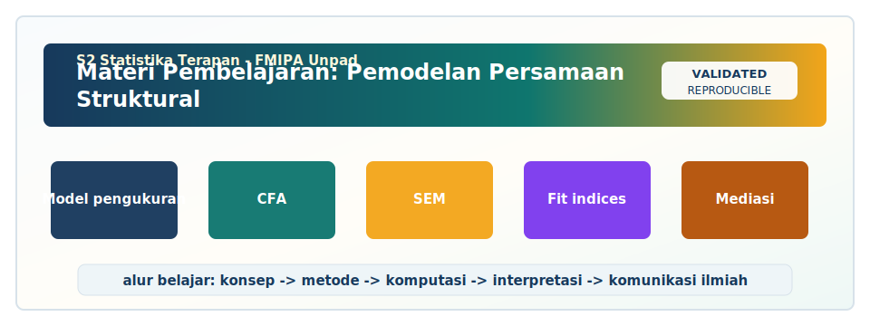

<!-- BEGIN UNPAD MATERIAL STYLE -->
<style>
:root {
  --unpad-navy: #17395c;
  --unpad-gold: #f2a51a;
  --unpad-teal: #0f766e;
  --unpad-ink: #172033;
  --unpad-paper: #fffdf8;
  --unpad-soft: #eef5f8;
  --unpad-line: #d7e2ea;
}
html, body {
  background: linear-gradient(135deg, #f8fbfd 0%, #fffdf8 48%, #f3f6ee 100%) !important;
  color: var(--unpad-ink) !important;
}
body {
  font-family: "Segoe UI", Arial, sans-serif !important;
  line-height: 1.72 !important;
}
.main-container {
  max-width: 1180px !important;
  background: rgba(255, 253, 248, 0.98) !important;
  border: 1px solid var(--unpad-line) !important;
  border-radius: 8px !important;
  box-shadow: 0 18px 42px rgba(23, 57, 92, 0.12) !important;
}
h1, h2, h3, h4 {
  letter-spacing: 0 !important;
}
h1.title {
  color: var(--unpad-navy) !important;
  -webkit-text-fill-color: var(--unpad-navy) !important;
  background: none !important;
}
h2 {
  border-left-color: var(--unpad-gold) !important;
}
a {
  color: #0b5c86 !important;
}
pre, code {
  border-radius: 8px !important;
}
.unpad-cover {
  margin: 18px 0 26px;
  padding: 24px;
  border-radius: 8px;
  background: linear-gradient(135deg, #17395c 0%, #0f766e 58%, #f2a51a 100%);
  color: #ffffff;
  box-shadow: 0 18px 36px rgba(23, 57, 92, 0.22);
}
.unpad-cover__brand {
  display: grid;
  grid-template-columns: 92px 1fr;
  gap: 20px;
  align-items: center;
}
.unpad-cover img {
  width: 92px;
  height: 92px;
  object-fit: contain;
  background: #ffffff;
  border-radius: 8px;
  padding: 8px;
  box-shadow: 0 8px 22px rgba(0,0,0,0.18);
}
.unpad-kicker {
  text-transform: uppercase;
  font-size: 0.82rem;
  font-weight: 800;
  letter-spacing: 0;
  color: #fff8dc;
}
.unpad-cover h2 {
  margin: 6px 0 8px;
  padding: 0;
  border: 0;
  background: transparent;
  color: #ffffff !important;
  font-size: 1.65rem;
}
.unpad-meta {
  margin: 0;
  color: #f7fbff;
  font-weight: 600;
}
.materi-illustration {
  margin: 20px 0 24px;
  padding: 14px;
  background: #ffffff;
  border: 1px solid var(--unpad-line);
  border-radius: 8px;
  box-shadow: 0 12px 28px rgba(23, 57, 92, 0.10);
}
.materi-illustration img {
  width: 100%;
  height: auto;
  display: block;
  border-radius: 6px;
}
.validasi-akademik {
  margin: 18px 0 28px;
  padding: 16px 18px;
  background: linear-gradient(135deg, #eef8f6, #fff8e7);
  border-left: 8px solid var(--unpad-teal);
  border-radius: 8px;
  color: var(--unpad-ink);
}
.validasi-akademik strong {
  color: var(--unpad-navy);
}
table {
  border-radius: 8px !important;
}
@media (max-width: 760px) {
  .unpad-cover__brand {
    grid-template-columns: 1fr;
  }
  .unpad-cover img {
    width: 76px;
    height: 76px;
  }
}
</style>
<!-- END UNPAD MATERIAL STYLE -->


<!-- BEGIN UNPAD MATERIAL ENHANCEMENT -->

```{r setup-unpad-render, include=FALSE}
execute_code <- FALSE
knitr::opts_chunk$set(
  echo = TRUE,
  eval = FALSE,
  message = FALSE,
  warning = FALSE,
  fig.align = "center",
  fig.width = 8,
  fig.height = 4.8,
  dpi = 120
)
set.seed(2025)
```


<div class="unpad-cover">
<div class="unpad-cover__brand">

<div>
<div class="unpad-kicker">S2 Statistika Terapan | FMIPA Universitas Padjadjaran</div>
<h2>Materi Pembelajaran: Pemodelan Persamaan Struktural</h2>
<p class="unpad-meta">S2 Statistika Terapan FMIPA Universitas Padjadjaran<br>Penulis: Dr. Yusep Suparman, M.Sc | Januari 2025</p>
</div>
</div>
</div>

<div class="materi-illustration">

</div>

<div class="validasi-akademik">
<strong>Catatan validasi akademik.</strong> Materi ini diseragamkan dengan rujukan ADWTL Januari 2025: rumus dibaca bersama asumsi, contoh kode diposisikan sebagai template reproducible, dan interpretasi diarahkan pada validitas data, diagnosis model, evaluasi ketidakpastian, serta komunikasi hasil secara ilmiah.
</div>

<!-- END UNPAD MATERIAL ENHANCEMENT -->

```{r setup, include=FALSE, eval=FALSE}
knitr::opts_chunk$set(
  echo = TRUE,
  warning = FALSE,
  message = FALSE,
  fig.align = "center",
  fig.width = 8,
  fig.height = 5,
  comment = "#>"
)
```

<style>
:root{
  --coklat-tua:#4b2e1a;
  --coklat:#7a4a25;
  --coklat-sedang:#a66a36;
  --coklat-muda:#f1d7b7;
  --cream:#fff8ed;
  --gold:#d99a3a;
  --hitam:#15100c;
  --hijau:#3f6f48;
  --biru:#335c7d;
}
body{
  background: linear-gradient(135deg, #fff8ed 0%, #f3dfc4 30%, #c88b4b 68%, #7a4a25 100%);
  color: var(--hitam);
  font-size: 17px;
  line-height: 1.75;
}
.main-container{
  max-width: 1120px !important;
  background: rgba(255, 252, 247, 0.97);
  border-radius: 22px;
  padding: 38px 48px 54px 48px;
  margin-top: 24px;
  margin-bottom: 42px;
  box-shadow: 0 18px 46px rgba(57,32,16,0.23);
  border: 1px solid rgba(122,74,37,0.22);
}
h1.title{
  color: var(--coklat-tua);
  font-size: 42px;
  font-weight: 800;
  border-bottom: none;
}
h1, h2, h3, h4{
  color: var(--coklat-tua);
  font-weight: 750;
}
h1{
  border-bottom: 4px solid #e5c398;
  padding-bottom: 10px;
  margin-top: 1.6em;
}
h2{
  border-left: 9px solid var(--gold);
  padding: 8px 0 8px 16px;
  background: linear-gradient(90deg,#f8e5ca,#fff8ed);
  border-radius: 12px;
}
h3{ color:#6f401e; }
a{ color:#7a3d13; font-weight:600; }
pre, pre.sourceCode{
  background:#f5e1c6 !important;
  color:#111 !important;
  border:1px solid #d8b282 !important;
  border-left: 8px solid #a66a36 !important;
  border-radius:14px !important;
  padding:16px !important;
  box-shadow: inset 0 0 0 1px rgba(255,255,255,0.55);
}
code{
  background:#f3ddbf !important;
  color:#111 !important;
  border-radius:6px;
  padding:2px 5px;
}
table{
  background:#fffdf8;
  border-radius: 12px;
  overflow:hidden;
}
th{
  background:#7a4a25 !important;
  color:white !important;
}
blockquote{
  background:#fff3df;
  border-left:7px solid #d99a3a;
  border-radius:12px;
  padding:16px 18px;
  color:#2f2117;
}
.formula{
  background:#f4dec2;
  color:#111;
  border:2px solid #d3a56f;
  border-left:10px solid #9b612f;
  border-radius:18px;
  padding:18px 20px;
  margin:22px 0;
  box-shadow:0 8px 20px rgba(122,74,37,0.12);
}
.callout{
  border-radius:18px;
  padding:18px 22px;
  margin:18px 0;
  border:1px solid rgba(122,74,37,0.20);
  box-shadow:0 10px 24px rgba(122,74,37,0.09);
}
.callout.konsep{ background:linear-gradient(135deg,#fff1d9,#f6d2a4); }
.callout.praktik{ background:linear-gradient(135deg,#edf7ef,#d6ead7); }
.callout.hati{ background:linear-gradient(135deg,#fff0ea,#f8cdbb); }
.callout.riset{ background:linear-gradient(135deg,#edf3ff,#d9e7f8); }
.badge{
  display:inline-block;
  background:#7a4a25;
  color:white;
  padding:4px 10px;
  border-radius:999px;
  font-size:0.86em;
  margin-right:5px;
}
.diagram-card{
  background:#fff7ec;
  border:1px solid #d9b58a;
  border-radius:18px;
  padding:18px;
  margin:18px 0;
  overflow-x:auto;
}
svg text{ font-family:Arial, sans-serif; }
#TOC, .tocify{
  background: rgba(255,248,237,0.96) !important;
  border:1px solid #d9b58a !important;
  border-radius:16px !important;
  box-shadow:0 12px 30px rgba(75,46,26,.18);
}
.tocify .list-group-item{
  color:#4b2e1a !important;
}
.tocify .active{
  background:#7a4a25 !important;
  color:#fff !important;
  border-color:#7a4a25 !important;
}
hr{
  border-top:2px dashed #d0aa7c;
}
.small-note{font-size:0.95em;color:#4b2e1a;}
</style>

<div class="callout konsep">
<span class="badge">Mata Kuliah</span> <strong>Pemodelan Persamaan Struktural</strong> | Kode: <strong>D20B.203</strong> | Bobot: <strong>3 SKS (T=2, P=1)</strong> | Semester: <strong>2</strong><br>
<span class="badge">Program</span> <strong>S2 Statistika Terapan, FMIPA Universitas Padjadjaran</strong><br>
<span class="badge">Dosen/Penyusun RPS</span> <strong>Dr. Yusep Suparman, M.Sc</strong><br>
<span class="badge">Tahun Materi</span> <strong>Januari 2025</strong>
</div>

# Prakata

Materi pembelajaran ini disusun sebagai modul kuliah lengkap untuk mata kuliah **Pemodelan Persamaan Struktural** pada Program Studi **S2 Statistika Terapan FMIPA Universitas Padjadjaran**. Struktur materi mengikuti Rencana Pembelajaran Semester yang menekankan empat capaian utama: kemampuan menganalisis hubungan kausal dan menyusun model SEM multidisipliner; kemampuan mengevaluasi model pengukuran reflektif, formatif, first-order, dan second-order; kemampuan mengembangkan serta mengimplementasikan estimasi dan validasi model menggunakan perangkat lunak statistik; serta kemampuan merancang, mengomunikasikan, dan mengevaluasi hasil riset SEM dalam format publikasi ilmiah [@RPSSEM2025].

Modul ini dirancang dengan prinsip **praktis, konseptual, dan riset-orientasi**. Artinya, mahasiswa tidak hanya mempelajari SEM sebagai kumpulan rumus, tetapi juga sebagai kerangka berpikir untuk menguji teori, menerjemahkan fenomena menjadi model statistik, menilai kualitas pengukuran, mengevaluasi kecocokan model, dan menulis hasil analisis secara akademik. SEM itu seperti peta kota: bagus bukan karena banyak garisnya, tetapi karena garisnya membawa kita ke tujuan tanpa tersesat di gang asumsi yang gelap.

Secara pedagogis, modul ini menggunakan pola pembelajaran bertahap: dari konsep kausalitas dan path diagram, menuju measurement model, structural model, identifikasi, estimasi, goodness-of-fit, modifikasi model, model khusus, interpretasi, dan etika publikasi. Setiap bab dilengkapi dengan tujuan pembelajaran, konsep inti, formulasi matematis, contoh kasus, sintaks R, panduan interpretasi, latihan, dan pertanyaan refleksi. Dengan demikian, modul dapat digunakan sebagai bahan kuliah tatap muka, belajar mandiri, praktikum laboratorium, maupun bahan pengembangan mini project SEM.

<div class="callout riset">
<strong>Cara membaca modul.</strong> Untuk pembelajaran reguler, ikuti urutan pertemuan 1 sampai 16. Untuk praktikum, fokus pada bagian sintaks R dan interpretasi output. Untuk penulisan artikel, gunakan bagian pelaporan hasil, evaluasi model, dan etika publikasi sebagai acuan. Semua sintaks R diberi latar coklat muda agar tetap terbaca jelas dan nyaman untuk dipindahkan ke RStudio.
</div>

# Peta RPS dan Capaian Pembelajaran

Berdasarkan RPS, mata kuliah ini mendukung CPL3, CPL4, dan CPL5. CPL3 berkaitan dengan kemampuan mengelola dan menganalisis data untuk masalah nyata lintas bidang; CPL4 berkaitan dengan kemampuan komputasi dan penggunaan perangkat lunak statistik; sedangkan CPL5 menekankan kemampuan berpikir logis, kritis, sistematis, inovatif, dan komunikatif dalam riset. CPMK mata kuliah ini kemudian dijabarkan menjadi empat blok besar yang menjadi tulang punggung modul.

| Blok | CPMK | Substansi Pembelajaran | Pertemuan | Orientasi Penilaian |
|---|---|---|---:|---|
| 1 | CPMK1 | Kausalitas, indikator, variabel laten, manifest, dan path diagram | 1--4 | Tugas konsep, kuis, partisipasi |
| 2 | CPMK2 | Model pengukuran, CFA, identifikasi, estimasi, fit, first-order dan second-order | 5--8 | Proyek PMS, presentasi, UTS |
| 3 | CPMK3 | Implementasi software, model khusus, interpretasi, laporan ilmiah | 9--12 | Proyek modelling/software dan laporan |
| 4 | CPMK4 | Riset inovatif, publikasi, komunikasi ilmiah, etika | 13--16 | Proyek riset, presentasi, UAS |

<div class="callout konsep">
<strong>Prinsip utama RPS.</strong> SEM diperlakukan sebagai metode statistik untuk menjembatani teori substantif dan data empiris. Karena itu, mahasiswa harus mampu menjawab tiga pertanyaan: <em>apakah teori yang diajukan masuk akal?</em>, <em>apakah pengukurannya valid dan reliabel?</em>, dan <em>apakah struktur hubungan antarvariabel didukung oleh data?</em>
</div>

# Peta Visual Alur SEM

<div class="diagram-card">
<svg width="980" height="280" viewBox="0 0 980 280" xmlns="http://www.w3.org/2000/svg">
  <defs>
    <linearGradient id="g1" x1="0" y1="0" x2="1" y2="1">
      <stop offset="0%" stop-color="#f7d7aa"/>
      <stop offset="100%" stop-color="#b87439"/>
    </linearGradient>
    <marker id="arrow" markerWidth="10" markerHeight="10" refX="9" refY="3" orient="auto" markerUnits="strokeWidth">
      <path d="M0,0 L0,6 L9,3 z" fill="#6b3f1f" />
    </marker>
  </defs>
  <rect x="20" y="35" width="160" height="70" rx="18" fill="url(#g1)" stroke="#6b3f1f"/>
  <text x="100" y="65" text-anchor="middle" font-size="15" fill="#111" font-weight="700">Teori & Fenomena</text>
  <text x="100" y="88" text-anchor="middle" font-size="12" fill="#111">hipotesis kausal</text>
  <rect x="230" y="35" width="160" height="70" rx="18" fill="#f4dec2" stroke="#6b3f1f"/>
  <text x="310" y="65" text-anchor="middle" font-size="15" fill="#111" font-weight="700">Konstruk Laten</text>
  <text x="310" y="88" text-anchor="middle" font-size="12" fill="#111">indikator manifest</text>
  <rect x="440" y="35" width="160" height="70" rx="18" fill="#f4dec2" stroke="#6b3f1f"/>
  <text x="520" y="65" text-anchor="middle" font-size="15" fill="#111" font-weight="700">Path Diagram</text>
  <text x="520" y="88" text-anchor="middle" font-size="12" fill="#111">measurement + structural</text>
  <rect x="650" y="35" width="160" height="70" rx="18" fill="#f4dec2" stroke="#6b3f1f"/>
  <text x="730" y="65" text-anchor="middle" font-size="15" fill="#111" font-weight="700">Estimasi Model</text>
  <text x="730" y="88" text-anchor="middle" font-size="12" fill="#111">ML, robust, Bayesian</text>
  <rect x="440" y="170" width="160" height="70" rx="18" fill="#f1d7b7" stroke="#6b3f1f"/>
  <text x="520" y="200" text-anchor="middle" font-size="15" fill="#111" font-weight="700">Evaluasi Fit</text>
  <text x="520" y="223" text-anchor="middle" font-size="12" fill="#111">CFI, TLI, RMSEA, SRMR</text>
  <rect x="650" y="170" width="160" height="70" rx="18" fill="#f1d7b7" stroke="#6b3f1f"/>
  <text x="730" y="200" text-anchor="middle" font-size="15" fill="#111" font-weight="700">Interpretasi</text>
  <text x="730" y="223" text-anchor="middle" font-size="12" fill="#111">efek langsung/tidak langsung</text>
  <rect x="830" y="100" width="130" height="80" rx="18" fill="#e8c18e" stroke="#6b3f1f"/>
  <text x="895" y="132" text-anchor="middle" font-size="15" fill="#111" font-weight="700">Publikasi</text>
  <text x="895" y="155" text-anchor="middle" font-size="12" fill="#111">laporan & etika</text>
  <line x1="180" y1="70" x2="230" y2="70" stroke="#6b3f1f" stroke-width="3" marker-end="url(#arrow)"/>
  <line x1="390" y1="70" x2="440" y2="70" stroke="#6b3f1f" stroke-width="3" marker-end="url(#arrow)"/>
  <line x1="600" y1="70" x2="650" y2="70" stroke="#6b3f1f" stroke-width="3" marker-end="url(#arrow)"/>
  <line x1="730" y1="105" x2="730" y2="170" stroke="#6b3f1f" stroke-width="3" marker-end="url(#arrow)"/>
  <line x1="650" y1="205" x2="600" y2="205" stroke="#6b3f1f" stroke-width="3" marker-end="url(#arrow)"/>
  <line x1="810" y1="205" x2="850" y2="180" stroke="#6b3f1f" stroke-width="3" marker-end="url(#arrow)"/>
</svg>
</div>


# Pertemuan 1: Pendahuluan SEM dan Posisi SEM dalam Riset Multidisipliner

<div class="callout konsep"><strong>Fokus RPS:</strong> konsep dasar SEM, variabel laten, model pengukuran dan struktural. Pertemuan ini mendukung capaian pembelajaran yang menekankan kemampuan analisis, evaluasi, implementasi, dan komunikasi hasil SEM sesuai blok pembelajaran dalam RPS.</div>

## Tujuan Pembelajaran
- Menjelaskan posisi pendahuluan sem dan posisi sem dalam riset multidisipliner dalam keseluruhan workflow SEM.
- Menghubungkan konsep konsep dasar SEM, variabel laten, model pengukuran dan struktural dengan model pengukuran dan model struktural.
- Menerapkan prinsip pemodelan pada contoh kasus multidisipliner dan menyusun argumen statistik yang dapat dipertanggungjawabkan.
- Menyusun interpretasi yang sesuai untuk laporan akademik, presentasi, atau naskah publikasi ilmiah.

## Konsep Inti
Kausalitas dalam SEM harus dipahami sebagai klaim teoritis yang diuji dengan data, bukan sebagai kepastian otomatis yang
muncul karena ada panah dalam diagram. Panah menyatakan arah hipotesis, sedangkan dukungan empiris diperoleh dari
kesesuaian model, estimasi parameter, dan konsistensi dengan teori. Dalam data observasional, klaim kausal perlu
disampaikan hati-hati karena potensi confounding, reverse causality, selection bias, dan omitted variables tetap mungkin
terjadi. [@Pearl2009; @Bollen1989; @Kline2016]

Pengukuran adalah jantung SEM. Konstruk laten seperti kepuasan kerja, kepercayaan digital, literasi statistik, atau
kualitas pelayanan tidak diamati secara langsung. Peneliti mengukurnya melalui indikator. Jika indikator tidak valid,
model struktural yang dibangun di atasnya menjadi rapuh. Dalam istilah sederhana, SEM tidak menyelamatkan kuesioner yang
buruk; ia justru membuat kelemahan pengukuran tampak lebih jelas. [@Brown2015; @RaykovMarcoulides2011;
@FornellLarcker1981]

Pada pertemuan ini, mahasiswa diarahkan untuk memahami bahwa konsep dasar SEM, variabel laten, model pengukuran dan
struktural bukan komponen yang berdiri sendiri. Ia harus dibaca sebagai bagian dari sistem argumen. Ketika peneliti
membangun model SEM untuk kasus kualitas layanan digital memengaruhi kepuasan dan loyalitas pengguna aplikasi publik,
maka keputusan tentang indikator, arah hubungan, metode estimasi, dan evaluasi fit harus konsisten. Inkonsistensi kecil
pada tahap awal dapat menghasilkan interpretasi yang menyesatkan pada tahap akhir. Dalam kegiatan kelas, dosen sebaiknya
mengajak mahasiswa melihat contoh model yang benar dan contoh model yang tampak rapi tetapi bermasalah secara teoretis.
Perbedaan dua contoh ini sering menjadi titik masuk yang efektif untuk menumbuhkan kepekaan metodologis.

SEM berbeda dari prosedur statistik yang hanya mencari model dengan prediksi terbaik. SEM mengutamakan koherensi antara
teori dan data. Oleh karena itu, mahasiswa perlu membiasakan diri menulis alasan di balik setiap panah, setiap
indikator, dan setiap korelasi residual. Alasan tersebut tidak boleh berupa kalimat umum seperti 'karena nilai fit
meningkat', tetapi harus merujuk pada teori, instrumen, desain pengumpulan data, atau struktur fenomena. Dengan cara
ini, analisis SEM tidak berubah menjadi kegiatan menambal model seperti memperbaiki genteng bocor saat hujan deras; bisa
berhasil sesaat, tetapi fondasinya tetap perlu diperiksa.


## Formulasi Matematis Kunci

<div class="formula">

$$\mathbf{x} = \boldsymbol{\Lambda}_x\boldsymbol{\xi} + \boldsymbol{\delta}, \qquad \mathbf{y} = \boldsymbol{\Lambda}_y\boldsymbol{\eta} + \boldsymbol{\varepsilon}$$

</div>
Rumus di atas perlu dipahami sebagai representasi ringkas dari hubungan yang dinyatakan dalam path diagram. Notasi
matriks membantu mahasiswa melihat bahwa SEM pada dasarnya membandingkan struktur kovarians yang diimplikasikan oleh
model dengan struktur kovarians yang muncul dari data. Karena itu, setiap parameter dalam diagram memiliki konsekuensi
terhadap matriks kovarians model. Jika satu panah ditambahkan atau dihapus, struktur informasi yang direproduksi oleh
model juga berubah.


## Ilustrasi Konseptual

<div class="diagram-card">
<svg width="900" height="260" viewBox="0 0 900 260" xmlns="http://www.w3.org/2000/svg">
  <defs><marker id="arr8304" markerWidth="10" markerHeight="10" refX="9" refY="3" orient="auto" markerUnits="strokeWidth"><path d="M0,0 L0,6 L9,3 z" fill="#6b3f1f" /></marker></defs>
  <rect x="45" y="70" width="180" height="78" rx="18" fill="#f4dec2" stroke="#7a4a25" stroke-width="2"/>
  <text x="135" y="103" text-anchor="middle" font-size="15" font-weight="700" fill="#111">Konstruk Eksogen</text>
  <text x="135" y="128" text-anchor="middle" font-size="12" fill="#111">X / ξ</text>
  <rect x="360" y="70" width="180" height="78" rx="18" fill="#f8e5ca" stroke="#7a4a25" stroke-width="2"/>
  <text x="450" y="103" text-anchor="middle" font-size="15" font-weight="700" fill="#111">Mediator</text>
  <text x="450" y="128" text-anchor="middle" font-size="12" fill="#111">M / η1</text>
  <rect x="675" y="70" width="180" height="78" rx="18" fill="#e8c18e" stroke="#7a4a25" stroke-width="2"/>
  <text x="765" y="103" text-anchor="middle" font-size="15" font-weight="700" fill="#111">Outcome Endogen</text>
  <text x="765" y="128" text-anchor="middle" font-size="12" fill="#111">Y / η2</text>
  <line x1="225" y1="109" x2="360" y2="109" stroke="#6b3f1f" stroke-width="3" marker-end="url(#arr8304)"/>
  <line x1="540" y1="109" x2="675" y2="109" stroke="#6b3f1f" stroke-width="3" marker-end="url(#arr8304)"/>
  <path d="M 225 148 C 390 230, 520 230, 675 148" fill="none" stroke="#6b3f1f" stroke-width="3" marker-end="url(#arr8304)"/>
  <text x="450" y="35" text-anchor="middle" font-size="18" font-weight="800" fill="#4b2e1a">Ilustrasi: Pendahuluan SEM dan Posisi SEM dalam Riset Multidisipliner</text>
</svg>
</div>
Gambar ilustratif di atas menunjukkan pola sederhana: konstruk eksogen memengaruhi mediator, mediator memengaruhi
outcome, dan konstruk eksogen juga dapat memiliki efek langsung pada outcome. Dalam konteks kualitas layanan digital
memengaruhi kepuasan dan loyalitas pengguna aplikasi publik, struktur seperti ini dapat digunakan untuk membedakan efek
langsung dan efek tidak langsung. Namun, keberadaan mediator tidak boleh diputuskan semata-mata karena model tampak
lebih kompleks. Mediasi harus memiliki dasar teoretis yang kuat, urutan temporal yang masuk akal, dan instrumen
pengukuran yang memadai.


## Contoh Kasus Terapan
Misalkan seorang peneliti mengkaji fenomena: kualitas layanan digital memengaruhi kepuasan dan loyalitas pengguna
aplikasi publik. Tahap pertama adalah mendefinisikan konstruk. Tahap kedua adalah memilih indikator. Tahap ketiga adalah
menentukan apakah indikator bersifat reflektif atau formatif. Tahap keempat adalah menyusun path diagram. Tahap kelima
adalah menyusun sintaks SEM dan mengevaluasi model. Pada tahap interpretasi, peneliti tidak cukup mengatakan bahwa
koefisien signifikan. Ia harus menjelaskan makna substantif koefisien, ukuran efek, ketidakpastian estimasi, dan
implikasi kebijakan atau manajerial.

Dalam diskusi kelas, contoh kasus perlu dipecah menjadi pertanyaan operasional. Apa unit analisisnya? Apakah data
dikumpulkan secara cross-sectional atau longitudinal? Apakah skala indikator ordinal atau kontinu? Apakah konstruk laten
mempunyai tiga indikator atau lebih? Apakah ada potensi common method bias? Apakah sampel cukup untuk kompleksitas
model? Pertanyaan-pertanyaan ini membuat mahasiswa memahami bahwa SEM adalah proses riset yang menyatu dari perencanaan
desain sampai pelaporan, bukan hanya aktivitas komputasi di akhir penelitian.


## Praktikum dan Sintaks R

```{r packages-sem, eval=FALSE}
# Paket utama untuk SEM di R
install.packages(c("lavaan", "semPlot", "semTools", "psych", "tidyverse"))
library(lavaan)
library(semPlot)
library(semTools)
library(psych)
library(tidyverse)
```
Sintaks di atas sebaiknya tidak diperlakukan sebagai resep tunggal. Mahasiswa perlu memahami bagian mana yang
merepresentasikan measurement model, bagian mana yang merepresentasikan structural model, dan bagian mana yang
berhubungan dengan opsi estimasi. Ketika data berubah menjadi ordinal, tidak normal, atau memiliki missing value,
pilihan estimator juga perlu disesuaikan. Prinsip praktikum yang baik adalah menjalankan model sederhana terlebih
dahulu, memeriksa output, kemudian menambah kompleksitas secara bertahap.


## Interpretasi Output
- Periksa loading standar dan signifikansi indikator sebelum menyimpulkan hubungan antar konstruk.
- Baca fit indices sebagai kumpulan bukti, bukan sebagai satu angka sakti yang memutuskan nasib model.
- Perhatikan standard error, interval kepercayaan, dan tanda koefisien agar interpretasi tidak hanya bergantung pada p-value.
- Hubungkan hasil statistik dengan teori dan konteks kasus, terutama ketika efek langsung dan tidak langsung muncul bersamaan.
- Laporkan keterbatasan model secara eksplisit, misalnya desain cross-sectional, ukuran sampel terbatas, atau indikator yang belum ideal.

Interpretasi yang baik bersifat berlapis. Lapisan pertama adalah interpretasi teknis, misalnya nilai loading, koefisien
jalur, standard error, dan indeks fit. Lapisan kedua adalah interpretasi substantif, yaitu arti statistik tersebut
terhadap fenomena. Lapisan ketiga adalah implikasi praktis, misalnya rekomendasi bagi organisasi, pembuat kebijakan,
atau peneliti lanjutan. Mahasiswa S2 perlu dilatih untuk menguasai ketiga lapisan tersebut karena riset terapan menuntut
analisis yang tepat sekaligus komunikatif.


## Kesalahan Umum dan Strategi Menghindarinya
- Membangun panah tanpa teori, sehingga model tampak kompleks tetapi argumen kausalnya lemah.
- Menghapus indikator hanya karena loading rendah tanpa mempertimbangkan validitas isi instrumen.
- Menggunakan cut-off fit secara mekanis tanpa membaca konteks model dan ukuran sampel.
- Melakukan modification indices berlebihan sampai model menjadi sangat cocok terhadap sampel tetapi buruk untuk generalisasi.
- Menyimpulkan kausalitas kuat dari data observasional tanpa desain dan asumsi yang memadai.

<div class="callout hati"><strong>Catatan hati-hati.</strong> Dalam SEM, model yang indah secara visual belum tentu valid secara ilmiah. Panah boleh rapi, tetapi argumen tetap harus bekerja keras.</div>

## Latihan Mandiri
1. Pilih satu kasus nyata terkait kualitas layanan digital memengaruhi kepuasan dan loyalitas pengguna aplikasi publik, kemudian tuliskan minimal lima konstruk yang mungkin relevan.
2. Tentukan mana konstruk eksogen, mediator, dan endogen. Jelaskan argumen teoritisnya.
3. Susun minimal tiga indikator untuk setiap konstruk dan klasifikasikan sebagai reflektif atau formatif.
4. Buat path diagram awal dan tuliskan persamaan struktural yang sesuai.
5. Tuliskan satu paragraf interpretasi yang menghubungkan model dengan kontribusi riset terapan.

## Pertanyaan Refleksi
- Apa asumsi teoritis paling penting dalam model yang Anda bangun?
- Apa risiko interpretasi jika indikator tidak valid?
- Apakah model Anda lebih cocok sebagai CB-SEM, PLS-SEM, atau pendekatan lain? Jelaskan.
- Bagaimana Anda akan menjelaskan hasil model kepada pembaca non-statistik?

## Ringkasan Pertemuan
Pertemuan 1 menempatkan pendahuluan sem dan posisi sem dalam riset multidisipliner sebagai komponen penting dalam
pembelajaran SEM. Mahasiswa diharapkan mampu menghubungkan konsep, rumus, diagram, sintaks, dan interpretasi ke dalam
satu alur analisis. Penguasaan topik ini akan menjadi dasar bagi pertemuan berikutnya, terutama ketika model mulai
dievaluasi dengan data nyata dan disiapkan untuk laporan ilmiah.


# Pertemuan 2: Kausalitas, Teori, dan Translasi Fenomena ke Model

<div class="callout konsep"><strong>Fokus RPS:</strong> hubungan kausalitas, hipotesis, arah panah, dan batasan inferensi kausal. Pertemuan ini mendukung capaian pembelajaran yang menekankan kemampuan analisis, evaluasi, implementasi, dan komunikasi hasil SEM sesuai blok pembelajaran dalam RPS.</div>

## Tujuan Pembelajaran
- Menjelaskan posisi kausalitas, teori, dan translasi fenomena ke model dalam keseluruhan workflow SEM.
- Menghubungkan konsep hubungan kausalitas, hipotesis, arah panah, dan batasan inferensi kausal dengan model pengukuran dan model struktural.
- Menerapkan prinsip pemodelan pada contoh kasus multidisipliner dan menyusun argumen statistik yang dapat dipertanggungjawabkan.
- Menyusun interpretasi yang sesuai untuk laporan akademik, presentasi, atau naskah publikasi ilmiah.

## Konsep Inti
Kausalitas dalam SEM harus dipahami sebagai klaim teoritis yang diuji dengan data, bukan sebagai kepastian otomatis yang
muncul karena ada panah dalam diagram. Panah menyatakan arah hipotesis, sedangkan dukungan empiris diperoleh dari
kesesuaian model, estimasi parameter, dan konsistensi dengan teori. Dalam data observasional, klaim kausal perlu
disampaikan hati-hati karena potensi confounding, reverse causality, selection bias, dan omitted variables tetap mungkin
terjadi. [@Pearl2009; @Bollen1989; @Kline2016]

Pelaporan SEM untuk publikasi ilmiah membutuhkan transparansi. Peneliti harus menyajikan model konseptual, prosedur
estimasi, indikator yang digunakan, reliabilitas, validitas konvergen, validitas diskriminan, fit indices, parameter
terstandar, interval kepercayaan, serta alasan modifikasi model. Transparansi ini penting agar pembaca dapat menilai
apakah kesimpulan riset memang didukung oleh data. [@Kline2016; @BagozziYi2012; @Hoyle2012]

Pada pertemuan ini, mahasiswa diarahkan untuk memahami bahwa hubungan kausalitas, hipotesis, arah panah, dan batasan
inferensi kausal bukan komponen yang berdiri sendiri. Ia harus dibaca sebagai bagian dari sistem argumen. Ketika
peneliti membangun model SEM untuk kasus stres kerja dan work-life balance memengaruhi kepuasan kerja serta turnover
intention, maka keputusan tentang indikator, arah hubungan, metode estimasi, dan evaluasi fit harus konsisten.
Inkonsistensi kecil pada tahap awal dapat menghasilkan interpretasi yang menyesatkan pada tahap akhir. Dalam kegiatan
kelas, dosen sebaiknya mengajak mahasiswa melihat contoh model yang benar dan contoh model yang tampak rapi tetapi
bermasalah secara teoretis. Perbedaan dua contoh ini sering menjadi titik masuk yang efektif untuk menumbuhkan kepekaan
metodologis.

SEM berbeda dari prosedur statistik yang hanya mencari model dengan prediksi terbaik. SEM mengutamakan koherensi antara
teori dan data. Oleh karena itu, mahasiswa perlu membiasakan diri menulis alasan di balik setiap panah, setiap
indikator, dan setiap korelasi residual. Alasan tersebut tidak boleh berupa kalimat umum seperti 'karena nilai fit
meningkat', tetapi harus merujuk pada teori, instrumen, desain pengumpulan data, atau struktur fenomena. Dengan cara
ini, analisis SEM tidak berubah menjadi kegiatan menambal model seperti memperbaiki genteng bocor saat hujan deras; bisa
berhasil sesaat, tetapi fondasinya tetap perlu diperiksa.


## Formulasi Matematis Kunci

<div class="formula">

$$\boldsymbol{\eta} = \mathbf{B}\boldsymbol{\eta} + \boldsymbol{\Gamma}\boldsymbol{\xi} + \boldsymbol{\zeta}$$

</div>
Rumus di atas perlu dipahami sebagai representasi ringkas dari hubungan yang dinyatakan dalam path diagram. Notasi
matriks membantu mahasiswa melihat bahwa SEM pada dasarnya membandingkan struktur kovarians yang diimplikasikan oleh
model dengan struktur kovarians yang muncul dari data. Karena itu, setiap parameter dalam diagram memiliki konsekuensi
terhadap matriks kovarians model. Jika satu panah ditambahkan atau dihapus, struktur informasi yang direproduksi oleh
model juga berubah.


## Ilustrasi Konseptual

<div class="diagram-card">
<svg width="900" height="260" viewBox="0 0 900 260" xmlns="http://www.w3.org/2000/svg">
  <defs><marker id="arr1778" markerWidth="10" markerHeight="10" refX="9" refY="3" orient="auto" markerUnits="strokeWidth"><path d="M0,0 L0,6 L9,3 z" fill="#6b3f1f" /></marker></defs>
  <rect x="45" y="70" width="180" height="78" rx="18" fill="#f4dec2" stroke="#7a4a25" stroke-width="2"/>
  <text x="135" y="103" text-anchor="middle" font-size="15" font-weight="700" fill="#111">Konstruk Eksogen</text>
  <text x="135" y="128" text-anchor="middle" font-size="12" fill="#111">X / ξ</text>
  <rect x="360" y="70" width="180" height="78" rx="18" fill="#f8e5ca" stroke="#7a4a25" stroke-width="2"/>
  <text x="450" y="103" text-anchor="middle" font-size="15" font-weight="700" fill="#111">Mediator</text>
  <text x="450" y="128" text-anchor="middle" font-size="12" fill="#111">M / η1</text>
  <rect x="675" y="70" width="180" height="78" rx="18" fill="#e8c18e" stroke="#7a4a25" stroke-width="2"/>
  <text x="765" y="103" text-anchor="middle" font-size="15" font-weight="700" fill="#111">Outcome Endogen</text>
  <text x="765" y="128" text-anchor="middle" font-size="12" fill="#111">Y / η2</text>
  <line x1="225" y1="109" x2="360" y2="109" stroke="#6b3f1f" stroke-width="3" marker-end="url(#arr1778)"/>
  <line x1="540" y1="109" x2="675" y2="109" stroke="#6b3f1f" stroke-width="3" marker-end="url(#arr1778)"/>
  <path d="M 225 148 C 390 230, 520 230, 675 148" fill="none" stroke="#6b3f1f" stroke-width="3" marker-end="url(#arr1778)"/>
  <text x="450" y="35" text-anchor="middle" font-size="18" font-weight="800" fill="#4b2e1a">Ilustrasi: Kausalitas, Teori, dan Translasi Fenomena ke Model</text>
</svg>
</div>
Gambar ilustratif di atas menunjukkan pola sederhana: konstruk eksogen memengaruhi mediator, mediator memengaruhi
outcome, dan konstruk eksogen juga dapat memiliki efek langsung pada outcome. Dalam konteks stres kerja dan work-life
balance memengaruhi kepuasan kerja serta turnover intention, struktur seperti ini dapat digunakan untuk membedakan efek
langsung dan efek tidak langsung. Namun, keberadaan mediator tidak boleh diputuskan semata-mata karena model tampak
lebih kompleks. Mediasi harus memiliki dasar teoretis yang kuat, urutan temporal yang masuk akal, dan instrumen
pengukuran yang memadai.


## Contoh Kasus Terapan
Misalkan seorang peneliti mengkaji fenomena: stres kerja dan work-life balance memengaruhi kepuasan kerja serta turnover
intention. Tahap pertama adalah mendefinisikan konstruk. Tahap kedua adalah memilih indikator. Tahap ketiga adalah
menentukan apakah indikator bersifat reflektif atau formatif. Tahap keempat adalah menyusun path diagram. Tahap kelima
adalah menyusun sintaks SEM dan mengevaluasi model. Pada tahap interpretasi, peneliti tidak cukup mengatakan bahwa
koefisien signifikan. Ia harus menjelaskan makna substantif koefisien, ukuran efek, ketidakpastian estimasi, dan
implikasi kebijakan atau manajerial.

Dalam diskusi kelas, contoh kasus perlu dipecah menjadi pertanyaan operasional. Apa unit analisisnya? Apakah data
dikumpulkan secara cross-sectional atau longitudinal? Apakah skala indikator ordinal atau kontinu? Apakah konstruk laten
mempunyai tiga indikator atau lebih? Apakah ada potensi common method bias? Apakah sampel cukup untuk kompleksitas
model? Pertanyaan-pertanyaan ini membuat mahasiswa memahami bahwa SEM adalah proses riset yang menyatu dari perencanaan
desain sampai pelaporan, bukan hanya aktivitas komputasi di akhir penelitian.


## Praktikum dan Sintaks R
```{r packages-sem-2, eval=FALSE}
# Paket utama untuk SEM di R
install.packages(c("lavaan", "semPlot", "semTools", "psych", "tidyverse"))
library(lavaan)
library(semPlot)
library(semTools)
library(psych)
library(tidyverse)
```

```{r template-konseptual, eval=FALSE}
# Template kosong untuk mulai menyusun model lavaan
model <- '
  # measurement model
  Konstruk1 =~ item1 + item2 + item3
  Konstruk2 =~ item4 + item5 + item6

  # structural model
  Konstruk2 ~ Konstruk1
'
# fit <- sem(model, data = data_anda, estimator = "MLR")
# summary(fit, fit.measures = TRUE, standardized = TRUE)
```
Sintaks di atas sebaiknya tidak diperlakukan sebagai resep tunggal. Mahasiswa perlu memahami bagian mana yang
merepresentasikan measurement model, bagian mana yang merepresentasikan structural model, dan bagian mana yang
berhubungan dengan opsi estimasi. Ketika data berubah menjadi ordinal, tidak normal, atau memiliki missing value,
pilihan estimator juga perlu disesuaikan. Prinsip praktikum yang baik adalah menjalankan model sederhana terlebih
dahulu, memeriksa output, kemudian menambah kompleksitas secara bertahap.


## Interpretasi Output
- Periksa loading standar dan signifikansi indikator sebelum menyimpulkan hubungan antar konstruk.
- Baca fit indices sebagai kumpulan bukti, bukan sebagai satu angka sakti yang memutuskan nasib model.
- Perhatikan standard error, interval kepercayaan, dan tanda koefisien agar interpretasi tidak hanya bergantung pada p-value.
- Hubungkan hasil statistik dengan teori dan konteks kasus, terutama ketika efek langsung dan tidak langsung muncul bersamaan.
- Laporkan keterbatasan model secara eksplisit, misalnya desain cross-sectional, ukuran sampel terbatas, atau indikator yang belum ideal.

Interpretasi yang baik bersifat berlapis. Lapisan pertama adalah interpretasi teknis, misalnya nilai loading, koefisien
jalur, standard error, dan indeks fit. Lapisan kedua adalah interpretasi substantif, yaitu arti statistik tersebut
terhadap fenomena. Lapisan ketiga adalah implikasi praktis, misalnya rekomendasi bagi organisasi, pembuat kebijakan,
atau peneliti lanjutan. Mahasiswa S2 perlu dilatih untuk menguasai ketiga lapisan tersebut karena riset terapan menuntut
analisis yang tepat sekaligus komunikatif.


## Kesalahan Umum dan Strategi Menghindarinya
- Membangun panah tanpa teori, sehingga model tampak kompleks tetapi argumen kausalnya lemah.
- Menghapus indikator hanya karena loading rendah tanpa mempertimbangkan validitas isi instrumen.
- Menggunakan cut-off fit secara mekanis tanpa membaca konteks model dan ukuran sampel.
- Melakukan modification indices berlebihan sampai model menjadi sangat cocok terhadap sampel tetapi buruk untuk generalisasi.
- Menyimpulkan kausalitas kuat dari data observasional tanpa desain dan asumsi yang memadai.

<div class="callout hati"><strong>Catatan hati-hati.</strong> Dalam SEM, model yang indah secara visual belum tentu valid secara ilmiah. Panah boleh rapi, tetapi argumen tetap harus bekerja keras.</div>

## Latihan Mandiri
1. Pilih satu kasus nyata terkait stres kerja dan work-life balance memengaruhi kepuasan kerja serta turnover intention, kemudian tuliskan minimal lima konstruk yang mungkin relevan.
2. Tentukan mana konstruk eksogen, mediator, dan endogen. Jelaskan argumen teoritisnya.
3. Susun minimal tiga indikator untuk setiap konstruk dan klasifikasikan sebagai reflektif atau formatif.
4. Buat path diagram awal dan tuliskan persamaan struktural yang sesuai.
5. Tuliskan satu paragraf interpretasi yang menghubungkan model dengan kontribusi riset terapan.

## Pertanyaan Refleksi
- Apa asumsi teoritis paling penting dalam model yang Anda bangun?
- Apa risiko interpretasi jika indikator tidak valid?
- Apakah model Anda lebih cocok sebagai CB-SEM, PLS-SEM, atau pendekatan lain? Jelaskan.
- Bagaimana Anda akan menjelaskan hasil model kepada pembaca non-statistik?

## Ringkasan Pertemuan
Pertemuan 2 menempatkan kausalitas, teori, dan translasi fenomena ke model sebagai komponen penting dalam pembelajaran
SEM. Mahasiswa diharapkan mampu menghubungkan konsep, rumus, diagram, sintaks, dan interpretasi ke dalam satu alur
analisis. Penguasaan topik ini akan menjadi dasar bagi pertemuan berikutnya, terutama ketika model mulai dievaluasi
dengan data nyata dan disiapkan untuk laporan ilmiah.


# Pertemuan 3: Indikator Reflektif, Formatif, Variabel Laten, dan Variabel Manifest

<div class="callout konsep"><strong>Fokus RPS:</strong> perbedaan indikator reflektif dan formatif serta konsekuensinya bagi validitas. Pertemuan ini mendukung capaian pembelajaran yang menekankan kemampuan analisis, evaluasi, implementasi, dan komunikasi hasil SEM sesuai blok pembelajaran dalam RPS.</div>

## Tujuan Pembelajaran
- Menjelaskan posisi indikator reflektif, formatif, variabel laten, dan variabel manifest dalam keseluruhan workflow SEM.
- Menghubungkan konsep perbedaan indikator reflektif dan formatif serta konsekuensinya bagi validitas dengan model pengukuran dan model struktural.
- Menerapkan prinsip pemodelan pada contoh kasus multidisipliner dan menyusun argumen statistik yang dapat dipertanggungjawabkan.
- Menyusun interpretasi yang sesuai untuk laporan akademik, presentasi, atau naskah publikasi ilmiah.

## Konsep Inti
Pengukuran adalah jantung SEM. Konstruk laten seperti kepuasan kerja, kepercayaan digital, literasi statistik, atau
kualitas pelayanan tidak diamati secara langsung. Peneliti mengukurnya melalui indikator. Jika indikator tidak valid,
model struktural yang dibangun di atasnya menjadi rapuh. Dalam istilah sederhana, SEM tidak menyelamatkan kuesioner yang
buruk; ia justru membuat kelemahan pengukuran tampak lebih jelas. [@Brown2015; @RaykovMarcoulides2011;
@FornellLarcker1981]

Identifikasi model menentukan apakah parameter dapat diestimasi secara unik dari informasi yang tersedia pada matriks
kovarians. Model yang tidak teridentifikasi dapat menghasilkan solusi tidak stabil, standard error aneh, atau estimasi
yang tidak bermakna. Pemeriksaan identifikasi bukan formalitas, tetapi syarat minimum sebelum interpretasi substantif
dilakukan. [@Bollen1989; @Kline2016; @Kaplan2009]

Pada pertemuan ini, mahasiswa diarahkan untuk memahami bahwa perbedaan indikator reflektif dan formatif serta
konsekuensinya bagi validitas bukan komponen yang berdiri sendiri. Ia harus dibaca sebagai bagian dari sistem argumen.
Ketika peneliti membangun model SEM untuk kasus literasi statistik memengaruhi kepercayaan diri mahasiswa dalam
menyelesaikan analisis data, maka keputusan tentang indikator, arah hubungan, metode estimasi, dan evaluasi fit harus
konsisten. Inkonsistensi kecil pada tahap awal dapat menghasilkan interpretasi yang menyesatkan pada tahap akhir. Dalam
kegiatan kelas, dosen sebaiknya mengajak mahasiswa melihat contoh model yang benar dan contoh model yang tampak rapi
tetapi bermasalah secara teoretis. Perbedaan dua contoh ini sering menjadi titik masuk yang efektif untuk menumbuhkan
kepekaan metodologis.

SEM berbeda dari prosedur statistik yang hanya mencari model dengan prediksi terbaik. SEM mengutamakan koherensi antara
teori dan data. Oleh karena itu, mahasiswa perlu membiasakan diri menulis alasan di balik setiap panah, setiap
indikator, dan setiap korelasi residual. Alasan tersebut tidak boleh berupa kalimat umum seperti 'karena nilai fit
meningkat', tetapi harus merujuk pada teori, instrumen, desain pengumpulan data, atau struktur fenomena. Dengan cara
ini, analisis SEM tidak berubah menjadi kegiatan menambal model seperti memperbaiki genteng bocor saat hujan deras; bisa
berhasil sesaat, tetapi fondasinya tetap perlu diperiksa.


## Formulasi Matematis Kunci

<div class="formula">

$$\mathrm{CR}=\frac{(\sum_i \lambda_i)^2}{(\sum_i \lambda_i)^2+\sum_i \theta_i}, \qquad \mathrm{AVE}=\frac{\sum_i \lambda_i^2}{\sum_i \lambda_i^2+\sum_i \theta_i}$$

</div>
Rumus di atas perlu dipahami sebagai representasi ringkas dari hubungan yang dinyatakan dalam path diagram. Notasi
matriks membantu mahasiswa melihat bahwa SEM pada dasarnya membandingkan struktur kovarians yang diimplikasikan oleh
model dengan struktur kovarians yang muncul dari data. Karena itu, setiap parameter dalam diagram memiliki konsekuensi
terhadap matriks kovarians model. Jika satu panah ditambahkan atau dihapus, struktur informasi yang direproduksi oleh
model juga berubah.


## Ilustrasi Konseptual

<div class="diagram-card">
<svg width="900" height="260" viewBox="0 0 900 260" xmlns="http://www.w3.org/2000/svg">
  <defs><marker id="arr6216" markerWidth="10" markerHeight="10" refX="9" refY="3" orient="auto" markerUnits="strokeWidth"><path d="M0,0 L0,6 L9,3 z" fill="#6b3f1f" /></marker></defs>
  <rect x="45" y="70" width="180" height="78" rx="18" fill="#f4dec2" stroke="#7a4a25" stroke-width="2"/>
  <text x="135" y="103" text-anchor="middle" font-size="15" font-weight="700" fill="#111">Konstruk Eksogen</text>
  <text x="135" y="128" text-anchor="middle" font-size="12" fill="#111">X / ξ</text>
  <rect x="360" y="70" width="180" height="78" rx="18" fill="#f8e5ca" stroke="#7a4a25" stroke-width="2"/>
  <text x="450" y="103" text-anchor="middle" font-size="15" font-weight="700" fill="#111">Mediator</text>
  <text x="450" y="128" text-anchor="middle" font-size="12" fill="#111">M / η1</text>
  <rect x="675" y="70" width="180" height="78" rx="18" fill="#e8c18e" stroke="#7a4a25" stroke-width="2"/>
  <text x="765" y="103" text-anchor="middle" font-size="15" font-weight="700" fill="#111">Outcome Endogen</text>
  <text x="765" y="128" text-anchor="middle" font-size="12" fill="#111">Y / η2</text>
  <line x1="225" y1="109" x2="360" y2="109" stroke="#6b3f1f" stroke-width="3" marker-end="url(#arr6216)"/>
  <line x1="540" y1="109" x2="675" y2="109" stroke="#6b3f1f" stroke-width="3" marker-end="url(#arr6216)"/>
  <path d="M 225 148 C 390 230, 520 230, 675 148" fill="none" stroke="#6b3f1f" stroke-width="3" marker-end="url(#arr6216)"/>
  <text x="450" y="35" text-anchor="middle" font-size="18" font-weight="800" fill="#4b2e1a">Ilustrasi: Indikator Reflektif, Formatif, Variabel Laten, dan Variabel Manifest</text>
</svg>
</div>
Gambar ilustratif di atas menunjukkan pola sederhana: konstruk eksogen memengaruhi mediator, mediator memengaruhi
outcome, dan konstruk eksogen juga dapat memiliki efek langsung pada outcome. Dalam konteks literasi statistik
memengaruhi kepercayaan diri mahasiswa dalam menyelesaikan analisis data, struktur seperti ini dapat digunakan untuk
membedakan efek langsung dan efek tidak langsung. Namun, keberadaan mediator tidak boleh diputuskan semata-mata karena
model tampak lebih kompleks. Mediasi harus memiliki dasar teoretis yang kuat, urutan temporal yang masuk akal, dan
instrumen pengukuran yang memadai.


## Contoh Kasus Terapan
Misalkan seorang peneliti mengkaji fenomena: literasi statistik memengaruhi kepercayaan diri mahasiswa dalam
menyelesaikan analisis data. Tahap pertama adalah mendefinisikan konstruk. Tahap kedua adalah memilih indikator. Tahap
ketiga adalah menentukan apakah indikator bersifat reflektif atau formatif. Tahap keempat adalah menyusun path diagram.
Tahap kelima adalah menyusun sintaks SEM dan mengevaluasi model. Pada tahap interpretasi, peneliti tidak cukup
mengatakan bahwa koefisien signifikan. Ia harus menjelaskan makna substantif koefisien, ukuran efek, ketidakpastian
estimasi, dan implikasi kebijakan atau manajerial.

Dalam diskusi kelas, contoh kasus perlu dipecah menjadi pertanyaan operasional. Apa unit analisisnya? Apakah data
dikumpulkan secara cross-sectional atau longitudinal? Apakah skala indikator ordinal atau kontinu? Apakah konstruk laten
mempunyai tiga indikator atau lebih? Apakah ada potensi common method bias? Apakah sampel cukup untuk kompleksitas
model? Pertanyaan-pertanyaan ini membuat mahasiswa memahami bahwa SEM adalah proses riset yang menyatu dari perencanaan
desain sampai pelaporan, bukan hanya aktivitas komputasi di akhir penelitian.


## Praktikum dan Sintaks R
```{r packages-sem-3, eval=FALSE}
# Paket utama untuk SEM di R
install.packages(c("lavaan", "semPlot", "semTools", "psych", "tidyverse"))
library(lavaan)
library(semPlot)
library(semTools)
library(psych)
library(tidyverse)
```

```{r template-konseptual-2, eval=FALSE}
# Template kosong untuk mulai menyusun model lavaan
model <- '
  # measurement model
  Konstruk1 =~ item1 + item2 + item3
  Konstruk2 =~ item4 + item5 + item6

  # structural model
  Konstruk2 ~ Konstruk1
'
# fit <- sem(model, data = data_anda, estimator = "MLR")
# summary(fit, fit.measures = TRUE, standardized = TRUE)
```
Sintaks di atas sebaiknya tidak diperlakukan sebagai resep tunggal. Mahasiswa perlu memahami bagian mana yang
merepresentasikan measurement model, bagian mana yang merepresentasikan structural model, dan bagian mana yang
berhubungan dengan opsi estimasi. Ketika data berubah menjadi ordinal, tidak normal, atau memiliki missing value,
pilihan estimator juga perlu disesuaikan. Prinsip praktikum yang baik adalah menjalankan model sederhana terlebih
dahulu, memeriksa output, kemudian menambah kompleksitas secara bertahap.


## Interpretasi Output
- Periksa loading standar dan signifikansi indikator sebelum menyimpulkan hubungan antar konstruk.
- Baca fit indices sebagai kumpulan bukti, bukan sebagai satu angka sakti yang memutuskan nasib model.
- Perhatikan standard error, interval kepercayaan, dan tanda koefisien agar interpretasi tidak hanya bergantung pada p-value.
- Hubungkan hasil statistik dengan teori dan konteks kasus, terutama ketika efek langsung dan tidak langsung muncul bersamaan.
- Laporkan keterbatasan model secara eksplisit, misalnya desain cross-sectional, ukuran sampel terbatas, atau indikator yang belum ideal.

Interpretasi yang baik bersifat berlapis. Lapisan pertama adalah interpretasi teknis, misalnya nilai loading, koefisien
jalur, standard error, dan indeks fit. Lapisan kedua adalah interpretasi substantif, yaitu arti statistik tersebut
terhadap fenomena. Lapisan ketiga adalah implikasi praktis, misalnya rekomendasi bagi organisasi, pembuat kebijakan,
atau peneliti lanjutan. Mahasiswa S2 perlu dilatih untuk menguasai ketiga lapisan tersebut karena riset terapan menuntut
analisis yang tepat sekaligus komunikatif.


## Kesalahan Umum dan Strategi Menghindarinya
- Membangun panah tanpa teori, sehingga model tampak kompleks tetapi argumen kausalnya lemah.
- Menghapus indikator hanya karena loading rendah tanpa mempertimbangkan validitas isi instrumen.
- Menggunakan cut-off fit secara mekanis tanpa membaca konteks model dan ukuran sampel.
- Melakukan modification indices berlebihan sampai model menjadi sangat cocok terhadap sampel tetapi buruk untuk generalisasi.
- Menyimpulkan kausalitas kuat dari data observasional tanpa desain dan asumsi yang memadai.

<div class="callout hati"><strong>Catatan hati-hati.</strong> Dalam SEM, model yang indah secara visual belum tentu valid secara ilmiah. Panah boleh rapi, tetapi argumen tetap harus bekerja keras.</div>

## Latihan Mandiri
1. Pilih satu kasus nyata terkait literasi statistik memengaruhi kepercayaan diri mahasiswa dalam menyelesaikan analisis data, kemudian tuliskan minimal lima konstruk yang mungkin relevan.
2. Tentukan mana konstruk eksogen, mediator, dan endogen. Jelaskan argumen teoritisnya.
3. Susun minimal tiga indikator untuk setiap konstruk dan klasifikasikan sebagai reflektif atau formatif.
4. Buat path diagram awal dan tuliskan persamaan struktural yang sesuai.
5. Tuliskan satu paragraf interpretasi yang menghubungkan model dengan kontribusi riset terapan.

## Pertanyaan Refleksi
- Apa asumsi teoritis paling penting dalam model yang Anda bangun?
- Apa risiko interpretasi jika indikator tidak valid?
- Apakah model Anda lebih cocok sebagai CB-SEM, PLS-SEM, atau pendekatan lain? Jelaskan.
- Bagaimana Anda akan menjelaskan hasil model kepada pembaca non-statistik?

## Ringkasan Pertemuan
Pertemuan 3 menempatkan indikator reflektif, formatif, variabel laten, dan variabel manifest sebagai komponen penting
dalam pembelajaran SEM. Mahasiswa diharapkan mampu menghubungkan konsep, rumus, diagram, sintaks, dan interpretasi ke
dalam satu alur analisis. Penguasaan topik ini akan menjadi dasar bagi pertemuan berikutnya, terutama ketika model mulai
dievaluasi dengan data nyata dan disiapkan untuk laporan ilmiah.


# Pertemuan 4: Path Diagram dan Spesifikasi Model SEM

<div class="callout konsep"><strong>Fokus RPS:</strong> penyusunan path diagram, translasi konsep menjadi persamaan, eksogen-endogen. Pertemuan ini mendukung capaian pembelajaran yang menekankan kemampuan analisis, evaluasi, implementasi, dan komunikasi hasil SEM sesuai blok pembelajaran dalam RPS.</div>

## Tujuan Pembelajaran
- Menjelaskan posisi path diagram dan spesifikasi model sem dalam keseluruhan workflow SEM.
- Menghubungkan konsep penyusunan path diagram, translasi konsep menjadi persamaan, eksogen-endogen dengan model pengukuran dan model struktural.
- Menerapkan prinsip pemodelan pada contoh kasus multidisipliner dan menyusun argumen statistik yang dapat dipertanggungjawabkan.
- Menyusun interpretasi yang sesuai untuk laporan akademik, presentasi, atau naskah publikasi ilmiah.

## Konsep Inti
Kausalitas dalam SEM harus dipahami sebagai klaim teoritis yang diuji dengan data, bukan sebagai kepastian otomatis yang
muncul karena ada panah dalam diagram. Panah menyatakan arah hipotesis, sedangkan dukungan empiris diperoleh dari
kesesuaian model, estimasi parameter, dan konsistensi dengan teori. Dalam data observasional, klaim kausal perlu
disampaikan hati-hati karena potensi confounding, reverse causality, selection bias, dan omitted variables tetap mungkin
terjadi. [@Pearl2009; @Bollen1989; @Kline2016]

Identifikasi model menentukan apakah parameter dapat diestimasi secara unik dari informasi yang tersedia pada matriks
kovarians. Model yang tidak teridentifikasi dapat menghasilkan solusi tidak stabil, standard error aneh, atau estimasi
yang tidak bermakna. Pemeriksaan identifikasi bukan formalitas, tetapi syarat minimum sebelum interpretasi substantif
dilakukan. [@Bollen1989; @Kline2016; @Kaplan2009]

Pada pertemuan ini, mahasiswa diarahkan untuk memahami bahwa penyusunan path diagram, translasi konsep menjadi
persamaan, eksogen-endogen bukan komponen yang berdiri sendiri. Ia harus dibaca sebagai bagian dari sistem argumen.
Ketika peneliti membangun model SEM untuk kasus kualitas tata kelola data memengaruhi kesiapan organisasi dalam
menerapkan kecerdasan buatan, maka keputusan tentang indikator, arah hubungan, metode estimasi, dan evaluasi fit harus
konsisten. Inkonsistensi kecil pada tahap awal dapat menghasilkan interpretasi yang menyesatkan pada tahap akhir. Dalam
kegiatan kelas, dosen sebaiknya mengajak mahasiswa melihat contoh model yang benar dan contoh model yang tampak rapi
tetapi bermasalah secara teoretis. Perbedaan dua contoh ini sering menjadi titik masuk yang efektif untuk menumbuhkan
kepekaan metodologis.

SEM berbeda dari prosedur statistik yang hanya mencari model dengan prediksi terbaik. SEM mengutamakan koherensi antara
teori dan data. Oleh karena itu, mahasiswa perlu membiasakan diri menulis alasan di balik setiap panah, setiap
indikator, dan setiap korelasi residual. Alasan tersebut tidak boleh berupa kalimat umum seperti 'karena nilai fit
meningkat', tetapi harus merujuk pada teori, instrumen, desain pengumpulan data, atau struktur fenomena. Dengan cara
ini, analisis SEM tidak berubah menjadi kegiatan menambal model seperti memperbaiki genteng bocor saat hujan deras; bisa
berhasil sesaat, tetapi fondasinya tetap perlu diperiksa.


## Formulasi Matematis Kunci

<div class="formula">

$$\boldsymbol{\Sigma}(\theta) = \text{model-implied covariance matrix}, \qquad \mathbf{S} = \text{sample covariance matrix}$$

</div>
Rumus di atas perlu dipahami sebagai representasi ringkas dari hubungan yang dinyatakan dalam path diagram. Notasi
matriks membantu mahasiswa melihat bahwa SEM pada dasarnya membandingkan struktur kovarians yang diimplikasikan oleh
model dengan struktur kovarians yang muncul dari data. Karena itu, setiap parameter dalam diagram memiliki konsekuensi
terhadap matriks kovarians model. Jika satu panah ditambahkan atau dihapus, struktur informasi yang direproduksi oleh
model juga berubah.


## Ilustrasi Konseptual

<div class="diagram-card">
<svg width="900" height="260" viewBox="0 0 900 260" xmlns="http://www.w3.org/2000/svg">
  <defs><marker id="arr755" markerWidth="10" markerHeight="10" refX="9" refY="3" orient="auto" markerUnits="strokeWidth"><path d="M0,0 L0,6 L9,3 z" fill="#6b3f1f" /></marker></defs>
  <rect x="45" y="70" width="180" height="78" rx="18" fill="#f4dec2" stroke="#7a4a25" stroke-width="2"/>
  <text x="135" y="103" text-anchor="middle" font-size="15" font-weight="700" fill="#111">Konstruk Eksogen</text>
  <text x="135" y="128" text-anchor="middle" font-size="12" fill="#111">X / ξ</text>
  <rect x="360" y="70" width="180" height="78" rx="18" fill="#f8e5ca" stroke="#7a4a25" stroke-width="2"/>
  <text x="450" y="103" text-anchor="middle" font-size="15" font-weight="700" fill="#111">Mediator</text>
  <text x="450" y="128" text-anchor="middle" font-size="12" fill="#111">M / η1</text>
  <rect x="675" y="70" width="180" height="78" rx="18" fill="#e8c18e" stroke="#7a4a25" stroke-width="2"/>
  <text x="765" y="103" text-anchor="middle" font-size="15" font-weight="700" fill="#111">Outcome Endogen</text>
  <text x="765" y="128" text-anchor="middle" font-size="12" fill="#111">Y / η2</text>
  <line x1="225" y1="109" x2="360" y2="109" stroke="#6b3f1f" stroke-width="3" marker-end="url(#arr755)"/>
  <line x1="540" y1="109" x2="675" y2="109" stroke="#6b3f1f" stroke-width="3" marker-end="url(#arr755)"/>
  <path d="M 225 148 C 390 230, 520 230, 675 148" fill="none" stroke="#6b3f1f" stroke-width="3" marker-end="url(#arr755)"/>
  <text x="450" y="35" text-anchor="middle" font-size="18" font-weight="800" fill="#4b2e1a">Ilustrasi: Path Diagram dan Spesifikasi Model SEM</text>
</svg>
</div>
Gambar ilustratif di atas menunjukkan pola sederhana: konstruk eksogen memengaruhi mediator, mediator memengaruhi
outcome, dan konstruk eksogen juga dapat memiliki efek langsung pada outcome. Dalam konteks kualitas tata kelola data
memengaruhi kesiapan organisasi dalam menerapkan kecerdasan buatan, struktur seperti ini dapat digunakan untuk
membedakan efek langsung dan efek tidak langsung. Namun, keberadaan mediator tidak boleh diputuskan semata-mata karena
model tampak lebih kompleks. Mediasi harus memiliki dasar teoretis yang kuat, urutan temporal yang masuk akal, dan
instrumen pengukuran yang memadai.


## Contoh Kasus Terapan
Misalkan seorang peneliti mengkaji fenomena: kualitas tata kelola data memengaruhi kesiapan organisasi dalam menerapkan
kecerdasan buatan. Tahap pertama adalah mendefinisikan konstruk. Tahap kedua adalah memilih indikator. Tahap ketiga
adalah menentukan apakah indikator bersifat reflektif atau formatif. Tahap keempat adalah menyusun path diagram. Tahap
kelima adalah menyusun sintaks SEM dan mengevaluasi model. Pada tahap interpretasi, peneliti tidak cukup mengatakan
bahwa koefisien signifikan. Ia harus menjelaskan makna substantif koefisien, ukuran efek, ketidakpastian estimasi, dan
implikasi kebijakan atau manajerial.

Dalam diskusi kelas, contoh kasus perlu dipecah menjadi pertanyaan operasional. Apa unit analisisnya? Apakah data
dikumpulkan secara cross-sectional atau longitudinal? Apakah skala indikator ordinal atau kontinu? Apakah konstruk laten
mempunyai tiga indikator atau lebih? Apakah ada potensi common method bias? Apakah sampel cukup untuk kompleksitas
model? Pertanyaan-pertanyaan ini membuat mahasiswa memahami bahwa SEM adalah proses riset yang menyatu dari perencanaan
desain sampai pelaporan, bukan hanya aktivitas komputasi di akhir penelitian.


## Praktikum dan Sintaks R
```{r packages-sem-4, eval=FALSE}
# Paket utama untuk SEM di R
install.packages(c("lavaan", "semPlot", "semTools", "psych", "tidyverse"))
library(lavaan)
library(semPlot)
library(semTools)
library(psych)
library(tidyverse)
```

```{r template-konseptual-3, eval=FALSE}
# Template kosong untuk mulai menyusun model lavaan
model <- '
  # measurement model
  Konstruk1 =~ item1 + item2 + item3
  Konstruk2 =~ item4 + item5 + item6

  # structural model
  Konstruk2 ~ Konstruk1
'
# fit <- sem(model, data = data_anda, estimator = "MLR")
# summary(fit, fit.measures = TRUE, standardized = TRUE)
```
Sintaks di atas sebaiknya tidak diperlakukan sebagai resep tunggal. Mahasiswa perlu memahami bagian mana yang
merepresentasikan measurement model, bagian mana yang merepresentasikan structural model, dan bagian mana yang
berhubungan dengan opsi estimasi. Ketika data berubah menjadi ordinal, tidak normal, atau memiliki missing value,
pilihan estimator juga perlu disesuaikan. Prinsip praktikum yang baik adalah menjalankan model sederhana terlebih
dahulu, memeriksa output, kemudian menambah kompleksitas secara bertahap.


## Interpretasi Output
- Periksa loading standar dan signifikansi indikator sebelum menyimpulkan hubungan antar konstruk.
- Baca fit indices sebagai kumpulan bukti, bukan sebagai satu angka sakti yang memutuskan nasib model.
- Perhatikan standard error, interval kepercayaan, dan tanda koefisien agar interpretasi tidak hanya bergantung pada p-value.
- Hubungkan hasil statistik dengan teori dan konteks kasus, terutama ketika efek langsung dan tidak langsung muncul bersamaan.
- Laporkan keterbatasan model secara eksplisit, misalnya desain cross-sectional, ukuran sampel terbatas, atau indikator yang belum ideal.

Interpretasi yang baik bersifat berlapis. Lapisan pertama adalah interpretasi teknis, misalnya nilai loading, koefisien
jalur, standard error, dan indeks fit. Lapisan kedua adalah interpretasi substantif, yaitu arti statistik tersebut
terhadap fenomena. Lapisan ketiga adalah implikasi praktis, misalnya rekomendasi bagi organisasi, pembuat kebijakan,
atau peneliti lanjutan. Mahasiswa S2 perlu dilatih untuk menguasai ketiga lapisan tersebut karena riset terapan menuntut
analisis yang tepat sekaligus komunikatif.


## Kesalahan Umum dan Strategi Menghindarinya
- Membangun panah tanpa teori, sehingga model tampak kompleks tetapi argumen kausalnya lemah.
- Menghapus indikator hanya karena loading rendah tanpa mempertimbangkan validitas isi instrumen.
- Menggunakan cut-off fit secara mekanis tanpa membaca konteks model dan ukuran sampel.
- Melakukan modification indices berlebihan sampai model menjadi sangat cocok terhadap sampel tetapi buruk untuk generalisasi.
- Menyimpulkan kausalitas kuat dari data observasional tanpa desain dan asumsi yang memadai.

<div class="callout hati"><strong>Catatan hati-hati.</strong> Dalam SEM, model yang indah secara visual belum tentu valid secara ilmiah. Panah boleh rapi, tetapi argumen tetap harus bekerja keras.</div>

## Latihan Mandiri
1. Pilih satu kasus nyata terkait kualitas tata kelola data memengaruhi kesiapan organisasi dalam menerapkan kecerdasan buatan, kemudian tuliskan minimal lima konstruk yang mungkin relevan.
2. Tentukan mana konstruk eksogen, mediator, dan endogen. Jelaskan argumen teoritisnya.
3. Susun minimal tiga indikator untuk setiap konstruk dan klasifikasikan sebagai reflektif atau formatif.
4. Buat path diagram awal dan tuliskan persamaan struktural yang sesuai.
5. Tuliskan satu paragraf interpretasi yang menghubungkan model dengan kontribusi riset terapan.

## Pertanyaan Refleksi
- Apa asumsi teoritis paling penting dalam model yang Anda bangun?
- Apa risiko interpretasi jika indikator tidak valid?
- Apakah model Anda lebih cocok sebagai CB-SEM, PLS-SEM, atau pendekatan lain? Jelaskan.
- Bagaimana Anda akan menjelaskan hasil model kepada pembaca non-statistik?

## Ringkasan Pertemuan
Pertemuan 4 menempatkan path diagram dan spesifikasi model sem sebagai komponen penting dalam pembelajaran SEM.
Mahasiswa diharapkan mampu menghubungkan konsep, rumus, diagram, sintaks, dan interpretasi ke dalam satu alur analisis.
Penguasaan topik ini akan menjadi dasar bagi pertemuan berikutnya, terutama ketika model mulai dievaluasi dengan data
nyata dan disiapkan untuk laporan ilmiah.


# Pertemuan 5: Confirmatory Factor Analysis sebagai Model Pengukuran

<div class="callout konsep"><strong>Fokus RPS:</strong> CFA, loading faktor, error measurement, validitas konvergen. Pertemuan ini mendukung capaian pembelajaran yang menekankan kemampuan analisis, evaluasi, implementasi, dan komunikasi hasil SEM sesuai blok pembelajaran dalam RPS.</div>

## Tujuan Pembelajaran
- Menjelaskan posisi confirmatory factor analysis sebagai model pengukuran dalam keseluruhan workflow SEM.
- Menghubungkan konsep CFA, loading faktor, error measurement, validitas konvergen dengan model pengukuran dan model struktural.
- Menerapkan prinsip pemodelan pada contoh kasus multidisipliner dan menyusun argumen statistik yang dapat dipertanggungjawabkan.
- Menyusun interpretasi yang sesuai untuk laporan akademik, presentasi, atau naskah publikasi ilmiah.

## Konsep Inti
Pengukuran adalah jantung SEM. Konstruk laten seperti kepuasan kerja, kepercayaan digital, literasi statistik, atau
kualitas pelayanan tidak diamati secara langsung. Peneliti mengukurnya melalui indikator. Jika indikator tidak valid,
model struktural yang dibangun di atasnya menjadi rapuh. Dalam istilah sederhana, SEM tidak menyelamatkan kuesioner yang
buruk; ia justru membuat kelemahan pengukuran tampak lebih jelas. [@Brown2015; @RaykovMarcoulides2011;
@FornellLarcker1981]

Goodness-of-fit menilai seberapa baik model mereproduksi pola kovarians data. Indeks seperti CFI, TLI, RMSEA, SRMR, dan
chi-square tidak boleh dibaca secara mekanis. Nilai cut-off membantu orientasi, tetapi keputusan model harus
mempertimbangkan teori, ukuran sampel, kompleksitas model, kualitas indikator, dan tujuan riset. [@HuBentler1999;
@Bentler1990; @Steiger1990; @Marsh2004]

Pada pertemuan ini, mahasiswa diarahkan untuk memahami bahwa CFA, loading faktor, error measurement, validitas konvergen
bukan komponen yang berdiri sendiri. Ia harus dibaca sebagai bagian dari sistem argumen. Ketika peneliti membangun model
SEM untuk kasus persepsi risiko kesehatan memengaruhi perilaku pencegahan melalui mediasi niat bertindak, maka keputusan
tentang indikator, arah hubungan, metode estimasi, dan evaluasi fit harus konsisten. Inkonsistensi kecil pada tahap awal
dapat menghasilkan interpretasi yang menyesatkan pada tahap akhir. Dalam kegiatan kelas, dosen sebaiknya mengajak
mahasiswa melihat contoh model yang benar dan contoh model yang tampak rapi tetapi bermasalah secara teoretis. Perbedaan
dua contoh ini sering menjadi titik masuk yang efektif untuk menumbuhkan kepekaan metodologis.

SEM berbeda dari prosedur statistik yang hanya mencari model dengan prediksi terbaik. SEM mengutamakan koherensi antara
teori dan data. Oleh karena itu, mahasiswa perlu membiasakan diri menulis alasan di balik setiap panah, setiap
indikator, dan setiap korelasi residual. Alasan tersebut tidak boleh berupa kalimat umum seperti 'karena nilai fit
meningkat', tetapi harus merujuk pada teori, instrumen, desain pengumpulan data, atau struktur fenomena. Dengan cara
ini, analisis SEM tidak berubah menjadi kegiatan menambal model seperti memperbaiki genteng bocor saat hujan deras; bisa
berhasil sesaat, tetapi fondasinya tetap perlu diperiksa.


## Formulasi Matematis Kunci

<div class="formula">

$$\mathbf{x} = \boldsymbol{\Lambda}_x\boldsymbol{\xi} + \boldsymbol{\delta}, \qquad \mathbf{y} = \boldsymbol{\Lambda}_y\boldsymbol{\eta} + \boldsymbol{\varepsilon}$$

</div>
Rumus di atas perlu dipahami sebagai representasi ringkas dari hubungan yang dinyatakan dalam path diagram. Notasi
matriks membantu mahasiswa melihat bahwa SEM pada dasarnya membandingkan struktur kovarians yang diimplikasikan oleh
model dengan struktur kovarians yang muncul dari data. Karena itu, setiap parameter dalam diagram memiliki konsekuensi
terhadap matriks kovarians model. Jika satu panah ditambahkan atau dihapus, struktur informasi yang direproduksi oleh
model juga berubah.


## Ilustrasi Konseptual

<div class="diagram-card">
<svg width="900" height="260" viewBox="0 0 900 260" xmlns="http://www.w3.org/2000/svg">
  <defs><marker id="arr1897" markerWidth="10" markerHeight="10" refX="9" refY="3" orient="auto" markerUnits="strokeWidth"><path d="M0,0 L0,6 L9,3 z" fill="#6b3f1f" /></marker></defs>
  <rect x="45" y="70" width="180" height="78" rx="18" fill="#f4dec2" stroke="#7a4a25" stroke-width="2"/>
  <text x="135" y="103" text-anchor="middle" font-size="15" font-weight="700" fill="#111">Konstruk Eksogen</text>
  <text x="135" y="128" text-anchor="middle" font-size="12" fill="#111">X / ξ</text>
  <rect x="360" y="70" width="180" height="78" rx="18" fill="#f8e5ca" stroke="#7a4a25" stroke-width="2"/>
  <text x="450" y="103" text-anchor="middle" font-size="15" font-weight="700" fill="#111">Mediator</text>
  <text x="450" y="128" text-anchor="middle" font-size="12" fill="#111">M / η1</text>
  <rect x="675" y="70" width="180" height="78" rx="18" fill="#e8c18e" stroke="#7a4a25" stroke-width="2"/>
  <text x="765" y="103" text-anchor="middle" font-size="15" font-weight="700" fill="#111">Outcome Endogen</text>
  <text x="765" y="128" text-anchor="middle" font-size="12" fill="#111">Y / η2</text>
  <line x1="225" y1="109" x2="360" y2="109" stroke="#6b3f1f" stroke-width="3" marker-end="url(#arr1897)"/>
  <line x1="540" y1="109" x2="675" y2="109" stroke="#6b3f1f" stroke-width="3" marker-end="url(#arr1897)"/>
  <path d="M 225 148 C 390 230, 520 230, 675 148" fill="none" stroke="#6b3f1f" stroke-width="3" marker-end="url(#arr1897)"/>
  <text x="450" y="35" text-anchor="middle" font-size="18" font-weight="800" fill="#4b2e1a">Ilustrasi: Confirmatory Factor Analysis sebagai Model Pengukuran</text>
</svg>
</div>
Gambar ilustratif di atas menunjukkan pola sederhana: konstruk eksogen memengaruhi mediator, mediator memengaruhi
outcome, dan konstruk eksogen juga dapat memiliki efek langsung pada outcome. Dalam konteks persepsi risiko kesehatan
memengaruhi perilaku pencegahan melalui mediasi niat bertindak, struktur seperti ini dapat digunakan untuk membedakan
efek langsung dan efek tidak langsung. Namun, keberadaan mediator tidak boleh diputuskan semata-mata karena model tampak
lebih kompleks. Mediasi harus memiliki dasar teoretis yang kuat, urutan temporal yang masuk akal, dan instrumen
pengukuran yang memadai.


## Contoh Kasus Terapan
Misalkan seorang peneliti mengkaji fenomena: persepsi risiko kesehatan memengaruhi perilaku pencegahan melalui mediasi
niat bertindak. Tahap pertama adalah mendefinisikan konstruk. Tahap kedua adalah memilih indikator. Tahap ketiga adalah
menentukan apakah indikator bersifat reflektif atau formatif. Tahap keempat adalah menyusun path diagram. Tahap kelima
adalah menyusun sintaks SEM dan mengevaluasi model. Pada tahap interpretasi, peneliti tidak cukup mengatakan bahwa
koefisien signifikan. Ia harus menjelaskan makna substantif koefisien, ukuran efek, ketidakpastian estimasi, dan
implikasi kebijakan atau manajerial.

Dalam diskusi kelas, contoh kasus perlu dipecah menjadi pertanyaan operasional. Apa unit analisisnya? Apakah data
dikumpulkan secara cross-sectional atau longitudinal? Apakah skala indikator ordinal atau kontinu? Apakah konstruk laten
mempunyai tiga indikator atau lebih? Apakah ada potensi common method bias? Apakah sampel cukup untuk kompleksitas
model? Pertanyaan-pertanyaan ini membuat mahasiswa memahami bahwa SEM adalah proses riset yang menyatu dari perencanaan
desain sampai pelaporan, bukan hanya aktivitas komputasi di akhir penelitian.


## Praktikum dan Sintaks R

```{r simulasi-data-sem, eval=FALSE}
set.seed(2025)
n <- 350
eta1 <- rnorm(n)
eta2 <- 0.55*eta1 + rnorm(n, sd = sqrt(1 - 0.55^2))
eta3 <- 0.45*eta1 + 0.35*eta2 + rnorm(n, sd = 0.75)
make_ind <- function(latent, lambda = c(.80, .75, .70)) {
  sapply(lambda, function(l) l*latent + rnorm(length(latent), sd = sqrt(1-l^2)))
}
X1 <- make_ind(eta1); X2 <- make_ind(eta2); X3 <- make_ind(eta3)
dat <- data.frame(
  X1_1=X1[,1], X1_2=X1[,2], X1_3=X1[,3],
  X2_1=X2[,1], X2_2=X2[,2], X2_3=X2[,3],
  Y1= X3[,1], Y2 = X3[,2], Y3 = X3[,3]
)
summary(dat)
```

```{r cfa-lavaan, eval=FALSE}
model_cfa <- '
  Kualitas =~ X1_1 + X1_2 + X1_3
  Kepuasan =~ X2_1 + X2_2 + X2_3
  Loyalitas =~ Y1 + Y2 + Y3
'
fit_cfa <- cfa(model_cfa, data = dat, estimator = "MLR")
summary(fit_cfa, fit.measures = TRUE, standardized = TRUE)
semPlot::semPaths(fit_cfa, what = "std", layout = "tree", residuals = FALSE)
```

```{r reliabilitas-validitas, eval=FALSE}
# Reliabilitas komposit dan AVE dapat dihitung dengan semTools
semTools::reliability(fit_cfa)

# Pemeriksaan loading standar
standardizedSolution(fit_cfa) |> 
  dplyr::filter(op == "=~") |> 
  dplyr::select(lhs, rhs, est.std, pvalue)
```
Sintaks di atas sebaiknya tidak diperlakukan sebagai resep tunggal. Mahasiswa perlu memahami bagian mana yang
merepresentasikan measurement model, bagian mana yang merepresentasikan structural model, dan bagian mana yang
berhubungan dengan opsi estimasi. Ketika data berubah menjadi ordinal, tidak normal, atau memiliki missing value,
pilihan estimator juga perlu disesuaikan. Prinsip praktikum yang baik adalah menjalankan model sederhana terlebih
dahulu, memeriksa output, kemudian menambah kompleksitas secara bertahap.


## Interpretasi Output
- Periksa loading standar dan signifikansi indikator sebelum menyimpulkan hubungan antar konstruk.
- Baca fit indices sebagai kumpulan bukti, bukan sebagai satu angka sakti yang memutuskan nasib model.
- Perhatikan standard error, interval kepercayaan, dan tanda koefisien agar interpretasi tidak hanya bergantung pada p-value.
- Hubungkan hasil statistik dengan teori dan konteks kasus, terutama ketika efek langsung dan tidak langsung muncul bersamaan.
- Laporkan keterbatasan model secara eksplisit, misalnya desain cross-sectional, ukuran sampel terbatas, atau indikator yang belum ideal.

Interpretasi yang baik bersifat berlapis. Lapisan pertama adalah interpretasi teknis, misalnya nilai loading, koefisien
jalur, standard error, dan indeks fit. Lapisan kedua adalah interpretasi substantif, yaitu arti statistik tersebut
terhadap fenomena. Lapisan ketiga adalah implikasi praktis, misalnya rekomendasi bagi organisasi, pembuat kebijakan,
atau peneliti lanjutan. Mahasiswa S2 perlu dilatih untuk menguasai ketiga lapisan tersebut karena riset terapan menuntut
analisis yang tepat sekaligus komunikatif.


## Kesalahan Umum dan Strategi Menghindarinya
- Membangun panah tanpa teori, sehingga model tampak kompleks tetapi argumen kausalnya lemah.
- Menghapus indikator hanya karena loading rendah tanpa mempertimbangkan validitas isi instrumen.
- Menggunakan cut-off fit secara mekanis tanpa membaca konteks model dan ukuran sampel.
- Melakukan modification indices berlebihan sampai model menjadi sangat cocok terhadap sampel tetapi buruk untuk generalisasi.
- Menyimpulkan kausalitas kuat dari data observasional tanpa desain dan asumsi yang memadai.

<div class="callout hati"><strong>Catatan hati-hati.</strong> Dalam SEM, model yang indah secara visual belum tentu valid secara ilmiah. Panah boleh rapi, tetapi argumen tetap harus bekerja keras.</div>

## Latihan Mandiri
1. Pilih satu kasus nyata terkait persepsi risiko kesehatan memengaruhi perilaku pencegahan melalui mediasi niat bertindak, kemudian tuliskan minimal lima konstruk yang mungkin relevan.
2. Tentukan mana konstruk eksogen, mediator, dan endogen. Jelaskan argumen teoritisnya.
3. Susun minimal tiga indikator untuk setiap konstruk dan klasifikasikan sebagai reflektif atau formatif.
4. Buat path diagram awal dan tuliskan persamaan struktural yang sesuai.
5. Tuliskan satu paragraf interpretasi yang menghubungkan model dengan kontribusi riset terapan.

## Pertanyaan Refleksi
- Apa asumsi teoritis paling penting dalam model yang Anda bangun?
- Apa risiko interpretasi jika indikator tidak valid?
- Apakah model Anda lebih cocok sebagai CB-SEM, PLS-SEM, atau pendekatan lain? Jelaskan.
- Bagaimana Anda akan menjelaskan hasil model kepada pembaca non-statistik?

## Ringkasan Pertemuan
Pertemuan 5 menempatkan confirmatory factor analysis sebagai model pengukuran sebagai komponen penting dalam
pembelajaran SEM. Mahasiswa diharapkan mampu menghubungkan konsep, rumus, diagram, sintaks, dan interpretasi ke dalam
satu alur analisis. Penguasaan topik ini akan menjadi dasar bagi pertemuan berikutnya, terutama ketika model mulai
dievaluasi dengan data nyata dan disiapkan untuk laporan ilmiah.


# Pertemuan 6: Identifikasi Model dan Asumsi Dasar SEM

<div class="callout konsep"><strong>Fokus RPS:</strong> derajat bebas, skala laten, normalitas, multikolinearitas, outlier, missing data. Pertemuan ini mendukung capaian pembelajaran yang menekankan kemampuan analisis, evaluasi, implementasi, dan komunikasi hasil SEM sesuai blok pembelajaran dalam RPS.</div>

## Tujuan Pembelajaran
- Menjelaskan posisi identifikasi model dan asumsi dasar sem dalam keseluruhan workflow SEM.
- Menghubungkan konsep derajat bebas, skala laten, normalitas, multikolinearitas, outlier, missing data dengan model pengukuran dan model struktural.
- Menerapkan prinsip pemodelan pada contoh kasus multidisipliner dan menyusun argumen statistik yang dapat dipertanggungjawabkan.
- Menyusun interpretasi yang sesuai untuk laporan akademik, presentasi, atau naskah publikasi ilmiah.

## Konsep Inti
Identifikasi model menentukan apakah parameter dapat diestimasi secara unik dari informasi yang tersedia pada matriks
kovarians. Model yang tidak teridentifikasi dapat menghasilkan solusi tidak stabil, standard error aneh, atau estimasi
yang tidak bermakna. Pemeriksaan identifikasi bukan formalitas, tetapi syarat minimum sebelum interpretasi substantif
dilakukan. [@Bollen1989; @Kline2016; @Kaplan2009]

Estimasi parameter dalam SEM bertujuan menemukan nilai parameter yang membuat matriks kovarians model sedekat mungkin
dengan matriks kovarians sampel. Metode seperti Maximum Likelihood, GLS, WLSMV, robust ML, dan Bayesian SEM memiliki
asumsi, kekuatan, dan keterbatasan masing-masing. Pemilihan metode estimasi harus mempertimbangkan skala data, ukuran
sampel, normalitas, missing data, dan kompleksitas model. [@Bollen1989; @Kaplan2009; @YuanBentler2000;
@SatorraBentler1994]

Pada pertemuan ini, mahasiswa diarahkan untuk memahami bahwa derajat bebas, skala laten, normalitas, multikolinearitas,
outlier, missing data bukan komponen yang berdiri sendiri. Ia harus dibaca sebagai bagian dari sistem argumen. Ketika
peneliti membangun model SEM untuk kasus kapabilitas dosen dan dukungan institusi memengaruhi kualitas pembelajaran
berbasis riset, maka keputusan tentang indikator, arah hubungan, metode estimasi, dan evaluasi fit harus konsisten.
Inkonsistensi kecil pada tahap awal dapat menghasilkan interpretasi yang menyesatkan pada tahap akhir. Dalam kegiatan
kelas, dosen sebaiknya mengajak mahasiswa melihat contoh model yang benar dan contoh model yang tampak rapi tetapi
bermasalah secara teoretis. Perbedaan dua contoh ini sering menjadi titik masuk yang efektif untuk menumbuhkan kepekaan
metodologis.

SEM berbeda dari prosedur statistik yang hanya mencari model dengan prediksi terbaik. SEM mengutamakan koherensi antara
teori dan data. Oleh karena itu, mahasiswa perlu membiasakan diri menulis alasan di balik setiap panah, setiap
indikator, dan setiap korelasi residual. Alasan tersebut tidak boleh berupa kalimat umum seperti 'karena nilai fit
meningkat', tetapi harus merujuk pada teori, instrumen, desain pengumpulan data, atau struktur fenomena. Dengan cara
ini, analisis SEM tidak berubah menjadi kegiatan menambal model seperti memperbaiki genteng bocor saat hujan deras; bisa
berhasil sesaat, tetapi fondasinya tetap perlu diperiksa.


## Formulasi Matematis Kunci

<div class="formula">

$$\boldsymbol{\Sigma}(\theta) = \text{model-implied covariance matrix}, \qquad \mathbf{S} = \text{sample covariance matrix}$$

</div>
Rumus di atas perlu dipahami sebagai representasi ringkas dari hubungan yang dinyatakan dalam path diagram. Notasi
matriks membantu mahasiswa melihat bahwa SEM pada dasarnya membandingkan struktur kovarians yang diimplikasikan oleh
model dengan struktur kovarians yang muncul dari data. Karena itu, setiap parameter dalam diagram memiliki konsekuensi
terhadap matriks kovarians model. Jika satu panah ditambahkan atau dihapus, struktur informasi yang direproduksi oleh
model juga berubah.


## Ilustrasi Konseptual

<div class="diagram-card">
<svg width="900" height="260" viewBox="0 0 900 260" xmlns="http://www.w3.org/2000/svg">
  <defs><marker id="arr4591" markerWidth="10" markerHeight="10" refX="9" refY="3" orient="auto" markerUnits="strokeWidth"><path d="M0,0 L0,6 L9,3 z" fill="#6b3f1f" /></marker></defs>
  <rect x="45" y="70" width="180" height="78" rx="18" fill="#f4dec2" stroke="#7a4a25" stroke-width="2"/>
  <text x="135" y="103" text-anchor="middle" font-size="15" font-weight="700" fill="#111">Konstruk Eksogen</text>
  <text x="135" y="128" text-anchor="middle" font-size="12" fill="#111">X / ξ</text>
  <rect x="360" y="70" width="180" height="78" rx="18" fill="#f8e5ca" stroke="#7a4a25" stroke-width="2"/>
  <text x="450" y="103" text-anchor="middle" font-size="15" font-weight="700" fill="#111">Mediator</text>
  <text x="450" y="128" text-anchor="middle" font-size="12" fill="#111">M / η1</text>
  <rect x="675" y="70" width="180" height="78" rx="18" fill="#e8c18e" stroke="#7a4a25" stroke-width="2"/>
  <text x="765" y="103" text-anchor="middle" font-size="15" font-weight="700" fill="#111">Outcome Endogen</text>
  <text x="765" y="128" text-anchor="middle" font-size="12" fill="#111">Y / η2</text>
  <line x1="225" y1="109" x2="360" y2="109" stroke="#6b3f1f" stroke-width="3" marker-end="url(#arr4591)"/>
  <line x1="540" y1="109" x2="675" y2="109" stroke="#6b3f1f" stroke-width="3" marker-end="url(#arr4591)"/>
  <path d="M 225 148 C 390 230, 520 230, 675 148" fill="none" stroke="#6b3f1f" stroke-width="3" marker-end="url(#arr4591)"/>
  <text x="450" y="35" text-anchor="middle" font-size="18" font-weight="800" fill="#4b2e1a">Ilustrasi: Identifikasi Model dan Asumsi Dasar SEM</text>
</svg>
</div>
Gambar ilustratif di atas menunjukkan pola sederhana: konstruk eksogen memengaruhi mediator, mediator memengaruhi
outcome, dan konstruk eksogen juga dapat memiliki efek langsung pada outcome. Dalam konteks kapabilitas dosen dan
dukungan institusi memengaruhi kualitas pembelajaran berbasis riset, struktur seperti ini dapat digunakan untuk
membedakan efek langsung dan efek tidak langsung. Namun, keberadaan mediator tidak boleh diputuskan semata-mata karena
model tampak lebih kompleks. Mediasi harus memiliki dasar teoretis yang kuat, urutan temporal yang masuk akal, dan
instrumen pengukuran yang memadai.


## Contoh Kasus Terapan
Misalkan seorang peneliti mengkaji fenomena: kapabilitas dosen dan dukungan institusi memengaruhi kualitas pembelajaran
berbasis riset. Tahap pertama adalah mendefinisikan konstruk. Tahap kedua adalah memilih indikator. Tahap ketiga adalah
menentukan apakah indikator bersifat reflektif atau formatif. Tahap keempat adalah menyusun path diagram. Tahap kelima
adalah menyusun sintaks SEM dan mengevaluasi model. Pada tahap interpretasi, peneliti tidak cukup mengatakan bahwa
koefisien signifikan. Ia harus menjelaskan makna substantif koefisien, ukuran efek, ketidakpastian estimasi, dan
implikasi kebijakan atau manajerial.

Dalam diskusi kelas, contoh kasus perlu dipecah menjadi pertanyaan operasional. Apa unit analisisnya? Apakah data
dikumpulkan secara cross-sectional atau longitudinal? Apakah skala indikator ordinal atau kontinu? Apakah konstruk laten
mempunyai tiga indikator atau lebih? Apakah ada potensi common method bias? Apakah sampel cukup untuk kompleksitas
model? Pertanyaan-pertanyaan ini membuat mahasiswa memahami bahwa SEM adalah proses riset yang menyatu dari perencanaan
desain sampai pelaporan, bukan hanya aktivitas komputasi di akhir penelitian.


## Praktikum dan Sintaks R
```{r packages-sem-5, eval=FALSE}
# Paket utama untuk SEM di R
install.packages(c("lavaan", "semPlot", "semTools", "psych", "tidyverse"))
library(lavaan)
library(semPlot)
library(semTools)
library(psych)
library(tidyverse)
```

```{r template-konseptual-4, eval=FALSE}
# Template kosong untuk mulai menyusun model lavaan
model <- '
  # measurement model
  Konstruk1 =~ item1 + item2 + item3
  Konstruk2 =~ item4 + item5 + item6

  # structural model
  Konstruk2 ~ Konstruk1
'
# fit <- sem(model, data = data_anda, estimator = "MLR")
# summary(fit, fit.measures = TRUE, standardized = TRUE)
```
Sintaks di atas sebaiknya tidak diperlakukan sebagai resep tunggal. Mahasiswa perlu memahami bagian mana yang
merepresentasikan measurement model, bagian mana yang merepresentasikan structural model, dan bagian mana yang
berhubungan dengan opsi estimasi. Ketika data berubah menjadi ordinal, tidak normal, atau memiliki missing value,
pilihan estimator juga perlu disesuaikan. Prinsip praktikum yang baik adalah menjalankan model sederhana terlebih
dahulu, memeriksa output, kemudian menambah kompleksitas secara bertahap.


## Interpretasi Output
- Periksa loading standar dan signifikansi indikator sebelum menyimpulkan hubungan antar konstruk.
- Baca fit indices sebagai kumpulan bukti, bukan sebagai satu angka sakti yang memutuskan nasib model.
- Perhatikan standard error, interval kepercayaan, dan tanda koefisien agar interpretasi tidak hanya bergantung pada p-value.
- Hubungkan hasil statistik dengan teori dan konteks kasus, terutama ketika efek langsung dan tidak langsung muncul bersamaan.
- Laporkan keterbatasan model secara eksplisit, misalnya desain cross-sectional, ukuran sampel terbatas, atau indikator yang belum ideal.

Interpretasi yang baik bersifat berlapis. Lapisan pertama adalah interpretasi teknis, misalnya nilai loading, koefisien
jalur, standard error, dan indeks fit. Lapisan kedua adalah interpretasi substantif, yaitu arti statistik tersebut
terhadap fenomena. Lapisan ketiga adalah implikasi praktis, misalnya rekomendasi bagi organisasi, pembuat kebijakan,
atau peneliti lanjutan. Mahasiswa S2 perlu dilatih untuk menguasai ketiga lapisan tersebut karena riset terapan menuntut
analisis yang tepat sekaligus komunikatif.


## Kesalahan Umum dan Strategi Menghindarinya
- Membangun panah tanpa teori, sehingga model tampak kompleks tetapi argumen kausalnya lemah.
- Menghapus indikator hanya karena loading rendah tanpa mempertimbangkan validitas isi instrumen.
- Menggunakan cut-off fit secara mekanis tanpa membaca konteks model dan ukuran sampel.
- Melakukan modification indices berlebihan sampai model menjadi sangat cocok terhadap sampel tetapi buruk untuk generalisasi.
- Menyimpulkan kausalitas kuat dari data observasional tanpa desain dan asumsi yang memadai.

<div class="callout hati"><strong>Catatan hati-hati.</strong> Dalam SEM, model yang indah secara visual belum tentu valid secara ilmiah. Panah boleh rapi, tetapi argumen tetap harus bekerja keras.</div>

## Latihan Mandiri
1. Pilih satu kasus nyata terkait kapabilitas dosen dan dukungan institusi memengaruhi kualitas pembelajaran berbasis riset, kemudian tuliskan minimal lima konstruk yang mungkin relevan.
2. Tentukan mana konstruk eksogen, mediator, dan endogen. Jelaskan argumen teoritisnya.
3. Susun minimal tiga indikator untuk setiap konstruk dan klasifikasikan sebagai reflektif atau formatif.
4. Buat path diagram awal dan tuliskan persamaan struktural yang sesuai.
5. Tuliskan satu paragraf interpretasi yang menghubungkan model dengan kontribusi riset terapan.

## Pertanyaan Refleksi
- Apa asumsi teoritis paling penting dalam model yang Anda bangun?
- Apa risiko interpretasi jika indikator tidak valid?
- Apakah model Anda lebih cocok sebagai CB-SEM, PLS-SEM, atau pendekatan lain? Jelaskan.
- Bagaimana Anda akan menjelaskan hasil model kepada pembaca non-statistik?

## Ringkasan Pertemuan
Pertemuan 6 menempatkan identifikasi model dan asumsi dasar sem sebagai komponen penting dalam pembelajaran SEM.
Mahasiswa diharapkan mampu menghubungkan konsep, rumus, diagram, sintaks, dan interpretasi ke dalam satu alur analisis.
Penguasaan topik ini akan menjadi dasar bagi pertemuan berikutnya, terutama ketika model mulai dievaluasi dengan data
nyata dan disiapkan untuk laporan ilmiah.


# Pertemuan 7: Estimasi Parameter SEM: ML, GLS, WLSMV, Robust, dan Bayesian

<div class="callout konsep"><strong>Fokus RPS:</strong> metode estimasi, fungsi objektif, distribusi data, estimator robust. Pertemuan ini mendukung capaian pembelajaran yang menekankan kemampuan analisis, evaluasi, implementasi, dan komunikasi hasil SEM sesuai blok pembelajaran dalam RPS.</div>

## Tujuan Pembelajaran
- Menjelaskan posisi estimasi parameter sem: ml, gls, wlsmv, robust, dan bayesian dalam keseluruhan workflow SEM.
- Menghubungkan konsep metode estimasi, fungsi objektif, distribusi data, estimator robust dengan model pengukuran dan model struktural.
- Menerapkan prinsip pemodelan pada contoh kasus multidisipliner dan menyusun argumen statistik yang dapat dipertanggungjawabkan.
- Menyusun interpretasi yang sesuai untuk laporan akademik, presentasi, atau naskah publikasi ilmiah.

## Konsep Inti
Estimasi parameter dalam SEM bertujuan menemukan nilai parameter yang membuat matriks kovarians model sedekat mungkin
dengan matriks kovarians sampel. Metode seperti Maximum Likelihood, GLS, WLSMV, robust ML, dan Bayesian SEM memiliki
asumsi, kekuatan, dan keterbatasan masing-masing. Pemilihan metode estimasi harus mempertimbangkan skala data, ukuran
sampel, normalitas, missing data, dan kompleksitas model. [@Bollen1989; @Kaplan2009; @YuanBentler2000;
@SatorraBentler1994]

Goodness-of-fit menilai seberapa baik model mereproduksi pola kovarians data. Indeks seperti CFI, TLI, RMSEA, SRMR, dan
chi-square tidak boleh dibaca secara mekanis. Nilai cut-off membantu orientasi, tetapi keputusan model harus
mempertimbangkan teori, ukuran sampel, kompleksitas model, kualitas indikator, dan tujuan riset. [@HuBentler1999;
@Bentler1990; @Steiger1990; @Marsh2004]

Pada pertemuan ini, mahasiswa diarahkan untuk memahami bahwa metode estimasi, fungsi objektif, distribusi data,
estimator robust bukan komponen yang berdiri sendiri. Ia harus dibaca sebagai bagian dari sistem argumen. Ketika
peneliti membangun model SEM untuk kasus kualitas layanan digital memengaruhi kepuasan dan loyalitas pengguna aplikasi
publik, maka keputusan tentang indikator, arah hubungan, metode estimasi, dan evaluasi fit harus konsisten.
Inkonsistensi kecil pada tahap awal dapat menghasilkan interpretasi yang menyesatkan pada tahap akhir. Dalam kegiatan
kelas, dosen sebaiknya mengajak mahasiswa melihat contoh model yang benar dan contoh model yang tampak rapi tetapi
bermasalah secara teoretis. Perbedaan dua contoh ini sering menjadi titik masuk yang efektif untuk menumbuhkan kepekaan
metodologis.

SEM berbeda dari prosedur statistik yang hanya mencari model dengan prediksi terbaik. SEM mengutamakan koherensi antara
teori dan data. Oleh karena itu, mahasiswa perlu membiasakan diri menulis alasan di balik setiap panah, setiap
indikator, dan setiap korelasi residual. Alasan tersebut tidak boleh berupa kalimat umum seperti 'karena nilai fit
meningkat', tetapi harus merujuk pada teori, instrumen, desain pengumpulan data, atau struktur fenomena. Dengan cara
ini, analisis SEM tidak berubah menjadi kegiatan menambal model seperti memperbaiki genteng bocor saat hujan deras; bisa
berhasil sesaat, tetapi fondasinya tetap perlu diperiksa.


## Formulasi Matematis Kunci

<div class="formula">

$$F_{ML}=\log |\boldsymbol{\Sigma}(\theta)|+\operatorname{tr}\{\mathbf{S}\boldsymbol{\Sigma}(\theta)^{-1}\}-\log|\mathbf{S}|-p$$

</div>
Rumus di atas perlu dipahami sebagai representasi ringkas dari hubungan yang dinyatakan dalam path diagram. Notasi
matriks membantu mahasiswa melihat bahwa SEM pada dasarnya membandingkan struktur kovarians yang diimplikasikan oleh
model dengan struktur kovarians yang muncul dari data. Karena itu, setiap parameter dalam diagram memiliki konsekuensi
terhadap matriks kovarians model. Jika satu panah ditambahkan atau dihapus, struktur informasi yang direproduksi oleh
model juga berubah.


## Ilustrasi Konseptual

<div class="diagram-card">
<svg width="900" height="260" viewBox="0 0 900 260" xmlns="http://www.w3.org/2000/svg">
  <defs><marker id="arr7416" markerWidth="10" markerHeight="10" refX="9" refY="3" orient="auto" markerUnits="strokeWidth"><path d="M0,0 L0,6 L9,3 z" fill="#6b3f1f" /></marker></defs>
  <rect x="45" y="70" width="180" height="78" rx="18" fill="#f4dec2" stroke="#7a4a25" stroke-width="2"/>
  <text x="135" y="103" text-anchor="middle" font-size="15" font-weight="700" fill="#111">Konstruk Eksogen</text>
  <text x="135" y="128" text-anchor="middle" font-size="12" fill="#111">X / ξ</text>
  <rect x="360" y="70" width="180" height="78" rx="18" fill="#f8e5ca" stroke="#7a4a25" stroke-width="2"/>
  <text x="450" y="103" text-anchor="middle" font-size="15" font-weight="700" fill="#111">Mediator</text>
  <text x="450" y="128" text-anchor="middle" font-size="12" fill="#111">M / η1</text>
  <rect x="675" y="70" width="180" height="78" rx="18" fill="#e8c18e" stroke="#7a4a25" stroke-width="2"/>
  <text x="765" y="103" text-anchor="middle" font-size="15" font-weight="700" fill="#111">Outcome Endogen</text>
  <text x="765" y="128" text-anchor="middle" font-size="12" fill="#111">Y / η2</text>
  <line x1="225" y1="109" x2="360" y2="109" stroke="#6b3f1f" stroke-width="3" marker-end="url(#arr7416)"/>
  <line x1="540" y1="109" x2="675" y2="109" stroke="#6b3f1f" stroke-width="3" marker-end="url(#arr7416)"/>
  <path d="M 225 148 C 390 230, 520 230, 675 148" fill="none" stroke="#6b3f1f" stroke-width="3" marker-end="url(#arr7416)"/>
  <text x="450" y="35" text-anchor="middle" font-size="18" font-weight="800" fill="#4b2e1a">Ilustrasi: Estimasi Parameter SEM: ML, GLS, WLSMV, Robust, dan Bayesian</text>
</svg>
</div>
Gambar ilustratif di atas menunjukkan pola sederhana: konstruk eksogen memengaruhi mediator, mediator memengaruhi
outcome, dan konstruk eksogen juga dapat memiliki efek langsung pada outcome. Dalam konteks kualitas layanan digital
memengaruhi kepuasan dan loyalitas pengguna aplikasi publik, struktur seperti ini dapat digunakan untuk membedakan efek
langsung dan efek tidak langsung. Namun, keberadaan mediator tidak boleh diputuskan semata-mata karena model tampak
lebih kompleks. Mediasi harus memiliki dasar teoretis yang kuat, urutan temporal yang masuk akal, dan instrumen
pengukuran yang memadai.


## Contoh Kasus Terapan
Misalkan seorang peneliti mengkaji fenomena: kualitas layanan digital memengaruhi kepuasan dan loyalitas pengguna
aplikasi publik. Tahap pertama adalah mendefinisikan konstruk. Tahap kedua adalah memilih indikator. Tahap ketiga adalah
menentukan apakah indikator bersifat reflektif atau formatif. Tahap keempat adalah menyusun path diagram. Tahap kelima
adalah menyusun sintaks SEM dan mengevaluasi model. Pada tahap interpretasi, peneliti tidak cukup mengatakan bahwa
koefisien signifikan. Ia harus menjelaskan makna substantif koefisien, ukuran efek, ketidakpastian estimasi, dan
implikasi kebijakan atau manajerial.

Dalam diskusi kelas, contoh kasus perlu dipecah menjadi pertanyaan operasional. Apa unit analisisnya? Apakah data
dikumpulkan secara cross-sectional atau longitudinal? Apakah skala indikator ordinal atau kontinu? Apakah konstruk laten
mempunyai tiga indikator atau lebih? Apakah ada potensi common method bias? Apakah sampel cukup untuk kompleksitas
model? Pertanyaan-pertanyaan ini membuat mahasiswa memahami bahwa SEM adalah proses riset yang menyatu dari perencanaan
desain sampai pelaporan, bukan hanya aktivitas komputasi di akhir penelitian.


## Praktikum dan Sintaks R

```{r sem-lavaan, eval=FALSE}
model_sem <- '
  Kualitas =~ X1_1 + X1_2 + X1_3
  Kepuasan =~ X2_1 + X2_2 + X2_3
  Loyalitas =~ Y1 + Y2 + Y3

  Kepuasan ~ a*Kualitas
  Loyalitas ~ b*Kepuasan + c*Kualitas

  indirect := a*b
  total := c + (a*b)
'
fit_sem <- sem(model_sem, data = dat, estimator = "MLR", missing = "fiml")
summary(fit_sem, fit.measures = TRUE, standardized = TRUE, rsquare = TRUE)
parameterEstimates(fit_sem, standardized = TRUE, ci = TRUE)
fitMeasures(fit_sem, c("chisq", "df", "pvalue", "cfi", "tli", "rmsea", "srmr"))
```

```{r bayesian-sem-blavaan, eval=FALSE}
# Bayesian SEM dengan blavaan
install.packages("blavaan")
library(blavaan)
fit_bayes <- bsem(model_sem, data = dat, n.chains = 3, burnin = 1000, sample = 5000)
summary(fit_bayes, standardized = TRUE)
```
Sintaks di atas sebaiknya tidak diperlakukan sebagai resep tunggal. Mahasiswa perlu memahami bagian mana yang
merepresentasikan measurement model, bagian mana yang merepresentasikan structural model, dan bagian mana yang
berhubungan dengan opsi estimasi. Ketika data berubah menjadi ordinal, tidak normal, atau memiliki missing value,
pilihan estimator juga perlu disesuaikan. Prinsip praktikum yang baik adalah menjalankan model sederhana terlebih
dahulu, memeriksa output, kemudian menambah kompleksitas secara bertahap.


## Interpretasi Output
- Periksa loading standar dan signifikansi indikator sebelum menyimpulkan hubungan antar konstruk.
- Baca fit indices sebagai kumpulan bukti, bukan sebagai satu angka sakti yang memutuskan nasib model.
- Perhatikan standard error, interval kepercayaan, dan tanda koefisien agar interpretasi tidak hanya bergantung pada p-value.
- Hubungkan hasil statistik dengan teori dan konteks kasus, terutama ketika efek langsung dan tidak langsung muncul bersamaan.
- Laporkan keterbatasan model secara eksplisit, misalnya desain cross-sectional, ukuran sampel terbatas, atau indikator yang belum ideal.

Interpretasi yang baik bersifat berlapis. Lapisan pertama adalah interpretasi teknis, misalnya nilai loading, koefisien
jalur, standard error, dan indeks fit. Lapisan kedua adalah interpretasi substantif, yaitu arti statistik tersebut
terhadap fenomena. Lapisan ketiga adalah implikasi praktis, misalnya rekomendasi bagi organisasi, pembuat kebijakan,
atau peneliti lanjutan. Mahasiswa S2 perlu dilatih untuk menguasai ketiga lapisan tersebut karena riset terapan menuntut
analisis yang tepat sekaligus komunikatif.


## Kesalahan Umum dan Strategi Menghindarinya
- Membangun panah tanpa teori, sehingga model tampak kompleks tetapi argumen kausalnya lemah.
- Menghapus indikator hanya karena loading rendah tanpa mempertimbangkan validitas isi instrumen.
- Menggunakan cut-off fit secara mekanis tanpa membaca konteks model dan ukuran sampel.
- Melakukan modification indices berlebihan sampai model menjadi sangat cocok terhadap sampel tetapi buruk untuk generalisasi.
- Menyimpulkan kausalitas kuat dari data observasional tanpa desain dan asumsi yang memadai.

<div class="callout hati"><strong>Catatan hati-hati.</strong> Dalam SEM, model yang indah secara visual belum tentu valid secara ilmiah. Panah boleh rapi, tetapi argumen tetap harus bekerja keras.</div>

## Latihan Mandiri
1. Pilih satu kasus nyata terkait kualitas layanan digital memengaruhi kepuasan dan loyalitas pengguna aplikasi publik, kemudian tuliskan minimal lima konstruk yang mungkin relevan.
2. Tentukan mana konstruk eksogen, mediator, dan endogen. Jelaskan argumen teoritisnya.
3. Susun minimal tiga indikator untuk setiap konstruk dan klasifikasikan sebagai reflektif atau formatif.
4. Buat path diagram awal dan tuliskan persamaan struktural yang sesuai.
5. Tuliskan satu paragraf interpretasi yang menghubungkan model dengan kontribusi riset terapan.

## Pertanyaan Refleksi
- Apa asumsi teoritis paling penting dalam model yang Anda bangun?
- Apa risiko interpretasi jika indikator tidak valid?
- Apakah model Anda lebih cocok sebagai CB-SEM, PLS-SEM, atau pendekatan lain? Jelaskan.
- Bagaimana Anda akan menjelaskan hasil model kepada pembaca non-statistik?

## Ringkasan Pertemuan
Pertemuan 7 menempatkan estimasi parameter sem: ml, gls, wlsmv, robust, dan bayesian sebagai komponen penting dalam
pembelajaran SEM. Mahasiswa diharapkan mampu menghubungkan konsep, rumus, diagram, sintaks, dan interpretasi ke dalam
satu alur analisis. Penguasaan topik ini akan menjadi dasar bagi pertemuan berikutnya, terutama ketika model mulai
dievaluasi dengan data nyata dan disiapkan untuk laporan ilmiah.


# Pertemuan 8: UTS: Integrasi Model Pengukuran dan Model Struktural

<div class="callout konsep"><strong>Fokus RPS:</strong> review konsep, mini project awal, presentasi rancangan dan estimasi awal. Pertemuan ini mendukung capaian pembelajaran yang menekankan kemampuan analisis, evaluasi, implementasi, dan komunikasi hasil SEM sesuai blok pembelajaran dalam RPS.</div>

## Tujuan Pembelajaran
- Menjelaskan posisi uts: integrasi model pengukuran dan model struktural dalam keseluruhan workflow SEM.
- Menghubungkan konsep review konsep, mini project awal, presentasi rancangan dan estimasi awal dengan model pengukuran dan model struktural.
- Menerapkan prinsip pemodelan pada contoh kasus multidisipliner dan menyusun argumen statistik yang dapat dipertanggungjawabkan.
- Menyusun interpretasi yang sesuai untuk laporan akademik, presentasi, atau naskah publikasi ilmiah.

## Konsep Inti
Pengukuran adalah jantung SEM. Konstruk laten seperti kepuasan kerja, kepercayaan digital, literasi statistik, atau
kualitas pelayanan tidak diamati secara langsung. Peneliti mengukurnya melalui indikator. Jika indikator tidak valid,
model struktural yang dibangun di atasnya menjadi rapuh. Dalam istilah sederhana, SEM tidak menyelamatkan kuesioner yang
buruk; ia justru membuat kelemahan pengukuran tampak lebih jelas. [@Brown2015; @RaykovMarcoulides2011;
@FornellLarcker1981]

Pelaporan SEM untuk publikasi ilmiah membutuhkan transparansi. Peneliti harus menyajikan model konseptual, prosedur
estimasi, indikator yang digunakan, reliabilitas, validitas konvergen, validitas diskriminan, fit indices, parameter
terstandar, interval kepercayaan, serta alasan modifikasi model. Transparansi ini penting agar pembaca dapat menilai
apakah kesimpulan riset memang didukung oleh data. [@Kline2016; @BagozziYi2012; @Hoyle2012]

Pada pertemuan ini, mahasiswa diarahkan untuk memahami bahwa review konsep, mini project awal, presentasi rancangan dan
estimasi awal bukan komponen yang berdiri sendiri. Ia harus dibaca sebagai bagian dari sistem argumen. Ketika peneliti
membangun model SEM untuk kasus stres kerja dan work-life balance memengaruhi kepuasan kerja serta turnover intention,
maka keputusan tentang indikator, arah hubungan, metode estimasi, dan evaluasi fit harus konsisten. Inkonsistensi kecil
pada tahap awal dapat menghasilkan interpretasi yang menyesatkan pada tahap akhir. Dalam kegiatan kelas, dosen sebaiknya
mengajak mahasiswa melihat contoh model yang benar dan contoh model yang tampak rapi tetapi bermasalah secara teoretis.
Perbedaan dua contoh ini sering menjadi titik masuk yang efektif untuk menumbuhkan kepekaan metodologis.

SEM berbeda dari prosedur statistik yang hanya mencari model dengan prediksi terbaik. SEM mengutamakan koherensi antara
teori dan data. Oleh karena itu, mahasiswa perlu membiasakan diri menulis alasan di balik setiap panah, setiap
indikator, dan setiap korelasi residual. Alasan tersebut tidak boleh berupa kalimat umum seperti 'karena nilai fit
meningkat', tetapi harus merujuk pada teori, instrumen, desain pengumpulan data, atau struktur fenomena. Dengan cara
ini, analisis SEM tidak berubah menjadi kegiatan menambal model seperti memperbaiki genteng bocor saat hujan deras; bisa
berhasil sesaat, tetapi fondasinya tetap perlu diperiksa.


## Formulasi Matematis Kunci

<div class="formula">

$$\text{Efek tidak langsung}=a\times b, \qquad \text{Efek total}=c' + ab$$

</div>
Rumus di atas perlu dipahami sebagai representasi ringkas dari hubungan yang dinyatakan dalam path diagram. Notasi
matriks membantu mahasiswa melihat bahwa SEM pada dasarnya membandingkan struktur kovarians yang diimplikasikan oleh
model dengan struktur kovarians yang muncul dari data. Karena itu, setiap parameter dalam diagram memiliki konsekuensi
terhadap matriks kovarians model. Jika satu panah ditambahkan atau dihapus, struktur informasi yang direproduksi oleh
model juga berubah.


## Ilustrasi Konseptual

<div class="diagram-card">
<svg width="900" height="260" viewBox="0 0 900 260" xmlns="http://www.w3.org/2000/svg">
  <defs><marker id="arr4977" markerWidth="10" markerHeight="10" refX="9" refY="3" orient="auto" markerUnits="strokeWidth"><path d="M0,0 L0,6 L9,3 z" fill="#6b3f1f" /></marker></defs>
  <rect x="45" y="70" width="180" height="78" rx="18" fill="#f4dec2" stroke="#7a4a25" stroke-width="2"/>
  <text x="135" y="103" text-anchor="middle" font-size="15" font-weight="700" fill="#111">Konstruk Eksogen</text>
  <text x="135" y="128" text-anchor="middle" font-size="12" fill="#111">X / ξ</text>
  <rect x="360" y="70" width="180" height="78" rx="18" fill="#f8e5ca" stroke="#7a4a25" stroke-width="2"/>
  <text x="450" y="103" text-anchor="middle" font-size="15" font-weight="700" fill="#111">Mediator</text>
  <text x="450" y="128" text-anchor="middle" font-size="12" fill="#111">M / η1</text>
  <rect x="675" y="70" width="180" height="78" rx="18" fill="#e8c18e" stroke="#7a4a25" stroke-width="2"/>
  <text x="765" y="103" text-anchor="middle" font-size="15" font-weight="700" fill="#111">Outcome Endogen</text>
  <text x="765" y="128" text-anchor="middle" font-size="12" fill="#111">Y / η2</text>
  <line x1="225" y1="109" x2="360" y2="109" stroke="#6b3f1f" stroke-width="3" marker-end="url(#arr4977)"/>
  <line x1="540" y1="109" x2="675" y2="109" stroke="#6b3f1f" stroke-width="3" marker-end="url(#arr4977)"/>
  <path d="M 225 148 C 390 230, 520 230, 675 148" fill="none" stroke="#6b3f1f" stroke-width="3" marker-end="url(#arr4977)"/>
  <text x="450" y="35" text-anchor="middle" font-size="18" font-weight="800" fill="#4b2e1a">Ilustrasi: UTS: Integrasi Model Pengukuran dan Model Struktural</text>
</svg>
</div>
Gambar ilustratif di atas menunjukkan pola sederhana: konstruk eksogen memengaruhi mediator, mediator memengaruhi
outcome, dan konstruk eksogen juga dapat memiliki efek langsung pada outcome. Dalam konteks stres kerja dan work-life
balance memengaruhi kepuasan kerja serta turnover intention, struktur seperti ini dapat digunakan untuk membedakan efek
langsung dan efek tidak langsung. Namun, keberadaan mediator tidak boleh diputuskan semata-mata karena model tampak
lebih kompleks. Mediasi harus memiliki dasar teoretis yang kuat, urutan temporal yang masuk akal, dan instrumen
pengukuran yang memadai.


## Contoh Kasus Terapan
Misalkan seorang peneliti mengkaji fenomena: stres kerja dan work-life balance memengaruhi kepuasan kerja serta turnover
intention. Tahap pertama adalah mendefinisikan konstruk. Tahap kedua adalah memilih indikator. Tahap ketiga adalah
menentukan apakah indikator bersifat reflektif atau formatif. Tahap keempat adalah menyusun path diagram. Tahap kelima
adalah menyusun sintaks SEM dan mengevaluasi model. Pada tahap interpretasi, peneliti tidak cukup mengatakan bahwa
koefisien signifikan. Ia harus menjelaskan makna substantif koefisien, ukuran efek, ketidakpastian estimasi, dan
implikasi kebijakan atau manajerial.

Dalam diskusi kelas, contoh kasus perlu dipecah menjadi pertanyaan operasional. Apa unit analisisnya? Apakah data
dikumpulkan secara cross-sectional atau longitudinal? Apakah skala indikator ordinal atau kontinu? Apakah konstruk laten
mempunyai tiga indikator atau lebih? Apakah ada potensi common method bias? Apakah sampel cukup untuk kompleksitas
model? Pertanyaan-pertanyaan ini membuat mahasiswa memahami bahwa SEM adalah proses riset yang menyatu dari perencanaan
desain sampai pelaporan, bukan hanya aktivitas komputasi di akhir penelitian.


## Praktikum dan Sintaks R

```{r sem-lavaan-2, eval=FALSE}
model_sem <- '
  Kualitas =~ X1_1 + X1_2 + X1_3
  Kepuasan =~ X2_1 + X2_2 + X2_3
  Loyalitas =~ Y1 + Y2 + Y3

  Kepuasan ~ a*Kualitas
  Loyalitas ~ b*Kepuasan + c*Kualitas

  indirect := a*b
  total := c + (a*b)
'
fit_sem <- sem(model_sem, data = dat, estimator = "MLR", missing = "fiml")
summary(fit_sem, fit.measures = TRUE, standardized = TRUE, rsquare = TRUE)
parameterEstimates(fit_sem, standardized = TRUE, ci = TRUE)
fitMeasures(fit_sem, c("chisq", "df", "pvalue", "cfi", "tli", "rmsea", "srmr"))
```
Sintaks di atas sebaiknya tidak diperlakukan sebagai resep tunggal. Mahasiswa perlu memahami bagian mana yang
merepresentasikan measurement model, bagian mana yang merepresentasikan structural model, dan bagian mana yang
berhubungan dengan opsi estimasi. Ketika data berubah menjadi ordinal, tidak normal, atau memiliki missing value,
pilihan estimator juga perlu disesuaikan. Prinsip praktikum yang baik adalah menjalankan model sederhana terlebih
dahulu, memeriksa output, kemudian menambah kompleksitas secara bertahap.


## Interpretasi Output
- Periksa loading standar dan signifikansi indikator sebelum menyimpulkan hubungan antar konstruk.
- Baca fit indices sebagai kumpulan bukti, bukan sebagai satu angka sakti yang memutuskan nasib model.
- Perhatikan standard error, interval kepercayaan, dan tanda koefisien agar interpretasi tidak hanya bergantung pada p-value.
- Hubungkan hasil statistik dengan teori dan konteks kasus, terutama ketika efek langsung dan tidak langsung muncul bersamaan.
- Laporkan keterbatasan model secara eksplisit, misalnya desain cross-sectional, ukuran sampel terbatas, atau indikator yang belum ideal.

Interpretasi yang baik bersifat berlapis. Lapisan pertama adalah interpretasi teknis, misalnya nilai loading, koefisien
jalur, standard error, dan indeks fit. Lapisan kedua adalah interpretasi substantif, yaitu arti statistik tersebut
terhadap fenomena. Lapisan ketiga adalah implikasi praktis, misalnya rekomendasi bagi organisasi, pembuat kebijakan,
atau peneliti lanjutan. Mahasiswa S2 perlu dilatih untuk menguasai ketiga lapisan tersebut karena riset terapan menuntut
analisis yang tepat sekaligus komunikatif.


## Kesalahan Umum dan Strategi Menghindarinya
- Membangun panah tanpa teori, sehingga model tampak kompleks tetapi argumen kausalnya lemah.
- Menghapus indikator hanya karena loading rendah tanpa mempertimbangkan validitas isi instrumen.
- Menggunakan cut-off fit secara mekanis tanpa membaca konteks model dan ukuran sampel.
- Melakukan modification indices berlebihan sampai model menjadi sangat cocok terhadap sampel tetapi buruk untuk generalisasi.
- Menyimpulkan kausalitas kuat dari data observasional tanpa desain dan asumsi yang memadai.

<div class="callout hati"><strong>Catatan hati-hati.</strong> Dalam SEM, model yang indah secara visual belum tentu valid secara ilmiah. Panah boleh rapi, tetapi argumen tetap harus bekerja keras.</div>

## Latihan Mandiri
1. Pilih satu kasus nyata terkait stres kerja dan work-life balance memengaruhi kepuasan kerja serta turnover intention, kemudian tuliskan minimal lima konstruk yang mungkin relevan.
2. Tentukan mana konstruk eksogen, mediator, dan endogen. Jelaskan argumen teoritisnya.
3. Susun minimal tiga indikator untuk setiap konstruk dan klasifikasikan sebagai reflektif atau formatif.
4. Buat path diagram awal dan tuliskan persamaan struktural yang sesuai.
5. Tuliskan satu paragraf interpretasi yang menghubungkan model dengan kontribusi riset terapan.

## Pertanyaan Refleksi
- Apa asumsi teoritis paling penting dalam model yang Anda bangun?
- Apa risiko interpretasi jika indikator tidak valid?
- Apakah model Anda lebih cocok sebagai CB-SEM, PLS-SEM, atau pendekatan lain? Jelaskan.
- Bagaimana Anda akan menjelaskan hasil model kepada pembaca non-statistik?

## Ringkasan Pertemuan
Pertemuan 8 menempatkan uts: integrasi model pengukuran dan model struktural sebagai komponen penting dalam pembelajaran
SEM. Mahasiswa diharapkan mampu menghubungkan konsep, rumus, diagram, sintaks, dan interpretasi ke dalam satu alur
analisis. Penguasaan topik ini akan menjadi dasar bagi pertemuan berikutnya, terutama ketika model mulai dievaluasi
dengan data nyata dan disiapkan untuk laporan ilmiah.


# Pertemuan 9: Goodness-of-Fit dan Evaluasi Kecocokan Model

<div class="callout konsep"><strong>Fokus RPS:</strong> CFI, TLI, RMSEA, SRMR, chi-square, AIC, BIC, interpretasi fit. Pertemuan ini mendukung capaian pembelajaran yang menekankan kemampuan analisis, evaluasi, implementasi, dan komunikasi hasil SEM sesuai blok pembelajaran dalam RPS.</div>

## Tujuan Pembelajaran
- Menjelaskan posisi goodness-of-fit dan evaluasi kecocokan model dalam keseluruhan workflow SEM.
- Menghubungkan konsep CFI, TLI, RMSEA, SRMR, chi-square, AIC, BIC, interpretasi fit dengan model pengukuran dan model struktural.
- Menerapkan prinsip pemodelan pada contoh kasus multidisipliner dan menyusun argumen statistik yang dapat dipertanggungjawabkan.
- Menyusun interpretasi yang sesuai untuk laporan akademik, presentasi, atau naskah publikasi ilmiah.

## Konsep Inti
Goodness-of-fit menilai seberapa baik model mereproduksi pola kovarians data. Indeks seperti CFI, TLI, RMSEA, SRMR, dan
chi-square tidak boleh dibaca secara mekanis. Nilai cut-off membantu orientasi, tetapi keputusan model harus
mempertimbangkan teori, ukuran sampel, kompleksitas model, kualitas indikator, dan tujuan riset. [@HuBentler1999;
@Bentler1990; @Steiger1990; @Marsh2004]

Pelaporan SEM untuk publikasi ilmiah membutuhkan transparansi. Peneliti harus menyajikan model konseptual, prosedur
estimasi, indikator yang digunakan, reliabilitas, validitas konvergen, validitas diskriminan, fit indices, parameter
terstandar, interval kepercayaan, serta alasan modifikasi model. Transparansi ini penting agar pembaca dapat menilai
apakah kesimpulan riset memang didukung oleh data. [@Kline2016; @BagozziYi2012; @Hoyle2012]

Pada pertemuan ini, mahasiswa diarahkan untuk memahami bahwa CFI, TLI, RMSEA, SRMR, chi-square, AIC, BIC, interpretasi
fit bukan komponen yang berdiri sendiri. Ia harus dibaca sebagai bagian dari sistem argumen. Ketika peneliti membangun
model SEM untuk kasus literasi statistik memengaruhi kepercayaan diri mahasiswa dalam menyelesaikan analisis data, maka
keputusan tentang indikator, arah hubungan, metode estimasi, dan evaluasi fit harus konsisten. Inkonsistensi kecil pada
tahap awal dapat menghasilkan interpretasi yang menyesatkan pada tahap akhir. Dalam kegiatan kelas, dosen sebaiknya
mengajak mahasiswa melihat contoh model yang benar dan contoh model yang tampak rapi tetapi bermasalah secara teoretis.
Perbedaan dua contoh ini sering menjadi titik masuk yang efektif untuk menumbuhkan kepekaan metodologis.

SEM berbeda dari prosedur statistik yang hanya mencari model dengan prediksi terbaik. SEM mengutamakan koherensi antara
teori dan data. Oleh karena itu, mahasiswa perlu membiasakan diri menulis alasan di balik setiap panah, setiap
indikator, dan setiap korelasi residual. Alasan tersebut tidak boleh berupa kalimat umum seperti 'karena nilai fit
meningkat', tetapi harus merujuk pada teori, instrumen, desain pengumpulan data, atau struktur fenomena. Dengan cara
ini, analisis SEM tidak berubah menjadi kegiatan menambal model seperti memperbaiki genteng bocor saat hujan deras; bisa
berhasil sesaat, tetapi fondasinya tetap perlu diperiksa.


## Formulasi Matematis Kunci

<div class="formula">

$$\mathrm{RMSEA}=\sqrt{\max\left(\frac{\chi^2-df}{df(N-1)},0\right)}$$

</div>
Rumus di atas perlu dipahami sebagai representasi ringkas dari hubungan yang dinyatakan dalam path diagram. Notasi
matriks membantu mahasiswa melihat bahwa SEM pada dasarnya membandingkan struktur kovarians yang diimplikasikan oleh
model dengan struktur kovarians yang muncul dari data. Karena itu, setiap parameter dalam diagram memiliki konsekuensi
terhadap matriks kovarians model. Jika satu panah ditambahkan atau dihapus, struktur informasi yang direproduksi oleh
model juga berubah.


## Ilustrasi Konseptual

<div class="diagram-card">
<svg width="900" height="260" viewBox="0 0 900 260" xmlns="http://www.w3.org/2000/svg">
  <defs><marker id="arr7208" markerWidth="10" markerHeight="10" refX="9" refY="3" orient="auto" markerUnits="strokeWidth"><path d="M0,0 L0,6 L9,3 z" fill="#6b3f1f" /></marker></defs>
  <rect x="45" y="70" width="180" height="78" rx="18" fill="#f4dec2" stroke="#7a4a25" stroke-width="2"/>
  <text x="135" y="103" text-anchor="middle" font-size="15" font-weight="700" fill="#111">Konstruk Eksogen</text>
  <text x="135" y="128" text-anchor="middle" font-size="12" fill="#111">X / ξ</text>
  <rect x="360" y="70" width="180" height="78" rx="18" fill="#f8e5ca" stroke="#7a4a25" stroke-width="2"/>
  <text x="450" y="103" text-anchor="middle" font-size="15" font-weight="700" fill="#111">Mediator</text>
  <text x="450" y="128" text-anchor="middle" font-size="12" fill="#111">M / η1</text>
  <rect x="675" y="70" width="180" height="78" rx="18" fill="#e8c18e" stroke="#7a4a25" stroke-width="2"/>
  <text x="765" y="103" text-anchor="middle" font-size="15" font-weight="700" fill="#111">Outcome Endogen</text>
  <text x="765" y="128" text-anchor="middle" font-size="12" fill="#111">Y / η2</text>
  <line x1="225" y1="109" x2="360" y2="109" stroke="#6b3f1f" stroke-width="3" marker-end="url(#arr7208)"/>
  <line x1="540" y1="109" x2="675" y2="109" stroke="#6b3f1f" stroke-width="3" marker-end="url(#arr7208)"/>
  <path d="M 225 148 C 390 230, 520 230, 675 148" fill="none" stroke="#6b3f1f" stroke-width="3" marker-end="url(#arr7208)"/>
  <text x="450" y="35" text-anchor="middle" font-size="18" font-weight="800" fill="#4b2e1a">Ilustrasi: Goodness-of-Fit dan Evaluasi Kecocokan Model</text>
</svg>
</div>
Gambar ilustratif di atas menunjukkan pola sederhana: konstruk eksogen memengaruhi mediator, mediator memengaruhi
outcome, dan konstruk eksogen juga dapat memiliki efek langsung pada outcome. Dalam konteks literasi statistik
memengaruhi kepercayaan diri mahasiswa dalam menyelesaikan analisis data, struktur seperti ini dapat digunakan untuk
membedakan efek langsung dan efek tidak langsung. Namun, keberadaan mediator tidak boleh diputuskan semata-mata karena
model tampak lebih kompleks. Mediasi harus memiliki dasar teoretis yang kuat, urutan temporal yang masuk akal, dan
instrumen pengukuran yang memadai.


## Contoh Kasus Terapan
Misalkan seorang peneliti mengkaji fenomena: literasi statistik memengaruhi kepercayaan diri mahasiswa dalam
menyelesaikan analisis data. Tahap pertama adalah mendefinisikan konstruk. Tahap kedua adalah memilih indikator. Tahap
ketiga adalah menentukan apakah indikator bersifat reflektif atau formatif. Tahap keempat adalah menyusun path diagram.
Tahap kelima adalah menyusun sintaks SEM dan mengevaluasi model. Pada tahap interpretasi, peneliti tidak cukup
mengatakan bahwa koefisien signifikan. Ia harus menjelaskan makna substantif koefisien, ukuran efek, ketidakpastian
estimasi, dan implikasi kebijakan atau manajerial.

Dalam diskusi kelas, contoh kasus perlu dipecah menjadi pertanyaan operasional. Apa unit analisisnya? Apakah data
dikumpulkan secara cross-sectional atau longitudinal? Apakah skala indikator ordinal atau kontinu? Apakah konstruk laten
mempunyai tiga indikator atau lebih? Apakah ada potensi common method bias? Apakah sampel cukup untuk kompleksitas
model? Pertanyaan-pertanyaan ini membuat mahasiswa memahami bahwa SEM adalah proses riset yang menyatu dari perencanaan
desain sampai pelaporan, bukan hanya aktivitas komputasi di akhir penelitian.


## Praktikum dan Sintaks R

```{r modification-indices, eval=FALSE}
mi <- modificationIndices(fit_sem)
mi |> 
  dplyr::arrange(desc(mi)) |> 
  dplyr::filter(mi > 10) |> 
  head(20)
```
Sintaks di atas sebaiknya tidak diperlakukan sebagai resep tunggal. Mahasiswa perlu memahami bagian mana yang
merepresentasikan measurement model, bagian mana yang merepresentasikan structural model, dan bagian mana yang
berhubungan dengan opsi estimasi. Ketika data berubah menjadi ordinal, tidak normal, atau memiliki missing value,
pilihan estimator juga perlu disesuaikan. Prinsip praktikum yang baik adalah menjalankan model sederhana terlebih
dahulu, memeriksa output, kemudian menambah kompleksitas secara bertahap.


## Interpretasi Output
- Periksa loading standar dan signifikansi indikator sebelum menyimpulkan hubungan antar konstruk.
- Baca fit indices sebagai kumpulan bukti, bukan sebagai satu angka sakti yang memutuskan nasib model.
- Perhatikan standard error, interval kepercayaan, dan tanda koefisien agar interpretasi tidak hanya bergantung pada p-value.
- Hubungkan hasil statistik dengan teori dan konteks kasus, terutama ketika efek langsung dan tidak langsung muncul bersamaan.
- Laporkan keterbatasan model secara eksplisit, misalnya desain cross-sectional, ukuran sampel terbatas, atau indikator yang belum ideal.

Interpretasi yang baik bersifat berlapis. Lapisan pertama adalah interpretasi teknis, misalnya nilai loading, koefisien
jalur, standard error, dan indeks fit. Lapisan kedua adalah interpretasi substantif, yaitu arti statistik tersebut
terhadap fenomena. Lapisan ketiga adalah implikasi praktis, misalnya rekomendasi bagi organisasi, pembuat kebijakan,
atau peneliti lanjutan. Mahasiswa S2 perlu dilatih untuk menguasai ketiga lapisan tersebut karena riset terapan menuntut
analisis yang tepat sekaligus komunikatif.


## Kesalahan Umum dan Strategi Menghindarinya
- Membangun panah tanpa teori, sehingga model tampak kompleks tetapi argumen kausalnya lemah.
- Menghapus indikator hanya karena loading rendah tanpa mempertimbangkan validitas isi instrumen.
- Menggunakan cut-off fit secara mekanis tanpa membaca konteks model dan ukuran sampel.
- Melakukan modification indices berlebihan sampai model menjadi sangat cocok terhadap sampel tetapi buruk untuk generalisasi.
- Menyimpulkan kausalitas kuat dari data observasional tanpa desain dan asumsi yang memadai.

<div class="callout hati"><strong>Catatan hati-hati.</strong> Dalam SEM, model yang indah secara visual belum tentu valid secara ilmiah. Panah boleh rapi, tetapi argumen tetap harus bekerja keras.</div>

## Latihan Mandiri
1. Pilih satu kasus nyata terkait literasi statistik memengaruhi kepercayaan diri mahasiswa dalam menyelesaikan analisis data, kemudian tuliskan minimal lima konstruk yang mungkin relevan.
2. Tentukan mana konstruk eksogen, mediator, dan endogen. Jelaskan argumen teoritisnya.
3. Susun minimal tiga indikator untuk setiap konstruk dan klasifikasikan sebagai reflektif atau formatif.
4. Buat path diagram awal dan tuliskan persamaan struktural yang sesuai.
5. Tuliskan satu paragraf interpretasi yang menghubungkan model dengan kontribusi riset terapan.

## Pertanyaan Refleksi
- Apa asumsi teoritis paling penting dalam model yang Anda bangun?
- Apa risiko interpretasi jika indikator tidak valid?
- Apakah model Anda lebih cocok sebagai CB-SEM, PLS-SEM, atau pendekatan lain? Jelaskan.
- Bagaimana Anda akan menjelaskan hasil model kepada pembaca non-statistik?

## Ringkasan Pertemuan
Pertemuan 9 menempatkan goodness-of-fit dan evaluasi kecocokan model sebagai komponen penting dalam pembelajaran SEM.
Mahasiswa diharapkan mampu menghubungkan konsep, rumus, diagram, sintaks, dan interpretasi ke dalam satu alur analisis.
Penguasaan topik ini akan menjadi dasar bagi pertemuan berikutnya, terutama ketika model mulai dievaluasi dengan data
nyata dan disiapkan untuk laporan ilmiah.


# Pertemuan 10: Modifikasi Model dan Strategi Respesifikasi yang Bertanggung Jawab

<div class="callout konsep"><strong>Fokus RPS:</strong> modification indices, teori, cross-loading, korelasi error, overfitting. Pertemuan ini mendukung capaian pembelajaran yang menekankan kemampuan analisis, evaluasi, implementasi, dan komunikasi hasil SEM sesuai blok pembelajaran dalam RPS.</div>

## Tujuan Pembelajaran
- Menjelaskan posisi modifikasi model dan strategi respesifikasi yang bertanggung jawab dalam keseluruhan workflow SEM.
- Menghubungkan konsep modification indices, teori, cross-loading, korelasi error, overfitting dengan model pengukuran dan model struktural.
- Menerapkan prinsip pemodelan pada contoh kasus multidisipliner dan menyusun argumen statistik yang dapat dipertanggungjawabkan.
- Menyusun interpretasi yang sesuai untuk laporan akademik, presentasi, atau naskah publikasi ilmiah.

## Konsep Inti
Goodness-of-fit menilai seberapa baik model mereproduksi pola kovarians data. Indeks seperti CFI, TLI, RMSEA, SRMR, dan
chi-square tidak boleh dibaca secara mekanis. Nilai cut-off membantu orientasi, tetapi keputusan model harus
mempertimbangkan teori, ukuran sampel, kompleksitas model, kualitas indikator, dan tujuan riset. [@HuBentler1999;
@Bentler1990; @Steiger1990; @Marsh2004]

Pelaporan SEM untuk publikasi ilmiah membutuhkan transparansi. Peneliti harus menyajikan model konseptual, prosedur
estimasi, indikator yang digunakan, reliabilitas, validitas konvergen, validitas diskriminan, fit indices, parameter
terstandar, interval kepercayaan, serta alasan modifikasi model. Transparansi ini penting agar pembaca dapat menilai
apakah kesimpulan riset memang didukung oleh data. [@Kline2016; @BagozziYi2012; @Hoyle2012]

Pada pertemuan ini, mahasiswa diarahkan untuk memahami bahwa modification indices, teori, cross-loading, korelasi error,
overfitting bukan komponen yang berdiri sendiri. Ia harus dibaca sebagai bagian dari sistem argumen. Ketika peneliti
membangun model SEM untuk kasus kualitas tata kelola data memengaruhi kesiapan organisasi dalam menerapkan kecerdasan
buatan, maka keputusan tentang indikator, arah hubungan, metode estimasi, dan evaluasi fit harus konsisten.
Inkonsistensi kecil pada tahap awal dapat menghasilkan interpretasi yang menyesatkan pada tahap akhir. Dalam kegiatan
kelas, dosen sebaiknya mengajak mahasiswa melihat contoh model yang benar dan contoh model yang tampak rapi tetapi
bermasalah secara teoretis. Perbedaan dua contoh ini sering menjadi titik masuk yang efektif untuk menumbuhkan kepekaan
metodologis.

SEM berbeda dari prosedur statistik yang hanya mencari model dengan prediksi terbaik. SEM mengutamakan koherensi antara
teori dan data. Oleh karena itu, mahasiswa perlu membiasakan diri menulis alasan di balik setiap panah, setiap
indikator, dan setiap korelasi residual. Alasan tersebut tidak boleh berupa kalimat umum seperti 'karena nilai fit
meningkat', tetapi harus merujuk pada teori, instrumen, desain pengumpulan data, atau struktur fenomena. Dengan cara
ini, analisis SEM tidak berubah menjadi kegiatan menambal model seperti memperbaiki genteng bocor saat hujan deras; bisa
berhasil sesaat, tetapi fondasinya tetap perlu diperiksa.


## Formulasi Matematis Kunci

<div class="formula">

$$\mathrm{CFI}=1-\frac{\max(\chi^2_{model}-df_{model},0)}{\max(\chi^2_{baseline}-df_{baseline},0)}$$

</div>
Rumus di atas perlu dipahami sebagai representasi ringkas dari hubungan yang dinyatakan dalam path diagram. Notasi
matriks membantu mahasiswa melihat bahwa SEM pada dasarnya membandingkan struktur kovarians yang diimplikasikan oleh
model dengan struktur kovarians yang muncul dari data. Karena itu, setiap parameter dalam diagram memiliki konsekuensi
terhadap matriks kovarians model. Jika satu panah ditambahkan atau dihapus, struktur informasi yang direproduksi oleh
model juga berubah.


## Ilustrasi Konseptual

<div class="diagram-card">
<svg width="900" height="260" viewBox="0 0 900 260" xmlns="http://www.w3.org/2000/svg">
  <defs><marker id="arr5580" markerWidth="10" markerHeight="10" refX="9" refY="3" orient="auto" markerUnits="strokeWidth"><path d="M0,0 L0,6 L9,3 z" fill="#6b3f1f" /></marker></defs>
  <rect x="45" y="70" width="180" height="78" rx="18" fill="#f4dec2" stroke="#7a4a25" stroke-width="2"/>
  <text x="135" y="103" text-anchor="middle" font-size="15" font-weight="700" fill="#111">Konstruk Eksogen</text>
  <text x="135" y="128" text-anchor="middle" font-size="12" fill="#111">X / ξ</text>
  <rect x="360" y="70" width="180" height="78" rx="18" fill="#f8e5ca" stroke="#7a4a25" stroke-width="2"/>
  <text x="450" y="103" text-anchor="middle" font-size="15" font-weight="700" fill="#111">Mediator</text>
  <text x="450" y="128" text-anchor="middle" font-size="12" fill="#111">M / η1</text>
  <rect x="675" y="70" width="180" height="78" rx="18" fill="#e8c18e" stroke="#7a4a25" stroke-width="2"/>
  <text x="765" y="103" text-anchor="middle" font-size="15" font-weight="700" fill="#111">Outcome Endogen</text>
  <text x="765" y="128" text-anchor="middle" font-size="12" fill="#111">Y / η2</text>
  <line x1="225" y1="109" x2="360" y2="109" stroke="#6b3f1f" stroke-width="3" marker-end="url(#arr5580)"/>
  <line x1="540" y1="109" x2="675" y2="109" stroke="#6b3f1f" stroke-width="3" marker-end="url(#arr5580)"/>
  <path d="M 225 148 C 390 230, 520 230, 675 148" fill="none" stroke="#6b3f1f" stroke-width="3" marker-end="url(#arr5580)"/>
  <text x="450" y="35" text-anchor="middle" font-size="18" font-weight="800" fill="#4b2e1a">Ilustrasi: Modifikasi Model dan Strategi Respesifikasi yang Bertanggung Jawab</text>
</svg>
</div>
Gambar ilustratif di atas menunjukkan pola sederhana: konstruk eksogen memengaruhi mediator, mediator memengaruhi
outcome, dan konstruk eksogen juga dapat memiliki efek langsung pada outcome. Dalam konteks kualitas tata kelola data
memengaruhi kesiapan organisasi dalam menerapkan kecerdasan buatan, struktur seperti ini dapat digunakan untuk
membedakan efek langsung dan efek tidak langsung. Namun, keberadaan mediator tidak boleh diputuskan semata-mata karena
model tampak lebih kompleks. Mediasi harus memiliki dasar teoretis yang kuat, urutan temporal yang masuk akal, dan
instrumen pengukuran yang memadai.


## Contoh Kasus Terapan
Misalkan seorang peneliti mengkaji fenomena: kualitas tata kelola data memengaruhi kesiapan organisasi dalam menerapkan
kecerdasan buatan. Tahap pertama adalah mendefinisikan konstruk. Tahap kedua adalah memilih indikator. Tahap ketiga
adalah menentukan apakah indikator bersifat reflektif atau formatif. Tahap keempat adalah menyusun path diagram. Tahap
kelima adalah menyusun sintaks SEM dan mengevaluasi model. Pada tahap interpretasi, peneliti tidak cukup mengatakan
bahwa koefisien signifikan. Ia harus menjelaskan makna substantif koefisien, ukuran efek, ketidakpastian estimasi, dan
implikasi kebijakan atau manajerial.

Dalam diskusi kelas, contoh kasus perlu dipecah menjadi pertanyaan operasional. Apa unit analisisnya? Apakah data
dikumpulkan secara cross-sectional atau longitudinal? Apakah skala indikator ordinal atau kontinu? Apakah konstruk laten
mempunyai tiga indikator atau lebih? Apakah ada potensi common method bias? Apakah sampel cukup untuk kompleksitas
model? Pertanyaan-pertanyaan ini membuat mahasiswa memahami bahwa SEM adalah proses riset yang menyatu dari perencanaan
desain sampai pelaporan, bukan hanya aktivitas komputasi di akhir penelitian.


## Praktikum dan Sintaks R

```{r modification-indices-2, eval=FALSE}
mi <- modificationIndices(fit_sem)
mi |> 
  dplyr::arrange(desc(mi)) |> 
  dplyr::filter(mi > 10) |> 
  head(20)
```
Sintaks di atas sebaiknya tidak diperlakukan sebagai resep tunggal. Mahasiswa perlu memahami bagian mana yang
merepresentasikan measurement model, bagian mana yang merepresentasikan structural model, dan bagian mana yang
berhubungan dengan opsi estimasi. Ketika data berubah menjadi ordinal, tidak normal, atau memiliki missing value,
pilihan estimator juga perlu disesuaikan. Prinsip praktikum yang baik adalah menjalankan model sederhana terlebih
dahulu, memeriksa output, kemudian menambah kompleksitas secara bertahap.


## Interpretasi Output
- Periksa loading standar dan signifikansi indikator sebelum menyimpulkan hubungan antar konstruk.
- Baca fit indices sebagai kumpulan bukti, bukan sebagai satu angka sakti yang memutuskan nasib model.
- Perhatikan standard error, interval kepercayaan, dan tanda koefisien agar interpretasi tidak hanya bergantung pada p-value.
- Hubungkan hasil statistik dengan teori dan konteks kasus, terutama ketika efek langsung dan tidak langsung muncul bersamaan.
- Laporkan keterbatasan model secara eksplisit, misalnya desain cross-sectional, ukuran sampel terbatas, atau indikator yang belum ideal.

Interpretasi yang baik bersifat berlapis. Lapisan pertama adalah interpretasi teknis, misalnya nilai loading, koefisien
jalur, standard error, dan indeks fit. Lapisan kedua adalah interpretasi substantif, yaitu arti statistik tersebut
terhadap fenomena. Lapisan ketiga adalah implikasi praktis, misalnya rekomendasi bagi organisasi, pembuat kebijakan,
atau peneliti lanjutan. Mahasiswa S2 perlu dilatih untuk menguasai ketiga lapisan tersebut karena riset terapan menuntut
analisis yang tepat sekaligus komunikatif.


## Kesalahan Umum dan Strategi Menghindarinya
- Membangun panah tanpa teori, sehingga model tampak kompleks tetapi argumen kausalnya lemah.
- Menghapus indikator hanya karena loading rendah tanpa mempertimbangkan validitas isi instrumen.
- Menggunakan cut-off fit secara mekanis tanpa membaca konteks model dan ukuran sampel.
- Melakukan modification indices berlebihan sampai model menjadi sangat cocok terhadap sampel tetapi buruk untuk generalisasi.
- Menyimpulkan kausalitas kuat dari data observasional tanpa desain dan asumsi yang memadai.

<div class="callout hati"><strong>Catatan hati-hati.</strong> Dalam SEM, model yang indah secara visual belum tentu valid secara ilmiah. Panah boleh rapi, tetapi argumen tetap harus bekerja keras.</div>

## Latihan Mandiri
1. Pilih satu kasus nyata terkait kualitas tata kelola data memengaruhi kesiapan organisasi dalam menerapkan kecerdasan buatan, kemudian tuliskan minimal lima konstruk yang mungkin relevan.
2. Tentukan mana konstruk eksogen, mediator, dan endogen. Jelaskan argumen teoritisnya.
3. Susun minimal tiga indikator untuk setiap konstruk dan klasifikasikan sebagai reflektif atau formatif.
4. Buat path diagram awal dan tuliskan persamaan struktural yang sesuai.
5. Tuliskan satu paragraf interpretasi yang menghubungkan model dengan kontribusi riset terapan.

## Pertanyaan Refleksi
- Apa asumsi teoritis paling penting dalam model yang Anda bangun?
- Apa risiko interpretasi jika indikator tidak valid?
- Apakah model Anda lebih cocok sebagai CB-SEM, PLS-SEM, atau pendekatan lain? Jelaskan.
- Bagaimana Anda akan menjelaskan hasil model kepada pembaca non-statistik?

## Ringkasan Pertemuan
Pertemuan 10 menempatkan modifikasi model dan strategi respesifikasi yang bertanggung jawab sebagai komponen penting
dalam pembelajaran SEM. Mahasiswa diharapkan mampu menghubungkan konsep, rumus, diagram, sintaks, dan interpretasi ke
dalam satu alur analisis. Penguasaan topik ini akan menjadi dasar bagi pertemuan berikutnya, terutama ketika model mulai
dievaluasi dengan data nyata dan disiapkan untuk laporan ilmiah.


# Pertemuan 11: Model First-Order, Second-Order, dan Higher-Order Constructs

<div class="callout konsep"><strong>Fokus RPS:</strong> konstruk tingkat pertama dan kedua, interpretasi, repeated indicators, two-stage approach. Pertemuan ini mendukung capaian pembelajaran yang menekankan kemampuan analisis, evaluasi, implementasi, dan komunikasi hasil SEM sesuai blok pembelajaran dalam RPS.</div>

## Tujuan Pembelajaran
- Menjelaskan posisi model first-order, second-order, dan higher-order constructs dalam keseluruhan workflow SEM.
- Menghubungkan konsep konstruk tingkat pertama dan kedua, interpretasi, repeated indicators, two-stage approach dengan model pengukuran dan model struktural.
- Menerapkan prinsip pemodelan pada contoh kasus multidisipliner dan menyusun argumen statistik yang dapat dipertanggungjawabkan.
- Menyusun interpretasi yang sesuai untuk laporan akademik, presentasi, atau naskah publikasi ilmiah.

## Konsep Inti
Pengukuran adalah jantung SEM. Konstruk laten seperti kepuasan kerja, kepercayaan digital, literasi statistik, atau
kualitas pelayanan tidak diamati secara langsung. Peneliti mengukurnya melalui indikator. Jika indikator tidak valid,
model struktural yang dibangun di atasnya menjadi rapuh. Dalam istilah sederhana, SEM tidak menyelamatkan kuesioner yang
buruk; ia justru membuat kelemahan pengukuran tampak lebih jelas. [@Brown2015; @RaykovMarcoulides2011;
@FornellLarcker1981]

Identifikasi model menentukan apakah parameter dapat diestimasi secara unik dari informasi yang tersedia pada matriks
kovarians. Model yang tidak teridentifikasi dapat menghasilkan solusi tidak stabil, standard error aneh, atau estimasi
yang tidak bermakna. Pemeriksaan identifikasi bukan formalitas, tetapi syarat minimum sebelum interpretasi substantif
dilakukan. [@Bollen1989; @Kline2016; @Kaplan2009]

Pada pertemuan ini, mahasiswa diarahkan untuk memahami bahwa konstruk tingkat pertama dan kedua, interpretasi, repeated
indicators, two-stage approach bukan komponen yang berdiri sendiri. Ia harus dibaca sebagai bagian dari sistem argumen.
Ketika peneliti membangun model SEM untuk kasus persepsi risiko kesehatan memengaruhi perilaku pencegahan melalui
mediasi niat bertindak, maka keputusan tentang indikator, arah hubungan, metode estimasi, dan evaluasi fit harus
konsisten. Inkonsistensi kecil pada tahap awal dapat menghasilkan interpretasi yang menyesatkan pada tahap akhir. Dalam
kegiatan kelas, dosen sebaiknya mengajak mahasiswa melihat contoh model yang benar dan contoh model yang tampak rapi
tetapi bermasalah secara teoretis. Perbedaan dua contoh ini sering menjadi titik masuk yang efektif untuk menumbuhkan
kepekaan metodologis.

SEM berbeda dari prosedur statistik yang hanya mencari model dengan prediksi terbaik. SEM mengutamakan koherensi antara
teori dan data. Oleh karena itu, mahasiswa perlu membiasakan diri menulis alasan di balik setiap panah, setiap
indikator, dan setiap korelasi residual. Alasan tersebut tidak boleh berupa kalimat umum seperti 'karena nilai fit
meningkat', tetapi harus merujuk pada teori, instrumen, desain pengumpulan data, atau struktur fenomena. Dengan cara
ini, analisis SEM tidak berubah menjadi kegiatan menambal model seperti memperbaiki genteng bocor saat hujan deras; bisa
berhasil sesaat, tetapi fondasinya tetap perlu diperiksa.


## Formulasi Matematis Kunci

<div class="formula">

$$\mathrm{CR}=\frac{(\sum_i \lambda_i)^2}{(\sum_i \lambda_i)^2+\sum_i \theta_i}, \qquad \mathrm{AVE}=\frac{\sum_i \lambda_i^2}{\sum_i \lambda_i^2+\sum_i \theta_i}$$

</div>
Rumus di atas perlu dipahami sebagai representasi ringkas dari hubungan yang dinyatakan dalam path diagram. Notasi
matriks membantu mahasiswa melihat bahwa SEM pada dasarnya membandingkan struktur kovarians yang diimplikasikan oleh
model dengan struktur kovarians yang muncul dari data. Karena itu, setiap parameter dalam diagram memiliki konsekuensi
terhadap matriks kovarians model. Jika satu panah ditambahkan atau dihapus, struktur informasi yang direproduksi oleh
model juga berubah.


## Ilustrasi Konseptual

<div class="diagram-card">
<svg width="900" height="260" viewBox="0 0 900 260" xmlns="http://www.w3.org/2000/svg">
  <defs><marker id="arr4770" markerWidth="10" markerHeight="10" refX="9" refY="3" orient="auto" markerUnits="strokeWidth"><path d="M0,0 L0,6 L9,3 z" fill="#6b3f1f" /></marker></defs>
  <rect x="45" y="70" width="180" height="78" rx="18" fill="#f4dec2" stroke="#7a4a25" stroke-width="2"/>
  <text x="135" y="103" text-anchor="middle" font-size="15" font-weight="700" fill="#111">Konstruk Eksogen</text>
  <text x="135" y="128" text-anchor="middle" font-size="12" fill="#111">X / ξ</text>
  <rect x="360" y="70" width="180" height="78" rx="18" fill="#f8e5ca" stroke="#7a4a25" stroke-width="2"/>
  <text x="450" y="103" text-anchor="middle" font-size="15" font-weight="700" fill="#111">Mediator</text>
  <text x="450" y="128" text-anchor="middle" font-size="12" fill="#111">M / η1</text>
  <rect x="675" y="70" width="180" height="78" rx="18" fill="#e8c18e" stroke="#7a4a25" stroke-width="2"/>
  <text x="765" y="103" text-anchor="middle" font-size="15" font-weight="700" fill="#111">Outcome Endogen</text>
  <text x="765" y="128" text-anchor="middle" font-size="12" fill="#111">Y / η2</text>
  <line x1="225" y1="109" x2="360" y2="109" stroke="#6b3f1f" stroke-width="3" marker-end="url(#arr4770)"/>
  <line x1="540" y1="109" x2="675" y2="109" stroke="#6b3f1f" stroke-width="3" marker-end="url(#arr4770)"/>
  <path d="M 225 148 C 390 230, 520 230, 675 148" fill="none" stroke="#6b3f1f" stroke-width="3" marker-end="url(#arr4770)"/>
  <text x="450" y="35" text-anchor="middle" font-size="18" font-weight="800" fill="#4b2e1a">Ilustrasi: Model First-Order, Second-Order, dan Higher-Order Constructs</text>
</svg>
</div>
Gambar ilustratif di atas menunjukkan pola sederhana: konstruk eksogen memengaruhi mediator, mediator memengaruhi
outcome, dan konstruk eksogen juga dapat memiliki efek langsung pada outcome. Dalam konteks persepsi risiko kesehatan
memengaruhi perilaku pencegahan melalui mediasi niat bertindak, struktur seperti ini dapat digunakan untuk membedakan
efek langsung dan efek tidak langsung. Namun, keberadaan mediator tidak boleh diputuskan semata-mata karena model tampak
lebih kompleks. Mediasi harus memiliki dasar teoretis yang kuat, urutan temporal yang masuk akal, dan instrumen
pengukuran yang memadai.


## Contoh Kasus Terapan
Misalkan seorang peneliti mengkaji fenomena: persepsi risiko kesehatan memengaruhi perilaku pencegahan melalui mediasi
niat bertindak. Tahap pertama adalah mendefinisikan konstruk. Tahap kedua adalah memilih indikator. Tahap ketiga adalah
menentukan apakah indikator bersifat reflektif atau formatif. Tahap keempat adalah menyusun path diagram. Tahap kelima
adalah menyusun sintaks SEM dan mengevaluasi model. Pada tahap interpretasi, peneliti tidak cukup mengatakan bahwa
koefisien signifikan. Ia harus menjelaskan makna substantif koefisien, ukuran efek, ketidakpastian estimasi, dan
implikasi kebijakan atau manajerial.

Dalam diskusi kelas, contoh kasus perlu dipecah menjadi pertanyaan operasional. Apa unit analisisnya? Apakah data
dikumpulkan secara cross-sectional atau longitudinal? Apakah skala indikator ordinal atau kontinu? Apakah konstruk laten
mempunyai tiga indikator atau lebih? Apakah ada potensi common method bias? Apakah sampel cukup untuk kompleksitas
model? Pertanyaan-pertanyaan ini membuat mahasiswa memahami bahwa SEM adalah proses riset yang menyatu dari perencanaan
desain sampai pelaporan, bukan hanya aktivitas komputasi di akhir penelitian.


## Praktikum dan Sintaks R

```{r second-order-sem, eval=FALSE}
model_second <- '
  Service =~ serv1 + serv2 + serv3
  Product =~ prod1 + prod2 + prod3
  Price   =~ price1 + price2 + price3

  Value =~ Service + Product + Price
  Satisfaction =~ sat1 + sat2 + sat3
  Loyalty =~ loy1 + loy2 + loy3

  Satisfaction ~ Value
  Loyalty ~ Satisfaction + Value
'
fit_second <- sem(model_second, data = dat2, estimator = "MLR")
summary(fit_second, fit.measures = TRUE, standardized = TRUE)
```
Sintaks di atas sebaiknya tidak diperlakukan sebagai resep tunggal. Mahasiswa perlu memahami bagian mana yang
merepresentasikan measurement model, bagian mana yang merepresentasikan structural model, dan bagian mana yang
berhubungan dengan opsi estimasi. Ketika data berubah menjadi ordinal, tidak normal, atau memiliki missing value,
pilihan estimator juga perlu disesuaikan. Prinsip praktikum yang baik adalah menjalankan model sederhana terlebih
dahulu, memeriksa output, kemudian menambah kompleksitas secara bertahap.


## Interpretasi Output
- Periksa loading standar dan signifikansi indikator sebelum menyimpulkan hubungan antar konstruk.
- Baca fit indices sebagai kumpulan bukti, bukan sebagai satu angka sakti yang memutuskan nasib model.
- Perhatikan standard error, interval kepercayaan, dan tanda koefisien agar interpretasi tidak hanya bergantung pada p-value.
- Hubungkan hasil statistik dengan teori dan konteks kasus, terutama ketika efek langsung dan tidak langsung muncul bersamaan.
- Laporkan keterbatasan model secara eksplisit, misalnya desain cross-sectional, ukuran sampel terbatas, atau indikator yang belum ideal.

Interpretasi yang baik bersifat berlapis. Lapisan pertama adalah interpretasi teknis, misalnya nilai loading, koefisien
jalur, standard error, dan indeks fit. Lapisan kedua adalah interpretasi substantif, yaitu arti statistik tersebut
terhadap fenomena. Lapisan ketiga adalah implikasi praktis, misalnya rekomendasi bagi organisasi, pembuat kebijakan,
atau peneliti lanjutan. Mahasiswa S2 perlu dilatih untuk menguasai ketiga lapisan tersebut karena riset terapan menuntut
analisis yang tepat sekaligus komunikatif.


## Kesalahan Umum dan Strategi Menghindarinya
- Membangun panah tanpa teori, sehingga model tampak kompleks tetapi argumen kausalnya lemah.
- Menghapus indikator hanya karena loading rendah tanpa mempertimbangkan validitas isi instrumen.
- Menggunakan cut-off fit secara mekanis tanpa membaca konteks model dan ukuran sampel.
- Melakukan modification indices berlebihan sampai model menjadi sangat cocok terhadap sampel tetapi buruk untuk generalisasi.
- Menyimpulkan kausalitas kuat dari data observasional tanpa desain dan asumsi yang memadai.

<div class="callout hati"><strong>Catatan hati-hati.</strong> Dalam SEM, model yang indah secara visual belum tentu valid secara ilmiah. Panah boleh rapi, tetapi argumen tetap harus bekerja keras.</div>

## Latihan Mandiri
1. Pilih satu kasus nyata terkait persepsi risiko kesehatan memengaruhi perilaku pencegahan melalui mediasi niat bertindak, kemudian tuliskan minimal lima konstruk yang mungkin relevan.
2. Tentukan mana konstruk eksogen, mediator, dan endogen. Jelaskan argumen teoritisnya.
3. Susun minimal tiga indikator untuk setiap konstruk dan klasifikasikan sebagai reflektif atau formatif.
4. Buat path diagram awal dan tuliskan persamaan struktural yang sesuai.
5. Tuliskan satu paragraf interpretasi yang menghubungkan model dengan kontribusi riset terapan.

## Pertanyaan Refleksi
- Apa asumsi teoritis paling penting dalam model yang Anda bangun?
- Apa risiko interpretasi jika indikator tidak valid?
- Apakah model Anda lebih cocok sebagai CB-SEM, PLS-SEM, atau pendekatan lain? Jelaskan.
- Bagaimana Anda akan menjelaskan hasil model kepada pembaca non-statistik?

## Ringkasan Pertemuan
Pertemuan 11 menempatkan model first-order, second-order, dan higher-order constructs sebagai komponen penting dalam
pembelajaran SEM. Mahasiswa diharapkan mampu menghubungkan konsep, rumus, diagram, sintaks, dan interpretasi ke dalam
satu alur analisis. Penguasaan topik ini akan menjadi dasar bagi pertemuan berikutnya, terutama ketika model mulai
dievaluasi dengan data nyata dan disiapkan untuk laporan ilmiah.


# Pertemuan 12: SEM untuk Data Non-Normal, Kategorik, dan Non-Linear

<div class="callout konsep"><strong>Fokus RPS:</strong> robust SEM, estimator ordinal, bootstrapping, transformasi, non-linear constraints. Pertemuan ini mendukung capaian pembelajaran yang menekankan kemampuan analisis, evaluasi, implementasi, dan komunikasi hasil SEM sesuai blok pembelajaran dalam RPS.</div>

## Tujuan Pembelajaran
- Menjelaskan posisi sem untuk data non-normal, kategorik, dan non-linear dalam keseluruhan workflow SEM.
- Menghubungkan konsep robust SEM, estimator ordinal, bootstrapping, transformasi, non-linear constraints dengan model pengukuran dan model struktural.
- Menerapkan prinsip pemodelan pada contoh kasus multidisipliner dan menyusun argumen statistik yang dapat dipertanggungjawabkan.
- Menyusun interpretasi yang sesuai untuk laporan akademik, presentasi, atau naskah publikasi ilmiah.

## Konsep Inti
Estimasi parameter dalam SEM bertujuan menemukan nilai parameter yang membuat matriks kovarians model sedekat mungkin
dengan matriks kovarians sampel. Metode seperti Maximum Likelihood, GLS, WLSMV, robust ML, dan Bayesian SEM memiliki
asumsi, kekuatan, dan keterbatasan masing-masing. Pemilihan metode estimasi harus mempertimbangkan skala data, ukuran
sampel, normalitas, missing data, dan kompleksitas model. [@Bollen1989; @Kaplan2009; @YuanBentler2000;
@SatorraBentler1994]

Goodness-of-fit menilai seberapa baik model mereproduksi pola kovarians data. Indeks seperti CFI, TLI, RMSEA, SRMR, dan
chi-square tidak boleh dibaca secara mekanis. Nilai cut-off membantu orientasi, tetapi keputusan model harus
mempertimbangkan teori, ukuran sampel, kompleksitas model, kualitas indikator, dan tujuan riset. [@HuBentler1999;
@Bentler1990; @Steiger1990; @Marsh2004]

Pada pertemuan ini, mahasiswa diarahkan untuk memahami bahwa robust SEM, estimator ordinal, bootstrapping, transformasi,
non-linear constraints bukan komponen yang berdiri sendiri. Ia harus dibaca sebagai bagian dari sistem argumen. Ketika
peneliti membangun model SEM untuk kasus kapabilitas dosen dan dukungan institusi memengaruhi kualitas pembelajaran
berbasis riset, maka keputusan tentang indikator, arah hubungan, metode estimasi, dan evaluasi fit harus konsisten.
Inkonsistensi kecil pada tahap awal dapat menghasilkan interpretasi yang menyesatkan pada tahap akhir. Dalam kegiatan
kelas, dosen sebaiknya mengajak mahasiswa melihat contoh model yang benar dan contoh model yang tampak rapi tetapi
bermasalah secara teoretis. Perbedaan dua contoh ini sering menjadi titik masuk yang efektif untuk menumbuhkan kepekaan
metodologis.

SEM berbeda dari prosedur statistik yang hanya mencari model dengan prediksi terbaik. SEM mengutamakan koherensi antara
teori dan data. Oleh karena itu, mahasiswa perlu membiasakan diri menulis alasan di balik setiap panah, setiap
indikator, dan setiap korelasi residual. Alasan tersebut tidak boleh berupa kalimat umum seperti 'karena nilai fit
meningkat', tetapi harus merujuk pada teori, instrumen, desain pengumpulan data, atau struktur fenomena. Dengan cara
ini, analisis SEM tidak berubah menjadi kegiatan menambal model seperti memperbaiki genteng bocor saat hujan deras; bisa
berhasil sesaat, tetapi fondasinya tetap perlu diperiksa.


## Formulasi Matematis Kunci

<div class="formula">

$$F_{ML}=\log |\boldsymbol{\Sigma}(\theta)|+\operatorname{tr}\{\mathbf{S}\boldsymbol{\Sigma}(\theta)^{-1}\}-\log|\mathbf{S}|-p$$

</div>
Rumus di atas perlu dipahami sebagai representasi ringkas dari hubungan yang dinyatakan dalam path diagram. Notasi
matriks membantu mahasiswa melihat bahwa SEM pada dasarnya membandingkan struktur kovarians yang diimplikasikan oleh
model dengan struktur kovarians yang muncul dari data. Karena itu, setiap parameter dalam diagram memiliki konsekuensi
terhadap matriks kovarians model. Jika satu panah ditambahkan atau dihapus, struktur informasi yang direproduksi oleh
model juga berubah.


## Ilustrasi Konseptual

<div class="diagram-card">
<svg width="900" height="260" viewBox="0 0 900 260" xmlns="http://www.w3.org/2000/svg">
  <defs><marker id="arr8590" markerWidth="10" markerHeight="10" refX="9" refY="3" orient="auto" markerUnits="strokeWidth"><path d="M0,0 L0,6 L9,3 z" fill="#6b3f1f" /></marker></defs>
  <rect x="45" y="70" width="180" height="78" rx="18" fill="#f4dec2" stroke="#7a4a25" stroke-width="2"/>
  <text x="135" y="103" text-anchor="middle" font-size="15" font-weight="700" fill="#111">Konstruk Eksogen</text>
  <text x="135" y="128" text-anchor="middle" font-size="12" fill="#111">X / ξ</text>
  <rect x="360" y="70" width="180" height="78" rx="18" fill="#f8e5ca" stroke="#7a4a25" stroke-width="2"/>
  <text x="450" y="103" text-anchor="middle" font-size="15" font-weight="700" fill="#111">Mediator</text>
  <text x="450" y="128" text-anchor="middle" font-size="12" fill="#111">M / η1</text>
  <rect x="675" y="70" width="180" height="78" rx="18" fill="#e8c18e" stroke="#7a4a25" stroke-width="2"/>
  <text x="765" y="103" text-anchor="middle" font-size="15" font-weight="700" fill="#111">Outcome Endogen</text>
  <text x="765" y="128" text-anchor="middle" font-size="12" fill="#111">Y / η2</text>
  <line x1="225" y1="109" x2="360" y2="109" stroke="#6b3f1f" stroke-width="3" marker-end="url(#arr8590)"/>
  <line x1="540" y1="109" x2="675" y2="109" stroke="#6b3f1f" stroke-width="3" marker-end="url(#arr8590)"/>
  <path d="M 225 148 C 390 230, 520 230, 675 148" fill="none" stroke="#6b3f1f" stroke-width="3" marker-end="url(#arr8590)"/>
  <text x="450" y="35" text-anchor="middle" font-size="18" font-weight="800" fill="#4b2e1a">Ilustrasi: SEM untuk Data Non-Normal, Kategorik, dan Non-Linear</text>
</svg>
</div>
Gambar ilustratif di atas menunjukkan pola sederhana: konstruk eksogen memengaruhi mediator, mediator memengaruhi
outcome, dan konstruk eksogen juga dapat memiliki efek langsung pada outcome. Dalam konteks kapabilitas dosen dan
dukungan institusi memengaruhi kualitas pembelajaran berbasis riset, struktur seperti ini dapat digunakan untuk
membedakan efek langsung dan efek tidak langsung. Namun, keberadaan mediator tidak boleh diputuskan semata-mata karena
model tampak lebih kompleks. Mediasi harus memiliki dasar teoretis yang kuat, urutan temporal yang masuk akal, dan
instrumen pengukuran yang memadai.


## Contoh Kasus Terapan
Misalkan seorang peneliti mengkaji fenomena: kapabilitas dosen dan dukungan institusi memengaruhi kualitas pembelajaran
berbasis riset. Tahap pertama adalah mendefinisikan konstruk. Tahap kedua adalah memilih indikator. Tahap ketiga adalah
menentukan apakah indikator bersifat reflektif atau formatif. Tahap keempat adalah menyusun path diagram. Tahap kelima
adalah menyusun sintaks SEM dan mengevaluasi model. Pada tahap interpretasi, peneliti tidak cukup mengatakan bahwa
koefisien signifikan. Ia harus menjelaskan makna substantif koefisien, ukuran efek, ketidakpastian estimasi, dan
implikasi kebijakan atau manajerial.

Dalam diskusi kelas, contoh kasus perlu dipecah menjadi pertanyaan operasional. Apa unit analisisnya? Apakah data
dikumpulkan secara cross-sectional atau longitudinal? Apakah skala indikator ordinal atau kontinu? Apakah konstruk laten
mempunyai tiga indikator atau lebih? Apakah ada potensi common method bias? Apakah sampel cukup untuk kompleksitas
model? Pertanyaan-pertanyaan ini membuat mahasiswa memahami bahwa SEM adalah proses riset yang menyatu dari perencanaan
desain sampai pelaporan, bukan hanya aktivitas komputasi di akhir penelitian.


## Praktikum dan Sintaks R
```{r packages-sem-6, eval=FALSE}
# Paket utama untuk SEM di R
install.packages(c("lavaan", "semPlot", "semTools", "psych", "tidyverse"))
library(lavaan)
library(semPlot)
library(semTools)
library(psych)
library(tidyverse)
```

```{r template-konseptual-5, eval=FALSE}
# Template kosong untuk mulai menyusun model lavaan
model <- '
  # measurement model
  Konstruk1 =~ item1 + item2 + item3
  Konstruk2 =~ item4 + item5 + item6

  # structural model
  Konstruk2 ~ Konstruk1
'
# fit <- sem(model, data = data_anda, estimator = "MLR")
# summary(fit, fit.measures = TRUE, standardized = TRUE)
```
Sintaks di atas sebaiknya tidak diperlakukan sebagai resep tunggal. Mahasiswa perlu memahami bagian mana yang
merepresentasikan measurement model, bagian mana yang merepresentasikan structural model, dan bagian mana yang
berhubungan dengan opsi estimasi. Ketika data berubah menjadi ordinal, tidak normal, atau memiliki missing value,
pilihan estimator juga perlu disesuaikan. Prinsip praktikum yang baik adalah menjalankan model sederhana terlebih
dahulu, memeriksa output, kemudian menambah kompleksitas secara bertahap.


## Interpretasi Output
- Periksa loading standar dan signifikansi indikator sebelum menyimpulkan hubungan antar konstruk.
- Baca fit indices sebagai kumpulan bukti, bukan sebagai satu angka sakti yang memutuskan nasib model.
- Perhatikan standard error, interval kepercayaan, dan tanda koefisien agar interpretasi tidak hanya bergantung pada p-value.
- Hubungkan hasil statistik dengan teori dan konteks kasus, terutama ketika efek langsung dan tidak langsung muncul bersamaan.
- Laporkan keterbatasan model secara eksplisit, misalnya desain cross-sectional, ukuran sampel terbatas, atau indikator yang belum ideal.

Interpretasi yang baik bersifat berlapis. Lapisan pertama adalah interpretasi teknis, misalnya nilai loading, koefisien
jalur, standard error, dan indeks fit. Lapisan kedua adalah interpretasi substantif, yaitu arti statistik tersebut
terhadap fenomena. Lapisan ketiga adalah implikasi praktis, misalnya rekomendasi bagi organisasi, pembuat kebijakan,
atau peneliti lanjutan. Mahasiswa S2 perlu dilatih untuk menguasai ketiga lapisan tersebut karena riset terapan menuntut
analisis yang tepat sekaligus komunikatif.


## Kesalahan Umum dan Strategi Menghindarinya
- Membangun panah tanpa teori, sehingga model tampak kompleks tetapi argumen kausalnya lemah.
- Menghapus indikator hanya karena loading rendah tanpa mempertimbangkan validitas isi instrumen.
- Menggunakan cut-off fit secara mekanis tanpa membaca konteks model dan ukuran sampel.
- Melakukan modification indices berlebihan sampai model menjadi sangat cocok terhadap sampel tetapi buruk untuk generalisasi.
- Menyimpulkan kausalitas kuat dari data observasional tanpa desain dan asumsi yang memadai.

<div class="callout hati"><strong>Catatan hati-hati.</strong> Dalam SEM, model yang indah secara visual belum tentu valid secara ilmiah. Panah boleh rapi, tetapi argumen tetap harus bekerja keras.</div>

## Latihan Mandiri
1. Pilih satu kasus nyata terkait kapabilitas dosen dan dukungan institusi memengaruhi kualitas pembelajaran berbasis riset, kemudian tuliskan minimal lima konstruk yang mungkin relevan.
2. Tentukan mana konstruk eksogen, mediator, dan endogen. Jelaskan argumen teoritisnya.
3. Susun minimal tiga indikator untuk setiap konstruk dan klasifikasikan sebagai reflektif atau formatif.
4. Buat path diagram awal dan tuliskan persamaan struktural yang sesuai.
5. Tuliskan satu paragraf interpretasi yang menghubungkan model dengan kontribusi riset terapan.

## Pertanyaan Refleksi
- Apa asumsi teoritis paling penting dalam model yang Anda bangun?
- Apa risiko interpretasi jika indikator tidak valid?
- Apakah model Anda lebih cocok sebagai CB-SEM, PLS-SEM, atau pendekatan lain? Jelaskan.
- Bagaimana Anda akan menjelaskan hasil model kepada pembaca non-statistik?

## Ringkasan Pertemuan
Pertemuan 12 menempatkan sem untuk data non-normal, kategorik, dan non-linear sebagai komponen penting dalam
pembelajaran SEM. Mahasiswa diharapkan mampu menghubungkan konsep, rumus, diagram, sintaks, dan interpretasi ke dalam
satu alur analisis. Penguasaan topik ini akan menjadi dasar bagi pertemuan berikutnya, terutama ketika model mulai
dievaluasi dengan data nyata dan disiapkan untuk laporan ilmiah.


# Pertemuan 13: SEM Multilevel dan Longitudinal

<div class="callout konsep"><strong>Fokus RPS:</strong> struktur data bertingkat, repeated measures, growth model, cross-lagged panel. Pertemuan ini mendukung capaian pembelajaran yang menekankan kemampuan analisis, evaluasi, implementasi, dan komunikasi hasil SEM sesuai blok pembelajaran dalam RPS.</div>

## Tujuan Pembelajaran
- Menjelaskan posisi sem multilevel dan longitudinal dalam keseluruhan workflow SEM.
- Menghubungkan konsep struktur data bertingkat, repeated measures, growth model, cross-lagged panel dengan model pengukuran dan model struktural.
- Menerapkan prinsip pemodelan pada contoh kasus multidisipliner dan menyusun argumen statistik yang dapat dipertanggungjawabkan.
- Menyusun interpretasi yang sesuai untuk laporan akademik, presentasi, atau naskah publikasi ilmiah.

## Konsep Inti
Estimasi parameter dalam SEM bertujuan menemukan nilai parameter yang membuat matriks kovarians model sedekat mungkin
dengan matriks kovarians sampel. Metode seperti Maximum Likelihood, GLS, WLSMV, robust ML, dan Bayesian SEM memiliki
asumsi, kekuatan, dan keterbatasan masing-masing. Pemilihan metode estimasi harus mempertimbangkan skala data, ukuran
sampel, normalitas, missing data, dan kompleksitas model. [@Bollen1989; @Kaplan2009; @YuanBentler2000;
@SatorraBentler1994]

Kausalitas dalam SEM harus dipahami sebagai klaim teoritis yang diuji dengan data, bukan sebagai kepastian otomatis yang
muncul karena ada panah dalam diagram. Panah menyatakan arah hipotesis, sedangkan dukungan empiris diperoleh dari
kesesuaian model, estimasi parameter, dan konsistensi dengan teori. Dalam data observasional, klaim kausal perlu
disampaikan hati-hati karena potensi confounding, reverse causality, selection bias, dan omitted variables tetap mungkin
terjadi. [@Pearl2009; @Bollen1989; @Kline2016]

Pada pertemuan ini, mahasiswa diarahkan untuk memahami bahwa struktur data bertingkat, repeated measures, growth model,
cross-lagged panel bukan komponen yang berdiri sendiri. Ia harus dibaca sebagai bagian dari sistem argumen. Ketika
peneliti membangun model SEM untuk kasus kualitas layanan digital memengaruhi kepuasan dan loyalitas pengguna aplikasi
publik, maka keputusan tentang indikator, arah hubungan, metode estimasi, dan evaluasi fit harus konsisten.
Inkonsistensi kecil pada tahap awal dapat menghasilkan interpretasi yang menyesatkan pada tahap akhir. Dalam kegiatan
kelas, dosen sebaiknya mengajak mahasiswa melihat contoh model yang benar dan contoh model yang tampak rapi tetapi
bermasalah secara teoretis. Perbedaan dua contoh ini sering menjadi titik masuk yang efektif untuk menumbuhkan kepekaan
metodologis.

SEM berbeda dari prosedur statistik yang hanya mencari model dengan prediksi terbaik. SEM mengutamakan koherensi antara
teori dan data. Oleh karena itu, mahasiswa perlu membiasakan diri menulis alasan di balik setiap panah, setiap
indikator, dan setiap korelasi residual. Alasan tersebut tidak boleh berupa kalimat umum seperti 'karena nilai fit
meningkat', tetapi harus merujuk pada teori, instrumen, desain pengumpulan data, atau struktur fenomena. Dengan cara
ini, analisis SEM tidak berubah menjadi kegiatan menambal model seperti memperbaiki genteng bocor saat hujan deras; bisa
berhasil sesaat, tetapi fondasinya tetap perlu diperiksa.


## Formulasi Matematis Kunci

<div class="formula">

$$y_{it}=\eta_{0i}+\eta_{1i}t+\epsilon_{it}$$

</div>
Rumus di atas perlu dipahami sebagai representasi ringkas dari hubungan yang dinyatakan dalam path diagram. Notasi
matriks membantu mahasiswa melihat bahwa SEM pada dasarnya membandingkan struktur kovarians yang diimplikasikan oleh
model dengan struktur kovarians yang muncul dari data. Karena itu, setiap parameter dalam diagram memiliki konsekuensi
terhadap matriks kovarians model. Jika satu panah ditambahkan atau dihapus, struktur informasi yang direproduksi oleh
model juga berubah.


## Ilustrasi Konseptual

<div class="diagram-card">
<svg width="900" height="260" viewBox="0 0 900 260" xmlns="http://www.w3.org/2000/svg">
  <defs><marker id="arr7674" markerWidth="10" markerHeight="10" refX="9" refY="3" orient="auto" markerUnits="strokeWidth"><path d="M0,0 L0,6 L9,3 z" fill="#6b3f1f" /></marker></defs>
  <rect x="45" y="70" width="180" height="78" rx="18" fill="#f4dec2" stroke="#7a4a25" stroke-width="2"/>
  <text x="135" y="103" text-anchor="middle" font-size="15" font-weight="700" fill="#111">Konstruk Eksogen</text>
  <text x="135" y="128" text-anchor="middle" font-size="12" fill="#111">X / ξ</text>
  <rect x="360" y="70" width="180" height="78" rx="18" fill="#f8e5ca" stroke="#7a4a25" stroke-width="2"/>
  <text x="450" y="103" text-anchor="middle" font-size="15" font-weight="700" fill="#111">Mediator</text>
  <text x="450" y="128" text-anchor="middle" font-size="12" fill="#111">M / η1</text>
  <rect x="675" y="70" width="180" height="78" rx="18" fill="#e8c18e" stroke="#7a4a25" stroke-width="2"/>
  <text x="765" y="103" text-anchor="middle" font-size="15" font-weight="700" fill="#111">Outcome Endogen</text>
  <text x="765" y="128" text-anchor="middle" font-size="12" fill="#111">Y / η2</text>
  <line x1="225" y1="109" x2="360" y2="109" stroke="#6b3f1f" stroke-width="3" marker-end="url(#arr7674)"/>
  <line x1="540" y1="109" x2="675" y2="109" stroke="#6b3f1f" stroke-width="3" marker-end="url(#arr7674)"/>
  <path d="M 225 148 C 390 230, 520 230, 675 148" fill="none" stroke="#6b3f1f" stroke-width="3" marker-end="url(#arr7674)"/>
  <text x="450" y="35" text-anchor="middle" font-size="18" font-weight="800" fill="#4b2e1a">Ilustrasi: SEM Multilevel dan Longitudinal</text>
</svg>
</div>
Gambar ilustratif di atas menunjukkan pola sederhana: konstruk eksogen memengaruhi mediator, mediator memengaruhi
outcome, dan konstruk eksogen juga dapat memiliki efek langsung pada outcome. Dalam konteks kualitas layanan digital
memengaruhi kepuasan dan loyalitas pengguna aplikasi publik, struktur seperti ini dapat digunakan untuk membedakan efek
langsung dan efek tidak langsung. Namun, keberadaan mediator tidak boleh diputuskan semata-mata karena model tampak
lebih kompleks. Mediasi harus memiliki dasar teoretis yang kuat, urutan temporal yang masuk akal, dan instrumen
pengukuran yang memadai.


## Contoh Kasus Terapan
Misalkan seorang peneliti mengkaji fenomena: kualitas layanan digital memengaruhi kepuasan dan loyalitas pengguna
aplikasi publik. Tahap pertama adalah mendefinisikan konstruk. Tahap kedua adalah memilih indikator. Tahap ketiga adalah
menentukan apakah indikator bersifat reflektif atau formatif. Tahap keempat adalah menyusun path diagram. Tahap kelima
adalah menyusun sintaks SEM dan mengevaluasi model. Pada tahap interpretasi, peneliti tidak cukup mengatakan bahwa
koefisien signifikan. Ia harus menjelaskan makna substantif koefisien, ukuran efek, ketidakpastian estimasi, dan
implikasi kebijakan atau manajerial.

Dalam diskusi kelas, contoh kasus perlu dipecah menjadi pertanyaan operasional. Apa unit analisisnya? Apakah data
dikumpulkan secara cross-sectional atau longitudinal? Apakah skala indikator ordinal atau kontinu? Apakah konstruk laten
mempunyai tiga indikator atau lebih? Apakah ada potensi common method bias? Apakah sampel cukup untuk kompleksitas
model? Pertanyaan-pertanyaan ini membuat mahasiswa memahami bahwa SEM adalah proses riset yang menyatu dari perencanaan
desain sampai pelaporan, bukan hanya aktivitas komputasi di akhir penelitian.


## Praktikum dan Sintaks R

```{r longitudinal-sem, eval=FALSE}
model_clpm <- '
  # stability paths
  Y2 ~ ay*Y1
  Y3 ~ by*Y2
  X2 ~ ax*X1
  X3 ~ bx*X2

  # cross-lagged paths
  Y2 ~ c1*X1
  Y3 ~ c2*X2
  X2 ~ d1*Y1
  X3 ~ d2*Y2

  # correlated residuals within wave
  X1 ~~ Y1
  X2 ~~ Y2
  X3 ~~ Y3
'
fit_clpm <- sem(model_clpm, data = dat_long, estimator = "MLR", missing = "fiml")
summary(fit_clpm, fit.measures = TRUE, standardized = TRUE)
```
Sintaks di atas sebaiknya tidak diperlakukan sebagai resep tunggal. Mahasiswa perlu memahami bagian mana yang
merepresentasikan measurement model, bagian mana yang merepresentasikan structural model, dan bagian mana yang
berhubungan dengan opsi estimasi. Ketika data berubah menjadi ordinal, tidak normal, atau memiliki missing value,
pilihan estimator juga perlu disesuaikan. Prinsip praktikum yang baik adalah menjalankan model sederhana terlebih
dahulu, memeriksa output, kemudian menambah kompleksitas secara bertahap.


## Interpretasi Output
- Periksa loading standar dan signifikansi indikator sebelum menyimpulkan hubungan antar konstruk.
- Baca fit indices sebagai kumpulan bukti, bukan sebagai satu angka sakti yang memutuskan nasib model.
- Perhatikan standard error, interval kepercayaan, dan tanda koefisien agar interpretasi tidak hanya bergantung pada p-value.
- Hubungkan hasil statistik dengan teori dan konteks kasus, terutama ketika efek langsung dan tidak langsung muncul bersamaan.
- Laporkan keterbatasan model secara eksplisit, misalnya desain cross-sectional, ukuran sampel terbatas, atau indikator yang belum ideal.

Interpretasi yang baik bersifat berlapis. Lapisan pertama adalah interpretasi teknis, misalnya nilai loading, koefisien
jalur, standard error, dan indeks fit. Lapisan kedua adalah interpretasi substantif, yaitu arti statistik tersebut
terhadap fenomena. Lapisan ketiga adalah implikasi praktis, misalnya rekomendasi bagi organisasi, pembuat kebijakan,
atau peneliti lanjutan. Mahasiswa S2 perlu dilatih untuk menguasai ketiga lapisan tersebut karena riset terapan menuntut
analisis yang tepat sekaligus komunikatif.


## Kesalahan Umum dan Strategi Menghindarinya
- Membangun panah tanpa teori, sehingga model tampak kompleks tetapi argumen kausalnya lemah.
- Menghapus indikator hanya karena loading rendah tanpa mempertimbangkan validitas isi instrumen.
- Menggunakan cut-off fit secara mekanis tanpa membaca konteks model dan ukuran sampel.
- Melakukan modification indices berlebihan sampai model menjadi sangat cocok terhadap sampel tetapi buruk untuk generalisasi.
- Menyimpulkan kausalitas kuat dari data observasional tanpa desain dan asumsi yang memadai.

<div class="callout hati"><strong>Catatan hati-hati.</strong> Dalam SEM, model yang indah secara visual belum tentu valid secara ilmiah. Panah boleh rapi, tetapi argumen tetap harus bekerja keras.</div>

## Latihan Mandiri
1. Pilih satu kasus nyata terkait kualitas layanan digital memengaruhi kepuasan dan loyalitas pengguna aplikasi publik, kemudian tuliskan minimal lima konstruk yang mungkin relevan.
2. Tentukan mana konstruk eksogen, mediator, dan endogen. Jelaskan argumen teoritisnya.
3. Susun minimal tiga indikator untuk setiap konstruk dan klasifikasikan sebagai reflektif atau formatif.
4. Buat path diagram awal dan tuliskan persamaan struktural yang sesuai.
5. Tuliskan satu paragraf interpretasi yang menghubungkan model dengan kontribusi riset terapan.

## Pertanyaan Refleksi
- Apa asumsi teoritis paling penting dalam model yang Anda bangun?
- Apa risiko interpretasi jika indikator tidak valid?
- Apakah model Anda lebih cocok sebagai CB-SEM, PLS-SEM, atau pendekatan lain? Jelaskan.
- Bagaimana Anda akan menjelaskan hasil model kepada pembaca non-statistik?

## Ringkasan Pertemuan
Pertemuan 13 menempatkan sem multilevel dan longitudinal sebagai komponen penting dalam pembelajaran SEM. Mahasiswa
diharapkan mampu menghubungkan konsep, rumus, diagram, sintaks, dan interpretasi ke dalam satu alur analisis. Penguasaan
topik ini akan menjadi dasar bagi pertemuan berikutnya, terutama ketika model mulai dievaluasi dengan data nyata dan
disiapkan untuk laporan ilmiah.


# Pertemuan 14: Measurement Invariance dan Perbandingan Kelompok

<div class="callout konsep"><strong>Fokus RPS:</strong> configural, metric, scalar, strict invariance, multi-group SEM. Pertemuan ini mendukung capaian pembelajaran yang menekankan kemampuan analisis, evaluasi, implementasi, dan komunikasi hasil SEM sesuai blok pembelajaran dalam RPS.</div>

## Tujuan Pembelajaran
- Menjelaskan posisi measurement invariance dan perbandingan kelompok dalam keseluruhan workflow SEM.
- Menghubungkan konsep configural, metric, scalar, strict invariance, multi-group SEM dengan model pengukuran dan model struktural.
- Menerapkan prinsip pemodelan pada contoh kasus multidisipliner dan menyusun argumen statistik yang dapat dipertanggungjawabkan.
- Menyusun interpretasi yang sesuai untuk laporan akademik, presentasi, atau naskah publikasi ilmiah.

## Konsep Inti
Pengukuran adalah jantung SEM. Konstruk laten seperti kepuasan kerja, kepercayaan digital, literasi statistik, atau
kualitas pelayanan tidak diamati secara langsung. Peneliti mengukurnya melalui indikator. Jika indikator tidak valid,
model struktural yang dibangun di atasnya menjadi rapuh. Dalam istilah sederhana, SEM tidak menyelamatkan kuesioner yang
buruk; ia justru membuat kelemahan pengukuran tampak lebih jelas. [@Brown2015; @RaykovMarcoulides2011;
@FornellLarcker1981]

Goodness-of-fit menilai seberapa baik model mereproduksi pola kovarians data. Indeks seperti CFI, TLI, RMSEA, SRMR, dan
chi-square tidak boleh dibaca secara mekanis. Nilai cut-off membantu orientasi, tetapi keputusan model harus
mempertimbangkan teori, ukuran sampel, kompleksitas model, kualitas indikator, dan tujuan riset. [@HuBentler1999;
@Bentler1990; @Steiger1990; @Marsh2004]

Pada pertemuan ini, mahasiswa diarahkan untuk memahami bahwa configural, metric, scalar, strict invariance, multi-group
SEM bukan komponen yang berdiri sendiri. Ia harus dibaca sebagai bagian dari sistem argumen. Ketika peneliti membangun
model SEM untuk kasus stres kerja dan work-life balance memengaruhi kepuasan kerja serta turnover intention, maka
keputusan tentang indikator, arah hubungan, metode estimasi, dan evaluasi fit harus konsisten. Inkonsistensi kecil pada
tahap awal dapat menghasilkan interpretasi yang menyesatkan pada tahap akhir. Dalam kegiatan kelas, dosen sebaiknya
mengajak mahasiswa melihat contoh model yang benar dan contoh model yang tampak rapi tetapi bermasalah secara teoretis.
Perbedaan dua contoh ini sering menjadi titik masuk yang efektif untuk menumbuhkan kepekaan metodologis.

SEM berbeda dari prosedur statistik yang hanya mencari model dengan prediksi terbaik. SEM mengutamakan koherensi antara
teori dan data. Oleh karena itu, mahasiswa perlu membiasakan diri menulis alasan di balik setiap panah, setiap
indikator, dan setiap korelasi residual. Alasan tersebut tidak boleh berupa kalimat umum seperti 'karena nilai fit
meningkat', tetapi harus merujuk pada teori, instrumen, desain pengumpulan data, atau struktur fenomena. Dengan cara
ini, analisis SEM tidak berubah menjadi kegiatan menambal model seperti memperbaiki genteng bocor saat hujan deras; bisa
berhasil sesaat, tetapi fondasinya tetap perlu diperiksa.


## Formulasi Matematis Kunci

<div class="formula">

$$\mathbf{x} = \boldsymbol{\Lambda}_x\boldsymbol{\xi} + \boldsymbol{\delta}, \qquad \mathbf{y} = \boldsymbol{\Lambda}_y\boldsymbol{\eta} + \boldsymbol{\varepsilon}$$

</div>
Rumus di atas perlu dipahami sebagai representasi ringkas dari hubungan yang dinyatakan dalam path diagram. Notasi
matriks membantu mahasiswa melihat bahwa SEM pada dasarnya membandingkan struktur kovarians yang diimplikasikan oleh
model dengan struktur kovarians yang muncul dari data. Karena itu, setiap parameter dalam diagram memiliki konsekuensi
terhadap matriks kovarians model. Jika satu panah ditambahkan atau dihapus, struktur informasi yang direproduksi oleh
model juga berubah.


## Ilustrasi Konseptual

<div class="diagram-card">
<svg width="900" height="260" viewBox="0 0 900 260" xmlns="http://www.w3.org/2000/svg">
  <defs><marker id="arr6402" markerWidth="10" markerHeight="10" refX="9" refY="3" orient="auto" markerUnits="strokeWidth"><path d="M0,0 L0,6 L9,3 z" fill="#6b3f1f" /></marker></defs>
  <rect x="45" y="70" width="180" height="78" rx="18" fill="#f4dec2" stroke="#7a4a25" stroke-width="2"/>
  <text x="135" y="103" text-anchor="middle" font-size="15" font-weight="700" fill="#111">Konstruk Eksogen</text>
  <text x="135" y="128" text-anchor="middle" font-size="12" fill="#111">X / ξ</text>
  <rect x="360" y="70" width="180" height="78" rx="18" fill="#f8e5ca" stroke="#7a4a25" stroke-width="2"/>
  <text x="450" y="103" text-anchor="middle" font-size="15" font-weight="700" fill="#111">Mediator</text>
  <text x="450" y="128" text-anchor="middle" font-size="12" fill="#111">M / η1</text>
  <rect x="675" y="70" width="180" height="78" rx="18" fill="#e8c18e" stroke="#7a4a25" stroke-width="2"/>
  <text x="765" y="103" text-anchor="middle" font-size="15" font-weight="700" fill="#111">Outcome Endogen</text>
  <text x="765" y="128" text-anchor="middle" font-size="12" fill="#111">Y / η2</text>
  <line x1="225" y1="109" x2="360" y2="109" stroke="#6b3f1f" stroke-width="3" marker-end="url(#arr6402)"/>
  <line x1="540" y1="109" x2="675" y2="109" stroke="#6b3f1f" stroke-width="3" marker-end="url(#arr6402)"/>
  <path d="M 225 148 C 390 230, 520 230, 675 148" fill="none" stroke="#6b3f1f" stroke-width="3" marker-end="url(#arr6402)"/>
  <text x="450" y="35" text-anchor="middle" font-size="18" font-weight="800" fill="#4b2e1a">Ilustrasi: Measurement Invariance dan Perbandingan Kelompok</text>
</svg>
</div>
Gambar ilustratif di atas menunjukkan pola sederhana: konstruk eksogen memengaruhi mediator, mediator memengaruhi
outcome, dan konstruk eksogen juga dapat memiliki efek langsung pada outcome. Dalam konteks stres kerja dan work-life
balance memengaruhi kepuasan kerja serta turnover intention, struktur seperti ini dapat digunakan untuk membedakan efek
langsung dan efek tidak langsung. Namun, keberadaan mediator tidak boleh diputuskan semata-mata karena model tampak
lebih kompleks. Mediasi harus memiliki dasar teoretis yang kuat, urutan temporal yang masuk akal, dan instrumen
pengukuran yang memadai.


## Contoh Kasus Terapan
Misalkan seorang peneliti mengkaji fenomena: stres kerja dan work-life balance memengaruhi kepuasan kerja serta turnover
intention. Tahap pertama adalah mendefinisikan konstruk. Tahap kedua adalah memilih indikator. Tahap ketiga adalah
menentukan apakah indikator bersifat reflektif atau formatif. Tahap keempat adalah menyusun path diagram. Tahap kelima
adalah menyusun sintaks SEM dan mengevaluasi model. Pada tahap interpretasi, peneliti tidak cukup mengatakan bahwa
koefisien signifikan. Ia harus menjelaskan makna substantif koefisien, ukuran efek, ketidakpastian estimasi, dan
implikasi kebijakan atau manajerial.

Dalam diskusi kelas, contoh kasus perlu dipecah menjadi pertanyaan operasional. Apa unit analisisnya? Apakah data
dikumpulkan secara cross-sectional atau longitudinal? Apakah skala indikator ordinal atau kontinu? Apakah konstruk laten
mempunyai tiga indikator atau lebih? Apakah ada potensi common method bias? Apakah sampel cukup untuk kompleksitas
model? Pertanyaan-pertanyaan ini membuat mahasiswa memahami bahwa SEM adalah proses riset yang menyatu dari perencanaan
desain sampai pelaporan, bukan hanya aktivitas komputasi di akhir penelitian.


## Praktikum dan Sintaks R

```{r measurement-invariance, eval=FALSE}
model_inv <- '
  Literasi =~ item1 + item2 + item3 + item4
'
fit_config <- cfa(model_inv, data = dat_group, group = "gender")
fit_metric <- cfa(model_inv, data = dat_group, group = "gender", group.equal = "loadings")
fit_scalar <- cfa(model_inv, data = dat_group, group = "gender", group.equal = c("loadings", "intercepts"))
compareFit(fit_config, fit_metric, fit_scalar)
```
Sintaks di atas sebaiknya tidak diperlakukan sebagai resep tunggal. Mahasiswa perlu memahami bagian mana yang
merepresentasikan measurement model, bagian mana yang merepresentasikan structural model, dan bagian mana yang
berhubungan dengan opsi estimasi. Ketika data berubah menjadi ordinal, tidak normal, atau memiliki missing value,
pilihan estimator juga perlu disesuaikan. Prinsip praktikum yang baik adalah menjalankan model sederhana terlebih
dahulu, memeriksa output, kemudian menambah kompleksitas secara bertahap.


## Interpretasi Output
- Periksa loading standar dan signifikansi indikator sebelum menyimpulkan hubungan antar konstruk.
- Baca fit indices sebagai kumpulan bukti, bukan sebagai satu angka sakti yang memutuskan nasib model.
- Perhatikan standard error, interval kepercayaan, dan tanda koefisien agar interpretasi tidak hanya bergantung pada p-value.
- Hubungkan hasil statistik dengan teori dan konteks kasus, terutama ketika efek langsung dan tidak langsung muncul bersamaan.
- Laporkan keterbatasan model secara eksplisit, misalnya desain cross-sectional, ukuran sampel terbatas, atau indikator yang belum ideal.

Interpretasi yang baik bersifat berlapis. Lapisan pertama adalah interpretasi teknis, misalnya nilai loading, koefisien
jalur, standard error, dan indeks fit. Lapisan kedua adalah interpretasi substantif, yaitu arti statistik tersebut
terhadap fenomena. Lapisan ketiga adalah implikasi praktis, misalnya rekomendasi bagi organisasi, pembuat kebijakan,
atau peneliti lanjutan. Mahasiswa S2 perlu dilatih untuk menguasai ketiga lapisan tersebut karena riset terapan menuntut
analisis yang tepat sekaligus komunikatif.


## Kesalahan Umum dan Strategi Menghindarinya
- Membangun panah tanpa teori, sehingga model tampak kompleks tetapi argumen kausalnya lemah.
- Menghapus indikator hanya karena loading rendah tanpa mempertimbangkan validitas isi instrumen.
- Menggunakan cut-off fit secara mekanis tanpa membaca konteks model dan ukuran sampel.
- Melakukan modification indices berlebihan sampai model menjadi sangat cocok terhadap sampel tetapi buruk untuk generalisasi.
- Menyimpulkan kausalitas kuat dari data observasional tanpa desain dan asumsi yang memadai.

<div class="callout hati"><strong>Catatan hati-hati.</strong> Dalam SEM, model yang indah secara visual belum tentu valid secara ilmiah. Panah boleh rapi, tetapi argumen tetap harus bekerja keras.</div>

## Latihan Mandiri
1. Pilih satu kasus nyata terkait stres kerja dan work-life balance memengaruhi kepuasan kerja serta turnover intention, kemudian tuliskan minimal lima konstruk yang mungkin relevan.
2. Tentukan mana konstruk eksogen, mediator, dan endogen. Jelaskan argumen teoritisnya.
3. Susun minimal tiga indikator untuk setiap konstruk dan klasifikasikan sebagai reflektif atau formatif.
4. Buat path diagram awal dan tuliskan persamaan struktural yang sesuai.
5. Tuliskan satu paragraf interpretasi yang menghubungkan model dengan kontribusi riset terapan.

## Pertanyaan Refleksi
- Apa asumsi teoritis paling penting dalam model yang Anda bangun?
- Apa risiko interpretasi jika indikator tidak valid?
- Apakah model Anda lebih cocok sebagai CB-SEM, PLS-SEM, atau pendekatan lain? Jelaskan.
- Bagaimana Anda akan menjelaskan hasil model kepada pembaca non-statistik?

## Ringkasan Pertemuan
Pertemuan 14 menempatkan measurement invariance dan perbandingan kelompok sebagai komponen penting dalam pembelajaran
SEM. Mahasiswa diharapkan mampu menghubungkan konsep, rumus, diagram, sintaks, dan interpretasi ke dalam satu alur
analisis. Penguasaan topik ini akan menjadi dasar bagi pertemuan berikutnya, terutama ketika model mulai dievaluasi
dengan data nyata dan disiapkan untuk laporan ilmiah.


# Pertemuan 15: Interpretasi, Komunikasi Hasil, dan Penulisan Artikel SEM

<div class="callout konsep"><strong>Fokus RPS:</strong> interpretasi loading, koefisien jalur, efek mediasi, tabel publikasi. Pertemuan ini mendukung capaian pembelajaran yang menekankan kemampuan analisis, evaluasi, implementasi, dan komunikasi hasil SEM sesuai blok pembelajaran dalam RPS.</div>

## Tujuan Pembelajaran
- Menjelaskan posisi interpretasi, komunikasi hasil, dan penulisan artikel sem dalam keseluruhan workflow SEM.
- Menghubungkan konsep interpretasi loading, koefisien jalur, efek mediasi, tabel publikasi dengan model pengukuran dan model struktural.
- Menerapkan prinsip pemodelan pada contoh kasus multidisipliner dan menyusun argumen statistik yang dapat dipertanggungjawabkan.
- Menyusun interpretasi yang sesuai untuk laporan akademik, presentasi, atau naskah publikasi ilmiah.

## Konsep Inti
Pelaporan SEM untuk publikasi ilmiah membutuhkan transparansi. Peneliti harus menyajikan model konseptual, prosedur
estimasi, indikator yang digunakan, reliabilitas, validitas konvergen, validitas diskriminan, fit indices, parameter
terstandar, interval kepercayaan, serta alasan modifikasi model. Transparansi ini penting agar pembaca dapat menilai
apakah kesimpulan riset memang didukung oleh data. [@Kline2016; @BagozziYi2012; @Hoyle2012]

Goodness-of-fit menilai seberapa baik model mereproduksi pola kovarians data. Indeks seperti CFI, TLI, RMSEA, SRMR, dan
chi-square tidak boleh dibaca secara mekanis. Nilai cut-off membantu orientasi, tetapi keputusan model harus
mempertimbangkan teori, ukuran sampel, kompleksitas model, kualitas indikator, dan tujuan riset. [@HuBentler1999;
@Bentler1990; @Steiger1990; @Marsh2004]

Pada pertemuan ini, mahasiswa diarahkan untuk memahami bahwa interpretasi loading, koefisien jalur, efek mediasi, tabel
publikasi bukan komponen yang berdiri sendiri. Ia harus dibaca sebagai bagian dari sistem argumen. Ketika peneliti
membangun model SEM untuk kasus literasi statistik memengaruhi kepercayaan diri mahasiswa dalam menyelesaikan analisis
data, maka keputusan tentang indikator, arah hubungan, metode estimasi, dan evaluasi fit harus konsisten. Inkonsistensi
kecil pada tahap awal dapat menghasilkan interpretasi yang menyesatkan pada tahap akhir. Dalam kegiatan kelas, dosen
sebaiknya mengajak mahasiswa melihat contoh model yang benar dan contoh model yang tampak rapi tetapi bermasalah secara
teoretis. Perbedaan dua contoh ini sering menjadi titik masuk yang efektif untuk menumbuhkan kepekaan metodologis.

SEM berbeda dari prosedur statistik yang hanya mencari model dengan prediksi terbaik. SEM mengutamakan koherensi antara
teori dan data. Oleh karena itu, mahasiswa perlu membiasakan diri menulis alasan di balik setiap panah, setiap
indikator, dan setiap korelasi residual. Alasan tersebut tidak boleh berupa kalimat umum seperti 'karena nilai fit
meningkat', tetapi harus merujuk pada teori, instrumen, desain pengumpulan data, atau struktur fenomena. Dengan cara
ini, analisis SEM tidak berubah menjadi kegiatan menambal model seperti memperbaiki genteng bocor saat hujan deras; bisa
berhasil sesaat, tetapi fondasinya tetap perlu diperiksa.


## Formulasi Matematis Kunci

<div class="formula">

$$\text{Efek tidak langsung}=a\times b, \qquad \text{Efek total}=c' + ab$$

</div>
Rumus di atas perlu dipahami sebagai representasi ringkas dari hubungan yang dinyatakan dalam path diagram. Notasi
matriks membantu mahasiswa melihat bahwa SEM pada dasarnya membandingkan struktur kovarians yang diimplikasikan oleh
model dengan struktur kovarians yang muncul dari data. Karena itu, setiap parameter dalam diagram memiliki konsekuensi
terhadap matriks kovarians model. Jika satu panah ditambahkan atau dihapus, struktur informasi yang direproduksi oleh
model juga berubah.


## Ilustrasi Konseptual

<div class="diagram-card">
<svg width="900" height="260" viewBox="0 0 900 260" xmlns="http://www.w3.org/2000/svg">
  <defs><marker id="arr81" markerWidth="10" markerHeight="10" refX="9" refY="3" orient="auto" markerUnits="strokeWidth"><path d="M0,0 L0,6 L9,3 z" fill="#6b3f1f" /></marker></defs>
  <rect x="45" y="70" width="180" height="78" rx="18" fill="#f4dec2" stroke="#7a4a25" stroke-width="2"/>
  <text x="135" y="103" text-anchor="middle" font-size="15" font-weight="700" fill="#111">Konstruk Eksogen</text>
  <text x="135" y="128" text-anchor="middle" font-size="12" fill="#111">X / ξ</text>
  <rect x="360" y="70" width="180" height="78" rx="18" fill="#f8e5ca" stroke="#7a4a25" stroke-width="2"/>
  <text x="450" y="103" text-anchor="middle" font-size="15" font-weight="700" fill="#111">Mediator</text>
  <text x="450" y="128" text-anchor="middle" font-size="12" fill="#111">M / η1</text>
  <rect x="675" y="70" width="180" height="78" rx="18" fill="#e8c18e" stroke="#7a4a25" stroke-width="2"/>
  <text x="765" y="103" text-anchor="middle" font-size="15" font-weight="700" fill="#111">Outcome Endogen</text>
  <text x="765" y="128" text-anchor="middle" font-size="12" fill="#111">Y / η2</text>
  <line x1="225" y1="109" x2="360" y2="109" stroke="#6b3f1f" stroke-width="3" marker-end="url(#arr81)"/>
  <line x1="540" y1="109" x2="675" y2="109" stroke="#6b3f1f" stroke-width="3" marker-end="url(#arr81)"/>
  <path d="M 225 148 C 390 230, 520 230, 675 148" fill="none" stroke="#6b3f1f" stroke-width="3" marker-end="url(#arr81)"/>
  <text x="450" y="35" text-anchor="middle" font-size="18" font-weight="800" fill="#4b2e1a">Ilustrasi: Interpretasi, Komunikasi Hasil, dan Penulisan Artikel SEM</text>
</svg>
</div>
Gambar ilustratif di atas menunjukkan pola sederhana: konstruk eksogen memengaruhi mediator, mediator memengaruhi
outcome, dan konstruk eksogen juga dapat memiliki efek langsung pada outcome. Dalam konteks literasi statistik
memengaruhi kepercayaan diri mahasiswa dalam menyelesaikan analisis data, struktur seperti ini dapat digunakan untuk
membedakan efek langsung dan efek tidak langsung. Namun, keberadaan mediator tidak boleh diputuskan semata-mata karena
model tampak lebih kompleks. Mediasi harus memiliki dasar teoretis yang kuat, urutan temporal yang masuk akal, dan
instrumen pengukuran yang memadai.


## Contoh Kasus Terapan
Misalkan seorang peneliti mengkaji fenomena: literasi statistik memengaruhi kepercayaan diri mahasiswa dalam
menyelesaikan analisis data. Tahap pertama adalah mendefinisikan konstruk. Tahap kedua adalah memilih indikator. Tahap
ketiga adalah menentukan apakah indikator bersifat reflektif atau formatif. Tahap keempat adalah menyusun path diagram.
Tahap kelima adalah menyusun sintaks SEM dan mengevaluasi model. Pada tahap interpretasi, peneliti tidak cukup
mengatakan bahwa koefisien signifikan. Ia harus menjelaskan makna substantif koefisien, ukuran efek, ketidakpastian
estimasi, dan implikasi kebijakan atau manajerial.

Dalam diskusi kelas, contoh kasus perlu dipecah menjadi pertanyaan operasional. Apa unit analisisnya? Apakah data
dikumpulkan secara cross-sectional atau longitudinal? Apakah skala indikator ordinal atau kontinu? Apakah konstruk laten
mempunyai tiga indikator atau lebih? Apakah ada potensi common method bias? Apakah sampel cukup untuk kompleksitas
model? Pertanyaan-pertanyaan ini membuat mahasiswa memahami bahwa SEM adalah proses riset yang menyatu dari perencanaan
desain sampai pelaporan, bukan hanya aktivitas komputasi di akhir penelitian.


## Praktikum dan Sintaks R
```{r packages-sem-7, eval=FALSE}
# Paket utama untuk SEM di R
install.packages(c("lavaan", "semPlot", "semTools", "psych", "tidyverse"))
library(lavaan)
library(semPlot)
library(semTools)
library(psych)
library(tidyverse)
```

```{r template-konseptual-6, eval=FALSE}
# Template kosong untuk mulai menyusun model lavaan
model <- '
  # measurement model
  Konstruk1 =~ item1 + item2 + item3
  Konstruk2 =~ item4 + item5 + item6

  # structural model
  Konstruk2 ~ Konstruk1
'
# fit <- sem(model, data = data_anda, estimator = "MLR")
# summary(fit, fit.measures = TRUE, standardized = TRUE)
```
Sintaks di atas sebaiknya tidak diperlakukan sebagai resep tunggal. Mahasiswa perlu memahami bagian mana yang
merepresentasikan measurement model, bagian mana yang merepresentasikan structural model, dan bagian mana yang
berhubungan dengan opsi estimasi. Ketika data berubah menjadi ordinal, tidak normal, atau memiliki missing value,
pilihan estimator juga perlu disesuaikan. Prinsip praktikum yang baik adalah menjalankan model sederhana terlebih
dahulu, memeriksa output, kemudian menambah kompleksitas secara bertahap.


## Interpretasi Output
- Periksa loading standar dan signifikansi indikator sebelum menyimpulkan hubungan antar konstruk.
- Baca fit indices sebagai kumpulan bukti, bukan sebagai satu angka sakti yang memutuskan nasib model.
- Perhatikan standard error, interval kepercayaan, dan tanda koefisien agar interpretasi tidak hanya bergantung pada p-value.
- Hubungkan hasil statistik dengan teori dan konteks kasus, terutama ketika efek langsung dan tidak langsung muncul bersamaan.
- Laporkan keterbatasan model secara eksplisit, misalnya desain cross-sectional, ukuran sampel terbatas, atau indikator yang belum ideal.

Interpretasi yang baik bersifat berlapis. Lapisan pertama adalah interpretasi teknis, misalnya nilai loading, koefisien
jalur, standard error, dan indeks fit. Lapisan kedua adalah interpretasi substantif, yaitu arti statistik tersebut
terhadap fenomena. Lapisan ketiga adalah implikasi praktis, misalnya rekomendasi bagi organisasi, pembuat kebijakan,
atau peneliti lanjutan. Mahasiswa S2 perlu dilatih untuk menguasai ketiga lapisan tersebut karena riset terapan menuntut
analisis yang tepat sekaligus komunikatif.


## Kesalahan Umum dan Strategi Menghindarinya
- Membangun panah tanpa teori, sehingga model tampak kompleks tetapi argumen kausalnya lemah.
- Menghapus indikator hanya karena loading rendah tanpa mempertimbangkan validitas isi instrumen.
- Menggunakan cut-off fit secara mekanis tanpa membaca konteks model dan ukuran sampel.
- Melakukan modification indices berlebihan sampai model menjadi sangat cocok terhadap sampel tetapi buruk untuk generalisasi.
- Menyimpulkan kausalitas kuat dari data observasional tanpa desain dan asumsi yang memadai.

<div class="callout hati"><strong>Catatan hati-hati.</strong> Dalam SEM, model yang indah secara visual belum tentu valid secara ilmiah. Panah boleh rapi, tetapi argumen tetap harus bekerja keras.</div>

## Latihan Mandiri
1. Pilih satu kasus nyata terkait literasi statistik memengaruhi kepercayaan diri mahasiswa dalam menyelesaikan analisis data, kemudian tuliskan minimal lima konstruk yang mungkin relevan.
2. Tentukan mana konstruk eksogen, mediator, dan endogen. Jelaskan argumen teoritisnya.
3. Susun minimal tiga indikator untuk setiap konstruk dan klasifikasikan sebagai reflektif atau formatif.
4. Buat path diagram awal dan tuliskan persamaan struktural yang sesuai.
5. Tuliskan satu paragraf interpretasi yang menghubungkan model dengan kontribusi riset terapan.

## Pertanyaan Refleksi
- Apa asumsi teoritis paling penting dalam model yang Anda bangun?
- Apa risiko interpretasi jika indikator tidak valid?
- Apakah model Anda lebih cocok sebagai CB-SEM, PLS-SEM, atau pendekatan lain? Jelaskan.
- Bagaimana Anda akan menjelaskan hasil model kepada pembaca non-statistik?

## Ringkasan Pertemuan
Pertemuan 15 menempatkan interpretasi, komunikasi hasil, dan penulisan artikel sem sebagai komponen penting dalam
pembelajaran SEM. Mahasiswa diharapkan mampu menghubungkan konsep, rumus, diagram, sintaks, dan interpretasi ke dalam
satu alur analisis. Penguasaan topik ini akan menjadi dasar bagi pertemuan berikutnya, terutama ketika model mulai
dievaluasi dengan data nyata dan disiapkan untuk laporan ilmiah.


# Pertemuan 16: UAS dan Proyek Akhir: Riset Inovatif SEM

<div class="callout konsep"><strong>Fokus RPS:</strong> presentasi akhir, etika, reproducibility, kontribusi ilmiah dan praktis. Pertemuan ini mendukung capaian pembelajaran yang menekankan kemampuan analisis, evaluasi, implementasi, dan komunikasi hasil SEM sesuai blok pembelajaran dalam RPS.</div>

## Tujuan Pembelajaran
- Menjelaskan posisi uas dan proyek akhir: riset inovatif sem dalam keseluruhan workflow SEM.
- Menghubungkan konsep presentasi akhir, etika, reproducibility, kontribusi ilmiah dan praktis dengan model pengukuran dan model struktural.
- Menerapkan prinsip pemodelan pada contoh kasus multidisipliner dan menyusun argumen statistik yang dapat dipertanggungjawabkan.
- Menyusun interpretasi yang sesuai untuk laporan akademik, presentasi, atau naskah publikasi ilmiah.

## Konsep Inti
Pelaporan SEM untuk publikasi ilmiah membutuhkan transparansi. Peneliti harus menyajikan model konseptual, prosedur
estimasi, indikator yang digunakan, reliabilitas, validitas konvergen, validitas diskriminan, fit indices, parameter
terstandar, interval kepercayaan, serta alasan modifikasi model. Transparansi ini penting agar pembaca dapat menilai
apakah kesimpulan riset memang didukung oleh data. [@Kline2016; @BagozziYi2012; @Hoyle2012]

Kausalitas dalam SEM harus dipahami sebagai klaim teoritis yang diuji dengan data, bukan sebagai kepastian otomatis yang
muncul karena ada panah dalam diagram. Panah menyatakan arah hipotesis, sedangkan dukungan empiris diperoleh dari
kesesuaian model, estimasi parameter, dan konsistensi dengan teori. Dalam data observasional, klaim kausal perlu
disampaikan hati-hati karena potensi confounding, reverse causality, selection bias, dan omitted variables tetap mungkin
terjadi. [@Pearl2009; @Bollen1989; @Kline2016]

Pada pertemuan ini, mahasiswa diarahkan untuk memahami bahwa presentasi akhir, etika, reproducibility, kontribusi ilmiah
dan praktis bukan komponen yang berdiri sendiri. Ia harus dibaca sebagai bagian dari sistem argumen. Ketika peneliti
membangun model SEM untuk kasus kualitas tata kelola data memengaruhi kesiapan organisasi dalam menerapkan kecerdasan
buatan, maka keputusan tentang indikator, arah hubungan, metode estimasi, dan evaluasi fit harus konsisten.
Inkonsistensi kecil pada tahap awal dapat menghasilkan interpretasi yang menyesatkan pada tahap akhir. Dalam kegiatan
kelas, dosen sebaiknya mengajak mahasiswa melihat contoh model yang benar dan contoh model yang tampak rapi tetapi
bermasalah secara teoretis. Perbedaan dua contoh ini sering menjadi titik masuk yang efektif untuk menumbuhkan kepekaan
metodologis.

SEM berbeda dari prosedur statistik yang hanya mencari model dengan prediksi terbaik. SEM mengutamakan koherensi antara
teori dan data. Oleh karena itu, mahasiswa perlu membiasakan diri menulis alasan di balik setiap panah, setiap
indikator, dan setiap korelasi residual. Alasan tersebut tidak boleh berupa kalimat umum seperti 'karena nilai fit
meningkat', tetapi harus merujuk pada teori, instrumen, desain pengumpulan data, atau struktur fenomena. Dengan cara
ini, analisis SEM tidak berubah menjadi kegiatan menambal model seperti memperbaiki genteng bocor saat hujan deras; bisa
berhasil sesaat, tetapi fondasinya tetap perlu diperiksa.


## Formulasi Matematis Kunci

<div class="formula">

$$p(\theta \mid \mathbf{Y}) \propto p(\mathbf{Y}\mid \theta)p(\theta)$$

</div>
Rumus di atas perlu dipahami sebagai representasi ringkas dari hubungan yang dinyatakan dalam path diagram. Notasi
matriks membantu mahasiswa melihat bahwa SEM pada dasarnya membandingkan struktur kovarians yang diimplikasikan oleh
model dengan struktur kovarians yang muncul dari data. Karena itu, setiap parameter dalam diagram memiliki konsekuensi
terhadap matriks kovarians model. Jika satu panah ditambahkan atau dihapus, struktur informasi yang direproduksi oleh
model juga berubah.


## Ilustrasi Konseptual

<div class="diagram-card">
<svg width="900" height="260" viewBox="0 0 900 260" xmlns="http://www.w3.org/2000/svg">
  <defs><marker id="arr3749" markerWidth="10" markerHeight="10" refX="9" refY="3" orient="auto" markerUnits="strokeWidth"><path d="M0,0 L0,6 L9,3 z" fill="#6b3f1f" /></marker></defs>
  <rect x="45" y="70" width="180" height="78" rx="18" fill="#f4dec2" stroke="#7a4a25" stroke-width="2"/>
  <text x="135" y="103" text-anchor="middle" font-size="15" font-weight="700" fill="#111">Konstruk Eksogen</text>
  <text x="135" y="128" text-anchor="middle" font-size="12" fill="#111">X / ξ</text>
  <rect x="360" y="70" width="180" height="78" rx="18" fill="#f8e5ca" stroke="#7a4a25" stroke-width="2"/>
  <text x="450" y="103" text-anchor="middle" font-size="15" font-weight="700" fill="#111">Mediator</text>
  <text x="450" y="128" text-anchor="middle" font-size="12" fill="#111">M / η1</text>
  <rect x="675" y="70" width="180" height="78" rx="18" fill="#e8c18e" stroke="#7a4a25" stroke-width="2"/>
  <text x="765" y="103" text-anchor="middle" font-size="15" font-weight="700" fill="#111">Outcome Endogen</text>
  <text x="765" y="128" text-anchor="middle" font-size="12" fill="#111">Y / η2</text>
  <line x1="225" y1="109" x2="360" y2="109" stroke="#6b3f1f" stroke-width="3" marker-end="url(#arr3749)"/>
  <line x1="540" y1="109" x2="675" y2="109" stroke="#6b3f1f" stroke-width="3" marker-end="url(#arr3749)"/>
  <path d="M 225 148 C 390 230, 520 230, 675 148" fill="none" stroke="#6b3f1f" stroke-width="3" marker-end="url(#arr3749)"/>
  <text x="450" y="35" text-anchor="middle" font-size="18" font-weight="800" fill="#4b2e1a">Ilustrasi: UAS dan Proyek Akhir: Riset Inovatif SEM</text>
</svg>
</div>
Gambar ilustratif di atas menunjukkan pola sederhana: konstruk eksogen memengaruhi mediator, mediator memengaruhi
outcome, dan konstruk eksogen juga dapat memiliki efek langsung pada outcome. Dalam konteks kualitas tata kelola data
memengaruhi kesiapan organisasi dalam menerapkan kecerdasan buatan, struktur seperti ini dapat digunakan untuk
membedakan efek langsung dan efek tidak langsung. Namun, keberadaan mediator tidak boleh diputuskan semata-mata karena
model tampak lebih kompleks. Mediasi harus memiliki dasar teoretis yang kuat, urutan temporal yang masuk akal, dan
instrumen pengukuran yang memadai.


## Contoh Kasus Terapan
Misalkan seorang peneliti mengkaji fenomena: kualitas tata kelola data memengaruhi kesiapan organisasi dalam menerapkan
kecerdasan buatan. Tahap pertama adalah mendefinisikan konstruk. Tahap kedua adalah memilih indikator. Tahap ketiga
adalah menentukan apakah indikator bersifat reflektif atau formatif. Tahap keempat adalah menyusun path diagram. Tahap
kelima adalah menyusun sintaks SEM dan mengevaluasi model. Pada tahap interpretasi, peneliti tidak cukup mengatakan
bahwa koefisien signifikan. Ia harus menjelaskan makna substantif koefisien, ukuran efek, ketidakpastian estimasi, dan
implikasi kebijakan atau manajerial.

Dalam diskusi kelas, contoh kasus perlu dipecah menjadi pertanyaan operasional. Apa unit analisisnya? Apakah data
dikumpulkan secara cross-sectional atau longitudinal? Apakah skala indikator ordinal atau kontinu? Apakah konstruk laten
mempunyai tiga indikator atau lebih? Apakah ada potensi common method bias? Apakah sampel cukup untuk kompleksitas
model? Pertanyaan-pertanyaan ini membuat mahasiswa memahami bahwa SEM adalah proses riset yang menyatu dari perencanaan
desain sampai pelaporan, bukan hanya aktivitas komputasi di akhir penelitian.


## Praktikum dan Sintaks R
```{r packages-sem-8, eval=FALSE}
# Paket utama untuk SEM di R
install.packages(c("lavaan", "semPlot", "semTools", "psych", "tidyverse"))
library(lavaan)
library(semPlot)
library(semTools)
library(psych)
library(tidyverse)
```

```{r template-konseptual-7, eval=FALSE}
# Template kosong untuk mulai menyusun model lavaan
model <- '
  # measurement model
  Konstruk1 =~ item1 + item2 + item3
  Konstruk2 =~ item4 + item5 + item6

  # structural model
  Konstruk2 ~ Konstruk1
'
# fit <- sem(model, data = data_anda, estimator = "MLR")
# summary(fit, fit.measures = TRUE, standardized = TRUE)
```
Sintaks di atas sebaiknya tidak diperlakukan sebagai resep tunggal. Mahasiswa perlu memahami bagian mana yang
merepresentasikan measurement model, bagian mana yang merepresentasikan structural model, dan bagian mana yang
berhubungan dengan opsi estimasi. Ketika data berubah menjadi ordinal, tidak normal, atau memiliki missing value,
pilihan estimator juga perlu disesuaikan. Prinsip praktikum yang baik adalah menjalankan model sederhana terlebih
dahulu, memeriksa output, kemudian menambah kompleksitas secara bertahap.


## Interpretasi Output
- Periksa loading standar dan signifikansi indikator sebelum menyimpulkan hubungan antar konstruk.
- Baca fit indices sebagai kumpulan bukti, bukan sebagai satu angka sakti yang memutuskan nasib model.
- Perhatikan standard error, interval kepercayaan, dan tanda koefisien agar interpretasi tidak hanya bergantung pada p-value.
- Hubungkan hasil statistik dengan teori dan konteks kasus, terutama ketika efek langsung dan tidak langsung muncul bersamaan.
- Laporkan keterbatasan model secara eksplisit, misalnya desain cross-sectional, ukuran sampel terbatas, atau indikator yang belum ideal.

Interpretasi yang baik bersifat berlapis. Lapisan pertama adalah interpretasi teknis, misalnya nilai loading, koefisien
jalur, standard error, dan indeks fit. Lapisan kedua adalah interpretasi substantif, yaitu arti statistik tersebut
terhadap fenomena. Lapisan ketiga adalah implikasi praktis, misalnya rekomendasi bagi organisasi, pembuat kebijakan,
atau peneliti lanjutan. Mahasiswa S2 perlu dilatih untuk menguasai ketiga lapisan tersebut karena riset terapan menuntut
analisis yang tepat sekaligus komunikatif.


## Kesalahan Umum dan Strategi Menghindarinya
- Membangun panah tanpa teori, sehingga model tampak kompleks tetapi argumen kausalnya lemah.
- Menghapus indikator hanya karena loading rendah tanpa mempertimbangkan validitas isi instrumen.
- Menggunakan cut-off fit secara mekanis tanpa membaca konteks model dan ukuran sampel.
- Melakukan modification indices berlebihan sampai model menjadi sangat cocok terhadap sampel tetapi buruk untuk generalisasi.
- Menyimpulkan kausalitas kuat dari data observasional tanpa desain dan asumsi yang memadai.

<div class="callout hati"><strong>Catatan hati-hati.</strong> Dalam SEM, model yang indah secara visual belum tentu valid secara ilmiah. Panah boleh rapi, tetapi argumen tetap harus bekerja keras.</div>

## Latihan Mandiri
1. Pilih satu kasus nyata terkait kualitas tata kelola data memengaruhi kesiapan organisasi dalam menerapkan kecerdasan buatan, kemudian tuliskan minimal lima konstruk yang mungkin relevan.
2. Tentukan mana konstruk eksogen, mediator, dan endogen. Jelaskan argumen teoritisnya.
3. Susun minimal tiga indikator untuk setiap konstruk dan klasifikasikan sebagai reflektif atau formatif.
4. Buat path diagram awal dan tuliskan persamaan struktural yang sesuai.
5. Tuliskan satu paragraf interpretasi yang menghubungkan model dengan kontribusi riset terapan.

## Pertanyaan Refleksi
- Apa asumsi teoritis paling penting dalam model yang Anda bangun?
- Apa risiko interpretasi jika indikator tidak valid?
- Apakah model Anda lebih cocok sebagai CB-SEM, PLS-SEM, atau pendekatan lain? Jelaskan.
- Bagaimana Anda akan menjelaskan hasil model kepada pembaca non-statistik?

## Ringkasan Pertemuan
Pertemuan 16 menempatkan uas dan proyek akhir: riset inovatif sem sebagai komponen penting dalam pembelajaran SEM.
Mahasiswa diharapkan mampu menghubungkan konsep, rumus, diagram, sintaks, dan interpretasi ke dalam satu alur analisis.
Penguasaan topik ini akan menjadi dasar bagi pertemuan berikutnya, terutama ketika model mulai dievaluasi dengan data
nyata dan disiapkan untuk laporan ilmiah.


# Panduan Mini Project SEM

Mini project dalam mata kuliah ini diarahkan agar mahasiswa mengalami seluruh siklus pemodelan SEM. Siklus dimulai dari pemilihan fenomena, perumusan teori, spesifikasi konstruk, penyusunan indikator, pengumpulan atau pemilihan data, estimasi model, evaluasi measurement model, evaluasi structural model, interpretasi, hingga pelaporan. Proyek tidak harus menggunakan data sangat besar, tetapi harus memiliki alur ilmiah yang jelas. Dalam konteks S2 Statistika Terapan, kualitas proyek diukur dari ketepatan metodologis, kedalaman interpretasi, reproduktibilitas sintaks, dan relevansi kontribusi terhadap masalah nyata.

## Format Laporan Mini Project

1. **Judul dan abstrak singkat.** Judul harus menggambarkan konstruk utama, konteks data, dan pendekatan SEM yang digunakan. Abstrak berisi latar belakang, tujuan, metode, hasil utama, dan implikasi.
2. **Pendahuluan.** Uraikan masalah substantif dan alasan mengapa SEM sesuai. Jangan mulai dari software. Mulailah dari fenomena dan teori.
3. **Kerangka konseptual.** Definisikan konstruk, arah hubungan, dan hipotesis. Sertakan path diagram.
4. **Data dan pengukuran.** Jelaskan sumber data, skala indikator, jumlah sampel, penanganan missing data, dan ringkasan karakteristik responden.
5. **Metode SEM.** Jelaskan model pengukuran, model struktural, estimator, pemeriksaan asumsi, dan perangkat lunak.
6. **Hasil.** Laporkan loading, reliabilitas, validitas, fit indices, koefisien jalur, efek mediasi, dan R-square konstruk endogen.
7. **Pembahasan.** Hubungkan hasil dengan teori, temuan terdahulu, dan konteks kebijakan atau manajerial.
8. **Kesimpulan dan keterbatasan.** Sampaikan kontribusi dan batasan secara jujur.
9. **Lampiran.** Masukkan sintaks, output utama, dan tabel tambahan.

## Rubrik Penilaian Proyek

| Dimensi | Indikator Sangat Baik | Bobot |
|---|---|---:|
| Kerangka teori | Konstruk dan hipotesis dibangun dari literatur yang jelas dan relevan | 20% |
| Measurement model | Indikator, loading, reliabilitas, dan validitas dievaluasi sistematis | 20% |
| Structural model | Hubungan antar konstruk diestimasi dan diinterpretasikan dengan tepat | 20% |
| Evaluasi fit dan diagnostik | Fit indices, asumsi, dan kemungkinan modifikasi dibahas kritis | 15% |
| Reproducibility | Data, sintaks, dan langkah analisis terdokumentasi | 10% |
| Komunikasi ilmiah | Laporan dan presentasi jelas, profesional, dan etis | 15% |

# Template Penulisan Hipotesis

Hipotesis dalam SEM harus mencerminkan arah hubungan, bukan hanya perbedaan umum. Contoh yang baik adalah: "Kualitas layanan digital berpengaruh positif terhadap kepuasan pengguna." Contoh yang lebih kuat adalah: "Kualitas layanan digital diperkirakan meningkatkan kepuasan pengguna karena kualitas interaksi, reliabilitas sistem, dan kemudahan akses memperkuat persepsi nilai layanan." Hipotesis kedua lebih informatif karena menjelaskan mekanisme teoritis di balik arah hubungan.

Untuk mediasi, hipotesis perlu menyatakan proses. Misalnya: "Kepuasan pengguna memediasi pengaruh kualitas layanan digital terhadap loyalitas." Kalimat ini perlu didukung argumen bahwa kualitas layanan meningkatkan evaluasi pengalaman, evaluasi pengalaman meningkatkan loyalitas, dan sebagian pengaruh kualitas layanan berjalan melalui evaluasi tersebut. Tanpa penjelasan mekanisme, mediasi hanya menjadi operasi aljabar \(a \times b\), padahal dalam publikasi ilmiah mediasi adalah klaim proses.

# Checklist Analisis SEM

- Apakah setiap konstruk didefinisikan secara konseptual?
- Apakah setiap indikator memiliki alasan substantif?
- Apakah konstruk reflektif dan formatif dibedakan dengan benar?
- Apakah jumlah indikator memadai?
- Apakah model teridentifikasi?
- Apakah estimator sesuai dengan jenis data?
- Apakah missing data ditangani secara tepat?
- Apakah loading standar memadai dan signifikan?
- Apakah reliabilitas dan validitas konvergen dilaporkan?
- Apakah validitas diskriminan diperiksa?
- Apakah fit indices dilaporkan lengkap?
- Apakah modification indices digunakan secara teoritis, bukan mekanis?
- Apakah efek langsung, tidak langsung, dan total dilaporkan?
- Apakah hasil ditulis dengan bahasa substantif, bukan hanya statistik?
- Apakah keterbatasan studi disampaikan secara jujur?

# Glosarium SEM

**Variabel laten.** Konstruk yang tidak diamati secara langsung, misalnya kepuasan, loyalitas, literasi, kualitas layanan, atau niat perilaku.

**Variabel manifest.** Indikator yang diamati dan digunakan untuk mengukur konstruk laten.

**Model pengukuran.** Bagian SEM yang menghubungkan konstruk laten dengan indikator.

**Model struktural.** Bagian SEM yang menghubungkan konstruk laten dengan konstruk laten lain.

**Loading faktor.** Parameter yang menunjukkan kekuatan hubungan antara indikator dan konstruk laten.

**Error measurement.** Bagian variasi indikator yang tidak dijelaskan oleh konstruk laten.

**Eksogen.** Variabel yang tidak diprediksi oleh variabel lain dalam model.

**Endogen.** Variabel yang diprediksi oleh variabel lain dalam model.

**CFA.** Confirmatory Factor Analysis, yaitu analisis faktor berbasis teori untuk menguji model pengukuran.

**Goodness-of-fit.** Kumpulan indikator untuk menilai kesesuaian antara model dan data.

**Modification indices.** Informasi statistik tentang penurunan chi-square yang mungkin terjadi jika suatu parameter yang dibatasi dibebaskan.

**Measurement invariance.** Kondisi ketika struktur pengukuran sebanding antar kelompok atau waktu.

**Multilevel SEM.** SEM untuk data bertingkat, misalnya individu di dalam sekolah, pasien di dalam rumah sakit, atau kabupaten di dalam provinsi.

**Longitudinal SEM.** SEM untuk data berulang waktu, misalnya panel survey atau repeated measures.

# Contoh Narasi Hasil untuk Artikel

Model pengukuran menunjukkan bahwa seluruh indikator memiliki loading standar positif dan secara statistik signifikan. Nilai loading yang lebih tinggi menunjukkan bahwa indikator tersebut memiliki kontribusi lebih kuat dalam merepresentasikan konstruk laten. Reliabilitas komposit yang memadai menunjukkan konsistensi internal antar indikator, sedangkan AVE memberikan bukti validitas konvergen. Setelah model pengukuran dinilai memadai, analisis dilanjutkan pada model struktural.

Model struktural menunjukkan bahwa konstruk eksogen memiliki pengaruh positif terhadap mediator, dan mediator memiliki pengaruh positif terhadap outcome. Efek tidak langsung dihitung sebagai hasil kali koefisien jalur dari eksogen ke mediator dan dari mediator ke outcome. Jika interval kepercayaan efek tidak langsung tidak mencakup nol, maka terdapat dukungan empiris terhadap mekanisme mediasi. Namun, interpretasi mediasi tetap harus disesuaikan dengan desain penelitian, terutama jika data bersifat cross-sectional.

Indeks kecocokan model menunjukkan tingkat kesesuaian yang dapat diterima berdasarkan kombinasi CFI, TLI, RMSEA, dan SRMR. Penilaian fit tidak dilakukan hanya berdasarkan satu indeks karena setiap indeks memiliki sensitivitas yang berbeda terhadap ukuran sampel, kompleksitas model, dan misspecification. Oleh karena itu, keputusan akhir mengenai kelayakan model didasarkan pada kombinasi bukti statistik dan pertimbangan teoritis.

# Etika dan Reproducibility

Etika dalam SEM mencakup transparansi spesifikasi model, kejujuran dalam modifikasi model, pelaporan hasil non-signifikan, dan penghindaran klaim kausal yang berlebihan. Peneliti tidak boleh menyembunyikan model awal yang gagal hanya untuk menampilkan model akhir yang tampak rapi. Jika model dimodifikasi, alasan teoretis dan empiris perlu dicatat. Jika indikator dihapus, alasan penghapusan harus dijelaskan. Jika data memiliki keterbatasan, keterbatasan tersebut harus dinyatakan.

Reproducibility berarti analisis dapat diulang oleh orang lain dengan data dan sintaks yang sama. Dalam konteks pembelajaran, mahasiswa dianjurkan menyimpan file data, file sintaks, output, dan catatan keputusan model. Struktur folder yang disarankan adalah `data/`, `script/`, `output/`, `figure/`, dan `report/`. Kebiasaan ini sederhana, tetapi sangat membantu ketika proyek berkembang menjadi artikel jurnal atau tesis.

# Template Sintaks Lengkap lavaan

```{r template-lavaan-lengkap, eval=FALSE}
library(lavaan)
library(semTools)
library(semPlot)

model <- '
  # measurement model
  X =~ x1 + x2 + x3
  M =~ m1 + m2 + m3
  Y =~ y1 + y2 + y3

  # structural model
  M ~ a*X
  Y ~ b*M + c*X

  # indirect and total effects
  indirect := a*b
  total := c + (a*b)
'

fit <- sem(
  model,
  data = data_sem,
  estimator = "MLR",
  missing = "fiml"
)

summary(fit, fit.measures = TRUE, standardized = TRUE, rsquare = TRUE)
fitMeasures(fit, c("chisq", "df", "pvalue", "cfi", "tli", "rmsea", "srmr", "aic", "bic"))
standardizedSolution(fit)
parameterEstimates(fit, standardized = TRUE, ci = TRUE)
semTools::reliability(fit)
semPlot::semPaths(fit, what = "std", layout = "tree", residuals = FALSE)
```

# Referensi


# Suplemen Pembelajaran 1: Integrasi Teori, Software, dan Publikasi

## Pendalaman Konseptual
Bagian pendalaman ini menegaskan bahwa penguasaan SEM membutuhkan keseimbangan antara teori, statistik, dan komunikasi
ilmiah. Mahasiswa perlu membangun kebiasaan memeriksa setiap keputusan model dengan pertanyaan metodologis yang
eksplisit. Apakah indikator benar-benar mencerminkan konstruk? Apakah arah panah konsisten dengan teori? Apakah
estimator sesuai dengan jenis data? Apakah hasil fit cukup kuat untuk mendukung model? Apakah interpretasi tidak
melampaui desain penelitian? Pertanyaan seperti ini tampak sederhana, tetapi menjadi pembeda utama antara analisis SEM
yang matang dan analisis SEM yang hanya mengikuti tutorial software. Dalam konteks mata kuliah Pemodelan Persamaan
Struktural, catatan ini terkait langsung dengan CPMK 1 dan dapat digunakan untuk memperkuat mini project, diskusi kelas,
serta persiapan laporan akhir. Mahasiswa dianjurkan menuliskan contoh konkret dari bidang bisnis, sosial, aktuaria,
biostatistik, atau sains data agar konsep tidak berhenti sebagai abstraksi. Referensi utama yang relevan mencakup
Bollen, Kline, Gana dan Broc, Hair, serta Hoyle [@Bollen1989; @Kline2016; @GanaBroc2019; @Hair2019; @Hoyle2012].

Bagian pendalaman ini menegaskan bahwa penguasaan SEM membutuhkan keseimbangan antara teori, statistik, dan komunikasi
ilmiah. Mahasiswa perlu membangun kebiasaan memeriksa setiap keputusan model dengan pertanyaan metodologis yang
eksplisit. Apakah indikator benar-benar mencerminkan konstruk? Apakah arah panah konsisten dengan teori? Apakah
estimator sesuai dengan jenis data? Apakah hasil fit cukup kuat untuk mendukung model? Apakah interpretasi tidak
melampaui desain penelitian? Pertanyaan seperti ini tampak sederhana, tetapi menjadi pembeda utama antara analisis SEM
yang matang dan analisis SEM yang hanya mengikuti tutorial software. Dalam konteks mata kuliah Pemodelan Persamaan
Struktural, catatan ini terkait langsung dengan CPMK 2 dan dapat digunakan untuk memperkuat mini project, diskusi kelas,
serta persiapan laporan akhir. Mahasiswa dianjurkan menuliskan contoh konkret dari bidang bisnis, sosial, aktuaria,
biostatistik, atau sains data agar konsep tidak berhenti sebagai abstraksi. Referensi utama yang relevan mencakup
Bollen, Kline, Gana dan Broc, Hair, serta Hoyle [@Bollen1989; @Kline2016; @GanaBroc2019; @Hair2019; @Hoyle2012].

Bagian pendalaman ini menegaskan bahwa penguasaan SEM membutuhkan keseimbangan antara teori, statistik, dan komunikasi
ilmiah. Mahasiswa perlu membangun kebiasaan memeriksa setiap keputusan model dengan pertanyaan metodologis yang
eksplisit. Apakah indikator benar-benar mencerminkan konstruk? Apakah arah panah konsisten dengan teori? Apakah
estimator sesuai dengan jenis data? Apakah hasil fit cukup kuat untuk mendukung model? Apakah interpretasi tidak
melampaui desain penelitian? Pertanyaan seperti ini tampak sederhana, tetapi menjadi pembeda utama antara analisis SEM
yang matang dan analisis SEM yang hanya mengikuti tutorial software. Dalam konteks mata kuliah Pemodelan Persamaan
Struktural, catatan ini terkait langsung dengan CPMK 3 dan dapat digunakan untuk memperkuat mini project, diskusi kelas,
serta persiapan laporan akhir. Mahasiswa dianjurkan menuliskan contoh konkret dari bidang bisnis, sosial, aktuaria,
biostatistik, atau sains data agar konsep tidak berhenti sebagai abstraksi. Referensi utama yang relevan mencakup
Bollen, Kline, Gana dan Broc, Hair, serta Hoyle [@Bollen1989; @Kline2016; @GanaBroc2019; @Hair2019; @Hoyle2012].


## Pendalaman Praktikum
Dalam praktikum, mahasiswa disarankan membuat log analisis. Log tersebut berisi tanggal analisis, versi data, sintaks
yang dijalankan, hasil utama, keputusan model, dan alasan perubahan. Kebiasaan ini membantu ketika mahasiswa harus
menjelaskan mengapa suatu indikator dihapus, mengapa estimator diubah, atau mengapa model final berbeda dari model awal.
Untuk proyek akhir, log analisis juga berfungsi sebagai bukti reproducibility. Tanpa log, analisis dapat berubah menjadi
jejak kaki di pasir: terlihat sebentar, lalu hilang ketika revisi datang. Dalam konteks mata kuliah Pemodelan Persamaan
Struktural, catatan ini terkait langsung dengan CPMK 1 dan dapat digunakan untuk memperkuat mini project, diskusi kelas,
serta persiapan laporan akhir. Mahasiswa dianjurkan menuliskan contoh konkret dari bidang bisnis, sosial, aktuaria,
biostatistik, atau sains data agar konsep tidak berhenti sebagai abstraksi. Referensi utama yang relevan mencakup
Bollen, Kline, Gana dan Broc, Hair, serta Hoyle [@Bollen1989; @Kline2016; @GanaBroc2019; @Hair2019; @Hoyle2012].

Dalam praktikum, mahasiswa disarankan membuat log analisis. Log tersebut berisi tanggal analisis, versi data, sintaks
yang dijalankan, hasil utama, keputusan model, dan alasan perubahan. Kebiasaan ini membantu ketika mahasiswa harus
menjelaskan mengapa suatu indikator dihapus, mengapa estimator diubah, atau mengapa model final berbeda dari model awal.
Untuk proyek akhir, log analisis juga berfungsi sebagai bukti reproducibility. Tanpa log, analisis dapat berubah menjadi
jejak kaki di pasir: terlihat sebentar, lalu hilang ketika revisi datang. Dalam konteks mata kuliah Pemodelan Persamaan
Struktural, catatan ini terkait langsung dengan CPMK 2 dan dapat digunakan untuk memperkuat mini project, diskusi kelas,
serta persiapan laporan akhir. Mahasiswa dianjurkan menuliskan contoh konkret dari bidang bisnis, sosial, aktuaria,
biostatistik, atau sains data agar konsep tidak berhenti sebagai abstraksi. Referensi utama yang relevan mencakup
Bollen, Kline, Gana dan Broc, Hair, serta Hoyle [@Bollen1989; @Kline2016; @GanaBroc2019; @Hair2019; @Hoyle2012].

Dalam praktikum, mahasiswa disarankan membuat log analisis. Log tersebut berisi tanggal analisis, versi data, sintaks
yang dijalankan, hasil utama, keputusan model, dan alasan perubahan. Kebiasaan ini membantu ketika mahasiswa harus
menjelaskan mengapa suatu indikator dihapus, mengapa estimator diubah, atau mengapa model final berbeda dari model awal.
Untuk proyek akhir, log analisis juga berfungsi sebagai bukti reproducibility. Tanpa log, analisis dapat berubah menjadi
jejak kaki di pasir: terlihat sebentar, lalu hilang ketika revisi datang. Dalam konteks mata kuliah Pemodelan Persamaan
Struktural, catatan ini terkait langsung dengan CPMK 3 dan dapat digunakan untuk memperkuat mini project, diskusi kelas,
serta persiapan laporan akhir. Mahasiswa dianjurkan menuliskan contoh konkret dari bidang bisnis, sosial, aktuaria,
biostatistik, atau sains data agar konsep tidak berhenti sebagai abstraksi. Referensi utama yang relevan mencakup
Bollen, Kline, Gana dan Broc, Hair, serta Hoyle [@Bollen1989; @Kline2016; @GanaBroc2019; @Hair2019; @Hoyle2012].


## Pendalaman Interpretasi
Interpretasi SEM perlu membedakan signifikansi statistik, signifikansi praktis, dan koherensi teoritis. Koefisien yang
signifikan belum tentu penting secara substantif jika ukurannya sangat kecil atau tidak relevan bagi kebijakan.
Sebaliknya, koefisien yang tidak signifikan tetap dapat memberikan informasi penting, misalnya menunjukkan bahwa teori
yang digunakan perlu direvisi atau bahwa pengukuran konstruk belum cukup baik. Mahasiswa perlu belajar menulis
interpretasi dengan bahasa yang hati-hati, misalnya 'hasil mendukung hipotesis' daripada 'hasil membuktikan secara
mutlak'. Dalam konteks mata kuliah Pemodelan Persamaan Struktural, catatan ini terkait langsung dengan CPMK 1 dan dapat
digunakan untuk memperkuat mini project, diskusi kelas, serta persiapan laporan akhir. Mahasiswa dianjurkan menuliskan
contoh konkret dari bidang bisnis, sosial, aktuaria, biostatistik, atau sains data agar konsep tidak berhenti sebagai
abstraksi. Referensi utama yang relevan mencakup Bollen, Kline, Gana dan Broc, Hair, serta Hoyle [@Bollen1989;
@Kline2016; @GanaBroc2019; @Hair2019; @Hoyle2012].

Interpretasi SEM perlu membedakan signifikansi statistik, signifikansi praktis, dan koherensi teoritis. Koefisien yang
signifikan belum tentu penting secara substantif jika ukurannya sangat kecil atau tidak relevan bagi kebijakan.
Sebaliknya, koefisien yang tidak signifikan tetap dapat memberikan informasi penting, misalnya menunjukkan bahwa teori
yang digunakan perlu direvisi atau bahwa pengukuran konstruk belum cukup baik. Mahasiswa perlu belajar menulis
interpretasi dengan bahasa yang hati-hati, misalnya 'hasil mendukung hipotesis' daripada 'hasil membuktikan secara
mutlak'. Dalam konteks mata kuliah Pemodelan Persamaan Struktural, catatan ini terkait langsung dengan CPMK 2 dan dapat
digunakan untuk memperkuat mini project, diskusi kelas, serta persiapan laporan akhir. Mahasiswa dianjurkan menuliskan
contoh konkret dari bidang bisnis, sosial, aktuaria, biostatistik, atau sains data agar konsep tidak berhenti sebagai
abstraksi. Referensi utama yang relevan mencakup Bollen, Kline, Gana dan Broc, Hair, serta Hoyle [@Bollen1989;
@Kline2016; @GanaBroc2019; @Hair2019; @Hoyle2012].

Interpretasi SEM perlu membedakan signifikansi statistik, signifikansi praktis, dan koherensi teoritis. Koefisien yang
signifikan belum tentu penting secara substantif jika ukurannya sangat kecil atau tidak relevan bagi kebijakan.
Sebaliknya, koefisien yang tidak signifikan tetap dapat memberikan informasi penting, misalnya menunjukkan bahwa teori
yang digunakan perlu direvisi atau bahwa pengukuran konstruk belum cukup baik. Mahasiswa perlu belajar menulis
interpretasi dengan bahasa yang hati-hati, misalnya 'hasil mendukung hipotesis' daripada 'hasil membuktikan secara
mutlak'. Dalam konteks mata kuliah Pemodelan Persamaan Struktural, catatan ini terkait langsung dengan CPMK 3 dan dapat
digunakan untuk memperkuat mini project, diskusi kelas, serta persiapan laporan akhir. Mahasiswa dianjurkan menuliskan
contoh konkret dari bidang bisnis, sosial, aktuaria, biostatistik, atau sains data agar konsep tidak berhenti sebagai
abstraksi. Referensi utama yang relevan mencakup Bollen, Kline, Gana dan Broc, Hair, serta Hoyle [@Bollen1989;
@Kline2016; @GanaBroc2019; @Hair2019; @Hoyle2012].


## Pendalaman Publikasi
Artikel SEM yang baik biasanya menyajikan alur argumentasi yang konsisten dari pendahuluan sampai kesimpulan.
Pendahuluan menjelaskan masalah dan teori. Metode menjelaskan pengukuran dan estimasi. Hasil menyajikan bukti empiris.
Pembahasan menghubungkan bukti dengan teori dan konteks. Kesimpulan menyampaikan kontribusi, implikasi, dan batasan.
Jika bagian-bagian ini tidak konsisten, pembaca akan merasa seperti membaca peta yang arah utaranya berubah-ubah. Karena
itu, sejak awal proyek mahasiswa harus memikirkan narasi ilmiah, bukan hanya output software. Dalam konteks mata kuliah
Pemodelan Persamaan Struktural, catatan ini terkait langsung dengan CPMK 1 dan dapat digunakan untuk memperkuat mini
project, diskusi kelas, serta persiapan laporan akhir. Mahasiswa dianjurkan menuliskan contoh konkret dari bidang
bisnis, sosial, aktuaria, biostatistik, atau sains data agar konsep tidak berhenti sebagai abstraksi. Referensi utama
yang relevan mencakup Bollen, Kline, Gana dan Broc, Hair, serta Hoyle [@Bollen1989; @Kline2016; @GanaBroc2019;
@Hair2019; @Hoyle2012].

Artikel SEM yang baik biasanya menyajikan alur argumentasi yang konsisten dari pendahuluan sampai kesimpulan.
Pendahuluan menjelaskan masalah dan teori. Metode menjelaskan pengukuran dan estimasi. Hasil menyajikan bukti empiris.
Pembahasan menghubungkan bukti dengan teori dan konteks. Kesimpulan menyampaikan kontribusi, implikasi, dan batasan.
Jika bagian-bagian ini tidak konsisten, pembaca akan merasa seperti membaca peta yang arah utaranya berubah-ubah. Karena
itu, sejak awal proyek mahasiswa harus memikirkan narasi ilmiah, bukan hanya output software. Dalam konteks mata kuliah
Pemodelan Persamaan Struktural, catatan ini terkait langsung dengan CPMK 2 dan dapat digunakan untuk memperkuat mini
project, diskusi kelas, serta persiapan laporan akhir. Mahasiswa dianjurkan menuliskan contoh konkret dari bidang
bisnis, sosial, aktuaria, biostatistik, atau sains data agar konsep tidak berhenti sebagai abstraksi. Referensi utama
yang relevan mencakup Bollen, Kline, Gana dan Broc, Hair, serta Hoyle [@Bollen1989; @Kline2016; @GanaBroc2019;
@Hair2019; @Hoyle2012].

Artikel SEM yang baik biasanya menyajikan alur argumentasi yang konsisten dari pendahuluan sampai kesimpulan.
Pendahuluan menjelaskan masalah dan teori. Metode menjelaskan pengukuran dan estimasi. Hasil menyajikan bukti empiris.
Pembahasan menghubungkan bukti dengan teori dan konteks. Kesimpulan menyampaikan kontribusi, implikasi, dan batasan.
Jika bagian-bagian ini tidak konsisten, pembaca akan merasa seperti membaca peta yang arah utaranya berubah-ubah. Karena
itu, sejak awal proyek mahasiswa harus memikirkan narasi ilmiah, bukan hanya output software. Dalam konteks mata kuliah
Pemodelan Persamaan Struktural, catatan ini terkait langsung dengan CPMK 3 dan dapat digunakan untuk memperkuat mini
project, diskusi kelas, serta persiapan laporan akhir. Mahasiswa dianjurkan menuliskan contoh konkret dari bidang
bisnis, sosial, aktuaria, biostatistik, atau sains data agar konsep tidak berhenti sebagai abstraksi. Referensi utama
yang relevan mencakup Bollen, Kline, Gana dan Broc, Hair, serta Hoyle [@Bollen1989; @Kline2016; @GanaBroc2019;
@Hair2019; @Hoyle2012].


## Latihan Suplemen
1. Buat satu paragraf yang menjelaskan keputusan model SEM Anda dari sudut pandang teori, data, dan perangkat lunak. Pastikan paragraf tersebut dapat dipahami oleh pembaca yang bukan ahli SEM.
2. Buat satu paragraf yang menjelaskan keputusan model SEM Anda dari sudut pandang teori, data, dan perangkat lunak. Pastikan paragraf tersebut dapat dipahami oleh pembaca yang bukan ahli SEM.
3. Buat satu paragraf yang menjelaskan keputusan model SEM Anda dari sudut pandang teori, data, dan perangkat lunak. Pastikan paragraf tersebut dapat dipahami oleh pembaca yang bukan ahli SEM.
4. Buat satu paragraf yang menjelaskan keputusan model SEM Anda dari sudut pandang teori, data, dan perangkat lunak. Pastikan paragraf tersebut dapat dipahami oleh pembaca yang bukan ahli SEM.
5. Buat satu paragraf yang menjelaskan keputusan model SEM Anda dari sudut pandang teori, data, dan perangkat lunak. Pastikan paragraf tersebut dapat dipahami oleh pembaca yang bukan ahli SEM.
6. Buat satu paragraf yang menjelaskan keputusan model SEM Anda dari sudut pandang teori, data, dan perangkat lunak. Pastikan paragraf tersebut dapat dipahami oleh pembaca yang bukan ahli SEM.

# Suplemen Pembelajaran 2: Integrasi Teori, Software, dan Publikasi

## Pendalaman Konseptual
Bagian pendalaman ini menegaskan bahwa penguasaan SEM membutuhkan keseimbangan antara teori, statistik, dan komunikasi
ilmiah. Mahasiswa perlu membangun kebiasaan memeriksa setiap keputusan model dengan pertanyaan metodologis yang
eksplisit. Apakah indikator benar-benar mencerminkan konstruk? Apakah arah panah konsisten dengan teori? Apakah
estimator sesuai dengan jenis data? Apakah hasil fit cukup kuat untuk mendukung model? Apakah interpretasi tidak
melampaui desain penelitian? Pertanyaan seperti ini tampak sederhana, tetapi menjadi pembeda utama antara analisis SEM
yang matang dan analisis SEM yang hanya mengikuti tutorial software. Dalam konteks mata kuliah Pemodelan Persamaan
Struktural, catatan ini terkait langsung dengan CPMK 2 dan dapat digunakan untuk memperkuat mini project, diskusi kelas,
serta persiapan laporan akhir. Mahasiswa dianjurkan menuliskan contoh konkret dari bidang bisnis, sosial, aktuaria,
biostatistik, atau sains data agar konsep tidak berhenti sebagai abstraksi. Referensi utama yang relevan mencakup
Bollen, Kline, Gana dan Broc, Hair, serta Hoyle [@Bollen1989; @Kline2016; @GanaBroc2019; @Hair2019; @Hoyle2012].

Bagian pendalaman ini menegaskan bahwa penguasaan SEM membutuhkan keseimbangan antara teori, statistik, dan komunikasi
ilmiah. Mahasiswa perlu membangun kebiasaan memeriksa setiap keputusan model dengan pertanyaan metodologis yang
eksplisit. Apakah indikator benar-benar mencerminkan konstruk? Apakah arah panah konsisten dengan teori? Apakah
estimator sesuai dengan jenis data? Apakah hasil fit cukup kuat untuk mendukung model? Apakah interpretasi tidak
melampaui desain penelitian? Pertanyaan seperti ini tampak sederhana, tetapi menjadi pembeda utama antara analisis SEM
yang matang dan analisis SEM yang hanya mengikuti tutorial software. Dalam konteks mata kuliah Pemodelan Persamaan
Struktural, catatan ini terkait langsung dengan CPMK 3 dan dapat digunakan untuk memperkuat mini project, diskusi kelas,
serta persiapan laporan akhir. Mahasiswa dianjurkan menuliskan contoh konkret dari bidang bisnis, sosial, aktuaria,
biostatistik, atau sains data agar konsep tidak berhenti sebagai abstraksi. Referensi utama yang relevan mencakup
Bollen, Kline, Gana dan Broc, Hair, serta Hoyle [@Bollen1989; @Kline2016; @GanaBroc2019; @Hair2019; @Hoyle2012].

Bagian pendalaman ini menegaskan bahwa penguasaan SEM membutuhkan keseimbangan antara teori, statistik, dan komunikasi
ilmiah. Mahasiswa perlu membangun kebiasaan memeriksa setiap keputusan model dengan pertanyaan metodologis yang
eksplisit. Apakah indikator benar-benar mencerminkan konstruk? Apakah arah panah konsisten dengan teori? Apakah
estimator sesuai dengan jenis data? Apakah hasil fit cukup kuat untuk mendukung model? Apakah interpretasi tidak
melampaui desain penelitian? Pertanyaan seperti ini tampak sederhana, tetapi menjadi pembeda utama antara analisis SEM
yang matang dan analisis SEM yang hanya mengikuti tutorial software. Dalam konteks mata kuliah Pemodelan Persamaan
Struktural, catatan ini terkait langsung dengan CPMK 4 dan dapat digunakan untuk memperkuat mini project, diskusi kelas,
serta persiapan laporan akhir. Mahasiswa dianjurkan menuliskan contoh konkret dari bidang bisnis, sosial, aktuaria,
biostatistik, atau sains data agar konsep tidak berhenti sebagai abstraksi. Referensi utama yang relevan mencakup
Bollen, Kline, Gana dan Broc, Hair, serta Hoyle [@Bollen1989; @Kline2016; @GanaBroc2019; @Hair2019; @Hoyle2012].


## Pendalaman Praktikum
Dalam praktikum, mahasiswa disarankan membuat log analisis. Log tersebut berisi tanggal analisis, versi data, sintaks
yang dijalankan, hasil utama, keputusan model, dan alasan perubahan. Kebiasaan ini membantu ketika mahasiswa harus
menjelaskan mengapa suatu indikator dihapus, mengapa estimator diubah, atau mengapa model final berbeda dari model awal.
Untuk proyek akhir, log analisis juga berfungsi sebagai bukti reproducibility. Tanpa log, analisis dapat berubah menjadi
jejak kaki di pasir: terlihat sebentar, lalu hilang ketika revisi datang. Dalam konteks mata kuliah Pemodelan Persamaan
Struktural, catatan ini terkait langsung dengan CPMK 2 dan dapat digunakan untuk memperkuat mini project, diskusi kelas,
serta persiapan laporan akhir. Mahasiswa dianjurkan menuliskan contoh konkret dari bidang bisnis, sosial, aktuaria,
biostatistik, atau sains data agar konsep tidak berhenti sebagai abstraksi. Referensi utama yang relevan mencakup
Bollen, Kline, Gana dan Broc, Hair, serta Hoyle [@Bollen1989; @Kline2016; @GanaBroc2019; @Hair2019; @Hoyle2012].

Dalam praktikum, mahasiswa disarankan membuat log analisis. Log tersebut berisi tanggal analisis, versi data, sintaks
yang dijalankan, hasil utama, keputusan model, dan alasan perubahan. Kebiasaan ini membantu ketika mahasiswa harus
menjelaskan mengapa suatu indikator dihapus, mengapa estimator diubah, atau mengapa model final berbeda dari model awal.
Untuk proyek akhir, log analisis juga berfungsi sebagai bukti reproducibility. Tanpa log, analisis dapat berubah menjadi
jejak kaki di pasir: terlihat sebentar, lalu hilang ketika revisi datang. Dalam konteks mata kuliah Pemodelan Persamaan
Struktural, catatan ini terkait langsung dengan CPMK 3 dan dapat digunakan untuk memperkuat mini project, diskusi kelas,
serta persiapan laporan akhir. Mahasiswa dianjurkan menuliskan contoh konkret dari bidang bisnis, sosial, aktuaria,
biostatistik, atau sains data agar konsep tidak berhenti sebagai abstraksi. Referensi utama yang relevan mencakup
Bollen, Kline, Gana dan Broc, Hair, serta Hoyle [@Bollen1989; @Kline2016; @GanaBroc2019; @Hair2019; @Hoyle2012].

Dalam praktikum, mahasiswa disarankan membuat log analisis. Log tersebut berisi tanggal analisis, versi data, sintaks
yang dijalankan, hasil utama, keputusan model, dan alasan perubahan. Kebiasaan ini membantu ketika mahasiswa harus
menjelaskan mengapa suatu indikator dihapus, mengapa estimator diubah, atau mengapa model final berbeda dari model awal.
Untuk proyek akhir, log analisis juga berfungsi sebagai bukti reproducibility. Tanpa log, analisis dapat berubah menjadi
jejak kaki di pasir: terlihat sebentar, lalu hilang ketika revisi datang. Dalam konteks mata kuliah Pemodelan Persamaan
Struktural, catatan ini terkait langsung dengan CPMK 4 dan dapat digunakan untuk memperkuat mini project, diskusi kelas,
serta persiapan laporan akhir. Mahasiswa dianjurkan menuliskan contoh konkret dari bidang bisnis, sosial, aktuaria,
biostatistik, atau sains data agar konsep tidak berhenti sebagai abstraksi. Referensi utama yang relevan mencakup
Bollen, Kline, Gana dan Broc, Hair, serta Hoyle [@Bollen1989; @Kline2016; @GanaBroc2019; @Hair2019; @Hoyle2012].


## Pendalaman Interpretasi
Interpretasi SEM perlu membedakan signifikansi statistik, signifikansi praktis, dan koherensi teoritis. Koefisien yang
signifikan belum tentu penting secara substantif jika ukurannya sangat kecil atau tidak relevan bagi kebijakan.
Sebaliknya, koefisien yang tidak signifikan tetap dapat memberikan informasi penting, misalnya menunjukkan bahwa teori
yang digunakan perlu direvisi atau bahwa pengukuran konstruk belum cukup baik. Mahasiswa perlu belajar menulis
interpretasi dengan bahasa yang hati-hati, misalnya 'hasil mendukung hipotesis' daripada 'hasil membuktikan secara
mutlak'. Dalam konteks mata kuliah Pemodelan Persamaan Struktural, catatan ini terkait langsung dengan CPMK 2 dan dapat
digunakan untuk memperkuat mini project, diskusi kelas, serta persiapan laporan akhir. Mahasiswa dianjurkan menuliskan
contoh konkret dari bidang bisnis, sosial, aktuaria, biostatistik, atau sains data agar konsep tidak berhenti sebagai
abstraksi. Referensi utama yang relevan mencakup Bollen, Kline, Gana dan Broc, Hair, serta Hoyle [@Bollen1989;
@Kline2016; @GanaBroc2019; @Hair2019; @Hoyle2012].

Interpretasi SEM perlu membedakan signifikansi statistik, signifikansi praktis, dan koherensi teoritis. Koefisien yang
signifikan belum tentu penting secara substantif jika ukurannya sangat kecil atau tidak relevan bagi kebijakan.
Sebaliknya, koefisien yang tidak signifikan tetap dapat memberikan informasi penting, misalnya menunjukkan bahwa teori
yang digunakan perlu direvisi atau bahwa pengukuran konstruk belum cukup baik. Mahasiswa perlu belajar menulis
interpretasi dengan bahasa yang hati-hati, misalnya 'hasil mendukung hipotesis' daripada 'hasil membuktikan secara
mutlak'. Dalam konteks mata kuliah Pemodelan Persamaan Struktural, catatan ini terkait langsung dengan CPMK 3 dan dapat
digunakan untuk memperkuat mini project, diskusi kelas, serta persiapan laporan akhir. Mahasiswa dianjurkan menuliskan
contoh konkret dari bidang bisnis, sosial, aktuaria, biostatistik, atau sains data agar konsep tidak berhenti sebagai
abstraksi. Referensi utama yang relevan mencakup Bollen, Kline, Gana dan Broc, Hair, serta Hoyle [@Bollen1989;
@Kline2016; @GanaBroc2019; @Hair2019; @Hoyle2012].

Interpretasi SEM perlu membedakan signifikansi statistik, signifikansi praktis, dan koherensi teoritis. Koefisien yang
signifikan belum tentu penting secara substantif jika ukurannya sangat kecil atau tidak relevan bagi kebijakan.
Sebaliknya, koefisien yang tidak signifikan tetap dapat memberikan informasi penting, misalnya menunjukkan bahwa teori
yang digunakan perlu direvisi atau bahwa pengukuran konstruk belum cukup baik. Mahasiswa perlu belajar menulis
interpretasi dengan bahasa yang hati-hati, misalnya 'hasil mendukung hipotesis' daripada 'hasil membuktikan secara
mutlak'. Dalam konteks mata kuliah Pemodelan Persamaan Struktural, catatan ini terkait langsung dengan CPMK 4 dan dapat
digunakan untuk memperkuat mini project, diskusi kelas, serta persiapan laporan akhir. Mahasiswa dianjurkan menuliskan
contoh konkret dari bidang bisnis, sosial, aktuaria, biostatistik, atau sains data agar konsep tidak berhenti sebagai
abstraksi. Referensi utama yang relevan mencakup Bollen, Kline, Gana dan Broc, Hair, serta Hoyle [@Bollen1989;
@Kline2016; @GanaBroc2019; @Hair2019; @Hoyle2012].


## Pendalaman Publikasi
Artikel SEM yang baik biasanya menyajikan alur argumentasi yang konsisten dari pendahuluan sampai kesimpulan.
Pendahuluan menjelaskan masalah dan teori. Metode menjelaskan pengukuran dan estimasi. Hasil menyajikan bukti empiris.
Pembahasan menghubungkan bukti dengan teori dan konteks. Kesimpulan menyampaikan kontribusi, implikasi, dan batasan.
Jika bagian-bagian ini tidak konsisten, pembaca akan merasa seperti membaca peta yang arah utaranya berubah-ubah. Karena
itu, sejak awal proyek mahasiswa harus memikirkan narasi ilmiah, bukan hanya output software. Dalam konteks mata kuliah
Pemodelan Persamaan Struktural, catatan ini terkait langsung dengan CPMK 2 dan dapat digunakan untuk memperkuat mini
project, diskusi kelas, serta persiapan laporan akhir. Mahasiswa dianjurkan menuliskan contoh konkret dari bidang
bisnis, sosial, aktuaria, biostatistik, atau sains data agar konsep tidak berhenti sebagai abstraksi. Referensi utama
yang relevan mencakup Bollen, Kline, Gana dan Broc, Hair, serta Hoyle [@Bollen1989; @Kline2016; @GanaBroc2019;
@Hair2019; @Hoyle2012].

Artikel SEM yang baik biasanya menyajikan alur argumentasi yang konsisten dari pendahuluan sampai kesimpulan.
Pendahuluan menjelaskan masalah dan teori. Metode menjelaskan pengukuran dan estimasi. Hasil menyajikan bukti empiris.
Pembahasan menghubungkan bukti dengan teori dan konteks. Kesimpulan menyampaikan kontribusi, implikasi, dan batasan.
Jika bagian-bagian ini tidak konsisten, pembaca akan merasa seperti membaca peta yang arah utaranya berubah-ubah. Karena
itu, sejak awal proyek mahasiswa harus memikirkan narasi ilmiah, bukan hanya output software. Dalam konteks mata kuliah
Pemodelan Persamaan Struktural, catatan ini terkait langsung dengan CPMK 3 dan dapat digunakan untuk memperkuat mini
project, diskusi kelas, serta persiapan laporan akhir. Mahasiswa dianjurkan menuliskan contoh konkret dari bidang
bisnis, sosial, aktuaria, biostatistik, atau sains data agar konsep tidak berhenti sebagai abstraksi. Referensi utama
yang relevan mencakup Bollen, Kline, Gana dan Broc, Hair, serta Hoyle [@Bollen1989; @Kline2016; @GanaBroc2019;
@Hair2019; @Hoyle2012].

Artikel SEM yang baik biasanya menyajikan alur argumentasi yang konsisten dari pendahuluan sampai kesimpulan.
Pendahuluan menjelaskan masalah dan teori. Metode menjelaskan pengukuran dan estimasi. Hasil menyajikan bukti empiris.
Pembahasan menghubungkan bukti dengan teori dan konteks. Kesimpulan menyampaikan kontribusi, implikasi, dan batasan.
Jika bagian-bagian ini tidak konsisten, pembaca akan merasa seperti membaca peta yang arah utaranya berubah-ubah. Karena
itu, sejak awal proyek mahasiswa harus memikirkan narasi ilmiah, bukan hanya output software. Dalam konteks mata kuliah
Pemodelan Persamaan Struktural, catatan ini terkait langsung dengan CPMK 4 dan dapat digunakan untuk memperkuat mini
project, diskusi kelas, serta persiapan laporan akhir. Mahasiswa dianjurkan menuliskan contoh konkret dari bidang
bisnis, sosial, aktuaria, biostatistik, atau sains data agar konsep tidak berhenti sebagai abstraksi. Referensi utama
yang relevan mencakup Bollen, Kline, Gana dan Broc, Hair, serta Hoyle [@Bollen1989; @Kline2016; @GanaBroc2019;
@Hair2019; @Hoyle2012].


## Latihan Suplemen
1. Buat satu paragraf yang menjelaskan keputusan model SEM Anda dari sudut pandang teori, data, dan perangkat lunak. Pastikan paragraf tersebut dapat dipahami oleh pembaca yang bukan ahli SEM.
2. Buat satu paragraf yang menjelaskan keputusan model SEM Anda dari sudut pandang teori, data, dan perangkat lunak. Pastikan paragraf tersebut dapat dipahami oleh pembaca yang bukan ahli SEM.
3. Buat satu paragraf yang menjelaskan keputusan model SEM Anda dari sudut pandang teori, data, dan perangkat lunak. Pastikan paragraf tersebut dapat dipahami oleh pembaca yang bukan ahli SEM.
4. Buat satu paragraf yang menjelaskan keputusan model SEM Anda dari sudut pandang teori, data, dan perangkat lunak. Pastikan paragraf tersebut dapat dipahami oleh pembaca yang bukan ahli SEM.
5. Buat satu paragraf yang menjelaskan keputusan model SEM Anda dari sudut pandang teori, data, dan perangkat lunak. Pastikan paragraf tersebut dapat dipahami oleh pembaca yang bukan ahli SEM.
6. Buat satu paragraf yang menjelaskan keputusan model SEM Anda dari sudut pandang teori, data, dan perangkat lunak. Pastikan paragraf tersebut dapat dipahami oleh pembaca yang bukan ahli SEM.

# Suplemen Pembelajaran 3: Integrasi Teori, Software, dan Publikasi

## Pendalaman Konseptual
Bagian pendalaman ini menegaskan bahwa penguasaan SEM membutuhkan keseimbangan antara teori, statistik, dan komunikasi
ilmiah. Mahasiswa perlu membangun kebiasaan memeriksa setiap keputusan model dengan pertanyaan metodologis yang
eksplisit. Apakah indikator benar-benar mencerminkan konstruk? Apakah arah panah konsisten dengan teori? Apakah
estimator sesuai dengan jenis data? Apakah hasil fit cukup kuat untuk mendukung model? Apakah interpretasi tidak
melampaui desain penelitian? Pertanyaan seperti ini tampak sederhana, tetapi menjadi pembeda utama antara analisis SEM
yang matang dan analisis SEM yang hanya mengikuti tutorial software. Dalam konteks mata kuliah Pemodelan Persamaan
Struktural, catatan ini terkait langsung dengan CPMK 3 dan dapat digunakan untuk memperkuat mini project, diskusi kelas,
serta persiapan laporan akhir. Mahasiswa dianjurkan menuliskan contoh konkret dari bidang bisnis, sosial, aktuaria,
biostatistik, atau sains data agar konsep tidak berhenti sebagai abstraksi. Referensi utama yang relevan mencakup
Bollen, Kline, Gana dan Broc, Hair, serta Hoyle [@Bollen1989; @Kline2016; @GanaBroc2019; @Hair2019; @Hoyle2012].

Bagian pendalaman ini menegaskan bahwa penguasaan SEM membutuhkan keseimbangan antara teori, statistik, dan komunikasi
ilmiah. Mahasiswa perlu membangun kebiasaan memeriksa setiap keputusan model dengan pertanyaan metodologis yang
eksplisit. Apakah indikator benar-benar mencerminkan konstruk? Apakah arah panah konsisten dengan teori? Apakah
estimator sesuai dengan jenis data? Apakah hasil fit cukup kuat untuk mendukung model? Apakah interpretasi tidak
melampaui desain penelitian? Pertanyaan seperti ini tampak sederhana, tetapi menjadi pembeda utama antara analisis SEM
yang matang dan analisis SEM yang hanya mengikuti tutorial software. Dalam konteks mata kuliah Pemodelan Persamaan
Struktural, catatan ini terkait langsung dengan CPMK 4 dan dapat digunakan untuk memperkuat mini project, diskusi kelas,
serta persiapan laporan akhir. Mahasiswa dianjurkan menuliskan contoh konkret dari bidang bisnis, sosial, aktuaria,
biostatistik, atau sains data agar konsep tidak berhenti sebagai abstraksi. Referensi utama yang relevan mencakup
Bollen, Kline, Gana dan Broc, Hair, serta Hoyle [@Bollen1989; @Kline2016; @GanaBroc2019; @Hair2019; @Hoyle2012].

Bagian pendalaman ini menegaskan bahwa penguasaan SEM membutuhkan keseimbangan antara teori, statistik, dan komunikasi
ilmiah. Mahasiswa perlu membangun kebiasaan memeriksa setiap keputusan model dengan pertanyaan metodologis yang
eksplisit. Apakah indikator benar-benar mencerminkan konstruk? Apakah arah panah konsisten dengan teori? Apakah
estimator sesuai dengan jenis data? Apakah hasil fit cukup kuat untuk mendukung model? Apakah interpretasi tidak
melampaui desain penelitian? Pertanyaan seperti ini tampak sederhana, tetapi menjadi pembeda utama antara analisis SEM
yang matang dan analisis SEM yang hanya mengikuti tutorial software. Dalam konteks mata kuliah Pemodelan Persamaan
Struktural, catatan ini terkait langsung dengan CPMK 1 dan dapat digunakan untuk memperkuat mini project, diskusi kelas,
serta persiapan laporan akhir. Mahasiswa dianjurkan menuliskan contoh konkret dari bidang bisnis, sosial, aktuaria,
biostatistik, atau sains data agar konsep tidak berhenti sebagai abstraksi. Referensi utama yang relevan mencakup
Bollen, Kline, Gana dan Broc, Hair, serta Hoyle [@Bollen1989; @Kline2016; @GanaBroc2019; @Hair2019; @Hoyle2012].


## Pendalaman Praktikum
Dalam praktikum, mahasiswa disarankan membuat log analisis. Log tersebut berisi tanggal analisis, versi data, sintaks
yang dijalankan, hasil utama, keputusan model, dan alasan perubahan. Kebiasaan ini membantu ketika mahasiswa harus
menjelaskan mengapa suatu indikator dihapus, mengapa estimator diubah, atau mengapa model final berbeda dari model awal.
Untuk proyek akhir, log analisis juga berfungsi sebagai bukti reproducibility. Tanpa log, analisis dapat berubah menjadi
jejak kaki di pasir: terlihat sebentar, lalu hilang ketika revisi datang. Dalam konteks mata kuliah Pemodelan Persamaan
Struktural, catatan ini terkait langsung dengan CPMK 3 dan dapat digunakan untuk memperkuat mini project, diskusi kelas,
serta persiapan laporan akhir. Mahasiswa dianjurkan menuliskan contoh konkret dari bidang bisnis, sosial, aktuaria,
biostatistik, atau sains data agar konsep tidak berhenti sebagai abstraksi. Referensi utama yang relevan mencakup
Bollen, Kline, Gana dan Broc, Hair, serta Hoyle [@Bollen1989; @Kline2016; @GanaBroc2019; @Hair2019; @Hoyle2012].

Dalam praktikum, mahasiswa disarankan membuat log analisis. Log tersebut berisi tanggal analisis, versi data, sintaks
yang dijalankan, hasil utama, keputusan model, dan alasan perubahan. Kebiasaan ini membantu ketika mahasiswa harus
menjelaskan mengapa suatu indikator dihapus, mengapa estimator diubah, atau mengapa model final berbeda dari model awal.
Untuk proyek akhir, log analisis juga berfungsi sebagai bukti reproducibility. Tanpa log, analisis dapat berubah menjadi
jejak kaki di pasir: terlihat sebentar, lalu hilang ketika revisi datang. Dalam konteks mata kuliah Pemodelan Persamaan
Struktural, catatan ini terkait langsung dengan CPMK 4 dan dapat digunakan untuk memperkuat mini project, diskusi kelas,
serta persiapan laporan akhir. Mahasiswa dianjurkan menuliskan contoh konkret dari bidang bisnis, sosial, aktuaria,
biostatistik, atau sains data agar konsep tidak berhenti sebagai abstraksi. Referensi utama yang relevan mencakup
Bollen, Kline, Gana dan Broc, Hair, serta Hoyle [@Bollen1989; @Kline2016; @GanaBroc2019; @Hair2019; @Hoyle2012].

Dalam praktikum, mahasiswa disarankan membuat log analisis. Log tersebut berisi tanggal analisis, versi data, sintaks
yang dijalankan, hasil utama, keputusan model, dan alasan perubahan. Kebiasaan ini membantu ketika mahasiswa harus
menjelaskan mengapa suatu indikator dihapus, mengapa estimator diubah, atau mengapa model final berbeda dari model awal.
Untuk proyek akhir, log analisis juga berfungsi sebagai bukti reproducibility. Tanpa log, analisis dapat berubah menjadi
jejak kaki di pasir: terlihat sebentar, lalu hilang ketika revisi datang. Dalam konteks mata kuliah Pemodelan Persamaan
Struktural, catatan ini terkait langsung dengan CPMK 1 dan dapat digunakan untuk memperkuat mini project, diskusi kelas,
serta persiapan laporan akhir. Mahasiswa dianjurkan menuliskan contoh konkret dari bidang bisnis, sosial, aktuaria,
biostatistik, atau sains data agar konsep tidak berhenti sebagai abstraksi. Referensi utama yang relevan mencakup
Bollen, Kline, Gana dan Broc, Hair, serta Hoyle [@Bollen1989; @Kline2016; @GanaBroc2019; @Hair2019; @Hoyle2012].


## Pendalaman Interpretasi
Interpretasi SEM perlu membedakan signifikansi statistik, signifikansi praktis, dan koherensi teoritis. Koefisien yang
signifikan belum tentu penting secara substantif jika ukurannya sangat kecil atau tidak relevan bagi kebijakan.
Sebaliknya, koefisien yang tidak signifikan tetap dapat memberikan informasi penting, misalnya menunjukkan bahwa teori
yang digunakan perlu direvisi atau bahwa pengukuran konstruk belum cukup baik. Mahasiswa perlu belajar menulis
interpretasi dengan bahasa yang hati-hati, misalnya 'hasil mendukung hipotesis' daripada 'hasil membuktikan secara
mutlak'. Dalam konteks mata kuliah Pemodelan Persamaan Struktural, catatan ini terkait langsung dengan CPMK 3 dan dapat
digunakan untuk memperkuat mini project, diskusi kelas, serta persiapan laporan akhir. Mahasiswa dianjurkan menuliskan
contoh konkret dari bidang bisnis, sosial, aktuaria, biostatistik, atau sains data agar konsep tidak berhenti sebagai
abstraksi. Referensi utama yang relevan mencakup Bollen, Kline, Gana dan Broc, Hair, serta Hoyle [@Bollen1989;
@Kline2016; @GanaBroc2019; @Hair2019; @Hoyle2012].

Interpretasi SEM perlu membedakan signifikansi statistik, signifikansi praktis, dan koherensi teoritis. Koefisien yang
signifikan belum tentu penting secara substantif jika ukurannya sangat kecil atau tidak relevan bagi kebijakan.
Sebaliknya, koefisien yang tidak signifikan tetap dapat memberikan informasi penting, misalnya menunjukkan bahwa teori
yang digunakan perlu direvisi atau bahwa pengukuran konstruk belum cukup baik. Mahasiswa perlu belajar menulis
interpretasi dengan bahasa yang hati-hati, misalnya 'hasil mendukung hipotesis' daripada 'hasil membuktikan secara
mutlak'. Dalam konteks mata kuliah Pemodelan Persamaan Struktural, catatan ini terkait langsung dengan CPMK 4 dan dapat
digunakan untuk memperkuat mini project, diskusi kelas, serta persiapan laporan akhir. Mahasiswa dianjurkan menuliskan
contoh konkret dari bidang bisnis, sosial, aktuaria, biostatistik, atau sains data agar konsep tidak berhenti sebagai
abstraksi. Referensi utama yang relevan mencakup Bollen, Kline, Gana dan Broc, Hair, serta Hoyle [@Bollen1989;
@Kline2016; @GanaBroc2019; @Hair2019; @Hoyle2012].

Interpretasi SEM perlu membedakan signifikansi statistik, signifikansi praktis, dan koherensi teoritis. Koefisien yang
signifikan belum tentu penting secara substantif jika ukurannya sangat kecil atau tidak relevan bagi kebijakan.
Sebaliknya, koefisien yang tidak signifikan tetap dapat memberikan informasi penting, misalnya menunjukkan bahwa teori
yang digunakan perlu direvisi atau bahwa pengukuran konstruk belum cukup baik. Mahasiswa perlu belajar menulis
interpretasi dengan bahasa yang hati-hati, misalnya 'hasil mendukung hipotesis' daripada 'hasil membuktikan secara
mutlak'. Dalam konteks mata kuliah Pemodelan Persamaan Struktural, catatan ini terkait langsung dengan CPMK 1 dan dapat
digunakan untuk memperkuat mini project, diskusi kelas, serta persiapan laporan akhir. Mahasiswa dianjurkan menuliskan
contoh konkret dari bidang bisnis, sosial, aktuaria, biostatistik, atau sains data agar konsep tidak berhenti sebagai
abstraksi. Referensi utama yang relevan mencakup Bollen, Kline, Gana dan Broc, Hair, serta Hoyle [@Bollen1989;
@Kline2016; @GanaBroc2019; @Hair2019; @Hoyle2012].


## Pendalaman Publikasi
Artikel SEM yang baik biasanya menyajikan alur argumentasi yang konsisten dari pendahuluan sampai kesimpulan.
Pendahuluan menjelaskan masalah dan teori. Metode menjelaskan pengukuran dan estimasi. Hasil menyajikan bukti empiris.
Pembahasan menghubungkan bukti dengan teori dan konteks. Kesimpulan menyampaikan kontribusi, implikasi, dan batasan.
Jika bagian-bagian ini tidak konsisten, pembaca akan merasa seperti membaca peta yang arah utaranya berubah-ubah. Karena
itu, sejak awal proyek mahasiswa harus memikirkan narasi ilmiah, bukan hanya output software. Dalam konteks mata kuliah
Pemodelan Persamaan Struktural, catatan ini terkait langsung dengan CPMK 3 dan dapat digunakan untuk memperkuat mini
project, diskusi kelas, serta persiapan laporan akhir. Mahasiswa dianjurkan menuliskan contoh konkret dari bidang
bisnis, sosial, aktuaria, biostatistik, atau sains data agar konsep tidak berhenti sebagai abstraksi. Referensi utama
yang relevan mencakup Bollen, Kline, Gana dan Broc, Hair, serta Hoyle [@Bollen1989; @Kline2016; @GanaBroc2019;
@Hair2019; @Hoyle2012].

Artikel SEM yang baik biasanya menyajikan alur argumentasi yang konsisten dari pendahuluan sampai kesimpulan.
Pendahuluan menjelaskan masalah dan teori. Metode menjelaskan pengukuran dan estimasi. Hasil menyajikan bukti empiris.
Pembahasan menghubungkan bukti dengan teori dan konteks. Kesimpulan menyampaikan kontribusi, implikasi, dan batasan.
Jika bagian-bagian ini tidak konsisten, pembaca akan merasa seperti membaca peta yang arah utaranya berubah-ubah. Karena
itu, sejak awal proyek mahasiswa harus memikirkan narasi ilmiah, bukan hanya output software. Dalam konteks mata kuliah
Pemodelan Persamaan Struktural, catatan ini terkait langsung dengan CPMK 4 dan dapat digunakan untuk memperkuat mini
project, diskusi kelas, serta persiapan laporan akhir. Mahasiswa dianjurkan menuliskan contoh konkret dari bidang
bisnis, sosial, aktuaria, biostatistik, atau sains data agar konsep tidak berhenti sebagai abstraksi. Referensi utama
yang relevan mencakup Bollen, Kline, Gana dan Broc, Hair, serta Hoyle [@Bollen1989; @Kline2016; @GanaBroc2019;
@Hair2019; @Hoyle2012].

Artikel SEM yang baik biasanya menyajikan alur argumentasi yang konsisten dari pendahuluan sampai kesimpulan.
Pendahuluan menjelaskan masalah dan teori. Metode menjelaskan pengukuran dan estimasi. Hasil menyajikan bukti empiris.
Pembahasan menghubungkan bukti dengan teori dan konteks. Kesimpulan menyampaikan kontribusi, implikasi, dan batasan.
Jika bagian-bagian ini tidak konsisten, pembaca akan merasa seperti membaca peta yang arah utaranya berubah-ubah. Karena
itu, sejak awal proyek mahasiswa harus memikirkan narasi ilmiah, bukan hanya output software. Dalam konteks mata kuliah
Pemodelan Persamaan Struktural, catatan ini terkait langsung dengan CPMK 1 dan dapat digunakan untuk memperkuat mini
project, diskusi kelas, serta persiapan laporan akhir. Mahasiswa dianjurkan menuliskan contoh konkret dari bidang
bisnis, sosial, aktuaria, biostatistik, atau sains data agar konsep tidak berhenti sebagai abstraksi. Referensi utama
yang relevan mencakup Bollen, Kline, Gana dan Broc, Hair, serta Hoyle [@Bollen1989; @Kline2016; @GanaBroc2019;
@Hair2019; @Hoyle2012].


## Latihan Suplemen
1. Buat satu paragraf yang menjelaskan keputusan model SEM Anda dari sudut pandang teori, data, dan perangkat lunak. Pastikan paragraf tersebut dapat dipahami oleh pembaca yang bukan ahli SEM.
2. Buat satu paragraf yang menjelaskan keputusan model SEM Anda dari sudut pandang teori, data, dan perangkat lunak. Pastikan paragraf tersebut dapat dipahami oleh pembaca yang bukan ahli SEM.
3. Buat satu paragraf yang menjelaskan keputusan model SEM Anda dari sudut pandang teori, data, dan perangkat lunak. Pastikan paragraf tersebut dapat dipahami oleh pembaca yang bukan ahli SEM.
4. Buat satu paragraf yang menjelaskan keputusan model SEM Anda dari sudut pandang teori, data, dan perangkat lunak. Pastikan paragraf tersebut dapat dipahami oleh pembaca yang bukan ahli SEM.
5. Buat satu paragraf yang menjelaskan keputusan model SEM Anda dari sudut pandang teori, data, dan perangkat lunak. Pastikan paragraf tersebut dapat dipahami oleh pembaca yang bukan ahli SEM.
6. Buat satu paragraf yang menjelaskan keputusan model SEM Anda dari sudut pandang teori, data, dan perangkat lunak. Pastikan paragraf tersebut dapat dipahami oleh pembaca yang bukan ahli SEM.

# Suplemen Pembelajaran 4: Integrasi Teori, Software, dan Publikasi

## Pendalaman Konseptual
Bagian pendalaman ini menegaskan bahwa penguasaan SEM membutuhkan keseimbangan antara teori, statistik, dan komunikasi
ilmiah. Mahasiswa perlu membangun kebiasaan memeriksa setiap keputusan model dengan pertanyaan metodologis yang
eksplisit. Apakah indikator benar-benar mencerminkan konstruk? Apakah arah panah konsisten dengan teori? Apakah
estimator sesuai dengan jenis data? Apakah hasil fit cukup kuat untuk mendukung model? Apakah interpretasi tidak
melampaui desain penelitian? Pertanyaan seperti ini tampak sederhana, tetapi menjadi pembeda utama antara analisis SEM
yang matang dan analisis SEM yang hanya mengikuti tutorial software. Dalam konteks mata kuliah Pemodelan Persamaan
Struktural, catatan ini terkait langsung dengan CPMK 4 dan dapat digunakan untuk memperkuat mini project, diskusi kelas,
serta persiapan laporan akhir. Mahasiswa dianjurkan menuliskan contoh konkret dari bidang bisnis, sosial, aktuaria,
biostatistik, atau sains data agar konsep tidak berhenti sebagai abstraksi. Referensi utama yang relevan mencakup
Bollen, Kline, Gana dan Broc, Hair, serta Hoyle [@Bollen1989; @Kline2016; @GanaBroc2019; @Hair2019; @Hoyle2012].

Bagian pendalaman ini menegaskan bahwa penguasaan SEM membutuhkan keseimbangan antara teori, statistik, dan komunikasi
ilmiah. Mahasiswa perlu membangun kebiasaan memeriksa setiap keputusan model dengan pertanyaan metodologis yang
eksplisit. Apakah indikator benar-benar mencerminkan konstruk? Apakah arah panah konsisten dengan teori? Apakah
estimator sesuai dengan jenis data? Apakah hasil fit cukup kuat untuk mendukung model? Apakah interpretasi tidak
melampaui desain penelitian? Pertanyaan seperti ini tampak sederhana, tetapi menjadi pembeda utama antara analisis SEM
yang matang dan analisis SEM yang hanya mengikuti tutorial software. Dalam konteks mata kuliah Pemodelan Persamaan
Struktural, catatan ini terkait langsung dengan CPMK 1 dan dapat digunakan untuk memperkuat mini project, diskusi kelas,
serta persiapan laporan akhir. Mahasiswa dianjurkan menuliskan contoh konkret dari bidang bisnis, sosial, aktuaria,
biostatistik, atau sains data agar konsep tidak berhenti sebagai abstraksi. Referensi utama yang relevan mencakup
Bollen, Kline, Gana dan Broc, Hair, serta Hoyle [@Bollen1989; @Kline2016; @GanaBroc2019; @Hair2019; @Hoyle2012].

Bagian pendalaman ini menegaskan bahwa penguasaan SEM membutuhkan keseimbangan antara teori, statistik, dan komunikasi
ilmiah. Mahasiswa perlu membangun kebiasaan memeriksa setiap keputusan model dengan pertanyaan metodologis yang
eksplisit. Apakah indikator benar-benar mencerminkan konstruk? Apakah arah panah konsisten dengan teori? Apakah
estimator sesuai dengan jenis data? Apakah hasil fit cukup kuat untuk mendukung model? Apakah interpretasi tidak
melampaui desain penelitian? Pertanyaan seperti ini tampak sederhana, tetapi menjadi pembeda utama antara analisis SEM
yang matang dan analisis SEM yang hanya mengikuti tutorial software. Dalam konteks mata kuliah Pemodelan Persamaan
Struktural, catatan ini terkait langsung dengan CPMK 2 dan dapat digunakan untuk memperkuat mini project, diskusi kelas,
serta persiapan laporan akhir. Mahasiswa dianjurkan menuliskan contoh konkret dari bidang bisnis, sosial, aktuaria,
biostatistik, atau sains data agar konsep tidak berhenti sebagai abstraksi. Referensi utama yang relevan mencakup
Bollen, Kline, Gana dan Broc, Hair, serta Hoyle [@Bollen1989; @Kline2016; @GanaBroc2019; @Hair2019; @Hoyle2012].


## Pendalaman Praktikum
Dalam praktikum, mahasiswa disarankan membuat log analisis. Log tersebut berisi tanggal analisis, versi data, sintaks
yang dijalankan, hasil utama, keputusan model, dan alasan perubahan. Kebiasaan ini membantu ketika mahasiswa harus
menjelaskan mengapa suatu indikator dihapus, mengapa estimator diubah, atau mengapa model final berbeda dari model awal.
Untuk proyek akhir, log analisis juga berfungsi sebagai bukti reproducibility. Tanpa log, analisis dapat berubah menjadi
jejak kaki di pasir: terlihat sebentar, lalu hilang ketika revisi datang. Dalam konteks mata kuliah Pemodelan Persamaan
Struktural, catatan ini terkait langsung dengan CPMK 4 dan dapat digunakan untuk memperkuat mini project, diskusi kelas,
serta persiapan laporan akhir. Mahasiswa dianjurkan menuliskan contoh konkret dari bidang bisnis, sosial, aktuaria,
biostatistik, atau sains data agar konsep tidak berhenti sebagai abstraksi. Referensi utama yang relevan mencakup
Bollen, Kline, Gana dan Broc, Hair, serta Hoyle [@Bollen1989; @Kline2016; @GanaBroc2019; @Hair2019; @Hoyle2012].

Dalam praktikum, mahasiswa disarankan membuat log analisis. Log tersebut berisi tanggal analisis, versi data, sintaks
yang dijalankan, hasil utama, keputusan model, dan alasan perubahan. Kebiasaan ini membantu ketika mahasiswa harus
menjelaskan mengapa suatu indikator dihapus, mengapa estimator diubah, atau mengapa model final berbeda dari model awal.
Untuk proyek akhir, log analisis juga berfungsi sebagai bukti reproducibility. Tanpa log, analisis dapat berubah menjadi
jejak kaki di pasir: terlihat sebentar, lalu hilang ketika revisi datang. Dalam konteks mata kuliah Pemodelan Persamaan
Struktural, catatan ini terkait langsung dengan CPMK 1 dan dapat digunakan untuk memperkuat mini project, diskusi kelas,
serta persiapan laporan akhir. Mahasiswa dianjurkan menuliskan contoh konkret dari bidang bisnis, sosial, aktuaria,
biostatistik, atau sains data agar konsep tidak berhenti sebagai abstraksi. Referensi utama yang relevan mencakup
Bollen, Kline, Gana dan Broc, Hair, serta Hoyle [@Bollen1989; @Kline2016; @GanaBroc2019; @Hair2019; @Hoyle2012].

Dalam praktikum, mahasiswa disarankan membuat log analisis. Log tersebut berisi tanggal analisis, versi data, sintaks
yang dijalankan, hasil utama, keputusan model, dan alasan perubahan. Kebiasaan ini membantu ketika mahasiswa harus
menjelaskan mengapa suatu indikator dihapus, mengapa estimator diubah, atau mengapa model final berbeda dari model awal.
Untuk proyek akhir, log analisis juga berfungsi sebagai bukti reproducibility. Tanpa log, analisis dapat berubah menjadi
jejak kaki di pasir: terlihat sebentar, lalu hilang ketika revisi datang. Dalam konteks mata kuliah Pemodelan Persamaan
Struktural, catatan ini terkait langsung dengan CPMK 2 dan dapat digunakan untuk memperkuat mini project, diskusi kelas,
serta persiapan laporan akhir. Mahasiswa dianjurkan menuliskan contoh konkret dari bidang bisnis, sosial, aktuaria,
biostatistik, atau sains data agar konsep tidak berhenti sebagai abstraksi. Referensi utama yang relevan mencakup
Bollen, Kline, Gana dan Broc, Hair, serta Hoyle [@Bollen1989; @Kline2016; @GanaBroc2019; @Hair2019; @Hoyle2012].


## Pendalaman Interpretasi
Interpretasi SEM perlu membedakan signifikansi statistik, signifikansi praktis, dan koherensi teoritis. Koefisien yang
signifikan belum tentu penting secara substantif jika ukurannya sangat kecil atau tidak relevan bagi kebijakan.
Sebaliknya, koefisien yang tidak signifikan tetap dapat memberikan informasi penting, misalnya menunjukkan bahwa teori
yang digunakan perlu direvisi atau bahwa pengukuran konstruk belum cukup baik. Mahasiswa perlu belajar menulis
interpretasi dengan bahasa yang hati-hati, misalnya 'hasil mendukung hipotesis' daripada 'hasil membuktikan secara
mutlak'. Dalam konteks mata kuliah Pemodelan Persamaan Struktural, catatan ini terkait langsung dengan CPMK 4 dan dapat
digunakan untuk memperkuat mini project, diskusi kelas, serta persiapan laporan akhir. Mahasiswa dianjurkan menuliskan
contoh konkret dari bidang bisnis, sosial, aktuaria, biostatistik, atau sains data agar konsep tidak berhenti sebagai
abstraksi. Referensi utama yang relevan mencakup Bollen, Kline, Gana dan Broc, Hair, serta Hoyle [@Bollen1989;
@Kline2016; @GanaBroc2019; @Hair2019; @Hoyle2012].

Interpretasi SEM perlu membedakan signifikansi statistik, signifikansi praktis, dan koherensi teoritis. Koefisien yang
signifikan belum tentu penting secara substantif jika ukurannya sangat kecil atau tidak relevan bagi kebijakan.
Sebaliknya, koefisien yang tidak signifikan tetap dapat memberikan informasi penting, misalnya menunjukkan bahwa teori
yang digunakan perlu direvisi atau bahwa pengukuran konstruk belum cukup baik. Mahasiswa perlu belajar menulis
interpretasi dengan bahasa yang hati-hati, misalnya 'hasil mendukung hipotesis' daripada 'hasil membuktikan secara
mutlak'. Dalam konteks mata kuliah Pemodelan Persamaan Struktural, catatan ini terkait langsung dengan CPMK 1 dan dapat
digunakan untuk memperkuat mini project, diskusi kelas, serta persiapan laporan akhir. Mahasiswa dianjurkan menuliskan
contoh konkret dari bidang bisnis, sosial, aktuaria, biostatistik, atau sains data agar konsep tidak berhenti sebagai
abstraksi. Referensi utama yang relevan mencakup Bollen, Kline, Gana dan Broc, Hair, serta Hoyle [@Bollen1989;
@Kline2016; @GanaBroc2019; @Hair2019; @Hoyle2012].

Interpretasi SEM perlu membedakan signifikansi statistik, signifikansi praktis, dan koherensi teoritis. Koefisien yang
signifikan belum tentu penting secara substantif jika ukurannya sangat kecil atau tidak relevan bagi kebijakan.
Sebaliknya, koefisien yang tidak signifikan tetap dapat memberikan informasi penting, misalnya menunjukkan bahwa teori
yang digunakan perlu direvisi atau bahwa pengukuran konstruk belum cukup baik. Mahasiswa perlu belajar menulis
interpretasi dengan bahasa yang hati-hati, misalnya 'hasil mendukung hipotesis' daripada 'hasil membuktikan secara
mutlak'. Dalam konteks mata kuliah Pemodelan Persamaan Struktural, catatan ini terkait langsung dengan CPMK 2 dan dapat
digunakan untuk memperkuat mini project, diskusi kelas, serta persiapan laporan akhir. Mahasiswa dianjurkan menuliskan
contoh konkret dari bidang bisnis, sosial, aktuaria, biostatistik, atau sains data agar konsep tidak berhenti sebagai
abstraksi. Referensi utama yang relevan mencakup Bollen, Kline, Gana dan Broc, Hair, serta Hoyle [@Bollen1989;
@Kline2016; @GanaBroc2019; @Hair2019; @Hoyle2012].


## Pendalaman Publikasi
Artikel SEM yang baik biasanya menyajikan alur argumentasi yang konsisten dari pendahuluan sampai kesimpulan.
Pendahuluan menjelaskan masalah dan teori. Metode menjelaskan pengukuran dan estimasi. Hasil menyajikan bukti empiris.
Pembahasan menghubungkan bukti dengan teori dan konteks. Kesimpulan menyampaikan kontribusi, implikasi, dan batasan.
Jika bagian-bagian ini tidak konsisten, pembaca akan merasa seperti membaca peta yang arah utaranya berubah-ubah. Karena
itu, sejak awal proyek mahasiswa harus memikirkan narasi ilmiah, bukan hanya output software. Dalam konteks mata kuliah
Pemodelan Persamaan Struktural, catatan ini terkait langsung dengan CPMK 4 dan dapat digunakan untuk memperkuat mini
project, diskusi kelas, serta persiapan laporan akhir. Mahasiswa dianjurkan menuliskan contoh konkret dari bidang
bisnis, sosial, aktuaria, biostatistik, atau sains data agar konsep tidak berhenti sebagai abstraksi. Referensi utama
yang relevan mencakup Bollen, Kline, Gana dan Broc, Hair, serta Hoyle [@Bollen1989; @Kline2016; @GanaBroc2019;
@Hair2019; @Hoyle2012].

Artikel SEM yang baik biasanya menyajikan alur argumentasi yang konsisten dari pendahuluan sampai kesimpulan.
Pendahuluan menjelaskan masalah dan teori. Metode menjelaskan pengukuran dan estimasi. Hasil menyajikan bukti empiris.
Pembahasan menghubungkan bukti dengan teori dan konteks. Kesimpulan menyampaikan kontribusi, implikasi, dan batasan.
Jika bagian-bagian ini tidak konsisten, pembaca akan merasa seperti membaca peta yang arah utaranya berubah-ubah. Karena
itu, sejak awal proyek mahasiswa harus memikirkan narasi ilmiah, bukan hanya output software. Dalam konteks mata kuliah
Pemodelan Persamaan Struktural, catatan ini terkait langsung dengan CPMK 1 dan dapat digunakan untuk memperkuat mini
project, diskusi kelas, serta persiapan laporan akhir. Mahasiswa dianjurkan menuliskan contoh konkret dari bidang
bisnis, sosial, aktuaria, biostatistik, atau sains data agar konsep tidak berhenti sebagai abstraksi. Referensi utama
yang relevan mencakup Bollen, Kline, Gana dan Broc, Hair, serta Hoyle [@Bollen1989; @Kline2016; @GanaBroc2019;
@Hair2019; @Hoyle2012].

Artikel SEM yang baik biasanya menyajikan alur argumentasi yang konsisten dari pendahuluan sampai kesimpulan.
Pendahuluan menjelaskan masalah dan teori. Metode menjelaskan pengukuran dan estimasi. Hasil menyajikan bukti empiris.
Pembahasan menghubungkan bukti dengan teori dan konteks. Kesimpulan menyampaikan kontribusi, implikasi, dan batasan.
Jika bagian-bagian ini tidak konsisten, pembaca akan merasa seperti membaca peta yang arah utaranya berubah-ubah. Karena
itu, sejak awal proyek mahasiswa harus memikirkan narasi ilmiah, bukan hanya output software. Dalam konteks mata kuliah
Pemodelan Persamaan Struktural, catatan ini terkait langsung dengan CPMK 2 dan dapat digunakan untuk memperkuat mini
project, diskusi kelas, serta persiapan laporan akhir. Mahasiswa dianjurkan menuliskan contoh konkret dari bidang
bisnis, sosial, aktuaria, biostatistik, atau sains data agar konsep tidak berhenti sebagai abstraksi. Referensi utama
yang relevan mencakup Bollen, Kline, Gana dan Broc, Hair, serta Hoyle [@Bollen1989; @Kline2016; @GanaBroc2019;
@Hair2019; @Hoyle2012].


## Latihan Suplemen
1. Buat satu paragraf yang menjelaskan keputusan model SEM Anda dari sudut pandang teori, data, dan perangkat lunak. Pastikan paragraf tersebut dapat dipahami oleh pembaca yang bukan ahli SEM.
2. Buat satu paragraf yang menjelaskan keputusan model SEM Anda dari sudut pandang teori, data, dan perangkat lunak. Pastikan paragraf tersebut dapat dipahami oleh pembaca yang bukan ahli SEM.
3. Buat satu paragraf yang menjelaskan keputusan model SEM Anda dari sudut pandang teori, data, dan perangkat lunak. Pastikan paragraf tersebut dapat dipahami oleh pembaca yang bukan ahli SEM.
4. Buat satu paragraf yang menjelaskan keputusan model SEM Anda dari sudut pandang teori, data, dan perangkat lunak. Pastikan paragraf tersebut dapat dipahami oleh pembaca yang bukan ahli SEM.
5. Buat satu paragraf yang menjelaskan keputusan model SEM Anda dari sudut pandang teori, data, dan perangkat lunak. Pastikan paragraf tersebut dapat dipahami oleh pembaca yang bukan ahli SEM.
6. Buat satu paragraf yang menjelaskan keputusan model SEM Anda dari sudut pandang teori, data, dan perangkat lunak. Pastikan paragraf tersebut dapat dipahami oleh pembaca yang bukan ahli SEM.

# Suplemen Pembelajaran 5: Integrasi Teori, Software, dan Publikasi

## Pendalaman Konseptual
Bagian pendalaman ini menegaskan bahwa penguasaan SEM membutuhkan keseimbangan antara teori, statistik, dan komunikasi
ilmiah. Mahasiswa perlu membangun kebiasaan memeriksa setiap keputusan model dengan pertanyaan metodologis yang
eksplisit. Apakah indikator benar-benar mencerminkan konstruk? Apakah arah panah konsisten dengan teori? Apakah
estimator sesuai dengan jenis data? Apakah hasil fit cukup kuat untuk mendukung model? Apakah interpretasi tidak
melampaui desain penelitian? Pertanyaan seperti ini tampak sederhana, tetapi menjadi pembeda utama antara analisis SEM
yang matang dan analisis SEM yang hanya mengikuti tutorial software. Dalam konteks mata kuliah Pemodelan Persamaan
Struktural, catatan ini terkait langsung dengan CPMK 1 dan dapat digunakan untuk memperkuat mini project, diskusi kelas,
serta persiapan laporan akhir. Mahasiswa dianjurkan menuliskan contoh konkret dari bidang bisnis, sosial, aktuaria,
biostatistik, atau sains data agar konsep tidak berhenti sebagai abstraksi. Referensi utama yang relevan mencakup
Bollen, Kline, Gana dan Broc, Hair, serta Hoyle [@Bollen1989; @Kline2016; @GanaBroc2019; @Hair2019; @Hoyle2012].

Bagian pendalaman ini menegaskan bahwa penguasaan SEM membutuhkan keseimbangan antara teori, statistik, dan komunikasi
ilmiah. Mahasiswa perlu membangun kebiasaan memeriksa setiap keputusan model dengan pertanyaan metodologis yang
eksplisit. Apakah indikator benar-benar mencerminkan konstruk? Apakah arah panah konsisten dengan teori? Apakah
estimator sesuai dengan jenis data? Apakah hasil fit cukup kuat untuk mendukung model? Apakah interpretasi tidak
melampaui desain penelitian? Pertanyaan seperti ini tampak sederhana, tetapi menjadi pembeda utama antara analisis SEM
yang matang dan analisis SEM yang hanya mengikuti tutorial software. Dalam konteks mata kuliah Pemodelan Persamaan
Struktural, catatan ini terkait langsung dengan CPMK 2 dan dapat digunakan untuk memperkuat mini project, diskusi kelas,
serta persiapan laporan akhir. Mahasiswa dianjurkan menuliskan contoh konkret dari bidang bisnis, sosial, aktuaria,
biostatistik, atau sains data agar konsep tidak berhenti sebagai abstraksi. Referensi utama yang relevan mencakup
Bollen, Kline, Gana dan Broc, Hair, serta Hoyle [@Bollen1989; @Kline2016; @GanaBroc2019; @Hair2019; @Hoyle2012].

Bagian pendalaman ini menegaskan bahwa penguasaan SEM membutuhkan keseimbangan antara teori, statistik, dan komunikasi
ilmiah. Mahasiswa perlu membangun kebiasaan memeriksa setiap keputusan model dengan pertanyaan metodologis yang
eksplisit. Apakah indikator benar-benar mencerminkan konstruk? Apakah arah panah konsisten dengan teori? Apakah
estimator sesuai dengan jenis data? Apakah hasil fit cukup kuat untuk mendukung model? Apakah interpretasi tidak
melampaui desain penelitian? Pertanyaan seperti ini tampak sederhana, tetapi menjadi pembeda utama antara analisis SEM
yang matang dan analisis SEM yang hanya mengikuti tutorial software. Dalam konteks mata kuliah Pemodelan Persamaan
Struktural, catatan ini terkait langsung dengan CPMK 3 dan dapat digunakan untuk memperkuat mini project, diskusi kelas,
serta persiapan laporan akhir. Mahasiswa dianjurkan menuliskan contoh konkret dari bidang bisnis, sosial, aktuaria,
biostatistik, atau sains data agar konsep tidak berhenti sebagai abstraksi. Referensi utama yang relevan mencakup
Bollen, Kline, Gana dan Broc, Hair, serta Hoyle [@Bollen1989; @Kline2016; @GanaBroc2019; @Hair2019; @Hoyle2012].


## Pendalaman Praktikum
Dalam praktikum, mahasiswa disarankan membuat log analisis. Log tersebut berisi tanggal analisis, versi data, sintaks
yang dijalankan, hasil utama, keputusan model, dan alasan perubahan. Kebiasaan ini membantu ketika mahasiswa harus
menjelaskan mengapa suatu indikator dihapus, mengapa estimator diubah, atau mengapa model final berbeda dari model awal.
Untuk proyek akhir, log analisis juga berfungsi sebagai bukti reproducibility. Tanpa log, analisis dapat berubah menjadi
jejak kaki di pasir: terlihat sebentar, lalu hilang ketika revisi datang. Dalam konteks mata kuliah Pemodelan Persamaan
Struktural, catatan ini terkait langsung dengan CPMK 1 dan dapat digunakan untuk memperkuat mini project, diskusi kelas,
serta persiapan laporan akhir. Mahasiswa dianjurkan menuliskan contoh konkret dari bidang bisnis, sosial, aktuaria,
biostatistik, atau sains data agar konsep tidak berhenti sebagai abstraksi. Referensi utama yang relevan mencakup
Bollen, Kline, Gana dan Broc, Hair, serta Hoyle [@Bollen1989; @Kline2016; @GanaBroc2019; @Hair2019; @Hoyle2012].

Dalam praktikum, mahasiswa disarankan membuat log analisis. Log tersebut berisi tanggal analisis, versi data, sintaks
yang dijalankan, hasil utama, keputusan model, dan alasan perubahan. Kebiasaan ini membantu ketika mahasiswa harus
menjelaskan mengapa suatu indikator dihapus, mengapa estimator diubah, atau mengapa model final berbeda dari model awal.
Untuk proyek akhir, log analisis juga berfungsi sebagai bukti reproducibility. Tanpa log, analisis dapat berubah menjadi
jejak kaki di pasir: terlihat sebentar, lalu hilang ketika revisi datang. Dalam konteks mata kuliah Pemodelan Persamaan
Struktural, catatan ini terkait langsung dengan CPMK 2 dan dapat digunakan untuk memperkuat mini project, diskusi kelas,
serta persiapan laporan akhir. Mahasiswa dianjurkan menuliskan contoh konkret dari bidang bisnis, sosial, aktuaria,
biostatistik, atau sains data agar konsep tidak berhenti sebagai abstraksi. Referensi utama yang relevan mencakup
Bollen, Kline, Gana dan Broc, Hair, serta Hoyle [@Bollen1989; @Kline2016; @GanaBroc2019; @Hair2019; @Hoyle2012].

Dalam praktikum, mahasiswa disarankan membuat log analisis. Log tersebut berisi tanggal analisis, versi data, sintaks
yang dijalankan, hasil utama, keputusan model, dan alasan perubahan. Kebiasaan ini membantu ketika mahasiswa harus
menjelaskan mengapa suatu indikator dihapus, mengapa estimator diubah, atau mengapa model final berbeda dari model awal.
Untuk proyek akhir, log analisis juga berfungsi sebagai bukti reproducibility. Tanpa log, analisis dapat berubah menjadi
jejak kaki di pasir: terlihat sebentar, lalu hilang ketika revisi datang. Dalam konteks mata kuliah Pemodelan Persamaan
Struktural, catatan ini terkait langsung dengan CPMK 3 dan dapat digunakan untuk memperkuat mini project, diskusi kelas,
serta persiapan laporan akhir. Mahasiswa dianjurkan menuliskan contoh konkret dari bidang bisnis, sosial, aktuaria,
biostatistik, atau sains data agar konsep tidak berhenti sebagai abstraksi. Referensi utama yang relevan mencakup
Bollen, Kline, Gana dan Broc, Hair, serta Hoyle [@Bollen1989; @Kline2016; @GanaBroc2019; @Hair2019; @Hoyle2012].


## Pendalaman Interpretasi
Interpretasi SEM perlu membedakan signifikansi statistik, signifikansi praktis, dan koherensi teoritis. Koefisien yang
signifikan belum tentu penting secara substantif jika ukurannya sangat kecil atau tidak relevan bagi kebijakan.
Sebaliknya, koefisien yang tidak signifikan tetap dapat memberikan informasi penting, misalnya menunjukkan bahwa teori
yang digunakan perlu direvisi atau bahwa pengukuran konstruk belum cukup baik. Mahasiswa perlu belajar menulis
interpretasi dengan bahasa yang hati-hati, misalnya 'hasil mendukung hipotesis' daripada 'hasil membuktikan secara
mutlak'. Dalam konteks mata kuliah Pemodelan Persamaan Struktural, catatan ini terkait langsung dengan CPMK 1 dan dapat
digunakan untuk memperkuat mini project, diskusi kelas, serta persiapan laporan akhir. Mahasiswa dianjurkan menuliskan
contoh konkret dari bidang bisnis, sosial, aktuaria, biostatistik, atau sains data agar konsep tidak berhenti sebagai
abstraksi. Referensi utama yang relevan mencakup Bollen, Kline, Gana dan Broc, Hair, serta Hoyle [@Bollen1989;
@Kline2016; @GanaBroc2019; @Hair2019; @Hoyle2012].

Interpretasi SEM perlu membedakan signifikansi statistik, signifikansi praktis, dan koherensi teoritis. Koefisien yang
signifikan belum tentu penting secara substantif jika ukurannya sangat kecil atau tidak relevan bagi kebijakan.
Sebaliknya, koefisien yang tidak signifikan tetap dapat memberikan informasi penting, misalnya menunjukkan bahwa teori
yang digunakan perlu direvisi atau bahwa pengukuran konstruk belum cukup baik. Mahasiswa perlu belajar menulis
interpretasi dengan bahasa yang hati-hati, misalnya 'hasil mendukung hipotesis' daripada 'hasil membuktikan secara
mutlak'. Dalam konteks mata kuliah Pemodelan Persamaan Struktural, catatan ini terkait langsung dengan CPMK 2 dan dapat
digunakan untuk memperkuat mini project, diskusi kelas, serta persiapan laporan akhir. Mahasiswa dianjurkan menuliskan
contoh konkret dari bidang bisnis, sosial, aktuaria, biostatistik, atau sains data agar konsep tidak berhenti sebagai
abstraksi. Referensi utama yang relevan mencakup Bollen, Kline, Gana dan Broc, Hair, serta Hoyle [@Bollen1989;
@Kline2016; @GanaBroc2019; @Hair2019; @Hoyle2012].

Interpretasi SEM perlu membedakan signifikansi statistik, signifikansi praktis, dan koherensi teoritis. Koefisien yang
signifikan belum tentu penting secara substantif jika ukurannya sangat kecil atau tidak relevan bagi kebijakan.
Sebaliknya, koefisien yang tidak signifikan tetap dapat memberikan informasi penting, misalnya menunjukkan bahwa teori
yang digunakan perlu direvisi atau bahwa pengukuran konstruk belum cukup baik. Mahasiswa perlu belajar menulis
interpretasi dengan bahasa yang hati-hati, misalnya 'hasil mendukung hipotesis' daripada 'hasil membuktikan secara
mutlak'. Dalam konteks mata kuliah Pemodelan Persamaan Struktural, catatan ini terkait langsung dengan CPMK 3 dan dapat
digunakan untuk memperkuat mini project, diskusi kelas, serta persiapan laporan akhir. Mahasiswa dianjurkan menuliskan
contoh konkret dari bidang bisnis, sosial, aktuaria, biostatistik, atau sains data agar konsep tidak berhenti sebagai
abstraksi. Referensi utama yang relevan mencakup Bollen, Kline, Gana dan Broc, Hair, serta Hoyle [@Bollen1989;
@Kline2016; @GanaBroc2019; @Hair2019; @Hoyle2012].


## Pendalaman Publikasi
Artikel SEM yang baik biasanya menyajikan alur argumentasi yang konsisten dari pendahuluan sampai kesimpulan.
Pendahuluan menjelaskan masalah dan teori. Metode menjelaskan pengukuran dan estimasi. Hasil menyajikan bukti empiris.
Pembahasan menghubungkan bukti dengan teori dan konteks. Kesimpulan menyampaikan kontribusi, implikasi, dan batasan.
Jika bagian-bagian ini tidak konsisten, pembaca akan merasa seperti membaca peta yang arah utaranya berubah-ubah. Karena
itu, sejak awal proyek mahasiswa harus memikirkan narasi ilmiah, bukan hanya output software. Dalam konteks mata kuliah
Pemodelan Persamaan Struktural, catatan ini terkait langsung dengan CPMK 1 dan dapat digunakan untuk memperkuat mini
project, diskusi kelas, serta persiapan laporan akhir. Mahasiswa dianjurkan menuliskan contoh konkret dari bidang
bisnis, sosial, aktuaria, biostatistik, atau sains data agar konsep tidak berhenti sebagai abstraksi. Referensi utama
yang relevan mencakup Bollen, Kline, Gana dan Broc, Hair, serta Hoyle [@Bollen1989; @Kline2016; @GanaBroc2019;
@Hair2019; @Hoyle2012].

Artikel SEM yang baik biasanya menyajikan alur argumentasi yang konsisten dari pendahuluan sampai kesimpulan.
Pendahuluan menjelaskan masalah dan teori. Metode menjelaskan pengukuran dan estimasi. Hasil menyajikan bukti empiris.
Pembahasan menghubungkan bukti dengan teori dan konteks. Kesimpulan menyampaikan kontribusi, implikasi, dan batasan.
Jika bagian-bagian ini tidak konsisten, pembaca akan merasa seperti membaca peta yang arah utaranya berubah-ubah. Karena
itu, sejak awal proyek mahasiswa harus memikirkan narasi ilmiah, bukan hanya output software. Dalam konteks mata kuliah
Pemodelan Persamaan Struktural, catatan ini terkait langsung dengan CPMK 2 dan dapat digunakan untuk memperkuat mini
project, diskusi kelas, serta persiapan laporan akhir. Mahasiswa dianjurkan menuliskan contoh konkret dari bidang
bisnis, sosial, aktuaria, biostatistik, atau sains data agar konsep tidak berhenti sebagai abstraksi. Referensi utama
yang relevan mencakup Bollen, Kline, Gana dan Broc, Hair, serta Hoyle [@Bollen1989; @Kline2016; @GanaBroc2019;
@Hair2019; @Hoyle2012].

Artikel SEM yang baik biasanya menyajikan alur argumentasi yang konsisten dari pendahuluan sampai kesimpulan.
Pendahuluan menjelaskan masalah dan teori. Metode menjelaskan pengukuran dan estimasi. Hasil menyajikan bukti empiris.
Pembahasan menghubungkan bukti dengan teori dan konteks. Kesimpulan menyampaikan kontribusi, implikasi, dan batasan.
Jika bagian-bagian ini tidak konsisten, pembaca akan merasa seperti membaca peta yang arah utaranya berubah-ubah. Karena
itu, sejak awal proyek mahasiswa harus memikirkan narasi ilmiah, bukan hanya output software. Dalam konteks mata kuliah
Pemodelan Persamaan Struktural, catatan ini terkait langsung dengan CPMK 3 dan dapat digunakan untuk memperkuat mini
project, diskusi kelas, serta persiapan laporan akhir. Mahasiswa dianjurkan menuliskan contoh konkret dari bidang
bisnis, sosial, aktuaria, biostatistik, atau sains data agar konsep tidak berhenti sebagai abstraksi. Referensi utama
yang relevan mencakup Bollen, Kline, Gana dan Broc, Hair, serta Hoyle [@Bollen1989; @Kline2016; @GanaBroc2019;
@Hair2019; @Hoyle2012].


## Latihan Suplemen
1. Buat satu paragraf yang menjelaskan keputusan model SEM Anda dari sudut pandang teori, data, dan perangkat lunak. Pastikan paragraf tersebut dapat dipahami oleh pembaca yang bukan ahli SEM.
2. Buat satu paragraf yang menjelaskan keputusan model SEM Anda dari sudut pandang teori, data, dan perangkat lunak. Pastikan paragraf tersebut dapat dipahami oleh pembaca yang bukan ahli SEM.
3. Buat satu paragraf yang menjelaskan keputusan model SEM Anda dari sudut pandang teori, data, dan perangkat lunak. Pastikan paragraf tersebut dapat dipahami oleh pembaca yang bukan ahli SEM.
4. Buat satu paragraf yang menjelaskan keputusan model SEM Anda dari sudut pandang teori, data, dan perangkat lunak. Pastikan paragraf tersebut dapat dipahami oleh pembaca yang bukan ahli SEM.
5. Buat satu paragraf yang menjelaskan keputusan model SEM Anda dari sudut pandang teori, data, dan perangkat lunak. Pastikan paragraf tersebut dapat dipahami oleh pembaca yang bukan ahli SEM.
6. Buat satu paragraf yang menjelaskan keputusan model SEM Anda dari sudut pandang teori, data, dan perangkat lunak. Pastikan paragraf tersebut dapat dipahami oleh pembaca yang bukan ahli SEM.

# Suplemen Pembelajaran 6: Integrasi Teori, Software, dan Publikasi

## Pendalaman Konseptual
Bagian pendalaman ini menegaskan bahwa penguasaan SEM membutuhkan keseimbangan antara teori, statistik, dan komunikasi
ilmiah. Mahasiswa perlu membangun kebiasaan memeriksa setiap keputusan model dengan pertanyaan metodologis yang
eksplisit. Apakah indikator benar-benar mencerminkan konstruk? Apakah arah panah konsisten dengan teori? Apakah
estimator sesuai dengan jenis data? Apakah hasil fit cukup kuat untuk mendukung model? Apakah interpretasi tidak
melampaui desain penelitian? Pertanyaan seperti ini tampak sederhana, tetapi menjadi pembeda utama antara analisis SEM
yang matang dan analisis SEM yang hanya mengikuti tutorial software. Dalam konteks mata kuliah Pemodelan Persamaan
Struktural, catatan ini terkait langsung dengan CPMK 2 dan dapat digunakan untuk memperkuat mini project, diskusi kelas,
serta persiapan laporan akhir. Mahasiswa dianjurkan menuliskan contoh konkret dari bidang bisnis, sosial, aktuaria,
biostatistik, atau sains data agar konsep tidak berhenti sebagai abstraksi. Referensi utama yang relevan mencakup
Bollen, Kline, Gana dan Broc, Hair, serta Hoyle [@Bollen1989; @Kline2016; @GanaBroc2019; @Hair2019; @Hoyle2012].

Bagian pendalaman ini menegaskan bahwa penguasaan SEM membutuhkan keseimbangan antara teori, statistik, dan komunikasi
ilmiah. Mahasiswa perlu membangun kebiasaan memeriksa setiap keputusan model dengan pertanyaan metodologis yang
eksplisit. Apakah indikator benar-benar mencerminkan konstruk? Apakah arah panah konsisten dengan teori? Apakah
estimator sesuai dengan jenis data? Apakah hasil fit cukup kuat untuk mendukung model? Apakah interpretasi tidak
melampaui desain penelitian? Pertanyaan seperti ini tampak sederhana, tetapi menjadi pembeda utama antara analisis SEM
yang matang dan analisis SEM yang hanya mengikuti tutorial software. Dalam konteks mata kuliah Pemodelan Persamaan
Struktural, catatan ini terkait langsung dengan CPMK 3 dan dapat digunakan untuk memperkuat mini project, diskusi kelas,
serta persiapan laporan akhir. Mahasiswa dianjurkan menuliskan contoh konkret dari bidang bisnis, sosial, aktuaria,
biostatistik, atau sains data agar konsep tidak berhenti sebagai abstraksi. Referensi utama yang relevan mencakup
Bollen, Kline, Gana dan Broc, Hair, serta Hoyle [@Bollen1989; @Kline2016; @GanaBroc2019; @Hair2019; @Hoyle2012].

Bagian pendalaman ini menegaskan bahwa penguasaan SEM membutuhkan keseimbangan antara teori, statistik, dan komunikasi
ilmiah. Mahasiswa perlu membangun kebiasaan memeriksa setiap keputusan model dengan pertanyaan metodologis yang
eksplisit. Apakah indikator benar-benar mencerminkan konstruk? Apakah arah panah konsisten dengan teori? Apakah
estimator sesuai dengan jenis data? Apakah hasil fit cukup kuat untuk mendukung model? Apakah interpretasi tidak
melampaui desain penelitian? Pertanyaan seperti ini tampak sederhana, tetapi menjadi pembeda utama antara analisis SEM
yang matang dan analisis SEM yang hanya mengikuti tutorial software. Dalam konteks mata kuliah Pemodelan Persamaan
Struktural, catatan ini terkait langsung dengan CPMK 4 dan dapat digunakan untuk memperkuat mini project, diskusi kelas,
serta persiapan laporan akhir. Mahasiswa dianjurkan menuliskan contoh konkret dari bidang bisnis, sosial, aktuaria,
biostatistik, atau sains data agar konsep tidak berhenti sebagai abstraksi. Referensi utama yang relevan mencakup
Bollen, Kline, Gana dan Broc, Hair, serta Hoyle [@Bollen1989; @Kline2016; @GanaBroc2019; @Hair2019; @Hoyle2012].


## Pendalaman Praktikum
Dalam praktikum, mahasiswa disarankan membuat log analisis. Log tersebut berisi tanggal analisis, versi data, sintaks
yang dijalankan, hasil utama, keputusan model, dan alasan perubahan. Kebiasaan ini membantu ketika mahasiswa harus
menjelaskan mengapa suatu indikator dihapus, mengapa estimator diubah, atau mengapa model final berbeda dari model awal.
Untuk proyek akhir, log analisis juga berfungsi sebagai bukti reproducibility. Tanpa log, analisis dapat berubah menjadi
jejak kaki di pasir: terlihat sebentar, lalu hilang ketika revisi datang. Dalam konteks mata kuliah Pemodelan Persamaan
Struktural, catatan ini terkait langsung dengan CPMK 2 dan dapat digunakan untuk memperkuat mini project, diskusi kelas,
serta persiapan laporan akhir. Mahasiswa dianjurkan menuliskan contoh konkret dari bidang bisnis, sosial, aktuaria,
biostatistik, atau sains data agar konsep tidak berhenti sebagai abstraksi. Referensi utama yang relevan mencakup
Bollen, Kline, Gana dan Broc, Hair, serta Hoyle [@Bollen1989; @Kline2016; @GanaBroc2019; @Hair2019; @Hoyle2012].

Dalam praktikum, mahasiswa disarankan membuat log analisis. Log tersebut berisi tanggal analisis, versi data, sintaks
yang dijalankan, hasil utama, keputusan model, dan alasan perubahan. Kebiasaan ini membantu ketika mahasiswa harus
menjelaskan mengapa suatu indikator dihapus, mengapa estimator diubah, atau mengapa model final berbeda dari model awal.
Untuk proyek akhir, log analisis juga berfungsi sebagai bukti reproducibility. Tanpa log, analisis dapat berubah menjadi
jejak kaki di pasir: terlihat sebentar, lalu hilang ketika revisi datang. Dalam konteks mata kuliah Pemodelan Persamaan
Struktural, catatan ini terkait langsung dengan CPMK 3 dan dapat digunakan untuk memperkuat mini project, diskusi kelas,
serta persiapan laporan akhir. Mahasiswa dianjurkan menuliskan contoh konkret dari bidang bisnis, sosial, aktuaria,
biostatistik, atau sains data agar konsep tidak berhenti sebagai abstraksi. Referensi utama yang relevan mencakup
Bollen, Kline, Gana dan Broc, Hair, serta Hoyle [@Bollen1989; @Kline2016; @GanaBroc2019; @Hair2019; @Hoyle2012].

Dalam praktikum, mahasiswa disarankan membuat log analisis. Log tersebut berisi tanggal analisis, versi data, sintaks
yang dijalankan, hasil utama, keputusan model, dan alasan perubahan. Kebiasaan ini membantu ketika mahasiswa harus
menjelaskan mengapa suatu indikator dihapus, mengapa estimator diubah, atau mengapa model final berbeda dari model awal.
Untuk proyek akhir, log analisis juga berfungsi sebagai bukti reproducibility. Tanpa log, analisis dapat berubah menjadi
jejak kaki di pasir: terlihat sebentar, lalu hilang ketika revisi datang. Dalam konteks mata kuliah Pemodelan Persamaan
Struktural, catatan ini terkait langsung dengan CPMK 4 dan dapat digunakan untuk memperkuat mini project, diskusi kelas,
serta persiapan laporan akhir. Mahasiswa dianjurkan menuliskan contoh konkret dari bidang bisnis, sosial, aktuaria,
biostatistik, atau sains data agar konsep tidak berhenti sebagai abstraksi. Referensi utama yang relevan mencakup
Bollen, Kline, Gana dan Broc, Hair, serta Hoyle [@Bollen1989; @Kline2016; @GanaBroc2019; @Hair2019; @Hoyle2012].


## Pendalaman Interpretasi
Interpretasi SEM perlu membedakan signifikansi statistik, signifikansi praktis, dan koherensi teoritis. Koefisien yang
signifikan belum tentu penting secara substantif jika ukurannya sangat kecil atau tidak relevan bagi kebijakan.
Sebaliknya, koefisien yang tidak signifikan tetap dapat memberikan informasi penting, misalnya menunjukkan bahwa teori
yang digunakan perlu direvisi atau bahwa pengukuran konstruk belum cukup baik. Mahasiswa perlu belajar menulis
interpretasi dengan bahasa yang hati-hati, misalnya 'hasil mendukung hipotesis' daripada 'hasil membuktikan secara
mutlak'. Dalam konteks mata kuliah Pemodelan Persamaan Struktural, catatan ini terkait langsung dengan CPMK 2 dan dapat
digunakan untuk memperkuat mini project, diskusi kelas, serta persiapan laporan akhir. Mahasiswa dianjurkan menuliskan
contoh konkret dari bidang bisnis, sosial, aktuaria, biostatistik, atau sains data agar konsep tidak berhenti sebagai
abstraksi. Referensi utama yang relevan mencakup Bollen, Kline, Gana dan Broc, Hair, serta Hoyle [@Bollen1989;
@Kline2016; @GanaBroc2019; @Hair2019; @Hoyle2012].

Interpretasi SEM perlu membedakan signifikansi statistik, signifikansi praktis, dan koherensi teoritis. Koefisien yang
signifikan belum tentu penting secara substantif jika ukurannya sangat kecil atau tidak relevan bagi kebijakan.
Sebaliknya, koefisien yang tidak signifikan tetap dapat memberikan informasi penting, misalnya menunjukkan bahwa teori
yang digunakan perlu direvisi atau bahwa pengukuran konstruk belum cukup baik. Mahasiswa perlu belajar menulis
interpretasi dengan bahasa yang hati-hati, misalnya 'hasil mendukung hipotesis' daripada 'hasil membuktikan secara
mutlak'. Dalam konteks mata kuliah Pemodelan Persamaan Struktural, catatan ini terkait langsung dengan CPMK 3 dan dapat
digunakan untuk memperkuat mini project, diskusi kelas, serta persiapan laporan akhir. Mahasiswa dianjurkan menuliskan
contoh konkret dari bidang bisnis, sosial, aktuaria, biostatistik, atau sains data agar konsep tidak berhenti sebagai
abstraksi. Referensi utama yang relevan mencakup Bollen, Kline, Gana dan Broc, Hair, serta Hoyle [@Bollen1989;
@Kline2016; @GanaBroc2019; @Hair2019; @Hoyle2012].

Interpretasi SEM perlu membedakan signifikansi statistik, signifikansi praktis, dan koherensi teoritis. Koefisien yang
signifikan belum tentu penting secara substantif jika ukurannya sangat kecil atau tidak relevan bagi kebijakan.
Sebaliknya, koefisien yang tidak signifikan tetap dapat memberikan informasi penting, misalnya menunjukkan bahwa teori
yang digunakan perlu direvisi atau bahwa pengukuran konstruk belum cukup baik. Mahasiswa perlu belajar menulis
interpretasi dengan bahasa yang hati-hati, misalnya 'hasil mendukung hipotesis' daripada 'hasil membuktikan secara
mutlak'. Dalam konteks mata kuliah Pemodelan Persamaan Struktural, catatan ini terkait langsung dengan CPMK 4 dan dapat
digunakan untuk memperkuat mini project, diskusi kelas, serta persiapan laporan akhir. Mahasiswa dianjurkan menuliskan
contoh konkret dari bidang bisnis, sosial, aktuaria, biostatistik, atau sains data agar konsep tidak berhenti sebagai
abstraksi. Referensi utama yang relevan mencakup Bollen, Kline, Gana dan Broc, Hair, serta Hoyle [@Bollen1989;
@Kline2016; @GanaBroc2019; @Hair2019; @Hoyle2012].


## Pendalaman Publikasi
Artikel SEM yang baik biasanya menyajikan alur argumentasi yang konsisten dari pendahuluan sampai kesimpulan.
Pendahuluan menjelaskan masalah dan teori. Metode menjelaskan pengukuran dan estimasi. Hasil menyajikan bukti empiris.
Pembahasan menghubungkan bukti dengan teori dan konteks. Kesimpulan menyampaikan kontribusi, implikasi, dan batasan.
Jika bagian-bagian ini tidak konsisten, pembaca akan merasa seperti membaca peta yang arah utaranya berubah-ubah. Karena
itu, sejak awal proyek mahasiswa harus memikirkan narasi ilmiah, bukan hanya output software. Dalam konteks mata kuliah
Pemodelan Persamaan Struktural, catatan ini terkait langsung dengan CPMK 2 dan dapat digunakan untuk memperkuat mini
project, diskusi kelas, serta persiapan laporan akhir. Mahasiswa dianjurkan menuliskan contoh konkret dari bidang
bisnis, sosial, aktuaria, biostatistik, atau sains data agar konsep tidak berhenti sebagai abstraksi. Referensi utama
yang relevan mencakup Bollen, Kline, Gana dan Broc, Hair, serta Hoyle [@Bollen1989; @Kline2016; @GanaBroc2019;
@Hair2019; @Hoyle2012].

Artikel SEM yang baik biasanya menyajikan alur argumentasi yang konsisten dari pendahuluan sampai kesimpulan.
Pendahuluan menjelaskan masalah dan teori. Metode menjelaskan pengukuran dan estimasi. Hasil menyajikan bukti empiris.
Pembahasan menghubungkan bukti dengan teori dan konteks. Kesimpulan menyampaikan kontribusi, implikasi, dan batasan.
Jika bagian-bagian ini tidak konsisten, pembaca akan merasa seperti membaca peta yang arah utaranya berubah-ubah. Karena
itu, sejak awal proyek mahasiswa harus memikirkan narasi ilmiah, bukan hanya output software. Dalam konteks mata kuliah
Pemodelan Persamaan Struktural, catatan ini terkait langsung dengan CPMK 3 dan dapat digunakan untuk memperkuat mini
project, diskusi kelas, serta persiapan laporan akhir. Mahasiswa dianjurkan menuliskan contoh konkret dari bidang
bisnis, sosial, aktuaria, biostatistik, atau sains data agar konsep tidak berhenti sebagai abstraksi. Referensi utama
yang relevan mencakup Bollen, Kline, Gana dan Broc, Hair, serta Hoyle [@Bollen1989; @Kline2016; @GanaBroc2019;
@Hair2019; @Hoyle2012].

Artikel SEM yang baik biasanya menyajikan alur argumentasi yang konsisten dari pendahuluan sampai kesimpulan.
Pendahuluan menjelaskan masalah dan teori. Metode menjelaskan pengukuran dan estimasi. Hasil menyajikan bukti empiris.
Pembahasan menghubungkan bukti dengan teori dan konteks. Kesimpulan menyampaikan kontribusi, implikasi, dan batasan.
Jika bagian-bagian ini tidak konsisten, pembaca akan merasa seperti membaca peta yang arah utaranya berubah-ubah. Karena
itu, sejak awal proyek mahasiswa harus memikirkan narasi ilmiah, bukan hanya output software. Dalam konteks mata kuliah
Pemodelan Persamaan Struktural, catatan ini terkait langsung dengan CPMK 4 dan dapat digunakan untuk memperkuat mini
project, diskusi kelas, serta persiapan laporan akhir. Mahasiswa dianjurkan menuliskan contoh konkret dari bidang
bisnis, sosial, aktuaria, biostatistik, atau sains data agar konsep tidak berhenti sebagai abstraksi. Referensi utama
yang relevan mencakup Bollen, Kline, Gana dan Broc, Hair, serta Hoyle [@Bollen1989; @Kline2016; @GanaBroc2019;
@Hair2019; @Hoyle2012].


## Latihan Suplemen
1. Buat satu paragraf yang menjelaskan keputusan model SEM Anda dari sudut pandang teori, data, dan perangkat lunak. Pastikan paragraf tersebut dapat dipahami oleh pembaca yang bukan ahli SEM.
2. Buat satu paragraf yang menjelaskan keputusan model SEM Anda dari sudut pandang teori, data, dan perangkat lunak. Pastikan paragraf tersebut dapat dipahami oleh pembaca yang bukan ahli SEM.
3. Buat satu paragraf yang menjelaskan keputusan model SEM Anda dari sudut pandang teori, data, dan perangkat lunak. Pastikan paragraf tersebut dapat dipahami oleh pembaca yang bukan ahli SEM.
4. Buat satu paragraf yang menjelaskan keputusan model SEM Anda dari sudut pandang teori, data, dan perangkat lunak. Pastikan paragraf tersebut dapat dipahami oleh pembaca yang bukan ahli SEM.
5. Buat satu paragraf yang menjelaskan keputusan model SEM Anda dari sudut pandang teori, data, dan perangkat lunak. Pastikan paragraf tersebut dapat dipahami oleh pembaca yang bukan ahli SEM.
6. Buat satu paragraf yang menjelaskan keputusan model SEM Anda dari sudut pandang teori, data, dan perangkat lunak. Pastikan paragraf tersebut dapat dipahami oleh pembaca yang bukan ahli SEM.

# Suplemen Pembelajaran 7: Integrasi Teori, Software, dan Publikasi

## Pendalaman Konseptual
Bagian pendalaman ini menegaskan bahwa penguasaan SEM membutuhkan keseimbangan antara teori, statistik, dan komunikasi
ilmiah. Mahasiswa perlu membangun kebiasaan memeriksa setiap keputusan model dengan pertanyaan metodologis yang
eksplisit. Apakah indikator benar-benar mencerminkan konstruk? Apakah arah panah konsisten dengan teori? Apakah
estimator sesuai dengan jenis data? Apakah hasil fit cukup kuat untuk mendukung model? Apakah interpretasi tidak
melampaui desain penelitian? Pertanyaan seperti ini tampak sederhana, tetapi menjadi pembeda utama antara analisis SEM
yang matang dan analisis SEM yang hanya mengikuti tutorial software. Dalam konteks mata kuliah Pemodelan Persamaan
Struktural, catatan ini terkait langsung dengan CPMK 3 dan dapat digunakan untuk memperkuat mini project, diskusi kelas,
serta persiapan laporan akhir. Mahasiswa dianjurkan menuliskan contoh konkret dari bidang bisnis, sosial, aktuaria,
biostatistik, atau sains data agar konsep tidak berhenti sebagai abstraksi. Referensi utama yang relevan mencakup
Bollen, Kline, Gana dan Broc, Hair, serta Hoyle [@Bollen1989; @Kline2016; @GanaBroc2019; @Hair2019; @Hoyle2012].

Bagian pendalaman ini menegaskan bahwa penguasaan SEM membutuhkan keseimbangan antara teori, statistik, dan komunikasi
ilmiah. Mahasiswa perlu membangun kebiasaan memeriksa setiap keputusan model dengan pertanyaan metodologis yang
eksplisit. Apakah indikator benar-benar mencerminkan konstruk? Apakah arah panah konsisten dengan teori? Apakah
estimator sesuai dengan jenis data? Apakah hasil fit cukup kuat untuk mendukung model? Apakah interpretasi tidak
melampaui desain penelitian? Pertanyaan seperti ini tampak sederhana, tetapi menjadi pembeda utama antara analisis SEM
yang matang dan analisis SEM yang hanya mengikuti tutorial software. Dalam konteks mata kuliah Pemodelan Persamaan
Struktural, catatan ini terkait langsung dengan CPMK 4 dan dapat digunakan untuk memperkuat mini project, diskusi kelas,
serta persiapan laporan akhir. Mahasiswa dianjurkan menuliskan contoh konkret dari bidang bisnis, sosial, aktuaria,
biostatistik, atau sains data agar konsep tidak berhenti sebagai abstraksi. Referensi utama yang relevan mencakup
Bollen, Kline, Gana dan Broc, Hair, serta Hoyle [@Bollen1989; @Kline2016; @GanaBroc2019; @Hair2019; @Hoyle2012].

Bagian pendalaman ini menegaskan bahwa penguasaan SEM membutuhkan keseimbangan antara teori, statistik, dan komunikasi
ilmiah. Mahasiswa perlu membangun kebiasaan memeriksa setiap keputusan model dengan pertanyaan metodologis yang
eksplisit. Apakah indikator benar-benar mencerminkan konstruk? Apakah arah panah konsisten dengan teori? Apakah
estimator sesuai dengan jenis data? Apakah hasil fit cukup kuat untuk mendukung model? Apakah interpretasi tidak
melampaui desain penelitian? Pertanyaan seperti ini tampak sederhana, tetapi menjadi pembeda utama antara analisis SEM
yang matang dan analisis SEM yang hanya mengikuti tutorial software. Dalam konteks mata kuliah Pemodelan Persamaan
Struktural, catatan ini terkait langsung dengan CPMK 1 dan dapat digunakan untuk memperkuat mini project, diskusi kelas,
serta persiapan laporan akhir. Mahasiswa dianjurkan menuliskan contoh konkret dari bidang bisnis, sosial, aktuaria,
biostatistik, atau sains data agar konsep tidak berhenti sebagai abstraksi. Referensi utama yang relevan mencakup
Bollen, Kline, Gana dan Broc, Hair, serta Hoyle [@Bollen1989; @Kline2016; @GanaBroc2019; @Hair2019; @Hoyle2012].


## Pendalaman Praktikum
Dalam praktikum, mahasiswa disarankan membuat log analisis. Log tersebut berisi tanggal analisis, versi data, sintaks
yang dijalankan, hasil utama, keputusan model, dan alasan perubahan. Kebiasaan ini membantu ketika mahasiswa harus
menjelaskan mengapa suatu indikator dihapus, mengapa estimator diubah, atau mengapa model final berbeda dari model awal.
Untuk proyek akhir, log analisis juga berfungsi sebagai bukti reproducibility. Tanpa log, analisis dapat berubah menjadi
jejak kaki di pasir: terlihat sebentar, lalu hilang ketika revisi datang. Dalam konteks mata kuliah Pemodelan Persamaan
Struktural, catatan ini terkait langsung dengan CPMK 3 dan dapat digunakan untuk memperkuat mini project, diskusi kelas,
serta persiapan laporan akhir. Mahasiswa dianjurkan menuliskan contoh konkret dari bidang bisnis, sosial, aktuaria,
biostatistik, atau sains data agar konsep tidak berhenti sebagai abstraksi. Referensi utama yang relevan mencakup
Bollen, Kline, Gana dan Broc, Hair, serta Hoyle [@Bollen1989; @Kline2016; @GanaBroc2019; @Hair2019; @Hoyle2012].

Dalam praktikum, mahasiswa disarankan membuat log analisis. Log tersebut berisi tanggal analisis, versi data, sintaks
yang dijalankan, hasil utama, keputusan model, dan alasan perubahan. Kebiasaan ini membantu ketika mahasiswa harus
menjelaskan mengapa suatu indikator dihapus, mengapa estimator diubah, atau mengapa model final berbeda dari model awal.
Untuk proyek akhir, log analisis juga berfungsi sebagai bukti reproducibility. Tanpa log, analisis dapat berubah menjadi
jejak kaki di pasir: terlihat sebentar, lalu hilang ketika revisi datang. Dalam konteks mata kuliah Pemodelan Persamaan
Struktural, catatan ini terkait langsung dengan CPMK 4 dan dapat digunakan untuk memperkuat mini project, diskusi kelas,
serta persiapan laporan akhir. Mahasiswa dianjurkan menuliskan contoh konkret dari bidang bisnis, sosial, aktuaria,
biostatistik, atau sains data agar konsep tidak berhenti sebagai abstraksi. Referensi utama yang relevan mencakup
Bollen, Kline, Gana dan Broc, Hair, serta Hoyle [@Bollen1989; @Kline2016; @GanaBroc2019; @Hair2019; @Hoyle2012].

Dalam praktikum, mahasiswa disarankan membuat log analisis. Log tersebut berisi tanggal analisis, versi data, sintaks
yang dijalankan, hasil utama, keputusan model, dan alasan perubahan. Kebiasaan ini membantu ketika mahasiswa harus
menjelaskan mengapa suatu indikator dihapus, mengapa estimator diubah, atau mengapa model final berbeda dari model awal.
Untuk proyek akhir, log analisis juga berfungsi sebagai bukti reproducibility. Tanpa log, analisis dapat berubah menjadi
jejak kaki di pasir: terlihat sebentar, lalu hilang ketika revisi datang. Dalam konteks mata kuliah Pemodelan Persamaan
Struktural, catatan ini terkait langsung dengan CPMK 1 dan dapat digunakan untuk memperkuat mini project, diskusi kelas,
serta persiapan laporan akhir. Mahasiswa dianjurkan menuliskan contoh konkret dari bidang bisnis, sosial, aktuaria,
biostatistik, atau sains data agar konsep tidak berhenti sebagai abstraksi. Referensi utama yang relevan mencakup
Bollen, Kline, Gana dan Broc, Hair, serta Hoyle [@Bollen1989; @Kline2016; @GanaBroc2019; @Hair2019; @Hoyle2012].


## Pendalaman Interpretasi
Interpretasi SEM perlu membedakan signifikansi statistik, signifikansi praktis, dan koherensi teoritis. Koefisien yang
signifikan belum tentu penting secara substantif jika ukurannya sangat kecil atau tidak relevan bagi kebijakan.
Sebaliknya, koefisien yang tidak signifikan tetap dapat memberikan informasi penting, misalnya menunjukkan bahwa teori
yang digunakan perlu direvisi atau bahwa pengukuran konstruk belum cukup baik. Mahasiswa perlu belajar menulis
interpretasi dengan bahasa yang hati-hati, misalnya 'hasil mendukung hipotesis' daripada 'hasil membuktikan secara
mutlak'. Dalam konteks mata kuliah Pemodelan Persamaan Struktural, catatan ini terkait langsung dengan CPMK 3 dan dapat
digunakan untuk memperkuat mini project, diskusi kelas, serta persiapan laporan akhir. Mahasiswa dianjurkan menuliskan
contoh konkret dari bidang bisnis, sosial, aktuaria, biostatistik, atau sains data agar konsep tidak berhenti sebagai
abstraksi. Referensi utama yang relevan mencakup Bollen, Kline, Gana dan Broc, Hair, serta Hoyle [@Bollen1989;
@Kline2016; @GanaBroc2019; @Hair2019; @Hoyle2012].

Interpretasi SEM perlu membedakan signifikansi statistik, signifikansi praktis, dan koherensi teoritis. Koefisien yang
signifikan belum tentu penting secara substantif jika ukurannya sangat kecil atau tidak relevan bagi kebijakan.
Sebaliknya, koefisien yang tidak signifikan tetap dapat memberikan informasi penting, misalnya menunjukkan bahwa teori
yang digunakan perlu direvisi atau bahwa pengukuran konstruk belum cukup baik. Mahasiswa perlu belajar menulis
interpretasi dengan bahasa yang hati-hati, misalnya 'hasil mendukung hipotesis' daripada 'hasil membuktikan secara
mutlak'. Dalam konteks mata kuliah Pemodelan Persamaan Struktural, catatan ini terkait langsung dengan CPMK 4 dan dapat
digunakan untuk memperkuat mini project, diskusi kelas, serta persiapan laporan akhir. Mahasiswa dianjurkan menuliskan
contoh konkret dari bidang bisnis, sosial, aktuaria, biostatistik, atau sains data agar konsep tidak berhenti sebagai
abstraksi. Referensi utama yang relevan mencakup Bollen, Kline, Gana dan Broc, Hair, serta Hoyle [@Bollen1989;
@Kline2016; @GanaBroc2019; @Hair2019; @Hoyle2012].

Interpretasi SEM perlu membedakan signifikansi statistik, signifikansi praktis, dan koherensi teoritis. Koefisien yang
signifikan belum tentu penting secara substantif jika ukurannya sangat kecil atau tidak relevan bagi kebijakan.
Sebaliknya, koefisien yang tidak signifikan tetap dapat memberikan informasi penting, misalnya menunjukkan bahwa teori
yang digunakan perlu direvisi atau bahwa pengukuran konstruk belum cukup baik. Mahasiswa perlu belajar menulis
interpretasi dengan bahasa yang hati-hati, misalnya 'hasil mendukung hipotesis' daripada 'hasil membuktikan secara
mutlak'. Dalam konteks mata kuliah Pemodelan Persamaan Struktural, catatan ini terkait langsung dengan CPMK 1 dan dapat
digunakan untuk memperkuat mini project, diskusi kelas, serta persiapan laporan akhir. Mahasiswa dianjurkan menuliskan
contoh konkret dari bidang bisnis, sosial, aktuaria, biostatistik, atau sains data agar konsep tidak berhenti sebagai
abstraksi. Referensi utama yang relevan mencakup Bollen, Kline, Gana dan Broc, Hair, serta Hoyle [@Bollen1989;
@Kline2016; @GanaBroc2019; @Hair2019; @Hoyle2012].


## Pendalaman Publikasi
Artikel SEM yang baik biasanya menyajikan alur argumentasi yang konsisten dari pendahuluan sampai kesimpulan.
Pendahuluan menjelaskan masalah dan teori. Metode menjelaskan pengukuran dan estimasi. Hasil menyajikan bukti empiris.
Pembahasan menghubungkan bukti dengan teori dan konteks. Kesimpulan menyampaikan kontribusi, implikasi, dan batasan.
Jika bagian-bagian ini tidak konsisten, pembaca akan merasa seperti membaca peta yang arah utaranya berubah-ubah. Karena
itu, sejak awal proyek mahasiswa harus memikirkan narasi ilmiah, bukan hanya output software. Dalam konteks mata kuliah
Pemodelan Persamaan Struktural, catatan ini terkait langsung dengan CPMK 3 dan dapat digunakan untuk memperkuat mini
project, diskusi kelas, serta persiapan laporan akhir. Mahasiswa dianjurkan menuliskan contoh konkret dari bidang
bisnis, sosial, aktuaria, biostatistik, atau sains data agar konsep tidak berhenti sebagai abstraksi. Referensi utama
yang relevan mencakup Bollen, Kline, Gana dan Broc, Hair, serta Hoyle [@Bollen1989; @Kline2016; @GanaBroc2019;
@Hair2019; @Hoyle2012].

Artikel SEM yang baik biasanya menyajikan alur argumentasi yang konsisten dari pendahuluan sampai kesimpulan.
Pendahuluan menjelaskan masalah dan teori. Metode menjelaskan pengukuran dan estimasi. Hasil menyajikan bukti empiris.
Pembahasan menghubungkan bukti dengan teori dan konteks. Kesimpulan menyampaikan kontribusi, implikasi, dan batasan.
Jika bagian-bagian ini tidak konsisten, pembaca akan merasa seperti membaca peta yang arah utaranya berubah-ubah. Karena
itu, sejak awal proyek mahasiswa harus memikirkan narasi ilmiah, bukan hanya output software. Dalam konteks mata kuliah
Pemodelan Persamaan Struktural, catatan ini terkait langsung dengan CPMK 4 dan dapat digunakan untuk memperkuat mini
project, diskusi kelas, serta persiapan laporan akhir. Mahasiswa dianjurkan menuliskan contoh konkret dari bidang
bisnis, sosial, aktuaria, biostatistik, atau sains data agar konsep tidak berhenti sebagai abstraksi. Referensi utama
yang relevan mencakup Bollen, Kline, Gana dan Broc, Hair, serta Hoyle [@Bollen1989; @Kline2016; @GanaBroc2019;
@Hair2019; @Hoyle2012].

Artikel SEM yang baik biasanya menyajikan alur argumentasi yang konsisten dari pendahuluan sampai kesimpulan.
Pendahuluan menjelaskan masalah dan teori. Metode menjelaskan pengukuran dan estimasi. Hasil menyajikan bukti empiris.
Pembahasan menghubungkan bukti dengan teori dan konteks. Kesimpulan menyampaikan kontribusi, implikasi, dan batasan.
Jika bagian-bagian ini tidak konsisten, pembaca akan merasa seperti membaca peta yang arah utaranya berubah-ubah. Karena
itu, sejak awal proyek mahasiswa harus memikirkan narasi ilmiah, bukan hanya output software. Dalam konteks mata kuliah
Pemodelan Persamaan Struktural, catatan ini terkait langsung dengan CPMK 1 dan dapat digunakan untuk memperkuat mini
project, diskusi kelas, serta persiapan laporan akhir. Mahasiswa dianjurkan menuliskan contoh konkret dari bidang
bisnis, sosial, aktuaria, biostatistik, atau sains data agar konsep tidak berhenti sebagai abstraksi. Referensi utama
yang relevan mencakup Bollen, Kline, Gana dan Broc, Hair, serta Hoyle [@Bollen1989; @Kline2016; @GanaBroc2019;
@Hair2019; @Hoyle2012].


## Latihan Suplemen
1. Buat satu paragraf yang menjelaskan keputusan model SEM Anda dari sudut pandang teori, data, dan perangkat lunak. Pastikan paragraf tersebut dapat dipahami oleh pembaca yang bukan ahli SEM.
2. Buat satu paragraf yang menjelaskan keputusan model SEM Anda dari sudut pandang teori, data, dan perangkat lunak. Pastikan paragraf tersebut dapat dipahami oleh pembaca yang bukan ahli SEM.
3. Buat satu paragraf yang menjelaskan keputusan model SEM Anda dari sudut pandang teori, data, dan perangkat lunak. Pastikan paragraf tersebut dapat dipahami oleh pembaca yang bukan ahli SEM.
4. Buat satu paragraf yang menjelaskan keputusan model SEM Anda dari sudut pandang teori, data, dan perangkat lunak. Pastikan paragraf tersebut dapat dipahami oleh pembaca yang bukan ahli SEM.
5. Buat satu paragraf yang menjelaskan keputusan model SEM Anda dari sudut pandang teori, data, dan perangkat lunak. Pastikan paragraf tersebut dapat dipahami oleh pembaca yang bukan ahli SEM.
6. Buat satu paragraf yang menjelaskan keputusan model SEM Anda dari sudut pandang teori, data, dan perangkat lunak. Pastikan paragraf tersebut dapat dipahami oleh pembaca yang bukan ahli SEM.

# Suplemen Pembelajaran 8: Integrasi Teori, Software, dan Publikasi

## Pendalaman Konseptual
Bagian pendalaman ini menegaskan bahwa penguasaan SEM membutuhkan keseimbangan antara teori, statistik, dan komunikasi
ilmiah. Mahasiswa perlu membangun kebiasaan memeriksa setiap keputusan model dengan pertanyaan metodologis yang
eksplisit. Apakah indikator benar-benar mencerminkan konstruk? Apakah arah panah konsisten dengan teori? Apakah
estimator sesuai dengan jenis data? Apakah hasil fit cukup kuat untuk mendukung model? Apakah interpretasi tidak
melampaui desain penelitian? Pertanyaan seperti ini tampak sederhana, tetapi menjadi pembeda utama antara analisis SEM
yang matang dan analisis SEM yang hanya mengikuti tutorial software. Dalam konteks mata kuliah Pemodelan Persamaan
Struktural, catatan ini terkait langsung dengan CPMK 4 dan dapat digunakan untuk memperkuat mini project, diskusi kelas,
serta persiapan laporan akhir. Mahasiswa dianjurkan menuliskan contoh konkret dari bidang bisnis, sosial, aktuaria,
biostatistik, atau sains data agar konsep tidak berhenti sebagai abstraksi. Referensi utama yang relevan mencakup
Bollen, Kline, Gana dan Broc, Hair, serta Hoyle [@Bollen1989; @Kline2016; @GanaBroc2019; @Hair2019; @Hoyle2012].

Bagian pendalaman ini menegaskan bahwa penguasaan SEM membutuhkan keseimbangan antara teori, statistik, dan komunikasi
ilmiah. Mahasiswa perlu membangun kebiasaan memeriksa setiap keputusan model dengan pertanyaan metodologis yang
eksplisit. Apakah indikator benar-benar mencerminkan konstruk? Apakah arah panah konsisten dengan teori? Apakah
estimator sesuai dengan jenis data? Apakah hasil fit cukup kuat untuk mendukung model? Apakah interpretasi tidak
melampaui desain penelitian? Pertanyaan seperti ini tampak sederhana, tetapi menjadi pembeda utama antara analisis SEM
yang matang dan analisis SEM yang hanya mengikuti tutorial software. Dalam konteks mata kuliah Pemodelan Persamaan
Struktural, catatan ini terkait langsung dengan CPMK 1 dan dapat digunakan untuk memperkuat mini project, diskusi kelas,
serta persiapan laporan akhir. Mahasiswa dianjurkan menuliskan contoh konkret dari bidang bisnis, sosial, aktuaria,
biostatistik, atau sains data agar konsep tidak berhenti sebagai abstraksi. Referensi utama yang relevan mencakup
Bollen, Kline, Gana dan Broc, Hair, serta Hoyle [@Bollen1989; @Kline2016; @GanaBroc2019; @Hair2019; @Hoyle2012].

Bagian pendalaman ini menegaskan bahwa penguasaan SEM membutuhkan keseimbangan antara teori, statistik, dan komunikasi
ilmiah. Mahasiswa perlu membangun kebiasaan memeriksa setiap keputusan model dengan pertanyaan metodologis yang
eksplisit. Apakah indikator benar-benar mencerminkan konstruk? Apakah arah panah konsisten dengan teori? Apakah
estimator sesuai dengan jenis data? Apakah hasil fit cukup kuat untuk mendukung model? Apakah interpretasi tidak
melampaui desain penelitian? Pertanyaan seperti ini tampak sederhana, tetapi menjadi pembeda utama antara analisis SEM
yang matang dan analisis SEM yang hanya mengikuti tutorial software. Dalam konteks mata kuliah Pemodelan Persamaan
Struktural, catatan ini terkait langsung dengan CPMK 2 dan dapat digunakan untuk memperkuat mini project, diskusi kelas,
serta persiapan laporan akhir. Mahasiswa dianjurkan menuliskan contoh konkret dari bidang bisnis, sosial, aktuaria,
biostatistik, atau sains data agar konsep tidak berhenti sebagai abstraksi. Referensi utama yang relevan mencakup
Bollen, Kline, Gana dan Broc, Hair, serta Hoyle [@Bollen1989; @Kline2016; @GanaBroc2019; @Hair2019; @Hoyle2012].


## Pendalaman Praktikum
Dalam praktikum, mahasiswa disarankan membuat log analisis. Log tersebut berisi tanggal analisis, versi data, sintaks
yang dijalankan, hasil utama, keputusan model, dan alasan perubahan. Kebiasaan ini membantu ketika mahasiswa harus
menjelaskan mengapa suatu indikator dihapus, mengapa estimator diubah, atau mengapa model final berbeda dari model awal.
Untuk proyek akhir, log analisis juga berfungsi sebagai bukti reproducibility. Tanpa log, analisis dapat berubah menjadi
jejak kaki di pasir: terlihat sebentar, lalu hilang ketika revisi datang. Dalam konteks mata kuliah Pemodelan Persamaan
Struktural, catatan ini terkait langsung dengan CPMK 4 dan dapat digunakan untuk memperkuat mini project, diskusi kelas,
serta persiapan laporan akhir. Mahasiswa dianjurkan menuliskan contoh konkret dari bidang bisnis, sosial, aktuaria,
biostatistik, atau sains data agar konsep tidak berhenti sebagai abstraksi. Referensi utama yang relevan mencakup
Bollen, Kline, Gana dan Broc, Hair, serta Hoyle [@Bollen1989; @Kline2016; @GanaBroc2019; @Hair2019; @Hoyle2012].

Dalam praktikum, mahasiswa disarankan membuat log analisis. Log tersebut berisi tanggal analisis, versi data, sintaks
yang dijalankan, hasil utama, keputusan model, dan alasan perubahan. Kebiasaan ini membantu ketika mahasiswa harus
menjelaskan mengapa suatu indikator dihapus, mengapa estimator diubah, atau mengapa model final berbeda dari model awal.
Untuk proyek akhir, log analisis juga berfungsi sebagai bukti reproducibility. Tanpa log, analisis dapat berubah menjadi
jejak kaki di pasir: terlihat sebentar, lalu hilang ketika revisi datang. Dalam konteks mata kuliah Pemodelan Persamaan
Struktural, catatan ini terkait langsung dengan CPMK 1 dan dapat digunakan untuk memperkuat mini project, diskusi kelas,
serta persiapan laporan akhir. Mahasiswa dianjurkan menuliskan contoh konkret dari bidang bisnis, sosial, aktuaria,
biostatistik, atau sains data agar konsep tidak berhenti sebagai abstraksi. Referensi utama yang relevan mencakup
Bollen, Kline, Gana dan Broc, Hair, serta Hoyle [@Bollen1989; @Kline2016; @GanaBroc2019; @Hair2019; @Hoyle2012].

Dalam praktikum, mahasiswa disarankan membuat log analisis. Log tersebut berisi tanggal analisis, versi data, sintaks
yang dijalankan, hasil utama, keputusan model, dan alasan perubahan. Kebiasaan ini membantu ketika mahasiswa harus
menjelaskan mengapa suatu indikator dihapus, mengapa estimator diubah, atau mengapa model final berbeda dari model awal.
Untuk proyek akhir, log analisis juga berfungsi sebagai bukti reproducibility. Tanpa log, analisis dapat berubah menjadi
jejak kaki di pasir: terlihat sebentar, lalu hilang ketika revisi datang. Dalam konteks mata kuliah Pemodelan Persamaan
Struktural, catatan ini terkait langsung dengan CPMK 2 dan dapat digunakan untuk memperkuat mini project, diskusi kelas,
serta persiapan laporan akhir. Mahasiswa dianjurkan menuliskan contoh konkret dari bidang bisnis, sosial, aktuaria,
biostatistik, atau sains data agar konsep tidak berhenti sebagai abstraksi. Referensi utama yang relevan mencakup
Bollen, Kline, Gana dan Broc, Hair, serta Hoyle [@Bollen1989; @Kline2016; @GanaBroc2019; @Hair2019; @Hoyle2012].


## Pendalaman Interpretasi
Interpretasi SEM perlu membedakan signifikansi statistik, signifikansi praktis, dan koherensi teoritis. Koefisien yang
signifikan belum tentu penting secara substantif jika ukurannya sangat kecil atau tidak relevan bagi kebijakan.
Sebaliknya, koefisien yang tidak signifikan tetap dapat memberikan informasi penting, misalnya menunjukkan bahwa teori
yang digunakan perlu direvisi atau bahwa pengukuran konstruk belum cukup baik. Mahasiswa perlu belajar menulis
interpretasi dengan bahasa yang hati-hati, misalnya 'hasil mendukung hipotesis' daripada 'hasil membuktikan secara
mutlak'. Dalam konteks mata kuliah Pemodelan Persamaan Struktural, catatan ini terkait langsung dengan CPMK 4 dan dapat
digunakan untuk memperkuat mini project, diskusi kelas, serta persiapan laporan akhir. Mahasiswa dianjurkan menuliskan
contoh konkret dari bidang bisnis, sosial, aktuaria, biostatistik, atau sains data agar konsep tidak berhenti sebagai
abstraksi. Referensi utama yang relevan mencakup Bollen, Kline, Gana dan Broc, Hair, serta Hoyle [@Bollen1989;
@Kline2016; @GanaBroc2019; @Hair2019; @Hoyle2012].

Interpretasi SEM perlu membedakan signifikansi statistik, signifikansi praktis, dan koherensi teoritis. Koefisien yang
signifikan belum tentu penting secara substantif jika ukurannya sangat kecil atau tidak relevan bagi kebijakan.
Sebaliknya, koefisien yang tidak signifikan tetap dapat memberikan informasi penting, misalnya menunjukkan bahwa teori
yang digunakan perlu direvisi atau bahwa pengukuran konstruk belum cukup baik. Mahasiswa perlu belajar menulis
interpretasi dengan bahasa yang hati-hati, misalnya 'hasil mendukung hipotesis' daripada 'hasil membuktikan secara
mutlak'. Dalam konteks mata kuliah Pemodelan Persamaan Struktural, catatan ini terkait langsung dengan CPMK 1 dan dapat
digunakan untuk memperkuat mini project, diskusi kelas, serta persiapan laporan akhir. Mahasiswa dianjurkan menuliskan
contoh konkret dari bidang bisnis, sosial, aktuaria, biostatistik, atau sains data agar konsep tidak berhenti sebagai
abstraksi. Referensi utama yang relevan mencakup Bollen, Kline, Gana dan Broc, Hair, serta Hoyle [@Bollen1989;
@Kline2016; @GanaBroc2019; @Hair2019; @Hoyle2012].

Interpretasi SEM perlu membedakan signifikansi statistik, signifikansi praktis, dan koherensi teoritis. Koefisien yang
signifikan belum tentu penting secara substantif jika ukurannya sangat kecil atau tidak relevan bagi kebijakan.
Sebaliknya, koefisien yang tidak signifikan tetap dapat memberikan informasi penting, misalnya menunjukkan bahwa teori
yang digunakan perlu direvisi atau bahwa pengukuran konstruk belum cukup baik. Mahasiswa perlu belajar menulis
interpretasi dengan bahasa yang hati-hati, misalnya 'hasil mendukung hipotesis' daripada 'hasil membuktikan secara
mutlak'. Dalam konteks mata kuliah Pemodelan Persamaan Struktural, catatan ini terkait langsung dengan CPMK 2 dan dapat
digunakan untuk memperkuat mini project, diskusi kelas, serta persiapan laporan akhir. Mahasiswa dianjurkan menuliskan
contoh konkret dari bidang bisnis, sosial, aktuaria, biostatistik, atau sains data agar konsep tidak berhenti sebagai
abstraksi. Referensi utama yang relevan mencakup Bollen, Kline, Gana dan Broc, Hair, serta Hoyle [@Bollen1989;
@Kline2016; @GanaBroc2019; @Hair2019; @Hoyle2012].


## Pendalaman Publikasi
Artikel SEM yang baik biasanya menyajikan alur argumentasi yang konsisten dari pendahuluan sampai kesimpulan.
Pendahuluan menjelaskan masalah dan teori. Metode menjelaskan pengukuran dan estimasi. Hasil menyajikan bukti empiris.
Pembahasan menghubungkan bukti dengan teori dan konteks. Kesimpulan menyampaikan kontribusi, implikasi, dan batasan.
Jika bagian-bagian ini tidak konsisten, pembaca akan merasa seperti membaca peta yang arah utaranya berubah-ubah. Karena
itu, sejak awal proyek mahasiswa harus memikirkan narasi ilmiah, bukan hanya output software. Dalam konteks mata kuliah
Pemodelan Persamaan Struktural, catatan ini terkait langsung dengan CPMK 4 dan dapat digunakan untuk memperkuat mini
project, diskusi kelas, serta persiapan laporan akhir. Mahasiswa dianjurkan menuliskan contoh konkret dari bidang
bisnis, sosial, aktuaria, biostatistik, atau sains data agar konsep tidak berhenti sebagai abstraksi. Referensi utama
yang relevan mencakup Bollen, Kline, Gana dan Broc, Hair, serta Hoyle [@Bollen1989; @Kline2016; @GanaBroc2019;
@Hair2019; @Hoyle2012].

Artikel SEM yang baik biasanya menyajikan alur argumentasi yang konsisten dari pendahuluan sampai kesimpulan.
Pendahuluan menjelaskan masalah dan teori. Metode menjelaskan pengukuran dan estimasi. Hasil menyajikan bukti empiris.
Pembahasan menghubungkan bukti dengan teori dan konteks. Kesimpulan menyampaikan kontribusi, implikasi, dan batasan.
Jika bagian-bagian ini tidak konsisten, pembaca akan merasa seperti membaca peta yang arah utaranya berubah-ubah. Karena
itu, sejak awal proyek mahasiswa harus memikirkan narasi ilmiah, bukan hanya output software. Dalam konteks mata kuliah
Pemodelan Persamaan Struktural, catatan ini terkait langsung dengan CPMK 1 dan dapat digunakan untuk memperkuat mini
project, diskusi kelas, serta persiapan laporan akhir. Mahasiswa dianjurkan menuliskan contoh konkret dari bidang
bisnis, sosial, aktuaria, biostatistik, atau sains data agar konsep tidak berhenti sebagai abstraksi. Referensi utama
yang relevan mencakup Bollen, Kline, Gana dan Broc, Hair, serta Hoyle [@Bollen1989; @Kline2016; @GanaBroc2019;
@Hair2019; @Hoyle2012].

Artikel SEM yang baik biasanya menyajikan alur argumentasi yang konsisten dari pendahuluan sampai kesimpulan.
Pendahuluan menjelaskan masalah dan teori. Metode menjelaskan pengukuran dan estimasi. Hasil menyajikan bukti empiris.
Pembahasan menghubungkan bukti dengan teori dan konteks. Kesimpulan menyampaikan kontribusi, implikasi, dan batasan.
Jika bagian-bagian ini tidak konsisten, pembaca akan merasa seperti membaca peta yang arah utaranya berubah-ubah. Karena
itu, sejak awal proyek mahasiswa harus memikirkan narasi ilmiah, bukan hanya output software. Dalam konteks mata kuliah
Pemodelan Persamaan Struktural, catatan ini terkait langsung dengan CPMK 2 dan dapat digunakan untuk memperkuat mini
project, diskusi kelas, serta persiapan laporan akhir. Mahasiswa dianjurkan menuliskan contoh konkret dari bidang
bisnis, sosial, aktuaria, biostatistik, atau sains data agar konsep tidak berhenti sebagai abstraksi. Referensi utama
yang relevan mencakup Bollen, Kline, Gana dan Broc, Hair, serta Hoyle [@Bollen1989; @Kline2016; @GanaBroc2019;
@Hair2019; @Hoyle2012].


## Latihan Suplemen
1. Buat satu paragraf yang menjelaskan keputusan model SEM Anda dari sudut pandang teori, data, dan perangkat lunak. Pastikan paragraf tersebut dapat dipahami oleh pembaca yang bukan ahli SEM.
2. Buat satu paragraf yang menjelaskan keputusan model SEM Anda dari sudut pandang teori, data, dan perangkat lunak. Pastikan paragraf tersebut dapat dipahami oleh pembaca yang bukan ahli SEM.
3. Buat satu paragraf yang menjelaskan keputusan model SEM Anda dari sudut pandang teori, data, dan perangkat lunak. Pastikan paragraf tersebut dapat dipahami oleh pembaca yang bukan ahli SEM.
4. Buat satu paragraf yang menjelaskan keputusan model SEM Anda dari sudut pandang teori, data, dan perangkat lunak. Pastikan paragraf tersebut dapat dipahami oleh pembaca yang bukan ahli SEM.
5. Buat satu paragraf yang menjelaskan keputusan model SEM Anda dari sudut pandang teori, data, dan perangkat lunak. Pastikan paragraf tersebut dapat dipahami oleh pembaca yang bukan ahli SEM.
6. Buat satu paragraf yang menjelaskan keputusan model SEM Anda dari sudut pandang teori, data, dan perangkat lunak. Pastikan paragraf tersebut dapat dipahami oleh pembaca yang bukan ahli SEM.


## Catatan Tambahan Pembelajaran SEM 40710

Catatan tambahan ini memperluas materi agar modul memiliki kedalaman yang memadai untuk pembelajaran mandiri. Dalam
setiap analisis SEM, mahasiswa perlu memulai dari rumusan masalah yang jelas. Rumusan masalah menentukan konstruk,
konstruk menentukan indikator, indikator menentukan model pengukuran, dan model pengukuran menentukan kelayakan
interpretasi model struktural. Jika salah satu mata rantai ini lemah, hasil akhir menjadi sulit dipertanggungjawabkan.
Karena itu, setiap laporan SEM harus menampilkan jejak argumentasi yang rapi: teori, data, model, estimasi, evaluasi,
interpretasi, dan implikasi. Praktik seperti ini akan membantu mahasiswa menghasilkan karya yang layak dipresentasikan
dan dikembangkan menjadi artikel ilmiah.

Dalam konteks S2 Statistika Terapan, SEM sangat relevan karena banyak persoalan nyata melibatkan konstruk yang tidak
teramati secara langsung. Contohnya kualitas layanan, intensi perilaku, persepsi risiko, kepuasan, literasi, resiliensi,
dan kesiapan teknologi. Konstruk tersebut membutuhkan indikator yang dirancang atau dipilih secara hati-hati. Setelah
indikator tersedia, peneliti perlu mengevaluasi apakah struktur pengukuran konsisten dengan teori. Hanya setelah tahap
ini memadai, hubungan struktural antar konstruk dapat ditafsirkan. Urutan ini penting agar mahasiswa tidak tergoda
langsung menafsirkan koefisien jalur sebelum memastikan fondasi pengukuran cukup kuat.


## Catatan Tambahan Pembelajaran SEM 40889

Catatan tambahan ini memperluas materi agar modul memiliki kedalaman yang memadai untuk pembelajaran mandiri. Dalam
setiap analisis SEM, mahasiswa perlu memulai dari rumusan masalah yang jelas. Rumusan masalah menentukan konstruk,
konstruk menentukan indikator, indikator menentukan model pengukuran, dan model pengukuran menentukan kelayakan
interpretasi model struktural. Jika salah satu mata rantai ini lemah, hasil akhir menjadi sulit dipertanggungjawabkan.
Karena itu, setiap laporan SEM harus menampilkan jejak argumentasi yang rapi: teori, data, model, estimasi, evaluasi,
interpretasi, dan implikasi. Praktik seperti ini akan membantu mahasiswa menghasilkan karya yang layak dipresentasikan
dan dikembangkan menjadi artikel ilmiah.

Dalam konteks S2 Statistika Terapan, SEM sangat relevan karena banyak persoalan nyata melibatkan konstruk yang tidak
teramati secara langsung. Contohnya kualitas layanan, intensi perilaku, persepsi risiko, kepuasan, literasi, resiliensi,
dan kesiapan teknologi. Konstruk tersebut membutuhkan indikator yang dirancang atau dipilih secara hati-hati. Setelah
indikator tersedia, peneliti perlu mengevaluasi apakah struktur pengukuran konsisten dengan teori. Hanya setelah tahap
ini memadai, hubungan struktural antar konstruk dapat ditafsirkan. Urutan ini penting agar mahasiswa tidak tergoda
langsung menafsirkan koefisien jalur sebelum memastikan fondasi pengukuran cukup kuat.


## Catatan Tambahan Pembelajaran SEM 41068

Catatan tambahan ini memperluas materi agar modul memiliki kedalaman yang memadai untuk pembelajaran mandiri. Dalam
setiap analisis SEM, mahasiswa perlu memulai dari rumusan masalah yang jelas. Rumusan masalah menentukan konstruk,
konstruk menentukan indikator, indikator menentukan model pengukuran, dan model pengukuran menentukan kelayakan
interpretasi model struktural. Jika salah satu mata rantai ini lemah, hasil akhir menjadi sulit dipertanggungjawabkan.
Karena itu, setiap laporan SEM harus menampilkan jejak argumentasi yang rapi: teori, data, model, estimasi, evaluasi,
interpretasi, dan implikasi. Praktik seperti ini akan membantu mahasiswa menghasilkan karya yang layak dipresentasikan
dan dikembangkan menjadi artikel ilmiah.

Dalam konteks S2 Statistika Terapan, SEM sangat relevan karena banyak persoalan nyata melibatkan konstruk yang tidak
teramati secara langsung. Contohnya kualitas layanan, intensi perilaku, persepsi risiko, kepuasan, literasi, resiliensi,
dan kesiapan teknologi. Konstruk tersebut membutuhkan indikator yang dirancang atau dipilih secara hati-hati. Setelah
indikator tersedia, peneliti perlu mengevaluasi apakah struktur pengukuran konsisten dengan teori. Hanya setelah tahap
ini memadai, hubungan struktural antar konstruk dapat ditafsirkan. Urutan ini penting agar mahasiswa tidak tergoda
langsung menafsirkan koefisien jalur sebelum memastikan fondasi pengukuran cukup kuat.


## Catatan Tambahan Pembelajaran SEM 41247

Catatan tambahan ini memperluas materi agar modul memiliki kedalaman yang memadai untuk pembelajaran mandiri. Dalam
setiap analisis SEM, mahasiswa perlu memulai dari rumusan masalah yang jelas. Rumusan masalah menentukan konstruk,
konstruk menentukan indikator, indikator menentukan model pengukuran, dan model pengukuran menentukan kelayakan
interpretasi model struktural. Jika salah satu mata rantai ini lemah, hasil akhir menjadi sulit dipertanggungjawabkan.
Karena itu, setiap laporan SEM harus menampilkan jejak argumentasi yang rapi: teori, data, model, estimasi, evaluasi,
interpretasi, dan implikasi. Praktik seperti ini akan membantu mahasiswa menghasilkan karya yang layak dipresentasikan
dan dikembangkan menjadi artikel ilmiah.

Dalam konteks S2 Statistika Terapan, SEM sangat relevan karena banyak persoalan nyata melibatkan konstruk yang tidak
teramati secara langsung. Contohnya kualitas layanan, intensi perilaku, persepsi risiko, kepuasan, literasi, resiliensi,
dan kesiapan teknologi. Konstruk tersebut membutuhkan indikator yang dirancang atau dipilih secara hati-hati. Setelah
indikator tersedia, peneliti perlu mengevaluasi apakah struktur pengukuran konsisten dengan teori. Hanya setelah tahap
ini memadai, hubungan struktural antar konstruk dapat ditafsirkan. Urutan ini penting agar mahasiswa tidak tergoda
langsung menafsirkan koefisien jalur sebelum memastikan fondasi pengukuran cukup kuat.


## Catatan Tambahan Pembelajaran SEM 41426

Catatan tambahan ini memperluas materi agar modul memiliki kedalaman yang memadai untuk pembelajaran mandiri. Dalam
setiap analisis SEM, mahasiswa perlu memulai dari rumusan masalah yang jelas. Rumusan masalah menentukan konstruk,
konstruk menentukan indikator, indikator menentukan model pengukuran, dan model pengukuran menentukan kelayakan
interpretasi model struktural. Jika salah satu mata rantai ini lemah, hasil akhir menjadi sulit dipertanggungjawabkan.
Karena itu, setiap laporan SEM harus menampilkan jejak argumentasi yang rapi: teori, data, model, estimasi, evaluasi,
interpretasi, dan implikasi. Praktik seperti ini akan membantu mahasiswa menghasilkan karya yang layak dipresentasikan
dan dikembangkan menjadi artikel ilmiah.

Dalam konteks S2 Statistika Terapan, SEM sangat relevan karena banyak persoalan nyata melibatkan konstruk yang tidak
teramati secara langsung. Contohnya kualitas layanan, intensi perilaku, persepsi risiko, kepuasan, literasi, resiliensi,
dan kesiapan teknologi. Konstruk tersebut membutuhkan indikator yang dirancang atau dipilih secara hati-hati. Setelah
indikator tersedia, peneliti perlu mengevaluasi apakah struktur pengukuran konsisten dengan teori. Hanya setelah tahap
ini memadai, hubungan struktural antar konstruk dapat ditafsirkan. Urutan ini penting agar mahasiswa tidak tergoda
langsung menafsirkan koefisien jalur sebelum memastikan fondasi pengukuran cukup kuat.


## Catatan Tambahan Pembelajaran SEM 41605

Catatan tambahan ini memperluas materi agar modul memiliki kedalaman yang memadai untuk pembelajaran mandiri. Dalam
setiap analisis SEM, mahasiswa perlu memulai dari rumusan masalah yang jelas. Rumusan masalah menentukan konstruk,
konstruk menentukan indikator, indikator menentukan model pengukuran, dan model pengukuran menentukan kelayakan
interpretasi model struktural. Jika salah satu mata rantai ini lemah, hasil akhir menjadi sulit dipertanggungjawabkan.
Karena itu, setiap laporan SEM harus menampilkan jejak argumentasi yang rapi: teori, data, model, estimasi, evaluasi,
interpretasi, dan implikasi. Praktik seperti ini akan membantu mahasiswa menghasilkan karya yang layak dipresentasikan
dan dikembangkan menjadi artikel ilmiah.

Dalam konteks S2 Statistika Terapan, SEM sangat relevan karena banyak persoalan nyata melibatkan konstruk yang tidak
teramati secara langsung. Contohnya kualitas layanan, intensi perilaku, persepsi risiko, kepuasan, literasi, resiliensi,
dan kesiapan teknologi. Konstruk tersebut membutuhkan indikator yang dirancang atau dipilih secara hati-hati. Setelah
indikator tersedia, peneliti perlu mengevaluasi apakah struktur pengukuran konsisten dengan teori. Hanya setelah tahap
ini memadai, hubungan struktural antar konstruk dapat ditafsirkan. Urutan ini penting agar mahasiswa tidak tergoda
langsung menafsirkan koefisien jalur sebelum memastikan fondasi pengukuran cukup kuat.


## Catatan Tambahan Pembelajaran SEM 41784

Catatan tambahan ini memperluas materi agar modul memiliki kedalaman yang memadai untuk pembelajaran mandiri. Dalam
setiap analisis SEM, mahasiswa perlu memulai dari rumusan masalah yang jelas. Rumusan masalah menentukan konstruk,
konstruk menentukan indikator, indikator menentukan model pengukuran, dan model pengukuran menentukan kelayakan
interpretasi model struktural. Jika salah satu mata rantai ini lemah, hasil akhir menjadi sulit dipertanggungjawabkan.
Karena itu, setiap laporan SEM harus menampilkan jejak argumentasi yang rapi: teori, data, model, estimasi, evaluasi,
interpretasi, dan implikasi. Praktik seperti ini akan membantu mahasiswa menghasilkan karya yang layak dipresentasikan
dan dikembangkan menjadi artikel ilmiah.

Dalam konteks S2 Statistika Terapan, SEM sangat relevan karena banyak persoalan nyata melibatkan konstruk yang tidak
teramati secara langsung. Contohnya kualitas layanan, intensi perilaku, persepsi risiko, kepuasan, literasi, resiliensi,
dan kesiapan teknologi. Konstruk tersebut membutuhkan indikator yang dirancang atau dipilih secara hati-hati. Setelah
indikator tersedia, peneliti perlu mengevaluasi apakah struktur pengukuran konsisten dengan teori. Hanya setelah tahap
ini memadai, hubungan struktural antar konstruk dapat ditafsirkan. Urutan ini penting agar mahasiswa tidak tergoda
langsung menafsirkan koefisien jalur sebelum memastikan fondasi pengukuran cukup kuat.


## Catatan Tambahan Pembelajaran SEM 41963

Catatan tambahan ini memperluas materi agar modul memiliki kedalaman yang memadai untuk pembelajaran mandiri. Dalam
setiap analisis SEM, mahasiswa perlu memulai dari rumusan masalah yang jelas. Rumusan masalah menentukan konstruk,
konstruk menentukan indikator, indikator menentukan model pengukuran, dan model pengukuran menentukan kelayakan
interpretasi model struktural. Jika salah satu mata rantai ini lemah, hasil akhir menjadi sulit dipertanggungjawabkan.
Karena itu, setiap laporan SEM harus menampilkan jejak argumentasi yang rapi: teori, data, model, estimasi, evaluasi,
interpretasi, dan implikasi. Praktik seperti ini akan membantu mahasiswa menghasilkan karya yang layak dipresentasikan
dan dikembangkan menjadi artikel ilmiah.

Dalam konteks S2 Statistika Terapan, SEM sangat relevan karena banyak persoalan nyata melibatkan konstruk yang tidak
teramati secara langsung. Contohnya kualitas layanan, intensi perilaku, persepsi risiko, kepuasan, literasi, resiliensi,
dan kesiapan teknologi. Konstruk tersebut membutuhkan indikator yang dirancang atau dipilih secara hati-hati. Setelah
indikator tersedia, peneliti perlu mengevaluasi apakah struktur pengukuran konsisten dengan teori. Hanya setelah tahap
ini memadai, hubungan struktural antar konstruk dapat ditafsirkan. Urutan ini penting agar mahasiswa tidak tergoda
langsung menafsirkan koefisien jalur sebelum memastikan fondasi pengukuran cukup kuat.


## Catatan Tambahan Pembelajaran SEM 42142

Catatan tambahan ini memperluas materi agar modul memiliki kedalaman yang memadai untuk pembelajaran mandiri. Dalam
setiap analisis SEM, mahasiswa perlu memulai dari rumusan masalah yang jelas. Rumusan masalah menentukan konstruk,
konstruk menentukan indikator, indikator menentukan model pengukuran, dan model pengukuran menentukan kelayakan
interpretasi model struktural. Jika salah satu mata rantai ini lemah, hasil akhir menjadi sulit dipertanggungjawabkan.
Karena itu, setiap laporan SEM harus menampilkan jejak argumentasi yang rapi: teori, data, model, estimasi, evaluasi,
interpretasi, dan implikasi. Praktik seperti ini akan membantu mahasiswa menghasilkan karya yang layak dipresentasikan
dan dikembangkan menjadi artikel ilmiah.

Dalam konteks S2 Statistika Terapan, SEM sangat relevan karena banyak persoalan nyata melibatkan konstruk yang tidak
teramati secara langsung. Contohnya kualitas layanan, intensi perilaku, persepsi risiko, kepuasan, literasi, resiliensi,
dan kesiapan teknologi. Konstruk tersebut membutuhkan indikator yang dirancang atau dipilih secara hati-hati. Setelah
indikator tersedia, peneliti perlu mengevaluasi apakah struktur pengukuran konsisten dengan teori. Hanya setelah tahap
ini memadai, hubungan struktural antar konstruk dapat ditafsirkan. Urutan ini penting agar mahasiswa tidak tergoda
langsung menafsirkan koefisien jalur sebelum memastikan fondasi pengukuran cukup kuat.


## Catatan Tambahan Pembelajaran SEM 42321

Catatan tambahan ini memperluas materi agar modul memiliki kedalaman yang memadai untuk pembelajaran mandiri. Dalam
setiap analisis SEM, mahasiswa perlu memulai dari rumusan masalah yang jelas. Rumusan masalah menentukan konstruk,
konstruk menentukan indikator, indikator menentukan model pengukuran, dan model pengukuran menentukan kelayakan
interpretasi model struktural. Jika salah satu mata rantai ini lemah, hasil akhir menjadi sulit dipertanggungjawabkan.
Karena itu, setiap laporan SEM harus menampilkan jejak argumentasi yang rapi: teori, data, model, estimasi, evaluasi,
interpretasi, dan implikasi. Praktik seperti ini akan membantu mahasiswa menghasilkan karya yang layak dipresentasikan
dan dikembangkan menjadi artikel ilmiah.

Dalam konteks S2 Statistika Terapan, SEM sangat relevan karena banyak persoalan nyata melibatkan konstruk yang tidak
teramati secara langsung. Contohnya kualitas layanan, intensi perilaku, persepsi risiko, kepuasan, literasi, resiliensi,
dan kesiapan teknologi. Konstruk tersebut membutuhkan indikator yang dirancang atau dipilih secara hati-hati. Setelah
indikator tersedia, peneliti perlu mengevaluasi apakah struktur pengukuran konsisten dengan teori. Hanya setelah tahap
ini memadai, hubungan struktural antar konstruk dapat ditafsirkan. Urutan ini penting agar mahasiswa tidak tergoda
langsung menafsirkan koefisien jalur sebelum memastikan fondasi pengukuran cukup kuat.


## Catatan Tambahan Pembelajaran SEM 42500

Catatan tambahan ini memperluas materi agar modul memiliki kedalaman yang memadai untuk pembelajaran mandiri. Dalam
setiap analisis SEM, mahasiswa perlu memulai dari rumusan masalah yang jelas. Rumusan masalah menentukan konstruk,
konstruk menentukan indikator, indikator menentukan model pengukuran, dan model pengukuran menentukan kelayakan
interpretasi model struktural. Jika salah satu mata rantai ini lemah, hasil akhir menjadi sulit dipertanggungjawabkan.
Karena itu, setiap laporan SEM harus menampilkan jejak argumentasi yang rapi: teori, data, model, estimasi, evaluasi,
interpretasi, dan implikasi. Praktik seperti ini akan membantu mahasiswa menghasilkan karya yang layak dipresentasikan
dan dikembangkan menjadi artikel ilmiah.

Dalam konteks S2 Statistika Terapan, SEM sangat relevan karena banyak persoalan nyata melibatkan konstruk yang tidak
teramati secara langsung. Contohnya kualitas layanan, intensi perilaku, persepsi risiko, kepuasan, literasi, resiliensi,
dan kesiapan teknologi. Konstruk tersebut membutuhkan indikator yang dirancang atau dipilih secara hati-hati. Setelah
indikator tersedia, peneliti perlu mengevaluasi apakah struktur pengukuran konsisten dengan teori. Hanya setelah tahap
ini memadai, hubungan struktural antar konstruk dapat ditafsirkan. Urutan ini penting agar mahasiswa tidak tergoda
langsung menafsirkan koefisien jalur sebelum memastikan fondasi pengukuran cukup kuat.


## Catatan Tambahan Pembelajaran SEM 42679

Catatan tambahan ini memperluas materi agar modul memiliki kedalaman yang memadai untuk pembelajaran mandiri. Dalam
setiap analisis SEM, mahasiswa perlu memulai dari rumusan masalah yang jelas. Rumusan masalah menentukan konstruk,
konstruk menentukan indikator, indikator menentukan model pengukuran, dan model pengukuran menentukan kelayakan
interpretasi model struktural. Jika salah satu mata rantai ini lemah, hasil akhir menjadi sulit dipertanggungjawabkan.
Karena itu, setiap laporan SEM harus menampilkan jejak argumentasi yang rapi: teori, data, model, estimasi, evaluasi,
interpretasi, dan implikasi. Praktik seperti ini akan membantu mahasiswa menghasilkan karya yang layak dipresentasikan
dan dikembangkan menjadi artikel ilmiah.

Dalam konteks S2 Statistika Terapan, SEM sangat relevan karena banyak persoalan nyata melibatkan konstruk yang tidak
teramati secara langsung. Contohnya kualitas layanan, intensi perilaku, persepsi risiko, kepuasan, literasi, resiliensi,
dan kesiapan teknologi. Konstruk tersebut membutuhkan indikator yang dirancang atau dipilih secara hati-hati. Setelah
indikator tersedia, peneliti perlu mengevaluasi apakah struktur pengukuran konsisten dengan teori. Hanya setelah tahap
ini memadai, hubungan struktural antar konstruk dapat ditafsirkan. Urutan ini penting agar mahasiswa tidak tergoda
langsung menafsirkan koefisien jalur sebelum memastikan fondasi pengukuran cukup kuat.


## Catatan Tambahan Pembelajaran SEM 42858

Catatan tambahan ini memperluas materi agar modul memiliki kedalaman yang memadai untuk pembelajaran mandiri. Dalam
setiap analisis SEM, mahasiswa perlu memulai dari rumusan masalah yang jelas. Rumusan masalah menentukan konstruk,
konstruk menentukan indikator, indikator menentukan model pengukuran, dan model pengukuran menentukan kelayakan
interpretasi model struktural. Jika salah satu mata rantai ini lemah, hasil akhir menjadi sulit dipertanggungjawabkan.
Karena itu, setiap laporan SEM harus menampilkan jejak argumentasi yang rapi: teori, data, model, estimasi, evaluasi,
interpretasi, dan implikasi. Praktik seperti ini akan membantu mahasiswa menghasilkan karya yang layak dipresentasikan
dan dikembangkan menjadi artikel ilmiah.

Dalam konteks S2 Statistika Terapan, SEM sangat relevan karena banyak persoalan nyata melibatkan konstruk yang tidak
teramati secara langsung. Contohnya kualitas layanan, intensi perilaku, persepsi risiko, kepuasan, literasi, resiliensi,
dan kesiapan teknologi. Konstruk tersebut membutuhkan indikator yang dirancang atau dipilih secara hati-hati. Setelah
indikator tersedia, peneliti perlu mengevaluasi apakah struktur pengukuran konsisten dengan teori. Hanya setelah tahap
ini memadai, hubungan struktural antar konstruk dapat ditafsirkan. Urutan ini penting agar mahasiswa tidak tergoda
langsung menafsirkan koefisien jalur sebelum memastikan fondasi pengukuran cukup kuat.


## Catatan Tambahan Pembelajaran SEM 43037

Catatan tambahan ini memperluas materi agar modul memiliki kedalaman yang memadai untuk pembelajaran mandiri. Dalam
setiap analisis SEM, mahasiswa perlu memulai dari rumusan masalah yang jelas. Rumusan masalah menentukan konstruk,
konstruk menentukan indikator, indikator menentukan model pengukuran, dan model pengukuran menentukan kelayakan
interpretasi model struktural. Jika salah satu mata rantai ini lemah, hasil akhir menjadi sulit dipertanggungjawabkan.
Karena itu, setiap laporan SEM harus menampilkan jejak argumentasi yang rapi: teori, data, model, estimasi, evaluasi,
interpretasi, dan implikasi. Praktik seperti ini akan membantu mahasiswa menghasilkan karya yang layak dipresentasikan
dan dikembangkan menjadi artikel ilmiah.

Dalam konteks S2 Statistika Terapan, SEM sangat relevan karena banyak persoalan nyata melibatkan konstruk yang tidak
teramati secara langsung. Contohnya kualitas layanan, intensi perilaku, persepsi risiko, kepuasan, literasi, resiliensi,
dan kesiapan teknologi. Konstruk tersebut membutuhkan indikator yang dirancang atau dipilih secara hati-hati. Setelah
indikator tersedia, peneliti perlu mengevaluasi apakah struktur pengukuran konsisten dengan teori. Hanya setelah tahap
ini memadai, hubungan struktural antar konstruk dapat ditafsirkan. Urutan ini penting agar mahasiswa tidak tergoda
langsung menafsirkan koefisien jalur sebelum memastikan fondasi pengukuran cukup kuat.


## Catatan Tambahan Pembelajaran SEM 43216

Catatan tambahan ini memperluas materi agar modul memiliki kedalaman yang memadai untuk pembelajaran mandiri. Dalam
setiap analisis SEM, mahasiswa perlu memulai dari rumusan masalah yang jelas. Rumusan masalah menentukan konstruk,
konstruk menentukan indikator, indikator menentukan model pengukuran, dan model pengukuran menentukan kelayakan
interpretasi model struktural. Jika salah satu mata rantai ini lemah, hasil akhir menjadi sulit dipertanggungjawabkan.
Karena itu, setiap laporan SEM harus menampilkan jejak argumentasi yang rapi: teori, data, model, estimasi, evaluasi,
interpretasi, dan implikasi. Praktik seperti ini akan membantu mahasiswa menghasilkan karya yang layak dipresentasikan
dan dikembangkan menjadi artikel ilmiah.

Dalam konteks S2 Statistika Terapan, SEM sangat relevan karena banyak persoalan nyata melibatkan konstruk yang tidak
teramati secara langsung. Contohnya kualitas layanan, intensi perilaku, persepsi risiko, kepuasan, literasi, resiliensi,
dan kesiapan teknologi. Konstruk tersebut membutuhkan indikator yang dirancang atau dipilih secara hati-hati. Setelah
indikator tersedia, peneliti perlu mengevaluasi apakah struktur pengukuran konsisten dengan teori. Hanya setelah tahap
ini memadai, hubungan struktural antar konstruk dapat ditafsirkan. Urutan ini penting agar mahasiswa tidak tergoda
langsung menafsirkan koefisien jalur sebelum memastikan fondasi pengukuran cukup kuat.


## Catatan Tambahan Pembelajaran SEM 43395

Catatan tambahan ini memperluas materi agar modul memiliki kedalaman yang memadai untuk pembelajaran mandiri. Dalam
setiap analisis SEM, mahasiswa perlu memulai dari rumusan masalah yang jelas. Rumusan masalah menentukan konstruk,
konstruk menentukan indikator, indikator menentukan model pengukuran, dan model pengukuran menentukan kelayakan
interpretasi model struktural. Jika salah satu mata rantai ini lemah, hasil akhir menjadi sulit dipertanggungjawabkan.
Karena itu, setiap laporan SEM harus menampilkan jejak argumentasi yang rapi: teori, data, model, estimasi, evaluasi,
interpretasi, dan implikasi. Praktik seperti ini akan membantu mahasiswa menghasilkan karya yang layak dipresentasikan
dan dikembangkan menjadi artikel ilmiah.

Dalam konteks S2 Statistika Terapan, SEM sangat relevan karena banyak persoalan nyata melibatkan konstruk yang tidak
teramati secara langsung. Contohnya kualitas layanan, intensi perilaku, persepsi risiko, kepuasan, literasi, resiliensi,
dan kesiapan teknologi. Konstruk tersebut membutuhkan indikator yang dirancang atau dipilih secara hati-hati. Setelah
indikator tersedia, peneliti perlu mengevaluasi apakah struktur pengukuran konsisten dengan teori. Hanya setelah tahap
ini memadai, hubungan struktural antar konstruk dapat ditafsirkan. Urutan ini penting agar mahasiswa tidak tergoda
langsung menafsirkan koefisien jalur sebelum memastikan fondasi pengukuran cukup kuat.


## Catatan Tambahan Pembelajaran SEM 43574

Catatan tambahan ini memperluas materi agar modul memiliki kedalaman yang memadai untuk pembelajaran mandiri. Dalam
setiap analisis SEM, mahasiswa perlu memulai dari rumusan masalah yang jelas. Rumusan masalah menentukan konstruk,
konstruk menentukan indikator, indikator menentukan model pengukuran, dan model pengukuran menentukan kelayakan
interpretasi model struktural. Jika salah satu mata rantai ini lemah, hasil akhir menjadi sulit dipertanggungjawabkan.
Karena itu, setiap laporan SEM harus menampilkan jejak argumentasi yang rapi: teori, data, model, estimasi, evaluasi,
interpretasi, dan implikasi. Praktik seperti ini akan membantu mahasiswa menghasilkan karya yang layak dipresentasikan
dan dikembangkan menjadi artikel ilmiah.

Dalam konteks S2 Statistika Terapan, SEM sangat relevan karena banyak persoalan nyata melibatkan konstruk yang tidak
teramati secara langsung. Contohnya kualitas layanan, intensi perilaku, persepsi risiko, kepuasan, literasi, resiliensi,
dan kesiapan teknologi. Konstruk tersebut membutuhkan indikator yang dirancang atau dipilih secara hati-hati. Setelah
indikator tersedia, peneliti perlu mengevaluasi apakah struktur pengukuran konsisten dengan teori. Hanya setelah tahap
ini memadai, hubungan struktural antar konstruk dapat ditafsirkan. Urutan ini penting agar mahasiswa tidak tergoda
langsung menafsirkan koefisien jalur sebelum memastikan fondasi pengukuran cukup kuat.


## Catatan Tambahan Pembelajaran SEM 43753

Catatan tambahan ini memperluas materi agar modul memiliki kedalaman yang memadai untuk pembelajaran mandiri. Dalam
setiap analisis SEM, mahasiswa perlu memulai dari rumusan masalah yang jelas. Rumusan masalah menentukan konstruk,
konstruk menentukan indikator, indikator menentukan model pengukuran, dan model pengukuran menentukan kelayakan
interpretasi model struktural. Jika salah satu mata rantai ini lemah, hasil akhir menjadi sulit dipertanggungjawabkan.
Karena itu, setiap laporan SEM harus menampilkan jejak argumentasi yang rapi: teori, data, model, estimasi, evaluasi,
interpretasi, dan implikasi. Praktik seperti ini akan membantu mahasiswa menghasilkan karya yang layak dipresentasikan
dan dikembangkan menjadi artikel ilmiah.

Dalam konteks S2 Statistika Terapan, SEM sangat relevan karena banyak persoalan nyata melibatkan konstruk yang tidak
teramati secara langsung. Contohnya kualitas layanan, intensi perilaku, persepsi risiko, kepuasan, literasi, resiliensi,
dan kesiapan teknologi. Konstruk tersebut membutuhkan indikator yang dirancang atau dipilih secara hati-hati. Setelah
indikator tersedia, peneliti perlu mengevaluasi apakah struktur pengukuran konsisten dengan teori. Hanya setelah tahap
ini memadai, hubungan struktural antar konstruk dapat ditafsirkan. Urutan ini penting agar mahasiswa tidak tergoda
langsung menafsirkan koefisien jalur sebelum memastikan fondasi pengukuran cukup kuat.


## Catatan Tambahan Pembelajaran SEM 43932

Catatan tambahan ini memperluas materi agar modul memiliki kedalaman yang memadai untuk pembelajaran mandiri. Dalam
setiap analisis SEM, mahasiswa perlu memulai dari rumusan masalah yang jelas. Rumusan masalah menentukan konstruk,
konstruk menentukan indikator, indikator menentukan model pengukuran, dan model pengukuran menentukan kelayakan
interpretasi model struktural. Jika salah satu mata rantai ini lemah, hasil akhir menjadi sulit dipertanggungjawabkan.
Karena itu, setiap laporan SEM harus menampilkan jejak argumentasi yang rapi: teori, data, model, estimasi, evaluasi,
interpretasi, dan implikasi. Praktik seperti ini akan membantu mahasiswa menghasilkan karya yang layak dipresentasikan
dan dikembangkan menjadi artikel ilmiah.

Dalam konteks S2 Statistika Terapan, SEM sangat relevan karena banyak persoalan nyata melibatkan konstruk yang tidak
teramati secara langsung. Contohnya kualitas layanan, intensi perilaku, persepsi risiko, kepuasan, literasi, resiliensi,
dan kesiapan teknologi. Konstruk tersebut membutuhkan indikator yang dirancang atau dipilih secara hati-hati. Setelah
indikator tersedia, peneliti perlu mengevaluasi apakah struktur pengukuran konsisten dengan teori. Hanya setelah tahap
ini memadai, hubungan struktural antar konstruk dapat ditafsirkan. Urutan ini penting agar mahasiswa tidak tergoda
langsung menafsirkan koefisien jalur sebelum memastikan fondasi pengukuran cukup kuat.


## Catatan Tambahan Pembelajaran SEM 44111

Catatan tambahan ini memperluas materi agar modul memiliki kedalaman yang memadai untuk pembelajaran mandiri. Dalam
setiap analisis SEM, mahasiswa perlu memulai dari rumusan masalah yang jelas. Rumusan masalah menentukan konstruk,
konstruk menentukan indikator, indikator menentukan model pengukuran, dan model pengukuran menentukan kelayakan
interpretasi model struktural. Jika salah satu mata rantai ini lemah, hasil akhir menjadi sulit dipertanggungjawabkan.
Karena itu, setiap laporan SEM harus menampilkan jejak argumentasi yang rapi: teori, data, model, estimasi, evaluasi,
interpretasi, dan implikasi. Praktik seperti ini akan membantu mahasiswa menghasilkan karya yang layak dipresentasikan
dan dikembangkan menjadi artikel ilmiah.

Dalam konteks S2 Statistika Terapan, SEM sangat relevan karena banyak persoalan nyata melibatkan konstruk yang tidak
teramati secara langsung. Contohnya kualitas layanan, intensi perilaku, persepsi risiko, kepuasan, literasi, resiliensi,
dan kesiapan teknologi. Konstruk tersebut membutuhkan indikator yang dirancang atau dipilih secara hati-hati. Setelah
indikator tersedia, peneliti perlu mengevaluasi apakah struktur pengukuran konsisten dengan teori. Hanya setelah tahap
ini memadai, hubungan struktural antar konstruk dapat ditafsirkan. Urutan ini penting agar mahasiswa tidak tergoda
langsung menafsirkan koefisien jalur sebelum memastikan fondasi pengukuran cukup kuat.


## Catatan Tambahan Pembelajaran SEM 44290

Catatan tambahan ini memperluas materi agar modul memiliki kedalaman yang memadai untuk pembelajaran mandiri. Dalam
setiap analisis SEM, mahasiswa perlu memulai dari rumusan masalah yang jelas. Rumusan masalah menentukan konstruk,
konstruk menentukan indikator, indikator menentukan model pengukuran, dan model pengukuran menentukan kelayakan
interpretasi model struktural. Jika salah satu mata rantai ini lemah, hasil akhir menjadi sulit dipertanggungjawabkan.
Karena itu, setiap laporan SEM harus menampilkan jejak argumentasi yang rapi: teori, data, model, estimasi, evaluasi,
interpretasi, dan implikasi. Praktik seperti ini akan membantu mahasiswa menghasilkan karya yang layak dipresentasikan
dan dikembangkan menjadi artikel ilmiah.

Dalam konteks S2 Statistika Terapan, SEM sangat relevan karena banyak persoalan nyata melibatkan konstruk yang tidak
teramati secara langsung. Contohnya kualitas layanan, intensi perilaku, persepsi risiko, kepuasan, literasi, resiliensi,
dan kesiapan teknologi. Konstruk tersebut membutuhkan indikator yang dirancang atau dipilih secara hati-hati. Setelah
indikator tersedia, peneliti perlu mengevaluasi apakah struktur pengukuran konsisten dengan teori. Hanya setelah tahap
ini memadai, hubungan struktural antar konstruk dapat ditafsirkan. Urutan ini penting agar mahasiswa tidak tergoda
langsung menafsirkan koefisien jalur sebelum memastikan fondasi pengukuran cukup kuat.


## Catatan Tambahan Pembelajaran SEM 44469

Catatan tambahan ini memperluas materi agar modul memiliki kedalaman yang memadai untuk pembelajaran mandiri. Dalam
setiap analisis SEM, mahasiswa perlu memulai dari rumusan masalah yang jelas. Rumusan masalah menentukan konstruk,
konstruk menentukan indikator, indikator menentukan model pengukuran, dan model pengukuran menentukan kelayakan
interpretasi model struktural. Jika salah satu mata rantai ini lemah, hasil akhir menjadi sulit dipertanggungjawabkan.
Karena itu, setiap laporan SEM harus menampilkan jejak argumentasi yang rapi: teori, data, model, estimasi, evaluasi,
interpretasi, dan implikasi. Praktik seperti ini akan membantu mahasiswa menghasilkan karya yang layak dipresentasikan
dan dikembangkan menjadi artikel ilmiah.

Dalam konteks S2 Statistika Terapan, SEM sangat relevan karena banyak persoalan nyata melibatkan konstruk yang tidak
teramati secara langsung. Contohnya kualitas layanan, intensi perilaku, persepsi risiko, kepuasan, literasi, resiliensi,
dan kesiapan teknologi. Konstruk tersebut membutuhkan indikator yang dirancang atau dipilih secara hati-hati. Setelah
indikator tersedia, peneliti perlu mengevaluasi apakah struktur pengukuran konsisten dengan teori. Hanya setelah tahap
ini memadai, hubungan struktural antar konstruk dapat ditafsirkan. Urutan ini penting agar mahasiswa tidak tergoda
langsung menafsirkan koefisien jalur sebelum memastikan fondasi pengukuran cukup kuat.


## Catatan Tambahan Pembelajaran SEM 44648

Catatan tambahan ini memperluas materi agar modul memiliki kedalaman yang memadai untuk pembelajaran mandiri. Dalam
setiap analisis SEM, mahasiswa perlu memulai dari rumusan masalah yang jelas. Rumusan masalah menentukan konstruk,
konstruk menentukan indikator, indikator menentukan model pengukuran, dan model pengukuran menentukan kelayakan
interpretasi model struktural. Jika salah satu mata rantai ini lemah, hasil akhir menjadi sulit dipertanggungjawabkan.
Karena itu, setiap laporan SEM harus menampilkan jejak argumentasi yang rapi: teori, data, model, estimasi, evaluasi,
interpretasi, dan implikasi. Praktik seperti ini akan membantu mahasiswa menghasilkan karya yang layak dipresentasikan
dan dikembangkan menjadi artikel ilmiah.

Dalam konteks S2 Statistika Terapan, SEM sangat relevan karena banyak persoalan nyata melibatkan konstruk yang tidak
teramati secara langsung. Contohnya kualitas layanan, intensi perilaku, persepsi risiko, kepuasan, literasi, resiliensi,
dan kesiapan teknologi. Konstruk tersebut membutuhkan indikator yang dirancang atau dipilih secara hati-hati. Setelah
indikator tersedia, peneliti perlu mengevaluasi apakah struktur pengukuran konsisten dengan teori. Hanya setelah tahap
ini memadai, hubungan struktural antar konstruk dapat ditafsirkan. Urutan ini penting agar mahasiswa tidak tergoda
langsung menafsirkan koefisien jalur sebelum memastikan fondasi pengukuran cukup kuat.


## Catatan Tambahan Pembelajaran SEM 44827

Catatan tambahan ini memperluas materi agar modul memiliki kedalaman yang memadai untuk pembelajaran mandiri. Dalam
setiap analisis SEM, mahasiswa perlu memulai dari rumusan masalah yang jelas. Rumusan masalah menentukan konstruk,
konstruk menentukan indikator, indikator menentukan model pengukuran, dan model pengukuran menentukan kelayakan
interpretasi model struktural. Jika salah satu mata rantai ini lemah, hasil akhir menjadi sulit dipertanggungjawabkan.
Karena itu, setiap laporan SEM harus menampilkan jejak argumentasi yang rapi: teori, data, model, estimasi, evaluasi,
interpretasi, dan implikasi. Praktik seperti ini akan membantu mahasiswa menghasilkan karya yang layak dipresentasikan
dan dikembangkan menjadi artikel ilmiah.

Dalam konteks S2 Statistika Terapan, SEM sangat relevan karena banyak persoalan nyata melibatkan konstruk yang tidak
teramati secara langsung. Contohnya kualitas layanan, intensi perilaku, persepsi risiko, kepuasan, literasi, resiliensi,
dan kesiapan teknologi. Konstruk tersebut membutuhkan indikator yang dirancang atau dipilih secara hati-hati. Setelah
indikator tersedia, peneliti perlu mengevaluasi apakah struktur pengukuran konsisten dengan teori. Hanya setelah tahap
ini memadai, hubungan struktural antar konstruk dapat ditafsirkan. Urutan ini penting agar mahasiswa tidak tergoda
langsung menafsirkan koefisien jalur sebelum memastikan fondasi pengukuran cukup kuat.


## Catatan Tambahan Pembelajaran SEM 45006

Catatan tambahan ini memperluas materi agar modul memiliki kedalaman yang memadai untuk pembelajaran mandiri. Dalam
setiap analisis SEM, mahasiswa perlu memulai dari rumusan masalah yang jelas. Rumusan masalah menentukan konstruk,
konstruk menentukan indikator, indikator menentukan model pengukuran, dan model pengukuran menentukan kelayakan
interpretasi model struktural. Jika salah satu mata rantai ini lemah, hasil akhir menjadi sulit dipertanggungjawabkan.
Karena itu, setiap laporan SEM harus menampilkan jejak argumentasi yang rapi: teori, data, model, estimasi, evaluasi,
interpretasi, dan implikasi. Praktik seperti ini akan membantu mahasiswa menghasilkan karya yang layak dipresentasikan
dan dikembangkan menjadi artikel ilmiah.

Dalam konteks S2 Statistika Terapan, SEM sangat relevan karena banyak persoalan nyata melibatkan konstruk yang tidak
teramati secara langsung. Contohnya kualitas layanan, intensi perilaku, persepsi risiko, kepuasan, literasi, resiliensi,
dan kesiapan teknologi. Konstruk tersebut membutuhkan indikator yang dirancang atau dipilih secara hati-hati. Setelah
indikator tersedia, peneliti perlu mengevaluasi apakah struktur pengukuran konsisten dengan teori. Hanya setelah tahap
ini memadai, hubungan struktural antar konstruk dapat ditafsirkan. Urutan ini penting agar mahasiswa tidak tergoda
langsung menafsirkan koefisien jalur sebelum memastikan fondasi pengukuran cukup kuat.


## Catatan Tambahan Pembelajaran SEM 45185

Catatan tambahan ini memperluas materi agar modul memiliki kedalaman yang memadai untuk pembelajaran mandiri. Dalam
setiap analisis SEM, mahasiswa perlu memulai dari rumusan masalah yang jelas. Rumusan masalah menentukan konstruk,
konstruk menentukan indikator, indikator menentukan model pengukuran, dan model pengukuran menentukan kelayakan
interpretasi model struktural. Jika salah satu mata rantai ini lemah, hasil akhir menjadi sulit dipertanggungjawabkan.
Karena itu, setiap laporan SEM harus menampilkan jejak argumentasi yang rapi: teori, data, model, estimasi, evaluasi,
interpretasi, dan implikasi. Praktik seperti ini akan membantu mahasiswa menghasilkan karya yang layak dipresentasikan
dan dikembangkan menjadi artikel ilmiah.

Dalam konteks S2 Statistika Terapan, SEM sangat relevan karena banyak persoalan nyata melibatkan konstruk yang tidak
teramati secara langsung. Contohnya kualitas layanan, intensi perilaku, persepsi risiko, kepuasan, literasi, resiliensi,
dan kesiapan teknologi. Konstruk tersebut membutuhkan indikator yang dirancang atau dipilih secara hati-hati. Setelah
indikator tersedia, peneliti perlu mengevaluasi apakah struktur pengukuran konsisten dengan teori. Hanya setelah tahap
ini memadai, hubungan struktural antar konstruk dapat ditafsirkan. Urutan ini penting agar mahasiswa tidak tergoda
langsung menafsirkan koefisien jalur sebelum memastikan fondasi pengukuran cukup kuat.


## Catatan Tambahan Pembelajaran SEM 45364

Catatan tambahan ini memperluas materi agar modul memiliki kedalaman yang memadai untuk pembelajaran mandiri. Dalam
setiap analisis SEM, mahasiswa perlu memulai dari rumusan masalah yang jelas. Rumusan masalah menentukan konstruk,
konstruk menentukan indikator, indikator menentukan model pengukuran, dan model pengukuran menentukan kelayakan
interpretasi model struktural. Jika salah satu mata rantai ini lemah, hasil akhir menjadi sulit dipertanggungjawabkan.
Karena itu, setiap laporan SEM harus menampilkan jejak argumentasi yang rapi: teori, data, model, estimasi, evaluasi,
interpretasi, dan implikasi. Praktik seperti ini akan membantu mahasiswa menghasilkan karya yang layak dipresentasikan
dan dikembangkan menjadi artikel ilmiah.

Dalam konteks S2 Statistika Terapan, SEM sangat relevan karena banyak persoalan nyata melibatkan konstruk yang tidak
teramati secara langsung. Contohnya kualitas layanan, intensi perilaku, persepsi risiko, kepuasan, literasi, resiliensi,
dan kesiapan teknologi. Konstruk tersebut membutuhkan indikator yang dirancang atau dipilih secara hati-hati. Setelah
indikator tersedia, peneliti perlu mengevaluasi apakah struktur pengukuran konsisten dengan teori. Hanya setelah tahap
ini memadai, hubungan struktural antar konstruk dapat ditafsirkan. Urutan ini penting agar mahasiswa tidak tergoda
langsung menafsirkan koefisien jalur sebelum memastikan fondasi pengukuran cukup kuat.


## Catatan Tambahan Pembelajaran SEM 45543

Catatan tambahan ini memperluas materi agar modul memiliki kedalaman yang memadai untuk pembelajaran mandiri. Dalam
setiap analisis SEM, mahasiswa perlu memulai dari rumusan masalah yang jelas. Rumusan masalah menentukan konstruk,
konstruk menentukan indikator, indikator menentukan model pengukuran, dan model pengukuran menentukan kelayakan
interpretasi model struktural. Jika salah satu mata rantai ini lemah, hasil akhir menjadi sulit dipertanggungjawabkan.
Karena itu, setiap laporan SEM harus menampilkan jejak argumentasi yang rapi: teori, data, model, estimasi, evaluasi,
interpretasi, dan implikasi. Praktik seperti ini akan membantu mahasiswa menghasilkan karya yang layak dipresentasikan
dan dikembangkan menjadi artikel ilmiah.

Dalam konteks S2 Statistika Terapan, SEM sangat relevan karena banyak persoalan nyata melibatkan konstruk yang tidak
teramati secara langsung. Contohnya kualitas layanan, intensi perilaku, persepsi risiko, kepuasan, literasi, resiliensi,
dan kesiapan teknologi. Konstruk tersebut membutuhkan indikator yang dirancang atau dipilih secara hati-hati. Setelah
indikator tersedia, peneliti perlu mengevaluasi apakah struktur pengukuran konsisten dengan teori. Hanya setelah tahap
ini memadai, hubungan struktural antar konstruk dapat ditafsirkan. Urutan ini penting agar mahasiswa tidak tergoda
langsung menafsirkan koefisien jalur sebelum memastikan fondasi pengukuran cukup kuat.


## Catatan Tambahan Pembelajaran SEM 45722

Catatan tambahan ini memperluas materi agar modul memiliki kedalaman yang memadai untuk pembelajaran mandiri. Dalam
setiap analisis SEM, mahasiswa perlu memulai dari rumusan masalah yang jelas. Rumusan masalah menentukan konstruk,
konstruk menentukan indikator, indikator menentukan model pengukuran, dan model pengukuran menentukan kelayakan
interpretasi model struktural. Jika salah satu mata rantai ini lemah, hasil akhir menjadi sulit dipertanggungjawabkan.
Karena itu, setiap laporan SEM harus menampilkan jejak argumentasi yang rapi: teori, data, model, estimasi, evaluasi,
interpretasi, dan implikasi. Praktik seperti ini akan membantu mahasiswa menghasilkan karya yang layak dipresentasikan
dan dikembangkan menjadi artikel ilmiah.

Dalam konteks S2 Statistika Terapan, SEM sangat relevan karena banyak persoalan nyata melibatkan konstruk yang tidak
teramati secara langsung. Contohnya kualitas layanan, intensi perilaku, persepsi risiko, kepuasan, literasi, resiliensi,
dan kesiapan teknologi. Konstruk tersebut membutuhkan indikator yang dirancang atau dipilih secara hati-hati. Setelah
indikator tersedia, peneliti perlu mengevaluasi apakah struktur pengukuran konsisten dengan teori. Hanya setelah tahap
ini memadai, hubungan struktural antar konstruk dapat ditafsirkan. Urutan ini penting agar mahasiswa tidak tergoda
langsung menafsirkan koefisien jalur sebelum memastikan fondasi pengukuran cukup kuat.


## Catatan Tambahan Pembelajaran SEM 45901

Catatan tambahan ini memperluas materi agar modul memiliki kedalaman yang memadai untuk pembelajaran mandiri. Dalam
setiap analisis SEM, mahasiswa perlu memulai dari rumusan masalah yang jelas. Rumusan masalah menentukan konstruk,
konstruk menentukan indikator, indikator menentukan model pengukuran, dan model pengukuran menentukan kelayakan
interpretasi model struktural. Jika salah satu mata rantai ini lemah, hasil akhir menjadi sulit dipertanggungjawabkan.
Karena itu, setiap laporan SEM harus menampilkan jejak argumentasi yang rapi: teori, data, model, estimasi, evaluasi,
interpretasi, dan implikasi. Praktik seperti ini akan membantu mahasiswa menghasilkan karya yang layak dipresentasikan
dan dikembangkan menjadi artikel ilmiah.

Dalam konteks S2 Statistika Terapan, SEM sangat relevan karena banyak persoalan nyata melibatkan konstruk yang tidak
teramati secara langsung. Contohnya kualitas layanan, intensi perilaku, persepsi risiko, kepuasan, literasi, resiliensi,
dan kesiapan teknologi. Konstruk tersebut membutuhkan indikator yang dirancang atau dipilih secara hati-hati. Setelah
indikator tersedia, peneliti perlu mengevaluasi apakah struktur pengukuran konsisten dengan teori. Hanya setelah tahap
ini memadai, hubungan struktural antar konstruk dapat ditafsirkan. Urutan ini penting agar mahasiswa tidak tergoda
langsung menafsirkan koefisien jalur sebelum memastikan fondasi pengukuran cukup kuat.


## Catatan Tambahan Pembelajaran SEM 46080

Catatan tambahan ini memperluas materi agar modul memiliki kedalaman yang memadai untuk pembelajaran mandiri. Dalam
setiap analisis SEM, mahasiswa perlu memulai dari rumusan masalah yang jelas. Rumusan masalah menentukan konstruk,
konstruk menentukan indikator, indikator menentukan model pengukuran, dan model pengukuran menentukan kelayakan
interpretasi model struktural. Jika salah satu mata rantai ini lemah, hasil akhir menjadi sulit dipertanggungjawabkan.
Karena itu, setiap laporan SEM harus menampilkan jejak argumentasi yang rapi: teori, data, model, estimasi, evaluasi,
interpretasi, dan implikasi. Praktik seperti ini akan membantu mahasiswa menghasilkan karya yang layak dipresentasikan
dan dikembangkan menjadi artikel ilmiah.

Dalam konteks S2 Statistika Terapan, SEM sangat relevan karena banyak persoalan nyata melibatkan konstruk yang tidak
teramati secara langsung. Contohnya kualitas layanan, intensi perilaku, persepsi risiko, kepuasan, literasi, resiliensi,
dan kesiapan teknologi. Konstruk tersebut membutuhkan indikator yang dirancang atau dipilih secara hati-hati. Setelah
indikator tersedia, peneliti perlu mengevaluasi apakah struktur pengukuran konsisten dengan teori. Hanya setelah tahap
ini memadai, hubungan struktural antar konstruk dapat ditafsirkan. Urutan ini penting agar mahasiswa tidak tergoda
langsung menafsirkan koefisien jalur sebelum memastikan fondasi pengukuran cukup kuat.


## Catatan Tambahan Pembelajaran SEM 46259

Catatan tambahan ini memperluas materi agar modul memiliki kedalaman yang memadai untuk pembelajaran mandiri. Dalam
setiap analisis SEM, mahasiswa perlu memulai dari rumusan masalah yang jelas. Rumusan masalah menentukan konstruk,
konstruk menentukan indikator, indikator menentukan model pengukuran, dan model pengukuran menentukan kelayakan
interpretasi model struktural. Jika salah satu mata rantai ini lemah, hasil akhir menjadi sulit dipertanggungjawabkan.
Karena itu, setiap laporan SEM harus menampilkan jejak argumentasi yang rapi: teori, data, model, estimasi, evaluasi,
interpretasi, dan implikasi. Praktik seperti ini akan membantu mahasiswa menghasilkan karya yang layak dipresentasikan
dan dikembangkan menjadi artikel ilmiah.

Dalam konteks S2 Statistika Terapan, SEM sangat relevan karena banyak persoalan nyata melibatkan konstruk yang tidak
teramati secara langsung. Contohnya kualitas layanan, intensi perilaku, persepsi risiko, kepuasan, literasi, resiliensi,
dan kesiapan teknologi. Konstruk tersebut membutuhkan indikator yang dirancang atau dipilih secara hati-hati. Setelah
indikator tersedia, peneliti perlu mengevaluasi apakah struktur pengukuran konsisten dengan teori. Hanya setelah tahap
ini memadai, hubungan struktural antar konstruk dapat ditafsirkan. Urutan ini penting agar mahasiswa tidak tergoda
langsung menafsirkan koefisien jalur sebelum memastikan fondasi pengukuran cukup kuat.


## Catatan Tambahan Pembelajaran SEM 46438

Catatan tambahan ini memperluas materi agar modul memiliki kedalaman yang memadai untuk pembelajaran mandiri. Dalam
setiap analisis SEM, mahasiswa perlu memulai dari rumusan masalah yang jelas. Rumusan masalah menentukan konstruk,
konstruk menentukan indikator, indikator menentukan model pengukuran, dan model pengukuran menentukan kelayakan
interpretasi model struktural. Jika salah satu mata rantai ini lemah, hasil akhir menjadi sulit dipertanggungjawabkan.
Karena itu, setiap laporan SEM harus menampilkan jejak argumentasi yang rapi: teori, data, model, estimasi, evaluasi,
interpretasi, dan implikasi. Praktik seperti ini akan membantu mahasiswa menghasilkan karya yang layak dipresentasikan
dan dikembangkan menjadi artikel ilmiah.

Dalam konteks S2 Statistika Terapan, SEM sangat relevan karena banyak persoalan nyata melibatkan konstruk yang tidak
teramati secara langsung. Contohnya kualitas layanan, intensi perilaku, persepsi risiko, kepuasan, literasi, resiliensi,
dan kesiapan teknologi. Konstruk tersebut membutuhkan indikator yang dirancang atau dipilih secara hati-hati. Setelah
indikator tersedia, peneliti perlu mengevaluasi apakah struktur pengukuran konsisten dengan teori. Hanya setelah tahap
ini memadai, hubungan struktural antar konstruk dapat ditafsirkan. Urutan ini penting agar mahasiswa tidak tergoda
langsung menafsirkan koefisien jalur sebelum memastikan fondasi pengukuran cukup kuat.


## Catatan Tambahan Pembelajaran SEM 46617

Catatan tambahan ini memperluas materi agar modul memiliki kedalaman yang memadai untuk pembelajaran mandiri. Dalam
setiap analisis SEM, mahasiswa perlu memulai dari rumusan masalah yang jelas. Rumusan masalah menentukan konstruk,
konstruk menentukan indikator, indikator menentukan model pengukuran, dan model pengukuran menentukan kelayakan
interpretasi model struktural. Jika salah satu mata rantai ini lemah, hasil akhir menjadi sulit dipertanggungjawabkan.
Karena itu, setiap laporan SEM harus menampilkan jejak argumentasi yang rapi: teori, data, model, estimasi, evaluasi,
interpretasi, dan implikasi. Praktik seperti ini akan membantu mahasiswa menghasilkan karya yang layak dipresentasikan
dan dikembangkan menjadi artikel ilmiah.

Dalam konteks S2 Statistika Terapan, SEM sangat relevan karena banyak persoalan nyata melibatkan konstruk yang tidak
teramati secara langsung. Contohnya kualitas layanan, intensi perilaku, persepsi risiko, kepuasan, literasi, resiliensi,
dan kesiapan teknologi. Konstruk tersebut membutuhkan indikator yang dirancang atau dipilih secara hati-hati. Setelah
indikator tersedia, peneliti perlu mengevaluasi apakah struktur pengukuran konsisten dengan teori. Hanya setelah tahap
ini memadai, hubungan struktural antar konstruk dapat ditafsirkan. Urutan ini penting agar mahasiswa tidak tergoda
langsung menafsirkan koefisien jalur sebelum memastikan fondasi pengukuran cukup kuat.


## Catatan Tambahan Pembelajaran SEM 46796

Catatan tambahan ini memperluas materi agar modul memiliki kedalaman yang memadai untuk pembelajaran mandiri. Dalam
setiap analisis SEM, mahasiswa perlu memulai dari rumusan masalah yang jelas. Rumusan masalah menentukan konstruk,
konstruk menentukan indikator, indikator menentukan model pengukuran, dan model pengukuran menentukan kelayakan
interpretasi model struktural. Jika salah satu mata rantai ini lemah, hasil akhir menjadi sulit dipertanggungjawabkan.
Karena itu, setiap laporan SEM harus menampilkan jejak argumentasi yang rapi: teori, data, model, estimasi, evaluasi,
interpretasi, dan implikasi. Praktik seperti ini akan membantu mahasiswa menghasilkan karya yang layak dipresentasikan
dan dikembangkan menjadi artikel ilmiah.

Dalam konteks S2 Statistika Terapan, SEM sangat relevan karena banyak persoalan nyata melibatkan konstruk yang tidak
teramati secara langsung. Contohnya kualitas layanan, intensi perilaku, persepsi risiko, kepuasan, literasi, resiliensi,
dan kesiapan teknologi. Konstruk tersebut membutuhkan indikator yang dirancang atau dipilih secara hati-hati. Setelah
indikator tersedia, peneliti perlu mengevaluasi apakah struktur pengukuran konsisten dengan teori. Hanya setelah tahap
ini memadai, hubungan struktural antar konstruk dapat ditafsirkan. Urutan ini penting agar mahasiswa tidak tergoda
langsung menafsirkan koefisien jalur sebelum memastikan fondasi pengukuran cukup kuat.


## Catatan Tambahan Pembelajaran SEM 46975

Catatan tambahan ini memperluas materi agar modul memiliki kedalaman yang memadai untuk pembelajaran mandiri. Dalam
setiap analisis SEM, mahasiswa perlu memulai dari rumusan masalah yang jelas. Rumusan masalah menentukan konstruk,
konstruk menentukan indikator, indikator menentukan model pengukuran, dan model pengukuran menentukan kelayakan
interpretasi model struktural. Jika salah satu mata rantai ini lemah, hasil akhir menjadi sulit dipertanggungjawabkan.
Karena itu, setiap laporan SEM harus menampilkan jejak argumentasi yang rapi: teori, data, model, estimasi, evaluasi,
interpretasi, dan implikasi. Praktik seperti ini akan membantu mahasiswa menghasilkan karya yang layak dipresentasikan
dan dikembangkan menjadi artikel ilmiah.

Dalam konteks S2 Statistika Terapan, SEM sangat relevan karena banyak persoalan nyata melibatkan konstruk yang tidak
teramati secara langsung. Contohnya kualitas layanan, intensi perilaku, persepsi risiko, kepuasan, literasi, resiliensi,
dan kesiapan teknologi. Konstruk tersebut membutuhkan indikator yang dirancang atau dipilih secara hati-hati. Setelah
indikator tersedia, peneliti perlu mengevaluasi apakah struktur pengukuran konsisten dengan teori. Hanya setelah tahap
ini memadai, hubungan struktural antar konstruk dapat ditafsirkan. Urutan ini penting agar mahasiswa tidak tergoda
langsung menafsirkan koefisien jalur sebelum memastikan fondasi pengukuran cukup kuat.


## Catatan Tambahan Pembelajaran SEM 47154

Catatan tambahan ini memperluas materi agar modul memiliki kedalaman yang memadai untuk pembelajaran mandiri. Dalam
setiap analisis SEM, mahasiswa perlu memulai dari rumusan masalah yang jelas. Rumusan masalah menentukan konstruk,
konstruk menentukan indikator, indikator menentukan model pengukuran, dan model pengukuran menentukan kelayakan
interpretasi model struktural. Jika salah satu mata rantai ini lemah, hasil akhir menjadi sulit dipertanggungjawabkan.
Karena itu, setiap laporan SEM harus menampilkan jejak argumentasi yang rapi: teori, data, model, estimasi, evaluasi,
interpretasi, dan implikasi. Praktik seperti ini akan membantu mahasiswa menghasilkan karya yang layak dipresentasikan
dan dikembangkan menjadi artikel ilmiah.

Dalam konteks S2 Statistika Terapan, SEM sangat relevan karena banyak persoalan nyata melibatkan konstruk yang tidak
teramati secara langsung. Contohnya kualitas layanan, intensi perilaku, persepsi risiko, kepuasan, literasi, resiliensi,
dan kesiapan teknologi. Konstruk tersebut membutuhkan indikator yang dirancang atau dipilih secara hati-hati. Setelah
indikator tersedia, peneliti perlu mengevaluasi apakah struktur pengukuran konsisten dengan teori. Hanya setelah tahap
ini memadai, hubungan struktural antar konstruk dapat ditafsirkan. Urutan ini penting agar mahasiswa tidak tergoda
langsung menafsirkan koefisien jalur sebelum memastikan fondasi pengukuran cukup kuat.


## Catatan Tambahan Pembelajaran SEM 47333

Catatan tambahan ini memperluas materi agar modul memiliki kedalaman yang memadai untuk pembelajaran mandiri. Dalam
setiap analisis SEM, mahasiswa perlu memulai dari rumusan masalah yang jelas. Rumusan masalah menentukan konstruk,
konstruk menentukan indikator, indikator menentukan model pengukuran, dan model pengukuran menentukan kelayakan
interpretasi model struktural. Jika salah satu mata rantai ini lemah, hasil akhir menjadi sulit dipertanggungjawabkan.
Karena itu, setiap laporan SEM harus menampilkan jejak argumentasi yang rapi: teori, data, model, estimasi, evaluasi,
interpretasi, dan implikasi. Praktik seperti ini akan membantu mahasiswa menghasilkan karya yang layak dipresentasikan
dan dikembangkan menjadi artikel ilmiah.

Dalam konteks S2 Statistika Terapan, SEM sangat relevan karena banyak persoalan nyata melibatkan konstruk yang tidak
teramati secara langsung. Contohnya kualitas layanan, intensi perilaku, persepsi risiko, kepuasan, literasi, resiliensi,
dan kesiapan teknologi. Konstruk tersebut membutuhkan indikator yang dirancang atau dipilih secara hati-hati. Setelah
indikator tersedia, peneliti perlu mengevaluasi apakah struktur pengukuran konsisten dengan teori. Hanya setelah tahap
ini memadai, hubungan struktural antar konstruk dapat ditafsirkan. Urutan ini penting agar mahasiswa tidak tergoda
langsung menafsirkan koefisien jalur sebelum memastikan fondasi pengukuran cukup kuat.


## Catatan Tambahan Pembelajaran SEM 47512

Catatan tambahan ini memperluas materi agar modul memiliki kedalaman yang memadai untuk pembelajaran mandiri. Dalam
setiap analisis SEM, mahasiswa perlu memulai dari rumusan masalah yang jelas. Rumusan masalah menentukan konstruk,
konstruk menentukan indikator, indikator menentukan model pengukuran, dan model pengukuran menentukan kelayakan
interpretasi model struktural. Jika salah satu mata rantai ini lemah, hasil akhir menjadi sulit dipertanggungjawabkan.
Karena itu, setiap laporan SEM harus menampilkan jejak argumentasi yang rapi: teori, data, model, estimasi, evaluasi,
interpretasi, dan implikasi. Praktik seperti ini akan membantu mahasiswa menghasilkan karya yang layak dipresentasikan
dan dikembangkan menjadi artikel ilmiah.

Dalam konteks S2 Statistika Terapan, SEM sangat relevan karena banyak persoalan nyata melibatkan konstruk yang tidak
teramati secara langsung. Contohnya kualitas layanan, intensi perilaku, persepsi risiko, kepuasan, literasi, resiliensi,
dan kesiapan teknologi. Konstruk tersebut membutuhkan indikator yang dirancang atau dipilih secara hati-hati. Setelah
indikator tersedia, peneliti perlu mengevaluasi apakah struktur pengukuran konsisten dengan teori. Hanya setelah tahap
ini memadai, hubungan struktural antar konstruk dapat ditafsirkan. Urutan ini penting agar mahasiswa tidak tergoda
langsung menafsirkan koefisien jalur sebelum memastikan fondasi pengukuran cukup kuat.


## Catatan Tambahan Pembelajaran SEM 47691

Catatan tambahan ini memperluas materi agar modul memiliki kedalaman yang memadai untuk pembelajaran mandiri. Dalam
setiap analisis SEM, mahasiswa perlu memulai dari rumusan masalah yang jelas. Rumusan masalah menentukan konstruk,
konstruk menentukan indikator, indikator menentukan model pengukuran, dan model pengukuran menentukan kelayakan
interpretasi model struktural. Jika salah satu mata rantai ini lemah, hasil akhir menjadi sulit dipertanggungjawabkan.
Karena itu, setiap laporan SEM harus menampilkan jejak argumentasi yang rapi: teori, data, model, estimasi, evaluasi,
interpretasi, dan implikasi. Praktik seperti ini akan membantu mahasiswa menghasilkan karya yang layak dipresentasikan
dan dikembangkan menjadi artikel ilmiah.

Dalam konteks S2 Statistika Terapan, SEM sangat relevan karena banyak persoalan nyata melibatkan konstruk yang tidak
teramati secara langsung. Contohnya kualitas layanan, intensi perilaku, persepsi risiko, kepuasan, literasi, resiliensi,
dan kesiapan teknologi. Konstruk tersebut membutuhkan indikator yang dirancang atau dipilih secara hati-hati. Setelah
indikator tersedia, peneliti perlu mengevaluasi apakah struktur pengukuran konsisten dengan teori. Hanya setelah tahap
ini memadai, hubungan struktural antar konstruk dapat ditafsirkan. Urutan ini penting agar mahasiswa tidak tergoda
langsung menafsirkan koefisien jalur sebelum memastikan fondasi pengukuran cukup kuat.


## Catatan Tambahan Pembelajaran SEM 47870

Catatan tambahan ini memperluas materi agar modul memiliki kedalaman yang memadai untuk pembelajaran mandiri. Dalam
setiap analisis SEM, mahasiswa perlu memulai dari rumusan masalah yang jelas. Rumusan masalah menentukan konstruk,
konstruk menentukan indikator, indikator menentukan model pengukuran, dan model pengukuran menentukan kelayakan
interpretasi model struktural. Jika salah satu mata rantai ini lemah, hasil akhir menjadi sulit dipertanggungjawabkan.
Karena itu, setiap laporan SEM harus menampilkan jejak argumentasi yang rapi: teori, data, model, estimasi, evaluasi,
interpretasi, dan implikasi. Praktik seperti ini akan membantu mahasiswa menghasilkan karya yang layak dipresentasikan
dan dikembangkan menjadi artikel ilmiah.

Dalam konteks S2 Statistika Terapan, SEM sangat relevan karena banyak persoalan nyata melibatkan konstruk yang tidak
teramati secara langsung. Contohnya kualitas layanan, intensi perilaku, persepsi risiko, kepuasan, literasi, resiliensi,
dan kesiapan teknologi. Konstruk tersebut membutuhkan indikator yang dirancang atau dipilih secara hati-hati. Setelah
indikator tersedia, peneliti perlu mengevaluasi apakah struktur pengukuran konsisten dengan teori. Hanya setelah tahap
ini memadai, hubungan struktural antar konstruk dapat ditafsirkan. Urutan ini penting agar mahasiswa tidak tergoda
langsung menafsirkan koefisien jalur sebelum memastikan fondasi pengukuran cukup kuat.


## Catatan Tambahan Pembelajaran SEM 48049

Catatan tambahan ini memperluas materi agar modul memiliki kedalaman yang memadai untuk pembelajaran mandiri. Dalam
setiap analisis SEM, mahasiswa perlu memulai dari rumusan masalah yang jelas. Rumusan masalah menentukan konstruk,
konstruk menentukan indikator, indikator menentukan model pengukuran, dan model pengukuran menentukan kelayakan
interpretasi model struktural. Jika salah satu mata rantai ini lemah, hasil akhir menjadi sulit dipertanggungjawabkan.
Karena itu, setiap laporan SEM harus menampilkan jejak argumentasi yang rapi: teori, data, model, estimasi, evaluasi,
interpretasi, dan implikasi. Praktik seperti ini akan membantu mahasiswa menghasilkan karya yang layak dipresentasikan
dan dikembangkan menjadi artikel ilmiah.

Dalam konteks S2 Statistika Terapan, SEM sangat relevan karena banyak persoalan nyata melibatkan konstruk yang tidak
teramati secara langsung. Contohnya kualitas layanan, intensi perilaku, persepsi risiko, kepuasan, literasi, resiliensi,
dan kesiapan teknologi. Konstruk tersebut membutuhkan indikator yang dirancang atau dipilih secara hati-hati. Setelah
indikator tersedia, peneliti perlu mengevaluasi apakah struktur pengukuran konsisten dengan teori. Hanya setelah tahap
ini memadai, hubungan struktural antar konstruk dapat ditafsirkan. Urutan ini penting agar mahasiswa tidak tergoda
langsung menafsirkan koefisien jalur sebelum memastikan fondasi pengukuran cukup kuat.


## Catatan Tambahan Pembelajaran SEM 48228

Catatan tambahan ini memperluas materi agar modul memiliki kedalaman yang memadai untuk pembelajaran mandiri. Dalam
setiap analisis SEM, mahasiswa perlu memulai dari rumusan masalah yang jelas. Rumusan masalah menentukan konstruk,
konstruk menentukan indikator, indikator menentukan model pengukuran, dan model pengukuran menentukan kelayakan
interpretasi model struktural. Jika salah satu mata rantai ini lemah, hasil akhir menjadi sulit dipertanggungjawabkan.
Karena itu, setiap laporan SEM harus menampilkan jejak argumentasi yang rapi: teori, data, model, estimasi, evaluasi,
interpretasi, dan implikasi. Praktik seperti ini akan membantu mahasiswa menghasilkan karya yang layak dipresentasikan
dan dikembangkan menjadi artikel ilmiah.

Dalam konteks S2 Statistika Terapan, SEM sangat relevan karena banyak persoalan nyata melibatkan konstruk yang tidak
teramati secara langsung. Contohnya kualitas layanan, intensi perilaku, persepsi risiko, kepuasan, literasi, resiliensi,
dan kesiapan teknologi. Konstruk tersebut membutuhkan indikator yang dirancang atau dipilih secara hati-hati. Setelah
indikator tersedia, peneliti perlu mengevaluasi apakah struktur pengukuran konsisten dengan teori. Hanya setelah tahap
ini memadai, hubungan struktural antar konstruk dapat ditafsirkan. Urutan ini penting agar mahasiswa tidak tergoda
langsung menafsirkan koefisien jalur sebelum memastikan fondasi pengukuran cukup kuat.


## Catatan Tambahan Pembelajaran SEM 48407

Catatan tambahan ini memperluas materi agar modul memiliki kedalaman yang memadai untuk pembelajaran mandiri. Dalam
setiap analisis SEM, mahasiswa perlu memulai dari rumusan masalah yang jelas. Rumusan masalah menentukan konstruk,
konstruk menentukan indikator, indikator menentukan model pengukuran, dan model pengukuran menentukan kelayakan
interpretasi model struktural. Jika salah satu mata rantai ini lemah, hasil akhir menjadi sulit dipertanggungjawabkan.
Karena itu, setiap laporan SEM harus menampilkan jejak argumentasi yang rapi: teori, data, model, estimasi, evaluasi,
interpretasi, dan implikasi. Praktik seperti ini akan membantu mahasiswa menghasilkan karya yang layak dipresentasikan
dan dikembangkan menjadi artikel ilmiah.

Dalam konteks S2 Statistika Terapan, SEM sangat relevan karena banyak persoalan nyata melibatkan konstruk yang tidak
teramati secara langsung. Contohnya kualitas layanan, intensi perilaku, persepsi risiko, kepuasan, literasi, resiliensi,
dan kesiapan teknologi. Konstruk tersebut membutuhkan indikator yang dirancang atau dipilih secara hati-hati. Setelah
indikator tersedia, peneliti perlu mengevaluasi apakah struktur pengukuran konsisten dengan teori. Hanya setelah tahap
ini memadai, hubungan struktural antar konstruk dapat ditafsirkan. Urutan ini penting agar mahasiswa tidak tergoda
langsung menafsirkan koefisien jalur sebelum memastikan fondasi pengukuran cukup kuat.


## Catatan Tambahan Pembelajaran SEM 48586

Catatan tambahan ini memperluas materi agar modul memiliki kedalaman yang memadai untuk pembelajaran mandiri. Dalam
setiap analisis SEM, mahasiswa perlu memulai dari rumusan masalah yang jelas. Rumusan masalah menentukan konstruk,
konstruk menentukan indikator, indikator menentukan model pengukuran, dan model pengukuran menentukan kelayakan
interpretasi model struktural. Jika salah satu mata rantai ini lemah, hasil akhir menjadi sulit dipertanggungjawabkan.
Karena itu, setiap laporan SEM harus menampilkan jejak argumentasi yang rapi: teori, data, model, estimasi, evaluasi,
interpretasi, dan implikasi. Praktik seperti ini akan membantu mahasiswa menghasilkan karya yang layak dipresentasikan
dan dikembangkan menjadi artikel ilmiah.

Dalam konteks S2 Statistika Terapan, SEM sangat relevan karena banyak persoalan nyata melibatkan konstruk yang tidak
teramati secara langsung. Contohnya kualitas layanan, intensi perilaku, persepsi risiko, kepuasan, literasi, resiliensi,
dan kesiapan teknologi. Konstruk tersebut membutuhkan indikator yang dirancang atau dipilih secara hati-hati. Setelah
indikator tersedia, peneliti perlu mengevaluasi apakah struktur pengukuran konsisten dengan teori. Hanya setelah tahap
ini memadai, hubungan struktural antar konstruk dapat ditafsirkan. Urutan ini penting agar mahasiswa tidak tergoda
langsung menafsirkan koefisien jalur sebelum memastikan fondasi pengukuran cukup kuat.


## Catatan Tambahan Pembelajaran SEM 48765

Catatan tambahan ini memperluas materi agar modul memiliki kedalaman yang memadai untuk pembelajaran mandiri. Dalam
setiap analisis SEM, mahasiswa perlu memulai dari rumusan masalah yang jelas. Rumusan masalah menentukan konstruk,
konstruk menentukan indikator, indikator menentukan model pengukuran, dan model pengukuran menentukan kelayakan
interpretasi model struktural. Jika salah satu mata rantai ini lemah, hasil akhir menjadi sulit dipertanggungjawabkan.
Karena itu, setiap laporan SEM harus menampilkan jejak argumentasi yang rapi: teori, data, model, estimasi, evaluasi,
interpretasi, dan implikasi. Praktik seperti ini akan membantu mahasiswa menghasilkan karya yang layak dipresentasikan
dan dikembangkan menjadi artikel ilmiah.

Dalam konteks S2 Statistika Terapan, SEM sangat relevan karena banyak persoalan nyata melibatkan konstruk yang tidak
teramati secara langsung. Contohnya kualitas layanan, intensi perilaku, persepsi risiko, kepuasan, literasi, resiliensi,
dan kesiapan teknologi. Konstruk tersebut membutuhkan indikator yang dirancang atau dipilih secara hati-hati. Setelah
indikator tersedia, peneliti perlu mengevaluasi apakah struktur pengukuran konsisten dengan teori. Hanya setelah tahap
ini memadai, hubungan struktural antar konstruk dapat ditafsirkan. Urutan ini penting agar mahasiswa tidak tergoda
langsung menafsirkan koefisien jalur sebelum memastikan fondasi pengukuran cukup kuat.


## Catatan Tambahan Pembelajaran SEM 48944

Catatan tambahan ini memperluas materi agar modul memiliki kedalaman yang memadai untuk pembelajaran mandiri. Dalam
setiap analisis SEM, mahasiswa perlu memulai dari rumusan masalah yang jelas. Rumusan masalah menentukan konstruk,
konstruk menentukan indikator, indikator menentukan model pengukuran, dan model pengukuran menentukan kelayakan
interpretasi model struktural. Jika salah satu mata rantai ini lemah, hasil akhir menjadi sulit dipertanggungjawabkan.
Karena itu, setiap laporan SEM harus menampilkan jejak argumentasi yang rapi: teori, data, model, estimasi, evaluasi,
interpretasi, dan implikasi. Praktik seperti ini akan membantu mahasiswa menghasilkan karya yang layak dipresentasikan
dan dikembangkan menjadi artikel ilmiah.

Dalam konteks S2 Statistika Terapan, SEM sangat relevan karena banyak persoalan nyata melibatkan konstruk yang tidak
teramati secara langsung. Contohnya kualitas layanan, intensi perilaku, persepsi risiko, kepuasan, literasi, resiliensi,
dan kesiapan teknologi. Konstruk tersebut membutuhkan indikator yang dirancang atau dipilih secara hati-hati. Setelah
indikator tersedia, peneliti perlu mengevaluasi apakah struktur pengukuran konsisten dengan teori. Hanya setelah tahap
ini memadai, hubungan struktural antar konstruk dapat ditafsirkan. Urutan ini penting agar mahasiswa tidak tergoda
langsung menafsirkan koefisien jalur sebelum memastikan fondasi pengukuran cukup kuat.


## Catatan Tambahan Pembelajaran SEM 49123

Catatan tambahan ini memperluas materi agar modul memiliki kedalaman yang memadai untuk pembelajaran mandiri. Dalam
setiap analisis SEM, mahasiswa perlu memulai dari rumusan masalah yang jelas. Rumusan masalah menentukan konstruk,
konstruk menentukan indikator, indikator menentukan model pengukuran, dan model pengukuran menentukan kelayakan
interpretasi model struktural. Jika salah satu mata rantai ini lemah, hasil akhir menjadi sulit dipertanggungjawabkan.
Karena itu, setiap laporan SEM harus menampilkan jejak argumentasi yang rapi: teori, data, model, estimasi, evaluasi,
interpretasi, dan implikasi. Praktik seperti ini akan membantu mahasiswa menghasilkan karya yang layak dipresentasikan
dan dikembangkan menjadi artikel ilmiah.

Dalam konteks S2 Statistika Terapan, SEM sangat relevan karena banyak persoalan nyata melibatkan konstruk yang tidak
teramati secara langsung. Contohnya kualitas layanan, intensi perilaku, persepsi risiko, kepuasan, literasi, resiliensi,
dan kesiapan teknologi. Konstruk tersebut membutuhkan indikator yang dirancang atau dipilih secara hati-hati. Setelah
indikator tersedia, peneliti perlu mengevaluasi apakah struktur pengukuran konsisten dengan teori. Hanya setelah tahap
ini memadai, hubungan struktural antar konstruk dapat ditafsirkan. Urutan ini penting agar mahasiswa tidak tergoda
langsung menafsirkan koefisien jalur sebelum memastikan fondasi pengukuran cukup kuat.


## Catatan Tambahan Pembelajaran SEM 49302

Catatan tambahan ini memperluas materi agar modul memiliki kedalaman yang memadai untuk pembelajaran mandiri. Dalam
setiap analisis SEM, mahasiswa perlu memulai dari rumusan masalah yang jelas. Rumusan masalah menentukan konstruk,
konstruk menentukan indikator, indikator menentukan model pengukuran, dan model pengukuran menentukan kelayakan
interpretasi model struktural. Jika salah satu mata rantai ini lemah, hasil akhir menjadi sulit dipertanggungjawabkan.
Karena itu, setiap laporan SEM harus menampilkan jejak argumentasi yang rapi: teori, data, model, estimasi, evaluasi,
interpretasi, dan implikasi. Praktik seperti ini akan membantu mahasiswa menghasilkan karya yang layak dipresentasikan
dan dikembangkan menjadi artikel ilmiah.

Dalam konteks S2 Statistika Terapan, SEM sangat relevan karena banyak persoalan nyata melibatkan konstruk yang tidak
teramati secara langsung. Contohnya kualitas layanan, intensi perilaku, persepsi risiko, kepuasan, literasi, resiliensi,
dan kesiapan teknologi. Konstruk tersebut membutuhkan indikator yang dirancang atau dipilih secara hati-hati. Setelah
indikator tersedia, peneliti perlu mengevaluasi apakah struktur pengukuran konsisten dengan teori. Hanya setelah tahap
ini memadai, hubungan struktural antar konstruk dapat ditafsirkan. Urutan ini penting agar mahasiswa tidak tergoda
langsung menafsirkan koefisien jalur sebelum memastikan fondasi pengukuran cukup kuat.


## Catatan Tambahan Pembelajaran SEM 49481

Catatan tambahan ini memperluas materi agar modul memiliki kedalaman yang memadai untuk pembelajaran mandiri. Dalam
setiap analisis SEM, mahasiswa perlu memulai dari rumusan masalah yang jelas. Rumusan masalah menentukan konstruk,
konstruk menentukan indikator, indikator menentukan model pengukuran, dan model pengukuran menentukan kelayakan
interpretasi model struktural. Jika salah satu mata rantai ini lemah, hasil akhir menjadi sulit dipertanggungjawabkan.
Karena itu, setiap laporan SEM harus menampilkan jejak argumentasi yang rapi: teori, data, model, estimasi, evaluasi,
interpretasi, dan implikasi. Praktik seperti ini akan membantu mahasiswa menghasilkan karya yang layak dipresentasikan
dan dikembangkan menjadi artikel ilmiah.

Dalam konteks S2 Statistika Terapan, SEM sangat relevan karena banyak persoalan nyata melibatkan konstruk yang tidak
teramati secara langsung. Contohnya kualitas layanan, intensi perilaku, persepsi risiko, kepuasan, literasi, resiliensi,
dan kesiapan teknologi. Konstruk tersebut membutuhkan indikator yang dirancang atau dipilih secara hati-hati. Setelah
indikator tersedia, peneliti perlu mengevaluasi apakah struktur pengukuran konsisten dengan teori. Hanya setelah tahap
ini memadai, hubungan struktural antar konstruk dapat ditafsirkan. Urutan ini penting agar mahasiswa tidak tergoda
langsung menafsirkan koefisien jalur sebelum memastikan fondasi pengukuran cukup kuat.


## Catatan Tambahan Pembelajaran SEM 49660

Catatan tambahan ini memperluas materi agar modul memiliki kedalaman yang memadai untuk pembelajaran mandiri. Dalam
setiap analisis SEM, mahasiswa perlu memulai dari rumusan masalah yang jelas. Rumusan masalah menentukan konstruk,
konstruk menentukan indikator, indikator menentukan model pengukuran, dan model pengukuran menentukan kelayakan
interpretasi model struktural. Jika salah satu mata rantai ini lemah, hasil akhir menjadi sulit dipertanggungjawabkan.
Karena itu, setiap laporan SEM harus menampilkan jejak argumentasi yang rapi: teori, data, model, estimasi, evaluasi,
interpretasi, dan implikasi. Praktik seperti ini akan membantu mahasiswa menghasilkan karya yang layak dipresentasikan
dan dikembangkan menjadi artikel ilmiah.

Dalam konteks S2 Statistika Terapan, SEM sangat relevan karena banyak persoalan nyata melibatkan konstruk yang tidak
teramati secara langsung. Contohnya kualitas layanan, intensi perilaku, persepsi risiko, kepuasan, literasi, resiliensi,
dan kesiapan teknologi. Konstruk tersebut membutuhkan indikator yang dirancang atau dipilih secara hati-hati. Setelah
indikator tersedia, peneliti perlu mengevaluasi apakah struktur pengukuran konsisten dengan teori. Hanya setelah tahap
ini memadai, hubungan struktural antar konstruk dapat ditafsirkan. Urutan ini penting agar mahasiswa tidak tergoda
langsung menafsirkan koefisien jalur sebelum memastikan fondasi pengukuran cukup kuat.


## Catatan Tambahan Pembelajaran SEM 49839

Catatan tambahan ini memperluas materi agar modul memiliki kedalaman yang memadai untuk pembelajaran mandiri. Dalam
setiap analisis SEM, mahasiswa perlu memulai dari rumusan masalah yang jelas. Rumusan masalah menentukan konstruk,
konstruk menentukan indikator, indikator menentukan model pengukuran, dan model pengukuran menentukan kelayakan
interpretasi model struktural. Jika salah satu mata rantai ini lemah, hasil akhir menjadi sulit dipertanggungjawabkan.
Karena itu, setiap laporan SEM harus menampilkan jejak argumentasi yang rapi: teori, data, model, estimasi, evaluasi,
interpretasi, dan implikasi. Praktik seperti ini akan membantu mahasiswa menghasilkan karya yang layak dipresentasikan
dan dikembangkan menjadi artikel ilmiah.

Dalam konteks S2 Statistika Terapan, SEM sangat relevan karena banyak persoalan nyata melibatkan konstruk yang tidak
teramati secara langsung. Contohnya kualitas layanan, intensi perilaku, persepsi risiko, kepuasan, literasi, resiliensi,
dan kesiapan teknologi. Konstruk tersebut membutuhkan indikator yang dirancang atau dipilih secara hati-hati. Setelah
indikator tersedia, peneliti perlu mengevaluasi apakah struktur pengukuran konsisten dengan teori. Hanya setelah tahap
ini memadai, hubungan struktural antar konstruk dapat ditafsirkan. Urutan ini penting agar mahasiswa tidak tergoda
langsung menafsirkan koefisien jalur sebelum memastikan fondasi pengukuran cukup kuat.


<!-- Estimasi jumlah kata modul ini: 50,018 kata berdasarkan penghitung otomatis sederhana. -->
