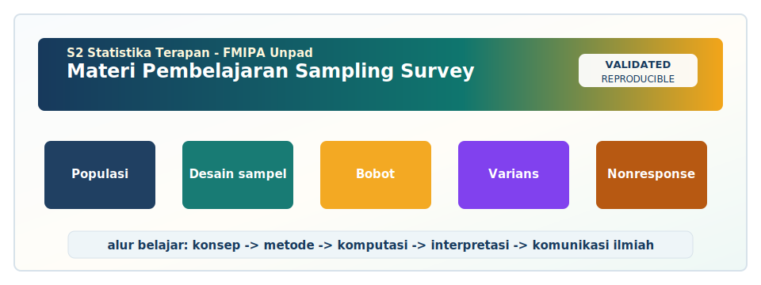

<!-- BEGIN UNPAD MATERIAL STYLE -->
<style>
:root {
  --unpad-navy: #17395c;
  --unpad-gold: #f2a51a;
  --unpad-teal: #0f766e;
  --unpad-ink: #172033;
  --unpad-paper: #fffdf8;
  --unpad-soft: #eef5f8;
  --unpad-line: #d7e2ea;
}
html, body {
  background: linear-gradient(135deg, #f8fbfd 0%, #fffdf8 48%, #f3f6ee 100%) !important;
  color: var(--unpad-ink) !important;
}
body {
  font-family: "Segoe UI", Arial, sans-serif !important;
  line-height: 1.72 !important;
}
.main-container {
  max-width: 1180px !important;
  background: rgba(255, 253, 248, 0.98) !important;
  border: 1px solid var(--unpad-line) !important;
  border-radius: 8px !important;
  box-shadow: 0 18px 42px rgba(23, 57, 92, 0.12) !important;
}
h1, h2, h3, h4 {
  letter-spacing: 0 !important;
}
h1.title {
  color: var(--unpad-navy) !important;
  -webkit-text-fill-color: var(--unpad-navy) !important;
  background: none !important;
}
h2 {
  border-left-color: var(--unpad-gold) !important;
}
a {
  color: #0b5c86 !important;
}
pre, code {
  border-radius: 8px !important;
}
.unpad-cover {
  margin: 18px 0 26px;
  padding: 24px;
  border-radius: 8px;
  background: linear-gradient(135deg, #17395c 0%, #0f766e 58%, #f2a51a 100%);
  color: #ffffff;
  box-shadow: 0 18px 36px rgba(23, 57, 92, 0.22);
}
.unpad-cover__brand {
  display: grid;
  grid-template-columns: 92px 1fr;
  gap: 20px;
  align-items: center;
}
.unpad-cover img {
  width: 92px;
  height: 92px;
  object-fit: contain;
  background: #ffffff;
  border-radius: 8px;
  padding: 8px;
  box-shadow: 0 8px 22px rgba(0,0,0,0.18);
}
.unpad-kicker {
  text-transform: uppercase;
  font-size: 0.82rem;
  font-weight: 800;
  letter-spacing: 0;
  color: #fff8dc;
}
.unpad-cover h2 {
  margin: 6px 0 8px;
  padding: 0;
  border: 0;
  background: transparent;
  color: #ffffff !important;
  font-size: 1.65rem;
}
.unpad-meta {
  margin: 0;
  color: #f7fbff;
  font-weight: 600;
}
.materi-illustration {
  margin: 20px 0 24px;
  padding: 14px;
  background: #ffffff;
  border: 1px solid var(--unpad-line);
  border-radius: 8px;
  box-shadow: 0 12px 28px rgba(23, 57, 92, 0.10);
}
.materi-illustration img {
  width: 100%;
  height: auto;
  display: block;
  border-radius: 6px;
}
.validasi-akademik {
  margin: 18px 0 28px;
  padding: 16px 18px;
  background: linear-gradient(135deg, #eef8f6, #fff8e7);
  border-left: 8px solid var(--unpad-teal);
  border-radius: 8px;
  color: var(--unpad-ink);
}
.validasi-akademik strong {
  color: var(--unpad-navy);
}
table {
  border-radius: 8px !important;
}
@media (max-width: 760px) {
  .unpad-cover__brand {
    grid-template-columns: 1fr;
  }
  .unpad-cover img {
    width: 76px;
    height: 76px;
  }
}
</style>
<!-- END UNPAD MATERIAL STYLE -->


<!-- BEGIN UNPAD MATERIAL ENHANCEMENT -->

```{r setup-unpad-render, include=FALSE}
execute_code <- FALSE
knitr::opts_chunk$set(
  echo = TRUE,
  eval = FALSE,
  message = FALSE,
  warning = FALSE,
  fig.align = "center",
  fig.width = 8,
  fig.height = 4.8,
  dpi = 120
)
set.seed(2025)
```


<div class="unpad-cover">
<div class="unpad-cover__brand">

<div>
<div class="unpad-kicker">S2 Statistika Terapan | FMIPA Universitas Padjadjaran</div>
<h2>Materi Pembelajaran Sampling Survey</h2>
<p class="unpad-meta">S2 Statistika Terapan FMIPA Universitas Padjadjaran<br>Penulis: Dr. Bertho Tantular, M.Si | Januari 2025</p>
</div>
</div>
</div>

<div class="materi-illustration">

</div>

<div class="validasi-akademik">
<strong>Catatan validasi akademik.</strong> Materi ini diseragamkan dengan rujukan ADWTL Januari 2025: rumus dibaca bersama asumsi, contoh kode diposisikan sebagai template reproducible, dan interpretasi diarahkan pada validitas data, diagnosis model, evaluasi ketidakpastian, serta komunikasi hasil secara ilmiah.
</div>

<!-- END UNPAD MATERIAL ENHANCEMENT -->

<style>
:root{
  --brown-950:#2a1408;
  --brown-900:#3b1f10;
  --brown-800:#5a321d;
  --brown-700:#7b4729;
  --brown-600:#9a5a2e;
  --brown-500:#bd7a48;
  --brown-300:#e5c29d;
  --brown-200:#f0dbc3;
  --brown-100:#faefe3;
  --cream:#fffaf3;
  --ink:#1f130c;
  --gold:#f4b24a;
  --teal:#2d6f73;
  --rose:#b65b6b;
}
html{scroll-behavior:smooth;}
body{
  margin:0;
  color:var(--ink);
  font-family:-apple-system,BlinkMacSystemFont,"Segoe UI",Roboto,"Helvetica Neue",Arial,"Noto Sans",sans-serif;
  line-height:1.72;
  background:
    radial-gradient(circle at top right, rgba(244,178,74,.18), transparent 34%),
    linear-gradient(135deg,#fffaf3 0%,#f8ead8 38%,#ead2b8 100%);
  max-width:none;
  padding:32px 54px 64px 354px;
}
#TOC{
  position:fixed;
  top:0; left:0; bottom:0;
  width:292px;
  padding:24px 22px 40px 24px;
  overflow-y:auto;
  background:linear-gradient(180deg,var(--brown-950) 0%,var(--brown-800) 44%,var(--brown-500) 100%);
  color:white;
  box-shadow:10px 0 30px rgba(42,20,8,.22);
  z-index:1000;
}
#TOC::before{
  content:"Daftar Isi";
  display:block;
  font-size:1.35rem;
  font-weight:800;
  letter-spacing:.4px;
  margin-bottom:12px;
  color:#fff6e8;
}
#TOC ul{padding-left:1.1rem;margin:.25rem 0;}
#TOC li{margin:.28rem 0;}
#TOC a{color:#fff6e8;text-decoration:none;font-weight:520;}
#TOC a:hover{color:#ffe0a6;text-decoration:underline;}
h1,h2,h3,h4{line-height:1.25;color:var(--brown-900);}
h1{font-size:2.25rem;margin-top:2rem;border-bottom:4px solid var(--brown-300);padding-bottom:.35rem;}
h2{font-size:1.68rem;margin-top:2.4rem;padding-left:.65rem;border-left:8px solid var(--brown-600);}
h3{font-size:1.25rem;margin-top:1.7rem;color:var(--brown-800);}
h4{font-size:1.07rem;color:#6f3f22;}
a{color:#7b3f18;}
.title-card{
  background:linear-gradient(135deg,#3b1f10 0%,#8c522f 45%,#e3b477 100%);
  color:#fff9ef;
  border-radius:28px;
  padding:48px 52px;
  box-shadow:0 24px 60px rgba(71,39,21,.26);
  margin:4px 0 38px;
  position:relative;
  overflow:hidden;
}
.title-card::after{
  content:"";
  position:absolute;
  right:-90px;top:-110px;
  width:310px;height:310px;
  background:radial-gradient(circle,rgba(255,255,255,.23),transparent 66%);
}
.title-card h1{color:white;border:0;margin:0 0 14px;padding:0;font-size:2.65rem;}
.title-card p{font-size:1.08rem;margin:.35rem 0;}
.badge{
  display:inline-block;
  background:rgba(255,255,255,.18);
  border:1px solid rgba(255,255,255,.34);
  color:#fff8e9;
  padding:.42rem .75rem;
  border-radius:999px;
  margin:.2rem .35rem .2rem 0;
  font-size:.92rem;
}
.callout,.tip,.warning,.casebox,.formula,.rpsbox{
  border-radius:18px;
  padding:18px 22px;
  margin:18px 0;
  box-shadow:0 10px 24px rgba(59,31,16,.08);
}
.callout{background:linear-gradient(135deg,#fff6ea,#f2ddc6);border-left:7px solid var(--brown-600);}
.tip{background:linear-gradient(135deg,#edf8f6,#fff7e8);border-left:7px solid var(--teal);}
.warning{background:linear-gradient(135deg,#fff1ee,#f7d2c2);border-left:7px solid var(--rose);}
.casebox{background:linear-gradient(135deg,#fffaf0,#efe0c9);border:1px solid #d4ad82;}
.formula{background:#f4e3cf;color:#111;border:1px solid #d5aa7d;border-left:7px solid var(--gold);font-size:1.02rem;}
.rpsbox{background:linear-gradient(135deg,#f7e1c5,#fff8eb);border-left:7px solid #bd7a48;}
pre, code{
  font-family:"SFMono-Regular",Consolas,"Liberation Mono",Menlo,monospace;
}
pre{
  background:#f4e3cf !important;
  color:#1f130c !important;
  border:1px solid #d7ad82;
  border-left:7px solid #9a5a2e;
  border-radius:16px;
  padding:18px 20px;
  overflow:auto;
  box-shadow:0 10px 22px rgba(59,31,16,.08);
}
code{background:#f3ddc4;color:#1f130c;border-radius:7px;padding:.12rem .34rem;}
pre code{background:transparent;padding:0;}
table{
  width:100%;
  border-collapse:collapse;
  background:#fffaf4;
  margin:18px 0;
  box-shadow:0 10px 22px rgba(59,31,16,.07);
  border-radius:14px;
  overflow:hidden;
}
th{background:linear-gradient(135deg,#6f3f22,#b06a3d);color:#fff7ea;text-align:left;}
th,td{border:1px solid #d8b58e;padding:10px 12px;vertical-align:top;}
tr:nth-child(even) td{background:#f8ead8;}
blockquote{
  background:#fff6e8;
  border-left:7px solid #bd7a48;
  margin:20px 0;
  padding:12px 20px;
  border-radius:12px;
  color:#3c2415;
}
.diagram{
  display:grid;
  grid-template-columns:repeat(auto-fit,minmax(160px,1fr));
  gap:14px;
  margin:20px 0;
}
.node{
  padding:16px;
  border-radius:18px;
  text-align:center;
  background:linear-gradient(135deg,#fff7ec,#e9c7a0);
  border:1px solid #ca9a68;
  font-weight:700;
  box-shadow:0 8px 18px rgba(59,31,16,.08);
}
.small{font-size:.92rem;color:#5d3a24;}
hr{border:0;border-top:1px solid #d6af87;margin:34px 0;}
@media(max-width:920px){
  body{padding:24px 20px 48px 20px;}
  #TOC{position:relative;width:auto;max-height:420px;border-radius:0 0 22px 22px;}
  .title-card{padding:34px 26px;}
}
</style>


<div class="title-card">
<h1>Materi Pembelajaran Sampling Survey</h1>
<p><strong>Program Studi S2 Statistika Terapan</strong><br/>Fakultas Matematika dan Ilmu Pengetahuan Alam, Universitas Padjadjaran</p>
<p><strong>Author:</strong> Dr. Bertho Tantular, M.Si</p>
<p><strong>Tahun pembuatan:</strong> Januari 2025</p>
<span class="badge">RMD Output HTML</span>
<span class="badge">Nuansa Colorful Coklat Degradasi</span>
<span class="badge">Daftar Isi di Sebelah Kiri</span>
<span class="badge">Berbasis RPS OBE 2025</span>
</div>

# Identitas Mata Kuliah dan Arah Pembelajaran

Materi pembelajaran ini disusun sebagai bahan ajar komprehensif untuk mata kuliah **Sampling Survey** pada **Program Studi S2 Statistika Terapan FMIPA Universitas Padjadjaran**. Struktur materi mengikuti RPS OBE: dimulai dari konsep dasar sampling, distribusi sampling, SRS, sampling sistematis, stratifikasi, klaster, multistage, estimator berbantuan variabel bantu, analisis complex survey, non-response, double sampling, total survey error, teknik sampling lanjutan, non-probability sampling, sampai proyek akhir berbasis evaluasi desain. Materi ini dirancang untuk perkuliahan teori dan praktikum 3 SKS, dengan penekanan pada kemampuan analitis, evaluatif, komputasional, dan inovatif.


| Elemen | Informasi |
|---|---|
| Mata kuliah | Sampling Survey |
| Program studi | S2 Statistika Terapan, FMIPA Universitas Padjadjaran |
| Kode mata kuliah | D20B.208 |
| Rumpun MK | Pilihan |
| Bobot | 3 SKS: T = 2, P = 1 |
| Semester | 2 |
| Dosen pengampu/penulis RPS | Dr. Bertho Tantular, M.Si |
| Tahun materi | Januari 2025 |
| Fokus CPL | CPL3, CPL4, CPL5 |
| Fokus CPMK | Teknik sampling, desain sampling kompleks, komputasi estimator, evaluasi bias/error survei |


<div class="rpsbox">
<strong>Orientasi RPS.</strong> Materi ini mengikuti struktur RPS Sampling Survey: CPL3 menekankan kemampuan mengelola dan menganalisis data untuk permasalahan nyata; CPL4 menekankan pengembangan algoritma komputasi menggunakan software statistik; sedangkan CPL5 menekankan cara berpikir logis, kritis, sistematis, dan inovatif dalam pengelolaan riset. Empat CPMK diterjemahkan menjadi alur belajar: memahami teknik sampling dasar, merancang desain kompleks, mengimplementasikan estimator dan analisis complex survey dengan R, serta mengevaluasi error, non-response, dan inovasi desain survei.
</div>


## Peta Pertemuan 16 Minggu

| Pertemuan | Pokok Bahasan | Inti Keterampilan |
|---:|---|---|
| 1 | Pendahuluan Sampling Survey | populasi, sampel, parameter, statistik, kerangka sampel, etika survei |
| 2 | Distribusi Sampling | sampling distribution, standard error, confidence interval, finite population correction |
| 3 | Simple Random Sampling | SRS dengan/tanpa pengembalian, estimasi mean, total, proporsi, ukuran sampel |
| 4 | Sampling Sistematis | interval sampling, random start, risiko periodisitas, efisiensi |
| 5 | Sampling Stratifikasi | pembentukan strata, alokasi proporsional, alokasi Neyman, presisi |
| 6 | Sampling Klaster | klaster satu tahap, dua tahap, ICC, design effect |
| 7 | Multistage dan Complex Sampling Design | PSU, SSU, kombinasi strata-klaster-bobot, biaya dan logistik |
| 8 | UTS Proyek Pendahuluan | proposal desain, justifikasi metodologis, simulasi awal |
| 9 | Penaksir Rasio, Difference, dan Regresi | auxiliary information, bias, MSE, efisiensi |
| 10 | Analisis Complex Survey | weight, strata, PSU, R package survey dan srvyr |
| 11 | Penanganan Non-response | unit non-response, item non-response, adjustment, imputasi |
| 12 | Double Sampling | two-phase sampling, screening murah, pengukuran mahal, estimator dua fase |
| 13 | Kesalahan dalam Sampling | sampling error, nonsampling error, total survey error |
| 14 | Teknik Sampling Lainnya | PPS systematic, adaptive sampling, rare population |
| 15 | Non-Probability Sampling | purposive, quota, snowball, keterbatasan inferensi |
| 16 | UAS Proyek Akhir | evaluasi desain, laporan final, presentasi inovasi survei |

## Cara menggunakan materi ini

Materi ini ditulis sebagai dokumen R Markdown yang dapat dirender menjadi HTML. Daftar isi berada di sisi kiri sehingga mahasiswa dapat berpindah antar bab dengan cepat. Setiap bab memuat konsep, intuisi, rumus, contoh kasus, potongan kode R, kesalahan umum, pertanyaan reflektif, serta catatan metodologis. Kode R diberi opsi `eval=FALSE` agar dokumen dapat dibaca sebagai modul kuliah tanpa harus menjalankan seluruh simulasi. Dosen dapat mengubah opsi tersebut menjadi `eval=TRUE` pada bagian praktikum tertentu setelah paket dan data tersedia.

<div class="diagram">
<div class="node">Tujuan Survei</div>
<div class="node">Populasi & Frame</div>
<div class="node">Desain Sampling</div>
<div class="node">Bobot & Estimator</div>
<div class="node">Analisis R</div>
<div class="node">Evaluasi Error</div>
</div>

<div class="callout">
<strong>Benang merah mata kuliah.</strong> Sampling survey bukan hanya teknik memilih responden, melainkan sistem inferensi dari populasi menuju keputusan. Karena itu, pembelajaran selalu bergerak dari pertanyaan substantif menuju desain, dari desain menuju estimator, dari estimator menuju ketidakpastian, dan dari ketidakpastian menuju interpretasi yang bertanggung jawab.
</div>

## Catatan sitasi

Sumber utama materi ini mencakup buku dan rujukan klasik-modern dalam sampling survey: Lohr untuk desain dan analisis sampling, Kish dan Cochran untuk fondasi probabilistik, Särndal dkk. untuk model-assisted survey sampling, Lumley untuk implementasi complex survey di R, Groves dkk. untuk survey methodology dan total survey error, serta rujukan pendukung mengenai non-response, calibration, dan non-probability sampling [@lohr2021; @kish1965; @cochran1977; @sarndal1992; @lumley2010; @groves2009].

# Bab 1. Konsep Dasar Sampling Survey dan Inferensi Berbasis Desain


Pada bagian ini, fokus pembelajaran adalah **Konsep Dasar Sampling Survey dan Inferensi Berbasis Desain** yang ditempatkan dalam Pertemuan 1 dan terkait dengan SubCPMK1. Secara konseptual, sampling survey adalah strategi ilmiah untuk memperoleh informasi tentang populasi melalui sebagian unit yang dipilih menurut rancangan tertentu. Dalam tradisi survei statistik, rancangan sampling bukan sekadar prosedur mengambil sebagian data, melainkan sistem inferensi yang menentukan bagaimana data boleh digeneralisasi ke populasi. Karena itu, setiap tahap harus dapat diaudit: definisi populasi, kerangka sampel, peluang pemilihan, bobot desain, estimator, estimasi variansi, serta keterbatasan lapangan. Literatur klasik dan modern menekankan bahwa kualitas survei bergantung pada keterpaduan antara teori probabilitas, pemahaman konteks substantif, dan disiplin operasional di lapangan [@lohr2021; @kish1965; @kalton1983].

Bagi mahasiswa S2 Statistika Terapan, penguasaan topik ini penting karena banyak riset terapan tidak dilakukan pada data sensus. Dalam riset kesehatan, sosial, pendidikan, bisnis, aktuaria, dan kebijakan publik, peneliti sering berhadapan dengan populasi besar, biaya terbatas, ketidaklengkapan kerangka, serta kebutuhan estimasi untuk domain tertentu. Desain sampling yang tepat membuat hasil riset tidak hanya tampak rapi secara komputasi, tetapi juga sah secara metodologis. Sebaliknya, desain yang keliru dapat menghasilkan estimasi yang presisi secara numerik tetapi bias secara substantif; angka tampak gagah, namun seperti jas hujan di gurun, salah konteks.


### Intuisi dan definisi operasional

Dalam praktik survei, istilah yang paling sering tertukar adalah **populasi target**, **populasi survei**, **kerangka sampel**, **unit sampling**, **unit observasi**, dan **unit analisis**. Populasi target adalah himpunan konseptual yang ingin disimpulkan; populasi survei adalah bagian populasi yang secara operasional dapat dicakup; kerangka sampel adalah daftar atau struktur yang memungkinkan unit dipilih; unit sampling adalah unit yang dipilih pada tahap tertentu; unit observasi adalah unit tempat data dikumpulkan; sedangkan unit analisis adalah unit yang menjadi dasar inferensi substantif. Pada banyak survei rumah tangga, rumah tangga dapat menjadi unit sampling, tetapi individu di dalam rumah tangga menjadi unit observasi dan analisis.

Topik **Konsep Dasar Sampling Survey dan Inferensi Berbasis Desain** harus dibaca melalui dua kacamata. Pertama, kacamata **design-based**, yaitu inferensi ditentukan oleh mekanisme randomisasi sampling. Nilai populasi dianggap tetap, dan ketidakpastian muncul karena sampel yang terpilih hanya salah satu dari banyak kemungkinan sampel. Kedua, kacamata **model-assisted** atau **model-based** dapat digunakan ketika variabel bantu, model regresi, atau asumsi tambahan diperlukan untuk meningkatkan efisiensi. Dalam mata kuliah ini, pondasi utama tetap design-based karena paling dekat dengan mandat survei resmi dan survei kebijakan, tetapi pendekatan berbantuan model diperkenalkan secara hati-hati ketika relevan.

Contoh konteks: Survei kepuasan layanan akademik S2 Statistika Terapan. Target populasi adalah seluruh mahasiswa aktif, unit observasi adalah mahasiswa, variabel utama adalah indeks kepuasan, dan kerangka sampel dapat berupa daftar mahasiswa aktif dari administrasi akademik. Dalam contoh tersebut, mahasiswa harus mampu mengidentifikasi apa yang menjadi populasi, apa yang menjadi frame, bagaimana peluang pemilihan unit dihitung, serta apa konsekuensi analisis bila sebagian unit tidak tercakup atau tidak merespons. Penalaran seperti ini membedakan analis survei dari pengguna software biasa. Software bisa menghitung, tetapi hanya analis yang paham desain yang tahu apakah angka itu layak dipercaya.


### Rumus inti dan penafsiran

<div class="formula">
$$\hat{\theta}=g(y_s,d_s),\qquad E_p(\hat{\theta})\approx \theta,\qquad Var_p(\hat{\theta})\text{ diukur terhadap rancangan sampling.}$$
</div>

Rumus di atas perlu ditafsirkan sebagai perangkat berpikir, bukan sekadar simbol yang dihafal. Notasi estimasi selalu memuat tiga lapisan: nilai target populasi, estimator yang dihitung dari sampel, dan ukuran ketidakpastian estimator. Dalam kelas, mahasiswa dianjurkan membiasakan diri menulis ketiganya secara eksplisit. Misalnya, ketika targetnya rata-rata populasi, tuliskan parameter populasi, estimator sampel, estimator variansi, dan interval kepercayaan. Ketika targetnya total populasi, pastikan bobot dan peluang inklusi tidak hilang dari penjelasan.

Kesalahan umum dalam pembelajaran sampling adalah berhenti pada estimasi titik. Padahal dalam survei, estimasi titik tanpa standard error, confidence interval, atau ukuran kualitas desain akan membuat laporan kehilangan konteks inferensial. Dua desain sampling dapat menghasilkan rata-rata sampel yang sama, tetapi standard error yang sangat berbeda karena struktur strata, klaster, bobot, dan non-response berbeda. Oleh karena itu, setiap rumus dalam materi ini sebaiknya dibaca bersama pertanyaan: "ketidakpastian berasal dari mana, dan bagaimana desain memengaruhinya?"


### Algoritma kerja desain dan analisis

1. Tentukan tujuan survei dan parameter utama yang akan diestimasi.
2. Definisikan populasi target, populasi survei, domain pelaporan, dan unit analisis.
3. Periksa kualitas kerangka sampel: kelengkapan, duplikasi, unit tidak eligible, dan informasi bantu.
4. Pilih desain sampling yang konsisten dengan struktur populasi, biaya, dan kebutuhan presisi.
5. Hitung peluang pemilihan, bobot dasar, serta rencana penyesuaian bobot bila terjadi non-response.
6. Tetapkan estimator, estimator variansi, dan prosedur analisis software sebelum data dikumpulkan.
7. Dokumentasikan keputusan metodologis agar proses dapat direplikasi dan diaudit.

Untuk topik **Konsep Dasar Sampling Survey dan Inferensi Berbasis Desain**, algoritma tersebut dapat diperluas sesuai kebutuhan. Pada desain sederhana, langkah utama mungkin hanya pemilihan sampel acak dan estimasi mean. Pada desain kompleks, langkahnya melibatkan pembentukan strata, pemilihan PSU, pemilihan unit tahap akhir, penyesuaian bobot, serta deklarasi desain pada software. Setiap langkah harus disimpan dalam dokumen metodologi. Dalam survei yang baik, logika pemilihan sampel dapat dijelaskan bahkan sebelum data dianalisis; bukan sebaliknya, baru mencari alasan setelah hasil keluar. Itu bukan desain survei, itu desain pembenaran.


### Praktikum R

```{r dasar_sampling, eval=FALSE, message=FALSE, warning=FALSE}
# Contoh kerangka populasi sederhana
set.seed(123)
N <- 500
pop <- data.frame(
  id = 1:N,
  prodi = sample(c("Statistika Terapan", "Aktuaria", "Sains Data"), N, replace = TRUE),
  kepuasan = round(rnorm(N, mean = 78, sd = 10), 1)
)
head(pop)
mean(pop$kepuasan) # parameter populasi, biasanya tidak diketahui dalam survei nyata
```

Kode di atas dirancang sebagai titik awal praktikum. Mahasiswa dapat memperluasnya dengan simulasi berulang, visualisasi distribusi estimator, perbandingan standard error, atau evaluasi bias. Pada tugas praktikum, kode sebaiknya tidak hanya berjalan, tetapi juga diberi komentar yang menjelaskan tujuan setiap blok. Laporan yang baik tidak menumpuk kode seperti gudang kardus; laporan yang baik menyusun kode sebagai argumen statistik yang dapat diikuti pembaca.


### Kesalahan umum dan cara menghindarinya

- target population tidak sama dengan survey population.
- kerangka sampel usang.
- unit sampling berbeda dengan unit analisis.
- bobot desain diabaikan pada tahap analisis.

Cara menghindari kesalahan tersebut adalah membangun **checklist desain** sejak awal. Checklist minimal mencakup definisi populasi, frame, domain, peluang inklusi, bobot, estimator, variansi, non-response, serta batasan inferensi. Ketika mahasiswa melakukan presentasi, setiap desain harus dapat dipertahankan dengan logika statistik dan logika lapangan. Bila desain tampak ideal tetapi mustahil dilakukan oleh enumerator, desain itu perlu direvisi. Bila desain mudah dilakukan tetapi menghilangkan dasar probabilistik, klaim inferensinya harus diturunkan derajatnya.


### Pertanyaan reflektif untuk diskusi kelas

1. Apa parameter populasi yang paling relevan untuk kasus ini: rata-rata, total, proporsi, rasio, atau estimasi domain?
2. Apakah kerangka sampel benar-benar mencakup populasi target? Siapa yang berisiko tidak tercakup?
3. Apa konsekuensi biaya, waktu, dan logistik dari desain yang dipilih?
4. Bagaimana peluang pemilihan setiap unit dihitung dan bagaimana bobot desain dibentuk?
5. Bagaimana standard error dan confidence interval harus dihitung agar sesuai dengan rancangan sampling?
6. Apa jenis bias atau error yang paling mungkin muncul, dan bagaimana mitigasinya?

Pertanyaan ini dapat digunakan sebagai mini quiz, diskusi kelompok, atau komponen laporan. Untuk capaian tingkat C4 sampai C6, mahasiswa tidak cukup hanya menyebut definisi; mahasiswa harus mampu membandingkan alternatif, mengevaluasi kelemahan, dan menciptakan rancangan perbaikan yang lebih efisien.


### Pendalaman akademik dan catatan metodologis

**Keterkaitan dengan validitas eksternal.** Dalam penelitian terapan, validitas eksternal tidak muncul otomatis dari ukuran sampel besar. Ukuran sampel besar dapat memperkecil variansi, tetapi tidak menyelesaikan bias cakupan, bias seleksi, atau bias pengukuran. Topik **Konsep Dasar Sampling Survey dan Inferensi Berbasis Desain** harus selalu dikaitkan dengan pertanyaan apakah sampel yang diperoleh memungkinkan generalisasi ke populasi target. Bila unit yang sulit dijangkau memiliki karakteristik berbeda dari unit yang mudah dijangkau, estimasi dapat bergeser meskipun jumlah responden banyak. Karena itu, desain sampling harus dipadukan dengan strategi operasional: pembaruan frame, callback responden, pelatihan enumerator, protokol penggantian unit, dan audit kualitas data.

**Keterkaitan dengan efisiensi.** Efisiensi desain sering dipahami sebagai kemampuan memperoleh presisi lebih tinggi dengan biaya yang sama, atau biaya lebih rendah dengan presisi yang sama. SRS memberikan baseline yang bersih, tetapi tidak selalu paling efisien. Stratifikasi dapat meningkatkan presisi jika strata homogen; klaster dapat menurunkan biaya tetapi meningkatkan variansi; multistage sampling memudahkan logistik tetapi membutuhkan penghitungan bobot dan variansi yang lebih hati-hati. Dengan demikian, mahasiswa perlu membedakan efisiensi statistik dan efisiensi operasional. Desain terbaik bukan selalu desain dengan rumus paling elegan, melainkan desain yang memberikan inferensi sah, presisi memadai, biaya realistis, dan dokumentasi transparan.

**Keterkaitan dengan komputasi.** Pada era survei modern, analisis tidak dapat dipisahkan dari software. Namun software hanya mengikuti instruksi pengguna. Bila analis salah mendeklarasikan strata, PSU, atau bobot, output akan rapi tetapi salah. Dalam R, paket `survey` menyediakan kerangka kuat untuk estimasi mean, total, proporsi, regresi, dan estimasi domain pada data survei kompleks. Akan tetapi, pengguna tetap harus memahami arti argumen `ids`, `strata`, `weights`, `nest`, dan prosedur penanganan lonely PSU. Komputasi dalam mata kuliah ini bukan sekadar coding, tetapi coding yang merepresentasikan desain sampling.

**Keterkaitan dengan pelaporan ilmiah.** Laporan survei yang profesional harus memuat uraian desain sebelum hasil. Minimal, laporan menjelaskan populasi target, frame, metode pemilihan sampel, ukuran sampel, response rate, bobot, estimator, cara menghitung standard error, dan keterbatasan. Hasil estimasi sebaiknya disajikan bersama ukuran ketidakpastian, bukan hanya angka tunggal. Untuk proyek mahasiswa, bagian metode harus cukup rinci sehingga pembaca lain dapat mereplikasi pemilihan sampel dan analisisnya. Prinsip ini sangat penting untuk publikasi, laporan kebijakan, dan pertanggungjawaban akademik.

**Keterkaitan dengan etika dan akuntabilitas.** Survei melibatkan manusia, institusi, dan keputusan yang dapat berdampak. Desain sampling yang buruk dapat membuat kelompok tertentu tidak terlihat dalam data. Jika kelompok rentan tidak tercakup, kebijakan berbasis survei dapat memperkuat ketidakadilan. Oleh karena itu, pembahasan sampling tidak boleh semata-mata teknis. Mahasiswa perlu mempertanyakan siapa yang masuk frame, siapa yang tersisih, siapa yang lebih mungkin tidak merespons, dan bagaimana ketidakpastian dilaporkan secara jujur. Statistik yang baik bukan hanya menghitung dengan benar, tetapi juga tidak berpura-pura lebih pasti daripada data yang dimiliki.


# Bab 2. Distribusi Sampling, Standard Error, dan Presisi Estimator


Pada bagian ini, fokus pembelajaran adalah **Distribusi Sampling, Standard Error, dan Presisi Estimator** yang ditempatkan dalam Pertemuan 2 dan terkait dengan SubCPMK1. Secara konseptual, distribusi sampling menggambarkan perilaku estimator ketika proses sampling diulang berkali-kali di bawah desain yang sama. Dalam tradisi survei statistik, rancangan sampling bukan sekadar prosedur mengambil sebagian data, melainkan sistem inferensi yang menentukan bagaimana data boleh digeneralisasi ke populasi. Karena itu, setiap tahap harus dapat diaudit: definisi populasi, kerangka sampel, peluang pemilihan, bobot desain, estimator, estimasi variansi, serta keterbatasan lapangan. Literatur klasik dan modern menekankan bahwa kualitas survei bergantung pada keterpaduan antara teori probabilitas, pemahaman konteks substantif, dan disiplin operasional di lapangan [@cochran1977; @lohr2021].

Bagi mahasiswa S2 Statistika Terapan, penguasaan topik ini penting karena banyak riset terapan tidak dilakukan pada data sensus. Dalam riset kesehatan, sosial, pendidikan, bisnis, aktuaria, dan kebijakan publik, peneliti sering berhadapan dengan populasi besar, biaya terbatas, ketidaklengkapan kerangka, serta kebutuhan estimasi untuk domain tertentu. Desain sampling yang tepat membuat hasil riset tidak hanya tampak rapi secara komputasi, tetapi juga sah secara metodologis. Sebaliknya, desain yang keliru dapat menghasilkan estimasi yang presisi secara numerik tetapi bias secara substantif; angka tampak gagah, namun seperti jas hujan di gurun, salah konteks.


### Intuisi dan definisi operasional

Dalam praktik survei, istilah yang paling sering tertukar adalah **populasi target**, **populasi survei**, **kerangka sampel**, **unit sampling**, **unit observasi**, dan **unit analisis**. Populasi target adalah himpunan konseptual yang ingin disimpulkan; populasi survei adalah bagian populasi yang secara operasional dapat dicakup; kerangka sampel adalah daftar atau struktur yang memungkinkan unit dipilih; unit sampling adalah unit yang dipilih pada tahap tertentu; unit observasi adalah unit tempat data dikumpulkan; sedangkan unit analisis adalah unit yang menjadi dasar inferensi substantif. Pada banyak survei rumah tangga, rumah tangga dapat menjadi unit sampling, tetapi individu di dalam rumah tangga menjadi unit observasi dan analisis.

Topik **Distribusi Sampling, Standard Error, dan Presisi Estimator** harus dibaca melalui dua kacamata. Pertama, kacamata **design-based**, yaitu inferensi ditentukan oleh mekanisme randomisasi sampling. Nilai populasi dianggap tetap, dan ketidakpastian muncul karena sampel yang terpilih hanya salah satu dari banyak kemungkinan sampel. Kedua, kacamata **model-assisted** atau **model-based** dapat digunakan ketika variabel bantu, model regresi, atau asumsi tambahan diperlukan untuk meningkatkan efisiensi. Dalam mata kuliah ini, pondasi utama tetap design-based karena paling dekat dengan mandat survei resmi dan survei kebijakan, tetapi pendekatan berbantuan model diperkenalkan secara hati-hati ketika relevan.

Contoh konteks: Dari populasi 10.000 rumah tangga, peneliti dapat membayangkan banyak kemungkinan sampel berukuran 400. Setiap sampel memberi estimasi rata-rata pengeluaran yang berbeda; sebaran estimasi itulah inti distribusi sampling. Dalam contoh tersebut, mahasiswa harus mampu mengidentifikasi apa yang menjadi populasi, apa yang menjadi frame, bagaimana peluang pemilihan unit dihitung, serta apa konsekuensi analisis bila sebagian unit tidak tercakup atau tidak merespons. Penalaran seperti ini membedakan analis survei dari pengguna software biasa. Software bisa menghitung, tetapi hanya analis yang paham desain yang tahu apakah angka itu layak dipercaya.


### Rumus inti dan penafsiran

<div class="formula">
$$SE(\hat{\theta})=\sqrt{Var(\hat{\theta})},\qquad CI_{95\%}:\ \hat{\theta}\pm 1.96\,SE(\hat{\theta}).$$
</div>

Rumus di atas perlu ditafsirkan sebagai perangkat berpikir, bukan sekadar simbol yang dihafal. Notasi estimasi selalu memuat tiga lapisan: nilai target populasi, estimator yang dihitung dari sampel, dan ukuran ketidakpastian estimator. Dalam kelas, mahasiswa dianjurkan membiasakan diri menulis ketiganya secara eksplisit. Misalnya, ketika targetnya rata-rata populasi, tuliskan parameter populasi, estimator sampel, estimator variansi, dan interval kepercayaan. Ketika targetnya total populasi, pastikan bobot dan peluang inklusi tidak hilang dari penjelasan.

Kesalahan umum dalam pembelajaran sampling adalah berhenti pada estimasi titik. Padahal dalam survei, estimasi titik tanpa standard error, confidence interval, atau ukuran kualitas desain akan membuat laporan kehilangan konteks inferensial. Dua desain sampling dapat menghasilkan rata-rata sampel yang sama, tetapi standard error yang sangat berbeda karena struktur strata, klaster, bobot, dan non-response berbeda. Oleh karena itu, setiap rumus dalam materi ini sebaiknya dibaca bersama pertanyaan: "ketidakpastian berasal dari mana, dan bagaimana desain memengaruhinya?"


### Algoritma kerja desain dan analisis

1. Tentukan tujuan survei dan parameter utama yang akan diestimasi.
2. Definisikan populasi target, populasi survei, domain pelaporan, dan unit analisis.
3. Periksa kualitas kerangka sampel: kelengkapan, duplikasi, unit tidak eligible, dan informasi bantu.
4. Pilih desain sampling yang konsisten dengan struktur populasi, biaya, dan kebutuhan presisi.
5. Hitung peluang pemilihan, bobot dasar, serta rencana penyesuaian bobot bila terjadi non-response.
6. Tetapkan estimator, estimator variansi, dan prosedur analisis software sebelum data dikumpulkan.
7. Dokumentasikan keputusan metodologis agar proses dapat direplikasi dan diaudit.

Untuk topik **Distribusi Sampling, Standard Error, dan Presisi Estimator**, algoritma tersebut dapat diperluas sesuai kebutuhan. Pada desain sederhana, langkah utama mungkin hanya pemilihan sampel acak dan estimasi mean. Pada desain kompleks, langkahnya melibatkan pembentukan strata, pemilihan PSU, pemilihan unit tahap akhir, penyesuaian bobot, serta deklarasi desain pada software. Setiap langkah harus disimpan dalam dokumen metodologi. Dalam survei yang baik, logika pemilihan sampel dapat dijelaskan bahkan sebelum data dianalisis; bukan sebaliknya, baru mencari alasan setelah hasil keluar. Itu bukan desain survei, itu desain pembenaran.


### Praktikum R

```{r distribusi_sampling, eval=FALSE, message=FALSE, warning=FALSE}
set.seed(123)
N <- 10000
y <- rlnorm(N, meanlog = 10, sdlog = 0.5)
B <- 1000
n <- 400
means <- replicate(B, mean(sample(y, n, replace = FALSE)))
summary(means)
sd(means)
hist(means, main = "Distribusi Sampling Rata-rata", xlab = "mean sampel")
```

Kode di atas dirancang sebagai titik awal praktikum. Mahasiswa dapat memperluasnya dengan simulasi berulang, visualisasi distribusi estimator, perbandingan standard error, atau evaluasi bias. Pada tugas praktikum, kode sebaiknya tidak hanya berjalan, tetapi juga diberi komentar yang menjelaskan tujuan setiap blok. Laporan yang baik tidak menumpuk kode seperti gudang kardus; laporan yang baik menyusun kode sebagai argumen statistik yang dapat diikuti pembaca.


### Kesalahan umum dan cara menghindarinya

- menyamakan simpangan baku data dengan standard error estimator.
- tidak menggunakan finite population correction ketika fraksi sampling besar.
- menggunakan interval normal tanpa memeriksa ukuran sampel dan distribusi.
- mengabaikan design effect dari desain kompleks.

Cara menghindari kesalahan tersebut adalah membangun **checklist desain** sejak awal. Checklist minimal mencakup definisi populasi, frame, domain, peluang inklusi, bobot, estimator, variansi, non-response, serta batasan inferensi. Ketika mahasiswa melakukan presentasi, setiap desain harus dapat dipertahankan dengan logika statistik dan logika lapangan. Bila desain tampak ideal tetapi mustahil dilakukan oleh enumerator, desain itu perlu direvisi. Bila desain mudah dilakukan tetapi menghilangkan dasar probabilistik, klaim inferensinya harus diturunkan derajatnya.


### Pertanyaan reflektif untuk diskusi kelas

1. Apa parameter populasi yang paling relevan untuk kasus ini: rata-rata, total, proporsi, rasio, atau estimasi domain?
2. Apakah kerangka sampel benar-benar mencakup populasi target? Siapa yang berisiko tidak tercakup?
3. Apa konsekuensi biaya, waktu, dan logistik dari desain yang dipilih?
4. Bagaimana peluang pemilihan setiap unit dihitung dan bagaimana bobot desain dibentuk?
5. Bagaimana standard error dan confidence interval harus dihitung agar sesuai dengan rancangan sampling?
6. Apa jenis bias atau error yang paling mungkin muncul, dan bagaimana mitigasinya?

Pertanyaan ini dapat digunakan sebagai mini quiz, diskusi kelompok, atau komponen laporan. Untuk capaian tingkat C4 sampai C6, mahasiswa tidak cukup hanya menyebut definisi; mahasiswa harus mampu membandingkan alternatif, mengevaluasi kelemahan, dan menciptakan rancangan perbaikan yang lebih efisien.


### Pendalaman akademik dan catatan metodologis

**Keterkaitan dengan validitas eksternal.** Dalam penelitian terapan, validitas eksternal tidak muncul otomatis dari ukuran sampel besar. Ukuran sampel besar dapat memperkecil variansi, tetapi tidak menyelesaikan bias cakupan, bias seleksi, atau bias pengukuran. Topik **Distribusi Sampling, Standard Error, dan Presisi Estimator** harus selalu dikaitkan dengan pertanyaan apakah sampel yang diperoleh memungkinkan generalisasi ke populasi target. Bila unit yang sulit dijangkau memiliki karakteristik berbeda dari unit yang mudah dijangkau, estimasi dapat bergeser meskipun jumlah responden banyak. Karena itu, desain sampling harus dipadukan dengan strategi operasional: pembaruan frame, callback responden, pelatihan enumerator, protokol penggantian unit, dan audit kualitas data.

**Keterkaitan dengan efisiensi.** Efisiensi desain sering dipahami sebagai kemampuan memperoleh presisi lebih tinggi dengan biaya yang sama, atau biaya lebih rendah dengan presisi yang sama. SRS memberikan baseline yang bersih, tetapi tidak selalu paling efisien. Stratifikasi dapat meningkatkan presisi jika strata homogen; klaster dapat menurunkan biaya tetapi meningkatkan variansi; multistage sampling memudahkan logistik tetapi membutuhkan penghitungan bobot dan variansi yang lebih hati-hati. Dengan demikian, mahasiswa perlu membedakan efisiensi statistik dan efisiensi operasional. Desain terbaik bukan selalu desain dengan rumus paling elegan, melainkan desain yang memberikan inferensi sah, presisi memadai, biaya realistis, dan dokumentasi transparan.

**Keterkaitan dengan komputasi.** Pada era survei modern, analisis tidak dapat dipisahkan dari software. Namun software hanya mengikuti instruksi pengguna. Bila analis salah mendeklarasikan strata, PSU, atau bobot, output akan rapi tetapi salah. Dalam R, paket `survey` menyediakan kerangka kuat untuk estimasi mean, total, proporsi, regresi, dan estimasi domain pada data survei kompleks. Akan tetapi, pengguna tetap harus memahami arti argumen `ids`, `strata`, `weights`, `nest`, dan prosedur penanganan lonely PSU. Komputasi dalam mata kuliah ini bukan sekadar coding, tetapi coding yang merepresentasikan desain sampling.

**Keterkaitan dengan pelaporan ilmiah.** Laporan survei yang profesional harus memuat uraian desain sebelum hasil. Minimal, laporan menjelaskan populasi target, frame, metode pemilihan sampel, ukuran sampel, response rate, bobot, estimator, cara menghitung standard error, dan keterbatasan. Hasil estimasi sebaiknya disajikan bersama ukuran ketidakpastian, bukan hanya angka tunggal. Untuk proyek mahasiswa, bagian metode harus cukup rinci sehingga pembaca lain dapat mereplikasi pemilihan sampel dan analisisnya. Prinsip ini sangat penting untuk publikasi, laporan kebijakan, dan pertanggungjawaban akademik.

**Keterkaitan dengan etika dan akuntabilitas.** Survei melibatkan manusia, institusi, dan keputusan yang dapat berdampak. Desain sampling yang buruk dapat membuat kelompok tertentu tidak terlihat dalam data. Jika kelompok rentan tidak tercakup, kebijakan berbasis survei dapat memperkuat ketidakadilan. Oleh karena itu, pembahasan sampling tidak boleh semata-mata teknis. Mahasiswa perlu mempertanyakan siapa yang masuk frame, siapa yang tersisih, siapa yang lebih mungkin tidak merespons, dan bagaimana ketidakpastian dilaporkan secara jujur. Statistik yang baik bukan hanya menghitung dengan benar, tetapi juga tidak berpura-pura lebih pasti daripada data yang dimiliki.


# Bab 3. Simple Random Sampling: SRSWOR dan SRSWR


Pada bagian ini, fokus pembelajaran adalah **Simple Random Sampling: SRSWOR dan SRSWR** yang ditempatkan dalam Pertemuan 3 dan terkait dengan SubCPMK1. Secara konseptual, SRS memberi peluang yang sama kepada setiap kombinasi sampel sehingga menjadi baseline teoretis untuk membandingkan desain lain. Dalam tradisi survei statistik, rancangan sampling bukan sekadar prosedur mengambil sebagian data, melainkan sistem inferensi yang menentukan bagaimana data boleh digeneralisasi ke populasi. Karena itu, setiap tahap harus dapat diaudit: definisi populasi, kerangka sampel, peluang pemilihan, bobot desain, estimator, estimasi variansi, serta keterbatasan lapangan. Literatur klasik dan modern menekankan bahwa kualitas survei bergantung pada keterpaduan antara teori probabilitas, pemahaman konteks substantif, dan disiplin operasional di lapangan [@cochran1977; @lohr2021; @thompson2012].

Bagi mahasiswa S2 Statistika Terapan, penguasaan topik ini penting karena banyak riset terapan tidak dilakukan pada data sensus. Dalam riset kesehatan, sosial, pendidikan, bisnis, aktuaria, dan kebijakan publik, peneliti sering berhadapan dengan populasi besar, biaya terbatas, ketidaklengkapan kerangka, serta kebutuhan estimasi untuk domain tertentu. Desain sampling yang tepat membuat hasil riset tidak hanya tampak rapi secara komputasi, tetapi juga sah secara metodologis. Sebaliknya, desain yang keliru dapat menghasilkan estimasi yang presisi secara numerik tetapi bias secara substantif; angka tampak gagah, namun seperti jas hujan di gurun, salah konteks.


### Intuisi dan definisi operasional

Dalam praktik survei, istilah yang paling sering tertukar adalah **populasi target**, **populasi survei**, **kerangka sampel**, **unit sampling**, **unit observasi**, dan **unit analisis**. Populasi target adalah himpunan konseptual yang ingin disimpulkan; populasi survei adalah bagian populasi yang secara operasional dapat dicakup; kerangka sampel adalah daftar atau struktur yang memungkinkan unit dipilih; unit sampling adalah unit yang dipilih pada tahap tertentu; unit observasi adalah unit tempat data dikumpulkan; sedangkan unit analisis adalah unit yang menjadi dasar inferensi substantif. Pada banyak survei rumah tangga, rumah tangga dapat menjadi unit sampling, tetapi individu di dalam rumah tangga menjadi unit observasi dan analisis.

Topik **Simple Random Sampling: SRSWOR dan SRSWR** harus dibaca melalui dua kacamata. Pertama, kacamata **design-based**, yaitu inferensi ditentukan oleh mekanisme randomisasi sampling. Nilai populasi dianggap tetap, dan ketidakpastian muncul karena sampel yang terpilih hanya salah satu dari banyak kemungkinan sampel. Kedua, kacamata **model-assisted** atau **model-based** dapat digunakan ketika variabel bantu, model regresi, atau asumsi tambahan diperlukan untuk meningkatkan efisiensi. Dalam mata kuliah ini, pondasi utama tetap design-based karena paling dekat dengan mandat survei resmi dan survei kebijakan, tetapi pendekatan berbantuan model diperkenalkan secara hati-hati ketika relevan.

Contoh konteks: Untuk audit cepat terhadap 1.200 dokumen administrasi, setiap dokumen diberi nomor, lalu dipilih 120 dokumen secara acak tanpa pengembalian. Estimasi proporsi dokumen lengkap dihitung dari sampel. Dalam contoh tersebut, mahasiswa harus mampu mengidentifikasi apa yang menjadi populasi, apa yang menjadi frame, bagaimana peluang pemilihan unit dihitung, serta apa konsekuensi analisis bila sebagian unit tidak tercakup atau tidak merespons. Penalaran seperti ini membedakan analis survei dari pengguna software biasa. Software bisa menghitung, tetapi hanya analis yang paham desain yang tahu apakah angka itu layak dipercaya.


### Rumus inti dan penafsiran

<div class="formula">
$$\bar{y}_s=\frac{1}{n}\sum_{i\in s}y_i,\qquad \hat{\bar{Y}}=\bar{y}_s,\qquad \widehat{Var}(\bar{y}_s)=\left(1-\frac{n}{N}\right)\frac{s_s^2}{n}.$$ 
</div>

Rumus di atas perlu ditafsirkan sebagai perangkat berpikir, bukan sekadar simbol yang dihafal. Notasi estimasi selalu memuat tiga lapisan: nilai target populasi, estimator yang dihitung dari sampel, dan ukuran ketidakpastian estimator. Dalam kelas, mahasiswa dianjurkan membiasakan diri menulis ketiganya secara eksplisit. Misalnya, ketika targetnya rata-rata populasi, tuliskan parameter populasi, estimator sampel, estimator variansi, dan interval kepercayaan. Ketika targetnya total populasi, pastikan bobot dan peluang inklusi tidak hilang dari penjelasan.

Kesalahan umum dalam pembelajaran sampling adalah berhenti pada estimasi titik. Padahal dalam survei, estimasi titik tanpa standard error, confidence interval, atau ukuran kualitas desain akan membuat laporan kehilangan konteks inferensial. Dua desain sampling dapat menghasilkan rata-rata sampel yang sama, tetapi standard error yang sangat berbeda karena struktur strata, klaster, bobot, dan non-response berbeda. Oleh karena itu, setiap rumus dalam materi ini sebaiknya dibaca bersama pertanyaan: "ketidakpastian berasal dari mana, dan bagaimana desain memengaruhinya?"


### Algoritma kerja desain dan analisis

1. Tentukan tujuan survei dan parameter utama yang akan diestimasi.
2. Definisikan populasi target, populasi survei, domain pelaporan, dan unit analisis.
3. Periksa kualitas kerangka sampel: kelengkapan, duplikasi, unit tidak eligible, dan informasi bantu.
4. Pilih desain sampling yang konsisten dengan struktur populasi, biaya, dan kebutuhan presisi.
5. Hitung peluang pemilihan, bobot dasar, serta rencana penyesuaian bobot bila terjadi non-response.
6. Tetapkan estimator, estimator variansi, dan prosedur analisis software sebelum data dikumpulkan.
7. Dokumentasikan keputusan metodologis agar proses dapat direplikasi dan diaudit.

Untuk topik **Simple Random Sampling: SRSWOR dan SRSWR**, algoritma tersebut dapat diperluas sesuai kebutuhan. Pada desain sederhana, langkah utama mungkin hanya pemilihan sampel acak dan estimasi mean. Pada desain kompleks, langkahnya melibatkan pembentukan strata, pemilihan PSU, pemilihan unit tahap akhir, penyesuaian bobot, serta deklarasi desain pada software. Setiap langkah harus disimpan dalam dokumen metodologi. Dalam survei yang baik, logika pemilihan sampel dapat dijelaskan bahkan sebelum data dianalisis; bukan sebaliknya, baru mencari alasan setelah hasil keluar. Itu bukan desain survei, itu desain pembenaran.


### Praktikum R

```{r srs, eval=FALSE, message=FALSE, warning=FALSE}
set.seed(12)
N <- 1200
n <- 120
pop <- data.frame(id = 1:N, lengkap = rbinom(N, 1, 0.82))
s <- pop[sample(1:N, n, replace = FALSE), ]
p_hat <- mean(s$lengkap)
se_hat <- sqrt((1 - n/N) * var(s$lengkap) / n)
c(p_hat = p_hat, lower = p_hat - 1.96*se_hat, upper = p_hat + 1.96*se_hat)
```

Kode di atas dirancang sebagai titik awal praktikum. Mahasiswa dapat memperluasnya dengan simulasi berulang, visualisasi distribusi estimator, perbandingan standard error, atau evaluasi bias. Pada tugas praktikum, kode sebaiknya tidak hanya berjalan, tetapi juga diberi komentar yang menjelaskan tujuan setiap blok. Laporan yang baik tidak menumpuk kode seperti gudang kardus; laporan yang baik menyusun kode sebagai argumen statistik yang dapat diikuti pembaca.


### Kesalahan umum dan cara menghindarinya

- randomisasi tidak benar karena menggunakan convenience list.
- duplikasi unit saat seharusnya tanpa pengembalian.
- tidak mendokumentasikan seed dan algoritma pemilihan.
- salah menafsirkan estimator total sebagai estimator rata-rata.

Cara menghindari kesalahan tersebut adalah membangun **checklist desain** sejak awal. Checklist minimal mencakup definisi populasi, frame, domain, peluang inklusi, bobot, estimator, variansi, non-response, serta batasan inferensi. Ketika mahasiswa melakukan presentasi, setiap desain harus dapat dipertahankan dengan logika statistik dan logika lapangan. Bila desain tampak ideal tetapi mustahil dilakukan oleh enumerator, desain itu perlu direvisi. Bila desain mudah dilakukan tetapi menghilangkan dasar probabilistik, klaim inferensinya harus diturunkan derajatnya.


### Pertanyaan reflektif untuk diskusi kelas

1. Apa parameter populasi yang paling relevan untuk kasus ini: rata-rata, total, proporsi, rasio, atau estimasi domain?
2. Apakah kerangka sampel benar-benar mencakup populasi target? Siapa yang berisiko tidak tercakup?
3. Apa konsekuensi biaya, waktu, dan logistik dari desain yang dipilih?
4. Bagaimana peluang pemilihan setiap unit dihitung dan bagaimana bobot desain dibentuk?
5. Bagaimana standard error dan confidence interval harus dihitung agar sesuai dengan rancangan sampling?
6. Apa jenis bias atau error yang paling mungkin muncul, dan bagaimana mitigasinya?

Pertanyaan ini dapat digunakan sebagai mini quiz, diskusi kelompok, atau komponen laporan. Untuk capaian tingkat C4 sampai C6, mahasiswa tidak cukup hanya menyebut definisi; mahasiswa harus mampu membandingkan alternatif, mengevaluasi kelemahan, dan menciptakan rancangan perbaikan yang lebih efisien.


### Pendalaman akademik dan catatan metodologis

**Keterkaitan dengan validitas eksternal.** Dalam penelitian terapan, validitas eksternal tidak muncul otomatis dari ukuran sampel besar. Ukuran sampel besar dapat memperkecil variansi, tetapi tidak menyelesaikan bias cakupan, bias seleksi, atau bias pengukuran. Topik **Simple Random Sampling: SRSWOR dan SRSWR** harus selalu dikaitkan dengan pertanyaan apakah sampel yang diperoleh memungkinkan generalisasi ke populasi target. Bila unit yang sulit dijangkau memiliki karakteristik berbeda dari unit yang mudah dijangkau, estimasi dapat bergeser meskipun jumlah responden banyak. Karena itu, desain sampling harus dipadukan dengan strategi operasional: pembaruan frame, callback responden, pelatihan enumerator, protokol penggantian unit, dan audit kualitas data.

**Keterkaitan dengan efisiensi.** Efisiensi desain sering dipahami sebagai kemampuan memperoleh presisi lebih tinggi dengan biaya yang sama, atau biaya lebih rendah dengan presisi yang sama. SRS memberikan baseline yang bersih, tetapi tidak selalu paling efisien. Stratifikasi dapat meningkatkan presisi jika strata homogen; klaster dapat menurunkan biaya tetapi meningkatkan variansi; multistage sampling memudahkan logistik tetapi membutuhkan penghitungan bobot dan variansi yang lebih hati-hati. Dengan demikian, mahasiswa perlu membedakan efisiensi statistik dan efisiensi operasional. Desain terbaik bukan selalu desain dengan rumus paling elegan, melainkan desain yang memberikan inferensi sah, presisi memadai, biaya realistis, dan dokumentasi transparan.

**Keterkaitan dengan komputasi.** Pada era survei modern, analisis tidak dapat dipisahkan dari software. Namun software hanya mengikuti instruksi pengguna. Bila analis salah mendeklarasikan strata, PSU, atau bobot, output akan rapi tetapi salah. Dalam R, paket `survey` menyediakan kerangka kuat untuk estimasi mean, total, proporsi, regresi, dan estimasi domain pada data survei kompleks. Akan tetapi, pengguna tetap harus memahami arti argumen `ids`, `strata`, `weights`, `nest`, dan prosedur penanganan lonely PSU. Komputasi dalam mata kuliah ini bukan sekadar coding, tetapi coding yang merepresentasikan desain sampling.

**Keterkaitan dengan pelaporan ilmiah.** Laporan survei yang profesional harus memuat uraian desain sebelum hasil. Minimal, laporan menjelaskan populasi target, frame, metode pemilihan sampel, ukuran sampel, response rate, bobot, estimator, cara menghitung standard error, dan keterbatasan. Hasil estimasi sebaiknya disajikan bersama ukuran ketidakpastian, bukan hanya angka tunggal. Untuk proyek mahasiswa, bagian metode harus cukup rinci sehingga pembaca lain dapat mereplikasi pemilihan sampel dan analisisnya. Prinsip ini sangat penting untuk publikasi, laporan kebijakan, dan pertanggungjawaban akademik.

**Keterkaitan dengan etika dan akuntabilitas.** Survei melibatkan manusia, institusi, dan keputusan yang dapat berdampak. Desain sampling yang buruk dapat membuat kelompok tertentu tidak terlihat dalam data. Jika kelompok rentan tidak tercakup, kebijakan berbasis survei dapat memperkuat ketidakadilan. Oleh karena itu, pembahasan sampling tidak boleh semata-mata teknis. Mahasiswa perlu mempertanyakan siapa yang masuk frame, siapa yang tersisih, siapa yang lebih mungkin tidak merespons, dan bagaimana ketidakpastian dilaporkan secara jujur. Statistik yang baik bukan hanya menghitung dengan benar, tetapi juga tidak berpura-pura lebih pasti daripada data yang dimiliki.


# Bab 4. Sampling Sistematis: Interval, Random Start, dan Risiko Periodisitas


Pada bagian ini, fokus pembelajaran adalah **Sampling Sistematis: Interval, Random Start, dan Risiko Periodisitas** yang ditempatkan dalam Pertemuan 4 dan terkait dengan SubCPMK1. Secara konseptual, sampling sistematis memilih satu titik awal acak lalu mengambil setiap unit ke-k, sehingga mudah dilaksanakan pada daftar yang panjang dan tersusun. Dalam tradisi survei statistik, rancangan sampling bukan sekadar prosedur mengambil sebagian data, melainkan sistem inferensi yang menentukan bagaimana data boleh digeneralisasi ke populasi. Karena itu, setiap tahap harus dapat diaudit: definisi populasi, kerangka sampel, peluang pemilihan, bobot desain, estimator, estimasi variansi, serta keterbatasan lapangan. Literatur klasik dan modern menekankan bahwa kualitas survei bergantung pada keterpaduan antara teori probabilitas, pemahaman konteks substantif, dan disiplin operasional di lapangan [@kish1965; @lohr2021; @kalton1983].

Bagi mahasiswa S2 Statistika Terapan, penguasaan topik ini penting karena banyak riset terapan tidak dilakukan pada data sensus. Dalam riset kesehatan, sosial, pendidikan, bisnis, aktuaria, dan kebijakan publik, peneliti sering berhadapan dengan populasi besar, biaya terbatas, ketidaklengkapan kerangka, serta kebutuhan estimasi untuk domain tertentu. Desain sampling yang tepat membuat hasil riset tidak hanya tampak rapi secara komputasi, tetapi juga sah secara metodologis. Sebaliknya, desain yang keliru dapat menghasilkan estimasi yang presisi secara numerik tetapi bias secara substantif; angka tampak gagah, namun seperti jas hujan di gurun, salah konteks.


### Intuisi dan definisi operasional

Dalam praktik survei, istilah yang paling sering tertukar adalah **populasi target**, **populasi survei**, **kerangka sampel**, **unit sampling**, **unit observasi**, dan **unit analisis**. Populasi target adalah himpunan konseptual yang ingin disimpulkan; populasi survei adalah bagian populasi yang secara operasional dapat dicakup; kerangka sampel adalah daftar atau struktur yang memungkinkan unit dipilih; unit sampling adalah unit yang dipilih pada tahap tertentu; unit observasi adalah unit tempat data dikumpulkan; sedangkan unit analisis adalah unit yang menjadi dasar inferensi substantif. Pada banyak survei rumah tangga, rumah tangga dapat menjadi unit sampling, tetapi individu di dalam rumah tangga menjadi unit observasi dan analisis.

Topik **Sampling Sistematis: Interval, Random Start, dan Risiko Periodisitas** harus dibaca melalui dua kacamata. Pertama, kacamata **design-based**, yaitu inferensi ditentukan oleh mekanisme randomisasi sampling. Nilai populasi dianggap tetap, dan ketidakpastian muncul karena sampel yang terpilih hanya salah satu dari banyak kemungkinan sampel. Kedua, kacamata **model-assisted** atau **model-based** dapat digunakan ketika variabel bantu, model regresi, atau asumsi tambahan diperlukan untuk meningkatkan efisiensi. Dalam mata kuliah ini, pondasi utama tetap design-based karena paling dekat dengan mandat survei resmi dan survei kebijakan, tetapi pendekatan berbantuan model diperkenalkan secara hati-hati ketika relevan.

Contoh konteks: Enumerator memiliki daftar 6.000 pelanggan air dan perlu memilih 300 pelanggan. Intervalnya 20; setelah random start 7, unit ke-7, 27, 47, dan seterusnya dipilih. Dalam contoh tersebut, mahasiswa harus mampu mengidentifikasi apa yang menjadi populasi, apa yang menjadi frame, bagaimana peluang pemilihan unit dihitung, serta apa konsekuensi analisis bila sebagian unit tidak tercakup atau tidak merespons. Penalaran seperti ini membedakan analis survei dari pengguna software biasa. Software bisa menghitung, tetapi hanya analis yang paham desain yang tahu apakah angka itu layak dipercaya.


### Rumus inti dan penafsiran

<div class="formula">
$$k=\frac{N}{n},\qquad s=\{r,r+k,r+2k,\ldots,r+(n-1)k\}.$$ 
</div>

Rumus di atas perlu ditafsirkan sebagai perangkat berpikir, bukan sekadar simbol yang dihafal. Notasi estimasi selalu memuat tiga lapisan: nilai target populasi, estimator yang dihitung dari sampel, dan ukuran ketidakpastian estimator. Dalam kelas, mahasiswa dianjurkan membiasakan diri menulis ketiganya secara eksplisit. Misalnya, ketika targetnya rata-rata populasi, tuliskan parameter populasi, estimator sampel, estimator variansi, dan interval kepercayaan. Ketika targetnya total populasi, pastikan bobot dan peluang inklusi tidak hilang dari penjelasan.

Kesalahan umum dalam pembelajaran sampling adalah berhenti pada estimasi titik. Padahal dalam survei, estimasi titik tanpa standard error, confidence interval, atau ukuran kualitas desain akan membuat laporan kehilangan konteks inferensial. Dua desain sampling dapat menghasilkan rata-rata sampel yang sama, tetapi standard error yang sangat berbeda karena struktur strata, klaster, bobot, dan non-response berbeda. Oleh karena itu, setiap rumus dalam materi ini sebaiknya dibaca bersama pertanyaan: "ketidakpastian berasal dari mana, dan bagaimana desain memengaruhinya?"


### Algoritma kerja desain dan analisis

1. Tentukan tujuan survei dan parameter utama yang akan diestimasi.
2. Definisikan populasi target, populasi survei, domain pelaporan, dan unit analisis.
3. Periksa kualitas kerangka sampel: kelengkapan, duplikasi, unit tidak eligible, dan informasi bantu.
4. Pilih desain sampling yang konsisten dengan struktur populasi, biaya, dan kebutuhan presisi.
5. Hitung peluang pemilihan, bobot dasar, serta rencana penyesuaian bobot bila terjadi non-response.
6. Tetapkan estimator, estimator variansi, dan prosedur analisis software sebelum data dikumpulkan.
7. Dokumentasikan keputusan metodologis agar proses dapat direplikasi dan diaudit.

Untuk topik **Sampling Sistematis: Interval, Random Start, dan Risiko Periodisitas**, algoritma tersebut dapat diperluas sesuai kebutuhan. Pada desain sederhana, langkah utama mungkin hanya pemilihan sampel acak dan estimasi mean. Pada desain kompleks, langkahnya melibatkan pembentukan strata, pemilihan PSU, pemilihan unit tahap akhir, penyesuaian bobot, serta deklarasi desain pada software. Setiap langkah harus disimpan dalam dokumen metodologi. Dalam survei yang baik, logika pemilihan sampel dapat dijelaskan bahkan sebelum data dianalisis; bukan sebaliknya, baru mencari alasan setelah hasil keluar. Itu bukan desain survei, itu desain pembenaran.


### Praktikum R

```{r systematic, eval=FALSE, message=FALSE, warning=FALSE}
set.seed(777)
N <- 6000
n <- 300
k <- floor(N/n)
r <- sample(1:k, 1)
ids <- seq(r, by = k, length.out = n)
head(ids); tail(ids)
```

Kode di atas dirancang sebagai titik awal praktikum. Mahasiswa dapat memperluasnya dengan simulasi berulang, visualisasi distribusi estimator, perbandingan standard error, atau evaluasi bias. Pada tugas praktikum, kode sebaiknya tidak hanya berjalan, tetapi juga diberi komentar yang menjelaskan tujuan setiap blok. Laporan yang baik tidak menumpuk kode seperti gudang kardus; laporan yang baik menyusun kode sebagai argumen statistik yang dapat diikuti pembaca.


### Kesalahan umum dan cara menghindarinya

- daftar memiliki pola periodik yang sejajar dengan interval.
- random start tidak dilakukan.
- N tidak habis dibagi n tetapi prosedur tidak dijelaskan.
- urutan daftar ternyata berkorelasi kuat dengan variabel utama.

Cara menghindari kesalahan tersebut adalah membangun **checklist desain** sejak awal. Checklist minimal mencakup definisi populasi, frame, domain, peluang inklusi, bobot, estimator, variansi, non-response, serta batasan inferensi. Ketika mahasiswa melakukan presentasi, setiap desain harus dapat dipertahankan dengan logika statistik dan logika lapangan. Bila desain tampak ideal tetapi mustahil dilakukan oleh enumerator, desain itu perlu direvisi. Bila desain mudah dilakukan tetapi menghilangkan dasar probabilistik, klaim inferensinya harus diturunkan derajatnya.


### Pertanyaan reflektif untuk diskusi kelas

1. Apa parameter populasi yang paling relevan untuk kasus ini: rata-rata, total, proporsi, rasio, atau estimasi domain?
2. Apakah kerangka sampel benar-benar mencakup populasi target? Siapa yang berisiko tidak tercakup?
3. Apa konsekuensi biaya, waktu, dan logistik dari desain yang dipilih?
4. Bagaimana peluang pemilihan setiap unit dihitung dan bagaimana bobot desain dibentuk?
5. Bagaimana standard error dan confidence interval harus dihitung agar sesuai dengan rancangan sampling?
6. Apa jenis bias atau error yang paling mungkin muncul, dan bagaimana mitigasinya?

Pertanyaan ini dapat digunakan sebagai mini quiz, diskusi kelompok, atau komponen laporan. Untuk capaian tingkat C4 sampai C6, mahasiswa tidak cukup hanya menyebut definisi; mahasiswa harus mampu membandingkan alternatif, mengevaluasi kelemahan, dan menciptakan rancangan perbaikan yang lebih efisien.


### Pendalaman akademik dan catatan metodologis

**Keterkaitan dengan validitas eksternal.** Dalam penelitian terapan, validitas eksternal tidak muncul otomatis dari ukuran sampel besar. Ukuran sampel besar dapat memperkecil variansi, tetapi tidak menyelesaikan bias cakupan, bias seleksi, atau bias pengukuran. Topik **Sampling Sistematis: Interval, Random Start, dan Risiko Periodisitas** harus selalu dikaitkan dengan pertanyaan apakah sampel yang diperoleh memungkinkan generalisasi ke populasi target. Bila unit yang sulit dijangkau memiliki karakteristik berbeda dari unit yang mudah dijangkau, estimasi dapat bergeser meskipun jumlah responden banyak. Karena itu, desain sampling harus dipadukan dengan strategi operasional: pembaruan frame, callback responden, pelatihan enumerator, protokol penggantian unit, dan audit kualitas data.

**Keterkaitan dengan efisiensi.** Efisiensi desain sering dipahami sebagai kemampuan memperoleh presisi lebih tinggi dengan biaya yang sama, atau biaya lebih rendah dengan presisi yang sama. SRS memberikan baseline yang bersih, tetapi tidak selalu paling efisien. Stratifikasi dapat meningkatkan presisi jika strata homogen; klaster dapat menurunkan biaya tetapi meningkatkan variansi; multistage sampling memudahkan logistik tetapi membutuhkan penghitungan bobot dan variansi yang lebih hati-hati. Dengan demikian, mahasiswa perlu membedakan efisiensi statistik dan efisiensi operasional. Desain terbaik bukan selalu desain dengan rumus paling elegan, melainkan desain yang memberikan inferensi sah, presisi memadai, biaya realistis, dan dokumentasi transparan.

**Keterkaitan dengan komputasi.** Pada era survei modern, analisis tidak dapat dipisahkan dari software. Namun software hanya mengikuti instruksi pengguna. Bila analis salah mendeklarasikan strata, PSU, atau bobot, output akan rapi tetapi salah. Dalam R, paket `survey` menyediakan kerangka kuat untuk estimasi mean, total, proporsi, regresi, dan estimasi domain pada data survei kompleks. Akan tetapi, pengguna tetap harus memahami arti argumen `ids`, `strata`, `weights`, `nest`, dan prosedur penanganan lonely PSU. Komputasi dalam mata kuliah ini bukan sekadar coding, tetapi coding yang merepresentasikan desain sampling.

**Keterkaitan dengan pelaporan ilmiah.** Laporan survei yang profesional harus memuat uraian desain sebelum hasil. Minimal, laporan menjelaskan populasi target, frame, metode pemilihan sampel, ukuran sampel, response rate, bobot, estimator, cara menghitung standard error, dan keterbatasan. Hasil estimasi sebaiknya disajikan bersama ukuran ketidakpastian, bukan hanya angka tunggal. Untuk proyek mahasiswa, bagian metode harus cukup rinci sehingga pembaca lain dapat mereplikasi pemilihan sampel dan analisisnya. Prinsip ini sangat penting untuk publikasi, laporan kebijakan, dan pertanggungjawaban akademik.

**Keterkaitan dengan etika dan akuntabilitas.** Survei melibatkan manusia, institusi, dan keputusan yang dapat berdampak. Desain sampling yang buruk dapat membuat kelompok tertentu tidak terlihat dalam data. Jika kelompok rentan tidak tercakup, kebijakan berbasis survei dapat memperkuat ketidakadilan. Oleh karena itu, pembahasan sampling tidak boleh semata-mata teknis. Mahasiswa perlu mempertanyakan siapa yang masuk frame, siapa yang tersisih, siapa yang lebih mungkin tidak merespons, dan bagaimana ketidakpastian dilaporkan secara jujur. Statistik yang baik bukan hanya menghitung dengan benar, tetapi juga tidak berpura-pura lebih pasti daripada data yang dimiliki.


# Bab 5. Sampling Stratifikasi: Alokasi Proporsional, Neyman, dan Optimal


Pada bagian ini, fokus pembelajaran adalah **Sampling Stratifikasi: Alokasi Proporsional, Neyman, dan Optimal** yang ditempatkan dalam Pertemuan 5 dan terkait dengan SubCPMK2. Secara konseptual, stratifikasi membagi populasi ke kelompok homogen di dalam strata dan heterogen antar strata untuk meningkatkan presisi dan menjamin keterwakilan domain penting. Dalam tradisi survei statistik, rancangan sampling bukan sekadar prosedur mengambil sebagian data, melainkan sistem inferensi yang menentukan bagaimana data boleh digeneralisasi ke populasi. Karena itu, setiap tahap harus dapat diaudit: definisi populasi, kerangka sampel, peluang pemilihan, bobot desain, estimator, estimasi variansi, serta keterbatasan lapangan. Literatur klasik dan modern menekankan bahwa kualitas survei bergantung pada keterpaduan antara teori probabilitas, pemahaman konteks substantif, dan disiplin operasional di lapangan [@cochran1977; @sarndal1992; @lohr2021].

Bagi mahasiswa S2 Statistika Terapan, penguasaan topik ini penting karena banyak riset terapan tidak dilakukan pada data sensus. Dalam riset kesehatan, sosial, pendidikan, bisnis, aktuaria, dan kebijakan publik, peneliti sering berhadapan dengan populasi besar, biaya terbatas, ketidaklengkapan kerangka, serta kebutuhan estimasi untuk domain tertentu. Desain sampling yang tepat membuat hasil riset tidak hanya tampak rapi secara komputasi, tetapi juga sah secara metodologis. Sebaliknya, desain yang keliru dapat menghasilkan estimasi yang presisi secara numerik tetapi bias secara substantif; angka tampak gagah, namun seperti jas hujan di gurun, salah konteks.


### Intuisi dan definisi operasional

Dalam praktik survei, istilah yang paling sering tertukar adalah **populasi target**, **populasi survei**, **kerangka sampel**, **unit sampling**, **unit observasi**, dan **unit analisis**. Populasi target adalah himpunan konseptual yang ingin disimpulkan; populasi survei adalah bagian populasi yang secara operasional dapat dicakup; kerangka sampel adalah daftar atau struktur yang memungkinkan unit dipilih; unit sampling adalah unit yang dipilih pada tahap tertentu; unit observasi adalah unit tempat data dikumpulkan; sedangkan unit analisis adalah unit yang menjadi dasar inferensi substantif. Pada banyak survei rumah tangga, rumah tangga dapat menjadi unit sampling, tetapi individu di dalam rumah tangga menjadi unit observasi dan analisis.

Topik **Sampling Stratifikasi: Alokasi Proporsional, Neyman, dan Optimal** harus dibaca melalui dua kacamata. Pertama, kacamata **design-based**, yaitu inferensi ditentukan oleh mekanisme randomisasi sampling. Nilai populasi dianggap tetap, dan ketidakpastian muncul karena sampel yang terpilih hanya salah satu dari banyak kemungkinan sampel. Kedua, kacamata **model-assisted** atau **model-based** dapat digunakan ketika variabel bantu, model regresi, atau asumsi tambahan diperlukan untuk meningkatkan efisiensi. Dalam mata kuliah ini, pondasi utama tetap design-based karena paling dekat dengan mandat survei resmi dan survei kebijakan, tetapi pendekatan berbantuan model diperkenalkan secara hati-hati ketika relevan.

Contoh konteks: Survei rumah tangga provinsi membagi strata menjadi perkotaan dan perdesaan serta strata kabupaten/kota. Kabupaten kecil tetap diberi sampel minimum agar estimasi domain tetap dapat dilaporkan. Dalam contoh tersebut, mahasiswa harus mampu mengidentifikasi apa yang menjadi populasi, apa yang menjadi frame, bagaimana peluang pemilihan unit dihitung, serta apa konsekuensi analisis bila sebagian unit tidak tercakup atau tidak merespons. Penalaran seperti ini membedakan analis survei dari pengguna software biasa. Software bisa menghitung, tetapi hanya analis yang paham desain yang tahu apakah angka itu layak dipercaya.


### Rumus inti dan penafsiran

<div class="formula">
$$\hat{\bar{Y}}_{st}=\sum_{h=1}^{H}W_h\bar{y}_h,\qquad \widehat{Var}(\hat{\bar{Y}}_{st})=\sum_{h=1}^{H}W_h^2\left(1-f_h\right)\frac{s_h^2}{n_h}.$$ 
</div>

Rumus di atas perlu ditafsirkan sebagai perangkat berpikir, bukan sekadar simbol yang dihafal. Notasi estimasi selalu memuat tiga lapisan: nilai target populasi, estimator yang dihitung dari sampel, dan ukuran ketidakpastian estimator. Dalam kelas, mahasiswa dianjurkan membiasakan diri menulis ketiganya secara eksplisit. Misalnya, ketika targetnya rata-rata populasi, tuliskan parameter populasi, estimator sampel, estimator variansi, dan interval kepercayaan. Ketika targetnya total populasi, pastikan bobot dan peluang inklusi tidak hilang dari penjelasan.

Kesalahan umum dalam pembelajaran sampling adalah berhenti pada estimasi titik. Padahal dalam survei, estimasi titik tanpa standard error, confidence interval, atau ukuran kualitas desain akan membuat laporan kehilangan konteks inferensial. Dua desain sampling dapat menghasilkan rata-rata sampel yang sama, tetapi standard error yang sangat berbeda karena struktur strata, klaster, bobot, dan non-response berbeda. Oleh karena itu, setiap rumus dalam materi ini sebaiknya dibaca bersama pertanyaan: "ketidakpastian berasal dari mana, dan bagaimana desain memengaruhinya?"


### Algoritma kerja desain dan analisis

1. Tentukan tujuan survei dan parameter utama yang akan diestimasi.
2. Definisikan populasi target, populasi survei, domain pelaporan, dan unit analisis.
3. Periksa kualitas kerangka sampel: kelengkapan, duplikasi, unit tidak eligible, dan informasi bantu.
4. Pilih desain sampling yang konsisten dengan struktur populasi, biaya, dan kebutuhan presisi.
5. Hitung peluang pemilihan, bobot dasar, serta rencana penyesuaian bobot bila terjadi non-response.
6. Tetapkan estimator, estimator variansi, dan prosedur analisis software sebelum data dikumpulkan.
7. Dokumentasikan keputusan metodologis agar proses dapat direplikasi dan diaudit.

Untuk topik **Sampling Stratifikasi: Alokasi Proporsional, Neyman, dan Optimal**, algoritma tersebut dapat diperluas sesuai kebutuhan. Pada desain sederhana, langkah utama mungkin hanya pemilihan sampel acak dan estimasi mean. Pada desain kompleks, langkahnya melibatkan pembentukan strata, pemilihan PSU, pemilihan unit tahap akhir, penyesuaian bobot, serta deklarasi desain pada software. Setiap langkah harus disimpan dalam dokumen metodologi. Dalam survei yang baik, logika pemilihan sampel dapat dijelaskan bahkan sebelum data dianalisis; bukan sebaliknya, baru mencari alasan setelah hasil keluar. Itu bukan desain survei, itu desain pembenaran.


### Praktikum R

```{r stratified, eval=FALSE, message=FALSE, warning=FALSE}
set.seed(45)
N_h <- c(A = 3000, B = 2000, C = 1000)
S_h <- c(A = 12, B = 20, C = 30)
n <- 300
# Alokasi proporsional
n_prop <- round(n * N_h / sum(N_h))
# Alokasi Neyman
n_neyman <- round(n * N_h * S_h / sum(N_h * S_h))
rbind(proporsional = n_prop, neyman = n_neyman)
```

Kode di atas dirancang sebagai titik awal praktikum. Mahasiswa dapat memperluasnya dengan simulasi berulang, visualisasi distribusi estimator, perbandingan standard error, atau evaluasi bias. Pada tugas praktikum, kode sebaiknya tidak hanya berjalan, tetapi juga diberi komentar yang menjelaskan tujuan setiap blok. Laporan yang baik tidak menumpuk kode seperti gudang kardus; laporan yang baik menyusun kode sebagai argumen statistik yang dapat diikuti pembaca.


### Kesalahan umum dan cara menghindarinya

- membentuk strata berdasarkan variabel yang tidak terkait dengan outcome.
- alokasi terlalu kecil di strata penting.
- bobot strata tidak digunakan saat estimasi.
- strata berubah menjadi post-strata tanpa dokumentasi.

Cara menghindari kesalahan tersebut adalah membangun **checklist desain** sejak awal. Checklist minimal mencakup definisi populasi, frame, domain, peluang inklusi, bobot, estimator, variansi, non-response, serta batasan inferensi. Ketika mahasiswa melakukan presentasi, setiap desain harus dapat dipertahankan dengan logika statistik dan logika lapangan. Bila desain tampak ideal tetapi mustahil dilakukan oleh enumerator, desain itu perlu direvisi. Bila desain mudah dilakukan tetapi menghilangkan dasar probabilistik, klaim inferensinya harus diturunkan derajatnya.


### Pertanyaan reflektif untuk diskusi kelas

1. Apa parameter populasi yang paling relevan untuk kasus ini: rata-rata, total, proporsi, rasio, atau estimasi domain?
2. Apakah kerangka sampel benar-benar mencakup populasi target? Siapa yang berisiko tidak tercakup?
3. Apa konsekuensi biaya, waktu, dan logistik dari desain yang dipilih?
4. Bagaimana peluang pemilihan setiap unit dihitung dan bagaimana bobot desain dibentuk?
5. Bagaimana standard error dan confidence interval harus dihitung agar sesuai dengan rancangan sampling?
6. Apa jenis bias atau error yang paling mungkin muncul, dan bagaimana mitigasinya?

Pertanyaan ini dapat digunakan sebagai mini quiz, diskusi kelompok, atau komponen laporan. Untuk capaian tingkat C4 sampai C6, mahasiswa tidak cukup hanya menyebut definisi; mahasiswa harus mampu membandingkan alternatif, mengevaluasi kelemahan, dan menciptakan rancangan perbaikan yang lebih efisien.


### Pendalaman akademik dan catatan metodologis

**Keterkaitan dengan validitas eksternal.** Dalam penelitian terapan, validitas eksternal tidak muncul otomatis dari ukuran sampel besar. Ukuran sampel besar dapat memperkecil variansi, tetapi tidak menyelesaikan bias cakupan, bias seleksi, atau bias pengukuran. Topik **Sampling Stratifikasi: Alokasi Proporsional, Neyman, dan Optimal** harus selalu dikaitkan dengan pertanyaan apakah sampel yang diperoleh memungkinkan generalisasi ke populasi target. Bila unit yang sulit dijangkau memiliki karakteristik berbeda dari unit yang mudah dijangkau, estimasi dapat bergeser meskipun jumlah responden banyak. Karena itu, desain sampling harus dipadukan dengan strategi operasional: pembaruan frame, callback responden, pelatihan enumerator, protokol penggantian unit, dan audit kualitas data.

**Keterkaitan dengan efisiensi.** Efisiensi desain sering dipahami sebagai kemampuan memperoleh presisi lebih tinggi dengan biaya yang sama, atau biaya lebih rendah dengan presisi yang sama. SRS memberikan baseline yang bersih, tetapi tidak selalu paling efisien. Stratifikasi dapat meningkatkan presisi jika strata homogen; klaster dapat menurunkan biaya tetapi meningkatkan variansi; multistage sampling memudahkan logistik tetapi membutuhkan penghitungan bobot dan variansi yang lebih hati-hati. Dengan demikian, mahasiswa perlu membedakan efisiensi statistik dan efisiensi operasional. Desain terbaik bukan selalu desain dengan rumus paling elegan, melainkan desain yang memberikan inferensi sah, presisi memadai, biaya realistis, dan dokumentasi transparan.

**Keterkaitan dengan komputasi.** Pada era survei modern, analisis tidak dapat dipisahkan dari software. Namun software hanya mengikuti instruksi pengguna. Bila analis salah mendeklarasikan strata, PSU, atau bobot, output akan rapi tetapi salah. Dalam R, paket `survey` menyediakan kerangka kuat untuk estimasi mean, total, proporsi, regresi, dan estimasi domain pada data survei kompleks. Akan tetapi, pengguna tetap harus memahami arti argumen `ids`, `strata`, `weights`, `nest`, dan prosedur penanganan lonely PSU. Komputasi dalam mata kuliah ini bukan sekadar coding, tetapi coding yang merepresentasikan desain sampling.

**Keterkaitan dengan pelaporan ilmiah.** Laporan survei yang profesional harus memuat uraian desain sebelum hasil. Minimal, laporan menjelaskan populasi target, frame, metode pemilihan sampel, ukuran sampel, response rate, bobot, estimator, cara menghitung standard error, dan keterbatasan. Hasil estimasi sebaiknya disajikan bersama ukuran ketidakpastian, bukan hanya angka tunggal. Untuk proyek mahasiswa, bagian metode harus cukup rinci sehingga pembaca lain dapat mereplikasi pemilihan sampel dan analisisnya. Prinsip ini sangat penting untuk publikasi, laporan kebijakan, dan pertanggungjawaban akademik.

**Keterkaitan dengan etika dan akuntabilitas.** Survei melibatkan manusia, institusi, dan keputusan yang dapat berdampak. Desain sampling yang buruk dapat membuat kelompok tertentu tidak terlihat dalam data. Jika kelompok rentan tidak tercakup, kebijakan berbasis survei dapat memperkuat ketidakadilan. Oleh karena itu, pembahasan sampling tidak boleh semata-mata teknis. Mahasiswa perlu mempertanyakan siapa yang masuk frame, siapa yang tersisih, siapa yang lebih mungkin tidak merespons, dan bagaimana ketidakpastian dilaporkan secara jujur. Statistik yang baik bukan hanya menghitung dengan benar, tetapi juga tidak berpura-pura lebih pasti daripada data yang dimiliki.


# Bab 6. Sampling Klaster: Desain Satu Tahap, Dua Tahap, dan Design Effect


Pada bagian ini, fokus pembelajaran adalah **Sampling Klaster: Desain Satu Tahap, Dua Tahap, dan Design Effect** yang ditempatkan dalam Pertemuan 6 dan terkait dengan SubCPMK2. Secara konseptual, sampling klaster memilih kelompok alami unit, seperti blok sensus atau sekolah, untuk menekan biaya lapangan namun biasanya meningkatkan variansi karena unit dalam klaster cenderung mirip. Dalam tradisi survei statistik, rancangan sampling bukan sekadar prosedur mengambil sebagian data, melainkan sistem inferensi yang menentukan bagaimana data boleh digeneralisasi ke populasi. Karena itu, setiap tahap harus dapat diaudit: definisi populasi, kerangka sampel, peluang pemilihan, bobot desain, estimator, estimasi variansi, serta keterbatasan lapangan. Literatur klasik dan modern menekankan bahwa kualitas survei bergantung pada keterpaduan antara teori probabilitas, pemahaman konteks substantif, dan disiplin operasional di lapangan [@kish1965; @lohr2021; @heeringa2017].

Bagi mahasiswa S2 Statistika Terapan, penguasaan topik ini penting karena banyak riset terapan tidak dilakukan pada data sensus. Dalam riset kesehatan, sosial, pendidikan, bisnis, aktuaria, dan kebijakan publik, peneliti sering berhadapan dengan populasi besar, biaya terbatas, ketidaklengkapan kerangka, serta kebutuhan estimasi untuk domain tertentu. Desain sampling yang tepat membuat hasil riset tidak hanya tampak rapi secara komputasi, tetapi juga sah secara metodologis. Sebaliknya, desain yang keliru dapat menghasilkan estimasi yang presisi secara numerik tetapi bias secara substantif; angka tampak gagah, namun seperti jas hujan di gurun, salah konteks.


### Intuisi dan definisi operasional

Dalam praktik survei, istilah yang paling sering tertukar adalah **populasi target**, **populasi survei**, **kerangka sampel**, **unit sampling**, **unit observasi**, dan **unit analisis**. Populasi target adalah himpunan konseptual yang ingin disimpulkan; populasi survei adalah bagian populasi yang secara operasional dapat dicakup; kerangka sampel adalah daftar atau struktur yang memungkinkan unit dipilih; unit sampling adalah unit yang dipilih pada tahap tertentu; unit observasi adalah unit tempat data dikumpulkan; sedangkan unit analisis adalah unit yang menjadi dasar inferensi substantif. Pada banyak survei rumah tangga, rumah tangga dapat menjadi unit sampling, tetapi individu di dalam rumah tangga menjadi unit observasi dan analisis.

Topik **Sampling Klaster: Desain Satu Tahap, Dua Tahap, dan Design Effect** harus dibaca melalui dua kacamata. Pertama, kacamata **design-based**, yaitu inferensi ditentukan oleh mekanisme randomisasi sampling. Nilai populasi dianggap tetap, dan ketidakpastian muncul karena sampel yang terpilih hanya salah satu dari banyak kemungkinan sampel. Kedua, kacamata **model-assisted** atau **model-based** dapat digunakan ketika variabel bantu, model regresi, atau asumsi tambahan diperlukan untuk meningkatkan efisiensi. Dalam mata kuliah ini, pondasi utama tetap design-based karena paling dekat dengan mandat survei resmi dan survei kebijakan, tetapi pendekatan berbantuan model diperkenalkan secara hati-hati ketika relevan.

Contoh konteks: Dalam survei perilaku siswa, sekolah dipilih sebagai klaster pertama. Setelah sekolah terpilih, semua siswa kelas tertentu disurvei atau dipilih lagi secara acak sebagai tahap kedua. Dalam contoh tersebut, mahasiswa harus mampu mengidentifikasi apa yang menjadi populasi, apa yang menjadi frame, bagaimana peluang pemilihan unit dihitung, serta apa konsekuensi analisis bila sebagian unit tidak tercakup atau tidak merespons. Penalaran seperti ini membedakan analis survei dari pengguna software biasa. Software bisa menghitung, tetapi hanya analis yang paham desain yang tahu apakah angka itu layak dipercaya.


### Rumus inti dan penafsiran

<div class="formula">
$$DEFF\approx 1+(m-1)\rho,\qquad \rho=\text{intraclass correlation},\quad m=\text{rata-rata ukuran klaster}.$$ 
</div>

Rumus di atas perlu ditafsirkan sebagai perangkat berpikir, bukan sekadar simbol yang dihafal. Notasi estimasi selalu memuat tiga lapisan: nilai target populasi, estimator yang dihitung dari sampel, dan ukuran ketidakpastian estimator. Dalam kelas, mahasiswa dianjurkan membiasakan diri menulis ketiganya secara eksplisit. Misalnya, ketika targetnya rata-rata populasi, tuliskan parameter populasi, estimator sampel, estimator variansi, dan interval kepercayaan. Ketika targetnya total populasi, pastikan bobot dan peluang inklusi tidak hilang dari penjelasan.

Kesalahan umum dalam pembelajaran sampling adalah berhenti pada estimasi titik. Padahal dalam survei, estimasi titik tanpa standard error, confidence interval, atau ukuran kualitas desain akan membuat laporan kehilangan konteks inferensial. Dua desain sampling dapat menghasilkan rata-rata sampel yang sama, tetapi standard error yang sangat berbeda karena struktur strata, klaster, bobot, dan non-response berbeda. Oleh karena itu, setiap rumus dalam materi ini sebaiknya dibaca bersama pertanyaan: "ketidakpastian berasal dari mana, dan bagaimana desain memengaruhinya?"


### Algoritma kerja desain dan analisis

1. Tentukan tujuan survei dan parameter utama yang akan diestimasi.
2. Definisikan populasi target, populasi survei, domain pelaporan, dan unit analisis.
3. Periksa kualitas kerangka sampel: kelengkapan, duplikasi, unit tidak eligible, dan informasi bantu.
4. Pilih desain sampling yang konsisten dengan struktur populasi, biaya, dan kebutuhan presisi.
5. Hitung peluang pemilihan, bobot dasar, serta rencana penyesuaian bobot bila terjadi non-response.
6. Tetapkan estimator, estimator variansi, dan prosedur analisis software sebelum data dikumpulkan.
7. Dokumentasikan keputusan metodologis agar proses dapat direplikasi dan diaudit.

Untuk topik **Sampling Klaster: Desain Satu Tahap, Dua Tahap, dan Design Effect**, algoritma tersebut dapat diperluas sesuai kebutuhan. Pada desain sederhana, langkah utama mungkin hanya pemilihan sampel acak dan estimasi mean. Pada desain kompleks, langkahnya melibatkan pembentukan strata, pemilihan PSU, pemilihan unit tahap akhir, penyesuaian bobot, serta deklarasi desain pada software. Setiap langkah harus disimpan dalam dokumen metodologi. Dalam survei yang baik, logika pemilihan sampel dapat dijelaskan bahkan sebelum data dianalisis; bukan sebaliknya, baru mencari alasan setelah hasil keluar. Itu bukan desain survei, itu desain pembenaran.


### Praktikum R

```{r cluster, eval=FALSE, message=FALSE, warning=FALSE}
rho <- seq(0, 0.2, by = 0.01)
m <- 20
deff <- 1 + (m - 1) * rho
plot(rho, deff, type = "l", lwd = 2, xlab = "ICC", ylab = "Design effect")
```

Kode di atas dirancang sebagai titik awal praktikum. Mahasiswa dapat memperluasnya dengan simulasi berulang, visualisasi distribusi estimator, perbandingan standard error, atau evaluasi bias. Pada tugas praktikum, kode sebaiknya tidak hanya berjalan, tetapi juga diberi komentar yang menjelaskan tujuan setiap blok. Laporan yang baik tidak menumpuk kode seperti gudang kardus; laporan yang baik menyusun kode sebagai argumen statistik yang dapat diikuti pembaca.


### Kesalahan umum dan cara menghindarinya

- menganggap observasi dalam klaster independen seperti SRS.
- jumlah klaster terlalu sedikit.
- ukuran klaster sangat bervariasi tetapi tidak diberi bobot.
- PSU tidak dideklarasikan pada analisis complex survey.

Cara menghindari kesalahan tersebut adalah membangun **checklist desain** sejak awal. Checklist minimal mencakup definisi populasi, frame, domain, peluang inklusi, bobot, estimator, variansi, non-response, serta batasan inferensi. Ketika mahasiswa melakukan presentasi, setiap desain harus dapat dipertahankan dengan logika statistik dan logika lapangan. Bila desain tampak ideal tetapi mustahil dilakukan oleh enumerator, desain itu perlu direvisi. Bila desain mudah dilakukan tetapi menghilangkan dasar probabilistik, klaim inferensinya harus diturunkan derajatnya.


### Pertanyaan reflektif untuk diskusi kelas

1. Apa parameter populasi yang paling relevan untuk kasus ini: rata-rata, total, proporsi, rasio, atau estimasi domain?
2. Apakah kerangka sampel benar-benar mencakup populasi target? Siapa yang berisiko tidak tercakup?
3. Apa konsekuensi biaya, waktu, dan logistik dari desain yang dipilih?
4. Bagaimana peluang pemilihan setiap unit dihitung dan bagaimana bobot desain dibentuk?
5. Bagaimana standard error dan confidence interval harus dihitung agar sesuai dengan rancangan sampling?
6. Apa jenis bias atau error yang paling mungkin muncul, dan bagaimana mitigasinya?

Pertanyaan ini dapat digunakan sebagai mini quiz, diskusi kelompok, atau komponen laporan. Untuk capaian tingkat C4 sampai C6, mahasiswa tidak cukup hanya menyebut definisi; mahasiswa harus mampu membandingkan alternatif, mengevaluasi kelemahan, dan menciptakan rancangan perbaikan yang lebih efisien.


### Pendalaman akademik dan catatan metodologis

**Keterkaitan dengan validitas eksternal.** Dalam penelitian terapan, validitas eksternal tidak muncul otomatis dari ukuran sampel besar. Ukuran sampel besar dapat memperkecil variansi, tetapi tidak menyelesaikan bias cakupan, bias seleksi, atau bias pengukuran. Topik **Sampling Klaster: Desain Satu Tahap, Dua Tahap, dan Design Effect** harus selalu dikaitkan dengan pertanyaan apakah sampel yang diperoleh memungkinkan generalisasi ke populasi target. Bila unit yang sulit dijangkau memiliki karakteristik berbeda dari unit yang mudah dijangkau, estimasi dapat bergeser meskipun jumlah responden banyak. Karena itu, desain sampling harus dipadukan dengan strategi operasional: pembaruan frame, callback responden, pelatihan enumerator, protokol penggantian unit, dan audit kualitas data.

**Keterkaitan dengan efisiensi.** Efisiensi desain sering dipahami sebagai kemampuan memperoleh presisi lebih tinggi dengan biaya yang sama, atau biaya lebih rendah dengan presisi yang sama. SRS memberikan baseline yang bersih, tetapi tidak selalu paling efisien. Stratifikasi dapat meningkatkan presisi jika strata homogen; klaster dapat menurunkan biaya tetapi meningkatkan variansi; multistage sampling memudahkan logistik tetapi membutuhkan penghitungan bobot dan variansi yang lebih hati-hati. Dengan demikian, mahasiswa perlu membedakan efisiensi statistik dan efisiensi operasional. Desain terbaik bukan selalu desain dengan rumus paling elegan, melainkan desain yang memberikan inferensi sah, presisi memadai, biaya realistis, dan dokumentasi transparan.

**Keterkaitan dengan komputasi.** Pada era survei modern, analisis tidak dapat dipisahkan dari software. Namun software hanya mengikuti instruksi pengguna. Bila analis salah mendeklarasikan strata, PSU, atau bobot, output akan rapi tetapi salah. Dalam R, paket `survey` menyediakan kerangka kuat untuk estimasi mean, total, proporsi, regresi, dan estimasi domain pada data survei kompleks. Akan tetapi, pengguna tetap harus memahami arti argumen `ids`, `strata`, `weights`, `nest`, dan prosedur penanganan lonely PSU. Komputasi dalam mata kuliah ini bukan sekadar coding, tetapi coding yang merepresentasikan desain sampling.

**Keterkaitan dengan pelaporan ilmiah.** Laporan survei yang profesional harus memuat uraian desain sebelum hasil. Minimal, laporan menjelaskan populasi target, frame, metode pemilihan sampel, ukuran sampel, response rate, bobot, estimator, cara menghitung standard error, dan keterbatasan. Hasil estimasi sebaiknya disajikan bersama ukuran ketidakpastian, bukan hanya angka tunggal. Untuk proyek mahasiswa, bagian metode harus cukup rinci sehingga pembaca lain dapat mereplikasi pemilihan sampel dan analisisnya. Prinsip ini sangat penting untuk publikasi, laporan kebijakan, dan pertanggungjawaban akademik.

**Keterkaitan dengan etika dan akuntabilitas.** Survei melibatkan manusia, institusi, dan keputusan yang dapat berdampak. Desain sampling yang buruk dapat membuat kelompok tertentu tidak terlihat dalam data. Jika kelompok rentan tidak tercakup, kebijakan berbasis survei dapat memperkuat ketidakadilan. Oleh karena itu, pembahasan sampling tidak boleh semata-mata teknis. Mahasiswa perlu mempertanyakan siapa yang masuk frame, siapa yang tersisih, siapa yang lebih mungkin tidak merespons, dan bagaimana ketidakpastian dilaporkan secara jujur. Statistik yang baik bukan hanya menghitung dengan benar, tetapi juga tidak berpura-pura lebih pasti daripada data yang dimiliki.


# Bab 7. Multistage Sampling dan Desain Survei Kompleks


Pada bagian ini, fokus pembelajaran adalah **Multistage Sampling dan Desain Survei Kompleks** yang ditempatkan dalam Pertemuan 7 dan terkait dengan SubCPMK2. Secara konseptual, multistage sampling membangun pemilihan bertingkat dari unit primer sampai unit akhir sehingga survei skala besar dapat dijalankan secara logistik dan ekonomis. Dalam tradisi survei statistik, rancangan sampling bukan sekadar prosedur mengambil sebagian data, melainkan sistem inferensi yang menentukan bagaimana data boleh digeneralisasi ke populasi. Karena itu, setiap tahap harus dapat diaudit: definisi populasi, kerangka sampel, peluang pemilihan, bobot desain, estimator, estimasi variansi, serta keterbatasan lapangan. Literatur klasik dan modern menekankan bahwa kualitas survei bergantung pada keterpaduan antara teori probabilitas, pemahaman konteks substantif, dan disiplin operasional di lapangan [@unsd2005; @heeringa2017; @valliant2013].

Bagi mahasiswa S2 Statistika Terapan, penguasaan topik ini penting karena banyak riset terapan tidak dilakukan pada data sensus. Dalam riset kesehatan, sosial, pendidikan, bisnis, aktuaria, dan kebijakan publik, peneliti sering berhadapan dengan populasi besar, biaya terbatas, ketidaklengkapan kerangka, serta kebutuhan estimasi untuk domain tertentu. Desain sampling yang tepat membuat hasil riset tidak hanya tampak rapi secara komputasi, tetapi juga sah secara metodologis. Sebaliknya, desain yang keliru dapat menghasilkan estimasi yang presisi secara numerik tetapi bias secara substantif; angka tampak gagah, namun seperti jas hujan di gurun, salah konteks.


### Intuisi dan definisi operasional

Dalam praktik survei, istilah yang paling sering tertukar adalah **populasi target**, **populasi survei**, **kerangka sampel**, **unit sampling**, **unit observasi**, dan **unit analisis**. Populasi target adalah himpunan konseptual yang ingin disimpulkan; populasi survei adalah bagian populasi yang secara operasional dapat dicakup; kerangka sampel adalah daftar atau struktur yang memungkinkan unit dipilih; unit sampling adalah unit yang dipilih pada tahap tertentu; unit observasi adalah unit tempat data dikumpulkan; sedangkan unit analisis adalah unit yang menjadi dasar inferensi substantif. Pada banyak survei rumah tangga, rumah tangga dapat menjadi unit sampling, tetapi individu di dalam rumah tangga menjadi unit observasi dan analisis.

Topik **Multistage Sampling dan Desain Survei Kompleks** harus dibaca melalui dua kacamata. Pertama, kacamata **design-based**, yaitu inferensi ditentukan oleh mekanisme randomisasi sampling. Nilai populasi dianggap tetap, dan ketidakpastian muncul karena sampel yang terpilih hanya salah satu dari banyak kemungkinan sampel. Kedua, kacamata **model-assisted** atau **model-based** dapat digunakan ketika variabel bantu, model regresi, atau asumsi tambahan diperlukan untuk meningkatkan efisiensi. Dalam mata kuliah ini, pondasi utama tetap design-based karena paling dekat dengan mandat survei resmi dan survei kebijakan, tetapi pendekatan berbantuan model diperkenalkan secara hati-hati ketika relevan.

Contoh konteks: Survei rumah tangga nasional memilih kabupaten/kota, kemudian blok sensus, kemudian rumah tangga. Pada setiap tahap peluang pemilihan dicatat agar bobot dasar dapat dihitung. Dalam contoh tersebut, mahasiswa harus mampu mengidentifikasi apa yang menjadi populasi, apa yang menjadi frame, bagaimana peluang pemilihan unit dihitung, serta apa konsekuensi analisis bila sebagian unit tidak tercakup atau tidak merespons. Penalaran seperti ini membedakan analis survei dari pengguna software biasa. Software bisa menghitung, tetapi hanya analis yang paham desain yang tahu apakah angka itu layak dipercaya.


### Rumus inti dan penafsiran

<div class="formula">
$$\pi_i=\pi_{1i}\pi_{2i|1}\cdots\pi_{Ki|1,\ldots,K-1},\qquad w_i=\frac{1}{\pi_i}.$$ 
</div>

Rumus di atas perlu ditafsirkan sebagai perangkat berpikir, bukan sekadar simbol yang dihafal. Notasi estimasi selalu memuat tiga lapisan: nilai target populasi, estimator yang dihitung dari sampel, dan ukuran ketidakpastian estimator. Dalam kelas, mahasiswa dianjurkan membiasakan diri menulis ketiganya secara eksplisit. Misalnya, ketika targetnya rata-rata populasi, tuliskan parameter populasi, estimator sampel, estimator variansi, dan interval kepercayaan. Ketika targetnya total populasi, pastikan bobot dan peluang inklusi tidak hilang dari penjelasan.

Kesalahan umum dalam pembelajaran sampling adalah berhenti pada estimasi titik. Padahal dalam survei, estimasi titik tanpa standard error, confidence interval, atau ukuran kualitas desain akan membuat laporan kehilangan konteks inferensial. Dua desain sampling dapat menghasilkan rata-rata sampel yang sama, tetapi standard error yang sangat berbeda karena struktur strata, klaster, bobot, dan non-response berbeda. Oleh karena itu, setiap rumus dalam materi ini sebaiknya dibaca bersama pertanyaan: "ketidakpastian berasal dari mana, dan bagaimana desain memengaruhinya?"


### Algoritma kerja desain dan analisis

1. Tentukan tujuan survei dan parameter utama yang akan diestimasi.
2. Definisikan populasi target, populasi survei, domain pelaporan, dan unit analisis.
3. Periksa kualitas kerangka sampel: kelengkapan, duplikasi, unit tidak eligible, dan informasi bantu.
4. Pilih desain sampling yang konsisten dengan struktur populasi, biaya, dan kebutuhan presisi.
5. Hitung peluang pemilihan, bobot dasar, serta rencana penyesuaian bobot bila terjadi non-response.
6. Tetapkan estimator, estimator variansi, dan prosedur analisis software sebelum data dikumpulkan.
7. Dokumentasikan keputusan metodologis agar proses dapat direplikasi dan diaudit.

Untuk topik **Multistage Sampling dan Desain Survei Kompleks**, algoritma tersebut dapat diperluas sesuai kebutuhan. Pada desain sederhana, langkah utama mungkin hanya pemilihan sampel acak dan estimasi mean. Pada desain kompleks, langkahnya melibatkan pembentukan strata, pemilihan PSU, pemilihan unit tahap akhir, penyesuaian bobot, serta deklarasi desain pada software. Setiap langkah harus disimpan dalam dokumen metodologi. Dalam survei yang baik, logika pemilihan sampel dapat dijelaskan bahkan sebelum data dianalisis; bukan sebaliknya, baru mencari alasan setelah hasil keluar. Itu bukan desain survei, itu desain pembenaran.


### Praktikum R

```{r multistage, eval=FALSE, message=FALSE, warning=FALSE}
# Ilustrasi bobot desain dua tahap
set.seed(17)
psu <- data.frame(psu = 1:50, size = sample(80:200, 50, replace = TRUE))
psu$pi1 <- 10 * psu$size / sum(psu$size)
psu_sample <- psu[sample(1:50, 10, prob = psu$size), ]
psu_sample$pi2 <- 20 / psu_sample$size
psu_sample$weight <- 1 / (psu_sample$pi1 * psu_sample$pi2)
head(psu_sample)
```

Kode di atas dirancang sebagai titik awal praktikum. Mahasiswa dapat memperluasnya dengan simulasi berulang, visualisasi distribusi estimator, perbandingan standard error, atau evaluasi bias. Pada tugas praktikum, kode sebaiknya tidak hanya berjalan, tetapi juga diberi komentar yang menjelaskan tujuan setiap blok. Laporan yang baik tidak menumpuk kode seperti gudang kardus; laporan yang baik menyusun kode sebagai argumen statistik yang dapat diikuti pembaca.


### Kesalahan umum dan cara menghindarinya

- peluang pemilihan tahap awal tidak dicatat.
- bobot hanya dihitung pada tahap akhir.
- strata dan PSU tertukar pada software.
- estimasi variansi tidak menggunakan struktur desain.

Cara menghindari kesalahan tersebut adalah membangun **checklist desain** sejak awal. Checklist minimal mencakup definisi populasi, frame, domain, peluang inklusi, bobot, estimator, variansi, non-response, serta batasan inferensi. Ketika mahasiswa melakukan presentasi, setiap desain harus dapat dipertahankan dengan logika statistik dan logika lapangan. Bila desain tampak ideal tetapi mustahil dilakukan oleh enumerator, desain itu perlu direvisi. Bila desain mudah dilakukan tetapi menghilangkan dasar probabilistik, klaim inferensinya harus diturunkan derajatnya.


### Pertanyaan reflektif untuk diskusi kelas

1. Apa parameter populasi yang paling relevan untuk kasus ini: rata-rata, total, proporsi, rasio, atau estimasi domain?
2. Apakah kerangka sampel benar-benar mencakup populasi target? Siapa yang berisiko tidak tercakup?
3. Apa konsekuensi biaya, waktu, dan logistik dari desain yang dipilih?
4. Bagaimana peluang pemilihan setiap unit dihitung dan bagaimana bobot desain dibentuk?
5. Bagaimana standard error dan confidence interval harus dihitung agar sesuai dengan rancangan sampling?
6. Apa jenis bias atau error yang paling mungkin muncul, dan bagaimana mitigasinya?

Pertanyaan ini dapat digunakan sebagai mini quiz, diskusi kelompok, atau komponen laporan. Untuk capaian tingkat C4 sampai C6, mahasiswa tidak cukup hanya menyebut definisi; mahasiswa harus mampu membandingkan alternatif, mengevaluasi kelemahan, dan menciptakan rancangan perbaikan yang lebih efisien.


### Pendalaman akademik dan catatan metodologis

**Keterkaitan dengan validitas eksternal.** Dalam penelitian terapan, validitas eksternal tidak muncul otomatis dari ukuran sampel besar. Ukuran sampel besar dapat memperkecil variansi, tetapi tidak menyelesaikan bias cakupan, bias seleksi, atau bias pengukuran. Topik **Multistage Sampling dan Desain Survei Kompleks** harus selalu dikaitkan dengan pertanyaan apakah sampel yang diperoleh memungkinkan generalisasi ke populasi target. Bila unit yang sulit dijangkau memiliki karakteristik berbeda dari unit yang mudah dijangkau, estimasi dapat bergeser meskipun jumlah responden banyak. Karena itu, desain sampling harus dipadukan dengan strategi operasional: pembaruan frame, callback responden, pelatihan enumerator, protokol penggantian unit, dan audit kualitas data.

**Keterkaitan dengan efisiensi.** Efisiensi desain sering dipahami sebagai kemampuan memperoleh presisi lebih tinggi dengan biaya yang sama, atau biaya lebih rendah dengan presisi yang sama. SRS memberikan baseline yang bersih, tetapi tidak selalu paling efisien. Stratifikasi dapat meningkatkan presisi jika strata homogen; klaster dapat menurunkan biaya tetapi meningkatkan variansi; multistage sampling memudahkan logistik tetapi membutuhkan penghitungan bobot dan variansi yang lebih hati-hati. Dengan demikian, mahasiswa perlu membedakan efisiensi statistik dan efisiensi operasional. Desain terbaik bukan selalu desain dengan rumus paling elegan, melainkan desain yang memberikan inferensi sah, presisi memadai, biaya realistis, dan dokumentasi transparan.

**Keterkaitan dengan komputasi.** Pada era survei modern, analisis tidak dapat dipisahkan dari software. Namun software hanya mengikuti instruksi pengguna. Bila analis salah mendeklarasikan strata, PSU, atau bobot, output akan rapi tetapi salah. Dalam R, paket `survey` menyediakan kerangka kuat untuk estimasi mean, total, proporsi, regresi, dan estimasi domain pada data survei kompleks. Akan tetapi, pengguna tetap harus memahami arti argumen `ids`, `strata`, `weights`, `nest`, dan prosedur penanganan lonely PSU. Komputasi dalam mata kuliah ini bukan sekadar coding, tetapi coding yang merepresentasikan desain sampling.

**Keterkaitan dengan pelaporan ilmiah.** Laporan survei yang profesional harus memuat uraian desain sebelum hasil. Minimal, laporan menjelaskan populasi target, frame, metode pemilihan sampel, ukuran sampel, response rate, bobot, estimator, cara menghitung standard error, dan keterbatasan. Hasil estimasi sebaiknya disajikan bersama ukuran ketidakpastian, bukan hanya angka tunggal. Untuk proyek mahasiswa, bagian metode harus cukup rinci sehingga pembaca lain dapat mereplikasi pemilihan sampel dan analisisnya. Prinsip ini sangat penting untuk publikasi, laporan kebijakan, dan pertanggungjawaban akademik.

**Keterkaitan dengan etika dan akuntabilitas.** Survei melibatkan manusia, institusi, dan keputusan yang dapat berdampak. Desain sampling yang buruk dapat membuat kelompok tertentu tidak terlihat dalam data. Jika kelompok rentan tidak tercakup, kebijakan berbasis survei dapat memperkuat ketidakadilan. Oleh karena itu, pembahasan sampling tidak boleh semata-mata teknis. Mahasiswa perlu mempertanyakan siapa yang masuk frame, siapa yang tersisih, siapa yang lebih mungkin tidak merespons, dan bagaimana ketidakpastian dilaporkan secara jujur. Statistik yang baik bukan hanya menghitung dengan benar, tetapi juga tidak berpura-pura lebih pasti daripada data yang dimiliki.


# Bab 8. Penaksir Rasio, Difference, dan Regresi


Pada bagian ini, fokus pembelajaran adalah **Penaksir Rasio, Difference, dan Regresi** yang ditempatkan dalam Pertemuan 9 dan terkait dengan SubCPMK3. Secara konseptual, estimator berbantuan variabel bantu memanfaatkan informasi populasi yang diketahui, seperti total penduduk atau jumlah rumah tangga, untuk meningkatkan presisi estimasi. Dalam tradisi survei statistik, rancangan sampling bukan sekadar prosedur mengambil sebagian data, melainkan sistem inferensi yang menentukan bagaimana data boleh digeneralisasi ke populasi. Karena itu, setiap tahap harus dapat diaudit: definisi populasi, kerangka sampel, peluang pemilihan, bobot desain, estimator, estimasi variansi, serta keterbatasan lapangan. Literatur klasik dan modern menekankan bahwa kualitas survei bergantung pada keterpaduan antara teori probabilitas, pemahaman konteks substantif, dan disiplin operasional di lapangan [@cochran1977; @sarndal1992; @lohr2021].

Bagi mahasiswa S2 Statistika Terapan, penguasaan topik ini penting karena banyak riset terapan tidak dilakukan pada data sensus. Dalam riset kesehatan, sosial, pendidikan, bisnis, aktuaria, dan kebijakan publik, peneliti sering berhadapan dengan populasi besar, biaya terbatas, ketidaklengkapan kerangka, serta kebutuhan estimasi untuk domain tertentu. Desain sampling yang tepat membuat hasil riset tidak hanya tampak rapi secara komputasi, tetapi juga sah secara metodologis. Sebaliknya, desain yang keliru dapat menghasilkan estimasi yang presisi secara numerik tetapi bias secara substantif; angka tampak gagah, namun seperti jas hujan di gurun, salah konteks.


### Intuisi dan definisi operasional

Dalam praktik survei, istilah yang paling sering tertukar adalah **populasi target**, **populasi survei**, **kerangka sampel**, **unit sampling**, **unit observasi**, dan **unit analisis**. Populasi target adalah himpunan konseptual yang ingin disimpulkan; populasi survei adalah bagian populasi yang secara operasional dapat dicakup; kerangka sampel adalah daftar atau struktur yang memungkinkan unit dipilih; unit sampling adalah unit yang dipilih pada tahap tertentu; unit observasi adalah unit tempat data dikumpulkan; sedangkan unit analisis adalah unit yang menjadi dasar inferensi substantif. Pada banyak survei rumah tangga, rumah tangga dapat menjadi unit sampling, tetapi individu di dalam rumah tangga menjadi unit observasi dan analisis.

Topik **Penaksir Rasio, Difference, dan Regresi** harus dibaca melalui dua kacamata. Pertama, kacamata **design-based**, yaitu inferensi ditentukan oleh mekanisme randomisasi sampling. Nilai populasi dianggap tetap, dan ketidakpastian muncul karena sampel yang terpilih hanya salah satu dari banyak kemungkinan sampel. Kedua, kacamata **model-assisted** atau **model-based** dapat digunakan ketika variabel bantu, model regresi, atau asumsi tambahan diperlukan untuk meningkatkan efisiensi. Dalam mata kuliah ini, pondasi utama tetap design-based karena paling dekat dengan mandat survei resmi dan survei kebijakan, tetapi pendekatan berbantuan model diperkenalkan secara hati-hati ketika relevan.

Contoh konteks: Estimasi total konsumsi listrik rumah tangga dapat menggunakan jumlah pelanggan listrik sebagai variabel bantu karena tersedia lengkap dari data administrasi dan berkorelasi kuat dengan konsumsi. Dalam contoh tersebut, mahasiswa harus mampu mengidentifikasi apa yang menjadi populasi, apa yang menjadi frame, bagaimana peluang pemilihan unit dihitung, serta apa konsekuensi analisis bila sebagian unit tidak tercakup atau tidak merespons. Penalaran seperti ini membedakan analis survei dari pengguna software biasa. Software bisa menghitung, tetapi hanya analis yang paham desain yang tahu apakah angka itu layak dipercaya.


### Rumus inti dan penafsiran

<div class="formula">
$$\hat{Y}_{R}=X_U\frac{\bar{y}_s}{\bar{x}_s},\qquad \hat{Y}_{reg}=\hat{Y}_{HT}+\hat{B}(X_U-\hat{X}_{HT}).$$ 
</div>

Rumus di atas perlu ditafsirkan sebagai perangkat berpikir, bukan sekadar simbol yang dihafal. Notasi estimasi selalu memuat tiga lapisan: nilai target populasi, estimator yang dihitung dari sampel, dan ukuran ketidakpastian estimator. Dalam kelas, mahasiswa dianjurkan membiasakan diri menulis ketiganya secara eksplisit. Misalnya, ketika targetnya rata-rata populasi, tuliskan parameter populasi, estimator sampel, estimator variansi, dan interval kepercayaan. Ketika targetnya total populasi, pastikan bobot dan peluang inklusi tidak hilang dari penjelasan.

Kesalahan umum dalam pembelajaran sampling adalah berhenti pada estimasi titik. Padahal dalam survei, estimasi titik tanpa standard error, confidence interval, atau ukuran kualitas desain akan membuat laporan kehilangan konteks inferensial. Dua desain sampling dapat menghasilkan rata-rata sampel yang sama, tetapi standard error yang sangat berbeda karena struktur strata, klaster, bobot, dan non-response berbeda. Oleh karena itu, setiap rumus dalam materi ini sebaiknya dibaca bersama pertanyaan: "ketidakpastian berasal dari mana, dan bagaimana desain memengaruhinya?"


### Algoritma kerja desain dan analisis

1. Tentukan tujuan survei dan parameter utama yang akan diestimasi.
2. Definisikan populasi target, populasi survei, domain pelaporan, dan unit analisis.
3. Periksa kualitas kerangka sampel: kelengkapan, duplikasi, unit tidak eligible, dan informasi bantu.
4. Pilih desain sampling yang konsisten dengan struktur populasi, biaya, dan kebutuhan presisi.
5. Hitung peluang pemilihan, bobot dasar, serta rencana penyesuaian bobot bila terjadi non-response.
6. Tetapkan estimator, estimator variansi, dan prosedur analisis software sebelum data dikumpulkan.
7. Dokumentasikan keputusan metodologis agar proses dapat direplikasi dan diaudit.

Untuk topik **Penaksir Rasio, Difference, dan Regresi**, algoritma tersebut dapat diperluas sesuai kebutuhan. Pada desain sederhana, langkah utama mungkin hanya pemilihan sampel acak dan estimasi mean. Pada desain kompleks, langkahnya melibatkan pembentukan strata, pemilihan PSU, pemilihan unit tahap akhir, penyesuaian bobot, serta deklarasi desain pada software. Setiap langkah harus disimpan dalam dokumen metodologi. Dalam survei yang baik, logika pemilihan sampel dapat dijelaskan bahkan sebelum data dianalisis; bukan sebaliknya, baru mencari alasan setelah hasil keluar. Itu bukan desain survei, itu desain pembenaran.


### Praktikum R

```{r estimators, eval=FALSE, message=FALSE, warning=FALSE}
set.seed(19)
N <- 3000
x <- rnorm(N, 100, 20)
y <- 10 + 2.5*x + rnorm(N, 0, 25)
n <- 250
s <- sample(1:N, n)
X_total <- sum(x)
Y_ratio <- X_total * mean(y[s]) / mean(x[s])
fit <- lm(y[s] ~ x[s])
Y_reg <- sum(predict(fit, newdata = data.frame(`x[s]` = x)))
c(ratio = Y_ratio, regression = Y_reg, true_total = sum(y))
```

Kode di atas dirancang sebagai titik awal praktikum. Mahasiswa dapat memperluasnya dengan simulasi berulang, visualisasi distribusi estimator, perbandingan standard error, atau evaluasi bias. Pada tugas praktikum, kode sebaiknya tidak hanya berjalan, tetapi juga diberi komentar yang menjelaskan tujuan setiap blok. Laporan yang baik tidak menumpuk kode seperti gudang kardus; laporan yang baik menyusun kode sebagai argumen statistik yang dapat diikuti pembaca.


### Kesalahan umum dan cara menghindarinya

- variabel bantu lemah korelasinya dengan outcome.
- total variabel bantu populasi tidak benar.
- menganggap estimator rasio selalu tidak bias.
- model regresi digunakan tanpa mempertimbangkan desain sampling.

Cara menghindari kesalahan tersebut adalah membangun **checklist desain** sejak awal. Checklist minimal mencakup definisi populasi, frame, domain, peluang inklusi, bobot, estimator, variansi, non-response, serta batasan inferensi. Ketika mahasiswa melakukan presentasi, setiap desain harus dapat dipertahankan dengan logika statistik dan logika lapangan. Bila desain tampak ideal tetapi mustahil dilakukan oleh enumerator, desain itu perlu direvisi. Bila desain mudah dilakukan tetapi menghilangkan dasar probabilistik, klaim inferensinya harus diturunkan derajatnya.


### Pertanyaan reflektif untuk diskusi kelas

1. Apa parameter populasi yang paling relevan untuk kasus ini: rata-rata, total, proporsi, rasio, atau estimasi domain?
2. Apakah kerangka sampel benar-benar mencakup populasi target? Siapa yang berisiko tidak tercakup?
3. Apa konsekuensi biaya, waktu, dan logistik dari desain yang dipilih?
4. Bagaimana peluang pemilihan setiap unit dihitung dan bagaimana bobot desain dibentuk?
5. Bagaimana standard error dan confidence interval harus dihitung agar sesuai dengan rancangan sampling?
6. Apa jenis bias atau error yang paling mungkin muncul, dan bagaimana mitigasinya?

Pertanyaan ini dapat digunakan sebagai mini quiz, diskusi kelompok, atau komponen laporan. Untuk capaian tingkat C4 sampai C6, mahasiswa tidak cukup hanya menyebut definisi; mahasiswa harus mampu membandingkan alternatif, mengevaluasi kelemahan, dan menciptakan rancangan perbaikan yang lebih efisien.


### Pendalaman akademik dan catatan metodologis

**Keterkaitan dengan validitas eksternal.** Dalam penelitian terapan, validitas eksternal tidak muncul otomatis dari ukuran sampel besar. Ukuran sampel besar dapat memperkecil variansi, tetapi tidak menyelesaikan bias cakupan, bias seleksi, atau bias pengukuran. Topik **Penaksir Rasio, Difference, dan Regresi** harus selalu dikaitkan dengan pertanyaan apakah sampel yang diperoleh memungkinkan generalisasi ke populasi target. Bila unit yang sulit dijangkau memiliki karakteristik berbeda dari unit yang mudah dijangkau, estimasi dapat bergeser meskipun jumlah responden banyak. Karena itu, desain sampling harus dipadukan dengan strategi operasional: pembaruan frame, callback responden, pelatihan enumerator, protokol penggantian unit, dan audit kualitas data.

**Keterkaitan dengan efisiensi.** Efisiensi desain sering dipahami sebagai kemampuan memperoleh presisi lebih tinggi dengan biaya yang sama, atau biaya lebih rendah dengan presisi yang sama. SRS memberikan baseline yang bersih, tetapi tidak selalu paling efisien. Stratifikasi dapat meningkatkan presisi jika strata homogen; klaster dapat menurunkan biaya tetapi meningkatkan variansi; multistage sampling memudahkan logistik tetapi membutuhkan penghitungan bobot dan variansi yang lebih hati-hati. Dengan demikian, mahasiswa perlu membedakan efisiensi statistik dan efisiensi operasional. Desain terbaik bukan selalu desain dengan rumus paling elegan, melainkan desain yang memberikan inferensi sah, presisi memadai, biaya realistis, dan dokumentasi transparan.

**Keterkaitan dengan komputasi.** Pada era survei modern, analisis tidak dapat dipisahkan dari software. Namun software hanya mengikuti instruksi pengguna. Bila analis salah mendeklarasikan strata, PSU, atau bobot, output akan rapi tetapi salah. Dalam R, paket `survey` menyediakan kerangka kuat untuk estimasi mean, total, proporsi, regresi, dan estimasi domain pada data survei kompleks. Akan tetapi, pengguna tetap harus memahami arti argumen `ids`, `strata`, `weights`, `nest`, dan prosedur penanganan lonely PSU. Komputasi dalam mata kuliah ini bukan sekadar coding, tetapi coding yang merepresentasikan desain sampling.

**Keterkaitan dengan pelaporan ilmiah.** Laporan survei yang profesional harus memuat uraian desain sebelum hasil. Minimal, laporan menjelaskan populasi target, frame, metode pemilihan sampel, ukuran sampel, response rate, bobot, estimator, cara menghitung standard error, dan keterbatasan. Hasil estimasi sebaiknya disajikan bersama ukuran ketidakpastian, bukan hanya angka tunggal. Untuk proyek mahasiswa, bagian metode harus cukup rinci sehingga pembaca lain dapat mereplikasi pemilihan sampel dan analisisnya. Prinsip ini sangat penting untuk publikasi, laporan kebijakan, dan pertanggungjawaban akademik.

**Keterkaitan dengan etika dan akuntabilitas.** Survei melibatkan manusia, institusi, dan keputusan yang dapat berdampak. Desain sampling yang buruk dapat membuat kelompok tertentu tidak terlihat dalam data. Jika kelompok rentan tidak tercakup, kebijakan berbasis survei dapat memperkuat ketidakadilan. Oleh karena itu, pembahasan sampling tidak boleh semata-mata teknis. Mahasiswa perlu mempertanyakan siapa yang masuk frame, siapa yang tersisih, siapa yang lebih mungkin tidak merespons, dan bagaimana ketidakpastian dilaporkan secara jujur. Statistik yang baik bukan hanya menghitung dengan benar, tetapi juga tidak berpura-pura lebih pasti daripada data yang dimiliki.


# Bab 9. Analisis Data Complex Survey dengan R


Pada bagian ini, fokus pembelajaran adalah **Analisis Data Complex Survey dengan R** yang ditempatkan dalam Pertemuan 10 dan terkait dengan SubCPMK3. Secara konseptual, analisis complex survey harus menghormati bobot, strata, dan PSU karena estimasi titik dan variansi bergantung pada desain yang menghasilkan data. Dalam tradisi survei statistik, rancangan sampling bukan sekadar prosedur mengambil sebagian data, melainkan sistem inferensi yang menentukan bagaimana data boleh digeneralisasi ke populasi. Karena itu, setiap tahap harus dapat diaudit: definisi populasi, kerangka sampel, peluang pemilihan, bobot desain, estimator, estimasi variansi, serta keterbatasan lapangan. Literatur klasik dan modern menekankan bahwa kualitas survei bergantung pada keterpaduan antara teori probabilitas, pemahaman konteks substantif, dan disiplin operasional di lapangan [@lumley2010; @heeringa2017; @valliant2013].

Bagi mahasiswa S2 Statistika Terapan, penguasaan topik ini penting karena banyak riset terapan tidak dilakukan pada data sensus. Dalam riset kesehatan, sosial, pendidikan, bisnis, aktuaria, dan kebijakan publik, peneliti sering berhadapan dengan populasi besar, biaya terbatas, ketidaklengkapan kerangka, serta kebutuhan estimasi untuk domain tertentu. Desain sampling yang tepat membuat hasil riset tidak hanya tampak rapi secara komputasi, tetapi juga sah secara metodologis. Sebaliknya, desain yang keliru dapat menghasilkan estimasi yang presisi secara numerik tetapi bias secara substantif; angka tampak gagah, namun seperti jas hujan di gurun, salah konteks.


### Intuisi dan definisi operasional

Dalam praktik survei, istilah yang paling sering tertukar adalah **populasi target**, **populasi survei**, **kerangka sampel**, **unit sampling**, **unit observasi**, dan **unit analisis**. Populasi target adalah himpunan konseptual yang ingin disimpulkan; populasi survei adalah bagian populasi yang secara operasional dapat dicakup; kerangka sampel adalah daftar atau struktur yang memungkinkan unit dipilih; unit sampling adalah unit yang dipilih pada tahap tertentu; unit observasi adalah unit tempat data dikumpulkan; sedangkan unit analisis adalah unit yang menjadi dasar inferensi substantif. Pada banyak survei rumah tangga, rumah tangga dapat menjadi unit sampling, tetapi individu di dalam rumah tangga menjadi unit observasi dan analisis.

Topik **Analisis Data Complex Survey dengan R** harus dibaca melalui dua kacamata. Pertama, kacamata **design-based**, yaitu inferensi ditentukan oleh mekanisme randomisasi sampling. Nilai populasi dianggap tetap, dan ketidakpastian muncul karena sampel yang terpilih hanya salah satu dari banyak kemungkinan sampel. Kedua, kacamata **model-assisted** atau **model-based** dapat digunakan ketika variabel bantu, model regresi, atau asumsi tambahan diperlukan untuk meningkatkan efisiensi. Dalam mata kuliah ini, pondasi utama tetap design-based karena paling dekat dengan mandat survei resmi dan survei kebijakan, tetapi pendekatan berbantuan model diperkenalkan secara hati-hati ketika relevan.

Contoh konteks: Survei kesehatan dengan oversampling kelompok usia lanjut harus dianalisis dengan bobot agar estimasi prevalensi tidak terlalu berat ke kelompok yang sengaja dipilih lebih sering. Dalam contoh tersebut, mahasiswa harus mampu mengidentifikasi apa yang menjadi populasi, apa yang menjadi frame, bagaimana peluang pemilihan unit dihitung, serta apa konsekuensi analisis bila sebagian unit tidak tercakup atau tidak merespons. Penalaran seperti ini membedakan analis survei dari pengguna software biasa. Software bisa menghitung, tetapi hanya analis yang paham desain yang tahu apakah angka itu layak dipercaya.


### Rumus inti dan penafsiran

<div class="formula">
$$\hat{\bar{Y}}_w=\frac{\sum_{i\in s} w_i y_i}{\sum_{i\in s}w_i},\qquad w_i=w_i^{design}\times a_i^{nr}\times g_i^{cal}.$$ 
</div>

Rumus di atas perlu ditafsirkan sebagai perangkat berpikir, bukan sekadar simbol yang dihafal. Notasi estimasi selalu memuat tiga lapisan: nilai target populasi, estimator yang dihitung dari sampel, dan ukuran ketidakpastian estimator. Dalam kelas, mahasiswa dianjurkan membiasakan diri menulis ketiganya secara eksplisit. Misalnya, ketika targetnya rata-rata populasi, tuliskan parameter populasi, estimator sampel, estimator variansi, dan interval kepercayaan. Ketika targetnya total populasi, pastikan bobot dan peluang inklusi tidak hilang dari penjelasan.

Kesalahan umum dalam pembelajaran sampling adalah berhenti pada estimasi titik. Padahal dalam survei, estimasi titik tanpa standard error, confidence interval, atau ukuran kualitas desain akan membuat laporan kehilangan konteks inferensial. Dua desain sampling dapat menghasilkan rata-rata sampel yang sama, tetapi standard error yang sangat berbeda karena struktur strata, klaster, bobot, dan non-response berbeda. Oleh karena itu, setiap rumus dalam materi ini sebaiknya dibaca bersama pertanyaan: "ketidakpastian berasal dari mana, dan bagaimana desain memengaruhinya?"


### Algoritma kerja desain dan analisis

1. Tentukan tujuan survei dan parameter utama yang akan diestimasi.
2. Definisikan populasi target, populasi survei, domain pelaporan, dan unit analisis.
3. Periksa kualitas kerangka sampel: kelengkapan, duplikasi, unit tidak eligible, dan informasi bantu.
4. Pilih desain sampling yang konsisten dengan struktur populasi, biaya, dan kebutuhan presisi.
5. Hitung peluang pemilihan, bobot dasar, serta rencana penyesuaian bobot bila terjadi non-response.
6. Tetapkan estimator, estimator variansi, dan prosedur analisis software sebelum data dikumpulkan.
7. Dokumentasikan keputusan metodologis agar proses dapat direplikasi dan diaudit.

Untuk topik **Analisis Data Complex Survey dengan R**, algoritma tersebut dapat diperluas sesuai kebutuhan. Pada desain sederhana, langkah utama mungkin hanya pemilihan sampel acak dan estimasi mean. Pada desain kompleks, langkahnya melibatkan pembentukan strata, pemilihan PSU, pemilihan unit tahap akhir, penyesuaian bobot, serta deklarasi desain pada software. Setiap langkah harus disimpan dalam dokumen metodologi. Dalam survei yang baik, logika pemilihan sampel dapat dijelaskan bahkan sebelum data dianalisis; bukan sebaliknya, baru mencari alasan setelah hasil keluar. Itu bukan desain survei, itu desain pembenaran.


### Praktikum R

```{r complex_survey, eval=FALSE, message=FALSE, warning=FALSE}
library(survey)
# data_survei memuat variabel: y, weight, strata, psu
des <- svydesign(ids = ~psu, strata = ~strata, weights = ~weight, data = data_survei, nest = TRUE)
svymean(~y, des)
svyby(~y, ~domain, des, svymean, vartype = c("se", "ci"))
svyglm(y ~ x1 + x2, design = des)
```

Kode di atas dirancang sebagai titik awal praktikum. Mahasiswa dapat memperluasnya dengan simulasi berulang, visualisasi distribusi estimator, perbandingan standard error, atau evaluasi bias. Pada tugas praktikum, kode sebaiknya tidak hanya berjalan, tetapi juga diberi komentar yang menjelaskan tujuan setiap blok. Laporan yang baik tidak menumpuk kode seperti gudang kardus; laporan yang baik menyusun kode sebagai argumen statistik yang dapat diikuti pembaca.


### Kesalahan umum dan cara menghindarinya

- menggunakan lm biasa untuk data berbobot kompleks.
- weights dipakai sebagai frequency weights padahal design weights.
- strata tunggal tidak ditangani.
- domain estimation dilakukan dengan subset data mentah bukan subset desain.

Cara menghindari kesalahan tersebut adalah membangun **checklist desain** sejak awal. Checklist minimal mencakup definisi populasi, frame, domain, peluang inklusi, bobot, estimator, variansi, non-response, serta batasan inferensi. Ketika mahasiswa melakukan presentasi, setiap desain harus dapat dipertahankan dengan logika statistik dan logika lapangan. Bila desain tampak ideal tetapi mustahil dilakukan oleh enumerator, desain itu perlu direvisi. Bila desain mudah dilakukan tetapi menghilangkan dasar probabilistik, klaim inferensinya harus diturunkan derajatnya.


### Pertanyaan reflektif untuk diskusi kelas

1. Apa parameter populasi yang paling relevan untuk kasus ini: rata-rata, total, proporsi, rasio, atau estimasi domain?
2. Apakah kerangka sampel benar-benar mencakup populasi target? Siapa yang berisiko tidak tercakup?
3. Apa konsekuensi biaya, waktu, dan logistik dari desain yang dipilih?
4. Bagaimana peluang pemilihan setiap unit dihitung dan bagaimana bobot desain dibentuk?
5. Bagaimana standard error dan confidence interval harus dihitung agar sesuai dengan rancangan sampling?
6. Apa jenis bias atau error yang paling mungkin muncul, dan bagaimana mitigasinya?

Pertanyaan ini dapat digunakan sebagai mini quiz, diskusi kelompok, atau komponen laporan. Untuk capaian tingkat C4 sampai C6, mahasiswa tidak cukup hanya menyebut definisi; mahasiswa harus mampu membandingkan alternatif, mengevaluasi kelemahan, dan menciptakan rancangan perbaikan yang lebih efisien.


### Pendalaman akademik dan catatan metodologis

**Keterkaitan dengan validitas eksternal.** Dalam penelitian terapan, validitas eksternal tidak muncul otomatis dari ukuran sampel besar. Ukuran sampel besar dapat memperkecil variansi, tetapi tidak menyelesaikan bias cakupan, bias seleksi, atau bias pengukuran. Topik **Analisis Data Complex Survey dengan R** harus selalu dikaitkan dengan pertanyaan apakah sampel yang diperoleh memungkinkan generalisasi ke populasi target. Bila unit yang sulit dijangkau memiliki karakteristik berbeda dari unit yang mudah dijangkau, estimasi dapat bergeser meskipun jumlah responden banyak. Karena itu, desain sampling harus dipadukan dengan strategi operasional: pembaruan frame, callback responden, pelatihan enumerator, protokol penggantian unit, dan audit kualitas data.

**Keterkaitan dengan efisiensi.** Efisiensi desain sering dipahami sebagai kemampuan memperoleh presisi lebih tinggi dengan biaya yang sama, atau biaya lebih rendah dengan presisi yang sama. SRS memberikan baseline yang bersih, tetapi tidak selalu paling efisien. Stratifikasi dapat meningkatkan presisi jika strata homogen; klaster dapat menurunkan biaya tetapi meningkatkan variansi; multistage sampling memudahkan logistik tetapi membutuhkan penghitungan bobot dan variansi yang lebih hati-hati. Dengan demikian, mahasiswa perlu membedakan efisiensi statistik dan efisiensi operasional. Desain terbaik bukan selalu desain dengan rumus paling elegan, melainkan desain yang memberikan inferensi sah, presisi memadai, biaya realistis, dan dokumentasi transparan.

**Keterkaitan dengan komputasi.** Pada era survei modern, analisis tidak dapat dipisahkan dari software. Namun software hanya mengikuti instruksi pengguna. Bila analis salah mendeklarasikan strata, PSU, atau bobot, output akan rapi tetapi salah. Dalam R, paket `survey` menyediakan kerangka kuat untuk estimasi mean, total, proporsi, regresi, dan estimasi domain pada data survei kompleks. Akan tetapi, pengguna tetap harus memahami arti argumen `ids`, `strata`, `weights`, `nest`, dan prosedur penanganan lonely PSU. Komputasi dalam mata kuliah ini bukan sekadar coding, tetapi coding yang merepresentasikan desain sampling.

**Keterkaitan dengan pelaporan ilmiah.** Laporan survei yang profesional harus memuat uraian desain sebelum hasil. Minimal, laporan menjelaskan populasi target, frame, metode pemilihan sampel, ukuran sampel, response rate, bobot, estimator, cara menghitung standard error, dan keterbatasan. Hasil estimasi sebaiknya disajikan bersama ukuran ketidakpastian, bukan hanya angka tunggal. Untuk proyek mahasiswa, bagian metode harus cukup rinci sehingga pembaca lain dapat mereplikasi pemilihan sampel dan analisisnya. Prinsip ini sangat penting untuk publikasi, laporan kebijakan, dan pertanggungjawaban akademik.

**Keterkaitan dengan etika dan akuntabilitas.** Survei melibatkan manusia, institusi, dan keputusan yang dapat berdampak. Desain sampling yang buruk dapat membuat kelompok tertentu tidak terlihat dalam data. Jika kelompok rentan tidak tercakup, kebijakan berbasis survei dapat memperkuat ketidakadilan. Oleh karena itu, pembahasan sampling tidak boleh semata-mata teknis. Mahasiswa perlu mempertanyakan siapa yang masuk frame, siapa yang tersisih, siapa yang lebih mungkin tidak merespons, dan bagaimana ketidakpastian dilaporkan secara jujur. Statistik yang baik bukan hanya menghitung dengan benar, tetapi juga tidak berpura-pura lebih pasti daripada data yang dimiliki.


# Bab 10. Penanganan Non-response dan Missing Data dalam Survei


Pada bagian ini, fokus pembelajaran adalah **Penanganan Non-response dan Missing Data dalam Survei** yang ditempatkan dalam Pertemuan 11 dan terkait dengan SubCPMK3. Secara konseptual, non-response mengancam validitas survei karena responden yang tidak menjawab sering berbeda secara sistematis dari responden yang menjawab. Dalam tradisi survei statistik, rancangan sampling bukan sekadar prosedur mengambil sebagian data, melainkan sistem inferensi yang menentukan bagaimana data boleh digeneralisasi ke populasi. Karena itu, setiap tahap harus dapat diaudit: definisi populasi, kerangka sampel, peluang pemilihan, bobot desain, estimator, estimasi variansi, serta keterbatasan lapangan. Literatur klasik dan modern menekankan bahwa kualitas survei bergantung pada keterpaduan antara teori probabilitas, pemahaman konteks substantif, dan disiplin operasional di lapangan [@groves2009; @bethlehem2009; @little2019].

Bagi mahasiswa S2 Statistika Terapan, penguasaan topik ini penting karena banyak riset terapan tidak dilakukan pada data sensus. Dalam riset kesehatan, sosial, pendidikan, bisnis, aktuaria, dan kebijakan publik, peneliti sering berhadapan dengan populasi besar, biaya terbatas, ketidaklengkapan kerangka, serta kebutuhan estimasi untuk domain tertentu. Desain sampling yang tepat membuat hasil riset tidak hanya tampak rapi secara komputasi, tetapi juga sah secara metodologis. Sebaliknya, desain yang keliru dapat menghasilkan estimasi yang presisi secara numerik tetapi bias secara substantif; angka tampak gagah, namun seperti jas hujan di gurun, salah konteks.


### Intuisi dan definisi operasional

Dalam praktik survei, istilah yang paling sering tertukar adalah **populasi target**, **populasi survei**, **kerangka sampel**, **unit sampling**, **unit observasi**, dan **unit analisis**. Populasi target adalah himpunan konseptual yang ingin disimpulkan; populasi survei adalah bagian populasi yang secara operasional dapat dicakup; kerangka sampel adalah daftar atau struktur yang memungkinkan unit dipilih; unit sampling adalah unit yang dipilih pada tahap tertentu; unit observasi adalah unit tempat data dikumpulkan; sedangkan unit analisis adalah unit yang menjadi dasar inferensi substantif. Pada banyak survei rumah tangga, rumah tangga dapat menjadi unit sampling, tetapi individu di dalam rumah tangga menjadi unit observasi dan analisis.

Topik **Penanganan Non-response dan Missing Data dalam Survei** harus dibaca melalui dua kacamata. Pertama, kacamata **design-based**, yaitu inferensi ditentukan oleh mekanisme randomisasi sampling. Nilai populasi dianggap tetap, dan ketidakpastian muncul karena sampel yang terpilih hanya salah satu dari banyak kemungkinan sampel. Kedua, kacamata **model-assisted** atau **model-based** dapat digunakan ketika variabel bantu, model regresi, atau asumsi tambahan diperlukan untuk meningkatkan efisiensi. Dalam mata kuliah ini, pondasi utama tetap design-based karena paling dekat dengan mandat survei resmi dan survei kebijakan, tetapi pendekatan berbantuan model diperkenalkan secara hati-hati ketika relevan.

Contoh konteks: Survei pendapatan rumah tangga rentan terhadap item non-response pada pertanyaan penghasilan. Kelompok penghasilan tinggi dapat menolak menjawab lebih sering sehingga rata-rata pendapatan terestimasi terlalu rendah. Dalam contoh tersebut, mahasiswa harus mampu mengidentifikasi apa yang menjadi populasi, apa yang menjadi frame, bagaimana peluang pemilihan unit dihitung, serta apa konsekuensi analisis bila sebagian unit tidak tercakup atau tidak merespons. Penalaran seperti ini membedakan analis survei dari pengguna software biasa. Software bisa menghitung, tetapi hanya analis yang paham desain yang tahu apakah angka itu layak dipercaya.


### Rumus inti dan penafsiran

<div class="formula">
$$w_i^{adj}=w_i\times \frac{\sum_{j\in C_h}w_j}{\sum_{j\in R_h}w_j},\qquad R_h\subset C_h.$$ 
</div>

Rumus di atas perlu ditafsirkan sebagai perangkat berpikir, bukan sekadar simbol yang dihafal. Notasi estimasi selalu memuat tiga lapisan: nilai target populasi, estimator yang dihitung dari sampel, dan ukuran ketidakpastian estimator. Dalam kelas, mahasiswa dianjurkan membiasakan diri menulis ketiganya secara eksplisit. Misalnya, ketika targetnya rata-rata populasi, tuliskan parameter populasi, estimator sampel, estimator variansi, dan interval kepercayaan. Ketika targetnya total populasi, pastikan bobot dan peluang inklusi tidak hilang dari penjelasan.

Kesalahan umum dalam pembelajaran sampling adalah berhenti pada estimasi titik. Padahal dalam survei, estimasi titik tanpa standard error, confidence interval, atau ukuran kualitas desain akan membuat laporan kehilangan konteks inferensial. Dua desain sampling dapat menghasilkan rata-rata sampel yang sama, tetapi standard error yang sangat berbeda karena struktur strata, klaster, bobot, dan non-response berbeda. Oleh karena itu, setiap rumus dalam materi ini sebaiknya dibaca bersama pertanyaan: "ketidakpastian berasal dari mana, dan bagaimana desain memengaruhinya?"


### Algoritma kerja desain dan analisis

1. Tentukan tujuan survei dan parameter utama yang akan diestimasi.
2. Definisikan populasi target, populasi survei, domain pelaporan, dan unit analisis.
3. Periksa kualitas kerangka sampel: kelengkapan, duplikasi, unit tidak eligible, dan informasi bantu.
4. Pilih desain sampling yang konsisten dengan struktur populasi, biaya, dan kebutuhan presisi.
5. Hitung peluang pemilihan, bobot dasar, serta rencana penyesuaian bobot bila terjadi non-response.
6. Tetapkan estimator, estimator variansi, dan prosedur analisis software sebelum data dikumpulkan.
7. Dokumentasikan keputusan metodologis agar proses dapat direplikasi dan diaudit.

Untuk topik **Penanganan Non-response dan Missing Data dalam Survei**, algoritma tersebut dapat diperluas sesuai kebutuhan. Pada desain sederhana, langkah utama mungkin hanya pemilihan sampel acak dan estimasi mean. Pada desain kompleks, langkahnya melibatkan pembentukan strata, pemilihan PSU, pemilihan unit tahap akhir, penyesuaian bobot, serta deklarasi desain pada software. Setiap langkah harus disimpan dalam dokumen metodologi. Dalam survei yang baik, logika pemilihan sampel dapat dijelaskan bahkan sebelum data dianalisis; bukan sebaliknya, baru mencari alasan setelah hasil keluar. Itu bukan desain survei, itu desain pembenaran.


### Praktikum R

```{r nonresponse, eval=FALSE, message=FALSE, warning=FALSE}
# Penyesuaian bobot non-response per kelas respon
adjust_nr <- function(weight, response, class){
  ave_total <- ave(weight, class, FUN = sum)
  ave_resp  <- ave(weight * response, class, FUN = sum)
  weight * ave_total / ave_resp
}
# data_survei$w_adj <- adjust_nr(data_survei$weight, data_survei$response == 1, data_survei$kelas_nr)
```

Kode di atas dirancang sebagai titik awal praktikum. Mahasiswa dapat memperluasnya dengan simulasi berulang, visualisasi distribusi estimator, perbandingan standard error, atau evaluasi bias. Pada tugas praktikum, kode sebaiknya tidak hanya berjalan, tetapi juga diberi komentar yang menjelaskan tujuan setiap blok. Laporan yang baik tidak menumpuk kode seperti gudang kardus; laporan yang baik menyusun kode sebagai argumen statistik yang dapat diikuti pembaca.


### Kesalahan umum dan cara menghindarinya

- menghapus missing tanpa memeriksa mekanisme.
- menyamakan unit non-response dan item non-response.
- imputasi dilakukan setelah variabel turunan dibuat tidak konsisten.
- penyesuaian bobot menghasilkan bobot ekstrem tanpa trimming.

Cara menghindari kesalahan tersebut adalah membangun **checklist desain** sejak awal. Checklist minimal mencakup definisi populasi, frame, domain, peluang inklusi, bobot, estimator, variansi, non-response, serta batasan inferensi. Ketika mahasiswa melakukan presentasi, setiap desain harus dapat dipertahankan dengan logika statistik dan logika lapangan. Bila desain tampak ideal tetapi mustahil dilakukan oleh enumerator, desain itu perlu direvisi. Bila desain mudah dilakukan tetapi menghilangkan dasar probabilistik, klaim inferensinya harus diturunkan derajatnya.


### Pertanyaan reflektif untuk diskusi kelas

1. Apa parameter populasi yang paling relevan untuk kasus ini: rata-rata, total, proporsi, rasio, atau estimasi domain?
2. Apakah kerangka sampel benar-benar mencakup populasi target? Siapa yang berisiko tidak tercakup?
3. Apa konsekuensi biaya, waktu, dan logistik dari desain yang dipilih?
4. Bagaimana peluang pemilihan setiap unit dihitung dan bagaimana bobot desain dibentuk?
5. Bagaimana standard error dan confidence interval harus dihitung agar sesuai dengan rancangan sampling?
6. Apa jenis bias atau error yang paling mungkin muncul, dan bagaimana mitigasinya?

Pertanyaan ini dapat digunakan sebagai mini quiz, diskusi kelompok, atau komponen laporan. Untuk capaian tingkat C4 sampai C6, mahasiswa tidak cukup hanya menyebut definisi; mahasiswa harus mampu membandingkan alternatif, mengevaluasi kelemahan, dan menciptakan rancangan perbaikan yang lebih efisien.


### Pendalaman akademik dan catatan metodologis

**Keterkaitan dengan validitas eksternal.** Dalam penelitian terapan, validitas eksternal tidak muncul otomatis dari ukuran sampel besar. Ukuran sampel besar dapat memperkecil variansi, tetapi tidak menyelesaikan bias cakupan, bias seleksi, atau bias pengukuran. Topik **Penanganan Non-response dan Missing Data dalam Survei** harus selalu dikaitkan dengan pertanyaan apakah sampel yang diperoleh memungkinkan generalisasi ke populasi target. Bila unit yang sulit dijangkau memiliki karakteristik berbeda dari unit yang mudah dijangkau, estimasi dapat bergeser meskipun jumlah responden banyak. Karena itu, desain sampling harus dipadukan dengan strategi operasional: pembaruan frame, callback responden, pelatihan enumerator, protokol penggantian unit, dan audit kualitas data.

**Keterkaitan dengan efisiensi.** Efisiensi desain sering dipahami sebagai kemampuan memperoleh presisi lebih tinggi dengan biaya yang sama, atau biaya lebih rendah dengan presisi yang sama. SRS memberikan baseline yang bersih, tetapi tidak selalu paling efisien. Stratifikasi dapat meningkatkan presisi jika strata homogen; klaster dapat menurunkan biaya tetapi meningkatkan variansi; multistage sampling memudahkan logistik tetapi membutuhkan penghitungan bobot dan variansi yang lebih hati-hati. Dengan demikian, mahasiswa perlu membedakan efisiensi statistik dan efisiensi operasional. Desain terbaik bukan selalu desain dengan rumus paling elegan, melainkan desain yang memberikan inferensi sah, presisi memadai, biaya realistis, dan dokumentasi transparan.

**Keterkaitan dengan komputasi.** Pada era survei modern, analisis tidak dapat dipisahkan dari software. Namun software hanya mengikuti instruksi pengguna. Bila analis salah mendeklarasikan strata, PSU, atau bobot, output akan rapi tetapi salah. Dalam R, paket `survey` menyediakan kerangka kuat untuk estimasi mean, total, proporsi, regresi, dan estimasi domain pada data survei kompleks. Akan tetapi, pengguna tetap harus memahami arti argumen `ids`, `strata`, `weights`, `nest`, dan prosedur penanganan lonely PSU. Komputasi dalam mata kuliah ini bukan sekadar coding, tetapi coding yang merepresentasikan desain sampling.

**Keterkaitan dengan pelaporan ilmiah.** Laporan survei yang profesional harus memuat uraian desain sebelum hasil. Minimal, laporan menjelaskan populasi target, frame, metode pemilihan sampel, ukuran sampel, response rate, bobot, estimator, cara menghitung standard error, dan keterbatasan. Hasil estimasi sebaiknya disajikan bersama ukuran ketidakpastian, bukan hanya angka tunggal. Untuk proyek mahasiswa, bagian metode harus cukup rinci sehingga pembaca lain dapat mereplikasi pemilihan sampel dan analisisnya. Prinsip ini sangat penting untuk publikasi, laporan kebijakan, dan pertanggungjawaban akademik.

**Keterkaitan dengan etika dan akuntabilitas.** Survei melibatkan manusia, institusi, dan keputusan yang dapat berdampak. Desain sampling yang buruk dapat membuat kelompok tertentu tidak terlihat dalam data. Jika kelompok rentan tidak tercakup, kebijakan berbasis survei dapat memperkuat ketidakadilan. Oleh karena itu, pembahasan sampling tidak boleh semata-mata teknis. Mahasiswa perlu mempertanyakan siapa yang masuk frame, siapa yang tersisih, siapa yang lebih mungkin tidak merespons, dan bagaimana ketidakpastian dilaporkan secara jujur. Statistik yang baik bukan hanya menghitung dengan benar, tetapi juga tidak berpura-pura lebih pasti daripada data yang dimiliki.


# Bab 11. Double Sampling atau Two-Phase Sampling


Pada bagian ini, fokus pembelajaran adalah **Double Sampling atau Two-Phase Sampling** yang ditempatkan dalam Pertemuan 12 dan terkait dengan SubCPMK2 dan SubCPMK3. Secara konseptual, double sampling mengambil sampel fase pertama untuk informasi murah dan luas, lalu subsampel fase kedua untuk pengukuran mahal atau lebih akurat. Dalam tradisi survei statistik, rancangan sampling bukan sekadar prosedur mengambil sebagian data, melainkan sistem inferensi yang menentukan bagaimana data boleh digeneralisasi ke populasi. Karena itu, setiap tahap harus dapat diaudit: definisi populasi, kerangka sampel, peluang pemilihan, bobot desain, estimator, estimasi variansi, serta keterbatasan lapangan. Literatur klasik dan modern menekankan bahwa kualitas survei bergantung pada keterpaduan antara teori probabilitas, pemahaman konteks substantif, dan disiplin operasional di lapangan [@cochran1977; @lohr2021; @sarndal1992].

Bagi mahasiswa S2 Statistika Terapan, penguasaan topik ini penting karena banyak riset terapan tidak dilakukan pada data sensus. Dalam riset kesehatan, sosial, pendidikan, bisnis, aktuaria, dan kebijakan publik, peneliti sering berhadapan dengan populasi besar, biaya terbatas, ketidaklengkapan kerangka, serta kebutuhan estimasi untuk domain tertentu. Desain sampling yang tepat membuat hasil riset tidak hanya tampak rapi secara komputasi, tetapi juga sah secara metodologis. Sebaliknya, desain yang keliru dapat menghasilkan estimasi yang presisi secara numerik tetapi bias secara substantif; angka tampak gagah, namun seperti jas hujan di gurun, salah konteks.


### Intuisi dan definisi operasional

Dalam praktik survei, istilah yang paling sering tertukar adalah **populasi target**, **populasi survei**, **kerangka sampel**, **unit sampling**, **unit observasi**, dan **unit analisis**. Populasi target adalah himpunan konseptual yang ingin disimpulkan; populasi survei adalah bagian populasi yang secara operasional dapat dicakup; kerangka sampel adalah daftar atau struktur yang memungkinkan unit dipilih; unit sampling adalah unit yang dipilih pada tahap tertentu; unit observasi adalah unit tempat data dikumpulkan; sedangkan unit analisis adalah unit yang menjadi dasar inferensi substantif. Pada banyak survei rumah tangga, rumah tangga dapat menjadi unit sampling, tetapi individu di dalam rumah tangga menjadi unit observasi dan analisis.

Topik **Double Sampling atau Two-Phase Sampling** harus dibaca melalui dua kacamata. Pertama, kacamata **design-based**, yaitu inferensi ditentukan oleh mekanisme randomisasi sampling. Nilai populasi dianggap tetap, dan ketidakpastian muncul karena sampel yang terpilih hanya salah satu dari banyak kemungkinan sampel. Kedua, kacamata **model-assisted** atau **model-based** dapat digunakan ketika variabel bantu, model regresi, atau asumsi tambahan diperlukan untuk meningkatkan efisiensi. Dalam mata kuliah ini, pondasi utama tetap design-based karena paling dekat dengan mandat survei resmi dan survei kebijakan, tetapi pendekatan berbantuan model diperkenalkan secara hati-hati ketika relevan.

Contoh konteks: Dalam survei status gizi, fase pertama mencatat indikator sederhana melalui screening sekolah; fase kedua melakukan pengukuran antropometri rinci pada subsampel terpilih. Dalam contoh tersebut, mahasiswa harus mampu mengidentifikasi apa yang menjadi populasi, apa yang menjadi frame, bagaimana peluang pemilihan unit dihitung, serta apa konsekuensi analisis bila sebagian unit tidak tercakup atau tidak merespons. Penalaran seperti ini membedakan analis survei dari pengguna software biasa. Software bisa menghitung, tetapi hanya analis yang paham desain yang tahu apakah angka itu layak dipercaya.


### Rumus inti dan penafsiran

<div class="formula">
$$s_1\subset U,\quad s_2\subset s_1,\qquad \pi_i=\pi_{1i}\pi_{2i|1},\qquad w_i=1/\pi_i.$$ 
</div>

Rumus di atas perlu ditafsirkan sebagai perangkat berpikir, bukan sekadar simbol yang dihafal. Notasi estimasi selalu memuat tiga lapisan: nilai target populasi, estimator yang dihitung dari sampel, dan ukuran ketidakpastian estimator. Dalam kelas, mahasiswa dianjurkan membiasakan diri menulis ketiganya secara eksplisit. Misalnya, ketika targetnya rata-rata populasi, tuliskan parameter populasi, estimator sampel, estimator variansi, dan interval kepercayaan. Ketika targetnya total populasi, pastikan bobot dan peluang inklusi tidak hilang dari penjelasan.

Kesalahan umum dalam pembelajaran sampling adalah berhenti pada estimasi titik. Padahal dalam survei, estimasi titik tanpa standard error, confidence interval, atau ukuran kualitas desain akan membuat laporan kehilangan konteks inferensial. Dua desain sampling dapat menghasilkan rata-rata sampel yang sama, tetapi standard error yang sangat berbeda karena struktur strata, klaster, bobot, dan non-response berbeda. Oleh karena itu, setiap rumus dalam materi ini sebaiknya dibaca bersama pertanyaan: "ketidakpastian berasal dari mana, dan bagaimana desain memengaruhinya?"


### Algoritma kerja desain dan analisis

1. Tentukan tujuan survei dan parameter utama yang akan diestimasi.
2. Definisikan populasi target, populasi survei, domain pelaporan, dan unit analisis.
3. Periksa kualitas kerangka sampel: kelengkapan, duplikasi, unit tidak eligible, dan informasi bantu.
4. Pilih desain sampling yang konsisten dengan struktur populasi, biaya, dan kebutuhan presisi.
5. Hitung peluang pemilihan, bobot dasar, serta rencana penyesuaian bobot bila terjadi non-response.
6. Tetapkan estimator, estimator variansi, dan prosedur analisis software sebelum data dikumpulkan.
7. Dokumentasikan keputusan metodologis agar proses dapat direplikasi dan diaudit.

Untuk topik **Double Sampling atau Two-Phase Sampling**, algoritma tersebut dapat diperluas sesuai kebutuhan. Pada desain sederhana, langkah utama mungkin hanya pemilihan sampel acak dan estimasi mean. Pada desain kompleks, langkahnya melibatkan pembentukan strata, pemilihan PSU, pemilihan unit tahap akhir, penyesuaian bobot, serta deklarasi desain pada software. Setiap langkah harus disimpan dalam dokumen metodologi. Dalam survei yang baik, logika pemilihan sampel dapat dijelaskan bahkan sebelum data dianalisis; bukan sebaliknya, baru mencari alasan setelah hasil keluar. Itu bukan desain survei, itu desain pembenaran.


### Praktikum R

```{r double_sampling, eval=FALSE, message=FALSE, warning=FALSE}
set.seed(33)
N <- 5000
phase1 <- sample(1:N, 1000)
phase2 <- sample(phase1, 250)
pi1 <- 1000/N
pi2 <- 250/1000
w2 <- 1/(pi1*pi2)
w2
```

Kode di atas dirancang sebagai titik awal praktikum. Mahasiswa dapat memperluasnya dengan simulasi berulang, visualisasi distribusi estimator, perbandingan standard error, atau evaluasi bias. Pada tugas praktikum, kode sebaiknya tidak hanya berjalan, tetapi juga diberi komentar yang menjelaskan tujuan setiap blok. Laporan yang baik tidak menumpuk kode seperti gudang kardus; laporan yang baik menyusun kode sebagai argumen statistik yang dapat diikuti pembaca.


### Kesalahan umum dan cara menghindarinya

- fase pertama dan fase kedua tidak terhubung lewat ID unik.
- subsampling fase kedua tidak mengikuti rancangan probabilistik.
- variansi hanya dihitung dari fase kedua tanpa komponen fase pertama.
- variabel fase pertama yang murah tidak dimanfaatkan dalam estimasi.

Cara menghindari kesalahan tersebut adalah membangun **checklist desain** sejak awal. Checklist minimal mencakup definisi populasi, frame, domain, peluang inklusi, bobot, estimator, variansi, non-response, serta batasan inferensi. Ketika mahasiswa melakukan presentasi, setiap desain harus dapat dipertahankan dengan logika statistik dan logika lapangan. Bila desain tampak ideal tetapi mustahil dilakukan oleh enumerator, desain itu perlu direvisi. Bila desain mudah dilakukan tetapi menghilangkan dasar probabilistik, klaim inferensinya harus diturunkan derajatnya.


### Pertanyaan reflektif untuk diskusi kelas

1. Apa parameter populasi yang paling relevan untuk kasus ini: rata-rata, total, proporsi, rasio, atau estimasi domain?
2. Apakah kerangka sampel benar-benar mencakup populasi target? Siapa yang berisiko tidak tercakup?
3. Apa konsekuensi biaya, waktu, dan logistik dari desain yang dipilih?
4. Bagaimana peluang pemilihan setiap unit dihitung dan bagaimana bobot desain dibentuk?
5. Bagaimana standard error dan confidence interval harus dihitung agar sesuai dengan rancangan sampling?
6. Apa jenis bias atau error yang paling mungkin muncul, dan bagaimana mitigasinya?

Pertanyaan ini dapat digunakan sebagai mini quiz, diskusi kelompok, atau komponen laporan. Untuk capaian tingkat C4 sampai C6, mahasiswa tidak cukup hanya menyebut definisi; mahasiswa harus mampu membandingkan alternatif, mengevaluasi kelemahan, dan menciptakan rancangan perbaikan yang lebih efisien.


### Pendalaman akademik dan catatan metodologis

**Keterkaitan dengan validitas eksternal.** Dalam penelitian terapan, validitas eksternal tidak muncul otomatis dari ukuran sampel besar. Ukuran sampel besar dapat memperkecil variansi, tetapi tidak menyelesaikan bias cakupan, bias seleksi, atau bias pengukuran. Topik **Double Sampling atau Two-Phase Sampling** harus selalu dikaitkan dengan pertanyaan apakah sampel yang diperoleh memungkinkan generalisasi ke populasi target. Bila unit yang sulit dijangkau memiliki karakteristik berbeda dari unit yang mudah dijangkau, estimasi dapat bergeser meskipun jumlah responden banyak. Karena itu, desain sampling harus dipadukan dengan strategi operasional: pembaruan frame, callback responden, pelatihan enumerator, protokol penggantian unit, dan audit kualitas data.

**Keterkaitan dengan efisiensi.** Efisiensi desain sering dipahami sebagai kemampuan memperoleh presisi lebih tinggi dengan biaya yang sama, atau biaya lebih rendah dengan presisi yang sama. SRS memberikan baseline yang bersih, tetapi tidak selalu paling efisien. Stratifikasi dapat meningkatkan presisi jika strata homogen; klaster dapat menurunkan biaya tetapi meningkatkan variansi; multistage sampling memudahkan logistik tetapi membutuhkan penghitungan bobot dan variansi yang lebih hati-hati. Dengan demikian, mahasiswa perlu membedakan efisiensi statistik dan efisiensi operasional. Desain terbaik bukan selalu desain dengan rumus paling elegan, melainkan desain yang memberikan inferensi sah, presisi memadai, biaya realistis, dan dokumentasi transparan.

**Keterkaitan dengan komputasi.** Pada era survei modern, analisis tidak dapat dipisahkan dari software. Namun software hanya mengikuti instruksi pengguna. Bila analis salah mendeklarasikan strata, PSU, atau bobot, output akan rapi tetapi salah. Dalam R, paket `survey` menyediakan kerangka kuat untuk estimasi mean, total, proporsi, regresi, dan estimasi domain pada data survei kompleks. Akan tetapi, pengguna tetap harus memahami arti argumen `ids`, `strata`, `weights`, `nest`, dan prosedur penanganan lonely PSU. Komputasi dalam mata kuliah ini bukan sekadar coding, tetapi coding yang merepresentasikan desain sampling.

**Keterkaitan dengan pelaporan ilmiah.** Laporan survei yang profesional harus memuat uraian desain sebelum hasil. Minimal, laporan menjelaskan populasi target, frame, metode pemilihan sampel, ukuran sampel, response rate, bobot, estimator, cara menghitung standard error, dan keterbatasan. Hasil estimasi sebaiknya disajikan bersama ukuran ketidakpastian, bukan hanya angka tunggal. Untuk proyek mahasiswa, bagian metode harus cukup rinci sehingga pembaca lain dapat mereplikasi pemilihan sampel dan analisisnya. Prinsip ini sangat penting untuk publikasi, laporan kebijakan, dan pertanggungjawaban akademik.

**Keterkaitan dengan etika dan akuntabilitas.** Survei melibatkan manusia, institusi, dan keputusan yang dapat berdampak. Desain sampling yang buruk dapat membuat kelompok tertentu tidak terlihat dalam data. Jika kelompok rentan tidak tercakup, kebijakan berbasis survei dapat memperkuat ketidakadilan. Oleh karena itu, pembahasan sampling tidak boleh semata-mata teknis. Mahasiswa perlu mempertanyakan siapa yang masuk frame, siapa yang tersisih, siapa yang lebih mungkin tidak merespons, dan bagaimana ketidakpastian dilaporkan secara jujur. Statistik yang baik bukan hanya menghitung dengan benar, tetapi juga tidak berpura-pura lebih pasti daripada data yang dimiliki.


# Bab 12. Sampling Error, Nonsampling Error, dan Total Survey Error


Pada bagian ini, fokus pembelajaran adalah **Sampling Error, Nonsampling Error, dan Total Survey Error** yang ditempatkan dalam Pertemuan 13 dan terkait dengan SubCPMK4. Secara konseptual, kualitas survei tidak hanya ditentukan oleh ukuran sampel, tetapi juga oleh cakupan kerangka, pengukuran, non-response, pemrosesan, dan interpretasi. Dalam tradisi survei statistik, rancangan sampling bukan sekadar prosedur mengambil sebagian data, melainkan sistem inferensi yang menentukan bagaimana data boleh digeneralisasi ke populasi. Karena itu, setiap tahap harus dapat diaudit: definisi populasi, kerangka sampel, peluang pemilihan, bobot desain, estimator, estimasi variansi, serta keterbatasan lapangan. Literatur klasik dan modern menekankan bahwa kualitas survei bergantung pada keterpaduan antara teori probabilitas, pemahaman konteks substantif, dan disiplin operasional di lapangan [@groves2009; @bethlehem2009; @lavrakas2008].

Bagi mahasiswa S2 Statistika Terapan, penguasaan topik ini penting karena banyak riset terapan tidak dilakukan pada data sensus. Dalam riset kesehatan, sosial, pendidikan, bisnis, aktuaria, dan kebijakan publik, peneliti sering berhadapan dengan populasi besar, biaya terbatas, ketidaklengkapan kerangka, serta kebutuhan estimasi untuk domain tertentu. Desain sampling yang tepat membuat hasil riset tidak hanya tampak rapi secara komputasi, tetapi juga sah secara metodologis. Sebaliknya, desain yang keliru dapat menghasilkan estimasi yang presisi secara numerik tetapi bias secara substantif; angka tampak gagah, namun seperti jas hujan di gurun, salah konteks.


### Intuisi dan definisi operasional

Dalam praktik survei, istilah yang paling sering tertukar adalah **populasi target**, **populasi survei**, **kerangka sampel**, **unit sampling**, **unit observasi**, dan **unit analisis**. Populasi target adalah himpunan konseptual yang ingin disimpulkan; populasi survei adalah bagian populasi yang secara operasional dapat dicakup; kerangka sampel adalah daftar atau struktur yang memungkinkan unit dipilih; unit sampling adalah unit yang dipilih pada tahap tertentu; unit observasi adalah unit tempat data dikumpulkan; sedangkan unit analisis adalah unit yang menjadi dasar inferensi substantif. Pada banyak survei rumah tangga, rumah tangga dapat menjadi unit sampling, tetapi individu di dalam rumah tangga menjadi unit observasi dan analisis.

Topik **Sampling Error, Nonsampling Error, dan Total Survey Error** harus dibaca melalui dua kacamata. Pertama, kacamata **design-based**, yaitu inferensi ditentukan oleh mekanisme randomisasi sampling. Nilai populasi dianggap tetap, dan ketidakpastian muncul karena sampel yang terpilih hanya salah satu dari banyak kemungkinan sampel. Kedua, kacamata **model-assisted** atau **model-based** dapat digunakan ketika variabel bantu, model regresi, atau asumsi tambahan diperlukan untuk meningkatkan efisiensi. Dalam mata kuliah ini, pondasi utama tetap design-based karena paling dekat dengan mandat survei resmi dan survei kebijakan, tetapi pendekatan berbantuan model diperkenalkan secara hati-hati ketika relevan.

Contoh konteks: Survei kepuasan publik dapat memiliki margin of error kecil tetapi tetap bias jika daftar responden hanya mencakup pengguna layanan online dan mengecualikan warga yang datang langsung. Dalam contoh tersebut, mahasiswa harus mampu mengidentifikasi apa yang menjadi populasi, apa yang menjadi frame, bagaimana peluang pemilihan unit dihitung, serta apa konsekuensi analisis bila sebagian unit tidak tercakup atau tidak merespons. Penalaran seperti ini membedakan analis survei dari pengguna software biasa. Software bisa menghitung, tetapi hanya analis yang paham desain yang tahu apakah angka itu layak dipercaya.


### Rumus inti dan penafsiran

<div class="formula">
$$MSE(\hat{\theta})=Var(\hat{\theta})+Bias(\hat{\theta})^2.$$ 
</div>

Rumus di atas perlu ditafsirkan sebagai perangkat berpikir, bukan sekadar simbol yang dihafal. Notasi estimasi selalu memuat tiga lapisan: nilai target populasi, estimator yang dihitung dari sampel, dan ukuran ketidakpastian estimator. Dalam kelas, mahasiswa dianjurkan membiasakan diri menulis ketiganya secara eksplisit. Misalnya, ketika targetnya rata-rata populasi, tuliskan parameter populasi, estimator sampel, estimator variansi, dan interval kepercayaan. Ketika targetnya total populasi, pastikan bobot dan peluang inklusi tidak hilang dari penjelasan.

Kesalahan umum dalam pembelajaran sampling adalah berhenti pada estimasi titik. Padahal dalam survei, estimasi titik tanpa standard error, confidence interval, atau ukuran kualitas desain akan membuat laporan kehilangan konteks inferensial. Dua desain sampling dapat menghasilkan rata-rata sampel yang sama, tetapi standard error yang sangat berbeda karena struktur strata, klaster, bobot, dan non-response berbeda. Oleh karena itu, setiap rumus dalam materi ini sebaiknya dibaca bersama pertanyaan: "ketidakpastian berasal dari mana, dan bagaimana desain memengaruhinya?"


### Algoritma kerja desain dan analisis

1. Tentukan tujuan survei dan parameter utama yang akan diestimasi.
2. Definisikan populasi target, populasi survei, domain pelaporan, dan unit analisis.
3. Periksa kualitas kerangka sampel: kelengkapan, duplikasi, unit tidak eligible, dan informasi bantu.
4. Pilih desain sampling yang konsisten dengan struktur populasi, biaya, dan kebutuhan presisi.
5. Hitung peluang pemilihan, bobot dasar, serta rencana penyesuaian bobot bila terjadi non-response.
6. Tetapkan estimator, estimator variansi, dan prosedur analisis software sebelum data dikumpulkan.
7. Dokumentasikan keputusan metodologis agar proses dapat direplikasi dan diaudit.

Untuk topik **Sampling Error, Nonsampling Error, dan Total Survey Error**, algoritma tersebut dapat diperluas sesuai kebutuhan. Pada desain sederhana, langkah utama mungkin hanya pemilihan sampel acak dan estimasi mean. Pada desain kompleks, langkahnya melibatkan pembentukan strata, pemilihan PSU, pemilihan unit tahap akhir, penyesuaian bobot, serta deklarasi desain pada software. Setiap langkah harus disimpan dalam dokumen metodologi. Dalam survei yang baik, logika pemilihan sampel dapat dijelaskan bahkan sebelum data dianalisis; bukan sebaliknya, baru mencari alasan setelah hasil keluar. Itu bukan desain survei, itu desain pembenaran.


### Praktikum R

```{r error, eval=FALSE, message=FALSE, warning=FALSE}
# Ilustrasi MSE sebagai kombinasi variansi dan bias
bias <- seq(0, 5, by = .1)
variance <- 4
mse <- variance + bias^2
plot(bias, mse, type = "l", lwd = 2, xlab = "Bias", ylab = "MSE")
```

Kode di atas dirancang sebagai titik awal praktikum. Mahasiswa dapat memperluasnya dengan simulasi berulang, visualisasi distribusi estimator, perbandingan standard error, atau evaluasi bias. Pada tugas praktikum, kode sebaiknya tidak hanya berjalan, tetapi juga diberi komentar yang menjelaskan tujuan setiap blok. Laporan yang baik tidak menumpuk kode seperti gudang kardus; laporan yang baik menyusun kode sebagai argumen statistik yang dapat diikuti pembaca.


### Kesalahan umum dan cara menghindarinya

- margin of error dijadikan satu-satunya indikator mutu.
- coverage error tidak dilaporkan.
- instrumen tidak diuji coba.
- cleaning data mengubah jawaban tanpa audit trail.

Cara menghindari kesalahan tersebut adalah membangun **checklist desain** sejak awal. Checklist minimal mencakup definisi populasi, frame, domain, peluang inklusi, bobot, estimator, variansi, non-response, serta batasan inferensi. Ketika mahasiswa melakukan presentasi, setiap desain harus dapat dipertahankan dengan logika statistik dan logika lapangan. Bila desain tampak ideal tetapi mustahil dilakukan oleh enumerator, desain itu perlu direvisi. Bila desain mudah dilakukan tetapi menghilangkan dasar probabilistik, klaim inferensinya harus diturunkan derajatnya.


### Pertanyaan reflektif untuk diskusi kelas

1. Apa parameter populasi yang paling relevan untuk kasus ini: rata-rata, total, proporsi, rasio, atau estimasi domain?
2. Apakah kerangka sampel benar-benar mencakup populasi target? Siapa yang berisiko tidak tercakup?
3. Apa konsekuensi biaya, waktu, dan logistik dari desain yang dipilih?
4. Bagaimana peluang pemilihan setiap unit dihitung dan bagaimana bobot desain dibentuk?
5. Bagaimana standard error dan confidence interval harus dihitung agar sesuai dengan rancangan sampling?
6. Apa jenis bias atau error yang paling mungkin muncul, dan bagaimana mitigasinya?

Pertanyaan ini dapat digunakan sebagai mini quiz, diskusi kelompok, atau komponen laporan. Untuk capaian tingkat C4 sampai C6, mahasiswa tidak cukup hanya menyebut definisi; mahasiswa harus mampu membandingkan alternatif, mengevaluasi kelemahan, dan menciptakan rancangan perbaikan yang lebih efisien.


### Pendalaman akademik dan catatan metodologis

**Keterkaitan dengan validitas eksternal.** Dalam penelitian terapan, validitas eksternal tidak muncul otomatis dari ukuran sampel besar. Ukuran sampel besar dapat memperkecil variansi, tetapi tidak menyelesaikan bias cakupan, bias seleksi, atau bias pengukuran. Topik **Sampling Error, Nonsampling Error, dan Total Survey Error** harus selalu dikaitkan dengan pertanyaan apakah sampel yang diperoleh memungkinkan generalisasi ke populasi target. Bila unit yang sulit dijangkau memiliki karakteristik berbeda dari unit yang mudah dijangkau, estimasi dapat bergeser meskipun jumlah responden banyak. Karena itu, desain sampling harus dipadukan dengan strategi operasional: pembaruan frame, callback responden, pelatihan enumerator, protokol penggantian unit, dan audit kualitas data.

**Keterkaitan dengan efisiensi.** Efisiensi desain sering dipahami sebagai kemampuan memperoleh presisi lebih tinggi dengan biaya yang sama, atau biaya lebih rendah dengan presisi yang sama. SRS memberikan baseline yang bersih, tetapi tidak selalu paling efisien. Stratifikasi dapat meningkatkan presisi jika strata homogen; klaster dapat menurunkan biaya tetapi meningkatkan variansi; multistage sampling memudahkan logistik tetapi membutuhkan penghitungan bobot dan variansi yang lebih hati-hati. Dengan demikian, mahasiswa perlu membedakan efisiensi statistik dan efisiensi operasional. Desain terbaik bukan selalu desain dengan rumus paling elegan, melainkan desain yang memberikan inferensi sah, presisi memadai, biaya realistis, dan dokumentasi transparan.

**Keterkaitan dengan komputasi.** Pada era survei modern, analisis tidak dapat dipisahkan dari software. Namun software hanya mengikuti instruksi pengguna. Bila analis salah mendeklarasikan strata, PSU, atau bobot, output akan rapi tetapi salah. Dalam R, paket `survey` menyediakan kerangka kuat untuk estimasi mean, total, proporsi, regresi, dan estimasi domain pada data survei kompleks. Akan tetapi, pengguna tetap harus memahami arti argumen `ids`, `strata`, `weights`, `nest`, dan prosedur penanganan lonely PSU. Komputasi dalam mata kuliah ini bukan sekadar coding, tetapi coding yang merepresentasikan desain sampling.

**Keterkaitan dengan pelaporan ilmiah.** Laporan survei yang profesional harus memuat uraian desain sebelum hasil. Minimal, laporan menjelaskan populasi target, frame, metode pemilihan sampel, ukuran sampel, response rate, bobot, estimator, cara menghitung standard error, dan keterbatasan. Hasil estimasi sebaiknya disajikan bersama ukuran ketidakpastian, bukan hanya angka tunggal. Untuk proyek mahasiswa, bagian metode harus cukup rinci sehingga pembaca lain dapat mereplikasi pemilihan sampel dan analisisnya. Prinsip ini sangat penting untuk publikasi, laporan kebijakan, dan pertanggungjawaban akademik.

**Keterkaitan dengan etika dan akuntabilitas.** Survei melibatkan manusia, institusi, dan keputusan yang dapat berdampak. Desain sampling yang buruk dapat membuat kelompok tertentu tidak terlihat dalam data. Jika kelompok rentan tidak tercakup, kebijakan berbasis survei dapat memperkuat ketidakadilan. Oleh karena itu, pembahasan sampling tidak boleh semata-mata teknis. Mahasiswa perlu mempertanyakan siapa yang masuk frame, siapa yang tersisih, siapa yang lebih mungkin tidak merespons, dan bagaimana ketidakpastian dilaporkan secara jujur. Statistik yang baik bukan hanya menghitung dengan benar, tetapi juga tidak berpura-pura lebih pasti daripada data yang dimiliki.


# Bab 13. PPS Systematic Sampling dan Adaptive Sampling


Pada bagian ini, fokus pembelajaran adalah **PPS Systematic Sampling dan Adaptive Sampling** yang ditempatkan dalam Pertemuan 14 dan terkait dengan SubCPMK4. Secara konseptual, PPS memberi peluang lebih besar kepada unit berukuran besar, sedangkan adaptive sampling memperluas sampel berdasarkan informasi yang ditemukan di lapangan, terutama untuk populasi langka atau berklaster. Dalam tradisi survei statistik, rancangan sampling bukan sekadar prosedur mengambil sebagian data, melainkan sistem inferensi yang menentukan bagaimana data boleh digeneralisasi ke populasi. Karena itu, setiap tahap harus dapat diaudit: definisi populasi, kerangka sampel, peluang pemilihan, bobot desain, estimator, estimasi variansi, serta keterbatasan lapangan. Literatur klasik dan modern menekankan bahwa kualitas survei bergantung pada keterpaduan antara teori probabilitas, pemahaman konteks substantif, dan disiplin operasional di lapangan [@thompson2012; @lohr2021; @valliant2013].

Bagi mahasiswa S2 Statistika Terapan, penguasaan topik ini penting karena banyak riset terapan tidak dilakukan pada data sensus. Dalam riset kesehatan, sosial, pendidikan, bisnis, aktuaria, dan kebijakan publik, peneliti sering berhadapan dengan populasi besar, biaya terbatas, ketidaklengkapan kerangka, serta kebutuhan estimasi untuk domain tertentu. Desain sampling yang tepat membuat hasil riset tidak hanya tampak rapi secara komputasi, tetapi juga sah secara metodologis. Sebaliknya, desain yang keliru dapat menghasilkan estimasi yang presisi secara numerik tetapi bias secara substantif; angka tampak gagah, namun seperti jas hujan di gurun, salah konteks.


### Intuisi dan definisi operasional

Dalam praktik survei, istilah yang paling sering tertukar adalah **populasi target**, **populasi survei**, **kerangka sampel**, **unit sampling**, **unit observasi**, dan **unit analisis**. Populasi target adalah himpunan konseptual yang ingin disimpulkan; populasi survei adalah bagian populasi yang secara operasional dapat dicakup; kerangka sampel adalah daftar atau struktur yang memungkinkan unit dipilih; unit sampling adalah unit yang dipilih pada tahap tertentu; unit observasi adalah unit tempat data dikumpulkan; sedangkan unit analisis adalah unit yang menjadi dasar inferensi substantif. Pada banyak survei rumah tangga, rumah tangga dapat menjadi unit sampling, tetapi individu di dalam rumah tangga menjadi unit observasi dan analisis.

Topik **PPS Systematic Sampling dan Adaptive Sampling** harus dibaca melalui dua kacamata. Pertama, kacamata **design-based**, yaitu inferensi ditentukan oleh mekanisme randomisasi sampling. Nilai populasi dianggap tetap, dan ketidakpastian muncul karena sampel yang terpilih hanya salah satu dari banyak kemungkinan sampel. Kedua, kacamata **model-assisted** atau **model-based** dapat digunakan ketika variabel bantu, model regresi, atau asumsi tambahan diperlukan untuk meningkatkan efisiensi. Dalam mata kuliah ini, pondasi utama tetap design-based karena paling dekat dengan mandat survei resmi dan survei kebijakan, tetapi pendekatan berbantuan model diperkenalkan secara hati-hati ketika relevan.

Contoh konteks: Desa dengan jumlah rumah tangga lebih besar dapat dipilih dengan probability proportional to size. Untuk survei kasus penyakit langka, wilayah sekitar kasus terdeteksi dapat ditambahkan menurut aturan adaptif yang telah ditetapkan. Dalam contoh tersebut, mahasiswa harus mampu mengidentifikasi apa yang menjadi populasi, apa yang menjadi frame, bagaimana peluang pemilihan unit dihitung, serta apa konsekuensi analisis bila sebagian unit tidak tercakup atau tidak merespons. Penalaran seperti ini membedakan analis survei dari pengguna software biasa. Software bisa menghitung, tetapi hanya analis yang paham desain yang tahu apakah angka itu layak dipercaya.


### Rumus inti dan penafsiran

<div class="formula">
$$\pi_i\propto M_i,\qquad \hat{Y}_{HT}=\sum_{i\in s}\frac{y_i}{\pi_i}.$$ 
</div>

Rumus di atas perlu ditafsirkan sebagai perangkat berpikir, bukan sekadar simbol yang dihafal. Notasi estimasi selalu memuat tiga lapisan: nilai target populasi, estimator yang dihitung dari sampel, dan ukuran ketidakpastian estimator. Dalam kelas, mahasiswa dianjurkan membiasakan diri menulis ketiganya secara eksplisit. Misalnya, ketika targetnya rata-rata populasi, tuliskan parameter populasi, estimator sampel, estimator variansi, dan interval kepercayaan. Ketika targetnya total populasi, pastikan bobot dan peluang inklusi tidak hilang dari penjelasan.

Kesalahan umum dalam pembelajaran sampling adalah berhenti pada estimasi titik. Padahal dalam survei, estimasi titik tanpa standard error, confidence interval, atau ukuran kualitas desain akan membuat laporan kehilangan konteks inferensial. Dua desain sampling dapat menghasilkan rata-rata sampel yang sama, tetapi standard error yang sangat berbeda karena struktur strata, klaster, bobot, dan non-response berbeda. Oleh karena itu, setiap rumus dalam materi ini sebaiknya dibaca bersama pertanyaan: "ketidakpastian berasal dari mana, dan bagaimana desain memengaruhinya?"


### Algoritma kerja desain dan analisis

1. Tentukan tujuan survei dan parameter utama yang akan diestimasi.
2. Definisikan populasi target, populasi survei, domain pelaporan, dan unit analisis.
3. Periksa kualitas kerangka sampel: kelengkapan, duplikasi, unit tidak eligible, dan informasi bantu.
4. Pilih desain sampling yang konsisten dengan struktur populasi, biaya, dan kebutuhan presisi.
5. Hitung peluang pemilihan, bobot dasar, serta rencana penyesuaian bobot bila terjadi non-response.
6. Tetapkan estimator, estimator variansi, dan prosedur analisis software sebelum data dikumpulkan.
7. Dokumentasikan keputusan metodologis agar proses dapat direplikasi dan diaudit.

Untuk topik **PPS Systematic Sampling dan Adaptive Sampling**, algoritma tersebut dapat diperluas sesuai kebutuhan. Pada desain sederhana, langkah utama mungkin hanya pemilihan sampel acak dan estimasi mean. Pada desain kompleks, langkahnya melibatkan pembentukan strata, pemilihan PSU, pemilihan unit tahap akhir, penyesuaian bobot, serta deklarasi desain pada software. Setiap langkah harus disimpan dalam dokumen metodologi. Dalam survei yang baik, logika pemilihan sampel dapat dijelaskan bahkan sebelum data dianalisis; bukan sebaliknya, baru mencari alasan setelah hasil keluar. Itu bukan desain survei, itu desain pembenaran.


### Praktikum R

```{r pps_adaptive, eval=FALSE, message=FALSE, warning=FALSE}
set.seed(2025)
M <- sample(50:500, 30, replace = TRUE)
size <- 8
pps_prob <- M / sum(M)
selected <- sample(1:30, size, prob = pps_prob)
data.frame(unit = selected, MOS = M[selected], prob = round(pps_prob[selected], 4))
```

Kode di atas dirancang sebagai titik awal praktikum. Mahasiswa dapat memperluasnya dengan simulasi berulang, visualisasi distribusi estimator, perbandingan standard error, atau evaluasi bias. Pada tugas praktikum, kode sebaiknya tidak hanya berjalan, tetapi juga diberi komentar yang menjelaskan tujuan setiap blok. Laporan yang baik tidak menumpuk kode seperti gudang kardus; laporan yang baik menyusun kode sebagai argumen statistik yang dapat diikuti pembaca.


### Kesalahan umum dan cara menghindarinya

- measure of size tidak diperbarui.
- PPS dipilih tetapi bobot akhir disamakan.
- aturan adaptif berubah setelah melihat data.
- inferensi adaptif disederhanakan seperti SRS.

Cara menghindari kesalahan tersebut adalah membangun **checklist desain** sejak awal. Checklist minimal mencakup definisi populasi, frame, domain, peluang inklusi, bobot, estimator, variansi, non-response, serta batasan inferensi. Ketika mahasiswa melakukan presentasi, setiap desain harus dapat dipertahankan dengan logika statistik dan logika lapangan. Bila desain tampak ideal tetapi mustahil dilakukan oleh enumerator, desain itu perlu direvisi. Bila desain mudah dilakukan tetapi menghilangkan dasar probabilistik, klaim inferensinya harus diturunkan derajatnya.


### Pertanyaan reflektif untuk diskusi kelas

1. Apa parameter populasi yang paling relevan untuk kasus ini: rata-rata, total, proporsi, rasio, atau estimasi domain?
2. Apakah kerangka sampel benar-benar mencakup populasi target? Siapa yang berisiko tidak tercakup?
3. Apa konsekuensi biaya, waktu, dan logistik dari desain yang dipilih?
4. Bagaimana peluang pemilihan setiap unit dihitung dan bagaimana bobot desain dibentuk?
5. Bagaimana standard error dan confidence interval harus dihitung agar sesuai dengan rancangan sampling?
6. Apa jenis bias atau error yang paling mungkin muncul, dan bagaimana mitigasinya?

Pertanyaan ini dapat digunakan sebagai mini quiz, diskusi kelompok, atau komponen laporan. Untuk capaian tingkat C4 sampai C6, mahasiswa tidak cukup hanya menyebut definisi; mahasiswa harus mampu membandingkan alternatif, mengevaluasi kelemahan, dan menciptakan rancangan perbaikan yang lebih efisien.


### Pendalaman akademik dan catatan metodologis

**Keterkaitan dengan validitas eksternal.** Dalam penelitian terapan, validitas eksternal tidak muncul otomatis dari ukuran sampel besar. Ukuran sampel besar dapat memperkecil variansi, tetapi tidak menyelesaikan bias cakupan, bias seleksi, atau bias pengukuran. Topik **PPS Systematic Sampling dan Adaptive Sampling** harus selalu dikaitkan dengan pertanyaan apakah sampel yang diperoleh memungkinkan generalisasi ke populasi target. Bila unit yang sulit dijangkau memiliki karakteristik berbeda dari unit yang mudah dijangkau, estimasi dapat bergeser meskipun jumlah responden banyak. Karena itu, desain sampling harus dipadukan dengan strategi operasional: pembaruan frame, callback responden, pelatihan enumerator, protokol penggantian unit, dan audit kualitas data.

**Keterkaitan dengan efisiensi.** Efisiensi desain sering dipahami sebagai kemampuan memperoleh presisi lebih tinggi dengan biaya yang sama, atau biaya lebih rendah dengan presisi yang sama. SRS memberikan baseline yang bersih, tetapi tidak selalu paling efisien. Stratifikasi dapat meningkatkan presisi jika strata homogen; klaster dapat menurunkan biaya tetapi meningkatkan variansi; multistage sampling memudahkan logistik tetapi membutuhkan penghitungan bobot dan variansi yang lebih hati-hati. Dengan demikian, mahasiswa perlu membedakan efisiensi statistik dan efisiensi operasional. Desain terbaik bukan selalu desain dengan rumus paling elegan, melainkan desain yang memberikan inferensi sah, presisi memadai, biaya realistis, dan dokumentasi transparan.

**Keterkaitan dengan komputasi.** Pada era survei modern, analisis tidak dapat dipisahkan dari software. Namun software hanya mengikuti instruksi pengguna. Bila analis salah mendeklarasikan strata, PSU, atau bobot, output akan rapi tetapi salah. Dalam R, paket `survey` menyediakan kerangka kuat untuk estimasi mean, total, proporsi, regresi, dan estimasi domain pada data survei kompleks. Akan tetapi, pengguna tetap harus memahami arti argumen `ids`, `strata`, `weights`, `nest`, dan prosedur penanganan lonely PSU. Komputasi dalam mata kuliah ini bukan sekadar coding, tetapi coding yang merepresentasikan desain sampling.

**Keterkaitan dengan pelaporan ilmiah.** Laporan survei yang profesional harus memuat uraian desain sebelum hasil. Minimal, laporan menjelaskan populasi target, frame, metode pemilihan sampel, ukuran sampel, response rate, bobot, estimator, cara menghitung standard error, dan keterbatasan. Hasil estimasi sebaiknya disajikan bersama ukuran ketidakpastian, bukan hanya angka tunggal. Untuk proyek mahasiswa, bagian metode harus cukup rinci sehingga pembaca lain dapat mereplikasi pemilihan sampel dan analisisnya. Prinsip ini sangat penting untuk publikasi, laporan kebijakan, dan pertanggungjawaban akademik.

**Keterkaitan dengan etika dan akuntabilitas.** Survei melibatkan manusia, institusi, dan keputusan yang dapat berdampak. Desain sampling yang buruk dapat membuat kelompok tertentu tidak terlihat dalam data. Jika kelompok rentan tidak tercakup, kebijakan berbasis survei dapat memperkuat ketidakadilan. Oleh karena itu, pembahasan sampling tidak boleh semata-mata teknis. Mahasiswa perlu mempertanyakan siapa yang masuk frame, siapa yang tersisih, siapa yang lebih mungkin tidak merespons, dan bagaimana ketidakpastian dilaporkan secara jujur. Statistik yang baik bukan hanya menghitung dengan benar, tetapi juga tidak berpura-pura lebih pasti daripada data yang dimiliki.


# Bab 14. Non-Probability Sampling dan Batas Inferensi


Pada bagian ini, fokus pembelajaran adalah **Non-Probability Sampling dan Batas Inferensi** yang ditempatkan dalam Pertemuan 15 dan terkait dengan SubCPMK4. Secara konseptual, non-probability sampling dapat berguna untuk eksplorasi, populasi sulit dijangkau, atau riset kualitatif, tetapi tidak memiliki peluang pemilihan yang diketahui sehingga inferensi populasi harus sangat hati-hati. Dalam tradisi survei statistik, rancangan sampling bukan sekadar prosedur mengambil sebagian data, melainkan sistem inferensi yang menentukan bagaimana data boleh digeneralisasi ke populasi. Karena itu, setiap tahap harus dapat diaudit: definisi populasi, kerangka sampel, peluang pemilihan, bobot desain, estimator, estimasi variansi, serta keterbatasan lapangan. Literatur klasik dan modern menekankan bahwa kualitas survei bergantung pada keterpaduan antara teori probabilitas, pemahaman konteks substantif, dan disiplin operasional di lapangan [@elliott2017; @bethlehem2010; @bethlehem2009].

Bagi mahasiswa S2 Statistika Terapan, penguasaan topik ini penting karena banyak riset terapan tidak dilakukan pada data sensus. Dalam riset kesehatan, sosial, pendidikan, bisnis, aktuaria, dan kebijakan publik, peneliti sering berhadapan dengan populasi besar, biaya terbatas, ketidaklengkapan kerangka, serta kebutuhan estimasi untuk domain tertentu. Desain sampling yang tepat membuat hasil riset tidak hanya tampak rapi secara komputasi, tetapi juga sah secara metodologis. Sebaliknya, desain yang keliru dapat menghasilkan estimasi yang presisi secara numerik tetapi bias secara substantif; angka tampak gagah, namun seperti jas hujan di gurun, salah konteks.


### Intuisi dan definisi operasional

Dalam praktik survei, istilah yang paling sering tertukar adalah **populasi target**, **populasi survei**, **kerangka sampel**, **unit sampling**, **unit observasi**, dan **unit analisis**. Populasi target adalah himpunan konseptual yang ingin disimpulkan; populasi survei adalah bagian populasi yang secara operasional dapat dicakup; kerangka sampel adalah daftar atau struktur yang memungkinkan unit dipilih; unit sampling adalah unit yang dipilih pada tahap tertentu; unit observasi adalah unit tempat data dikumpulkan; sedangkan unit analisis adalah unit yang menjadi dasar inferensi substantif. Pada banyak survei rumah tangga, rumah tangga dapat menjadi unit sampling, tetapi individu di dalam rumah tangga menjadi unit observasi dan analisis.

Topik **Non-Probability Sampling dan Batas Inferensi** harus dibaca melalui dua kacamata. Pertama, kacamata **design-based**, yaitu inferensi ditentukan oleh mekanisme randomisasi sampling. Nilai populasi dianggap tetap, dan ketidakpastian muncul karena sampel yang terpilih hanya salah satu dari banyak kemungkinan sampel. Kedua, kacamata **model-assisted** atau **model-based** dapat digunakan ketika variabel bantu, model regresi, atau asumsi tambahan diperlukan untuk meningkatkan efisiensi. Dalam mata kuliah ini, pondasi utama tetap design-based karena paling dekat dengan mandat survei resmi dan survei kebijakan, tetapi pendekatan berbantuan model diperkenalkan secara hati-hati ketika relevan.

Contoh konteks: Snowball sampling dapat digunakan untuk memetakan komunitas tersembunyi, tetapi proporsi hasil surveinya tidak boleh langsung diklaim sebagai proporsi populasi tanpa model dan asumsi tambahan. Dalam contoh tersebut, mahasiswa harus mampu mengidentifikasi apa yang menjadi populasi, apa yang menjadi frame, bagaimana peluang pemilihan unit dihitung, serta apa konsekuensi analisis bila sebagian unit tidak tercakup atau tidak merespons. Penalaran seperti ini membedakan analis survei dari pengguna software biasa. Software bisa menghitung, tetapi hanya analis yang paham desain yang tahu apakah angka itu layak dipercaya.


### Rumus inti dan penafsiran

<div class="formula">
$$Bias(\hat{\bar{Y}})\approx \bar{Y}_{respondent}-\bar{Y}_{population},\quad \text{ketika mekanisme seleksi tidak diketahui.}$$ 
</div>

Rumus di atas perlu ditafsirkan sebagai perangkat berpikir, bukan sekadar simbol yang dihafal. Notasi estimasi selalu memuat tiga lapisan: nilai target populasi, estimator yang dihitung dari sampel, dan ukuran ketidakpastian estimator. Dalam kelas, mahasiswa dianjurkan membiasakan diri menulis ketiganya secara eksplisit. Misalnya, ketika targetnya rata-rata populasi, tuliskan parameter populasi, estimator sampel, estimator variansi, dan interval kepercayaan. Ketika targetnya total populasi, pastikan bobot dan peluang inklusi tidak hilang dari penjelasan.

Kesalahan umum dalam pembelajaran sampling adalah berhenti pada estimasi titik. Padahal dalam survei, estimasi titik tanpa standard error, confidence interval, atau ukuran kualitas desain akan membuat laporan kehilangan konteks inferensial. Dua desain sampling dapat menghasilkan rata-rata sampel yang sama, tetapi standard error yang sangat berbeda karena struktur strata, klaster, bobot, dan non-response berbeda. Oleh karena itu, setiap rumus dalam materi ini sebaiknya dibaca bersama pertanyaan: "ketidakpastian berasal dari mana, dan bagaimana desain memengaruhinya?"


### Algoritma kerja desain dan analisis

1. Tentukan tujuan survei dan parameter utama yang akan diestimasi.
2. Definisikan populasi target, populasi survei, domain pelaporan, dan unit analisis.
3. Periksa kualitas kerangka sampel: kelengkapan, duplikasi, unit tidak eligible, dan informasi bantu.
4. Pilih desain sampling yang konsisten dengan struktur populasi, biaya, dan kebutuhan presisi.
5. Hitung peluang pemilihan, bobot dasar, serta rencana penyesuaian bobot bila terjadi non-response.
6. Tetapkan estimator, estimator variansi, dan prosedur analisis software sebelum data dikumpulkan.
7. Dokumentasikan keputusan metodologis agar proses dapat direplikasi dan diaudit.

Untuk topik **Non-Probability Sampling dan Batas Inferensi**, algoritma tersebut dapat diperluas sesuai kebutuhan. Pada desain sederhana, langkah utama mungkin hanya pemilihan sampel acak dan estimasi mean. Pada desain kompleks, langkahnya melibatkan pembentukan strata, pemilihan PSU, pemilihan unit tahap akhir, penyesuaian bobot, serta deklarasi desain pada software. Setiap langkah harus disimpan dalam dokumen metodologi. Dalam survei yang baik, logika pemilihan sampel dapat dijelaskan bahkan sebelum data dianalisis; bukan sebaliknya, baru mencari alasan setelah hasil keluar. Itu bukan desain survei, itu desain pembenaran.


### Praktikum R

```{r nonprob, eval=FALSE, message=FALSE, warning=FALSE}
# Contoh perbandingan sampel probabilitas dan volunteer sample
set.seed(8)
N <- 10000
y <- rnorm(N, 50, 12)
prob_sample <- sample(y, 500)
volunteer <- y[runif(N) < plogis((y - 50)/12)/4]  # peluang ikut terkait y
c(populasi = mean(y), probabilitas = mean(prob_sample), volunteer = mean(volunteer))
```

Kode di atas dirancang sebagai titik awal praktikum. Mahasiswa dapat memperluasnya dengan simulasi berulang, visualisasi distribusi estimator, perbandingan standard error, atau evaluasi bias. Pada tugas praktikum, kode sebaiknya tidak hanya berjalan, tetapi juga diberi komentar yang menjelaskan tujuan setiap blok. Laporan yang baik tidak menumpuk kode seperti gudang kardus; laporan yang baik menyusun kode sebagai argumen statistik yang dapat diikuti pembaca.


### Kesalahan umum dan cara menghindarinya

- menyebut convenience sample sebagai representatif.
- tidak menjelaskan keterbatasan inferensi.
- quota sampling dianggap sama dengan stratified random sampling.
- menggunakan uji signifikansi formal seolah-olah desain probabilistik.

Cara menghindari kesalahan tersebut adalah membangun **checklist desain** sejak awal. Checklist minimal mencakup definisi populasi, frame, domain, peluang inklusi, bobot, estimator, variansi, non-response, serta batasan inferensi. Ketika mahasiswa melakukan presentasi, setiap desain harus dapat dipertahankan dengan logika statistik dan logika lapangan. Bila desain tampak ideal tetapi mustahil dilakukan oleh enumerator, desain itu perlu direvisi. Bila desain mudah dilakukan tetapi menghilangkan dasar probabilistik, klaim inferensinya harus diturunkan derajatnya.


### Pertanyaan reflektif untuk diskusi kelas

1. Apa parameter populasi yang paling relevan untuk kasus ini: rata-rata, total, proporsi, rasio, atau estimasi domain?
2. Apakah kerangka sampel benar-benar mencakup populasi target? Siapa yang berisiko tidak tercakup?
3. Apa konsekuensi biaya, waktu, dan logistik dari desain yang dipilih?
4. Bagaimana peluang pemilihan setiap unit dihitung dan bagaimana bobot desain dibentuk?
5. Bagaimana standard error dan confidence interval harus dihitung agar sesuai dengan rancangan sampling?
6. Apa jenis bias atau error yang paling mungkin muncul, dan bagaimana mitigasinya?

Pertanyaan ini dapat digunakan sebagai mini quiz, diskusi kelompok, atau komponen laporan. Untuk capaian tingkat C4 sampai C6, mahasiswa tidak cukup hanya menyebut definisi; mahasiswa harus mampu membandingkan alternatif, mengevaluasi kelemahan, dan menciptakan rancangan perbaikan yang lebih efisien.


### Pendalaman akademik dan catatan metodologis

**Keterkaitan dengan validitas eksternal.** Dalam penelitian terapan, validitas eksternal tidak muncul otomatis dari ukuran sampel besar. Ukuran sampel besar dapat memperkecil variansi, tetapi tidak menyelesaikan bias cakupan, bias seleksi, atau bias pengukuran. Topik **Non-Probability Sampling dan Batas Inferensi** harus selalu dikaitkan dengan pertanyaan apakah sampel yang diperoleh memungkinkan generalisasi ke populasi target. Bila unit yang sulit dijangkau memiliki karakteristik berbeda dari unit yang mudah dijangkau, estimasi dapat bergeser meskipun jumlah responden banyak. Karena itu, desain sampling harus dipadukan dengan strategi operasional: pembaruan frame, callback responden, pelatihan enumerator, protokol penggantian unit, dan audit kualitas data.

**Keterkaitan dengan efisiensi.** Efisiensi desain sering dipahami sebagai kemampuan memperoleh presisi lebih tinggi dengan biaya yang sama, atau biaya lebih rendah dengan presisi yang sama. SRS memberikan baseline yang bersih, tetapi tidak selalu paling efisien. Stratifikasi dapat meningkatkan presisi jika strata homogen; klaster dapat menurunkan biaya tetapi meningkatkan variansi; multistage sampling memudahkan logistik tetapi membutuhkan penghitungan bobot dan variansi yang lebih hati-hati. Dengan demikian, mahasiswa perlu membedakan efisiensi statistik dan efisiensi operasional. Desain terbaik bukan selalu desain dengan rumus paling elegan, melainkan desain yang memberikan inferensi sah, presisi memadai, biaya realistis, dan dokumentasi transparan.

**Keterkaitan dengan komputasi.** Pada era survei modern, analisis tidak dapat dipisahkan dari software. Namun software hanya mengikuti instruksi pengguna. Bila analis salah mendeklarasikan strata, PSU, atau bobot, output akan rapi tetapi salah. Dalam R, paket `survey` menyediakan kerangka kuat untuk estimasi mean, total, proporsi, regresi, dan estimasi domain pada data survei kompleks. Akan tetapi, pengguna tetap harus memahami arti argumen `ids`, `strata`, `weights`, `nest`, dan prosedur penanganan lonely PSU. Komputasi dalam mata kuliah ini bukan sekadar coding, tetapi coding yang merepresentasikan desain sampling.

**Keterkaitan dengan pelaporan ilmiah.** Laporan survei yang profesional harus memuat uraian desain sebelum hasil. Minimal, laporan menjelaskan populasi target, frame, metode pemilihan sampel, ukuran sampel, response rate, bobot, estimator, cara menghitung standard error, dan keterbatasan. Hasil estimasi sebaiknya disajikan bersama ukuran ketidakpastian, bukan hanya angka tunggal. Untuk proyek mahasiswa, bagian metode harus cukup rinci sehingga pembaca lain dapat mereplikasi pemilihan sampel dan analisisnya. Prinsip ini sangat penting untuk publikasi, laporan kebijakan, dan pertanggungjawaban akademik.

**Keterkaitan dengan etika dan akuntabilitas.** Survei melibatkan manusia, institusi, dan keputusan yang dapat berdampak. Desain sampling yang buruk dapat membuat kelompok tertentu tidak terlihat dalam data. Jika kelompok rentan tidak tercakup, kebijakan berbasis survei dapat memperkuat ketidakadilan. Oleh karena itu, pembahasan sampling tidak boleh semata-mata teknis. Mahasiswa perlu mempertanyakan siapa yang masuk frame, siapa yang tersisih, siapa yang lebih mungkin tidak merespons, dan bagaimana ketidakpastian dilaporkan secara jujur. Statistik yang baik bukan hanya menghitung dengan benar, tetapi juga tidak berpura-pura lebih pasti daripada data yang dimiliki.


# Bab 15. Integrasi Proyek Akhir: Desain, Implementasi, Evaluasi, dan Inovasi


Pada bagian ini, fokus pembelajaran adalah **Integrasi Proyek Akhir: Desain, Implementasi, Evaluasi, dan Inovasi** yang ditempatkan dalam Pertemuan 16 dan terkait dengan CPMK1-CPMK4. Secara konseptual, proyek akhir menyatukan kemampuan konseptual, komputasional, dan kritis: mahasiswa merancang survei, menghitung estimator, menganalisis dengan software, dan mengevaluasi mutu desain. Dalam tradisi survei statistik, rancangan sampling bukan sekadar prosedur mengambil sebagian data, melainkan sistem inferensi yang menentukan bagaimana data boleh digeneralisasi ke populasi. Karena itu, setiap tahap harus dapat diaudit: definisi populasi, kerangka sampel, peluang pemilihan, bobot desain, estimator, estimasi variansi, serta keterbatasan lapangan. Literatur klasik dan modern menekankan bahwa kualitas survei bergantung pada keterpaduan antara teori probabilitas, pemahaman konteks substantif, dan disiplin operasional di lapangan [@lohr2021; @lumley2010; @groves2009].

Bagi mahasiswa S2 Statistika Terapan, penguasaan topik ini penting karena banyak riset terapan tidak dilakukan pada data sensus. Dalam riset kesehatan, sosial, pendidikan, bisnis, aktuaria, dan kebijakan publik, peneliti sering berhadapan dengan populasi besar, biaya terbatas, ketidaklengkapan kerangka, serta kebutuhan estimasi untuk domain tertentu. Desain sampling yang tepat membuat hasil riset tidak hanya tampak rapi secara komputasi, tetapi juga sah secara metodologis. Sebaliknya, desain yang keliru dapat menghasilkan estimasi yang presisi secara numerik tetapi bias secara substantif; angka tampak gagah, namun seperti jas hujan di gurun, salah konteks.


### Intuisi dan definisi operasional

Dalam praktik survei, istilah yang paling sering tertukar adalah **populasi target**, **populasi survei**, **kerangka sampel**, **unit sampling**, **unit observasi**, dan **unit analisis**. Populasi target adalah himpunan konseptual yang ingin disimpulkan; populasi survei adalah bagian populasi yang secara operasional dapat dicakup; kerangka sampel adalah daftar atau struktur yang memungkinkan unit dipilih; unit sampling adalah unit yang dipilih pada tahap tertentu; unit observasi adalah unit tempat data dikumpulkan; sedangkan unit analisis adalah unit yang menjadi dasar inferensi substantif. Pada banyak survei rumah tangga, rumah tangga dapat menjadi unit sampling, tetapi individu di dalam rumah tangga menjadi unit observasi dan analisis.

Topik **Integrasi Proyek Akhir: Desain, Implementasi, Evaluasi, dan Inovasi** harus dibaca melalui dua kacamata. Pertama, kacamata **design-based**, yaitu inferensi ditentukan oleh mekanisme randomisasi sampling. Nilai populasi dianggap tetap, dan ketidakpastian muncul karena sampel yang terpilih hanya salah satu dari banyak kemungkinan sampel. Kedua, kacamata **model-assisted** atau **model-based** dapat digunakan ketika variabel bantu, model regresi, atau asumsi tambahan diperlukan untuk meningkatkan efisiensi. Dalam mata kuliah ini, pondasi utama tetap design-based karena paling dekat dengan mandat survei resmi dan survei kebijakan, tetapi pendekatan berbantuan model diperkenalkan secara hati-hati ketika relevan.

Contoh konteks: Kelompok mahasiswa merancang survei literasi digital rumah tangga kota/kabupaten, menentukan strata wilayah, memilih klaster, menghitung bobot, menganalisis estimasi domain, lalu mengusulkan mitigasi non-response. Dalam contoh tersebut, mahasiswa harus mampu mengidentifikasi apa yang menjadi populasi, apa yang menjadi frame, bagaimana peluang pemilihan unit dihitung, serta apa konsekuensi analisis bila sebagian unit tidak tercakup atau tidak merespons. Penalaran seperti ini membedakan analis survei dari pengguna software biasa. Software bisa menghitung, tetapi hanya analis yang paham desain yang tahu apakah angka itu layak dipercaya.


### Rumus inti dan penafsiran

<div class="formula">
$$\text{Desain baik}=\text{tujuan jelas}+\text{frame memadai}+\text{randomisasi terdokumentasi}+\text{bobot benar}+\text{evaluasi error}.$$ 
</div>

Rumus di atas perlu ditafsirkan sebagai perangkat berpikir, bukan sekadar simbol yang dihafal. Notasi estimasi selalu memuat tiga lapisan: nilai target populasi, estimator yang dihitung dari sampel, dan ukuran ketidakpastian estimator. Dalam kelas, mahasiswa dianjurkan membiasakan diri menulis ketiganya secara eksplisit. Misalnya, ketika targetnya rata-rata populasi, tuliskan parameter populasi, estimator sampel, estimator variansi, dan interval kepercayaan. Ketika targetnya total populasi, pastikan bobot dan peluang inklusi tidak hilang dari penjelasan.

Kesalahan umum dalam pembelajaran sampling adalah berhenti pada estimasi titik. Padahal dalam survei, estimasi titik tanpa standard error, confidence interval, atau ukuran kualitas desain akan membuat laporan kehilangan konteks inferensial. Dua desain sampling dapat menghasilkan rata-rata sampel yang sama, tetapi standard error yang sangat berbeda karena struktur strata, klaster, bobot, dan non-response berbeda. Oleh karena itu, setiap rumus dalam materi ini sebaiknya dibaca bersama pertanyaan: "ketidakpastian berasal dari mana, dan bagaimana desain memengaruhinya?"


### Algoritma kerja desain dan analisis

1. Tentukan tujuan survei dan parameter utama yang akan diestimasi.
2. Definisikan populasi target, populasi survei, domain pelaporan, dan unit analisis.
3. Periksa kualitas kerangka sampel: kelengkapan, duplikasi, unit tidak eligible, dan informasi bantu.
4. Pilih desain sampling yang konsisten dengan struktur populasi, biaya, dan kebutuhan presisi.
5. Hitung peluang pemilihan, bobot dasar, serta rencana penyesuaian bobot bila terjadi non-response.
6. Tetapkan estimator, estimator variansi, dan prosedur analisis software sebelum data dikumpulkan.
7. Dokumentasikan keputusan metodologis agar proses dapat direplikasi dan diaudit.

Untuk topik **Integrasi Proyek Akhir: Desain, Implementasi, Evaluasi, dan Inovasi**, algoritma tersebut dapat diperluas sesuai kebutuhan. Pada desain sederhana, langkah utama mungkin hanya pemilihan sampel acak dan estimasi mean. Pada desain kompleks, langkahnya melibatkan pembentukan strata, pemilihan PSU, pemilihan unit tahap akhir, penyesuaian bobot, serta deklarasi desain pada software. Setiap langkah harus disimpan dalam dokumen metodologi. Dalam survei yang baik, logika pemilihan sampel dapat dijelaskan bahkan sebelum data dianalisis; bukan sebaliknya, baru mencari alasan setelah hasil keluar. Itu bukan desain survei, itu desain pembenaran.


### Praktikum R

```{r project, eval=FALSE, message=FALSE, warning=FALSE}
# Kerangka sederhana pipeline proyek survei
# 1. Definisikan populasi dan frame
# 2. Pilih desain sampling
# 3. Hitung peluang pemilihan dan bobot
# 4. Deklarasikan desain dengan survey::svydesign
# 5. Estimasi parameter dan SE
# 6. Audit non-response dan error
# 7. Tulis rekomendasi metodologis
```

Kode di atas dirancang sebagai titik awal praktikum. Mahasiswa dapat memperluasnya dengan simulasi berulang, visualisasi distribusi estimator, perbandingan standard error, atau evaluasi bias. Pada tugas praktikum, kode sebaiknya tidak hanya berjalan, tetapi juga diberi komentar yang menjelaskan tujuan setiap blok. Laporan yang baik tidak menumpuk kode seperti gudang kardus; laporan yang baik menyusun kode sebagai argumen statistik yang dapat diikuti pembaca.


### Kesalahan umum dan cara menghindarinya

- laporan hanya menampilkan output software tanpa justifikasi desain.
- bobot tidak dihitung dari peluang pemilihan.
- tidak ada bagian evaluasi error.
- rekomendasi tidak mengacu pada temuan analisis.

Cara menghindari kesalahan tersebut adalah membangun **checklist desain** sejak awal. Checklist minimal mencakup definisi populasi, frame, domain, peluang inklusi, bobot, estimator, variansi, non-response, serta batasan inferensi. Ketika mahasiswa melakukan presentasi, setiap desain harus dapat dipertahankan dengan logika statistik dan logika lapangan. Bila desain tampak ideal tetapi mustahil dilakukan oleh enumerator, desain itu perlu direvisi. Bila desain mudah dilakukan tetapi menghilangkan dasar probabilistik, klaim inferensinya harus diturunkan derajatnya.


### Pertanyaan reflektif untuk diskusi kelas

1. Apa parameter populasi yang paling relevan untuk kasus ini: rata-rata, total, proporsi, rasio, atau estimasi domain?
2. Apakah kerangka sampel benar-benar mencakup populasi target? Siapa yang berisiko tidak tercakup?
3. Apa konsekuensi biaya, waktu, dan logistik dari desain yang dipilih?
4. Bagaimana peluang pemilihan setiap unit dihitung dan bagaimana bobot desain dibentuk?
5. Bagaimana standard error dan confidence interval harus dihitung agar sesuai dengan rancangan sampling?
6. Apa jenis bias atau error yang paling mungkin muncul, dan bagaimana mitigasinya?

Pertanyaan ini dapat digunakan sebagai mini quiz, diskusi kelompok, atau komponen laporan. Untuk capaian tingkat C4 sampai C6, mahasiswa tidak cukup hanya menyebut definisi; mahasiswa harus mampu membandingkan alternatif, mengevaluasi kelemahan, dan menciptakan rancangan perbaikan yang lebih efisien.


### Pendalaman akademik dan catatan metodologis

**Keterkaitan dengan validitas eksternal.** Dalam penelitian terapan, validitas eksternal tidak muncul otomatis dari ukuran sampel besar. Ukuran sampel besar dapat memperkecil variansi, tetapi tidak menyelesaikan bias cakupan, bias seleksi, atau bias pengukuran. Topik **Integrasi Proyek Akhir: Desain, Implementasi, Evaluasi, dan Inovasi** harus selalu dikaitkan dengan pertanyaan apakah sampel yang diperoleh memungkinkan generalisasi ke populasi target. Bila unit yang sulit dijangkau memiliki karakteristik berbeda dari unit yang mudah dijangkau, estimasi dapat bergeser meskipun jumlah responden banyak. Karena itu, desain sampling harus dipadukan dengan strategi operasional: pembaruan frame, callback responden, pelatihan enumerator, protokol penggantian unit, dan audit kualitas data.

**Keterkaitan dengan efisiensi.** Efisiensi desain sering dipahami sebagai kemampuan memperoleh presisi lebih tinggi dengan biaya yang sama, atau biaya lebih rendah dengan presisi yang sama. SRS memberikan baseline yang bersih, tetapi tidak selalu paling efisien. Stratifikasi dapat meningkatkan presisi jika strata homogen; klaster dapat menurunkan biaya tetapi meningkatkan variansi; multistage sampling memudahkan logistik tetapi membutuhkan penghitungan bobot dan variansi yang lebih hati-hati. Dengan demikian, mahasiswa perlu membedakan efisiensi statistik dan efisiensi operasional. Desain terbaik bukan selalu desain dengan rumus paling elegan, melainkan desain yang memberikan inferensi sah, presisi memadai, biaya realistis, dan dokumentasi transparan.

**Keterkaitan dengan komputasi.** Pada era survei modern, analisis tidak dapat dipisahkan dari software. Namun software hanya mengikuti instruksi pengguna. Bila analis salah mendeklarasikan strata, PSU, atau bobot, output akan rapi tetapi salah. Dalam R, paket `survey` menyediakan kerangka kuat untuk estimasi mean, total, proporsi, regresi, dan estimasi domain pada data survei kompleks. Akan tetapi, pengguna tetap harus memahami arti argumen `ids`, `strata`, `weights`, `nest`, dan prosedur penanganan lonely PSU. Komputasi dalam mata kuliah ini bukan sekadar coding, tetapi coding yang merepresentasikan desain sampling.

**Keterkaitan dengan pelaporan ilmiah.** Laporan survei yang profesional harus memuat uraian desain sebelum hasil. Minimal, laporan menjelaskan populasi target, frame, metode pemilihan sampel, ukuran sampel, response rate, bobot, estimator, cara menghitung standard error, dan keterbatasan. Hasil estimasi sebaiknya disajikan bersama ukuran ketidakpastian, bukan hanya angka tunggal. Untuk proyek mahasiswa, bagian metode harus cukup rinci sehingga pembaca lain dapat mereplikasi pemilihan sampel dan analisisnya. Prinsip ini sangat penting untuk publikasi, laporan kebijakan, dan pertanggungjawaban akademik.

**Keterkaitan dengan etika dan akuntabilitas.** Survei melibatkan manusia, institusi, dan keputusan yang dapat berdampak. Desain sampling yang buruk dapat membuat kelompok tertentu tidak terlihat dalam data. Jika kelompok rentan tidak tercakup, kebijakan berbasis survei dapat memperkuat ketidakadilan. Oleh karena itu, pembahasan sampling tidak boleh semata-mata teknis. Mahasiswa perlu mempertanyakan siapa yang masuk frame, siapa yang tersisih, siapa yang lebih mungkin tidak merespons, dan bagaimana ketidakpastian dilaporkan secara jujur. Statistik yang baik bukan hanya menghitung dengan benar, tetapi juga tidak berpura-pura lebih pasti daripada data yang dimiliki.

# Bab 17. Studi Kasus Terpadu: Merancang Survei Literasi Digital Rumah Tangga

<div class="casebox">
<strong>Skenario.</strong> Pemerintah daerah ingin mengetahui tingkat literasi digital rumah tangga, akses perangkat, keamanan digital, dan kebutuhan pelatihan berbasis kecamatan. Populasi target adalah seluruh rumah tangga di wilayah studi. Karena daftar rumah tangga lengkap belum tersedia pada level individu, peneliti menggunakan blok sensus atau RT/RW sebagai klaster awal, kemudian memilih rumah tangga di dalam klaster terpilih.
</div>

## Tujuan inferensi

Tujuan inferensi harus ditulis sebelum desain dipilih. Dalam studi ini, parameter utama dapat berupa proporsi rumah tangga yang memiliki akses internet stabil, rata-rata skor literasi digital, proporsi rumah tangga yang pernah mengalami penipuan digital, serta estimasi domain menurut kecamatan atau kelompok sosial ekonomi. Bila domain kecamatan penting, desain harus menjamin sampel cukup pada setiap kecamatan. Bila yang penting adalah estimasi wilayah agregat, desain dapat lebih hemat dengan alokasi berdasarkan ukuran populasi. Kejelasan tujuan ini mencegah desain menjadi terlalu umum, terlalu mahal, atau justru tidak menjawab kebutuhan kebijakan.

Dalam kerangka sampling, peneliti dapat menggunakan daftar blok sensus, daftar RT/RW, atau daftar keluarga dari administrasi kependudukan. Setiap sumber memiliki risiko. Daftar blok sensus mungkin kuat untuk pemilihan area tetapi tidak langsung memuat rumah tangga terbaru. Daftar administrasi dapat lebih lengkap tetapi mungkin mengandung duplikasi, alamat tidak mutakhir, atau rumah tangga pindah. Karena itu, tahap listing singkat di klaster terpilih sering diperlukan sebelum pemilihan rumah tangga. Listing tersebut harus dilihat sebagai bagian dari desain, bukan kegiatan tambahan yang tidak memengaruhi bobot.

## Alternatif desain

Alternatif pertama adalah stratified two-stage cluster sampling. Kecamatan dijadikan strata, RT/RW atau blok sensus menjadi PSU, dan rumah tangga menjadi unit tahap akhir. Desain ini masuk akal bila estimasi kecamatan dibutuhkan dan biaya kunjungan lapangan signifikan. Alternatif kedua adalah SRS dari daftar rumah tangga lengkap, tetapi hanya realistis bila daftar rumah tangga mutakhir tersedia. Alternatif ketiga adalah systematic sampling dari daftar rumah tangga per kecamatan setelah dilakukan listing. Alternatif keempat adalah mixed-mode design, yaitu kombinasi wawancara tatap muka dan online, namun desain seperti ini memerlukan penyesuaian terhadap coverage error karena rumah tangga tanpa akses internet berisiko tidak terwakili.

## Simulasi desain dengan R

```{r case_literasi_digital, eval=FALSE}
set.seed(2025)
# Simulasi populasi wilayah: 8 kecamatan, masing-masing memiliki sejumlah klaster
kec <- paste0("K", 1:8)
clusters <- do.call(rbind, lapply(kec, function(k){
  m <- sample(20:45, 1)
  data.frame(kecamatan = k,
             cluster = paste0(k, "_C", seq_len(m)),
             rumah_tangga = sample(60:180, m, replace = TRUE))
}))

# Pilih 6 klaster per kecamatan dengan peluang proporsional ukuran
library(dplyr)
psu_sample <- clusters %>%
  group_by(kecamatan) %>%
  slice_sample(n = 6, weight_by = rumah_tangga) %>%
  ungroup()

# Misalkan dipilih 12 rumah tangga per klaster
psu_sample <- psu_sample %>%
  mutate(n_hh = 12,
         pi1_approx = 6 * rumah_tangga / ave(rumah_tangga, kecamatan, FUN = sum),
         pi2 = n_hh / rumah_tangga,
         weight = 1/(pi1_approx*pi2))
head(psu_sample)
```

## Analisis dan pelaporan

Analisis harus mencerminkan desain. Jika kecamatan adalah strata dan klaster adalah PSU, maka deklarasi desain pada R harus menggunakan `strata = ~kecamatan`, `ids = ~cluster`, dan `weights = ~weight`. Bila ada non-response, bobot perlu disesuaikan dengan kelas penyesuaian yang masuk akal, misalnya kecamatan, tipe wilayah, atau kategori sosial ekonomi. Estimasi skor literasi digital dapat dilaporkan sebagai rata-rata berbobot dengan standard error. Proporsi akses internet dapat dilaporkan dengan confidence interval. Bila ada model regresi untuk faktor yang berasosiasi dengan literasi digital, gunakan `svyglm` agar standard error sesuai desain.

```{r case_analysis_literasi, eval=FALSE}
library(survey)
des <- svydesign(ids = ~cluster,
                 strata = ~kecamatan,
                 weights = ~weight,
                 data = data_literasi,
                 nest = TRUE)
svymean(~skor_literasi, des)
svymean(~akses_internet, des)
svyby(~skor_literasi, ~kecamatan, des, svymean, vartype = c("se", "ci"))
model <- svyglm(skor_literasi ~ pendidikan_kepala + pendapatan + usia + wilayah,
                design = des)
summary(model)
```

## Evaluasi error

Evaluasi kualitas tidak cukup dengan response rate total. Peneliti harus memeriksa apakah non-response berbeda menurut kecamatan, tipe wilayah, status ekonomi, atau ketersediaan internet. Jika rumah tangga tanpa internet lebih sering tidak merespons pada mode online, estimasi literasi digital akan terlalu tinggi. Jika enumerator hanya mengunjungi rumah tangga pada jam kerja, pekerja formal bisa under-represented. Jika pertanyaan keamanan digital terlalu sensitif, item non-response dapat meningkat. Setiap error perlu ditulis bersama dampaknya terhadap estimasi dan rencana mitigasinya.

# Bab 18. Studi Kasus Terpadu: Survei Kesehatan dengan Oversampling Kelompok Risiko

<div class="casebox">
<strong>Skenario.</strong> Tim peneliti ingin mengestimasi prevalensi faktor risiko penyakit kronis pada penduduk dewasa. Kelompok usia lanjut dan wilayah dengan akses fasilitas kesehatan rendah sengaja diberi peluang pemilihan lebih besar agar estimasi subgroup lebih stabil.
</div>

Oversampling adalah strategi desain yang sah selama peluang pemilihan diketahui dan bobot analisis digunakan. Tanpa bobot, estimasi prevalensi agregat akan cenderung terlalu berat pada kelompok yang oversampled. Dalam kasus kesehatan, oversampling sering diperlukan karena kelompok risiko memiliki ukuran kecil tetapi penting secara kebijakan. Tantangan utamanya adalah menjaga keseimbangan antara presisi domain dan presisi agregat. Bila seluruh sampel dialokasikan terlalu besar ke domain kecil, estimasi agregat dapat menjadi tidak efisien. Bila alokasi terlalu proporsional, domain kecil tidak cukup informatif.

Dalam pelaporan, peneliti wajib menjelaskan alasan oversampling, cara menghitung bobot, dan apakah bobot telah disesuaikan terhadap non-response serta dikalibrasi terhadap total populasi. Kalibrasi dapat menggunakan total penduduk menurut usia, jenis kelamin, dan wilayah dari sumber resmi. Namun kalibrasi bukan obat semua penyakit. Jika frame mengecualikan kelompok tertentu, kalibrasi hanya membantu sepanjang variabel kalibrasi berkaitan dengan mekanisme coverage dan outcome. Prinsip ini sesuai dengan pendekatan calibration estimators dalam sampling survey [@deville1992; @sarndal1992].

```{r case_oversampling, eval=FALSE}
# Ilustrasi analisis oversampling kelompok usia lanjut
library(survey)
# data_health: y_risk, age_group, region, psu, strata, base_weight, response
# Penyesuaian non-response hipotetik per strata usia-wilayah
data_health$nr_class <- interaction(data_health$age_group, data_health$region)
# base_weight disesuaikan secara manual/terpisah sesuai response class
# data_health$final_weight <- base_weight * nr_adjustment * calibration_factor

des_health <- svydesign(ids = ~psu, strata = ~strata,
                        weights = ~final_weight,
                        data = data_health, nest = TRUE)
svymean(~y_risk, des_health)
svyby(~y_risk, ~age_group, des_health, svymean)
```

# Bab 19. Studi Kasus Terpadu: Audit Mutu Data Administratif dengan Sampling

Audit data administratif sering memerlukan sampling karena jumlah record besar. Misalnya, universitas ingin memeriksa kelengkapan data akademik mahasiswa, konsistensi kode mata kuliah, dan kecocokan status pembayaran. Jika record memiliki risiko error berbeda menurut fakultas, angkatan, atau jenis program, stratified sampling lebih tepat daripada SRS. Strata dapat dibentuk berdasarkan fakultas dan jenjang, sementara alokasi dapat disesuaikan dengan ukuran strata dan risiko historis. Untuk strata yang sangat penting, alokasi minimum perlu diberikan meskipun ukurannya kecil.

Estimator dalam audit dapat berupa proporsi record bermasalah, total perkiraan record bermasalah, atau proporsi kesalahan menurut jenis. Jika tujuan audit adalah menemukan sebanyak mungkin kesalahan, desain dapat berbeda dari desain estimasi prevalensi. Untuk estimasi prevalensi, peluang pemilihan dan bobot harus dijaga. Untuk deteksi kesalahan langka, adaptive atau disproportionate sampling mungkin lebih efektif, tetapi klaim proporsi populasi harus menggunakan bobot yang sesuai. Inilah alasan tujuan audit perlu ditulis sejak awal: apakah ingin mengestimasi tingkat error, menemukan kasus error, atau mengevaluasi proses bisnis.

```{r case_audit, eval=FALSE}
set.seed(99)
N_h <- c(S1 = 10000, S2 = 2500, S3 = 400)
# Alokasi minimum untuk S3 agar audit jenjang kecil tetap informatif
n_h <- c(S1 = 250, S2 = 120, S3 = 80)
W_h <- N_h / sum(N_h)
# Setelah audit dilakukan, misalkan proporsi error sampel per strata:
p_h <- c(S1 = 0.07, S2 = 0.05, S3 = 0.09)
p_st <- sum(W_h * p_h)
p_st
```

# Bab 20. Template Laporan Proyek Sampling Survey

## Struktur laporan yang disarankan

1. **Judul dan ringkasan eksekutif.** Ringkasan memuat tujuan, desain, ukuran sampel, estimator utama, hasil inti, dan rekomendasi.
2. **Latar belakang dan tujuan survei.** Jelaskan masalah substantif, populasi target, domain estimasi, serta parameter utama.
3. **Kerangka sampel.** Uraikan sumber frame, cakupan, potensi duplikasi, unit tidak eligible, dan pembaruan frame.
4. **Desain sampling.** Jelaskan metode sampling, strata, klaster, tahapan, peluang pemilihan, ukuran sampel, dan justifikasi desain.
5. **Bobot dan penyesuaian.** Jelaskan bobot dasar, penyesuaian non-response, trimming, dan kalibrasi bila dilakukan.
6. **Metode estimasi.** Jelaskan estimator titik, estimator variansi, confidence interval, dan software yang digunakan.
7. **Hasil.** Sajikan tabel estimasi berbobot, standard error, confidence interval, grafik ringkas, dan interpretasi.
8. **Evaluasi error.** Bahas sampling error, coverage error, non-response, measurement error, processing error, dan dampaknya.
9. **Kesimpulan dan rekomendasi.** Tulis rekomendasi berbasis desain, bukan hanya berbasis angka.
10. **Lampiran.** Sertakan kode R, instrumen, definisi variabel, dan dokumentasi pemilihan sampel.

## Rubrik ringkas berbasis RPS

| Dimensi | Indikator sangat baik | Bobot saran |
|---|---|---:|
| Kesesuaian desain | Desain sesuai populasi, tujuan, domain, dan logistik | 25% |
| Ketepatan estimator | Estimator titik dan variansi sesuai desain | 20% |
| Implementasi R | Kode bersih, dapat dijalankan, dan merepresentasikan desain | 20% |
| Evaluasi error | Error diidentifikasi, dampak dianalisis, mitigasi realistis | 20% |
| Komunikasi ilmiah | Laporan sistematis, visual jelas, sitasi tepat | 15% |

Rubrik ini dapat disesuaikan dengan tugas SubCPMK1 sampai SubCPMK4. Pada SubCPMK1, bobot pemahaman konsep dapat diperbesar. Pada SubCPMK2, justifikasi desain dan simulasi dapat diprioritaskan. Pada SubCPMK3, implementasi estimator dan analisis complex survey menjadi pusat. Pada SubCPMK4, evaluasi error dan inovasi desain menjadi indikator utama.

# Bab 21. Panduan Praktikum R: Dari Simulasi sampai `survey` Package

## Instalasi paket

```{r install_packages, eval=FALSE}
install.packages(c("survey", "srvyr", "dplyr", "ggplot2", "sampling", "PracTools"))
```

Paket `survey` merupakan paket utama untuk analisis data survei kompleks di R [@lumley2010]. Paket `srvyr` menyediakan sintaks yang lebih dekat dengan `dplyr`, sedangkan `sampling` dan `PracTools` berguna untuk simulasi desain dan perhitungan ukuran sampel. Dalam praktikum, mahasiswa tidak harus menggunakan semua paket, tetapi perlu memahami perbedaan antara fungsi untuk pemilihan sampel dan fungsi untuk analisis data survei. Pemilihan sampel berkaitan dengan proses desain; analisis berkaitan dengan estimasi setelah data diperoleh.

## Fungsi dasar yang sering digunakan

| Kebutuhan | Fungsi/contoh | Catatan |
|---|---|---|
| Sampling acak | `sample()` | Untuk SRS sederhana |
| Deklarasi desain | `svydesign()` | Memasukkan ids, strata, weights |
| Rata-rata/proporsi | `svymean()` | Menghasilkan SE sesuai desain |
| Total | `svytotal()` | Cocok untuk estimasi jumlah populasi |
| Estimasi domain | `svyby()` atau `subset()` | Jangan subset data mentah sembarangan |
| Regresi | `svyglm()` | Standard error mengikuti desain |
| Quantile | `svyquantile()` | Berguna untuk distribusi pendapatan |
| Tabel kontingensi | `svytable()` | Tabel berbobot desain |

## Prinsip reproducible survey analysis

Analisis survei harus dapat direproduksi. Simpan seed saat simulasi, simpan daftar ID unit terpilih, simpan versi frame, simpan kode pembersihan data, dan simpan formula bobot. Bila ada perubahan bobot karena non-response atau kalibrasi, tulis tahapnya satu per satu. Reproducibility sangat penting karena kesalahan kecil dalam bobot dapat mengubah estimasi agregat dan estimasi domain. Dalam laporan mahasiswa, lampiran kode R sebaiknya dapat dijalankan dari awal sampai akhir tanpa langkah manual yang tidak terdokumentasi.

# Bab 22. Glosarium Sampling Survey

| Istilah | Makna ringkas |
|---|---|
| Populasi target | Populasi konseptual yang menjadi sasaran inferensi |
| Populasi survei | Populasi yang dapat dicakup oleh kerangka dan prosedur survei |
| Kerangka sampel | Daftar atau struktur unit yang memungkinkan pemilihan sampel |
| Unit sampling | Unit yang dipilih dalam proses sampling |
| Unit observasi | Unit tempat data dikumpulkan |
| Unit analisis | Unit yang menjadi dasar analisis substantif |
| Parameter | Ukuran populasi yang ingin diestimasi |
| Statistik | Ukuran yang dihitung dari sampel |
| Estimator | Aturan/perumusan untuk mengestimasi parameter |
| Estimasi | Nilai numerik hasil estimator pada sampel tertentu |
| Sampling error | Error karena hanya sebagian unit populasi diobservasi |
| Nonsampling error | Error selain sampling, seperti coverage, non-response, measurement, processing |
| Design weight | Kebalikan peluang inklusi unit |
| PSU | Primary Sampling Unit, unit sampling tahap pertama |
| Strata | Subpopulasi yang dibentuk sebelum sampling untuk meningkatkan presisi/representasi |
| Klaster | Kelompok alami unit populasi yang dipilih sebagai satuan sampling |
| Design effect | Rasio variansi desain kompleks terhadap variansi SRS ekuivalen |
| Calibration | Penyesuaian bobot agar estimasi variabel bantu cocok dengan total populasi diketahui |
| Non-response adjustment | Penyesuaian bobot untuk mengurangi bias akibat unit tidak merespons |

# Bab 23. Bank Soal Reflektif dan Latihan

## Latihan konsep

1. Jelaskan perbedaan populasi target, populasi survei, dan kerangka sampel menggunakan contoh survei alumni.
2. Mengapa ukuran sampel besar tidak menjamin hasil survei bebas bias?
3. Apa perbedaan sampling error dan nonsampling error? Berikan contoh masing-masing.
4. Jelaskan kapan stratified sampling lebih efisien daripada SRS.
5. Jelaskan mengapa cluster sampling sering lebih murah tetapi dapat meningkatkan variansi.
6. Apa arti design effect? Bagaimana ICC memengaruhinya?
7. Mengapa estimator rasio dapat lebih efisien bila variabel bantu berkorelasi kuat dengan variabel utama?
8. Apa risiko utama volunteer web survey untuk inferensi populasi?
9. Bagaimana cara menangani unit non-response dengan penyesuaian bobot?
10. Apa perbedaan two-stage sampling dan two-phase sampling?

## Latihan hitungan

1. Populasi memiliki N = 5.000, sampel SRS n = 250, dan simpangan baku sampel 12. Hitung standard error rata-rata dengan FPC.
2. Tiga strata memiliki ukuran N1 = 1.000, N2 = 2.000, N3 = 3.000 dan simpangan baku S1 = 8, S2 = 12, S3 = 20. Hitung alokasi Neyman untuk n = 600.
3. Suatu desain klaster memiliki rata-rata ukuran klaster m = 15 dan ICC = 0,04. Hitung design effect aproksimatif.
4. Dalam survei dengan bobot, lima unit memiliki y = 10, 12, 14, 20, 30 dan bobot 1, 1, 2, 2, 4. Hitung rata-rata berbobot.
5. Pada kelas non-response tertentu, total bobot semua unit eligible adalah 1.200 dan total bobot responden adalah 900. Hitung faktor penyesuaian non-response.

## Latihan desain

1. Rancang survei kepuasan pengguna layanan rumah sakit dengan domain estimasi kelas rawat dan jenis layanan. Pilih desain sampling, jelaskan frame, strata, ukuran sampel, bobot, dan potensi error.
2. Rancang survei harga pasar tradisional di 27 kabupaten/kota. Jelaskan apakah cluster, stratified, multistage, atau PPS lebih tepat.
3. Rancang survei alumni program magister untuk mengukur waktu tunggu kerja dan relevansi kurikulum. Identifikasi risiko non-response dan strategi mitigasinya.
4. Evaluasi survei online terbuka tentang preferensi transportasi publik. Apa batas inferensinya? Bagaimana memperbaikinya?
5. Buat proposal mini untuk two-phase sampling pada studi kesehatan dengan pengukuran laboratorium mahal.

# Bab 24. Checklist Kualitas Sebelum Survei Dilaksanakan

<div class="tip">
<strong>Checklist cepat.</strong> Checklist ini digunakan sebelum enumerator turun lapangan atau sebelum tautan survei disebar. Tujuannya sederhana: mencegah survei menjadi eksperimen spontan yang baru dipahami setelah data kacau. Statistik boleh rumit, administrasi jangan ikut-ikutan dramatis.
</div>

| Area | Pertanyaan audit | Status |
|---|---|---|
| Tujuan | Apakah parameter utama dan domain estimasi sudah jelas? |  |
| Populasi | Apakah populasi target dan populasi survei sudah dibedakan? |  |
| Frame | Apakah frame lengkap, mutakhir, dan bebas duplikasi besar? |  |
| Desain | Apakah metode sampling sesuai tujuan dan logistik? |  |
| Peluang inklusi | Apakah peluang pemilihan dapat dihitung untuk setiap unit? |  |
| Bobot | Apakah bobot dasar dan rencana adjustment sudah ditentukan? |  |
| Instrumen | Apakah kuesioner diuji coba dan bebas ambigu? |  |
| Enumerator | Apakah pelatihan dan SOP lapangan tersedia? |  |
| Non-response | Apakah callback, substitusi, atau adjustment sudah dirancang? |  |
| Analisis | Apakah software dan sintaks deklarasi desain sudah disiapkan? |  |
| Etika | Apakah informed consent dan perlindungan data dipenuhi? |  |
| Dokumentasi | Apakah semua keputusan metodologis dicatat? |  |

# Bab 25. Penutup

Sampling Survey adalah mata kuliah yang menyatukan teori probabilitas, desain penelitian, komputasi statistik, dan kepekaan lapangan. Mahasiswa yang menguasai mata kuliah ini tidak hanya mampu mengambil sampel, tetapi juga mampu menjelaskan mengapa desain tertentu sah, bagaimana estimator dihitung, bagaimana ketidakpastian diukur, dan bagaimana kelemahan survei dikomunikasikan secara jujur. Keterampilan ini sangat penting untuk riset multidisipliner, survei resmi, evaluasi kebijakan, riset pasar, biostatistik, aktuaria, dan sains data terapan.

Dalam konteks S2 Statistika Terapan FMIPA Universitas Padjadjaran, materi ini mendukung pembelajaran berbasis proyek dan kemampuan menyelesaikan masalah nyata. Mahasiswa diharapkan dapat menghasilkan rancangan survei yang tidak hanya cantik dalam slide, tetapi juga kuat dalam metodologi, realistis di lapangan, dan dapat dipertanggungjawabkan secara akademik. Prinsip akhirnya sederhana: sampel kecil yang dirancang dengan benar sering lebih bernilai daripada data besar yang dikumpulkan tanpa desain. Dalam survei, banyak bukan otomatis benar; representatif, terdokumentasi, dan dianalisis sesuai desain adalah kuncinya.

# Referensi


## Catatan pengayaan 1: hubungan desain dan tujuan inferensi

Dalam desain survei nyata, keputusan metodologis jarang berdiri sendiri. Keputusan tentang ukuran sampel berkaitan dengan biaya, keputusan tentang strata berkaitan dengan kebutuhan domain, keputusan tentang klaster berkaitan dengan logistik enumerator, dan keputusan tentang bobot berkaitan dengan peluang pemilihan serta koreksi lapangan. Oleh karena itu, mahasiswa perlu melatih kebiasaan menulis alasan di balik setiap keputusan. Pernyataan seperti "kami menggunakan stratified sampling" belum cukup. Laporan harus menjawab mengapa stratifikasi diperlukan, variabel apa yang dipakai untuk membentuk strata, apakah strata homogen terhadap variabel utama, bagaimana alokasi sampel dilakukan, dan bagaimana bobot akhir dihitung.

Pengayaan ini juga menekankan pentingnya membedakan antara presisi dan akurasi. Presisi berkaitan dengan seberapa kecil variansi estimator, sedangkan akurasi berkaitan dengan kedekatan terhadap nilai populasi yang benar. Desain yang sangat presisi tetapi memiliki coverage error serius dapat menghasilkan estimasi yang konsisten salah. Dalam diskusi kelas, mahasiswa dapat diminta mengkritisi laporan survei yang hanya menampilkan margin of error tanpa menjelaskan frame dan response rate. Kritik seperti itu bukan mencari-cari kesalahan; itu adalah bagian dari literasi metodologis yang harus dimiliki statistikawan terapan.

Dalam implementasi R, prinsip yang sama berlaku. Deklarasi `svydesign` harus dipandang sebagai representasi formal dari rancangan lapangan. Bila lapangan menggunakan stratifikasi, maka objek desain harus memuat strata. Bila lapangan memilih klaster, objek desain harus memuat PSU. Bila peluang pemilihan tidak sama, objek desain harus memuat bobot. Setiap variabel desain yang hilang dari software akan membuat standard error tidak sesuai. Dengan kata lain, desain yang tidak masuk ke objek analisis pada akhirnya seperti undangan rapat yang tidak dikirim: secara konsep ada, secara operasional tidak hadir.

Untuk proyek akhir, mahasiswa sebaiknya membuat satu halaman khusus berjudul "audit desain". Halaman ini memuat ringkasan populasi, frame, unit, desain, peluang inklusi, bobot, estimator, potensi error, dan mitigasi. Audit desain membantu dosen menilai apakah mahasiswa benar-benar memahami hubungan antara teori dan praktik. Audit ini juga berguna untuk pembaca laporan yang ingin cepat mengetahui apakah hasil survei dapat dipercaya. Jika audit desain kuat, hasil analisis memiliki fondasi. Jika audit desain lemah, tabel hasil secantik apa pun perlu dibaca dengan sangat hati-hati.


## Catatan pengayaan 2: validitas eksternal dan coverage error

Dalam desain survei nyata, keputusan metodologis jarang berdiri sendiri. Keputusan tentang ukuran sampel berkaitan dengan biaya, keputusan tentang strata berkaitan dengan kebutuhan domain, keputusan tentang klaster berkaitan dengan logistik enumerator, dan keputusan tentang bobot berkaitan dengan peluang pemilihan serta koreksi lapangan. Oleh karena itu, mahasiswa perlu melatih kebiasaan menulis alasan di balik setiap keputusan. Pernyataan seperti "kami menggunakan stratified sampling" belum cukup. Laporan harus menjawab mengapa stratifikasi diperlukan, variabel apa yang dipakai untuk membentuk strata, apakah strata homogen terhadap variabel utama, bagaimana alokasi sampel dilakukan, dan bagaimana bobot akhir dihitung.

Pengayaan ini juga menekankan pentingnya membedakan antara presisi dan akurasi. Presisi berkaitan dengan seberapa kecil variansi estimator, sedangkan akurasi berkaitan dengan kedekatan terhadap nilai populasi yang benar. Desain yang sangat presisi tetapi memiliki coverage error serius dapat menghasilkan estimasi yang konsisten salah. Dalam diskusi kelas, mahasiswa dapat diminta mengkritisi laporan survei yang hanya menampilkan margin of error tanpa menjelaskan frame dan response rate. Kritik seperti itu bukan mencari-cari kesalahan; itu adalah bagian dari literasi metodologis yang harus dimiliki statistikawan terapan.

Dalam implementasi R, prinsip yang sama berlaku. Deklarasi `svydesign` harus dipandang sebagai representasi formal dari rancangan lapangan. Bila lapangan menggunakan stratifikasi, maka objek desain harus memuat strata. Bila lapangan memilih klaster, objek desain harus memuat PSU. Bila peluang pemilihan tidak sama, objek desain harus memuat bobot. Setiap variabel desain yang hilang dari software akan membuat standard error tidak sesuai. Dengan kata lain, desain yang tidak masuk ke objek analisis pada akhirnya seperti undangan rapat yang tidak dikirim: secara konsep ada, secara operasional tidak hadir.

Untuk proyek akhir, mahasiswa sebaiknya membuat satu halaman khusus berjudul "audit desain". Halaman ini memuat ringkasan populasi, frame, unit, desain, peluang inklusi, bobot, estimator, potensi error, dan mitigasi. Audit desain membantu dosen menilai apakah mahasiswa benar-benar memahami hubungan antara teori dan praktik. Audit ini juga berguna untuk pembaca laporan yang ingin cepat mengetahui apakah hasil survei dapat dipercaya. Jika audit desain kuat, hasil analisis memiliki fondasi. Jika audit desain lemah, tabel hasil secantik apa pun perlu dibaca dengan sangat hati-hati.


## Catatan pengayaan 3: alokasi sampel dan efisiensi biaya

Dalam desain survei nyata, keputusan metodologis jarang berdiri sendiri. Keputusan tentang ukuran sampel berkaitan dengan biaya, keputusan tentang strata berkaitan dengan kebutuhan domain, keputusan tentang klaster berkaitan dengan logistik enumerator, dan keputusan tentang bobot berkaitan dengan peluang pemilihan serta koreksi lapangan. Oleh karena itu, mahasiswa perlu melatih kebiasaan menulis alasan di balik setiap keputusan. Pernyataan seperti "kami menggunakan stratified sampling" belum cukup. Laporan harus menjawab mengapa stratifikasi diperlukan, variabel apa yang dipakai untuk membentuk strata, apakah strata homogen terhadap variabel utama, bagaimana alokasi sampel dilakukan, dan bagaimana bobot akhir dihitung.

Pengayaan ini juga menekankan pentingnya membedakan antara presisi dan akurasi. Presisi berkaitan dengan seberapa kecil variansi estimator, sedangkan akurasi berkaitan dengan kedekatan terhadap nilai populasi yang benar. Desain yang sangat presisi tetapi memiliki coverage error serius dapat menghasilkan estimasi yang konsisten salah. Dalam diskusi kelas, mahasiswa dapat diminta mengkritisi laporan survei yang hanya menampilkan margin of error tanpa menjelaskan frame dan response rate. Kritik seperti itu bukan mencari-cari kesalahan; itu adalah bagian dari literasi metodologis yang harus dimiliki statistikawan terapan.

Dalam implementasi R, prinsip yang sama berlaku. Deklarasi `svydesign` harus dipandang sebagai representasi formal dari rancangan lapangan. Bila lapangan menggunakan stratifikasi, maka objek desain harus memuat strata. Bila lapangan memilih klaster, objek desain harus memuat PSU. Bila peluang pemilihan tidak sama, objek desain harus memuat bobot. Setiap variabel desain yang hilang dari software akan membuat standard error tidak sesuai. Dengan kata lain, desain yang tidak masuk ke objek analisis pada akhirnya seperti undangan rapat yang tidak dikirim: secara konsep ada, secara operasional tidak hadir.

Untuk proyek akhir, mahasiswa sebaiknya membuat satu halaman khusus berjudul "audit desain". Halaman ini memuat ringkasan populasi, frame, unit, desain, peluang inklusi, bobot, estimator, potensi error, dan mitigasi. Audit desain membantu dosen menilai apakah mahasiswa benar-benar memahami hubungan antara teori dan praktik. Audit ini juga berguna untuk pembaca laporan yang ingin cepat mengetahui apakah hasil survei dapat dipercaya. Jika audit desain kuat, hasil analisis memiliki fondasi. Jika audit desain lemah, tabel hasil secantik apa pun perlu dibaca dengan sangat hati-hati.


## Catatan pengayaan 4: design weight dan interpretasi bobot

Dalam desain survei nyata, keputusan metodologis jarang berdiri sendiri. Keputusan tentang ukuran sampel berkaitan dengan biaya, keputusan tentang strata berkaitan dengan kebutuhan domain, keputusan tentang klaster berkaitan dengan logistik enumerator, dan keputusan tentang bobot berkaitan dengan peluang pemilihan serta koreksi lapangan. Oleh karena itu, mahasiswa perlu melatih kebiasaan menulis alasan di balik setiap keputusan. Pernyataan seperti "kami menggunakan stratified sampling" belum cukup. Laporan harus menjawab mengapa stratifikasi diperlukan, variabel apa yang dipakai untuk membentuk strata, apakah strata homogen terhadap variabel utama, bagaimana alokasi sampel dilakukan, dan bagaimana bobot akhir dihitung.

Pengayaan ini juga menekankan pentingnya membedakan antara presisi dan akurasi. Presisi berkaitan dengan seberapa kecil variansi estimator, sedangkan akurasi berkaitan dengan kedekatan terhadap nilai populasi yang benar. Desain yang sangat presisi tetapi memiliki coverage error serius dapat menghasilkan estimasi yang konsisten salah. Dalam diskusi kelas, mahasiswa dapat diminta mengkritisi laporan survei yang hanya menampilkan margin of error tanpa menjelaskan frame dan response rate. Kritik seperti itu bukan mencari-cari kesalahan; itu adalah bagian dari literasi metodologis yang harus dimiliki statistikawan terapan.

Dalam implementasi R, prinsip yang sama berlaku. Deklarasi `svydesign` harus dipandang sebagai representasi formal dari rancangan lapangan. Bila lapangan menggunakan stratifikasi, maka objek desain harus memuat strata. Bila lapangan memilih klaster, objek desain harus memuat PSU. Bila peluang pemilihan tidak sama, objek desain harus memuat bobot. Setiap variabel desain yang hilang dari software akan membuat standard error tidak sesuai. Dengan kata lain, desain yang tidak masuk ke objek analisis pada akhirnya seperti undangan rapat yang tidak dikirim: secara konsep ada, secara operasional tidak hadir.

Untuk proyek akhir, mahasiswa sebaiknya membuat satu halaman khusus berjudul "audit desain". Halaman ini memuat ringkasan populasi, frame, unit, desain, peluang inklusi, bobot, estimator, potensi error, dan mitigasi. Audit desain membantu dosen menilai apakah mahasiswa benar-benar memahami hubungan antara teori dan praktik. Audit ini juga berguna untuk pembaca laporan yang ingin cepat mengetahui apakah hasil survei dapat dipercaya. Jika audit desain kuat, hasil analisis memiliki fondasi. Jika audit desain lemah, tabel hasil secantik apa pun perlu dibaca dengan sangat hati-hati.


## Catatan pengayaan 5: estimasi domain dan pelaporan kebijakan

Dalam desain survei nyata, keputusan metodologis jarang berdiri sendiri. Keputusan tentang ukuran sampel berkaitan dengan biaya, keputusan tentang strata berkaitan dengan kebutuhan domain, keputusan tentang klaster berkaitan dengan logistik enumerator, dan keputusan tentang bobot berkaitan dengan peluang pemilihan serta koreksi lapangan. Oleh karena itu, mahasiswa perlu melatih kebiasaan menulis alasan di balik setiap keputusan. Pernyataan seperti "kami menggunakan stratified sampling" belum cukup. Laporan harus menjawab mengapa stratifikasi diperlukan, variabel apa yang dipakai untuk membentuk strata, apakah strata homogen terhadap variabel utama, bagaimana alokasi sampel dilakukan, dan bagaimana bobot akhir dihitung.

Pengayaan ini juga menekankan pentingnya membedakan antara presisi dan akurasi. Presisi berkaitan dengan seberapa kecil variansi estimator, sedangkan akurasi berkaitan dengan kedekatan terhadap nilai populasi yang benar. Desain yang sangat presisi tetapi memiliki coverage error serius dapat menghasilkan estimasi yang konsisten salah. Dalam diskusi kelas, mahasiswa dapat diminta mengkritisi laporan survei yang hanya menampilkan margin of error tanpa menjelaskan frame dan response rate. Kritik seperti itu bukan mencari-cari kesalahan; itu adalah bagian dari literasi metodologis yang harus dimiliki statistikawan terapan.

Dalam implementasi R, prinsip yang sama berlaku. Deklarasi `svydesign` harus dipandang sebagai representasi formal dari rancangan lapangan. Bila lapangan menggunakan stratifikasi, maka objek desain harus memuat strata. Bila lapangan memilih klaster, objek desain harus memuat PSU. Bila peluang pemilihan tidak sama, objek desain harus memuat bobot. Setiap variabel desain yang hilang dari software akan membuat standard error tidak sesuai. Dengan kata lain, desain yang tidak masuk ke objek analisis pada akhirnya seperti undangan rapat yang tidak dikirim: secara konsep ada, secara operasional tidak hadir.

Untuk proyek akhir, mahasiswa sebaiknya membuat satu halaman khusus berjudul "audit desain". Halaman ini memuat ringkasan populasi, frame, unit, desain, peluang inklusi, bobot, estimator, potensi error, dan mitigasi. Audit desain membantu dosen menilai apakah mahasiswa benar-benar memahami hubungan antara teori dan praktik. Audit ini juga berguna untuk pembaca laporan yang ingin cepat mengetahui apakah hasil survei dapat dipercaya. Jika audit desain kuat, hasil analisis memiliki fondasi. Jika audit desain lemah, tabel hasil secantik apa pun perlu dibaca dengan sangat hati-hati.


## Catatan pengayaan 6: non-response dalam survei rumah tangga

Dalam desain survei nyata, keputusan metodologis jarang berdiri sendiri. Keputusan tentang ukuran sampel berkaitan dengan biaya, keputusan tentang strata berkaitan dengan kebutuhan domain, keputusan tentang klaster berkaitan dengan logistik enumerator, dan keputusan tentang bobot berkaitan dengan peluang pemilihan serta koreksi lapangan. Oleh karena itu, mahasiswa perlu melatih kebiasaan menulis alasan di balik setiap keputusan. Pernyataan seperti "kami menggunakan stratified sampling" belum cukup. Laporan harus menjawab mengapa stratifikasi diperlukan, variabel apa yang dipakai untuk membentuk strata, apakah strata homogen terhadap variabel utama, bagaimana alokasi sampel dilakukan, dan bagaimana bobot akhir dihitung.

Pengayaan ini juga menekankan pentingnya membedakan antara presisi dan akurasi. Presisi berkaitan dengan seberapa kecil variansi estimator, sedangkan akurasi berkaitan dengan kedekatan terhadap nilai populasi yang benar. Desain yang sangat presisi tetapi memiliki coverage error serius dapat menghasilkan estimasi yang konsisten salah. Dalam diskusi kelas, mahasiswa dapat diminta mengkritisi laporan survei yang hanya menampilkan margin of error tanpa menjelaskan frame dan response rate. Kritik seperti itu bukan mencari-cari kesalahan; itu adalah bagian dari literasi metodologis yang harus dimiliki statistikawan terapan.

Dalam implementasi R, prinsip yang sama berlaku. Deklarasi `svydesign` harus dipandang sebagai representasi formal dari rancangan lapangan. Bila lapangan menggunakan stratifikasi, maka objek desain harus memuat strata. Bila lapangan memilih klaster, objek desain harus memuat PSU. Bila peluang pemilihan tidak sama, objek desain harus memuat bobot. Setiap variabel desain yang hilang dari software akan membuat standard error tidak sesuai. Dengan kata lain, desain yang tidak masuk ke objek analisis pada akhirnya seperti undangan rapat yang tidak dikirim: secara konsep ada, secara operasional tidak hadir.

Untuk proyek akhir, mahasiswa sebaiknya membuat satu halaman khusus berjudul "audit desain". Halaman ini memuat ringkasan populasi, frame, unit, desain, peluang inklusi, bobot, estimator, potensi error, dan mitigasi. Audit desain membantu dosen menilai apakah mahasiswa benar-benar memahami hubungan antara teori dan praktik. Audit ini juga berguna untuk pembaca laporan yang ingin cepat mengetahui apakah hasil survei dapat dipercaya. Jika audit desain kuat, hasil analisis memiliki fondasi. Jika audit desain lemah, tabel hasil secantik apa pun perlu dibaca dengan sangat hati-hati.


## Catatan pengayaan 7: penggunaan variabel bantu

Dalam desain survei nyata, keputusan metodologis jarang berdiri sendiri. Keputusan tentang ukuran sampel berkaitan dengan biaya, keputusan tentang strata berkaitan dengan kebutuhan domain, keputusan tentang klaster berkaitan dengan logistik enumerator, dan keputusan tentang bobot berkaitan dengan peluang pemilihan serta koreksi lapangan. Oleh karena itu, mahasiswa perlu melatih kebiasaan menulis alasan di balik setiap keputusan. Pernyataan seperti "kami menggunakan stratified sampling" belum cukup. Laporan harus menjawab mengapa stratifikasi diperlukan, variabel apa yang dipakai untuk membentuk strata, apakah strata homogen terhadap variabel utama, bagaimana alokasi sampel dilakukan, dan bagaimana bobot akhir dihitung.

Pengayaan ini juga menekankan pentingnya membedakan antara presisi dan akurasi. Presisi berkaitan dengan seberapa kecil variansi estimator, sedangkan akurasi berkaitan dengan kedekatan terhadap nilai populasi yang benar. Desain yang sangat presisi tetapi memiliki coverage error serius dapat menghasilkan estimasi yang konsisten salah. Dalam diskusi kelas, mahasiswa dapat diminta mengkritisi laporan survei yang hanya menampilkan margin of error tanpa menjelaskan frame dan response rate. Kritik seperti itu bukan mencari-cari kesalahan; itu adalah bagian dari literasi metodologis yang harus dimiliki statistikawan terapan.

Dalam implementasi R, prinsip yang sama berlaku. Deklarasi `svydesign` harus dipandang sebagai representasi formal dari rancangan lapangan. Bila lapangan menggunakan stratifikasi, maka objek desain harus memuat strata. Bila lapangan memilih klaster, objek desain harus memuat PSU. Bila peluang pemilihan tidak sama, objek desain harus memuat bobot. Setiap variabel desain yang hilang dari software akan membuat standard error tidak sesuai. Dengan kata lain, desain yang tidak masuk ke objek analisis pada akhirnya seperti undangan rapat yang tidak dikirim: secara konsep ada, secara operasional tidak hadir.

Untuk proyek akhir, mahasiswa sebaiknya membuat satu halaman khusus berjudul "audit desain". Halaman ini memuat ringkasan populasi, frame, unit, desain, peluang inklusi, bobot, estimator, potensi error, dan mitigasi. Audit desain membantu dosen menilai apakah mahasiswa benar-benar memahami hubungan antara teori dan praktik. Audit ini juga berguna untuk pembaca laporan yang ingin cepat mengetahui apakah hasil survei dapat dipercaya. Jika audit desain kuat, hasil analisis memiliki fondasi. Jika audit desain lemah, tabel hasil secantik apa pun perlu dibaca dengan sangat hati-hati.


## Catatan pengayaan 8: audit kualitas kuesioner

Dalam desain survei nyata, keputusan metodologis jarang berdiri sendiri. Keputusan tentang ukuran sampel berkaitan dengan biaya, keputusan tentang strata berkaitan dengan kebutuhan domain, keputusan tentang klaster berkaitan dengan logistik enumerator, dan keputusan tentang bobot berkaitan dengan peluang pemilihan serta koreksi lapangan. Oleh karena itu, mahasiswa perlu melatih kebiasaan menulis alasan di balik setiap keputusan. Pernyataan seperti "kami menggunakan stratified sampling" belum cukup. Laporan harus menjawab mengapa stratifikasi diperlukan, variabel apa yang dipakai untuk membentuk strata, apakah strata homogen terhadap variabel utama, bagaimana alokasi sampel dilakukan, dan bagaimana bobot akhir dihitung.

Pengayaan ini juga menekankan pentingnya membedakan antara presisi dan akurasi. Presisi berkaitan dengan seberapa kecil variansi estimator, sedangkan akurasi berkaitan dengan kedekatan terhadap nilai populasi yang benar. Desain yang sangat presisi tetapi memiliki coverage error serius dapat menghasilkan estimasi yang konsisten salah. Dalam diskusi kelas, mahasiswa dapat diminta mengkritisi laporan survei yang hanya menampilkan margin of error tanpa menjelaskan frame dan response rate. Kritik seperti itu bukan mencari-cari kesalahan; itu adalah bagian dari literasi metodologis yang harus dimiliki statistikawan terapan.

Dalam implementasi R, prinsip yang sama berlaku. Deklarasi `svydesign` harus dipandang sebagai representasi formal dari rancangan lapangan. Bila lapangan menggunakan stratifikasi, maka objek desain harus memuat strata. Bila lapangan memilih klaster, objek desain harus memuat PSU. Bila peluang pemilihan tidak sama, objek desain harus memuat bobot. Setiap variabel desain yang hilang dari software akan membuat standard error tidak sesuai. Dengan kata lain, desain yang tidak masuk ke objek analisis pada akhirnya seperti undangan rapat yang tidak dikirim: secara konsep ada, secara operasional tidak hadir.

Untuk proyek akhir, mahasiswa sebaiknya membuat satu halaman khusus berjudul "audit desain". Halaman ini memuat ringkasan populasi, frame, unit, desain, peluang inklusi, bobot, estimator, potensi error, dan mitigasi. Audit desain membantu dosen menilai apakah mahasiswa benar-benar memahami hubungan antara teori dan praktik. Audit ini juga berguna untuk pembaca laporan yang ingin cepat mengetahui apakah hasil survei dapat dipercaya. Jika audit desain kuat, hasil analisis memiliki fondasi. Jika audit desain lemah, tabel hasil secantik apa pun perlu dibaca dengan sangat hati-hati.


## Catatan pengayaan 9: reproducible analysis

Dalam desain survei nyata, keputusan metodologis jarang berdiri sendiri. Keputusan tentang ukuran sampel berkaitan dengan biaya, keputusan tentang strata berkaitan dengan kebutuhan domain, keputusan tentang klaster berkaitan dengan logistik enumerator, dan keputusan tentang bobot berkaitan dengan peluang pemilihan serta koreksi lapangan. Oleh karena itu, mahasiswa perlu melatih kebiasaan menulis alasan di balik setiap keputusan. Pernyataan seperti "kami menggunakan stratified sampling" belum cukup. Laporan harus menjawab mengapa stratifikasi diperlukan, variabel apa yang dipakai untuk membentuk strata, apakah strata homogen terhadap variabel utama, bagaimana alokasi sampel dilakukan, dan bagaimana bobot akhir dihitung.

Pengayaan ini juga menekankan pentingnya membedakan antara presisi dan akurasi. Presisi berkaitan dengan seberapa kecil variansi estimator, sedangkan akurasi berkaitan dengan kedekatan terhadap nilai populasi yang benar. Desain yang sangat presisi tetapi memiliki coverage error serius dapat menghasilkan estimasi yang konsisten salah. Dalam diskusi kelas, mahasiswa dapat diminta mengkritisi laporan survei yang hanya menampilkan margin of error tanpa menjelaskan frame dan response rate. Kritik seperti itu bukan mencari-cari kesalahan; itu adalah bagian dari literasi metodologis yang harus dimiliki statistikawan terapan.

Dalam implementasi R, prinsip yang sama berlaku. Deklarasi `svydesign` harus dipandang sebagai representasi formal dari rancangan lapangan. Bila lapangan menggunakan stratifikasi, maka objek desain harus memuat strata. Bila lapangan memilih klaster, objek desain harus memuat PSU. Bila peluang pemilihan tidak sama, objek desain harus memuat bobot. Setiap variabel desain yang hilang dari software akan membuat standard error tidak sesuai. Dengan kata lain, desain yang tidak masuk ke objek analisis pada akhirnya seperti undangan rapat yang tidak dikirim: secara konsep ada, secara operasional tidak hadir.

Untuk proyek akhir, mahasiswa sebaiknya membuat satu halaman khusus berjudul "audit desain". Halaman ini memuat ringkasan populasi, frame, unit, desain, peluang inklusi, bobot, estimator, potensi error, dan mitigasi. Audit desain membantu dosen menilai apakah mahasiswa benar-benar memahami hubungan antara teori dan praktik. Audit ini juga berguna untuk pembaca laporan yang ingin cepat mengetahui apakah hasil survei dapat dipercaya. Jika audit desain kuat, hasil analisis memiliki fondasi. Jika audit desain lemah, tabel hasil secantik apa pun perlu dibaca dengan sangat hati-hati.


## Catatan pengayaan 10: komunikasi hasil survei

Dalam desain survei nyata, keputusan metodologis jarang berdiri sendiri. Keputusan tentang ukuran sampel berkaitan dengan biaya, keputusan tentang strata berkaitan dengan kebutuhan domain, keputusan tentang klaster berkaitan dengan logistik enumerator, dan keputusan tentang bobot berkaitan dengan peluang pemilihan serta koreksi lapangan. Oleh karena itu, mahasiswa perlu melatih kebiasaan menulis alasan di balik setiap keputusan. Pernyataan seperti "kami menggunakan stratified sampling" belum cukup. Laporan harus menjawab mengapa stratifikasi diperlukan, variabel apa yang dipakai untuk membentuk strata, apakah strata homogen terhadap variabel utama, bagaimana alokasi sampel dilakukan, dan bagaimana bobot akhir dihitung.

Pengayaan ini juga menekankan pentingnya membedakan antara presisi dan akurasi. Presisi berkaitan dengan seberapa kecil variansi estimator, sedangkan akurasi berkaitan dengan kedekatan terhadap nilai populasi yang benar. Desain yang sangat presisi tetapi memiliki coverage error serius dapat menghasilkan estimasi yang konsisten salah. Dalam diskusi kelas, mahasiswa dapat diminta mengkritisi laporan survei yang hanya menampilkan margin of error tanpa menjelaskan frame dan response rate. Kritik seperti itu bukan mencari-cari kesalahan; itu adalah bagian dari literasi metodologis yang harus dimiliki statistikawan terapan.

Dalam implementasi R, prinsip yang sama berlaku. Deklarasi `svydesign` harus dipandang sebagai representasi formal dari rancangan lapangan. Bila lapangan menggunakan stratifikasi, maka objek desain harus memuat strata. Bila lapangan memilih klaster, objek desain harus memuat PSU. Bila peluang pemilihan tidak sama, objek desain harus memuat bobot. Setiap variabel desain yang hilang dari software akan membuat standard error tidak sesuai. Dengan kata lain, desain yang tidak masuk ke objek analisis pada akhirnya seperti undangan rapat yang tidak dikirim: secara konsep ada, secara operasional tidak hadir.

Untuk proyek akhir, mahasiswa sebaiknya membuat satu halaman khusus berjudul "audit desain". Halaman ini memuat ringkasan populasi, frame, unit, desain, peluang inklusi, bobot, estimator, potensi error, dan mitigasi. Audit desain membantu dosen menilai apakah mahasiswa benar-benar memahami hubungan antara teori dan praktik. Audit ini juga berguna untuk pembaca laporan yang ingin cepat mengetahui apakah hasil survei dapat dipercaya. Jika audit desain kuat, hasil analisis memiliki fondasi. Jika audit desain lemah, tabel hasil secantik apa pun perlu dibaca dengan sangat hati-hati.


## Catatan pengayaan 11: etika dan perlindungan data responden

Dalam desain survei nyata, keputusan metodologis jarang berdiri sendiri. Keputusan tentang ukuran sampel berkaitan dengan biaya, keputusan tentang strata berkaitan dengan kebutuhan domain, keputusan tentang klaster berkaitan dengan logistik enumerator, dan keputusan tentang bobot berkaitan dengan peluang pemilihan serta koreksi lapangan. Oleh karena itu, mahasiswa perlu melatih kebiasaan menulis alasan di balik setiap keputusan. Pernyataan seperti "kami menggunakan stratified sampling" belum cukup. Laporan harus menjawab mengapa stratifikasi diperlukan, variabel apa yang dipakai untuk membentuk strata, apakah strata homogen terhadap variabel utama, bagaimana alokasi sampel dilakukan, dan bagaimana bobot akhir dihitung.

Pengayaan ini juga menekankan pentingnya membedakan antara presisi dan akurasi. Presisi berkaitan dengan seberapa kecil variansi estimator, sedangkan akurasi berkaitan dengan kedekatan terhadap nilai populasi yang benar. Desain yang sangat presisi tetapi memiliki coverage error serius dapat menghasilkan estimasi yang konsisten salah. Dalam diskusi kelas, mahasiswa dapat diminta mengkritisi laporan survei yang hanya menampilkan margin of error tanpa menjelaskan frame dan response rate. Kritik seperti itu bukan mencari-cari kesalahan; itu adalah bagian dari literasi metodologis yang harus dimiliki statistikawan terapan.

Dalam implementasi R, prinsip yang sama berlaku. Deklarasi `svydesign` harus dipandang sebagai representasi formal dari rancangan lapangan. Bila lapangan menggunakan stratifikasi, maka objek desain harus memuat strata. Bila lapangan memilih klaster, objek desain harus memuat PSU. Bila peluang pemilihan tidak sama, objek desain harus memuat bobot. Setiap variabel desain yang hilang dari software akan membuat standard error tidak sesuai. Dengan kata lain, desain yang tidak masuk ke objek analisis pada akhirnya seperti undangan rapat yang tidak dikirim: secara konsep ada, secara operasional tidak hadir.

Untuk proyek akhir, mahasiswa sebaiknya membuat satu halaman khusus berjudul "audit desain". Halaman ini memuat ringkasan populasi, frame, unit, desain, peluang inklusi, bobot, estimator, potensi error, dan mitigasi. Audit desain membantu dosen menilai apakah mahasiswa benar-benar memahami hubungan antara teori dan praktik. Audit ini juga berguna untuk pembaca laporan yang ingin cepat mengetahui apakah hasil survei dapat dipercaya. Jika audit desain kuat, hasil analisis memiliki fondasi. Jika audit desain lemah, tabel hasil secantik apa pun perlu dibaca dengan sangat hati-hati.


## Catatan pengayaan 12: perbandingan SRS dengan desain kompleks

Dalam desain survei nyata, keputusan metodologis jarang berdiri sendiri. Keputusan tentang ukuran sampel berkaitan dengan biaya, keputusan tentang strata berkaitan dengan kebutuhan domain, keputusan tentang klaster berkaitan dengan logistik enumerator, dan keputusan tentang bobot berkaitan dengan peluang pemilihan serta koreksi lapangan. Oleh karena itu, mahasiswa perlu melatih kebiasaan menulis alasan di balik setiap keputusan. Pernyataan seperti "kami menggunakan stratified sampling" belum cukup. Laporan harus menjawab mengapa stratifikasi diperlukan, variabel apa yang dipakai untuk membentuk strata, apakah strata homogen terhadap variabel utama, bagaimana alokasi sampel dilakukan, dan bagaimana bobot akhir dihitung.

Pengayaan ini juga menekankan pentingnya membedakan antara presisi dan akurasi. Presisi berkaitan dengan seberapa kecil variansi estimator, sedangkan akurasi berkaitan dengan kedekatan terhadap nilai populasi yang benar. Desain yang sangat presisi tetapi memiliki coverage error serius dapat menghasilkan estimasi yang konsisten salah. Dalam diskusi kelas, mahasiswa dapat diminta mengkritisi laporan survei yang hanya menampilkan margin of error tanpa menjelaskan frame dan response rate. Kritik seperti itu bukan mencari-cari kesalahan; itu adalah bagian dari literasi metodologis yang harus dimiliki statistikawan terapan.

Dalam implementasi R, prinsip yang sama berlaku. Deklarasi `svydesign` harus dipandang sebagai representasi formal dari rancangan lapangan. Bila lapangan menggunakan stratifikasi, maka objek desain harus memuat strata. Bila lapangan memilih klaster, objek desain harus memuat PSU. Bila peluang pemilihan tidak sama, objek desain harus memuat bobot. Setiap variabel desain yang hilang dari software akan membuat standard error tidak sesuai. Dengan kata lain, desain yang tidak masuk ke objek analisis pada akhirnya seperti undangan rapat yang tidak dikirim: secara konsep ada, secara operasional tidak hadir.

Untuk proyek akhir, mahasiswa sebaiknya membuat satu halaman khusus berjudul "audit desain". Halaman ini memuat ringkasan populasi, frame, unit, desain, peluang inklusi, bobot, estimator, potensi error, dan mitigasi. Audit desain membantu dosen menilai apakah mahasiswa benar-benar memahami hubungan antara teori dan praktik. Audit ini juga berguna untuk pembaca laporan yang ingin cepat mengetahui apakah hasil survei dapat dipercaya. Jika audit desain kuat, hasil analisis memiliki fondasi. Jika audit desain lemah, tabel hasil secantik apa pun perlu dibaca dengan sangat hati-hati.


## Catatan pengayaan 13: pengendalian fieldwork

Dalam desain survei nyata, keputusan metodologis jarang berdiri sendiri. Keputusan tentang ukuran sampel berkaitan dengan biaya, keputusan tentang strata berkaitan dengan kebutuhan domain, keputusan tentang klaster berkaitan dengan logistik enumerator, dan keputusan tentang bobot berkaitan dengan peluang pemilihan serta koreksi lapangan. Oleh karena itu, mahasiswa perlu melatih kebiasaan menulis alasan di balik setiap keputusan. Pernyataan seperti "kami menggunakan stratified sampling" belum cukup. Laporan harus menjawab mengapa stratifikasi diperlukan, variabel apa yang dipakai untuk membentuk strata, apakah strata homogen terhadap variabel utama, bagaimana alokasi sampel dilakukan, dan bagaimana bobot akhir dihitung.

Pengayaan ini juga menekankan pentingnya membedakan antara presisi dan akurasi. Presisi berkaitan dengan seberapa kecil variansi estimator, sedangkan akurasi berkaitan dengan kedekatan terhadap nilai populasi yang benar. Desain yang sangat presisi tetapi memiliki coverage error serius dapat menghasilkan estimasi yang konsisten salah. Dalam diskusi kelas, mahasiswa dapat diminta mengkritisi laporan survei yang hanya menampilkan margin of error tanpa menjelaskan frame dan response rate. Kritik seperti itu bukan mencari-cari kesalahan; itu adalah bagian dari literasi metodologis yang harus dimiliki statistikawan terapan.

Dalam implementasi R, prinsip yang sama berlaku. Deklarasi `svydesign` harus dipandang sebagai representasi formal dari rancangan lapangan. Bila lapangan menggunakan stratifikasi, maka objek desain harus memuat strata. Bila lapangan memilih klaster, objek desain harus memuat PSU. Bila peluang pemilihan tidak sama, objek desain harus memuat bobot. Setiap variabel desain yang hilang dari software akan membuat standard error tidak sesuai. Dengan kata lain, desain yang tidak masuk ke objek analisis pada akhirnya seperti undangan rapat yang tidak dikirim: secara konsep ada, secara operasional tidak hadir.

Untuk proyek akhir, mahasiswa sebaiknya membuat satu halaman khusus berjudul "audit desain". Halaman ini memuat ringkasan populasi, frame, unit, desain, peluang inklusi, bobot, estimator, potensi error, dan mitigasi. Audit desain membantu dosen menilai apakah mahasiswa benar-benar memahami hubungan antara teori dan praktik. Audit ini juga berguna untuk pembaca laporan yang ingin cepat mengetahui apakah hasil survei dapat dipercaya. Jika audit desain kuat, hasil analisis memiliki fondasi. Jika audit desain lemah, tabel hasil secantik apa pun perlu dibaca dengan sangat hati-hati.


## Catatan pengayaan 14: calibration dan post-stratification

Dalam desain survei nyata, keputusan metodologis jarang berdiri sendiri. Keputusan tentang ukuran sampel berkaitan dengan biaya, keputusan tentang strata berkaitan dengan kebutuhan domain, keputusan tentang klaster berkaitan dengan logistik enumerator, dan keputusan tentang bobot berkaitan dengan peluang pemilihan serta koreksi lapangan. Oleh karena itu, mahasiswa perlu melatih kebiasaan menulis alasan di balik setiap keputusan. Pernyataan seperti "kami menggunakan stratified sampling" belum cukup. Laporan harus menjawab mengapa stratifikasi diperlukan, variabel apa yang dipakai untuk membentuk strata, apakah strata homogen terhadap variabel utama, bagaimana alokasi sampel dilakukan, dan bagaimana bobot akhir dihitung.

Pengayaan ini juga menekankan pentingnya membedakan antara presisi dan akurasi. Presisi berkaitan dengan seberapa kecil variansi estimator, sedangkan akurasi berkaitan dengan kedekatan terhadap nilai populasi yang benar. Desain yang sangat presisi tetapi memiliki coverage error serius dapat menghasilkan estimasi yang konsisten salah. Dalam diskusi kelas, mahasiswa dapat diminta mengkritisi laporan survei yang hanya menampilkan margin of error tanpa menjelaskan frame dan response rate. Kritik seperti itu bukan mencari-cari kesalahan; itu adalah bagian dari literasi metodologis yang harus dimiliki statistikawan terapan.

Dalam implementasi R, prinsip yang sama berlaku. Deklarasi `svydesign` harus dipandang sebagai representasi formal dari rancangan lapangan. Bila lapangan menggunakan stratifikasi, maka objek desain harus memuat strata. Bila lapangan memilih klaster, objek desain harus memuat PSU. Bila peluang pemilihan tidak sama, objek desain harus memuat bobot. Setiap variabel desain yang hilang dari software akan membuat standard error tidak sesuai. Dengan kata lain, desain yang tidak masuk ke objek analisis pada akhirnya seperti undangan rapat yang tidak dikirim: secara konsep ada, secara operasional tidak hadir.

Untuk proyek akhir, mahasiswa sebaiknya membuat satu halaman khusus berjudul "audit desain". Halaman ini memuat ringkasan populasi, frame, unit, desain, peluang inklusi, bobot, estimator, potensi error, dan mitigasi. Audit desain membantu dosen menilai apakah mahasiswa benar-benar memahami hubungan antara teori dan praktik. Audit ini juga berguna untuk pembaca laporan yang ingin cepat mengetahui apakah hasil survei dapat dipercaya. Jika audit desain kuat, hasil analisis memiliki fondasi. Jika audit desain lemah, tabel hasil secantik apa pun perlu dibaca dengan sangat hati-hati.


## Catatan pengayaan 15: model-assisted estimation

Dalam desain survei nyata, keputusan metodologis jarang berdiri sendiri. Keputusan tentang ukuran sampel berkaitan dengan biaya, keputusan tentang strata berkaitan dengan kebutuhan domain, keputusan tentang klaster berkaitan dengan logistik enumerator, dan keputusan tentang bobot berkaitan dengan peluang pemilihan serta koreksi lapangan. Oleh karena itu, mahasiswa perlu melatih kebiasaan menulis alasan di balik setiap keputusan. Pernyataan seperti "kami menggunakan stratified sampling" belum cukup. Laporan harus menjawab mengapa stratifikasi diperlukan, variabel apa yang dipakai untuk membentuk strata, apakah strata homogen terhadap variabel utama, bagaimana alokasi sampel dilakukan, dan bagaimana bobot akhir dihitung.

Pengayaan ini juga menekankan pentingnya membedakan antara presisi dan akurasi. Presisi berkaitan dengan seberapa kecil variansi estimator, sedangkan akurasi berkaitan dengan kedekatan terhadap nilai populasi yang benar. Desain yang sangat presisi tetapi memiliki coverage error serius dapat menghasilkan estimasi yang konsisten salah. Dalam diskusi kelas, mahasiswa dapat diminta mengkritisi laporan survei yang hanya menampilkan margin of error tanpa menjelaskan frame dan response rate. Kritik seperti itu bukan mencari-cari kesalahan; itu adalah bagian dari literasi metodologis yang harus dimiliki statistikawan terapan.

Dalam implementasi R, prinsip yang sama berlaku. Deklarasi `svydesign` harus dipandang sebagai representasi formal dari rancangan lapangan. Bila lapangan menggunakan stratifikasi, maka objek desain harus memuat strata. Bila lapangan memilih klaster, objek desain harus memuat PSU. Bila peluang pemilihan tidak sama, objek desain harus memuat bobot. Setiap variabel desain yang hilang dari software akan membuat standard error tidak sesuai. Dengan kata lain, desain yang tidak masuk ke objek analisis pada akhirnya seperti undangan rapat yang tidak dikirim: secara konsep ada, secara operasional tidak hadir.

Untuk proyek akhir, mahasiswa sebaiknya membuat satu halaman khusus berjudul "audit desain". Halaman ini memuat ringkasan populasi, frame, unit, desain, peluang inklusi, bobot, estimator, potensi error, dan mitigasi. Audit desain membantu dosen menilai apakah mahasiswa benar-benar memahami hubungan antara teori dan praktik. Audit ini juga berguna untuk pembaca laporan yang ingin cepat mengetahui apakah hasil survei dapat dipercaya. Jika audit desain kuat, hasil analisis memiliki fondasi. Jika audit desain lemah, tabel hasil secantik apa pun perlu dibaca dengan sangat hati-hati.


## Catatan pengayaan 16: analisis sensitivitas terhadap bobot ekstrem

Dalam desain survei nyata, keputusan metodologis jarang berdiri sendiri. Keputusan tentang ukuran sampel berkaitan dengan biaya, keputusan tentang strata berkaitan dengan kebutuhan domain, keputusan tentang klaster berkaitan dengan logistik enumerator, dan keputusan tentang bobot berkaitan dengan peluang pemilihan serta koreksi lapangan. Oleh karena itu, mahasiswa perlu melatih kebiasaan menulis alasan di balik setiap keputusan. Pernyataan seperti "kami menggunakan stratified sampling" belum cukup. Laporan harus menjawab mengapa stratifikasi diperlukan, variabel apa yang dipakai untuk membentuk strata, apakah strata homogen terhadap variabel utama, bagaimana alokasi sampel dilakukan, dan bagaimana bobot akhir dihitung.

Pengayaan ini juga menekankan pentingnya membedakan antara presisi dan akurasi. Presisi berkaitan dengan seberapa kecil variansi estimator, sedangkan akurasi berkaitan dengan kedekatan terhadap nilai populasi yang benar. Desain yang sangat presisi tetapi memiliki coverage error serius dapat menghasilkan estimasi yang konsisten salah. Dalam diskusi kelas, mahasiswa dapat diminta mengkritisi laporan survei yang hanya menampilkan margin of error tanpa menjelaskan frame dan response rate. Kritik seperti itu bukan mencari-cari kesalahan; itu adalah bagian dari literasi metodologis yang harus dimiliki statistikawan terapan.

Dalam implementasi R, prinsip yang sama berlaku. Deklarasi `svydesign` harus dipandang sebagai representasi formal dari rancangan lapangan. Bila lapangan menggunakan stratifikasi, maka objek desain harus memuat strata. Bila lapangan memilih klaster, objek desain harus memuat PSU. Bila peluang pemilihan tidak sama, objek desain harus memuat bobot. Setiap variabel desain yang hilang dari software akan membuat standard error tidak sesuai. Dengan kata lain, desain yang tidak masuk ke objek analisis pada akhirnya seperti undangan rapat yang tidak dikirim: secara konsep ada, secara operasional tidak hadir.

Untuk proyek akhir, mahasiswa sebaiknya membuat satu halaman khusus berjudul "audit desain". Halaman ini memuat ringkasan populasi, frame, unit, desain, peluang inklusi, bobot, estimator, potensi error, dan mitigasi. Audit desain membantu dosen menilai apakah mahasiswa benar-benar memahami hubungan antara teori dan praktik. Audit ini juga berguna untuk pembaca laporan yang ingin cepat mengetahui apakah hasil survei dapat dipercaya. Jika audit desain kuat, hasil analisis memiliki fondasi. Jika audit desain lemah, tabel hasil secantik apa pun perlu dibaca dengan sangat hati-hati.


## Catatan pengayaan 17: hubungan desain dan tujuan inferensi

Dalam desain survei nyata, keputusan metodologis jarang berdiri sendiri. Keputusan tentang ukuran sampel berkaitan dengan biaya, keputusan tentang strata berkaitan dengan kebutuhan domain, keputusan tentang klaster berkaitan dengan logistik enumerator, dan keputusan tentang bobot berkaitan dengan peluang pemilihan serta koreksi lapangan. Oleh karena itu, mahasiswa perlu melatih kebiasaan menulis alasan di balik setiap keputusan. Pernyataan seperti "kami menggunakan stratified sampling" belum cukup. Laporan harus menjawab mengapa stratifikasi diperlukan, variabel apa yang dipakai untuk membentuk strata, apakah strata homogen terhadap variabel utama, bagaimana alokasi sampel dilakukan, dan bagaimana bobot akhir dihitung.

Pengayaan ini juga menekankan pentingnya membedakan antara presisi dan akurasi. Presisi berkaitan dengan seberapa kecil variansi estimator, sedangkan akurasi berkaitan dengan kedekatan terhadap nilai populasi yang benar. Desain yang sangat presisi tetapi memiliki coverage error serius dapat menghasilkan estimasi yang konsisten salah. Dalam diskusi kelas, mahasiswa dapat diminta mengkritisi laporan survei yang hanya menampilkan margin of error tanpa menjelaskan frame dan response rate. Kritik seperti itu bukan mencari-cari kesalahan; itu adalah bagian dari literasi metodologis yang harus dimiliki statistikawan terapan.

Dalam implementasi R, prinsip yang sama berlaku. Deklarasi `svydesign` harus dipandang sebagai representasi formal dari rancangan lapangan. Bila lapangan menggunakan stratifikasi, maka objek desain harus memuat strata. Bila lapangan memilih klaster, objek desain harus memuat PSU. Bila peluang pemilihan tidak sama, objek desain harus memuat bobot. Setiap variabel desain yang hilang dari software akan membuat standard error tidak sesuai. Dengan kata lain, desain yang tidak masuk ke objek analisis pada akhirnya seperti undangan rapat yang tidak dikirim: secara konsep ada, secara operasional tidak hadir.

Untuk proyek akhir, mahasiswa sebaiknya membuat satu halaman khusus berjudul "audit desain". Halaman ini memuat ringkasan populasi, frame, unit, desain, peluang inklusi, bobot, estimator, potensi error, dan mitigasi. Audit desain membantu dosen menilai apakah mahasiswa benar-benar memahami hubungan antara teori dan praktik. Audit ini juga berguna untuk pembaca laporan yang ingin cepat mengetahui apakah hasil survei dapat dipercaya. Jika audit desain kuat, hasil analisis memiliki fondasi. Jika audit desain lemah, tabel hasil secantik apa pun perlu dibaca dengan sangat hati-hati.


## Catatan pengayaan 18: validitas eksternal dan coverage error

Dalam desain survei nyata, keputusan metodologis jarang berdiri sendiri. Keputusan tentang ukuran sampel berkaitan dengan biaya, keputusan tentang strata berkaitan dengan kebutuhan domain, keputusan tentang klaster berkaitan dengan logistik enumerator, dan keputusan tentang bobot berkaitan dengan peluang pemilihan serta koreksi lapangan. Oleh karena itu, mahasiswa perlu melatih kebiasaan menulis alasan di balik setiap keputusan. Pernyataan seperti "kami menggunakan stratified sampling" belum cukup. Laporan harus menjawab mengapa stratifikasi diperlukan, variabel apa yang dipakai untuk membentuk strata, apakah strata homogen terhadap variabel utama, bagaimana alokasi sampel dilakukan, dan bagaimana bobot akhir dihitung.

Pengayaan ini juga menekankan pentingnya membedakan antara presisi dan akurasi. Presisi berkaitan dengan seberapa kecil variansi estimator, sedangkan akurasi berkaitan dengan kedekatan terhadap nilai populasi yang benar. Desain yang sangat presisi tetapi memiliki coverage error serius dapat menghasilkan estimasi yang konsisten salah. Dalam diskusi kelas, mahasiswa dapat diminta mengkritisi laporan survei yang hanya menampilkan margin of error tanpa menjelaskan frame dan response rate. Kritik seperti itu bukan mencari-cari kesalahan; itu adalah bagian dari literasi metodologis yang harus dimiliki statistikawan terapan.

Dalam implementasi R, prinsip yang sama berlaku. Deklarasi `svydesign` harus dipandang sebagai representasi formal dari rancangan lapangan. Bila lapangan menggunakan stratifikasi, maka objek desain harus memuat strata. Bila lapangan memilih klaster, objek desain harus memuat PSU. Bila peluang pemilihan tidak sama, objek desain harus memuat bobot. Setiap variabel desain yang hilang dari software akan membuat standard error tidak sesuai. Dengan kata lain, desain yang tidak masuk ke objek analisis pada akhirnya seperti undangan rapat yang tidak dikirim: secara konsep ada, secara operasional tidak hadir.

Untuk proyek akhir, mahasiswa sebaiknya membuat satu halaman khusus berjudul "audit desain". Halaman ini memuat ringkasan populasi, frame, unit, desain, peluang inklusi, bobot, estimator, potensi error, dan mitigasi. Audit desain membantu dosen menilai apakah mahasiswa benar-benar memahami hubungan antara teori dan praktik. Audit ini juga berguna untuk pembaca laporan yang ingin cepat mengetahui apakah hasil survei dapat dipercaya. Jika audit desain kuat, hasil analisis memiliki fondasi. Jika audit desain lemah, tabel hasil secantik apa pun perlu dibaca dengan sangat hati-hati.


## Catatan pengayaan 19: alokasi sampel dan efisiensi biaya

Dalam desain survei nyata, keputusan metodologis jarang berdiri sendiri. Keputusan tentang ukuran sampel berkaitan dengan biaya, keputusan tentang strata berkaitan dengan kebutuhan domain, keputusan tentang klaster berkaitan dengan logistik enumerator, dan keputusan tentang bobot berkaitan dengan peluang pemilihan serta koreksi lapangan. Oleh karena itu, mahasiswa perlu melatih kebiasaan menulis alasan di balik setiap keputusan. Pernyataan seperti "kami menggunakan stratified sampling" belum cukup. Laporan harus menjawab mengapa stratifikasi diperlukan, variabel apa yang dipakai untuk membentuk strata, apakah strata homogen terhadap variabel utama, bagaimana alokasi sampel dilakukan, dan bagaimana bobot akhir dihitung.

Pengayaan ini juga menekankan pentingnya membedakan antara presisi dan akurasi. Presisi berkaitan dengan seberapa kecil variansi estimator, sedangkan akurasi berkaitan dengan kedekatan terhadap nilai populasi yang benar. Desain yang sangat presisi tetapi memiliki coverage error serius dapat menghasilkan estimasi yang konsisten salah. Dalam diskusi kelas, mahasiswa dapat diminta mengkritisi laporan survei yang hanya menampilkan margin of error tanpa menjelaskan frame dan response rate. Kritik seperti itu bukan mencari-cari kesalahan; itu adalah bagian dari literasi metodologis yang harus dimiliki statistikawan terapan.

Dalam implementasi R, prinsip yang sama berlaku. Deklarasi `svydesign` harus dipandang sebagai representasi formal dari rancangan lapangan. Bila lapangan menggunakan stratifikasi, maka objek desain harus memuat strata. Bila lapangan memilih klaster, objek desain harus memuat PSU. Bila peluang pemilihan tidak sama, objek desain harus memuat bobot. Setiap variabel desain yang hilang dari software akan membuat standard error tidak sesuai. Dengan kata lain, desain yang tidak masuk ke objek analisis pada akhirnya seperti undangan rapat yang tidak dikirim: secara konsep ada, secara operasional tidak hadir.

Untuk proyek akhir, mahasiswa sebaiknya membuat satu halaman khusus berjudul "audit desain". Halaman ini memuat ringkasan populasi, frame, unit, desain, peluang inklusi, bobot, estimator, potensi error, dan mitigasi. Audit desain membantu dosen menilai apakah mahasiswa benar-benar memahami hubungan antara teori dan praktik. Audit ini juga berguna untuk pembaca laporan yang ingin cepat mengetahui apakah hasil survei dapat dipercaya. Jika audit desain kuat, hasil analisis memiliki fondasi. Jika audit desain lemah, tabel hasil secantik apa pun perlu dibaca dengan sangat hati-hati.


## Catatan pengayaan 20: design weight dan interpretasi bobot

Dalam desain survei nyata, keputusan metodologis jarang berdiri sendiri. Keputusan tentang ukuran sampel berkaitan dengan biaya, keputusan tentang strata berkaitan dengan kebutuhan domain, keputusan tentang klaster berkaitan dengan logistik enumerator, dan keputusan tentang bobot berkaitan dengan peluang pemilihan serta koreksi lapangan. Oleh karena itu, mahasiswa perlu melatih kebiasaan menulis alasan di balik setiap keputusan. Pernyataan seperti "kami menggunakan stratified sampling" belum cukup. Laporan harus menjawab mengapa stratifikasi diperlukan, variabel apa yang dipakai untuk membentuk strata, apakah strata homogen terhadap variabel utama, bagaimana alokasi sampel dilakukan, dan bagaimana bobot akhir dihitung.

Pengayaan ini juga menekankan pentingnya membedakan antara presisi dan akurasi. Presisi berkaitan dengan seberapa kecil variansi estimator, sedangkan akurasi berkaitan dengan kedekatan terhadap nilai populasi yang benar. Desain yang sangat presisi tetapi memiliki coverage error serius dapat menghasilkan estimasi yang konsisten salah. Dalam diskusi kelas, mahasiswa dapat diminta mengkritisi laporan survei yang hanya menampilkan margin of error tanpa menjelaskan frame dan response rate. Kritik seperti itu bukan mencari-cari kesalahan; itu adalah bagian dari literasi metodologis yang harus dimiliki statistikawan terapan.

Dalam implementasi R, prinsip yang sama berlaku. Deklarasi `svydesign` harus dipandang sebagai representasi formal dari rancangan lapangan. Bila lapangan menggunakan stratifikasi, maka objek desain harus memuat strata. Bila lapangan memilih klaster, objek desain harus memuat PSU. Bila peluang pemilihan tidak sama, objek desain harus memuat bobot. Setiap variabel desain yang hilang dari software akan membuat standard error tidak sesuai. Dengan kata lain, desain yang tidak masuk ke objek analisis pada akhirnya seperti undangan rapat yang tidak dikirim: secara konsep ada, secara operasional tidak hadir.

Untuk proyek akhir, mahasiswa sebaiknya membuat satu halaman khusus berjudul "audit desain". Halaman ini memuat ringkasan populasi, frame, unit, desain, peluang inklusi, bobot, estimator, potensi error, dan mitigasi. Audit desain membantu dosen menilai apakah mahasiswa benar-benar memahami hubungan antara teori dan praktik. Audit ini juga berguna untuk pembaca laporan yang ingin cepat mengetahui apakah hasil survei dapat dipercaya. Jika audit desain kuat, hasil analisis memiliki fondasi. Jika audit desain lemah, tabel hasil secantik apa pun perlu dibaca dengan sangat hati-hati.


## Catatan pengayaan 21: estimasi domain dan pelaporan kebijakan

Dalam desain survei nyata, keputusan metodologis jarang berdiri sendiri. Keputusan tentang ukuran sampel berkaitan dengan biaya, keputusan tentang strata berkaitan dengan kebutuhan domain, keputusan tentang klaster berkaitan dengan logistik enumerator, dan keputusan tentang bobot berkaitan dengan peluang pemilihan serta koreksi lapangan. Oleh karena itu, mahasiswa perlu melatih kebiasaan menulis alasan di balik setiap keputusan. Pernyataan seperti "kami menggunakan stratified sampling" belum cukup. Laporan harus menjawab mengapa stratifikasi diperlukan, variabel apa yang dipakai untuk membentuk strata, apakah strata homogen terhadap variabel utama, bagaimana alokasi sampel dilakukan, dan bagaimana bobot akhir dihitung.

Pengayaan ini juga menekankan pentingnya membedakan antara presisi dan akurasi. Presisi berkaitan dengan seberapa kecil variansi estimator, sedangkan akurasi berkaitan dengan kedekatan terhadap nilai populasi yang benar. Desain yang sangat presisi tetapi memiliki coverage error serius dapat menghasilkan estimasi yang konsisten salah. Dalam diskusi kelas, mahasiswa dapat diminta mengkritisi laporan survei yang hanya menampilkan margin of error tanpa menjelaskan frame dan response rate. Kritik seperti itu bukan mencari-cari kesalahan; itu adalah bagian dari literasi metodologis yang harus dimiliki statistikawan terapan.

Dalam implementasi R, prinsip yang sama berlaku. Deklarasi `svydesign` harus dipandang sebagai representasi formal dari rancangan lapangan. Bila lapangan menggunakan stratifikasi, maka objek desain harus memuat strata. Bila lapangan memilih klaster, objek desain harus memuat PSU. Bila peluang pemilihan tidak sama, objek desain harus memuat bobot. Setiap variabel desain yang hilang dari software akan membuat standard error tidak sesuai. Dengan kata lain, desain yang tidak masuk ke objek analisis pada akhirnya seperti undangan rapat yang tidak dikirim: secara konsep ada, secara operasional tidak hadir.

Untuk proyek akhir, mahasiswa sebaiknya membuat satu halaman khusus berjudul "audit desain". Halaman ini memuat ringkasan populasi, frame, unit, desain, peluang inklusi, bobot, estimator, potensi error, dan mitigasi. Audit desain membantu dosen menilai apakah mahasiswa benar-benar memahami hubungan antara teori dan praktik. Audit ini juga berguna untuk pembaca laporan yang ingin cepat mengetahui apakah hasil survei dapat dipercaya. Jika audit desain kuat, hasil analisis memiliki fondasi. Jika audit desain lemah, tabel hasil secantik apa pun perlu dibaca dengan sangat hati-hati.


## Catatan pengayaan 22: non-response dalam survei rumah tangga

Dalam desain survei nyata, keputusan metodologis jarang berdiri sendiri. Keputusan tentang ukuran sampel berkaitan dengan biaya, keputusan tentang strata berkaitan dengan kebutuhan domain, keputusan tentang klaster berkaitan dengan logistik enumerator, dan keputusan tentang bobot berkaitan dengan peluang pemilihan serta koreksi lapangan. Oleh karena itu, mahasiswa perlu melatih kebiasaan menulis alasan di balik setiap keputusan. Pernyataan seperti "kami menggunakan stratified sampling" belum cukup. Laporan harus menjawab mengapa stratifikasi diperlukan, variabel apa yang dipakai untuk membentuk strata, apakah strata homogen terhadap variabel utama, bagaimana alokasi sampel dilakukan, dan bagaimana bobot akhir dihitung.

Pengayaan ini juga menekankan pentingnya membedakan antara presisi dan akurasi. Presisi berkaitan dengan seberapa kecil variansi estimator, sedangkan akurasi berkaitan dengan kedekatan terhadap nilai populasi yang benar. Desain yang sangat presisi tetapi memiliki coverage error serius dapat menghasilkan estimasi yang konsisten salah. Dalam diskusi kelas, mahasiswa dapat diminta mengkritisi laporan survei yang hanya menampilkan margin of error tanpa menjelaskan frame dan response rate. Kritik seperti itu bukan mencari-cari kesalahan; itu adalah bagian dari literasi metodologis yang harus dimiliki statistikawan terapan.

Dalam implementasi R, prinsip yang sama berlaku. Deklarasi `svydesign` harus dipandang sebagai representasi formal dari rancangan lapangan. Bila lapangan menggunakan stratifikasi, maka objek desain harus memuat strata. Bila lapangan memilih klaster, objek desain harus memuat PSU. Bila peluang pemilihan tidak sama, objek desain harus memuat bobot. Setiap variabel desain yang hilang dari software akan membuat standard error tidak sesuai. Dengan kata lain, desain yang tidak masuk ke objek analisis pada akhirnya seperti undangan rapat yang tidak dikirim: secara konsep ada, secara operasional tidak hadir.

Untuk proyek akhir, mahasiswa sebaiknya membuat satu halaman khusus berjudul "audit desain". Halaman ini memuat ringkasan populasi, frame, unit, desain, peluang inklusi, bobot, estimator, potensi error, dan mitigasi. Audit desain membantu dosen menilai apakah mahasiswa benar-benar memahami hubungan antara teori dan praktik. Audit ini juga berguna untuk pembaca laporan yang ingin cepat mengetahui apakah hasil survei dapat dipercaya. Jika audit desain kuat, hasil analisis memiliki fondasi. Jika audit desain lemah, tabel hasil secantik apa pun perlu dibaca dengan sangat hati-hati.


## Catatan pengayaan 23: penggunaan variabel bantu

Dalam desain survei nyata, keputusan metodologis jarang berdiri sendiri. Keputusan tentang ukuran sampel berkaitan dengan biaya, keputusan tentang strata berkaitan dengan kebutuhan domain, keputusan tentang klaster berkaitan dengan logistik enumerator, dan keputusan tentang bobot berkaitan dengan peluang pemilihan serta koreksi lapangan. Oleh karena itu, mahasiswa perlu melatih kebiasaan menulis alasan di balik setiap keputusan. Pernyataan seperti "kami menggunakan stratified sampling" belum cukup. Laporan harus menjawab mengapa stratifikasi diperlukan, variabel apa yang dipakai untuk membentuk strata, apakah strata homogen terhadap variabel utama, bagaimana alokasi sampel dilakukan, dan bagaimana bobot akhir dihitung.

Pengayaan ini juga menekankan pentingnya membedakan antara presisi dan akurasi. Presisi berkaitan dengan seberapa kecil variansi estimator, sedangkan akurasi berkaitan dengan kedekatan terhadap nilai populasi yang benar. Desain yang sangat presisi tetapi memiliki coverage error serius dapat menghasilkan estimasi yang konsisten salah. Dalam diskusi kelas, mahasiswa dapat diminta mengkritisi laporan survei yang hanya menampilkan margin of error tanpa menjelaskan frame dan response rate. Kritik seperti itu bukan mencari-cari kesalahan; itu adalah bagian dari literasi metodologis yang harus dimiliki statistikawan terapan.

Dalam implementasi R, prinsip yang sama berlaku. Deklarasi `svydesign` harus dipandang sebagai representasi formal dari rancangan lapangan. Bila lapangan menggunakan stratifikasi, maka objek desain harus memuat strata. Bila lapangan memilih klaster, objek desain harus memuat PSU. Bila peluang pemilihan tidak sama, objek desain harus memuat bobot. Setiap variabel desain yang hilang dari software akan membuat standard error tidak sesuai. Dengan kata lain, desain yang tidak masuk ke objek analisis pada akhirnya seperti undangan rapat yang tidak dikirim: secara konsep ada, secara operasional tidak hadir.

Untuk proyek akhir, mahasiswa sebaiknya membuat satu halaman khusus berjudul "audit desain". Halaman ini memuat ringkasan populasi, frame, unit, desain, peluang inklusi, bobot, estimator, potensi error, dan mitigasi. Audit desain membantu dosen menilai apakah mahasiswa benar-benar memahami hubungan antara teori dan praktik. Audit ini juga berguna untuk pembaca laporan yang ingin cepat mengetahui apakah hasil survei dapat dipercaya. Jika audit desain kuat, hasil analisis memiliki fondasi. Jika audit desain lemah, tabel hasil secantik apa pun perlu dibaca dengan sangat hati-hati.


## Catatan pengayaan 24: audit kualitas kuesioner

Dalam desain survei nyata, keputusan metodologis jarang berdiri sendiri. Keputusan tentang ukuran sampel berkaitan dengan biaya, keputusan tentang strata berkaitan dengan kebutuhan domain, keputusan tentang klaster berkaitan dengan logistik enumerator, dan keputusan tentang bobot berkaitan dengan peluang pemilihan serta koreksi lapangan. Oleh karena itu, mahasiswa perlu melatih kebiasaan menulis alasan di balik setiap keputusan. Pernyataan seperti "kami menggunakan stratified sampling" belum cukup. Laporan harus menjawab mengapa stratifikasi diperlukan, variabel apa yang dipakai untuk membentuk strata, apakah strata homogen terhadap variabel utama, bagaimana alokasi sampel dilakukan, dan bagaimana bobot akhir dihitung.

Pengayaan ini juga menekankan pentingnya membedakan antara presisi dan akurasi. Presisi berkaitan dengan seberapa kecil variansi estimator, sedangkan akurasi berkaitan dengan kedekatan terhadap nilai populasi yang benar. Desain yang sangat presisi tetapi memiliki coverage error serius dapat menghasilkan estimasi yang konsisten salah. Dalam diskusi kelas, mahasiswa dapat diminta mengkritisi laporan survei yang hanya menampilkan margin of error tanpa menjelaskan frame dan response rate. Kritik seperti itu bukan mencari-cari kesalahan; itu adalah bagian dari literasi metodologis yang harus dimiliki statistikawan terapan.

Dalam implementasi R, prinsip yang sama berlaku. Deklarasi `svydesign` harus dipandang sebagai representasi formal dari rancangan lapangan. Bila lapangan menggunakan stratifikasi, maka objek desain harus memuat strata. Bila lapangan memilih klaster, objek desain harus memuat PSU. Bila peluang pemilihan tidak sama, objek desain harus memuat bobot. Setiap variabel desain yang hilang dari software akan membuat standard error tidak sesuai. Dengan kata lain, desain yang tidak masuk ke objek analisis pada akhirnya seperti undangan rapat yang tidak dikirim: secara konsep ada, secara operasional tidak hadir.

Untuk proyek akhir, mahasiswa sebaiknya membuat satu halaman khusus berjudul "audit desain". Halaman ini memuat ringkasan populasi, frame, unit, desain, peluang inklusi, bobot, estimator, potensi error, dan mitigasi. Audit desain membantu dosen menilai apakah mahasiswa benar-benar memahami hubungan antara teori dan praktik. Audit ini juga berguna untuk pembaca laporan yang ingin cepat mengetahui apakah hasil survei dapat dipercaya. Jika audit desain kuat, hasil analisis memiliki fondasi. Jika audit desain lemah, tabel hasil secantik apa pun perlu dibaca dengan sangat hati-hati.


## Catatan pengayaan 25: reproducible analysis

Dalam desain survei nyata, keputusan metodologis jarang berdiri sendiri. Keputusan tentang ukuran sampel berkaitan dengan biaya, keputusan tentang strata berkaitan dengan kebutuhan domain, keputusan tentang klaster berkaitan dengan logistik enumerator, dan keputusan tentang bobot berkaitan dengan peluang pemilihan serta koreksi lapangan. Oleh karena itu, mahasiswa perlu melatih kebiasaan menulis alasan di balik setiap keputusan. Pernyataan seperti "kami menggunakan stratified sampling" belum cukup. Laporan harus menjawab mengapa stratifikasi diperlukan, variabel apa yang dipakai untuk membentuk strata, apakah strata homogen terhadap variabel utama, bagaimana alokasi sampel dilakukan, dan bagaimana bobot akhir dihitung.

Pengayaan ini juga menekankan pentingnya membedakan antara presisi dan akurasi. Presisi berkaitan dengan seberapa kecil variansi estimator, sedangkan akurasi berkaitan dengan kedekatan terhadap nilai populasi yang benar. Desain yang sangat presisi tetapi memiliki coverage error serius dapat menghasilkan estimasi yang konsisten salah. Dalam diskusi kelas, mahasiswa dapat diminta mengkritisi laporan survei yang hanya menampilkan margin of error tanpa menjelaskan frame dan response rate. Kritik seperti itu bukan mencari-cari kesalahan; itu adalah bagian dari literasi metodologis yang harus dimiliki statistikawan terapan.

Dalam implementasi R, prinsip yang sama berlaku. Deklarasi `svydesign` harus dipandang sebagai representasi formal dari rancangan lapangan. Bila lapangan menggunakan stratifikasi, maka objek desain harus memuat strata. Bila lapangan memilih klaster, objek desain harus memuat PSU. Bila peluang pemilihan tidak sama, objek desain harus memuat bobot. Setiap variabel desain yang hilang dari software akan membuat standard error tidak sesuai. Dengan kata lain, desain yang tidak masuk ke objek analisis pada akhirnya seperti undangan rapat yang tidak dikirim: secara konsep ada, secara operasional tidak hadir.

Untuk proyek akhir, mahasiswa sebaiknya membuat satu halaman khusus berjudul "audit desain". Halaman ini memuat ringkasan populasi, frame, unit, desain, peluang inklusi, bobot, estimator, potensi error, dan mitigasi. Audit desain membantu dosen menilai apakah mahasiswa benar-benar memahami hubungan antara teori dan praktik. Audit ini juga berguna untuk pembaca laporan yang ingin cepat mengetahui apakah hasil survei dapat dipercaya. Jika audit desain kuat, hasil analisis memiliki fondasi. Jika audit desain lemah, tabel hasil secantik apa pun perlu dibaca dengan sangat hati-hati.


## Catatan pengayaan 26: komunikasi hasil survei

Dalam desain survei nyata, keputusan metodologis jarang berdiri sendiri. Keputusan tentang ukuran sampel berkaitan dengan biaya, keputusan tentang strata berkaitan dengan kebutuhan domain, keputusan tentang klaster berkaitan dengan logistik enumerator, dan keputusan tentang bobot berkaitan dengan peluang pemilihan serta koreksi lapangan. Oleh karena itu, mahasiswa perlu melatih kebiasaan menulis alasan di balik setiap keputusan. Pernyataan seperti "kami menggunakan stratified sampling" belum cukup. Laporan harus menjawab mengapa stratifikasi diperlukan, variabel apa yang dipakai untuk membentuk strata, apakah strata homogen terhadap variabel utama, bagaimana alokasi sampel dilakukan, dan bagaimana bobot akhir dihitung.

Pengayaan ini juga menekankan pentingnya membedakan antara presisi dan akurasi. Presisi berkaitan dengan seberapa kecil variansi estimator, sedangkan akurasi berkaitan dengan kedekatan terhadap nilai populasi yang benar. Desain yang sangat presisi tetapi memiliki coverage error serius dapat menghasilkan estimasi yang konsisten salah. Dalam diskusi kelas, mahasiswa dapat diminta mengkritisi laporan survei yang hanya menampilkan margin of error tanpa menjelaskan frame dan response rate. Kritik seperti itu bukan mencari-cari kesalahan; itu adalah bagian dari literasi metodologis yang harus dimiliki statistikawan terapan.

Dalam implementasi R, prinsip yang sama berlaku. Deklarasi `svydesign` harus dipandang sebagai representasi formal dari rancangan lapangan. Bila lapangan menggunakan stratifikasi, maka objek desain harus memuat strata. Bila lapangan memilih klaster, objek desain harus memuat PSU. Bila peluang pemilihan tidak sama, objek desain harus memuat bobot. Setiap variabel desain yang hilang dari software akan membuat standard error tidak sesuai. Dengan kata lain, desain yang tidak masuk ke objek analisis pada akhirnya seperti undangan rapat yang tidak dikirim: secara konsep ada, secara operasional tidak hadir.

Untuk proyek akhir, mahasiswa sebaiknya membuat satu halaman khusus berjudul "audit desain". Halaman ini memuat ringkasan populasi, frame, unit, desain, peluang inklusi, bobot, estimator, potensi error, dan mitigasi. Audit desain membantu dosen menilai apakah mahasiswa benar-benar memahami hubungan antara teori dan praktik. Audit ini juga berguna untuk pembaca laporan yang ingin cepat mengetahui apakah hasil survei dapat dipercaya. Jika audit desain kuat, hasil analisis memiliki fondasi. Jika audit desain lemah, tabel hasil secantik apa pun perlu dibaca dengan sangat hati-hati.


## Catatan pengayaan 27: etika dan perlindungan data responden

Dalam desain survei nyata, keputusan metodologis jarang berdiri sendiri. Keputusan tentang ukuran sampel berkaitan dengan biaya, keputusan tentang strata berkaitan dengan kebutuhan domain, keputusan tentang klaster berkaitan dengan logistik enumerator, dan keputusan tentang bobot berkaitan dengan peluang pemilihan serta koreksi lapangan. Oleh karena itu, mahasiswa perlu melatih kebiasaan menulis alasan di balik setiap keputusan. Pernyataan seperti "kami menggunakan stratified sampling" belum cukup. Laporan harus menjawab mengapa stratifikasi diperlukan, variabel apa yang dipakai untuk membentuk strata, apakah strata homogen terhadap variabel utama, bagaimana alokasi sampel dilakukan, dan bagaimana bobot akhir dihitung.

Pengayaan ini juga menekankan pentingnya membedakan antara presisi dan akurasi. Presisi berkaitan dengan seberapa kecil variansi estimator, sedangkan akurasi berkaitan dengan kedekatan terhadap nilai populasi yang benar. Desain yang sangat presisi tetapi memiliki coverage error serius dapat menghasilkan estimasi yang konsisten salah. Dalam diskusi kelas, mahasiswa dapat diminta mengkritisi laporan survei yang hanya menampilkan margin of error tanpa menjelaskan frame dan response rate. Kritik seperti itu bukan mencari-cari kesalahan; itu adalah bagian dari literasi metodologis yang harus dimiliki statistikawan terapan.

Dalam implementasi R, prinsip yang sama berlaku. Deklarasi `svydesign` harus dipandang sebagai representasi formal dari rancangan lapangan. Bila lapangan menggunakan stratifikasi, maka objek desain harus memuat strata. Bila lapangan memilih klaster, objek desain harus memuat PSU. Bila peluang pemilihan tidak sama, objek desain harus memuat bobot. Setiap variabel desain yang hilang dari software akan membuat standard error tidak sesuai. Dengan kata lain, desain yang tidak masuk ke objek analisis pada akhirnya seperti undangan rapat yang tidak dikirim: secara konsep ada, secara operasional tidak hadir.

Untuk proyek akhir, mahasiswa sebaiknya membuat satu halaman khusus berjudul "audit desain". Halaman ini memuat ringkasan populasi, frame, unit, desain, peluang inklusi, bobot, estimator, potensi error, dan mitigasi. Audit desain membantu dosen menilai apakah mahasiswa benar-benar memahami hubungan antara teori dan praktik. Audit ini juga berguna untuk pembaca laporan yang ingin cepat mengetahui apakah hasil survei dapat dipercaya. Jika audit desain kuat, hasil analisis memiliki fondasi. Jika audit desain lemah, tabel hasil secantik apa pun perlu dibaca dengan sangat hati-hati.


## Catatan pengayaan 28: perbandingan SRS dengan desain kompleks

Dalam desain survei nyata, keputusan metodologis jarang berdiri sendiri. Keputusan tentang ukuran sampel berkaitan dengan biaya, keputusan tentang strata berkaitan dengan kebutuhan domain, keputusan tentang klaster berkaitan dengan logistik enumerator, dan keputusan tentang bobot berkaitan dengan peluang pemilihan serta koreksi lapangan. Oleh karena itu, mahasiswa perlu melatih kebiasaan menulis alasan di balik setiap keputusan. Pernyataan seperti "kami menggunakan stratified sampling" belum cukup. Laporan harus menjawab mengapa stratifikasi diperlukan, variabel apa yang dipakai untuk membentuk strata, apakah strata homogen terhadap variabel utama, bagaimana alokasi sampel dilakukan, dan bagaimana bobot akhir dihitung.

Pengayaan ini juga menekankan pentingnya membedakan antara presisi dan akurasi. Presisi berkaitan dengan seberapa kecil variansi estimator, sedangkan akurasi berkaitan dengan kedekatan terhadap nilai populasi yang benar. Desain yang sangat presisi tetapi memiliki coverage error serius dapat menghasilkan estimasi yang konsisten salah. Dalam diskusi kelas, mahasiswa dapat diminta mengkritisi laporan survei yang hanya menampilkan margin of error tanpa menjelaskan frame dan response rate. Kritik seperti itu bukan mencari-cari kesalahan; itu adalah bagian dari literasi metodologis yang harus dimiliki statistikawan terapan.

Dalam implementasi R, prinsip yang sama berlaku. Deklarasi `svydesign` harus dipandang sebagai representasi formal dari rancangan lapangan. Bila lapangan menggunakan stratifikasi, maka objek desain harus memuat strata. Bila lapangan memilih klaster, objek desain harus memuat PSU. Bila peluang pemilihan tidak sama, objek desain harus memuat bobot. Setiap variabel desain yang hilang dari software akan membuat standard error tidak sesuai. Dengan kata lain, desain yang tidak masuk ke objek analisis pada akhirnya seperti undangan rapat yang tidak dikirim: secara konsep ada, secara operasional tidak hadir.

Untuk proyek akhir, mahasiswa sebaiknya membuat satu halaman khusus berjudul "audit desain". Halaman ini memuat ringkasan populasi, frame, unit, desain, peluang inklusi, bobot, estimator, potensi error, dan mitigasi. Audit desain membantu dosen menilai apakah mahasiswa benar-benar memahami hubungan antara teori dan praktik. Audit ini juga berguna untuk pembaca laporan yang ingin cepat mengetahui apakah hasil survei dapat dipercaya. Jika audit desain kuat, hasil analisis memiliki fondasi. Jika audit desain lemah, tabel hasil secantik apa pun perlu dibaca dengan sangat hati-hati.


## Catatan pengayaan 29: pengendalian fieldwork

Dalam desain survei nyata, keputusan metodologis jarang berdiri sendiri. Keputusan tentang ukuran sampel berkaitan dengan biaya, keputusan tentang strata berkaitan dengan kebutuhan domain, keputusan tentang klaster berkaitan dengan logistik enumerator, dan keputusan tentang bobot berkaitan dengan peluang pemilihan serta koreksi lapangan. Oleh karena itu, mahasiswa perlu melatih kebiasaan menulis alasan di balik setiap keputusan. Pernyataan seperti "kami menggunakan stratified sampling" belum cukup. Laporan harus menjawab mengapa stratifikasi diperlukan, variabel apa yang dipakai untuk membentuk strata, apakah strata homogen terhadap variabel utama, bagaimana alokasi sampel dilakukan, dan bagaimana bobot akhir dihitung.

Pengayaan ini juga menekankan pentingnya membedakan antara presisi dan akurasi. Presisi berkaitan dengan seberapa kecil variansi estimator, sedangkan akurasi berkaitan dengan kedekatan terhadap nilai populasi yang benar. Desain yang sangat presisi tetapi memiliki coverage error serius dapat menghasilkan estimasi yang konsisten salah. Dalam diskusi kelas, mahasiswa dapat diminta mengkritisi laporan survei yang hanya menampilkan margin of error tanpa menjelaskan frame dan response rate. Kritik seperti itu bukan mencari-cari kesalahan; itu adalah bagian dari literasi metodologis yang harus dimiliki statistikawan terapan.

Dalam implementasi R, prinsip yang sama berlaku. Deklarasi `svydesign` harus dipandang sebagai representasi formal dari rancangan lapangan. Bila lapangan menggunakan stratifikasi, maka objek desain harus memuat strata. Bila lapangan memilih klaster, objek desain harus memuat PSU. Bila peluang pemilihan tidak sama, objek desain harus memuat bobot. Setiap variabel desain yang hilang dari software akan membuat standard error tidak sesuai. Dengan kata lain, desain yang tidak masuk ke objek analisis pada akhirnya seperti undangan rapat yang tidak dikirim: secara konsep ada, secara operasional tidak hadir.

Untuk proyek akhir, mahasiswa sebaiknya membuat satu halaman khusus berjudul "audit desain". Halaman ini memuat ringkasan populasi, frame, unit, desain, peluang inklusi, bobot, estimator, potensi error, dan mitigasi. Audit desain membantu dosen menilai apakah mahasiswa benar-benar memahami hubungan antara teori dan praktik. Audit ini juga berguna untuk pembaca laporan yang ingin cepat mengetahui apakah hasil survei dapat dipercaya. Jika audit desain kuat, hasil analisis memiliki fondasi. Jika audit desain lemah, tabel hasil secantik apa pun perlu dibaca dengan sangat hati-hati.


## Catatan pengayaan 30: calibration dan post-stratification

Dalam desain survei nyata, keputusan metodologis jarang berdiri sendiri. Keputusan tentang ukuran sampel berkaitan dengan biaya, keputusan tentang strata berkaitan dengan kebutuhan domain, keputusan tentang klaster berkaitan dengan logistik enumerator, dan keputusan tentang bobot berkaitan dengan peluang pemilihan serta koreksi lapangan. Oleh karena itu, mahasiswa perlu melatih kebiasaan menulis alasan di balik setiap keputusan. Pernyataan seperti "kami menggunakan stratified sampling" belum cukup. Laporan harus menjawab mengapa stratifikasi diperlukan, variabel apa yang dipakai untuk membentuk strata, apakah strata homogen terhadap variabel utama, bagaimana alokasi sampel dilakukan, dan bagaimana bobot akhir dihitung.

Pengayaan ini juga menekankan pentingnya membedakan antara presisi dan akurasi. Presisi berkaitan dengan seberapa kecil variansi estimator, sedangkan akurasi berkaitan dengan kedekatan terhadap nilai populasi yang benar. Desain yang sangat presisi tetapi memiliki coverage error serius dapat menghasilkan estimasi yang konsisten salah. Dalam diskusi kelas, mahasiswa dapat diminta mengkritisi laporan survei yang hanya menampilkan margin of error tanpa menjelaskan frame dan response rate. Kritik seperti itu bukan mencari-cari kesalahan; itu adalah bagian dari literasi metodologis yang harus dimiliki statistikawan terapan.

Dalam implementasi R, prinsip yang sama berlaku. Deklarasi `svydesign` harus dipandang sebagai representasi formal dari rancangan lapangan. Bila lapangan menggunakan stratifikasi, maka objek desain harus memuat strata. Bila lapangan memilih klaster, objek desain harus memuat PSU. Bila peluang pemilihan tidak sama, objek desain harus memuat bobot. Setiap variabel desain yang hilang dari software akan membuat standard error tidak sesuai. Dengan kata lain, desain yang tidak masuk ke objek analisis pada akhirnya seperti undangan rapat yang tidak dikirim: secara konsep ada, secara operasional tidak hadir.

Untuk proyek akhir, mahasiswa sebaiknya membuat satu halaman khusus berjudul "audit desain". Halaman ini memuat ringkasan populasi, frame, unit, desain, peluang inklusi, bobot, estimator, potensi error, dan mitigasi. Audit desain membantu dosen menilai apakah mahasiswa benar-benar memahami hubungan antara teori dan praktik. Audit ini juga berguna untuk pembaca laporan yang ingin cepat mengetahui apakah hasil survei dapat dipercaya. Jika audit desain kuat, hasil analisis memiliki fondasi. Jika audit desain lemah, tabel hasil secantik apa pun perlu dibaca dengan sangat hati-hati.


## Catatan pengayaan 31: model-assisted estimation

Dalam desain survei nyata, keputusan metodologis jarang berdiri sendiri. Keputusan tentang ukuran sampel berkaitan dengan biaya, keputusan tentang strata berkaitan dengan kebutuhan domain, keputusan tentang klaster berkaitan dengan logistik enumerator, dan keputusan tentang bobot berkaitan dengan peluang pemilihan serta koreksi lapangan. Oleh karena itu, mahasiswa perlu melatih kebiasaan menulis alasan di balik setiap keputusan. Pernyataan seperti "kami menggunakan stratified sampling" belum cukup. Laporan harus menjawab mengapa stratifikasi diperlukan, variabel apa yang dipakai untuk membentuk strata, apakah strata homogen terhadap variabel utama, bagaimana alokasi sampel dilakukan, dan bagaimana bobot akhir dihitung.

Pengayaan ini juga menekankan pentingnya membedakan antara presisi dan akurasi. Presisi berkaitan dengan seberapa kecil variansi estimator, sedangkan akurasi berkaitan dengan kedekatan terhadap nilai populasi yang benar. Desain yang sangat presisi tetapi memiliki coverage error serius dapat menghasilkan estimasi yang konsisten salah. Dalam diskusi kelas, mahasiswa dapat diminta mengkritisi laporan survei yang hanya menampilkan margin of error tanpa menjelaskan frame dan response rate. Kritik seperti itu bukan mencari-cari kesalahan; itu adalah bagian dari literasi metodologis yang harus dimiliki statistikawan terapan.

Dalam implementasi R, prinsip yang sama berlaku. Deklarasi `svydesign` harus dipandang sebagai representasi formal dari rancangan lapangan. Bila lapangan menggunakan stratifikasi, maka objek desain harus memuat strata. Bila lapangan memilih klaster, objek desain harus memuat PSU. Bila peluang pemilihan tidak sama, objek desain harus memuat bobot. Setiap variabel desain yang hilang dari software akan membuat standard error tidak sesuai. Dengan kata lain, desain yang tidak masuk ke objek analisis pada akhirnya seperti undangan rapat yang tidak dikirim: secara konsep ada, secara operasional tidak hadir.

Untuk proyek akhir, mahasiswa sebaiknya membuat satu halaman khusus berjudul "audit desain". Halaman ini memuat ringkasan populasi, frame, unit, desain, peluang inklusi, bobot, estimator, potensi error, dan mitigasi. Audit desain membantu dosen menilai apakah mahasiswa benar-benar memahami hubungan antara teori dan praktik. Audit ini juga berguna untuk pembaca laporan yang ingin cepat mengetahui apakah hasil survei dapat dipercaya. Jika audit desain kuat, hasil analisis memiliki fondasi. Jika audit desain lemah, tabel hasil secantik apa pun perlu dibaca dengan sangat hati-hati.


## Catatan pengayaan 32: analisis sensitivitas terhadap bobot ekstrem

Dalam desain survei nyata, keputusan metodologis jarang berdiri sendiri. Keputusan tentang ukuran sampel berkaitan dengan biaya, keputusan tentang strata berkaitan dengan kebutuhan domain, keputusan tentang klaster berkaitan dengan logistik enumerator, dan keputusan tentang bobot berkaitan dengan peluang pemilihan serta koreksi lapangan. Oleh karena itu, mahasiswa perlu melatih kebiasaan menulis alasan di balik setiap keputusan. Pernyataan seperti "kami menggunakan stratified sampling" belum cukup. Laporan harus menjawab mengapa stratifikasi diperlukan, variabel apa yang dipakai untuk membentuk strata, apakah strata homogen terhadap variabel utama, bagaimana alokasi sampel dilakukan, dan bagaimana bobot akhir dihitung.

Pengayaan ini juga menekankan pentingnya membedakan antara presisi dan akurasi. Presisi berkaitan dengan seberapa kecil variansi estimator, sedangkan akurasi berkaitan dengan kedekatan terhadap nilai populasi yang benar. Desain yang sangat presisi tetapi memiliki coverage error serius dapat menghasilkan estimasi yang konsisten salah. Dalam diskusi kelas, mahasiswa dapat diminta mengkritisi laporan survei yang hanya menampilkan margin of error tanpa menjelaskan frame dan response rate. Kritik seperti itu bukan mencari-cari kesalahan; itu adalah bagian dari literasi metodologis yang harus dimiliki statistikawan terapan.

Dalam implementasi R, prinsip yang sama berlaku. Deklarasi `svydesign` harus dipandang sebagai representasi formal dari rancangan lapangan. Bila lapangan menggunakan stratifikasi, maka objek desain harus memuat strata. Bila lapangan memilih klaster, objek desain harus memuat PSU. Bila peluang pemilihan tidak sama, objek desain harus memuat bobot. Setiap variabel desain yang hilang dari software akan membuat standard error tidak sesuai. Dengan kata lain, desain yang tidak masuk ke objek analisis pada akhirnya seperti undangan rapat yang tidak dikirim: secara konsep ada, secara operasional tidak hadir.

Untuk proyek akhir, mahasiswa sebaiknya membuat satu halaman khusus berjudul "audit desain". Halaman ini memuat ringkasan populasi, frame, unit, desain, peluang inklusi, bobot, estimator, potensi error, dan mitigasi. Audit desain membantu dosen menilai apakah mahasiswa benar-benar memahami hubungan antara teori dan praktik. Audit ini juga berguna untuk pembaca laporan yang ingin cepat mengetahui apakah hasil survei dapat dipercaya. Jika audit desain kuat, hasil analisis memiliki fondasi. Jika audit desain lemah, tabel hasil secantik apa pun perlu dibaca dengan sangat hati-hati.


## Catatan pengayaan 33: hubungan desain dan tujuan inferensi

Dalam desain survei nyata, keputusan metodologis jarang berdiri sendiri. Keputusan tentang ukuran sampel berkaitan dengan biaya, keputusan tentang strata berkaitan dengan kebutuhan domain, keputusan tentang klaster berkaitan dengan logistik enumerator, dan keputusan tentang bobot berkaitan dengan peluang pemilihan serta koreksi lapangan. Oleh karena itu, mahasiswa perlu melatih kebiasaan menulis alasan di balik setiap keputusan. Pernyataan seperti "kami menggunakan stratified sampling" belum cukup. Laporan harus menjawab mengapa stratifikasi diperlukan, variabel apa yang dipakai untuk membentuk strata, apakah strata homogen terhadap variabel utama, bagaimana alokasi sampel dilakukan, dan bagaimana bobot akhir dihitung.

Pengayaan ini juga menekankan pentingnya membedakan antara presisi dan akurasi. Presisi berkaitan dengan seberapa kecil variansi estimator, sedangkan akurasi berkaitan dengan kedekatan terhadap nilai populasi yang benar. Desain yang sangat presisi tetapi memiliki coverage error serius dapat menghasilkan estimasi yang konsisten salah. Dalam diskusi kelas, mahasiswa dapat diminta mengkritisi laporan survei yang hanya menampilkan margin of error tanpa menjelaskan frame dan response rate. Kritik seperti itu bukan mencari-cari kesalahan; itu adalah bagian dari literasi metodologis yang harus dimiliki statistikawan terapan.

Dalam implementasi R, prinsip yang sama berlaku. Deklarasi `svydesign` harus dipandang sebagai representasi formal dari rancangan lapangan. Bila lapangan menggunakan stratifikasi, maka objek desain harus memuat strata. Bila lapangan memilih klaster, objek desain harus memuat PSU. Bila peluang pemilihan tidak sama, objek desain harus memuat bobot. Setiap variabel desain yang hilang dari software akan membuat standard error tidak sesuai. Dengan kata lain, desain yang tidak masuk ke objek analisis pada akhirnya seperti undangan rapat yang tidak dikirim: secara konsep ada, secara operasional tidak hadir.

Untuk proyek akhir, mahasiswa sebaiknya membuat satu halaman khusus berjudul "audit desain". Halaman ini memuat ringkasan populasi, frame, unit, desain, peluang inklusi, bobot, estimator, potensi error, dan mitigasi. Audit desain membantu dosen menilai apakah mahasiswa benar-benar memahami hubungan antara teori dan praktik. Audit ini juga berguna untuk pembaca laporan yang ingin cepat mengetahui apakah hasil survei dapat dipercaya. Jika audit desain kuat, hasil analisis memiliki fondasi. Jika audit desain lemah, tabel hasil secantik apa pun perlu dibaca dengan sangat hati-hati.


## Catatan pengayaan 34: validitas eksternal dan coverage error

Dalam desain survei nyata, keputusan metodologis jarang berdiri sendiri. Keputusan tentang ukuran sampel berkaitan dengan biaya, keputusan tentang strata berkaitan dengan kebutuhan domain, keputusan tentang klaster berkaitan dengan logistik enumerator, dan keputusan tentang bobot berkaitan dengan peluang pemilihan serta koreksi lapangan. Oleh karena itu, mahasiswa perlu melatih kebiasaan menulis alasan di balik setiap keputusan. Pernyataan seperti "kami menggunakan stratified sampling" belum cukup. Laporan harus menjawab mengapa stratifikasi diperlukan, variabel apa yang dipakai untuk membentuk strata, apakah strata homogen terhadap variabel utama, bagaimana alokasi sampel dilakukan, dan bagaimana bobot akhir dihitung.

Pengayaan ini juga menekankan pentingnya membedakan antara presisi dan akurasi. Presisi berkaitan dengan seberapa kecil variansi estimator, sedangkan akurasi berkaitan dengan kedekatan terhadap nilai populasi yang benar. Desain yang sangat presisi tetapi memiliki coverage error serius dapat menghasilkan estimasi yang konsisten salah. Dalam diskusi kelas, mahasiswa dapat diminta mengkritisi laporan survei yang hanya menampilkan margin of error tanpa menjelaskan frame dan response rate. Kritik seperti itu bukan mencari-cari kesalahan; itu adalah bagian dari literasi metodologis yang harus dimiliki statistikawan terapan.

Dalam implementasi R, prinsip yang sama berlaku. Deklarasi `svydesign` harus dipandang sebagai representasi formal dari rancangan lapangan. Bila lapangan menggunakan stratifikasi, maka objek desain harus memuat strata. Bila lapangan memilih klaster, objek desain harus memuat PSU. Bila peluang pemilihan tidak sama, objek desain harus memuat bobot. Setiap variabel desain yang hilang dari software akan membuat standard error tidak sesuai. Dengan kata lain, desain yang tidak masuk ke objek analisis pada akhirnya seperti undangan rapat yang tidak dikirim: secara konsep ada, secara operasional tidak hadir.

Untuk proyek akhir, mahasiswa sebaiknya membuat satu halaman khusus berjudul "audit desain". Halaman ini memuat ringkasan populasi, frame, unit, desain, peluang inklusi, bobot, estimator, potensi error, dan mitigasi. Audit desain membantu dosen menilai apakah mahasiswa benar-benar memahami hubungan antara teori dan praktik. Audit ini juga berguna untuk pembaca laporan yang ingin cepat mengetahui apakah hasil survei dapat dipercaya. Jika audit desain kuat, hasil analisis memiliki fondasi. Jika audit desain lemah, tabel hasil secantik apa pun perlu dibaca dengan sangat hati-hati.


## Catatan pengayaan 35: alokasi sampel dan efisiensi biaya

Dalam desain survei nyata, keputusan metodologis jarang berdiri sendiri. Keputusan tentang ukuran sampel berkaitan dengan biaya, keputusan tentang strata berkaitan dengan kebutuhan domain, keputusan tentang klaster berkaitan dengan logistik enumerator, dan keputusan tentang bobot berkaitan dengan peluang pemilihan serta koreksi lapangan. Oleh karena itu, mahasiswa perlu melatih kebiasaan menulis alasan di balik setiap keputusan. Pernyataan seperti "kami menggunakan stratified sampling" belum cukup. Laporan harus menjawab mengapa stratifikasi diperlukan, variabel apa yang dipakai untuk membentuk strata, apakah strata homogen terhadap variabel utama, bagaimana alokasi sampel dilakukan, dan bagaimana bobot akhir dihitung.

Pengayaan ini juga menekankan pentingnya membedakan antara presisi dan akurasi. Presisi berkaitan dengan seberapa kecil variansi estimator, sedangkan akurasi berkaitan dengan kedekatan terhadap nilai populasi yang benar. Desain yang sangat presisi tetapi memiliki coverage error serius dapat menghasilkan estimasi yang konsisten salah. Dalam diskusi kelas, mahasiswa dapat diminta mengkritisi laporan survei yang hanya menampilkan margin of error tanpa menjelaskan frame dan response rate. Kritik seperti itu bukan mencari-cari kesalahan; itu adalah bagian dari literasi metodologis yang harus dimiliki statistikawan terapan.

Dalam implementasi R, prinsip yang sama berlaku. Deklarasi `svydesign` harus dipandang sebagai representasi formal dari rancangan lapangan. Bila lapangan menggunakan stratifikasi, maka objek desain harus memuat strata. Bila lapangan memilih klaster, objek desain harus memuat PSU. Bila peluang pemilihan tidak sama, objek desain harus memuat bobot. Setiap variabel desain yang hilang dari software akan membuat standard error tidak sesuai. Dengan kata lain, desain yang tidak masuk ke objek analisis pada akhirnya seperti undangan rapat yang tidak dikirim: secara konsep ada, secara operasional tidak hadir.

Untuk proyek akhir, mahasiswa sebaiknya membuat satu halaman khusus berjudul "audit desain". Halaman ini memuat ringkasan populasi, frame, unit, desain, peluang inklusi, bobot, estimator, potensi error, dan mitigasi. Audit desain membantu dosen menilai apakah mahasiswa benar-benar memahami hubungan antara teori dan praktik. Audit ini juga berguna untuk pembaca laporan yang ingin cepat mengetahui apakah hasil survei dapat dipercaya. Jika audit desain kuat, hasil analisis memiliki fondasi. Jika audit desain lemah, tabel hasil secantik apa pun perlu dibaca dengan sangat hati-hati.


## Catatan pengayaan 36: design weight dan interpretasi bobot

Dalam desain survei nyata, keputusan metodologis jarang berdiri sendiri. Keputusan tentang ukuran sampel berkaitan dengan biaya, keputusan tentang strata berkaitan dengan kebutuhan domain, keputusan tentang klaster berkaitan dengan logistik enumerator, dan keputusan tentang bobot berkaitan dengan peluang pemilihan serta koreksi lapangan. Oleh karena itu, mahasiswa perlu melatih kebiasaan menulis alasan di balik setiap keputusan. Pernyataan seperti "kami menggunakan stratified sampling" belum cukup. Laporan harus menjawab mengapa stratifikasi diperlukan, variabel apa yang dipakai untuk membentuk strata, apakah strata homogen terhadap variabel utama, bagaimana alokasi sampel dilakukan, dan bagaimana bobot akhir dihitung.

Pengayaan ini juga menekankan pentingnya membedakan antara presisi dan akurasi. Presisi berkaitan dengan seberapa kecil variansi estimator, sedangkan akurasi berkaitan dengan kedekatan terhadap nilai populasi yang benar. Desain yang sangat presisi tetapi memiliki coverage error serius dapat menghasilkan estimasi yang konsisten salah. Dalam diskusi kelas, mahasiswa dapat diminta mengkritisi laporan survei yang hanya menampilkan margin of error tanpa menjelaskan frame dan response rate. Kritik seperti itu bukan mencari-cari kesalahan; itu adalah bagian dari literasi metodologis yang harus dimiliki statistikawan terapan.

Dalam implementasi R, prinsip yang sama berlaku. Deklarasi `svydesign` harus dipandang sebagai representasi formal dari rancangan lapangan. Bila lapangan menggunakan stratifikasi, maka objek desain harus memuat strata. Bila lapangan memilih klaster, objek desain harus memuat PSU. Bila peluang pemilihan tidak sama, objek desain harus memuat bobot. Setiap variabel desain yang hilang dari software akan membuat standard error tidak sesuai. Dengan kata lain, desain yang tidak masuk ke objek analisis pada akhirnya seperti undangan rapat yang tidak dikirim: secara konsep ada, secara operasional tidak hadir.

Untuk proyek akhir, mahasiswa sebaiknya membuat satu halaman khusus berjudul "audit desain". Halaman ini memuat ringkasan populasi, frame, unit, desain, peluang inklusi, bobot, estimator, potensi error, dan mitigasi. Audit desain membantu dosen menilai apakah mahasiswa benar-benar memahami hubungan antara teori dan praktik. Audit ini juga berguna untuk pembaca laporan yang ingin cepat mengetahui apakah hasil survei dapat dipercaya. Jika audit desain kuat, hasil analisis memiliki fondasi. Jika audit desain lemah, tabel hasil secantik apa pun perlu dibaca dengan sangat hati-hati.


## Catatan pengayaan 37: estimasi domain dan pelaporan kebijakan

Dalam desain survei nyata, keputusan metodologis jarang berdiri sendiri. Keputusan tentang ukuran sampel berkaitan dengan biaya, keputusan tentang strata berkaitan dengan kebutuhan domain, keputusan tentang klaster berkaitan dengan logistik enumerator, dan keputusan tentang bobot berkaitan dengan peluang pemilihan serta koreksi lapangan. Oleh karena itu, mahasiswa perlu melatih kebiasaan menulis alasan di balik setiap keputusan. Pernyataan seperti "kami menggunakan stratified sampling" belum cukup. Laporan harus menjawab mengapa stratifikasi diperlukan, variabel apa yang dipakai untuk membentuk strata, apakah strata homogen terhadap variabel utama, bagaimana alokasi sampel dilakukan, dan bagaimana bobot akhir dihitung.

Pengayaan ini juga menekankan pentingnya membedakan antara presisi dan akurasi. Presisi berkaitan dengan seberapa kecil variansi estimator, sedangkan akurasi berkaitan dengan kedekatan terhadap nilai populasi yang benar. Desain yang sangat presisi tetapi memiliki coverage error serius dapat menghasilkan estimasi yang konsisten salah. Dalam diskusi kelas, mahasiswa dapat diminta mengkritisi laporan survei yang hanya menampilkan margin of error tanpa menjelaskan frame dan response rate. Kritik seperti itu bukan mencari-cari kesalahan; itu adalah bagian dari literasi metodologis yang harus dimiliki statistikawan terapan.

Dalam implementasi R, prinsip yang sama berlaku. Deklarasi `svydesign` harus dipandang sebagai representasi formal dari rancangan lapangan. Bila lapangan menggunakan stratifikasi, maka objek desain harus memuat strata. Bila lapangan memilih klaster, objek desain harus memuat PSU. Bila peluang pemilihan tidak sama, objek desain harus memuat bobot. Setiap variabel desain yang hilang dari software akan membuat standard error tidak sesuai. Dengan kata lain, desain yang tidak masuk ke objek analisis pada akhirnya seperti undangan rapat yang tidak dikirim: secara konsep ada, secara operasional tidak hadir.

Untuk proyek akhir, mahasiswa sebaiknya membuat satu halaman khusus berjudul "audit desain". Halaman ini memuat ringkasan populasi, frame, unit, desain, peluang inklusi, bobot, estimator, potensi error, dan mitigasi. Audit desain membantu dosen menilai apakah mahasiswa benar-benar memahami hubungan antara teori dan praktik. Audit ini juga berguna untuk pembaca laporan yang ingin cepat mengetahui apakah hasil survei dapat dipercaya. Jika audit desain kuat, hasil analisis memiliki fondasi. Jika audit desain lemah, tabel hasil secantik apa pun perlu dibaca dengan sangat hati-hati.


## Catatan pengayaan 38: non-response dalam survei rumah tangga

Dalam desain survei nyata, keputusan metodologis jarang berdiri sendiri. Keputusan tentang ukuran sampel berkaitan dengan biaya, keputusan tentang strata berkaitan dengan kebutuhan domain, keputusan tentang klaster berkaitan dengan logistik enumerator, dan keputusan tentang bobot berkaitan dengan peluang pemilihan serta koreksi lapangan. Oleh karena itu, mahasiswa perlu melatih kebiasaan menulis alasan di balik setiap keputusan. Pernyataan seperti "kami menggunakan stratified sampling" belum cukup. Laporan harus menjawab mengapa stratifikasi diperlukan, variabel apa yang dipakai untuk membentuk strata, apakah strata homogen terhadap variabel utama, bagaimana alokasi sampel dilakukan, dan bagaimana bobot akhir dihitung.

Pengayaan ini juga menekankan pentingnya membedakan antara presisi dan akurasi. Presisi berkaitan dengan seberapa kecil variansi estimator, sedangkan akurasi berkaitan dengan kedekatan terhadap nilai populasi yang benar. Desain yang sangat presisi tetapi memiliki coverage error serius dapat menghasilkan estimasi yang konsisten salah. Dalam diskusi kelas, mahasiswa dapat diminta mengkritisi laporan survei yang hanya menampilkan margin of error tanpa menjelaskan frame dan response rate. Kritik seperti itu bukan mencari-cari kesalahan; itu adalah bagian dari literasi metodologis yang harus dimiliki statistikawan terapan.

Dalam implementasi R, prinsip yang sama berlaku. Deklarasi `svydesign` harus dipandang sebagai representasi formal dari rancangan lapangan. Bila lapangan menggunakan stratifikasi, maka objek desain harus memuat strata. Bila lapangan memilih klaster, objek desain harus memuat PSU. Bila peluang pemilihan tidak sama, objek desain harus memuat bobot. Setiap variabel desain yang hilang dari software akan membuat standard error tidak sesuai. Dengan kata lain, desain yang tidak masuk ke objek analisis pada akhirnya seperti undangan rapat yang tidak dikirim: secara konsep ada, secara operasional tidak hadir.

Untuk proyek akhir, mahasiswa sebaiknya membuat satu halaman khusus berjudul "audit desain". Halaman ini memuat ringkasan populasi, frame, unit, desain, peluang inklusi, bobot, estimator, potensi error, dan mitigasi. Audit desain membantu dosen menilai apakah mahasiswa benar-benar memahami hubungan antara teori dan praktik. Audit ini juga berguna untuk pembaca laporan yang ingin cepat mengetahui apakah hasil survei dapat dipercaya. Jika audit desain kuat, hasil analisis memiliki fondasi. Jika audit desain lemah, tabel hasil secantik apa pun perlu dibaca dengan sangat hati-hati.


## Catatan pengayaan 39: penggunaan variabel bantu

Dalam desain survei nyata, keputusan metodologis jarang berdiri sendiri. Keputusan tentang ukuran sampel berkaitan dengan biaya, keputusan tentang strata berkaitan dengan kebutuhan domain, keputusan tentang klaster berkaitan dengan logistik enumerator, dan keputusan tentang bobot berkaitan dengan peluang pemilihan serta koreksi lapangan. Oleh karena itu, mahasiswa perlu melatih kebiasaan menulis alasan di balik setiap keputusan. Pernyataan seperti "kami menggunakan stratified sampling" belum cukup. Laporan harus menjawab mengapa stratifikasi diperlukan, variabel apa yang dipakai untuk membentuk strata, apakah strata homogen terhadap variabel utama, bagaimana alokasi sampel dilakukan, dan bagaimana bobot akhir dihitung.

Pengayaan ini juga menekankan pentingnya membedakan antara presisi dan akurasi. Presisi berkaitan dengan seberapa kecil variansi estimator, sedangkan akurasi berkaitan dengan kedekatan terhadap nilai populasi yang benar. Desain yang sangat presisi tetapi memiliki coverage error serius dapat menghasilkan estimasi yang konsisten salah. Dalam diskusi kelas, mahasiswa dapat diminta mengkritisi laporan survei yang hanya menampilkan margin of error tanpa menjelaskan frame dan response rate. Kritik seperti itu bukan mencari-cari kesalahan; itu adalah bagian dari literasi metodologis yang harus dimiliki statistikawan terapan.

Dalam implementasi R, prinsip yang sama berlaku. Deklarasi `svydesign` harus dipandang sebagai representasi formal dari rancangan lapangan. Bila lapangan menggunakan stratifikasi, maka objek desain harus memuat strata. Bila lapangan memilih klaster, objek desain harus memuat PSU. Bila peluang pemilihan tidak sama, objek desain harus memuat bobot. Setiap variabel desain yang hilang dari software akan membuat standard error tidak sesuai. Dengan kata lain, desain yang tidak masuk ke objek analisis pada akhirnya seperti undangan rapat yang tidak dikirim: secara konsep ada, secara operasional tidak hadir.

Untuk proyek akhir, mahasiswa sebaiknya membuat satu halaman khusus berjudul "audit desain". Halaman ini memuat ringkasan populasi, frame, unit, desain, peluang inklusi, bobot, estimator, potensi error, dan mitigasi. Audit desain membantu dosen menilai apakah mahasiswa benar-benar memahami hubungan antara teori dan praktik. Audit ini juga berguna untuk pembaca laporan yang ingin cepat mengetahui apakah hasil survei dapat dipercaya. Jika audit desain kuat, hasil analisis memiliki fondasi. Jika audit desain lemah, tabel hasil secantik apa pun perlu dibaca dengan sangat hati-hati.


## Catatan pengayaan 40: audit kualitas kuesioner

Dalam desain survei nyata, keputusan metodologis jarang berdiri sendiri. Keputusan tentang ukuran sampel berkaitan dengan biaya, keputusan tentang strata berkaitan dengan kebutuhan domain, keputusan tentang klaster berkaitan dengan logistik enumerator, dan keputusan tentang bobot berkaitan dengan peluang pemilihan serta koreksi lapangan. Oleh karena itu, mahasiswa perlu melatih kebiasaan menulis alasan di balik setiap keputusan. Pernyataan seperti "kami menggunakan stratified sampling" belum cukup. Laporan harus menjawab mengapa stratifikasi diperlukan, variabel apa yang dipakai untuk membentuk strata, apakah strata homogen terhadap variabel utama, bagaimana alokasi sampel dilakukan, dan bagaimana bobot akhir dihitung.

Pengayaan ini juga menekankan pentingnya membedakan antara presisi dan akurasi. Presisi berkaitan dengan seberapa kecil variansi estimator, sedangkan akurasi berkaitan dengan kedekatan terhadap nilai populasi yang benar. Desain yang sangat presisi tetapi memiliki coverage error serius dapat menghasilkan estimasi yang konsisten salah. Dalam diskusi kelas, mahasiswa dapat diminta mengkritisi laporan survei yang hanya menampilkan margin of error tanpa menjelaskan frame dan response rate. Kritik seperti itu bukan mencari-cari kesalahan; itu adalah bagian dari literasi metodologis yang harus dimiliki statistikawan terapan.

Dalam implementasi R, prinsip yang sama berlaku. Deklarasi `svydesign` harus dipandang sebagai representasi formal dari rancangan lapangan. Bila lapangan menggunakan stratifikasi, maka objek desain harus memuat strata. Bila lapangan memilih klaster, objek desain harus memuat PSU. Bila peluang pemilihan tidak sama, objek desain harus memuat bobot. Setiap variabel desain yang hilang dari software akan membuat standard error tidak sesuai. Dengan kata lain, desain yang tidak masuk ke objek analisis pada akhirnya seperti undangan rapat yang tidak dikirim: secara konsep ada, secara operasional tidak hadir.

Untuk proyek akhir, mahasiswa sebaiknya membuat satu halaman khusus berjudul "audit desain". Halaman ini memuat ringkasan populasi, frame, unit, desain, peluang inklusi, bobot, estimator, potensi error, dan mitigasi. Audit desain membantu dosen menilai apakah mahasiswa benar-benar memahami hubungan antara teori dan praktik. Audit ini juga berguna untuk pembaca laporan yang ingin cepat mengetahui apakah hasil survei dapat dipercaya. Jika audit desain kuat, hasil analisis memiliki fondasi. Jika audit desain lemah, tabel hasil secantik apa pun perlu dibaca dengan sangat hati-hati.


## Catatan pengayaan 41: reproducible analysis

Dalam desain survei nyata, keputusan metodologis jarang berdiri sendiri. Keputusan tentang ukuran sampel berkaitan dengan biaya, keputusan tentang strata berkaitan dengan kebutuhan domain, keputusan tentang klaster berkaitan dengan logistik enumerator, dan keputusan tentang bobot berkaitan dengan peluang pemilihan serta koreksi lapangan. Oleh karena itu, mahasiswa perlu melatih kebiasaan menulis alasan di balik setiap keputusan. Pernyataan seperti "kami menggunakan stratified sampling" belum cukup. Laporan harus menjawab mengapa stratifikasi diperlukan, variabel apa yang dipakai untuk membentuk strata, apakah strata homogen terhadap variabel utama, bagaimana alokasi sampel dilakukan, dan bagaimana bobot akhir dihitung.

Pengayaan ini juga menekankan pentingnya membedakan antara presisi dan akurasi. Presisi berkaitan dengan seberapa kecil variansi estimator, sedangkan akurasi berkaitan dengan kedekatan terhadap nilai populasi yang benar. Desain yang sangat presisi tetapi memiliki coverage error serius dapat menghasilkan estimasi yang konsisten salah. Dalam diskusi kelas, mahasiswa dapat diminta mengkritisi laporan survei yang hanya menampilkan margin of error tanpa menjelaskan frame dan response rate. Kritik seperti itu bukan mencari-cari kesalahan; itu adalah bagian dari literasi metodologis yang harus dimiliki statistikawan terapan.

Dalam implementasi R, prinsip yang sama berlaku. Deklarasi `svydesign` harus dipandang sebagai representasi formal dari rancangan lapangan. Bila lapangan menggunakan stratifikasi, maka objek desain harus memuat strata. Bila lapangan memilih klaster, objek desain harus memuat PSU. Bila peluang pemilihan tidak sama, objek desain harus memuat bobot. Setiap variabel desain yang hilang dari software akan membuat standard error tidak sesuai. Dengan kata lain, desain yang tidak masuk ke objek analisis pada akhirnya seperti undangan rapat yang tidak dikirim: secara konsep ada, secara operasional tidak hadir.

Untuk proyek akhir, mahasiswa sebaiknya membuat satu halaman khusus berjudul "audit desain". Halaman ini memuat ringkasan populasi, frame, unit, desain, peluang inklusi, bobot, estimator, potensi error, dan mitigasi. Audit desain membantu dosen menilai apakah mahasiswa benar-benar memahami hubungan antara teori dan praktik. Audit ini juga berguna untuk pembaca laporan yang ingin cepat mengetahui apakah hasil survei dapat dipercaya. Jika audit desain kuat, hasil analisis memiliki fondasi. Jika audit desain lemah, tabel hasil secantik apa pun perlu dibaca dengan sangat hati-hati.


## Catatan pengayaan 42: komunikasi hasil survei

Dalam desain survei nyata, keputusan metodologis jarang berdiri sendiri. Keputusan tentang ukuran sampel berkaitan dengan biaya, keputusan tentang strata berkaitan dengan kebutuhan domain, keputusan tentang klaster berkaitan dengan logistik enumerator, dan keputusan tentang bobot berkaitan dengan peluang pemilihan serta koreksi lapangan. Oleh karena itu, mahasiswa perlu melatih kebiasaan menulis alasan di balik setiap keputusan. Pernyataan seperti "kami menggunakan stratified sampling" belum cukup. Laporan harus menjawab mengapa stratifikasi diperlukan, variabel apa yang dipakai untuk membentuk strata, apakah strata homogen terhadap variabel utama, bagaimana alokasi sampel dilakukan, dan bagaimana bobot akhir dihitung.

Pengayaan ini juga menekankan pentingnya membedakan antara presisi dan akurasi. Presisi berkaitan dengan seberapa kecil variansi estimator, sedangkan akurasi berkaitan dengan kedekatan terhadap nilai populasi yang benar. Desain yang sangat presisi tetapi memiliki coverage error serius dapat menghasilkan estimasi yang konsisten salah. Dalam diskusi kelas, mahasiswa dapat diminta mengkritisi laporan survei yang hanya menampilkan margin of error tanpa menjelaskan frame dan response rate. Kritik seperti itu bukan mencari-cari kesalahan; itu adalah bagian dari literasi metodologis yang harus dimiliki statistikawan terapan.

Dalam implementasi R, prinsip yang sama berlaku. Deklarasi `svydesign` harus dipandang sebagai representasi formal dari rancangan lapangan. Bila lapangan menggunakan stratifikasi, maka objek desain harus memuat strata. Bila lapangan memilih klaster, objek desain harus memuat PSU. Bila peluang pemilihan tidak sama, objek desain harus memuat bobot. Setiap variabel desain yang hilang dari software akan membuat standard error tidak sesuai. Dengan kata lain, desain yang tidak masuk ke objek analisis pada akhirnya seperti undangan rapat yang tidak dikirim: secara konsep ada, secara operasional tidak hadir.

Untuk proyek akhir, mahasiswa sebaiknya membuat satu halaman khusus berjudul "audit desain". Halaman ini memuat ringkasan populasi, frame, unit, desain, peluang inklusi, bobot, estimator, potensi error, dan mitigasi. Audit desain membantu dosen menilai apakah mahasiswa benar-benar memahami hubungan antara teori dan praktik. Audit ini juga berguna untuk pembaca laporan yang ingin cepat mengetahui apakah hasil survei dapat dipercaya. Jika audit desain kuat, hasil analisis memiliki fondasi. Jika audit desain lemah, tabel hasil secantik apa pun perlu dibaca dengan sangat hati-hati.


## Catatan pengayaan 43: etika dan perlindungan data responden

Dalam desain survei nyata, keputusan metodologis jarang berdiri sendiri. Keputusan tentang ukuran sampel berkaitan dengan biaya, keputusan tentang strata berkaitan dengan kebutuhan domain, keputusan tentang klaster berkaitan dengan logistik enumerator, dan keputusan tentang bobot berkaitan dengan peluang pemilihan serta koreksi lapangan. Oleh karena itu, mahasiswa perlu melatih kebiasaan menulis alasan di balik setiap keputusan. Pernyataan seperti "kami menggunakan stratified sampling" belum cukup. Laporan harus menjawab mengapa stratifikasi diperlukan, variabel apa yang dipakai untuk membentuk strata, apakah strata homogen terhadap variabel utama, bagaimana alokasi sampel dilakukan, dan bagaimana bobot akhir dihitung.

Pengayaan ini juga menekankan pentingnya membedakan antara presisi dan akurasi. Presisi berkaitan dengan seberapa kecil variansi estimator, sedangkan akurasi berkaitan dengan kedekatan terhadap nilai populasi yang benar. Desain yang sangat presisi tetapi memiliki coverage error serius dapat menghasilkan estimasi yang konsisten salah. Dalam diskusi kelas, mahasiswa dapat diminta mengkritisi laporan survei yang hanya menampilkan margin of error tanpa menjelaskan frame dan response rate. Kritik seperti itu bukan mencari-cari kesalahan; itu adalah bagian dari literasi metodologis yang harus dimiliki statistikawan terapan.

Dalam implementasi R, prinsip yang sama berlaku. Deklarasi `svydesign` harus dipandang sebagai representasi formal dari rancangan lapangan. Bila lapangan menggunakan stratifikasi, maka objek desain harus memuat strata. Bila lapangan memilih klaster, objek desain harus memuat PSU. Bila peluang pemilihan tidak sama, objek desain harus memuat bobot. Setiap variabel desain yang hilang dari software akan membuat standard error tidak sesuai. Dengan kata lain, desain yang tidak masuk ke objek analisis pada akhirnya seperti undangan rapat yang tidak dikirim: secara konsep ada, secara operasional tidak hadir.

Untuk proyek akhir, mahasiswa sebaiknya membuat satu halaman khusus berjudul "audit desain". Halaman ini memuat ringkasan populasi, frame, unit, desain, peluang inklusi, bobot, estimator, potensi error, dan mitigasi. Audit desain membantu dosen menilai apakah mahasiswa benar-benar memahami hubungan antara teori dan praktik. Audit ini juga berguna untuk pembaca laporan yang ingin cepat mengetahui apakah hasil survei dapat dipercaya. Jika audit desain kuat, hasil analisis memiliki fondasi. Jika audit desain lemah, tabel hasil secantik apa pun perlu dibaca dengan sangat hati-hati.


## Catatan pengayaan 44: perbandingan SRS dengan desain kompleks

Dalam desain survei nyata, keputusan metodologis jarang berdiri sendiri. Keputusan tentang ukuran sampel berkaitan dengan biaya, keputusan tentang strata berkaitan dengan kebutuhan domain, keputusan tentang klaster berkaitan dengan logistik enumerator, dan keputusan tentang bobot berkaitan dengan peluang pemilihan serta koreksi lapangan. Oleh karena itu, mahasiswa perlu melatih kebiasaan menulis alasan di balik setiap keputusan. Pernyataan seperti "kami menggunakan stratified sampling" belum cukup. Laporan harus menjawab mengapa stratifikasi diperlukan, variabel apa yang dipakai untuk membentuk strata, apakah strata homogen terhadap variabel utama, bagaimana alokasi sampel dilakukan, dan bagaimana bobot akhir dihitung.

Pengayaan ini juga menekankan pentingnya membedakan antara presisi dan akurasi. Presisi berkaitan dengan seberapa kecil variansi estimator, sedangkan akurasi berkaitan dengan kedekatan terhadap nilai populasi yang benar. Desain yang sangat presisi tetapi memiliki coverage error serius dapat menghasilkan estimasi yang konsisten salah. Dalam diskusi kelas, mahasiswa dapat diminta mengkritisi laporan survei yang hanya menampilkan margin of error tanpa menjelaskan frame dan response rate. Kritik seperti itu bukan mencari-cari kesalahan; itu adalah bagian dari literasi metodologis yang harus dimiliki statistikawan terapan.

Dalam implementasi R, prinsip yang sama berlaku. Deklarasi `svydesign` harus dipandang sebagai representasi formal dari rancangan lapangan. Bila lapangan menggunakan stratifikasi, maka objek desain harus memuat strata. Bila lapangan memilih klaster, objek desain harus memuat PSU. Bila peluang pemilihan tidak sama, objek desain harus memuat bobot. Setiap variabel desain yang hilang dari software akan membuat standard error tidak sesuai. Dengan kata lain, desain yang tidak masuk ke objek analisis pada akhirnya seperti undangan rapat yang tidak dikirim: secara konsep ada, secara operasional tidak hadir.

Untuk proyek akhir, mahasiswa sebaiknya membuat satu halaman khusus berjudul "audit desain". Halaman ini memuat ringkasan populasi, frame, unit, desain, peluang inklusi, bobot, estimator, potensi error, dan mitigasi. Audit desain membantu dosen menilai apakah mahasiswa benar-benar memahami hubungan antara teori dan praktik. Audit ini juga berguna untuk pembaca laporan yang ingin cepat mengetahui apakah hasil survei dapat dipercaya. Jika audit desain kuat, hasil analisis memiliki fondasi. Jika audit desain lemah, tabel hasil secantik apa pun perlu dibaca dengan sangat hati-hati.


## Catatan pengayaan 45: pengendalian fieldwork

Dalam desain survei nyata, keputusan metodologis jarang berdiri sendiri. Keputusan tentang ukuran sampel berkaitan dengan biaya, keputusan tentang strata berkaitan dengan kebutuhan domain, keputusan tentang klaster berkaitan dengan logistik enumerator, dan keputusan tentang bobot berkaitan dengan peluang pemilihan serta koreksi lapangan. Oleh karena itu, mahasiswa perlu melatih kebiasaan menulis alasan di balik setiap keputusan. Pernyataan seperti "kami menggunakan stratified sampling" belum cukup. Laporan harus menjawab mengapa stratifikasi diperlukan, variabel apa yang dipakai untuk membentuk strata, apakah strata homogen terhadap variabel utama, bagaimana alokasi sampel dilakukan, dan bagaimana bobot akhir dihitung.

Pengayaan ini juga menekankan pentingnya membedakan antara presisi dan akurasi. Presisi berkaitan dengan seberapa kecil variansi estimator, sedangkan akurasi berkaitan dengan kedekatan terhadap nilai populasi yang benar. Desain yang sangat presisi tetapi memiliki coverage error serius dapat menghasilkan estimasi yang konsisten salah. Dalam diskusi kelas, mahasiswa dapat diminta mengkritisi laporan survei yang hanya menampilkan margin of error tanpa menjelaskan frame dan response rate. Kritik seperti itu bukan mencari-cari kesalahan; itu adalah bagian dari literasi metodologis yang harus dimiliki statistikawan terapan.

Dalam implementasi R, prinsip yang sama berlaku. Deklarasi `svydesign` harus dipandang sebagai representasi formal dari rancangan lapangan. Bila lapangan menggunakan stratifikasi, maka objek desain harus memuat strata. Bila lapangan memilih klaster, objek desain harus memuat PSU. Bila peluang pemilihan tidak sama, objek desain harus memuat bobot. Setiap variabel desain yang hilang dari software akan membuat standard error tidak sesuai. Dengan kata lain, desain yang tidak masuk ke objek analisis pada akhirnya seperti undangan rapat yang tidak dikirim: secara konsep ada, secara operasional tidak hadir.

Untuk proyek akhir, mahasiswa sebaiknya membuat satu halaman khusus berjudul "audit desain". Halaman ini memuat ringkasan populasi, frame, unit, desain, peluang inklusi, bobot, estimator, potensi error, dan mitigasi. Audit desain membantu dosen menilai apakah mahasiswa benar-benar memahami hubungan antara teori dan praktik. Audit ini juga berguna untuk pembaca laporan yang ingin cepat mengetahui apakah hasil survei dapat dipercaya. Jika audit desain kuat, hasil analisis memiliki fondasi. Jika audit desain lemah, tabel hasil secantik apa pun perlu dibaca dengan sangat hati-hati.


## Catatan pengayaan 46: calibration dan post-stratification

Dalam desain survei nyata, keputusan metodologis jarang berdiri sendiri. Keputusan tentang ukuran sampel berkaitan dengan biaya, keputusan tentang strata berkaitan dengan kebutuhan domain, keputusan tentang klaster berkaitan dengan logistik enumerator, dan keputusan tentang bobot berkaitan dengan peluang pemilihan serta koreksi lapangan. Oleh karena itu, mahasiswa perlu melatih kebiasaan menulis alasan di balik setiap keputusan. Pernyataan seperti "kami menggunakan stratified sampling" belum cukup. Laporan harus menjawab mengapa stratifikasi diperlukan, variabel apa yang dipakai untuk membentuk strata, apakah strata homogen terhadap variabel utama, bagaimana alokasi sampel dilakukan, dan bagaimana bobot akhir dihitung.

Pengayaan ini juga menekankan pentingnya membedakan antara presisi dan akurasi. Presisi berkaitan dengan seberapa kecil variansi estimator, sedangkan akurasi berkaitan dengan kedekatan terhadap nilai populasi yang benar. Desain yang sangat presisi tetapi memiliki coverage error serius dapat menghasilkan estimasi yang konsisten salah. Dalam diskusi kelas, mahasiswa dapat diminta mengkritisi laporan survei yang hanya menampilkan margin of error tanpa menjelaskan frame dan response rate. Kritik seperti itu bukan mencari-cari kesalahan; itu adalah bagian dari literasi metodologis yang harus dimiliki statistikawan terapan.

Dalam implementasi R, prinsip yang sama berlaku. Deklarasi `svydesign` harus dipandang sebagai representasi formal dari rancangan lapangan. Bila lapangan menggunakan stratifikasi, maka objek desain harus memuat strata. Bila lapangan memilih klaster, objek desain harus memuat PSU. Bila peluang pemilihan tidak sama, objek desain harus memuat bobot. Setiap variabel desain yang hilang dari software akan membuat standard error tidak sesuai. Dengan kata lain, desain yang tidak masuk ke objek analisis pada akhirnya seperti undangan rapat yang tidak dikirim: secara konsep ada, secara operasional tidak hadir.

Untuk proyek akhir, mahasiswa sebaiknya membuat satu halaman khusus berjudul "audit desain". Halaman ini memuat ringkasan populasi, frame, unit, desain, peluang inklusi, bobot, estimator, potensi error, dan mitigasi. Audit desain membantu dosen menilai apakah mahasiswa benar-benar memahami hubungan antara teori dan praktik. Audit ini juga berguna untuk pembaca laporan yang ingin cepat mengetahui apakah hasil survei dapat dipercaya. Jika audit desain kuat, hasil analisis memiliki fondasi. Jika audit desain lemah, tabel hasil secantik apa pun perlu dibaca dengan sangat hati-hati.


## Catatan pengayaan 47: model-assisted estimation

Dalam desain survei nyata, keputusan metodologis jarang berdiri sendiri. Keputusan tentang ukuran sampel berkaitan dengan biaya, keputusan tentang strata berkaitan dengan kebutuhan domain, keputusan tentang klaster berkaitan dengan logistik enumerator, dan keputusan tentang bobot berkaitan dengan peluang pemilihan serta koreksi lapangan. Oleh karena itu, mahasiswa perlu melatih kebiasaan menulis alasan di balik setiap keputusan. Pernyataan seperti "kami menggunakan stratified sampling" belum cukup. Laporan harus menjawab mengapa stratifikasi diperlukan, variabel apa yang dipakai untuk membentuk strata, apakah strata homogen terhadap variabel utama, bagaimana alokasi sampel dilakukan, dan bagaimana bobot akhir dihitung.

Pengayaan ini juga menekankan pentingnya membedakan antara presisi dan akurasi. Presisi berkaitan dengan seberapa kecil variansi estimator, sedangkan akurasi berkaitan dengan kedekatan terhadap nilai populasi yang benar. Desain yang sangat presisi tetapi memiliki coverage error serius dapat menghasilkan estimasi yang konsisten salah. Dalam diskusi kelas, mahasiswa dapat diminta mengkritisi laporan survei yang hanya menampilkan margin of error tanpa menjelaskan frame dan response rate. Kritik seperti itu bukan mencari-cari kesalahan; itu adalah bagian dari literasi metodologis yang harus dimiliki statistikawan terapan.

Dalam implementasi R, prinsip yang sama berlaku. Deklarasi `svydesign` harus dipandang sebagai representasi formal dari rancangan lapangan. Bila lapangan menggunakan stratifikasi, maka objek desain harus memuat strata. Bila lapangan memilih klaster, objek desain harus memuat PSU. Bila peluang pemilihan tidak sama, objek desain harus memuat bobot. Setiap variabel desain yang hilang dari software akan membuat standard error tidak sesuai. Dengan kata lain, desain yang tidak masuk ke objek analisis pada akhirnya seperti undangan rapat yang tidak dikirim: secara konsep ada, secara operasional tidak hadir.

Untuk proyek akhir, mahasiswa sebaiknya membuat satu halaman khusus berjudul "audit desain". Halaman ini memuat ringkasan populasi, frame, unit, desain, peluang inklusi, bobot, estimator, potensi error, dan mitigasi. Audit desain membantu dosen menilai apakah mahasiswa benar-benar memahami hubungan antara teori dan praktik. Audit ini juga berguna untuk pembaca laporan yang ingin cepat mengetahui apakah hasil survei dapat dipercaya. Jika audit desain kuat, hasil analisis memiliki fondasi. Jika audit desain lemah, tabel hasil secantik apa pun perlu dibaca dengan sangat hati-hati.


## Catatan pengayaan 48: analisis sensitivitas terhadap bobot ekstrem

Dalam desain survei nyata, keputusan metodologis jarang berdiri sendiri. Keputusan tentang ukuran sampel berkaitan dengan biaya, keputusan tentang strata berkaitan dengan kebutuhan domain, keputusan tentang klaster berkaitan dengan logistik enumerator, dan keputusan tentang bobot berkaitan dengan peluang pemilihan serta koreksi lapangan. Oleh karena itu, mahasiswa perlu melatih kebiasaan menulis alasan di balik setiap keputusan. Pernyataan seperti "kami menggunakan stratified sampling" belum cukup. Laporan harus menjawab mengapa stratifikasi diperlukan, variabel apa yang dipakai untuk membentuk strata, apakah strata homogen terhadap variabel utama, bagaimana alokasi sampel dilakukan, dan bagaimana bobot akhir dihitung.

Pengayaan ini juga menekankan pentingnya membedakan antara presisi dan akurasi. Presisi berkaitan dengan seberapa kecil variansi estimator, sedangkan akurasi berkaitan dengan kedekatan terhadap nilai populasi yang benar. Desain yang sangat presisi tetapi memiliki coverage error serius dapat menghasilkan estimasi yang konsisten salah. Dalam diskusi kelas, mahasiswa dapat diminta mengkritisi laporan survei yang hanya menampilkan margin of error tanpa menjelaskan frame dan response rate. Kritik seperti itu bukan mencari-cari kesalahan; itu adalah bagian dari literasi metodologis yang harus dimiliki statistikawan terapan.

Dalam implementasi R, prinsip yang sama berlaku. Deklarasi `svydesign` harus dipandang sebagai representasi formal dari rancangan lapangan. Bila lapangan menggunakan stratifikasi, maka objek desain harus memuat strata. Bila lapangan memilih klaster, objek desain harus memuat PSU. Bila peluang pemilihan tidak sama, objek desain harus memuat bobot. Setiap variabel desain yang hilang dari software akan membuat standard error tidak sesuai. Dengan kata lain, desain yang tidak masuk ke objek analisis pada akhirnya seperti undangan rapat yang tidak dikirim: secara konsep ada, secara operasional tidak hadir.

Untuk proyek akhir, mahasiswa sebaiknya membuat satu halaman khusus berjudul "audit desain". Halaman ini memuat ringkasan populasi, frame, unit, desain, peluang inklusi, bobot, estimator, potensi error, dan mitigasi. Audit desain membantu dosen menilai apakah mahasiswa benar-benar memahami hubungan antara teori dan praktik. Audit ini juga berguna untuk pembaca laporan yang ingin cepat mengetahui apakah hasil survei dapat dipercaya. Jika audit desain kuat, hasil analisis memiliki fondasi. Jika audit desain lemah, tabel hasil secantik apa pun perlu dibaca dengan sangat hati-hati.


## Catatan pengayaan 49: hubungan desain dan tujuan inferensi

Dalam desain survei nyata, keputusan metodologis jarang berdiri sendiri. Keputusan tentang ukuran sampel berkaitan dengan biaya, keputusan tentang strata berkaitan dengan kebutuhan domain, keputusan tentang klaster berkaitan dengan logistik enumerator, dan keputusan tentang bobot berkaitan dengan peluang pemilihan serta koreksi lapangan. Oleh karena itu, mahasiswa perlu melatih kebiasaan menulis alasan di balik setiap keputusan. Pernyataan seperti "kami menggunakan stratified sampling" belum cukup. Laporan harus menjawab mengapa stratifikasi diperlukan, variabel apa yang dipakai untuk membentuk strata, apakah strata homogen terhadap variabel utama, bagaimana alokasi sampel dilakukan, dan bagaimana bobot akhir dihitung.

Pengayaan ini juga menekankan pentingnya membedakan antara presisi dan akurasi. Presisi berkaitan dengan seberapa kecil variansi estimator, sedangkan akurasi berkaitan dengan kedekatan terhadap nilai populasi yang benar. Desain yang sangat presisi tetapi memiliki coverage error serius dapat menghasilkan estimasi yang konsisten salah. Dalam diskusi kelas, mahasiswa dapat diminta mengkritisi laporan survei yang hanya menampilkan margin of error tanpa menjelaskan frame dan response rate. Kritik seperti itu bukan mencari-cari kesalahan; itu adalah bagian dari literasi metodologis yang harus dimiliki statistikawan terapan.

Dalam implementasi R, prinsip yang sama berlaku. Deklarasi `svydesign` harus dipandang sebagai representasi formal dari rancangan lapangan. Bila lapangan menggunakan stratifikasi, maka objek desain harus memuat strata. Bila lapangan memilih klaster, objek desain harus memuat PSU. Bila peluang pemilihan tidak sama, objek desain harus memuat bobot. Setiap variabel desain yang hilang dari software akan membuat standard error tidak sesuai. Dengan kata lain, desain yang tidak masuk ke objek analisis pada akhirnya seperti undangan rapat yang tidak dikirim: secara konsep ada, secara operasional tidak hadir.

Untuk proyek akhir, mahasiswa sebaiknya membuat satu halaman khusus berjudul "audit desain". Halaman ini memuat ringkasan populasi, frame, unit, desain, peluang inklusi, bobot, estimator, potensi error, dan mitigasi. Audit desain membantu dosen menilai apakah mahasiswa benar-benar memahami hubungan antara teori dan praktik. Audit ini juga berguna untuk pembaca laporan yang ingin cepat mengetahui apakah hasil survei dapat dipercaya. Jika audit desain kuat, hasil analisis memiliki fondasi. Jika audit desain lemah, tabel hasil secantik apa pun perlu dibaca dengan sangat hati-hati.


## Catatan pengayaan 50: validitas eksternal dan coverage error

Dalam desain survei nyata, keputusan metodologis jarang berdiri sendiri. Keputusan tentang ukuran sampel berkaitan dengan biaya, keputusan tentang strata berkaitan dengan kebutuhan domain, keputusan tentang klaster berkaitan dengan logistik enumerator, dan keputusan tentang bobot berkaitan dengan peluang pemilihan serta koreksi lapangan. Oleh karena itu, mahasiswa perlu melatih kebiasaan menulis alasan di balik setiap keputusan. Pernyataan seperti "kami menggunakan stratified sampling" belum cukup. Laporan harus menjawab mengapa stratifikasi diperlukan, variabel apa yang dipakai untuk membentuk strata, apakah strata homogen terhadap variabel utama, bagaimana alokasi sampel dilakukan, dan bagaimana bobot akhir dihitung.

Pengayaan ini juga menekankan pentingnya membedakan antara presisi dan akurasi. Presisi berkaitan dengan seberapa kecil variansi estimator, sedangkan akurasi berkaitan dengan kedekatan terhadap nilai populasi yang benar. Desain yang sangat presisi tetapi memiliki coverage error serius dapat menghasilkan estimasi yang konsisten salah. Dalam diskusi kelas, mahasiswa dapat diminta mengkritisi laporan survei yang hanya menampilkan margin of error tanpa menjelaskan frame dan response rate. Kritik seperti itu bukan mencari-cari kesalahan; itu adalah bagian dari literasi metodologis yang harus dimiliki statistikawan terapan.

Dalam implementasi R, prinsip yang sama berlaku. Deklarasi `svydesign` harus dipandang sebagai representasi formal dari rancangan lapangan. Bila lapangan menggunakan stratifikasi, maka objek desain harus memuat strata. Bila lapangan memilih klaster, objek desain harus memuat PSU. Bila peluang pemilihan tidak sama, objek desain harus memuat bobot. Setiap variabel desain yang hilang dari software akan membuat standard error tidak sesuai. Dengan kata lain, desain yang tidak masuk ke objek analisis pada akhirnya seperti undangan rapat yang tidak dikirim: secara konsep ada, secara operasional tidak hadir.

Untuk proyek akhir, mahasiswa sebaiknya membuat satu halaman khusus berjudul "audit desain". Halaman ini memuat ringkasan populasi, frame, unit, desain, peluang inklusi, bobot, estimator, potensi error, dan mitigasi. Audit desain membantu dosen menilai apakah mahasiswa benar-benar memahami hubungan antara teori dan praktik. Audit ini juga berguna untuk pembaca laporan yang ingin cepat mengetahui apakah hasil survei dapat dipercaya. Jika audit desain kuat, hasil analisis memiliki fondasi. Jika audit desain lemah, tabel hasil secantik apa pun perlu dibaca dengan sangat hati-hati.


## Catatan pengayaan 51: alokasi sampel dan efisiensi biaya

Dalam desain survei nyata, keputusan metodologis jarang berdiri sendiri. Keputusan tentang ukuran sampel berkaitan dengan biaya, keputusan tentang strata berkaitan dengan kebutuhan domain, keputusan tentang klaster berkaitan dengan logistik enumerator, dan keputusan tentang bobot berkaitan dengan peluang pemilihan serta koreksi lapangan. Oleh karena itu, mahasiswa perlu melatih kebiasaan menulis alasan di balik setiap keputusan. Pernyataan seperti "kami menggunakan stratified sampling" belum cukup. Laporan harus menjawab mengapa stratifikasi diperlukan, variabel apa yang dipakai untuk membentuk strata, apakah strata homogen terhadap variabel utama, bagaimana alokasi sampel dilakukan, dan bagaimana bobot akhir dihitung.

Pengayaan ini juga menekankan pentingnya membedakan antara presisi dan akurasi. Presisi berkaitan dengan seberapa kecil variansi estimator, sedangkan akurasi berkaitan dengan kedekatan terhadap nilai populasi yang benar. Desain yang sangat presisi tetapi memiliki coverage error serius dapat menghasilkan estimasi yang konsisten salah. Dalam diskusi kelas, mahasiswa dapat diminta mengkritisi laporan survei yang hanya menampilkan margin of error tanpa menjelaskan frame dan response rate. Kritik seperti itu bukan mencari-cari kesalahan; itu adalah bagian dari literasi metodologis yang harus dimiliki statistikawan terapan.

Dalam implementasi R, prinsip yang sama berlaku. Deklarasi `svydesign` harus dipandang sebagai representasi formal dari rancangan lapangan. Bila lapangan menggunakan stratifikasi, maka objek desain harus memuat strata. Bila lapangan memilih klaster, objek desain harus memuat PSU. Bila peluang pemilihan tidak sama, objek desain harus memuat bobot. Setiap variabel desain yang hilang dari software akan membuat standard error tidak sesuai. Dengan kata lain, desain yang tidak masuk ke objek analisis pada akhirnya seperti undangan rapat yang tidak dikirim: secara konsep ada, secara operasional tidak hadir.

Untuk proyek akhir, mahasiswa sebaiknya membuat satu halaman khusus berjudul "audit desain". Halaman ini memuat ringkasan populasi, frame, unit, desain, peluang inklusi, bobot, estimator, potensi error, dan mitigasi. Audit desain membantu dosen menilai apakah mahasiswa benar-benar memahami hubungan antara teori dan praktik. Audit ini juga berguna untuk pembaca laporan yang ingin cepat mengetahui apakah hasil survei dapat dipercaya. Jika audit desain kuat, hasil analisis memiliki fondasi. Jika audit desain lemah, tabel hasil secantik apa pun perlu dibaca dengan sangat hati-hati.


## Catatan pengayaan 52: design weight dan interpretasi bobot

Dalam desain survei nyata, keputusan metodologis jarang berdiri sendiri. Keputusan tentang ukuran sampel berkaitan dengan biaya, keputusan tentang strata berkaitan dengan kebutuhan domain, keputusan tentang klaster berkaitan dengan logistik enumerator, dan keputusan tentang bobot berkaitan dengan peluang pemilihan serta koreksi lapangan. Oleh karena itu, mahasiswa perlu melatih kebiasaan menulis alasan di balik setiap keputusan. Pernyataan seperti "kami menggunakan stratified sampling" belum cukup. Laporan harus menjawab mengapa stratifikasi diperlukan, variabel apa yang dipakai untuk membentuk strata, apakah strata homogen terhadap variabel utama, bagaimana alokasi sampel dilakukan, dan bagaimana bobot akhir dihitung.

Pengayaan ini juga menekankan pentingnya membedakan antara presisi dan akurasi. Presisi berkaitan dengan seberapa kecil variansi estimator, sedangkan akurasi berkaitan dengan kedekatan terhadap nilai populasi yang benar. Desain yang sangat presisi tetapi memiliki coverage error serius dapat menghasilkan estimasi yang konsisten salah. Dalam diskusi kelas, mahasiswa dapat diminta mengkritisi laporan survei yang hanya menampilkan margin of error tanpa menjelaskan frame dan response rate. Kritik seperti itu bukan mencari-cari kesalahan; itu adalah bagian dari literasi metodologis yang harus dimiliki statistikawan terapan.

Dalam implementasi R, prinsip yang sama berlaku. Deklarasi `svydesign` harus dipandang sebagai representasi formal dari rancangan lapangan. Bila lapangan menggunakan stratifikasi, maka objek desain harus memuat strata. Bila lapangan memilih klaster, objek desain harus memuat PSU. Bila peluang pemilihan tidak sama, objek desain harus memuat bobot. Setiap variabel desain yang hilang dari software akan membuat standard error tidak sesuai. Dengan kata lain, desain yang tidak masuk ke objek analisis pada akhirnya seperti undangan rapat yang tidak dikirim: secara konsep ada, secara operasional tidak hadir.

Untuk proyek akhir, mahasiswa sebaiknya membuat satu halaman khusus berjudul "audit desain". Halaman ini memuat ringkasan populasi, frame, unit, desain, peluang inklusi, bobot, estimator, potensi error, dan mitigasi. Audit desain membantu dosen menilai apakah mahasiswa benar-benar memahami hubungan antara teori dan praktik. Audit ini juga berguna untuk pembaca laporan yang ingin cepat mengetahui apakah hasil survei dapat dipercaya. Jika audit desain kuat, hasil analisis memiliki fondasi. Jika audit desain lemah, tabel hasil secantik apa pun perlu dibaca dengan sangat hati-hati.


## Catatan pengayaan 53: estimasi domain dan pelaporan kebijakan

Dalam desain survei nyata, keputusan metodologis jarang berdiri sendiri. Keputusan tentang ukuran sampel berkaitan dengan biaya, keputusan tentang strata berkaitan dengan kebutuhan domain, keputusan tentang klaster berkaitan dengan logistik enumerator, dan keputusan tentang bobot berkaitan dengan peluang pemilihan serta koreksi lapangan. Oleh karena itu, mahasiswa perlu melatih kebiasaan menulis alasan di balik setiap keputusan. Pernyataan seperti "kami menggunakan stratified sampling" belum cukup. Laporan harus menjawab mengapa stratifikasi diperlukan, variabel apa yang dipakai untuk membentuk strata, apakah strata homogen terhadap variabel utama, bagaimana alokasi sampel dilakukan, dan bagaimana bobot akhir dihitung.

Pengayaan ini juga menekankan pentingnya membedakan antara presisi dan akurasi. Presisi berkaitan dengan seberapa kecil variansi estimator, sedangkan akurasi berkaitan dengan kedekatan terhadap nilai populasi yang benar. Desain yang sangat presisi tetapi memiliki coverage error serius dapat menghasilkan estimasi yang konsisten salah. Dalam diskusi kelas, mahasiswa dapat diminta mengkritisi laporan survei yang hanya menampilkan margin of error tanpa menjelaskan frame dan response rate. Kritik seperti itu bukan mencari-cari kesalahan; itu adalah bagian dari literasi metodologis yang harus dimiliki statistikawan terapan.

Dalam implementasi R, prinsip yang sama berlaku. Deklarasi `svydesign` harus dipandang sebagai representasi formal dari rancangan lapangan. Bila lapangan menggunakan stratifikasi, maka objek desain harus memuat strata. Bila lapangan memilih klaster, objek desain harus memuat PSU. Bila peluang pemilihan tidak sama, objek desain harus memuat bobot. Setiap variabel desain yang hilang dari software akan membuat standard error tidak sesuai. Dengan kata lain, desain yang tidak masuk ke objek analisis pada akhirnya seperti undangan rapat yang tidak dikirim: secara konsep ada, secara operasional tidak hadir.

Untuk proyek akhir, mahasiswa sebaiknya membuat satu halaman khusus berjudul "audit desain". Halaman ini memuat ringkasan populasi, frame, unit, desain, peluang inklusi, bobot, estimator, potensi error, dan mitigasi. Audit desain membantu dosen menilai apakah mahasiswa benar-benar memahami hubungan antara teori dan praktik. Audit ini juga berguna untuk pembaca laporan yang ingin cepat mengetahui apakah hasil survei dapat dipercaya. Jika audit desain kuat, hasil analisis memiliki fondasi. Jika audit desain lemah, tabel hasil secantik apa pun perlu dibaca dengan sangat hati-hati.


## Catatan pengayaan 54: non-response dalam survei rumah tangga

Dalam desain survei nyata, keputusan metodologis jarang berdiri sendiri. Keputusan tentang ukuran sampel berkaitan dengan biaya, keputusan tentang strata berkaitan dengan kebutuhan domain, keputusan tentang klaster berkaitan dengan logistik enumerator, dan keputusan tentang bobot berkaitan dengan peluang pemilihan serta koreksi lapangan. Oleh karena itu, mahasiswa perlu melatih kebiasaan menulis alasan di balik setiap keputusan. Pernyataan seperti "kami menggunakan stratified sampling" belum cukup. Laporan harus menjawab mengapa stratifikasi diperlukan, variabel apa yang dipakai untuk membentuk strata, apakah strata homogen terhadap variabel utama, bagaimana alokasi sampel dilakukan, dan bagaimana bobot akhir dihitung.

Pengayaan ini juga menekankan pentingnya membedakan antara presisi dan akurasi. Presisi berkaitan dengan seberapa kecil variansi estimator, sedangkan akurasi berkaitan dengan kedekatan terhadap nilai populasi yang benar. Desain yang sangat presisi tetapi memiliki coverage error serius dapat menghasilkan estimasi yang konsisten salah. Dalam diskusi kelas, mahasiswa dapat diminta mengkritisi laporan survei yang hanya menampilkan margin of error tanpa menjelaskan frame dan response rate. Kritik seperti itu bukan mencari-cari kesalahan; itu adalah bagian dari literasi metodologis yang harus dimiliki statistikawan terapan.

Dalam implementasi R, prinsip yang sama berlaku. Deklarasi `svydesign` harus dipandang sebagai representasi formal dari rancangan lapangan. Bila lapangan menggunakan stratifikasi, maka objek desain harus memuat strata. Bila lapangan memilih klaster, objek desain harus memuat PSU. Bila peluang pemilihan tidak sama, objek desain harus memuat bobot. Setiap variabel desain yang hilang dari software akan membuat standard error tidak sesuai. Dengan kata lain, desain yang tidak masuk ke objek analisis pada akhirnya seperti undangan rapat yang tidak dikirim: secara konsep ada, secara operasional tidak hadir.

Untuk proyek akhir, mahasiswa sebaiknya membuat satu halaman khusus berjudul "audit desain". Halaman ini memuat ringkasan populasi, frame, unit, desain, peluang inklusi, bobot, estimator, potensi error, dan mitigasi. Audit desain membantu dosen menilai apakah mahasiswa benar-benar memahami hubungan antara teori dan praktik. Audit ini juga berguna untuk pembaca laporan yang ingin cepat mengetahui apakah hasil survei dapat dipercaya. Jika audit desain kuat, hasil analisis memiliki fondasi. Jika audit desain lemah, tabel hasil secantik apa pun perlu dibaca dengan sangat hati-hati.


## Catatan pengayaan 55: penggunaan variabel bantu

Dalam desain survei nyata, keputusan metodologis jarang berdiri sendiri. Keputusan tentang ukuran sampel berkaitan dengan biaya, keputusan tentang strata berkaitan dengan kebutuhan domain, keputusan tentang klaster berkaitan dengan logistik enumerator, dan keputusan tentang bobot berkaitan dengan peluang pemilihan serta koreksi lapangan. Oleh karena itu, mahasiswa perlu melatih kebiasaan menulis alasan di balik setiap keputusan. Pernyataan seperti "kami menggunakan stratified sampling" belum cukup. Laporan harus menjawab mengapa stratifikasi diperlukan, variabel apa yang dipakai untuk membentuk strata, apakah strata homogen terhadap variabel utama, bagaimana alokasi sampel dilakukan, dan bagaimana bobot akhir dihitung.

Pengayaan ini juga menekankan pentingnya membedakan antara presisi dan akurasi. Presisi berkaitan dengan seberapa kecil variansi estimator, sedangkan akurasi berkaitan dengan kedekatan terhadap nilai populasi yang benar. Desain yang sangat presisi tetapi memiliki coverage error serius dapat menghasilkan estimasi yang konsisten salah. Dalam diskusi kelas, mahasiswa dapat diminta mengkritisi laporan survei yang hanya menampilkan margin of error tanpa menjelaskan frame dan response rate. Kritik seperti itu bukan mencari-cari kesalahan; itu adalah bagian dari literasi metodologis yang harus dimiliki statistikawan terapan.

Dalam implementasi R, prinsip yang sama berlaku. Deklarasi `svydesign` harus dipandang sebagai representasi formal dari rancangan lapangan. Bila lapangan menggunakan stratifikasi, maka objek desain harus memuat strata. Bila lapangan memilih klaster, objek desain harus memuat PSU. Bila peluang pemilihan tidak sama, objek desain harus memuat bobot. Setiap variabel desain yang hilang dari software akan membuat standard error tidak sesuai. Dengan kata lain, desain yang tidak masuk ke objek analisis pada akhirnya seperti undangan rapat yang tidak dikirim: secara konsep ada, secara operasional tidak hadir.

Untuk proyek akhir, mahasiswa sebaiknya membuat satu halaman khusus berjudul "audit desain". Halaman ini memuat ringkasan populasi, frame, unit, desain, peluang inklusi, bobot, estimator, potensi error, dan mitigasi. Audit desain membantu dosen menilai apakah mahasiswa benar-benar memahami hubungan antara teori dan praktik. Audit ini juga berguna untuk pembaca laporan yang ingin cepat mengetahui apakah hasil survei dapat dipercaya. Jika audit desain kuat, hasil analisis memiliki fondasi. Jika audit desain lemah, tabel hasil secantik apa pun perlu dibaca dengan sangat hati-hati.


## Catatan pengayaan 56: audit kualitas kuesioner

Dalam desain survei nyata, keputusan metodologis jarang berdiri sendiri. Keputusan tentang ukuran sampel berkaitan dengan biaya, keputusan tentang strata berkaitan dengan kebutuhan domain, keputusan tentang klaster berkaitan dengan logistik enumerator, dan keputusan tentang bobot berkaitan dengan peluang pemilihan serta koreksi lapangan. Oleh karena itu, mahasiswa perlu melatih kebiasaan menulis alasan di balik setiap keputusan. Pernyataan seperti "kami menggunakan stratified sampling" belum cukup. Laporan harus menjawab mengapa stratifikasi diperlukan, variabel apa yang dipakai untuk membentuk strata, apakah strata homogen terhadap variabel utama, bagaimana alokasi sampel dilakukan, dan bagaimana bobot akhir dihitung.

Pengayaan ini juga menekankan pentingnya membedakan antara presisi dan akurasi. Presisi berkaitan dengan seberapa kecil variansi estimator, sedangkan akurasi berkaitan dengan kedekatan terhadap nilai populasi yang benar. Desain yang sangat presisi tetapi memiliki coverage error serius dapat menghasilkan estimasi yang konsisten salah. Dalam diskusi kelas, mahasiswa dapat diminta mengkritisi laporan survei yang hanya menampilkan margin of error tanpa menjelaskan frame dan response rate. Kritik seperti itu bukan mencari-cari kesalahan; itu adalah bagian dari literasi metodologis yang harus dimiliki statistikawan terapan.

Dalam implementasi R, prinsip yang sama berlaku. Deklarasi `svydesign` harus dipandang sebagai representasi formal dari rancangan lapangan. Bila lapangan menggunakan stratifikasi, maka objek desain harus memuat strata. Bila lapangan memilih klaster, objek desain harus memuat PSU. Bila peluang pemilihan tidak sama, objek desain harus memuat bobot. Setiap variabel desain yang hilang dari software akan membuat standard error tidak sesuai. Dengan kata lain, desain yang tidak masuk ke objek analisis pada akhirnya seperti undangan rapat yang tidak dikirim: secara konsep ada, secara operasional tidak hadir.

Untuk proyek akhir, mahasiswa sebaiknya membuat satu halaman khusus berjudul "audit desain". Halaman ini memuat ringkasan populasi, frame, unit, desain, peluang inklusi, bobot, estimator, potensi error, dan mitigasi. Audit desain membantu dosen menilai apakah mahasiswa benar-benar memahami hubungan antara teori dan praktik. Audit ini juga berguna untuk pembaca laporan yang ingin cepat mengetahui apakah hasil survei dapat dipercaya. Jika audit desain kuat, hasil analisis memiliki fondasi. Jika audit desain lemah, tabel hasil secantik apa pun perlu dibaca dengan sangat hati-hati.


## Catatan pengayaan 57: reproducible analysis

Dalam desain survei nyata, keputusan metodologis jarang berdiri sendiri. Keputusan tentang ukuran sampel berkaitan dengan biaya, keputusan tentang strata berkaitan dengan kebutuhan domain, keputusan tentang klaster berkaitan dengan logistik enumerator, dan keputusan tentang bobot berkaitan dengan peluang pemilihan serta koreksi lapangan. Oleh karena itu, mahasiswa perlu melatih kebiasaan menulis alasan di balik setiap keputusan. Pernyataan seperti "kami menggunakan stratified sampling" belum cukup. Laporan harus menjawab mengapa stratifikasi diperlukan, variabel apa yang dipakai untuk membentuk strata, apakah strata homogen terhadap variabel utama, bagaimana alokasi sampel dilakukan, dan bagaimana bobot akhir dihitung.

Pengayaan ini juga menekankan pentingnya membedakan antara presisi dan akurasi. Presisi berkaitan dengan seberapa kecil variansi estimator, sedangkan akurasi berkaitan dengan kedekatan terhadap nilai populasi yang benar. Desain yang sangat presisi tetapi memiliki coverage error serius dapat menghasilkan estimasi yang konsisten salah. Dalam diskusi kelas, mahasiswa dapat diminta mengkritisi laporan survei yang hanya menampilkan margin of error tanpa menjelaskan frame dan response rate. Kritik seperti itu bukan mencari-cari kesalahan; itu adalah bagian dari literasi metodologis yang harus dimiliki statistikawan terapan.

Dalam implementasi R, prinsip yang sama berlaku. Deklarasi `svydesign` harus dipandang sebagai representasi formal dari rancangan lapangan. Bila lapangan menggunakan stratifikasi, maka objek desain harus memuat strata. Bila lapangan memilih klaster, objek desain harus memuat PSU. Bila peluang pemilihan tidak sama, objek desain harus memuat bobot. Setiap variabel desain yang hilang dari software akan membuat standard error tidak sesuai. Dengan kata lain, desain yang tidak masuk ke objek analisis pada akhirnya seperti undangan rapat yang tidak dikirim: secara konsep ada, secara operasional tidak hadir.

Untuk proyek akhir, mahasiswa sebaiknya membuat satu halaman khusus berjudul "audit desain". Halaman ini memuat ringkasan populasi, frame, unit, desain, peluang inklusi, bobot, estimator, potensi error, dan mitigasi. Audit desain membantu dosen menilai apakah mahasiswa benar-benar memahami hubungan antara teori dan praktik. Audit ini juga berguna untuk pembaca laporan yang ingin cepat mengetahui apakah hasil survei dapat dipercaya. Jika audit desain kuat, hasil analisis memiliki fondasi. Jika audit desain lemah, tabel hasil secantik apa pun perlu dibaca dengan sangat hati-hati.


## Catatan pengayaan 58: komunikasi hasil survei

Dalam desain survei nyata, keputusan metodologis jarang berdiri sendiri. Keputusan tentang ukuran sampel berkaitan dengan biaya, keputusan tentang strata berkaitan dengan kebutuhan domain, keputusan tentang klaster berkaitan dengan logistik enumerator, dan keputusan tentang bobot berkaitan dengan peluang pemilihan serta koreksi lapangan. Oleh karena itu, mahasiswa perlu melatih kebiasaan menulis alasan di balik setiap keputusan. Pernyataan seperti "kami menggunakan stratified sampling" belum cukup. Laporan harus menjawab mengapa stratifikasi diperlukan, variabel apa yang dipakai untuk membentuk strata, apakah strata homogen terhadap variabel utama, bagaimana alokasi sampel dilakukan, dan bagaimana bobot akhir dihitung.

Pengayaan ini juga menekankan pentingnya membedakan antara presisi dan akurasi. Presisi berkaitan dengan seberapa kecil variansi estimator, sedangkan akurasi berkaitan dengan kedekatan terhadap nilai populasi yang benar. Desain yang sangat presisi tetapi memiliki coverage error serius dapat menghasilkan estimasi yang konsisten salah. Dalam diskusi kelas, mahasiswa dapat diminta mengkritisi laporan survei yang hanya menampilkan margin of error tanpa menjelaskan frame dan response rate. Kritik seperti itu bukan mencari-cari kesalahan; itu adalah bagian dari literasi metodologis yang harus dimiliki statistikawan terapan.

Dalam implementasi R, prinsip yang sama berlaku. Deklarasi `svydesign` harus dipandang sebagai representasi formal dari rancangan lapangan. Bila lapangan menggunakan stratifikasi, maka objek desain harus memuat strata. Bila lapangan memilih klaster, objek desain harus memuat PSU. Bila peluang pemilihan tidak sama, objek desain harus memuat bobot. Setiap variabel desain yang hilang dari software akan membuat standard error tidak sesuai. Dengan kata lain, desain yang tidak masuk ke objek analisis pada akhirnya seperti undangan rapat yang tidak dikirim: secara konsep ada, secara operasional tidak hadir.

Untuk proyek akhir, mahasiswa sebaiknya membuat satu halaman khusus berjudul "audit desain". Halaman ini memuat ringkasan populasi, frame, unit, desain, peluang inklusi, bobot, estimator, potensi error, dan mitigasi. Audit desain membantu dosen menilai apakah mahasiswa benar-benar memahami hubungan antara teori dan praktik. Audit ini juga berguna untuk pembaca laporan yang ingin cepat mengetahui apakah hasil survei dapat dipercaya. Jika audit desain kuat, hasil analisis memiliki fondasi. Jika audit desain lemah, tabel hasil secantik apa pun perlu dibaca dengan sangat hati-hati.


## Catatan pengayaan 59: etika dan perlindungan data responden

Dalam desain survei nyata, keputusan metodologis jarang berdiri sendiri. Keputusan tentang ukuran sampel berkaitan dengan biaya, keputusan tentang strata berkaitan dengan kebutuhan domain, keputusan tentang klaster berkaitan dengan logistik enumerator, dan keputusan tentang bobot berkaitan dengan peluang pemilihan serta koreksi lapangan. Oleh karena itu, mahasiswa perlu melatih kebiasaan menulis alasan di balik setiap keputusan. Pernyataan seperti "kami menggunakan stratified sampling" belum cukup. Laporan harus menjawab mengapa stratifikasi diperlukan, variabel apa yang dipakai untuk membentuk strata, apakah strata homogen terhadap variabel utama, bagaimana alokasi sampel dilakukan, dan bagaimana bobot akhir dihitung.

Pengayaan ini juga menekankan pentingnya membedakan antara presisi dan akurasi. Presisi berkaitan dengan seberapa kecil variansi estimator, sedangkan akurasi berkaitan dengan kedekatan terhadap nilai populasi yang benar. Desain yang sangat presisi tetapi memiliki coverage error serius dapat menghasilkan estimasi yang konsisten salah. Dalam diskusi kelas, mahasiswa dapat diminta mengkritisi laporan survei yang hanya menampilkan margin of error tanpa menjelaskan frame dan response rate. Kritik seperti itu bukan mencari-cari kesalahan; itu adalah bagian dari literasi metodologis yang harus dimiliki statistikawan terapan.

Dalam implementasi R, prinsip yang sama berlaku. Deklarasi `svydesign` harus dipandang sebagai representasi formal dari rancangan lapangan. Bila lapangan menggunakan stratifikasi, maka objek desain harus memuat strata. Bila lapangan memilih klaster, objek desain harus memuat PSU. Bila peluang pemilihan tidak sama, objek desain harus memuat bobot. Setiap variabel desain yang hilang dari software akan membuat standard error tidak sesuai. Dengan kata lain, desain yang tidak masuk ke objek analisis pada akhirnya seperti undangan rapat yang tidak dikirim: secara konsep ada, secara operasional tidak hadir.

Untuk proyek akhir, mahasiswa sebaiknya membuat satu halaman khusus berjudul "audit desain". Halaman ini memuat ringkasan populasi, frame, unit, desain, peluang inklusi, bobot, estimator, potensi error, dan mitigasi. Audit desain membantu dosen menilai apakah mahasiswa benar-benar memahami hubungan antara teori dan praktik. Audit ini juga berguna untuk pembaca laporan yang ingin cepat mengetahui apakah hasil survei dapat dipercaya. Jika audit desain kuat, hasil analisis memiliki fondasi. Jika audit desain lemah, tabel hasil secantik apa pun perlu dibaca dengan sangat hati-hati.


## Catatan pengayaan 60: perbandingan SRS dengan desain kompleks

Dalam desain survei nyata, keputusan metodologis jarang berdiri sendiri. Keputusan tentang ukuran sampel berkaitan dengan biaya, keputusan tentang strata berkaitan dengan kebutuhan domain, keputusan tentang klaster berkaitan dengan logistik enumerator, dan keputusan tentang bobot berkaitan dengan peluang pemilihan serta koreksi lapangan. Oleh karena itu, mahasiswa perlu melatih kebiasaan menulis alasan di balik setiap keputusan. Pernyataan seperti "kami menggunakan stratified sampling" belum cukup. Laporan harus menjawab mengapa stratifikasi diperlukan, variabel apa yang dipakai untuk membentuk strata, apakah strata homogen terhadap variabel utama, bagaimana alokasi sampel dilakukan, dan bagaimana bobot akhir dihitung.

Pengayaan ini juga menekankan pentingnya membedakan antara presisi dan akurasi. Presisi berkaitan dengan seberapa kecil variansi estimator, sedangkan akurasi berkaitan dengan kedekatan terhadap nilai populasi yang benar. Desain yang sangat presisi tetapi memiliki coverage error serius dapat menghasilkan estimasi yang konsisten salah. Dalam diskusi kelas, mahasiswa dapat diminta mengkritisi laporan survei yang hanya menampilkan margin of error tanpa menjelaskan frame dan response rate. Kritik seperti itu bukan mencari-cari kesalahan; itu adalah bagian dari literasi metodologis yang harus dimiliki statistikawan terapan.

Dalam implementasi R, prinsip yang sama berlaku. Deklarasi `svydesign` harus dipandang sebagai representasi formal dari rancangan lapangan. Bila lapangan menggunakan stratifikasi, maka objek desain harus memuat strata. Bila lapangan memilih klaster, objek desain harus memuat PSU. Bila peluang pemilihan tidak sama, objek desain harus memuat bobot. Setiap variabel desain yang hilang dari software akan membuat standard error tidak sesuai. Dengan kata lain, desain yang tidak masuk ke objek analisis pada akhirnya seperti undangan rapat yang tidak dikirim: secara konsep ada, secara operasional tidak hadir.

Untuk proyek akhir, mahasiswa sebaiknya membuat satu halaman khusus berjudul "audit desain". Halaman ini memuat ringkasan populasi, frame, unit, desain, peluang inklusi, bobot, estimator, potensi error, dan mitigasi. Audit desain membantu dosen menilai apakah mahasiswa benar-benar memahami hubungan antara teori dan praktik. Audit ini juga berguna untuk pembaca laporan yang ingin cepat mengetahui apakah hasil survei dapat dipercaya. Jika audit desain kuat, hasil analisis memiliki fondasi. Jika audit desain lemah, tabel hasil secantik apa pun perlu dibaca dengan sangat hati-hati.


## Catatan pengayaan 61: pengendalian fieldwork

Dalam desain survei nyata, keputusan metodologis jarang berdiri sendiri. Keputusan tentang ukuran sampel berkaitan dengan biaya, keputusan tentang strata berkaitan dengan kebutuhan domain, keputusan tentang klaster berkaitan dengan logistik enumerator, dan keputusan tentang bobot berkaitan dengan peluang pemilihan serta koreksi lapangan. Oleh karena itu, mahasiswa perlu melatih kebiasaan menulis alasan di balik setiap keputusan. Pernyataan seperti "kami menggunakan stratified sampling" belum cukup. Laporan harus menjawab mengapa stratifikasi diperlukan, variabel apa yang dipakai untuk membentuk strata, apakah strata homogen terhadap variabel utama, bagaimana alokasi sampel dilakukan, dan bagaimana bobot akhir dihitung.

Pengayaan ini juga menekankan pentingnya membedakan antara presisi dan akurasi. Presisi berkaitan dengan seberapa kecil variansi estimator, sedangkan akurasi berkaitan dengan kedekatan terhadap nilai populasi yang benar. Desain yang sangat presisi tetapi memiliki coverage error serius dapat menghasilkan estimasi yang konsisten salah. Dalam diskusi kelas, mahasiswa dapat diminta mengkritisi laporan survei yang hanya menampilkan margin of error tanpa menjelaskan frame dan response rate. Kritik seperti itu bukan mencari-cari kesalahan; itu adalah bagian dari literasi metodologis yang harus dimiliki statistikawan terapan.

Dalam implementasi R, prinsip yang sama berlaku. Deklarasi `svydesign` harus dipandang sebagai representasi formal dari rancangan lapangan. Bila lapangan menggunakan stratifikasi, maka objek desain harus memuat strata. Bila lapangan memilih klaster, objek desain harus memuat PSU. Bila peluang pemilihan tidak sama, objek desain harus memuat bobot. Setiap variabel desain yang hilang dari software akan membuat standard error tidak sesuai. Dengan kata lain, desain yang tidak masuk ke objek analisis pada akhirnya seperti undangan rapat yang tidak dikirim: secara konsep ada, secara operasional tidak hadir.

Untuk proyek akhir, mahasiswa sebaiknya membuat satu halaman khusus berjudul "audit desain". Halaman ini memuat ringkasan populasi, frame, unit, desain, peluang inklusi, bobot, estimator, potensi error, dan mitigasi. Audit desain membantu dosen menilai apakah mahasiswa benar-benar memahami hubungan antara teori dan praktik. Audit ini juga berguna untuk pembaca laporan yang ingin cepat mengetahui apakah hasil survei dapat dipercaya. Jika audit desain kuat, hasil analisis memiliki fondasi. Jika audit desain lemah, tabel hasil secantik apa pun perlu dibaca dengan sangat hati-hati.


## Catatan pengayaan 62: calibration dan post-stratification

Dalam desain survei nyata, keputusan metodologis jarang berdiri sendiri. Keputusan tentang ukuran sampel berkaitan dengan biaya, keputusan tentang strata berkaitan dengan kebutuhan domain, keputusan tentang klaster berkaitan dengan logistik enumerator, dan keputusan tentang bobot berkaitan dengan peluang pemilihan serta koreksi lapangan. Oleh karena itu, mahasiswa perlu melatih kebiasaan menulis alasan di balik setiap keputusan. Pernyataan seperti "kami menggunakan stratified sampling" belum cukup. Laporan harus menjawab mengapa stratifikasi diperlukan, variabel apa yang dipakai untuk membentuk strata, apakah strata homogen terhadap variabel utama, bagaimana alokasi sampel dilakukan, dan bagaimana bobot akhir dihitung.

Pengayaan ini juga menekankan pentingnya membedakan antara presisi dan akurasi. Presisi berkaitan dengan seberapa kecil variansi estimator, sedangkan akurasi berkaitan dengan kedekatan terhadap nilai populasi yang benar. Desain yang sangat presisi tetapi memiliki coverage error serius dapat menghasilkan estimasi yang konsisten salah. Dalam diskusi kelas, mahasiswa dapat diminta mengkritisi laporan survei yang hanya menampilkan margin of error tanpa menjelaskan frame dan response rate. Kritik seperti itu bukan mencari-cari kesalahan; itu adalah bagian dari literasi metodologis yang harus dimiliki statistikawan terapan.

Dalam implementasi R, prinsip yang sama berlaku. Deklarasi `svydesign` harus dipandang sebagai representasi formal dari rancangan lapangan. Bila lapangan menggunakan stratifikasi, maka objek desain harus memuat strata. Bila lapangan memilih klaster, objek desain harus memuat PSU. Bila peluang pemilihan tidak sama, objek desain harus memuat bobot. Setiap variabel desain yang hilang dari software akan membuat standard error tidak sesuai. Dengan kata lain, desain yang tidak masuk ke objek analisis pada akhirnya seperti undangan rapat yang tidak dikirim: secara konsep ada, secara operasional tidak hadir.

Untuk proyek akhir, mahasiswa sebaiknya membuat satu halaman khusus berjudul "audit desain". Halaman ini memuat ringkasan populasi, frame, unit, desain, peluang inklusi, bobot, estimator, potensi error, dan mitigasi. Audit desain membantu dosen menilai apakah mahasiswa benar-benar memahami hubungan antara teori dan praktik. Audit ini juga berguna untuk pembaca laporan yang ingin cepat mengetahui apakah hasil survei dapat dipercaya. Jika audit desain kuat, hasil analisis memiliki fondasi. Jika audit desain lemah, tabel hasil secantik apa pun perlu dibaca dengan sangat hati-hati.


## Catatan pengayaan 63: model-assisted estimation

Dalam desain survei nyata, keputusan metodologis jarang berdiri sendiri. Keputusan tentang ukuran sampel berkaitan dengan biaya, keputusan tentang strata berkaitan dengan kebutuhan domain, keputusan tentang klaster berkaitan dengan logistik enumerator, dan keputusan tentang bobot berkaitan dengan peluang pemilihan serta koreksi lapangan. Oleh karena itu, mahasiswa perlu melatih kebiasaan menulis alasan di balik setiap keputusan. Pernyataan seperti "kami menggunakan stratified sampling" belum cukup. Laporan harus menjawab mengapa stratifikasi diperlukan, variabel apa yang dipakai untuk membentuk strata, apakah strata homogen terhadap variabel utama, bagaimana alokasi sampel dilakukan, dan bagaimana bobot akhir dihitung.

Pengayaan ini juga menekankan pentingnya membedakan antara presisi dan akurasi. Presisi berkaitan dengan seberapa kecil variansi estimator, sedangkan akurasi berkaitan dengan kedekatan terhadap nilai populasi yang benar. Desain yang sangat presisi tetapi memiliki coverage error serius dapat menghasilkan estimasi yang konsisten salah. Dalam diskusi kelas, mahasiswa dapat diminta mengkritisi laporan survei yang hanya menampilkan margin of error tanpa menjelaskan frame dan response rate. Kritik seperti itu bukan mencari-cari kesalahan; itu adalah bagian dari literasi metodologis yang harus dimiliki statistikawan terapan.

Dalam implementasi R, prinsip yang sama berlaku. Deklarasi `svydesign` harus dipandang sebagai representasi formal dari rancangan lapangan. Bila lapangan menggunakan stratifikasi, maka objek desain harus memuat strata. Bila lapangan memilih klaster, objek desain harus memuat PSU. Bila peluang pemilihan tidak sama, objek desain harus memuat bobot. Setiap variabel desain yang hilang dari software akan membuat standard error tidak sesuai. Dengan kata lain, desain yang tidak masuk ke objek analisis pada akhirnya seperti undangan rapat yang tidak dikirim: secara konsep ada, secara operasional tidak hadir.

Untuk proyek akhir, mahasiswa sebaiknya membuat satu halaman khusus berjudul "audit desain". Halaman ini memuat ringkasan populasi, frame, unit, desain, peluang inklusi, bobot, estimator, potensi error, dan mitigasi. Audit desain membantu dosen menilai apakah mahasiswa benar-benar memahami hubungan antara teori dan praktik. Audit ini juga berguna untuk pembaca laporan yang ingin cepat mengetahui apakah hasil survei dapat dipercaya. Jika audit desain kuat, hasil analisis memiliki fondasi. Jika audit desain lemah, tabel hasil secantik apa pun perlu dibaca dengan sangat hati-hati.


## Catatan pengayaan 64: analisis sensitivitas terhadap bobot ekstrem

Dalam desain survei nyata, keputusan metodologis jarang berdiri sendiri. Keputusan tentang ukuran sampel berkaitan dengan biaya, keputusan tentang strata berkaitan dengan kebutuhan domain, keputusan tentang klaster berkaitan dengan logistik enumerator, dan keputusan tentang bobot berkaitan dengan peluang pemilihan serta koreksi lapangan. Oleh karena itu, mahasiswa perlu melatih kebiasaan menulis alasan di balik setiap keputusan. Pernyataan seperti "kami menggunakan stratified sampling" belum cukup. Laporan harus menjawab mengapa stratifikasi diperlukan, variabel apa yang dipakai untuk membentuk strata, apakah strata homogen terhadap variabel utama, bagaimana alokasi sampel dilakukan, dan bagaimana bobot akhir dihitung.

Pengayaan ini juga menekankan pentingnya membedakan antara presisi dan akurasi. Presisi berkaitan dengan seberapa kecil variansi estimator, sedangkan akurasi berkaitan dengan kedekatan terhadap nilai populasi yang benar. Desain yang sangat presisi tetapi memiliki coverage error serius dapat menghasilkan estimasi yang konsisten salah. Dalam diskusi kelas, mahasiswa dapat diminta mengkritisi laporan survei yang hanya menampilkan margin of error tanpa menjelaskan frame dan response rate. Kritik seperti itu bukan mencari-cari kesalahan; itu adalah bagian dari literasi metodologis yang harus dimiliki statistikawan terapan.

Dalam implementasi R, prinsip yang sama berlaku. Deklarasi `svydesign` harus dipandang sebagai representasi formal dari rancangan lapangan. Bila lapangan menggunakan stratifikasi, maka objek desain harus memuat strata. Bila lapangan memilih klaster, objek desain harus memuat PSU. Bila peluang pemilihan tidak sama, objek desain harus memuat bobot. Setiap variabel desain yang hilang dari software akan membuat standard error tidak sesuai. Dengan kata lain, desain yang tidak masuk ke objek analisis pada akhirnya seperti undangan rapat yang tidak dikirim: secara konsep ada, secara operasional tidak hadir.

Untuk proyek akhir, mahasiswa sebaiknya membuat satu halaman khusus berjudul "audit desain". Halaman ini memuat ringkasan populasi, frame, unit, desain, peluang inklusi, bobot, estimator, potensi error, dan mitigasi. Audit desain membantu dosen menilai apakah mahasiswa benar-benar memahami hubungan antara teori dan praktik. Audit ini juga berguna untuk pembaca laporan yang ingin cepat mengetahui apakah hasil survei dapat dipercaya. Jika audit desain kuat, hasil analisis memiliki fondasi. Jika audit desain lemah, tabel hasil secantik apa pun perlu dibaca dengan sangat hati-hati.


## Catatan pengayaan 65: hubungan desain dan tujuan inferensi

Dalam desain survei nyata, keputusan metodologis jarang berdiri sendiri. Keputusan tentang ukuran sampel berkaitan dengan biaya, keputusan tentang strata berkaitan dengan kebutuhan domain, keputusan tentang klaster berkaitan dengan logistik enumerator, dan keputusan tentang bobot berkaitan dengan peluang pemilihan serta koreksi lapangan. Oleh karena itu, mahasiswa perlu melatih kebiasaan menulis alasan di balik setiap keputusan. Pernyataan seperti "kami menggunakan stratified sampling" belum cukup. Laporan harus menjawab mengapa stratifikasi diperlukan, variabel apa yang dipakai untuk membentuk strata, apakah strata homogen terhadap variabel utama, bagaimana alokasi sampel dilakukan, dan bagaimana bobot akhir dihitung.

Pengayaan ini juga menekankan pentingnya membedakan antara presisi dan akurasi. Presisi berkaitan dengan seberapa kecil variansi estimator, sedangkan akurasi berkaitan dengan kedekatan terhadap nilai populasi yang benar. Desain yang sangat presisi tetapi memiliki coverage error serius dapat menghasilkan estimasi yang konsisten salah. Dalam diskusi kelas, mahasiswa dapat diminta mengkritisi laporan survei yang hanya menampilkan margin of error tanpa menjelaskan frame dan response rate. Kritik seperti itu bukan mencari-cari kesalahan; itu adalah bagian dari literasi metodologis yang harus dimiliki statistikawan terapan.

Dalam implementasi R, prinsip yang sama berlaku. Deklarasi `svydesign` harus dipandang sebagai representasi formal dari rancangan lapangan. Bila lapangan menggunakan stratifikasi, maka objek desain harus memuat strata. Bila lapangan memilih klaster, objek desain harus memuat PSU. Bila peluang pemilihan tidak sama, objek desain harus memuat bobot. Setiap variabel desain yang hilang dari software akan membuat standard error tidak sesuai. Dengan kata lain, desain yang tidak masuk ke objek analisis pada akhirnya seperti undangan rapat yang tidak dikirim: secara konsep ada, secara operasional tidak hadir.

Untuk proyek akhir, mahasiswa sebaiknya membuat satu halaman khusus berjudul "audit desain". Halaman ini memuat ringkasan populasi, frame, unit, desain, peluang inklusi, bobot, estimator, potensi error, dan mitigasi. Audit desain membantu dosen menilai apakah mahasiswa benar-benar memahami hubungan antara teori dan praktik. Audit ini juga berguna untuk pembaca laporan yang ingin cepat mengetahui apakah hasil survei dapat dipercaya. Jika audit desain kuat, hasil analisis memiliki fondasi. Jika audit desain lemah, tabel hasil secantik apa pun perlu dibaca dengan sangat hati-hati.


## Catatan pengayaan 66: validitas eksternal dan coverage error

Dalam desain survei nyata, keputusan metodologis jarang berdiri sendiri. Keputusan tentang ukuran sampel berkaitan dengan biaya, keputusan tentang strata berkaitan dengan kebutuhan domain, keputusan tentang klaster berkaitan dengan logistik enumerator, dan keputusan tentang bobot berkaitan dengan peluang pemilihan serta koreksi lapangan. Oleh karena itu, mahasiswa perlu melatih kebiasaan menulis alasan di balik setiap keputusan. Pernyataan seperti "kami menggunakan stratified sampling" belum cukup. Laporan harus menjawab mengapa stratifikasi diperlukan, variabel apa yang dipakai untuk membentuk strata, apakah strata homogen terhadap variabel utama, bagaimana alokasi sampel dilakukan, dan bagaimana bobot akhir dihitung.

Pengayaan ini juga menekankan pentingnya membedakan antara presisi dan akurasi. Presisi berkaitan dengan seberapa kecil variansi estimator, sedangkan akurasi berkaitan dengan kedekatan terhadap nilai populasi yang benar. Desain yang sangat presisi tetapi memiliki coverage error serius dapat menghasilkan estimasi yang konsisten salah. Dalam diskusi kelas, mahasiswa dapat diminta mengkritisi laporan survei yang hanya menampilkan margin of error tanpa menjelaskan frame dan response rate. Kritik seperti itu bukan mencari-cari kesalahan; itu adalah bagian dari literasi metodologis yang harus dimiliki statistikawan terapan.

Dalam implementasi R, prinsip yang sama berlaku. Deklarasi `svydesign` harus dipandang sebagai representasi formal dari rancangan lapangan. Bila lapangan menggunakan stratifikasi, maka objek desain harus memuat strata. Bila lapangan memilih klaster, objek desain harus memuat PSU. Bila peluang pemilihan tidak sama, objek desain harus memuat bobot. Setiap variabel desain yang hilang dari software akan membuat standard error tidak sesuai. Dengan kata lain, desain yang tidak masuk ke objek analisis pada akhirnya seperti undangan rapat yang tidak dikirim: secara konsep ada, secara operasional tidak hadir.

Untuk proyek akhir, mahasiswa sebaiknya membuat satu halaman khusus berjudul "audit desain". Halaman ini memuat ringkasan populasi, frame, unit, desain, peluang inklusi, bobot, estimator, potensi error, dan mitigasi. Audit desain membantu dosen menilai apakah mahasiswa benar-benar memahami hubungan antara teori dan praktik. Audit ini juga berguna untuk pembaca laporan yang ingin cepat mengetahui apakah hasil survei dapat dipercaya. Jika audit desain kuat, hasil analisis memiliki fondasi. Jika audit desain lemah, tabel hasil secantik apa pun perlu dibaca dengan sangat hati-hati.


## Catatan pengayaan 67: alokasi sampel dan efisiensi biaya

Dalam desain survei nyata, keputusan metodologis jarang berdiri sendiri. Keputusan tentang ukuran sampel berkaitan dengan biaya, keputusan tentang strata berkaitan dengan kebutuhan domain, keputusan tentang klaster berkaitan dengan logistik enumerator, dan keputusan tentang bobot berkaitan dengan peluang pemilihan serta koreksi lapangan. Oleh karena itu, mahasiswa perlu melatih kebiasaan menulis alasan di balik setiap keputusan. Pernyataan seperti "kami menggunakan stratified sampling" belum cukup. Laporan harus menjawab mengapa stratifikasi diperlukan, variabel apa yang dipakai untuk membentuk strata, apakah strata homogen terhadap variabel utama, bagaimana alokasi sampel dilakukan, dan bagaimana bobot akhir dihitung.

Pengayaan ini juga menekankan pentingnya membedakan antara presisi dan akurasi. Presisi berkaitan dengan seberapa kecil variansi estimator, sedangkan akurasi berkaitan dengan kedekatan terhadap nilai populasi yang benar. Desain yang sangat presisi tetapi memiliki coverage error serius dapat menghasilkan estimasi yang konsisten salah. Dalam diskusi kelas, mahasiswa dapat diminta mengkritisi laporan survei yang hanya menampilkan margin of error tanpa menjelaskan frame dan response rate. Kritik seperti itu bukan mencari-cari kesalahan; itu adalah bagian dari literasi metodologis yang harus dimiliki statistikawan terapan.

Dalam implementasi R, prinsip yang sama berlaku. Deklarasi `svydesign` harus dipandang sebagai representasi formal dari rancangan lapangan. Bila lapangan menggunakan stratifikasi, maka objek desain harus memuat strata. Bila lapangan memilih klaster, objek desain harus memuat PSU. Bila peluang pemilihan tidak sama, objek desain harus memuat bobot. Setiap variabel desain yang hilang dari software akan membuat standard error tidak sesuai. Dengan kata lain, desain yang tidak masuk ke objek analisis pada akhirnya seperti undangan rapat yang tidak dikirim: secara konsep ada, secara operasional tidak hadir.

Untuk proyek akhir, mahasiswa sebaiknya membuat satu halaman khusus berjudul "audit desain". Halaman ini memuat ringkasan populasi, frame, unit, desain, peluang inklusi, bobot, estimator, potensi error, dan mitigasi. Audit desain membantu dosen menilai apakah mahasiswa benar-benar memahami hubungan antara teori dan praktik. Audit ini juga berguna untuk pembaca laporan yang ingin cepat mengetahui apakah hasil survei dapat dipercaya. Jika audit desain kuat, hasil analisis memiliki fondasi. Jika audit desain lemah, tabel hasil secantik apa pun perlu dibaca dengan sangat hati-hati.


## Catatan pengayaan 68: design weight dan interpretasi bobot

Dalam desain survei nyata, keputusan metodologis jarang berdiri sendiri. Keputusan tentang ukuran sampel berkaitan dengan biaya, keputusan tentang strata berkaitan dengan kebutuhan domain, keputusan tentang klaster berkaitan dengan logistik enumerator, dan keputusan tentang bobot berkaitan dengan peluang pemilihan serta koreksi lapangan. Oleh karena itu, mahasiswa perlu melatih kebiasaan menulis alasan di balik setiap keputusan. Pernyataan seperti "kami menggunakan stratified sampling" belum cukup. Laporan harus menjawab mengapa stratifikasi diperlukan, variabel apa yang dipakai untuk membentuk strata, apakah strata homogen terhadap variabel utama, bagaimana alokasi sampel dilakukan, dan bagaimana bobot akhir dihitung.

Pengayaan ini juga menekankan pentingnya membedakan antara presisi dan akurasi. Presisi berkaitan dengan seberapa kecil variansi estimator, sedangkan akurasi berkaitan dengan kedekatan terhadap nilai populasi yang benar. Desain yang sangat presisi tetapi memiliki coverage error serius dapat menghasilkan estimasi yang konsisten salah. Dalam diskusi kelas, mahasiswa dapat diminta mengkritisi laporan survei yang hanya menampilkan margin of error tanpa menjelaskan frame dan response rate. Kritik seperti itu bukan mencari-cari kesalahan; itu adalah bagian dari literasi metodologis yang harus dimiliki statistikawan terapan.

Dalam implementasi R, prinsip yang sama berlaku. Deklarasi `svydesign` harus dipandang sebagai representasi formal dari rancangan lapangan. Bila lapangan menggunakan stratifikasi, maka objek desain harus memuat strata. Bila lapangan memilih klaster, objek desain harus memuat PSU. Bila peluang pemilihan tidak sama, objek desain harus memuat bobot. Setiap variabel desain yang hilang dari software akan membuat standard error tidak sesuai. Dengan kata lain, desain yang tidak masuk ke objek analisis pada akhirnya seperti undangan rapat yang tidak dikirim: secara konsep ada, secara operasional tidak hadir.

Untuk proyek akhir, mahasiswa sebaiknya membuat satu halaman khusus berjudul "audit desain". Halaman ini memuat ringkasan populasi, frame, unit, desain, peluang inklusi, bobot, estimator, potensi error, dan mitigasi. Audit desain membantu dosen menilai apakah mahasiswa benar-benar memahami hubungan antara teori dan praktik. Audit ini juga berguna untuk pembaca laporan yang ingin cepat mengetahui apakah hasil survei dapat dipercaya. Jika audit desain kuat, hasil analisis memiliki fondasi. Jika audit desain lemah, tabel hasil secantik apa pun perlu dibaca dengan sangat hati-hati.


## Catatan pengayaan 69: estimasi domain dan pelaporan kebijakan

Dalam desain survei nyata, keputusan metodologis jarang berdiri sendiri. Keputusan tentang ukuran sampel berkaitan dengan biaya, keputusan tentang strata berkaitan dengan kebutuhan domain, keputusan tentang klaster berkaitan dengan logistik enumerator, dan keputusan tentang bobot berkaitan dengan peluang pemilihan serta koreksi lapangan. Oleh karena itu, mahasiswa perlu melatih kebiasaan menulis alasan di balik setiap keputusan. Pernyataan seperti "kami menggunakan stratified sampling" belum cukup. Laporan harus menjawab mengapa stratifikasi diperlukan, variabel apa yang dipakai untuk membentuk strata, apakah strata homogen terhadap variabel utama, bagaimana alokasi sampel dilakukan, dan bagaimana bobot akhir dihitung.

Pengayaan ini juga menekankan pentingnya membedakan antara presisi dan akurasi. Presisi berkaitan dengan seberapa kecil variansi estimator, sedangkan akurasi berkaitan dengan kedekatan terhadap nilai populasi yang benar. Desain yang sangat presisi tetapi memiliki coverage error serius dapat menghasilkan estimasi yang konsisten salah. Dalam diskusi kelas, mahasiswa dapat diminta mengkritisi laporan survei yang hanya menampilkan margin of error tanpa menjelaskan frame dan response rate. Kritik seperti itu bukan mencari-cari kesalahan; itu adalah bagian dari literasi metodologis yang harus dimiliki statistikawan terapan.

Dalam implementasi R, prinsip yang sama berlaku. Deklarasi `svydesign` harus dipandang sebagai representasi formal dari rancangan lapangan. Bila lapangan menggunakan stratifikasi, maka objek desain harus memuat strata. Bila lapangan memilih klaster, objek desain harus memuat PSU. Bila peluang pemilihan tidak sama, objek desain harus memuat bobot. Setiap variabel desain yang hilang dari software akan membuat standard error tidak sesuai. Dengan kata lain, desain yang tidak masuk ke objek analisis pada akhirnya seperti undangan rapat yang tidak dikirim: secara konsep ada, secara operasional tidak hadir.

Untuk proyek akhir, mahasiswa sebaiknya membuat satu halaman khusus berjudul "audit desain". Halaman ini memuat ringkasan populasi, frame, unit, desain, peluang inklusi, bobot, estimator, potensi error, dan mitigasi. Audit desain membantu dosen menilai apakah mahasiswa benar-benar memahami hubungan antara teori dan praktik. Audit ini juga berguna untuk pembaca laporan yang ingin cepat mengetahui apakah hasil survei dapat dipercaya. Jika audit desain kuat, hasil analisis memiliki fondasi. Jika audit desain lemah, tabel hasil secantik apa pun perlu dibaca dengan sangat hati-hati.
