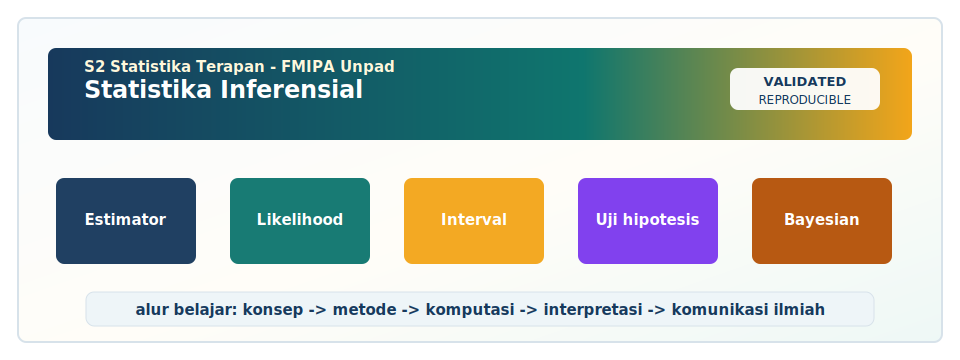

<!-- BEGIN UNPAD MATERIAL STYLE -->
<style>
:root {
  --unpad-navy: #17395c;
  --unpad-gold: #f2a51a;
  --unpad-teal: #0f766e;
  --unpad-ink: #172033;
  --unpad-paper: #fffdf8;
  --unpad-soft: #eef5f8;
  --unpad-line: #d7e2ea;
}
html, body {
  background: linear-gradient(135deg, #f8fbfd 0%, #fffdf8 48%, #f3f6ee 100%) !important;
  color: var(--unpad-ink) !important;
}
body {
  font-family: "Segoe UI", Arial, sans-serif !important;
  line-height: 1.72 !important;
}
.main-container {
  max-width: 1180px !important;
  background: rgba(255, 253, 248, 0.98) !important;
  border: 1px solid var(--unpad-line) !important;
  border-radius: 8px !important;
  box-shadow: 0 18px 42px rgba(23, 57, 92, 0.12) !important;
}
h1, h2, h3, h4 {
  letter-spacing: 0 !important;
}
h1.title {
  color: var(--unpad-navy) !important;
  -webkit-text-fill-color: var(--unpad-navy) !important;
  background: none !important;
}
h2 {
  border-left-color: var(--unpad-gold) !important;
}
a {
  color: #0b5c86 !important;
}
pre, code {
  border-radius: 8px !important;
}
.unpad-cover {
  margin: 18px 0 26px;
  padding: 24px;
  border-radius: 8px;
  background: linear-gradient(135deg, #17395c 0%, #0f766e 58%, #f2a51a 100%);
  color: #ffffff;
  box-shadow: 0 18px 36px rgba(23, 57, 92, 0.22);
}
.unpad-cover__brand {
  display: grid;
  grid-template-columns: 92px 1fr;
  gap: 20px;
  align-items: center;
}
.unpad-cover img {
  width: 92px;
  height: 92px;
  object-fit: contain;
  background: #ffffff;
  border-radius: 8px;
  padding: 8px;
  box-shadow: 0 8px 22px rgba(0,0,0,0.18);
}
.unpad-kicker {
  text-transform: uppercase;
  font-size: 0.82rem;
  font-weight: 800;
  letter-spacing: 0;
  color: #fff8dc;
}
.unpad-cover h2 {
  margin: 6px 0 8px;
  padding: 0;
  border: 0;
  background: transparent;
  color: #ffffff !important;
  font-size: 1.65rem;
}
.unpad-meta {
  margin: 0;
  color: #f7fbff;
  font-weight: 600;
}
.materi-illustration {
  margin: 20px 0 24px;
  padding: 14px;
  background: #ffffff;
  border: 1px solid var(--unpad-line);
  border-radius: 8px;
  box-shadow: 0 12px 28px rgba(23, 57, 92, 0.10);
}
.materi-illustration img {
  width: 100%;
  height: auto;
  display: block;
  border-radius: 6px;
}
.validasi-akademik {
  margin: 18px 0 28px;
  padding: 16px 18px;
  background: linear-gradient(135deg, #eef8f6, #fff8e7);
  border-left: 8px solid var(--unpad-teal);
  border-radius: 8px;
  color: var(--unpad-ink);
}
.validasi-akademik strong {
  color: var(--unpad-navy);
}
table {
  border-radius: 8px !important;
}
@media (max-width: 760px) {
  .unpad-cover__brand {
    grid-template-columns: 1fr;
  }
  .unpad-cover img {
    width: 76px;
    height: 76px;
  }
}
</style>
<!-- END UNPAD MATERIAL STYLE -->


<!-- BEGIN UNPAD MATERIAL ENHANCEMENT -->

```{r setup-unpad-render, include=FALSE}
execute_code <- FALSE
knitr::opts_chunk$set(
  echo = TRUE,
  eval = FALSE,
  message = FALSE,
  warning = FALSE,
  fig.align = "center",
  fig.width = 8,
  fig.height = 4.8,
  dpi = 120
)
set.seed(2025)
```


<div class="unpad-cover">
<div class="unpad-cover__brand">

<div>
<div class="unpad-kicker">S2 Statistika Terapan | FMIPA Universitas Padjadjaran</div>
<h2>Statistika Inferensial</h2>
<p class="unpad-meta">Materi Pembelajaran S2 Statistika Terapan FMIPA Universitas Padjadjaran<br>Penulis: Yudhie Andriyana, M.Sc., Ph.D. | Januari 2025</p>
</div>
</div>
</div>

<div class="materi-illustration">

</div>

<div class="validasi-akademik">
<strong>Catatan validasi akademik.</strong> Materi ini diseragamkan dengan rujukan ADWTL Januari 2025: rumus dibaca bersama asumsi, contoh kode diposisikan sebagai template reproducible, dan interpretasi diarahkan pada validitas data, diagnosis model, evaluasi ketidakpastian, serta komunikasi hasil secara ilmiah.
</div>

<!-- END UNPAD MATERIAL ENHANCEMENT -->

<style>
:root{
  --brown-900:#3a2414; --brown-800:#5a351b; --brown-700:#7a4a24;
  --brown-600:#9c6434; --brown-500:#b77b42; --brown-300:#e9cfae;
  --brown-200:#f4dfc4; --brown-100:#fff3e3; --cream:#fffaf1;
  --ink:#1d120b; --gold:#d6a14a; --green:#6d7d46;
}
html, body { scroll-behavior:smooth; }
body{
  font-family:-apple-system,BlinkMacSystemFont,"Segoe UI",Roboto,"Helvetica Neue",Arial,"Noto Sans",sans-serif;
  color:var(--ink);
  background:linear-gradient(135deg,#fff9ed 0%, #f4dfc4 32%, #e5bd88 62%, #9c6434 100%);
  background-attachment:fixed;
  line-height:1.68;
  font-size:16px;
}
body::before{
  content:""; position:fixed; inset:0; pointer-events:none;
  background:radial-gradient(circle at 85% 8%, rgba(255,255,255,.62), transparent 28%),
             radial-gradient(circle at 8% 92%, rgba(72,41,20,.12), transparent 35%);
  z-index:-1;
}
#TOC{
  position:fixed; top:18px; left:18px; bottom:18px; width:310px; overflow:auto;
  padding:22px 20px; border-radius:28px;
  background:rgba(255,250,241,.95); border:1px solid rgba(122,74,36,.28);
  box-shadow:0 18px 45px rgba(58,36,20,.25); backdrop-filter:blur(8px);
}
#TOC::before{
  content:"Daftar Isi"; display:block; font-weight:900; font-size:1.25rem; color:var(--brown-900);
  margin-bottom:10px; padding-bottom:10px; border-bottom:2px solid var(--brown-300);
}
#TOC ul{ list-style:none; padding-left:0; }
#TOC ul ul{ padding-left:14px; border-left:2px solid var(--brown-200); }
#TOC a{ color:var(--brown-800); text-decoration:none; font-weight:650; }
#TOC a:hover{ color:#111; text-decoration:underline; }
body > .container-fluid, body > .main-container, body > div:not(#TOC){
  max-width:1040px; margin-left:365px; margin-right:38px;
}
.main-container{ background:rgba(255,250,241,.96); border-radius:34px; padding:36px 46px; box-shadow:0 24px 70px rgba(58,36,20,.28); }
h1,h2,h3,h4{ color:var(--brown-900); line-height:1.22; font-weight:850; }
h1{ font-size:2.2rem; border-bottom:4px solid var(--brown-300); padding-bottom:14px; margin-top:2.5rem; }
h2{ font-size:1.75rem; margin-top:2.2rem; background:linear-gradient(90deg,#7a4a24,#d6a14a); -webkit-background-clip:text; background-clip:text; color:transparent; }
h3{ font-size:1.33rem; margin-top:1.8rem; }
h4{ font-size:1.08rem; margin-top:1.5rem; }
a{ color:#7a4a24; }
table{ width:100%; border-collapse:collapse; margin:1rem 0 1.5rem; font-size:.94rem; }
th{ background:linear-gradient(90deg,#5a351b,#9c6434); color:white; padding:10px; }
td{ background:#fffaf1; border:1px solid #e5c89f; padding:9px; vertical-align:top; }
blockquote{ border-left:6px solid var(--brown-500); background:#fff5e8; padding:14px 20px; border-radius:0 18px 18px 0; }
pre, code{ color:#111 !important; }
pre{
  background:#f4dfc4 !important; border:1px solid #c99d68; border-radius:18px; padding:18px;
  box-shadow:inset 0 0 0 1px rgba(255,255,255,.45); overflow:auto;
}
code{ background:#f7e8d5; border-radius:6px; padding:2px 5px; }
.mathbox, .formula-box{
  background:linear-gradient(135deg,#fff3e3,#f4dfc4); color:#111; border:2px solid #d8b27c;
  border-radius:22px; padding:18px 20px; margin:18px 0; box-shadow:0 10px 28px rgba(90,53,27,.15);
}
.note, .casebox, .examplebox, .rpsbox, .warningbox, .activitybox{
  border-radius:24px; padding:18px 20px; margin:18px 0; border:1px solid rgba(122,74,36,.28);
  box-shadow:0 12px 32px rgba(58,36,20,.14);
}
.note{ background:#fffaf1; }
.casebox{ background:linear-gradient(135deg,#fff7ec,#ecd2b0); }
.examplebox{ background:linear-gradient(135deg,#fff2df,#f6d8af); }
.rpsbox{ background:linear-gradient(135deg,#f7e0c2,#fff9ed); border-left:9px solid var(--brown-700); }
.warningbox{ background:linear-gradient(135deg,#fff4e4,#ead7b9); border-left:9px solid #9c6434; }
.activitybox{ background:linear-gradient(135deg,#fffaf1,#f1d9b8); border-left:9px solid #6d7d46; }
.hero{
  background:linear-gradient(135deg,#3a2414 0%,#7a4a24 45%,#d6a14a 100%); color:white;
  border-radius:34px; padding:38px; box-shadow:0 22px 62px rgba(58,36,20,.35); margin-bottom:28px;
}
.hero h1{ color:white; border-bottom:1px solid rgba(255,255,255,.35); margin-top:0; }
.hero .badge{ display:inline-block; background:rgba(255,255,255,.16); border:1px solid rgba(255,255,255,.32); padding:8px 12px; border-radius:999px; margin:4px 6px 4px 0; font-weight:700; }
.grid-2{ display:grid; grid-template-columns:1fr 1fr; gap:18px; }
.grid-3{ display:grid; grid-template-columns:repeat(3,1fr); gap:18px; }
.card{ background:#fffaf1; border:1px solid #e6c79c; border-radius:24px; padding:20px; box-shadow:0 10px 26px rgba(58,36,20,.12); }
.small{ font-size:.92rem; }
.center{ text-align:center; }
.caption{ font-size:.9rem; color:#5a351b; text-align:center; margin-top:-8px; }
svg{ max-width:100%; height:auto; }
@media(max-width:980px){
  #TOC{ position:relative; width:auto; top:auto; left:auto; bottom:auto; margin:12px; }
  body > .container-fluid, body > .main-container, body > div:not(#TOC){ margin-left:12px; margin-right:12px; }
  .main-container{ padding:24px; }
  .grid-2,.grid-3{ grid-template-columns:1fr; }
}
</style>


```{r setup, include=FALSE, eval=FALSE}
knitr::opts_chunk$set(
  echo = TRUE,
  message = FALSE,
  warning = FALSE,
  fig.align = "center",
  fig.width = 8,
  fig.height = 5
)
```


<div class="hero">

# Statistika Inferensial

**Materi Pembelajaran Komprehensif untuk S2 Statistika Terapan FMIPA Universitas Padjadjaran**  
**Dosen Pengampu/Penulis RPS:** Yudhie Andriyana, M.Sc., Ph.D.  
**Tahun Pembuatan:** Januari 2025  
**Kode Mata Kuliah:** D20B.101 | **Bobot:** 3 SKS | **Semester:** 1

<span class="badge">Inferensi Statistik</span>
<span class="badge">Penaksiran Parameter</span>
<span class="badge">Pengujian Hipotesis</span>
<span class="badge">Likelihood</span>
<span class="badge">Bayesian</span>
<span class="badge">Komputasi Statistik</span>

</div>

<div class="rpsbox">

**Orientasi modul.** Modul ini disusun sebagai bahan ajar panjang untuk mata kuliah **Statistika Inferensial** pada **Program Studi S2 Statistika Terapan, FMIPA Universitas Padjadjaran**. Struktur materi mengikuti RPS mata kuliah: evaluasi penaksiran, optimalisasi penaksiran, desain pengumpulan data, metode penaksiran, interval kepercayaan, pengujian hipotesis sederhana dan komposit, model lanjut, pendekatan likelihood dan Bayesian, evaluasi robustness dan efisiensi estimator, pengujian lanjut, serta aplikasi komputasi dalam inferensi statistik. Referensi utama mengacu pada Casella & Berger (2002), Hogg & Craig (1978), Ismay, Kim, & Valdivia (2024), Blais (2022), Efron & Hastie (2021), dan Mendenhall dkk. (1989).

</div>


<div class="center">
<svg viewBox="0 0 980 260" role="img" aria-label="Alur Inferensi Statistik">
  <defs>
    <linearGradient id="g1" x1="0" x2="1">
      <stop offset="0" stop-color="#5a351b"/><stop offset="1" stop-color="#d6a14a"/>
    </linearGradient>
    <filter id="shadow" x="-20%" y="-20%" width="140%" height="140%">
      <feDropShadow dx="0" dy="8" stdDeviation="8" flood-color="#3a2414" flood-opacity="0.25"/>
    </filter>
  </defs>
  <rect x="20" y="35" width="160" height="82" rx="22" fill="#fff3e3" stroke="#9c6434" filter="url(#shadow)"/>
  <text x="100" y="70" text-anchor="middle" font-weight="700" fill="#3a2414">Populasi</text>
  <text x="100" y="94" text-anchor="middle" fill="#5a351b" font-size="13">parameter θ</text>
  <path d="M180 76 C220 76, 220 76, 260 76" stroke="url(#g1)" stroke-width="7" fill="none" marker-end="url(#arrow)"/>
  <rect x="260" y="35" width="160" height="82" rx="22" fill="#fff3e3" stroke="#9c6434" filter="url(#shadow)"/>
  <text x="340" y="70" text-anchor="middle" font-weight="700" fill="#3a2414">Sampel</text>
  <text x="340" y="94" text-anchor="middle" fill="#5a351b" font-size="13">X₁,...,Xₙ</text>
  <path d="M420 76 C460 76, 460 76, 500 76" stroke="url(#g1)" stroke-width="7" fill="none"/>
  <rect x="500" y="35" width="180" height="82" rx="22" fill="#fff3e3" stroke="#9c6434" filter="url(#shadow)"/>
  <text x="590" y="70" text-anchor="middle" font-weight="700" fill="#3a2414">Estimator</text>
  <text x="590" y="94" text-anchor="middle" fill="#5a351b" font-size="13">bias, var, MSE</text>
  <path d="M680 76 C720 76, 720 76, 760 76" stroke="url(#g1)" stroke-width="7" fill="none"/>
  <rect x="760" y="35" width="190" height="82" rx="22" fill="#fff3e3" stroke="#9c6434" filter="url(#shadow)"/>
  <text x="855" y="70" text-anchor="middle" font-weight="700" fill="#3a2414">Keputusan</text>
  <text x="855" y="94" text-anchor="middle" fill="#5a351b" font-size="13">interval, uji, prediksi</text>
  <rect x="135" y="160" width="710" height="60" rx="24" fill="url(#g1)" opacity="0.95"/>
  <text x="490" y="194" text-anchor="middle" fill="white" font-weight="700">Validitas inferensi bergantung pada desain data, model, asumsi, dan komunikasi ketidakpastian</text>
</svg>
<p class="caption">Gambar 1. Alur konseptual inferensi statistik dari populasi menuju keputusan.</p>
</div>


# Peta Mata Kuliah Berdasarkan RPS

<div class="grid-2">
<div class="card">

**Capaian Pembelajaran Mata Kuliah (CPMK)**

1. Mampu menganalisis dan mengembangkan konsep dasar statistika inferensial.  
2. Mampu memilih metode pengumpulan data yang tepat untuk inferensi statistik.  
3. Mampu mengelola dan menganalisis data untuk permasalahan nyata.  
4. Mampu berpikir kritis dan inovatif serta mempresentasikan hasil inferensi statistik.

</div>
<div class="card">

**SubCPMK Utama**

1. Evaluasi dan optimalisasi penaksiran.  
2. Evaluasi desain pengumpulan data terhadap validitas inferensi.  
3. Implementasi metode penaksiran dan pengujian pada model lanjut.  
4. Perancangan dan komunikasi hasil analisis inferensial berbasis komputasi.

</div>
</div>

| Minggu/Pertemuan | Fokus RPS | Keluaran Pembelajaran |
|---:|---|---|
| 1--2 | Evaluasi dan optimalisasi penaksiran | Mahasiswa mampu menilai bias, variansi, MSE, konsistensi, efisiensi, dan robustness estimator. |
| 3 | Pengaruh desain pengumpulan data | Mahasiswa mampu mengevaluasi dampak sampling, eksperimen, nonresponse, dan kualitas data terhadap inferensi. |
| 4--7 | Metode penaksiran, interval, pengujian hipotesis | Mahasiswa mampu menerapkan MoM, MLE, interval kepercayaan, serta uji sederhana dan komposit. |
| 8 | UTS | Evaluasi tengah semester. |
| 9--10 | Penaksiran dan pengujian pada model lanjut | Mahasiswa mampu menganalisis model regresi, GLM, model nonparametrik, dan model data kompleks. |
| 11--15 | Likelihood, Bayesian, robustness, pengujian lanjut, komputasi | Mahasiswa mampu merancang analisis inferensial berbasis komputasi dan mengomunikasikan hasilnya. |
| 16 | UAS | Evaluasi akhir dan presentasi proyek. |

<div class="note">

**Catatan untuk mahasiswa.** Modul ini sengaja dibuat sebagai bahan belajar mandiri yang panjang. Cara terbaik memakainya bukan dibaca sekali duduk seperti novel detektif, karena statistik jarang memberi plot twist semudah itu 😄. Bacalah bertahap: pahami konsep, ulangi rumus, jalankan kode, lalu tuliskan interpretasi dalam bahasa substantif.

</div>

# Bab 1. Fondasi Statistika Inferensial

<div class="rpsbox">

**Keterkaitan dengan RPS**  
Konsep dasar statistika inferensial dan hubungan antara populasi, sampel, parameter, statistik, serta ketidakpastian.

</div>

Bab ini mengembangkan materi **Fondasi Statistika Inferensial** sebagai bagian dari pembelajaran
Statistika Inferensial pada S2 Statistika Terapan. Fokus utama bab ini adalah membangun cara
berpikir inferensial yang matang: mulai dari pemahaman parameter, model peluang, estimator,
distribusi sampling, sampai pada keputusan yang dapat dijelaskan secara ilmiah. Dalam tradisi
inferensi statistik, prosedur yang baik tidak hanya menghasilkan angka, tetapi juga memberikan
alasan mengapa angka tersebut layak dipercaya [@casella2002; @hogg1978; @wasserman2004].

Sebagai pengantar, gunakan kasus survei kepuasan mahasiswa S2 Statistika Terapan terhadap layanan
akademik sebagai benang merah. Kasus ini membantu mengubah simbol matematis menjadi pertanyaan
nyata: apa parameter yang ingin diketahui, data apa yang tersedia, bagaimana data dikumpulkan, model
apa yang masuk akal, dan bagaimana ketidakpastian dilaporkan. Pendekatan ini sesuai dengan orientasi
terapan program studi, karena mahasiswa diharapkan mampu membawa teori inferensial ke permasalahan
bisnis, sosial, aktuaria, biostatistik, industri, dan sains data.

## 1.1 Populasi, sampel, parameter, dan statistik

Topik **Populasi, sampel, parameter, dan statistik** dalam bab **Fondasi Statistika Inferensial**
harus dibaca sebagai bagian dari rantai inferensi yang lebih luas. Pada kasus survei kepuasan
mahasiswa S2 Statistika Terapan terhadap layanan akademik, analis tidak hanya ingin memperoleh satu
angka ringkasan, tetapi juga ingin mengetahui apakah angka itu stabil, dapat dipertanggungjawabkan,
dan relevan untuk keputusan. Literatur inferensi klasik menekankan bahwa kualitas metode bergantung
pada distribusi sampling, asumsi model, dan tujuan keputusan [@casella2002; @hogg1978;
@wasserman2004]. Oleh sebab itu, pembahasan topik ini selalu menghubungkan definisi matematis dengan
interpretasi praktis.

Secara konseptual, populasi, sampel, parameter, dan statistik membantu mahasiswa melihat bahwa
estimator atau prosedur uji adalah fungsi dari data. Ketika data berubah karena sampel berbeda,
hasil analisis juga berubah. Perubahan inilah yang dinyatakan sebagai ketidakpastian statistik.
Dalam laporan akademik, ketidakpastian sebaiknya tidak disembunyikan di balik simbol teknis, tetapi
diterjemahkan menjadi narasi yang menjelaskan rentang nilai yang masuk akal, tingkat risiko salah
keputusan, serta konsekuensi praktis bagi bidang aplikasi.

Dari sisi komputasi, populasi, sampel, parameter, dan statistik dapat dipelajari melalui simulasi
berulang. Mahasiswa dapat membangkitkan data dengan parameter yang diketahui, menerapkan estimator
atau uji, lalu mengevaluasi seberapa sering metode tersebut menghasilkan kesimpulan yang benar.
Strategi ini sangat berguna untuk memahami coverage interval, power uji, bias estimator, dan
robustnes terhadap pelanggaran asumsi. Dengan kata lain, simulasi membuat teori tidak hanya terlihat
di papan tulis, tetapi juga bergerak di layar komputer.

Dalam praktik profesional, populasi, sampel, parameter, dan statistik jarang berdiri sendiri. Ia
terhubung dengan desain data, ukuran sampel, kualitas pengukuran, bentuk distribusi, dan kebutuhan
komunikasi hasil. Ketika mahasiswa menyusun proyek mata kuliah, bagian ini perlu muncul dalam
justifikasi metode: mengapa prosedur tersebut dipilih, apa alternatifnya, bagaimana asumsi
diperiksa, dan bagaimana hasil dilaporkan kepada audiens statistik maupun non-statistik. Justifikasi
semacam ini menunjukkan kematangan inferensial, bukan sekadar keterampilan menjalankan perangkat
lunak.

<div class="mathbox">

$$\hat\theta=T(X_1,\ldots,X_n),\qquad \text{inferensi}=\text{estimasi}+\text{ketidakpastian}+\text{keputusan}.$$

</div>
```{r simulasi-11, eval=FALSE, message=FALSE, warning=FALSE}
set.seed(2025)
R <- 2000
n <- 40
theta <- 10
est <- replicate(R, mean(rnorm(n, mean = theta, sd = 3)))
c(rata_rata_estimator = mean(est), bias = mean(est) - theta, var = var(est))
hist(est, main = "Sampling Distribution Estimator", xlab = expression(hat(theta)))
```


### Intuisi, asumsi, dan jebakan umum

Intuisi utama pada populasi, sampel, parameter, dan statistik adalah bahwa metode statistik harus
dinilai berdasarkan perilakunya dalam pengulangan sampling, bukan hanya berdasarkan satu output
software. Asumsi seperti independensi, distribusi error, ukuran sampel cukup besar, atau bentuk link
function sering masuk secara diam-diam. Jebakan yang sering muncul adalah menganggap hasil yang rapi
berarti model benar. Padahal tabel koefisien yang rapi tetap dapat menyesatkan apabila desain data
bias, outlier dominan, atau parameter tidak teridentifikasi dengan baik.


Untuk menghindari jebakan tersebut, mahasiswa perlu membuat daftar pemeriksaan sederhana:
definisikan parameter, jelaskan estimator, periksa asumsi, laporkan ukuran ketidakpastian,
bandingkan metode alternatif, lalu berikan interpretasi substantif. Pola ini konsisten dengan
pembelajaran tingkat magister, karena kemampuan yang dinilai bukan hanya menghitung, melainkan
mengevaluasi dan mengomunikasikan proses inferensi. Dalam tugas kelas, bagian ini dapat ditulis
sebagai paragraf metodologis sebelum masuk ke hasil numerik.


<div class="activitybox">

**Aktivitas kelas**  
Ambil satu data kecil yang relevan dengan survei kepuasan mahasiswa S2 Statistika Terapan terhadap layanan akademik. Tentukan parameter yang ingin diestimasi, pilih satu estimator, lalu jelaskan apakah estimator tersebut mungkin bias, efisien, konsisten, atau robust. Diskusikan juga bagaimana kesimpulan dapat berubah apabila desain pengumpulan datanya berbeda.

</div>


## 1.2 Model peluang sebagai bahasa ketidakpastian

Topik **Model peluang sebagai bahasa ketidakpastian** dalam bab **Fondasi Statistika Inferensial**
harus dibaca sebagai bagian dari rantai inferensi yang lebih luas. Pada kasus survei kepuasan
mahasiswa S2 Statistika Terapan terhadap layanan akademik, analis tidak hanya ingin memperoleh satu
angka ringkasan, tetapi juga ingin mengetahui apakah angka itu stabil, dapat dipertanggungjawabkan,
dan relevan untuk keputusan. Literatur inferensi klasik menekankan bahwa kualitas metode bergantung
pada distribusi sampling, asumsi model, dan tujuan keputusan [@casella2002; @hogg1978;
@wasserman2004]. Oleh sebab itu, pembahasan topik ini selalu menghubungkan definisi matematis dengan
interpretasi praktis.

Secara konseptual, model peluang sebagai bahasa ketidakpastian membantu mahasiswa melihat bahwa
estimator atau prosedur uji adalah fungsi dari data. Ketika data berubah karena sampel berbeda,
hasil analisis juga berubah. Perubahan inilah yang dinyatakan sebagai ketidakpastian statistik.
Dalam laporan akademik, ketidakpastian sebaiknya tidak disembunyikan di balik simbol teknis, tetapi
diterjemahkan menjadi narasi yang menjelaskan rentang nilai yang masuk akal, tingkat risiko salah
keputusan, serta konsekuensi praktis bagi bidang aplikasi.

Dari sisi komputasi, model peluang sebagai bahasa ketidakpastian dapat dipelajari melalui simulasi
berulang. Mahasiswa dapat membangkitkan data dengan parameter yang diketahui, menerapkan estimator
atau uji, lalu mengevaluasi seberapa sering metode tersebut menghasilkan kesimpulan yang benar.
Strategi ini sangat berguna untuk memahami coverage interval, power uji, bias estimator, dan
robustnes terhadap pelanggaran asumsi. Dengan kata lain, simulasi membuat teori tidak hanya terlihat
di papan tulis, tetapi juga bergerak di layar komputer.

Dalam praktik profesional, model peluang sebagai bahasa ketidakpastian jarang berdiri sendiri. Ia
terhubung dengan desain data, ukuran sampel, kualitas pengukuran, bentuk distribusi, dan kebutuhan
komunikasi hasil. Ketika mahasiswa menyusun proyek mata kuliah, bagian ini perlu muncul dalam
justifikasi metode: mengapa prosedur tersebut dipilih, apa alternatifnya, bagaimana asumsi
diperiksa, dan bagaimana hasil dilaporkan kepada audiens statistik maupun non-statistik. Justifikasi
semacam ini menunjukkan kematangan inferensial, bukan sekadar keterampilan menjalankan perangkat
lunak.

<div class="mathbox">

$$\hat\theta=T(X_1,\ldots,X_n),\qquad \text{inferensi}=\text{estimasi}+\text{ketidakpastian}+\text{keputusan}.$$

</div>
```{r simulasi-12, eval=FALSE, message=FALSE, warning=FALSE}
set.seed(2025)
R <- 2000
n <- 40
theta <- 10
est <- replicate(R, mean(rnorm(n, mean = theta, sd = 3)))
c(rata_rata_estimator = mean(est), bias = mean(est) - theta, var = var(est))
hist(est, main = "Sampling Distribution Estimator", xlab = expression(hat(theta)))
```


### Intuisi, asumsi, dan jebakan umum

Intuisi utama pada model peluang sebagai bahasa ketidakpastian adalah bahwa metode statistik harus
dinilai berdasarkan perilakunya dalam pengulangan sampling, bukan hanya berdasarkan satu output
software. Asumsi seperti independensi, distribusi error, ukuran sampel cukup besar, atau bentuk link
function sering masuk secara diam-diam. Jebakan yang sering muncul adalah menganggap hasil yang rapi
berarti model benar. Padahal tabel koefisien yang rapi tetap dapat menyesatkan apabila desain data
bias, outlier dominan, atau parameter tidak teridentifikasi dengan baik.


Untuk menghindari jebakan tersebut, mahasiswa perlu membuat daftar pemeriksaan sederhana:
definisikan parameter, jelaskan estimator, periksa asumsi, laporkan ukuran ketidakpastian,
bandingkan metode alternatif, lalu berikan interpretasi substantif. Pola ini konsisten dengan
pembelajaran tingkat magister, karena kemampuan yang dinilai bukan hanya menghitung, melainkan
mengevaluasi dan mengomunikasikan proses inferensi. Dalam tugas kelas, bagian ini dapat ditulis
sebagai paragraf metodologis sebelum masuk ke hasil numerik.


<div class="activitybox">

**Aktivitas kelas**  
Ambil satu data kecil yang relevan dengan survei kepuasan mahasiswa S2 Statistika Terapan terhadap layanan akademik. Tentukan parameter yang ingin diestimasi, pilih satu estimator, lalu jelaskan apakah estimator tersebut mungkin bias, efisien, konsisten, atau robust. Diskusikan juga bagaimana kesimpulan dapat berubah apabila desain pengumpulan datanya berbeda.

</div>


## 1.3 Sampling distribution dan standard error

Topik **Sampling distribution dan standard error** dalam bab **Fondasi Statistika Inferensial**
harus dibaca sebagai bagian dari rantai inferensi yang lebih luas. Pada kasus survei kepuasan
mahasiswa S2 Statistika Terapan terhadap layanan akademik, analis tidak hanya ingin memperoleh satu
angka ringkasan, tetapi juga ingin mengetahui apakah angka itu stabil, dapat dipertanggungjawabkan,
dan relevan untuk keputusan. Literatur inferensi klasik menekankan bahwa kualitas metode bergantung
pada distribusi sampling, asumsi model, dan tujuan keputusan [@casella2002; @hogg1978;
@wasserman2004]. Oleh sebab itu, pembahasan topik ini selalu menghubungkan definisi matematis dengan
interpretasi praktis.

Secara konseptual, sampling distribution dan standard error membantu mahasiswa melihat bahwa
estimator atau prosedur uji adalah fungsi dari data. Ketika data berubah karena sampel berbeda,
hasil analisis juga berubah. Perubahan inilah yang dinyatakan sebagai ketidakpastian statistik.
Dalam laporan akademik, ketidakpastian sebaiknya tidak disembunyikan di balik simbol teknis, tetapi
diterjemahkan menjadi narasi yang menjelaskan rentang nilai yang masuk akal, tingkat risiko salah
keputusan, serta konsekuensi praktis bagi bidang aplikasi.

Dari sisi komputasi, sampling distribution dan standard error dapat dipelajari melalui simulasi
berulang. Mahasiswa dapat membangkitkan data dengan parameter yang diketahui, menerapkan estimator
atau uji, lalu mengevaluasi seberapa sering metode tersebut menghasilkan kesimpulan yang benar.
Strategi ini sangat berguna untuk memahami coverage interval, power uji, bias estimator, dan
robustnes terhadap pelanggaran asumsi. Dengan kata lain, simulasi membuat teori tidak hanya terlihat
di papan tulis, tetapi juga bergerak di layar komputer.

Dalam praktik profesional, sampling distribution dan standard error jarang berdiri sendiri. Ia
terhubung dengan desain data, ukuran sampel, kualitas pengukuran, bentuk distribusi, dan kebutuhan
komunikasi hasil. Ketika mahasiswa menyusun proyek mata kuliah, bagian ini perlu muncul dalam
justifikasi metode: mengapa prosedur tersebut dipilih, apa alternatifnya, bagaimana asumsi
diperiksa, dan bagaimana hasil dilaporkan kepada audiens statistik maupun non-statistik. Justifikasi
semacam ini menunjukkan kematangan inferensial, bukan sekadar keterampilan menjalankan perangkat
lunak.

<div class="mathbox">

$$\bar y_{st}=\sum_{h=1}^{H} W_h\bar y_h,\qquad \operatorname{Var}(\bar y_{st})=\sum_{h=1}^{H} W_h^2\frac{S_h^2}{n_h}\left(1-\frac{n_h}{N_h}\right).$$

</div>
```{r sampling-13, eval=FALSE, message=FALSE, warning=FALSE}
set.seed(2025)
pop <- data.frame(
  strata = rep(c("A", "B", "C"), times = c(500, 300, 200)),
  y = c(rnorm(500, 70, 6), rnorm(300, 80, 8), rnorm(200, 90, 10))
)
samp <- do.call(rbind, lapply(split(pop, pop$strata), function(d) d[sample(nrow(d), 30), ]))
aggregate(y ~ strata, data = samp, mean)
```


### Intuisi, asumsi, dan jebakan umum

Intuisi utama pada sampling distribution dan standard error adalah bahwa metode statistik harus
dinilai berdasarkan perilakunya dalam pengulangan sampling, bukan hanya berdasarkan satu output
software. Asumsi seperti independensi, distribusi error, ukuran sampel cukup besar, atau bentuk link
function sering masuk secara diam-diam. Jebakan yang sering muncul adalah menganggap hasil yang rapi
berarti model benar. Padahal tabel koefisien yang rapi tetap dapat menyesatkan apabila desain data
bias, outlier dominan, atau parameter tidak teridentifikasi dengan baik.


Untuk menghindari jebakan tersebut, mahasiswa perlu membuat daftar pemeriksaan sederhana:
definisikan parameter, jelaskan estimator, periksa asumsi, laporkan ukuran ketidakpastian,
bandingkan metode alternatif, lalu berikan interpretasi substantif. Pola ini konsisten dengan
pembelajaran tingkat magister, karena kemampuan yang dinilai bukan hanya menghitung, melainkan
mengevaluasi dan mengomunikasikan proses inferensi. Dalam tugas kelas, bagian ini dapat ditulis
sebagai paragraf metodologis sebelum masuk ke hasil numerik.


<div class="activitybox">

**Aktivitas kelas**  
Ambil satu data kecil yang relevan dengan survei kepuasan mahasiswa S2 Statistika Terapan terhadap layanan akademik. Tentukan parameter yang ingin diestimasi, pilih satu estimator, lalu jelaskan apakah estimator tersebut mungkin bias, efisien, konsisten, atau robust. Diskusikan juga bagaimana kesimpulan dapat berubah apabila desain pengumpulan datanya berbeda.

</div>


## 1.4 Prinsip plug-in dan estimasi awal

Topik **Prinsip plug-in dan estimasi awal** dalam bab **Fondasi Statistika Inferensial** harus
dibaca sebagai bagian dari rantai inferensi yang lebih luas. Pada kasus survei kepuasan mahasiswa S2
Statistika Terapan terhadap layanan akademik, analis tidak hanya ingin memperoleh satu angka
ringkasan, tetapi juga ingin mengetahui apakah angka itu stabil, dapat dipertanggungjawabkan, dan
relevan untuk keputusan. Literatur inferensi klasik menekankan bahwa kualitas metode bergantung pada
distribusi sampling, asumsi model, dan tujuan keputusan [@casella2002; @hogg1978; @wasserman2004].
Oleh sebab itu, pembahasan topik ini selalu menghubungkan definisi matematis dengan interpretasi
praktis.

Secara konseptual, prinsip plug-in dan estimasi awal membantu mahasiswa melihat bahwa estimator atau
prosedur uji adalah fungsi dari data. Ketika data berubah karena sampel berbeda, hasil analisis juga
berubah. Perubahan inilah yang dinyatakan sebagai ketidakpastian statistik. Dalam laporan akademik,
ketidakpastian sebaiknya tidak disembunyikan di balik simbol teknis, tetapi diterjemahkan menjadi
narasi yang menjelaskan rentang nilai yang masuk akal, tingkat risiko salah keputusan, serta
konsekuensi praktis bagi bidang aplikasi.

Dari sisi komputasi, prinsip plug-in dan estimasi awal dapat dipelajari melalui simulasi berulang.
Mahasiswa dapat membangkitkan data dengan parameter yang diketahui, menerapkan estimator atau uji,
lalu mengevaluasi seberapa sering metode tersebut menghasilkan kesimpulan yang benar. Strategi ini
sangat berguna untuk memahami coverage interval, power uji, bias estimator, dan robustnes terhadap
pelanggaran asumsi. Dengan kata lain, simulasi membuat teori tidak hanya terlihat di papan tulis,
tetapi juga bergerak di layar komputer.

Dalam praktik profesional, prinsip plug-in dan estimasi awal jarang berdiri sendiri. Ia terhubung
dengan desain data, ukuran sampel, kualitas pengukuran, bentuk distribusi, dan kebutuhan komunikasi
hasil. Ketika mahasiswa menyusun proyek mata kuliah, bagian ini perlu muncul dalam justifikasi
metode: mengapa prosedur tersebut dipilih, apa alternatifnya, bagaimana asumsi diperiksa, dan
bagaimana hasil dilaporkan kepada audiens statistik maupun non-statistik. Justifikasi semacam ini
menunjukkan kematangan inferensial, bukan sekadar keterampilan menjalankan perangkat lunak.

<div class="mathbox">

$$\hat\theta=T(X_1,\ldots,X_n),\qquad \text{inferensi}=\text{estimasi}+\text{ketidakpastian}+\text{keputusan}.$$

</div>
```{r simulasi-14, eval=FALSE, message=FALSE, warning=FALSE}
set.seed(2025)
R <- 2000
n <- 40
theta <- 10
est <- replicate(R, mean(rnorm(n, mean = theta, sd = 3)))
c(rata_rata_estimator = mean(est), bias = mean(est) - theta, var = var(est))
hist(est, main = "Sampling Distribution Estimator", xlab = expression(hat(theta)))
```


### Intuisi, asumsi, dan jebakan umum

Intuisi utama pada prinsip plug-in dan estimasi awal adalah bahwa metode statistik harus dinilai
berdasarkan perilakunya dalam pengulangan sampling, bukan hanya berdasarkan satu output software.
Asumsi seperti independensi, distribusi error, ukuran sampel cukup besar, atau bentuk link function
sering masuk secara diam-diam. Jebakan yang sering muncul adalah menganggap hasil yang rapi berarti
model benar. Padahal tabel koefisien yang rapi tetap dapat menyesatkan apabila desain data bias,
outlier dominan, atau parameter tidak teridentifikasi dengan baik.


Untuk menghindari jebakan tersebut, mahasiswa perlu membuat daftar pemeriksaan sederhana:
definisikan parameter, jelaskan estimator, periksa asumsi, laporkan ukuran ketidakpastian,
bandingkan metode alternatif, lalu berikan interpretasi substantif. Pola ini konsisten dengan
pembelajaran tingkat magister, karena kemampuan yang dinilai bukan hanya menghitung, melainkan
mengevaluasi dan mengomunikasikan proses inferensi. Dalam tugas kelas, bagian ini dapat ditulis
sebagai paragraf metodologis sebelum masuk ke hasil numerik.


<div class="activitybox">

**Aktivitas kelas**  
Ambil satu data kecil yang relevan dengan survei kepuasan mahasiswa S2 Statistika Terapan terhadap layanan akademik. Tentukan parameter yang ingin diestimasi, pilih satu estimator, lalu jelaskan apakah estimator tersebut mungkin bias, efisien, konsisten, atau robust. Diskusikan juga bagaimana kesimpulan dapat berubah apabila desain pengumpulan datanya berbeda.

</div>


## 1.5 Inferensi sebagai proses pengambilan keputusan

Topik **Inferensi sebagai proses pengambilan keputusan** dalam bab **Fondasi Statistika
Inferensial** harus dibaca sebagai bagian dari rantai inferensi yang lebih luas. Pada kasus survei
kepuasan mahasiswa S2 Statistika Terapan terhadap layanan akademik, analis tidak hanya ingin
memperoleh satu angka ringkasan, tetapi juga ingin mengetahui apakah angka itu stabil, dapat
dipertanggungjawabkan, dan relevan untuk keputusan. Literatur inferensi klasik menekankan bahwa
kualitas metode bergantung pada distribusi sampling, asumsi model, dan tujuan keputusan
[@casella2002; @hogg1978; @wasserman2004]. Oleh sebab itu, pembahasan topik ini selalu menghubungkan
definisi matematis dengan interpretasi praktis.

Secara konseptual, inferensi sebagai proses pengambilan keputusan membantu mahasiswa melihat bahwa
estimator atau prosedur uji adalah fungsi dari data. Ketika data berubah karena sampel berbeda,
hasil analisis juga berubah. Perubahan inilah yang dinyatakan sebagai ketidakpastian statistik.
Dalam laporan akademik, ketidakpastian sebaiknya tidak disembunyikan di balik simbol teknis, tetapi
diterjemahkan menjadi narasi yang menjelaskan rentang nilai yang masuk akal, tingkat risiko salah
keputusan, serta konsekuensi praktis bagi bidang aplikasi.

Dari sisi komputasi, inferensi sebagai proses pengambilan keputusan dapat dipelajari melalui
simulasi berulang. Mahasiswa dapat membangkitkan data dengan parameter yang diketahui, menerapkan
estimator atau uji, lalu mengevaluasi seberapa sering metode tersebut menghasilkan kesimpulan yang
benar. Strategi ini sangat berguna untuk memahami coverage interval, power uji, bias estimator, dan
robustnes terhadap pelanggaran asumsi. Dengan kata lain, simulasi membuat teori tidak hanya terlihat
di papan tulis, tetapi juga bergerak di layar komputer.

Dalam praktik profesional, inferensi sebagai proses pengambilan keputusan jarang berdiri sendiri. Ia
terhubung dengan desain data, ukuran sampel, kualitas pengukuran, bentuk distribusi, dan kebutuhan
komunikasi hasil. Ketika mahasiswa menyusun proyek mata kuliah, bagian ini perlu muncul dalam
justifikasi metode: mengapa prosedur tersebut dipilih, apa alternatifnya, bagaimana asumsi
diperiksa, dan bagaimana hasil dilaporkan kepada audiens statistik maupun non-statistik. Justifikasi
semacam ini menunjukkan kematangan inferensial, bukan sekadar keterampilan menjalankan perangkat
lunak.

<div class="mathbox">

$$\hat\theta=T(X_1,\ldots,X_n),\qquad \text{inferensi}=\text{estimasi}+\text{ketidakpastian}+\text{keputusan}.$$

</div>
```{r simulasi-15, eval=FALSE, message=FALSE, warning=FALSE}
set.seed(2025)
R <- 2000
n <- 40
theta <- 10
est <- replicate(R, mean(rnorm(n, mean = theta, sd = 3)))
c(rata_rata_estimator = mean(est), bias = mean(est) - theta, var = var(est))
hist(est, main = "Sampling Distribution Estimator", xlab = expression(hat(theta)))
```


### Intuisi, asumsi, dan jebakan umum

Intuisi utama pada inferensi sebagai proses pengambilan keputusan adalah bahwa metode statistik
harus dinilai berdasarkan perilakunya dalam pengulangan sampling, bukan hanya berdasarkan satu
output software. Asumsi seperti independensi, distribusi error, ukuran sampel cukup besar, atau
bentuk link function sering masuk secara diam-diam. Jebakan yang sering muncul adalah menganggap
hasil yang rapi berarti model benar. Padahal tabel koefisien yang rapi tetap dapat menyesatkan
apabila desain data bias, outlier dominan, atau parameter tidak teridentifikasi dengan baik.


Untuk menghindari jebakan tersebut, mahasiswa perlu membuat daftar pemeriksaan sederhana:
definisikan parameter, jelaskan estimator, periksa asumsi, laporkan ukuran ketidakpastian,
bandingkan metode alternatif, lalu berikan interpretasi substantif. Pola ini konsisten dengan
pembelajaran tingkat magister, karena kemampuan yang dinilai bukan hanya menghitung, melainkan
mengevaluasi dan mengomunikasikan proses inferensi. Dalam tugas kelas, bagian ini dapat ditulis
sebagai paragraf metodologis sebelum masuk ke hasil numerik.


<div class="activitybox">

**Aktivitas kelas**  
Ambil satu data kecil yang relevan dengan survei kepuasan mahasiswa S2 Statistika Terapan terhadap layanan akademik. Tentukan parameter yang ingin diestimasi, pilih satu estimator, lalu jelaskan apakah estimator tersebut mungkin bias, efisien, konsisten, atau robust. Diskusikan juga bagaimana kesimpulan dapat berubah apabila desain pengumpulan datanya berbeda.

</div>


## 1.6 Keterbatasan data dan peran asumsi

Topik **Keterbatasan data dan peran asumsi** dalam bab **Fondasi Statistika Inferensial** harus
dibaca sebagai bagian dari rantai inferensi yang lebih luas. Pada kasus survei kepuasan mahasiswa S2
Statistika Terapan terhadap layanan akademik, analis tidak hanya ingin memperoleh satu angka
ringkasan, tetapi juga ingin mengetahui apakah angka itu stabil, dapat dipertanggungjawabkan, dan
relevan untuk keputusan. Literatur inferensi klasik menekankan bahwa kualitas metode bergantung pada
distribusi sampling, asumsi model, dan tujuan keputusan [@casella2002; @hogg1978; @wasserman2004].
Oleh sebab itu, pembahasan topik ini selalu menghubungkan definisi matematis dengan interpretasi
praktis.

Secara konseptual, keterbatasan data dan peran asumsi membantu mahasiswa melihat bahwa estimator
atau prosedur uji adalah fungsi dari data. Ketika data berubah karena sampel berbeda, hasil analisis
juga berubah. Perubahan inilah yang dinyatakan sebagai ketidakpastian statistik. Dalam laporan
akademik, ketidakpastian sebaiknya tidak disembunyikan di balik simbol teknis, tetapi diterjemahkan
menjadi narasi yang menjelaskan rentang nilai yang masuk akal, tingkat risiko salah keputusan, serta
konsekuensi praktis bagi bidang aplikasi.

Dari sisi komputasi, keterbatasan data dan peran asumsi dapat dipelajari melalui simulasi berulang.
Mahasiswa dapat membangkitkan data dengan parameter yang diketahui, menerapkan estimator atau uji,
lalu mengevaluasi seberapa sering metode tersebut menghasilkan kesimpulan yang benar. Strategi ini
sangat berguna untuk memahami coverage interval, power uji, bias estimator, dan robustnes terhadap
pelanggaran asumsi. Dengan kata lain, simulasi membuat teori tidak hanya terlihat di papan tulis,
tetapi juga bergerak di layar komputer.

Dalam praktik profesional, keterbatasan data dan peran asumsi jarang berdiri sendiri. Ia terhubung
dengan desain data, ukuran sampel, kualitas pengukuran, bentuk distribusi, dan kebutuhan komunikasi
hasil. Ketika mahasiswa menyusun proyek mata kuliah, bagian ini perlu muncul dalam justifikasi
metode: mengapa prosedur tersebut dipilih, apa alternatifnya, bagaimana asumsi diperiksa, dan
bagaimana hasil dilaporkan kepada audiens statistik maupun non-statistik. Justifikasi semacam ini
menunjukkan kematangan inferensial, bukan sekadar keterampilan menjalankan perangkat lunak.

<div class="mathbox">

$$\hat\theta=T(X_1,\ldots,X_n),\qquad \text{inferensi}=\text{estimasi}+\text{ketidakpastian}+\text{keputusan}.$$

</div>
```{r simulasi-16, eval=FALSE, message=FALSE, warning=FALSE}
set.seed(2025)
R <- 2000
n <- 40
theta <- 10
est <- replicate(R, mean(rnorm(n, mean = theta, sd = 3)))
c(rata_rata_estimator = mean(est), bias = mean(est) - theta, var = var(est))
hist(est, main = "Sampling Distribution Estimator", xlab = expression(hat(theta)))
```


### Intuisi, asumsi, dan jebakan umum

Intuisi utama pada keterbatasan data dan peran asumsi adalah bahwa metode statistik harus dinilai
berdasarkan perilakunya dalam pengulangan sampling, bukan hanya berdasarkan satu output software.
Asumsi seperti independensi, distribusi error, ukuran sampel cukup besar, atau bentuk link function
sering masuk secara diam-diam. Jebakan yang sering muncul adalah menganggap hasil yang rapi berarti
model benar. Padahal tabel koefisien yang rapi tetap dapat menyesatkan apabila desain data bias,
outlier dominan, atau parameter tidak teridentifikasi dengan baik.


Untuk menghindari jebakan tersebut, mahasiswa perlu membuat daftar pemeriksaan sederhana:
definisikan parameter, jelaskan estimator, periksa asumsi, laporkan ukuran ketidakpastian,
bandingkan metode alternatif, lalu berikan interpretasi substantif. Pola ini konsisten dengan
pembelajaran tingkat magister, karena kemampuan yang dinilai bukan hanya menghitung, melainkan
mengevaluasi dan mengomunikasikan proses inferensi. Dalam tugas kelas, bagian ini dapat ditulis
sebagai paragraf metodologis sebelum masuk ke hasil numerik.


<div class="activitybox">

**Aktivitas kelas**  
Ambil satu data kecil yang relevan dengan survei kepuasan mahasiswa S2 Statistika Terapan terhadap layanan akademik. Tentukan parameter yang ingin diestimasi, pilih satu estimator, lalu jelaskan apakah estimator tersebut mungkin bias, efisien, konsisten, atau robust. Diskusikan juga bagaimana kesimpulan dapat berubah apabila desain pengumpulan datanya berbeda.

</div>


## 1.7 Ilustrasi simulasi dasar

Topik **Ilustrasi simulasi dasar** dalam bab **Fondasi Statistika Inferensial** harus dibaca sebagai
bagian dari rantai inferensi yang lebih luas. Pada kasus survei kepuasan mahasiswa S2 Statistika
Terapan terhadap layanan akademik, analis tidak hanya ingin memperoleh satu angka ringkasan, tetapi
juga ingin mengetahui apakah angka itu stabil, dapat dipertanggungjawabkan, dan relevan untuk
keputusan. Literatur inferensi klasik menekankan bahwa kualitas metode bergantung pada distribusi
sampling, asumsi model, dan tujuan keputusan [@casella2002; @hogg1978; @wasserman2004]. Oleh sebab
itu, pembahasan topik ini selalu menghubungkan definisi matematis dengan interpretasi praktis.

Secara konseptual, ilustrasi simulasi dasar membantu mahasiswa melihat bahwa estimator atau prosedur
uji adalah fungsi dari data. Ketika data berubah karena sampel berbeda, hasil analisis juga berubah.
Perubahan inilah yang dinyatakan sebagai ketidakpastian statistik. Dalam laporan akademik,
ketidakpastian sebaiknya tidak disembunyikan di balik simbol teknis, tetapi diterjemahkan menjadi
narasi yang menjelaskan rentang nilai yang masuk akal, tingkat risiko salah keputusan, serta
konsekuensi praktis bagi bidang aplikasi.

Dari sisi komputasi, ilustrasi simulasi dasar dapat dipelajari melalui simulasi berulang. Mahasiswa
dapat membangkitkan data dengan parameter yang diketahui, menerapkan estimator atau uji, lalu
mengevaluasi seberapa sering metode tersebut menghasilkan kesimpulan yang benar. Strategi ini sangat
berguna untuk memahami coverage interval, power uji, bias estimator, dan robustnes terhadap
pelanggaran asumsi. Dengan kata lain, simulasi membuat teori tidak hanya terlihat di papan tulis,
tetapi juga bergerak di layar komputer.

Dalam praktik profesional, ilustrasi simulasi dasar jarang berdiri sendiri. Ia terhubung dengan
desain data, ukuran sampel, kualitas pengukuran, bentuk distribusi, dan kebutuhan komunikasi hasil.
Ketika mahasiswa menyusun proyek mata kuliah, bagian ini perlu muncul dalam justifikasi metode:
mengapa prosedur tersebut dipilih, apa alternatifnya, bagaimana asumsi diperiksa, dan bagaimana
hasil dilaporkan kepada audiens statistik maupun non-statistik. Justifikasi semacam ini menunjukkan
kematangan inferensial, bukan sekadar keterampilan menjalankan perangkat lunak.

<div class="mathbox">

$$\hat\theta=T(X_1,\ldots,X_n),\qquad \text{inferensi}=\text{estimasi}+\text{ketidakpastian}+\text{keputusan}.$$

</div>
```{r simulasi-17, eval=FALSE, message=FALSE, warning=FALSE}
set.seed(2025)
R <- 2000
n <- 40
theta <- 10
est <- replicate(R, mean(rnorm(n, mean = theta, sd = 3)))
c(rata_rata_estimator = mean(est), bias = mean(est) - theta, var = var(est))
hist(est, main = "Sampling Distribution Estimator", xlab = expression(hat(theta)))
```


### Intuisi, asumsi, dan jebakan umum

Intuisi utama pada ilustrasi simulasi dasar adalah bahwa metode statistik harus dinilai berdasarkan
perilakunya dalam pengulangan sampling, bukan hanya berdasarkan satu output software. Asumsi seperti
independensi, distribusi error, ukuran sampel cukup besar, atau bentuk link function sering masuk
secara diam-diam. Jebakan yang sering muncul adalah menganggap hasil yang rapi berarti model benar.
Padahal tabel koefisien yang rapi tetap dapat menyesatkan apabila desain data bias, outlier dominan,
atau parameter tidak teridentifikasi dengan baik.


Untuk menghindari jebakan tersebut, mahasiswa perlu membuat daftar pemeriksaan sederhana:
definisikan parameter, jelaskan estimator, periksa asumsi, laporkan ukuran ketidakpastian,
bandingkan metode alternatif, lalu berikan interpretasi substantif. Pola ini konsisten dengan
pembelajaran tingkat magister, karena kemampuan yang dinilai bukan hanya menghitung, melainkan
mengevaluasi dan mengomunikasikan proses inferensi. Dalam tugas kelas, bagian ini dapat ditulis
sebagai paragraf metodologis sebelum masuk ke hasil numerik.


<div class="activitybox">

**Aktivitas kelas**  
Ambil satu data kecil yang relevan dengan survei kepuasan mahasiswa S2 Statistika Terapan terhadap layanan akademik. Tentukan parameter yang ingin diestimasi, pilih satu estimator, lalu jelaskan apakah estimator tersebut mungkin bias, efisien, konsisten, atau robust. Diskusikan juga bagaimana kesimpulan dapat berubah apabila desain pengumpulan datanya berbeda.

</div>


## 1.8 Latihan konseptual

Topik **Latihan konseptual** dalam bab **Fondasi Statistika Inferensial** harus dibaca sebagai
bagian dari rantai inferensi yang lebih luas. Pada kasus survei kepuasan mahasiswa S2 Statistika
Terapan terhadap layanan akademik, analis tidak hanya ingin memperoleh satu angka ringkasan, tetapi
juga ingin mengetahui apakah angka itu stabil, dapat dipertanggungjawabkan, dan relevan untuk
keputusan. Literatur inferensi klasik menekankan bahwa kualitas metode bergantung pada distribusi
sampling, asumsi model, dan tujuan keputusan [@casella2002; @hogg1978; @wasserman2004]. Oleh sebab
itu, pembahasan topik ini selalu menghubungkan definisi matematis dengan interpretasi praktis.

Secara konseptual, latihan konseptual membantu mahasiswa melihat bahwa estimator atau prosedur uji
adalah fungsi dari data. Ketika data berubah karena sampel berbeda, hasil analisis juga berubah.
Perubahan inilah yang dinyatakan sebagai ketidakpastian statistik. Dalam laporan akademik,
ketidakpastian sebaiknya tidak disembunyikan di balik simbol teknis, tetapi diterjemahkan menjadi
narasi yang menjelaskan rentang nilai yang masuk akal, tingkat risiko salah keputusan, serta
konsekuensi praktis bagi bidang aplikasi.

Dari sisi komputasi, latihan konseptual dapat dipelajari melalui simulasi berulang. Mahasiswa dapat
membangkitkan data dengan parameter yang diketahui, menerapkan estimator atau uji, lalu mengevaluasi
seberapa sering metode tersebut menghasilkan kesimpulan yang benar. Strategi ini sangat berguna
untuk memahami coverage interval, power uji, bias estimator, dan robustnes terhadap pelanggaran
asumsi. Dengan kata lain, simulasi membuat teori tidak hanya terlihat di papan tulis, tetapi juga
bergerak di layar komputer.

Dalam praktik profesional, latihan konseptual jarang berdiri sendiri. Ia terhubung dengan desain
data, ukuran sampel, kualitas pengukuran, bentuk distribusi, dan kebutuhan komunikasi hasil. Ketika
mahasiswa menyusun proyek mata kuliah, bagian ini perlu muncul dalam justifikasi metode: mengapa
prosedur tersebut dipilih, apa alternatifnya, bagaimana asumsi diperiksa, dan bagaimana hasil
dilaporkan kepada audiens statistik maupun non-statistik. Justifikasi semacam ini menunjukkan
kematangan inferensial, bukan sekadar keterampilan menjalankan perangkat lunak.

<div class="mathbox">

$$\hat\theta=T(X_1,\ldots,X_n),\qquad \text{inferensi}=\text{estimasi}+\text{ketidakpastian}+\text{keputusan}.$$

</div>
```{r simulasi-18, eval=FALSE, message=FALSE, warning=FALSE}
set.seed(2025)
R <- 2000
n <- 40
theta <- 10
est <- replicate(R, mean(rnorm(n, mean = theta, sd = 3)))
c(rata_rata_estimator = mean(est), bias = mean(est) - theta, var = var(est))
hist(est, main = "Sampling Distribution Estimator", xlab = expression(hat(theta)))
```


### Intuisi, asumsi, dan jebakan umum

Intuisi utama pada latihan konseptual adalah bahwa metode statistik harus dinilai berdasarkan
perilakunya dalam pengulangan sampling, bukan hanya berdasarkan satu output software. Asumsi seperti
independensi, distribusi error, ukuran sampel cukup besar, atau bentuk link function sering masuk
secara diam-diam. Jebakan yang sering muncul adalah menganggap hasil yang rapi berarti model benar.
Padahal tabel koefisien yang rapi tetap dapat menyesatkan apabila desain data bias, outlier dominan,
atau parameter tidak teridentifikasi dengan baik.


Untuk menghindari jebakan tersebut, mahasiswa perlu membuat daftar pemeriksaan sederhana:
definisikan parameter, jelaskan estimator, periksa asumsi, laporkan ukuran ketidakpastian,
bandingkan metode alternatif, lalu berikan interpretasi substantif. Pola ini konsisten dengan
pembelajaran tingkat magister, karena kemampuan yang dinilai bukan hanya menghitung, melainkan
mengevaluasi dan mengomunikasikan proses inferensi. Dalam tugas kelas, bagian ini dapat ditulis
sebagai paragraf metodologis sebelum masuk ke hasil numerik.


<div class="activitybox">

**Aktivitas kelas**  
Ambil satu data kecil yang relevan dengan survei kepuasan mahasiswa S2 Statistika Terapan terhadap layanan akademik. Tentukan parameter yang ingin diestimasi, pilih satu estimator, lalu jelaskan apakah estimator tersebut mungkin bias, efisien, konsisten, atau robust. Diskusikan juga bagaimana kesimpulan dapat berubah apabila desain pengumpulan datanya berbeda.

</div>


## Ringkasan Bab 1

Dalam statistika inferensial, setiap kesimpulan adalah pernyataan probabilistik, bukan klaim mutlak.
Data yang kita lihat hanyalah satu realisasi dari proses pengambilan sampel, sehingga analisis yang
baik harus menjelaskan bagaimana sampel tersebut merepresentasikan populasi. Di tingkat magister,
mahasiswa tidak cukup hanya menghitung nilai estimator atau p-value; mahasiswa harus mampu menilai
sumber ketidakpastian, asumsi model, konsekuensi desain data, dan keterbatasan interpretasi. Dengan
sudut pandang ini, inferensi menjadi jembatan antara teori peluang, pemodelan statistik, komputasi,
dan pengambilan keputusan substantif.


Kekuatan inferensi terletak pada kemampuan memisahkan sinyal dari noise. Sinyal adalah pola
sistematis yang berhubungan dengan parameter atau mekanisme yang ingin dipelajari, sedangkan noise
adalah variasi acak yang muncul karena proses sampling, pengukuran, atau heterogenitas individual.
Estimator, interval, dan uji hipotesis merupakan alat untuk merangkum sinyal sekaligus
mengekspresikan seberapa besar ketidakpastian yang tersisa. Karena itu, kualitas analisis tidak
hanya dinilai dari apakah hasilnya signifikan, tetapi dari apakah metode yang digunakan selaras
dengan pertanyaan riset dan struktur data.


Satu kesalahan umum dalam praktik adalah memperlakukan prosedur statistik sebagai resep mekanis.
Misalnya, regresi linear sering langsung diterapkan karena mudah dijalankan, padahal asumsi
independensi, linearitas, homoskedastisitas, dan bentuk distribusi error perlu diperiksa. Pada
konteks data nyata, asumsi jarang terpenuhi sempurna. Tugas analis bukan mencari model yang tampak
sempurna, melainkan membangun argumen yang transparan: asumsi apa yang dipakai, bukti diagnostik apa
yang mendukung, dan seberapa sensitif hasil terhadap perubahan asumsi tersebut.


Pembelajaran dalam modul ini menekankan literasi matematis sekaligus literasi komputasional. Rumus
memberi struktur konseptual, sedangkan simulasi memperlihatkan perilaku metode di bawah kondisi yang
dapat dikendalikan. Kombinasi keduanya penting karena banyak ide inferensi, seperti konsistensi,
coverage, power, dan bias-variance trade-off, jauh lebih mudah dipahami ketika mahasiswa melihat
ribuan pengulangan sampel buatan. Komputer bukan pengganti teori; komputer adalah mikroskop yang
membantu kita melihat konsekuensi teori secara empiris.


<div class="examplebox">

**Pertanyaan reflektif**  
Setelah mempelajari bab ini, tuliskan satu halaman refleksi tentang hubungan antara **Fondasi Statistika Inferensial** dan kualitas keputusan berbasis data. Refleksi harus memuat contoh nyata, parameter yang dituju, potensi bias, serta cara mengomunikasikan ketidakpastian kepada pembaca non-statistik.

</div>

# Bab 2. Evaluasi Sebuah Penaksiran

<div class="rpsbox">

**Keterkaitan dengan RPS**  
Evaluasi estimator melalui bias, variansi, MSE, konsistensi, efisiensi, sufficiency, completeness, dan prinsip UMVU.

</div>

Bab ini mengembangkan materi **Evaluasi Sebuah Penaksiran** sebagai bagian dari pembelajaran
Statistika Inferensial pada S2 Statistika Terapan. Fokus utama bab ini adalah membangun cara
berpikir inferensial yang matang: mulai dari pemahaman parameter, model peluang, estimator,
distribusi sampling, sampai pada keputusan yang dapat dijelaskan secara ilmiah. Dalam tradisi
inferensi statistik, prosedur yang baik tidak hanya menghasilkan angka, tetapi juga memberikan
alasan mengapa angka tersebut layak dipercaya [@casella2002; @lehmann1998; @rao1973].

Sebagai pengantar, gunakan kasus perbandingan rata-rata dan median untuk mengestimasi pusat data
pendapatan rumah tangga sebagai benang merah. Kasus ini membantu mengubah simbol matematis menjadi
pertanyaan nyata: apa parameter yang ingin diketahui, data apa yang tersedia, bagaimana data
dikumpulkan, model apa yang masuk akal, dan bagaimana ketidakpastian dilaporkan. Pendekatan ini
sesuai dengan orientasi terapan program studi, karena mahasiswa diharapkan mampu membawa teori
inferensial ke permasalahan bisnis, sosial, aktuaria, biostatistik, industri, dan sains data.

## 2.1 Bias dan unbiasedness

Topik **Bias dan unbiasedness** dalam bab **Evaluasi Sebuah Penaksiran** harus dibaca sebagai bagian
dari rantai inferensi yang lebih luas. Pada kasus perbandingan rata-rata dan median untuk
mengestimasi pusat data pendapatan rumah tangga, analis tidak hanya ingin memperoleh satu angka
ringkasan, tetapi juga ingin mengetahui apakah angka itu stabil, dapat dipertanggungjawabkan, dan
relevan untuk keputusan. Literatur inferensi klasik menekankan bahwa kualitas metode bergantung pada
distribusi sampling, asumsi model, dan tujuan keputusan [@casella2002; @lehmann1998; @rao1973]. Oleh
sebab itu, pembahasan topik ini selalu menghubungkan definisi matematis dengan interpretasi praktis.

Secara konseptual, bias dan unbiasedness membantu mahasiswa melihat bahwa estimator atau prosedur
uji adalah fungsi dari data. Ketika data berubah karena sampel berbeda, hasil analisis juga berubah.
Perubahan inilah yang dinyatakan sebagai ketidakpastian statistik. Dalam laporan akademik,
ketidakpastian sebaiknya tidak disembunyikan di balik simbol teknis, tetapi diterjemahkan menjadi
narasi yang menjelaskan rentang nilai yang masuk akal, tingkat risiko salah keputusan, serta
konsekuensi praktis bagi bidang aplikasi.

Dari sisi komputasi, bias dan unbiasedness dapat dipelajari melalui simulasi berulang. Mahasiswa
dapat membangkitkan data dengan parameter yang diketahui, menerapkan estimator atau uji, lalu
mengevaluasi seberapa sering metode tersebut menghasilkan kesimpulan yang benar. Strategi ini sangat
berguna untuk memahami coverage interval, power uji, bias estimator, dan robustnes terhadap
pelanggaran asumsi. Dengan kata lain, simulasi membuat teori tidak hanya terlihat di papan tulis,
tetapi juga bergerak di layar komputer.

Dalam praktik profesional, bias dan unbiasedness jarang berdiri sendiri. Ia terhubung dengan desain
data, ukuran sampel, kualitas pengukuran, bentuk distribusi, dan kebutuhan komunikasi hasil. Ketika
mahasiswa menyusun proyek mata kuliah, bagian ini perlu muncul dalam justifikasi metode: mengapa
prosedur tersebut dipilih, apa alternatifnya, bagaimana asumsi diperiksa, dan bagaimana hasil
dilaporkan kepada audiens statistik maupun non-statistik. Justifikasi semacam ini menunjukkan
kematangan inferensial, bukan sekadar keterampilan menjalankan perangkat lunak.

<div class="mathbox">

$$\operatorname{Bias}(\hat\theta)=E(\hat\theta)-\theta, \qquad E(\hat\theta)=\theta \text{ untuk estimator tak bias.}$$

</div>
```{r simulasi-21, eval=FALSE, message=FALSE, warning=FALSE}
set.seed(2025)
R <- 2000
n <- 40
theta <- 10
est <- replicate(R, mean(rnorm(n, mean = theta, sd = 3)))
c(rata_rata_estimator = mean(est), bias = mean(est) - theta, var = var(est))
hist(est, main = "Sampling Distribution Estimator", xlab = expression(hat(theta)))
```


### Intuisi, asumsi, dan jebakan umum

Intuisi utama pada bias dan unbiasedness adalah bahwa metode statistik harus dinilai berdasarkan
perilakunya dalam pengulangan sampling, bukan hanya berdasarkan satu output software. Asumsi seperti
independensi, distribusi error, ukuran sampel cukup besar, atau bentuk link function sering masuk
secara diam-diam. Jebakan yang sering muncul adalah menganggap hasil yang rapi berarti model benar.
Padahal tabel koefisien yang rapi tetap dapat menyesatkan apabila desain data bias, outlier dominan,
atau parameter tidak teridentifikasi dengan baik.


Untuk menghindari jebakan tersebut, mahasiswa perlu membuat daftar pemeriksaan sederhana:
definisikan parameter, jelaskan estimator, periksa asumsi, laporkan ukuran ketidakpastian,
bandingkan metode alternatif, lalu berikan interpretasi substantif. Pola ini konsisten dengan
pembelajaran tingkat magister, karena kemampuan yang dinilai bukan hanya menghitung, melainkan
mengevaluasi dan mengomunikasikan proses inferensi. Dalam tugas kelas, bagian ini dapat ditulis
sebagai paragraf metodologis sebelum masuk ke hasil numerik.


<div class="activitybox">

**Aktivitas kelas**  
Ambil satu data kecil yang relevan dengan perbandingan rata-rata dan median untuk mengestimasi pusat data pendapatan rumah tangga. Tentukan parameter yang ingin diestimasi, pilih satu estimator, lalu jelaskan apakah estimator tersebut mungkin bias, efisien, konsisten, atau robust. Diskusikan juga bagaimana kesimpulan dapat berubah apabila desain pengumpulan datanya berbeda.

</div>


## 2.2 Variansi estimator dan presisi

Topik **Variansi estimator dan presisi** dalam bab **Evaluasi Sebuah Penaksiran** harus dibaca
sebagai bagian dari rantai inferensi yang lebih luas. Pada kasus perbandingan rata-rata dan median
untuk mengestimasi pusat data pendapatan rumah tangga, analis tidak hanya ingin memperoleh satu
angka ringkasan, tetapi juga ingin mengetahui apakah angka itu stabil, dapat dipertanggungjawabkan,
dan relevan untuk keputusan. Literatur inferensi klasik menekankan bahwa kualitas metode bergantung
pada distribusi sampling, asumsi model, dan tujuan keputusan [@casella2002; @lehmann1998; @rao1973].
Oleh sebab itu, pembahasan topik ini selalu menghubungkan definisi matematis dengan interpretasi
praktis.

Secara konseptual, variansi estimator dan presisi membantu mahasiswa melihat bahwa estimator atau
prosedur uji adalah fungsi dari data. Ketika data berubah karena sampel berbeda, hasil analisis juga
berubah. Perubahan inilah yang dinyatakan sebagai ketidakpastian statistik. Dalam laporan akademik,
ketidakpastian sebaiknya tidak disembunyikan di balik simbol teknis, tetapi diterjemahkan menjadi
narasi yang menjelaskan rentang nilai yang masuk akal, tingkat risiko salah keputusan, serta
konsekuensi praktis bagi bidang aplikasi.

Dari sisi komputasi, variansi estimator dan presisi dapat dipelajari melalui simulasi berulang.
Mahasiswa dapat membangkitkan data dengan parameter yang diketahui, menerapkan estimator atau uji,
lalu mengevaluasi seberapa sering metode tersebut menghasilkan kesimpulan yang benar. Strategi ini
sangat berguna untuk memahami coverage interval, power uji, bias estimator, dan robustnes terhadap
pelanggaran asumsi. Dengan kata lain, simulasi membuat teori tidak hanya terlihat di papan tulis,
tetapi juga bergerak di layar komputer.

Dalam praktik profesional, variansi estimator dan presisi jarang berdiri sendiri. Ia terhubung
dengan desain data, ukuran sampel, kualitas pengukuran, bentuk distribusi, dan kebutuhan komunikasi
hasil. Ketika mahasiswa menyusun proyek mata kuliah, bagian ini perlu muncul dalam justifikasi
metode: mengapa prosedur tersebut dipilih, apa alternatifnya, bagaimana asumsi diperiksa, dan
bagaimana hasil dilaporkan kepada audiens statistik maupun non-statistik. Justifikasi semacam ini
menunjukkan kematangan inferensial, bukan sekadar keterampilan menjalankan perangkat lunak.

<div class="mathbox">

$$\operatorname{Var}(\hat\theta)=E\{(\hat\theta-E\hat\theta)^2\}, \qquad SE(\hat\theta)=\sqrt{\operatorname{Var}(\hat\theta)}.$$

</div>
```{r simulasi-22, eval=FALSE, message=FALSE, warning=FALSE}
set.seed(2025)
R <- 2000
n <- 40
theta <- 10
est <- replicate(R, mean(rnorm(n, mean = theta, sd = 3)))
c(rata_rata_estimator = mean(est), bias = mean(est) - theta, var = var(est))
hist(est, main = "Sampling Distribution Estimator", xlab = expression(hat(theta)))
```


### Intuisi, asumsi, dan jebakan umum

Intuisi utama pada variansi estimator dan presisi adalah bahwa metode statistik harus dinilai
berdasarkan perilakunya dalam pengulangan sampling, bukan hanya berdasarkan satu output software.
Asumsi seperti independensi, distribusi error, ukuran sampel cukup besar, atau bentuk link function
sering masuk secara diam-diam. Jebakan yang sering muncul adalah menganggap hasil yang rapi berarti
model benar. Padahal tabel koefisien yang rapi tetap dapat menyesatkan apabila desain data bias,
outlier dominan, atau parameter tidak teridentifikasi dengan baik.


Untuk menghindari jebakan tersebut, mahasiswa perlu membuat daftar pemeriksaan sederhana:
definisikan parameter, jelaskan estimator, periksa asumsi, laporkan ukuran ketidakpastian,
bandingkan metode alternatif, lalu berikan interpretasi substantif. Pola ini konsisten dengan
pembelajaran tingkat magister, karena kemampuan yang dinilai bukan hanya menghitung, melainkan
mengevaluasi dan mengomunikasikan proses inferensi. Dalam tugas kelas, bagian ini dapat ditulis
sebagai paragraf metodologis sebelum masuk ke hasil numerik.


<div class="activitybox">

**Aktivitas kelas**  
Ambil satu data kecil yang relevan dengan perbandingan rata-rata dan median untuk mengestimasi pusat data pendapatan rumah tangga. Tentukan parameter yang ingin diestimasi, pilih satu estimator, lalu jelaskan apakah estimator tersebut mungkin bias, efisien, konsisten, atau robust. Diskusikan juga bagaimana kesimpulan dapat berubah apabila desain pengumpulan datanya berbeda.

</div>


## 2.3 Mean squared error

Topik **Mean squared error** dalam bab **Evaluasi Sebuah Penaksiran** harus dibaca sebagai bagian
dari rantai inferensi yang lebih luas. Pada kasus perbandingan rata-rata dan median untuk
mengestimasi pusat data pendapatan rumah tangga, analis tidak hanya ingin memperoleh satu angka
ringkasan, tetapi juga ingin mengetahui apakah angka itu stabil, dapat dipertanggungjawabkan, dan
relevan untuk keputusan. Literatur inferensi klasik menekankan bahwa kualitas metode bergantung pada
distribusi sampling, asumsi model, dan tujuan keputusan [@casella2002; @lehmann1998; @rao1973]. Oleh
sebab itu, pembahasan topik ini selalu menghubungkan definisi matematis dengan interpretasi praktis.

Secara konseptual, mean squared error membantu mahasiswa melihat bahwa estimator atau prosedur uji
adalah fungsi dari data. Ketika data berubah karena sampel berbeda, hasil analisis juga berubah.
Perubahan inilah yang dinyatakan sebagai ketidakpastian statistik. Dalam laporan akademik,
ketidakpastian sebaiknya tidak disembunyikan di balik simbol teknis, tetapi diterjemahkan menjadi
narasi yang menjelaskan rentang nilai yang masuk akal, tingkat risiko salah keputusan, serta
konsekuensi praktis bagi bidang aplikasi.

Dari sisi komputasi, mean squared error dapat dipelajari melalui simulasi berulang. Mahasiswa dapat
membangkitkan data dengan parameter yang diketahui, menerapkan estimator atau uji, lalu mengevaluasi
seberapa sering metode tersebut menghasilkan kesimpulan yang benar. Strategi ini sangat berguna
untuk memahami coverage interval, power uji, bias estimator, dan robustnes terhadap pelanggaran
asumsi. Dengan kata lain, simulasi membuat teori tidak hanya terlihat di papan tulis, tetapi juga
bergerak di layar komputer.

Dalam praktik profesional, mean squared error jarang berdiri sendiri. Ia terhubung dengan desain
data, ukuran sampel, kualitas pengukuran, bentuk distribusi, dan kebutuhan komunikasi hasil. Ketika
mahasiswa menyusun proyek mata kuliah, bagian ini perlu muncul dalam justifikasi metode: mengapa
prosedur tersebut dipilih, apa alternatifnya, bagaimana asumsi diperiksa, dan bagaimana hasil
dilaporkan kepada audiens statistik maupun non-statistik. Justifikasi semacam ini menunjukkan
kematangan inferensial, bukan sekadar keterampilan menjalankan perangkat lunak.

<div class="mathbox">

$$\operatorname{MSE}(\hat\theta)=E\{(\hat\theta-\theta)^2\}=\operatorname{Var}(\hat\theta)+\operatorname{Bias}(\hat\theta)^2.$$

</div>
```{r simulasi-23, eval=FALSE, message=FALSE, warning=FALSE}
set.seed(2025)
R <- 2000
n <- 40
theta <- 10
est <- replicate(R, mean(rnorm(n, mean = theta, sd = 3)))
c(rata_rata_estimator = mean(est), bias = mean(est) - theta, var = var(est))
hist(est, main = "Sampling Distribution Estimator", xlab = expression(hat(theta)))
```


### Intuisi, asumsi, dan jebakan umum

Intuisi utama pada mean squared error adalah bahwa metode statistik harus dinilai berdasarkan
perilakunya dalam pengulangan sampling, bukan hanya berdasarkan satu output software. Asumsi seperti
independensi, distribusi error, ukuran sampel cukup besar, atau bentuk link function sering masuk
secara diam-diam. Jebakan yang sering muncul adalah menganggap hasil yang rapi berarti model benar.
Padahal tabel koefisien yang rapi tetap dapat menyesatkan apabila desain data bias, outlier dominan,
atau parameter tidak teridentifikasi dengan baik.


Untuk menghindari jebakan tersebut, mahasiswa perlu membuat daftar pemeriksaan sederhana:
definisikan parameter, jelaskan estimator, periksa asumsi, laporkan ukuran ketidakpastian,
bandingkan metode alternatif, lalu berikan interpretasi substantif. Pola ini konsisten dengan
pembelajaran tingkat magister, karena kemampuan yang dinilai bukan hanya menghitung, melainkan
mengevaluasi dan mengomunikasikan proses inferensi. Dalam tugas kelas, bagian ini dapat ditulis
sebagai paragraf metodologis sebelum masuk ke hasil numerik.


<div class="activitybox">

**Aktivitas kelas**  
Ambil satu data kecil yang relevan dengan perbandingan rata-rata dan median untuk mengestimasi pusat data pendapatan rumah tangga. Tentukan parameter yang ingin diestimasi, pilih satu estimator, lalu jelaskan apakah estimator tersebut mungkin bias, efisien, konsisten, atau robust. Diskusikan juga bagaimana kesimpulan dapat berubah apabila desain pengumpulan datanya berbeda.

</div>


## 2.4 Konsistensi dan konvergensi

Topik **Konsistensi dan konvergensi** dalam bab **Evaluasi Sebuah Penaksiran** harus dibaca sebagai
bagian dari rantai inferensi yang lebih luas. Pada kasus perbandingan rata-rata dan median untuk
mengestimasi pusat data pendapatan rumah tangga, analis tidak hanya ingin memperoleh satu angka
ringkasan, tetapi juga ingin mengetahui apakah angka itu stabil, dapat dipertanggungjawabkan, dan
relevan untuk keputusan. Literatur inferensi klasik menekankan bahwa kualitas metode bergantung pada
distribusi sampling, asumsi model, dan tujuan keputusan [@casella2002; @lehmann1998; @rao1973]. Oleh
sebab itu, pembahasan topik ini selalu menghubungkan definisi matematis dengan interpretasi praktis.

Secara konseptual, konsistensi dan konvergensi membantu mahasiswa melihat bahwa estimator atau
prosedur uji adalah fungsi dari data. Ketika data berubah karena sampel berbeda, hasil analisis juga
berubah. Perubahan inilah yang dinyatakan sebagai ketidakpastian statistik. Dalam laporan akademik,
ketidakpastian sebaiknya tidak disembunyikan di balik simbol teknis, tetapi diterjemahkan menjadi
narasi yang menjelaskan rentang nilai yang masuk akal, tingkat risiko salah keputusan, serta
konsekuensi praktis bagi bidang aplikasi.

Dari sisi komputasi, konsistensi dan konvergensi dapat dipelajari melalui simulasi berulang.
Mahasiswa dapat membangkitkan data dengan parameter yang diketahui, menerapkan estimator atau uji,
lalu mengevaluasi seberapa sering metode tersebut menghasilkan kesimpulan yang benar. Strategi ini
sangat berguna untuk memahami coverage interval, power uji, bias estimator, dan robustnes terhadap
pelanggaran asumsi. Dengan kata lain, simulasi membuat teori tidak hanya terlihat di papan tulis,
tetapi juga bergerak di layar komputer.

Dalam praktik profesional, konsistensi dan konvergensi jarang berdiri sendiri. Ia terhubung dengan
desain data, ukuran sampel, kualitas pengukuran, bentuk distribusi, dan kebutuhan komunikasi hasil.
Ketika mahasiswa menyusun proyek mata kuliah, bagian ini perlu muncul dalam justifikasi metode:
mengapa prosedur tersebut dipilih, apa alternatifnya, bagaimana asumsi diperiksa, dan bagaimana
hasil dilaporkan kepada audiens statistik maupun non-statistik. Justifikasi semacam ini menunjukkan
kematangan inferensial, bukan sekadar keterampilan menjalankan perangkat lunak.

<div class="mathbox">

$$\hat\theta_n \xrightarrow{p} \theta \quad \text{jika untuk setiap } \varepsilon>0,\; P(|\hat\theta_n-\theta|>\varepsilon)\to 0.$$

</div>
```{r simulasi-24, eval=FALSE, message=FALSE, warning=FALSE}
set.seed(2025)
R <- 2000
n <- 40
theta <- 10
est <- replicate(R, mean(rnorm(n, mean = theta, sd = 3)))
c(rata_rata_estimator = mean(est), bias = mean(est) - theta, var = var(est))
hist(est, main = "Sampling Distribution Estimator", xlab = expression(hat(theta)))
```


### Intuisi, asumsi, dan jebakan umum

Intuisi utama pada konsistensi dan konvergensi adalah bahwa metode statistik harus dinilai
berdasarkan perilakunya dalam pengulangan sampling, bukan hanya berdasarkan satu output software.
Asumsi seperti independensi, distribusi error, ukuran sampel cukup besar, atau bentuk link function
sering masuk secara diam-diam. Jebakan yang sering muncul adalah menganggap hasil yang rapi berarti
model benar. Padahal tabel koefisien yang rapi tetap dapat menyesatkan apabila desain data bias,
outlier dominan, atau parameter tidak teridentifikasi dengan baik.


Untuk menghindari jebakan tersebut, mahasiswa perlu membuat daftar pemeriksaan sederhana:
definisikan parameter, jelaskan estimator, periksa asumsi, laporkan ukuran ketidakpastian,
bandingkan metode alternatif, lalu berikan interpretasi substantif. Pola ini konsisten dengan
pembelajaran tingkat magister, karena kemampuan yang dinilai bukan hanya menghitung, melainkan
mengevaluasi dan mengomunikasikan proses inferensi. Dalam tugas kelas, bagian ini dapat ditulis
sebagai paragraf metodologis sebelum masuk ke hasil numerik.


<div class="activitybox">

**Aktivitas kelas**  
Ambil satu data kecil yang relevan dengan perbandingan rata-rata dan median untuk mengestimasi pusat data pendapatan rumah tangga. Tentukan parameter yang ingin diestimasi, pilih satu estimator, lalu jelaskan apakah estimator tersebut mungkin bias, efisien, konsisten, atau robust. Diskusikan juga bagaimana kesimpulan dapat berubah apabila desain pengumpulan datanya berbeda.

</div>


## 2.5 Efisiensi relatif

Topik **Efisiensi relatif** dalam bab **Evaluasi Sebuah Penaksiran** harus dibaca sebagai bagian
dari rantai inferensi yang lebih luas. Pada kasus perbandingan rata-rata dan median untuk
mengestimasi pusat data pendapatan rumah tangga, analis tidak hanya ingin memperoleh satu angka
ringkasan, tetapi juga ingin mengetahui apakah angka itu stabil, dapat dipertanggungjawabkan, dan
relevan untuk keputusan. Literatur inferensi klasik menekankan bahwa kualitas metode bergantung pada
distribusi sampling, asumsi model, dan tujuan keputusan [@casella2002; @lehmann1998; @rao1973]. Oleh
sebab itu, pembahasan topik ini selalu menghubungkan definisi matematis dengan interpretasi praktis.

Secara konseptual, efisiensi relatif membantu mahasiswa melihat bahwa estimator atau prosedur uji
adalah fungsi dari data. Ketika data berubah karena sampel berbeda, hasil analisis juga berubah.
Perubahan inilah yang dinyatakan sebagai ketidakpastian statistik. Dalam laporan akademik,
ketidakpastian sebaiknya tidak disembunyikan di balik simbol teknis, tetapi diterjemahkan menjadi
narasi yang menjelaskan rentang nilai yang masuk akal, tingkat risiko salah keputusan, serta
konsekuensi praktis bagi bidang aplikasi.

Dari sisi komputasi, efisiensi relatif dapat dipelajari melalui simulasi berulang. Mahasiswa dapat
membangkitkan data dengan parameter yang diketahui, menerapkan estimator atau uji, lalu mengevaluasi
seberapa sering metode tersebut menghasilkan kesimpulan yang benar. Strategi ini sangat berguna
untuk memahami coverage interval, power uji, bias estimator, dan robustnes terhadap pelanggaran
asumsi. Dengan kata lain, simulasi membuat teori tidak hanya terlihat di papan tulis, tetapi juga
bergerak di layar komputer.

Dalam praktik profesional, efisiensi relatif jarang berdiri sendiri. Ia terhubung dengan desain
data, ukuran sampel, kualitas pengukuran, bentuk distribusi, dan kebutuhan komunikasi hasil. Ketika
mahasiswa menyusun proyek mata kuliah, bagian ini perlu muncul dalam justifikasi metode: mengapa
prosedur tersebut dipilih, apa alternatifnya, bagaimana asumsi diperiksa, dan bagaimana hasil
dilaporkan kepada audiens statistik maupun non-statistik. Justifikasi semacam ini menunjukkan
kematangan inferensial, bukan sekadar keterampilan menjalankan perangkat lunak.

<div class="mathbox">

$$\hat\theta=T(X_1,\ldots,X_n),\qquad \text{inferensi}=\text{estimasi}+\text{ketidakpastian}+\text{keputusan}.$$

</div>
```{r simulasi-25, eval=FALSE, message=FALSE, warning=FALSE}
set.seed(2025)
R <- 2000
n <- 40
theta <- 10
est <- replicate(R, mean(rnorm(n, mean = theta, sd = 3)))
c(rata_rata_estimator = mean(est), bias = mean(est) - theta, var = var(est))
hist(est, main = "Sampling Distribution Estimator", xlab = expression(hat(theta)))
```


### Intuisi, asumsi, dan jebakan umum

Intuisi utama pada efisiensi relatif adalah bahwa metode statistik harus dinilai berdasarkan
perilakunya dalam pengulangan sampling, bukan hanya berdasarkan satu output software. Asumsi seperti
independensi, distribusi error, ukuran sampel cukup besar, atau bentuk link function sering masuk
secara diam-diam. Jebakan yang sering muncul adalah menganggap hasil yang rapi berarti model benar.
Padahal tabel koefisien yang rapi tetap dapat menyesatkan apabila desain data bias, outlier dominan,
atau parameter tidak teridentifikasi dengan baik.


Untuk menghindari jebakan tersebut, mahasiswa perlu membuat daftar pemeriksaan sederhana:
definisikan parameter, jelaskan estimator, periksa asumsi, laporkan ukuran ketidakpastian,
bandingkan metode alternatif, lalu berikan interpretasi substantif. Pola ini konsisten dengan
pembelajaran tingkat magister, karena kemampuan yang dinilai bukan hanya menghitung, melainkan
mengevaluasi dan mengomunikasikan proses inferensi. Dalam tugas kelas, bagian ini dapat ditulis
sebagai paragraf metodologis sebelum masuk ke hasil numerik.


<div class="activitybox">

**Aktivitas kelas**  
Ambil satu data kecil yang relevan dengan perbandingan rata-rata dan median untuk mengestimasi pusat data pendapatan rumah tangga. Tentukan parameter yang ingin diestimasi, pilih satu estimator, lalu jelaskan apakah estimator tersebut mungkin bias, efisien, konsisten, atau robust. Diskusikan juga bagaimana kesimpulan dapat berubah apabila desain pengumpulan datanya berbeda.

</div>


## 2.6 Sufficiency dan factorization theorem

Topik **Sufficiency dan factorization theorem** dalam bab **Evaluasi Sebuah Penaksiran** harus
dibaca sebagai bagian dari rantai inferensi yang lebih luas. Pada kasus perbandingan rata-rata dan
median untuk mengestimasi pusat data pendapatan rumah tangga, analis tidak hanya ingin memperoleh
satu angka ringkasan, tetapi juga ingin mengetahui apakah angka itu stabil, dapat
dipertanggungjawabkan, dan relevan untuk keputusan. Literatur inferensi klasik menekankan bahwa
kualitas metode bergantung pada distribusi sampling, asumsi model, dan tujuan keputusan
[@casella2002; @lehmann1998; @rao1973]. Oleh sebab itu, pembahasan topik ini selalu menghubungkan
definisi matematis dengan interpretasi praktis.

Secara konseptual, sufficiency dan factorization theorem membantu mahasiswa melihat bahwa estimator
atau prosedur uji adalah fungsi dari data. Ketika data berubah karena sampel berbeda, hasil analisis
juga berubah. Perubahan inilah yang dinyatakan sebagai ketidakpastian statistik. Dalam laporan
akademik, ketidakpastian sebaiknya tidak disembunyikan di balik simbol teknis, tetapi diterjemahkan
menjadi narasi yang menjelaskan rentang nilai yang masuk akal, tingkat risiko salah keputusan, serta
konsekuensi praktis bagi bidang aplikasi.

Dari sisi komputasi, sufficiency dan factorization theorem dapat dipelajari melalui simulasi
berulang. Mahasiswa dapat membangkitkan data dengan parameter yang diketahui, menerapkan estimator
atau uji, lalu mengevaluasi seberapa sering metode tersebut menghasilkan kesimpulan yang benar.
Strategi ini sangat berguna untuk memahami coverage interval, power uji, bias estimator, dan
robustnes terhadap pelanggaran asumsi. Dengan kata lain, simulasi membuat teori tidak hanya terlihat
di papan tulis, tetapi juga bergerak di layar komputer.

Dalam praktik profesional, sufficiency dan factorization theorem jarang berdiri sendiri. Ia
terhubung dengan desain data, ukuran sampel, kualitas pengukuran, bentuk distribusi, dan kebutuhan
komunikasi hasil. Ketika mahasiswa menyusun proyek mata kuliah, bagian ini perlu muncul dalam
justifikasi metode: mengapa prosedur tersebut dipilih, apa alternatifnya, bagaimana asumsi
diperiksa, dan bagaimana hasil dilaporkan kepada audiens statistik maupun non-statistik. Justifikasi
semacam ini menunjukkan kematangan inferensial, bukan sekadar keterampilan menjalankan perangkat
lunak.

<div class="mathbox">

$$\hat\theta=T(X_1,\ldots,X_n),\qquad \text{inferensi}=\text{estimasi}+\text{ketidakpastian}+\text{keputusan}.$$

</div>
```{r simulasi-26, eval=FALSE, message=FALSE, warning=FALSE}
set.seed(2025)
R <- 2000
n <- 40
theta <- 10
est <- replicate(R, mean(rnorm(n, mean = theta, sd = 3)))
c(rata_rata_estimator = mean(est), bias = mean(est) - theta, var = var(est))
hist(est, main = "Sampling Distribution Estimator", xlab = expression(hat(theta)))
```


### Intuisi, asumsi, dan jebakan umum

Intuisi utama pada sufficiency dan factorization theorem adalah bahwa metode statistik harus dinilai
berdasarkan perilakunya dalam pengulangan sampling, bukan hanya berdasarkan satu output software.
Asumsi seperti independensi, distribusi error, ukuran sampel cukup besar, atau bentuk link function
sering masuk secara diam-diam. Jebakan yang sering muncul adalah menganggap hasil yang rapi berarti
model benar. Padahal tabel koefisien yang rapi tetap dapat menyesatkan apabila desain data bias,
outlier dominan, atau parameter tidak teridentifikasi dengan baik.


Untuk menghindari jebakan tersebut, mahasiswa perlu membuat daftar pemeriksaan sederhana:
definisikan parameter, jelaskan estimator, periksa asumsi, laporkan ukuran ketidakpastian,
bandingkan metode alternatif, lalu berikan interpretasi substantif. Pola ini konsisten dengan
pembelajaran tingkat magister, karena kemampuan yang dinilai bukan hanya menghitung, melainkan
mengevaluasi dan mengomunikasikan proses inferensi. Dalam tugas kelas, bagian ini dapat ditulis
sebagai paragraf metodologis sebelum masuk ke hasil numerik.


<div class="activitybox">

**Aktivitas kelas**  
Ambil satu data kecil yang relevan dengan perbandingan rata-rata dan median untuk mengestimasi pusat data pendapatan rumah tangga. Tentukan parameter yang ingin diestimasi, pilih satu estimator, lalu jelaskan apakah estimator tersebut mungkin bias, efisien, konsisten, atau robust. Diskusikan juga bagaimana kesimpulan dapat berubah apabila desain pengumpulan datanya berbeda.

</div>


## 2.7 Rao-Blackwell dan UMVU

Topik **Rao-Blackwell dan UMVU** dalam bab **Evaluasi Sebuah Penaksiran** harus dibaca sebagai
bagian dari rantai inferensi yang lebih luas. Pada kasus perbandingan rata-rata dan median untuk
mengestimasi pusat data pendapatan rumah tangga, analis tidak hanya ingin memperoleh satu angka
ringkasan, tetapi juga ingin mengetahui apakah angka itu stabil, dapat dipertanggungjawabkan, dan
relevan untuk keputusan. Literatur inferensi klasik menekankan bahwa kualitas metode bergantung pada
distribusi sampling, asumsi model, dan tujuan keputusan [@casella2002; @lehmann1998; @rao1973]. Oleh
sebab itu, pembahasan topik ini selalu menghubungkan definisi matematis dengan interpretasi praktis.

Secara konseptual, rao-blackwell dan umvu membantu mahasiswa melihat bahwa estimator atau prosedur
uji adalah fungsi dari data. Ketika data berubah karena sampel berbeda, hasil analisis juga berubah.
Perubahan inilah yang dinyatakan sebagai ketidakpastian statistik. Dalam laporan akademik,
ketidakpastian sebaiknya tidak disembunyikan di balik simbol teknis, tetapi diterjemahkan menjadi
narasi yang menjelaskan rentang nilai yang masuk akal, tingkat risiko salah keputusan, serta
konsekuensi praktis bagi bidang aplikasi.

Dari sisi komputasi, rao-blackwell dan umvu dapat dipelajari melalui simulasi berulang. Mahasiswa
dapat membangkitkan data dengan parameter yang diketahui, menerapkan estimator atau uji, lalu
mengevaluasi seberapa sering metode tersebut menghasilkan kesimpulan yang benar. Strategi ini sangat
berguna untuk memahami coverage interval, power uji, bias estimator, dan robustnes terhadap
pelanggaran asumsi. Dengan kata lain, simulasi membuat teori tidak hanya terlihat di papan tulis,
tetapi juga bergerak di layar komputer.

Dalam praktik profesional, rao-blackwell dan umvu jarang berdiri sendiri. Ia terhubung dengan desain
data, ukuran sampel, kualitas pengukuran, bentuk distribusi, dan kebutuhan komunikasi hasil. Ketika
mahasiswa menyusun proyek mata kuliah, bagian ini perlu muncul dalam justifikasi metode: mengapa
prosedur tersebut dipilih, apa alternatifnya, bagaimana asumsi diperiksa, dan bagaimana hasil
dilaporkan kepada audiens statistik maupun non-statistik. Justifikasi semacam ini menunjukkan
kematangan inferensial, bukan sekadar keterampilan menjalankan perangkat lunak.

<div class="mathbox">

$$\hat\theta=T(X_1,\ldots,X_n),\qquad \text{inferensi}=\text{estimasi}+\text{ketidakpastian}+\text{keputusan}.$$

</div>
```{r simulasi-27, eval=FALSE, message=FALSE, warning=FALSE}
set.seed(2025)
R <- 2000
n <- 40
theta <- 10
est <- replicate(R, mean(rnorm(n, mean = theta, sd = 3)))
c(rata_rata_estimator = mean(est), bias = mean(est) - theta, var = var(est))
hist(est, main = "Sampling Distribution Estimator", xlab = expression(hat(theta)))
```


### Intuisi, asumsi, dan jebakan umum

Intuisi utama pada rao-blackwell dan umvu adalah bahwa metode statistik harus dinilai berdasarkan
perilakunya dalam pengulangan sampling, bukan hanya berdasarkan satu output software. Asumsi seperti
independensi, distribusi error, ukuran sampel cukup besar, atau bentuk link function sering masuk
secara diam-diam. Jebakan yang sering muncul adalah menganggap hasil yang rapi berarti model benar.
Padahal tabel koefisien yang rapi tetap dapat menyesatkan apabila desain data bias, outlier dominan,
atau parameter tidak teridentifikasi dengan baik.


Untuk menghindari jebakan tersebut, mahasiswa perlu membuat daftar pemeriksaan sederhana:
definisikan parameter, jelaskan estimator, periksa asumsi, laporkan ukuran ketidakpastian,
bandingkan metode alternatif, lalu berikan interpretasi substantif. Pola ini konsisten dengan
pembelajaran tingkat magister, karena kemampuan yang dinilai bukan hanya menghitung, melainkan
mengevaluasi dan mengomunikasikan proses inferensi. Dalam tugas kelas, bagian ini dapat ditulis
sebagai paragraf metodologis sebelum masuk ke hasil numerik.


<div class="activitybox">

**Aktivitas kelas**  
Ambil satu data kecil yang relevan dengan perbandingan rata-rata dan median untuk mengestimasi pusat data pendapatan rumah tangga. Tentukan parameter yang ingin diestimasi, pilih satu estimator, lalu jelaskan apakah estimator tersebut mungkin bias, efisien, konsisten, atau robust. Diskusikan juga bagaimana kesimpulan dapat berubah apabila desain pengumpulan datanya berbeda.

</div>


## 2.8 Latihan evaluasi estimator

Topik **Latihan evaluasi estimator** dalam bab **Evaluasi Sebuah Penaksiran** harus dibaca sebagai
bagian dari rantai inferensi yang lebih luas. Pada kasus perbandingan rata-rata dan median untuk
mengestimasi pusat data pendapatan rumah tangga, analis tidak hanya ingin memperoleh satu angka
ringkasan, tetapi juga ingin mengetahui apakah angka itu stabil, dapat dipertanggungjawabkan, dan
relevan untuk keputusan. Literatur inferensi klasik menekankan bahwa kualitas metode bergantung pada
distribusi sampling, asumsi model, dan tujuan keputusan [@casella2002; @lehmann1998; @rao1973]. Oleh
sebab itu, pembahasan topik ini selalu menghubungkan definisi matematis dengan interpretasi praktis.

Secara konseptual, latihan evaluasi estimator membantu mahasiswa melihat bahwa estimator atau
prosedur uji adalah fungsi dari data. Ketika data berubah karena sampel berbeda, hasil analisis juga
berubah. Perubahan inilah yang dinyatakan sebagai ketidakpastian statistik. Dalam laporan akademik,
ketidakpastian sebaiknya tidak disembunyikan di balik simbol teknis, tetapi diterjemahkan menjadi
narasi yang menjelaskan rentang nilai yang masuk akal, tingkat risiko salah keputusan, serta
konsekuensi praktis bagi bidang aplikasi.

Dari sisi komputasi, latihan evaluasi estimator dapat dipelajari melalui simulasi berulang.
Mahasiswa dapat membangkitkan data dengan parameter yang diketahui, menerapkan estimator atau uji,
lalu mengevaluasi seberapa sering metode tersebut menghasilkan kesimpulan yang benar. Strategi ini
sangat berguna untuk memahami coverage interval, power uji, bias estimator, dan robustnes terhadap
pelanggaran asumsi. Dengan kata lain, simulasi membuat teori tidak hanya terlihat di papan tulis,
tetapi juga bergerak di layar komputer.

Dalam praktik profesional, latihan evaluasi estimator jarang berdiri sendiri. Ia terhubung dengan
desain data, ukuran sampel, kualitas pengukuran, bentuk distribusi, dan kebutuhan komunikasi hasil.
Ketika mahasiswa menyusun proyek mata kuliah, bagian ini perlu muncul dalam justifikasi metode:
mengapa prosedur tersebut dipilih, apa alternatifnya, bagaimana asumsi diperiksa, dan bagaimana
hasil dilaporkan kepada audiens statistik maupun non-statistik. Justifikasi semacam ini menunjukkan
kematangan inferensial, bukan sekadar keterampilan menjalankan perangkat lunak.

<div class="mathbox">

$$\hat\theta=T(X_1,\ldots,X_n),\qquad \text{inferensi}=\text{estimasi}+\text{ketidakpastian}+\text{keputusan}.$$

</div>
```{r simulasi-28, eval=FALSE, message=FALSE, warning=FALSE}
set.seed(2025)
R <- 2000
n <- 40
theta <- 10
est <- replicate(R, mean(rnorm(n, mean = theta, sd = 3)))
c(rata_rata_estimator = mean(est), bias = mean(est) - theta, var = var(est))
hist(est, main = "Sampling Distribution Estimator", xlab = expression(hat(theta)))
```


### Intuisi, asumsi, dan jebakan umum

Intuisi utama pada latihan evaluasi estimator adalah bahwa metode statistik harus dinilai
berdasarkan perilakunya dalam pengulangan sampling, bukan hanya berdasarkan satu output software.
Asumsi seperti independensi, distribusi error, ukuran sampel cukup besar, atau bentuk link function
sering masuk secara diam-diam. Jebakan yang sering muncul adalah menganggap hasil yang rapi berarti
model benar. Padahal tabel koefisien yang rapi tetap dapat menyesatkan apabila desain data bias,
outlier dominan, atau parameter tidak teridentifikasi dengan baik.


Untuk menghindari jebakan tersebut, mahasiswa perlu membuat daftar pemeriksaan sederhana:
definisikan parameter, jelaskan estimator, periksa asumsi, laporkan ukuran ketidakpastian,
bandingkan metode alternatif, lalu berikan interpretasi substantif. Pola ini konsisten dengan
pembelajaran tingkat magister, karena kemampuan yang dinilai bukan hanya menghitung, melainkan
mengevaluasi dan mengomunikasikan proses inferensi. Dalam tugas kelas, bagian ini dapat ditulis
sebagai paragraf metodologis sebelum masuk ke hasil numerik.


<div class="activitybox">

**Aktivitas kelas**  
Ambil satu data kecil yang relevan dengan perbandingan rata-rata dan median untuk mengestimasi pusat data pendapatan rumah tangga. Tentukan parameter yang ingin diestimasi, pilih satu estimator, lalu jelaskan apakah estimator tersebut mungkin bias, efisien, konsisten, atau robust. Diskusikan juga bagaimana kesimpulan dapat berubah apabila desain pengumpulan datanya berbeda.

</div>


## Ringkasan Bab 2

Dalam statistika inferensial, setiap kesimpulan adalah pernyataan probabilistik, bukan klaim mutlak.
Data yang kita lihat hanyalah satu realisasi dari proses pengambilan sampel, sehingga analisis yang
baik harus menjelaskan bagaimana sampel tersebut merepresentasikan populasi. Di tingkat magister,
mahasiswa tidak cukup hanya menghitung nilai estimator atau p-value; mahasiswa harus mampu menilai
sumber ketidakpastian, asumsi model, konsekuensi desain data, dan keterbatasan interpretasi. Dengan
sudut pandang ini, inferensi menjadi jembatan antara teori peluang, pemodelan statistik, komputasi,
dan pengambilan keputusan substantif.


Kekuatan inferensi terletak pada kemampuan memisahkan sinyal dari noise. Sinyal adalah pola
sistematis yang berhubungan dengan parameter atau mekanisme yang ingin dipelajari, sedangkan noise
adalah variasi acak yang muncul karena proses sampling, pengukuran, atau heterogenitas individual.
Estimator, interval, dan uji hipotesis merupakan alat untuk merangkum sinyal sekaligus
mengekspresikan seberapa besar ketidakpastian yang tersisa. Karena itu, kualitas analisis tidak
hanya dinilai dari apakah hasilnya signifikan, tetapi dari apakah metode yang digunakan selaras
dengan pertanyaan riset dan struktur data.


Satu kesalahan umum dalam praktik adalah memperlakukan prosedur statistik sebagai resep mekanis.
Misalnya, regresi linear sering langsung diterapkan karena mudah dijalankan, padahal asumsi
independensi, linearitas, homoskedastisitas, dan bentuk distribusi error perlu diperiksa. Pada
konteks data nyata, asumsi jarang terpenuhi sempurna. Tugas analis bukan mencari model yang tampak
sempurna, melainkan membangun argumen yang transparan: asumsi apa yang dipakai, bukti diagnostik apa
yang mendukung, dan seberapa sensitif hasil terhadap perubahan asumsi tersebut.


Pembelajaran dalam modul ini menekankan literasi matematis sekaligus literasi komputasional. Rumus
memberi struktur konseptual, sedangkan simulasi memperlihatkan perilaku metode di bawah kondisi yang
dapat dikendalikan. Kombinasi keduanya penting karena banyak ide inferensi, seperti konsistensi,
coverage, power, dan bias-variance trade-off, jauh lebih mudah dipahami ketika mahasiswa melihat
ribuan pengulangan sampel buatan. Komputer bukan pengganti teori; komputer adalah mikroskop yang
membantu kita melihat konsekuensi teori secara empiris.


<div class="examplebox">

**Pertanyaan reflektif**  
Setelah mempelajari bab ini, tuliskan satu halaman refleksi tentang hubungan antara **Evaluasi Sebuah Penaksiran** dan kualitas keputusan berbasis data. Refleksi harus memuat contoh nyata, parameter yang dituju, potensi bias, serta cara mengomunikasikan ketidakpastian kepada pembaca non-statistik.

</div>

# Bab 3. Optimalisasi Sebuah Penaksiran

<div class="rpsbox">

**Keterkaitan dengan RPS**  
Optimalisasi estimator dengan mempertimbangkan trade-off bias-variansi, kriteria loss, optimasi numerik, regularisasi, dan prinsip estimasi optimal.

</div>

Bab ini mengembangkan materi **Optimalisasi Sebuah Penaksiran** sebagai bagian dari pembelajaran
Statistika Inferensial pada S2 Statistika Terapan. Fokus utama bab ini adalah membangun cara
berpikir inferensial yang matang: mulai dari pemahaman parameter, model peluang, estimator,
distribusi sampling, sampai pada keputusan yang dapat dijelaskan secara ilmiah. Dalam tradisi
inferensi statistik, prosedur yang baik tidak hanya menghasilkan angka, tetapi juga memberikan
alasan mengapa angka tersebut layak dipercaya [@lehmann1998; @efron2021; @murphy2012].

Sebagai pengantar, gunakan kasus estimasi risiko klaim asuransi dengan sampel kecil dan data ekstrem
sebagai benang merah. Kasus ini membantu mengubah simbol matematis menjadi pertanyaan nyata: apa
parameter yang ingin diketahui, data apa yang tersedia, bagaimana data dikumpulkan, model apa yang
masuk akal, dan bagaimana ketidakpastian dilaporkan. Pendekatan ini sesuai dengan orientasi terapan
program studi, karena mahasiswa diharapkan mampu membawa teori inferensial ke permasalahan bisnis,
sosial, aktuaria, biostatistik, industri, dan sains data.

## 3.1 Loss function dan risk function

Topik **Loss function dan risk function** dalam bab **Optimalisasi Sebuah Penaksiran** harus dibaca
sebagai bagian dari rantai inferensi yang lebih luas. Pada kasus estimasi risiko klaim asuransi
dengan sampel kecil dan data ekstrem, analis tidak hanya ingin memperoleh satu angka ringkasan,
tetapi juga ingin mengetahui apakah angka itu stabil, dapat dipertanggungjawabkan, dan relevan untuk
keputusan. Literatur inferensi klasik menekankan bahwa kualitas metode bergantung pada distribusi
sampling, asumsi model, dan tujuan keputusan [@lehmann1998; @efron2021; @murphy2012]. Oleh sebab
itu, pembahasan topik ini selalu menghubungkan definisi matematis dengan interpretasi praktis.

Secara konseptual, loss function dan risk function membantu mahasiswa melihat bahwa estimator atau
prosedur uji adalah fungsi dari data. Ketika data berubah karena sampel berbeda, hasil analisis juga
berubah. Perubahan inilah yang dinyatakan sebagai ketidakpastian statistik. Dalam laporan akademik,
ketidakpastian sebaiknya tidak disembunyikan di balik simbol teknis, tetapi diterjemahkan menjadi
narasi yang menjelaskan rentang nilai yang masuk akal, tingkat risiko salah keputusan, serta
konsekuensi praktis bagi bidang aplikasi.

Dari sisi komputasi, loss function dan risk function dapat dipelajari melalui simulasi berulang.
Mahasiswa dapat membangkitkan data dengan parameter yang diketahui, menerapkan estimator atau uji,
lalu mengevaluasi seberapa sering metode tersebut menghasilkan kesimpulan yang benar. Strategi ini
sangat berguna untuk memahami coverage interval, power uji, bias estimator, dan robustnes terhadap
pelanggaran asumsi. Dengan kata lain, simulasi membuat teori tidak hanya terlihat di papan tulis,
tetapi juga bergerak di layar komputer.

Dalam praktik profesional, loss function dan risk function jarang berdiri sendiri. Ia terhubung
dengan desain data, ukuran sampel, kualitas pengukuran, bentuk distribusi, dan kebutuhan komunikasi
hasil. Ketika mahasiswa menyusun proyek mata kuliah, bagian ini perlu muncul dalam justifikasi
metode: mengapa prosedur tersebut dipilih, apa alternatifnya, bagaimana asumsi diperiksa, dan
bagaimana hasil dilaporkan kepada audiens statistik maupun non-statistik. Justifikasi semacam ini
menunjukkan kematangan inferensial, bukan sekadar keterampilan menjalankan perangkat lunak.

<div class="mathbox">

$$\hat\theta=T(X_1,\ldots,X_n),\qquad \text{inferensi}=\text{estimasi}+\text{ketidakpastian}+\text{keputusan}.$$

</div>
```{r simulasi-31, eval=FALSE, message=FALSE, warning=FALSE}
set.seed(2025)
R <- 2000
n <- 40
theta <- 10
est <- replicate(R, mean(rnorm(n, mean = theta, sd = 3)))
c(rata_rata_estimator = mean(est), bias = mean(est) - theta, var = var(est))
hist(est, main = "Sampling Distribution Estimator", xlab = expression(hat(theta)))
```


### Intuisi, asumsi, dan jebakan umum

Intuisi utama pada loss function dan risk function adalah bahwa metode statistik harus dinilai
berdasarkan perilakunya dalam pengulangan sampling, bukan hanya berdasarkan satu output software.
Asumsi seperti independensi, distribusi error, ukuran sampel cukup besar, atau bentuk link function
sering masuk secara diam-diam. Jebakan yang sering muncul adalah menganggap hasil yang rapi berarti
model benar. Padahal tabel koefisien yang rapi tetap dapat menyesatkan apabila desain data bias,
outlier dominan, atau parameter tidak teridentifikasi dengan baik.


Untuk menghindari jebakan tersebut, mahasiswa perlu membuat daftar pemeriksaan sederhana:
definisikan parameter, jelaskan estimator, periksa asumsi, laporkan ukuran ketidakpastian,
bandingkan metode alternatif, lalu berikan interpretasi substantif. Pola ini konsisten dengan
pembelajaran tingkat magister, karena kemampuan yang dinilai bukan hanya menghitung, melainkan
mengevaluasi dan mengomunikasikan proses inferensi. Dalam tugas kelas, bagian ini dapat ditulis
sebagai paragraf metodologis sebelum masuk ke hasil numerik.


<div class="activitybox">

**Aktivitas kelas**  
Ambil satu data kecil yang relevan dengan estimasi risiko klaim asuransi dengan sampel kecil dan data ekstrem. Tentukan parameter yang ingin diestimasi, pilih satu estimator, lalu jelaskan apakah estimator tersebut mungkin bias, efisien, konsisten, atau robust. Diskusikan juga bagaimana kesimpulan dapat berubah apabila desain pengumpulan datanya berbeda.

</div>


## 3.2 Trade-off bias-variansi

Topik **Trade-off bias-variansi** dalam bab **Optimalisasi Sebuah Penaksiran** harus dibaca sebagai
bagian dari rantai inferensi yang lebih luas. Pada kasus estimasi risiko klaim asuransi dengan
sampel kecil dan data ekstrem, analis tidak hanya ingin memperoleh satu angka ringkasan, tetapi juga
ingin mengetahui apakah angka itu stabil, dapat dipertanggungjawabkan, dan relevan untuk keputusan.
Literatur inferensi klasik menekankan bahwa kualitas metode bergantung pada distribusi sampling,
asumsi model, dan tujuan keputusan [@lehmann1998; @efron2021; @murphy2012]. Oleh sebab itu,
pembahasan topik ini selalu menghubungkan definisi matematis dengan interpretasi praktis.

Secara konseptual, trade-off bias-variansi membantu mahasiswa melihat bahwa estimator atau prosedur
uji adalah fungsi dari data. Ketika data berubah karena sampel berbeda, hasil analisis juga berubah.
Perubahan inilah yang dinyatakan sebagai ketidakpastian statistik. Dalam laporan akademik,
ketidakpastian sebaiknya tidak disembunyikan di balik simbol teknis, tetapi diterjemahkan menjadi
narasi yang menjelaskan rentang nilai yang masuk akal, tingkat risiko salah keputusan, serta
konsekuensi praktis bagi bidang aplikasi.

Dari sisi komputasi, trade-off bias-variansi dapat dipelajari melalui simulasi berulang. Mahasiswa
dapat membangkitkan data dengan parameter yang diketahui, menerapkan estimator atau uji, lalu
mengevaluasi seberapa sering metode tersebut menghasilkan kesimpulan yang benar. Strategi ini sangat
berguna untuk memahami coverage interval, power uji, bias estimator, dan robustnes terhadap
pelanggaran asumsi. Dengan kata lain, simulasi membuat teori tidak hanya terlihat di papan tulis,
tetapi juga bergerak di layar komputer.

Dalam praktik profesional, trade-off bias-variansi jarang berdiri sendiri. Ia terhubung dengan
desain data, ukuran sampel, kualitas pengukuran, bentuk distribusi, dan kebutuhan komunikasi hasil.
Ketika mahasiswa menyusun proyek mata kuliah, bagian ini perlu muncul dalam justifikasi metode:
mengapa prosedur tersebut dipilih, apa alternatifnya, bagaimana asumsi diperiksa, dan bagaimana
hasil dilaporkan kepada audiens statistik maupun non-statistik. Justifikasi semacam ini menunjukkan
kematangan inferensial, bukan sekadar keterampilan menjalankan perangkat lunak.

<div class="mathbox">

$$\operatorname{Bias}(\hat\theta)=E(\hat\theta)-\theta, \qquad E(\hat\theta)=\theta \text{ untuk estimator tak bias.}$$

</div>
```{r simulasi-32, eval=FALSE, message=FALSE, warning=FALSE}
set.seed(2025)
R <- 2000
n <- 40
theta <- 10
est <- replicate(R, mean(rnorm(n, mean = theta, sd = 3)))
c(rata_rata_estimator = mean(est), bias = mean(est) - theta, var = var(est))
hist(est, main = "Sampling Distribution Estimator", xlab = expression(hat(theta)))
```


### Intuisi, asumsi, dan jebakan umum

Intuisi utama pada trade-off bias-variansi adalah bahwa metode statistik harus dinilai berdasarkan
perilakunya dalam pengulangan sampling, bukan hanya berdasarkan satu output software. Asumsi seperti
independensi, distribusi error, ukuran sampel cukup besar, atau bentuk link function sering masuk
secara diam-diam. Jebakan yang sering muncul adalah menganggap hasil yang rapi berarti model benar.
Padahal tabel koefisien yang rapi tetap dapat menyesatkan apabila desain data bias, outlier dominan,
atau parameter tidak teridentifikasi dengan baik.


Untuk menghindari jebakan tersebut, mahasiswa perlu membuat daftar pemeriksaan sederhana:
definisikan parameter, jelaskan estimator, periksa asumsi, laporkan ukuran ketidakpastian,
bandingkan metode alternatif, lalu berikan interpretasi substantif. Pola ini konsisten dengan
pembelajaran tingkat magister, karena kemampuan yang dinilai bukan hanya menghitung, melainkan
mengevaluasi dan mengomunikasikan proses inferensi. Dalam tugas kelas, bagian ini dapat ditulis
sebagai paragraf metodologis sebelum masuk ke hasil numerik.


<div class="activitybox">

**Aktivitas kelas**  
Ambil satu data kecil yang relevan dengan estimasi risiko klaim asuransi dengan sampel kecil dan data ekstrem. Tentukan parameter yang ingin diestimasi, pilih satu estimator, lalu jelaskan apakah estimator tersebut mungkin bias, efisien, konsisten, atau robust. Diskusikan juga bagaimana kesimpulan dapat berubah apabila desain pengumpulan datanya berbeda.

</div>


## 3.3 Cramer-Rao lower bound

Topik **Cramer-Rao lower bound** dalam bab **Optimalisasi Sebuah Penaksiran** harus dibaca sebagai
bagian dari rantai inferensi yang lebih luas. Pada kasus estimasi risiko klaim asuransi dengan
sampel kecil dan data ekstrem, analis tidak hanya ingin memperoleh satu angka ringkasan, tetapi juga
ingin mengetahui apakah angka itu stabil, dapat dipertanggungjawabkan, dan relevan untuk keputusan.
Literatur inferensi klasik menekankan bahwa kualitas metode bergantung pada distribusi sampling,
asumsi model, dan tujuan keputusan [@lehmann1998; @efron2021; @murphy2012]. Oleh sebab itu,
pembahasan topik ini selalu menghubungkan definisi matematis dengan interpretasi praktis.

Secara konseptual, cramer-rao lower bound membantu mahasiswa melihat bahwa estimator atau prosedur
uji adalah fungsi dari data. Ketika data berubah karena sampel berbeda, hasil analisis juga berubah.
Perubahan inilah yang dinyatakan sebagai ketidakpastian statistik. Dalam laporan akademik,
ketidakpastian sebaiknya tidak disembunyikan di balik simbol teknis, tetapi diterjemahkan menjadi
narasi yang menjelaskan rentang nilai yang masuk akal, tingkat risiko salah keputusan, serta
konsekuensi praktis bagi bidang aplikasi.

Dari sisi komputasi, cramer-rao lower bound dapat dipelajari melalui simulasi berulang. Mahasiswa
dapat membangkitkan data dengan parameter yang diketahui, menerapkan estimator atau uji, lalu
mengevaluasi seberapa sering metode tersebut menghasilkan kesimpulan yang benar. Strategi ini sangat
berguna untuk memahami coverage interval, power uji, bias estimator, dan robustnes terhadap
pelanggaran asumsi. Dengan kata lain, simulasi membuat teori tidak hanya terlihat di papan tulis,
tetapi juga bergerak di layar komputer.

Dalam praktik profesional, cramer-rao lower bound jarang berdiri sendiri. Ia terhubung dengan desain
data, ukuran sampel, kualitas pengukuran, bentuk distribusi, dan kebutuhan komunikasi hasil. Ketika
mahasiswa menyusun proyek mata kuliah, bagian ini perlu muncul dalam justifikasi metode: mengapa
prosedur tersebut dipilih, apa alternatifnya, bagaimana asumsi diperiksa, dan bagaimana hasil
dilaporkan kepada audiens statistik maupun non-statistik. Justifikasi semacam ini menunjukkan
kematangan inferensial, bukan sekadar keterampilan menjalankan perangkat lunak.

<div class="mathbox">

$$\operatorname{Var}(\hat\theta)\geq \frac{1}{I(\theta)}, \qquad I(\theta)=E\left[-\frac{\partial^2}{\partial\theta^2}\ell(\theta;X)\right].$$

</div>
```{r simulasi-33, eval=FALSE, message=FALSE, warning=FALSE}
set.seed(2025)
R <- 2000
n <- 40
theta <- 10
est <- replicate(R, mean(rnorm(n, mean = theta, sd = 3)))
c(rata_rata_estimator = mean(est), bias = mean(est) - theta, var = var(est))
hist(est, main = "Sampling Distribution Estimator", xlab = expression(hat(theta)))
```


### Intuisi, asumsi, dan jebakan umum

Intuisi utama pada cramer-rao lower bound adalah bahwa metode statistik harus dinilai berdasarkan
perilakunya dalam pengulangan sampling, bukan hanya berdasarkan satu output software. Asumsi seperti
independensi, distribusi error, ukuran sampel cukup besar, atau bentuk link function sering masuk
secara diam-diam. Jebakan yang sering muncul adalah menganggap hasil yang rapi berarti model benar.
Padahal tabel koefisien yang rapi tetap dapat menyesatkan apabila desain data bias, outlier dominan,
atau parameter tidak teridentifikasi dengan baik.


Untuk menghindari jebakan tersebut, mahasiswa perlu membuat daftar pemeriksaan sederhana:
definisikan parameter, jelaskan estimator, periksa asumsi, laporkan ukuran ketidakpastian,
bandingkan metode alternatif, lalu berikan interpretasi substantif. Pola ini konsisten dengan
pembelajaran tingkat magister, karena kemampuan yang dinilai bukan hanya menghitung, melainkan
mengevaluasi dan mengomunikasikan proses inferensi. Dalam tugas kelas, bagian ini dapat ditulis
sebagai paragraf metodologis sebelum masuk ke hasil numerik.


<div class="activitybox">

**Aktivitas kelas**  
Ambil satu data kecil yang relevan dengan estimasi risiko klaim asuransi dengan sampel kecil dan data ekstrem. Tentukan parameter yang ingin diestimasi, pilih satu estimator, lalu jelaskan apakah estimator tersebut mungkin bias, efisien, konsisten, atau robust. Diskusikan juga bagaimana kesimpulan dapat berubah apabila desain pengumpulan datanya berbeda.

</div>


## 3.4 Estimasi maksimum likelihood sebagai optimasi

Topik **Estimasi maksimum likelihood sebagai optimasi** dalam bab **Optimalisasi Sebuah Penaksiran**
harus dibaca sebagai bagian dari rantai inferensi yang lebih luas. Pada kasus estimasi risiko klaim
asuransi dengan sampel kecil dan data ekstrem, analis tidak hanya ingin memperoleh satu angka
ringkasan, tetapi juga ingin mengetahui apakah angka itu stabil, dapat dipertanggungjawabkan, dan
relevan untuk keputusan. Literatur inferensi klasik menekankan bahwa kualitas metode bergantung pada
distribusi sampling, asumsi model, dan tujuan keputusan [@lehmann1998; @efron2021; @murphy2012].
Oleh sebab itu, pembahasan topik ini selalu menghubungkan definisi matematis dengan interpretasi
praktis.

Secara konseptual, estimasi maksimum likelihood sebagai optimasi membantu mahasiswa melihat bahwa
estimator atau prosedur uji adalah fungsi dari data. Ketika data berubah karena sampel berbeda,
hasil analisis juga berubah. Perubahan inilah yang dinyatakan sebagai ketidakpastian statistik.
Dalam laporan akademik, ketidakpastian sebaiknya tidak disembunyikan di balik simbol teknis, tetapi
diterjemahkan menjadi narasi yang menjelaskan rentang nilai yang masuk akal, tingkat risiko salah
keputusan, serta konsekuensi praktis bagi bidang aplikasi.

Dari sisi komputasi, estimasi maksimum likelihood sebagai optimasi dapat dipelajari melalui simulasi
berulang. Mahasiswa dapat membangkitkan data dengan parameter yang diketahui, menerapkan estimator
atau uji, lalu mengevaluasi seberapa sering metode tersebut menghasilkan kesimpulan yang benar.
Strategi ini sangat berguna untuk memahami coverage interval, power uji, bias estimator, dan
robustnes terhadap pelanggaran asumsi. Dengan kata lain, simulasi membuat teori tidak hanya terlihat
di papan tulis, tetapi juga bergerak di layar komputer.

Dalam praktik profesional, estimasi maksimum likelihood sebagai optimasi jarang berdiri sendiri. Ia
terhubung dengan desain data, ukuran sampel, kualitas pengukuran, bentuk distribusi, dan kebutuhan
komunikasi hasil. Ketika mahasiswa menyusun proyek mata kuliah, bagian ini perlu muncul dalam
justifikasi metode: mengapa prosedur tersebut dipilih, apa alternatifnya, bagaimana asumsi
diperiksa, dan bagaimana hasil dilaporkan kepada audiens statistik maupun non-statistik. Justifikasi
semacam ini menunjukkan kematangan inferensial, bukan sekadar keterampilan menjalankan perangkat
lunak.

<div class="mathbox">

$$L(\theta\mid x)=\prod_{i=1}^{n} f(x_i\mid\theta),\qquad \ell(\theta)=\sum_{i=1}^{n}\log f(x_i\mid\theta).$$

</div>
```{r likelihood-34, eval=FALSE, message=FALSE, warning=FALSE}
set.seed(2025)
x <- rnorm(80, mean = 10, sd = 2)
negloglik <- function(par){
  mu <- par[1]
  sigma <- exp(par[2])
  -sum(dnorm(x, mean = mu, sd = sigma, log = TRUE))
}
fit <- optim(c(mean(x), log(sd(x))), negloglik, hessian = TRUE)
mu_hat <- fit$par[1]
sigma_hat <- exp(fit$par[2])
c(mu_hat = mu_hat, sigma_hat = sigma_hat)
```


### Intuisi, asumsi, dan jebakan umum

Intuisi utama pada estimasi maksimum likelihood sebagai optimasi adalah bahwa metode statistik harus
dinilai berdasarkan perilakunya dalam pengulangan sampling, bukan hanya berdasarkan satu output
software. Asumsi seperti independensi, distribusi error, ukuran sampel cukup besar, atau bentuk link
function sering masuk secara diam-diam. Jebakan yang sering muncul adalah menganggap hasil yang rapi
berarti model benar. Padahal tabel koefisien yang rapi tetap dapat menyesatkan apabila desain data
bias, outlier dominan, atau parameter tidak teridentifikasi dengan baik.


Untuk menghindari jebakan tersebut, mahasiswa perlu membuat daftar pemeriksaan sederhana:
definisikan parameter, jelaskan estimator, periksa asumsi, laporkan ukuran ketidakpastian,
bandingkan metode alternatif, lalu berikan interpretasi substantif. Pola ini konsisten dengan
pembelajaran tingkat magister, karena kemampuan yang dinilai bukan hanya menghitung, melainkan
mengevaluasi dan mengomunikasikan proses inferensi. Dalam tugas kelas, bagian ini dapat ditulis
sebagai paragraf metodologis sebelum masuk ke hasil numerik.


<div class="activitybox">

**Aktivitas kelas**  
Ambil satu data kecil yang relevan dengan estimasi risiko klaim asuransi dengan sampel kecil dan data ekstrem. Tentukan parameter yang ingin diestimasi, pilih satu estimator, lalu jelaskan apakah estimator tersebut mungkin bias, efisien, konsisten, atau robust. Diskusikan juga bagaimana kesimpulan dapat berubah apabila desain pengumpulan datanya berbeda.

</div>


## 3.5 Newton-Raphson dan Fisher scoring

Topik **Newton-Raphson dan Fisher scoring** dalam bab **Optimalisasi Sebuah Penaksiran** harus
dibaca sebagai bagian dari rantai inferensi yang lebih luas. Pada kasus estimasi risiko klaim
asuransi dengan sampel kecil dan data ekstrem, analis tidak hanya ingin memperoleh satu angka
ringkasan, tetapi juga ingin mengetahui apakah angka itu stabil, dapat dipertanggungjawabkan, dan
relevan untuk keputusan. Literatur inferensi klasik menekankan bahwa kualitas metode bergantung pada
distribusi sampling, asumsi model, dan tujuan keputusan [@lehmann1998; @efron2021; @murphy2012].
Oleh sebab itu, pembahasan topik ini selalu menghubungkan definisi matematis dengan interpretasi
praktis.

Secara konseptual, newton-raphson dan fisher scoring membantu mahasiswa melihat bahwa estimator atau
prosedur uji adalah fungsi dari data. Ketika data berubah karena sampel berbeda, hasil analisis juga
berubah. Perubahan inilah yang dinyatakan sebagai ketidakpastian statistik. Dalam laporan akademik,
ketidakpastian sebaiknya tidak disembunyikan di balik simbol teknis, tetapi diterjemahkan menjadi
narasi yang menjelaskan rentang nilai yang masuk akal, tingkat risiko salah keputusan, serta
konsekuensi praktis bagi bidang aplikasi.

Dari sisi komputasi, newton-raphson dan fisher scoring dapat dipelajari melalui simulasi berulang.
Mahasiswa dapat membangkitkan data dengan parameter yang diketahui, menerapkan estimator atau uji,
lalu mengevaluasi seberapa sering metode tersebut menghasilkan kesimpulan yang benar. Strategi ini
sangat berguna untuk memahami coverage interval, power uji, bias estimator, dan robustnes terhadap
pelanggaran asumsi. Dengan kata lain, simulasi membuat teori tidak hanya terlihat di papan tulis,
tetapi juga bergerak di layar komputer.

Dalam praktik profesional, newton-raphson dan fisher scoring jarang berdiri sendiri. Ia terhubung
dengan desain data, ukuran sampel, kualitas pengukuran, bentuk distribusi, dan kebutuhan komunikasi
hasil. Ketika mahasiswa menyusun proyek mata kuliah, bagian ini perlu muncul dalam justifikasi
metode: mengapa prosedur tersebut dipilih, apa alternatifnya, bagaimana asumsi diperiksa, dan
bagaimana hasil dilaporkan kepada audiens statistik maupun non-statistik. Justifikasi semacam ini
menunjukkan kematangan inferensial, bukan sekadar keterampilan menjalankan perangkat lunak.

<div class="mathbox">

$$\hat\theta=T(X_1,\ldots,X_n),\qquad \text{inferensi}=\text{estimasi}+\text{ketidakpastian}+\text{keputusan}.$$

</div>
```{r simulasi-35, eval=FALSE, message=FALSE, warning=FALSE}
set.seed(2025)
R <- 2000
n <- 40
theta <- 10
est <- replicate(R, mean(rnorm(n, mean = theta, sd = 3)))
c(rata_rata_estimator = mean(est), bias = mean(est) - theta, var = var(est))
hist(est, main = "Sampling Distribution Estimator", xlab = expression(hat(theta)))
```


### Intuisi, asumsi, dan jebakan umum

Intuisi utama pada newton-raphson dan fisher scoring adalah bahwa metode statistik harus dinilai
berdasarkan perilakunya dalam pengulangan sampling, bukan hanya berdasarkan satu output software.
Asumsi seperti independensi, distribusi error, ukuran sampel cukup besar, atau bentuk link function
sering masuk secara diam-diam. Jebakan yang sering muncul adalah menganggap hasil yang rapi berarti
model benar. Padahal tabel koefisien yang rapi tetap dapat menyesatkan apabila desain data bias,
outlier dominan, atau parameter tidak teridentifikasi dengan baik.


Untuk menghindari jebakan tersebut, mahasiswa perlu membuat daftar pemeriksaan sederhana:
definisikan parameter, jelaskan estimator, periksa asumsi, laporkan ukuran ketidakpastian,
bandingkan metode alternatif, lalu berikan interpretasi substantif. Pola ini konsisten dengan
pembelajaran tingkat magister, karena kemampuan yang dinilai bukan hanya menghitung, melainkan
mengevaluasi dan mengomunikasikan proses inferensi. Dalam tugas kelas, bagian ini dapat ditulis
sebagai paragraf metodologis sebelum masuk ke hasil numerik.


<div class="activitybox">

**Aktivitas kelas**  
Ambil satu data kecil yang relevan dengan estimasi risiko klaim asuransi dengan sampel kecil dan data ekstrem. Tentukan parameter yang ingin diestimasi, pilih satu estimator, lalu jelaskan apakah estimator tersebut mungkin bias, efisien, konsisten, atau robust. Diskusikan juga bagaimana kesimpulan dapat berubah apabila desain pengumpulan datanya berbeda.

</div>


## 3.6 Regularisasi dan shrinkage

Topik **Regularisasi dan shrinkage** dalam bab **Optimalisasi Sebuah Penaksiran** harus dibaca
sebagai bagian dari rantai inferensi yang lebih luas. Pada kasus estimasi risiko klaim asuransi
dengan sampel kecil dan data ekstrem, analis tidak hanya ingin memperoleh satu angka ringkasan,
tetapi juga ingin mengetahui apakah angka itu stabil, dapat dipertanggungjawabkan, dan relevan untuk
keputusan. Literatur inferensi klasik menekankan bahwa kualitas metode bergantung pada distribusi
sampling, asumsi model, dan tujuan keputusan [@lehmann1998; @efron2021; @murphy2012]. Oleh sebab
itu, pembahasan topik ini selalu menghubungkan definisi matematis dengan interpretasi praktis.

Secara konseptual, regularisasi dan shrinkage membantu mahasiswa melihat bahwa estimator atau
prosedur uji adalah fungsi dari data. Ketika data berubah karena sampel berbeda, hasil analisis juga
berubah. Perubahan inilah yang dinyatakan sebagai ketidakpastian statistik. Dalam laporan akademik,
ketidakpastian sebaiknya tidak disembunyikan di balik simbol teknis, tetapi diterjemahkan menjadi
narasi yang menjelaskan rentang nilai yang masuk akal, tingkat risiko salah keputusan, serta
konsekuensi praktis bagi bidang aplikasi.

Dari sisi komputasi, regularisasi dan shrinkage dapat dipelajari melalui simulasi berulang.
Mahasiswa dapat membangkitkan data dengan parameter yang diketahui, menerapkan estimator atau uji,
lalu mengevaluasi seberapa sering metode tersebut menghasilkan kesimpulan yang benar. Strategi ini
sangat berguna untuk memahami coverage interval, power uji, bias estimator, dan robustnes terhadap
pelanggaran asumsi. Dengan kata lain, simulasi membuat teori tidak hanya terlihat di papan tulis,
tetapi juga bergerak di layar komputer.

Dalam praktik profesional, regularisasi dan shrinkage jarang berdiri sendiri. Ia terhubung dengan
desain data, ukuran sampel, kualitas pengukuran, bentuk distribusi, dan kebutuhan komunikasi hasil.
Ketika mahasiswa menyusun proyek mata kuliah, bagian ini perlu muncul dalam justifikasi metode:
mengapa prosedur tersebut dipilih, apa alternatifnya, bagaimana asumsi diperiksa, dan bagaimana
hasil dilaporkan kepada audiens statistik maupun non-statistik. Justifikasi semacam ini menunjukkan
kematangan inferensial, bukan sekadar keterampilan menjalankan perangkat lunak.

<div class="mathbox">

$$\hat\theta=T(X_1,\ldots,X_n),\qquad \text{inferensi}=\text{estimasi}+\text{ketidakpastian}+\text{keputusan}.$$

</div>
```{r simulasi-36, eval=FALSE, message=FALSE, warning=FALSE}
set.seed(2025)
R <- 2000
n <- 40
theta <- 10
est <- replicate(R, mean(rnorm(n, mean = theta, sd = 3)))
c(rata_rata_estimator = mean(est), bias = mean(est) - theta, var = var(est))
hist(est, main = "Sampling Distribution Estimator", xlab = expression(hat(theta)))
```


### Intuisi, asumsi, dan jebakan umum

Intuisi utama pada regularisasi dan shrinkage adalah bahwa metode statistik harus dinilai
berdasarkan perilakunya dalam pengulangan sampling, bukan hanya berdasarkan satu output software.
Asumsi seperti independensi, distribusi error, ukuran sampel cukup besar, atau bentuk link function
sering masuk secara diam-diam. Jebakan yang sering muncul adalah menganggap hasil yang rapi berarti
model benar. Padahal tabel koefisien yang rapi tetap dapat menyesatkan apabila desain data bias,
outlier dominan, atau parameter tidak teridentifikasi dengan baik.


Untuk menghindari jebakan tersebut, mahasiswa perlu membuat daftar pemeriksaan sederhana:
definisikan parameter, jelaskan estimator, periksa asumsi, laporkan ukuran ketidakpastian,
bandingkan metode alternatif, lalu berikan interpretasi substantif. Pola ini konsisten dengan
pembelajaran tingkat magister, karena kemampuan yang dinilai bukan hanya menghitung, melainkan
mengevaluasi dan mengomunikasikan proses inferensi. Dalam tugas kelas, bagian ini dapat ditulis
sebagai paragraf metodologis sebelum masuk ke hasil numerik.


<div class="activitybox">

**Aktivitas kelas**  
Ambil satu data kecil yang relevan dengan estimasi risiko klaim asuransi dengan sampel kecil dan data ekstrem. Tentukan parameter yang ingin diestimasi, pilih satu estimator, lalu jelaskan apakah estimator tersebut mungkin bias, efisien, konsisten, atau robust. Diskusikan juga bagaimana kesimpulan dapat berubah apabila desain pengumpulan datanya berbeda.

</div>


## 3.7 Bootstrap untuk evaluasi presisi

Topik **Bootstrap untuk evaluasi presisi** dalam bab **Optimalisasi Sebuah Penaksiran** harus dibaca
sebagai bagian dari rantai inferensi yang lebih luas. Pada kasus estimasi risiko klaim asuransi
dengan sampel kecil dan data ekstrem, analis tidak hanya ingin memperoleh satu angka ringkasan,
tetapi juga ingin mengetahui apakah angka itu stabil, dapat dipertanggungjawabkan, dan relevan untuk
keputusan. Literatur inferensi klasik menekankan bahwa kualitas metode bergantung pada distribusi
sampling, asumsi model, dan tujuan keputusan [@lehmann1998; @efron2021; @murphy2012]. Oleh sebab
itu, pembahasan topik ini selalu menghubungkan definisi matematis dengan interpretasi praktis.

Secara konseptual, bootstrap untuk evaluasi presisi membantu mahasiswa melihat bahwa estimator atau
prosedur uji adalah fungsi dari data. Ketika data berubah karena sampel berbeda, hasil analisis juga
berubah. Perubahan inilah yang dinyatakan sebagai ketidakpastian statistik. Dalam laporan akademik,
ketidakpastian sebaiknya tidak disembunyikan di balik simbol teknis, tetapi diterjemahkan menjadi
narasi yang menjelaskan rentang nilai yang masuk akal, tingkat risiko salah keputusan, serta
konsekuensi praktis bagi bidang aplikasi.

Dari sisi komputasi, bootstrap untuk evaluasi presisi dapat dipelajari melalui simulasi berulang.
Mahasiswa dapat membangkitkan data dengan parameter yang diketahui, menerapkan estimator atau uji,
lalu mengevaluasi seberapa sering metode tersebut menghasilkan kesimpulan yang benar. Strategi ini
sangat berguna untuk memahami coverage interval, power uji, bias estimator, dan robustnes terhadap
pelanggaran asumsi. Dengan kata lain, simulasi membuat teori tidak hanya terlihat di papan tulis,
tetapi juga bergerak di layar komputer.

Dalam praktik profesional, bootstrap untuk evaluasi presisi jarang berdiri sendiri. Ia terhubung
dengan desain data, ukuran sampel, kualitas pengukuran, bentuk distribusi, dan kebutuhan komunikasi
hasil. Ketika mahasiswa menyusun proyek mata kuliah, bagian ini perlu muncul dalam justifikasi
metode: mengapa prosedur tersebut dipilih, apa alternatifnya, bagaimana asumsi diperiksa, dan
bagaimana hasil dilaporkan kepada audiens statistik maupun non-statistik. Justifikasi semacam ini
menunjukkan kematangan inferensial, bukan sekadar keterampilan menjalankan perangkat lunak.

<div class="mathbox">

$$\operatorname{Var}(\hat\theta)=E\{(\hat\theta-E\hat\theta)^2\}, \qquad SE(\hat\theta)=\sqrt{\operatorname{Var}(\hat\theta)}.$$

</div>
```{r bootstrap-37, eval=FALSE, message=FALSE, warning=FALSE}
set.seed(2025)
x <- c(12.3, 11.8, 13.1, 15.2, 10.9, 12.7, 14.0, 11.5)
B <- 2000
boot_mean <- replicate(B, mean(sample(x, replace = TRUE)))
quantile(boot_mean, c(0.025, 0.975))
hist(boot_mean, main = "Distribusi Bootstrap Rata-rata", xlab = "mean*")
```


### Intuisi, asumsi, dan jebakan umum

Intuisi utama pada bootstrap untuk evaluasi presisi adalah bahwa metode statistik harus dinilai
berdasarkan perilakunya dalam pengulangan sampling, bukan hanya berdasarkan satu output software.
Asumsi seperti independensi, distribusi error, ukuran sampel cukup besar, atau bentuk link function
sering masuk secara diam-diam. Jebakan yang sering muncul adalah menganggap hasil yang rapi berarti
model benar. Padahal tabel koefisien yang rapi tetap dapat menyesatkan apabila desain data bias,
outlier dominan, atau parameter tidak teridentifikasi dengan baik.


Untuk menghindari jebakan tersebut, mahasiswa perlu membuat daftar pemeriksaan sederhana:
definisikan parameter, jelaskan estimator, periksa asumsi, laporkan ukuran ketidakpastian,
bandingkan metode alternatif, lalu berikan interpretasi substantif. Pola ini konsisten dengan
pembelajaran tingkat magister, karena kemampuan yang dinilai bukan hanya menghitung, melainkan
mengevaluasi dan mengomunikasikan proses inferensi. Dalam tugas kelas, bagian ini dapat ditulis
sebagai paragraf metodologis sebelum masuk ke hasil numerik.


<div class="activitybox">

**Aktivitas kelas**  
Ambil satu data kecil yang relevan dengan estimasi risiko klaim asuransi dengan sampel kecil dan data ekstrem. Tentukan parameter yang ingin diestimasi, pilih satu estimator, lalu jelaskan apakah estimator tersebut mungkin bias, efisien, konsisten, atau robust. Diskusikan juga bagaimana kesimpulan dapat berubah apabila desain pengumpulan datanya berbeda.

</div>


## 3.8 Latihan optimalisasi

Topik **Latihan optimalisasi** dalam bab **Optimalisasi Sebuah Penaksiran** harus dibaca sebagai
bagian dari rantai inferensi yang lebih luas. Pada kasus estimasi risiko klaim asuransi dengan
sampel kecil dan data ekstrem, analis tidak hanya ingin memperoleh satu angka ringkasan, tetapi juga
ingin mengetahui apakah angka itu stabil, dapat dipertanggungjawabkan, dan relevan untuk keputusan.
Literatur inferensi klasik menekankan bahwa kualitas metode bergantung pada distribusi sampling,
asumsi model, dan tujuan keputusan [@lehmann1998; @efron2021; @murphy2012]. Oleh sebab itu,
pembahasan topik ini selalu menghubungkan definisi matematis dengan interpretasi praktis.

Secara konseptual, latihan optimalisasi membantu mahasiswa melihat bahwa estimator atau prosedur uji
adalah fungsi dari data. Ketika data berubah karena sampel berbeda, hasil analisis juga berubah.
Perubahan inilah yang dinyatakan sebagai ketidakpastian statistik. Dalam laporan akademik,
ketidakpastian sebaiknya tidak disembunyikan di balik simbol teknis, tetapi diterjemahkan menjadi
narasi yang menjelaskan rentang nilai yang masuk akal, tingkat risiko salah keputusan, serta
konsekuensi praktis bagi bidang aplikasi.

Dari sisi komputasi, latihan optimalisasi dapat dipelajari melalui simulasi berulang. Mahasiswa
dapat membangkitkan data dengan parameter yang diketahui, menerapkan estimator atau uji, lalu
mengevaluasi seberapa sering metode tersebut menghasilkan kesimpulan yang benar. Strategi ini sangat
berguna untuk memahami coverage interval, power uji, bias estimator, dan robustnes terhadap
pelanggaran asumsi. Dengan kata lain, simulasi membuat teori tidak hanya terlihat di papan tulis,
tetapi juga bergerak di layar komputer.

Dalam praktik profesional, latihan optimalisasi jarang berdiri sendiri. Ia terhubung dengan desain
data, ukuran sampel, kualitas pengukuran, bentuk distribusi, dan kebutuhan komunikasi hasil. Ketika
mahasiswa menyusun proyek mata kuliah, bagian ini perlu muncul dalam justifikasi metode: mengapa
prosedur tersebut dipilih, apa alternatifnya, bagaimana asumsi diperiksa, dan bagaimana hasil
dilaporkan kepada audiens statistik maupun non-statistik. Justifikasi semacam ini menunjukkan
kematangan inferensial, bukan sekadar keterampilan menjalankan perangkat lunak.

<div class="mathbox">

$$\hat\theta=T(X_1,\ldots,X_n),\qquad \text{inferensi}=\text{estimasi}+\text{ketidakpastian}+\text{keputusan}.$$

</div>
```{r simulasi-38, eval=FALSE, message=FALSE, warning=FALSE}
set.seed(2025)
R <- 2000
n <- 40
theta <- 10
est <- replicate(R, mean(rnorm(n, mean = theta, sd = 3)))
c(rata_rata_estimator = mean(est), bias = mean(est) - theta, var = var(est))
hist(est, main = "Sampling Distribution Estimator", xlab = expression(hat(theta)))
```


### Intuisi, asumsi, dan jebakan umum

Intuisi utama pada latihan optimalisasi adalah bahwa metode statistik harus dinilai berdasarkan
perilakunya dalam pengulangan sampling, bukan hanya berdasarkan satu output software. Asumsi seperti
independensi, distribusi error, ukuran sampel cukup besar, atau bentuk link function sering masuk
secara diam-diam. Jebakan yang sering muncul adalah menganggap hasil yang rapi berarti model benar.
Padahal tabel koefisien yang rapi tetap dapat menyesatkan apabila desain data bias, outlier dominan,
atau parameter tidak teridentifikasi dengan baik.


Untuk menghindari jebakan tersebut, mahasiswa perlu membuat daftar pemeriksaan sederhana:
definisikan parameter, jelaskan estimator, periksa asumsi, laporkan ukuran ketidakpastian,
bandingkan metode alternatif, lalu berikan interpretasi substantif. Pola ini konsisten dengan
pembelajaran tingkat magister, karena kemampuan yang dinilai bukan hanya menghitung, melainkan
mengevaluasi dan mengomunikasikan proses inferensi. Dalam tugas kelas, bagian ini dapat ditulis
sebagai paragraf metodologis sebelum masuk ke hasil numerik.


<div class="activitybox">

**Aktivitas kelas**  
Ambil satu data kecil yang relevan dengan estimasi risiko klaim asuransi dengan sampel kecil dan data ekstrem. Tentukan parameter yang ingin diestimasi, pilih satu estimator, lalu jelaskan apakah estimator tersebut mungkin bias, efisien, konsisten, atau robust. Diskusikan juga bagaimana kesimpulan dapat berubah apabila desain pengumpulan datanya berbeda.

</div>


## Ringkasan Bab 3

Dalam statistika inferensial, setiap kesimpulan adalah pernyataan probabilistik, bukan klaim mutlak.
Data yang kita lihat hanyalah satu realisasi dari proses pengambilan sampel, sehingga analisis yang
baik harus menjelaskan bagaimana sampel tersebut merepresentasikan populasi. Di tingkat magister,
mahasiswa tidak cukup hanya menghitung nilai estimator atau p-value; mahasiswa harus mampu menilai
sumber ketidakpastian, asumsi model, konsekuensi desain data, dan keterbatasan interpretasi. Dengan
sudut pandang ini, inferensi menjadi jembatan antara teori peluang, pemodelan statistik, komputasi,
dan pengambilan keputusan substantif.


Kekuatan inferensi terletak pada kemampuan memisahkan sinyal dari noise. Sinyal adalah pola
sistematis yang berhubungan dengan parameter atau mekanisme yang ingin dipelajari, sedangkan noise
adalah variasi acak yang muncul karena proses sampling, pengukuran, atau heterogenitas individual.
Estimator, interval, dan uji hipotesis merupakan alat untuk merangkum sinyal sekaligus
mengekspresikan seberapa besar ketidakpastian yang tersisa. Karena itu, kualitas analisis tidak
hanya dinilai dari apakah hasilnya signifikan, tetapi dari apakah metode yang digunakan selaras
dengan pertanyaan riset dan struktur data.


Satu kesalahan umum dalam praktik adalah memperlakukan prosedur statistik sebagai resep mekanis.
Misalnya, regresi linear sering langsung diterapkan karena mudah dijalankan, padahal asumsi
independensi, linearitas, homoskedastisitas, dan bentuk distribusi error perlu diperiksa. Pada
konteks data nyata, asumsi jarang terpenuhi sempurna. Tugas analis bukan mencari model yang tampak
sempurna, melainkan membangun argumen yang transparan: asumsi apa yang dipakai, bukti diagnostik apa
yang mendukung, dan seberapa sensitif hasil terhadap perubahan asumsi tersebut.


Pembelajaran dalam modul ini menekankan literasi matematis sekaligus literasi komputasional. Rumus
memberi struktur konseptual, sedangkan simulasi memperlihatkan perilaku metode di bawah kondisi yang
dapat dikendalikan. Kombinasi keduanya penting karena banyak ide inferensi, seperti konsistensi,
coverage, power, dan bias-variance trade-off, jauh lebih mudah dipahami ketika mahasiswa melihat
ribuan pengulangan sampel buatan. Komputer bukan pengganti teori; komputer adalah mikroskop yang
membantu kita melihat konsekuensi teori secara empiris.


<div class="examplebox">

**Pertanyaan reflektif**  
Setelah mempelajari bab ini, tuliskan satu halaman refleksi tentang hubungan antara **Optimalisasi Sebuah Penaksiran** dan kualitas keputusan berbasis data. Refleksi harus memuat contoh nyata, parameter yang dituju, potensi bias, serta cara mengomunikasikan ketidakpastian kepada pembaca non-statistik.

</div>

# Bab 4. Desain Pengumpulan Data dan Validitas Inferensi

<div class="rpsbox">

**Keterkaitan dengan RPS**  
Pengaruh desain sampling, eksperimen, nonresponse, measurement error, dan pembobotan terhadap validitas serta efektivitas inferensi.

</div>

Bab ini mengembangkan materi **Desain Pengumpulan Data dan Validitas Inferensi** sebagai bagian dari
pembelajaran Statistika Inferensial pada S2 Statistika Terapan. Fokus utama bab ini adalah membangun
cara berpikir inferensial yang matang: mulai dari pemahaman parameter, model peluang, estimator,
distribusi sampling, sampai pada keputusan yang dapat dijelaskan secara ilmiah. Dalam tradisi
inferensi statistik, prosedur yang baik tidak hanya menghasilkan angka, tetapi juga memberikan
alasan mengapa angka tersebut layak dipercaya [@mendenhall1989; @ismay2024; @efron2021].

Sebagai pengantar, gunakan kasus desain survei literasi digital kabupaten/kota di Jawa Barat sebagai
benang merah. Kasus ini membantu mengubah simbol matematis menjadi pertanyaan nyata: apa parameter
yang ingin diketahui, data apa yang tersedia, bagaimana data dikumpulkan, model apa yang masuk akal,
dan bagaimana ketidakpastian dilaporkan. Pendekatan ini sesuai dengan orientasi terapan program
studi, karena mahasiswa diharapkan mampu membawa teori inferensial ke permasalahan bisnis, sosial,
aktuaria, biostatistik, industri, dan sains data.

## 4.1 Simple random sampling

Topik **Simple random sampling** dalam bab **Desain Pengumpulan Data dan Validitas Inferensi** harus
dibaca sebagai bagian dari rantai inferensi yang lebih luas. Pada kasus desain survei literasi
digital kabupaten/kota di Jawa Barat, analis tidak hanya ingin memperoleh satu angka ringkasan,
tetapi juga ingin mengetahui apakah angka itu stabil, dapat dipertanggungjawabkan, dan relevan untuk
keputusan. Literatur inferensi klasik menekankan bahwa kualitas metode bergantung pada distribusi
sampling, asumsi model, dan tujuan keputusan [@mendenhall1989; @ismay2024; @efron2021]. Oleh sebab
itu, pembahasan topik ini selalu menghubungkan definisi matematis dengan interpretasi praktis.

Secara konseptual, simple random sampling membantu mahasiswa melihat bahwa estimator atau prosedur
uji adalah fungsi dari data. Ketika data berubah karena sampel berbeda, hasil analisis juga berubah.
Perubahan inilah yang dinyatakan sebagai ketidakpastian statistik. Dalam laporan akademik,
ketidakpastian sebaiknya tidak disembunyikan di balik simbol teknis, tetapi diterjemahkan menjadi
narasi yang menjelaskan rentang nilai yang masuk akal, tingkat risiko salah keputusan, serta
konsekuensi praktis bagi bidang aplikasi.

Dari sisi komputasi, simple random sampling dapat dipelajari melalui simulasi berulang. Mahasiswa
dapat membangkitkan data dengan parameter yang diketahui, menerapkan estimator atau uji, lalu
mengevaluasi seberapa sering metode tersebut menghasilkan kesimpulan yang benar. Strategi ini sangat
berguna untuk memahami coverage interval, power uji, bias estimator, dan robustnes terhadap
pelanggaran asumsi. Dengan kata lain, simulasi membuat teori tidak hanya terlihat di papan tulis,
tetapi juga bergerak di layar komputer.

Dalam praktik profesional, simple random sampling jarang berdiri sendiri. Ia terhubung dengan desain
data, ukuran sampel, kualitas pengukuran, bentuk distribusi, dan kebutuhan komunikasi hasil. Ketika
mahasiswa menyusun proyek mata kuliah, bagian ini perlu muncul dalam justifikasi metode: mengapa
prosedur tersebut dipilih, apa alternatifnya, bagaimana asumsi diperiksa, dan bagaimana hasil
dilaporkan kepada audiens statistik maupun non-statistik. Justifikasi semacam ini menunjukkan
kematangan inferensial, bukan sekadar keterampilan menjalankan perangkat lunak.

<div class="mathbox">

$$\bar y_{st}=\sum_{h=1}^{H} W_h\bar y_h,\qquad \operatorname{Var}(\bar y_{st})=\sum_{h=1}^{H} W_h^2\frac{S_h^2}{n_h}\left(1-\frac{n_h}{N_h}\right).$$

</div>
```{r sampling-41, eval=FALSE, message=FALSE, warning=FALSE}
set.seed(2025)
pop <- data.frame(
  strata = rep(c("A", "B", "C"), times = c(500, 300, 200)),
  y = c(rnorm(500, 70, 6), rnorm(300, 80, 8), rnorm(200, 90, 10))
)
samp <- do.call(rbind, lapply(split(pop, pop$strata), function(d) d[sample(nrow(d), 30), ]))
aggregate(y ~ strata, data = samp, mean)
```


### Intuisi, asumsi, dan jebakan umum

Intuisi utama pada simple random sampling adalah bahwa metode statistik harus dinilai berdasarkan
perilakunya dalam pengulangan sampling, bukan hanya berdasarkan satu output software. Asumsi seperti
independensi, distribusi error, ukuran sampel cukup besar, atau bentuk link function sering masuk
secara diam-diam. Jebakan yang sering muncul adalah menganggap hasil yang rapi berarti model benar.
Padahal tabel koefisien yang rapi tetap dapat menyesatkan apabila desain data bias, outlier dominan,
atau parameter tidak teridentifikasi dengan baik.


Untuk menghindari jebakan tersebut, mahasiswa perlu membuat daftar pemeriksaan sederhana:
definisikan parameter, jelaskan estimator, periksa asumsi, laporkan ukuran ketidakpastian,
bandingkan metode alternatif, lalu berikan interpretasi substantif. Pola ini konsisten dengan
pembelajaran tingkat magister, karena kemampuan yang dinilai bukan hanya menghitung, melainkan
mengevaluasi dan mengomunikasikan proses inferensi. Dalam tugas kelas, bagian ini dapat ditulis
sebagai paragraf metodologis sebelum masuk ke hasil numerik.


<div class="activitybox">

**Aktivitas kelas**  
Ambil satu data kecil yang relevan dengan desain survei literasi digital kabupaten/kota di Jawa Barat. Tentukan parameter yang ingin diestimasi, pilih satu estimator, lalu jelaskan apakah estimator tersebut mungkin bias, efisien, konsisten, atau robust. Diskusikan juga bagaimana kesimpulan dapat berubah apabila desain pengumpulan datanya berbeda.

</div>


## 4.2 Stratified sampling

Topik **Stratified sampling** dalam bab **Desain Pengumpulan Data dan Validitas Inferensi** harus
dibaca sebagai bagian dari rantai inferensi yang lebih luas. Pada kasus desain survei literasi
digital kabupaten/kota di Jawa Barat, analis tidak hanya ingin memperoleh satu angka ringkasan,
tetapi juga ingin mengetahui apakah angka itu stabil, dapat dipertanggungjawabkan, dan relevan untuk
keputusan. Literatur inferensi klasik menekankan bahwa kualitas metode bergantung pada distribusi
sampling, asumsi model, dan tujuan keputusan [@mendenhall1989; @ismay2024; @efron2021]. Oleh sebab
itu, pembahasan topik ini selalu menghubungkan definisi matematis dengan interpretasi praktis.

Secara konseptual, stratified sampling membantu mahasiswa melihat bahwa estimator atau prosedur uji
adalah fungsi dari data. Ketika data berubah karena sampel berbeda, hasil analisis juga berubah.
Perubahan inilah yang dinyatakan sebagai ketidakpastian statistik. Dalam laporan akademik,
ketidakpastian sebaiknya tidak disembunyikan di balik simbol teknis, tetapi diterjemahkan menjadi
narasi yang menjelaskan rentang nilai yang masuk akal, tingkat risiko salah keputusan, serta
konsekuensi praktis bagi bidang aplikasi.

Dari sisi komputasi, stratified sampling dapat dipelajari melalui simulasi berulang. Mahasiswa dapat
membangkitkan data dengan parameter yang diketahui, menerapkan estimator atau uji, lalu mengevaluasi
seberapa sering metode tersebut menghasilkan kesimpulan yang benar. Strategi ini sangat berguna
untuk memahami coverage interval, power uji, bias estimator, dan robustnes terhadap pelanggaran
asumsi. Dengan kata lain, simulasi membuat teori tidak hanya terlihat di papan tulis, tetapi juga
bergerak di layar komputer.

Dalam praktik profesional, stratified sampling jarang berdiri sendiri. Ia terhubung dengan desain
data, ukuran sampel, kualitas pengukuran, bentuk distribusi, dan kebutuhan komunikasi hasil. Ketika
mahasiswa menyusun proyek mata kuliah, bagian ini perlu muncul dalam justifikasi metode: mengapa
prosedur tersebut dipilih, apa alternatifnya, bagaimana asumsi diperiksa, dan bagaimana hasil
dilaporkan kepada audiens statistik maupun non-statistik. Justifikasi semacam ini menunjukkan
kematangan inferensial, bukan sekadar keterampilan menjalankan perangkat lunak.

<div class="mathbox">

$$\bar y_{st}=\sum_{h=1}^{H} W_h\bar y_h,\qquad \operatorname{Var}(\bar y_{st})=\sum_{h=1}^{H} W_h^2\frac{S_h^2}{n_h}\left(1-\frac{n_h}{N_h}\right).$$

</div>
```{r sampling-42, eval=FALSE, message=FALSE, warning=FALSE}
set.seed(2025)
pop <- data.frame(
  strata = rep(c("A", "B", "C"), times = c(500, 300, 200)),
  y = c(rnorm(500, 70, 6), rnorm(300, 80, 8), rnorm(200, 90, 10))
)
samp <- do.call(rbind, lapply(split(pop, pop$strata), function(d) d[sample(nrow(d), 30), ]))
aggregate(y ~ strata, data = samp, mean)
```


### Intuisi, asumsi, dan jebakan umum

Intuisi utama pada stratified sampling adalah bahwa metode statistik harus dinilai berdasarkan
perilakunya dalam pengulangan sampling, bukan hanya berdasarkan satu output software. Asumsi seperti
independensi, distribusi error, ukuran sampel cukup besar, atau bentuk link function sering masuk
secara diam-diam. Jebakan yang sering muncul adalah menganggap hasil yang rapi berarti model benar.
Padahal tabel koefisien yang rapi tetap dapat menyesatkan apabila desain data bias, outlier dominan,
atau parameter tidak teridentifikasi dengan baik.


Untuk menghindari jebakan tersebut, mahasiswa perlu membuat daftar pemeriksaan sederhana:
definisikan parameter, jelaskan estimator, periksa asumsi, laporkan ukuran ketidakpastian,
bandingkan metode alternatif, lalu berikan interpretasi substantif. Pola ini konsisten dengan
pembelajaran tingkat magister, karena kemampuan yang dinilai bukan hanya menghitung, melainkan
mengevaluasi dan mengomunikasikan proses inferensi. Dalam tugas kelas, bagian ini dapat ditulis
sebagai paragraf metodologis sebelum masuk ke hasil numerik.


<div class="activitybox">

**Aktivitas kelas**  
Ambil satu data kecil yang relevan dengan desain survei literasi digital kabupaten/kota di Jawa Barat. Tentukan parameter yang ingin diestimasi, pilih satu estimator, lalu jelaskan apakah estimator tersebut mungkin bias, efisien, konsisten, atau robust. Diskusikan juga bagaimana kesimpulan dapat berubah apabila desain pengumpulan datanya berbeda.

</div>


## 4.3 Cluster dan multistage sampling

Topik **Cluster dan multistage sampling** dalam bab **Desain Pengumpulan Data dan Validitas
Inferensi** harus dibaca sebagai bagian dari rantai inferensi yang lebih luas. Pada kasus desain
survei literasi digital kabupaten/kota di Jawa Barat, analis tidak hanya ingin memperoleh satu angka
ringkasan, tetapi juga ingin mengetahui apakah angka itu stabil, dapat dipertanggungjawabkan, dan
relevan untuk keputusan. Literatur inferensi klasik menekankan bahwa kualitas metode bergantung pada
distribusi sampling, asumsi model, dan tujuan keputusan [@mendenhall1989; @ismay2024; @efron2021].
Oleh sebab itu, pembahasan topik ini selalu menghubungkan definisi matematis dengan interpretasi
praktis.

Secara konseptual, cluster dan multistage sampling membantu mahasiswa melihat bahwa estimator atau
prosedur uji adalah fungsi dari data. Ketika data berubah karena sampel berbeda, hasil analisis juga
berubah. Perubahan inilah yang dinyatakan sebagai ketidakpastian statistik. Dalam laporan akademik,
ketidakpastian sebaiknya tidak disembunyikan di balik simbol teknis, tetapi diterjemahkan menjadi
narasi yang menjelaskan rentang nilai yang masuk akal, tingkat risiko salah keputusan, serta
konsekuensi praktis bagi bidang aplikasi.

Dari sisi komputasi, cluster dan multistage sampling dapat dipelajari melalui simulasi berulang.
Mahasiswa dapat membangkitkan data dengan parameter yang diketahui, menerapkan estimator atau uji,
lalu mengevaluasi seberapa sering metode tersebut menghasilkan kesimpulan yang benar. Strategi ini
sangat berguna untuk memahami coverage interval, power uji, bias estimator, dan robustnes terhadap
pelanggaran asumsi. Dengan kata lain, simulasi membuat teori tidak hanya terlihat di papan tulis,
tetapi juga bergerak di layar komputer.

Dalam praktik profesional, cluster dan multistage sampling jarang berdiri sendiri. Ia terhubung
dengan desain data, ukuran sampel, kualitas pengukuran, bentuk distribusi, dan kebutuhan komunikasi
hasil. Ketika mahasiswa menyusun proyek mata kuliah, bagian ini perlu muncul dalam justifikasi
metode: mengapa prosedur tersebut dipilih, apa alternatifnya, bagaimana asumsi diperiksa, dan
bagaimana hasil dilaporkan kepada audiens statistik maupun non-statistik. Justifikasi semacam ini
menunjukkan kematangan inferensial, bukan sekadar keterampilan menjalankan perangkat lunak.

<div class="mathbox">

$$\bar y_{st}=\sum_{h=1}^{H} W_h\bar y_h,\qquad \operatorname{Var}(\bar y_{st})=\sum_{h=1}^{H} W_h^2\frac{S_h^2}{n_h}\left(1-\frac{n_h}{N_h}\right).$$

</div>
```{r sampling-43, eval=FALSE, message=FALSE, warning=FALSE}
set.seed(2025)
pop <- data.frame(
  strata = rep(c("A", "B", "C"), times = c(500, 300, 200)),
  y = c(rnorm(500, 70, 6), rnorm(300, 80, 8), rnorm(200, 90, 10))
)
samp <- do.call(rbind, lapply(split(pop, pop$strata), function(d) d[sample(nrow(d), 30), ]))
aggregate(y ~ strata, data = samp, mean)
```


### Intuisi, asumsi, dan jebakan umum

Intuisi utama pada cluster dan multistage sampling adalah bahwa metode statistik harus dinilai
berdasarkan perilakunya dalam pengulangan sampling, bukan hanya berdasarkan satu output software.
Asumsi seperti independensi, distribusi error, ukuran sampel cukup besar, atau bentuk link function
sering masuk secara diam-diam. Jebakan yang sering muncul adalah menganggap hasil yang rapi berarti
model benar. Padahal tabel koefisien yang rapi tetap dapat menyesatkan apabila desain data bias,
outlier dominan, atau parameter tidak teridentifikasi dengan baik.


Untuk menghindari jebakan tersebut, mahasiswa perlu membuat daftar pemeriksaan sederhana:
definisikan parameter, jelaskan estimator, periksa asumsi, laporkan ukuran ketidakpastian,
bandingkan metode alternatif, lalu berikan interpretasi substantif. Pola ini konsisten dengan
pembelajaran tingkat magister, karena kemampuan yang dinilai bukan hanya menghitung, melainkan
mengevaluasi dan mengomunikasikan proses inferensi. Dalam tugas kelas, bagian ini dapat ditulis
sebagai paragraf metodologis sebelum masuk ke hasil numerik.


<div class="activitybox">

**Aktivitas kelas**  
Ambil satu data kecil yang relevan dengan desain survei literasi digital kabupaten/kota di Jawa Barat. Tentukan parameter yang ingin diestimasi, pilih satu estimator, lalu jelaskan apakah estimator tersebut mungkin bias, efisien, konsisten, atau robust. Diskusikan juga bagaimana kesimpulan dapat berubah apabila desain pengumpulan datanya berbeda.

</div>


## 4.4 Desain eksperimen dan randomisasi

Topik **Desain eksperimen dan randomisasi** dalam bab **Desain Pengumpulan Data dan Validitas
Inferensi** harus dibaca sebagai bagian dari rantai inferensi yang lebih luas. Pada kasus desain
survei literasi digital kabupaten/kota di Jawa Barat, analis tidak hanya ingin memperoleh satu angka
ringkasan, tetapi juga ingin mengetahui apakah angka itu stabil, dapat dipertanggungjawabkan, dan
relevan untuk keputusan. Literatur inferensi klasik menekankan bahwa kualitas metode bergantung pada
distribusi sampling, asumsi model, dan tujuan keputusan [@mendenhall1989; @ismay2024; @efron2021].
Oleh sebab itu, pembahasan topik ini selalu menghubungkan definisi matematis dengan interpretasi
praktis.

Secara konseptual, desain eksperimen dan randomisasi membantu mahasiswa melihat bahwa estimator atau
prosedur uji adalah fungsi dari data. Ketika data berubah karena sampel berbeda, hasil analisis juga
berubah. Perubahan inilah yang dinyatakan sebagai ketidakpastian statistik. Dalam laporan akademik,
ketidakpastian sebaiknya tidak disembunyikan di balik simbol teknis, tetapi diterjemahkan menjadi
narasi yang menjelaskan rentang nilai yang masuk akal, tingkat risiko salah keputusan, serta
konsekuensi praktis bagi bidang aplikasi.

Dari sisi komputasi, desain eksperimen dan randomisasi dapat dipelajari melalui simulasi berulang.
Mahasiswa dapat membangkitkan data dengan parameter yang diketahui, menerapkan estimator atau uji,
lalu mengevaluasi seberapa sering metode tersebut menghasilkan kesimpulan yang benar. Strategi ini
sangat berguna untuk memahami coverage interval, power uji, bias estimator, dan robustnes terhadap
pelanggaran asumsi. Dengan kata lain, simulasi membuat teori tidak hanya terlihat di papan tulis,
tetapi juga bergerak di layar komputer.

Dalam praktik profesional, desain eksperimen dan randomisasi jarang berdiri sendiri. Ia terhubung
dengan desain data, ukuran sampel, kualitas pengukuran, bentuk distribusi, dan kebutuhan komunikasi
hasil. Ketika mahasiswa menyusun proyek mata kuliah, bagian ini perlu muncul dalam justifikasi
metode: mengapa prosedur tersebut dipilih, apa alternatifnya, bagaimana asumsi diperiksa, dan
bagaimana hasil dilaporkan kepada audiens statistik maupun non-statistik. Justifikasi semacam ini
menunjukkan kematangan inferensial, bukan sekadar keterampilan menjalankan perangkat lunak.

<div class="mathbox">

$$\hat\theta=T(X_1,\ldots,X_n),\qquad \text{inferensi}=\text{estimasi}+\text{ketidakpastian}+\text{keputusan}.$$

</div>
```{r sampling-44, eval=FALSE, message=FALSE, warning=FALSE}
set.seed(2025)
pop <- data.frame(
  strata = rep(c("A", "B", "C"), times = c(500, 300, 200)),
  y = c(rnorm(500, 70, 6), rnorm(300, 80, 8), rnorm(200, 90, 10))
)
samp <- do.call(rbind, lapply(split(pop, pop$strata), function(d) d[sample(nrow(d), 30), ]))
aggregate(y ~ strata, data = samp, mean)
```


### Intuisi, asumsi, dan jebakan umum

Intuisi utama pada desain eksperimen dan randomisasi adalah bahwa metode statistik harus dinilai
berdasarkan perilakunya dalam pengulangan sampling, bukan hanya berdasarkan satu output software.
Asumsi seperti independensi, distribusi error, ukuran sampel cukup besar, atau bentuk link function
sering masuk secara diam-diam. Jebakan yang sering muncul adalah menganggap hasil yang rapi berarti
model benar. Padahal tabel koefisien yang rapi tetap dapat menyesatkan apabila desain data bias,
outlier dominan, atau parameter tidak teridentifikasi dengan baik.


Untuk menghindari jebakan tersebut, mahasiswa perlu membuat daftar pemeriksaan sederhana:
definisikan parameter, jelaskan estimator, periksa asumsi, laporkan ukuran ketidakpastian,
bandingkan metode alternatif, lalu berikan interpretasi substantif. Pola ini konsisten dengan
pembelajaran tingkat magister, karena kemampuan yang dinilai bukan hanya menghitung, melainkan
mengevaluasi dan mengomunikasikan proses inferensi. Dalam tugas kelas, bagian ini dapat ditulis
sebagai paragraf metodologis sebelum masuk ke hasil numerik.


<div class="activitybox">

**Aktivitas kelas**  
Ambil satu data kecil yang relevan dengan desain survei literasi digital kabupaten/kota di Jawa Barat. Tentukan parameter yang ingin diestimasi, pilih satu estimator, lalu jelaskan apakah estimator tersebut mungkin bias, efisien, konsisten, atau robust. Diskusikan juga bagaimana kesimpulan dapat berubah apabila desain pengumpulan datanya berbeda.

</div>


## 4.5 Nonresponse dan missing data

Topik **Nonresponse dan missing data** dalam bab **Desain Pengumpulan Data dan Validitas Inferensi**
harus dibaca sebagai bagian dari rantai inferensi yang lebih luas. Pada kasus desain survei literasi
digital kabupaten/kota di Jawa Barat, analis tidak hanya ingin memperoleh satu angka ringkasan,
tetapi juga ingin mengetahui apakah angka itu stabil, dapat dipertanggungjawabkan, dan relevan untuk
keputusan. Literatur inferensi klasik menekankan bahwa kualitas metode bergantung pada distribusi
sampling, asumsi model, dan tujuan keputusan [@mendenhall1989; @ismay2024; @efron2021]. Oleh sebab
itu, pembahasan topik ini selalu menghubungkan definisi matematis dengan interpretasi praktis.

Secara konseptual, nonresponse dan missing data membantu mahasiswa melihat bahwa estimator atau
prosedur uji adalah fungsi dari data. Ketika data berubah karena sampel berbeda, hasil analisis juga
berubah. Perubahan inilah yang dinyatakan sebagai ketidakpastian statistik. Dalam laporan akademik,
ketidakpastian sebaiknya tidak disembunyikan di balik simbol teknis, tetapi diterjemahkan menjadi
narasi yang menjelaskan rentang nilai yang masuk akal, tingkat risiko salah keputusan, serta
konsekuensi praktis bagi bidang aplikasi.

Dari sisi komputasi, nonresponse dan missing data dapat dipelajari melalui simulasi berulang.
Mahasiswa dapat membangkitkan data dengan parameter yang diketahui, menerapkan estimator atau uji,
lalu mengevaluasi seberapa sering metode tersebut menghasilkan kesimpulan yang benar. Strategi ini
sangat berguna untuk memahami coverage interval, power uji, bias estimator, dan robustnes terhadap
pelanggaran asumsi. Dengan kata lain, simulasi membuat teori tidak hanya terlihat di papan tulis,
tetapi juga bergerak di layar komputer.

Dalam praktik profesional, nonresponse dan missing data jarang berdiri sendiri. Ia terhubung dengan
desain data, ukuran sampel, kualitas pengukuran, bentuk distribusi, dan kebutuhan komunikasi hasil.
Ketika mahasiswa menyusun proyek mata kuliah, bagian ini perlu muncul dalam justifikasi metode:
mengapa prosedur tersebut dipilih, apa alternatifnya, bagaimana asumsi diperiksa, dan bagaimana
hasil dilaporkan kepada audiens statistik maupun non-statistik. Justifikasi semacam ini menunjukkan
kematangan inferensial, bukan sekadar keterampilan menjalankan perangkat lunak.

<div class="mathbox">

$$\hat\theta=T(X_1,\ldots,X_n),\qquad \text{inferensi}=\text{estimasi}+\text{ketidakpastian}+\text{keputusan}.$$

</div>
```{r simulasi-45, eval=FALSE, message=FALSE, warning=FALSE}
set.seed(2025)
R <- 2000
n <- 40
theta <- 10
est <- replicate(R, mean(rnorm(n, mean = theta, sd = 3)))
c(rata_rata_estimator = mean(est), bias = mean(est) - theta, var = var(est))
hist(est, main = "Sampling Distribution Estimator", xlab = expression(hat(theta)))
```


### Intuisi, asumsi, dan jebakan umum

Intuisi utama pada nonresponse dan missing data adalah bahwa metode statistik harus dinilai
berdasarkan perilakunya dalam pengulangan sampling, bukan hanya berdasarkan satu output software.
Asumsi seperti independensi, distribusi error, ukuran sampel cukup besar, atau bentuk link function
sering masuk secara diam-diam. Jebakan yang sering muncul adalah menganggap hasil yang rapi berarti
model benar. Padahal tabel koefisien yang rapi tetap dapat menyesatkan apabila desain data bias,
outlier dominan, atau parameter tidak teridentifikasi dengan baik.


Untuk menghindari jebakan tersebut, mahasiswa perlu membuat daftar pemeriksaan sederhana:
definisikan parameter, jelaskan estimator, periksa asumsi, laporkan ukuran ketidakpastian,
bandingkan metode alternatif, lalu berikan interpretasi substantif. Pola ini konsisten dengan
pembelajaran tingkat magister, karena kemampuan yang dinilai bukan hanya menghitung, melainkan
mengevaluasi dan mengomunikasikan proses inferensi. Dalam tugas kelas, bagian ini dapat ditulis
sebagai paragraf metodologis sebelum masuk ke hasil numerik.


<div class="activitybox">

**Aktivitas kelas**  
Ambil satu data kecil yang relevan dengan desain survei literasi digital kabupaten/kota di Jawa Barat. Tentukan parameter yang ingin diestimasi, pilih satu estimator, lalu jelaskan apakah estimator tersebut mungkin bias, efisien, konsisten, atau robust. Diskusikan juga bagaimana kesimpulan dapat berubah apabila desain pengumpulan datanya berbeda.

</div>


## 4.6 Measurement error

Topik **Measurement error** dalam bab **Desain Pengumpulan Data dan Validitas Inferensi** harus
dibaca sebagai bagian dari rantai inferensi yang lebih luas. Pada kasus desain survei literasi
digital kabupaten/kota di Jawa Barat, analis tidak hanya ingin memperoleh satu angka ringkasan,
tetapi juga ingin mengetahui apakah angka itu stabil, dapat dipertanggungjawabkan, dan relevan untuk
keputusan. Literatur inferensi klasik menekankan bahwa kualitas metode bergantung pada distribusi
sampling, asumsi model, dan tujuan keputusan [@mendenhall1989; @ismay2024; @efron2021]. Oleh sebab
itu, pembahasan topik ini selalu menghubungkan definisi matematis dengan interpretasi praktis.

Secara konseptual, measurement error membantu mahasiswa melihat bahwa estimator atau prosedur uji
adalah fungsi dari data. Ketika data berubah karena sampel berbeda, hasil analisis juga berubah.
Perubahan inilah yang dinyatakan sebagai ketidakpastian statistik. Dalam laporan akademik,
ketidakpastian sebaiknya tidak disembunyikan di balik simbol teknis, tetapi diterjemahkan menjadi
narasi yang menjelaskan rentang nilai yang masuk akal, tingkat risiko salah keputusan, serta
konsekuensi praktis bagi bidang aplikasi.

Dari sisi komputasi, measurement error dapat dipelajari melalui simulasi berulang. Mahasiswa dapat
membangkitkan data dengan parameter yang diketahui, menerapkan estimator atau uji, lalu mengevaluasi
seberapa sering metode tersebut menghasilkan kesimpulan yang benar. Strategi ini sangat berguna
untuk memahami coverage interval, power uji, bias estimator, dan robustnes terhadap pelanggaran
asumsi. Dengan kata lain, simulasi membuat teori tidak hanya terlihat di papan tulis, tetapi juga
bergerak di layar komputer.

Dalam praktik profesional, measurement error jarang berdiri sendiri. Ia terhubung dengan desain
data, ukuran sampel, kualitas pengukuran, bentuk distribusi, dan kebutuhan komunikasi hasil. Ketika
mahasiswa menyusun proyek mata kuliah, bagian ini perlu muncul dalam justifikasi metode: mengapa
prosedur tersebut dipilih, apa alternatifnya, bagaimana asumsi diperiksa, dan bagaimana hasil
dilaporkan kepada audiens statistik maupun non-statistik. Justifikasi semacam ini menunjukkan
kematangan inferensial, bukan sekadar keterampilan menjalankan perangkat lunak.

<div class="mathbox">

$$\hat\theta=T(X_1,\ldots,X_n),\qquad \text{inferensi}=\text{estimasi}+\text{ketidakpastian}+\text{keputusan}.$$

</div>
```{r simulasi-46, eval=FALSE, message=FALSE, warning=FALSE}
set.seed(2025)
R <- 2000
n <- 40
theta <- 10
est <- replicate(R, mean(rnorm(n, mean = theta, sd = 3)))
c(rata_rata_estimator = mean(est), bias = mean(est) - theta, var = var(est))
hist(est, main = "Sampling Distribution Estimator", xlab = expression(hat(theta)))
```


### Intuisi, asumsi, dan jebakan umum

Intuisi utama pada measurement error adalah bahwa metode statistik harus dinilai berdasarkan
perilakunya dalam pengulangan sampling, bukan hanya berdasarkan satu output software. Asumsi seperti
independensi, distribusi error, ukuran sampel cukup besar, atau bentuk link function sering masuk
secara diam-diam. Jebakan yang sering muncul adalah menganggap hasil yang rapi berarti model benar.
Padahal tabel koefisien yang rapi tetap dapat menyesatkan apabila desain data bias, outlier dominan,
atau parameter tidak teridentifikasi dengan baik.


Untuk menghindari jebakan tersebut, mahasiswa perlu membuat daftar pemeriksaan sederhana:
definisikan parameter, jelaskan estimator, periksa asumsi, laporkan ukuran ketidakpastian,
bandingkan metode alternatif, lalu berikan interpretasi substantif. Pola ini konsisten dengan
pembelajaran tingkat magister, karena kemampuan yang dinilai bukan hanya menghitung, melainkan
mengevaluasi dan mengomunikasikan proses inferensi. Dalam tugas kelas, bagian ini dapat ditulis
sebagai paragraf metodologis sebelum masuk ke hasil numerik.


<div class="activitybox">

**Aktivitas kelas**  
Ambil satu data kecil yang relevan dengan desain survei literasi digital kabupaten/kota di Jawa Barat. Tentukan parameter yang ingin diestimasi, pilih satu estimator, lalu jelaskan apakah estimator tersebut mungkin bias, efisien, konsisten, atau robust. Diskusikan juga bagaimana kesimpulan dapat berubah apabila desain pengumpulan datanya berbeda.

</div>


## 4.7 Bobot sampling dan design effect

Topik **Bobot sampling dan design effect** dalam bab **Desain Pengumpulan Data dan Validitas
Inferensi** harus dibaca sebagai bagian dari rantai inferensi yang lebih luas. Pada kasus desain
survei literasi digital kabupaten/kota di Jawa Barat, analis tidak hanya ingin memperoleh satu angka
ringkasan, tetapi juga ingin mengetahui apakah angka itu stabil, dapat dipertanggungjawabkan, dan
relevan untuk keputusan. Literatur inferensi klasik menekankan bahwa kualitas metode bergantung pada
distribusi sampling, asumsi model, dan tujuan keputusan [@mendenhall1989; @ismay2024; @efron2021].
Oleh sebab itu, pembahasan topik ini selalu menghubungkan definisi matematis dengan interpretasi
praktis.

Secara konseptual, bobot sampling dan design effect membantu mahasiswa melihat bahwa estimator atau
prosedur uji adalah fungsi dari data. Ketika data berubah karena sampel berbeda, hasil analisis juga
berubah. Perubahan inilah yang dinyatakan sebagai ketidakpastian statistik. Dalam laporan akademik,
ketidakpastian sebaiknya tidak disembunyikan di balik simbol teknis, tetapi diterjemahkan menjadi
narasi yang menjelaskan rentang nilai yang masuk akal, tingkat risiko salah keputusan, serta
konsekuensi praktis bagi bidang aplikasi.

Dari sisi komputasi, bobot sampling dan design effect dapat dipelajari melalui simulasi berulang.
Mahasiswa dapat membangkitkan data dengan parameter yang diketahui, menerapkan estimator atau uji,
lalu mengevaluasi seberapa sering metode tersebut menghasilkan kesimpulan yang benar. Strategi ini
sangat berguna untuk memahami coverage interval, power uji, bias estimator, dan robustnes terhadap
pelanggaran asumsi. Dengan kata lain, simulasi membuat teori tidak hanya terlihat di papan tulis,
tetapi juga bergerak di layar komputer.

Dalam praktik profesional, bobot sampling dan design effect jarang berdiri sendiri. Ia terhubung
dengan desain data, ukuran sampel, kualitas pengukuran, bentuk distribusi, dan kebutuhan komunikasi
hasil. Ketika mahasiswa menyusun proyek mata kuliah, bagian ini perlu muncul dalam justifikasi
metode: mengapa prosedur tersebut dipilih, apa alternatifnya, bagaimana asumsi diperiksa, dan
bagaimana hasil dilaporkan kepada audiens statistik maupun non-statistik. Justifikasi semacam ini
menunjukkan kematangan inferensial, bukan sekadar keterampilan menjalankan perangkat lunak.

<div class="mathbox">

$$\bar y_{st}=\sum_{h=1}^{H} W_h\bar y_h,\qquad \operatorname{Var}(\bar y_{st})=\sum_{h=1}^{H} W_h^2\frac{S_h^2}{n_h}\left(1-\frac{n_h}{N_h}\right).$$

</div>
```{r sampling-47, eval=FALSE, message=FALSE, warning=FALSE}
set.seed(2025)
pop <- data.frame(
  strata = rep(c("A", "B", "C"), times = c(500, 300, 200)),
  y = c(rnorm(500, 70, 6), rnorm(300, 80, 8), rnorm(200, 90, 10))
)
samp <- do.call(rbind, lapply(split(pop, pop$strata), function(d) d[sample(nrow(d), 30), ]))
aggregate(y ~ strata, data = samp, mean)
```


### Intuisi, asumsi, dan jebakan umum

Intuisi utama pada bobot sampling dan design effect adalah bahwa metode statistik harus dinilai
berdasarkan perilakunya dalam pengulangan sampling, bukan hanya berdasarkan satu output software.
Asumsi seperti independensi, distribusi error, ukuran sampel cukup besar, atau bentuk link function
sering masuk secara diam-diam. Jebakan yang sering muncul adalah menganggap hasil yang rapi berarti
model benar. Padahal tabel koefisien yang rapi tetap dapat menyesatkan apabila desain data bias,
outlier dominan, atau parameter tidak teridentifikasi dengan baik.


Untuk menghindari jebakan tersebut, mahasiswa perlu membuat daftar pemeriksaan sederhana:
definisikan parameter, jelaskan estimator, periksa asumsi, laporkan ukuran ketidakpastian,
bandingkan metode alternatif, lalu berikan interpretasi substantif. Pola ini konsisten dengan
pembelajaran tingkat magister, karena kemampuan yang dinilai bukan hanya menghitung, melainkan
mengevaluasi dan mengomunikasikan proses inferensi. Dalam tugas kelas, bagian ini dapat ditulis
sebagai paragraf metodologis sebelum masuk ke hasil numerik.


<div class="activitybox">

**Aktivitas kelas**  
Ambil satu data kecil yang relevan dengan desain survei literasi digital kabupaten/kota di Jawa Barat. Tentukan parameter yang ingin diestimasi, pilih satu estimator, lalu jelaskan apakah estimator tersebut mungkin bias, efisien, konsisten, atau robust. Diskusikan juga bagaimana kesimpulan dapat berubah apabila desain pengumpulan datanya berbeda.

</div>


## 4.8 Latihan evaluasi desain

Topik **Latihan evaluasi desain** dalam bab **Desain Pengumpulan Data dan Validitas Inferensi**
harus dibaca sebagai bagian dari rantai inferensi yang lebih luas. Pada kasus desain survei literasi
digital kabupaten/kota di Jawa Barat, analis tidak hanya ingin memperoleh satu angka ringkasan,
tetapi juga ingin mengetahui apakah angka itu stabil, dapat dipertanggungjawabkan, dan relevan untuk
keputusan. Literatur inferensi klasik menekankan bahwa kualitas metode bergantung pada distribusi
sampling, asumsi model, dan tujuan keputusan [@mendenhall1989; @ismay2024; @efron2021]. Oleh sebab
itu, pembahasan topik ini selalu menghubungkan definisi matematis dengan interpretasi praktis.

Secara konseptual, latihan evaluasi desain membantu mahasiswa melihat bahwa estimator atau prosedur
uji adalah fungsi dari data. Ketika data berubah karena sampel berbeda, hasil analisis juga berubah.
Perubahan inilah yang dinyatakan sebagai ketidakpastian statistik. Dalam laporan akademik,
ketidakpastian sebaiknya tidak disembunyikan di balik simbol teknis, tetapi diterjemahkan menjadi
narasi yang menjelaskan rentang nilai yang masuk akal, tingkat risiko salah keputusan, serta
konsekuensi praktis bagi bidang aplikasi.

Dari sisi komputasi, latihan evaluasi desain dapat dipelajari melalui simulasi berulang. Mahasiswa
dapat membangkitkan data dengan parameter yang diketahui, menerapkan estimator atau uji, lalu
mengevaluasi seberapa sering metode tersebut menghasilkan kesimpulan yang benar. Strategi ini sangat
berguna untuk memahami coverage interval, power uji, bias estimator, dan robustnes terhadap
pelanggaran asumsi. Dengan kata lain, simulasi membuat teori tidak hanya terlihat di papan tulis,
tetapi juga bergerak di layar komputer.

Dalam praktik profesional, latihan evaluasi desain jarang berdiri sendiri. Ia terhubung dengan
desain data, ukuran sampel, kualitas pengukuran, bentuk distribusi, dan kebutuhan komunikasi hasil.
Ketika mahasiswa menyusun proyek mata kuliah, bagian ini perlu muncul dalam justifikasi metode:
mengapa prosedur tersebut dipilih, apa alternatifnya, bagaimana asumsi diperiksa, dan bagaimana
hasil dilaporkan kepada audiens statistik maupun non-statistik. Justifikasi semacam ini menunjukkan
kematangan inferensial, bukan sekadar keterampilan menjalankan perangkat lunak.

<div class="mathbox">

$$\hat\theta=T(X_1,\ldots,X_n),\qquad \text{inferensi}=\text{estimasi}+\text{ketidakpastian}+\text{keputusan}.$$

</div>
```{r sampling-48, eval=FALSE, message=FALSE, warning=FALSE}
set.seed(2025)
pop <- data.frame(
  strata = rep(c("A", "B", "C"), times = c(500, 300, 200)),
  y = c(rnorm(500, 70, 6), rnorm(300, 80, 8), rnorm(200, 90, 10))
)
samp <- do.call(rbind, lapply(split(pop, pop$strata), function(d) d[sample(nrow(d), 30), ]))
aggregate(y ~ strata, data = samp, mean)
```


### Intuisi, asumsi, dan jebakan umum

Intuisi utama pada latihan evaluasi desain adalah bahwa metode statistik harus dinilai berdasarkan
perilakunya dalam pengulangan sampling, bukan hanya berdasarkan satu output software. Asumsi seperti
independensi, distribusi error, ukuran sampel cukup besar, atau bentuk link function sering masuk
secara diam-diam. Jebakan yang sering muncul adalah menganggap hasil yang rapi berarti model benar.
Padahal tabel koefisien yang rapi tetap dapat menyesatkan apabila desain data bias, outlier dominan,
atau parameter tidak teridentifikasi dengan baik.


Untuk menghindari jebakan tersebut, mahasiswa perlu membuat daftar pemeriksaan sederhana:
definisikan parameter, jelaskan estimator, periksa asumsi, laporkan ukuran ketidakpastian,
bandingkan metode alternatif, lalu berikan interpretasi substantif. Pola ini konsisten dengan
pembelajaran tingkat magister, karena kemampuan yang dinilai bukan hanya menghitung, melainkan
mengevaluasi dan mengomunikasikan proses inferensi. Dalam tugas kelas, bagian ini dapat ditulis
sebagai paragraf metodologis sebelum masuk ke hasil numerik.


<div class="activitybox">

**Aktivitas kelas**  
Ambil satu data kecil yang relevan dengan desain survei literasi digital kabupaten/kota di Jawa Barat. Tentukan parameter yang ingin diestimasi, pilih satu estimator, lalu jelaskan apakah estimator tersebut mungkin bias, efisien, konsisten, atau robust. Diskusikan juga bagaimana kesimpulan dapat berubah apabila desain pengumpulan datanya berbeda.

</div>


## Ringkasan Bab 4

Dalam statistika inferensial, setiap kesimpulan adalah pernyataan probabilistik, bukan klaim mutlak.
Data yang kita lihat hanyalah satu realisasi dari proses pengambilan sampel, sehingga analisis yang
baik harus menjelaskan bagaimana sampel tersebut merepresentasikan populasi. Di tingkat magister,
mahasiswa tidak cukup hanya menghitung nilai estimator atau p-value; mahasiswa harus mampu menilai
sumber ketidakpastian, asumsi model, konsekuensi desain data, dan keterbatasan interpretasi. Dengan
sudut pandang ini, inferensi menjadi jembatan antara teori peluang, pemodelan statistik, komputasi,
dan pengambilan keputusan substantif.


Kekuatan inferensi terletak pada kemampuan memisahkan sinyal dari noise. Sinyal adalah pola
sistematis yang berhubungan dengan parameter atau mekanisme yang ingin dipelajari, sedangkan noise
adalah variasi acak yang muncul karena proses sampling, pengukuran, atau heterogenitas individual.
Estimator, interval, dan uji hipotesis merupakan alat untuk merangkum sinyal sekaligus
mengekspresikan seberapa besar ketidakpastian yang tersisa. Karena itu, kualitas analisis tidak
hanya dinilai dari apakah hasilnya signifikan, tetapi dari apakah metode yang digunakan selaras
dengan pertanyaan riset dan struktur data.


Satu kesalahan umum dalam praktik adalah memperlakukan prosedur statistik sebagai resep mekanis.
Misalnya, regresi linear sering langsung diterapkan karena mudah dijalankan, padahal asumsi
independensi, linearitas, homoskedastisitas, dan bentuk distribusi error perlu diperiksa. Pada
konteks data nyata, asumsi jarang terpenuhi sempurna. Tugas analis bukan mencari model yang tampak
sempurna, melainkan membangun argumen yang transparan: asumsi apa yang dipakai, bukti diagnostik apa
yang mendukung, dan seberapa sensitif hasil terhadap perubahan asumsi tersebut.


Pembelajaran dalam modul ini menekankan literasi matematis sekaligus literasi komputasional. Rumus
memberi struktur konseptual, sedangkan simulasi memperlihatkan perilaku metode di bawah kondisi yang
dapat dikendalikan. Kombinasi keduanya penting karena banyak ide inferensi, seperti konsistensi,
coverage, power, dan bias-variance trade-off, jauh lebih mudah dipahami ketika mahasiswa melihat
ribuan pengulangan sampel buatan. Komputer bukan pengganti teori; komputer adalah mikroskop yang
membantu kita melihat konsekuensi teori secara empiris.


<div class="examplebox">

**Pertanyaan reflektif**  
Setelah mempelajari bab ini, tuliskan satu halaman refleksi tentang hubungan antara **Desain Pengumpulan Data dan Validitas Inferensi** dan kualitas keputusan berbasis data. Refleksi harus memuat contoh nyata, parameter yang dituju, potensi bias, serta cara mengomunikasikan ketidakpastian kepada pembaca non-statistik.

</div>

# Bab 5. Metode-Metode Penaksiran

<div class="rpsbox">

**Keterkaitan dengan RPS**  
Metode penaksiran klasik dan modern, mencakup method of moments, maximum likelihood, least squares, estimating equations, GMM, nonparametrik, dan Bayesian.

</div>

Bab ini mengembangkan materi **Metode-Metode Penaksiran** sebagai bagian dari pembelajaran
Statistika Inferensial pada S2 Statistika Terapan. Fokus utama bab ini adalah membangun cara
berpikir inferensial yang matang: mulai dari pemahaman parameter, model peluang, estimator,
distribusi sampling, sampai pada keputusan yang dapat dijelaskan secara ilmiah. Dalam tradisi
inferensi statistik, prosedur yang baik tidak hanya menghasilkan angka, tetapi juga memberikan
alasan mengapa angka tersebut layak dipercaya [@fisher1922; @casella2002; @vaart1998].

Sebagai pengantar, gunakan kasus estimasi parameter distribusi waktu tunggu pelayanan akademik
sebagai benang merah. Kasus ini membantu mengubah simbol matematis menjadi pertanyaan nyata: apa
parameter yang ingin diketahui, data apa yang tersedia, bagaimana data dikumpulkan, model apa yang
masuk akal, dan bagaimana ketidakpastian dilaporkan. Pendekatan ini sesuai dengan orientasi terapan
program studi, karena mahasiswa diharapkan mampu membawa teori inferensial ke permasalahan bisnis,
sosial, aktuaria, biostatistik, industri, dan sains data.

## 5.1 Method of moments

Topik **Method of moments** dalam bab **Metode-Metode Penaksiran** harus dibaca sebagai bagian dari
rantai inferensi yang lebih luas. Pada kasus estimasi parameter distribusi waktu tunggu pelayanan
akademik, analis tidak hanya ingin memperoleh satu angka ringkasan, tetapi juga ingin mengetahui
apakah angka itu stabil, dapat dipertanggungjawabkan, dan relevan untuk keputusan. Literatur
inferensi klasik menekankan bahwa kualitas metode bergantung pada distribusi sampling, asumsi model,
dan tujuan keputusan [@fisher1922; @casella2002; @vaart1998]. Oleh sebab itu, pembahasan topik ini
selalu menghubungkan definisi matematis dengan interpretasi praktis.

Secara konseptual, method of moments membantu mahasiswa melihat bahwa estimator atau prosedur uji
adalah fungsi dari data. Ketika data berubah karena sampel berbeda, hasil analisis juga berubah.
Perubahan inilah yang dinyatakan sebagai ketidakpastian statistik. Dalam laporan akademik,
ketidakpastian sebaiknya tidak disembunyikan di balik simbol teknis, tetapi diterjemahkan menjadi
narasi yang menjelaskan rentang nilai yang masuk akal, tingkat risiko salah keputusan, serta
konsekuensi praktis bagi bidang aplikasi.

Dari sisi komputasi, method of moments dapat dipelajari melalui simulasi berulang. Mahasiswa dapat
membangkitkan data dengan parameter yang diketahui, menerapkan estimator atau uji, lalu mengevaluasi
seberapa sering metode tersebut menghasilkan kesimpulan yang benar. Strategi ini sangat berguna
untuk memahami coverage interval, power uji, bias estimator, dan robustnes terhadap pelanggaran
asumsi. Dengan kata lain, simulasi membuat teori tidak hanya terlihat di papan tulis, tetapi juga
bergerak di layar komputer.

Dalam praktik profesional, method of moments jarang berdiri sendiri. Ia terhubung dengan desain
data, ukuran sampel, kualitas pengukuran, bentuk distribusi, dan kebutuhan komunikasi hasil. Ketika
mahasiswa menyusun proyek mata kuliah, bagian ini perlu muncul dalam justifikasi metode: mengapa
prosedur tersebut dipilih, apa alternatifnya, bagaimana asumsi diperiksa, dan bagaimana hasil
dilaporkan kepada audiens statistik maupun non-statistik. Justifikasi semacam ini menunjukkan
kematangan inferensial, bukan sekadar keterampilan menjalankan perangkat lunak.

<div class="mathbox">

$$\hat\theta=T(X_1,\ldots,X_n),\qquad \text{inferensi}=\text{estimasi}+\text{ketidakpastian}+\text{keputusan}.$$

</div>
```{r simulasi-51, eval=FALSE, message=FALSE, warning=FALSE}
set.seed(2025)
R <- 2000
n <- 40
theta <- 10
est <- replicate(R, mean(rnorm(n, mean = theta, sd = 3)))
c(rata_rata_estimator = mean(est), bias = mean(est) - theta, var = var(est))
hist(est, main = "Sampling Distribution Estimator", xlab = expression(hat(theta)))
```


### Intuisi, asumsi, dan jebakan umum

Intuisi utama pada method of moments adalah bahwa metode statistik harus dinilai berdasarkan
perilakunya dalam pengulangan sampling, bukan hanya berdasarkan satu output software. Asumsi seperti
independensi, distribusi error, ukuran sampel cukup besar, atau bentuk link function sering masuk
secara diam-diam. Jebakan yang sering muncul adalah menganggap hasil yang rapi berarti model benar.
Padahal tabel koefisien yang rapi tetap dapat menyesatkan apabila desain data bias, outlier dominan,
atau parameter tidak teridentifikasi dengan baik.


Untuk menghindari jebakan tersebut, mahasiswa perlu membuat daftar pemeriksaan sederhana:
definisikan parameter, jelaskan estimator, periksa asumsi, laporkan ukuran ketidakpastian,
bandingkan metode alternatif, lalu berikan interpretasi substantif. Pola ini konsisten dengan
pembelajaran tingkat magister, karena kemampuan yang dinilai bukan hanya menghitung, melainkan
mengevaluasi dan mengomunikasikan proses inferensi. Dalam tugas kelas, bagian ini dapat ditulis
sebagai paragraf metodologis sebelum masuk ke hasil numerik.


<div class="activitybox">

**Aktivitas kelas**  
Ambil satu data kecil yang relevan dengan estimasi parameter distribusi waktu tunggu pelayanan akademik. Tentukan parameter yang ingin diestimasi, pilih satu estimator, lalu jelaskan apakah estimator tersebut mungkin bias, efisien, konsisten, atau robust. Diskusikan juga bagaimana kesimpulan dapat berubah apabila desain pengumpulan datanya berbeda.

</div>


## 5.2 Maximum likelihood estimation

Topik **Maximum likelihood estimation** dalam bab **Metode-Metode Penaksiran** harus dibaca sebagai
bagian dari rantai inferensi yang lebih luas. Pada kasus estimasi parameter distribusi waktu tunggu
pelayanan akademik, analis tidak hanya ingin memperoleh satu angka ringkasan, tetapi juga ingin
mengetahui apakah angka itu stabil, dapat dipertanggungjawabkan, dan relevan untuk keputusan.
Literatur inferensi klasik menekankan bahwa kualitas metode bergantung pada distribusi sampling,
asumsi model, dan tujuan keputusan [@fisher1922; @casella2002; @vaart1998]. Oleh sebab itu,
pembahasan topik ini selalu menghubungkan definisi matematis dengan interpretasi praktis.

Secara konseptual, maximum likelihood estimation membantu mahasiswa melihat bahwa estimator atau
prosedur uji adalah fungsi dari data. Ketika data berubah karena sampel berbeda, hasil analisis juga
berubah. Perubahan inilah yang dinyatakan sebagai ketidakpastian statistik. Dalam laporan akademik,
ketidakpastian sebaiknya tidak disembunyikan di balik simbol teknis, tetapi diterjemahkan menjadi
narasi yang menjelaskan rentang nilai yang masuk akal, tingkat risiko salah keputusan, serta
konsekuensi praktis bagi bidang aplikasi.

Dari sisi komputasi, maximum likelihood estimation dapat dipelajari melalui simulasi berulang.
Mahasiswa dapat membangkitkan data dengan parameter yang diketahui, menerapkan estimator atau uji,
lalu mengevaluasi seberapa sering metode tersebut menghasilkan kesimpulan yang benar. Strategi ini
sangat berguna untuk memahami coverage interval, power uji, bias estimator, dan robustnes terhadap
pelanggaran asumsi. Dengan kata lain, simulasi membuat teori tidak hanya terlihat di papan tulis,
tetapi juga bergerak di layar komputer.

Dalam praktik profesional, maximum likelihood estimation jarang berdiri sendiri. Ia terhubung dengan
desain data, ukuran sampel, kualitas pengukuran, bentuk distribusi, dan kebutuhan komunikasi hasil.
Ketika mahasiswa menyusun proyek mata kuliah, bagian ini perlu muncul dalam justifikasi metode:
mengapa prosedur tersebut dipilih, apa alternatifnya, bagaimana asumsi diperiksa, dan bagaimana
hasil dilaporkan kepada audiens statistik maupun non-statistik. Justifikasi semacam ini menunjukkan
kematangan inferensial, bukan sekadar keterampilan menjalankan perangkat lunak.

<div class="mathbox">

$$L(\theta\mid x)=\prod_{i=1}^{n} f(x_i\mid\theta),\qquad \ell(\theta)=\sum_{i=1}^{n}\log f(x_i\mid\theta).$$

</div>
```{r likelihood-52, eval=FALSE, message=FALSE, warning=FALSE}
set.seed(2025)
x <- rnorm(80, mean = 10, sd = 2)
negloglik <- function(par){
  mu <- par[1]
  sigma <- exp(par[2])
  -sum(dnorm(x, mean = mu, sd = sigma, log = TRUE))
}
fit <- optim(c(mean(x), log(sd(x))), negloglik, hessian = TRUE)
mu_hat <- fit$par[1]
sigma_hat <- exp(fit$par[2])
c(mu_hat = mu_hat, sigma_hat = sigma_hat)
```


### Intuisi, asumsi, dan jebakan umum

Intuisi utama pada maximum likelihood estimation adalah bahwa metode statistik harus dinilai
berdasarkan perilakunya dalam pengulangan sampling, bukan hanya berdasarkan satu output software.
Asumsi seperti independensi, distribusi error, ukuran sampel cukup besar, atau bentuk link function
sering masuk secara diam-diam. Jebakan yang sering muncul adalah menganggap hasil yang rapi berarti
model benar. Padahal tabel koefisien yang rapi tetap dapat menyesatkan apabila desain data bias,
outlier dominan, atau parameter tidak teridentifikasi dengan baik.


Untuk menghindari jebakan tersebut, mahasiswa perlu membuat daftar pemeriksaan sederhana:
definisikan parameter, jelaskan estimator, periksa asumsi, laporkan ukuran ketidakpastian,
bandingkan metode alternatif, lalu berikan interpretasi substantif. Pola ini konsisten dengan
pembelajaran tingkat magister, karena kemampuan yang dinilai bukan hanya menghitung, melainkan
mengevaluasi dan mengomunikasikan proses inferensi. Dalam tugas kelas, bagian ini dapat ditulis
sebagai paragraf metodologis sebelum masuk ke hasil numerik.


<div class="activitybox">

**Aktivitas kelas**  
Ambil satu data kecil yang relevan dengan estimasi parameter distribusi waktu tunggu pelayanan akademik. Tentukan parameter yang ingin diestimasi, pilih satu estimator, lalu jelaskan apakah estimator tersebut mungkin bias, efisien, konsisten, atau robust. Diskusikan juga bagaimana kesimpulan dapat berubah apabila desain pengumpulan datanya berbeda.

</div>


## 5.3 Least squares

Topik **Least squares** dalam bab **Metode-Metode Penaksiran** harus dibaca sebagai bagian dari
rantai inferensi yang lebih luas. Pada kasus estimasi parameter distribusi waktu tunggu pelayanan
akademik, analis tidak hanya ingin memperoleh satu angka ringkasan, tetapi juga ingin mengetahui
apakah angka itu stabil, dapat dipertanggungjawabkan, dan relevan untuk keputusan. Literatur
inferensi klasik menekankan bahwa kualitas metode bergantung pada distribusi sampling, asumsi model,
dan tujuan keputusan [@fisher1922; @casella2002; @vaart1998]. Oleh sebab itu, pembahasan topik ini
selalu menghubungkan definisi matematis dengan interpretasi praktis.

Secara konseptual, least squares membantu mahasiswa melihat bahwa estimator atau prosedur uji adalah
fungsi dari data. Ketika data berubah karena sampel berbeda, hasil analisis juga berubah. Perubahan
inilah yang dinyatakan sebagai ketidakpastian statistik. Dalam laporan akademik, ketidakpastian
sebaiknya tidak disembunyikan di balik simbol teknis, tetapi diterjemahkan menjadi narasi yang
menjelaskan rentang nilai yang masuk akal, tingkat risiko salah keputusan, serta konsekuensi praktis
bagi bidang aplikasi.

Dari sisi komputasi, least squares dapat dipelajari melalui simulasi berulang. Mahasiswa dapat
membangkitkan data dengan parameter yang diketahui, menerapkan estimator atau uji, lalu mengevaluasi
seberapa sering metode tersebut menghasilkan kesimpulan yang benar. Strategi ini sangat berguna
untuk memahami coverage interval, power uji, bias estimator, dan robustnes terhadap pelanggaran
asumsi. Dengan kata lain, simulasi membuat teori tidak hanya terlihat di papan tulis, tetapi juga
bergerak di layar komputer.

Dalam praktik profesional, least squares jarang berdiri sendiri. Ia terhubung dengan desain data,
ukuran sampel, kualitas pengukuran, bentuk distribusi, dan kebutuhan komunikasi hasil. Ketika
mahasiswa menyusun proyek mata kuliah, bagian ini perlu muncul dalam justifikasi metode: mengapa
prosedur tersebut dipilih, apa alternatifnya, bagaimana asumsi diperiksa, dan bagaimana hasil
dilaporkan kepada audiens statistik maupun non-statistik. Justifikasi semacam ini menunjukkan
kematangan inferensial, bukan sekadar keterampilan menjalankan perangkat lunak.

<div class="mathbox">

$$\hat\theta=T(X_1,\ldots,X_n),\qquad \text{inferensi}=\text{estimasi}+\text{ketidakpastian}+\text{keputusan}.$$

</div>
```{r simulasi-53, eval=FALSE, message=FALSE, warning=FALSE}
set.seed(2025)
R <- 2000
n <- 40
theta <- 10
est <- replicate(R, mean(rnorm(n, mean = theta, sd = 3)))
c(rata_rata_estimator = mean(est), bias = mean(est) - theta, var = var(est))
hist(est, main = "Sampling Distribution Estimator", xlab = expression(hat(theta)))
```


### Intuisi, asumsi, dan jebakan umum

Intuisi utama pada least squares adalah bahwa metode statistik harus dinilai berdasarkan perilakunya
dalam pengulangan sampling, bukan hanya berdasarkan satu output software. Asumsi seperti
independensi, distribusi error, ukuran sampel cukup besar, atau bentuk link function sering masuk
secara diam-diam. Jebakan yang sering muncul adalah menganggap hasil yang rapi berarti model benar.
Padahal tabel koefisien yang rapi tetap dapat menyesatkan apabila desain data bias, outlier dominan,
atau parameter tidak teridentifikasi dengan baik.


Untuk menghindari jebakan tersebut, mahasiswa perlu membuat daftar pemeriksaan sederhana:
definisikan parameter, jelaskan estimator, periksa asumsi, laporkan ukuran ketidakpastian,
bandingkan metode alternatif, lalu berikan interpretasi substantif. Pola ini konsisten dengan
pembelajaran tingkat magister, karena kemampuan yang dinilai bukan hanya menghitung, melainkan
mengevaluasi dan mengomunikasikan proses inferensi. Dalam tugas kelas, bagian ini dapat ditulis
sebagai paragraf metodologis sebelum masuk ke hasil numerik.


<div class="activitybox">

**Aktivitas kelas**  
Ambil satu data kecil yang relevan dengan estimasi parameter distribusi waktu tunggu pelayanan akademik. Tentukan parameter yang ingin diestimasi, pilih satu estimator, lalu jelaskan apakah estimator tersebut mungkin bias, efisien, konsisten, atau robust. Diskusikan juga bagaimana kesimpulan dapat berubah apabila desain pengumpulan datanya berbeda.

</div>


## 5.4 Estimating equations

Topik **Estimating equations** dalam bab **Metode-Metode Penaksiran** harus dibaca sebagai bagian
dari rantai inferensi yang lebih luas. Pada kasus estimasi parameter distribusi waktu tunggu
pelayanan akademik, analis tidak hanya ingin memperoleh satu angka ringkasan, tetapi juga ingin
mengetahui apakah angka itu stabil, dapat dipertanggungjawabkan, dan relevan untuk keputusan.
Literatur inferensi klasik menekankan bahwa kualitas metode bergantung pada distribusi sampling,
asumsi model, dan tujuan keputusan [@fisher1922; @casella2002; @vaart1998]. Oleh sebab itu,
pembahasan topik ini selalu menghubungkan definisi matematis dengan interpretasi praktis.

Secara konseptual, estimating equations membantu mahasiswa melihat bahwa estimator atau prosedur uji
adalah fungsi dari data. Ketika data berubah karena sampel berbeda, hasil analisis juga berubah.
Perubahan inilah yang dinyatakan sebagai ketidakpastian statistik. Dalam laporan akademik,
ketidakpastian sebaiknya tidak disembunyikan di balik simbol teknis, tetapi diterjemahkan menjadi
narasi yang menjelaskan rentang nilai yang masuk akal, tingkat risiko salah keputusan, serta
konsekuensi praktis bagi bidang aplikasi.

Dari sisi komputasi, estimating equations dapat dipelajari melalui simulasi berulang. Mahasiswa
dapat membangkitkan data dengan parameter yang diketahui, menerapkan estimator atau uji, lalu
mengevaluasi seberapa sering metode tersebut menghasilkan kesimpulan yang benar. Strategi ini sangat
berguna untuk memahami coverage interval, power uji, bias estimator, dan robustnes terhadap
pelanggaran asumsi. Dengan kata lain, simulasi membuat teori tidak hanya terlihat di papan tulis,
tetapi juga bergerak di layar komputer.

Dalam praktik profesional, estimating equations jarang berdiri sendiri. Ia terhubung dengan desain
data, ukuran sampel, kualitas pengukuran, bentuk distribusi, dan kebutuhan komunikasi hasil. Ketika
mahasiswa menyusun proyek mata kuliah, bagian ini perlu muncul dalam justifikasi metode: mengapa
prosedur tersebut dipilih, apa alternatifnya, bagaimana asumsi diperiksa, dan bagaimana hasil
dilaporkan kepada audiens statistik maupun non-statistik. Justifikasi semacam ini menunjukkan
kematangan inferensial, bukan sekadar keterampilan menjalankan perangkat lunak.

<div class="mathbox">

$$\hat\theta=T(X_1,\ldots,X_n),\qquad \text{inferensi}=\text{estimasi}+\text{ketidakpastian}+\text{keputusan}.$$

</div>
```{r simulasi-54, eval=FALSE, message=FALSE, warning=FALSE}
set.seed(2025)
R <- 2000
n <- 40
theta <- 10
est <- replicate(R, mean(rnorm(n, mean = theta, sd = 3)))
c(rata_rata_estimator = mean(est), bias = mean(est) - theta, var = var(est))
hist(est, main = "Sampling Distribution Estimator", xlab = expression(hat(theta)))
```


### Intuisi, asumsi, dan jebakan umum

Intuisi utama pada estimating equations adalah bahwa metode statistik harus dinilai berdasarkan
perilakunya dalam pengulangan sampling, bukan hanya berdasarkan satu output software. Asumsi seperti
independensi, distribusi error, ukuran sampel cukup besar, atau bentuk link function sering masuk
secara diam-diam. Jebakan yang sering muncul adalah menganggap hasil yang rapi berarti model benar.
Padahal tabel koefisien yang rapi tetap dapat menyesatkan apabila desain data bias, outlier dominan,
atau parameter tidak teridentifikasi dengan baik.


Untuk menghindari jebakan tersebut, mahasiswa perlu membuat daftar pemeriksaan sederhana:
definisikan parameter, jelaskan estimator, periksa asumsi, laporkan ukuran ketidakpastian,
bandingkan metode alternatif, lalu berikan interpretasi substantif. Pola ini konsisten dengan
pembelajaran tingkat magister, karena kemampuan yang dinilai bukan hanya menghitung, melainkan
mengevaluasi dan mengomunikasikan proses inferensi. Dalam tugas kelas, bagian ini dapat ditulis
sebagai paragraf metodologis sebelum masuk ke hasil numerik.


<div class="activitybox">

**Aktivitas kelas**  
Ambil satu data kecil yang relevan dengan estimasi parameter distribusi waktu tunggu pelayanan akademik. Tentukan parameter yang ingin diestimasi, pilih satu estimator, lalu jelaskan apakah estimator tersebut mungkin bias, efisien, konsisten, atau robust. Diskusikan juga bagaimana kesimpulan dapat berubah apabila desain pengumpulan datanya berbeda.

</div>


## 5.5 Generalized method of moments

Topik **Generalized method of moments** dalam bab **Metode-Metode Penaksiran** harus dibaca sebagai
bagian dari rantai inferensi yang lebih luas. Pada kasus estimasi parameter distribusi waktu tunggu
pelayanan akademik, analis tidak hanya ingin memperoleh satu angka ringkasan, tetapi juga ingin
mengetahui apakah angka itu stabil, dapat dipertanggungjawabkan, dan relevan untuk keputusan.
Literatur inferensi klasik menekankan bahwa kualitas metode bergantung pada distribusi sampling,
asumsi model, dan tujuan keputusan [@fisher1922; @casella2002; @vaart1998]. Oleh sebab itu,
pembahasan topik ini selalu menghubungkan definisi matematis dengan interpretasi praktis.

Secara konseptual, generalized method of moments membantu mahasiswa melihat bahwa estimator atau
prosedur uji adalah fungsi dari data. Ketika data berubah karena sampel berbeda, hasil analisis juga
berubah. Perubahan inilah yang dinyatakan sebagai ketidakpastian statistik. Dalam laporan akademik,
ketidakpastian sebaiknya tidak disembunyikan di balik simbol teknis, tetapi diterjemahkan menjadi
narasi yang menjelaskan rentang nilai yang masuk akal, tingkat risiko salah keputusan, serta
konsekuensi praktis bagi bidang aplikasi.

Dari sisi komputasi, generalized method of moments dapat dipelajari melalui simulasi berulang.
Mahasiswa dapat membangkitkan data dengan parameter yang diketahui, menerapkan estimator atau uji,
lalu mengevaluasi seberapa sering metode tersebut menghasilkan kesimpulan yang benar. Strategi ini
sangat berguna untuk memahami coverage interval, power uji, bias estimator, dan robustnes terhadap
pelanggaran asumsi. Dengan kata lain, simulasi membuat teori tidak hanya terlihat di papan tulis,
tetapi juga bergerak di layar komputer.

Dalam praktik profesional, generalized method of moments jarang berdiri sendiri. Ia terhubung dengan
desain data, ukuran sampel, kualitas pengukuran, bentuk distribusi, dan kebutuhan komunikasi hasil.
Ketika mahasiswa menyusun proyek mata kuliah, bagian ini perlu muncul dalam justifikasi metode:
mengapa prosedur tersebut dipilih, apa alternatifnya, bagaimana asumsi diperiksa, dan bagaimana
hasil dilaporkan kepada audiens statistik maupun non-statistik. Justifikasi semacam ini menunjukkan
kematangan inferensial, bukan sekadar keterampilan menjalankan perangkat lunak.

<div class="mathbox">

$$\hat\theta=T(X_1,\ldots,X_n),\qquad \text{inferensi}=\text{estimasi}+\text{ketidakpastian}+\text{keputusan}.$$

</div>
```{r simulasi-55, eval=FALSE, message=FALSE, warning=FALSE}
set.seed(2025)
R <- 2000
n <- 40
theta <- 10
est <- replicate(R, mean(rnorm(n, mean = theta, sd = 3)))
c(rata_rata_estimator = mean(est), bias = mean(est) - theta, var = var(est))
hist(est, main = "Sampling Distribution Estimator", xlab = expression(hat(theta)))
```


### Intuisi, asumsi, dan jebakan umum

Intuisi utama pada generalized method of moments adalah bahwa metode statistik harus dinilai
berdasarkan perilakunya dalam pengulangan sampling, bukan hanya berdasarkan satu output software.
Asumsi seperti independensi, distribusi error, ukuran sampel cukup besar, atau bentuk link function
sering masuk secara diam-diam. Jebakan yang sering muncul adalah menganggap hasil yang rapi berarti
model benar. Padahal tabel koefisien yang rapi tetap dapat menyesatkan apabila desain data bias,
outlier dominan, atau parameter tidak teridentifikasi dengan baik.


Untuk menghindari jebakan tersebut, mahasiswa perlu membuat daftar pemeriksaan sederhana:
definisikan parameter, jelaskan estimator, periksa asumsi, laporkan ukuran ketidakpastian,
bandingkan metode alternatif, lalu berikan interpretasi substantif. Pola ini konsisten dengan
pembelajaran tingkat magister, karena kemampuan yang dinilai bukan hanya menghitung, melainkan
mengevaluasi dan mengomunikasikan proses inferensi. Dalam tugas kelas, bagian ini dapat ditulis
sebagai paragraf metodologis sebelum masuk ke hasil numerik.


<div class="activitybox">

**Aktivitas kelas**  
Ambil satu data kecil yang relevan dengan estimasi parameter distribusi waktu tunggu pelayanan akademik. Tentukan parameter yang ingin diestimasi, pilih satu estimator, lalu jelaskan apakah estimator tersebut mungkin bias, efisien, konsisten, atau robust. Diskusikan juga bagaimana kesimpulan dapat berubah apabila desain pengumpulan datanya berbeda.

</div>


## 5.6 Estimasi nonparametrik

Topik **Estimasi nonparametrik** dalam bab **Metode-Metode Penaksiran** harus dibaca sebagai bagian
dari rantai inferensi yang lebih luas. Pada kasus estimasi parameter distribusi waktu tunggu
pelayanan akademik, analis tidak hanya ingin memperoleh satu angka ringkasan, tetapi juga ingin
mengetahui apakah angka itu stabil, dapat dipertanggungjawabkan, dan relevan untuk keputusan.
Literatur inferensi klasik menekankan bahwa kualitas metode bergantung pada distribusi sampling,
asumsi model, dan tujuan keputusan [@fisher1922; @casella2002; @vaart1998]. Oleh sebab itu,
pembahasan topik ini selalu menghubungkan definisi matematis dengan interpretasi praktis.

Secara konseptual, estimasi nonparametrik membantu mahasiswa melihat bahwa estimator atau prosedur
uji adalah fungsi dari data. Ketika data berubah karena sampel berbeda, hasil analisis juga berubah.
Perubahan inilah yang dinyatakan sebagai ketidakpastian statistik. Dalam laporan akademik,
ketidakpastian sebaiknya tidak disembunyikan di balik simbol teknis, tetapi diterjemahkan menjadi
narasi yang menjelaskan rentang nilai yang masuk akal, tingkat risiko salah keputusan, serta
konsekuensi praktis bagi bidang aplikasi.

Dari sisi komputasi, estimasi nonparametrik dapat dipelajari melalui simulasi berulang. Mahasiswa
dapat membangkitkan data dengan parameter yang diketahui, menerapkan estimator atau uji, lalu
mengevaluasi seberapa sering metode tersebut menghasilkan kesimpulan yang benar. Strategi ini sangat
berguna untuk memahami coverage interval, power uji, bias estimator, dan robustnes terhadap
pelanggaran asumsi. Dengan kata lain, simulasi membuat teori tidak hanya terlihat di papan tulis,
tetapi juga bergerak di layar komputer.

Dalam praktik profesional, estimasi nonparametrik jarang berdiri sendiri. Ia terhubung dengan desain
data, ukuran sampel, kualitas pengukuran, bentuk distribusi, dan kebutuhan komunikasi hasil. Ketika
mahasiswa menyusun proyek mata kuliah, bagian ini perlu muncul dalam justifikasi metode: mengapa
prosedur tersebut dipilih, apa alternatifnya, bagaimana asumsi diperiksa, dan bagaimana hasil
dilaporkan kepada audiens statistik maupun non-statistik. Justifikasi semacam ini menunjukkan
kematangan inferensial, bukan sekadar keterampilan menjalankan perangkat lunak.

<div class="mathbox">

$$\hat\theta=T(X_1,\ldots,X_n),\qquad \text{inferensi}=\text{estimasi}+\text{ketidakpastian}+\text{keputusan}.$$

</div>
```{r simulasi-56, eval=FALSE, message=FALSE, warning=FALSE}
set.seed(2025)
R <- 2000
n <- 40
theta <- 10
est <- replicate(R, mean(rnorm(n, mean = theta, sd = 3)))
c(rata_rata_estimator = mean(est), bias = mean(est) - theta, var = var(est))
hist(est, main = "Sampling Distribution Estimator", xlab = expression(hat(theta)))
```


### Intuisi, asumsi, dan jebakan umum

Intuisi utama pada estimasi nonparametrik adalah bahwa metode statistik harus dinilai berdasarkan
perilakunya dalam pengulangan sampling, bukan hanya berdasarkan satu output software. Asumsi seperti
independensi, distribusi error, ukuran sampel cukup besar, atau bentuk link function sering masuk
secara diam-diam. Jebakan yang sering muncul adalah menganggap hasil yang rapi berarti model benar.
Padahal tabel koefisien yang rapi tetap dapat menyesatkan apabila desain data bias, outlier dominan,
atau parameter tidak teridentifikasi dengan baik.


Untuk menghindari jebakan tersebut, mahasiswa perlu membuat daftar pemeriksaan sederhana:
definisikan parameter, jelaskan estimator, periksa asumsi, laporkan ukuran ketidakpastian,
bandingkan metode alternatif, lalu berikan interpretasi substantif. Pola ini konsisten dengan
pembelajaran tingkat magister, karena kemampuan yang dinilai bukan hanya menghitung, melainkan
mengevaluasi dan mengomunikasikan proses inferensi. Dalam tugas kelas, bagian ini dapat ditulis
sebagai paragraf metodologis sebelum masuk ke hasil numerik.


<div class="activitybox">

**Aktivitas kelas**  
Ambil satu data kecil yang relevan dengan estimasi parameter distribusi waktu tunggu pelayanan akademik. Tentukan parameter yang ingin diestimasi, pilih satu estimator, lalu jelaskan apakah estimator tersebut mungkin bias, efisien, konsisten, atau robust. Diskusikan juga bagaimana kesimpulan dapat berubah apabila desain pengumpulan datanya berbeda.

</div>


## 5.7 Estimasi Bayesian

Topik **Estimasi Bayesian** dalam bab **Metode-Metode Penaksiran** harus dibaca sebagai bagian dari
rantai inferensi yang lebih luas. Pada kasus estimasi parameter distribusi waktu tunggu pelayanan
akademik, analis tidak hanya ingin memperoleh satu angka ringkasan, tetapi juga ingin mengetahui
apakah angka itu stabil, dapat dipertanggungjawabkan, dan relevan untuk keputusan. Literatur
inferensi klasik menekankan bahwa kualitas metode bergantung pada distribusi sampling, asumsi model,
dan tujuan keputusan [@fisher1922; @casella2002; @vaart1998]. Oleh sebab itu, pembahasan topik ini
selalu menghubungkan definisi matematis dengan interpretasi praktis.

Secara konseptual, estimasi bayesian membantu mahasiswa melihat bahwa estimator atau prosedur uji
adalah fungsi dari data. Ketika data berubah karena sampel berbeda, hasil analisis juga berubah.
Perubahan inilah yang dinyatakan sebagai ketidakpastian statistik. Dalam laporan akademik,
ketidakpastian sebaiknya tidak disembunyikan di balik simbol teknis, tetapi diterjemahkan menjadi
narasi yang menjelaskan rentang nilai yang masuk akal, tingkat risiko salah keputusan, serta
konsekuensi praktis bagi bidang aplikasi.

Dari sisi komputasi, estimasi bayesian dapat dipelajari melalui simulasi berulang. Mahasiswa dapat
membangkitkan data dengan parameter yang diketahui, menerapkan estimator atau uji, lalu mengevaluasi
seberapa sering metode tersebut menghasilkan kesimpulan yang benar. Strategi ini sangat berguna
untuk memahami coverage interval, power uji, bias estimator, dan robustnes terhadap pelanggaran
asumsi. Dengan kata lain, simulasi membuat teori tidak hanya terlihat di papan tulis, tetapi juga
bergerak di layar komputer.

Dalam praktik profesional, estimasi bayesian jarang berdiri sendiri. Ia terhubung dengan desain
data, ukuran sampel, kualitas pengukuran, bentuk distribusi, dan kebutuhan komunikasi hasil. Ketika
mahasiswa menyusun proyek mata kuliah, bagian ini perlu muncul dalam justifikasi metode: mengapa
prosedur tersebut dipilih, apa alternatifnya, bagaimana asumsi diperiksa, dan bagaimana hasil
dilaporkan kepada audiens statistik maupun non-statistik. Justifikasi semacam ini menunjukkan
kematangan inferensial, bukan sekadar keterampilan menjalankan perangkat lunak.

<div class="mathbox">

$$p(\theta\mid y)=\frac{p(y\mid\theta)p(\theta)}{\int p(y\mid\theta)p(\theta)\,d\theta}.$$

</div>
```{r bayes-57, eval=FALSE, message=FALSE, warning=FALSE}
# Contoh Beta-Binomial untuk proporsi
alpha0 <- 2; beta0 <- 2
n <- 120; y <- 37
alpha_post <- alpha0 + y
beta_post  <- beta0 + n - y
posterior_mean <- alpha_post / (alpha_post + beta_post)
credible_interval <- qbeta(c(0.025, 0.975), alpha_post, beta_post)
posterior_mean
credible_interval
```


### Intuisi, asumsi, dan jebakan umum

Intuisi utama pada estimasi bayesian adalah bahwa metode statistik harus dinilai berdasarkan
perilakunya dalam pengulangan sampling, bukan hanya berdasarkan satu output software. Asumsi seperti
independensi, distribusi error, ukuran sampel cukup besar, atau bentuk link function sering masuk
secara diam-diam. Jebakan yang sering muncul adalah menganggap hasil yang rapi berarti model benar.
Padahal tabel koefisien yang rapi tetap dapat menyesatkan apabila desain data bias, outlier dominan,
atau parameter tidak teridentifikasi dengan baik.


Untuk menghindari jebakan tersebut, mahasiswa perlu membuat daftar pemeriksaan sederhana:
definisikan parameter, jelaskan estimator, periksa asumsi, laporkan ukuran ketidakpastian,
bandingkan metode alternatif, lalu berikan interpretasi substantif. Pola ini konsisten dengan
pembelajaran tingkat magister, karena kemampuan yang dinilai bukan hanya menghitung, melainkan
mengevaluasi dan mengomunikasikan proses inferensi. Dalam tugas kelas, bagian ini dapat ditulis
sebagai paragraf metodologis sebelum masuk ke hasil numerik.


<div class="activitybox">

**Aktivitas kelas**  
Ambil satu data kecil yang relevan dengan estimasi parameter distribusi waktu tunggu pelayanan akademik. Tentukan parameter yang ingin diestimasi, pilih satu estimator, lalu jelaskan apakah estimator tersebut mungkin bias, efisien, konsisten, atau robust. Diskusikan juga bagaimana kesimpulan dapat berubah apabila desain pengumpulan datanya berbeda.

</div>


## 5.8 Latihan metode penaksiran

Topik **Latihan metode penaksiran** dalam bab **Metode-Metode Penaksiran** harus dibaca sebagai
bagian dari rantai inferensi yang lebih luas. Pada kasus estimasi parameter distribusi waktu tunggu
pelayanan akademik, analis tidak hanya ingin memperoleh satu angka ringkasan, tetapi juga ingin
mengetahui apakah angka itu stabil, dapat dipertanggungjawabkan, dan relevan untuk keputusan.
Literatur inferensi klasik menekankan bahwa kualitas metode bergantung pada distribusi sampling,
asumsi model, dan tujuan keputusan [@fisher1922; @casella2002; @vaart1998]. Oleh sebab itu,
pembahasan topik ini selalu menghubungkan definisi matematis dengan interpretasi praktis.

Secara konseptual, latihan metode penaksiran membantu mahasiswa melihat bahwa estimator atau
prosedur uji adalah fungsi dari data. Ketika data berubah karena sampel berbeda, hasil analisis juga
berubah. Perubahan inilah yang dinyatakan sebagai ketidakpastian statistik. Dalam laporan akademik,
ketidakpastian sebaiknya tidak disembunyikan di balik simbol teknis, tetapi diterjemahkan menjadi
narasi yang menjelaskan rentang nilai yang masuk akal, tingkat risiko salah keputusan, serta
konsekuensi praktis bagi bidang aplikasi.

Dari sisi komputasi, latihan metode penaksiran dapat dipelajari melalui simulasi berulang. Mahasiswa
dapat membangkitkan data dengan parameter yang diketahui, menerapkan estimator atau uji, lalu
mengevaluasi seberapa sering metode tersebut menghasilkan kesimpulan yang benar. Strategi ini sangat
berguna untuk memahami coverage interval, power uji, bias estimator, dan robustnes terhadap
pelanggaran asumsi. Dengan kata lain, simulasi membuat teori tidak hanya terlihat di papan tulis,
tetapi juga bergerak di layar komputer.

Dalam praktik profesional, latihan metode penaksiran jarang berdiri sendiri. Ia terhubung dengan
desain data, ukuran sampel, kualitas pengukuran, bentuk distribusi, dan kebutuhan komunikasi hasil.
Ketika mahasiswa menyusun proyek mata kuliah, bagian ini perlu muncul dalam justifikasi metode:
mengapa prosedur tersebut dipilih, apa alternatifnya, bagaimana asumsi diperiksa, dan bagaimana
hasil dilaporkan kepada audiens statistik maupun non-statistik. Justifikasi semacam ini menunjukkan
kematangan inferensial, bukan sekadar keterampilan menjalankan perangkat lunak.

<div class="mathbox">

$$\hat\theta=T(X_1,\ldots,X_n),\qquad \text{inferensi}=\text{estimasi}+\text{ketidakpastian}+\text{keputusan}.$$

</div>
```{r simulasi-58, eval=FALSE, message=FALSE, warning=FALSE}
set.seed(2025)
R <- 2000
n <- 40
theta <- 10
est <- replicate(R, mean(rnorm(n, mean = theta, sd = 3)))
c(rata_rata_estimator = mean(est), bias = mean(est) - theta, var = var(est))
hist(est, main = "Sampling Distribution Estimator", xlab = expression(hat(theta)))
```


### Intuisi, asumsi, dan jebakan umum

Intuisi utama pada latihan metode penaksiran adalah bahwa metode statistik harus dinilai berdasarkan
perilakunya dalam pengulangan sampling, bukan hanya berdasarkan satu output software. Asumsi seperti
independensi, distribusi error, ukuran sampel cukup besar, atau bentuk link function sering masuk
secara diam-diam. Jebakan yang sering muncul adalah menganggap hasil yang rapi berarti model benar.
Padahal tabel koefisien yang rapi tetap dapat menyesatkan apabila desain data bias, outlier dominan,
atau parameter tidak teridentifikasi dengan baik.


Untuk menghindari jebakan tersebut, mahasiswa perlu membuat daftar pemeriksaan sederhana:
definisikan parameter, jelaskan estimator, periksa asumsi, laporkan ukuran ketidakpastian,
bandingkan metode alternatif, lalu berikan interpretasi substantif. Pola ini konsisten dengan
pembelajaran tingkat magister, karena kemampuan yang dinilai bukan hanya menghitung, melainkan
mengevaluasi dan mengomunikasikan proses inferensi. Dalam tugas kelas, bagian ini dapat ditulis
sebagai paragraf metodologis sebelum masuk ke hasil numerik.


<div class="activitybox">

**Aktivitas kelas**  
Ambil satu data kecil yang relevan dengan estimasi parameter distribusi waktu tunggu pelayanan akademik. Tentukan parameter yang ingin diestimasi, pilih satu estimator, lalu jelaskan apakah estimator tersebut mungkin bias, efisien, konsisten, atau robust. Diskusikan juga bagaimana kesimpulan dapat berubah apabila desain pengumpulan datanya berbeda.

</div>


## Ringkasan Bab 5

Dalam statistika inferensial, setiap kesimpulan adalah pernyataan probabilistik, bukan klaim mutlak.
Data yang kita lihat hanyalah satu realisasi dari proses pengambilan sampel, sehingga analisis yang
baik harus menjelaskan bagaimana sampel tersebut merepresentasikan populasi. Di tingkat magister,
mahasiswa tidak cukup hanya menghitung nilai estimator atau p-value; mahasiswa harus mampu menilai
sumber ketidakpastian, asumsi model, konsekuensi desain data, dan keterbatasan interpretasi. Dengan
sudut pandang ini, inferensi menjadi jembatan antara teori peluang, pemodelan statistik, komputasi,
dan pengambilan keputusan substantif.


Kekuatan inferensi terletak pada kemampuan memisahkan sinyal dari noise. Sinyal adalah pola
sistematis yang berhubungan dengan parameter atau mekanisme yang ingin dipelajari, sedangkan noise
adalah variasi acak yang muncul karena proses sampling, pengukuran, atau heterogenitas individual.
Estimator, interval, dan uji hipotesis merupakan alat untuk merangkum sinyal sekaligus
mengekspresikan seberapa besar ketidakpastian yang tersisa. Karena itu, kualitas analisis tidak
hanya dinilai dari apakah hasilnya signifikan, tetapi dari apakah metode yang digunakan selaras
dengan pertanyaan riset dan struktur data.


Satu kesalahan umum dalam praktik adalah memperlakukan prosedur statistik sebagai resep mekanis.
Misalnya, regresi linear sering langsung diterapkan karena mudah dijalankan, padahal asumsi
independensi, linearitas, homoskedastisitas, dan bentuk distribusi error perlu diperiksa. Pada
konteks data nyata, asumsi jarang terpenuhi sempurna. Tugas analis bukan mencari model yang tampak
sempurna, melainkan membangun argumen yang transparan: asumsi apa yang dipakai, bukti diagnostik apa
yang mendukung, dan seberapa sensitif hasil terhadap perubahan asumsi tersebut.


Pembelajaran dalam modul ini menekankan literasi matematis sekaligus literasi komputasional. Rumus
memberi struktur konseptual, sedangkan simulasi memperlihatkan perilaku metode di bawah kondisi yang
dapat dikendalikan. Kombinasi keduanya penting karena banyak ide inferensi, seperti konsistensi,
coverage, power, dan bias-variance trade-off, jauh lebih mudah dipahami ketika mahasiswa melihat
ribuan pengulangan sampel buatan. Komputer bukan pengganti teori; komputer adalah mikroskop yang
membantu kita melihat konsekuensi teori secara empiris.


<div class="examplebox">

**Pertanyaan reflektif**  
Setelah mempelajari bab ini, tuliskan satu halaman refleksi tentang hubungan antara **Metode-Metode Penaksiran** dan kualitas keputusan berbasis data. Refleksi harus memuat contoh nyata, parameter yang dituju, potensi bias, serta cara mengomunikasikan ketidakpastian kepada pembaca non-statistik.

</div>

# Bab 6. Penaksiran Interval

<div class="rpsbox">

**Keterkaitan dengan RPS**  
Konsep dan konstruksi interval kepercayaan, interval prediksi, interval berbasis likelihood, bootstrap, dan credible interval Bayesian.

</div>

Bab ini mengembangkan materi **Penaksiran Interval** sebagai bagian dari pembelajaran Statistika
Inferensial pada S2 Statistika Terapan. Fokus utama bab ini adalah membangun cara berpikir
inferensial yang matang: mulai dari pemahaman parameter, model peluang, estimator, distribusi
sampling, sampai pada keputusan yang dapat dijelaskan secara ilmiah. Dalam tradisi inferensi
statistik, prosedur yang baik tidak hanya menghasilkan angka, tetapi juga memberikan alasan mengapa
angka tersebut layak dipercaya [@casella2002; @davison1997; @gelman2013].

Sebagai pengantar, gunakan kasus interval kepercayaan rata-rata lama studi mahasiswa dan interval
proporsi kelulusan tepat waktu sebagai benang merah. Kasus ini membantu mengubah simbol matematis
menjadi pertanyaan nyata: apa parameter yang ingin diketahui, data apa yang tersedia, bagaimana data
dikumpulkan, model apa yang masuk akal, dan bagaimana ketidakpastian dilaporkan. Pendekatan ini
sesuai dengan orientasi terapan program studi, karena mahasiswa diharapkan mampu membawa teori
inferensial ke permasalahan bisnis, sosial, aktuaria, biostatistik, industri, dan sains data.

## 6.1 Makna confidence interval

Topik **Makna confidence interval** dalam bab **Penaksiran Interval** harus dibaca sebagai bagian
dari rantai inferensi yang lebih luas. Pada kasus interval kepercayaan rata-rata lama studi
mahasiswa dan interval proporsi kelulusan tepat waktu, analis tidak hanya ingin memperoleh satu
angka ringkasan, tetapi juga ingin mengetahui apakah angka itu stabil, dapat dipertanggungjawabkan,
dan relevan untuk keputusan. Literatur inferensi klasik menekankan bahwa kualitas metode bergantung
pada distribusi sampling, asumsi model, dan tujuan keputusan [@casella2002; @davison1997;
@gelman2013]. Oleh sebab itu, pembahasan topik ini selalu menghubungkan definisi matematis dengan
interpretasi praktis.

Secara konseptual, makna confidence interval membantu mahasiswa melihat bahwa estimator atau
prosedur uji adalah fungsi dari data. Ketika data berubah karena sampel berbeda, hasil analisis juga
berubah. Perubahan inilah yang dinyatakan sebagai ketidakpastian statistik. Dalam laporan akademik,
ketidakpastian sebaiknya tidak disembunyikan di balik simbol teknis, tetapi diterjemahkan menjadi
narasi yang menjelaskan rentang nilai yang masuk akal, tingkat risiko salah keputusan, serta
konsekuensi praktis bagi bidang aplikasi.

Dari sisi komputasi, makna confidence interval dapat dipelajari melalui simulasi berulang. Mahasiswa
dapat membangkitkan data dengan parameter yang diketahui, menerapkan estimator atau uji, lalu
mengevaluasi seberapa sering metode tersebut menghasilkan kesimpulan yang benar. Strategi ini sangat
berguna untuk memahami coverage interval, power uji, bias estimator, dan robustnes terhadap
pelanggaran asumsi. Dengan kata lain, simulasi membuat teori tidak hanya terlihat di papan tulis,
tetapi juga bergerak di layar komputer.

Dalam praktik profesional, makna confidence interval jarang berdiri sendiri. Ia terhubung dengan
desain data, ukuran sampel, kualitas pengukuran, bentuk distribusi, dan kebutuhan komunikasi hasil.
Ketika mahasiswa menyusun proyek mata kuliah, bagian ini perlu muncul dalam justifikasi metode:
mengapa prosedur tersebut dipilih, apa alternatifnya, bagaimana asumsi diperiksa, dan bagaimana
hasil dilaporkan kepada audiens statistik maupun non-statistik. Justifikasi semacam ini menunjukkan
kematangan inferensial, bukan sekadar keterampilan menjalankan perangkat lunak.

<div class="mathbox">

$$\hat\theta \pm z_{1-\alpha/2}\,SE(\hat\theta), \qquad P_\theta\{L(X)\leq\theta\leq U(X)\}=1-\alpha.$$

</div>
```{r simulasi-61, eval=FALSE, message=FALSE, warning=FALSE}
set.seed(2025)
R <- 2000
n <- 40
theta <- 10
est <- replicate(R, mean(rnorm(n, mean = theta, sd = 3)))
c(rata_rata_estimator = mean(est), bias = mean(est) - theta, var = var(est))
hist(est, main = "Sampling Distribution Estimator", xlab = expression(hat(theta)))
```


### Intuisi, asumsi, dan jebakan umum

Intuisi utama pada makna confidence interval adalah bahwa metode statistik harus dinilai berdasarkan
perilakunya dalam pengulangan sampling, bukan hanya berdasarkan satu output software. Asumsi seperti
independensi, distribusi error, ukuran sampel cukup besar, atau bentuk link function sering masuk
secara diam-diam. Jebakan yang sering muncul adalah menganggap hasil yang rapi berarti model benar.
Padahal tabel koefisien yang rapi tetap dapat menyesatkan apabila desain data bias, outlier dominan,
atau parameter tidak teridentifikasi dengan baik.


Untuk menghindari jebakan tersebut, mahasiswa perlu membuat daftar pemeriksaan sederhana:
definisikan parameter, jelaskan estimator, periksa asumsi, laporkan ukuran ketidakpastian,
bandingkan metode alternatif, lalu berikan interpretasi substantif. Pola ini konsisten dengan
pembelajaran tingkat magister, karena kemampuan yang dinilai bukan hanya menghitung, melainkan
mengevaluasi dan mengomunikasikan proses inferensi. Dalam tugas kelas, bagian ini dapat ditulis
sebagai paragraf metodologis sebelum masuk ke hasil numerik.


<div class="activitybox">

**Aktivitas kelas**  
Ambil satu data kecil yang relevan dengan interval kepercayaan rata-rata lama studi mahasiswa dan interval proporsi kelulusan tepat waktu. Tentukan parameter yang ingin diestimasi, pilih satu estimator, lalu jelaskan apakah estimator tersebut mungkin bias, efisien, konsisten, atau robust. Diskusikan juga bagaimana kesimpulan dapat berubah apabila desain pengumpulan datanya berbeda.

</div>


## 6.2 Pivotal quantity

Topik **Pivotal quantity** dalam bab **Penaksiran Interval** harus dibaca sebagai bagian dari rantai
inferensi yang lebih luas. Pada kasus interval kepercayaan rata-rata lama studi mahasiswa dan
interval proporsi kelulusan tepat waktu, analis tidak hanya ingin memperoleh satu angka ringkasan,
tetapi juga ingin mengetahui apakah angka itu stabil, dapat dipertanggungjawabkan, dan relevan untuk
keputusan. Literatur inferensi klasik menekankan bahwa kualitas metode bergantung pada distribusi
sampling, asumsi model, dan tujuan keputusan [@casella2002; @davison1997; @gelman2013]. Oleh sebab
itu, pembahasan topik ini selalu menghubungkan definisi matematis dengan interpretasi praktis.

Secara konseptual, pivotal quantity membantu mahasiswa melihat bahwa estimator atau prosedur uji
adalah fungsi dari data. Ketika data berubah karena sampel berbeda, hasil analisis juga berubah.
Perubahan inilah yang dinyatakan sebagai ketidakpastian statistik. Dalam laporan akademik,
ketidakpastian sebaiknya tidak disembunyikan di balik simbol teknis, tetapi diterjemahkan menjadi
narasi yang menjelaskan rentang nilai yang masuk akal, tingkat risiko salah keputusan, serta
konsekuensi praktis bagi bidang aplikasi.

Dari sisi komputasi, pivotal quantity dapat dipelajari melalui simulasi berulang. Mahasiswa dapat
membangkitkan data dengan parameter yang diketahui, menerapkan estimator atau uji, lalu mengevaluasi
seberapa sering metode tersebut menghasilkan kesimpulan yang benar. Strategi ini sangat berguna
untuk memahami coverage interval, power uji, bias estimator, dan robustnes terhadap pelanggaran
asumsi. Dengan kata lain, simulasi membuat teori tidak hanya terlihat di papan tulis, tetapi juga
bergerak di layar komputer.

Dalam praktik profesional, pivotal quantity jarang berdiri sendiri. Ia terhubung dengan desain data,
ukuran sampel, kualitas pengukuran, bentuk distribusi, dan kebutuhan komunikasi hasil. Ketika
mahasiswa menyusun proyek mata kuliah, bagian ini perlu muncul dalam justifikasi metode: mengapa
prosedur tersebut dipilih, apa alternatifnya, bagaimana asumsi diperiksa, dan bagaimana hasil
dilaporkan kepada audiens statistik maupun non-statistik. Justifikasi semacam ini menunjukkan
kematangan inferensial, bukan sekadar keterampilan menjalankan perangkat lunak.

<div class="mathbox">

$$\hat\theta=T(X_1,\ldots,X_n),\qquad \text{inferensi}=\text{estimasi}+\text{ketidakpastian}+\text{keputusan}.$$

</div>
```{r simulasi-62, eval=FALSE, message=FALSE, warning=FALSE}
set.seed(2025)
R <- 2000
n <- 40
theta <- 10
est <- replicate(R, mean(rnorm(n, mean = theta, sd = 3)))
c(rata_rata_estimator = mean(est), bias = mean(est) - theta, var = var(est))
hist(est, main = "Sampling Distribution Estimator", xlab = expression(hat(theta)))
```


### Intuisi, asumsi, dan jebakan umum

Intuisi utama pada pivotal quantity adalah bahwa metode statistik harus dinilai berdasarkan
perilakunya dalam pengulangan sampling, bukan hanya berdasarkan satu output software. Asumsi seperti
independensi, distribusi error, ukuran sampel cukup besar, atau bentuk link function sering masuk
secara diam-diam. Jebakan yang sering muncul adalah menganggap hasil yang rapi berarti model benar.
Padahal tabel koefisien yang rapi tetap dapat menyesatkan apabila desain data bias, outlier dominan,
atau parameter tidak teridentifikasi dengan baik.


Untuk menghindari jebakan tersebut, mahasiswa perlu membuat daftar pemeriksaan sederhana:
definisikan parameter, jelaskan estimator, periksa asumsi, laporkan ukuran ketidakpastian,
bandingkan metode alternatif, lalu berikan interpretasi substantif. Pola ini konsisten dengan
pembelajaran tingkat magister, karena kemampuan yang dinilai bukan hanya menghitung, melainkan
mengevaluasi dan mengomunikasikan proses inferensi. Dalam tugas kelas, bagian ini dapat ditulis
sebagai paragraf metodologis sebelum masuk ke hasil numerik.


<div class="activitybox">

**Aktivitas kelas**  
Ambil satu data kecil yang relevan dengan interval kepercayaan rata-rata lama studi mahasiswa dan interval proporsi kelulusan tepat waktu. Tentukan parameter yang ingin diestimasi, pilih satu estimator, lalu jelaskan apakah estimator tersebut mungkin bias, efisien, konsisten, atau robust. Diskusikan juga bagaimana kesimpulan dapat berubah apabila desain pengumpulan datanya berbeda.

</div>


## 6.3 Interval Wald

Topik **Interval Wald** dalam bab **Penaksiran Interval** harus dibaca sebagai bagian dari rantai
inferensi yang lebih luas. Pada kasus interval kepercayaan rata-rata lama studi mahasiswa dan
interval proporsi kelulusan tepat waktu, analis tidak hanya ingin memperoleh satu angka ringkasan,
tetapi juga ingin mengetahui apakah angka itu stabil, dapat dipertanggungjawabkan, dan relevan untuk
keputusan. Literatur inferensi klasik menekankan bahwa kualitas metode bergantung pada distribusi
sampling, asumsi model, dan tujuan keputusan [@casella2002; @davison1997; @gelman2013]. Oleh sebab
itu, pembahasan topik ini selalu menghubungkan definisi matematis dengan interpretasi praktis.

Secara konseptual, interval wald membantu mahasiswa melihat bahwa estimator atau prosedur uji adalah
fungsi dari data. Ketika data berubah karena sampel berbeda, hasil analisis juga berubah. Perubahan
inilah yang dinyatakan sebagai ketidakpastian statistik. Dalam laporan akademik, ketidakpastian
sebaiknya tidak disembunyikan di balik simbol teknis, tetapi diterjemahkan menjadi narasi yang
menjelaskan rentang nilai yang masuk akal, tingkat risiko salah keputusan, serta konsekuensi praktis
bagi bidang aplikasi.

Dari sisi komputasi, interval wald dapat dipelajari melalui simulasi berulang. Mahasiswa dapat
membangkitkan data dengan parameter yang diketahui, menerapkan estimator atau uji, lalu mengevaluasi
seberapa sering metode tersebut menghasilkan kesimpulan yang benar. Strategi ini sangat berguna
untuk memahami coverage interval, power uji, bias estimator, dan robustnes terhadap pelanggaran
asumsi. Dengan kata lain, simulasi membuat teori tidak hanya terlihat di papan tulis, tetapi juga
bergerak di layar komputer.

Dalam praktik profesional, interval wald jarang berdiri sendiri. Ia terhubung dengan desain data,
ukuran sampel, kualitas pengukuran, bentuk distribusi, dan kebutuhan komunikasi hasil. Ketika
mahasiswa menyusun proyek mata kuliah, bagian ini perlu muncul dalam justifikasi metode: mengapa
prosedur tersebut dipilih, apa alternatifnya, bagaimana asumsi diperiksa, dan bagaimana hasil
dilaporkan kepada audiens statistik maupun non-statistik. Justifikasi semacam ini menunjukkan
kematangan inferensial, bukan sekadar keterampilan menjalankan perangkat lunak.

<div class="mathbox">

$$\hat\theta \pm z_{1-\alpha/2}\,SE(\hat\theta), \qquad P_\theta\{L(X)\leq\theta\leq U(X)\}=1-\alpha.$$

</div>
```{r simulasi-63, eval=FALSE, message=FALSE, warning=FALSE}
set.seed(2025)
R <- 2000
n <- 40
theta <- 10
est <- replicate(R, mean(rnorm(n, mean = theta, sd = 3)))
c(rata_rata_estimator = mean(est), bias = mean(est) - theta, var = var(est))
hist(est, main = "Sampling Distribution Estimator", xlab = expression(hat(theta)))
```


### Intuisi, asumsi, dan jebakan umum

Intuisi utama pada interval wald adalah bahwa metode statistik harus dinilai berdasarkan perilakunya
dalam pengulangan sampling, bukan hanya berdasarkan satu output software. Asumsi seperti
independensi, distribusi error, ukuran sampel cukup besar, atau bentuk link function sering masuk
secara diam-diam. Jebakan yang sering muncul adalah menganggap hasil yang rapi berarti model benar.
Padahal tabel koefisien yang rapi tetap dapat menyesatkan apabila desain data bias, outlier dominan,
atau parameter tidak teridentifikasi dengan baik.


Untuk menghindari jebakan tersebut, mahasiswa perlu membuat daftar pemeriksaan sederhana:
definisikan parameter, jelaskan estimator, periksa asumsi, laporkan ukuran ketidakpastian,
bandingkan metode alternatif, lalu berikan interpretasi substantif. Pola ini konsisten dengan
pembelajaran tingkat magister, karena kemampuan yang dinilai bukan hanya menghitung, melainkan
mengevaluasi dan mengomunikasikan proses inferensi. Dalam tugas kelas, bagian ini dapat ditulis
sebagai paragraf metodologis sebelum masuk ke hasil numerik.


<div class="activitybox">

**Aktivitas kelas**  
Ambil satu data kecil yang relevan dengan interval kepercayaan rata-rata lama studi mahasiswa dan interval proporsi kelulusan tepat waktu. Tentukan parameter yang ingin diestimasi, pilih satu estimator, lalu jelaskan apakah estimator tersebut mungkin bias, efisien, konsisten, atau robust. Diskusikan juga bagaimana kesimpulan dapat berubah apabila desain pengumpulan datanya berbeda.

</div>


## 6.4 Interval score dan exact

Topik **Interval score dan exact** dalam bab **Penaksiran Interval** harus dibaca sebagai bagian
dari rantai inferensi yang lebih luas. Pada kasus interval kepercayaan rata-rata lama studi
mahasiswa dan interval proporsi kelulusan tepat waktu, analis tidak hanya ingin memperoleh satu
angka ringkasan, tetapi juga ingin mengetahui apakah angka itu stabil, dapat dipertanggungjawabkan,
dan relevan untuk keputusan. Literatur inferensi klasik menekankan bahwa kualitas metode bergantung
pada distribusi sampling, asumsi model, dan tujuan keputusan [@casella2002; @davison1997;
@gelman2013]. Oleh sebab itu, pembahasan topik ini selalu menghubungkan definisi matematis dengan
interpretasi praktis.

Secara konseptual, interval score dan exact membantu mahasiswa melihat bahwa estimator atau prosedur
uji adalah fungsi dari data. Ketika data berubah karena sampel berbeda, hasil analisis juga berubah.
Perubahan inilah yang dinyatakan sebagai ketidakpastian statistik. Dalam laporan akademik,
ketidakpastian sebaiknya tidak disembunyikan di balik simbol teknis, tetapi diterjemahkan menjadi
narasi yang menjelaskan rentang nilai yang masuk akal, tingkat risiko salah keputusan, serta
konsekuensi praktis bagi bidang aplikasi.

Dari sisi komputasi, interval score dan exact dapat dipelajari melalui simulasi berulang. Mahasiswa
dapat membangkitkan data dengan parameter yang diketahui, menerapkan estimator atau uji, lalu
mengevaluasi seberapa sering metode tersebut menghasilkan kesimpulan yang benar. Strategi ini sangat
berguna untuk memahami coverage interval, power uji, bias estimator, dan robustnes terhadap
pelanggaran asumsi. Dengan kata lain, simulasi membuat teori tidak hanya terlihat di papan tulis,
tetapi juga bergerak di layar komputer.

Dalam praktik profesional, interval score dan exact jarang berdiri sendiri. Ia terhubung dengan
desain data, ukuran sampel, kualitas pengukuran, bentuk distribusi, dan kebutuhan komunikasi hasil.
Ketika mahasiswa menyusun proyek mata kuliah, bagian ini perlu muncul dalam justifikasi metode:
mengapa prosedur tersebut dipilih, apa alternatifnya, bagaimana asumsi diperiksa, dan bagaimana
hasil dilaporkan kepada audiens statistik maupun non-statistik. Justifikasi semacam ini menunjukkan
kematangan inferensial, bukan sekadar keterampilan menjalankan perangkat lunak.

<div class="mathbox">

$$U(\theta)=\frac{\partial}{\partial\theta}\ell(\theta),\qquad \hat\theta_{MLE}: U(\hat\theta)=0.$$

</div>
```{r likelihood-64, eval=FALSE, message=FALSE, warning=FALSE}
set.seed(2025)
x <- rnorm(80, mean = 10, sd = 2)
negloglik <- function(par){
  mu <- par[1]
  sigma <- exp(par[2])
  -sum(dnorm(x, mean = mu, sd = sigma, log = TRUE))
}
fit <- optim(c(mean(x), log(sd(x))), negloglik, hessian = TRUE)
mu_hat <- fit$par[1]
sigma_hat <- exp(fit$par[2])
c(mu_hat = mu_hat, sigma_hat = sigma_hat)
```


### Intuisi, asumsi, dan jebakan umum

Intuisi utama pada interval score dan exact adalah bahwa metode statistik harus dinilai berdasarkan
perilakunya dalam pengulangan sampling, bukan hanya berdasarkan satu output software. Asumsi seperti
independensi, distribusi error, ukuran sampel cukup besar, atau bentuk link function sering masuk
secara diam-diam. Jebakan yang sering muncul adalah menganggap hasil yang rapi berarti model benar.
Padahal tabel koefisien yang rapi tetap dapat menyesatkan apabila desain data bias, outlier dominan,
atau parameter tidak teridentifikasi dengan baik.


Untuk menghindari jebakan tersebut, mahasiswa perlu membuat daftar pemeriksaan sederhana:
definisikan parameter, jelaskan estimator, periksa asumsi, laporkan ukuran ketidakpastian,
bandingkan metode alternatif, lalu berikan interpretasi substantif. Pola ini konsisten dengan
pembelajaran tingkat magister, karena kemampuan yang dinilai bukan hanya menghitung, melainkan
mengevaluasi dan mengomunikasikan proses inferensi. Dalam tugas kelas, bagian ini dapat ditulis
sebagai paragraf metodologis sebelum masuk ke hasil numerik.


<div class="activitybox">

**Aktivitas kelas**  
Ambil satu data kecil yang relevan dengan interval kepercayaan rata-rata lama studi mahasiswa dan interval proporsi kelulusan tepat waktu. Tentukan parameter yang ingin diestimasi, pilih satu estimator, lalu jelaskan apakah estimator tersebut mungkin bias, efisien, konsisten, atau robust. Diskusikan juga bagaimana kesimpulan dapat berubah apabila desain pengumpulan datanya berbeda.

</div>


## 6.5 Likelihood ratio interval

Topik **Likelihood ratio interval** dalam bab **Penaksiran Interval** harus dibaca sebagai bagian
dari rantai inferensi yang lebih luas. Pada kasus interval kepercayaan rata-rata lama studi
mahasiswa dan interval proporsi kelulusan tepat waktu, analis tidak hanya ingin memperoleh satu
angka ringkasan, tetapi juga ingin mengetahui apakah angka itu stabil, dapat dipertanggungjawabkan,
dan relevan untuk keputusan. Literatur inferensi klasik menekankan bahwa kualitas metode bergantung
pada distribusi sampling, asumsi model, dan tujuan keputusan [@casella2002; @davison1997;
@gelman2013]. Oleh sebab itu, pembahasan topik ini selalu menghubungkan definisi matematis dengan
interpretasi praktis.

Secara konseptual, likelihood ratio interval membantu mahasiswa melihat bahwa estimator atau
prosedur uji adalah fungsi dari data. Ketika data berubah karena sampel berbeda, hasil analisis juga
berubah. Perubahan inilah yang dinyatakan sebagai ketidakpastian statistik. Dalam laporan akademik,
ketidakpastian sebaiknya tidak disembunyikan di balik simbol teknis, tetapi diterjemahkan menjadi
narasi yang menjelaskan rentang nilai yang masuk akal, tingkat risiko salah keputusan, serta
konsekuensi praktis bagi bidang aplikasi.

Dari sisi komputasi, likelihood ratio interval dapat dipelajari melalui simulasi berulang. Mahasiswa
dapat membangkitkan data dengan parameter yang diketahui, menerapkan estimator atau uji, lalu
mengevaluasi seberapa sering metode tersebut menghasilkan kesimpulan yang benar. Strategi ini sangat
berguna untuk memahami coverage interval, power uji, bias estimator, dan robustnes terhadap
pelanggaran asumsi. Dengan kata lain, simulasi membuat teori tidak hanya terlihat di papan tulis,
tetapi juga bergerak di layar komputer.

Dalam praktik profesional, likelihood ratio interval jarang berdiri sendiri. Ia terhubung dengan
desain data, ukuran sampel, kualitas pengukuran, bentuk distribusi, dan kebutuhan komunikasi hasil.
Ketika mahasiswa menyusun proyek mata kuliah, bagian ini perlu muncul dalam justifikasi metode:
mengapa prosedur tersebut dipilih, apa alternatifnya, bagaimana asumsi diperiksa, dan bagaimana
hasil dilaporkan kepada audiens statistik maupun non-statistik. Justifikasi semacam ini menunjukkan
kematangan inferensial, bukan sekadar keterampilan menjalankan perangkat lunak.

<div class="mathbox">

$$L(\theta\mid x)=\prod_{i=1}^{n} f(x_i\mid\theta),\qquad \ell(\theta)=\sum_{i=1}^{n}\log f(x_i\mid\theta).$$

</div>
```{r likelihood-65, eval=FALSE, message=FALSE, warning=FALSE}
set.seed(2025)
x <- rnorm(80, mean = 10, sd = 2)
negloglik <- function(par){
  mu <- par[1]
  sigma <- exp(par[2])
  -sum(dnorm(x, mean = mu, sd = sigma, log = TRUE))
}
fit <- optim(c(mean(x), log(sd(x))), negloglik, hessian = TRUE)
mu_hat <- fit$par[1]
sigma_hat <- exp(fit$par[2])
c(mu_hat = mu_hat, sigma_hat = sigma_hat)
```


### Intuisi, asumsi, dan jebakan umum

Intuisi utama pada likelihood ratio interval adalah bahwa metode statistik harus dinilai berdasarkan
perilakunya dalam pengulangan sampling, bukan hanya berdasarkan satu output software. Asumsi seperti
independensi, distribusi error, ukuran sampel cukup besar, atau bentuk link function sering masuk
secara diam-diam. Jebakan yang sering muncul adalah menganggap hasil yang rapi berarti model benar.
Padahal tabel koefisien yang rapi tetap dapat menyesatkan apabila desain data bias, outlier dominan,
atau parameter tidak teridentifikasi dengan baik.


Untuk menghindari jebakan tersebut, mahasiswa perlu membuat daftar pemeriksaan sederhana:
definisikan parameter, jelaskan estimator, periksa asumsi, laporkan ukuran ketidakpastian,
bandingkan metode alternatif, lalu berikan interpretasi substantif. Pola ini konsisten dengan
pembelajaran tingkat magister, karena kemampuan yang dinilai bukan hanya menghitung, melainkan
mengevaluasi dan mengomunikasikan proses inferensi. Dalam tugas kelas, bagian ini dapat ditulis
sebagai paragraf metodologis sebelum masuk ke hasil numerik.


<div class="activitybox">

**Aktivitas kelas**  
Ambil satu data kecil yang relevan dengan interval kepercayaan rata-rata lama studi mahasiswa dan interval proporsi kelulusan tepat waktu. Tentukan parameter yang ingin diestimasi, pilih satu estimator, lalu jelaskan apakah estimator tersebut mungkin bias, efisien, konsisten, atau robust. Diskusikan juga bagaimana kesimpulan dapat berubah apabila desain pengumpulan datanya berbeda.

</div>


## 6.6 Bootstrap confidence interval

Topik **Bootstrap confidence interval** dalam bab **Penaksiran Interval** harus dibaca sebagai
bagian dari rantai inferensi yang lebih luas. Pada kasus interval kepercayaan rata-rata lama studi
mahasiswa dan interval proporsi kelulusan tepat waktu, analis tidak hanya ingin memperoleh satu
angka ringkasan, tetapi juga ingin mengetahui apakah angka itu stabil, dapat dipertanggungjawabkan,
dan relevan untuk keputusan. Literatur inferensi klasik menekankan bahwa kualitas metode bergantung
pada distribusi sampling, asumsi model, dan tujuan keputusan [@casella2002; @davison1997;
@gelman2013]. Oleh sebab itu, pembahasan topik ini selalu menghubungkan definisi matematis dengan
interpretasi praktis.

Secara konseptual, bootstrap confidence interval membantu mahasiswa melihat bahwa estimator atau
prosedur uji adalah fungsi dari data. Ketika data berubah karena sampel berbeda, hasil analisis juga
berubah. Perubahan inilah yang dinyatakan sebagai ketidakpastian statistik. Dalam laporan akademik,
ketidakpastian sebaiknya tidak disembunyikan di balik simbol teknis, tetapi diterjemahkan menjadi
narasi yang menjelaskan rentang nilai yang masuk akal, tingkat risiko salah keputusan, serta
konsekuensi praktis bagi bidang aplikasi.

Dari sisi komputasi, bootstrap confidence interval dapat dipelajari melalui simulasi berulang.
Mahasiswa dapat membangkitkan data dengan parameter yang diketahui, menerapkan estimator atau uji,
lalu mengevaluasi seberapa sering metode tersebut menghasilkan kesimpulan yang benar. Strategi ini
sangat berguna untuk memahami coverage interval, power uji, bias estimator, dan robustnes terhadap
pelanggaran asumsi. Dengan kata lain, simulasi membuat teori tidak hanya terlihat di papan tulis,
tetapi juga bergerak di layar komputer.

Dalam praktik profesional, bootstrap confidence interval jarang berdiri sendiri. Ia terhubung dengan
desain data, ukuran sampel, kualitas pengukuran, bentuk distribusi, dan kebutuhan komunikasi hasil.
Ketika mahasiswa menyusun proyek mata kuliah, bagian ini perlu muncul dalam justifikasi metode:
mengapa prosedur tersebut dipilih, apa alternatifnya, bagaimana asumsi diperiksa, dan bagaimana
hasil dilaporkan kepada audiens statistik maupun non-statistik. Justifikasi semacam ini menunjukkan
kematangan inferensial, bukan sekadar keterampilan menjalankan perangkat lunak.

<div class="mathbox">

$$\hat\theta \pm z_{1-\alpha/2}\,SE(\hat\theta), \qquad P_\theta\{L(X)\leq\theta\leq U(X)\}=1-\alpha.$$

</div>
```{r bootstrap-66, eval=FALSE, message=FALSE, warning=FALSE}
set.seed(2025)
x <- c(12.3, 11.8, 13.1, 15.2, 10.9, 12.7, 14.0, 11.5)
B <- 2000
boot_mean <- replicate(B, mean(sample(x, replace = TRUE)))
quantile(boot_mean, c(0.025, 0.975))
hist(boot_mean, main = "Distribusi Bootstrap Rata-rata", xlab = "mean*")
```


### Intuisi, asumsi, dan jebakan umum

Intuisi utama pada bootstrap confidence interval adalah bahwa metode statistik harus dinilai
berdasarkan perilakunya dalam pengulangan sampling, bukan hanya berdasarkan satu output software.
Asumsi seperti independensi, distribusi error, ukuran sampel cukup besar, atau bentuk link function
sering masuk secara diam-diam. Jebakan yang sering muncul adalah menganggap hasil yang rapi berarti
model benar. Padahal tabel koefisien yang rapi tetap dapat menyesatkan apabila desain data bias,
outlier dominan, atau parameter tidak teridentifikasi dengan baik.


Untuk menghindari jebakan tersebut, mahasiswa perlu membuat daftar pemeriksaan sederhana:
definisikan parameter, jelaskan estimator, periksa asumsi, laporkan ukuran ketidakpastian,
bandingkan metode alternatif, lalu berikan interpretasi substantif. Pola ini konsisten dengan
pembelajaran tingkat magister, karena kemampuan yang dinilai bukan hanya menghitung, melainkan
mengevaluasi dan mengomunikasikan proses inferensi. Dalam tugas kelas, bagian ini dapat ditulis
sebagai paragraf metodologis sebelum masuk ke hasil numerik.


<div class="activitybox">

**Aktivitas kelas**  
Ambil satu data kecil yang relevan dengan interval kepercayaan rata-rata lama studi mahasiswa dan interval proporsi kelulusan tepat waktu. Tentukan parameter yang ingin diestimasi, pilih satu estimator, lalu jelaskan apakah estimator tersebut mungkin bias, efisien, konsisten, atau robust. Diskusikan juga bagaimana kesimpulan dapat berubah apabila desain pengumpulan datanya berbeda.

</div>


## 6.7 Credible interval Bayesian

Topik **Credible interval Bayesian** dalam bab **Penaksiran Interval** harus dibaca sebagai bagian
dari rantai inferensi yang lebih luas. Pada kasus interval kepercayaan rata-rata lama studi
mahasiswa dan interval proporsi kelulusan tepat waktu, analis tidak hanya ingin memperoleh satu
angka ringkasan, tetapi juga ingin mengetahui apakah angka itu stabil, dapat dipertanggungjawabkan,
dan relevan untuk keputusan. Literatur inferensi klasik menekankan bahwa kualitas metode bergantung
pada distribusi sampling, asumsi model, dan tujuan keputusan [@casella2002; @davison1997;
@gelman2013]. Oleh sebab itu, pembahasan topik ini selalu menghubungkan definisi matematis dengan
interpretasi praktis.

Secara konseptual, credible interval bayesian membantu mahasiswa melihat bahwa estimator atau
prosedur uji adalah fungsi dari data. Ketika data berubah karena sampel berbeda, hasil analisis juga
berubah. Perubahan inilah yang dinyatakan sebagai ketidakpastian statistik. Dalam laporan akademik,
ketidakpastian sebaiknya tidak disembunyikan di balik simbol teknis, tetapi diterjemahkan menjadi
narasi yang menjelaskan rentang nilai yang masuk akal, tingkat risiko salah keputusan, serta
konsekuensi praktis bagi bidang aplikasi.

Dari sisi komputasi, credible interval bayesian dapat dipelajari melalui simulasi berulang.
Mahasiswa dapat membangkitkan data dengan parameter yang diketahui, menerapkan estimator atau uji,
lalu mengevaluasi seberapa sering metode tersebut menghasilkan kesimpulan yang benar. Strategi ini
sangat berguna untuk memahami coverage interval, power uji, bias estimator, dan robustnes terhadap
pelanggaran asumsi. Dengan kata lain, simulasi membuat teori tidak hanya terlihat di papan tulis,
tetapi juga bergerak di layar komputer.

Dalam praktik profesional, credible interval bayesian jarang berdiri sendiri. Ia terhubung dengan
desain data, ukuran sampel, kualitas pengukuran, bentuk distribusi, dan kebutuhan komunikasi hasil.
Ketika mahasiswa menyusun proyek mata kuliah, bagian ini perlu muncul dalam justifikasi metode:
mengapa prosedur tersebut dipilih, apa alternatifnya, bagaimana asumsi diperiksa, dan bagaimana
hasil dilaporkan kepada audiens statistik maupun non-statistik. Justifikasi semacam ini menunjukkan
kematangan inferensial, bukan sekadar keterampilan menjalankan perangkat lunak.

<div class="mathbox">

$$p(\theta\mid y)=\frac{p(y\mid\theta)p(\theta)}{\int p(y\mid\theta)p(\theta)\,d\theta}.$$

</div>
```{r bayes-67, eval=FALSE, message=FALSE, warning=FALSE}
# Contoh Beta-Binomial untuk proporsi
alpha0 <- 2; beta0 <- 2
n <- 120; y <- 37
alpha_post <- alpha0 + y
beta_post  <- beta0 + n - y
posterior_mean <- alpha_post / (alpha_post + beta_post)
credible_interval <- qbeta(c(0.025, 0.975), alpha_post, beta_post)
posterior_mean
credible_interval
```


### Intuisi, asumsi, dan jebakan umum

Intuisi utama pada credible interval bayesian adalah bahwa metode statistik harus dinilai
berdasarkan perilakunya dalam pengulangan sampling, bukan hanya berdasarkan satu output software.
Asumsi seperti independensi, distribusi error, ukuran sampel cukup besar, atau bentuk link function
sering masuk secara diam-diam. Jebakan yang sering muncul adalah menganggap hasil yang rapi berarti
model benar. Padahal tabel koefisien yang rapi tetap dapat menyesatkan apabila desain data bias,
outlier dominan, atau parameter tidak teridentifikasi dengan baik.


Untuk menghindari jebakan tersebut, mahasiswa perlu membuat daftar pemeriksaan sederhana:
definisikan parameter, jelaskan estimator, periksa asumsi, laporkan ukuran ketidakpastian,
bandingkan metode alternatif, lalu berikan interpretasi substantif. Pola ini konsisten dengan
pembelajaran tingkat magister, karena kemampuan yang dinilai bukan hanya menghitung, melainkan
mengevaluasi dan mengomunikasikan proses inferensi. Dalam tugas kelas, bagian ini dapat ditulis
sebagai paragraf metodologis sebelum masuk ke hasil numerik.


<div class="activitybox">

**Aktivitas kelas**  
Ambil satu data kecil yang relevan dengan interval kepercayaan rata-rata lama studi mahasiswa dan interval proporsi kelulusan tepat waktu. Tentukan parameter yang ingin diestimasi, pilih satu estimator, lalu jelaskan apakah estimator tersebut mungkin bias, efisien, konsisten, atau robust. Diskusikan juga bagaimana kesimpulan dapat berubah apabila desain pengumpulan datanya berbeda.

</div>


## 6.8 Latihan penaksiran interval

Topik **Latihan penaksiran interval** dalam bab **Penaksiran Interval** harus dibaca sebagai bagian
dari rantai inferensi yang lebih luas. Pada kasus interval kepercayaan rata-rata lama studi
mahasiswa dan interval proporsi kelulusan tepat waktu, analis tidak hanya ingin memperoleh satu
angka ringkasan, tetapi juga ingin mengetahui apakah angka itu stabil, dapat dipertanggungjawabkan,
dan relevan untuk keputusan. Literatur inferensi klasik menekankan bahwa kualitas metode bergantung
pada distribusi sampling, asumsi model, dan tujuan keputusan [@casella2002; @davison1997;
@gelman2013]. Oleh sebab itu, pembahasan topik ini selalu menghubungkan definisi matematis dengan
interpretasi praktis.

Secara konseptual, latihan penaksiran interval membantu mahasiswa melihat bahwa estimator atau
prosedur uji adalah fungsi dari data. Ketika data berubah karena sampel berbeda, hasil analisis juga
berubah. Perubahan inilah yang dinyatakan sebagai ketidakpastian statistik. Dalam laporan akademik,
ketidakpastian sebaiknya tidak disembunyikan di balik simbol teknis, tetapi diterjemahkan menjadi
narasi yang menjelaskan rentang nilai yang masuk akal, tingkat risiko salah keputusan, serta
konsekuensi praktis bagi bidang aplikasi.

Dari sisi komputasi, latihan penaksiran interval dapat dipelajari melalui simulasi berulang.
Mahasiswa dapat membangkitkan data dengan parameter yang diketahui, menerapkan estimator atau uji,
lalu mengevaluasi seberapa sering metode tersebut menghasilkan kesimpulan yang benar. Strategi ini
sangat berguna untuk memahami coverage interval, power uji, bias estimator, dan robustnes terhadap
pelanggaran asumsi. Dengan kata lain, simulasi membuat teori tidak hanya terlihat di papan tulis,
tetapi juga bergerak di layar komputer.

Dalam praktik profesional, latihan penaksiran interval jarang berdiri sendiri. Ia terhubung dengan
desain data, ukuran sampel, kualitas pengukuran, bentuk distribusi, dan kebutuhan komunikasi hasil.
Ketika mahasiswa menyusun proyek mata kuliah, bagian ini perlu muncul dalam justifikasi metode:
mengapa prosedur tersebut dipilih, apa alternatifnya, bagaimana asumsi diperiksa, dan bagaimana
hasil dilaporkan kepada audiens statistik maupun non-statistik. Justifikasi semacam ini menunjukkan
kematangan inferensial, bukan sekadar keterampilan menjalankan perangkat lunak.

<div class="mathbox">

$$\hat\theta \pm z_{1-\alpha/2}\,SE(\hat\theta), \qquad P_\theta\{L(X)\leq\theta\leq U(X)\}=1-\alpha.$$

</div>
```{r simulasi-68, eval=FALSE, message=FALSE, warning=FALSE}
set.seed(2025)
R <- 2000
n <- 40
theta <- 10
est <- replicate(R, mean(rnorm(n, mean = theta, sd = 3)))
c(rata_rata_estimator = mean(est), bias = mean(est) - theta, var = var(est))
hist(est, main = "Sampling Distribution Estimator", xlab = expression(hat(theta)))
```


### Intuisi, asumsi, dan jebakan umum

Intuisi utama pada latihan penaksiran interval adalah bahwa metode statistik harus dinilai
berdasarkan perilakunya dalam pengulangan sampling, bukan hanya berdasarkan satu output software.
Asumsi seperti independensi, distribusi error, ukuran sampel cukup besar, atau bentuk link function
sering masuk secara diam-diam. Jebakan yang sering muncul adalah menganggap hasil yang rapi berarti
model benar. Padahal tabel koefisien yang rapi tetap dapat menyesatkan apabila desain data bias,
outlier dominan, atau parameter tidak teridentifikasi dengan baik.


Untuk menghindari jebakan tersebut, mahasiswa perlu membuat daftar pemeriksaan sederhana:
definisikan parameter, jelaskan estimator, periksa asumsi, laporkan ukuran ketidakpastian,
bandingkan metode alternatif, lalu berikan interpretasi substantif. Pola ini konsisten dengan
pembelajaran tingkat magister, karena kemampuan yang dinilai bukan hanya menghitung, melainkan
mengevaluasi dan mengomunikasikan proses inferensi. Dalam tugas kelas, bagian ini dapat ditulis
sebagai paragraf metodologis sebelum masuk ke hasil numerik.


<div class="activitybox">

**Aktivitas kelas**  
Ambil satu data kecil yang relevan dengan interval kepercayaan rata-rata lama studi mahasiswa dan interval proporsi kelulusan tepat waktu. Tentukan parameter yang ingin diestimasi, pilih satu estimator, lalu jelaskan apakah estimator tersebut mungkin bias, efisien, konsisten, atau robust. Diskusikan juga bagaimana kesimpulan dapat berubah apabila desain pengumpulan datanya berbeda.

</div>


## Ringkasan Bab 6

Dalam statistika inferensial, setiap kesimpulan adalah pernyataan probabilistik, bukan klaim mutlak.
Data yang kita lihat hanyalah satu realisasi dari proses pengambilan sampel, sehingga analisis yang
baik harus menjelaskan bagaimana sampel tersebut merepresentasikan populasi. Di tingkat magister,
mahasiswa tidak cukup hanya menghitung nilai estimator atau p-value; mahasiswa harus mampu menilai
sumber ketidakpastian, asumsi model, konsekuensi desain data, dan keterbatasan interpretasi. Dengan
sudut pandang ini, inferensi menjadi jembatan antara teori peluang, pemodelan statistik, komputasi,
dan pengambilan keputusan substantif.


Kekuatan inferensi terletak pada kemampuan memisahkan sinyal dari noise. Sinyal adalah pola
sistematis yang berhubungan dengan parameter atau mekanisme yang ingin dipelajari, sedangkan noise
adalah variasi acak yang muncul karena proses sampling, pengukuran, atau heterogenitas individual.
Estimator, interval, dan uji hipotesis merupakan alat untuk merangkum sinyal sekaligus
mengekspresikan seberapa besar ketidakpastian yang tersisa. Karena itu, kualitas analisis tidak
hanya dinilai dari apakah hasilnya signifikan, tetapi dari apakah metode yang digunakan selaras
dengan pertanyaan riset dan struktur data.


Satu kesalahan umum dalam praktik adalah memperlakukan prosedur statistik sebagai resep mekanis.
Misalnya, regresi linear sering langsung diterapkan karena mudah dijalankan, padahal asumsi
independensi, linearitas, homoskedastisitas, dan bentuk distribusi error perlu diperiksa. Pada
konteks data nyata, asumsi jarang terpenuhi sempurna. Tugas analis bukan mencari model yang tampak
sempurna, melainkan membangun argumen yang transparan: asumsi apa yang dipakai, bukti diagnostik apa
yang mendukung, dan seberapa sensitif hasil terhadap perubahan asumsi tersebut.


Pembelajaran dalam modul ini menekankan literasi matematis sekaligus literasi komputasional. Rumus
memberi struktur konseptual, sedangkan simulasi memperlihatkan perilaku metode di bawah kondisi yang
dapat dikendalikan. Kombinasi keduanya penting karena banyak ide inferensi, seperti konsistensi,
coverage, power, dan bias-variance trade-off, jauh lebih mudah dipahami ketika mahasiswa melihat
ribuan pengulangan sampel buatan. Komputer bukan pengganti teori; komputer adalah mikroskop yang
membantu kita melihat konsekuensi teori secara empiris.


<div class="examplebox">

**Pertanyaan reflektif**  
Setelah mempelajari bab ini, tuliskan satu halaman refleksi tentang hubungan antara **Penaksiran Interval** dan kualitas keputusan berbasis data. Refleksi harus memuat contoh nyata, parameter yang dituju, potensi bias, serta cara mengomunikasikan ketidakpastian kepada pembaca non-statistik.

</div>

# Bab 7. Pengujian Hipotesis Sederhana dan Komposit

<div class="rpsbox">

**Keterkaitan dengan RPS**  
Pengujian hipotesis sederhana-komposit, p-value, power, Neyman-Pearson, GLRT, Wald, score, dan komunikasi hasil uji.

</div>

Bab ini mengembangkan materi **Pengujian Hipotesis Sederhana dan Komposit** sebagai bagian dari
pembelajaran Statistika Inferensial pada S2 Statistika Terapan. Fokus utama bab ini adalah membangun
cara berpikir inferensial yang matang: mulai dari pemahaman parameter, model peluang, estimator,
distribusi sampling, sampai pada keputusan yang dapat dijelaskan secara ilmiah. Dalam tradisi
inferensi statistik, prosedur yang baik tidak hanya menghasilkan angka, tetapi juga memberikan
alasan mengapa angka tersebut layak dipercaya [@neyman1933; @lehmann2005; @wasserman2004].

Sebagai pengantar, gunakan kasus uji efektivitas program remedial statistika terhadap peningkatan
nilai mahasiswa sebagai benang merah. Kasus ini membantu mengubah simbol matematis menjadi
pertanyaan nyata: apa parameter yang ingin diketahui, data apa yang tersedia, bagaimana data
dikumpulkan, model apa yang masuk akal, dan bagaimana ketidakpastian dilaporkan. Pendekatan ini
sesuai dengan orientasi terapan program studi, karena mahasiswa diharapkan mampu membawa teori
inferensial ke permasalahan bisnis, sosial, aktuaria, biostatistik, industri, dan sains data.

## 7.1 Logika hipotesis nol dan alternatif

Topik **Logika hipotesis nol dan alternatif** dalam bab **Pengujian Hipotesis Sederhana dan
Komposit** harus dibaca sebagai bagian dari rantai inferensi yang lebih luas. Pada kasus uji
efektivitas program remedial statistika terhadap peningkatan nilai mahasiswa, analis tidak hanya
ingin memperoleh satu angka ringkasan, tetapi juga ingin mengetahui apakah angka itu stabil, dapat
dipertanggungjawabkan, dan relevan untuk keputusan. Literatur inferensi klasik menekankan bahwa
kualitas metode bergantung pada distribusi sampling, asumsi model, dan tujuan keputusan
[@neyman1933; @lehmann2005; @wasserman2004]. Oleh sebab itu, pembahasan topik ini selalu
menghubungkan definisi matematis dengan interpretasi praktis.

Secara konseptual, logika hipotesis nol dan alternatif membantu mahasiswa melihat bahwa estimator
atau prosedur uji adalah fungsi dari data. Ketika data berubah karena sampel berbeda, hasil analisis
juga berubah. Perubahan inilah yang dinyatakan sebagai ketidakpastian statistik. Dalam laporan
akademik, ketidakpastian sebaiknya tidak disembunyikan di balik simbol teknis, tetapi diterjemahkan
menjadi narasi yang menjelaskan rentang nilai yang masuk akal, tingkat risiko salah keputusan, serta
konsekuensi praktis bagi bidang aplikasi.

Dari sisi komputasi, logika hipotesis nol dan alternatif dapat dipelajari melalui simulasi berulang.
Mahasiswa dapat membangkitkan data dengan parameter yang diketahui, menerapkan estimator atau uji,
lalu mengevaluasi seberapa sering metode tersebut menghasilkan kesimpulan yang benar. Strategi ini
sangat berguna untuk memahami coverage interval, power uji, bias estimator, dan robustnes terhadap
pelanggaran asumsi. Dengan kata lain, simulasi membuat teori tidak hanya terlihat di papan tulis,
tetapi juga bergerak di layar komputer.

Dalam praktik profesional, logika hipotesis nol dan alternatif jarang berdiri sendiri. Ia terhubung
dengan desain data, ukuran sampel, kualitas pengukuran, bentuk distribusi, dan kebutuhan komunikasi
hasil. Ketika mahasiswa menyusun proyek mata kuliah, bagian ini perlu muncul dalam justifikasi
metode: mengapa prosedur tersebut dipilih, apa alternatifnya, bagaimana asumsi diperiksa, dan
bagaimana hasil dilaporkan kepada audiens statistik maupun non-statistik. Justifikasi semacam ini
menunjukkan kematangan inferensial, bukan sekadar keterampilan menjalankan perangkat lunak.

<div class="mathbox">

$$\hat\theta=T(X_1,\ldots,X_n),\qquad \text{inferensi}=\text{estimasi}+\text{ketidakpastian}+\text{keputusan}.$$

</div>
```{r test-71, eval=FALSE, message=FALSE, warning=FALSE}
set.seed(2025)
sebelum <- rnorm(35, mean = 68, sd = 8)
sesudah <- sebelum + rnorm(35, mean = 4, sd = 5)
t.test(sesudah, sebelum, paired = TRUE)
# Interpretasikan estimasi selisih, interval kepercayaan, dan p-value secara bersama-sama.
```


### Intuisi, asumsi, dan jebakan umum

Intuisi utama pada logika hipotesis nol dan alternatif adalah bahwa metode statistik harus dinilai
berdasarkan perilakunya dalam pengulangan sampling, bukan hanya berdasarkan satu output software.
Asumsi seperti independensi, distribusi error, ukuran sampel cukup besar, atau bentuk link function
sering masuk secara diam-diam. Jebakan yang sering muncul adalah menganggap hasil yang rapi berarti
model benar. Padahal tabel koefisien yang rapi tetap dapat menyesatkan apabila desain data bias,
outlier dominan, atau parameter tidak teridentifikasi dengan baik.


Untuk menghindari jebakan tersebut, mahasiswa perlu membuat daftar pemeriksaan sederhana:
definisikan parameter, jelaskan estimator, periksa asumsi, laporkan ukuran ketidakpastian,
bandingkan metode alternatif, lalu berikan interpretasi substantif. Pola ini konsisten dengan
pembelajaran tingkat magister, karena kemampuan yang dinilai bukan hanya menghitung, melainkan
mengevaluasi dan mengomunikasikan proses inferensi. Dalam tugas kelas, bagian ini dapat ditulis
sebagai paragraf metodologis sebelum masuk ke hasil numerik.


<div class="activitybox">

**Aktivitas kelas**  
Ambil satu data kecil yang relevan dengan uji efektivitas program remedial statistika terhadap peningkatan nilai mahasiswa. Tentukan parameter yang ingin diestimasi, pilih satu estimator, lalu jelaskan apakah estimator tersebut mungkin bias, efisien, konsisten, atau robust. Diskusikan juga bagaimana kesimpulan dapat berubah apabila desain pengumpulan datanya berbeda.

</div>


## 7.2 Kesalahan tipe I dan tipe II

Topik **Kesalahan tipe I dan tipe II** dalam bab **Pengujian Hipotesis Sederhana dan Komposit**
harus dibaca sebagai bagian dari rantai inferensi yang lebih luas. Pada kasus uji efektivitas
program remedial statistika terhadap peningkatan nilai mahasiswa, analis tidak hanya ingin
memperoleh satu angka ringkasan, tetapi juga ingin mengetahui apakah angka itu stabil, dapat
dipertanggungjawabkan, dan relevan untuk keputusan. Literatur inferensi klasik menekankan bahwa
kualitas metode bergantung pada distribusi sampling, asumsi model, dan tujuan keputusan
[@neyman1933; @lehmann2005; @wasserman2004]. Oleh sebab itu, pembahasan topik ini selalu
menghubungkan definisi matematis dengan interpretasi praktis.

Secara konseptual, kesalahan tipe i dan tipe ii membantu mahasiswa melihat bahwa estimator atau
prosedur uji adalah fungsi dari data. Ketika data berubah karena sampel berbeda, hasil analisis juga
berubah. Perubahan inilah yang dinyatakan sebagai ketidakpastian statistik. Dalam laporan akademik,
ketidakpastian sebaiknya tidak disembunyikan di balik simbol teknis, tetapi diterjemahkan menjadi
narasi yang menjelaskan rentang nilai yang masuk akal, tingkat risiko salah keputusan, serta
konsekuensi praktis bagi bidang aplikasi.

Dari sisi komputasi, kesalahan tipe i dan tipe ii dapat dipelajari melalui simulasi berulang.
Mahasiswa dapat membangkitkan data dengan parameter yang diketahui, menerapkan estimator atau uji,
lalu mengevaluasi seberapa sering metode tersebut menghasilkan kesimpulan yang benar. Strategi ini
sangat berguna untuk memahami coverage interval, power uji, bias estimator, dan robustnes terhadap
pelanggaran asumsi. Dengan kata lain, simulasi membuat teori tidak hanya terlihat di papan tulis,
tetapi juga bergerak di layar komputer.

Dalam praktik profesional, kesalahan tipe i dan tipe ii jarang berdiri sendiri. Ia terhubung dengan
desain data, ukuran sampel, kualitas pengukuran, bentuk distribusi, dan kebutuhan komunikasi hasil.
Ketika mahasiswa menyusun proyek mata kuliah, bagian ini perlu muncul dalam justifikasi metode:
mengapa prosedur tersebut dipilih, apa alternatifnya, bagaimana asumsi diperiksa, dan bagaimana
hasil dilaporkan kepada audiens statistik maupun non-statistik. Justifikasi semacam ini menunjukkan
kematangan inferensial, bukan sekadar keterampilan menjalankan perangkat lunak.

<div class="mathbox">

$$\alpha=P(\text{Tolak }H_0\mid H_0\text{ benar}),\qquad \beta=P(\text{Gagal tolak }H_0\mid H_1\text{ benar}),\qquad \text{Power}=1-\beta.$$

</div>
```{r simulasi-72, eval=FALSE, message=FALSE, warning=FALSE}
set.seed(2025)
R <- 2000
n <- 40
theta <- 10
est <- replicate(R, mean(rnorm(n, mean = theta, sd = 3)))
c(rata_rata_estimator = mean(est), bias = mean(est) - theta, var = var(est))
hist(est, main = "Sampling Distribution Estimator", xlab = expression(hat(theta)))
```


### Intuisi, asumsi, dan jebakan umum

Intuisi utama pada kesalahan tipe i dan tipe ii adalah bahwa metode statistik harus dinilai
berdasarkan perilakunya dalam pengulangan sampling, bukan hanya berdasarkan satu output software.
Asumsi seperti independensi, distribusi error, ukuran sampel cukup besar, atau bentuk link function
sering masuk secara diam-diam. Jebakan yang sering muncul adalah menganggap hasil yang rapi berarti
model benar. Padahal tabel koefisien yang rapi tetap dapat menyesatkan apabila desain data bias,
outlier dominan, atau parameter tidak teridentifikasi dengan baik.


Untuk menghindari jebakan tersebut, mahasiswa perlu membuat daftar pemeriksaan sederhana:
definisikan parameter, jelaskan estimator, periksa asumsi, laporkan ukuran ketidakpastian,
bandingkan metode alternatif, lalu berikan interpretasi substantif. Pola ini konsisten dengan
pembelajaran tingkat magister, karena kemampuan yang dinilai bukan hanya menghitung, melainkan
mengevaluasi dan mengomunikasikan proses inferensi. Dalam tugas kelas, bagian ini dapat ditulis
sebagai paragraf metodologis sebelum masuk ke hasil numerik.


<div class="activitybox">

**Aktivitas kelas**  
Ambil satu data kecil yang relevan dengan uji efektivitas program remedial statistika terhadap peningkatan nilai mahasiswa. Tentukan parameter yang ingin diestimasi, pilih satu estimator, lalu jelaskan apakah estimator tersebut mungkin bias, efisien, konsisten, atau robust. Diskusikan juga bagaimana kesimpulan dapat berubah apabila desain pengumpulan datanya berbeda.

</div>


## 7.3 Power dan ukuran sampel

Topik **Power dan ukuran sampel** dalam bab **Pengujian Hipotesis Sederhana dan Komposit** harus
dibaca sebagai bagian dari rantai inferensi yang lebih luas. Pada kasus uji efektivitas program
remedial statistika terhadap peningkatan nilai mahasiswa, analis tidak hanya ingin memperoleh satu
angka ringkasan, tetapi juga ingin mengetahui apakah angka itu stabil, dapat dipertanggungjawabkan,
dan relevan untuk keputusan. Literatur inferensi klasik menekankan bahwa kualitas metode bergantung
pada distribusi sampling, asumsi model, dan tujuan keputusan [@neyman1933; @lehmann2005;
@wasserman2004]. Oleh sebab itu, pembahasan topik ini selalu menghubungkan definisi matematis dengan
interpretasi praktis.

Secara konseptual, power dan ukuran sampel membantu mahasiswa melihat bahwa estimator atau prosedur
uji adalah fungsi dari data. Ketika data berubah karena sampel berbeda, hasil analisis juga berubah.
Perubahan inilah yang dinyatakan sebagai ketidakpastian statistik. Dalam laporan akademik,
ketidakpastian sebaiknya tidak disembunyikan di balik simbol teknis, tetapi diterjemahkan menjadi
narasi yang menjelaskan rentang nilai yang masuk akal, tingkat risiko salah keputusan, serta
konsekuensi praktis bagi bidang aplikasi.

Dari sisi komputasi, power dan ukuran sampel dapat dipelajari melalui simulasi berulang. Mahasiswa
dapat membangkitkan data dengan parameter yang diketahui, menerapkan estimator atau uji, lalu
mengevaluasi seberapa sering metode tersebut menghasilkan kesimpulan yang benar. Strategi ini sangat
berguna untuk memahami coverage interval, power uji, bias estimator, dan robustnes terhadap
pelanggaran asumsi. Dengan kata lain, simulasi membuat teori tidak hanya terlihat di papan tulis,
tetapi juga bergerak di layar komputer.

Dalam praktik profesional, power dan ukuran sampel jarang berdiri sendiri. Ia terhubung dengan
desain data, ukuran sampel, kualitas pengukuran, bentuk distribusi, dan kebutuhan komunikasi hasil.
Ketika mahasiswa menyusun proyek mata kuliah, bagian ini perlu muncul dalam justifikasi metode:
mengapa prosedur tersebut dipilih, apa alternatifnya, bagaimana asumsi diperiksa, dan bagaimana
hasil dilaporkan kepada audiens statistik maupun non-statistik. Justifikasi semacam ini menunjukkan
kematangan inferensial, bukan sekadar keterampilan menjalankan perangkat lunak.

<div class="mathbox">

$$\alpha=P(\text{Tolak }H_0\mid H_0\text{ benar}),\qquad \beta=P(\text{Gagal tolak }H_0\mid H_1\text{ benar}),\qquad \text{Power}=1-\beta.$$

</div>
```{r test-73, eval=FALSE, message=FALSE, warning=FALSE}
set.seed(2025)
sebelum <- rnorm(35, mean = 68, sd = 8)
sesudah <- sebelum + rnorm(35, mean = 4, sd = 5)
t.test(sesudah, sebelum, paired = TRUE)
# Interpretasikan estimasi selisih, interval kepercayaan, dan p-value secara bersama-sama.
```


### Intuisi, asumsi, dan jebakan umum

Intuisi utama pada power dan ukuran sampel adalah bahwa metode statistik harus dinilai berdasarkan
perilakunya dalam pengulangan sampling, bukan hanya berdasarkan satu output software. Asumsi seperti
independensi, distribusi error, ukuran sampel cukup besar, atau bentuk link function sering masuk
secara diam-diam. Jebakan yang sering muncul adalah menganggap hasil yang rapi berarti model benar.
Padahal tabel koefisien yang rapi tetap dapat menyesatkan apabila desain data bias, outlier dominan,
atau parameter tidak teridentifikasi dengan baik.


Untuk menghindari jebakan tersebut, mahasiswa perlu membuat daftar pemeriksaan sederhana:
definisikan parameter, jelaskan estimator, periksa asumsi, laporkan ukuran ketidakpastian,
bandingkan metode alternatif, lalu berikan interpretasi substantif. Pola ini konsisten dengan
pembelajaran tingkat magister, karena kemampuan yang dinilai bukan hanya menghitung, melainkan
mengevaluasi dan mengomunikasikan proses inferensi. Dalam tugas kelas, bagian ini dapat ditulis
sebagai paragraf metodologis sebelum masuk ke hasil numerik.


<div class="activitybox">

**Aktivitas kelas**  
Ambil satu data kecil yang relevan dengan uji efektivitas program remedial statistika terhadap peningkatan nilai mahasiswa. Tentukan parameter yang ingin diestimasi, pilih satu estimator, lalu jelaskan apakah estimator tersebut mungkin bias, efisien, konsisten, atau robust. Diskusikan juga bagaimana kesimpulan dapat berubah apabila desain pengumpulan datanya berbeda.

</div>


## 7.4 Neyman-Pearson lemma

Topik **Neyman-Pearson lemma** dalam bab **Pengujian Hipotesis Sederhana dan Komposit** harus dibaca
sebagai bagian dari rantai inferensi yang lebih luas. Pada kasus uji efektivitas program remedial
statistika terhadap peningkatan nilai mahasiswa, analis tidak hanya ingin memperoleh satu angka
ringkasan, tetapi juga ingin mengetahui apakah angka itu stabil, dapat dipertanggungjawabkan, dan
relevan untuk keputusan. Literatur inferensi klasik menekankan bahwa kualitas metode bergantung pada
distribusi sampling, asumsi model, dan tujuan keputusan [@neyman1933; @lehmann2005; @wasserman2004].
Oleh sebab itu, pembahasan topik ini selalu menghubungkan definisi matematis dengan interpretasi
praktis.

Secara konseptual, neyman-pearson lemma membantu mahasiswa melihat bahwa estimator atau prosedur uji
adalah fungsi dari data. Ketika data berubah karena sampel berbeda, hasil analisis juga berubah.
Perubahan inilah yang dinyatakan sebagai ketidakpastian statistik. Dalam laporan akademik,
ketidakpastian sebaiknya tidak disembunyikan di balik simbol teknis, tetapi diterjemahkan menjadi
narasi yang menjelaskan rentang nilai yang masuk akal, tingkat risiko salah keputusan, serta
konsekuensi praktis bagi bidang aplikasi.

Dari sisi komputasi, neyman-pearson lemma dapat dipelajari melalui simulasi berulang. Mahasiswa
dapat membangkitkan data dengan parameter yang diketahui, menerapkan estimator atau uji, lalu
mengevaluasi seberapa sering metode tersebut menghasilkan kesimpulan yang benar. Strategi ini sangat
berguna untuk memahami coverage interval, power uji, bias estimator, dan robustnes terhadap
pelanggaran asumsi. Dengan kata lain, simulasi membuat teori tidak hanya terlihat di papan tulis,
tetapi juga bergerak di layar komputer.

Dalam praktik profesional, neyman-pearson lemma jarang berdiri sendiri. Ia terhubung dengan desain
data, ukuran sampel, kualitas pengukuran, bentuk distribusi, dan kebutuhan komunikasi hasil. Ketika
mahasiswa menyusun proyek mata kuliah, bagian ini perlu muncul dalam justifikasi metode: mengapa
prosedur tersebut dipilih, apa alternatifnya, bagaimana asumsi diperiksa, dan bagaimana hasil
dilaporkan kepada audiens statistik maupun non-statistik. Justifikasi semacam ini menunjukkan
kematangan inferensial, bukan sekadar keterampilan menjalankan perangkat lunak.

<div class="mathbox">

$$\hat\theta=T(X_1,\ldots,X_n),\qquad \text{inferensi}=\text{estimasi}+\text{ketidakpastian}+\text{keputusan}.$$

</div>
```{r simulasi-74, eval=FALSE, message=FALSE, warning=FALSE}
set.seed(2025)
R <- 2000
n <- 40
theta <- 10
est <- replicate(R, mean(rnorm(n, mean = theta, sd = 3)))
c(rata_rata_estimator = mean(est), bias = mean(est) - theta, var = var(est))
hist(est, main = "Sampling Distribution Estimator", xlab = expression(hat(theta)))
```


### Intuisi, asumsi, dan jebakan umum

Intuisi utama pada neyman-pearson lemma adalah bahwa metode statistik harus dinilai berdasarkan
perilakunya dalam pengulangan sampling, bukan hanya berdasarkan satu output software. Asumsi seperti
independensi, distribusi error, ukuran sampel cukup besar, atau bentuk link function sering masuk
secara diam-diam. Jebakan yang sering muncul adalah menganggap hasil yang rapi berarti model benar.
Padahal tabel koefisien yang rapi tetap dapat menyesatkan apabila desain data bias, outlier dominan,
atau parameter tidak teridentifikasi dengan baik.


Untuk menghindari jebakan tersebut, mahasiswa perlu membuat daftar pemeriksaan sederhana:
definisikan parameter, jelaskan estimator, periksa asumsi, laporkan ukuran ketidakpastian,
bandingkan metode alternatif, lalu berikan interpretasi substantif. Pola ini konsisten dengan
pembelajaran tingkat magister, karena kemampuan yang dinilai bukan hanya menghitung, melainkan
mengevaluasi dan mengomunikasikan proses inferensi. Dalam tugas kelas, bagian ini dapat ditulis
sebagai paragraf metodologis sebelum masuk ke hasil numerik.


<div class="activitybox">

**Aktivitas kelas**  
Ambil satu data kecil yang relevan dengan uji efektivitas program remedial statistika terhadap peningkatan nilai mahasiswa. Tentukan parameter yang ingin diestimasi, pilih satu estimator, lalu jelaskan apakah estimator tersebut mungkin bias, efisien, konsisten, atau robust. Diskusikan juga bagaimana kesimpulan dapat berubah apabila desain pengumpulan datanya berbeda.

</div>


## 7.5 Generalized likelihood ratio test

Topik **Generalized likelihood ratio test** dalam bab **Pengujian Hipotesis Sederhana dan Komposit**
harus dibaca sebagai bagian dari rantai inferensi yang lebih luas. Pada kasus uji efektivitas
program remedial statistika terhadap peningkatan nilai mahasiswa, analis tidak hanya ingin
memperoleh satu angka ringkasan, tetapi juga ingin mengetahui apakah angka itu stabil, dapat
dipertanggungjawabkan, dan relevan untuk keputusan. Literatur inferensi klasik menekankan bahwa
kualitas metode bergantung pada distribusi sampling, asumsi model, dan tujuan keputusan
[@neyman1933; @lehmann2005; @wasserman2004]. Oleh sebab itu, pembahasan topik ini selalu
menghubungkan definisi matematis dengan interpretasi praktis.

Secara konseptual, generalized likelihood ratio test membantu mahasiswa melihat bahwa estimator atau
prosedur uji adalah fungsi dari data. Ketika data berubah karena sampel berbeda, hasil analisis juga
berubah. Perubahan inilah yang dinyatakan sebagai ketidakpastian statistik. Dalam laporan akademik,
ketidakpastian sebaiknya tidak disembunyikan di balik simbol teknis, tetapi diterjemahkan menjadi
narasi yang menjelaskan rentang nilai yang masuk akal, tingkat risiko salah keputusan, serta
konsekuensi praktis bagi bidang aplikasi.

Dari sisi komputasi, generalized likelihood ratio test dapat dipelajari melalui simulasi berulang.
Mahasiswa dapat membangkitkan data dengan parameter yang diketahui, menerapkan estimator atau uji,
lalu mengevaluasi seberapa sering metode tersebut menghasilkan kesimpulan yang benar. Strategi ini
sangat berguna untuk memahami coverage interval, power uji, bias estimator, dan robustnes terhadap
pelanggaran asumsi. Dengan kata lain, simulasi membuat teori tidak hanya terlihat di papan tulis,
tetapi juga bergerak di layar komputer.

Dalam praktik profesional, generalized likelihood ratio test jarang berdiri sendiri. Ia terhubung
dengan desain data, ukuran sampel, kualitas pengukuran, bentuk distribusi, dan kebutuhan komunikasi
hasil. Ketika mahasiswa menyusun proyek mata kuliah, bagian ini perlu muncul dalam justifikasi
metode: mengapa prosedur tersebut dipilih, apa alternatifnya, bagaimana asumsi diperiksa, dan
bagaimana hasil dilaporkan kepada audiens statistik maupun non-statistik. Justifikasi semacam ini
menunjukkan kematangan inferensial, bukan sekadar keterampilan menjalankan perangkat lunak.

<div class="mathbox">

$$L(\theta\mid x)=\prod_{i=1}^{n} f(x_i\mid\theta),\qquad \ell(\theta)=\sum_{i=1}^{n}\log f(x_i\mid\theta).$$

</div>
```{r likelihood-75, eval=FALSE, message=FALSE, warning=FALSE}
set.seed(2025)
x <- rnorm(80, mean = 10, sd = 2)
negloglik <- function(par){
  mu <- par[1]
  sigma <- exp(par[2])
  -sum(dnorm(x, mean = mu, sd = sigma, log = TRUE))
}
fit <- optim(c(mean(x), log(sd(x))), negloglik, hessian = TRUE)
mu_hat <- fit$par[1]
sigma_hat <- exp(fit$par[2])
c(mu_hat = mu_hat, sigma_hat = sigma_hat)
```


### Intuisi, asumsi, dan jebakan umum

Intuisi utama pada generalized likelihood ratio test adalah bahwa metode statistik harus dinilai
berdasarkan perilakunya dalam pengulangan sampling, bukan hanya berdasarkan satu output software.
Asumsi seperti independensi, distribusi error, ukuran sampel cukup besar, atau bentuk link function
sering masuk secara diam-diam. Jebakan yang sering muncul adalah menganggap hasil yang rapi berarti
model benar. Padahal tabel koefisien yang rapi tetap dapat menyesatkan apabila desain data bias,
outlier dominan, atau parameter tidak teridentifikasi dengan baik.


Untuk menghindari jebakan tersebut, mahasiswa perlu membuat daftar pemeriksaan sederhana:
definisikan parameter, jelaskan estimator, periksa asumsi, laporkan ukuran ketidakpastian,
bandingkan metode alternatif, lalu berikan interpretasi substantif. Pola ini konsisten dengan
pembelajaran tingkat magister, karena kemampuan yang dinilai bukan hanya menghitung, melainkan
mengevaluasi dan mengomunikasikan proses inferensi. Dalam tugas kelas, bagian ini dapat ditulis
sebagai paragraf metodologis sebelum masuk ke hasil numerik.


<div class="activitybox">

**Aktivitas kelas**  
Ambil satu data kecil yang relevan dengan uji efektivitas program remedial statistika terhadap peningkatan nilai mahasiswa. Tentukan parameter yang ingin diestimasi, pilih satu estimator, lalu jelaskan apakah estimator tersebut mungkin bias, efisien, konsisten, atau robust. Diskusikan juga bagaimana kesimpulan dapat berubah apabila desain pengumpulan datanya berbeda.

</div>


## 7.6 Wald test dan score test

Topik **Wald test dan score test** dalam bab **Pengujian Hipotesis Sederhana dan Komposit** harus
dibaca sebagai bagian dari rantai inferensi yang lebih luas. Pada kasus uji efektivitas program
remedial statistika terhadap peningkatan nilai mahasiswa, analis tidak hanya ingin memperoleh satu
angka ringkasan, tetapi juga ingin mengetahui apakah angka itu stabil, dapat dipertanggungjawabkan,
dan relevan untuk keputusan. Literatur inferensi klasik menekankan bahwa kualitas metode bergantung
pada distribusi sampling, asumsi model, dan tujuan keputusan [@neyman1933; @lehmann2005;
@wasserman2004]. Oleh sebab itu, pembahasan topik ini selalu menghubungkan definisi matematis dengan
interpretasi praktis.

Secara konseptual, wald test dan score test membantu mahasiswa melihat bahwa estimator atau prosedur
uji adalah fungsi dari data. Ketika data berubah karena sampel berbeda, hasil analisis juga berubah.
Perubahan inilah yang dinyatakan sebagai ketidakpastian statistik. Dalam laporan akademik,
ketidakpastian sebaiknya tidak disembunyikan di balik simbol teknis, tetapi diterjemahkan menjadi
narasi yang menjelaskan rentang nilai yang masuk akal, tingkat risiko salah keputusan, serta
konsekuensi praktis bagi bidang aplikasi.

Dari sisi komputasi, wald test dan score test dapat dipelajari melalui simulasi berulang. Mahasiswa
dapat membangkitkan data dengan parameter yang diketahui, menerapkan estimator atau uji, lalu
mengevaluasi seberapa sering metode tersebut menghasilkan kesimpulan yang benar. Strategi ini sangat
berguna untuk memahami coverage interval, power uji, bias estimator, dan robustnes terhadap
pelanggaran asumsi. Dengan kata lain, simulasi membuat teori tidak hanya terlihat di papan tulis,
tetapi juga bergerak di layar komputer.

Dalam praktik profesional, wald test dan score test jarang berdiri sendiri. Ia terhubung dengan
desain data, ukuran sampel, kualitas pengukuran, bentuk distribusi, dan kebutuhan komunikasi hasil.
Ketika mahasiswa menyusun proyek mata kuliah, bagian ini perlu muncul dalam justifikasi metode:
mengapa prosedur tersebut dipilih, apa alternatifnya, bagaimana asumsi diperiksa, dan bagaimana
hasil dilaporkan kepada audiens statistik maupun non-statistik. Justifikasi semacam ini menunjukkan
kematangan inferensial, bukan sekadar keterampilan menjalankan perangkat lunak.

<div class="mathbox">

$$U(\theta)=\frac{\partial}{\partial\theta}\ell(\theta),\qquad \hat\theta_{MLE}: U(\hat\theta)=0.$$

</div>
```{r likelihood-76, eval=FALSE, message=FALSE, warning=FALSE}
set.seed(2025)
x <- rnorm(80, mean = 10, sd = 2)
negloglik <- function(par){
  mu <- par[1]
  sigma <- exp(par[2])
  -sum(dnorm(x, mean = mu, sd = sigma, log = TRUE))
}
fit <- optim(c(mean(x), log(sd(x))), negloglik, hessian = TRUE)
mu_hat <- fit$par[1]
sigma_hat <- exp(fit$par[2])
c(mu_hat = mu_hat, sigma_hat = sigma_hat)
```


### Intuisi, asumsi, dan jebakan umum

Intuisi utama pada wald test dan score test adalah bahwa metode statistik harus dinilai berdasarkan
perilakunya dalam pengulangan sampling, bukan hanya berdasarkan satu output software. Asumsi seperti
independensi, distribusi error, ukuran sampel cukup besar, atau bentuk link function sering masuk
secara diam-diam. Jebakan yang sering muncul adalah menganggap hasil yang rapi berarti model benar.
Padahal tabel koefisien yang rapi tetap dapat menyesatkan apabila desain data bias, outlier dominan,
atau parameter tidak teridentifikasi dengan baik.


Untuk menghindari jebakan tersebut, mahasiswa perlu membuat daftar pemeriksaan sederhana:
definisikan parameter, jelaskan estimator, periksa asumsi, laporkan ukuran ketidakpastian,
bandingkan metode alternatif, lalu berikan interpretasi substantif. Pola ini konsisten dengan
pembelajaran tingkat magister, karena kemampuan yang dinilai bukan hanya menghitung, melainkan
mengevaluasi dan mengomunikasikan proses inferensi. Dalam tugas kelas, bagian ini dapat ditulis
sebagai paragraf metodologis sebelum masuk ke hasil numerik.


<div class="activitybox">

**Aktivitas kelas**  
Ambil satu data kecil yang relevan dengan uji efektivitas program remedial statistika terhadap peningkatan nilai mahasiswa. Tentukan parameter yang ingin diestimasi, pilih satu estimator, lalu jelaskan apakah estimator tersebut mungkin bias, efisien, konsisten, atau robust. Diskusikan juga bagaimana kesimpulan dapat berubah apabila desain pengumpulan datanya berbeda.

</div>


## 7.7 Interpretasi p-value

Topik **Interpretasi p-value** dalam bab **Pengujian Hipotesis Sederhana dan Komposit** harus dibaca
sebagai bagian dari rantai inferensi yang lebih luas. Pada kasus uji efektivitas program remedial
statistika terhadap peningkatan nilai mahasiswa, analis tidak hanya ingin memperoleh satu angka
ringkasan, tetapi juga ingin mengetahui apakah angka itu stabil, dapat dipertanggungjawabkan, dan
relevan untuk keputusan. Literatur inferensi klasik menekankan bahwa kualitas metode bergantung pada
distribusi sampling, asumsi model, dan tujuan keputusan [@neyman1933; @lehmann2005; @wasserman2004].
Oleh sebab itu, pembahasan topik ini selalu menghubungkan definisi matematis dengan interpretasi
praktis.

Secara konseptual, interpretasi p-value membantu mahasiswa melihat bahwa estimator atau prosedur uji
adalah fungsi dari data. Ketika data berubah karena sampel berbeda, hasil analisis juga berubah.
Perubahan inilah yang dinyatakan sebagai ketidakpastian statistik. Dalam laporan akademik,
ketidakpastian sebaiknya tidak disembunyikan di balik simbol teknis, tetapi diterjemahkan menjadi
narasi yang menjelaskan rentang nilai yang masuk akal, tingkat risiko salah keputusan, serta
konsekuensi praktis bagi bidang aplikasi.

Dari sisi komputasi, interpretasi p-value dapat dipelajari melalui simulasi berulang. Mahasiswa
dapat membangkitkan data dengan parameter yang diketahui, menerapkan estimator atau uji, lalu
mengevaluasi seberapa sering metode tersebut menghasilkan kesimpulan yang benar. Strategi ini sangat
berguna untuk memahami coverage interval, power uji, bias estimator, dan robustnes terhadap
pelanggaran asumsi. Dengan kata lain, simulasi membuat teori tidak hanya terlihat di papan tulis,
tetapi juga bergerak di layar komputer.

Dalam praktik profesional, interpretasi p-value jarang berdiri sendiri. Ia terhubung dengan desain
data, ukuran sampel, kualitas pengukuran, bentuk distribusi, dan kebutuhan komunikasi hasil. Ketika
mahasiswa menyusun proyek mata kuliah, bagian ini perlu muncul dalam justifikasi metode: mengapa
prosedur tersebut dipilih, apa alternatifnya, bagaimana asumsi diperiksa, dan bagaimana hasil
dilaporkan kepada audiens statistik maupun non-statistik. Justifikasi semacam ini menunjukkan
kematangan inferensial, bukan sekadar keterampilan menjalankan perangkat lunak.

<div class="mathbox">

$$\hat\theta=T(X_1,\ldots,X_n),\qquad \text{inferensi}=\text{estimasi}+\text{ketidakpastian}+\text{keputusan}.$$

</div>
```{r test-77, eval=FALSE, message=FALSE, warning=FALSE}
set.seed(2025)
sebelum <- rnorm(35, mean = 68, sd = 8)
sesudah <- sebelum + rnorm(35, mean = 4, sd = 5)
t.test(sesudah, sebelum, paired = TRUE)
# Interpretasikan estimasi selisih, interval kepercayaan, dan p-value secara bersama-sama.
```


### Intuisi, asumsi, dan jebakan umum

Intuisi utama pada interpretasi p-value adalah bahwa metode statistik harus dinilai berdasarkan
perilakunya dalam pengulangan sampling, bukan hanya berdasarkan satu output software. Asumsi seperti
independensi, distribusi error, ukuran sampel cukup besar, atau bentuk link function sering masuk
secara diam-diam. Jebakan yang sering muncul adalah menganggap hasil yang rapi berarti model benar.
Padahal tabel koefisien yang rapi tetap dapat menyesatkan apabila desain data bias, outlier dominan,
atau parameter tidak teridentifikasi dengan baik.


Untuk menghindari jebakan tersebut, mahasiswa perlu membuat daftar pemeriksaan sederhana:
definisikan parameter, jelaskan estimator, periksa asumsi, laporkan ukuran ketidakpastian,
bandingkan metode alternatif, lalu berikan interpretasi substantif. Pola ini konsisten dengan
pembelajaran tingkat magister, karena kemampuan yang dinilai bukan hanya menghitung, melainkan
mengevaluasi dan mengomunikasikan proses inferensi. Dalam tugas kelas, bagian ini dapat ditulis
sebagai paragraf metodologis sebelum masuk ke hasil numerik.


<div class="activitybox">

**Aktivitas kelas**  
Ambil satu data kecil yang relevan dengan uji efektivitas program remedial statistika terhadap peningkatan nilai mahasiswa. Tentukan parameter yang ingin diestimasi, pilih satu estimator, lalu jelaskan apakah estimator tersebut mungkin bias, efisien, konsisten, atau robust. Diskusikan juga bagaimana kesimpulan dapat berubah apabila desain pengumpulan datanya berbeda.

</div>


## 7.8 Latihan pengujian

Topik **Latihan pengujian** dalam bab **Pengujian Hipotesis Sederhana dan Komposit** harus dibaca
sebagai bagian dari rantai inferensi yang lebih luas. Pada kasus uji efektivitas program remedial
statistika terhadap peningkatan nilai mahasiswa, analis tidak hanya ingin memperoleh satu angka
ringkasan, tetapi juga ingin mengetahui apakah angka itu stabil, dapat dipertanggungjawabkan, dan
relevan untuk keputusan. Literatur inferensi klasik menekankan bahwa kualitas metode bergantung pada
distribusi sampling, asumsi model, dan tujuan keputusan [@neyman1933; @lehmann2005; @wasserman2004].
Oleh sebab itu, pembahasan topik ini selalu menghubungkan definisi matematis dengan interpretasi
praktis.

Secara konseptual, latihan pengujian membantu mahasiswa melihat bahwa estimator atau prosedur uji
adalah fungsi dari data. Ketika data berubah karena sampel berbeda, hasil analisis juga berubah.
Perubahan inilah yang dinyatakan sebagai ketidakpastian statistik. Dalam laporan akademik,
ketidakpastian sebaiknya tidak disembunyikan di balik simbol teknis, tetapi diterjemahkan menjadi
narasi yang menjelaskan rentang nilai yang masuk akal, tingkat risiko salah keputusan, serta
konsekuensi praktis bagi bidang aplikasi.

Dari sisi komputasi, latihan pengujian dapat dipelajari melalui simulasi berulang. Mahasiswa dapat
membangkitkan data dengan parameter yang diketahui, menerapkan estimator atau uji, lalu mengevaluasi
seberapa sering metode tersebut menghasilkan kesimpulan yang benar. Strategi ini sangat berguna
untuk memahami coverage interval, power uji, bias estimator, dan robustnes terhadap pelanggaran
asumsi. Dengan kata lain, simulasi membuat teori tidak hanya terlihat di papan tulis, tetapi juga
bergerak di layar komputer.

Dalam praktik profesional, latihan pengujian jarang berdiri sendiri. Ia terhubung dengan desain
data, ukuran sampel, kualitas pengukuran, bentuk distribusi, dan kebutuhan komunikasi hasil. Ketika
mahasiswa menyusun proyek mata kuliah, bagian ini perlu muncul dalam justifikasi metode: mengapa
prosedur tersebut dipilih, apa alternatifnya, bagaimana asumsi diperiksa, dan bagaimana hasil
dilaporkan kepada audiens statistik maupun non-statistik. Justifikasi semacam ini menunjukkan
kematangan inferensial, bukan sekadar keterampilan menjalankan perangkat lunak.

<div class="mathbox">

$$\hat\theta=T(X_1,\ldots,X_n),\qquad \text{inferensi}=\text{estimasi}+\text{ketidakpastian}+\text{keputusan}.$$

</div>
```{r test-78, eval=FALSE, message=FALSE, warning=FALSE}
set.seed(2025)
sebelum <- rnorm(35, mean = 68, sd = 8)
sesudah <- sebelum + rnorm(35, mean = 4, sd = 5)
t.test(sesudah, sebelum, paired = TRUE)
# Interpretasikan estimasi selisih, interval kepercayaan, dan p-value secara bersama-sama.
```


### Intuisi, asumsi, dan jebakan umum

Intuisi utama pada latihan pengujian adalah bahwa metode statistik harus dinilai berdasarkan
perilakunya dalam pengulangan sampling, bukan hanya berdasarkan satu output software. Asumsi seperti
independensi, distribusi error, ukuran sampel cukup besar, atau bentuk link function sering masuk
secara diam-diam. Jebakan yang sering muncul adalah menganggap hasil yang rapi berarti model benar.
Padahal tabel koefisien yang rapi tetap dapat menyesatkan apabila desain data bias, outlier dominan,
atau parameter tidak teridentifikasi dengan baik.


Untuk menghindari jebakan tersebut, mahasiswa perlu membuat daftar pemeriksaan sederhana:
definisikan parameter, jelaskan estimator, periksa asumsi, laporkan ukuran ketidakpastian,
bandingkan metode alternatif, lalu berikan interpretasi substantif. Pola ini konsisten dengan
pembelajaran tingkat magister, karena kemampuan yang dinilai bukan hanya menghitung, melainkan
mengevaluasi dan mengomunikasikan proses inferensi. Dalam tugas kelas, bagian ini dapat ditulis
sebagai paragraf metodologis sebelum masuk ke hasil numerik.


<div class="activitybox">

**Aktivitas kelas**  
Ambil satu data kecil yang relevan dengan uji efektivitas program remedial statistika terhadap peningkatan nilai mahasiswa. Tentukan parameter yang ingin diestimasi, pilih satu estimator, lalu jelaskan apakah estimator tersebut mungkin bias, efisien, konsisten, atau robust. Diskusikan juga bagaimana kesimpulan dapat berubah apabila desain pengumpulan datanya berbeda.

</div>


## Ringkasan Bab 7

Dalam statistika inferensial, setiap kesimpulan adalah pernyataan probabilistik, bukan klaim mutlak.
Data yang kita lihat hanyalah satu realisasi dari proses pengambilan sampel, sehingga analisis yang
baik harus menjelaskan bagaimana sampel tersebut merepresentasikan populasi. Di tingkat magister,
mahasiswa tidak cukup hanya menghitung nilai estimator atau p-value; mahasiswa harus mampu menilai
sumber ketidakpastian, asumsi model, konsekuensi desain data, dan keterbatasan interpretasi. Dengan
sudut pandang ini, inferensi menjadi jembatan antara teori peluang, pemodelan statistik, komputasi,
dan pengambilan keputusan substantif.


Kekuatan inferensi terletak pada kemampuan memisahkan sinyal dari noise. Sinyal adalah pola
sistematis yang berhubungan dengan parameter atau mekanisme yang ingin dipelajari, sedangkan noise
adalah variasi acak yang muncul karena proses sampling, pengukuran, atau heterogenitas individual.
Estimator, interval, dan uji hipotesis merupakan alat untuk merangkum sinyal sekaligus
mengekspresikan seberapa besar ketidakpastian yang tersisa. Karena itu, kualitas analisis tidak
hanya dinilai dari apakah hasilnya signifikan, tetapi dari apakah metode yang digunakan selaras
dengan pertanyaan riset dan struktur data.


Satu kesalahan umum dalam praktik adalah memperlakukan prosedur statistik sebagai resep mekanis.
Misalnya, regresi linear sering langsung diterapkan karena mudah dijalankan, padahal asumsi
independensi, linearitas, homoskedastisitas, dan bentuk distribusi error perlu diperiksa. Pada
konteks data nyata, asumsi jarang terpenuhi sempurna. Tugas analis bukan mencari model yang tampak
sempurna, melainkan membangun argumen yang transparan: asumsi apa yang dipakai, bukti diagnostik apa
yang mendukung, dan seberapa sensitif hasil terhadap perubahan asumsi tersebut.


Pembelajaran dalam modul ini menekankan literasi matematis sekaligus literasi komputasional. Rumus
memberi struktur konseptual, sedangkan simulasi memperlihatkan perilaku metode di bawah kondisi yang
dapat dikendalikan. Kombinasi keduanya penting karena banyak ide inferensi, seperti konsistensi,
coverage, power, dan bias-variance trade-off, jauh lebih mudah dipahami ketika mahasiswa melihat
ribuan pengulangan sampel buatan. Komputer bukan pengganti teori; komputer adalah mikroskop yang
membantu kita melihat konsekuensi teori secara empiris.


<div class="examplebox">

**Pertanyaan reflektif**  
Setelah mempelajari bab ini, tuliskan satu halaman refleksi tentang hubungan antara **Pengujian Hipotesis Sederhana dan Komposit** dan kualitas keputusan berbasis data. Refleksi harus memuat contoh nyata, parameter yang dituju, potensi bias, serta cara mengomunikasikan ketidakpastian kepada pembaca non-statistik.

</div>

# Bab 8. Penaksiran dan Pengujian pada Model Lanjut

<div class="rpsbox">

**Keterkaitan dengan RPS**  
Penerapan penaksiran dan pengujian pada model linear, GLM, model multivariat, model nonparametrik, model campuran, dan data kompleks.

</div>

Bab ini mengembangkan materi **Penaksiran dan Pengujian pada Model Lanjut** sebagai bagian dari
pembelajaran Statistika Inferensial pada S2 Statistika Terapan. Fokus utama bab ini adalah membangun
cara berpikir inferensial yang matang: mulai dari pemahaman parameter, model peluang, estimator,
distribusi sampling, sampai pada keputusan yang dapat dijelaskan secara ilmiah. Dalam tradisi
inferensi statistik, prosedur yang baik tidak hanya menghasilkan angka, tetapi juga memberikan
alasan mengapa angka tersebut layak dipercaya [@mccullagh1989; @agresti2015; @casella2002].

Sebagai pengantar, gunakan kasus pemodelan faktor risiko kejadian penyakit dengan regresi logistik
dan data kabupaten/kota sebagai benang merah. Kasus ini membantu mengubah simbol matematis menjadi
pertanyaan nyata: apa parameter yang ingin diketahui, data apa yang tersedia, bagaimana data
dikumpulkan, model apa yang masuk akal, dan bagaimana ketidakpastian dilaporkan. Pendekatan ini
sesuai dengan orientasi terapan program studi, karena mahasiswa diharapkan mampu membawa teori
inferensial ke permasalahan bisnis, sosial, aktuaria, biostatistik, industri, dan sains data.

## 8.1 Model linear

Topik **Model linear** dalam bab **Penaksiran dan Pengujian pada Model Lanjut** harus dibaca sebagai
bagian dari rantai inferensi yang lebih luas. Pada kasus pemodelan faktor risiko kejadian penyakit
dengan regresi logistik dan data kabupaten/kota, analis tidak hanya ingin memperoleh satu angka
ringkasan, tetapi juga ingin mengetahui apakah angka itu stabil, dapat dipertanggungjawabkan, dan
relevan untuk keputusan. Literatur inferensi klasik menekankan bahwa kualitas metode bergantung pada
distribusi sampling, asumsi model, dan tujuan keputusan [@mccullagh1989; @agresti2015;
@casella2002]. Oleh sebab itu, pembahasan topik ini selalu menghubungkan definisi matematis dengan
interpretasi praktis.

Secara konseptual, model linear membantu mahasiswa melihat bahwa estimator atau prosedur uji adalah
fungsi dari data. Ketika data berubah karena sampel berbeda, hasil analisis juga berubah. Perubahan
inilah yang dinyatakan sebagai ketidakpastian statistik. Dalam laporan akademik, ketidakpastian
sebaiknya tidak disembunyikan di balik simbol teknis, tetapi diterjemahkan menjadi narasi yang
menjelaskan rentang nilai yang masuk akal, tingkat risiko salah keputusan, serta konsekuensi praktis
bagi bidang aplikasi.

Dari sisi komputasi, model linear dapat dipelajari melalui simulasi berulang. Mahasiswa dapat
membangkitkan data dengan parameter yang diketahui, menerapkan estimator atau uji, lalu mengevaluasi
seberapa sering metode tersebut menghasilkan kesimpulan yang benar. Strategi ini sangat berguna
untuk memahami coverage interval, power uji, bias estimator, dan robustnes terhadap pelanggaran
asumsi. Dengan kata lain, simulasi membuat teori tidak hanya terlihat di papan tulis, tetapi juga
bergerak di layar komputer.

Dalam praktik profesional, model linear jarang berdiri sendiri. Ia terhubung dengan desain data,
ukuran sampel, kualitas pengukuran, bentuk distribusi, dan kebutuhan komunikasi hasil. Ketika
mahasiswa menyusun proyek mata kuliah, bagian ini perlu muncul dalam justifikasi metode: mengapa
prosedur tersebut dipilih, apa alternatifnya, bagaimana asumsi diperiksa, dan bagaimana hasil
dilaporkan kepada audiens statistik maupun non-statistik. Justifikasi semacam ini menunjukkan
kematangan inferensial, bukan sekadar keterampilan menjalankan perangkat lunak.

<div class="mathbox">

$$\hat\theta=T(X_1,\ldots,X_n),\qquad \text{inferensi}=\text{estimasi}+\text{ketidakpastian}+\text{keputusan}.$$

</div>
```{r simulasi-81, eval=FALSE, message=FALSE, warning=FALSE}
set.seed(2025)
R <- 2000
n <- 40
theta <- 10
est <- replicate(R, mean(rnorm(n, mean = theta, sd = 3)))
c(rata_rata_estimator = mean(est), bias = mean(est) - theta, var = var(est))
hist(est, main = "Sampling Distribution Estimator", xlab = expression(hat(theta)))
```


### Intuisi, asumsi, dan jebakan umum

Intuisi utama pada model linear adalah bahwa metode statistik harus dinilai berdasarkan perilakunya
dalam pengulangan sampling, bukan hanya berdasarkan satu output software. Asumsi seperti
independensi, distribusi error, ukuran sampel cukup besar, atau bentuk link function sering masuk
secara diam-diam. Jebakan yang sering muncul adalah menganggap hasil yang rapi berarti model benar.
Padahal tabel koefisien yang rapi tetap dapat menyesatkan apabila desain data bias, outlier dominan,
atau parameter tidak teridentifikasi dengan baik.


Untuk menghindari jebakan tersebut, mahasiswa perlu membuat daftar pemeriksaan sederhana:
definisikan parameter, jelaskan estimator, periksa asumsi, laporkan ukuran ketidakpastian,
bandingkan metode alternatif, lalu berikan interpretasi substantif. Pola ini konsisten dengan
pembelajaran tingkat magister, karena kemampuan yang dinilai bukan hanya menghitung, melainkan
mengevaluasi dan mengomunikasikan proses inferensi. Dalam tugas kelas, bagian ini dapat ditulis
sebagai paragraf metodologis sebelum masuk ke hasil numerik.


<div class="activitybox">

**Aktivitas kelas**  
Ambil satu data kecil yang relevan dengan pemodelan faktor risiko kejadian penyakit dengan regresi logistik dan data kabupaten/kota. Tentukan parameter yang ingin diestimasi, pilih satu estimator, lalu jelaskan apakah estimator tersebut mungkin bias, efisien, konsisten, atau robust. Diskusikan juga bagaimana kesimpulan dapat berubah apabila desain pengumpulan datanya berbeda.

</div>


## 8.2 Generalized linear model

Topik **Generalized linear model** dalam bab **Penaksiran dan Pengujian pada Model Lanjut** harus
dibaca sebagai bagian dari rantai inferensi yang lebih luas. Pada kasus pemodelan faktor risiko
kejadian penyakit dengan regresi logistik dan data kabupaten/kota, analis tidak hanya ingin
memperoleh satu angka ringkasan, tetapi juga ingin mengetahui apakah angka itu stabil, dapat
dipertanggungjawabkan, dan relevan untuk keputusan. Literatur inferensi klasik menekankan bahwa
kualitas metode bergantung pada distribusi sampling, asumsi model, dan tujuan keputusan
[@mccullagh1989; @agresti2015; @casella2002]. Oleh sebab itu, pembahasan topik ini selalu
menghubungkan definisi matematis dengan interpretasi praktis.

Secara konseptual, generalized linear model membantu mahasiswa melihat bahwa estimator atau prosedur
uji adalah fungsi dari data. Ketika data berubah karena sampel berbeda, hasil analisis juga berubah.
Perubahan inilah yang dinyatakan sebagai ketidakpastian statistik. Dalam laporan akademik,
ketidakpastian sebaiknya tidak disembunyikan di balik simbol teknis, tetapi diterjemahkan menjadi
narasi yang menjelaskan rentang nilai yang masuk akal, tingkat risiko salah keputusan, serta
konsekuensi praktis bagi bidang aplikasi.

Dari sisi komputasi, generalized linear model dapat dipelajari melalui simulasi berulang. Mahasiswa
dapat membangkitkan data dengan parameter yang diketahui, menerapkan estimator atau uji, lalu
mengevaluasi seberapa sering metode tersebut menghasilkan kesimpulan yang benar. Strategi ini sangat
berguna untuk memahami coverage interval, power uji, bias estimator, dan robustnes terhadap
pelanggaran asumsi. Dengan kata lain, simulasi membuat teori tidak hanya terlihat di papan tulis,
tetapi juga bergerak di layar komputer.

Dalam praktik profesional, generalized linear model jarang berdiri sendiri. Ia terhubung dengan
desain data, ukuran sampel, kualitas pengukuran, bentuk distribusi, dan kebutuhan komunikasi hasil.
Ketika mahasiswa menyusun proyek mata kuliah, bagian ini perlu muncul dalam justifikasi metode:
mengapa prosedur tersebut dipilih, apa alternatifnya, bagaimana asumsi diperiksa, dan bagaimana
hasil dilaporkan kepada audiens statistik maupun non-statistik. Justifikasi semacam ini menunjukkan
kematangan inferensial, bukan sekadar keterampilan menjalankan perangkat lunak.

<div class="mathbox">

$$\hat\theta=T(X_1,\ldots,X_n),\qquad \text{inferensi}=\text{estimasi}+\text{ketidakpastian}+\text{keputusan}.$$

</div>
```{r simulasi-82, eval=FALSE, message=FALSE, warning=FALSE}
set.seed(2025)
R <- 2000
n <- 40
theta <- 10
est <- replicate(R, mean(rnorm(n, mean = theta, sd = 3)))
c(rata_rata_estimator = mean(est), bias = mean(est) - theta, var = var(est))
hist(est, main = "Sampling Distribution Estimator", xlab = expression(hat(theta)))
```


### Intuisi, asumsi, dan jebakan umum

Intuisi utama pada generalized linear model adalah bahwa metode statistik harus dinilai berdasarkan
perilakunya dalam pengulangan sampling, bukan hanya berdasarkan satu output software. Asumsi seperti
independensi, distribusi error, ukuran sampel cukup besar, atau bentuk link function sering masuk
secara diam-diam. Jebakan yang sering muncul adalah menganggap hasil yang rapi berarti model benar.
Padahal tabel koefisien yang rapi tetap dapat menyesatkan apabila desain data bias, outlier dominan,
atau parameter tidak teridentifikasi dengan baik.


Untuk menghindari jebakan tersebut, mahasiswa perlu membuat daftar pemeriksaan sederhana:
definisikan parameter, jelaskan estimator, periksa asumsi, laporkan ukuran ketidakpastian,
bandingkan metode alternatif, lalu berikan interpretasi substantif. Pola ini konsisten dengan
pembelajaran tingkat magister, karena kemampuan yang dinilai bukan hanya menghitung, melainkan
mengevaluasi dan mengomunikasikan proses inferensi. Dalam tugas kelas, bagian ini dapat ditulis
sebagai paragraf metodologis sebelum masuk ke hasil numerik.


<div class="activitybox">

**Aktivitas kelas**  
Ambil satu data kecil yang relevan dengan pemodelan faktor risiko kejadian penyakit dengan regresi logistik dan data kabupaten/kota. Tentukan parameter yang ingin diestimasi, pilih satu estimator, lalu jelaskan apakah estimator tersebut mungkin bias, efisien, konsisten, atau robust. Diskusikan juga bagaimana kesimpulan dapat berubah apabila desain pengumpulan datanya berbeda.

</div>


## 8.3 Regresi logistik

Topik **Regresi logistik** dalam bab **Penaksiran dan Pengujian pada Model Lanjut** harus dibaca
sebagai bagian dari rantai inferensi yang lebih luas. Pada kasus pemodelan faktor risiko kejadian
penyakit dengan regresi logistik dan data kabupaten/kota, analis tidak hanya ingin memperoleh satu
angka ringkasan, tetapi juga ingin mengetahui apakah angka itu stabil, dapat dipertanggungjawabkan,
dan relevan untuk keputusan. Literatur inferensi klasik menekankan bahwa kualitas metode bergantung
pada distribusi sampling, asumsi model, dan tujuan keputusan [@mccullagh1989; @agresti2015;
@casella2002]. Oleh sebab itu, pembahasan topik ini selalu menghubungkan definisi matematis dengan
interpretasi praktis.

Secara konseptual, regresi logistik membantu mahasiswa melihat bahwa estimator atau prosedur uji
adalah fungsi dari data. Ketika data berubah karena sampel berbeda, hasil analisis juga berubah.
Perubahan inilah yang dinyatakan sebagai ketidakpastian statistik. Dalam laporan akademik,
ketidakpastian sebaiknya tidak disembunyikan di balik simbol teknis, tetapi diterjemahkan menjadi
narasi yang menjelaskan rentang nilai yang masuk akal, tingkat risiko salah keputusan, serta
konsekuensi praktis bagi bidang aplikasi.

Dari sisi komputasi, regresi logistik dapat dipelajari melalui simulasi berulang. Mahasiswa dapat
membangkitkan data dengan parameter yang diketahui, menerapkan estimator atau uji, lalu mengevaluasi
seberapa sering metode tersebut menghasilkan kesimpulan yang benar. Strategi ini sangat berguna
untuk memahami coverage interval, power uji, bias estimator, dan robustnes terhadap pelanggaran
asumsi. Dengan kata lain, simulasi membuat teori tidak hanya terlihat di papan tulis, tetapi juga
bergerak di layar komputer.

Dalam praktik profesional, regresi logistik jarang berdiri sendiri. Ia terhubung dengan desain data,
ukuran sampel, kualitas pengukuran, bentuk distribusi, dan kebutuhan komunikasi hasil. Ketika
mahasiswa menyusun proyek mata kuliah, bagian ini perlu muncul dalam justifikasi metode: mengapa
prosedur tersebut dipilih, apa alternatifnya, bagaimana asumsi diperiksa, dan bagaimana hasil
dilaporkan kepada audiens statistik maupun non-statistik. Justifikasi semacam ini menunjukkan
kematangan inferensial, bukan sekadar keterampilan menjalankan perangkat lunak.

<div class="mathbox">

$$g\{E(Y_i\mid x_i)\}=x_i^T\beta, \qquad \log\left(\frac{\pi_i}{1-\pi_i}\right)=x_i^T\beta.$$

</div>
```{r glm-83, eval=FALSE, message=FALSE, warning=FALSE}
set.seed(2025)
n <- 150
x1 <- rnorm(n)
x2 <- rbinom(n, 1, 0.45)
eta <- -0.4 + 0.9*x1 + 0.7*x2
p <- 1/(1 + exp(-eta))
y <- rbinom(n, 1, p)
fit <- glm(y ~ x1 + x2, family = binomial())
summary(fit)
exp(coef(fit))
```


### Intuisi, asumsi, dan jebakan umum

Intuisi utama pada regresi logistik adalah bahwa metode statistik harus dinilai berdasarkan
perilakunya dalam pengulangan sampling, bukan hanya berdasarkan satu output software. Asumsi seperti
independensi, distribusi error, ukuran sampel cukup besar, atau bentuk link function sering masuk
secara diam-diam. Jebakan yang sering muncul adalah menganggap hasil yang rapi berarti model benar.
Padahal tabel koefisien yang rapi tetap dapat menyesatkan apabila desain data bias, outlier dominan,
atau parameter tidak teridentifikasi dengan baik.


Untuk menghindari jebakan tersebut, mahasiswa perlu membuat daftar pemeriksaan sederhana:
definisikan parameter, jelaskan estimator, periksa asumsi, laporkan ukuran ketidakpastian,
bandingkan metode alternatif, lalu berikan interpretasi substantif. Pola ini konsisten dengan
pembelajaran tingkat magister, karena kemampuan yang dinilai bukan hanya menghitung, melainkan
mengevaluasi dan mengomunikasikan proses inferensi. Dalam tugas kelas, bagian ini dapat ditulis
sebagai paragraf metodologis sebelum masuk ke hasil numerik.


<div class="activitybox">

**Aktivitas kelas**  
Ambil satu data kecil yang relevan dengan pemodelan faktor risiko kejadian penyakit dengan regresi logistik dan data kabupaten/kota. Tentukan parameter yang ingin diestimasi, pilih satu estimator, lalu jelaskan apakah estimator tersebut mungkin bias, efisien, konsisten, atau robust. Diskusikan juga bagaimana kesimpulan dapat berubah apabila desain pengumpulan datanya berbeda.

</div>


## 8.4 Regresi Poisson dan overdispersi

Topik **Regresi Poisson dan overdispersi** dalam bab **Penaksiran dan Pengujian pada Model Lanjut**
harus dibaca sebagai bagian dari rantai inferensi yang lebih luas. Pada kasus pemodelan faktor
risiko kejadian penyakit dengan regresi logistik dan data kabupaten/kota, analis tidak hanya ingin
memperoleh satu angka ringkasan, tetapi juga ingin mengetahui apakah angka itu stabil, dapat
dipertanggungjawabkan, dan relevan untuk keputusan. Literatur inferensi klasik menekankan bahwa
kualitas metode bergantung pada distribusi sampling, asumsi model, dan tujuan keputusan
[@mccullagh1989; @agresti2015; @casella2002]. Oleh sebab itu, pembahasan topik ini selalu
menghubungkan definisi matematis dengan interpretasi praktis.

Secara konseptual, regresi poisson dan overdispersi membantu mahasiswa melihat bahwa estimator atau
prosedur uji adalah fungsi dari data. Ketika data berubah karena sampel berbeda, hasil analisis juga
berubah. Perubahan inilah yang dinyatakan sebagai ketidakpastian statistik. Dalam laporan akademik,
ketidakpastian sebaiknya tidak disembunyikan di balik simbol teknis, tetapi diterjemahkan menjadi
narasi yang menjelaskan rentang nilai yang masuk akal, tingkat risiko salah keputusan, serta
konsekuensi praktis bagi bidang aplikasi.

Dari sisi komputasi, regresi poisson dan overdispersi dapat dipelajari melalui simulasi berulang.
Mahasiswa dapat membangkitkan data dengan parameter yang diketahui, menerapkan estimator atau uji,
lalu mengevaluasi seberapa sering metode tersebut menghasilkan kesimpulan yang benar. Strategi ini
sangat berguna untuk memahami coverage interval, power uji, bias estimator, dan robustnes terhadap
pelanggaran asumsi. Dengan kata lain, simulasi membuat teori tidak hanya terlihat di papan tulis,
tetapi juga bergerak di layar komputer.

Dalam praktik profesional, regresi poisson dan overdispersi jarang berdiri sendiri. Ia terhubung
dengan desain data, ukuran sampel, kualitas pengukuran, bentuk distribusi, dan kebutuhan komunikasi
hasil. Ketika mahasiswa menyusun proyek mata kuliah, bagian ini perlu muncul dalam justifikasi
metode: mengapa prosedur tersebut dipilih, apa alternatifnya, bagaimana asumsi diperiksa, dan
bagaimana hasil dilaporkan kepada audiens statistik maupun non-statistik. Justifikasi semacam ini
menunjukkan kematangan inferensial, bukan sekadar keterampilan menjalankan perangkat lunak.

<div class="mathbox">

$$Y_i\sim \operatorname{Poisson}(\mu_i),\qquad \log(\mu_i)=x_i^T\beta.$$

</div>
```{r glm-84, eval=FALSE, message=FALSE, warning=FALSE}
set.seed(2025)
n <- 150
x1 <- rnorm(n)
x2 <- rbinom(n, 1, 0.45)
eta <- -0.4 + 0.9*x1 + 0.7*x2
p <- 1/(1 + exp(-eta))
y <- rbinom(n, 1, p)
fit <- glm(y ~ x1 + x2, family = binomial())
summary(fit)
exp(coef(fit))
```


### Intuisi, asumsi, dan jebakan umum

Intuisi utama pada regresi poisson dan overdispersi adalah bahwa metode statistik harus dinilai
berdasarkan perilakunya dalam pengulangan sampling, bukan hanya berdasarkan satu output software.
Asumsi seperti independensi, distribusi error, ukuran sampel cukup besar, atau bentuk link function
sering masuk secara diam-diam. Jebakan yang sering muncul adalah menganggap hasil yang rapi berarti
model benar. Padahal tabel koefisien yang rapi tetap dapat menyesatkan apabila desain data bias,
outlier dominan, atau parameter tidak teridentifikasi dengan baik.


Untuk menghindari jebakan tersebut, mahasiswa perlu membuat daftar pemeriksaan sederhana:
definisikan parameter, jelaskan estimator, periksa asumsi, laporkan ukuran ketidakpastian,
bandingkan metode alternatif, lalu berikan interpretasi substantif. Pola ini konsisten dengan
pembelajaran tingkat magister, karena kemampuan yang dinilai bukan hanya menghitung, melainkan
mengevaluasi dan mengomunikasikan proses inferensi. Dalam tugas kelas, bagian ini dapat ditulis
sebagai paragraf metodologis sebelum masuk ke hasil numerik.


<div class="activitybox">

**Aktivitas kelas**  
Ambil satu data kecil yang relevan dengan pemodelan faktor risiko kejadian penyakit dengan regresi logistik dan data kabupaten/kota. Tentukan parameter yang ingin diestimasi, pilih satu estimator, lalu jelaskan apakah estimator tersebut mungkin bias, efisien, konsisten, atau robust. Diskusikan juga bagaimana kesimpulan dapat berubah apabila desain pengumpulan datanya berbeda.

</div>


## 8.5 Model multivariat

Topik **Model multivariat** dalam bab **Penaksiran dan Pengujian pada Model Lanjut** harus dibaca
sebagai bagian dari rantai inferensi yang lebih luas. Pada kasus pemodelan faktor risiko kejadian
penyakit dengan regresi logistik dan data kabupaten/kota, analis tidak hanya ingin memperoleh satu
angka ringkasan, tetapi juga ingin mengetahui apakah angka itu stabil, dapat dipertanggungjawabkan,
dan relevan untuk keputusan. Literatur inferensi klasik menekankan bahwa kualitas metode bergantung
pada distribusi sampling, asumsi model, dan tujuan keputusan [@mccullagh1989; @agresti2015;
@casella2002]. Oleh sebab itu, pembahasan topik ini selalu menghubungkan definisi matematis dengan
interpretasi praktis.

Secara konseptual, model multivariat membantu mahasiswa melihat bahwa estimator atau prosedur uji
adalah fungsi dari data. Ketika data berubah karena sampel berbeda, hasil analisis juga berubah.
Perubahan inilah yang dinyatakan sebagai ketidakpastian statistik. Dalam laporan akademik,
ketidakpastian sebaiknya tidak disembunyikan di balik simbol teknis, tetapi diterjemahkan menjadi
narasi yang menjelaskan rentang nilai yang masuk akal, tingkat risiko salah keputusan, serta
konsekuensi praktis bagi bidang aplikasi.

Dari sisi komputasi, model multivariat dapat dipelajari melalui simulasi berulang. Mahasiswa dapat
membangkitkan data dengan parameter yang diketahui, menerapkan estimator atau uji, lalu mengevaluasi
seberapa sering metode tersebut menghasilkan kesimpulan yang benar. Strategi ini sangat berguna
untuk memahami coverage interval, power uji, bias estimator, dan robustnes terhadap pelanggaran
asumsi. Dengan kata lain, simulasi membuat teori tidak hanya terlihat di papan tulis, tetapi juga
bergerak di layar komputer.

Dalam praktik profesional, model multivariat jarang berdiri sendiri. Ia terhubung dengan desain
data, ukuran sampel, kualitas pengukuran, bentuk distribusi, dan kebutuhan komunikasi hasil. Ketika
mahasiswa menyusun proyek mata kuliah, bagian ini perlu muncul dalam justifikasi metode: mengapa
prosedur tersebut dipilih, apa alternatifnya, bagaimana asumsi diperiksa, dan bagaimana hasil
dilaporkan kepada audiens statistik maupun non-statistik. Justifikasi semacam ini menunjukkan
kematangan inferensial, bukan sekadar keterampilan menjalankan perangkat lunak.

<div class="mathbox">

$$\hat\theta=T(X_1,\ldots,X_n),\qquad \text{inferensi}=\text{estimasi}+\text{ketidakpastian}+\text{keputusan}.$$

</div>
```{r simulasi-85, eval=FALSE, message=FALSE, warning=FALSE}
set.seed(2025)
R <- 2000
n <- 40
theta <- 10
est <- replicate(R, mean(rnorm(n, mean = theta, sd = 3)))
c(rata_rata_estimator = mean(est), bias = mean(est) - theta, var = var(est))
hist(est, main = "Sampling Distribution Estimator", xlab = expression(hat(theta)))
```


### Intuisi, asumsi, dan jebakan umum

Intuisi utama pada model multivariat adalah bahwa metode statistik harus dinilai berdasarkan
perilakunya dalam pengulangan sampling, bukan hanya berdasarkan satu output software. Asumsi seperti
independensi, distribusi error, ukuran sampel cukup besar, atau bentuk link function sering masuk
secara diam-diam. Jebakan yang sering muncul adalah menganggap hasil yang rapi berarti model benar.
Padahal tabel koefisien yang rapi tetap dapat menyesatkan apabila desain data bias, outlier dominan,
atau parameter tidak teridentifikasi dengan baik.


Untuk menghindari jebakan tersebut, mahasiswa perlu membuat daftar pemeriksaan sederhana:
definisikan parameter, jelaskan estimator, periksa asumsi, laporkan ukuran ketidakpastian,
bandingkan metode alternatif, lalu berikan interpretasi substantif. Pola ini konsisten dengan
pembelajaran tingkat magister, karena kemampuan yang dinilai bukan hanya menghitung, melainkan
mengevaluasi dan mengomunikasikan proses inferensi. Dalam tugas kelas, bagian ini dapat ditulis
sebagai paragraf metodologis sebelum masuk ke hasil numerik.


<div class="activitybox">

**Aktivitas kelas**  
Ambil satu data kecil yang relevan dengan pemodelan faktor risiko kejadian penyakit dengan regresi logistik dan data kabupaten/kota. Tentukan parameter yang ingin diestimasi, pilih satu estimator, lalu jelaskan apakah estimator tersebut mungkin bias, efisien, konsisten, atau robust. Diskusikan juga bagaimana kesimpulan dapat berubah apabila desain pengumpulan datanya berbeda.

</div>


## 8.6 Model campuran

Topik **Model campuran** dalam bab **Penaksiran dan Pengujian pada Model Lanjut** harus dibaca
sebagai bagian dari rantai inferensi yang lebih luas. Pada kasus pemodelan faktor risiko kejadian
penyakit dengan regresi logistik dan data kabupaten/kota, analis tidak hanya ingin memperoleh satu
angka ringkasan, tetapi juga ingin mengetahui apakah angka itu stabil, dapat dipertanggungjawabkan,
dan relevan untuk keputusan. Literatur inferensi klasik menekankan bahwa kualitas metode bergantung
pada distribusi sampling, asumsi model, dan tujuan keputusan [@mccullagh1989; @agresti2015;
@casella2002]. Oleh sebab itu, pembahasan topik ini selalu menghubungkan definisi matematis dengan
interpretasi praktis.

Secara konseptual, model campuran membantu mahasiswa melihat bahwa estimator atau prosedur uji
adalah fungsi dari data. Ketika data berubah karena sampel berbeda, hasil analisis juga berubah.
Perubahan inilah yang dinyatakan sebagai ketidakpastian statistik. Dalam laporan akademik,
ketidakpastian sebaiknya tidak disembunyikan di balik simbol teknis, tetapi diterjemahkan menjadi
narasi yang menjelaskan rentang nilai yang masuk akal, tingkat risiko salah keputusan, serta
konsekuensi praktis bagi bidang aplikasi.

Dari sisi komputasi, model campuran dapat dipelajari melalui simulasi berulang. Mahasiswa dapat
membangkitkan data dengan parameter yang diketahui, menerapkan estimator atau uji, lalu mengevaluasi
seberapa sering metode tersebut menghasilkan kesimpulan yang benar. Strategi ini sangat berguna
untuk memahami coverage interval, power uji, bias estimator, dan robustnes terhadap pelanggaran
asumsi. Dengan kata lain, simulasi membuat teori tidak hanya terlihat di papan tulis, tetapi juga
bergerak di layar komputer.

Dalam praktik profesional, model campuran jarang berdiri sendiri. Ia terhubung dengan desain data,
ukuran sampel, kualitas pengukuran, bentuk distribusi, dan kebutuhan komunikasi hasil. Ketika
mahasiswa menyusun proyek mata kuliah, bagian ini perlu muncul dalam justifikasi metode: mengapa
prosedur tersebut dipilih, apa alternatifnya, bagaimana asumsi diperiksa, dan bagaimana hasil
dilaporkan kepada audiens statistik maupun non-statistik. Justifikasi semacam ini menunjukkan
kematangan inferensial, bukan sekadar keterampilan menjalankan perangkat lunak.

<div class="mathbox">

$$\hat\theta=T(X_1,\ldots,X_n),\qquad \text{inferensi}=\text{estimasi}+\text{ketidakpastian}+\text{keputusan}.$$

</div>
```{r simulasi-86, eval=FALSE, message=FALSE, warning=FALSE}
set.seed(2025)
R <- 2000
n <- 40
theta <- 10
est <- replicate(R, mean(rnorm(n, mean = theta, sd = 3)))
c(rata_rata_estimator = mean(est), bias = mean(est) - theta, var = var(est))
hist(est, main = "Sampling Distribution Estimator", xlab = expression(hat(theta)))
```


### Intuisi, asumsi, dan jebakan umum

Intuisi utama pada model campuran adalah bahwa metode statistik harus dinilai berdasarkan
perilakunya dalam pengulangan sampling, bukan hanya berdasarkan satu output software. Asumsi seperti
independensi, distribusi error, ukuran sampel cukup besar, atau bentuk link function sering masuk
secara diam-diam. Jebakan yang sering muncul adalah menganggap hasil yang rapi berarti model benar.
Padahal tabel koefisien yang rapi tetap dapat menyesatkan apabila desain data bias, outlier dominan,
atau parameter tidak teridentifikasi dengan baik.


Untuk menghindari jebakan tersebut, mahasiswa perlu membuat daftar pemeriksaan sederhana:
definisikan parameter, jelaskan estimator, periksa asumsi, laporkan ukuran ketidakpastian,
bandingkan metode alternatif, lalu berikan interpretasi substantif. Pola ini konsisten dengan
pembelajaran tingkat magister, karena kemampuan yang dinilai bukan hanya menghitung, melainkan
mengevaluasi dan mengomunikasikan proses inferensi. Dalam tugas kelas, bagian ini dapat ditulis
sebagai paragraf metodologis sebelum masuk ke hasil numerik.


<div class="activitybox">

**Aktivitas kelas**  
Ambil satu data kecil yang relevan dengan pemodelan faktor risiko kejadian penyakit dengan regresi logistik dan data kabupaten/kota. Tentukan parameter yang ingin diestimasi, pilih satu estimator, lalu jelaskan apakah estimator tersebut mungkin bias, efisien, konsisten, atau robust. Diskusikan juga bagaimana kesimpulan dapat berubah apabila desain pengumpulan datanya berbeda.

</div>


## 8.7 Model nonparametrik

Topik **Model nonparametrik** dalam bab **Penaksiran dan Pengujian pada Model Lanjut** harus dibaca
sebagai bagian dari rantai inferensi yang lebih luas. Pada kasus pemodelan faktor risiko kejadian
penyakit dengan regresi logistik dan data kabupaten/kota, analis tidak hanya ingin memperoleh satu
angka ringkasan, tetapi juga ingin mengetahui apakah angka itu stabil, dapat dipertanggungjawabkan,
dan relevan untuk keputusan. Literatur inferensi klasik menekankan bahwa kualitas metode bergantung
pada distribusi sampling, asumsi model, dan tujuan keputusan [@mccullagh1989; @agresti2015;
@casella2002]. Oleh sebab itu, pembahasan topik ini selalu menghubungkan definisi matematis dengan
interpretasi praktis.

Secara konseptual, model nonparametrik membantu mahasiswa melihat bahwa estimator atau prosedur uji
adalah fungsi dari data. Ketika data berubah karena sampel berbeda, hasil analisis juga berubah.
Perubahan inilah yang dinyatakan sebagai ketidakpastian statistik. Dalam laporan akademik,
ketidakpastian sebaiknya tidak disembunyikan di balik simbol teknis, tetapi diterjemahkan menjadi
narasi yang menjelaskan rentang nilai yang masuk akal, tingkat risiko salah keputusan, serta
konsekuensi praktis bagi bidang aplikasi.

Dari sisi komputasi, model nonparametrik dapat dipelajari melalui simulasi berulang. Mahasiswa dapat
membangkitkan data dengan parameter yang diketahui, menerapkan estimator atau uji, lalu mengevaluasi
seberapa sering metode tersebut menghasilkan kesimpulan yang benar. Strategi ini sangat berguna
untuk memahami coverage interval, power uji, bias estimator, dan robustnes terhadap pelanggaran
asumsi. Dengan kata lain, simulasi membuat teori tidak hanya terlihat di papan tulis, tetapi juga
bergerak di layar komputer.

Dalam praktik profesional, model nonparametrik jarang berdiri sendiri. Ia terhubung dengan desain
data, ukuran sampel, kualitas pengukuran, bentuk distribusi, dan kebutuhan komunikasi hasil. Ketika
mahasiswa menyusun proyek mata kuliah, bagian ini perlu muncul dalam justifikasi metode: mengapa
prosedur tersebut dipilih, apa alternatifnya, bagaimana asumsi diperiksa, dan bagaimana hasil
dilaporkan kepada audiens statistik maupun non-statistik. Justifikasi semacam ini menunjukkan
kematangan inferensial, bukan sekadar keterampilan menjalankan perangkat lunak.

<div class="mathbox">

$$\hat\theta=T(X_1,\ldots,X_n),\qquad \text{inferensi}=\text{estimasi}+\text{ketidakpastian}+\text{keputusan}.$$

</div>
```{r simulasi-87, eval=FALSE, message=FALSE, warning=FALSE}
set.seed(2025)
R <- 2000
n <- 40
theta <- 10
est <- replicate(R, mean(rnorm(n, mean = theta, sd = 3)))
c(rata_rata_estimator = mean(est), bias = mean(est) - theta, var = var(est))
hist(est, main = "Sampling Distribution Estimator", xlab = expression(hat(theta)))
```


### Intuisi, asumsi, dan jebakan umum

Intuisi utama pada model nonparametrik adalah bahwa metode statistik harus dinilai berdasarkan
perilakunya dalam pengulangan sampling, bukan hanya berdasarkan satu output software. Asumsi seperti
independensi, distribusi error, ukuran sampel cukup besar, atau bentuk link function sering masuk
secara diam-diam. Jebakan yang sering muncul adalah menganggap hasil yang rapi berarti model benar.
Padahal tabel koefisien yang rapi tetap dapat menyesatkan apabila desain data bias, outlier dominan,
atau parameter tidak teridentifikasi dengan baik.


Untuk menghindari jebakan tersebut, mahasiswa perlu membuat daftar pemeriksaan sederhana:
definisikan parameter, jelaskan estimator, periksa asumsi, laporkan ukuran ketidakpastian,
bandingkan metode alternatif, lalu berikan interpretasi substantif. Pola ini konsisten dengan
pembelajaran tingkat magister, karena kemampuan yang dinilai bukan hanya menghitung, melainkan
mengevaluasi dan mengomunikasikan proses inferensi. Dalam tugas kelas, bagian ini dapat ditulis
sebagai paragraf metodologis sebelum masuk ke hasil numerik.


<div class="activitybox">

**Aktivitas kelas**  
Ambil satu data kecil yang relevan dengan pemodelan faktor risiko kejadian penyakit dengan regresi logistik dan data kabupaten/kota. Tentukan parameter yang ingin diestimasi, pilih satu estimator, lalu jelaskan apakah estimator tersebut mungkin bias, efisien, konsisten, atau robust. Diskusikan juga bagaimana kesimpulan dapat berubah apabila desain pengumpulan datanya berbeda.

</div>


## 8.8 Latihan model lanjut

Topik **Latihan model lanjut** dalam bab **Penaksiran dan Pengujian pada Model Lanjut** harus dibaca
sebagai bagian dari rantai inferensi yang lebih luas. Pada kasus pemodelan faktor risiko kejadian
penyakit dengan regresi logistik dan data kabupaten/kota, analis tidak hanya ingin memperoleh satu
angka ringkasan, tetapi juga ingin mengetahui apakah angka itu stabil, dapat dipertanggungjawabkan,
dan relevan untuk keputusan. Literatur inferensi klasik menekankan bahwa kualitas metode bergantung
pada distribusi sampling, asumsi model, dan tujuan keputusan [@mccullagh1989; @agresti2015;
@casella2002]. Oleh sebab itu, pembahasan topik ini selalu menghubungkan definisi matematis dengan
interpretasi praktis.

Secara konseptual, latihan model lanjut membantu mahasiswa melihat bahwa estimator atau prosedur uji
adalah fungsi dari data. Ketika data berubah karena sampel berbeda, hasil analisis juga berubah.
Perubahan inilah yang dinyatakan sebagai ketidakpastian statistik. Dalam laporan akademik,
ketidakpastian sebaiknya tidak disembunyikan di balik simbol teknis, tetapi diterjemahkan menjadi
narasi yang menjelaskan rentang nilai yang masuk akal, tingkat risiko salah keputusan, serta
konsekuensi praktis bagi bidang aplikasi.

Dari sisi komputasi, latihan model lanjut dapat dipelajari melalui simulasi berulang. Mahasiswa
dapat membangkitkan data dengan parameter yang diketahui, menerapkan estimator atau uji, lalu
mengevaluasi seberapa sering metode tersebut menghasilkan kesimpulan yang benar. Strategi ini sangat
berguna untuk memahami coverage interval, power uji, bias estimator, dan robustnes terhadap
pelanggaran asumsi. Dengan kata lain, simulasi membuat teori tidak hanya terlihat di papan tulis,
tetapi juga bergerak di layar komputer.

Dalam praktik profesional, latihan model lanjut jarang berdiri sendiri. Ia terhubung dengan desain
data, ukuran sampel, kualitas pengukuran, bentuk distribusi, dan kebutuhan komunikasi hasil. Ketika
mahasiswa menyusun proyek mata kuliah, bagian ini perlu muncul dalam justifikasi metode: mengapa
prosedur tersebut dipilih, apa alternatifnya, bagaimana asumsi diperiksa, dan bagaimana hasil
dilaporkan kepada audiens statistik maupun non-statistik. Justifikasi semacam ini menunjukkan
kematangan inferensial, bukan sekadar keterampilan menjalankan perangkat lunak.

<div class="mathbox">

$$\hat\theta=T(X_1,\ldots,X_n),\qquad \text{inferensi}=\text{estimasi}+\text{ketidakpastian}+\text{keputusan}.$$

</div>
```{r simulasi-88, eval=FALSE, message=FALSE, warning=FALSE}
set.seed(2025)
R <- 2000
n <- 40
theta <- 10
est <- replicate(R, mean(rnorm(n, mean = theta, sd = 3)))
c(rata_rata_estimator = mean(est), bias = mean(est) - theta, var = var(est))
hist(est, main = "Sampling Distribution Estimator", xlab = expression(hat(theta)))
```


### Intuisi, asumsi, dan jebakan umum

Intuisi utama pada latihan model lanjut adalah bahwa metode statistik harus dinilai berdasarkan
perilakunya dalam pengulangan sampling, bukan hanya berdasarkan satu output software. Asumsi seperti
independensi, distribusi error, ukuran sampel cukup besar, atau bentuk link function sering masuk
secara diam-diam. Jebakan yang sering muncul adalah menganggap hasil yang rapi berarti model benar.
Padahal tabel koefisien yang rapi tetap dapat menyesatkan apabila desain data bias, outlier dominan,
atau parameter tidak teridentifikasi dengan baik.


Untuk menghindari jebakan tersebut, mahasiswa perlu membuat daftar pemeriksaan sederhana:
definisikan parameter, jelaskan estimator, periksa asumsi, laporkan ukuran ketidakpastian,
bandingkan metode alternatif, lalu berikan interpretasi substantif. Pola ini konsisten dengan
pembelajaran tingkat magister, karena kemampuan yang dinilai bukan hanya menghitung, melainkan
mengevaluasi dan mengomunikasikan proses inferensi. Dalam tugas kelas, bagian ini dapat ditulis
sebagai paragraf metodologis sebelum masuk ke hasil numerik.


<div class="activitybox">

**Aktivitas kelas**  
Ambil satu data kecil yang relevan dengan pemodelan faktor risiko kejadian penyakit dengan regresi logistik dan data kabupaten/kota. Tentukan parameter yang ingin diestimasi, pilih satu estimator, lalu jelaskan apakah estimator tersebut mungkin bias, efisien, konsisten, atau robust. Diskusikan juga bagaimana kesimpulan dapat berubah apabila desain pengumpulan datanya berbeda.

</div>


## Ringkasan Bab 8

Dalam statistika inferensial, setiap kesimpulan adalah pernyataan probabilistik, bukan klaim mutlak.
Data yang kita lihat hanyalah satu realisasi dari proses pengambilan sampel, sehingga analisis yang
baik harus menjelaskan bagaimana sampel tersebut merepresentasikan populasi. Di tingkat magister,
mahasiswa tidak cukup hanya menghitung nilai estimator atau p-value; mahasiswa harus mampu menilai
sumber ketidakpastian, asumsi model, konsekuensi desain data, dan keterbatasan interpretasi. Dengan
sudut pandang ini, inferensi menjadi jembatan antara teori peluang, pemodelan statistik, komputasi,
dan pengambilan keputusan substantif.


Kekuatan inferensi terletak pada kemampuan memisahkan sinyal dari noise. Sinyal adalah pola
sistematis yang berhubungan dengan parameter atau mekanisme yang ingin dipelajari, sedangkan noise
adalah variasi acak yang muncul karena proses sampling, pengukuran, atau heterogenitas individual.
Estimator, interval, dan uji hipotesis merupakan alat untuk merangkum sinyal sekaligus
mengekspresikan seberapa besar ketidakpastian yang tersisa. Karena itu, kualitas analisis tidak
hanya dinilai dari apakah hasilnya signifikan, tetapi dari apakah metode yang digunakan selaras
dengan pertanyaan riset dan struktur data.


Satu kesalahan umum dalam praktik adalah memperlakukan prosedur statistik sebagai resep mekanis.
Misalnya, regresi linear sering langsung diterapkan karena mudah dijalankan, padahal asumsi
independensi, linearitas, homoskedastisitas, dan bentuk distribusi error perlu diperiksa. Pada
konteks data nyata, asumsi jarang terpenuhi sempurna. Tugas analis bukan mencari model yang tampak
sempurna, melainkan membangun argumen yang transparan: asumsi apa yang dipakai, bukti diagnostik apa
yang mendukung, dan seberapa sensitif hasil terhadap perubahan asumsi tersebut.


Pembelajaran dalam modul ini menekankan literasi matematis sekaligus literasi komputasional. Rumus
memberi struktur konseptual, sedangkan simulasi memperlihatkan perilaku metode di bawah kondisi yang
dapat dikendalikan. Kombinasi keduanya penting karena banyak ide inferensi, seperti konsistensi,
coverage, power, dan bias-variance trade-off, jauh lebih mudah dipahami ketika mahasiswa melihat
ribuan pengulangan sampel buatan. Komputer bukan pengganti teori; komputer adalah mikroskop yang
membantu kita melihat konsekuensi teori secara empiris.


<div class="examplebox">

**Pertanyaan reflektif**  
Setelah mempelajari bab ini, tuliskan satu halaman refleksi tentang hubungan antara **Penaksiran dan Pengujian pada Model Lanjut** dan kualitas keputusan berbasis data. Refleksi harus memuat contoh nyata, parameter yang dituju, potensi bias, serta cara mengomunikasikan ketidakpastian kepada pembaca non-statistik.

</div>

# Bab 9. Pendekatan Likelihood dalam Inferensi

<div class="rpsbox">

**Keterkaitan dengan RPS**  
Pendekatan likelihood untuk penaksiran, pengujian, pemilihan model, profil likelihood, dan informasi Fisher.

</div>

Bab ini mengembangkan materi **Pendekatan Likelihood dalam Inferensi** sebagai bagian dari
pembelajaran Statistika Inferensial pada S2 Statistika Terapan. Fokus utama bab ini adalah membangun
cara berpikir inferensial yang matang: mulai dari pemahaman parameter, model peluang, estimator,
distribusi sampling, sampai pada keputusan yang dapat dijelaskan secara ilmiah. Dalam tradisi
inferensi statistik, prosedur yang baik tidak hanya menghasilkan angka, tetapi juga memberikan
alasan mengapa angka tersebut layak dipercaya [@fisher1922; @casella2002; @vaart1998].

Sebagai pengantar, gunakan kasus estimasi parameter model Poisson untuk jumlah kejadian harian dalam
data kesehatan masyarakat sebagai benang merah. Kasus ini membantu mengubah simbol matematis menjadi
pertanyaan nyata: apa parameter yang ingin diketahui, data apa yang tersedia, bagaimana data
dikumpulkan, model apa yang masuk akal, dan bagaimana ketidakpastian dilaporkan. Pendekatan ini
sesuai dengan orientasi terapan program studi, karena mahasiswa diharapkan mampu membawa teori
inferensial ke permasalahan bisnis, sosial, aktuaria, biostatistik, industri, dan sains data.

## 9.1 Likelihood dan log-likelihood

Topik **Likelihood dan log-likelihood** dalam bab **Pendekatan Likelihood dalam Inferensi** harus
dibaca sebagai bagian dari rantai inferensi yang lebih luas. Pada kasus estimasi parameter model
Poisson untuk jumlah kejadian harian dalam data kesehatan masyarakat, analis tidak hanya ingin
memperoleh satu angka ringkasan, tetapi juga ingin mengetahui apakah angka itu stabil, dapat
dipertanggungjawabkan, dan relevan untuk keputusan. Literatur inferensi klasik menekankan bahwa
kualitas metode bergantung pada distribusi sampling, asumsi model, dan tujuan keputusan
[@fisher1922; @casella2002; @vaart1998]. Oleh sebab itu, pembahasan topik ini selalu menghubungkan
definisi matematis dengan interpretasi praktis.

Secara konseptual, likelihood dan log-likelihood membantu mahasiswa melihat bahwa estimator atau
prosedur uji adalah fungsi dari data. Ketika data berubah karena sampel berbeda, hasil analisis juga
berubah. Perubahan inilah yang dinyatakan sebagai ketidakpastian statistik. Dalam laporan akademik,
ketidakpastian sebaiknya tidak disembunyikan di balik simbol teknis, tetapi diterjemahkan menjadi
narasi yang menjelaskan rentang nilai yang masuk akal, tingkat risiko salah keputusan, serta
konsekuensi praktis bagi bidang aplikasi.

Dari sisi komputasi, likelihood dan log-likelihood dapat dipelajari melalui simulasi berulang.
Mahasiswa dapat membangkitkan data dengan parameter yang diketahui, menerapkan estimator atau uji,
lalu mengevaluasi seberapa sering metode tersebut menghasilkan kesimpulan yang benar. Strategi ini
sangat berguna untuk memahami coverage interval, power uji, bias estimator, dan robustnes terhadap
pelanggaran asumsi. Dengan kata lain, simulasi membuat teori tidak hanya terlihat di papan tulis,
tetapi juga bergerak di layar komputer.

Dalam praktik profesional, likelihood dan log-likelihood jarang berdiri sendiri. Ia terhubung dengan
desain data, ukuran sampel, kualitas pengukuran, bentuk distribusi, dan kebutuhan komunikasi hasil.
Ketika mahasiswa menyusun proyek mata kuliah, bagian ini perlu muncul dalam justifikasi metode:
mengapa prosedur tersebut dipilih, apa alternatifnya, bagaimana asumsi diperiksa, dan bagaimana
hasil dilaporkan kepada audiens statistik maupun non-statistik. Justifikasi semacam ini menunjukkan
kematangan inferensial, bukan sekadar keterampilan menjalankan perangkat lunak.

<div class="mathbox">

$$L(\theta\mid x)=\prod_{i=1}^{n} f(x_i\mid\theta),\qquad \ell(\theta)=\sum_{i=1}^{n}\log f(x_i\mid\theta).$$

</div>
```{r likelihood-91, eval=FALSE, message=FALSE, warning=FALSE}
set.seed(2025)
x <- rnorm(80, mean = 10, sd = 2)
negloglik <- function(par){
  mu <- par[1]
  sigma <- exp(par[2])
  -sum(dnorm(x, mean = mu, sd = sigma, log = TRUE))
}
fit <- optim(c(mean(x), log(sd(x))), negloglik, hessian = TRUE)
mu_hat <- fit$par[1]
sigma_hat <- exp(fit$par[2])
c(mu_hat = mu_hat, sigma_hat = sigma_hat)
```


### Intuisi, asumsi, dan jebakan umum

Intuisi utama pada likelihood dan log-likelihood adalah bahwa metode statistik harus dinilai
berdasarkan perilakunya dalam pengulangan sampling, bukan hanya berdasarkan satu output software.
Asumsi seperti independensi, distribusi error, ukuran sampel cukup besar, atau bentuk link function
sering masuk secara diam-diam. Jebakan yang sering muncul adalah menganggap hasil yang rapi berarti
model benar. Padahal tabel koefisien yang rapi tetap dapat menyesatkan apabila desain data bias,
outlier dominan, atau parameter tidak teridentifikasi dengan baik.


Untuk menghindari jebakan tersebut, mahasiswa perlu membuat daftar pemeriksaan sederhana:
definisikan parameter, jelaskan estimator, periksa asumsi, laporkan ukuran ketidakpastian,
bandingkan metode alternatif, lalu berikan interpretasi substantif. Pola ini konsisten dengan
pembelajaran tingkat magister, karena kemampuan yang dinilai bukan hanya menghitung, melainkan
mengevaluasi dan mengomunikasikan proses inferensi. Dalam tugas kelas, bagian ini dapat ditulis
sebagai paragraf metodologis sebelum masuk ke hasil numerik.


<div class="activitybox">

**Aktivitas kelas**  
Ambil satu data kecil yang relevan dengan estimasi parameter model Poisson untuk jumlah kejadian harian dalam data kesehatan masyarakat. Tentukan parameter yang ingin diestimasi, pilih satu estimator, lalu jelaskan apakah estimator tersebut mungkin bias, efisien, konsisten, atau robust. Diskusikan juga bagaimana kesimpulan dapat berubah apabila desain pengumpulan datanya berbeda.

</div>


## 9.2 Score function

Topik **Score function** dalam bab **Pendekatan Likelihood dalam Inferensi** harus dibaca sebagai
bagian dari rantai inferensi yang lebih luas. Pada kasus estimasi parameter model Poisson untuk
jumlah kejadian harian dalam data kesehatan masyarakat, analis tidak hanya ingin memperoleh satu
angka ringkasan, tetapi juga ingin mengetahui apakah angka itu stabil, dapat dipertanggungjawabkan,
dan relevan untuk keputusan. Literatur inferensi klasik menekankan bahwa kualitas metode bergantung
pada distribusi sampling, asumsi model, dan tujuan keputusan [@fisher1922; @casella2002;
@vaart1998]. Oleh sebab itu, pembahasan topik ini selalu menghubungkan definisi matematis dengan
interpretasi praktis.

Secara konseptual, score function membantu mahasiswa melihat bahwa estimator atau prosedur uji
adalah fungsi dari data. Ketika data berubah karena sampel berbeda, hasil analisis juga berubah.
Perubahan inilah yang dinyatakan sebagai ketidakpastian statistik. Dalam laporan akademik,
ketidakpastian sebaiknya tidak disembunyikan di balik simbol teknis, tetapi diterjemahkan menjadi
narasi yang menjelaskan rentang nilai yang masuk akal, tingkat risiko salah keputusan, serta
konsekuensi praktis bagi bidang aplikasi.

Dari sisi komputasi, score function dapat dipelajari melalui simulasi berulang. Mahasiswa dapat
membangkitkan data dengan parameter yang diketahui, menerapkan estimator atau uji, lalu mengevaluasi
seberapa sering metode tersebut menghasilkan kesimpulan yang benar. Strategi ini sangat berguna
untuk memahami coverage interval, power uji, bias estimator, dan robustnes terhadap pelanggaran
asumsi. Dengan kata lain, simulasi membuat teori tidak hanya terlihat di papan tulis, tetapi juga
bergerak di layar komputer.

Dalam praktik profesional, score function jarang berdiri sendiri. Ia terhubung dengan desain data,
ukuran sampel, kualitas pengukuran, bentuk distribusi, dan kebutuhan komunikasi hasil. Ketika
mahasiswa menyusun proyek mata kuliah, bagian ini perlu muncul dalam justifikasi metode: mengapa
prosedur tersebut dipilih, apa alternatifnya, bagaimana asumsi diperiksa, dan bagaimana hasil
dilaporkan kepada audiens statistik maupun non-statistik. Justifikasi semacam ini menunjukkan
kematangan inferensial, bukan sekadar keterampilan menjalankan perangkat lunak.

<div class="mathbox">

$$U(\theta)=\frac{\partial}{\partial\theta}\ell(\theta),\qquad \hat\theta_{MLE}: U(\hat\theta)=0.$$

</div>
```{r likelihood-92, eval=FALSE, message=FALSE, warning=FALSE}
set.seed(2025)
x <- rnorm(80, mean = 10, sd = 2)
negloglik <- function(par){
  mu <- par[1]
  sigma <- exp(par[2])
  -sum(dnorm(x, mean = mu, sd = sigma, log = TRUE))
}
fit <- optim(c(mean(x), log(sd(x))), negloglik, hessian = TRUE)
mu_hat <- fit$par[1]
sigma_hat <- exp(fit$par[2])
c(mu_hat = mu_hat, sigma_hat = sigma_hat)
```


### Intuisi, asumsi, dan jebakan umum

Intuisi utama pada score function adalah bahwa metode statistik harus dinilai berdasarkan
perilakunya dalam pengulangan sampling, bukan hanya berdasarkan satu output software. Asumsi seperti
independensi, distribusi error, ukuran sampel cukup besar, atau bentuk link function sering masuk
secara diam-diam. Jebakan yang sering muncul adalah menganggap hasil yang rapi berarti model benar.
Padahal tabel koefisien yang rapi tetap dapat menyesatkan apabila desain data bias, outlier dominan,
atau parameter tidak teridentifikasi dengan baik.


Untuk menghindari jebakan tersebut, mahasiswa perlu membuat daftar pemeriksaan sederhana:
definisikan parameter, jelaskan estimator, periksa asumsi, laporkan ukuran ketidakpastian,
bandingkan metode alternatif, lalu berikan interpretasi substantif. Pola ini konsisten dengan
pembelajaran tingkat magister, karena kemampuan yang dinilai bukan hanya menghitung, melainkan
mengevaluasi dan mengomunikasikan proses inferensi. Dalam tugas kelas, bagian ini dapat ditulis
sebagai paragraf metodologis sebelum masuk ke hasil numerik.


<div class="activitybox">

**Aktivitas kelas**  
Ambil satu data kecil yang relevan dengan estimasi parameter model Poisson untuk jumlah kejadian harian dalam data kesehatan masyarakat. Tentukan parameter yang ingin diestimasi, pilih satu estimator, lalu jelaskan apakah estimator tersebut mungkin bias, efisien, konsisten, atau robust. Diskusikan juga bagaimana kesimpulan dapat berubah apabila desain pengumpulan datanya berbeda.

</div>


## 9.3 Observed dan expected information

Topik **Observed dan expected information** dalam bab **Pendekatan Likelihood dalam Inferensi**
harus dibaca sebagai bagian dari rantai inferensi yang lebih luas. Pada kasus estimasi parameter
model Poisson untuk jumlah kejadian harian dalam data kesehatan masyarakat, analis tidak hanya ingin
memperoleh satu angka ringkasan, tetapi juga ingin mengetahui apakah angka itu stabil, dapat
dipertanggungjawabkan, dan relevan untuk keputusan. Literatur inferensi klasik menekankan bahwa
kualitas metode bergantung pada distribusi sampling, asumsi model, dan tujuan keputusan
[@fisher1922; @casella2002; @vaart1998]. Oleh sebab itu, pembahasan topik ini selalu menghubungkan
definisi matematis dengan interpretasi praktis.

Secara konseptual, observed dan expected information membantu mahasiswa melihat bahwa estimator atau
prosedur uji adalah fungsi dari data. Ketika data berubah karena sampel berbeda, hasil analisis juga
berubah. Perubahan inilah yang dinyatakan sebagai ketidakpastian statistik. Dalam laporan akademik,
ketidakpastian sebaiknya tidak disembunyikan di balik simbol teknis, tetapi diterjemahkan menjadi
narasi yang menjelaskan rentang nilai yang masuk akal, tingkat risiko salah keputusan, serta
konsekuensi praktis bagi bidang aplikasi.

Dari sisi komputasi, observed dan expected information dapat dipelajari melalui simulasi berulang.
Mahasiswa dapat membangkitkan data dengan parameter yang diketahui, menerapkan estimator atau uji,
lalu mengevaluasi seberapa sering metode tersebut menghasilkan kesimpulan yang benar. Strategi ini
sangat berguna untuk memahami coverage interval, power uji, bias estimator, dan robustnes terhadap
pelanggaran asumsi. Dengan kata lain, simulasi membuat teori tidak hanya terlihat di papan tulis,
tetapi juga bergerak di layar komputer.

Dalam praktik profesional, observed dan expected information jarang berdiri sendiri. Ia terhubung
dengan desain data, ukuran sampel, kualitas pengukuran, bentuk distribusi, dan kebutuhan komunikasi
hasil. Ketika mahasiswa menyusun proyek mata kuliah, bagian ini perlu muncul dalam justifikasi
metode: mengapa prosedur tersebut dipilih, apa alternatifnya, bagaimana asumsi diperiksa, dan
bagaimana hasil dilaporkan kepada audiens statistik maupun non-statistik. Justifikasi semacam ini
menunjukkan kematangan inferensial, bukan sekadar keterampilan menjalankan perangkat lunak.

<div class="mathbox">

$$\hat\theta=T(X_1,\ldots,X_n),\qquad \text{inferensi}=\text{estimasi}+\text{ketidakpastian}+\text{keputusan}.$$

</div>
```{r simulasi-93, eval=FALSE, message=FALSE, warning=FALSE}
set.seed(2025)
R <- 2000
n <- 40
theta <- 10
est <- replicate(R, mean(rnorm(n, mean = theta, sd = 3)))
c(rata_rata_estimator = mean(est), bias = mean(est) - theta, var = var(est))
hist(est, main = "Sampling Distribution Estimator", xlab = expression(hat(theta)))
```


### Intuisi, asumsi, dan jebakan umum

Intuisi utama pada observed dan expected information adalah bahwa metode statistik harus dinilai
berdasarkan perilakunya dalam pengulangan sampling, bukan hanya berdasarkan satu output software.
Asumsi seperti independensi, distribusi error, ukuran sampel cukup besar, atau bentuk link function
sering masuk secara diam-diam. Jebakan yang sering muncul adalah menganggap hasil yang rapi berarti
model benar. Padahal tabel koefisien yang rapi tetap dapat menyesatkan apabila desain data bias,
outlier dominan, atau parameter tidak teridentifikasi dengan baik.


Untuk menghindari jebakan tersebut, mahasiswa perlu membuat daftar pemeriksaan sederhana:
definisikan parameter, jelaskan estimator, periksa asumsi, laporkan ukuran ketidakpastian,
bandingkan metode alternatif, lalu berikan interpretasi substantif. Pola ini konsisten dengan
pembelajaran tingkat magister, karena kemampuan yang dinilai bukan hanya menghitung, melainkan
mengevaluasi dan mengomunikasikan proses inferensi. Dalam tugas kelas, bagian ini dapat ditulis
sebagai paragraf metodologis sebelum masuk ke hasil numerik.


<div class="activitybox">

**Aktivitas kelas**  
Ambil satu data kecil yang relevan dengan estimasi parameter model Poisson untuk jumlah kejadian harian dalam data kesehatan masyarakat. Tentukan parameter yang ingin diestimasi, pilih satu estimator, lalu jelaskan apakah estimator tersebut mungkin bias, efisien, konsisten, atau robust. Diskusikan juga bagaimana kesimpulan dapat berubah apabila desain pengumpulan datanya berbeda.

</div>


## 9.4 Profil likelihood

Topik **Profil likelihood** dalam bab **Pendekatan Likelihood dalam Inferensi** harus dibaca sebagai
bagian dari rantai inferensi yang lebih luas. Pada kasus estimasi parameter model Poisson untuk
jumlah kejadian harian dalam data kesehatan masyarakat, analis tidak hanya ingin memperoleh satu
angka ringkasan, tetapi juga ingin mengetahui apakah angka itu stabil, dapat dipertanggungjawabkan,
dan relevan untuk keputusan. Literatur inferensi klasik menekankan bahwa kualitas metode bergantung
pada distribusi sampling, asumsi model, dan tujuan keputusan [@fisher1922; @casella2002;
@vaart1998]. Oleh sebab itu, pembahasan topik ini selalu menghubungkan definisi matematis dengan
interpretasi praktis.

Secara konseptual, profil likelihood membantu mahasiswa melihat bahwa estimator atau prosedur uji
adalah fungsi dari data. Ketika data berubah karena sampel berbeda, hasil analisis juga berubah.
Perubahan inilah yang dinyatakan sebagai ketidakpastian statistik. Dalam laporan akademik,
ketidakpastian sebaiknya tidak disembunyikan di balik simbol teknis, tetapi diterjemahkan menjadi
narasi yang menjelaskan rentang nilai yang masuk akal, tingkat risiko salah keputusan, serta
konsekuensi praktis bagi bidang aplikasi.

Dari sisi komputasi, profil likelihood dapat dipelajari melalui simulasi berulang. Mahasiswa dapat
membangkitkan data dengan parameter yang diketahui, menerapkan estimator atau uji, lalu mengevaluasi
seberapa sering metode tersebut menghasilkan kesimpulan yang benar. Strategi ini sangat berguna
untuk memahami coverage interval, power uji, bias estimator, dan robustnes terhadap pelanggaran
asumsi. Dengan kata lain, simulasi membuat teori tidak hanya terlihat di papan tulis, tetapi juga
bergerak di layar komputer.

Dalam praktik profesional, profil likelihood jarang berdiri sendiri. Ia terhubung dengan desain
data, ukuran sampel, kualitas pengukuran, bentuk distribusi, dan kebutuhan komunikasi hasil. Ketika
mahasiswa menyusun proyek mata kuliah, bagian ini perlu muncul dalam justifikasi metode: mengapa
prosedur tersebut dipilih, apa alternatifnya, bagaimana asumsi diperiksa, dan bagaimana hasil
dilaporkan kepada audiens statistik maupun non-statistik. Justifikasi semacam ini menunjukkan
kematangan inferensial, bukan sekadar keterampilan menjalankan perangkat lunak.

<div class="mathbox">

$$L(\theta\mid x)=\prod_{i=1}^{n} f(x_i\mid\theta),\qquad \ell(\theta)=\sum_{i=1}^{n}\log f(x_i\mid\theta).$$

</div>
```{r likelihood-94, eval=FALSE, message=FALSE, warning=FALSE}
set.seed(2025)
x <- rnorm(80, mean = 10, sd = 2)
negloglik <- function(par){
  mu <- par[1]
  sigma <- exp(par[2])
  -sum(dnorm(x, mean = mu, sd = sigma, log = TRUE))
}
fit <- optim(c(mean(x), log(sd(x))), negloglik, hessian = TRUE)
mu_hat <- fit$par[1]
sigma_hat <- exp(fit$par[2])
c(mu_hat = mu_hat, sigma_hat = sigma_hat)
```


### Intuisi, asumsi, dan jebakan umum

Intuisi utama pada profil likelihood adalah bahwa metode statistik harus dinilai berdasarkan
perilakunya dalam pengulangan sampling, bukan hanya berdasarkan satu output software. Asumsi seperti
independensi, distribusi error, ukuran sampel cukup besar, atau bentuk link function sering masuk
secara diam-diam. Jebakan yang sering muncul adalah menganggap hasil yang rapi berarti model benar.
Padahal tabel koefisien yang rapi tetap dapat menyesatkan apabila desain data bias, outlier dominan,
atau parameter tidak teridentifikasi dengan baik.


Untuk menghindari jebakan tersebut, mahasiswa perlu membuat daftar pemeriksaan sederhana:
definisikan parameter, jelaskan estimator, periksa asumsi, laporkan ukuran ketidakpastian,
bandingkan metode alternatif, lalu berikan interpretasi substantif. Pola ini konsisten dengan
pembelajaran tingkat magister, karena kemampuan yang dinilai bukan hanya menghitung, melainkan
mengevaluasi dan mengomunikasikan proses inferensi. Dalam tugas kelas, bagian ini dapat ditulis
sebagai paragraf metodologis sebelum masuk ke hasil numerik.


<div class="activitybox">

**Aktivitas kelas**  
Ambil satu data kecil yang relevan dengan estimasi parameter model Poisson untuk jumlah kejadian harian dalam data kesehatan masyarakat. Tentukan parameter yang ingin diestimasi, pilih satu estimator, lalu jelaskan apakah estimator tersebut mungkin bias, efisien, konsisten, atau robust. Diskusikan juga bagaimana kesimpulan dapat berubah apabila desain pengumpulan datanya berbeda.

</div>


## 9.5 Likelihood ratio dan deviance

Topik **Likelihood ratio dan deviance** dalam bab **Pendekatan Likelihood dalam Inferensi** harus
dibaca sebagai bagian dari rantai inferensi yang lebih luas. Pada kasus estimasi parameter model
Poisson untuk jumlah kejadian harian dalam data kesehatan masyarakat, analis tidak hanya ingin
memperoleh satu angka ringkasan, tetapi juga ingin mengetahui apakah angka itu stabil, dapat
dipertanggungjawabkan, dan relevan untuk keputusan. Literatur inferensi klasik menekankan bahwa
kualitas metode bergantung pada distribusi sampling, asumsi model, dan tujuan keputusan
[@fisher1922; @casella2002; @vaart1998]. Oleh sebab itu, pembahasan topik ini selalu menghubungkan
definisi matematis dengan interpretasi praktis.

Secara konseptual, likelihood ratio dan deviance membantu mahasiswa melihat bahwa estimator atau
prosedur uji adalah fungsi dari data. Ketika data berubah karena sampel berbeda, hasil analisis juga
berubah. Perubahan inilah yang dinyatakan sebagai ketidakpastian statistik. Dalam laporan akademik,
ketidakpastian sebaiknya tidak disembunyikan di balik simbol teknis, tetapi diterjemahkan menjadi
narasi yang menjelaskan rentang nilai yang masuk akal, tingkat risiko salah keputusan, serta
konsekuensi praktis bagi bidang aplikasi.

Dari sisi komputasi, likelihood ratio dan deviance dapat dipelajari melalui simulasi berulang.
Mahasiswa dapat membangkitkan data dengan parameter yang diketahui, menerapkan estimator atau uji,
lalu mengevaluasi seberapa sering metode tersebut menghasilkan kesimpulan yang benar. Strategi ini
sangat berguna untuk memahami coverage interval, power uji, bias estimator, dan robustnes terhadap
pelanggaran asumsi. Dengan kata lain, simulasi membuat teori tidak hanya terlihat di papan tulis,
tetapi juga bergerak di layar komputer.

Dalam praktik profesional, likelihood ratio dan deviance jarang berdiri sendiri. Ia terhubung dengan
desain data, ukuran sampel, kualitas pengukuran, bentuk distribusi, dan kebutuhan komunikasi hasil.
Ketika mahasiswa menyusun proyek mata kuliah, bagian ini perlu muncul dalam justifikasi metode:
mengapa prosedur tersebut dipilih, apa alternatifnya, bagaimana asumsi diperiksa, dan bagaimana
hasil dilaporkan kepada audiens statistik maupun non-statistik. Justifikasi semacam ini menunjukkan
kematangan inferensial, bukan sekadar keterampilan menjalankan perangkat lunak.

<div class="mathbox">

$$L(\theta\mid x)=\prod_{i=1}^{n} f(x_i\mid\theta),\qquad \ell(\theta)=\sum_{i=1}^{n}\log f(x_i\mid\theta).$$

</div>
```{r likelihood-95, eval=FALSE, message=FALSE, warning=FALSE}
set.seed(2025)
x <- rnorm(80, mean = 10, sd = 2)
negloglik <- function(par){
  mu <- par[1]
  sigma <- exp(par[2])
  -sum(dnorm(x, mean = mu, sd = sigma, log = TRUE))
}
fit <- optim(c(mean(x), log(sd(x))), negloglik, hessian = TRUE)
mu_hat <- fit$par[1]
sigma_hat <- exp(fit$par[2])
c(mu_hat = mu_hat, sigma_hat = sigma_hat)
```


### Intuisi, asumsi, dan jebakan umum

Intuisi utama pada likelihood ratio dan deviance adalah bahwa metode statistik harus dinilai
berdasarkan perilakunya dalam pengulangan sampling, bukan hanya berdasarkan satu output software.
Asumsi seperti independensi, distribusi error, ukuran sampel cukup besar, atau bentuk link function
sering masuk secara diam-diam. Jebakan yang sering muncul adalah menganggap hasil yang rapi berarti
model benar. Padahal tabel koefisien yang rapi tetap dapat menyesatkan apabila desain data bias,
outlier dominan, atau parameter tidak teridentifikasi dengan baik.


Untuk menghindari jebakan tersebut, mahasiswa perlu membuat daftar pemeriksaan sederhana:
definisikan parameter, jelaskan estimator, periksa asumsi, laporkan ukuran ketidakpastian,
bandingkan metode alternatif, lalu berikan interpretasi substantif. Pola ini konsisten dengan
pembelajaran tingkat magister, karena kemampuan yang dinilai bukan hanya menghitung, melainkan
mengevaluasi dan mengomunikasikan proses inferensi. Dalam tugas kelas, bagian ini dapat ditulis
sebagai paragraf metodologis sebelum masuk ke hasil numerik.


<div class="activitybox">

**Aktivitas kelas**  
Ambil satu data kecil yang relevan dengan estimasi parameter model Poisson untuk jumlah kejadian harian dalam data kesehatan masyarakat. Tentukan parameter yang ingin diestimasi, pilih satu estimator, lalu jelaskan apakah estimator tersebut mungkin bias, efisien, konsisten, atau robust. Diskusikan juga bagaimana kesimpulan dapat berubah apabila desain pengumpulan datanya berbeda.

</div>


## 9.6 AIC dan prinsip penalized likelihood

Topik **AIC dan prinsip penalized likelihood** dalam bab **Pendekatan Likelihood dalam Inferensi**
harus dibaca sebagai bagian dari rantai inferensi yang lebih luas. Pada kasus estimasi parameter
model Poisson untuk jumlah kejadian harian dalam data kesehatan masyarakat, analis tidak hanya ingin
memperoleh satu angka ringkasan, tetapi juga ingin mengetahui apakah angka itu stabil, dapat
dipertanggungjawabkan, dan relevan untuk keputusan. Literatur inferensi klasik menekankan bahwa
kualitas metode bergantung pada distribusi sampling, asumsi model, dan tujuan keputusan
[@fisher1922; @casella2002; @vaart1998]. Oleh sebab itu, pembahasan topik ini selalu menghubungkan
definisi matematis dengan interpretasi praktis.

Secara konseptual, aic dan prinsip penalized likelihood membantu mahasiswa melihat bahwa estimator
atau prosedur uji adalah fungsi dari data. Ketika data berubah karena sampel berbeda, hasil analisis
juga berubah. Perubahan inilah yang dinyatakan sebagai ketidakpastian statistik. Dalam laporan
akademik, ketidakpastian sebaiknya tidak disembunyikan di balik simbol teknis, tetapi diterjemahkan
menjadi narasi yang menjelaskan rentang nilai yang masuk akal, tingkat risiko salah keputusan, serta
konsekuensi praktis bagi bidang aplikasi.

Dari sisi komputasi, aic dan prinsip penalized likelihood dapat dipelajari melalui simulasi
berulang. Mahasiswa dapat membangkitkan data dengan parameter yang diketahui, menerapkan estimator
atau uji, lalu mengevaluasi seberapa sering metode tersebut menghasilkan kesimpulan yang benar.
Strategi ini sangat berguna untuk memahami coverage interval, power uji, bias estimator, dan
robustnes terhadap pelanggaran asumsi. Dengan kata lain, simulasi membuat teori tidak hanya terlihat
di papan tulis, tetapi juga bergerak di layar komputer.

Dalam praktik profesional, aic dan prinsip penalized likelihood jarang berdiri sendiri. Ia terhubung
dengan desain data, ukuran sampel, kualitas pengukuran, bentuk distribusi, dan kebutuhan komunikasi
hasil. Ketika mahasiswa menyusun proyek mata kuliah, bagian ini perlu muncul dalam justifikasi
metode: mengapa prosedur tersebut dipilih, apa alternatifnya, bagaimana asumsi diperiksa, dan
bagaimana hasil dilaporkan kepada audiens statistik maupun non-statistik. Justifikasi semacam ini
menunjukkan kematangan inferensial, bukan sekadar keterampilan menjalankan perangkat lunak.

<div class="mathbox">

$$L(\theta\mid x)=\prod_{i=1}^{n} f(x_i\mid\theta),\qquad \ell(\theta)=\sum_{i=1}^{n}\log f(x_i\mid\theta).$$

</div>
```{r likelihood-96, eval=FALSE, message=FALSE, warning=FALSE}
set.seed(2025)
x <- rnorm(80, mean = 10, sd = 2)
negloglik <- function(par){
  mu <- par[1]
  sigma <- exp(par[2])
  -sum(dnorm(x, mean = mu, sd = sigma, log = TRUE))
}
fit <- optim(c(mean(x), log(sd(x))), negloglik, hessian = TRUE)
mu_hat <- fit$par[1]
sigma_hat <- exp(fit$par[2])
c(mu_hat = mu_hat, sigma_hat = sigma_hat)
```


### Intuisi, asumsi, dan jebakan umum

Intuisi utama pada aic dan prinsip penalized likelihood adalah bahwa metode statistik harus dinilai
berdasarkan perilakunya dalam pengulangan sampling, bukan hanya berdasarkan satu output software.
Asumsi seperti independensi, distribusi error, ukuran sampel cukup besar, atau bentuk link function
sering masuk secara diam-diam. Jebakan yang sering muncul adalah menganggap hasil yang rapi berarti
model benar. Padahal tabel koefisien yang rapi tetap dapat menyesatkan apabila desain data bias,
outlier dominan, atau parameter tidak teridentifikasi dengan baik.


Untuk menghindari jebakan tersebut, mahasiswa perlu membuat daftar pemeriksaan sederhana:
definisikan parameter, jelaskan estimator, periksa asumsi, laporkan ukuran ketidakpastian,
bandingkan metode alternatif, lalu berikan interpretasi substantif. Pola ini konsisten dengan
pembelajaran tingkat magister, karena kemampuan yang dinilai bukan hanya menghitung, melainkan
mengevaluasi dan mengomunikasikan proses inferensi. Dalam tugas kelas, bagian ini dapat ditulis
sebagai paragraf metodologis sebelum masuk ke hasil numerik.


<div class="activitybox">

**Aktivitas kelas**  
Ambil satu data kecil yang relevan dengan estimasi parameter model Poisson untuk jumlah kejadian harian dalam data kesehatan masyarakat. Tentukan parameter yang ingin diestimasi, pilih satu estimator, lalu jelaskan apakah estimator tersebut mungkin bias, efisien, konsisten, atau robust. Diskusikan juga bagaimana kesimpulan dapat berubah apabila desain pengumpulan datanya berbeda.

</div>


## 9.7 Likelihood pada data tersensor

Topik **Likelihood pada data tersensor** dalam bab **Pendekatan Likelihood dalam Inferensi** harus
dibaca sebagai bagian dari rantai inferensi yang lebih luas. Pada kasus estimasi parameter model
Poisson untuk jumlah kejadian harian dalam data kesehatan masyarakat, analis tidak hanya ingin
memperoleh satu angka ringkasan, tetapi juga ingin mengetahui apakah angka itu stabil, dapat
dipertanggungjawabkan, dan relevan untuk keputusan. Literatur inferensi klasik menekankan bahwa
kualitas metode bergantung pada distribusi sampling, asumsi model, dan tujuan keputusan
[@fisher1922; @casella2002; @vaart1998]. Oleh sebab itu, pembahasan topik ini selalu menghubungkan
definisi matematis dengan interpretasi praktis.

Secara konseptual, likelihood pada data tersensor membantu mahasiswa melihat bahwa estimator atau
prosedur uji adalah fungsi dari data. Ketika data berubah karena sampel berbeda, hasil analisis juga
berubah. Perubahan inilah yang dinyatakan sebagai ketidakpastian statistik. Dalam laporan akademik,
ketidakpastian sebaiknya tidak disembunyikan di balik simbol teknis, tetapi diterjemahkan menjadi
narasi yang menjelaskan rentang nilai yang masuk akal, tingkat risiko salah keputusan, serta
konsekuensi praktis bagi bidang aplikasi.

Dari sisi komputasi, likelihood pada data tersensor dapat dipelajari melalui simulasi berulang.
Mahasiswa dapat membangkitkan data dengan parameter yang diketahui, menerapkan estimator atau uji,
lalu mengevaluasi seberapa sering metode tersebut menghasilkan kesimpulan yang benar. Strategi ini
sangat berguna untuk memahami coverage interval, power uji, bias estimator, dan robustnes terhadap
pelanggaran asumsi. Dengan kata lain, simulasi membuat teori tidak hanya terlihat di papan tulis,
tetapi juga bergerak di layar komputer.

Dalam praktik profesional, likelihood pada data tersensor jarang berdiri sendiri. Ia terhubung
dengan desain data, ukuran sampel, kualitas pengukuran, bentuk distribusi, dan kebutuhan komunikasi
hasil. Ketika mahasiswa menyusun proyek mata kuliah, bagian ini perlu muncul dalam justifikasi
metode: mengapa prosedur tersebut dipilih, apa alternatifnya, bagaimana asumsi diperiksa, dan
bagaimana hasil dilaporkan kepada audiens statistik maupun non-statistik. Justifikasi semacam ini
menunjukkan kematangan inferensial, bukan sekadar keterampilan menjalankan perangkat lunak.

<div class="mathbox">

$$L(\theta\mid x)=\prod_{i=1}^{n} f(x_i\mid\theta),\qquad \ell(\theta)=\sum_{i=1}^{n}\log f(x_i\mid\theta).$$

</div>
```{r likelihood-97, eval=FALSE, message=FALSE, warning=FALSE}
set.seed(2025)
x <- rnorm(80, mean = 10, sd = 2)
negloglik <- function(par){
  mu <- par[1]
  sigma <- exp(par[2])
  -sum(dnorm(x, mean = mu, sd = sigma, log = TRUE))
}
fit <- optim(c(mean(x), log(sd(x))), negloglik, hessian = TRUE)
mu_hat <- fit$par[1]
sigma_hat <- exp(fit$par[2])
c(mu_hat = mu_hat, sigma_hat = sigma_hat)
```


### Intuisi, asumsi, dan jebakan umum

Intuisi utama pada likelihood pada data tersensor adalah bahwa metode statistik harus dinilai
berdasarkan perilakunya dalam pengulangan sampling, bukan hanya berdasarkan satu output software.
Asumsi seperti independensi, distribusi error, ukuran sampel cukup besar, atau bentuk link function
sering masuk secara diam-diam. Jebakan yang sering muncul adalah menganggap hasil yang rapi berarti
model benar. Padahal tabel koefisien yang rapi tetap dapat menyesatkan apabila desain data bias,
outlier dominan, atau parameter tidak teridentifikasi dengan baik.


Untuk menghindari jebakan tersebut, mahasiswa perlu membuat daftar pemeriksaan sederhana:
definisikan parameter, jelaskan estimator, periksa asumsi, laporkan ukuran ketidakpastian,
bandingkan metode alternatif, lalu berikan interpretasi substantif. Pola ini konsisten dengan
pembelajaran tingkat magister, karena kemampuan yang dinilai bukan hanya menghitung, melainkan
mengevaluasi dan mengomunikasikan proses inferensi. Dalam tugas kelas, bagian ini dapat ditulis
sebagai paragraf metodologis sebelum masuk ke hasil numerik.


<div class="activitybox">

**Aktivitas kelas**  
Ambil satu data kecil yang relevan dengan estimasi parameter model Poisson untuk jumlah kejadian harian dalam data kesehatan masyarakat. Tentukan parameter yang ingin diestimasi, pilih satu estimator, lalu jelaskan apakah estimator tersebut mungkin bias, efisien, konsisten, atau robust. Diskusikan juga bagaimana kesimpulan dapat berubah apabila desain pengumpulan datanya berbeda.

</div>


## 9.8 Latihan likelihood

Topik **Latihan likelihood** dalam bab **Pendekatan Likelihood dalam Inferensi** harus dibaca
sebagai bagian dari rantai inferensi yang lebih luas. Pada kasus estimasi parameter model Poisson
untuk jumlah kejadian harian dalam data kesehatan masyarakat, analis tidak hanya ingin memperoleh
satu angka ringkasan, tetapi juga ingin mengetahui apakah angka itu stabil, dapat
dipertanggungjawabkan, dan relevan untuk keputusan. Literatur inferensi klasik menekankan bahwa
kualitas metode bergantung pada distribusi sampling, asumsi model, dan tujuan keputusan
[@fisher1922; @casella2002; @vaart1998]. Oleh sebab itu, pembahasan topik ini selalu menghubungkan
definisi matematis dengan interpretasi praktis.

Secara konseptual, latihan likelihood membantu mahasiswa melihat bahwa estimator atau prosedur uji
adalah fungsi dari data. Ketika data berubah karena sampel berbeda, hasil analisis juga berubah.
Perubahan inilah yang dinyatakan sebagai ketidakpastian statistik. Dalam laporan akademik,
ketidakpastian sebaiknya tidak disembunyikan di balik simbol teknis, tetapi diterjemahkan menjadi
narasi yang menjelaskan rentang nilai yang masuk akal, tingkat risiko salah keputusan, serta
konsekuensi praktis bagi bidang aplikasi.

Dari sisi komputasi, latihan likelihood dapat dipelajari melalui simulasi berulang. Mahasiswa dapat
membangkitkan data dengan parameter yang diketahui, menerapkan estimator atau uji, lalu mengevaluasi
seberapa sering metode tersebut menghasilkan kesimpulan yang benar. Strategi ini sangat berguna
untuk memahami coverage interval, power uji, bias estimator, dan robustnes terhadap pelanggaran
asumsi. Dengan kata lain, simulasi membuat teori tidak hanya terlihat di papan tulis, tetapi juga
bergerak di layar komputer.

Dalam praktik profesional, latihan likelihood jarang berdiri sendiri. Ia terhubung dengan desain
data, ukuran sampel, kualitas pengukuran, bentuk distribusi, dan kebutuhan komunikasi hasil. Ketika
mahasiswa menyusun proyek mata kuliah, bagian ini perlu muncul dalam justifikasi metode: mengapa
prosedur tersebut dipilih, apa alternatifnya, bagaimana asumsi diperiksa, dan bagaimana hasil
dilaporkan kepada audiens statistik maupun non-statistik. Justifikasi semacam ini menunjukkan
kematangan inferensial, bukan sekadar keterampilan menjalankan perangkat lunak.

<div class="mathbox">

$$L(\theta\mid x)=\prod_{i=1}^{n} f(x_i\mid\theta),\qquad \ell(\theta)=\sum_{i=1}^{n}\log f(x_i\mid\theta).$$

</div>
```{r likelihood-98, eval=FALSE, message=FALSE, warning=FALSE}
set.seed(2025)
x <- rnorm(80, mean = 10, sd = 2)
negloglik <- function(par){
  mu <- par[1]
  sigma <- exp(par[2])
  -sum(dnorm(x, mean = mu, sd = sigma, log = TRUE))
}
fit <- optim(c(mean(x), log(sd(x))), negloglik, hessian = TRUE)
mu_hat <- fit$par[1]
sigma_hat <- exp(fit$par[2])
c(mu_hat = mu_hat, sigma_hat = sigma_hat)
```


### Intuisi, asumsi, dan jebakan umum

Intuisi utama pada latihan likelihood adalah bahwa metode statistik harus dinilai berdasarkan
perilakunya dalam pengulangan sampling, bukan hanya berdasarkan satu output software. Asumsi seperti
independensi, distribusi error, ukuran sampel cukup besar, atau bentuk link function sering masuk
secara diam-diam. Jebakan yang sering muncul adalah menganggap hasil yang rapi berarti model benar.
Padahal tabel koefisien yang rapi tetap dapat menyesatkan apabila desain data bias, outlier dominan,
atau parameter tidak teridentifikasi dengan baik.


Untuk menghindari jebakan tersebut, mahasiswa perlu membuat daftar pemeriksaan sederhana:
definisikan parameter, jelaskan estimator, periksa asumsi, laporkan ukuran ketidakpastian,
bandingkan metode alternatif, lalu berikan interpretasi substantif. Pola ini konsisten dengan
pembelajaran tingkat magister, karena kemampuan yang dinilai bukan hanya menghitung, melainkan
mengevaluasi dan mengomunikasikan proses inferensi. Dalam tugas kelas, bagian ini dapat ditulis
sebagai paragraf metodologis sebelum masuk ke hasil numerik.


<div class="activitybox">

**Aktivitas kelas**  
Ambil satu data kecil yang relevan dengan estimasi parameter model Poisson untuk jumlah kejadian harian dalam data kesehatan masyarakat. Tentukan parameter yang ingin diestimasi, pilih satu estimator, lalu jelaskan apakah estimator tersebut mungkin bias, efisien, konsisten, atau robust. Diskusikan juga bagaimana kesimpulan dapat berubah apabila desain pengumpulan datanya berbeda.

</div>


## Ringkasan Bab 9

Dalam statistika inferensial, setiap kesimpulan adalah pernyataan probabilistik, bukan klaim mutlak.
Data yang kita lihat hanyalah satu realisasi dari proses pengambilan sampel, sehingga analisis yang
baik harus menjelaskan bagaimana sampel tersebut merepresentasikan populasi. Di tingkat magister,
mahasiswa tidak cukup hanya menghitung nilai estimator atau p-value; mahasiswa harus mampu menilai
sumber ketidakpastian, asumsi model, konsekuensi desain data, dan keterbatasan interpretasi. Dengan
sudut pandang ini, inferensi menjadi jembatan antara teori peluang, pemodelan statistik, komputasi,
dan pengambilan keputusan substantif.


Kekuatan inferensi terletak pada kemampuan memisahkan sinyal dari noise. Sinyal adalah pola
sistematis yang berhubungan dengan parameter atau mekanisme yang ingin dipelajari, sedangkan noise
adalah variasi acak yang muncul karena proses sampling, pengukuran, atau heterogenitas individual.
Estimator, interval, dan uji hipotesis merupakan alat untuk merangkum sinyal sekaligus
mengekspresikan seberapa besar ketidakpastian yang tersisa. Karena itu, kualitas analisis tidak
hanya dinilai dari apakah hasilnya signifikan, tetapi dari apakah metode yang digunakan selaras
dengan pertanyaan riset dan struktur data.


Satu kesalahan umum dalam praktik adalah memperlakukan prosedur statistik sebagai resep mekanis.
Misalnya, regresi linear sering langsung diterapkan karena mudah dijalankan, padahal asumsi
independensi, linearitas, homoskedastisitas, dan bentuk distribusi error perlu diperiksa. Pada
konteks data nyata, asumsi jarang terpenuhi sempurna. Tugas analis bukan mencari model yang tampak
sempurna, melainkan membangun argumen yang transparan: asumsi apa yang dipakai, bukti diagnostik apa
yang mendukung, dan seberapa sensitif hasil terhadap perubahan asumsi tersebut.


Pembelajaran dalam modul ini menekankan literasi matematis sekaligus literasi komputasional. Rumus
memberi struktur konseptual, sedangkan simulasi memperlihatkan perilaku metode di bawah kondisi yang
dapat dikendalikan. Kombinasi keduanya penting karena banyak ide inferensi, seperti konsistensi,
coverage, power, dan bias-variance trade-off, jauh lebih mudah dipahami ketika mahasiswa melihat
ribuan pengulangan sampel buatan. Komputer bukan pengganti teori; komputer adalah mikroskop yang
membantu kita melihat konsekuensi teori secara empiris.


<div class="examplebox">

**Pertanyaan reflektif**  
Setelah mempelajari bab ini, tuliskan satu halaman refleksi tentang hubungan antara **Pendekatan Likelihood dalam Inferensi** dan kualitas keputusan berbasis data. Refleksi harus memuat contoh nyata, parameter yang dituju, potensi bias, serta cara mengomunikasikan ketidakpastian kepada pembaca non-statistik.

</div>

# Bab 10. Pendekatan Bayesian dalam Penaksiran dan Pengujian

<div class="rpsbox">

**Keterkaitan dengan RPS**  
Inferensi Bayesian melalui prior, likelihood, posterior, credible interval, posterior predictive check, Bayes factor, dan komputasi modern.

</div>

Bab ini mengembangkan materi **Pendekatan Bayesian dalam Penaksiran dan Pengujian** sebagai bagian
dari pembelajaran Statistika Inferensial pada S2 Statistika Terapan. Fokus utama bab ini adalah
membangun cara berpikir inferensial yang matang: mulai dari pemahaman parameter, model peluang,
estimator, distribusi sampling, sampai pada keputusan yang dapat dijelaskan secara ilmiah. Dalam
tradisi inferensi statistik, prosedur yang baik tidak hanya menghasilkan angka, tetapi juga
memberikan alasan mengapa angka tersebut layak dipercaya [@gelman2013; @blais2022; @efron2021].

Sebagai pengantar, gunakan kasus estimasi prevalensi stunting kabupaten dengan prior informatif
lemah dan data binomial sebagai benang merah. Kasus ini membantu mengubah simbol matematis menjadi
pertanyaan nyata: apa parameter yang ingin diketahui, data apa yang tersedia, bagaimana data
dikumpulkan, model apa yang masuk akal, dan bagaimana ketidakpastian dilaporkan. Pendekatan ini
sesuai dengan orientasi terapan program studi, karena mahasiswa diharapkan mampu membawa teori
inferensial ke permasalahan bisnis, sosial, aktuaria, biostatistik, industri, dan sains data.

## 10.1 Prior, likelihood, posterior

Topik **Prior, likelihood, posterior** dalam bab **Pendekatan Bayesian dalam Penaksiran dan
Pengujian** harus dibaca sebagai bagian dari rantai inferensi yang lebih luas. Pada kasus estimasi
prevalensi stunting kabupaten dengan prior informatif lemah dan data binomial, analis tidak hanya
ingin memperoleh satu angka ringkasan, tetapi juga ingin mengetahui apakah angka itu stabil, dapat
dipertanggungjawabkan, dan relevan untuk keputusan. Literatur inferensi klasik menekankan bahwa
kualitas metode bergantung pada distribusi sampling, asumsi model, dan tujuan keputusan
[@gelman2013; @blais2022; @efron2021]. Oleh sebab itu, pembahasan topik ini selalu menghubungkan
definisi matematis dengan interpretasi praktis.

Secara konseptual, prior, likelihood, posterior membantu mahasiswa melihat bahwa estimator atau
prosedur uji adalah fungsi dari data. Ketika data berubah karena sampel berbeda, hasil analisis juga
berubah. Perubahan inilah yang dinyatakan sebagai ketidakpastian statistik. Dalam laporan akademik,
ketidakpastian sebaiknya tidak disembunyikan di balik simbol teknis, tetapi diterjemahkan menjadi
narasi yang menjelaskan rentang nilai yang masuk akal, tingkat risiko salah keputusan, serta
konsekuensi praktis bagi bidang aplikasi.

Dari sisi komputasi, prior, likelihood, posterior dapat dipelajari melalui simulasi berulang.
Mahasiswa dapat membangkitkan data dengan parameter yang diketahui, menerapkan estimator atau uji,
lalu mengevaluasi seberapa sering metode tersebut menghasilkan kesimpulan yang benar. Strategi ini
sangat berguna untuk memahami coverage interval, power uji, bias estimator, dan robustnes terhadap
pelanggaran asumsi. Dengan kata lain, simulasi membuat teori tidak hanya terlihat di papan tulis,
tetapi juga bergerak di layar komputer.

Dalam praktik profesional, prior, likelihood, posterior jarang berdiri sendiri. Ia terhubung dengan
desain data, ukuran sampel, kualitas pengukuran, bentuk distribusi, dan kebutuhan komunikasi hasil.
Ketika mahasiswa menyusun proyek mata kuliah, bagian ini perlu muncul dalam justifikasi metode:
mengapa prosedur tersebut dipilih, apa alternatifnya, bagaimana asumsi diperiksa, dan bagaimana
hasil dilaporkan kepada audiens statistik maupun non-statistik. Justifikasi semacam ini menunjukkan
kematangan inferensial, bukan sekadar keterampilan menjalankan perangkat lunak.

<div class="mathbox">

$$L(\theta\mid x)=\prod_{i=1}^{n} f(x_i\mid\theta),\qquad \ell(\theta)=\sum_{i=1}^{n}\log f(x_i\mid\theta).$$

</div>
```{r bayes-101, eval=FALSE, message=FALSE, warning=FALSE}
# Contoh Beta-Binomial untuk proporsi
alpha0 <- 2; beta0 <- 2
n <- 120; y <- 37
alpha_post <- alpha0 + y
beta_post  <- beta0 + n - y
posterior_mean <- alpha_post / (alpha_post + beta_post)
credible_interval <- qbeta(c(0.025, 0.975), alpha_post, beta_post)
posterior_mean
credible_interval
```


### Intuisi, asumsi, dan jebakan umum

Intuisi utama pada prior, likelihood, posterior adalah bahwa metode statistik harus dinilai
berdasarkan perilakunya dalam pengulangan sampling, bukan hanya berdasarkan satu output software.
Asumsi seperti independensi, distribusi error, ukuran sampel cukup besar, atau bentuk link function
sering masuk secara diam-diam. Jebakan yang sering muncul adalah menganggap hasil yang rapi berarti
model benar. Padahal tabel koefisien yang rapi tetap dapat menyesatkan apabila desain data bias,
outlier dominan, atau parameter tidak teridentifikasi dengan baik.


Untuk menghindari jebakan tersebut, mahasiswa perlu membuat daftar pemeriksaan sederhana:
definisikan parameter, jelaskan estimator, periksa asumsi, laporkan ukuran ketidakpastian,
bandingkan metode alternatif, lalu berikan interpretasi substantif. Pola ini konsisten dengan
pembelajaran tingkat magister, karena kemampuan yang dinilai bukan hanya menghitung, melainkan
mengevaluasi dan mengomunikasikan proses inferensi. Dalam tugas kelas, bagian ini dapat ditulis
sebagai paragraf metodologis sebelum masuk ke hasil numerik.


<div class="activitybox">

**Aktivitas kelas**  
Ambil satu data kecil yang relevan dengan estimasi prevalensi stunting kabupaten dengan prior informatif lemah dan data binomial. Tentukan parameter yang ingin diestimasi, pilih satu estimator, lalu jelaskan apakah estimator tersebut mungkin bias, efisien, konsisten, atau robust. Diskusikan juga bagaimana kesimpulan dapat berubah apabila desain pengumpulan datanya berbeda.

</div>


## 10.2 Prior konjugat

Topik **Prior konjugat** dalam bab **Pendekatan Bayesian dalam Penaksiran dan Pengujian** harus
dibaca sebagai bagian dari rantai inferensi yang lebih luas. Pada kasus estimasi prevalensi stunting
kabupaten dengan prior informatif lemah dan data binomial, analis tidak hanya ingin memperoleh satu
angka ringkasan, tetapi juga ingin mengetahui apakah angka itu stabil, dapat dipertanggungjawabkan,
dan relevan untuk keputusan. Literatur inferensi klasik menekankan bahwa kualitas metode bergantung
pada distribusi sampling, asumsi model, dan tujuan keputusan [@gelman2013; @blais2022; @efron2021].
Oleh sebab itu, pembahasan topik ini selalu menghubungkan definisi matematis dengan interpretasi
praktis.

Secara konseptual, prior konjugat membantu mahasiswa melihat bahwa estimator atau prosedur uji
adalah fungsi dari data. Ketika data berubah karena sampel berbeda, hasil analisis juga berubah.
Perubahan inilah yang dinyatakan sebagai ketidakpastian statistik. Dalam laporan akademik,
ketidakpastian sebaiknya tidak disembunyikan di balik simbol teknis, tetapi diterjemahkan menjadi
narasi yang menjelaskan rentang nilai yang masuk akal, tingkat risiko salah keputusan, serta
konsekuensi praktis bagi bidang aplikasi.

Dari sisi komputasi, prior konjugat dapat dipelajari melalui simulasi berulang. Mahasiswa dapat
membangkitkan data dengan parameter yang diketahui, menerapkan estimator atau uji, lalu mengevaluasi
seberapa sering metode tersebut menghasilkan kesimpulan yang benar. Strategi ini sangat berguna
untuk memahami coverage interval, power uji, bias estimator, dan robustnes terhadap pelanggaran
asumsi. Dengan kata lain, simulasi membuat teori tidak hanya terlihat di papan tulis, tetapi juga
bergerak di layar komputer.

Dalam praktik profesional, prior konjugat jarang berdiri sendiri. Ia terhubung dengan desain data,
ukuran sampel, kualitas pengukuran, bentuk distribusi, dan kebutuhan komunikasi hasil. Ketika
mahasiswa menyusun proyek mata kuliah, bagian ini perlu muncul dalam justifikasi metode: mengapa
prosedur tersebut dipilih, apa alternatifnya, bagaimana asumsi diperiksa, dan bagaimana hasil
dilaporkan kepada audiens statistik maupun non-statistik. Justifikasi semacam ini menunjukkan
kematangan inferensial, bukan sekadar keterampilan menjalankan perangkat lunak.

<div class="mathbox">

$$p(\theta\mid y)=\frac{p(y\mid\theta)p(\theta)}{\int p(y\mid\theta)p(\theta)\,d\theta}.$$

</div>
```{r bayes-102, eval=FALSE, message=FALSE, warning=FALSE}
# Contoh Beta-Binomial untuk proporsi
alpha0 <- 2; beta0 <- 2
n <- 120; y <- 37
alpha_post <- alpha0 + y
beta_post  <- beta0 + n - y
posterior_mean <- alpha_post / (alpha_post + beta_post)
credible_interval <- qbeta(c(0.025, 0.975), alpha_post, beta_post)
posterior_mean
credible_interval
```


### Intuisi, asumsi, dan jebakan umum

Intuisi utama pada prior konjugat adalah bahwa metode statistik harus dinilai berdasarkan
perilakunya dalam pengulangan sampling, bukan hanya berdasarkan satu output software. Asumsi seperti
independensi, distribusi error, ukuran sampel cukup besar, atau bentuk link function sering masuk
secara diam-diam. Jebakan yang sering muncul adalah menganggap hasil yang rapi berarti model benar.
Padahal tabel koefisien yang rapi tetap dapat menyesatkan apabila desain data bias, outlier dominan,
atau parameter tidak teridentifikasi dengan baik.


Untuk menghindari jebakan tersebut, mahasiswa perlu membuat daftar pemeriksaan sederhana:
definisikan parameter, jelaskan estimator, periksa asumsi, laporkan ukuran ketidakpastian,
bandingkan metode alternatif, lalu berikan interpretasi substantif. Pola ini konsisten dengan
pembelajaran tingkat magister, karena kemampuan yang dinilai bukan hanya menghitung, melainkan
mengevaluasi dan mengomunikasikan proses inferensi. Dalam tugas kelas, bagian ini dapat ditulis
sebagai paragraf metodologis sebelum masuk ke hasil numerik.


<div class="activitybox">

**Aktivitas kelas**  
Ambil satu data kecil yang relevan dengan estimasi prevalensi stunting kabupaten dengan prior informatif lemah dan data binomial. Tentukan parameter yang ingin diestimasi, pilih satu estimator, lalu jelaskan apakah estimator tersebut mungkin bias, efisien, konsisten, atau robust. Diskusikan juga bagaimana kesimpulan dapat berubah apabila desain pengumpulan datanya berbeda.

</div>


## 10.3 Posterior mean, median, dan mode

Topik **Posterior mean, median, dan mode** dalam bab **Pendekatan Bayesian dalam Penaksiran dan
Pengujian** harus dibaca sebagai bagian dari rantai inferensi yang lebih luas. Pada kasus estimasi
prevalensi stunting kabupaten dengan prior informatif lemah dan data binomial, analis tidak hanya
ingin memperoleh satu angka ringkasan, tetapi juga ingin mengetahui apakah angka itu stabil, dapat
dipertanggungjawabkan, dan relevan untuk keputusan. Literatur inferensi klasik menekankan bahwa
kualitas metode bergantung pada distribusi sampling, asumsi model, dan tujuan keputusan
[@gelman2013; @blais2022; @efron2021]. Oleh sebab itu, pembahasan topik ini selalu menghubungkan
definisi matematis dengan interpretasi praktis.

Secara konseptual, posterior mean, median, dan mode membantu mahasiswa melihat bahwa estimator atau
prosedur uji adalah fungsi dari data. Ketika data berubah karena sampel berbeda, hasil analisis juga
berubah. Perubahan inilah yang dinyatakan sebagai ketidakpastian statistik. Dalam laporan akademik,
ketidakpastian sebaiknya tidak disembunyikan di balik simbol teknis, tetapi diterjemahkan menjadi
narasi yang menjelaskan rentang nilai yang masuk akal, tingkat risiko salah keputusan, serta
konsekuensi praktis bagi bidang aplikasi.

Dari sisi komputasi, posterior mean, median, dan mode dapat dipelajari melalui simulasi berulang.
Mahasiswa dapat membangkitkan data dengan parameter yang diketahui, menerapkan estimator atau uji,
lalu mengevaluasi seberapa sering metode tersebut menghasilkan kesimpulan yang benar. Strategi ini
sangat berguna untuk memahami coverage interval, power uji, bias estimator, dan robustnes terhadap
pelanggaran asumsi. Dengan kata lain, simulasi membuat teori tidak hanya terlihat di papan tulis,
tetapi juga bergerak di layar komputer.

Dalam praktik profesional, posterior mean, median, dan mode jarang berdiri sendiri. Ia terhubung
dengan desain data, ukuran sampel, kualitas pengukuran, bentuk distribusi, dan kebutuhan komunikasi
hasil. Ketika mahasiswa menyusun proyek mata kuliah, bagian ini perlu muncul dalam justifikasi
metode: mengapa prosedur tersebut dipilih, apa alternatifnya, bagaimana asumsi diperiksa, dan
bagaimana hasil dilaporkan kepada audiens statistik maupun non-statistik. Justifikasi semacam ini
menunjukkan kematangan inferensial, bukan sekadar keterampilan menjalankan perangkat lunak.

<div class="mathbox">

$$p(\theta\mid y)=\frac{p(y\mid\theta)p(\theta)}{\int p(y\mid\theta)p(\theta)\,d\theta}.$$

</div>
```{r bayes-103, eval=FALSE, message=FALSE, warning=FALSE}
# Contoh Beta-Binomial untuk proporsi
alpha0 <- 2; beta0 <- 2
n <- 120; y <- 37
alpha_post <- alpha0 + y
beta_post  <- beta0 + n - y
posterior_mean <- alpha_post / (alpha_post + beta_post)
credible_interval <- qbeta(c(0.025, 0.975), alpha_post, beta_post)
posterior_mean
credible_interval
```


### Intuisi, asumsi, dan jebakan umum

Intuisi utama pada posterior mean, median, dan mode adalah bahwa metode statistik harus dinilai
berdasarkan perilakunya dalam pengulangan sampling, bukan hanya berdasarkan satu output software.
Asumsi seperti independensi, distribusi error, ukuran sampel cukup besar, atau bentuk link function
sering masuk secara diam-diam. Jebakan yang sering muncul adalah menganggap hasil yang rapi berarti
model benar. Padahal tabel koefisien yang rapi tetap dapat menyesatkan apabila desain data bias,
outlier dominan, atau parameter tidak teridentifikasi dengan baik.


Untuk menghindari jebakan tersebut, mahasiswa perlu membuat daftar pemeriksaan sederhana:
definisikan parameter, jelaskan estimator, periksa asumsi, laporkan ukuran ketidakpastian,
bandingkan metode alternatif, lalu berikan interpretasi substantif. Pola ini konsisten dengan
pembelajaran tingkat magister, karena kemampuan yang dinilai bukan hanya menghitung, melainkan
mengevaluasi dan mengomunikasikan proses inferensi. Dalam tugas kelas, bagian ini dapat ditulis
sebagai paragraf metodologis sebelum masuk ke hasil numerik.


<div class="activitybox">

**Aktivitas kelas**  
Ambil satu data kecil yang relevan dengan estimasi prevalensi stunting kabupaten dengan prior informatif lemah dan data binomial. Tentukan parameter yang ingin diestimasi, pilih satu estimator, lalu jelaskan apakah estimator tersebut mungkin bias, efisien, konsisten, atau robust. Diskusikan juga bagaimana kesimpulan dapat berubah apabila desain pengumpulan datanya berbeda.

</div>


## 10.4 Credible interval

Topik **Credible interval** dalam bab **Pendekatan Bayesian dalam Penaksiran dan Pengujian** harus
dibaca sebagai bagian dari rantai inferensi yang lebih luas. Pada kasus estimasi prevalensi stunting
kabupaten dengan prior informatif lemah dan data binomial, analis tidak hanya ingin memperoleh satu
angka ringkasan, tetapi juga ingin mengetahui apakah angka itu stabil, dapat dipertanggungjawabkan,
dan relevan untuk keputusan. Literatur inferensi klasik menekankan bahwa kualitas metode bergantung
pada distribusi sampling, asumsi model, dan tujuan keputusan [@gelman2013; @blais2022; @efron2021].
Oleh sebab itu, pembahasan topik ini selalu menghubungkan definisi matematis dengan interpretasi
praktis.

Secara konseptual, credible interval membantu mahasiswa melihat bahwa estimator atau prosedur uji
adalah fungsi dari data. Ketika data berubah karena sampel berbeda, hasil analisis juga berubah.
Perubahan inilah yang dinyatakan sebagai ketidakpastian statistik. Dalam laporan akademik,
ketidakpastian sebaiknya tidak disembunyikan di balik simbol teknis, tetapi diterjemahkan menjadi
narasi yang menjelaskan rentang nilai yang masuk akal, tingkat risiko salah keputusan, serta
konsekuensi praktis bagi bidang aplikasi.

Dari sisi komputasi, credible interval dapat dipelajari melalui simulasi berulang. Mahasiswa dapat
membangkitkan data dengan parameter yang diketahui, menerapkan estimator atau uji, lalu mengevaluasi
seberapa sering metode tersebut menghasilkan kesimpulan yang benar. Strategi ini sangat berguna
untuk memahami coverage interval, power uji, bias estimator, dan robustnes terhadap pelanggaran
asumsi. Dengan kata lain, simulasi membuat teori tidak hanya terlihat di papan tulis, tetapi juga
bergerak di layar komputer.

Dalam praktik profesional, credible interval jarang berdiri sendiri. Ia terhubung dengan desain
data, ukuran sampel, kualitas pengukuran, bentuk distribusi, dan kebutuhan komunikasi hasil. Ketika
mahasiswa menyusun proyek mata kuliah, bagian ini perlu muncul dalam justifikasi metode: mengapa
prosedur tersebut dipilih, apa alternatifnya, bagaimana asumsi diperiksa, dan bagaimana hasil
dilaporkan kepada audiens statistik maupun non-statistik. Justifikasi semacam ini menunjukkan
kematangan inferensial, bukan sekadar keterampilan menjalankan perangkat lunak.

<div class="mathbox">

$$\hat\theta \pm z_{1-\alpha/2}\,SE(\hat\theta), \qquad P_\theta\{L(X)\leq\theta\leq U(X)\}=1-\alpha.$$

</div>
```{r bayes-104, eval=FALSE, message=FALSE, warning=FALSE}
# Contoh Beta-Binomial untuk proporsi
alpha0 <- 2; beta0 <- 2
n <- 120; y <- 37
alpha_post <- alpha0 + y
beta_post  <- beta0 + n - y
posterior_mean <- alpha_post / (alpha_post + beta_post)
credible_interval <- qbeta(c(0.025, 0.975), alpha_post, beta_post)
posterior_mean
credible_interval
```


### Intuisi, asumsi, dan jebakan umum

Intuisi utama pada credible interval adalah bahwa metode statistik harus dinilai berdasarkan
perilakunya dalam pengulangan sampling, bukan hanya berdasarkan satu output software. Asumsi seperti
independensi, distribusi error, ukuran sampel cukup besar, atau bentuk link function sering masuk
secara diam-diam. Jebakan yang sering muncul adalah menganggap hasil yang rapi berarti model benar.
Padahal tabel koefisien yang rapi tetap dapat menyesatkan apabila desain data bias, outlier dominan,
atau parameter tidak teridentifikasi dengan baik.


Untuk menghindari jebakan tersebut, mahasiswa perlu membuat daftar pemeriksaan sederhana:
definisikan parameter, jelaskan estimator, periksa asumsi, laporkan ukuran ketidakpastian,
bandingkan metode alternatif, lalu berikan interpretasi substantif. Pola ini konsisten dengan
pembelajaran tingkat magister, karena kemampuan yang dinilai bukan hanya menghitung, melainkan
mengevaluasi dan mengomunikasikan proses inferensi. Dalam tugas kelas, bagian ini dapat ditulis
sebagai paragraf metodologis sebelum masuk ke hasil numerik.


<div class="activitybox">

**Aktivitas kelas**  
Ambil satu data kecil yang relevan dengan estimasi prevalensi stunting kabupaten dengan prior informatif lemah dan data binomial. Tentukan parameter yang ingin diestimasi, pilih satu estimator, lalu jelaskan apakah estimator tersebut mungkin bias, efisien, konsisten, atau robust. Diskusikan juga bagaimana kesimpulan dapat berubah apabila desain pengumpulan datanya berbeda.

</div>


## 10.5 Posterior predictive checking

Topik **Posterior predictive checking** dalam bab **Pendekatan Bayesian dalam Penaksiran dan
Pengujian** harus dibaca sebagai bagian dari rantai inferensi yang lebih luas. Pada kasus estimasi
prevalensi stunting kabupaten dengan prior informatif lemah dan data binomial, analis tidak hanya
ingin memperoleh satu angka ringkasan, tetapi juga ingin mengetahui apakah angka itu stabil, dapat
dipertanggungjawabkan, dan relevan untuk keputusan. Literatur inferensi klasik menekankan bahwa
kualitas metode bergantung pada distribusi sampling, asumsi model, dan tujuan keputusan
[@gelman2013; @blais2022; @efron2021]. Oleh sebab itu, pembahasan topik ini selalu menghubungkan
definisi matematis dengan interpretasi praktis.

Secara konseptual, posterior predictive checking membantu mahasiswa melihat bahwa estimator atau
prosedur uji adalah fungsi dari data. Ketika data berubah karena sampel berbeda, hasil analisis juga
berubah. Perubahan inilah yang dinyatakan sebagai ketidakpastian statistik. Dalam laporan akademik,
ketidakpastian sebaiknya tidak disembunyikan di balik simbol teknis, tetapi diterjemahkan menjadi
narasi yang menjelaskan rentang nilai yang masuk akal, tingkat risiko salah keputusan, serta
konsekuensi praktis bagi bidang aplikasi.

Dari sisi komputasi, posterior predictive checking dapat dipelajari melalui simulasi berulang.
Mahasiswa dapat membangkitkan data dengan parameter yang diketahui, menerapkan estimator atau uji,
lalu mengevaluasi seberapa sering metode tersebut menghasilkan kesimpulan yang benar. Strategi ini
sangat berguna untuk memahami coverage interval, power uji, bias estimator, dan robustnes terhadap
pelanggaran asumsi. Dengan kata lain, simulasi membuat teori tidak hanya terlihat di papan tulis,
tetapi juga bergerak di layar komputer.

Dalam praktik profesional, posterior predictive checking jarang berdiri sendiri. Ia terhubung dengan
desain data, ukuran sampel, kualitas pengukuran, bentuk distribusi, dan kebutuhan komunikasi hasil.
Ketika mahasiswa menyusun proyek mata kuliah, bagian ini perlu muncul dalam justifikasi metode:
mengapa prosedur tersebut dipilih, apa alternatifnya, bagaimana asumsi diperiksa, dan bagaimana
hasil dilaporkan kepada audiens statistik maupun non-statistik. Justifikasi semacam ini menunjukkan
kematangan inferensial, bukan sekadar keterampilan menjalankan perangkat lunak.

<div class="mathbox">

$$p(\theta\mid y)=\frac{p(y\mid\theta)p(\theta)}{\int p(y\mid\theta)p(\theta)\,d\theta}.$$

</div>
```{r bayes-105, eval=FALSE, message=FALSE, warning=FALSE}
# Contoh Beta-Binomial untuk proporsi
alpha0 <- 2; beta0 <- 2
n <- 120; y <- 37
alpha_post <- alpha0 + y
beta_post  <- beta0 + n - y
posterior_mean <- alpha_post / (alpha_post + beta_post)
credible_interval <- qbeta(c(0.025, 0.975), alpha_post, beta_post)
posterior_mean
credible_interval
```


### Intuisi, asumsi, dan jebakan umum

Intuisi utama pada posterior predictive checking adalah bahwa metode statistik harus dinilai
berdasarkan perilakunya dalam pengulangan sampling, bukan hanya berdasarkan satu output software.
Asumsi seperti independensi, distribusi error, ukuran sampel cukup besar, atau bentuk link function
sering masuk secara diam-diam. Jebakan yang sering muncul adalah menganggap hasil yang rapi berarti
model benar. Padahal tabel koefisien yang rapi tetap dapat menyesatkan apabila desain data bias,
outlier dominan, atau parameter tidak teridentifikasi dengan baik.


Untuk menghindari jebakan tersebut, mahasiswa perlu membuat daftar pemeriksaan sederhana:
definisikan parameter, jelaskan estimator, periksa asumsi, laporkan ukuran ketidakpastian,
bandingkan metode alternatif, lalu berikan interpretasi substantif. Pola ini konsisten dengan
pembelajaran tingkat magister, karena kemampuan yang dinilai bukan hanya menghitung, melainkan
mengevaluasi dan mengomunikasikan proses inferensi. Dalam tugas kelas, bagian ini dapat ditulis
sebagai paragraf metodologis sebelum masuk ke hasil numerik.


<div class="activitybox">

**Aktivitas kelas**  
Ambil satu data kecil yang relevan dengan estimasi prevalensi stunting kabupaten dengan prior informatif lemah dan data binomial. Tentukan parameter yang ingin diestimasi, pilih satu estimator, lalu jelaskan apakah estimator tersebut mungkin bias, efisien, konsisten, atau robust. Diskusikan juga bagaimana kesimpulan dapat berubah apabila desain pengumpulan datanya berbeda.

</div>


## 10.6 Bayes factor dan model comparison

Topik **Bayes factor dan model comparison** dalam bab **Pendekatan Bayesian dalam Penaksiran dan
Pengujian** harus dibaca sebagai bagian dari rantai inferensi yang lebih luas. Pada kasus estimasi
prevalensi stunting kabupaten dengan prior informatif lemah dan data binomial, analis tidak hanya
ingin memperoleh satu angka ringkasan, tetapi juga ingin mengetahui apakah angka itu stabil, dapat
dipertanggungjawabkan, dan relevan untuk keputusan. Literatur inferensi klasik menekankan bahwa
kualitas metode bergantung pada distribusi sampling, asumsi model, dan tujuan keputusan
[@gelman2013; @blais2022; @efron2021]. Oleh sebab itu, pembahasan topik ini selalu menghubungkan
definisi matematis dengan interpretasi praktis.

Secara konseptual, bayes factor dan model comparison membantu mahasiswa melihat bahwa estimator atau
prosedur uji adalah fungsi dari data. Ketika data berubah karena sampel berbeda, hasil analisis juga
berubah. Perubahan inilah yang dinyatakan sebagai ketidakpastian statistik. Dalam laporan akademik,
ketidakpastian sebaiknya tidak disembunyikan di balik simbol teknis, tetapi diterjemahkan menjadi
narasi yang menjelaskan rentang nilai yang masuk akal, tingkat risiko salah keputusan, serta
konsekuensi praktis bagi bidang aplikasi.

Dari sisi komputasi, bayes factor dan model comparison dapat dipelajari melalui simulasi berulang.
Mahasiswa dapat membangkitkan data dengan parameter yang diketahui, menerapkan estimator atau uji,
lalu mengevaluasi seberapa sering metode tersebut menghasilkan kesimpulan yang benar. Strategi ini
sangat berguna untuk memahami coverage interval, power uji, bias estimator, dan robustnes terhadap
pelanggaran asumsi. Dengan kata lain, simulasi membuat teori tidak hanya terlihat di papan tulis,
tetapi juga bergerak di layar komputer.

Dalam praktik profesional, bayes factor dan model comparison jarang berdiri sendiri. Ia terhubung
dengan desain data, ukuran sampel, kualitas pengukuran, bentuk distribusi, dan kebutuhan komunikasi
hasil. Ketika mahasiswa menyusun proyek mata kuliah, bagian ini perlu muncul dalam justifikasi
metode: mengapa prosedur tersebut dipilih, apa alternatifnya, bagaimana asumsi diperiksa, dan
bagaimana hasil dilaporkan kepada audiens statistik maupun non-statistik. Justifikasi semacam ini
menunjukkan kematangan inferensial, bukan sekadar keterampilan menjalankan perangkat lunak.

<div class="mathbox">

$$p(\theta\mid y)=\frac{p(y\mid\theta)p(\theta)}{\int p(y\mid\theta)p(\theta)\,d\theta}.$$

</div>
```{r bayes-106, eval=FALSE, message=FALSE, warning=FALSE}
# Contoh Beta-Binomial untuk proporsi
alpha0 <- 2; beta0 <- 2
n <- 120; y <- 37
alpha_post <- alpha0 + y
beta_post  <- beta0 + n - y
posterior_mean <- alpha_post / (alpha_post + beta_post)
credible_interval <- qbeta(c(0.025, 0.975), alpha_post, beta_post)
posterior_mean
credible_interval
```


### Intuisi, asumsi, dan jebakan umum

Intuisi utama pada bayes factor dan model comparison adalah bahwa metode statistik harus dinilai
berdasarkan perilakunya dalam pengulangan sampling, bukan hanya berdasarkan satu output software.
Asumsi seperti independensi, distribusi error, ukuran sampel cukup besar, atau bentuk link function
sering masuk secara diam-diam. Jebakan yang sering muncul adalah menganggap hasil yang rapi berarti
model benar. Padahal tabel koefisien yang rapi tetap dapat menyesatkan apabila desain data bias,
outlier dominan, atau parameter tidak teridentifikasi dengan baik.


Untuk menghindari jebakan tersebut, mahasiswa perlu membuat daftar pemeriksaan sederhana:
definisikan parameter, jelaskan estimator, periksa asumsi, laporkan ukuran ketidakpastian,
bandingkan metode alternatif, lalu berikan interpretasi substantif. Pola ini konsisten dengan
pembelajaran tingkat magister, karena kemampuan yang dinilai bukan hanya menghitung, melainkan
mengevaluasi dan mengomunikasikan proses inferensi. Dalam tugas kelas, bagian ini dapat ditulis
sebagai paragraf metodologis sebelum masuk ke hasil numerik.


<div class="activitybox">

**Aktivitas kelas**  
Ambil satu data kecil yang relevan dengan estimasi prevalensi stunting kabupaten dengan prior informatif lemah dan data binomial. Tentukan parameter yang ingin diestimasi, pilih satu estimator, lalu jelaskan apakah estimator tersebut mungkin bias, efisien, konsisten, atau robust. Diskusikan juga bagaimana kesimpulan dapat berubah apabila desain pengumpulan datanya berbeda.

</div>


## 10.7 MCMC dan komputasi posterior

Topik **MCMC dan komputasi posterior** dalam bab **Pendekatan Bayesian dalam Penaksiran dan
Pengujian** harus dibaca sebagai bagian dari rantai inferensi yang lebih luas. Pada kasus estimasi
prevalensi stunting kabupaten dengan prior informatif lemah dan data binomial, analis tidak hanya
ingin memperoleh satu angka ringkasan, tetapi juga ingin mengetahui apakah angka itu stabil, dapat
dipertanggungjawabkan, dan relevan untuk keputusan. Literatur inferensi klasik menekankan bahwa
kualitas metode bergantung pada distribusi sampling, asumsi model, dan tujuan keputusan
[@gelman2013; @blais2022; @efron2021]. Oleh sebab itu, pembahasan topik ini selalu menghubungkan
definisi matematis dengan interpretasi praktis.

Secara konseptual, mcmc dan komputasi posterior membantu mahasiswa melihat bahwa estimator atau
prosedur uji adalah fungsi dari data. Ketika data berubah karena sampel berbeda, hasil analisis juga
berubah. Perubahan inilah yang dinyatakan sebagai ketidakpastian statistik. Dalam laporan akademik,
ketidakpastian sebaiknya tidak disembunyikan di balik simbol teknis, tetapi diterjemahkan menjadi
narasi yang menjelaskan rentang nilai yang masuk akal, tingkat risiko salah keputusan, serta
konsekuensi praktis bagi bidang aplikasi.

Dari sisi komputasi, mcmc dan komputasi posterior dapat dipelajari melalui simulasi berulang.
Mahasiswa dapat membangkitkan data dengan parameter yang diketahui, menerapkan estimator atau uji,
lalu mengevaluasi seberapa sering metode tersebut menghasilkan kesimpulan yang benar. Strategi ini
sangat berguna untuk memahami coverage interval, power uji, bias estimator, dan robustnes terhadap
pelanggaran asumsi. Dengan kata lain, simulasi membuat teori tidak hanya terlihat di papan tulis,
tetapi juga bergerak di layar komputer.

Dalam praktik profesional, mcmc dan komputasi posterior jarang berdiri sendiri. Ia terhubung dengan
desain data, ukuran sampel, kualitas pengukuran, bentuk distribusi, dan kebutuhan komunikasi hasil.
Ketika mahasiswa menyusun proyek mata kuliah, bagian ini perlu muncul dalam justifikasi metode:
mengapa prosedur tersebut dipilih, apa alternatifnya, bagaimana asumsi diperiksa, dan bagaimana
hasil dilaporkan kepada audiens statistik maupun non-statistik. Justifikasi semacam ini menunjukkan
kematangan inferensial, bukan sekadar keterampilan menjalankan perangkat lunak.

<div class="mathbox">

$$p(\theta\mid y)=\frac{p(y\mid\theta)p(\theta)}{\int p(y\mid\theta)p(\theta)\,d\theta}.$$

</div>
```{r bayes-107, eval=FALSE, message=FALSE, warning=FALSE}
# Contoh Beta-Binomial untuk proporsi
alpha0 <- 2; beta0 <- 2
n <- 120; y <- 37
alpha_post <- alpha0 + y
beta_post  <- beta0 + n - y
posterior_mean <- alpha_post / (alpha_post + beta_post)
credible_interval <- qbeta(c(0.025, 0.975), alpha_post, beta_post)
posterior_mean
credible_interval
```


### Intuisi, asumsi, dan jebakan umum

Intuisi utama pada mcmc dan komputasi posterior adalah bahwa metode statistik harus dinilai
berdasarkan perilakunya dalam pengulangan sampling, bukan hanya berdasarkan satu output software.
Asumsi seperti independensi, distribusi error, ukuran sampel cukup besar, atau bentuk link function
sering masuk secara diam-diam. Jebakan yang sering muncul adalah menganggap hasil yang rapi berarti
model benar. Padahal tabel koefisien yang rapi tetap dapat menyesatkan apabila desain data bias,
outlier dominan, atau parameter tidak teridentifikasi dengan baik.


Untuk menghindari jebakan tersebut, mahasiswa perlu membuat daftar pemeriksaan sederhana:
definisikan parameter, jelaskan estimator, periksa asumsi, laporkan ukuran ketidakpastian,
bandingkan metode alternatif, lalu berikan interpretasi substantif. Pola ini konsisten dengan
pembelajaran tingkat magister, karena kemampuan yang dinilai bukan hanya menghitung, melainkan
mengevaluasi dan mengomunikasikan proses inferensi. Dalam tugas kelas, bagian ini dapat ditulis
sebagai paragraf metodologis sebelum masuk ke hasil numerik.


<div class="activitybox">

**Aktivitas kelas**  
Ambil satu data kecil yang relevan dengan estimasi prevalensi stunting kabupaten dengan prior informatif lemah dan data binomial. Tentukan parameter yang ingin diestimasi, pilih satu estimator, lalu jelaskan apakah estimator tersebut mungkin bias, efisien, konsisten, atau robust. Diskusikan juga bagaimana kesimpulan dapat berubah apabila desain pengumpulan datanya berbeda.

</div>


## 10.8 Latihan Bayesian

Topik **Latihan Bayesian** dalam bab **Pendekatan Bayesian dalam Penaksiran dan Pengujian** harus
dibaca sebagai bagian dari rantai inferensi yang lebih luas. Pada kasus estimasi prevalensi stunting
kabupaten dengan prior informatif lemah dan data binomial, analis tidak hanya ingin memperoleh satu
angka ringkasan, tetapi juga ingin mengetahui apakah angka itu stabil, dapat dipertanggungjawabkan,
dan relevan untuk keputusan. Literatur inferensi klasik menekankan bahwa kualitas metode bergantung
pada distribusi sampling, asumsi model, dan tujuan keputusan [@gelman2013; @blais2022; @efron2021].
Oleh sebab itu, pembahasan topik ini selalu menghubungkan definisi matematis dengan interpretasi
praktis.

Secara konseptual, latihan bayesian membantu mahasiswa melihat bahwa estimator atau prosedur uji
adalah fungsi dari data. Ketika data berubah karena sampel berbeda, hasil analisis juga berubah.
Perubahan inilah yang dinyatakan sebagai ketidakpastian statistik. Dalam laporan akademik,
ketidakpastian sebaiknya tidak disembunyikan di balik simbol teknis, tetapi diterjemahkan menjadi
narasi yang menjelaskan rentang nilai yang masuk akal, tingkat risiko salah keputusan, serta
konsekuensi praktis bagi bidang aplikasi.

Dari sisi komputasi, latihan bayesian dapat dipelajari melalui simulasi berulang. Mahasiswa dapat
membangkitkan data dengan parameter yang diketahui, menerapkan estimator atau uji, lalu mengevaluasi
seberapa sering metode tersebut menghasilkan kesimpulan yang benar. Strategi ini sangat berguna
untuk memahami coverage interval, power uji, bias estimator, dan robustnes terhadap pelanggaran
asumsi. Dengan kata lain, simulasi membuat teori tidak hanya terlihat di papan tulis, tetapi juga
bergerak di layar komputer.

Dalam praktik profesional, latihan bayesian jarang berdiri sendiri. Ia terhubung dengan desain data,
ukuran sampel, kualitas pengukuran, bentuk distribusi, dan kebutuhan komunikasi hasil. Ketika
mahasiswa menyusun proyek mata kuliah, bagian ini perlu muncul dalam justifikasi metode: mengapa
prosedur tersebut dipilih, apa alternatifnya, bagaimana asumsi diperiksa, dan bagaimana hasil
dilaporkan kepada audiens statistik maupun non-statistik. Justifikasi semacam ini menunjukkan
kematangan inferensial, bukan sekadar keterampilan menjalankan perangkat lunak.

<div class="mathbox">

$$p(\theta\mid y)=\frac{p(y\mid\theta)p(\theta)}{\int p(y\mid\theta)p(\theta)\,d\theta}.$$

</div>
```{r bayes-108, eval=FALSE, message=FALSE, warning=FALSE}
# Contoh Beta-Binomial untuk proporsi
alpha0 <- 2; beta0 <- 2
n <- 120; y <- 37
alpha_post <- alpha0 + y
beta_post  <- beta0 + n - y
posterior_mean <- alpha_post / (alpha_post + beta_post)
credible_interval <- qbeta(c(0.025, 0.975), alpha_post, beta_post)
posterior_mean
credible_interval
```


### Intuisi, asumsi, dan jebakan umum

Intuisi utama pada latihan bayesian adalah bahwa metode statistik harus dinilai berdasarkan
perilakunya dalam pengulangan sampling, bukan hanya berdasarkan satu output software. Asumsi seperti
independensi, distribusi error, ukuran sampel cukup besar, atau bentuk link function sering masuk
secara diam-diam. Jebakan yang sering muncul adalah menganggap hasil yang rapi berarti model benar.
Padahal tabel koefisien yang rapi tetap dapat menyesatkan apabila desain data bias, outlier dominan,
atau parameter tidak teridentifikasi dengan baik.


Untuk menghindari jebakan tersebut, mahasiswa perlu membuat daftar pemeriksaan sederhana:
definisikan parameter, jelaskan estimator, periksa asumsi, laporkan ukuran ketidakpastian,
bandingkan metode alternatif, lalu berikan interpretasi substantif. Pola ini konsisten dengan
pembelajaran tingkat magister, karena kemampuan yang dinilai bukan hanya menghitung, melainkan
mengevaluasi dan mengomunikasikan proses inferensi. Dalam tugas kelas, bagian ini dapat ditulis
sebagai paragraf metodologis sebelum masuk ke hasil numerik.


<div class="activitybox">

**Aktivitas kelas**  
Ambil satu data kecil yang relevan dengan estimasi prevalensi stunting kabupaten dengan prior informatif lemah dan data binomial. Tentukan parameter yang ingin diestimasi, pilih satu estimator, lalu jelaskan apakah estimator tersebut mungkin bias, efisien, konsisten, atau robust. Diskusikan juga bagaimana kesimpulan dapat berubah apabila desain pengumpulan datanya berbeda.

</div>


## Ringkasan Bab 10

Dalam statistika inferensial, setiap kesimpulan adalah pernyataan probabilistik, bukan klaim mutlak.
Data yang kita lihat hanyalah satu realisasi dari proses pengambilan sampel, sehingga analisis yang
baik harus menjelaskan bagaimana sampel tersebut merepresentasikan populasi. Di tingkat magister,
mahasiswa tidak cukup hanya menghitung nilai estimator atau p-value; mahasiswa harus mampu menilai
sumber ketidakpastian, asumsi model, konsekuensi desain data, dan keterbatasan interpretasi. Dengan
sudut pandang ini, inferensi menjadi jembatan antara teori peluang, pemodelan statistik, komputasi,
dan pengambilan keputusan substantif.


Kekuatan inferensi terletak pada kemampuan memisahkan sinyal dari noise. Sinyal adalah pola
sistematis yang berhubungan dengan parameter atau mekanisme yang ingin dipelajari, sedangkan noise
adalah variasi acak yang muncul karena proses sampling, pengukuran, atau heterogenitas individual.
Estimator, interval, dan uji hipotesis merupakan alat untuk merangkum sinyal sekaligus
mengekspresikan seberapa besar ketidakpastian yang tersisa. Karena itu, kualitas analisis tidak
hanya dinilai dari apakah hasilnya signifikan, tetapi dari apakah metode yang digunakan selaras
dengan pertanyaan riset dan struktur data.


Satu kesalahan umum dalam praktik adalah memperlakukan prosedur statistik sebagai resep mekanis.
Misalnya, regresi linear sering langsung diterapkan karena mudah dijalankan, padahal asumsi
independensi, linearitas, homoskedastisitas, dan bentuk distribusi error perlu diperiksa. Pada
konteks data nyata, asumsi jarang terpenuhi sempurna. Tugas analis bukan mencari model yang tampak
sempurna, melainkan membangun argumen yang transparan: asumsi apa yang dipakai, bukti diagnostik apa
yang mendukung, dan seberapa sensitif hasil terhadap perubahan asumsi tersebut.


Pembelajaran dalam modul ini menekankan literasi matematis sekaligus literasi komputasional. Rumus
memberi struktur konseptual, sedangkan simulasi memperlihatkan perilaku metode di bawah kondisi yang
dapat dikendalikan. Kombinasi keduanya penting karena banyak ide inferensi, seperti konsistensi,
coverage, power, dan bias-variance trade-off, jauh lebih mudah dipahami ketika mahasiswa melihat
ribuan pengulangan sampel buatan. Komputer bukan pengganti teori; komputer adalah mikroskop yang
membantu kita melihat konsekuensi teori secara empiris.


<div class="examplebox">

**Pertanyaan reflektif**  
Setelah mempelajari bab ini, tuliskan satu halaman refleksi tentang hubungan antara **Pendekatan Bayesian dalam Penaksiran dan Pengujian** dan kualitas keputusan berbasis data. Refleksi harus memuat contoh nyata, parameter yang dituju, potensi bias, serta cara mengomunikasikan ketidakpastian kepada pembaca non-statistik.

</div>

# Bab 11. Evaluasi Robustness dan Efisiensi Estimator

<div class="rpsbox">

**Keterkaitan dengan RPS**  
Robustness terhadap outlier dan pelanggaran asumsi, influence function, breakdown point, estimator robust, sandwich standard error, serta efisiensi estimator.

</div>

Bab ini mengembangkan materi **Evaluasi Robustness dan Efisiensi Estimator** sebagai bagian dari
pembelajaran Statistika Inferensial pada S2 Statistika Terapan. Fokus utama bab ini adalah membangun
cara berpikir inferensial yang matang: mulai dari pemahaman parameter, model peluang, estimator,
distribusi sampling, sampai pada keputusan yang dapat dijelaskan secara ilmiah. Dalam tradisi
inferensi statistik, prosedur yang baik tidak hanya menghasilkan angka, tetapi juga memberikan
alasan mengapa angka tersebut layak dipercaya [@huber2009; @efron2021; @davison1997].

Sebagai pengantar, gunakan kasus analisis pengeluaran rumah tangga ketika beberapa observasi
memiliki nilai ekstrem sebagai benang merah. Kasus ini membantu mengubah simbol matematis menjadi
pertanyaan nyata: apa parameter yang ingin diketahui, data apa yang tersedia, bagaimana data
dikumpulkan, model apa yang masuk akal, dan bagaimana ketidakpastian dilaporkan. Pendekatan ini
sesuai dengan orientasi terapan program studi, karena mahasiswa diharapkan mampu membawa teori
inferensial ke permasalahan bisnis, sosial, aktuaria, biostatistik, industri, dan sains data.

## 11.1 Makna robustness

Topik **Makna robustness** dalam bab **Evaluasi Robustness dan Efisiensi Estimator** harus dibaca
sebagai bagian dari rantai inferensi yang lebih luas. Pada kasus analisis pengeluaran rumah tangga
ketika beberapa observasi memiliki nilai ekstrem, analis tidak hanya ingin memperoleh satu angka
ringkasan, tetapi juga ingin mengetahui apakah angka itu stabil, dapat dipertanggungjawabkan, dan
relevan untuk keputusan. Literatur inferensi klasik menekankan bahwa kualitas metode bergantung pada
distribusi sampling, asumsi model, dan tujuan keputusan [@huber2009; @efron2021; @davison1997]. Oleh
sebab itu, pembahasan topik ini selalu menghubungkan definisi matematis dengan interpretasi praktis.

Secara konseptual, makna robustness membantu mahasiswa melihat bahwa estimator atau prosedur uji
adalah fungsi dari data. Ketika data berubah karena sampel berbeda, hasil analisis juga berubah.
Perubahan inilah yang dinyatakan sebagai ketidakpastian statistik. Dalam laporan akademik,
ketidakpastian sebaiknya tidak disembunyikan di balik simbol teknis, tetapi diterjemahkan menjadi
narasi yang menjelaskan rentang nilai yang masuk akal, tingkat risiko salah keputusan, serta
konsekuensi praktis bagi bidang aplikasi.

Dari sisi komputasi, makna robustness dapat dipelajari melalui simulasi berulang. Mahasiswa dapat
membangkitkan data dengan parameter yang diketahui, menerapkan estimator atau uji, lalu mengevaluasi
seberapa sering metode tersebut menghasilkan kesimpulan yang benar. Strategi ini sangat berguna
untuk memahami coverage interval, power uji, bias estimator, dan robustnes terhadap pelanggaran
asumsi. Dengan kata lain, simulasi membuat teori tidak hanya terlihat di papan tulis, tetapi juga
bergerak di layar komputer.

Dalam praktik profesional, makna robustness jarang berdiri sendiri. Ia terhubung dengan desain data,
ukuran sampel, kualitas pengukuran, bentuk distribusi, dan kebutuhan komunikasi hasil. Ketika
mahasiswa menyusun proyek mata kuliah, bagian ini perlu muncul dalam justifikasi metode: mengapa
prosedur tersebut dipilih, apa alternatifnya, bagaimana asumsi diperiksa, dan bagaimana hasil
dilaporkan kepada audiens statistik maupun non-statistik. Justifikasi semacam ini menunjukkan
kematangan inferensial, bukan sekadar keterampilan menjalankan perangkat lunak.

<div class="mathbox">

$$\hat\theta=\arg\min_\theta \sum_{i=1}^{n}\rho\left(\frac{x_i-\theta}{s}\right), \qquad \psi(u)=\rho'(u).$$

</div>
```{r robust-111, eval=FALSE, message=FALSE, warning=FALSE}
set.seed(2025)
x <- c(rnorm(40, mean = 100, sd = 10), 210, 230)
c(mean = mean(x), median = median(x), trimmed_mean = mean(x, trim = 0.1))
boxplot(x, horizontal = TRUE, main = "Outlier dan Ukuran Pusat")
```


### Intuisi, asumsi, dan jebakan umum

Intuisi utama pada makna robustness adalah bahwa metode statistik harus dinilai berdasarkan
perilakunya dalam pengulangan sampling, bukan hanya berdasarkan satu output software. Asumsi seperti
independensi, distribusi error, ukuran sampel cukup besar, atau bentuk link function sering masuk
secara diam-diam. Jebakan yang sering muncul adalah menganggap hasil yang rapi berarti model benar.
Padahal tabel koefisien yang rapi tetap dapat menyesatkan apabila desain data bias, outlier dominan,
atau parameter tidak teridentifikasi dengan baik.


Untuk menghindari jebakan tersebut, mahasiswa perlu membuat daftar pemeriksaan sederhana:
definisikan parameter, jelaskan estimator, periksa asumsi, laporkan ukuran ketidakpastian,
bandingkan metode alternatif, lalu berikan interpretasi substantif. Pola ini konsisten dengan
pembelajaran tingkat magister, karena kemampuan yang dinilai bukan hanya menghitung, melainkan
mengevaluasi dan mengomunikasikan proses inferensi. Dalam tugas kelas, bagian ini dapat ditulis
sebagai paragraf metodologis sebelum masuk ke hasil numerik.


<div class="activitybox">

**Aktivitas kelas**  
Ambil satu data kecil yang relevan dengan analisis pengeluaran rumah tangga ketika beberapa observasi memiliki nilai ekstrem. Tentukan parameter yang ingin diestimasi, pilih satu estimator, lalu jelaskan apakah estimator tersebut mungkin bias, efisien, konsisten, atau robust. Diskusikan juga bagaimana kesimpulan dapat berubah apabila desain pengumpulan datanya berbeda.

</div>


## 11.2 Outlier dan leverage

Topik **Outlier dan leverage** dalam bab **Evaluasi Robustness dan Efisiensi Estimator** harus
dibaca sebagai bagian dari rantai inferensi yang lebih luas. Pada kasus analisis pengeluaran rumah
tangga ketika beberapa observasi memiliki nilai ekstrem, analis tidak hanya ingin memperoleh satu
angka ringkasan, tetapi juga ingin mengetahui apakah angka itu stabil, dapat dipertanggungjawabkan,
dan relevan untuk keputusan. Literatur inferensi klasik menekankan bahwa kualitas metode bergantung
pada distribusi sampling, asumsi model, dan tujuan keputusan [@huber2009; @efron2021; @davison1997].
Oleh sebab itu, pembahasan topik ini selalu menghubungkan definisi matematis dengan interpretasi
praktis.

Secara konseptual, outlier dan leverage membantu mahasiswa melihat bahwa estimator atau prosedur uji
adalah fungsi dari data. Ketika data berubah karena sampel berbeda, hasil analisis juga berubah.
Perubahan inilah yang dinyatakan sebagai ketidakpastian statistik. Dalam laporan akademik,
ketidakpastian sebaiknya tidak disembunyikan di balik simbol teknis, tetapi diterjemahkan menjadi
narasi yang menjelaskan rentang nilai yang masuk akal, tingkat risiko salah keputusan, serta
konsekuensi praktis bagi bidang aplikasi.

Dari sisi komputasi, outlier dan leverage dapat dipelajari melalui simulasi berulang. Mahasiswa
dapat membangkitkan data dengan parameter yang diketahui, menerapkan estimator atau uji, lalu
mengevaluasi seberapa sering metode tersebut menghasilkan kesimpulan yang benar. Strategi ini sangat
berguna untuk memahami coverage interval, power uji, bias estimator, dan robustnes terhadap
pelanggaran asumsi. Dengan kata lain, simulasi membuat teori tidak hanya terlihat di papan tulis,
tetapi juga bergerak di layar komputer.

Dalam praktik profesional, outlier dan leverage jarang berdiri sendiri. Ia terhubung dengan desain
data, ukuran sampel, kualitas pengukuran, bentuk distribusi, dan kebutuhan komunikasi hasil. Ketika
mahasiswa menyusun proyek mata kuliah, bagian ini perlu muncul dalam justifikasi metode: mengapa
prosedur tersebut dipilih, apa alternatifnya, bagaimana asumsi diperiksa, dan bagaimana hasil
dilaporkan kepada audiens statistik maupun non-statistik. Justifikasi semacam ini menunjukkan
kematangan inferensial, bukan sekadar keterampilan menjalankan perangkat lunak.

<div class="mathbox">

$$\hat\theta=T(X_1,\ldots,X_n),\qquad \text{inferensi}=\text{estimasi}+\text{ketidakpastian}+\text{keputusan}.$$

</div>
```{r robust-112, eval=FALSE, message=FALSE, warning=FALSE}
set.seed(2025)
x <- c(rnorm(40, mean = 100, sd = 10), 210, 230)
c(mean = mean(x), median = median(x), trimmed_mean = mean(x, trim = 0.1))
boxplot(x, horizontal = TRUE, main = "Outlier dan Ukuran Pusat")
```


### Intuisi, asumsi, dan jebakan umum

Intuisi utama pada outlier dan leverage adalah bahwa metode statistik harus dinilai berdasarkan
perilakunya dalam pengulangan sampling, bukan hanya berdasarkan satu output software. Asumsi seperti
independensi, distribusi error, ukuran sampel cukup besar, atau bentuk link function sering masuk
secara diam-diam. Jebakan yang sering muncul adalah menganggap hasil yang rapi berarti model benar.
Padahal tabel koefisien yang rapi tetap dapat menyesatkan apabila desain data bias, outlier dominan,
atau parameter tidak teridentifikasi dengan baik.


Untuk menghindari jebakan tersebut, mahasiswa perlu membuat daftar pemeriksaan sederhana:
definisikan parameter, jelaskan estimator, periksa asumsi, laporkan ukuran ketidakpastian,
bandingkan metode alternatif, lalu berikan interpretasi substantif. Pola ini konsisten dengan
pembelajaran tingkat magister, karena kemampuan yang dinilai bukan hanya menghitung, melainkan
mengevaluasi dan mengomunikasikan proses inferensi. Dalam tugas kelas, bagian ini dapat ditulis
sebagai paragraf metodologis sebelum masuk ke hasil numerik.


<div class="activitybox">

**Aktivitas kelas**  
Ambil satu data kecil yang relevan dengan analisis pengeluaran rumah tangga ketika beberapa observasi memiliki nilai ekstrem. Tentukan parameter yang ingin diestimasi, pilih satu estimator, lalu jelaskan apakah estimator tersebut mungkin bias, efisien, konsisten, atau robust. Diskusikan juga bagaimana kesimpulan dapat berubah apabila desain pengumpulan datanya berbeda.

</div>


## 11.3 Influence function

Topik **Influence function** dalam bab **Evaluasi Robustness dan Efisiensi Estimator** harus dibaca
sebagai bagian dari rantai inferensi yang lebih luas. Pada kasus analisis pengeluaran rumah tangga
ketika beberapa observasi memiliki nilai ekstrem, analis tidak hanya ingin memperoleh satu angka
ringkasan, tetapi juga ingin mengetahui apakah angka itu stabil, dapat dipertanggungjawabkan, dan
relevan untuk keputusan. Literatur inferensi klasik menekankan bahwa kualitas metode bergantung pada
distribusi sampling, asumsi model, dan tujuan keputusan [@huber2009; @efron2021; @davison1997]. Oleh
sebab itu, pembahasan topik ini selalu menghubungkan definisi matematis dengan interpretasi praktis.

Secara konseptual, influence function membantu mahasiswa melihat bahwa estimator atau prosedur uji
adalah fungsi dari data. Ketika data berubah karena sampel berbeda, hasil analisis juga berubah.
Perubahan inilah yang dinyatakan sebagai ketidakpastian statistik. Dalam laporan akademik,
ketidakpastian sebaiknya tidak disembunyikan di balik simbol teknis, tetapi diterjemahkan menjadi
narasi yang menjelaskan rentang nilai yang masuk akal, tingkat risiko salah keputusan, serta
konsekuensi praktis bagi bidang aplikasi.

Dari sisi komputasi, influence function dapat dipelajari melalui simulasi berulang. Mahasiswa dapat
membangkitkan data dengan parameter yang diketahui, menerapkan estimator atau uji, lalu mengevaluasi
seberapa sering metode tersebut menghasilkan kesimpulan yang benar. Strategi ini sangat berguna
untuk memahami coverage interval, power uji, bias estimator, dan robustnes terhadap pelanggaran
asumsi. Dengan kata lain, simulasi membuat teori tidak hanya terlihat di papan tulis, tetapi juga
bergerak di layar komputer.

Dalam praktik profesional, influence function jarang berdiri sendiri. Ia terhubung dengan desain
data, ukuran sampel, kualitas pengukuran, bentuk distribusi, dan kebutuhan komunikasi hasil. Ketika
mahasiswa menyusun proyek mata kuliah, bagian ini perlu muncul dalam justifikasi metode: mengapa
prosedur tersebut dipilih, apa alternatifnya, bagaimana asumsi diperiksa, dan bagaimana hasil
dilaporkan kepada audiens statistik maupun non-statistik. Justifikasi semacam ini menunjukkan
kematangan inferensial, bukan sekadar keterampilan menjalankan perangkat lunak.

<div class="mathbox">

$$\hat\theta=T(X_1,\ldots,X_n),\qquad \text{inferensi}=\text{estimasi}+\text{ketidakpastian}+\text{keputusan}.$$

</div>
```{r simulasi-113, eval=FALSE, message=FALSE, warning=FALSE}
set.seed(2025)
R <- 2000
n <- 40
theta <- 10
est <- replicate(R, mean(rnorm(n, mean = theta, sd = 3)))
c(rata_rata_estimator = mean(est), bias = mean(est) - theta, var = var(est))
hist(est, main = "Sampling Distribution Estimator", xlab = expression(hat(theta)))
```


### Intuisi, asumsi, dan jebakan umum

Intuisi utama pada influence function adalah bahwa metode statistik harus dinilai berdasarkan
perilakunya dalam pengulangan sampling, bukan hanya berdasarkan satu output software. Asumsi seperti
independensi, distribusi error, ukuran sampel cukup besar, atau bentuk link function sering masuk
secara diam-diam. Jebakan yang sering muncul adalah menganggap hasil yang rapi berarti model benar.
Padahal tabel koefisien yang rapi tetap dapat menyesatkan apabila desain data bias, outlier dominan,
atau parameter tidak teridentifikasi dengan baik.


Untuk menghindari jebakan tersebut, mahasiswa perlu membuat daftar pemeriksaan sederhana:
definisikan parameter, jelaskan estimator, periksa asumsi, laporkan ukuran ketidakpastian,
bandingkan metode alternatif, lalu berikan interpretasi substantif. Pola ini konsisten dengan
pembelajaran tingkat magister, karena kemampuan yang dinilai bukan hanya menghitung, melainkan
mengevaluasi dan mengomunikasikan proses inferensi. Dalam tugas kelas, bagian ini dapat ditulis
sebagai paragraf metodologis sebelum masuk ke hasil numerik.


<div class="activitybox">

**Aktivitas kelas**  
Ambil satu data kecil yang relevan dengan analisis pengeluaran rumah tangga ketika beberapa observasi memiliki nilai ekstrem. Tentukan parameter yang ingin diestimasi, pilih satu estimator, lalu jelaskan apakah estimator tersebut mungkin bias, efisien, konsisten, atau robust. Diskusikan juga bagaimana kesimpulan dapat berubah apabila desain pengumpulan datanya berbeda.

</div>


## 11.4 Breakdown point

Topik **Breakdown point** dalam bab **Evaluasi Robustness dan Efisiensi Estimator** harus dibaca
sebagai bagian dari rantai inferensi yang lebih luas. Pada kasus analisis pengeluaran rumah tangga
ketika beberapa observasi memiliki nilai ekstrem, analis tidak hanya ingin memperoleh satu angka
ringkasan, tetapi juga ingin mengetahui apakah angka itu stabil, dapat dipertanggungjawabkan, dan
relevan untuk keputusan. Literatur inferensi klasik menekankan bahwa kualitas metode bergantung pada
distribusi sampling, asumsi model, dan tujuan keputusan [@huber2009; @efron2021; @davison1997]. Oleh
sebab itu, pembahasan topik ini selalu menghubungkan definisi matematis dengan interpretasi praktis.

Secara konseptual, breakdown point membantu mahasiswa melihat bahwa estimator atau prosedur uji
adalah fungsi dari data. Ketika data berubah karena sampel berbeda, hasil analisis juga berubah.
Perubahan inilah yang dinyatakan sebagai ketidakpastian statistik. Dalam laporan akademik,
ketidakpastian sebaiknya tidak disembunyikan di balik simbol teknis, tetapi diterjemahkan menjadi
narasi yang menjelaskan rentang nilai yang masuk akal, tingkat risiko salah keputusan, serta
konsekuensi praktis bagi bidang aplikasi.

Dari sisi komputasi, breakdown point dapat dipelajari melalui simulasi berulang. Mahasiswa dapat
membangkitkan data dengan parameter yang diketahui, menerapkan estimator atau uji, lalu mengevaluasi
seberapa sering metode tersebut menghasilkan kesimpulan yang benar. Strategi ini sangat berguna
untuk memahami coverage interval, power uji, bias estimator, dan robustnes terhadap pelanggaran
asumsi. Dengan kata lain, simulasi membuat teori tidak hanya terlihat di papan tulis, tetapi juga
bergerak di layar komputer.

Dalam praktik profesional, breakdown point jarang berdiri sendiri. Ia terhubung dengan desain data,
ukuran sampel, kualitas pengukuran, bentuk distribusi, dan kebutuhan komunikasi hasil. Ketika
mahasiswa menyusun proyek mata kuliah, bagian ini perlu muncul dalam justifikasi metode: mengapa
prosedur tersebut dipilih, apa alternatifnya, bagaimana asumsi diperiksa, dan bagaimana hasil
dilaporkan kepada audiens statistik maupun non-statistik. Justifikasi semacam ini menunjukkan
kematangan inferensial, bukan sekadar keterampilan menjalankan perangkat lunak.

<div class="mathbox">

$$\hat\theta=T(X_1,\ldots,X_n),\qquad \text{inferensi}=\text{estimasi}+\text{ketidakpastian}+\text{keputusan}.$$

</div>
```{r simulasi-114, eval=FALSE, message=FALSE, warning=FALSE}
set.seed(2025)
R <- 2000
n <- 40
theta <- 10
est <- replicate(R, mean(rnorm(n, mean = theta, sd = 3)))
c(rata_rata_estimator = mean(est), bias = mean(est) - theta, var = var(est))
hist(est, main = "Sampling Distribution Estimator", xlab = expression(hat(theta)))
```


### Intuisi, asumsi, dan jebakan umum

Intuisi utama pada breakdown point adalah bahwa metode statistik harus dinilai berdasarkan
perilakunya dalam pengulangan sampling, bukan hanya berdasarkan satu output software. Asumsi seperti
independensi, distribusi error, ukuran sampel cukup besar, atau bentuk link function sering masuk
secara diam-diam. Jebakan yang sering muncul adalah menganggap hasil yang rapi berarti model benar.
Padahal tabel koefisien yang rapi tetap dapat menyesatkan apabila desain data bias, outlier dominan,
atau parameter tidak teridentifikasi dengan baik.


Untuk menghindari jebakan tersebut, mahasiswa perlu membuat daftar pemeriksaan sederhana:
definisikan parameter, jelaskan estimator, periksa asumsi, laporkan ukuran ketidakpastian,
bandingkan metode alternatif, lalu berikan interpretasi substantif. Pola ini konsisten dengan
pembelajaran tingkat magister, karena kemampuan yang dinilai bukan hanya menghitung, melainkan
mengevaluasi dan mengomunikasikan proses inferensi. Dalam tugas kelas, bagian ini dapat ditulis
sebagai paragraf metodologis sebelum masuk ke hasil numerik.


<div class="activitybox">

**Aktivitas kelas**  
Ambil satu data kecil yang relevan dengan analisis pengeluaran rumah tangga ketika beberapa observasi memiliki nilai ekstrem. Tentukan parameter yang ingin diestimasi, pilih satu estimator, lalu jelaskan apakah estimator tersebut mungkin bias, efisien, konsisten, atau robust. Diskusikan juga bagaimana kesimpulan dapat berubah apabila desain pengumpulan datanya berbeda.

</div>


## 11.5 Median dan trimmed mean

Topik **Median dan trimmed mean** dalam bab **Evaluasi Robustness dan Efisiensi Estimator** harus
dibaca sebagai bagian dari rantai inferensi yang lebih luas. Pada kasus analisis pengeluaran rumah
tangga ketika beberapa observasi memiliki nilai ekstrem, analis tidak hanya ingin memperoleh satu
angka ringkasan, tetapi juga ingin mengetahui apakah angka itu stabil, dapat dipertanggungjawabkan,
dan relevan untuk keputusan. Literatur inferensi klasik menekankan bahwa kualitas metode bergantung
pada distribusi sampling, asumsi model, dan tujuan keputusan [@huber2009; @efron2021; @davison1997].
Oleh sebab itu, pembahasan topik ini selalu menghubungkan definisi matematis dengan interpretasi
praktis.

Secara konseptual, median dan trimmed mean membantu mahasiswa melihat bahwa estimator atau prosedur
uji adalah fungsi dari data. Ketika data berubah karena sampel berbeda, hasil analisis juga berubah.
Perubahan inilah yang dinyatakan sebagai ketidakpastian statistik. Dalam laporan akademik,
ketidakpastian sebaiknya tidak disembunyikan di balik simbol teknis, tetapi diterjemahkan menjadi
narasi yang menjelaskan rentang nilai yang masuk akal, tingkat risiko salah keputusan, serta
konsekuensi praktis bagi bidang aplikasi.

Dari sisi komputasi, median dan trimmed mean dapat dipelajari melalui simulasi berulang. Mahasiswa
dapat membangkitkan data dengan parameter yang diketahui, menerapkan estimator atau uji, lalu
mengevaluasi seberapa sering metode tersebut menghasilkan kesimpulan yang benar. Strategi ini sangat
berguna untuk memahami coverage interval, power uji, bias estimator, dan robustnes terhadap
pelanggaran asumsi. Dengan kata lain, simulasi membuat teori tidak hanya terlihat di papan tulis,
tetapi juga bergerak di layar komputer.

Dalam praktik profesional, median dan trimmed mean jarang berdiri sendiri. Ia terhubung dengan
desain data, ukuran sampel, kualitas pengukuran, bentuk distribusi, dan kebutuhan komunikasi hasil.
Ketika mahasiswa menyusun proyek mata kuliah, bagian ini perlu muncul dalam justifikasi metode:
mengapa prosedur tersebut dipilih, apa alternatifnya, bagaimana asumsi diperiksa, dan bagaimana
hasil dilaporkan kepada audiens statistik maupun non-statistik. Justifikasi semacam ini menunjukkan
kematangan inferensial, bukan sekadar keterampilan menjalankan perangkat lunak.

<div class="mathbox">

$$\hat\theta=T(X_1,\ldots,X_n),\qquad \text{inferensi}=\text{estimasi}+\text{ketidakpastian}+\text{keputusan}.$$

</div>
```{r robust-115, eval=FALSE, message=FALSE, warning=FALSE}
set.seed(2025)
x <- c(rnorm(40, mean = 100, sd = 10), 210, 230)
c(mean = mean(x), median = median(x), trimmed_mean = mean(x, trim = 0.1))
boxplot(x, horizontal = TRUE, main = "Outlier dan Ukuran Pusat")
```


### Intuisi, asumsi, dan jebakan umum

Intuisi utama pada median dan trimmed mean adalah bahwa metode statistik harus dinilai berdasarkan
perilakunya dalam pengulangan sampling, bukan hanya berdasarkan satu output software. Asumsi seperti
independensi, distribusi error, ukuran sampel cukup besar, atau bentuk link function sering masuk
secara diam-diam. Jebakan yang sering muncul adalah menganggap hasil yang rapi berarti model benar.
Padahal tabel koefisien yang rapi tetap dapat menyesatkan apabila desain data bias, outlier dominan,
atau parameter tidak teridentifikasi dengan baik.


Untuk menghindari jebakan tersebut, mahasiswa perlu membuat daftar pemeriksaan sederhana:
definisikan parameter, jelaskan estimator, periksa asumsi, laporkan ukuran ketidakpastian,
bandingkan metode alternatif, lalu berikan interpretasi substantif. Pola ini konsisten dengan
pembelajaran tingkat magister, karena kemampuan yang dinilai bukan hanya menghitung, melainkan
mengevaluasi dan mengomunikasikan proses inferensi. Dalam tugas kelas, bagian ini dapat ditulis
sebagai paragraf metodologis sebelum masuk ke hasil numerik.


<div class="activitybox">

**Aktivitas kelas**  
Ambil satu data kecil yang relevan dengan analisis pengeluaran rumah tangga ketika beberapa observasi memiliki nilai ekstrem. Tentukan parameter yang ingin diestimasi, pilih satu estimator, lalu jelaskan apakah estimator tersebut mungkin bias, efisien, konsisten, atau robust. Diskusikan juga bagaimana kesimpulan dapat berubah apabila desain pengumpulan datanya berbeda.

</div>


## 11.6 Huber M-estimator

Topik **Huber M-estimator** dalam bab **Evaluasi Robustness dan Efisiensi Estimator** harus dibaca
sebagai bagian dari rantai inferensi yang lebih luas. Pada kasus analisis pengeluaran rumah tangga
ketika beberapa observasi memiliki nilai ekstrem, analis tidak hanya ingin memperoleh satu angka
ringkasan, tetapi juga ingin mengetahui apakah angka itu stabil, dapat dipertanggungjawabkan, dan
relevan untuk keputusan. Literatur inferensi klasik menekankan bahwa kualitas metode bergantung pada
distribusi sampling, asumsi model, dan tujuan keputusan [@huber2009; @efron2021; @davison1997]. Oleh
sebab itu, pembahasan topik ini selalu menghubungkan definisi matematis dengan interpretasi praktis.

Secara konseptual, huber m-estimator membantu mahasiswa melihat bahwa estimator atau prosedur uji
adalah fungsi dari data. Ketika data berubah karena sampel berbeda, hasil analisis juga berubah.
Perubahan inilah yang dinyatakan sebagai ketidakpastian statistik. Dalam laporan akademik,
ketidakpastian sebaiknya tidak disembunyikan di balik simbol teknis, tetapi diterjemahkan menjadi
narasi yang menjelaskan rentang nilai yang masuk akal, tingkat risiko salah keputusan, serta
konsekuensi praktis bagi bidang aplikasi.

Dari sisi komputasi, huber m-estimator dapat dipelajari melalui simulasi berulang. Mahasiswa dapat
membangkitkan data dengan parameter yang diketahui, menerapkan estimator atau uji, lalu mengevaluasi
seberapa sering metode tersebut menghasilkan kesimpulan yang benar. Strategi ini sangat berguna
untuk memahami coverage interval, power uji, bias estimator, dan robustnes terhadap pelanggaran
asumsi. Dengan kata lain, simulasi membuat teori tidak hanya terlihat di papan tulis, tetapi juga
bergerak di layar komputer.

Dalam praktik profesional, huber m-estimator jarang berdiri sendiri. Ia terhubung dengan desain
data, ukuran sampel, kualitas pengukuran, bentuk distribusi, dan kebutuhan komunikasi hasil. Ketika
mahasiswa menyusun proyek mata kuliah, bagian ini perlu muncul dalam justifikasi metode: mengapa
prosedur tersebut dipilih, apa alternatifnya, bagaimana asumsi diperiksa, dan bagaimana hasil
dilaporkan kepada audiens statistik maupun non-statistik. Justifikasi semacam ini menunjukkan
kematangan inferensial, bukan sekadar keterampilan menjalankan perangkat lunak.

<div class="mathbox">

$$\hat\theta=\arg\min_\theta \sum_{i=1}^{n}\rho\left(\frac{x_i-\theta}{s}\right), \qquad \psi(u)=\rho'(u).$$

</div>
```{r simulasi-116, eval=FALSE, message=FALSE, warning=FALSE}
set.seed(2025)
R <- 2000
n <- 40
theta <- 10
est <- replicate(R, mean(rnorm(n, mean = theta, sd = 3)))
c(rata_rata_estimator = mean(est), bias = mean(est) - theta, var = var(est))
hist(est, main = "Sampling Distribution Estimator", xlab = expression(hat(theta)))
```


### Intuisi, asumsi, dan jebakan umum

Intuisi utama pada huber m-estimator adalah bahwa metode statistik harus dinilai berdasarkan
perilakunya dalam pengulangan sampling, bukan hanya berdasarkan satu output software. Asumsi seperti
independensi, distribusi error, ukuran sampel cukup besar, atau bentuk link function sering masuk
secara diam-diam. Jebakan yang sering muncul adalah menganggap hasil yang rapi berarti model benar.
Padahal tabel koefisien yang rapi tetap dapat menyesatkan apabila desain data bias, outlier dominan,
atau parameter tidak teridentifikasi dengan baik.


Untuk menghindari jebakan tersebut, mahasiswa perlu membuat daftar pemeriksaan sederhana:
definisikan parameter, jelaskan estimator, periksa asumsi, laporkan ukuran ketidakpastian,
bandingkan metode alternatif, lalu berikan interpretasi substantif. Pola ini konsisten dengan
pembelajaran tingkat magister, karena kemampuan yang dinilai bukan hanya menghitung, melainkan
mengevaluasi dan mengomunikasikan proses inferensi. Dalam tugas kelas, bagian ini dapat ditulis
sebagai paragraf metodologis sebelum masuk ke hasil numerik.


<div class="activitybox">

**Aktivitas kelas**  
Ambil satu data kecil yang relevan dengan analisis pengeluaran rumah tangga ketika beberapa observasi memiliki nilai ekstrem. Tentukan parameter yang ingin diestimasi, pilih satu estimator, lalu jelaskan apakah estimator tersebut mungkin bias, efisien, konsisten, atau robust. Diskusikan juga bagaimana kesimpulan dapat berubah apabila desain pengumpulan datanya berbeda.

</div>


## 11.7 Sandwich standard error

Topik **Sandwich standard error** dalam bab **Evaluasi Robustness dan Efisiensi Estimator** harus
dibaca sebagai bagian dari rantai inferensi yang lebih luas. Pada kasus analisis pengeluaran rumah
tangga ketika beberapa observasi memiliki nilai ekstrem, analis tidak hanya ingin memperoleh satu
angka ringkasan, tetapi juga ingin mengetahui apakah angka itu stabil, dapat dipertanggungjawabkan,
dan relevan untuk keputusan. Literatur inferensi klasik menekankan bahwa kualitas metode bergantung
pada distribusi sampling, asumsi model, dan tujuan keputusan [@huber2009; @efron2021; @davison1997].
Oleh sebab itu, pembahasan topik ini selalu menghubungkan definisi matematis dengan interpretasi
praktis.

Secara konseptual, sandwich standard error membantu mahasiswa melihat bahwa estimator atau prosedur
uji adalah fungsi dari data. Ketika data berubah karena sampel berbeda, hasil analisis juga berubah.
Perubahan inilah yang dinyatakan sebagai ketidakpastian statistik. Dalam laporan akademik,
ketidakpastian sebaiknya tidak disembunyikan di balik simbol teknis, tetapi diterjemahkan menjadi
narasi yang menjelaskan rentang nilai yang masuk akal, tingkat risiko salah keputusan, serta
konsekuensi praktis bagi bidang aplikasi.

Dari sisi komputasi, sandwich standard error dapat dipelajari melalui simulasi berulang. Mahasiswa
dapat membangkitkan data dengan parameter yang diketahui, menerapkan estimator atau uji, lalu
mengevaluasi seberapa sering metode tersebut menghasilkan kesimpulan yang benar. Strategi ini sangat
berguna untuk memahami coverage interval, power uji, bias estimator, dan robustnes terhadap
pelanggaran asumsi. Dengan kata lain, simulasi membuat teori tidak hanya terlihat di papan tulis,
tetapi juga bergerak di layar komputer.

Dalam praktik profesional, sandwich standard error jarang berdiri sendiri. Ia terhubung dengan
desain data, ukuran sampel, kualitas pengukuran, bentuk distribusi, dan kebutuhan komunikasi hasil.
Ketika mahasiswa menyusun proyek mata kuliah, bagian ini perlu muncul dalam justifikasi metode:
mengapa prosedur tersebut dipilih, apa alternatifnya, bagaimana asumsi diperiksa, dan bagaimana
hasil dilaporkan kepada audiens statistik maupun non-statistik. Justifikasi semacam ini menunjukkan
kematangan inferensial, bukan sekadar keterampilan menjalankan perangkat lunak.

<div class="mathbox">

$$\hat\theta=T(X_1,\ldots,X_n),\qquad \text{inferensi}=\text{estimasi}+\text{ketidakpastian}+\text{keputusan}.$$

</div>
```{r simulasi-117, eval=FALSE, message=FALSE, warning=FALSE}
set.seed(2025)
R <- 2000
n <- 40
theta <- 10
est <- replicate(R, mean(rnorm(n, mean = theta, sd = 3)))
c(rata_rata_estimator = mean(est), bias = mean(est) - theta, var = var(est))
hist(est, main = "Sampling Distribution Estimator", xlab = expression(hat(theta)))
```


### Intuisi, asumsi, dan jebakan umum

Intuisi utama pada sandwich standard error adalah bahwa metode statistik harus dinilai berdasarkan
perilakunya dalam pengulangan sampling, bukan hanya berdasarkan satu output software. Asumsi seperti
independensi, distribusi error, ukuran sampel cukup besar, atau bentuk link function sering masuk
secara diam-diam. Jebakan yang sering muncul adalah menganggap hasil yang rapi berarti model benar.
Padahal tabel koefisien yang rapi tetap dapat menyesatkan apabila desain data bias, outlier dominan,
atau parameter tidak teridentifikasi dengan baik.


Untuk menghindari jebakan tersebut, mahasiswa perlu membuat daftar pemeriksaan sederhana:
definisikan parameter, jelaskan estimator, periksa asumsi, laporkan ukuran ketidakpastian,
bandingkan metode alternatif, lalu berikan interpretasi substantif. Pola ini konsisten dengan
pembelajaran tingkat magister, karena kemampuan yang dinilai bukan hanya menghitung, melainkan
mengevaluasi dan mengomunikasikan proses inferensi. Dalam tugas kelas, bagian ini dapat ditulis
sebagai paragraf metodologis sebelum masuk ke hasil numerik.


<div class="activitybox">

**Aktivitas kelas**  
Ambil satu data kecil yang relevan dengan analisis pengeluaran rumah tangga ketika beberapa observasi memiliki nilai ekstrem. Tentukan parameter yang ingin diestimasi, pilih satu estimator, lalu jelaskan apakah estimator tersebut mungkin bias, efisien, konsisten, atau robust. Diskusikan juga bagaimana kesimpulan dapat berubah apabila desain pengumpulan datanya berbeda.

</div>


## 11.8 Latihan robustness

Topik **Latihan robustness** dalam bab **Evaluasi Robustness dan Efisiensi Estimator** harus dibaca
sebagai bagian dari rantai inferensi yang lebih luas. Pada kasus analisis pengeluaran rumah tangga
ketika beberapa observasi memiliki nilai ekstrem, analis tidak hanya ingin memperoleh satu angka
ringkasan, tetapi juga ingin mengetahui apakah angka itu stabil, dapat dipertanggungjawabkan, dan
relevan untuk keputusan. Literatur inferensi klasik menekankan bahwa kualitas metode bergantung pada
distribusi sampling, asumsi model, dan tujuan keputusan [@huber2009; @efron2021; @davison1997]. Oleh
sebab itu, pembahasan topik ini selalu menghubungkan definisi matematis dengan interpretasi praktis.

Secara konseptual, latihan robustness membantu mahasiswa melihat bahwa estimator atau prosedur uji
adalah fungsi dari data. Ketika data berubah karena sampel berbeda, hasil analisis juga berubah.
Perubahan inilah yang dinyatakan sebagai ketidakpastian statistik. Dalam laporan akademik,
ketidakpastian sebaiknya tidak disembunyikan di balik simbol teknis, tetapi diterjemahkan menjadi
narasi yang menjelaskan rentang nilai yang masuk akal, tingkat risiko salah keputusan, serta
konsekuensi praktis bagi bidang aplikasi.

Dari sisi komputasi, latihan robustness dapat dipelajari melalui simulasi berulang. Mahasiswa dapat
membangkitkan data dengan parameter yang diketahui, menerapkan estimator atau uji, lalu mengevaluasi
seberapa sering metode tersebut menghasilkan kesimpulan yang benar. Strategi ini sangat berguna
untuk memahami coverage interval, power uji, bias estimator, dan robustnes terhadap pelanggaran
asumsi. Dengan kata lain, simulasi membuat teori tidak hanya terlihat di papan tulis, tetapi juga
bergerak di layar komputer.

Dalam praktik profesional, latihan robustness jarang berdiri sendiri. Ia terhubung dengan desain
data, ukuran sampel, kualitas pengukuran, bentuk distribusi, dan kebutuhan komunikasi hasil. Ketika
mahasiswa menyusun proyek mata kuliah, bagian ini perlu muncul dalam justifikasi metode: mengapa
prosedur tersebut dipilih, apa alternatifnya, bagaimana asumsi diperiksa, dan bagaimana hasil
dilaporkan kepada audiens statistik maupun non-statistik. Justifikasi semacam ini menunjukkan
kematangan inferensial, bukan sekadar keterampilan menjalankan perangkat lunak.

<div class="mathbox">

$$\hat\theta=\arg\min_\theta \sum_{i=1}^{n}\rho\left(\frac{x_i-\theta}{s}\right), \qquad \psi(u)=\rho'(u).$$

</div>
```{r robust-118, eval=FALSE, message=FALSE, warning=FALSE}
set.seed(2025)
x <- c(rnorm(40, mean = 100, sd = 10), 210, 230)
c(mean = mean(x), median = median(x), trimmed_mean = mean(x, trim = 0.1))
boxplot(x, horizontal = TRUE, main = "Outlier dan Ukuran Pusat")
```


### Intuisi, asumsi, dan jebakan umum

Intuisi utama pada latihan robustness adalah bahwa metode statistik harus dinilai berdasarkan
perilakunya dalam pengulangan sampling, bukan hanya berdasarkan satu output software. Asumsi seperti
independensi, distribusi error, ukuran sampel cukup besar, atau bentuk link function sering masuk
secara diam-diam. Jebakan yang sering muncul adalah menganggap hasil yang rapi berarti model benar.
Padahal tabel koefisien yang rapi tetap dapat menyesatkan apabila desain data bias, outlier dominan,
atau parameter tidak teridentifikasi dengan baik.


Untuk menghindari jebakan tersebut, mahasiswa perlu membuat daftar pemeriksaan sederhana:
definisikan parameter, jelaskan estimator, periksa asumsi, laporkan ukuran ketidakpastian,
bandingkan metode alternatif, lalu berikan interpretasi substantif. Pola ini konsisten dengan
pembelajaran tingkat magister, karena kemampuan yang dinilai bukan hanya menghitung, melainkan
mengevaluasi dan mengomunikasikan proses inferensi. Dalam tugas kelas, bagian ini dapat ditulis
sebagai paragraf metodologis sebelum masuk ke hasil numerik.


<div class="activitybox">

**Aktivitas kelas**  
Ambil satu data kecil yang relevan dengan analisis pengeluaran rumah tangga ketika beberapa observasi memiliki nilai ekstrem. Tentukan parameter yang ingin diestimasi, pilih satu estimator, lalu jelaskan apakah estimator tersebut mungkin bias, efisien, konsisten, atau robust. Diskusikan juga bagaimana kesimpulan dapat berubah apabila desain pengumpulan datanya berbeda.

</div>


## Ringkasan Bab 11

Dalam statistika inferensial, setiap kesimpulan adalah pernyataan probabilistik, bukan klaim mutlak.
Data yang kita lihat hanyalah satu realisasi dari proses pengambilan sampel, sehingga analisis yang
baik harus menjelaskan bagaimana sampel tersebut merepresentasikan populasi. Di tingkat magister,
mahasiswa tidak cukup hanya menghitung nilai estimator atau p-value; mahasiswa harus mampu menilai
sumber ketidakpastian, asumsi model, konsekuensi desain data, dan keterbatasan interpretasi. Dengan
sudut pandang ini, inferensi menjadi jembatan antara teori peluang, pemodelan statistik, komputasi,
dan pengambilan keputusan substantif.


Kekuatan inferensi terletak pada kemampuan memisahkan sinyal dari noise. Sinyal adalah pola
sistematis yang berhubungan dengan parameter atau mekanisme yang ingin dipelajari, sedangkan noise
adalah variasi acak yang muncul karena proses sampling, pengukuran, atau heterogenitas individual.
Estimator, interval, dan uji hipotesis merupakan alat untuk merangkum sinyal sekaligus
mengekspresikan seberapa besar ketidakpastian yang tersisa. Karena itu, kualitas analisis tidak
hanya dinilai dari apakah hasilnya signifikan, tetapi dari apakah metode yang digunakan selaras
dengan pertanyaan riset dan struktur data.


Satu kesalahan umum dalam praktik adalah memperlakukan prosedur statistik sebagai resep mekanis.
Misalnya, regresi linear sering langsung diterapkan karena mudah dijalankan, padahal asumsi
independensi, linearitas, homoskedastisitas, dan bentuk distribusi error perlu diperiksa. Pada
konteks data nyata, asumsi jarang terpenuhi sempurna. Tugas analis bukan mencari model yang tampak
sempurna, melainkan membangun argumen yang transparan: asumsi apa yang dipakai, bukti diagnostik apa
yang mendukung, dan seberapa sensitif hasil terhadap perubahan asumsi tersebut.


Pembelajaran dalam modul ini menekankan literasi matematis sekaligus literasi komputasional. Rumus
memberi struktur konseptual, sedangkan simulasi memperlihatkan perilaku metode di bawah kondisi yang
dapat dikendalikan. Kombinasi keduanya penting karena banyak ide inferensi, seperti konsistensi,
coverage, power, dan bias-variance trade-off, jauh lebih mudah dipahami ketika mahasiswa melihat
ribuan pengulangan sampel buatan. Komputer bukan pengganti teori; komputer adalah mikroskop yang
membantu kita melihat konsekuensi teori secara empiris.


<div class="examplebox">

**Pertanyaan reflektif**  
Setelah mempelajari bab ini, tuliskan satu halaman refleksi tentang hubungan antara **Evaluasi Robustness dan Efisiensi Estimator** dan kualitas keputusan berbasis data. Refleksi harus memuat contoh nyata, parameter yang dituju, potensi bias, serta cara mengomunikasikan ketidakpastian kepada pembaca non-statistik.

</div>

# Bab 12. Pengujian Hipotesis Lanjut

<div class="rpsbox">

**Keterkaitan dengan RPS**  
Pengujian lanjutan mencakup multiple testing, permutation test, bootstrap test, equivalence test, non-inferiority, sequential testing, dan uji Bayesian.

</div>

Bab ini mengembangkan materi **Pengujian Hipotesis Lanjut** sebagai bagian dari pembelajaran
Statistika Inferensial pada S2 Statistika Terapan. Fokus utama bab ini adalah membangun cara
berpikir inferensial yang matang: mulai dari pemahaman parameter, model peluang, estimator,
distribusi sampling, sampai pada keputusan yang dapat dijelaskan secara ilmiah. Dalam tradisi
inferensi statistik, prosedur yang baik tidak hanya menghasilkan angka, tetapi juga memberikan
alasan mengapa angka tersebut layak dipercaya [@lehmann2005; @davison1997; @gelman2013].

Sebagai pengantar, gunakan kasus perbandingan beberapa metode pembelajaran statistik pada banyak
kelas secara simultan sebagai benang merah. Kasus ini membantu mengubah simbol matematis menjadi
pertanyaan nyata: apa parameter yang ingin diketahui, data apa yang tersedia, bagaimana data
dikumpulkan, model apa yang masuk akal, dan bagaimana ketidakpastian dilaporkan. Pendekatan ini
sesuai dengan orientasi terapan program studi, karena mahasiswa diharapkan mampu membawa teori
inferensial ke permasalahan bisnis, sosial, aktuaria, biostatistik, industri, dan sains data.

## 12.1 Multiple testing

Topik **Multiple testing** dalam bab **Pengujian Hipotesis Lanjut** harus dibaca sebagai bagian dari
rantai inferensi yang lebih luas. Pada kasus perbandingan beberapa metode pembelajaran statistik
pada banyak kelas secara simultan, analis tidak hanya ingin memperoleh satu angka ringkasan, tetapi
juga ingin mengetahui apakah angka itu stabil, dapat dipertanggungjawabkan, dan relevan untuk
keputusan. Literatur inferensi klasik menekankan bahwa kualitas metode bergantung pada distribusi
sampling, asumsi model, dan tujuan keputusan [@lehmann2005; @davison1997; @gelman2013]. Oleh sebab
itu, pembahasan topik ini selalu menghubungkan definisi matematis dengan interpretasi praktis.

Secara konseptual, multiple testing membantu mahasiswa melihat bahwa estimator atau prosedur uji
adalah fungsi dari data. Ketika data berubah karena sampel berbeda, hasil analisis juga berubah.
Perubahan inilah yang dinyatakan sebagai ketidakpastian statistik. Dalam laporan akademik,
ketidakpastian sebaiknya tidak disembunyikan di balik simbol teknis, tetapi diterjemahkan menjadi
narasi yang menjelaskan rentang nilai yang masuk akal, tingkat risiko salah keputusan, serta
konsekuensi praktis bagi bidang aplikasi.

Dari sisi komputasi, multiple testing dapat dipelajari melalui simulasi berulang. Mahasiswa dapat
membangkitkan data dengan parameter yang diketahui, menerapkan estimator atau uji, lalu mengevaluasi
seberapa sering metode tersebut menghasilkan kesimpulan yang benar. Strategi ini sangat berguna
untuk memahami coverage interval, power uji, bias estimator, dan robustnes terhadap pelanggaran
asumsi. Dengan kata lain, simulasi membuat teori tidak hanya terlihat di papan tulis, tetapi juga
bergerak di layar komputer.

Dalam praktik profesional, multiple testing jarang berdiri sendiri. Ia terhubung dengan desain data,
ukuran sampel, kualitas pengukuran, bentuk distribusi, dan kebutuhan komunikasi hasil. Ketika
mahasiswa menyusun proyek mata kuliah, bagian ini perlu muncul dalam justifikasi metode: mengapa
prosedur tersebut dipilih, apa alternatifnya, bagaimana asumsi diperiksa, dan bagaimana hasil
dilaporkan kepada audiens statistik maupun non-statistik. Justifikasi semacam ini menunjukkan
kematangan inferensial, bukan sekadar keterampilan menjalankan perangkat lunak.

<div class="mathbox">

$$\hat\theta=T(X_1,\ldots,X_n),\qquad \text{inferensi}=\text{estimasi}+\text{ketidakpastian}+\text{keputusan}.$$

</div>
```{r simulasi-121, eval=FALSE, message=FALSE, warning=FALSE}
set.seed(2025)
R <- 2000
n <- 40
theta <- 10
est <- replicate(R, mean(rnorm(n, mean = theta, sd = 3)))
c(rata_rata_estimator = mean(est), bias = mean(est) - theta, var = var(est))
hist(est, main = "Sampling Distribution Estimator", xlab = expression(hat(theta)))
```


### Intuisi, asumsi, dan jebakan umum

Intuisi utama pada multiple testing adalah bahwa metode statistik harus dinilai berdasarkan
perilakunya dalam pengulangan sampling, bukan hanya berdasarkan satu output software. Asumsi seperti
independensi, distribusi error, ukuran sampel cukup besar, atau bentuk link function sering masuk
secara diam-diam. Jebakan yang sering muncul adalah menganggap hasil yang rapi berarti model benar.
Padahal tabel koefisien yang rapi tetap dapat menyesatkan apabila desain data bias, outlier dominan,
atau parameter tidak teridentifikasi dengan baik.


Untuk menghindari jebakan tersebut, mahasiswa perlu membuat daftar pemeriksaan sederhana:
definisikan parameter, jelaskan estimator, periksa asumsi, laporkan ukuran ketidakpastian,
bandingkan metode alternatif, lalu berikan interpretasi substantif. Pola ini konsisten dengan
pembelajaran tingkat magister, karena kemampuan yang dinilai bukan hanya menghitung, melainkan
mengevaluasi dan mengomunikasikan proses inferensi. Dalam tugas kelas, bagian ini dapat ditulis
sebagai paragraf metodologis sebelum masuk ke hasil numerik.


<div class="activitybox">

**Aktivitas kelas**  
Ambil satu data kecil yang relevan dengan perbandingan beberapa metode pembelajaran statistik pada banyak kelas secara simultan. Tentukan parameter yang ingin diestimasi, pilih satu estimator, lalu jelaskan apakah estimator tersebut mungkin bias, efisien, konsisten, atau robust. Diskusikan juga bagaimana kesimpulan dapat berubah apabila desain pengumpulan datanya berbeda.

</div>


## 12.2 False discovery rate

Topik **False discovery rate** dalam bab **Pengujian Hipotesis Lanjut** harus dibaca sebagai bagian
dari rantai inferensi yang lebih luas. Pada kasus perbandingan beberapa metode pembelajaran
statistik pada banyak kelas secara simultan, analis tidak hanya ingin memperoleh satu angka
ringkasan, tetapi juga ingin mengetahui apakah angka itu stabil, dapat dipertanggungjawabkan, dan
relevan untuk keputusan. Literatur inferensi klasik menekankan bahwa kualitas metode bergantung pada
distribusi sampling, asumsi model, dan tujuan keputusan [@lehmann2005; @davison1997; @gelman2013].
Oleh sebab itu, pembahasan topik ini selalu menghubungkan definisi matematis dengan interpretasi
praktis.

Secara konseptual, false discovery rate membantu mahasiswa melihat bahwa estimator atau prosedur uji
adalah fungsi dari data. Ketika data berubah karena sampel berbeda, hasil analisis juga berubah.
Perubahan inilah yang dinyatakan sebagai ketidakpastian statistik. Dalam laporan akademik,
ketidakpastian sebaiknya tidak disembunyikan di balik simbol teknis, tetapi diterjemahkan menjadi
narasi yang menjelaskan rentang nilai yang masuk akal, tingkat risiko salah keputusan, serta
konsekuensi praktis bagi bidang aplikasi.

Dari sisi komputasi, false discovery rate dapat dipelajari melalui simulasi berulang. Mahasiswa
dapat membangkitkan data dengan parameter yang diketahui, menerapkan estimator atau uji, lalu
mengevaluasi seberapa sering metode tersebut menghasilkan kesimpulan yang benar. Strategi ini sangat
berguna untuk memahami coverage interval, power uji, bias estimator, dan robustnes terhadap
pelanggaran asumsi. Dengan kata lain, simulasi membuat teori tidak hanya terlihat di papan tulis,
tetapi juga bergerak di layar komputer.

Dalam praktik profesional, false discovery rate jarang berdiri sendiri. Ia terhubung dengan desain
data, ukuran sampel, kualitas pengukuran, bentuk distribusi, dan kebutuhan komunikasi hasil. Ketika
mahasiswa menyusun proyek mata kuliah, bagian ini perlu muncul dalam justifikasi metode: mengapa
prosedur tersebut dipilih, apa alternatifnya, bagaimana asumsi diperiksa, dan bagaimana hasil
dilaporkan kepada audiens statistik maupun non-statistik. Justifikasi semacam ini menunjukkan
kematangan inferensial, bukan sekadar keterampilan menjalankan perangkat lunak.

<div class="mathbox">

$$\hat\theta=T(X_1,\ldots,X_n),\qquad \text{inferensi}=\text{estimasi}+\text{ketidakpastian}+\text{keputusan}.$$

</div>
```{r simulasi-122, eval=FALSE, message=FALSE, warning=FALSE}
set.seed(2025)
R <- 2000
n <- 40
theta <- 10
est <- replicate(R, mean(rnorm(n, mean = theta, sd = 3)))
c(rata_rata_estimator = mean(est), bias = mean(est) - theta, var = var(est))
hist(est, main = "Sampling Distribution Estimator", xlab = expression(hat(theta)))
```


### Intuisi, asumsi, dan jebakan umum

Intuisi utama pada false discovery rate adalah bahwa metode statistik harus dinilai berdasarkan
perilakunya dalam pengulangan sampling, bukan hanya berdasarkan satu output software. Asumsi seperti
independensi, distribusi error, ukuran sampel cukup besar, atau bentuk link function sering masuk
secara diam-diam. Jebakan yang sering muncul adalah menganggap hasil yang rapi berarti model benar.
Padahal tabel koefisien yang rapi tetap dapat menyesatkan apabila desain data bias, outlier dominan,
atau parameter tidak teridentifikasi dengan baik.


Untuk menghindari jebakan tersebut, mahasiswa perlu membuat daftar pemeriksaan sederhana:
definisikan parameter, jelaskan estimator, periksa asumsi, laporkan ukuran ketidakpastian,
bandingkan metode alternatif, lalu berikan interpretasi substantif. Pola ini konsisten dengan
pembelajaran tingkat magister, karena kemampuan yang dinilai bukan hanya menghitung, melainkan
mengevaluasi dan mengomunikasikan proses inferensi. Dalam tugas kelas, bagian ini dapat ditulis
sebagai paragraf metodologis sebelum masuk ke hasil numerik.


<div class="activitybox">

**Aktivitas kelas**  
Ambil satu data kecil yang relevan dengan perbandingan beberapa metode pembelajaran statistik pada banyak kelas secara simultan. Tentukan parameter yang ingin diestimasi, pilih satu estimator, lalu jelaskan apakah estimator tersebut mungkin bias, efisien, konsisten, atau robust. Diskusikan juga bagaimana kesimpulan dapat berubah apabila desain pengumpulan datanya berbeda.

</div>


## 12.3 Permutation test

Topik **Permutation test** dalam bab **Pengujian Hipotesis Lanjut** harus dibaca sebagai bagian dari
rantai inferensi yang lebih luas. Pada kasus perbandingan beberapa metode pembelajaran statistik
pada banyak kelas secara simultan, analis tidak hanya ingin memperoleh satu angka ringkasan, tetapi
juga ingin mengetahui apakah angka itu stabil, dapat dipertanggungjawabkan, dan relevan untuk
keputusan. Literatur inferensi klasik menekankan bahwa kualitas metode bergantung pada distribusi
sampling, asumsi model, dan tujuan keputusan [@lehmann2005; @davison1997; @gelman2013]. Oleh sebab
itu, pembahasan topik ini selalu menghubungkan definisi matematis dengan interpretasi praktis.

Secara konseptual, permutation test membantu mahasiswa melihat bahwa estimator atau prosedur uji
adalah fungsi dari data. Ketika data berubah karena sampel berbeda, hasil analisis juga berubah.
Perubahan inilah yang dinyatakan sebagai ketidakpastian statistik. Dalam laporan akademik,
ketidakpastian sebaiknya tidak disembunyikan di balik simbol teknis, tetapi diterjemahkan menjadi
narasi yang menjelaskan rentang nilai yang masuk akal, tingkat risiko salah keputusan, serta
konsekuensi praktis bagi bidang aplikasi.

Dari sisi komputasi, permutation test dapat dipelajari melalui simulasi berulang. Mahasiswa dapat
membangkitkan data dengan parameter yang diketahui, menerapkan estimator atau uji, lalu mengevaluasi
seberapa sering metode tersebut menghasilkan kesimpulan yang benar. Strategi ini sangat berguna
untuk memahami coverage interval, power uji, bias estimator, dan robustnes terhadap pelanggaran
asumsi. Dengan kata lain, simulasi membuat teori tidak hanya terlihat di papan tulis, tetapi juga
bergerak di layar komputer.

Dalam praktik profesional, permutation test jarang berdiri sendiri. Ia terhubung dengan desain data,
ukuran sampel, kualitas pengukuran, bentuk distribusi, dan kebutuhan komunikasi hasil. Ketika
mahasiswa menyusun proyek mata kuliah, bagian ini perlu muncul dalam justifikasi metode: mengapa
prosedur tersebut dipilih, apa alternatifnya, bagaimana asumsi diperiksa, dan bagaimana hasil
dilaporkan kepada audiens statistik maupun non-statistik. Justifikasi semacam ini menunjukkan
kematangan inferensial, bukan sekadar keterampilan menjalankan perangkat lunak.

<div class="mathbox">

$$\hat\theta=T(X_1,\ldots,X_n),\qquad \text{inferensi}=\text{estimasi}+\text{ketidakpastian}+\text{keputusan}.$$

</div>
```{r simulasi-123, eval=FALSE, message=FALSE, warning=FALSE}
set.seed(2025)
R <- 2000
n <- 40
theta <- 10
est <- replicate(R, mean(rnorm(n, mean = theta, sd = 3)))
c(rata_rata_estimator = mean(est), bias = mean(est) - theta, var = var(est))
hist(est, main = "Sampling Distribution Estimator", xlab = expression(hat(theta)))
```


### Intuisi, asumsi, dan jebakan umum

Intuisi utama pada permutation test adalah bahwa metode statistik harus dinilai berdasarkan
perilakunya dalam pengulangan sampling, bukan hanya berdasarkan satu output software. Asumsi seperti
independensi, distribusi error, ukuran sampel cukup besar, atau bentuk link function sering masuk
secara diam-diam. Jebakan yang sering muncul adalah menganggap hasil yang rapi berarti model benar.
Padahal tabel koefisien yang rapi tetap dapat menyesatkan apabila desain data bias, outlier dominan,
atau parameter tidak teridentifikasi dengan baik.


Untuk menghindari jebakan tersebut, mahasiswa perlu membuat daftar pemeriksaan sederhana:
definisikan parameter, jelaskan estimator, periksa asumsi, laporkan ukuran ketidakpastian,
bandingkan metode alternatif, lalu berikan interpretasi substantif. Pola ini konsisten dengan
pembelajaran tingkat magister, karena kemampuan yang dinilai bukan hanya menghitung, melainkan
mengevaluasi dan mengomunikasikan proses inferensi. Dalam tugas kelas, bagian ini dapat ditulis
sebagai paragraf metodologis sebelum masuk ke hasil numerik.


<div class="activitybox">

**Aktivitas kelas**  
Ambil satu data kecil yang relevan dengan perbandingan beberapa metode pembelajaran statistik pada banyak kelas secara simultan. Tentukan parameter yang ingin diestimasi, pilih satu estimator, lalu jelaskan apakah estimator tersebut mungkin bias, efisien, konsisten, atau robust. Diskusikan juga bagaimana kesimpulan dapat berubah apabila desain pengumpulan datanya berbeda.

</div>


## 12.4 Bootstrap test

Topik **Bootstrap test** dalam bab **Pengujian Hipotesis Lanjut** harus dibaca sebagai bagian dari
rantai inferensi yang lebih luas. Pada kasus perbandingan beberapa metode pembelajaran statistik
pada banyak kelas secara simultan, analis tidak hanya ingin memperoleh satu angka ringkasan, tetapi
juga ingin mengetahui apakah angka itu stabil, dapat dipertanggungjawabkan, dan relevan untuk
keputusan. Literatur inferensi klasik menekankan bahwa kualitas metode bergantung pada distribusi
sampling, asumsi model, dan tujuan keputusan [@lehmann2005; @davison1997; @gelman2013]. Oleh sebab
itu, pembahasan topik ini selalu menghubungkan definisi matematis dengan interpretasi praktis.

Secara konseptual, bootstrap test membantu mahasiswa melihat bahwa estimator atau prosedur uji
adalah fungsi dari data. Ketika data berubah karena sampel berbeda, hasil analisis juga berubah.
Perubahan inilah yang dinyatakan sebagai ketidakpastian statistik. Dalam laporan akademik,
ketidakpastian sebaiknya tidak disembunyikan di balik simbol teknis, tetapi diterjemahkan menjadi
narasi yang menjelaskan rentang nilai yang masuk akal, tingkat risiko salah keputusan, serta
konsekuensi praktis bagi bidang aplikasi.

Dari sisi komputasi, bootstrap test dapat dipelajari melalui simulasi berulang. Mahasiswa dapat
membangkitkan data dengan parameter yang diketahui, menerapkan estimator atau uji, lalu mengevaluasi
seberapa sering metode tersebut menghasilkan kesimpulan yang benar. Strategi ini sangat berguna
untuk memahami coverage interval, power uji, bias estimator, dan robustnes terhadap pelanggaran
asumsi. Dengan kata lain, simulasi membuat teori tidak hanya terlihat di papan tulis, tetapi juga
bergerak di layar komputer.

Dalam praktik profesional, bootstrap test jarang berdiri sendiri. Ia terhubung dengan desain data,
ukuran sampel, kualitas pengukuran, bentuk distribusi, dan kebutuhan komunikasi hasil. Ketika
mahasiswa menyusun proyek mata kuliah, bagian ini perlu muncul dalam justifikasi metode: mengapa
prosedur tersebut dipilih, apa alternatifnya, bagaimana asumsi diperiksa, dan bagaimana hasil
dilaporkan kepada audiens statistik maupun non-statistik. Justifikasi semacam ini menunjukkan
kematangan inferensial, bukan sekadar keterampilan menjalankan perangkat lunak.

<div class="mathbox">

$$\hat F_n(x)=\frac{1}{n}\sum_{i=1}^{n} I(X_i\leq x), \qquad X_1^*,\ldots,X_n^*\sim \hat F_n.$$

</div>
```{r bootstrap-124, eval=FALSE, message=FALSE, warning=FALSE}
set.seed(2025)
x <- c(12.3, 11.8, 13.1, 15.2, 10.9, 12.7, 14.0, 11.5)
B <- 2000
boot_mean <- replicate(B, mean(sample(x, replace = TRUE)))
quantile(boot_mean, c(0.025, 0.975))
hist(boot_mean, main = "Distribusi Bootstrap Rata-rata", xlab = "mean*")
```


### Intuisi, asumsi, dan jebakan umum

Intuisi utama pada bootstrap test adalah bahwa metode statistik harus dinilai berdasarkan
perilakunya dalam pengulangan sampling, bukan hanya berdasarkan satu output software. Asumsi seperti
independensi, distribusi error, ukuran sampel cukup besar, atau bentuk link function sering masuk
secara diam-diam. Jebakan yang sering muncul adalah menganggap hasil yang rapi berarti model benar.
Padahal tabel koefisien yang rapi tetap dapat menyesatkan apabila desain data bias, outlier dominan,
atau parameter tidak teridentifikasi dengan baik.


Untuk menghindari jebakan tersebut, mahasiswa perlu membuat daftar pemeriksaan sederhana:
definisikan parameter, jelaskan estimator, periksa asumsi, laporkan ukuran ketidakpastian,
bandingkan metode alternatif, lalu berikan interpretasi substantif. Pola ini konsisten dengan
pembelajaran tingkat magister, karena kemampuan yang dinilai bukan hanya menghitung, melainkan
mengevaluasi dan mengomunikasikan proses inferensi. Dalam tugas kelas, bagian ini dapat ditulis
sebagai paragraf metodologis sebelum masuk ke hasil numerik.


<div class="activitybox">

**Aktivitas kelas**  
Ambil satu data kecil yang relevan dengan perbandingan beberapa metode pembelajaran statistik pada banyak kelas secara simultan. Tentukan parameter yang ingin diestimasi, pilih satu estimator, lalu jelaskan apakah estimator tersebut mungkin bias, efisien, konsisten, atau robust. Diskusikan juga bagaimana kesimpulan dapat berubah apabila desain pengumpulan datanya berbeda.

</div>


## 12.5 Equivalence testing

Topik **Equivalence testing** dalam bab **Pengujian Hipotesis Lanjut** harus dibaca sebagai bagian
dari rantai inferensi yang lebih luas. Pada kasus perbandingan beberapa metode pembelajaran
statistik pada banyak kelas secara simultan, analis tidak hanya ingin memperoleh satu angka
ringkasan, tetapi juga ingin mengetahui apakah angka itu stabil, dapat dipertanggungjawabkan, dan
relevan untuk keputusan. Literatur inferensi klasik menekankan bahwa kualitas metode bergantung pada
distribusi sampling, asumsi model, dan tujuan keputusan [@lehmann2005; @davison1997; @gelman2013].
Oleh sebab itu, pembahasan topik ini selalu menghubungkan definisi matematis dengan interpretasi
praktis.

Secara konseptual, equivalence testing membantu mahasiswa melihat bahwa estimator atau prosedur uji
adalah fungsi dari data. Ketika data berubah karena sampel berbeda, hasil analisis juga berubah.
Perubahan inilah yang dinyatakan sebagai ketidakpastian statistik. Dalam laporan akademik,
ketidakpastian sebaiknya tidak disembunyikan di balik simbol teknis, tetapi diterjemahkan menjadi
narasi yang menjelaskan rentang nilai yang masuk akal, tingkat risiko salah keputusan, serta
konsekuensi praktis bagi bidang aplikasi.

Dari sisi komputasi, equivalence testing dapat dipelajari melalui simulasi berulang. Mahasiswa dapat
membangkitkan data dengan parameter yang diketahui, menerapkan estimator atau uji, lalu mengevaluasi
seberapa sering metode tersebut menghasilkan kesimpulan yang benar. Strategi ini sangat berguna
untuk memahami coverage interval, power uji, bias estimator, dan robustnes terhadap pelanggaran
asumsi. Dengan kata lain, simulasi membuat teori tidak hanya terlihat di papan tulis, tetapi juga
bergerak di layar komputer.

Dalam praktik profesional, equivalence testing jarang berdiri sendiri. Ia terhubung dengan desain
data, ukuran sampel, kualitas pengukuran, bentuk distribusi, dan kebutuhan komunikasi hasil. Ketika
mahasiswa menyusun proyek mata kuliah, bagian ini perlu muncul dalam justifikasi metode: mengapa
prosedur tersebut dipilih, apa alternatifnya, bagaimana asumsi diperiksa, dan bagaimana hasil
dilaporkan kepada audiens statistik maupun non-statistik. Justifikasi semacam ini menunjukkan
kematangan inferensial, bukan sekadar keterampilan menjalankan perangkat lunak.

<div class="mathbox">

$$\hat\theta=T(X_1,\ldots,X_n),\qquad \text{inferensi}=\text{estimasi}+\text{ketidakpastian}+\text{keputusan}.$$

</div>
```{r simulasi-125, eval=FALSE, message=FALSE, warning=FALSE}
set.seed(2025)
R <- 2000
n <- 40
theta <- 10
est <- replicate(R, mean(rnorm(n, mean = theta, sd = 3)))
c(rata_rata_estimator = mean(est), bias = mean(est) - theta, var = var(est))
hist(est, main = "Sampling Distribution Estimator", xlab = expression(hat(theta)))
```


### Intuisi, asumsi, dan jebakan umum

Intuisi utama pada equivalence testing adalah bahwa metode statistik harus dinilai berdasarkan
perilakunya dalam pengulangan sampling, bukan hanya berdasarkan satu output software. Asumsi seperti
independensi, distribusi error, ukuran sampel cukup besar, atau bentuk link function sering masuk
secara diam-diam. Jebakan yang sering muncul adalah menganggap hasil yang rapi berarti model benar.
Padahal tabel koefisien yang rapi tetap dapat menyesatkan apabila desain data bias, outlier dominan,
atau parameter tidak teridentifikasi dengan baik.


Untuk menghindari jebakan tersebut, mahasiswa perlu membuat daftar pemeriksaan sederhana:
definisikan parameter, jelaskan estimator, periksa asumsi, laporkan ukuran ketidakpastian,
bandingkan metode alternatif, lalu berikan interpretasi substantif. Pola ini konsisten dengan
pembelajaran tingkat magister, karena kemampuan yang dinilai bukan hanya menghitung, melainkan
mengevaluasi dan mengomunikasikan proses inferensi. Dalam tugas kelas, bagian ini dapat ditulis
sebagai paragraf metodologis sebelum masuk ke hasil numerik.


<div class="activitybox">

**Aktivitas kelas**  
Ambil satu data kecil yang relevan dengan perbandingan beberapa metode pembelajaran statistik pada banyak kelas secara simultan. Tentukan parameter yang ingin diestimasi, pilih satu estimator, lalu jelaskan apakah estimator tersebut mungkin bias, efisien, konsisten, atau robust. Diskusikan juga bagaimana kesimpulan dapat berubah apabila desain pengumpulan datanya berbeda.

</div>


## 12.6 Non-inferiority testing

Topik **Non-inferiority testing** dalam bab **Pengujian Hipotesis Lanjut** harus dibaca sebagai
bagian dari rantai inferensi yang lebih luas. Pada kasus perbandingan beberapa metode pembelajaran
statistik pada banyak kelas secara simultan, analis tidak hanya ingin memperoleh satu angka
ringkasan, tetapi juga ingin mengetahui apakah angka itu stabil, dapat dipertanggungjawabkan, dan
relevan untuk keputusan. Literatur inferensi klasik menekankan bahwa kualitas metode bergantung pada
distribusi sampling, asumsi model, dan tujuan keputusan [@lehmann2005; @davison1997; @gelman2013].
Oleh sebab itu, pembahasan topik ini selalu menghubungkan definisi matematis dengan interpretasi
praktis.

Secara konseptual, non-inferiority testing membantu mahasiswa melihat bahwa estimator atau prosedur
uji adalah fungsi dari data. Ketika data berubah karena sampel berbeda, hasil analisis juga berubah.
Perubahan inilah yang dinyatakan sebagai ketidakpastian statistik. Dalam laporan akademik,
ketidakpastian sebaiknya tidak disembunyikan di balik simbol teknis, tetapi diterjemahkan menjadi
narasi yang menjelaskan rentang nilai yang masuk akal, tingkat risiko salah keputusan, serta
konsekuensi praktis bagi bidang aplikasi.

Dari sisi komputasi, non-inferiority testing dapat dipelajari melalui simulasi berulang. Mahasiswa
dapat membangkitkan data dengan parameter yang diketahui, menerapkan estimator atau uji, lalu
mengevaluasi seberapa sering metode tersebut menghasilkan kesimpulan yang benar. Strategi ini sangat
berguna untuk memahami coverage interval, power uji, bias estimator, dan robustnes terhadap
pelanggaran asumsi. Dengan kata lain, simulasi membuat teori tidak hanya terlihat di papan tulis,
tetapi juga bergerak di layar komputer.

Dalam praktik profesional, non-inferiority testing jarang berdiri sendiri. Ia terhubung dengan
desain data, ukuran sampel, kualitas pengukuran, bentuk distribusi, dan kebutuhan komunikasi hasil.
Ketika mahasiswa menyusun proyek mata kuliah, bagian ini perlu muncul dalam justifikasi metode:
mengapa prosedur tersebut dipilih, apa alternatifnya, bagaimana asumsi diperiksa, dan bagaimana
hasil dilaporkan kepada audiens statistik maupun non-statistik. Justifikasi semacam ini menunjukkan
kematangan inferensial, bukan sekadar keterampilan menjalankan perangkat lunak.

<div class="mathbox">

$$\hat\theta=T(X_1,\ldots,X_n),\qquad \text{inferensi}=\text{estimasi}+\text{ketidakpastian}+\text{keputusan}.$$

</div>
```{r simulasi-126, eval=FALSE, message=FALSE, warning=FALSE}
set.seed(2025)
R <- 2000
n <- 40
theta <- 10
est <- replicate(R, mean(rnorm(n, mean = theta, sd = 3)))
c(rata_rata_estimator = mean(est), bias = mean(est) - theta, var = var(est))
hist(est, main = "Sampling Distribution Estimator", xlab = expression(hat(theta)))
```


### Intuisi, asumsi, dan jebakan umum

Intuisi utama pada non-inferiority testing adalah bahwa metode statistik harus dinilai berdasarkan
perilakunya dalam pengulangan sampling, bukan hanya berdasarkan satu output software. Asumsi seperti
independensi, distribusi error, ukuran sampel cukup besar, atau bentuk link function sering masuk
secara diam-diam. Jebakan yang sering muncul adalah menganggap hasil yang rapi berarti model benar.
Padahal tabel koefisien yang rapi tetap dapat menyesatkan apabila desain data bias, outlier dominan,
atau parameter tidak teridentifikasi dengan baik.


Untuk menghindari jebakan tersebut, mahasiswa perlu membuat daftar pemeriksaan sederhana:
definisikan parameter, jelaskan estimator, periksa asumsi, laporkan ukuran ketidakpastian,
bandingkan metode alternatif, lalu berikan interpretasi substantif. Pola ini konsisten dengan
pembelajaran tingkat magister, karena kemampuan yang dinilai bukan hanya menghitung, melainkan
mengevaluasi dan mengomunikasikan proses inferensi. Dalam tugas kelas, bagian ini dapat ditulis
sebagai paragraf metodologis sebelum masuk ke hasil numerik.


<div class="activitybox">

**Aktivitas kelas**  
Ambil satu data kecil yang relevan dengan perbandingan beberapa metode pembelajaran statistik pada banyak kelas secara simultan. Tentukan parameter yang ingin diestimasi, pilih satu estimator, lalu jelaskan apakah estimator tersebut mungkin bias, efisien, konsisten, atau robust. Diskusikan juga bagaimana kesimpulan dapat berubah apabila desain pengumpulan datanya berbeda.

</div>


## 12.7 Uji Bayesian berbasis posterior

Topik **Uji Bayesian berbasis posterior** dalam bab **Pengujian Hipotesis Lanjut** harus dibaca
sebagai bagian dari rantai inferensi yang lebih luas. Pada kasus perbandingan beberapa metode
pembelajaran statistik pada banyak kelas secara simultan, analis tidak hanya ingin memperoleh satu
angka ringkasan, tetapi juga ingin mengetahui apakah angka itu stabil, dapat dipertanggungjawabkan,
dan relevan untuk keputusan. Literatur inferensi klasik menekankan bahwa kualitas metode bergantung
pada distribusi sampling, asumsi model, dan tujuan keputusan [@lehmann2005; @davison1997;
@gelman2013]. Oleh sebab itu, pembahasan topik ini selalu menghubungkan definisi matematis dengan
interpretasi praktis.

Secara konseptual, uji bayesian berbasis posterior membantu mahasiswa melihat bahwa estimator atau
prosedur uji adalah fungsi dari data. Ketika data berubah karena sampel berbeda, hasil analisis juga
berubah. Perubahan inilah yang dinyatakan sebagai ketidakpastian statistik. Dalam laporan akademik,
ketidakpastian sebaiknya tidak disembunyikan di balik simbol teknis, tetapi diterjemahkan menjadi
narasi yang menjelaskan rentang nilai yang masuk akal, tingkat risiko salah keputusan, serta
konsekuensi praktis bagi bidang aplikasi.

Dari sisi komputasi, uji bayesian berbasis posterior dapat dipelajari melalui simulasi berulang.
Mahasiswa dapat membangkitkan data dengan parameter yang diketahui, menerapkan estimator atau uji,
lalu mengevaluasi seberapa sering metode tersebut menghasilkan kesimpulan yang benar. Strategi ini
sangat berguna untuk memahami coverage interval, power uji, bias estimator, dan robustnes terhadap
pelanggaran asumsi. Dengan kata lain, simulasi membuat teori tidak hanya terlihat di papan tulis,
tetapi juga bergerak di layar komputer.

Dalam praktik profesional, uji bayesian berbasis posterior jarang berdiri sendiri. Ia terhubung
dengan desain data, ukuran sampel, kualitas pengukuran, bentuk distribusi, dan kebutuhan komunikasi
hasil. Ketika mahasiswa menyusun proyek mata kuliah, bagian ini perlu muncul dalam justifikasi
metode: mengapa prosedur tersebut dipilih, apa alternatifnya, bagaimana asumsi diperiksa, dan
bagaimana hasil dilaporkan kepada audiens statistik maupun non-statistik. Justifikasi semacam ini
menunjukkan kematangan inferensial, bukan sekadar keterampilan menjalankan perangkat lunak.

<div class="mathbox">

$$p(\theta\mid y)=\frac{p(y\mid\theta)p(\theta)}{\int p(y\mid\theta)p(\theta)\,d\theta}.$$

</div>
```{r bayes-127, eval=FALSE, message=FALSE, warning=FALSE}
# Contoh Beta-Binomial untuk proporsi
alpha0 <- 2; beta0 <- 2
n <- 120; y <- 37
alpha_post <- alpha0 + y
beta_post  <- beta0 + n - y
posterior_mean <- alpha_post / (alpha_post + beta_post)
credible_interval <- qbeta(c(0.025, 0.975), alpha_post, beta_post)
posterior_mean
credible_interval
```


### Intuisi, asumsi, dan jebakan umum

Intuisi utama pada uji bayesian berbasis posterior adalah bahwa metode statistik harus dinilai
berdasarkan perilakunya dalam pengulangan sampling, bukan hanya berdasarkan satu output software.
Asumsi seperti independensi, distribusi error, ukuran sampel cukup besar, atau bentuk link function
sering masuk secara diam-diam. Jebakan yang sering muncul adalah menganggap hasil yang rapi berarti
model benar. Padahal tabel koefisien yang rapi tetap dapat menyesatkan apabila desain data bias,
outlier dominan, atau parameter tidak teridentifikasi dengan baik.


Untuk menghindari jebakan tersebut, mahasiswa perlu membuat daftar pemeriksaan sederhana:
definisikan parameter, jelaskan estimator, periksa asumsi, laporkan ukuran ketidakpastian,
bandingkan metode alternatif, lalu berikan interpretasi substantif. Pola ini konsisten dengan
pembelajaran tingkat magister, karena kemampuan yang dinilai bukan hanya menghitung, melainkan
mengevaluasi dan mengomunikasikan proses inferensi. Dalam tugas kelas, bagian ini dapat ditulis
sebagai paragraf metodologis sebelum masuk ke hasil numerik.


<div class="activitybox">

**Aktivitas kelas**  
Ambil satu data kecil yang relevan dengan perbandingan beberapa metode pembelajaran statistik pada banyak kelas secara simultan. Tentukan parameter yang ingin diestimasi, pilih satu estimator, lalu jelaskan apakah estimator tersebut mungkin bias, efisien, konsisten, atau robust. Diskusikan juga bagaimana kesimpulan dapat berubah apabila desain pengumpulan datanya berbeda.

</div>


## 12.8 Latihan pengujian lanjut

Topik **Latihan pengujian lanjut** dalam bab **Pengujian Hipotesis Lanjut** harus dibaca sebagai
bagian dari rantai inferensi yang lebih luas. Pada kasus perbandingan beberapa metode pembelajaran
statistik pada banyak kelas secara simultan, analis tidak hanya ingin memperoleh satu angka
ringkasan, tetapi juga ingin mengetahui apakah angka itu stabil, dapat dipertanggungjawabkan, dan
relevan untuk keputusan. Literatur inferensi klasik menekankan bahwa kualitas metode bergantung pada
distribusi sampling, asumsi model, dan tujuan keputusan [@lehmann2005; @davison1997; @gelman2013].
Oleh sebab itu, pembahasan topik ini selalu menghubungkan definisi matematis dengan interpretasi
praktis.

Secara konseptual, latihan pengujian lanjut membantu mahasiswa melihat bahwa estimator atau prosedur
uji adalah fungsi dari data. Ketika data berubah karena sampel berbeda, hasil analisis juga berubah.
Perubahan inilah yang dinyatakan sebagai ketidakpastian statistik. Dalam laporan akademik,
ketidakpastian sebaiknya tidak disembunyikan di balik simbol teknis, tetapi diterjemahkan menjadi
narasi yang menjelaskan rentang nilai yang masuk akal, tingkat risiko salah keputusan, serta
konsekuensi praktis bagi bidang aplikasi.

Dari sisi komputasi, latihan pengujian lanjut dapat dipelajari melalui simulasi berulang. Mahasiswa
dapat membangkitkan data dengan parameter yang diketahui, menerapkan estimator atau uji, lalu
mengevaluasi seberapa sering metode tersebut menghasilkan kesimpulan yang benar. Strategi ini sangat
berguna untuk memahami coverage interval, power uji, bias estimator, dan robustnes terhadap
pelanggaran asumsi. Dengan kata lain, simulasi membuat teori tidak hanya terlihat di papan tulis,
tetapi juga bergerak di layar komputer.

Dalam praktik profesional, latihan pengujian lanjut jarang berdiri sendiri. Ia terhubung dengan
desain data, ukuran sampel, kualitas pengukuran, bentuk distribusi, dan kebutuhan komunikasi hasil.
Ketika mahasiswa menyusun proyek mata kuliah, bagian ini perlu muncul dalam justifikasi metode:
mengapa prosedur tersebut dipilih, apa alternatifnya, bagaimana asumsi diperiksa, dan bagaimana
hasil dilaporkan kepada audiens statistik maupun non-statistik. Justifikasi semacam ini menunjukkan
kematangan inferensial, bukan sekadar keterampilan menjalankan perangkat lunak.

<div class="mathbox">

$$\hat\theta=T(X_1,\ldots,X_n),\qquad \text{inferensi}=\text{estimasi}+\text{ketidakpastian}+\text{keputusan}.$$

</div>
```{r test-128, eval=FALSE, message=FALSE, warning=FALSE}
set.seed(2025)
sebelum <- rnorm(35, mean = 68, sd = 8)
sesudah <- sebelum + rnorm(35, mean = 4, sd = 5)
t.test(sesudah, sebelum, paired = TRUE)
# Interpretasikan estimasi selisih, interval kepercayaan, dan p-value secara bersama-sama.
```


### Intuisi, asumsi, dan jebakan umum

Intuisi utama pada latihan pengujian lanjut adalah bahwa metode statistik harus dinilai berdasarkan
perilakunya dalam pengulangan sampling, bukan hanya berdasarkan satu output software. Asumsi seperti
independensi, distribusi error, ukuran sampel cukup besar, atau bentuk link function sering masuk
secara diam-diam. Jebakan yang sering muncul adalah menganggap hasil yang rapi berarti model benar.
Padahal tabel koefisien yang rapi tetap dapat menyesatkan apabila desain data bias, outlier dominan,
atau parameter tidak teridentifikasi dengan baik.


Untuk menghindari jebakan tersebut, mahasiswa perlu membuat daftar pemeriksaan sederhana:
definisikan parameter, jelaskan estimator, periksa asumsi, laporkan ukuran ketidakpastian,
bandingkan metode alternatif, lalu berikan interpretasi substantif. Pola ini konsisten dengan
pembelajaran tingkat magister, karena kemampuan yang dinilai bukan hanya menghitung, melainkan
mengevaluasi dan mengomunikasikan proses inferensi. Dalam tugas kelas, bagian ini dapat ditulis
sebagai paragraf metodologis sebelum masuk ke hasil numerik.


<div class="activitybox">

**Aktivitas kelas**  
Ambil satu data kecil yang relevan dengan perbandingan beberapa metode pembelajaran statistik pada banyak kelas secara simultan. Tentukan parameter yang ingin diestimasi, pilih satu estimator, lalu jelaskan apakah estimator tersebut mungkin bias, efisien, konsisten, atau robust. Diskusikan juga bagaimana kesimpulan dapat berubah apabila desain pengumpulan datanya berbeda.

</div>


## Ringkasan Bab 12

Dalam statistika inferensial, setiap kesimpulan adalah pernyataan probabilistik, bukan klaim mutlak.
Data yang kita lihat hanyalah satu realisasi dari proses pengambilan sampel, sehingga analisis yang
baik harus menjelaskan bagaimana sampel tersebut merepresentasikan populasi. Di tingkat magister,
mahasiswa tidak cukup hanya menghitung nilai estimator atau p-value; mahasiswa harus mampu menilai
sumber ketidakpastian, asumsi model, konsekuensi desain data, dan keterbatasan interpretasi. Dengan
sudut pandang ini, inferensi menjadi jembatan antara teori peluang, pemodelan statistik, komputasi,
dan pengambilan keputusan substantif.


Kekuatan inferensi terletak pada kemampuan memisahkan sinyal dari noise. Sinyal adalah pola
sistematis yang berhubungan dengan parameter atau mekanisme yang ingin dipelajari, sedangkan noise
adalah variasi acak yang muncul karena proses sampling, pengukuran, atau heterogenitas individual.
Estimator, interval, dan uji hipotesis merupakan alat untuk merangkum sinyal sekaligus
mengekspresikan seberapa besar ketidakpastian yang tersisa. Karena itu, kualitas analisis tidak
hanya dinilai dari apakah hasilnya signifikan, tetapi dari apakah metode yang digunakan selaras
dengan pertanyaan riset dan struktur data.


Satu kesalahan umum dalam praktik adalah memperlakukan prosedur statistik sebagai resep mekanis.
Misalnya, regresi linear sering langsung diterapkan karena mudah dijalankan, padahal asumsi
independensi, linearitas, homoskedastisitas, dan bentuk distribusi error perlu diperiksa. Pada
konteks data nyata, asumsi jarang terpenuhi sempurna. Tugas analis bukan mencari model yang tampak
sempurna, melainkan membangun argumen yang transparan: asumsi apa yang dipakai, bukti diagnostik apa
yang mendukung, dan seberapa sensitif hasil terhadap perubahan asumsi tersebut.


Pembelajaran dalam modul ini menekankan literasi matematis sekaligus literasi komputasional. Rumus
memberi struktur konseptual, sedangkan simulasi memperlihatkan perilaku metode di bawah kondisi yang
dapat dikendalikan. Kombinasi keduanya penting karena banyak ide inferensi, seperti konsistensi,
coverage, power, dan bias-variance trade-off, jauh lebih mudah dipahami ketika mahasiswa melihat
ribuan pengulangan sampel buatan. Komputer bukan pengganti teori; komputer adalah mikroskop yang
membantu kita melihat konsekuensi teori secara empiris.


<div class="examplebox">

**Pertanyaan reflektif**  
Setelah mempelajari bab ini, tuliskan satu halaman refleksi tentang hubungan antara **Pengujian Hipotesis Lanjut** dan kualitas keputusan berbasis data. Refleksi harus memuat contoh nyata, parameter yang dituju, potensi bias, serta cara mengomunikasikan ketidakpastian kepada pembaca non-statistik.

</div>

# Bab 13. Aplikasi Komputasi dalam Inferensi Statistik

<div class="rpsbox">

**Keterkaitan dengan RPS**  
Implementasi komputasi statistik menggunakan simulasi Monte Carlo, bootstrap, optimasi likelihood, visualisasi ketidakpastian, dan reproducible report.

</div>

Bab ini mengembangkan materi **Aplikasi Komputasi dalam Inferensi Statistik** sebagai bagian dari
pembelajaran Statistika Inferensial pada S2 Statistika Terapan. Fokus utama bab ini adalah membangun
cara berpikir inferensial yang matang: mulai dari pemahaman parameter, model peluang, estimator,
distribusi sampling, sampai pada keputusan yang dapat dijelaskan secara ilmiah. Dalam tradisi
inferensi statistik, prosedur yang baik tidak hanya menghasilkan angka, tetapi juga memberikan
alasan mengapa angka tersebut layak dipercaya [@ismay2024; @efron2021; @blais2022].

Sebagai pengantar, gunakan kasus pembuatan laporan R Markdown untuk analisis inferensial berbasis
data nyata sebagai benang merah. Kasus ini membantu mengubah simbol matematis menjadi pertanyaan
nyata: apa parameter yang ingin diketahui, data apa yang tersedia, bagaimana data dikumpulkan, model
apa yang masuk akal, dan bagaimana ketidakpastian dilaporkan. Pendekatan ini sesuai dengan orientasi
terapan program studi, karena mahasiswa diharapkan mampu membawa teori inferensial ke permasalahan
bisnis, sosial, aktuaria, biostatistik, industri, dan sains data.

## 13.1 Prinsip reproducible inference

Topik **Prinsip reproducible inference** dalam bab **Aplikasi Komputasi dalam Inferensi Statistik**
harus dibaca sebagai bagian dari rantai inferensi yang lebih luas. Pada kasus pembuatan laporan R
Markdown untuk analisis inferensial berbasis data nyata, analis tidak hanya ingin memperoleh satu
angka ringkasan, tetapi juga ingin mengetahui apakah angka itu stabil, dapat dipertanggungjawabkan,
dan relevan untuk keputusan. Literatur inferensi klasik menekankan bahwa kualitas metode bergantung
pada distribusi sampling, asumsi model, dan tujuan keputusan [@ismay2024; @efron2021; @blais2022].
Oleh sebab itu, pembahasan topik ini selalu menghubungkan definisi matematis dengan interpretasi
praktis.

Secara konseptual, prinsip reproducible inference membantu mahasiswa melihat bahwa estimator atau
prosedur uji adalah fungsi dari data. Ketika data berubah karena sampel berbeda, hasil analisis juga
berubah. Perubahan inilah yang dinyatakan sebagai ketidakpastian statistik. Dalam laporan akademik,
ketidakpastian sebaiknya tidak disembunyikan di balik simbol teknis, tetapi diterjemahkan menjadi
narasi yang menjelaskan rentang nilai yang masuk akal, tingkat risiko salah keputusan, serta
konsekuensi praktis bagi bidang aplikasi.

Dari sisi komputasi, prinsip reproducible inference dapat dipelajari melalui simulasi berulang.
Mahasiswa dapat membangkitkan data dengan parameter yang diketahui, menerapkan estimator atau uji,
lalu mengevaluasi seberapa sering metode tersebut menghasilkan kesimpulan yang benar. Strategi ini
sangat berguna untuk memahami coverage interval, power uji, bias estimator, dan robustnes terhadap
pelanggaran asumsi. Dengan kata lain, simulasi membuat teori tidak hanya terlihat di papan tulis,
tetapi juga bergerak di layar komputer.

Dalam praktik profesional, prinsip reproducible inference jarang berdiri sendiri. Ia terhubung
dengan desain data, ukuran sampel, kualitas pengukuran, bentuk distribusi, dan kebutuhan komunikasi
hasil. Ketika mahasiswa menyusun proyek mata kuliah, bagian ini perlu muncul dalam justifikasi
metode: mengapa prosedur tersebut dipilih, apa alternatifnya, bagaimana asumsi diperiksa, dan
bagaimana hasil dilaporkan kepada audiens statistik maupun non-statistik. Justifikasi semacam ini
menunjukkan kematangan inferensial, bukan sekadar keterampilan menjalankan perangkat lunak.

<div class="mathbox">

$$\hat\theta=T(X_1,\ldots,X_n),\qquad \text{inferensi}=\text{estimasi}+\text{ketidakpastian}+\text{keputusan}.$$

</div>
```{r simulasi-131, eval=FALSE, message=FALSE, warning=FALSE}
set.seed(2025)
R <- 2000
n <- 40
theta <- 10
est <- replicate(R, mean(rnorm(n, mean = theta, sd = 3)))
c(rata_rata_estimator = mean(est), bias = mean(est) - theta, var = var(est))
hist(est, main = "Sampling Distribution Estimator", xlab = expression(hat(theta)))
```


### Intuisi, asumsi, dan jebakan umum

Intuisi utama pada prinsip reproducible inference adalah bahwa metode statistik harus dinilai
berdasarkan perilakunya dalam pengulangan sampling, bukan hanya berdasarkan satu output software.
Asumsi seperti independensi, distribusi error, ukuran sampel cukup besar, atau bentuk link function
sering masuk secara diam-diam. Jebakan yang sering muncul adalah menganggap hasil yang rapi berarti
model benar. Padahal tabel koefisien yang rapi tetap dapat menyesatkan apabila desain data bias,
outlier dominan, atau parameter tidak teridentifikasi dengan baik.


Untuk menghindari jebakan tersebut, mahasiswa perlu membuat daftar pemeriksaan sederhana:
definisikan parameter, jelaskan estimator, periksa asumsi, laporkan ukuran ketidakpastian,
bandingkan metode alternatif, lalu berikan interpretasi substantif. Pola ini konsisten dengan
pembelajaran tingkat magister, karena kemampuan yang dinilai bukan hanya menghitung, melainkan
mengevaluasi dan mengomunikasikan proses inferensi. Dalam tugas kelas, bagian ini dapat ditulis
sebagai paragraf metodologis sebelum masuk ke hasil numerik.


<div class="activitybox">

**Aktivitas kelas**  
Ambil satu data kecil yang relevan dengan pembuatan laporan R Markdown untuk analisis inferensial berbasis data nyata. Tentukan parameter yang ingin diestimasi, pilih satu estimator, lalu jelaskan apakah estimator tersebut mungkin bias, efisien, konsisten, atau robust. Diskusikan juga bagaimana kesimpulan dapat berubah apabila desain pengumpulan datanya berbeda.

</div>


## 13.2 Simulasi Monte Carlo

Topik **Simulasi Monte Carlo** dalam bab **Aplikasi Komputasi dalam Inferensi Statistik** harus
dibaca sebagai bagian dari rantai inferensi yang lebih luas. Pada kasus pembuatan laporan R Markdown
untuk analisis inferensial berbasis data nyata, analis tidak hanya ingin memperoleh satu angka
ringkasan, tetapi juga ingin mengetahui apakah angka itu stabil, dapat dipertanggungjawabkan, dan
relevan untuk keputusan. Literatur inferensi klasik menekankan bahwa kualitas metode bergantung pada
distribusi sampling, asumsi model, dan tujuan keputusan [@ismay2024; @efron2021; @blais2022]. Oleh
sebab itu, pembahasan topik ini selalu menghubungkan definisi matematis dengan interpretasi praktis.

Secara konseptual, simulasi monte carlo membantu mahasiswa melihat bahwa estimator atau prosedur uji
adalah fungsi dari data. Ketika data berubah karena sampel berbeda, hasil analisis juga berubah.
Perubahan inilah yang dinyatakan sebagai ketidakpastian statistik. Dalam laporan akademik,
ketidakpastian sebaiknya tidak disembunyikan di balik simbol teknis, tetapi diterjemahkan menjadi
narasi yang menjelaskan rentang nilai yang masuk akal, tingkat risiko salah keputusan, serta
konsekuensi praktis bagi bidang aplikasi.

Dari sisi komputasi, simulasi monte carlo dapat dipelajari melalui simulasi berulang. Mahasiswa
dapat membangkitkan data dengan parameter yang diketahui, menerapkan estimator atau uji, lalu
mengevaluasi seberapa sering metode tersebut menghasilkan kesimpulan yang benar. Strategi ini sangat
berguna untuk memahami coverage interval, power uji, bias estimator, dan robustnes terhadap
pelanggaran asumsi. Dengan kata lain, simulasi membuat teori tidak hanya terlihat di papan tulis,
tetapi juga bergerak di layar komputer.

Dalam praktik profesional, simulasi monte carlo jarang berdiri sendiri. Ia terhubung dengan desain
data, ukuran sampel, kualitas pengukuran, bentuk distribusi, dan kebutuhan komunikasi hasil. Ketika
mahasiswa menyusun proyek mata kuliah, bagian ini perlu muncul dalam justifikasi metode: mengapa
prosedur tersebut dipilih, apa alternatifnya, bagaimana asumsi diperiksa, dan bagaimana hasil
dilaporkan kepada audiens statistik maupun non-statistik. Justifikasi semacam ini menunjukkan
kematangan inferensial, bukan sekadar keterampilan menjalankan perangkat lunak.

<div class="mathbox">

$$\hat\theta=T(X_1,\ldots,X_n),\qquad \text{inferensi}=\text{estimasi}+\text{ketidakpastian}+\text{keputusan}.$$

</div>
```{r simulasi-132, eval=FALSE, message=FALSE, warning=FALSE}
set.seed(2025)
R <- 2000
n <- 40
theta <- 10
est <- replicate(R, mean(rnorm(n, mean = theta, sd = 3)))
c(rata_rata_estimator = mean(est), bias = mean(est) - theta, var = var(est))
hist(est, main = "Sampling Distribution Estimator", xlab = expression(hat(theta)))
```


### Intuisi, asumsi, dan jebakan umum

Intuisi utama pada simulasi monte carlo adalah bahwa metode statistik harus dinilai berdasarkan
perilakunya dalam pengulangan sampling, bukan hanya berdasarkan satu output software. Asumsi seperti
independensi, distribusi error, ukuran sampel cukup besar, atau bentuk link function sering masuk
secara diam-diam. Jebakan yang sering muncul adalah menganggap hasil yang rapi berarti model benar.
Padahal tabel koefisien yang rapi tetap dapat menyesatkan apabila desain data bias, outlier dominan,
atau parameter tidak teridentifikasi dengan baik.


Untuk menghindari jebakan tersebut, mahasiswa perlu membuat daftar pemeriksaan sederhana:
definisikan parameter, jelaskan estimator, periksa asumsi, laporkan ukuran ketidakpastian,
bandingkan metode alternatif, lalu berikan interpretasi substantif. Pola ini konsisten dengan
pembelajaran tingkat magister, karena kemampuan yang dinilai bukan hanya menghitung, melainkan
mengevaluasi dan mengomunikasikan proses inferensi. Dalam tugas kelas, bagian ini dapat ditulis
sebagai paragraf metodologis sebelum masuk ke hasil numerik.


<div class="activitybox">

**Aktivitas kelas**  
Ambil satu data kecil yang relevan dengan pembuatan laporan R Markdown untuk analisis inferensial berbasis data nyata. Tentukan parameter yang ingin diestimasi, pilih satu estimator, lalu jelaskan apakah estimator tersebut mungkin bias, efisien, konsisten, atau robust. Diskusikan juga bagaimana kesimpulan dapat berubah apabila desain pengumpulan datanya berbeda.

</div>


## 13.3 Optimasi numerik di R

Topik **Optimasi numerik di R** dalam bab **Aplikasi Komputasi dalam Inferensi Statistik** harus
dibaca sebagai bagian dari rantai inferensi yang lebih luas. Pada kasus pembuatan laporan R Markdown
untuk analisis inferensial berbasis data nyata, analis tidak hanya ingin memperoleh satu angka
ringkasan, tetapi juga ingin mengetahui apakah angka itu stabil, dapat dipertanggungjawabkan, dan
relevan untuk keputusan. Literatur inferensi klasik menekankan bahwa kualitas metode bergantung pada
distribusi sampling, asumsi model, dan tujuan keputusan [@ismay2024; @efron2021; @blais2022]. Oleh
sebab itu, pembahasan topik ini selalu menghubungkan definisi matematis dengan interpretasi praktis.

Secara konseptual, optimasi numerik di r membantu mahasiswa melihat bahwa estimator atau prosedur
uji adalah fungsi dari data. Ketika data berubah karena sampel berbeda, hasil analisis juga berubah.
Perubahan inilah yang dinyatakan sebagai ketidakpastian statistik. Dalam laporan akademik,
ketidakpastian sebaiknya tidak disembunyikan di balik simbol teknis, tetapi diterjemahkan menjadi
narasi yang menjelaskan rentang nilai yang masuk akal, tingkat risiko salah keputusan, serta
konsekuensi praktis bagi bidang aplikasi.

Dari sisi komputasi, optimasi numerik di r dapat dipelajari melalui simulasi berulang. Mahasiswa
dapat membangkitkan data dengan parameter yang diketahui, menerapkan estimator atau uji, lalu
mengevaluasi seberapa sering metode tersebut menghasilkan kesimpulan yang benar. Strategi ini sangat
berguna untuk memahami coverage interval, power uji, bias estimator, dan robustnes terhadap
pelanggaran asumsi. Dengan kata lain, simulasi membuat teori tidak hanya terlihat di papan tulis,
tetapi juga bergerak di layar komputer.

Dalam praktik profesional, optimasi numerik di r jarang berdiri sendiri. Ia terhubung dengan desain
data, ukuran sampel, kualitas pengukuran, bentuk distribusi, dan kebutuhan komunikasi hasil. Ketika
mahasiswa menyusun proyek mata kuliah, bagian ini perlu muncul dalam justifikasi metode: mengapa
prosedur tersebut dipilih, apa alternatifnya, bagaimana asumsi diperiksa, dan bagaimana hasil
dilaporkan kepada audiens statistik maupun non-statistik. Justifikasi semacam ini menunjukkan
kematangan inferensial, bukan sekadar keterampilan menjalankan perangkat lunak.

<div class="mathbox">

$$\hat\theta=T(X_1,\ldots,X_n),\qquad \text{inferensi}=\text{estimasi}+\text{ketidakpastian}+\text{keputusan}.$$

</div>
```{r simulasi-133, eval=FALSE, message=FALSE, warning=FALSE}
set.seed(2025)
R <- 2000
n <- 40
theta <- 10
est <- replicate(R, mean(rnorm(n, mean = theta, sd = 3)))
c(rata_rata_estimator = mean(est), bias = mean(est) - theta, var = var(est))
hist(est, main = "Sampling Distribution Estimator", xlab = expression(hat(theta)))
```


### Intuisi, asumsi, dan jebakan umum

Intuisi utama pada optimasi numerik di r adalah bahwa metode statistik harus dinilai berdasarkan
perilakunya dalam pengulangan sampling, bukan hanya berdasarkan satu output software. Asumsi seperti
independensi, distribusi error, ukuran sampel cukup besar, atau bentuk link function sering masuk
secara diam-diam. Jebakan yang sering muncul adalah menganggap hasil yang rapi berarti model benar.
Padahal tabel koefisien yang rapi tetap dapat menyesatkan apabila desain data bias, outlier dominan,
atau parameter tidak teridentifikasi dengan baik.


Untuk menghindari jebakan tersebut, mahasiswa perlu membuat daftar pemeriksaan sederhana:
definisikan parameter, jelaskan estimator, periksa asumsi, laporkan ukuran ketidakpastian,
bandingkan metode alternatif, lalu berikan interpretasi substantif. Pola ini konsisten dengan
pembelajaran tingkat magister, karena kemampuan yang dinilai bukan hanya menghitung, melainkan
mengevaluasi dan mengomunikasikan proses inferensi. Dalam tugas kelas, bagian ini dapat ditulis
sebagai paragraf metodologis sebelum masuk ke hasil numerik.


<div class="activitybox">

**Aktivitas kelas**  
Ambil satu data kecil yang relevan dengan pembuatan laporan R Markdown untuk analisis inferensial berbasis data nyata. Tentukan parameter yang ingin diestimasi, pilih satu estimator, lalu jelaskan apakah estimator tersebut mungkin bias, efisien, konsisten, atau robust. Diskusikan juga bagaimana kesimpulan dapat berubah apabila desain pengumpulan datanya berbeda.

</div>


## 13.4 Bootstrap di R

Topik **Bootstrap di R** dalam bab **Aplikasi Komputasi dalam Inferensi Statistik** harus dibaca
sebagai bagian dari rantai inferensi yang lebih luas. Pada kasus pembuatan laporan R Markdown untuk
analisis inferensial berbasis data nyata, analis tidak hanya ingin memperoleh satu angka ringkasan,
tetapi juga ingin mengetahui apakah angka itu stabil, dapat dipertanggungjawabkan, dan relevan untuk
keputusan. Literatur inferensi klasik menekankan bahwa kualitas metode bergantung pada distribusi
sampling, asumsi model, dan tujuan keputusan [@ismay2024; @efron2021; @blais2022]. Oleh sebab itu,
pembahasan topik ini selalu menghubungkan definisi matematis dengan interpretasi praktis.

Secara konseptual, bootstrap di r membantu mahasiswa melihat bahwa estimator atau prosedur uji
adalah fungsi dari data. Ketika data berubah karena sampel berbeda, hasil analisis juga berubah.
Perubahan inilah yang dinyatakan sebagai ketidakpastian statistik. Dalam laporan akademik,
ketidakpastian sebaiknya tidak disembunyikan di balik simbol teknis, tetapi diterjemahkan menjadi
narasi yang menjelaskan rentang nilai yang masuk akal, tingkat risiko salah keputusan, serta
konsekuensi praktis bagi bidang aplikasi.

Dari sisi komputasi, bootstrap di r dapat dipelajari melalui simulasi berulang. Mahasiswa dapat
membangkitkan data dengan parameter yang diketahui, menerapkan estimator atau uji, lalu mengevaluasi
seberapa sering metode tersebut menghasilkan kesimpulan yang benar. Strategi ini sangat berguna
untuk memahami coverage interval, power uji, bias estimator, dan robustnes terhadap pelanggaran
asumsi. Dengan kata lain, simulasi membuat teori tidak hanya terlihat di papan tulis, tetapi juga
bergerak di layar komputer.

Dalam praktik profesional, bootstrap di r jarang berdiri sendiri. Ia terhubung dengan desain data,
ukuran sampel, kualitas pengukuran, bentuk distribusi, dan kebutuhan komunikasi hasil. Ketika
mahasiswa menyusun proyek mata kuliah, bagian ini perlu muncul dalam justifikasi metode: mengapa
prosedur tersebut dipilih, apa alternatifnya, bagaimana asumsi diperiksa, dan bagaimana hasil
dilaporkan kepada audiens statistik maupun non-statistik. Justifikasi semacam ini menunjukkan
kematangan inferensial, bukan sekadar keterampilan menjalankan perangkat lunak.

<div class="mathbox">

$$\hat F_n(x)=\frac{1}{n}\sum_{i=1}^{n} I(X_i\leq x), \qquad X_1^*,\ldots,X_n^*\sim \hat F_n.$$

</div>
```{r bootstrap-134, eval=FALSE, message=FALSE, warning=FALSE}
set.seed(2025)
x <- c(12.3, 11.8, 13.1, 15.2, 10.9, 12.7, 14.0, 11.5)
B <- 2000
boot_mean <- replicate(B, mean(sample(x, replace = TRUE)))
quantile(boot_mean, c(0.025, 0.975))
hist(boot_mean, main = "Distribusi Bootstrap Rata-rata", xlab = "mean*")
```


### Intuisi, asumsi, dan jebakan umum

Intuisi utama pada bootstrap di r adalah bahwa metode statistik harus dinilai berdasarkan
perilakunya dalam pengulangan sampling, bukan hanya berdasarkan satu output software. Asumsi seperti
independensi, distribusi error, ukuran sampel cukup besar, atau bentuk link function sering masuk
secara diam-diam. Jebakan yang sering muncul adalah menganggap hasil yang rapi berarti model benar.
Padahal tabel koefisien yang rapi tetap dapat menyesatkan apabila desain data bias, outlier dominan,
atau parameter tidak teridentifikasi dengan baik.


Untuk menghindari jebakan tersebut, mahasiswa perlu membuat daftar pemeriksaan sederhana:
definisikan parameter, jelaskan estimator, periksa asumsi, laporkan ukuran ketidakpastian,
bandingkan metode alternatif, lalu berikan interpretasi substantif. Pola ini konsisten dengan
pembelajaran tingkat magister, karena kemampuan yang dinilai bukan hanya menghitung, melainkan
mengevaluasi dan mengomunikasikan proses inferensi. Dalam tugas kelas, bagian ini dapat ditulis
sebagai paragraf metodologis sebelum masuk ke hasil numerik.


<div class="activitybox">

**Aktivitas kelas**  
Ambil satu data kecil yang relevan dengan pembuatan laporan R Markdown untuk analisis inferensial berbasis data nyata. Tentukan parameter yang ingin diestimasi, pilih satu estimator, lalu jelaskan apakah estimator tersebut mungkin bias, efisien, konsisten, atau robust. Diskusikan juga bagaimana kesimpulan dapat berubah apabila desain pengumpulan datanya berbeda.

</div>


## 13.5 Visualisasi interval dan distribusi posterior

Topik **Visualisasi interval dan distribusi posterior** dalam bab **Aplikasi Komputasi dalam
Inferensi Statistik** harus dibaca sebagai bagian dari rantai inferensi yang lebih luas. Pada kasus
pembuatan laporan R Markdown untuk analisis inferensial berbasis data nyata, analis tidak hanya
ingin memperoleh satu angka ringkasan, tetapi juga ingin mengetahui apakah angka itu stabil, dapat
dipertanggungjawabkan, dan relevan untuk keputusan. Literatur inferensi klasik menekankan bahwa
kualitas metode bergantung pada distribusi sampling, asumsi model, dan tujuan keputusan [@ismay2024;
@efron2021; @blais2022]. Oleh sebab itu, pembahasan topik ini selalu menghubungkan definisi
matematis dengan interpretasi praktis.

Secara konseptual, visualisasi interval dan distribusi posterior membantu mahasiswa melihat bahwa
estimator atau prosedur uji adalah fungsi dari data. Ketika data berubah karena sampel berbeda,
hasil analisis juga berubah. Perubahan inilah yang dinyatakan sebagai ketidakpastian statistik.
Dalam laporan akademik, ketidakpastian sebaiknya tidak disembunyikan di balik simbol teknis, tetapi
diterjemahkan menjadi narasi yang menjelaskan rentang nilai yang masuk akal, tingkat risiko salah
keputusan, serta konsekuensi praktis bagi bidang aplikasi.

Dari sisi komputasi, visualisasi interval dan distribusi posterior dapat dipelajari melalui simulasi
berulang. Mahasiswa dapat membangkitkan data dengan parameter yang diketahui, menerapkan estimator
atau uji, lalu mengevaluasi seberapa sering metode tersebut menghasilkan kesimpulan yang benar.
Strategi ini sangat berguna untuk memahami coverage interval, power uji, bias estimator, dan
robustnes terhadap pelanggaran asumsi. Dengan kata lain, simulasi membuat teori tidak hanya terlihat
di papan tulis, tetapi juga bergerak di layar komputer.

Dalam praktik profesional, visualisasi interval dan distribusi posterior jarang berdiri sendiri. Ia
terhubung dengan desain data, ukuran sampel, kualitas pengukuran, bentuk distribusi, dan kebutuhan
komunikasi hasil. Ketika mahasiswa menyusun proyek mata kuliah, bagian ini perlu muncul dalam
justifikasi metode: mengapa prosedur tersebut dipilih, apa alternatifnya, bagaimana asumsi
diperiksa, dan bagaimana hasil dilaporkan kepada audiens statistik maupun non-statistik. Justifikasi
semacam ini menunjukkan kematangan inferensial, bukan sekadar keterampilan menjalankan perangkat
lunak.

<div class="mathbox">

$$p(\theta\mid y)=\frac{p(y\mid\theta)p(\theta)}{\int p(y\mid\theta)p(\theta)\,d\theta}.$$

</div>
```{r bayes-135, eval=FALSE, message=FALSE, warning=FALSE}
# Contoh Beta-Binomial untuk proporsi
alpha0 <- 2; beta0 <- 2
n <- 120; y <- 37
alpha_post <- alpha0 + y
beta_post  <- beta0 + n - y
posterior_mean <- alpha_post / (alpha_post + beta_post)
credible_interval <- qbeta(c(0.025, 0.975), alpha_post, beta_post)
posterior_mean
credible_interval
```


### Intuisi, asumsi, dan jebakan umum

Intuisi utama pada visualisasi interval dan distribusi posterior adalah bahwa metode statistik harus
dinilai berdasarkan perilakunya dalam pengulangan sampling, bukan hanya berdasarkan satu output
software. Asumsi seperti independensi, distribusi error, ukuran sampel cukup besar, atau bentuk link
function sering masuk secara diam-diam. Jebakan yang sering muncul adalah menganggap hasil yang rapi
berarti model benar. Padahal tabel koefisien yang rapi tetap dapat menyesatkan apabila desain data
bias, outlier dominan, atau parameter tidak teridentifikasi dengan baik.


Untuk menghindari jebakan tersebut, mahasiswa perlu membuat daftar pemeriksaan sederhana:
definisikan parameter, jelaskan estimator, periksa asumsi, laporkan ukuran ketidakpastian,
bandingkan metode alternatif, lalu berikan interpretasi substantif. Pola ini konsisten dengan
pembelajaran tingkat magister, karena kemampuan yang dinilai bukan hanya menghitung, melainkan
mengevaluasi dan mengomunikasikan proses inferensi. Dalam tugas kelas, bagian ini dapat ditulis
sebagai paragraf metodologis sebelum masuk ke hasil numerik.


<div class="activitybox">

**Aktivitas kelas**  
Ambil satu data kecil yang relevan dengan pembuatan laporan R Markdown untuk analisis inferensial berbasis data nyata. Tentukan parameter yang ingin diestimasi, pilih satu estimator, lalu jelaskan apakah estimator tersebut mungkin bias, efisien, konsisten, atau robust. Diskusikan juga bagaimana kesimpulan dapat berubah apabila desain pengumpulan datanya berbeda.

</div>


## 13.6 Validasi model secara komputasional

Topik **Validasi model secara komputasional** dalam bab **Aplikasi Komputasi dalam Inferensi
Statistik** harus dibaca sebagai bagian dari rantai inferensi yang lebih luas. Pada kasus pembuatan
laporan R Markdown untuk analisis inferensial berbasis data nyata, analis tidak hanya ingin
memperoleh satu angka ringkasan, tetapi juga ingin mengetahui apakah angka itu stabil, dapat
dipertanggungjawabkan, dan relevan untuk keputusan. Literatur inferensi klasik menekankan bahwa
kualitas metode bergantung pada distribusi sampling, asumsi model, dan tujuan keputusan [@ismay2024;
@efron2021; @blais2022]. Oleh sebab itu, pembahasan topik ini selalu menghubungkan definisi
matematis dengan interpretasi praktis.

Secara konseptual, validasi model secara komputasional membantu mahasiswa melihat bahwa estimator
atau prosedur uji adalah fungsi dari data. Ketika data berubah karena sampel berbeda, hasil analisis
juga berubah. Perubahan inilah yang dinyatakan sebagai ketidakpastian statistik. Dalam laporan
akademik, ketidakpastian sebaiknya tidak disembunyikan di balik simbol teknis, tetapi diterjemahkan
menjadi narasi yang menjelaskan rentang nilai yang masuk akal, tingkat risiko salah keputusan, serta
konsekuensi praktis bagi bidang aplikasi.

Dari sisi komputasi, validasi model secara komputasional dapat dipelajari melalui simulasi berulang.
Mahasiswa dapat membangkitkan data dengan parameter yang diketahui, menerapkan estimator atau uji,
lalu mengevaluasi seberapa sering metode tersebut menghasilkan kesimpulan yang benar. Strategi ini
sangat berguna untuk memahami coverage interval, power uji, bias estimator, dan robustnes terhadap
pelanggaran asumsi. Dengan kata lain, simulasi membuat teori tidak hanya terlihat di papan tulis,
tetapi juga bergerak di layar komputer.

Dalam praktik profesional, validasi model secara komputasional jarang berdiri sendiri. Ia terhubung
dengan desain data, ukuran sampel, kualitas pengukuran, bentuk distribusi, dan kebutuhan komunikasi
hasil. Ketika mahasiswa menyusun proyek mata kuliah, bagian ini perlu muncul dalam justifikasi
metode: mengapa prosedur tersebut dipilih, apa alternatifnya, bagaimana asumsi diperiksa, dan
bagaimana hasil dilaporkan kepada audiens statistik maupun non-statistik. Justifikasi semacam ini
menunjukkan kematangan inferensial, bukan sekadar keterampilan menjalankan perangkat lunak.

<div class="mathbox">

$$\hat\theta=T(X_1,\ldots,X_n),\qquad \text{inferensi}=\text{estimasi}+\text{ketidakpastian}+\text{keputusan}.$$

</div>
```{r simulasi-136, eval=FALSE, message=FALSE, warning=FALSE}
set.seed(2025)
R <- 2000
n <- 40
theta <- 10
est <- replicate(R, mean(rnorm(n, mean = theta, sd = 3)))
c(rata_rata_estimator = mean(est), bias = mean(est) - theta, var = var(est))
hist(est, main = "Sampling Distribution Estimator", xlab = expression(hat(theta)))
```


### Intuisi, asumsi, dan jebakan umum

Intuisi utama pada validasi model secara komputasional adalah bahwa metode statistik harus dinilai
berdasarkan perilakunya dalam pengulangan sampling, bukan hanya berdasarkan satu output software.
Asumsi seperti independensi, distribusi error, ukuran sampel cukup besar, atau bentuk link function
sering masuk secara diam-diam. Jebakan yang sering muncul adalah menganggap hasil yang rapi berarti
model benar. Padahal tabel koefisien yang rapi tetap dapat menyesatkan apabila desain data bias,
outlier dominan, atau parameter tidak teridentifikasi dengan baik.


Untuk menghindari jebakan tersebut, mahasiswa perlu membuat daftar pemeriksaan sederhana:
definisikan parameter, jelaskan estimator, periksa asumsi, laporkan ukuran ketidakpastian,
bandingkan metode alternatif, lalu berikan interpretasi substantif. Pola ini konsisten dengan
pembelajaran tingkat magister, karena kemampuan yang dinilai bukan hanya menghitung, melainkan
mengevaluasi dan mengomunikasikan proses inferensi. Dalam tugas kelas, bagian ini dapat ditulis
sebagai paragraf metodologis sebelum masuk ke hasil numerik.


<div class="activitybox">

**Aktivitas kelas**  
Ambil satu data kecil yang relevan dengan pembuatan laporan R Markdown untuk analisis inferensial berbasis data nyata. Tentukan parameter yang ingin diestimasi, pilih satu estimator, lalu jelaskan apakah estimator tersebut mungkin bias, efisien, konsisten, atau robust. Diskusikan juga bagaimana kesimpulan dapat berubah apabila desain pengumpulan datanya berbeda.

</div>


## 13.7 Komunikasi hasil dengan R Markdown

Topik **Komunikasi hasil dengan R Markdown** dalam bab **Aplikasi Komputasi dalam Inferensi
Statistik** harus dibaca sebagai bagian dari rantai inferensi yang lebih luas. Pada kasus pembuatan
laporan R Markdown untuk analisis inferensial berbasis data nyata, analis tidak hanya ingin
memperoleh satu angka ringkasan, tetapi juga ingin mengetahui apakah angka itu stabil, dapat
dipertanggungjawabkan, dan relevan untuk keputusan. Literatur inferensi klasik menekankan bahwa
kualitas metode bergantung pada distribusi sampling, asumsi model, dan tujuan keputusan [@ismay2024;
@efron2021; @blais2022]. Oleh sebab itu, pembahasan topik ini selalu menghubungkan definisi
matematis dengan interpretasi praktis.

Secara konseptual, komunikasi hasil dengan r markdown membantu mahasiswa melihat bahwa estimator
atau prosedur uji adalah fungsi dari data. Ketika data berubah karena sampel berbeda, hasil analisis
juga berubah. Perubahan inilah yang dinyatakan sebagai ketidakpastian statistik. Dalam laporan
akademik, ketidakpastian sebaiknya tidak disembunyikan di balik simbol teknis, tetapi diterjemahkan
menjadi narasi yang menjelaskan rentang nilai yang masuk akal, tingkat risiko salah keputusan, serta
konsekuensi praktis bagi bidang aplikasi.

Dari sisi komputasi, komunikasi hasil dengan r markdown dapat dipelajari melalui simulasi berulang.
Mahasiswa dapat membangkitkan data dengan parameter yang diketahui, menerapkan estimator atau uji,
lalu mengevaluasi seberapa sering metode tersebut menghasilkan kesimpulan yang benar. Strategi ini
sangat berguna untuk memahami coverage interval, power uji, bias estimator, dan robustnes terhadap
pelanggaran asumsi. Dengan kata lain, simulasi membuat teori tidak hanya terlihat di papan tulis,
tetapi juga bergerak di layar komputer.

Dalam praktik profesional, komunikasi hasil dengan r markdown jarang berdiri sendiri. Ia terhubung
dengan desain data, ukuran sampel, kualitas pengukuran, bentuk distribusi, dan kebutuhan komunikasi
hasil. Ketika mahasiswa menyusun proyek mata kuliah, bagian ini perlu muncul dalam justifikasi
metode: mengapa prosedur tersebut dipilih, apa alternatifnya, bagaimana asumsi diperiksa, dan
bagaimana hasil dilaporkan kepada audiens statistik maupun non-statistik. Justifikasi semacam ini
menunjukkan kematangan inferensial, bukan sekadar keterampilan menjalankan perangkat lunak.

<div class="mathbox">

$$\hat\theta=T(X_1,\ldots,X_n),\qquad \text{inferensi}=\text{estimasi}+\text{ketidakpastian}+\text{keputusan}.$$

</div>
```{r simulasi-137, eval=FALSE, message=FALSE, warning=FALSE}
set.seed(2025)
R <- 2000
n <- 40
theta <- 10
est <- replicate(R, mean(rnorm(n, mean = theta, sd = 3)))
c(rata_rata_estimator = mean(est), bias = mean(est) - theta, var = var(est))
hist(est, main = "Sampling Distribution Estimator", xlab = expression(hat(theta)))
```


### Intuisi, asumsi, dan jebakan umum

Intuisi utama pada komunikasi hasil dengan r markdown adalah bahwa metode statistik harus dinilai
berdasarkan perilakunya dalam pengulangan sampling, bukan hanya berdasarkan satu output software.
Asumsi seperti independensi, distribusi error, ukuran sampel cukup besar, atau bentuk link function
sering masuk secara diam-diam. Jebakan yang sering muncul adalah menganggap hasil yang rapi berarti
model benar. Padahal tabel koefisien yang rapi tetap dapat menyesatkan apabila desain data bias,
outlier dominan, atau parameter tidak teridentifikasi dengan baik.


Untuk menghindari jebakan tersebut, mahasiswa perlu membuat daftar pemeriksaan sederhana:
definisikan parameter, jelaskan estimator, periksa asumsi, laporkan ukuran ketidakpastian,
bandingkan metode alternatif, lalu berikan interpretasi substantif. Pola ini konsisten dengan
pembelajaran tingkat magister, karena kemampuan yang dinilai bukan hanya menghitung, melainkan
mengevaluasi dan mengomunikasikan proses inferensi. Dalam tugas kelas, bagian ini dapat ditulis
sebagai paragraf metodologis sebelum masuk ke hasil numerik.


<div class="activitybox">

**Aktivitas kelas**  
Ambil satu data kecil yang relevan dengan pembuatan laporan R Markdown untuk analisis inferensial berbasis data nyata. Tentukan parameter yang ingin diestimasi, pilih satu estimator, lalu jelaskan apakah estimator tersebut mungkin bias, efisien, konsisten, atau robust. Diskusikan juga bagaimana kesimpulan dapat berubah apabila desain pengumpulan datanya berbeda.

</div>


## 13.8 Latihan komputasi

Topik **Latihan komputasi** dalam bab **Aplikasi Komputasi dalam Inferensi Statistik** harus dibaca
sebagai bagian dari rantai inferensi yang lebih luas. Pada kasus pembuatan laporan R Markdown untuk
analisis inferensial berbasis data nyata, analis tidak hanya ingin memperoleh satu angka ringkasan,
tetapi juga ingin mengetahui apakah angka itu stabil, dapat dipertanggungjawabkan, dan relevan untuk
keputusan. Literatur inferensi klasik menekankan bahwa kualitas metode bergantung pada distribusi
sampling, asumsi model, dan tujuan keputusan [@ismay2024; @efron2021; @blais2022]. Oleh sebab itu,
pembahasan topik ini selalu menghubungkan definisi matematis dengan interpretasi praktis.

Secara konseptual, latihan komputasi membantu mahasiswa melihat bahwa estimator atau prosedur uji
adalah fungsi dari data. Ketika data berubah karena sampel berbeda, hasil analisis juga berubah.
Perubahan inilah yang dinyatakan sebagai ketidakpastian statistik. Dalam laporan akademik,
ketidakpastian sebaiknya tidak disembunyikan di balik simbol teknis, tetapi diterjemahkan menjadi
narasi yang menjelaskan rentang nilai yang masuk akal, tingkat risiko salah keputusan, serta
konsekuensi praktis bagi bidang aplikasi.

Dari sisi komputasi, latihan komputasi dapat dipelajari melalui simulasi berulang. Mahasiswa dapat
membangkitkan data dengan parameter yang diketahui, menerapkan estimator atau uji, lalu mengevaluasi
seberapa sering metode tersebut menghasilkan kesimpulan yang benar. Strategi ini sangat berguna
untuk memahami coverage interval, power uji, bias estimator, dan robustnes terhadap pelanggaran
asumsi. Dengan kata lain, simulasi membuat teori tidak hanya terlihat di papan tulis, tetapi juga
bergerak di layar komputer.

Dalam praktik profesional, latihan komputasi jarang berdiri sendiri. Ia terhubung dengan desain
data, ukuran sampel, kualitas pengukuran, bentuk distribusi, dan kebutuhan komunikasi hasil. Ketika
mahasiswa menyusun proyek mata kuliah, bagian ini perlu muncul dalam justifikasi metode: mengapa
prosedur tersebut dipilih, apa alternatifnya, bagaimana asumsi diperiksa, dan bagaimana hasil
dilaporkan kepada audiens statistik maupun non-statistik. Justifikasi semacam ini menunjukkan
kematangan inferensial, bukan sekadar keterampilan menjalankan perangkat lunak.

<div class="mathbox">

$$\hat\theta=T(X_1,\ldots,X_n),\qquad \text{inferensi}=\text{estimasi}+\text{ketidakpastian}+\text{keputusan}.$$

</div>
```{r simulasi-138, eval=FALSE, message=FALSE, warning=FALSE}
set.seed(2025)
R <- 2000
n <- 40
theta <- 10
est <- replicate(R, mean(rnorm(n, mean = theta, sd = 3)))
c(rata_rata_estimator = mean(est), bias = mean(est) - theta, var = var(est))
hist(est, main = "Sampling Distribution Estimator", xlab = expression(hat(theta)))
```


### Intuisi, asumsi, dan jebakan umum

Intuisi utama pada latihan komputasi adalah bahwa metode statistik harus dinilai berdasarkan
perilakunya dalam pengulangan sampling, bukan hanya berdasarkan satu output software. Asumsi seperti
independensi, distribusi error, ukuran sampel cukup besar, atau bentuk link function sering masuk
secara diam-diam. Jebakan yang sering muncul adalah menganggap hasil yang rapi berarti model benar.
Padahal tabel koefisien yang rapi tetap dapat menyesatkan apabila desain data bias, outlier dominan,
atau parameter tidak teridentifikasi dengan baik.


Untuk menghindari jebakan tersebut, mahasiswa perlu membuat daftar pemeriksaan sederhana:
definisikan parameter, jelaskan estimator, periksa asumsi, laporkan ukuran ketidakpastian,
bandingkan metode alternatif, lalu berikan interpretasi substantif. Pola ini konsisten dengan
pembelajaran tingkat magister, karena kemampuan yang dinilai bukan hanya menghitung, melainkan
mengevaluasi dan mengomunikasikan proses inferensi. Dalam tugas kelas, bagian ini dapat ditulis
sebagai paragraf metodologis sebelum masuk ke hasil numerik.


<div class="activitybox">

**Aktivitas kelas**  
Ambil satu data kecil yang relevan dengan pembuatan laporan R Markdown untuk analisis inferensial berbasis data nyata. Tentukan parameter yang ingin diestimasi, pilih satu estimator, lalu jelaskan apakah estimator tersebut mungkin bias, efisien, konsisten, atau robust. Diskusikan juga bagaimana kesimpulan dapat berubah apabila desain pengumpulan datanya berbeda.

</div>


## Ringkasan Bab 13

Dalam statistika inferensial, setiap kesimpulan adalah pernyataan probabilistik, bukan klaim mutlak.
Data yang kita lihat hanyalah satu realisasi dari proses pengambilan sampel, sehingga analisis yang
baik harus menjelaskan bagaimana sampel tersebut merepresentasikan populasi. Di tingkat magister,
mahasiswa tidak cukup hanya menghitung nilai estimator atau p-value; mahasiswa harus mampu menilai
sumber ketidakpastian, asumsi model, konsekuensi desain data, dan keterbatasan interpretasi. Dengan
sudut pandang ini, inferensi menjadi jembatan antara teori peluang, pemodelan statistik, komputasi,
dan pengambilan keputusan substantif.


Kekuatan inferensi terletak pada kemampuan memisahkan sinyal dari noise. Sinyal adalah pola
sistematis yang berhubungan dengan parameter atau mekanisme yang ingin dipelajari, sedangkan noise
adalah variasi acak yang muncul karena proses sampling, pengukuran, atau heterogenitas individual.
Estimator, interval, dan uji hipotesis merupakan alat untuk merangkum sinyal sekaligus
mengekspresikan seberapa besar ketidakpastian yang tersisa. Karena itu, kualitas analisis tidak
hanya dinilai dari apakah hasilnya signifikan, tetapi dari apakah metode yang digunakan selaras
dengan pertanyaan riset dan struktur data.


Satu kesalahan umum dalam praktik adalah memperlakukan prosedur statistik sebagai resep mekanis.
Misalnya, regresi linear sering langsung diterapkan karena mudah dijalankan, padahal asumsi
independensi, linearitas, homoskedastisitas, dan bentuk distribusi error perlu diperiksa. Pada
konteks data nyata, asumsi jarang terpenuhi sempurna. Tugas analis bukan mencari model yang tampak
sempurna, melainkan membangun argumen yang transparan: asumsi apa yang dipakai, bukti diagnostik apa
yang mendukung, dan seberapa sensitif hasil terhadap perubahan asumsi tersebut.


Pembelajaran dalam modul ini menekankan literasi matematis sekaligus literasi komputasional. Rumus
memberi struktur konseptual, sedangkan simulasi memperlihatkan perilaku metode di bawah kondisi yang
dapat dikendalikan. Kombinasi keduanya penting karena banyak ide inferensi, seperti konsistensi,
coverage, power, dan bias-variance trade-off, jauh lebih mudah dipahami ketika mahasiswa melihat
ribuan pengulangan sampel buatan. Komputer bukan pengganti teori; komputer adalah mikroskop yang
membantu kita melihat konsekuensi teori secara empiris.


<div class="examplebox">

**Pertanyaan reflektif**  
Setelah mempelajari bab ini, tuliskan satu halaman refleksi tentang hubungan antara **Aplikasi Komputasi dalam Inferensi Statistik** dan kualitas keputusan berbasis data. Refleksi harus memuat contoh nyata, parameter yang dituju, potensi bias, serta cara mengomunikasikan ketidakpastian kepada pembaca non-statistik.

</div>

# Bab 14. Studi Kasus Terintegrasi

<div class="rpsbox">

**Keterkaitan dengan RPS**  
Integrasi konsep estimasi, pengujian, desain data, likelihood, Bayesian, robustness, dan komputasi pada bidang industri, sosial, aktuaria, biostatistik, dan sains data.

</div>

Bab ini mengembangkan materi **Studi Kasus Terintegrasi** sebagai bagian dari pembelajaran
Statistika Inferensial pada S2 Statistika Terapan. Fokus utama bab ini adalah membangun cara
berpikir inferensial yang matang: mulai dari pemahaman parameter, model peluang, estimator,
distribusi sampling, sampai pada keputusan yang dapat dijelaskan secara ilmiah. Dalam tradisi
inferensi statistik, prosedur yang baik tidak hanya menghasilkan angka, tetapi juga memberikan
alasan mengapa angka tersebut layak dipercaya [@casella2002; @gelman2013; @efron2021; @ismay2024].

Sebagai pengantar, gunakan kasus analisis data kesehatan, sosial, industri, aktuaria, dan sains data
sebagai portofolio mata kuliah sebagai benang merah. Kasus ini membantu mengubah simbol matematis
menjadi pertanyaan nyata: apa parameter yang ingin diketahui, data apa yang tersedia, bagaimana data
dikumpulkan, model apa yang masuk akal, dan bagaimana ketidakpastian dilaporkan. Pendekatan ini
sesuai dengan orientasi terapan program studi, karena mahasiswa diharapkan mampu membawa teori
inferensial ke permasalahan bisnis, sosial, aktuaria, biostatistik, industri, dan sains data.

## 14.1 Kasus biostatistik

Topik **Kasus biostatistik** dalam bab **Studi Kasus Terintegrasi** harus dibaca sebagai bagian dari
rantai inferensi yang lebih luas. Pada kasus analisis data kesehatan, sosial, industri, aktuaria,
dan sains data sebagai portofolio mata kuliah, analis tidak hanya ingin memperoleh satu angka
ringkasan, tetapi juga ingin mengetahui apakah angka itu stabil, dapat dipertanggungjawabkan, dan
relevan untuk keputusan. Literatur inferensi klasik menekankan bahwa kualitas metode bergantung pada
distribusi sampling, asumsi model, dan tujuan keputusan [@casella2002; @gelman2013; @efron2021;
@ismay2024]. Oleh sebab itu, pembahasan topik ini selalu menghubungkan definisi matematis dengan
interpretasi praktis.

Secara konseptual, kasus biostatistik membantu mahasiswa melihat bahwa estimator atau prosedur uji
adalah fungsi dari data. Ketika data berubah karena sampel berbeda, hasil analisis juga berubah.
Perubahan inilah yang dinyatakan sebagai ketidakpastian statistik. Dalam laporan akademik,
ketidakpastian sebaiknya tidak disembunyikan di balik simbol teknis, tetapi diterjemahkan menjadi
narasi yang menjelaskan rentang nilai yang masuk akal, tingkat risiko salah keputusan, serta
konsekuensi praktis bagi bidang aplikasi.

Dari sisi komputasi, kasus biostatistik dapat dipelajari melalui simulasi berulang. Mahasiswa dapat
membangkitkan data dengan parameter yang diketahui, menerapkan estimator atau uji, lalu mengevaluasi
seberapa sering metode tersebut menghasilkan kesimpulan yang benar. Strategi ini sangat berguna
untuk memahami coverage interval, power uji, bias estimator, dan robustnes terhadap pelanggaran
asumsi. Dengan kata lain, simulasi membuat teori tidak hanya terlihat di papan tulis, tetapi juga
bergerak di layar komputer.

Dalam praktik profesional, kasus biostatistik jarang berdiri sendiri. Ia terhubung dengan desain
data, ukuran sampel, kualitas pengukuran, bentuk distribusi, dan kebutuhan komunikasi hasil. Ketika
mahasiswa menyusun proyek mata kuliah, bagian ini perlu muncul dalam justifikasi metode: mengapa
prosedur tersebut dipilih, apa alternatifnya, bagaimana asumsi diperiksa, dan bagaimana hasil
dilaporkan kepada audiens statistik maupun non-statistik. Justifikasi semacam ini menunjukkan
kematangan inferensial, bukan sekadar keterampilan menjalankan perangkat lunak.

<div class="mathbox">

$$\hat\theta=T(X_1,\ldots,X_n),\qquad \text{inferensi}=\text{estimasi}+\text{ketidakpastian}+\text{keputusan}.$$

</div>
```{r simulasi-141, eval=FALSE, message=FALSE, warning=FALSE}
set.seed(2025)
R <- 2000
n <- 40
theta <- 10
est <- replicate(R, mean(rnorm(n, mean = theta, sd = 3)))
c(rata_rata_estimator = mean(est), bias = mean(est) - theta, var = var(est))
hist(est, main = "Sampling Distribution Estimator", xlab = expression(hat(theta)))
```


### Intuisi, asumsi, dan jebakan umum

Intuisi utama pada kasus biostatistik adalah bahwa metode statistik harus dinilai berdasarkan
perilakunya dalam pengulangan sampling, bukan hanya berdasarkan satu output software. Asumsi seperti
independensi, distribusi error, ukuran sampel cukup besar, atau bentuk link function sering masuk
secara diam-diam. Jebakan yang sering muncul adalah menganggap hasil yang rapi berarti model benar.
Padahal tabel koefisien yang rapi tetap dapat menyesatkan apabila desain data bias, outlier dominan,
atau parameter tidak teridentifikasi dengan baik.


Untuk menghindari jebakan tersebut, mahasiswa perlu membuat daftar pemeriksaan sederhana:
definisikan parameter, jelaskan estimator, periksa asumsi, laporkan ukuran ketidakpastian,
bandingkan metode alternatif, lalu berikan interpretasi substantif. Pola ini konsisten dengan
pembelajaran tingkat magister, karena kemampuan yang dinilai bukan hanya menghitung, melainkan
mengevaluasi dan mengomunikasikan proses inferensi. Dalam tugas kelas, bagian ini dapat ditulis
sebagai paragraf metodologis sebelum masuk ke hasil numerik.


<div class="activitybox">

**Aktivitas kelas**  
Ambil satu data kecil yang relevan dengan analisis data kesehatan, sosial, industri, aktuaria, dan sains data sebagai portofolio mata kuliah. Tentukan parameter yang ingin diestimasi, pilih satu estimator, lalu jelaskan apakah estimator tersebut mungkin bias, efisien, konsisten, atau robust. Diskusikan juga bagaimana kesimpulan dapat berubah apabila desain pengumpulan datanya berbeda.

</div>


## 14.2 Kasus industri

Topik **Kasus industri** dalam bab **Studi Kasus Terintegrasi** harus dibaca sebagai bagian dari
rantai inferensi yang lebih luas. Pada kasus analisis data kesehatan, sosial, industri, aktuaria,
dan sains data sebagai portofolio mata kuliah, analis tidak hanya ingin memperoleh satu angka
ringkasan, tetapi juga ingin mengetahui apakah angka itu stabil, dapat dipertanggungjawabkan, dan
relevan untuk keputusan. Literatur inferensi klasik menekankan bahwa kualitas metode bergantung pada
distribusi sampling, asumsi model, dan tujuan keputusan [@casella2002; @gelman2013; @efron2021;
@ismay2024]. Oleh sebab itu, pembahasan topik ini selalu menghubungkan definisi matematis dengan
interpretasi praktis.

Secara konseptual, kasus industri membantu mahasiswa melihat bahwa estimator atau prosedur uji
adalah fungsi dari data. Ketika data berubah karena sampel berbeda, hasil analisis juga berubah.
Perubahan inilah yang dinyatakan sebagai ketidakpastian statistik. Dalam laporan akademik,
ketidakpastian sebaiknya tidak disembunyikan di balik simbol teknis, tetapi diterjemahkan menjadi
narasi yang menjelaskan rentang nilai yang masuk akal, tingkat risiko salah keputusan, serta
konsekuensi praktis bagi bidang aplikasi.

Dari sisi komputasi, kasus industri dapat dipelajari melalui simulasi berulang. Mahasiswa dapat
membangkitkan data dengan parameter yang diketahui, menerapkan estimator atau uji, lalu mengevaluasi
seberapa sering metode tersebut menghasilkan kesimpulan yang benar. Strategi ini sangat berguna
untuk memahami coverage interval, power uji, bias estimator, dan robustnes terhadap pelanggaran
asumsi. Dengan kata lain, simulasi membuat teori tidak hanya terlihat di papan tulis, tetapi juga
bergerak di layar komputer.

Dalam praktik profesional, kasus industri jarang berdiri sendiri. Ia terhubung dengan desain data,
ukuran sampel, kualitas pengukuran, bentuk distribusi, dan kebutuhan komunikasi hasil. Ketika
mahasiswa menyusun proyek mata kuliah, bagian ini perlu muncul dalam justifikasi metode: mengapa
prosedur tersebut dipilih, apa alternatifnya, bagaimana asumsi diperiksa, dan bagaimana hasil
dilaporkan kepada audiens statistik maupun non-statistik. Justifikasi semacam ini menunjukkan
kematangan inferensial, bukan sekadar keterampilan menjalankan perangkat lunak.

<div class="mathbox">

$$\hat\theta=T(X_1,\ldots,X_n),\qquad \text{inferensi}=\text{estimasi}+\text{ketidakpastian}+\text{keputusan}.$$

</div>
```{r simulasi-142, eval=FALSE, message=FALSE, warning=FALSE}
set.seed(2025)
R <- 2000
n <- 40
theta <- 10
est <- replicate(R, mean(rnorm(n, mean = theta, sd = 3)))
c(rata_rata_estimator = mean(est), bias = mean(est) - theta, var = var(est))
hist(est, main = "Sampling Distribution Estimator", xlab = expression(hat(theta)))
```


### Intuisi, asumsi, dan jebakan umum

Intuisi utama pada kasus industri adalah bahwa metode statistik harus dinilai berdasarkan
perilakunya dalam pengulangan sampling, bukan hanya berdasarkan satu output software. Asumsi seperti
independensi, distribusi error, ukuran sampel cukup besar, atau bentuk link function sering masuk
secara diam-diam. Jebakan yang sering muncul adalah menganggap hasil yang rapi berarti model benar.
Padahal tabel koefisien yang rapi tetap dapat menyesatkan apabila desain data bias, outlier dominan,
atau parameter tidak teridentifikasi dengan baik.


Untuk menghindari jebakan tersebut, mahasiswa perlu membuat daftar pemeriksaan sederhana:
definisikan parameter, jelaskan estimator, periksa asumsi, laporkan ukuran ketidakpastian,
bandingkan metode alternatif, lalu berikan interpretasi substantif. Pola ini konsisten dengan
pembelajaran tingkat magister, karena kemampuan yang dinilai bukan hanya menghitung, melainkan
mengevaluasi dan mengomunikasikan proses inferensi. Dalam tugas kelas, bagian ini dapat ditulis
sebagai paragraf metodologis sebelum masuk ke hasil numerik.


<div class="activitybox">

**Aktivitas kelas**  
Ambil satu data kecil yang relevan dengan analisis data kesehatan, sosial, industri, aktuaria, dan sains data sebagai portofolio mata kuliah. Tentukan parameter yang ingin diestimasi, pilih satu estimator, lalu jelaskan apakah estimator tersebut mungkin bias, efisien, konsisten, atau robust. Diskusikan juga bagaimana kesimpulan dapat berubah apabila desain pengumpulan datanya berbeda.

</div>


## 14.3 Kasus sosial

Topik **Kasus sosial** dalam bab **Studi Kasus Terintegrasi** harus dibaca sebagai bagian dari
rantai inferensi yang lebih luas. Pada kasus analisis data kesehatan, sosial, industri, aktuaria,
dan sains data sebagai portofolio mata kuliah, analis tidak hanya ingin memperoleh satu angka
ringkasan, tetapi juga ingin mengetahui apakah angka itu stabil, dapat dipertanggungjawabkan, dan
relevan untuk keputusan. Literatur inferensi klasik menekankan bahwa kualitas metode bergantung pada
distribusi sampling, asumsi model, dan tujuan keputusan [@casella2002; @gelman2013; @efron2021;
@ismay2024]. Oleh sebab itu, pembahasan topik ini selalu menghubungkan definisi matematis dengan
interpretasi praktis.

Secara konseptual, kasus sosial membantu mahasiswa melihat bahwa estimator atau prosedur uji adalah
fungsi dari data. Ketika data berubah karena sampel berbeda, hasil analisis juga berubah. Perubahan
inilah yang dinyatakan sebagai ketidakpastian statistik. Dalam laporan akademik, ketidakpastian
sebaiknya tidak disembunyikan di balik simbol teknis, tetapi diterjemahkan menjadi narasi yang
menjelaskan rentang nilai yang masuk akal, tingkat risiko salah keputusan, serta konsekuensi praktis
bagi bidang aplikasi.

Dari sisi komputasi, kasus sosial dapat dipelajari melalui simulasi berulang. Mahasiswa dapat
membangkitkan data dengan parameter yang diketahui, menerapkan estimator atau uji, lalu mengevaluasi
seberapa sering metode tersebut menghasilkan kesimpulan yang benar. Strategi ini sangat berguna
untuk memahami coverage interval, power uji, bias estimator, dan robustnes terhadap pelanggaran
asumsi. Dengan kata lain, simulasi membuat teori tidak hanya terlihat di papan tulis, tetapi juga
bergerak di layar komputer.

Dalam praktik profesional, kasus sosial jarang berdiri sendiri. Ia terhubung dengan desain data,
ukuran sampel, kualitas pengukuran, bentuk distribusi, dan kebutuhan komunikasi hasil. Ketika
mahasiswa menyusun proyek mata kuliah, bagian ini perlu muncul dalam justifikasi metode: mengapa
prosedur tersebut dipilih, apa alternatifnya, bagaimana asumsi diperiksa, dan bagaimana hasil
dilaporkan kepada audiens statistik maupun non-statistik. Justifikasi semacam ini menunjukkan
kematangan inferensial, bukan sekadar keterampilan menjalankan perangkat lunak.

<div class="mathbox">

$$\hat\theta=T(X_1,\ldots,X_n),\qquad \text{inferensi}=\text{estimasi}+\text{ketidakpastian}+\text{keputusan}.$$

</div>
```{r simulasi-143, eval=FALSE, message=FALSE, warning=FALSE}
set.seed(2025)
R <- 2000
n <- 40
theta <- 10
est <- replicate(R, mean(rnorm(n, mean = theta, sd = 3)))
c(rata_rata_estimator = mean(est), bias = mean(est) - theta, var = var(est))
hist(est, main = "Sampling Distribution Estimator", xlab = expression(hat(theta)))
```


### Intuisi, asumsi, dan jebakan umum

Intuisi utama pada kasus sosial adalah bahwa metode statistik harus dinilai berdasarkan perilakunya
dalam pengulangan sampling, bukan hanya berdasarkan satu output software. Asumsi seperti
independensi, distribusi error, ukuran sampel cukup besar, atau bentuk link function sering masuk
secara diam-diam. Jebakan yang sering muncul adalah menganggap hasil yang rapi berarti model benar.
Padahal tabel koefisien yang rapi tetap dapat menyesatkan apabila desain data bias, outlier dominan,
atau parameter tidak teridentifikasi dengan baik.


Untuk menghindari jebakan tersebut, mahasiswa perlu membuat daftar pemeriksaan sederhana:
definisikan parameter, jelaskan estimator, periksa asumsi, laporkan ukuran ketidakpastian,
bandingkan metode alternatif, lalu berikan interpretasi substantif. Pola ini konsisten dengan
pembelajaran tingkat magister, karena kemampuan yang dinilai bukan hanya menghitung, melainkan
mengevaluasi dan mengomunikasikan proses inferensi. Dalam tugas kelas, bagian ini dapat ditulis
sebagai paragraf metodologis sebelum masuk ke hasil numerik.


<div class="activitybox">

**Aktivitas kelas**  
Ambil satu data kecil yang relevan dengan analisis data kesehatan, sosial, industri, aktuaria, dan sains data sebagai portofolio mata kuliah. Tentukan parameter yang ingin diestimasi, pilih satu estimator, lalu jelaskan apakah estimator tersebut mungkin bias, efisien, konsisten, atau robust. Diskusikan juga bagaimana kesimpulan dapat berubah apabila desain pengumpulan datanya berbeda.

</div>


## 14.4 Kasus aktuaria

Topik **Kasus aktuaria** dalam bab **Studi Kasus Terintegrasi** harus dibaca sebagai bagian dari
rantai inferensi yang lebih luas. Pada kasus analisis data kesehatan, sosial, industri, aktuaria,
dan sains data sebagai portofolio mata kuliah, analis tidak hanya ingin memperoleh satu angka
ringkasan, tetapi juga ingin mengetahui apakah angka itu stabil, dapat dipertanggungjawabkan, dan
relevan untuk keputusan. Literatur inferensi klasik menekankan bahwa kualitas metode bergantung pada
distribusi sampling, asumsi model, dan tujuan keputusan [@casella2002; @gelman2013; @efron2021;
@ismay2024]. Oleh sebab itu, pembahasan topik ini selalu menghubungkan definisi matematis dengan
interpretasi praktis.

Secara konseptual, kasus aktuaria membantu mahasiswa melihat bahwa estimator atau prosedur uji
adalah fungsi dari data. Ketika data berubah karena sampel berbeda, hasil analisis juga berubah.
Perubahan inilah yang dinyatakan sebagai ketidakpastian statistik. Dalam laporan akademik,
ketidakpastian sebaiknya tidak disembunyikan di balik simbol teknis, tetapi diterjemahkan menjadi
narasi yang menjelaskan rentang nilai yang masuk akal, tingkat risiko salah keputusan, serta
konsekuensi praktis bagi bidang aplikasi.

Dari sisi komputasi, kasus aktuaria dapat dipelajari melalui simulasi berulang. Mahasiswa dapat
membangkitkan data dengan parameter yang diketahui, menerapkan estimator atau uji, lalu mengevaluasi
seberapa sering metode tersebut menghasilkan kesimpulan yang benar. Strategi ini sangat berguna
untuk memahami coverage interval, power uji, bias estimator, dan robustnes terhadap pelanggaran
asumsi. Dengan kata lain, simulasi membuat teori tidak hanya terlihat di papan tulis, tetapi juga
bergerak di layar komputer.

Dalam praktik profesional, kasus aktuaria jarang berdiri sendiri. Ia terhubung dengan desain data,
ukuran sampel, kualitas pengukuran, bentuk distribusi, dan kebutuhan komunikasi hasil. Ketika
mahasiswa menyusun proyek mata kuliah, bagian ini perlu muncul dalam justifikasi metode: mengapa
prosedur tersebut dipilih, apa alternatifnya, bagaimana asumsi diperiksa, dan bagaimana hasil
dilaporkan kepada audiens statistik maupun non-statistik. Justifikasi semacam ini menunjukkan
kematangan inferensial, bukan sekadar keterampilan menjalankan perangkat lunak.

<div class="mathbox">

$$\hat\theta=T(X_1,\ldots,X_n),\qquad \text{inferensi}=\text{estimasi}+\text{ketidakpastian}+\text{keputusan}.$$

</div>
```{r simulasi-144, eval=FALSE, message=FALSE, warning=FALSE}
set.seed(2025)
R <- 2000
n <- 40
theta <- 10
est <- replicate(R, mean(rnorm(n, mean = theta, sd = 3)))
c(rata_rata_estimator = mean(est), bias = mean(est) - theta, var = var(est))
hist(est, main = "Sampling Distribution Estimator", xlab = expression(hat(theta)))
```


### Intuisi, asumsi, dan jebakan umum

Intuisi utama pada kasus aktuaria adalah bahwa metode statistik harus dinilai berdasarkan
perilakunya dalam pengulangan sampling, bukan hanya berdasarkan satu output software. Asumsi seperti
independensi, distribusi error, ukuran sampel cukup besar, atau bentuk link function sering masuk
secara diam-diam. Jebakan yang sering muncul adalah menganggap hasil yang rapi berarti model benar.
Padahal tabel koefisien yang rapi tetap dapat menyesatkan apabila desain data bias, outlier dominan,
atau parameter tidak teridentifikasi dengan baik.


Untuk menghindari jebakan tersebut, mahasiswa perlu membuat daftar pemeriksaan sederhana:
definisikan parameter, jelaskan estimator, periksa asumsi, laporkan ukuran ketidakpastian,
bandingkan metode alternatif, lalu berikan interpretasi substantif. Pola ini konsisten dengan
pembelajaran tingkat magister, karena kemampuan yang dinilai bukan hanya menghitung, melainkan
mengevaluasi dan mengomunikasikan proses inferensi. Dalam tugas kelas, bagian ini dapat ditulis
sebagai paragraf metodologis sebelum masuk ke hasil numerik.


<div class="activitybox">

**Aktivitas kelas**  
Ambil satu data kecil yang relevan dengan analisis data kesehatan, sosial, industri, aktuaria, dan sains data sebagai portofolio mata kuliah. Tentukan parameter yang ingin diestimasi, pilih satu estimator, lalu jelaskan apakah estimator tersebut mungkin bias, efisien, konsisten, atau robust. Diskusikan juga bagaimana kesimpulan dapat berubah apabila desain pengumpulan datanya berbeda.

</div>


## 14.5 Kasus sains data

Topik **Kasus sains data** dalam bab **Studi Kasus Terintegrasi** harus dibaca sebagai bagian dari
rantai inferensi yang lebih luas. Pada kasus analisis data kesehatan, sosial, industri, aktuaria,
dan sains data sebagai portofolio mata kuliah, analis tidak hanya ingin memperoleh satu angka
ringkasan, tetapi juga ingin mengetahui apakah angka itu stabil, dapat dipertanggungjawabkan, dan
relevan untuk keputusan. Literatur inferensi klasik menekankan bahwa kualitas metode bergantung pada
distribusi sampling, asumsi model, dan tujuan keputusan [@casella2002; @gelman2013; @efron2021;
@ismay2024]. Oleh sebab itu, pembahasan topik ini selalu menghubungkan definisi matematis dengan
interpretasi praktis.

Secara konseptual, kasus sains data membantu mahasiswa melihat bahwa estimator atau prosedur uji
adalah fungsi dari data. Ketika data berubah karena sampel berbeda, hasil analisis juga berubah.
Perubahan inilah yang dinyatakan sebagai ketidakpastian statistik. Dalam laporan akademik,
ketidakpastian sebaiknya tidak disembunyikan di balik simbol teknis, tetapi diterjemahkan menjadi
narasi yang menjelaskan rentang nilai yang masuk akal, tingkat risiko salah keputusan, serta
konsekuensi praktis bagi bidang aplikasi.

Dari sisi komputasi, kasus sains data dapat dipelajari melalui simulasi berulang. Mahasiswa dapat
membangkitkan data dengan parameter yang diketahui, menerapkan estimator atau uji, lalu mengevaluasi
seberapa sering metode tersebut menghasilkan kesimpulan yang benar. Strategi ini sangat berguna
untuk memahami coverage interval, power uji, bias estimator, dan robustnes terhadap pelanggaran
asumsi. Dengan kata lain, simulasi membuat teori tidak hanya terlihat di papan tulis, tetapi juga
bergerak di layar komputer.

Dalam praktik profesional, kasus sains data jarang berdiri sendiri. Ia terhubung dengan desain data,
ukuran sampel, kualitas pengukuran, bentuk distribusi, dan kebutuhan komunikasi hasil. Ketika
mahasiswa menyusun proyek mata kuliah, bagian ini perlu muncul dalam justifikasi metode: mengapa
prosedur tersebut dipilih, apa alternatifnya, bagaimana asumsi diperiksa, dan bagaimana hasil
dilaporkan kepada audiens statistik maupun non-statistik. Justifikasi semacam ini menunjukkan
kematangan inferensial, bukan sekadar keterampilan menjalankan perangkat lunak.

<div class="mathbox">

$$\hat\theta=T(X_1,\ldots,X_n),\qquad \text{inferensi}=\text{estimasi}+\text{ketidakpastian}+\text{keputusan}.$$

</div>
```{r simulasi-145, eval=FALSE, message=FALSE, warning=FALSE}
set.seed(2025)
R <- 2000
n <- 40
theta <- 10
est <- replicate(R, mean(rnorm(n, mean = theta, sd = 3)))
c(rata_rata_estimator = mean(est), bias = mean(est) - theta, var = var(est))
hist(est, main = "Sampling Distribution Estimator", xlab = expression(hat(theta)))
```


### Intuisi, asumsi, dan jebakan umum

Intuisi utama pada kasus sains data adalah bahwa metode statistik harus dinilai berdasarkan
perilakunya dalam pengulangan sampling, bukan hanya berdasarkan satu output software. Asumsi seperti
independensi, distribusi error, ukuran sampel cukup besar, atau bentuk link function sering masuk
secara diam-diam. Jebakan yang sering muncul adalah menganggap hasil yang rapi berarti model benar.
Padahal tabel koefisien yang rapi tetap dapat menyesatkan apabila desain data bias, outlier dominan,
atau parameter tidak teridentifikasi dengan baik.


Untuk menghindari jebakan tersebut, mahasiswa perlu membuat daftar pemeriksaan sederhana:
definisikan parameter, jelaskan estimator, periksa asumsi, laporkan ukuran ketidakpastian,
bandingkan metode alternatif, lalu berikan interpretasi substantif. Pola ini konsisten dengan
pembelajaran tingkat magister, karena kemampuan yang dinilai bukan hanya menghitung, melainkan
mengevaluasi dan mengomunikasikan proses inferensi. Dalam tugas kelas, bagian ini dapat ditulis
sebagai paragraf metodologis sebelum masuk ke hasil numerik.


<div class="activitybox">

**Aktivitas kelas**  
Ambil satu data kecil yang relevan dengan analisis data kesehatan, sosial, industri, aktuaria, dan sains data sebagai portofolio mata kuliah. Tentukan parameter yang ingin diestimasi, pilih satu estimator, lalu jelaskan apakah estimator tersebut mungkin bias, efisien, konsisten, atau robust. Diskusikan juga bagaimana kesimpulan dapat berubah apabila desain pengumpulan datanya berbeda.

</div>


## 14.6 Analisis sensitivitas

Topik **Analisis sensitivitas** dalam bab **Studi Kasus Terintegrasi** harus dibaca sebagai bagian
dari rantai inferensi yang lebih luas. Pada kasus analisis data kesehatan, sosial, industri,
aktuaria, dan sains data sebagai portofolio mata kuliah, analis tidak hanya ingin memperoleh satu
angka ringkasan, tetapi juga ingin mengetahui apakah angka itu stabil, dapat dipertanggungjawabkan,
dan relevan untuk keputusan. Literatur inferensi klasik menekankan bahwa kualitas metode bergantung
pada distribusi sampling, asumsi model, dan tujuan keputusan [@casella2002; @gelman2013; @efron2021;
@ismay2024]. Oleh sebab itu, pembahasan topik ini selalu menghubungkan definisi matematis dengan
interpretasi praktis.

Secara konseptual, analisis sensitivitas membantu mahasiswa melihat bahwa estimator atau prosedur
uji adalah fungsi dari data. Ketika data berubah karena sampel berbeda, hasil analisis juga berubah.
Perubahan inilah yang dinyatakan sebagai ketidakpastian statistik. Dalam laporan akademik,
ketidakpastian sebaiknya tidak disembunyikan di balik simbol teknis, tetapi diterjemahkan menjadi
narasi yang menjelaskan rentang nilai yang masuk akal, tingkat risiko salah keputusan, serta
konsekuensi praktis bagi bidang aplikasi.

Dari sisi komputasi, analisis sensitivitas dapat dipelajari melalui simulasi berulang. Mahasiswa
dapat membangkitkan data dengan parameter yang diketahui, menerapkan estimator atau uji, lalu
mengevaluasi seberapa sering metode tersebut menghasilkan kesimpulan yang benar. Strategi ini sangat
berguna untuk memahami coverage interval, power uji, bias estimator, dan robustnes terhadap
pelanggaran asumsi. Dengan kata lain, simulasi membuat teori tidak hanya terlihat di papan tulis,
tetapi juga bergerak di layar komputer.

Dalam praktik profesional, analisis sensitivitas jarang berdiri sendiri. Ia terhubung dengan desain
data, ukuran sampel, kualitas pengukuran, bentuk distribusi, dan kebutuhan komunikasi hasil. Ketika
mahasiswa menyusun proyek mata kuliah, bagian ini perlu muncul dalam justifikasi metode: mengapa
prosedur tersebut dipilih, apa alternatifnya, bagaimana asumsi diperiksa, dan bagaimana hasil
dilaporkan kepada audiens statistik maupun non-statistik. Justifikasi semacam ini menunjukkan
kematangan inferensial, bukan sekadar keterampilan menjalankan perangkat lunak.

<div class="mathbox">

$$\hat\theta=T(X_1,\ldots,X_n),\qquad \text{inferensi}=\text{estimasi}+\text{ketidakpastian}+\text{keputusan}.$$

</div>
```{r simulasi-146, eval=FALSE, message=FALSE, warning=FALSE}
set.seed(2025)
R <- 2000
n <- 40
theta <- 10
est <- replicate(R, mean(rnorm(n, mean = theta, sd = 3)))
c(rata_rata_estimator = mean(est), bias = mean(est) - theta, var = var(est))
hist(est, main = "Sampling Distribution Estimator", xlab = expression(hat(theta)))
```


### Intuisi, asumsi, dan jebakan umum

Intuisi utama pada analisis sensitivitas adalah bahwa metode statistik harus dinilai berdasarkan
perilakunya dalam pengulangan sampling, bukan hanya berdasarkan satu output software. Asumsi seperti
independensi, distribusi error, ukuran sampel cukup besar, atau bentuk link function sering masuk
secara diam-diam. Jebakan yang sering muncul adalah menganggap hasil yang rapi berarti model benar.
Padahal tabel koefisien yang rapi tetap dapat menyesatkan apabila desain data bias, outlier dominan,
atau parameter tidak teridentifikasi dengan baik.


Untuk menghindari jebakan tersebut, mahasiswa perlu membuat daftar pemeriksaan sederhana:
definisikan parameter, jelaskan estimator, periksa asumsi, laporkan ukuran ketidakpastian,
bandingkan metode alternatif, lalu berikan interpretasi substantif. Pola ini konsisten dengan
pembelajaran tingkat magister, karena kemampuan yang dinilai bukan hanya menghitung, melainkan
mengevaluasi dan mengomunikasikan proses inferensi. Dalam tugas kelas, bagian ini dapat ditulis
sebagai paragraf metodologis sebelum masuk ke hasil numerik.


<div class="activitybox">

**Aktivitas kelas**  
Ambil satu data kecil yang relevan dengan analisis data kesehatan, sosial, industri, aktuaria, dan sains data sebagai portofolio mata kuliah. Tentukan parameter yang ingin diestimasi, pilih satu estimator, lalu jelaskan apakah estimator tersebut mungkin bias, efisien, konsisten, atau robust. Diskusikan juga bagaimana kesimpulan dapat berubah apabila desain pengumpulan datanya berbeda.

</div>


## 14.7 Komunikasi kepada non-statistisi

Topik **Komunikasi kepada non-statistisi** dalam bab **Studi Kasus Terintegrasi** harus dibaca
sebagai bagian dari rantai inferensi yang lebih luas. Pada kasus analisis data kesehatan, sosial,
industri, aktuaria, dan sains data sebagai portofolio mata kuliah, analis tidak hanya ingin
memperoleh satu angka ringkasan, tetapi juga ingin mengetahui apakah angka itu stabil, dapat
dipertanggungjawabkan, dan relevan untuk keputusan. Literatur inferensi klasik menekankan bahwa
kualitas metode bergantung pada distribusi sampling, asumsi model, dan tujuan keputusan
[@casella2002; @gelman2013; @efron2021; @ismay2024]. Oleh sebab itu, pembahasan topik ini selalu
menghubungkan definisi matematis dengan interpretasi praktis.

Secara konseptual, komunikasi kepada non-statistisi membantu mahasiswa melihat bahwa estimator atau
prosedur uji adalah fungsi dari data. Ketika data berubah karena sampel berbeda, hasil analisis juga
berubah. Perubahan inilah yang dinyatakan sebagai ketidakpastian statistik. Dalam laporan akademik,
ketidakpastian sebaiknya tidak disembunyikan di balik simbol teknis, tetapi diterjemahkan menjadi
narasi yang menjelaskan rentang nilai yang masuk akal, tingkat risiko salah keputusan, serta
konsekuensi praktis bagi bidang aplikasi.

Dari sisi komputasi, komunikasi kepada non-statistisi dapat dipelajari melalui simulasi berulang.
Mahasiswa dapat membangkitkan data dengan parameter yang diketahui, menerapkan estimator atau uji,
lalu mengevaluasi seberapa sering metode tersebut menghasilkan kesimpulan yang benar. Strategi ini
sangat berguna untuk memahami coverage interval, power uji, bias estimator, dan robustnes terhadap
pelanggaran asumsi. Dengan kata lain, simulasi membuat teori tidak hanya terlihat di papan tulis,
tetapi juga bergerak di layar komputer.

Dalam praktik profesional, komunikasi kepada non-statistisi jarang berdiri sendiri. Ia terhubung
dengan desain data, ukuran sampel, kualitas pengukuran, bentuk distribusi, dan kebutuhan komunikasi
hasil. Ketika mahasiswa menyusun proyek mata kuliah, bagian ini perlu muncul dalam justifikasi
metode: mengapa prosedur tersebut dipilih, apa alternatifnya, bagaimana asumsi diperiksa, dan
bagaimana hasil dilaporkan kepada audiens statistik maupun non-statistik. Justifikasi semacam ini
menunjukkan kematangan inferensial, bukan sekadar keterampilan menjalankan perangkat lunak.

<div class="mathbox">

$$\hat\theta=T(X_1,\ldots,X_n),\qquad \text{inferensi}=\text{estimasi}+\text{ketidakpastian}+\text{keputusan}.$$

</div>
```{r simulasi-147, eval=FALSE, message=FALSE, warning=FALSE}
set.seed(2025)
R <- 2000
n <- 40
theta <- 10
est <- replicate(R, mean(rnorm(n, mean = theta, sd = 3)))
c(rata_rata_estimator = mean(est), bias = mean(est) - theta, var = var(est))
hist(est, main = "Sampling Distribution Estimator", xlab = expression(hat(theta)))
```


### Intuisi, asumsi, dan jebakan umum

Intuisi utama pada komunikasi kepada non-statistisi adalah bahwa metode statistik harus dinilai
berdasarkan perilakunya dalam pengulangan sampling, bukan hanya berdasarkan satu output software.
Asumsi seperti independensi, distribusi error, ukuran sampel cukup besar, atau bentuk link function
sering masuk secara diam-diam. Jebakan yang sering muncul adalah menganggap hasil yang rapi berarti
model benar. Padahal tabel koefisien yang rapi tetap dapat menyesatkan apabila desain data bias,
outlier dominan, atau parameter tidak teridentifikasi dengan baik.


Untuk menghindari jebakan tersebut, mahasiswa perlu membuat daftar pemeriksaan sederhana:
definisikan parameter, jelaskan estimator, periksa asumsi, laporkan ukuran ketidakpastian,
bandingkan metode alternatif, lalu berikan interpretasi substantif. Pola ini konsisten dengan
pembelajaran tingkat magister, karena kemampuan yang dinilai bukan hanya menghitung, melainkan
mengevaluasi dan mengomunikasikan proses inferensi. Dalam tugas kelas, bagian ini dapat ditulis
sebagai paragraf metodologis sebelum masuk ke hasil numerik.


<div class="activitybox">

**Aktivitas kelas**  
Ambil satu data kecil yang relevan dengan analisis data kesehatan, sosial, industri, aktuaria, dan sains data sebagai portofolio mata kuliah. Tentukan parameter yang ingin diestimasi, pilih satu estimator, lalu jelaskan apakah estimator tersebut mungkin bias, efisien, konsisten, atau robust. Diskusikan juga bagaimana kesimpulan dapat berubah apabila desain pengumpulan datanya berbeda.

</div>


## 14.8 Latihan studi kasus

Topik **Latihan studi kasus** dalam bab **Studi Kasus Terintegrasi** harus dibaca sebagai bagian
dari rantai inferensi yang lebih luas. Pada kasus analisis data kesehatan, sosial, industri,
aktuaria, dan sains data sebagai portofolio mata kuliah, analis tidak hanya ingin memperoleh satu
angka ringkasan, tetapi juga ingin mengetahui apakah angka itu stabil, dapat dipertanggungjawabkan,
dan relevan untuk keputusan. Literatur inferensi klasik menekankan bahwa kualitas metode bergantung
pada distribusi sampling, asumsi model, dan tujuan keputusan [@casella2002; @gelman2013; @efron2021;
@ismay2024]. Oleh sebab itu, pembahasan topik ini selalu menghubungkan definisi matematis dengan
interpretasi praktis.

Secara konseptual, latihan studi kasus membantu mahasiswa melihat bahwa estimator atau prosedur uji
adalah fungsi dari data. Ketika data berubah karena sampel berbeda, hasil analisis juga berubah.
Perubahan inilah yang dinyatakan sebagai ketidakpastian statistik. Dalam laporan akademik,
ketidakpastian sebaiknya tidak disembunyikan di balik simbol teknis, tetapi diterjemahkan menjadi
narasi yang menjelaskan rentang nilai yang masuk akal, tingkat risiko salah keputusan, serta
konsekuensi praktis bagi bidang aplikasi.

Dari sisi komputasi, latihan studi kasus dapat dipelajari melalui simulasi berulang. Mahasiswa dapat
membangkitkan data dengan parameter yang diketahui, menerapkan estimator atau uji, lalu mengevaluasi
seberapa sering metode tersebut menghasilkan kesimpulan yang benar. Strategi ini sangat berguna
untuk memahami coverage interval, power uji, bias estimator, dan robustnes terhadap pelanggaran
asumsi. Dengan kata lain, simulasi membuat teori tidak hanya terlihat di papan tulis, tetapi juga
bergerak di layar komputer.

Dalam praktik profesional, latihan studi kasus jarang berdiri sendiri. Ia terhubung dengan desain
data, ukuran sampel, kualitas pengukuran, bentuk distribusi, dan kebutuhan komunikasi hasil. Ketika
mahasiswa menyusun proyek mata kuliah, bagian ini perlu muncul dalam justifikasi metode: mengapa
prosedur tersebut dipilih, apa alternatifnya, bagaimana asumsi diperiksa, dan bagaimana hasil
dilaporkan kepada audiens statistik maupun non-statistik. Justifikasi semacam ini menunjukkan
kematangan inferensial, bukan sekadar keterampilan menjalankan perangkat lunak.

<div class="mathbox">

$$\hat\theta=T(X_1,\ldots,X_n),\qquad \text{inferensi}=\text{estimasi}+\text{ketidakpastian}+\text{keputusan}.$$

</div>
```{r simulasi-148, eval=FALSE, message=FALSE, warning=FALSE}
set.seed(2025)
R <- 2000
n <- 40
theta <- 10
est <- replicate(R, mean(rnorm(n, mean = theta, sd = 3)))
c(rata_rata_estimator = mean(est), bias = mean(est) - theta, var = var(est))
hist(est, main = "Sampling Distribution Estimator", xlab = expression(hat(theta)))
```


### Intuisi, asumsi, dan jebakan umum

Intuisi utama pada latihan studi kasus adalah bahwa metode statistik harus dinilai berdasarkan
perilakunya dalam pengulangan sampling, bukan hanya berdasarkan satu output software. Asumsi seperti
independensi, distribusi error, ukuran sampel cukup besar, atau bentuk link function sering masuk
secara diam-diam. Jebakan yang sering muncul adalah menganggap hasil yang rapi berarti model benar.
Padahal tabel koefisien yang rapi tetap dapat menyesatkan apabila desain data bias, outlier dominan,
atau parameter tidak teridentifikasi dengan baik.


Untuk menghindari jebakan tersebut, mahasiswa perlu membuat daftar pemeriksaan sederhana:
definisikan parameter, jelaskan estimator, periksa asumsi, laporkan ukuran ketidakpastian,
bandingkan metode alternatif, lalu berikan interpretasi substantif. Pola ini konsisten dengan
pembelajaran tingkat magister, karena kemampuan yang dinilai bukan hanya menghitung, melainkan
mengevaluasi dan mengomunikasikan proses inferensi. Dalam tugas kelas, bagian ini dapat ditulis
sebagai paragraf metodologis sebelum masuk ke hasil numerik.


<div class="activitybox">

**Aktivitas kelas**  
Ambil satu data kecil yang relevan dengan analisis data kesehatan, sosial, industri, aktuaria, dan sains data sebagai portofolio mata kuliah. Tentukan parameter yang ingin diestimasi, pilih satu estimator, lalu jelaskan apakah estimator tersebut mungkin bias, efisien, konsisten, atau robust. Diskusikan juga bagaimana kesimpulan dapat berubah apabila desain pengumpulan datanya berbeda.

</div>


## Ringkasan Bab 14

Dalam statistika inferensial, setiap kesimpulan adalah pernyataan probabilistik, bukan klaim mutlak.
Data yang kita lihat hanyalah satu realisasi dari proses pengambilan sampel, sehingga analisis yang
baik harus menjelaskan bagaimana sampel tersebut merepresentasikan populasi. Di tingkat magister,
mahasiswa tidak cukup hanya menghitung nilai estimator atau p-value; mahasiswa harus mampu menilai
sumber ketidakpastian, asumsi model, konsekuensi desain data, dan keterbatasan interpretasi. Dengan
sudut pandang ini, inferensi menjadi jembatan antara teori peluang, pemodelan statistik, komputasi,
dan pengambilan keputusan substantif.


Kekuatan inferensi terletak pada kemampuan memisahkan sinyal dari noise. Sinyal adalah pola
sistematis yang berhubungan dengan parameter atau mekanisme yang ingin dipelajari, sedangkan noise
adalah variasi acak yang muncul karena proses sampling, pengukuran, atau heterogenitas individual.
Estimator, interval, dan uji hipotesis merupakan alat untuk merangkum sinyal sekaligus
mengekspresikan seberapa besar ketidakpastian yang tersisa. Karena itu, kualitas analisis tidak
hanya dinilai dari apakah hasilnya signifikan, tetapi dari apakah metode yang digunakan selaras
dengan pertanyaan riset dan struktur data.


Satu kesalahan umum dalam praktik adalah memperlakukan prosedur statistik sebagai resep mekanis.
Misalnya, regresi linear sering langsung diterapkan karena mudah dijalankan, padahal asumsi
independensi, linearitas, homoskedastisitas, dan bentuk distribusi error perlu diperiksa. Pada
konteks data nyata, asumsi jarang terpenuhi sempurna. Tugas analis bukan mencari model yang tampak
sempurna, melainkan membangun argumen yang transparan: asumsi apa yang dipakai, bukti diagnostik apa
yang mendukung, dan seberapa sensitif hasil terhadap perubahan asumsi tersebut.


Pembelajaran dalam modul ini menekankan literasi matematis sekaligus literasi komputasional. Rumus
memberi struktur konseptual, sedangkan simulasi memperlihatkan perilaku metode di bawah kondisi yang
dapat dikendalikan. Kombinasi keduanya penting karena banyak ide inferensi, seperti konsistensi,
coverage, power, dan bias-variance trade-off, jauh lebih mudah dipahami ketika mahasiswa melihat
ribuan pengulangan sampel buatan. Komputer bukan pengganti teori; komputer adalah mikroskop yang
membantu kita melihat konsekuensi teori secara empiris.


<div class="examplebox">

**Pertanyaan reflektif**  
Setelah mempelajari bab ini, tuliskan satu halaman refleksi tentang hubungan antara **Studi Kasus Terintegrasi** dan kualitas keputusan berbasis data. Refleksi harus memuat contoh nyata, parameter yang dituju, potensi bias, serta cara mengomunikasikan ketidakpastian kepada pembaca non-statistik.

</div>

# Bab 15. Panduan Proyek Akhir dan Penyusunan Ebook

<div class="rpsbox">

**Keterkaitan dengan RPS**  
Panduan proyek akhir berupa ebook Statistika Inferensial yang membahas konsep, aplikasi, studi kasus, presentasi, serta inovasi metode berbasis komputasi.

</div>

Bab ini mengembangkan materi **Panduan Proyek Akhir dan Penyusunan Ebook** sebagai bagian dari
pembelajaran Statistika Inferensial pada S2 Statistika Terapan. Fokus utama bab ini adalah membangun
cara berpikir inferensial yang matang: mulai dari pemahaman parameter, model peluang, estimator,
distribusi sampling, sampai pada keputusan yang dapat dijelaskan secara ilmiah. Dalam tradisi
inferensi statistik, prosedur yang baik tidak hanya menghasilkan angka, tetapi juga memberikan
alasan mengapa angka tersebut layak dipercaya [@ismay2024; @efron2021; @gelman2013].

Sebagai pengantar, gunakan kasus proyek kelompok mahasiswa untuk menyusun ebook, dashboard kecil,
atau laporan inferensial interaktif sebagai benang merah. Kasus ini membantu mengubah simbol
matematis menjadi pertanyaan nyata: apa parameter yang ingin diketahui, data apa yang tersedia,
bagaimana data dikumpulkan, model apa yang masuk akal, dan bagaimana ketidakpastian dilaporkan.
Pendekatan ini sesuai dengan orientasi terapan program studi, karena mahasiswa diharapkan mampu
membawa teori inferensial ke permasalahan bisnis, sosial, aktuaria, biostatistik, industri, dan
sains data.

## 15.1 Tema proyek

Topik **Tema proyek** dalam bab **Panduan Proyek Akhir dan Penyusunan Ebook** harus dibaca sebagai
bagian dari rantai inferensi yang lebih luas. Pada kasus proyek kelompok mahasiswa untuk menyusun
ebook, dashboard kecil, atau laporan inferensial interaktif, analis tidak hanya ingin memperoleh
satu angka ringkasan, tetapi juga ingin mengetahui apakah angka itu stabil, dapat
dipertanggungjawabkan, dan relevan untuk keputusan. Literatur inferensi klasik menekankan bahwa
kualitas metode bergantung pada distribusi sampling, asumsi model, dan tujuan keputusan [@ismay2024;
@efron2021; @gelman2013]. Oleh sebab itu, pembahasan topik ini selalu menghubungkan definisi
matematis dengan interpretasi praktis.

Secara konseptual, tema proyek membantu mahasiswa melihat bahwa estimator atau prosedur uji adalah
fungsi dari data. Ketika data berubah karena sampel berbeda, hasil analisis juga berubah. Perubahan
inilah yang dinyatakan sebagai ketidakpastian statistik. Dalam laporan akademik, ketidakpastian
sebaiknya tidak disembunyikan di balik simbol teknis, tetapi diterjemahkan menjadi narasi yang
menjelaskan rentang nilai yang masuk akal, tingkat risiko salah keputusan, serta konsekuensi praktis
bagi bidang aplikasi.

Dari sisi komputasi, tema proyek dapat dipelajari melalui simulasi berulang. Mahasiswa dapat
membangkitkan data dengan parameter yang diketahui, menerapkan estimator atau uji, lalu mengevaluasi
seberapa sering metode tersebut menghasilkan kesimpulan yang benar. Strategi ini sangat berguna
untuk memahami coverage interval, power uji, bias estimator, dan robustnes terhadap pelanggaran
asumsi. Dengan kata lain, simulasi membuat teori tidak hanya terlihat di papan tulis, tetapi juga
bergerak di layar komputer.

Dalam praktik profesional, tema proyek jarang berdiri sendiri. Ia terhubung dengan desain data,
ukuran sampel, kualitas pengukuran, bentuk distribusi, dan kebutuhan komunikasi hasil. Ketika
mahasiswa menyusun proyek mata kuliah, bagian ini perlu muncul dalam justifikasi metode: mengapa
prosedur tersebut dipilih, apa alternatifnya, bagaimana asumsi diperiksa, dan bagaimana hasil
dilaporkan kepada audiens statistik maupun non-statistik. Justifikasi semacam ini menunjukkan
kematangan inferensial, bukan sekadar keterampilan menjalankan perangkat lunak.

<div class="mathbox">

$$\hat\theta=T(X_1,\ldots,X_n),\qquad \text{inferensi}=\text{estimasi}+\text{ketidakpastian}+\text{keputusan}.$$

</div>
```{r simulasi-151, eval=FALSE, message=FALSE, warning=FALSE}
set.seed(2025)
R <- 2000
n <- 40
theta <- 10
est <- replicate(R, mean(rnorm(n, mean = theta, sd = 3)))
c(rata_rata_estimator = mean(est), bias = mean(est) - theta, var = var(est))
hist(est, main = "Sampling Distribution Estimator", xlab = expression(hat(theta)))
```


### Intuisi, asumsi, dan jebakan umum

Intuisi utama pada tema proyek adalah bahwa metode statistik harus dinilai berdasarkan perilakunya
dalam pengulangan sampling, bukan hanya berdasarkan satu output software. Asumsi seperti
independensi, distribusi error, ukuran sampel cukup besar, atau bentuk link function sering masuk
secara diam-diam. Jebakan yang sering muncul adalah menganggap hasil yang rapi berarti model benar.
Padahal tabel koefisien yang rapi tetap dapat menyesatkan apabila desain data bias, outlier dominan,
atau parameter tidak teridentifikasi dengan baik.


Untuk menghindari jebakan tersebut, mahasiswa perlu membuat daftar pemeriksaan sederhana:
definisikan parameter, jelaskan estimator, periksa asumsi, laporkan ukuran ketidakpastian,
bandingkan metode alternatif, lalu berikan interpretasi substantif. Pola ini konsisten dengan
pembelajaran tingkat magister, karena kemampuan yang dinilai bukan hanya menghitung, melainkan
mengevaluasi dan mengomunikasikan proses inferensi. Dalam tugas kelas, bagian ini dapat ditulis
sebagai paragraf metodologis sebelum masuk ke hasil numerik.


<div class="activitybox">

**Aktivitas kelas**  
Ambil satu data kecil yang relevan dengan proyek kelompok mahasiswa untuk menyusun ebook, dashboard kecil, atau laporan inferensial interaktif. Tentukan parameter yang ingin diestimasi, pilih satu estimator, lalu jelaskan apakah estimator tersebut mungkin bias, efisien, konsisten, atau robust. Diskusikan juga bagaimana kesimpulan dapat berubah apabila desain pengumpulan datanya berbeda.

</div>


## 15.2 Struktur laporan

Topik **Struktur laporan** dalam bab **Panduan Proyek Akhir dan Penyusunan Ebook** harus dibaca
sebagai bagian dari rantai inferensi yang lebih luas. Pada kasus proyek kelompok mahasiswa untuk
menyusun ebook, dashboard kecil, atau laporan inferensial interaktif, analis tidak hanya ingin
memperoleh satu angka ringkasan, tetapi juga ingin mengetahui apakah angka itu stabil, dapat
dipertanggungjawabkan, dan relevan untuk keputusan. Literatur inferensi klasik menekankan bahwa
kualitas metode bergantung pada distribusi sampling, asumsi model, dan tujuan keputusan [@ismay2024;
@efron2021; @gelman2013]. Oleh sebab itu, pembahasan topik ini selalu menghubungkan definisi
matematis dengan interpretasi praktis.

Secara konseptual, struktur laporan membantu mahasiswa melihat bahwa estimator atau prosedur uji
adalah fungsi dari data. Ketika data berubah karena sampel berbeda, hasil analisis juga berubah.
Perubahan inilah yang dinyatakan sebagai ketidakpastian statistik. Dalam laporan akademik,
ketidakpastian sebaiknya tidak disembunyikan di balik simbol teknis, tetapi diterjemahkan menjadi
narasi yang menjelaskan rentang nilai yang masuk akal, tingkat risiko salah keputusan, serta
konsekuensi praktis bagi bidang aplikasi.

Dari sisi komputasi, struktur laporan dapat dipelajari melalui simulasi berulang. Mahasiswa dapat
membangkitkan data dengan parameter yang diketahui, menerapkan estimator atau uji, lalu mengevaluasi
seberapa sering metode tersebut menghasilkan kesimpulan yang benar. Strategi ini sangat berguna
untuk memahami coverage interval, power uji, bias estimator, dan robustnes terhadap pelanggaran
asumsi. Dengan kata lain, simulasi membuat teori tidak hanya terlihat di papan tulis, tetapi juga
bergerak di layar komputer.

Dalam praktik profesional, struktur laporan jarang berdiri sendiri. Ia terhubung dengan desain data,
ukuran sampel, kualitas pengukuran, bentuk distribusi, dan kebutuhan komunikasi hasil. Ketika
mahasiswa menyusun proyek mata kuliah, bagian ini perlu muncul dalam justifikasi metode: mengapa
prosedur tersebut dipilih, apa alternatifnya, bagaimana asumsi diperiksa, dan bagaimana hasil
dilaporkan kepada audiens statistik maupun non-statistik. Justifikasi semacam ini menunjukkan
kematangan inferensial, bukan sekadar keterampilan menjalankan perangkat lunak.

<div class="mathbox">

$$\hat\theta=T(X_1,\ldots,X_n),\qquad \text{inferensi}=\text{estimasi}+\text{ketidakpastian}+\text{keputusan}.$$

</div>
```{r simulasi-152, eval=FALSE, message=FALSE, warning=FALSE}
set.seed(2025)
R <- 2000
n <- 40
theta <- 10
est <- replicate(R, mean(rnorm(n, mean = theta, sd = 3)))
c(rata_rata_estimator = mean(est), bias = mean(est) - theta, var = var(est))
hist(est, main = "Sampling Distribution Estimator", xlab = expression(hat(theta)))
```


### Intuisi, asumsi, dan jebakan umum

Intuisi utama pada struktur laporan adalah bahwa metode statistik harus dinilai berdasarkan
perilakunya dalam pengulangan sampling, bukan hanya berdasarkan satu output software. Asumsi seperti
independensi, distribusi error, ukuran sampel cukup besar, atau bentuk link function sering masuk
secara diam-diam. Jebakan yang sering muncul adalah menganggap hasil yang rapi berarti model benar.
Padahal tabel koefisien yang rapi tetap dapat menyesatkan apabila desain data bias, outlier dominan,
atau parameter tidak teridentifikasi dengan baik.


Untuk menghindari jebakan tersebut, mahasiswa perlu membuat daftar pemeriksaan sederhana:
definisikan parameter, jelaskan estimator, periksa asumsi, laporkan ukuran ketidakpastian,
bandingkan metode alternatif, lalu berikan interpretasi substantif. Pola ini konsisten dengan
pembelajaran tingkat magister, karena kemampuan yang dinilai bukan hanya menghitung, melainkan
mengevaluasi dan mengomunikasikan proses inferensi. Dalam tugas kelas, bagian ini dapat ditulis
sebagai paragraf metodologis sebelum masuk ke hasil numerik.


<div class="activitybox">

**Aktivitas kelas**  
Ambil satu data kecil yang relevan dengan proyek kelompok mahasiswa untuk menyusun ebook, dashboard kecil, atau laporan inferensial interaktif. Tentukan parameter yang ingin diestimasi, pilih satu estimator, lalu jelaskan apakah estimator tersebut mungkin bias, efisien, konsisten, atau robust. Diskusikan juga bagaimana kesimpulan dapat berubah apabila desain pengumpulan datanya berbeda.

</div>


## 15.3 Kriteria kualitas metodologis

Topik **Kriteria kualitas metodologis** dalam bab **Panduan Proyek Akhir dan Penyusunan Ebook**
harus dibaca sebagai bagian dari rantai inferensi yang lebih luas. Pada kasus proyek kelompok
mahasiswa untuk menyusun ebook, dashboard kecil, atau laporan inferensial interaktif, analis tidak
hanya ingin memperoleh satu angka ringkasan, tetapi juga ingin mengetahui apakah angka itu stabil,
dapat dipertanggungjawabkan, dan relevan untuk keputusan. Literatur inferensi klasik menekankan
bahwa kualitas metode bergantung pada distribusi sampling, asumsi model, dan tujuan keputusan
[@ismay2024; @efron2021; @gelman2013]. Oleh sebab itu, pembahasan topik ini selalu menghubungkan
definisi matematis dengan interpretasi praktis.

Secara konseptual, kriteria kualitas metodologis membantu mahasiswa melihat bahwa estimator atau
prosedur uji adalah fungsi dari data. Ketika data berubah karena sampel berbeda, hasil analisis juga
berubah. Perubahan inilah yang dinyatakan sebagai ketidakpastian statistik. Dalam laporan akademik,
ketidakpastian sebaiknya tidak disembunyikan di balik simbol teknis, tetapi diterjemahkan menjadi
narasi yang menjelaskan rentang nilai yang masuk akal, tingkat risiko salah keputusan, serta
konsekuensi praktis bagi bidang aplikasi.

Dari sisi komputasi, kriteria kualitas metodologis dapat dipelajari melalui simulasi berulang.
Mahasiswa dapat membangkitkan data dengan parameter yang diketahui, menerapkan estimator atau uji,
lalu mengevaluasi seberapa sering metode tersebut menghasilkan kesimpulan yang benar. Strategi ini
sangat berguna untuk memahami coverage interval, power uji, bias estimator, dan robustnes terhadap
pelanggaran asumsi. Dengan kata lain, simulasi membuat teori tidak hanya terlihat di papan tulis,
tetapi juga bergerak di layar komputer.

Dalam praktik profesional, kriteria kualitas metodologis jarang berdiri sendiri. Ia terhubung dengan
desain data, ukuran sampel, kualitas pengukuran, bentuk distribusi, dan kebutuhan komunikasi hasil.
Ketika mahasiswa menyusun proyek mata kuliah, bagian ini perlu muncul dalam justifikasi metode:
mengapa prosedur tersebut dipilih, apa alternatifnya, bagaimana asumsi diperiksa, dan bagaimana
hasil dilaporkan kepada audiens statistik maupun non-statistik. Justifikasi semacam ini menunjukkan
kematangan inferensial, bukan sekadar keterampilan menjalankan perangkat lunak.

<div class="mathbox">

$$\hat\theta=T(X_1,\ldots,X_n),\qquad \text{inferensi}=\text{estimasi}+\text{ketidakpastian}+\text{keputusan}.$$

</div>
```{r simulasi-153, eval=FALSE, message=FALSE, warning=FALSE}
set.seed(2025)
R <- 2000
n <- 40
theta <- 10
est <- replicate(R, mean(rnorm(n, mean = theta, sd = 3)))
c(rata_rata_estimator = mean(est), bias = mean(est) - theta, var = var(est))
hist(est, main = "Sampling Distribution Estimator", xlab = expression(hat(theta)))
```


### Intuisi, asumsi, dan jebakan umum

Intuisi utama pada kriteria kualitas metodologis adalah bahwa metode statistik harus dinilai
berdasarkan perilakunya dalam pengulangan sampling, bukan hanya berdasarkan satu output software.
Asumsi seperti independensi, distribusi error, ukuran sampel cukup besar, atau bentuk link function
sering masuk secara diam-diam. Jebakan yang sering muncul adalah menganggap hasil yang rapi berarti
model benar. Padahal tabel koefisien yang rapi tetap dapat menyesatkan apabila desain data bias,
outlier dominan, atau parameter tidak teridentifikasi dengan baik.


Untuk menghindari jebakan tersebut, mahasiswa perlu membuat daftar pemeriksaan sederhana:
definisikan parameter, jelaskan estimator, periksa asumsi, laporkan ukuran ketidakpastian,
bandingkan metode alternatif, lalu berikan interpretasi substantif. Pola ini konsisten dengan
pembelajaran tingkat magister, karena kemampuan yang dinilai bukan hanya menghitung, melainkan
mengevaluasi dan mengomunikasikan proses inferensi. Dalam tugas kelas, bagian ini dapat ditulis
sebagai paragraf metodologis sebelum masuk ke hasil numerik.


<div class="activitybox">

**Aktivitas kelas**  
Ambil satu data kecil yang relevan dengan proyek kelompok mahasiswa untuk menyusun ebook, dashboard kecil, atau laporan inferensial interaktif. Tentukan parameter yang ingin diestimasi, pilih satu estimator, lalu jelaskan apakah estimator tersebut mungkin bias, efisien, konsisten, atau robust. Diskusikan juga bagaimana kesimpulan dapat berubah apabila desain pengumpulan datanya berbeda.

</div>


## 15.4 Kriteria kualitas komputasi

Topik **Kriteria kualitas komputasi** dalam bab **Panduan Proyek Akhir dan Penyusunan Ebook** harus
dibaca sebagai bagian dari rantai inferensi yang lebih luas. Pada kasus proyek kelompok mahasiswa
untuk menyusun ebook, dashboard kecil, atau laporan inferensial interaktif, analis tidak hanya ingin
memperoleh satu angka ringkasan, tetapi juga ingin mengetahui apakah angka itu stabil, dapat
dipertanggungjawabkan, dan relevan untuk keputusan. Literatur inferensi klasik menekankan bahwa
kualitas metode bergantung pada distribusi sampling, asumsi model, dan tujuan keputusan [@ismay2024;
@efron2021; @gelman2013]. Oleh sebab itu, pembahasan topik ini selalu menghubungkan definisi
matematis dengan interpretasi praktis.

Secara konseptual, kriteria kualitas komputasi membantu mahasiswa melihat bahwa estimator atau
prosedur uji adalah fungsi dari data. Ketika data berubah karena sampel berbeda, hasil analisis juga
berubah. Perubahan inilah yang dinyatakan sebagai ketidakpastian statistik. Dalam laporan akademik,
ketidakpastian sebaiknya tidak disembunyikan di balik simbol teknis, tetapi diterjemahkan menjadi
narasi yang menjelaskan rentang nilai yang masuk akal, tingkat risiko salah keputusan, serta
konsekuensi praktis bagi bidang aplikasi.

Dari sisi komputasi, kriteria kualitas komputasi dapat dipelajari melalui simulasi berulang.
Mahasiswa dapat membangkitkan data dengan parameter yang diketahui, menerapkan estimator atau uji,
lalu mengevaluasi seberapa sering metode tersebut menghasilkan kesimpulan yang benar. Strategi ini
sangat berguna untuk memahami coverage interval, power uji, bias estimator, dan robustnes terhadap
pelanggaran asumsi. Dengan kata lain, simulasi membuat teori tidak hanya terlihat di papan tulis,
tetapi juga bergerak di layar komputer.

Dalam praktik profesional, kriteria kualitas komputasi jarang berdiri sendiri. Ia terhubung dengan
desain data, ukuran sampel, kualitas pengukuran, bentuk distribusi, dan kebutuhan komunikasi hasil.
Ketika mahasiswa menyusun proyek mata kuliah, bagian ini perlu muncul dalam justifikasi metode:
mengapa prosedur tersebut dipilih, apa alternatifnya, bagaimana asumsi diperiksa, dan bagaimana
hasil dilaporkan kepada audiens statistik maupun non-statistik. Justifikasi semacam ini menunjukkan
kematangan inferensial, bukan sekadar keterampilan menjalankan perangkat lunak.

<div class="mathbox">

$$\hat\theta=T(X_1,\ldots,X_n),\qquad \text{inferensi}=\text{estimasi}+\text{ketidakpastian}+\text{keputusan}.$$

</div>
```{r simulasi-154, eval=FALSE, message=FALSE, warning=FALSE}
set.seed(2025)
R <- 2000
n <- 40
theta <- 10
est <- replicate(R, mean(rnorm(n, mean = theta, sd = 3)))
c(rata_rata_estimator = mean(est), bias = mean(est) - theta, var = var(est))
hist(est, main = "Sampling Distribution Estimator", xlab = expression(hat(theta)))
```


### Intuisi, asumsi, dan jebakan umum

Intuisi utama pada kriteria kualitas komputasi adalah bahwa metode statistik harus dinilai
berdasarkan perilakunya dalam pengulangan sampling, bukan hanya berdasarkan satu output software.
Asumsi seperti independensi, distribusi error, ukuran sampel cukup besar, atau bentuk link function
sering masuk secara diam-diam. Jebakan yang sering muncul adalah menganggap hasil yang rapi berarti
model benar. Padahal tabel koefisien yang rapi tetap dapat menyesatkan apabila desain data bias,
outlier dominan, atau parameter tidak teridentifikasi dengan baik.


Untuk menghindari jebakan tersebut, mahasiswa perlu membuat daftar pemeriksaan sederhana:
definisikan parameter, jelaskan estimator, periksa asumsi, laporkan ukuran ketidakpastian,
bandingkan metode alternatif, lalu berikan interpretasi substantif. Pola ini konsisten dengan
pembelajaran tingkat magister, karena kemampuan yang dinilai bukan hanya menghitung, melainkan
mengevaluasi dan mengomunikasikan proses inferensi. Dalam tugas kelas, bagian ini dapat ditulis
sebagai paragraf metodologis sebelum masuk ke hasil numerik.


<div class="activitybox">

**Aktivitas kelas**  
Ambil satu data kecil yang relevan dengan proyek kelompok mahasiswa untuk menyusun ebook, dashboard kecil, atau laporan inferensial interaktif. Tentukan parameter yang ingin diestimasi, pilih satu estimator, lalu jelaskan apakah estimator tersebut mungkin bias, efisien, konsisten, atau robust. Diskusikan juga bagaimana kesimpulan dapat berubah apabila desain pengumpulan datanya berbeda.

</div>


## 15.5 Kriteria komunikasi ilmiah

Topik **Kriteria komunikasi ilmiah** dalam bab **Panduan Proyek Akhir dan Penyusunan Ebook** harus
dibaca sebagai bagian dari rantai inferensi yang lebih luas. Pada kasus proyek kelompok mahasiswa
untuk menyusun ebook, dashboard kecil, atau laporan inferensial interaktif, analis tidak hanya ingin
memperoleh satu angka ringkasan, tetapi juga ingin mengetahui apakah angka itu stabil, dapat
dipertanggungjawabkan, dan relevan untuk keputusan. Literatur inferensi klasik menekankan bahwa
kualitas metode bergantung pada distribusi sampling, asumsi model, dan tujuan keputusan [@ismay2024;
@efron2021; @gelman2013]. Oleh sebab itu, pembahasan topik ini selalu menghubungkan definisi
matematis dengan interpretasi praktis.

Secara konseptual, kriteria komunikasi ilmiah membantu mahasiswa melihat bahwa estimator atau
prosedur uji adalah fungsi dari data. Ketika data berubah karena sampel berbeda, hasil analisis juga
berubah. Perubahan inilah yang dinyatakan sebagai ketidakpastian statistik. Dalam laporan akademik,
ketidakpastian sebaiknya tidak disembunyikan di balik simbol teknis, tetapi diterjemahkan menjadi
narasi yang menjelaskan rentang nilai yang masuk akal, tingkat risiko salah keputusan, serta
konsekuensi praktis bagi bidang aplikasi.

Dari sisi komputasi, kriteria komunikasi ilmiah dapat dipelajari melalui simulasi berulang.
Mahasiswa dapat membangkitkan data dengan parameter yang diketahui, menerapkan estimator atau uji,
lalu mengevaluasi seberapa sering metode tersebut menghasilkan kesimpulan yang benar. Strategi ini
sangat berguna untuk memahami coverage interval, power uji, bias estimator, dan robustnes terhadap
pelanggaran asumsi. Dengan kata lain, simulasi membuat teori tidak hanya terlihat di papan tulis,
tetapi juga bergerak di layar komputer.

Dalam praktik profesional, kriteria komunikasi ilmiah jarang berdiri sendiri. Ia terhubung dengan
desain data, ukuran sampel, kualitas pengukuran, bentuk distribusi, dan kebutuhan komunikasi hasil.
Ketika mahasiswa menyusun proyek mata kuliah, bagian ini perlu muncul dalam justifikasi metode:
mengapa prosedur tersebut dipilih, apa alternatifnya, bagaimana asumsi diperiksa, dan bagaimana
hasil dilaporkan kepada audiens statistik maupun non-statistik. Justifikasi semacam ini menunjukkan
kematangan inferensial, bukan sekadar keterampilan menjalankan perangkat lunak.

<div class="mathbox">

$$\hat\theta=T(X_1,\ldots,X_n),\qquad \text{inferensi}=\text{estimasi}+\text{ketidakpastian}+\text{keputusan}.$$

</div>
```{r simulasi-155, eval=FALSE, message=FALSE, warning=FALSE}
set.seed(2025)
R <- 2000
n <- 40
theta <- 10
est <- replicate(R, mean(rnorm(n, mean = theta, sd = 3)))
c(rata_rata_estimator = mean(est), bias = mean(est) - theta, var = var(est))
hist(est, main = "Sampling Distribution Estimator", xlab = expression(hat(theta)))
```


### Intuisi, asumsi, dan jebakan umum

Intuisi utama pada kriteria komunikasi ilmiah adalah bahwa metode statistik harus dinilai
berdasarkan perilakunya dalam pengulangan sampling, bukan hanya berdasarkan satu output software.
Asumsi seperti independensi, distribusi error, ukuran sampel cukup besar, atau bentuk link function
sering masuk secara diam-diam. Jebakan yang sering muncul adalah menganggap hasil yang rapi berarti
model benar. Padahal tabel koefisien yang rapi tetap dapat menyesatkan apabila desain data bias,
outlier dominan, atau parameter tidak teridentifikasi dengan baik.


Untuk menghindari jebakan tersebut, mahasiswa perlu membuat daftar pemeriksaan sederhana:
definisikan parameter, jelaskan estimator, periksa asumsi, laporkan ukuran ketidakpastian,
bandingkan metode alternatif, lalu berikan interpretasi substantif. Pola ini konsisten dengan
pembelajaran tingkat magister, karena kemampuan yang dinilai bukan hanya menghitung, melainkan
mengevaluasi dan mengomunikasikan proses inferensi. Dalam tugas kelas, bagian ini dapat ditulis
sebagai paragraf metodologis sebelum masuk ke hasil numerik.


<div class="activitybox">

**Aktivitas kelas**  
Ambil satu data kecil yang relevan dengan proyek kelompok mahasiswa untuk menyusun ebook, dashboard kecil, atau laporan inferensial interaktif. Tentukan parameter yang ingin diestimasi, pilih satu estimator, lalu jelaskan apakah estimator tersebut mungkin bias, efisien, konsisten, atau robust. Diskusikan juga bagaimana kesimpulan dapat berubah apabila desain pengumpulan datanya berbeda.

</div>


## 15.6 Etika data dan reproducibility

Topik **Etika data dan reproducibility** dalam bab **Panduan Proyek Akhir dan Penyusunan Ebook**
harus dibaca sebagai bagian dari rantai inferensi yang lebih luas. Pada kasus proyek kelompok
mahasiswa untuk menyusun ebook, dashboard kecil, atau laporan inferensial interaktif, analis tidak
hanya ingin memperoleh satu angka ringkasan, tetapi juga ingin mengetahui apakah angka itu stabil,
dapat dipertanggungjawabkan, dan relevan untuk keputusan. Literatur inferensi klasik menekankan
bahwa kualitas metode bergantung pada distribusi sampling, asumsi model, dan tujuan keputusan
[@ismay2024; @efron2021; @gelman2013]. Oleh sebab itu, pembahasan topik ini selalu menghubungkan
definisi matematis dengan interpretasi praktis.

Secara konseptual, etika data dan reproducibility membantu mahasiswa melihat bahwa estimator atau
prosedur uji adalah fungsi dari data. Ketika data berubah karena sampel berbeda, hasil analisis juga
berubah. Perubahan inilah yang dinyatakan sebagai ketidakpastian statistik. Dalam laporan akademik,
ketidakpastian sebaiknya tidak disembunyikan di balik simbol teknis, tetapi diterjemahkan menjadi
narasi yang menjelaskan rentang nilai yang masuk akal, tingkat risiko salah keputusan, serta
konsekuensi praktis bagi bidang aplikasi.

Dari sisi komputasi, etika data dan reproducibility dapat dipelajari melalui simulasi berulang.
Mahasiswa dapat membangkitkan data dengan parameter yang diketahui, menerapkan estimator atau uji,
lalu mengevaluasi seberapa sering metode tersebut menghasilkan kesimpulan yang benar. Strategi ini
sangat berguna untuk memahami coverage interval, power uji, bias estimator, dan robustnes terhadap
pelanggaran asumsi. Dengan kata lain, simulasi membuat teori tidak hanya terlihat di papan tulis,
tetapi juga bergerak di layar komputer.

Dalam praktik profesional, etika data dan reproducibility jarang berdiri sendiri. Ia terhubung
dengan desain data, ukuran sampel, kualitas pengukuran, bentuk distribusi, dan kebutuhan komunikasi
hasil. Ketika mahasiswa menyusun proyek mata kuliah, bagian ini perlu muncul dalam justifikasi
metode: mengapa prosedur tersebut dipilih, apa alternatifnya, bagaimana asumsi diperiksa, dan
bagaimana hasil dilaporkan kepada audiens statistik maupun non-statistik. Justifikasi semacam ini
menunjukkan kematangan inferensial, bukan sekadar keterampilan menjalankan perangkat lunak.

<div class="mathbox">

$$\hat\theta=T(X_1,\ldots,X_n),\qquad \text{inferensi}=\text{estimasi}+\text{ketidakpastian}+\text{keputusan}.$$

</div>
```{r simulasi-156, eval=FALSE, message=FALSE, warning=FALSE}
set.seed(2025)
R <- 2000
n <- 40
theta <- 10
est <- replicate(R, mean(rnorm(n, mean = theta, sd = 3)))
c(rata_rata_estimator = mean(est), bias = mean(est) - theta, var = var(est))
hist(est, main = "Sampling Distribution Estimator", xlab = expression(hat(theta)))
```


### Intuisi, asumsi, dan jebakan umum

Intuisi utama pada etika data dan reproducibility adalah bahwa metode statistik harus dinilai
berdasarkan perilakunya dalam pengulangan sampling, bukan hanya berdasarkan satu output software.
Asumsi seperti independensi, distribusi error, ukuran sampel cukup besar, atau bentuk link function
sering masuk secara diam-diam. Jebakan yang sering muncul adalah menganggap hasil yang rapi berarti
model benar. Padahal tabel koefisien yang rapi tetap dapat menyesatkan apabila desain data bias,
outlier dominan, atau parameter tidak teridentifikasi dengan baik.


Untuk menghindari jebakan tersebut, mahasiswa perlu membuat daftar pemeriksaan sederhana:
definisikan parameter, jelaskan estimator, periksa asumsi, laporkan ukuran ketidakpastian,
bandingkan metode alternatif, lalu berikan interpretasi substantif. Pola ini konsisten dengan
pembelajaran tingkat magister, karena kemampuan yang dinilai bukan hanya menghitung, melainkan
mengevaluasi dan mengomunikasikan proses inferensi. Dalam tugas kelas, bagian ini dapat ditulis
sebagai paragraf metodologis sebelum masuk ke hasil numerik.


<div class="activitybox">

**Aktivitas kelas**  
Ambil satu data kecil yang relevan dengan proyek kelompok mahasiswa untuk menyusun ebook, dashboard kecil, atau laporan inferensial interaktif. Tentukan parameter yang ingin diestimasi, pilih satu estimator, lalu jelaskan apakah estimator tersebut mungkin bias, efisien, konsisten, atau robust. Diskusikan juga bagaimana kesimpulan dapat berubah apabila desain pengumpulan datanya berbeda.

</div>


## 15.7 Rubrik ringkas

Topik **Rubrik ringkas** dalam bab **Panduan Proyek Akhir dan Penyusunan Ebook** harus dibaca
sebagai bagian dari rantai inferensi yang lebih luas. Pada kasus proyek kelompok mahasiswa untuk
menyusun ebook, dashboard kecil, atau laporan inferensial interaktif, analis tidak hanya ingin
memperoleh satu angka ringkasan, tetapi juga ingin mengetahui apakah angka itu stabil, dapat
dipertanggungjawabkan, dan relevan untuk keputusan. Literatur inferensi klasik menekankan bahwa
kualitas metode bergantung pada distribusi sampling, asumsi model, dan tujuan keputusan [@ismay2024;
@efron2021; @gelman2013]. Oleh sebab itu, pembahasan topik ini selalu menghubungkan definisi
matematis dengan interpretasi praktis.

Secara konseptual, rubrik ringkas membantu mahasiswa melihat bahwa estimator atau prosedur uji
adalah fungsi dari data. Ketika data berubah karena sampel berbeda, hasil analisis juga berubah.
Perubahan inilah yang dinyatakan sebagai ketidakpastian statistik. Dalam laporan akademik,
ketidakpastian sebaiknya tidak disembunyikan di balik simbol teknis, tetapi diterjemahkan menjadi
narasi yang menjelaskan rentang nilai yang masuk akal, tingkat risiko salah keputusan, serta
konsekuensi praktis bagi bidang aplikasi.

Dari sisi komputasi, rubrik ringkas dapat dipelajari melalui simulasi berulang. Mahasiswa dapat
membangkitkan data dengan parameter yang diketahui, menerapkan estimator atau uji, lalu mengevaluasi
seberapa sering metode tersebut menghasilkan kesimpulan yang benar. Strategi ini sangat berguna
untuk memahami coverage interval, power uji, bias estimator, dan robustnes terhadap pelanggaran
asumsi. Dengan kata lain, simulasi membuat teori tidak hanya terlihat di papan tulis, tetapi juga
bergerak di layar komputer.

Dalam praktik profesional, rubrik ringkas jarang berdiri sendiri. Ia terhubung dengan desain data,
ukuran sampel, kualitas pengukuran, bentuk distribusi, dan kebutuhan komunikasi hasil. Ketika
mahasiswa menyusun proyek mata kuliah, bagian ini perlu muncul dalam justifikasi metode: mengapa
prosedur tersebut dipilih, apa alternatifnya, bagaimana asumsi diperiksa, dan bagaimana hasil
dilaporkan kepada audiens statistik maupun non-statistik. Justifikasi semacam ini menunjukkan
kematangan inferensial, bukan sekadar keterampilan menjalankan perangkat lunak.

<div class="mathbox">

$$\hat\theta=T(X_1,\ldots,X_n),\qquad \text{inferensi}=\text{estimasi}+\text{ketidakpastian}+\text{keputusan}.$$

</div>
```{r simulasi-157, eval=FALSE, message=FALSE, warning=FALSE}
set.seed(2025)
R <- 2000
n <- 40
theta <- 10
est <- replicate(R, mean(rnorm(n, mean = theta, sd = 3)))
c(rata_rata_estimator = mean(est), bias = mean(est) - theta, var = var(est))
hist(est, main = "Sampling Distribution Estimator", xlab = expression(hat(theta)))
```


### Intuisi, asumsi, dan jebakan umum

Intuisi utama pada rubrik ringkas adalah bahwa metode statistik harus dinilai berdasarkan
perilakunya dalam pengulangan sampling, bukan hanya berdasarkan satu output software. Asumsi seperti
independensi, distribusi error, ukuran sampel cukup besar, atau bentuk link function sering masuk
secara diam-diam. Jebakan yang sering muncul adalah menganggap hasil yang rapi berarti model benar.
Padahal tabel koefisien yang rapi tetap dapat menyesatkan apabila desain data bias, outlier dominan,
atau parameter tidak teridentifikasi dengan baik.


Untuk menghindari jebakan tersebut, mahasiswa perlu membuat daftar pemeriksaan sederhana:
definisikan parameter, jelaskan estimator, periksa asumsi, laporkan ukuran ketidakpastian,
bandingkan metode alternatif, lalu berikan interpretasi substantif. Pola ini konsisten dengan
pembelajaran tingkat magister, karena kemampuan yang dinilai bukan hanya menghitung, melainkan
mengevaluasi dan mengomunikasikan proses inferensi. Dalam tugas kelas, bagian ini dapat ditulis
sebagai paragraf metodologis sebelum masuk ke hasil numerik.


<div class="activitybox">

**Aktivitas kelas**  
Ambil satu data kecil yang relevan dengan proyek kelompok mahasiswa untuk menyusun ebook, dashboard kecil, atau laporan inferensial interaktif. Tentukan parameter yang ingin diestimasi, pilih satu estimator, lalu jelaskan apakah estimator tersebut mungkin bias, efisien, konsisten, atau robust. Diskusikan juga bagaimana kesimpulan dapat berubah apabila desain pengumpulan datanya berbeda.

</div>


## 15.8 Latihan perancangan proyek

Topik **Latihan perancangan proyek** dalam bab **Panduan Proyek Akhir dan Penyusunan Ebook** harus
dibaca sebagai bagian dari rantai inferensi yang lebih luas. Pada kasus proyek kelompok mahasiswa
untuk menyusun ebook, dashboard kecil, atau laporan inferensial interaktif, analis tidak hanya ingin
memperoleh satu angka ringkasan, tetapi juga ingin mengetahui apakah angka itu stabil, dapat
dipertanggungjawabkan, dan relevan untuk keputusan. Literatur inferensi klasik menekankan bahwa
kualitas metode bergantung pada distribusi sampling, asumsi model, dan tujuan keputusan [@ismay2024;
@efron2021; @gelman2013]. Oleh sebab itu, pembahasan topik ini selalu menghubungkan definisi
matematis dengan interpretasi praktis.

Secara konseptual, latihan perancangan proyek membantu mahasiswa melihat bahwa estimator atau
prosedur uji adalah fungsi dari data. Ketika data berubah karena sampel berbeda, hasil analisis juga
berubah. Perubahan inilah yang dinyatakan sebagai ketidakpastian statistik. Dalam laporan akademik,
ketidakpastian sebaiknya tidak disembunyikan di balik simbol teknis, tetapi diterjemahkan menjadi
narasi yang menjelaskan rentang nilai yang masuk akal, tingkat risiko salah keputusan, serta
konsekuensi praktis bagi bidang aplikasi.

Dari sisi komputasi, latihan perancangan proyek dapat dipelajari melalui simulasi berulang.
Mahasiswa dapat membangkitkan data dengan parameter yang diketahui, menerapkan estimator atau uji,
lalu mengevaluasi seberapa sering metode tersebut menghasilkan kesimpulan yang benar. Strategi ini
sangat berguna untuk memahami coverage interval, power uji, bias estimator, dan robustnes terhadap
pelanggaran asumsi. Dengan kata lain, simulasi membuat teori tidak hanya terlihat di papan tulis,
tetapi juga bergerak di layar komputer.

Dalam praktik profesional, latihan perancangan proyek jarang berdiri sendiri. Ia terhubung dengan
desain data, ukuran sampel, kualitas pengukuran, bentuk distribusi, dan kebutuhan komunikasi hasil.
Ketika mahasiswa menyusun proyek mata kuliah, bagian ini perlu muncul dalam justifikasi metode:
mengapa prosedur tersebut dipilih, apa alternatifnya, bagaimana asumsi diperiksa, dan bagaimana
hasil dilaporkan kepada audiens statistik maupun non-statistik. Justifikasi semacam ini menunjukkan
kematangan inferensial, bukan sekadar keterampilan menjalankan perangkat lunak.

<div class="mathbox">

$$\hat\theta=T(X_1,\ldots,X_n),\qquad \text{inferensi}=\text{estimasi}+\text{ketidakpastian}+\text{keputusan}.$$

</div>
```{r simulasi-158, eval=FALSE, message=FALSE, warning=FALSE}
set.seed(2025)
R <- 2000
n <- 40
theta <- 10
est <- replicate(R, mean(rnorm(n, mean = theta, sd = 3)))
c(rata_rata_estimator = mean(est), bias = mean(est) - theta, var = var(est))
hist(est, main = "Sampling Distribution Estimator", xlab = expression(hat(theta)))
```


### Intuisi, asumsi, dan jebakan umum

Intuisi utama pada latihan perancangan proyek adalah bahwa metode statistik harus dinilai
berdasarkan perilakunya dalam pengulangan sampling, bukan hanya berdasarkan satu output software.
Asumsi seperti independensi, distribusi error, ukuran sampel cukup besar, atau bentuk link function
sering masuk secara diam-diam. Jebakan yang sering muncul adalah menganggap hasil yang rapi berarti
model benar. Padahal tabel koefisien yang rapi tetap dapat menyesatkan apabila desain data bias,
outlier dominan, atau parameter tidak teridentifikasi dengan baik.


Untuk menghindari jebakan tersebut, mahasiswa perlu membuat daftar pemeriksaan sederhana:
definisikan parameter, jelaskan estimator, periksa asumsi, laporkan ukuran ketidakpastian,
bandingkan metode alternatif, lalu berikan interpretasi substantif. Pola ini konsisten dengan
pembelajaran tingkat magister, karena kemampuan yang dinilai bukan hanya menghitung, melainkan
mengevaluasi dan mengomunikasikan proses inferensi. Dalam tugas kelas, bagian ini dapat ditulis
sebagai paragraf metodologis sebelum masuk ke hasil numerik.


<div class="activitybox">

**Aktivitas kelas**  
Ambil satu data kecil yang relevan dengan proyek kelompok mahasiswa untuk menyusun ebook, dashboard kecil, atau laporan inferensial interaktif. Tentukan parameter yang ingin diestimasi, pilih satu estimator, lalu jelaskan apakah estimator tersebut mungkin bias, efisien, konsisten, atau robust. Diskusikan juga bagaimana kesimpulan dapat berubah apabila desain pengumpulan datanya berbeda.

</div>


## Ringkasan Bab 15

Dalam statistika inferensial, setiap kesimpulan adalah pernyataan probabilistik, bukan klaim mutlak.
Data yang kita lihat hanyalah satu realisasi dari proses pengambilan sampel, sehingga analisis yang
baik harus menjelaskan bagaimana sampel tersebut merepresentasikan populasi. Di tingkat magister,
mahasiswa tidak cukup hanya menghitung nilai estimator atau p-value; mahasiswa harus mampu menilai
sumber ketidakpastian, asumsi model, konsekuensi desain data, dan keterbatasan interpretasi. Dengan
sudut pandang ini, inferensi menjadi jembatan antara teori peluang, pemodelan statistik, komputasi,
dan pengambilan keputusan substantif.


Kekuatan inferensi terletak pada kemampuan memisahkan sinyal dari noise. Sinyal adalah pola
sistematis yang berhubungan dengan parameter atau mekanisme yang ingin dipelajari, sedangkan noise
adalah variasi acak yang muncul karena proses sampling, pengukuran, atau heterogenitas individual.
Estimator, interval, dan uji hipotesis merupakan alat untuk merangkum sinyal sekaligus
mengekspresikan seberapa besar ketidakpastian yang tersisa. Karena itu, kualitas analisis tidak
hanya dinilai dari apakah hasilnya signifikan, tetapi dari apakah metode yang digunakan selaras
dengan pertanyaan riset dan struktur data.


Satu kesalahan umum dalam praktik adalah memperlakukan prosedur statistik sebagai resep mekanis.
Misalnya, regresi linear sering langsung diterapkan karena mudah dijalankan, padahal asumsi
independensi, linearitas, homoskedastisitas, dan bentuk distribusi error perlu diperiksa. Pada
konteks data nyata, asumsi jarang terpenuhi sempurna. Tugas analis bukan mencari model yang tampak
sempurna, melainkan membangun argumen yang transparan: asumsi apa yang dipakai, bukti diagnostik apa
yang mendukung, dan seberapa sensitif hasil terhadap perubahan asumsi tersebut.


Pembelajaran dalam modul ini menekankan literasi matematis sekaligus literasi komputasional. Rumus
memberi struktur konseptual, sedangkan simulasi memperlihatkan perilaku metode di bawah kondisi yang
dapat dikendalikan. Kombinasi keduanya penting karena banyak ide inferensi, seperti konsistensi,
coverage, power, dan bias-variance trade-off, jauh lebih mudah dipahami ketika mahasiswa melihat
ribuan pengulangan sampel buatan. Komputer bukan pengganti teori; komputer adalah mikroskop yang
membantu kita melihat konsekuensi teori secara empiris.


<div class="examplebox">

**Pertanyaan reflektif**  
Setelah mempelajari bab ini, tuliskan satu halaman refleksi tentang hubungan antara **Panduan Proyek Akhir dan Penyusunan Ebook** dan kualitas keputusan berbasis data. Refleksi harus memuat contoh nyata, parameter yang dituju, potensi bias, serta cara mengomunikasikan ketidakpastian kepada pembaca non-statistik.

</div>

# Lampiran A. Bank Soal Konseptual dan Komputasional

Bagian ini dirancang sebagai sumber latihan tambahan. Soal-soal berikut dapat digunakan untuk tugas individu, diskusi kelompok, quiz, atau persiapan UTS dan UAS. Mahasiswa dianjurkan menjawab bukan hanya dengan hasil akhir, tetapi juga dengan argumen metodologis. Dalam statistika inferensial, jawaban yang benar tetapi tanpa alasan ibarat kopi tanpa gula: masih berguna, tetapi kurang menghangatkan diskusi kelas.

## A.1 Soal evaluasi estimator

1. Misalkan $X_1,\ldots,X_n$ berdistribusi normal dengan mean $\mu$ dan variansi $\sigma^2$. Bandingkan estimator $\bar X$ dan median sampel untuk mengestimasi $\mu$. Jelaskan dari aspek bias, variansi, MSE, dan robustness.
2. Tunjukkan bahwa variansi sampel dengan penyebut $n-1$ merupakan estimator tak bias untuk $\sigma^2$ pada populasi normal. Jelaskan mengapa penyebut $n$ menghasilkan estimator bias tetapi konsisten.
3. Gunakan simulasi untuk membandingkan MSE rata-rata, median, dan trimmed mean ketika data berasal dari distribusi normal, t dengan derajat bebas kecil, dan distribusi kontaminasi.
4. Jelaskan hubungan antara sufficiency dan efisiensi estimator. Apakah estimator yang sufficient selalu efisien? Berikan argumen.
5. Dalam kasus data outlier berat, apakah estimator tak bias selalu lebih baik daripada estimator bias rendah-variansi? Jelaskan dengan pendekatan risk function.

## A.2 Soal desain pengumpulan data

1. Sebuah survei mahasiswa ingin mengestimasi proporsi mahasiswa yang puas terhadap layanan akademik. Bandingkan simple random sampling dan stratified sampling berdasarkan angkatan. Jelaskan efek terhadap variansi estimator.
2. Jelaskan bagaimana nonresponse dapat menyebabkan bias inferensial. Berikan contoh ketika tingkat respons tinggi tetapi bias tetap mungkin terjadi.
3. Dalam survei rumah tangga, pengambilan sampel dilakukan secara cluster. Jelaskan design effect dan implikasinya terhadap standard error.
4. Rancang simulasi sederhana untuk menunjukkan bahwa desain sampling yang mengabaikan strata penting dapat menghasilkan interval kepercayaan dengan coverage yang buruk.
5. Jelaskan perbedaan validitas internal dan validitas eksternal dalam desain eksperimen.

## A.3 Soal penaksiran dan likelihood

1. Turunkan MLE untuk parameter $\lambda$ pada distribusi Poisson. Jelaskan interpretasi score function.
2. Turunkan MLE untuk parameter $p$ pada distribusi Bernoulli. Bandingkan dengan estimator method of moments.
3. Untuk data normal dengan $\sigma^2$ diketahui, turunkan log-likelihood dan informasi Fisher untuk $\mu$.
4. Jelaskan mengapa log-likelihood lebih sering digunakan daripada likelihood langsung dalam komputasi.
5. Buat fungsi R untuk menghitung negative log-likelihood model normal dan gunakan `optim()` untuk memperoleh MLE.

## A.4 Soal interval dan pengujian hipotesis

1. Jelaskan perbedaan confidence interval dan credible interval. Mengapa keduanya sering tampak mirip secara numerik tetapi berbeda secara filosofi?
2. Bandingkan uji Wald, score, dan likelihood ratio pada model satu parameter. Kapan hasil ketiganya dapat berbeda secara substansial?
3. Jelaskan makna p-value dengan benar. Mengapa p-value bukan probabilitas bahwa hipotesis nol benar?
4. Rancang simulasi untuk mengevaluasi power uji t satu sampel pada berbagai ukuran sampel dan effect size.
5. Dalam kasus multiple testing, jelaskan mengapa koreksi diperlukan dan bandingkan Bonferroni dengan false discovery rate.

## A.5 Soal Bayesian dan komputasi

1. Gunakan model Beta-Binomial untuk mengestimasi proporsi kejadian. Tunjukkan pengaruh prior terhadap posterior ketika ukuran sampel kecil dan ketika ukuran sampel besar.
2. Jelaskan posterior predictive check dan berikan contoh statistik uji yang dapat digunakan.
3. Bandingkan Bayes factor dan information criteria sebagai alat perbandingan model.
4. Jalankan simulasi MCMC sederhana untuk distribusi posterior satu parameter. Jelaskan trace plot dan autocorrelation plot.
5. Buat laporan R Markdown yang memuat data, kode, output, interpretasi, dan kesimpulan secara reproducible.

# Lampiran B. Template Laporan Proyek Akhir

## B.1 Judul dan ringkasan

Judul proyek harus spesifik dan menunjukkan metode inferensial yang digunakan. Ringkasan memuat latar belakang, tujuan, data, metode, hasil utama, dan kontribusi. Ringkasan yang baik tidak terlalu teknis, tetapi tetap menyebut ukuran ketidakpastian dan kesimpulan inferensial.

## B.2 Latar belakang

Latar belakang menjelaskan masalah nyata, relevansi statistik, dan alasan mengapa inferensi diperlukan. Hindari latar belakang yang hanya berupa kumpulan definisi. Tunjukkan celah praktis atau metodologis yang ingin dijawab. Misalnya, bukan hanya menulis bahwa regresi logistik populer, tetapi jelaskan mengapa model tersebut relevan untuk probabilitas kejadian tertentu dan bagaimana hasilnya dapat digunakan.

## B.3 Data dan desain

Bagian data harus menjelaskan sumber data, unit observasi, ukuran sampel, variabel, cara pengumpulan data, potensi bias, missing value, serta batasan desain. Jika data berupa simulasi, jelaskan mekanisme pembangkitan data dan parameter kebenaran yang digunakan. Bagian ini penting karena validitas inferensi tidak dapat dipisahkan dari validitas data.

## B.4 Metode

Metode harus memuat model, parameter, estimator, prosedur interval atau uji hipotesis, asumsi, serta strategi komputasi. Sertakan rumus inti dan jelaskan interpretasinya. Apabila menggunakan software, sebutkan paket atau fungsi yang digunakan. Namun, jangan biarkan nama software menggantikan penjelasan statistik. Software adalah alat, bukan metodologi.

## B.5 Hasil dan interpretasi

Hasil harus disajikan dalam tabel dan grafik yang jelas. Setiap angka penting perlu diikuti interpretasi. Jika melaporkan koefisien, jelaskan arah, besar efek, interval kepercayaan atau credible interval, dan relevansi substantif. Jika melaporkan uji hipotesis, jelaskan hipotesis, statistik uji, p-value atau ukuran bukti Bayesian, serta keputusan dengan bahasa yang hati-hati.

## B.6 Evaluasi dan sensitivitas

Laporan yang baik menyertakan evaluasi asumsi, diagnostik model, analisis sensitivitas, atau perbandingan metode. Misalnya, bandingkan hasil MLE dengan bootstrap standard error, bandingkan interval Wald dan bootstrap, atau bandingkan posterior di bawah prior berbeda. Bagian ini menunjukkan bahwa mahasiswa memahami bahwa inferensi adalah proses evaluatif.

## B.7 Simpulan dan rekomendasi

Simpulan harus menjawab tujuan penelitian secara langsung. Rekomendasi dapat berupa rekomendasi praktis, metodologis, atau rekomendasi pengumpulan data lanjutan. Hindari simpulan yang terlalu kuat melebihi dukungan data. Gunakan bahasa probabilistik ketika perlu, misalnya “data memberikan bukti yang cukup kuat” atau “estimasi menunjukkan kecenderungan”.

# Lampiran C. Contoh R Markdown Minimal

```{r contoh-template-rmd, eval=FALSE}
---
title: "Laporan Inferensi Statistik"
author: "Nama Mahasiswa"
date: "2025"
output:
  html_document:
    toc: true
    toc_float: true
    number_sections: true
---

# Latar Belakang

Tuliskan konteks masalah, tujuan, dan parameter yang ingin diestimasi.

# Data

Jelaskan sumber data, unit observasi, dan variabel.

# Metode

Tuliskan model, estimator, interval, dan uji hipotesis.

# Hasil

```{r eval=FALSE}
# kode analisis
```

# Kesimpulan

Tuliskan kesimpulan inferensial dengan ukuran ketidakpastian.
```

# Lampiran D. Glosarium Ringkas

**Bias:** selisih antara nilai harapan estimator dan parameter.  
**Efisiensi:** ukuran relatif variansi estimator dibanding estimator lain.  
**Estimator konsisten:** estimator yang makin dekat ke parameter ketika ukuran sampel membesar.  
**Likelihood:** fungsi parameter yang diperoleh dari distribusi data teramati.  
**p-value:** probabilitas memperoleh data setidaknya seekstrem yang diamati apabila hipotesis nol benar.  
**Power:** probabilitas menolak hipotesis nol ketika alternatif benar.  
**Credible interval:** rentang posterior yang memuat parameter dengan probabilitas tertentu dalam kerangka Bayesian.  
**Bootstrap:** prosedur resampling dari distribusi empiris untuk menilai ketidakpastian.  
**Robustness:** kemampuan metode tetap stabil ketika asumsi ideal dilanggar.  
**Design effect:** perubahan variansi estimator akibat desain sampling kompleks dibanding simple random sampling.

# Referensi


Daftar pustaka dihasilkan dari berkas BibTeX `references_statistika_inferensial.bib`.
